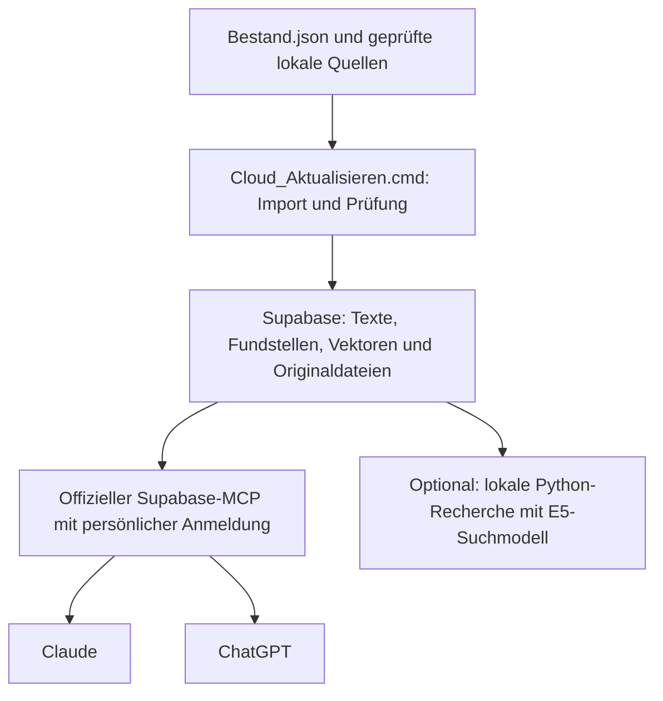

# Gemeinsame Wissensdatenbank für Claude und ChatGPT

Stand: 10.09.2026. Die gemeinsame Ablage ist Supabase/PostgreSQL im Projekt `steuerrecht-wissensdatenbank`. Für Fragen aus den persönlichen Chatkonten wurde der **offizielle Supabase-MCP** gewählt. Supabase stellt Endpunkt und Anmeldung bereit; die Nutzung benötigt keinen eigenen gehosteten Python-Dienst oder zusätzlich eingerichteten OAuth-Server.

Die konkrete Einrichtung steht in **[Chat_KI_starten.md](../Chat_KI_starten.md)**. Dort stehen die projektgebundene Adresse mit Lesezugriff, die Schritte für beide Chatprogramme und eine kopierbare Rechercheanweisung. Die Anmeldung in Claude und der Abruf der damals aktiven Pilotfassung wurden vom Nutzer bestätigt. ChatGPT wird separat mit derselben Datenbank verbunden.

## Umsetzungsstand

**Der vollständige Bestand ist in Supabase gespeichert und aktiviert.** Die aktive Fassung `r-2ba1572b7978ca909270331f` enthält **58 registrierte Dokumente, 14.099 Fundstellen und Dokumentteile, 23.261 Suchvektoren sowie 1.173 Dateieinträge** mit **280.675.147 Bytes**. Der Import wurde am **10.09.2026 um 00:11 Uhr (Berlin)** erfolgreich abgeschlossen. Alle Texte, Metadaten, Vektoren und Dateibytes sind zurückgelesen und verglichen; sämtliche Fundstellen wurden über **14.389 Textfenster** vollständig geprüft. Volltextsuche und **1.089 exakte Referenz- und Aliasprüfungen** decken alle 58 Dokumente ab.

Eine erfolgreiche MCP-Anmeldung bestätigt den Zugriff auf die Datenbank; der abgeschlossene Import und seine Leseprüfungen belegen den Umfang. Den freigegebenen Bestand zeigt `SELECT kb.release_info();`. Nachweise und Bedienung: [Recherche-Anleitung](../Werkzeuge/Recherche/README.md), [Cloud-Einrichtung](../Werkzeuge/Recherche/cloud/READMECloudSetup.md), [Vollimport-Abnahme](../Werkzeuge/Recherche/cloud/Vollimport_Pruefung.md) und [Importbericht mit COMMIT](../Werkzeuge/Recherche/cloud/Importpruefung_apply.json).

Die [gesonderte Leserprüfung nach COMMIT](../Werkzeuge/Recherche/cloud/Vollimport_Lesepruefung.json) bestätigt zusätzlich die neue Fassung über eine Leseranmeldung, vollständige Texte von EStG § 7 und AO § 146 samt Prüfsummen sowie einen passenden Volltextsuchtreffer. Der erneute Abruf innerhalb der Claude-Oberfläche bleibt davon getrennt.

## Vereinbarte Architektur

| Bestandteil | Tatsächliche Aufgabe |
| --- | --- |
| Lokaler Quellbestand | Registrierte Haupttexte, Quellenstände, Originale, Ergänzungen und Prüfbelege erhalten |
| PostgreSQL | Unveränderliche Fassungen, vollständige Texte, deutsche Volltextsuche, exakte Referenzen und Dateiinhalte speichern |
| pgvector und lokales E5-Modell | Semantische Suche für die vorhandene Python-Recherche; Embeddings beim lokalen Import berechnen |
| Offizieller Supabase-MCP | Projektgebundene lesende SQL-Abfragen aus den verbundenen Chatkonten ausführen |
| Claude oder ChatGPT | Sachverhalt verstehen, Suchbegriffe wählen, vollständige Quellen lesen und eine belegte Antwort formulieren |

Die direkte Verbindung arbeitet mit Volltextsuche und festen SQL-Lesefunktionen. Ohne einen vom lokalen Modell berechneten Suchvektor führt `kb.hybrid_search` keine semantische Suche aus. Das vorhandene Python-MCP bleibt optional verfügbar; sein Hosting gehört nicht zur gewählten persönlichen Anbindung.

## Bedeutung von „alle Daten“

Das Register umfasst **58 Hauptdokumente mit 52 PDF- und 6 TXT-Ursprüngen**. Die aufbereiteten Markdown-Haupttexte werden vollständig erschlossen, einschließlich Paragraphen, Artikeln, Richtlinienabschnitten, Randnummern und sonstigen Textteilen. Ergänzende Quellen behalten ihre eigene Kennzeichnung und Herkunft.

Alle Dateien der zugehörigen registrierten Standordner werden zusätzlich unverändert archiviert: Originale, Abbildungen, Quellenmaterial, Ergänzungen und Prüfbelege. Prüfberichte werden dadurch nicht als geltende Rechtsnorm ausgegeben. Programmcode, virtuelle Umgebung, Modelle und Cache sind keine Quellen und werden nicht als Teil dieser Sammlung hochgeladen.

Die Originaldateien liegen privat in PostgreSQL. Ein zusätzlicher Drive-Ordner oder Supabase-Storagebucket ist für diese Lösung nicht erforderlich. Lokale Originale, frühere Fassungen und Prüfsummen bleiben erhalten. Eine fachlich fehlende Quelle wird nicht durch den Import ersetzt.

## Ablauf einer Frage

1. Die KI fragt den aktiven Sammlungsstand mit `kb.release_info()` ab und verwendet dieselbe `release_id` für alle Folgeabrufe.
2. Sie klärt den maßgeblichen Zeitraum und fehlende Tatsachen. Mehrere kurze Suchanfragen, Fachbegriffe und Synonyme erschließen passende Fundstellen; bekannte Vorschriften werden exakt aufgelöst.
3. Relevante Treffer werden über `kb.read_item` vollständig gelesen. Lange Texte werden bis zum angegebenen Textende fortgesetzt. Ausnahmen, Fußnoten und notwendige Querverweise werden gezielt nachgeladen.
4. Die Antwort nennt Vorschrift, Dokument und dokumentierten Quellenstand. Ergänzungen und historische Quellen bleiben erkennbar. Offene Punkte werden als solche benannt.

Ein Suchauszug ersetzt keinen vollständigen Vorschriftentext. Das technische Importdatum oder der aktive Sammlungsstand beweist keine Geltung am Sachverhaltsdatum. Bilder sind zwar archiviert; eine SQL-Abfrage ihrer Metadaten belegt keine visuelle Auswertung. Die Projektanweisung beschreibt diese Regeln und die konkreten Abfragen.

## Aktualisierung und Verfügbarkeit

**[Cloud_Aktualisieren.cmd](../Cloud_Aktualisieren.cmd)** verarbeitet jetzt den gesamten registrierten Bestand. Geänderte Quellen werden zuvor lokal vollständig aufbereitet, geprüft und in `Bestand.json` registriert. Der Lauf berechnet nur fehlende Embeddings neu und erstellt ein vollständiges Exportpaket mit Prüfsummenmanifest.

Vor Aktivierung werden sämtliche gespeicherten Texte, Metadaten, Vektoren und Dateien mit dem Export verglichen. Die Originalbytes und alle Fundstellen werden zurückgelesen; Suche und exakte Referenzen werden für jedes Dokument geprüft. Erst nach erfolgreichem Abschluss wird die neue Fassung in derselben Transaktion aktiviert. Die vorherige bleibt während des Imports verfügbar und anschließend gezielt abrufbar.

Nach abgeschlossener Cloudveröffentlichung funktionieren Fragen aus verbundenen Chatkonten auch bei ausgeschaltetem PC. Neue lokale Änderungen erfordern einen erneuten Aktualisierungslauf auf diesem Rechner. Die lokalen Konsolenstarter bleiben als zusätzliche Recherchewerkzeuge verfügbar.

## Prüfung und verbleibende Abnahme

Die [lokale Vollbestandsprüfung](../Werkzeuge/Recherche/cloud/Vollimport_Exportvertrag.json) belegt Parser und Exportvertrag ohne Cloudschreibzugriff. Der [MCP-Berechtigungsnachweis](../Werkzeuge/Recherche/cloud/Supabase_MCP_Berechtigungen.json) dokumentiert Leserechte, abgewiesene Schreibzugriffe und die vom Nutzer bestätigte Claude-Anmeldung. Der [archivierte Cloudimport vom 09.09.2026](../Werkzeuge/Recherche/cloud/Importpruefung_Pilot_2026-09-09.json), die [historische Rechercheprüfung](../Werkzeuge/Recherche/Pruefung.md) sowie die [Python-MCP-](../Werkzeuge/Recherche/cloud/MCP_Cloudpruefung.json) und [HTTP-Prüfung](../Werkzeuge/Recherche/cloud/HTTP_Cloudpruefung.json) beziehen sich auf den bisherigen Pilotbestand.

Der Cloudimport ist abgeschlossen. Noch gesondert zu dokumentieren sind die Umfangsabfrage der neuen Fassung innerhalb des verbundenen Claude-Chats und die Verbindung in ChatGPT. Danach werden typische Fachfragen hinsichtlich passender Fundstellen, vollständiger Folgeabrufe und zutreffender Quellenstände geprüft. Eine bereits funktionierende Claude-Anmeldung muss für die neue Datenfassung nicht erneut eingerichtet werden. Der dokumentierte Quellenimport bleibt der 09.09.2026; aus dem Abschlussdatum wird kein neuer Rechtsstand abgeleitet.
