# Bewertungsgesetz (BewG)

## Dokumentation der Fassung

**Quellenabgleich: 2026-09-09.** Das Ordnerdatum bezeichnet den Quellenabgleich. Die vollständigen Stand- und Bearbeitungshinweise der Quelle stehen im Dokumentkopf.

Quelle: [Gesetze im Internet](https://www.gesetze-im-internet.de/bewg/BJNR010350934.html). Archivierte [PDF](Quellen/BewG.pdf) und [XML](Quellen/XML/BJNR010350934.xml). Die bereitgestellte PDF ist bytegleich mit der am Prüftag abgerufenen PDF.

Der folgende Volltext enthält alle mitgelieferten Gliederungsteile, Vorschriften, Anlagen, Fußnoten und Abbildungen. Wiederkehrende PDF-Servicezeilen, Seitennummern und wiederholte Tabellenköpfe entfallen. Navigation und generische Tabellenüberschriften sind redaktionelle Ergänzungen. Fußnotenmarker werden aus den Quellattributen übernommen und verlinkt; nur bei fehlender Kennzeichnung wird eine laufende Nummer vergeben. Der technische XML-Präfix „(XXXX)“ bei weggefallenen Vorschriften wird wie in der PDF ausgeblendet. Komplexe Tabellen bleiben als HTML-Tabellen im Markdown erhalten. [Prüfbericht](Pruefung/Pruefbericht.md).

## Navigation

- [Dokumentkopf](#dokumentkopf)
- [Inhaltsübersicht](#inhaltsübersicht-1)
- [§ 1 Geltungsbereich](#p-1-3)
- [§ 2 Wirtschaftliche Einheit](#p-2-4)
- [§ 3 Wertermittlung bei mehreren Beteiligten](#p-3-5)
- [§ 3a (weggefallen)](#p-3a-6)
- [§ 4 Aufschiebend bedingter Erwerb](#p-4-7)
- [§ 5 Auflösend bedingter Erwerb](#p-5-8)
- [§ 6 Aufschiebend bedingte Lasten](#p-6-9)
- [§ 7 Auflösend bedingte Lasten](#p-7-10)
- [§ 8 Befristung auf einen unbestimmten Zeitpunkt](#p-8-11)
- [§ 9 Bewertungsgrundsatz, gemeiner Wert](#p-9-12)
- [§ 10 Begriff des Teilwerts](#p-10-13)
- [§ 11 Wertpapiere und Anteile](#p-11-14)
- [§ 12 Kapitalforderungen und Schulden](#p-12-15)
- [§ 13 Kapitalwert von wiederkehrenden Nutzungen und Leistungen](#p-13-16)
- [§ 14 Lebenslängliche Nutzungen und Leistungen](#p-14-17)
- [§ 15 Jahreswert von Nutzungen und Leistungen](#p-15-18)
- [§ 16 Begrenzung des Jahreswerts von Nutzungen](#p-16-19)
- [§ 17 Geltungsbereich](#p-17-21)
- [§ 18 Vermögensarten](#p-18-22)
- [§ 19 (weggefallen)](#p-19-25)
- [§ 20 Abweichende Feststellung von Besteuerungsgrundlagen aus Billigkeitsgründen](#p-20-26)
- [§§ 21 bis 29 (weggefallen)](#xxxx-21-bis-29-27)
- [§ 30 Abrundung](#p-30-28)
- [§ 31 Bewertung von ausländischem Sachvermögen](#p-31-29)
- [§ 32 (weggefallen)](#p-32-30)
- [§§ 33 bis 48a (weggefallen)](#xxxx-33-bis-48a-33)
- [§ 49 (weggefallen)](#p-49-34)
- [§§ 50 bis 52 (weggefallen)](#xxxx-50-bis-52-37)
- [§§ 53 bis 55 (weggefallen)](#xxxx-53-bis-55-39)
- [§§ 56 bis 58 (weggefallen)](#xxxx-56-bis-58-41)
- [§§ 59 bis 61 (weggefallen)](#xxxx-59-bis-61-43)
- [§ 62 (weggefallen)](#p-62-45)
- [§§ 63 bis 67 (weggefallen)](#xxxx-63-bis-67-47)
- [§§ 68 und 69 (weggefallen)](#xxxx-68-und-69-50)
- [§ 70 Grundstück](#p-70-51)
- [§ 71 (weggefallen)](#p-71-52)
- [§§ 72 und 73 (weggefallen)](#xxxx-72-und-73-54)
- [§§ 74 bis 77 (weggefallen)](#xxxx-74-bis-77-57)
- [§§ 78 bis 82 (weggefallen)](#xxxx-78-bis-82-60)
- [§§ 83 bis 90 (weggefallen)](#xxxx-83-bis-90-62)
- [§§ 91 bis 94 (weggefallen)](#xxxx-91-bis-94-64)
- [§ 95 Begriff des Betriebsvermögens](#p-95-66)
- [§ 96 Freie Berufe](#p-96-67)
- [§ 97 Betriebsvermögen von Körperschaften, Personenvereinigungen und Vermögensmassen](#p-97-68)
- [§ 98 (weggefallen)](#p-98-69)
- [§ 98a (weggefallen)](#p-98a-70)
- [§ 99 Betriebsgrundstücke](#p-99-71)
- [§§ 100 bis 102 (weggefallen)](#xxxx-100-bis-102-72)
- [§ 103 Schulden und sonstige Abzüge](#p-103-73)
- [§ 104 (weggefallen)](#p-104-74)
- [§§ 105 bis 108 (weggefallen)](#xxxx-105-bis-108-75)
- [§ 109 Bewertung](#p-109-76)
- [§ 109a (weggefallen)](#p-109a-77)
- [§§ 110 bis 120 (weggefallen)](#xxxx-110-bis-120-79)
- [§ 121 Inlandsvermögen](#p-121-80)
- [§ 121a (weggefallen)](#p-121a-81)
- [§ 122 (weggefallen)](#p-122-82)
- [§ 123 Ermächtigungen](#p-123-83)
- [§ 124 (weggefallen)](#p-124-84)
- [§§ 125 bis 128 (weggefallen)](#xxxx-125-bis-128-87)
- [§§ 129 bis 133 (weggefallen)](#xxxx-129-bis-133-89)
- [§§ 134 bis 136 (weggefallen)](#xxxx-134-bis-136-91)
- [§ 137 (weggefallen)](#p-137-92)
- [§§ 138 und 139 (weggefallen)](#xxxx-138-und-139-95)
- [§§ 140 bis 144 (weggefallen)](#xxxx-140-bis-144-97)
- [§ 145 (weggefallen)](#p-145-100)
- [§§ 146 bis 150 (weggefallen)](#xxxx-146-bis-150-102)
- [§ 151 Gesonderte Feststellungen](#p-151-104)
- [§ 152 Örtliche Zuständigkeit](#p-152-105)
- [§ 153 Erklärungspflicht, Verfahrensvorschriften für die gesonderte Feststellung, Feststellungsfrist](#p-153-106)
- [§ 154 Beteiligte am Feststellungsverfahren](#p-154-107)
- [§ 155 Rechtsbehelfsbefugnis](#p-155-108)
- [§ 156 Außenprüfung](#p-156-109)
- [§ 157 Feststellung von Grundbesitzwerten, von Anteilswerten und von Betriebsvermögenswerten](#p-157-112)
- [§ 158 Begriff des land- und forstwirtschaftlichen Vermögens](#p-158-115)
- [§ 159 Abgrenzung land- und forstwirtschaftlich genutzter Flächen zum Grundvermögen](#p-159-116)
- [§ 160 Betrieb der Land- und Forstwirtschaft](#p-160-117)
- [§ 161 Bewertungsstichtag](#p-161-118)
- [§ 162 Bewertung des Wirtschaftsteils](#p-162-119)
- [§ 163 Ermittlung der Wirtschaftswerte](#p-163-120)
- [§ 164 Mindestwert](#p-164-121)
- [§ 165 Bewertung des Wirtschaftsteils mit dem Fortführungswert](#p-165-122)
- [§ 166 Bewertung des Wirtschaftsteils mit dem Liquidationswert](#p-166-123)
- [§ 167 Bewertung der Betriebswohnungen und des Wohnteils](#p-167-124)
- [§ 168 Grundbesitzwert des Betriebs der Land- und Forstwirtschaft](#p-168-125)
- [§ 169 Tierbestände](#p-169-128)
- [§ 170 Umlaufende Betriebsmittel](#p-170-129)
- [§ 171 Umlaufende Betriebsmittel](#p-171-131)
- [§ 172 Abweichender Bewertungsstichtag](#p-172-132)
- [§ 173 Umlaufende Betriebsmittel](#p-173-134)
- [§ 174 Abweichende Bewertungsverhältnisse](#p-174-136)
- [§ 175 Übrige land- und forstwirtschaftliche Nutzungen](#p-175-138)
- [§ 176 Grundvermögen](#p-176-141)
- [§ 177 Bewertung](#p-177-142)
- [§ 178 Begriff der unbebauten Grundstücke](#p-178-144)
- [§ 179 Bewertung der unbebauten Grundstücke](#p-179-145)
- [§ 180 Begriff der bebauten Grundstücke](#p-180-147)
- [§ 181 Grundstücksarten](#p-181-148)
- [§ 182 Bewertung der bebauten Grundstücke](#p-182-149)
- [§ 183 Bewertung im Vergleichswertverfahren](#p-183-150)
- [§ 184 Bewertung im Ertragswertverfahren](#p-184-151)
- [§ 185 Ermittlung des Gebäudeertragswerts](#p-185-152)
- [§ 186 Rohertrag des Grundstücks](#p-186-153)
- [§ 187 Bewirtschaftungskosten](#p-187-154)
- [§ 188 Liegenschaftszinssatz](#p-188-155)
- [§ 189 Bewertung im Sachwertverfahren](#p-189-156)
- [§ 190 Ermittlung des Gebäudesachwerts](#p-190-157)
- [§ 191 Wertzahlen](#p-191-158)
- [§ 192 Bewertung in Erbbaurechtsfällen](#p-192-160)
- [§ 193 Bewertung des Erbbaurechts](#p-193-161)
- [§ 194 Bewertung des Erbbaugrundstücks](#p-194-162)
- [§ 195 Gebäude auf fremdem Grund und Boden](#p-195-163)
- [§ 196 Grundstücke im Zustand der Bebauung](#p-196-164)
- [§ 197 Gebäude und Gebäudeteile für den Zivilschutz](#p-197-165)
- [§ 198 Nachweis des niedrigeren gemeinen Werts](#p-198-167)
- [§ 199 Anwendung des vereinfachten Ertragswertverfahrens](#p-199-169)
- [§ 200 Vereinfachtes Ertragswertverfahren](#p-200-170)
- [§ 201 Ermittlung des Jahresertrags](#p-201-171)
- [§ 202 Betriebsergebnis](#p-202-172)
- [§ 203 Kapitalisierungsfaktor](#p-203-173)
- [§ 218 Vermögensarten](#p-218-176)
- [§ 219 Feststellung von Grundsteuerwerten](#p-219-177)
- [§ 220 Ermittlung der Grundsteuerwerte](#p-220-178)
- [§ 221 Hauptfeststellung](#p-221-179)
- [§ 222 Fortschreibungen](#p-222-180)
- [§ 223 Nachfeststellung](#p-223-181)
- [§ 224 Aufhebung des Grundsteuerwerts](#p-224-182)
- [§ 225 Änderung von Feststellungsbescheiden](#p-225-183)
- [§ 226 Nachholung einer Feststellung](#p-226-184)
- [§ 227 Wertverhältnisse bei Fortschreibungen und Nachfeststellungen](#p-227-185)
- [§ 228 Erklärungs- und Anzeigepflicht](#p-228-186)
- [§ 229 Auskünfte, Erhebungen und Mitteilungen](#p-229-187)
- [§ 230 Abrundung](#p-230-188)
- [§ 231 Abgrenzung von in- und ausländischem Vermögen](#p-231-189)
- [§ 232 Begriff des land- und forstwirtschaftlichen Vermögens](#p-232-192)
- [§ 233 Abgrenzung des land- und forstwirtschaftlichen Vermögens vom Grundvermögen in Sonderfällen](#p-233-193)
- [§ 234 Betrieb der Land- und Forstwirtschaft](#p-234-194)
- [§ 235 Feststellungszeitpunkt](#p-235-195)
- [§ 236 Bewertungsgrundsätze](#p-236-196)
- [§ 237 Bewertung des Betriebs der Land- und Forstwirtschaft](#p-237-197)
- [§ 238 Zuschläge zum Reinertrag](#p-238-198)
- [§ 239 Grundsteuerwert des Betriebs der Land- und Forstwirtschaft](#p-239-199)
- [§ 240 Kleingartenland und Dauerkleingartenland](#p-240-200)
- [§ 241 Tierbestände](#p-241-203)
- [§ 242 Übrige land- und forstwirtschaftliche Nutzungen](#p-242-205)
- [§ 243 Begriff des Grundvermögens](#p-243-208)
- [§ 244 Grundstück](#p-244-209)
- [§ 245 Gebäude, Gebäudeteile und Anlagen für den Zivilschutz](#p-245-210)
- [§ 246 Begriff der unbebauten Grundstücke](#p-246-212)
- [§ 247 Bewertung der unbebauten Grundstücke](#p-247-213)
- [§ 248 Begriff der bebauten Grundstücke](#p-248-215)
- [§ 249 Grundstücksarten](#p-249-216)
- [§ 250 Bewertung der bebauten Grundstücke](#p-250-217)
- [§ 251 Mindestwert](#p-251-218)
- [§ 252 Bewertung im Ertragswertverfahren](#p-252-219)
- [§ 253 Ermittlung des kapitalisierten Reinertrags](#p-253-220)
- [§ 254 Rohertrag des Grundstücks](#p-254-221)
- [§ 255 Bewirtschaftungskosten](#p-255-222)
- [§ 256 Liegenschaftszinssätze](#p-256-223)
- [§ 257 Ermittlung des abgezinsten Bodenwerts](#p-257-224)
- [§ 258 Bewertung im Sachwertverfahren](#p-258-225)
- [§ 259 Ermittlung des Gebäudesachwerts](#p-259-226)
- [§ 260 Wertzahlen](#p-260-227)
- [§ 261 Erbbaurecht](#p-261-229)
- [§ 262 Gebäude auf fremdem Grund und Boden](#p-262-230)
- [§ 263 Ermächtigungen](#p-263-232)
- [§ 264 Bekanntmachung](#p-264-234)
- [§ 265 Anwendungsvorschriften](#p-265-235)
- [§ 266 Erstmalige Anwendung des Siebenten Abschnitts des Zweiten Teils](#p-266-236)
- [Anlage 1 bis 8 (weggefallen)](#anlage-1-bis-8-237)
- [Anlage 9 (weggefallen)](#anlage-9-238)
- [Anlage 9a (zu § 13)Kapitalwert einer wiederkehrenden, zeitlich beschränkten Nutzung oder Leistung im Jahresbetrag von einem Euro](#anlage-9a-239)
- [Anlagen 10 bis 13 (weggefallen)](#xxxx-anlagen-10-bis-13-240)
- [Anlage 14 (zu § 163 Abs. 3, § 164 Abs. 2 und 4)Landwirtschaftliche Nutzung](#anlage-14-241)
- [Anlage 15 (zu § 163 Abs. 4 und § 164 Abs. 2)Forstwirtschaftliche Nutzung](#anlage-15-242)
- [Anlage 15a (zu § 164 Abs. 4)Forstwirtschaftliche Nutzung](#anlage-15a-243)
- [Anlage 16 (zu § 163 Abs. 5 und § 164 Abs. 2 und 4)Weinbauliche Nutzung](#anlage-16-244)
- [Anlage 17 (zu § 163 Abs. 6 und § 164 Abs. 2 und 4)Gärtnerische Nutzung](#anlage-17-245)
- [Anlage 18 (zu § 163 Abs. 7 und § 164 Abs. 2 und 4)Sondernutzungen](#anlage-18-246)
- [Anlage 19 (zu § 169)Umrechnungsschlüssel für Tierbestände in Vieheinheiten nach dem Futterbedarf](#anlage-19-247)
- [Anlage 20 (zu § 169 Abs. 5)Gruppen der Zweige des Tierbestands nach der Flächenabhängigkeit](#anlage-20-248)
- [Anlage 21 (zu § 185 Absatz 3 Satz 1, § 193 Absatz 4 Satz 1, § 194 Absatz 5 Satz 1 und § 195 Absatz 3 Satz 1 und Absatz 7 Satz 1)Vervielfältiger](#anlage-21-249)
- [Anlage 22 (zu § 185 Absatz 3 Satz 3, § 190 Absatz 6 Satz 1 und 2) Gesamtnutzungsdauer](#anlage-22-250)
- [Anlage 23 (zu § 187 Absatz 2 und 3)Bewirtschaftungskosten](#anlage-23-251)
- [Anlage 24 (zu § 190 Absatz 1 Satz 3 und Absatz 2 und Anlage 23)Regelherstellungskosten](#anlage-24-252)
- [Anlage 25 (zu § 191 Satz 2)](#anlage-25-253)
- [Anlage 26 (zu § 193 Absatz 5 Satz 3, § 194 Absatz 4 Satz 1 sowie § 195 Absatz 4 Satz 3 und Absatz 6 Satz 1)Abzinsungsfaktoren](#anlage-26-254)
- [Anlage 27 (zu § 237 Absatz 2) Landwirtschaftliche Nutzung](#anlage-27-255)
- [Anlage 28 (zu § 237 Absatz 3) Forstwirtschaftliche Nutzung](#anlage-28-256)
- [Anlage 29 (zu § 237 Absatz 4) Weinbauliche Nutzung](#anlage-29-257)
- [Anlage 30 (zu § 237 Absatz 5) Gärtnerische Nutzung](#anlage-30-258)
- [Anlage 31 (zu § 237 Absatz 6 und 7) Übrige land- und forstwirtschaftliche Nutzungen sowie Abbauland, Geringstland und Unland](#anlage-31-259)
- [Anlage 32 (zu § 237 Absatz 8) Nutzungsart Hofstelle](#anlage-32-260)
- [Anlage 33 (zu § 238 Absatz 2) Weitere den Ertragswert erhöhende Umstände](#anlage-33-261)
- [Anlage 34 (zu § 241 Absatz 5) Umrechnungsschlüssel für Tierbestände in Vieheinheiten (VE) nach dem Futterbedarf](#anlage-34-262)
- [Anlage 35 (zu § 241 Absatz 5) Gruppen der Zweige des Tierbestands nach der Flächenabhängigkeit](#anlage-35-263)
- [Anlage 36 (zu den §§ 251 und 257 Absatz 1) Umrechnungskoeffizienten zur Berücksichtigung abweichender Grundstücksgrößen beim Bodenwert von Ein- und Zweifamilienhäusern](#anlage-36-264)
- [Anlage 37 (zu § 253 Absatz 2) Vervielfältiger](#anlage-37-265)
- [Anlage 38 (zu § 253 Absatz 2 und § 259 Absatz 4) Wirtschaftliche Gesamtnutzungsdauer](#anlage-38-266)
- [Anlage 39 (zu § 254) Ermittlung des Rohertrags](#anlage-39-267)
- [Anlage 40 (zu § 255) Bewirtschaftungskosten](#anlage-40-268)
- [Anlage 41 (zu § 257 Absatz 2) Abzinsungsfaktoren](#anlage-41-269)
- [Anlage 42 (zu § 259 Absatz 1) Normalherstellungskosten](#anlage-42-270)
- [Anlage 43 (zu § 260) Wertzahlen für Teileigentum, Geschäftsgrundstücke, gemischt genutzte Grundstücke und sonstige bebaute Grundstücke nach § 249 Absatz 1 Nummer 5 bis 8](#anlage-43-271)

<a id="dokumentkopf"></a>

## Dokumentkopf

BewG

Ausfertigungsdatum: 1934-10-16

**Vollzitat:**

"Bewertungsgesetz in der Fassung der Bekanntmachung vom 1. Februar 1991 (BGBl. I S. 230), das zuletzt durch Artikel 19 des Gesetzes vom 22. Juni 2026 (BGBl. 2026 I Nr. 192) geändert worden ist"

**Stand und Bearbeitungshinweise:**

Neugefasst durch Bek. v. 1.2.1991 I 230; zuletzt geändert durch Art. 19 G v. 22.6.2026 I Nr. 192

**Fußnote**

```text
(+++ Textnachweis Geltung ab: 1.7.1981 +++)
(+++ Zur Anwendung vgl. § 265 +++)
(+++ Zur Anwendung vgl. Art. 2 G v. 13. 8.1965 I  851 +++)
(+++ Zur Anwendung vgl. Art. 3 G v. 24.12.2008 I 3018 +++)
(+++ Zur Anwendung d. § 126 vgl. § 48 GNotKG +++)
```

<a id="inhaltsübersicht-1"></a>

## Inhaltsübersicht

**Erster Teil**

Allgemeine Bewertungsvorschriften

| Spalte 1 | Spalte 2 |
| --- | --- |
| [§ 1](#p-1-3) | Geltungsbereich |
| [§ 2](#p-2-4) | Wirtschaftliche Einheit |
| [§ 3](#p-3-5) | Wertermittlung bei mehreren Beteiligten |
| [§ 3a](#p-3a-6) | (weggefallen) |
| [§ 4](#p-4-7) | Aufschiebend bedingter Erwerb |
| [§ 5](#p-5-8) | Auflösend bedingter Erwerb |
| [§ 6](#p-6-9) | Aufschiebend bedingte Lasten |
| [§ 7](#p-7-10) | Auflösend bedingte Lasten |
| [§ 8](#p-8-11) | Befristung auf einen unbestimmten Zeitpunkt |
| [§ 9](#p-9-12) | Bewertungsgrundsatz, gemeiner Wert |
| [§ 10](#p-10-13) | Begriff des Teilwerts |
| [§ 11](#p-11-14) | Wertpapiere und Anteile |
| [§ 12](#p-12-15) | Kapitalforderungen und Schulden |
| [§ 13](#p-13-16) | Kapitalwert von wiederkehrenden Nutzungen und Leistungen |
| [§ 14](#p-14-17) | Lebenslängliche Nutzungen und Leistungen |
| [§ 15](#p-15-18) | Jahreswert von Nutzungen und Leistungen |
| [§ 16](#p-16-19) | Begrenzung des Jahreswerts von Nutzungen |

  
  
Zweiter Teil**Besondere Bewertungsvorschriften**


| Spalte 1 | Spalte 2 |
| --- | --- |
| [§ 17](#p-17-21) | Geltungsbereich |
| [§ 18](#p-18-22) | Vermögensarten |

  
  
Erster Abschnitt**Einheitsbewertung**

  
  
A. Allgemeines

| Spalte 1 | Spalte 2 |
| --- | --- |
| [§ 19](#p-19-25) | (weggefallen) |
| [§ 20](#p-20-26) | Abweichende Feststellung von Besteuerungsgrundlagen aus Billigkeitsgründen |
| §§ 21 bis 29 | (weggefallen) |
| [§ 30](#p-30-28) | Abrundung |
| [§ 31](#p-31-29) | Bewertung von ausländischem Sachvermögen |
| [§ 32](#p-32-30) | (weggefallen) |

  
  
B. Land- und forstwirtschaftliches Vermögen**I. Allgemeines**


| Spalte 1 | Spalte 2 |
| --- | --- |
| §§ 33 bis 49 | (weggefallen) |

**II. Besondere Vorschriften**

  
  
a) Landwirtschaftliche Nutzung

| Spalte 1 | Spalte 2 |
| --- | --- |
| §§ 50 bis 52 | (weggefallen) |

  
  
b) Forstwirtschaftliche Nutzung

| Spalte 1 | Spalte 2 |
| --- | --- |
| §§ 53 bis 55 | (weggefallen) |

  
  
c) Weinbauliche Nutzung

| Spalte 1 | Spalte 2 |
| --- | --- |
| §§ 56 bis 58 | (weggefallen) |

  
  
d) Gärtnerische Nutzung

| Spalte 1 | Spalte 2 |
| --- | --- |
| §§ 59 bis 61 | (weggefallen) |

  
  
e) Sonstige land- und forstwirtschaftliche Nutzung

| Spalte 1 | Spalte 2 |
| --- | --- |
| [§ 62](#p-62-45) | (weggefallen) |

**III. Bewertungsbeirat, Gutachterausschuß**


| Spalte 1 | Spalte 2 |
| --- | --- |
| §§ 63 bis 67 | (weggefallen) |

  
  
C. Grundvermögen**I. Allgemeines**


| Spalte 1 | Spalte 2 |
| --- | --- |
| §§ 68 und 69 | (weggefallen) |
| [§ 70](#p-70-51) | Grundstück |
| [§ 71](#p-71-52) | (weggefallen) |
|  |  |

**II. Unbebaute Grundstücke**


| Spalte 1 | Spalte 2 |
| --- | --- |
| §§ 72 und 73 | (weggefallen) |

**III. Bebaute Grundstücke**

  
  
a) Begriff und Bewertung

| Spalte 1 | Spalte 2 |
| --- | --- |
| §§ 74 bis 77 | (weggefallen) |

  
  
b) Verfahren**1\. Ertragswertverfahren**


| Spalte 1 | Spalte 2 |
| --- | --- |
| §§ 78 bis 82 | (weggefallen) |

**2\. Sachwertverfahren**


| Spalte 1 | Spalte 2 |
| --- | --- |
| §§ 83 bis 90 | (weggefallen) |

**IV. Sondervorschriften**


| Spalte 1 | Spalte 2 |
| --- | --- |
| §§ 91 bis 94 | (weggefallen) |

**D. Betriebsvermögen**


| Spalte 1 | Spalte 2 |
| --- | --- |
| [§ 95](#p-95-66) | Begriff des Betriebsvermögens |
| [§ 96](#p-96-67) | Freie Berufe |
| [§ 97](#p-97-68) | Betriebsvermögen von Körperschaften, Personenvereinigungen und Vermögensmassen |
| [§ 98](#p-98-69) | (weggefallen) |
| [§ 98a](#p-98a-70) | (weggefallen) |
| [§ 99](#p-99-71) | Betriebsgrundstücke |
| §§ 100 - 102 | (weggefallen) |
| [§ 103](#p-103-73) | Schulden und sonstige Abzüge |
| [§ 104](#p-104-74) | (weggefallen) |
| §§ 105 - 108 | (weggefallen) |
| [§ 109](#p-109-76) | Bewertung |
| [§ 109a](#p-109a-77) | (weggefallen) |

  
  
Zweiter Abschnitt**Sondervorschriften und Ermächtigungen**


| Spalte 1 | Spalte 2 |
| --- | --- |
| §§ 110 - 120 | (weggefallen) |
| [§ 121](#p-121-80) | Inlandsvermögen |
| [§ 121a](#p-121a-81) | (weggefallen) |
| § 121b | (weggefallen) |
| [§ 122](#p-122-82) | (weggefallen) |
| [§ 123](#p-123-83) | Ermächtigungen |
| [§ 124](#p-124-84) | (weggefallen) |

  
  
Dritter Abschnitt**Vorschriften für die Bewertung von Vermögen in dem in Artikel 3 des Einigungsvertrages genannten Gebiet**

  
  
A. Land- und forstwirtschaftliches Vermögen

| Spalte 1 | Spalte 2 |
| --- | --- |
| §§ 125 bis 128 | (weggefallen) |

  
  
B. Grundvermögen

| Spalte 1 | Spalte 2 |
| --- | --- |
| §§ 129 bis 133 | (weggefallen) |

  
  
C. Betriebsvermögen

| Spalte 1 | Spalte 2 |
| --- | --- |
| §§ 134 bis 137 | (weggefallen) |

  
  
Vierter Abschnitt**Vorschriften für die Bewertung von Grundbesitz für die Grunderwerbsteuer ab 1. Januar 1997**

  
  
A. Allgemeines

| Spalte 1 | Spalte 2 |
| --- | --- |
| §§ 138 und 139 | (weggefallen) |

  
  
B. Land- und forstwirtschaftliches Vermögen

| Spalte 1 | Spalte 2 |
| --- | --- |
| §§ 140 bis 144 | (weggefallen) |

  
  
C. Grundvermögen**I. Unbebaute Grundstücke**


| Spalte 1 | Spalte 2 |
| --- | --- |
| [§ 145](#p-145-100) | (weggefallen) |

**II. Bebaute Grundstücke**


| Spalte 1 | Spalte 2 |
| --- | --- |
| §§ 146 bis 150 | (weggefallen) |

  
  
Fünfter Abschnitt**Gesonderte Feststellungen**


| Spalte 1 | Spalte 2 |
| --- | --- |
| [§ 151](#p-151-104) | Gesonderte Feststellungen |
| [§ 152](#p-152-105) | Örtliche Zuständigkeit |
| [§ 153](#p-153-106) | Erklärungspflicht, Verfahrensvorschriften für die gesonderte Feststellung, Feststellungsfrist |
| [§ 154](#p-154-107) | Beteiligte am Feststellungsverfahren |
| [§ 155](#p-155-108) | Rechtsbehelfsbefugnis |
| [§ 156](#p-156-109) | Außenprüfung |

  
  
Sechster Abschnitt**Vorschriften für die Bewertung von Grundbesitz, von nicht notierten Anteilen an Kapitalgesellschaften und von Betriebsvermögen für die Erbschaftsteuer ab 1. Januar 2009**

  
  
A. Allgemeines

| Spalte 1 | Spalte 2 |
| --- | --- |
| [§ 157](#p-157-112) | Feststellung von Grundbesitzwerten, von Anteilswerten und von Betriebsvermögenswerten |

  
  
B. Land- und forstwirtschaftliches Vermögen**I. Allgemeines**


| Spalte 1 | Spalte 2 |
| --- | --- |
| [§ 158](#p-158-115) | Begriff des land- und forstwirtschaftlichen Vermögens |
| [§ 159](#p-159-116) | Abgrenzung land- und forstwirtschaftlich genutzter Flächen zum Grundvermögen |
| [§ 160](#p-160-117) | Betrieb der Land- und Forstwirtschaft |
| [§ 161](#p-161-118) | Bewertungsstichtag |
| [§ 162](#p-162-119) | Bewertung des Wirtschaftsteils |
| [§ 163](#p-163-120) | Ermittlung der Wirtschaftswerte |
| [§ 164](#p-164-121) | Mindestwert |
| [§ 165](#p-165-122) | Bewertung des Wirtschaftsteils mit dem Fortführungswert |
| [§ 166](#p-166-123) | Bewertung des Wirtschaftsteils mit dem Liquidationswert |
| [§ 167](#p-167-124) | Bewertung der Betriebswohnungen und des Wohnteils |
| [§ 168](#p-168-125) | Grundbesitzwert des Betriebs der Land- und Forstwirtschaft |

  
  
II. Besonderer Teil**a) Landwirtschaftliche Nutzung**


| Spalte 1 | Spalte 2 |
| --- | --- |
| [§ 169](#p-169-128) | Tierbestände |
| [§ 170](#p-170-129) | Umlaufende Betriebsmittel |

**b) Forstwirtschaftliche Nutzung**


| Spalte 1 | Spalte 2 |
| --- | --- |
| [§ 171](#p-171-131) | Umlaufende Betriebsmittel |
| [§ 172](#p-172-132) | Abweichender Bewertungsstichtag |

**c) Weinbauliche Nutzung**


| Spalte 1 | Spalte 2 |
| --- | --- |
| [§ 173](#p-173-134) | Umlaufende Betriebsmittel |

**d) Gärtnerische Nutzung**


| Spalte 1 | Spalte 2 |
| --- | --- |
| [§ 174](#p-174-136) | Abweichende Bewertungsverhältnisse |

**e) Übrige land- und  forstwirtschaftliche Nutzungen**


| Spalte 1 | Spalte 2 |
| --- | --- |
| [§ 175](#p-175-138) | Übrige land- und forstwirtschaftliche Nutzungen |

  
  
C. Grundvermögen**I. Allgemeines**


| Spalte 1 | Spalte 2 |
| --- | --- |
| [§ 176](#p-176-141) | Grundvermögen |
| [§ 177](#p-177-142) | Bewertung |

  
  
II. Unbebaute Grundstücke

| Spalte 1 | Spalte 2 |
| --- | --- |
| [§ 178](#p-178-144) | Begriff der unbebauten Grundstücke |
| [§ 179](#p-179-145) | Bewertung der unbebauten Grundstücke |

  
  
III. Bebaute Grundstücke

| Spalte 1 | Spalte 2 |
| --- | --- |
| [§ 180](#p-180-147) | Begriff der bebauten Grundstücke |
| [§ 181](#p-181-148) | Grundstücksarten |
| [§ 182](#p-182-149) | Bewertung der bebauten Grundstücke |
| [§ 183](#p-183-150) | Bewertung im Vergleichswertverfahren |
| [§ 184](#p-184-151) | Bewertung im Ertragswertverfahren |
| [§ 185](#p-185-152) | Ermittlung des Gebäudeertragswerts |
| [§ 186](#p-186-153) | Rohertrag des Grundstücks |
| [§ 187](#p-187-154) | Bewirtschaftungskosten |
| [§ 188](#p-188-155) | Liegenschaftszinssatz |
| [§ 189](#p-189-156) | Bewertung im Sachwertverfahren |
| [§ 190](#p-190-157) | Ermittlung des Gebäudesachwerts |
| [§ 191](#p-191-158) | Wertzahlen |

  
  
IV. Sonderfälle

| Spalte 1 | Spalte 2 |
| --- | --- |
| [§ 192](#p-192-160) | Bewertung in Erbbaurechtsfällen |
| [§ 193](#p-193-161) | Bewertung des Erbbaurechts |
| [§ 194](#p-194-162) | Bewertung des Erbbaugrundstücks |
| [§ 195](#p-195-163) | Gebäude auf fremdem Grund und Boden |
| [§ 196](#p-196-164) | Grundstücke im Zustand der Bebauung |
| [§ 197](#p-197-165) | Gebäude und Gebäudeteile für den Zivilschutz |

  
  
V. Nachweis des niedrigeren gemeinen Werts

| Spalte 1 | Spalte 2 |
| --- | --- |
| [§ 198](#p-198-167) | Nachweis des niedrigeren gemeinen Werts |

  
  
D. Nicht notierte Anteile an Kapital-  
 gesellschaften und Betriebsvermögen

| Spalte 1 | Spalte 2 |
| --- | --- |
| [§ 199](#p-199-169) | Anwendung des vereinfachten Ertragswertverfahrens |
| [§ 200](#p-200-170) | Vereinfachtes Ertragswertverfahren |
| [§ 201](#p-201-171) | Ermittlung des Jahresertrags |
| [§ 202](#p-202-172) | Betriebsergebnis |
| [§ 203](#p-203-173) | Kapitalisierungsfaktor |
| §§ 204 bis 217 | (unbesetzt) |

****Siebenter Abschnitt****

****Bewertung des Grundbesitzes  für die Grundsteuer ab 1. Januar 2022****

****A. Allgemeines****


| Spalte 1 | Spalte 2 |
| --- | --- |
| [§ 218](#p-218-176) | Vermögensarten |
| [§ 219](#p-219-177) | Feststellung von Grundsteuerwerten |
| [§ 220](#p-220-178) | Ermittlung der Grundsteuerwerte |
| [§ 221](#p-221-179) | Hauptfeststellung |
| [§ 222](#p-222-180) | Fortschreibungen |
| [§ 223](#p-223-181) | Nachfeststellung |
| [§ 224](#p-224-182) | Aufhebung des Grundsteuerwerts |
| [§ 225](#p-225-183) | Änderung von Feststellungsbescheiden |
| [§ 226](#p-226-184) | Nachholung einer Feststellung |
| [§ 227](#p-227-185) | Wertverhältnisse bei Fortschreibungen und Nachfeststellungen |
| [§ 228](#p-228-186) | Erklärungs- und Anzeigepflicht |
| [§ 229](#p-229-187) | Auskünfte, Erhebungen und Mitteilungen |
| [§ 230](#p-230-188) | Abrundung |
| [§ 231](#p-231-189) | Abgrenzung von in- und ausländischem Vermögen |

****B. Land- und  forstwirtschaftliches Vermögen****

****I. Allgemeines****


| Spalte 1 | Spalte 2 |
| --- | --- |
| [§ 232](#p-232-192) | Begriff des land- und forstwirtschaftlichen Vermögens |
| [§ 233](#p-233-193) | Abgrenzung des land- und forstwirtschaftlichen Vermögens vom Grundvermögen in Sonderfällen |
| [§ 234](#p-234-194) | Betrieb der Land- und Forstwirtschaft |
| [§ 235](#p-235-195) | Feststellungszeitpunkt |
| [§ 236](#p-236-196) | Bewertungsgrundsätze |
| [§ 237](#p-237-197) | Bewertung des Betriebs der Land- und Forstwirtschaft |
| [§ 238](#p-238-198) | Zuschläge zum Reinertrag |
| [§ 239](#p-239-199) | Grundsteuerwert des Betriebs der Land- und Forstwirtschaft |
| [§ 240](#p-240-200) | Kleingartenland und Dauerkleingartenland |

****II. Besondere Vorschriften****

**a) Landwirtschaftliche Nutzung**


| Spalte 1 | Spalte 2 |
| --- | --- |
| [§ 241](#p-241-203) | Tierbestände |

**b) Übrige land- und  forstwirtschaftliche Nutzungen**


| Spalte 1 | Spalte 2 |
| --- | --- |
| [§ 242](#p-242-205) | Übrige land- und forstwirtschaftliche Nutzungen |

****C. Grundvermögen****

****I. Allgemeines****


| Spalte 1 | Spalte 2 |
| --- | --- |
| [§ 243](#p-243-208) | Begriff des Grundvermögens |
| [§ 244](#p-244-209) | Grundstück |
| [§ 245](#p-245-210) | Gebäude, Gebäudeteile und Anlagen für den Zivilschutz |

****II. Unbebaute Grundstücke****


| Spalte 1 | Spalte 2 |
| --- | --- |
| [§ 246](#p-246-212) | Begriff der unbebauten Grundstücke |
| [§ 247](#p-247-213) | Bewertung der unbebauten Grundstücke |

****III. Bebaute Grundstücke****


| Spalte 1 | Spalte 2 |
| --- | --- |
| [§ 248](#p-248-215) | Begriff der bebauten Grundstücke |
| [§ 249](#p-249-216) | Grundstücksarten |
| [§ 250](#p-250-217) | Bewertung der bebauten Grundstücke |
| [§ 251](#p-251-218) | Mindestwert |
| [§ 252](#p-252-219) | Bewertung im Ertragswertverfahren |
| [§ 253](#p-253-220) | Ermittlung des kapitalisierten Reinertrags |
| [§ 254](#p-254-221) | Rohertrag des Grundstücks |
| [§ 255](#p-255-222) | Bewirtschaftungskosten |
| [§ 256](#p-256-223) | Liegenschaftszinssätze |
| [§ 257](#p-257-224) | Ermittlung des abgezinsten Bodenwerts |
| [§ 258](#p-258-225) | Bewertung im Sachwertverfahren |
| [§ 259](#p-259-226) | Ermittlung des Gebäudesachwerts |
| [§ 260](#p-260-227) | Wertzahlen |

****IV. Sonderfälle****


| Spalte 1 | Spalte 2 |
| --- | --- |
| [§ 261](#p-261-229) | Erbbaurecht |
| [§ 262](#p-262-230) | Gebäude auf fremdem Grund und Boden |

****V. Ermächtigungen****


| Spalte 1 | Spalte 2 |
| --- | --- |
| [§ 263](#p-263-232) | Ermächtigungen |

  
  
Dritter Teil**Schlussbestimmungen**


| Spalte 1 | Spalte 2 |
| --- | --- |
| [§ 264](#p-264-234) | Bekanntmachung |
| [§ 265](#p-265-235) | Anwendungsvorschriften |
| [§ 266](#p-266-236) | Erstmalige Anwendung des Siebenten Abschnitts des Zweiten Teils |

  
  
Anlagen

| Spalte 1 | Spalte 2 |
| --- | --- |
| Anlagen 1 bis 8 | (weggefallen) |
| [Anlage 9](#anlage-9-238) | (weggefallen) |
| [Anlage 9a](#anlage-9a-239) | Kapitalwert einer wiederkehrenden, zeitlich beschränkten Nutzung oder Leistung im Jahresbetrag von einer Deutschen Mark |
| Anlagen 10 bis 13 | (weggefallen) |
| [Anlage 14](#anlage-14-241) | Landwirtschaftliche Nutzung |
| [Anlage 15](#anlage-15-242) | Forstwirtschaftliche Nutzung |
| [Anlage 15a](#anlage-15a-243) | Forstwirtschaftliche Nutzung |
| [Anlage 16](#anlage-16-244) | Weinbauliche Nutzung |
| [Anlage 17](#anlage-17-245) | Gärtnerische Nutzung |
| [Anlage 18](#anlage-18-246) | Sondernutzungen |
| [Anlage 19](#anlage-19-247) | Umrechnungsschlüssel für Tierbestände in Vieheinheiten (VE) nach dem Futterbedarf |
| [Anlage 20](#anlage-20-248) | Gruppen der Zweige des Tierbestands nach der Flächenabhängigkeit |
| Anlage 21<br> (zu § 185 Absatz 3 Satz 1, § 193 Absatz 4 Satz 1, § 194 Absatz 5 Satz 1 und § 195 Absatz 3 Satz 1 und Absatz 7 Satz 1) | Vervielfältiger |
| Anlage 22<br> (zu § 185 Absatz 3 Satz 3, § 190 Absatz 6 Satz 1 und 2) | Gesamtnutzungsdauer |
| Anlage 23<br> (zu § 187 Absatz 2 und 3) | Bewirtschaftungskosten |
| Anlage 24<br> (zu § 190 Absatz 1 Satz 3 und Absatz 2 und Anlage 23) | Regelherstellungskosten |
| Anlage 25<br> (zu § 191 Satz 2) | Wertzahlen für Ein- und Zweifamilienhäuser nach § 181 Absatz 1 Nummer 1 und Wohnungseigentum nach § 181 Absatz 1 Nummer 3 sowie Wertzahlen für Teileigentum, Geschäftsgrundstücke, gemischt genutzte Grundstücke und sonstige bebaute Grundstücke nach § 181 Absatz 1 Nummer 3 bis 6 |
| Anlage 26<br> (zu § 193 Absatz 5 Satz 3,<br> § 194 Absatz 4 Satz 1 sowie<br> § 195 Absatz 4 Satz 3 und<br> Absatz 6 Satz 1) | Abzinsungsfaktoren |
| Anlage 27<br> (zu § 237 Absatz 2) | Landwirtschaftliche Nutzung |
| Anlage 28<br> (zu § 237 Absatz 3) | Forstwirtschaftliche Nutzung |
| Anlage 29<br> (zu § 237 Absatz 4) | Weinbauliche Nutzung |
| Anlage 30<br> (zu § 237 Absatz 5) | Gärtnerische Nutzung |
| Anlage 31<br> (zu § 237 Absatz 6 und 7) | Übrige land- und forstwirtschaftliche Nutzungen sowie Abbauland, Geringstland und Unland |
| Anlage 32<br> (zu § 237 Absatz 8) | Hofstellen |
| Anlage 33<br> (zu § 238 Absatz 2) | Weitere den Ertragswert erhöhende Umstände |
| Anlage 34<br> (zu § 241 Absatz 5) | Umrechnungsschlüssel für Tierbestände in Vieheinheiten (VE) nach dem Futterbedarf |
| Anlage 35<br> (zu § 241 Absatz 5) | Gruppen der Zweige des Tierbestands nach der Flächenabhängigkeit |
| Anlage 36<br> (zu den §§ 251 und 257 Absatz 1) | Umrechnungskoeffizienten zur Berücksichtigung abweichender Grundstücksgrößen beim Bodenwert von Ein- und Zweifamilienhäusern |
| Anlage 37<br> (zu § 253 Absatz 2) | Vervielfältiger |
| Anlage 38<br> (zu § 253 Absatz 2 und § 259 Absatz 4) | Wirtschaftliche Gesamtnutzungsdauer |
| Anlage 39<br> (zu § 254) | Ermittlung des Rohertrags |
| Anlage 40<br> (zu § 255) | Bewirtschaftungskosten |
| Anlage 41<br> (zu § 257 Absatz 2) | Abzinsungsfaktoren |
| Anlage 42<br> (zu § 259 Absatz 1) | Normalherstellungskosten |
| Anlage 43<br> (zu § 260) | Wertzahlen für Teileigentum, Geschäftsgrundstücke, gemischt genutzte Grundstücke und sonstige bebaute Grundstücke nach § 249 Absatz 1 Nummer 5 bis 8 |

<a id="gliederung-010-2"></a>

## Erster Teil Allgemeine Bewertungsvorschriften

<a id="p-1-3"></a>

### § 1 Geltungsbereich

**(1)** Die allgemeinen Bewertungsvorschriften (§§ 2 bis 16) gelten für alle öffentlich-rechtlichen Abgaben, die durch Bundesrecht geregelt sind, soweit sie durch Bundesfinanzbehörden oder durch Landesfinanzbehörden verwaltet werden.

**(2)** Die allgemeinen Bewertungsvorschriften gelten nicht, soweit im Zweiten Teil dieses Gesetzes oder in anderen Steuergesetzen besondere Bewertungsvorschriften enthalten sind.

<a id="p-2-4"></a>

### § 2 Wirtschaftliche Einheit

**(1)** Jede wirtschaftliche Einheit ist für sich zu bewerten. Ihr Wert ist im ganzen festzustellen. Was als wirtschaftliche Einheit zu gelten hat, ist nach den Anschauungen des Verkehrs zu entscheiden. Die örtliche Gewohnheit, die tatsächliche Übung, die Zweckbestimmung und die wirtschaftliche Zusammengehörigkeit der einzelnen Wirtschaftsgüter sind zu berücksichtigen.

**(2)** Mehrere Wirtschaftsgüter kommen als wirtschaftliche Einheit nur insoweit in Betracht, als sie demselben Eigentümer gehören.

**(3)** Die Vorschriften der Absätze 1 und 2 gelten nicht, soweit eine Bewertung der einzelnen Wirtschaftsgüter vorgeschrieben ist.

**Fußnote**

§ 2 Abs. 2 idF d. Bek v. 1.2.1991 I 230: Niedersachsen - Abweichung durch Niedersächsisches Grundsteuergesetz (NGrStG) v. 7.7.2021 Nds. GVBl. 2021 S. 502 mWv 14.7.2021 (vgl. BGBl. I 2021, 3087); dieses geändert durch G v. 20.5.2022 Nds. GVBl. 2022 S. 314 mWv 1.1.2022 (vgl. BGBl. I 2022, 797)   
§ 2 Abs. 2 idF d. Bek v. 1.2.1991 I 230: Hamburg - Abweichung durch Hamburgisches Grundsteuergesetz (HmbGrStG) v. 24.8.2021 HmbGVBl. 2021 S. 600 mWv 1.9.2021 (vgl. BGBl. I 2021, 4528); dieses geändert durch G v. 22.6.2022 HmbGVBl. 2022 S. 399 mWv 1.1.2022 u. 23.6.2022 (vgl. BGBl. I 2022, 1075), durch G v. 24.1.2023 HmbGVBl. 2023 S. 66 mWv 21.12.2022 (vgl. BGBl. 2023 I Nr. 55) u. durch G v. 19.12.2024 HmbGVBl. 2024 S. 720 mWv 6.12.2024 u. 1.1.2025 (vgl. BGBl. 2025 I Nr. 17)

<a id="p-3-5"></a>

### § 3 Wertermittlung bei mehreren Beteiligten

Steht ein Wirtschaftsgut mehreren Personen zu, so ist sein Wert im ganzen zu ermitteln. Der Wert ist auf die Beteiligten nach dem Verhältnis ihrer Anteile zu verteilen, soweit nicht nach dem maßgebenden Steuergesetz die Gemeinschaft selbständig steuerpflichtig ist.

<a id="p-3a-6"></a>

### § 3a (weggefallen)

<a id="p-4-7"></a>

### § 4 Aufschiebend bedingter Erwerb

Wirtschaftsgüter, deren Erwerb vom Eintritt einer aufschiebenden Bedingung abhängt, werden erst berücksichtigt, wenn die Bedingung eingetreten ist.

<a id="p-5-8"></a>

### § 5 Auflösend bedingter Erwerb

**(1)** Wirtschaftsgüter, die unter einer auflösenden Bedingung erworben sind, werden wie unbedingt erworbene behandelt. Die Vorschriften über die Berechnung des Kapitalwerts der Nutzungen von unbestimmter Dauer (§ 13 Abs. 2 und 3, § 14, § 15 Abs. 3) bleiben unberührt.

**(2)** Tritt die Bedingung ein, so ist die Festsetzung der nicht laufend veranlagten Steuern auf Antrag nach dem tatsächlichen Wert des Erwerbs zu berichtigen. Der Antrag ist bis zum Ablauf des Jahres zu stellen, das auf den Eintritt der Bedingung folgt.

<a id="p-6-9"></a>

### § 6 Aufschiebend bedingte Lasten

**(1)** Lasten, deren Entstehung vom Eintritt einer aufschiebenden Bedingung abhängt, werden nicht berücksichtigt.

**(2)** Für den Fall des Eintritts der Bedingung gilt § 5 Abs. 2 entsprechend.

<a id="p-7-10"></a>

### § 7 Auflösend bedingte Lasten

**(1)** Lasten, deren Fortdauer auflösend bedingt ist, werden, soweit nicht ihr Kapitalwert nach § 13 Abs. 2 und 3, § 14, § 15 Abs. 3 zu berechnen ist, wie unbedingte abgezogen.

**(2)** Tritt die Bedingung ein, so ist die Festsetzung der nicht laufend veranlagten Steuern entsprechend zu berichtigen.

<a id="p-8-11"></a>

### § 8 Befristung auf einen unbestimmten Zeitpunkt

Die §§ 4 bis 7 gelten auch, wenn der Erwerb des Wirtschaftsguts oder die Entstehung oder der Wegfall der Last von einem Ereignis abhängt, bei dem nur der Zeitpunkt ungewiß ist.

<a id="p-9-12"></a>

### § 9 Bewertungsgrundsatz, gemeiner Wert

**(1)** Bei Bewertungen ist, soweit nichts anderes vorgeschrieben ist, der gemeine Wert zugrunde zu legen.

**(2)** Der gemeine Wert wird durch den Preis bestimmt, der im gewöhnlichen Geschäftsverkehr nach der Beschaffenheit des Wirtschaftsgutes bei einer Veräußerung zu erzielen wäre. Dabei sind alle Umstände, die den Preis beeinflussen, zu berücksichtigen. Ungewöhnliche oder persönliche Verhältnisse sind nicht zu berücksichtigen.

**(3)** Als persönliche Verhältnisse sind auch Verfügungsbeschränkungen anzusehen, die in der Person des Steuerpflichtigen oder eines Rechtsvorgängers begründet sind. Das gilt insbesondere für Verfügungsbeschränkungen, die auf letztwilligen Anordnungen beruhen.

<a id="p-10-13"></a>

### § 10 Begriff des Teilwerts

Wirtschaftsgüter, die einem Unternehmen dienen, sind, soweit nichts anderes vorgeschrieben ist, mit dem Teilwert anzusetzen. Teilwert ist der Betrag, den ein Erwerber des ganzen Unternehmens im Rahmen des Gesamtkaufpreises für das einzelne Wirtschaftsgut ansetzen würde. Dabei ist davon auszugehen, daß der Erwerber das Unternehmen fortführt.

<a id="p-11-14"></a>

### § 11 Wertpapiere und Anteile

**(1)** Wertpapiere und Schuldbuchforderungen, die am Stichtag an einer deutschen Börse zum Handel im regulierten Markt zugelassen sind, werden mit dem niedrigsten am Stichtag für sie im regulierten Markt notierten Kurs angesetzt. Liegt am Stichtag eine Notierung nicht vor, so ist der letzte innerhalb von 30 Tagen vor dem Stichtag im regulierten Markt notierte Kurs maßgebend. Entsprechend sind die Wertpapiere zu bewerten, die in den Freiverkehr einbezogen sind.

**(2)** Anteile an Kapitalgesellschaften, die nicht unter Absatz 1 fallen, sind mit dem gemeinen Wert anzusetzen. Lässt sich der gemeine Wert nicht aus Verkäufen unter fremden Dritten ableiten, die weniger als ein Jahr zurückliegen, so ist er unter Berücksichtigung der Ertragsaussichten der Kapitalgesellschaft oder einer anderen anerkannten, auch im gewöhnlichen Geschäftsverkehr für nichtsteuerliche Zwecke üblichen Methode zu ermitteln; dabei ist die Methode anzuwenden, die ein Erwerber der Bemessung des Kaufpreises zu Grunde legen würde. Die Summe der gemeinen Werte der zum Betriebsvermögen gehörenden Wirtschaftsgüter und sonstigen aktiven Ansätze abzüglich der zum Betriebsvermögen gehörenden Schulden und sonstigen Abzüge (Substanzwert) der Gesellschaft darf nicht unterschritten werden; die §§ 99 und 103 sind anzuwenden. Die §§ 199 bis 203 sind zu berücksichtigen.

**(2a)** (weggefallen)

**(3)** Ist der gemeine Wert einer Anzahl von Anteilen an einer Kapitalgesellschaft, die einer Person gehören, infolge besonderer Umstände (z. B. weil die Höhe der Beteiligung die Beherrschung der Kapitalgesellschaft ermöglicht) höher als der Wert, der sich auf Grund der Kurswerte (Absatz 1) oder der gemeinen Werte (Absatz 2) für die einzelnen Anteile insgesamt ergibt, so ist der gemeine Wert der Beteiligung maßgebend.

**(4)** Anteile oder Aktien, die Rechte an einem Investmentvermögen im Sinne des Kapitalanlagegesetzbuchs verbriefen, sind mit dem Rücknahmepreis anzusetzen.

**Fußnote**

(+++ Zur Anwendung vgl. § 265 Abs. 5 +++)

<a id="p-12-15"></a>

### § 12 Kapitalforderungen und Schulden

**(1)** Kapitalforderungen, die nicht im § 11 bezeichnet sind, und Schulden sind mit dem Nennwert anzusetzen, wenn nicht besondere Umstände einen höheren oder geringeren Wert begründen. Liegen die besonderen Umstände in einer hohen, niedrigen oder fehlenden Verzinsung, ist bei der Bewertung vom Mittelwert einer jährlich vorschüssigen und jährlich nachschüssigen Zahlungsweise auszugehen.

**(2)** Forderungen, die uneinbringlich sind, bleiben außer Ansatz.

**(3)** Der Wert unverzinslicher Forderungen oder Schulden, deren Laufzeit mehr als ein Jahr beträgt und die zu einem bestimmten Zeitpunkt fällig sind, ist der Betrag, der vom Nennwert nach Abzug von Zwischenzinsen unter Berücksichtigung von Zinseszinsen verbleibt. Dabei ist von einem Zinssatz von 5,5 Prozent auszugehen.

**(4)** Noch nicht fällige Ansprüche aus Lebens-, Kapital- oder Rentenversicherungen werden mit dem Rückkaufswert bewertet. Rückkaufswert ist der Betrag, den das Versicherungsunternehmen dem Versicherungsnehmer im Falle der vorzeitigen Aufhebung des Vertragsverhältnisses zu erstatten hat. Die Berechnung des Werts, insbesondere die Berücksichtigung von ausgeschütteten und gutgeschriebenen Gewinnanteilen kann durch Rechtsverordnung geregelt werden.

<a id="p-13-16"></a>

### § 13 Kapitalwert von wiederkehrenden Nutzungen und Leistungen

**(1)** Der Kapitalwert von Nutzungen oder Leistungen, die auf bestimmte Zeit beschränkt sind, ist mit dem aus Anlage 9a zu entnehmenden Vielfachen des Jahreswerts anzusetzen. Ist die Dauer des Rechts außerdem durch das Leben einer oder mehrerer Personen bedingt, darf der nach § 14 zu berechnende Kapitalwert nicht überschritten werden.

**(2)** Immerwährende Nutzungen oder Leistungen sind mit dem 18,6fachen des Jahreswerts, Nutzungen oder Leistungen von unbestimmter Dauer vorbehaltlich des § 14 mit dem 9,3fachen des Jahreswerts zu bewerten.

**(3)** Ist der gemeine Wert der gesamten Nutzungen oder Leistungen nachweislich geringer oder höher, so ist der nachgewiesene gemeine Wert zugrunde zu legen. Der Ansatz eines geringeren oder höheren Werts kann jedoch nicht darauf gestützt werden, daß mit einem anderen Zinssatz als 5,5 Prozent oder mit einer anderen als mittelschüssigen Zahlungsweise zu rechnen ist.

<a id="p-14-17"></a>

### § 14 Lebenslängliche Nutzungen und Leistungen

**(1)** Der Kapitalwert von lebenslänglichen Nutzungen und Leistungen ist mit dem Vielfachen des Jahreswerts nach Maßgabe der Sätze 2 bis 4 anzusetzen. Die Vervielfältiger sind nach der Sterbetafel des Statistischen Bundesamtes zu ermitteln und ab dem 1. Januar des auf die Veröffentlichung der Sterbetafel durch das Statistische Bundesamt folgenden Kalenderjahres anzuwenden. Der Kapitalwert ist unter Berücksichtigung von Zwischenzinsen und Zinseszinsen mit einem Zinssatz von 5,5 Prozent als Mittelwert zwischen dem Kapitalwert für jährlich vorschüssige und jährlich nachschüssige Zahlungsweise zu berechnen. Das Bundesministerium der Finanzen stellt die Vervielfältiger für den Kapitalwert einer lebenslänglichen Nutzung oder Leistung im Jahresbetrag von einem Euro nach Lebensalter und Geschlecht der Berechtigten in einer Tabelle zusammen und veröffentlicht diese zusammen mit dem Datum der Veröffentlichung der Sterbetafel im Bundessteuerblatt.

**(2)** Hat eine nach Absatz 1 bewertete Nutzung oder Leistung bei einem Alter 

- **1\.** bis zu 30 Jahren

  nicht mehr als 10 Jahre,

- **2\.** von mehr als 30 Jahren bis zu 50 Jahren

  nicht mehr als 9 Jahre,

- **3\.** von mehr als 50 Jahren bis zu 60 Jahren

  nicht mehr als 8 Jahre,

- **4\.** von mehr als 60 Jahren bis zu 65 Jahren

  nicht mehr als 7 Jahre,

- **5\.** von mehr als 65 Jahren bis zu 70 Jahren

  nicht mehr als 6 Jahre,

- **6\.** von mehr als 70 Jahren bis zu 75 Jahren

  nicht mehr als 5 Jahre,

- **7\.** von mehr als 75 Jahren bis zu 80 Jahren

  nicht mehr als 4 Jahre,

- **8\.** von mehr als 80 Jahren bis zu 85 Jahren

  nicht mehr als 3 Jahre,

- **9\.** von mehr als 85 Jahren bis zu 90 Jahren

  nicht mehr als 2 Jahre,

- **10\.** von mehr als 90 Jahren

  nicht mehr als 1 Jahr

bestanden und beruht der Wegfall auf dem Tod des Berechtigten oder Verpflichteten, so ist die Festsetzung der nicht laufend veranlagten Steuern auf Antrag nach der wirklichen Dauer der Nutzung oder Leistung zu berichtigen. § 5 Abs. 2 Satz 2 gilt entsprechend. Ist eine Last weggefallen, so bedarf die Berichtigung keines Antrags.

**(3)** Hängt die Dauer der Nutzung oder Leistung von der Lebenszeit mehrerer Personen ab und erlischt das Recht mit dem Tod des zuletzt Sterbenden, so ist das Lebensalter und das Geschlecht derjenigen Person maßgebend, für die sich der höchste Vervielfältiger ergibt; erlischt das Recht mit dem Tod des zuerst Sterbenden, so ist das Lebensalter und Geschlecht derjenigen Person maßgebend, für die sich der niedrigste Vervielfältiger ergibt.

**(4)** Ist der gemeine Wert der gesamten Nutzungen oder Leistungen nachweislich geringer oder höher als der Wert, der sich nach Absatz 1 ergibt, so ist der nachgewiesene gemeine Wert zugrunde zu legen. Der Ansatz eines geringeren oder höheren Werts kann jedoch nicht darauf gestützt werden, daß mit einer kürzeren oder längeren Lebensdauer, mit einem anderen Zinssatz als 5,5 Prozent oder mit einer anderen als mittelschüssigen Zahlungsweise zu rechnen ist.

<a id="p-15-18"></a>

### § 15 Jahreswert von Nutzungen und Leistungen

**(1)** Der einjährige Betrag der Nutzung einer Geldsumme ist, wenn kein anderer Wert feststeht, zu 5,5 Prozent anzunehmen.

**(2)** Nutzungen oder Leistungen, die nicht in Geld bestehen (Wohnung, Kost, Waren und sonstige Sachbezüge), sind mit den üblichen Mittelpreisen des Verbrauchsorts anzusetzen.

**(3)** Bei Nutzungen oder Leistungen, die in ihrem Betrag ungewiß sind oder schwanken, ist als Jahreswert der Betrag zugrunde zu legen, der in Zukunft im Durchschnitt der Jahre voraussichtlich erzielt werden wird.

<a id="p-16-19"></a>

### § 16 Begrenzung des Jahreswerts von Nutzungen

Bei der Ermittlung des Kapitalwerts der Nutzungen eines Wirtschaftsguts kann der Jahreswert dieser Nutzungen höchstens den Wert betragen, der sich ergibt, wenn der für das genutzte Wirtschaftsgut nach den Vorschriften des Bewertungsgesetzes anzusetzende Wert durch 18,6 geteilt wird.

<a id="gliederung-020-20"></a>

## Zweiter Teil Besondere Bewertungsvorschriften

<a id="p-17-21"></a>

### § 17 Geltungsbereich

**(1)** Die besonderen Bewertungsvorschriften sind nach Maßgabe der jeweiligen Einzelsteuergesetze anzuwenden.

**(2)** Soweit sich nicht aus den §§ 20 bis 266 etwas anderes ergibt, finden neben diesen auch die Vorschriften des Ersten Teils des Gesetzes (§§ 1 bis 16) Anwendung. § 16 findet auf die Grunderwerbsteuer keine Anwendung.

<a id="p-18-22"></a>

### § 18 Vermögensarten

Das Vermögen, das nach den Vorschriften des Zweiten Teils dieses Gesetzes zu bewerten ist, umfaßt die folgenden Vermögensarten: 

- **1\.** Land- und forstwirtschaftliches Vermögen,

- **2\.** Grundvermögen,

- **3\.** Betriebsvermögen.

<a id="gliederung-020010-23"></a>

### Erster Abschnitt Einheitsbewertung

<a id="gliederung-020010010-24"></a>

#### A. Allgemeines

<a id="p-19-25"></a>

##### § 19 (weggefallen)

<a id="p-20-26"></a>

##### § 20 Abweichende Feststellung von Besteuerungsgrundlagen aus Billigkeitsgründen

Bei der Bewertung ist § 163 der Abgabenordnung nicht anzuwenden; dies gilt nicht für Übergangsregelungen, die die oberste Finanzbehörde eines Landes im Einvernehmen mit den obersten Finanzbehörden der übrigen Länder trifft.

<a id="xxxx-21-bis-29-27"></a>

##### §§ 21 bis 29 (weggefallen)

<a id="p-30-28"></a>

##### § 30 Abrundung

Die in Deutscher Mark ermittelten Einheitswerte werden auf volle hundert Deutsche Mark nach unten abgerundet und danach in Euro umgerechnet. Der umgerechnete Betrag wird auf volle Euro abgerundet.

<a id="p-31-29"></a>

##### § 31 Bewertung von ausländischem Sachvermögen

**(1)** Für die Bewertung des ausländischen land- und forstwirtschaftlichen Vermögens, Grundvermögens und Betriebsvermögens gelten die Vorschriften des Ersten Teils dieses Gesetzes, insbesondere § 9 (gemeiner Wert). Nach diesen Vorschriften sind auch die ausländischen Teile einer wirtschaftlichen Einheit zu bewerten, die sich sowohl auf das Inland als auch auf das Ausland erstreckt.

**(2)** Bei der Bewertung von ausländischem Grundbesitz sind Bestandteile und Zubehör zu berücksichtigen. Zahlungsmittel, Geldforderungen, Wertpapiere und Geldschulden sind nicht einzubeziehen.

<a id="p-32-30"></a>

##### § 32 (weggefallen)

<a id="gliederung-020010020-31"></a>

#### B. Land- und forstwirtschaftliches Vermögen

<a id="gliederung-020010020010-32"></a>

##### I. Allgemeines

<a id="xxxx-33-bis-48a-33"></a>

###### §§ 33 bis 48a (weggefallen)

<a id="p-49-34"></a>

###### § 49 (weggefallen)

<a id="gliederung-020010020020-35"></a>

##### II. Besondere Vorschriften

<a id="gliederung-020010020020010-36"></a>

##### a) Landwirtschaftliche Nutzung

<a id="xxxx-50-bis-52-37"></a>

###### §§ 50 bis 52 (weggefallen)

<a id="gliederung-020010020020020-38"></a>

##### b) Forstwirtschaftliche Nutzung

<a id="xxxx-53-bis-55-39"></a>

###### §§ 53 bis 55 (weggefallen)

<a id="gliederung-020010020020030-40"></a>

##### c) Weinbauliche Nutzung

<a id="xxxx-56-bis-58-41"></a>

###### §§ 56 bis 58 (weggefallen)

<a id="gliederung-020010020020040-42"></a>

##### d) Gärtnerische Nutzung

<a id="xxxx-59-bis-61-43"></a>

###### §§ 59 bis 61 (weggefallen)

<a id="gliederung-020010020020050-44"></a>

##### e) Sonstige land- und forstwirtschaftliche Nutzung

<a id="p-62-45"></a>

###### § 62 (weggefallen)

<a id="gliederung-020010020030-46"></a>

##### III. Bewertungsbeirat, Gutachterausschuß

<a id="xxxx-63-bis-67-47"></a>

###### §§ 63 bis 67 (weggefallen)

<a id="gliederung-020010030-48"></a>

#### C. Grundvermögen

<a id="gliederung-020010030010-49"></a>

##### I. Allgemeines

<a id="xxxx-68-und-69-50"></a>

###### §§ 68 und 69 (weggefallen)

<a id="p-70-51"></a>

###### § 70 Grundstück

**(1)** Jede wirtschaftliche Einheit des Grundvermögens bildet ein Grundstück im Sinne dieses Gesetzes.

**(2)** Ein Anteil des Eigentümers eines Grundstücks an anderem Grundvermögen (z. B. an gemeinschaftlichen Hofflächen oder Garagen) ist in das Grundstück einzubeziehen, wenn alle Anteile an dem gemeinschaftlichen Grundvermögen Eigentümern von Grundstücken gehören, die ihren Anteil jeweils zusammen mit ihrem Grundstück nutzen. Das gilt nicht, wenn das gemeinschaftliche Grundvermögen nach den Anschauungen des Verkehrs als selbständige wirtschaftliche Einheit anzusehen ist (§ 2 Abs. 1 Satz 3 und 4).

**(3)** Als Grundstück im Sinne dieses Gesetzes gilt auch ein Gebäude, das auf fremdem Grund und Boden errichtet oder in sonstigen Fällen einem anderen als dem Eigentümer des Grund und Bodens zuzurechnen ist, selbst wenn es wesentlicher Bestandteil des Grund und Bodens geworden ist.

<a id="p-71-52"></a>

###### § 71 (weggefallen)

<a id="gliederung-020010030020-53"></a>

##### II. Unbebaute Grundstücke

<a id="xxxx-72-und-73-54"></a>

###### §§ 72 und 73 (weggefallen)

<a id="gliederung-020010030030-55"></a>

##### III. Bebaute Grundstücke

<a id="gliederung-020010030030010-56"></a>

##### a) Begriff und Bewertung

<a id="xxxx-74-bis-77-57"></a>

###### §§ 74 bis 77 (weggefallen)

<a id="gliederung-020010030030020-58"></a>

##### b) Verfahren

<a id="gliederung-020010030030020010-59"></a>

##### 1\. Ertragswertverfahren

<a id="xxxx-78-bis-82-60"></a>

###### §§ 78 bis 82 (weggefallen)

<a id="gliederung-020010030030020020-61"></a>

##### 2\. Sachwertverfahren

<a id="xxxx-83-bis-90-62"></a>

###### §§ 83 bis 90 (weggefallen)

<a id="gliederung-020010030040-63"></a>

##### IV. Sondervorschriften

<a id="xxxx-91-bis-94-64"></a>

###### §§ 91 bis 94 (weggefallen)

<a id="gliederung-020010040-65"></a>

#### D. Betriebsvermögen

<a id="p-95-66"></a>

##### § 95 Begriff des Betriebsvermögens

**(1)** Das Betriebsvermögen umfasst alle Teile eines Gewerbebetriebs im Sinne des § 15 Absatz 1 und 2 des Einkommensteuergesetzes, die bei der steuerlichen Gewinnermittlung zum Betriebsvermögen gehören. Als Gewerbebetrieb im Sinne des Satzes 1 gilt auch der Betrieb von Gesellschaften im Sinne des § 1 Absatz 1 des Körperschaftsteuergesetzes mit Sitz im Ausland, deren Ort der Geschäftsleitung im Inland belegen ist, und die nach inländischem Gesellschaftsrecht nicht als juristische Person zu behandeln sind, wenn dem Grunde nach eine Tätigkeit im Sinne des § 15 Absatz 1 und Absatz 2 des Einkommensteuergesetzes vorliegt.

**(2)** Als Gewerbebetrieb gilt unbeschadet des § 97 nicht die Land- und Forstwirtschaft, wenn sie den Hauptzweck des Unternehmens bildet.

**(3)** (weggefallen)

<a id="p-96-67"></a>

##### § 96 Freie Berufe

Dem Gewerbebetrieb steht die Ausübung eines freien Berufs im Sinne des § 18 Abs. 1 Nr. 1 des Einkommensteuergesetzes gleich; dies gilt auch für die Tätigkeit als Einnehmer einer staatlichen Lotterie, soweit die Tätigkeit nicht schon im Rahmen eines Gewerbebetriebs ausgeübt wird.

<a id="p-97-68"></a>

##### § 97 Betriebsvermögen von Körperschaften, Personenvereinigungen und Vermögensmassen

**(1)** Einen Gewerbebetrieb bilden insbesondere alle Wirtschaftsgüter, die den folgenden Körperschaften, Personenvereinigungen und Vermögensmassen gehören, wenn diese ihre Geschäftsleitung oder ihren Sitz im Inland haben: 

- **1\.** Kapitalgesellschaften (Aktiengesellschaften, Kommanditgesellschaften auf Aktien, Gesellschaften mit beschränkter Haftung, Europäische Gesellschaften);

- **2\.** Erwerbs- und Wirtschaftsgenossenschaften;

- **3\.** Versicherungsvereinen auf Gegenseitigkeit;

- **4\.** Kreditanstalten des öffentlichen Rechts;

- **5\.** Gesellschaften im Sinne des § 15 Absatz 1 Satz 1 Nummer 2, des § 15 Absatz 3, des § 18 Absatz 4 Satz 2 des Einkommensteuergesetzes und, wenn sie ihrer Tätigkeit nach einer Gesellschaft im Sinne des § 15 Absatz 1 Satz 1 Nummer 2, des § 15 Absatz 3 oder des § 18 Absatz 4 Satz 2 des Einkommensteuergesetzes entsprechen, Gesellschaften im Sinne des § 1a Absatz 1 des Körperschaftsteuergesetzes und Gesellschaften im Sinne des § 1 Absatz 1 des Körperschaftsteuergesetzes mit Sitz im Ausland, deren Ort der Geschäftsleitung im Inland belegen ist, und die nach inländischem Gesellschaftsrecht als Personengesellschaft zu behandeln sind. Zum Gewerbebetrieb einer solchen Gesellschaft gehören auch die Wirtschaftsgüter, die im Eigentum eines Gesellschafters, mehrerer oder aller Gesellschafter stehen, und Schulden eines Gesellschafters, mehrerer oder aller Gesellschafter, soweit die Wirtschaftsgüter und Schulden bei der steuerlichen Gewinnermittlung zum Betriebsvermögen der Gesellschaft gehören (§ 95); diese Zurechnung geht anderen Zurechnungen vor.

§ 160 Absatz 10 bleibt unberührt.

**(1a)** Der gemeine Wert eines Anteils am Betriebsvermögen einer in § 97 Abs. 1 Satz 1 Nr. 5 genannten Personengesellschaft ist wie folgt zu ermitteln und aufzuteilen: 

- **1\.** Der nach § 109 Abs. 2 ermittelte gemeine Wert des der Personengesellschaft gehörenden Betriebsvermögens (Gesamthandsvermögen) ist wie folgt aufzuteilen: 

  - **a)** die Kapitalkonten aus der Gesamthandsbilanz sind dem jeweiligen Gesellschafter vorweg zuzurechnen;

  - **b)** der verbleibende Wert ist nach dem für die Gesellschaft maßgebenden Gewinnverteilungsschlüssel auf die Gesellschafter aufzuteilen; Vorabgewinnanteile sind nicht zu berücksichtigen.

- **2\.** Für die Wirtschaftsgüter und Schulden des Sonderbetriebsvermögens eines Gesellschafters ist der gemeine Wert zu ermitteln. Er ist dem jeweiligen Gesellschafter zuzurechnen.

- **3\.** Der Wert des Anteils eines Gesellschafters ergibt sich als Summe aus dem Anteil am Gesamthandsvermögen nach Nummer 1 und dem Wert des Sonderbetriebsvermögens nach Nummer 2.

**(1b)** Der gemeine Wert eines Anteils an einer in § 97 Abs. 1 Satz 1 Nr. 1 genannten Kapitalgesellschaft bestimmt sich nach dem Verhältnis des Anteils am Nennkapital (Grund- oder Stammkapital) der Gesellschaft zum gemeinen Wert des Betriebsvermögens der Kapitalgesellschaft im Bewertungsstichtag. Dies gilt auch, wenn das Nennkapital noch nicht vollständig eingezahlt ist. Richtet sich die Beteiligung am Vermögen und am Gewinn der Gesellschaft auf Grund einer ausdrücklichen Vereinbarung der Gesellschafter nach der jeweiligen Höhe des eingezahlten Nennkapitals, bezieht sich der gemeine Wert nur auf das tatsächlich eingezahlte Nennkapital. Abweichend von Satz 1 sind bei der Wertermittlung des Anteils vorbehaltlich des § 9 Absatz 2 und 3 Regelungen zu berücksichtigen, die sich auf den Wert des Anteils auswirken, wie insbesondere eine vom Verhältnis des Anteils am Nennkapital (Grund- oder Stammkapital) abweichende Gewinnverteilung.

**(2)** Einen Gewerbebetrieb bilden auch die Wirtschaftsgüter, die den sonstigen juristischen Personen des privaten Rechts, den Vereinen ohne Rechtspersönlichkeit, den nicht rechtsfähigen Anstalten, Stiftungen und anderen Zweckvermögen gehören, soweit sie einem wirtschaftlichen Geschäftsbetrieb (ausgenommen Land- und Forstwirtschaft) dienen.

**(3)** (weggefallen)

**Fußnote**

(+++ § 97 Abs. 1 Satz 1 Nr. 1: Erstmals anzuwenden zum 1.1.2006 gem. § 152 Abs. 3 +++)   
(+++ § 97 Abs. 1b Satz 4: Zur Anwendung vgl. § 205 Abs. 8 +++)

<a id="p-98-69"></a>

##### § 98 (weggefallen)

<a id="p-98a-70"></a>

##### § 98a (weggefallen)

<a id="p-99-71"></a>

##### § 99 Betriebsgrundstücke

**(1)** Betriebsgrundstück im Sinne dieses Gesetzes ist der zu einem Gewerbebetrieb gehörige Grundbesitz, soweit er, losgelöst von seiner Zugehörigkeit zu dem Gewerbebetrieb, 

- **1\.** zum Grundvermögen gehören würde oder

- **2\.** einen Betrieb der Land- und Forstwirtschaft bilden würde.

**(2)** (weggefallen)

**(3)** Betriebsgrundstücke im Sinne des Absatzes 1 Nr. 1 sind wie Grundvermögen, Betriebsgrundstücke im Sinne des Absatzes 1 Nr. 2 wie land- und forstwirtschaftliches Vermögen zu bewerten.

<a id="xxxx-100-bis-102-72"></a>

##### §§ 100 bis 102 (weggefallen)

<a id="p-103-73"></a>

##### § 103 Schulden und sonstige Abzüge

**(1)** Schulden und sonstige Abzüge, die nach § 95 Abs. 1 zum Betriebsvermögen gehören, werden vorbehaltlich des Absatzes 3 berücksichtigt, soweit sie mit der Gesamtheit oder einzelnen Teilen des Betriebsvermögens im Sinne dieses Gesetzes in wirtschaftlichem Zusammenhang stehen.

**(2)** Weist ein Gesellschafter in der Steuerbilanz Gewinnansprüche gegen eine von ihm beherrschte Gesellschaft aus, ist bei dieser ein Schuldposten in entsprechender Höhe abzuziehen.

**(3)** Rücklagen sind nur insoweit abzugsfähig, als ihr Abzug bei der Bewertung des Betriebsvermögens für Zwecke der Erbschaftsteuer durch Gesetz ausdrücklich zugelassen ist.

<a id="p-104-74"></a>

##### § 104 (weggefallen)

<a id="xxxx-105-bis-108-75"></a>

##### §§ 105 bis 108 (weggefallen)

<a id="p-109-76"></a>

##### § 109 Bewertung

**(1)** Das Betriebsvermögen von Gewerbebetrieben im Sinne des § 95 und das Betriebsvermögen von freiberuflich Tätigen im Sinne des § 96 ist jeweils mit dem gemeinen Wert anzusetzen. Für die Ermittlung des gemeinen Werts gilt § 11 Abs. 2 entsprechend.

**(2)** Der Wert eines Anteils am Betriebsvermögen einer in § 97 genannten Körperschaft, Personenvereinigung oder Vermögensmasse ist mit dem gemeinen Wert anzusetzen. Für die Ermittlung des gemeinen Werts gilt § 11 Abs. 2 entsprechend.

<a id="p-109a-77"></a>

##### § 109a (weggefallen)

<a id="gliederung-020020-78"></a>

### Zweiter Abschnitt Sondervorschriften und Ermächtigungen

<a id="xxxx-110-bis-120-79"></a>

#### §§ 110 bis 120 (weggefallen)

**Fußnote**

(+++ § 112: Zur Anwendung zum 1.1.1997 vgl. § 152 Abs. 5 F. ab 1997-10-29 +++)

<a id="p-121-80"></a>

#### § 121 Inlandsvermögen

Zum Inlandsvermögen gehören: 

- **1\.** das inländische land- und forstwirtschaftliche Vermögen;

- **2\.** das inländische Grundvermögen;

- **3\.** das inländische Betriebsvermögen. Als solches gilt das Vermögen, das einem im Inland betriebenen Gewerbe dient, wenn hierfür im Inland eine Betriebsstätte unterhalten wird oder ein ständiger Vertreter bestellt ist;

- **4\.** Anteile an einer Kapitalgesellschaft, wenn die Gesellschaft Sitz oder Geschäftsleitung im Inland hat und der Gesellschafter entweder allein oder zusammen mit anderen ihm nahestehenden Personen im Sinne des § 1 Abs. 2 des Außensteuergesetzes in der jeweils geltenden Fassung, am Grund- oder Stammkapital der Gesellschaft mindestens zu einem Zehntel unmittelbar oder mittelbar beteiligt ist;

- **5\.** nicht unter Nummer 3 fallende Erfindungen, Gebrauchsmuster und Topographien, die in ein inländisches Buch oder Register eingetragen sind;

- **6\.** Wirtschaftsgüter, die nicht unter die Nummern 1, 2 und 5 fallen und einem inländischen Gewerbebetrieb überlassen, insbesondere an diesen vermietet oder verpachtet sind;

- **7\.** Hypotheken, Grundschulden, Rentenschulden und andere Forderungen oder Rechte, wenn sie durch inländischen Grundbesitz, durch inländische grundstücksgleiche Rechte oder durch Schiffe, die in ein inländisches Schiffsregister eingetragen sind, unmittelbar oder mittelbar gesichert sind. Ausgenommen sind Anleihen und Forderungen, über die Teilschuldverschreibungen ausgegeben sind;

- **8\.** Forderungen aus der Beteiligung an einem Handelsgewerbe als stiller Gesellschafter und aus partiarischen Darlehen, wenn der Schuldner Wohnsitz oder gewöhnlichen Aufenthalt, Sitz oder Geschäftsleitung im Inland hat;

- **9\.** Nutzungsrechte an einem der in den Nummern 1 bis 8 genannten Vermögensgegenstände.

<a id="p-121a-81"></a>

#### § 121a (weggefallen)

<a id="p-122-82"></a>

#### § 122 (weggefallen)

<a id="p-123-83"></a>

#### § 123 Ermächtigungen

Die Bundesregierung wird ermächtigt, mit Zustimmung des Bundesrates die in § 12 Absatz 4 Satz 3 vorgesehene Rechtsverordnung zu erlassen.

<a id="p-124-84"></a>

#### § 124 (weggefallen)

<a id="gliederung-020030-85"></a>

### Dritter Abschnitt Vorschriften für die Bewertung von Vermögen in dem in Artikel 3 des Einigungsvertrages genannten Gebiet

<a id="gliederung-020030010-86"></a>

#### A. Land- und forstwirtschaftliches Vermögen

<a id="xxxx-125-bis-128-87"></a>

##### §§ 125 bis 128 (weggefallen)

<a id="gliederung-020030020-88"></a>

#### B. Grundvermögen

<a id="xxxx-129-bis-133-89"></a>

##### §§ 129 bis 133 (weggefallen)

<a id="gliederung-020030030-90"></a>

#### C. Betriebsvermögen

<a id="xxxx-134-bis-136-91"></a>

##### §§ 134 bis 136 (weggefallen)

<a id="p-137-92"></a>

##### § 137 (weggefallen)

<a id="gliederung-020040-93"></a>

### Vierter Abschnitt Vorschriften für die Bewertung von Grundbesitz für die Grunderwerbsteuer ab 1. Januar 1997

<a id="gliederung-020040010-94"></a>

#### A. Allgemeines

<a id="xxxx-138-und-139-95"></a>

##### §§ 138 und 139 (weggefallen)

<a id="gliederung-020040020-96"></a>

#### B. Land- und forstwirtschaftliches Vermögen

<a id="xxxx-140-bis-144-97"></a>

##### §§ 140 bis 144 (weggefallen)

<a id="gliederung-020040030-98"></a>

#### C. Grundvermögen

<a id="gliederung-020040030010-99"></a>

##### I. Unbebaute Grundstücke

<a id="p-145-100"></a>

###### § 145 (weggefallen)

<a id="gliederung-020040030020-101"></a>

##### II. Bebaute Grundstücke

<a id="xxxx-146-bis-150-102"></a>

###### §§ 146 bis 150 (weggefallen)

<a id="gliederung-020050-103"></a>

### Fünfter Abschnitt Gesonderte Feststellungen

<a id="p-151-104"></a>

#### § 151 Gesonderte Feststellungen

**(1)** Gesondert festzustellen (§ 179 der Abgabenordnung) sind 

- **1\.** Grundbesitzwerte (§ 157),

- **2\.** der Wert des Betriebsvermögens oder des Anteils am Betriebsvermögen (§§ 95, 96, 97),

- **3\.** der Wert von Anteilen an Kapitalgesellschaften im Sinne des § 11 Abs. 2,

- **4\.** der Anteil am Wert von anderen als in den Nummern 1 bis 3 genannten Vermögensgegenständen und von Schulden, die mehreren Personen zustehen,

wenn die Werte für die Erbschaftsteuer oder eine andere Feststellung im Sinne dieser Vorschrift von Bedeutung sind. Die Entscheidung über eine Bedeutung für die Besteuerung trifft das für die Festsetzung der Erbschaftsteuer oder die Feststellung nach Satz 1 Nr. 2 bis 4 zuständige Finanzamt.

**(2)** In dem Feststellungsbescheid für Grundbesitzwerte sind auch Feststellungen zu treffen 

- **1\.** über die Art der wirtschaftlichen Einheit,

- **2\.** über die Zurechnung der wirtschaftlichen Einheit und bei mehreren Beteiligten über die Höhe des Anteils, der für die Besteuerung oder eine andere Feststellung von Bedeutung ist; beim Erwerb durch eine Erbengemeinschaft erfolgt die Zurechnung in Vertretung der Miterben auf die Erbengemeinschaft. Entsprechendes gilt für die Feststellungen nach Absatz 1 Satz 1 Nr. 2 bis 4.

**(3)** Gesondert festgestellte Werte im Sinne des Absatzes 1 Satz 1 Nummer 1 bis 4 sind einer innerhalb einer Jahresfrist folgenden Feststellung für dieselbe wirtschaftliche Einheit unverändert zu Grunde zu legen, wenn sich die für die erste Bewertung maßgeblichen Stichtagsverhältnisse nicht wesentlich geändert haben. Der Erklärungspflichtige kann eine von diesem Wert abweichende Feststellung nach den Verhältnissen am Bewertungsstichtag durch Abgabe einer Feststellungserklärung beantragen.

**(4)** Ausländisches Vermögen unterliegt nicht der gesonderten Feststellung.

**(5)** Grundbesitzwerte (Absatz 1 Satz 1 Nr. 1) sind auch festzustellen, wenn sie für die Grunderwerbsteuer von Bedeutung sind. Absatz 1 Satz 2 gilt entsprechend. Absatz 2 ist nicht anzuwenden.

<a id="p-152-105"></a>

#### § 152 Örtliche Zuständigkeit

Für die gesonderten Feststellungen ist örtlich zuständig: 

- **1\.** in den Fällen des § 151 Abs. 1 Satz 1 Nr. 1 das Finanzamt, in dessen Bezirk das Grundstück, das Betriebsgrundstück oder der Betrieb der Land- und Forstwirtschaft oder, wenn sich das Grundstück, das Betriebsgrundstück oder der Betrieb der Land- und Forstwirtschaft auf die Bezirke mehrerer Finanzämter erstreckt, der wertvollste Teil liegt;

- **2\.** in den Fällen des § 151 Abs. 1 Satz 1 Nr. 2 das Finanzamt, in dessen Bezirk sich die Geschäftsleitung des Gewerbebetriebs, bei Gewerbebetrieben ohne Geschäftsleitung im Inland das Finanzamt, in dessen Bezirk eine Betriebsstätte – bei mehreren Betriebsstätten die wirtschaftlich bedeutendste – unterhalten wird, und bei freiberuflicher Tätigkeit das Finanzamt, von dessen Bezirk aus die Berufstätigkeit vorwiegend ausgeübt wird;

- **3\.** in den Fällen des § 151 Abs. 1 Satz 1 Nr. 3 das Finanzamt, in dessen Bezirk sich die Geschäftsleitung der Kapitalgesellschaft befindet, bei Kapitalgesellschaften ohne Geschäftsleitung im Inland oder, wenn sich der Ort der Geschäftsleitung nicht feststellen lässt, das Finanzamt, in dessen Bezirk die Kapitalgesellschaft ihren Sitz hat;

- **4\.** in den Fällen des § 151 Abs. 1 Satz 1 Nr. 4 das Finanzamt, von dessen Bezirk die Verwaltung des Vermögens ausgeht, oder, wenn diese im Inland nicht feststellbar ist, das Finanzamt, in dessen Bezirk sich der wertvollste Teil des Vermögens befindet.

<a id="p-153-106"></a>

#### § 153 Erklärungspflicht, Verfahrensvorschriften für die gesonderte Feststellung, Feststellungsfrist

**(1)** Das Finanzamt kann von jedem, für dessen Besteuerung eine gesonderte Feststellung von Bedeutung ist, die Abgabe einer Feststellungserklärung verlangen. Die Frist zur Abgabe der Feststellungserklärung muss mindestens einen Monat betragen.

**(2)** Ist der Gegenstand der Feststellung mehreren Personen zuzurechnen oder ist eine Personengesellschaft oder Kapitalgesellschaft dessen Eigentümer, kann das Finanzamt auch von der Gemeinschaft oder Gesellschaft die Abgabe einer Feststellungserklärung verlangen. In den Fällen, in denen der Gegenstand der Feststellung einer Personengesellschaft im Sinne des § 97 Absatz 1 Satz 1 Nummer 5 zuzurechnen ist, ist die Feststellungserklärung vorrangig von der Gesellschaft anzufordern. Dies gilt auch, wenn Gegenstand der Feststellung ein Anteil am Betriebsvermögen ist. Das Finanzamt kann in Erbbaurechtsfällen die Abgabe einer Feststellungserklärung vom Erbbauberechtigten und vom Erbbauverpflichteten verlangen. Absatz 4 Satz 5 ist nicht anzuwenden.

**(3)** In den Fällen des § 151 Abs. 1 Satz 1 Nr. 3 kann das Finanzamt nur von der Kapitalgesellschaft die Abgabe einer Feststellungserklärung verlangen.

**(4)** Der Erklärungspflichtige hat die Erklärung nach amtlich vorgeschriebenem Datensatz über die amtlich bestimmte Schnittstelle elektronisch zu übermitteln. Auf Antrag kann das Finanzamt zur Vermeidung unbilliger Härten auf eine elektronische Übermittlung verzichten; in diesem Fall ist die Erklärung nach amtlich vorgeschriebenem Vordruck abzugeben und vom Erklärungspflichtigen eigenhändig zu unterschreiben. Das Bundesministerium der Finanzen legt im Einvernehmen mit den obersten Finanzbehörden der Länder die Einzelheiten der elektronischen Übermittlung der Erklärungen für die Feststellungen nach § 151 Absatz 1 Satz 1 Nummer 1 bis 4 und jeweils deren Beginn in einem Schreiben fest. Dieses Schreiben ist im Bundessteuerblatt zu veröffentlichen. Hat ein Erklärungspflichtiger eine Erklärung zur gesonderten Feststellung abgegeben, sind andere Beteiligte insoweit von der Erklärungspflicht befreit.

**(5)** § 181 Abs. 1 und 5 der Abgabenordnung ist entsprechend anzuwenden.

**Fußnote**

(+++ § 153: Zur Anwendung vgl. § 265 +++)

<a id="p-154-107"></a>

#### § 154 Beteiligte am Feststellungsverfahren

**(1)** Am Feststellungsverfahren sind beteiligt 

- **1\.** diejenigen, denen der Gegenstand der Feststellung zuzurechnen ist,

- **2\.** diejenigen, die das Finanzamt zur Abgabe einer Feststellungserklärung aufgefordert hat;

- **3\.** diejenigen, die eine Steuer als Schuldner oder Gesamtschuldner schulden und für deren Festsetzung die Feststellung von Bedeutung ist.

Gegenüber mehreren Beteiligten nach Satz 1 erfolgt eine gesonderte und einheitliche Feststellung (§ 179 Absatz 2 Satz 2 der Abgabenordnung).

**(2)** In den Fällen des § 151 Abs. 1 Satz 1 Nr. 3 ist der Feststellungsbescheid auch der Kapitalgesellschaft bekannt zu geben.

**(3)** Soweit der Gegenstand der Feststellung einer Erbengemeinschaft in Vertretung der Miterben zuzurechnen ist, ist § 183a der Abgabenordnung entsprechend anzuwenden. Bei der Bekanntgabe des Feststellungsbescheids ist darauf hinzuweisen, dass die Bekanntgabe mit Wirkung für und gegen alle Miterben erfolgt.

**Fußnote**

(+++ § 154 Abs. 1 Satz 1 Nr. 3 u. Satz 2: Zur Anwendung vgl. § 265 Abs. 9 +++)

<a id="p-155-108"></a>

#### § 155 Rechtsbehelfsbefugnis

Zur Einlegung von Rechtsbehelfen gegen den Feststellungsbescheid sind die Beteiligten im Sinne des § 154 Abs. 1 sowie diejenigen befugt, für deren Besteuerung nach dem Grunderwerbsteuergesetz der Feststellungsbescheid von Bedeutung ist. Soweit der Gegenstand der Feststellung einer Erbengemeinschaft in Vertretung der Miterben zuzurechnen ist, sind § 352 der Abgabenordnung und § 48 der Finanzgerichtsordnung entsprechend anzuwenden.

<a id="p-156-109"></a>

#### § 156 Außenprüfung

Eine Außenprüfung zur Ermittlung der Besteuerungsgrundlagen ist bei jedem Beteiligten (§ 154 Abs. 1) zulässig.

<a id="gliederung-020060-110"></a>

### Sechster Abschnitt Vorschriften für die Bewertung von Grundbesitz, von nicht notierten Anteilen an Kapitalgesellschaften und von Betriebsvermögen für die Erbschaftsteuer ab 1. Januar 2009

<a id="gliederung-020060010-111"></a>

#### A. Allgemeines

<a id="p-157-112"></a>

##### § 157 Feststellung von Grundbesitzwerten, von Anteilswerten und von Betriebsvermögenswerten

**(1)** Grundbesitzwerte werden unter Berücksichtigung der tatsächlichen Verhältnisse und der Wertverhältnisse zum Bewertungsstichtag für inländischen Grundbesitz, und zwar für Betriebe der Land- und Forstwirtschaft, für Grundstücke und für Betriebsgrundstücke, festgestellt. § 229 gilt für die Grundbesitzbewertung sinngemäß.

**(2)** Für die wirtschaftlichen Einheiten des land- und forstwirtschaftlichen Vermögens und für Betriebsgrundstücke im Sinne des § 99 Abs. 1 Nr. 2 sind die Grundbesitzwerte unter Anwendung der §§ 158 bis 175 zu ermitteln.

**(3)** Für die wirtschaftlichen Einheiten des Grundvermögens und für Betriebsgrundstücke im Sinne des § 99 Abs. 1 Nr. 1 sind die Grundbesitzwerte unter Anwendung der §§ 159 und 176 bis 198 zu ermitteln. § 70 gilt mit der Maßgabe, dass der Anteil des Eigentümers eines Grundstücks an anderem Grundvermögen (zum Beispiel an gemeinschaftlichen Hofflächen oder Garagen) abweichend von Absatz 2 Satz 1 dieser Vorschrift in das Grundstück einzubeziehen ist, wenn der Anteil zusammen mit dem Grundstück genutzt wird. § 20 ist entsprechend anzuwenden.

**(4)** Der Wert von Anteilen an Kapitalgesellschaften im Sinne des § 11 Abs. 2 Satz 2 (Anteilswert) wird unter Berücksichtigung der tatsächlichen Verhältnisse und der Wertverhältnisse zum Bewertungsstichtag festgestellt. Der Anteilswert ist unter Anwendung des § 11 Abs. 2 zu ermitteln.

**(5)** Der Wert von Betriebsvermögen oder des Anteils am Betriebsvermögen im Sinne der §§ 95, 96 und 97 (Betriebsvermögenswert) wird unter Berücksichtigung der tatsächlichen Verhältnisse und der Wertverhältnisse zum Bewertungsstichtag festgestellt. Der Betriebsvermögenswert ist unter Anwendung des § 109 Abs. 1 und 2 in Verbindung mit § 11 Abs. 2 zu ermitteln.

<a id="gliederung-020060020-113"></a>

#### B. Land- und forstwirtschaftliches Vermögen

<a id="gliederung-020060020010-114"></a>

##### I. Allgemeines

<a id="p-158-115"></a>

###### § 158 Begriff des land- und forstwirtschaftlichen Vermögens

**(1)** Land- und Forstwirtschaft ist die planmäßige Nutzung der natürlichen Kräfte des Bodens zur Erzeugung von Pflanzen und Tieren sowie die Verwertung der dadurch selbst gewonnenen Erzeugnisse. Zum land- und forstwirtschaftlichen Vermögen gehören alle Wirtschaftgüter, die einem Betrieb der Land- und Forstwirtschaft zu diesem Zweck auf Dauer zu dienen bestimmt sind.

**(2)** Die wirtschaftliche Einheit des land- und forstwirtschaftlichen Vermögens ist der Betrieb der Land- und Forstwirtschaft. Wird ein Betrieb der Land- und Forstwirtschaft in Form einer Personengesellschaft oder Gemeinschaft geführt, sind in die wirtschaftliche Einheit auch die Wirtschaftsgüter einzubeziehen, die einem oder mehreren Beteiligten gehören, wenn sie dem Betrieb der Land- und Forstwirtschaft auf Dauer zu dienen bestimmt sind. Wird der Betrieb der Land- und Forstwirtschaft oder werden Teile davon einem anderen Berechtigten zur Erzeugung von Pflanzen und Tieren sowie zur Verwertung der dadurch selbst gewonnenen Erzeugnisse überlassen, so gilt dies als Fortsetzung der land- und forstwirtschaftlichen Tätigkeit des Überlassenden. Der Einordnung als Betrieb der Land- und Forstwirtschaft steht nicht entgegen, dass er aus einer oder einzelnen land- und forstwirtschaftlich genutzten Flächen gebildet wird, bei denen die Wirtschaftsgebäude oder die Betriebsmittel oder beide Arten von Wirtschaftsgütern nicht dem Eigentümer des Grund und Bodens gehören und diese anderen Betrieben der Land- und Forstwirtschaft auf Dauer zu dienen bestimmt sind.

**(3)** Zu den Wirtschaftsgütern, die der wirtschaftlichen Einheit Betrieb der Land- und Forstwirtschaft zu dienen bestimmt sind, gehören insbesondere 

- **1\.** der Grund und Boden,

- **2\.** die Wirtschaftsgebäude,

- **3\.** die stehenden Betriebsmittel,

- **4\.** der normale Bestand an umlaufenden Betriebsmitteln,

- **5\.** die immateriellen Wirtschaftsgüter,

- **6\.** die Wohngebäude und der dazugehörende Grund und Boden.

Als normaler Bestand an umlaufenden Betriebsmitteln gilt ein solcher, der zur gesicherten Fortführung des Betriebs erforderlich ist.

**(4)** Zum land- und forstwirtschaftlichen Vermögen gehören nicht 

- **1\.** Grund und Boden sowie Gebäude und Gebäudeteile, die nicht land- und forstwirtschaftlichen Zwecken dienen,

- **2\.** Kleingartenland und Dauerkleingartenland,

- **3\.** Geschäftsguthaben, Wertpapiere und Beteiligungen,

- **4\.** über den normalen Bestand hinausgehende Bestände an umlaufenden Betriebsmitteln,

- **5\.** Tierbestände oder Zweige des Tierbestands und die hiermit zusammenhängenden Wirtschaftsgüter (zum Beispiel Gebäude und abgrenzbare Gebäudeteile mit den dazugehörenden Flächen, Betriebsmittel), wenn die Tiere weder zur landwirtschaftlichen Nutzung noch nach § 175 zu den übrigen land- und forstwirtschaftlichen Nutzungen gehören. Die Zugehörigkeit der landwirtschaftlich genutzten Flächen zum land- und forstwirtschaftlichen Vermögen wird hierdurch nicht berührt,

- **6\.** Geldforderungen und Zahlungsmittel,

- **7\.** Pensionsverpflichtungen.

**(5)** Verbindlichkeiten gehören zum land- und forstwirtschaftlichen Vermögen, soweit sie nicht im unmittelbaren wirtschaftlichen Zusammenhang mit den in Absatz 4 genannten Wirtschaftsgütern stehen.

<a id="p-159-116"></a>

###### § 159 Abgrenzung land- und forstwirtschaftlich genutzter Flächen zum Grundvermögen

**(1)** Land- und forstwirtschaftlich genutzte Flächen sind dem Grundvermögen zuzurechnen, wenn nach ihrer Lage, den am Bewertungsstichtag bestehenden Verwertungsmöglichkeiten oder den sonstigen Umständen anzunehmen ist, dass sie in absehbarer Zeit anderen als land- und forstwirtschaftlichen Zwecken, insbesondere als Bauland, Industrieland oder Land für Verkehrszwecke, dienen werden.

**(2)** Bildet ein Betrieb der Land- und Forstwirtschaft die Existenzgrundlage des Betriebsinhabers, so sind dem Betriebsinhaber gehörende Flächen, die von einer Stelle aus ordnungsgemäß nachhaltig bewirtschaftet werden, dem Grundvermögen nur dann zuzurechnen, wenn mit großer Wahrscheinlichkeit anzunehmen ist, dass sie spätestens nach zwei Jahren anderen als land- und forstwirtschaftlichen Zwecken dienen werden.

**(3)** Flächen sind stets dem Grundvermögen zuzurechnen, wenn sie in einem Bebauungsplan als Bauland festgesetzt sind, ihre sofortige Bebauung möglich ist und die Bebauung innerhalb des Plangebiets in benachbarten Bereichen begonnen hat oder schon durchgeführt ist. Satz 1 gilt nicht für die Hofstelle und für andere Flächen in unmittelbarem räumlichen Zusammenhang mit der Hofstelle bis zu einer Größe von insgesamt 1 Hektar.

<a id="p-160-117"></a>

###### § 160 Betrieb der Land- und Forstwirtschaft

**(1)** Ein Betrieb der Land- und Forstwirtschaft umfasst 

- **1\.** den Wirtschaftsteil,

- **2\.** die Betriebswohnungen und

- **3\.** den Wohnteil.

**(2)** Der Wirtschaftsteil eines Betriebs der Land- und Forstwirtschaft umfasst 

- **1\.** die land- und forstwirtschaftlichen Nutzungen: 

  - **a)** die landwirtschaftliche Nutzung,

  - **b)** die forstwirtschaftliche Nutzung,

  - **c)** die weinbauliche Nutzung,

  - **d)** die gärtnerische Nutzung,

  - **e)** die übrigen land- und forstwirtschaftlichen Nutzungen,

- **2\.** die Nebenbetriebe,

- **3\.** die folgenden nicht zu einer Nutzung nach den Nummern 1 und 2 gehörenden Wirtschaftsgüter: 

  - **a)** Abbauland,

  - **b)** Geringstland,

  - **c)** Unland.

Der Anbau von Hopfen, Tabak und Spargel gehört nur zu den Sondernutzungen, wenn keine landwirtschaftliche Nutzung im Sinne des Satzes 1 Nr. 1 Buchstabe a vorliegt.

**(3)** Nebenbetriebe sind Betriebe, die dem Hauptbetrieb zu dienen bestimmt sind und nicht einen selbständigen gewerblichen Betrieb darstellen.

**(4)** Zum Abbauland gehören die Betriebsflächen, die durch Abbau der Bodensubstanz überwiegend für den Betrieb der Land- und Forstwirtschaft nutzbar gemacht werden (Sand-, Kies-, Lehmgruben, Steinbrüche, Torfstiche und dergleichen).

**(5)** Zum Geringstland gehören die Betriebsflächen geringster Ertragsfähigkeit, für die nach dem Bodenschätzungsgesetz vom 20. Dezember 2007 (BGBl. I S. 3150, 3176) keine Wertzahlen festzustellen sind.

**(6)** Zum Unland gehören die Betriebsflächen, die auch bei geordneter Wirtschaftsweise keinen Ertrag abwerfen können.

**(7)** Einen Betrieb der Land- und Forstwirtschaft bilden auch Stückländereien, die als gesonderte wirtschaftliche Einheit zu bewerten sind. Stückländereien sind einzelne land- und forstwirtschaftlich genutzte Flächen, bei denen die Wirtschaftsgebäude oder die Betriebsmittel oder beide Arten von Wirtschaftsgütern nicht dem Eigentümer des Grund und Bodens gehören, sondern am Bewertungsstichtag für mindestens 15 Jahre einem anderen Betrieb der Land- und Forstwirtschaft zu dienen bestimmt sind.

**(8)** Betriebswohnungen sind Wohnungen, die einem Betrieb der Land- und Forstwirtschaft zu dienen bestimmt, aber nicht dem Wohnteil zuzurechnen sind.

**(9)** Der Wohnteil eines Betriebs der Land- und Forstwirtschaft umfasst die Gebäude und Gebäudeteile, die dem Inhaber des Betriebs, den zu seinem Haushalt gehörenden Familienangehörigen und den Altenteilern zu Wohnzwecken dienen.

**(10)** Einen Betrieb der Land- und Forstwirtschaft bildet auch die gemeinschaftliche Tierhaltung (§ 13b des Einkommensteuergesetzes) einschließlich der hiermit zusammenhängenden Wirtschaftsgüter.

<a id="p-161-118"></a>

###### § 161 Bewertungsstichtag

**(1)** Für die Größe des Betriebs, für den Umfang und den Zustand der Gebäude sowie für die stehenden Betriebsmittel sind die Verhältnisse am Bewertungsstichtag maßgebend.

**(2)** Für die umlaufenden Betriebsmittel ist der Stand am Ende des Wirtschaftsjahres maßgebend, das dem Bewertungsstichtag vorangegangen ist.

<a id="p-162-119"></a>

###### § 162 Bewertung des Wirtschaftsteils

**(1)** Bei der Bewertung des Wirtschaftsteils ist der gemeine Wert zu Grunde zu legen. Dabei ist davon auszugehen, dass der Erwerber den Betrieb der Land- und Forstwirtschaft fortführt. Bei der Ermittlung des gemeinen Werts für den Wirtschaftsteil sind die land- und forstwirtschaftlichen Nutzungen, die Nebenbetriebe, das Abbau-, Geringst- und Unland jeweils gesondert mit ihrem Wirtschaftswert (§ 163) zu bewerten. Dabei darf ein Mindestwert nicht unterschritten werden (§ 164).

**(2)** Der Wert des Wirtschaftsteils für einen Betrieb der Land- und Forstwirtschaft im Sinne des § 160 Abs. 7 wird nach § 164 ermittelt.

**(3)** Wird ein Betrieb der Land- und Forstwirtschaft oder ein Anteil im Sinne des § 158 Abs. 2 Satz 2 innerhalb eines Zeitraums von 15 Jahren nach dem Bewertungsstichtag veräußert, erfolgt die Bewertung der wirtschaftlichen Einheit abweichend von den §§ 163 und 164 mit dem Liquidationswert nach § 166. Dies gilt nicht, wenn der Veräußerungserlös innerhalb von sechs Monaten ausschließlich zum Erwerb eines anderen Betriebs der Land- und Forstwirtschaft oder eines Anteils im Sinne des § 158 Abs. 2 Satz 2 verwendet wird.

**(4)** Sind wesentliche Wirtschaftsgüter (§ 158 Abs. 3 Satz 1 Nr. 1 bis 3 und 5) dem Betrieb der Land- und Forstwirtschaft innerhalb eines Zeitraumes von 15 Jahren nicht mehr auf Dauer zu dienen bestimmt, erfolgt die Bewertung der Wirtschaftsgüter abweichend von den §§ 163 und 164 mit dem jeweiligen Liquidationswert nach § 166. Dies gilt nicht, wenn der Veräußerungserlös innerhalb von sechs Monaten ausschließlich im betrieblichen Interesse verwendet wird.

<a id="p-163-120"></a>

###### § 163 Ermittlung der Wirtschaftswerte

**(1)** Bei der Ermittlung der jeweiligen Wirtschaftswerte ist von der nachhaltigen Ertragsfähigkeit land- und forstwirtschaftlicher Betriebe auszugehen. Ertragsfähigkeit ist der bei ordnungsmäßiger Bewirtschaftung gemeinhin und nachhaltig erzielbare Reingewinn. Dabei sind alle Umstände zu berücksichtigen, die bei einer Selbstbewirtschaftung den Wirtschaftserfolg beeinflussen.

**(2)** Der Reingewinn umfasst das ordentliche Ergebnis abzüglich eines angemessenen Lohnansatzes für die Arbeitsleistung des Betriebsinhabers und der nicht entlohnten Arbeitskräfte. Die im unmittelbaren wirtschaftlichen Zusammenhang mit einem Betrieb der Land- und Forstwirtschaft stehenden Verbindlichkeiten sind durch den Ansatz der Zinsaufwendungen abgegolten. Zur Berücksichtigung der nachhaltigen Ertragsfähigkeit ist der Durchschnitt der letzten fünf abgelaufenen Wirtschaftsjahre vor dem Bewertungsstichtag zu Grunde zu legen.

**(3)** Der Reingewinn für die landwirtschaftliche Nutzung bestimmt sich nach der Region, der maßgeblichen Nutzungsart (Betriebsform) und der Betriebsgröße nach der Europäischen Größeneinheit (EGE). Zur Ermittlung der maßgeblichen Betriebsform ist das Klassifizierungssystem nach der Entscheidung 85/377/EWG der Kommission vom 7. Juni 1985 zur Errichtung eines gemeinschaftlichen Klassifizierungssystems der landwirtschaftlichen Betriebe (ABl. EG Nr. L 220 S. 1), zuletzt geändert durch Entscheidung der Kommission vom 16. Mai 2003 (ABl. EU Nr. L 127 S. 48), in der jeweils geltenden Fassung heranzuziehen. Hierzu sind die Standarddeckungsbeiträge der selbst bewirtschafteten Flächen und der Tiereinheiten der landwirtschaftlichen Nutzung zu ermitteln und daraus die Betriebsform zu bestimmen. Die Summe der Standarddeckungsbeiträge ist durch 1 200 Euro zu dividieren, so dass sich die Betriebsgröße in EGE ergibt, die einer der folgenden Betriebsgrößenklassen zuzuordnen ist: 

- **1\.** Kleinbetriebe von 0 bis unter 40 EGE,

- **2\.** Mittelbetriebe von 40 bis 100 EGE,

- **3\.** Großbetriebe über 100 EGE.

Das Bundesministerium der Finanzen veröffentlicht die maßgeblichen Standarddeckungsbeiträge im Bundessteuerblatt. Der entsprechende Reingewinn ergibt sich aus der Spalte 4 der Anlage 14 in Euro pro Hektar landwirtschaftlich genutzter Fläche (EUR/ha LF).

**(4)** Der Reingewinn für die forstwirtschaftliche Nutzung bestimmt sich nach den Flächen der jeweiligen Nutzungsart (Baumartengruppe) und den Ertragsklassen. Die jeweilige Nutzungsart umfasst: 

- **1\.** Die Baumartengruppe Buche, zu der auch sonstiges Laubholz einschließlich der Roteiche gehört,

- **2\.** die Baumartengruppe Eiche, zu der auch alle übrigen Eichenarten gehören,

- **3\.** die Baumartengruppe Fichte, zu der auch alle übrigen Nadelholzarten mit Ausnahme der Kiefer und der Lärche gehören,

- **4\.** die Baumartengruppe Kiefer und Lärchen mit Ausnahme der Weymouthskiefer,

- **5\.** die übrige Fläche der forstwirtschaftlichen Nutzung.

Die Ertragsklassen bestimmen sich für 

- **1\.** die Baumartengruppe Buche nach der von Schober für mäßige Durchforstung veröffentlichten Ertragstafel,

- **2\.** die Baumartengruppe Eiche nach der von Jüttner für mäßige Durchforstung veröffentlichten Ertragstafel,

- **3\.** die Baumartengruppe Fichte nach der von Wiedemann für mäßige Durchforstung veröffentlichten Ertragstafel,

- **4\.** die Baumartengruppe Kiefer nach der von Wiedemann für mäßige Durchforstung veröffentlichten Ertragstafel.

Der nach den Sätzen 2 und 3 maßgebliche Reingewinn ergibt sich aus der Spalte 4 der Anlage 15 in Euro pro Hektar (EUR/ha).

**(5)** Der Reingewinn für die weinbauliche Nutzung bestimmt sich nach den Flächen der jeweiligen Nutzungsart (Verwertungsform). Er ergibt sich aus der Spalte 3 der Anlage 16.

**(6)** Der Reingewinn für die gärtnerische Nutzung bestimmt sich nach dem maßgeblichen Nutzungsteil, der Nutzungsart und den Flächen. Er ergibt sich aus der Spalte 4 der Anlage 17.

**(7)** Der Reingewinn für die Sondernutzungen Hopfen, Spargel, Tabak ergibt sich aus der Spalte 3 der Anlage 18.

**(8)** Der Reingewinn für die sonstigen land- und forstwirtschaftlichen Nutzungen, für Nebenbetriebe sowie für Abbauland ist im Einzelertragswertverfahren zu ermitteln, soweit für die jeweilige Region nicht auf einen durch statistische Erhebungen ermittelten pauschalierten Reingewinn zurückgegriffen werden kann. Der Einzelertragswert ermittelt sich aus dem betriebsindividuellen Ergebnis und dem Kapitalisierungszinssatz nach Absatz 11.

**(9)** Der Reingewinn für das Geringstland wird pauschal mit 5,40 Euro pro Hektar festgelegt.

**(10)** Der Reingewinn für das Unland beträgt 0 Euro.

**(11)** Der jeweilige Reingewinn ist zu kapitalisieren. Der Kapitalisierungszinssatz beträgt 5,5 Prozent und der Kapitalisierungsfaktor beträgt 18,6.

**(12)** Der kapitalisierte Reingewinn für die landwirtschaftliche, die forstwirtschaftliche, die weinbauliche, die gärtnerische Nutzung oder für deren Nutzungsteile, die Sondernutzungen und das Geringstland ist mit der jeweiligen Eigentumsfläche des Betriebs zum Bewertungsstichtag zu vervielfältigen, der dieser Nutzung zuzurechnen ist.

**(13)** Die Hofflächen und die Flächen der Wirtschaftsgebäude sind dabei anteilig in die einzelnen Nutzungen einzubeziehen. Wirtschaftswege, Hecken, Gräben, Grenzraine und dergleichen sind in die Nutzung einzubeziehen, zu der sie gehören; dies gilt auch für Wasserflächen, soweit sie nicht Unland sind oder zu den übrigen land- und forstwirtschaftlichen Nutzungen gehören.

**(14)** Das Bundesministerium der Finanzen wird ermächtigt, durch Rechtsverordnung mit Zustimmung des Bundesrates die Anlagen 14 bis 18 zu diesem Gesetz dadurch zu ändern, dass es die darin aufgeführten Reingewinne turnusmäßig an die Ergebnisse der Erhebungen nach § 2 des Landwirtschaftsgesetzes anpasst.

<a id="p-164-121"></a>

###### § 164 Mindestwert

**(1)** Der Mindestwert des Wirtschaftsteils setzt sich aus dem Wert für den Grund und Boden sowie dem Wert der übrigen Wirtschaftsgüter zusammen und wird nach den Absätzen 2 bis 4 ermittelt.

**(2)** Der für den Wert des Grund und Bodens im Sinne des § 158 Abs. 3 Satz 1 Nr. 1 zu ermittelnde Pachtpreis pro Hektar (ha) bestimmt sich nach der Nutzung, dem Nutzungsteil und der Nutzungsart des Grund und Bodens. Bei der landwirtschaftlichen Nutzung ist dabei die Betriebsgröße in EGE nach § 163 Abs. 3 Satz 4 Nr. 1 bis 3 zu berücksichtigen. Der danach maßgebliche Pachtpreis ergibt sich jeweils aus der Spalte 5 der Anlagen 14, 15 und 17 sowie aus der Spalte 4 der Anlagen 16 und 18 und ist mit den Eigentumsflächen zu vervielfältigen.

**(3)** Der Kapitalisierungszinssatz des regionalen Pachtpreises beträgt 5,5 Prozent und der Kapitalisierungsfaktor beträgt 18,6.

**(4)** Der Wert für die übrigen Wirtschaftsgüter im Sinne des § 158 Abs. 3 Satz 1 Nr. 2 bis 5 (Besatzkapital) bestimmt sich nach der Nutzung, dem Nutzungsteil und der Nutzungsart des Grund und Bodens. Bei der landwirtschaftlichen Nutzung ist dabei die Betriebsgröße in EGE nach § 163 Abs. 3 Satz 4 Nr. 1 bis 3 zu berücksichtigen. Der danach maßgebliche Wert für das Besatzkapital ergibt sich jeweils aus der Spalte 6 der Anlagen 14, 15a und 17 sowie aus der Spalte 5 der Anlagen 16 und 18 und ist mit den selbst bewirtschafteten Flächen zu vervielfältigen.

**(5)** Der Kapitalisierungszinssatz für die übrigen Wirtschaftsgüter (§ 158 Abs. 3 Satz 1 Nr. 2 bis 5) beträgt 5,5 Prozent und der Kapitalisierungsfaktor beträgt 18,6.

**(6)** Der kapitalisierte Wert für den Grund und Boden und der kapitalisierte Wert für die übrigen Wirtschaftsgüter sind um die damit in wirtschaftlichem Zusammenhang stehenden Verbindlichkeiten zu mindern. Der Mindestwert, der sich hiernach ergibt, darf nicht weniger als 0 Euro betragen.

**(7)** Das Bundesministerium der Finanzen wird ermächtigt, durch Rechtsverordnung mit Zustimmung des Bundesrates die Anlagen 14 bis 18 zu diesem Gesetz dadurch zu ändern, dass es die darin aufgeführten Pachtpreise und Werte für das Besatzkapital turnusmäßig an die Ergebnisse der Erhebungen nach § 2 des Landwirtschaftsgesetzes anpasst.

<a id="p-165-122"></a>

###### § 165 Bewertung des Wirtschaftsteils mit dem Fortführungswert

**(1)** Der Wert des Wirtschaftsteils wird aus der Summe der nach § 163 zu ermittelnden Wirtschaftswerte gebildet.

**(2)** Der für einen Betrieb der Land- und Forstwirtschaft anzusetzende Wert des Wirtschaftsteils darf nicht geringer sein als der nach § 164 ermittelte Mindestwert.

**(3)** Weist der Steuerpflichtige nach, dass der gemeine Wert des Wirtschaftsteils niedriger ist als der nach den Absätzen 1 und 2 ermittelte Wert, ist dieser Wert anzusetzen; § 166 ist zu beachten.

<a id="p-166-123"></a>

###### § 166 Bewertung des Wirtschaftsteils mit dem Liquidationswert

**(1)** Im Falle des § 162 Abs. 3 oder Abs. 4 ist der Liquidationswert nach Absatz 2 zu ermitteln und tritt mit Wirkung für die Vergangenheit an die Stelle des bisherigen Wertansatzes.

**(2)** Bei der Ermittlung des jeweiligen Liquidationswerts nach Absatz 1 

- **1\.** ist der Grund und Boden im Sinne des § 158 Abs. 3 Satz 1 Nr. 1 mit den zuletzt vor dem Bewertungsstichtag ermittelten Bodenrichtwerten zu bewerten. § 179 Satz 2 bis 4 gilt entsprechend. Zur Berücksichtigung der Liquidationskosten ist der ermittelte Bodenwert um 10 Prozent zu mindern;

- **2\.** sind die übrigen Wirtschaftsgüter im Sinne des § 158 Abs. 3 Satz 1 Nr. 2 bis 5 mit ihrem gemeinen Wert zu bewerten. Zur Berücksichtigung der Liquidationskosten sind die ermittelten Werte um 10 Prozent zu mindern.

**Fußnote**

(+++ § 166 Abs. 2: Zur Anwendung vgl. § 265 Abs. 3 +++)

<a id="p-167-124"></a>

###### § 167 Bewertung der Betriebswohnungen und des Wohnteils

**(1)** Die Bewertung der Betriebswohnungen und des Wohnteils erfolgt nach den Vorschriften, die für die Bewertung von Wohngrundstücken im Grundvermögen (§§ 182 bis 196) gelten.

**(2)** Für die Abgrenzung der Betriebswohnungen und des Wohnteils vom Wirtschaftsteil ist höchstens das Fünffache der jeweils bebauten Fläche zu Grunde zu legen.

**(3)** Zur Berücksichtigung von Besonderheiten, die sich im Falle einer engen räumlichen Verbindung von Wohnraum mit dem Betrieb ergeben, ist der Wert des Wohnteils und der Wert der Betriebswohnungen nach den Absätzen 1 und 2 um 15 Prozent zu ermäßigen.

**(4)** Weist der Steuerpflichtige nach, dass der gemeine Wert des Wohnteils oder der Betriebswohnungen niedriger ist als der sich nach den Absätzen 1 bis 3 ergebende Wert, ist der gemeine Wert anzusetzen. Für den Nachweis des niedrigeren gemeinen Werts gelten grundsätzlich die auf Grund des § 199 Abs. 1 des Baugesetzbuchs erlassenen Vorschriften.

<a id="p-168-125"></a>

###### § 168 Grundbesitzwert des Betriebs der Land- und Forstwirtschaft

**(1)** Der Grundbesitzwert eines Betriebs der Land- und Forstwirtschaft besteht aus 

- **1\.** dem Wert des Wirtschaftsteils (§ 160 Abs. 2),

- **2\.** dem Wert der Betriebswohnungen (§ 160 Abs. 8) abzüglich der damit im unmittelbaren wirtschaftlichen Zusammenhang stehenden Verbindlichkeiten,

- **3\.** dem Wert des Wohnteils (§ 160 Abs. 9) abzüglich der damit im unmittelbaren wirtschaftlichen Zusammenhang stehenden Verbindlichkeiten.

**(2)** Der Grundbesitzwert für Stückländereien als Betrieb der Land- und Forstwirtschaft (§ 160 Abs. 7) besteht nur aus dem Wert des Wirtschaftsteils.

**(3)** Der Grundbesitzwert für einen Anteil an einem Betrieb der Land- und Forstwirtschaft im Sinne des § 158 Abs. 2 Satz 2 ist nach den Absätzen 4 bis 6 aufzuteilen.

**(4)** Der Wert des Wirtschafteils ist nach den beim Mindestwert (§ 164) zu Grunde gelegten Verhältnissen aufzuteilen. Dabei ist 

- **1\.** der Wert des Grund und Bodens und der Wirtschaftsgebäude oder ein Anteil daran (§ 158 Abs. 3 Satz 1 Nr. 1 und 2) dem jeweiligen Eigentümer zuzurechnen. Im Falle des Gesamthandseigentums ist der Wert des Grund und Bodens nach der Höhe der gesellschaftsrechtlichen Beteiligung aufzuteilen;

- **2\.** der Wert der übrigen Wirtschaftsgüter (§ 158 Abs. 3 Satz 1 Nr. 3 bis 5) nach dem Wertverhältnis der dem Betrieb zur Verfügung gestellten Wirtschaftsgüter aufzuteilen. Im Falle des Gesamthandseigentums ist der Wert der übrigen Wirtschaftsgüter nach der Höhe der gesellschaftsrechtlichen Beteiligung aufzuteilen;

- **3\.** der Wert der zu berücksichtigenden Verbindlichkeiten (§ 164 Abs. 4) dem jeweiligen Schuldner zuzurechnen. Im Falle des Gesamthandseigentums ist der Wert der zu berücksichtigenden Verbindlichkeiten nach der Höhe der gesellschaftsrechtlichen Beteiligung aufzuteilen.

**(5)** Der Wert für die Betriebswohnungen ist dem jeweiligen Eigentümer zuzurechnen. Im Falle des Gesamthandseigentums ist der Wert nach der Höhe der gesellschaftsrechtlichen Beteiligung aufzuteilen.

**(6)** Der Wert für den Wohnteil ist dem jeweiligen Eigentümer zuzurechnen. Im Falle des Gesamthandseigentums ist der Wert nach der Höhe der gesellschaftsrechtlichen Beteiligung aufzuteilen.

<a id="gliederung-020060020020-126"></a>

##### II. Besonderer Teil

<a id="gliederung-020060020020010-127"></a>

##### a) Landwirtschaftliche Nutzung

<a id="p-169-128"></a>

###### § 169 Tierbestände

**(1)** Tierbestände gehören in vollem Umfang zur landwirtschaftlichen Nutzung, wenn im Wirtschaftsjahr  
  


<table style="border-collapse:collapse">
<tr><td style="text-align:left;vertical-align:top">für die ersten 20 Hektar</td><td style="text-align:left;vertical-align:top">nicht mehr als 10 Vieheinheiten</td></tr>
<tr><td style="text-align:left;vertical-align:top">für die nächsten 10 Hektar</td><td style="text-align:left;vertical-align:top">nicht mehr als 7 Vieheinheiten</td></tr>
<tr><td style="text-align:left;vertical-align:top">für die nächsten 20 Hektar</td><td style="text-align:left;vertical-align:top">nicht mehr als 6 Vieheinheiten</td></tr>
<tr><td style="text-align:left;vertical-align:top">für die nächsten 50 Hektar</td><td style="text-align:left;vertical-align:top">nicht mehr als 3 Vieheinheiten</td></tr>
<tr><td style="text-align:left;vertical-align:top">und für die weitere Fläche</td><td style="text-align:left;vertical-align:top">nicht mehr als 1,5 Vieheinheiten</td></tr>
<tr><td colspan="2" style="text-align:justify;vertical-align:top"><br>je Hektar der vom Inhaber des Betriebs regelmäßig landwirtschaftlich genutzten Flächen erzeugt oder gehalten werden. Die Tierbestände sind nach dem Futterbedarf in Vieheinheiten umzurechnen.</td></tr>
</table>

**(2)** Übersteigt die Anzahl der Vieheinheiten nachhaltig die in Absatz 1 bezeichnete Grenze, so gehören nur die Zweige des Tierbestands zur landwirtschaftlichen Nutzung, deren Vieheinheiten zusammen diese Grenze nicht überschreiten. Zunächst sind mehr flächenabhängige Zweige des Tierbestands und danach weniger flächenabhängige Zweige des Tierbestands zur landwirtschaftlichen Nutzung zu rechnen. Innerhalb jeder dieser Gruppen sind zuerst Zweige des Tierbestands mit der geringeren Anzahl von Vieheinheiten und dann Zweige mit der größeren Anzahl von Vieheinheiten zur landwirtschaftlichen Nutzung zu rechnen. Der Tierbestand des einzelnen Zweiges wird nicht aufgeteilt.

**(3)** Als Zweig des Tierbestands gilt bei jeder Tierart für sich 

- **1\.** das Zugvieh,

- **2\.** das Zuchtvieh,

- **3\.** das Mastvieh und

- **4\.** das übrige Nutzvieh.

Das Zuchtvieh einer Tierart gilt nur dann als besonderer Zweig des Tierbestands, wenn die erzeugten Jungtiere überwiegend zum Verkauf bestimmt sind. Ist das nicht der Fall, so ist das Zuchtvieh dem Zweig des Tierbestands zuzurechnen, dem es überwiegend dient.

**(4)** Die Absätze 1 bis 3 gelten nicht für Pelztiere. Pelztiere gehören nur dann zur landwirtschaftlichen Nutzung, wenn die erforderlichen Futtermittel überwiegend von den vom Inhaber des Betriebs landwirtschaftlich genutzter Flächen gewonnen werden.

**(5)** Für die Umrechnung der Tierbestände in Vieheinheiten sowie für die Gruppen der mehr flächenabhängigen oder weniger flächenabhängigen Zweige des Tierbestands sind die in den Anlagen 19 und 20 aufgeführten Werte maßgebend. Das Bundesministerium der Finanzen wird ermächtigt, durch Rechtsverordnung mit Zustimmung des Bundesrates die Anlagen 19 und 20 zu diesem Gesetz dadurch zu ändern, dass der darin aufgeführte Umrechnungsschlüssel und die Gruppen der Zweige eines Tierbestands an geänderte wirtschaftliche oder technische Entwicklungen angepasst werden können.

<a id="p-170-129"></a>

###### § 170 Umlaufende Betriebsmittel

Bei landwirtschaftlichen Betrieben zählen die umlaufenden Betriebsmittel nur soweit zum normalen Bestand, als der Durchschnitt der letzten fünf Jahre nicht überschritten wird.

<a id="gliederung-020060020020020-130"></a>

##### b) Forstwirtschaftliche Nutzung

<a id="p-171-131"></a>

###### § 171 Umlaufende Betriebsmittel

Eingeschlagenes Holz gehört zum normalen Bestand an umlaufenden Betriebsmitteln, soweit es den jährlichen Nutzungssatz nicht übersteigt. Bei Betrieben, die nicht jährlich einschlagen (aussetzende Betriebe), tritt an die Stelle des jährlichen Nutzungssatzes ein den Betriebsverhältnissen entsprechender mehrjähriger Nutzungssatz.

<a id="p-172-132"></a>

###### § 172 Abweichender Bewertungsstichtag

Bei der forstwirtschaftlichen Nutzung sind abweichend von § 161 Abs. 1 für den Umfang und den Zustand des Bestands an nicht eingeschlagenem Holz die Verhältnisse am Ende des Wirtschaftsjahres zu Grunde zu legen, das dem Bewertungsstichtag vorangegangen ist.

<a id="gliederung-020060020020030-133"></a>

##### c) Weinbauliche Nutzung

<a id="p-173-134"></a>

###### § 173 Umlaufende Betriebsmittel

**(1)** Bei ausbauenden Betrieben zählen die Vorräte an Weinen aus den Ernten der letzten fünf Jahre vor dem Bewertungsstichtag zum normalen Bestand an umlaufenden Betriebsmitteln.

**(2)** Abschläge für Unterbestand an Weinvorräten sind nicht zu machen.

<a id="gliederung-020060020020040-135"></a>

##### d) Gärtnerische Nutzung

<a id="p-174-136"></a>

###### § 174 Abweichende Bewertungsverhältnisse

**(1)** Die durch Anbau von Baumschulgewächsen genutzte Betriebsfläche wird nach § 161 Abs. 1 bestimmt. Dabei sind die zum 15. September feststellbaren Bewirtschaftungsverhältnisse zu Grunde zu legen, die dem Bewertungsstichtag vorangegangen sind.

**(2)** Die durch Anbau von Gemüse, Blumen und Zierpflanzen genutzte Betriebsfläche wird nach § 161 Abs. 1 bestimmt. Dabei sind die zum 30. Juni feststellbaren Bewirtschaftungsverhältnisse zu Grunde zu legen, die dem Bewertungsstichtag vorangegangen sind.

**(3)** Sind die Bewirtschaftungsverhältnisse nicht feststellbar, richtet sich die Einordnung der Flächen nach der vorgesehenen Nutzung.

<a id="gliederung-020060020020050-137"></a>

##### e) Übrige land- und forstwirtschaftliche Nutzungen

<a id="p-175-138"></a>

###### § 175 Übrige land- und forstwirtschaftliche Nutzungen

**(1)** Zu den übrigen land- und forstwirtschaftlichen Nutzungen gehören 

- **1\.** die Sondernutzungen Hopfen, Spargel, Tabak und andere Sonderkulturen,

- **2\.** die sonstigen land- und forstwirtschaftlichen Nutzungen.

**(2)** Zu den sonstigen land- und forstwirtschaftlichen Nutzungen gehören insbesondere 

- **1\.** die Binnenfischerei,

- **2\.** die Teichwirtschaft,

- **3\.** die Fischzucht für Binnenfischerei und Teichwirtschaft,

- **4\.** die Imkerei,

- **5\.** die Wanderschäferei,

- **6\.** die Saatzucht,

- **7\.** der Pilzanbau,

- **8\.** die Produktion von Nützlingen,

- **9\.** die Weihnachtsbaumkulturen.

<a id="gliederung-020060030-139"></a>

#### C. Grundvermögen

<a id="gliederung-020060030010-140"></a>

##### I. Allgemeines

<a id="p-176-141"></a>

###### § 176 Grundvermögen

**(1)** Zum Grundvermögen gehören 

- **1\.** der Grund und Boden, die Gebäude, die sonstigen Bestandteile und das Zubehör,

- **2\.** das Erbbaurecht,

- **3\.** das Wohnungseigentum, Teileigentum, Wohnungserbbaurecht und Teilerbbaurecht nach dem Wohnungseigentumsgesetz,

soweit es sich nicht um land- und forstwirtschaftliches Vermögen (§§ 158 und 159) oder um Betriebsgrundstücke (§ 99) handelt.

**(2)** In das Grundvermögen sind nicht einzubeziehen 

- **1\.** Bodenschätze,

- **2\.** die Maschinen und sonstigen Vorrichtungen aller Art, die zu einer Betriebsanlage gehören (Betriebsvorrichtungen), auch wenn sie wesentliche Bestandteile sind. Einzubeziehen sind jedoch die Verstärkungen von Decken und die nicht ausschließlich zu einer Betriebsanlage gehörenden Stützen und sonstigen Bauteile wie Mauervorlagen und Verstrebungen.

<a id="p-177-142"></a>

###### § 177 Bewertung

**(1)** Den Bewertungen nach den §§ 179 und 182 bis 196 ist der gemeine Wert (§ 9) zu Grunde zu legen.

**(2)** Bei den Bewertungen nach den §§ 182 bis 196 sind die von den Gutachterausschüssen im Sinne der §§ 192 ff. des Baugesetzbuchs ermittelten sonstigen für die Wertermittlung erforderlichen Daten im Sinne des § 193 Absatz 5 Satz 2 des Baugesetzbuchs anzuwenden, wenn diese Daten im Sinne des Absatzes 3 als geeignet anzusehen sind. Hat der Gutachterausschuss diese Daten auf einen Stichtag bezogen, ist der letzte Stichtag vor dem Bewertungsstichtag maßgeblich, sofern dieser nicht mehr als drei Jahre vor dem Bewertungsstichtag liegt. Liegt der Bezugsstichtag mehr als drei Jahre zurück oder ist kein Bezugsstichtag bestimmt, sind die sonstigen für die Wertermittlung erforderlichen Daten anzuwenden, die von den Gutachterausschüssen für den letzten Auswertungszeitraum abgeleitet werden, der vor dem Kalenderjahr endet, in dem der Bewertungsstichtag liegt. Diese Daten sind für längstens drei Jahre ab dem Ende des Kalenderjahres maßgeblich, in dem der vom Gutachterausschuss zugrunde gelegte Auswertungszeitraum endet. Soweit sich die maßgeblichen Wertverhältnisse nicht wesentlich geändert haben, können die Daten auch über einen längeren Zeitraum als drei Jahre hinaus angewendet werden.

**(3)** Die sonstigen für die Wertermittlung erforderlichen Daten nach Absatz 2 sind als geeignet anzusehen, wenn deren Ableitung weitgehend in demselben Modell erfolgt ist wie die Bewertung.

**(4)** Soweit in den §§ 179 und 182 bis 196 nichts anderes bestimmt ist, werden Besonderheiten, insbesondere die den Wert beeinflussenden Belastungen privatrechtlicher und öffentlich-rechtlicher Art, nicht berücksichtigt. § 198 bleibt hiervon unberührt.

**Fußnote**

(+++ § 177: Zur Anwendung vgl. § 265 +++)

<a id="gliederung-020060030020-143"></a>

##### II. Unbebaute Grundstücke

<a id="p-178-144"></a>

###### § 178 Begriff der unbebauten Grundstücke

**(1)** Unbebaute Grundstücke sind Grundstücke, auf denen sich keine benutzbaren Gebäude befinden. Die Benutzbarkeit beginnt im Zeitpunkt der Bezugsfertigkeit. Gebäude sind als bezugsfertig anzusehen, wenn den zukünftigen Bewohnern oder sonstigen Benutzern zugemutet werden kann, sie zu benutzen; die Abnahme durch die Bauaufsichtsbehörde ist nicht entscheidend.

**(2)** Befinden sich auf dem Grundstück Gebäude, die auf Dauer keiner Nutzung zugeführt werden können, gilt das Grundstück als unbebaut. Als unbebaut gilt auch ein Grundstück, auf dem infolge von Zerstörung oder Verfall der Gebäude auf Dauer kein benutzbarer Raum mehr vorhanden ist.

<a id="p-179-145"></a>

###### § 179 Bewertung der unbebauten Grundstücke

Der Wert unbebauter Grundstücke bestimmt sich regelmäßig nach ihrer Fläche und den Bodenrichtwerten (§ 196 des Baugesetzbuchs). Die Bodenrichtwerte sind von den Gutachterausschüssen nach dem Baugesetzbuch zu ermitteln und den Finanzämtern mitzuteilen. Bei der Wertermittlung ist stets der Bodenrichtwert anzusetzen, der vom Gutachterausschuss zuletzt vor dem Bewertungsstichtag zu ermitteln war. Wird von den Gutachterausschüssen kein Bodenrichtwert ermittelt, ist der Bodenwert aus den Werten vergleichbarer Flächen abzuleiten.

**Fußnote**

(+++ § 179: Zur Anwendung vgl. § 265 +++)

<a id="gliederung-020060030030-146"></a>

##### III. Bebaute Grundstücke

<a id="p-180-147"></a>

###### § 180 Begriff der bebauten Grundstücke

**(1)** Bebaute Grundstücke sind Grundstücke, auf denen sich benutzbare Gebäude befinden. Wird ein Gebäude in Bauabschnitten errichtet, ist der fertiggestellte Teil als benutzbares Gebäude anzusehen.

**(2)** Als Grundstück im Sinne des Absatzes 1 gilt auch ein Gebäude, das auf fremdem Grund und Boden errichtet oder in sonstigen Fällen einem anderen als dem Eigentümer des Grund und Bodens zuzurechnen ist, selbst wenn es wesentlicher Bestandteil des Grund und Bodens geworden ist.

<a id="p-181-148"></a>

###### § 181 Grundstücksarten

**(1)** Bei der Bewertung bebauter Grundstücke sind die folgenden Grundstücksarten zu unterscheiden: 

- **1\.** Ein- und Zweifamilienhäuser,

- **2\.** Mietwohngrundstücke,

- **3\.** Wohnungs- und Teileigentum,

- **4\.** Geschäftsgrundstücke,

- **5\.** gemischt genutzte Grundstücke und

- **6\.** sonstige bebaute Grundstücke.

**(2)** Ein- und Zweifamilienhäuser sind Wohngrundstücke, die bis zu zwei Wohnungen enthalten und kein Wohnungseigentum sind. Ein Grundstück gilt auch dann als Ein- oder Zweifamilienhaus, wenn es zu weniger als 50 Prozent, berechnet nach der Wohn- oder Nutzfläche, zu anderen als Wohnzwecken mitbenutzt und dadurch die Eigenart als Ein- oder Zweifamilienhaus nicht wesentlich beeinträchtigt wird.

**(3)** Mietwohngrundstücke sind Grundstücke, die zu mehr als 80 Prozent, berechnet nach der Wohn- oder Nutzfläche, Wohnzwecken dienen, und nicht Ein- und Zweifamilienhäuser oder Wohnungseigentum sind.

**(4)** Wohnungseigentum ist das Sondereigentum an einer Wohnung in Verbindung mit dem Miteigentumsanteil an dem gemeinschaftlichen Eigentum, zu dem es gehört.

**(5)** Teileigentum ist das Sondereigentum an nicht zu Wohnzwecken dienenden Räumen eines Gebäudes in Verbindung mit dem Miteigentum an dem gemeinschaftlichen Eigentum, zu dem es gehört.

**(6)** Geschäftsgrundstücke sind Grundstücke, die zu mehr als 80 Prozent, berechnet nach der Wohn- und Nutzfläche, eigenen oder fremden betrieblichen oder öffentlichen Zwecken dienen und nicht Teileigentum sind.

**(7)** Gemischt genutzte Grundstücke sind Grundstücke, die teils Wohnzwecken, teils eigenen oder fremden betrieblichen oder öffentlichen Zwecken dienen und nicht Ein- und Zweifamilienhäuser, Mietwohngrundstücke, Wohnungseigentum, Teileigentum oder Geschäftsgrundstücke sind.

**(8)** Sonstige bebaute Grundstücke sind solche Grundstücke, die nicht unter die Absätze 2 bis 7 fallen.

**(9)** Eine Wohnung ist in der Regel die Zusammenfassung mehrerer Räume, die in ihrer Gesamtheit so beschaffen sein müssen, dass die Führung eines selbständigen Haushalts möglich ist. Die Zusammenfassung der Räume muss eine von anderen Wohnungen oder Räumen, insbesondere Wohnräumen, baulich getrennte, in sich abgeschlossene Wohneinheit bilden und einen selbständigen Zugang haben. Daneben ist es erforderlich, dass die für die Führung eines selbständigen Haushalts notwendigen Nebenräume (Küche, Bad oder Dusche, Toilette) vorhanden sind. Die Wohnfläche soll mindestens 20 Quadratmeter betragen.

**Fußnote**

(+++ § 181: Zur Anwendung vgl. § 265 +++)

<a id="p-182-149"></a>

###### § 182 Bewertung der bebauten Grundstücke

**(1)** Der Wert der bebauten Grundstücke ist nach dem Vergleichswertverfahren (Absatz 2 und § 183), dem Ertragswertverfahren (Absatz 3 und §§ 184 bis 188) oder dem Sachwertverfahren (Absatz 4 und §§ 189 bis 191) zu ermitteln.

**(2)** Im Vergleichswertverfahren sind grundsätzlich zu bewerten 

- **1\.** Wohnungseigentum,

- **2\.** Teileigentum,

- **3\.** Ein- und Zweifamilienhäuser.

**(3)** Im Ertragswertverfahren sind zu bewerten 

- **1\.** Mietwohngrundstücke,

- **2\.** Geschäftsgrundstücke und gemischt genutzte Grundstücke, für die sich auf dem örtlichen Grundstücksmarkt eine übliche Miete ermitteln lässt.

**(4)** Im Sachwertverfahren sind zu bewerten 

- **1\.** Grundstücke im Sinne des Absatzes 2, wenn kein Vergleichswert vorliegt,

- **2\.** Geschäftsgrundstücke und gemischt genutzte Grundstücke mit Ausnahme der in Absatz 3 Nr. 2 genannten Grundstücke,

- **3\.** sonstige bebaute Grundstücke.

<a id="p-183-150"></a>

###### § 183 Bewertung im Vergleichswertverfahren

**(1)** Bei Anwendung des Vergleichswertverfahrens sind Kaufpreise von Grundstücken heranzuziehen, die hinsichtlich der ihren Wert beeinflussenden Merkmale mit dem zu bewertenden Grundstück hinreichend übereinstimmen (Vergleichsgrundstücke). Grundlage sind vorrangig die von den Gutachterausschüssen im Sinne der §§ 192 ff. des Baugesetzbuchs mitgeteilten Vergleichspreise.

**(2)** Anstelle von Preisen für Vergleichsgrundstücke können von den Gutachterausschüssen für geeignete Bezugseinheiten, insbesondere Flächeneinheiten des Gebäudes, ermittelte und mitgeteilte Vergleichsfaktoren herangezogen werden. Bei Verwendung von Vergleichsfaktoren, die sich nur auf das Gebäude beziehen, ist der Bodenwert nach § 179 gesondert zu berücksichtigen. Anzuwenden sind die von den Gutachterausschüssen ermittelten Vergleichsfaktoren nach Maßgabe des § 177 Absatz 2 und 3.

**(3)** (weggefallen)

**Fußnote**

(+++ § 183: Zur Anwendung vgl. § 265 +++)

<a id="p-184-151"></a>

###### § 184 Bewertung im Ertragswertverfahren

**(1)** Bei Anwendung des Ertragswertverfahrens ist der Wert der Gebäude (Gebäudeertragswert) getrennt von dem Bodenwert auf der Grundlage des Ertrags nach § 185 zu ermitteln.

**(2)** Der Bodenwert ist der Wert des unbebauten Grundstücks nach § 179.

**(3)** Der Bodenwert und der Gebäudeertragswert (§ 185) ergeben den Ertragswert des Grundstücks. Es ist mindestens der Bodenwert anzusetzen.

**(4)** Der Wert der baulichen Außenanlagen und sonstigen Anlagen ist mit dem nach den Absätzen 1 bis 3 ermittelten Ertragswert abgegolten.

**Fußnote**

(+++ § 184: Zur Anwendung vgl. § 265 +++)

<a id="p-185-152"></a>

###### § 185 Ermittlung des Gebäudeertragswerts

**(1)** Bei der Ermittlung des Gebäudeertragswerts ist von dem Reinertrag des Grundstücks auszugehen. Dieser ergibt sich aus dem Rohertrag des Grundstücks (§ 186) abzüglich der Bewirtschaftungskosten (§ 187).

**(2)** Der Reinertrag des Grundstücks ist um den Betrag zu vermindern, der sich durch eine angemessene Verzinsung des Bodenwerts ergibt; dies ergibt den Gebäudereinertrag. Der Verzinsung des Bodenwerts ist der Liegenschaftszinssatz (§ 188) zu Grunde zu legen. Ist das Grundstück wesentlich größer, als es einer den Gebäuden angemessenen Nutzung entspricht, und ist eine zusätzliche Nutzung oder Verwertung einer Teilfläche zulässig und möglich, ist bei der Berechnung des Verzinsungsbetrags der Bodenwert dieser Teilfläche nicht zu berücksichtigen.

**(3)** Der Gebäudereinertrag ist mit dem sich aus der Anlage 21 ergebenden Vervielfältiger zu kapitalisieren. Maßgebend für den Vervielfältiger sind der Liegenschaftszinssatz und die Restnutzungsdauer des Gebäudes. Die Restnutzungsdauer wird grundsätzlich aus dem Unterschiedsbetrag zwischen der wirtschaftlichen Gesamtnutzungsdauer, die sich aus der Anlage 22 ergibt, und dem Alter des Gebäudes am Bewertungsstichtag ermittelt. Das Alter des Gebäudes ist durch Abzug des Jahres der Bezugsfertigkeit des Gebäudes vom Jahr des Bewertungsstichtags zu bestimmen. Sind nach Bezugsfertigkeit des Gebäudes Veränderungen eingetreten, die die Restnutzungsdauer des Gebäudes wesentlich verlängert haben, ist von der entsprechend verlängerten Restnutzungsdauer auszugehen. Die Restnutzungsdauer eines noch nutzbaren Gebäudes beträgt vorbehaltlich des Satzes 7 mindestens 30 Prozent der Gesamtnutzungsdauer. Bei einer bestehenden Abbruchverpflichtung für das Gebäude ist die nach den Sätzen 3 bis 6 ermittelte Restnutzungsdauer auf den Unterschiedsbetrag zwischen der tatsächlichen Gesamtnutzungsdauer und dem Alter des Gebäudes am Bewertungsstichtag begrenzt.

**Fußnote**

(+++ § 185: Zur Anwendung vgl. § 265 +++)

<a id="p-186-153"></a>

###### § 186 Rohertrag des Grundstücks

**(1)** Rohertrag ist das Entgelt, das für die Benutzung des bebauten Grundstücks nach den am Bewertungsstichtag geltenden vertraglichen Vereinbarungen für den Zeitraum von zwölf Monaten zu zahlen ist. Umlagen, die zur Deckung der Betriebskosten gezahlt werden, sind nicht anzusetzen.

**(2)** Für Grundstücke oder Grundstücksteile, 

- **1\.** die eigengenutzt, ungenutzt, zu vorübergehendem Gebrauch oder unentgeltlich überlassen sind,

- **2\.** die der Eigentümer dem Mieter zu einer um mehr als 20 Prozent von der üblichen Miete abweichenden tatsächlichen Miete überlassen hat,

ist die übliche Miete anzusetzen. Die übliche Miete ist in Anlehnung an die Miete zu schätzen, die für Räume gleicher oder ähnlicher Art, Lage und Ausstattung regelmäßig gezahlt wird. Betriebskosten sind nicht einzubeziehen.

<a id="p-187-154"></a>

###### § 187 Bewirtschaftungskosten

**(1)** Bewirtschaftungskosten sind die bei gewöhnlicher Bewirtschaftung nachhaltig entstehenden Verwaltungskosten, Betriebskosten, Instandhaltungskosten und das Mietausfallwagnis; durch Umlagen gedeckte Betriebskosten bleiben unberücksichtigt.

**(2)** Anzusetzen sind die nach Absatz 3 an den Bewertungsstichtag angepassten Bewirtschaftungskosten aus Anlage 23.

**(3)** Die Verwaltungskosten und Instandhaltungskosten für Wohnnutzung in Anlage 23 sind jährlich an den vom Statistischen Bundesamt festgestellten Verbraucherpreisindex für Deutschland anzupassen. Die Anpassung erfolgt mit dem Prozentsatz, um den sich der Verbraucherpreisindex für den Monat Oktober 2001 gegenüber demjenigen für den Monat Oktober des Jahres, das dem Bewertungsstichtag vorausgeht, erhöht oder verringert hat. Die indizierten Bewirtschaftungskosten sind für alle Bewertungsstichtage des Kalenderjahres anzuwenden. Das Bundesministerium der Finanzen veröffentlicht den maßgebenden Verbraucherpreisindex im Bundessteuerblatt.

**Fußnote**

(+++ § 187: Zur Anwendung vgl. § 265 +++)

<a id="p-188-155"></a>

###### § 188 Liegenschaftszinssatz

**(1)** Liegenschaftszinssätze sind Kapitalisierungszinssätze, mit denen Verkehrswerte von Grundstücken je nach Grundstücksart im Durchschnitt marktüblich verzinst werden.

**(2)** Anzuwenden sind die von den Gutachterausschüssen im Sinne der §§ 192 ff. des Baugesetzbuchs ermittelten Liegenschaftszinssätze nach Maßgabe des § 177 Absatz 2 und 3. Soweit derartige Liegenschaftszinssätze nicht zur Verfügung stehen, gelten die folgenden Zinssätze: 

- **1\.** 3,5 Prozent für Mietwohngrundstücke,

- **2\.** 4,5 Prozent für gemischt genutzte Grundstücke mit einem gewerblichen Anteil von bis zu 50 Prozent, berechnet nach der Wohn- und Nutzfläche,

- **3\.** 5,0 Prozent für gemischt genutzte Grundstücke mit einem gewerblichen Anteil von mehr als 50 Prozent, berechnet nach der Wohn- und Nutzfläche, und

- **4\.** 6,0 Prozent für Geschäftsgrundstücke.

**Fußnote**

(+++ § 188: Zur Anwendung vgl. § 265 +++)

<a id="p-189-156"></a>

###### § 189 Bewertung im Sachwertverfahren

**(1)** Bei Anwendung des Sachwertverfahrens ist der Wert der Gebäude (Gebäudesachwert) getrennt vom Bodenwert nach § 190 zu ermitteln.

**(2)** Der Bodenwert ist der Wert des unbebauten Grundstücks nach § 179.

**(3)** Der Bodenwert und der Gebäudesachwert (§ 190) ergeben den vorläufigen Sachwert des Grundstücks. Dieser ist zur Anpassung an den gemeinen Wert mit einer Wertzahl nach § 191 zu multiplizieren.

**(4)** Der Wert der baulichen Außenanlagen und sonstigen Anlagen ist grundsätzlich mit dem nach den Absätzen 1 bis 3 ermittelten Sachwert abgegolten. Dies gilt nicht bei besonders werthaltigen baulichen Außenanlagen und sonstigen Anlagen.

**Fußnote**

(+++ § 189: Zur Anwendung vgl. § 265 +++)

<a id="p-190-157"></a>

###### § 190 Ermittlung des Gebäudesachwerts

**(1)** Bei der Ermittlung des Gebäudesachwerts ist von den Regelherstellungskosten des Gebäudes auszugehen. Regelherstellungskosten sind die durchschnittlichen Herstellungskosten je Flächeneinheit. Die Regelherstellungskosten sind in der Anlage 24 enthalten.

**(2)** Das Bundesministerium der Finanzen wird ermächtigt, durch Rechtsverordnung mit Zustimmung des Bundesrates die Anlage 24 zu diesem Gesetz dadurch zu ändern, dass es die darin aufgeführten Regelherstellungskosten nach Maßgabe marktüblicher durchschnittlicher Herstellungskosten aktualisiert, soweit dies zur Ermittlung des gemeinen Werts erforderlich ist.

**(3)** Zur Ermittlung des Gebäudesachwerts sind die durchschnittlichen Herstellungskosten des Gebäudes mit dem Regionalfaktor nach Absatz 5 sowie dem Alterswertminderungsfaktor nach Absatz 6 zu multiplizieren. Die durchschnittlichen Herstellungskosten des Gebäudes ergeben sich durch Multiplikation der Regelherstellungskosten nach den Absätzen 1 und 2 mit der jeweiligen Brutto-Grundfläche des Gebäudes und dem Baupreisindex nach Absatz 4.

**(4)** Die Anpassung der Regelherstellungskosten an den Bewertungsstichtag erfolgt anhand der vom Statistischen Bundesamt veröffentlichten Baupreisindizes. Dabei ist auf die Preisindizes für die Bauwirtschaft abzustellen, die das Statistische Bundesamt für den Neubau in konventioneller Bauart von Wohn- und Nichtwohngebäuden jeweils als Jahresdurchschnitt ermittelt. Diese Preisindizes sind für alle Bewertungsstichtage des folgenden Kalenderjahres anzuwenden. Das Bundesministerium der Finanzen veröffentlicht die maßgebenden Baupreisindizes im Bundessteuerblatt.

**(5)** Durch Regionalfaktoren wird der Unterschied zwischen dem bundesdurchschnittlichen und dem regionalen Baukostenniveau berücksichtigt. Anzuwenden sind die Regionalfaktoren, die von den Gutachterausschüssen bei der Ableitung der Sachwertfaktoren nach § 191 Satz 1 zugrunde gelegt worden sind. Soweit von den Gutachterausschüssen keine geeigneten Regionalfaktoren zur Verfügung stehen, gilt der Regionalfaktor 1,0.

**(6)** Der Alterswertminderungsfaktor entspricht dem Verhältnis der Restnutzungsdauer des Gebäudes am Bewertungsstichtag zur Gesamtnutzungsdauer nach Anlage 22. Die Restnutzungsdauer wird grundsätzlich aus dem Unterschiedsbetrag zwischen der Gesamtnutzungsdauer, die sich aus der Anlage 22 ergibt, und dem Alter des Gebäudes am Bewertungsstichtag ermittelt. Das Alter des Gebäudes ist durch Abzug des Jahres der Bezugsfertigkeit des Gebäudes vom Jahr des Bewertungsstichtags zu bestimmen. Sind nach Bezugsfertigkeit des Gebäudes Veränderungen eingetreten, die die Restnutzungsdauer des Gebäudes wesentlich verlängert haben, ist von der entsprechend verlängerten Restnutzungsdauer auszugehen. Die Restnutzungsdauer eines noch nutzbaren Gebäudes beträgt vorbehaltlich des Satzes 6 mindestens 30 Prozent der Gesamtnutzungsdauer. Bei einer bestehenden Abbruchverpflichtung für das Gebäude ist die nach den Sätzen 2 bis 5 ermittelte Restnutzungsdauer auf den Unterschiedsbetrag zwischen der tatsächlichen Gesamtnutzungsdauer und dem Alter des Gebäudes am Bewertungsstichtag begrenzt.

**Fußnote**

(+++ § 190: Zur Anwendung vgl. § 265 Abs. 10 +++)

<a id="p-191-158"></a>

###### § 191 Wertzahlen

Als Wertzahlen im Sinne des § 189 Absatz 3 sind die von den Gutachterausschüssen im Sinne der §§ 192 ff. des Baugesetzbuchs ermittelten Sachwertfaktoren nach Maßgabe des § 177 Absatz 2 und 3 anzuwenden. Soweit derartige Sachwertfaktoren nicht zur Verfügung stehen, sind die in Anlage 25 bestimmten Wertzahlen zu verwenden.

**Fußnote**

(+++ § 191: Zur Anwendung vgl. § 265 +++)

<a id="gliederung-020060030040-159"></a>

##### IV. Sonderfälle

<a id="p-192-160"></a>

###### § 192 Bewertung in Erbbaurechtsfällen

Ist das Grundstück mit einem Erbbaurecht belastet, sind die Werte für die wirtschaftliche Einheit Erbbaurecht (§ 193) und für die wirtschaftliche Einheit des belasteten Grundstücks (§ 194) gesondert zu ermitteln. Mit der Bewertung des Erbbaurechts (§ 193) ist die Verpflichtung zur Zahlung des Erbbauzinses und mit der Bewertung des Erbbaurechtsgrundstücks (§ 194) ist das Recht auf den Erbbauzins abgegolten; die hiernach ermittelten Grundbesitzwerte dürfen nicht weniger als 0 Euro betragen.

**Fußnote**

(+++ § 192: Zur Anwendung vgl. § 265 Abs. 3 +++)

<a id="p-193-161"></a>

###### § 193 Bewertung des Erbbaurechts

**(1)** Der Wert des Erbbaurechts ist durch Multiplikation des Werts des unbelasteten Grundstücks mit einem Erbbaurechtskoeffizienten zu ermitteln. Anzuwenden sind die von den Gutachterausschüssen im Sinne der §§ 192 ff. des Baugesetzbuchs ermittelten Erbbaurechtskoeffizienten nach Maßgabe des § 177 Absatz 2 und 3. Der Wert des unbelasteten Grundstücks ist der Wert des Grundstücks, der nach den §§ 179, 182 bis 196 festzustellen wäre, wenn die Belastung mit dem Erbbaurecht nicht bestünde.

**(2)** Der Wert des Erbbaurechts ist durch Multiplikation des nach den Absätzen 3 bis 5 ermittelten Werts mit einem Erbbaurechtsfaktor zu ermitteln, wenn für das zu bewertende Erbbaurecht kein Erbbaurechtskoeffizient nach Absatz 1 vorliegt. Anzuwenden sind die von den Gutachterausschüssen im Sinne der §§ 192 ff. des Baugesetzbuchs ermittelten Erbbaurechtsfaktoren nach Maßgabe des § 177 Absatz 2 und 3. Soweit derartige Erbbaurechtsfaktoren nicht zur Verfügung stehen, gilt der Erbbaurechtsfaktor 1,0.

**(3)** Zur Ermittlung des Werts des Erbbaurechts wird zunächst die Summe aus 

- **1\.** dem Wert des unbelasteten Grundstücks im Sinne des Absatzes 1 Satz 3 abzüglich des Bodenwerts des unbelasteten Grundstücks nach § 179 und

- **2\.** der nach Absatz 4 über die Restlaufzeit des Erbbaurechts kapitalisierten Differenz aus dem angemessenen Verzinsungsbetrag des Bodenwerts des unbelasteten Grundstücks und dem vertraglich vereinbarten jährlichen Erbbauzins

gebildet. Ein bei Ablauf des Erbbaurechts nicht zu entschädigender Wertanteil der Gebäude oder des Gebäudes nach Absatz 5 ist abzuziehen.

**(4)** Der Unterschiedsbetrag aus dem angemessenen Verzinsungsbetrag des Bodenwerts des unbelasteten Grundstücks und dem vertraglich vereinbarten jährlichen Erbbauzins ist über die Restlaufzeit des Erbbaurechts mit dem sich aus Anlage 21 ergebenden Vervielfältiger zu kapitalisieren. Für die Kapitalisierung sind die Zinssätze zu verwenden, die der Ermittlung des Erbbaurechtsfaktors im Sinne des Absatzes 2 Satz 2 zugrunde gelegt wurden. Soweit derartige Zinssätze nicht zur Verfügung stehen, gelten folgende Zinssätze: 

- **1\.** 2,5 Prozent für Ein- und Zweifamilienhäuser und Wohnungseigentum, das wie Ein- und Zweifamilienhäuser gestaltet ist,

- **2\.** 3,5 Prozent für Mietwohngrundstücke und Wohnungseigentum, das nicht unter Nummer 1 fällt,

- **3\.** 4,5 Prozent für gemischt genutzte Grundstücke mit einem gewerblichen Anteil von bis zu 50 Prozent, berechnet nach der Wohn- und Nutzfläche, sowie sonstige bebaute Grundstücke,

- **4\.** 5,0 Prozent für gemischt genutzte Grundstücke mit einem gewerblichen Anteil von mehr als 50 Prozent, berechnet nach der Wohn- und Nutzfläche, und

- **5\.** 6,0 Prozent für Geschäftsgrundstücke und Teileigentum.

Der angemessene Verzinsungsbetrag des Bodenwerts des unbelasteten Grundstücks ergibt sich durch Anwendung des Zinssatzes nach Satz 2 oder 3 auf den Bodenwert nach § 179. Liegt ein immerwährendes Erbbaurecht vor, entspricht der Vervielfältiger dem Kehrwert des nach Satz 2 oder 3 anzuwendenden Zinssatzes.

**(5)** Zur Ermittlung des bei Ablauf des Erbbaurechts nicht zu entschädigenden Wertanteils der Gebäude oder des Gebäudes im Sinne des Absatzes 3 Satz 2 ist auf den Zeitpunkt des Ablaufs des Erbbaurechts die Differenz aus dem Wert des Grundstücks nach den §§ 179, 182 bis 196 und dem Bodenwert nach § 179 zu ermitteln. Hierbei ist die Restnutzungsdauer des Gebäudes bei Ablauf des Erbbaurechts zugrunde zu legen. Der so ermittelte Unterschiedsbetrag ist über die Restlaufzeit des Erbbaurechts nach Maßgabe der Anlage 26 auf den Bewertungsstichtag abzuzinsen. Für die Abzinsung sind die Zinssätze im Sinne des Absatzes 4 Satz 2 oder 3 anzuwenden. Liegt ein immerwährendes Erbbaurecht vor, ist der Abzinsungsfaktor 0. Der auf den Bewertungsstichtag abgezinste Unterschiedsbetrag ist mit dem nicht zu entschädigenden Wertanteil der jeweiligen Gebäude zu multiplizieren.

**Fußnote**

(+++ § 193: Zur Anwendung vgl. § 265 +++)

<a id="p-194-162"></a>

###### § 194 Bewertung des Erbbaugrundstücks

**(1)** Der Wert des Erbbaugrundstücks ist durch Multiplikation des Bodenwerts des unbelasteten Grundstücks mit einem Erbbaugrundstückskoeffizienten zu ermitteln. Anzuwenden sind die von den Gutachterausschüssen im Sinne der §§ 192 ff. des Baugesetzbuchs ermittelten Erbbaugrundstückskoeffizienten nach Maßgabe des § 177 Absatz 2 und 3. Der Bodenwert des unbelasteten Grundstücks ist der Wert des Grundstücks, der nach § 179 festzustellen wäre, wenn die Belastung mit dem Erbbaurecht nicht bestünde.

**(2)** Der Wert des Erbbaugrundstücks ist durch Multiplikation des Werts des Erbbaugrundstücks nach den Absätzen 3 bis 5 mit einem Erbbaugrundstücksfaktor zu ermitteln, wenn für das zu bewertende Erbbaugrundstück kein Erbbaugrundstückskoeffizient nach Absatz 1 vorliegt. Anzuwenden sind die von den Gutachterausschüssen ermittelten Erbbaugrundstücksfaktoren nach Maßgabe des § 177 Absatz 2 und 3. Soweit derartige Erbbaugrundstücksfaktoren nicht zur Verfügung stehen, gilt der Erbbaugrundstücksfaktor 1,0.

**(3)** Zur Ermittlung des Werts des Erbbaugrundstücks wird zunächst die Summe aus 

- **1\.** dem nach Absatz 4 über die Restlaufzeit des Erbbaurechts abgezinsten Bodenwert des unbelasteten Grundstücks im Sinne des Absatzes 1 Satz 3 und

- **2\.** dem nach Absatz 5 über die Restlaufzeit des Erbbaurechts kapitalisierten vertraglich vereinbarten jährlichen Erbbauzins

gebildet. Ein bei Ablauf des Erbbaurechts nicht zu entschädigender Wertanteil der Gebäude oder des Gebäudes nach § 193 Absatz 5 ist hinzuzurechnen.

**(4)** Der Bodenwert des unbelasteten Grundstücks im Sinne des Absatzes 1 Satz 3 ist über die Restlaufzeit des Erbbaurechts mit dem sich aus der Anlage 26 ergebenden Abzinsungsfaktor abzuzinsen. Für die Abzinsung sind die Zinssätze zu verwenden, die der Ermittlung des Erbbaugrundstücksfaktors im Sinne des Absatzes 2 Satz 2 zugrunde gelegt wurden. Soweit von den Gutachterausschüssen keine derartigen Zinssätze zur Verfügung stehen, gelten die Zinssätze nach § 193 Absatz 4 Satz 3. Liegt ein immerwährendes Erbbaurecht vor, ist der Abzinsungsfaktor 0.

**(5)** Der vertraglich vereinbarte jährliche Erbbauzins ist über die Restlaufzeit des Erbbaurechts mit dem sich aus Anlage 21 ergebenden Vervielfältiger zu kapitalisieren. Für die Kapitalisierung sind die Zinssätze zu verwenden, die der Ermittlung des Erbbaugrundstücksfaktors im Sinne des Absatzes 2 Satz 2 zugrunde gelegt wurden. Soweit von den Gutachterausschüssen keine derartigen Zinssätze zur Verfügung stehen, gelten die Zinssätze nach § 193 Absatz 4 Satz 3. Liegt ein immerwährendes Erbbaurecht vor, entspricht der Vervielfältiger dem Kehrwert des nach Satz 2 oder 3 anzuwendenden Zinssatzes.

**Fußnote**

(+++ § 194: Zur Anwendung vgl. § 265 +++)

<a id="p-195-163"></a>

###### § 195 Gebäude auf fremdem Grund und Boden

**(1)** In Fällen von Gebäuden auf fremdem Grund und Boden sind die Werte für die wirtschaftliche Einheit des Gebäudes auf fremdem Grund und Boden (Absätze 2 bis 4) und die wirtschaftliche Einheit des belasteten Grundstücks (Absätze 5 bis 7) gesondert zu ermitteln. Die ermittelten Grundbesitzwerte dürfen nicht weniger als 0 Euro betragen.

**(2)** Der Wert des Gebäudes auf fremdem Grund und Boden wird ermittelt durch Bildung der Summe aus 

- **1\.** dem Wert des Grundstücks, der nach den §§ 179, 182 bis 196 festzustellen wäre, wenn die Belastung mit dem Nutzungsrecht nicht bestünde, abzüglich des Bodenwerts des unbelasteten Grundstücks nach § 179 und

- **2\.** der nach Absatz 3 über die Restlaufzeit des Nutzungsrechts kapitalisierten Differenz aus dem angemessenen Verzinsungsbetrag des Bodenwerts des unbelasteten Grundstücks und dem vertraglich vereinbarten jährlichen Nutzungsentgelt.

Ein bei Ablauf des Nutzungsrechts nicht zu entschädigender Wertanteil der Gebäude oder des Gebäudes nach Absatz 4 ist abzuziehen.

**(3)** Der Unterschiedsbetrag aus dem angemessenen Verzinsungsbetrag des Bodenwerts des unbelasteten Grundstücks und dem vertraglich vereinbarten jährlichen Nutzungsentgelt ist über die Restlaufzeit des Nutzungsrechts mit dem sich aus der Anlage 21 ergebenden Vervielfältiger zu kapitalisieren. Für die Kapitalisierung sind die von den Gutachterausschüssen ermittelten Liegenschaftszinssätze nach Maßgabe des § 177 Absatz 2 und 3 zugrunde zu legen. Soweit von den Gutachterausschüssen keine derartigen Liegenschaftszinssätze zur Verfügung stehen, gelten die Zinssätze nach § 193 Absatz 4 Satz 3 entsprechend. Der angemessene Verzinsungsbetrag des Bodenwerts des fiktiv unbelasteten Grundstücks ergibt sich durch Anwendung des Zinssatzes nach Satz 2 oder 3 auf den Bodenwert nach § 179. Liegt ein immerwährendes Nutzungsrecht vor, entspricht der Vervielfältiger dem Kehrwert des nach Satz 2 oder 3 anzuwendenden Zinssatzes.

**(4)** Zur Ermittlung des bei Ablauf des Nutzungsrechts nicht zu entschädigenden Wertanteils der Gebäude oder des Gebäudes im Sinne des Absatzes 2 Satz 2 ist auf den Zeitpunkt des Ablaufs des Nutzungsrechts die Differenz aus dem Wert des unbelasteten Grundstücks nach den §§ 179, 182 bis 196 und dem Bodenwert nach § 179 zu ermitteln. Hierbei ist die Restnutzungsdauer des Gebäudes bei Ablauf des Nutzungsrechts zugrunde zu legen. Die so ermittelte Differenz ist über die Restlaufzeit des Nutzungsrechts nach Maßgabe der Anlage 26 auf den Bewertungsstichtag abzuzinsen. Für die Abzinsung sind die Liegenschaftszinssätze im Sinne des Absatzes 3 Satz 2 oder 3 anzuwenden. Liegt ein immerwährendes Nutzungsrecht vor, ist der Abzinsungsfaktor 0. Die auf den Bewertungsstichtag abgezinste Differenz ist mit dem nicht zu entschädigenden Wertanteil der jeweiligen Gebäude zu multiplizieren. Ist der Nutzer verpflichtet, das Gebäude bei Ablauf des Nutzungsrechts zu beseitigen, ergibt sich kein Wertanteil des Gebäudes.

**(5)** Der Wert des mit dem Nutzungsrecht belasteten Grundstücks wird ermittelt durch Bildung der Summe aus 

- **1\.** dem nach Absatz 6 über die Restlaufzeit des Nutzungsrechts abgezinsten Wert des Grundstücks, der nach § 179 festzustellen wäre, wenn die Belastung mit dem Nutzungsrecht nicht bestünde, und

- **2\.** dem nach Absatz 7 über die Restlaufzeit des Nutzungsrechts kapitalisierten vertraglich vereinbarten jährlichen Nutzungsentgelt.

Ein bei Ablauf des Nutzungsrechts nicht zu entschädigender Wertanteil der Gebäude oder des Gebäudes im Sinne des Absatzes 4 ist hinzuzurechnen.

**(6)** Der Wert des unbelasteten Grundstücks nach § 179 ist über die Restlaufzeit des Nutzungsrechts mit dem sich aus der Anlage 26 ergebenden Abzinsungsfaktor abzuzinsen. Für die Abzinsung sind die Zinssätze nach Absatz 3 Satz 2 oder 3 zugrunde zu legen. Liegt ein immerwährendes Nutzungsrecht vor, ist der Abzinsungsfaktor 0.

**(7)** Das vertraglich vereinbarte jährliche Nutzungsentgelt ist über die Restlaufzeit des Nutzungsrechts mit dem sich aus der Anlage 21 ergebenden Vervielfältiger zu kapitalisieren. Für die Kapitalisierung sind die Zinssätze nach Absatz 3 Satz 2 oder 3 zugrunde zu legen. Liegt ein immerwährendes Nutzungsrecht vor, entspricht der Vervielfältiger dem Kehrwert des nach Absatz 3 Satz 2 oder 3 anzuwendenden Zinssatzes.

**Fußnote**

(+++ § 195: Zur Anwendung vgl. § 265 +++)

<a id="p-196-164"></a>

###### § 196 Grundstücke im Zustand der Bebauung

**(1)** Ein Grundstück im Zustand der Bebauung liegt vor, wenn mit den Bauarbeiten begonnen wurde und Gebäude und Gebäudeteile noch nicht bezugsfertig sind. Der Zustand der Bebauung beginnt mit den Abgrabungen oder der Einbringung von Baustoffen, die zur planmäßigen Errichtung des Gebäudes führen.

**(2)** Die Gebäude oder Gebäudeteile im Zustand der Bebauung sind mit den bereits am Bewertungsstichtag entstandenen Herstellungskosten dem Wert des bislang unbebauten oder bereits bebauten Grundstücks hinzuzurechnen.

<a id="p-197-165"></a>

###### § 197 Gebäude und Gebäudeteile für den Zivilschutz

Gebäude, Teile von Gebäuden und Anlagen, die wegen der in § 1 des Zivilschutzgesetzes vom 25. März 1997 (BGBl. I S. 726), das zuletzt durch Artikel 2 des Gesetzes vom 27. April 2004 (BGBl. I S. 630) geändert worden ist, in der jeweils geltenden Fassung bezeichneten Zwecke geschaffen worden sind und im Frieden nicht oder nur gelegentlich oder geringfügig für andere Zwecke benutzt werden, bleiben bei der Ermittlung des Grundbesitzwerts außer Betracht.

<a id="gliederung-020060030050-166"></a>

##### V. Nachweis des niedrigeren gemeinen Werts

<a id="p-198-167"></a>

###### § 198 Nachweis des niedrigeren gemeinen Werts

**(1)** Weist der Steuerpflichtige nach, dass der gemeine Wert der wirtschaftlichen Einheit am Bewertungsstichtag niedriger ist als der nach den §§ 179, 182 bis 196 ermittelte Wert, so ist dieser Wert anzusetzen. Für den Nachweis des niedrigeren gemeinen Werts gelten grundsätzlich die auf Grund des § 199 Abs. 1 des Baugesetzbuchs erlassenen Vorschriften.

**(2)** Als Nachweis des niedrigeren gemeinen Werts kann regelmäßig ein Gutachten des zuständigen Gutachterausschusses im Sinne der §§ 192 ff. des Baugesetzbuchs oder von Personen, die von einer staatlichen, staatlich anerkannten oder nach DIN EN ISO/IEC 17024 akkreditierten Stelle als Sachverständige oder Gutachter für die Wertermittlung von Grundstücken bestellt oder zertifiziert worden sind, dienen.

**(3)** Als Nachweis des niedrigeren gemeinen Werts kann ein im gewöhnlichen Geschäftsverkehr innerhalb eines Jahres vor oder nach dem Bewertungsstichtag zustande gekommener Kaufpreis über das zu bewertende Grundstück dienen, wenn die maßgeblichen Verhältnisse hierfür gegenüber den Verhältnissen am Bewertungsstichtag unverändert sind.

**Fußnote**

(+++ § 198: Zur Anwendung vgl. § 265 +++)

<a id="gliederung-020060040-168"></a>

#### D. Nicht notierte Anteile an Kapitalgesellschaften und Betriebsvermögen

<a id="p-199-169"></a>

##### § 199 Anwendung des vereinfachten Ertragswertverfahrens

**(1)** Ist der gemeine Wert von Anteilen an einer Kapitalgesellschaft nach § 11 Abs. 2 Satz 2 unter Berücksichtigung der Ertragsaussichten der Kapitalgesellschaft zu ermitteln, kann das vereinfachte Ertragswertverfahren (§ 200) angewendet werden, wenn dieses nicht zu offensichtlich unzutreffenden Ergebnissen führt.

**(2)** Ist der gemeine Wert des Betriebsvermögens oder eines Anteils am Betriebsvermögen nach § 109 Abs. 1 und 2 in Verbindung mit § 11 Abs. 2 Satz 2 unter Berücksichtigung der Ertragsaussichten des Gewerbebetriebs oder der Gesellschaft zu ermitteln, kann das vereinfachte Ertragswertverfahren (§ 200) angewendet werden, wenn dieses nicht zu offensichtlich unzutreffenden Ergebnissen führt.

<a id="p-200-170"></a>

##### § 200 Vereinfachtes Ertragswertverfahren

**(1)** Zur Ermittlung des Ertragswerts ist vorbehaltlich der Absätze 2 bis 4 der zukünftig nachhaltig erzielbare Jahresertrag (§§ 201 und 202) mit dem Kapitalisierungsfaktor (§ 203) zu multiplizieren.

**(2)** Können Wirtschaftsgüter und mit diesen in wirtschaftlichem Zusammenhang stehende Schulden aus dem zu bewertenden Unternehmen im Sinne des § 199 Abs. 1 oder 2 herausgelöst werden, ohne die eigentliche Unternehmenstätigkeit zu beeinträchtigen (nicht betriebsnotwendiges Vermögen), so werden diese Wirtschaftsgüter und Schulden neben dem Ertragswert mit dem eigenständig zu ermittelnden gemeinen Wert oder Anteil am gemeinen Wert angesetzt.

**(3)** Hält ein zu bewertendes Unternehmen im Sinne des § 199 Abs. 1 oder 2 Beteiligungen an anderen Gesellschaften, die nicht unter Absatz 2 fallen, so werden diese Beteiligungen neben dem Ertragswert mit dem eigenständig zu ermittelnden gemeinen Wert angesetzt.

**(4)** Innerhalb von zwei Jahren vor dem Bewertungsstichtag eingelegte Wirtschaftsgüter, die nicht unter die Absätze 2 und 3 fallen, und mit diesen im wirtschaftlichen Zusammenhang stehende Schulden werden neben dem Ertragswert mit dem eigenständig zu ermittelnden gemeinen Wert angesetzt.

<a id="p-201-171"></a>

##### § 201 Ermittlung des Jahresertrags

**(1)** Die Grundlage für die Bewertung bildet der zukünftig nachhaltig zu erzielende Jahresertrag. Für die Ermittlung dieses Jahresertrags bietet der in der Vergangenheit tatsächlich erzielte Durchschnittsertrag eine Beurteilungsgrundlage.

**(2)** Der Durchschnittsertrag ist regelmäßig aus den Betriebsergebnissen (§ 202) der letzten drei vor dem Bewertungsstichtag abgelaufenen Wirtschaftsjahre herzuleiten. Das gesamte Betriebsergebnis eines am Bewertungsstichtag noch nicht abgelaufenen Wirtschaftsjahres ist anstelle des drittletzten abgelaufenen Wirtschaftsjahres einzubeziehen, wenn es für die Herleitung des künftig zu erzielenden Jahresertrags von Bedeutung ist. Die Summe der Betriebsergebnisse ist durch drei zu dividieren und ergibt den Durchschnittsertrag. Das Ergebnis stellt den Jahresertrag dar.

**(3)** Hat sich im Dreijahreszeitraum der Charakter des Unternehmens nach dem Gesamtbild der Verhältnisse nachhaltig verändert oder ist das Unternehmen neu entstanden, ist von einem entsprechend verkürzten Ermittlungszeitraum auszugehen. Bei Unternehmen, die durch Umwandlung, durch Einbringung von Betrieben oder Teilbetrieben oder durch Umstrukturierungen entstanden sind, ist bei der Ermittlung des Durchschnittsertrags von den früheren Betriebsergebnissen des Gewerbebetriebs oder der Gesellschaft auszugehen. Soweit sich die Änderung der Rechtsform auf den Jahresertrag auswirkt, sind die früheren Betriebsergebnisse entsprechend zu korrigieren.

<a id="p-202-172"></a>

##### § 202 Betriebsergebnis

**(1)** Zur Ermittlung des Betriebsergebnisses ist von dem Gewinn im Sinne des § 4 Abs. 1 Satz 1 des Einkommensteuergesetzes auszugehen (Ausgangswert); dabei bleiben bei einem Anteil am Betriebsvermögen Ergebnisse aus den Sonderbilanzen und Ergänzungsbilanzen unberücksichtigt. Der Ausgangswert ist noch wie folgt zu korrigieren: 

- **1\.** Hinzuzurechnen sind 

  - **a)** Investitionsabzugsbeträge, Sonderabschreibungen oder erhöhte Absetzungen, Bewertungsabschläge, Zuführungen zu steuerfreien Rücklagen sowie Teilwertabschreibungen. Es sind nur die normalen Absetzungen für Abnutzung zu berücksichtigen. Diese sind nach den Anschaffungs- oder Herstellungskosten bei gleichmäßiger Verteilung über die gesamte betriebsgewöhnliche Nutzungsdauer zu bemessen. Die normalen Absetzungen für Abnutzung sind auch dann anzusetzen, wenn für die Absetzungen in der Steuerbilanz vom Restwert auszugehen ist, der nach Inanspruchnahme der Sonderabschreibungen oder erhöhten Absetzungen verblieben ist;

  - **b)** Absetzungen auf den Geschäfts- oder Firmenwert oder auf firmenwertähnliche Wirtschaftsgüter;

  - **c)** einmalige Veräußerungsverluste sowie außerordentliche Aufwendungen;

  - **d)** im Gewinn nicht enthaltene Investitionszulagen, soweit in Zukunft mit weiteren zulagebegünstigten Investitionen in gleichem Umfang gerechnet werden kann;

  - **e)** der Ertragsteueraufwand (Körperschaftsteuer, Zuschlagsteuern und Gewerbesteuer);

  - **f)** Aufwendungen, die im Zusammenhang stehen mit Vermögen im Sinne des § 200 Abs. 2 und 4, und übernommene Verluste aus Beteiligungen im Sinne des § 200 Abs. 2 bis 4;

- **2\.** abzuziehen sind 

  - **a)** gewinnerhöhende Auflösungsbeträge steuerfreier Rücklagen sowie Gewinne aus der Anwendung des § 6 Abs. 1 Nr. 1 Satz 4 und Nr. 2 Satz 3 des Einkommensteuergesetzes;

  - **b)** einmalige Veräußerungsgewinne sowie außerordentliche Erträge;

  - **c)** im Gewinn enthaltene Investitionszulagen, soweit in Zukunft nicht mit weiteren zulagebegünstigten Investitionen in gleichem Umfang gerechnet werden kann;

  - **d)** ein angemessener Unternehmerlohn, soweit in der bisherigen Ergebnisrechnung kein solcher berücksichtigt worden ist. Die Höhe des Unternehmerlohns wird nach der Vergütung bestimmt, die eine nicht beteiligte Geschäftsführung erhalten würde. Neben dem Unternehmerlohn kann auch fiktiver Lohnaufwand für bislang unentgeltlich tätige Familienangehörige des Eigentümers berücksichtigt werden;

  - **e)** Erträge aus der Erstattung von Ertragsteuern (Körperschaftsteuer, Zuschlagsteuern und Gewerbesteuer);

  - **f)** Erträge, die im Zusammenhang stehen mit Vermögen im Sinne des § 200 Abs. 2 bis 4;

- **3\.** hinzuzurechnen oder abzuziehen sind auch sonstige wirtschaftlich nicht begründete Vermögensminderungen oder -erhöhungen mit Einfluss auf den zukünftig nachhaltig zu erzielenden Jahresertrag und mit gesellschaftsrechtlichem Bezug, soweit sie nicht nach den Nummern 1 und 2 berücksichtigt wurden.

**(2)** In den Fällen des § 4 Abs. 3 des Einkommensteuergesetzes ist vom Überschuss der Betriebseinnahmen über die Betriebsausgaben auszugehen. Absatz 1 Satz 2 Nr. 1 bis 3 gilt entsprechend.

**(3)** Zur Abgeltung des Ertragsteueraufwands ist ein positives Betriebsergebnis nach Absatz 1 oder Absatz 2 um 30 Prozent zu mindern.

<a id="p-203-173"></a>

##### § 203 Kapitalisierungsfaktor

**(1)** Der in diesem Verfahren anzuwendende Kapitalisierungsfaktor beträgt 13,75.

**(2)** Das Bundesministerium der Finanzen wird ermächtigt, durch Rechtsverordnung mit Zustimmung des Bundesrates den Kapitalisierungsfaktor an die Entwicklung der Zinsstrukturdaten anzupassen.

**Fußnote**

(+++ § 203: Zur Anwendung vgl. § 265 Abs. 11 +++)

<a id="gliederung-020070-174"></a>

### Siebenter Abschnitt Bewertung des Grundbesitzes für die Grundsteuer ab 1. Januar 2022

<a id="gliederung-020070010-175"></a>

#### A. Allgemeines

<a id="p-218-176"></a>

##### § 218 Vermögensarten

Für Vermögen, das nach diesem Abschnitt zu bewerten ist, erfolgt abweichend von § 18 eine Unterscheidung in folgende Vermögensarten: 

- **1\.** Land- und forstwirtschaftliches Vermögen (§ 232),

- **2\.** Grundvermögen (§ 243).

Betriebsgrundstücke im Sinne des § 99 Absatz 1 Nummer 2 werden dem land- und forstwirtschaftlichen Vermögen zugeordnet und sind wie land- und forstwirtschaftliches Vermögen zu bewerten. Betriebsgrundstücke im Sinne des § 99 Absatz 1 Nummer 1 werden dem Grundvermögen zugeordnet und sind wie Grundvermögen zu bewerten.

**Fußnote**

§§ 218 bis 263 idF d. G v. 26.11.2019 I 1794: Baden-Württemberg – Abweichung durch das Gesetz zur Regelung einer Landesgrundsteuer (Landesgrundsteuergesetz – LGrStG) v. 4.11.2020 GBl. BW 2020, S. 974 mWv 14.11.2020 (vgl. BGBl. I 2020, 2565); dieses geändert durch G v. 22.12.2021 GBl. BW 2021, S. 1029 mWv 31.12.2021 (vgl. BGBl. I 2022, 30), durch G v. 13.6.2023 GBl. BW 2023, S. 170 mWv 17.6.2023 (vgl. BGBl. 2023 I Nr. 161) u. durch G v. 18.11.2025 GBl. BW 2020, S. 974 mWv 6.12.2024 u. 1.1.2025 (vgl. BGBl. 2025 I Nr. 313)   
§§ 218 bis 231 idF d. G v. 26.11.2019 I 1794: Niedersachsen - Abweichung durch Niedersächsisches Grundsteuergesetz (NGrStG) v. 7.7.2021 Nds. GVBl. 2021 S. 502 mWv 14.7.2021 (vgl. BGBl. I 2021, 3087); dieses geändert durch G v. 20.5.2022 Nds. GVBl. 2022 S. 314 mWv 1.1.2022 (vgl. BGBl. I 2022, 797)   
§§ 218 bis 231 idF d. G v. 26.11.2019 I 1794: Hamburg - Abweichung durch Hamburgisches Grundsteuergesetz (HmbGrStG) v. 24.8.2021 HmbGVBl. 2021 S. 600 mWv 1.9.2021 (vgl. BGBl. I 2021, 4528); dieses geändert durch G v. 22.6.2022 HmbGVBl. 2022 S. 399 mWv 1.1.2022 u. 23.6.2022 (vgl. BGBl. I 2022, 1075), durch G v. 24.1.2023 HmbGVBl. 2023 S. 66 mWv 21.12.2022 (vgl. BGBl. 2023 I Nr. 55) u. durch G v. 19.12.2024 HmbGVBl. 2024 S. 720 mWv 6.12.2024 u. 1.1.2025 (vgl. BGBl. 2025 I Nr. 17)

<a id="p-219-177"></a>

##### § 219 Feststellung von Grundsteuerwerten

**(1)** Grundsteuerwerte werden für inländischen Grundbesitz, und zwar für Betriebe der Land- und Forstwirtschaft (§§ 232 bis 234, 240) und für Grundstücke (§§ 243 und 244) gesondert festgestellt (§ 180 Absatz 1 Satz 1 Nummer 1 der Abgabenordnung).

**(2)** In dem Feststellungsbescheid (§ 179 der Abgabenordnung) sind auch Feststellungen zu treffen über: 

- **1\.** die Vermögensart und beim Grundvermögen auch über die Grundstücksart (§ 249) sowie

- **2\.** die Zurechnung der wirtschaftlichen Einheit und bei mehreren Beteiligten über die Höhe ihrer Anteile.

**(3)** Die Feststellungen nach den Absätzen 1 und 2 erfolgen nur, soweit sie für die Besteuerung von Bedeutung sind.

**Fußnote**

§§ 218 bis 263 idF d. G v. 26.11.2019 I 1794: Baden-Württemberg – Abweichung durch das Gesetz zur Regelung einer Landesgrundsteuer (Landesgrundsteuergesetz – LGrStG) v. 4.11.2020 GBl. BW 2020, S. 974 mWv 14.11.2020 (vgl. BGBl. I 2020, 2565); dieses geändert durch G v. 22.12.2021 GBl. BW 2021, S. 1029 mWv 31.12.2021 (vgl. BGBl. I 2022, 30), durch G v. 13.6.2023 GBl. BW 2023, S. 170 mWv 17.6.2023 (vgl. BGBl. 2023 I Nr. 161) u. durch G v. 18.11.2025 GBl. BW 2020, S. 974 mWv 6.12.2024 u. 1.1.2025 (vgl. BGBl. 2025 I Nr. 313)   
§§ 218 bis 231 idF d. G v. 26.11.2019 I 1794: Niedersachsen - Abweichung durch Niedersächsisches Grundsteuergesetz (NGrStG) v. 7.7.2021 Nds. GVBl. 2021 S. 502 mWv 14.7.2021 (vgl. BGBl. I 2021, 3087); dieses geändert durch G v. 20.5.2022 Nds. GVBl. 2022 S. 314 mWv 1.1.2022 (vgl. BGBl. I 2022, 797)   
§§ 218 bis 231 idF d. G v. 26.11.2019 I 1794: Hamburg - Abweichung durch Hamburgisches Grundsteuergesetz (HmbGrStG) v. 24.8.2021 HmbGVBl. 2021 S. 600 mWv 1.9.2021 (vgl. BGBl. I 2021, 4528); dieses geändert durch G v. 22.6.2022 HmbGVBl. 2022 S. 399 mWv 1.1.2022 u. 23.6.2022 (vgl. BGBl. I 2022, 1075), durch G v. 24.1.2023 HmbGVBl. 2023 S. 66 mWv 21.12.2022 (vgl. BGBl. 2023 I Nr. 55) u. durch G v. 19.12.2024 HmbGVBl. 2024 S. 720 mWv 6.12.2024 u. 1.1.2025 (vgl. BGBl. 2025 I Nr. 17)

<a id="p-220-178"></a>

##### § 220 Ermittlung der Grundsteuerwerte

**(1)** Die Grundsteuerwerte werden nach den Vorschriften dieses Abschnitts ermittelt. Bei der Ermittlung der Grundsteuerwerte ist § 163 der Abgabenordnung nicht anzuwenden; hiervon unberührt bleiben Übergangsregelungen, die die oberste Finanzbehörde eines Landes im Einvernehmen mit den obersten Finanzbehörden der übrigen Länder trifft.

**(2)** Der niedrigere gemeine Wert ist als Grundsteuerwert anzusetzen, wenn der Steuerpflichtige nachweist, dass der nach den Vorschriften dieses Abschnitts ermittelte Grundsteuerwert erheblich von dem gemeinen Wert der wirtschaftlichen Einheit im Feststellungszeitpunkt abweicht. Davon ist auszugehen, wenn der Grundsteuerwert den nachgewiesenen gemeinen Wert um mindestens 40 Prozent übersteigt. § 198 Absatz 1 Satz 2 und Absatz 2 gilt entsprechend. Als Nachweis des niedrigeren gemeinen Werts kann auch ein im gewöhnlichen Geschäftsverkehr innerhalb eines Jahres vor oder nach dem Hauptfeststellungszeitpunkt zustande gekommener Kaufpreis über die zu bewertende wirtschaftliche Einheit dienen, wenn die maßgeblichen Verhältnisse hierfür gegenüber den Verhältnissen am Hauptfeststellungszeitpunkt unverändert sind. Nutzungsrechte und weitere grundstücksbezogene Rechte und Belastungen sind bei der Ermittlung des niedrigeren gemeinen Werts nur zu berücksichtigen, soweit sie nach Inhalt und Entstehung mit der Beschaffenheit der wirtschaftlichen Einheit zusammenhängen. Die §§ 227, 261 und 262 bleiben unberührt.

**Fußnote**

§§ 218 bis 263 idF d. G v. 26.11.2019 I 1794: Baden-Württemberg – Abweichung durch das Gesetz zur Regelung einer Landesgrundsteuer (Landesgrundsteuergesetz – LGrStG) v. 4.11.2020 GBl. BW 2020, S. 974 mWv 14.11.2020 (vgl. BGBl. I 2020, 2565); dieses geändert durch G v. 22.12.2021 GBl. BW 2021, S. 1029 mWv 31.12.2021 (vgl. BGBl. I 2022, 30), durch G v. 13.6.2023 GBl. BW 2023, S. 170 mWv 17.6.2023 (vgl. BGBl. 2023 I Nr. 161) u. durch G v. 18.11.2025 GBl. BW 2020, S. 974 mWv 6.12.2024 u. 1.1.2025 (vgl. BGBl. 2025 I Nr. 313)   
§§ 218 bis 231 idF d. G v. 26.11.2019 I 1794: Niedersachsen - Abweichung durch Niedersächsisches Grundsteuergesetz (NGrStG) v. 7.7.2021 Nds. GVBl. 2021 S. 502 mWv 14.7.2021 (vgl. BGBl. I 2021, 3087); dieses geändert durch G v. 20.5.2022 Nds. GVBl. 2022 S. 314 mWv 1.1.2022 (vgl. BGBl. I 2022, 797)   
§§ 218 bis 231 idF d. G v. 26.11.2019 I 1794: Hamburg - Abweichung durch Hamburgisches Grundsteuergesetz (HmbGrStG) v. 24.8.2021 HmbGVBl. 2021 S. 600 mWv 1.9.2021 (vgl. BGBl. I 2021, 4528); dieses geändert durch G v. 22.6.2022 HmbGVBl. 2022 S. 399 mWv 1.1.2022 u. 23.6.2022 (vgl. BGBl. I 2022, 1075), durch G v. 24.1.2023 HmbGVBl. 2023 S. 66 mWv 21.12.2022 (vgl. BGBl. 2023 I Nr. 55) u. durch G v. 19.12.2024 HmbGVBl. 2024 S. 720 mWv 6.12.2024 u. 1.1.2025 (vgl. BGBl. 2025 I Nr. 17)

<a id="p-221-179"></a>

##### § 221 Hauptfeststellung

**(1)** Die Grundsteuerwerte werden in Zeitabständen von je sieben Jahren allgemein festgestellt (Hauptfeststellung).

**(2)** Der Hauptfeststellung werden die Verhältnisse zu Beginn des Kalenderjahres (Hauptfeststellungszeitpunkt) zugrunde gelegt.

**Fußnote**

§§ 218 bis 263 idF d. G v. 26.11.2019 I 1794: Baden-Württemberg – Abweichung durch das Gesetz zur Regelung einer Landesgrundsteuer (Landesgrundsteuergesetz – LGrStG) v. 4.11.2020 GBl. BW 2020, S. 974 mWv 14.11.2020 (vgl. BGBl. I 2020, 2565); dieses geändert durch G v. 22.12.2021 GBl. BW 2021, S. 1029 mWv 31.12.2021 (vgl. BGBl. I 2022, 30), durch G v. 13.6.2023 GBl. BW 2023, S. 170 mWv 17.6.2023 (vgl. BGBl. 2023 I Nr. 161) u. durch G v. 18.11.2025 GBl. BW 2020, S. 974 mWv 6.12.2024 u. 1.1.2025 (vgl. BGBl. 2025 I Nr. 313)   
§§ 218 bis 231 idF d. G v. 26.11.2019 I 1794: Niedersachsen - Abweichung durch Niedersächsisches Grundsteuergesetz (NGrStG) v. 7.7.2021 Nds. GVBl. 2021 S. 502 mWv 14.7.2021 (vgl. BGBl. I 2021, 3087); dieses geändert durch G v. 20.5.2022 Nds. GVBl. 2022 S. 314 mWv 1.1.2022 (vgl. BGBl. I 2022, 797)   
§§ 218 bis 231 idF d. G v. 26.11.2019 I 1794: Hamburg - Abweichung durch Hamburgisches Grundsteuergesetz (HmbGrStG) v. 24.8.2021 HmbGVBl. 2021 S. 600 mWv 1.9.2021 (vgl. BGBl. I 2021, 4528); dieses geändert durch G v. 22.6.2022 HmbGVBl. 2022 S. 399 mWv 1.1.2022 u. 23.6.2022 (vgl. BGBl. I 2022, 1075), durch G v. 24.1.2023 HmbGVBl. 2023 S. 66 mWv 21.12.2022 (vgl. BGBl. 2023 I Nr. 55), durch G v. 12.9.2024 HmbGVBl. 2024 S. 554 mWv 1.1.2025 (vgl. BGBl. 2024 I Nr. 358) u. durch G v. 19.12.2024 HmbGVBl. 2024 S. 720 mWv 6.12.2024 u. 1.1.2025 (vgl. BGBl. 2025 I Nr. 17)

<a id="p-222-180"></a>

##### § 222 Fortschreibungen

**(1)** Der Grundsteuerwert wird neu festgestellt (Wertfortschreibung), wenn der in Euro ermittelte und auf volle 100 Euro abgerundete Wert, der sich für den Beginn eines Kalenderjahres ergibt, von dem entsprechenden Wert des letzten Feststellungszeitpunkts nach oben oder unten um mehr als 15 000 Euro abweicht.

**(2)** Über die Art oder Zurechnung der wirtschaftlichen Einheit (§ 219 Absatz 2) wird eine neue Feststellung getroffen (Artfortschreibung oder Zurechnungsfortschreibung), wenn sie von der zuletzt getroffenen Feststellung abweicht und es für die Besteuerung von Bedeutung ist.

**(3)** Eine Fortschreibung nach Absatz 1 oder 2 findet auch zur Beseitigung eines Fehlers der letzten Feststellung statt. § 176 der Abgabenordnung über den Vertrauensschutz bei der Aufhebung und Änderung von Steuerbescheiden ist hierbei entsprechend anzuwenden. Satz 2 gilt nur für die Feststellungszeitpunkte, die vor der Verkündung der maßgeblichen Entscheidung eines der in § 176 der Abgabenordnung genannten Gerichte liegen.

**(4)** Eine Fortschreibung ist vorzunehmen, wenn dem Finanzamt bekannt wird, dass die Voraussetzungen für sie vorliegen. Der Fortschreibung werden vorbehaltlich des § 227 die Verhältnisse im Fortschreibungszeitpunkt zugrunde gelegt. Fortschreibungszeitpunkt ist: 

- **1\.** bei einer Änderung der tatsächlichen Verhältnisse der Beginn des Kalenderjahres, das auf die Änderung folgt, und

- **2\.** in den Fällen des Absatzes 3 der Beginn des Kalenderjahres, in dem der Fehler dem Finanzamt bekannt wird, bei einer Erhöhung des Grundsteuerwerts jedoch frühestens der Beginn des Kalenderjahres, in dem der Feststellungsbescheid erteilt wird.

**Fußnote**

§§ 218 bis 263 idF d. G v. 26.11.2019 I 1794: Baden-Württemberg – Abweichung durch das Gesetz zur Regelung einer Landesgrundsteuer (Landesgrundsteuergesetz – LGrStG) v. 4.11.2020 GBl. BW 2020, S. 974 mWv 14.11.2020 (vgl. BGBl. I 2020, 2565); dieses geändert durch G v. 22.12.2021 GBl. BW 2021, S. 1029 mWv 31.12.2021 (vgl. BGBl. I 2022, 30), durch G v. 13.6.2023 GBl. BW 2023, S. 170 mWv 17.6.2023 (vgl. BGBl. 2023 I Nr. 161) u. durch G v. 18.11.2025 GBl. BW 2020, S. 974 mWv 6.12.2024 u. 1.1.2025 (vgl. BGBl. 2025 I Nr. 313)   
§§ 218 bis 231 idF d. G v. 26.11.2019 I 1794: Niedersachsen - Abweichung durch Niedersächsisches Grundsteuergesetz (NGrStG) v. 7.7.2021 Nds. GVBl. 2021 S. 502 mWv 14.7.2021 (vgl. BGBl. I 2021, 3087); dieses geändert durch G v. 20.5.2022 Nds. GVBl. 2022 S. 314 mWv 1.1.2022 (vgl. BGBl. I 2022, 797)   
§§ 218 bis 231 idF d. G v. 26.11.2019 I 1794: Hamburg - Abweichung durch Hamburgisches Grundsteuergesetz (HmbGrStG) v. 24.8.2021 HmbGVBl. 2021 S. 600 mWv 1.9.2021 (vgl. BGBl. I 2021, 4528); dieses geändert durch G v. 22.6.2022 HmbGVBl. 2022 S. 399 mWv 1.1.2022 u. 23.6.2022 (vgl. BGBl. I 2022, 1075), durch G v. 24.1.2023 HmbGVBl. 2023 S. 66 mWv 21.12.2022 (vgl. BGBl. 2023 I Nr. 55) u. durch G v. 19.12.2024 HmbGVBl. 2024 S. 720 mWv 6.12.2024 u. 1.1.2025 (vgl. BGBl. 2025 I Nr. 17)

<a id="p-223-181"></a>

##### § 223 Nachfeststellung

**(1)** Für wirtschaftliche Einheiten, für die ein Grundsteuerwert festzustellen ist, wird der Grundsteuerwert nachträglich festgestellt (Nachfeststellung), wenn nach dem Hauptfeststellungszeitpunkt: 

- **1\.** die wirtschaftliche Einheit neu entsteht oder

- **2\.** eine bereits bestehende wirtschaftliche Einheit erstmals zur Grundsteuer herangezogen werden soll.

**(2)** Der Nachfeststellung werden vorbehaltlich des § 227 die Verhältnisse im Nachfeststellungszeitpunkt zugrunde gelegt. Nachfeststellungszeitpunkt ist: 

- **1\.** in den Fällen des Absatzes 1 Nummer 1 der Beginn des Kalenderjahres, das auf die Entstehung der wirtschaftlichen Einheit folgt, und

- **2\.** in den Fällen des Absatzes 1 Nummer 2 der Beginn des Kalenderjahres, in dem der Grundsteuerwert erstmals der Besteuerung zugrunde gelegt wird.

**Fußnote**

§§ 218 bis 263 idF d. G v. 26.11.2019 I 1794: Baden-Württemberg – Abweichung durch das Gesetz zur Regelung einer Landesgrundsteuer (Landesgrundsteuergesetz – LGrStG) v. 4.11.2020 GBl. BW 2020, S. 974 mWv 14.11.2020 (vgl. BGBl. I 2020, 2565); dieses geändert durch G v. 22.12.2021 GBl. BW 2021, S. 1029 mWv 31.12.2021 (vgl. BGBl. I 2022, 30), durch G v. 13.6.2023 GBl. BW 2023, S. 170 mWv 17.6.2023 (vgl. BGBl. 2023 I Nr. 161) u. durch G v. 18.11.2025 GBl. BW 2020, S. 974 mWv 6.12.2024 u. 1.1.2025 (vgl. BGBl. 2025 I Nr. 313)   
§§ 218 bis 231 idF d. G v. 26.11.2019 I 1794: Niedersachsen - Abweichung durch Niedersächsisches Grundsteuergesetz (NGrStG) v. 7.7.2021 Nds. GVBl. 2021 S. 502 mWv 14.7.2021 (vgl. BGBl. I 2021, 3087); dieses geändert durch G v. 20.5.2022 Nds. GVBl. 2022 S. 314 mWv 1.1.2022 (vgl. BGBl. I 2022, 797)   
§§ 218 bis 231 idF d. G v. 26.11.2019 I 1794: Hamburg - Abweichung durch Hamburgisches Grundsteuergesetz (HmbGrStG) v. 24.8.2021 HmbGVBl. 2021 S. 600 mWv 1.9.2021 (vgl. BGBl. I 2021, 4528); dieses geändert durch G v. 22.6.2022 HmbGVBl. 2022 S. 399 mWv 1.1.2022 u. 23.6.2022 (vgl. BGBl. I 2022, 1075), durch G v. 24.1.2023 HmbGVBl. 2023 S. 66 mWv 21.12.2022 (vgl. BGBl. 2023 I Nr. 55) u. durch G v. 19.12.2024 HmbGVBl. 2024 S. 720 mWv 6.12.2024 u. 1.1.2025 (vgl. BGBl. 2025 I Nr. 17)

<a id="p-224-182"></a>

##### § 224 Aufhebung des Grundsteuerwerts

**(1)** Der Grundsteuerwert wird aufgehoben, wenn dem Finanzamt bekannt wird, dass: 

- **1\.** die wirtschaftliche Einheit wegfällt oder

- **2\.** der Grundsteuerwert der wirtschaftlichen Einheit infolge von Befreiungsgründen der Besteuerung nicht mehr zugrunde gelegt wird.

**(2)** Aufhebungszeitpunkt ist: 

- **1\.** in den Fällen des Absatzes 1 Nummer 1 der Beginn des Kalenderjahres, das auf den Wegfall der wirtschaftlichen Einheit folgt, und

- **2\.** in den Fällen des Absatzes 1 Nummer 2 der Beginn des Kalenderjahres, in dem der Grundsteuerwert erstmals der Besteuerung nicht mehr zugrunde gelegt wird.

**Fußnote**

§§ 218 bis 263 idF d. G v. 26.11.2019 I 1794: Baden-Württemberg – Abweichung durch das Gesetz zur Regelung einer Landesgrundsteuer (Landesgrundsteuergesetz – LGrStG) v. 4.11.2020 GBl. BW 2020, S. 974 mWv 14.11.2020 (vgl. BGBl. I 2020, 2565); dieses geändert durch G v. 22.12.2021 GBl. BW 2021, S. 1029 mWv 31.12.2021 (vgl. BGBl. I 2022, 30), durch G v. 13.6.2023 GBl. BW 2023, S. 170 mWv 17.6.2023 (vgl. BGBl. 2023 I Nr. 161) u. durch G v. 18.11.2025 GBl. BW 2020, S. 974 mWv 6.12.2024 u. 1.1.2025 (vgl. BGBl. 2025 I Nr. 313)   
§§ 218 bis 231 idF d. G v. 26.11.2019 I 1794: Niedersachsen - Abweichung durch Niedersächsisches Grundsteuergesetz (NGrStG) v. 7.7.2021 Nds. GVBl. 2021 S. 502 mWv 14.7.2021 (vgl. BGBl. I 2021, 3087); dieses geändert durch G v. 20.5.2022 Nds. GVBl. 2022 S. 314 mWv 1.1.2022 (vgl. BGBl. I 2022, 797)   
§§ 218 bis 231 idF d. G v. 26.11.2019 I 1794: Hamburg - Abweichung durch Hamburgisches Grundsteuergesetz (HmbGrStG) v. 24.8.2021 HmbGVBl. 2021 S. 600 mWv 1.9.2021 (vgl. BGBl. I 2021, 4528); dieses geändert durch G v. 22.6.2022 HmbGVBl. 2022 S. 399 mWv 1.1.2022 u. 23.6.2022 (vgl. BGBl. I 2022, 1075), durch G v. 24.1.2023 HmbGVBl. 2023 S. 66 mWv 21.12.2022 (vgl. BGBl. 2023 I Nr. 55) u. durch G v. 19.12.2024 HmbGVBl. 2024 S. 720 mWv 6.12.2024 u. 1.1.2025 (vgl. BGBl. 2025 I Nr. 17)

<a id="p-225-183"></a>

##### § 225 Änderung von Feststellungsbescheiden

Bescheide über Fortschreibungen oder über Nachfeststellungen von Grundsteuerwerten können schon vor dem maßgeblichen Feststellungszeitpunkt erteilt werden. Sie sind zu ändern oder aufzuheben, wenn sich bis zu diesem Zeitpunkt Änderungen ergeben, die zu einer abweichenden Feststellung führen.

**Fußnote**

§§ 218 bis 263 idF d. G v. 26.11.2019 I 1794: Baden-Württemberg – Abweichung durch das Gesetz zur Regelung einer Landesgrundsteuer (Landesgrundsteuergesetz – LGrStG) v. 4.11.2020 GBl. BW 2020, S. 974 mWv 14.11.2020 (vgl. BGBl. I 2020, 2565); dieses geändert durch G v. 22.12.2021 GBl. BW 2021, S. 1029 mWv 31.12.2021 (vgl. BGBl. I 2022, 30), durch G v. 13.6.2023 GBl. BW 2023, S. 170 mWv 17.6.2023 (vgl. BGBl. 2023 I Nr. 161) u. durch G v. 18.11.2025 GBl. BW 2020, S. 974 mWv 6.12.2024 u. 1.1.2025 (vgl. BGBl. 2025 I Nr. 313)   
§§ 218 bis 231 idF d. G v. 26.11.2019 I 1794: Niedersachsen - Abweichung durch Niedersächsisches Grundsteuergesetz (NGrStG) v. 7.7.2021 Nds. GVBl. 2021 S. 502 mWv 14.7.2021 (vgl. BGBl. I 2021, 3087); dieses geändert durch G v. 20.5.2022 Nds. GVBl. 2022 S. 314 mWv 1.1.2022 (vgl. BGBl. I 2022, 797)   
§§ 218 bis 231 idF d. G v. 26.11.2019 I 1794: Hamburg - Abweichung durch Hamburgisches Grundsteuergesetz (HmbGrStG) v. 24.8.2021 HmbGVBl. 2021 S. 600 mWv 1.9.2021 (vgl. BGBl. I 2021, 4528); dieses geändert durch G v. 22.6.2022 HmbGVBl. 2022 S. 399 mWv 1.1.2022 u. 23.6.2022 (vgl. BGBl. I 2022, 1075), durch G v. 24.1.2023 HmbGVBl. 2023 S. 66 mWv 21.12.2022 (vgl. BGBl. 2023 I Nr. 55) u. durch G v. 19.12.2024 HmbGVBl. 2024 S. 720 mWv 6.12.2024 u. 1.1.2025 (vgl. BGBl. 2025 I Nr. 17)

<a id="p-226-184"></a>

##### § 226 Nachholung einer Feststellung

**(1)** Ist die Feststellungsfrist (§ 181 der Abgabenordnung) abgelaufen, kann eine Fortschreibung (§ 222) oder Nachfeststellung (§ 223) unter Zugrundelegung der Verhältnisse vom Fortschreibungs- oder Nachfeststellungszeitpunkt mit Wirkung für einen späteren Feststellungszeitpunkt vorgenommen werden, für den diese Frist noch nicht abgelaufen ist. § 181 Absatz 5 der Abgabenordnung bleibt hiervon unberührt.

**(2)** Absatz 1 ist bei der Aufhebung des Grundsteuerwerts (§ 224) entsprechend anzuwenden.

**Fußnote**

§§ 218 bis 263 idF d. G v. 26.11.2019 I 1794: Baden-Württemberg – Abweichung durch das Gesetz zur Regelung einer Landesgrundsteuer (Landesgrundsteuergesetz – LGrStG) v. 4.11.2020 GBl. BW 2020, S. 974 mWv 14.11.2020 (vgl. BGBl. I 2020, 2565); dieses geändert durch G v. 22.12.2021 GBl. BW 2021, S. 1029 mWv 31.12.2021 (vgl. BGBl. I 2022, 30), durch G v. 13.6.2023 GBl. BW 2023, S. 170 mWv 17.6.2023 (vgl. BGBl. 2023 I Nr. 161) u. durch G v. 18.11.2025 GBl. BW 2020, S. 974 mWv 6.12.2024 u. 1.1.2025 (vgl. BGBl. 2025 I Nr. 313)   
§§ 218 bis 231 idF d. G v. 26.11.2019 I 1794: Niedersachsen - Abweichung durch Niedersächsisches Grundsteuergesetz (NGrStG) v. 7.7.2021 Nds. GVBl. 2021 S. 502 mWv 14.7.2021 (vgl. BGBl. I 2021, 3087); dieses geändert durch G v. 20.5.2022 Nds. GVBl. 2022 S. 314 mWv 1.1.2022 (vgl. BGBl. I 2022, 797)   
§§ 218 bis 231 idF d. G v. 26.11.2019 I 1794: Hamburg - Abweichung durch Hamburgisches Grundsteuergesetz (HmbGrStG) v. 24.8.2021 HmbGVBl. 2021 S. 600 mWv 1.9.2021 (vgl. BGBl. I 2021, 4528); dieses geändert durch G v. 22.6.2022 HmbGVBl. 2022 S. 399 mWv 1.1.2022 u. 23.6.2022 (vgl. BGBl. I 2022, 1075), durch G v. 24.1.2023 HmbGVBl. 2023 S. 66 mWv 21.12.2022 (vgl. BGBl. 2023 I Nr. 55) u. durch G v. 19.12.2024 HmbGVBl. 2024 S. 720 mWv 6.12.2024 u. 1.1.2025 (vgl. BGBl. 2025 I Nr. 17)

<a id="p-227-185"></a>

##### § 227 Wertverhältnisse bei Fortschreibungen und Nachfeststellungen

Bei Fortschreibungen und bei Nachfeststellungen der Grundsteuerwerte sind die Wertverhältnisse im Hauptfeststellungszeitpunkt zugrunde zu legen.

**Fußnote**

§§ 218 bis 263 idF d. G v. 26.11.2019 I 1794: Baden-Württemberg – Abweichung durch das Gesetz zur Regelung einer Landesgrundsteuer (Landesgrundsteuergesetz – LGrStG) v. 4.11.2020 GBl. BW 2020, S. 974 mWv 14.11.2020 (vgl. BGBl. I 2020, 2565); dieses geändert durch G v. 22.12.2021 GBl. BW 2021, S. 1029 mWv 31.12.2021 (vgl. BGBl. I 2022, 30), durch G v. 13.6.2023 GBl. BW 2023, S. 170 mWv 17.6.2023 (vgl. BGBl. 2023 I Nr. 161) u. durch G v. 18.11.2025 GBl. BW 2020, S. 974 mWv 6.12.2024 u. 1.1.2025 (vgl. BGBl. 2025 I Nr. 313)   
§§ 218 bis 231 idF d. G v. 26.11.2019 I 1794: Niedersachsen - Abweichung durch Niedersächsisches Grundsteuergesetz (NGrStG) v. 7.7.2021 Nds. GVBl. 2021 S. 502 mWv 14.7.2021 (vgl. BGBl. I 2021, 3087); dieses geändert durch G v. 20.5.2022 Nds. GVBl. 2022 S. 314 mWv 1.1.2022 (vgl. BGBl. I 2022, 797)   
§§ 218 bis 231 idF d. G v. 26.11.2019 I 1794: Hamburg - Abweichung durch Hamburgisches Grundsteuergesetz (HmbGrStG) v. 24.8.2021 HmbGVBl. 2021 S. 600 mWv 1.9.2021 (vgl. BGBl. I 2021, 4528); dieses geändert durch G v. 22.6.2022 HmbGVBl. 2022 S. 399 mWv 1.1.2022 u. 23.6.2022 (vgl. BGBl. I 2022, 1075), durch G v. 24.1.2023 HmbGVBl. 2023 S. 66 mWv 21.12.2022 (vgl. BGBl. 2023 I Nr. 55) u. durch G v. 19.12.2024 HmbGVBl. 2024 S. 720 mWv 6.12.2024 u. 1.1.2025 (vgl. BGBl. 2025 I Nr. 17)

<a id="p-228-186"></a>

##### § 228 Erklärungs- und Anzeigepflicht

**(1)** Die Steuerpflichtigen haben Erklärungen zur Feststellung der Grundsteuerwerte für den Hauptfeststellungszeitpunkt oder einen anderen Feststellungszeitpunkt abzugeben, wenn sie hierzu durch die Finanzbehörde aufgefordert werden (§ 149 Absatz 1 Satz 2 der Abgabenordnung). Fordert die Finanzbehörde zur Abgabe einer Erklärung auf, hat sie eine Frist zur Abgabe der Erklärung zu bestimmen, die mindestens einen Monat betragen soll. Die Aufforderung zur Abgabe einer Erklärung kann vom Bundesministerium der Finanzen im Einvernehmen mit den obersten Finanzbehörden der Länder durch öffentliche Bekanntmachung erfolgen.

**(2)** Änderungen der tatsächlichen Verhältnisse, die sich auf die Höhe des Grundsteuerwerts, die Vermögensart oder die Grundstücksart auswirken oder zu einer erstmaligen Feststellung führen können, sind auf den Beginn des folgenden Kalenderjahres zusammengefasst anzuzeigen. Gleiches gilt, wenn das Eigentum oder das wirtschaftliche Eigentum an einem auf fremdem Grund und Boden errichteten Gebäude übergegangen ist. Die Frist für die Abgabe dieser Anzeige beträgt drei Monate und beginnt mit Ablauf des Kalenderjahres, in dem sich die tatsächlichen Verhältnisse geändert haben oder das Eigentum oder das wirtschaftliche Eigentum an einem auf fremdem Grund und Boden errichteten Gebäude übergegangen ist.

**(3)** Die Erklärung nach Absatz 1 und die Anzeige nach Absatz 2 sind abzugeben 

- **1\.** von dem Steuerpflichtigen, dem die wirtschaftliche Einheit zuzurechnen ist,

- **2\.** bei einem Grundstück, das mit einem Erbbaurecht belastet ist, vom Erbbauberechtigten unter Mitwirkung des Erbbauverpflichteten oder

- **3\.** bei einem Gebäude auf fremdem Grund und Boden vom Eigentümer des Grund und Bodens unter Mitwirkung des Eigentümers oder des wirtschaftlichen Eigentümers des Gebäudes.

**(4)** Die Erklärungen nach Absatz 1 und die Anzeigen nach Absatz 2 sind bei dem für die gesonderte Feststellung zuständigen Finanzamt abzugeben.

**(5)** Die Erklärungen nach Absatz 1 und die Anzeigen nach Absatz 2 sind Steuererklärungen im Sinne der Abgabenordnung, die eigenhändig zu unterschreiben sind.

**(6)** Die Erklärungen nach Absatz 1 und die Anzeigen nach Absatz 2 sind nach amtlich vorgeschriebenem Datensatz über die amtlich bestimmte Schnittstelle elektronisch zu übermitteln. Auf Antrag kann die Finanzbehörde zur Vermeidung unbilliger Härten auf eine elektronische Übermittlung über die amtlich bestimmte Schnittstelle verzichten. Für die Entscheidung über den Antrag gilt § 150 Absatz 8 der Abgabenordnung.

**Fußnote**

§§ 218 bis 263 idF d. G v. 26.11.2019 I 1794: Baden-Württemberg – Abweichung durch das Gesetz zur Regelung einer Landesgrundsteuer (Landesgrundsteuergesetz – LGrStG) v. 4.11.2020 GBl. BW 2020, S. 974 mWv 14.11.2020 (vgl. BGBl. I 2020, 2565); dieses geändert durch G v. 22.12.2021 GBl. BW 2021, S. 1029 mWv 31.12.2021 (vgl. BGBl. I 2022, 30), durch G v. 13.6.2023 GBl. BW 2023, S. 170 mWv 17.6.2023 (vgl. BGBl. 2023 I Nr. 161) u. durch G v. 18.11.2025 GBl. BW 2020, S. 974 mWv 6.12.2024 u. 1.1.2025 (vgl. BGBl. 2025 I Nr. 313)   
§§ 218 bis 231 idF d. G v. 26.11.2019 I 1794: Niedersachsen - Abweichung durch Niedersächsisches Grundsteuergesetz (NGrStG) v. 7.7.2021 Nds. GVBl. 2021 S. 502 mWv 14.7.2021 (vgl. BGBl. I 2021, 3087); dieses geändert durch G v. 20.5.2022 Nds. GVBl. 2022 S. 314 mWv 1.1.2022 (vgl. BGBl. I 2022, 797)   
§§ 218 bis 231 idF d. G v. 26.11.2019 I 1794: Hamburg - Abweichung durch Hamburgisches Grundsteuergesetz (HmbGrStG) v. 24.8.2021 HmbGVBl. 2021 S. 600 mWv 1.9.2021 (vgl. BGBl. I 2021, 4528); dieses geändert durch G v. 22.6.2022 HmbGVBl. 2022 S. 399 mWv 1.1.2022 u. 23.6.2022 (vgl. BGBl. I 2022, 1075), durch G v. 24.1.2023 HmbGVBl. 2023 S. 66 mWv 21.12.2022 (vgl. BGBl. 2023 I Nr. 55), durch G v. 12.9.2024 HmbGVBl. 2024 S. 554 mWv 1.1.2025 (vgl. BGBl. 2024 I Nr. 358) u. durch G v. 19.12.2024 HmbGVBl. 2024 S. 720 mWv 6.12.2024 u. 1.1.2025 (vgl. BGBl. 2025 I Nr. 17)

<a id="p-229-187"></a>

##### § 229 Auskünfte, Erhebungen und Mitteilungen

**(1)** Die Eigentümer von Grundbesitz haben der Finanzbehörde auf Anforderung alle Angaben zu machen, die sie für die Sammlung der Kauf-, Miet- und Pachtpreise braucht. Dabei haben sie zu versichern, dass sie die Angaben nach bestem Wissen und Gewissen gemacht haben.

**(2)** Die Finanzbehörden können zur Vorbereitung einer Hauptfeststellung und zur Durchführung von Feststellungen der Grundsteuerwerte örtliche Erhebungen über die Bewertungsgrundlagen anstellen. Das Grundrecht der Unverletzlichkeit der Wohnung (Artikel 13 des Grundgesetzes) wird insoweit eingeschränkt.

**(3)** Die nach Bundes- oder Landesrecht zuständigen Behörden haben den Finanzbehörden die rechtlichen und tatsächlichen Umstände mitzuteilen, die ihnen im Rahmen ihrer Aufgabenerfüllung bekannt geworden sind und die für die Feststellung von Grundsteuerwerten oder für die Grundsteuer von Bedeutung sein können.

**(4)** Die Grundbuchämter haben den für die Feststellung des Grundsteuerwerts zuständigen Finanzbehörden mitzuteilen: 

- **1\.** die Eintragung eines neuen Eigentümers oder Erbbauberechtigten sowie bei einem anderen als einem rechtsgeschäftlichen Erwerb zusätzlich die Anschrift des neuen Eigentümers oder Erbbauberechtigten; dies gilt nicht für die Fälle des Erwerbs nach den Vorschriften des Zuordnungsrechts,

- **2\.** die Eintragung der Begründung von Wohnungseigentum oder Teileigentum,

- **3\.** die Eintragung der Begründung eines Erbbaurechts, Wohnungserbbaurechts oder Teilerbbaurechts.

In den Fällen des Satzes 1 Nummer 2 und 3 ist gleichzeitig der Tag des Eingangs des Eintragungsantrags beim Grundbuchamt mitzuteilen. Bei einer Eintragung aufgrund Erbfolge ist das Jahr anzugeben, in dem der Erblasser verstorben ist. Die Mitteilungen sollen der Finanzbehörde über die für die Führung des Liegenschaftskatasters zuständige Behörde oder über eine sonstige Behörde, die das amtliche Verzeichnis der Grundstücke (§ 2 Absatz 2 der Grundbuchordnung) führt, zugeleitet werden.

**(5)** Die nach den Absätzen 3 oder 4 mitteilungspflichtige Stelle hat die betroffenen Personen vom Inhalt der Mitteilung zu unterrichten. Eine Unterrichtung kann unterbleiben, soweit den Finanzbehörden Umstände aus dem Grundbuch, den Grundakten oder aus dem Liegenschaftskataster mitgeteilt werden.

**(6)** Die nach den Absätzen 3 oder 4 mitteilungspflichtigen Stellen übermitteln die Mitteilungen den Finanzbehörden nach amtlich vorgeschriebenem Datensatz über die amtlich bestimmte Schnittstelle. Die Grundbuchämter und die für die Führung des Liegenschaftskatasters zuständigen Behörden übermitteln die bei ihnen geführten Daten laufend, mindestens alle drei Monate. Das Bundesministerium der Finanzen legt im Einvernehmen mit den obersten Finanzbehörden der Länder und den obersten Vermessungs- und Katasterbehörden der Länder die Einzelheiten der elektronischen Übermittlung und deren Beginn in einem Schreiben fest. Dieses Schreiben ist im Bundesanzeiger und im Bundessteuerblatt zu veröffentlichen.

**Fußnote**

§§ 218 bis 263 idF d. G v. 26.11.2019 I 1794: Baden-Württemberg – Abweichung durch das Gesetz zur Regelung einer Landesgrundsteuer (Landesgrundsteuergesetz – LGrStG) v. 4.11.2020 GBl. BW 2020, S. 974 mWv 14.11.2020 (vgl. BGBl. I 2020, 2565); dieses geändert durch G v. 22.12.2021 GBl. BW 2021, S. 1029 mWv 31.12.2021 (vgl. BGBl. I 2022, 30), durch G v. 13.6.2023 GBl. BW 2023, S. 170 mWv 17.6.2023 (vgl. BGBl. 2023 I Nr. 161) u. durch G v. 18.11.2025 GBl. BW 2020, S. 974 mWv 6.12.2024 u. 1.1.2025 (vgl. BGBl. 2025 I Nr. 313)   
§§ 218 bis 231 idF d. G v. 26.11.2019 I 1794: Niedersachsen - Abweichung durch Niedersächsisches Grundsteuergesetz (NGrStG) v. 7.7.2021 Nds. GVBl. 2021 S. 502 mWv 14.7.2021 (vgl. BGBl. I 2021, 3087); dieses geändert durch G v. 20.5.2022 Nds. GVBl. 2022 S. 314 mWv 1.1.2022 (vgl. BGBl. I 2022, 797)   
§§ 218 bis 231 idF d. G v. 26.11.2019 I 1794: Hamburg - Abweichung durch Hamburgisches Grundsteuergesetz (HmbGrStG) v. 24.8.2021 HmbGVBl. 2021 S. 600 mWv 1.9.2021 (vgl. BGBl. I 2021, 4528); dieses geändert durch G v. 22.6.2022 HmbGVBl. 2022 S. 399 mWv 1.1.2022 u. 23.6.2022 (vgl. BGBl. I 2022, 1075), durch G v. 24.1.2023 HmbGVBl. 2023 S. 66 mWv 21.12.2022 (vgl. BGBl. 2023 I Nr. 55) u. durch G v. 19.12.2024 HmbGVBl. 2024 S. 720 mWv 6.12.2024 u. 1.1.2025 (vgl. BGBl. 2025 I Nr. 17)

<a id="p-230-188"></a>

##### § 230 Abrundung

Die ermittelten Grundsteuerwerte werden auf volle 100 Euro nach unten abgerundet.

**Fußnote**

§§ 218 bis 263 idF d. G v. 26.11.2019 I 1794: Baden-Württemberg – Abweichung durch das Gesetz zur Regelung einer Landesgrundsteuer (Landesgrundsteuergesetz – LGrStG) v. 4.11.2020 GBl. BW 2020, S. 974 mWv 14.11.2020 (vgl. BGBl. I 2020, 2565); dieses geändert durch G v. 22.12.2021 GBl. BW 2021, S. 1029 mWv 31.12.2021 (vgl. BGBl. I 2022, 30), durch G v. 13.6.2023 GBl. BW 2023, S. 170 mWv 17.6.2023 (vgl. BGBl. 2023 I Nr. 161) u. durch G v. 18.11.2025 GBl. BW 2020, S. 974 mWv 6.12.2024 u. 1.1.2025 (vgl. BGBl. 2025 I Nr. 313)   
§§ 218 bis 231 idF d. G v. 26.11.2019 I 1794: Niedersachsen - Abweichung durch Niedersächsisches Grundsteuergesetz (NGrStG) v. 7.7.2021 Nds. GVBl. 2021 S. 502 mWv 14.7.2021 (vgl. BGBl. I 2021, 3087); dieses geändert durch G v. 20.5.2022 Nds. GVBl. 2022 S. 314 mWv 1.1.2022 (vgl. BGBl. I 2022, 797)   
§§ 218 bis 231 idF d. G v. 26.11.2019 I 1794: Hamburg - Abweichung durch Hamburgisches Grundsteuergesetz (HmbGrStG) v. 24.8.2021 HmbGVBl. 2021 S. 600 mWv 1.9.2021 (vgl. BGBl. I 2021, 4528); dieses geändert durch G v. 22.6.2022 HmbGVBl. 2022 S. 399 mWv 1.1.2022 u. 23.6.2022 (vgl. BGBl. I 2022, 1075), durch G v. 24.1.2023 HmbGVBl. 2023 S. 66 mWv 21.12.2022 (vgl. BGBl. 2023 I Nr. 55) u. durch G v. 19.12.2024 HmbGVBl. 2024 S. 720 mWv 6.12.2024 u. 1.1.2025 (vgl. BGBl. 2025 I Nr. 17)

<a id="p-231-189"></a>

##### § 231 Abgrenzung von in- und ausländischem Vermögen

**(1)** Für die Bewertung des inländischen nach diesem Abschnitt zu bewertenden Vermögens gelten die §§ 232 bis 262. Nach diesen Vorschriften sind auch die inländischen Teile einer wirtschaftlichen Einheit zu bewerten, die sich sowohl auf das Inland als auch auf das Ausland erstrecken.

**(2)** Die ausländischen Teile einer wirtschaftlichen Einheit unterliegen nicht der gesonderten Feststellung nach § 219.

**Fußnote**

§§ 218 bis 263 idF d. G v. 26.11.2019 I 1794: Baden-Württemberg – Abweichung durch das Gesetz zur Regelung einer Landesgrundsteuer (Landesgrundsteuergesetz – LGrStG) v. 4.11.2020 GBl. BW 2020, S. 974 mWv 14.11.2020 (vgl. BGBl. I 2020, 2565); dieses geändert durch G v. 22.12.2021 GBl. BW 2021, S. 1029 mWv 31.12.2021 (vgl. BGBl. I 2022, 30), durch G v. 13.6.2023 GBl. BW 2023, S. 170 mWv 17.6.2023 (vgl. BGBl. 2023 I Nr. 161) u. durch G v. 18.11.2025 GBl. BW 2020, S. 974 mWv 6.12.2024 u. 1.1.2025 (vgl. BGBl. 2025 I Nr. 313)   
§§ 218 bis 231 idF d. G v. 26.11.2019 I 1794: Niedersachsen - Abweichung durch Niedersächsisches Grundsteuergesetz (NGrStG) v. 7.7.2021 Nds. GVBl. 2021 S. 502 mWv 14.7.2021 (vgl. BGBl. I 2021, 3087); dieses geändert durch G v. 20.5.2022 Nds. GVBl. 2022 S. 314 mWv 1.1.2022 (vgl. BGBl. I 2022, 797)   
§§ 218 bis 231 idF d. G v. 26.11.2019 I 1794: Hamburg - Abweichung durch Hamburgisches Grundsteuergesetz (HmbGrStG) v. 24.8.2021 HmbGVBl. 2021 S. 600 mWv 1.9.2021 (vgl. BGBl. I 2021, 4528); dieses geändert durch G v. 22.6.2022 HmbGVBl. 2022 S. 399 mWv 1.1.2022 u. 23.6.2022 (vgl. BGBl. I 2022, 1075), durch G v. 24.1.2023 HmbGVBl. 2023 S. 66 mWv 21.12.2022 (vgl. BGBl. 2023 I Nr. 55) u. durch G v. 19.12.2024 HmbGVBl. 2024 S. 720 mWv 6.12.2024 u. 1.1.2025 (vgl. BGBl. 2025 I Nr. 17)

<a id="gliederung-020070020-190"></a>

#### B. Land- und forstwirtschaftliches Vermögen

<a id="gliederung-020070020010-191"></a>

##### I. Allgemeines

<a id="p-232-192"></a>

###### § 232 Begriff des land- und forstwirtschaftlichen Vermögens

**(1)** Land- und Forstwirtschaft ist die planmäßige Nutzung der natürlichen Kräfte des Bodens zur Erzeugung von Pflanzen und Tieren sowie die Verwertung der dadurch selbst gewonnenen Erzeugnisse. Zum land- und forstwirtschaftlichen Vermögen gehören alle Wirtschaftsgüter, die einem Betrieb der Land- und Forstwirtschaft dauernd zu dienen bestimmt sind.

**(2)** Die wirtschaftliche Einheit des land- und forstwirtschaftlichen Vermögens ist der Betrieb der Land- und Forstwirtschaft. Wird der Betrieb der Land- und Forstwirtschaft oder werden Teile davon einem anderen Berechtigten zur Erzeugung von Pflanzen und Tieren sowie zur Verwertung der dadurch selbst gewonnenen Erzeugnisse überlassen, so gilt dies als Fortsetzung der land- und forstwirtschaftlichen Tätigkeit des Überlassenden.

**(3)** Zu den Wirtschaftsgütern, die dem Betrieb der Land- und Forstwirtschaft dauernd zu dienen bestimmt sind, gehören insbesondere: 

- **1\.** der Grund und Boden,

- **2\.** die Wirtschaftsgebäude,

- **3\.** die stehenden Betriebsmittel,

- **4\.** der normale Bestand an umlaufenden Betriebsmitteln,

- **5\.** die immateriellen Wirtschaftsgüter.

Als normaler Bestand an umlaufenden Betriebsmitteln gilt ein Bestand, der zur gesicherten Fortführung des Betriebs erforderlich ist.

**(4)** Nicht zum land- und forstwirtschaftlichen Vermögen gehören: 

- **1\.** Grund und Boden sowie Gebäude und Gebäudeteile, die Wohnzwecken oder anderen nicht land- und forstwirtschaftlichen Zwecken dienen,

- **2\.** Tierbestände oder Zweige des Tierbestands und die hiermit zusammenhängenden Wirtschaftsgüter (zum Beispiel Gebäude und abgrenzbare Gebäudeteile mit den dazugehörenden Flächen, stehende und umlaufende Betriebsmittel), wenn die Tiere weder nach § 241 zur landwirtschaftlichen Nutzung noch nach § 242 Absatz 2 zu den sonstigen land- und forstwirtschaftlichen Nutzungen gehören; die Zugehörigkeit der landwirtschaftlich genutzten Flächen zum land- und forstwirtschaftlichen Vermögen wird hierdurch nicht berührt,

- **3\.** Zahlungsmittel, Geldforderungen, Geschäftsguthaben, Wertpapiere und Beteiligungen sowie

- **4\.** Geldschulden und Pensionsverpflichtungen.

**Fußnote**

§§ 218 bis 263 idF d. G v. 26.11.2019 I 1794: Baden-Württemberg – Abweichung durch das Gesetz zur Regelung einer Landesgrundsteuer (Landesgrundsteuergesetz – LGrStG) v. 4.11.2020 GBl. BW 2020, S. 974 mWv 14.11.2020 (vgl. BGBl. I 2020, 2565); dieses geändert durch G v. 22.12.2021 GBl. BW 2021, S. 1029 mWv 31.12.2021 (vgl. BGBl. I 2022, 30), durch G v. 13.6.2023 GBl. BW 2023, S. 170 mWv 17.6.2023 (vgl. BGBl. 2023 I Nr. 161) u. durch G v. 18.11.2025 GBl. BW 2020, S. 974 mWv 6.12.2024 u. 1.1.2025 (vgl. BGBl. 2025 I Nr. 313)

<a id="p-233-193"></a>

###### § 233 Abgrenzung des land- und forstwirtschaftlichen Vermögens vom Grundvermögen in Sonderfällen

**(1)** Dienen im Umgriff einer Windenergieanlage Flächen einem Betrieb der Land- und Forstwirtschaft, sind abweichend von § 232 Absatz 4 Nummer 1 die Standortflächen der Windenergieanlage und der dazugehörenden Betriebsvorrichtungen (abgegrenzte Standortfläche der Windenergieanlage) dem land- und forstwirtschaftlichen Vermögen zuzurechnen.

**(2)** Land- und forstwirtschaftlich genutzte Flächen sind dem Grundvermögen zuzurechnen, wenn nach ihrer Lage, den am Feststellungszeitpunkt bestehenden Verwertungsmöglichkeiten oder den sonstigen Umständen anzunehmen ist, dass sie innerhalb eines Zeitraums von sieben Jahren anderen als land- und forstwirtschaftlichen Zwecken, insbesondere als Bau-, Gewerbe- oder Industrieland oder als Land für Verkehrszwecke, dienen werden.

**(3)** Flächen sind stets dem Grundvermögen zuzurechnen, wenn sie in einem Bebauungsplan als Bauland festgesetzt sind, ihre sofortige Bebauung möglich ist und die Bebauung innerhalb des Plangebiets in benachbarten Bereichen begonnen hat oder schon durchgeführt ist. Satz 1 gilt nicht für die Hofstelle.

**Fußnote**

§§ 218 bis 263 idF d. G v. 26.11.2019 I 1794: Baden-Württemberg – Abweichung durch das Gesetz zur Regelung einer Landesgrundsteuer (Landesgrundsteuergesetz – LGrStG) v. 4.11.2020 GBl. BW 2020, S. 974 mWv 14.11.2020 (vgl. BGBl. I 2020, 2565); dieses geändert durch G v. 22.12.2021 GBl. BW 2021, S. 1029 mWv 31.12.2021 (vgl. BGBl. I 2022, 30), durch G v. 13.6.2023 GBl. BW 2023, S. 170 mWv 17.6.2023 (vgl. BGBl. 2023 I Nr. 161) u. durch G v. 18.11.2025 GBl. BW 2020, S. 974 mWv 6.12.2024 u. 1.1.2025 (vgl. BGBl. 2025 I Nr. 313)

<a id="p-234-194"></a>

###### § 234 Betrieb der Land- und Forstwirtschaft

**(1)** Ein Betrieb der Land- und Forstwirtschaft umfasst: 

- **1\.** die land- und forstwirtschaftlichen Nutzungen: 

  - **a)** die landwirtschaftliche Nutzung,

  - **b)** die forstwirtschaftliche Nutzung,

  - **c)** die weinbauliche Nutzung,

  - **d)** die gärtnerische Nutzung, 

    - **aa)** Nutzungsteil Gemüsebau,

    - **bb)** Nutzungsteil Blumen- und Zierpflanzenbau,

    - **cc)** Nutzungsteil Obstbau,

    - **dd)** Nutzungsteil Baumschulen,

  - **e)** die übrigen land- und forstwirtschaftlichen Nutzungen,

- **2\.** die Nutzungsarten: 

  - **a)** Abbauland,

  - **b)** Geringstland,

  - **c)** Unland,

  - **d)** Hofstelle,

- **3\.** die Nebenbetriebe.

**(2)** Die land- und forstwirtschaftlichen Betriebsflächen sind einer Nutzung, innerhalb der gärtnerischen Nutzung einem Nutzungsteil, oder einer Nutzungsart zuzuordnen (gesetzliche Klassifizierung).

**(3)** Zum Abbauland gehören die Betriebsflächen, die durch Abbau der Bodensubstanz überwiegend für den Betrieb der Land- und Forstwirtschaft nutzbar gemacht werden, zum Beispiel Steinbrüche, Torfstiche, Sand-, Kies- und Lehmgruben.

**(4)** Zum Geringstland gehören die Betriebsflächen geringster Ertragsfähigkeit, für die nach dem Bodenschätzungsgesetz keine Wertzahlen festzustellen sind.

**(5)** Zum Unland gehören die Betriebsflächen, die auch bei geordneter Wirtschaftsweise keinen Ertrag abwerfen können.

**(6)** Zur Hofstelle gehören alle Hof- und Wirtschaftsgebäudeflächen einschließlich der Nebenflächen, wenn von dort land- und forstwirtschaftliche Flächen nachhaltig bewirtschaftet werden.

**(7)** Als Nebenbetrieb gilt ein Betrieb, der dem Hauptbetrieb zu dienen bestimmt ist und nicht einen selbständigen gewerblichen Betrieb darstellt.

**Fußnote**

§§ 218 bis 263 idF d. G v. 26.11.2019 I 1794: Baden-Württemberg – Abweichung durch das Gesetz zur Regelung einer Landesgrundsteuer (Landesgrundsteuergesetz – LGrStG) v. 4.11.2020 GBl. BW 2020, S. 974 mWv 14.11.2020 (vgl. BGBl. I 2020, 2565); dieses geändert durch G v. 22.12.2021 GBl. BW 2021, S. 1029 mWv 31.12.2021 (vgl. BGBl. I 2022, 30), durch G v. 13.6.2023 GBl. BW 2023, S. 170 mWv 17.6.2023 (vgl. BGBl. 2023 I Nr. 161) u. durch G v. 18.11.2025 GBl. BW 2020, S. 974 mWv 6.12.2024 u. 1.1.2025 (vgl. BGBl. 2025 I Nr. 313)   
§ 234 Abs. 6 idF d. G v. 26.11.2019 I 1794: Niedersachsen - Abweichung durch Niedersächsisches Grundsteuergesetz (NGrStG) v. 7.7.2021 Nds. GVBl. 2021 S. 502 mWv 14.7.2021 (vgl. BGBl. I 2021, 3087); dieses geändert durch G v. 20.5.2022 Nds. GVBl. 2022 S. 314 mWv 1.1.2022 (vgl. BGBl. I 2022, 797)   
§ 234 Abs. 6 idF d. G v. 26.11.2019 I 1794: Hamburg - Abweichung durch Hamburgisches Grundsteuergesetz (HmbGrStG) v. 24.8.2021 HmbGVBl. 2021 S. 600 mWv 1.9.2021 (vgl. BGBl. I 2021, 4528); dieses geändert durch G v. 22.6.2022 HmbGVBl. 2022 S. 399 mWv 1.1.2022 u. 23.6.2022 (vgl. BGBl. I 2022, 1075), durch G v. 24.1.2023 HmbGVBl. 2023 S. 66 mWv 21.12.2022 (vgl. BGBl. 2023 I Nr. 55) u. durch G v. 19.12.2024 HmbGVBl. 2024 S. 720 mWv 6.12.2024 u. 1.1.2025 (vgl. BGBl. 2025 I Nr. 17)

<a id="p-235-195"></a>

###### § 235 Feststellungszeitpunkt

**(1)** Für die Größe des Betriebs sowie für den Umfang und den Zustand der Gebäude sind die Verhältnisse im Feststellungszeitpunkt maßgebend.

**(2)** Für die stehenden und umlaufenden Betriebsmittel ist der Stand am Ende des Wirtschaftsjahres maßgebend, das dem Feststellungszeitpunkt vorangegangen ist.

**Fußnote**

(+++ § 235: Zur Anwendung vgl. § 265 +++)   
§§ 218 bis 263 idF d. G v. 26.11.2019 I 1794: Baden-Württemberg – Abweichung durch das Gesetz zur Regelung einer Landesgrundsteuer (Landesgrundsteuergesetz – LGrStG) v. 4.11.2020 GBl. BW 2020, S. 974 mWv 14.11.2020 (vgl. BGBl. I 2020, 2565); dieses geändert durch G v. 22.12.2021 GBl. BW 2021, S. 1029 mWv 31.12.2021 (vgl. BGBl. I 2022, 30), durch G v. 13.6.2023 GBl. BW 2023, S. 170 mWv 17.6.2023 (vgl. BGBl. 2023 I Nr. 161) u. durch G v. 18.11.2025 GBl. BW 2020, S. 974 mWv 6.12.2024 u. 1.1.2025 (vgl. BGBl. 2025 I Nr. 313)

<a id="p-236-196"></a>

###### § 236 Bewertungsgrundsätze

**(1)** Der Bewertung eines Betriebs der Land- und Forstwirtschaft ist der Ertragswert zugrunde zu legen.

**(2)** Bei der Ermittlung des Ertragswerts ist von der Ertragsfähigkeit auszugehen. Ertragsfähigkeit ist der bei ordnungsmäßiger Bewirtschaftung gemeinhin und nachhaltig erzielbare Reinertrag eines pacht- und schuldenfreien Betriebs mit entlohnten fremden Arbeitskräften (Reinertrag). Er ermittelt sich aus dem Betriebseinkommen abzüglich des Lohnaufwands für die entlohnten Arbeitskräfte und des angemessenen Anteils für die Arbeitsleistung des Betriebsleiters sowie der nicht entlohnten Arbeitskräfte. Hierbei sind alle Umstände zu berücksichtigen, die bei einer Selbstbewirtschaftung des Betriebs den Wirtschaftserfolg beeinflussen.

**(3)** Der Reinertrag wird aus den Erhebungen nach § 2 des Landwirtschaftsgesetzes oder aus Erhebungen der Finanzverwaltung für jede gesetzliche Klassifizierung gesondert ermittelt. Bei der Ermittlung des jeweiligen Reinertrags ist zur Berücksichtigung der nachhaltigen Ertragsfähigkeit ein Durchschnitt aus den letzten zehn vorliegenden Wirtschaftsjahren zu bilden, die vor dem Hauptfeststellungszeitpunkt geendet haben.

**(4)** Der Ertragswert ist das 18,6fache der Summe der Reinerträge des Betriebs.

**Fußnote**

§§ 218 bis 263 idF d. G v. 26.11.2019 I 1794: Baden-Württemberg – Abweichung durch das Gesetz zur Regelung einer Landesgrundsteuer (Landesgrundsteuergesetz – LGrStG) v. 4.11.2020 GBl. BW 2020, S. 974 mWv 14.11.2020 (vgl. BGBl. I 2020, 2565); dieses geändert durch G v. 22.12.2021 GBl. BW 2021, S. 1029 mWv 31.12.2021 (vgl. BGBl. I 2022, 30), durch G v. 13.6.2023 GBl. BW 2023, S. 170 mWv 17.6.2023 (vgl. BGBl. 2023 I Nr. 161) u. durch G v. 18.11.2025 GBl. BW 2020, S. 974 mWv 6.12.2024 u. 1.1.2025 (vgl. BGBl. 2025 I Nr. 313)

<a id="p-237-197"></a>

###### § 237 Bewertung des Betriebs der Land- und Forstwirtschaft

**(1)** Bei der Ermittlung des Ertragswerts für einen Betrieb der Land- und Forstwirtschaft sind die land- und forstwirtschaftlichen Nutzungen, Nutzungsarten und die Nebenbetriebe (§ 234 Absatz 1) mit ihrem jeweiligen Reinertrag nach den Absätzen 2 bis 8 zu bewerten. Mit dem Ansatz des jeweiligen Reinertrags sind auch dem Eigentümer des Grund und Bodens nicht gehörende stehende und umlaufende Betriebsmittel, die der Bewirtschaftung des Betriebs dienen, abgegolten.

**(2)** Der Reinertrag der landwirtschaftlichen Nutzung ermittelt sich aus der Summe der Flächenwerte. Der jeweilige Flächenwert ist das Produkt aus der Größe der gesetzlich klassifizierten Eigentumsfläche des Betriebs und den Bewertungsfaktoren der Anlage 27. Die Bewertungsfaktoren Grundbetrag und Ertragsmesszahl nach § 9 des Bodenschätzungsgesetzes sind für jede Eigentumsfläche gesondert zu ermitteln.

**(3)** Der Reinertrag der forstwirtschaftlichen Nutzung ermittelt sich aus der Summe der Flächenwerte. Der jeweilige Flächenwert ist das Produkt aus der Größe der gesetzlich klassifizierten Eigentumsfläche des Betriebs und dem jeweiligen gegendüblichen Bewertungsfaktor gemäß Anlage 28. Die gegendüblichen Bewertungsfaktoren bestimmen sich nach den forstwirtschaftlichen Wuchsgebieten und deren Baumartenanteilen nach der zuletzt vor dem Hauptfeststellungszeitpunkt durchgeführten Bundeswaldinventur (§ 41a des Bundeswaldgesetzes). Abweichend hiervon werden klassifizierte Eigentumsflächen mit katastermäßig nachgewiesenen Bewirtschaftungsbeschränkungen als Geringstland bewertet, wenn infolge der Bewirtschaftungsbeschränkungen eine nachhaltige forstwirtschaftliche Nutzung unterbleibt.

**(4)** Der Reinertrag der weinbaulichen Nutzung ermittelt sich aus der Summe der Flächenwerte. Der jeweilige Flächenwert ist das Produkt aus der Größe der gesetzlich klassifizierten Eigentumsfläche des Betriebs und dem Bewertungsfaktor für die Verwertungsform Traubenerzeugung gemäß Anlage 29.

**(5)** Der Reinertrag der gärtnerischen Nutzung ist gegliedert nach den Nutzungsteilen zu ermitteln. Der Reinertrag eines Nutzungsteils ermittelt sich aus der Summe der Flächenwerte. Der jeweilige Flächenwert ist das Produkt aus der gesetzlich klassifizierten Eigentumsfläche des Betriebs und dem jeweiligen Bewertungsfaktor gemäß Anlage 30. Abweichend hiervon wird der Nutzungsteil Gemüsebau wie eine landwirtschaftliche Nutzung bewertet, wenn im Wechsel landwirtschaftliche und gärtnerische Erzeugnisse gewonnen werden und keine Bewässerungsmöglichkeiten bestehen.

**(6)** Der Reinertrag für die übrigen land- und forstwirtschaftlichen Nutzungen ist für jede Nutzung nach § 242 gesondert zu ermitteln. Der Reinertrag einer übrigen land- und forstwirtschaftlichen Nutzung ermittelt sich aus der Summe der Flächenwerte. Der jeweilige Flächenwert ist das Produkt aus der Größe der gesetzlich klassifizierten Eigentumsfläche des Betriebs und dem jeweiligen Bewertungsfaktor einschließlich des Zuschlags gemäß Anlage 31. Für die sonstigen land- und forstwirtschaftlichen Nutzungen, für die kein Bewertungsfaktor festgelegt wurde, ist der Reinertrag der jeweiligen Nutzung durch Multiplikation der Bruttogrundflächen der nachhaltig genutzten Wirtschaftsgebäude mit dem Zwölffachen des Werts gemäß Anlage 31 und für den dazu gehörenden Grund und Boden nach Absatz 8 zu ermitteln; dies gilt unabhängig von einer gesetzlichen Klassifizierung als Hofstelle.

**(7)** Der Reinertrag für die Nutzungsarten Abbauland, Geringstland und Unland ermittelt sich aus der Summe der Flächenwerte der jeweiligen Nutzungsart. Der jeweilige Flächenwert ist das Produkt aus der Größe der gesetzlich klassifizierten Eigentumsfläche des Betriebs und dem jeweiligen Bewertungsfaktor gemäß Anlage 31.

**(8)** Der Reinertrag für die Hofflächen und die Nebenbetriebe ermittelt sich aus der Summe der Flächenwerte. Der Flächenwert ist das Produkt aus der jeweils als Hofstelle gesetzlich klassifizierten Eigentumsfläche des Betriebs und dem dreifachen Bewertungsfaktor gemäß Anlage 32.

**Fußnote**

§§ 218 bis 263 idF d. G v. 26.11.2019 I 1794: Baden-Württemberg – Abweichung durch das Gesetz zur Regelung einer Landesgrundsteuer (Landesgrundsteuergesetz – LGrStG) v. 4.11.2020 GBl. BW 2020, S. 974 mWv 14.11.2020 (vgl. BGBl. I 2020, 2565); dieses geändert durch G v. 22.12.2021 GBl. BW 2021, S. 1029 mWv 31.12.2021 (vgl. BGBl. I 2022, 30), durch G v. 13.6.2023 GBl. BW 2023, S. 170 mWv 17.6.2023 (vgl. BGBl. 2023 I Nr. 161) u. durch G v. 18.11.2025 GBl. BW 2020, S. 974 mWv 6.12.2024 u. 1.1.2025 (vgl. BGBl. 2025 I Nr. 313)

<a id="p-238-198"></a>

###### § 238 Zuschläge zum Reinertrag

**(1)** Ein Zuschlag zum Reinertrag einer Nutzung oder Nutzungsart ist vorzunehmen, 

- **1\.** bei der landwirtschaftlichen Nutzung gemäß Anlage 27, wenn der tatsächliche Tierbestand am maßgeblichen Bewertungsstichtag (§ 235) die in Anlage 27 genannte Grenze nachhaltig überschreitet,

- **2\.** bei der gärtnerischen Nutzung gemäß Anlage 30, wenn in einem Nutzungsteil Flächen unter Glas und Kunststoffen dem Betrieb zu dienen bestimmt sind. Zu den Flächen unter Glas und Kunststoffen gehören insbesondere mit Gewächshäusern, begehbaren Folientunneln, Foliengewächshäusern und anderen Kulturräumen überbaute Bruttogrundflächen. Unerheblich ist, ob die Flächen unter Glas und Kunststoffen neben der Erzeugung auch zur Lagerung oder zum Vertrieb der Erzeugnisse zu dienen bestimmt sind,

- **3\.** bei der Nutzungsart Hofstelle gemäß Anlage 32 für die weinbauliche Nutzung und für Nebenbetriebe. Der Zuschlag ermittelt sich durch Multiplikation der Bruttogrundflächen der nachhaltig genutzten Wirtschaftsgebäude mit dem Zwölffachen des jeweiligen Bewertungsfaktors. Unerheblich ist, ob die Wirtschaftsgebäude neben der Erzeugung auch zur Lagerung oder zum Vertrieb der Erzeugnisse zu dienen bestimmt sind.

**(2)** Der Reinertrag einer Nutzung oder Nutzungsart ist um einen Zuschlag zu erhöhen, wenn die Eigentumsflächen des Betriebs zugleich der Stromerzeugung aus Windenergie dienen. Der Zuschlag ermittelt sich aus dem Produkt der abgegrenzten Standortfläche der Windenergieanlage und dem Bewertungsfaktor gemäß Anlage 33.

**Fußnote**

§§ 218 bis 263 idF d. G v. 26.11.2019 I 1794: Baden-Württemberg – Abweichung durch das Gesetz zur Regelung einer Landesgrundsteuer (Landesgrundsteuergesetz – LGrStG) v. 4.11.2020 GBl. BW 2020, S. 974 mWv 14.11.2020 (vgl. BGBl. I 2020, 2565); dieses geändert durch G v. 22.12.2021 GBl. BW 2021, S. 1029 mWv 31.12.2021 (vgl. BGBl. I 2022, 30), durch G v. 13.6.2023 GBl. BW 2023, S. 170 mWv 17.6.2023 (vgl. BGBl. 2023 I Nr. 161) u. durch G v. 18.11.2025 GBl. BW 2020, S. 974 mWv 6.12.2024 u. 1.1.2025 (vgl. BGBl. 2025 I Nr. 313)

<a id="p-239-199"></a>

###### § 239 Grundsteuerwert des Betriebs der Land- und Forstwirtschaft

**(1)** Die Summe der Reinerträge des Betriebs einschließlich der Zuschläge (§§ 237, 238) ist zur Ermittlung des Ertragswerts mit dem Faktor 18,6 zu kapitalisieren und ergibt den Grundsteuerwert des Betriebs der Land- und Forstwirtschaft.

**(2)** Die Summe der Reinerträge einschließlich der Zuschläge (§§ 237, 238) eines Betriebs der Land- und Forstwirtschaft ist für jede Gemeinde gesondert zu ermitteln, wenn sich die wirtschaftliche Einheit über mehrere Gemeinden erstreckt. Der auf eine Gemeinde entfallende Anteil am Grundsteuerwert berechnet sich aus der jeweils für eine Gemeinde gesondert ermittelten Summe der Reinerträge im Verhältnis zur Gesamtsumme der Reinerträge des Betriebs der Land- und Forstwirtschaft.

**Fußnote**

§§ 218 bis 263 idF d. G v. 26.11.2019 I 1794: Baden-Württemberg – Abweichung durch das Gesetz zur Regelung einer Landesgrundsteuer (Landesgrundsteuergesetz – LGrStG) v. 4.11.2020 GBl. BW 2020, S. 974 mWv 14.11.2020 (vgl. BGBl. I 2020, 2565); dieses geändert durch G v. 22.12.2021 GBl. BW 2021, S. 1029 mWv 31.12.2021 (vgl. BGBl. I 2022, 30), durch G v. 13.6.2023 GBl. BW 2023, S. 170 mWv 17.6.2023 (vgl. BGBl. 2023 I Nr. 161) u. durch G v. 18.11.2025 GBl. BW 2020, S. 974 mWv 6.12.2024 u. 1.1.2025 (vgl. BGBl. 2025 I Nr. 313)

<a id="p-240-200"></a>

###### § 240 Kleingartenland und Dauerkleingartenland

**(1)** Als Betrieb der Land- und Forstwirtschaft gelten auch Kleingartenland und Dauerkleingartenland im Sinne des Bundeskleingartengesetzes.

**(2)** Bei der Ermittlung des Ertragswerts für Kleingartenland und Dauerkleingartenland ist abweichend von § 237 der Reinertrag für den Nutzungsteil Gemüsebau anzusetzen. Der Reinertrag ergibt sich aus der Summe der Produkte der jeweils gesetzlich klassifizierten Eigentumsfläche und dem Reinertrag für das Freiland gemäß Anlage 30.

**(3)** Gartenlauben von mehr als 30 Quadratmetern Brutto-Grundfläche gelten als Wirtschaftsgebäude. § 237 Absatz 8 findet entsprechende Anwendung.

**(4)** Die Summe der Reinerträge nach den Absätzen 2 und 3 ist zur Ermittlung des Ertragswerts mit dem Faktor 18,6 zu kapitalisieren und ergibt den Grundsteuerwert des Betriebs der Land-und Forstwirtschaft.

**Fußnote**

§§ 218 bis 263 idF d. G v. 26.11.2019 I 1794: Baden-Württemberg – Abweichung durch das Gesetz zur Regelung einer Landesgrundsteuer (Landesgrundsteuergesetz – LGrStG) v. 4.11.2020 GBl. BW 2020, S. 974 mWv 14.11.2020 (vgl. BGBl. I 2020, 2565); dieses geändert durch G v. 22.12.2021 GBl. BW 2021, S. 1029 mWv 31.12.2021 (vgl. BGBl. I 2022, 30), durch G v. 13.6.2023 GBl. BW 2023, S. 170 mWv 17.6.2023 (vgl. BGBl. 2023 I Nr. 161) u. durch G v. 18.11.2025 GBl. BW 2020, S. 974 mWv 6.12.2024 u. 1.1.2025 (vgl. BGBl. 2025 I Nr. 313)

<a id="gliederung-020070020020-201"></a>

##### II. Besondere Vorschriften

<a id="gliederung-020070020020010-202"></a>

##### a) Landwirtschaftliche Nutzung

<a id="p-241-203"></a>

###### § 241 Tierbestände

**(1)** Tierbestände gehören in vollem Umfang zur landwirtschaftlichen Nutzung, wenn im Wirtschaftsjahr 

| Spalte 1 | Spalte 2 | Spalte 3 |
| --- | --- | --- |
| für die ersten<br> 20 Hektar | nicht mehr als | 10 Vieheinheiten, |
| für die nächsten 10 Hektar | nicht mehr als | 7 Vieheinheiten, |
| für die nächsten 20 Hektar | nicht mehr als | 6 Vieheinheiten, |
| für die nächsten 50 Hektar | nicht mehr als | 3 Vieheinheiten, |
| und für die<br> weitere Fläche | nicht mehr als | 1,5 Vieheinheiten |

je Hektar der vom Inhaber des Betriebs selbst bewirtschafteten Flächen der landwirtschaftlichen Nutzung erzeugt oder gehalten werden. Zu den selbst bewirtschafteten Flächen gehören die Eigentumsflächen und die zur Nutzung überlassenen Flächen. Die Tierbestände sind nach dem Futterbedarf in Vieheinheiten umzurechnen.

**(2)** Übersteigt die Anzahl der Vieheinheiten nachhaltig die in Absatz 1 bezeichnete Grenze, so gehören nur die Zweige des Tierbestands zur landwirtschaftlichen Nutzung, deren Vieheinheiten zusammen diese Grenze nicht überschreiten. Zunächst sind mehr flächenabhängige Zweige des Tierbestands und danach weniger flächenabhängige Zweige des Tierbestands zur landwirtschaftlichen Nutzung zu rechnen. Innerhalb jeder dieser Gruppen sind zuerst Zweige des Tierbestands mit der geringeren Anzahl von Vieheinheiten und dann Zweige mit der größeren Anzahl von Vieheinheiten zur landwirtschaftlichen Nutzung zu rechnen. Der Tierbestand des einzelnen Zweiges wird nicht aufgeteilt.

**(3)** Als Zweig des Tierbestands gilt bei jeder Tierart für sich: 

- **1\.** das Zugvieh,

- **2\.** das Zuchtvieh,

- **3\.** das Mastvieh,

- **4\.** das übrige Nutzvieh.

Das Zuchtvieh einer Tierart gilt nur dann als besonderer Zweig des Tierbestands, wenn die erzeugten Jungtiere überwiegend zum Verkauf bestimmt sind. Ist das nicht der Fall, so ist das Zuchtvieh dem Zweig des Tierbestands zuzurechnen, dem es überwiegend dient.

**(4)** Die Absätze 1 bis 3 gelten nicht für Pelztiere. Pelztiere gehören nur dann zur landwirtschaftlichen Nutzung, wenn die erforderlichen Futtermittel überwiegend von den vom Inhaber des Betriebs landwirtschaftlich genutzten Flächen gewonnen werden.

**(5)** Der Umrechnungsschlüssel für Tierbestände in Vieheinheiten sowie die Gruppen der mehr oder weniger flächenabhängigen Zweige des Tierbestands sind den Anlagen 34 und 35 zu entnehmen.

**Fußnote**

§§ 218 bis 263 idF d. G v. 26.11.2019 I 1794: Baden-Württemberg – Abweichung durch das Gesetz zur Regelung einer Landesgrundsteuer (Landesgrundsteuergesetz – LGrStG) v. 4.11.2020 GBl. BW 2020, S. 974 mWv 14.11.2020 (vgl. BGBl. I 2020, 2565); dieses geändert durch G v. 22.12.2021 GBl. BW 2021, S. 1029 mWv 31.12.2021 (vgl. BGBl. I 2022, 30), durch G v. 13.6.2023 GBl. BW 2023, S. 170 mWv 17.6.2023 (vgl. BGBl. 2023 I Nr. 161) u. durch G v. 18.11.2025 GBl. BW 2020, S. 974 mWv 6.12.2024 u. 1.1.2025 (vgl. BGBl. 2025 I Nr. 313)

<a id="gliederung-020070020020020-204"></a>

##### b) Übrige land- und forstwirtschaftliche Nutzungen

<a id="p-242-205"></a>

###### § 242 Übrige land- und forstwirtschaftliche Nutzungen

**(1)** Zu den übrigen land- und forstwirtschaftlichen Nutzungen gehören: 

- **1\.** Hopfen, Spargel und andere Sonderkulturen,

- **2\.** die sonstigen land- und forstwirtschaftlichen Nutzungen.

**(2)** Zu den sonstigen land- und forstwirtschaftlichen Nutzungen gehören insbesondere: 

- **1\.** die Binnenfischerei,

- **2\.** die Teichwirtschaft,

- **3\.** die Fischzucht für Binnenfischerei und Teichwirtschaft,

- **4\.** die Imkerei,

- **5\.** die Wanderschäferei,

- **6\.** die Saatzucht,

- **7\.** der Pilzanbau,

- **8\.** die Produktion von Nützlingen,

- **9\.** die Weihnachtsbaumkulturen,

- **10\.** die Kurzumtriebsplantagen.

**Fußnote**

§§ 218 bis 263 idF d. G v. 26.11.2019 I 1794: Baden-Württemberg – Abweichung durch das Gesetz zur Regelung einer Landesgrundsteuer (Landesgrundsteuergesetz – LGrStG) v. 4.11.2020 GBl. BW 2020, S. 974 mWv 14.11.2020 (vgl. BGBl. I 2020, 2565); dieses geändert durch G v. 22.12.2021 GBl. BW 2021, S. 1029 mWv 31.12.2021 (vgl. BGBl. I 2022, 30), durch G v. 13.6.2023 GBl. BW 2023, S. 170 mWv 17.6.2023 (vgl. BGBl. 2023 I Nr. 161) u. durch G v. 18.11.2025 GBl. BW 2020, S. 974 mWv 6.12.2024 u. 1.1.2025 (vgl. BGBl. 2025 I Nr. 313)

<a id="gliederung-020070030-206"></a>

#### C. Grundvermögen

<a id="gliederung-020070030010-207"></a>

##### I. Allgemeines

<a id="p-243-208"></a>

###### § 243 Begriff des Grundvermögens

**(1)** Zum Grundvermögen gehören, soweit es sich nicht um land- und forstwirtschaftliches Vermögen (§§ 232 bis 242) handelt: 

- **1\.** der Grund und Boden, die Gebäude, die sonstigen Bestandteile und das Zubehör,

- **2\.** das Erbbaurecht,

- **3\.** das Wohnungseigentum und das Teileigentum,

- **4\.** das Wohnungserbbaurecht und das Teilerbbaurecht nach § 30 Absatz 1 des Wohnungseigentumsgesetzes.

**(2)** In das Grundvermögen sind nicht einzubeziehen: 

- **1\.** Bodenschätze,

- **2\.** die Maschinen und sonstigen Vorrichtungen aller Art, die zu einer Betriebsanlage gehören (Betriebsvorrichtungen), auch wenn sie wesentliche Bestandteile sind.

**(3)** Einzubeziehen sind jedoch die Verstärkungen von Decken und die nicht ausschließlich zu einer Betriebsanlage gehörenden Stützen und sonstigen Bauteile wie Mauervorlagen und Verstrebungen.

**Fußnote**

§§ 218 bis 263 idF d. G v. 26.11.2019 I 1794: Baden-Württemberg – Abweichung durch das Gesetz zur Regelung einer Landesgrundsteuer (Landesgrundsteuergesetz – LGrStG) v. 4.11.2020 GBl. BW 2020, S. 974 mWv 14.11.2020 (vgl. BGBl. I 2020, 2565); dieses geändert durch G v. 22.12.2021 GBl. BW 2021, S. 1029 mWv 31.12.2021 (vgl. BGBl. I 2022, 30), durch G v. 13.6.2023 GBl. BW 2023, S. 170 mWv 17.6.2023 (vgl. BGBl. 2023 I Nr. 161) u. durch G v. 18.11.2025 GBl. BW 2020, S. 974 mWv 6.12.2024 u. 1.1.2025 (vgl. BGBl. 2025 I Nr. 313)   
§§ 243 bis 263 idF d. G v. 26.11.2019 I 1794: Niedersachsen - Abweichung durch Niedersächsisches Grundsteuergesetz (NGrStG) v. 7.7.2021 Nds. GVBl. 2021 S. 502 mWv 14.7.2021 (vgl. BGBl. I 2021, 3087); dieses geändert durch G v. 20.5.2022 Nds. GVBl. 2022 S. 314 mWv 1.1.2022 (vgl. BGBl. I 2022, 797)   
§§ 243 bis 263 idF d. G v. 26.11.2019 I 1794: Hamburg - Abweichung durch Hamburgisches Grundsteuergesetz (HmbGrStG) v. 24.8.2021 HmbGVBl. 2021 S. 600 mWv 1.9.2021 (vgl. BGBl. I 2021, 4528); dieses geändert durch G v. 22.6.2022 HmbGVBl. 2022 S. 399 mWv 1.1.2022 u. 23.6.2022 (vgl. BGBl. I 2022, 1075), durch G v. 24.1.2023 HmbGVBl. 2023 S. 66 mWv 21.12.2022 (vgl. BGBl. 2023 I Nr. 55) u. durch G v. 19.12.2024 HmbGVBl. 2024 S. 720 mWv 6.12.2024 u. 1.1.2025 (vgl. BGBl. 2025 I Nr. 17)

<a id="p-244-209"></a>

###### § 244 Grundstück

**(1)** Jede wirtschaftliche Einheit des Grundvermögens bildet ein Grundstück im Sinne dieses Abschnitts.

**(2)** Ein Anteil des Eigentümers eines Grundstücks an anderem Grundvermögen (zum Beispiel an gemeinschaftlichen Hofflächen oder Garagen) ist in die wirtschaftliche Einheit Grundstück einzubeziehen, wenn der Anteil zusammen mit dem Grundstück genutzt wird. Das gilt nicht, wenn das gemeinschaftliche Grundvermögen nach den Anschauungen des Verkehrs als selbständige wirtschaftliche Einheit anzusehen ist (§ 2 Absatz 1 Satz 3 und 4).

**(3)** Als Grundstück gelten auch: 

- **1\.** das Erbbaurecht zusammen mit dem Erbbaurechtsgrundstück,

- **2\.** ein Gebäude auf fremdem Grund und Boden zusammen mit dem dazugehörenden Grund und Boden,

- **3\.** jedes Wohnungseigentum und Teileigentum nach dem Wohnungseigentumsgesetz sowie

- **4\.** jedes Wohnungserbbaurecht und Teilerbbaurecht zusammen mit dem anteiligen belasteten Grund und Boden.

**Fußnote**

§§ 218 bis 263 idF d. G v. 26.11.2019 I 1794: Baden-Württemberg – Abweichung durch das Gesetz zur Regelung einer Landesgrundsteuer (Landesgrundsteuergesetz – LGrStG) v. 4.11.2020 GBl. BW 2020, S. 974 mWv 14.11.2020 (vgl. BGBl. I 2020, 2565); dieses geändert durch G v. 22.12.2021 GBl. BW 2021, S. 1029 mWv 31.12.2021 (vgl. BGBl. I 2022, 30), durch G v. 13.6.2023 GBl. BW 2023, S. 170 mWv 17.6.2023 (vgl. BGBl. 2023 I Nr. 161) u. durch G v. 18.11.2025 GBl. BW 2020, S. 974 mWv 6.12.2024 u. 1.1.2025 (vgl. BGBl. 2025 I Nr. 313)   
§§ 243 bis 263 idF d. G v. 26.11.2019 I 1794: Niedersachsen - Abweichung durch Niedersächsisches Grundsteuergesetz (NGrStG) v. 7.7.2021 Nds. GVBl. 2021 S. 502 mWv 14.7.2021 (vgl. BGBl. I 2021, 3087); dieses geändert durch G v. 20.5.2022 Nds. GVBl. 2022 S. 314 mWv 1.1.2022 (vgl. BGBl. I 2022, 797)   
§§ 243 bis 263 idF d. G v. 26.11.2019 I 1794: Hamburg - Abweichung durch Hamburgisches Grundsteuergesetz (HmbGrStG) v. 24.8.2021 HmbGVBl. 2021 S. 600 mWv 1.9.2021 (vgl. BGBl. I 2021, 4528); dieses geändert durch G v. 22.6.2022 HmbGVBl. 2022 S. 399 mWv 1.1.2022 u. 23.6.2022 (vgl. BGBl. I 2022, 1075), durch G v. 24.1.2023 HmbGVBl. 2023 S. 66 mWv 21.12.2022 (vgl. BGBl. 2023 I Nr. 55) u. durch G v. 19.12.2024 HmbGVBl. 2024 S. 720 mWv 6.12.2024 u. 1.1.2025 (vgl. BGBl. 2025 I Nr. 17)

<a id="p-245-210"></a>

###### § 245 Gebäude, Gebäudeteile und Anlagen für den Zivilschutz

Gebäude, Gebäudeteile und Anlagen, die wegen der in § 1 des Zivilschutz- und Katastrophenhilfegesetzes bezeichneten Zwecke geschaffen worden sind und im Frieden nicht oder nur gelegentlich oder geringfügig für andere Zwecke benutzt werden, bleiben bei der Ermittlung des Grundsteuerwerts außer Betracht.

**Fußnote**

§§ 218 bis 263 idF d. G v. 26.11.2019 I 1794: Baden-Württemberg – Abweichung durch das Gesetz zur Regelung einer Landesgrundsteuer (Landesgrundsteuergesetz – LGrStG) v. 4.11.2020 GBl. BW 2020, S. 974 mWv 14.11.2020 (vgl. BGBl. I 2020, 2565); dieses geändert durch G v. 22.12.2021 GBl. BW 2021, S. 1029 mWv 31.12.2021 (vgl. BGBl. I 2022, 30), durch G v. 13.6.2023 GBl. BW 2023, S. 170 mWv 17.6.2023 (vgl. BGBl. 2023 I Nr. 161) u. durch G v. 18.11.2025 GBl. BW 2020, S. 974 mWv 6.12.2024 u. 1.1.2025 (vgl. BGBl. 2025 I Nr. 313)   
§§ 243 bis 263 idF d. G v. 26.11.2019 I 1794: Niedersachsen - Abweichung durch Niedersächsisches Grundsteuergesetz (NGrStG) v. 7.7.2021 Nds. GVBl. 2021 S. 502 mWv 14.7.2021 (vgl. BGBl. I 2021, 3087); dieses geändert durch G v. 20.5.2022 Nds. GVBl. 2022 S. 314 mWv 1.1.2022 (vgl. BGBl. I 2022, 797)   
§§ 243 bis 263 idF d. G v. 26.11.2019 I 1794: Hamburg - Abweichung durch Hamburgisches Grundsteuergesetz (HmbGrStG) v. 24.8.2021 HmbGVBl. 2021 S. 600 mWv 1.9.2021 (vgl. BGBl. I 2021, 4528); dieses geändert durch G v. 22.6.2022 HmbGVBl. 2022 S. 399 mWv 1.1.2022 u. 23.6.2022 (vgl. BGBl. I 2022, 1075), durch G v. 24.1.2023 HmbGVBl. 2023 S. 66 mWv 21.12.2022 (vgl. BGBl. 2023 I Nr. 55) u. durch G v. 19.12.2024 HmbGVBl. 2024 S. 720 mWv 6.12.2024 u. 1.1.2025 (vgl. BGBl. 2025 I Nr. 17)

<a id="gliederung-020070030020-211"></a>

##### II. Unbebaute Grundstücke

<a id="p-246-212"></a>

###### § 246 Begriff der unbebauten Grundstücke

**(1)** Unbebaute Grundstücke sind Grundstücke, auf denen sich keine benutzbaren Gebäude befinden. Die Benutzbarkeit beginnt zum Zeitpunkt der Bezugsfertigkeit. Gebäude sind als bezugsfertig anzusehen, wenn den zukünftigen Bewohnern oder sonstigen vorgesehenen Benutzern die bestimmungsgemäße Gebäudenutzung zugemutet werden kann. Nicht entscheidend für den Zeitpunkt der Bezugsfertigkeit ist die Abnahme durch die Bauaufsichtsbehörde.

**(2)** Befinden sich auf dem Grundstück Gebäude, die auf Dauer keiner Nutzung zugeführt werden können, so gilt das Grundstück als unbebaut. Als unbebaut gilt auch ein Grundstück, auf dem infolge von Zerstörung oder Verfall der Gebäude auf Dauer kein benutzbarer Raum mehr vorhanden ist.

**Fußnote**

§§ 218 bis 263 idF d. G v. 26.11.2019 I 1794: Baden-Württemberg – Abweichung durch das Gesetz zur Regelung einer Landesgrundsteuer (Landesgrundsteuergesetz – LGrStG) v. 4.11.2020 GBl. BW 2020, S. 974 mWv 14.11.2020 (vgl. BGBl. I 2020, 2565); dieses geändert durch G v. 22.12.2021 GBl. BW 2021, S. 1029 mWv 31.12.2021 (vgl. BGBl. I 2022, 30), durch G v. 13.6.2023 GBl. BW 2023, S. 170 mWv 17.6.2023 (vgl. BGBl. 2023 I Nr. 161) u. durch G v. 18.11.2025 GBl. BW 2020, S. 974 mWv 6.12.2024 u. 1.1.2025 (vgl. BGBl. 2025 I Nr. 313)   
§§ 243 bis 263 idF d. G v. 26.11.2019 I 1794: Niedersachsen - Abweichung durch Niedersächsisches Grundsteuergesetz (NGrStG) v. 7.7.2021 Nds. GVBl. 2021 S. 502 mWv 14.7.2021 (vgl. BGBl. I 2021, 3087); dieses geändert durch G v. 20.5.2022 Nds. GVBl. 2022 S. 314 mWv 1.1.2022 (vgl. BGBl. I 2022, 797)   
§§ 243 bis 263 idF d. G v. 26.11.2019 I 1794: Hamburg - Abweichung durch Hamburgisches Grundsteuergesetz (HmbGrStG) v. 24.8.2021 HmbGVBl. 2021 S. 600 mWv 1.9.2021 (vgl. BGBl. I 2021, 4528); dieses geändert durch G v. 22.6.2022 HmbGVBl. 2022 S. 399 mWv 1.1.2022 u. 23.6.2022 (vgl. BGBl. I 2022, 1075), durch G v. 24.1.2023 HmbGVBl. 2023 S. 66 mWv 21.12.2022 (vgl. BGBl. 2023 I Nr. 55) u. durch G v. 19.12.2024 HmbGVBl. 2024 S. 720 mWv 6.12.2024 u. 1.1.2025 (vgl. BGBl. 2025 I Nr. 17)

<a id="p-247-213"></a>

###### § 247 Bewertung der unbebauten Grundstücke

**(1)** Der Grundsteuerwert unbebauter Grundstücke ermittelt sich regelmäßig durch Multiplikation ihrer Fläche mit dem jeweiligen Bodenrichtwert (§ 196 des Baugesetzbuchs). Soweit in den §§ 243 bis 262 sowie in den Anlagen 36 bis 43 nichts anderes bestimmt ist, werden Abweichungen zwischen den Grundstücksmerkmalen des Bodenrichtwertgrundstücks und des zu bewertenden Grundstücks mit Ausnahme unterschiedlicher 

- **1\.** Entwicklungszustände und

- **2\.** Arten der Nutzung bei überlagernden Bodenrichtwertzonen

nicht berücksichtigt.

**(2)** Die Bodenrichtwerte sind von den Gutachterausschüssen im Sinne der §§ 192 ff. des Baugesetzbuchs auf den Hauptfeststellungzeitpunkt zu ermitteln, zu veröffentlichen und nach amtlich vorgeschriebenem Datensatz über die amtlich bestimmte Schnittstelle elektronisch an die zuständigen Finanzbehörden zu übermitteln.

**(3)** Wird von den Gutachterausschüssen im Sinne der §§ 192 ff. des Baugesetzbuchs kein Bodenrichtwert ermittelt, ist der Wert des unbebauten Grundstücks aus den Werten vergleichbarer Flächen abzuleiten.

**Fußnote**

§§ 218 bis 263 idF d. G v. 26.11.2019 I 1794: Baden-Württemberg – Abweichung durch das Gesetz zur Regelung einer Landesgrundsteuer (Landesgrundsteuergesetz – LGrStG) v. 4.11.2020 GBl. BW 2020, S. 974 mWv 14.11.2020 (vgl. BGBl. I 2020, 2565); dieses geändert durch G v. 22.12.2021 GBl. BW 2021, S. 1029 mWv 31.12.2021 (vgl. BGBl. I 2022, 30), durch G v. 13.6.2023 GBl. BW 2023, S. 170 mWv 17.6.2023 (vgl. BGBl. 2023 I Nr. 161) u. durch G v. 18.11.2025 GBl. BW 2020, S. 974 mWv 6.12.2024 u. 1.1.2025 (vgl. BGBl. 2025 I Nr. 313)   
§§ 243 bis 263 idF d. G v. 26.11.2019 I 1794: Niedersachsen - Abweichung durch Niedersächsisches Grundsteuergesetz (NGrStG) v. 7.7.2021 Nds. GVBl. 2021 S. 502 mWv 14.7.2021 (vgl. BGBl. I 2021, 3087); dieses geändert durch G v. 20.5.2022 Nds. GVBl. 2022 S. 314 mWv 1.1.2022 (vgl. BGBl. I 2022, 797)   
§§ 243 bis 263 idF d. G v. 26.11.2019 I 1794: Hamburg - Abweichung durch Hamburgisches Grundsteuergesetz (HmbGrStG) v. 24.8.2021 HmbGVBl. 2021 S. 600 mWv 1.9.2021 (vgl. BGBl. I 2021, 4528); dieses geändert durch G v. 22.6.2022 HmbGVBl. 2022 S. 399 mWv 1.1.2022 u. 23.6.2022 (vgl. BGBl. I 2022, 1075), durch G v. 24.1.2023 HmbGVBl. 2023 S. 66 mWv 21.12.2022 (vgl. BGBl. 2023 I Nr. 55) u. durch G v. 19.12.2024 HmbGVBl. 2024 S. 720 mWv 6.12.2024 u. 1.1.2025 (vgl. BGBl. 2025 I Nr. 17)

<a id="gliederung-020070030030-214"></a>

##### III. Bebaute Grundstücke

<a id="p-248-215"></a>

###### § 248 Begriff der bebauten Grundstücke

Bebaute Grundstücke sind Grundstücke, auf denen sich benutzbare Gebäude befinden. Wird ein Gebäude in Bauabschnitten errichtet, ist der bezugsfertige Teil als benutzbares Gebäude anzusehen.

**Fußnote**

§§ 218 bis 263 idF d. G v. 26.11.2019 I 1794: Baden-Württemberg – Abweichung durch das Gesetz zur Regelung einer Landesgrundsteuer (Landesgrundsteuergesetz – LGrStG) v. 4.11.2020 GBl. BW 2020, S. 974 mWv 14.11.2020 (vgl. BGBl. I 2020, 2565); dieses geändert durch G v. 22.12.2021 GBl. BW 2021, S. 1029 mWv 31.12.2021 (vgl. BGBl. I 2022, 30), durch G v. 13.6.2023 GBl. BW 2023, S. 170 mWv 17.6.2023 (vgl. BGBl. 2023 I Nr. 161) u. durch G v. 18.11.2025 GBl. BW 2020, S. 974 mWv 6.12.2024 u. 1.1.2025 (vgl. BGBl. 2025 I Nr. 313)   
§§ 243 bis 263 idF d. G v. 26.11.2019 I 1794: Niedersachsen - Abweichung durch Niedersächsisches Grundsteuergesetz (NGrStG) v. 7.7.2021 Nds. GVBl. 2021 S. 502 mWv 14.7.2021 (vgl. BGBl. I 2021, 3087); dieses geändert durch G v. 20.5.2022 Nds. GVBl. 2022 S. 314 mWv 1.1.2022 (vgl. BGBl. I 2022, 797)   
§§ 243 bis 263 idF d. G v. 26.11.2019 I 1794: Hamburg - Abweichung durch Hamburgisches Grundsteuergesetz (HmbGrStG) v. 24.8.2021 HmbGVBl. 2021 S. 600 mWv 1.9.2021 (vgl. BGBl. I 2021, 4528); dieses geändert durch G v. 22.6.2022 HmbGVBl. 2022 S. 399 mWv 1.1.2022 u. 23.6.2022 (vgl. BGBl. I 2022, 1075), durch G v. 24.1.2023 HmbGVBl. 2023 S. 66 mWv 21.12.2022 (vgl. BGBl. 2023 I Nr. 55) u. durch G v. 19.12.2024 HmbGVBl. 2024 S. 720 mWv 6.12.2024 u. 1.1.2025 (vgl. BGBl. 2025 I Nr. 17)

<a id="p-249-216"></a>

###### § 249 Grundstücksarten

**(1)** Bei der Bewertung bebauter Grundstücke sind die folgenden Grundstücksarten zu unterscheiden: 

- **1\.** Einfamilienhäuser,

- **2\.** Zweifamilienhäuser,

- **3\.** Mietwohngrundstücke,

- **4\.** Wohnungseigentum,

- **5\.** Teileigentum,

- **6\.** Geschäftsgrundstücke,

- **7\.** gemischt genutzte Grundstücke und

- **8\.** sonstige bebaute Grundstücke.

**(2)** Einfamilienhäuser sind Wohngrundstücke, die eine Wohnung enthalten und kein Wohnungseigentum sind. Ein Grundstück gilt auch dann als Einfamilienhaus, wenn es zu weniger als 50 Prozent der Wohn- und Nutzfläche zu anderen als Wohnzwecken mitbenutzt und dadurch die Eigenart als Einfamilienhaus nicht wesentlich beeinträchtigt wird.

**(3)** Zweifamilienhäuser sind Wohngrundstücke, die zwei Wohnungen enthalten und kein Wohnungseigentum sind. Ein Grundstück gilt auch dann als Zweifamilienhaus, wenn es zu weniger als 50 Prozent der Wohn- und Nutzfläche zu anderen als Wohnzwecken mitbenutzt und dadurch die Eigenart als Zweifamilienhaus nicht wesentlich beeinträchtigt wird.

**(4)** Mietwohngrundstücke sind Grundstücke, die zu mehr als 80 Prozent der Wohn- und Nutzfläche Wohnzwecken dienen und nicht Ein- und Zweifamilienhäuser oder Wohnungseigentum sind.

**(5)** Wohnungseigentum ist das Sondereigentum an einer Wohnung in Verbindung mit dem Miteigentumsanteil an dem gemeinschaftlichen Eigentum, zu dem es gehört.

**(6)** Teileigentum ist das Sondereigentum an nicht zu Wohnzwecken dienenden Räumen eines Gebäudes in Verbindung mit dem Miteigentum an dem gemeinschaftlichen Eigentum, zu dem es gehört.

**(7)** Geschäftsgrundstücke sind Grundstücke, die zu mehr als 80 Prozent der Wohn- und Nutzfläche eigenen oder fremden betrieblichen oder öffentlichen Zwecken dienen und nicht Teileigentum sind.

**(8)** Gemischt genutzte Grundstücke sind Grundstücke, die teils Wohnzwecken, teils eigenen oder fremden betrieblichen oder öffentlichen Zwecken dienen und nicht Ein- und Zweifamilienhäuser, Mietwohngrundstücke, Wohnungseigentum, Teileigentum oder Geschäftsgrundstücke sind.

**(9)** Sonstige bebaute Grundstücke sind solche Grundstücke, die nicht unter die Absätze 2 bis 8 fallen.

**(10)** Eine Wohnung ist in der Regel die Zusammenfassung mehrerer Räume, die in ihrer Gesamtheit so beschaffen sein müssen, dass die Führung eines selbständigen Haushalts möglich ist. Die Zusammenfassung der Räume muss eine von anderen Wohnungen oder Räumen, insbesondere Wohnräumen, baulich getrennte, in sich abgeschlossene Wohneinheit bilden und einen selbständigen Zugang haben. Daneben ist erforderlich, dass die für die Führung eines selbständigen Haushalts notwendigen Nebenräume (Küche, Bad oder Dusche, Toilette) vorhanden sind. Die Wohnfläche soll mindestens 20 Quadratmeter betragen.

**Fußnote**

§§ 218 bis 263 idF d. G v. 26.11.2019 I 1794: Baden-Württemberg – Abweichung durch das Gesetz zur Regelung einer Landesgrundsteuer (Landesgrundsteuergesetz – LGrStG) v. 4.11.2020 GBl. BW 2020, S. 974 mWv 14.11.2020 (vgl. BGBl. I 2020, 2565); dieses geändert durch G v. 22.12.2021 GBl. BW 2021, S. 1029 mWv 31.12.2021 (vgl. BGBl. I 2022, 30), durch G v. 13.6.2023 GBl. BW 2023, S. 170 mWv 17.6.2023 (vgl. BGBl. 2023 I Nr. 161) u. durch G v. 18.11.2025 GBl. BW 2020, S. 974 mWv 6.12.2024 u. 1.1.2025 (vgl. BGBl. 2025 I Nr. 313)   
§§ 243 bis 263 idF d. G v. 26.11.2019 I 1794: Niedersachsen - Abweichung durch Niedersächsisches Grundsteuergesetz (NGrStG) v. 7.7.2021 Nds. GVBl. 2021 S. 502 mWv 14.7.2021 (vgl. BGBl. I 2021, 3087); dieses geändert durch G v. 20.5.2022 Nds. GVBl. 2022 S. 314 mWv 1.1.2022 (vgl. BGBl. I 2022, 797)   
§§ 243 bis 263 idF d. G v. 26.11.2019 I 1794: Hamburg - Abweichung durch Hamburgisches Grundsteuergesetz (HmbGrStG) v. 24.8.2021 HmbGVBl. 2021 S. 600 mWv 1.9.2021 (vgl. BGBl. I 2021, 4528); dieses geändert durch G v. 22.6.2022 HmbGVBl. 2022 S. 399 mWv 1.1.2022 u. 23.6.2022 (vgl. BGBl. I 2022, 1075), durch G v. 24.1.2023 HmbGVBl. 2023 S. 66 mWv 21.12.2022 (vgl. BGBl. 2023 I Nr. 55) u. durch G v. 19.12.2024 HmbGVBl. 2024 S. 720 mWv 6.12.2024 u. 1.1.2025 (vgl. BGBl. 2025 I Nr. 17)

<a id="p-250-217"></a>

###### § 250 Bewertung der bebauten Grundstücke

**(1)** Der Grundsteuerwert bebauter Grundstücke ist nach dem Ertragswertverfahren (Absatz 2) oder dem Sachwertverfahren (Absatz 3) zu ermitteln.

**(2)** Im Ertragswertverfahren nach den §§ 252 bis 257 sind zu bewerten: 

- **1\.** Einfamilienhäuser,

- **2\.** Zweifamilienhäuser,

- **3\.** Mietwohngrundstücke,

- **4\.** Wohnungseigentum.

**(3)** Im Sachwertverfahren nach den §§ 258 bis 260 sind zu bewerten: 

- **1\.** Geschäftsgrundstücke,

- **2\.** gemischt genutzte Grundstücke,

- **3\.** Teileigentum,

- **4\.** sonstige bebaute Grundstücke.

**Fußnote**

§§ 218 bis 263 idF d. G v. 26.11.2019 I 1794: Baden-Württemberg – Abweichung durch das Gesetz zur Regelung einer Landesgrundsteuer (Landesgrundsteuergesetz – LGrStG) v. 4.11.2020 GBl. BW 2020, S. 974 mWv 14.11.2020 (vgl. BGBl. I 2020, 2565); dieses geändert durch G v. 22.12.2021 GBl. BW 2021, S. 1029 mWv 31.12.2021 (vgl. BGBl. I 2022, 30), durch G v. 13.6.2023 GBl. BW 2023, S. 170 mWv 17.6.2023 (vgl. BGBl. 2023 I Nr. 161) u. durch G v. 18.11.2025 GBl. BW 2020, S. 974 mWv 6.12.2024 u. 1.1.2025 (vgl. BGBl. 2025 I Nr. 313)   
§§ 243 bis 263 idF d. G v. 26.11.2019 I 1794: Niedersachsen - Abweichung durch Niedersächsisches Grundsteuergesetz (NGrStG) v. 7.7.2021 Nds. GVBl. 2021 S. 502 mWv 14.7.2021 (vgl. BGBl. I 2021, 3087); dieses geändert durch G v. 20.5.2022 Nds. GVBl. 2022 S. 314 mWv 1.1.2022 (vgl. BGBl. I 2022, 797)   
§§ 243 bis 263 idF d. G v. 26.11.2019 I 1794: Hamburg - Abweichung durch Hamburgisches Grundsteuergesetz (HmbGrStG) v. 24.8.2021 HmbGVBl. 2021 S. 600 mWv 1.9.2021 (vgl. BGBl. I 2021, 4528); dieses geändert durch G v. 22.6.2022 HmbGVBl. 2022 S. 399 mWv 1.1.2022 u. 23.6.2022 (vgl. BGBl. I 2022, 1075), durch G v. 24.1.2023 HmbGVBl. 2023 S. 66 mWv 21.12.2022 (vgl. BGBl. 2023 I Nr. 55) u. durch G v. 19.12.2024 HmbGVBl. 2024 S. 720 mWv 6.12.2024 u. 1.1.2025 (vgl. BGBl. 2025 I Nr. 17)

<a id="p-251-218"></a>

###### § 251 Mindestwert

Der für ein bebautes Grundstück anzusetzende Wert darf nicht geringer sein als 75 Prozent des Werts, mit dem der Grund und Boden allein als unbebautes Grundstück zu bewerten wäre (§ 247). Bei der Bewertung von Ein- und Zweifamilienhäusern im Sinne des § 249 Absatz 2 und 3 ist bei der Ermittlung des Mindestwerts § 257 Absatz 1 Satz 2 anzuwenden.

**Fußnote**

§§ 218 bis 263 idF d. G v. 26.11.2019 I 1794: Baden-Württemberg – Abweichung durch das Gesetz zur Regelung einer Landesgrundsteuer (Landesgrundsteuergesetz – LGrStG) v. 4.11.2020 GBl. BW 2020, S. 974 mWv 14.11.2020 (vgl. BGBl. I 2020, 2565); dieses geändert durch G v. 22.12.2021 GBl. BW 2021, S. 1029 mWv 31.12.2021 (vgl. BGBl. I 2022, 30), durch G v. 13.6.2023 GBl. BW 2023, S. 170 mWv 17.6.2023 (vgl. BGBl. 2023 I Nr. 161) u. durch G v. 18.11.2025 GBl. BW 2020, S. 974 mWv 6.12.2024 u. 1.1.2025 (vgl. BGBl. 2025 I Nr. 313)   
§§ 243 bis 263 idF d. G v. 26.11.2019 I 1794: Niedersachsen - Abweichung durch Niedersächsisches Grundsteuergesetz (NGrStG) v. 7.7.2021 Nds. GVBl. 2021 S. 502 mWv 14.7.2021 (vgl. BGBl. I 2021, 3087); dieses geändert durch G v. 20.5.2022 Nds. GVBl. 2022 S. 314 mWv 1.1.2022 (vgl. BGBl. I 2022, 797)   
§§ 243 bis 263 idF d. G v. 26.11.2019 I 1794: Hamburg - Abweichung durch Hamburgisches Grundsteuergesetz (HmbGrStG) v. 24.8.2021 HmbGVBl. 2021 S. 600 mWv 1.9.2021 (vgl. BGBl. I 2021, 4528); dieses geändert durch G v. 22.6.2022 HmbGVBl. 2022 S. 399 mWv 1.1.2022 u. 23.6.2022 (vgl. BGBl. I 2022, 1075), durch G v. 24.1.2023 HmbGVBl. 2023 S. 66 mWv 21.12.2022 (vgl. BGBl. 2023 I Nr. 55) u. durch G v. 19.12.2024 HmbGVBl. 2024 S. 720 mWv 6.12.2024 u. 1.1.2025 (vgl. BGBl. 2025 I Nr. 17)

<a id="p-252-219"></a>

###### § 252 Bewertung im Ertragswertverfahren

Im Ertragswertverfahren ermittelt sich der Grundsteuerwert aus der Summe des kapitalisierten Reinertrags nach § 253 (Barwert des Reinertrags) und des abgezinsten Bodenwerts nach § 257. Mit dem Grundsteuerwert sind die Werte für den Grund und Boden, die Gebäude, die baulichen Anlagen, insbesondere Außenanlagen, und die sonstigen Anlagen abgegolten.

**Fußnote**

§§ 218 bis 263 idF d. G v. 26.11.2019 I 1794: Baden-Württemberg – Abweichung durch das Gesetz zur Regelung einer Landesgrundsteuer (Landesgrundsteuergesetz – LGrStG) v. 4.11.2020 GBl. BW 2020, S. 974 mWv 14.11.2020 (vgl. BGBl. I 2020, 2565); dieses geändert durch G v. 22.12.2021 GBl. BW 2021, S. 1029 mWv 31.12.2021 (vgl. BGBl. I 2022, 30), durch G v. 13.6.2023 GBl. BW 2023, S. 170 mWv 17.6.2023 (vgl. BGBl. 2023 I Nr. 161) u. durch G v. 18.11.2025 GBl. BW 2020, S. 974 mWv 6.12.2024 u. 1.1.2025 (vgl. BGBl. 2025 I Nr. 313)   
§§ 243 bis 263 idF d. G v. 26.11.2019 I 1794: Niedersachsen - Abweichung durch Niedersächsisches Grundsteuergesetz (NGrStG) v. 7.7.2021 Nds. GVBl. 2021 S. 502 mWv 14.7.2021 (vgl. BGBl. I 2021, 3087); dieses geändert durch G v. 20.5.2022 Nds. GVBl. 2022 S. 314 mWv 1.1.2022 (vgl. BGBl. I 2022, 797)   
§§ 243 bis 263 idF d. G v. 26.11.2019 I 1794: Hamburg - Abweichung durch Hamburgisches Grundsteuergesetz (HmbGrStG) v. 24.8.2021 HmbGVBl. 2021 S. 600 mWv 1.9.2021 (vgl. BGBl. I 2021, 4528); dieses geändert durch G v. 22.6.2022 HmbGVBl. 2022 S. 399 mWv 1.1.2022 u. 23.6.2022 (vgl. BGBl. I 2022, 1075), durch G v. 24.1.2023 HmbGVBl. 2023 S. 66 mWv 21.12.2022 (vgl. BGBl. 2023 I Nr. 55) u. durch G v. 19.12.2024 HmbGVBl. 2024 S. 720 mWv 6.12.2024 u. 1.1.2025 (vgl. BGBl. 2025 I Nr. 17)

<a id="p-253-220"></a>

###### § 253 Ermittlung des kapitalisierten Reinertrags

**(1)** Zur Ermittlung des kapitalisierten Reinertrags ist vom Reinertrag des Grundstücks auszugehen. Dieser ergibt sich aus dem Rohertrag des Grundstücks (§ 254) abzüglich der Bewirtschaftungskosten (§ 255).

**(2)** Der Reinertrag des Grundstücks ist mit dem sich aus Anlage 37 ergebenden Vervielfältiger zu kapitalisieren. Maßgebend für den Vervielfältiger sind der Liegenschaftszinssatz nach § 256 und die Restnutzungsdauer des Gebäudes. Die Restnutzungsdauer ist grundsätzlich der Unterschiedsbetrag zwischen der wirtschaftlichen Gesamtnutzungsdauer, die sich aus Anlage 38 ergibt, und dem Alter des Gebäudes im Hauptfeststellungszeitpunkt. Sind nach der Bezugsfertigkeit des Gebäudes Veränderungen eingetreten, die die wirtschaftliche Gesamtnutzungsdauer des Gebäudes wesentlich verlängert haben, ist von einer der Verlängerung entsprechenden Restnutzungsdauer auszugehen. Die Restnutzungsdauer eines noch nutzbaren Gebäudes beträgt mindestens 30 Prozent der wirtschaftlichen Gesamtnutzungsdauer. Bei einer bestehenden Abbruchverpflichtung für das Gebäude ist die Restnutzungsdauer abweichend von den Sätzen 3 bis 5 auf den Unterschiedsbetrag zwischen der tatsächlichen Gesamtnutzungsdauer und dem Alter des Gebäudes im Hauptfeststellungszeitpunkt begrenzt.

**Fußnote**

§§ 218 bis 263 idF d. G v. 26.11.2019 I 1794: Baden-Württemberg – Abweichung durch das Gesetz zur Regelung einer Landesgrundsteuer (Landesgrundsteuergesetz – LGrStG) v. 4.11.2020 GBl. BW 2020, S. 974 mWv 14.11.2020 (vgl. BGBl. I 2020, 2565); dieses geändert durch G v. 22.12.2021 GBl. BW 2021, S. 1029 mWv 31.12.2021 (vgl. BGBl. I 2022, 30), durch G v. 13.6.2023 GBl. BW 2023, S. 170 mWv 17.6.2023 (vgl. BGBl. 2023 I Nr. 161) u. durch G v. 18.11.2025 GBl. BW 2020, S. 974 mWv 6.12.2024 u. 1.1.2025 (vgl. BGBl. 2025 I Nr. 313)   
§§ 243 bis 263 idF d. G v. 26.11.2019 I 1794: Niedersachsen - Abweichung durch Niedersächsisches Grundsteuergesetz (NGrStG) v. 7.7.2021 Nds. GVBl. 2021 S. 502 mWv 14.7.2021 (vgl. BGBl. I 2021, 3087); dieses geändert durch G v. 20.5.2022 Nds. GVBl. 2022 S. 314 mWv 1.1.2022 (vgl. BGBl. I 2022, 797)   
§§ 243 bis 263 idF d. G v. 26.11.2019 I 1794: Hamburg - Abweichung durch Hamburgisches Grundsteuergesetz (HmbGrStG) v. 24.8.2021 HmbGVBl. 2021 S. 600 mWv 1.9.2021 (vgl. BGBl. I 2021, 4528); dieses geändert durch G v. 22.6.2022 HmbGVBl. 2022 S. 399 mWv 1.1.2022 u. 23.6.2022 (vgl. BGBl. I 2022, 1075), durch G v. 24.1.2023 HmbGVBl. 2023 S. 66 mWv 21.12.2022 (vgl. BGBl. 2023 I Nr. 55) u. durch G v. 19.12.2024 HmbGVBl. 2024 S. 720 mWv 6.12.2024 u. 1.1.2025 (vgl. BGBl. 2025 I Nr. 17)

<a id="p-254-221"></a>

###### § 254 Rohertrag des Grundstücks

Der jährliche Rohertrag des Grundstücks ergibt sich aus den in Anlage 39 nach Land, Gebäudeart, Wohnfläche und Baujahr des Gebäudes angegebenen monatlichen Nettokaltmieten je Quadratmeter Wohnfläche einschließlich der in Abhängigkeit der Mietniveaustufen festgelegten Zu- und Abschläge.

**Fußnote**

§§ 218 bis 263 idF d. G v. 26.11.2019 I 1794: Baden-Württemberg – Abweichung durch das Gesetz zur Regelung einer Landesgrundsteuer (Landesgrundsteuergesetz – LGrStG) v. 4.11.2020 GBl. BW 2020, S. 974 mWv 14.11.2020 (vgl. BGBl. I 2020, 2565); dieses geändert durch G v. 22.12.2021 GBl. BW 2021, S. 1029 mWv 31.12.2021 (vgl. BGBl. I 2022, 30), durch G v. 13.6.2023 GBl. BW 2023, S. 170 mWv 17.6.2023 (vgl. BGBl. 2023 I Nr. 161) u. durch G v. 18.11.2025 GBl. BW 2020, S. 974 mWv 6.12.2024 u. 1.1.2025 (vgl. BGBl. 2025 I Nr. 313)   
§§ 243 bis 263 idF d. G v. 26.11.2019 I 1794: Niedersachsen - Abweichung durch Niedersächsisches Grundsteuergesetz (NGrStG) v. 7.7.2021 Nds. GVBl. 2021 S. 502 mWv 14.7.2021 (vgl. BGBl. I 2021, 3087); dieses geändert durch G v. 20.5.2022 Nds. GVBl. 2022 S. 314 mWv 1.1.2022 (vgl. BGBl. I 2022, 797)   
§§ 243 bis 263 idF d. G v. 26.11.2019 I 1794: Hamburg - Abweichung durch Hamburgisches Grundsteuergesetz (HmbGrStG) v. 24.8.2021 HmbGVBl. 2021 S. 600 mWv 1.9.2021 (vgl. BGBl. I 2021, 4528); dieses geändert durch G v. 22.6.2022 HmbGVBl. 2022 S. 399 mWv 1.1.2022 u. 23.6.2022 (vgl. BGBl. I 2022, 1075), durch G v. 24.1.2023 HmbGVBl. 2023 S. 66 mWv 21.12.2022 (vgl. BGBl. 2023 I Nr. 55) u. durch G v. 19.12.2024 HmbGVBl. 2024 S. 720 mWv 6.12.2024 u. 1.1.2025 (vgl. BGBl. 2025 I Nr. 17)

<a id="p-255-222"></a>

###### § 255 Bewirtschaftungskosten

Als Bewirtschaftungskosten werden die bei ordnungsgemäßer Bewirtschaftung und zulässiger Nutzung marktüblich entstehenden jährlichen Verwaltungskosten, Betriebskosten, Instandhaltungskosten und das Mietausfallwagnis berücksichtigt, die nicht durch Umlagen oder sonstige Kostenübernahmen gedeckt sind. Sie ergeben sich aus den pauschalierten Erfahrungssätzen nach Anlage 40.

**Fußnote**

§§ 218 bis 263 idF d. G v. 26.11.2019 I 1794: Baden-Württemberg – Abweichung durch das Gesetz zur Regelung einer Landesgrundsteuer (Landesgrundsteuergesetz – LGrStG) v. 4.11.2020 GBl. BW 2020, S. 974 mWv 14.11.2020 (vgl. BGBl. I 2020, 2565); dieses geändert durch G v. 22.12.2021 GBl. BW 2021, S. 1029 mWv 31.12.2021 (vgl. BGBl. I 2022, 30), durch G v. 13.6.2023 GBl. BW 2023, S. 170 mWv 17.6.2023 (vgl. BGBl. 2023 I Nr. 161) u. durch G v. 18.11.2025 GBl. BW 2020, S. 974 mWv 6.12.2024 u. 1.1.2025 (vgl. BGBl. 2025 I Nr. 313)   
§§ 243 bis 263 idF d. G v. 26.11.2019 I 1794: Niedersachsen - Abweichung durch Niedersächsisches Grundsteuergesetz (NGrStG) v. 7.7.2021 Nds. GVBl. 2021 S. 502 mWv 14.7.2021 (vgl. BGBl. I 2021, 3087); dieses geändert durch G v. 20.5.2022 Nds. GVBl. 2022 S. 314 mWv 1.1.2022 (vgl. BGBl. I 2022, 797)   
§§ 243 bis 263 idF d. G v. 26.11.2019 I 1794: Hamburg - Abweichung durch Hamburgisches Grundsteuergesetz (HmbGrStG) v. 24.8.2021 HmbGVBl. 2021 S. 600 mWv 1.9.2021 (vgl. BGBl. I 2021, 4528); dieses geändert durch G v. 22.6.2022 HmbGVBl. 2022 S. 399 mWv 1.1.2022 u. 23.6.2022 (vgl. BGBl. I 2022, 1075), durch G v. 24.1.2023 HmbGVBl. 2023 S. 66 mWv 21.12.2022 (vgl. BGBl. 2023 I Nr. 55) u. durch G v. 19.12.2024 HmbGVBl. 2024 S. 720 mWv 6.12.2024 u. 1.1.2025 (vgl. BGBl. 2025 I Nr. 17)

<a id="p-256-223"></a>

###### § 256 Liegenschaftszinssätze

**(1)** Liegenschaftszinssätze sind die Zinssätze, mit denen der Wert von Grundstücken abhängig von der Grundstücksart durchschnittlich und marktüblich verzinst wird. Bei der Bewertung bebauter Grundstücke gelten die folgenden Zinssätze: 

- **1\.** 2,5 Prozent für Ein- und Zweifamilienhäuser,

- **2\.** 3,0 Prozent für Wohnungseigentum,

- **3\.** 4,0 Prozent für Mietwohngrundstücke mit bis zu sechs Wohnungen,

- **4\.** 4,5 Prozent für Mietwohngrundstücke mit mehr als sechs Wohnungen.

**(2)** Bei der Bewertung von Ein- und Zweifamilienhäusern im Sinne des § 249 Absatz 2 und 3 verringert sich der Zinssatz nach Absatz 1 Satz 2 Nummer 1 um jeweils 0,1 Prozentpunkte für jede vollen 100 Euro, die der Bodenrichtwert oder der Bodenwert nach § 247 Absatz 3 je Quadratmeter den Betrag von 500 Euro je Quadratmeter übersteigt. Ab einem Bodenrichtwert oder Bodenwert nach § 247 Absatz 3 je Quadratmeter in Höhe von 1 500 Euro je Quadratmeter beträgt der Zinssatz für Ein- und Zweifamilienhäuser einheitlich 1,5 Prozent.

**(3)** Bei der Bewertung von Wohnungseigentum im Sinne des § 249 Absatz 5 verringert sich der Zinssatz nach Absatz 1 Satz 2 Nummer 2 um jeweils 0,1 Prozentpunkte für jede vollen 100 Euro, die der Bodenrichtwert oder der Bodenwert nach § 247 Absatz 3 je Quadratmeter den Betrag von 2 000 Euro je Quadratmeter übersteigt. Ab einem Bodenrichtwert oder Bodenwert nach § 247 Absatz 3 je Quadratmeter in Höhe von 3 000 Euro je Quadratmeter beträgt der Zinssatz für Wohnungseigentum einheitlich 2 Prozent.

**Fußnote**

§§ 218 bis 263 idF d. G v. 26.11.2019 I 1794: Baden-Württemberg – Abweichung durch das Gesetz zur Regelung einer Landesgrundsteuer (Landesgrundsteuergesetz – LGrStG) v. 4.11.2020 GBl. BW 2020, S. 974 mWv 14.11.2020 (vgl. BGBl. I 2020, 2565); dieses geändert durch G v. 22.12.2021 GBl. BW 2021, S. 1029 mWv 31.12.2021 (vgl. BGBl. I 2022, 30), durch G v. 13.6.2023 GBl. BW 2023, S. 170 mWv 17.6.2023 (vgl. BGBl. 2023 I Nr. 161) u. durch G v. 18.11.2025 GBl. BW 2020, S. 974 mWv 6.12.2024 u. 1.1.2025 (vgl. BGBl. 2025 I Nr. 313)   
§§ 243 bis 263 idF d. G v. 26.11.2019 I 1794: Niedersachsen - Abweichung durch Niedersächsisches Grundsteuergesetz (NGrStG) v. 7.7.2021 Nds. GVBl. 2021 S. 502 mWv 14.7.2021 (vgl. BGBl. I 2021, 3087); dieses geändert durch G v. 20.5.2022 Nds. GVBl. 2022 S. 314 mWv 1.1.2022 (vgl. BGBl. I 2022, 797)   
§§ 243 bis 263 idF d. G v. 26.11.2019 I 1794: Hamburg - Abweichung durch Hamburgisches Grundsteuergesetz (HmbGrStG) v. 24.8.2021 HmbGVBl. 2021 S. 600 mWv 1.9.2021 (vgl. BGBl. I 2021, 4528); dieses geändert durch G v. 22.6.2022 HmbGVBl. 2022 S. 399 mWv 1.1.2022 u. 23.6.2022 (vgl. BGBl. I 2022, 1075), durch G v. 24.1.2023 HmbGVBl. 2023 S. 66 mWv 21.12.2022 (vgl. BGBl. 2023 I Nr. 55) u. durch G v. 19.12.2024 HmbGVBl. 2024 S. 720 mWv 6.12.2024 u. 1.1.2025 (vgl. BGBl. 2025 I Nr. 17)

<a id="p-257-224"></a>

###### § 257 Ermittlung des abgezinsten Bodenwerts

**(1)** Zur Ermittlung des abgezinsten Bodenwerts ist vom Bodenwert nach § 247 auszugehen. Bei der Bewertung von Ein- und Zweifamilienhäusern im Sinne des § 249 Absatz 2 und 3 sind zur Berücksichtigung abweichender Grundstücksgrößen beim Bodenwert die Umrechnungskoeffizienten nach Anlage 36 anzuwenden.

**(2)** Der Bodenwert nach Absatz 1 ist mit Ausnahme des Werts von selbständig nutzbaren Teilflächen nach Absatz 3 mit dem sich aus Anlage 41 ergebenden Abzinsungsfaktor abzuzinsen. Der jeweilige Abzinsungsfaktor bestimmt sich nach dem Liegenschaftszinssatz nach § 256 und der Restnutzungsdauer des Gebäudes nach § 253 Absatz 2 Satz 3 bis 6.

**(3)** Eine selbständig nutzbare Teilfläche ist ein Teil eines Grundstücks, der für die angemessene Nutzung der Gebäude nicht benötigt wird und selbständig genutzt oder verwertet werden kann.

**Fußnote**

§§ 218 bis 263 idF d. G v. 26.11.2019 I 1794: Baden-Württemberg – Abweichung durch das Gesetz zur Regelung einer Landesgrundsteuer (Landesgrundsteuergesetz – LGrStG) v. 4.11.2020 GBl. BW 2020, S. 974 mWv 14.11.2020 (vgl. BGBl. I 2020, 2565); dieses geändert durch G v. 22.12.2021 GBl. BW 2021, S. 1029 mWv 31.12.2021 (vgl. BGBl. I 2022, 30), durch G v. 13.6.2023 GBl. BW 2023, S. 170 mWv 17.6.2023 (vgl. BGBl. 2023 I Nr. 161) u. durch G v. 18.11.2025 GBl. BW 2020, S. 974 mWv 6.12.2024 u. 1.1.2025 (vgl. BGBl. 2025 I Nr. 313)   
§§ 243 bis 263 idF d. G v. 26.11.2019 I 1794: Niedersachsen - Abweichung durch Niedersächsisches Grundsteuergesetz (NGrStG) v. 7.7.2021 Nds. GVBl. 2021 S. 502 mWv 14.7.2021 (vgl. BGBl. I 2021, 3087); dieses geändert durch G v. 20.5.2022 Nds. GVBl. 2022 S. 314 mWv 1.1.2022 (vgl. BGBl. I 2022, 797)   
§§ 243 bis 263 idF d. G v. 26.11.2019 I 1794: Hamburg - Abweichung durch Hamburgisches Grundsteuergesetz (HmbGrStG) v. 24.8.2021 HmbGVBl. 2021 S. 600 mWv 1.9.2021 (vgl. BGBl. I 2021, 4528); dieses geändert durch G v. 22.6.2022 HmbGVBl. 2022 S. 399 mWv 1.1.2022 u. 23.6.2022 (vgl. BGBl. I 2022, 1075), durch G v. 24.1.2023 HmbGVBl. 2023 S. 66 mWv 21.12.2022 (vgl. BGBl. 2023 I Nr. 55) u. durch G v. 19.12.2024 HmbGVBl. 2024 S. 720 mWv 6.12.2024 u. 1.1.2025 (vgl. BGBl. 2025 I Nr. 17)

<a id="p-258-225"></a>

###### § 258 Bewertung im Sachwertverfahren

**(1)** Bei Anwendung des Sachwertverfahrens ist der Wert der Gebäude (Gebäudesachwert) getrennt vom Bodenwert zu ermitteln.

**(2)** Der Bodenwert ist der Wert des unbebauten Grundstücks nach § 247.

**(3)** Die Summe aus Bodenwert (§ 247) und Gebäudesachwert (§ 259) ergibt den vorläufigen Sachwert des Grundstücks. Dieser ist zur Ermittlung des Grundsteuerwerts im Sachwertverfahren mit der Wertzahl nach § 260 zu multiplizieren. Mit dem Grundsteuerwert sind die Werte für den Grund und Boden, die Gebäude, die baulichen Anlagen, insbesondere Außenanlagen, und die sonstigen Anlagen abgegolten.

**Fußnote**

§§ 218 bis 263 idF d. G v. 26.11.2019 I 1794: Baden-Württemberg – Abweichung durch das Gesetz zur Regelung einer Landesgrundsteuer (Landesgrundsteuergesetz – LGrStG) v. 4.11.2020 GBl. BW 2020, S. 974 mWv 14.11.2020 (vgl. BGBl. I 2020, 2565); dieses geändert durch G v. 22.12.2021 GBl. BW 2021, S. 1029 mWv 31.12.2021 (vgl. BGBl. I 2022, 30), durch G v. 13.6.2023 GBl. BW 2023, S. 170 mWv 17.6.2023 (vgl. BGBl. 2023 I Nr. 161) u. durch G v. 18.11.2025 GBl. BW 2020, S. 974 mWv 6.12.2024 u. 1.1.2025 (vgl. BGBl. 2025 I Nr. 313)   
§§ 243 bis 263 idF d. G v. 26.11.2019 I 1794: Niedersachsen - Abweichung durch Niedersächsisches Grundsteuergesetz (NGrStG) v. 7.7.2021 Nds. GVBl. 2021 S. 502 mWv 14.7.2021 (vgl. BGBl. I 2021, 3087); dieses geändert durch G v. 20.5.2022 Nds. GVBl. 2022 S. 314 mWv 1.1.2022 (vgl. BGBl. I 2022, 797)   
§§ 243 bis 263 idF d. G v. 26.11.2019 I 1794: Hamburg - Abweichung durch Hamburgisches Grundsteuergesetz (HmbGrStG) v. 24.8.2021 HmbGVBl. 2021 S. 600 mWv 1.9.2021 (vgl. BGBl. I 2021, 4528); dieses geändert durch G v. 22.6.2022 HmbGVBl. 2022 S. 399 mWv 1.1.2022 u. 23.6.2022 (vgl. BGBl. I 2022, 1075), durch G v. 24.1.2023 HmbGVBl. 2023 S. 66 mWv 21.12.2022 (vgl. BGBl. 2023 I Nr. 55) u. durch G v. 19.12.2024 HmbGVBl. 2024 S. 720 mWv 6.12.2024 u. 1.1.2025 (vgl. BGBl. 2025 I Nr. 17)

<a id="p-259-226"></a>

###### § 259 Ermittlung des Gebäudesachwerts

**(1)** Bei der Ermittlung des Gebäudesachwerts ist von den Normalherstellungskosten des Gebäudes in Anlage 42 auszugehen.

**(2)** Der Gebäudenormalherstellungswert ergibt sich durch Multiplikation der jeweiligen nach Absatz 3 an den Hauptfeststellungszeitpunkt angepassten Normalherstellungskosten mit der Brutto-Grundfläche des Gebäudes.

**(3)** Die Anpassung der Normalherstellungskosten erfolgt anhand der vom Statistischen Bundesamt veröffentlichten Baupreisindizes. Dabei ist auf die Preisindizes für die Bauwirtschaft abzustellen, die das Statistische Bundesamt für den Neubau in konventioneller Bauart von Wohn- und Nichtwohngebäuden jeweils für das Vierteljahr vor dem Hauptfeststellungzeitpunkt ermittelt hat. Diese Preisindizes sind für alle Bewertungsstichtage des folgenden Hauptfeststellungszeitraums anzuwenden. Das Bundesministerium der Finanzen veröffentlicht die maßgebenden Baupreisindizes im Bundessteuerblatt.

**(4)** Vom Gebäudenormalherstellungswert ist eine Alterswertminderung abzuziehen. Die Alterswertminderung ergibt sich durch Multiplikation des Gebäudenormalherstellungswerts mit dem Verhältnis des Alters des Gebäudes im Hauptfeststellungszeitpunkt zur wirtschaftlichen Gesamtnutzungsdauer nach Anlage 38. Sind nach Bezugsfertigkeit des Gebäudes Veränderungen eingetreten, die die wirtschaftliche Gesamtnutzungsdauer des Gebäudes wesentlich verlängert haben, ist von einem der Verlängerung entsprechenden späteren Baujahr auszugehen. Der nach Abzug der Alterswertminderung verbleibende Gebäudewert ist mit mindestens 30 Prozent des Gebäudenormalherstellungswerts anzusetzen. Bei bestehender Abbruchverpflichtung für das Gebäude ist die Alterswertminderung abweichend von den Sätzen 2 bis 4 auf das Verhältnis des Alters des Gebäudes im Hauptfeststellungszeitpunkt zur tatsächlichen Gesamtnutzungsdauer begrenzt.

**Fußnote**

§§ 218 bis 263 idF d. G v. 26.11.2019 I 1794: Baden-Württemberg – Abweichung durch das Gesetz zur Regelung einer Landesgrundsteuer (Landesgrundsteuergesetz – LGrStG) v. 4.11.2020 GBl. BW 2020, S. 974 mWv 14.11.2020 (vgl. BGBl. I 2020, 2565); dieses geändert durch G v. 22.12.2021 GBl. BW 2021, S. 1029 mWv 31.12.2021 (vgl. BGBl. I 2022, 30), durch G v. 13.6.2023 GBl. BW 2023, S. 170 mWv 17.6.2023 (vgl. BGBl. 2023 I Nr. 161) u. durch G v. 18.11.2025 GBl. BW 2020, S. 974 mWv 6.12.2024 u. 1.1.2025 (vgl. BGBl. 2025 I Nr. 313)   
§§ 243 bis 263 idF d. G v. 26.11.2019 I 1794: Niedersachsen - Abweichung durch Niedersächsisches Grundsteuergesetz (NGrStG) v. 7.7.2021 Nds. GVBl. 2021 S. 502 mWv 14.7.2021 (vgl. BGBl. I 2021, 3087); dieses geändert durch G v. 20.5.2022 Nds. GVBl. 2022 S. 314 mWv 1.1.2022 (vgl. BGBl. I 2022, 797)   
§§ 243 bis 263 idF d. G v. 26.11.2019 I 1794: Hamburg - Abweichung durch Hamburgisches Grundsteuergesetz (HmbGrStG) v. 24.8.2021 HmbGVBl. 2021 S. 600 mWv 1.9.2021 (vgl. BGBl. I 2021, 4528); dieses geändert durch G v. 22.6.2022 HmbGVBl. 2022 S. 399 mWv 1.1.2022 u. 23.6.2022 (vgl. BGBl. I 2022, 1075), durch G v. 24.1.2023 HmbGVBl. 2023 S. 66 mWv 21.12.2022 (vgl. BGBl. 2023 I Nr. 55) u. durch G v. 19.12.2024 HmbGVBl. 2024 S. 720 mWv 6.12.2024 u. 1.1.2025 (vgl. BGBl. 2025 I Nr. 17)

<a id="p-260-227"></a>

###### § 260 Wertzahlen

Zur Ermittlung des Grundsteuerwerts ist der vorläufige Sachwert des Grundstücks im Sinne des § 258 Absatz 3 mit der sich aus Anlage 43 ergebenden Wertzahl zu multiplizieren.

**Fußnote**

§§ 218 bis 263 idF d. G v. 26.11.2019 I 1794: Baden-Württemberg – Abweichung durch das Gesetz zur Regelung einer Landesgrundsteuer (Landesgrundsteuergesetz – LGrStG) v. 4.11.2020 GBl. BW 2020, S. 974 mWv 14.11.2020 (vgl. BGBl. I 2020, 2565); dieses geändert durch G v. 22.12.2021 GBl. BW 2021, S. 1029 mWv 31.12.2021 (vgl. BGBl. I 2022, 30), durch G v. 13.6.2023 GBl. BW 2023, S. 170 mWv 17.6.2023 (vgl. BGBl. 2023 I Nr. 161) u. durch G v. 18.11.2025 GBl. BW 2020, S. 974 mWv 6.12.2024 u. 1.1.2025 (vgl. BGBl. 2025 I Nr. 313)   
§§ 243 bis 263 idF d. G v. 26.11.2019 I 1794: Niedersachsen - Abweichung durch Niedersächsisches Grundsteuergesetz (NGrStG) v. 7.7.2021 Nds. GVBl. 2021 S. 502 mWv 14.7.2021 (vgl. BGBl. I 2021, 3087); dieses geändert durch G v. 20.5.2022 Nds. GVBl. 2022 S. 314 mWv 1.1.2022 (vgl. BGBl. I 2022, 797)   
§§ 243 bis 263 idF d. G v. 26.11.2019 I 1794: Hamburg - Abweichung durch Hamburgisches Grundsteuergesetz (HmbGrStG) v. 24.8.2021 HmbGVBl. 2021 S. 600 mWv 1.9.2021 (vgl. BGBl. I 2021, 4528); dieses geändert durch G v. 22.6.2022 HmbGVBl. 2022 S. 399 mWv 1.1.2022 u. 23.6.2022 (vgl. BGBl. I 2022, 1075), durch G v. 24.1.2023 HmbGVBl. 2023 S. 66 mWv 21.12.2022 (vgl. BGBl. 2023 I Nr. 55) u. durch G v. 19.12.2024 HmbGVBl. 2024 S. 720 mWv 6.12.2024 u. 1.1.2025 (vgl. BGBl. 2025 I Nr. 17)

<a id="gliederung-020070030040-228"></a>

##### IV. Sonderfälle

<a id="p-261-229"></a>

###### § 261 Erbbaurecht

Bei Erbbaurechten ist für das Erbbaurecht und das Erbbaurechtsgrundstück ein Gesamtwert nach den §§ 243 bis 260 zu ermitteln, der festzustellen wäre, wenn die Belastung mit dem Erbbaurecht nicht bestünde. Der ermittelte Wert ist dem Erbbauberechtigten zuzurechnen. Für Wohnungserbbaurechte und Teilerbbaurechte gelten die Sätze 1 und 2 entsprechend.

**Fußnote**

§§ 218 bis 263 idF d. G v. 26.11.2019 I 1794: Baden-Württemberg – Abweichung durch das Gesetz zur Regelung einer Landesgrundsteuer (Landesgrundsteuergesetz – LGrStG) v. 4.11.2020 GBl. BW 2020, S. 974 mWv 14.11.2020 (vgl. BGBl. I 2020, 2565); dieses geändert durch G v. 22.12.2021 GBl. BW 2021, S. 1029 mWv 31.12.2021 (vgl. BGBl. I 2022, 30), durch G v. 13.6.2023 GBl. BW 2023, S. 170 mWv 17.6.2023 (vgl. BGBl. 2023 I Nr. 161) u. durch G v. 18.11.2025 GBl. BW 2020, S. 974 mWv 6.12.2024 u. 1.1.2025 (vgl. BGBl. 2025 I Nr. 313)   
§§ 243 bis 263 idF d. G v. 26.11.2019 I 1794: Niedersachsen - Abweichung durch Niedersächsisches Grundsteuergesetz (NGrStG) v. 7.7.2021 Nds. GVBl. 2021 S. 502 mWv 14.7.2021 (vgl. BGBl. I 2021, 3087); dieses geändert durch G v. 20.5.2022 Nds. GVBl. 2022 S. 314 mWv 1.1.2022 (vgl. BGBl. I 2022, 797)   
§§ 243 bis 263 idF d. G v. 26.11.2019 I 1794: Hamburg - Abweichung durch Hamburgisches Grundsteuergesetz (HmbGrStG) v. 24.8.2021 HmbGVBl. 2021 S. 600 mWv 1.9.2021 (vgl. BGBl. I 2021, 4528); dieses geändert durch G v. 22.6.2022 HmbGVBl. 2022 S. 399 mWv 1.1.2022 u. 23.6.2022 (vgl. BGBl. I 2022, 1075), durch G v. 24.1.2023 HmbGVBl. 2023 S. 66 mWv 21.12.2022 (vgl. BGBl. 2023 I Nr. 55) u. durch G v. 19.12.2024 HmbGVBl. 2024 S. 720 mWv 6.12.2024 u. 1.1.2025 (vgl. BGBl. 2025 I Nr. 17)

<a id="p-262-230"></a>

###### § 262 Gebäude auf fremdem Grund und Boden

Bei einem Gebäude auf fremdem Grund und Boden ist für den Grund und Boden sowie für das Gebäude auf fremdem Grund und Boden ein Gesamtwert nach den §§ 243 bis 260 zu ermitteln. Der ermittelte Wert ist dem Eigentümer des Grund und Bodens zuzurechnen.

**Fußnote**

§§ 218 bis 263 idF d. G v. 26.11.2019 I 1794: Baden-Württemberg – Abweichung durch das Gesetz zur Regelung einer Landesgrundsteuer (Landesgrundsteuergesetz – LGrStG) v. 4.11.2020 GBl. BW 2020, S. 974 mWv 14.11.2020 (vgl. BGBl. I 2020, 2565); dieses geändert durch G v. 22.12.2021 GBl. BW 2021, S. 1029 mWv 31.12.2021 (vgl. BGBl. I 2022, 30), durch G v. 13.6.2023 GBl. BW 2023, S. 170 mWv 17.6.2023 (vgl. BGBl. 2023 I Nr. 161) u. durch G v. 18.11.2025 GBl. BW 2020, S. 974 mWv 6.12.2024 u. 1.1.2025 (vgl. BGBl. 2025 I Nr. 313)   
§§ 243 bis 263 idF d. G v. 26.11.2019 I 1794: Niedersachsen - Abweichung durch Niedersächsisches Grundsteuergesetz (NGrStG) v. 7.7.2021 Nds. GVBl. 2021 S. 502 mWv 14.7.2021 (vgl. BGBl. I 2021, 3087); dieses geändert durch G v. 20.5.2022 Nds. GVBl. 2022 S. 314 mWv 1.1.2022 (vgl. BGBl. I 2022, 797)   
§§ 243 bis 263 idF d. G v. 26.11.2019 I 1794: Hamburg - Abweichung durch Hamburgisches Grundsteuergesetz (HmbGrStG) v. 24.8.2021 HmbGVBl. 2021 S. 600 mWv 1.9.2021 (vgl. BGBl. I 2021, 4528); dieses geändert durch G v. 22.6.2022 HmbGVBl. 2022 S. 399 mWv 1.1.2022 u. 23.6.2022 (vgl. BGBl. I 2022, 1075), durch G v. 24.1.2023 HmbGVBl. 2023 S. 66 mWv 21.12.2022 (vgl. BGBl. 2023 I Nr. 55) u. durch G v. 19.12.2024 HmbGVBl. 2024 S. 720 mWv 6.12.2024 u. 1.1.2025 (vgl. BGBl. 2025 I Nr. 17)

<a id="gliederung-020070030050-231"></a>

##### V. Ermächtigungen

<a id="p-263-232"></a>

###### § 263 Ermächtigungen

**(1)** Das Bundesministerium der Finanzen wird ermächtigt, durch Rechtsverordnung mit Zustimmung des Bundesrates die folgenden Anlagen zu ändern: 

- **1\.** die Anlagen 27 bis 33 durch Anpassung der darin aufgeführten Bewertungsfaktoren und Zuschläge zum Reinertrag an die Ergebnisse der Erhebungen nach § 2 des Landwirtschaftsgesetzes oder an die Erhebungen der Finanzverwaltung zum nächsten Feststellungszeitpunkt,

- **2\.** im Einvernehmen mit dem Bundesministerium für Ernährung und Landwirtschaft die Anlagen 34 und 35 durch Anpassung des darin aufgeführten Umrechnungsschlüssels und der Gruppen der Zweige eines Tierbestands an geänderte wirtschaftliche oder technische Entwicklungen und

- **3\.** die Anlagen 36 bis 43 durch Anpassung der darin aufgeführten Bewertungsfaktoren des Ertrags- und Sachwertverfahrens an geänderte wirtschaftliche oder technische Verhältnisse.

In der jeweiligen Rechtsverordnung kann das Bundesministerium der Finanzen zur Sicherstellung der Gleichmäßigkeit der Besteuerung, insbesondere zur Sicherstellung einer relations- und realitätsgerechten Abbildung der Grundsteuerwerte, anordnen, dass ab dem nächsten Feststellungszeitpunkt Grundsteuerwerte unter Berücksichtigung der tatsächlichen Verhältnisse und der geänderten Wertverhältnisse durch Anwendung der jeweils angepassten Anlagen 27 bis 43 festgestellt werden.

**(2)** Das Bundesministerium der Finanzen wird ermächtigt, durch Rechtsverordnung mit Zustimmung des Bundesrates die gemeindebezogene Einordnung in die jeweilige Mietniveaustufe zur Ermittlung der Zu- und Abschläge nach § 254 in Verbindung mit Anlage 39 Teil II auf der Grundlage der Einordnung nach § 12 des Wohngeldgesetzes in Verbindung mit § 1 Absatz 3 und der Anlage der Wohngeldverordnung für steuerliche Zwecke herzuleiten und den dafür maßgeblichen Gebietsstand festzulegen.

**Fußnote**

§§ 218 bis 263 idF d. G v. 26.11.2019 I 1794: Baden-Württemberg – Abweichung durch das Gesetz zur Regelung einer Landesgrundsteuer (Landesgrundsteuergesetz – LGrStG) v. 4.11.2020 GBl. BW 2020, S. 974 mWv 14.11.2020 (vgl. BGBl. I 2020, 2565); dieses geändert durch G v. 22.12.2021 GBl. BW 2021, S. 1029 mWv 31.12.2021 (vgl. BGBl. I 2022, 30), durch G v. 13.6.2023 GBl. BW 2023, S. 170 mWv 17.6.2023 (vgl. BGBl. 2023 I Nr. 161) u. durch G v. 18.11.2025 GBl. BW 2020, S. 974 mWv 6.12.2024 u. 1.1.2025 (vgl. BGBl. 2025 I Nr. 313)   
§§ 243 bis 263 idF d. G v. 26.11.2019 I 1794: Niedersachsen - Abweichung durch Niedersächsisches Grundsteuergesetz (NGrStG) v. 7.7.2021 Nds. GVBl. 2021 S. 502 mWv 14.7.2021 (vgl. BGBl. I 2021, 3087); dieses geändert durch G v. 20.5.2022 Nds. GVBl. 2022 S. 314 mWv 1.1.2022 (vgl. BGBl. I 2022, 797)   
§§ 243 bis 263 idF d. G v. 26.11.2019 I 1794: Hamburg - Abweichung durch Hamburgisches Grundsteuergesetz (HmbGrStG) v. 24.8.2021 HmbGVBl. 2021 S. 600 mWv 1.9.2021 (vgl. BGBl. I 2021, 4528); dieses geändert durch G v. 22.6.2022 HmbGVBl. 2022 S. 399 mWv 1.1.2022 u. 23.6.2022 (vgl. BGBl. I 2022, 1075), durch G v. 24.1.2023 HmbGVBl. 2023 S. 66 mWv 21.12.2022 (vgl. BGBl. 2023 I Nr. 55) u. durch G v. 19.12.2024 HmbGVBl. 2024 S. 720 mWv 6.12.2024 u. 1.1.2025 (vgl. BGBl. 2025 I Nr. 17)

<a id="gliederung-030-233"></a>

## Dritter Teil Schlussbestimmungen

<a id="p-264-234"></a>

### § 264 Bekanntmachung

Das Bundesministerium der Finanzen wird ermächtigt, den Wortlaut dieses Gesetzes und der zu diesem Gesetz erlassenen Rechtsverordnungen in der jeweils geltenden Fassung satzweise nummeriert bekannt zu machen.

<a id="p-265-235"></a>

### § 265 Anwendungsvorschriften

**(1)** Dieses Gesetz in der Fassung des Artikels 7 des Gesetzes vom 1. November 2011 (BGBl. I S. 2131) ist auf Bewertungsstichtage nach dem 30. Juni 2011 anzuwenden.

**(2)** Soweit die §§ 40, 41, 44, 55 und 125 Beträge in Deutscher Mark enthalten, gelten diese nach dem 31. Dezember 2001 als Berechnungsgrößen fort.

**(3)** § 145 Absatz 3 Satz 1 und 4, § 166 Absatz 2 Nummer 1, § 179 Satz 4 und § 192 Satz 2 in der Fassung des Artikels 10 des Gesetzes vom 7. Dezember 2011 (BGBl. I S. 2592) sind auf Bewertungsstichtage nach dem 13. Dezember 2011 anzuwenden.

**(4)** Anlage 1, Anlage 19 und Teil II der Anlage 24 in der Fassung des Artikels 10 des Gesetzes vom 7. Dezember 2011 (BGBl. I S. 2592) sind auf Bewertungsstichtage nach dem 31. Dezember 2011 anzuwenden.

**(5)** § 11 Absatz 4 in der Fassung des Artikels 3 des Gesetzes vom 18. Dezember 2013 (BGBl. I S. 4318) ist auf Bewertungsstichtage ab dem 22. Juli 2013 anzuwenden.

**(6)** § 48a in der Fassung des Artikels 20 des Gesetzes vom 26. Juni 2013 (BGBl. I S. 1809) ist auf Bewertungsstichtage ab dem 1. Januar 2014 anzuwenden.

**(7)** § 26 in der Fassung des Artikels 6 des Gesetzes vom 18. Juli 2014 (BGBl. I S. 1042) ist auf Bewertungsstichtage ab dem 1. August 2001 anzuwenden, soweit Feststellungsbescheide noch nicht bestandskräftig sind.

**(8)** § 97 Absatz 1b Satz 4 in der am 6. November 2015 geltenden Fassung ist auf Bewertungsstichtage nach dem 31. Dezember 2015 anzuwenden.

**(9)** § 154 Absatz 1 Satz 1 Nummer 3 und Satz 2 in der am 6. November 2015 geltenden Fassung ist auf Bewertungsstichtage nach dem 31. Dezember 2015 anzuwenden.

**(10)** Die §§ 190, 195 Absatz 2 Satz 4 und 5 sowie die Anlagen 22, 24 und 25 in der am 6. November 2015 geltenden Fassung sind auf Bewertungsstichtage nach dem 31. Dezember 2015 anzuwenden.

**(11)** § 203 in der Fassung des Artikels 2 des Gesetzes vom 4. November 2016 (BGBl. I S. 2464) ist auf Bewertungsstichtage nach dem 31. Dezember 2015 anzuwenden.

**(12)** § 177 Absatz 1 und 2, § 179 Satz 3, § 183 Absatz 2 Satz 3, § 187 Absatz 2 Satz 2 und 3, § 188 Absatz 2 Satz 1, § 191 Absatz 1 Satz 2, § 193 Absatz 4 Satz 1 und § 198 Absatz 1 bis 3 in der Fassung des Artikels 1 des Gesetzes vom 16. Juli 2021 (BGBl. I S. 2931) sind auf Bewertungsstichtage nach dem 22. Juli 2021 anzuwenden.

**(13)** Bis zu dem nach § 153 Absatz 4 Satz 3 jeweils festgelegten Beginn der elektronischen Übermittlung ist § 153 Absatz 2 und 4 in der bis zum 20. Dezember 2022 gültigen Fassung weiter anzuwenden.

**(14)** § 177 Absatz 2, 3 und 4, § 181 Absatz 9, § 183 Absatz 2 Satz 3, § 184 Absatz 3 und 4, § 185 Absatz 3 Satz 4 bis 7, § 187 Absatz 2 und 3, § 188 Absatz 1 und 2, § 189 Absatz 1 und 4, die §§ 190, 191, 193, 194 und 195 sowie die Anlagen 21, 22, 23, 24 und 25 in der Fassung des Artikels 19 des Gesetzes vom 16. Dezember 2022 (BGBl. I S. 2294) sind auf Bewertungsstichtage nach dem 31. Dezember 2022 anzuwenden.

**(15)** § 158 Absatz 2 Satz 3 und 4 in der Fassung des Artikels 35 des Gesetzes vom 2. Dezember 2024 (BGBl. 2024 I Nr. 387) sind auf Bewertungsstichtage nach dem 6. Dezember 2024 anzuwenden.

**(16)** Die Anlagen 21, 23 und 26 in der Fassung des Artikels 35 des Gesetzes vom 2. Dezember 2024 (BGBl. 2024 I Nr. 387) sind auf Bewertungsstichtage nach dem 31. Dezember 2024 anzuwenden.

<a id="p-266-236"></a>

### § 266 Erstmalige Anwendung des Siebenten Abschnitts des Zweiten Teils

**(1)** Die erste Hauptfeststellung für die Grundsteuerwerte nach § 221 wird auf den 1. Januar 2022 für die Hauptveranlagung auf den 1. Januar 2025 durchgeführt.

**(2)** Für die Anwendung des § 219 Absatz 3 bei der Hauptfeststellung nach Absatz 1 ist zu unterstellen, dass anstelle von Einheitswerten Grundsteuerwerte für die Besteuerung nach dem Grundsteuergesetz in der am 1. Januar 2022 geltenden Fassung von Bedeutung sind. Die Steuerbefreiungen des Grundsteuergesetzes in der am 1. Januar 2022 gültigen Fassung sind bei der Hauptfeststellung nach Absatz 1 zu beachten. Bei Artfortschreibungen und Zurechnungsfortschreibungen nach § 222 Absatz 2 ist von der Hauptfeststellung auf den 1. Januar 2022 bis zum 1. Januar 2025 zu unterstellen, dass anstelle von Einheitswerten Grundsteuerwerte nach dem Grundsteuergesetz in der jeweils geltenden Fassung von Bedeutung sind.

**(3)** Werden der Finanzbehörde durch eine Erklärung im Sinne des § 228 auf den 1. Januar 2022 für die Bewertung eines Betriebs der Land- und Forstwirtschaft oder eines Grundstücks vor dem 1. Januar 2022 eingetretene Änderungen der tatsächlichen Verhältnisse erstmals bekannt, sind diese bei Fortschreibungen nach § 22 und Nachfeststellungen nach § 23 auf Feststellungszeitpunkte vor dem 1. Januar 2022 nicht zu berücksichtigen.

**(4)** Einheitswertbescheide, Grundsteuermessbescheide, Bescheide über die Zerlegung des Grundsteuermessbetrags und Grundsteuerbescheide, die vor dem 1. Januar 2025 erlassen wurden, werden kraft Gesetzes zum 31. Dezember 2024 mit Wirkung für die Zukunft aufgehoben, soweit sie auf den §§ 19 bis 23, 27, 76, 79 Absatz 5, § 93 Absatz 1 Satz 2 des Bewertungsgesetzes in Verbindung mit Artikel 2 Absatz 1 Satz 1 und 3 des Gesetzes zur Änderung des Bewertungsgesetzes in der Fassung des Artikels 2 des Gesetzes vom 22. Juli 1970 (BGBl. I S. 1118) beruhen. Gleiches gilt für Einheitswertbescheide, Grundsteuermessbescheide, Bescheide über die Zerlegung des Grundsteuermessbetrags und Grundsteuerbescheide, die vor dem 1. Januar 2025 erlassen wurden, soweit sie auf den §§ 33, 34, 125, 129 des Bewertungsgesetzes in der Fassung vom 1. Februar 1991 (BGBl. I S. 230), das zuletzt durch Artikel 2 des Gesetzes vom 4. November 2016 (BGBl. I S. 2464) und § 42 des Grundsteuergesetzes vom 7. August 1973 (BGBl. I S. 965), das zuletzt durch Artikel 38 des Gesetzes vom 19. Dezember 2008 (BGBl. I S. 2794) geändert worden ist, beruhen. Für die Bewertung des inländischen Grundbesitzes (§ 19 Absatz 1 in der Fassung vom 31. Dezember 2024) für Zwecke der Grundsteuer bis einschließlich zum Kalenderjahr 2024 ist das Bewertungsgesetz in der Fassung vom 1. Februar 1991 (BGBl. I S. 230), das zuletzt durch Artikel 2 des Gesetzes vom 4. November 2016 (BGBl. I S. 2464) geändert worden ist, weiter anzuwenden.

**(5)** Bestehende wirtschaftliche Einheiten, die für Zwecke der Einheitsbewertung unter Anwendung der §§ 26 oder 34 Absatz 4 bis 6 in der bis zum 31. Dezember 2024 gültigen Fassung gebildet wurden, können weiterhin für Zwecke der Feststellung von Grundsteuerwerten nach den Regelungen des Siebenten Abschnitts zugrunde gelegt werden.

**Fußnote**

§ 266 idF d. G v. 26.11.2019 I 1794: Baden-Württemberg – Abweichung durch das Gesetz zur Regelung einer Landesgrundsteuer (Landesgrundsteuergesetz – LGrStG) v. 4.11.2020 GBl. BW 2020, S. 974 mWv 14.11.2020 (vgl. BGBl. I 2020, 2565); dieses geändert durch G v. 22.12.2021 GBl. BW 2021, S. 1029 mWv 31.12.2021 (vgl. BGBl. I 2022, 30), durch G v. 13.6.2023 GBl. BW 2023, S. 170 mWv 17.6.2023 (vgl. BGBl. 2023 I Nr. 161) u. durch G v. 18.11.2025 GBl. BW 2020, S. 974 mWv 6.12.2024 u. 1.1.2025 (vgl. BGBl. 2025 I Nr. 313)   
§ 266 idF d. G v. 26.11.2019 I 1794: Niedersachsen - Abweichung durch Niedersächsisches Grundsteuergesetz (NGrStG) v. 7.7.2021 Nds. GVBl. 2021 S. 502 mWv 14.7.2021 (vgl. BGBl. I 2021, 3087); dieses geändert durch G v. 20.5.2022 Nds. GVBl. 2022 S. 314 mWv 1.1.2022 (vgl. BGBl. I 2022, 797)   
§ 266 idF d. G v. 26.11.2019 I 1794: Hamburg - Abweichung durch Hamburgisches Grundsteuergesetz (HmbGrStG) v. 24.8.2021 HmbGVBl. 2021 S. 600 mWv 1.9.2021 (vgl. BGBl. I 2021, 4528); dieses geändert durch G v. 22.6.2022 HmbGVBl. 2022 S. 399 mWv 1.1.2022 u. 23.6.2022 (vgl. BGBl. I 2022, 1075), durch G v. 24.1.2023 HmbGVBl. 2023 S. 66 mWv 21.12.2022 (vgl. BGBl. 2023 I Nr. 55) u. durch G v. 19.12.2024 HmbGVBl. 2024 S. 720 mWv 6.12.2024 u. 1.1.2025 (vgl. BGBl. 2025 I Nr. 17)

<a id="anlage-1-bis-8-237"></a>

## Anlage 1 bis 8 (weggefallen)

<a id="anlage-9-238"></a>

## Anlage 9 (weggefallen)

<a id="anlage-9a-239"></a>

## Anlage 9a (zu § 13) Kapitalwert einer wiederkehrenden, zeitlich beschränkten Nutzung oder Leistung im Jahresbetrag von einem Euro

(Fundstelle: BGBl. I 1992, 1860 u. 1861;  
bezüglich der einzelnen Änderungen vgl. Fußnote)  
  
Der Kapitalwert ist unter Berücksichtigung von Zwischenzinsen und Zinseszinsen mit 5,5 Prozent errechnet worden. Er ist der Mittelwert zwischen dem Kapitalwert für jährlich vorschüssige und jährlich nachschüssige Zahlungsweise.  
  


| Spalte 1 | Spalte 2 |
| --- | --- |
| Laufzeit<br> in Jahren | Kapitalwert |
| 1 | 0,974 |
| 2 | 1,897 |
| 3 | 2,772 |
| 4 | 3,602 |
| 5 | 4,388 |
|  |  |
| 6 | 5,133 |
| 7 | 5,839 |
| 8 | 6,509 |
| 9 | 7,143 |
| 10 | 7,745 |
|  |  |
| 11 | 8,315 |
| 12 | 8,856 |
| 13 | 9,368 |
| 14 | 9,853 |
| 15 | 10,314 |
|  |  |
| 16 | 10,750 |
| 17 | 11,163 |
| 18 | 11,555 |
| 19 | 11,927 |
| 20 | 12,279 |
|  |  |
| 21 | 12,613 |
| 22 | 12,929 |
| 23 | 13,229 |
| 24 | 13,513 |
| 25 | 13,783 |
|  |  |
| 26 | 14,038 |
| 27 | 14,280 |
| 28 | 14,510 |
| 29 | 14,727 |
| 30 | 14,933 |
|  |  |
| 31 | 15,129 |
| 32 | 15,314 |
| 33 | 15,490 |
| 34 | 15,656 |
| 35 | 15,814 |
|  |  |
| 36 | 15,963 |
| 37 | 16,105 |
| 38 | 16,239 |
| 39 | 16,367 |
| 40 | 16,487 |
|  |  |
| 41 | 16,602 |
| 42 | 16,710 |
| 43 | 16,813 |
| 44 | 16,910 |
| 45 | 17,003 |
|  |  |
| 46 | 17,090 |
| 47 | 17,173 |
| 48 | 17,252 |
| 49 | 17,326 |
| 50 | 17,397 |
|  |  |
| 51 | 17,464 |
| 52 | 17,528 |
| 53 | 17,588 |
| 54 | 17,645 |
| 55 | 17,699 |
|  |  |
| 56 | 17,750 |
| 57 | 17,799 |
| 58 | 17,845 |
| 59 | 17,888 |
| 60 | 17,930 |
|  |  |
| 61 | 17,969 |
| 62 | 18,006 |
| 63 | 18,041 |
| 64 | 18,075 |
| 65 | 18,106 |
|  |  |
| 66 | 18,136 |
| 67 | 18,165 |
| 68 | 18,192 |
| 69 | 18,217 |
| 70 | 18,242 |
|  |  |
| 71 | 18,264 |
| 72 | 18,286 |
| 73 | 18,307 |
| 74 | 18,326 |
| 75 | 18,345 |
|  |  |
| 76 | 18,362 |
| 77 | 18,379 |
| 78 | 18,395 |
| 79 | 18,410 |
| 80 | 18,424 |
|  |  |
| 81 | 18,437 |
| 82 | 18,450 |
| 83 | 18,462 |
| 84 | 18,474 |
| 85 | 18,485 |
|  |  |
| 86 | 18,495 |
| 87 | 18,505 |
| 88 | 18,514 |
| 89 | 18,523 |
| 90 | 18,531 |
|  |  |
| 91 | 18,539 |
| 92 | 18,546 |
| 93 | 18,553 |
| 94 | 18,560 |
| 95 | 18,566 |
|  |  |
| 96 | 18,572 |
| 97 | 18,578 |
| 98 | 18,583 |
| 99 | 18,589 |
| 100 | 18,593 |
|  |  |
| 101 | 18,598 |
| mehr als 101 | 18,600 |

**Fußnote**

(+++ Anlage 9a F. 1993-09-13: Zur erstmaligen Anwendung vgl. § 124 Abs. 7 F. ab 1993-09-13 +++)

<a id="xxxx-anlagen-10-bis-13-240"></a>

## Anlagen 10 bis 13 (weggefallen)

<a id="anlage-14-241"></a>

## Anlage 14 (zu § 163 Abs. 3, § 164 Abs. 2 und 4) Landwirtschaftliche Nutzung

(Fundstelle: BGBl. I 2008, 3043 - 3059)

  
  


<table style="border-collapse:collapse">
<tr><td style="border-bottom:1px solid currentColor;border-right:1px solid currentColor;text-align:center;vertical-align:middle">1</td><td style="border-bottom:1px solid currentColor;border-right:1px solid currentColor;text-align:center;vertical-align:middle">2</td><td style="border-bottom:1px solid currentColor;border-right:1px solid currentColor;text-align:center;vertical-align:middle">3</td><td style="border-bottom:1px solid currentColor;border-right:1px solid currentColor;text-align:center;vertical-align:middle">4</td><td style="border-bottom:1px solid currentColor;border-right:1px solid currentColor;text-align:center;vertical-align:middle">5</td><td style="border-bottom:1px solid currentColor;border-right:1px solid currentColor;text-align:center;vertical-align:middle">6</td></tr>
<tr><td style="border-bottom:1px solid currentColor;border-right:1px solid currentColor;text-align:center;vertical-align:middle">Region<br> Land/Reg.bezirk</td><td style="border-bottom:1px solid currentColor;border-right:1px solid currentColor;text-align:center;vertical-align:middle">Nutzungsart<br> Betriebsform</td><td style="border-bottom:1px solid currentColor;border-right:1px solid currentColor;text-align:center;vertical-align:middle">Betriebsgröße</td><td style="border-bottom:1px solid currentColor;border-right:1px solid currentColor;text-align:center;vertical-align:middle"><br> Reingewinn<br> EUR/ha LF</td><td style="border-bottom:1px solid currentColor;border-right:1px solid currentColor;text-align:center;vertical-align:middle"><br> Pachtpreis<br> EUR/ha LF</td><td style="border-bottom:1px solid currentColor;border-right:1px solid currentColor;text-align:center;vertical-align:middle">Wert für das<br> Besatzkapital<br> EUR/ha LF</td></tr>
<tr><td rowspan="3" style="border-right:1px solid currentColor;text-align:left;vertical-align:top">Schleswig-<br> Holstein</td><td rowspan="3" style="border-bottom:1px solid currentColor;border-right:1px solid currentColor;text-align:left;vertical-align:top">Ackerbau</td><td style="border-right:1px solid currentColor;text-align:left;vertical-align:top">Kleinbetriebe 0 bis unter 40 EGE</td><td style="border-right:1px solid currentColor;text-align:right;vertical-align:top">–428</td><td style="border-right:1px solid currentColor;text-align:right;vertical-align:top">240</td><td style="border-right:1px solid currentColor;text-align:right;vertical-align:top">129</td></tr>
<tr><td style="border-right:1px solid currentColor;text-align:left;vertical-align:top">Mittelbetriebe 40 bis 100 EGE</td><td style="border-right:1px solid currentColor;text-align:right;vertical-align:top">–19</td><td style="border-right:1px solid currentColor;text-align:right;vertical-align:top">286</td><td style="border-right:1px solid currentColor;text-align:right;vertical-align:top">90</td></tr>
<tr><td style="border-bottom:1px solid currentColor;border-right:1px solid currentColor;text-align:left;vertical-align:top">Großbetriebe über 100 EGE</td><td style="border-bottom:1px solid currentColor;border-right:1px solid currentColor;text-align:right;vertical-align:top">124</td><td style="border-bottom:1px solid currentColor;border-right:1px solid currentColor;text-align:right;vertical-align:top">338</td><td style="border-bottom:1px solid currentColor;border-right:1px solid currentColor;text-align:right;vertical-align:top">78</td></tr>
<tr><td style="border-right:1px solid currentColor;text-align:left;vertical-align:top"></td><td style="border-right:1px solid currentColor;text-align:left;vertical-align:top">Milchvieh</td><td style="border-right:1px solid currentColor;text-align:left;vertical-align:top">Kleinbetriebe 0 bis unter 40 EGE</td><td style="border-right:1px solid currentColor;text-align:right;vertical-align:top">–572</td><td style="border-right:1px solid currentColor;text-align:right;vertical-align:top">161</td><td style="border-right:1px solid currentColor;text-align:right;vertical-align:top">241</td></tr>
<tr><td style="border-right:1px solid currentColor;text-align:left;vertical-align:top"></td><td style="border-right:1px solid currentColor;text-align:left;vertical-align:top"></td><td style="border-right:1px solid currentColor;text-align:left;vertical-align:top">Mittelbetriebe 40 bis 100 EGE</td><td style="border-right:1px solid currentColor;text-align:right;vertical-align:top">–98</td><td style="border-right:1px solid currentColor;text-align:right;vertical-align:top">201</td><td style="border-right:1px solid currentColor;text-align:right;vertical-align:top">238</td></tr>
<tr><td style="border-right:1px solid currentColor;text-align:left;vertical-align:top"></td><td style="border-bottom:1px solid currentColor;border-right:1px solid currentColor;text-align:left;vertical-align:top"></td><td style="border-bottom:1px solid currentColor;border-right:1px solid currentColor;text-align:left;vertical-align:top">Großbetriebe über 100 EGE</td><td style="border-bottom:1px solid currentColor;border-right:1px solid currentColor;text-align:right;vertical-align:top">143</td><td style="border-bottom:1px solid currentColor;border-right:1px solid currentColor;text-align:right;vertical-align:top">235</td><td style="border-bottom:1px solid currentColor;border-right:1px solid currentColor;text-align:right;vertical-align:top">203</td></tr>
<tr><td style="border-right:1px solid currentColor;text-align:left;vertical-align:top"></td><td rowspan="3" style="border-bottom:1px solid currentColor;border-right:1px solid currentColor;text-align:left;vertical-align:top">Sonstiger<br> Futterbau</td><td style="border-right:1px solid currentColor;text-align:left;vertical-align:top">Kleinbetriebe 0 bis unter 40 EGE</td><td style="border-right:1px solid currentColor;text-align:right;vertical-align:top">–535</td><td style="border-right:1px solid currentColor;text-align:right;vertical-align:top">122</td><td style="border-right:1px solid currentColor;text-align:right;vertical-align:top">160</td></tr>
<tr><td style="border-right:1px solid currentColor;text-align:left;vertical-align:top"></td><td style="border-right:1px solid currentColor;text-align:left;vertical-align:top">Mittelbetriebe 40 bis 100 EGE</td><td style="border-right:1px solid currentColor;text-align:right;vertical-align:top">–143</td><td style="border-right:1px solid currentColor;text-align:right;vertical-align:top">162</td><td style="border-right:1px solid currentColor;text-align:right;vertical-align:top">142</td></tr>
<tr><td style="border-right:1px solid currentColor;text-align:left;vertical-align:top"></td><td style="border-bottom:1px solid currentColor;border-right:1px solid currentColor;text-align:left;vertical-align:top">Großbetriebe über 100 EGE</td><td style="border-bottom:1px solid currentColor;border-right:1px solid currentColor;text-align:right;vertical-align:top">73</td><td style="border-bottom:1px solid currentColor;border-right:1px solid currentColor;text-align:right;vertical-align:top">250</td><td style="border-bottom:1px solid currentColor;border-right:1px solid currentColor;text-align:right;vertical-align:top">152</td></tr>
<tr><td style="border-right:1px solid currentColor;text-align:left;vertical-align:top"></td><td style="border-right:1px solid currentColor;text-align:left;vertical-align:top">Veredlung</td><td style="border-right:1px solid currentColor;text-align:left;vertical-align:top">Kleinbetriebe 0 bis unter 40 EGE</td><td style="border-right:1px solid currentColor;text-align:right;vertical-align:top">–917</td><td style="border-right:1px solid currentColor;text-align:right;vertical-align:top">338</td><td style="border-right:1px solid currentColor;text-align:right;vertical-align:top">343</td></tr>
<tr><td style="border-right:1px solid currentColor;text-align:left;vertical-align:top"></td><td style="border-right:1px solid currentColor;text-align:left;vertical-align:top"></td><td style="border-right:1px solid currentColor;text-align:left;vertical-align:top">Mittelbetriebe 40 bis 100 EGE</td><td style="border-right:1px solid currentColor;text-align:right;vertical-align:top">–124</td><td style="border-right:1px solid currentColor;text-align:right;vertical-align:top">388</td><td style="border-right:1px solid currentColor;text-align:right;vertical-align:top">358</td></tr>
<tr><td style="border-right:1px solid currentColor;text-align:left;vertical-align:top"></td><td style="border-bottom:1px solid currentColor;border-right:1px solid currentColor;text-align:left;vertical-align:top"></td><td style="border-bottom:1px solid currentColor;border-right:1px solid currentColor;text-align:left;vertical-align:top">Großbetriebe über 100 EGE</td><td style="border-bottom:1px solid currentColor;border-right:1px solid currentColor;text-align:right;vertical-align:top">224</td><td style="border-bottom:1px solid currentColor;border-right:1px solid currentColor;text-align:right;vertical-align:top">389</td><td style="border-bottom:1px solid currentColor;border-right:1px solid currentColor;text-align:right;vertical-align:top">313</td></tr>
<tr><td style="border-right:1px solid currentColor;text-align:left;vertical-align:top"></td><td rowspan="3" style="border-bottom:1px solid currentColor;border-right:1px solid currentColor;text-align:left;vertical-align:top">Pflanzenbau-<br> Verbund</td><td style="border-right:1px solid currentColor;text-align:left;vertical-align:top">Kleinbetriebe 0 bis unter 40 EGE</td><td style="border-right:1px solid currentColor;text-align:right;vertical-align:top">–586</td><td style="border-right:1px solid currentColor;text-align:right;vertical-align:top">201</td><td style="border-right:1px solid currentColor;text-align:right;vertical-align:top">161</td></tr>
<tr><td style="border-right:1px solid currentColor;text-align:left;vertical-align:top"></td><td style="border-right:1px solid currentColor;text-align:left;vertical-align:top">Mittelbetriebe 40 bis 100 EGE</td><td style="border-right:1px solid currentColor;text-align:right;vertical-align:top">–169</td><td style="border-right:1px solid currentColor;text-align:right;vertical-align:top">245</td><td style="border-right:1px solid currentColor;text-align:right;vertical-align:top">150</td></tr>
<tr><td style="border-right:1px solid currentColor;text-align:left;vertical-align:top"></td><td style="border-bottom:1px solid currentColor;border-right:1px solid currentColor;text-align:left;vertical-align:top">Großbetriebe über 100 EGE</td><td style="border-bottom:1px solid currentColor;border-right:1px solid currentColor;text-align:right;vertical-align:top">77</td><td style="border-bottom:1px solid currentColor;border-right:1px solid currentColor;text-align:right;vertical-align:top">301</td><td style="border-bottom:1px solid currentColor;border-right:1px solid currentColor;text-align:right;vertical-align:top">148</td></tr>
<tr><td style="border-right:1px solid currentColor;text-align:left;vertical-align:top"></td><td style="border-right:1px solid currentColor;text-align:left;vertical-align:top">Vieh-Verbund</td><td style="border-right:1px solid currentColor;text-align:left;vertical-align:top">Kleinbetriebe 0 bis unter 40 EGE</td><td style="border-right:1px solid currentColor;text-align:right;vertical-align:top">–833</td><td style="border-right:1px solid currentColor;text-align:right;vertical-align:top">214</td><td style="border-right:1px solid currentColor;text-align:right;vertical-align:top">188</td></tr>
<tr><td style="border-right:1px solid currentColor;text-align:left;vertical-align:top"></td><td style="border-right:1px solid currentColor;text-align:left;vertical-align:top"></td><td style="border-right:1px solid currentColor;text-align:left;vertical-align:top">Mittelbetriebe 40 bis 100 EGE</td><td style="border-right:1px solid currentColor;text-align:right;vertical-align:top">–253</td><td style="border-right:1px solid currentColor;text-align:right;vertical-align:top">263</td><td style="border-right:1px solid currentColor;text-align:right;vertical-align:top">222</td></tr>
<tr><td style="border-right:1px solid currentColor;text-align:left;vertical-align:top"></td><td style="border-bottom:1px solid currentColor;border-right:1px solid currentColor;text-align:left;vertical-align:top"></td><td style="border-bottom:1px solid currentColor;border-right:1px solid currentColor;text-align:left;vertical-align:top">Großbetriebe über 100 EGE</td><td style="border-bottom:1px solid currentColor;border-right:1px solid currentColor;text-align:right;vertical-align:top">66</td><td style="border-bottom:1px solid currentColor;border-right:1px solid currentColor;text-align:right;vertical-align:top">348</td><td style="border-bottom:1px solid currentColor;border-right:1px solid currentColor;text-align:right;vertical-align:top">238</td></tr>
<tr><td style="border-right:1px solid currentColor;text-align:left;vertical-align:top"></td><td rowspan="3" style="border-bottom:1px solid currentColor;border-right:1px solid currentColor;text-align:left;vertical-align:top">Pflanzen- und Viehverbund</td><td style="border-right:1px solid currentColor;text-align:left;vertical-align:top">Kleinbetriebe 0 bis unter 40 EGE</td><td style="border-right:1px solid currentColor;text-align:right;vertical-align:top">–648</td><td style="border-right:1px solid currentColor;text-align:right;vertical-align:top">202</td><td style="border-right:1px solid currentColor;text-align:right;vertical-align:top">169</td></tr>
<tr><td style="border-right:1px solid currentColor;text-align:left;vertical-align:top"></td><td style="border-right:1px solid currentColor;text-align:left;vertical-align:top">Mittelbetriebe 40 bis 100 EGE</td><td style="border-right:1px solid currentColor;text-align:right;vertical-align:top">–136</td><td style="border-right:1px solid currentColor;text-align:right;vertical-align:top">243</td><td style="border-right:1px solid currentColor;text-align:right;vertical-align:top">172</td></tr>
<tr><td style="border-bottom:1px solid currentColor;border-right:1px solid currentColor;text-align:left;vertical-align:top"></td><td style="border-bottom:1px solid currentColor;border-right:1px solid currentColor;text-align:left;vertical-align:top">Großbetriebe über 100 EGE</td><td style="border-bottom:1px solid currentColor;border-right:1px solid currentColor;text-align:right;vertical-align:top">68</td><td style="border-bottom:1px solid currentColor;border-right:1px solid currentColor;text-align:right;vertical-align:top">302</td><td style="border-bottom:1px solid currentColor;border-right:1px solid currentColor;text-align:right;vertical-align:top">153</td></tr>
<tr><td style="border-right:1px solid currentColor;text-align:left;vertical-align:top">Braunschweig</td><td style="border-right:1px solid currentColor;text-align:left;vertical-align:top">Ackerbau</td><td style="border-right:1px solid currentColor;text-align:left;vertical-align:top">Kleinbetriebe 0 bis unter 40 EGE</td><td style="border-right:1px solid currentColor;text-align:right;vertical-align:top">–456</td><td style="border-right:1px solid currentColor;text-align:right;vertical-align:top">226</td><td style="border-right:1px solid currentColor;text-align:right;vertical-align:top">121</td></tr>
<tr><td style="border-right:1px solid currentColor;text-align:left;vertical-align:top"></td><td style="border-right:1px solid currentColor;text-align:left;vertical-align:top"></td><td style="border-right:1px solid currentColor;text-align:left;vertical-align:top">Mittelbetriebe 40 bis 100 EGE</td><td style="border-right:1px solid currentColor;text-align:right;vertical-align:top">–20</td><td style="border-right:1px solid currentColor;text-align:right;vertical-align:top">270</td><td style="border-right:1px solid currentColor;text-align:right;vertical-align:top">84</td></tr>
<tr><td style="border-right:1px solid currentColor;text-align:left;vertical-align:top"></td><td style="border-bottom:1px solid currentColor;border-right:1px solid currentColor;text-align:left;vertical-align:top"></td><td style="border-bottom:1px solid currentColor;border-right:1px solid currentColor;text-align:left;vertical-align:top">Großbetriebe über 100 EGE</td><td style="border-bottom:1px solid currentColor;border-right:1px solid currentColor;text-align:right;vertical-align:top">116</td><td style="border-bottom:1px solid currentColor;border-right:1px solid currentColor;text-align:right;vertical-align:top">318</td><td style="border-bottom:1px solid currentColor;border-right:1px solid currentColor;text-align:right;vertical-align:top">72</td></tr>
<tr><td style="border-right:1px solid currentColor;text-align:left;vertical-align:top"></td><td style="border-right:1px solid currentColor;text-align:left;vertical-align:top">Milchvieh</td><td style="border-right:1px solid currentColor;text-align:left;vertical-align:top">Kleinbetriebe 0 bis unter 40 EGE</td><td style="border-right:1px solid currentColor;text-align:right;vertical-align:top">–564</td><td style="border-right:1px solid currentColor;text-align:right;vertical-align:top">164</td><td style="border-right:1px solid currentColor;text-align:right;vertical-align:top">244</td></tr>
<tr><td style="border-right:1px solid currentColor;text-align:left;vertical-align:top"></td><td style="border-right:1px solid currentColor;text-align:left;vertical-align:top"></td><td style="border-right:1px solid currentColor;text-align:left;vertical-align:top">Mittelbetriebe 40 bis 100 EGE</td><td style="border-right:1px solid currentColor;text-align:right;vertical-align:top">–96</td><td style="border-right:1px solid currentColor;text-align:right;vertical-align:top">203</td><td style="border-right:1px solid currentColor;text-align:right;vertical-align:top">241</td></tr>
<tr><td style="border-right:1px solid currentColor;text-align:left;vertical-align:top"></td><td style="border-bottom:1px solid currentColor;border-right:1px solid currentColor;text-align:left;vertical-align:top"></td><td style="border-bottom:1px solid currentColor;border-right:1px solid currentColor;text-align:left;vertical-align:top">Großbetriebe über 100 EGE</td><td style="border-bottom:1px solid currentColor;border-right:1px solid currentColor;text-align:right;vertical-align:top">144</td><td style="border-bottom:1px solid currentColor;border-right:1px solid currentColor;text-align:right;vertical-align:top">238</td><td style="border-bottom:1px solid currentColor;border-right:1px solid currentColor;text-align:right;vertical-align:top">205</td></tr>
<tr><td style="border-right:1px solid currentColor;text-align:left;vertical-align:top"></td><td rowspan="3" style="border-bottom:1px solid currentColor;border-right:1px solid currentColor;text-align:left;vertical-align:top">Sonstiger<br> Futterbau</td><td style="border-right:1px solid currentColor;text-align:left;vertical-align:top">Kleinbetriebe 0 bis unter 40 EGE</td><td style="border-right:1px solid currentColor;text-align:right;vertical-align:top">–532</td><td style="border-right:1px solid currentColor;text-align:right;vertical-align:top">122</td><td style="border-right:1px solid currentColor;text-align:right;vertical-align:top">161</td></tr>
<tr><td style="border-right:1px solid currentColor;text-align:left;vertical-align:top"></td><td style="border-right:1px solid currentColor;text-align:left;vertical-align:top">Mittelbetriebe 40 bis 100 EGE</td><td style="border-right:1px solid currentColor;text-align:right;vertical-align:top">–143</td><td style="border-right:1px solid currentColor;text-align:right;vertical-align:top">162</td><td style="border-right:1px solid currentColor;text-align:right;vertical-align:top">143</td></tr>
<tr><td style="border-right:1px solid currentColor;text-align:left;vertical-align:top"></td><td style="border-bottom:1px solid currentColor;border-right:1px solid currentColor;text-align:left;vertical-align:top">Großbetriebe über 100 EGE</td><td style="border-bottom:1px solid currentColor;border-right:1px solid currentColor;text-align:right;vertical-align:top">73</td><td style="border-bottom:1px solid currentColor;border-right:1px solid currentColor;text-align:right;vertical-align:top">250</td><td style="border-bottom:1px solid currentColor;border-right:1px solid currentColor;text-align:right;vertical-align:top">152</td></tr>
<tr><td style="border-right:1px solid currentColor;text-align:left;vertical-align:top"></td><td style="border-right:1px solid currentColor;text-align:left;vertical-align:top">Veredlung</td><td style="border-right:1px solid currentColor;text-align:left;vertical-align:top">Kleinbetriebe 0 bis unter 40 EGE</td><td style="border-right:1px solid currentColor;text-align:right;vertical-align:top">–1 001</td><td style="border-right:1px solid currentColor;text-align:right;vertical-align:top">312</td><td style="border-right:1px solid currentColor;text-align:right;vertical-align:top">315</td></tr>
<tr><td style="border-right:1px solid currentColor;text-align:left;vertical-align:top"></td><td style="border-right:1px solid currentColor;text-align:left;vertical-align:top"></td><td style="border-right:1px solid currentColor;text-align:left;vertical-align:top">Mittelbetriebe 40 bis 100 EGE</td><td style="border-right:1px solid currentColor;text-align:right;vertical-align:top">–136</td><td style="border-right:1px solid currentColor;text-align:right;vertical-align:top">354</td><td style="border-right:1px solid currentColor;text-align:right;vertical-align:top">326</td></tr>
<tr><td style="border-right:1px solid currentColor;text-align:left;vertical-align:top"></td><td style="border-bottom:1px solid currentColor;border-right:1px solid currentColor;text-align:left;vertical-align:top"></td><td style="border-bottom:1px solid currentColor;border-right:1px solid currentColor;text-align:left;vertical-align:top">Großbetriebe über 100 EGE</td><td style="border-bottom:1px solid currentColor;border-right:1px solid currentColor;text-align:right;vertical-align:top">206</td><td style="border-bottom:1px solid currentColor;border-right:1px solid currentColor;text-align:right;vertical-align:top">359</td><td style="border-bottom:1px solid currentColor;border-right:1px solid currentColor;text-align:right;vertical-align:top">287</td></tr>
<tr><td style="border-right:1px solid currentColor;text-align:left;vertical-align:top"></td><td rowspan="3" style="border-bottom:1px solid currentColor;border-right:1px solid currentColor;text-align:left;vertical-align:top">Pflanzenbau-<br> Verbund</td><td style="border-right:1px solid currentColor;text-align:left;vertical-align:top">Kleinbetriebe 0 bis unter 40 EGE</td><td style="border-right:1px solid currentColor;text-align:right;vertical-align:top">–617</td><td style="border-right:1px solid currentColor;text-align:right;vertical-align:top">190</td><td style="border-right:1px solid currentColor;text-align:right;vertical-align:top">153</td></tr>
<tr><td style="border-right:1px solid currentColor;text-align:left;vertical-align:top"></td><td style="border-right:1px solid currentColor;text-align:left;vertical-align:top">Mittelbetriebe 40 bis 100 EGE</td><td style="border-right:1px solid currentColor;text-align:right;vertical-align:top">–176</td><td style="border-right:1px solid currentColor;text-align:right;vertical-align:top">234</td><td style="border-right:1px solid currentColor;text-align:right;vertical-align:top">144</td></tr>
<tr><td style="border-right:1px solid currentColor;text-align:left;vertical-align:top"></td><td style="border-bottom:1px solid currentColor;border-right:1px solid currentColor;text-align:left;vertical-align:top">Großbetriebe über 100 EGE</td><td style="border-bottom:1px solid currentColor;border-right:1px solid currentColor;text-align:right;vertical-align:top">74</td><td style="border-bottom:1px solid currentColor;border-right:1px solid currentColor;text-align:right;vertical-align:top">288</td><td style="border-bottom:1px solid currentColor;border-right:1px solid currentColor;text-align:right;vertical-align:top">141</td></tr>
<tr><td style="border-right:1px solid currentColor;text-align:left;vertical-align:top"></td><td style="border-right:1px solid currentColor;text-align:left;vertical-align:top">Vieh-Verbund</td><td style="border-right:1px solid currentColor;text-align:left;vertical-align:top">Kleinbetriebe 0 bis unter 40 EGE</td><td style="border-right:1px solid currentColor;text-align:right;vertical-align:top">–868</td><td style="border-right:1px solid currentColor;text-align:right;vertical-align:top">205</td><td style="border-right:1px solid currentColor;text-align:right;vertical-align:top">180</td></tr>
<tr><td style="border-right:1px solid currentColor;text-align:left;vertical-align:top"></td><td style="border-right:1px solid currentColor;text-align:left;vertical-align:top"></td><td style="border-right:1px solid currentColor;text-align:left;vertical-align:top">Mittelbetriebe 40 bis 100 EGE</td><td style="border-right:1px solid currentColor;text-align:right;vertical-align:top">–268</td><td style="border-right:1px solid currentColor;text-align:right;vertical-align:top">249</td><td style="border-right:1px solid currentColor;text-align:right;vertical-align:top">209</td></tr>
<tr><td style="border-right:1px solid currentColor;text-align:left;vertical-align:top"></td><td style="border-bottom:1px solid currentColor;border-right:1px solid currentColor;text-align:left;vertical-align:top"></td><td style="border-bottom:1px solid currentColor;border-right:1px solid currentColor;text-align:left;vertical-align:top">Großbetriebe über 100 EGE</td><td style="border-bottom:1px solid currentColor;border-right:1px solid currentColor;text-align:right;vertical-align:top">62</td><td style="border-bottom:1px solid currentColor;border-right:1px solid currentColor;text-align:right;vertical-align:top">330</td><td style="border-bottom:1px solid currentColor;border-right:1px solid currentColor;text-align:right;vertical-align:top">224</td></tr>
<tr><td style="border-right:1px solid currentColor;text-align:left;vertical-align:top"></td><td rowspan="3" style="border-bottom:1px solid currentColor;border-right:1px solid currentColor;text-align:left;vertical-align:top">Pflanzen- und Viehverbund</td><td style="border-right:1px solid currentColor;text-align:left;vertical-align:top">Kleinbetriebe 0 bis unter 40 EGE</td><td style="border-right:1px solid currentColor;text-align:right;vertical-align:top">–687</td><td style="border-right:1px solid currentColor;text-align:right;vertical-align:top">190</td><td style="border-right:1px solid currentColor;text-align:right;vertical-align:top">160</td></tr>
<tr><td style="border-right:1px solid currentColor;text-align:left;vertical-align:top"></td><td style="border-right:1px solid currentColor;text-align:left;vertical-align:top">Mittelbetriebe 40 bis 100 EGE</td><td style="border-right:1px solid currentColor;text-align:right;vertical-align:top">–146</td><td style="border-right:1px solid currentColor;text-align:right;vertical-align:top">227</td><td style="border-right:1px solid currentColor;text-align:right;vertical-align:top">160</td></tr>
<tr><td style="border-bottom:1px solid currentColor;border-right:1px solid currentColor;text-align:left;vertical-align:top"></td><td style="border-bottom:1px solid currentColor;border-right:1px solid currentColor;text-align:left;vertical-align:top">Großbetriebe über 100 EGE</td><td style="border-bottom:1px solid currentColor;border-right:1px solid currentColor;text-align:right;vertical-align:top">64</td><td style="border-bottom:1px solid currentColor;border-right:1px solid currentColor;text-align:right;vertical-align:top">281</td><td style="border-bottom:1px solid currentColor;border-right:1px solid currentColor;text-align:right;vertical-align:top">142</td></tr>
<tr><td style="border-right:1px solid currentColor;text-align:left;vertical-align:top">Hannover</td><td style="border-right:1px solid currentColor;text-align:left;vertical-align:top">Ackerbau</td><td style="border-right:1px solid currentColor;text-align:left;vertical-align:top">Kleinbetriebe 0 bis unter 40 EGE</td><td style="border-right:1px solid currentColor;text-align:right;vertical-align:top">–461</td><td style="border-right:1px solid currentColor;text-align:right;vertical-align:top">224</td><td style="border-right:1px solid currentColor;text-align:right;vertical-align:top">119</td></tr>
<tr><td style="border-right:1px solid currentColor;text-align:left;vertical-align:top"></td><td style="border-right:1px solid currentColor;text-align:left;vertical-align:top"></td><td style="border-right:1px solid currentColor;text-align:left;vertical-align:top">Mittelbetriebe 40 bis 100 EGE</td><td style="border-right:1px solid currentColor;text-align:right;vertical-align:top">–21</td><td style="border-right:1px solid currentColor;text-align:right;vertical-align:top">268</td><td style="border-right:1px solid currentColor;text-align:right;vertical-align:top">83</td></tr>
<tr><td style="border-right:1px solid currentColor;text-align:left;vertical-align:top"></td><td style="border-bottom:1px solid currentColor;border-right:1px solid currentColor;text-align:left;vertical-align:top"></td><td style="border-bottom:1px solid currentColor;border-right:1px solid currentColor;text-align:left;vertical-align:top">Großbetriebe über 100 EGE</td><td style="border-bottom:1px solid currentColor;border-right:1px solid currentColor;text-align:right;vertical-align:top">114</td><td style="border-bottom:1px solid currentColor;border-right:1px solid currentColor;text-align:right;vertical-align:top">315</td><td style="border-bottom:1px solid currentColor;border-right:1px solid currentColor;text-align:right;vertical-align:top">71</td></tr>
<tr><td style="border-right:1px solid currentColor;text-align:left;vertical-align:top"></td><td style="border-right:1px solid currentColor;text-align:left;vertical-align:top">Milchvieh</td><td style="border-right:1px solid currentColor;text-align:left;vertical-align:top">Kleinbetriebe 0 bis unter 40 EGE</td><td style="border-right:1px solid currentColor;text-align:right;vertical-align:top">–565</td><td style="border-right:1px solid currentColor;text-align:right;vertical-align:top">163</td><td style="border-right:1px solid currentColor;text-align:right;vertical-align:top">244</td></tr>
<tr><td style="border-right:1px solid currentColor;text-align:left;vertical-align:top"></td><td style="border-right:1px solid currentColor;text-align:left;vertical-align:top"></td><td style="border-right:1px solid currentColor;text-align:left;vertical-align:top">Mittelbetriebe 40 bis 100 EGE</td><td style="border-right:1px solid currentColor;text-align:right;vertical-align:top">–97</td><td style="border-right:1px solid currentColor;text-align:right;vertical-align:top">203</td><td style="border-right:1px solid currentColor;text-align:right;vertical-align:top">240</td></tr>
<tr><td style="border-right:1px solid currentColor;text-align:left;vertical-align:top"></td><td style="border-bottom:1px solid currentColor;border-right:1px solid currentColor;text-align:left;vertical-align:top"></td><td style="border-bottom:1px solid currentColor;border-right:1px solid currentColor;text-align:left;vertical-align:top">Großbetriebe über 100 EGE</td><td style="border-bottom:1px solid currentColor;border-right:1px solid currentColor;text-align:right;vertical-align:top">144</td><td style="border-bottom:1px solid currentColor;border-right:1px solid currentColor;text-align:right;vertical-align:top">237</td><td style="border-bottom:1px solid currentColor;border-right:1px solid currentColor;text-align:right;vertical-align:top">205</td></tr>
<tr><td style="border-right:1px solid currentColor;text-align:left;vertical-align:top"></td><td rowspan="3" style="border-bottom:1px solid currentColor;border-right:1px solid currentColor;text-align:left;vertical-align:top">Sonstiger<br> Futterbau</td><td style="border-right:1px solid currentColor;text-align:left;vertical-align:top">Kleinbetriebe 0 bis unter 40 EGE</td><td style="border-right:1px solid currentColor;text-align:right;vertical-align:top">–534</td><td style="border-right:1px solid currentColor;text-align:right;vertical-align:top">122</td><td style="border-right:1px solid currentColor;text-align:right;vertical-align:top">160</td></tr>
<tr><td style="border-right:1px solid currentColor;text-align:left;vertical-align:top"></td><td style="border-right:1px solid currentColor;text-align:left;vertical-align:top">Mittelbetriebe 40 bis 100 EGE</td><td style="border-right:1px solid currentColor;text-align:right;vertical-align:top">–143</td><td style="border-right:1px solid currentColor;text-align:right;vertical-align:top">161</td><td style="border-right:1px solid currentColor;text-align:right;vertical-align:top">142</td></tr>
<tr><td style="border-right:1px solid currentColor;text-align:left;vertical-align:top"></td><td style="border-bottom:1px solid currentColor;border-right:1px solid currentColor;text-align:left;vertical-align:top">Großbetriebe über 100 EGE</td><td style="border-bottom:1px solid currentColor;border-right:1px solid currentColor;text-align:right;vertical-align:top">73</td><td style="border-bottom:1px solid currentColor;border-right:1px solid currentColor;text-align:right;vertical-align:top">249</td><td style="border-bottom:1px solid currentColor;border-right:1px solid currentColor;text-align:right;vertical-align:top">152</td></tr>
<tr><td style="border-right:1px solid currentColor;text-align:left;vertical-align:top"></td><td style="border-right:1px solid currentColor;text-align:left;vertical-align:top">Veredlung</td><td style="border-right:1px solid currentColor;text-align:left;vertical-align:top">Kleinbetriebe 0 bis unter 40 EGE</td><td style="border-right:1px solid currentColor;text-align:right;vertical-align:top">–1 006</td><td style="border-right:1px solid currentColor;text-align:right;vertical-align:top">310</td><td style="border-right:1px solid currentColor;text-align:right;vertical-align:top">313</td></tr>
<tr><td style="border-right:1px solid currentColor;text-align:left;vertical-align:top"></td><td style="border-right:1px solid currentColor;text-align:left;vertical-align:top"></td><td style="border-right:1px solid currentColor;text-align:left;vertical-align:top">Mittelbetriebe 40 bis 100 EGE</td><td style="border-right:1px solid currentColor;text-align:right;vertical-align:top">–137</td><td style="border-right:1px solid currentColor;text-align:right;vertical-align:top">352</td><td style="border-right:1px solid currentColor;text-align:right;vertical-align:top">325</td></tr>
<tr><td style="border-right:1px solid currentColor;text-align:left;vertical-align:top"></td><td style="border-bottom:1px solid currentColor;border-right:1px solid currentColor;text-align:left;vertical-align:top"></td><td style="border-bottom:1px solid currentColor;border-right:1px solid currentColor;text-align:left;vertical-align:top">Großbetriebe über 100 EGE</td><td style="border-bottom:1px solid currentColor;border-right:1px solid currentColor;text-align:right;vertical-align:top">205</td><td style="border-bottom:1px solid currentColor;border-right:1px solid currentColor;text-align:right;vertical-align:top">357</td><td style="border-bottom:1px solid currentColor;border-right:1px solid currentColor;text-align:right;vertical-align:top">286</td></tr>
<tr><td style="border-right:1px solid currentColor;text-align:left;vertical-align:top"></td><td rowspan="3" style="border-bottom:1px solid currentColor;border-right:1px solid currentColor;text-align:left;vertical-align:top">Pflanzenbau-<br> Verbund</td><td style="border-right:1px solid currentColor;text-align:left;vertical-align:top">Kleinbetriebe 0 bis unter 40 EGE</td><td style="border-right:1px solid currentColor;text-align:right;vertical-align:top">–622</td><td style="border-right:1px solid currentColor;text-align:right;vertical-align:top">189</td><td style="border-right:1px solid currentColor;text-align:right;vertical-align:top">152</td></tr>
<tr><td style="border-right:1px solid currentColor;text-align:left;vertical-align:top"></td><td style="border-right:1px solid currentColor;text-align:left;vertical-align:top">Mittelbetriebe 40 bis 100 EGE</td><td style="border-right:1px solid currentColor;text-align:right;vertical-align:top">–178</td><td style="border-right:1px solid currentColor;text-align:right;vertical-align:top">234</td><td style="border-right:1px solid currentColor;text-align:right;vertical-align:top">143</td></tr>
<tr><td style="border-right:1px solid currentColor;text-align:left;vertical-align:top"></td><td style="border-bottom:1px solid currentColor;border-right:1px solid currentColor;text-align:left;vertical-align:top">Großbetriebe über 100 EGE</td><td style="border-bottom:1px solid currentColor;border-right:1px solid currentColor;text-align:right;vertical-align:top">73</td><td style="border-bottom:1px solid currentColor;border-right:1px solid currentColor;text-align:right;vertical-align:top">286</td><td style="border-bottom:1px solid currentColor;border-right:1px solid currentColor;text-align:right;vertical-align:top">140</td></tr>
<tr><td style="border-right:1px solid currentColor;text-align:left;vertical-align:top"></td><td style="border-right:1px solid currentColor;text-align:left;vertical-align:top">Vieh-Verbund</td><td style="border-right:1px solid currentColor;text-align:left;vertical-align:top">Kleinbetriebe 0 bis unter 40 EGE</td><td style="border-right:1px solid currentColor;text-align:right;vertical-align:top">–872</td><td style="border-right:1px solid currentColor;text-align:right;vertical-align:top">204</td><td style="border-right:1px solid currentColor;text-align:right;vertical-align:top">179</td></tr>
<tr><td style="border-right:1px solid currentColor;text-align:left;vertical-align:top"></td><td style="border-right:1px solid currentColor;text-align:left;vertical-align:top"></td><td style="border-right:1px solid currentColor;text-align:left;vertical-align:top">Mittelbetriebe 40 bis 100 EGE</td><td style="border-right:1px solid currentColor;text-align:right;vertical-align:top">–269</td><td style="border-right:1px solid currentColor;text-align:right;vertical-align:top">248</td><td style="border-right:1px solid currentColor;text-align:right;vertical-align:top">208</td></tr>
<tr><td style="border-right:1px solid currentColor;text-align:left;vertical-align:top"></td><td style="border-bottom:1px solid currentColor;border-right:1px solid currentColor;text-align:left;vertical-align:top"></td><td style="border-bottom:1px solid currentColor;border-right:1px solid currentColor;text-align:left;vertical-align:top">Großbetriebe über 100 EGE</td><td style="border-bottom:1px solid currentColor;border-right:1px solid currentColor;text-align:right;vertical-align:top">62</td><td style="border-bottom:1px solid currentColor;border-right:1px solid currentColor;text-align:right;vertical-align:top">328</td><td style="border-bottom:1px solid currentColor;border-right:1px solid currentColor;text-align:right;vertical-align:top">223</td></tr>
<tr><td style="border-right:1px solid currentColor;text-align:left;vertical-align:top"></td><td rowspan="3" style="border-bottom:1px solid currentColor;border-right:1px solid currentColor;text-align:left;vertical-align:top">Pflanzen- und Viehverbund</td><td style="border-right:1px solid currentColor;text-align:left;vertical-align:top">Kleinbetriebe 0 bis unter 40 EGE</td><td style="border-right:1px solid currentColor;text-align:right;vertical-align:top">–691</td><td style="border-right:1px solid currentColor;text-align:right;vertical-align:top">189</td><td style="border-right:1px solid currentColor;text-align:right;vertical-align:top">159</td></tr>
<tr><td style="border-right:1px solid currentColor;text-align:left;vertical-align:top"></td><td style="border-right:1px solid currentColor;text-align:left;vertical-align:top">Mittelbetriebe 40 bis 100 EGE</td><td style="border-right:1px solid currentColor;text-align:right;vertical-align:top">–147</td><td style="border-right:1px solid currentColor;text-align:right;vertical-align:top">226</td><td style="border-right:1px solid currentColor;text-align:right;vertical-align:top">159</td></tr>
<tr><td style="border-bottom:1px solid currentColor;border-right:1px solid currentColor;text-align:left;vertical-align:top"></td><td style="border-bottom:1px solid currentColor;border-right:1px solid currentColor;text-align:left;vertical-align:top">Großbetriebe über 100 EGE</td><td style="border-bottom:1px solid currentColor;border-right:1px solid currentColor;text-align:right;vertical-align:top">63</td><td style="border-bottom:1px solid currentColor;border-right:1px solid currentColor;text-align:right;vertical-align:top">279</td><td style="border-bottom:1px solid currentColor;border-right:1px solid currentColor;text-align:right;vertical-align:top">141</td></tr>
<tr><td style="border-right:1px solid currentColor;text-align:left;vertical-align:top">Lüneburg</td><td style="border-right:1px solid currentColor;text-align:left;vertical-align:top">Ackerbau</td><td style="border-right:1px solid currentColor;text-align:left;vertical-align:top">Kleinbetriebe 0 bis unter 40 EGE</td><td style="border-right:1px solid currentColor;text-align:right;vertical-align:top">–478</td><td style="border-right:1px solid currentColor;text-align:right;vertical-align:top">216</td><td style="border-right:1px solid currentColor;text-align:right;vertical-align:top">115</td></tr>
<tr><td style="border-right:1px solid currentColor;text-align:left;vertical-align:top"></td><td style="border-right:1px solid currentColor;text-align:left;vertical-align:top"></td><td style="border-right:1px solid currentColor;text-align:left;vertical-align:top">Mittelbetriebe 40 bis 100 EGE</td><td style="border-right:1px solid currentColor;text-align:right;vertical-align:top">–21</td><td style="border-right:1px solid currentColor;text-align:right;vertical-align:top">258</td><td style="border-right:1px solid currentColor;text-align:right;vertical-align:top">80</td></tr>
<tr><td style="border-right:1px solid currentColor;text-align:left;vertical-align:top"></td><td style="border-bottom:1px solid currentColor;border-right:1px solid currentColor;text-align:left;vertical-align:top"></td><td style="border-bottom:1px solid currentColor;border-right:1px solid currentColor;text-align:left;vertical-align:top">Großbetriebe über 100 EGE</td><td style="border-bottom:1px solid currentColor;border-right:1px solid currentColor;text-align:right;vertical-align:top">110</td><td style="border-bottom:1px solid currentColor;border-right:1px solid currentColor;text-align:right;vertical-align:top">304</td><td style="border-bottom:1px solid currentColor;border-right:1px solid currentColor;text-align:right;vertical-align:top">69</td></tr>
<tr><td style="border-right:1px solid currentColor;text-align:left;vertical-align:top"></td><td style="border-right:1px solid currentColor;text-align:left;vertical-align:top">Milchvieh</td><td style="border-right:1px solid currentColor;text-align:left;vertical-align:top">Kleinbetriebe 0 bis unter 40 EGE</td><td style="border-right:1px solid currentColor;text-align:right;vertical-align:top">–578</td><td style="border-right:1px solid currentColor;text-align:right;vertical-align:top">160</td><td style="border-right:1px solid currentColor;text-align:right;vertical-align:top">238</td></tr>
<tr><td style="border-right:1px solid currentColor;text-align:left;vertical-align:top"></td><td style="border-right:1px solid currentColor;text-align:left;vertical-align:top"></td><td style="border-right:1px solid currentColor;text-align:left;vertical-align:top">Mittelbetriebe 40 bis 100 EGE</td><td style="border-right:1px solid currentColor;text-align:right;vertical-align:top">–99</td><td style="border-right:1px solid currentColor;text-align:right;vertical-align:top">198</td><td style="border-right:1px solid currentColor;text-align:right;vertical-align:top">234</td></tr>
<tr><td style="border-right:1px solid currentColor;text-align:left;vertical-align:top"></td><td style="border-bottom:1px solid currentColor;border-right:1px solid currentColor;text-align:left;vertical-align:top"></td><td style="border-bottom:1px solid currentColor;border-right:1px solid currentColor;text-align:left;vertical-align:top">Großbetriebe über 100 EGE</td><td style="border-bottom:1px solid currentColor;border-right:1px solid currentColor;text-align:right;vertical-align:top">140</td><td style="border-bottom:1px solid currentColor;border-right:1px solid currentColor;text-align:right;vertical-align:top">231</td><td style="border-bottom:1px solid currentColor;border-right:1px solid currentColor;text-align:right;vertical-align:top">199</td></tr>
<tr><td style="border-right:1px solid currentColor;text-align:left;vertical-align:top"></td><td rowspan="3" style="border-bottom:1px solid currentColor;border-right:1px solid currentColor;text-align:left;vertical-align:top">Sonstiger<br> Futterbau</td><td style="border-right:1px solid currentColor;text-align:left;vertical-align:top">Kleinbetriebe 0 bis unter 40 EGE</td><td style="border-right:1px solid currentColor;text-align:right;vertical-align:top">–536</td><td style="border-right:1px solid currentColor;text-align:right;vertical-align:top">121</td><td style="border-right:1px solid currentColor;text-align:right;vertical-align:top">160</td></tr>
<tr><td style="border-right:1px solid currentColor;text-align:left;vertical-align:top"></td><td style="border-right:1px solid currentColor;text-align:left;vertical-align:top">Mittelbetriebe 40 bis 100 EGE</td><td style="border-right:1px solid currentColor;text-align:right;vertical-align:top">–145</td><td style="border-right:1px solid currentColor;text-align:right;vertical-align:top">160</td><td style="border-right:1px solid currentColor;text-align:right;vertical-align:top">141</td></tr>
<tr><td style="border-right:1px solid currentColor;text-align:left;vertical-align:top"></td><td style="border-bottom:1px solid currentColor;border-right:1px solid currentColor;text-align:left;vertical-align:top">Großbetriebe über 100 EGE</td><td style="border-bottom:1px solid currentColor;border-right:1px solid currentColor;text-align:right;vertical-align:top">72</td><td style="border-bottom:1px solid currentColor;border-right:1px solid currentColor;text-align:right;vertical-align:top">245</td><td style="border-bottom:1px solid currentColor;border-right:1px solid currentColor;text-align:right;vertical-align:top">150</td></tr>
<tr><td style="border-right:1px solid currentColor;text-align:left;vertical-align:top"></td><td style="border-right:1px solid currentColor;text-align:left;vertical-align:top">Veredlung</td><td style="border-right:1px solid currentColor;text-align:left;vertical-align:top">Kleinbetriebe 0 bis unter 40 EGE</td><td style="border-right:1px solid currentColor;text-align:right;vertical-align:top">–1 011</td><td style="border-right:1px solid currentColor;text-align:right;vertical-align:top">309</td><td style="border-right:1px solid currentColor;text-align:right;vertical-align:top">311</td></tr>
<tr><td style="border-right:1px solid currentColor;text-align:left;vertical-align:top"></td><td style="border-right:1px solid currentColor;text-align:left;vertical-align:top"></td><td style="border-right:1px solid currentColor;text-align:left;vertical-align:top">Mittelbetriebe 40 bis 100 EGE</td><td style="border-right:1px solid currentColor;text-align:right;vertical-align:top">–138</td><td style="border-right:1px solid currentColor;text-align:right;vertical-align:top">350</td><td style="border-right:1px solid currentColor;text-align:right;vertical-align:top">323</td></tr>
<tr><td style="border-right:1px solid currentColor;text-align:left;vertical-align:top"></td><td style="border-bottom:1px solid currentColor;border-right:1px solid currentColor;text-align:left;vertical-align:top"></td><td style="border-bottom:1px solid currentColor;border-right:1px solid currentColor;text-align:left;vertical-align:top">Großbetriebe über 100 EGE</td><td style="border-bottom:1px solid currentColor;border-right:1px solid currentColor;text-align:right;vertical-align:top">204</td><td style="border-bottom:1px solid currentColor;border-right:1px solid currentColor;text-align:right;vertical-align:top">355</td><td style="border-bottom:1px solid currentColor;border-right:1px solid currentColor;text-align:right;vertical-align:top">284</td></tr>
<tr><td style="border-right:1px solid currentColor;text-align:left;vertical-align:top"></td><td rowspan="3" style="border-bottom:1px solid currentColor;border-right:1px solid currentColor;text-align:left;vertical-align:top">Pflanzenbau-<br> Verbund</td><td style="border-right:1px solid currentColor;text-align:left;vertical-align:top">Kleinbetriebe 0 bis unter 40 EGE</td><td style="border-right:1px solid currentColor;text-align:right;vertical-align:top">–632</td><td style="border-right:1px solid currentColor;text-align:right;vertical-align:top">186</td><td style="border-right:1px solid currentColor;text-align:right;vertical-align:top">149</td></tr>
<tr><td style="border-right:1px solid currentColor;text-align:left;vertical-align:top"></td><td style="border-right:1px solid currentColor;text-align:left;vertical-align:top">Mittelbetriebe 40 bis 100 EGE</td><td style="border-right:1px solid currentColor;text-align:right;vertical-align:top">–181</td><td style="border-right:1px solid currentColor;text-align:right;vertical-align:top">230</td><td style="border-right:1px solid currentColor;text-align:right;vertical-align:top">140</td></tr>
<tr><td style="border-right:1px solid currentColor;text-align:left;vertical-align:top"></td><td style="border-bottom:1px solid currentColor;border-right:1px solid currentColor;text-align:left;vertical-align:top">Großbetriebe über 100 EGE</td><td style="border-bottom:1px solid currentColor;border-right:1px solid currentColor;text-align:right;vertical-align:top">72</td><td style="border-bottom:1px solid currentColor;border-right:1px solid currentColor;text-align:right;vertical-align:top">281</td><td style="border-bottom:1px solid currentColor;border-right:1px solid currentColor;text-align:right;vertical-align:top">138</td></tr>
<tr><td style="border-right:1px solid currentColor;text-align:left;vertical-align:top"></td><td style="border-right:1px solid currentColor;text-align:left;vertical-align:top">Vieh-Verbund</td><td style="border-right:1px solid currentColor;text-align:left;vertical-align:top">Kleinbetriebe 0 bis unter 40 EGE</td><td style="border-right:1px solid currentColor;text-align:right;vertical-align:top">–880</td><td style="border-right:1px solid currentColor;text-align:right;vertical-align:top">202</td><td style="border-right:1px solid currentColor;text-align:right;vertical-align:top">178</td></tr>
<tr><td style="border-right:1px solid currentColor;text-align:left;vertical-align:top"></td><td style="border-right:1px solid currentColor;text-align:left;vertical-align:top"></td><td style="border-right:1px solid currentColor;text-align:left;vertical-align:top">Mittelbetriebe 40 bis 100 EGE</td><td style="border-right:1px solid currentColor;text-align:right;vertical-align:top">–272</td><td style="border-right:1px solid currentColor;text-align:right;vertical-align:top">246</td><td style="border-right:1px solid currentColor;text-align:right;vertical-align:top">206</td></tr>
<tr><td style="border-right:1px solid currentColor;text-align:left;vertical-align:top"></td><td style="border-bottom:1px solid currentColor;border-right:1px solid currentColor;text-align:left;vertical-align:top"></td><td style="border-bottom:1px solid currentColor;border-right:1px solid currentColor;text-align:left;vertical-align:top">Großbetriebe über 100 EGE</td><td style="border-bottom:1px solid currentColor;border-right:1px solid currentColor;text-align:right;vertical-align:top">61</td><td style="border-bottom:1px solid currentColor;border-right:1px solid currentColor;text-align:right;vertical-align:top">325</td><td style="border-bottom:1px solid currentColor;border-right:1px solid currentColor;text-align:right;vertical-align:top">221</td></tr>
<tr><td style="border-right:1px solid currentColor;text-align:left;vertical-align:top"></td><td rowspan="3" style="border-bottom:1px solid currentColor;border-right:1px solid currentColor;text-align:left;vertical-align:top">Pflanzen- und Viehverbund</td><td style="border-right:1px solid currentColor;text-align:left;vertical-align:top">Kleinbetriebe 0 bis unter 40 EGE</td><td style="border-right:1px solid currentColor;text-align:right;vertical-align:top">–699</td><td style="border-right:1px solid currentColor;text-align:right;vertical-align:top">187</td><td style="border-right:1px solid currentColor;text-align:right;vertical-align:top">157</td></tr>
<tr><td style="border-right:1px solid currentColor;text-align:left;vertical-align:top"></td><td style="border-right:1px solid currentColor;text-align:left;vertical-align:top">Mittelbetriebe 40 bis 100 EGE</td><td style="border-right:1px solid currentColor;text-align:right;vertical-align:top">–149</td><td style="border-right:1px solid currentColor;text-align:right;vertical-align:top">222</td><td style="border-right:1px solid currentColor;text-align:right;vertical-align:top">156</td></tr>
<tr><td style="border-bottom:1px solid currentColor;border-right:1px solid currentColor;text-align:left;vertical-align:top"></td><td style="border-bottom:1px solid currentColor;border-right:1px solid currentColor;text-align:left;vertical-align:top">Großbetriebe über 100 EGE</td><td style="border-bottom:1px solid currentColor;border-right:1px solid currentColor;text-align:right;vertical-align:top">62</td><td style="border-bottom:1px solid currentColor;border-right:1px solid currentColor;text-align:right;vertical-align:top">275</td><td style="border-bottom:1px solid currentColor;border-right:1px solid currentColor;text-align:right;vertical-align:top">139</td></tr>
<tr><td style="border-right:1px solid currentColor;text-align:left;vertical-align:top">Weser-Ems</td><td style="border-right:1px solid currentColor;text-align:left;vertical-align:top">Ackerbau</td><td style="border-right:1px solid currentColor;text-align:left;vertical-align:top">Kleinbetriebe 0 bis unter 40 EGE</td><td style="border-right:1px solid currentColor;text-align:right;vertical-align:top">–476</td><td style="border-right:1px solid currentColor;text-align:right;vertical-align:top">217</td><td style="border-right:1px solid currentColor;text-align:right;vertical-align:top">116</td></tr>
<tr><td style="border-right:1px solid currentColor;text-align:left;vertical-align:top"></td><td style="border-right:1px solid currentColor;text-align:left;vertical-align:top"></td><td style="border-right:1px solid currentColor;text-align:left;vertical-align:top">Mittelbetriebe 40 bis 100 EGE</td><td style="border-right:1px solid currentColor;text-align:right;vertical-align:top">–21</td><td style="border-right:1px solid currentColor;text-align:right;vertical-align:top">261</td><td style="border-right:1px solid currentColor;text-align:right;vertical-align:top">81</td></tr>
<tr><td style="border-right:1px solid currentColor;text-align:left;vertical-align:top"></td><td style="border-bottom:1px solid currentColor;border-right:1px solid currentColor;text-align:left;vertical-align:top"></td><td style="border-bottom:1px solid currentColor;border-right:1px solid currentColor;text-align:left;vertical-align:top">Großbetriebe über 100 EGE</td><td style="border-bottom:1px solid currentColor;border-right:1px solid currentColor;text-align:right;vertical-align:top">113</td><td style="border-bottom:1px solid currentColor;border-right:1px solid currentColor;text-align:right;vertical-align:top">315</td><td style="border-bottom:1px solid currentColor;border-right:1px solid currentColor;text-align:right;vertical-align:top">71</td></tr>
<tr><td style="border-right:1px solid currentColor;text-align:left;vertical-align:top"></td><td style="border-right:1px solid currentColor;text-align:left;vertical-align:top">Milchvieh</td><td style="border-right:1px solid currentColor;text-align:left;vertical-align:top">Kleinbetriebe 0 bis unter 40 EGE</td><td style="border-right:1px solid currentColor;text-align:right;vertical-align:top">–577</td><td style="border-right:1px solid currentColor;text-align:right;vertical-align:top">160</td><td style="border-right:1px solid currentColor;text-align:right;vertical-align:top">239</td></tr>
<tr><td style="border-right:1px solid currentColor;text-align:left;vertical-align:top"></td><td style="border-right:1px solid currentColor;text-align:left;vertical-align:top"></td><td style="border-right:1px solid currentColor;text-align:left;vertical-align:top">Mittelbetriebe 40 bis 100 EGE</td><td style="border-right:1px solid currentColor;text-align:right;vertical-align:top">–99</td><td style="border-right:1px solid currentColor;text-align:right;vertical-align:top">198</td><td style="border-right:1px solid currentColor;text-align:right;vertical-align:top">235</td></tr>
<tr><td style="border-right:1px solid currentColor;text-align:left;vertical-align:top"></td><td style="border-bottom:1px solid currentColor;border-right:1px solid currentColor;text-align:left;vertical-align:top"></td><td style="border-bottom:1px solid currentColor;border-right:1px solid currentColor;text-align:left;vertical-align:top">Großbetriebe über 100 EGE</td><td style="border-bottom:1px solid currentColor;border-right:1px solid currentColor;text-align:right;vertical-align:top">140</td><td style="border-bottom:1px solid currentColor;border-right:1px solid currentColor;text-align:right;vertical-align:top">232</td><td style="border-bottom:1px solid currentColor;border-right:1px solid currentColor;text-align:right;vertical-align:top">200</td></tr>
<tr><td style="border-right:1px solid currentColor;text-align:left;vertical-align:top"></td><td rowspan="3" style="border-bottom:1px solid currentColor;border-right:1px solid currentColor;text-align:left;vertical-align:top">Sonstiger<br> Futterbau</td><td style="border-right:1px solid currentColor;text-align:left;vertical-align:top">Kleinbetriebe 0 bis unter 40 EGE</td><td style="border-right:1px solid currentColor;text-align:right;vertical-align:top">–540</td><td style="border-right:1px solid currentColor;text-align:right;vertical-align:top">120</td><td style="border-right:1px solid currentColor;text-align:right;vertical-align:top">158</td></tr>
<tr><td style="border-right:1px solid currentColor;text-align:left;vertical-align:top"></td><td style="border-right:1px solid currentColor;text-align:left;vertical-align:top">Mittelbetriebe 40 bis 100 EGE</td><td style="border-right:1px solid currentColor;text-align:right;vertical-align:top">–145</td><td style="border-right:1px solid currentColor;text-align:right;vertical-align:top">159</td><td style="border-right:1px solid currentColor;text-align:right;vertical-align:top">140</td></tr>
<tr><td style="border-right:1px solid currentColor;text-align:left;vertical-align:top"></td><td style="border-bottom:1px solid currentColor;border-right:1px solid currentColor;text-align:left;vertical-align:top">Großbetriebe über 100 EGE</td><td style="border-bottom:1px solid currentColor;border-right:1px solid currentColor;text-align:right;vertical-align:top">72</td><td style="border-bottom:1px solid currentColor;border-right:1px solid currentColor;text-align:right;vertical-align:top">245</td><td style="border-bottom:1px solid currentColor;border-right:1px solid currentColor;text-align:right;vertical-align:top">149</td></tr>
<tr><td style="border-right:1px solid currentColor;text-align:left;vertical-align:top"></td><td style="border-right:1px solid currentColor;text-align:left;vertical-align:top">Veredlung</td><td style="border-right:1px solid currentColor;text-align:left;vertical-align:top">Kleinbetriebe 0 bis unter 40 EGE</td><td style="border-right:1px solid currentColor;text-align:right;vertical-align:top">–966</td><td style="border-right:1px solid currentColor;text-align:right;vertical-align:top">323</td><td style="border-right:1px solid currentColor;text-align:right;vertical-align:top">326</td></tr>
<tr><td style="border-right:1px solid currentColor;text-align:left;vertical-align:top"></td><td style="border-right:1px solid currentColor;text-align:left;vertical-align:top"></td><td style="border-right:1px solid currentColor;text-align:left;vertical-align:top">Mittelbetriebe 40 bis 100 EGE</td><td style="border-right:1px solid currentColor;text-align:right;vertical-align:top">–131</td><td style="border-right:1px solid currentColor;text-align:right;vertical-align:top">367</td><td style="border-right:1px solid currentColor;text-align:right;vertical-align:top">339</td></tr>
<tr><td style="border-right:1px solid currentColor;text-align:left;vertical-align:top"></td><td style="border-bottom:1px solid currentColor;border-right:1px solid currentColor;text-align:left;vertical-align:top"></td><td style="border-bottom:1px solid currentColor;border-right:1px solid currentColor;text-align:left;vertical-align:top">Großbetriebe über 100 EGE</td><td style="border-bottom:1px solid currentColor;border-right:1px solid currentColor;text-align:right;vertical-align:top">213</td><td style="border-bottom:1px solid currentColor;border-right:1px solid currentColor;text-align:right;vertical-align:top">372</td><td style="border-bottom:1px solid currentColor;border-right:1px solid currentColor;text-align:right;vertical-align:top">298</td></tr>
<tr><td style="border-right:1px solid currentColor;text-align:left;vertical-align:top"></td><td rowspan="3" style="border-bottom:1px solid currentColor;border-right:1px solid currentColor;text-align:left;vertical-align:top">Pflanzenbau-<br> Verbund</td><td style="border-right:1px solid currentColor;text-align:left;vertical-align:top">Kleinbetriebe 0 bis unter 40 EGE</td><td style="border-right:1px solid currentColor;text-align:right;vertical-align:top">–622</td><td style="border-right:1px solid currentColor;text-align:right;vertical-align:top">190</td><td style="border-right:1px solid currentColor;text-align:right;vertical-align:top">152</td></tr>
<tr><td style="border-right:1px solid currentColor;text-align:left;vertical-align:top"></td><td style="border-right:1px solid currentColor;text-align:left;vertical-align:top">Mittelbetriebe 40 bis 100 EGE</td><td style="border-right:1px solid currentColor;text-align:right;vertical-align:top">–178</td><td style="border-right:1px solid currentColor;text-align:right;vertical-align:top">233</td><td style="border-right:1px solid currentColor;text-align:right;vertical-align:top">143</td></tr>
<tr><td style="border-right:1px solid currentColor;text-align:left;vertical-align:top"></td><td style="border-bottom:1px solid currentColor;border-right:1px solid currentColor;text-align:left;vertical-align:top">Großbetriebe über 100 EGE</td><td style="border-bottom:1px solid currentColor;border-right:1px solid currentColor;text-align:right;vertical-align:top">74</td><td style="border-bottom:1px solid currentColor;border-right:1px solid currentColor;text-align:right;vertical-align:top">288</td><td style="border-bottom:1px solid currentColor;border-right:1px solid currentColor;text-align:right;vertical-align:top">142</td></tr>
<tr><td style="border-right:1px solid currentColor;text-align:left;vertical-align:top"></td><td style="border-right:1px solid currentColor;text-align:left;vertical-align:top">Vieh-Verbund</td><td style="border-right:1px solid currentColor;text-align:left;vertical-align:top">Kleinbetriebe 0 bis unter 40 EGE</td><td style="border-right:1px solid currentColor;text-align:right;vertical-align:top">–862</td><td style="border-right:1px solid currentColor;text-align:right;vertical-align:top">207</td><td style="border-right:1px solid currentColor;text-align:right;vertical-align:top">181</td></tr>
<tr><td style="border-right:1px solid currentColor;text-align:left;vertical-align:top"></td><td style="border-right:1px solid currentColor;text-align:left;vertical-align:top"></td><td style="border-right:1px solid currentColor;text-align:left;vertical-align:top">Mittelbetriebe 40 bis 100 EGE</td><td style="border-right:1px solid currentColor;text-align:right;vertical-align:top">–264</td><td style="border-right:1px solid currentColor;text-align:right;vertical-align:top">253</td><td style="border-right:1px solid currentColor;text-align:right;vertical-align:top">213</td></tr>
<tr><td style="border-right:1px solid currentColor;text-align:left;vertical-align:top"></td><td style="border-bottom:1px solid currentColor;border-right:1px solid currentColor;text-align:left;vertical-align:top"></td><td style="border-bottom:1px solid currentColor;border-right:1px solid currentColor;text-align:left;vertical-align:top">Großbetriebe über 100 EGE</td><td style="border-bottom:1px solid currentColor;border-right:1px solid currentColor;text-align:right;vertical-align:top">63</td><td style="border-bottom:1px solid currentColor;border-right:1px solid currentColor;text-align:right;vertical-align:top">335</td><td style="border-bottom:1px solid currentColor;border-right:1px solid currentColor;text-align:right;vertical-align:top">228</td></tr>
<tr><td style="border-right:1px solid currentColor;text-align:left;vertical-align:top"></td><td rowspan="3" style="border-bottom:1px solid currentColor;border-right:1px solid currentColor;text-align:left;vertical-align:top">Pflanzen- und Viehverbund</td><td style="border-right:1px solid currentColor;text-align:left;vertical-align:top">Kleinbetriebe 0 bis unter 40 EGE</td><td style="border-right:1px solid currentColor;text-align:right;vertical-align:top">–684</td><td style="border-right:1px solid currentColor;text-align:right;vertical-align:top">192</td><td style="border-right:1px solid currentColor;text-align:right;vertical-align:top">160</td></tr>
<tr><td style="border-right:1px solid currentColor;text-align:left;vertical-align:top"></td><td style="border-right:1px solid currentColor;text-align:left;vertical-align:top">Mittelbetriebe 40 bis 100 EGE</td><td style="border-right:1px solid currentColor;text-align:right;vertical-align:top">–144</td><td style="border-right:1px solid currentColor;text-align:right;vertical-align:top">230</td><td style="border-right:1px solid currentColor;text-align:right;vertical-align:top">162</td></tr>
<tr><td style="border-bottom:1px solid currentColor;border-right:1px solid currentColor;text-align:left;vertical-align:top"></td><td style="border-bottom:1px solid currentColor;border-right:1px solid currentColor;text-align:left;vertical-align:top">Großbetriebe über 100 EGE</td><td style="border-bottom:1px solid currentColor;border-right:1px solid currentColor;text-align:right;vertical-align:top">64</td><td style="border-bottom:1px solid currentColor;border-right:1px solid currentColor;text-align:right;vertical-align:top">286</td><td style="border-bottom:1px solid currentColor;border-right:1px solid currentColor;text-align:right;vertical-align:top">144</td></tr>
<tr><td style="border-right:1px solid currentColor;text-align:left;vertical-align:top">Düsseldorf</td><td style="border-right:1px solid currentColor;text-align:left;vertical-align:top">Ackerbau</td><td style="border-right:1px solid currentColor;text-align:left;vertical-align:top">Kleinbetriebe 0 bis unter 40 EGE</td><td style="border-right:1px solid currentColor;text-align:right;vertical-align:top">–443</td><td style="border-right:1px solid currentColor;text-align:right;vertical-align:top">233</td><td style="border-right:1px solid currentColor;text-align:right;vertical-align:top">124</td></tr>
<tr><td style="border-right:1px solid currentColor;text-align:left;vertical-align:top"></td><td style="border-right:1px solid currentColor;text-align:left;vertical-align:top"></td><td style="border-right:1px solid currentColor;text-align:left;vertical-align:top">Mittelbetriebe 40 bis 100 EGE</td><td style="border-right:1px solid currentColor;text-align:right;vertical-align:top">–20</td><td style="border-right:1px solid currentColor;text-align:right;vertical-align:top">281</td><td style="border-right:1px solid currentColor;text-align:right;vertical-align:top">87</td></tr>
<tr><td style="border-right:1px solid currentColor;text-align:left;vertical-align:top"></td><td style="border-bottom:1px solid currentColor;border-right:1px solid currentColor;text-align:left;vertical-align:top"></td><td style="border-bottom:1px solid currentColor;border-right:1px solid currentColor;text-align:left;vertical-align:top">Großbetriebe über 100 EGE</td><td style="border-bottom:1px solid currentColor;border-right:1px solid currentColor;text-align:right;vertical-align:top">123</td><td style="border-bottom:1px solid currentColor;border-right:1px solid currentColor;text-align:right;vertical-align:top">338</td><td style="border-bottom:1px solid currentColor;border-right:1px solid currentColor;text-align:right;vertical-align:top">77</td></tr>
<tr><td style="border-right:1px solid currentColor;text-align:left;vertical-align:top"></td><td style="border-right:1px solid currentColor;text-align:left;vertical-align:top">Milchvieh</td><td style="border-right:1px solid currentColor;text-align:left;vertical-align:top">Kleinbetriebe 0 bis unter 40 EGE</td><td style="border-right:1px solid currentColor;text-align:right;vertical-align:top">–548</td><td style="border-right:1px solid currentColor;text-align:right;vertical-align:top">169</td><td style="border-right:1px solid currentColor;text-align:right;vertical-align:top">251</td></tr>
<tr><td style="border-right:1px solid currentColor;text-align:left;vertical-align:top"></td><td style="border-right:1px solid currentColor;text-align:left;vertical-align:top"></td><td style="border-right:1px solid currentColor;text-align:left;vertical-align:top">Mittelbetriebe 40 bis 100 EGE</td><td style="border-right:1px solid currentColor;text-align:right;vertical-align:top">–94</td><td style="border-right:1px solid currentColor;text-align:right;vertical-align:top">209</td><td style="border-right:1px solid currentColor;text-align:right;vertical-align:top">247</td></tr>
<tr><td style="border-right:1px solid currentColor;text-align:left;vertical-align:top"></td><td style="border-bottom:1px solid currentColor;border-right:1px solid currentColor;text-align:left;vertical-align:top"></td><td style="border-bottom:1px solid currentColor;border-right:1px solid currentColor;text-align:left;vertical-align:top">Großbetriebe über 100 EGE</td><td style="border-bottom:1px solid currentColor;border-right:1px solid currentColor;text-align:right;vertical-align:top">147</td><td style="border-bottom:1px solid currentColor;border-right:1px solid currentColor;text-align:right;vertical-align:top">244</td><td style="border-bottom:1px solid currentColor;border-right:1px solid currentColor;text-align:right;vertical-align:top">210</td></tr>
<tr><td style="border-right:1px solid currentColor;text-align:left;vertical-align:top"></td><td rowspan="3" style="border-bottom:1px solid currentColor;border-right:1px solid currentColor;text-align:left;vertical-align:top">Sonstiger<br> Futterbau</td><td style="border-right:1px solid currentColor;text-align:left;vertical-align:top">Kleinbetriebe 0 bis unter 40 EGE</td><td style="border-right:1px solid currentColor;text-align:right;vertical-align:top">–492</td><td style="border-right:1px solid currentColor;text-align:right;vertical-align:top">132</td><td style="border-right:1px solid currentColor;text-align:right;vertical-align:top">174</td></tr>
<tr><td style="border-right:1px solid currentColor;text-align:left;vertical-align:top"></td><td style="border-right:1px solid currentColor;text-align:left;vertical-align:top">Mittelbetriebe 40 bis 100 EGE</td><td style="border-right:1px solid currentColor;text-align:right;vertical-align:top">–131</td><td style="border-right:1px solid currentColor;text-align:right;vertical-align:top">176</td><td style="border-right:1px solid currentColor;text-align:right;vertical-align:top">155</td></tr>
<tr><td style="border-right:1px solid currentColor;text-align:left;vertical-align:top"></td><td style="border-bottom:1px solid currentColor;border-right:1px solid currentColor;text-align:left;vertical-align:top">Großbetriebe über 100 EGE</td><td style="border-bottom:1px solid currentColor;border-right:1px solid currentColor;text-align:right;vertical-align:top">79</td><td style="border-bottom:1px solid currentColor;border-right:1px solid currentColor;text-align:right;vertical-align:top">268</td><td style="border-bottom:1px solid currentColor;border-right:1px solid currentColor;text-align:right;vertical-align:top">165</td></tr>
<tr><td style="border-right:1px solid currentColor;text-align:left;vertical-align:top"></td><td style="border-right:1px solid currentColor;text-align:left;vertical-align:top">Veredlung</td><td style="border-right:1px solid currentColor;text-align:left;vertical-align:top">Kleinbetriebe 0 bis unter 40 EGE</td><td style="border-right:1px solid currentColor;text-align:right;vertical-align:top">–964</td><td style="border-right:1px solid currentColor;text-align:right;vertical-align:top">323</td><td style="border-right:1px solid currentColor;text-align:right;vertical-align:top">327</td></tr>
<tr><td style="border-right:1px solid currentColor;text-align:left;vertical-align:top"></td><td style="border-right:1px solid currentColor;text-align:left;vertical-align:top"></td><td style="border-right:1px solid currentColor;text-align:left;vertical-align:top">Mittelbetriebe 40 bis 100 EGE</td><td style="border-right:1px solid currentColor;text-align:right;vertical-align:top">–131</td><td style="border-right:1px solid currentColor;text-align:right;vertical-align:top">368</td><td style="border-right:1px solid currentColor;text-align:right;vertical-align:top">340</td></tr>
<tr><td style="border-right:1px solid currentColor;text-align:left;vertical-align:top"></td><td style="border-bottom:1px solid currentColor;border-right:1px solid currentColor;text-align:left;vertical-align:top"></td><td style="border-bottom:1px solid currentColor;border-right:1px solid currentColor;text-align:left;vertical-align:top">Großbetriebe über 100 EGE</td><td style="border-bottom:1px solid currentColor;border-right:1px solid currentColor;text-align:right;vertical-align:top">214</td><td style="border-bottom:1px solid currentColor;border-right:1px solid currentColor;text-align:right;vertical-align:top">373</td><td style="border-bottom:1px solid currentColor;border-right:1px solid currentColor;text-align:right;vertical-align:top">299</td></tr>
<tr><td style="border-right:1px solid currentColor;text-align:left;vertical-align:top"></td><td rowspan="3" style="border-bottom:1px solid currentColor;border-right:1px solid currentColor;text-align:left;vertical-align:top">Pflanzenbau-<br> Verbund</td><td style="border-right:1px solid currentColor;text-align:left;vertical-align:top">Kleinbetriebe 0 bis unter 40 EGE</td><td style="border-right:1px solid currentColor;text-align:right;vertical-align:top">–593</td><td style="border-right:1px solid currentColor;text-align:right;vertical-align:top">198</td><td style="border-right:1px solid currentColor;text-align:right;vertical-align:top">159</td></tr>
<tr><td style="border-right:1px solid currentColor;text-align:left;vertical-align:top"></td><td style="border-right:1px solid currentColor;text-align:left;vertical-align:top">Mittelbetriebe 40 bis 100 EGE</td><td style="border-right:1px solid currentColor;text-align:right;vertical-align:top">–171</td><td style="border-right:1px solid currentColor;text-align:right;vertical-align:top">242</td><td style="border-right:1px solid currentColor;text-align:right;vertical-align:top">148</td></tr>
<tr><td style="border-right:1px solid currentColor;text-align:left;vertical-align:top"></td><td style="border-bottom:1px solid currentColor;border-right:1px solid currentColor;text-align:left;vertical-align:top">Großbetriebe über 100 EGE</td><td style="border-bottom:1px solid currentColor;border-right:1px solid currentColor;text-align:right;vertical-align:top">77</td><td style="border-bottom:1px solid currentColor;border-right:1px solid currentColor;text-align:right;vertical-align:top">301</td><td style="border-bottom:1px solid currentColor;border-right:1px solid currentColor;text-align:right;vertical-align:top">149</td></tr>
<tr><td style="border-right:1px solid currentColor;text-align:left;vertical-align:top"></td><td style="border-right:1px solid currentColor;text-align:left;vertical-align:top">Vieh-Verbund</td><td style="border-right:1px solid currentColor;text-align:left;vertical-align:top">Kleinbetriebe 0 bis unter 40 EGE</td><td style="border-right:1px solid currentColor;text-align:right;vertical-align:top">–824</td><td style="border-right:1px solid currentColor;text-align:right;vertical-align:top">215</td><td style="border-right:1px solid currentColor;text-align:right;vertical-align:top">190</td></tr>
<tr><td style="border-right:1px solid currentColor;text-align:left;vertical-align:top"></td><td style="border-right:1px solid currentColor;text-align:left;vertical-align:top"></td><td style="border-right:1px solid currentColor;text-align:left;vertical-align:top">Mittelbetriebe 40 bis 100 EGE</td><td style="border-right:1px solid currentColor;text-align:right;vertical-align:top">–256</td><td style="border-right:1px solid currentColor;text-align:right;vertical-align:top">261</td><td style="border-right:1px solid currentColor;text-align:right;vertical-align:top">219</td></tr>
<tr><td style="border-right:1px solid currentColor;text-align:left;vertical-align:top"></td><td style="border-bottom:1px solid currentColor;border-right:1px solid currentColor;text-align:left;vertical-align:top"></td><td style="border-bottom:1px solid currentColor;border-right:1px solid currentColor;text-align:left;vertical-align:top">Großbetriebe über 100 EGE</td><td style="border-bottom:1px solid currentColor;border-right:1px solid currentColor;text-align:right;vertical-align:top">65</td><td style="border-bottom:1px solid currentColor;border-right:1px solid currentColor;text-align:right;vertical-align:top">345</td><td style="border-bottom:1px solid currentColor;border-right:1px solid currentColor;text-align:right;vertical-align:top">235</td></tr>
<tr><td style="border-right:1px solid currentColor;text-align:left;vertical-align:top"></td><td rowspan="3" style="border-bottom:1px solid currentColor;border-right:1px solid currentColor;text-align:left;vertical-align:top">Pflanzen- und Viehverbund</td><td style="border-right:1px solid currentColor;text-align:left;vertical-align:top">Kleinbetriebe 0 bis unter 40 EGE</td><td style="border-right:1px solid currentColor;text-align:right;vertical-align:top">–658</td><td style="border-right:1px solid currentColor;text-align:right;vertical-align:top">199</td><td style="border-right:1px solid currentColor;text-align:right;vertical-align:top">167</td></tr>
<tr><td style="border-right:1px solid currentColor;text-align:left;vertical-align:top"></td><td style="border-right:1px solid currentColor;text-align:left;vertical-align:top">Mittelbetriebe 40 bis 100 EGE</td><td style="border-right:1px solid currentColor;text-align:right;vertical-align:top">–140</td><td style="border-right:1px solid currentColor;text-align:right;vertical-align:top">237</td><td style="border-right:1px solid currentColor;text-align:right;vertical-align:top">167</td></tr>
<tr><td style="border-bottom:1px solid currentColor;border-right:1px solid currentColor;text-align:left;vertical-align:top"></td><td style="border-bottom:1px solid currentColor;border-right:1px solid currentColor;text-align:left;vertical-align:top">Großbetriebe über 100 EGE</td><td style="border-bottom:1px solid currentColor;border-right:1px solid currentColor;text-align:right;vertical-align:top">66</td><td style="border-bottom:1px solid currentColor;border-right:1px solid currentColor;text-align:right;vertical-align:top">294</td><td style="border-bottom:1px solid currentColor;border-right:1px solid currentColor;text-align:right;vertical-align:top">149</td></tr>
<tr><td style="border-right:1px solid currentColor;text-align:left;vertical-align:top">Köln</td><td style="border-right:1px solid currentColor;text-align:left;vertical-align:top">Ackerbau</td><td style="border-right:1px solid currentColor;text-align:left;vertical-align:top">Kleinbetriebe 0 bis unter 40 EGE</td><td style="border-right:1px solid currentColor;text-align:right;vertical-align:top">–432</td><td style="border-right:1px solid currentColor;text-align:right;vertical-align:top">239</td><td style="border-right:1px solid currentColor;text-align:right;vertical-align:top">127</td></tr>
<tr><td style="border-right:1px solid currentColor;text-align:left;vertical-align:top"></td><td style="border-right:1px solid currentColor;text-align:left;vertical-align:top"></td><td style="border-right:1px solid currentColor;text-align:left;vertical-align:top">Mittelbetriebe 40 bis 100 EGE</td><td style="border-right:1px solid currentColor;text-align:right;vertical-align:top">–19</td><td style="border-right:1px solid currentColor;text-align:right;vertical-align:top">288</td><td style="border-right:1px solid currentColor;text-align:right;vertical-align:top">90</td></tr>
<tr><td style="border-right:1px solid currentColor;text-align:left;vertical-align:top"></td><td style="border-bottom:1px solid currentColor;border-right:1px solid currentColor;text-align:left;vertical-align:top"></td><td style="border-bottom:1px solid currentColor;border-right:1px solid currentColor;text-align:left;vertical-align:top">Großbetriebe über 100 EGE</td><td style="border-bottom:1px solid currentColor;border-right:1px solid currentColor;text-align:right;vertical-align:top">127</td><td style="border-bottom:1px solid currentColor;border-right:1px solid currentColor;text-align:right;vertical-align:top">348</td><td style="border-bottom:1px solid currentColor;border-right:1px solid currentColor;text-align:right;vertical-align:top">80</td></tr>
<tr><td style="border-right:1px solid currentColor;text-align:left;vertical-align:top"></td><td style="border-right:1px solid currentColor;text-align:left;vertical-align:top">Milchvieh</td><td style="border-right:1px solid currentColor;text-align:left;vertical-align:top">Kleinbetriebe 0 bis unter 40 EGE</td><td style="border-right:1px solid currentColor;text-align:right;vertical-align:top">–566</td><td style="border-right:1px solid currentColor;text-align:right;vertical-align:top">163</td><td style="border-right:1px solid currentColor;text-align:right;vertical-align:top">243</td></tr>
<tr><td style="border-right:1px solid currentColor;text-align:left;vertical-align:top"></td><td style="border-right:1px solid currentColor;text-align:left;vertical-align:top"></td><td style="border-right:1px solid currentColor;text-align:left;vertical-align:top">Mittelbetriebe 40 bis 100 EGE</td><td style="border-right:1px solid currentColor;text-align:right;vertical-align:top">–97</td><td style="border-right:1px solid currentColor;text-align:right;vertical-align:top">202</td><td style="border-right:1px solid currentColor;text-align:right;vertical-align:top">239</td></tr>
<tr><td style="border-right:1px solid currentColor;text-align:left;vertical-align:top"></td><td style="border-bottom:1px solid currentColor;border-right:1px solid currentColor;text-align:left;vertical-align:top"></td><td style="border-bottom:1px solid currentColor;border-right:1px solid currentColor;text-align:left;vertical-align:top">Großbetriebe über 100 EGE</td><td style="border-bottom:1px solid currentColor;border-right:1px solid currentColor;text-align:right;vertical-align:top">142</td><td style="border-bottom:1px solid currentColor;border-right:1px solid currentColor;text-align:right;vertical-align:top">235</td><td style="border-bottom:1px solid currentColor;border-right:1px solid currentColor;text-align:right;vertical-align:top">203</td></tr>
<tr><td style="border-right:1px solid currentColor;text-align:left;vertical-align:top"></td><td rowspan="3" style="border-bottom:1px solid currentColor;border-right:1px solid currentColor;text-align:left;vertical-align:top">Sonstiger<br> Futterbau</td><td style="border-right:1px solid currentColor;text-align:left;vertical-align:top">Kleinbetriebe 0 bis unter 40 EGE</td><td style="border-right:1px solid currentColor;text-align:right;vertical-align:top">–493</td><td style="border-right:1px solid currentColor;text-align:right;vertical-align:top">132</td><td style="border-right:1px solid currentColor;text-align:right;vertical-align:top">174</td></tr>
<tr><td style="border-right:1px solid currentColor;text-align:left;vertical-align:top"></td><td style="border-right:1px solid currentColor;text-align:left;vertical-align:top">Mittelbetriebe 40 bis 100 EGE</td><td style="border-right:1px solid currentColor;text-align:right;vertical-align:top">–132</td><td style="border-right:1px solid currentColor;text-align:right;vertical-align:top">174</td><td style="border-right:1px solid currentColor;text-align:right;vertical-align:top">154</td></tr>
<tr><td style="border-right:1px solid currentColor;text-align:left;vertical-align:top"></td><td style="border-bottom:1px solid currentColor;border-right:1px solid currentColor;text-align:left;vertical-align:top">Großbetriebe über 100 EGE</td><td style="border-bottom:1px solid currentColor;border-right:1px solid currentColor;text-align:right;vertical-align:top">78</td><td style="border-bottom:1px solid currentColor;border-right:1px solid currentColor;text-align:right;vertical-align:top">264</td><td style="border-bottom:1px solid currentColor;border-right:1px solid currentColor;text-align:right;vertical-align:top">163</td></tr>
<tr><td style="border-right:1px solid currentColor;text-align:left;vertical-align:top"></td><td style="border-right:1px solid currentColor;text-align:left;vertical-align:top">Veredlung</td><td style="border-right:1px solid currentColor;text-align:left;vertical-align:top">Kleinbetriebe 0 bis unter 40 EGE</td><td style="border-right:1px solid currentColor;text-align:right;vertical-align:top">–962</td><td style="border-right:1px solid currentColor;text-align:right;vertical-align:top">324</td><td style="border-right:1px solid currentColor;text-align:right;vertical-align:top">327</td></tr>
<tr><td style="border-right:1px solid currentColor;text-align:left;vertical-align:top"></td><td style="border-right:1px solid currentColor;text-align:left;vertical-align:top"></td><td style="border-right:1px solid currentColor;text-align:left;vertical-align:top">Mittelbetriebe 40 bis 100 EGE</td><td style="border-right:1px solid currentColor;text-align:right;vertical-align:top">–131</td><td style="border-right:1px solid currentColor;text-align:right;vertical-align:top">369</td><td style="border-right:1px solid currentColor;text-align:right;vertical-align:top">340</td></tr>
<tr><td style="border-right:1px solid currentColor;text-align:left;vertical-align:top"></td><td style="border-bottom:1px solid currentColor;border-right:1px solid currentColor;text-align:left;vertical-align:top"></td><td style="border-bottom:1px solid currentColor;border-right:1px solid currentColor;text-align:left;vertical-align:top">Großbetriebe über 100 EGE</td><td style="border-bottom:1px solid currentColor;border-right:1px solid currentColor;text-align:right;vertical-align:top">215</td><td style="border-bottom:1px solid currentColor;border-right:1px solid currentColor;text-align:right;vertical-align:top">374</td><td style="border-bottom:1px solid currentColor;border-right:1px solid currentColor;text-align:right;vertical-align:top">300</td></tr>
<tr><td style="border-right:1px solid currentColor;text-align:left;vertical-align:top"></td><td rowspan="3" style="border-bottom:1px solid currentColor;border-right:1px solid currentColor;text-align:left;vertical-align:top">Pflanzenbau-<br> Verbund</td><td style="border-right:1px solid currentColor;text-align:left;vertical-align:top">Kleinbetriebe 0 bis unter 40 EGE</td><td style="border-right:1px solid currentColor;text-align:right;vertical-align:top">–586</td><td style="border-right:1px solid currentColor;text-align:right;vertical-align:top">200</td><td style="border-right:1px solid currentColor;text-align:right;vertical-align:top">161</td></tr>
<tr><td style="border-right:1px solid currentColor;text-align:left;vertical-align:top"></td><td style="border-right:1px solid currentColor;text-align:left;vertical-align:top">Mittelbetriebe 40 bis 100 EGE</td><td style="border-right:1px solid currentColor;text-align:right;vertical-align:top">–169</td><td style="border-right:1px solid currentColor;text-align:right;vertical-align:top">244</td><td style="border-right:1px solid currentColor;text-align:right;vertical-align:top">150</td></tr>
<tr><td style="border-right:1px solid currentColor;text-align:left;vertical-align:top"></td><td style="border-bottom:1px solid currentColor;border-right:1px solid currentColor;text-align:left;vertical-align:top">Großbetriebe über 100 EGE</td><td style="border-bottom:1px solid currentColor;border-right:1px solid currentColor;text-align:right;vertical-align:top">79</td><td style="border-bottom:1px solid currentColor;border-right:1px solid currentColor;text-align:right;vertical-align:top">305</td><td style="border-bottom:1px solid currentColor;border-right:1px solid currentColor;text-align:right;vertical-align:top">151</td></tr>
<tr><td style="border-right:1px solid currentColor;text-align:left;vertical-align:top"></td><td style="border-right:1px solid currentColor;text-align:left;vertical-align:top">Vieh-Verbund</td><td style="border-right:1px solid currentColor;text-align:left;vertical-align:top">Kleinbetriebe 0 bis unter 40 EGE</td><td style="border-right:1px solid currentColor;text-align:right;vertical-align:top">–829</td><td style="border-right:1px solid currentColor;text-align:right;vertical-align:top">214</td><td style="border-right:1px solid currentColor;text-align:right;vertical-align:top">189</td></tr>
<tr><td style="border-right:1px solid currentColor;text-align:left;vertical-align:top"></td><td style="border-right:1px solid currentColor;text-align:left;vertical-align:top"></td><td style="border-right:1px solid currentColor;text-align:left;vertical-align:top">Mittelbetriebe 40 bis 100 EGE</td><td style="border-right:1px solid currentColor;text-align:right;vertical-align:top">–257</td><td style="border-right:1px solid currentColor;text-align:right;vertical-align:top">259</td><td style="border-right:1px solid currentColor;text-align:right;vertical-align:top">218</td></tr>
<tr><td style="border-right:1px solid currentColor;text-align:left;vertical-align:top"></td><td style="border-bottom:1px solid currentColor;border-right:1px solid currentColor;text-align:left;vertical-align:top"></td><td style="border-bottom:1px solid currentColor;border-right:1px solid currentColor;text-align:left;vertical-align:top">Großbetriebe über 100 EGE</td><td style="border-bottom:1px solid currentColor;border-right:1px solid currentColor;text-align:right;vertical-align:top">65</td><td style="border-bottom:1px solid currentColor;border-right:1px solid currentColor;text-align:right;vertical-align:top">343</td><td style="border-bottom:1px solid currentColor;border-right:1px solid currentColor;text-align:right;vertical-align:top">234</td></tr>
<tr><td style="border-right:1px solid currentColor;text-align:left;vertical-align:top"></td><td rowspan="3" style="border-bottom:1px solid currentColor;border-right:1px solid currentColor;text-align:left;vertical-align:top">Pflanzen- und Viehverbund</td><td style="border-right:1px solid currentColor;text-align:left;vertical-align:top">Kleinbetriebe 0 bis unter 40 EGE</td><td style="border-right:1px solid currentColor;text-align:right;vertical-align:top">–655</td><td style="border-right:1px solid currentColor;text-align:right;vertical-align:top">200</td><td style="border-right:1px solid currentColor;text-align:right;vertical-align:top">167</td></tr>
<tr><td style="border-right:1px solid currentColor;text-align:left;vertical-align:top"></td><td style="border-right:1px solid currentColor;text-align:left;vertical-align:top">Mittelbetriebe 40 bis 100 EGE</td><td style="border-right:1px solid currentColor;text-align:right;vertical-align:top">–139</td><td style="border-right:1px solid currentColor;text-align:right;vertical-align:top">238</td><td style="border-right:1px solid currentColor;text-align:right;vertical-align:top">168</td></tr>
<tr><td style="border-bottom:1px solid currentColor;border-right:1px solid currentColor;text-align:left;vertical-align:top"></td><td style="border-bottom:1px solid currentColor;border-right:1px solid currentColor;text-align:left;vertical-align:top">Großbetriebe über 100 EGE</td><td style="border-bottom:1px solid currentColor;border-right:1px solid currentColor;text-align:right;vertical-align:top">67</td><td style="border-bottom:1px solid currentColor;border-right:1px solid currentColor;text-align:right;vertical-align:top">296</td><td style="border-bottom:1px solid currentColor;border-right:1px solid currentColor;text-align:right;vertical-align:top">149</td></tr>
<tr><td style="border-right:1px solid currentColor;text-align:left;vertical-align:top">Münster</td><td style="border-right:1px solid currentColor;text-align:left;vertical-align:top">Ackerbau</td><td style="border-right:1px solid currentColor;text-align:left;vertical-align:top">Kleinbetriebe 0 bis unter 40 EGE</td><td style="border-right:1px solid currentColor;text-align:right;vertical-align:top">–460</td><td style="border-right:1px solid currentColor;text-align:right;vertical-align:top">223</td><td style="border-right:1px solid currentColor;text-align:right;vertical-align:top">120</td></tr>
<tr><td style="border-right:1px solid currentColor;text-align:left;vertical-align:top"></td><td style="border-right:1px solid currentColor;text-align:left;vertical-align:top"></td><td style="border-right:1px solid currentColor;text-align:left;vertical-align:top">Mittelbetriebe 40 bis 100 EGE</td><td style="border-right:1px solid currentColor;text-align:right;vertical-align:top">–21</td><td style="border-right:1px solid currentColor;text-align:right;vertical-align:top">264</td><td style="border-right:1px solid currentColor;text-align:right;vertical-align:top">83</td></tr>
<tr><td style="border-right:1px solid currentColor;text-align:left;vertical-align:top"></td><td style="border-bottom:1px solid currentColor;border-right:1px solid currentColor;text-align:left;vertical-align:top"></td><td style="border-bottom:1px solid currentColor;border-right:1px solid currentColor;text-align:left;vertical-align:top">Großbetriebe über 100 EGE</td><td style="border-bottom:1px solid currentColor;border-right:1px solid currentColor;text-align:right;vertical-align:top">113</td><td style="border-bottom:1px solid currentColor;border-right:1px solid currentColor;text-align:right;vertical-align:top">309</td><td style="border-bottom:1px solid currentColor;border-right:1px solid currentColor;text-align:right;vertical-align:top">70</td></tr>
<tr><td style="border-right:1px solid currentColor;text-align:left;vertical-align:top"></td><td style="border-right:1px solid currentColor;text-align:left;vertical-align:top">Milchvieh</td><td style="border-right:1px solid currentColor;text-align:left;vertical-align:top">Kleinbetriebe 0 bis unter 40 EGE</td><td style="border-right:1px solid currentColor;text-align:right;vertical-align:top">–554</td><td style="border-right:1px solid currentColor;text-align:right;vertical-align:top">167</td><td style="border-right:1px solid currentColor;text-align:right;vertical-align:top">249</td></tr>
<tr><td style="border-right:1px solid currentColor;text-align:left;vertical-align:top"></td><td style="border-right:1px solid currentColor;text-align:left;vertical-align:top"></td><td style="border-right:1px solid currentColor;text-align:left;vertical-align:top">Mittelbetriebe 40 bis 100 EGE</td><td style="border-right:1px solid currentColor;text-align:right;vertical-align:top">–95</td><td style="border-right:1px solid currentColor;text-align:right;vertical-align:top">206</td><td style="border-right:1px solid currentColor;text-align:right;vertical-align:top">244</td></tr>
<tr><td style="border-right:1px solid currentColor;text-align:left;vertical-align:top"></td><td style="border-bottom:1px solid currentColor;border-right:1px solid currentColor;text-align:left;vertical-align:top"></td><td style="border-bottom:1px solid currentColor;border-right:1px solid currentColor;text-align:left;vertical-align:top">Großbetriebe über 100 EGE</td><td style="border-bottom:1px solid currentColor;border-right:1px solid currentColor;text-align:right;vertical-align:top">145</td><td style="border-bottom:1px solid currentColor;border-right:1px solid currentColor;text-align:right;vertical-align:top">240</td><td style="border-bottom:1px solid currentColor;border-right:1px solid currentColor;text-align:right;vertical-align:top">207</td></tr>
<tr><td style="border-right:1px solid currentColor;text-align:left;vertical-align:top"></td><td rowspan="3" style="border-bottom:1px solid currentColor;border-right:1px solid currentColor;text-align:left;vertical-align:top">Sonstiger<br> Futterbau</td><td style="border-right:1px solid currentColor;text-align:left;vertical-align:top">Kleinbetriebe 0 bis unter 40 EGE</td><td style="border-right:1px solid currentColor;text-align:right;vertical-align:top">–493</td><td style="border-right:1px solid currentColor;text-align:right;vertical-align:top">132</td><td style="border-right:1px solid currentColor;text-align:right;vertical-align:top">174</td></tr>
<tr><td style="border-right:1px solid currentColor;text-align:left;vertical-align:top"></td><td style="border-right:1px solid currentColor;text-align:left;vertical-align:top">Mittelbetriebe 40 bis 100 EGE</td><td style="border-right:1px solid currentColor;text-align:right;vertical-align:top">–132</td><td style="border-right:1px solid currentColor;text-align:right;vertical-align:top">174</td><td style="border-right:1px solid currentColor;text-align:right;vertical-align:top">154</td></tr>
<tr><td style="border-right:1px solid currentColor;text-align:left;vertical-align:top"></td><td style="border-bottom:1px solid currentColor;border-right:1px solid currentColor;text-align:left;vertical-align:top">Großbetriebe über 100 EGE</td><td style="border-bottom:1px solid currentColor;border-right:1px solid currentColor;text-align:right;vertical-align:top">79</td><td style="border-bottom:1px solid currentColor;border-right:1px solid currentColor;text-align:right;vertical-align:top">265</td><td style="border-bottom:1px solid currentColor;border-right:1px solid currentColor;text-align:right;vertical-align:top">163</td></tr>
<tr><td style="border-right:1px solid currentColor;text-align:left;vertical-align:top"></td><td style="border-right:1px solid currentColor;text-align:left;vertical-align:top">Veredlung</td><td style="border-right:1px solid currentColor;text-align:left;vertical-align:top">Kleinbetriebe 0 bis unter 40 EGE</td><td style="border-right:1px solid currentColor;text-align:right;vertical-align:top">–1 014</td><td style="border-right:1px solid currentColor;text-align:right;vertical-align:top">308</td><td style="border-right:1px solid currentColor;text-align:right;vertical-align:top">310</td></tr>
<tr><td style="border-right:1px solid currentColor;text-align:left;vertical-align:top"></td><td style="border-right:1px solid currentColor;text-align:left;vertical-align:top"></td><td style="border-right:1px solid currentColor;text-align:left;vertical-align:top">Mittelbetriebe 40 bis 100 EGE</td><td style="border-right:1px solid currentColor;text-align:right;vertical-align:top">–138</td><td style="border-right:1px solid currentColor;text-align:right;vertical-align:top">349</td><td style="border-right:1px solid currentColor;text-align:right;vertical-align:top">322</td></tr>
<tr><td style="border-right:1px solid currentColor;text-align:left;vertical-align:top"></td><td style="border-bottom:1px solid currentColor;border-right:1px solid currentColor;text-align:left;vertical-align:top"></td><td style="border-bottom:1px solid currentColor;border-right:1px solid currentColor;text-align:left;vertical-align:top">Großbetriebe über 100 EGE</td><td style="border-bottom:1px solid currentColor;border-right:1px solid currentColor;text-align:right;vertical-align:top">203</td><td style="border-bottom:1px solid currentColor;border-right:1px solid currentColor;text-align:right;vertical-align:top">354</td><td style="border-bottom:1px solid currentColor;border-right:1px solid currentColor;text-align:right;vertical-align:top">284</td></tr>
<tr><td style="border-right:1px solid currentColor;text-align:left;vertical-align:top"></td><td rowspan="3" style="border-bottom:1px solid currentColor;border-right:1px solid currentColor;text-align:left;vertical-align:top">Pflanzenbau-<br> Verbund</td><td style="border-right:1px solid currentColor;text-align:left;vertical-align:top">Kleinbetriebe 0 bis unter 40 EGE</td><td style="border-right:1px solid currentColor;text-align:right;vertical-align:top">–613</td><td style="border-right:1px solid currentColor;text-align:right;vertical-align:top">191</td><td style="border-right:1px solid currentColor;text-align:right;vertical-align:top">154</td></tr>
<tr><td style="border-right:1px solid currentColor;text-align:left;vertical-align:top"></td><td style="border-right:1px solid currentColor;text-align:left;vertical-align:top">Mittelbetriebe 40 bis 100 EGE</td><td style="border-right:1px solid currentColor;text-align:right;vertical-align:top">–177</td><td style="border-right:1px solid currentColor;text-align:right;vertical-align:top">234</td><td style="border-right:1px solid currentColor;text-align:right;vertical-align:top">143</td></tr>
<tr><td style="border-right:1px solid currentColor;text-align:left;vertical-align:top"></td><td style="border-bottom:1px solid currentColor;border-right:1px solid currentColor;text-align:left;vertical-align:top">Großbetriebe über 100 EGE</td><td style="border-bottom:1px solid currentColor;border-right:1px solid currentColor;text-align:right;vertical-align:top">73</td><td style="border-bottom:1px solid currentColor;border-right:1px solid currentColor;text-align:right;vertical-align:top">285</td><td style="border-bottom:1px solid currentColor;border-right:1px solid currentColor;text-align:right;vertical-align:top">139</td></tr>
<tr><td style="border-right:1px solid currentColor;text-align:left;vertical-align:top"></td><td style="border-right:1px solid currentColor;text-align:left;vertical-align:top">Vieh-Verbund</td><td style="border-right:1px solid currentColor;text-align:left;vertical-align:top">Kleinbetriebe 0 bis unter 40 EGE</td><td style="border-right:1px solid currentColor;text-align:right;vertical-align:top">–848</td><td style="border-right:1px solid currentColor;text-align:right;vertical-align:top">208</td><td style="border-right:1px solid currentColor;text-align:right;vertical-align:top">184</td></tr>
<tr><td style="border-right:1px solid currentColor;text-align:left;vertical-align:top"></td><td style="border-right:1px solid currentColor;text-align:left;vertical-align:top"></td><td style="border-right:1px solid currentColor;text-align:left;vertical-align:top">Mittelbetriebe 40 bis 100 EGE</td><td style="border-right:1px solid currentColor;text-align:right;vertical-align:top">–266</td><td style="border-right:1px solid currentColor;text-align:right;vertical-align:top">251</td><td style="border-right:1px solid currentColor;text-align:right;vertical-align:top">211</td></tr>
<tr><td style="border-right:1px solid currentColor;text-align:left;vertical-align:top"></td><td style="border-bottom:1px solid currentColor;border-right:1px solid currentColor;text-align:left;vertical-align:top"></td><td style="border-bottom:1px solid currentColor;border-right:1px solid currentColor;text-align:left;vertical-align:top">Großbetriebe über 100 EGE</td><td style="border-bottom:1px solid currentColor;border-right:1px solid currentColor;text-align:right;vertical-align:top">62</td><td style="border-bottom:1px solid currentColor;border-right:1px solid currentColor;text-align:right;vertical-align:top">332</td><td style="border-bottom:1px solid currentColor;border-right:1px solid currentColor;text-align:right;vertical-align:top">226</td></tr>
<tr><td style="border-right:1px solid currentColor;text-align:left;vertical-align:top"></td><td rowspan="3" style="border-bottom:1px solid currentColor;border-right:1px solid currentColor;text-align:left;vertical-align:top">Pflanzen- und Viehverbund</td><td style="border-right:1px solid currentColor;text-align:left;vertical-align:top">Kleinbetriebe 0 bis unter 40 EGE</td><td style="border-right:1px solid currentColor;text-align:right;vertical-align:top">–680</td><td style="border-right:1px solid currentColor;text-align:right;vertical-align:top">192</td><td style="border-right:1px solid currentColor;text-align:right;vertical-align:top">161</td></tr>
<tr><td style="border-right:1px solid currentColor;text-align:left;vertical-align:top"></td><td style="border-right:1px solid currentColor;text-align:left;vertical-align:top">Mittelbetriebe 40 bis 100 EGE</td><td style="border-right:1px solid currentColor;text-align:right;vertical-align:top">–147</td><td style="border-right:1px solid currentColor;text-align:right;vertical-align:top">225</td><td style="border-right:1px solid currentColor;text-align:right;vertical-align:top">159</td></tr>
<tr><td style="border-bottom:1px solid currentColor;border-right:1px solid currentColor;text-align:left;vertical-align:top"></td><td style="border-bottom:1px solid currentColor;border-right:1px solid currentColor;text-align:left;vertical-align:top">Großbetriebe über 100 EGE</td><td style="border-bottom:1px solid currentColor;border-right:1px solid currentColor;text-align:right;vertical-align:top">63</td><td style="border-bottom:1px solid currentColor;border-right:1px solid currentColor;text-align:right;vertical-align:top">278</td><td style="border-bottom:1px solid currentColor;border-right:1px solid currentColor;text-align:right;vertical-align:top">141</td></tr>
<tr><td style="border-right:1px solid currentColor;text-align:left;vertical-align:top">Detmold</td><td style="border-right:1px solid currentColor;text-align:left;vertical-align:top">Ackerbau</td><td style="border-right:1px solid currentColor;text-align:left;vertical-align:top">Kleinbetriebe 0 bis unter 40 EGE</td><td style="border-right:1px solid currentColor;text-align:right;vertical-align:top">–450</td><td style="border-right:1px solid currentColor;text-align:right;vertical-align:top">229</td><td style="border-right:1px solid currentColor;text-align:right;vertical-align:top">122</td></tr>
<tr><td style="border-right:1px solid currentColor;text-align:left;vertical-align:top"></td><td style="border-right:1px solid currentColor;text-align:left;vertical-align:top"></td><td style="border-right:1px solid currentColor;text-align:left;vertical-align:top">Mittelbetriebe 40 bis 100 EGE</td><td style="border-right:1px solid currentColor;text-align:right;vertical-align:top">–20</td><td style="border-right:1px solid currentColor;text-align:right;vertical-align:top">274</td><td style="border-right:1px solid currentColor;text-align:right;vertical-align:top">85</td></tr>
<tr><td style="border-right:1px solid currentColor;text-align:left;vertical-align:top"></td><td style="border-bottom:1px solid currentColor;border-right:1px solid currentColor;text-align:left;vertical-align:top"></td><td style="border-bottom:1px solid currentColor;border-right:1px solid currentColor;text-align:left;vertical-align:top">Großbetriebe über 100 EGE</td><td style="border-bottom:1px solid currentColor;border-right:1px solid currentColor;text-align:right;vertical-align:top">117</td><td style="border-bottom:1px solid currentColor;border-right:1px solid currentColor;text-align:right;vertical-align:top">321</td><td style="border-bottom:1px solid currentColor;border-right:1px solid currentColor;text-align:right;vertical-align:top">73</td></tr>
<tr><td style="border-right:1px solid currentColor;text-align:left;vertical-align:top"></td><td style="border-right:1px solid currentColor;text-align:left;vertical-align:top">Milchvieh</td><td style="border-right:1px solid currentColor;text-align:left;vertical-align:top">Kleinbetriebe 0 bis unter 40 EGE</td><td style="border-right:1px solid currentColor;text-align:right;vertical-align:top">–552</td><td style="border-right:1px solid currentColor;text-align:right;vertical-align:top">167</td><td style="border-right:1px solid currentColor;text-align:right;vertical-align:top">250</td></tr>
<tr><td style="border-right:1px solid currentColor;text-align:left;vertical-align:top"></td><td style="border-right:1px solid currentColor;text-align:left;vertical-align:top"></td><td style="border-right:1px solid currentColor;text-align:left;vertical-align:top">Mittelbetriebe 40 bis 100 EGE</td><td style="border-right:1px solid currentColor;text-align:right;vertical-align:top">–95</td><td style="border-right:1px solid currentColor;text-align:right;vertical-align:top">207</td><td style="border-right:1px solid currentColor;text-align:right;vertical-align:top">245</td></tr>
<tr><td style="border-right:1px solid currentColor;text-align:left;vertical-align:top"></td><td style="border-bottom:1px solid currentColor;border-right:1px solid currentColor;text-align:left;vertical-align:top"></td><td style="border-bottom:1px solid currentColor;border-right:1px solid currentColor;text-align:left;vertical-align:top">Großbetriebe über 100 EGE</td><td style="border-bottom:1px solid currentColor;border-right:1px solid currentColor;text-align:right;vertical-align:top">146</td><td style="border-bottom:1px solid currentColor;border-right:1px solid currentColor;text-align:right;vertical-align:top">241</td><td style="border-bottom:1px solid currentColor;border-right:1px solid currentColor;text-align:right;vertical-align:top">208</td></tr>
<tr><td style="border-right:1px solid currentColor;text-align:left;vertical-align:top"></td><td rowspan="3" style="border-bottom:1px solid currentColor;border-right:1px solid currentColor;text-align:left;vertical-align:top">Sonstiger<br> Futterbau</td><td style="border-right:1px solid currentColor;text-align:left;vertical-align:top">Kleinbetriebe 0 bis unter 40 EGE</td><td style="border-right:1px solid currentColor;text-align:right;vertical-align:top">–493</td><td style="border-right:1px solid currentColor;text-align:right;vertical-align:top">132</td><td style="border-right:1px solid currentColor;text-align:right;vertical-align:top">174</td></tr>
<tr><td style="border-right:1px solid currentColor;text-align:left;vertical-align:top"></td><td style="border-right:1px solid currentColor;text-align:left;vertical-align:top">Mittelbetriebe 40 bis 100 EGE</td><td style="border-right:1px solid currentColor;text-align:right;vertical-align:top">–132</td><td style="border-right:1px solid currentColor;text-align:right;vertical-align:top">174</td><td style="border-right:1px solid currentColor;text-align:right;vertical-align:top">154</td></tr>
<tr><td style="border-right:1px solid currentColor;text-align:left;vertical-align:top"></td><td style="border-bottom:1px solid currentColor;border-right:1px solid currentColor;text-align:left;vertical-align:top">Großbetriebe über 100 EGE</td><td style="border-bottom:1px solid currentColor;border-right:1px solid currentColor;text-align:right;vertical-align:top">79</td><td style="border-bottom:1px solid currentColor;border-right:1px solid currentColor;text-align:right;vertical-align:top">265</td><td style="border-bottom:1px solid currentColor;border-right:1px solid currentColor;text-align:right;vertical-align:top">164</td></tr>
<tr><td style="border-right:1px solid currentColor;text-align:left;vertical-align:top"></td><td style="border-right:1px solid currentColor;text-align:left;vertical-align:top">Veredlung</td><td style="border-right:1px solid currentColor;text-align:left;vertical-align:top">Kleinbetriebe 0 bis unter 40 EGE</td><td style="border-right:1px solid currentColor;text-align:right;vertical-align:top">–1 014</td><td style="border-right:1px solid currentColor;text-align:right;vertical-align:top">308</td><td style="border-right:1px solid currentColor;text-align:right;vertical-align:top">311</td></tr>
<tr><td style="border-right:1px solid currentColor;text-align:left;vertical-align:top"></td><td style="border-right:1px solid currentColor;text-align:left;vertical-align:top"></td><td style="border-right:1px solid currentColor;text-align:left;vertical-align:top">Mittelbetriebe 40 bis 100 EGE</td><td style="border-right:1px solid currentColor;text-align:right;vertical-align:top">–138</td><td style="border-right:1px solid currentColor;text-align:right;vertical-align:top">349</td><td style="border-right:1px solid currentColor;text-align:right;vertical-align:top">322</td></tr>
<tr><td style="border-right:1px solid currentColor;text-align:left;vertical-align:top"></td><td style="border-bottom:1px solid currentColor;border-right:1px solid currentColor;text-align:left;vertical-align:top"></td><td style="border-bottom:1px solid currentColor;border-right:1px solid currentColor;text-align:left;vertical-align:top">Großbetriebe über 100 EGE</td><td style="border-bottom:1px solid currentColor;border-right:1px solid currentColor;text-align:right;vertical-align:top">204</td><td style="border-bottom:1px solid currentColor;border-right:1px solid currentColor;text-align:right;vertical-align:top">355</td><td style="border-bottom:1px solid currentColor;border-right:1px solid currentColor;text-align:right;vertical-align:top">284</td></tr>
<tr><td style="border-right:1px solid currentColor;text-align:left;vertical-align:top"></td><td rowspan="3" style="border-bottom:1px solid currentColor;border-right:1px solid currentColor;text-align:left;vertical-align:top">Pflanzenbau-<br> Verbund</td><td style="border-right:1px solid currentColor;text-align:left;vertical-align:top">Kleinbetriebe 0 bis unter 40 EGE</td><td style="border-right:1px solid currentColor;text-align:right;vertical-align:top">–607</td><td style="border-right:1px solid currentColor;text-align:right;vertical-align:top">192</td><td style="border-right:1px solid currentColor;text-align:right;vertical-align:top">155</td></tr>
<tr><td style="border-right:1px solid currentColor;text-align:left;vertical-align:top"></td><td style="border-right:1px solid currentColor;text-align:left;vertical-align:top">Mittelbetriebe 40 bis 100 EGE</td><td style="border-right:1px solid currentColor;text-align:right;vertical-align:top">–175</td><td style="border-right:1px solid currentColor;text-align:right;vertical-align:top">237</td><td style="border-right:1px solid currentColor;text-align:right;vertical-align:top">145</td></tr>
<tr><td style="border-right:1px solid currentColor;text-align:left;vertical-align:top"></td><td style="border-bottom:1px solid currentColor;border-right:1px solid currentColor;text-align:left;vertical-align:top">Großbetriebe über 100 EGE</td><td style="border-bottom:1px solid currentColor;border-right:1px solid currentColor;text-align:right;vertical-align:top">74</td><td style="border-bottom:1px solid currentColor;border-right:1px solid currentColor;text-align:right;vertical-align:top">290</td><td style="border-bottom:1px solid currentColor;border-right:1px solid currentColor;text-align:right;vertical-align:top">142</td></tr>
<tr><td style="border-right:1px solid currentColor;text-align:left;vertical-align:top"></td><td style="border-right:1px solid currentColor;text-align:left;vertical-align:top">Vieh-Verbund</td><td style="border-right:1px solid currentColor;text-align:left;vertical-align:top">Kleinbetriebe 0 bis unter 40 EGE</td><td style="border-right:1px solid currentColor;text-align:right;vertical-align:top">–847</td><td style="border-right:1px solid currentColor;text-align:right;vertical-align:top">209</td><td style="border-right:1px solid currentColor;text-align:right;vertical-align:top">185</td></tr>
<tr><td style="border-right:1px solid currentColor;text-align:left;vertical-align:top"></td><td style="border-right:1px solid currentColor;text-align:left;vertical-align:top"></td><td style="border-right:1px solid currentColor;text-align:left;vertical-align:top">Mittelbetriebe 40 bis 100 EGE</td><td style="border-right:1px solid currentColor;text-align:right;vertical-align:top">–265</td><td style="border-right:1px solid currentColor;text-align:right;vertical-align:top">252</td><td style="border-right:1px solid currentColor;text-align:right;vertical-align:top">211</td></tr>
<tr><td style="border-right:1px solid currentColor;text-align:left;vertical-align:top"></td><td style="border-bottom:1px solid currentColor;border-right:1px solid currentColor;text-align:left;vertical-align:top"></td><td style="border-bottom:1px solid currentColor;border-right:1px solid currentColor;text-align:left;vertical-align:top">Großbetriebe über 100 EGE</td><td style="border-bottom:1px solid currentColor;border-right:1px solid currentColor;text-align:right;vertical-align:top">62</td><td style="border-bottom:1px solid currentColor;border-right:1px solid currentColor;text-align:right;vertical-align:top">333</td><td style="border-bottom:1px solid currentColor;border-right:1px solid currentColor;text-align:right;vertical-align:top">226</td></tr>
<tr><td style="border-right:1px solid currentColor;text-align:left;vertical-align:top"></td><td rowspan="3" style="border-bottom:1px solid currentColor;border-right:1px solid currentColor;text-align:left;vertical-align:top">Pflanzen- und Viehverbund</td><td style="border-right:1px solid currentColor;text-align:left;vertical-align:top">Kleinbetriebe 0 bis unter 40 EGE</td><td style="border-right:1px solid currentColor;text-align:right;vertical-align:top">–677</td><td style="border-right:1px solid currentColor;text-align:right;vertical-align:top">193</td><td style="border-right:1px solid currentColor;text-align:right;vertical-align:top">162</td></tr>
<tr><td style="border-right:1px solid currentColor;text-align:left;vertical-align:top"></td><td style="border-right:1px solid currentColor;text-align:left;vertical-align:top">Mittelbetriebe 40 bis 100 EGE</td><td style="border-right:1px solid currentColor;text-align:right;vertical-align:top">–146</td><td style="border-right:1px solid currentColor;text-align:right;vertical-align:top">227</td><td style="border-right:1px solid currentColor;text-align:right;vertical-align:top">160</td></tr>
<tr><td style="border-bottom:1px solid currentColor;border-right:1px solid currentColor;text-align:left;vertical-align:top"></td><td style="border-bottom:1px solid currentColor;border-right:1px solid currentColor;text-align:left;vertical-align:top">Großbetriebe über 100 EGE</td><td style="border-bottom:1px solid currentColor;border-right:1px solid currentColor;text-align:right;vertical-align:top">64</td><td style="border-bottom:1px solid currentColor;border-right:1px solid currentColor;text-align:right;vertical-align:top">281</td><td style="border-bottom:1px solid currentColor;border-right:1px solid currentColor;text-align:right;vertical-align:top">143</td></tr>
<tr><td style="border-right:1px solid currentColor;text-align:left;vertical-align:top">Arnsberg</td><td style="border-right:1px solid currentColor;text-align:left;vertical-align:top">Ackerbau</td><td style="border-right:1px solid currentColor;text-align:left;vertical-align:top">Kleinbetriebe 0 bis unter 40 EGE</td><td style="border-right:1px solid currentColor;text-align:right;vertical-align:top">–439</td><td style="border-right:1px solid currentColor;text-align:right;vertical-align:top">235</td><td style="border-right:1px solid currentColor;text-align:right;vertical-align:top">126</td></tr>
<tr><td style="border-right:1px solid currentColor;text-align:left;vertical-align:top"></td><td style="border-right:1px solid currentColor;text-align:left;vertical-align:top"></td><td style="border-right:1px solid currentColor;text-align:left;vertical-align:top">Mittelbetriebe 40 bis 100 EGE</td><td style="border-right:1px solid currentColor;text-align:right;vertical-align:top">–20</td><td style="border-right:1px solid currentColor;text-align:right;vertical-align:top">282</td><td style="border-right:1px solid currentColor;text-align:right;vertical-align:top">88</td></tr>
<tr><td style="border-right:1px solid currentColor;text-align:left;vertical-align:top"></td><td style="border-bottom:1px solid currentColor;border-right:1px solid currentColor;text-align:left;vertical-align:top"></td><td style="border-bottom:1px solid currentColor;border-right:1px solid currentColor;text-align:left;vertical-align:top">Großbetriebe über 100 EGE</td><td style="border-bottom:1px solid currentColor;border-right:1px solid currentColor;text-align:right;vertical-align:top">121</td><td style="border-bottom:1px solid currentColor;border-right:1px solid currentColor;text-align:right;vertical-align:top">332</td><td style="border-bottom:1px solid currentColor;border-right:1px solid currentColor;text-align:right;vertical-align:top">76</td></tr>
<tr><td style="border-right:1px solid currentColor;text-align:left;vertical-align:top"></td><td style="border-right:1px solid currentColor;text-align:left;vertical-align:top">Milchvieh</td><td style="border-right:1px solid currentColor;text-align:left;vertical-align:top">Kleinbetriebe 0 bis unter 40 EGE</td><td style="border-right:1px solid currentColor;text-align:right;vertical-align:top">–564</td><td style="border-right:1px solid currentColor;text-align:right;vertical-align:top">164</td><td style="border-right:1px solid currentColor;text-align:right;vertical-align:top">244</td></tr>
<tr><td style="border-right:1px solid currentColor;text-align:left;vertical-align:top"></td><td style="border-right:1px solid currentColor;text-align:left;vertical-align:top"></td><td style="border-right:1px solid currentColor;text-align:left;vertical-align:top">Mittelbetriebe 40 bis 100 EGE</td><td style="border-right:1px solid currentColor;text-align:right;vertical-align:top">–97</td><td style="border-right:1px solid currentColor;text-align:right;vertical-align:top">202</td><td style="border-right:1px solid currentColor;text-align:right;vertical-align:top">240</td></tr>
<tr><td style="border-right:1px solid currentColor;text-align:left;vertical-align:top"></td><td style="border-bottom:1px solid currentColor;border-right:1px solid currentColor;text-align:left;vertical-align:top"></td><td style="border-bottom:1px solid currentColor;border-right:1px solid currentColor;text-align:left;vertical-align:top">Großbetriebe über 100 EGE</td><td style="border-bottom:1px solid currentColor;border-right:1px solid currentColor;text-align:right;vertical-align:top">143</td><td style="border-bottom:1px solid currentColor;border-right:1px solid currentColor;text-align:right;vertical-align:top">235</td><td style="border-bottom:1px solid currentColor;border-right:1px solid currentColor;text-align:right;vertical-align:top">204</td></tr>
<tr><td style="border-right:1px solid currentColor;text-align:left;vertical-align:top"></td><td rowspan="3" style="border-bottom:1px solid currentColor;border-right:1px solid currentColor;text-align:left;vertical-align:top">Sonstiger<br> Futterbau</td><td style="border-right:1px solid currentColor;text-align:left;vertical-align:top">Kleinbetriebe 0 bis unter 40 EGE</td><td style="border-right:1px solid currentColor;text-align:right;vertical-align:top">–493</td><td style="border-right:1px solid currentColor;text-align:right;vertical-align:top">132</td><td style="border-right:1px solid currentColor;text-align:right;vertical-align:top">174</td></tr>
<tr><td style="border-right:1px solid currentColor;text-align:left;vertical-align:top"></td><td style="border-right:1px solid currentColor;text-align:left;vertical-align:top">Mittelbetriebe 40 bis 100 EGE</td><td style="border-right:1px solid currentColor;text-align:right;vertical-align:top">–132</td><td style="border-right:1px solid currentColor;text-align:right;vertical-align:top">174</td><td style="border-right:1px solid currentColor;text-align:right;vertical-align:top">154</td></tr>
<tr><td style="border-right:1px solid currentColor;text-align:left;vertical-align:top"></td><td style="border-bottom:1px solid currentColor;border-right:1px solid currentColor;text-align:left;vertical-align:top">Großbetriebe über 100 EGE</td><td style="border-bottom:1px solid currentColor;border-right:1px solid currentColor;text-align:right;vertical-align:top">78</td><td style="border-bottom:1px solid currentColor;border-right:1px solid currentColor;text-align:right;vertical-align:top">263</td><td style="border-bottom:1px solid currentColor;border-right:1px solid currentColor;text-align:right;vertical-align:top">163</td></tr>
<tr><td style="border-right:1px solid currentColor;text-align:left;vertical-align:top"></td><td style="border-right:1px solid currentColor;text-align:left;vertical-align:top">Veredlung</td><td style="border-right:1px solid currentColor;text-align:left;vertical-align:top">Kleinbetriebe 0 bis unter 40 EGE</td><td style="border-right:1px solid currentColor;text-align:right;vertical-align:top">–1 013</td><td style="border-right:1px solid currentColor;text-align:right;vertical-align:top">308</td><td style="border-right:1px solid currentColor;text-align:right;vertical-align:top">311</td></tr>
<tr><td style="border-right:1px solid currentColor;text-align:left;vertical-align:top"></td><td style="border-right:1px solid currentColor;text-align:left;vertical-align:top"></td><td style="border-right:1px solid currentColor;text-align:left;vertical-align:top">Mittelbetriebe 40 bis 100 EGE</td><td style="border-right:1px solid currentColor;text-align:right;vertical-align:top">–138</td><td style="border-right:1px solid currentColor;text-align:right;vertical-align:top">349</td><td style="border-right:1px solid currentColor;text-align:right;vertical-align:top">322</td></tr>
<tr><td style="border-right:1px solid currentColor;text-align:left;vertical-align:top"></td><td style="border-bottom:1px solid currentColor;border-right:1px solid currentColor;text-align:left;vertical-align:top"></td><td style="border-bottom:1px solid currentColor;border-right:1px solid currentColor;text-align:left;vertical-align:top">Großbetriebe über 100 EGE</td><td style="border-bottom:1px solid currentColor;border-right:1px solid currentColor;text-align:right;vertical-align:top">204</td><td style="border-bottom:1px solid currentColor;border-right:1px solid currentColor;text-align:right;vertical-align:top">355</td><td style="border-bottom:1px solid currentColor;border-right:1px solid currentColor;text-align:right;vertical-align:top">284</td></tr>
<tr><td style="border-right:1px solid currentColor;text-align:left;vertical-align:top"></td><td rowspan="3" style="border-bottom:1px solid currentColor;border-right:1px solid currentColor;text-align:left;vertical-align:top">Pflanzenbau-<br> Verbund</td><td style="border-right:1px solid currentColor;text-align:left;vertical-align:top">Kleinbetriebe 0 bis unter 40 EGE</td><td style="border-right:1px solid currentColor;text-align:right;vertical-align:top">–601</td><td style="border-right:1px solid currentColor;text-align:right;vertical-align:top">194</td><td style="border-right:1px solid currentColor;text-align:right;vertical-align:top">157</td></tr>
<tr><td style="border-right:1px solid currentColor;text-align:left;vertical-align:top"></td><td style="border-right:1px solid currentColor;text-align:left;vertical-align:top">Mittelbetriebe 40 bis 100 EGE</td><td style="border-right:1px solid currentColor;text-align:right;vertical-align:top">–173</td><td style="border-right:1px solid currentColor;text-align:right;vertical-align:top">239</td><td style="border-right:1px solid currentColor;text-align:right;vertical-align:top">147</td></tr>
<tr><td style="border-right:1px solid currentColor;text-align:left;vertical-align:top"></td><td style="border-bottom:1px solid currentColor;border-right:1px solid currentColor;text-align:left;vertical-align:top">Großbetriebe über 100 EGE</td><td style="border-bottom:1px solid currentColor;border-right:1px solid currentColor;text-align:right;vertical-align:top">75</td><td style="border-bottom:1px solid currentColor;border-right:1px solid currentColor;text-align:right;vertical-align:top">294</td><td style="border-bottom:1px solid currentColor;border-right:1px solid currentColor;text-align:right;vertical-align:top">144</td></tr>
<tr><td style="border-right:1px solid currentColor;text-align:left;vertical-align:top"></td><td style="border-right:1px solid currentColor;text-align:left;vertical-align:top">Vieh-Verbund</td><td style="border-right:1px solid currentColor;text-align:left;vertical-align:top">Kleinbetriebe 0 bis unter 40 EGE</td><td style="border-right:1px solid currentColor;text-align:right;vertical-align:top">–850</td><td style="border-right:1px solid currentColor;text-align:right;vertical-align:top">208</td><td style="border-right:1px solid currentColor;text-align:right;vertical-align:top">184</td></tr>
<tr><td style="border-right:1px solid currentColor;text-align:left;vertical-align:top"></td><td style="border-right:1px solid currentColor;text-align:left;vertical-align:top"></td><td style="border-right:1px solid currentColor;text-align:left;vertical-align:top">Mittelbetriebe 40 bis 100 EGE</td><td style="border-right:1px solid currentColor;text-align:right;vertical-align:top">–266</td><td style="border-right:1px solid currentColor;text-align:right;vertical-align:top">251</td><td style="border-right:1px solid currentColor;text-align:right;vertical-align:top">210</td></tr>
<tr><td style="border-right:1px solid currentColor;text-align:left;vertical-align:top"></td><td style="border-bottom:1px solid currentColor;border-right:1px solid currentColor;text-align:left;vertical-align:top"></td><td style="border-bottom:1px solid currentColor;border-right:1px solid currentColor;text-align:left;vertical-align:top">Großbetriebe über 100 EGE</td><td style="border-bottom:1px solid currentColor;border-right:1px solid currentColor;text-align:right;vertical-align:top">62</td><td style="border-bottom:1px solid currentColor;border-right:1px solid currentColor;text-align:right;vertical-align:top">331</td><td style="border-bottom:1px solid currentColor;border-right:1px solid currentColor;text-align:right;vertical-align:top">226</td></tr>
<tr><td style="border-right:1px solid currentColor;text-align:left;vertical-align:top"></td><td rowspan="3" style="border-bottom:1px solid currentColor;border-right:1px solid currentColor;text-align:left;vertical-align:top">Pflanzen- und Viehverbund</td><td style="border-right:1px solid currentColor;text-align:left;vertical-align:top">Kleinbetriebe 0 bis unter 40 EGE</td><td style="border-right:1px solid currentColor;text-align:right;vertical-align:top">–674</td><td style="border-right:1px solid currentColor;text-align:right;vertical-align:top">194</td><td style="border-right:1px solid currentColor;text-align:right;vertical-align:top">163</td></tr>
<tr><td style="border-right:1px solid currentColor;text-align:left;vertical-align:top"></td><td style="border-right:1px solid currentColor;text-align:left;vertical-align:top">Mittelbetriebe 40 bis 100 EGE</td><td style="border-right:1px solid currentColor;text-align:right;vertical-align:top">–145</td><td style="border-right:1px solid currentColor;text-align:right;vertical-align:top">228</td><td style="border-right:1px solid currentColor;text-align:right;vertical-align:top">161</td></tr>
<tr><td style="border-bottom:1px solid currentColor;border-right:1px solid currentColor;text-align:left;vertical-align:top"></td><td style="border-bottom:1px solid currentColor;border-right:1px solid currentColor;text-align:left;vertical-align:top">Großbetriebe über 100 EGE</td><td style="border-bottom:1px solid currentColor;border-right:1px solid currentColor;text-align:right;vertical-align:top">64</td><td style="border-bottom:1px solid currentColor;border-right:1px solid currentColor;text-align:right;vertical-align:top">283</td><td style="border-bottom:1px solid currentColor;border-right:1px solid currentColor;text-align:right;vertical-align:top">143</td></tr>
<tr><td style="border-right:1px solid currentColor;text-align:left;vertical-align:top">Darmstadt</td><td style="border-right:1px solid currentColor;text-align:left;vertical-align:top">Ackerbau</td><td style="border-right:1px solid currentColor;text-align:left;vertical-align:top">Kleinbetriebe 0 bis unter 40 EGE</td><td style="border-right:1px solid currentColor;text-align:right;vertical-align:top">–485</td><td style="border-right:1px solid currentColor;text-align:right;vertical-align:top">215</td><td style="border-right:1px solid currentColor;text-align:right;vertical-align:top">114</td></tr>
<tr><td style="border-right:1px solid currentColor;text-align:left;vertical-align:top"></td><td style="border-right:1px solid currentColor;text-align:left;vertical-align:top"></td><td style="border-right:1px solid currentColor;text-align:left;vertical-align:top">Mittelbetriebe 40 bis 100 EGE</td><td style="border-right:1px solid currentColor;text-align:right;vertical-align:top">–21</td><td style="border-right:1px solid currentColor;text-align:right;vertical-align:top">261</td><td style="border-right:1px solid currentColor;text-align:right;vertical-align:top">80</td></tr>
<tr><td style="border-right:1px solid currentColor;text-align:left;vertical-align:top"></td><td style="border-bottom:1px solid currentColor;border-right:1px solid currentColor;text-align:left;vertical-align:top"></td><td style="border-bottom:1px solid currentColor;border-right:1px solid currentColor;text-align:left;vertical-align:top">Großbetriebe über 100 EGE</td><td style="border-bottom:1px solid currentColor;border-right:1px solid currentColor;text-align:right;vertical-align:top">113</td><td style="border-bottom:1px solid currentColor;border-right:1px solid currentColor;text-align:right;vertical-align:top">318</td><td style="border-bottom:1px solid currentColor;border-right:1px solid currentColor;text-align:right;vertical-align:top">71</td></tr>
<tr><td style="border-right:1px solid currentColor;text-align:left;vertical-align:top"></td><td style="border-right:1px solid currentColor;text-align:left;vertical-align:top">Milchvieh</td><td style="border-right:1px solid currentColor;text-align:left;vertical-align:top">Kleinbetriebe 0 bis unter 40 EGE</td><td style="border-right:1px solid currentColor;text-align:right;vertical-align:top">–607</td><td style="border-right:1px solid currentColor;text-align:right;vertical-align:top">152</td><td style="border-right:1px solid currentColor;text-align:right;vertical-align:top">227</td></tr>
<tr><td style="border-right:1px solid currentColor;text-align:left;vertical-align:top"></td><td style="border-right:1px solid currentColor;text-align:left;vertical-align:top"></td><td style="border-right:1px solid currentColor;text-align:left;vertical-align:top">Mittelbetriebe 40 bis 100 EGE</td><td style="border-right:1px solid currentColor;text-align:right;vertical-align:top">–105</td><td style="border-right:1px solid currentColor;text-align:right;vertical-align:top">187</td><td style="border-right:1px solid currentColor;text-align:right;vertical-align:top">222</td></tr>
<tr><td style="border-right:1px solid currentColor;text-align:left;vertical-align:top"></td><td style="border-bottom:1px solid currentColor;border-right:1px solid currentColor;text-align:left;vertical-align:top"></td><td style="border-bottom:1px solid currentColor;border-right:1px solid currentColor;text-align:left;vertical-align:top">Großbetriebe über 100 EGE</td><td style="border-bottom:1px solid currentColor;border-right:1px solid currentColor;text-align:right;vertical-align:top">132</td><td style="border-bottom:1px solid currentColor;border-right:1px solid currentColor;text-align:right;vertical-align:top">218</td><td style="border-bottom:1px solid currentColor;border-right:1px solid currentColor;text-align:right;vertical-align:top">188</td></tr>
<tr><td style="border-right:1px solid currentColor;text-align:left;vertical-align:top"></td><td rowspan="3" style="border-bottom:1px solid currentColor;border-right:1px solid currentColor;text-align:left;vertical-align:top">Sonstiger<br> Futterbau</td><td style="border-right:1px solid currentColor;text-align:left;vertical-align:top">Kleinbetriebe 0 bis unter 40 EGE</td><td style="border-right:1px solid currentColor;text-align:right;vertical-align:top">–537</td><td style="border-right:1px solid currentColor;text-align:right;vertical-align:top">121</td><td style="border-right:1px solid currentColor;text-align:right;vertical-align:top">159</td></tr>
<tr><td style="border-right:1px solid currentColor;text-align:left;vertical-align:top"></td><td style="border-right:1px solid currentColor;text-align:left;vertical-align:top">Mittelbetriebe 40 bis 100 EGE</td><td style="border-right:1px solid currentColor;text-align:right;vertical-align:top">–146</td><td style="border-right:1px solid currentColor;text-align:right;vertical-align:top">158</td><td style="border-right:1px solid currentColor;text-align:right;vertical-align:top">139</td></tr>
<tr><td style="border-right:1px solid currentColor;text-align:left;vertical-align:top"></td><td style="border-bottom:1px solid currentColor;border-right:1px solid currentColor;text-align:left;vertical-align:top">Großbetriebe über 100 EGE</td><td style="border-bottom:1px solid currentColor;border-right:1px solid currentColor;text-align:right;vertical-align:top">71</td><td style="border-bottom:1px solid currentColor;border-right:1px solid currentColor;text-align:right;vertical-align:top">242</td><td style="border-bottom:1px solid currentColor;border-right:1px solid currentColor;text-align:right;vertical-align:top">148</td></tr>
<tr><td style="border-right:1px solid currentColor;text-align:left;vertical-align:top"></td><td style="border-right:1px solid currentColor;text-align:left;vertical-align:top">Veredlung</td><td style="border-right:1px solid currentColor;text-align:left;vertical-align:top">Kleinbetriebe 0 bis unter 40 EGE</td><td style="border-right:1px solid currentColor;text-align:right;vertical-align:top">–926</td><td style="border-right:1px solid currentColor;text-align:right;vertical-align:top">336</td><td style="border-right:1px solid currentColor;text-align:right;vertical-align:top">340</td></tr>
<tr><td style="border-right:1px solid currentColor;text-align:left;vertical-align:top"></td><td style="border-right:1px solid currentColor;text-align:left;vertical-align:top"></td><td style="border-right:1px solid currentColor;text-align:left;vertical-align:top">Mittelbetriebe 40 bis 100 EGE</td><td style="border-right:1px solid currentColor;text-align:right;vertical-align:top">–125</td><td style="border-right:1px solid currentColor;text-align:right;vertical-align:top">385</td><td style="border-right:1px solid currentColor;text-align:right;vertical-align:top">355</td></tr>
<tr><td style="border-right:1px solid currentColor;text-align:left;vertical-align:top"></td><td style="border-bottom:1px solid currentColor;border-right:1px solid currentColor;text-align:left;vertical-align:top"></td><td style="border-bottom:1px solid currentColor;border-right:1px solid currentColor;text-align:left;vertical-align:top">Großbetriebe über 100 EGE</td><td style="border-bottom:1px solid currentColor;border-right:1px solid currentColor;text-align:right;vertical-align:top">223</td><td style="border-bottom:1px solid currentColor;border-right:1px solid currentColor;text-align:right;vertical-align:top">387</td><td style="border-bottom:1px solid currentColor;border-right:1px solid currentColor;text-align:right;vertical-align:top">310</td></tr>
<tr><td style="border-right:1px solid currentColor;text-align:left;vertical-align:top"></td><td rowspan="3" style="border-bottom:1px solid currentColor;border-right:1px solid currentColor;text-align:left;vertical-align:top">Pflanzenbau-<br> Verbund</td><td style="border-right:1px solid currentColor;text-align:left;vertical-align:top">Kleinbetriebe 0 bis unter 40 EGE</td><td style="border-right:1px solid currentColor;text-align:right;vertical-align:top">–617</td><td style="border-right:1px solid currentColor;text-align:right;vertical-align:top">193</td><td style="border-right:1px solid currentColor;text-align:right;vertical-align:top">153</td></tr>
<tr><td style="border-right:1px solid currentColor;text-align:left;vertical-align:top"></td><td style="border-right:1px solid currentColor;text-align:left;vertical-align:top">Mittelbetriebe 40 bis 100 EGE</td><td style="border-right:1px solid currentColor;text-align:right;vertical-align:top">–177</td><td style="border-right:1px solid currentColor;text-align:right;vertical-align:top">236</td><td style="border-right:1px solid currentColor;text-align:right;vertical-align:top">144</td></tr>
<tr><td style="border-right:1px solid currentColor;text-align:left;vertical-align:top"></td><td style="border-bottom:1px solid currentColor;border-right:1px solid currentColor;text-align:left;vertical-align:top">Großbetriebe über 100 EGE</td><td style="border-bottom:1px solid currentColor;border-right:1px solid currentColor;text-align:right;vertical-align:top">75</td><td style="border-bottom:1px solid currentColor;border-right:1px solid currentColor;text-align:right;vertical-align:top">292</td><td style="border-bottom:1px solid currentColor;border-right:1px solid currentColor;text-align:right;vertical-align:top">144</td></tr>
<tr><td style="border-right:1px solid currentColor;text-align:left;vertical-align:top"></td><td style="border-right:1px solid currentColor;text-align:left;vertical-align:top">Vieh-Verbund</td><td style="border-right:1px solid currentColor;text-align:left;vertical-align:top">Kleinbetriebe 0 bis unter 40 EGE</td><td style="border-right:1px solid currentColor;text-align:right;vertical-align:top">–850</td><td style="border-right:1px solid currentColor;text-align:right;vertical-align:top">210</td><td style="border-right:1px solid currentColor;text-align:right;vertical-align:top">184</td></tr>
<tr><td style="border-right:1px solid currentColor;text-align:left;vertical-align:top"></td><td style="border-right:1px solid currentColor;text-align:left;vertical-align:top"></td><td style="border-right:1px solid currentColor;text-align:left;vertical-align:top">Mittelbetriebe 40 bis 100 EGE</td><td style="border-right:1px solid currentColor;text-align:right;vertical-align:top">–257</td><td style="border-right:1px solid currentColor;text-align:right;vertical-align:top">258</td><td style="border-right:1px solid currentColor;text-align:right;vertical-align:top">218</td></tr>
<tr><td style="border-right:1px solid currentColor;text-align:left;vertical-align:top"></td><td style="border-bottom:1px solid currentColor;border-right:1px solid currentColor;text-align:left;vertical-align:top"></td><td style="border-bottom:1px solid currentColor;border-right:1px solid currentColor;text-align:left;vertical-align:top">Großbetriebe über 100 EGE</td><td style="border-bottom:1px solid currentColor;border-right:1px solid currentColor;text-align:right;vertical-align:top">64</td><td style="border-bottom:1px solid currentColor;border-right:1px solid currentColor;text-align:right;vertical-align:top">342</td><td style="border-bottom:1px solid currentColor;border-right:1px solid currentColor;text-align:right;vertical-align:top">233</td></tr>
<tr><td style="border-right:1px solid currentColor;text-align:left;vertical-align:top"></td><td rowspan="3" style="border-bottom:1px solid currentColor;border-right:1px solid currentColor;text-align:left;vertical-align:top">Pflanzen- und Viehverbund</td><td style="border-right:1px solid currentColor;text-align:left;vertical-align:top">Kleinbetriebe 0 bis unter 40 EGE</td><td style="border-right:1px solid currentColor;text-align:right;vertical-align:top">–672</td><td style="border-right:1px solid currentColor;text-align:right;vertical-align:top">196</td><td style="border-right:1px solid currentColor;text-align:right;vertical-align:top">163</td></tr>
<tr><td style="border-right:1px solid currentColor;text-align:left;vertical-align:top"></td><td style="border-right:1px solid currentColor;text-align:left;vertical-align:top">Mittelbetriebe 40 bis 100 EGE</td><td style="border-right:1px solid currentColor;text-align:right;vertical-align:top">–141</td><td style="border-right:1px solid currentColor;text-align:right;vertical-align:top">236</td><td style="border-right:1px solid currentColor;text-align:right;vertical-align:top">166</td></tr>
<tr><td style="border-bottom:1px solid currentColor;border-right:1px solid currentColor;text-align:left;vertical-align:top"></td><td style="border-bottom:1px solid currentColor;border-right:1px solid currentColor;text-align:left;vertical-align:top">Großbetriebe über 100 EGE</td><td style="border-bottom:1px solid currentColor;border-right:1px solid currentColor;text-align:right;vertical-align:top">65</td><td style="border-bottom:1px solid currentColor;border-right:1px solid currentColor;text-align:right;vertical-align:top">293</td><td style="border-bottom:1px solid currentColor;border-right:1px solid currentColor;text-align:right;vertical-align:top">146</td></tr>
<tr><td style="border-right:1px solid currentColor;text-align:left;vertical-align:top">Gießen</td><td style="border-right:1px solid currentColor;text-align:left;vertical-align:top">Ackerbau</td><td style="border-right:1px solid currentColor;text-align:left;vertical-align:top">Kleinbetriebe 0 bis unter 40 EGE</td><td style="border-right:1px solid currentColor;text-align:right;vertical-align:top">–492</td><td style="border-right:1px solid currentColor;text-align:right;vertical-align:top">212</td><td style="border-right:1px solid currentColor;text-align:right;vertical-align:top">112</td></tr>
<tr><td style="border-right:1px solid currentColor;text-align:left;vertical-align:top"></td><td style="border-right:1px solid currentColor;text-align:left;vertical-align:top"></td><td style="border-right:1px solid currentColor;text-align:left;vertical-align:top">Mittelbetriebe 40 bis 100 EGE</td><td style="border-right:1px solid currentColor;text-align:right;vertical-align:top">–22</td><td style="border-right:1px solid currentColor;text-align:right;vertical-align:top">256</td><td style="border-right:1px solid currentColor;text-align:right;vertical-align:top">78</td></tr>
<tr><td style="border-right:1px solid currentColor;text-align:left;vertical-align:top"></td><td style="border-bottom:1px solid currentColor;border-right:1px solid currentColor;text-align:left;vertical-align:top"></td><td style="border-bottom:1px solid currentColor;border-right:1px solid currentColor;text-align:left;vertical-align:top">Großbetriebe über 100 EGE</td><td style="border-bottom:1px solid currentColor;border-right:1px solid currentColor;text-align:right;vertical-align:top">106</td><td style="border-bottom:1px solid currentColor;border-right:1px solid currentColor;text-align:right;vertical-align:top">301</td><td style="border-bottom:1px solid currentColor;border-right:1px solid currentColor;text-align:right;vertical-align:top">66</td></tr>
<tr><td style="border-right:1px solid currentColor;text-align:left;vertical-align:top"></td><td style="border-right:1px solid currentColor;text-align:left;vertical-align:top">Milchvieh</td><td style="border-right:1px solid currentColor;text-align:left;vertical-align:top">Kleinbetriebe 0 bis unter 40 EGE</td><td style="border-right:1px solid currentColor;text-align:right;vertical-align:top">–591</td><td style="border-right:1px solid currentColor;text-align:right;vertical-align:top">156</td><td style="border-right:1px solid currentColor;text-align:right;vertical-align:top">233</td></tr>
<tr><td style="border-right:1px solid currentColor;text-align:left;vertical-align:top"></td><td style="border-right:1px solid currentColor;text-align:left;vertical-align:top"></td><td style="border-right:1px solid currentColor;text-align:left;vertical-align:top">Mittelbetriebe 40 bis 100 EGE</td><td style="border-right:1px solid currentColor;text-align:right;vertical-align:top">–102</td><td style="border-right:1px solid currentColor;text-align:right;vertical-align:top">193</td><td style="border-right:1px solid currentColor;text-align:right;vertical-align:top">228</td></tr>
<tr><td style="border-right:1px solid currentColor;text-align:left;vertical-align:top"></td><td style="border-bottom:1px solid currentColor;border-right:1px solid currentColor;text-align:left;vertical-align:top"></td><td style="border-bottom:1px solid currentColor;border-right:1px solid currentColor;text-align:left;vertical-align:top">Großbetriebe über 100 EGE</td><td style="border-bottom:1px solid currentColor;border-right:1px solid currentColor;text-align:right;vertical-align:top">136</td><td style="border-bottom:1px solid currentColor;border-right:1px solid currentColor;text-align:right;vertical-align:top">225</td><td style="border-bottom:1px solid currentColor;border-right:1px solid currentColor;text-align:right;vertical-align:top">194</td></tr>
<tr><td style="border-right:1px solid currentColor;text-align:left;vertical-align:top"></td><td rowspan="3" style="border-bottom:1px solid currentColor;border-right:1px solid currentColor;text-align:left;vertical-align:top">Sonstiger<br> Futterbau</td><td style="border-right:1px solid currentColor;text-align:left;vertical-align:top">Kleinbetriebe 0 bis unter 40 EGE</td><td style="border-right:1px solid currentColor;text-align:right;vertical-align:top">–535</td><td style="border-right:1px solid currentColor;text-align:right;vertical-align:top">122</td><td style="border-right:1px solid currentColor;text-align:right;vertical-align:top">160</td></tr>
<tr><td style="border-right:1px solid currentColor;text-align:left;vertical-align:top"></td><td style="border-right:1px solid currentColor;text-align:left;vertical-align:top">Mittelbetriebe 40 bis 100 EGE</td><td style="border-right:1px solid currentColor;text-align:right;vertical-align:top">–145</td><td style="border-right:1px solid currentColor;text-align:right;vertical-align:top">159</td><td style="border-right:1px solid currentColor;text-align:right;vertical-align:top">141</td></tr>
<tr><td style="border-right:1px solid currentColor;text-align:left;vertical-align:top"></td><td style="border-bottom:1px solid currentColor;border-right:1px solid currentColor;text-align:left;vertical-align:top">Großbetriebe über 100 EGE</td><td style="border-bottom:1px solid currentColor;border-right:1px solid currentColor;text-align:right;vertical-align:top">72</td><td style="border-bottom:1px solid currentColor;border-right:1px solid currentColor;text-align:right;vertical-align:top">245</td><td style="border-bottom:1px solid currentColor;border-right:1px solid currentColor;text-align:right;vertical-align:top">150</td></tr>
<tr><td style="border-right:1px solid currentColor;text-align:left;vertical-align:top"></td><td style="border-right:1px solid currentColor;text-align:left;vertical-align:top">Veredlung</td><td style="border-right:1px solid currentColor;text-align:left;vertical-align:top">Kleinbetriebe 0 bis unter 40 EGE</td><td style="border-right:1px solid currentColor;text-align:right;vertical-align:top">–929</td><td style="border-right:1px solid currentColor;text-align:right;vertical-align:top">335</td><td style="border-right:1px solid currentColor;text-align:right;vertical-align:top">339</td></tr>
<tr><td style="border-right:1px solid currentColor;text-align:left;vertical-align:top"></td><td style="border-right:1px solid currentColor;text-align:left;vertical-align:top"></td><td style="border-right:1px solid currentColor;text-align:left;vertical-align:top">Mittelbetriebe 40 bis 100 EGE</td><td style="border-right:1px solid currentColor;text-align:right;vertical-align:top">–125</td><td style="border-right:1px solid currentColor;text-align:right;vertical-align:top">384</td><td style="border-right:1px solid currentColor;text-align:right;vertical-align:top">354</td></tr>
<tr><td style="border-right:1px solid currentColor;text-align:left;vertical-align:top"></td><td style="border-bottom:1px solid currentColor;border-right:1px solid currentColor;text-align:left;vertical-align:top"></td><td style="border-bottom:1px solid currentColor;border-right:1px solid currentColor;text-align:left;vertical-align:top">Großbetriebe über 100 EGE</td><td style="border-bottom:1px solid currentColor;border-right:1px solid currentColor;text-align:right;vertical-align:top">221</td><td style="border-bottom:1px solid currentColor;border-right:1px solid currentColor;text-align:right;vertical-align:top">384</td><td style="border-bottom:1px solid currentColor;border-right:1px solid currentColor;text-align:right;vertical-align:top">309</td></tr>
<tr><td style="border-right:1px solid currentColor;text-align:left;vertical-align:top"></td><td rowspan="3" style="border-bottom:1px solid currentColor;border-right:1px solid currentColor;text-align:left;vertical-align:top">Pflanzenbau-<br> Verbund</td><td style="border-right:1px solid currentColor;text-align:left;vertical-align:top">Kleinbetriebe 0 bis unter 40 EGE</td><td style="border-right:1px solid currentColor;text-align:right;vertical-align:top">–624</td><td style="border-right:1px solid currentColor;text-align:right;vertical-align:top">191</td><td style="border-right:1px solid currentColor;text-align:right;vertical-align:top">151</td></tr>
<tr><td style="border-right:1px solid currentColor;text-align:left;vertical-align:top"></td><td style="border-right:1px solid currentColor;text-align:left;vertical-align:top">Mittelbetriebe 40 bis 100 EGE</td><td style="border-right:1px solid currentColor;text-align:right;vertical-align:top">–179</td><td style="border-right:1px solid currentColor;text-align:right;vertical-align:top">234</td><td style="border-right:1px solid currentColor;text-align:right;vertical-align:top">142</td></tr>
<tr><td style="border-right:1px solid currentColor;text-align:left;vertical-align:top"></td><td style="border-bottom:1px solid currentColor;border-right:1px solid currentColor;text-align:left;vertical-align:top">Großbetriebe über 100 EGE</td><td style="border-bottom:1px solid currentColor;border-right:1px solid currentColor;text-align:right;vertical-align:top">72</td><td style="border-bottom:1px solid currentColor;border-right:1px solid currentColor;text-align:right;vertical-align:top">286</td><td style="border-bottom:1px solid currentColor;border-right:1px solid currentColor;text-align:right;vertical-align:top">138</td></tr>
<tr><td style="border-right:1px solid currentColor;text-align:left;vertical-align:top"></td><td style="border-right:1px solid currentColor;text-align:left;vertical-align:top">Vieh-Verbund</td><td style="border-right:1px solid currentColor;text-align:left;vertical-align:top">Kleinbetriebe 0 bis unter 40 EGE</td><td style="border-right:1px solid currentColor;text-align:right;vertical-align:top">–846</td><td style="border-right:1px solid currentColor;text-align:right;vertical-align:top">211</td><td style="border-right:1px solid currentColor;text-align:right;vertical-align:top">185</td></tr>
<tr><td style="border-right:1px solid currentColor;text-align:left;vertical-align:top"></td><td style="border-right:1px solid currentColor;text-align:left;vertical-align:top"></td><td style="border-right:1px solid currentColor;text-align:left;vertical-align:top">Mittelbetriebe 40 bis 100 EGE</td><td style="border-right:1px solid currentColor;text-align:right;vertical-align:top">–256</td><td style="border-right:1px solid currentColor;text-align:right;vertical-align:top">260</td><td style="border-right:1px solid currentColor;text-align:right;vertical-align:top">219</td></tr>
<tr><td style="border-right:1px solid currentColor;text-align:left;vertical-align:top"></td><td style="border-bottom:1px solid currentColor;border-right:1px solid currentColor;text-align:left;vertical-align:top"></td><td style="border-bottom:1px solid currentColor;border-right:1px solid currentColor;text-align:left;vertical-align:top">Großbetriebe über 100 EGE</td><td style="border-bottom:1px solid currentColor;border-right:1px solid currentColor;text-align:right;vertical-align:top">64</td><td style="border-bottom:1px solid currentColor;border-right:1px solid currentColor;text-align:right;vertical-align:top">343</td><td style="border-bottom:1px solid currentColor;border-right:1px solid currentColor;text-align:right;vertical-align:top">234</td></tr>
<tr><td style="border-right:1px solid currentColor;text-align:left;vertical-align:top"></td><td rowspan="3" style="border-bottom:1px solid currentColor;border-right:1px solid currentColor;text-align:left;vertical-align:top">Pflanzen- und Viehverbund</td><td style="border-right:1px solid currentColor;text-align:left;vertical-align:top">Kleinbetriebe 0 bis unter 40 EGE</td><td style="border-right:1px solid currentColor;text-align:right;vertical-align:top">–673</td><td style="border-right:1px solid currentColor;text-align:right;vertical-align:top">196</td><td style="border-right:1px solid currentColor;text-align:right;vertical-align:top">163</td></tr>
<tr><td style="border-right:1px solid currentColor;text-align:left;vertical-align:top"></td><td style="border-right:1px solid currentColor;text-align:left;vertical-align:top">Mittelbetriebe 40 bis 100 EGE</td><td style="border-right:1px solid currentColor;text-align:right;vertical-align:top">–142</td><td style="border-right:1px solid currentColor;text-align:right;vertical-align:top">235</td><td style="border-right:1px solid currentColor;text-align:right;vertical-align:top">165</td></tr>
<tr><td style="border-bottom:1px solid currentColor;border-right:1px solid currentColor;text-align:left;vertical-align:top"></td><td style="border-bottom:1px solid currentColor;border-right:1px solid currentColor;text-align:left;vertical-align:top">Großbetriebe über 100 EGE</td><td style="border-bottom:1px solid currentColor;border-right:1px solid currentColor;text-align:right;vertical-align:top">65</td><td style="border-bottom:1px solid currentColor;border-right:1px solid currentColor;text-align:right;vertical-align:top">290</td><td style="border-bottom:1px solid currentColor;border-right:1px solid currentColor;text-align:right;vertical-align:top">145</td></tr>
<tr><td style="border-right:1px solid currentColor;text-align:left;vertical-align:top">Kassel</td><td style="border-right:1px solid currentColor;text-align:left;vertical-align:top">Ackerbau</td><td style="border-right:1px solid currentColor;text-align:left;vertical-align:top">Kleinbetriebe 0 bis unter 40 EGE</td><td style="border-right:1px solid currentColor;text-align:right;vertical-align:top">–488</td><td style="border-right:1px solid currentColor;text-align:right;vertical-align:top">213</td><td style="border-right:1px solid currentColor;text-align:right;vertical-align:top">113</td></tr>
<tr><td style="border-right:1px solid currentColor;text-align:left;vertical-align:top"></td><td style="border-right:1px solid currentColor;text-align:left;vertical-align:top"></td><td style="border-right:1px solid currentColor;text-align:left;vertical-align:top">Mittelbetriebe 40 bis 100 EGE</td><td style="border-right:1px solid currentColor;text-align:right;vertical-align:top">–22</td><td style="border-right:1px solid currentColor;text-align:right;vertical-align:top">256</td><td style="border-right:1px solid currentColor;text-align:right;vertical-align:top">79</td></tr>
<tr><td style="border-right:1px solid currentColor;text-align:left;vertical-align:top"></td><td style="border-bottom:1px solid currentColor;border-right:1px solid currentColor;text-align:left;vertical-align:top"></td><td style="border-bottom:1px solid currentColor;border-right:1px solid currentColor;text-align:left;vertical-align:top">Großbetriebe über 100 EGE</td><td style="border-bottom:1px solid currentColor;border-right:1px solid currentColor;text-align:right;vertical-align:top">108</td><td style="border-bottom:1px solid currentColor;border-right:1px solid currentColor;text-align:right;vertical-align:top">304</td><td style="border-bottom:1px solid currentColor;border-right:1px solid currentColor;text-align:right;vertical-align:top">67</td></tr>
<tr><td style="border-right:1px solid currentColor;text-align:left;vertical-align:top"></td><td style="border-right:1px solid currentColor;text-align:left;vertical-align:top">Milchvieh</td><td style="border-right:1px solid currentColor;text-align:left;vertical-align:top">Kleinbetriebe 0 bis unter 40 EGE</td><td style="border-right:1px solid currentColor;text-align:right;vertical-align:top">–584</td><td style="border-right:1px solid currentColor;text-align:right;vertical-align:top">158</td><td style="border-right:1px solid currentColor;text-align:right;vertical-align:top">236</td></tr>
<tr><td style="border-right:1px solid currentColor;text-align:left;vertical-align:top"></td><td style="border-right:1px solid currentColor;text-align:left;vertical-align:top"></td><td style="border-right:1px solid currentColor;text-align:left;vertical-align:top">Mittelbetriebe 40 bis 100 EGE</td><td style="border-right:1px solid currentColor;text-align:right;vertical-align:top">–100</td><td style="border-right:1px solid currentColor;text-align:right;vertical-align:top">195</td><td style="border-right:1px solid currentColor;text-align:right;vertical-align:top">231</td></tr>
<tr><td style="border-right:1px solid currentColor;text-align:left;vertical-align:top"></td><td style="border-bottom:1px solid currentColor;border-right:1px solid currentColor;text-align:left;vertical-align:top"></td><td style="border-bottom:1px solid currentColor;border-right:1px solid currentColor;text-align:left;vertical-align:top">Großbetriebe über 100 EGE</td><td style="border-bottom:1px solid currentColor;border-right:1px solid currentColor;text-align:right;vertical-align:top">138</td><td style="border-bottom:1px solid currentColor;border-right:1px solid currentColor;text-align:right;vertical-align:top">228</td><td style="border-bottom:1px solid currentColor;border-right:1px solid currentColor;text-align:right;vertical-align:top">197</td></tr>
<tr><td style="border-right:1px solid currentColor;text-align:left;vertical-align:top"></td><td rowspan="3" style="border-bottom:1px solid currentColor;border-right:1px solid currentColor;text-align:left;vertical-align:top">Sonstiger<br> Futterbau</td><td style="border-right:1px solid currentColor;text-align:left;vertical-align:top">Kleinbetriebe 0 bis unter 40 EGE</td><td style="border-right:1px solid currentColor;text-align:right;vertical-align:top">–534</td><td style="border-right:1px solid currentColor;text-align:right;vertical-align:top">122</td><td style="border-right:1px solid currentColor;text-align:right;vertical-align:top">160</td></tr>
<tr><td style="border-right:1px solid currentColor;text-align:left;vertical-align:top"></td><td style="border-right:1px solid currentColor;text-align:left;vertical-align:top">Mittelbetriebe 40 bis 100 EGE</td><td style="border-right:1px solid currentColor;text-align:right;vertical-align:top">–144</td><td style="border-right:1px solid currentColor;text-align:right;vertical-align:top">160</td><td style="border-right:1px solid currentColor;text-align:right;vertical-align:top">141</td></tr>
<tr><td style="border-right:1px solid currentColor;text-align:left;vertical-align:top"></td><td style="border-bottom:1px solid currentColor;border-right:1px solid currentColor;text-align:left;vertical-align:top">Großbetriebe über 100 EGE</td><td style="border-bottom:1px solid currentColor;border-right:1px solid currentColor;text-align:right;vertical-align:top">72</td><td style="border-bottom:1px solid currentColor;border-right:1px solid currentColor;text-align:right;vertical-align:top">247</td><td style="border-bottom:1px solid currentColor;border-right:1px solid currentColor;text-align:right;vertical-align:top">151</td></tr>
<tr><td style="border-right:1px solid currentColor;text-align:left;vertical-align:top"></td><td style="border-right:1px solid currentColor;text-align:left;vertical-align:top">Veredlung</td><td style="border-right:1px solid currentColor;text-align:left;vertical-align:top">Kleinbetriebe 0 bis unter 40 EGE</td><td style="border-right:1px solid currentColor;text-align:right;vertical-align:top">–928</td><td style="border-right:1px solid currentColor;text-align:right;vertical-align:top">335</td><td style="border-right:1px solid currentColor;text-align:right;vertical-align:top">339</td></tr>
<tr><td style="border-right:1px solid currentColor;text-align:left;vertical-align:top"></td><td style="border-right:1px solid currentColor;text-align:left;vertical-align:top"></td><td style="border-right:1px solid currentColor;text-align:left;vertical-align:top">Mittelbetriebe 40 bis 100 EGE</td><td style="border-right:1px solid currentColor;text-align:right;vertical-align:top">–125</td><td style="border-right:1px solid currentColor;text-align:right;vertical-align:top">385</td><td style="border-right:1px solid currentColor;text-align:right;vertical-align:top">355</td></tr>
<tr><td style="border-right:1px solid currentColor;text-align:left;vertical-align:top"></td><td style="border-bottom:1px solid currentColor;border-right:1px solid currentColor;text-align:left;vertical-align:top"></td><td style="border-bottom:1px solid currentColor;border-right:1px solid currentColor;text-align:left;vertical-align:top">Großbetriebe über 100 EGE</td><td style="border-bottom:1px solid currentColor;border-right:1px solid currentColor;text-align:right;vertical-align:top">222</td><td style="border-bottom:1px solid currentColor;border-right:1px solid currentColor;text-align:right;vertical-align:top">385</td><td style="border-bottom:1px solid currentColor;border-right:1px solid currentColor;text-align:right;vertical-align:top">309</td></tr>
<tr><td style="border-right:1px solid currentColor;text-align:left;vertical-align:top"></td><td rowspan="3" style="border-bottom:1px solid currentColor;border-right:1px solid currentColor;text-align:left;vertical-align:top">Pflanzenbau-<br> Verbund</td><td style="border-right:1px solid currentColor;text-align:left;vertical-align:top">Kleinbetriebe 0 bis unter 40 EGE</td><td style="border-right:1px solid currentColor;text-align:right;vertical-align:top">–621</td><td style="border-right:1px solid currentColor;text-align:right;vertical-align:top">192</td><td style="border-right:1px solid currentColor;text-align:right;vertical-align:top">152</td></tr>
<tr><td style="border-right:1px solid currentColor;text-align:left;vertical-align:top"></td><td style="border-right:1px solid currentColor;text-align:left;vertical-align:top">Mittelbetriebe 40 bis 100 EGE</td><td style="border-right:1px solid currentColor;text-align:right;vertical-align:top">–178</td><td style="border-right:1px solid currentColor;text-align:right;vertical-align:top">235</td><td style="border-right:1px solid currentColor;text-align:right;vertical-align:top">142</td></tr>
<tr><td style="border-right:1px solid currentColor;text-align:left;vertical-align:top"></td><td style="border-bottom:1px solid currentColor;border-right:1px solid currentColor;text-align:left;vertical-align:top">Großbetriebe über 100 EGE</td><td style="border-bottom:1px solid currentColor;border-right:1px solid currentColor;text-align:right;vertical-align:top">73</td><td style="border-bottom:1px solid currentColor;border-right:1px solid currentColor;text-align:right;vertical-align:top">287</td><td style="border-bottom:1px solid currentColor;border-right:1px solid currentColor;text-align:right;vertical-align:top">139</td></tr>
<tr><td style="border-right:1px solid currentColor;text-align:left;vertical-align:top"></td><td style="border-right:1px solid currentColor;text-align:left;vertical-align:top">Vieh-Verbund</td><td style="border-right:1px solid currentColor;text-align:left;vertical-align:top">Kleinbetriebe 0 bis unter 40 EGE</td><td style="border-right:1px solid currentColor;text-align:right;vertical-align:top">–843</td><td style="border-right:1px solid currentColor;text-align:right;vertical-align:top">212</td><td style="border-right:1px solid currentColor;text-align:right;vertical-align:top">185</td></tr>
<tr><td style="border-right:1px solid currentColor;text-align:left;vertical-align:top"></td><td style="border-right:1px solid currentColor;text-align:left;vertical-align:top"></td><td style="border-right:1px solid currentColor;text-align:left;vertical-align:top">Mittelbetriebe 40 bis 100 EGE</td><td style="border-right:1px solid currentColor;text-align:right;vertical-align:top">–255</td><td style="border-right:1px solid currentColor;text-align:right;vertical-align:top">260</td><td style="border-right:1px solid currentColor;text-align:right;vertical-align:top">219</td></tr>
<tr><td style="border-right:1px solid currentColor;text-align:left;vertical-align:top"></td><td style="border-bottom:1px solid currentColor;border-right:1px solid currentColor;text-align:left;vertical-align:top"></td><td style="border-bottom:1px solid currentColor;border-right:1px solid currentColor;text-align:left;vertical-align:top">Großbetriebe über 100 EGE</td><td style="border-bottom:1px solid currentColor;border-right:1px solid currentColor;text-align:right;vertical-align:top">65</td><td style="border-bottom:1px solid currentColor;border-right:1px solid currentColor;text-align:right;vertical-align:top">344</td><td style="border-bottom:1px solid currentColor;border-right:1px solid currentColor;text-align:right;vertical-align:top">235</td></tr>
<tr><td style="border-right:1px solid currentColor;text-align:left;vertical-align:top"></td><td rowspan="3" style="border-bottom:1px solid currentColor;border-right:1px solid currentColor;text-align:left;vertical-align:top">Pflanzen- und Viehverbund</td><td style="border-right:1px solid currentColor;text-align:left;vertical-align:top">Kleinbetriebe 0 bis unter 40 EGE</td><td style="border-right:1px solid currentColor;text-align:right;vertical-align:top">–671</td><td style="border-right:1px solid currentColor;text-align:right;vertical-align:top">196</td><td style="border-right:1px solid currentColor;text-align:right;vertical-align:top">163</td></tr>
<tr><td style="border-right:1px solid currentColor;text-align:left;vertical-align:top"></td><td style="border-right:1px solid currentColor;text-align:left;vertical-align:top">Mittelbetriebe 40 bis 100 EGE</td><td style="border-right:1px solid currentColor;text-align:right;vertical-align:top">–141</td><td style="border-right:1px solid currentColor;text-align:right;vertical-align:top">236</td><td style="border-right:1px solid currentColor;text-align:right;vertical-align:top">165</td></tr>
<tr><td style="border-bottom:1px solid currentColor;border-right:1px solid currentColor;text-align:left;vertical-align:top"></td><td style="border-bottom:1px solid currentColor;border-right:1px solid currentColor;text-align:left;vertical-align:top">Großbetriebe über 100 EGE</td><td style="border-bottom:1px solid currentColor;border-right:1px solid currentColor;text-align:right;vertical-align:top">65</td><td style="border-bottom:1px solid currentColor;border-right:1px solid currentColor;text-align:right;vertical-align:top">291</td><td style="border-bottom:1px solid currentColor;border-right:1px solid currentColor;text-align:right;vertical-align:top">146</td></tr>
<tr><td rowspan="3" style="border-right:1px solid currentColor;text-align:left;vertical-align:top">Rheinland-Pfalz</td><td style="border-right:1px solid currentColor;text-align:left;vertical-align:top">Ackerbau</td><td style="border-right:1px solid currentColor;text-align:left;vertical-align:top">Kleinbetriebe 0 bis unter 40 EGE</td><td style="border-right:1px solid currentColor;text-align:right;vertical-align:top">–501</td><td style="border-right:1px solid currentColor;text-align:right;vertical-align:top">208</td><td style="border-right:1px solid currentColor;text-align:right;vertical-align:top">110</td></tr>
<tr><td style="border-right:1px solid currentColor;text-align:left;vertical-align:top"></td><td style="border-right:1px solid currentColor;text-align:left;vertical-align:top">Mittelbetriebe 40 bis 100 EGE</td><td style="border-right:1px solid currentColor;text-align:right;vertical-align:top">–22</td><td style="border-right:1px solid currentColor;text-align:right;vertical-align:top">253</td><td style="border-right:1px solid currentColor;text-align:right;vertical-align:top">77</td></tr>
<tr><td style="border-bottom:1px solid currentColor;border-right:1px solid currentColor;text-align:left;vertical-align:top"></td><td style="border-bottom:1px solid currentColor;border-right:1px solid currentColor;text-align:left;vertical-align:top">Großbetriebe über 100 EGE</td><td style="border-bottom:1px solid currentColor;border-right:1px solid currentColor;text-align:right;vertical-align:top">109</td><td style="border-bottom:1px solid currentColor;border-right:1px solid currentColor;text-align:right;vertical-align:top">306</td><td style="border-bottom:1px solid currentColor;border-right:1px solid currentColor;text-align:right;vertical-align:top">68</td></tr>
<tr><td style="border-right:1px solid currentColor;text-align:left;vertical-align:top"></td><td style="border-right:1px solid currentColor;text-align:left;vertical-align:top">Milchvieh</td><td style="border-right:1px solid currentColor;text-align:left;vertical-align:top">Kleinbetriebe 0 bis unter 40 EGE</td><td style="border-right:1px solid currentColor;text-align:right;vertical-align:top">–588</td><td style="border-right:1px solid currentColor;text-align:right;vertical-align:top">157</td><td style="border-right:1px solid currentColor;text-align:right;vertical-align:top">234</td></tr>
<tr><td style="border-right:1px solid currentColor;text-align:left;vertical-align:top"></td><td style="border-right:1px solid currentColor;text-align:left;vertical-align:top"></td><td style="border-right:1px solid currentColor;text-align:left;vertical-align:top">Mittelbetriebe 40 bis 100 EGE</td><td style="border-right:1px solid currentColor;text-align:right;vertical-align:top">–101</td><td style="border-right:1px solid currentColor;text-align:right;vertical-align:top">194</td><td style="border-right:1px solid currentColor;text-align:right;vertical-align:top">229</td></tr>
<tr><td style="border-right:1px solid currentColor;text-align:left;vertical-align:top"></td><td style="border-bottom:1px solid currentColor;border-right:1px solid currentColor;text-align:left;vertical-align:top"></td><td style="border-bottom:1px solid currentColor;border-right:1px solid currentColor;text-align:left;vertical-align:top">Großbetriebe über 100 EGE</td><td style="border-bottom:1px solid currentColor;border-right:1px solid currentColor;text-align:right;vertical-align:top">136</td><td style="border-bottom:1px solid currentColor;border-right:1px solid currentColor;text-align:right;vertical-align:top">226</td><td style="border-bottom:1px solid currentColor;border-right:1px solid currentColor;text-align:right;vertical-align:top">195</td></tr>
<tr><td style="border-right:1px solid currentColor;text-align:left;vertical-align:top"></td><td rowspan="3" style="border-bottom:1px solid currentColor;border-right:1px solid currentColor;text-align:left;vertical-align:top">Sonstiger<br> Futterbau</td><td style="border-right:1px solid currentColor;text-align:left;vertical-align:top">Kleinbetriebe 0 bis unter 40 EGE</td><td style="border-right:1px solid currentColor;text-align:right;vertical-align:top">–535</td><td style="border-right:1px solid currentColor;text-align:right;vertical-align:top">122</td><td style="border-right:1px solid currentColor;text-align:right;vertical-align:top">160</td></tr>
<tr><td style="border-right:1px solid currentColor;text-align:left;vertical-align:top"></td><td style="border-right:1px solid currentColor;text-align:left;vertical-align:top">Mittelbetriebe 40 bis 100 EGE</td><td style="border-right:1px solid currentColor;text-align:right;vertical-align:top">–145</td><td style="border-right:1px solid currentColor;text-align:right;vertical-align:top">159</td><td style="border-right:1px solid currentColor;text-align:right;vertical-align:top">141</td></tr>
<tr><td style="border-right:1px solid currentColor;text-align:left;vertical-align:top"></td><td style="border-bottom:1px solid currentColor;border-right:1px solid currentColor;text-align:left;vertical-align:top">Großbetriebe über 100 EGE</td><td style="border-bottom:1px solid currentColor;border-right:1px solid currentColor;text-align:right;vertical-align:top">72</td><td style="border-bottom:1px solid currentColor;border-right:1px solid currentColor;text-align:right;vertical-align:top">244</td><td style="border-bottom:1px solid currentColor;border-right:1px solid currentColor;text-align:right;vertical-align:top">149</td></tr>
<tr><td style="border-right:1px solid currentColor;text-align:left;vertical-align:top"></td><td style="border-right:1px solid currentColor;text-align:left;vertical-align:top">Veredlung</td><td style="border-right:1px solid currentColor;text-align:left;vertical-align:top">Kleinbetriebe 0 bis unter 40 EGE</td><td style="border-right:1px solid currentColor;text-align:right;vertical-align:top">–1 003</td><td style="border-right:1px solid currentColor;text-align:right;vertical-align:top">311</td><td style="border-right:1px solid currentColor;text-align:right;vertical-align:top">314</td></tr>
<tr><td style="border-right:1px solid currentColor;text-align:left;vertical-align:top"></td><td style="border-right:1px solid currentColor;text-align:left;vertical-align:top"></td><td style="border-right:1px solid currentColor;text-align:left;vertical-align:top">Mittelbetriebe 40 bis 100 EGE</td><td style="border-right:1px solid currentColor;text-align:right;vertical-align:top">–136</td><td style="border-right:1px solid currentColor;text-align:right;vertical-align:top">356</td><td style="border-right:1px solid currentColor;text-align:right;vertical-align:top">328</td></tr>
<tr><td style="border-right:1px solid currentColor;text-align:left;vertical-align:top"></td><td style="border-bottom:1px solid currentColor;border-right:1px solid currentColor;text-align:left;vertical-align:top"></td><td style="border-bottom:1px solid currentColor;border-right:1px solid currentColor;text-align:left;vertical-align:top">Großbetriebe über 100 EGE</td><td style="border-bottom:1px solid currentColor;border-right:1px solid currentColor;text-align:right;vertical-align:top">206</td><td style="border-bottom:1px solid currentColor;border-right:1px solid currentColor;text-align:right;vertical-align:top">357</td><td style="border-bottom:1px solid currentColor;border-right:1px solid currentColor;text-align:right;vertical-align:top">287</td></tr>
<tr><td style="border-right:1px solid currentColor;text-align:left;vertical-align:top"></td><td rowspan="3" style="border-bottom:1px solid currentColor;border-right:1px solid currentColor;text-align:left;vertical-align:top">Pflanzenbau-<br> Verbund</td><td style="border-right:1px solid currentColor;text-align:left;vertical-align:top">Kleinbetriebe 0 bis unter 40 EGE</td><td style="border-right:1px solid currentColor;text-align:right;vertical-align:top">–641</td><td style="border-right:1px solid currentColor;text-align:right;vertical-align:top">185</td><td style="border-right:1px solid currentColor;text-align:right;vertical-align:top">147</td></tr>
<tr><td style="border-right:1px solid currentColor;text-align:left;vertical-align:top"></td><td style="border-right:1px solid currentColor;text-align:left;vertical-align:top">Mittelbetriebe 40 bis 100 EGE</td><td style="border-right:1px solid currentColor;text-align:right;vertical-align:top">–182</td><td style="border-right:1px solid currentColor;text-align:right;vertical-align:top">229</td><td style="border-right:1px solid currentColor;text-align:right;vertical-align:top">139</td></tr>
<tr><td style="border-right:1px solid currentColor;text-align:left;vertical-align:top"></td><td style="border-bottom:1px solid currentColor;border-right:1px solid currentColor;text-align:left;vertical-align:top">Großbetriebe über 100 EGE</td><td style="border-bottom:1px solid currentColor;border-right:1px solid currentColor;text-align:right;vertical-align:top">72</td><td style="border-bottom:1px solid currentColor;border-right:1px solid currentColor;text-align:right;vertical-align:top">282</td><td style="border-bottom:1px solid currentColor;border-right:1px solid currentColor;text-align:right;vertical-align:top">138</td></tr>
<tr><td style="border-right:1px solid currentColor;text-align:left;vertical-align:top"></td><td style="border-right:1px solid currentColor;text-align:left;vertical-align:top">Vieh-Verbund</td><td style="border-right:1px solid currentColor;text-align:left;vertical-align:top">Kleinbetriebe 0 bis unter 40 EGE</td><td style="border-right:1px solid currentColor;text-align:right;vertical-align:top">–879</td><td style="border-right:1px solid currentColor;text-align:right;vertical-align:top">203</td><td style="border-right:1px solid currentColor;text-align:right;vertical-align:top">178</td></tr>
<tr><td style="border-right:1px solid currentColor;text-align:left;vertical-align:top"></td><td style="border-right:1px solid currentColor;text-align:left;vertical-align:top"></td><td style="border-right:1px solid currentColor;text-align:left;vertical-align:top">Mittelbetriebe 40 bis 100 EGE</td><td style="border-right:1px solid currentColor;text-align:right;vertical-align:top">–269</td><td style="border-right:1px solid currentColor;text-align:right;vertical-align:top">247</td><td style="border-right:1px solid currentColor;text-align:right;vertical-align:top">208</td></tr>
<tr><td style="border-right:1px solid currentColor;text-align:left;vertical-align:top"></td><td style="border-bottom:1px solid currentColor;border-right:1px solid currentColor;text-align:left;vertical-align:top"></td><td style="border-bottom:1px solid currentColor;border-right:1px solid currentColor;text-align:left;vertical-align:top">Großbetriebe über 100 EGE</td><td style="border-bottom:1px solid currentColor;border-right:1px solid currentColor;text-align:right;vertical-align:top">61</td><td style="border-bottom:1px solid currentColor;border-right:1px solid currentColor;text-align:right;vertical-align:top">326</td><td style="border-bottom:1px solid currentColor;border-right:1px solid currentColor;text-align:right;vertical-align:top">222</td></tr>
<tr><td style="border-right:1px solid currentColor;text-align:left;vertical-align:top"></td><td rowspan="3" style="border-bottom:1px solid currentColor;border-right:1px solid currentColor;text-align:left;vertical-align:top">Pflanzen- und Viehverbund</td><td style="border-right:1px solid currentColor;text-align:left;vertical-align:top">Kleinbetriebe 0 bis unter 40 EGE</td><td style="border-right:1px solid currentColor;text-align:right;vertical-align:top">–703</td><td style="border-right:1px solid currentColor;text-align:right;vertical-align:top">187</td><td style="border-right:1px solid currentColor;text-align:right;vertical-align:top">156</td></tr>
<tr><td style="border-right:1px solid currentColor;text-align:left;vertical-align:top"></td><td style="border-right:1px solid currentColor;text-align:left;vertical-align:top">Mittelbetriebe 40 bis 100 EGE</td><td style="border-right:1px solid currentColor;text-align:right;vertical-align:top">–148</td><td style="border-right:1px solid currentColor;text-align:right;vertical-align:top">224</td><td style="border-right:1px solid currentColor;text-align:right;vertical-align:top">157</td></tr>
<tr><td style="border-bottom:1px solid currentColor;border-right:1px solid currentColor;text-align:left;vertical-align:top"></td><td style="border-bottom:1px solid currentColor;border-right:1px solid currentColor;text-align:left;vertical-align:top">Großbetriebe über 100 EGE</td><td style="border-bottom:1px solid currentColor;border-right:1px solid currentColor;text-align:right;vertical-align:top">62</td><td style="border-bottom:1px solid currentColor;border-right:1px solid currentColor;text-align:right;vertical-align:top">277</td><td style="border-bottom:1px solid currentColor;border-right:1px solid currentColor;text-align:right;vertical-align:top">139</td></tr>
<tr><td style="border-right:1px solid currentColor;text-align:left;vertical-align:top">Stuttgart</td><td style="border-right:1px solid currentColor;text-align:left;vertical-align:top">Ackerbau</td><td style="border-right:1px solid currentColor;text-align:left;vertical-align:top">Kleinbetriebe 0 bis unter 40 EGE</td><td style="border-right:1px solid currentColor;text-align:right;vertical-align:top">–481</td><td style="border-right:1px solid currentColor;text-align:right;vertical-align:top">216</td><td style="border-right:1px solid currentColor;text-align:right;vertical-align:top">115</td></tr>
<tr><td style="border-right:1px solid currentColor;text-align:left;vertical-align:top"></td><td style="border-right:1px solid currentColor;text-align:left;vertical-align:top"></td><td style="border-right:1px solid currentColor;text-align:left;vertical-align:top">Mittelbetriebe 40 bis 100 EGE</td><td style="border-right:1px solid currentColor;text-align:right;vertical-align:top">–21</td><td style="border-right:1px solid currentColor;text-align:right;vertical-align:top">261</td><td style="border-right:1px solid currentColor;text-align:right;vertical-align:top">80</td></tr>
<tr><td style="border-right:1px solid currentColor;text-align:left;vertical-align:top"></td><td style="border-bottom:1px solid currentColor;border-right:1px solid currentColor;text-align:left;vertical-align:top"></td><td style="border-bottom:1px solid currentColor;border-right:1px solid currentColor;text-align:left;vertical-align:top">Großbetriebe über 100 EGE</td><td style="border-bottom:1px solid currentColor;border-right:1px solid currentColor;text-align:right;vertical-align:top">107</td><td style="border-bottom:1px solid currentColor;border-right:1px solid currentColor;text-align:right;vertical-align:top">302</td><td style="border-bottom:1px solid currentColor;border-right:1px solid currentColor;text-align:right;vertical-align:top">67</td></tr>
<tr><td style="border-right:1px solid currentColor;text-align:left;vertical-align:top"></td><td style="border-right:1px solid currentColor;text-align:left;vertical-align:top">Milchvieh</td><td style="border-right:1px solid currentColor;text-align:left;vertical-align:top">Kleinbetriebe 0 bis unter 40 EGE</td><td style="border-right:1px solid currentColor;text-align:right;vertical-align:top">–567</td><td style="border-right:1px solid currentColor;text-align:right;vertical-align:top">163</td><td style="border-right:1px solid currentColor;text-align:right;vertical-align:top">243</td></tr>
<tr><td style="border-right:1px solid currentColor;text-align:left;vertical-align:top"></td><td style="border-right:1px solid currentColor;text-align:left;vertical-align:top"></td><td style="border-right:1px solid currentColor;text-align:left;vertical-align:top">Mittelbetriebe 40 bis 100 EGE</td><td style="border-right:1px solid currentColor;text-align:right;vertical-align:top">–98</td><td style="border-right:1px solid currentColor;text-align:right;vertical-align:top">201</td><td style="border-right:1px solid currentColor;text-align:right;vertical-align:top">238</td></tr>
<tr><td style="border-right:1px solid currentColor;text-align:left;vertical-align:top"></td><td style="border-bottom:1px solid currentColor;border-right:1px solid currentColor;text-align:left;vertical-align:top"></td><td style="border-bottom:1px solid currentColor;border-right:1px solid currentColor;text-align:left;vertical-align:top">Großbetriebe über 100 EGE</td><td style="border-bottom:1px solid currentColor;border-right:1px solid currentColor;text-align:right;vertical-align:top">141</td><td style="border-bottom:1px solid currentColor;border-right:1px solid currentColor;text-align:right;vertical-align:top">233</td><td style="border-bottom:1px solid currentColor;border-right:1px solid currentColor;text-align:right;vertical-align:top">202</td></tr>
<tr><td style="border-right:1px solid currentColor;text-align:left;vertical-align:top"></td><td rowspan="3" style="border-bottom:1px solid currentColor;border-right:1px solid currentColor;text-align:left;vertical-align:top">Sonstiger<br> Futterbau</td><td style="border-right:1px solid currentColor;text-align:left;vertical-align:top">Kleinbetriebe 0 bis unter 40 EGE</td><td style="border-right:1px solid currentColor;text-align:right;vertical-align:top">–501</td><td style="border-right:1px solid currentColor;text-align:right;vertical-align:top">130</td><td style="border-right:1px solid currentColor;text-align:right;vertical-align:top">171</td></tr>
<tr><td style="border-right:1px solid currentColor;text-align:left;vertical-align:top"></td><td style="border-right:1px solid currentColor;text-align:left;vertical-align:top">Mittelbetriebe 40 bis 100 EGE</td><td style="border-right:1px solid currentColor;text-align:right;vertical-align:top">–135</td><td style="border-right:1px solid currentColor;text-align:right;vertical-align:top">171</td><td style="border-right:1px solid currentColor;text-align:right;vertical-align:top">151</td></tr>
<tr><td style="border-right:1px solid currentColor;text-align:left;vertical-align:top"></td><td style="border-bottom:1px solid currentColor;border-right:1px solid currentColor;text-align:left;vertical-align:top">Großbetriebe über 100 EGE</td><td style="border-bottom:1px solid currentColor;border-right:1px solid currentColor;text-align:right;vertical-align:top">77</td><td style="border-bottom:1px solid currentColor;border-right:1px solid currentColor;text-align:right;vertical-align:top">259</td><td style="border-bottom:1px solid currentColor;border-right:1px solid currentColor;text-align:right;vertical-align:top">160</td></tr>
<tr><td style="border-right:1px solid currentColor;text-align:left;vertical-align:top"></td><td style="border-right:1px solid currentColor;text-align:left;vertical-align:top">Veredlung</td><td style="border-right:1px solid currentColor;text-align:left;vertical-align:top">Kleinbetriebe 0 bis unter 40 EGE</td><td style="border-right:1px solid currentColor;text-align:right;vertical-align:top">–1 017</td><td style="border-right:1px solid currentColor;text-align:right;vertical-align:top">306</td><td style="border-right:1px solid currentColor;text-align:right;vertical-align:top">309</td></tr>
<tr><td style="border-right:1px solid currentColor;text-align:left;vertical-align:top"></td><td style="border-right:1px solid currentColor;text-align:left;vertical-align:top"></td><td style="border-right:1px solid currentColor;text-align:left;vertical-align:top">Mittelbetriebe 40 bis 100 EGE</td><td style="border-right:1px solid currentColor;text-align:right;vertical-align:top">–138</td><td style="border-right:1px solid currentColor;text-align:right;vertical-align:top">350</td><td style="border-right:1px solid currentColor;text-align:right;vertical-align:top">323</td></tr>
<tr><td style="border-right:1px solid currentColor;text-align:left;vertical-align:top"></td><td style="border-bottom:1px solid currentColor;border-right:1px solid currentColor;text-align:left;vertical-align:top"></td><td style="border-bottom:1px solid currentColor;border-right:1px solid currentColor;text-align:left;vertical-align:top">Großbetriebe über 100 EGE</td><td style="border-bottom:1px solid currentColor;border-right:1px solid currentColor;text-align:right;vertical-align:top">203</td><td style="border-bottom:1px solid currentColor;border-right:1px solid currentColor;text-align:right;vertical-align:top">352</td><td style="border-bottom:1px solid currentColor;border-right:1px solid currentColor;text-align:right;vertical-align:top">282</td></tr>
<tr><td style="border-right:1px solid currentColor;text-align:left;vertical-align:top"></td><td rowspan="3" style="border-bottom:1px solid currentColor;border-right:1px solid currentColor;text-align:left;vertical-align:top">Pflanzenbau-<br> Verbund</td><td style="border-right:1px solid currentColor;text-align:left;vertical-align:top">Kleinbetriebe 0 bis unter 40 EGE</td><td style="border-right:1px solid currentColor;text-align:right;vertical-align:top">–628</td><td style="border-right:1px solid currentColor;text-align:right;vertical-align:top">187</td><td style="border-right:1px solid currentColor;text-align:right;vertical-align:top">150</td></tr>
<tr><td style="border-right:1px solid currentColor;text-align:left;vertical-align:top"></td><td style="border-right:1px solid currentColor;text-align:left;vertical-align:top">Mittelbetriebe 40 bis 100 EGE</td><td style="border-right:1px solid currentColor;text-align:right;vertical-align:top">–180</td><td style="border-right:1px solid currentColor;text-align:right;vertical-align:top">232</td><td style="border-right:1px solid currentColor;text-align:right;vertical-align:top">141</td></tr>
<tr><td style="border-right:1px solid currentColor;text-align:left;vertical-align:top"></td><td style="border-bottom:1px solid currentColor;border-right:1px solid currentColor;text-align:left;vertical-align:top">Großbetriebe über 100 EGE</td><td style="border-bottom:1px solid currentColor;border-right:1px solid currentColor;text-align:right;vertical-align:top">71</td><td style="border-bottom:1px solid currentColor;border-right:1px solid currentColor;text-align:right;vertical-align:top">282</td><td style="border-bottom:1px solid currentColor;border-right:1px solid currentColor;text-align:right;vertical-align:top">136</td></tr>
<tr><td style="border-right:1px solid currentColor;text-align:left;vertical-align:top"></td><td style="border-right:1px solid currentColor;text-align:left;vertical-align:top">Vieh-Verbund</td><td style="border-right:1px solid currentColor;text-align:left;vertical-align:top">Kleinbetriebe 0 bis unter 40 EGE</td><td style="border-right:1px solid currentColor;text-align:right;vertical-align:top">–858</td><td style="border-right:1px solid currentColor;text-align:right;vertical-align:top">206</td><td style="border-right:1px solid currentColor;text-align:right;vertical-align:top">182</td></tr>
<tr><td style="border-right:1px solid currentColor;text-align:left;vertical-align:top"></td><td style="border-right:1px solid currentColor;text-align:left;vertical-align:top"></td><td style="border-right:1px solid currentColor;text-align:left;vertical-align:top">Mittelbetriebe 40 bis 100 EGE</td><td style="border-right:1px solid currentColor;text-align:right;vertical-align:top">–267</td><td style="border-right:1px solid currentColor;text-align:right;vertical-align:top">250</td><td style="border-right:1px solid currentColor;text-align:right;vertical-align:top">210</td></tr>
<tr><td style="border-right:1px solid currentColor;text-align:left;vertical-align:top"></td><td style="border-bottom:1px solid currentColor;border-right:1px solid currentColor;text-align:left;vertical-align:top"></td><td style="border-bottom:1px solid currentColor;border-right:1px solid currentColor;text-align:left;vertical-align:top">Großbetriebe über 100 EGE</td><td style="border-bottom:1px solid currentColor;border-right:1px solid currentColor;text-align:right;vertical-align:top">62</td><td style="border-bottom:1px solid currentColor;border-right:1px solid currentColor;text-align:right;vertical-align:top">329</td><td style="border-bottom:1px solid currentColor;border-right:1px solid currentColor;text-align:right;vertical-align:top">224</td></tr>
<tr><td style="border-right:1px solid currentColor;text-align:left;vertical-align:top"></td><td rowspan="3" style="border-bottom:1px solid currentColor;border-right:1px solid currentColor;text-align:left;vertical-align:top">Pflanzen- und Viehverbund</td><td style="border-right:1px solid currentColor;text-align:left;vertical-align:top">Kleinbetriebe 0 bis unter 40 EGE</td><td style="border-right:1px solid currentColor;text-align:right;vertical-align:top">–690</td><td style="border-right:1px solid currentColor;text-align:right;vertical-align:top">190</td><td style="border-right:1px solid currentColor;text-align:right;vertical-align:top">159</td></tr>
<tr><td style="border-right:1px solid currentColor;text-align:left;vertical-align:top"></td><td style="border-right:1px solid currentColor;text-align:left;vertical-align:top">Mittelbetriebe 40 bis 100 EGE</td><td style="border-right:1px solid currentColor;text-align:right;vertical-align:top">–148</td><td style="border-right:1px solid currentColor;text-align:right;vertical-align:top">224</td><td style="border-right:1px solid currentColor;text-align:right;vertical-align:top">158</td></tr>
<tr><td style="border-bottom:1px solid currentColor;border-right:1px solid currentColor;text-align:left;vertical-align:top"></td><td style="border-bottom:1px solid currentColor;border-right:1px solid currentColor;text-align:left;vertical-align:top">Großbetriebe über 100 EGE</td><td style="border-bottom:1px solid currentColor;border-right:1px solid currentColor;text-align:right;vertical-align:top">62</td><td style="border-bottom:1px solid currentColor;border-right:1px solid currentColor;text-align:right;vertical-align:top">276</td><td style="border-bottom:1px solid currentColor;border-right:1px solid currentColor;text-align:right;vertical-align:top">139</td></tr>
<tr><td style="border-right:1px solid currentColor;text-align:left;vertical-align:top">Karlsruhe</td><td style="border-right:1px solid currentColor;text-align:left;vertical-align:top">Ackerbau</td><td style="border-right:1px solid currentColor;text-align:left;vertical-align:top">Kleinbetriebe 0 bis unter 40 EGE</td><td style="border-right:1px solid currentColor;text-align:right;vertical-align:top">–500</td><td style="border-right:1px solid currentColor;text-align:right;vertical-align:top">208</td><td style="border-right:1px solid currentColor;text-align:right;vertical-align:top">110</td></tr>
<tr><td style="border-right:1px solid currentColor;text-align:left;vertical-align:top"></td><td style="border-right:1px solid currentColor;text-align:left;vertical-align:top"></td><td style="border-right:1px solid currentColor;text-align:left;vertical-align:top">Mittelbetriebe 40 bis 100 EGE</td><td style="border-right:1px solid currentColor;text-align:right;vertical-align:top">–22</td><td style="border-right:1px solid currentColor;text-align:right;vertical-align:top">250</td><td style="border-right:1px solid currentColor;text-align:right;vertical-align:top">77</td></tr>
<tr><td style="border-right:1px solid currentColor;text-align:left;vertical-align:top"></td><td style="border-bottom:1px solid currentColor;border-right:1px solid currentColor;text-align:left;vertical-align:top"></td><td style="border-bottom:1px solid currentColor;border-right:1px solid currentColor;text-align:left;vertical-align:top">Großbetriebe über 100 EGE</td><td style="border-bottom:1px solid currentColor;border-right:1px solid currentColor;text-align:right;vertical-align:top">103</td><td style="border-bottom:1px solid currentColor;border-right:1px solid currentColor;text-align:right;vertical-align:top">290</td><td style="border-bottom:1px solid currentColor;border-right:1px solid currentColor;text-align:right;vertical-align:top">64</td></tr>
<tr><td style="border-right:1px solid currentColor;text-align:left;vertical-align:top"></td><td style="border-right:1px solid currentColor;text-align:left;vertical-align:top">Milchvieh</td><td style="border-right:1px solid currentColor;text-align:left;vertical-align:top">Kleinbetriebe 0 bis unter 40 EGE</td><td style="border-right:1px solid currentColor;text-align:right;vertical-align:top">–577</td><td style="border-right:1px solid currentColor;text-align:right;vertical-align:top">160</td><td style="border-right:1px solid currentColor;text-align:right;vertical-align:top">239</td></tr>
<tr><td style="border-right:1px solid currentColor;text-align:left;vertical-align:top"></td><td style="border-right:1px solid currentColor;text-align:left;vertical-align:top"></td><td style="border-right:1px solid currentColor;text-align:left;vertical-align:top">Mittelbetriebe 40 bis 100 EGE</td><td style="border-right:1px solid currentColor;text-align:right;vertical-align:top">–100</td><td style="border-right:1px solid currentColor;text-align:right;vertical-align:top">197</td><td style="border-right:1px solid currentColor;text-align:right;vertical-align:top">233</td></tr>
<tr><td style="border-right:1px solid currentColor;text-align:left;vertical-align:top"></td><td style="border-bottom:1px solid currentColor;border-right:1px solid currentColor;text-align:left;vertical-align:top"></td><td style="border-bottom:1px solid currentColor;border-right:1px solid currentColor;text-align:left;vertical-align:top">Großbetriebe über 100 EGE</td><td style="border-bottom:1px solid currentColor;border-right:1px solid currentColor;text-align:right;vertical-align:top">138</td><td style="border-bottom:1px solid currentColor;border-right:1px solid currentColor;text-align:right;vertical-align:top">229</td><td style="border-bottom:1px solid currentColor;border-right:1px solid currentColor;text-align:right;vertical-align:top">197</td></tr>
<tr><td style="border-right:1px solid currentColor;text-align:left;vertical-align:top"></td><td rowspan="3" style="border-bottom:1px solid currentColor;border-right:1px solid currentColor;text-align:left;vertical-align:top">Sonstiger<br> Futterbau</td><td style="border-right:1px solid currentColor;text-align:left;vertical-align:top">Kleinbetriebe 0 bis unter 40 EGE</td><td style="border-right:1px solid currentColor;text-align:right;vertical-align:top">–503</td><td style="border-right:1px solid currentColor;text-align:right;vertical-align:top">129</td><td style="border-right:1px solid currentColor;text-align:right;vertical-align:top">170</td></tr>
<tr><td style="border-right:1px solid currentColor;text-align:left;vertical-align:top"></td><td style="border-right:1px solid currentColor;text-align:left;vertical-align:top">Mittelbetriebe 40 bis 100 EGE</td><td style="border-right:1px solid currentColor;text-align:right;vertical-align:top">–136</td><td style="border-right:1px solid currentColor;text-align:right;vertical-align:top">169</td><td style="border-right:1px solid currentColor;text-align:right;vertical-align:top">150</td></tr>
<tr><td style="border-right:1px solid currentColor;text-align:left;vertical-align:top"></td><td style="border-bottom:1px solid currentColor;border-right:1px solid currentColor;text-align:left;vertical-align:top">Großbetriebe über 100 EGE</td><td style="border-bottom:1px solid currentColor;border-right:1px solid currentColor;text-align:right;vertical-align:top">76</td><td style="border-bottom:1px solid currentColor;border-right:1px solid currentColor;text-align:right;vertical-align:top">256</td><td style="border-bottom:1px solid currentColor;border-right:1px solid currentColor;text-align:right;vertical-align:top">158</td></tr>
<tr><td style="border-right:1px solid currentColor;text-align:left;vertical-align:top"></td><td style="border-right:1px solid currentColor;text-align:left;vertical-align:top">Veredlung</td><td style="border-right:1px solid currentColor;text-align:left;vertical-align:top">Kleinbetriebe 0 bis unter 40 EGE</td><td style="border-right:1px solid currentColor;text-align:right;vertical-align:top">–1 020</td><td style="border-right:1px solid currentColor;text-align:right;vertical-align:top">306</td><td style="border-right:1px solid currentColor;text-align:right;vertical-align:top">309</td></tr>
<tr><td style="border-right:1px solid currentColor;text-align:left;vertical-align:top"></td><td style="border-right:1px solid currentColor;text-align:left;vertical-align:top"></td><td style="border-right:1px solid currentColor;text-align:left;vertical-align:top">Mittelbetriebe 40 bis 100 EGE</td><td style="border-right:1px solid currentColor;text-align:right;vertical-align:top">–138</td><td style="border-right:1px solid currentColor;text-align:right;vertical-align:top">349</td><td style="border-right:1px solid currentColor;text-align:right;vertical-align:top">322</td></tr>
<tr><td style="border-right:1px solid currentColor;text-align:left;vertical-align:top"></td><td style="border-bottom:1px solid currentColor;border-right:1px solid currentColor;text-align:left;vertical-align:top"></td><td style="border-bottom:1px solid currentColor;border-right:1px solid currentColor;text-align:left;vertical-align:top">Großbetriebe über 100 EGE</td><td style="border-bottom:1px solid currentColor;border-right:1px solid currentColor;text-align:right;vertical-align:top">202</td><td style="border-bottom:1px solid currentColor;border-right:1px solid currentColor;text-align:right;vertical-align:top">351</td><td style="border-bottom:1px solid currentColor;border-right:1px solid currentColor;text-align:right;vertical-align:top">282</td></tr>
<tr><td style="border-right:1px solid currentColor;text-align:left;vertical-align:top"></td><td rowspan="3" style="border-bottom:1px solid currentColor;border-right:1px solid currentColor;text-align:left;vertical-align:top">Pflanzenbau-<br> Verbund</td><td style="border-right:1px solid currentColor;text-align:left;vertical-align:top">Kleinbetriebe 0 bis unter 40 EGE</td><td style="border-right:1px solid currentColor;text-align:right;vertical-align:top">–638</td><td style="border-right:1px solid currentColor;text-align:right;vertical-align:top">185</td><td style="border-right:1px solid currentColor;text-align:right;vertical-align:top">148</td></tr>
<tr><td style="border-right:1px solid currentColor;text-align:left;vertical-align:top"></td><td style="border-right:1px solid currentColor;text-align:left;vertical-align:top">Mittelbetriebe 40 bis 100 EGE</td><td style="border-right:1px solid currentColor;text-align:right;vertical-align:top">–183</td><td style="border-right:1px solid currentColor;text-align:right;vertical-align:top">228</td><td style="border-right:1px solid currentColor;text-align:right;vertical-align:top">138</td></tr>
<tr><td style="border-right:1px solid currentColor;text-align:left;vertical-align:top"></td><td style="border-bottom:1px solid currentColor;border-right:1px solid currentColor;text-align:left;vertical-align:top">Großbetriebe über 100 EGE</td><td style="border-bottom:1px solid currentColor;border-right:1px solid currentColor;text-align:right;vertical-align:top">69</td><td style="border-bottom:1px solid currentColor;border-right:1px solid currentColor;text-align:right;vertical-align:top">276</td><td style="border-bottom:1px solid currentColor;border-right:1px solid currentColor;text-align:right;vertical-align:top">133</td></tr>
<tr><td style="border-right:1px solid currentColor;text-align:left;vertical-align:top"></td><td style="border-right:1px solid currentColor;text-align:left;vertical-align:top">Vieh-Verbund</td><td style="border-right:1px solid currentColor;text-align:left;vertical-align:top">Kleinbetriebe 0 bis unter 40 EGE</td><td style="border-right:1px solid currentColor;text-align:right;vertical-align:top">–864</td><td style="border-right:1px solid currentColor;text-align:right;vertical-align:top">205</td><td style="border-right:1px solid currentColor;text-align:right;vertical-align:top">181</td></tr>
<tr><td style="border-right:1px solid currentColor;text-align:left;vertical-align:top"></td><td style="border-right:1px solid currentColor;text-align:left;vertical-align:top"></td><td style="border-right:1px solid currentColor;text-align:left;vertical-align:top">Mittelbetriebe 40 bis 100 EGE</td><td style="border-right:1px solid currentColor;text-align:right;vertical-align:top">–268</td><td style="border-right:1px solid currentColor;text-align:right;vertical-align:top">248</td><td style="border-right:1px solid currentColor;text-align:right;vertical-align:top">209</td></tr>
<tr><td style="border-right:1px solid currentColor;text-align:left;vertical-align:top"></td><td style="border-bottom:1px solid currentColor;border-right:1px solid currentColor;text-align:left;vertical-align:top"></td><td style="border-bottom:1px solid currentColor;border-right:1px solid currentColor;text-align:left;vertical-align:top">Großbetriebe über 100 EGE</td><td style="border-bottom:1px solid currentColor;border-right:1px solid currentColor;text-align:right;vertical-align:top">61</td><td style="border-bottom:1px solid currentColor;border-right:1px solid currentColor;text-align:right;vertical-align:top">326</td><td style="border-bottom:1px solid currentColor;border-right:1px solid currentColor;text-align:right;vertical-align:top">222</td></tr>
<tr><td style="border-right:1px solid currentColor;text-align:left;vertical-align:top"></td><td rowspan="3" style="border-bottom:1px solid currentColor;border-right:1px solid currentColor;text-align:left;vertical-align:top">Pflanzen- und Viehverbund</td><td style="border-right:1px solid currentColor;text-align:left;vertical-align:top">Kleinbetriebe 0 bis unter 40 EGE</td><td style="border-right:1px solid currentColor;text-align:right;vertical-align:top">–697</td><td style="border-right:1px solid currentColor;text-align:right;vertical-align:top">188</td><td style="border-right:1px solid currentColor;text-align:right;vertical-align:top">157</td></tr>
<tr><td style="border-right:1px solid currentColor;text-align:left;vertical-align:top"></td><td style="border-right:1px solid currentColor;text-align:left;vertical-align:top">Mittelbetriebe 40 bis 100 EGE</td><td style="border-right:1px solid currentColor;text-align:right;vertical-align:top">–150</td><td style="border-right:1px solid currentColor;text-align:right;vertical-align:top">222</td><td style="border-right:1px solid currentColor;text-align:right;vertical-align:top">156</td></tr>
<tr><td style="border-bottom:1px solid currentColor;border-right:1px solid currentColor;text-align:left;vertical-align:top"></td><td style="border-bottom:1px solid currentColor;border-right:1px solid currentColor;text-align:left;vertical-align:top">Großbetriebe über 100 EGE</td><td style="border-bottom:1px solid currentColor;border-right:1px solid currentColor;text-align:right;vertical-align:top">61</td><td style="border-bottom:1px solid currentColor;border-right:1px solid currentColor;text-align:right;vertical-align:top">272</td><td style="border-bottom:1px solid currentColor;border-right:1px solid currentColor;text-align:right;vertical-align:top">137</td></tr>
<tr><td style="border-right:1px solid currentColor;text-align:left;vertical-align:top">Freiburg</td><td style="border-right:1px solid currentColor;text-align:left;vertical-align:top">Ackerbau</td><td style="border-right:1px solid currentColor;text-align:left;vertical-align:top">Kleinbetriebe 0 bis unter 40 EGE</td><td style="border-right:1px solid currentColor;text-align:right;vertical-align:top">–499</td><td style="border-right:1px solid currentColor;text-align:right;vertical-align:top">208</td><td style="border-right:1px solid currentColor;text-align:right;vertical-align:top">110</td></tr>
<tr><td style="border-right:1px solid currentColor;text-align:left;vertical-align:top"></td><td style="border-right:1px solid currentColor;text-align:left;vertical-align:top"></td><td style="border-right:1px solid currentColor;text-align:left;vertical-align:top">Mittelbetriebe 40 bis 100 EGE</td><td style="border-right:1px solid currentColor;text-align:right;vertical-align:top">–22</td><td style="border-right:1px solid currentColor;text-align:right;vertical-align:top">251</td><td style="border-right:1px solid currentColor;text-align:right;vertical-align:top">77</td></tr>
<tr><td style="border-right:1px solid currentColor;text-align:left;vertical-align:top"></td><td style="border-bottom:1px solid currentColor;border-right:1px solid currentColor;text-align:left;vertical-align:top"></td><td style="border-bottom:1px solid currentColor;border-right:1px solid currentColor;text-align:left;vertical-align:top">Großbetriebe über 100 EGE</td><td style="border-bottom:1px solid currentColor;border-right:1px solid currentColor;text-align:right;vertical-align:top">105</td><td style="border-bottom:1px solid currentColor;border-right:1px solid currentColor;text-align:right;vertical-align:top">295</td><td style="border-bottom:1px solid currentColor;border-right:1px solid currentColor;text-align:right;vertical-align:top">65</td></tr>
<tr><td style="border-right:1px solid currentColor;text-align:left;vertical-align:top"></td><td style="border-right:1px solid currentColor;text-align:left;vertical-align:top">Milchvieh</td><td style="border-right:1px solid currentColor;text-align:left;vertical-align:top">Kleinbetriebe 0 bis unter 40 EGE</td><td style="border-right:1px solid currentColor;text-align:right;vertical-align:top">–586</td><td style="border-right:1px solid currentColor;text-align:right;vertical-align:top">157</td><td style="border-right:1px solid currentColor;text-align:right;vertical-align:top">235</td></tr>
<tr><td style="border-right:1px solid currentColor;text-align:left;vertical-align:top"></td><td style="border-right:1px solid currentColor;text-align:left;vertical-align:top"></td><td style="border-right:1px solid currentColor;text-align:left;vertical-align:top">Mittelbetriebe 40 bis 100 EGE</td><td style="border-right:1px solid currentColor;text-align:right;vertical-align:top">–101</td><td style="border-right:1px solid currentColor;text-align:right;vertical-align:top">193</td><td style="border-right:1px solid currentColor;text-align:right;vertical-align:top">229</td></tr>
<tr><td style="border-right:1px solid currentColor;text-align:left;vertical-align:top"></td><td style="border-bottom:1px solid currentColor;border-right:1px solid currentColor;text-align:left;vertical-align:top"></td><td style="border-bottom:1px solid currentColor;border-right:1px solid currentColor;text-align:left;vertical-align:top">Großbetriebe über 100 EGE</td><td style="border-bottom:1px solid currentColor;border-right:1px solid currentColor;text-align:right;vertical-align:top">136</td><td style="border-bottom:1px solid currentColor;border-right:1px solid currentColor;text-align:right;vertical-align:top">224</td><td style="border-bottom:1px solid currentColor;border-right:1px solid currentColor;text-align:right;vertical-align:top">193</td></tr>
<tr><td style="border-right:1px solid currentColor;text-align:left;vertical-align:top"></td><td rowspan="3" style="border-bottom:1px solid currentColor;border-right:1px solid currentColor;text-align:left;vertical-align:top">Sonstiger<br> Futterbau</td><td style="border-right:1px solid currentColor;text-align:left;vertical-align:top">Kleinbetriebe 0 bis unter 40 EGE</td><td style="border-right:1px solid currentColor;text-align:right;vertical-align:top">–503</td><td style="border-right:1px solid currentColor;text-align:right;vertical-align:top">129</td><td style="border-right:1px solid currentColor;text-align:right;vertical-align:top">170</td></tr>
<tr><td style="border-right:1px solid currentColor;text-align:left;vertical-align:top"></td><td style="border-right:1px solid currentColor;text-align:left;vertical-align:top">Mittelbetriebe 40 bis 100 EGE</td><td style="border-right:1px solid currentColor;text-align:right;vertical-align:top">–136</td><td style="border-right:1px solid currentColor;text-align:right;vertical-align:top">168</td><td style="border-right:1px solid currentColor;text-align:right;vertical-align:top">149</td></tr>
<tr><td style="border-right:1px solid currentColor;text-align:left;vertical-align:top"></td><td style="border-bottom:1px solid currentColor;border-right:1px solid currentColor;text-align:left;vertical-align:top">Großbetriebe über 100 EGE</td><td style="border-bottom:1px solid currentColor;border-right:1px solid currentColor;text-align:right;vertical-align:top">76</td><td style="border-bottom:1px solid currentColor;border-right:1px solid currentColor;text-align:right;vertical-align:top">255</td><td style="border-bottom:1px solid currentColor;border-right:1px solid currentColor;text-align:right;vertical-align:top">157</td></tr>
<tr><td style="border-right:1px solid currentColor;text-align:left;vertical-align:top"></td><td style="border-right:1px solid currentColor;text-align:left;vertical-align:top">Veredlung</td><td style="border-right:1px solid currentColor;text-align:left;vertical-align:top">Kleinbetriebe 0 bis unter 40 EGE</td><td style="border-right:1px solid currentColor;text-align:right;vertical-align:top">–1 020</td><td style="border-right:1px solid currentColor;text-align:right;vertical-align:top">306</td><td style="border-right:1px solid currentColor;text-align:right;vertical-align:top">309</td></tr>
<tr><td style="border-right:1px solid currentColor;text-align:left;vertical-align:top"></td><td style="border-right:1px solid currentColor;text-align:left;vertical-align:top"></td><td style="border-right:1px solid currentColor;text-align:left;vertical-align:top">Mittelbetriebe 40 bis 100 EGE</td><td style="border-right:1px solid currentColor;text-align:right;vertical-align:top">–138</td><td style="border-right:1px solid currentColor;text-align:right;vertical-align:top">349</td><td style="border-right:1px solid currentColor;text-align:right;vertical-align:top">322</td></tr>
<tr><td style="border-right:1px solid currentColor;text-align:left;vertical-align:top"></td><td style="border-bottom:1px solid currentColor;border-right:1px solid currentColor;text-align:left;vertical-align:top"></td><td style="border-bottom:1px solid currentColor;border-right:1px solid currentColor;text-align:left;vertical-align:top">Großbetriebe über 100 EGE</td><td style="border-bottom:1px solid currentColor;border-right:1px solid currentColor;text-align:right;vertical-align:top">202</td><td style="border-bottom:1px solid currentColor;border-right:1px solid currentColor;text-align:right;vertical-align:top">351</td><td style="border-bottom:1px solid currentColor;border-right:1px solid currentColor;text-align:right;vertical-align:top">282</td></tr>
<tr><td style="border-right:1px solid currentColor;text-align:left;vertical-align:top"></td><td rowspan="3" style="border-bottom:1px solid currentColor;border-right:1px solid currentColor;text-align:left;vertical-align:top">Pflanzenbau-<br> Verbund</td><td style="border-right:1px solid currentColor;text-align:left;vertical-align:top">Kleinbetriebe 0 bis unter 40 EGE</td><td style="border-right:1px solid currentColor;text-align:right;vertical-align:top">–637</td><td style="border-right:1px solid currentColor;text-align:right;vertical-align:top">185</td><td style="border-right:1px solid currentColor;text-align:right;vertical-align:top">148</td></tr>
<tr><td style="border-right:1px solid currentColor;text-align:left;vertical-align:top"></td><td style="border-right:1px solid currentColor;text-align:left;vertical-align:top">Mittelbetriebe 40 bis 100 EGE</td><td style="border-right:1px solid currentColor;text-align:right;vertical-align:top">–183</td><td style="border-right:1px solid currentColor;text-align:right;vertical-align:top">229</td><td style="border-right:1px solid currentColor;text-align:right;vertical-align:top">138</td></tr>
<tr><td style="border-right:1px solid currentColor;text-align:left;vertical-align:top"></td><td style="border-bottom:1px solid currentColor;border-right:1px solid currentColor;text-align:left;vertical-align:top">Großbetriebe über 100 EGE</td><td style="border-bottom:1px solid currentColor;border-right:1px solid currentColor;text-align:right;vertical-align:top">70</td><td style="border-bottom:1px solid currentColor;border-right:1px solid currentColor;text-align:right;vertical-align:top">278</td><td style="border-bottom:1px solid currentColor;border-right:1px solid currentColor;text-align:right;vertical-align:top">135</td></tr>
<tr><td style="border-right:1px solid currentColor;text-align:left;vertical-align:top"></td><td style="border-right:1px solid currentColor;text-align:left;vertical-align:top">Vieh-Verbund</td><td style="border-right:1px solid currentColor;text-align:left;vertical-align:top">Kleinbetriebe 0 bis unter 40 EGE</td><td style="border-right:1px solid currentColor;text-align:right;vertical-align:top">–867</td><td style="border-right:1px solid currentColor;text-align:right;vertical-align:top">204</td><td style="border-right:1px solid currentColor;text-align:right;vertical-align:top">180</td></tr>
<tr><td style="border-right:1px solid currentColor;text-align:left;vertical-align:top"></td><td style="border-right:1px solid currentColor;text-align:left;vertical-align:top"></td><td style="border-right:1px solid currentColor;text-align:left;vertical-align:top">Mittelbetriebe 40 bis 100 EGE</td><td style="border-right:1px solid currentColor;text-align:right;vertical-align:top">–269</td><td style="border-right:1px solid currentColor;text-align:right;vertical-align:top">247</td><td style="border-right:1px solid currentColor;text-align:right;vertical-align:top">208</td></tr>
<tr><td style="border-right:1px solid currentColor;text-align:left;vertical-align:top"></td><td style="border-bottom:1px solid currentColor;border-right:1px solid currentColor;text-align:left;vertical-align:top"></td><td style="border-bottom:1px solid currentColor;border-right:1px solid currentColor;text-align:left;vertical-align:top">Großbetriebe über 100 EGE</td><td style="border-bottom:1px solid currentColor;border-right:1px solid currentColor;text-align:right;vertical-align:top">61</td><td style="border-bottom:1px solid currentColor;border-right:1px solid currentColor;text-align:right;vertical-align:top">325</td><td style="border-bottom:1px solid currentColor;border-right:1px solid currentColor;text-align:right;vertical-align:top">222</td></tr>
<tr><td style="border-right:1px solid currentColor;text-align:left;vertical-align:top"></td><td rowspan="3" style="border-bottom:1px solid currentColor;border-right:1px solid currentColor;text-align:left;vertical-align:top">Pflanzen- und Viehverbund</td><td style="border-right:1px solid currentColor;text-align:left;vertical-align:top">Kleinbetriebe 0 bis unter 40 EGE</td><td style="border-right:1px solid currentColor;text-align:right;vertical-align:top">–698</td><td style="border-right:1px solid currentColor;text-align:right;vertical-align:top">188</td><td style="border-right:1px solid currentColor;text-align:right;vertical-align:top">157</td></tr>
<tr><td style="border-right:1px solid currentColor;text-align:left;vertical-align:top"></td><td style="border-right:1px solid currentColor;text-align:left;vertical-align:top">Mittelbetriebe 40 bis 100 EGE</td><td style="border-right:1px solid currentColor;text-align:right;vertical-align:top">–150</td><td style="border-right:1px solid currentColor;text-align:right;vertical-align:top">222</td><td style="border-right:1px solid currentColor;text-align:right;vertical-align:top">155</td></tr>
<tr><td style="border-bottom:1px solid currentColor;border-right:1px solid currentColor;text-align:left;vertical-align:top"></td><td style="border-bottom:1px solid currentColor;border-right:1px solid currentColor;text-align:left;vertical-align:top">Großbetriebe über 100 EGE</td><td style="border-bottom:1px solid currentColor;border-right:1px solid currentColor;text-align:right;vertical-align:top">61</td><td style="border-bottom:1px solid currentColor;border-right:1px solid currentColor;text-align:right;vertical-align:top">273</td><td style="border-bottom:1px solid currentColor;border-right:1px solid currentColor;text-align:right;vertical-align:top">137</td></tr>
<tr><td style="border-right:1px solid currentColor;text-align:left;vertical-align:top">Tübingen</td><td style="border-right:1px solid currentColor;text-align:left;vertical-align:top">Ackerbau</td><td style="border-right:1px solid currentColor;text-align:left;vertical-align:top">Kleinbetriebe 0 bis unter 40 EGE</td><td style="border-right:1px solid currentColor;text-align:right;vertical-align:top">–484</td><td style="border-right:1px solid currentColor;text-align:right;vertical-align:top">215</td><td style="border-right:1px solid currentColor;text-align:right;vertical-align:top">114</td></tr>
<tr><td style="border-right:1px solid currentColor;text-align:left;vertical-align:top"></td><td style="border-right:1px solid currentColor;text-align:left;vertical-align:top"></td><td style="border-right:1px solid currentColor;text-align:left;vertical-align:top">Mittelbetriebe 40 bis 100 EGE</td><td style="border-right:1px solid currentColor;text-align:right;vertical-align:top">–22</td><td style="border-right:1px solid currentColor;text-align:right;vertical-align:top">258</td><td style="border-right:1px solid currentColor;text-align:right;vertical-align:top">79</td></tr>
<tr><td style="border-right:1px solid currentColor;text-align:left;vertical-align:top"></td><td style="border-bottom:1px solid currentColor;border-right:1px solid currentColor;text-align:left;vertical-align:top"></td><td style="border-bottom:1px solid currentColor;border-right:1px solid currentColor;text-align:left;vertical-align:top">Großbetriebe über 100 EGE</td><td style="border-bottom:1px solid currentColor;border-right:1px solid currentColor;text-align:right;vertical-align:top">106</td><td style="border-bottom:1px solid currentColor;border-right:1px solid currentColor;text-align:right;vertical-align:top">298</td><td style="border-bottom:1px solid currentColor;border-right:1px solid currentColor;text-align:right;vertical-align:top">66</td></tr>
<tr><td style="border-right:1px solid currentColor;text-align:left;vertical-align:top"></td><td style="border-right:1px solid currentColor;text-align:left;vertical-align:top">Milchvieh</td><td style="border-right:1px solid currentColor;text-align:left;vertical-align:top">Kleinbetriebe 0 bis unter 40 EGE</td><td style="border-right:1px solid currentColor;text-align:right;vertical-align:top">–559</td><td style="border-right:1px solid currentColor;text-align:right;vertical-align:top">165</td><td style="border-right:1px solid currentColor;text-align:right;vertical-align:top">246</td></tr>
<tr><td style="border-right:1px solid currentColor;text-align:left;vertical-align:top"></td><td style="border-right:1px solid currentColor;text-align:left;vertical-align:top"></td><td style="border-right:1px solid currentColor;text-align:left;vertical-align:top">Mittelbetriebe 40 bis 100 EGE</td><td style="border-right:1px solid currentColor;text-align:right;vertical-align:top">–96</td><td style="border-right:1px solid currentColor;text-align:right;vertical-align:top">204</td><td style="border-right:1px solid currentColor;text-align:right;vertical-align:top">241</td></tr>
<tr><td style="border-right:1px solid currentColor;text-align:left;vertical-align:top"></td><td style="border-bottom:1px solid currentColor;border-right:1px solid currentColor;text-align:left;vertical-align:top"></td><td style="border-bottom:1px solid currentColor;border-right:1px solid currentColor;text-align:left;vertical-align:top">Großbetriebe über 100 EGE</td><td style="border-bottom:1px solid currentColor;border-right:1px solid currentColor;text-align:right;vertical-align:top">144</td><td style="border-bottom:1px solid currentColor;border-right:1px solid currentColor;text-align:right;vertical-align:top">237</td><td style="border-bottom:1px solid currentColor;border-right:1px solid currentColor;text-align:right;vertical-align:top">205</td></tr>
<tr><td style="border-right:1px solid currentColor;text-align:left;vertical-align:top"></td><td rowspan="3" style="border-bottom:1px solid currentColor;border-right:1px solid currentColor;text-align:left;vertical-align:top">Sonstiger<br> Futterbau</td><td style="border-right:1px solid currentColor;text-align:left;vertical-align:top">Kleinbetriebe 0 bis unter 40 EGE</td><td style="border-right:1px solid currentColor;text-align:right;vertical-align:top">–499</td><td style="border-right:1px solid currentColor;text-align:right;vertical-align:top">130</td><td style="border-right:1px solid currentColor;text-align:right;vertical-align:top">172</td></tr>
<tr><td style="border-right:1px solid currentColor;text-align:left;vertical-align:top"></td><td style="border-right:1px solid currentColor;text-align:left;vertical-align:top">Mittelbetriebe 40 bis 100 EGE</td><td style="border-right:1px solid currentColor;text-align:right;vertical-align:top">–134</td><td style="border-right:1px solid currentColor;text-align:right;vertical-align:top">172</td><td style="border-right:1px solid currentColor;text-align:right;vertical-align:top">152</td></tr>
<tr><td style="border-right:1px solid currentColor;text-align:left;vertical-align:top"></td><td style="border-bottom:1px solid currentColor;border-right:1px solid currentColor;text-align:left;vertical-align:top">Großbetriebe über 100 EGE</td><td style="border-bottom:1px solid currentColor;border-right:1px solid currentColor;text-align:right;vertical-align:top">77</td><td style="border-bottom:1px solid currentColor;border-right:1px solid currentColor;text-align:right;vertical-align:top">261</td><td style="border-bottom:1px solid currentColor;border-right:1px solid currentColor;text-align:right;vertical-align:top">161</td></tr>
<tr><td style="border-right:1px solid currentColor;text-align:left;vertical-align:top"></td><td style="border-right:1px solid currentColor;text-align:left;vertical-align:top">Veredlung</td><td style="border-right:1px solid currentColor;text-align:left;vertical-align:top">Kleinbetriebe 0 bis unter 40 EGE</td><td style="border-right:1px solid currentColor;text-align:right;vertical-align:top">–1 018</td><td style="border-right:1px solid currentColor;text-align:right;vertical-align:top">306</td><td style="border-right:1px solid currentColor;text-align:right;vertical-align:top">309</td></tr>
<tr><td style="border-right:1px solid currentColor;text-align:left;vertical-align:top"></td><td style="border-right:1px solid currentColor;text-align:left;vertical-align:top"></td><td style="border-right:1px solid currentColor;text-align:left;vertical-align:top">Mittelbetriebe 40 bis 100 EGE</td><td style="border-right:1px solid currentColor;text-align:right;vertical-align:top">–138</td><td style="border-right:1px solid currentColor;text-align:right;vertical-align:top">350</td><td style="border-right:1px solid currentColor;text-align:right;vertical-align:top">323</td></tr>
<tr><td style="border-right:1px solid currentColor;text-align:left;vertical-align:top"></td><td style="border-bottom:1px solid currentColor;border-right:1px solid currentColor;text-align:left;vertical-align:top"></td><td style="border-bottom:1px solid currentColor;border-right:1px solid currentColor;text-align:left;vertical-align:top">Großbetriebe über 100 EGE</td><td style="border-bottom:1px solid currentColor;border-right:1px solid currentColor;text-align:right;vertical-align:top">202</td><td style="border-bottom:1px solid currentColor;border-right:1px solid currentColor;text-align:right;vertical-align:top">352</td><td style="border-bottom:1px solid currentColor;border-right:1px solid currentColor;text-align:right;vertical-align:top">282</td></tr>
<tr><td style="border-right:1px solid currentColor;text-align:left;vertical-align:top"></td><td rowspan="3" style="border-bottom:1px solid currentColor;border-right:1px solid currentColor;text-align:left;vertical-align:top">Pflanzenbau-<br> Verbund</td><td style="border-right:1px solid currentColor;text-align:left;vertical-align:top">Kleinbetriebe 0 bis unter 40 EGE</td><td style="border-right:1px solid currentColor;text-align:right;vertical-align:top">–630</td><td style="border-right:1px solid currentColor;text-align:right;vertical-align:top">187</td><td style="border-right:1px solid currentColor;text-align:right;vertical-align:top">150</td></tr>
<tr><td style="border-right:1px solid currentColor;text-align:left;vertical-align:top"></td><td style="border-right:1px solid currentColor;text-align:left;vertical-align:top">Mittelbetriebe 40 bis 100 EGE</td><td style="border-right:1px solid currentColor;text-align:right;vertical-align:top">–181</td><td style="border-right:1px solid currentColor;text-align:right;vertical-align:top">232</td><td style="border-right:1px solid currentColor;text-align:right;vertical-align:top">140</td></tr>
<tr><td style="border-right:1px solid currentColor;text-align:left;vertical-align:top"></td><td style="border-bottom:1px solid currentColor;border-right:1px solid currentColor;text-align:left;vertical-align:top">Großbetriebe über 100 EGE</td><td style="border-bottom:1px solid currentColor;border-right:1px solid currentColor;text-align:right;vertical-align:top">70</td><td style="border-bottom:1px solid currentColor;border-right:1px solid currentColor;text-align:right;vertical-align:top">280</td><td style="border-bottom:1px solid currentColor;border-right:1px solid currentColor;text-align:right;vertical-align:top">135</td></tr>
<tr><td style="border-right:1px solid currentColor;text-align:left;vertical-align:top"></td><td style="border-right:1px solid currentColor;text-align:left;vertical-align:top">Vieh-Verbund</td><td style="border-right:1px solid currentColor;text-align:left;vertical-align:top">Kleinbetriebe 0 bis unter 40 EGE</td><td style="border-right:1px solid currentColor;text-align:right;vertical-align:top">–855</td><td style="border-right:1px solid currentColor;text-align:right;vertical-align:top">207</td><td style="border-right:1px solid currentColor;text-align:right;vertical-align:top">183</td></tr>
<tr><td style="border-right:1px solid currentColor;text-align:left;vertical-align:top"></td><td style="border-right:1px solid currentColor;text-align:left;vertical-align:top"></td><td style="border-right:1px solid currentColor;text-align:left;vertical-align:top">Mittelbetriebe 40 bis 100 EGE</td><td style="border-right:1px solid currentColor;text-align:right;vertical-align:top">–266</td><td style="border-right:1px solid currentColor;text-align:right;vertical-align:top">251</td><td style="border-right:1px solid currentColor;text-align:right;vertical-align:top">211</td></tr>
<tr><td style="border-right:1px solid currentColor;text-align:left;vertical-align:top"></td><td style="border-bottom:1px solid currentColor;border-right:1px solid currentColor;text-align:left;vertical-align:top"></td><td style="border-bottom:1px solid currentColor;border-right:1px solid currentColor;text-align:left;vertical-align:top">Großbetriebe über 100 EGE</td><td style="border-bottom:1px solid currentColor;border-right:1px solid currentColor;text-align:right;vertical-align:top">62</td><td style="border-bottom:1px solid currentColor;border-right:1px solid currentColor;text-align:right;vertical-align:top">330</td><td style="border-bottom:1px solid currentColor;border-right:1px solid currentColor;text-align:right;vertical-align:top">225</td></tr>
<tr><td style="border-right:1px solid currentColor;text-align:left;vertical-align:top"></td><td rowspan="3" style="border-bottom:1px solid currentColor;border-right:1px solid currentColor;text-align:left;vertical-align:top">Pflanzen- und Viehverbund</td><td style="border-right:1px solid currentColor;text-align:left;vertical-align:top">Kleinbetriebe 0 bis unter 40 EGE</td><td style="border-right:1px solid currentColor;text-align:right;vertical-align:top">–690</td><td style="border-right:1px solid currentColor;text-align:right;vertical-align:top">190</td><td style="border-right:1px solid currentColor;text-align:right;vertical-align:top">159</td></tr>
<tr><td style="border-right:1px solid currentColor;text-align:left;vertical-align:top"></td><td style="border-right:1px solid currentColor;text-align:left;vertical-align:top">Mittelbetriebe 40 bis 100 EGE</td><td style="border-right:1px solid currentColor;text-align:right;vertical-align:top">–148</td><td style="border-right:1px solid currentColor;text-align:right;vertical-align:top">224</td><td style="border-right:1px solid currentColor;text-align:right;vertical-align:top">157</td></tr>
<tr><td style="border-bottom:1px solid currentColor;border-right:1px solid currentColor;text-align:left;vertical-align:top"></td><td style="border-bottom:1px solid currentColor;border-right:1px solid currentColor;text-align:left;vertical-align:top">Großbetriebe über 100 EGE</td><td style="border-bottom:1px solid currentColor;border-right:1px solid currentColor;text-align:right;vertical-align:top">62</td><td style="border-bottom:1px solid currentColor;border-right:1px solid currentColor;text-align:right;vertical-align:top">276</td><td style="border-bottom:1px solid currentColor;border-right:1px solid currentColor;text-align:right;vertical-align:top">139</td></tr>
<tr><td style="border-right:1px solid currentColor;text-align:left;vertical-align:top">Oberbayern</td><td style="border-right:1px solid currentColor;text-align:left;vertical-align:top">Ackerbau</td><td style="border-right:1px solid currentColor;text-align:left;vertical-align:top">Kleinbetriebe 0 bis unter 40 EGE</td><td style="border-right:1px solid currentColor;text-align:right;vertical-align:top">–476</td><td style="border-right:1px solid currentColor;text-align:right;vertical-align:top">220</td><td style="border-right:1px solid currentColor;text-align:right;vertical-align:top">116</td></tr>
<tr><td style="border-right:1px solid currentColor;text-align:left;vertical-align:top"></td><td style="border-right:1px solid currentColor;text-align:left;vertical-align:top"></td><td style="border-right:1px solid currentColor;text-align:left;vertical-align:top">Mittelbetriebe 40 bis 100 EGE</td><td style="border-right:1px solid currentColor;text-align:right;vertical-align:top">–21</td><td style="border-right:1px solid currentColor;text-align:right;vertical-align:top">268</td><td style="border-right:1px solid currentColor;text-align:right;vertical-align:top">81</td></tr>
<tr><td style="border-right:1px solid currentColor;text-align:left;vertical-align:top"></td><td style="border-bottom:1px solid currentColor;border-right:1px solid currentColor;text-align:left;vertical-align:top"></td><td style="border-bottom:1px solid currentColor;border-right:1px solid currentColor;text-align:left;vertical-align:top">Großbetriebe über 100 EGE</td><td style="border-bottom:1px solid currentColor;border-right:1px solid currentColor;text-align:right;vertical-align:top">109</td><td style="border-bottom:1px solid currentColor;border-right:1px solid currentColor;text-align:right;vertical-align:top">312</td><td style="border-bottom:1px solid currentColor;border-right:1px solid currentColor;text-align:right;vertical-align:top">68</td></tr>
<tr><td style="border-right:1px solid currentColor;text-align:left;vertical-align:top"></td><td style="border-right:1px solid currentColor;text-align:left;vertical-align:top">Milchvieh</td><td style="border-right:1px solid currentColor;text-align:left;vertical-align:top">Kleinbetriebe 0 bis unter 40 EGE</td><td style="border-right:1px solid currentColor;text-align:right;vertical-align:top">–556</td><td style="border-right:1px solid currentColor;text-align:right;vertical-align:top">166</td><td style="border-right:1px solid currentColor;text-align:right;vertical-align:top">248</td></tr>
<tr><td style="border-right:1px solid currentColor;text-align:left;vertical-align:top"></td><td style="border-right:1px solid currentColor;text-align:left;vertical-align:top"></td><td style="border-right:1px solid currentColor;text-align:left;vertical-align:top">Mittelbetriebe 40 bis 100 EGE</td><td style="border-right:1px solid currentColor;text-align:right;vertical-align:top">–96</td><td style="border-right:1px solid currentColor;text-align:right;vertical-align:top">205</td><td style="border-right:1px solid currentColor;text-align:right;vertical-align:top">243</td></tr>
<tr><td style="border-right:1px solid currentColor;text-align:left;vertical-align:top"></td><td style="border-bottom:1px solid currentColor;border-right:1px solid currentColor;text-align:left;vertical-align:top"></td><td style="border-bottom:1px solid currentColor;border-right:1px solid currentColor;text-align:left;vertical-align:top">Großbetriebe über 100 EGE</td><td style="border-bottom:1px solid currentColor;border-right:1px solid currentColor;text-align:right;vertical-align:top">144</td><td style="border-bottom:1px solid currentColor;border-right:1px solid currentColor;text-align:right;vertical-align:top">239</td><td style="border-bottom:1px solid currentColor;border-right:1px solid currentColor;text-align:right;vertical-align:top">206</td></tr>
<tr><td style="border-right:1px solid currentColor;text-align:left;vertical-align:top"></td><td rowspan="3" style="border-bottom:1px solid currentColor;border-right:1px solid currentColor;text-align:left;vertical-align:top">Sonstiger<br> Futterbau</td><td style="border-right:1px solid currentColor;text-align:left;vertical-align:top">Kleinbetriebe 0 bis unter 40 EGE</td><td style="border-right:1px solid currentColor;text-align:right;vertical-align:top">–493</td><td style="border-right:1px solid currentColor;text-align:right;vertical-align:top">132</td><td style="border-right:1px solid currentColor;text-align:right;vertical-align:top">174</td></tr>
<tr><td style="border-right:1px solid currentColor;text-align:left;vertical-align:top"></td><td style="border-right:1px solid currentColor;text-align:left;vertical-align:top">Mittelbetriebe 40 bis 100 EGE</td><td style="border-right:1px solid currentColor;text-align:right;vertical-align:top">–132</td><td style="border-right:1px solid currentColor;text-align:right;vertical-align:top">174</td><td style="border-right:1px solid currentColor;text-align:right;vertical-align:top">154</td></tr>
<tr><td style="border-right:1px solid currentColor;text-align:left;vertical-align:top"></td><td style="border-bottom:1px solid currentColor;border-right:1px solid currentColor;text-align:left;vertical-align:top">Großbetriebe über 100 EGE</td><td style="border-bottom:1px solid currentColor;border-right:1px solid currentColor;text-align:right;vertical-align:top">79</td><td style="border-bottom:1px solid currentColor;border-right:1px solid currentColor;text-align:right;vertical-align:top">266</td><td style="border-bottom:1px solid currentColor;border-right:1px solid currentColor;text-align:right;vertical-align:top">164</td></tr>
<tr><td style="border-right:1px solid currentColor;text-align:left;vertical-align:top"></td><td style="border-right:1px solid currentColor;text-align:left;vertical-align:top">Veredlung</td><td style="border-right:1px solid currentColor;text-align:left;vertical-align:top">Kleinbetriebe 0 bis unter 40 EGE</td><td style="border-right:1px solid currentColor;text-align:right;vertical-align:top">–942</td><td style="border-right:1px solid currentColor;text-align:right;vertical-align:top">330</td><td style="border-right:1px solid currentColor;text-align:right;vertical-align:top">334</td></tr>
<tr><td style="border-right:1px solid currentColor;text-align:left;vertical-align:top"></td><td style="border-right:1px solid currentColor;text-align:left;vertical-align:top"></td><td style="border-right:1px solid currentColor;text-align:left;vertical-align:top">Mittelbetriebe 40 bis 100 EGE</td><td style="border-right:1px solid currentColor;text-align:right;vertical-align:top">–127</td><td style="border-right:1px solid currentColor;text-align:right;vertical-align:top">379</td><td style="border-right:1px solid currentColor;text-align:right;vertical-align:top">350</td></tr>
<tr><td style="border-right:1px solid currentColor;text-align:left;vertical-align:top"></td><td style="border-bottom:1px solid currentColor;border-right:1px solid currentColor;text-align:left;vertical-align:top"></td><td style="border-bottom:1px solid currentColor;border-right:1px solid currentColor;text-align:left;vertical-align:top">Großbetriebe über 100 EGE</td><td style="border-bottom:1px solid currentColor;border-right:1px solid currentColor;text-align:right;vertical-align:top">219</td><td style="border-bottom:1px solid currentColor;border-right:1px solid currentColor;text-align:right;vertical-align:top">380</td><td style="border-bottom:1px solid currentColor;border-right:1px solid currentColor;text-align:right;vertical-align:top">305</td></tr>
<tr><td style="border-right:1px solid currentColor;text-align:left;vertical-align:top"></td><td rowspan="3" style="border-bottom:1px solid currentColor;border-right:1px solid currentColor;text-align:left;vertical-align:top">Pflanzenbau-<br> Verbund</td><td style="border-right:1px solid currentColor;text-align:left;vertical-align:top">Kleinbetriebe 0 bis unter 40 EGE</td><td style="border-right:1px solid currentColor;text-align:right;vertical-align:top">–610</td><td style="border-right:1px solid currentColor;text-align:right;vertical-align:top">194</td><td style="border-right:1px solid currentColor;text-align:right;vertical-align:top">155</td></tr>
<tr><td style="border-right:1px solid currentColor;text-align:left;vertical-align:top"></td><td style="border-right:1px solid currentColor;text-align:left;vertical-align:top">Mittelbetriebe 40 bis 100 EGE</td><td style="border-right:1px solid currentColor;text-align:right;vertical-align:top">–176</td><td style="border-right:1px solid currentColor;text-align:right;vertical-align:top">240</td><td style="border-right:1px solid currentColor;text-align:right;vertical-align:top">144</td></tr>
<tr><td style="border-right:1px solid currentColor;text-align:left;vertical-align:top"></td><td style="border-bottom:1px solid currentColor;border-right:1px solid currentColor;text-align:left;vertical-align:top">Großbetriebe über 100 EGE</td><td style="border-bottom:1px solid currentColor;border-right:1px solid currentColor;text-align:right;vertical-align:top">73</td><td style="border-bottom:1px solid currentColor;border-right:1px solid currentColor;text-align:right;vertical-align:top">292</td><td style="border-bottom:1px solid currentColor;border-right:1px solid currentColor;text-align:right;vertical-align:top">140</td></tr>
<tr><td style="border-right:1px solid currentColor;text-align:left;vertical-align:top"></td><td style="border-right:1px solid currentColor;text-align:left;vertical-align:top">Vieh-Verbund</td><td style="border-right:1px solid currentColor;text-align:left;vertical-align:top">Kleinbetriebe 0 bis unter 40 EGE</td><td style="border-right:1px solid currentColor;text-align:right;vertical-align:top">–819</td><td style="border-right:1px solid currentColor;text-align:right;vertical-align:top">217</td><td style="border-right:1px solid currentColor;text-align:right;vertical-align:top">191</td></tr>
<tr><td style="border-right:1px solid currentColor;text-align:left;vertical-align:top"></td><td style="border-right:1px solid currentColor;text-align:left;vertical-align:top"></td><td style="border-right:1px solid currentColor;text-align:left;vertical-align:top">Mittelbetriebe 40 bis 100 EGE</td><td style="border-right:1px solid currentColor;text-align:right;vertical-align:top">–251</td><td style="border-right:1px solid currentColor;text-align:right;vertical-align:top">265</td><td style="border-right:1px solid currentColor;text-align:right;vertical-align:top">223</td></tr>
<tr><td style="border-right:1px solid currentColor;text-align:left;vertical-align:top"></td><td style="border-bottom:1px solid currentColor;border-right:1px solid currentColor;text-align:left;vertical-align:top"></td><td style="border-bottom:1px solid currentColor;border-right:1px solid currentColor;text-align:left;vertical-align:top">Großbetriebe über 100 EGE</td><td style="border-bottom:1px solid currentColor;border-right:1px solid currentColor;text-align:right;vertical-align:top">66</td><td style="border-bottom:1px solid currentColor;border-right:1px solid currentColor;text-align:right;vertical-align:top">349</td><td style="border-bottom:1px solid currentColor;border-right:1px solid currentColor;text-align:right;vertical-align:top">238</td></tr>
<tr><td style="border-right:1px solid currentColor;text-align:left;vertical-align:top"></td><td rowspan="3" style="border-bottom:1px solid currentColor;border-right:1px solid currentColor;text-align:left;vertical-align:top">Pflanzen- und Viehverbund</td><td style="border-right:1px solid currentColor;text-align:left;vertical-align:top">Kleinbetriebe 0 bis unter 40 EGE</td><td style="border-right:1px solid currentColor;text-align:right;vertical-align:top">–660</td><td style="border-right:1px solid currentColor;text-align:right;vertical-align:top">200</td><td style="border-right:1px solid currentColor;text-align:right;vertical-align:top">166</td></tr>
<tr><td style="border-right:1px solid currentColor;text-align:left;vertical-align:top"></td><td style="border-right:1px solid currentColor;text-align:left;vertical-align:top">Mittelbetriebe 40 bis 100 EGE</td><td style="border-right:1px solid currentColor;text-align:right;vertical-align:top">–140</td><td style="border-right:1px solid currentColor;text-align:right;vertical-align:top">238</td><td style="border-right:1px solid currentColor;text-align:right;vertical-align:top">167</td></tr>
<tr><td style="border-bottom:1px solid currentColor;border-right:1px solid currentColor;text-align:left;vertical-align:top"></td><td style="border-bottom:1px solid currentColor;border-right:1px solid currentColor;text-align:left;vertical-align:top">Großbetriebe über 100 EGE</td><td style="border-bottom:1px solid currentColor;border-right:1px solid currentColor;text-align:right;vertical-align:top">66</td><td style="border-bottom:1px solid currentColor;border-right:1px solid currentColor;text-align:right;vertical-align:top">293</td><td style="border-bottom:1px solid currentColor;border-right:1px solid currentColor;text-align:right;vertical-align:top">147</td></tr>
<tr><td style="border-right:1px solid currentColor;text-align:left;vertical-align:top">Niederbayern</td><td style="border-right:1px solid currentColor;text-align:left;vertical-align:top">Ackerbau</td><td style="border-right:1px solid currentColor;text-align:left;vertical-align:top">Kleinbetriebe 0 bis unter 40 EGE</td><td style="border-right:1px solid currentColor;text-align:right;vertical-align:top">–468</td><td style="border-right:1px solid currentColor;text-align:right;vertical-align:top">224</td><td style="border-right:1px solid currentColor;text-align:right;vertical-align:top">118</td></tr>
<tr><td style="border-right:1px solid currentColor;text-align:left;vertical-align:top"></td><td style="border-right:1px solid currentColor;text-align:left;vertical-align:top"></td><td style="border-right:1px solid currentColor;text-align:left;vertical-align:top">Mittelbetriebe 40 bis 100 EGE</td><td style="border-right:1px solid currentColor;text-align:right;vertical-align:top">–21</td><td style="border-right:1px solid currentColor;text-align:right;vertical-align:top">273</td><td style="border-right:1px solid currentColor;text-align:right;vertical-align:top">83</td></tr>
<tr><td style="border-right:1px solid currentColor;text-align:left;vertical-align:top"></td><td style="border-bottom:1px solid currentColor;border-right:1px solid currentColor;text-align:left;vertical-align:top"></td><td style="border-bottom:1px solid currentColor;border-right:1px solid currentColor;text-align:left;vertical-align:top">Großbetriebe über 100 EGE</td><td style="border-bottom:1px solid currentColor;border-right:1px solid currentColor;text-align:right;vertical-align:top">112</td><td style="border-bottom:1px solid currentColor;border-right:1px solid currentColor;text-align:right;vertical-align:top">320</td><td style="border-bottom:1px solid currentColor;border-right:1px solid currentColor;text-align:right;vertical-align:top">70</td></tr>
<tr><td style="border-right:1px solid currentColor;text-align:left;vertical-align:top"></td><td style="border-right:1px solid currentColor;text-align:left;vertical-align:top">Milchvieh</td><td style="border-right:1px solid currentColor;text-align:left;vertical-align:top">Kleinbetriebe 0 bis unter 40 EGE</td><td style="border-right:1px solid currentColor;text-align:right;vertical-align:top">–564</td><td style="border-right:1px solid currentColor;text-align:right;vertical-align:top">163</td><td style="border-right:1px solid currentColor;text-align:right;vertical-align:top">244</td></tr>
<tr><td style="border-right:1px solid currentColor;text-align:left;vertical-align:top"></td><td style="border-right:1px solid currentColor;text-align:left;vertical-align:top"></td><td style="border-right:1px solid currentColor;text-align:left;vertical-align:top">Mittelbetriebe 40 bis 100 EGE</td><td style="border-right:1px solid currentColor;text-align:right;vertical-align:top">–97</td><td style="border-right:1px solid currentColor;text-align:right;vertical-align:top">202</td><td style="border-right:1px solid currentColor;text-align:right;vertical-align:top">239</td></tr>
<tr><td style="border-right:1px solid currentColor;text-align:left;vertical-align:top"></td><td style="border-bottom:1px solid currentColor;border-right:1px solid currentColor;text-align:left;vertical-align:top"></td><td style="border-bottom:1px solid currentColor;border-right:1px solid currentColor;text-align:left;vertical-align:top">Großbetriebe über 100 EGE</td><td style="border-bottom:1px solid currentColor;border-right:1px solid currentColor;text-align:right;vertical-align:top">142</td><td style="border-bottom:1px solid currentColor;border-right:1px solid currentColor;text-align:right;vertical-align:top">235</td><td style="border-bottom:1px solid currentColor;border-right:1px solid currentColor;text-align:right;vertical-align:top">203</td></tr>
<tr><td style="border-right:1px solid currentColor;text-align:left;vertical-align:top"></td><td rowspan="3" style="border-bottom:1px solid currentColor;border-right:1px solid currentColor;text-align:left;vertical-align:top">Sonstiger<br> Futterbau</td><td style="border-right:1px solid currentColor;text-align:left;vertical-align:top">Kleinbetriebe 0 bis unter 40 EGE</td><td style="border-right:1px solid currentColor;text-align:right;vertical-align:top">–493</td><td style="border-right:1px solid currentColor;text-align:right;vertical-align:top">132</td><td style="border-right:1px solid currentColor;text-align:right;vertical-align:top">174</td></tr>
<tr><td style="border-right:1px solid currentColor;text-align:left;vertical-align:top"></td><td style="border-right:1px solid currentColor;text-align:left;vertical-align:top">Mittelbetriebe 40 bis 100 EGE</td><td style="border-right:1px solid currentColor;text-align:right;vertical-align:top">–132</td><td style="border-right:1px solid currentColor;text-align:right;vertical-align:top">174</td><td style="border-right:1px solid currentColor;text-align:right;vertical-align:top">154</td></tr>
<tr><td style="border-right:1px solid currentColor;text-align:left;vertical-align:top"></td><td style="border-bottom:1px solid currentColor;border-right:1px solid currentColor;text-align:left;vertical-align:top">Großbetriebe über 100 EGE</td><td style="border-bottom:1px solid currentColor;border-right:1px solid currentColor;text-align:right;vertical-align:top">78</td><td style="border-bottom:1px solid currentColor;border-right:1px solid currentColor;text-align:right;vertical-align:top">265</td><td style="border-bottom:1px solid currentColor;border-right:1px solid currentColor;text-align:right;vertical-align:top">163</td></tr>
<tr><td style="border-right:1px solid currentColor;text-align:left;vertical-align:top"></td><td style="border-right:1px solid currentColor;text-align:left;vertical-align:top">Veredlung</td><td style="border-right:1px solid currentColor;text-align:left;vertical-align:top">Kleinbetriebe 0 bis unter 40 EGE</td><td style="border-right:1px solid currentColor;text-align:right;vertical-align:top">–941</td><td style="border-right:1px solid currentColor;text-align:right;vertical-align:top">330</td><td style="border-right:1px solid currentColor;text-align:right;vertical-align:top">334</td></tr>
<tr><td style="border-right:1px solid currentColor;text-align:left;vertical-align:top"></td><td style="border-right:1px solid currentColor;text-align:left;vertical-align:top"></td><td style="border-right:1px solid currentColor;text-align:left;vertical-align:top">Mittelbetriebe 40 bis 100 EGE</td><td style="border-right:1px solid currentColor;text-align:right;vertical-align:top">–127</td><td style="border-right:1px solid currentColor;text-align:right;vertical-align:top">380</td><td style="border-right:1px solid currentColor;text-align:right;vertical-align:top">350</td></tr>
<tr><td style="border-right:1px solid currentColor;text-align:left;vertical-align:top"></td><td style="border-bottom:1px solid currentColor;border-right:1px solid currentColor;text-align:left;vertical-align:top"></td><td style="border-bottom:1px solid currentColor;border-right:1px solid currentColor;text-align:left;vertical-align:top">Großbetriebe über 100 EGE</td><td style="border-bottom:1px solid currentColor;border-right:1px solid currentColor;text-align:right;vertical-align:top">219</td><td style="border-bottom:1px solid currentColor;border-right:1px solid currentColor;text-align:right;vertical-align:top">380</td><td style="border-bottom:1px solid currentColor;border-right:1px solid currentColor;text-align:right;vertical-align:top">305</td></tr>
<tr><td style="border-right:1px solid currentColor;text-align:left;vertical-align:top"></td><td rowspan="3" style="border-bottom:1px solid currentColor;border-right:1px solid currentColor;text-align:left;vertical-align:top">Pflanzenbau-<br> Verbund</td><td style="border-right:1px solid currentColor;text-align:left;vertical-align:top">Kleinbetriebe 0 bis unter 40 EGE</td><td style="border-right:1px solid currentColor;text-align:right;vertical-align:top">–606</td><td style="border-right:1px solid currentColor;text-align:right;vertical-align:top">195</td><td style="border-right:1px solid currentColor;text-align:right;vertical-align:top">156</td></tr>
<tr><td style="border-right:1px solid currentColor;text-align:left;vertical-align:top"></td><td style="border-right:1px solid currentColor;text-align:left;vertical-align:top">Mittelbetriebe 40 bis 100 EGE</td><td style="border-right:1px solid currentColor;text-align:right;vertical-align:top">–174</td><td style="border-right:1px solid currentColor;text-align:right;vertical-align:top">241</td><td style="border-right:1px solid currentColor;text-align:right;vertical-align:top">146</td></tr>
<tr><td style="border-right:1px solid currentColor;text-align:left;vertical-align:top"></td><td style="border-bottom:1px solid currentColor;border-right:1px solid currentColor;text-align:left;vertical-align:top">Großbetriebe über 100 EGE</td><td style="border-bottom:1px solid currentColor;border-right:1px solid currentColor;text-align:right;vertical-align:top">74</td><td style="border-bottom:1px solid currentColor;border-right:1px solid currentColor;text-align:right;vertical-align:top">295</td><td style="border-bottom:1px solid currentColor;border-right:1px solid currentColor;text-align:right;vertical-align:top">142</td></tr>
<tr><td style="border-right:1px solid currentColor;text-align:left;vertical-align:top"></td><td style="border-right:1px solid currentColor;text-align:left;vertical-align:top">Vieh-Verbund</td><td style="border-right:1px solid currentColor;text-align:left;vertical-align:top">Kleinbetriebe 0 bis unter 40 EGE</td><td style="border-right:1px solid currentColor;text-align:right;vertical-align:top">–821</td><td style="border-right:1px solid currentColor;text-align:right;vertical-align:top">216</td><td style="border-right:1px solid currentColor;text-align:right;vertical-align:top">191</td></tr>
<tr><td style="border-right:1px solid currentColor;text-align:left;vertical-align:top"></td><td style="border-right:1px solid currentColor;text-align:left;vertical-align:top"></td><td style="border-right:1px solid currentColor;text-align:left;vertical-align:top">Mittelbetriebe 40 bis 100 EGE</td><td style="border-right:1px solid currentColor;text-align:right;vertical-align:top">–252</td><td style="border-right:1px solid currentColor;text-align:right;vertical-align:top">264</td><td style="border-right:1px solid currentColor;text-align:right;vertical-align:top">223</td></tr>
<tr><td style="border-right:1px solid currentColor;text-align:left;vertical-align:top"></td><td style="border-bottom:1px solid currentColor;border-right:1px solid currentColor;text-align:left;vertical-align:top"></td><td style="border-bottom:1px solid currentColor;border-right:1px solid currentColor;text-align:left;vertical-align:top">Großbetriebe über 100 EGE</td><td style="border-bottom:1px solid currentColor;border-right:1px solid currentColor;text-align:right;vertical-align:top">65</td><td style="border-bottom:1px solid currentColor;border-right:1px solid currentColor;text-align:right;vertical-align:top">348</td><td style="border-bottom:1px solid currentColor;border-right:1px solid currentColor;text-align:right;vertical-align:top">237</td></tr>
<tr><td style="border-right:1px solid currentColor;text-align:left;vertical-align:top"></td><td rowspan="3" style="border-bottom:1px solid currentColor;border-right:1px solid currentColor;text-align:left;vertical-align:top">Pflanzen- und Viehverbund</td><td style="border-right:1px solid currentColor;text-align:left;vertical-align:top">Kleinbetriebe 0 bis unter 40 EGE</td><td style="border-right:1px solid currentColor;text-align:right;vertical-align:top">–658</td><td style="border-right:1px solid currentColor;text-align:right;vertical-align:top">200</td><td style="border-right:1px solid currentColor;text-align:right;vertical-align:top">167</td></tr>
<tr><td style="border-right:1px solid currentColor;text-align:left;vertical-align:top"></td><td style="border-right:1px solid currentColor;text-align:left;vertical-align:top">Mittelbetriebe 40 bis 100 EGE</td><td style="border-right:1px solid currentColor;text-align:right;vertical-align:top">–139</td><td style="border-right:1px solid currentColor;text-align:right;vertical-align:top">239</td><td style="border-right:1px solid currentColor;text-align:right;vertical-align:top">168</td></tr>
<tr><td style="border-bottom:1px solid currentColor;border-right:1px solid currentColor;text-align:left;vertical-align:top"></td><td style="border-bottom:1px solid currentColor;border-right:1px solid currentColor;text-align:left;vertical-align:top">Großbetriebe über 100 EGE</td><td style="border-bottom:1px solid currentColor;border-right:1px solid currentColor;text-align:right;vertical-align:top">66</td><td style="border-bottom:1px solid currentColor;border-right:1px solid currentColor;text-align:right;vertical-align:top">295</td><td style="border-bottom:1px solid currentColor;border-right:1px solid currentColor;text-align:right;vertical-align:top">148</td></tr>
<tr><td style="border-right:1px solid currentColor;text-align:left;vertical-align:top">Oberpfalz</td><td style="border-right:1px solid currentColor;text-align:left;vertical-align:top">Ackerbau</td><td style="border-right:1px solid currentColor;text-align:left;vertical-align:top">Kleinbetriebe 0 bis unter 40 EGE</td><td style="border-right:1px solid currentColor;text-align:right;vertical-align:top">–484</td><td style="border-right:1px solid currentColor;text-align:right;vertical-align:top">217</td><td style="border-right:1px solid currentColor;text-align:right;vertical-align:top">114</td></tr>
<tr><td style="border-right:1px solid currentColor;text-align:left;vertical-align:top"></td><td style="border-right:1px solid currentColor;text-align:left;vertical-align:top"></td><td style="border-right:1px solid currentColor;text-align:left;vertical-align:top">Mittelbetriebe 40 bis 100 EGE</td><td style="border-right:1px solid currentColor;text-align:right;vertical-align:top">–21</td><td style="border-right:1px solid currentColor;text-align:right;vertical-align:top">265</td><td style="border-right:1px solid currentColor;text-align:right;vertical-align:top">80</td></tr>
<tr><td style="border-right:1px solid currentColor;text-align:left;vertical-align:top"></td><td style="border-bottom:1px solid currentColor;border-right:1px solid currentColor;text-align:left;vertical-align:top"></td><td style="border-bottom:1px solid currentColor;border-right:1px solid currentColor;text-align:left;vertical-align:top">Großbetriebe über 100 EGE</td><td style="border-bottom:1px solid currentColor;border-right:1px solid currentColor;text-align:right;vertical-align:top">108</td><td style="border-bottom:1px solid currentColor;border-right:1px solid currentColor;text-align:right;vertical-align:top">309</td><td style="border-bottom:1px solid currentColor;border-right:1px solid currentColor;text-align:right;vertical-align:top">67</td></tr>
<tr><td style="border-right:1px solid currentColor;text-align:left;vertical-align:top"></td><td style="border-right:1px solid currentColor;text-align:left;vertical-align:top">Milchvieh</td><td style="border-right:1px solid currentColor;text-align:left;vertical-align:top">Kleinbetriebe 0 bis unter 40 EGE</td><td style="border-right:1px solid currentColor;text-align:right;vertical-align:top">–563</td><td style="border-right:1px solid currentColor;text-align:right;vertical-align:top">164</td><td style="border-right:1px solid currentColor;text-align:right;vertical-align:top">245</td></tr>
<tr><td style="border-right:1px solid currentColor;text-align:left;vertical-align:top"></td><td style="border-right:1px solid currentColor;text-align:left;vertical-align:top"></td><td style="border-right:1px solid currentColor;text-align:left;vertical-align:top">Mittelbetriebe 40 bis 100 EGE</td><td style="border-right:1px solid currentColor;text-align:right;vertical-align:top">–97</td><td style="border-right:1px solid currentColor;text-align:right;vertical-align:top">202</td><td style="border-right:1px solid currentColor;text-align:right;vertical-align:top">239</td></tr>
<tr><td style="border-right:1px solid currentColor;text-align:left;vertical-align:top"></td><td style="border-bottom:1px solid currentColor;border-right:1px solid currentColor;text-align:left;vertical-align:top"></td><td style="border-bottom:1px solid currentColor;border-right:1px solid currentColor;text-align:left;vertical-align:top">Großbetriebe über 100 EGE</td><td style="border-bottom:1px solid currentColor;border-right:1px solid currentColor;text-align:right;vertical-align:top">142</td><td style="border-bottom:1px solid currentColor;border-right:1px solid currentColor;text-align:right;vertical-align:top">235</td><td style="border-bottom:1px solid currentColor;border-right:1px solid currentColor;text-align:right;vertical-align:top">203</td></tr>
<tr><td style="border-right:1px solid currentColor;text-align:left;vertical-align:top"></td><td rowspan="3" style="border-bottom:1px solid currentColor;border-right:1px solid currentColor;text-align:left;vertical-align:top">Sonstiger<br> Futterbau</td><td style="border-right:1px solid currentColor;text-align:left;vertical-align:top">Kleinbetriebe 0 bis unter 40 EGE</td><td style="border-right:1px solid currentColor;text-align:right;vertical-align:top">–495</td><td style="border-right:1px solid currentColor;text-align:right;vertical-align:top">131</td><td style="border-right:1px solid currentColor;text-align:right;vertical-align:top">173</td></tr>
<tr><td style="border-right:1px solid currentColor;text-align:left;vertical-align:top"></td><td style="border-right:1px solid currentColor;text-align:left;vertical-align:top">Mittelbetriebe 40 bis 100 EGE</td><td style="border-right:1px solid currentColor;text-align:right;vertical-align:top">–133</td><td style="border-right:1px solid currentColor;text-align:right;vertical-align:top">173</td><td style="border-right:1px solid currentColor;text-align:right;vertical-align:top">153</td></tr>
<tr><td style="border-right:1px solid currentColor;text-align:left;vertical-align:top"></td><td style="border-bottom:1px solid currentColor;border-right:1px solid currentColor;text-align:left;vertical-align:top">Großbetriebe über 100 EGE</td><td style="border-bottom:1px solid currentColor;border-right:1px solid currentColor;text-align:right;vertical-align:top">78</td><td style="border-bottom:1px solid currentColor;border-right:1px solid currentColor;text-align:right;vertical-align:top">264</td><td style="border-bottom:1px solid currentColor;border-right:1px solid currentColor;text-align:right;vertical-align:top">163</td></tr>
<tr><td style="border-right:1px solid currentColor;text-align:left;vertical-align:top"></td><td style="border-right:1px solid currentColor;text-align:left;vertical-align:top">Veredlung</td><td style="border-right:1px solid currentColor;text-align:left;vertical-align:top">Kleinbetriebe 0 bis unter 40 EGE</td><td style="border-right:1px solid currentColor;text-align:right;vertical-align:top">–944</td><td style="border-right:1px solid currentColor;text-align:right;vertical-align:top">330</td><td style="border-right:1px solid currentColor;text-align:right;vertical-align:top">334</td></tr>
<tr><td style="border-right:1px solid currentColor;text-align:left;vertical-align:top"></td><td style="border-right:1px solid currentColor;text-align:left;vertical-align:top"></td><td style="border-right:1px solid currentColor;text-align:left;vertical-align:top">Mittelbetriebe 40 bis 100 EGE</td><td style="border-right:1px solid currentColor;text-align:right;vertical-align:top">–127</td><td style="border-right:1px solid currentColor;text-align:right;vertical-align:top">379</td><td style="border-right:1px solid currentColor;text-align:right;vertical-align:top">349</td></tr>
<tr><td style="border-right:1px solid currentColor;text-align:left;vertical-align:top"></td><td style="border-bottom:1px solid currentColor;border-right:1px solid currentColor;text-align:left;vertical-align:top"></td><td style="border-bottom:1px solid currentColor;border-right:1px solid currentColor;text-align:left;vertical-align:top">Großbetriebe über 100 EGE</td><td style="border-bottom:1px solid currentColor;border-right:1px solid currentColor;text-align:right;vertical-align:top">218</td><td style="border-bottom:1px solid currentColor;border-right:1px solid currentColor;text-align:right;vertical-align:top">379</td><td style="border-bottom:1px solid currentColor;border-right:1px solid currentColor;text-align:right;vertical-align:top">304</td></tr>
<tr><td style="border-right:1px solid currentColor;text-align:left;vertical-align:top"></td><td rowspan="3" style="border-bottom:1px solid currentColor;border-right:1px solid currentColor;text-align:left;vertical-align:top">Pflanzenbau-<br> Verbund</td><td style="border-right:1px solid currentColor;text-align:left;vertical-align:top">Kleinbetriebe 0 bis unter 40 EGE</td><td style="border-right:1px solid currentColor;text-align:right;vertical-align:top">–615</td><td style="border-right:1px solid currentColor;text-align:right;vertical-align:top">193</td><td style="border-right:1px solid currentColor;text-align:right;vertical-align:top">153</td></tr>
<tr><td style="border-right:1px solid currentColor;text-align:left;vertical-align:top"></td><td style="border-right:1px solid currentColor;text-align:left;vertical-align:top">Mittelbetriebe 40 bis 100 EGE</td><td style="border-right:1px solid currentColor;text-align:right;vertical-align:top">–177</td><td style="border-right:1px solid currentColor;text-align:right;vertical-align:top">238</td><td style="border-right:1px solid currentColor;text-align:right;vertical-align:top">143</td></tr>
<tr><td style="border-right:1px solid currentColor;text-align:left;vertical-align:top"></td><td style="border-bottom:1px solid currentColor;border-right:1px solid currentColor;text-align:left;vertical-align:top">Großbetriebe über 100 EGE</td><td style="border-bottom:1px solid currentColor;border-right:1px solid currentColor;text-align:right;vertical-align:top">73</td><td style="border-bottom:1px solid currentColor;border-right:1px solid currentColor;text-align:right;vertical-align:top">291</td><td style="border-bottom:1px solid currentColor;border-right:1px solid currentColor;text-align:right;vertical-align:top">140</td></tr>
<tr><td style="border-right:1px solid currentColor;text-align:left;vertical-align:top"></td><td style="border-right:1px solid currentColor;text-align:left;vertical-align:top">Vieh-Verbund</td><td style="border-right:1px solid currentColor;text-align:left;vertical-align:top">Kleinbetriebe 0 bis unter 40 EGE</td><td style="border-right:1px solid currentColor;text-align:right;vertical-align:top">–823</td><td style="border-right:1px solid currentColor;text-align:right;vertical-align:top">216</td><td style="border-right:1px solid currentColor;text-align:right;vertical-align:top">190</td></tr>
<tr><td style="border-right:1px solid currentColor;text-align:left;vertical-align:top"></td><td style="border-right:1px solid currentColor;text-align:left;vertical-align:top"></td><td style="border-right:1px solid currentColor;text-align:left;vertical-align:top">Mittelbetriebe 40 bis 100 EGE</td><td style="border-right:1px solid currentColor;text-align:right;vertical-align:top">–252</td><td style="border-right:1px solid currentColor;text-align:right;vertical-align:top">264</td><td style="border-right:1px solid currentColor;text-align:right;vertical-align:top">222</td></tr>
<tr><td style="border-right:1px solid currentColor;text-align:left;vertical-align:top"></td><td style="border-bottom:1px solid currentColor;border-right:1px solid currentColor;text-align:left;vertical-align:top"></td><td style="border-bottom:1px solid currentColor;border-right:1px solid currentColor;text-align:left;vertical-align:top">Großbetriebe über 100 EGE</td><td style="border-bottom:1px solid currentColor;border-right:1px solid currentColor;text-align:right;vertical-align:top">65</td><td style="border-bottom:1px solid currentColor;border-right:1px solid currentColor;text-align:right;vertical-align:top">347</td><td style="border-bottom:1px solid currentColor;border-right:1px solid currentColor;text-align:right;vertical-align:top">237</td></tr>
<tr><td style="border-right:1px solid currentColor;text-align:left;vertical-align:top"></td><td rowspan="3" style="border-bottom:1px solid currentColor;border-right:1px solid currentColor;text-align:left;vertical-align:top">Pflanzen- und Viehverbund</td><td style="border-right:1px solid currentColor;text-align:left;vertical-align:top">Kleinbetriebe 0 bis unter 40 EGE</td><td style="border-right:1px solid currentColor;text-align:right;vertical-align:top">–664</td><td style="border-right:1px solid currentColor;text-align:right;vertical-align:top">199</td><td style="border-right:1px solid currentColor;text-align:right;vertical-align:top">165</td></tr>
<tr><td style="border-right:1px solid currentColor;text-align:left;vertical-align:top"></td><td style="border-right:1px solid currentColor;text-align:left;vertical-align:top">Mittelbetriebe 40 bis 100 EGE</td><td style="border-right:1px solid currentColor;text-align:right;vertical-align:top">–141</td><td style="border-right:1px solid currentColor;text-align:right;vertical-align:top">237</td><td style="border-right:1px solid currentColor;text-align:right;vertical-align:top">166</td></tr>
<tr><td style="border-bottom:1px solid currentColor;border-right:1px solid currentColor;text-align:left;vertical-align:top"></td><td style="border-bottom:1px solid currentColor;border-right:1px solid currentColor;text-align:left;vertical-align:top">Großbetriebe über 100 EGE</td><td style="border-bottom:1px solid currentColor;border-right:1px solid currentColor;text-align:right;vertical-align:top">65</td><td style="border-bottom:1px solid currentColor;border-right:1px solid currentColor;text-align:right;vertical-align:top">292</td><td style="border-bottom:1px solid currentColor;border-right:1px solid currentColor;text-align:right;vertical-align:top">146</td></tr>
<tr><td style="border-right:1px solid currentColor;text-align:left;vertical-align:top">Oberfranken</td><td style="border-right:1px solid currentColor;text-align:left;vertical-align:top">Ackerbau</td><td style="border-right:1px solid currentColor;text-align:left;vertical-align:top">Kleinbetriebe 0 bis unter 40 EGE</td><td style="border-right:1px solid currentColor;text-align:right;vertical-align:top">–519</td><td style="border-right:1px solid currentColor;text-align:right;vertical-align:top">201</td><td style="border-right:1px solid currentColor;text-align:right;vertical-align:top">106</td></tr>
<tr><td style="border-right:1px solid currentColor;text-align:left;vertical-align:top"></td><td style="border-right:1px solid currentColor;text-align:left;vertical-align:top"></td><td style="border-right:1px solid currentColor;text-align:left;vertical-align:top">Mittelbetriebe 40 bis 100 EGE</td><td style="border-right:1px solid currentColor;text-align:right;vertical-align:top">–23</td><td style="border-right:1px solid currentColor;text-align:right;vertical-align:top">242</td><td style="border-right:1px solid currentColor;text-align:right;vertical-align:top">74</td></tr>
<tr><td style="border-right:1px solid currentColor;text-align:left;vertical-align:top"></td><td style="border-bottom:1px solid currentColor;border-right:1px solid currentColor;text-align:left;vertical-align:top"></td><td style="border-bottom:1px solid currentColor;border-right:1px solid currentColor;text-align:left;vertical-align:top">Großbetriebe über 100 EGE</td><td style="border-bottom:1px solid currentColor;border-right:1px solid currentColor;text-align:right;vertical-align:top">100</td><td style="border-bottom:1px solid currentColor;border-right:1px solid currentColor;text-align:right;vertical-align:top">286</td><td style="border-bottom:1px solid currentColor;border-right:1px solid currentColor;text-align:right;vertical-align:top">63</td></tr>
<tr><td style="border-right:1px solid currentColor;text-align:left;vertical-align:top"></td><td style="border-right:1px solid currentColor;text-align:left;vertical-align:top">Milchvieh</td><td style="border-right:1px solid currentColor;text-align:left;vertical-align:top">Kleinbetriebe 0 bis unter 40 EGE</td><td style="border-right:1px solid currentColor;text-align:right;vertical-align:top">–556</td><td style="border-right:1px solid currentColor;text-align:right;vertical-align:top">166</td><td style="border-right:1px solid currentColor;text-align:right;vertical-align:top">248</td></tr>
<tr><td style="border-right:1px solid currentColor;text-align:left;vertical-align:top"></td><td style="border-right:1px solid currentColor;text-align:left;vertical-align:top"></td><td style="border-right:1px solid currentColor;text-align:left;vertical-align:top">Mittelbetriebe 40 bis 100 EGE</td><td style="border-right:1px solid currentColor;text-align:right;vertical-align:top">–96</td><td style="border-right:1px solid currentColor;text-align:right;vertical-align:top">205</td><td style="border-right:1px solid currentColor;text-align:right;vertical-align:top">242</td></tr>
<tr><td style="border-right:1px solid currentColor;text-align:left;vertical-align:top"></td><td style="border-bottom:1px solid currentColor;border-right:1px solid currentColor;text-align:left;vertical-align:top"></td><td style="border-bottom:1px solid currentColor;border-right:1px solid currentColor;text-align:left;vertical-align:top">Großbetriebe über 100 EGE</td><td style="border-bottom:1px solid currentColor;border-right:1px solid currentColor;text-align:right;vertical-align:top">144</td><td style="border-bottom:1px solid currentColor;border-right:1px solid currentColor;text-align:right;vertical-align:top">238</td><td style="border-bottom:1px solid currentColor;border-right:1px solid currentColor;text-align:right;vertical-align:top">205</td></tr>
<tr><td style="border-right:1px solid currentColor;text-align:left;vertical-align:top"></td><td rowspan="3" style="border-bottom:1px solid currentColor;border-right:1px solid currentColor;text-align:left;vertical-align:top">Sonstiger<br> Futterbau</td><td style="border-right:1px solid currentColor;text-align:left;vertical-align:top">Kleinbetriebe 0 bis unter 40 EGE</td><td style="border-right:1px solid currentColor;text-align:right;vertical-align:top">–496</td><td style="border-right:1px solid currentColor;text-align:right;vertical-align:top">131</td><td style="border-right:1px solid currentColor;text-align:right;vertical-align:top">172</td></tr>
<tr><td style="border-right:1px solid currentColor;text-align:left;vertical-align:top"></td><td style="border-right:1px solid currentColor;text-align:left;vertical-align:top">Mittelbetriebe 40 bis 100 EGE</td><td style="border-right:1px solid currentColor;text-align:right;vertical-align:top">–133</td><td style="border-right:1px solid currentColor;text-align:right;vertical-align:top">173</td><td style="border-right:1px solid currentColor;text-align:right;vertical-align:top">153</td></tr>
<tr><td style="border-right:1px solid currentColor;text-align:left;vertical-align:top"></td><td style="border-bottom:1px solid currentColor;border-right:1px solid currentColor;text-align:left;vertical-align:top">Großbetriebe über 100 EGE</td><td style="border-bottom:1px solid currentColor;border-right:1px solid currentColor;text-align:right;vertical-align:top">78</td><td style="border-bottom:1px solid currentColor;border-right:1px solid currentColor;text-align:right;vertical-align:top">264</td><td style="border-bottom:1px solid currentColor;border-right:1px solid currentColor;text-align:right;vertical-align:top">162</td></tr>
<tr><td style="border-right:1px solid currentColor;text-align:left;vertical-align:top"></td><td style="border-right:1px solid currentColor;text-align:left;vertical-align:top">Veredlung</td><td style="border-right:1px solid currentColor;text-align:left;vertical-align:top">Kleinbetriebe 0 bis unter 40 EGE</td><td style="border-right:1px solid currentColor;text-align:right;vertical-align:top">–947</td><td style="border-right:1px solid currentColor;text-align:right;vertical-align:top">329</td><td style="border-right:1px solid currentColor;text-align:right;vertical-align:top">332</td></tr>
<tr><td style="border-right:1px solid currentColor;text-align:left;vertical-align:top"></td><td style="border-right:1px solid currentColor;text-align:left;vertical-align:top"></td><td style="border-right:1px solid currentColor;text-align:left;vertical-align:top">Mittelbetriebe 40 bis 100 EGE</td><td style="border-right:1px solid currentColor;text-align:right;vertical-align:top">–128</td><td style="border-right:1px solid currentColor;text-align:right;vertical-align:top">377</td><td style="border-right:1px solid currentColor;text-align:right;vertical-align:top">348</td></tr>
<tr><td style="border-right:1px solid currentColor;text-align:left;vertical-align:top"></td><td style="border-bottom:1px solid currentColor;border-right:1px solid currentColor;text-align:left;vertical-align:top"></td><td style="border-bottom:1px solid currentColor;border-right:1px solid currentColor;text-align:left;vertical-align:top">Großbetriebe über 100 EGE</td><td style="border-bottom:1px solid currentColor;border-right:1px solid currentColor;text-align:right;vertical-align:top">217</td><td style="border-bottom:1px solid currentColor;border-right:1px solid currentColor;text-align:right;vertical-align:top">377</td><td style="border-bottom:1px solid currentColor;border-right:1px solid currentColor;text-align:right;vertical-align:top">303</td></tr>
<tr><td style="border-right:1px solid currentColor;text-align:left;vertical-align:top"></td><td rowspan="3" style="border-bottom:1px solid currentColor;border-right:1px solid currentColor;text-align:left;vertical-align:top">Pflanzenbau-<br> Verbund</td><td style="border-right:1px solid currentColor;text-align:left;vertical-align:top">Kleinbetriebe 0 bis unter 40 EGE</td><td style="border-right:1px solid currentColor;text-align:right;vertical-align:top">–631</td><td style="border-right:1px solid currentColor;text-align:right;vertical-align:top">188</td><td style="border-right:1px solid currentColor;text-align:right;vertical-align:top">150</td></tr>
<tr><td style="border-right:1px solid currentColor;text-align:left;vertical-align:top"></td><td style="border-right:1px solid currentColor;text-align:left;vertical-align:top">Mittelbetriebe 40 bis 100 EGE</td><td style="border-right:1px solid currentColor;text-align:right;vertical-align:top">–182</td><td style="border-right:1px solid currentColor;text-align:right;vertical-align:top">231</td><td style="border-right:1px solid currentColor;text-align:right;vertical-align:top">139</td></tr>
<tr><td style="border-right:1px solid currentColor;text-align:left;vertical-align:top"></td><td style="border-bottom:1px solid currentColor;border-right:1px solid currentColor;text-align:left;vertical-align:top">Großbetriebe über 100 EGE</td><td style="border-bottom:1px solid currentColor;border-right:1px solid currentColor;text-align:right;vertical-align:top">70</td><td style="border-bottom:1px solid currentColor;border-right:1px solid currentColor;text-align:right;vertical-align:top">280</td><td style="border-bottom:1px solid currentColor;border-right:1px solid currentColor;text-align:right;vertical-align:top">135</td></tr>
<tr><td style="border-right:1px solid currentColor;text-align:left;vertical-align:top"></td><td style="border-right:1px solid currentColor;text-align:left;vertical-align:top">Vieh-Verbund</td><td style="border-right:1px solid currentColor;text-align:left;vertical-align:top">Kleinbetriebe 0 bis unter 40 EGE</td><td style="border-right:1px solid currentColor;text-align:right;vertical-align:top">–824</td><td style="border-right:1px solid currentColor;text-align:right;vertical-align:top">215</td><td style="border-right:1px solid currentColor;text-align:right;vertical-align:top">190</td></tr>
<tr><td style="border-right:1px solid currentColor;text-align:left;vertical-align:top"></td><td style="border-right:1px solid currentColor;text-align:left;vertical-align:top"></td><td style="border-right:1px solid currentColor;text-align:left;vertical-align:top">Mittelbetriebe 40 bis 100 EGE</td><td style="border-right:1px solid currentColor;text-align:right;vertical-align:top">–253</td><td style="border-right:1px solid currentColor;text-align:right;vertical-align:top">263</td><td style="border-right:1px solid currentColor;text-align:right;vertical-align:top">222</td></tr>
<tr><td style="border-right:1px solid currentColor;text-align:left;vertical-align:top"></td><td style="border-bottom:1px solid currentColor;border-right:1px solid currentColor;text-align:left;vertical-align:top"></td><td style="border-bottom:1px solid currentColor;border-right:1px solid currentColor;text-align:left;vertical-align:top">Großbetriebe über 100 EGE</td><td style="border-bottom:1px solid currentColor;border-right:1px solid currentColor;text-align:right;vertical-align:top">65</td><td style="border-bottom:1px solid currentColor;border-right:1px solid currentColor;text-align:right;vertical-align:top">347</td><td style="border-bottom:1px solid currentColor;border-right:1px solid currentColor;text-align:right;vertical-align:top">236</td></tr>
<tr><td style="border-right:1px solid currentColor;text-align:left;vertical-align:top"></td><td rowspan="3" style="border-bottom:1px solid currentColor;border-right:1px solid currentColor;text-align:left;vertical-align:top">Pflanzen- und Viehverbund</td><td style="border-right:1px solid currentColor;text-align:left;vertical-align:top">Kleinbetriebe 0 bis unter 40 EGE</td><td style="border-right:1px solid currentColor;text-align:right;vertical-align:top">–674</td><td style="border-right:1px solid currentColor;text-align:right;vertical-align:top">196</td><td style="border-right:1px solid currentColor;text-align:right;vertical-align:top">163</td></tr>
<tr><td style="border-right:1px solid currentColor;text-align:left;vertical-align:top"></td><td style="border-right:1px solid currentColor;text-align:left;vertical-align:top">Mittelbetriebe 40 bis 100 EGE</td><td style="border-right:1px solid currentColor;text-align:right;vertical-align:top">–143</td><td style="border-right:1px solid currentColor;text-align:right;vertical-align:top">233</td><td style="border-right:1px solid currentColor;text-align:right;vertical-align:top">163</td></tr>
<tr><td style="border-bottom:1px solid currentColor;border-right:1px solid currentColor;text-align:left;vertical-align:top"></td><td style="border-bottom:1px solid currentColor;border-right:1px solid currentColor;text-align:left;vertical-align:top">Großbetriebe über 100 EGE</td><td style="border-bottom:1px solid currentColor;border-right:1px solid currentColor;text-align:right;vertical-align:top">64</td><td style="border-bottom:1px solid currentColor;border-right:1px solid currentColor;text-align:right;vertical-align:top">286</td><td style="border-bottom:1px solid currentColor;border-right:1px solid currentColor;text-align:right;vertical-align:top">144</td></tr>
<tr><td style="border-right:1px solid currentColor;text-align:left;vertical-align:top">Mittelfranken</td><td style="border-right:1px solid currentColor;text-align:left;vertical-align:top">Ackerbau</td><td style="border-right:1px solid currentColor;text-align:left;vertical-align:top">Kleinbetriebe 0 bis unter 40 EGE</td><td style="border-right:1px solid currentColor;text-align:right;vertical-align:top">–507</td><td style="border-right:1px solid currentColor;text-align:right;vertical-align:top">207</td><td style="border-right:1px solid currentColor;text-align:right;vertical-align:top">109</td></tr>
<tr><td style="border-right:1px solid currentColor;text-align:left;vertical-align:top"></td><td style="border-right:1px solid currentColor;text-align:left;vertical-align:top"></td><td style="border-right:1px solid currentColor;text-align:left;vertical-align:top">Mittelbetriebe 40 bis 100 EGE</td><td style="border-right:1px solid currentColor;text-align:right;vertical-align:top">–23</td><td style="border-right:1px solid currentColor;text-align:right;vertical-align:top">251</td><td style="border-right:1px solid currentColor;text-align:right;vertical-align:top">76</td></tr>
<tr><td style="border-right:1px solid currentColor;text-align:left;vertical-align:top"></td><td style="border-bottom:1px solid currentColor;border-right:1px solid currentColor;text-align:left;vertical-align:top"></td><td style="border-bottom:1px solid currentColor;border-right:1px solid currentColor;text-align:left;vertical-align:top">Großbetriebe über 100 EGE</td><td style="border-bottom:1px solid currentColor;border-right:1px solid currentColor;text-align:right;vertical-align:top">101</td><td style="border-bottom:1px solid currentColor;border-right:1px solid currentColor;text-align:right;vertical-align:top">292</td><td style="border-bottom:1px solid currentColor;border-right:1px solid currentColor;text-align:right;vertical-align:top">63</td></tr>
<tr><td style="border-right:1px solid currentColor;text-align:left;vertical-align:top"></td><td style="border-right:1px solid currentColor;text-align:left;vertical-align:top">Milchvieh</td><td style="border-right:1px solid currentColor;text-align:left;vertical-align:top">Kleinbetriebe 0 bis unter 40 EGE</td><td style="border-right:1px solid currentColor;text-align:right;vertical-align:top">–552</td><td style="border-right:1px solid currentColor;text-align:right;vertical-align:top">167</td><td style="border-right:1px solid currentColor;text-align:right;vertical-align:top">250</td></tr>
<tr><td style="border-right:1px solid currentColor;text-align:left;vertical-align:top"></td><td style="border-right:1px solid currentColor;text-align:left;vertical-align:top"></td><td style="border-right:1px solid currentColor;text-align:left;vertical-align:top">Mittelbetriebe 40 bis 100 EGE</td><td style="border-right:1px solid currentColor;text-align:right;vertical-align:top">–95</td><td style="border-right:1px solid currentColor;text-align:right;vertical-align:top">207</td><td style="border-right:1px solid currentColor;text-align:right;vertical-align:top">244</td></tr>
<tr><td style="border-right:1px solid currentColor;text-align:left;vertical-align:top"></td><td style="border-bottom:1px solid currentColor;border-right:1px solid currentColor;text-align:left;vertical-align:top"></td><td style="border-bottom:1px solid currentColor;border-right:1px solid currentColor;text-align:left;vertical-align:top">Großbetriebe über 100 EGE</td><td style="border-bottom:1px solid currentColor;border-right:1px solid currentColor;text-align:right;vertical-align:top">145</td><td style="border-bottom:1px solid currentColor;border-right:1px solid currentColor;text-align:right;vertical-align:top">241</td><td style="border-bottom:1px solid currentColor;border-right:1px solid currentColor;text-align:right;vertical-align:top">207</td></tr>
<tr><td style="border-right:1px solid currentColor;text-align:left;vertical-align:top"></td><td rowspan="3" style="border-bottom:1px solid currentColor;border-right:1px solid currentColor;text-align:left;vertical-align:top">Sonstiger<br> Futterbau</td><td style="border-right:1px solid currentColor;text-align:left;vertical-align:top">Kleinbetriebe 0 bis unter 40 EGE</td><td style="border-right:1px solid currentColor;text-align:right;vertical-align:top">–495</td><td style="border-right:1px solid currentColor;text-align:right;vertical-align:top">131</td><td style="border-right:1px solid currentColor;text-align:right;vertical-align:top">173</td></tr>
<tr><td style="border-right:1px solid currentColor;text-align:left;vertical-align:top"></td><td style="border-right:1px solid currentColor;text-align:left;vertical-align:top">Mittelbetriebe 40 bis 100 EGE</td><td style="border-right:1px solid currentColor;text-align:right;vertical-align:top">–133</td><td style="border-right:1px solid currentColor;text-align:right;vertical-align:top">173</td><td style="border-right:1px solid currentColor;text-align:right;vertical-align:top">153</td></tr>
<tr><td style="border-right:1px solid currentColor;text-align:left;vertical-align:top"></td><td style="border-bottom:1px solid currentColor;border-right:1px solid currentColor;text-align:left;vertical-align:top">Großbetriebe über 100 EGE</td><td style="border-bottom:1px solid currentColor;border-right:1px solid currentColor;text-align:right;vertical-align:top">78</td><td style="border-bottom:1px solid currentColor;border-right:1px solid currentColor;text-align:right;vertical-align:top">265</td><td style="border-bottom:1px solid currentColor;border-right:1px solid currentColor;text-align:right;vertical-align:top">163</td></tr>
<tr><td style="border-right:1px solid currentColor;text-align:left;vertical-align:top"></td><td style="border-right:1px solid currentColor;text-align:left;vertical-align:top">Veredlung</td><td style="border-right:1px solid currentColor;text-align:left;vertical-align:top">Kleinbetriebe 0 bis unter 40 EGE</td><td style="border-right:1px solid currentColor;text-align:right;vertical-align:top">–946</td><td style="border-right:1px solid currentColor;text-align:right;vertical-align:top">329</td><td style="border-right:1px solid currentColor;text-align:right;vertical-align:top">333</td></tr>
<tr><td style="border-right:1px solid currentColor;text-align:left;vertical-align:top"></td><td style="border-right:1px solid currentColor;text-align:left;vertical-align:top"></td><td style="border-right:1px solid currentColor;text-align:left;vertical-align:top">Mittelbetriebe 40 bis 100 EGE</td><td style="border-right:1px solid currentColor;text-align:right;vertical-align:top">–128</td><td style="border-right:1px solid currentColor;text-align:right;vertical-align:top">378</td><td style="border-right:1px solid currentColor;text-align:right;vertical-align:top">348</td></tr>
<tr><td style="border-right:1px solid currentColor;text-align:left;vertical-align:top"></td><td style="border-bottom:1px solid currentColor;border-right:1px solid currentColor;text-align:left;vertical-align:top"></td><td style="border-bottom:1px solid currentColor;border-right:1px solid currentColor;text-align:left;vertical-align:top">Großbetriebe über 100 EGE</td><td style="border-bottom:1px solid currentColor;border-right:1px solid currentColor;text-align:right;vertical-align:top">218</td><td style="border-bottom:1px solid currentColor;border-right:1px solid currentColor;text-align:right;vertical-align:top">378</td><td style="border-bottom:1px solid currentColor;border-right:1px solid currentColor;text-align:right;vertical-align:top">304</td></tr>
<tr><td style="border-right:1px solid currentColor;text-align:left;vertical-align:top"></td><td rowspan="3" style="border-bottom:1px solid currentColor;border-right:1px solid currentColor;text-align:left;vertical-align:top">Pflanzenbau-<br> Verbund</td><td style="border-right:1px solid currentColor;text-align:left;vertical-align:top">Kleinbetriebe 0 bis unter 40 EGE</td><td style="border-right:1px solid currentColor;text-align:right;vertical-align:top">–626</td><td style="border-right:1px solid currentColor;text-align:right;vertical-align:top">190</td><td style="border-right:1px solid currentColor;text-align:right;vertical-align:top">151</td></tr>
<tr><td style="border-right:1px solid currentColor;text-align:left;vertical-align:top"></td><td style="border-right:1px solid currentColor;text-align:left;vertical-align:top">Mittelbetriebe 40 bis 100 EGE</td><td style="border-right:1px solid currentColor;text-align:right;vertical-align:top">–180</td><td style="border-right:1px solid currentColor;text-align:right;vertical-align:top">234</td><td style="border-right:1px solid currentColor;text-align:right;vertical-align:top">141</td></tr>
<tr><td style="border-right:1px solid currentColor;text-align:left;vertical-align:top"></td><td style="border-bottom:1px solid currentColor;border-right:1px solid currentColor;text-align:left;vertical-align:top">Großbetriebe über 100 EGE</td><td style="border-bottom:1px solid currentColor;border-right:1px solid currentColor;text-align:right;vertical-align:top">71</td><td style="border-bottom:1px solid currentColor;border-right:1px solid currentColor;text-align:right;vertical-align:top">283</td><td style="border-bottom:1px solid currentColor;border-right:1px solid currentColor;text-align:right;vertical-align:top">136</td></tr>
<tr><td style="border-right:1px solid currentColor;text-align:left;vertical-align:top"></td><td style="border-right:1px solid currentColor;text-align:left;vertical-align:top">Vieh-Verbund</td><td style="border-right:1px solid currentColor;text-align:left;vertical-align:top">Kleinbetriebe 0 bis unter 40 EGE</td><td style="border-right:1px solid currentColor;text-align:right;vertical-align:top">–822</td><td style="border-right:1px solid currentColor;text-align:right;vertical-align:top">216</td><td style="border-right:1px solid currentColor;text-align:right;vertical-align:top">190</td></tr>
<tr><td style="border-right:1px solid currentColor;text-align:left;vertical-align:top"></td><td style="border-right:1px solid currentColor;text-align:left;vertical-align:top"></td><td style="border-right:1px solid currentColor;text-align:left;vertical-align:top">Mittelbetriebe 40 bis 100 EGE</td><td style="border-right:1px solid currentColor;text-align:right;vertical-align:top">–252</td><td style="border-right:1px solid currentColor;text-align:right;vertical-align:top">264</td><td style="border-right:1px solid currentColor;text-align:right;vertical-align:top">222</td></tr>
<tr><td style="border-right:1px solid currentColor;text-align:left;vertical-align:top"></td><td style="border-bottom:1px solid currentColor;border-right:1px solid currentColor;text-align:left;vertical-align:top"></td><td style="border-bottom:1px solid currentColor;border-right:1px solid currentColor;text-align:left;vertical-align:top">Großbetriebe über 100 EGE</td><td style="border-bottom:1px solid currentColor;border-right:1px solid currentColor;text-align:right;vertical-align:top">65</td><td style="border-bottom:1px solid currentColor;border-right:1px solid currentColor;text-align:right;vertical-align:top">348</td><td style="border-bottom:1px solid currentColor;border-right:1px solid currentColor;text-align:right;vertical-align:top">237</td></tr>
<tr><td style="border-right:1px solid currentColor;text-align:left;vertical-align:top"></td><td rowspan="3" style="border-bottom:1px solid currentColor;border-right:1px solid currentColor;text-align:left;vertical-align:top">Pflanzen- und Viehverbund</td><td style="border-right:1px solid currentColor;text-align:left;vertical-align:top">Kleinbetriebe 0 bis unter 40 EGE</td><td style="border-right:1px solid currentColor;text-align:right;vertical-align:top">–671</td><td style="border-right:1px solid currentColor;text-align:right;vertical-align:top">197</td><td style="border-right:1px solid currentColor;text-align:right;vertical-align:top">163</td></tr>
<tr><td style="border-right:1px solid currentColor;text-align:left;vertical-align:top"></td><td style="border-right:1px solid currentColor;text-align:left;vertical-align:top">Mittelbetriebe 40 bis 100 EGE</td><td style="border-right:1px solid currentColor;text-align:right;vertical-align:top">–142</td><td style="border-right:1px solid currentColor;text-align:right;vertical-align:top">235</td><td style="border-right:1px solid currentColor;text-align:right;vertical-align:top">164</td></tr>
<tr><td style="border-bottom:1px solid currentColor;border-right:1px solid currentColor;text-align:left;vertical-align:top"></td><td style="border-bottom:1px solid currentColor;border-right:1px solid currentColor;text-align:left;vertical-align:top">Großbetriebe über 100 EGE</td><td style="border-bottom:1px solid currentColor;border-right:1px solid currentColor;text-align:right;vertical-align:top">65</td><td style="border-bottom:1px solid currentColor;border-right:1px solid currentColor;text-align:right;vertical-align:top">288</td><td style="border-bottom:1px solid currentColor;border-right:1px solid currentColor;text-align:right;vertical-align:top">145</td></tr>
<tr><td style="border-right:1px solid currentColor;text-align:left;vertical-align:top">Unterfranken</td><td style="border-right:1px solid currentColor;text-align:left;vertical-align:top">Ackerbau</td><td style="border-right:1px solid currentColor;text-align:left;vertical-align:top">Kleinbetriebe 0 bis unter 40 EGE</td><td style="border-right:1px solid currentColor;text-align:right;vertical-align:top">–488</td><td style="border-right:1px solid currentColor;text-align:right;vertical-align:top">214</td><td style="border-right:1px solid currentColor;text-align:right;vertical-align:top">113</td></tr>
<tr><td style="border-right:1px solid currentColor;text-align:left;vertical-align:top"></td><td style="border-right:1px solid currentColor;text-align:left;vertical-align:top"></td><td style="border-right:1px solid currentColor;text-align:left;vertical-align:top">Mittelbetriebe 40 bis 100 EGE</td><td style="border-right:1px solid currentColor;text-align:right;vertical-align:top">–22</td><td style="border-right:1px solid currentColor;text-align:right;vertical-align:top">258</td><td style="border-right:1px solid currentColor;text-align:right;vertical-align:top">79</td></tr>
<tr><td style="border-right:1px solid currentColor;text-align:left;vertical-align:top"></td><td style="border-bottom:1px solid currentColor;border-right:1px solid currentColor;text-align:left;vertical-align:top"></td><td style="border-bottom:1px solid currentColor;border-right:1px solid currentColor;text-align:left;vertical-align:top">Großbetriebe über 100 EGE</td><td style="border-bottom:1px solid currentColor;border-right:1px solid currentColor;text-align:right;vertical-align:top">105</td><td style="border-bottom:1px solid currentColor;border-right:1px solid currentColor;text-align:right;vertical-align:top">300</td><td style="border-bottom:1px solid currentColor;border-right:1px solid currentColor;text-align:right;vertical-align:top">66</td></tr>
<tr><td style="border-right:1px solid currentColor;text-align:left;vertical-align:top"></td><td style="border-right:1px solid currentColor;text-align:left;vertical-align:top">Milchvieh</td><td style="border-right:1px solid currentColor;text-align:left;vertical-align:top">Kleinbetriebe 0 bis unter 40 EGE</td><td style="border-right:1px solid currentColor;text-align:right;vertical-align:top">–549</td><td style="border-right:1px solid currentColor;text-align:right;vertical-align:top">168</td><td style="border-right:1px solid currentColor;text-align:right;vertical-align:top">251</td></tr>
<tr><td style="border-right:1px solid currentColor;text-align:left;vertical-align:top"></td><td style="border-right:1px solid currentColor;text-align:left;vertical-align:top"></td><td style="border-right:1px solid currentColor;text-align:left;vertical-align:top">Mittelbetriebe 40 bis 100 EGE</td><td style="border-right:1px solid currentColor;text-align:right;vertical-align:top">–94</td><td style="border-right:1px solid currentColor;text-align:right;vertical-align:top">208</td><td style="border-right:1px solid currentColor;text-align:right;vertical-align:top">246</td></tr>
<tr><td style="border-right:1px solid currentColor;text-align:left;vertical-align:top"></td><td style="border-bottom:1px solid currentColor;border-right:1px solid currentColor;text-align:left;vertical-align:top"></td><td style="border-bottom:1px solid currentColor;border-right:1px solid currentColor;text-align:left;vertical-align:top">Großbetriebe über 100 EGE</td><td style="border-bottom:1px solid currentColor;border-right:1px solid currentColor;text-align:right;vertical-align:top">146</td><td style="border-bottom:1px solid currentColor;border-right:1px solid currentColor;text-align:right;vertical-align:top">242</td><td style="border-bottom:1px solid currentColor;border-right:1px solid currentColor;text-align:right;vertical-align:top">209</td></tr>
<tr><td style="border-right:1px solid currentColor;text-align:left;vertical-align:top"></td><td rowspan="3" style="border-bottom:1px solid currentColor;border-right:1px solid currentColor;text-align:left;vertical-align:top">Sonstiger<br> Futterbau</td><td style="border-right:1px solid currentColor;text-align:left;vertical-align:top">Kleinbetriebe 0 bis unter 40 EGE</td><td style="border-right:1px solid currentColor;text-align:right;vertical-align:top">–494</td><td style="border-right:1px solid currentColor;text-align:right;vertical-align:top">132</td><td style="border-right:1px solid currentColor;text-align:right;vertical-align:top">173</td></tr>
<tr><td style="border-right:1px solid currentColor;text-align:left;vertical-align:top"></td><td style="border-right:1px solid currentColor;text-align:left;vertical-align:top">Mittelbetriebe 40 bis 100 EGE</td><td style="border-right:1px solid currentColor;text-align:right;vertical-align:top">–132</td><td style="border-right:1px solid currentColor;text-align:right;vertical-align:top">174</td><td style="border-right:1px solid currentColor;text-align:right;vertical-align:top">154</td></tr>
<tr><td style="border-right:1px solid currentColor;text-align:left;vertical-align:top"></td><td style="border-bottom:1px solid currentColor;border-right:1px solid currentColor;text-align:left;vertical-align:top">Großbetriebe über 100 EGE</td><td style="border-bottom:1px solid currentColor;border-right:1px solid currentColor;text-align:right;vertical-align:top">79</td><td style="border-bottom:1px solid currentColor;border-right:1px solid currentColor;text-align:right;vertical-align:top">267</td><td style="border-bottom:1px solid currentColor;border-right:1px solid currentColor;text-align:right;vertical-align:top">164</td></tr>
<tr><td style="border-right:1px solid currentColor;text-align:left;vertical-align:top"></td><td style="border-right:1px solid currentColor;text-align:left;vertical-align:top">Veredlung</td><td style="border-right:1px solid currentColor;text-align:left;vertical-align:top">Kleinbetriebe 0 bis unter 40 EGE</td><td style="border-right:1px solid currentColor;text-align:right;vertical-align:top">–943</td><td style="border-right:1px solid currentColor;text-align:right;vertical-align:top">330</td><td style="border-right:1px solid currentColor;text-align:right;vertical-align:top">334</td></tr>
<tr><td style="border-right:1px solid currentColor;text-align:left;vertical-align:top"></td><td style="border-right:1px solid currentColor;text-align:left;vertical-align:top"></td><td style="border-right:1px solid currentColor;text-align:left;vertical-align:top">Mittelbetriebe 40 bis 100 EGE</td><td style="border-right:1px solid currentColor;text-align:right;vertical-align:top">–127</td><td style="border-right:1px solid currentColor;text-align:right;vertical-align:top">379</td><td style="border-right:1px solid currentColor;text-align:right;vertical-align:top">349</td></tr>
<tr><td style="border-right:1px solid currentColor;text-align:left;vertical-align:top"></td><td style="border-bottom:1px solid currentColor;border-right:1px solid currentColor;text-align:left;vertical-align:top"></td><td style="border-bottom:1px solid currentColor;border-right:1px solid currentColor;text-align:left;vertical-align:top">Großbetriebe über 100 EGE</td><td style="border-bottom:1px solid currentColor;border-right:1px solid currentColor;text-align:right;vertical-align:top">218</td><td style="border-bottom:1px solid currentColor;border-right:1px solid currentColor;text-align:right;vertical-align:top">379</td><td style="border-bottom:1px solid currentColor;border-right:1px solid currentColor;text-align:right;vertical-align:top">304</td></tr>
<tr><td style="border-right:1px solid currentColor;text-align:left;vertical-align:top"></td><td rowspan="3" style="border-bottom:1px solid currentColor;border-right:1px solid currentColor;text-align:left;vertical-align:top">Pflanzenbau-<br> Verbund</td><td style="border-right:1px solid currentColor;text-align:left;vertical-align:top">Kleinbetriebe 0 bis unter 40 EGE</td><td style="border-right:1px solid currentColor;text-align:right;vertical-align:top">–616</td><td style="border-right:1px solid currentColor;text-align:right;vertical-align:top">192</td><td style="border-right:1px solid currentColor;text-align:right;vertical-align:top">153</td></tr>
<tr><td style="border-right:1px solid currentColor;text-align:left;vertical-align:top"></td><td style="border-right:1px solid currentColor;text-align:left;vertical-align:top">Mittelbetriebe 40 bis 100 EGE</td><td style="border-right:1px solid currentColor;text-align:right;vertical-align:top">–178</td><td style="border-right:1px solid currentColor;text-align:right;vertical-align:top">236</td><td style="border-right:1px solid currentColor;text-align:right;vertical-align:top">143</td></tr>
<tr><td style="border-right:1px solid currentColor;text-align:left;vertical-align:top"></td><td style="border-bottom:1px solid currentColor;border-right:1px solid currentColor;text-align:left;vertical-align:top">Großbetriebe über 100 EGE</td><td style="border-bottom:1px solid currentColor;border-right:1px solid currentColor;text-align:right;vertical-align:top">72</td><td style="border-bottom:1px solid currentColor;border-right:1px solid currentColor;text-align:right;vertical-align:top">287</td><td style="border-bottom:1px solid currentColor;border-right:1px solid currentColor;text-align:right;vertical-align:top">138</td></tr>
<tr><td style="border-right:1px solid currentColor;text-align:left;vertical-align:top"></td><td style="border-right:1px solid currentColor;text-align:left;vertical-align:top">Vieh-Verbund</td><td style="border-right:1px solid currentColor;text-align:left;vertical-align:top">Kleinbetriebe 0 bis unter 40 EGE</td><td style="border-right:1px solid currentColor;text-align:right;vertical-align:top">–818</td><td style="border-right:1px solid currentColor;text-align:right;vertical-align:top">217</td><td style="border-right:1px solid currentColor;text-align:right;vertical-align:top">191</td></tr>
<tr><td style="border-right:1px solid currentColor;text-align:left;vertical-align:top"></td><td style="border-right:1px solid currentColor;text-align:left;vertical-align:top"></td><td style="border-right:1px solid currentColor;text-align:left;vertical-align:top">Mittelbetriebe 40 bis 100 EGE</td><td style="border-right:1px solid currentColor;text-align:right;vertical-align:top">–251</td><td style="border-right:1px solid currentColor;text-align:right;vertical-align:top">265</td><td style="border-right:1px solid currentColor;text-align:right;vertical-align:top">223</td></tr>
<tr><td style="border-right:1px solid currentColor;text-align:left;vertical-align:top"></td><td style="border-bottom:1px solid currentColor;border-right:1px solid currentColor;text-align:left;vertical-align:top"></td><td style="border-bottom:1px solid currentColor;border-right:1px solid currentColor;text-align:left;vertical-align:top">Großbetriebe über 100 EGE</td><td style="border-bottom:1px solid currentColor;border-right:1px solid currentColor;text-align:right;vertical-align:top">66</td><td style="border-bottom:1px solid currentColor;border-right:1px solid currentColor;text-align:right;vertical-align:top">349</td><td style="border-bottom:1px solid currentColor;border-right:1px solid currentColor;text-align:right;vertical-align:top">238</td></tr>
<tr><td style="border-right:1px solid currentColor;text-align:left;vertical-align:top"></td><td rowspan="3" style="border-bottom:1px solid currentColor;border-right:1px solid currentColor;text-align:left;vertical-align:top">Pflanzen- und Viehverbund</td><td style="border-right:1px solid currentColor;text-align:left;vertical-align:top">Kleinbetriebe 0 bis unter 40 EGE</td><td style="border-right:1px solid currentColor;text-align:right;vertical-align:top">–664</td><td style="border-right:1px solid currentColor;text-align:right;vertical-align:top">198</td><td style="border-right:1px solid currentColor;text-align:right;vertical-align:top">165</td></tr>
<tr><td style="border-right:1px solid currentColor;text-align:left;vertical-align:top"></td><td style="border-right:1px solid currentColor;text-align:left;vertical-align:top">Mittelbetriebe 40 bis 100 EGE</td><td style="border-right:1px solid currentColor;text-align:right;vertical-align:top">–141</td><td style="border-right:1px solid currentColor;text-align:right;vertical-align:top">237</td><td style="border-right:1px solid currentColor;text-align:right;vertical-align:top">166</td></tr>
<tr><td style="border-bottom:1px solid currentColor;border-right:1px solid currentColor;text-align:left;vertical-align:top"></td><td style="border-bottom:1px solid currentColor;border-right:1px solid currentColor;text-align:left;vertical-align:top">Großbetriebe über 100 EGE</td><td style="border-bottom:1px solid currentColor;border-right:1px solid currentColor;text-align:right;vertical-align:top">65</td><td style="border-bottom:1px solid currentColor;border-right:1px solid currentColor;text-align:right;vertical-align:top">291</td><td style="border-bottom:1px solid currentColor;border-right:1px solid currentColor;text-align:right;vertical-align:top">146</td></tr>
<tr><td style="border-right:1px solid currentColor;text-align:left;vertical-align:top">Schwaben</td><td style="border-right:1px solid currentColor;text-align:left;vertical-align:top">Ackerbau</td><td style="border-right:1px solid currentColor;text-align:left;vertical-align:top">Kleinbetriebe 0 bis unter 40 EGE</td><td style="border-right:1px solid currentColor;text-align:right;vertical-align:top">–466</td><td style="border-right:1px solid currentColor;text-align:right;vertical-align:top">224</td><td style="border-right:1px solid currentColor;text-align:right;vertical-align:top">118</td></tr>
<tr><td style="border-right:1px solid currentColor;text-align:left;vertical-align:top"></td><td style="border-right:1px solid currentColor;text-align:left;vertical-align:top"></td><td style="border-right:1px solid currentColor;text-align:left;vertical-align:top">Mittelbetriebe 40 bis 100 EGE</td><td style="border-right:1px solid currentColor;text-align:right;vertical-align:top">–21</td><td style="border-right:1px solid currentColor;text-align:right;vertical-align:top">273</td><td style="border-right:1px solid currentColor;text-align:right;vertical-align:top">83</td></tr>
<tr><td style="border-right:1px solid currentColor;text-align:left;vertical-align:top"></td><td style="border-bottom:1px solid currentColor;border-right:1px solid currentColor;text-align:left;vertical-align:top"></td><td style="border-bottom:1px solid currentColor;border-right:1px solid currentColor;text-align:left;vertical-align:top">Großbetriebe über 100 EGE</td><td style="border-bottom:1px solid currentColor;border-right:1px solid currentColor;text-align:right;vertical-align:top">113</td><td style="border-bottom:1px solid currentColor;border-right:1px solid currentColor;text-align:right;vertical-align:top">320</td><td style="border-bottom:1px solid currentColor;border-right:1px solid currentColor;text-align:right;vertical-align:top">71</td></tr>
<tr><td style="border-right:1px solid currentColor;text-align:left;vertical-align:top"></td><td style="border-right:1px solid currentColor;text-align:left;vertical-align:top">Milchvieh</td><td style="border-right:1px solid currentColor;text-align:left;vertical-align:top">Kleinbetriebe 0 bis unter 40 EGE</td><td style="border-right:1px solid currentColor;text-align:right;vertical-align:top">–546</td><td style="border-right:1px solid currentColor;text-align:right;vertical-align:top">169</td><td style="border-right:1px solid currentColor;text-align:right;vertical-align:top">252</td></tr>
<tr><td style="border-right:1px solid currentColor;text-align:left;vertical-align:top"></td><td style="border-right:1px solid currentColor;text-align:left;vertical-align:top"></td><td style="border-right:1px solid currentColor;text-align:left;vertical-align:top">Mittelbetriebe 40 bis 100 EGE</td><td style="border-right:1px solid currentColor;text-align:right;vertical-align:top">–94</td><td style="border-right:1px solid currentColor;text-align:right;vertical-align:top">210</td><td style="border-right:1px solid currentColor;text-align:right;vertical-align:top">248</td></tr>
<tr><td style="border-right:1px solid currentColor;text-align:left;vertical-align:top"></td><td style="border-bottom:1px solid currentColor;border-right:1px solid currentColor;text-align:left;vertical-align:top"></td><td style="border-bottom:1px solid currentColor;border-right:1px solid currentColor;text-align:left;vertical-align:top">Großbetriebe über 100 EGE</td><td style="border-bottom:1px solid currentColor;border-right:1px solid currentColor;text-align:right;vertical-align:top">148</td><td style="border-bottom:1px solid currentColor;border-right:1px solid currentColor;text-align:right;vertical-align:top">244</td><td style="border-bottom:1px solid currentColor;border-right:1px solid currentColor;text-align:right;vertical-align:top">211</td></tr>
<tr><td style="border-right:1px solid currentColor;text-align:left;vertical-align:top"></td><td rowspan="3" style="border-bottom:1px solid currentColor;border-right:1px solid currentColor;text-align:left;vertical-align:top">Sonstiger<br> Futterbau</td><td style="border-right:1px solid currentColor;text-align:left;vertical-align:top">Kleinbetriebe 0 bis unter 40 EGE</td><td style="border-right:1px solid currentColor;text-align:right;vertical-align:top">–491</td><td style="border-right:1px solid currentColor;text-align:right;vertical-align:top">133</td><td style="border-right:1px solid currentColor;text-align:right;vertical-align:top">174</td></tr>
<tr><td style="border-right:1px solid currentColor;text-align:left;vertical-align:top"></td><td style="border-right:1px solid currentColor;text-align:left;vertical-align:top">Mittelbetriebe 40 bis 100 EGE</td><td style="border-right:1px solid currentColor;text-align:right;vertical-align:top">–131</td><td style="border-right:1px solid currentColor;text-align:right;vertical-align:top">176</td><td style="border-right:1px solid currentColor;text-align:right;vertical-align:top">156</td></tr>
<tr><td style="border-right:1px solid currentColor;text-align:left;vertical-align:top"></td><td style="border-bottom:1px solid currentColor;border-right:1px solid currentColor;text-align:left;vertical-align:top">Großbetriebe über 100 EGE</td><td style="border-bottom:1px solid currentColor;border-right:1px solid currentColor;text-align:right;vertical-align:top">79</td><td style="border-bottom:1px solid currentColor;border-right:1px solid currentColor;text-align:right;vertical-align:top">269</td><td style="border-bottom:1px solid currentColor;border-right:1px solid currentColor;text-align:right;vertical-align:top">165</td></tr>
<tr><td style="border-right:1px solid currentColor;text-align:left;vertical-align:top"></td><td style="border-right:1px solid currentColor;text-align:left;vertical-align:top">Veredlung</td><td style="border-right:1px solid currentColor;text-align:left;vertical-align:top">Kleinbetriebe 0 bis unter 40 EGE</td><td style="border-right:1px solid currentColor;text-align:right;vertical-align:top">–941</td><td style="border-right:1px solid currentColor;text-align:right;vertical-align:top">330</td><td style="border-right:1px solid currentColor;text-align:right;vertical-align:top">335</td></tr>
<tr><td style="border-right:1px solid currentColor;text-align:left;vertical-align:top"></td><td style="border-right:1px solid currentColor;text-align:left;vertical-align:top"></td><td style="border-right:1px solid currentColor;text-align:left;vertical-align:top">Mittelbetriebe 40 bis 100 EGE</td><td style="border-right:1px solid currentColor;text-align:right;vertical-align:top">–127</td><td style="border-right:1px solid currentColor;text-align:right;vertical-align:top">380</td><td style="border-right:1px solid currentColor;text-align:right;vertical-align:top">350</td></tr>
<tr><td style="border-right:1px solid currentColor;text-align:left;vertical-align:top"></td><td style="border-bottom:1px solid currentColor;border-right:1px solid currentColor;text-align:left;vertical-align:top"></td><td style="border-bottom:1px solid currentColor;border-right:1px solid currentColor;text-align:left;vertical-align:top">Großbetriebe über 100 EGE</td><td style="border-bottom:1px solid currentColor;border-right:1px solid currentColor;text-align:right;vertical-align:top">219</td><td style="border-bottom:1px solid currentColor;border-right:1px solid currentColor;text-align:right;vertical-align:top">380</td><td style="border-bottom:1px solid currentColor;border-right:1px solid currentColor;text-align:right;vertical-align:top">305</td></tr>
<tr><td style="border-right:1px solid currentColor;text-align:left;vertical-align:top"></td><td rowspan="3" style="border-bottom:1px solid currentColor;border-right:1px solid currentColor;text-align:left;vertical-align:top">Pflanzenbau-<br> Verbund</td><td style="border-right:1px solid currentColor;text-align:left;vertical-align:top">Kleinbetriebe 0 bis unter 40 EGE</td><td style="border-right:1px solid currentColor;text-align:right;vertical-align:top">–604</td><td style="border-right:1px solid currentColor;text-align:right;vertical-align:top">196</td><td style="border-right:1px solid currentColor;text-align:right;vertical-align:top">156</td></tr>
<tr><td style="border-right:1px solid currentColor;text-align:left;vertical-align:top"></td><td style="border-right:1px solid currentColor;text-align:left;vertical-align:top">Mittelbetriebe 40 bis 100 EGE</td><td style="border-right:1px solid currentColor;text-align:right;vertical-align:top">–174</td><td style="border-right:1px solid currentColor;text-align:right;vertical-align:top">242</td><td style="border-right:1px solid currentColor;text-align:right;vertical-align:top">146</td></tr>
<tr><td style="border-right:1px solid currentColor;text-align:left;vertical-align:top"></td><td style="border-bottom:1px solid currentColor;border-right:1px solid currentColor;text-align:left;vertical-align:top">Großbetriebe über 100 EGE</td><td style="border-bottom:1px solid currentColor;border-right:1px solid currentColor;text-align:right;vertical-align:top">74</td><td style="border-bottom:1px solid currentColor;border-right:1px solid currentColor;text-align:right;vertical-align:top">296</td><td style="border-bottom:1px solid currentColor;border-right:1px solid currentColor;text-align:right;vertical-align:top">143</td></tr>
<tr><td style="border-right:1px solid currentColor;text-align:left;vertical-align:top"></td><td style="border-right:1px solid currentColor;text-align:left;vertical-align:top">Vieh-Verbund</td><td style="border-right:1px solid currentColor;text-align:left;vertical-align:top">Kleinbetriebe 0 bis unter 40 EGE</td><td style="border-right:1px solid currentColor;text-align:right;vertical-align:top">–814</td><td style="border-right:1px solid currentColor;text-align:right;vertical-align:top">218</td><td style="border-right:1px solid currentColor;text-align:right;vertical-align:top">192</td></tr>
<tr><td style="border-right:1px solid currentColor;text-align:left;vertical-align:top"></td><td style="border-right:1px solid currentColor;text-align:left;vertical-align:top"></td><td style="border-right:1px solid currentColor;text-align:left;vertical-align:top">Mittelbetriebe 40 bis 100 EGE</td><td style="border-right:1px solid currentColor;text-align:right;vertical-align:top">–250</td><td style="border-right:1px solid currentColor;text-align:right;vertical-align:top">266</td><td style="border-right:1px solid currentColor;text-align:right;vertical-align:top">224</td></tr>
<tr><td style="border-right:1px solid currentColor;text-align:left;vertical-align:top"></td><td style="border-bottom:1px solid currentColor;border-right:1px solid currentColor;text-align:left;vertical-align:top"></td><td style="border-bottom:1px solid currentColor;border-right:1px solid currentColor;text-align:left;vertical-align:top">Großbetriebe über 100 EGE</td><td style="border-bottom:1px solid currentColor;border-right:1px solid currentColor;text-align:right;vertical-align:top">66</td><td style="border-bottom:1px solid currentColor;border-right:1px solid currentColor;text-align:right;vertical-align:top">351</td><td style="border-bottom:1px solid currentColor;border-right:1px solid currentColor;text-align:right;vertical-align:top">239</td></tr>
<tr><td style="border-right:1px solid currentColor;text-align:left;vertical-align:top"></td><td rowspan="3" style="border-bottom:1px solid currentColor;border-right:1px solid currentColor;text-align:left;vertical-align:top">Pflanzen- und Viehverbund</td><td style="border-right:1px solid currentColor;text-align:left;vertical-align:top">Kleinbetriebe 0 bis unter 40 EGE</td><td style="border-right:1px solid currentColor;text-align:right;vertical-align:top">–656</td><td style="border-right:1px solid currentColor;text-align:right;vertical-align:top">201</td><td style="border-right:1px solid currentColor;text-align:right;vertical-align:top">167</td></tr>
<tr><td style="border-right:1px solid currentColor;text-align:left;vertical-align:top"></td><td style="border-right:1px solid currentColor;text-align:left;vertical-align:top">Mittelbetriebe 40 bis 100 EGE</td><td style="border-right:1px solid currentColor;text-align:right;vertical-align:top">–139</td><td style="border-right:1px solid currentColor;text-align:right;vertical-align:top">240</td><td style="border-right:1px solid currentColor;text-align:right;vertical-align:top">168</td></tr>
<tr><td style="border-bottom:1px solid currentColor;border-right:1px solid currentColor;text-align:left;vertical-align:top"></td><td style="border-bottom:1px solid currentColor;border-right:1px solid currentColor;text-align:left;vertical-align:top">Großbetriebe über 100 EGE</td><td style="border-bottom:1px solid currentColor;border-right:1px solid currentColor;text-align:right;vertical-align:top">67</td><td style="border-bottom:1px solid currentColor;border-right:1px solid currentColor;text-align:right;vertical-align:top">296</td><td style="border-bottom:1px solid currentColor;border-right:1px solid currentColor;text-align:right;vertical-align:top">149</td></tr>
<tr><td style="border-right:1px solid currentColor;text-align:left;vertical-align:top">Saarland</td><td style="border-right:1px solid currentColor;text-align:left;vertical-align:top">Ackerbau</td><td style="border-right:1px solid currentColor;text-align:left;vertical-align:top">Kleinbetriebe 0 bis unter 40 EGE</td><td style="border-right:1px solid currentColor;text-align:right;vertical-align:top">–531</td><td style="border-right:1px solid currentColor;text-align:right;vertical-align:top">198</td><td style="border-right:1px solid currentColor;text-align:right;vertical-align:top">104</td></tr>
<tr><td style="border-right:1px solid currentColor;text-align:left;vertical-align:top"></td><td style="border-right:1px solid currentColor;text-align:left;vertical-align:top"></td><td style="border-right:1px solid currentColor;text-align:left;vertical-align:top">Mittelbetriebe 40 bis 100 EGE</td><td style="border-right:1px solid currentColor;text-align:right;vertical-align:top">–24</td><td style="border-right:1px solid currentColor;text-align:right;vertical-align:top">240</td><td style="border-right:1px solid currentColor;text-align:right;vertical-align:top">73</td></tr>
<tr><td style="border-right:1px solid currentColor;text-align:left;vertical-align:top"></td><td style="border-bottom:1px solid currentColor;border-right:1px solid currentColor;text-align:left;vertical-align:top"></td><td style="border-bottom:1px solid currentColor;border-right:1px solid currentColor;text-align:left;vertical-align:top">Großbetriebe über 100 EGE</td><td style="border-bottom:1px solid currentColor;border-right:1px solid currentColor;text-align:right;vertical-align:top">98</td><td style="border-bottom:1px solid currentColor;border-right:1px solid currentColor;text-align:right;vertical-align:top">284</td><td style="border-bottom:1px solid currentColor;border-right:1px solid currentColor;text-align:right;vertical-align:top">61</td></tr>
<tr><td style="border-right:1px solid currentColor;text-align:left;vertical-align:top"></td><td style="border-right:1px solid currentColor;text-align:left;vertical-align:top">Milchvieh</td><td style="border-right:1px solid currentColor;text-align:left;vertical-align:top">Kleinbetriebe 0 bis unter 40 EGE</td><td style="border-right:1px solid currentColor;text-align:right;vertical-align:top">–589</td><td style="border-right:1px solid currentColor;text-align:right;vertical-align:top">157</td><td style="border-right:1px solid currentColor;text-align:right;vertical-align:top">234</td></tr>
<tr><td style="border-right:1px solid currentColor;text-align:left;vertical-align:top"></td><td style="border-right:1px solid currentColor;text-align:left;vertical-align:top"></td><td style="border-right:1px solid currentColor;text-align:left;vertical-align:top">Mittelbetriebe 40 bis 100 EGE</td><td style="border-right:1px solid currentColor;text-align:right;vertical-align:top">–101</td><td style="border-right:1px solid currentColor;text-align:right;vertical-align:top">193</td><td style="border-right:1px solid currentColor;text-align:right;vertical-align:top">229</td></tr>
<tr><td style="border-right:1px solid currentColor;text-align:left;vertical-align:top"></td><td style="border-bottom:1px solid currentColor;border-right:1px solid currentColor;text-align:left;vertical-align:top"></td><td style="border-bottom:1px solid currentColor;border-right:1px solid currentColor;text-align:left;vertical-align:top">Großbetriebe über 100 EGE</td><td style="border-bottom:1px solid currentColor;border-right:1px solid currentColor;text-align:right;vertical-align:top">136</td><td style="border-bottom:1px solid currentColor;border-right:1px solid currentColor;text-align:right;vertical-align:top">225</td><td style="border-bottom:1px solid currentColor;border-right:1px solid currentColor;text-align:right;vertical-align:top">194</td></tr>
<tr><td style="border-right:1px solid currentColor;text-align:left;vertical-align:top"></td><td rowspan="3" style="border-bottom:1px solid currentColor;border-right:1px solid currentColor;text-align:left;vertical-align:top">Sonstiger<br> Futterbau</td><td style="border-right:1px solid currentColor;text-align:left;vertical-align:top">Kleinbetriebe 0 bis unter 40 EGE</td><td style="border-right:1px solid currentColor;text-align:right;vertical-align:top">–538</td><td style="border-right:1px solid currentColor;text-align:right;vertical-align:top">121</td><td style="border-right:1px solid currentColor;text-align:right;vertical-align:top">159</td></tr>
<tr><td style="border-right:1px solid currentColor;text-align:left;vertical-align:top"></td><td style="border-right:1px solid currentColor;text-align:left;vertical-align:top">Mittelbetriebe 40 bis 100 EGE</td><td style="border-right:1px solid currentColor;text-align:right;vertical-align:top">–146</td><td style="border-right:1px solid currentColor;text-align:right;vertical-align:top">158</td><td style="border-right:1px solid currentColor;text-align:right;vertical-align:top">139</td></tr>
<tr><td style="border-right:1px solid currentColor;text-align:left;vertical-align:top"></td><td style="border-bottom:1px solid currentColor;border-right:1px solid currentColor;text-align:left;vertical-align:top">Großbetriebe über 100 EGE</td><td style="border-bottom:1px solid currentColor;border-right:1px solid currentColor;text-align:right;vertical-align:top">71</td><td style="border-bottom:1px solid currentColor;border-right:1px solid currentColor;text-align:right;vertical-align:top">243</td><td style="border-bottom:1px solid currentColor;border-right:1px solid currentColor;text-align:right;vertical-align:top">149</td></tr>
<tr><td style="border-right:1px solid currentColor;text-align:left;vertical-align:top"></td><td style="border-right:1px solid currentColor;text-align:left;vertical-align:top">Veredlung</td><td style="border-right:1px solid currentColor;text-align:left;vertical-align:top">Kleinbetriebe 0 bis unter 40 EGE</td><td style="border-right:1px solid currentColor;text-align:right;vertical-align:top">–953</td><td style="border-right:1px solid currentColor;text-align:right;vertical-align:top">327</td><td style="border-right:1px solid currentColor;text-align:right;vertical-align:top">330</td></tr>
<tr><td style="border-right:1px solid currentColor;text-align:left;vertical-align:top"></td><td style="border-right:1px solid currentColor;text-align:left;vertical-align:top"></td><td style="border-right:1px solid currentColor;text-align:left;vertical-align:top">Mittelbetriebe 40 bis 100 EGE</td><td style="border-right:1px solid currentColor;text-align:right;vertical-align:top">–129</td><td style="border-right:1px solid currentColor;text-align:right;vertical-align:top">375</td><td style="border-right:1px solid currentColor;text-align:right;vertical-align:top">345</td></tr>
<tr><td style="border-right:1px solid currentColor;text-align:left;vertical-align:top"></td><td style="border-bottom:1px solid currentColor;border-right:1px solid currentColor;text-align:left;vertical-align:top"></td><td style="border-bottom:1px solid currentColor;border-right:1px solid currentColor;text-align:left;vertical-align:top">Großbetriebe über 100 EGE</td><td style="border-bottom:1px solid currentColor;border-right:1px solid currentColor;text-align:right;vertical-align:top">216</td><td style="border-bottom:1px solid currentColor;border-right:1px solid currentColor;text-align:right;vertical-align:top">375</td><td style="border-bottom:1px solid currentColor;border-right:1px solid currentColor;text-align:right;vertical-align:top">301</td></tr>
<tr><td style="border-right:1px solid currentColor;text-align:left;vertical-align:top"></td><td rowspan="3" style="border-bottom:1px solid currentColor;border-right:1px solid currentColor;text-align:left;vertical-align:top">Pflanzenbau-<br> Verbund</td><td style="border-right:1px solid currentColor;text-align:left;vertical-align:top">Kleinbetriebe 0 bis unter 40 EGE</td><td style="border-right:1px solid currentColor;text-align:right;vertical-align:top">–648</td><td style="border-right:1px solid currentColor;text-align:right;vertical-align:top">185</td><td style="border-right:1px solid currentColor;text-align:right;vertical-align:top">146</td></tr>
<tr><td style="border-right:1px solid currentColor;text-align:left;vertical-align:top"></td><td style="border-right:1px solid currentColor;text-align:left;vertical-align:top">Mittelbetriebe 40 bis 100 EGE</td><td style="border-right:1px solid currentColor;text-align:right;vertical-align:top">–185</td><td style="border-right:1px solid currentColor;text-align:right;vertical-align:top">228</td><td style="border-right:1px solid currentColor;text-align:right;vertical-align:top">137</td></tr>
<tr><td style="border-right:1px solid currentColor;text-align:left;vertical-align:top"></td><td style="border-bottom:1px solid currentColor;border-right:1px solid currentColor;text-align:left;vertical-align:top">Großbetriebe über 100 EGE</td><td style="border-bottom:1px solid currentColor;border-right:1px solid currentColor;text-align:right;vertical-align:top">69</td><td style="border-bottom:1px solid currentColor;border-right:1px solid currentColor;text-align:right;vertical-align:top">277</td><td style="border-bottom:1px solid currentColor;border-right:1px solid currentColor;text-align:right;vertical-align:top">133</td></tr>
<tr><td style="border-right:1px solid currentColor;text-align:left;vertical-align:top"></td><td style="border-right:1px solid currentColor;text-align:left;vertical-align:top">Vieh-Verbund</td><td style="border-right:1px solid currentColor;text-align:left;vertical-align:top">Kleinbetriebe 0 bis unter 40 EGE</td><td style="border-right:1px solid currentColor;text-align:right;vertical-align:top">–860</td><td style="border-right:1px solid currentColor;text-align:right;vertical-align:top">208</td><td style="border-right:1px solid currentColor;text-align:right;vertical-align:top">182</td></tr>
<tr><td style="border-right:1px solid currentColor;text-align:left;vertical-align:top"></td><td style="border-right:1px solid currentColor;text-align:left;vertical-align:top"></td><td style="border-right:1px solid currentColor;text-align:left;vertical-align:top">Mittelbetriebe 40 bis 100 EGE</td><td style="border-right:1px solid currentColor;text-align:right;vertical-align:top">–261</td><td style="border-right:1px solid currentColor;text-align:right;vertical-align:top">255</td><td style="border-right:1px solid currentColor;text-align:right;vertical-align:top">215</td></tr>
<tr><td style="border-right:1px solid currentColor;text-align:left;vertical-align:top"></td><td style="border-bottom:1px solid currentColor;border-right:1px solid currentColor;text-align:left;vertical-align:top"></td><td style="border-bottom:1px solid currentColor;border-right:1px solid currentColor;text-align:left;vertical-align:top">Großbetriebe über 100 EGE</td><td style="border-bottom:1px solid currentColor;border-right:1px solid currentColor;text-align:right;vertical-align:top">63</td><td style="border-bottom:1px solid currentColor;border-right:1px solid currentColor;text-align:right;vertical-align:top">337</td><td style="border-bottom:1px solid currentColor;border-right:1px solid currentColor;text-align:right;vertical-align:top">229</td></tr>
<tr><td style="border-right:1px solid currentColor;text-align:left;vertical-align:top"></td><td rowspan="3" style="border-bottom:1px solid currentColor;border-right:1px solid currentColor;text-align:left;vertical-align:top">Pflanzen- und Viehverbund</td><td style="border-right:1px solid currentColor;text-align:left;vertical-align:top">Kleinbetriebe 0 bis unter 40 EGE</td><td style="border-right:1px solid currentColor;text-align:right;vertical-align:top">–694</td><td style="border-right:1px solid currentColor;text-align:right;vertical-align:top">190</td><td style="border-right:1px solid currentColor;text-align:right;vertical-align:top">158</td></tr>
<tr><td style="border-right:1px solid currentColor;text-align:left;vertical-align:top"></td><td style="border-right:1px solid currentColor;text-align:left;vertical-align:top">Mittelbetriebe 40 bis 100 EGE</td><td style="border-right:1px solid currentColor;text-align:right;vertical-align:top">–146</td><td style="border-right:1px solid currentColor;text-align:right;vertical-align:top">229</td><td style="border-right:1px solid currentColor;text-align:right;vertical-align:top">160</td></tr>
<tr><td style="border-bottom:1px solid currentColor;border-right:1px solid currentColor;text-align:left;vertical-align:top"></td><td style="border-bottom:1px solid currentColor;border-right:1px solid currentColor;text-align:left;vertical-align:top">Großbetriebe über 100 EGE</td><td style="border-bottom:1px solid currentColor;border-right:1px solid currentColor;text-align:right;vertical-align:top">63</td><td style="border-bottom:1px solid currentColor;border-right:1px solid currentColor;text-align:right;vertical-align:top">281</td><td style="border-bottom:1px solid currentColor;border-right:1px solid currentColor;text-align:right;vertical-align:top">141</td></tr>
<tr><td style="border-right:1px solid currentColor;text-align:left;vertical-align:top">Brandenburg</td><td style="border-right:1px solid currentColor;text-align:left;vertical-align:top">Ackerbau</td><td style="border-right:1px solid currentColor;text-align:left;vertical-align:top">Kleinbetriebe 0 bis unter 40 EGE</td><td style="border-right:1px solid currentColor;text-align:right;vertical-align:top">–566</td><td style="border-right:1px solid currentColor;text-align:right;vertical-align:top">88</td><td style="border-right:1px solid currentColor;text-align:right;vertical-align:top">97</td></tr>
<tr><td style="border-right:1px solid currentColor;text-align:left;vertical-align:top"></td><td style="border-right:1px solid currentColor;text-align:left;vertical-align:top"></td><td style="border-right:1px solid currentColor;text-align:left;vertical-align:top">Mittelbetriebe 40 bis 100 EGE</td><td style="border-right:1px solid currentColor;text-align:right;vertical-align:top">–25</td><td style="border-right:1px solid currentColor;text-align:right;vertical-align:top">97</td><td style="border-right:1px solid currentColor;text-align:right;vertical-align:top">68</td></tr>
<tr><td style="border-right:1px solid currentColor;text-align:left;vertical-align:top"></td><td style="border-bottom:1px solid currentColor;border-right:1px solid currentColor;text-align:left;vertical-align:top"></td><td style="border-bottom:1px solid currentColor;border-right:1px solid currentColor;text-align:left;vertical-align:top">Großbetriebe über 100 EGE</td><td style="border-bottom:1px solid currentColor;border-right:1px solid currentColor;text-align:right;vertical-align:top">92</td><td style="border-bottom:1px solid currentColor;border-right:1px solid currentColor;text-align:right;vertical-align:top">126</td><td style="border-bottom:1px solid currentColor;border-right:1px solid currentColor;text-align:right;vertical-align:top">57</td></tr>
<tr><td style="border-right:1px solid currentColor;text-align:left;vertical-align:top"></td><td style="border-right:1px solid currentColor;text-align:left;vertical-align:top">Milchvieh</td><td style="border-right:1px solid currentColor;text-align:left;vertical-align:top">Kleinbetriebe 0 bis unter 40 EGE</td><td style="border-right:1px solid currentColor;text-align:right;vertical-align:top">–605</td><td style="border-right:1px solid currentColor;text-align:right;vertical-align:top">63</td><td style="border-right:1px solid currentColor;text-align:right;vertical-align:top">228</td></tr>
<tr><td style="border-right:1px solid currentColor;text-align:left;vertical-align:top"></td><td style="border-right:1px solid currentColor;text-align:left;vertical-align:top"></td><td style="border-right:1px solid currentColor;text-align:left;vertical-align:top">Mittelbetriebe 40 bis 100 EGE</td><td style="border-right:1px solid currentColor;text-align:right;vertical-align:top">–104</td><td style="border-right:1px solid currentColor;text-align:right;vertical-align:top">74</td><td style="border-right:1px solid currentColor;text-align:right;vertical-align:top">223</td></tr>
<tr><td style="border-right:1px solid currentColor;text-align:left;vertical-align:top"></td><td style="border-bottom:1px solid currentColor;border-right:1px solid currentColor;text-align:left;vertical-align:top"></td><td style="border-bottom:1px solid currentColor;border-right:1px solid currentColor;text-align:left;vertical-align:top">Großbetriebe über 100 EGE</td><td style="border-bottom:1px solid currentColor;border-right:1px solid currentColor;text-align:right;vertical-align:top">133</td><td style="border-bottom:1px solid currentColor;border-right:1px solid currentColor;text-align:right;vertical-align:top">97</td><td style="border-bottom:1px solid currentColor;border-right:1px solid currentColor;text-align:right;vertical-align:top">190</td></tr>
<tr><td style="border-right:1px solid currentColor;text-align:left;vertical-align:top"></td><td rowspan="3" style="border-bottom:1px solid currentColor;border-right:1px solid currentColor;text-align:left;vertical-align:top">Sonstiger<br> Futterbau</td><td style="border-right:1px solid currentColor;text-align:left;vertical-align:top">Kleinbetriebe 0 bis unter 40 EGE</td><td style="border-right:1px solid currentColor;text-align:right;vertical-align:top">–584</td><td style="border-right:1px solid currentColor;text-align:right;vertical-align:top">54</td><td style="border-right:1px solid currentColor;text-align:right;vertical-align:top">147</td></tr>
<tr><td style="border-right:1px solid currentColor;text-align:left;vertical-align:top"></td><td style="border-right:1px solid currentColor;text-align:left;vertical-align:top">Mittelbetriebe 40 bis 100 EGE</td><td style="border-right:1px solid currentColor;text-align:right;vertical-align:top">–160</td><td style="border-right:1px solid currentColor;text-align:right;vertical-align:top">44</td><td style="border-right:1px solid currentColor;text-align:right;vertical-align:top">127</td></tr>
<tr><td style="border-right:1px solid currentColor;text-align:left;vertical-align:top"></td><td style="border-bottom:1px solid currentColor;border-right:1px solid currentColor;text-align:left;vertical-align:top">Großbetriebe über 100 EGE</td><td style="border-bottom:1px solid currentColor;border-right:1px solid currentColor;text-align:right;vertical-align:top">66</td><td style="border-bottom:1px solid currentColor;border-right:1px solid currentColor;text-align:right;vertical-align:top">51</td><td style="border-bottom:1px solid currentColor;border-right:1px solid currentColor;text-align:right;vertical-align:top">137</td></tr>
<tr><td style="border-right:1px solid currentColor;text-align:left;vertical-align:top"></td><td style="border-right:1px solid currentColor;text-align:left;vertical-align:top">Veredlung</td><td style="border-right:1px solid currentColor;text-align:left;vertical-align:top">Kleinbetriebe 0 bis unter 40 EGE</td><td style="border-right:1px solid currentColor;text-align:right;vertical-align:top">–926</td><td style="border-right:1px solid currentColor;text-align:right;vertical-align:top">92</td><td style="border-right:1px solid currentColor;text-align:right;vertical-align:top">340</td></tr>
<tr><td style="border-right:1px solid currentColor;text-align:left;vertical-align:top"></td><td style="border-right:1px solid currentColor;text-align:left;vertical-align:top"></td><td style="border-right:1px solid currentColor;text-align:left;vertical-align:top">Mittelbetriebe 40 bis 100 EGE</td><td style="border-right:1px solid currentColor;text-align:right;vertical-align:top">–125</td><td style="border-right:1px solid currentColor;text-align:right;vertical-align:top">92</td><td style="border-right:1px solid currentColor;text-align:right;vertical-align:top">355</td></tr>
<tr><td style="border-right:1px solid currentColor;text-align:left;vertical-align:top"></td><td style="border-bottom:1px solid currentColor;border-right:1px solid currentColor;text-align:left;vertical-align:top"></td><td style="border-bottom:1px solid currentColor;border-right:1px solid currentColor;text-align:left;vertical-align:top">Großbetriebe über 100 EGE</td><td style="border-bottom:1px solid currentColor;border-right:1px solid currentColor;text-align:right;vertical-align:top">222</td><td style="border-bottom:1px solid currentColor;border-right:1px solid currentColor;text-align:right;vertical-align:top">92</td><td style="border-bottom:1px solid currentColor;border-right:1px solid currentColor;text-align:right;vertical-align:top">310</td></tr>
<tr><td style="border-right:1px solid currentColor;text-align:left;vertical-align:top"></td><td rowspan="3" style="border-bottom:1px solid currentColor;border-right:1px solid currentColor;text-align:left;vertical-align:top">Pflanzenbau-<br> Verbund</td><td style="border-right:1px solid currentColor;text-align:left;vertical-align:top">Kleinbetriebe 0 bis unter 40 EGE</td><td style="border-right:1px solid currentColor;text-align:right;vertical-align:top">–666</td><td style="border-right:1px solid currentColor;text-align:right;vertical-align:top">97</td><td style="border-right:1px solid currentColor;text-align:right;vertical-align:top">142</td></tr>
<tr><td style="border-right:1px solid currentColor;text-align:left;vertical-align:top"></td><td style="border-right:1px solid currentColor;text-align:left;vertical-align:top">Mittelbetriebe 40 bis 100 EGE</td><td style="border-right:1px solid currentColor;text-align:right;vertical-align:top">–189</td><td style="border-right:1px solid currentColor;text-align:right;vertical-align:top">81</td><td style="border-right:1px solid currentColor;text-align:right;vertical-align:top">134</td></tr>
<tr><td style="border-right:1px solid currentColor;text-align:left;vertical-align:top"></td><td style="border-bottom:1px solid currentColor;border-right:1px solid currentColor;text-align:left;vertical-align:top">Großbetriebe über 100 EGE</td><td style="border-bottom:1px solid currentColor;border-right:1px solid currentColor;text-align:right;vertical-align:top">68</td><td style="border-bottom:1px solid currentColor;border-right:1px solid currentColor;text-align:right;vertical-align:top">104</td><td style="border-bottom:1px solid currentColor;border-right:1px solid currentColor;text-align:right;vertical-align:top">131</td></tr>
<tr><td style="border-right:1px solid currentColor;text-align:left;vertical-align:top"></td><td style="border-right:1px solid currentColor;text-align:left;vertical-align:top">Vieh-Verbund</td><td style="border-right:1px solid currentColor;text-align:left;vertical-align:top">Kleinbetriebe 0 bis unter 40 EGE</td><td style="border-right:1px solid currentColor;text-align:right;vertical-align:top">–875</td><td style="border-right:1px solid currentColor;text-align:right;vertical-align:top">90</td><td style="border-right:1px solid currentColor;text-align:right;vertical-align:top">179</td></tr>
<tr><td style="border-right:1px solid currentColor;text-align:left;vertical-align:top"></td><td style="border-right:1px solid currentColor;text-align:left;vertical-align:top"></td><td style="border-right:1px solid currentColor;text-align:left;vertical-align:top">Mittelbetriebe 40 bis 100 EGE</td><td style="border-right:1px solid currentColor;text-align:right;vertical-align:top">–261</td><td style="border-right:1px solid currentColor;text-align:right;vertical-align:top">34</td><td style="border-right:1px solid currentColor;text-align:right;vertical-align:top">214</td></tr>
<tr><td style="border-right:1px solid currentColor;text-align:left;vertical-align:top"></td><td style="border-bottom:1px solid currentColor;border-right:1px solid currentColor;text-align:left;vertical-align:top"></td><td style="border-bottom:1px solid currentColor;border-right:1px solid currentColor;text-align:left;vertical-align:top">Großbetriebe über 100 EGE</td><td style="border-bottom:1px solid currentColor;border-right:1px solid currentColor;text-align:right;vertical-align:top">63</td><td style="border-bottom:1px solid currentColor;border-right:1px solid currentColor;text-align:right;vertical-align:top">86</td><td style="border-bottom:1px solid currentColor;border-right:1px solid currentColor;text-align:right;vertical-align:top">230</td></tr>
<tr><td style="border-right:1px solid currentColor;text-align:left;vertical-align:top"></td><td rowspan="3" style="border-bottom:1px solid currentColor;border-right:1px solid currentColor;text-align:left;vertical-align:top">Pflanzen- und Viehverbund</td><td style="border-right:1px solid currentColor;text-align:left;vertical-align:top">Kleinbetriebe 0 bis unter 40 EGE</td><td style="border-right:1px solid currentColor;text-align:right;vertical-align:top">–704</td><td style="border-right:1px solid currentColor;text-align:right;vertical-align:top">59</td><td style="border-right:1px solid currentColor;text-align:right;vertical-align:top">156</td></tr>
<tr><td style="border-right:1px solid currentColor;text-align:left;vertical-align:top"></td><td style="border-right:1px solid currentColor;text-align:left;vertical-align:top">Mittelbetriebe 40 bis 100 EGE</td><td style="border-right:1px solid currentColor;text-align:right;vertical-align:top">–147</td><td style="border-right:1px solid currentColor;text-align:right;vertical-align:top">70</td><td style="border-right:1px solid currentColor;text-align:right;vertical-align:top">159</td></tr>
<tr><td style="border-bottom:1px solid currentColor;border-right:1px solid currentColor;text-align:left;vertical-align:top"></td><td style="border-bottom:1px solid currentColor;border-right:1px solid currentColor;text-align:left;vertical-align:top">Großbetriebe über 100 EGE</td><td style="border-bottom:1px solid currentColor;border-right:1px solid currentColor;text-align:right;vertical-align:top">63</td><td style="border-bottom:1px solid currentColor;border-right:1px solid currentColor;text-align:right;vertical-align:top">102</td><td style="border-bottom:1px solid currentColor;border-right:1px solid currentColor;text-align:right;vertical-align:top">140</td></tr>
<tr><td rowspan="3" style="border-right:1px solid currentColor;text-align:left;vertical-align:top">Mecklenburg-<br> Vorpommern</td><td style="border-right:1px solid currentColor;text-align:left;vertical-align:top">Ackerbau</td><td style="border-right:1px solid currentColor;text-align:left;vertical-align:top">Kleinbetriebe 0 bis unter 40 EGE</td><td style="border-right:1px solid currentColor;text-align:right;vertical-align:top">–506</td><td style="border-right:1px solid currentColor;text-align:right;vertical-align:top">99</td><td style="border-right:1px solid currentColor;text-align:right;vertical-align:top">109</td></tr>
<tr><td style="border-right:1px solid currentColor;text-align:left;vertical-align:top"></td><td style="border-right:1px solid currentColor;text-align:left;vertical-align:top">Mittelbetriebe 40 bis 100 EGE</td><td style="border-right:1px solid currentColor;text-align:right;vertical-align:top">–23</td><td style="border-right:1px solid currentColor;text-align:right;vertical-align:top">111</td><td style="border-right:1px solid currentColor;text-align:right;vertical-align:top">76</td></tr>
<tr><td style="border-bottom:1px solid currentColor;border-right:1px solid currentColor;text-align:left;vertical-align:top"></td><td style="border-bottom:1px solid currentColor;border-right:1px solid currentColor;text-align:left;vertical-align:top">Großbetriebe über 100 EGE</td><td style="border-bottom:1px solid currentColor;border-right:1px solid currentColor;text-align:right;vertical-align:top">102</td><td style="border-bottom:1px solid currentColor;border-right:1px solid currentColor;text-align:right;vertical-align:top">146</td><td style="border-bottom:1px solid currentColor;border-right:1px solid currentColor;text-align:right;vertical-align:top">64</td></tr>
<tr><td style="border-right:1px solid currentColor;text-align:left;vertical-align:top"></td><td style="border-right:1px solid currentColor;text-align:left;vertical-align:top">Milchvieh</td><td style="border-right:1px solid currentColor;text-align:left;vertical-align:top">Kleinbetriebe 0 bis unter 40 EGE</td><td style="border-right:1px solid currentColor;text-align:right;vertical-align:top">–601</td><td style="border-right:1px solid currentColor;text-align:right;vertical-align:top">64</td><td style="border-right:1px solid currentColor;text-align:right;vertical-align:top">229</td></tr>
<tr><td style="border-right:1px solid currentColor;text-align:left;vertical-align:top"></td><td style="border-right:1px solid currentColor;text-align:left;vertical-align:top"></td><td style="border-right:1px solid currentColor;text-align:left;vertical-align:top">Mittelbetriebe 40 bis 100 EGE</td><td style="border-right:1px solid currentColor;text-align:right;vertical-align:top">–103</td><td style="border-right:1px solid currentColor;text-align:right;vertical-align:top">75</td><td style="border-right:1px solid currentColor;text-align:right;vertical-align:top">225</td></tr>
<tr><td style="border-right:1px solid currentColor;text-align:left;vertical-align:top"></td><td style="border-bottom:1px solid currentColor;border-right:1px solid currentColor;text-align:left;vertical-align:top"></td><td style="border-bottom:1px solid currentColor;border-right:1px solid currentColor;text-align:left;vertical-align:top">Großbetriebe über 100 EGE</td><td style="border-bottom:1px solid currentColor;border-right:1px solid currentColor;text-align:right;vertical-align:top">135</td><td style="border-bottom:1px solid currentColor;border-right:1px solid currentColor;text-align:right;vertical-align:top">98</td><td style="border-bottom:1px solid currentColor;border-right:1px solid currentColor;text-align:right;vertical-align:top">192</td></tr>
<tr><td style="border-right:1px solid currentColor;text-align:left;vertical-align:top"></td><td rowspan="3" style="border-bottom:1px solid currentColor;border-right:1px solid currentColor;text-align:left;vertical-align:top">Sonstiger<br> Futterbau</td><td style="border-right:1px solid currentColor;text-align:left;vertical-align:top">Kleinbetriebe 0 bis unter 40 EGE</td><td style="border-right:1px solid currentColor;text-align:right;vertical-align:top">–569</td><td style="border-right:1px solid currentColor;text-align:right;vertical-align:top">54</td><td style="border-right:1px solid currentColor;text-align:right;vertical-align:top">150</td></tr>
<tr><td style="border-right:1px solid currentColor;text-align:left;vertical-align:top"></td><td style="border-right:1px solid currentColor;text-align:left;vertical-align:top">Mittelbetriebe 40 bis 100 EGE</td><td style="border-right:1px solid currentColor;text-align:right;vertical-align:top">–155</td><td style="border-right:1px solid currentColor;text-align:right;vertical-align:top">45</td><td style="border-right:1px solid currentColor;text-align:right;vertical-align:top">132</td></tr>
<tr><td style="border-right:1px solid currentColor;text-align:left;vertical-align:top"></td><td style="border-bottom:1px solid currentColor;border-right:1px solid currentColor;text-align:left;vertical-align:top">Großbetriebe über 100 EGE</td><td style="border-bottom:1px solid currentColor;border-right:1px solid currentColor;text-align:right;vertical-align:top">68</td><td style="border-bottom:1px solid currentColor;border-right:1px solid currentColor;text-align:right;vertical-align:top">53</td><td style="border-bottom:1px solid currentColor;border-right:1px solid currentColor;text-align:right;vertical-align:top">141</td></tr>
<tr><td style="border-right:1px solid currentColor;text-align:left;vertical-align:top"></td><td style="border-right:1px solid currentColor;text-align:left;vertical-align:top">Veredlung</td><td style="border-right:1px solid currentColor;text-align:left;vertical-align:top">Kleinbetriebe 0 bis unter 40 EGE</td><td style="border-right:1px solid currentColor;text-align:right;vertical-align:top">–919</td><td style="border-right:1px solid currentColor;text-align:right;vertical-align:top">91</td><td style="border-right:1px solid currentColor;text-align:right;vertical-align:top">342</td></tr>
<tr><td style="border-right:1px solid currentColor;text-align:left;vertical-align:top"></td><td style="border-right:1px solid currentColor;text-align:left;vertical-align:top"></td><td style="border-right:1px solid currentColor;text-align:left;vertical-align:top">Mittelbetriebe 40 bis 100 EGE</td><td style="border-right:1px solid currentColor;text-align:right;vertical-align:top">–124</td><td style="border-right:1px solid currentColor;text-align:right;vertical-align:top">91</td><td style="border-right:1px solid currentColor;text-align:right;vertical-align:top">358</td></tr>
<tr><td style="border-right:1px solid currentColor;text-align:left;vertical-align:top"></td><td style="border-bottom:1px solid currentColor;border-right:1px solid currentColor;text-align:left;vertical-align:top"></td><td style="border-bottom:1px solid currentColor;border-right:1px solid currentColor;text-align:left;vertical-align:top">Großbetriebe über 100 EGE</td><td style="border-bottom:1px solid currentColor;border-right:1px solid currentColor;text-align:right;vertical-align:top">223</td><td style="border-bottom:1px solid currentColor;border-right:1px solid currentColor;text-align:right;vertical-align:top">91</td><td style="border-bottom:1px solid currentColor;border-right:1px solid currentColor;text-align:right;vertical-align:top">312</td></tr>
<tr><td style="border-right:1px solid currentColor;text-align:left;vertical-align:top"></td><td rowspan="3" style="border-bottom:1px solid currentColor;border-right:1px solid currentColor;text-align:left;vertical-align:top">Pflanzenbau-<br> Verbund</td><td style="border-right:1px solid currentColor;text-align:left;vertical-align:top">Kleinbetriebe 0 bis unter 40 EGE</td><td style="border-right:1px solid currentColor;text-align:right;vertical-align:top">–635</td><td style="border-right:1px solid currentColor;text-align:right;vertical-align:top">100</td><td style="border-right:1px solid currentColor;text-align:right;vertical-align:top">148</td></tr>
<tr><td style="border-right:1px solid currentColor;text-align:left;vertical-align:top"></td><td style="border-right:1px solid currentColor;text-align:left;vertical-align:top">Mittelbetriebe 40 bis 100 EGE</td><td style="border-right:1px solid currentColor;text-align:right;vertical-align:top">–182</td><td style="border-right:1px solid currentColor;text-align:right;vertical-align:top">84</td><td style="border-right:1px solid currentColor;text-align:right;vertical-align:top">140</td></tr>
<tr><td style="border-right:1px solid currentColor;text-align:left;vertical-align:top"></td><td style="border-bottom:1px solid currentColor;border-right:1px solid currentColor;text-align:left;vertical-align:top">Großbetriebe über 100 EGE</td><td style="border-bottom:1px solid currentColor;border-right:1px solid currentColor;text-align:right;vertical-align:top">71</td><td style="border-bottom:1px solid currentColor;border-right:1px solid currentColor;text-align:right;vertical-align:top">111</td><td style="border-bottom:1px solid currentColor;border-right:1px solid currentColor;text-align:right;vertical-align:top">136</td></tr>
<tr><td style="border-right:1px solid currentColor;text-align:left;vertical-align:top"></td><td style="border-right:1px solid currentColor;text-align:left;vertical-align:top">Vieh-Verbund</td><td style="border-right:1px solid currentColor;text-align:left;vertical-align:top">Kleinbetriebe 0 bis unter 40 EGE</td><td style="border-right:1px solid currentColor;text-align:right;vertical-align:top">–862</td><td style="border-right:1px solid currentColor;text-align:right;vertical-align:top">91</td><td style="border-right:1px solid currentColor;text-align:right;vertical-align:top">181</td></tr>
<tr><td style="border-right:1px solid currentColor;text-align:left;vertical-align:top"></td><td style="border-right:1px solid currentColor;text-align:left;vertical-align:top"></td><td style="border-right:1px solid currentColor;text-align:left;vertical-align:top">Mittelbetriebe 40 bis 100 EGE</td><td style="border-right:1px solid currentColor;text-align:right;vertical-align:top">–258</td><td style="border-right:1px solid currentColor;text-align:right;vertical-align:top">34</td><td style="border-right:1px solid currentColor;text-align:right;vertical-align:top">217</td></tr>
<tr><td style="border-right:1px solid currentColor;text-align:left;vertical-align:top"></td><td style="border-bottom:1px solid currentColor;border-right:1px solid currentColor;text-align:left;vertical-align:top"></td><td style="border-bottom:1px solid currentColor;border-right:1px solid currentColor;text-align:left;vertical-align:top">Großbetriebe über 100 EGE</td><td style="border-bottom:1px solid currentColor;border-right:1px solid currentColor;text-align:right;vertical-align:top">64</td><td style="border-bottom:1px solid currentColor;border-right:1px solid currentColor;text-align:right;vertical-align:top">87</td><td style="border-bottom:1px solid currentColor;border-right:1px solid currentColor;text-align:right;vertical-align:top">232</td></tr>
<tr><td style="border-right:1px solid currentColor;text-align:left;vertical-align:top"></td><td rowspan="3" style="border-bottom:1px solid currentColor;border-right:1px solid currentColor;text-align:left;vertical-align:top">Pflanzen- und Viehverbund</td><td style="border-right:1px solid currentColor;text-align:left;vertical-align:top">Kleinbetriebe 0 bis unter 40 EGE</td><td style="border-right:1px solid currentColor;text-align:right;vertical-align:top">–682</td><td style="border-right:1px solid currentColor;text-align:right;vertical-align:top">62</td><td style="border-right:1px solid currentColor;text-align:right;vertical-align:top">161</td></tr>
<tr><td style="border-right:1px solid currentColor;text-align:left;vertical-align:top"></td><td style="border-right:1px solid currentColor;text-align:left;vertical-align:top">Mittelbetriebe 40 bis 100 EGE</td><td style="border-right:1px solid currentColor;text-align:right;vertical-align:top">–143</td><td style="border-right:1px solid currentColor;text-align:right;vertical-align:top">74</td><td style="border-right:1px solid currentColor;text-align:right;vertical-align:top">164</td></tr>
<tr><td style="border-bottom:1px solid currentColor;border-right:1px solid currentColor;text-align:left;vertical-align:top"></td><td style="border-bottom:1px solid currentColor;border-right:1px solid currentColor;text-align:left;vertical-align:top">Großbetriebe über 100 EGE</td><td style="border-bottom:1px solid currentColor;border-right:1px solid currentColor;text-align:right;vertical-align:top">65</td><td style="border-bottom:1px solid currentColor;border-right:1px solid currentColor;text-align:right;vertical-align:top">108</td><td style="border-bottom:1px solid currentColor;border-right:1px solid currentColor;text-align:right;vertical-align:top">144</td></tr>
<tr><td style="border-right:1px solid currentColor;text-align:left;vertical-align:top">Chemnitz</td><td style="border-right:1px solid currentColor;text-align:left;vertical-align:top">Ackerbau</td><td style="border-right:1px solid currentColor;text-align:left;vertical-align:top">Kleinbetriebe 0 bis unter 40 EGE</td><td style="border-right:1px solid currentColor;text-align:right;vertical-align:top">–475</td><td style="border-right:1px solid currentColor;text-align:right;vertical-align:top">105</td><td style="border-right:1px solid currentColor;text-align:right;vertical-align:top">116</td></tr>
<tr><td style="border-right:1px solid currentColor;text-align:left;vertical-align:top"></td><td style="border-right:1px solid currentColor;text-align:left;vertical-align:top"></td><td style="border-right:1px solid currentColor;text-align:left;vertical-align:top">Mittelbetriebe 40 bis 100 EGE</td><td style="border-right:1px solid currentColor;text-align:right;vertical-align:top">–21</td><td style="border-right:1px solid currentColor;text-align:right;vertical-align:top">118</td><td style="border-right:1px solid currentColor;text-align:right;vertical-align:top">81</td></tr>
<tr><td style="border-right:1px solid currentColor;text-align:left;vertical-align:top"></td><td style="border-bottom:1px solid currentColor;border-right:1px solid currentColor;text-align:left;vertical-align:top"></td><td style="border-bottom:1px solid currentColor;border-right:1px solid currentColor;text-align:left;vertical-align:top">Großbetriebe über 100 EGE</td><td style="border-bottom:1px solid currentColor;border-right:1px solid currentColor;text-align:right;vertical-align:top">113</td><td style="border-bottom:1px solid currentColor;border-right:1px solid currentColor;text-align:right;vertical-align:top">157</td><td style="border-bottom:1px solid currentColor;border-right:1px solid currentColor;text-align:right;vertical-align:top">71</td></tr>
<tr><td style="border-right:1px solid currentColor;text-align:left;vertical-align:top"></td><td style="border-right:1px solid currentColor;text-align:left;vertical-align:top">Milchvieh</td><td style="border-right:1px solid currentColor;text-align:left;vertical-align:top">Kleinbetriebe 0 bis unter 40 EGE</td><td style="border-right:1px solid currentColor;text-align:right;vertical-align:top">–584</td><td style="border-right:1px solid currentColor;text-align:right;vertical-align:top">65</td><td style="border-right:1px solid currentColor;text-align:right;vertical-align:top">236</td></tr>
<tr><td style="border-right:1px solid currentColor;text-align:left;vertical-align:top"></td><td style="border-right:1px solid currentColor;text-align:left;vertical-align:top"></td><td style="border-right:1px solid currentColor;text-align:left;vertical-align:top">Mittelbetriebe 40 bis 100 EGE</td><td style="border-right:1px solid currentColor;text-align:right;vertical-align:top">–100</td><td style="border-right:1px solid currentColor;text-align:right;vertical-align:top">76</td><td style="border-right:1px solid currentColor;text-align:right;vertical-align:top">232</td></tr>
<tr><td style="border-right:1px solid currentColor;text-align:left;vertical-align:top"></td><td style="border-bottom:1px solid currentColor;border-right:1px solid currentColor;text-align:left;vertical-align:top"></td><td style="border-bottom:1px solid currentColor;border-right:1px solid currentColor;text-align:left;vertical-align:top">Großbetriebe über 100 EGE</td><td style="border-bottom:1px solid currentColor;border-right:1px solid currentColor;text-align:right;vertical-align:top">138</td><td style="border-bottom:1px solid currentColor;border-right:1px solid currentColor;text-align:right;vertical-align:top">100</td><td style="border-bottom:1px solid currentColor;border-right:1px solid currentColor;text-align:right;vertical-align:top">197</td></tr>
<tr><td style="border-right:1px solid currentColor;text-align:left;vertical-align:top"></td><td rowspan="3" style="border-bottom:1px solid currentColor;border-right:1px solid currentColor;text-align:left;vertical-align:top">Sonstiger<br> Futterbau</td><td style="border-right:1px solid currentColor;text-align:left;vertical-align:top">Kleinbetriebe 0 bis unter 40 EGE</td><td style="border-right:1px solid currentColor;text-align:right;vertical-align:top">–538</td><td style="border-right:1px solid currentColor;text-align:right;vertical-align:top">56</td><td style="border-right:1px solid currentColor;text-align:right;vertical-align:top">159</td></tr>
<tr><td style="border-right:1px solid currentColor;text-align:left;vertical-align:top"></td><td style="border-right:1px solid currentColor;text-align:left;vertical-align:top">Mittelbetriebe 40 bis 100 EGE</td><td style="border-right:1px solid currentColor;text-align:right;vertical-align:top">–145</td><td style="border-right:1px solid currentColor;text-align:right;vertical-align:top">47</td><td style="border-right:1px solid currentColor;text-align:right;vertical-align:top">141</td></tr>
<tr><td style="border-right:1px solid currentColor;text-align:left;vertical-align:top"></td><td style="border-bottom:1px solid currentColor;border-right:1px solid currentColor;text-align:left;vertical-align:top">Großbetriebe über 100 EGE</td><td style="border-bottom:1px solid currentColor;border-right:1px solid currentColor;text-align:right;vertical-align:top">72</td><td style="border-bottom:1px solid currentColor;border-right:1px solid currentColor;text-align:right;vertical-align:top">56</td><td style="border-bottom:1px solid currentColor;border-right:1px solid currentColor;text-align:right;vertical-align:top">150</td></tr>
<tr><td style="border-right:1px solid currentColor;text-align:left;vertical-align:top"></td><td style="border-right:1px solid currentColor;text-align:left;vertical-align:top">Veredlung</td><td style="border-right:1px solid currentColor;text-align:left;vertical-align:top">Kleinbetriebe 0 bis unter 40 EGE</td><td style="border-right:1px solid currentColor;text-align:right;vertical-align:top">–887</td><td style="border-right:1px solid currentColor;text-align:right;vertical-align:top">96</td><td style="border-right:1px solid currentColor;text-align:right;vertical-align:top">355</td></tr>
<tr><td style="border-right:1px solid currentColor;text-align:left;vertical-align:top"></td><td style="border-right:1px solid currentColor;text-align:left;vertical-align:top"></td><td style="border-right:1px solid currentColor;text-align:left;vertical-align:top">Mittelbetriebe 40 bis 100 EGE</td><td style="border-right:1px solid currentColor;text-align:right;vertical-align:top">–120</td><td style="border-right:1px solid currentColor;text-align:right;vertical-align:top">96</td><td style="border-right:1px solid currentColor;text-align:right;vertical-align:top">370</td></tr>
<tr><td style="border-right:1px solid currentColor;text-align:left;vertical-align:top"></td><td style="border-bottom:1px solid currentColor;border-right:1px solid currentColor;text-align:left;vertical-align:top"></td><td style="border-bottom:1px solid currentColor;border-right:1px solid currentColor;text-align:left;vertical-align:top">Großbetriebe über 100 EGE</td><td style="border-bottom:1px solid currentColor;border-right:1px solid currentColor;text-align:right;vertical-align:top">232</td><td style="border-bottom:1px solid currentColor;border-right:1px solid currentColor;text-align:right;vertical-align:top">96</td><td style="border-bottom:1px solid currentColor;border-right:1px solid currentColor;text-align:right;vertical-align:top">324</td></tr>
<tr><td style="border-right:1px solid currentColor;text-align:left;vertical-align:top"></td><td rowspan="3" style="border-bottom:1px solid currentColor;border-right:1px solid currentColor;text-align:left;vertical-align:top">Pflanzenbau-<br> Verbund</td><td style="border-right:1px solid currentColor;text-align:left;vertical-align:top">Kleinbetriebe 0 bis unter 40 EGE</td><td style="border-right:1px solid currentColor;text-align:right;vertical-align:top">–605</td><td style="border-right:1px solid currentColor;text-align:right;vertical-align:top">103</td><td style="border-right:1px solid currentColor;text-align:right;vertical-align:top">156</td></tr>
<tr><td style="border-right:1px solid currentColor;text-align:left;vertical-align:top"></td><td style="border-right:1px solid currentColor;text-align:left;vertical-align:top">Mittelbetriebe 40 bis 100 EGE</td><td style="border-right:1px solid currentColor;text-align:right;vertical-align:top">–174</td><td style="border-right:1px solid currentColor;text-align:right;vertical-align:top">86</td><td style="border-right:1px solid currentColor;text-align:right;vertical-align:top">146</td></tr>
<tr><td style="border-right:1px solid currentColor;text-align:left;vertical-align:top"></td><td style="border-bottom:1px solid currentColor;border-right:1px solid currentColor;text-align:left;vertical-align:top">Großbetriebe über 100 EGE</td><td style="border-bottom:1px solid currentColor;border-right:1px solid currentColor;text-align:right;vertical-align:top">76</td><td style="border-bottom:1px solid currentColor;border-right:1px solid currentColor;text-align:right;vertical-align:top">116</td><td style="border-bottom:1px solid currentColor;border-right:1px solid currentColor;text-align:right;vertical-align:top">145</td></tr>
<tr><td style="border-right:1px solid currentColor;text-align:left;vertical-align:top"></td><td style="border-right:1px solid currentColor;text-align:left;vertical-align:top">Vieh-Verbund</td><td style="border-right:1px solid currentColor;text-align:left;vertical-align:top">Kleinbetriebe 0 bis unter 40 EGE</td><td style="border-right:1px solid currentColor;text-align:right;vertical-align:top">–825</td><td style="border-right:1px solid currentColor;text-align:right;vertical-align:top">98</td><td style="border-right:1px solid currentColor;text-align:right;vertical-align:top">189</td></tr>
<tr><td style="border-right:1px solid currentColor;text-align:left;vertical-align:top"></td><td style="border-right:1px solid currentColor;text-align:left;vertical-align:top"></td><td style="border-right:1px solid currentColor;text-align:left;vertical-align:top">Mittelbetriebe 40 bis 100 EGE</td><td style="border-right:1px solid currentColor;text-align:right;vertical-align:top">–249</td><td style="border-right:1px solid currentColor;text-align:right;vertical-align:top">35</td><td style="border-right:1px solid currentColor;text-align:right;vertical-align:top">225</td></tr>
<tr><td style="border-right:1px solid currentColor;text-align:left;vertical-align:top"></td><td style="border-bottom:1px solid currentColor;border-right:1px solid currentColor;text-align:left;vertical-align:top"></td><td style="border-bottom:1px solid currentColor;border-right:1px solid currentColor;text-align:left;vertical-align:top">Großbetriebe über 100 EGE</td><td style="border-bottom:1px solid currentColor;border-right:1px solid currentColor;text-align:right;vertical-align:top">67</td><td style="border-bottom:1px solid currentColor;border-right:1px solid currentColor;text-align:right;vertical-align:top">90</td><td style="border-bottom:1px solid currentColor;border-right:1px solid currentColor;text-align:right;vertical-align:top">242</td></tr>
<tr><td style="border-right:1px solid currentColor;text-align:left;vertical-align:top"></td><td rowspan="3" style="border-bottom:1px solid currentColor;border-right:1px solid currentColor;text-align:left;vertical-align:top">Pflanzen- und Viehverbund</td><td style="border-right:1px solid currentColor;text-align:left;vertical-align:top">Kleinbetriebe 0 bis unter 40 EGE</td><td style="border-right:1px solid currentColor;text-align:right;vertical-align:top">–654</td><td style="border-right:1px solid currentColor;text-align:right;vertical-align:top">66</td><td style="border-right:1px solid currentColor;text-align:right;vertical-align:top">168</td></tr>
<tr><td style="border-right:1px solid currentColor;text-align:left;vertical-align:top"></td><td style="border-right:1px solid currentColor;text-align:left;vertical-align:top">Mittelbetriebe 40 bis 100 EGE</td><td style="border-right:1px solid currentColor;text-align:right;vertical-align:top">–136</td><td style="border-right:1px solid currentColor;text-align:right;vertical-align:top">78</td><td style="border-right:1px solid currentColor;text-align:right;vertical-align:top">171</td></tr>
<tr><td style="border-bottom:1px solid currentColor;border-right:1px solid currentColor;text-align:left;vertical-align:top"></td><td style="border-bottom:1px solid currentColor;border-right:1px solid currentColor;text-align:left;vertical-align:top">Großbetriebe über 100 EGE</td><td style="border-bottom:1px solid currentColor;border-right:1px solid currentColor;text-align:right;vertical-align:top">68</td><td style="border-bottom:1px solid currentColor;border-right:1px solid currentColor;text-align:right;vertical-align:top">112</td><td style="border-bottom:1px solid currentColor;border-right:1px solid currentColor;text-align:right;vertical-align:top">152</td></tr>
<tr><td style="border-right:1px solid currentColor;text-align:left;vertical-align:top">Dresden</td><td style="border-right:1px solid currentColor;text-align:left;vertical-align:top">Ackerbau</td><td style="border-right:1px solid currentColor;text-align:left;vertical-align:top">Kleinbetriebe 0 bis unter 40 EGE</td><td style="border-right:1px solid currentColor;text-align:right;vertical-align:top">–497</td><td style="border-right:1px solid currentColor;text-align:right;vertical-align:top">100</td><td style="border-right:1px solid currentColor;text-align:right;vertical-align:top">111</td></tr>
<tr><td style="border-right:1px solid currentColor;text-align:left;vertical-align:top"></td><td style="border-right:1px solid currentColor;text-align:left;vertical-align:top"></td><td style="border-right:1px solid currentColor;text-align:left;vertical-align:top">Mittelbetriebe 40 bis 100 EGE</td><td style="border-right:1px solid currentColor;text-align:right;vertical-align:top">–22</td><td style="border-right:1px solid currentColor;text-align:right;vertical-align:top">112</td><td style="border-right:1px solid currentColor;text-align:right;vertical-align:top">78</td></tr>
<tr><td style="border-right:1px solid currentColor;text-align:left;vertical-align:top"></td><td style="border-bottom:1px solid currentColor;border-right:1px solid currentColor;text-align:left;vertical-align:top"></td><td style="border-bottom:1px solid currentColor;border-right:1px solid currentColor;text-align:left;vertical-align:top">Großbetriebe über 100 EGE</td><td style="border-bottom:1px solid currentColor;border-right:1px solid currentColor;text-align:right;vertical-align:top">107</td><td style="border-bottom:1px solid currentColor;border-right:1px solid currentColor;text-align:right;vertical-align:top">148</td><td style="border-bottom:1px solid currentColor;border-right:1px solid currentColor;text-align:right;vertical-align:top">67</td></tr>
<tr><td style="border-right:1px solid currentColor;text-align:left;vertical-align:top"></td><td style="border-right:1px solid currentColor;text-align:left;vertical-align:top">Milchvieh</td><td style="border-right:1px solid currentColor;text-align:left;vertical-align:top">Kleinbetriebe 0 bis unter 40 EGE</td><td style="border-right:1px solid currentColor;text-align:right;vertical-align:top">–583</td><td style="border-right:1px solid currentColor;text-align:right;vertical-align:top">65</td><td style="border-right:1px solid currentColor;text-align:right;vertical-align:top">236</td></tr>
<tr><td style="border-right:1px solid currentColor;text-align:left;vertical-align:top"></td><td style="border-right:1px solid currentColor;text-align:left;vertical-align:top"></td><td style="border-right:1px solid currentColor;text-align:left;vertical-align:top">Mittelbetriebe 40 bis 100 EGE</td><td style="border-right:1px solid currentColor;text-align:right;vertical-align:top">–100</td><td style="border-right:1px solid currentColor;text-align:right;vertical-align:top">77</td><td style="border-right:1px solid currentColor;text-align:right;vertical-align:top">232</td></tr>
<tr><td style="border-right:1px solid currentColor;text-align:left;vertical-align:top"></td><td style="border-bottom:1px solid currentColor;border-right:1px solid currentColor;text-align:left;vertical-align:top"></td><td style="border-bottom:1px solid currentColor;border-right:1px solid currentColor;text-align:left;vertical-align:top">Großbetriebe über 100 EGE</td><td style="border-bottom:1px solid currentColor;border-right:1px solid currentColor;text-align:right;vertical-align:top">139</td><td style="border-bottom:1px solid currentColor;border-right:1px solid currentColor;text-align:right;vertical-align:top">101</td><td style="border-bottom:1px solid currentColor;border-right:1px solid currentColor;text-align:right;vertical-align:top">198</td></tr>
<tr><td style="border-right:1px solid currentColor;text-align:left;vertical-align:top"></td><td rowspan="3" style="border-bottom:1px solid currentColor;border-right:1px solid currentColor;text-align:left;vertical-align:top">Sonstiger<br> Futterbau</td><td style="border-right:1px solid currentColor;text-align:left;vertical-align:top">Kleinbetriebe 0 bis unter 40 EGE</td><td style="border-right:1px solid currentColor;text-align:right;vertical-align:top">–543</td><td style="border-right:1px solid currentColor;text-align:right;vertical-align:top">56</td><td style="border-right:1px solid currentColor;text-align:right;vertical-align:top">158</td></tr>
<tr><td style="border-right:1px solid currentColor;text-align:left;vertical-align:top"></td><td style="border-right:1px solid currentColor;text-align:left;vertical-align:top">Mittelbetriebe 40 bis 100 EGE</td><td style="border-right:1px solid currentColor;text-align:right;vertical-align:top">–146</td><td style="border-right:1px solid currentColor;text-align:right;vertical-align:top">47</td><td style="border-right:1px solid currentColor;text-align:right;vertical-align:top">139</td></tr>
<tr><td style="border-right:1px solid currentColor;text-align:left;vertical-align:top"></td><td style="border-bottom:1px solid currentColor;border-right:1px solid currentColor;text-align:left;vertical-align:top">Großbetriebe über 100 EGE</td><td style="border-bottom:1px solid currentColor;border-right:1px solid currentColor;text-align:right;vertical-align:top">71</td><td style="border-bottom:1px solid currentColor;border-right:1px solid currentColor;text-align:right;vertical-align:top">55</td><td style="border-bottom:1px solid currentColor;border-right:1px solid currentColor;text-align:right;vertical-align:top">149</td></tr>
<tr><td style="border-right:1px solid currentColor;text-align:left;vertical-align:top"></td><td style="border-right:1px solid currentColor;text-align:left;vertical-align:top">Veredlung</td><td style="border-right:1px solid currentColor;text-align:left;vertical-align:top">Kleinbetriebe 0 bis unter 40 EGE</td><td style="border-right:1px solid currentColor;text-align:right;vertical-align:top">–890</td><td style="border-right:1px solid currentColor;text-align:right;vertical-align:top">95</td><td style="border-right:1px solid currentColor;text-align:right;vertical-align:top">354</td></tr>
<tr><td style="border-right:1px solid currentColor;text-align:left;vertical-align:top"></td><td style="border-right:1px solid currentColor;text-align:left;vertical-align:top"></td><td style="border-right:1px solid currentColor;text-align:left;vertical-align:top">Mittelbetriebe 40 bis 100 EGE</td><td style="border-right:1px solid currentColor;text-align:right;vertical-align:top">–121</td><td style="border-right:1px solid currentColor;text-align:right;vertical-align:top">95</td><td style="border-right:1px solid currentColor;text-align:right;vertical-align:top">369</td></tr>
<tr><td style="border-right:1px solid currentColor;text-align:left;vertical-align:top"></td><td style="border-bottom:1px solid currentColor;border-right:1px solid currentColor;text-align:left;vertical-align:top"></td><td style="border-bottom:1px solid currentColor;border-right:1px solid currentColor;text-align:left;vertical-align:top">Großbetriebe über 100 EGE</td><td style="border-bottom:1px solid currentColor;border-right:1px solid currentColor;text-align:right;vertical-align:top">231</td><td style="border-bottom:1px solid currentColor;border-right:1px solid currentColor;text-align:right;vertical-align:top">95</td><td style="border-bottom:1px solid currentColor;border-right:1px solid currentColor;text-align:right;vertical-align:top">323</td></tr>
<tr><td style="border-right:1px solid currentColor;text-align:left;vertical-align:top"></td><td rowspan="3" style="border-bottom:1px solid currentColor;border-right:1px solid currentColor;text-align:left;vertical-align:top">Pflanzenbau-<br> Verbund</td><td style="border-right:1px solid currentColor;text-align:left;vertical-align:top">Kleinbetriebe 0 bis unter 40 EGE</td><td style="border-right:1px solid currentColor;text-align:right;vertical-align:top">–618</td><td style="border-right:1px solid currentColor;text-align:right;vertical-align:top">101</td><td style="border-right:1px solid currentColor;text-align:right;vertical-align:top">153</td></tr>
<tr><td style="border-right:1px solid currentColor;text-align:left;vertical-align:top"></td><td style="border-right:1px solid currentColor;text-align:left;vertical-align:top">Mittelbetriebe 40 bis 100 EGE</td><td style="border-right:1px solid currentColor;text-align:right;vertical-align:top">–177</td><td style="border-right:1px solid currentColor;text-align:right;vertical-align:top">85</td><td style="border-right:1px solid currentColor;text-align:right;vertical-align:top">143</td></tr>
<tr><td style="border-right:1px solid currentColor;text-align:left;vertical-align:top"></td><td style="border-bottom:1px solid currentColor;border-right:1px solid currentColor;text-align:left;vertical-align:top">Großbetriebe über 100 EGE</td><td style="border-bottom:1px solid currentColor;border-right:1px solid currentColor;text-align:right;vertical-align:top">74</td><td style="border-bottom:1px solid currentColor;border-right:1px solid currentColor;text-align:right;vertical-align:top">113</td><td style="border-bottom:1px solid currentColor;border-right:1px solid currentColor;text-align:right;vertical-align:top">142</td></tr>
<tr><td style="border-right:1px solid currentColor;text-align:left;vertical-align:top"></td><td style="border-right:1px solid currentColor;text-align:left;vertical-align:top">Vieh-Verbund</td><td style="border-right:1px solid currentColor;text-align:left;vertical-align:top">Kleinbetriebe 0 bis unter 40 EGE</td><td style="border-right:1px solid currentColor;text-align:right;vertical-align:top">–830</td><td style="border-right:1px solid currentColor;text-align:right;vertical-align:top">96</td><td style="border-right:1px solid currentColor;text-align:right;vertical-align:top">188</td></tr>
<tr><td style="border-right:1px solid currentColor;text-align:left;vertical-align:top"></td><td style="border-right:1px solid currentColor;text-align:left;vertical-align:top"></td><td style="border-right:1px solid currentColor;text-align:left;vertical-align:top">Mittelbetriebe 40 bis 100 EGE</td><td style="border-right:1px solid currentColor;text-align:right;vertical-align:top">–250</td><td style="border-right:1px solid currentColor;text-align:right;vertical-align:top">35</td><td style="border-right:1px solid currentColor;text-align:right;vertical-align:top">225</td></tr>
<tr><td style="border-right:1px solid currentColor;text-align:left;vertical-align:top"></td><td style="border-bottom:1px solid currentColor;border-right:1px solid currentColor;text-align:left;vertical-align:top"></td><td style="border-bottom:1px solid currentColor;border-right:1px solid currentColor;text-align:left;vertical-align:top">Großbetriebe über 100 EGE</td><td style="border-bottom:1px solid currentColor;border-right:1px solid currentColor;text-align:right;vertical-align:top">66</td><td style="border-bottom:1px solid currentColor;border-right:1px solid currentColor;text-align:right;vertical-align:top">89</td><td style="border-bottom:1px solid currentColor;border-right:1px solid currentColor;text-align:right;vertical-align:top">241</td></tr>
<tr><td style="border-right:1px solid currentColor;text-align:left;vertical-align:top"></td><td rowspan="3" style="border-bottom:1px solid currentColor;border-right:1px solid currentColor;text-align:left;vertical-align:top">Pflanzen- und Viehverbund</td><td style="border-right:1px solid currentColor;text-align:left;vertical-align:top">Kleinbetriebe 0 bis unter 40 EGE</td><td style="border-right:1px solid currentColor;text-align:right;vertical-align:top">–662</td><td style="border-right:1px solid currentColor;text-align:right;vertical-align:top">64</td><td style="border-right:1px solid currentColor;text-align:right;vertical-align:top">165</td></tr>
<tr><td style="border-right:1px solid currentColor;text-align:left;vertical-align:top"></td><td style="border-right:1px solid currentColor;text-align:left;vertical-align:top">Mittelbetriebe 40 bis 100 EGE</td><td style="border-right:1px solid currentColor;text-align:right;vertical-align:top">–138</td><td style="border-right:1px solid currentColor;text-align:right;vertical-align:top">76</td><td style="border-right:1px solid currentColor;text-align:right;vertical-align:top">169</td></tr>
<tr><td style="border-bottom:1px solid currentColor;border-right:1px solid currentColor;text-align:left;vertical-align:top"></td><td style="border-bottom:1px solid currentColor;border-right:1px solid currentColor;text-align:left;vertical-align:top">Großbetriebe über 100 EGE</td><td style="border-bottom:1px solid currentColor;border-right:1px solid currentColor;text-align:right;vertical-align:top">67</td><td style="border-bottom:1px solid currentColor;border-right:1px solid currentColor;text-align:right;vertical-align:top">110</td><td style="border-bottom:1px solid currentColor;border-right:1px solid currentColor;text-align:right;vertical-align:top">150</td></tr>
<tr><td style="border-right:1px solid currentColor;text-align:left;vertical-align:top">Leipzig</td><td style="border-right:1px solid currentColor;text-align:left;vertical-align:top">Ackerbau</td><td style="border-right:1px solid currentColor;text-align:left;vertical-align:top">Kleinbetriebe 0 bis unter 40 EGE</td><td style="border-right:1px solid currentColor;text-align:right;vertical-align:top">–488</td><td style="border-right:1px solid currentColor;text-align:right;vertical-align:top">102</td><td style="border-right:1px solid currentColor;text-align:right;vertical-align:top">113</td></tr>
<tr><td style="border-right:1px solid currentColor;text-align:left;vertical-align:top"></td><td style="border-right:1px solid currentColor;text-align:left;vertical-align:top"></td><td style="border-right:1px solid currentColor;text-align:left;vertical-align:top">Mittelbetriebe 40 bis 100 EGE</td><td style="border-right:1px solid currentColor;text-align:right;vertical-align:top">–22</td><td style="border-right:1px solid currentColor;text-align:right;vertical-align:top">115</td><td style="border-right:1px solid currentColor;text-align:right;vertical-align:top">79</td></tr>
<tr><td style="border-right:1px solid currentColor;text-align:left;vertical-align:top"></td><td style="border-bottom:1px solid currentColor;border-right:1px solid currentColor;text-align:left;vertical-align:top"></td><td style="border-bottom:1px solid currentColor;border-right:1px solid currentColor;text-align:left;vertical-align:top">Großbetriebe über 100 EGE</td><td style="border-bottom:1px solid currentColor;border-right:1px solid currentColor;text-align:right;vertical-align:top">109</td><td style="border-bottom:1px solid currentColor;border-right:1px solid currentColor;text-align:right;vertical-align:top">151</td><td style="border-bottom:1px solid currentColor;border-right:1px solid currentColor;text-align:right;vertical-align:top">68</td></tr>
<tr><td style="border-right:1px solid currentColor;text-align:left;vertical-align:top"></td><td style="border-right:1px solid currentColor;text-align:left;vertical-align:top">Milchvieh</td><td style="border-right:1px solid currentColor;text-align:left;vertical-align:top">Kleinbetriebe 0 bis unter 40 EGE</td><td style="border-right:1px solid currentColor;text-align:right;vertical-align:top">–566</td><td style="border-right:1px solid currentColor;text-align:right;vertical-align:top">68</td><td style="border-right:1px solid currentColor;text-align:right;vertical-align:top">243</td></tr>
<tr><td style="border-right:1px solid currentColor;text-align:left;vertical-align:top"></td><td style="border-right:1px solid currentColor;text-align:left;vertical-align:top"></td><td style="border-right:1px solid currentColor;text-align:left;vertical-align:top">Mittelbetriebe 40 bis 100 EGE</td><td style="border-right:1px solid currentColor;text-align:right;vertical-align:top">–97</td><td style="border-right:1px solid currentColor;text-align:right;vertical-align:top">80</td><td style="border-right:1px solid currentColor;text-align:right;vertical-align:top">240</td></tr>
<tr><td style="border-right:1px solid currentColor;text-align:left;vertical-align:top"></td><td style="border-bottom:1px solid currentColor;border-right:1px solid currentColor;text-align:left;vertical-align:top"></td><td style="border-bottom:1px solid currentColor;border-right:1px solid currentColor;text-align:left;vertical-align:top">Großbetriebe über 100 EGE</td><td style="border-bottom:1px solid currentColor;border-right:1px solid currentColor;text-align:right;vertical-align:top">144</td><td style="border-bottom:1px solid currentColor;border-right:1px solid currentColor;text-align:right;vertical-align:top">104</td><td style="border-bottom:1px solid currentColor;border-right:1px solid currentColor;text-align:right;vertical-align:top">205</td></tr>
<tr><td style="border-right:1px solid currentColor;text-align:left;vertical-align:top"></td><td rowspan="3" style="border-bottom:1px solid currentColor;border-right:1px solid currentColor;text-align:left;vertical-align:top">Sonstiger<br> Futterbau</td><td style="border-right:1px solid currentColor;text-align:left;vertical-align:top">Kleinbetriebe 0 bis unter 40 EGE</td><td style="border-right:1px solid currentColor;text-align:right;vertical-align:top">–540</td><td style="border-right:1px solid currentColor;text-align:right;vertical-align:top">56</td><td style="border-right:1px solid currentColor;text-align:right;vertical-align:top">158</td></tr>
<tr><td style="border-right:1px solid currentColor;text-align:left;vertical-align:top"></td><td style="border-right:1px solid currentColor;text-align:left;vertical-align:top">Mittelbetriebe 40 bis 100 EGE</td><td style="border-right:1px solid currentColor;text-align:right;vertical-align:top">–145</td><td style="border-right:1px solid currentColor;text-align:right;vertical-align:top">47</td><td style="border-right:1px solid currentColor;text-align:right;vertical-align:top">140</td></tr>
<tr><td style="border-right:1px solid currentColor;text-align:left;vertical-align:top"></td><td style="border-bottom:1px solid currentColor;border-right:1px solid currentColor;text-align:left;vertical-align:top">Großbetriebe über 100 EGE</td><td style="border-bottom:1px solid currentColor;border-right:1px solid currentColor;text-align:right;vertical-align:top">73</td><td style="border-bottom:1px solid currentColor;border-right:1px solid currentColor;text-align:right;vertical-align:top">56</td><td style="border-bottom:1px solid currentColor;border-right:1px solid currentColor;text-align:right;vertical-align:top">151</td></tr>
<tr><td style="border-right:1px solid currentColor;text-align:left;vertical-align:top"></td><td style="border-right:1px solid currentColor;text-align:left;vertical-align:top">Veredlung</td><td style="border-right:1px solid currentColor;text-align:left;vertical-align:top">Kleinbetriebe 0 bis unter 40 EGE</td><td style="border-right:1px solid currentColor;text-align:right;vertical-align:top">–889</td><td style="border-right:1px solid currentColor;text-align:right;vertical-align:top">95</td><td style="border-right:1px solid currentColor;text-align:right;vertical-align:top">354</td></tr>
<tr><td style="border-right:1px solid currentColor;text-align:left;vertical-align:top"></td><td style="border-right:1px solid currentColor;text-align:left;vertical-align:top"></td><td style="border-right:1px solid currentColor;text-align:left;vertical-align:top">Mittelbetriebe 40 bis 100 EGE</td><td style="border-right:1px solid currentColor;text-align:right;vertical-align:top">–120</td><td style="border-right:1px solid currentColor;text-align:right;vertical-align:top">95</td><td style="border-right:1px solid currentColor;text-align:right;vertical-align:top">369</td></tr>
<tr><td style="border-right:1px solid currentColor;text-align:left;vertical-align:top"></td><td style="border-bottom:1px solid currentColor;border-right:1px solid currentColor;text-align:left;vertical-align:top"></td><td style="border-bottom:1px solid currentColor;border-right:1px solid currentColor;text-align:left;vertical-align:top">Großbetriebe über 100 EGE</td><td style="border-bottom:1px solid currentColor;border-right:1px solid currentColor;text-align:right;vertical-align:top">232</td><td style="border-bottom:1px solid currentColor;border-right:1px solid currentColor;text-align:right;vertical-align:top">95</td><td style="border-bottom:1px solid currentColor;border-right:1px solid currentColor;text-align:right;vertical-align:top">323</td></tr>
<tr><td style="border-right:1px solid currentColor;text-align:left;vertical-align:top"></td><td rowspan="3" style="border-bottom:1px solid currentColor;border-right:1px solid currentColor;text-align:left;vertical-align:top">Pflanzenbau-<br> Verbund</td><td style="border-right:1px solid currentColor;text-align:left;vertical-align:top">Kleinbetriebe 0 bis unter 40 EGE</td><td style="border-right:1px solid currentColor;text-align:right;vertical-align:top">–613</td><td style="border-right:1px solid currentColor;text-align:right;vertical-align:top">102</td><td style="border-right:1px solid currentColor;text-align:right;vertical-align:top">154</td></tr>
<tr><td style="border-right:1px solid currentColor;text-align:left;vertical-align:top"></td><td style="border-right:1px solid currentColor;text-align:left;vertical-align:top">Mittelbetriebe 40 bis 100 EGE</td><td style="border-right:1px solid currentColor;text-align:right;vertical-align:top">–176</td><td style="border-right:1px solid currentColor;text-align:right;vertical-align:top">86</td><td style="border-right:1px solid currentColor;text-align:right;vertical-align:top">144</td></tr>
<tr><td style="border-right:1px solid currentColor;text-align:left;vertical-align:top"></td><td style="border-bottom:1px solid currentColor;border-right:1px solid currentColor;text-align:left;vertical-align:top">Großbetriebe über 100 EGE</td><td style="border-bottom:1px solid currentColor;border-right:1px solid currentColor;text-align:right;vertical-align:top">74</td><td style="border-bottom:1px solid currentColor;border-right:1px solid currentColor;text-align:right;vertical-align:top">114</td><td style="border-bottom:1px solid currentColor;border-right:1px solid currentColor;text-align:right;vertical-align:top">143</td></tr>
<tr><td style="border-right:1px solid currentColor;text-align:left;vertical-align:top"></td><td style="border-right:1px solid currentColor;text-align:left;vertical-align:top">Vieh-Verbund</td><td style="border-right:1px solid currentColor;text-align:left;vertical-align:top">Kleinbetriebe 0 bis unter 40 EGE</td><td style="border-right:1px solid currentColor;text-align:right;vertical-align:top">–823</td><td style="border-right:1px solid currentColor;text-align:right;vertical-align:top">97</td><td style="border-right:1px solid currentColor;text-align:right;vertical-align:top">190</td></tr>
<tr><td style="border-right:1px solid currentColor;text-align:left;vertical-align:top"></td><td style="border-right:1px solid currentColor;text-align:left;vertical-align:top"></td><td style="border-right:1px solid currentColor;text-align:left;vertical-align:top">Mittelbetriebe 40 bis 100 EGE</td><td style="border-right:1px solid currentColor;text-align:right;vertical-align:top">–248</td><td style="border-right:1px solid currentColor;text-align:right;vertical-align:top">36</td><td style="border-right:1px solid currentColor;text-align:right;vertical-align:top">226</td></tr>
<tr><td style="border-right:1px solid currentColor;text-align:left;vertical-align:top"></td><td style="border-bottom:1px solid currentColor;border-right:1px solid currentColor;text-align:left;vertical-align:top"></td><td style="border-bottom:1px solid currentColor;border-right:1px solid currentColor;text-align:left;vertical-align:top">Großbetriebe über 100 EGE</td><td style="border-bottom:1px solid currentColor;border-right:1px solid currentColor;text-align:right;vertical-align:top">67</td><td style="border-bottom:1px solid currentColor;border-right:1px solid currentColor;text-align:right;vertical-align:top">91</td><td style="border-bottom:1px solid currentColor;border-right:1px solid currentColor;text-align:right;vertical-align:top">243</td></tr>
<tr><td style="border-right:1px solid currentColor;text-align:left;vertical-align:top"></td><td rowspan="3" style="border-bottom:1px solid currentColor;border-right:1px solid currentColor;text-align:left;vertical-align:top">Pflanzen- und Viehverbund</td><td style="border-right:1px solid currentColor;text-align:left;vertical-align:top">Kleinbetriebe 0 bis unter 40 EGE</td><td style="border-right:1px solid currentColor;text-align:right;vertical-align:top">–658</td><td style="border-right:1px solid currentColor;text-align:right;vertical-align:top">65</td><td style="border-right:1px solid currentColor;text-align:right;vertical-align:top">166</td></tr>
<tr><td style="border-right:1px solid currentColor;text-align:left;vertical-align:top"></td><td style="border-right:1px solid currentColor;text-align:left;vertical-align:top">Mittelbetriebe 40 bis 100 EGE</td><td style="border-right:1px solid currentColor;text-align:right;vertical-align:top">–137</td><td style="border-right:1px solid currentColor;text-align:right;vertical-align:top">78</td><td style="border-right:1px solid currentColor;text-align:right;vertical-align:top">171</td></tr>
<tr><td style="border-bottom:1px solid currentColor;border-right:1px solid currentColor;text-align:left;vertical-align:top"></td><td style="border-bottom:1px solid currentColor;border-right:1px solid currentColor;text-align:left;vertical-align:top">Großbetriebe über 100 EGE</td><td style="border-bottom:1px solid currentColor;border-right:1px solid currentColor;text-align:right;vertical-align:top">68</td><td style="border-bottom:1px solid currentColor;border-right:1px solid currentColor;text-align:right;vertical-align:top">113</td><td style="border-bottom:1px solid currentColor;border-right:1px solid currentColor;text-align:right;vertical-align:top">151</td></tr>
<tr><td style="border-right:1px solid currentColor;text-align:left;vertical-align:top">Dessau</td><td style="border-right:1px solid currentColor;text-align:left;vertical-align:top">Ackerbau</td><td style="border-right:1px solid currentColor;text-align:left;vertical-align:top">Kleinbetriebe 0 bis unter 40 EGE</td><td style="border-right:1px solid currentColor;text-align:right;vertical-align:top">–506</td><td style="border-right:1px solid currentColor;text-align:right;vertical-align:top">99</td><td style="border-right:1px solid currentColor;text-align:right;vertical-align:top">109</td></tr>
<tr><td style="border-right:1px solid currentColor;text-align:left;vertical-align:top"></td><td style="border-right:1px solid currentColor;text-align:left;vertical-align:top"></td><td style="border-right:1px solid currentColor;text-align:left;vertical-align:top">Mittelbetriebe 40 bis 100 EGE</td><td style="border-right:1px solid currentColor;text-align:right;vertical-align:top">–23</td><td style="border-right:1px solid currentColor;text-align:right;vertical-align:top">111</td><td style="border-right:1px solid currentColor;text-align:right;vertical-align:top">76</td></tr>
<tr><td style="border-right:1px solid currentColor;text-align:left;vertical-align:top"></td><td style="border-bottom:1px solid currentColor;border-right:1px solid currentColor;text-align:left;vertical-align:top"></td><td style="border-bottom:1px solid currentColor;border-right:1px solid currentColor;text-align:left;vertical-align:top">Großbetriebe über 100 EGE</td><td style="border-bottom:1px solid currentColor;border-right:1px solid currentColor;text-align:right;vertical-align:top">104</td><td style="border-bottom:1px solid currentColor;border-right:1px solid currentColor;text-align:right;vertical-align:top">146</td><td style="border-bottom:1px solid currentColor;border-right:1px solid currentColor;text-align:right;vertical-align:top">65</td></tr>
<tr><td style="border-right:1px solid currentColor;text-align:left;vertical-align:top"></td><td style="border-right:1px solid currentColor;text-align:left;vertical-align:top">Milchvieh</td><td style="border-right:1px solid currentColor;text-align:left;vertical-align:top">Kleinbetriebe 0 bis unter 40 EGE</td><td style="border-right:1px solid currentColor;text-align:right;vertical-align:top">–595</td><td style="border-right:1px solid currentColor;text-align:right;vertical-align:top">65</td><td style="border-right:1px solid currentColor;text-align:right;vertical-align:top">232</td></tr>
<tr><td style="border-right:1px solid currentColor;text-align:left;vertical-align:top"></td><td style="border-right:1px solid currentColor;text-align:left;vertical-align:top"></td><td style="border-right:1px solid currentColor;text-align:left;vertical-align:top">Mittelbetriebe 40 bis 100 EGE</td><td style="border-right:1px solid currentColor;text-align:right;vertical-align:top">–102</td><td style="border-right:1px solid currentColor;text-align:right;vertical-align:top">76</td><td style="border-right:1px solid currentColor;text-align:right;vertical-align:top">228</td></tr>
<tr><td style="border-right:1px solid currentColor;text-align:left;vertical-align:top"></td><td style="border-bottom:1px solid currentColor;border-right:1px solid currentColor;text-align:left;vertical-align:top"></td><td style="border-bottom:1px solid currentColor;border-right:1px solid currentColor;text-align:left;vertical-align:top">Großbetriebe über 100 EGE</td><td style="border-bottom:1px solid currentColor;border-right:1px solid currentColor;text-align:right;vertical-align:top">136</td><td style="border-bottom:1px solid currentColor;border-right:1px solid currentColor;text-align:right;vertical-align:top">100</td><td style="border-bottom:1px solid currentColor;border-right:1px solid currentColor;text-align:right;vertical-align:top">195</td></tr>
<tr><td style="border-right:1px solid currentColor;text-align:left;vertical-align:top"></td><td rowspan="3" style="border-bottom:1px solid currentColor;border-right:1px solid currentColor;text-align:left;vertical-align:top">Sonstiger<br> Futterbau</td><td style="border-right:1px solid currentColor;text-align:left;vertical-align:top">Kleinbetriebe 0 bis unter 40 EGE</td><td style="border-right:1px solid currentColor;text-align:right;vertical-align:top">–573</td><td style="border-right:1px solid currentColor;text-align:right;vertical-align:top">54</td><td style="border-right:1px solid currentColor;text-align:right;vertical-align:top">149</td></tr>
<tr><td style="border-right:1px solid currentColor;text-align:left;vertical-align:top"></td><td style="border-right:1px solid currentColor;text-align:left;vertical-align:top">Mittelbetriebe 40 bis 100 EGE</td><td style="border-right:1px solid currentColor;text-align:right;vertical-align:top">–155</td><td style="border-right:1px solid currentColor;text-align:right;vertical-align:top">44</td><td style="border-right:1px solid currentColor;text-align:right;vertical-align:top">131</td></tr>
<tr><td style="border-right:1px solid currentColor;text-align:left;vertical-align:top"></td><td style="border-bottom:1px solid currentColor;border-right:1px solid currentColor;text-align:left;vertical-align:top">Großbetriebe über 100 EGE</td><td style="border-bottom:1px solid currentColor;border-right:1px solid currentColor;text-align:right;vertical-align:top">68</td><td style="border-bottom:1px solid currentColor;border-right:1px solid currentColor;text-align:right;vertical-align:top">53</td><td style="border-bottom:1px solid currentColor;border-right:1px solid currentColor;text-align:right;vertical-align:top">141</td></tr>
<tr><td style="border-right:1px solid currentColor;text-align:left;vertical-align:top"></td><td style="border-right:1px solid currentColor;text-align:left;vertical-align:top">Veredlung</td><td style="border-right:1px solid currentColor;text-align:left;vertical-align:top">Kleinbetriebe 0 bis unter 40 EGE</td><td style="border-right:1px solid currentColor;text-align:right;vertical-align:top">–876</td><td style="border-right:1px solid currentColor;text-align:right;vertical-align:top">95</td><td style="border-right:1px solid currentColor;text-align:right;vertical-align:top">359</td></tr>
<tr><td style="border-right:1px solid currentColor;text-align:left;vertical-align:top"></td><td style="border-right:1px solid currentColor;text-align:left;vertical-align:top"></td><td style="border-right:1px solid currentColor;text-align:left;vertical-align:top">Mittelbetriebe 40 bis 100 EGE</td><td style="border-right:1px solid currentColor;text-align:right;vertical-align:top">–118</td><td style="border-right:1px solid currentColor;text-align:right;vertical-align:top">95</td><td style="border-right:1px solid currentColor;text-align:right;vertical-align:top">376</td></tr>
<tr><td style="border-right:1px solid currentColor;text-align:left;vertical-align:top"></td><td style="border-bottom:1px solid currentColor;border-right:1px solid currentColor;text-align:left;vertical-align:top"></td><td style="border-bottom:1px solid currentColor;border-right:1px solid currentColor;text-align:left;vertical-align:top">Großbetriebe über 100 EGE</td><td style="border-bottom:1px solid currentColor;border-right:1px solid currentColor;text-align:right;vertical-align:top">234</td><td style="border-bottom:1px solid currentColor;border-right:1px solid currentColor;text-align:right;vertical-align:top">95</td><td style="border-bottom:1px solid currentColor;border-right:1px solid currentColor;text-align:right;vertical-align:top">327</td></tr>
<tr><td style="border-right:1px solid currentColor;text-align:left;vertical-align:top"></td><td rowspan="3" style="border-bottom:1px solid currentColor;border-right:1px solid currentColor;text-align:left;vertical-align:top">Pflanzenbau-<br> Verbund</td><td style="border-right:1px solid currentColor;text-align:left;vertical-align:top">Kleinbetriebe 0 bis unter 40 EGE</td><td style="border-right:1px solid currentColor;text-align:right;vertical-align:top">–625</td><td style="border-right:1px solid currentColor;text-align:right;vertical-align:top">102</td><td style="border-right:1px solid currentColor;text-align:right;vertical-align:top">151</td></tr>
<tr><td style="border-right:1px solid currentColor;text-align:left;vertical-align:top"></td><td style="border-right:1px solid currentColor;text-align:left;vertical-align:top">Mittelbetriebe 40 bis 100 EGE</td><td style="border-right:1px solid currentColor;text-align:right;vertical-align:top">–179</td><td style="border-right:1px solid currentColor;text-align:right;vertical-align:top">85</td><td style="border-right:1px solid currentColor;text-align:right;vertical-align:top">142</td></tr>
<tr><td style="border-right:1px solid currentColor;text-align:left;vertical-align:top"></td><td style="border-bottom:1px solid currentColor;border-right:1px solid currentColor;text-align:left;vertical-align:top">Großbetriebe über 100 EGE</td><td style="border-bottom:1px solid currentColor;border-right:1px solid currentColor;text-align:right;vertical-align:top">72</td><td style="border-bottom:1px solid currentColor;border-right:1px solid currentColor;text-align:right;vertical-align:top">112</td><td style="border-bottom:1px solid currentColor;border-right:1px solid currentColor;text-align:right;vertical-align:top">139</td></tr>
<tr><td style="border-right:1px solid currentColor;text-align:left;vertical-align:top"></td><td style="border-right:1px solid currentColor;text-align:left;vertical-align:top">Vieh-Verbund</td><td style="border-right:1px solid currentColor;text-align:left;vertical-align:top">Kleinbetriebe 0 bis unter 40 EGE</td><td style="border-right:1px solid currentColor;text-align:right;vertical-align:top">–840</td><td style="border-right:1px solid currentColor;text-align:right;vertical-align:top">95</td><td style="border-right:1px solid currentColor;text-align:right;vertical-align:top">186</td></tr>
<tr><td style="border-right:1px solid currentColor;text-align:left;vertical-align:top"></td><td style="border-right:1px solid currentColor;text-align:left;vertical-align:top"></td><td style="border-right:1px solid currentColor;text-align:left;vertical-align:top">Mittelbetriebe 40 bis 100 EGE</td><td style="border-right:1px solid currentColor;text-align:right;vertical-align:top">–249</td><td style="border-right:1px solid currentColor;text-align:right;vertical-align:top">35</td><td style="border-right:1px solid currentColor;text-align:right;vertical-align:top">225</td></tr>
<tr><td style="border-right:1px solid currentColor;text-align:left;vertical-align:top"></td><td style="border-bottom:1px solid currentColor;border-right:1px solid currentColor;text-align:left;vertical-align:top"></td><td style="border-bottom:1px solid currentColor;border-right:1px solid currentColor;text-align:left;vertical-align:top">Großbetriebe über 100 EGE</td><td style="border-bottom:1px solid currentColor;border-right:1px solid currentColor;text-align:right;vertical-align:top">66</td><td style="border-bottom:1px solid currentColor;border-right:1px solid currentColor;text-align:right;vertical-align:top">90</td><td style="border-bottom:1px solid currentColor;border-right:1px solid currentColor;text-align:right;vertical-align:top">241</td></tr>
<tr><td style="border-right:1px solid currentColor;text-align:left;vertical-align:top"></td><td rowspan="3" style="border-bottom:1px solid currentColor;border-right:1px solid currentColor;text-align:left;vertical-align:top">Pflanzen- und Viehverbund</td><td style="border-right:1px solid currentColor;text-align:left;vertical-align:top">Kleinbetriebe 0 bis unter 40 EGE</td><td style="border-right:1px solid currentColor;text-align:right;vertical-align:top">–665</td><td style="border-right:1px solid currentColor;text-align:right;vertical-align:top">63</td><td style="border-right:1px solid currentColor;text-align:right;vertical-align:top">165</td></tr>
<tr><td style="border-right:1px solid currentColor;text-align:left;vertical-align:top"></td><td style="border-right:1px solid currentColor;text-align:left;vertical-align:top">Mittelbetriebe 40 bis 100 EGE</td><td style="border-right:1px solid currentColor;text-align:right;vertical-align:top">–138</td><td style="border-right:1px solid currentColor;text-align:right;vertical-align:top">75</td><td style="border-right:1px solid currentColor;text-align:right;vertical-align:top">170</td></tr>
<tr><td style="border-bottom:1px solid currentColor;border-right:1px solid currentColor;text-align:left;vertical-align:top"></td><td style="border-bottom:1px solid currentColor;border-right:1px solid currentColor;text-align:left;vertical-align:top">Großbetriebe über 100 EGE</td><td style="border-bottom:1px solid currentColor;border-right:1px solid currentColor;text-align:right;vertical-align:top">67</td><td style="border-bottom:1px solid currentColor;border-right:1px solid currentColor;text-align:right;vertical-align:top">109</td><td style="border-bottom:1px solid currentColor;border-right:1px solid currentColor;text-align:right;vertical-align:top">150</td></tr>
<tr><td style="border-right:1px solid currentColor;text-align:left;vertical-align:top">Halle</td><td style="border-right:1px solid currentColor;text-align:left;vertical-align:top">Ackerbau</td><td style="border-right:1px solid currentColor;text-align:left;vertical-align:top">Kleinbetriebe 0 bis unter 40 EGE</td><td style="border-right:1px solid currentColor;text-align:right;vertical-align:top">–477</td><td style="border-right:1px solid currentColor;text-align:right;vertical-align:top">105</td><td style="border-right:1px solid currentColor;text-align:right;vertical-align:top">115</td></tr>
<tr><td style="border-right:1px solid currentColor;text-align:left;vertical-align:top"></td><td style="border-right:1px solid currentColor;text-align:left;vertical-align:top"></td><td style="border-right:1px solid currentColor;text-align:left;vertical-align:top">Mittelbetriebe 40 bis 100 EGE</td><td style="border-right:1px solid currentColor;text-align:right;vertical-align:top">–21</td><td style="border-right:1px solid currentColor;text-align:right;vertical-align:top">118</td><td style="border-right:1px solid currentColor;text-align:right;vertical-align:top">81</td></tr>
<tr><td style="border-right:1px solid currentColor;text-align:left;vertical-align:top"></td><td style="border-bottom:1px solid currentColor;border-right:1px solid currentColor;text-align:left;vertical-align:top"></td><td style="border-bottom:1px solid currentColor;border-right:1px solid currentColor;text-align:left;vertical-align:top">Großbetriebe über 100 EGE</td><td style="border-bottom:1px solid currentColor;border-right:1px solid currentColor;text-align:right;vertical-align:top">112</td><td style="border-bottom:1px solid currentColor;border-right:1px solid currentColor;text-align:right;vertical-align:top">156</td><td style="border-bottom:1px solid currentColor;border-right:1px solid currentColor;text-align:right;vertical-align:top">70</td></tr>
<tr><td style="border-right:1px solid currentColor;text-align:left;vertical-align:top"></td><td style="border-right:1px solid currentColor;text-align:left;vertical-align:top">Milchvieh</td><td style="border-right:1px solid currentColor;text-align:left;vertical-align:top">Kleinbetriebe 0 bis unter 40 EGE</td><td style="border-right:1px solid currentColor;text-align:right;vertical-align:top">–598</td><td style="border-right:1px solid currentColor;text-align:right;vertical-align:top">64</td><td style="border-right:1px solid currentColor;text-align:right;vertical-align:top">230</td></tr>
<tr><td style="border-right:1px solid currentColor;text-align:left;vertical-align:top"></td><td style="border-right:1px solid currentColor;text-align:left;vertical-align:top"></td><td style="border-right:1px solid currentColor;text-align:left;vertical-align:top">Mittelbetriebe 40 bis 100 EGE</td><td style="border-right:1px solid currentColor;text-align:right;vertical-align:top">–102</td><td style="border-right:1px solid currentColor;text-align:right;vertical-align:top">75</td><td style="border-right:1px solid currentColor;text-align:right;vertical-align:top">226</td></tr>
<tr><td style="border-right:1px solid currentColor;text-align:left;vertical-align:top"></td><td style="border-bottom:1px solid currentColor;border-right:1px solid currentColor;text-align:left;vertical-align:top"></td><td style="border-bottom:1px solid currentColor;border-right:1px solid currentColor;text-align:left;vertical-align:top">Großbetriebe über 100 EGE</td><td style="border-bottom:1px solid currentColor;border-right:1px solid currentColor;text-align:right;vertical-align:top">136</td><td style="border-bottom:1px solid currentColor;border-right:1px solid currentColor;text-align:right;vertical-align:top">99</td><td style="border-bottom:1px solid currentColor;border-right:1px solid currentColor;text-align:right;vertical-align:top">193</td></tr>
<tr><td style="border-right:1px solid currentColor;text-align:left;vertical-align:top"></td><td rowspan="3" style="border-bottom:1px solid currentColor;border-right:1px solid currentColor;text-align:left;vertical-align:top">Sonstiger<br> Futterbau</td><td style="border-right:1px solid currentColor;text-align:left;vertical-align:top">Kleinbetriebe 0 bis unter 40 EGE</td><td style="border-right:1px solid currentColor;text-align:right;vertical-align:top">–564</td><td style="border-right:1px solid currentColor;text-align:right;vertical-align:top">55</td><td style="border-right:1px solid currentColor;text-align:right;vertical-align:top">152</td></tr>
<tr><td style="border-right:1px solid currentColor;text-align:left;vertical-align:top"></td><td style="border-right:1px solid currentColor;text-align:left;vertical-align:top">Mittelbetriebe 40 bis 100 EGE</td><td style="border-right:1px solid currentColor;text-align:right;vertical-align:top">–152</td><td style="border-right:1px solid currentColor;text-align:right;vertical-align:top">45</td><td style="border-right:1px solid currentColor;text-align:right;vertical-align:top">134</td></tr>
<tr><td style="border-right:1px solid currentColor;text-align:left;vertical-align:top"></td><td style="border-bottom:1px solid currentColor;border-right:1px solid currentColor;text-align:left;vertical-align:top">Großbetriebe über 100 EGE</td><td style="border-bottom:1px solid currentColor;border-right:1px solid currentColor;text-align:right;vertical-align:top">69</td><td style="border-bottom:1px solid currentColor;border-right:1px solid currentColor;text-align:right;vertical-align:top">54</td><td style="border-bottom:1px solid currentColor;border-right:1px solid currentColor;text-align:right;vertical-align:top">143</td></tr>
<tr><td style="border-right:1px solid currentColor;text-align:left;vertical-align:top"></td><td style="border-right:1px solid currentColor;text-align:left;vertical-align:top">Veredlung</td><td style="border-right:1px solid currentColor;text-align:left;vertical-align:top">Kleinbetriebe 0 bis unter 40 EGE</td><td style="border-right:1px solid currentColor;text-align:right;vertical-align:top">–873</td><td style="border-right:1px solid currentColor;text-align:right;vertical-align:top">95</td><td style="border-right:1px solid currentColor;text-align:right;vertical-align:top">360</td></tr>
<tr><td style="border-right:1px solid currentColor;text-align:left;vertical-align:top"></td><td style="border-right:1px solid currentColor;text-align:left;vertical-align:top"></td><td style="border-right:1px solid currentColor;text-align:left;vertical-align:top">Mittelbetriebe 40 bis 100 EGE</td><td style="border-right:1px solid currentColor;text-align:right;vertical-align:top">–118</td><td style="border-right:1px solid currentColor;text-align:right;vertical-align:top">95</td><td style="border-right:1px solid currentColor;text-align:right;vertical-align:top">377</td></tr>
<tr><td style="border-right:1px solid currentColor;text-align:left;vertical-align:top"></td><td style="border-bottom:1px solid currentColor;border-right:1px solid currentColor;text-align:left;vertical-align:top"></td><td style="border-bottom:1px solid currentColor;border-right:1px solid currentColor;text-align:left;vertical-align:top">Großbetriebe über 100 EGE</td><td style="border-bottom:1px solid currentColor;border-right:1px solid currentColor;text-align:right;vertical-align:top">235</td><td style="border-bottom:1px solid currentColor;border-right:1px solid currentColor;text-align:right;vertical-align:top">95</td><td style="border-bottom:1px solid currentColor;border-right:1px solid currentColor;text-align:right;vertical-align:top">328</td></tr>
<tr><td style="border-right:1px solid currentColor;text-align:left;vertical-align:top"></td><td rowspan="3" style="border-bottom:1px solid currentColor;border-right:1px solid currentColor;text-align:left;vertical-align:top">Pflanzenbau-<br> Verbund</td><td style="border-right:1px solid currentColor;text-align:left;vertical-align:top">Kleinbetriebe 0 bis unter 40 EGE</td><td style="border-right:1px solid currentColor;text-align:right;vertical-align:top">–609</td><td style="border-right:1px solid currentColor;text-align:right;vertical-align:top">103</td><td style="border-right:1px solid currentColor;text-align:right;vertical-align:top">155</td></tr>
<tr><td style="border-right:1px solid currentColor;text-align:left;vertical-align:top"></td><td style="border-right:1px solid currentColor;text-align:left;vertical-align:top">Mittelbetriebe 40 bis 100 EGE</td><td style="border-right:1px solid currentColor;text-align:right;vertical-align:top">–175</td><td style="border-right:1px solid currentColor;text-align:right;vertical-align:top">86</td><td style="border-right:1px solid currentColor;text-align:right;vertical-align:top">145</td></tr>
<tr><td style="border-right:1px solid currentColor;text-align:left;vertical-align:top"></td><td style="border-bottom:1px solid currentColor;border-right:1px solid currentColor;text-align:left;vertical-align:top">Großbetriebe über 100 EGE</td><td style="border-bottom:1px solid currentColor;border-right:1px solid currentColor;text-align:right;vertical-align:top">75</td><td style="border-bottom:1px solid currentColor;border-right:1px solid currentColor;text-align:right;vertical-align:top">116</td><td style="border-bottom:1px solid currentColor;border-right:1px solid currentColor;text-align:right;vertical-align:top">144</td></tr>
<tr><td style="border-right:1px solid currentColor;text-align:left;vertical-align:top"></td><td style="border-right:1px solid currentColor;text-align:left;vertical-align:top">Vieh-Verbund</td><td style="border-right:1px solid currentColor;text-align:left;vertical-align:top">Kleinbetriebe 0 bis unter 40 EGE</td><td style="border-right:1px solid currentColor;text-align:right;vertical-align:top">–835</td><td style="border-right:1px solid currentColor;text-align:right;vertical-align:top">97</td><td style="border-right:1px solid currentColor;text-align:right;vertical-align:top">187</td></tr>
<tr><td style="border-right:1px solid currentColor;text-align:left;vertical-align:top"></td><td style="border-right:1px solid currentColor;text-align:left;vertical-align:top"></td><td style="border-right:1px solid currentColor;text-align:left;vertical-align:top">Mittelbetriebe 40 bis 100 EGE</td><td style="border-right:1px solid currentColor;text-align:right;vertical-align:top">–248</td><td style="border-right:1px solid currentColor;text-align:right;vertical-align:top">35</td><td style="border-right:1px solid currentColor;text-align:right;vertical-align:top">226</td></tr>
<tr><td style="border-right:1px solid currentColor;text-align:left;vertical-align:top"></td><td style="border-bottom:1px solid currentColor;border-right:1px solid currentColor;text-align:left;vertical-align:top"></td><td style="border-bottom:1px solid currentColor;border-right:1px solid currentColor;text-align:left;vertical-align:top">Großbetriebe über 100 EGE</td><td style="border-bottom:1px solid currentColor;border-right:1px solid currentColor;text-align:right;vertical-align:top">67</td><td style="border-bottom:1px solid currentColor;border-right:1px solid currentColor;text-align:right;vertical-align:top">90</td><td style="border-bottom:1px solid currentColor;border-right:1px solid currentColor;text-align:right;vertical-align:top">242</td></tr>
<tr><td style="border-right:1px solid currentColor;text-align:left;vertical-align:top"></td><td rowspan="3" style="border-bottom:1px solid currentColor;border-right:1px solid currentColor;text-align:left;vertical-align:top">Pflanzen- und Viehverbund</td><td style="border-right:1px solid currentColor;text-align:left;vertical-align:top">Kleinbetriebe 0 bis unter 40 EGE</td><td style="border-right:1px solid currentColor;text-align:right;vertical-align:top">–654</td><td style="border-right:1px solid currentColor;text-align:right;vertical-align:top">64</td><td style="border-right:1px solid currentColor;text-align:right;vertical-align:top">167</td></tr>
<tr><td style="border-right:1px solid currentColor;text-align:left;vertical-align:top"></td><td style="border-right:1px solid currentColor;text-align:left;vertical-align:top">Mittelbetriebe 40 bis 100 EGE</td><td style="border-right:1px solid currentColor;text-align:right;vertical-align:top">–135</td><td style="border-right:1px solid currentColor;text-align:right;vertical-align:top">77</td><td style="border-right:1px solid currentColor;text-align:right;vertical-align:top">172</td></tr>
<tr><td style="border-bottom:1px solid currentColor;border-right:1px solid currentColor;text-align:left;vertical-align:top"></td><td style="border-bottom:1px solid currentColor;border-right:1px solid currentColor;text-align:left;vertical-align:top">Großbetriebe über 100 EGE</td><td style="border-bottom:1px solid currentColor;border-right:1px solid currentColor;text-align:right;vertical-align:top">68</td><td style="border-bottom:1px solid currentColor;border-right:1px solid currentColor;text-align:right;vertical-align:top">111</td><td style="border-bottom:1px solid currentColor;border-right:1px solid currentColor;text-align:right;vertical-align:top">152</td></tr>
<tr><td style="border-right:1px solid currentColor;text-align:left;vertical-align:top">Magdeburg</td><td style="border-right:1px solid currentColor;text-align:left;vertical-align:top">Ackerbau</td><td style="border-right:1px solid currentColor;text-align:left;vertical-align:top">Kleinbetriebe 0 bis unter 40 EGE</td><td style="border-right:1px solid currentColor;text-align:right;vertical-align:top">–500</td><td style="border-right:1px solid currentColor;text-align:right;vertical-align:top">100</td><td style="border-right:1px solid currentColor;text-align:right;vertical-align:top">110</td></tr>
<tr><td style="border-right:1px solid currentColor;text-align:left;vertical-align:top"></td><td style="border-right:1px solid currentColor;text-align:left;vertical-align:top"></td><td style="border-right:1px solid currentColor;text-align:left;vertical-align:top">Mittelbetriebe 40 bis 100 EGE</td><td style="border-right:1px solid currentColor;text-align:right;vertical-align:top">–22</td><td style="border-right:1px solid currentColor;text-align:right;vertical-align:top">112</td><td style="border-right:1px solid currentColor;text-align:right;vertical-align:top">77</td></tr>
<tr><td style="border-right:1px solid currentColor;text-align:left;vertical-align:top"></td><td style="border-bottom:1px solid currentColor;border-right:1px solid currentColor;text-align:left;vertical-align:top"></td><td style="border-bottom:1px solid currentColor;border-right:1px solid currentColor;text-align:left;vertical-align:top">Großbetriebe über 100 EGE</td><td style="border-bottom:1px solid currentColor;border-right:1px solid currentColor;text-align:right;vertical-align:top">107</td><td style="border-bottom:1px solid currentColor;border-right:1px solid currentColor;text-align:right;vertical-align:top">147</td><td style="border-bottom:1px solid currentColor;border-right:1px solid currentColor;text-align:right;vertical-align:top">67</td></tr>
<tr><td style="border-right:1px solid currentColor;text-align:left;vertical-align:top"></td><td style="border-right:1px solid currentColor;text-align:left;vertical-align:top">Milchvieh</td><td style="border-right:1px solid currentColor;text-align:left;vertical-align:top">Kleinbetriebe 0 bis unter 40 EGE</td><td style="border-right:1px solid currentColor;text-align:right;vertical-align:top">–611</td><td style="border-right:1px solid currentColor;text-align:right;vertical-align:top">62</td><td style="border-right:1px solid currentColor;text-align:right;vertical-align:top">225</td></tr>
<tr><td style="border-right:1px solid currentColor;text-align:left;vertical-align:top"></td><td style="border-right:1px solid currentColor;text-align:left;vertical-align:top"></td><td style="border-right:1px solid currentColor;text-align:left;vertical-align:top">Mittelbetriebe 40 bis 100 EGE</td><td style="border-right:1px solid currentColor;text-align:right;vertical-align:top">–105</td><td style="border-right:1px solid currentColor;text-align:right;vertical-align:top">73</td><td style="border-right:1px solid currentColor;text-align:right;vertical-align:top">221</td></tr>
<tr><td style="border-right:1px solid currentColor;text-align:left;vertical-align:top"></td><td style="border-bottom:1px solid currentColor;border-right:1px solid currentColor;text-align:left;vertical-align:top"></td><td style="border-bottom:1px solid currentColor;border-right:1px solid currentColor;text-align:left;vertical-align:top">Großbetriebe über 100 EGE</td><td style="border-bottom:1px solid currentColor;border-right:1px solid currentColor;text-align:right;vertical-align:top">132</td><td style="border-bottom:1px solid currentColor;border-right:1px solid currentColor;text-align:right;vertical-align:top">96</td><td style="border-bottom:1px solid currentColor;border-right:1px solid currentColor;text-align:right;vertical-align:top">189</td></tr>
<tr><td style="border-right:1px solid currentColor;text-align:left;vertical-align:top"></td><td rowspan="3" style="border-bottom:1px solid currentColor;border-right:1px solid currentColor;text-align:left;vertical-align:top">Sonstiger<br> Futterbau</td><td style="border-right:1px solid currentColor;text-align:left;vertical-align:top">Kleinbetriebe 0 bis unter 40 EGE</td><td style="border-right:1px solid currentColor;text-align:right;vertical-align:top">–572</td><td style="border-right:1px solid currentColor;text-align:right;vertical-align:top">54</td><td style="border-right:1px solid currentColor;text-align:right;vertical-align:top">150</td></tr>
<tr><td style="border-right:1px solid currentColor;text-align:left;vertical-align:top"></td><td style="border-right:1px solid currentColor;text-align:left;vertical-align:top">Mittelbetriebe 40 bis 100 EGE</td><td style="border-right:1px solid currentColor;text-align:right;vertical-align:top">–155</td><td style="border-right:1px solid currentColor;text-align:right;vertical-align:top">45</td><td style="border-right:1px solid currentColor;text-align:right;vertical-align:top">131</td></tr>
<tr><td style="border-right:1px solid currentColor;text-align:left;vertical-align:top"></td><td style="border-bottom:1px solid currentColor;border-right:1px solid currentColor;text-align:left;vertical-align:top">Großbetriebe über 100 EGE</td><td style="border-bottom:1px solid currentColor;border-right:1px solid currentColor;text-align:right;vertical-align:top">67</td><td style="border-bottom:1px solid currentColor;border-right:1px solid currentColor;text-align:right;vertical-align:top">52</td><td style="border-bottom:1px solid currentColor;border-right:1px solid currentColor;text-align:right;vertical-align:top">140</td></tr>
<tr><td style="border-right:1px solid currentColor;text-align:left;vertical-align:top"></td><td style="border-right:1px solid currentColor;text-align:left;vertical-align:top">Veredlung</td><td style="border-right:1px solid currentColor;text-align:left;vertical-align:top">Kleinbetriebe 0 bis unter 40 EGE</td><td style="border-right:1px solid currentColor;text-align:right;vertical-align:top">–876</td><td style="border-right:1px solid currentColor;text-align:right;vertical-align:top">95</td><td style="border-right:1px solid currentColor;text-align:right;vertical-align:top">359</td></tr>
<tr><td style="border-right:1px solid currentColor;text-align:left;vertical-align:top"></td><td style="border-right:1px solid currentColor;text-align:left;vertical-align:top"></td><td style="border-right:1px solid currentColor;text-align:left;vertical-align:top">Mittelbetriebe 40 bis 100 EGE</td><td style="border-right:1px solid currentColor;text-align:right;vertical-align:top">–118</td><td style="border-right:1px solid currentColor;text-align:right;vertical-align:top">95</td><td style="border-right:1px solid currentColor;text-align:right;vertical-align:top">376</td></tr>
<tr><td style="border-right:1px solid currentColor;text-align:left;vertical-align:top"></td><td style="border-bottom:1px solid currentColor;border-right:1px solid currentColor;text-align:left;vertical-align:top"></td><td style="border-bottom:1px solid currentColor;border-right:1px solid currentColor;text-align:left;vertical-align:top">Großbetriebe über 100 EGE</td><td style="border-bottom:1px solid currentColor;border-right:1px solid currentColor;text-align:right;vertical-align:top">235</td><td style="border-bottom:1px solid currentColor;border-right:1px solid currentColor;text-align:right;vertical-align:top">95</td><td style="border-bottom:1px solid currentColor;border-right:1px solid currentColor;text-align:right;vertical-align:top">327</td></tr>
<tr><td style="border-right:1px solid currentColor;text-align:left;vertical-align:top"></td><td rowspan="3" style="border-bottom:1px solid currentColor;border-right:1px solid currentColor;text-align:left;vertical-align:top">Pflanzenbau-<br> Verbund</td><td style="border-right:1px solid currentColor;text-align:left;vertical-align:top">Kleinbetriebe 0 bis unter 40 EGE</td><td style="border-right:1px solid currentColor;text-align:right;vertical-align:top">–622</td><td style="border-right:1px solid currentColor;text-align:right;vertical-align:top">102</td><td style="border-right:1px solid currentColor;text-align:right;vertical-align:top">152</td></tr>
<tr><td style="border-right:1px solid currentColor;text-align:left;vertical-align:top"></td><td style="border-right:1px solid currentColor;text-align:left;vertical-align:top">Mittelbetriebe 40 bis 100 EGE</td><td style="border-right:1px solid currentColor;text-align:right;vertical-align:top">–178</td><td style="border-right:1px solid currentColor;text-align:right;vertical-align:top">85</td><td style="border-right:1px solid currentColor;text-align:right;vertical-align:top">142</td></tr>
<tr><td style="border-right:1px solid currentColor;text-align:left;vertical-align:top"></td><td style="border-bottom:1px solid currentColor;border-right:1px solid currentColor;text-align:left;vertical-align:top">Großbetriebe über 100 EGE</td><td style="border-bottom:1px solid currentColor;border-right:1px solid currentColor;text-align:right;vertical-align:top">73</td><td style="border-bottom:1px solid currentColor;border-right:1px solid currentColor;text-align:right;vertical-align:top">112</td><td style="border-bottom:1px solid currentColor;border-right:1px solid currentColor;text-align:right;vertical-align:top">141</td></tr>
<tr><td style="border-right:1px solid currentColor;text-align:left;vertical-align:top"></td><td style="border-right:1px solid currentColor;text-align:left;vertical-align:top">Vieh-Verbund</td><td style="border-right:1px solid currentColor;text-align:left;vertical-align:top">Kleinbetriebe 0 bis unter 40 EGE</td><td style="border-right:1px solid currentColor;text-align:right;vertical-align:top">–844</td><td style="border-right:1px solid currentColor;text-align:right;vertical-align:top">96</td><td style="border-right:1px solid currentColor;text-align:right;vertical-align:top">185</td></tr>
<tr><td style="border-right:1px solid currentColor;text-align:left;vertical-align:top"></td><td style="border-right:1px solid currentColor;text-align:left;vertical-align:top"></td><td style="border-right:1px solid currentColor;text-align:left;vertical-align:top">Mittelbetriebe 40 bis 100 EGE</td><td style="border-right:1px solid currentColor;text-align:right;vertical-align:top">–250</td><td style="border-right:1px solid currentColor;text-align:right;vertical-align:top">34</td><td style="border-right:1px solid currentColor;text-align:right;vertical-align:top">224</td></tr>
<tr><td style="border-right:1px solid currentColor;text-align:left;vertical-align:top"></td><td style="border-bottom:1px solid currentColor;border-right:1px solid currentColor;text-align:left;vertical-align:top"></td><td style="border-bottom:1px solid currentColor;border-right:1px solid currentColor;text-align:left;vertical-align:top">Großbetriebe über 100 EGE</td><td style="border-bottom:1px solid currentColor;border-right:1px solid currentColor;text-align:right;vertical-align:top">66</td><td style="border-bottom:1px solid currentColor;border-right:1px solid currentColor;text-align:right;vertical-align:top">89</td><td style="border-bottom:1px solid currentColor;border-right:1px solid currentColor;text-align:right;vertical-align:top">240</td></tr>
<tr><td style="border-right:1px solid currentColor;text-align:left;vertical-align:top"></td><td rowspan="3" style="border-bottom:1px solid currentColor;border-right:1px solid currentColor;text-align:left;vertical-align:top">Pflanzen- und Viehverbund</td><td style="border-right:1px solid currentColor;text-align:left;vertical-align:top">Kleinbetriebe 0 bis unter 40 EGE</td><td style="border-right:1px solid currentColor;text-align:right;vertical-align:top">–664</td><td style="border-right:1px solid currentColor;text-align:right;vertical-align:top">63</td><td style="border-right:1px solid currentColor;text-align:right;vertical-align:top">165</td></tr>
<tr><td style="border-right:1px solid currentColor;text-align:left;vertical-align:top"></td><td style="border-right:1px solid currentColor;text-align:left;vertical-align:top">Mittelbetriebe 40 bis 100 EGE</td><td style="border-right:1px solid currentColor;text-align:right;vertical-align:top">–137</td><td style="border-right:1px solid currentColor;text-align:right;vertical-align:top">74</td><td style="border-right:1px solid currentColor;text-align:right;vertical-align:top">170</td></tr>
<tr><td style="border-bottom:1px solid currentColor;border-right:1px solid currentColor;text-align:left;vertical-align:top"></td><td style="border-bottom:1px solid currentColor;border-right:1px solid currentColor;text-align:left;vertical-align:top">Großbetriebe über 100 EGE</td><td style="border-bottom:1px solid currentColor;border-right:1px solid currentColor;text-align:right;vertical-align:top">67</td><td style="border-bottom:1px solid currentColor;border-right:1px solid currentColor;text-align:right;vertical-align:top">107</td><td style="border-bottom:1px solid currentColor;border-right:1px solid currentColor;text-align:right;vertical-align:top">150</td></tr>
<tr><td style="border-right:1px solid currentColor;text-align:left;vertical-align:top">Thüringen</td><td style="border-right:1px solid currentColor;text-align:left;vertical-align:top">Ackerbau</td><td style="border-right:1px solid currentColor;text-align:left;vertical-align:top">Kleinbetriebe 0 bis unter 40 EGE</td><td style="border-right:1px solid currentColor;text-align:right;vertical-align:top">–469</td><td style="border-right:1px solid currentColor;text-align:right;vertical-align:top">106</td><td style="border-right:1px solid currentColor;text-align:right;vertical-align:top">117</td></tr>
<tr><td style="border-right:1px solid currentColor;text-align:left;vertical-align:top"></td><td style="border-right:1px solid currentColor;text-align:left;vertical-align:top"></td><td style="border-right:1px solid currentColor;text-align:left;vertical-align:top">Mittelbetriebe 40 bis 100 EGE</td><td style="border-right:1px solid currentColor;text-align:right;vertical-align:top">–21</td><td style="border-right:1px solid currentColor;text-align:right;vertical-align:top">119</td><td style="border-right:1px solid currentColor;text-align:right;vertical-align:top">82</td></tr>
<tr><td style="border-right:1px solid currentColor;text-align:left;vertical-align:top"></td><td style="border-bottom:1px solid currentColor;border-right:1px solid currentColor;text-align:left;vertical-align:top"></td><td style="border-bottom:1px solid currentColor;border-right:1px solid currentColor;text-align:left;vertical-align:top">Großbetriebe über 100 EGE</td><td style="border-bottom:1px solid currentColor;border-right:1px solid currentColor;text-align:right;vertical-align:top">114</td><td style="border-bottom:1px solid currentColor;border-right:1px solid currentColor;text-align:right;vertical-align:top">158</td><td style="border-bottom:1px solid currentColor;border-right:1px solid currentColor;text-align:right;vertical-align:top">72</td></tr>
<tr><td style="border-right:1px solid currentColor;text-align:left;vertical-align:top"></td><td style="border-right:1px solid currentColor;text-align:left;vertical-align:top">Milchvieh</td><td style="border-right:1px solid currentColor;text-align:left;vertical-align:top">Kleinbetriebe 0 bis unter 40 EGE</td><td style="border-right:1px solid currentColor;text-align:right;vertical-align:top">–587</td><td style="border-right:1px solid currentColor;text-align:right;vertical-align:top">65</td><td style="border-right:1px solid currentColor;text-align:right;vertical-align:top">235</td></tr>
<tr><td style="border-right:1px solid currentColor;text-align:left;vertical-align:top"></td><td style="border-right:1px solid currentColor;text-align:left;vertical-align:top"></td><td style="border-right:1px solid currentColor;text-align:left;vertical-align:top">Mittelbetriebe 40 bis 100 EGE</td><td style="border-right:1px solid currentColor;text-align:right;vertical-align:top">–101</td><td style="border-right:1px solid currentColor;text-align:right;vertical-align:top">76</td><td style="border-right:1px solid currentColor;text-align:right;vertical-align:top">230</td></tr>
<tr><td style="border-right:1px solid currentColor;text-align:left;vertical-align:top"></td><td style="border-bottom:1px solid currentColor;border-right:1px solid currentColor;text-align:left;vertical-align:top"></td><td style="border-bottom:1px solid currentColor;border-right:1px solid currentColor;text-align:left;vertical-align:top">Großbetriebe über 100 EGE</td><td style="border-bottom:1px solid currentColor;border-right:1px solid currentColor;text-align:right;vertical-align:top">138</td><td style="border-bottom:1px solid currentColor;border-right:1px solid currentColor;text-align:right;vertical-align:top">100</td><td style="border-bottom:1px solid currentColor;border-right:1px solid currentColor;text-align:right;vertical-align:top">197</td></tr>
<tr><td style="border-right:1px solid currentColor;text-align:left;vertical-align:top"></td><td rowspan="3" style="border-bottom:1px solid currentColor;border-right:1px solid currentColor;text-align:left;vertical-align:top">Sonstiger<br> Futterbau</td><td style="border-right:1px solid currentColor;text-align:left;vertical-align:top">Kleinbetriebe 0 bis unter 40 EGE</td><td style="border-right:1px solid currentColor;text-align:right;vertical-align:top">–537</td><td style="border-right:1px solid currentColor;text-align:right;vertical-align:top">56</td><td style="border-right:1px solid currentColor;text-align:right;vertical-align:top">159</td></tr>
<tr><td style="border-right:1px solid currentColor;text-align:left;vertical-align:top"></td><td style="border-right:1px solid currentColor;text-align:left;vertical-align:top">Mittelbetriebe 40 bis 100 EGE</td><td style="border-right:1px solid currentColor;text-align:right;vertical-align:top">–144</td><td style="border-right:1px solid currentColor;text-align:right;vertical-align:top">47</td><td style="border-right:1px solid currentColor;text-align:right;vertical-align:top">141</td></tr>
<tr><td style="border-right:1px solid currentColor;text-align:left;vertical-align:top"></td><td style="border-bottom:1px solid currentColor;border-right:1px solid currentColor;text-align:left;vertical-align:top">Großbetriebe über 100 EGE</td><td style="border-bottom:1px solid currentColor;border-right:1px solid currentColor;text-align:right;vertical-align:top">72</td><td style="border-bottom:1px solid currentColor;border-right:1px solid currentColor;text-align:right;vertical-align:top">56</td><td style="border-bottom:1px solid currentColor;border-right:1px solid currentColor;text-align:right;vertical-align:top">151</td></tr>
<tr><td style="border-right:1px solid currentColor;text-align:left;vertical-align:top"></td><td style="border-right:1px solid currentColor;text-align:left;vertical-align:top">Veredlung</td><td style="border-right:1px solid currentColor;text-align:left;vertical-align:top">Kleinbetriebe 0 bis unter 40 EGE</td><td style="border-right:1px solid currentColor;text-align:right;vertical-align:top">–839</td><td style="border-right:1px solid currentColor;text-align:right;vertical-align:top">99</td><td style="border-right:1px solid currentColor;text-align:right;vertical-align:top">375</td></tr>
<tr><td style="border-right:1px solid currentColor;text-align:left;vertical-align:top"></td><td style="border-right:1px solid currentColor;text-align:left;vertical-align:top"></td><td style="border-right:1px solid currentColor;text-align:left;vertical-align:top">Mittelbetriebe 40 bis 100 EGE</td><td style="border-right:1px solid currentColor;text-align:right;vertical-align:top">–113</td><td style="border-right:1px solid currentColor;text-align:right;vertical-align:top">99</td><td style="border-right:1px solid currentColor;text-align:right;vertical-align:top">393</td></tr>
<tr><td style="border-right:1px solid currentColor;text-align:left;vertical-align:top"></td><td style="border-bottom:1px solid currentColor;border-right:1px solid currentColor;text-align:left;vertical-align:top"></td><td style="border-bottom:1px solid currentColor;border-right:1px solid currentColor;text-align:left;vertical-align:top">Großbetriebe über 100 EGE</td><td style="border-bottom:1px solid currentColor;border-right:1px solid currentColor;text-align:right;vertical-align:top">245</td><td style="border-bottom:1px solid currentColor;border-right:1px solid currentColor;text-align:right;vertical-align:top">99</td><td style="border-bottom:1px solid currentColor;border-right:1px solid currentColor;text-align:right;vertical-align:top">342</td></tr>
<tr><td style="border-right:1px solid currentColor;text-align:left;vertical-align:top"></td><td rowspan="3" style="border-bottom:1px solid currentColor;border-right:1px solid currentColor;text-align:left;vertical-align:top">Pflanzenbau-<br> Verbund</td><td style="border-right:1px solid currentColor;text-align:left;vertical-align:top">Kleinbetriebe 0 bis unter 40 EGE</td><td style="border-right:1px solid currentColor;text-align:right;vertical-align:top">–591</td><td style="border-right:1px solid currentColor;text-align:right;vertical-align:top">105</td><td style="border-right:1px solid currentColor;text-align:right;vertical-align:top">160</td></tr>
<tr><td style="border-right:1px solid currentColor;text-align:left;vertical-align:top"></td><td style="border-right:1px solid currentColor;text-align:left;vertical-align:top">Mittelbetriebe 40 bis 100 EGE</td><td style="border-right:1px solid currentColor;text-align:right;vertical-align:top">–171</td><td style="border-right:1px solid currentColor;text-align:right;vertical-align:top">88</td><td style="border-right:1px solid currentColor;text-align:right;vertical-align:top">148</td></tr>
<tr><td style="border-right:1px solid currentColor;text-align:left;vertical-align:top"></td><td style="border-bottom:1px solid currentColor;border-right:1px solid currentColor;text-align:left;vertical-align:top">Großbetriebe über 100 EGE</td><td style="border-bottom:1px solid currentColor;border-right:1px solid currentColor;text-align:right;vertical-align:top">77</td><td style="border-bottom:1px solid currentColor;border-right:1px solid currentColor;text-align:right;vertical-align:top">117</td><td style="border-bottom:1px solid currentColor;border-right:1px solid currentColor;text-align:right;vertical-align:top">148</td></tr>
<tr><td style="border-right:1px solid currentColor;text-align:left;vertical-align:top"></td><td style="border-right:1px solid currentColor;text-align:left;vertical-align:top">Vieh-Verbund</td><td style="border-right:1px solid currentColor;text-align:left;vertical-align:top">Kleinbetriebe 0 bis unter 40 EGE</td><td style="border-right:1px solid currentColor;text-align:right;vertical-align:top">–801</td><td style="border-right:1px solid currentColor;text-align:right;vertical-align:top">101</td><td style="border-right:1px solid currentColor;text-align:right;vertical-align:top">195</td></tr>
<tr><td style="border-right:1px solid currentColor;text-align:left;vertical-align:top"></td><td style="border-right:1px solid currentColor;text-align:left;vertical-align:top"></td><td style="border-right:1px solid currentColor;text-align:left;vertical-align:top">Mittelbetriebe 40 bis 100 EGE</td><td style="border-right:1px solid currentColor;text-align:right;vertical-align:top">–239</td><td style="border-right:1px solid currentColor;text-align:right;vertical-align:top">36</td><td style="border-right:1px solid currentColor;text-align:right;vertical-align:top">235</td></tr>
<tr><td style="border-right:1px solid currentColor;text-align:left;vertical-align:top"></td><td style="border-bottom:1px solid currentColor;border-right:1px solid currentColor;text-align:left;vertical-align:top"></td><td style="border-bottom:1px solid currentColor;border-right:1px solid currentColor;text-align:left;vertical-align:top">Großbetriebe über 100 EGE</td><td style="border-bottom:1px solid currentColor;border-right:1px solid currentColor;text-align:right;vertical-align:top">69</td><td style="border-bottom:1px solid currentColor;border-right:1px solid currentColor;text-align:right;vertical-align:top">93</td><td style="border-bottom:1px solid currentColor;border-right:1px solid currentColor;text-align:right;vertical-align:top">252</td></tr>
<tr><td style="border-right:1px solid currentColor;text-align:left;vertical-align:top"></td><td rowspan="3" style="border-bottom:1px solid currentColor;border-right:1px solid currentColor;text-align:left;vertical-align:top">Pflanzen- und Viehverbund</td><td style="border-right:1px solid currentColor;text-align:left;vertical-align:top">Kleinbetriebe 0 bis unter 40 EGE</td><td style="border-right:1px solid currentColor;text-align:right;vertical-align:top">–632</td><td style="border-right:1px solid currentColor;text-align:right;vertical-align:top">66</td><td style="border-right:1px solid currentColor;text-align:right;vertical-align:top">173</td></tr>
<tr><td style="border-right:1px solid currentColor;text-align:left;vertical-align:top"></td><td style="border-right:1px solid currentColor;text-align:left;vertical-align:top">Mittelbetriebe 40 bis 100 EGE</td><td style="border-right:1px solid currentColor;text-align:right;vertical-align:top">–131</td><td style="border-right:1px solid currentColor;text-align:right;vertical-align:top">79</td><td style="border-right:1px solid currentColor;text-align:right;vertical-align:top">179</td></tr>
<tr><td style="border-bottom:1px solid currentColor;border-right:1px solid currentColor;text-align:left;vertical-align:top"></td><td style="border-bottom:1px solid currentColor;border-right:1px solid currentColor;text-align:left;vertical-align:top">Großbetriebe über 100 EGE</td><td style="border-bottom:1px solid currentColor;border-right:1px solid currentColor;text-align:right;vertical-align:top">70</td><td style="border-bottom:1px solid currentColor;border-right:1px solid currentColor;text-align:right;vertical-align:top">112</td><td style="border-bottom:1px solid currentColor;border-right:1px solid currentColor;text-align:right;vertical-align:top">157</td></tr>
<tr><td style="border-right:1px solid currentColor;text-align:left;vertical-align:top">Stadtstaaten</td><td style="border-right:1px solid currentColor;text-align:left;vertical-align:top">Ackerbau</td><td style="border-right:1px solid currentColor;text-align:left;vertical-align:top">Kleinbetriebe 0 bis unter 40 EGE</td><td style="border-right:1px solid currentColor;text-align:right;vertical-align:top">–487</td><td style="border-right:1px solid currentColor;text-align:right;vertical-align:top">213</td><td style="border-right:1px solid currentColor;text-align:right;vertical-align:top">113</td></tr>
<tr><td style="border-right:1px solid currentColor;text-align:left;vertical-align:top"></td><td style="border-right:1px solid currentColor;text-align:left;vertical-align:top"></td><td style="border-right:1px solid currentColor;text-align:left;vertical-align:top">Mittelbetriebe 40 bis 100 EGE</td><td style="border-right:1px solid currentColor;text-align:right;vertical-align:top">–22</td><td style="border-right:1px solid currentColor;text-align:right;vertical-align:top">256</td><td style="border-right:1px solid currentColor;text-align:right;vertical-align:top">79</td></tr>
<tr><td style="border-right:1px solid currentColor;text-align:left;vertical-align:top"></td><td style="border-bottom:1px solid currentColor;border-right:1px solid currentColor;text-align:left;vertical-align:top"></td><td style="border-bottom:1px solid currentColor;border-right:1px solid currentColor;text-align:left;vertical-align:top">Großbetriebe über 100 EGE</td><td style="border-bottom:1px solid currentColor;border-right:1px solid currentColor;text-align:right;vertical-align:top">110</td><td style="border-bottom:1px solid currentColor;border-right:1px solid currentColor;text-align:right;vertical-align:top">307</td><td style="border-bottom:1px solid currentColor;border-right:1px solid currentColor;text-align:right;vertical-align:top">69</td></tr>
<tr><td style="border-right:1px solid currentColor;text-align:left;vertical-align:top"></td><td style="border-right:1px solid currentColor;text-align:left;vertical-align:top">Milchvieh</td><td style="border-right:1px solid currentColor;text-align:left;vertical-align:top">Kleinbetriebe 0 bis unter 40 EGE</td><td style="border-right:1px solid currentColor;text-align:right;vertical-align:top">–593</td><td style="border-right:1px solid currentColor;text-align:right;vertical-align:top">155</td><td style="border-right:1px solid currentColor;text-align:right;vertical-align:top">232</td></tr>
<tr><td style="border-right:1px solid currentColor;text-align:left;vertical-align:top"></td><td style="border-right:1px solid currentColor;text-align:left;vertical-align:top"></td><td style="border-right:1px solid currentColor;text-align:left;vertical-align:top">Mittelbetriebe 40 bis 100 EGE</td><td style="border-right:1px solid currentColor;text-align:right;vertical-align:top">–102</td><td style="border-right:1px solid currentColor;text-align:right;vertical-align:top">192</td><td style="border-right:1px solid currentColor;text-align:right;vertical-align:top">228</td></tr>
<tr><td style="border-right:1px solid currentColor;text-align:left;vertical-align:top"></td><td style="border-bottom:1px solid currentColor;border-right:1px solid currentColor;text-align:left;vertical-align:top"></td><td style="border-bottom:1px solid currentColor;border-right:1px solid currentColor;text-align:left;vertical-align:top">Großbetriebe über 100 EGE</td><td style="border-bottom:1px solid currentColor;border-right:1px solid currentColor;text-align:right;vertical-align:top">136</td><td style="border-bottom:1px solid currentColor;border-right:1px solid currentColor;text-align:right;vertical-align:top">225</td><td style="border-bottom:1px solid currentColor;border-right:1px solid currentColor;text-align:right;vertical-align:top">194</td></tr>
<tr><td style="border-right:1px solid currentColor;text-align:left;vertical-align:top"></td><td rowspan="3" style="border-bottom:1px solid currentColor;border-right:1px solid currentColor;text-align:left;vertical-align:top">Sonstiger<br> Futterbau</td><td style="border-right:1px solid currentColor;text-align:left;vertical-align:top">Kleinbetriebe 0 bis unter 40 EGE</td><td style="border-right:1px solid currentColor;text-align:right;vertical-align:top">–554</td><td style="border-right:1px solid currentColor;text-align:right;vertical-align:top">117</td><td style="border-right:1px solid currentColor;text-align:right;vertical-align:top">155</td></tr>
<tr><td style="border-right:1px solid currentColor;text-align:left;vertical-align:top"></td><td style="border-right:1px solid currentColor;text-align:left;vertical-align:top">Mittelbetriebe 40 bis 100 EGE</td><td style="border-right:1px solid currentColor;text-align:right;vertical-align:top">–150</td><td style="border-right:1px solid currentColor;text-align:right;vertical-align:top">154</td><td style="border-right:1px solid currentColor;text-align:right;vertical-align:top">136</td></tr>
<tr><td style="border-right:1px solid currentColor;text-align:left;vertical-align:top"></td><td style="border-bottom:1px solid currentColor;border-right:1px solid currentColor;text-align:left;vertical-align:top">Großbetriebe über 100 EGE</td><td style="border-bottom:1px solid currentColor;border-right:1px solid currentColor;text-align:right;vertical-align:top">70</td><td style="border-bottom:1px solid currentColor;border-right:1px solid currentColor;text-align:right;vertical-align:top">238</td><td style="border-bottom:1px solid currentColor;border-right:1px solid currentColor;text-align:right;vertical-align:top">145</td></tr>
<tr><td style="border-right:1px solid currentColor;text-align:left;vertical-align:top"></td><td style="border-right:1px solid currentColor;text-align:left;vertical-align:top">Veredlung</td><td style="border-right:1px solid currentColor;text-align:left;vertical-align:top">Kleinbetriebe 0 bis unter 40 EGE</td><td style="border-right:1px solid currentColor;text-align:right;vertical-align:top">–965</td><td style="border-right:1px solid currentColor;text-align:right;vertical-align:top">323</td><td style="border-right:1px solid currentColor;text-align:right;vertical-align:top">326</td></tr>
<tr><td style="border-right:1px solid currentColor;text-align:left;vertical-align:top"></td><td style="border-right:1px solid currentColor;text-align:left;vertical-align:top"></td><td style="border-right:1px solid currentColor;text-align:left;vertical-align:top">Mittelbetriebe 40 bis 100 EGE</td><td style="border-right:1px solid currentColor;text-align:right;vertical-align:top">–131</td><td style="border-right:1px solid currentColor;text-align:right;vertical-align:top">368</td><td style="border-right:1px solid currentColor;text-align:right;vertical-align:top">340</td></tr>
<tr><td style="border-right:1px solid currentColor;text-align:left;vertical-align:top"></td><td style="border-bottom:1px solid currentColor;border-right:1px solid currentColor;text-align:left;vertical-align:top"></td><td style="border-bottom:1px solid currentColor;border-right:1px solid currentColor;text-align:left;vertical-align:top">Großbetriebe über 100 EGE</td><td style="border-bottom:1px solid currentColor;border-right:1px solid currentColor;text-align:right;vertical-align:top">214</td><td style="border-bottom:1px solid currentColor;border-right:1px solid currentColor;text-align:right;vertical-align:top">372</td><td style="border-bottom:1px solid currentColor;border-right:1px solid currentColor;text-align:right;vertical-align:top">298</td></tr>
<tr><td style="border-right:1px solid currentColor;text-align:left;vertical-align:top"></td><td rowspan="3" style="border-bottom:1px solid currentColor;border-right:1px solid currentColor;text-align:left;vertical-align:top">Pflanzenbau-<br> Verbund</td><td style="border-right:1px solid currentColor;text-align:left;vertical-align:top">Kleinbetriebe 0 bis unter 40 EGE</td><td style="border-right:1px solid currentColor;text-align:right;vertical-align:top">–630</td><td style="border-right:1px solid currentColor;text-align:right;vertical-align:top">188</td><td style="border-right:1px solid currentColor;text-align:right;vertical-align:top">150</td></tr>
<tr><td style="border-right:1px solid currentColor;text-align:left;vertical-align:top"></td><td style="border-right:1px solid currentColor;text-align:left;vertical-align:top">Mittelbetriebe 40 bis 100 EGE</td><td style="border-right:1px solid currentColor;text-align:right;vertical-align:top">–180</td><td style="border-right:1px solid currentColor;text-align:right;vertical-align:top">231</td><td style="border-right:1px solid currentColor;text-align:right;vertical-align:top">141</td></tr>
<tr><td style="border-right:1px solid currentColor;text-align:left;vertical-align:top"></td><td style="border-bottom:1px solid currentColor;border-right:1px solid currentColor;text-align:left;vertical-align:top">Großbetriebe über 100 EGE</td><td style="border-bottom:1px solid currentColor;border-right:1px solid currentColor;text-align:right;vertical-align:top">73</td><td style="border-bottom:1px solid currentColor;border-right:1px solid currentColor;text-align:right;vertical-align:top">284</td><td style="border-bottom:1px solid currentColor;border-right:1px solid currentColor;text-align:right;vertical-align:top">140</td></tr>
<tr><td style="border-right:1px solid currentColor;text-align:left;vertical-align:top"></td><td style="border-right:1px solid currentColor;text-align:left;vertical-align:top">Vieh-Verbund</td><td style="border-right:1px solid currentColor;text-align:left;vertical-align:top">Kleinbetriebe 0 bis unter 40 EGE</td><td style="border-right:1px solid currentColor;text-align:right;vertical-align:top">–874</td><td style="border-right:1px solid currentColor;text-align:right;vertical-align:top">205</td><td style="border-right:1px solid currentColor;text-align:right;vertical-align:top">179</td></tr>
<tr><td style="border-right:1px solid currentColor;text-align:left;vertical-align:top"></td><td style="border-right:1px solid currentColor;text-align:left;vertical-align:top"></td><td style="border-right:1px solid currentColor;text-align:left;vertical-align:top">Mittelbetriebe 40 bis 100 EGE</td><td style="border-right:1px solid currentColor;text-align:right;vertical-align:top">–266</td><td style="border-right:1px solid currentColor;text-align:right;vertical-align:top">251</td><td style="border-right:1px solid currentColor;text-align:right;vertical-align:top">211</td></tr>
<tr><td style="border-right:1px solid currentColor;text-align:left;vertical-align:top"></td><td style="border-bottom:1px solid currentColor;border-right:1px solid currentColor;text-align:left;vertical-align:top"></td><td style="border-bottom:1px solid currentColor;border-right:1px solid currentColor;text-align:left;vertical-align:top">Großbetriebe über 100 EGE</td><td style="border-bottom:1px solid currentColor;border-right:1px solid currentColor;text-align:right;vertical-align:top">62</td><td style="border-bottom:1px solid currentColor;border-right:1px solid currentColor;text-align:right;vertical-align:top">332</td><td style="border-bottom:1px solid currentColor;border-right:1px solid currentColor;text-align:right;vertical-align:top">226</td></tr>
<tr><td style="border-right:1px solid currentColor;text-align:left;vertical-align:top"></td><td rowspan="3" style="border-bottom:1px solid currentColor;border-right:1px solid currentColor;text-align:left;vertical-align:top">Pflanzen- und Viehverbund</td><td style="border-right:1px solid currentColor;text-align:left;vertical-align:top">Kleinbetriebe 0 bis unter 40 EGE</td><td style="border-right:1px solid currentColor;text-align:right;vertical-align:top">–691</td><td style="border-right:1px solid currentColor;text-align:right;vertical-align:top">190</td><td style="border-right:1px solid currentColor;text-align:right;vertical-align:top">159</td></tr>
<tr><td style="border-right:1px solid currentColor;text-align:left;vertical-align:top"></td><td style="border-right:1px solid currentColor;text-align:left;vertical-align:top">Mittelbetriebe 40 bis 100 EGE</td><td style="border-right:1px solid currentColor;text-align:right;vertical-align:top">–145</td><td style="border-right:1px solid currentColor;text-align:right;vertical-align:top">228</td><td style="border-right:1px solid currentColor;text-align:right;vertical-align:top">161</td></tr>
<tr><td style="border-right:1px solid currentColor;text-align:left;vertical-align:top"></td><td style="border-right:1px solid currentColor;text-align:left;vertical-align:top">Großbetriebe über 100 EGE</td><td style="border-right:1px solid currentColor;text-align:right;vertical-align:top">64</td><td style="border-right:1px solid currentColor;text-align:right;vertical-align:top">283</td><td style="border-right:1px solid currentColor;text-align:right;vertical-align:top">142</td></tr>
</table>

<a id="anlage-15-242"></a>

## Anlage 15 (zu § 163 Abs. 4 und § 164 Abs. 2) Forstwirtschaftliche Nutzung

(Fundstelle: BGBl. I 2008, 3060;  
bezüglich der einzelnen Änderungen vgl. Fußnote)

  
  


<table style="border-collapse:collapse">
<tr><td style="border-bottom:1px solid currentColor;border-right:1px solid currentColor;text-align:center;vertical-align:middle">1</td><td style="border-bottom:1px solid currentColor;border-right:1px solid currentColor;text-align:center;vertical-align:middle">2</td><td style="border-bottom:1px solid currentColor;border-right:1px solid currentColor;text-align:center;vertical-align:middle">3</td><td style="border-bottom:1px solid currentColor;border-right:1px solid currentColor;text-align:center;vertical-align:middle">4</td><td style="border-bottom:1px solid currentColor;border-right:1px solid currentColor;text-align:center;vertical-align:middle">5</td><td style="border-bottom:1px solid currentColor;border-right:1px solid currentColor;text-align:center;vertical-align:middle">6</td></tr>
<tr><td rowspan="2" style="border-bottom:1px solid currentColor;border-right:1px solid currentColor;text-align:center;vertical-align:middle">Land</td><td style="border-right:1px solid currentColor;text-align:center;vertical-align:middle">Nutzungsart</td><td rowspan="2" style="border-bottom:1px solid currentColor;border-right:1px solid currentColor;text-align:center;vertical-align:middle">Ertragsklasse</td><td style="border-right:1px solid currentColor;text-align:center;vertical-align:middle"><br> Reingewinn</td><td style="border-right:1px solid currentColor;text-align:center;vertical-align:middle"><br> Pachtpreis</td><td style="border-right:1px solid currentColor;text-align:center;vertical-align:middle">Wert für das<br>Besatzkapital</td></tr>
<tr><td style="border-bottom:1px solid currentColor;border-right:1px solid currentColor;text-align:center;vertical-align:middle">Baumartengruppe</td><td style="border-bottom:1px solid currentColor;border-right:1px solid currentColor;text-align:center;vertical-align:middle">EUR/ha</td><td style="border-bottom:1px solid currentColor;border-right:1px solid currentColor;text-align:center;vertical-align:middle">EUR/ha</td><td style="border-bottom:1px solid currentColor;border-right:1px solid currentColor;text-align:center;vertical-align:middle">EUR/ha</td></tr>
<tr><td rowspan="15" style="border-bottom:1px solid currentColor;border-right:1px solid currentColor;text-align:center;vertical-align:top">Deutschland</td><td rowspan="3" style="border-bottom:1px solid currentColor;border-right:1px solid currentColor;text-align:center;vertical-align:middle">Baumartengruppe<br> Buche</td><td style="border-right:1px solid currentColor;text-align:center;vertical-align:top">I. Ertragsklasse und besser</td><td style="border-right:1px solid currentColor;text-align:center;vertical-align:top"> 78</td><td rowspan="3" style="border-bottom:1px solid currentColor;border-right:1px solid currentColor;text-align:center;vertical-align:middle">5,40</td><td rowspan="3" style="border-bottom:1px solid currentColor;border-right:1px solid currentColor;text-align:center;vertical-align:middle">Anlage 15a</td></tr>
<tr><td style="border-right:1px solid currentColor;text-align:center;vertical-align:top">II. Ertragsklasse</td><td style="border-right:1px solid currentColor;text-align:center;vertical-align:top"> 51</td></tr>
<tr><td style="border-bottom:1px solid currentColor;border-right:1px solid currentColor;text-align:center;vertical-align:top">III. Ertragsklasse<br> und schlechter</td><td style="border-bottom:1px solid currentColor;border-right:1px solid currentColor;text-align:center;vertical-align:top"><br>  25</td></tr>
<tr><td rowspan="3" style="border-bottom:1px solid currentColor;border-right:1px solid currentColor;text-align:center;vertical-align:middle">Baumartengruppe<br> Eiche</td><td style="border-right:1px solid currentColor;text-align:center;vertical-align:top">I. Ertragsklasse und besser</td><td style="border-right:1px solid currentColor;text-align:center;vertical-align:top"> 90</td><td rowspan="3" style="border-bottom:1px solid currentColor;border-right:1px solid currentColor;text-align:center;vertical-align:middle">5,40</td><td rowspan="3" style="border-bottom:1px solid currentColor;border-right:1px solid currentColor;text-align:center;vertical-align:middle">Anlage 15a</td></tr>
<tr><td style="border-right:1px solid currentColor;text-align:center;vertical-align:top">II. Ertragsklasse</td><td style="border-right:1px solid currentColor;text-align:center;vertical-align:top"> 58</td></tr>
<tr><td style="border-bottom:1px solid currentColor;border-right:1px solid currentColor;text-align:center;vertical-align:top">III. Ertragsklasse<br> und schlechter</td><td style="border-bottom:1px solid currentColor;border-right:1px solid currentColor;text-align:center;vertical-align:top"><br>  17</td></tr>
<tr><td rowspan="3" style="border-bottom:1px solid currentColor;border-right:1px solid currentColor;text-align:center;vertical-align:middle">Baumartengruppe<br> Fichte</td><td style="border-right:1px solid currentColor;text-align:center;vertical-align:top">I. Ertragsklasse und besser</td><td style="border-right:1px solid currentColor;text-align:center;vertical-align:top">105</td><td rowspan="3" style="border-bottom:1px solid currentColor;border-right:1px solid currentColor;text-align:center;vertical-align:middle">5,40</td><td rowspan="3" style="border-bottom:1px solid currentColor;border-right:1px solid currentColor;text-align:center;vertical-align:middle">Anlage 15a</td></tr>
<tr><td style="border-right:1px solid currentColor;text-align:center;vertical-align:top">II. Ertragsklasse</td><td style="border-right:1px solid currentColor;text-align:center;vertical-align:top"> 75</td></tr>
<tr><td style="border-bottom:1px solid currentColor;border-right:1px solid currentColor;text-align:center;vertical-align:top">III. Ertragsklasse<br> und schlechter</td><td style="border-bottom:1px solid currentColor;border-right:1px solid currentColor;text-align:center;vertical-align:top"><br>  49</td></tr>
<tr><td rowspan="3" style="border-bottom:1px solid currentColor;border-right:1px solid currentColor;text-align:center;vertical-align:middle">Baumartengruppe<br> Kiefer</td><td style="border-right:1px solid currentColor;text-align:center;vertical-align:top">I. Ertragsklasse und besser</td><td style="border-right:1px solid currentColor;text-align:center;vertical-align:top"> 26</td><td rowspan="3" style="border-bottom:1px solid currentColor;border-right:1px solid currentColor;text-align:center;vertical-align:middle">5,40</td><td rowspan="3" style="border-bottom:1px solid currentColor;border-right:1px solid currentColor;text-align:center;vertical-align:middle">Anlage 15a</td></tr>
<tr><td style="border-right:1px solid currentColor;text-align:center;vertical-align:top">II. Ertragsklasse</td><td style="border-right:1px solid currentColor;text-align:center;vertical-align:top"> 11</td></tr>
<tr><td style="border-bottom:1px solid currentColor;border-right:1px solid currentColor;text-align:center;vertical-align:top">III. Ertragsklasse<br> und schlechter</td><td style="border-bottom:1px solid currentColor;border-right:1px solid currentColor;text-align:center;vertical-align:top"><br>  11</td></tr>
<tr><td rowspan="3" style="border-bottom:1px solid currentColor;border-right:1px solid currentColor;text-align:center;vertical-align:top">übrige Fläche der forstwirtschaftlichen Nutzung</td><td rowspan="3" style="border-bottom:1px solid currentColor;border-right:1px solid currentColor;text-align:center;vertical-align:top"></td><td rowspan="3" style="border-bottom:1px solid currentColor;border-right:1px solid currentColor;text-align:center;vertical-align:middle"> 11</td><td rowspan="3" style="border-bottom:1px solid currentColor;border-right:1px solid currentColor;text-align:center;vertical-align:middle">5,40</td><td rowspan="3" style="border-bottom:1px solid currentColor;border-right:1px solid currentColor;text-align:center;vertical-align:middle"></td></tr>
<tr><td style="border-bottom:1px solid currentColor;border-right:1px solid currentColor"></td></tr>
<tr><td style="border-bottom:1px solid currentColor;border-right:1px solid currentColor"></td></tr>
</table>

<a id="anlage-15a-243"></a>

## Anlage 15a (zu § 164 Abs. 4) Forstwirtschaftliche Nutzung

(Fundstelle: BGBl. I 2008, 3061)

  
  


<table style="border-collapse:collapse">
<tr><td colspan="13" style="border-bottom:1px solid currentColor;border-right:1px solid currentColor;text-align:center;vertical-align:top">6</td></tr>
<tr><td colspan="13" style="border-bottom:1px solid currentColor;border-right:1px solid currentColor;text-align:center;vertical-align:top">Werte für das Besatzkapital nach Altersklassen in €/ha</td></tr>
<tr><td style="border-bottom:1px solid currentColor;text-align:center;vertical-align:top">Alters-<br> klasse</td><td colspan="2" style="border-bottom:1px solid currentColor;border-right:1px solid currentColor;text-align:center;vertical-align:top"></td><td style="border-bottom:1px solid currentColor;border-right:1px solid currentColor;text-align:center;vertical-align:top"><br>I.</td><td style="border-bottom:1px solid currentColor;border-right:1px solid currentColor;text-align:center;vertical-align:top"><br>II.</td><td style="border-bottom:1px solid currentColor;border-right:1px solid currentColor;text-align:center;vertical-align:top"><br>III.</td><td style="border-bottom:1px solid currentColor;border-right:1px solid currentColor;text-align:center;vertical-align:top"><br>IV.</td><td style="border-bottom:1px solid currentColor;border-right:1px solid currentColor;text-align:center;vertical-align:top"><br>V.</td><td style="border-bottom:1px solid currentColor;border-right:1px solid currentColor;text-align:center;vertical-align:top"><br>VI.</td><td style="border-bottom:1px solid currentColor;border-right:1px solid currentColor;text-align:center;vertical-align:top"><br>VII.</td><td style="border-bottom:1px solid currentColor;border-right:1px solid currentColor;text-align:center;vertical-align:top"><br>VIII.</td><td style="border-bottom:1px solid currentColor;border-right:1px solid currentColor;text-align:center;vertical-align:top"><br>IX.</td><td style="border-bottom:1px solid currentColor;border-right:1px solid currentColor;text-align:center;vertical-align:top"><br>X.</td></tr>
<tr><td style="border-bottom:1px solid currentColor;text-align:center;vertical-align:middle">Jahre</td><td colspan="2" style="border-bottom:1px solid currentColor;border-right:1px solid currentColor;text-align:center;vertical-align:top"></td><td style="border-bottom:1px solid currentColor;border-right:1px solid currentColor;text-align:center;vertical-align:middle">1–20</td><td style="border-bottom:1px solid currentColor;border-right:1px solid currentColor;text-align:center;vertical-align:middle">21–40</td><td style="border-bottom:1px solid currentColor;border-right:1px solid currentColor;text-align:center;vertical-align:middle">41–60</td><td style="border-bottom:1px solid currentColor;border-right:1px solid currentColor;text-align:center;vertical-align:middle">61–80</td><td style="border-bottom:1px solid currentColor;border-right:1px solid currentColor;text-align:center;vertical-align:middle">81–100</td><td style="border-bottom:1px solid currentColor;border-right:1px solid currentColor;text-align:center;vertical-align:middle">101–120</td><td style="border-bottom:1px solid currentColor;border-right:1px solid currentColor;text-align:center;vertical-align:middle">121–140</td><td style="border-bottom:1px solid currentColor;border-right:1px solid currentColor;text-align:center;vertical-align:middle">141–160</td><td style="border-bottom:1px solid currentColor;border-right:1px solid currentColor;text-align:center;vertical-align:middle">161–180</td><td style="border-bottom:1px solid currentColor;border-right:1px solid currentColor;text-align:center;vertical-align:middle">&gt;180</td></tr>
<tr><td style="border-bottom:1px solid currentColor;text-align:center;vertical-align:top">Buche</td><td colspan="2" style="border-bottom:1px solid currentColor;border-right:1px solid currentColor;text-align:center;vertical-align:top">I. EKL.<br> und besser</td><td style="border-bottom:1px solid currentColor;border-right:1px solid currentColor;text-align:center;vertical-align:top"><br> 32,30</td><td style="border-bottom:1px solid currentColor;border-right:1px solid currentColor;text-align:center;vertical-align:top"><br> 32,30</td><td style="border-bottom:1px solid currentColor;border-right:1px solid currentColor;text-align:center;vertical-align:top"><br>  39,70</td><td style="border-bottom:1px solid currentColor;border-right:1px solid currentColor;text-align:center;vertical-align:top"><br>  61,90</td><td style="border-bottom:1px solid currentColor;border-right:1px solid currentColor;text-align:center;vertical-align:top"><br>  99,70</td><td style="border-bottom:1px solid currentColor;border-right:1px solid currentColor;text-align:center;vertical-align:top"><br> 147,60</td><td style="border-bottom:1px solid currentColor;border-right:1px solid currentColor;text-align:center;vertical-align:top"><br> 179,00</td><td style="border-bottom:1px solid currentColor;border-right:1px solid currentColor;text-align:center;vertical-align:top"><br> 167,30</td><td style="border-bottom:1px solid currentColor;border-right:1px solid currentColor;text-align:center;vertical-align:top"><br> 167,30</td><td style="border-bottom:1px solid currentColor;border-right:1px solid currentColor;text-align:center;vertical-align:top"><br> 167,30</td></tr>
<tr><td style="border-bottom:1px solid currentColor;text-align:center;vertical-align:top">Buche</td><td colspan="2" style="border-bottom:1px solid currentColor;border-right:1px solid currentColor;text-align:center;vertical-align:top">II. EKL.</td><td style="border-bottom:1px solid currentColor;border-right:1px solid currentColor;text-align:center;vertical-align:top">19,30</td><td style="border-bottom:1px solid currentColor;border-right:1px solid currentColor;text-align:center;vertical-align:top">19,30</td><td style="border-bottom:1px solid currentColor;border-right:1px solid currentColor;text-align:center;vertical-align:top"> 22,20</td><td style="border-bottom:1px solid currentColor;border-right:1px solid currentColor;text-align:center;vertical-align:top"> 34,60</td><td style="border-bottom:1px solid currentColor;border-right:1px solid currentColor;text-align:center;vertical-align:top"> 54,80</td><td style="border-bottom:1px solid currentColor;border-right:1px solid currentColor;text-align:center;vertical-align:top"> 83,30</td><td style="border-bottom:1px solid currentColor;border-right:1px solid currentColor;text-align:center;vertical-align:top">104,20</td><td style="border-bottom:1px solid currentColor;border-right:1px solid currentColor;text-align:center;vertical-align:top"> 99,60</td><td style="border-bottom:1px solid currentColor;border-right:1px solid currentColor;text-align:center;vertical-align:top"> 99,60</td><td style="border-bottom:1px solid currentColor;border-right:1px solid currentColor;text-align:center;vertical-align:top"> 99,60</td></tr>
<tr><td style="border-bottom:1px solid currentColor;text-align:center;vertical-align:top">Buche</td><td colspan="2" style="border-bottom:1px solid currentColor;border-right:1px solid currentColor;text-align:center;vertical-align:top">III. EKL.<br> und schlechter</td><td style="border-bottom:1px solid currentColor;border-right:1px solid currentColor;text-align:center;vertical-align:top"><br>  6,70</td><td style="border-bottom:1px solid currentColor;border-right:1px solid currentColor;text-align:center;vertical-align:top"><br>  6,70</td><td style="border-bottom:1px solid currentColor;border-right:1px solid currentColor;text-align:center;vertical-align:top"><br>   7,00</td><td style="border-bottom:1px solid currentColor;border-right:1px solid currentColor;text-align:center;vertical-align:top"><br>  12,20</td><td style="border-bottom:1px solid currentColor;border-right:1px solid currentColor;text-align:center;vertical-align:top"><br>  21,30</td><td style="border-bottom:1px solid currentColor;border-right:1px solid currentColor;text-align:center;vertical-align:top"><br>  33,70</td><td style="border-bottom:1px solid currentColor;border-right:1px solid currentColor;text-align:center;vertical-align:top"><br>  45,10</td><td style="border-bottom:1px solid currentColor;border-right:1px solid currentColor;text-align:center;vertical-align:top"><br>  44,60</td><td style="border-bottom:1px solid currentColor;border-right:1px solid currentColor;text-align:center;vertical-align:top"><br>  44,60</td><td style="border-bottom:1px solid currentColor;border-right:1px solid currentColor;text-align:center;vertical-align:top"><br>  44,60</td></tr>
<tr><td style="border-bottom:1px solid currentColor;text-align:center;vertical-align:top">Eiche</td><td colspan="2" style="border-bottom:1px solid currentColor;border-right:1px solid currentColor;text-align:center;vertical-align:top">I. EKL.<br> und besser</td><td style="border-bottom:1px solid currentColor;border-right:1px solid currentColor;text-align:center;vertical-align:top"><br> 38,30</td><td style="border-bottom:1px solid currentColor;border-right:1px solid currentColor;text-align:center;vertical-align:top"><br> 38,50</td><td style="border-bottom:1px solid currentColor;border-right:1px solid currentColor;text-align:center;vertical-align:top"><br>  45,90</td><td style="border-bottom:1px solid currentColor;border-right:1px solid currentColor;text-align:center;vertical-align:top"><br>  60,90</td><td style="border-bottom:1px solid currentColor;border-right:1px solid currentColor;text-align:center;vertical-align:top"><br>  80,20</td><td style="border-bottom:1px solid currentColor;border-right:1px solid currentColor;text-align:center;vertical-align:top"><br> 102,50</td><td style="border-bottom:1px solid currentColor;border-right:1px solid currentColor;text-align:center;vertical-align:top"><br> 129,30</td><td style="border-bottom:1px solid currentColor;border-right:1px solid currentColor;text-align:center;vertical-align:top"><br> 155,40</td><td style="border-bottom:1px solid currentColor;border-right:1px solid currentColor;text-align:center;vertical-align:top"><br> 177,70</td><td style="border-bottom:1px solid currentColor;border-right:1px solid currentColor;text-align:center;vertical-align:top"><br> 200,40</td></tr>
<tr><td style="border-bottom:1px solid currentColor;text-align:center;vertical-align:top">Eiche</td><td colspan="2" style="border-bottom:1px solid currentColor;border-right:1px solid currentColor;text-align:center;vertical-align:top">II. EKL.</td><td style="border-bottom:1px solid currentColor;border-right:1px solid currentColor;text-align:center;vertical-align:top">22,80</td><td style="border-bottom:1px solid currentColor;border-right:1px solid currentColor;text-align:center;vertical-align:top">22,80</td><td style="border-bottom:1px solid currentColor;border-right:1px solid currentColor;text-align:center;vertical-align:top"> 25,60</td><td style="border-bottom:1px solid currentColor;border-right:1px solid currentColor;text-align:center;vertical-align:top"> 33,80</td><td style="border-bottom:1px solid currentColor;border-right:1px solid currentColor;text-align:center;vertical-align:top"> 45,50</td><td style="border-bottom:1px solid currentColor;border-right:1px solid currentColor;text-align:center;vertical-align:top"> 58,90</td><td style="border-bottom:1px solid currentColor;border-right:1px solid currentColor;text-align:center;vertical-align:top"> 76,30</td><td style="border-bottom:1px solid currentColor;border-right:1px solid currentColor;text-align:center;vertical-align:top"> 93,80</td><td style="border-bottom:1px solid currentColor;border-right:1px solid currentColor;text-align:center;vertical-align:top">107,30</td><td style="border-bottom:1px solid currentColor;border-right:1px solid currentColor;text-align:center;vertical-align:top">120,90</td></tr>
<tr><td style="border-bottom:1px solid currentColor;text-align:center;vertical-align:top">Eiche</td><td colspan="2" style="border-bottom:1px solid currentColor;border-right:1px solid currentColor;text-align:center;vertical-align:top">III. EKL.<br> und schlechter</td><td style="border-bottom:1px solid currentColor;border-right:1px solid currentColor;text-align:center;vertical-align:top"><br>  5,40</td><td style="border-bottom:1px solid currentColor;border-right:1px solid currentColor;text-align:center;vertical-align:top"><br>  5,40</td><td style="border-bottom:1px solid currentColor;border-right:1px solid currentColor;text-align:center;vertical-align:top"><br>   5,50</td><td style="border-bottom:1px solid currentColor;border-right:1px solid currentColor;text-align:center;vertical-align:top"><br>   8,00</td><td style="border-bottom:1px solid currentColor;border-right:1px solid currentColor;text-align:center;vertical-align:top"><br>  12,00</td><td style="border-bottom:1px solid currentColor;border-right:1px solid currentColor;text-align:center;vertical-align:top"><br>  17,20</td><td style="border-bottom:1px solid currentColor;border-right:1px solid currentColor;text-align:center;vertical-align:top"><br>  23,00</td><td style="border-bottom:1px solid currentColor;border-right:1px solid currentColor;text-align:center;vertical-align:top"><br>  29,90</td><td style="border-bottom:1px solid currentColor;border-right:1px solid currentColor;text-align:center;vertical-align:top"><br>  37,50</td><td style="border-bottom:1px solid currentColor;border-right:1px solid currentColor;text-align:center;vertical-align:top"><br>  44,20</td></tr>
<tr><td style="border-bottom:1px solid currentColor;text-align:center;vertical-align:top">Fichte</td><td colspan="2" style="border-bottom:1px solid currentColor;border-right:1px solid currentColor;text-align:center;vertical-align:top">I. EKL.<br> und besser</td><td style="border-bottom:1px solid currentColor;border-right:1px solid currentColor;text-align:center;vertical-align:top"><br> 45,20</td><td style="border-bottom:1px solid currentColor;border-right:1px solid currentColor;text-align:center;vertical-align:top"><br> 61,50</td><td style="border-bottom:1px solid currentColor;border-right:1px solid currentColor;text-align:center;vertical-align:top"><br> 112,50</td><td style="border-bottom:1px solid currentColor;border-right:1px solid currentColor;text-align:center;vertical-align:top"><br> 158,60</td><td style="border-bottom:1px solid currentColor;border-right:1px solid currentColor;text-align:center;vertical-align:top"><br> 186,20</td><td style="border-bottom:1px solid currentColor;border-right:1px solid currentColor;text-align:center;vertical-align:top"><br> 186,20</td><td style="border-bottom:1px solid currentColor;border-right:1px solid currentColor;text-align:center;vertical-align:top"><br> 186,20</td><td style="border-bottom:1px solid currentColor;border-right:1px solid currentColor;text-align:center;vertical-align:top"><br> 186,20</td><td style="border-bottom:1px solid currentColor;border-right:1px solid currentColor;text-align:center;vertical-align:top"><br> 186,20</td><td style="border-bottom:1px solid currentColor;border-right:1px solid currentColor;text-align:center;vertical-align:top"><br> 186,20</td></tr>
<tr><td style="border-bottom:1px solid currentColor;text-align:center;vertical-align:top">Fichte</td><td colspan="2" style="border-bottom:1px solid currentColor;border-right:1px solid currentColor;text-align:center;vertical-align:top">II. EKL.</td><td style="border-bottom:1px solid currentColor;border-right:1px solid currentColor;text-align:center;vertical-align:top">30,70</td><td style="border-bottom:1px solid currentColor;border-right:1px solid currentColor;text-align:center;vertical-align:top">35,90</td><td style="border-bottom:1px solid currentColor;border-right:1px solid currentColor;text-align:center;vertical-align:top"> 68,30</td><td style="border-bottom:1px solid currentColor;border-right:1px solid currentColor;text-align:center;vertical-align:top">102,60</td><td style="border-bottom:1px solid currentColor;border-right:1px solid currentColor;text-align:center;vertical-align:top">123,80</td><td style="border-bottom:1px solid currentColor;border-right:1px solid currentColor;text-align:center;vertical-align:top">133,60</td><td style="border-bottom:1px solid currentColor;border-right:1px solid currentColor;text-align:center;vertical-align:top">133,60</td><td style="border-bottom:1px solid currentColor;border-right:1px solid currentColor;text-align:center;vertical-align:top">133,60</td><td style="border-bottom:1px solid currentColor;border-right:1px solid currentColor;text-align:center;vertical-align:top">133,60</td><td style="border-bottom:1px solid currentColor;border-right:1px solid currentColor;text-align:center;vertical-align:top">133,60</td></tr>
<tr><td style="border-bottom:1px solid currentColor;text-align:center;vertical-align:top">Fichte</td><td colspan="2" style="border-bottom:1px solid currentColor;border-right:1px solid currentColor;text-align:center;vertical-align:top">III. EKL.<br> und schlechter</td><td style="border-bottom:1px solid currentColor;border-right:1px solid currentColor;text-align:center;vertical-align:top"><br> 18,40</td><td style="border-bottom:1px solid currentColor;border-right:1px solid currentColor;text-align:center;vertical-align:top"><br> 18,90</td><td style="border-bottom:1px solid currentColor;border-right:1px solid currentColor;text-align:center;vertical-align:top"><br>  34,90</td><td style="border-bottom:1px solid currentColor;border-right:1px solid currentColor;text-align:center;vertical-align:top"><br>  59,20</td><td style="border-bottom:1px solid currentColor;border-right:1px solid currentColor;text-align:center;vertical-align:top"><br>  77,70</td><td style="border-bottom:1px solid currentColor;border-right:1px solid currentColor;text-align:center;vertical-align:top"><br>  88,40</td><td style="border-bottom:1px solid currentColor;border-right:1px solid currentColor;text-align:center;vertical-align:top"><br>  88,40</td><td style="border-bottom:1px solid currentColor;border-right:1px solid currentColor;text-align:center;vertical-align:top"><br>  88,40</td><td style="border-bottom:1px solid currentColor;border-right:1px solid currentColor;text-align:center;vertical-align:top"><br>  88,40</td><td style="border-bottom:1px solid currentColor;border-right:1px solid currentColor;text-align:center;vertical-align:top"><br>  88,40</td></tr>
<tr><td style="border-bottom:1px solid currentColor;text-align:center;vertical-align:top">Kiefer</td><td colspan="2" style="border-bottom:1px solid currentColor;border-right:1px solid currentColor;text-align:center;vertical-align:top">I. EKL.<br> und besser</td><td style="border-bottom:1px solid currentColor;border-right:1px solid currentColor;text-align:center;vertical-align:top"><br>  7,10</td><td style="border-bottom:1px solid currentColor;border-right:1px solid currentColor;text-align:center;vertical-align:top"><br>  7,70</td><td style="border-bottom:1px solid currentColor;border-right:1px solid currentColor;text-align:center;vertical-align:top"><br>  15,20</td><td style="border-bottom:1px solid currentColor;border-right:1px solid currentColor;text-align:center;vertical-align:top"><br>  23,10</td><td style="border-bottom:1px solid currentColor;border-right:1px solid currentColor;text-align:center;vertical-align:top"><br>  29,10</td><td style="border-bottom:1px solid currentColor;border-right:1px solid currentColor;text-align:center;vertical-align:top"><br>  34,40</td><td style="border-bottom:1px solid currentColor;border-right:1px solid currentColor;text-align:center;vertical-align:top"><br>  37,60</td><td style="border-bottom:1px solid currentColor;border-right:1px solid currentColor;text-align:center;vertical-align:top"><br>  37,60</td><td style="border-bottom:1px solid currentColor;border-right:1px solid currentColor;text-align:center;vertical-align:top"><br>  37,60</td><td style="border-bottom:1px solid currentColor;border-right:1px solid currentColor;text-align:center;vertical-align:top"><br>  37,60</td></tr>
<tr><td style="border-bottom:1px solid currentColor;text-align:center;vertical-align:top">Kiefer</td><td colspan="2" style="border-bottom:1px solid currentColor;border-right:1px solid currentColor;text-align:center;vertical-align:top">II. EKL.</td><td style="border-bottom:1px solid currentColor;border-right:1px solid currentColor;text-align:center;vertical-align:top"> 0,00</td><td style="border-bottom:1px solid currentColor;border-right:1px solid currentColor;text-align:center;vertical-align:top"> 0,10</td><td style="border-bottom:1px solid currentColor;border-right:1px solid currentColor;text-align:center;vertical-align:top">  2,40</td><td style="border-bottom:1px solid currentColor;border-right:1px solid currentColor;text-align:center;vertical-align:top">  6,10</td><td style="border-bottom:1px solid currentColor;border-right:1px solid currentColor;text-align:center;vertical-align:top">  9,00</td><td style="border-bottom:1px solid currentColor;border-right:1px solid currentColor;text-align:center;vertical-align:top"> 11,30</td><td style="border-bottom:1px solid currentColor;border-right:1px solid currentColor;text-align:center;vertical-align:top"> 12,70</td><td style="border-bottom:1px solid currentColor;border-right:1px solid currentColor;text-align:center;vertical-align:top"> 12,70</td><td style="border-bottom:1px solid currentColor;border-right:1px solid currentColor;text-align:center;vertical-align:top"> 12,70</td><td style="border-bottom:1px solid currentColor;border-right:1px solid currentColor;text-align:center;vertical-align:top"> 12,70</td></tr>
<tr><td style="border-bottom:1px solid currentColor;text-align:center;vertical-align:top">Kiefer</td><td colspan="2" style="border-bottom:1px solid currentColor;border-right:1px solid currentColor;text-align:center;vertical-align:top">III. EKL.<br> und schlechter</td><td style="border-bottom:1px solid currentColor;border-right:1px solid currentColor;text-align:center;vertical-align:top"><br>  0,00</td><td style="border-bottom:1px solid currentColor;border-right:1px solid currentColor;text-align:center;vertical-align:top"><br>  0,00</td><td style="border-bottom:1px solid currentColor;border-right:1px solid currentColor;text-align:center;vertical-align:top"><br>   1,10</td><td style="border-bottom:1px solid currentColor;border-right:1px solid currentColor;text-align:center;vertical-align:top"><br>   5,20</td><td style="border-bottom:1px solid currentColor;border-right:1px solid currentColor;text-align:center;vertical-align:top"><br>   8,80</td><td style="border-bottom:1px solid currentColor;border-right:1px solid currentColor;text-align:center;vertical-align:top"><br>  11,20</td><td style="border-bottom:1px solid currentColor;border-right:1px solid currentColor;text-align:center;vertical-align:top"><br>  12,70</td><td style="border-bottom:1px solid currentColor;border-right:1px solid currentColor;text-align:center;vertical-align:top"><br>  12,70</td><td style="border-bottom:1px solid currentColor;border-right:1px solid currentColor;text-align:center;vertical-align:top"><br>  12,70</td><td style="border-bottom:1px solid currentColor;border-right:1px solid currentColor;text-align:center;vertical-align:top"><br>  12,70</td></tr>
</table>

<a id="anlage-16-244"></a>

## Anlage 16 (zu § 163 Abs. 5 und § 164 Abs. 2 und 4) Weinbauliche Nutzung

(Fundstelle: BGBl. I 2008, 3062)

  
  


<table style="border-collapse:collapse">
<tr><td style="border-bottom:1px solid currentColor;border-right:1px solid currentColor;text-align:center;vertical-align:middle">1</td><td style="border-bottom:1px solid currentColor;border-right:1px solid currentColor;text-align:center;vertical-align:middle">2</td><td style="border-bottom:1px solid currentColor;border-right:1px solid currentColor;text-align:center;vertical-align:middle">3</td><td style="border-bottom:1px solid currentColor;border-right:1px solid currentColor;text-align:center;vertical-align:middle">4</td><td style="border-bottom:1px solid currentColor;border-right:1px solid currentColor;text-align:center;vertical-align:middle">5</td></tr>
<tr><td rowspan="2" style="border-bottom:1px solid currentColor;border-right:1px solid currentColor;text-align:center;vertical-align:middle">Land</td><td style="border-right:1px solid currentColor;text-align:center;vertical-align:middle">Nutzungsart</td><td style="border-right:1px solid currentColor;text-align:center;vertical-align:middle"><br> Reingewinn</td><td style="border-right:1px solid currentColor;text-align:center;vertical-align:middle"><br> Pachtpreis</td><td style="border-right:1px solid currentColor;text-align:center;vertical-align:middle">Wert für das<br>Besatzkapital</td></tr>
<tr><td style="border-bottom:1px solid currentColor;border-right:1px solid currentColor;text-align:center;vertical-align:middle">Verwertungsform</td><td style="border-bottom:1px solid currentColor;border-right:1px solid currentColor;text-align:center;vertical-align:middle">EUR/ha LF</td><td style="border-bottom:1px solid currentColor;border-right:1px solid currentColor;text-align:center;vertical-align:middle">EUR/ha LF</td><td style="border-bottom:1px solid currentColor;border-right:1px solid currentColor;text-align:center;vertical-align:middle">EUR/ha LF</td></tr>
<tr><td rowspan="3" style="border-right:1px solid currentColor;text-align:left;vertical-align:top">Deutschland</td><td style="border-right:1px solid currentColor;text-align:left;vertical-align:top">Flaschenweinerzeuger</td><td style="border-right:1px solid currentColor;text-align:center;vertical-align:top">  –193</td><td style="border-right:1px solid currentColor;text-align:center;vertical-align:top">970</td><td style="border-right:1px solid currentColor;text-align:center;vertical-align:top">1 522</td></tr>
<tr><td style="border-right:1px solid currentColor;text-align:left;vertical-align:top">Fassweinerzeuger</td><td style="border-right:1px solid currentColor;text-align:center;vertical-align:top">  –759</td><td style="border-right:1px solid currentColor;text-align:center;vertical-align:top">589</td><td style="border-right:1px solid currentColor;text-align:center;vertical-align:top">  588</td></tr>
<tr><td style="border-bottom:1px solid currentColor;border-right:1px solid currentColor;text-align:left;vertical-align:top">Traubenerzeuger</td><td style="border-bottom:1px solid currentColor;border-right:1px solid currentColor;text-align:center;vertical-align:top">–1 252</td><td style="border-bottom:1px solid currentColor;border-right:1px solid currentColor;text-align:center;vertical-align:top">859</td><td style="border-bottom:1px solid currentColor;border-right:1px solid currentColor;text-align:center;vertical-align:top">  509</td></tr>
</table>

<a id="anlage-17-245"></a>

## Anlage 17 (zu § 163 Abs. 6 und § 164 Abs. 2 und 4) Gärtnerische Nutzung

(Fundstelle: BGBl. I 2008, 3062)

  
  


<table style="border-collapse:collapse">
<tr><td style="border-bottom:1px solid currentColor;border-right:1px solid currentColor;text-align:center;vertical-align:middle">1</td><td style="border-bottom:1px solid currentColor;border-right:1px solid currentColor;text-align:center;vertical-align:middle">2</td><td style="border-bottom:1px solid currentColor;border-right:1px solid currentColor;text-align:center;vertical-align:middle">3</td><td style="border-bottom:1px solid currentColor;border-right:1px solid currentColor;text-align:center;vertical-align:middle">4</td><td style="border-bottom:1px solid currentColor;border-right:1px solid currentColor;text-align:center;vertical-align:middle">5</td><td style="border-bottom:1px solid currentColor;border-right:1px solid currentColor;text-align:center;vertical-align:middle">6</td></tr>
<tr><td rowspan="2" style="border-bottom:1px solid currentColor;border-right:1px solid currentColor;text-align:center;vertical-align:middle">Land</td><td rowspan="2" style="border-bottom:1px solid currentColor;border-right:1px solid currentColor;text-align:center;vertical-align:middle">Nutzungsteil</td><td rowspan="2" style="border-bottom:1px solid currentColor;border-right:1px solid currentColor;text-align:center;vertical-align:middle">Nutzungsart</td><td style="border-right:1px solid currentColor;text-align:center;vertical-align:middle"><br> Reingewinn</td><td style="border-right:1px solid currentColor;text-align:center;vertical-align:middle"><br> Pachtpreis</td><td style="border-right:1px solid currentColor;text-align:center;vertical-align:middle">Wert für das<br>Besatzkapital</td></tr>
<tr><td style="border-bottom:1px solid currentColor;border-right:1px solid currentColor;text-align:center;vertical-align:middle">EUR/ha LF</td><td style="border-bottom:1px solid currentColor;border-right:1px solid currentColor;text-align:center;vertical-align:middle">EUR/ha LF</td><td style="border-bottom:1px solid currentColor;border-right:1px solid currentColor;text-align:center;vertical-align:middle">EUR/ha LF</td></tr>
<tr><td rowspan="6" style="border-bottom:1px solid currentColor;border-right:1px solid currentColor;text-align:left;vertical-align:top">Deutschland</td><td rowspan="2" style="border-bottom:1px solid currentColor;border-right:1px solid currentColor;text-align:left;vertical-align:top">Gemüsebau</td><td style="border-right:1px solid currentColor;text-align:left;vertical-align:top">Freilandflächen</td><td style="border-right:1px solid currentColor;text-align:center;vertical-align:middle">–1 365</td><td style="border-right:1px solid currentColor;text-align:center;vertical-align:middle">  657</td><td style="border-right:1px solid currentColor;text-align:center;vertical-align:middle">  484</td></tr>
<tr><td style="border-bottom:1px solid currentColor;border-right:1px solid currentColor;text-align:left;vertical-align:top">Flächen unter Glas<br> und Kunststoffen</td><td style="border-bottom:1px solid currentColor;border-right:1px solid currentColor;text-align:center;vertical-align:middle"> 6 098</td><td style="border-bottom:1px solid currentColor;border-right:1px solid currentColor;text-align:center;vertical-align:middle">2 414</td><td style="border-bottom:1px solid currentColor;border-right:1px solid currentColor;text-align:center;vertical-align:middle">2 750</td></tr>
<tr><td rowspan="2" style="border-bottom:1px solid currentColor;border-right:1px solid currentColor;text-align:left;vertical-align:top">Blumen- und<br> Zierpflanzenbau</td><td style="border-right:1px solid currentColor;text-align:left;vertical-align:top">Freilandflächen</td><td style="border-right:1px solid currentColor;text-align:center;vertical-align:middle">  –108</td><td style="border-right:1px solid currentColor;text-align:center;vertical-align:middle">1 044</td><td style="border-right:1px solid currentColor;text-align:center;vertical-align:middle">1 393</td></tr>
<tr><td style="border-bottom:1px solid currentColor;border-right:1px solid currentColor;text-align:left;vertical-align:top">Flächen unter Glas<br> und Kunststoffen</td><td style="border-bottom:1px solid currentColor;border-right:1px solid currentColor;text-align:center;vertical-align:middle">–6 640</td><td style="border-bottom:1px solid currentColor;border-right:1px solid currentColor;text-align:center;vertical-align:middle">5 516</td><td style="border-bottom:1px solid currentColor;border-right:1px solid currentColor;text-align:center;vertical-align:middle">6 895</td></tr>
<tr><td style="border-bottom:1px solid currentColor;border-right:1px solid currentColor;text-align:left;vertical-align:top">Baumschulen</td><td style="border-bottom:1px solid currentColor;border-right:1px solid currentColor;text-align:center;vertical-align:top"></td><td style="border-bottom:1px solid currentColor;border-right:1px solid currentColor;text-align:center;vertical-align:middle">   894</td><td style="border-bottom:1px solid currentColor;border-right:1px solid currentColor;text-align:center;vertical-align:middle">  223</td><td style="border-bottom:1px solid currentColor;border-right:1px solid currentColor;text-align:center;vertical-align:middle">2 359</td></tr>
<tr><td style="border-bottom:1px solid currentColor;border-right:1px solid currentColor;text-align:left;vertical-align:top">Obstbau</td><td style="border-bottom:1px solid currentColor;border-right:1px solid currentColor;text-align:center;vertical-align:top"></td><td style="border-bottom:1px solid currentColor;border-right:1px solid currentColor;text-align:center;vertical-align:middle">  –379</td><td style="border-bottom:1px solid currentColor;border-right:1px solid currentColor;text-align:center;vertical-align:middle">  325</td><td style="border-bottom:1px solid currentColor;border-right:1px solid currentColor;text-align:center;vertical-align:middle">  426</td></tr>
</table>

<a id="anlage-18-246"></a>

## Anlage 18 (zu § 163 Abs. 7 und § 164 Abs. 2 und 4) Sondernutzungen

(Fundstelle: BGBl. I 2008, 3062)

  
  


<table style="border-collapse:collapse">
<tr><td style="border-bottom:1px solid currentColor;border-right:1px solid currentColor;text-align:center;vertical-align:middle">1</td><td style="border-bottom:1px solid currentColor;border-right:1px solid currentColor;text-align:center;vertical-align:middle">2</td><td style="border-bottom:1px solid currentColor;border-right:1px solid currentColor;text-align:center;vertical-align:middle">3</td><td style="border-bottom:1px solid currentColor;border-right:1px solid currentColor;text-align:center;vertical-align:middle">4</td><td style="border-bottom:1px solid currentColor;border-right:1px solid currentColor;text-align:center;vertical-align:middle">5</td></tr>
<tr><td rowspan="2" style="border-bottom:1px solid currentColor;border-right:1px solid currentColor;text-align:center;vertical-align:middle">Land</td><td rowspan="2" style="border-bottom:1px solid currentColor;border-right:1px solid currentColor;text-align:center;vertical-align:middle">Nutzungen</td><td style="border-right:1px solid currentColor;text-align:center;vertical-align:middle"><br> Reingewinn</td><td style="border-right:1px solid currentColor;text-align:center;vertical-align:middle"><br> Pachtpreis</td><td style="border-right:1px solid currentColor;text-align:center;vertical-align:middle">Wert für das Besatzkapital</td></tr>
<tr><td style="border-bottom:1px solid currentColor;border-right:1px solid currentColor;text-align:center;vertical-align:middle">EUR/ha LF</td><td style="border-bottom:1px solid currentColor;border-right:1px solid currentColor;text-align:center;vertical-align:middle">EUR/ha LF</td><td style="border-bottom:1px solid currentColor;border-right:1px solid currentColor;text-align:center;vertical-align:middle">EUR/ha LF</td></tr>
<tr><td rowspan="3" style="border-right:1px solid currentColor;text-align:left;vertical-align:top">Deutschland</td><td style="border-right:1px solid currentColor;text-align:left;vertical-align:top">Hopfen</td><td style="border-right:1px solid currentColor;text-align:center;vertical-align:top">  –414</td><td style="border-right:1px solid currentColor;text-align:center;vertical-align:top">492</td><td style="border-right:1px solid currentColor;text-align:center;vertical-align:top">348</td></tr>
<tr><td style="border-right:1px solid currentColor;text-align:left;vertical-align:top">Spargel</td><td style="border-right:1px solid currentColor;text-align:center;vertical-align:top">–1 365</td><td style="border-right:1px solid currentColor;text-align:center;vertical-align:top">657</td><td style="border-right:1px solid currentColor;text-align:center;vertical-align:top">612</td></tr>
<tr><td style="border-bottom:1px solid currentColor;border-right:1px solid currentColor;text-align:left;vertical-align:top">Tabak</td><td style="border-bottom:1px solid currentColor;border-right:1px solid currentColor;text-align:center;vertical-align:top">  –820</td><td style="border-bottom:1px solid currentColor;border-right:1px solid currentColor;text-align:center;vertical-align:top">492</td><td style="border-bottom:1px solid currentColor;border-right:1px solid currentColor;text-align:center;vertical-align:top">129</td></tr>
</table>

<a id="anlage-19-247"></a>

## Anlage 19 (zu § 169) Umrechnungsschlüssel für Tierbestände in Vieheinheiten nach dem Futterbedarf

(Fundstelle: BGBl. I 2011, 2621 - 2622)

  
  


<table style="border-collapse:collapse">
<tr><td style="border-bottom:1px solid currentColor;text-align:center;vertical-align:middle">Tierart</td><td colspan="2" style="border-bottom:1px solid currentColor;vertical-align:middle">   1 Tier</td></tr>
<tr><td><strong>Alpakas</strong></td><td>0,08</td><td>VE</td></tr>
<tr><td></td><td></td><td></td></tr>
<tr><td><strong>Damtiere</strong></td><td></td><td></td></tr>
<tr><td>Damtiere unter 1 Jahr</td><td>0,04</td><td>VE</td></tr>
<tr><td>Damtiere 1 Jahr und älter</td><td>0,08</td><td>VE</td></tr>
<tr><td></td><td></td><td></td></tr>
<tr><td><strong>Geflügel</strong></td><td></td><td></td></tr>
<tr><td>Legehennen (einschließlich einer normalen Aufzucht zur Ergänzung des Bestandes)</td><td>0,02</td><td>VE</td></tr>
<tr><td>Legehennen aus zugekauften Junghennen</td><td>0,0183</td><td>VE</td></tr>
<tr><td>Zuchtputen, -enten, -gänse</td><td>0,04</td><td>VE</td></tr>
<tr><td></td><td></td><td></td></tr>
<tr><td><strong>Kaninchen</strong></td><td></td><td></td></tr>
<tr><td>Zucht- und Angorakaninchen</td><td>0,025</td><td>VE</td></tr>
<tr><td></td><td></td><td></td></tr>
<tr><td><strong>Lamas</strong></td><td>0,1</td><td>VE</td></tr>
<tr><td></td><td></td><td></td></tr>
<tr><td><strong>Pferde</strong></td><td></td><td></td></tr>
<tr><td>Pferde unter 3 Jahren und Kleinpferde</td><td>0,7</td><td>VE</td></tr>
<tr><td>Pferde 3 Jahre und älter</td><td>1,1</td><td>VE</td></tr>
<tr><td></td><td></td><td></td></tr>
<tr><td><strong>Rindvieh</strong></td><td></td><td></td></tr>
<tr><td>Kälber und Jungvieh unter 1 Jahr (einschließlich Mastkälber, Starterkälber und Fresser)</td><td>0,3</td><td>VE</td></tr>
<tr><td>Jungvieh 1 bis 2 Jahre alt</td><td>0,7</td><td>VE</td></tr>
<tr><td>Färsen (älter als 2 Jahre)</td><td>1</td><td>VE</td></tr>
<tr><td>Masttiere (Mastdauer weniger als 1 Jahr)</td><td>1</td><td>VE</td></tr>
<tr><td>Kühe (einschließlich Mutter- und Ammenkühe mit den dazugehörigen Saugkälbern)</td><td>1</td><td>VE</td></tr>
<tr><td>Zuchtbullen, Zugochsen</td><td>1,2</td><td>VE</td></tr>
<tr><td></td><td></td><td></td></tr>
<tr><td><strong>Schafe</strong></td><td></td><td></td></tr>
<tr><td>Schafe unter 1 Jahr einschließlich Mastlämmer</td><td>0,05</td><td>VE</td></tr>
<tr><td>Schafe 1 Jahr und älter</td><td>0,1</td><td>VE</td></tr>
<tr><td></td><td></td><td></td></tr>
<tr><td><strong>Schweine</strong></td><td></td><td></td></tr>
<tr><td>Zuchtschweine (einschließlich Jungzuchtschweine über etwa 90 kg)</td><td>0,33</td><td>VE</td></tr>
<tr><td></td><td></td><td></td></tr>
<tr><td><strong>Strauße</strong></td><td></td><td></td></tr>
<tr><td>Zuchttiere 14 Monate und älter</td><td>0,32</td><td>VE</td></tr>
<tr><td>Jungtiere/Masttiere unter 14 Monate</td><td>0,25</td><td>VE</td></tr>
<tr><td></td><td></td><td></td></tr>
<tr><td><strong>Ziegen</strong></td><td>0,08</td><td>VE</td></tr>
<tr><td></td><td></td><td></td></tr>
<tr><td><strong>Geflügel</strong></td><td></td><td></td></tr>
<tr><td>Jungmasthühner (bis zu 6 Durchgänge je Jahr – schwere Tiere)</td><td>0,0017</td><td>VE</td></tr>
<tr><td>(mehr als 6 Durchgänge je Jahr – leichte Tiere)</td><td>0,0013</td><td>VE</td></tr>
<tr><td>Junghennen</td><td>0,0017</td><td>VE</td></tr>
<tr><td>Mastenten</td><td>0,0033</td><td>VE</td></tr>
<tr><td>Mastenten in der Aufzuchtphase</td><td>0,0011</td><td>VE</td></tr>
<tr><td>Mastenten in der Mastphase</td><td>0,0022</td><td>VE</td></tr>
<tr><td>Mastputen aus selbst erzeugten Jungputen</td><td>0,0067</td><td>VE</td></tr>
<tr><td>Mastputen aus zugekauften Jungputen</td><td>0,005</td><td>VE</td></tr>
<tr><td>Jungputen (bis etwa 8 Wochen)</td><td>0,0017</td><td>VE</td></tr>
<tr><td>Mastgänse</td><td>0,0067</td><td>VE</td></tr>
<tr><td></td><td></td><td></td></tr>
<tr><td><strong>Kaninchen</strong></td><td></td><td></td></tr>
<tr><td>Mastkaninchen</td><td>0,0025</td><td>VE</td></tr>
<tr><td></td><td></td><td></td></tr>
<tr><td><strong>Rindvieh</strong></td><td></td><td></td></tr>
<tr><td>Masttiere (Mastdauer 1 Jahr und mehr)</td><td>1</td><td>VE</td></tr>
<tr><td></td><td></td><td></td></tr>
<tr><td><strong>Schweine</strong></td><td></td><td></td></tr>
<tr><td>Leichte Ferkel (bis etwa 12 kg)</td><td>0,01</td><td>VE</td></tr>
<tr><td>Ferkel (über etwa 12 bis etwa 20 kg)</td><td>0,02</td><td>VE</td></tr>
<tr><td>Schwere Ferkel und leichte Läufer (über etwa 20 bis etwa 30 kg)</td><td>0,04</td><td>VE</td></tr>
<tr><td>Läufer (über etwa 30 bis etwa 45 kg)</td><td>0,06</td><td>VE</td></tr>
<tr><td>Schwere Läufer (über etwa 45 bis etwa 60 kg)</td><td>0,08</td><td>VE</td></tr>
<tr><td>Mastschweine</td><td>0,16</td><td>VE</td></tr>
<tr><td>Jungzuchtschweine bis etwa 90 kg</td><td>0,12</td><td>VE</td></tr>
</table>

**Fußnote**

(+++ Anlage 19: Zur Anwendung vgl. § 265 Abs. 4 +++)

<a id="anlage-20-248"></a>

## Anlage 20 (zu § 169 Abs. 5) Gruppen der Zweige des Tierbestands nach der Flächenabhängigkeit

(Fundstelle: BGBl. I 2008, 3065)

- **1\.** Mehr flächenabhängige Zweige des Tierbestands

  Pferdehaltung,

  Pferdezucht,

  Schafzucht,

  Schafhaltung,

  Rindviehzucht,

  Milchviehhaltung,

  Rindviehmast.

- **2\.** Weniger flächenabhängige Zweige des Tierbestands

  Schweinezucht,

  Schweinemast,

  Hühnerzucht,

  Entenzucht,

  Gänsezucht,

  Putenzucht,

  Legehennenhaltung,

  Junghühnermast,

  Entenmast,

  Gänsemast,

  Putenmast.

<a id="anlage-21-249"></a>

## Anlage 21 (zu § 185 Absatz 3 Satz 1, § 193 Absatz 4 Satz 1, § 194 Absatz 5 Satz 1 und § 195 Absatz 3 Satz 1 und Absatz 7 Satz 1) Vervielfältiger

(Fundstelle: BGBl. 2024 I Nr. 387, S. 65 - 70)


<table style="border-collapse:collapse">
<tr><td rowspan="2" style="vertical-align:middle">Restnut-<br> zungsdauer;<br> Restlaufzeit des Erbbaurechts bzw. des Nut-<br> zungsrechts<br> (in Jahren)</td><td colspan="9" style="vertical-align:middle">Zinssatz</td></tr>
<tr><td style="vertical-align:middle">1,0 %</td><td style="vertical-align:middle">1,5 %</td><td style="vertical-align:middle">2,0 %</td><td style="vertical-align:middle">2,5 %</td><td style="vertical-align:middle">3,0 %</td><td style="vertical-align:middle">3,5 %</td><td style="vertical-align:middle">4,0 %</td><td style="vertical-align:middle">4,5 %</td><td style="vertical-align:middle">5,0 %</td></tr>
<tr><td>1</td><td>0,9901</td><td>0,9852</td><td>0,9804</td><td>0,9756</td><td>0,9709</td><td>0,9662</td><td>0,9615</td><td>0,9569</td><td>0,9524</td></tr>
<tr><td>2</td><td>1,9704</td><td>1,9559</td><td>1,9416</td><td>1,9274</td><td>1,9135</td><td>1,8997</td><td>1,8861</td><td>1,8727</td><td>1,8594</td></tr>
<tr><td>3</td><td>2,9410</td><td>2,9122</td><td>2,8839</td><td>2,8560</td><td>2,8286</td><td>2,8016</td><td>2,7751</td><td>2,7490</td><td>2,7232</td></tr>
<tr><td>4</td><td>3,9020</td><td>3,8544</td><td>3,8077</td><td>3,7620</td><td>3,7171</td><td>3,6731</td><td>3,6299</td><td>3,5875</td><td>3,5460</td></tr>
<tr><td>5</td><td>4,8534</td><td>4,7826</td><td>4,7135</td><td>4,6458</td><td>4,5797</td><td>4,5151</td><td>4,4518</td><td>4,3900</td><td>4,3295</td></tr>
<tr><td>6</td><td>5,7955</td><td>5,6972</td><td>5,6014</td><td>5,5081</td><td>5,4172</td><td>5,3286</td><td>5,2421</td><td>5,1579</td><td>5,0757</td></tr>
<tr><td>7</td><td>6,7282</td><td>6,5982</td><td>6,4720</td><td>6,3494</td><td>6,2303</td><td>6,1145</td><td>6,0021</td><td>5,8927</td><td>5,7864</td></tr>
<tr><td>8</td><td>7,6517</td><td>7,4859</td><td>7,3255</td><td>7,1701</td><td>7,0197</td><td>6,8740</td><td>6,7327</td><td>6,5959</td><td>6,4632</td></tr>
<tr><td>9</td><td>8,5660</td><td>8,3605</td><td>8,1622</td><td>7,9709</td><td>7,7861</td><td>7,6077</td><td>7,4353</td><td>7,2688</td><td>7,1078</td></tr>
<tr><td>10</td><td>9,4713</td><td>9,2222</td><td>8,9826</td><td>8,7521</td><td>8,5302</td><td>8,3166</td><td>8,1109</td><td>7,9127</td><td>7,7217</td></tr>
<tr><td>11</td><td>10,3676</td><td>10,0711</td><td>9,7868</td><td>9,5142</td><td>9,2526</td><td>9,0016</td><td>8,7605</td><td>8,5289</td><td>8,3064</td></tr>
<tr><td>12</td><td>11,2551</td><td>10,9075</td><td>10,5753</td><td>10,2578</td><td>9,9540</td><td>9,6633</td><td>9,3851</td><td>9,1186</td><td>8,8633</td></tr>
<tr><td>13</td><td>12,1337</td><td>11,7315</td><td>11,3484</td><td>10,9832</td><td>10,6350</td><td>10,3027</td><td>9,9856</td><td>9,6829</td><td>9,3936</td></tr>
<tr><td>14</td><td>13,0037</td><td>12,5434</td><td>12,1062</td><td>11,6909</td><td>11,2961</td><td>10,9205</td><td>10,5631</td><td>10,2228</td><td>9,8986</td></tr>
<tr><td>15</td><td>13,8651</td><td>13,3432</td><td>12,8493</td><td>12,3814</td><td>11,9379</td><td>11,5174</td><td>11,1184</td><td>10,7395</td><td>10,3797</td></tr>
<tr><td>16</td><td>14,7179</td><td>14,1313</td><td>13,5777</td><td>13,0550</td><td>12,5611</td><td>12,0941</td><td>11,6523</td><td>11,2340</td><td>10,8378</td></tr>
<tr><td>17</td><td>15,5623</td><td>14,9076</td><td>14,2919</td><td>13,7122</td><td>13,1661</td><td>12,6513</td><td>12,1657</td><td>11,7072</td><td>11,2741</td></tr>
<tr><td>18</td><td>16,3983</td><td>15,6726</td><td>14,9920</td><td>14,3534</td><td>13,7535</td><td>13,1897</td><td>12,6593</td><td>12,1600</td><td>11,6896</td></tr>
<tr><td>19</td><td>17,2260</td><td>16,4262</td><td>15,6785</td><td>14,9789</td><td>14,3238</td><td>13,7098</td><td>13,1339</td><td>12,5933</td><td>12,0853</td></tr>
<tr><td>20</td><td>18,0456</td><td>17,1686</td><td>16,3514</td><td>15,5892</td><td>14,8775</td><td>14,2124</td><td>13,5903</td><td>13,0079</td><td>12,4622</td></tr>
<tr><td>21</td><td>18,8570</td><td>17,9001</td><td>17,0112</td><td>16,1845</td><td>15,4150</td><td>14,6980</td><td>14,0292</td><td>13,4047</td><td>12,8212</td></tr>
<tr><td>22</td><td>19,6604</td><td>18,6208</td><td>17,6580</td><td>16,7654</td><td>15,9369</td><td>15,1671</td><td>14,4511</td><td>13,7844</td><td>13,1630</td></tr>
<tr><td>23</td><td>20,4558</td><td>19,3309</td><td>18,2922</td><td>17,3321</td><td>16,4436</td><td>15,6204</td><td>14,8568</td><td>14,1478</td><td>13,4886</td></tr>
<tr><td>24</td><td>21,2434</td><td>20,0304</td><td>18,9139</td><td>17,8850</td><td>16,9355</td><td>16,0584</td><td>15,2470</td><td>14,4955</td><td>13,7986</td></tr>
<tr><td>25</td><td>22,0232</td><td>20,7196</td><td>19,5235</td><td>18,4244</td><td>17,4131</td><td>16,4815</td><td>15,6221</td><td>14,8282</td><td>14,0939</td></tr>
<tr><td>26</td><td>22,7952</td><td>21,3986</td><td>20,1210</td><td>18,9506</td><td>17,8768</td><td>16,8904</td><td>15,9828</td><td>15,1466</td><td>14,3752</td></tr>
<tr><td>27</td><td>23,5596</td><td>22,0676</td><td>20,7069</td><td>19,4640</td><td>18,3270</td><td>17,2854</td><td>16,3296</td><td>15,4513</td><td>14,6430</td></tr>
<tr><td>28</td><td>24,3164</td><td>22,7267</td><td>21,2813</td><td>19,9649</td><td>18,7641</td><td>17,6670</td><td>16,6631</td><td>15,7429</td><td>14,8981</td></tr>
<tr><td>29</td><td>25,0658</td><td>23,3761</td><td>21,8444</td><td>20,4535</td><td>19,1885</td><td>18,0358</td><td>16,9837</td><td>16,0219</td><td>15,1411</td></tr>
<tr><td>30</td><td>25,8077</td><td>24,0158</td><td>22,3965</td><td>20,9303</td><td>19,6004</td><td>18,3920</td><td>17,2920</td><td>16,2889</td><td>15,3725</td></tr>
<tr><td>31</td><td>26,5423</td><td>24,6461</td><td>22,9377</td><td>21,3954</td><td>20,0004</td><td>18,7363</td><td>17,5885</td><td>16,5444</td><td>15,5928</td></tr>
<tr><td>32</td><td>27,2696</td><td>25,2671</td><td>23,4683</td><td>21,8492</td><td>20,3888</td><td>19,0689</td><td>17,8736</td><td>16,7889</td><td>15,8027</td></tr>
<tr><td>33</td><td>27,9897</td><td>25,8790</td><td>23,9886</td><td>22,2919</td><td>20,7658</td><td>19,3902</td><td>18,1476</td><td>17,0229</td><td>16,0025</td></tr>
<tr><td>34</td><td>28,7027</td><td>26,4817</td><td>24,4986</td><td>22,7238</td><td>21,1318</td><td>19,7007</td><td>18,4112</td><td>17,2468</td><td>16,1929</td></tr>
<tr><td>35</td><td>29,4086</td><td>27,0756</td><td>24,9986</td><td>23,1452</td><td>21,4872</td><td>20,0007</td><td>18,6646</td><td>17,4610</td><td>16,3742</td></tr>
<tr><td>36</td><td>30,1075</td><td>27,6607</td><td>25,4888</td><td>23,5563</td><td>21,8323</td><td>20,2905</td><td>18,9083</td><td>17,6660</td><td>16,5469</td></tr>
<tr><td>37</td><td>30,7995</td><td>28,2371</td><td>25,9695</td><td>23,9573</td><td>22,1672</td><td>20,5705</td><td>19,1426</td><td>17,8622</td><td>16,7113</td></tr>
<tr><td>38</td><td>31,4847</td><td>28,8051</td><td>26,4406</td><td>24,3486</td><td>22,4925</td><td>20,8411</td><td>19,3679</td><td>18,0500</td><td>16,8679</td></tr>
<tr><td>39</td><td>32,1630</td><td>29,3646</td><td>26,9026</td><td>24,7303</td><td>22,8082</td><td>21,1025</td><td>19,5845</td><td>18,2297</td><td>17,0170</td></tr>
<tr><td>40</td><td>32,8347</td><td>29,9158</td><td>27,3555</td><td>25,1028</td><td>23,1148</td><td>21,3551</td><td>19,7928</td><td>18,4016</td><td>17,1591</td></tr>
<tr><td>41</td><td>33,4997</td><td>30,4590</td><td>27,7995</td><td>25,4661</td><td>23,4124</td><td>21,5991</td><td>19,9931</td><td>18,5661</td><td>17,2944</td></tr>
<tr><td>42</td><td>34,1581</td><td>30,9941</td><td>28,2348</td><td>25,8206</td><td>23,7014</td><td>21,8349</td><td>20,1856</td><td>18,7235</td><td>17,4232</td></tr>
<tr><td>43</td><td>34,8100</td><td>31,5212</td><td>28,6616</td><td>26,1664</td><td>23,9819</td><td>22,0627</td><td>20,3708</td><td>18,8742</td><td>17,5459</td></tr>
<tr><td>44</td><td>35,4555</td><td>32,0406</td><td>29,0800</td><td>26,5038</td><td>24,2543</td><td>22,2828</td><td>20,5488</td><td>19,0184</td><td>17,6628</td></tr>
<tr><td>45</td><td>36,0945</td><td>32,5523</td><td>29,4902</td><td>26,8330</td><td>24,5187</td><td>22,4955</td><td>20,7200</td><td>19,1563</td><td>17,7741</td></tr>
<tr><td>46</td><td>36,7272</td><td>33,0565</td><td>29,8923</td><td>27,1542</td><td>24,7754</td><td>22,7009</td><td>20,8847</td><td>19,2884</td><td>17,8801</td></tr>
<tr><td>47</td><td>37,3537</td><td>33,5532</td><td>30,2866</td><td>27,4675</td><td>25,0247</td><td>22,8994</td><td>21,0429</td><td>19,4147</td><td>17,9810</td></tr>
<tr><td>48</td><td>37,9740</td><td>34,0426</td><td>30,6731</td><td>27,7732</td><td>25,2667</td><td>23,0912</td><td>21,1951</td><td>19,5356</td><td>18,0772</td></tr>
<tr><td>49</td><td>38,5881</td><td>34,5247</td><td>31,0521</td><td>28,0714</td><td>25,5017</td><td>23,2766</td><td>21,3415</td><td>19,6513</td><td>18,1687</td></tr>
<tr><td>50</td><td>39,1961</td><td>34,9997</td><td>31,4236</td><td>28,3623</td><td>25,7298</td><td>23,4556</td><td>21,4822</td><td>19,7620</td><td>18,2559</td></tr>
<tr><td>51</td><td>39,7981</td><td>35,4677</td><td>31,7878</td><td>28,6462</td><td>25,9512</td><td>23,6286</td><td>21,6175</td><td>19,8680</td><td>18,3390</td></tr>
<tr><td>52</td><td>40,3942</td><td>35,9287</td><td>32,1449</td><td>28,9231</td><td>26,1662</td><td>23,7958</td><td>21,7476</td><td>19,9693</td><td>18,4181</td></tr>
<tr><td>53</td><td>40,9844</td><td>36,3830</td><td>32,4950</td><td>29,1932</td><td>26,3750</td><td>23,9573</td><td>21,8727</td><td>20,0663</td><td>18,4934</td></tr>
<tr><td>54</td><td>41,5687</td><td>36,8305</td><td>32,8383</td><td>29,4568</td><td>26,5777</td><td>24,1133</td><td>21,9930</td><td>20,1592</td><td>18,5651</td></tr>
<tr><td>55</td><td>42,1472</td><td>37,2715</td><td>33,1748</td><td>29,7140</td><td>26,7744</td><td>24,2641</td><td>22,1086</td><td>20,2480</td><td>18,6335</td></tr>
<tr><td>56</td><td>42,7200</td><td>37,7059</td><td>33,5047</td><td>29,9649</td><td>26,9655</td><td>24,4097</td><td>22,2198</td><td>20,3330</td><td>18,6985</td></tr>
<tr><td>57</td><td>43,2871</td><td>38,1339</td><td>33,8281</td><td>30,2096</td><td>27,1509</td><td>24,5504</td><td>22,3267</td><td>20,4144</td><td>18,7605</td></tr>
<tr><td>58</td><td>43,8486</td><td>38,5555</td><td>34,1452</td><td>30,4484</td><td>27,3310</td><td>24,6864</td><td>22,4296</td><td>20,4922</td><td>18,8195</td></tr>
<tr><td>59</td><td>44,4046</td><td>38,9710</td><td>34,4561</td><td>30,6814</td><td>27,5058</td><td>24,8178</td><td>22,5284</td><td>20,5667</td><td>18,8758</td></tr>
<tr><td>60</td><td>44,9550</td><td>39,3803</td><td>34,7609</td><td>30,9087</td><td>27,6756</td><td>24,9447</td><td>22,6235</td><td>20,6380</td><td>18,9293</td></tr>
<tr><td>61</td><td>45,5000</td><td>39,7835</td><td>35,0597</td><td>31,1304</td><td>27,8404</td><td>25,0674</td><td>22,7149</td><td>20,7062</td><td>18,9803</td></tr>
<tr><td>62</td><td>46,0396</td><td>40,1808</td><td>35,3526</td><td>31,3467</td><td>28,0003</td><td>25,1859</td><td>22,8028</td><td>20,7715</td><td>19,0288</td></tr>
<tr><td>63</td><td>46,5739</td><td>40,5722</td><td>35,6398</td><td>31,5578</td><td>28,1557</td><td>25,3004</td><td>22,8873</td><td>20,8340</td><td>19,0751</td></tr>
<tr><td>64</td><td>47,1029</td><td>40,9579</td><td>35,9214</td><td>31,7637</td><td>28,3065</td><td>25,4110</td><td>22,9685</td><td>20,8938</td><td>19,1191</td></tr>
<tr><td>65</td><td>47,6266</td><td>41,3378</td><td>36,1975</td><td>31,9646</td><td>28,4529</td><td>25,5178</td><td>23,0467</td><td>20,9510</td><td>19,1611</td></tr>
<tr><td>66</td><td>48,1452</td><td>41,7121</td><td>36,4681</td><td>32,1606</td><td>28,5950</td><td>25,6211</td><td>23,1218</td><td>21,0057</td><td>19,2010</td></tr>
<tr><td>67</td><td>48,6586</td><td>42,0809</td><td>36,7334</td><td>32,3518</td><td>28,7330</td><td>25,7209</td><td>23,1940</td><td>21,0581</td><td>19,2391</td></tr>
<tr><td>68</td><td>49,1669</td><td>42,4442</td><td>36,9936</td><td>32,5383</td><td>28,8670</td><td>25,8173</td><td>23,2635</td><td>21,1082</td><td>19,2753</td></tr>
<tr><td>69</td><td>49,6702</td><td>42,8022</td><td>37,2486</td><td>32,7203</td><td>28,9971</td><td>25,9104</td><td>23,3303</td><td>21,1562</td><td>19,3098</td></tr>
<tr><td>70</td><td>50,1685</td><td>43,1549</td><td>37,4986</td><td>32,8979</td><td>29,1234</td><td>26,0004</td><td>23,3945</td><td>21,2021</td><td>19,3427</td></tr>
<tr><td>71</td><td>50,6619</td><td>43,5023</td><td>37,7437</td><td>33,0711</td><td>29,2460</td><td>26,0873</td><td>23,4563</td><td>21,2460</td><td>19,3740</td></tr>
<tr><td>72</td><td>51,1504</td><td>43,8447</td><td>37,9841</td><td>33,2401</td><td>29,3651</td><td>26,1713</td><td>23,5156</td><td>21,2881</td><td>19,4038</td></tr>
<tr><td>73</td><td>51,6341</td><td>44,1819</td><td>38,2197</td><td>33,4050</td><td>29,4807</td><td>26,2525</td><td>23,5727</td><td>21,3283</td><td>19,4322</td></tr>
<tr><td>74</td><td>52,1129</td><td>44,5142</td><td>38,4507</td><td>33,5658</td><td>29,5929</td><td>26,3309</td><td>23,6276</td><td>21,3668</td><td>19,4592</td></tr>
<tr><td>75</td><td>52,5871</td><td>44,8416</td><td>38,6771</td><td>33,7227</td><td>29,7018</td><td>26,4067</td><td>23,6804</td><td>21,4036</td><td>19,4850</td></tr>
<tr><td>76</td><td>53,0565</td><td>45,1641</td><td>38,8991</td><td>33,8758</td><td>29,8076</td><td>26,4799</td><td>23,7312</td><td>21,4389</td><td>19,5095</td></tr>
<tr><td>77</td><td>53,5213</td><td>45,4819</td><td>39,1168</td><td>34,0252</td><td>29,9103</td><td>26,5506</td><td>23,7800</td><td>21,4726</td><td>19,5329</td></tr>
<tr><td>78</td><td>53,9815</td><td>45,7950</td><td>39,3302</td><td>34,1709</td><td>30,0100</td><td>26,6190</td><td>23,8269</td><td>21,5049</td><td>19,5551</td></tr>
<tr><td>79</td><td>54,4371</td><td>46,1034</td><td>39,5394</td><td>34,3131</td><td>30,1068</td><td>26,6850</td><td>23,8720</td><td>21,5358</td><td>19,5763</td></tr>
<tr><td>80</td><td>54,8882</td><td>46,4073</td><td>39,7445</td><td>34,4518</td><td>30,2008</td><td>26,7488</td><td>23,9154</td><td>21,5653</td><td>19,5965</td></tr>
<tr><td>81</td><td>55,3349</td><td>46,7067</td><td>39,9456</td><td>34,5871</td><td>30,2920</td><td>26,8104</td><td>23,9571</td><td>21,5936</td><td>19,6157</td></tr>
<tr><td>82</td><td>55,7771</td><td>47,0017</td><td>40,1427</td><td>34,7192</td><td>30,3806</td><td>26,8700</td><td>23,9972</td><td>21,6207</td><td>19,6340</td></tr>
<tr><td>83</td><td>56,2149</td><td>47,2923</td><td>40,3360</td><td>34,8480</td><td>30,4666</td><td>26,9275</td><td>24,0358</td><td>21,6466</td><td>19,6514</td></tr>
<tr><td>84</td><td>56,6485</td><td>47,5786</td><td>40,5255</td><td>34,9736</td><td>30,5501</td><td>26,9831</td><td>24,0729</td><td>21,6714</td><td>19,6680</td></tr>
<tr><td>85</td><td>57,0777</td><td>47,8607</td><td>40,7113</td><td>35,0962</td><td>30,6312</td><td>27,0368</td><td>24,1085</td><td>21,6951</td><td>19,6838</td></tr>
<tr><td>86</td><td>57,5026</td><td>48,1386</td><td>40,8934</td><td>35,2158</td><td>30,7099</td><td>27,0887</td><td>24,1428</td><td>21,7178</td><td>19,6989</td></tr>
<tr><td>87</td><td>57,9234</td><td>48,4125</td><td>41,0720</td><td>35,3325</td><td>30,7863</td><td>27,1388</td><td>24,1758</td><td>21,7395</td><td>19,7132</td></tr>
<tr><td>88</td><td>58,3400</td><td>48,6822</td><td>41,2470</td><td>35,4463</td><td>30,8605</td><td>27,1873</td><td>24,2075</td><td>21,7603</td><td>19,7269</td></tr>
<tr><td>89</td><td>58,7525</td><td>48,9480</td><td>41,4187</td><td>35,5574</td><td>30,9325</td><td>27,2341</td><td>24,2380</td><td>21,7802</td><td>19,7399</td></tr>
<tr><td>90</td><td>59,1609</td><td>49,2099</td><td>41,5869</td><td>35,6658</td><td>31,0024</td><td>27,2793</td><td>24,2673</td><td>21,7992</td><td>19,7523</td></tr>
<tr><td>91</td><td>59,5652</td><td>49,4678</td><td>41,7519</td><td>35,7715</td><td>31,0703</td><td>27,3230</td><td>24,2955</td><td>21,8175</td><td>19,7641</td></tr>
<tr><td>92</td><td>59,9656</td><td>49,7220</td><td>41,9136</td><td>35,8746</td><td>31,1362</td><td>27,3652</td><td>24,3226</td><td>21,8349</td><td>19,7753</td></tr>
<tr><td>93</td><td>60,3620</td><td>49,9724</td><td>42,0722</td><td>35,9752</td><td>31,2002</td><td>27,4060</td><td>24,3486</td><td>21,8516</td><td>19,7860</td></tr>
<tr><td>94</td><td>60,7544</td><td>50,2191</td><td>42,2276</td><td>36,0734</td><td>31,2623</td><td>27,4454</td><td>24,3737</td><td>21,8675</td><td>19,7962</td></tr>
<tr><td>95</td><td>61,1430</td><td>50,4622</td><td>42,3800</td><td>36,1692</td><td>31,3227</td><td>27,4835</td><td>24,3978</td><td>21,8828</td><td>19,8059</td></tr>
<tr><td>96</td><td>61,5277</td><td>50,7017</td><td>42,5294</td><td>36,2626</td><td>31,3812</td><td>27,5203</td><td>24,4209</td><td>21,8974</td><td>19,8151</td></tr>
<tr><td>97</td><td>61,9086</td><td>50,9376</td><td>42,6759</td><td>36,3538</td><td>31,4381</td><td>27,5558</td><td>24,4432</td><td>21,9114</td><td>19,8239</td></tr>
<tr><td>98</td><td>62,2858</td><td>51,1701</td><td>42,8195</td><td>36,4427</td><td>31,4933</td><td>27,5902</td><td>24,4646</td><td>21,9248</td><td>19,8323</td></tr>
<tr><td>99</td><td>62,6592</td><td>51,3991</td><td>42,9603</td><td>36,5295</td><td>31,5469</td><td>27,6234</td><td>24,4852</td><td>21,9376</td><td>19,8403</td></tr>
<tr><td>100</td><td>63,0289</td><td>51,6247</td><td>43,0984</td><td>36,6141</td><td>31,5989</td><td>27,6554</td><td>24,5050</td><td>21,9499</td><td>19,8479</td></tr>
</table>


<table style="border-collapse:collapse">
<tr><td rowspan="2">Restnut-<br> zungsdauer;<br> Restlaufzeit des Erbbaurechts bzw. des Nut-<br> zungsrechts<br> (in Jahren)</td><td colspan="10">Zinssatz</td></tr>
<tr><td>5,5 %</td><td>6,0 %</td><td>6,5 %</td><td>7,0 %</td><td>7,5 %</td><td>8,0 %</td><td>8,5 %</td><td>9,0 %</td><td>9,5 %</td><td>10 %</td></tr>
<tr><td>1</td><td>0,9479</td><td>0,9434</td><td>0,9390</td><td>0,9346</td><td>0,9302</td><td>0,9259</td><td>0,9217</td><td>0,9174</td><td>0,9132</td><td>0,9091</td></tr>
<tr><td>2</td><td>1,8463</td><td>1,8334</td><td>1,8206</td><td>1,8080</td><td>1,7956</td><td>1,7833</td><td>1,7711</td><td>1,7591</td><td>1,7473</td><td>1,7355</td></tr>
<tr><td>3</td><td>2,6979</td><td>2,6730</td><td>2,6485</td><td>2,6243</td><td>2,6005</td><td>2,5771</td><td>2,5540</td><td>2,5313</td><td>2,5089</td><td>2,4869</td></tr>
<tr><td>4</td><td>3,5052</td><td>3,4651</td><td>3,4258</td><td>3,3872</td><td>3,3493</td><td>3,3121</td><td>3,2756</td><td>3,2397</td><td>3,2045</td><td>3,1699</td></tr>
<tr><td>5</td><td>4,2703</td><td>4,2124</td><td>4,1557</td><td>4,1002</td><td>4,0459</td><td>3,9927</td><td>3,9406</td><td>3,8897</td><td>3,8397</td><td>3,7908</td></tr>
<tr><td>6</td><td>4,9955</td><td>4,9173</td><td>4,8410</td><td>4,7665</td><td>4,6938</td><td>4,6229</td><td>4,5536</td><td>4,4859</td><td>4,4198</td><td>4,3553</td></tr>
<tr><td>7</td><td>5,6830</td><td>5,5824</td><td>5,4845</td><td>5,3893</td><td>5,2966</td><td>5,2064</td><td>5,1185</td><td>5,0330</td><td>4,9496</td><td>4,8684</td></tr>
<tr><td>8</td><td>6,3346</td><td>6,2098</td><td>6,0888</td><td>5,9713</td><td>5,8573</td><td>5,7466</td><td>5,6392</td><td>5,5348</td><td>5,4334</td><td>5,3349</td></tr>
<tr><td>9</td><td>6,9522</td><td>6,8017</td><td>6,6561</td><td>6,5152</td><td>6,3789</td><td>6,2469</td><td>6,1191</td><td>5,9952</td><td>5,8753</td><td>5,7590</td></tr>
<tr><td>10</td><td>7,5376</td><td>7,3601</td><td>7,1888</td><td>7,0236</td><td>6,8641</td><td>6,7101</td><td>6,5613</td><td>6,4177</td><td>6,2788</td><td>6,1446</td></tr>
<tr><td>11</td><td>8,0925</td><td>7,8869</td><td>7,6890</td><td>7,4987</td><td>7,3154</td><td>7,1390</td><td>6,9690</td><td>6,8052</td><td>6,6473</td><td>6,4951</td></tr>
<tr><td>12</td><td>8,6185</td><td>8,3838</td><td>8,1587</td><td>7,9427</td><td>7,7353</td><td>7,5361</td><td>7,3447</td><td>7,1607</td><td>6,9838</td><td>6,8137</td></tr>
<tr><td>13</td><td>9,1171</td><td>8,8527</td><td>8,5997</td><td>8,3577</td><td>8,1258</td><td>7,9038</td><td>7,6910</td><td>7,4869</td><td>7,2912</td><td>7,1034</td></tr>
<tr><td>14</td><td>9,5896</td><td>9,2950</td><td>9,0138</td><td>8,7455</td><td>8,4892</td><td>8,2442</td><td>8,0101</td><td>7,7862</td><td>7,5719</td><td>7,3667</td></tr>
<tr><td>15</td><td>10,0376</td><td>9,7122</td><td>9,4027</td><td>9,1079</td><td>8,8271</td><td>8,5595</td><td>8,3042</td><td>8,0607</td><td>7,8282</td><td>7,6061</td></tr>
<tr><td>16</td><td>10,4622</td><td>10,1059</td><td>9,7678</td><td>9,4466</td><td>9,1415</td><td>8,8514</td><td>8,5753</td><td>8,3126</td><td>8,0623</td><td>7,8237</td></tr>
<tr><td>17</td><td>10,8646</td><td>10,4773</td><td>10,1106</td><td>9,7632</td><td>9,4340</td><td>9,1216</td><td>8,8252</td><td>8,5436</td><td>8,2760</td><td>8,0216</td></tr>
<tr><td>18</td><td>11,2461</td><td>10,8276</td><td>10,4325</td><td>10,0591</td><td>9,7060</td><td>9,3719</td><td>9,0555</td><td>8,7556</td><td>8,4713</td><td>8,2014</td></tr>
<tr><td>19</td><td>11,6077</td><td>11,1581</td><td>10,7347</td><td>10,3356</td><td>9,9591</td><td>9,6036</td><td>9,2677</td><td>8,9501</td><td>8,6496</td><td>8,3649</td></tr>
<tr><td>20</td><td>11,9504</td><td>11,4699</td><td>11,0185</td><td>10,5940</td><td>10,1945</td><td>9,8181</td><td>9,4633</td><td>9,1285</td><td>8,8124</td><td>8,5136</td></tr>
<tr><td>21</td><td>12,2752</td><td>11,7641</td><td>11,2850</td><td>10,8355</td><td>10,4135</td><td>10,0168</td><td>9,6436</td><td>9,2922</td><td>8,9611</td><td>8,6487</td></tr>
<tr><td>22</td><td>12,5832</td><td>12,0416</td><td>11,5352</td><td>11,0612</td><td>10,6172</td><td>10,2007</td><td>9,8098</td><td>9,4424</td><td>9,0969</td><td>8,7715</td></tr>
<tr><td>23</td><td>12,8750</td><td>12,3034</td><td>11,7701</td><td>11,2722</td><td>10,8067</td><td>10,3711</td><td>9,9629</td><td>9,5802</td><td>9,2209</td><td>8,8832</td></tr>
<tr><td>24</td><td>13,1517</td><td>12,5504</td><td>11,9907</td><td>11,4693</td><td>10,9830</td><td>10,5288</td><td>10,1041</td><td>9,7066</td><td>9,3341</td><td>8,9847</td></tr>
<tr><td>25</td><td>13,4139</td><td>12,7834</td><td>12,1979</td><td>11,6536</td><td>11,1469</td><td>10,6748</td><td>10,2342</td><td>9,8226</td><td>9,4376</td><td>9,0770</td></tr>
<tr><td>26</td><td>13,6625</td><td>13,0032</td><td>12,3924</td><td>11,8258</td><td>11,2995</td><td>10,8100</td><td>10,3541</td><td>9,9290</td><td>9,5320</td><td>9,1609</td></tr>
<tr><td>27</td><td>13,8981</td><td>13,2105</td><td>12,5750</td><td>11,9867</td><td>11,4414</td><td>10,9352</td><td>10,4646</td><td>10,0266</td><td>9,6183</td><td>9,2372</td></tr>
<tr><td>28</td><td>14,1214</td><td>13,4062</td><td>12,7465</td><td>12,1371</td><td>11,5734</td><td>11,0511</td><td>10,5665</td><td>10,1161</td><td>9,6971</td><td>9,3066</td></tr>
<tr><td>29</td><td>14,3331</td><td>13,5907</td><td>12,9075</td><td>12,2777</td><td>11,6962</td><td>11,1584</td><td>10,6603</td><td>10,1983</td><td>9,7690</td><td>9,3696</td></tr>
<tr><td>30</td><td>14,5337</td><td>13,7648</td><td>13,0587</td><td>12,4090</td><td>11,8104</td><td>11,2578</td><td>10,7468</td><td>10,2737</td><td>9,8347</td><td>9,4269</td></tr>
<tr><td>31</td><td>14,7239</td><td>13,9291</td><td>13,2006</td><td>12,5318</td><td>11,9166</td><td>11,3498</td><td>10,8266</td><td>10,3428</td><td>9,8947</td><td>9,4790</td></tr>
<tr><td>32</td><td>14,9042</td><td>14,0840</td><td>13,3339</td><td>12,6466</td><td>12,0155</td><td>11,4350</td><td>10,9001</td><td>10,4062</td><td>9,9495</td><td>9,5264</td></tr>
<tr><td>33</td><td>15,0751</td><td>14,2302</td><td>13,4591</td><td>12,7538</td><td>12,1074</td><td>11,5139</td><td>10,9678</td><td>10,4644</td><td>9,9996</td><td>9,5694</td></tr>
<tr><td>34</td><td>15,2370</td><td>14,3681</td><td>13,5766</td><td>12,8540</td><td>12,1929</td><td>11,5869</td><td>11,0302</td><td>10,5178</td><td>10,0453</td><td>9,6086</td></tr>
<tr><td>35</td><td>15,3906</td><td>14,4982</td><td>13,6870</td><td>12,9477</td><td>12,2725</td><td>11,6546</td><td>11,0878</td><td>10,5668</td><td>10,0870</td><td>9,6442</td></tr>
<tr><td>36</td><td>15,5361</td><td>14,6210</td><td>13,7906</td><td>13,0352</td><td>12,3465</td><td>11,7172</td><td>11,1408</td><td>10,6118</td><td>10,1251</td><td>9,6765</td></tr>
<tr><td>37</td><td>15,6740</td><td>14,7368</td><td>13,8879</td><td>13,1170</td><td>12,4154</td><td>11,7752</td><td>11,1897</td><td>10,6530</td><td>10,1599</td><td>9,7059</td></tr>
<tr><td>38</td><td>15,8047</td><td>14,8460</td><td>13,9792</td><td>13,1935</td><td>12,4794</td><td>11,8289</td><td>11,2347</td><td>10,6908</td><td>10,1917</td><td>9,7327</td></tr>
<tr><td>39</td><td>15,9287</td><td>14,9491</td><td>14,0650</td><td>13,2649</td><td>12,5390</td><td>11,8786</td><td>11,2763</td><td>10,7255</td><td>10,2207</td><td>9,7570</td></tr>
<tr><td>40</td><td>16,0461</td><td>15,0463</td><td>14,1455</td><td>13,3317</td><td>12,5944</td><td>11,9246</td><td>11,3145</td><td>10,7574</td><td>10,2472</td><td>9,7791</td></tr>
<tr><td>41</td><td>16,1575</td><td>15,1380</td><td>14,2212</td><td>13,3941</td><td>12,6460</td><td>11,9672</td><td>11,3498</td><td>10,7866</td><td>10,2715</td><td>9,7991</td></tr>
<tr><td>42</td><td>16,2630</td><td>15,2245</td><td>14,2922</td><td>13,4524</td><td>12,6939</td><td>12,0067</td><td>11,3823</td><td>10,8134</td><td>10,2936</td><td>9,8174</td></tr>
<tr><td>43</td><td>16,3630</td><td>15,3062</td><td>14,3588</td><td>13,5070</td><td>12,7385</td><td>12,0432</td><td>11,4123</td><td>10,8380</td><td>10,3138</td><td>9,8340</td></tr>
<tr><td>44</td><td>16,4579</td><td>15,3832</td><td>14,4214</td><td>13,5579</td><td>12,7800</td><td>12,0771</td><td>11,4399</td><td>10,8605</td><td>10,3322</td><td>9,8491</td></tr>
<tr><td>45</td><td>16,5477</td><td>15,4558</td><td>14,4802</td><td>13,6055</td><td>12,8186</td><td>12,1084</td><td>11,4653</td><td>10,8812</td><td>10,3490</td><td>9,8628</td></tr>
<tr><td>46</td><td>16,6329</td><td>15,5244</td><td>14,5354</td><td>13,6500</td><td>12,8545</td><td>12,1374</td><td>11,4888</td><td>10,9002</td><td>10,3644</td><td>9,8753</td></tr>
<tr><td>47</td><td>16,7137</td><td>15,5890</td><td>14,5873</td><td>13,6916</td><td>12,8879</td><td>12,1643</td><td>11,5104</td><td>10,9176</td><td>10,3785</td><td>9,8866</td></tr>
<tr><td>48</td><td>16,7902</td><td>15,6500</td><td>14,6359</td><td>13,7305</td><td>12,9190</td><td>12,1891</td><td>11,5303</td><td>10,9336</td><td>10,3913</td><td>9,8969</td></tr>
<tr><td>49</td><td>16,8628</td><td>15,7076</td><td>14,6816</td><td>13,7668</td><td>12,9479</td><td>12,2122</td><td>11,5487</td><td>10,9482</td><td>10,4030</td><td>9,9063</td></tr>
<tr><td>50</td><td>16,9315</td><td>15,7619</td><td>14,7245</td><td>13,8007</td><td>12,9748</td><td>12,2335</td><td>11,5656</td><td>10,9617</td><td>10,4137</td><td>9,9148</td></tr>
<tr><td>51</td><td>16,9967</td><td>15,8131</td><td>14,7648</td><td>13,8325</td><td>12,9998</td><td>12,2532</td><td>11,5812</td><td>10,9740</td><td>10,4235</td><td>9,9226</td></tr>
<tr><td>52</td><td>17,0585</td><td>15,8614</td><td>14,8026</td><td>13,8621</td><td>13,0231</td><td>12,2715</td><td>11,5956</td><td>10,9853</td><td>10,4324</td><td>9,9296</td></tr>
<tr><td>53</td><td>17,1170</td><td>15,9070</td><td>14,8382</td><td>13,8898</td><td>13,0447</td><td>12,2884</td><td>11,6088</td><td>10,9957</td><td>10,4405</td><td>9,9360</td></tr>
<tr><td>54</td><td>17,1726</td><td>15,9500</td><td>14,8715</td><td>13,9157</td><td>13,0649</td><td>12,3041</td><td>11,6210</td><td>11,0053</td><td>10,4480</td><td>9,9418</td></tr>
<tr><td>55</td><td>17,2252</td><td>15,9905</td><td>14,9028</td><td>13,9399</td><td>13,0836</td><td>12,3186</td><td>11,6323</td><td>11,0140</td><td>10,4548</td><td>9,9471</td></tr>
<tr><td>56</td><td>17,2750</td><td>16,0288</td><td>14,9322</td><td>13,9626</td><td>13,1010</td><td>12,3321</td><td>11,6427</td><td>11,0220</td><td>10,4610</td><td>9,9519</td></tr>
<tr><td>57</td><td>17,3223</td><td>16,0649</td><td>14,9598</td><td>13,9837</td><td>13,1172</td><td>12,3445</td><td>11,6522</td><td>11,0294</td><td>10,4667</td><td>9,9563</td></tr>
<tr><td>58</td><td>17,3671</td><td>16,0990</td><td>14,9858</td><td>14,0035</td><td>13,1323</td><td>12,3560</td><td>11,6610</td><td>11,0361</td><td>10,4718</td><td>9,9603</td></tr>
<tr><td>59</td><td>17,4096</td><td>16,1311</td><td>15,0101</td><td>14,0219</td><td>13,1463</td><td>12,3667</td><td>11,6692</td><td>11,0423</td><td>10,4766</td><td>9,9639</td></tr>
<tr><td>60</td><td>17,4499</td><td>16,1614</td><td>15,0330</td><td>14,0392</td><td>13,1594</td><td>12,3766</td><td>11,6766</td><td>11,0480</td><td>10,4809</td><td>9,9672</td></tr>
<tr><td>61</td><td>17,4880</td><td>16,1900</td><td>15,0544</td><td>14,0553</td><td>13,1715</td><td>12,3857</td><td>11,6835</td><td>11,0532</td><td>10,4848</td><td>9,9701</td></tr>
<tr><td>62</td><td>17,5242</td><td>16,2170</td><td>15,0746</td><td>14,0704</td><td>13,1828</td><td>12,3942</td><td>11,6899</td><td>11,0580</td><td>10,4884</td><td>9,9729</td></tr>
<tr><td>63</td><td>17,5585</td><td>16,2425</td><td>15,0935</td><td>14,0845</td><td>13,1933</td><td>12,4020</td><td>11,6958</td><td>11,0624</td><td>10,4917</td><td>9,9753</td></tr>
<tr><td>64</td><td>17,5910</td><td>16,2665</td><td>15,1113</td><td>14,0976</td><td>13,2031</td><td>12,4093</td><td>11,7012</td><td>11,0664</td><td>10,4947</td><td>9,9776</td></tr>
<tr><td>65</td><td>17,6218</td><td>16,2891</td><td>15,1280</td><td>14,1099</td><td>13,2122</td><td>12,4160</td><td>11,7061</td><td>11,0701</td><td>10,4975</td><td>9,9796</td></tr>
<tr><td>66</td><td>17,6510</td><td>16,3105</td><td>15,1436</td><td>14,1214</td><td>13,2206</td><td>12,4222</td><td>11,7107</td><td>11,0735</td><td>10,5000</td><td>9,9815</td></tr>
<tr><td>67</td><td>17,6786</td><td>16,3307</td><td>15,1583</td><td>14,1322</td><td>13,2285</td><td>12,4280</td><td>11,7150</td><td>11,0766</td><td>10,5022</td><td>9,9831</td></tr>
<tr><td>68</td><td>17,7049</td><td>16,3497</td><td>15,1721</td><td>14,1422</td><td>13,2358</td><td>12,4333</td><td>11,7189</td><td>11,0794</td><td>10,5043</td><td>9,9847</td></tr>
<tr><td>69</td><td>17,7297</td><td>16,3676</td><td>15,1851</td><td>14,1516</td><td>13,2426</td><td>12,4382</td><td>11,7224</td><td>11,0820</td><td>10,5062</td><td>9,9861</td></tr>
<tr><td>70</td><td>17,7533</td><td>16,3845</td><td>15,1973</td><td>14,1604</td><td>13,2489</td><td>12,4428</td><td>11,7258</td><td>11,0844</td><td>10,5080</td><td>9,9873</td></tr>
<tr><td>71</td><td>17,7756</td><td>16,4005</td><td>15,2087</td><td>14,1686</td><td>13,2548</td><td>12,4471</td><td>11,7288</td><td>11,0867</td><td>10,5096</td><td>9,9885</td></tr>
<tr><td>72</td><td>17,7968</td><td>16,4156</td><td>15,2195</td><td>14,1763</td><td>13,2603</td><td>12,4510</td><td>11,7316</td><td>11,0887</td><td>10,5110</td><td>9,9895</td></tr>
<tr><td>73</td><td>17,8169</td><td>16,4298</td><td>15,2295</td><td>14,1834</td><td>13,2654</td><td>12,4546</td><td>11,7342</td><td>11,0905</td><td>10,5124</td><td>9,9905</td></tr>
<tr><td>74</td><td>17,8359</td><td>16,4432</td><td>15,2390</td><td>14,1901</td><td>13,2701</td><td>12,4580</td><td>11,7366</td><td>11,0922</td><td>10,5136</td><td>9,9914</td></tr>
<tr><td>75</td><td>17,8539</td><td>16,4558</td><td>15,2479</td><td>14,1964</td><td>13,2745</td><td>12,4611</td><td>11,7388</td><td>11,0938</td><td>10,5147</td><td>9,9921</td></tr>
<tr><td>76</td><td>17,8710</td><td>16,4678</td><td>15,2562</td><td>14,2022</td><td>13,2786</td><td>12,4640</td><td>11,7408</td><td>11,0952</td><td>10,5157</td><td>9,9929</td></tr>
<tr><td>77</td><td>17,8872</td><td>16,4790</td><td>15,2641</td><td>14,2077</td><td>13,2825</td><td>12,4666</td><td>11,7427</td><td>11,0965</td><td>10,5166</td><td>9,9935</td></tr>
<tr><td>78</td><td>17,9026</td><td>16,4897</td><td>15,2714</td><td>14,2128</td><td>13,2860</td><td>12,4691</td><td>11,7444</td><td>11,0977</td><td>10,5174</td><td>9,9941</td></tr>
<tr><td>79</td><td>17,9172</td><td>16,4997</td><td>15,2783</td><td>14,2175</td><td>13,2893</td><td>12,4714</td><td>11,7460</td><td>11,0988</td><td>10,5182</td><td>9,9946</td></tr>
<tr><td>80</td><td>17,9310</td><td>16,5091</td><td>15,2848</td><td>14,2220</td><td>13,2924</td><td>12,4735</td><td>11,7475</td><td>11,0998</td><td>10,5189</td><td>9,9951</td></tr>
<tr><td>81</td><td>17,9440</td><td>16,5180</td><td>15,2909</td><td>14,2262</td><td>13,2952</td><td>12,4755</td><td>11,7488</td><td>11,1008</td><td>10,5196</td><td>9,9956</td></tr>
<tr><td>82</td><td>17,9564</td><td>16,5265</td><td>15,2966</td><td>14,2301</td><td>13,2979</td><td>12,4773</td><td>11,7501</td><td>11,1016</td><td>10,5201</td><td>9,9960</td></tr>
<tr><td>83</td><td>17,9682</td><td>16,5344</td><td>15,3020</td><td>14,2337</td><td>13,3004</td><td>12,4790</td><td>11,7512</td><td>11,1024</td><td>10,5207</td><td>9,9963</td></tr>
<tr><td>84</td><td>17,9793</td><td>16,5419</td><td>15,3070</td><td>14,2371</td><td>13,3027</td><td>12,4805</td><td>11,7523</td><td>11,1031</td><td>10,5212</td><td>9,9967</td></tr>
<tr><td>85</td><td>17,9899</td><td>16,5489</td><td>15,3118</td><td>14,2403</td><td>13,3048</td><td>12,4820</td><td>11,7532</td><td>11,1038</td><td>10,5216</td><td>9,9970</td></tr>
<tr><td>86</td><td>17,9999</td><td>16,5556</td><td>15,3162</td><td>14,2433</td><td>13,3068</td><td>12,4833</td><td>11,7541</td><td>11,1044</td><td>10,5220</td><td>9,9972</td></tr>
<tr><td>87</td><td>18,0094</td><td>16,5619</td><td>15,3204</td><td>14,2460</td><td>13,3087</td><td>12,4845</td><td>11,7550</td><td>11,1050</td><td>10,5224</td><td>9,9975</td></tr>
<tr><td>88</td><td>18,0184</td><td>16,5678</td><td>15,3243</td><td>14,2486</td><td>13,3104</td><td>12,4857</td><td>11,7557</td><td>11,1055</td><td>10,5227</td><td>9,9977</td></tr>
<tr><td>89</td><td>18,0269</td><td>16,5734</td><td>15,3280</td><td>14,2511</td><td>13,3120</td><td>12,4868</td><td>11,7564</td><td>11,1059</td><td>10,5230</td><td>9,9979</td></tr>
<tr><td>90</td><td>18,0350</td><td>16,5787</td><td>15,3315</td><td>14,2533</td><td>13,3135</td><td>12,4877</td><td>11,7571</td><td>11,1064</td><td>10,5233</td><td>9,9981</td></tr>
<tr><td>91</td><td>18,0426</td><td>16,5837</td><td>15,3347</td><td>14,2554</td><td>13,3149</td><td>12,4886</td><td>11,7577</td><td>11,1067</td><td>10,5236</td><td>9,9983</td></tr>
<tr><td>92</td><td>18,0499</td><td>16,5884</td><td>15,3377</td><td>14,2574</td><td>13,3161</td><td>12,4895</td><td>11,7582</td><td>11,1071</td><td>10,5238</td><td>9,9984</td></tr>
<tr><td>93</td><td>18,0567</td><td>16,5928</td><td>15,3406</td><td>14,2593</td><td>13,3173</td><td>12,4903</td><td>11,7587</td><td>11,1074</td><td>10,5240</td><td>9,9986</td></tr>
<tr><td>94</td><td>18,0633</td><td>16,5970</td><td>15,3433</td><td>14,2610</td><td>13,3185</td><td>12,4910</td><td>11,7592</td><td>11,1077</td><td>10,5242</td><td>9,9987</td></tr>
<tr><td>95</td><td>18,0694</td><td>16,6009</td><td>15,3458</td><td>14,2626</td><td>13,3195</td><td>12,4917</td><td>11,7596</td><td>11,1080</td><td>10,5244</td><td>9,9988</td></tr>
<tr><td>96</td><td>18,0753</td><td>16,6047</td><td>15,3482</td><td>14,2641</td><td>13,3205</td><td>12,4923</td><td>11,7600</td><td>11,1083</td><td>10,5246</td><td>9,9989</td></tr>
<tr><td>97</td><td>18,0809</td><td>16,6082</td><td>15,3504</td><td>14,2655</td><td>13,3214</td><td>12,4928</td><td>11,7604</td><td>11,1085</td><td>10,5247</td><td>9,9990</td></tr>
<tr><td>98</td><td>18,0861</td><td>16,6115</td><td>15,3525</td><td>14,2669</td><td>13,3222</td><td>12,4934</td><td>11,7607</td><td>11,1087</td><td>10,5249</td><td>9,9991</td></tr>
<tr><td>99</td><td>18,0911</td><td>16,6146</td><td>15,3545</td><td>14,2681</td><td>13,3230</td><td>12,4939</td><td>11,7610</td><td>11,1089</td><td>10,5250</td><td>9,9992</td></tr>
<tr><td>100</td><td>18,0958</td><td>16,6175</td><td>15,3563</td><td>14,2693</td><td>13,3237</td><td>12,4943</td><td>11,7613</td><td>11,1091</td><td>10,5251</td><td>9,9993</td></tr>
</table>

Berechnungsformel für die der Tabelle nicht zu entnehmenden Vervielfältiger (Barwertfaktoren für die Kapitalisierung):

Vervielfältiger = 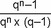

q = 1 + Zinssatz, wobei Zinssatz = 

p = Zinsfuß

n = Restnutzungsdauer / Restlaufzeit

Das jeweilige Berechnungsergebnis ist kaufmännisch auf vier Nachkommastellen zu runden.

**Fußnote**

(+++ Anlage 21: Zur Anwendung vgl. § 265 +++)

<a id="anlage-22-250"></a>

## Anlage 22 (zu § 185 Absatz 3 Satz 3, § 190 Absatz 6 Satz 1 und 2)  Gesamtnutzungsdauer

(Fundstelle: BGBl. I 2015, 1846)

  
  


| Spalte 1 | Spalte 2 | Spalte 3 |
| --- | --- | --- |
| **Ein- und Zweifamilienhäuser** | 80 | Jahre |
| **Mietwohngrundstücke, Mehrfamilienhäuser** | 80 | Jahre |
| **Wohnungseigentum** | 80 | Jahre |
| **Geschäftsgrundstücke, gemischt genutzte Grundstücke und sonstige bebaute Grundstücke:** |  |  |
| Gemischt genutzte Grundstücke (Wohnhäuser mit Mischnutzung) | 80 | Jahre |
| Museen, Theater, Sakralbauten, Friedhofsgebäude | 70 | Jahre |
| Bürogebäude/Verwaltungsgebäude | 60 | Jahre |
| Banken und ähnliche Geschäftshäuser | 60 | Jahre |
| Einzelgaragen/Mehrfachgaragen | 60 | Jahre |
| Kindergärten (Kindertagesstätten), Allgemeinbildende und Berufsbildende Schulen, Hochschulen, Sonderschulen | 50 | Jahre |
| Wohnheime/Internate, Alten-/Pflegeheime | 50 | Jahre |
| Kauf-/Warenhäuser | 50 | Jahre |
| Krankenhäuser, Kliniken, Tageskliniken, Ärztehäuser | 40 | Jahre |
| Gemeindezentren, Saalbauten, Veranstaltungsgebäude, Vereinsheime | 40 | Jahre |
| Beherbergungsstätten, Hotels, Verpflegungseinrichtungen | 40 | Jahre |
| Sport-/Tennishallen, Freizeitbäder/Kur- und Heilbäder | 40 | Jahre |
| Tief-,Hoch- und Nutzfahrzeuggaragen als Einzelbauwerke, Carports | 40 | Jahre |
| Betriebs-/Werkstätten, Industrie-/Produktionsgebäude | 40 | Jahre |
| Lager-/Versandgebäude | 40 | Jahre |
| Verbrauchermärkte, Autohäuser | 30 | Jahre |
| Reithallen, ehemalige landwirtschaftliche Mehrzweckhallen, Scheunen, u. Ä. | 30 | Jahre |

**Teileigentum** ist in Abhängigkeit von der baulichen Gestaltung den vorstehenden Gebäudearten zuzuordnen.

**Fußnote**

(+++ Anlage 22: Zur Anwendung vgl. § 265 +++)

<a id="anlage-23-251"></a>

## Anlage 23 (zu § 187 Absatz 2 und 3) Bewirtschaftungskosten

(Fundstelle: BGBl. I 2022, 2317)

  
  
<table style="border-collapse:collapse">
<tr><td><strong>I.</strong></td><td colspan="2"><strong>Bewirtschaftungskosten für Wohnnutzung</strong></td></tr>
<tr><td><strong>1.</strong></td><td colspan="2"><strong>Verwaltungskosten (Basiswerte)</strong></td></tr>
<tr><td colspan="2" style="border-right:1px solid currentColor">jährlich je Wohnung<sup data-redaktionell="fussnotenmarker-aus-attribut"><a href="#fn-bjnr010350934bjne027702123_01_BJNR010350934BJNE027702123">&#42;</a></sup></td><td style="text-align:center">230 Euro</td></tr>
<tr><td colspan="2" style="border-right:1px solid currentColor">jährlich je Garage oder ähnlichen Einstellplatz</td><td style="text-align:center"> 30 Euro</td></tr>
<tr><td><strong>2.</strong></td><td colspan="2"><strong>Instandhaltungskosten (Basiswerte)</strong></td></tr>
<tr><td colspan="2" style="border-right:1px solid currentColor">jährlich je Quadratmeter Wohnfläche</td><td style="text-align:center">  9 Euro</td></tr>
<tr><td colspan="2" style="border-right:1px solid currentColor">jährlich je Garage oder ähnlichen Einstellplatz</td><td style="text-align:center"> 68 Euro</td></tr>
<tr><td><strong>3.</strong></td><td colspan="2"><strong>Mietausfallwagnis</strong></td></tr>
<tr><td colspan="2" style="border-right:1px solid currentColor">jährlicher Rohertrag</td><td style="text-align:center">2 Prozent</td></tr>
<tr><td><strong>II.</strong></td><td colspan="2"><strong>Bewirtschaftungskosten für Nichtwohnnutzung</strong></td></tr>
<tr><td><strong>1.</strong></td><td colspan="2"><strong>Verwaltungskosten</strong></td></tr>
<tr><td colspan="2" style="border-right:1px solid currentColor">jährlicher Rohertrag</td><td style="text-align:center">3 Prozent</td></tr>
<tr><td><strong>2.</strong></td><td colspan="2"><strong>Instandhaltungskosten</strong></td></tr>
<tr><td colspan="2" style="border-right:1px solid currentColor;text-align:justify">jährlich je Quadratmeter Nutzfläche (alle Gebäudearten der Anlage 24, Teil II., mit Ausnahme der nachfolgend genannten Gebäudearten)</td><td style="text-align:justify">100 Prozent der Instandhaltungskosten je Quadratmeter Wohnfläche gemäß Nummer I.2</td></tr>
<tr><td colspan="2" style="border-right:1px solid currentColor;text-align:justify">jährlich je Quadratmeter Nutzfläche (Gebäudeart 13 der Anlage 24, Teil II.)</td><td style="text-align:justify">50 Prozent der Instandhaltungskosten je Quadratmeter Wohnfläche gemäß Nummer I.2</td></tr>
<tr><td colspan="2" style="border-right:1px solid currentColor;text-align:justify">jährlich je Quadratmeter Nutzfläche (Gebäudearten 15 bis 16 und 18 der Anlage 24, Teil II.)</td><td style="text-align:justify">30 Prozent der Instandhaltungskosten je Quadratmeter Wohnfläche gemäß Nummer I.2</td></tr>
<tr><td colspan="2" style="text-align:justify">jährlich je Garage oder ähnlichem Einstellplatz</td><td style="text-align:justify">100 Prozent der Instandhaltungskosten je Garage oder ähnlichem Einstellplatz gemäß Nummer I.2</td></tr>
<tr><td><strong>3.</strong></td><td colspan="2"><strong>Mietausfallwagnis</strong></td></tr>
<tr><td colspan="2" style="border-right:1px solid currentColor">jährlicher Rohertrag</td><td>4 Prozent</td></tr>
</table>

Die Anpassung der Basiswerte nach den Nummern I.1 und I.2 erfolgt jährlich mit dem Prozentsatz, um den sich der vom Statistischen Bundesamt festgestellte Verbraucherpreisindex für Deutschland für den Monat Oktober 2001 gegenüber demjenigen für den Monat Oktober des Jahres, das dem Bewertungsstichtag vorausgeht, erhöht oder verringert hat. Die Werte für die Instandhaltungskosten pro Quadratmeter sind auf eine Nachkommastelle und bei den Instandhaltungskosten pro Garage oder ähnlichem Einstellplatz sowie bei Verwaltungskosten kaufmännisch auf volle Euro zu runden.

<a id="fn-bjnr010350934bjne027702123_01_BJNR010350934BJNE027702123"></a><span data-redaktionell="fussnotenlabel">&#42;</span> Für Wohnräume, die keine Wohnungen im Sinne des § 181 Absatz 9 darstellen, sind als Verwaltungskosten 3 Prozent des hierauf entfallenden jährlichen Rohertrages anzusetzen.

**Fußnote**

(+++ Anlage 23: Zur Anwendung vgl. § 265 +++)

<a id="anlage-24-252"></a>

## Anlage 24 (zu § 190 Absatz 1 Satz 3 und Absatz 2 und Anlage 23) Regelherstellungskosten

(Fundstelle: BGBl. I 2015, 1847 – 1862)

**I. Begriff der Brutto-Grundfläche (BGF)**

- **1\.** Die BGF ist die Summe der bezogen auf die jeweilige Gebäudeart marktüblich nutzbaren Grundflächen aller Grundrissebenen eines Bauwerks. In Anlehnung an die DIN 277-1:2005-02 sind bei den Grundflächen folgende Bereiche zu unterscheiden:

  Bereich a: überdeckt und allseitig in voller Höhe umschlossen,

  Bereich b: überdeckt, jedoch nicht allseitig in voller Höhe umschlossen,

  Bereich c: nicht überdeckt.

  Für die Anwendung der Regelherstellungskosten (RHK) sind im Rahmen der Ermittlung der BGF nur die Grundflächen der Bereiche a und b zugrunde zu legen. Balkone, auch wenn sie überdeckt sind, sind dem Bereich c zuzuordnen.

  Für die Ermittlung der BGF sind die äußeren Maße der Bauteile einschließlich Bekleidung, z. B. Putz und Außenschalen mehrschaliger Wandkonstruktionen, in Höhe der Bodenbelagsoberkanten anzusetzen.

- **2\.** Nicht zur BGF gehören z. B. Flächen von Spitzböden und Kriechkellern, Flächen, die ausschließlich der Wartung, Inspektion und Instandsetzung von Baukonstruktionen und technischen Anlagen dienen sowie Flächen unter konstruktiven Hohlräumen, z. B. über abgehängten Decken.

**II. Regelherstellungskosten (RHK)**

**Regelherstellungskosten**

auf Grundlage der Normalherstellungskosten 2010 (NHK 2010) in Euro/m<sup>2</sup> BGF einschließlich Baunebenkosten und Umsatzsteuer für die jeweilige Gebäudeart (Kostenstand 2010)

| Spalte 1 | Spalte 2 |
| --- | --- |
| **1-3** | **Ein- und Zweifamilienhäuser** |


<table style="border-collapse:collapse">
<tr><td colspan="3" style="vertical-align:middle"></td><td colspan="5" style="text-align:center;vertical-align:middle"><strong>Standardstufe</strong></td></tr>
<tr><td colspan="3"><strong>Keller- und Erdgeschoss</strong></td><td style="text-align:center;vertical-align:middle"><strong>1</strong></td><td style="text-align:center;vertical-align:middle"><strong>2</strong></td><td style="text-align:center;vertical-align:middle"><strong>3</strong></td><td style="text-align:center;vertical-align:middle"><strong>4</strong></td><td style="text-align:center;vertical-align:middle"><strong>5</strong></td></tr>
<tr><td rowspan="5" style="text-align:center">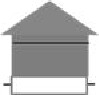</td><td colspan="2">Dachgeschoss ausgebaut</td><td style="text-align:center"></td><td style="text-align:center"></td><td style="text-align:center"></td><td style="text-align:center"></td><td style="text-align:center"></td></tr>
<tr><td>1.01</td><td>freistehende Einfamilienhäuser</td><td style="text-align:center">655</td><td style="text-align:center">725</td><td style="text-align:center">835</td><td style="text-align:center">1005</td><td style="text-align:center">1260</td></tr>
<tr><td>1.011</td><td>freistehende Zweifamilienhäuser<sup data-redaktionell="fussnotenmarker-aus-attribut"><a href="#fn-f791494_02_BJNR010350934BJNE027804123">&#49;</a></sup></td><td style="text-align:center">688</td><td style="text-align:center">761</td><td style="text-align:center">877</td><td style="text-align:center">1055</td><td style="text-align:center">1323</td></tr>
<tr><td>2.01</td><td>Doppel- und Reihenendhäuser</td><td style="text-align:center">615</td><td style="text-align:center">685</td><td style="text-align:center">785</td><td style="text-align:center">945</td><td style="text-align:center">1180</td></tr>
<tr><td>3.01</td><td>Reihenmittelhäuser</td><td style="text-align:center">575</td><td style="text-align:center">640</td><td style="text-align:center">735</td><td style="text-align:center">885</td><td style="text-align:center">1105</td></tr>
<tr><td rowspan="5" style="text-align:center">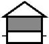</td><td colspan="2">Dachgeschoss nicht ausgebaut</td><td style="text-align:center"></td><td style="text-align:center"></td><td style="text-align:center"></td><td style="text-align:center"></td><td style="text-align:center"></td></tr>
<tr><td>1.02</td><td>freistehende Einfamilienhäuser</td><td style="text-align:center">545</td><td style="text-align:center">605</td><td style="text-align:center">695</td><td style="text-align:center">840</td><td style="text-align:center">1050</td></tr>
<tr><td>1.021</td><td>freistehende Zweifamilienhäuser<sup>1</sup></td><td style="text-align:center">572</td><td style="text-align:center">635</td><td style="text-align:center">730</td><td style="text-align:center">882</td><td style="text-align:center">1103</td></tr>
<tr><td>2.02</td><td>Doppel- und Reihenendhäuser</td><td style="text-align:center">515</td><td style="text-align:center">570</td><td style="text-align:center">655</td><td style="text-align:center">790</td><td style="text-align:center">985</td></tr>
<tr><td>3.02</td><td>Reihenmittelhäuser</td><td style="text-align:center">480</td><td style="text-align:center">535</td><td style="text-align:center">615</td><td style="text-align:center">740</td><td style="text-align:center">925</td></tr>
<tr><td rowspan="5" style="text-align:center">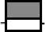</td><td colspan="2">Flachdach oder flach geneigtes Dach</td><td style="text-align:center"></td><td style="text-align:center"></td><td style="text-align:center"></td><td style="text-align:center"></td><td style="text-align:center"></td></tr>
<tr><td>1.03</td><td>freistehende Einfamilienhäuser</td><td style="text-align:center">705</td><td style="text-align:center">785</td><td style="text-align:center">900</td><td style="text-align:center">1085</td><td style="text-align:center">1360</td></tr>
<tr><td>1.031</td><td>freistehende Zweifamilienhäuser<sup>1</sup></td><td style="text-align:center">740</td><td style="text-align:center">824</td><td style="text-align:center">945</td><td style="text-align:center">1139</td><td style="text-align:center">1428</td></tr>
<tr><td>2.03</td><td>Doppel- und Reihenendhäuser</td><td style="text-align:center">665</td><td style="text-align:center">735</td><td style="text-align:center">845</td><td style="text-align:center">1020</td><td style="text-align:center">1275</td></tr>
<tr><td>3.03</td><td>Reihenmittelhäuser</td><td style="text-align:center">620</td><td style="text-align:center">690</td><td style="text-align:center">795</td><td style="text-align:center">955</td><td style="text-align:center">1195</td></tr>
</table>


<table style="border-collapse:collapse">
<tr><td colspan="3" style="vertical-align:middle"></td><td colspan="5" style="text-align:center;vertical-align:middle"><strong>Standardstufe</strong></td></tr>
<tr><td colspan="3"><strong>Keller-, Erd- und Obergeschoss</strong></td><td style="text-align:center;vertical-align:middle"><strong>1</strong></td><td style="text-align:center;vertical-align:middle"><strong>2</strong></td><td style="text-align:center;vertical-align:middle"><strong>3</strong></td><td style="text-align:center;vertical-align:middle"><strong>4</strong></td><td style="text-align:center;vertical-align:middle"><strong>5</strong></td></tr>
<tr><td rowspan="5" style="text-align:center">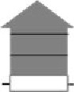</td><td colspan="2">Dachgeschoss ausgebaut</td><td style="text-align:center"></td><td style="text-align:center"></td><td style="text-align:center"></td><td style="text-align:center"></td><td style="text-align:center"></td></tr>
<tr><td>1.11</td><td>freistehende Einfamilienhäuser</td><td style="text-align:center">655</td><td style="text-align:center">725</td><td style="text-align:center">835</td><td style="text-align:center">1005</td><td style="text-align:center">1260</td></tr>
<tr><td>1.111</td><td>freistehende Zweifamilienhäuser<sup>1</sup></td><td style="text-align:center">688</td><td style="text-align:center">761</td><td style="text-align:center">877</td><td style="text-align:center">1055</td><td style="text-align:center">1323</td></tr>
<tr><td>2.11</td><td>Doppel- und Reihenendhäuser</td><td style="text-align:center">615</td><td style="text-align:center">685</td><td style="text-align:center">785</td><td style="text-align:center">945</td><td style="text-align:center">1180</td></tr>
<tr><td>3.11</td><td>Reihenmittelhäuser</td><td style="text-align:center">575</td><td style="text-align:center">640</td><td style="text-align:center">735</td><td style="text-align:center">885</td><td style="text-align:center">1105</td></tr>
<tr><td rowspan="5" style="text-align:center">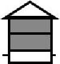</td><td colspan="2">Dachgeschoss nicht ausgebaut</td><td style="text-align:center"></td><td style="text-align:center"></td><td style="text-align:center"></td><td style="text-align:center"></td><td style="text-align:center"></td></tr>
<tr><td>1.12</td><td>freistehende Einfamilienhäuser</td><td style="text-align:center">570</td><td style="text-align:center">635</td><td style="text-align:center">730</td><td style="text-align:center">880</td><td style="text-align:center">1100</td></tr>
<tr><td>1.121</td><td>freistehende Zweifamilienhäuser<sup>1</sup></td><td style="text-align:center">599</td><td style="text-align:center">667</td><td style="text-align:center">767</td><td style="text-align:center">924</td><td style="text-align:center">1155</td></tr>
<tr><td>2.12</td><td>Doppel- und Reihenendhäuser</td><td style="text-align:center">535</td><td style="text-align:center">595</td><td style="text-align:center">685</td><td style="text-align:center">825</td><td style="text-align:center">1035</td></tr>
<tr><td>3.12</td><td>Reihenmittelhäuser</td><td style="text-align:center">505</td><td style="text-align:center">560</td><td style="text-align:center">640</td><td style="text-align:center">775</td><td style="text-align:center">965</td></tr>
<tr><td rowspan="5" style="text-align:center"></td><td colspan="2">Flachdach oder flach geneigtes Dach</td><td style="text-align:center"></td><td style="text-align:center"></td><td style="text-align:center"></td><td style="text-align:center"></td><td style="text-align:center"></td></tr>
<tr><td>1.13</td><td>freistehende Einfamilienhäuser</td><td style="text-align:center">665</td><td style="text-align:center">740</td><td style="text-align:center">850</td><td style="text-align:center">1025</td><td style="text-align:center">1285</td></tr>
<tr><td>1.131</td><td>freistehende Zweifamilienhäuser<sup>1</sup></td><td style="text-align:center">698</td><td style="text-align:center">777</td><td style="text-align:center">893</td><td style="text-align:center">1076</td><td style="text-align:center">1349</td></tr>
<tr><td>2.13</td><td>Doppel- und Reihenendhäuser</td><td style="text-align:center">625</td><td style="text-align:center">695</td><td style="text-align:center">800</td><td style="text-align:center">965</td><td style="text-align:center">1205</td></tr>
<tr><td>3.13</td><td>Reihenmittelhäuser</td><td style="text-align:center">585</td><td style="text-align:center">650</td><td style="text-align:center">750</td><td style="text-align:center">905</td><td style="text-align:center">1130</td></tr>
</table>


<table style="border-collapse:collapse">
<tr><td colspan="3" style="vertical-align:middle"></td><td colspan="5" style="text-align:center;vertical-align:middle"><strong>Standardstufe</strong></td></tr>
<tr><td colspan="3"><strong>Erdgeschoss, nicht unterkellert</strong></td><td style="text-align:center;vertical-align:middle"><strong>1</strong></td><td style="text-align:center;vertical-align:middle"><strong>2</strong></td><td style="text-align:center;vertical-align:middle"><strong>3</strong></td><td style="text-align:center;vertical-align:middle"><strong>4</strong></td><td style="text-align:center;vertical-align:middle"><strong>5</strong></td></tr>
<tr><td rowspan="5" style="text-align:center">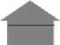</td><td colspan="2">Dachgeschoss ausgebaut</td><td style="text-align:center"></td><td style="text-align:center"></td><td style="text-align:center"></td><td style="text-align:center"></td><td style="text-align:center"></td></tr>
<tr><td>1.21</td><td>freistehende Einfamilienhäuser</td><td style="text-align:center">790</td><td style="text-align:center">875</td><td style="text-align:center">1005</td><td style="text-align:center">1215</td><td style="text-align:center">1515</td></tr>
<tr><td>1.211</td><td>freistehende Zweifamilienhäuser<sup>1</sup></td><td style="text-align:center">830</td><td style="text-align:center">919</td><td style="text-align:center">1055</td><td style="text-align:center">1276</td><td style="text-align:center">1591</td></tr>
<tr><td>2.21</td><td>Doppel- und Reihenendhäuser</td><td style="text-align:center">740</td><td style="text-align:center">825</td><td style="text-align:center">945</td><td style="text-align:center">1140</td><td style="text-align:center">1425</td></tr>
<tr><td>3.21</td><td>Reihenmittelhäuser</td><td style="text-align:center">695</td><td style="text-align:center">770</td><td style="text-align:center">885</td><td style="text-align:center">1065</td><td style="text-align:center">1335</td></tr>
<tr><td rowspan="5" style="text-align:center">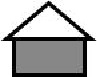</td><td colspan="2">Dachgeschoss nicht ausgebaut</td><td style="text-align:center"></td><td style="text-align:center"></td><td style="text-align:center"></td><td style="text-align:center"></td><td style="text-align:center"></td></tr>
<tr><td>1.22</td><td>freistehende Einfamilienhäuser</td><td style="text-align:center">585</td><td style="text-align:center">650</td><td style="text-align:center">745</td><td style="text-align:center">900</td><td style="text-align:center">1125</td></tr>
<tr><td>1.221</td><td>freistehende Zweifamilienhäuser<sup>1</sup></td><td style="text-align:center">614</td><td style="text-align:center">683</td><td style="text-align:center">782</td><td style="text-align:center">945</td><td style="text-align:center">1181</td></tr>
<tr><td>2.22</td><td>Doppel- und Reihenendhäuser</td><td style="text-align:center">550</td><td style="text-align:center">610</td><td style="text-align:center">700</td><td style="text-align:center">845</td><td style="text-align:center">1055</td></tr>
<tr><td>3.22</td><td>Reihenmittelhäuser</td><td style="text-align:center">515</td><td style="text-align:center">570</td><td style="text-align:center">655</td><td style="text-align:center">790</td><td style="text-align:center">990</td></tr>
<tr><td rowspan="5" style="text-align:center"></td><td colspan="2">Flachdach oder flach geneigtes Dach</td><td style="text-align:center"></td><td style="text-align:center"></td><td style="text-align:center"></td><td style="text-align:center"></td><td style="text-align:center"></td></tr>
<tr><td>1.23</td><td>freistehende Einfamilienhäuser</td><td style="text-align:center">920</td><td style="text-align:center">1025</td><td style="text-align:center">1180</td><td style="text-align:center">1420</td><td style="text-align:center">1775</td></tr>
<tr><td>1.231</td><td>freistehende Zweifamilienhäuser<sup>1</sup></td><td style="text-align:center">966</td><td style="text-align:center">1076</td><td style="text-align:center">1239</td><td style="text-align:center">1491</td><td style="text-align:center">1864</td></tr>
<tr><td>2.23</td><td>Doppel- und Reihenendhäuser</td><td style="text-align:center">865</td><td style="text-align:center">965</td><td style="text-align:center">1105</td><td style="text-align:center">1335</td><td style="text-align:center">1670</td></tr>
<tr><td>3.23</td><td>Reihenmittelhäuser</td><td style="text-align:center">810</td><td style="text-align:center">900</td><td style="text-align:center">1035</td><td style="text-align:center">1250</td><td style="text-align:center">1560</td></tr>
</table>


<table style="border-collapse:collapse">
<tr><td colspan="3" style="vertical-align:middle"></td><td colspan="5" style="text-align:center;vertical-align:middle"><strong>Standardstufe</strong></td></tr>
<tr><td colspan="3"><strong>Erd- und Obergeschoss, nicht unterkellert</strong></td><td style="text-align:center;vertical-align:middle"><strong>1</strong></td><td style="text-align:center;vertical-align:middle"><strong>2</strong></td><td style="text-align:center;vertical-align:middle"><strong>3</strong></td><td style="text-align:center;vertical-align:middle"><strong>4</strong></td><td style="text-align:center;vertical-align:middle"><strong>5</strong></td></tr>
<tr><td rowspan="5" style="text-align:center;vertical-align:top">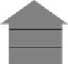</td><td colspan="2">Dachgeschoss ausgebaut</td><td></td><td></td><td></td><td></td><td></td></tr>
<tr><td>1.31</td><td>freistehende Einfamilienhäuser</td><td style="text-align:center">720</td><td style="text-align:center">800</td><td style="text-align:center">920</td><td style="text-align:center">1105</td><td style="text-align:center">1385</td></tr>
<tr><td>1.311</td><td>freistehende Zweifamilienhäuser<sup>1</sup></td><td style="text-align:center">756</td><td style="text-align:center">840</td><td style="text-align:center">966</td><td style="text-align:center">1160</td><td style="text-align:center">1454</td></tr>
<tr><td>2.31</td><td>Doppel- und Reihenendhäuser</td><td style="text-align:center">675</td><td style="text-align:center">750</td><td style="text-align:center">865</td><td style="text-align:center">1040</td><td style="text-align:center">1300</td></tr>
<tr><td>3.31</td><td>Reihenmittelhäuser</td><td style="text-align:center">635</td><td style="text-align:center">705</td><td style="text-align:center">810</td><td style="text-align:center">975</td><td style="text-align:center">1215</td></tr>
<tr><td rowspan="5" style="text-align:center;vertical-align:top">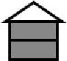</td><td colspan="2">Dachgeschoss nicht ausgebaut</td><td></td><td></td><td></td><td></td><td></td></tr>
<tr><td>1.32</td><td>freistehende Einfamilienhäuser</td><td>620</td><td>690</td><td>790</td><td>955</td><td>1190</td></tr>
<tr><td>1.321</td><td>freistehende Zweifamilienhäuser<sup>1</sup></td><td>651</td><td>725</td><td>830</td><td>1003</td><td>1250</td></tr>
<tr><td>2.32</td><td>Doppel- und Reihenendhäuser</td><td>580</td><td>645</td><td>745</td><td>895</td><td>1120</td></tr>
<tr><td>3.32</td><td>Reihenmittelhäuser</td><td>545</td><td>605</td><td>695</td><td>840</td><td>1050</td></tr>
<tr><td rowspan="5" style="text-align:center;vertical-align:top"></td><td colspan="2">Flachdach oder flach geneigtes Dach</td><td></td><td></td><td></td><td></td><td></td></tr>
<tr><td>1.33</td><td>freistehende Einfamilienhäuser</td><td>785</td><td>870</td><td>1000</td><td>1205</td><td>1510</td></tr>
<tr><td>1.331</td><td>freistehende Zweifamilienhäuser<sup>1</sup></td><td>824</td><td>914</td><td>1050</td><td>1265</td><td>1586</td></tr>
<tr><td>2.33</td><td>Doppel- und Reihenendhäuser</td><td>735</td><td>820</td><td>940</td><td>1135</td><td>1415</td></tr>
<tr><td>3.33</td><td>Reihenmittelhäuser</td><td>690</td><td>765</td><td>880</td><td>1060</td><td>1325</td></tr>
</table>

<sup data-redaktionell="fussnotenmarker-aus-attribut"><a href="#fn-f791494_02_BJNR010350934BJNE027804123">&#49;</a></sup>

| Spalte 1 | Spalte 2 |
| --- | --- |
| **4** | **Wohnungseigentum und vergleichbares Teileigentum in Mehrfamilienhäusern<br>(ohne Tiefgaragenplatz)/Mehrfamilienhäuser**<br> Für Wohnungseigentum in Gebäuden, die wie Ein- und Zweifamilienhäuser im Sinne des § 181 Absatz 2 des Bewertungsgesetzes gestaltet sind, werden die Regelherstellungskosten der Ein- und Zweifamilienhäuser zugrunde gelegt.<br> Umrechnungsfaktor hinsichtlich der Brutto-Grundfläche (BGF) für Wohnungseigentum in Mehrfamilienhäusern: BGF = 1,55 x Wohnfläche |


<table style="border-collapse:collapse">
<tr><td rowspan="2" colspan="2"></td><td colspan="5"><strong>Standardstufe</strong></td></tr>
<tr><td><strong>1</strong></td><td><strong>2</strong></td><td><strong>3</strong></td><td><strong>4</strong></td><td><strong>5</strong></td></tr>
<tr><td>4.1</td><td>Mehrfamilienhäuser mit bis zu 6 WE</td><td>650</td><td>720</td><td>825</td><td>985</td><td>1190</td></tr>
<tr><td>4.2</td><td>Mehrfamilienhäuser mit 7 bis 20 WE</td><td>600</td><td>665</td><td>765</td><td>915</td><td>1105</td></tr>
<tr><td>4.3</td><td>Mehrfamilienhäuser mit mehr als 20 WE</td><td>590</td><td>655</td><td>755</td><td>900</td><td>1090</td></tr>
</table>


| Spalte 1 | Spalte 2 |
| --- | --- |
| **5-18** | **Gemischt genutzte Grundstücke, Geschäftsgrundstücke und sonstige bebaute Grundstücke** |

<table style="border-collapse:collapse">
<tr><td rowspan="2" colspan="2"></td><td colspan="5"><strong>Standardstufe</strong></td></tr>
<tr><td><strong>1</strong></td><td><strong>2</strong></td><td><strong>3</strong></td><td><strong>4</strong></td><td><strong>5</strong></td></tr>
<tr><td>5.1</td><td>Gemischt genutzte Grundstücke (Wohnhäuser mit Mischnutzung)</td><td style="text-align:center;vertical-align:middle">605</td><td style="text-align:center;vertical-align:middle">675</td><td style="text-align:center;vertical-align:middle">860</td><td style="text-align:center;vertical-align:middle">1085</td><td style="text-align:center;vertical-align:middle">1375</td></tr>
<tr><td>5.2</td><td>Banken und ähnliche Geschäftshäuser mit Wohnanteil<sup data-redaktionell="fussnotenmarker-aus-attribut"><a href="#fn-f791494_03_BJNR010350934BJNE027804123">&#50;</a></sup></td><td style="text-align:center">625</td><td style="text-align:center">695</td><td style="text-align:center">890</td><td style="text-align:center">1375</td><td style="text-align:center">1720</td></tr>
<tr><td>5.3</td><td>Banken und ähnliche Geschäftshäuser ohne Wohnanteil</td><td style="text-align:center">655</td><td style="text-align:center">730</td><td style="text-align:center">930</td><td style="text-align:center">1520</td><td style="text-align:center">1900</td></tr>
</table>

<sup data-redaktionell="fussnotenmarker-aus-attribut"><a href="#fn-f791494_03_BJNR010350934BJNE027804123">&#50;</a></sup>

<table style="border-collapse:collapse">
<tr><td rowspan="2" colspan="2"></td><td colspan="5"><strong>Standardstufe</strong></td></tr>
<tr><td><strong>1</strong></td><td><strong>2</strong></td><td><strong>3</strong></td><td><strong>4</strong></td><td><strong>5</strong></td></tr>
<tr><td>6.1</td><td>Bürogebäude/Verwaltungsgebäude</td><td style="text-align:center">735</td><td style="text-align:center">815</td><td style="text-align:center">1040</td><td style="text-align:center">1685</td><td style="text-align:center">1900</td></tr>
</table>


<table style="border-collapse:collapse">
<tr><td rowspan="2" colspan="2"></td><td colspan="5"><strong>Standardstufe</strong></td></tr>
<tr><td><strong>1</strong></td><td><strong>2</strong></td><td><strong>3</strong></td><td><strong>4</strong></td><td><strong>5</strong></td></tr>
<tr><td>7.1</td><td>Gemeindezentren/Vereinsheime</td><td style="text-align:center">795</td><td style="text-align:center">885</td><td style="text-align:center">1130</td><td style="text-align:center">1425</td><td style="text-align:center">1905</td></tr>
<tr><td>7.2</td><td>Saalbauten/Veranstaltungsgebäude</td><td style="text-align:center">955</td><td style="text-align:center">1060</td><td style="text-align:center">1355</td><td style="text-align:center">1595</td><td style="text-align:center">2085</td></tr>
</table>


<table style="border-collapse:collapse">
<tr><td rowspan="2" colspan="2"></td><td colspan="5"><strong>Standardstufe</strong></td></tr>
<tr><td><strong>1</strong></td><td><strong>2</strong></td><td><strong>3</strong></td><td><strong>4</strong></td><td><strong>5</strong></td></tr>
<tr><td>8.1</td><td>Kindergärten</td><td style="text-align:center">915</td><td style="text-align:center">1020</td><td style="text-align:center">1300</td><td style="text-align:center">1495</td><td style="text-align:center">1900</td></tr>
<tr><td>8.2</td><td>Allgemeinbildende Schulen, Berufsbildende Schulen, Hochschulen</td><td style="text-align:center;vertical-align:middle">1020</td><td style="text-align:center;vertical-align:middle">1135</td><td style="text-align:center;vertical-align:middle">1450</td><td style="text-align:center;vertical-align:middle">1670</td><td style="text-align:center;vertical-align:middle">2120</td></tr>
<tr><td>8.3</td><td>Sonderschulen</td><td style="text-align:center">1115</td><td style="text-align:center">1240</td><td style="text-align:center">1585</td><td style="text-align:center">1820</td><td style="text-align:center">2315</td></tr>
</table>


<table style="border-collapse:collapse">
<tr><td rowspan="2" colspan="2"></td><td colspan="5"><strong>Standardstufe</strong></td></tr>
<tr><td><strong>1</strong></td><td><strong>2</strong></td><td><strong>3</strong></td><td><strong>4</strong></td><td><strong>5</strong></td></tr>
<tr><td>9.1</td><td>Wohnheime/Internate</td><td style="text-align:center">705</td><td style="text-align:center">785</td><td style="text-align:center">1000</td><td style="text-align:center">1225</td><td style="text-align:center">1425</td></tr>
<tr><td>9.2</td><td>Alten-/Pflegeheime</td><td style="text-align:center">825</td><td style="text-align:center">915</td><td style="text-align:center">1170</td><td style="text-align:center">1435</td><td style="text-align:center">1665</td></tr>
</table>


<table style="border-collapse:collapse">
<tr><td rowspan="2" colspan="2"></td><td colspan="5"><strong>Standardstufe</strong></td></tr>
<tr><td><strong>1</strong></td><td><strong>2</strong></td><td><strong>3</strong></td><td><strong>4</strong></td><td><strong>5</strong></td></tr>
<tr><td>10.1</td><td>Krankenhäuser/Kliniken</td><td style="text-align:center">1210</td><td style="text-align:center">1345</td><td style="text-align:center">1720</td><td style="text-align:center">2080</td><td style="text-align:center">2765</td></tr>
<tr><td>10.2</td><td>Tageskliniken/Ärztehäuser</td><td style="text-align:center">1115</td><td style="text-align:center">1240</td><td style="text-align:center">1585</td><td style="text-align:center">1945</td><td style="text-align:center">2255</td></tr>
</table>


<table style="border-collapse:collapse">
<tr><td rowspan="2" colspan="2"></td><td colspan="5"><strong>Standardstufe</strong></td></tr>
<tr><td><strong>1</strong></td><td><strong>2</strong></td><td><strong>3</strong></td><td><strong>4</strong></td><td><strong>5</strong></td></tr>
<tr><td>11.1</td><td>Beherbergungsstätten/Hotels/Verpflegungseinrichtungen</td><td style="text-align:center">975</td><td style="text-align:center">1085</td><td style="text-align:center">1385</td><td style="text-align:center">1805</td><td style="text-align:center">2595</td></tr>
</table>


<table style="border-collapse:collapse">
<tr><td rowspan="2" colspan="2"></td><td colspan="5"><strong>Standardstufe</strong></td></tr>
<tr><td><strong>1</strong></td><td><strong>2</strong></td><td><strong>3</strong></td><td><strong>4</strong></td><td><strong>5</strong></td></tr>
<tr><td>12.1</td><td>Sporthallen (Einfeldhallen)</td><td style="text-align:center">930</td><td style="text-align:center">1035</td><td style="text-align:center">1320</td><td style="text-align:center">1670</td><td style="text-align:center">1955</td></tr>
<tr><td>12.2</td><td>Sporthallen (Dreifeldhallen/Mehrzweckhallen)</td><td style="text-align:center">1050</td><td style="text-align:center">1165</td><td style="text-align:center">1490</td><td style="text-align:center">1775</td><td style="text-align:center">2070</td></tr>
<tr><td>12.3</td><td>Tennishallen</td><td style="text-align:center">710</td><td style="text-align:center">790</td><td style="text-align:center">1010</td><td style="text-align:center">1190</td><td style="text-align:center">1555</td></tr>
<tr><td>12.4</td><td>Freizeitbäder/Kur- und Heilbäder</td><td style="text-align:center">1725</td><td style="text-align:center">1920</td><td style="text-align:center">2450</td><td style="text-align:center">2985</td><td style="text-align:center">3840</td></tr>
</table>


<table style="border-collapse:collapse">
<tr><td rowspan="2" colspan="2"></td><td colspan="5"><strong>Standardstufe</strong></td></tr>
<tr><td><strong>1</strong></td><td><strong>2</strong></td><td><strong>3</strong></td><td><strong>4</strong></td><td><strong>5</strong></td></tr>
<tr><td>13.1</td><td>Verbrauchermärkte</td><td style="text-align:center">510</td><td style="text-align:center">565</td><td style="text-align:center">720</td><td style="text-align:center">870</td><td style="text-align:center">1020</td></tr>
<tr><td>13.2</td><td>Kauf-/Warenhäuser</td><td style="text-align:center">930</td><td style="text-align:center">1035</td><td style="text-align:center">1320</td><td style="text-align:center">1585</td><td style="text-align:center">1850</td></tr>
<tr><td>13.3</td><td>Autohäuser ohne Werkstatt</td><td style="text-align:center">665</td><td style="text-align:center">735</td><td style="text-align:center">940</td><td style="text-align:center">1240</td><td style="text-align:center">1480</td></tr>
</table>


<table style="border-collapse:collapse">
<tr><td rowspan="2" colspan="2"></td><td colspan="5"><strong>Standardstufe</strong></td></tr>
<tr><td><strong>1</strong></td><td><strong>2</strong></td><td><strong>3</strong></td><td><strong>4</strong></td><td><strong>5</strong></td></tr>
<tr><td>14.1</td><td>Einzelgaragen/Mehrfachgaragen<sup data-redaktionell="fussnotenmarker-aus-attribut"><a href="#fn-f791494_04_BJNR010350934BJNE027804123">&#51;</a></sup></td><td colspan="3" style="text-align:center">245</td><td style="text-align:center">485</td><td style="text-align:center">780</td></tr>
<tr><td>14.2</td><td>Hochgaragen<sup data-redaktionell="fussnotenmarker-aus-attribut"><a href="#fn-f791494_05_BJNR010350934BJNE027804123">&#52;</a></sup></td><td colspan="3" style="text-align:center">480</td><td style="text-align:center">655</td><td style="text-align:center">780</td></tr>
<tr><td>14.3</td><td>Tiefgaragen<sup>4</sup></td><td colspan="3" style="text-align:center">560</td><td style="text-align:center">715</td><td style="text-align:center">850</td></tr>
<tr><td>14.4</td><td>Nutzfahrzeuggaragen</td><td colspan="3" style="text-align:center">530</td><td style="text-align:center">680</td><td style="text-align:center">810</td></tr>
<tr><td>14.5</td><td>Carports</td><td colspan="5" style="text-align:center">190</td></tr>
</table>

<sup data-redaktionell="fussnotenmarker-aus-attribut"><a href="#fn-f791494_04_BJNR010350934BJNE027804123">&#51;</a></sup><sup data-redaktionell="fussnotenmarker-aus-attribut"><a href="#fn-f791494_05_BJNR010350934BJNE027804123">&#52;</a></sup>

<table style="border-collapse:collapse">
<tr><td rowspan="2" colspan="2"></td><td colspan="5"><strong>Standardstufe</strong></td></tr>
<tr><td><strong>1</strong></td><td><strong>2</strong></td><td><strong>3</strong></td><td><strong>4</strong></td><td><strong>5</strong></td></tr>
<tr><td>15.1</td><td>Betriebs-/Werkstätten, eingeschossig</td><td style="text-align:center">685</td><td style="text-align:center">760</td><td style="text-align:center">970</td><td style="text-align:center">1165</td><td style="text-align:center">1430</td></tr>
<tr><td>15.2</td><td>Betriebs-/Werkstätten, mehrgeschossig ohne Hallenanteil</td><td style="text-align:center">640</td><td style="text-align:center">715</td><td style="text-align:center">910</td><td style="text-align:center">1090</td><td style="text-align:center">1340</td></tr>
<tr><td>15.3</td><td>Betriebs-/Werkstätten, mehrgeschossig, hoher Hallenanteil</td><td style="text-align:center">435</td><td style="text-align:center">485</td><td style="text-align:center">620</td><td style="text-align:center">860</td><td style="text-align:center">1070</td></tr>
<tr><td>15.4</td><td>Industrielle Produktionsgebäude, Massivbauweise</td><td style="text-align:center">670</td><td style="text-align:center">745</td><td style="text-align:center">950</td><td style="text-align:center">1155</td><td style="text-align:center">1440</td></tr>
<tr><td>15.5</td><td>Industrielle Produktionsgebäude, überwiegend Skelettbauweise</td><td style="text-align:center;vertical-align:middle">495</td><td style="text-align:center;vertical-align:middle">550</td><td style="text-align:center;vertical-align:middle">700</td><td style="text-align:center;vertical-align:middle">965</td><td style="text-align:center;vertical-align:middle">1260</td></tr>
</table>


<table style="border-collapse:collapse">
<tr><td rowspan="2" colspan="2"></td><td colspan="5"><strong>Standardstufe</strong></td></tr>
<tr><td><strong>1</strong></td><td><strong>2</strong></td><td><strong>3</strong></td><td><strong>4</strong></td><td><strong>5</strong></td></tr>
<tr><td>16.1</td><td>Lagergebäude ohne Mischnutzung, Kaltlager</td><td style="text-align:center">245</td><td style="text-align:center">275</td><td style="text-align:center">350</td><td style="text-align:center">490</td><td style="text-align:center">640</td></tr>
<tr><td>16.2</td><td>Lagergebäude mit bis zu 25 % Mischnutzung<sup data-redaktionell="fussnotenmarker-aus-attribut"><a href="#fn-f791494_06_BJNR010350934BJNE027804123">&#53;</a></sup></td><td style="text-align:center">390</td><td style="text-align:center">430</td><td style="text-align:center">550</td><td style="text-align:center">690</td><td style="text-align:center">880</td></tr>
<tr><td>16.3</td><td>Lagergebäude mit mehr als 25 % Mischnutzung<sup>5</sup></td><td style="text-align:center">625</td><td style="text-align:center">695</td><td style="text-align:center">890</td><td style="text-align:center">1095</td><td style="text-align:center">1340</td></tr>
</table>

<sup data-redaktionell="fussnotenmarker-aus-attribut"><a href="#fn-f791494_06_BJNR010350934BJNE027804123">&#53;</a></sup>

<table style="border-collapse:collapse">
<tr><td rowspan="2" colspan="2"></td><td colspan="5"><strong>Standardstufe</strong></td></tr>
<tr><td><strong>1</strong></td><td><strong>2</strong></td><td><strong>3</strong></td><td><strong>4</strong></td><td><strong>5</strong></td></tr>
<tr><td>17.1</td><td>Museen</td><td style="text-align:center">1325</td><td style="text-align:center">1475</td><td style="text-align:center">1880</td><td style="text-align:center">2295</td><td style="text-align:center">2670</td></tr>
<tr><td>17.2</td><td>Theater</td><td style="text-align:center">1460</td><td style="text-align:center">1620</td><td style="text-align:center">2070</td><td style="text-align:center">2625</td><td style="text-align:center">3680</td></tr>
<tr><td>17.3</td><td>Sakralbauten</td><td style="text-align:center">1185</td><td style="text-align:center">1315</td><td style="text-align:center">1510</td><td style="text-align:center">2060</td><td style="text-align:center">2335</td></tr>
<tr><td>17.4</td><td>Friedhofsgebäude</td><td style="text-align:center">1035</td><td style="text-align:center">1150</td><td style="text-align:center">1320</td><td style="text-align:center">1490</td><td style="text-align:center">1720</td></tr>
</table>


<table style="border-collapse:collapse">
<tr><td rowspan="2" colspan="2"></td><td colspan="5"><strong>Standardstufe</strong></td></tr>
<tr><td><strong>1</strong></td><td><strong>2</strong></td><td><strong>3</strong></td><td><strong>4</strong></td><td><strong>5</strong></td></tr>
<tr><td>18.1</td><td>Reithallen</td><td colspan="3">235</td><td>260</td><td>310</td></tr>
<tr><td>18.2</td><td>ehemalige landwirtschaftliche Mehrzweckhallen, Scheunen, u. Ä.</td><td colspan="3" style="vertical-align:middle">245</td><td style="vertical-align:middle">270</td><td style="vertical-align:middle">350</td></tr>
</table>

| Spalte 1 | Spalte 2 |
| --- | --- |
| **19** | **Teileigentum**<br> Teileigentum ist in Abhängigkeit von der baulichen Gestaltung den vorstehenden Gebäudearten zuzuordnen. |


| Spalte 1 | Spalte 2 |
| --- | --- |
| **20** | **Auffangklausel**<br> Regelherstellungskosten für nicht aufgeführte Gebäudearten sind aus den Regelherstellungskosten vergleichbarer Gebäudearten abzuleiten. |

**III. Beschreibung der Gebäudestandards**

Die Beschreibung der Gebäudestandards ist beispielhaft und dient der Orientierung. Sie kann nicht alle in der Praxis auftretenden Standardmerkmale aufführen. Es müssen nicht alle aufgeführten Merkmale zutreffen. Die in der Tabelle angegebenen Jahreszahlen beziehen sich auf die im jeweiligen Zeitraum gültigen Wärmeschutzanforderungen; in Bezug auf das konkrete Bewertungsobjekt ist zu prüfen, ob von diesen Wärmeschutzanforderungen abgewichen wird. Die Beschreibung der Gebäudestandards basiert auf dem Bezugsjahr der Normalherstellungskosten (2010).

| Spalte 1 | Spalte 2 | Spalte 3 |
| --- | --- | --- |
| **1-5.1** | **➀1.01-3.33** | **Ein- und Zweifamilienhäuser** |
|  | **➁4.1-5.1** | **Wohnungseigentum und vergleichbares Teileigentum in Mehrfamilienhäusern (ohne Tiefgaragenplatz)/Mehrfamilienhäuser sowie gemischt genutzte Grundstücke<br> (Wohnhäuser mit Mischnutzung)** |

<table style="border-collapse:collapse">
<tr><td rowspan="4" style="border-bottom:1px solid currentColor"></td><td colspan="5" style="border-bottom:1px solid currentColor;text-align:center"><strong>Standardstufe</strong></td><td rowspan="4" style="border-bottom:1px solid currentColor;text-align:center"><strong>Wägungsanteil</strong></td></tr>
<tr><td style="text-align:center"><strong>1</strong></td><td style="text-align:center"><strong>2</strong></td><td style="text-align:center"><strong>3</strong></td><td style="text-align:center"><strong>4</strong></td><td style="text-align:center"><strong>5</strong></td></tr>
<tr><td colspan="2" style="text-align:center"><strong>nicht zeitgemäß</strong></td><td colspan="3" style="text-align:center"><strong>zeitgemäß</strong></td></tr>
<tr><td style="text-align:center"><strong>einfachst</strong></td><td style="text-align:center"><strong>einfach</strong></td><td style="text-align:center"><strong>Basis</strong></td><td style="text-align:center"><strong>gehoben</strong></td><td style="text-align:center"><strong>aufwendig</strong></td></tr>
<tr><td style="vertical-align:middle"><strong>Außenwände</strong></td><td>Holzfachwerk, Ziegelmauerwerk;<br> Fugenglattstrich, Putz, Verkleidung mit Faserzementplatten, Bitumenschindeln oder einfachen Kunststoffplatten; kein oder deutlich nicht zeitgemäßer Wärmeschutz (vor ca. 1980)</td><td>ein-/zweischaliges Mauerwerk, z. B. Gitterziegel oder Hohlblocksteine; verputzt und gestrichen oder Holzverkleidung;<br> nicht zeitgemäßer Wärmeschutz (vor ca. 1995)</td><td>ein-/zweischaliges Mauerwerk, z. B. aus Leichtziegeln, Kalksandsteinen, Gasbetonsteinen;<br> Edelputz;<br> Wärmedämmverbundsystem oder Wärmedämmputz (nach ca. 1995)</td><td>Verblendmauerwerk, zweischalig, hinterlüftet, Vorhangfassade (z. B. Naturschiefer);<br> Wärmedämmung (nach ca. 2005)</td><td>aufwendig gestaltete Fassaden mit konstruktiver Gliederung (Säulenstellungen, Erker etc.), Sichtbeton-Fertigteile, Natursteinfassade, Elemente aus Kupfer-/<br> Eloxalblech, mehrgeschossige Glasfassaden; hochwertigste Dämmung (z. B. Passivhausstandard)</td><td style="vertical-align:middle">23</td></tr>
<tr><td style="vertical-align:middle"><strong>Dach</strong></td><td>Dachpappe, Faserzementplatten/Wellplatten;<br> keine bis geringe Dachdämmung</td><td>einfache Betondachsteine oder Tondachziegel, Bitumenschindeln;<br> nicht zeitgemäße Dachdämmung (vor ca. 1995)</td><td>Faserzement-Schindeln, beschichtete Betondachsteine und Tondachziegel, Folienabdichtung;<br> Dachdämmung (nach ca. 1995);<br> Rinnen und Fallrohre aus Zinkblech;</td><td>glasierte Tondachziegel, Flachdachausbildung tlw. als Dachterrassen; Konstruktion in Brettschichtholz, schweres Massivflachdach; besondere Dachformen, z. B. Mansarden-, Walmdach; Aufsparrendämmung, überdurchschnittliche Dämmung (nach ca. 2005)</td><td>hochwertige Eindeckung, z. B. aus Schiefer oder Kupfer, Dachbegrünung, befahrbares Flachdach; hochwertigste Dämmung (z. B. Passivhausstandard); Rinnen und Fallrohre aus Kupfer<br>➀aufwendig gegliederte Dachlandschaft, sichtbare Bogendach-konstruktionen</td><td style="vertical-align:middle">15</td></tr>
<tr><td style="vertical-align:middle"><strong>Fenster und Außentüren</strong></td><td>Einfachverglasung;<br> einfache Holztüren</td><td>Zweifachverglasung (vor ca. 1995);<br> Haustür mit nicht zeitgemäßem Wärmeschutz (vor ca. 1995)</td><td>Zweifachverglasung (nach ca. 1995), Rollläden (manuell); Haustür mit zeitgemäßem Wärmeschutz (nach ca. 1995)</td><td>Dreifachverglasung, Sonnenschutzglas, aufwendigere Rahmen, Rollläden (elektr.);<br> höherwertige Türanlage z. B. mit Seitenteil, besonderer Einbruchschutz</td><td>große, feststehende Fensterflächen, Spezialverglasung (Schall- und Sonnenschutz);<br> Außentüren in hochwertigen Materialien</td><td style="vertical-align:middle">11</td></tr>
<tr><td style="vertical-align:middle"><strong>Innenwände und -türen</strong></td><td>Fachwerkwände, einfache Putze/Lehmputze, einfache Kalkanstriche;<br> Füllungstüren, gestrichen, mit einfachen Beschlägen ohne Dichtungen</td><td>massive tragende Innenwände, nicht tragende Wände in Leichtbauweise (z. B. Holzständerwände mit Gipskarton), Gipsdielen;<br> leichte Türen, Stahlzargen</td><td>nicht tragende Innenwände in massiver Ausführung bzw. mit Dämmmaterial gefüllte Ständerkonstruktionen;<br> schwere Türen<br>➀Holzzargen</td><td>Sichtmauerwerk; Massivholztüren, Schiebetürelemente, Glastüren, strukturierte Türblätter<br>➀Wandvertäfelungen (Holzpaneele)</td><td>gestaltete Wandabläufe (z. B. Pfeilervorlagen, abgesetzte oder geschwungene Wandpartien); Brandschutzverkleidung; raumhohe aufwendige Türelemente<br>➀Vertäfelungen (Edelholz, Metall), Akustikputz</td><td style="vertical-align:middle">11</td></tr>
<tr><td style="vertical-align:middle"><strong>Deckenkonstruktion und Treppen</strong></td><td>Holzbalkendecken ohne Füllung, Spalierputz;<br> Weichholztreppen in einfacher Art und Ausführung;<br> kein Trittschallschutz<br>➀Weichholztreppen in einfacher Art und Ausführung;<br> kein Trittschallschutz</td><td>Holzbalkendecken mit Füllung, Kappendecken;<br> Stahl- oder Hartholztreppen in einfacher Art und Ausführung<br>➀Stahl- oder Hartholztreppen in einfacher Art und Ausführung</td><td>➀Beton- und Holzbalkendecken mit Tritt- und Luftschallschutz (z. B. schwimmender Estrich); geradläufige Treppen aus Stahlbeton oder Stahl, Harfentreppe, Trittschallschutz<br>➁Betondecken mit Tritt- und Luftschallschutz (z. B. schwimmender Estrich); einfacher Putz</td><td>➀Decken mit größerer Spannweite, Deckenverkleidung (Holzpaneele/Kassetten);<br> gewendelte Treppen aus Stahlbeton oder Stahl, Hartholztreppenanlage in besserer Art und Ausführung<br>➁zusätzlich Deckenverkleidung</td><td>Deckenvertäfelungen (Edelholz, Metall)<br>➀Decken mit großen Spannweiten, gegliedert;<br> breite Stahlbeton-, Metall- oder Hartholztreppenanlage mit hochwertigem Geländer</td><td style="vertical-align:middle">11</td></tr>
<tr><td style="vertical-align:middle"><strong>Fußböden</strong></td><td>ohne Belag</td><td>Linoleum-, Teppich-, Laminat- und PVC-Böden einfacher Art und Ausführung</td><td>Linoleum-, Teppich-, Laminat- und PVC-Böden besserer Art und Ausführung, Fliesen, Kunststeinplatten</td><td>Natursteinplatten, Fertigparkett, hochwertige Fliesen, Terrazzobelag, hochwertige Massivholzböden auf gedämmter Unterkonstruktion</td><td>hochwertiges Parkett, hochwertige Natursteinplatten, hochwertige Edelholzböden auf gedämmter Unterkonstruktion</td><td style="vertical-align:middle">5</td></tr>
<tr><td style="vertical-align:middle"><strong>Sanitäreinrichtungen</strong></td><td>einfaches Bad mit Stand-WC;<br> Installation auf Putz; Ölfarbenanstrich, einfache PVC-Bodenbeläge</td><td>1 Bad mit WC, Dusche oder Badewanne;<br> einfache Wand- und Bodenfliesen, teilweise gefliest</td><td>Wand- und Bodenfliesen, raumhoch gefliest; Dusche und Badewanne<br>➀1 Bad mit WC, Gäste-WC<br>➁1 Bad mit WC je Wohneinheit</td><td>1–2 Bäder (➁je Wohneinheit) mit tlw. zwei Waschbecken, tlw. Bidet/Urinal, Gäste-WC, bodengleiche Dusche; Wand- und Bodenfliesen;<br> jeweils in gehobener Qualität</td><td>hochwertige Wand- und Bodenplatten (oberflächenstrukturiert, Einzel- und Flächendekors)<br>➀mehrere großzügige, hochwertige Bäder, Gäste-WC; ➁2 und mehr Bäder je Wohneinheit</td><td style="vertical-align:middle">9</td></tr>
<tr><td style="vertical-align:middle"><strong>Heizung</strong></td><td>Einzelöfen, Schwerkraftheizung</td><td>Fern- oder Zentralheizung, einfache Warmluftheizung, einzelne Gasaußenwandthermen, Nachtstromspeicher-, Fußbodenheizung (vor ca. 1995)</td><td>elektronisch gesteuerte Fern- oder Zentralheizung, Niedertemperatur- oder Brennwertkessel</td><td>Fußbodenheizung, Solarkollektoren für Warmwassererzeugung<br>➀zusätzlicher Kaminanschluss</td><td>Solarkollektoren für Warmwassererzeugung und Heizung, Blockheizkraftwerk, Wärmepumpe, Hybrid-Systeme<br>➀aufwendige zusätzliche Kaminanlage</td><td style="vertical-align:middle">9</td></tr>
<tr><td style="vertical-align:middle"><strong>Sonstige technische Ausstattung</strong></td><td>sehr wenige Steckdosen, Schalter und Sicherungen, kein Fehlerstromschutzschalter (FI-Schalter), Leitungen teilweise auf Putz</td><td>wenige Steckdosen, Schalter und Sicherungen</td><td>zeitgemäße Anzahl an Steckdosen und Lichtauslässen, Zählerschrank (ab ca. 1985) mit Unterverteilung und Kippsicherungen</td><td>zahlreiche Steckdosen und Lichtauslässe, hochwertige Abdeckungen, dezentrale Lüftung mit Wärmetauscher, mehrere LAN- und Fernsehanschlüsse<br>➁Personenaufzugsanlagen</td><td>Video- und zentrale Alarmanlage, zentrale Lüftung mit Wärmetauscher, Klimaanlage, Bussystem<br>➁aufwendige Personenaufzugsanlagen</td><td style="vertical-align:middle">6</td></tr>
</table>


| Spalte 1 | Spalte 2 | Spalte 3 |
| --- | --- | --- |
| **5.2-17.4** | **➂5.2-6.1** | **Banken und ähnliche Geschäftshäuser, Bürogebäude/Verwaltungsgebäude** |
|  | **➃7.1-8.3** | **Gemeindezentren/Vereinsheime, Saalbauten/Veranstaltungsgebäude, Kindergärten, Schulen** |
|  | **➄9.1-11.1** | **Wohnheime, Alten-/Pflegeheime, Krankenhäuser, Tageskliniken, Beherbergungsstätten, Hotels, Verpflegungseinrichtungen** |
|  | **➅12.1-12.4** | **Sporthallen, Tennishallen, Freizeitbäder/Kur- und Heilbäder** |
|  | **➆13.1-13.3** | **Verbrauchermärkte, Kauf-/Warenhäuser, Autohäuser** |
|  | **➇15.1-16.3** | **Betriebs-/Werkstätten, Produktionsgebäude, Lagergebäude** |
|  | **➈17.1-17.4** | **Museen, Theater, Sakralbauten, Friedhofsgebäude** |


<table style="border-collapse:collapse">
<tr><td></td><td colspan="5" style="text-align:center"><strong>Standardstufe</strong></td></tr>
<tr><td></td><td style="text-align:center"><strong>1</strong></td><td style="text-align:center"><strong>2</strong></td><td style="text-align:center"><strong>3</strong></td><td style="text-align:center"><strong>4</strong></td><td style="text-align:center"><strong>5</strong></td></tr>
<tr><td></td><td colspan="2" style="text-align:center"><strong>nicht zeitgemäß</strong></td><td colspan="3" style="text-align:center"><strong>zeitgemäß</strong></td></tr>
<tr><td></td><td style="text-align:center"><strong>einfachst</strong></td><td style="text-align:center"><strong>einfach</strong></td><td style="text-align:center"><strong>Basis</strong></td><td style="text-align:center"><strong>gehoben</strong></td><td style="text-align:center"><strong>aufwendig</strong></td></tr>
<tr><td style="vertical-align:middle"><strong>Außenwände</strong></td><td>Mauerwerk mit Putz oder mit Fugenglattstrich und Anstrich; einfache Wände, Holz-, Blech-, Faserzementbekleidung,<br> Bitumenschindeln oder einfache Kunststoffplatten; kein oder deutlich nicht zeitgemäßer Wärmeschutz (vor ca. 1980)</td><td>ein-/zweischaliges Mauerwerk, z. B. Gitterziegel oder Hohlblocksteine; verputzt und gestrichen oder Holzverkleidung; einfache Metall-Sandwichelemente; nicht zeitgemäßer Wärmeschutz (vor ca. 1995)</td><td>Wärmedämmverbundsystem oder Wärmedämmputz (nach ca. 1995);<br> ein-/zweischalige Konstruktion, z. B. Mauerwerk aus Leichtziegeln, Kalksandsteinen, Gasbetonsteinen;<br> Edelputz; gedämmte Metall-Sandwichelemente</td><td>Verblendmauerwerk, zweischalig, hinterlüftet, Vorhangfassade (z. B. Naturschiefer);<br> Wärmedämmung (nach ca. 2005)</td><td>Sichtbeton-Fertigteile, Natursteinfassade, Elemente aus Kupfer-/Eloxalblech, mehrgeschossige Glasfassaden; stark überdurchschnittliche Dämmung<br>➂➃➄➅➆aufwendig gestaltete Fassaden mit konstruktiver Gliederung (Säulenstellungen, Erker etc.)<br>➂Vorhangfassade aus Glas</td></tr>
<tr><td style="vertical-align:middle"><strong>Konstruktion➇</strong></td><td>Holzkonstruktion in nicht zeitgemäßer statischer Ausführung</td><td>Mauerwerk, Stahl- oder Stahlbetonkonstruktion in nicht zeitgemäßer statischer Ausführung</td><td>Stahl- und Betonfertigteile</td><td>überwiegend Betonfertigteile; große stützenfreie Spannweiten; hohe Deckenhöhen; hohe Belastbarkeit der Decken und Böden</td><td>größere stützenfreie Spannweiten; hohe Deckenhöhen; höhere Belastbarkeit der Decken und Böden</td></tr>
<tr><td style="vertical-align:middle"><strong>Dach</strong></td><td>Dachpappe, Faserzementplatten/Wellplatten, Blecheindeckung;<br> kein Unterdach; keine bis geringe Dachdämmung</td><td>einfache Betondachsteine oder Tondachziegel, Bitumenschindeln;<br> nicht zeitgemäße Dachdämmung (vor ca. 1995)</td><td>Faserzement-Schindeln, beschichtete Betondachsteine und Tondachziegel, Folienabdichtung; Dachdämmung (nach ca. 1995); Rinnen und Fallrohre aus Zinkblech</td><td>besondere Dachformen; überdurchschnittliche Dämmung (nach ca. 2005)<br>➂➃➄➅➆glasierte Tondachziegel<br>➂➇schweres Massivflachdach<br>➈Biberschwänze</td><td>hochwertige Eindeckung z. B. aus Schiefer oder Kupfer; Dachbegrünung; aufwendig gegliederte Dachlandschaft<br>➂➃➄befahrbares Flachdach<br>➂➃stark überdurchschnittliche Dämmung<br>➄➅➆➇hochwertigste Dämmung</td></tr>
<tr><td style="vertical-align:middle"><strong>Fenster- und Außentüren</strong></td><td>Einfachverglasung;<br> einfache Holztüren</td><td>Isolierverglasung, Zweifachverglasung (vor ca. 1995);<br> Eingangstüren mit nicht zeitgemäßem Wärmeschutz (vor ca. 1995)</td><td>Zweifachverglasung (nach ca. 1995)<br>➄nur Wohnheime, Altenheime, Pflegeheime, Krankenhäuser und Tageskliniken: Automatik-<br> Eingangstüren<br>➈kunstvoll gestaltetes farbiges Fensterglas, Ornamentglas</td><td>Dreifachverglasung, Sonnenschutzglas, aufwendigere Rahmen<br>➂➃➅➆➇höherwertige Türanlagen<br>➄nur Beherbergungsstätten und Verpflegungseinrichtungen: Automatik-Eingangstüren<br>➈besonders große kunstvoll gestaltete farbige Fensterflächen</td><td>große, feststehende Fensterflächen, Spezialverglasung (Schall- und Sonnenschutz)<br>➂➃➆➇Außentüren in hochwertigen Materialien<br>➂Automatiktüren<br>➅Automatik-Eingangstüren<br>➈Bleiverglasung mit Schutzglas, farbige Maßfenster</td></tr>
<tr><td style="vertical-align:middle"><strong>Innenwände und -türen</strong></td><td>Fachwerkwände, einfache Putze/Lehmputze, einfache Kalkanstriche;<br> Füllungstüren, gestrichen, mit einfachen Beschlägen ohne Dichtungen</td><td>massive tragende Innenwände, nicht tragende Wände in Leichtbauweise (z. B. Holzständerwände mit Gipskarton), Gipsdielen;<br> leichte Türen, Kunststoff-/ Holztürblätter, Stahlzargen</td><td>➃➄➅➆nicht tragende Innenwände in massiver Ausführung bzw. mit Dämmmaterial gefüllte Ständerkonstruktionen<br>➄➅➆schwere Türen<br>➂nicht tragende Innenwände in massiver Ausführung; schwere Türen<br>➃schwere und große Türen<br>➄nur Wohnheime, Altenheime, Pflegeheime, Krankenhäuser und Tageskliniken: Automatik-Flurzwischentüren; rollstuhlgerechte Bedienung<br>➇Anstrich</td><td>➂➃➄➅➆Sichtmauerwerk<br>➂➃Massivholztüren, Schiebetürelemente, Glastüren<br>➂Innenwände für flexible Raumkonzepte (größere statische Spannweiten der Decken)<br>➄nur Beherbergungsstätten und Verpflegungseinrichtungen: Automatik-Flurzwischentüren; rollstuhlgerechte Bedienung<br>➅rollstuhlgerechte Bedienung<br>➇tlw. gefliest, Sichtmauerwerk; Schiebetürelemente, Glastüren<br>➈schmiedeeiserne Türen</td><td>➂➃➄➅➆gestaltete Wandabläufe (z. B. Pfeilervorlagen, abgesetzte oder geschwungene Wandpartien)<br>➃Vertäfelungen (Edelholz, Metall), Akustikputz<br>➂Wände aus großformatigen Glaselementen, Akustikputz, tlw. Automatiktüren, rollstuhlgerechte Bedienung<br>➃raumhohe aufwendige Türelemente; tlw. Automatiktüren, rollstuhlgerechte Bedienung<br>➄➅➆Akustikputz, raumhohe aufwendige Türelemente<br>➆rollstuhlgerechte Bedienung, Automatiktüren<br>➇überwiegend gefliest; Sichtmauerwerk; gestaltete Wandabläufe</td></tr>
<tr><td style="vertical-align:middle"><strong>Deckenkonstruktion und Treppen (nicht bei ⑧)</strong></td><td>Weichholztreppen in einfacher Art und Ausführung; kein Trittschallschutz<br>➂➃➄Holzbalkendecken ohne Füllung, Spalierputz</td><td>Stahl- oder Hartholztreppen in einfacher Art und Ausführung<br>➂➃➄➆➈Holzbalkendecken mit Füllung, Kappendecken</td><td>➂➃➄➆Betondecken mit Tritt- und Luftschallschutz; einfacher Putz<br>➂➃abgehängte Decken<br>➄➆Deckenverkleidung<br>➅Betondecke</td><td>➂höherwertige abgehängte Decken<br>➃➄➅➆Decken mit großen Spannweiten<br>➃Deckenverkleidung</td><td>hochwertige breite Stahlbeton-/Metalltreppenanlage mit hochwertigem Geländer<br>➂➆Deckenvertäfelungen (Edelholz, Metall)<br>➃➄➅➆Decken mit größeren Spannweiten</td></tr>
<tr><td style="vertical-align:middle"><strong>Fußböden</strong></td><td>ohne Belag</td><td>Linoleum-, Teppich-, Laminat- und PVC-Böden einfacher Art und Ausführung<br>➈Holzdielen</td><td>➂➃➄➆Fliesen, Kunststeinplatten<br>➂➃Linoleum- oder Teppich-Böden besserer Art und Ausführung<br>➄➆Linoleum- oder PVC-<br> Böden besserer Art und Ausführung<br>➅nur Sporthallen: Beton, Asphaltbeton, Estrich oder Gussasphalt auf Beton; Teppichbelag, PVC;<br> nur Freizeitbäder/Heilbäder: Fliesenbelag<br>➇Beton<br>➈Betonwerkstein, Sandstein</td><td>➂➄➆Natursteinplatten, hochwertige Fliesen, Terrazzobelag, hochwertige Massivholzböden auf gedämmter Unterkonstruktion<br>➂➆Fertigparkett<br>➅nur Sporthallen: hochwertigere flächenstatische Fußbodenkonstruktion, Spezialteppich mit Gummigranulatauflage; hochwertigerer Schwingboden<br>➇Estrich, Gussasphalt</td><td>➂➃➄➆hochwertiges Parkett, hochwertige Natursteinplatten, hochwertige Edelholzböden auf gedämmter Unterkonstruktion<br>➅nur Sporthallen: hochwertigste flächenstatische Fußbodenkonstruktion, Spezialteppich mit Gummigranulatauflage; hochwertigster Schwingboden;<br> nur Freizeitbäder/Heilbäder: hochwertiger Fliesenbelag und Natursteinboden<br>➇beschichteter Beton oder Estrichboden; Betonwerkstein, Verbundpflaster<br>➈Marmor, Granit</td></tr>
<tr><td style="vertical-align:middle"><strong>Sanitäreinrichtungen</strong></td><td>einfache Toilettenanlagen (Stand-WC); Installation auf Putz; Ölfarbenanstrich, einfache PVC-Bodenbeläge, WC und Bäderanlage geschossweise</td><td>Toilettenanlagen in einfacher Qualität; Installation unter Putz; WCs und Duschräume je Geschoss; einfache Wand- und Bodenfliesen, tlw. gefliest</td><td>Sanitäreinrichtung in Standard-Ausführung<br>➂➃ausreichende Anzahl von Toilettenräumen<br>➄mehrere WCs und Duschbäder je Geschoss; Waschbecken im Raum<br>➅wenige Toilettenräume und Duschräume bzw. Waschräume</td><td>Sanitäreinrichtung in besserer Qualität<br>➂➃höhere Anzahl Toilettenräume<br>➄je Raum ein Duschbad mit WC<br> nur Wohnheime, Altenheime, Pflegeheime, Krankenhäuser und Tageskliniken: behindertengerecht</td><td>Sanitäreinrichtung in gehobener Qualität<br>➂➃großzügige Toilettenanlagen jeweils mit Sanitäreinrichtung in gehobener Qualität<br>➄je Raum ein Duschbad mit WC in guter Ausstattung;<br> nur Wohnheime, Altenheime, Pflegeheime, Krankenhäuser</td></tr>
<tr><td style="vertical-align:middle"></td><td></td><td></td><td>➆➇wenige Toilettenräume</td><td>➅ausreichende Anzahl von Toilettenräumen und Duschräumen<br>➆➇ausreichende Anzahl von Toilettenräumen</td><td>und Tageskliniken: behindertengerecht<br>➅großzügige Toilettenanlagen und Duschräume mit Sanitäreinrichtung in gehobener Qualität<br>➆großzügige Toilettenanlagen mit Sanitäreinrichtung in gehobener Qualität<br>➇großzügige Toilettenanlagen</td></tr>
<tr><td style="vertical-align:middle"><strong>Heizung</strong></td><td>Einzelöfen, Schwerkraftheizung, dezentrale Warmwasserversorgung<br>➈Elektroheizung im Gestühl</td><td>Zentralheizung mit Radiatoren (Schwerkraftheizung); einfache Warmluftheizung, mehrere Ausblasöffnungen; Lufterhitzer mit Wärmetauscher mit zentraler Kesselanlage, Fußbodenheizung (vor ca. 1995)<br>➈einfache Warmluftheizung, eine Ausblasöffnung</td><td>elektronisch gesteuerte Fern- oder Zentralheizung, Niedertemperatur- oder Brennwertkessel</td><td>Solarkollektoren für Warmwassererzeugung<br>➂➃➅➆➇Fußbodenheizung<br>➇zusätzlicher Kaminanschluss</td><td>Solarkollektoren für Warmwassererzeugung und Heizung, Blockheizkraftwerk, Wärmepumpe, Hybrid-<br>Systeme<br>➂➃➄➆Klimaanlage<br>➇Kaminanlage</td></tr>
<tr><td style="vertical-align:middle"><strong>Sonstige technische Ausstattung</strong></td><td>sehr wenige Steckdosen, Schalter und Sicherungen, kein Fehlerstromschutzschalter (FI-Schalter), Leitungen auf Putz, einfache Leuchten</td><td>wenige Steckdosen, Schalter und Sicherungen, Installation unter Putz</td><td>➂➃➆zeitgemäße Anzahl an Steckdosen und Lichtauslässen, Zählerschrank (ab ca. 1985) mit Unterverteilung und Kippsicherungen; Kabelkanäle; Blitzschutz<br>➄➅➇zeitgemäße Anzahl an Steckdosen und Lichtauslässen; Blitzschutz<br>➄➆Personenaufzugsanlagen<br>➇Teeküchen</td><td>zahlreiche Steckdosen und Lichtauslässe, hochwertige Abdeckungen<br>➂➃➄➆➇dezentrale Lüftung mit Wärmetauscher<br>➅Lüftung mit Wärmetauscher<br>➂➄mehrere LAN- und Fernsehanschlüsse<br>➂➃➆hochwertige Beleuchtung; Doppelboden mit Bodentanks zur Verkabelung; ausreichende Anzahl von LAN-Anschlüssen</td><td>Video- und zentrale Alarmanlage, Klimaanlage, Bussystem<br>➂➃➄➆➇zentrale Lüftung mit Wärmetauscher<br>➆Doppelboden mit Bodentanks zur Verkabelung<br>➂aufwendige Personenaufzugsanlagen<br>➄➆➇aufwendige Aufzugsanlagen<br>➇Küchen, Kantinen</td></tr>
<tr><td style="vertical-align:middle"></td><td></td><td></td><td></td><td>➂Messverfahren von Verbrauch, Regelung von Raumtemperatur und Raumfeuchte<br>➂➃➆Sonnenschutzsteuerung<br>➂➃elektronische Zugangskontrolle; Personenaufzugsanlagen<br>➃➆Messverfahren von Raumtemperatur, Raumfeuchte, Verbrauch, Einzelraumregelung<br>➇Kabelkanäle; kleinere Einbauküchen mit Kochgelegenheit, Aufenthaltsräume; Aufzugsanlagen</td><td></td></tr>
</table>

| Spalte 1 | Spalte 2 | Spalte 3 |
| --- | --- | --- |
| **14.2-14.4** | **14.2-14.4** | **Hoch-,Tief- und Nutzfahrzeuggaragen** |

<table style="border-collapse:collapse">
<tr><td></td><td colspan="3" style="text-align:center"><strong>Standardstufe</strong></td></tr>
<tr><td></td><td style="text-align:center"><strong>1-3</strong></td><td style="text-align:center"><strong>4</strong></td><td style="text-align:center"><strong>5</strong></td></tr>
<tr><td></td><td style="text-align:center"><strong>Basis</strong></td><td style="text-align:center"><strong>gehoben</strong></td><td style="text-align:center"><strong>aufwendig</strong></td></tr>
<tr><td style="vertical-align:middle"><strong>Außenwände</strong></td><td>offene Konstruktion</td><td>Einschalige Konstruktion</td><td>aufwendig gestaltete Fassaden mit konstruktiver Gliederung (Säulenstellungen, Erker etc.)</td></tr>
<tr><td style="vertical-align:middle"><strong>Konstruktion</strong></td><td>Stahl- und Betonfertigteile</td><td>überwiegend Betonfertigteile; große stützenfreie Spannweiten</td><td>größere stützenfreie Spannweiten</td></tr>
<tr><td style="vertical-align:middle"><strong>Dach</strong></td><td>Flachdach, Folienabdichtung</td><td>Flachdachausbildung; Wärmedämmung</td><td>befahrbares Flachdach (Parkdeck)</td></tr>
<tr><td style="vertical-align:middle"><strong>Fenster und Außentüren</strong></td><td>einfache Metallgitter</td><td>begrünte Metallgitter, Glasbausteine</td><td>Außentüren in hochwertigen Materialien</td></tr>
<tr><td style="vertical-align:middle"><strong>Fußböden</strong></td><td>Beton</td><td>Estrich, Gussasphalt</td><td>beschichteter Beton oder Estrichboden</td></tr>
<tr><td style="vertical-align:middle"><strong>Sonstige technische Ausstattung</strong></td><td>Strom- und Wasseranschluss; Löschwasseranlage;<br> Treppenhaus; Brandmelder</td><td>Sprinkleranlage; Rufanlagen; Rauch- und Wärmeabzugsanlagen; mechanische Be- und Entlüftungsanlagen; Parksysteme für zwei PKWs übereinander; Personenaufzugsanlagen</td><td>Video- und zentrale Alarmanlage; Beschallung; Parksysteme für drei oder mehr PKWs übereinander; aufwendigere Aufzugsanlagen</td></tr>
</table>

| Spalte 1 | Spalte 2 | Spalte 3 |
| --- | --- | --- |
| **18.1-18.2** | **➉18.1** | **Reithallen** |
|  | **➀➀18.2** | **Ehemalige landwirtschaftliche Mehrzweckhallen, Scheunen u. Ä.** |

<table style="border-collapse:collapse">
<tr><td style="border-right:1px solid currentColor"></td><td colspan="3" style="border-bottom:1px solid currentColor;text-align:center;vertical-align:middle"><strong>Standardstufe</strong></td></tr>
<tr><td style="border-right:1px solid currentColor"></td><td style="border-bottom:1px solid currentColor;border-right:1px solid currentColor;text-align:center;vertical-align:middle"><strong>1-3</strong></td><td style="border-bottom:1px solid currentColor;border-right:1px solid currentColor;text-align:center;vertical-align:middle"><strong>4</strong></td><td style="border-bottom:1px solid currentColor;border-right:1px solid currentColor;text-align:center;vertical-align:middle"><strong>5</strong></td></tr>
<tr><td style="border-bottom:1px solid currentColor;border-right:1px solid currentColor"></td><td style="border-bottom:1px solid currentColor;border-right:1px solid currentColor;text-align:center;vertical-align:middle"><strong>Basis</strong></td><td style="border-bottom:1px solid currentColor;border-right:1px solid currentColor;text-align:center;vertical-align:middle"><strong>gehoben</strong></td><td style="border-bottom:1px solid currentColor;border-right:1px solid currentColor;text-align:center;vertical-align:middle"><strong>aufwendig</strong></td></tr>
<tr><td style="border-bottom:1px solid currentColor;border-right:1px solid currentColor;vertical-align:middle"><strong> Außenwände</strong></td><td style="border-bottom:1px solid currentColor;border-right:1px solid currentColor">Holzfachwerkwand; Holzstützen, Vollholz; Brettschalung oder Profilblech auf Holz-Unterkonstruktion</td><td style="border-bottom:1px solid currentColor;border-right:1px solid currentColor">Kalksandstein- oder Ziegel-Mauerwerk; Metallstützen, Profil; Holz-Blockbohlen zwischen Stützen, Wärmedämmverbundsystem, Putz</td><td style="border-bottom:1px solid currentColor;border-right:1px solid currentColor">Betonwand, Fertigteile, mehrschichtig; Stahlbetonstützen, Fertigteil; Kalksandstein-Vormauerung oder Klinkerverblendung mit Dämmung</td></tr>
<tr><td style="border-bottom:1px solid currentColor;border-right:1px solid currentColor;vertical-align:middle"><strong> Dach</strong></td><td style="border-bottom:1px solid currentColor;border-right:1px solid currentColor">Holzkonstruktionen, Nagelbrettbinder; Bitumenwellplatten, Profilblech</td><td style="border-bottom:1px solid currentColor;border-right:1px solid currentColor">Stahlrahmen mit Holzpfetten; Faserzementwellplatten; Hartschaumplatten</td><td style="border-bottom:1px solid currentColor;border-right:1px solid currentColor">Brettschichtholzbinder; Betondachsteine oder Dachziegel; Dämmung mit Profilholz oder<br>Paneelen</td></tr>
<tr><td style="border-bottom:1px solid currentColor;border-right:1px solid currentColor;vertical-align:middle"><strong> Fenster und</strong><br><strong> Außentüren bzw.</strong><br><strong> -tore</strong></td><td style="border-bottom:1px solid currentColor;border-right:1px solid currentColor">Lichtplatten aus Kunststoff<br>➉Holz-Brettertüren<br>➀➀Holztore</td><td style="border-bottom:1px solid currentColor;border-right:1px solid currentColor">Kunststofffenster<br>➉Windnetze aus Kunststoff, Jalousien mit Motorantrieb<br>➀➀Metall-Sektionaltore</td><td style="border-bottom:1px solid currentColor;border-right:1px solid currentColor">Türen und Tore mehrschichtig mit Wärmedämmung, Holzfenster, hoher Fensteranteil</td></tr>
<tr><td style="border-bottom:1px solid currentColor;border-right:1px solid currentColor;vertical-align:middle"><strong> Innenwände</strong></td><td style="border-bottom:1px solid currentColor;border-right:1px solid currentColor">keine</td><td style="border-bottom:1px solid currentColor;border-right:1px solid currentColor">tragende bzw. nicht tragende Innenwände aus Holz; Anstrich</td><td style="border-bottom:1px solid currentColor;border-right:1px solid currentColor">tragende bzw. nicht tragende Innenwände als Mauerwerk; Sperrholz, Gipskarton, Fliesen</td></tr>
<tr><td style="border-bottom:1px solid currentColor;border-right:1px solid currentColor;vertical-align:middle"><strong>Decken-konstruk-</strong><br><strong>tionen</strong></td><td style="border-bottom:1px solid currentColor;border-right:1px solid currentColor">keine</td><td style="border-bottom:1px solid currentColor;border-right:1px solid currentColor">Holzkonstruktionen über Nebenräumen; Hartschaumplatten</td><td style="border-bottom:1px solid currentColor;border-right:1px solid currentColor">Stahlbetonplatte über Nebenräumen; Dämmung mit Profilholz oder Paneelen</td></tr>
<tr><td style="border-bottom:1px solid currentColor;border-right:1px solid currentColor;vertical-align:middle"><strong> Fußböden</strong></td><td style="border-bottom:1px solid currentColor;border-right:1px solid currentColor">➉Tragschicht: Schotter,<br> Trennschicht: Vlies,<br> Tretschicht: Sand<br>➀➀Beton-Verbundsteinpflaster</td><td style="border-bottom:1px solid currentColor;border-right:1px solid currentColor">➉zusätzlich/alternativ:<br> Tragschicht: Schotter,<br> Trennschicht: Kunststoffgewebe,<br> Tretschicht: Sand und Holzspäne<br>➀➀zusätzlich/alternativ: Stahlbetonplatte</td><td style="border-bottom:1px solid currentColor;border-right:1px solid currentColor">➉Estrich auf Dämmung, Fliesen oder Linoleum in Nebenräumen;<br> zusätzlich/alternativ:<br> Tragschicht: Schotter, Trennschicht: Kunststoffplatten, Tretschicht: Sand und Textilflocken, Betonplatte im Bereich der Nebenräume<br>➀➀zusätzlich/alternativ: Oberfläche maschinell geglättet, Anstrich</td></tr>
<tr><td style="border-bottom:1px solid currentColor;border-right:1px solid currentColor;vertical-align:middle"><strong> baukonstruktive</strong><br><strong> Einbauten➉</strong></td><td style="border-bottom:1px solid currentColor;border-right:1px solid currentColor">➉Reithallenbande aus Nadelholz zur Abgrenzung der Reitfläche</td><td style="border-bottom:1px solid currentColor;border-right:1px solid currentColor">➉zusätzlich/alternativ: Vollholztafeln fest eingebaut</td><td style="border-bottom:1px solid currentColor;border-right:1px solid currentColor">➉zusätzlich/alternativ: Vollholztafeln, Fertigteile zum Versetzen</td></tr>
<tr><td style="border-bottom:1px solid currentColor;border-right:1px solid currentColor;vertical-align:middle"><strong> Abwasser-,</strong><br><strong> Wasser-,</strong><br><strong> Gasanlagen</strong></td><td style="border-bottom:1px solid currentColor;border-right:1px solid currentColor">Regenwasserableitung</td><td style="border-bottom:1px solid currentColor;border-right:1px solid currentColor">zusätzlich/alternativ: Abwasserleitungen, Sanitärobjekte (einfache Qualität)</td><td style="border-bottom:1px solid currentColor;border-right:1px solid currentColor">zusätzlich/alternativ: Sanitärobjekte (gehobene Qualität), Gasanschluss</td></tr>
<tr><td style="border-bottom:1px solid currentColor;border-right:1px solid currentColor;vertical-align:middle"><strong> Wärme-</strong><br><strong> versorgungs-</strong><br><strong> anlagen</strong></td><td style="border-bottom:1px solid currentColor;border-right:1px solid currentColor">keine</td><td style="border-bottom:1px solid currentColor;border-right:1px solid currentColor">Raumheizflächen in Nebenräumen, Anschluss an Heizsystem</td><td style="border-bottom:1px solid currentColor;border-right:1px solid currentColor">zusätzlich/alternativ: Heizkessel</td></tr>
<tr><td style="border-bottom:1px solid currentColor;border-right:1px solid currentColor;vertical-align:middle"><strong> luft-</strong><br><strong> technische</strong><br><strong> Anlagen</strong></td><td style="border-bottom:1px solid currentColor;border-right:1px solid currentColor">keine</td><td style="border-bottom:1px solid currentColor;border-right:1px solid currentColor">Firstentlüftung</td><td style="border-bottom:1px solid currentColor;border-right:1px solid currentColor">Be- und Entlüftungsanlage</td></tr>
<tr><td style="border-bottom:1px solid currentColor;border-right:1px solid currentColor;vertical-align:middle"><strong> Starkstrom-</strong><br><strong> Anlage</strong></td><td style="border-bottom:1px solid currentColor;border-right:1px solid currentColor">Leitungen, Schalter, Dosen, Langfeldleuchten</td><td style="border-bottom:1px solid currentColor;border-right:1px solid currentColor">zusätzlich/alternativ: Sicherungen und Verteilerschrank</td><td style="border-bottom:1px solid currentColor;border-right:1px solid currentColor">zusätzlich/alternativ: Metall-Dampfleuchten</td></tr>
<tr><td style="border-bottom:1px solid currentColor;border-right:1px solid currentColor;vertical-align:middle"><strong> nutzungs-</strong><br><strong> spezifische</strong><br><strong> Anlagen</strong></td><td style="border-bottom:1px solid currentColor;border-right:1px solid currentColor">keine</td><td style="border-bottom:1px solid currentColor;border-right:1px solid currentColor">➉Reitbodenbewässerung (einfache Ausführung)<br>➀➀Schüttwände aus Holz zwischen Stahlstützen, Trocknungsanlage für Getreide</td><td style="border-bottom:1px solid currentColor;border-right:1px solid currentColor">➉Reitbodenbewässerung (komfortable Ausführung)<br>➀➀Schüttwände aus Beton-Fertigteilen</td></tr>
</table>

<a id="fn-f791494_02_BJNR010350934BJNE027804123"></a><span data-redaktionell="fussnotenlabel">&#49;</span> ermittelt mit Korrekturfaktor 1,05 bezogen auf die Regelherstellungskosten für freistehende Einfamilienhäuser


<a id="fn-f791494_03_BJNR010350934BJNE027804123"></a><span data-redaktionell="fussnotenlabel">&#50;</span> Anteil der Wohnfläche bis 20 Prozent


<a id="fn-f791494_04_BJNR010350934BJNE027804123"></a><span data-redaktionell="fussnotenlabel">&#51;</span> Standardstufe 1–3: Fertiggaragen; Standardstufe 4: Garagen in Massivbauweise; Standardstufe 5: individuelle Garagen in Massivbauweise mit besonderen Ausführungen wie Ziegeldach, Gründach, Bodenbeläge, Fliesen o. ä., Wasser, Abwasser und Heizung


<a id="fn-f791494_05_BJNR010350934BJNE027804123"></a><span data-redaktionell="fussnotenlabel">&#52;</span> Umrechnungsfaktor hinsichtlich der Brutto-Grundfläche (BGF) für Tief- und Hochgaragen: BGF = tatsächliche Stellplatzfläche (Länge x Breite) x 1,55


<a id="fn-f791494_06_BJNR010350934BJNE027804123"></a><span data-redaktionell="fussnotenlabel">&#53;</span> Lagergebäude mit Mischnutzung sind Gebäude mit einem überwiegenden Anteil an Lagernutzung und einem geringeren Anteil an anderen Nutzungen wie Büro, Sozialräume, Ausstellungs- oder Verkaufsflächen etc.

**Fußnote**

(+++ Anlage 24: Zur Anwendung vgl. § 265 +++)

<a id="anlage-25-253"></a>

## Anlage 25 (zu § 191 Satz 2)

(Fundstelle: BGBl. I 2022, 2317 - 2318)

  
  
****Wertzahlen für Ein- und Zweifamilienhäuser nach § 181 Absatz 1 Nummer 1 und Wohnungseigentum nach § 181 Absatz 1 Nummer 3****

<table style="border-collapse:collapse">
<tr><td rowspan="2" style="text-align:center;vertical-align:middle">Vorläufiger Sachwert § 189 Absatz 3</td><td colspan="4" style="text-align:center">Bodenrichtwert oder abgeleiteter Bodenwert in EUR/m<sup>2</sup> nach § 179 Satz 4</td></tr>
<tr><td style="text-align:center">30 EUR/m<sup>2</sup></td><td style="text-align:center">60 EUR/m<sup>2</sup></td><td style="text-align:center">120 EUR/m<sup>2</sup></td><td style="text-align:center">180 EUR/m<sup>2</sup></td></tr>
<tr><td> 50 000 EUR</td><td>1,4</td><td>1,5</td><td>1,6</td><td>1,7</td></tr>
<tr><td>100 000 EUR</td><td>1,2</td><td>1,3</td><td>1,4</td><td>1,4</td></tr>
<tr><td>150 000 EUR</td><td>1,0</td><td>1,1</td><td>1,3</td><td>1,3</td></tr>
<tr><td>200 000 EUR</td><td>0,9</td><td>1,0</td><td>1,2</td><td>1,2</td></tr>
<tr><td>300 000 EUR</td><td>0,9</td><td>1,0</td><td>1,1</td><td>1,1</td></tr>
<tr><td>400 000 EUR</td><td>0,8</td><td>0,9</td><td>1,0</td><td>1,1</td></tr>
<tr><td>500 000 EUR</td><td>0,8</td><td>0,9</td><td>1,0</td><td>1,0</td></tr>
</table>

<table style="border-collapse:collapse">
<tr><td rowspan="2" style="vertical-align:middle">Vorläufiger Sachwert § 189 Absatz 3</td><td colspan="4">Bodenrichtwert oder abgeleiteter Bodenwert in EUR/m<sup>2</sup> nach § 179 Satz 4</td></tr>
<tr><td>250 EUR/m<sup>2</sup></td><td>350 EUR/m<sup>2</sup></td><td>500 EUR/m<sup>2</sup></td><td>1 000 EUR/m<sup>2</sup></td></tr>
<tr><td> 50 000 EUR</td><td>1,7</td><td>1,7</td><td>1,8</td><td>1,8</td></tr>
<tr><td>100 000 EUR</td><td>1,5</td><td>1,5</td><td>1,6</td><td>1,7</td></tr>
<tr><td>150 000 EUR</td><td>1,3</td><td>1,4</td><td>1,5</td><td>1,6</td></tr>
<tr><td>200 000 EUR</td><td>1,3</td><td>1,4</td><td>1,5</td><td>1,6</td></tr>
<tr><td>300 000 EUR</td><td>1,2</td><td>1,3</td><td>1,4</td><td>1,5</td></tr>
<tr><td>400 000 EUR</td><td>1,2</td><td>1,3</td><td>1,4</td><td>1,5</td></tr>
<tr><td>500 000 EUR</td><td>1,1</td><td>1,2</td><td>1,3</td><td>1,4</td></tr>
</table>

Für vorläufige Sachwerte und Bodenrichtwerte oder abgeleitete Bodenwerte zwischen den angegebenen Intervallen sind die Wertzahlen durch lineare Interpolation zu bestimmen. Über den tabellarisch aufgeführten Bereich hinaus ist keine Extrapolation durchzuführen. Für Werte außerhalb des angegebenen Bereichs gilt der nächstgelegene vorläufige Sachwert oder Bodenrichtwert oder abgeleitete Bodenwert.

  
  
****Wertzahlen für Teileigentum,  Geschäftsgrundstücke, gemischt genutzte Grundstücke  und sonstige bebaute Grundstücke nach § 181 Absatz 1 Nummer 3 bis 6****

  
  
<table style="border-collapse:collapse">
<tr><td rowspan="2" style="vertical-align:middle">Vorläufiger Sachwert § 189 Absatz 3</td><td colspan="3" style="text-align:center">Bodenrichtwert oder abgeleiteter Bodenwert in EUR/m<sup>2</sup> nach § 179 Satz 4</td></tr>
<tr><td>50 EUR/m<sup>2</sup></td><td>150 EUR/m<sup>2</sup></td><td>400 EUR/m<sup>2</sup></td></tr>
<tr><td> 500 000 EUR</td><td>0,8</td><td>0,9</td><td>1,0</td></tr>
<tr><td> 750 000 EUR</td><td>0,8</td><td>0,9</td><td>1,0</td></tr>
<tr><td>1 000 000 EUR</td><td>0,7</td><td>0,8</td><td>0,9</td></tr>
<tr><td>1 500 000 EUR</td><td>0,7</td><td>0,8</td><td>0,9</td></tr>
<tr><td>2 000 000 EUR</td><td>0,7</td><td>0,8</td><td>0,8</td></tr>
<tr><td>3 000 000 EUR</td><td>0,7</td><td>0,7</td><td>0,7</td></tr>
</table>

Für vorläufige Sachwerte und Bodenrichtwerte oder abgeleitete Bodenwerte zwischen den angegebenen Intervallen sind die Wertzahlen durch lineare Interpolation zu bestimmen. Über den tabellarisch aufgeführten Bereich hinaus ist keine Extrapolation durchzuführen. Für Werte außerhalb des angegebenen Bereichs gilt der nächstgelegene vorläufige Sachwert oder Bodenrichtwert oder abgeleitete Bodenwert.

**Fußnote**

(+++ Anlage 25: Zur Anwendung vgl. § 265 +++)

<a id="anlage-26-254"></a>

## Anlage 26 (zu § 193 Absatz 5 Satz 3, § 194 Absatz 4 Satz 1 sowie § 195 Absatz 4 Satz 3 und Absatz 6 Satz 1) Abzinsungsfaktoren

(Fundstelle: BGBl. 2024 I Nr. 387, S. 71 - 76)

  
  


<table style="border-collapse:collapse">
<tr><td rowspan="2" style="vertical-align:middle">Restnut-<br> zungsdauer;<br> Restlaufzeit des Erbbaurechts bzw. des Nut-<br> zungsrechts<br> (in Jahren)</td><td colspan="9" style="vertical-align:middle">Zinssatz</td></tr>
<tr><td style="vertical-align:middle">1,0 %</td><td style="vertical-align:middle">1,5 %</td><td style="vertical-align:middle">2,0 %</td><td style="vertical-align:middle">2,5 %</td><td style="vertical-align:middle">3,0 %</td><td style="vertical-align:middle">3,5 %</td><td style="vertical-align:middle">4,0 %</td><td style="vertical-align:middle">4,5 %</td><td style="vertical-align:middle">5,0 %</td></tr>
<tr><td>1</td><td>0,9901</td><td>0,9852</td><td>0,9804</td><td>0,9756</td><td>0,9709</td><td>0,9662</td><td>0,9615</td><td>0,9569</td><td>0,9524</td></tr>
<tr><td>2</td><td>0,9803</td><td>0,9707</td><td>0,9612</td><td>0,9518</td><td>0,9426</td><td>0,9335</td><td>0,9246</td><td>0,9157</td><td>0,9070</td></tr>
<tr><td>3</td><td>0,9706</td><td>0,9563</td><td>0,9423</td><td>0,9286</td><td>0,9151</td><td>0,9019</td><td>0,8890</td><td>0,8763</td><td>0,8638</td></tr>
<tr><td>4</td><td>0,9610</td><td>0,9422</td><td>0,9238</td><td>0,9060</td><td>0,8885</td><td>0,8714</td><td>0,8548</td><td>0,8386</td><td>0,8227</td></tr>
<tr><td>5</td><td>0,9515</td><td>0,9283</td><td>0,9057</td><td>0,8839</td><td>0,8626</td><td>0,8420</td><td>0,8219</td><td>0,8025</td><td>0,7835</td></tr>
<tr><td>6</td><td>0,9420</td><td>0,9145</td><td>0,8880</td><td>0,8623</td><td>0,8375</td><td>0,8135</td><td>0,7903</td><td>0,7679</td><td>0,7462</td></tr>
<tr><td>7</td><td>0,9327</td><td>0,9010</td><td>0,8706</td><td>0,8413</td><td>0,8131</td><td>0,7860</td><td>0,7599</td><td>0,7348</td><td>0,7107</td></tr>
<tr><td>8</td><td>0,9235</td><td>0,8877</td><td>0,8535</td><td>0,8207</td><td>0,7894</td><td>0,7594</td><td>0,7307</td><td>0,7032</td><td>0,6768</td></tr>
<tr><td>9</td><td>0,9143</td><td>0,8746</td><td>0,8368</td><td>0,8007</td><td>0,7664</td><td>0,7337</td><td>0,7026</td><td>0,6729</td><td>0,6446</td></tr>
<tr><td>10</td><td>0,9053</td><td>0,8617</td><td>0,8203</td><td>0,7812</td><td>0,7441</td><td>0,7089</td><td>0,6756</td><td>0,6439</td><td>0,6139</td></tr>
<tr><td>11</td><td>0,8963</td><td>0,8489</td><td>0,8043</td><td>0,7621</td><td>0,7224</td><td>0,6849</td><td>0,6496</td><td>0,6162</td><td>0,5847</td></tr>
<tr><td>12</td><td>0,8874</td><td>0,8364</td><td>0,7885</td><td>0,7436</td><td>0,7014</td><td>0,6618</td><td>0,6246</td><td>0,5897</td><td>0,5568</td></tr>
<tr><td>13</td><td>0,8787</td><td>0,8240</td><td>0,7730</td><td>0,7254</td><td>0,6810</td><td>0,6394</td><td>0,6006</td><td>0,5643</td><td>0,5303</td></tr>
<tr><td>14</td><td>0,8700</td><td>0,8118</td><td>0,7579</td><td>0,7077</td><td>0,6611</td><td>0,6178</td><td>0,5775</td><td>0,5400</td><td>0,5051</td></tr>
<tr><td>15</td><td>0,8613</td><td>0,7999</td><td>0,7430</td><td>0,6905</td><td>0,6419</td><td>0,5969</td><td>0,5553</td><td>0,5167</td><td>0,4810</td></tr>
<tr><td>16</td><td>0,8528</td><td>0,7880</td><td>0,7284</td><td>0,6736</td><td>0,6232</td><td>0,5767</td><td>0,5339</td><td>0,4945</td><td>0,4581</td></tr>
<tr><td>17</td><td>0,8444</td><td>0,7764</td><td>0,7142</td><td>0,6572</td><td>0,6050</td><td>0,5572</td><td>0,5134</td><td>0,4732</td><td>0,4363</td></tr>
<tr><td>18</td><td>0,8360</td><td>0,7649</td><td>0,7002</td><td>0,6412</td><td>0,5874</td><td>0,5384</td><td>0,4936</td><td>0,4528</td><td>0,4155</td></tr>
<tr><td>19</td><td>0,8277</td><td>0,7536</td><td>0,6864</td><td>0,6255</td><td>0,5703</td><td>0,5202</td><td>0,4746</td><td>0,4333</td><td>0,3957</td></tr>
<tr><td>20</td><td>0,8195</td><td>0,7425</td><td>0,6730</td><td>0,6103</td><td>0,5537</td><td>0,5026</td><td>0,4564</td><td>0,4146</td><td>0,3769</td></tr>
<tr><td>21</td><td>0,8114</td><td>0,7315</td><td>0,6598</td><td>0,5954</td><td>0,5375</td><td>0,4856</td><td>0,4388</td><td>0,3968</td><td>0,3589</td></tr>
<tr><td>22</td><td>0,8034</td><td>0,7207</td><td>0,6468</td><td>0,5809</td><td>0,5219</td><td>0,4692</td><td>0,4220</td><td>0,3797</td><td>0,3418</td></tr>
<tr><td>23</td><td>0,7954</td><td>0,7100</td><td>0,6342</td><td>0,5667</td><td>0,5067</td><td>0,4533</td><td>0,4057</td><td>0,3634</td><td>0,3256</td></tr>
<tr><td>24</td><td>0,7876</td><td>0,6995</td><td>0,6217</td><td>0,5529</td><td>0,4919</td><td>0,4380</td><td>0,3901</td><td>0,3477</td><td>0,3101</td></tr>
<tr><td>25</td><td>0,7798</td><td>0,6892</td><td>0,6095</td><td>0,5394</td><td>0,4776</td><td>0,4231</td><td>0,3751</td><td>0,3327</td><td>0,2953</td></tr>
<tr><td>26</td><td>0,7720</td><td>0,6790</td><td>0,5976</td><td>0,5262</td><td>0,4637</td><td>0,4088</td><td>0,3607</td><td>0,3184</td><td>0,2812</td></tr>
<tr><td>27</td><td>0,7644</td><td>0,6690</td><td>0,5859</td><td>0,5134</td><td>0,4502</td><td>0,3950</td><td>0,3468</td><td>0,3047</td><td>0,2678</td></tr>
<tr><td>28</td><td>0,7568</td><td>0,6591</td><td>0,5744</td><td>0,5009</td><td>0,4371</td><td>0,3817</td><td>0,3335</td><td>0,2916</td><td>0,2551</td></tr>
<tr><td>29</td><td>0,7493</td><td>0,6494</td><td>0,5631</td><td>0,4887</td><td>0,4243</td><td>0,3687</td><td>0,3207</td><td>0,2790</td><td>0,2429</td></tr>
<tr><td>30</td><td>0,7419</td><td>0,6398</td><td>0,5521</td><td>0,4767</td><td>0,4120</td><td>0,3563</td><td>0,3083</td><td>0,2670</td><td>0,2314</td></tr>
<tr><td>31</td><td>0,7346</td><td>0,6303</td><td>0,5412</td><td>0,4651</td><td>0,4000</td><td>0,3442</td><td>0,2965</td><td>0,2555</td><td>0,2204</td></tr>
<tr><td>32</td><td>0,7273</td><td>0,6210</td><td>0,5306</td><td>0,4538</td><td>0,3883</td><td>0,3326</td><td>0,2851</td><td>0,2445</td><td>0,2099</td></tr>
<tr><td>33</td><td>0,7201</td><td>0,6118</td><td>0,5202</td><td>0,4427</td><td>0,3770</td><td>0,3213</td><td>0,2741</td><td>0,2340</td><td>0,1999</td></tr>
<tr><td>34</td><td>0,7130</td><td>0,6028</td><td>0,5100</td><td>0,4319</td><td>0,3660</td><td>0,3105</td><td>0,2636</td><td>0,2239</td><td>0,1904</td></tr>
<tr><td>35</td><td>0,7059</td><td>0,5939</td><td>0,5000</td><td>0,4214</td><td>0,3554</td><td>0,3000</td><td>0,2534</td><td>0,2143</td><td>0,1813</td></tr>
<tr><td>36</td><td>0,6989</td><td>0,5851</td><td>0,4902</td><td>0,4111</td><td>0,3450</td><td>0,2898</td><td>0,2437</td><td>0,2050</td><td>0,1727</td></tr>
<tr><td>37</td><td>0,6920</td><td>0,5764</td><td>0,4806</td><td>0,4011</td><td>0,3350</td><td>0,2800</td><td>0,2343</td><td>0,1962</td><td>0,1644</td></tr>
<tr><td>38</td><td>0,6852</td><td>0,5679</td><td>0,4712</td><td>0,3913</td><td>0,3252</td><td>0,2706</td><td>0,2253</td><td>0,1878</td><td>0,1566</td></tr>
<tr><td>39</td><td>0,6784</td><td>0,5595</td><td>0,4619</td><td>0,3817</td><td>0,3158</td><td>0,2614</td><td>0,2166</td><td>0,1797</td><td>0,1491</td></tr>
<tr><td>40</td><td>0,6717</td><td>0,5513</td><td>0,4529</td><td>0,3724</td><td>0,3066</td><td>0,2526</td><td>0,2083</td><td>0,1719</td><td>0,1420</td></tr>
<tr><td>41</td><td>0,6650</td><td>0,5431</td><td>0,4440</td><td>0,3633</td><td>0,2976</td><td>0,2440</td><td>0,2003</td><td>0,1645</td><td>0,1353</td></tr>
<tr><td>42</td><td>0,6584</td><td>0,5351</td><td>0,4353</td><td>0,3545</td><td>0,2890</td><td>0,2358</td><td>0,1926</td><td>0,1574</td><td>0,1288</td></tr>
<tr><td>43</td><td>0,6519</td><td>0,5272</td><td>0,4268</td><td>0,3458</td><td>0,2805</td><td>0,2278</td><td>0,1852</td><td>0,1507</td><td>0,1227</td></tr>
<tr><td>44</td><td>0,6454</td><td>0,5194</td><td>0,4184</td><td>0,3374</td><td>0,2724</td><td>0,2201</td><td>0,1780</td><td>0,1442</td><td>0,1169</td></tr>
<tr><td>45</td><td>0,6391</td><td>0,5117</td><td>0,4102</td><td>0,3292</td><td>0,2644</td><td>0,2127</td><td>0,1712</td><td>0,1380</td><td>0,1113</td></tr>
<tr><td>46</td><td>0,6327</td><td>0,5042</td><td>0,4022</td><td>0,3211</td><td>0,2567</td><td>0,2055</td><td>0,1646</td><td>0,1320</td><td>0,1060</td></tr>
<tr><td>47</td><td>0,6265</td><td>0,4967</td><td>0,3943</td><td>0,3133</td><td>0,2493</td><td>0,1985</td><td>0,1583</td><td>0,1263</td><td>0,1009</td></tr>
<tr><td>48</td><td>0,6203</td><td>0,4894</td><td>0,3865</td><td>0,3057</td><td>0,2420</td><td>0,1918</td><td>0,1522</td><td>0,1209</td><td>0,0961</td></tr>
<tr><td>49</td><td>0,6141</td><td>0,4821</td><td>0,3790</td><td>0,2982</td><td>0,2350</td><td>0,1853</td><td>0,1463</td><td>0,1157</td><td>0,0916</td></tr>
<tr><td>50</td><td>0,6080</td><td>0,4750</td><td>0,3715</td><td>0,2909</td><td>0,2281</td><td>0,1791</td><td>0,1407</td><td>0,1107</td><td>0,0872</td></tr>
<tr><td>51</td><td>0,6020</td><td>0,4680</td><td>0,3642</td><td>0,2838</td><td>0,2215</td><td>0,1730</td><td>0,1353</td><td>0,1059</td><td>0,0831</td></tr>
<tr><td>52</td><td>0,5961</td><td>0,4611</td><td>0,3571</td><td>0,2769</td><td>0,2150</td><td>0,1671</td><td>0,1301</td><td>0,1014</td><td>0,0791</td></tr>
<tr><td>53</td><td>0,5902</td><td>0,4543</td><td>0,3501</td><td>0,2702</td><td>0,2088</td><td>0,1615</td><td>0,1251</td><td>0,0970</td><td>0,0753</td></tr>
<tr><td>54</td><td>0,5843</td><td>0,4475</td><td>0,3432</td><td>0,2636</td><td>0,2027</td><td>0,1560</td><td>0,1203</td><td>0,0928</td><td>0,0717</td></tr>
<tr><td>55</td><td>0,5785</td><td>0,4409</td><td>0,3365</td><td>0,2572</td><td>0,1968</td><td>0,1508</td><td>0,1157</td><td>0,0888</td><td>0,0683</td></tr>
<tr><td>56</td><td>0,5728</td><td>0,4344</td><td>0,3299</td><td>0,2509</td><td>0,1910</td><td>0,1457</td><td>0,1112</td><td>0,0850</td><td>0,0651</td></tr>
<tr><td>57</td><td>0,5671</td><td>0,4280</td><td>0,3234</td><td>0,2448</td><td>0,1855</td><td>0,1407</td><td>0,1069</td><td>0,0814</td><td>0,0620</td></tr>
<tr><td>58</td><td>0,5615</td><td>0,4217</td><td>0,3171</td><td>0,2388</td><td>0,1801</td><td>0,1360</td><td>0,1028</td><td>0,0778</td><td>0,0590</td></tr>
<tr><td>59</td><td>0,5560</td><td>0,4154</td><td>0,3109</td><td>0,2330</td><td>0,1748</td><td>0,1314</td><td>0,0989</td><td>0,0745</td><td>0,0562</td></tr>
<tr><td>60</td><td>0,5504</td><td>0,4093</td><td>0,3048</td><td>0,2273</td><td>0,1697</td><td>0,1269</td><td>0,0951</td><td>0,0713</td><td>0,0535</td></tr>
<tr><td>61</td><td>0,5450</td><td>0,4032</td><td>0,2988</td><td>0,2217</td><td>0,1648</td><td>0,1226</td><td>0,0914</td><td>0,0682</td><td>0,0510</td></tr>
<tr><td>62</td><td>0,5396</td><td>0,3973</td><td>0,2929</td><td>0,2163</td><td>0,1600</td><td>0,1185</td><td>0,0879</td><td>0,0653</td><td>0,0486</td></tr>
<tr><td>63</td><td>0,5343</td><td>0,3914</td><td>0,2872</td><td>0,2111</td><td>0,1553</td><td>0,1145</td><td>0,0845</td><td>0,0625</td><td>0,0462</td></tr>
<tr><td>64</td><td>0,5290</td><td>0,3856</td><td>0,2816</td><td>0,2059</td><td>0,1508</td><td>0,1106</td><td>0,0813</td><td>0,0598</td><td>0,0440</td></tr>
<tr><td>65</td><td>0,5237</td><td>0,3799</td><td>0,2761</td><td>0,2009</td><td>0,1464</td><td>0,1069</td><td>0,0781</td><td>0,0572</td><td>0,0419</td></tr>
<tr><td>66</td><td>0,5185</td><td>0,3743</td><td>0,2706</td><td>0,1960</td><td>0,1421</td><td>0,1033</td><td>0,0751</td><td>0,0547</td><td>0,0399</td></tr>
<tr><td>67</td><td>0,5134</td><td>0,3688</td><td>0,2653</td><td>0,1912</td><td>0,1380</td><td>0,0998</td><td>0,0722</td><td>0,0524</td><td>0,0380</td></tr>
<tr><td>68</td><td>0,5083</td><td>0,3633</td><td>0,2601</td><td>0,1865</td><td>0,1340</td><td>0,0964</td><td>0,0695</td><td>0,0501</td><td>0,0362</td></tr>
<tr><td>69</td><td>0,5033</td><td>0,3580</td><td>0,2550</td><td>0,1820</td><td>0,1301</td><td>0,0931</td><td>0,0668</td><td>0,0480</td><td>0,0345</td></tr>
<tr><td>70</td><td>0,4983</td><td>0,3527</td><td>0,2500</td><td>0,1776</td><td>0,1263</td><td>0,0900</td><td>0,0642</td><td>0,0459</td><td>0,0329</td></tr>
<tr><td>71</td><td>0,4934</td><td>0,3475</td><td>0,2451</td><td>0,1732</td><td>0,1226</td><td>0,0869</td><td>0,0617</td><td>0,0439</td><td>0,0313</td></tr>
<tr><td>72</td><td>0,4885</td><td>0,3423</td><td>0,2403</td><td>0,1690</td><td>0,1190</td><td>0,0840</td><td>0,0594</td><td>0,0420</td><td>0,0298</td></tr>
<tr><td>73</td><td>0,4837</td><td>0,3373</td><td>0,2356</td><td>0,1649</td><td>0,1156</td><td>0,0812</td><td>0,0571</td><td>0,0402</td><td>0,0284</td></tr>
<tr><td>74</td><td>0,4789</td><td>0,3323</td><td>0,2310</td><td>0,1609</td><td>0,1122</td><td>0,0784</td><td>0,0549</td><td>0,0385</td><td>0,0270</td></tr>
<tr><td>75</td><td>0,4741</td><td>0,3274</td><td>0,2265</td><td>0,1569</td><td>0,1089</td><td>0,0758</td><td>0,0528</td><td>0,0368</td><td>0,0258</td></tr>
<tr><td>76</td><td>0,4694</td><td>0,3225</td><td>0,2220</td><td>0,1531</td><td>0,1058</td><td>0,0732</td><td>0,0508</td><td>0,0353</td><td>0,0245</td></tr>
<tr><td>77</td><td>0,4648</td><td>0,3178</td><td>0,2177</td><td>0,1494</td><td>0,1027</td><td>0,0707</td><td>0,0488</td><td>0,0337</td><td>0,0234</td></tr>
<tr><td>78</td><td>0,4602</td><td>0,3131</td><td>0,2134</td><td>0,1457</td><td>0,0997</td><td>0,0683</td><td>0,0469</td><td>0,0323</td><td>0,0222</td></tr>
<tr><td>79</td><td>0,4556</td><td>0,3084</td><td>0,2092</td><td>0,1422</td><td>0,0968</td><td>0,0660</td><td>0,0451</td><td>0,0309</td><td>0,0212</td></tr>
<tr><td>80</td><td>0,4511</td><td>0,3039</td><td>0,2051</td><td>0,1387</td><td>0,0940</td><td>0,0638</td><td>0,0434</td><td>0,0296</td><td>0,0202</td></tr>
<tr><td>81</td><td>0,4467</td><td>0,2994</td><td>0,2011</td><td>0,1353</td><td>0,0912</td><td>0,0616</td><td>0,0417</td><td>0,0283</td><td>0,0192</td></tr>
<tr><td>82</td><td>0,4422</td><td>0,2950</td><td>0,1971</td><td>0,1320</td><td>0,0886</td><td>0,0596</td><td>0,0401</td><td>0,0271</td><td>0,0183</td></tr>
<tr><td>83</td><td>0,4379</td><td>0,2906</td><td>0,1933</td><td>0,1288</td><td>0,0860</td><td>0,0575</td><td>0,0386</td><td>0,0259</td><td>0,0174</td></tr>
<tr><td>84</td><td>0,4335</td><td>0,2863</td><td>0,1895</td><td>0,1257</td><td>0,0835</td><td>0,0556</td><td>0,0371</td><td>0,0248</td><td>0,0166</td></tr>
<tr><td>85</td><td>0,4292</td><td>0,2821</td><td>0,1858</td><td>0,1226</td><td>0,0811</td><td>0,0537</td><td>0,0357</td><td>0,0237</td><td>0,0158</td></tr>
<tr><td>86</td><td>0,4250</td><td>0,2779</td><td>0,1821</td><td>0,1196</td><td>0,0787</td><td>0,0519</td><td>0,0343</td><td>0,0227</td><td>0,0151</td></tr>
<tr><td>87</td><td>0,4208</td><td>0,2738</td><td>0,1786</td><td>0,1167</td><td>0,0764</td><td>0,0501</td><td>0,0330</td><td>0,0217</td><td>0,0143</td></tr>
<tr><td>88</td><td>0,4166</td><td>0,2698</td><td>0,1751</td><td>0,1138</td><td>0,0742</td><td>0,0484</td><td>0,0317</td><td>0,0208</td><td>0,0137</td></tr>
<tr><td>89</td><td>0,4125</td><td>0,2658</td><td>0,1716</td><td>0,1111</td><td>0,0720</td><td>0,0468</td><td>0,0305</td><td>0,0199</td><td>0,0130</td></tr>
<tr><td>90</td><td>0,4084</td><td>0,2619</td><td>0,1683</td><td>0,1084</td><td>0,0699</td><td>0,0452</td><td>0,0293</td><td>0,0190</td><td>0,0124</td></tr>
<tr><td>91</td><td>0,4043</td><td>0,2580</td><td>0,1650</td><td>0,1057</td><td>0,0679</td><td>0,0437</td><td>0,0282</td><td>0,0182</td><td>0,0118</td></tr>
<tr><td>92</td><td>0,4003</td><td>0,2542</td><td>0,1617</td><td>0,1031</td><td>0,0659</td><td>0,0422</td><td>0,0271</td><td>0,0174</td><td>0,0112</td></tr>
<tr><td>93</td><td>0,3964</td><td>0,2504</td><td>0,1586</td><td>0,1006</td><td>0,0640</td><td>0,0408</td><td>0,0261</td><td>0,0167</td><td>0,0107</td></tr>
<tr><td>94</td><td>0,3925</td><td>0,2467</td><td>0,1554</td><td>0,0982</td><td>0,0621</td><td>0,0394</td><td>0,0251</td><td>0,0160</td><td>0,0102</td></tr>
<tr><td>95</td><td>0,3886</td><td>0,2431</td><td>0,1524</td><td>0,0958</td><td>0,0603</td><td>0,0381</td><td>0,0241</td><td>0,0153</td><td>0,0097</td></tr>
<tr><td>96</td><td>0,3847</td><td>0,2395</td><td>0,1494</td><td>0,0934</td><td>0,0586</td><td>0,0368</td><td>0,0232</td><td>0,0146</td><td>0,0092</td></tr>
<tr><td>97</td><td>0,3809</td><td>0,2359</td><td>0,1465</td><td>0,0912</td><td>0,0569</td><td>0,0355</td><td>0,0223</td><td>0,0140</td><td>0,0088</td></tr>
<tr><td>98</td><td>0,3771</td><td>0,2324</td><td>0,1436</td><td>0,0889</td><td>0,0552</td><td>0,0343</td><td>0,0214</td><td>0,0134</td><td>0,0084</td></tr>
<tr><td>99</td><td>0,3734</td><td>0,2290</td><td>0,1408</td><td>0,0868</td><td>0,0536</td><td>0,0332</td><td>0,0206</td><td>0,0128</td><td>0,0080</td></tr>
<tr><td>100</td><td>0,3697</td><td>0,2256</td><td>0,1380</td><td>0,0846</td><td>0,0520</td><td>0,0321</td><td>0,0198</td><td>0,0123</td><td>0,0076</td></tr>
</table>


<table style="border-collapse:collapse">
<tr><td rowspan="2">Restnut-<br> zungsdauer;<br> Restlaufzeit des Erbbaurechts bzw. des Nut-<br> zungsrechts<br> (in Jahren)</td><td colspan="10">Zinssatz</td></tr>
<tr><td>5,5 %</td><td>6,0 %</td><td>6,5 %</td><td>7,0 %</td><td>7,5 %</td><td>8,0 %</td><td>8,5 %</td><td>9,0 %</td><td>9,5 %</td><td>10 %</td></tr>
<tr><td>1</td><td>0,9479</td><td>0,9434</td><td>0,9390</td><td>0,9346</td><td>0,9302</td><td>0,9259</td><td>0,9217</td><td>0,9174</td><td>0,9132</td><td>0,9091</td></tr>
<tr><td>2</td><td>0,8985</td><td>0,8900</td><td>0,8817</td><td>0,8734</td><td>0,8653</td><td>0,8573</td><td>0,8495</td><td>0,8417</td><td>0,8340</td><td>0,8264</td></tr>
<tr><td>3</td><td>0,8516</td><td>0,8396</td><td>0,8278</td><td>0,8163</td><td>0,8050</td><td>0,7938</td><td>0,7829</td><td>0,7722</td><td>0,7617</td><td>0,7513</td></tr>
<tr><td>4</td><td>0,8072</td><td>0,7921</td><td>0,7773</td><td>0,7629</td><td>0,7488</td><td>0,7350</td><td>0,7216</td><td>0,7084</td><td>0,6956</td><td>0,6830</td></tr>
<tr><td>5</td><td>0,7651</td><td>0,7473</td><td>0,7299</td><td>0,7130</td><td>0,6966</td><td>0,6806</td><td>0,6650</td><td>0,6499</td><td>0,6352</td><td>0,6209</td></tr>
<tr><td>6</td><td>0,7252</td><td>0,7050</td><td>0,6853</td><td>0,6663</td><td>0,6480</td><td>0,6302</td><td>0,6129</td><td>0,5963</td><td>0,5801</td><td>0,5645</td></tr>
<tr><td>7</td><td>0,6874</td><td>0,6651</td><td>0,6435</td><td>0,6227</td><td>0,6028</td><td>0,5835</td><td>0,5649</td><td>0,5470</td><td>0,5298</td><td>0,5132</td></tr>
<tr><td>8</td><td>0,6516</td><td>0,6274</td><td>0,6042</td><td>0,5820</td><td>0,5607</td><td>0,5403</td><td>0,5207</td><td>0,5019</td><td>0,4838</td><td>0,4665</td></tr>
<tr><td>9</td><td>0,6176</td><td>0,5919</td><td>0,5674</td><td>0,5439</td><td>0,5216</td><td>0,5002</td><td>0,4799</td><td>0,4604</td><td>0,4418</td><td>0,4241</td></tr>
<tr><td>10</td><td>0,5854</td><td>0,5584</td><td>0,5327</td><td>0,5083</td><td>0,4852</td><td>0,4632</td><td>0,4423</td><td>0,4224</td><td>0,4035</td><td>0,3855</td></tr>
<tr><td>11</td><td>0,5549</td><td>0,5268</td><td>0,5002</td><td>0,4751</td><td>0,4513</td><td>0,4289</td><td>0,4076</td><td>0,3875</td><td>0,3685</td><td>0,3505</td></tr>
<tr><td>12</td><td>0,5260</td><td>0,4970</td><td>0,4697</td><td>0,4440</td><td>0,4199</td><td>0,3971</td><td>0,3757</td><td>0,3555</td><td>0,3365</td><td>0,3186</td></tr>
<tr><td>13</td><td>0,4986</td><td>0,4688</td><td>0,4410</td><td>0,4150</td><td>0,3906</td><td>0,3677</td><td>0,3463</td><td>0,3262</td><td>0,3073</td><td>0,2897</td></tr>
<tr><td>14</td><td>0,4726</td><td>0,4423</td><td>0,4141</td><td>0,3878</td><td>0,3633</td><td>0,3405</td><td>0,3191</td><td>0,2992</td><td>0,2807</td><td>0,2633</td></tr>
<tr><td>15</td><td>0,4479</td><td>0,4173</td><td>0,3888</td><td>0,3624</td><td>0,3380</td><td>0,3152</td><td>0,2941</td><td>0,2745</td><td>0,2563</td><td>0,2394</td></tr>
<tr><td>16</td><td>0,4246</td><td>0,3936</td><td>0,3651</td><td>0,3387</td><td>0,3144</td><td>0,2919</td><td>0,2711</td><td>0,2519</td><td>0,2341</td><td>0,2176</td></tr>
<tr><td>17</td><td>0,4024</td><td>0,3714</td><td>0,3428</td><td>0,3166</td><td>0,2925</td><td>0,2703</td><td>0,2499</td><td>0,2311</td><td>0,2138</td><td>0,1978</td></tr>
<tr><td>18</td><td>0,3815</td><td>0,3503</td><td>0,3219</td><td>0,2959</td><td>0,2720</td><td>0,2502</td><td>0,2303</td><td>0,2120</td><td>0,1952</td><td>0,1799</td></tr>
<tr><td>19</td><td>0,3616</td><td>0,3305</td><td>0,3022</td><td>0,2765</td><td>0,2531</td><td>0,2317</td><td>0,2122</td><td>0,1945</td><td>0,1783</td><td>0,1635</td></tr>
<tr><td>20</td><td>0,3427</td><td>0,3118</td><td>0,2838</td><td>0,2584</td><td>0,2354</td><td>0,2145</td><td>0,1956</td><td>0,1784</td><td>0,1628</td><td>0,1486</td></tr>
<tr><td>21</td><td>0,3249</td><td>0,2942</td><td>0,2665</td><td>0,2415</td><td>0,2190</td><td>0,1987</td><td>0,1803</td><td>0,1637</td><td>0,1487</td><td>0,1351</td></tr>
<tr><td>22</td><td>0,3079</td><td>0,2775</td><td>0,2502</td><td>0,2257</td><td>0,2037</td><td>0,1839</td><td>0,1662</td><td>0,1502</td><td>0,1358</td><td>0,1228</td></tr>
<tr><td>23</td><td>0,2919</td><td>0,2618</td><td>0,2349</td><td>0,2109</td><td>0,1895</td><td>0,1703</td><td>0,1531</td><td>0,1378</td><td>0,1240</td><td>0,1117</td></tr>
<tr><td>24</td><td>0,2767</td><td>0,2470</td><td>0,2206</td><td>0,1971</td><td>0,1763</td><td>0,1577</td><td>0,1412</td><td>0,1264</td><td>0,1133</td><td>0,1015</td></tr>
<tr><td>25</td><td>0,2622</td><td>0,2330</td><td>0,2071</td><td>0,1842</td><td>0,1640</td><td>0,1460</td><td>0,1301</td><td>0,1160</td><td>0,1034</td><td>0,0923</td></tr>
<tr><td>26</td><td>0,2486</td><td>0,2198</td><td>0,1945</td><td>0,1722</td><td>0,1525</td><td>0,1352</td><td>0,1199</td><td>0,1064</td><td>0,0945</td><td>0,0839</td></tr>
<tr><td>27</td><td>0,2356</td><td>0,2074</td><td>0,1826</td><td>0,1609</td><td>0,1419</td><td>0,1252</td><td>0,1105</td><td>0,0976</td><td>0,0863</td><td>0,0763</td></tr>
<tr><td>28</td><td>0,2233</td><td>0,1956</td><td>0,1715</td><td>0,1504</td><td>0,1320</td><td>0,1159</td><td>0,1019</td><td>0,0895</td><td>0,0788</td><td>0,0693</td></tr>
<tr><td>29</td><td>0,2117</td><td>0,1846</td><td>0,1610</td><td>0,1406</td><td>0,1228</td><td>0,1073</td><td>0,0939</td><td>0,0822</td><td>0,0719</td><td>0,0630</td></tr>
<tr><td>30</td><td>0,2006</td><td>0,1741</td><td>0,1512</td><td>0,1314</td><td>0,1142</td><td>0,0994</td><td>0,0865</td><td>0,0754</td><td>0,0657</td><td>0,0573</td></tr>
<tr><td>31</td><td>0,1902</td><td>0,1643</td><td>0,1420</td><td>0,1228</td><td>0,1063</td><td>0,0920</td><td>0,0797</td><td>0,0691</td><td>0,0600</td><td>0,0521</td></tr>
<tr><td>32</td><td>0,1803</td><td>0,1550</td><td>0,1333</td><td>0,1147</td><td>0,0988</td><td>0,0852</td><td>0,0735</td><td>0,0634</td><td>0,0548</td><td>0,0474</td></tr>
<tr><td>33</td><td>0,1709</td><td>0,1462</td><td>0,1252</td><td>0,1072</td><td>0,0919</td><td>0,0789</td><td>0,0677</td><td>0,0582</td><td>0,0500</td><td>0,0431</td></tr>
<tr><td>34</td><td>0,1620</td><td>0,1379</td><td>0,1175</td><td>0,1002</td><td>0,0855</td><td>0,0730</td><td>0,0624</td><td>0,0534</td><td>0,0457</td><td>0,0391</td></tr>
<tr><td>35</td><td>0,1535</td><td>0,1301</td><td>0,1103</td><td>0,0937</td><td>0,0796</td><td>0,0676</td><td>0,0575</td><td>0,0490</td><td>0,0417</td><td>0,0356</td></tr>
<tr><td>36</td><td>0,1455</td><td>0,1227</td><td>0,1036</td><td>0,0875</td><td>0,0740</td><td>0,0626</td><td>0,0530</td><td>0,0449</td><td>0,0381</td><td>0,0323</td></tr>
<tr><td>37</td><td>0,1379</td><td>0,1158</td><td>0,0973</td><td>0,0818</td><td>0,0688</td><td>0,0580</td><td>0,0489</td><td>0,0412</td><td>0,0348</td><td>0,0294</td></tr>
<tr><td>38</td><td>0,1307</td><td>0,1092</td><td>0,0914</td><td>0,0765</td><td>0,0640</td><td>0,0537</td><td>0,0450</td><td>0,0378</td><td>0,0318</td><td>0,0267</td></tr>
<tr><td>39</td><td>0,1239</td><td>0,1031</td><td>0,0858</td><td>0,0715</td><td>0,0596</td><td>0,0497</td><td>0,0415</td><td>0,0347</td><td>0,0290</td><td>0,0243</td></tr>
<tr><td>40</td><td>0,1175</td><td>0,0972</td><td>0,0805</td><td>0,0668</td><td>0,0554</td><td>0,0460</td><td>0,0383</td><td>0,0318</td><td>0,0265</td><td>0,0221</td></tr>
<tr><td>41</td><td>0,1113</td><td>0,0917</td><td>0,0756</td><td>0,0624</td><td>0,0516</td><td>0,0426</td><td>0,0353</td><td>0,0292</td><td>0,0242</td><td>0,0201</td></tr>
<tr><td>42</td><td>0,1055</td><td>0,0865</td><td>0,0710</td><td>0,0583</td><td>0,0480</td><td>0,0395</td><td>0,0325</td><td>0,0268</td><td>0,0221</td><td>0,0183</td></tr>
<tr><td>43</td><td>0,1000</td><td>0,0816</td><td>0,0667</td><td>0,0545</td><td>0,0446</td><td>0,0365</td><td>0,0300</td><td>0,0246</td><td>0,0202</td><td>0,0166</td></tr>
<tr><td>44</td><td>0,0948</td><td>0,0770</td><td>0,0626</td><td>0,0509</td><td>0,0415</td><td>0,0338</td><td>0,0276</td><td>0,0226</td><td>0,0184</td><td>0,0151</td></tr>
<tr><td>45</td><td>0,0899</td><td>0,0727</td><td>0,0588</td><td>0,0476</td><td>0,0386</td><td>0,0313</td><td>0,0254</td><td>0,0207</td><td>0,0168</td><td>0,0137</td></tr>
<tr><td>46</td><td>0,0852</td><td>0,0685</td><td>0,0552</td><td>0,0445</td><td>0,0359</td><td>0,0290</td><td>0,0235</td><td>0,0190</td><td>0,0154</td><td>0,0125</td></tr>
<tr><td>47</td><td>0,0807</td><td>0,0647</td><td>0,0518</td><td>0,0416</td><td>0,0334</td><td>0,0269</td><td>0,0216</td><td>0,0174</td><td>0,0140</td><td>0,0113</td></tr>
<tr><td>48</td><td>0,0765</td><td>0,0610</td><td>0,0487</td><td>0,0389</td><td>0,0311</td><td>0,0249</td><td>0,0199</td><td>0,0160</td><td>0,0128</td><td>0,0103</td></tr>
<tr><td>49</td><td>0,0725</td><td>0,0575</td><td>0,0457</td><td>0,0363</td><td>0,0289</td><td>0,0230</td><td>0,0184</td><td>0,0147</td><td>0,0117</td><td>0,0094</td></tr>
<tr><td>50</td><td>0,0688</td><td>0,0543</td><td>0,0429</td><td>0,0339</td><td>0,0269</td><td>0,0213</td><td>0,0169</td><td>0,0134</td><td>0,0107</td><td>0,0085</td></tr>
<tr><td>51</td><td>0,0652</td><td>0,0512</td><td>0,0403</td><td>0,0317</td><td>0,0250</td><td>0,0197</td><td>0,0156</td><td>0,0123</td><td>0,0098</td><td>0,0077</td></tr>
<tr><td>52</td><td>0,0618</td><td>0,0483</td><td>0,0378</td><td>0,0297</td><td>0,0233</td><td>0,0183</td><td>0,0144</td><td>0,0113</td><td>0,0089</td><td>0,0070</td></tr>
<tr><td>53</td><td>0,0586</td><td>0,0456</td><td>0,0355</td><td>0,0277</td><td>0,0216</td><td>0,0169</td><td>0,0133</td><td>0,0104</td><td>0,0081</td><td>0,0064</td></tr>
<tr><td>54</td><td>0,0555</td><td>0,0430</td><td>0,0334</td><td>0,0259</td><td>0,0201</td><td>0,0157</td><td>0,0122</td><td>0,0095</td><td>0,0074</td><td>0,0058</td></tr>
<tr><td>55</td><td>0,0526</td><td>0,0406</td><td>0,0313</td><td>0,0242</td><td>0,0187</td><td>0,0145</td><td>0,0113</td><td>0,0087</td><td>0,0068</td><td>0,0053</td></tr>
<tr><td>56</td><td>0,0499</td><td>0,0383</td><td>0,0294</td><td>0,0226</td><td>0,0174</td><td>0,0134</td><td>0,0104</td><td>0,0080</td><td>0,0062</td><td>0,0048</td></tr>
<tr><td>57</td><td>0,0473</td><td>0,0361</td><td>0,0276</td><td>0,0211</td><td>0,0162</td><td>0,0124</td><td>0,0096</td><td>0,0074</td><td>0,0057</td><td>0,0044</td></tr>
<tr><td>58</td><td>0,0448</td><td>0,0341</td><td>0,0259</td><td>0,0198</td><td>0,0151</td><td>0,0115</td><td>0,0088</td><td>0,0067</td><td>0,0052</td><td>0,0040</td></tr>
<tr><td>59</td><td>0,0425</td><td>0,0321</td><td>0,0243</td><td>0,0185</td><td>0,0140</td><td>0,0107</td><td>0,0081</td><td>0,0062</td><td>0,0047</td><td>0,0036</td></tr>
<tr><td>60</td><td>0,0403</td><td>0,0303</td><td>0,0229</td><td>0,0173</td><td>0,0130</td><td>0,0099</td><td>0,0075</td><td>0,0057</td><td>0,0043</td><td>0,0033</td></tr>
<tr><td>61</td><td>0,0382</td><td>0,0286</td><td>0,0215</td><td>0,0161</td><td>0,0121</td><td>0,0091</td><td>0,0069</td><td>0,0052</td><td>0,0039</td><td>0,0030</td></tr>
<tr><td>62</td><td>0,0362</td><td>0,0270</td><td>0,0202</td><td>0,0151</td><td>0,0113</td><td>0,0085</td><td>0,0064</td><td>0,0048</td><td>0,0036</td><td>0,0027</td></tr>
<tr><td>63</td><td>0,0343</td><td>0,0255</td><td>0,0189</td><td>0,0141</td><td>0,0105</td><td>0,0078</td><td>0,0059</td><td>0,0044</td><td>0,0033</td><td>0,0025</td></tr>
<tr><td>64</td><td>0,0325</td><td>0,0240</td><td>0,0178</td><td>0,0132</td><td>0,0098</td><td>0,0073</td><td>0,0054</td><td>0,0040</td><td>0,0030</td><td>0,0022</td></tr>
<tr><td>65</td><td>0,0308</td><td>0,0227</td><td>0,0167</td><td>0,0123</td><td>0,0091</td><td>0,0067</td><td>0,0050</td><td>0,0037</td><td>0,0027</td><td>0,0020</td></tr>
<tr><td>66</td><td>0,0292</td><td>0,0214</td><td>0,0157</td><td>0,0115</td><td>0,0085</td><td>0,0062</td><td>0,0046</td><td>0,0034</td><td>0,0025</td><td>0,0019</td></tr>
<tr><td>67</td><td>0,0277</td><td>0,0202</td><td>0,0147</td><td>0,0107</td><td>0,0079</td><td>0,0058</td><td>0,0042</td><td>0,0031</td><td>0,0023</td><td>0,0017</td></tr>
<tr><td>68</td><td>0,0262</td><td>0,0190</td><td>0,0138</td><td>0,0100</td><td>0,0073</td><td>0,0053</td><td>0,0039</td><td>0,0029</td><td>0,0021</td><td>0,0015</td></tr>
<tr><td>69</td><td>0,0249</td><td>0,0179</td><td>0,0130</td><td>0,0094</td><td>0,0068</td><td>0,0049</td><td>0,0036</td><td>0,0026</td><td>0,0019</td><td>0,0014</td></tr>
<tr><td>70</td><td>0,0236</td><td>0,0169</td><td>0,0122</td><td>0,0088</td><td>0,0063</td><td>0,0046</td><td>0,0033</td><td>0,0024</td><td>0,0017</td><td>0,0013</td></tr>
<tr><td>71</td><td>0,0223</td><td>0,0160</td><td>0,0114</td><td>0,0082</td><td>0,0059</td><td>0,0042</td><td>0,0031</td><td>0,0022</td><td>0,0016</td><td>0,0012</td></tr>
<tr><td>72</td><td>0,0212</td><td>0,0151</td><td>0,0107</td><td>0,0077</td><td>0,0055</td><td>0,0039</td><td>0,0028</td><td>0,0020</td><td>0,0015</td><td>0,0010</td></tr>
<tr><td>73</td><td>0,0201</td><td>0,0142</td><td>0,0101</td><td>0,0072</td><td>0,0051</td><td>0,0036</td><td>0,0026</td><td>0,0019</td><td>0,0013</td><td>0,0010</td></tr>
<tr><td>74</td><td>0,0190</td><td>0,0134</td><td>0,0095</td><td>0,0067</td><td>0,0047</td><td>0,0034</td><td>0,0024</td><td>0,0017</td><td>0,0012</td><td>0,0009</td></tr>
<tr><td>75</td><td>0,0180</td><td>0,0126</td><td>0,0089</td><td>0,0063</td><td>0,0044</td><td>0,0031</td><td>0,0022</td><td>0,0016</td><td>0,0011</td><td>0,0008</td></tr>
<tr><td>76</td><td>0,0171</td><td>0,0119</td><td>0,0083</td><td>0,0058</td><td>0,0041</td><td>0,0029</td><td>0,0020</td><td>0,0014</td><td>0,0010</td><td>0,0007</td></tr>
<tr><td>77</td><td>0,0162</td><td>0,0113</td><td>0,0078</td><td>0,0055</td><td>0,0038</td><td>0,0027</td><td>0,0019</td><td>0,0013</td><td>0,0009</td><td>0,0006</td></tr>
<tr><td>78</td><td>0,0154</td><td>0,0106</td><td>0,0074</td><td>0,0051</td><td>0,0035</td><td>0,0025</td><td>0,0017</td><td>0,0012</td><td>0,0008</td><td>0,0006</td></tr>
<tr><td>79</td><td>0,0146</td><td>0,0100</td><td>0,0069</td><td>0,0048</td><td>0,0033</td><td>0,0023</td><td>0,0016</td><td>0,0011</td><td>0,0008</td><td>0,0005</td></tr>
<tr><td>80</td><td>0,0138</td><td>0,0095</td><td>0,0065</td><td>0,0045</td><td>0,0031</td><td>0,0021</td><td>0,0015</td><td>0,0010</td><td>0,0007</td><td>0,0005</td></tr>
<tr><td>81</td><td>0,0131</td><td>0,0089</td><td>0,0061</td><td>0,0042</td><td>0,0029</td><td>0,0020</td><td>0,0013</td><td>0,0009</td><td>0,0006</td><td>0,0004</td></tr>
<tr><td>82</td><td>0,0124</td><td>0,0084</td><td>0,0057</td><td>0,0039</td><td>0,0027</td><td>0,0018</td><td>0,0012</td><td>0,0009</td><td>0,0006</td><td>0,0004</td></tr>
<tr><td>83</td><td>0,0118</td><td>0,0079</td><td>0,0054</td><td>0,0036</td><td>0,0025</td><td>0,0017</td><td>0,0011</td><td>0,0008</td><td>0,0005</td><td>0,0004</td></tr>
<tr><td>84</td><td>0,0111</td><td>0,0075</td><td>0,0050</td><td>0,0034</td><td>0,0023</td><td>0,0016</td><td>0,0011</td><td>0,0007</td><td>0,0005</td><td>0,0003</td></tr>
<tr><td>85</td><td>0,0106</td><td>0,0071</td><td>0,0047</td><td>0,0032</td><td>0,0021</td><td>0,0014</td><td>0,0010</td><td>0,0007</td><td>0,0004</td><td>0,0003</td></tr>
<tr><td>86</td><td>0,0100</td><td>0,0067</td><td>0,0044</td><td>0,0030</td><td>0,0020</td><td>0,0013</td><td>0,0009</td><td>0,0006</td><td>0,0004</td><td>0,0003</td></tr>
<tr><td>87</td><td>0,0095</td><td>0,0063</td><td>0,0042</td><td>0,0028</td><td>0,0019</td><td>0,0012</td><td>0,0008</td><td>0,0006</td><td>0,0004</td><td>0,0003</td></tr>
<tr><td>88</td><td>0,0090</td><td>0,0059</td><td>0,0039</td><td>0,0026</td><td>0,0017</td><td>0,0011</td><td>0,0008</td><td>0,0005</td><td>0,0003</td><td>0,0002</td></tr>
<tr><td>89</td><td>0,0085</td><td>0,0056</td><td>0,0037</td><td>0,0024</td><td>0,0016</td><td>0,0011</td><td>0,0007</td><td>0,0005</td><td>0,0003</td><td>0,0002</td></tr>
<tr><td>90</td><td>0,0081</td><td>0,0053</td><td>0,0035</td><td>0,0023</td><td>0,0015</td><td>0,0010</td><td>0,0006</td><td>0,0004</td><td>0,0003</td><td>0,0002</td></tr>
<tr><td>91</td><td>0,0077</td><td>0,0050</td><td>0,0032</td><td>0,0021</td><td>0,0014</td><td>0,0009</td><td>0,0006</td><td>0,0004</td><td>0,0003</td><td>0,0002</td></tr>
<tr><td>92</td><td>0,0073</td><td>0,0047</td><td>0,0030</td><td>0,0020</td><td>0,0013</td><td>0,0008</td><td>0,0006</td><td>0,0004</td><td>0,0002</td><td>0,0002</td></tr>
<tr><td>93</td><td>0,0069</td><td>0,0044</td><td>0,0029</td><td>0,0019</td><td>0,0012</td><td>0,0008</td><td>0,0005</td><td>0,0003</td><td>0,0002</td><td>0,0001</td></tr>
<tr><td>94</td><td>0,0065</td><td>0,0042</td><td>0,0027</td><td>0,0017</td><td>0,0011</td><td>0,0007</td><td>0,0005</td><td>0,0003</td><td>0,0002</td><td>0,0001</td></tr>
<tr><td>95</td><td>0,0062</td><td>0,0039</td><td>0,0025</td><td>0,0016</td><td>0,0010</td><td>0,0007</td><td>0,0004</td><td>0,0003</td><td>0,0002</td><td>0,0001</td></tr>
<tr><td>96</td><td>0,0059</td><td>0,0037</td><td>0,0024</td><td>0,0015</td><td>0,0010</td><td>0,0006</td><td>0,0004</td><td>0,0003</td><td>0,0002</td><td>0,0001</td></tr>
<tr><td>97</td><td>0,0056</td><td>0,0035</td><td>0,0022</td><td>0,0014</td><td>0,0009</td><td>0,0006</td><td>0,0004</td><td>0,0002</td><td>0,0002</td><td>0,0001</td></tr>
<tr><td>98</td><td>0,0053</td><td>0,0033</td><td>0,0021</td><td>0,0013</td><td>0,0008</td><td>0,0005</td><td>0,0003</td><td>0,0002</td><td>0,0001</td><td>0,0001</td></tr>
<tr><td>99</td><td>0,0050</td><td>0,0031</td><td>0,0020</td><td>0,0012</td><td>0,0008</td><td>0,0005</td><td>0,0003</td><td>0,0002</td><td>0,0001</td><td>0,0001</td></tr>
<tr><td>100</td><td>0,0047</td><td>0,0029</td><td>0,0018</td><td>0,0012</td><td>0,0007</td><td>0,0005</td><td>0,0003</td><td>0,0002</td><td>0,0001</td><td>0,0001</td></tr>
</table>

Berechnungsformel für die der Tabelle nicht zu entnehmenden Abzinsungsfaktoren (Barwertfaktoren für die Abzinsung):

Abzinsungsfaktor = 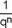

q = 1 + Zinssatz, wobei Zinssatz = 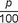

p = Zinsfuß

n = Restnutzungsdauer / Restlaufzeit

Das jeweilige Berechnungsergebnis ist kaufmännisch auf vier Nachkommastellen zu runden.

<a id="anlage-27-255"></a>

## Anlage 27 (zu § 237 Absatz 2)  Landwirtschaftliche Nutzung

(Fundstelle: BGBl. I 2021, 2291)

  
  


| **Bewertungsfaktoren** | **Bezugseinheit** | **in EUR** |
| --- | --- | --- |
| Grundbetrag | pro Ar | 2,52 |
| Ertragsmesszahl | pro Ertragsmesszahl (Produkt aus Acker-/Grünlandzahl und Ar) | 0,041 |
| **Zuschläge für** | **Bezugseinheit** | **in EUR** |
| Verstärkte Tierhaltung | je Vieheinheit über einem Besatz von 2,0 Vieheinheiten je Hektar selbst bewirtschafteter Fläche der landwirtschaftlichen Nutzung | 79,00 |

<a id="anlage-28-256"></a>

## Anlage 28 (zu § 237 Absatz 3)  Forstwirtschaftliche Nutzung

(Fundstelle: BGBl. I 2021, 2292 – 2294)

  
  


<table style="border-collapse:collapse">
<tr><td colspan="2"><strong>Bewertungsfaktor für Wuchsgebiet</strong></td><td style="text-align:center"><strong>in EUR/ha</strong></td></tr>
<tr><td style="text-align:center"> 1</td><td>Schleswig-Holstein Nordwest</td><td style="text-align:center">86,17</td></tr>
<tr><td style="text-align:center"> 2</td><td>Jungmoränenlandschaft Schleswig-Holstein Ost/Nordwest-Mecklenburg</td><td style="text-align:center">80,53</td></tr>
<tr><td style="text-align:center"> 3</td><td>Schleswig-Holstein Südwest</td><td style="text-align:center">90,24</td></tr>
<tr><td style="text-align:center"> 4</td><td>Mecklenburg-Westvorpommersches Küstenland</td><td style="text-align:center">64,57</td></tr>
<tr><td style="text-align:center"> 5</td><td>Ostholsteinisch-Westmecklenburger Jungmoränenland</td><td style="text-align:center">73,13</td></tr>
<tr><td style="text-align:center"> 6</td><td>(Mittel-)Mecklenburger Jungmoränenland</td><td style="text-align:center">62,38</td></tr>
<tr><td style="text-align:center"> 7</td><td>Ostmecklenburg-Vorpommersches Jungmoränenland</td><td style="text-align:center">78,03</td></tr>
<tr><td style="text-align:center"> 8</td><td>Ostvorpommersches Küstenland</td><td style="text-align:center">56,36</td></tr>
<tr><td style="text-align:center"> 9</td><td>Nordostbrandenburger Jungmoränenland (Mittelbrandenburger Jungmoränenland)</td><td style="text-align:center">53,83</td></tr>
<tr><td style="text-align:center">10</td><td>Ostmecklenburg-Nordbrandenburger Jungmoränenland (Nordbrandenburger Jungmoränenland)</td><td style="text-align:center">55,09</td></tr>
<tr><td style="text-align:center">11</td><td>Ostniedersächsisch-Altmärkisches Altmoränenland (Westprignitz-Altmärkisches Altmoränenland)</td><td style="text-align:center">46,03</td></tr>
<tr><td style="text-align:center">12</td><td>Südost-Holsteinisch-Südwestmecklenburger Altmoränenland</td><td style="text-align:center">57,31</td></tr>
<tr><td style="text-align:center">13</td><td>Ostniedersächsisches Tiefland</td><td style="text-align:center">66,34</td></tr>
<tr><td style="text-align:center">14</td><td>Niedersächsischer Küstenraum</td><td style="text-align:center">79,05</td></tr>
<tr><td style="text-align:center">15</td><td>Mittelwestniedersächsisches Tiefland</td><td style="text-align:center">67,41</td></tr>
<tr><td style="text-align:center">16</td><td>Westfälische Bucht</td><td style="text-align:center">70,03</td></tr>
<tr><td style="text-align:center">17</td><td>Weserbergland</td><td style="text-align:center">101,93</td></tr>
<tr><td style="text-align:center">18</td><td>Nordwestdeutsche Berglandschwelle</td><td style="text-align:center">73,10</td></tr>
<tr><td style="text-align:center">19</td><td>Nordwestliches Harzvorland</td><td style="text-align:center">65,70</td></tr>
<tr><td style="text-align:center">20</td><td>Nordöstliche Harzvorländer</td><td style="text-align:center">43,24</td></tr>
<tr><td style="text-align:center">21</td><td>Sachsen-Anhaltinische Löss-Ebene</td><td style="text-align:center">51,09</td></tr>
<tr><td style="text-align:center">22</td><td>Mittleres nordostdeutsches Altmoränenland</td><td style="text-align:center">38,39</td></tr>
<tr><td style="text-align:center">23</td><td>Hoher Fläming</td><td style="text-align:center">47,69</td></tr>
<tr><td style="text-align:center">24</td><td>Mittelbrandenburger Talsand- und Moränenland</td><td style="text-align:center">37,53</td></tr>
<tr><td style="text-align:center">25</td><td>Düben-Niederlausitzer Altmoränenland</td><td style="text-align:center">37,65</td></tr>
<tr><td style="text-align:center">26</td><td>Lausitzer Löss-Hügelland</td><td style="text-align:center">84,73</td></tr>
<tr><td style="text-align:center">27</td><td>Zittauer Gebirge</td><td style="text-align:center">163,92</td></tr>
<tr><td style="text-align:center">28</td><td>Oberlausitzer Bergland</td><td style="text-align:center">155,56</td></tr>
<tr><td style="text-align:center">29</td><td>Elbsandsteingebirge</td><td style="text-align:center">123,19</td></tr>
<tr><td style="text-align:center">30</td><td>Westlausitzer Platte und Elbtalzone</td><td style="text-align:center">68,56</td></tr>
<tr><td style="text-align:center">31</td><td>Sächsisch-Thüringisches Löss-Hügelland</td><td style="text-align:center">63,80</td></tr>
<tr><td style="text-align:center">32</td><td>Leipziger Sandlöss-Ebene</td><td style="text-align:center">50,58</td></tr>
<tr><td style="text-align:center">33</td><td>Ostthüringisches Trias-Hügelland</td><td style="text-align:center">72,24</td></tr>
<tr><td style="text-align:center">34</td><td>Thüringer Becken</td><td style="text-align:center">64,12</td></tr>
<tr><td style="text-align:center">35</td><td>Nordthüringisches Trias-Hügelland</td><td style="text-align:center">60,06</td></tr>
<tr><td style="text-align:center">36</td><td>Harz</td><td style="text-align:center">142,70</td></tr>
<tr><td style="text-align:center">37</td><td>Mitteldeutsches Trias-Berg- und Hügelland</td><td style="text-align:center">98,77</td></tr>
<tr><td style="text-align:center">38</td><td>Nordwesthessisches Bergland</td><td style="text-align:center">88,55</td></tr>
<tr><td style="text-align:center">39</td><td>Nördliches hessisches Schiefergebirge</td><td style="text-align:center">99,86</td></tr>
<tr><td style="text-align:center">40</td><td>Sauerland</td><td style="text-align:center">145,62</td></tr>
<tr><td style="text-align:center">41</td><td>Bergisches Land</td><td style="text-align:center">113,51</td></tr>
<tr><td style="text-align:center">42</td><td>Niederrheinisches Tiefland</td><td style="text-align:center">68,33</td></tr>
<tr><td style="text-align:center">43</td><td>Niederrheinische Bucht</td><td style="text-align:center">68,27</td></tr>
<tr><td style="text-align:center">44</td><td>Nordwesteifel</td><td style="text-align:center">135,51</td></tr>
<tr><td style="text-align:center">45</td><td>Osteifel</td><td style="text-align:center">99,15</td></tr>
<tr><td style="text-align:center">46</td><td>Mittelrheintal</td><td style="text-align:center">62,52</td></tr>
<tr><td style="text-align:center">47</td><td>Westerwald</td><td style="text-align:center">112,73</td></tr>
<tr><td style="text-align:center">48</td><td>Taunus</td><td style="text-align:center">94,94</td></tr>
<tr><td style="text-align:center">49</td><td>Wetterau und Gießener Becken</td><td style="text-align:center">73,66</td></tr>
<tr><td style="text-align:center">50</td><td>Vogelsberg und östlich angrenzende Sandsteingebiete</td><td style="text-align:center">102,75</td></tr>
<tr><td style="text-align:center">51</td><td>Rhön</td><td style="text-align:center">97,18</td></tr>
<tr><td style="text-align:center">52</td><td>Südthüringisches-Oberfränkisches Trias-Hügelland</td><td style="text-align:center">106,95</td></tr>
<tr><td style="text-align:center">53</td><td>Thüringer Gebirge</td><td style="text-align:center">162,51</td></tr>
<tr><td style="text-align:center">54</td><td>Vogtland</td><td style="text-align:center">140,47</td></tr>
<tr><td style="text-align:center">55</td><td>Erzgebirgsvorland</td><td style="text-align:center">93,22</td></tr>
<tr><td style="text-align:center">56</td><td>Erzgebirge</td><td style="text-align:center">171,75</td></tr>
<tr><td style="text-align:center">57</td><td>Frankenwald, Fichtelgebirge und Steinwald</td><td style="text-align:center">183,51</td></tr>
<tr><td style="text-align:center">58</td><td>Oberpfälzer Wald</td><td style="text-align:center">147,30</td></tr>
<tr><td style="text-align:center">59</td><td>Oberpfälzer Becken- und Hügelland</td><td style="text-align:center">78,21</td></tr>
<tr><td style="text-align:center">60</td><td>Frankenalb und Oberpfälzer Jura</td><td style="text-align:center">106,82</td></tr>
<tr><td style="text-align:center">61</td><td>Fränkischer Keuper und Albvorland</td><td style="text-align:center">73,44</td></tr>
<tr><td style="text-align:center">62</td><td>Fränkische Platte</td><td style="text-align:center">67,76</td></tr>
<tr><td style="text-align:center">63</td><td>Spessart</td><td style="text-align:center">105,47</td></tr>
<tr><td style="text-align:center">64</td><td>Odenwald</td><td style="text-align:center">124,93</td></tr>
<tr><td style="text-align:center">65</td><td>Oberrheinisches Tiefland und Rhein-Main-Ebene</td><td style="text-align:center">64,13</td></tr>
<tr><td style="text-align:center">66</td><td>Hunsrück</td><td style="text-align:center">116,75</td></tr>
<tr><td style="text-align:center">67</td><td>Moseltal</td><td style="text-align:center">87,42</td></tr>
<tr><td style="text-align:center">68</td><td>Gutland</td><td style="text-align:center">97,81</td></tr>
<tr><td style="text-align:center">69</td><td>Saarländisch-Pfälzisches Muschelkalkgebiet</td><td style="text-align:center">78,64</td></tr>
<tr><td style="text-align:center">70</td><td>Saar-Nahe-Bergland</td><td style="text-align:center">75,52</td></tr>
<tr><td style="text-align:center">71</td><td>Westricher Moorniederung</td><td style="text-align:center">79,49</td></tr>
<tr><td style="text-align:center">72</td><td>Pfälzerwald</td><td style="text-align:center">78,67</td></tr>
<tr><td style="text-align:center">73</td><td>Schwarzwald</td><td style="text-align:center">181,38</td></tr>
<tr><td style="text-align:center">74</td><td>Baar-Wutach</td><td style="text-align:center">172,51</td></tr>
<tr><td style="text-align:center">75</td><td>Neckarland</td><td style="text-align:center">117,23</td></tr>
<tr><td style="text-align:center">76</td><td>Schwäbische Alb</td><td style="text-align:center">123,63</td></tr>
<tr><td style="text-align:center">77</td><td>Südwestdeutsches Alpenvorland</td><td style="text-align:center">177,56</td></tr>
<tr><td style="text-align:center">78</td><td>Tertiäres Hügelland</td><td style="text-align:center">166,59</td></tr>
<tr><td style="text-align:center">79</td><td>Bayerischer Wald</td><td style="text-align:center">160,79</td></tr>
<tr><td style="text-align:center">80</td><td>Schwäbisch-Bayerische Schotterplatten- und Altmoränenlandschaft</td><td style="text-align:center">165,45</td></tr>
<tr><td style="text-align:center">81</td><td>Schwäbisch-Bayerische Jungmoräne und Molassevorberge</td><td style="text-align:center">157,93</td></tr>
<tr><td style="text-align:center">82</td><td>Bayerische Alpen</td><td style="text-align:center">135,61</td></tr>
</table>

<a id="anlage-29-257"></a>

## Anlage 29 (zu § 237 Absatz 4)  Weinbauliche Nutzung

(Fundstelle: BGBl. I 2021, 2295)

  
  


| **Bewertungsfaktor für** | **Flächeneinheit** | **in EUR** |
| --- | --- | --- |
| Traubenerzeugung | pro Ar | 11,70 |

<a id="anlage-30-258"></a>

## Anlage 30 (zu § 237 Absatz 5)  Gärtnerische Nutzung

(Fundstelle: BGBl. I 2021, 2296)

  
  


<table style="border-collapse:collapse">
<tr><td colspan="3" style="vertical-align:top"><strong>Nutzungsteil Gemüsebau</strong></td></tr>
<tr><td><strong>Bewertungsfaktor für</strong></td><td><strong>Flächeneinheit</strong></td><td><strong>in EUR</strong></td></tr>
<tr><td>Flächen<br> im Freiland und für Kleingarten- und Dauerkleingartenland</td><td>pro Ar</td><td>12,35</td></tr>
<tr><td><strong>Zuschläge für</strong></td><td><strong>Flächeneinheit</strong></td><td><strong>in EUR</strong></td></tr>
<tr><td>Flächen<br> unter Glas und Kunststoffen</td><td>pro Ar</td><td>45,00</td></tr>
<tr><td colspan="3"><strong>Nutzungsteil Blumen-/Zierpflanzenbau</strong></td></tr>
<tr><td><strong>Bewertungsfaktor für</strong></td><td><strong>Flächeneinheit</strong></td><td><strong>in EUR</strong></td></tr>
<tr><td>Flächen<br> im Freiland</td><td>pro Ar</td><td>27,60</td></tr>
<tr><td><strong>Zuschläge für</strong></td><td><strong>Flächeneinheit</strong></td><td><strong>in EUR</strong></td></tr>
<tr><td>Flächen<br> unter Glas und Kunststoffen</td><td>pro Ar</td><td>65,15</td></tr>
<tr><td colspan="3"><strong>Nutzungsteil Obstbau</strong></td></tr>
<tr><td><strong>Bewertungsfaktor für</strong></td><td><strong>Flächeneinheit</strong></td><td><strong>in EUR</strong></td></tr>
<tr><td>Flächen<br> im Freiland</td><td>pro Ar</td><td> 9,53</td></tr>
<tr><td><strong>Zuschläge für</strong></td><td><strong>Flächeneinheit</strong></td><td><strong>in EUR</strong></td></tr>
<tr><td>Flächen<br> unter Glas und Kunststoffen</td><td>pro Ar</td><td>45,00</td></tr>
<tr><td colspan="3"><strong>Nutzungsteil Baumschulen</strong></td></tr>
<tr><td><strong>Bewertungsfaktor für</strong></td><td><strong>Flächeneinheit</strong></td><td><strong>in EUR</strong></td></tr>
<tr><td>Flächen<br> im Freiland</td><td>pro Ar</td><td>22,29</td></tr>
<tr><td><strong>Zuschläge für</strong></td><td><strong>Flächeneinheit</strong></td><td><strong>in EUR</strong></td></tr>
<tr><td>Flächen<br> unter Glas und Kunststoffen</td><td>pro Ar</td><td>65,15</td></tr>
</table>

<a id="anlage-31-259"></a>

## Anlage 31 (zu § 237 Absatz 6 und 7)  Übrige land- und forstwirtschaftliche Nutzungen  sowie Abbauland, Geringstland und Unland

(Fundstelle: BGBl. I 2021, 2297)

  
  


<table style="border-collapse:collapse">
<tr><td colspan="3" style="vertical-align:top"><strong>Sondernutzungen</strong></td></tr>
<tr><td><strong>Bewertungsfaktor für</strong></td><td><strong>Flächeneinheit</strong></td><td style="text-align:center"><strong>in EUR</strong></td></tr>
<tr><td>Hopfen</td><td>pro Ar</td><td style="text-align:center">13,75</td></tr>
<tr><td>Spargel</td><td>pro Ar</td><td style="text-align:center">12,69</td></tr>
<tr><td colspan="3"><strong>Sonstige land- und forstwirtschaftliche Nutzungen</strong></td></tr>
<tr><td><strong>Bewertungsfaktor für</strong></td><td><strong>Bezugseinheit</strong></td><td style="text-align:center"><strong>in EUR</strong></td></tr>
<tr><td style="text-align:left">Wasserflächen</td><td style="text-align:left">pro Ar</td><td style="text-align:center"> 1,00</td></tr>
<tr><td colspan="3"><strong>Zuschläge für stehende Gewässer</strong></td></tr>
<tr><td style="text-align:left">Wasserflächen für Binnenfischerei,<br> Teichwirtschaft und Fischzucht für<br> Binnenfischerei und Teichwirtschaft</td><td style="text-align:left">ab 1,00 kg bis 4,00 kg<br>Fischertrag/Ar pro Ar</td><td style="text-align:center"> 2,00</td></tr>
<tr><td style="text-align:left">Wasserflächen für Binnenfischerei,<br> Teichwirtschaft und Fischzucht für<br> Binnenfischerei und Teichwirtschaft</td><td style="text-align:left">über 4,00 kg<br> Fischertrag/Ar pro Ar</td><td style="text-align:center"> 2,50</td></tr>
<tr><td colspan="3"><strong>Zuschläge für fließende Gewässer</strong></td></tr>
<tr><td style="text-align:left">Teichwirtschaft und Fischzucht für Binnenfischerei und Teichwirtschaft</td><td style="text-align:left">bis 500 Liter/Sekunde<br> Durchfluss pro Liter/Sekunde</td><td style="text-align:center">12,50</td></tr>
<tr><td style="text-align:left">Teichwirtschaft und Fischzucht für Binnenfischerei und Teichwirtschaft</td><td style="text-align:left">über 500 Liter/Sekunde<br>Durchfluss pro Liter/Sekunde</td><td style="text-align:center">15,00</td></tr>
<tr><td colspan="3"></td></tr>
<tr><td>Saatzucht</td><td>pro Ar</td><td style="text-align:center">Anlage 27</td></tr>
<tr><td>Weihnachtsbaumkulturen</td><td>pro Ar</td><td style="text-align:center">19,40</td></tr>
<tr><td>Kurzumtriebsplantagen</td><td>pro Ar</td><td style="text-align:center">Anlage 27</td></tr>
<tr><td colspan="3"><strong>Sonstige land- und forstwirtschaftliche Nutzungen, für die kein Bewertungsfaktor festgelegt wurde</strong></td></tr>
<tr><td>Wirtschaftsgebäude</td><td>pro Quadratmeter Bruttogrundfläche und Monat</td><td style="text-align:center"> 1,23</td></tr>
<tr><td colspan="3"><strong>Nutzungsarten Abbauland, Geringstland und Unland</strong></td></tr>
<tr><td><strong>Bewertungsfaktor für</strong></td><td><strong>Flächeneinheit</strong></td><td style="text-align:center"><strong>in EUR</strong></td></tr>
<tr><td>Abbauland</td><td>pro Ar</td><td style="text-align:center"> 1,00</td></tr>
<tr><td>Geringstland</td><td>pro Ar</td><td style="text-align:center"> 0,38</td></tr>
<tr><td>Unland</td><td>pro Ar</td><td style="text-align:center"> 0,00</td></tr>
</table>

<a id="anlage-32-260"></a>

## Anlage 32 (zu § 237 Absatz 8)  Nutzungsart Hofstelle

(Fundstelle: BGBl. I 2021, 2298)

  
  


| **Bewertungsfaktor für** | **Flächeneinheit** | **in EUR** |
| --- | --- | --- |
| Hofflächen | pro Ar | 6,62 |
| **Zuschläge für** | **Flächeneinheit** | **in EUR** |
| Wirtschaftsgebäude der weinbaulichen Nutzung bei Fass- und Flaschenweinerzeugung | pro Quadratmeter Bruttogrundfläche und Monat | 1,23 |
| Wirtschaftsgebäude der Nebenbetriebe | pro Quadratmeter Bruttogrundfläche und Monat | 1,23 |

<a id="anlage-33-261"></a>

## Anlage 33 (zu § 238 Absatz 2)  Weitere den Ertragswert erhöhende Umstände

(Fundstelle: BGBl. I 2021, 2299)

  
  


| **Bewertungsfaktor für** | **Flächeneinheit** | **in EUR** |
| --- | --- | --- |
| Abgegrenzte Standortfläche der<br> Windenergieanlage | pro Ar | 59,58 |

<a id="anlage-34-262"></a>

## Anlage 34 (zu § 241 Absatz 5)  Umrechnungsschlüssel für Tierbestände in Vieheinheiten (VE)  nach dem Futterbedarf

(Fundstelle: BGBl. I 2019, 1824 – 25)

  
  


<table style="border-collapse:collapse">
<tr><td style="border-bottom:1px solid currentColor"><strong>Tierart</strong></td><td colspan="2" style="border-bottom:1px solid currentColor"><strong>1 Tier</strong></td></tr>
<tr><td><strong>Nach dem Durchschnittsbestand in Stück:</strong></td><td></td><td></td></tr>
<tr><td><strong>Alpakas</strong></td><td>0,08</td><td>VE</td></tr>
<tr><td><strong>Damtiere</strong></td><td></td><td></td></tr>
<tr><td>Damtiere unter 1 Jahr</td><td>0,04</td><td>VE</td></tr>
<tr><td>Damtiere 1 Jahr und älter</td><td>0,08</td><td>VE</td></tr>
<tr><td><strong>Geflügel</strong></td><td></td><td></td></tr>
<tr><td>Legehennen (einschließlich einer normalen Aufzucht zur Ergänzung des Bestandes)</td><td>0,02</td><td>VE</td></tr>
<tr><td>Legehennen aus zugekauften Junghennen</td><td>0,0183</td><td>VE</td></tr>
<tr><td>Zuchtputen, -enten, -gänse</td><td>0,04</td><td>VE</td></tr>
<tr><td><strong>Kaninchen</strong></td><td></td><td></td></tr>
<tr><td>Zucht- und Angorakaninchen</td><td>0,025</td><td>VE</td></tr>
<tr><td><strong>Lamas</strong></td><td>0,1</td><td>VE</td></tr>
<tr><td><strong>Pferde</strong></td><td></td><td></td></tr>
<tr><td>Pferde unter 3 Jahren und Kleinpferde</td><td>0,7</td><td>VE</td></tr>
<tr><td>Pferde 3 Jahre und älter</td><td>1,1</td><td>VE</td></tr>
<tr><td><strong>Rindvieh</strong></td><td></td><td></td></tr>
<tr><td>Kälber und Jungvieh unter 1 Jahr (einschließlich Mastkälber, Starterkälber und Fresser)</td><td>0,3</td><td>VE</td></tr>
<tr><td>Jungvieh 1 bis 2 Jahre alt</td><td>0,7</td><td>VE</td></tr>
<tr><td>Färsen (älter als 2 Jahre)</td><td>1</td><td>VE</td></tr>
<tr><td>Masttiere (Mastdauer weniger als 1 Jahr)</td><td>1</td><td>VE</td></tr>
<tr><td>Kühe (einschließlich Mutter- und Ammenkühe mit den dazugehörigen Saugkälbern)</td><td>1</td><td>VE</td></tr>
<tr><td>Zuchtbullen, Zugochsen</td><td>1,2</td><td>VE</td></tr>
<tr><td><strong>Schafe</strong></td><td></td><td></td></tr>
<tr><td>Schafe unter 1 Jahr (einschließlich Mastlämmer)</td><td>0,05</td><td>VE</td></tr>
<tr><td>Schafe 1 Jahr und älter</td><td>0,1</td><td>VE</td></tr>
<tr><td><strong>Schweine</strong></td><td></td><td></td></tr>
<tr><td>Zuchtschweine (einschließlich Jungzuchtschweine über etwa 90 kg)</td><td>0,33</td><td>VE</td></tr>
<tr><td><strong>Strauße</strong></td><td></td><td></td></tr>
<tr><td>Zuchttiere 14 Monate und älter</td><td>0,32</td><td>VE</td></tr>
<tr><td>Jungtiere/Masttiere unter 14 Monate</td><td>0,25</td><td>VE</td></tr>
<tr><td><strong>Ziegen</strong></td><td>0,08</td><td>VE</td></tr>
<tr><td><strong>Nach der Erzeugung in Stück:</strong></td><td></td><td></td></tr>
<tr><td><strong>Geflügel</strong></td><td></td><td></td></tr>
<tr><td>Jungmasthühner (bis zu 6 Durchgänge je Jahr – schwere Tiere)</td><td>0,0017</td><td>VE</td></tr>
<tr><td>(mehr als 6 Durchgänge je Jahr – leichte Tiere)</td><td>0,0013</td><td>VE</td></tr>
<tr><td>Junghennen</td><td>0,0017</td><td>VE</td></tr>
<tr><td>Mastenten</td><td>0,0033</td><td>VE</td></tr>
<tr><td>Mastenten in der Aufzuchtphase</td><td>0,0011</td><td>VE</td></tr>
<tr><td>Mastenten in der Mastphase</td><td>0,0022</td><td>VE</td></tr>
<tr><td>Mastputen aus selbst erzeugten Jungputen</td><td>0,0067</td><td>VE</td></tr>
<tr><td>Mastputen aus zugekauften Jungputen</td><td>0,005</td><td>VE</td></tr>
<tr><td>Jungputen (bis etwa 8 Wochen)</td><td>0,0017</td><td>VE</td></tr>
<tr><td>Mastgänse</td><td>0,0067</td><td>VE</td></tr>
<tr><td><strong>Kaninchen</strong></td><td></td><td></td></tr>
<tr><td>Mastkaninchen</td><td>0,0025</td><td>VE</td></tr>
<tr><td><strong>Rindvieh</strong></td><td></td><td></td></tr>
<tr><td>Masttiere (Mastdauer 1 Jahr und mehr)</td><td>1</td><td>VE</td></tr>
<tr><td><strong>Schweine</strong></td><td></td><td></td></tr>
<tr><td>Leichte Ferkel (bis etwa 12 kg)</td><td>0,01</td><td>VE</td></tr>
<tr><td>Ferkel (über etwa 12 bis etwa 20 kg)</td><td>0,02</td><td>VE</td></tr>
<tr><td>Schwere Ferkel und leichte Läufer (über etwa 20 bis etwa 30 kg)</td><td>0,04</td><td>VE</td></tr>
<tr><td>Läufer (über etwa 30 bis etwa 45 kg)</td><td>0,06</td><td>VE</td></tr>
<tr><td>Schwere Läufer (über etwa 45 bis etwa 60 kg)</td><td>0,08</td><td>VE</td></tr>
<tr><td>Mastschweine</td><td>0,16</td><td>VE</td></tr>
<tr><td>Jungzuchtschweine bis etwa 90 kg</td><td>0,12</td><td>VE</td></tr>
</table>

<a id="anlage-35-263"></a>

## Anlage 35 (zu § 241 Absatz 5)  Gruppen der Zweige des Tierbestands nach der Flächenabhängigkeit

(Fundstelle: BGBl. I 2019, 1826)

  
  
- **1\.** Mehr flächenabhängige Zweige des Tierbestands:

  Pferdehaltung,

  Pferdezucht,

  Schafzucht,

  Schafhaltung,

  Rindviehzucht,

  Milchviehhaltung,

  Rindviehmast.

- **2\.** Weniger flächenabhängige Zweige des Tierbestands:

  Schweinezucht,

  Schweinemast,

  Hühnerzucht,

  Entenzucht,

  Gänsezucht,

  Putenzucht,

  Legehennenhaltung,

  Junghühnermast,

  Entenmast,

  Gänsemast,

  Putenmast.

<a id="anlage-36-264"></a>

## Anlage 36 (zu den §§ 251 und 257 Absatz 1)  Umrechnungskoeffizienten zur Berücksichtigung abweichender Grundstücksgrößen  beim Bodenwert von Ein- und Zweifamilienhäusern

(Fundstelle: BGBl. I 2019, 1827)

  
  


| **Grundstücksgröße** | **Umrechnungskoeffizient** |
| --- | --- |
| &lt; 250 m<sup>2</sup> | 1,24 |
| ≥ 250 m<sup>2</sup> | 1,19 |
| ≥ 300 m<sup>2</sup> | 1,14 |
| ≥ 350 m<sup>2</sup> | 1,10 |
| ≥ 400 m<sup>2</sup> | 1,06 |
| ≥ 450 m<sup>2</sup> | 1,03 |
| ≥ 500 m<sup>2</sup> | 1,00 |
| ≥ 550 m<sup>2</sup> | 0,98 |
| ≥ 600 m<sup>2</sup> | 0,95 |
| ≥ 650 m<sup>2</sup> | 0,94 |
| ≥ 700 m<sup>2</sup> | 0,92 |
| ≥ 750 m<sup>2</sup> | 0,90 |
| ≥ 800 m<sup>2</sup> | 0,89 |
| ≥ 850 m<sup>2</sup> | 0,87 |
| ≥ 900 m<sup>2</sup> | 0,86 |
| ≥ 950 m<sup>2</sup> | 0,85 |
| ≥ 1 000 m<sup>2</sup> | 0,84 |
| ≥ 1 050 m<sup>2</sup> | 0,83 |
| ≥ 1 100 m<sup>2</sup> | 0,82 |
| ≥ 1 150 m<sup>2</sup> | 0,81 |
| ≥ 1 200 m<sup>2</sup> | 0,80 |
| ≥ 1 250 m<sup>2</sup> | 0,79 |
| ≥ 1 300 m<sup>2</sup> | 0,78 |
| ≥ 1 350 m<sup>2</sup> | 0,77 |
| ≥ 1 400 m<sup>2</sup> | 0,76 |
| ≥ 1 450 m<sup>2</sup> | 0,75 |
| ≥ 1 500 m<sup>2</sup> | 0,74 |
| ≥ 1 550 m<sup>2</sup> | 0,73 |
| ≥ 1 600 m<sup>2</sup> | 0,72 |
| ≥ 1 650 m<sup>2</sup> | 0,71 |
| ≥ 1 700 m<sup>2</sup> | 0,70 |
| ≥ 1 750 m<sup>2</sup> | 0,69 |
| ≥ 1 800 m<sup>2</sup> | 0,68 |
| ≥ 1 850 m<sup>2</sup> | 0,67 |
| ≥ 1 900 m<sup>2</sup> | 0,66 |
| ≥ 1 950 m<sup>2</sup> | 0,65 |
| ≥ 2 000 m<sup>2</sup> | 0,64 |

<a id="anlage-37-265"></a>

## Anlage 37 (zu § 253 Absatz 2)  Vervielfältiger

(Fundstelle: BGBl. I 2019, 1828 — 1833)

  
  


<table style="border-collapse:collapse">
<tr><td rowspan="2" style="text-align:center"><strong>Rest-<br> nutzungs-<br> dauer<br> (Jahre)</strong></td><td colspan="11" style="text-align:center"><strong>Zinssatz</strong></td></tr>
<tr><td><strong>1,5 %</strong></td><td><strong>1,6 %</strong></td><td><strong>1,7 %</strong></td><td><strong>1,8 %</strong></td><td><strong>1,9 %</strong></td><td><strong>2,0 %</strong></td><td><strong>2,1 %</strong></td><td><strong>2,2 %</strong></td><td><strong>2,3 %</strong></td><td><strong>2,4 %</strong></td><td><strong>2,5 %</strong></td></tr>
<tr><td>  1</td><td> 0,99</td><td> 0,98</td><td> 0,98</td><td> 0,98</td><td> 0,98</td><td> 0,98</td><td> 0,98</td><td> 0,98</td><td> 0,98</td><td> 0,98</td><td> 0,98</td></tr>
<tr><td>  2</td><td> 1,96</td><td> 1,95</td><td> 1,95</td><td> 1,95</td><td> 1,94</td><td> 1,94</td><td> 1,94</td><td> 1,94</td><td> 1,93</td><td> 1,93</td><td> 1,93</td></tr>
<tr><td>  3</td><td> 2,91</td><td> 2,91</td><td> 2,90</td><td> 2,90</td><td> 2,89</td><td> 2,88</td><td> 2,88</td><td> 2,87</td><td> 2,87</td><td> 2,86</td><td> 2,86</td></tr>
<tr><td>  4</td><td> 3,85</td><td> 3,84</td><td> 3,84</td><td> 3,83</td><td> 3,82</td><td> 3,81</td><td> 3,80</td><td> 3,79</td><td> 3,78</td><td> 3,77</td><td> 3,76</td></tr>
<tr><td>  5</td><td> 4,78</td><td> 4,77</td><td> 4,75</td><td> 4,74</td><td> 4,73</td><td> 4,71</td><td> 4,70</td><td> 4,69</td><td> 4,67</td><td> 4,66</td><td> 4,65</td></tr>
<tr><td>  6</td><td> 5,70</td><td> 5,68</td><td> 5,66</td><td> 5,64</td><td> 5,62</td><td> 5,60</td><td> 5,58</td><td> 5,56</td><td> 5,55</td><td> 5,53</td><td> 5,51</td></tr>
<tr><td>  7</td><td> 6,60</td><td> 6,57</td><td> 6,55</td><td> 6,52</td><td> 6,50</td><td> 6,47</td><td> 6,45</td><td> 6,42</td><td> 6,40</td><td> 6,37</td><td> 6,35</td></tr>
<tr><td>  8</td><td> 7,49</td><td> 7,45</td><td> 7,42</td><td> 7,39</td><td> 7,36</td><td> 7,33</td><td> 7,29</td><td> 7,26</td><td> 7,23</td><td> 7,20</td><td> 7,17</td></tr>
<tr><td>  9</td><td> 8,36</td><td> 8,32</td><td> 8,28</td><td> 8,24</td><td> 8,20</td><td> 8,16</td><td> 8,12</td><td> 8,08</td><td> 8,05</td><td> 8,01</td><td> 7,97</td></tr>
<tr><td> 10</td><td> 9,22</td><td> 9,17</td><td> 9,13</td><td> 9,08</td><td> 9,03</td><td> 8,98</td><td> 8,94</td><td> 8,89</td><td> 8,84</td><td> 8,80</td><td> 8,75</td></tr>
<tr><td> 11</td><td>10,07</td><td>10,01</td><td> 9,96</td><td> 9,90</td><td> 9,84</td><td> 9,79</td><td> 9,73</td><td> 9,68</td><td> 9,62</td><td> 9,57</td><td> 9,51</td></tr>
<tr><td> 12</td><td>10,91</td><td>10,84</td><td>10,77</td><td>10,71</td><td>10,64</td><td>10,58</td><td>10,51</td><td>10,45</td><td>10,38</td><td>10,32</td><td>10,26</td></tr>
<tr><td> 13</td><td>11,73</td><td>11,65</td><td>11,58</td><td>11,50</td><td>11,42</td><td>11,35</td><td>11,27</td><td>11,20</td><td>11,13</td><td>11,05</td><td>10,98</td></tr>
<tr><td> 14</td><td>12,54</td><td>12,45</td><td>12,37</td><td>12,28</td><td>12,19</td><td>12,11</td><td>12,02</td><td>11,94</td><td>11,85</td><td>11,77</td><td>11,69</td></tr>
<tr><td> 15</td><td>13,34</td><td>13,24</td><td>13,14</td><td>13,04</td><td>12,95</td><td>12,85</td><td>12,75</td><td>12,66</td><td>12,57</td><td>12,47</td><td>12,38</td></tr>
<tr><td> 16</td><td>14,13</td><td>14,02</td><td>13,91</td><td>13,80</td><td>13,69</td><td>13,58</td><td>13,47</td><td>13,37</td><td>13,26</td><td>13,16</td><td>13,06</td></tr>
<tr><td> 17</td><td>14,91</td><td>14,78</td><td>14,66</td><td>14,53</td><td>14,41</td><td>14,29</td><td>14,17</td><td>14,06</td><td>13,94</td><td>13,83</td><td>13,71</td></tr>
<tr><td> 18</td><td>15,67</td><td>15,53</td><td>15,40</td><td>15,26</td><td>15,12</td><td>14,99</td><td>14,86</td><td>14,73</td><td>14,60</td><td>14,48</td><td>14,35</td></tr>
<tr><td> 19</td><td>16,43</td><td>16,27</td><td>16,12</td><td>15,97</td><td>15,82</td><td>15,68</td><td>15,53</td><td>15,39</td><td>15,25</td><td>15,12</td><td>14,98</td></tr>
<tr><td> 20</td><td>17,17</td><td>17,00</td><td>16,83</td><td>16,67</td><td>16,51</td><td>16,35</td><td>16,19</td><td>16,04</td><td>15,89</td><td>15,74</td><td>15,59</td></tr>
<tr><td> 21</td><td>17,90</td><td>17,72</td><td>17,54</td><td>17,36</td><td>17,18</td><td>17,01</td><td>16,84</td><td>16,67</td><td>16,51</td><td>16,35</td><td>16,18</td></tr>
<tr><td> 22</td><td>18,62</td><td>18,42</td><td>18,23</td><td>18,03</td><td>17,84</td><td>17,66</td><td>17,47</td><td>17,29</td><td>17,11</td><td>16,94</td><td>16,77</td></tr>
<tr><td> 23</td><td>19,33</td><td>19,12</td><td>18,91</td><td>18,70</td><td>18,49</td><td>18,29</td><td>18,09</td><td>17,90</td><td>17,71</td><td>17,52</td><td>17,33</td></tr>
<tr><td> 24</td><td>20,03</td><td>19,80</td><td>19,57</td><td>19,35</td><td>19,13</td><td>18,91</td><td>18,70</td><td>18,49</td><td>18,29</td><td>18,08</td><td>17,88</td></tr>
<tr><td> 25</td><td>20,72</td><td>20,47</td><td>20,23</td><td>19,99</td><td>19,75</td><td>19,52</td><td>19,30</td><td>19,07</td><td>18,85</td><td>18,64</td><td>18,42</td></tr>
<tr><td> 26</td><td>21,40</td><td>21,13</td><td>20,87</td><td>20,62</td><td>20,37</td><td>20,12</td><td>19,88</td><td>19,64</td><td>19,41</td><td>19,18</td><td>18,95</td></tr>
<tr><td> 27</td><td>22,07</td><td>21,79</td><td>21,51</td><td>21,24</td><td>20,97</td><td>20,71</td><td>20,45</td><td>20,20</td><td>19,95</td><td>19,70</td><td>19,46</td></tr>
<tr><td> 28</td><td>22,73</td><td>22,43</td><td>22,13</td><td>21,84</td><td>21,56</td><td>21,28</td><td>21,01</td><td>20,74</td><td>20,48</td><td>20,22</td><td>19,96</td></tr>
<tr><td> 29</td><td>23,38</td><td>23,06</td><td>22,75</td><td>22,44</td><td>22,14</td><td>21,84</td><td>21,56</td><td>21,27</td><td>20,99</td><td>20,72</td><td>20,45</td></tr>
<tr><td> 30</td><td>24,02</td><td>23,68</td><td>23,35</td><td>23,02</td><td>22,71</td><td>22,40</td><td>22,09</td><td>21,79</td><td>21,50</td><td>21,21</td><td>20,93</td></tr>
<tr><td> 31</td><td>24,65</td><td>24,29</td><td>23,94</td><td>23,60</td><td>23,27</td><td>22,94</td><td>22,62</td><td>22,30</td><td>21,99</td><td>21,69</td><td>21,40</td></tr>
<tr><td> 32</td><td>25,27</td><td>24,89</td><td>24,52</td><td>24,17</td><td>23,81</td><td>23,47</td><td>23,13</td><td>22,80</td><td>22,48</td><td>22,16</td><td>21,85</td></tr>
<tr><td> 33</td><td>25,88</td><td>25,48</td><td>25,10</td><td>24,72</td><td>24,35</td><td>23,99</td><td>23,63</td><td>23,29</td><td>22,95</td><td>22,62</td><td>22,29</td></tr>
<tr><td> 34</td><td>26,48</td><td>26,07</td><td>25,66</td><td>25,27</td><td>24,88</td><td>24,50</td><td>24,13</td><td>23,77</td><td>23,41</td><td>23,06</td><td>22,72</td></tr>
<tr><td> 35</td><td>27,08</td><td>26,64</td><td>26,22</td><td>25,80</td><td>25,40</td><td>25,00</td><td>24,61</td><td>24,23</td><td>23,86</td><td>23,50</td><td>23,15</td></tr>
<tr><td> 36</td><td>27,66</td><td>27,21</td><td>26,76</td><td>26,33</td><td>25,90</td><td>25,49</td><td>25,08</td><td>24,69</td><td>24,30</td><td>23,93</td><td>23,56</td></tr>
<tr><td> 37</td><td>28,24</td><td>27,76</td><td>27,30</td><td>26,84</td><td>26,40</td><td>25,97</td><td>25,55</td><td>25,14</td><td>24,73</td><td>24,34</td><td>23,96</td></tr>
<tr><td> 38</td><td>28,81</td><td>28,31</td><td>27,82</td><td>27,35</td><td>26,89</td><td>26,44</td><td>26,00</td><td>25,57</td><td>25,16</td><td>24,75</td><td>24,35</td></tr>
<tr><td> 39</td><td>29,36</td><td>28,85</td><td>28,34</td><td>27,85</td><td>27,37</td><td>26,90</td><td>26,45</td><td>26,00</td><td>25,57</td><td>25,14</td><td>24,73</td></tr>
<tr><td> 40</td><td>29,92</td><td>29,38</td><td>28,85</td><td>28,34</td><td>27,84</td><td>27,36</td><td>26,88</td><td>26,42</td><td>25,97</td><td>25,53</td><td>25,10</td></tr>
<tr><td> 41</td><td>30,46</td><td>29,90</td><td>29,35</td><td>28,82</td><td>28,30</td><td>27,80</td><td>27,31</td><td>26,83</td><td>26,36</td><td>25,91</td><td>25,47</td></tr>
<tr><td> 42</td><td>30,99</td><td>30,41</td><td>29,85</td><td>29,29</td><td>28,76</td><td>28,23</td><td>27,73</td><td>27,23</td><td>26,75</td><td>26,28</td><td>25,82</td></tr>
<tr><td> 43</td><td>31,52</td><td>30,92</td><td>30,33</td><td>29,76</td><td>29,20</td><td>28,66</td><td>28,14</td><td>27,62</td><td>27,12</td><td>26,64</td><td>26,17</td></tr>
<tr><td> 44</td><td>32,04</td><td>31,41</td><td>30,81</td><td>30,21</td><td>29,64</td><td>29,08</td><td>28,54</td><td>28,01</td><td>27,49</td><td>26,99</td><td>26,50</td></tr>
<tr><td> 45</td><td>32,55</td><td>31,90</td><td>31,27</td><td>30,66</td><td>30,07</td><td>29,49</td><td>28,93</td><td>28,38</td><td>27,85</td><td>27,34</td><td>26,83</td></tr>
<tr><td> 46</td><td>33,06</td><td>32,39</td><td>31,73</td><td>31,10</td><td>30,49</td><td>29,89</td><td>29,31</td><td>28,75</td><td>28,20</td><td>27,67</td><td>27,15</td></tr>
<tr><td> 47</td><td>33,55</td><td>32,86</td><td>32,19</td><td>31,54</td><td>30,90</td><td>30,29</td><td>29,69</td><td>29,11</td><td>28,55</td><td>28,00</td><td>27,47</td></tr>
<tr><td> 48</td><td>34,04</td><td>33,33</td><td>32,63</td><td>31,96</td><td>31,31</td><td>30,67</td><td>30,06</td><td>29,46</td><td>28,88</td><td>28,32</td><td>27,77</td></tr>
<tr><td> 49</td><td>34,52</td><td>33,79</td><td>33,07</td><td>32,38</td><td>31,70</td><td>31,05</td><td>30,42</td><td>29,81</td><td>29,21</td><td>28,63</td><td>28,07</td></tr>
<tr><td> 50</td><td>35,00</td><td>34,24</td><td>33,50</td><td>32,79</td><td>32,09</td><td>31,42</td><td>30,77</td><td>30,14</td><td>29,53</td><td>28,94</td><td>28,36</td></tr>
<tr><td> 51</td><td>35,47</td><td>34,68</td><td>33,92</td><td>33,19</td><td>32,48</td><td>31,79</td><td>31,12</td><td>30,47</td><td>29,84</td><td>29,24</td><td>28,65</td></tr>
<tr><td> 52</td><td>35,93</td><td>35,12</td><td>34,34</td><td>33,58</td><td>32,85</td><td>32,14</td><td>31,46</td><td>30,79</td><td>30,15</td><td>29,53</td><td>28,92</td></tr>
<tr><td> 53</td><td>36,38</td><td>35,55</td><td>34,75</td><td>33,97</td><td>33,22</td><td>32,50</td><td>31,79</td><td>31,11</td><td>30,45</td><td>29,81</td><td>29,19</td></tr>
<tr><td> 54</td><td>36,83</td><td>35,98</td><td>35,15</td><td>34,35</td><td>33,58</td><td>32,84</td><td>32,12</td><td>31,42</td><td>30,74</td><td>30,09</td><td>29,46</td></tr>
<tr><td> 55</td><td>37,27</td><td>36,39</td><td>35,55</td><td>34,73</td><td>33,94</td><td>33,17</td><td>32,44</td><td>31,72</td><td>31,03</td><td>30,36</td><td>29,71</td></tr>
<tr><td> 56</td><td>37,71</td><td>36,81</td><td>35,94</td><td>35,10</td><td>34,29</td><td>33,50</td><td>32,75</td><td>32,02</td><td>31,31</td><td>30,63</td><td>29,96</td></tr>
<tr><td> 57</td><td>38,13</td><td>37,21</td><td>36,32</td><td>35,46</td><td>34,63</td><td>33,83</td><td>33,05</td><td>32,31</td><td>31,58</td><td>30,88</td><td>30,21</td></tr>
<tr><td> 58</td><td>38,56</td><td>37,61</td><td>36,70</td><td>35,82</td><td>34,97</td><td>34,15</td><td>33,35</td><td>32,59</td><td>31,85</td><td>31,14</td><td>30,45</td></tr>
<tr><td> 59</td><td>38,97</td><td>38,00</td><td>37,07</td><td>36,16</td><td>35,29</td><td>34,46</td><td>33,65</td><td>32,87</td><td>32,11</td><td>31,38</td><td>30,68</td></tr>
<tr><td> 60</td><td>39,38</td><td>38,39</td><td>37,43</td><td>36,51</td><td>35,62</td><td>34,76</td><td>33,93</td><td>33,14</td><td>32,37</td><td>31,63</td><td>30,91</td></tr>
<tr><td> 61</td><td>39,78</td><td>38,77</td><td>37,79</td><td>36,84</td><td>35,94</td><td>35,06</td><td>34,22</td><td>33,40</td><td>32,62</td><td>31,86</td><td>31,13</td></tr>
<tr><td> 62</td><td>40,18</td><td>39,14</td><td>38,14</td><td>37,17</td><td>36,25</td><td>35,35</td><td>34,49</td><td>33,66</td><td>32,86</td><td>32,09</td><td>31,35</td></tr>
<tr><td> 63</td><td>40,57</td><td>39,51</td><td>38,48</td><td>37,50</td><td>36,55</td><td>35,64</td><td>34,76</td><td>33,92</td><td>33,10</td><td>32,31</td><td>31,56</td></tr>
<tr><td> 64</td><td>40,96</td><td>39,87</td><td>38,82</td><td>37,82</td><td>36,85</td><td>35,92</td><td>35,03</td><td>34,16</td><td>33,33</td><td>32,53</td><td>31,76</td></tr>
<tr><td> 65</td><td>41,34</td><td>40,23</td><td>39,16</td><td>38,13</td><td>37,15</td><td>36,20</td><td>35,28</td><td>34,41</td><td>33,56</td><td>32,75</td><td>31,96</td></tr>
<tr><td> 66</td><td>41,71</td><td>40,58</td><td>39,49</td><td>38,44</td><td>37,43</td><td>36,47</td><td>35,54</td><td>34,64</td><td>33,78</td><td>32,96</td><td>32,16</td></tr>
<tr><td> 67</td><td>42,08</td><td>40,92</td><td>39,81</td><td>38,74</td><td>37,72</td><td>36,73</td><td>35,79</td><td>34,88</td><td>34,00</td><td>33,16</td><td>32,35</td></tr>
<tr><td> 68</td><td>42,44</td><td>41,26</td><td>40,13</td><td>39,04</td><td>38,00</td><td>36,99</td><td>36,03</td><td>35,11</td><td>34,22</td><td>33,36</td><td>32,54</td></tr>
<tr><td> 69</td><td>42,80</td><td>41,60</td><td>40,44</td><td>39,33</td><td>38,27</td><td>37,25</td><td>36,27</td><td>35,33</td><td>34,42</td><td>33,56</td><td>32,72</td></tr>
<tr><td> 70</td><td>43,15</td><td>41,93</td><td>40,75</td><td>39,62</td><td>38,54</td><td>37,50</td><td>36,50</td><td>35,55</td><td>34,63</td><td>33,75</td><td>32,90</td></tr>
<tr><td> 71</td><td>43,50</td><td>42,25</td><td>41,05</td><td>39,90</td><td>38,80</td><td>37,74</td><td>36,73</td><td>35,76</td><td>34,83</td><td>33,93</td><td>33,07</td></tr>
<tr><td> 72</td><td>43,84</td><td>42,57</td><td>41,35</td><td>40,18</td><td>39,06</td><td>37,98</td><td>36,95</td><td>35,97</td><td>35,02</td><td>34,11</td><td>33,24</td></tr>
<tr><td> 73</td><td>44,18</td><td>42,88</td><td>41,64</td><td>40,45</td><td>39,31</td><td>38,22</td><td>37,17</td><td>36,17</td><td>35,21</td><td>34,29</td><td>33,40</td></tr>
<tr><td> 74</td><td>44,51</td><td>43,19</td><td>41,93</td><td>40,72</td><td>39,56</td><td>38,45</td><td>37,39</td><td>36,37</td><td>35,40</td><td>34,46</td><td>33,57</td></tr>
<tr><td> 75</td><td>44,84</td><td>43,50</td><td>42,21</td><td>40,98</td><td>39,80</td><td>38,68</td><td>37,60</td><td>36,57</td><td>35,58</td><td>34,63</td><td>33,72</td></tr>
<tr><td> 76</td><td>45,16</td><td>43,79</td><td>42,49</td><td>41,24</td><td>40,04</td><td>38,90</td><td>37,81</td><td>36,76</td><td>35,76</td><td>34,80</td><td>33,88</td></tr>
<tr><td> 77</td><td>45,48</td><td>44,09</td><td>42,76</td><td>41,49</td><td>40,28</td><td>39,12</td><td>38,01</td><td>36,95</td><td>35,93</td><td>34,96</td><td>34,03</td></tr>
<tr><td> 78</td><td>45,79</td><td>44,38</td><td>43,03</td><td>41,74</td><td>40,51</td><td>39,33</td><td>38,21</td><td>37,13</td><td>36,10</td><td>35,11</td><td>34,17</td></tr>
<tr><td> 79</td><td>46,10</td><td>44,66</td><td>43,29</td><td>41,98</td><td>40,73</td><td>39,54</td><td>38,40</td><td>37,31</td><td>36,27</td><td>35,27</td><td>34,31</td></tr>
<tr><td> 80</td><td>46,41</td><td>44,95</td><td>43,55</td><td>42,22</td><td>40,96</td><td>39,74</td><td>38,59</td><td>37,48</td><td>36,43</td><td>35,42</td><td>34,45</td></tr>
<tr><td> 81</td><td>46,71</td><td>45,22</td><td>43,81</td><td>42,46</td><td>41,17</td><td>39,95</td><td>38,77</td><td>37,66</td><td>36,59</td><td>35,56</td><td>34,59</td></tr>
<tr><td> 82</td><td>47,00</td><td>45,49</td><td>44,06</td><td>42,69</td><td>41,39</td><td>40,14</td><td>38,96</td><td>37,82</td><td>36,74</td><td>35,71</td><td>34,72</td></tr>
<tr><td> 83</td><td>47,29</td><td>45,76</td><td>44,31</td><td>42,92</td><td>41,60</td><td>40,34</td><td>39,13</td><td>37,99</td><td>36,89</td><td>35,85</td><td>34,85</td></tr>
<tr><td> 84</td><td>47,58</td><td>46,03</td><td>44,55</td><td>43,14</td><td>41,80</td><td>40,53</td><td>39,31</td><td>38,15</td><td>37,04</td><td>35,98</td><td>34,97</td></tr>
<tr><td> 85</td><td>47,86</td><td>46,29</td><td>44,79</td><td>43,36</td><td>42,00</td><td>40,71</td><td>39,48</td><td>38,31</td><td>37,19</td><td>36,12</td><td>35,10</td></tr>
<tr><td> 86</td><td>48,14</td><td>46,54</td><td>45,02</td><td>43,58</td><td>42,20</td><td>40,89</td><td>39,65</td><td>38,46</td><td>37,33</td><td>36,25</td><td>35,22</td></tr>
<tr><td> 87</td><td>48,41</td><td>46,79</td><td>45,25</td><td>43,79</td><td>42,40</td><td>41,07</td><td>39,81</td><td>38,61</td><td>37,47</td><td>36,37</td><td>35,33</td></tr>
<tr><td> 88</td><td>48,68</td><td>47,04</td><td>45,48</td><td>44,00</td><td>42,59</td><td>41,25</td><td>39,97</td><td>38,76</td><td>37,60</td><td>36,50</td><td>35,45</td></tr>
<tr><td> 89</td><td>48,95</td><td>47,28</td><td>45,70</td><td>44,20</td><td>42,77</td><td>41,42</td><td>40,13</td><td>38,90</td><td>37,73</td><td>36,62</td><td>35,56</td></tr>
<tr><td> 90</td><td>49,21</td><td>47,52</td><td>45,92</td><td>44,40</td><td>42,96</td><td>41,59</td><td>40,28</td><td>39,04</td><td>37,86</td><td>36,74</td><td>35,67</td></tr>
<tr><td> 91</td><td>49,47</td><td>47,76</td><td>46,14</td><td>44,60</td><td>43,14</td><td>41,75</td><td>40,43</td><td>39,18</td><td>37,99</td><td>36,85</td><td>35,77</td></tr>
<tr><td> 92</td><td>49,72</td><td>47,99</td><td>46,35</td><td>44,79</td><td>43,32</td><td>41,91</td><td>40,58</td><td>39,32</td><td>38,11</td><td>36,97</td><td>35,87</td></tr>
<tr><td> 93</td><td>49,97</td><td>48,22</td><td>46,56</td><td>44,98</td><td>43,49</td><td>42,07</td><td>40,73</td><td>39,45</td><td>38,23</td><td>37,08</td><td>35,98</td></tr>
<tr><td> 94</td><td>50,22</td><td>48,44</td><td>46,76</td><td>45,17</td><td>43,66</td><td>42,23</td><td>40,87</td><td>39,58</td><td>38,35</td><td>37,18</td><td>36,07</td></tr>
<tr><td> 95</td><td>50,46</td><td>48,67</td><td>46,96</td><td>45,35</td><td>43,83</td><td>42,38</td><td>41,01</td><td>39,70</td><td>38,47</td><td>37,29</td><td>36,17</td></tr>
<tr><td> 96</td><td>50,70</td><td>48,88</td><td>47,16</td><td>45,53</td><td>43,99</td><td>42,53</td><td>41,14</td><td>39,83</td><td>38,58</td><td>37,39</td><td>36,26</td></tr>
<tr><td> 97</td><td>50,94</td><td>49,10</td><td>47,36</td><td>45,71</td><td>44,15</td><td>42,68</td><td>41,28</td><td>39,95</td><td>38,69</td><td>37,49</td><td>36,35</td></tr>
<tr><td> 98</td><td>51,17</td><td>49,31</td><td>47,55</td><td>45,89</td><td>44,31</td><td>42,82</td><td>41,41</td><td>40,07</td><td>38,80</td><td>37,59</td><td>36,44</td></tr>
<tr><td> 99</td><td>51,40</td><td>49,52</td><td>47,74</td><td>46,06</td><td>44,47</td><td>42,96</td><td>41,53</td><td>40,18</td><td>38,90</td><td>37,68</td><td>36,53</td></tr>
<tr><td>100</td><td>51,62</td><td>49,72</td><td>47,92</td><td>46,22</td><td>44,62</td><td>43,10</td><td>41,66</td><td>40,30</td><td>39,00</td><td>37,78</td><td>36,61</td></tr>
</table>

  
  


<table style="border-collapse:collapse">
<tr><td rowspan="2" style="text-align:center"><strong>Rest-<br> nutzungs-<br> dauer<br> (Jahre)</strong></td><td colspan="8" style="text-align:center;vertical-align:middle"><strong>Zinssatz</strong></td></tr>
<tr><td><strong>2,6 %</strong></td><td><strong>2,7 %</strong></td><td><strong>2,8 %</strong></td><td><strong>2,9 %</strong></td><td><strong>3,0 %</strong></td><td><strong>3,5 %</strong></td><td><strong>4 %</strong></td><td><strong>4,5 %</strong></td></tr>
<tr><td>  1</td><td> 0,97</td><td> 0,97</td><td> 0,97</td><td> 0,97</td><td> 0,97</td><td> 0,97</td><td> 0,96</td><td> 0,96</td></tr>
<tr><td>  2</td><td> 1,92</td><td> 1,92</td><td> 1,92</td><td> 1,92</td><td> 1,91</td><td> 1,90</td><td> 1,89</td><td> 1,87</td></tr>
<tr><td>  3</td><td> 2,85</td><td> 2,85</td><td> 2,84</td><td> 2,83</td><td> 2,83</td><td> 2,80</td><td> 2,78</td><td> 2,75</td></tr>
<tr><td>  4</td><td> 3,75</td><td> 3,74</td><td> 3,73</td><td> 3,73</td><td> 3,72</td><td> 3,67</td><td> 3,63</td><td> 3,59</td></tr>
<tr><td>  5</td><td> 4,63</td><td> 4,62</td><td> 4,61</td><td> 4,59</td><td> 4,58</td><td> 4,52</td><td> 4,45</td><td> 4,39</td></tr>
<tr><td>  6</td><td> 5,49</td><td> 5,47</td><td> 5,45</td><td> 5,44</td><td> 5,42</td><td> 5,33</td><td> 5,24</td><td> 5,16</td></tr>
<tr><td>  7</td><td> 6,33</td><td> 6,30</td><td> 6,28</td><td> 6,25</td><td> 6,23</td><td> 6,11</td><td> 6,00</td><td> 5,89</td></tr>
<tr><td>  8</td><td> 7,14</td><td> 7,11</td><td> 7,08</td><td> 7,05</td><td> 7,02</td><td> 6,87</td><td> 6,73</td><td> 6,60</td></tr>
<tr><td>  9</td><td> 7,93</td><td> 7,90</td><td> 7,86</td><td> 7,82</td><td> 7,79</td><td> 7,61</td><td> 7,44</td><td> 7,27</td></tr>
<tr><td> 10</td><td> 8,71</td><td> 8,66</td><td> 8,62</td><td> 8,57</td><td> 8,53</td><td> 8,32</td><td> 8,11</td><td> 7,91</td></tr>
<tr><td> 11</td><td> 9,46</td><td> 9,41</td><td> 9,36</td><td> 9,30</td><td> 9,25</td><td> 9,00</td><td> 8,76</td><td> 8,53</td></tr>
<tr><td> 12</td><td>10,20</td><td>10,13</td><td>10,07</td><td>10,01</td><td> 9,95</td><td> 9,66</td><td> 9,39</td><td> 9,12</td></tr>
<tr><td> 13</td><td>10,91</td><td>10,84</td><td>10,77</td><td>10,70</td><td>10,63</td><td>10,30</td><td> 9,99</td><td> 9,68</td></tr>
<tr><td> 14</td><td>11,61</td><td>11,53</td><td>11,45</td><td>11,37</td><td>11,30</td><td>10,92</td><td>10,56</td><td>10,22</td></tr>
<tr><td> 15</td><td>12,29</td><td>12,20</td><td>12,11</td><td>12,02</td><td>11,94</td><td>11,52</td><td>11,12</td><td>10,74</td></tr>
<tr><td> 16</td><td>12,95</td><td>12,85</td><td>12,76</td><td>12,66</td><td>12,56</td><td>12,09</td><td>11,65</td><td>11,23</td></tr>
<tr><td> 17</td><td>13,60</td><td>13,49</td><td>13,38</td><td>13,27</td><td>13,17</td><td>12,65</td><td>12,17</td><td>11,71</td></tr>
<tr><td> 18</td><td>14,23</td><td>14,11</td><td>13,99</td><td>13,87</td><td>13,75</td><td>13,19</td><td>12,66</td><td>12,16</td></tr>
<tr><td> 19</td><td>14,84</td><td>14,71</td><td>14,58</td><td>14,45</td><td>14,32</td><td>13,71</td><td>13,13</td><td>12,59</td></tr>
<tr><td> 20</td><td>15,44</td><td>15,30</td><td>15,16</td><td>15,02</td><td>14,88</td><td>14,21</td><td>13,59</td><td>13,01</td></tr>
<tr><td> 21</td><td>16,03</td><td>15,87</td><td>15,72</td><td>15,56</td><td>15,42</td><td>14,70</td><td>14,03</td><td>13,40</td></tr>
<tr><td> 22</td><td>16,59</td><td>16,43</td><td>16,26</td><td>16,10</td><td>15,94</td><td>15,17</td><td>14,45</td><td>13,78</td></tr>
<tr><td> 23</td><td>17,15</td><td>16,97</td><td>16,79</td><td>16,62</td><td>16,44</td><td>15,62</td><td>14,86</td><td>14,15</td></tr>
<tr><td> 24</td><td>17,69</td><td>17,50</td><td>17,31</td><td>17,12</td><td>16,94</td><td>16,06</td><td>15,25</td><td>14,50</td></tr>
<tr><td> 25</td><td>18,22</td><td>18,01</td><td>17,81</td><td>17,61</td><td>17,41</td><td>16,48</td><td>15,62</td><td>14,83</td></tr>
<tr><td> 26</td><td>18,73</td><td>18,51</td><td>18,30</td><td>18,08</td><td>17,88</td><td>16,89</td><td>15,98</td><td>15,15</td></tr>
<tr><td> 27</td><td>19,23</td><td>19,00</td><td>18,77</td><td>18,55</td><td>18,33</td><td>17,29</td><td>16,33</td><td>15,45</td></tr>
<tr><td> 28</td><td>19,72</td><td>19,47</td><td>19,23</td><td>19,00</td><td>18,76</td><td>17,67</td><td>16,66</td><td>15,74</td></tr>
<tr><td> 29</td><td>20,19</td><td>19,93</td><td>19,68</td><td>19,43</td><td>19,19</td><td>18,04</td><td>16,98</td><td>16,02</td></tr>
<tr><td> 30</td><td>20,65</td><td>20,38</td><td>20,12</td><td>19,86</td><td>19,60</td><td>18,39</td><td>17,29</td><td>16,29</td></tr>
<tr><td> 31</td><td>21,11</td><td>20,82</td><td>20,54</td><td>20,27</td><td>20,00</td><td>18,74</td><td>17,59</td><td>16,54</td></tr>
<tr><td> 32</td><td>21,55</td><td>21,25</td><td>20,96</td><td>20,67</td><td>20,39</td><td>19,07</td><td>17,87</td><td>16,79</td></tr>
<tr><td> 33</td><td>21,97</td><td>21,66</td><td>21,36</td><td>21,06</td><td>20,77</td><td>19,39</td><td>18,15</td><td>17,02</td></tr>
<tr><td> 34</td><td>22,39</td><td>22,07</td><td>21,75</td><td>21,44</td><td>21,13</td><td>19,70</td><td>18,41</td><td>17,25</td></tr>
<tr><td> 35</td><td>22,80</td><td>22,46</td><td>22,13</td><td>21,80</td><td>21,49</td><td>20,00</td><td>18,66</td><td>17,46</td></tr>
<tr><td> 36</td><td>23,20</td><td>22,84</td><td>22,50</td><td>22,16</td><td>21,83</td><td>20,29</td><td>18,91</td><td>17,67</td></tr>
<tr><td> 37</td><td>23,58</td><td>23,22</td><td>22,86</td><td>22,51</td><td>22,17</td><td>20,57</td><td>19,14</td><td>17,86</td></tr>
<tr><td> 38</td><td>23,96</td><td>23,58</td><td>23,21</td><td>22,85</td><td>22,49</td><td>20,84</td><td>19,37</td><td>18,05</td></tr>
<tr><td> 39</td><td>24,33</td><td>23,93</td><td>23,55</td><td>23,17</td><td>22,81</td><td>21,10</td><td>19,58</td><td>18,23</td></tr>
<tr><td> 40</td><td>24,69</td><td>24,28</td><td>23,88</td><td>23,49</td><td>23,11</td><td>21,36</td><td>19,79</td><td>18,40</td></tr>
<tr><td> 41</td><td>25,03</td><td>24,61</td><td>24,20</td><td>23,80</td><td>23,41</td><td>21,60</td><td>19,99</td><td>18,57</td></tr>
<tr><td> 42</td><td>25,37</td><td>24,94</td><td>24,52</td><td>24,10</td><td>23,70</td><td>21,83</td><td>20,19</td><td>18,72</td></tr>
<tr><td> 43</td><td>25,71</td><td>25,26</td><td>24,82</td><td>24,40</td><td>23,98</td><td>22,06</td><td>20,37</td><td>18,87</td></tr>
<tr><td> 44</td><td>26,03</td><td>25,57</td><td>25,12</td><td>24,68</td><td>24,25</td><td>22,28</td><td>20,55</td><td>19,02</td></tr>
<tr><td> 45</td><td>26,34</td><td>25,87</td><td>25,41</td><td>24,96</td><td>24,52</td><td>22,50</td><td>20,72</td><td>19,16</td></tr>
<tr><td> 46</td><td>26,65</td><td>26,16</td><td>25,69</td><td>25,23</td><td>24,78</td><td>22,70</td><td>20,88</td><td>19,29</td></tr>
<tr><td> 47</td><td>26,95</td><td>26,45</td><td>25,96</td><td>25,49</td><td>25,02</td><td>22,90</td><td>21,04</td><td>19,41</td></tr>
<tr><td> 48</td><td>27,24</td><td>26,73</td><td>26,23</td><td>25,74</td><td>25,27</td><td>23,09</td><td>21,20</td><td>19,54</td></tr>
<tr><td> 49</td><td>27,53</td><td>27,00</td><td>26,48</td><td>25,99</td><td>25,50</td><td>23,28</td><td>21,34</td><td>19,65</td></tr>
<tr><td> 50</td><td>27,80</td><td>27,26</td><td>26,74</td><td>26,23</td><td>25,73</td><td>23,46</td><td>21,48</td><td>19,76</td></tr>
<tr><td> 51</td><td>28,07</td><td>27,52</td><td>26,98</td><td>26,46</td><td>25,95</td><td>23,63</td><td>21,62</td><td>19,87</td></tr>
<tr><td> 52</td><td>28,34</td><td>27,77</td><td>27,22</td><td>26,68</td><td>26,17</td><td>23,80</td><td>21,75</td><td>19,97</td></tr>
<tr><td> 53</td><td>28,59</td><td>28,01</td><td>27,45</td><td>26,90</td><td>26,37</td><td>23,96</td><td>21,87</td><td>20,07</td></tr>
<tr><td> 54</td><td>28,84</td><td>28,25</td><td>27,68</td><td>27,12</td><td>26,58</td><td>24,11</td><td>21,99</td><td>20,16</td></tr>
<tr><td> 55</td><td>29,09</td><td>28,48</td><td>27,89</td><td>27,33</td><td>26,77</td><td>24,26</td><td>22,11</td><td>20,25</td></tr>
<tr><td> 56</td><td>29,33</td><td>28,71</td><td>28,11</td><td>27,53</td><td>26,97</td><td>24,41</td><td>22,22</td><td>20,33</td></tr>
<tr><td> 57</td><td>29,56</td><td>28,93</td><td>28,31</td><td>27,72</td><td>27,15</td><td>24,55</td><td>22,33</td><td>20,41</td></tr>
<tr><td> 58</td><td>29,78</td><td>29,14</td><td>28,52</td><td>27,91</td><td>27,33</td><td>24,69</td><td>22,43</td><td>20,49</td></tr>
<tr><td> 59</td><td>30,00</td><td>29,35</td><td>28,71</td><td>28,10</td><td>27,51</td><td>24,82</td><td>22,53</td><td>20,57</td></tr>
<tr><td> 60</td><td>30,22</td><td>29,55</td><td>28,90</td><td>28,28</td><td>27,68</td><td>24,94</td><td>22,62</td><td>20,64</td></tr>
<tr><td> 61</td><td>30,43</td><td>29,75</td><td>29,09</td><td>28,45</td><td>27,84</td><td>25,07</td><td>22,71</td><td>20,71</td></tr>
<tr><td> 62</td><td>30,63</td><td>29,94</td><td>29,27</td><td>28,62</td><td>28,00</td><td>25,19</td><td>22,80</td><td>20,77</td></tr>
<tr><td> 63</td><td>30,83</td><td>30,12</td><td>29,44</td><td>28,79</td><td>28,16</td><td>25,30</td><td>22,89</td><td>20,83</td></tr>
<tr><td> 64</td><td>31,02</td><td>30,31</td><td>29,61</td><td>28,95</td><td>28,31</td><td>25,41</td><td>22,97</td><td>20,89</td></tr>
<tr><td> 65</td><td>31,21</td><td>30,48</td><td>29,78</td><td>29,10</td><td>28,45</td><td>25,52</td><td>23,05</td><td>20,95</td></tr>
<tr><td> 66</td><td>31,39</td><td>30,65</td><td>29,94</td><td>29,26</td><td>28,60</td><td>25,62</td><td>23,12</td><td>21,01</td></tr>
<tr><td> 67</td><td>31,57</td><td>30,82</td><td>30,10</td><td>29,40</td><td>28,73</td><td>25,72</td><td>23,19</td><td>21,06</td></tr>
<tr><td> 68</td><td>31,75</td><td>30,99</td><td>30,25</td><td>29,55</td><td>28,87</td><td>25,82</td><td>23,26</td><td>21,11</td></tr>
<tr><td> 69</td><td>31,92</td><td>31,14</td><td>30,40</td><td>29,69</td><td>29,00</td><td>25,91</td><td>23,33</td><td>21,16</td></tr>
<tr><td> 70</td><td>32,08</td><td>31,30</td><td>30,55</td><td>29,82</td><td>29,12</td><td>26,00</td><td>23,39</td><td>21,20</td></tr>
<tr><td> 71</td><td>32,24</td><td>31,45</td><td>30,69</td><td>29,95</td><td>29,25</td><td>26,09</td><td>23,46</td><td>21,25</td></tr>
<tr><td> 72</td><td>32,40</td><td>31,60</td><td>30,82</td><td>30,08</td><td>29,37</td><td>26,17</td><td>23,52</td><td>21,29</td></tr>
<tr><td> 73</td><td>32,56</td><td>31,74</td><td>30,96</td><td>30,20</td><td>29,48</td><td>26,25</td><td>23,57</td><td>21,33</td></tr>
<tr><td> 74</td><td>32,71</td><td>31,88</td><td>31,09</td><td>30,32</td><td>29,59</td><td>26,33</td><td>23,63</td><td>21,37</td></tr>
<tr><td> 75</td><td>32,85</td><td>32,02</td><td>31,21</td><td>30,44</td><td>29,70</td><td>26,41</td><td>23,68</td><td>21,40</td></tr>
<tr><td> 76</td><td>32,99</td><td>32,15</td><td>31,34</td><td>30,56</td><td>29,81</td><td>26,48</td><td>23,73</td><td>21,44</td></tr>
<tr><td> 77</td><td>33,13</td><td>32,28</td><td>31,45</td><td>30,67</td><td>29,91</td><td>26,55</td><td>23,78</td><td>21,47</td></tr>
<tr><td> 78</td><td>33,27</td><td>32,40</td><td>31,57</td><td>30,77</td><td>30,01</td><td>26,62</td><td>23,83</td><td>21,50</td></tr>
<tr><td> 79</td><td>33,40</td><td>32,52</td><td>31,68</td><td>30,88</td><td>30,11</td><td>26,68</td><td>23,87</td><td>21,54</td></tr>
<tr><td> 80</td><td>33,53</td><td>32,64</td><td>31,79</td><td>30,98</td><td>30,20</td><td>26,75</td><td>23,92</td><td>21,57</td></tr>
<tr><td> 81</td><td>33,65</td><td>32,76</td><td>31,90</td><td>31,08</td><td>30,29</td><td>26,81</td><td>23,96</td><td>21,59</td></tr>
<tr><td> 82</td><td>33,77</td><td>32,87</td><td>32,00</td><td>31,17</td><td>30,38</td><td>26,87</td><td>24,00</td><td>21,62</td></tr>
<tr><td> 83</td><td>33,89</td><td>32,98</td><td>32,11</td><td>31,27</td><td>30,47</td><td>26,93</td><td>24,04</td><td>21,65</td></tr>
<tr><td> 84</td><td>34,01</td><td>33,09</td><td>32,20</td><td>31,36</td><td>30,55</td><td>26,98</td><td>24,07</td><td>21,67</td></tr>
<tr><td> 85</td><td>34,12</td><td>33,19</td><td>32,30</td><td>31,45</td><td>30,63</td><td>27,04</td><td>24,11</td><td>21,70</td></tr>
<tr><td> 86</td><td>34,23</td><td>33,29</td><td>32,39</td><td>31,53</td><td>30,71</td><td>27,09</td><td>24,14</td><td>21,72</td></tr>
<tr><td> 87</td><td>34,34</td><td>33,39</td><td>32,48</td><td>31,62</td><td>30,79</td><td>27,14</td><td>24,18</td><td>21,74</td></tr>
<tr><td> 88</td><td>34,44</td><td>33,49</td><td>32,57</td><td>31,70</td><td>30,86</td><td>27,19</td><td>24,21</td><td>21,76</td></tr>
<tr><td> 89</td><td>34,54</td><td>33,58</td><td>32,66</td><td>31,77</td><td>30,93</td><td>27,23</td><td>24,24</td><td>21,78</td></tr>
<tr><td> 90</td><td>34,64</td><td>33,67</td><td>32,74</td><td>31,85</td><td>31,00</td><td>27,28</td><td>24,27</td><td>21,80</td></tr>
<tr><td> 91</td><td>34,74</td><td>33,76</td><td>32,82</td><td>31,93</td><td>31,07</td><td>27,32</td><td>24,30</td><td>21,82</td></tr>
<tr><td> 92</td><td>34,84</td><td>33,84</td><td>32,90</td><td>32,00</td><td>31,14</td><td>27,37</td><td>24,32</td><td>21,83</td></tr>
<tr><td> 93</td><td>34,93</td><td>33,93</td><td>32,98</td><td>32,07</td><td>31,20</td><td>27,41</td><td>24,35</td><td>21,85</td></tr>
<tr><td> 94</td><td>35,02</td><td>34,01</td><td>33,05</td><td>32,14</td><td>31,26</td><td>27,45</td><td>24,37</td><td>21,87</td></tr>
<tr><td> 95</td><td>35,10</td><td>34,09</td><td>33,12</td><td>32,20</td><td>31,32</td><td>27,48</td><td>24,40</td><td>21,88</td></tr>
<tr><td> 96</td><td>35,19</td><td>34,17</td><td>33,19</td><td>32,27</td><td>31,38</td><td>27,52</td><td>24,42</td><td>21,90</td></tr>
<tr><td> 97</td><td>35,27</td><td>34,24</td><td>33,26</td><td>32,33</td><td>31,44</td><td>27,56</td><td>24,44</td><td>21,91</td></tr>
<tr><td> 98</td><td>35,35</td><td>34,32</td><td>33,33</td><td>32,39</td><td>31,49</td><td>27,59</td><td>24,46</td><td>21,92</td></tr>
<tr><td> 99</td><td>35,43</td><td>34,39</td><td>33,39</td><td>32,45</td><td>31,55</td><td>27,62</td><td>24,49</td><td>21,94</td></tr>
<tr><td>100</td><td>35,51</td><td>34,46</td><td>33,46</td><td>32,51</td><td>31,60</td><td>27,66</td><td>24,50</td><td>21,95</td></tr>
</table>

  
  
Berechnungsvorschrift für die Vervielfältiger (Barwertfaktoren für die Kapitalisierung):

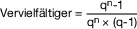

- **q** = 1 + LZ wobei 

- **LZ** = Zinssatz (Liegenschaftszinssatz)

- **n** = Restnutzungsdauer

- **p** = Zinsfuß

<a id="anlage-38-266"></a>

## Anlage 38 (zu § 253 Absatz 2 und § 259 Absatz 4)  Wirtschaftliche Gesamtnutzungsdauer

(Fundstelle: BGBl. I 2019, 1834)

  
  


| Spalte 1 | Spalte 2 |
| --- | --- |
| **Ein- und Zweifamilienhäuser** | 80 Jahre |
| **Mietwohngrundstücke, Mehrfamilienhäuser** | 80 Jahre |
| **Wohnungseigentum** | 80 Jahre |
| **Geschäftsgrundstücke, gemischt genutzte Grundstücke und sonstige bebaute Grundstücke:** |  |
| Gemischt genutzte Grundstücke (Wohnhäuser mit Mischnutzung) | 80 Jahre |
| Museen, Theater, Sakralbauten | 70 Jahre |
| Bürogebäude, Verwaltungsgebäude | 60 Jahre |
| Banken und ähnliche Geschäftshäuser | 60 Jahre |
| Einzelgaragen und Mehrfachgaragen | 60 Jahre |
| Kindergärten (Kindertagesstätten), allgemeinbildende Schulen und berufsbildende Schulen, Hochschulen, Sonderschulen | 50 Jahre |
| Wohnheime, Internate, Alten- und Pflegeheime | 50 Jahre |
| Kauf-/Warenhäuser | 50 Jahre |
| Krankenhäuser, Kliniken, Tageskliniken, Ärztehäuser | 40 Jahre |
| Gemeindezentren, Saalbauten, Veranstaltungsgebäude, Vereinsheime | 40 Jahre |
| Beherbergungsstätten, Hotels, Verpflegungseinrichtungen | 40 Jahre |
| Sport- und Tennishallen, Freizeitbäder, Kur- und Heilbäder | 40 Jahre |
| Tief-, Hoch- und Nutzfahrzeuggaragen als Einzelbauwerke, Carports | 40 Jahre |
| Betriebs- und Werkstätten, Industrie- und Produktionsgebäude | 40 Jahre |
| Lager- und Versandgebäude | 40 Jahre |
| Verbrauchermärkte, Autohäuser | 30 Jahre |
| Reithallen, ehemalige landwirtschaftliche Mehrzweckhallen, Scheunen und Ähnliches | 30 Jahre |

  
  
**Teileigentum** ist in Abhängigkeit von der baulichen Gestaltung den vorstehenden Gebäudearten zuzuordnen.

**Auffangklausel**

Für nicht aufgeführte Gebäudearten ist die wirtschaftliche Gesamtnutzungsdauer aus der wirtschaftlichen Gesamtnutzungsdauer vergleichbarer Gebäudearten abzuleiten.

<a id="anlage-39-267"></a>

## Anlage 39 (zu § 254)  Ermittlung des Rohertrags

(Fundstelle: BGBl. I 2021, 2932 – 2936;  
 bzgl. der einzelnen Änderungen vgl. Fußnote)

  
  
- **I.** **Monatliche Nettokaltmieten in EUR/Quadratmeter Wohnfläche<sup data-redaktionell="fussnotenmarker-aus-attribut"><a href="#fn-f809323_02_BJNR010350934BJNE034102123">&#42;&#42;</a></sup>  
   (Wertverhältnisse/Stand: 1. Januar 2022)**  
    


  <table style="border-collapse:collapse">
  <tr><td rowspan="2" style="border-bottom:1px solid currentColor"><strong>Land</strong></td><td rowspan="2" style="border-bottom:1px solid currentColor;text-align:center"><strong>Gebäudeart<sup data-redaktionell="fussnotenmarker-aus-attribut"><a href="#fn-f809323_01_BJNR010350934BJNE034102123">&#42;</a></sup></strong></td><td rowspan="2" style="border-bottom:1px solid currentColor;text-align:center"><strong>Wohnfläche<sup data-redaktionell="fussnotenmarker-aus-attribut"><a href="#fn-f809323_02_BJNR010350934BJNE034102123">&#42;&#42;</a></sup> (je Wohnung)</strong></td><td colspan="5" style="border-bottom:1px solid currentColor"><strong>Baujahr des Gebäudes</strong></td></tr>
  <tr><td style="border-bottom:1px solid currentColor"><strong>bis 1948</strong></td><td style="border-bottom:1px solid currentColor"><strong>1949<br> bis 1978</strong></td><td style="border-bottom:1px solid currentColor"><strong>1979<br> bis 1990</strong></td><td style="border-bottom:1px solid currentColor"><strong>1991<br> bis 2000</strong></td><td style="border-bottom:1px solid currentColor"><strong>ab 2001</strong></td></tr>
  <tr><td rowspan="9" style="vertical-align:middle">Baden-Württemberg</td><td rowspan="3" style="vertical-align:middle">Einfamilienhaus</td><td>unter 60 m<sup>2</sup></td><td>7,13</td><td>6,88</td><td>7,01</td><td>8,73</td><td>9,40</td></tr>
  <tr><td>von 60 m<sup>2</sup> bis unter 100 m<sup>2</sup></td><td>6,24</td><td>6,41</td><td>6,62</td><td>7,58</td><td>7,51</td></tr>
  <tr><td>100 m<sup>2</sup> und mehr</td><td>5,53</td><td>6,10</td><td>6,37</td><td>6,61</td><td>7,78</td></tr>
  <tr><td rowspan="3" style="vertical-align:middle">Zweifamilienhaus</td><td>unter 60 m<sup>2</sup></td><td>7,63</td><td>8,16</td><td>8,15</td><td>8,56</td><td>8,89</td></tr>
  <tr><td>von 60 m<sup>2</sup> bis unter 100 m<sup>2</sup></td><td>5,60</td><td>6,06</td><td>6,11</td><td>6,55</td><td>7,60</td></tr>
  <tr><td>100 m<sup>2</sup> und mehr</td><td>5,10</td><td>5,38</td><td>5,45</td><td>6,20</td><td>7,31</td></tr>
  <tr><td rowspan="3" style="vertical-align:middle">Mietwohngrundstück</td><td>unter 60 m<sup>2</sup></td><td>8,60</td><td>9,17</td><td>9,11</td><td>10,10</td><td>12,44</td></tr>
  <tr><td>von 60 m<sup>2</sup> bis unter 100 m<sup>2</sup></td><td>6,78</td><td>7,09</td><td>7,33</td><td>7,82</td><td>8,97</td></tr>
  <tr><td>100 m<sup>2</sup> und mehr</td><td>6,84</td><td>6,42</td><td>6,82</td><td>7,27</td><td>8,97</td></tr>
  <tr><td rowspan="9" style="vertical-align:middle">Bayern</td><td rowspan="3" style="vertical-align:middle">Einfamilienhaus</td><td>unter 60 m<sup>2</sup></td><td>7,86</td><td>7,54</td><td>7,76</td><td>9,28</td><td>10,64</td></tr>
  <tr><td>von 60 m<sup>2</sup> bis unter 100 m<sup>2</sup></td><td>6,89</td><td>7,04</td><td>7,34</td><td>8,07</td><td>8,50</td></tr>
  <tr><td>100 m<sup>2</sup> und mehr</td><td>6,09</td><td>6,69</td><td>7,06</td><td>7,03</td><td>8,80</td></tr>
  <tr><td rowspan="3" style="vertical-align:middle">Zweifamilienhaus</td><td>unter 60 m<sup>2</sup></td><td>6,91</td><td>7,35</td><td>7,41</td><td>7,48</td><td>8,25</td></tr>
  <tr><td>von 60 m<sup>2</sup> bis unter 100 m<sup>2</sup></td><td>5,06</td><td>5,45</td><td>5,57</td><td>5,72</td><td>7,07</td></tr>
  <tr><td>100 m<sup>2</sup> und mehr</td><td>4,61</td><td>4,85</td><td>4,96</td><td>5,42</td><td>6,79</td></tr>
  <tr><td rowspan="3" style="vertical-align:middle">Mietwohngrundstück</td><td>unter 60 m<sup>2</sup></td><td>9,82</td><td>10,41</td><td>10,44</td><td>11,12</td><td>14,56</td></tr>
  <tr><td>von 60 m<sup>2</sup> bis unter 100 m<sup>2</sup></td><td>7,74</td><td>8,04</td><td>8,40</td><td>8,61</td><td>10,50</td></tr>
  <tr><td>100 m<sup>2</sup> und mehr</td><td>7,80</td><td>7,29</td><td>7,81</td><td>8,00</td><td>10,50</td></tr>
  <tr><td rowspan="9" style="vertical-align:middle">Berlin</td><td rowspan="3" style="vertical-align:middle">Einfamilienhaus</td><td>unter 60 m<sup>2</sup></td><td>9,04</td><td>7,79</td><td>7,28</td><td>10,70</td><td>14,45</td></tr>
  <tr><td>von 60 m<sup>2</sup> bis unter 100 m<sup>2</sup></td><td>7,92</td><td>7,25</td><td>6,89</td><td>9,28</td><td>11,56</td></tr>
  <tr><td>100 m<sup>2</sup> und mehr</td><td>7,01</td><td>6,91</td><td>6,63</td><td>8,09</td><td>11,96</td></tr>
  <tr><td rowspan="3" style="vertical-align:middle">Zweifamilienhaus</td><td>unter 60 m<sup>2</sup></td><td>8,95</td><td>8,55</td><td>7,83</td><td>9,70</td><td>12,62</td></tr>
  <tr><td>von 60 m<sup>2</sup> bis unter 100 m<sup>2</sup></td><td>6,56</td><td>6,33</td><td>5,87</td><td>7,43</td><td>10,79</td></tr>
  <tr><td>100 m<sup>2</sup> und mehr</td><td>5,97</td><td>5,64</td><td>5,23</td><td>7,02</td><td>10,37</td></tr>
  <tr><td rowspan="3" style="vertical-align:middle">Mietwohngrundstück</td><td>unter 60 m<sup>2</sup></td><td>8,47</td><td>8,07</td><td>7,34</td><td>9,60</td><td>14,83</td></tr>
  <tr><td>von 60 m<sup>2</sup> bis unter 100 m<sup>2</sup></td><td>6,68</td><td>6,23</td><td>5,91</td><td>7,44</td><td>10,70</td></tr>
  <tr><td>100 m<sup>2</sup> und mehr</td><td>6,73</td><td>5,65</td><td>5,50</td><td>6,91</td><td>10,70</td></tr>
  <tr><td rowspan="9" style="vertical-align:middle">Brandenburg</td><td rowspan="3" style="vertical-align:middle">Einfamilienhaus</td><td>unter 60 m<sup>2</sup></td><td>8,34</td><td>7,20</td><td>7,28</td><td>10,66</td><td>12,20</td></tr>
  <tr><td>von 60 m<sup>2</sup> bis unter 100 m<sup>2</sup></td><td>7,31</td><td>6,71</td><td>6,88</td><td>9,26</td><td>9,75</td></tr>
  <tr><td>100 m<sup>2</sup> und mehr</td><td>6,47</td><td>6,39</td><td>6,62</td><td>8,07</td><td>10,09</td></tr>
  <tr><td rowspan="3" style="vertical-align:middle">Zweifamilienhaus</td><td>unter 60 m<sup>2</sup></td><td>7,50</td><td>7,17</td><td>7,10</td><td>8,79</td><td>9,68</td></tr>
  <tr><td>von 60 m<sup>2</sup> bis unter 100 m<sup>2</sup></td><td>5,50</td><td>5,31</td><td>5,32</td><td>6,72</td><td>8,28</td></tr>
  <tr><td>100 m<sup>2</sup> und mehr</td><td>5,00</td><td>4,73</td><td>4,75</td><td>6,36</td><td>7,96</td></tr>
  <tr><td rowspan="3" style="vertical-align:middle">Mietwohngrundstück</td><td>unter 60 m<sup>2</sup></td><td>7,45</td><td>7,11</td><td>7,00</td><td>9,13</td><td>11,94</td></tr>
  <tr><td>von 60 m<sup>2</sup> bis unter 100 m<sup>2</sup></td><td>5,88</td><td>5,49</td><td>5,63</td><td>7,07</td><td>8,61</td></tr>
  <tr><td>100 m<sup>2</sup> und mehr</td><td>5,92</td><td>4,98</td><td>5,24</td><td>6,58</td><td>8,61</td></tr>
  <tr><td rowspan="9" style="vertical-align:middle">Bremen</td><td rowspan="3" style="vertical-align:middle">Einfamilienhaus</td><td>unter 60 m<sup>2</sup></td><td>7,03</td><td>6,49</td><td>6,73</td><td>7,62</td><td>9,00</td></tr>
  <tr><td>von 60 m<sup>2</sup> bis unter 100 m<sup>2</sup></td><td>6,16</td><td>6,06</td><td>6,36</td><td>6,62</td><td>7,19</td></tr>
  <tr><td>100 m<sup>2</sup> und mehr</td><td>5,45</td><td>5,77</td><td>6,11</td><td>5,77</td><td>7,44</td></tr>
  <tr><td rowspan="3" style="vertical-align:middle">Zweifamilienhaus</td><td>unter 60 m<sup>2</sup></td><td>7,88</td><td>8,09</td><td>8,19</td><td>7,84</td><td>8,91</td></tr>
  <tr><td>von 60 m<sup>2</sup> bis unter 100 m<sup>2</sup></td><td>5,78</td><td>6,00</td><td>6,15</td><td>6,00</td><td>7,62</td></tr>
  <tr><td>100 m<sup>2</sup> und mehr</td><td>5,26</td><td>5,33</td><td>5,48</td><td>5,67</td><td>7,33</td></tr>
  <tr><td rowspan="3" style="vertical-align:middle">Mietwohngrundstück</td><td>unter 60 m<sup>2</sup></td><td>8,08</td><td>8,26</td><td>8,33</td><td>8,38</td><td>11,33</td></tr>
  <tr><td>von 60 m<sup>2</sup> bis unter 100 m<sup>2</sup></td><td>6,38</td><td>6,38</td><td>6,71</td><td>6,49</td><td>8,17</td></tr>
  <tr><td>100 m<sup>2</sup> und mehr</td><td>6,42</td><td>5,79</td><td>6,24</td><td>6,04</td><td>8,17</td></tr>
  <tr><td rowspan="9" style="vertical-align:middle">Hamburg</td><td rowspan="3" style="vertical-align:middle">Einfamilienhaus</td><td>unter 60 m<sup>2</sup></td><td>8,69</td><td>7,01</td><td>7,52</td><td>9,56</td><td>10,26</td></tr>
  <tr><td>von 60 m<sup>2</sup> bis unter 100 m<sup>2</sup></td><td>7,62</td><td>6,53</td><td>7,11</td><td>8,31</td><td>8,20</td></tr>
  <tr><td>100 m<sup>2</sup> und mehr</td><td>6,74</td><td>6,22</td><td>6,84</td><td>7,24</td><td>8,49</td></tr>
  <tr><td rowspan="3" style="vertical-align:middle">Zweifamilienhaus</td><td>unter 60 m<sup>2</sup></td><td>10,45</td><td>9,34</td><td>9,82</td><td>10,55</td><td>10,89</td></tr>
  <tr><td>von 60 m<sup>2</sup> bis unter 100 m<sup>2</sup></td><td>7,67</td><td>6,92</td><td>7,37</td><td>8,07</td><td>9,31</td></tr>
  <tr><td>100 m<sup>2</sup> und mehr</td><td>6,97</td><td>6,16</td><td>6,57</td><td>7,64</td><td>8,96</td></tr>
  <tr><td rowspan="3" style="vertical-align:middle">Mietwohngrundstück</td><td>unter 60 m<sup>2</sup></td><td>9,18</td><td>8,19</td><td>8,57</td><td>9,70</td><td>11,89</td></tr>
  <tr><td>von 60 m<sup>2</sup> bis unter 100 m<sup>2</sup></td><td>7,23</td><td>6,32</td><td>6,89</td><td>7,51</td><td>8,58</td></tr>
  <tr><td>100 m<sup>2</sup> und mehr</td><td>7,30</td><td>5,73</td><td>6,42</td><td>6,98</td><td>8,58</td></tr>
  <tr><td rowspan="9" style="vertical-align:middle">Hessen</td><td rowspan="3" style="vertical-align:middle">Einfamilienhaus</td><td>unter 60 m<sup>2</sup></td><td>7,96</td><td>6,97</td><td>6,91</td><td>7,83</td><td>10,02</td></tr>
  <tr><td>von 60 m<sup>2</sup> bis unter 100 m<sup>2</sup></td><td>6,97</td><td>6,50</td><td>6,54</td><td>6,80</td><td>8,00</td></tr>
  <tr><td>100 m<sup>2</sup> und mehr</td><td>6,17</td><td>6,18</td><td>6,29</td><td>5,93</td><td>8,29</td></tr>
  <tr><td rowspan="3" style="vertical-align:middle">Zweifamilienhaus</td><td>unter 60 m<sup>2</sup></td><td>7,45</td><td>7,23</td><td>7,02</td><td>6,72</td><td>8,27</td></tr>
  <tr><td>von 60 m<sup>2</sup> bis unter 100 m<sup>2</sup></td><td>5,46</td><td>5,36</td><td>5,26</td><td>5,15</td><td>7,08</td></tr>
  <tr><td>100 m<sup>2</sup> und mehr</td><td>4,97</td><td>4,77</td><td>4,70</td><td>4,87</td><td>6,81</td></tr>
  <tr><td rowspan="3" style="vertical-align:middle">Mietwohngrundstück</td><td>unter 60 m<sup>2</sup></td><td>9,44</td><td>9,13</td><td>8,81</td><td>8,90</td><td>13,01</td></tr>
  <tr><td>von 60 m<sup>2</sup> bis unter 100 m<sup>2</sup></td><td>7,45</td><td>7,05</td><td>7,10</td><td>6,89</td><td>9,39</td></tr>
  <tr><td>100 m<sup>2</sup> und mehr</td><td>7,50</td><td>6,39</td><td>6,60</td><td>6,40</td><td>9,39</td></tr>
  <tr><td rowspan="9" style="vertical-align:middle">Mecklenburg-Vorpommern</td><td rowspan="3" style="vertical-align:middle">Einfamilienhaus</td><td>unter 60 m<sup>2</sup></td><td>7,02</td><td>5,75</td><td>5,50</td><td>8,12</td><td>8,77</td></tr>
  <tr><td>von 60 m<sup>2</sup> bis unter 100 m<sup>2</sup></td><td>6,15</td><td>5,37</td><td>5,20</td><td>7,05</td><td>7,01</td></tr>
  <tr><td>100 m<sup>2</sup> und mehr</td><td>5,44</td><td>5,11</td><td>5,01</td><td>6,14</td><td>7,26</td></tr>
  <tr><td rowspan="3" style="vertical-align:middle">Zweifamilienhaus</td><td>unter 60 m<sup>2</sup></td><td>7,48</td><td>6,80</td><td>6,35</td><td>7,92</td><td>8,24</td></tr>
  <tr><td>von 60 m<sup>2</sup> bis unter 100 m<sup>2</sup></td><td>5,48</td><td>5,05</td><td>4,77</td><td>6,07</td><td>7,05</td></tr>
  <tr><td>100 m<sup>2</sup> und mehr</td><td>4,99</td><td>4,49</td><td>4,25</td><td>5,74</td><td>6,78</td></tr>
  <tr><td rowspan="3" style="vertical-align:middle">Mietwohngrundstück</td><td>unter 60 m<sup>2</sup></td><td>8,20</td><td>7,44</td><td>6,92</td><td>9,09</td><td>11,22</td></tr>
  <tr><td>von 60 m<sup>2</sup> bis unter 100 m<sup>2</sup></td><td>6,48</td><td>5,74</td><td>5,57</td><td>7,04</td><td>8,10</td></tr>
  <tr><td>100 m<sup>2</sup> und mehr</td><td>6,52</td><td>5,21</td><td>5,18</td><td>6,55</td><td>8,10</td></tr>
  <tr><td rowspan="9" style="vertical-align:middle">Niedersachsen</td><td rowspan="3" style="vertical-align:middle">Einfamilienhaus</td><td>unter 60 m<sup>2</sup></td><td>6,62</td><td>6,36</td><td>6,31</td><td>7,72</td><td>8,40</td></tr>
  <tr><td>von 60 m<sup>2</sup> bis unter 100 m<sup>2</sup></td><td>5,80</td><td>5,93</td><td>5,97</td><td>6,70</td><td>6,71</td></tr>
  <tr><td>100 m<sup>2</sup> und mehr</td><td>5,13</td><td>5,64</td><td>5,74</td><td>5,84</td><td>6,95</td></tr>
  <tr><td rowspan="3" style="vertical-align:middle">Zweifamilienhaus</td><td>unter 60 m<sup>2</sup></td><td>6,78</td><td>7,21</td><td>7,00</td><td>7,23</td><td>7,58</td></tr>
  <tr><td>von 60 m<sup>2</sup> bis unter 100 m<sup>2</sup></td><td>4,98</td><td>5,34</td><td>5,25</td><td>5,53</td><td>6,48</td></tr>
  <tr><td>100 m<sup>2</sup> und mehr</td><td>4,52</td><td>4,76</td><td>4,68</td><td>5,24</td><td>6,24</td></tr>
  <tr><td rowspan="3" style="vertical-align:middle">Mietwohngrundstück</td><td>unter 60 m<sup>2</sup></td><td>8,07</td><td>8,57</td><td>8,28</td><td>9,00</td><td>11,22</td></tr>
  <tr><td>von 60 m<sup>2</sup> bis unter 100 m<sup>2</sup></td><td>6,36</td><td>6,62</td><td>6,67</td><td>6,98</td><td>8,10</td></tr>
  <tr><td>100 m<sup>2</sup> und mehr</td><td>6,42</td><td>6,01</td><td>6,20</td><td>6,48</td><td>8,10</td></tr>
  <tr><td rowspan="9" style="vertical-align:middle">Nordrhein-Westfalen</td><td rowspan="3" style="vertical-align:middle">Einfamilienhaus</td><td>unter 60 m<sup>2</sup></td><td>6,97</td><td>6,56</td><td>6,82</td><td>8,30</td><td>8,32</td></tr>
  <tr><td>von 60 m<sup>2</sup> bis unter 100 m<sup>2</sup></td><td>6,10</td><td>6,11</td><td>6,44</td><td>7,20</td><td>6,65</td></tr>
  <tr><td>100 m<sup>2</sup> und mehr</td><td>5,40</td><td>5,82</td><td>6,19</td><td>6,28</td><td>6,88</td></tr>
  <tr><td rowspan="3" style="vertical-align:middle">Zweifamilienhaus</td><td>unter 60 m<sup>2</sup></td><td>7,07</td><td>7,38</td><td>7,50</td><td>7,70</td><td>7,44</td></tr>
  <tr><td>von 60 m<sup>2</sup> bis unter 100 m<sup>2</sup></td><td>5,19</td><td>5,47</td><td>5,62</td><td>5,89</td><td>6,37</td></tr>
  <tr><td>100 m<sup>2</sup> und mehr</td><td>4,71</td><td>4,87</td><td>5,02</td><td>5,57</td><td>6,12</td></tr>
  <tr><td rowspan="3" style="vertical-align:middle">Mietwohngrundstück</td><td>unter 60 m<sup>2</sup></td><td>7,83</td><td>8,13</td><td>8,23</td><td>8,90</td><td>10,22</td></tr>
  <tr><td>von 60 m<sup>2</sup> bis unter 100 m<sup>2</sup></td><td>6,17</td><td>6,29</td><td>6,62</td><td>6,90</td><td>7,38</td></tr>
  <tr><td>100 m<sup>2</sup> und mehr</td><td>6,22</td><td>5,69</td><td>6,15</td><td>6,41</td><td>7,38</td></tr>
  <tr><td rowspan="9" style="vertical-align:middle">Rheinland-Pfalz</td><td rowspan="3" style="vertical-align:middle">Einfamilienhaus</td><td>unter 60 m<sup>2</sup></td><td>7,12</td><td>6,81</td><td>6,88</td><td>8,13</td><td>9,32</td></tr>
  <tr><td>von 60 m<sup>2</sup> bis unter 100 m<sup>2</sup></td><td>6,23</td><td>6,36</td><td>6,50</td><td>7,06</td><td>7,45</td></tr>
  <tr><td>100 m<sup>2</sup> und mehr</td><td>5,52</td><td>6,05</td><td>6,25</td><td>6,15</td><td>7,72</td></tr>
  <tr><td rowspan="3" style="vertical-align:middle">Zweifamilienhaus</td><td>unter 60 m<sup>2</sup></td><td>7,30</td><td>7,77</td><td>7,66</td><td>7,64</td><td>8,44</td></tr>
  <tr><td>von 60 m<sup>2</sup> bis unter 100 m<sup>2</sup></td><td>5,35</td><td>5,76</td><td>5,75</td><td>5,85</td><td>7,22</td></tr>
  <tr><td>100 m<sup>2</sup> und mehr</td><td>4,87</td><td>5,13</td><td>5,13</td><td>5,53</td><td>6,94</td></tr>
  <tr><td rowspan="3" style="vertical-align:middle">Mietwohngrundstück</td><td>unter 60 m<sup>2</sup></td><td>8,33</td><td>8,82</td><td>8,67</td><td>9,11</td><td>11,95</td></tr>
  <tr><td>von 60 m<sup>2</sup> bis unter 100 m<sup>2</sup></td><td>6,57</td><td>6,81</td><td>6,98</td><td>7,06</td><td>8,62</td></tr>
  <tr><td>100 m<sup>2</sup> und mehr</td><td>6,62</td><td>6,18</td><td>6,49</td><td>6,57</td><td>8,62</td></tr>
  <tr><td rowspan="9" style="vertical-align:middle">Saarland</td><td rowspan="3" style="vertical-align:middle">Einfamilienhaus</td><td>unter 60 m<sup>2</sup></td><td>6,07</td><td>6,18</td><td>6,13</td><td>8,39</td><td>9,03</td></tr>
  <tr><td>von 60 m<sup>2</sup> bis unter 100 m<sup>2</sup></td><td>5,32</td><td>5,76</td><td>5,79</td><td>7,29</td><td>7,21</td></tr>
  <tr><td>100 m<sup>2</sup> und mehr</td><td>4,71</td><td>5,48</td><td>5,57</td><td>6,35</td><td>7,47</td></tr>
  <tr><td rowspan="3" style="vertical-align:middle">Zweifamilienhaus</td><td>unter 60 m<sup>2</sup></td><td>6,33</td><td>7,13</td><td>6,93</td><td>8,00</td><td>8,30</td></tr>
  <tr><td>von 60 m<sup>2</sup> bis unter 100 m<sup>2</sup></td><td>4,63</td><td>5,28</td><td>5,19</td><td>6,13</td><td>7,09</td></tr>
  <tr><td>100 m<sup>2</sup> und mehr</td><td>4,22</td><td>4,71</td><td>4,63</td><td>5,80</td><td>6,82</td></tr>
  <tr><td rowspan="3" style="vertical-align:middle">Mietwohngrundstück</td><td>unter 60 m<sup>2</sup></td><td>7,74</td><td>8,70</td><td>8,41</td><td>10,24</td><td>12,62</td></tr>
  <tr><td>von 60 m<sup>2</sup> bis unter 100 m<sup>2</sup></td><td>6,10</td><td>6,73</td><td>6,77</td><td>7,94</td><td>9,10</td></tr>
  <tr><td>100 m<sup>2</sup> und mehr</td><td>6,15</td><td>6,10</td><td>6,30</td><td>7,37</td><td>9,10</td></tr>
  <tr><td rowspan="9" style="vertical-align:middle">Sachsen</td><td rowspan="3" style="vertical-align:middle">Einfamilienhaus</td><td>unter 60 m<sup>2</sup></td><td>6,70</td><td>6,21</td><td>5,71</td><td>8,23</td><td>8,97</td></tr>
  <tr><td>von 60 m<sup>2</sup> bis unter 100 m<sup>2</sup></td><td>5,87</td><td>5,79</td><td>5,39</td><td>7,15</td><td>7,17</td></tr>
  <tr><td>100 m<sup>2</sup> und mehr</td><td>5,19</td><td>5,52</td><td>5,19</td><td>6,23</td><td>7,43</td></tr>
  <tr><td rowspan="3" style="vertical-align:middle">Zweifamilienhaus</td><td>unter 60 m<sup>2</sup></td><td>5,92</td><td>6,09</td><td>5,47</td><td>6,67</td><td>7,00</td></tr>
  <tr><td>von 60 m<sup>2</sup> bis unter 100 m<sup>2</sup></td><td>4,34</td><td>4,51</td><td>4,11</td><td>5,11</td><td>5,99</td></tr>
  <tr><td>100 m<sup>2</sup> und mehr</td><td>3,94</td><td>4,01</td><td>3,67</td><td>4,83</td><td>5,75</td></tr>
  <tr><td rowspan="3" style="vertical-align:middle">Mietwohngrundstück</td><td>unter 60 m<sup>2</sup></td><td>7,57</td><td>7,77</td><td>6,95</td><td>8,93</td><td>11,12</td></tr>
  <tr><td>von 60 m<sup>2</sup> bis unter 100 m<sup>2</sup></td><td>5,98</td><td>6,01</td><td>5,60</td><td>6,92</td><td>8,02</td></tr>
  <tr><td>100 m<sup>2</sup> und mehr</td><td>6,02</td><td>5,44</td><td>5,20</td><td>6,42</td><td>8,02</td></tr>
  <tr><td rowspan="9" style="vertical-align:middle">Sachsen-Anhalt</td><td rowspan="3" style="vertical-align:middle">Einfamilienhaus</td><td>unter 60 m<sup>2</sup></td><td>6,23</td><td>5,78</td><td>5,53</td><td>7,43</td><td>7,79</td></tr>
  <tr><td>von 60 m<sup>2</sup> bis unter 100 m<sup>2</sup></td><td>5,45</td><td>5,39</td><td>5,22</td><td>6,45</td><td>6,23</td></tr>
  <tr><td>100 m<sup>2</sup> und mehr</td><td>4,83</td><td>5,14</td><td>5,02</td><td>5,62</td><td>6,45</td></tr>
  <tr><td rowspan="3" style="vertical-align:middle">Zweifamilienhaus</td><td>unter 60 m<sup>2</sup></td><td>6,19</td><td>6,37</td><td>5,96</td><td>6,75</td><td>6,83</td></tr>
  <tr><td>von 60 m<sup>2</sup> bis unter 100 m<sup>2</sup></td><td>4,54</td><td>4,72</td><td>4,47</td><td>5,17</td><td>5,85</td></tr>
  <tr><td>100 m<sup>2</sup> und mehr</td><td>4,13</td><td>4,20</td><td>3,98</td><td>4,89</td><td>5,62</td></tr>
  <tr><td rowspan="3" style="vertical-align:middle">Mietwohngrundstück</td><td>unter 60 m<sup>2</sup></td><td>7,22</td><td>7,41</td><td>6,90</td><td>8,24</td><td>9,90</td></tr>
  <tr><td>von 60 m<sup>2</sup> bis unter 100 m<sup>2</sup></td><td>5,69</td><td>5,72</td><td>5,55</td><td>6,38</td><td>7,14</td></tr>
  <tr><td>100 m<sup>2</sup> und mehr</td><td>5,74</td><td>5,19</td><td>5,16</td><td>5,93</td><td>7,14</td></tr>
  <tr><td rowspan="9" style="vertical-align:middle">Schleswig-Holstein</td><td rowspan="3" style="vertical-align:middle">Einfamilienhaus</td><td>unter 60 m<sup>2</sup></td><td>7,16</td><td>6,92</td><td>6,87</td><td>8,47</td><td>9,24</td></tr>
  <tr><td>von 60 m<sup>2</sup> bis unter 100 m<sup>2</sup></td><td>6,28</td><td>6,45</td><td>6,49</td><td>7,35</td><td>7,37</td></tr>
  <tr><td>100 m<sup>2</sup> und mehr</td><td>5,55</td><td>6,14</td><td>6,24</td><td>6,41</td><td>7,64</td></tr>
  <tr><td rowspan="3" style="vertical-align:middle">Zweifamilienhaus</td><td>unter 60 m<sup>2</sup></td><td>7,55</td><td>8,10</td><td>7,86</td><td>8,18</td><td>8,58</td></tr>
  <tr><td>von 60 m<sup>2</sup> bis unter 100 m<sup>2</sup></td><td>5,54</td><td>6,01</td><td>5,90</td><td>6,27</td><td>7,34</td></tr>
  <tr><td>100 m<sup>2</sup> und mehr</td><td>5,03</td><td>5,34</td><td>5,26</td><td>5,92</td><td>7,06</td></tr>
  <tr><td rowspan="3" style="vertical-align:middle">Mietwohngrundstück</td><td>unter 60 m<sup>2</sup></td><td>7,85</td><td>8,39</td><td>8,10</td><td>8,89</td><td>11,09</td></tr>
  <tr><td>von 60 m<sup>2</sup> bis unter 100 m<sup>2</sup></td><td>6,19</td><td>6,47</td><td>6,52</td><td>6,89</td><td>7,99</td></tr>
  <tr><td>100 m<sup>2</sup> und mehr</td><td>6,24</td><td>5,87</td><td>6,06</td><td>6,40</td><td>7,99</td></tr>
  <tr><td rowspan="9" style="vertical-align:middle">Thüringen</td><td rowspan="3" style="vertical-align:middle">Einfamilienhaus</td><td>unter 60 m<sup>2</sup></td><td>7,36</td><td>6,58</td><td>6,41</td><td>8,31</td><td>9,59</td></tr>
  <tr><td>von 60 m<sup>2</sup> bis unter 100 m<sup>2</sup></td><td>6,45</td><td>6,13</td><td>6,05</td><td>7,22</td><td>7,66</td></tr>
  <tr><td>100 m<sup>2</sup> und mehr</td><td>5,71</td><td>5,83</td><td>5,82</td><td>6,29</td><td>7,94</td></tr>
  <tr><td rowspan="3" style="vertical-align:middle">Zweifamilienhaus</td><td>unter 60 m<sup>2</sup></td><td>7,07</td><td>7,00</td><td>6,67</td><td>7,30</td><td>8,12</td></tr>
  <tr><td>von 60 m<sup>2</sup> bis unter 100 m<sup>2</sup></td><td>5,19</td><td>5,19</td><td>5,00</td><td>5,59</td><td>6,95</td></tr>
  <tr><td>100 m<sup>2</sup> und mehr</td><td>4,71</td><td>4,62</td><td>4,45</td><td>5,29</td><td>6,68</td></tr>
  <tr><td rowspan="3" style="vertical-align:middle">Mietwohngrundstück</td><td>unter 60 m<sup>2</sup></td><td>7,70</td><td>7,61</td><td>7,22</td><td>8,33</td><td>11,00</td></tr>
  <tr><td>von 60 m<sup>2</sup> bis unter 100 m<sup>2</sup></td><td>6,08</td><td>5,88</td><td>5,81</td><td>6,45</td><td>7,94</td></tr>
  <tr><td>100 m<sup>2</sup> und mehr</td><td>6,12</td><td>5,33</td><td>5,40</td><td>6,00</td><td>7,94</td></tr>
  </table>

  <sup data-redaktionell="fussnotenmarker-aus-attribut"><a href="#fn-f809323_01_BJNR010350934BJNE034102123">&#42;</a></sup><sup data-redaktionell="fussnotenmarker-aus-attribut"><a href="#fn-f809323_02_BJNR010350934BJNE034102123">&#42;&#42;</a></sup>

- **II.** **Mietniveaustufen**

  Zur Berücksichtigung von Mietniveauunterschieden zwischen Gemeinden eines Landes sind die Nettokaltmieten zu I. durch folgende Ab- oder Zuschläge anzupassen:   
    


  | Spalte 1 | Spalte 2 |
  | --- | --- |
  | Mietniveaustufe 1 | – 20,0 % |
  | Mietniveaustufe 2 | – 10,0 % |
  | Mietniveaustufe 3 | +/– 0 % |
  | Mietniveaustufe 4 | + 10,0 % |
  | Mietniveaustufe 5 | + 20,0 % |
  | Mietniveaustufe 6 | + 30,0 % |
  | Mietniveaustufe 7 | + 40,0 % |

  Die gemeindebezogene Einordnung in die Mietniveaustufen und der dafür maßgebliche Gebietsstand ergibt sich aus der Rechtsverordnung zur Durchführung des § 254 des Bewertungsgesetzes in der jeweils aktuellen Fassung; nicht aufgeführte Gemeinden sind der Mietniveaustufe 3 zuzuordnen.

<a id="fn-f809323_01_BJNR010350934BJNE034102123"></a><span data-redaktionell="fussnotenlabel">&#42;</span> Für Wohnungseigentum gelten die Nettokaltmieten für Mietwohngrundstücke.


<a id="fn-f809323_02_BJNR010350934BJNE034102123"></a><span data-redaktionell="fussnotenlabel">&#42;&#42;</span> Flächen, die zu anderen als Wohnzwecken genutzt werden, gelten als Wohnfläche. Für diese Flächen ist bei Mietwohngrundstücken die für Wohnungen mit einer Fläche unter 60 m<sup>2</sup> geltende monatliche Nettokaltmiete in Euro je Quadratmeter Nutzfläche (ohne Zubehörräume) anzusetzen. Bei Ein- und Zweifamilienhäusern sind diese Flächen zu der jeweiligen Wohnfläche zu addieren.

| Spalte 1 | Spalte 2 |
| --- | --- |
| Nettokaltmiete – Festwert – für einen Garagenstellplatz (Einzelgarage/Tiefgarage) | 35 EUR/Monat |

<a id="anlage-40-268"></a>

## Anlage 40 (zu § 255)   Bewirtschaftungskosten

(Fundstelle: BGBl. I 2019, 1840)

  
  
Pauschalierte Bewirtschaftungskosten für Verwaltung, Instandhaltung und Mietausfallwagnis in Prozent des Rohertrags des Grundstücks nach § 254   
  


<table style="border-collapse:collapse">
<tr><td rowspan="3" style="text-align:center"><strong>Restnutzungsdauer</strong></td><td colspan="3"><strong>Grundstücksart</strong></td></tr>
<tr><td><strong>1</strong></td><td><strong>2</strong></td><td><strong>3</strong></td></tr>
<tr><td><strong>Ein- und<br> Zweifamilienhäuser</strong></td><td><strong>Wohnungseigentum</strong></td><td><strong>Mietwohngrundstück</strong></td></tr>
<tr><td>≥ 60 Jahre</td><td>18</td><td>23</td><td>21</td></tr>
<tr><td>40 bis 59 Jahre</td><td>21</td><td>25</td><td>23</td></tr>
<tr><td>20 bis 39 Jahre</td><td>25</td><td>29</td><td>27</td></tr>
<tr><td>&lt; 20 Jahre</td><td>27</td><td>31</td><td>29</td></tr>
</table>

<a id="anlage-41-269"></a>

## Anlage 41 (zu § 257 Absatz 2)  Abzinsungsfaktoren

(Fundstelle: BGBl. I 2019, 1841 – 1846)

  
  


<table style="border-collapse:collapse">
<tr><td rowspan="2" style="text-align:center"><strong>Rest-<br> nutzungs-<br> dauer<br> (Jahre)</strong></td><td colspan="11" style="text-align:center"><strong>Zinssatz</strong></td></tr>
<tr><td><strong>1,5 %</strong></td><td><strong>1,6 %</strong></td><td><strong>1,7 %</strong></td><td><strong>1,8 %</strong></td><td><strong>1,9 %</strong></td><td><strong>2,0 %</strong></td><td><strong>2,1 %</strong></td><td><strong>2,2 %</strong></td><td><strong>2,3 %</strong></td><td><strong>2,4 %</strong></td><td><strong>2,5 %</strong></td></tr>
<tr><td>  1</td><td>0,9852</td><td>0,9843</td><td>0,9833</td><td>0,9823</td><td>0,9814</td><td>0,9804</td><td>0,9794</td><td>0,9785</td><td>0,9775</td><td>0,9766</td><td>0,9756</td></tr>
<tr><td>  2</td><td>0,9707</td><td>0,9688</td><td>0,9668</td><td>0,9649</td><td>0,9631</td><td>0,9612</td><td>0,9593</td><td>0,9574</td><td>0,9555</td><td>0,9537</td><td>0,9518</td></tr>
<tr><td>  3</td><td>0,9563</td><td>0,9535</td><td>0,9507</td><td>0,9479</td><td>0,9451</td><td>0,9423</td><td>0,9396</td><td>0,9368</td><td>0,9341</td><td>0,9313</td><td>0,9286</td></tr>
<tr><td>  4</td><td>0,9422</td><td>0,9385</td><td>0,9348</td><td>0,9311</td><td>0,9275</td><td>0,9238</td><td>0,9202</td><td>0,9166</td><td>0,9131</td><td>0,9095</td><td>0,9060</td></tr>
<tr><td>  5</td><td>0,9283</td><td>0,9237</td><td>0,9192</td><td>0,9147</td><td>0,9102</td><td>0,9057</td><td>0,9013</td><td>0,8969</td><td>0,8925</td><td>0,8882</td><td>0,8839</td></tr>
<tr><td>  6</td><td>0,9145</td><td>0,9092</td><td>0,9038</td><td>0,8985</td><td>0,8932</td><td>0,8880</td><td>0,8828</td><td>0,8776</td><td>0,8725</td><td>0,8674</td><td>0,8623</td></tr>
<tr><td>  7</td><td>0,9010</td><td>0,8948</td><td>0,8887</td><td>0,8826</td><td>0,8766</td><td>0,8706</td><td>0,8646</td><td>0,8587</td><td>0,8528</td><td>0,8470</td><td>0,8413</td></tr>
<tr><td>  8</td><td>0,8877</td><td>0,8807</td><td>0,8738</td><td>0,8670</td><td>0,8602</td><td>0,8535</td><td>0,8468</td><td>0,8402</td><td>0,8337</td><td>0,8272</td><td>0,8207</td></tr>
<tr><td>  9</td><td>0,8746</td><td>0,8669</td><td>0,8592</td><td>0,8517</td><td>0,8442</td><td>0,8368</td><td>0,8294</td><td>0,8221</td><td>0,8149</td><td>0,8078</td><td>0,8007</td></tr>
<tr><td> 10</td><td>0,8617</td><td>0,8532</td><td>0,8449</td><td>0,8366</td><td>0,8284</td><td>0,8203</td><td>0,8123</td><td>0,8044</td><td>0,7966</td><td>0,7889</td><td>0,7812</td></tr>
<tr><td> 11</td><td>0,8489</td><td>0,8398</td><td>0,8307</td><td>0,8218</td><td>0,8130</td><td>0,8043</td><td>0,7956</td><td>0,7871</td><td>0,7787</td><td>0,7704</td><td>0,7621</td></tr>
<tr><td> 12</td><td>0,8364</td><td>0,8266</td><td>0,8169</td><td>0,8073</td><td>0,7978</td><td>0,7885</td><td>0,7793</td><td>0,7702</td><td>0,7612</td><td>0,7523</td><td>0,7436</td></tr>
<tr><td> 13</td><td>0,8240</td><td>0,8135</td><td>0,8032</td><td>0,7930</td><td>0,7830</td><td>0,7730</td><td>0,7632</td><td>0,7536</td><td>0,7441</td><td>0,7347</td><td>0,7254</td></tr>
<tr><td> 14</td><td>0,8118</td><td>0,8007</td><td>0,7898</td><td>0,7790</td><td>0,7684</td><td>0,7579</td><td>0,7475</td><td>0,7374</td><td>0,7273</td><td>0,7175</td><td>0,7077</td></tr>
<tr><td> 15</td><td>0,7999</td><td>0,7881</td><td>0,7766</td><td>0,7652</td><td>0,7540</td><td>0,7430</td><td>0,7322</td><td>0,7215</td><td>0,7110</td><td>0,7006</td><td>0,6905</td></tr>
<tr><td> 16</td><td>0,7880</td><td>0,7757</td><td>0,7636</td><td>0,7517</td><td>0,7400</td><td>0,7284</td><td>0,7171</td><td>0,7060</td><td>0,6950</td><td>0,6842</td><td>0,6736</td></tr>
<tr><td> 17</td><td>0,7764</td><td>0,7635</td><td>0,7508</td><td>0,7384</td><td>0,7262</td><td>0,7142</td><td>0,7024</td><td>0,6908</td><td>0,6794</td><td>0,6682</td><td>0,6572</td></tr>
<tr><td> 18</td><td>0,7649</td><td>0,7515</td><td>0,7383</td><td>0,7253</td><td>0,7126</td><td>0,7002</td><td>0,6879</td><td>0,6759</td><td>0,6641</td><td>0,6525</td><td>0,6412</td></tr>
<tr><td> 19</td><td>0,7536</td><td>0,7396</td><td>0,7259</td><td>0,7125</td><td>0,6993</td><td>0,6864</td><td>0,6738</td><td>0,6614</td><td>0,6492</td><td>0,6372</td><td>0,6255</td></tr>
<tr><td> 20</td><td>0,7425</td><td>0,7280</td><td>0,7138</td><td>0,6999</td><td>0,6863</td><td>0,6730</td><td>0,6599</td><td>0,6471</td><td>0,6346</td><td>0,6223</td><td>0,6103</td></tr>
<tr><td> 21</td><td>0,7315</td><td>0,7165</td><td>0,7019</td><td>0,6875</td><td>0,6735</td><td>0,6598</td><td>0,6463</td><td>0,6332</td><td>0,6203</td><td>0,6077</td><td>0,5954</td></tr>
<tr><td> 22</td><td>0,7207</td><td>0,7052</td><td>0,6901</td><td>0,6754</td><td>0,6609</td><td>0,6468</td><td>0,6330</td><td>0,6196</td><td>0,6064</td><td>0,5935</td><td>0,5809</td></tr>
<tr><td> 23</td><td>0,7100</td><td>0,6941</td><td>0,6786</td><td>0,6634</td><td>0,6486</td><td>0,6342</td><td>0,6200</td><td>0,6062</td><td>0,5927</td><td>0,5796</td><td>0,5667</td></tr>
<tr><td> 24</td><td>0,6995</td><td>0,6832</td><td>0,6673</td><td>0,6517</td><td>0,6365</td><td>0,6217</td><td>0,6073</td><td>0,5932</td><td>0,5794</td><td>0,5660</td><td>0,5529</td></tr>
<tr><td> 25</td><td>0,6892</td><td>0,6724</td><td>0,6561</td><td>0,6402</td><td>0,6247</td><td>0,6095</td><td>0,5948</td><td>0,5804</td><td>0,5664</td><td>0,5527</td><td>0,5394</td></tr>
<tr><td> 26</td><td>0,6790</td><td>0,6619</td><td>0,6451</td><td>0,6289</td><td>0,6130</td><td>0,5976</td><td>0,5825</td><td>0,5679</td><td>0,5536</td><td>0,5398</td><td>0,5262</td></tr>
<tr><td> 27</td><td>0,6690</td><td>0,6514</td><td>0,6344</td><td>0,6177</td><td>0,6016</td><td>0,5859</td><td>0,5706</td><td>0,5557</td><td>0,5412</td><td>0,5271</td><td>0,5134</td></tr>
<tr><td> 28</td><td>0,6591</td><td>0,6412</td><td>0,6238</td><td>0,6068</td><td>0,5904</td><td>0,5744</td><td>0,5588</td><td>0,5437</td><td>0,5290</td><td>0,5148</td><td>0,5009</td></tr>
<tr><td> 29</td><td>0,6494</td><td>0,6311</td><td>0,6133</td><td>0,5961</td><td>0,5794</td><td>0,5631</td><td>0,5473</td><td>0,5320</td><td>0,5171</td><td>0,5027</td><td>0,4887</td></tr>
<tr><td> 30</td><td>0,6398</td><td>0,6211</td><td>0,6031</td><td>0,5856</td><td>0,5686</td><td>0,5521</td><td>0,5361</td><td>0,5206</td><td>0,5055</td><td>0,4909</td><td>0,4767</td></tr>
<tr><td> 31</td><td>0,6303</td><td>0,6114</td><td>0,5930</td><td>0,5752</td><td>0,5580</td><td>0,5412</td><td>0,5251</td><td>0,5094</td><td>0,4941</td><td>0,4794</td><td>0,4651</td></tr>
<tr><td> 32</td><td>0,6210</td><td>0,6017</td><td>0,5831</td><td>0,5650</td><td>0,5476</td><td>0,5306</td><td>0,5143</td><td>0,4984</td><td>0,4830</td><td>0,4682</td><td>0,4538</td></tr>
<tr><td> 33</td><td>0,6118</td><td>0,5923</td><td>0,5733</td><td>0,5550</td><td>0,5373</td><td>0,5202</td><td>0,5037</td><td>0,4877</td><td>0,4722</td><td>0,4572</td><td>0,4427</td></tr>
<tr><td> 34</td><td>0,6028</td><td>0,5829</td><td>0,5638</td><td>0,5452</td><td>0,5273</td><td>0,5100</td><td>0,4933</td><td>0,4772</td><td>0,4616</td><td>0,4465</td><td>0,4319</td></tr>
<tr><td> 35</td><td>0,5939</td><td>0,5737</td><td>0,5543</td><td>0,5356</td><td>0,5175</td><td>0,5000</td><td>0,4832</td><td>0,4669</td><td>0,4512</td><td>0,4360</td><td>0,4214</td></tr>
<tr><td> 36</td><td>0,5851</td><td>0,5647</td><td>0,5451</td><td>0,5261</td><td>0,5078</td><td>0,4902</td><td>0,4732</td><td>0,4568</td><td>0,4410</td><td>0,4258</td><td>0,4111</td></tr>
<tr><td> 37</td><td>0,5764</td><td>0,5558</td><td>0,5360</td><td>0,5168</td><td>0,4984</td><td>0,4806</td><td>0,4635</td><td>0,4470</td><td>0,4311</td><td>0,4158</td><td>0,4011</td></tr>
<tr><td> 38</td><td>0,5679</td><td>0,5471</td><td>0,5270</td><td>0,5077</td><td>0,4891</td><td>0,4712</td><td>0,4540</td><td>0,4374</td><td>0,4214</td><td>0,4061</td><td>0,3913</td></tr>
<tr><td> 39</td><td>0,5595</td><td>0,5385</td><td>0,5182</td><td>0,4987</td><td>0,4800</td><td>0,4619</td><td>0,4446</td><td>0,4280</td><td>0,4120</td><td>0,3966</td><td>0,3817</td></tr>
<tr><td> 40</td><td>0,5513</td><td>0,5300</td><td>0,5095</td><td>0,4899</td><td>0,4710</td><td>0,4529</td><td>0,4355</td><td>0,4188</td><td>0,4027</td><td>0,3873</td><td>0,3724</td></tr>
<tr><td> 41</td><td>0,5431</td><td>0,5216</td><td>0,5010</td><td>0,4812</td><td>0,4622</td><td>0,4440</td><td>0,4265</td><td>0,4097</td><td>0,3936</td><td>0,3782</td><td>0,3633</td></tr>
<tr><td> 42</td><td>0,5351</td><td>0,5134</td><td>0,4926</td><td>0,4727</td><td>0,4536</td><td>0,4353</td><td>0,4178</td><td>0,4009</td><td>0,3848</td><td>0,3693</td><td>0,3545</td></tr>
<tr><td> 43</td><td>0,5272</td><td>0,5053</td><td>0,4844</td><td>0,4644</td><td>0,4452</td><td>0,4268</td><td>0,4092</td><td>0,3923</td><td>0,3761</td><td>0,3607</td><td>0,3458</td></tr>
<tr><td> 44</td><td>0,5194</td><td>0,4974</td><td>0,4763</td><td>0,4561</td><td>0,4369</td><td>0,4184</td><td>0,4007</td><td>0,3838</td><td>0,3677</td><td>0,3522</td><td>0,3374</td></tr>
<tr><td> 45</td><td>0,5117</td><td>0,4895</td><td>0,4683</td><td>0,4481</td><td>0,4287</td><td>0,4102</td><td>0,3925</td><td>0,3756</td><td>0,3594</td><td>0,3440</td><td>0,3292</td></tr>
<tr><td> 46</td><td>0,5042</td><td>0,4818</td><td>0,4605</td><td>0,4402</td><td>0,4207</td><td>0,4022</td><td>0,3844</td><td>0,3675</td><td>0,3513</td><td>0,3359</td><td>0,3211</td></tr>
<tr><td> 47</td><td>0,4967</td><td>0,4742</td><td>0,4528</td><td>0,4324</td><td>0,4129</td><td>0,3943</td><td>0,3765</td><td>0,3596</td><td>0,3434</td><td>0,3280</td><td>0,3133</td></tr>
<tr><td> 48</td><td>0,4894</td><td>0,4668</td><td>0,4452</td><td>0,4247</td><td>0,4052</td><td>0,3865</td><td>0,3688</td><td>0,3518</td><td>0,3357</td><td>0,3203</td><td>0,3057</td></tr>
<tr><td> 49</td><td>0,4821</td><td>0,4594</td><td>0,4378</td><td>0,4172</td><td>0,3976</td><td>0,3790</td><td>0,3612</td><td>0,3443</td><td>0,3282</td><td>0,3128</td><td>0,2982</td></tr>
<tr><td> 50</td><td>0,4750</td><td>0,4522</td><td>0,4305</td><td>0,4098</td><td>0,3902</td><td>0,3715</td><td>0,3538</td><td>0,3369</td><td>0,3208</td><td>0,3055</td><td>0,2909</td></tr>
<tr><td> 51</td><td>0,4680</td><td>0,4451</td><td>0,4233</td><td>0,4026</td><td>0,3829</td><td>0,3642</td><td>0,3465</td><td>0,3296</td><td>0,3136</td><td>0,2983</td><td>0,2838</td></tr>
<tr><td> 52</td><td>0,4611</td><td>0,4381</td><td>0,4162</td><td>0,3955</td><td>0,3758</td><td>0,3571</td><td>0,3394</td><td>0,3225</td><td>0,3065</td><td>0,2913</td><td>0,2769</td></tr>
<tr><td> 53</td><td>0,4543</td><td>0,4312</td><td>0,4093</td><td>0,3885</td><td>0,3688</td><td>0,3501</td><td>0,3324</td><td>0,3156</td><td>0,2996</td><td>0,2845</td><td>0,2702</td></tr>
<tr><td> 54</td><td>0,4475</td><td>0,4244</td><td>0,4024</td><td>0,3816</td><td>0,3619</td><td>0,3432</td><td>0,3255</td><td>0,3088</td><td>0,2929</td><td>0,2778</td><td>0,2636</td></tr>
<tr><td> 55</td><td>0,4409</td><td>0,4177</td><td>0,3957</td><td>0,3749</td><td>0,3552</td><td>0,3365</td><td>0,3188</td><td>0,3021</td><td>0,2863</td><td>0,2713</td><td>0,2572</td></tr>
<tr><td> 56</td><td>0,4344</td><td>0,4111</td><td>0,3891</td><td>0,3682</td><td>0,3485</td><td>0,3299</td><td>0,3123</td><td>0,2956</td><td>0,2799</td><td>0,2650</td><td>0,2509</td></tr>
<tr><td> 57</td><td>0,4280</td><td>0,4046</td><td>0,3826</td><td>0,3617</td><td>0,3420</td><td>0,3234</td><td>0,3059</td><td>0,2893</td><td>0,2736</td><td>0,2588</td><td>0,2448</td></tr>
<tr><td> 58</td><td>0,4217</td><td>0,3983</td><td>0,3762</td><td>0,3553</td><td>0,3357</td><td>0,3171</td><td>0,2996</td><td>0,2830</td><td>0,2674</td><td>0,2527</td><td>0,2388</td></tr>
<tr><td> 59</td><td>0,4154</td><td>0,3920</td><td>0,3699</td><td>0,3490</td><td>0,3294</td><td>0,3109</td><td>0,2934</td><td>0,2769</td><td>0,2614</td><td>0,2468</td><td>0,2330</td></tr>
<tr><td> 60</td><td>0,4093</td><td>0,3858</td><td>0,3637</td><td>0,3429</td><td>0,3233</td><td>0,3048</td><td>0,2874</td><td>0,2710</td><td>0,2555</td><td>0,2410</td><td>0,2273</td></tr>
<tr><td> 61</td><td>0,4032</td><td>0,3797</td><td>0,3576</td><td>0,3368</td><td>0,3172</td><td>0,2988</td><td>0,2815</td><td>0,2652</td><td>0,2498</td><td>0,2353</td><td>0,2217</td></tr>
<tr><td> 62</td><td>0,3973</td><td>0,3738</td><td>0,3516</td><td>0,3309</td><td>0,3113</td><td>0,2929</td><td>0,2757</td><td>0,2594</td><td>0,2442</td><td>0,2298</td><td>0,2163</td></tr>
<tr><td> 63</td><td>0,3914</td><td>0,3679</td><td>0,3458</td><td>0,3250</td><td>0,3055</td><td>0,2872</td><td>0,2700</td><td>0,2539</td><td>0,2387</td><td>0,2244</td><td>0,2111</td></tr>
<tr><td> 64</td><td>0,3856</td><td>0,3621</td><td>0,3400</td><td>0,3193</td><td>0,2998</td><td>0,2816</td><td>0,2645</td><td>0,2484</td><td>0,2333</td><td>0,2192</td><td>0,2059</td></tr>
<tr><td> 65</td><td>0,3799</td><td>0,3564</td><td>0,3343</td><td>0,3136</td><td>0,2942</td><td>0,2761</td><td>0,2590</td><td>0,2430</td><td>0,2281</td><td>0,2140</td><td>0,2009</td></tr>
<tr><td> 66</td><td>0,3743</td><td>0,3508</td><td>0,3287</td><td>0,3081</td><td>0,2887</td><td>0,2706</td><td>0,2537</td><td>0,2378</td><td>0,2230</td><td>0,2090</td><td>0,1960</td></tr>
<tr><td> 67</td><td>0,3688</td><td>0,3452</td><td>0,3232</td><td>0,3026</td><td>0,2834</td><td>0,2653</td><td>0,2485</td><td>0,2327</td><td>0,2179</td><td>0,2041</td><td>0,1912</td></tr>
<tr><td> 68</td><td>0,3633</td><td>0,3398</td><td>0,3178</td><td>0,2973</td><td>0,2781</td><td>0,2601</td><td>0,2434</td><td>0,2277</td><td>0,2130</td><td>0,1993</td><td>0,1865</td></tr>
<tr><td> 69</td><td>0,3580</td><td>0,3345</td><td>0,3125</td><td>0,2920</td><td>0,2729</td><td>0,2550</td><td>0,2384</td><td>0,2228</td><td>0,2082</td><td>0,1947</td><td>0,1820</td></tr>
<tr><td> 70</td><td>0,3527</td><td>0,3292</td><td>0,3073</td><td>0,2869</td><td>0,2678</td><td>0,2500</td><td>0,2335</td><td>0,2180</td><td>0,2036</td><td>0,1901</td><td>0,1776</td></tr>
<tr><td> 71</td><td>0,3475</td><td>0,3240</td><td>0,3021</td><td>0,2818</td><td>0,2628</td><td>0,2451</td><td>0,2287</td><td>0,2133</td><td>0,1990</td><td>0,1857</td><td>0,1732</td></tr>
<tr><td> 72</td><td>0,3423</td><td>0,3189</td><td>0,2971</td><td>0,2768</td><td>0,2579</td><td>0,2403</td><td>0,2239</td><td>0,2087</td><td>0,1945</td><td>0,1813</td><td>0,1690</td></tr>
<tr><td> 73</td><td>0,3373</td><td>0,3139</td><td>0,2921</td><td>0,2719</td><td>0,2531</td><td>0,2356</td><td>0,2193</td><td>0,2042</td><td>0,1901</td><td>0,1771</td><td>0,1649</td></tr>
<tr><td> 74</td><td>0,3323</td><td>0,3089</td><td>0,2872</td><td>0,2671</td><td>0,2484</td><td>0,2310</td><td>0,2148</td><td>0,1998</td><td>0,1859</td><td>0,1729</td><td>0,1609</td></tr>
<tr><td> 75</td><td>0,3274</td><td>0,3041</td><td>0,2824</td><td>0,2624</td><td>0,2437</td><td>0,2265</td><td>0,2104</td><td>0,1955</td><td>0,1817</td><td>0,1689</td><td>0,1569</td></tr>
<tr><td> 76</td><td>0,3225</td><td>0,2993</td><td>0,2777</td><td>0,2577</td><td>0,2392</td><td>0,2220</td><td>0,2061</td><td>0,1913</td><td>0,1776</td><td>0,1649</td><td>0,1531</td></tr>
<tr><td> 77</td><td>0,3178</td><td>0,2946</td><td>0,2731</td><td>0,2532</td><td>0,2347</td><td>0,2177</td><td>0,2018</td><td>0,1872</td><td>0,1736</td><td>0,1610</td><td>0,1494</td></tr>
<tr><td> 78</td><td>0,3131</td><td>0,2899</td><td>0,2685</td><td>0,2487</td><td>0,2304</td><td>0,2134</td><td>0,1977</td><td>0,1832</td><td>0,1697</td><td>0,1573</td><td>0,1457</td></tr>
<tr><td> 79</td><td>0,3084</td><td>0,2854</td><td>0,2640</td><td>0,2443</td><td>0,2261</td><td>0,2092</td><td>0,1936</td><td>0,1792</td><td>0,1659</td><td>0,1536</td><td>0,1422</td></tr>
<tr><td> 80</td><td>0,3039</td><td>0,2809</td><td>0,2596</td><td>0,2400</td><td>0,2219</td><td>0,2051</td><td>0,1896</td><td>0,1754</td><td>0,1622</td><td>0,1500</td><td>0,1387</td></tr>
<tr><td> 81</td><td>0,2994</td><td>0,2764</td><td>0,2553</td><td>0,2357</td><td>0,2177</td><td>0,2011</td><td>0,1857</td><td>0,1716</td><td>0,1585</td><td>0,1465</td><td>0,1353</td></tr>
<tr><td> 82</td><td>0,2950</td><td>0,2721</td><td>0,2510</td><td>0,2316</td><td>0,2137</td><td>0,1971</td><td>0,1819</td><td>0,1679</td><td>0,1550</td><td>0,1430</td><td>0,1320</td></tr>
<tr><td> 83</td><td>0,2906</td><td>0,2678</td><td>0,2468</td><td>0,2275</td><td>0,2097</td><td>0,1933</td><td>0,1782</td><td>0,1643</td><td>0,1515</td><td>0,1397</td><td>0,1288</td></tr>
<tr><td> 84</td><td>0,2863</td><td>0,2636</td><td>0,2427</td><td>0,2235</td><td>0,2058</td><td>0,1895</td><td>0,1745</td><td>0,1607</td><td>0,1481</td><td>0,1364</td><td>0,1257</td></tr>
<tr><td> 85</td><td>0,2821</td><td>0,2594</td><td>0,2386</td><td>0,2195</td><td>0,2019</td><td>0,1858</td><td>0,1709</td><td>0,1573</td><td>0,1447</td><td>0,1332</td><td>0,1226</td></tr>
<tr><td> 86</td><td>0,2779</td><td>0,2554</td><td>0,2346</td><td>0,2156</td><td>0,1982</td><td>0,1821</td><td>0,1674</td><td>0,1539</td><td>0,1415</td><td>0,1301</td><td>0,1196</td></tr>
<tr><td> 87</td><td>0,2738</td><td>0,2513</td><td>0,2307</td><td>0,2118</td><td>0,1945</td><td>0,1786</td><td>0,1640</td><td>0,1506</td><td>0,1383</td><td>0,1270</td><td>0,1167</td></tr>
<tr><td> 88</td><td>0,2698</td><td>0,2474</td><td>0,2269</td><td>0,2081</td><td>0,1908</td><td>0,1751</td><td>0,1606</td><td>0,1473</td><td>0,1352</td><td>0,1241</td><td>0,1138</td></tr>
<tr><td> 89</td><td>0,2658</td><td>0,2435</td><td>0,2231</td><td>0,2044</td><td>0,1873</td><td>0,1716</td><td>0,1573</td><td>0,1442</td><td>0,1322</td><td>0,1211</td><td>0,1111</td></tr>
<tr><td> 90</td><td>0,2619</td><td>0,2396</td><td>0,2193</td><td>0,2008</td><td>0,1838</td><td>0,1683</td><td>0,1541</td><td>0,1411</td><td>0,1292</td><td>0,1183</td><td>0,1084</td></tr>
<tr><td> 91</td><td>0,2580</td><td>0,2359</td><td>0,2157</td><td>0,1972</td><td>0,1804</td><td>0,1650</td><td>0,1509</td><td>0,1380</td><td>0,1263</td><td>0,1155</td><td>0,1057</td></tr>
<tr><td> 92</td><td>0,2542</td><td>0,2322</td><td>0,2121</td><td>0,1937</td><td>0,1770</td><td>0,1617</td><td>0,1478</td><td>0,1351</td><td>0,1234</td><td>0,1128</td><td>0,1031</td></tr>
<tr><td> 93</td><td>0,2504</td><td>0,2285</td><td>0,2085</td><td>0,1903</td><td>0,1737</td><td>0,1586</td><td>0,1447</td><td>0,1321</td><td>0,1207</td><td>0,1102</td><td>0,1006</td></tr>
<tr><td> 94</td><td>0,2467</td><td>0,2249</td><td>0,2050</td><td>0,1869</td><td>0,1705</td><td>0,1554</td><td>0,1418</td><td>0,1293</td><td>0,1179</td><td>0,1076</td><td>0,0982</td></tr>
<tr><td> 95</td><td>0,2431</td><td>0,2214</td><td>0,2016</td><td>0,1836</td><td>0,1673</td><td>0,1524</td><td>0,1389</td><td>0,1265</td><td>0,1153</td><td>0,1051</td><td>0,0958</td></tr>
<tr><td> 96</td><td>0,2395</td><td>0,2179</td><td>0,1982</td><td>0,1804</td><td>0,1642</td><td>0,1494</td><td>0,1360</td><td>0,1238</td><td>0,1127</td><td>0,1026</td><td>0,0934</td></tr>
<tr><td> 97</td><td>0,2359</td><td>0,2144</td><td>0,1949</td><td>0,1772</td><td>0,1611</td><td>0,1465</td><td>0,1332</td><td>0,1211</td><td>0,1102</td><td>0,1002</td><td>0,0912</td></tr>
<tr><td> 98</td><td>0,2324</td><td>0,2111</td><td>0,1917</td><td>0,1741</td><td>0,1581</td><td>0,1436</td><td>0,1305</td><td>0,1185</td><td>0,1077</td><td>0,0979</td><td>0,0889</td></tr>
<tr><td> 99</td><td>0,2290</td><td>0,2077</td><td>0,1885</td><td>0,1710</td><td>0,1552</td><td>0,1408</td><td>0,1278</td><td>0,1160</td><td>0,1053</td><td>0,0956</td><td>0,0868</td></tr>
<tr><td>100</td><td>0,2256</td><td>0,2045</td><td>0,1853</td><td>0,1680</td><td>0,1523</td><td>0,1380</td><td>0,1251</td><td>0,1135</td><td>0,1029</td><td>0,0933</td><td>0,0846</td></tr>
</table>

  
  


<table style="border-collapse:collapse">
<tr><td rowspan="2" style="border-bottom:1px solid currentColor;text-align:center"><strong>Rest-<br> nutzungs-<br> dauer<br> (Jahre)</strong></td><td colspan="8" style="border-bottom:1px solid currentColor;text-align:center"><strong>Zinssatz</strong></td></tr>
<tr><td style="text-align:center"><strong>2,6 %</strong></td><td style="text-align:center"><strong>2,7 %</strong></td><td style="text-align:center"><strong>2,8 %</strong></td><td style="text-align:center"><strong>2,9 %</strong></td><td style="text-align:center"><strong>3,0 %</strong></td><td style="text-align:center"><strong>3,5 %</strong></td><td style="text-align:center"><strong>4 %</strong></td><td style="text-align:center"><strong>4,5 %</strong></td></tr>
<tr><td>  1</td><td>0,9747</td><td>0,9737</td><td>0,9728</td><td>0,9718</td><td>0,9709</td><td>0,9662</td><td>0,9615</td><td>0,9569</td></tr>
<tr><td>  2</td><td>0,9500</td><td>0,9481</td><td>0,9463</td><td>0,9444</td><td>0,9426</td><td>0,9335</td><td>0,9246</td><td>0,9157</td></tr>
<tr><td>  3</td><td>0,9259</td><td>0,9232</td><td>0,9205</td><td>0,9178</td><td>0,9151</td><td>0,9019</td><td>0,8890</td><td>0,8763</td></tr>
<tr><td>  4</td><td>0,9024</td><td>0,8989</td><td>0,8954</td><td>0,8919</td><td>0,8885</td><td>0,8714</td><td>0,8548</td><td>0,8386</td></tr>
<tr><td>  5</td><td>0,8796</td><td>0,8753</td><td>0,8710</td><td>0,8668</td><td>0,8626</td><td>0,8420</td><td>0,8219</td><td>0,8025</td></tr>
<tr><td>  6</td><td>0,8573</td><td>0,8523</td><td>0,8473</td><td>0,8424</td><td>0,8375</td><td>0,8135</td><td>0,7903</td><td>0,7679</td></tr>
<tr><td>  7</td><td>0,8355</td><td>0,8299</td><td>0,8242</td><td>0,8186</td><td>0,8131</td><td>0,7860</td><td>0,7599</td><td>0,7348</td></tr>
<tr><td>  8</td><td>0,8144</td><td>0,8080</td><td>0,8018</td><td>0,7956</td><td>0,7894</td><td>0,7594</td><td>0,7307</td><td>0,7032</td></tr>
<tr><td>  9</td><td>0,7937</td><td>0,7868</td><td>0,7799</td><td>0,7731</td><td>0,7664</td><td>0,7337</td><td>0,7026</td><td>0,6729</td></tr>
<tr><td> 10</td><td>0,7736</td><td>0,7661</td><td>0,7587</td><td>0,7514</td><td>0,7441</td><td>0,7089</td><td>0,6756</td><td>0,6439</td></tr>
<tr><td> 11</td><td>0,7540</td><td>0,7460</td><td>0,7380</td><td>0,7302</td><td>0,7224</td><td>0,6849</td><td>0,6496</td><td>0,6162</td></tr>
<tr><td> 12</td><td>0,7349</td><td>0,7264</td><td>0,7179</td><td>0,7096</td><td>0,7014</td><td>0,6618</td><td>0,6246</td><td>0,5897</td></tr>
<tr><td> 13</td><td>0,7163</td><td>0,7073</td><td>0,6984</td><td>0,6896</td><td>0,6810</td><td>0,6394</td><td>0,6006</td><td>0,5643</td></tr>
<tr><td> 14</td><td>0,6981</td><td>0,6887</td><td>0,6794</td><td>0,6702</td><td>0,6611</td><td>0,6178</td><td>0,5775</td><td>0,5400</td></tr>
<tr><td> 15</td><td>0,6804</td><td>0,6706</td><td>0,6609</td><td>0,6513</td><td>0,6419</td><td>0,5969</td><td>0,5553</td><td>0,5167</td></tr>
<tr><td> 16</td><td>0,6632</td><td>0,6529</td><td>0,6429</td><td>0,6329</td><td>0,6232</td><td>0,5767</td><td>0,5339</td><td>0,4945</td></tr>
<tr><td> 17</td><td>0,6464</td><td>0,6358</td><td>0,6253</td><td>0,6151</td><td>0,6050</td><td>0,5572</td><td>0,5134</td><td>0,4732</td></tr>
<tr><td> 18</td><td>0,6300</td><td>0,6191</td><td>0,6083</td><td>0,5978</td><td>0,5874</td><td>0,5384</td><td>0,4936</td><td>0,4528</td></tr>
<tr><td> 19</td><td>0,6140</td><td>0,6028</td><td>0,5917</td><td>0,5809</td><td>0,5703</td><td>0,5202</td><td>0,4746</td><td>0,4333</td></tr>
<tr><td> 20</td><td>0,5985</td><td>0,5869</td><td>0,5756</td><td>0,5645</td><td>0,5537</td><td>0,5026</td><td>0,4564</td><td>0,4146</td></tr>
<tr><td> 21</td><td>0,5833</td><td>0,5715</td><td>0,5599</td><td>0,5486</td><td>0,5375</td><td>0,4856</td><td>0,4388</td><td>0,3968</td></tr>
<tr><td> 22</td><td>0,5685</td><td>0,5565</td><td>0,5447</td><td>0,5332</td><td>0,5219</td><td>0,4692</td><td>0,4220</td><td>0,3797</td></tr>
<tr><td> 23</td><td>0,5541</td><td>0,5419</td><td>0,5299</td><td>0,5181</td><td>0,5067</td><td>0,4533</td><td>0,4057</td><td>0,3634</td></tr>
<tr><td> 24</td><td>0,5401</td><td>0,5276</td><td>0,5154</td><td>0,5035</td><td>0,4919</td><td>0,4380</td><td>0,3901</td><td>0,3477</td></tr>
<tr><td> 25</td><td>0,5264</td><td>0,5137</td><td>0,5014</td><td>0,4893</td><td>0,4776</td><td>0,4231</td><td>0,3751</td><td>0,3327</td></tr>
<tr><td> 26</td><td>0,5131</td><td>0,5002</td><td>0,4877</td><td>0,4756</td><td>0,4637</td><td>0,4088</td><td>0,3607</td><td>0,3184</td></tr>
<tr><td> 27</td><td>0,5001</td><td>0,4871</td><td>0,4744</td><td>0,4622</td><td>0,4502</td><td>0,3950</td><td>0,3468</td><td>0,3047</td></tr>
<tr><td> 28</td><td>0,4874</td><td>0,4743</td><td>0,4615</td><td>0,4491</td><td>0,4371</td><td>0,3817</td><td>0,3335</td><td>0,2916</td></tr>
<tr><td> 29</td><td>0,4750</td><td>0,4618</td><td>0,4490</td><td>0,4365</td><td>0,4243</td><td>0,3687</td><td>0,3207</td><td>0,2790</td></tr>
<tr><td> 30</td><td>0,4630</td><td>0,4497</td><td>0,4367</td><td>0,4242</td><td>0,4120</td><td>0,3563</td><td>0,3083</td><td>0,2670</td></tr>
<tr><td> 31</td><td>0,4513</td><td>0,4378</td><td>0,4248</td><td>0,4122</td><td>0,4000</td><td>0,3442</td><td>0,2965</td><td>0,2555</td></tr>
<tr><td> 32</td><td>0,4398</td><td>0,4263</td><td>0,4133</td><td>0,4006</td><td>0,3883</td><td>0,3326</td><td>0,2851</td><td>0,2445</td></tr>
<tr><td> 33</td><td>0,4287</td><td>0,4151</td><td>0,4020</td><td>0,3893</td><td>0,3770</td><td>0,3213</td><td>0,2741</td><td>0,2340</td></tr>
<tr><td> 34</td><td>0,4178</td><td>0,4042</td><td>0,3911</td><td>0,3783</td><td>0,3660</td><td>0,3105</td><td>0,2636</td><td>0,2239</td></tr>
<tr><td> 35</td><td>0,4072</td><td>0,3936</td><td>0,3804</td><td>0,3677</td><td>0,3554</td><td>0,3000</td><td>0,2534</td><td>0,2143</td></tr>
<tr><td> 36</td><td>0,3969</td><td>0,3832</td><td>0,3700</td><td>0,3573</td><td>0,3450</td><td>0,2898</td><td>0,2437</td><td>0,2050</td></tr>
<tr><td> 37</td><td>0,3869</td><td>0,3732</td><td>0,3600</td><td>0,3472</td><td>0,3350</td><td>0,2800</td><td>0,2343</td><td>0,1962</td></tr>
<tr><td> 38</td><td>0,3771</td><td>0,3633</td><td>0,3502</td><td>0,3375</td><td>0,3252</td><td>0,2706</td><td>0,2253</td><td>0,1878</td></tr>
<tr><td> 39</td><td>0,3675</td><td>0,3538</td><td>0,3406</td><td>0,3279</td><td>0,3158</td><td>0,2614</td><td>0,2166</td><td>0,1797</td></tr>
<tr><td> 40</td><td>0,3582</td><td>0,3445</td><td>0,3313</td><td>0,3187</td><td>0,3066</td><td>0,2526</td><td>0,2083</td><td>0,1719</td></tr>
<tr><td> 41</td><td>0,3491</td><td>0,3354</td><td>0,3223</td><td>0,3097</td><td>0,2976</td><td>0,2440</td><td>0,2003</td><td>0,1645</td></tr>
<tr><td> 42</td><td>0,3403</td><td>0,3266</td><td>0,3135</td><td>0,3010</td><td>0,2890</td><td>0,2358</td><td>0,1926</td><td>0,1574</td></tr>
<tr><td> 43</td><td>0,3316</td><td>0,3180</td><td>0,3050</td><td>0,2925</td><td>0,2805</td><td>0,2278</td><td>0,1852</td><td>0,1507</td></tr>
<tr><td> 44</td><td>0,3232</td><td>0,3097</td><td>0,2967</td><td>0,2843</td><td>0,2724</td><td>0,2201</td><td>0,1780</td><td>0,1442</td></tr>
<tr><td> 45</td><td>0,3150</td><td>0,3015</td><td>0,2886</td><td>0,2763</td><td>0,2644</td><td>0,2127</td><td>0,1712</td><td>0,1380</td></tr>
<tr><td> 46</td><td>0,3071</td><td>0,2936</td><td>0,2807</td><td>0,2685</td><td>0,2567</td><td>0,2055</td><td>0,1646</td><td>0,1320</td></tr>
<tr><td> 47</td><td>0,2993</td><td>0,2859</td><td>0,2731</td><td>0,2609</td><td>0,2493</td><td>0,1985</td><td>0,1583</td><td>0,1263</td></tr>
<tr><td> 48</td><td>0,2917</td><td>0,2784</td><td>0,2657</td><td>0,2535</td><td>0,2420</td><td>0,1918</td><td>0,1522</td><td>0,1209</td></tr>
<tr><td> 49</td><td>0,2843</td><td>0,2710</td><td>0,2584</td><td>0,2464</td><td>0,2350</td><td>0,1853</td><td>0,1463</td><td>0,1157</td></tr>
<tr><td> 50</td><td>0,2771</td><td>0,2639</td><td>0,2514</td><td>0,2395</td><td>0,2281</td><td>0,1791</td><td>0,1407</td><td>0,1107</td></tr>
<tr><td> 51</td><td>0,2701</td><td>0,2570</td><td>0,2445</td><td>0,2327</td><td>0,2215</td><td>0,1730</td><td>0,1353</td><td>0,1059</td></tr>
<tr><td> 52</td><td>0,2632</td><td>0,2502</td><td>0,2379</td><td>0,2262</td><td>0,2150</td><td>0,1671</td><td>0,1301</td><td>0,1014</td></tr>
<tr><td> 53</td><td>0,2566</td><td>0,2437</td><td>0,2314</td><td>0,2198</td><td>0,2088</td><td>0,1615</td><td>0,1251</td><td>0,0970</td></tr>
<tr><td> 54</td><td>0,2501</td><td>0,2372</td><td>0,2251</td><td>0,2136</td><td>0,2027</td><td>0,1560</td><td>0,1203</td><td>0,0928</td></tr>
<tr><td> 55</td><td>0,2437</td><td>0,2310</td><td>0,2190</td><td>0,2076</td><td>0,1968</td><td>0,1508</td><td>0,1157</td><td>0,0888</td></tr>
<tr><td> 56</td><td>0,2375</td><td>0,2249</td><td>0,2130</td><td>0,2017</td><td>0,1910</td><td>0,1457</td><td>0,1112</td><td>0,0850</td></tr>
<tr><td> 57</td><td>0,2315</td><td>0,2190</td><td>0,2072</td><td>0,1960</td><td>0,1855</td><td>0,1407</td><td>0,1069</td><td>0,0814</td></tr>
<tr><td> 58</td><td>0,2257</td><td>0,2133</td><td>0,2016</td><td>0,1905</td><td>0,1801</td><td>0,1360</td><td>0,1028</td><td>0,0778</td></tr>
<tr><td> 59</td><td>0,2199</td><td>0,2077</td><td>0,1961</td><td>0,1851</td><td>0,1748</td><td>0,1314</td><td>0,0989</td><td>0,0745</td></tr>
<tr><td> 60</td><td>0,2144</td><td>0,2022</td><td>0,1907</td><td>0,1799</td><td>0,1697</td><td>0,1269</td><td>0,0951</td><td>0,0713</td></tr>
<tr><td> 61</td><td>0,2089</td><td>0,1969</td><td>0,1855</td><td>0,1748</td><td>0,1648</td><td>0,1226</td><td>0,0914</td><td>0,0682</td></tr>
<tr><td> 62</td><td>0,2036</td><td>0,1917</td><td>0,1805</td><td>0,1699</td><td>0,1600</td><td>0,1185</td><td>0,0879</td><td>0,0653</td></tr>
<tr><td> 63</td><td>0,1985</td><td>0,1867</td><td>0,1756</td><td>0,1651</td><td>0,1553</td><td>0,1145</td><td>0,0845</td><td>0,0625</td></tr>
<tr><td> 64</td><td>0,1935</td><td>0,1818</td><td>0,1708</td><td>0,1605</td><td>0,1508</td><td>0,1106</td><td>0,0813</td><td>0,0598</td></tr>
<tr><td> 65</td><td>0,1885</td><td>0,1770</td><td>0,1661</td><td>0,1560</td><td>0,1464</td><td>0,1069</td><td>0,0781</td><td>0,0572</td></tr>
<tr><td> 66</td><td>0,1838</td><td>0,1723</td><td>0,1616</td><td>0,1516</td><td>0,1421</td><td>0,1033</td><td>0,0751</td><td>0,0547</td></tr>
<tr><td> 67</td><td>0,1791</td><td>0,1678</td><td>0,1572</td><td>0,1473</td><td>0,1380</td><td>0,0998</td><td>0,0722</td><td>0,0524</td></tr>
<tr><td> 68</td><td>0,1746</td><td>0,1634</td><td>0,1529</td><td>0,1431</td><td>0,1340</td><td>0,0964</td><td>0,0695</td><td>0,0501</td></tr>
<tr><td> 69</td><td>0,1702</td><td>0,1591</td><td>0,1488</td><td>0,1391</td><td>0,1301</td><td>0,0931</td><td>0,0668</td><td>0,0480</td></tr>
<tr><td> 70</td><td>0,1658</td><td>0,1549</td><td>0,1447</td><td>0,1352</td><td>0,1263</td><td>0,0900</td><td>0,0642</td><td>0,0459</td></tr>
<tr><td> 71</td><td>0,1616</td><td>0,1508</td><td>0,1408</td><td>0,1314</td><td>0,1226</td><td>0,0869</td><td>0,0617</td><td>0,0439</td></tr>
<tr><td> 72</td><td>0,1575</td><td>0,1469</td><td>0,1369</td><td>0,1277</td><td>0,1190</td><td>0,0840</td><td>0,0594</td><td>0,0420</td></tr>
<tr><td> 73</td><td>0,1535</td><td>0,1430</td><td>0,1332</td><td>0,1241</td><td>0,1156</td><td>0,0812</td><td>0,0571</td><td>0,0402</td></tr>
<tr><td> 74</td><td>0,1497</td><td>0,1392</td><td>0,1296</td><td>0,1206</td><td>0,1122</td><td>0,0784</td><td>0,0549</td><td>0,0385</td></tr>
<tr><td> 75</td><td>0,1459</td><td>0,1356</td><td>0,1260</td><td>0,1172</td><td>0,1089</td><td>0,0758</td><td>0,0528</td><td>0,0368</td></tr>
<tr><td> 76</td><td>0,1422</td><td>0,1320</td><td>0,1226</td><td>0,1139</td><td>0,1058</td><td>0,0732</td><td>0,0508</td><td>0,0353</td></tr>
<tr><td> 77</td><td>0,1386</td><td>0,1286</td><td>0,1193</td><td>0,1107</td><td>0,1027</td><td>0,0707</td><td>0,0488</td><td>0,0337</td></tr>
<tr><td> 78</td><td>0,1351</td><td>0,1252</td><td>0,1160</td><td>0,1075</td><td>0,0997</td><td>0,0683</td><td>0,0469</td><td>0,0323</td></tr>
<tr><td> 79</td><td>0,1316</td><td>0,1219</td><td>0,1129</td><td>0,1045</td><td>0,0968</td><td>0,0660</td><td>0,0451</td><td>0,0309</td></tr>
<tr><td> 80</td><td>0,1283</td><td>0,1187</td><td>0,1098</td><td>0,1016</td><td>0,0940</td><td>0,0638</td><td>0,0434</td><td>0,0296</td></tr>
<tr><td> 81</td><td>0,1250</td><td>0,1156</td><td>0,1068</td><td>0,0987</td><td>0,0912</td><td>0,0616</td><td>0,0417</td><td>0,0283</td></tr>
<tr><td> 82</td><td>0,1219</td><td>0,1125</td><td>0,1039</td><td>0,0959</td><td>0,0886</td><td>0,0596</td><td>0,0401</td><td>0,0271</td></tr>
<tr><td> 83</td><td>0,1188</td><td>0,1096</td><td>0,1011</td><td>0,0932</td><td>0,0860</td><td>0,0575</td><td>0,0386</td><td>0,0259</td></tr>
<tr><td> 84</td><td>0,1158</td><td>0,1067</td><td>0,0983</td><td>0,0906</td><td>0,0835</td><td>0,0556</td><td>0,0371</td><td>0,0248</td></tr>
<tr><td> 85</td><td>0,1128</td><td>0,1039</td><td>0,0956</td><td>0,0880</td><td>0,0811</td><td>0,0537</td><td>0,0357</td><td>0,0237</td></tr>
<tr><td> 86</td><td>0,1100</td><td>0,1011</td><td>0,0930</td><td>0,0856</td><td>0,0787</td><td>0,0519</td><td>0,0343</td><td>0,0227</td></tr>
<tr><td> 87</td><td>0,1072</td><td>0,0985</td><td>0,0905</td><td>0,0832</td><td>0,0764</td><td>0,0501</td><td>0,0330</td><td>0,0217</td></tr>
<tr><td> 88</td><td>0,1045</td><td>0,0959</td><td>0,0880</td><td>0,0808</td><td>0,0742</td><td>0,0484</td><td>0,0317</td><td>0,0208</td></tr>
<tr><td> 89</td><td>0,1018</td><td>0,0934</td><td>0,0856</td><td>0,0785</td><td>0,0720</td><td>0,0468</td><td>0,0305</td><td>0,0199</td></tr>
<tr><td> 90</td><td>0,0993</td><td>0,0909</td><td>0,0833</td><td>0,0763</td><td>0,0699</td><td>0,0452</td><td>0,0293</td><td>0,0190</td></tr>
<tr><td> 91</td><td>0,0967</td><td>0,0885</td><td>0,0810</td><td>0,0742</td><td>0,0679</td><td>0,0437</td><td>0,0282</td><td>0,0182</td></tr>
<tr><td> 92</td><td>0,0943</td><td>0,0862</td><td>0,0788</td><td>0,0721</td><td>0,0659</td><td>0,0422</td><td>0,0271</td><td>0,0174</td></tr>
<tr><td> 93</td><td>0,0919</td><td>0,0839</td><td>0,0767</td><td>0,0700</td><td>0,0640</td><td>0,0408</td><td>0,0261</td><td>0,0167</td></tr>
<tr><td> 94</td><td>0,0896</td><td>0,0817</td><td>0,0746</td><td>0,0681</td><td>0,0621</td><td>0,0394</td><td>0,0251</td><td>0,0160</td></tr>
<tr><td> 95</td><td>0,0873</td><td>0,0796</td><td>0,0726</td><td>0,0662</td><td>0,0603</td><td>0,0381</td><td>0,0241</td><td>0,0153</td></tr>
<tr><td> 96</td><td>0,0851</td><td>0,0775</td><td>0,0706</td><td>0,0643</td><td>0,0586</td><td>0,0368</td><td>0,0232</td><td>0,0146</td></tr>
<tr><td> 97</td><td>0,0829</td><td>0,0755</td><td>0,0687</td><td>0,0625</td><td>0,0569</td><td>0,0355</td><td>0,0223</td><td>0,0140</td></tr>
<tr><td> 98</td><td>0,0808</td><td>0,0735</td><td>0,0668</td><td>0,0607</td><td>0,0552</td><td>0,0343</td><td>0,0214</td><td>0,0134</td></tr>
<tr><td> 99</td><td>0,0788</td><td>0,0715</td><td>0,0650</td><td>0,0590</td><td>0,0536</td><td>0,0332</td><td>0,0206</td><td>0,0128</td></tr>
<tr><td>100</td><td>0,0768</td><td>0,0697</td><td>0,0632</td><td>0,0573</td><td>0,0520</td><td>0,0321</td><td>0,0198</td><td>0,0123</td></tr>
</table>

  
  
Berechnungsvorschrift für die Abzinsungsfaktoren (Barwertfaktoren für die Abzinsung):

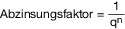

- **q** = 1 + LZ wobei 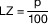

- **LZ** = Zinssatz (Liegenschaftszinssatz)

- **n** = Restnutzungsdauer

- **p** = Zinsfuß

<a id="anlage-42-270"></a>

## Anlage 42 (zu § 259 Absatz 1)   Normalherstellungskosten

(Fundstelle: BGBl. I 2019, 1847 – 1848)

  
  
- ****I.**** **Begriff der Brutto-Grundfläche (BGF)**

  - **1\.** Die BGF ist die Summe der bezogen auf die jeweilige Gebäudeart marktüblich nutzbaren Grundflächen aller Grundrissebenen eines Bauwerks. In Anlehnung an die DIN 277-1:2005-02 sind bei den Grundflächen folgende Bereiche zu unterscheiden:

    Bereich a: überdeckt und allseitig in voller Höhe umschlossen,

    Bereich b: überdeckt, jedoch nicht allseitig in voller Höhe umschlossen,

    Bereich c: nicht überdeckt.

    Für die Anwendung der Normalherstellungskosten (NHK) sind im Rahmen der Ermittlung der BGF nur die Grundflächen der Bereiche a und b zugrunde zu legen. Balkone, auch wenn sie überdeckt sind, sind dem Bereich c zuzuordnen.

    Für die Ermittlung der BGF sind die äußeren Maße der Bauteile einschließlich Bekleidung, z. B. Putz und Außenschalen mehrschaliger Wandkonstruktionen, in Höhe der Bodenbelagsoberkanten anzusetzen.

  - **2\.** Nicht zur BGF gehören z. B. Flächen von Spitzböden und Kriechkellern, Flächen, die ausschließlich der Wartung, Inspektion und Instandsetzung von Baukonstruktionen und technischen Anlagen dienen, sowie Flächen unter konstruktiven Hohlräumen, z. B. über abgehängten Decken.

- ****II.**** **Normalherstellungskosten (NHK)**

  Normalherstellungskosten in Euro/m<sup>2</sup> BGF auf der Grundlage der Normalherstellungskosten 2010 (NHK 2010), einschließlich Baunebenkosten und Umsatzsteuer für die jeweilige Gebäudeart (Kostenstand 2010) sowie eines pauschalen Zuschlages für bauliche Anlagen, insbesondere Außenanlagen, und sonstige Anlagen (3 %)   
    


  <table style="border-collapse:collapse">
  <tr><td rowspan="2" colspan="2" style="border-bottom:1px solid currentColor;text-align:center"><strong>Gebäudeart</strong></td><td colspan="3" style="border-bottom:1px solid currentColor;text-align:center"><strong>Baujahrgruppe</strong></td></tr>
  <tr><td style="border-bottom:1px solid currentColor;text-align:center"><strong>vor 1995</strong></td><td style="border-bottom:1px solid currentColor;text-align:center"><strong>1995 – 2004</strong></td><td style="border-bottom:1px solid currentColor;text-align:center"><strong>ab 2005</strong></td></tr>
  <tr><td> 1</td><td>Gemischt genutzte Grundstücke (Wohnhäuser mit Mischnutzung)</td><td>  695</td><td>  886</td><td>1 118</td></tr>
  <tr><td> 2</td><td>Banken und ähnliche Geschäftshäuser</td><td>  736</td><td>  937</td><td>1 494</td></tr>
  <tr><td> 3</td><td>Bürogebäude, Verwaltungsgebäude</td><td>  839</td><td>1 071</td><td>1 736</td></tr>
  <tr><td> 4</td><td>Gemeindezentren, Vereinsheime, Saalbauten, Veranstaltungsgebäude</td><td>1 004</td><td>1 282</td><td>1 555</td></tr>
  <tr><td> 5</td><td>Kindergärten (Kindertagesstätten), allgemeinbildende Schulen, berufsbildende Schulen, Hochschulen, Sonderschulen</td><td>1 164</td><td>1 488</td><td>1 710</td></tr>
  <tr><td> 6</td><td>Wohnheime, Internate, Alten-, Pflegeheime</td><td>  876</td><td>1 118</td><td>1 370</td></tr>
  <tr><td> 7</td><td>Krankenhäuser, Kliniken, Tageskliniken, Ärztehäuser</td><td>1 334</td><td>1 705</td><td>2 075</td></tr>
  <tr><td> 8</td><td>Beherbergungsstätten, Hotels, Verpflegungseinrichtungen</td><td>1 118</td><td>1 427</td><td>1 859</td></tr>
  <tr><td> 9.1</td><td>Sporthallen</td><td>1 133</td><td>1 447</td><td>1 777</td></tr>
  <tr><td> 9.2</td><td>Tennishallen</td><td>  814</td><td>1 040</td><td>1 226</td></tr>
  <tr><td> 9.3</td><td>Freizeitbäder, Kur- und Heilbäder</td><td>1 978</td><td>2 524</td><td>3 075</td></tr>
  <tr><td>10.1</td><td>Verbrauchermärkte</td><td>  582</td><td>  742</td><td>  896</td></tr>
  <tr><td>10.2</td><td>Kauf- und Warenhäuser</td><td>1 066</td><td>1 360</td><td>1 633</td></tr>
  <tr><td>10.3</td><td>Autohäuser ohne Werkstatt</td><td>  757</td><td>  968</td><td>1 277</td></tr>
  <tr><td>11.1</td><td>Betriebs- und Werkstätten eingeschossig oder mehrgeschossig ohne Hallenanteil; industrielle Produktionsgebäude, Massivbauweise</td><td>  762</td><td>  973</td><td>1 200</td></tr>
  <tr><td>11.2</td><td>Betriebs- und Werkstätten, mehrgeschossig, hoher Hallenanteil; industrielle Produktionsgebäude, überwiegend Skelettbauweise</td><td>  536</td><td>  680</td><td>  942</td></tr>
  <tr><td>12.1</td><td>Lagergebäude ohne Mischnutzung, Kaltlager</td><td>  283</td><td>  361</td><td>  505</td></tr>
  <tr><td>12.2</td><td>Lagergebäude mit bis zu 25 Prozent Mischnutzung</td><td>  443</td><td>  567</td><td>  711</td></tr>
  <tr><td>12.3</td><td>Lagergebäude mit mehr als 25 Prozent Mischnutzung</td><td>  716</td><td>  917</td><td>1 128</td></tr>
  <tr><td>13</td><td>Museen, Theater, Sakralbauten</td><td style="border-bottom:1px solid currentColor">1 514</td><td style="border-bottom:1px solid currentColor">1 875</td><td style="border-bottom:1px solid currentColor">2 395</td></tr>
  <tr><td>14</td><td>Reithallen, ehemalige landwirtschaftliche Mehrzweckhallen, Scheunen und Ähnliches</td><td colspan="3">  263</td></tr>
  <tr><td>15</td><td>Stallbauten</td><td colspan="3">  422</td></tr>
  <tr><td>16</td><td>Hochgaragen, Tiefgaragen und Nutzfahrzeuggaragen</td><td colspan="3">  623</td></tr>
  <tr><td>17</td><td>Einzelgaragen, Mehrfachgaragen</td><td colspan="3">  500</td></tr>
  <tr><td style="border-bottom:1px solid currentColor">18</td><td style="border-bottom:1px solid currentColor">Carports und Ähnliches</td><td colspan="3" style="border-bottom:1px solid currentColor">  196</td></tr>
  <tr><td style="border-bottom:1px solid currentColor"><strong>19</strong></td><td colspan="4" style="border-bottom:1px solid currentColor"><strong>Teileigentum</strong><br> Teileigentum ist in Abhängigkeit von der baulichen Gestaltung den vorstehenden Gebäudearten zuzuordnen.</td></tr>
  <tr><td><strong>20</strong></td><td colspan="4"><strong>Auffangklausel</strong><br> Normalherstellungskosten für nicht aufgeführte Gebäudearten sind aus den Normalherstellungskosten vergleichbarer Gebäudearten abzuleiten.</td></tr>
  </table>

<a id="anlage-43-271"></a>

## Anlage 43 (zu § 260)  Wertzahlen   für Teileigentum, Geschäftsgrundstücke, gemischt genutzte Grundstücke  und sonstige bebaute Grundstücke nach § 249 Absatz 1 Nummer 5 bis 8

(Fundstelle: BGBl. I 2019, 1849)

  
  


<table style="border-collapse:collapse">
<tr><td colspan="2"></td><td colspan="3"><strong>Bodenrichtwert oder in EUR/m<sup>2</sup> umgerechneter Bodenwert nach § 247 Absatz 3</strong></td></tr>
<tr><td colspan="2" style="text-align:center"><strong>Vorläufiger Sachwert</strong></td><td><strong>bis 100 EUR/m<sup>2</sup></strong></td><td><strong>bis 300 EUR/m<sup>2</sup></strong></td><td><strong>über 300 EUR/m<sup>2</sup></strong></td></tr>
<tr><td rowspan="6">bis</td><td style="text-align:right">500 000 EUR</td><td>0,80</td><td>0,90</td><td>1,00</td></tr>
<tr><td style="text-align:right">750 000 EUR</td><td>0,75</td><td>0,85</td><td>0,95</td></tr>
<tr><td>1 000 000 EUR</td><td>0,70</td><td>0,80</td><td>0,90</td></tr>
<tr><td>1 500 000 EUR</td><td>0,65</td><td>0,75</td><td>0,85</td></tr>
<tr><td>2 000 000 EUR</td><td>0,60</td><td>0,70</td><td>0,80</td></tr>
<tr><td>3 000 000 EUR</td><td>0,55</td><td>0,65</td><td>0,75</td></tr>
<tr><td>über</td><td>3 000 000 EUR</td><td>0,50</td><td>0,60</td><td>0,70</td></tr>
</table>
