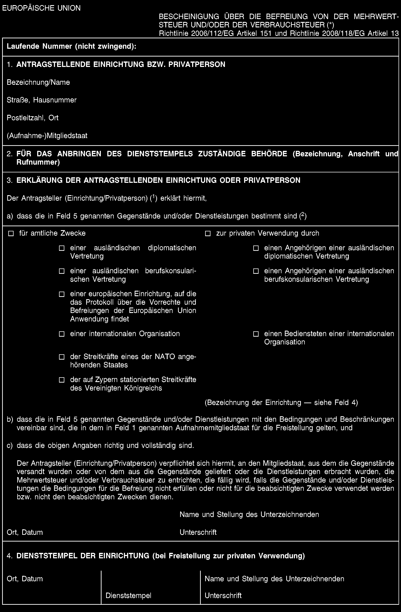
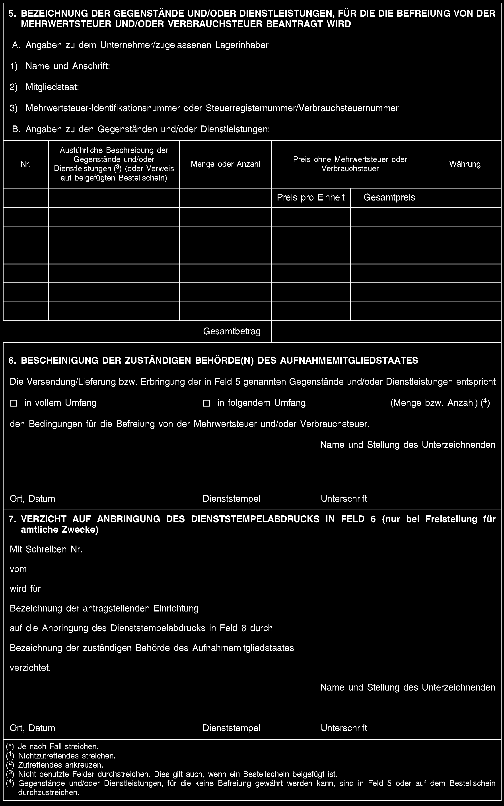

# DVO (EU) 282/2011

Durchführungsverordnung (EU) Nr. 282/2011 des Rates zur Festlegung von Durchführungsvorschriften zur Richtlinie 2006/112/EG über das gemeinsame Mehrwertsteuersystem

## Fassung und Quellen

- Ursprüngliche Amtsblattfassung vom 23.03.2011, ABl. L 77, S. 1–22; Rechtsakt vom 2011-03-15.
- Keine konsolidierte Fassung: spätere Änderungen und Berichtigungen sind nicht in diese Originalfassung eingearbeitet.
- Import und Abgleich am 2026-09-09; das Ordnerdatum bezeichnet den Importstand, nicht einen aktuellen Rechtsstand.

Die lokale PDF ist bytegenau identisch mit der amtlichen EUR-Lex-PDF dieser Fassung. Der Text folgt der zugehörigen [amtlichen HTML-Fassung](https://eur-lex.europa.eu/legal-content/DE/TXT/HTML/?uri=CELEX:32011R0282). Fußnoten sind entsprechend dieser HTML-Fassung fortlaufend nummeriert und beidseitig verlinkt; die PDF verwendet teilweise je Seite neue Nummern.

- [Original-PDF](<Quellen/DVO (EU) 282_2011.pdf>)
- [Archivierte amtliche HTML-Fassung](Quellen/EUR-Lex_Amtsblatt.html)
- [Vollständigkeitsprüfung](Pruefung/Pruefbericht.md)

Die beiden Formularseiten in Anhang II sind als Originalabbildungen und mit den amtlichen Bildtexten enthalten. Für räumliche Zuordnung und Ankreuzfelder gilt die Abbildung.

## Inhaltsverzeichnis

- [KAPITEL I GEGENSTAND](#cpt_I)
  - [Artikel 1](#art_1)
- [KAPITEL II ANWENDUNGSBEREICH (TITEL I DER RICHTLINIE 2006/112/EG)](#cpt_II)
  - [Artikel 2](#art_2)
  - [Artikel 3](#art_3)
  - [Artikel 4](#art_4)
- [KAPITEL III STEUERPFLICHTIGER (TITEL III DER RICHTLINIE 2006/112/EG)](#cpt_III)
  - [Artikel 5](#art_5)
- [KAPITEL IV STEUERBARER UMSATZ (ARTIKEL 24 BIS 29 DER RICHTLINIE 2006/112/EG)](#cpt_IV)
  - [Artikel 6](#art_6)
  - [Artikel 7](#art_7)
  - [Artikel 8](#art_8)
  - [Artikel 9](#art_9)
- [KAPITEL V ORT DES STEUERBAREN UMSATZES](#cpt_V)
  - [ABSCHNITT 1 Begriffe](#cpt_V.sct_1)
    - [Artikel 10](#art_10)
    - [Artikel 11](#art_11)
    - [Artikel 12](#art_12)
    - [Artikel 13](#art_13)
  - [ABSCHNITT 2 Ort der Lieferung von Gegenständen (Artikel 31 bis 39 der Richtlinie 2006/112/EG)](#cpt_V.sct_2)
    - [Artikel 14](#art_14)
    - [Artikel 15](#art_15)
  - [ABSCHNITT 3 Ort des innergemeinschaftlichen Erwerbs von Gegenständen (Artikel 40, 41 und 42 der Richtlinie 2006/112/EG)](#cpt_V.sct_3)
    - [Artikel 16](#art_16)
  - [ABSCHNITT 4 Ort der Dienstleistung (Artikel 43 bis 59 der Richtlinie 2006/112/EG)](#cpt_V.sct_4)
    - [Unterabschnitt 1 Status des Dienstleistungsempfängers](#cpt_V.sct_4.sbs_1)
      - [Artikel 17](#art_17)
      - [Artikel 18](#art_18)
    - [Unterabschnitt 2 Eigenschaft des Dienstleistungsempfängers](#cpt_V.sct_4.sbs_2)
      - [Artikel 19](#art_19)
    - [Unterabschnitt 3 Ort des Dienstleistungsempfängers](#cpt_V.sct_4.sbs_3)
      - [Artikel 20](#art_20)
      - [Artikel 21](#art_21)
      - [Artikel 22](#art_22)
      - [Artikel 23](#art_23)
      - [Artikel 24](#art_24)
    - [Unterabschnitt 4 Allgemeine Bestimmungen zur Ermittlung des Status, der Eigenschaft und des Ortes des Dienstleistungsempfängers](#cpt_V.sct_4.sbs_4)
      - [Artikel 25](#art_25)
    - [Unterabschnitt 5 Dienstleistungen, die unter die Allgemeinen Bestimmungen fallen](#cpt_V.sct_4.sbs_5)
      - [Artikel 26](#art_26)
      - [Artikel 27](#art_27)
      - [Artikel 28](#art_28)
      - [Artikel 29](#art_29)
    - [Unterabschnitt 6 Dienstleistungen von Vermittlern](#cpt_V.sct_4.sbs_6)
      - [Artikel 30](#art_30)
      - [Artikel 31](#art_31)
    - [Unterabschnitt 7 Dienstleistungen auf dem Gebiet der Kultur, der Künste, des Sports, der Wissenschaft, des Unterrichts, der Unterhaltung und ähnliche Veranstaltungen](#cpt_V.sct_4.sbs_7)
      - [Artikel 32](#art_32)
      - [Artikel 33](#art_33)
    - [Unterabschnitt 8 Nebentätigkeiten zur Beförderung, Begutachtung von beweglichen Gegenständen und Arbeiten an solchen Gegenständen](#cpt_V.sct_4.sbs_8)
      - [Artikel 34](#art_34)
    - [Unterabschnitt 9 Restaurant- und Verpflegungsdienstleistungen an Bord eines Beförderungsmittels](#cpt_V.sct_4.sbs_9)
      - [Artikel 35](#art_35)
      - [Artikel 36](#art_36)
      - [Artikel 37](#art_37)
    - [Unterabschnitt 10 Vermietung von Beförderungsmitteln](#cpt_V.sct_4.sbs_10)
      - [Artikel 38](#art_38)
      - [Artikel 39](#art_39)
      - [Artikel 40](#art_40)
    - [Unterabschnitt 11 Dienstleistungen an Nichtsteuerpflichtige außerhalb der Gemeinschaft](#cpt_V.sct_4.sbs_11)
      - [Artikel 41](#art_41)
- [KAPITEL VI BESTEUERUNGSGRUNDLAGE (TITEL VII DER RICHTLINIE 2006/112/EG)](#cpt_VI)
  - [Artikel 42](#art_42)
- [KAPITEL VII STEUERSÄTZE](#cpt_VII)
  - [Artikel 43](#art_43)
- [KAPITEL VIII STEUERBEFREIUNGEN](#cpt_VIII)
  - [ABSCHNITT 1 Steuerbefreiungen für bestimmte, dem Gemeinwohl dienende Tätigkeiten (Artikel 132, 133 und 134 der Richtlinie 2006/112/EG)](#cpt_VIII.sct_1)
    - [Artikel 44](#art_44)
  - [ABSCHNITT 2 Steuerbefreiungen für andere Tätigkeiten (Artikel 135, 136 und 137 der Richtlinie 2006/112/EG)](#cpt_VIII.sct_2)
    - [Artikel 45](#art_45)
  - [ABSCHNITT 3 Steuerbefreiungen bei der Einfuhr (Artikel 143, 144 und 145 der Richtlinie 2006/112/EG)](#cpt_VIII.sct_3)
    - [Artikel 46](#art_46)
  - [ABSCHNITT 4 Steuerbefreiungen bei der Ausfuhr (Artikel 146 und 147 der Richtlinie 2006/112/EG)](#cpt_VIII.sct_4)
    - [Artikel 47](#art_47)
    - [Artikel 48](#art_48)
  - [ABSCHNITT 5 Steuerbefreiungen bei bestimmten, Ausfuhren gleichgestellten Umsätzen (Artikel 151 und 152 der Richtlinie 2006/112/EG)](#cpt_VIII.sct_5)
    - [Artikel 49](#art_49)
    - [Artikel 50](#art_50)
    - [Artikel 51](#art_51)
- [KAPITEL IX VORSTEUERABZUG (TITEL X DER RICHTLINIE 2006/112/EG)](#cpt_IX)
  - [Artikel 52](#art_52)
- [KAPITEL X PFLICHTEN DER STEUERPFLICHTIGEN UND BESTIMMTER NICHTSTEUERPFLICHTIGER PERSONEN (TITEL XI DER RICHTLINIE 2006/112/EG)](#cpt_X)
  - [ABSCHNITT 1 Steuerschuldner gegenüber dem Fiskus (Artikel 192a bis 205 der Richtlinie 2006/112/EG)](#cpt_X.sct_1)
    - [Artikel 53](#art_53)
    - [Artikel 54](#art_54)
  - [ABSCHNITT 2 Ergänzende Bestimmungen (Artikel 272 und 273 der Richtlinie 2006/112/EG)](#cpt_X.sct_2)
    - [Artikel 55](#art_55)
- [KAPITEL XI SONDERREGELUNGEN](#cpt_XI)
  - [ABSCHNITT 1 Sonderregelung für Anlagegold (Artikel 344 bis 356 der Richtlinie 2006/112/EG)](#cpt_XI.sct_1)
    - [Artikel 56](#art_56)
    - [Artikel 57](#art_57)
  - [ABSCHNITT 2 Sonderregelung für nicht in der Gemeinschaft ansässige Steuerpflichtige, die elektronische Dienstleistungen an Nichtsteuerpflichtige erbringen (Artikel 357 bis 369 der Richtlinie 2006/112/EG)](#cpt_XI.sct_2)
    - [Artikel 58](#art_58)
    - [Artikel 59](#art_59)
    - [Artikel 60](#art_60)
    - [Artikel 61](#art_61)
    - [Artikel 62](#art_62)
    - [Artikel 63](#art_63)
- [KAPITEL XII SCHLUSSBESTIMMUNGEN](#cpt_XII)
  - [Artikel 64](#art_64)
  - [Artikel 65](#art_65)
- [ANHANG I](#anx_I)
- [ANHANG II](#anx_II)
- [ANHANG III](#anx_III)
- [ANHANG IV](#anx_IV)

## Amtsblatttext

II

(Rechtsakte ohne Gesetzescharakter)

VERORDNUNGEN

<table width="100%" style="border-collapse:collapse">
<col width="10%">
<col width="10%">
<col width="60%">
<col width="20%">
<tbody>
<tr>
<td style="border:1px solid currentColor;padding:0.3em;vertical-align:top">

23.3.2011   

</td>
<td style="border:1px solid currentColor;padding:0.3em;vertical-align:top">

DE

</td>
<td style="border:1px solid currentColor;padding:0.3em;vertical-align:top">

Amtsblatt der Europäischen Union

</td>
<td style="border:1px solid currentColor;padding:0.3em;vertical-align:top">

L 77/1

</td>
</tr>
</tbody>
</table>

---

 DURCHFÜHRUNGSVERORDNUNG (EU) Nr. 282/2011 DES RATES

vom 15. März 2011

zur Festlegung von Durchführungsvorschriften zur Richtlinie 2006/112/EG über das gemeinsame Mehrwertsteuersystem

(Neufassung)

DER RAT DER EUROPÄISCHEN UNION —

gestützt auf den Vertrag über die Arbeitsweise der Europäischen Union,

gestützt auf die Richtlinie 2006/112/EG des Rates vom 28. November 2006 über das gemeinsame Mehrwertsteuersystem [(1)](<#ntr1-L_2011077DE.01000101-E0001>), insbesondere Artikel 397,

auf Vorschlag der Europäischen Kommission,

in Erwägung nachstehender Gründe:

**(1)** Die Verordnung (EG) Nr. 1777/2005 des Rates vom 17. Oktober 2005 zur Festlegung von Durchführungsvorschriften zur Richtlinie 77/388/EWG über das gemeinsame Mehrwertsteuersystem [(2)](<#ntr2-L_2011077DE.01000101-E0002>) muss in einigen wesentlichen Punkten geändert werden. Aus Gründen der Klarheit und der Vereinfachung sollte die Verordnung neu gefasst werden.

**(2)** Die Richtlinie 2006/112/EG legt Vorschriften im Bereich der Mehrwertsteuer fest, die in bestimmten Fällen für die Auslegung durch die Mitgliedstaaten offen sind. Der Erlass von gemeinsamen Vorschriften zur Durchführung der Richtlinie 2006/112/EG sollte gewährleisten, dass in Fällen, in denen es zu Divergenzen bei der Anwendung kommt oder kommen könnte, die nicht mit dem reibungslosen Funktionieren des Binnenmarkts zu vereinbaren sind, die Anwendung des Mehrwertsteuersystems stärker auf das Ziel eines solchen Binnenmarkts ausgerichtet wird. Diese Durchführungsvorschriften sind erst vom Zeitpunkt des Inkrafttretens dieser Verordnung an rechtsverbindlich; sie berühren nicht die Gültigkeit der von den Mitgliedstaaten in der Vergangenheit angenommenen Rechtsvorschriften und Auslegungen.

**(3)** Die Änderungen, die sich aus dem Erlass der Richtlinie 2008/8/EG des Rates vom 12. Februar 2008 zur Änderung der Richtlinie 2006/112/EG bezüglich des Ortes der Dienstleistung [(3)](<#ntr3-L_2011077DE.01000101-E0003>) ergeben, sollten in dieser Verordnung berücksichtigt werden.

**(4)** Das Ziel dieser Verordnung ist, die einheitliche Anwendung des Mehrwertsteuersystems in seiner derzeitigen Form dadurch sicherzustellen, dass Vorschriften zur Durchführung der Richtlinie 2006/112/EG erlassen werden, und zwar insbesondere in Bezug auf den Steuerpflichtigen, die Lieferung von Gegenständen und die Erbringung von Dienstleistungen sowie den Ort der steuerbaren Umsätze. Im Einklang mit dem Grundsatz der Verhältnismäßigkeit gemäß Artikel 5 Absatz 4 des Vertrags über die Europäische Union geht diese Verordnung nicht über das für die Erreichung dieses Ziels erforderliche Maß hinaus. Da sie in allen Mitgliedstaaten verbindlich ist und unmittelbar gilt, wird die Einheitlichkeit der Anwendung am besten durch eine Verordnung gewährleistet.

**(5)** Diese Durchführungsvorschriften enthalten spezifische Regelungen zu einzelnen Anwendungsfragen und sind ausschließlich im Hinblick auf eine unionsweit einheitliche steuerliche Behandlung dieser Einzelfälle konzipiert. Sie sind daher nicht auf andere Fälle übertragbar und auf der Grundlage ihres Wortlauts restriktiv anzuwenden.

**(6)** Ändert ein Nichtsteuerpflichtiger seinen Wohnort und überführt er bei dieser Gelegenheit ein neues Fahrzeug oder wird ein neues Fahrzeug in den Mitgliedstaat zurücküberführt, aus dem es ursprünglich mehrwertsteuerfrei an den Nichtsteuerpflichtigen, der es zurücküberführt, geliefert worden war, so sollte klargestellt werden, dass es sich dabei nicht um den innergemeinschaftlichen Erwerb eines neuen Fahrzeugs handelt.

**(7)** Für bestimmte Dienstleistungen ist es ausreichend, dass der Dienstleistungserbringer nachweist, dass der steuerpflichtige oder nichtsteuerpflichtiger Empfänger dieser Dienstleistungen außerhalb der Gemeinschaft ansässig ist, damit die Erbringung dieser Dienstleistungen nicht der Mehrwertsteuer unterliegt.

**(8)** Die Zuteilung einer Mehrwertsteuer-Identifikationsnummer an einen Steuerpflichtigen, der eine Dienstleistung für einen Empfänger in einem anderen Mitgliedstaat erbringt oder der aus einem anderen Mitgliedstaat eine Dienstleistung erhält, für die die Mehrwertsteuer ausschließlich vom Dienstleistungsempfänger zu zahlen ist, sollte nicht das Recht dieses Steuerpflichtigen auf Nichtbesteuerung seiner innergemeinschaftlichen Erwerbe von Gegenständen beeinträchtigen. Teilt jedoch ein Steuerpflichtiger im Zusammenhang mit einem innergemeinschaftlichen Erwerb von Gegenständen dem Lieferer seine Mehrwertsteuer-Identifikationsnummer mit, so wird der Steuerpflichtige in jedem Fall so behandelt, als habe er von der Möglichkeit Gebrauch gemacht, diese Umsätze der Steuer zu unterwerfen.

**(9)** Die weitere Integration des Binnenmarkts erfordert eine stärkere grenzüberschreitende Zusammenarbeit von in verschiedenen Mitgliedstaaten ansässigen Wirtschaftsbeteiligten und hat zu einer steigenden Anzahl von Europäischen wirtschaftlichen Interessenvereinigungen (EWIV) im Sinne der Verordnung (EWG) Nr. 2137/85 des Rates vom 25. Juli 1985 über die Schaffung einer Europäischen wirtschaftlichen Interessenvereinigung (EWIV) [(4)](<#ntr4-L_2011077DE.01000101-E0004>) geführt. Daher sollte klargestellt werden, dass EWIV steuerpflichtig sind, wenn sie gegen Entgelt Gegenstände liefern oder Dienstleistungen erbringen.

**(10)** Es ist erforderlich, Restaurant- und Verpflegungsdienstleistungen, die Abgrenzung zwischen diesen beiden Dienstleistungen sowie ihre angemessene Behandlung klar zu definieren.

**(11)** Im Interesse der Klarheit sollten Umsätze, die als elektronisch erbrachte Dienstleistungen eingestuft werden, in Verzeichnissen aufgelistet werden, wobei diese Verzeichnisse weder endgültig noch erschöpfend sind.

**(12)** Es ist erforderlich, einerseits festzulegen, dass es sich bei einer Leistung, die nur aus der Montage verschiedener vom Dienstleistungsempfänger zur Verfügung gestellter Teile einer Maschine besteht, um eine Dienstleistung handelt, und andererseits, wo der Ort dieser Dienstleistung liegt, wenn sie an einen Nichtsteuerpflichtigen erbracht wird.

**(13)** Der Verkauf einer Option als Finanzinstrument sollte als Dienstleistung behandelt werden, die von den Umsätzen, auf die sich die Option bezieht, getrennt ist.

**(14)** Um die einheitliche Anwendung der Regeln für die Bestimmung des Ortes der steuerbaren Umsätze sicherzustellen, sollten der Begriff des Ortes, an dem ein Steuerpflichtiger den Sitz seiner wirtschaftlichen Tätigkeit hat, und der Begriff der festen Niederlassung, des Wohnsitzes und des gewöhnlichen Aufenthaltsortes klargestellt werden. Die Zugrundelegung möglichst klarer und objektiver Kriterien sollte die praktische Anwendung dieser Begriffe erleichtern, wobei der Rechtsprechung des Gerichtshofs Rechnung getragen werden sollte.

**(15)** Es sollten Vorschriften erlassen werden, die eine einheitliche Behandlung von Lieferungen von Gegenständen gewährleisten, wenn ein Lieferer den Schwellenwert für Fernverkäufe in einen anderen Mitgliedstaat überschritten hat.

**(16)** Es sollte klargestellt werden, dass zur Bestimmung des innerhalb der Gemeinschaft stattfindenden Teils der Personenbeförderung die Reisestrecke des Beförderungsmittels und nicht die von den Fahrgästen zurückgelegte Reisestrecke ausschlaggebend ist.

**(17)** Das Recht des Erwerbsmitgliedstaats zur Besteuerung eines innergemeinschaftlichen Erwerbs sollte nicht durch die mehrwertsteuerliche Behandlung der Umsätze im Abgangsmitgliedstaat beeinträchtigt werden.

**(18)** Für die richtige Anwendung der Regeln über den Ort der Dienstleistung kommt es hauptsächlich auf den Status des Dienstleistungsempfängers als Steuerpflichtiger oder Nichtsteuerpflichtiger und die Eigenschaft, in der er handelt, an. Um den steuerlichen Status des Dienstleistungsempfängers zu bestimmen, sollte festgelegt werden, welche Nachweise sich der Dienstleistungserbringer vom Dienstleistungsempfänger vorlegen lassen muss.

**(19)** Es sollte klargestellt werden, dass dann, wenn für einen Steuerpflichtigen erbrachte Dienstleistungen für den privaten Bedarf, einschließlich für den Bedarf des Personals des Dienstleistungsempfängers, bestimmt sind, dieser Steuerpflichtige nicht als in seiner Eigenschaft als Steuerpflichtiger handelnd eingestuft werden kann. Zur Entscheidung, ob der Dienstleistungsempfänger als Steuerpflichtiger handelt oder nicht, ist die Mitteilung seiner Mehrwertsteuer-Identifikationsnummer an den Dienstleistungserbringer ausreichend, um ihm die Eigenschaft als Steuerpflichtiger zuzuerkennen, es sei denn, dem Dienstleistungserbringer liegen gegenteilige Informationen vor. Es sollte außerdem sichergestellt werden, dass eine Dienstleistung, die sowohl für Unternehmenszwecke erworben als auch privat genutzt wird, nur an einem einzigen Ort besteuert wird.

**(20)** Zur genauen Bestimmung des Ortes der Niederlassung des Dienstleistungsempfängers ist der Dienstleistungserbringer verpflichtet, die vom Dienstleistungsempfänger übermittelten Angaben zu überprüfen.

**(21)** Unbeschadet der allgemeinen Bestimmung über den Ort einer Dienstleistung an einen Steuerpflichtigen sollten Regeln festgelegt werden, um dem Dienstleistungserbringer für den Fall, dass Dienstleistungen an einen Steuerpflichtigen erbracht werden, der an mehr als einem Ort ansässig ist, zu helfen, den Ort der festen Niederlassung des Steuerpflichtigen, an die die Dienstleistung erbracht wird, unter Berücksichtigung der jeweiligen Umstände zu bestimmen. Wenn es dem Dienstleistungserbringer nicht möglich ist, diesen Ort zu bestimmen, sollten Bestimmungen zur Präzisierung der Pflichten des Dienstleistungserbringers festgelegt werden. Diese Bestimmungen sollten die Pflichten des Steuerpflichtigen weder berühren noch ändern.

**(22)** Es sollte auch festgelegt werden, zu welchem Zeitpunkt der Dienstleistungserbringer den Status des Dienstleistungsempfängers als Steuerpflichtiger oder Nichtsteuerpflichtiger, seine Eigenschaft und seinen Ort bestimmen muss.

**(23)** Der Grundsatz in Bezug auf missbräuchliche Praktiken von Wirtschaftsbeteiligten gilt generell für die vorliegende Verordnung, doch ist es angezeigt, speziell im Zusammenhang mit einigen Bestimmungen dieser Verordnung auf seine Gültigkeit hinzuweisen.

**(24)** Bestimmte Dienstleistungen wie die Erteilung des Rechts zur Fernsehübertragung von Fußballspielen, Textübersetzungen, Dienstleistungen im Zusammenhang mit der Mehrwertsteuererstattung und Dienstleistungen von Vermittlern, die an einen Nichtsteuerpflichtigen erbracht werden, sind mit grenzübergreifenden Sachverhalten verbunden oder beziehen sogar außerhalb der Gemeinschaft ansässige Wirtschaftsbeteiligte ein. Zur Verbesserung der Rechtssicherheit sollte der Ort dieser Dienstleistungen eindeutig bestimmt werden.

**(25)** Es sollte festgelegt werden, dass für Dienstleistungen von Vermittlern, die im Namen und für Rechnung Dritter handeln und die Beherbergungsdienstleistungen in der Hotelbranche vermitteln, nicht die spezifische Regel für Dienstleistungen im Zusammenhang mit einem Grundstück gilt.

**(26)** Werden mehrere Dienstleistungen im Rahmen von Bestattungen als Bestandteil einer einheitlichen Dienstleistung erbracht, sollte festgelegt werden, nach welcher Vorschrift der Ort der Dienstleistung zu bestimmen ist.

**(27)** Um die einheitliche Behandlung von Dienstleistungen auf dem Gebiet der Kultur, der Künste, des Sports, der Wissenschaften, des Unterrichts sowie der Unterhaltung und ähnlichen Ereignissen sicherzustellen, sollten die Eintrittsberechtigung zu solchen Ereignissen und die mit der Eintrittsberechtigung zusammenhängenden Dienstleistungen definiert werden.

**(28)** Es sollte klargestellt werden, wie Restaurant- und Verpflegungsdienstleistungen zu behandeln sind, die an Bord eines Beförderungsmittels erbracht werden, sofern die Personenbeförderung auf dem Gebiet mehrerer Länder erfolgt.

**(29)** Da bestimmte Regeln für die Vermietung von Beförderungsmitteln auf die Dauer des Besitzes oder der Verwendung abstellen, muss nicht nur festgelegt werden, welche Fahrzeuge als Beförderungsmittel anzusehen sind, sondern es ist auch klarzustellen, wie solche Dienstleistungen zu behandeln sind, wenn mehrere aufeinanderfolgende Verträge abgeschlossen werden. Es ist auch der Ort festzulegen, an dem das Beförderungsmittel dem Dienstleistungsempfänger tatsächlich zur Verfügung gestellt wird.

**(30)** Unter bestimmten Umständen sollte eine bei der Bezahlung eines Umsatzes mittels Kredit- oder Geldkarte anfallende Bearbeitungsgebühr nicht zu einer Minderung der Besteuerungsgrundlage für diesen Umsatz führen.

**(31)** Es muss klargestellt werden, dass auf die Vermietung von Zelten, Wohnanhängern und Wohnmobilen, die auf Campingplätzen aufgestellt sind und als Unterkünfte dienen, ein ermäßigter Steuersatz angewandt werden kann.

**(32)** Als Ausbildung, Fortbildung oder berufliche Umschulung sollten sowohl Schulungsmaßnahmen mit direktem Bezug zu einem Gewerbe oder einem Beruf als auch jegliche Schulungsmaßnahme im Hinblick auf den Erwerb oder die Erhaltung beruflicher Kenntnisse gelten, und zwar unabhängig von ihrer Dauer.

**(33)** „Platinum Nobles“ sollten in allen Fällen von der Steuerbefreiung für Umsätze mit Devisen, Banknoten und Münzen ausgeschlossen sein.

**(34)** Es sollte festgelegt werden, dass die Steuerbefreiung für Dienstleistungen im Zusammenhang mit der Einfuhr von Gegenständen, deren Wert in der Steuerbemessungsgrundlage für diese Gegenstände enthalten ist, auch für im Rahmen eines Wohnortwechsels erbrachte Beförderungsdienstleistungen gilt.

**(35)** Die vom Abnehmer nach Orten außerhalb der Gemeinschaft beförderten und für die Ausrüstung oder die Versorgung von Beförderungsmitteln — die von Personen, die keine natürlichen Personen sind, wie etwa Einrichtungen des öffentlichen Rechts oder Vereine, für nichtgeschäftliche Zwecke genutzt werden — bestimmten Gegenstände sollten von der Steuerbefreiung bei Ausfuhrumsätzen ausgeschlossen sein.

**(36)** Um eine einheitliche Verwaltungspraxis bei der Berechnung des Mindestwerts für die Steuerbefreiung der Ausfuhr von Gegenständen zur Mitführung im persönlichen Gepäck von Reisenden sicherzustellen, sollten die Bestimmungen für diese Berechnung harmonisiert werden.

**(37)** Es sollte festgelegt werden, dass die Steuerbefreiung für bestimmte Umsätze, die Ausfuhren gleichgestellt sind, auch für Dienstleistungen gilt, die unter die besondere Regelung für elektronisch erbrachte Dienstleistungen fallen.

**(38)** Eine entsprechend dem Rechtsrahmen für ein Konsortium für eine europäische Forschungsinfrastruktur (ERIC) zu schaffende Einrichtung sollte zum Zweck der Mehrwertsteuerbefreiung nur unter bestimmten Voraussetzungen als internationale Einrichtung gelten. Die für die Inanspruchnahme der Befreiung erforderlichen Voraussetzungen sollten daher festgelegt werden.

**(39)** Lieferungen von Gegenständen und Dienstleistungen, die im Rahmen diplomatischer und konsularischer Beziehungen bewirkt oder anerkannten internationalen Einrichtungen oder bestimmten Streitkräften erbracht werden, sind vorbehaltlich bestimmter Beschränkungen und Bedingungen von der Mehrwertsteuer befreit. Damit ein Steuerpflichtiger, der eine solche Lieferung oder Dienstleistung von einem anderen Mitgliedstaat aus bewirkt, nachweisen kann, dass die Voraussetzungen für diese Befreiung vorliegen, sollte eine Freistellungsbescheinigung eingeführt werden.

**(40)** Für die Ausübung des Rechts auf Vorsteuerabzug sollten auch elektronische Einfuhrdokumente zugelassen werden, wenn sie dieselben Anforderungen erfüllen wie Papierdokumente.

**(41)** Hat ein Lieferer von Gegenständen oder ein Erbringer von Dienstleistungen eine feste Niederlassung in dem Gebiet des Mitgliedstaats, in dem die Steuer geschuldet wird, so sollte festgelegt werden, unter welchen Umständen die Steuer von dieser Niederlassung zu entrichten ist.

**(42)** Es sollte klargestellt werden, dass ein Steuerpflichtiger, dessen Sitz der wirtschaftlichen Tätigkeit sich in dem Gebiet des Mitgliedstaats befindet, in dem die Mehrwertsteuer geschuldet wird, im Hinblick auf diese Steuerschuld selbst dann als ein in diesem Mitgliedstaat ansässiger Steuerschuldner anzusehen ist, wenn dieser Sitz nicht bei der Lieferung von Gegenständen oder der Erbringung von Dienstleistungen mitwirkt.

**(43)** Es sollte klargestellt werden, dass jeder Steuerpflichtige verpflichtet ist, für bestimmte steuerbare Umsätze seine Mehrwertsteuer-Identifikationsnummer mitzuteilen, sobald er diese erhalten hat, damit eine gerechtere Steuererhebung gewährleistet ist.

**(44)** Um die Gleichbehandlung der Wirtschaftsbeteiligten zu gewährleisten, sollte festgelegt werden, welche Anlagegold-Gewichte auf den Goldmärkten definitiv akzeptiert werden und an welchem Datum der Wert der Goldmünzen festzustellen ist.

**(45)** Die Sonderregelung für die Erbringung elektronisch erbrachter Dienstleistungen durch nicht in der Gemeinschaft ansässige Steuerpflichtige an in der Gemeinschaft ansässige oder wohnhafte Nichtsteuerpflichtige ist an bestimmte Voraussetzungen geknüpft. Es sollte insbesondere genau angegeben werden, welche Folgen es hat, wenn diese Voraussetzungen nicht mehr erfüllt werden.

**(46)** Bestimmte Änderungen resultieren aus der Richtlinie 2008/8/EG. Da diese Änderungen zum einen die Besteuerung der Vermietung von Beförderungsmitteln über einen längeren Zeitraum ab dem 1. Januar 2013 und zum anderen die Besteuerung elektronisch erbrachter Dienstleistungen ab dem 1. Januar 2015 betreffen, sollte festgelegt werden, dass die entsprechenden Bestimmungen dieser Verordnung erst ab diesen Daten anwendbar sind —

HAT FOLGENDE VERORDNUNG ERLASSEN:

## KAPITEL I   <strong>GEGENSTAND</strong>

### Artikel 1

Diese Verordnung regelt die Durchführung einiger Bestimmungen der Titel I bis V und VII bis XII der Richtlinie 2006/112/EG.

## KAPITEL II   <strong>ANWENDUNGSBEREICH</strong> <strong>(TITEL I DER RICHTLINIE 2006/112/EG)</strong>

### Artikel 2

Folgendes führt nicht zu einem innergemeinschaftlichen Erwerb im Sinne von Artikel 2 Absatz 1 Buchstabe b der Richtlinie 2006/112/EG:

**a)** die Verbringung eines neuen Fahrzeugs durch einen Nichtsteuerpflichtigen aufgrund eines Wohnortwechsels, vorausgesetzt, die Befreiung nach Artikel 138 Absatz 2 Buchstabe a der Richtlinie 2006/112/EG war zum Zeitpunkt der Lieferung nicht anwendbar;

**b)** die Rückführung eines neuen Fahrzeugs durch einen Nichtsteuerpflichtigen in denjenigen Mitgliedstaat, aus dem es ihm ursprünglich unter Inanspruchnahme der Steuerbefreiung nach Artikel 138 Absatz 2 Buchstabe a der Richtlinie 2006/112/EG geliefert wurde.

### Artikel 3

Unbeschadet des Artikels 59a Absatz 1 Buchstabe b der Richtlinie 2006/112/EG unterliegt die Erbringung der nachstehend aufgeführten Dienstleistungen nicht der Mehrwertsteuer, wenn der Dienstleistungserbringer nachweist, dass der nach Kapitel V Abschnitt 4 Unterabschnitte 3 und 4 der vorliegenden Verordnung ermittelte Ort der Dienstleistung außerhalb der Gemeinschaft liegt:

**a)** ab 1. Januar 2013 die in Artikel 56 Absatz 2 Unterabsatz 1 der Richtlinie 2006/112/EG genannten Dienstleistungen;

**b)** ab 1. Januar 2015 die in Artikel 58 der Richtlinie 2006/112/EG aufgeführten Dienstleistungen;

**c)** die in Artikel 59 der Richtlinie 2006/112/EG aufgeführten Dienstleistungen.

### Artikel 4

Einem Steuerpflichtigen, dessen innergemeinschaftliche Erwerbe von Gegenständen gemäß Artikel 3 der Richtlinie 2006/112/EG nicht der Mehrwertsteuer unterliegen, steht dieses Recht auf Nichtbesteuerung auch dann weiterhin zu, wenn ihm nach Artikel 214 Absatz 1 Buchstabe d oder e jener Richtlinie für empfangene Dienstleistungen, für die er Mehrwertsteuer zu entrichten hat, oder für von ihm im Gebiet eines anderen Mitgliedstaats erbrachte Dienstleistungen, für die die Mehrwertsteuer ausschließlich vom Empfänger zu entrichten ist, eine Mehrwertsteuer-Identifikationsnummer zugeteilt wurde.

Teilt dieser Steuerpflichtige jedoch im Zusammenhang mit dem innergemeinschaftlichen Erwerb von Gegenständen seine Mehrwertsteuer-Identifikationsnummer einem Lieferer mit, so gilt damit die Wahlmöglichkeit nach Artikel 3 Absatz 3 der genannten Richtlinie als in Anspruch genommen.

## KAPITEL III   <strong>STEUERPFLICHTIGER</strong> <strong>(TITEL III DER RICHTLINIE 2006/112/EG)</strong>

### Artikel 5

Eine gemäß der Verordnung (EWG) Nr. 2137/85 gegründete Europäische wirtschaftliche Interessenvereinigung (EWIV), die gegen Entgelt Lieferungen von Gegenständen oder Dienstleistungen an ihre Mitglieder oder an Dritte bewirkt, ist ein Steuerpflichtiger im Sinne von Artikel 9 Absatz 1 der Richtlinie 2006/112/EG.

## KAPITEL IV   <strong>STEUERBARER UMSATZ</strong> <strong>(ARTIKEL 24 BIS 29 DER RICHTLINIE 2006/112/EG)</strong>

### Artikel 6

(1) Als Restaurant- und Verpflegungsdienstleistungen gelten die Abgabe zubereiteter oder nicht zubereiteter Speisen und/oder Getränke, zusammen mit ausreichenden unterstützenden Dienstleistungen, die deren sofortigen Verzehr ermöglichen. Die Abgabe von Speisen und/oder Getränken ist nur eine Komponente der gesamten Leistung, bei der der Dienstleistungsanteil überwiegt. Restaurantdienstleistungen sind die Erbringung solcher Dienstleistungen in den Räumlichkeiten des Dienstleistungserbringers und Verpflegungsdienstleistungen sind die Erbringung solcher Dienstleistungen an einem anderen Ort als den Räumlichkeiten des Dienstleistungserbringers.

(2) Die Abgabe von zubereiteten oder nicht zubereiteten Speisen und/oder Getränken mit oder ohne Beförderung, jedoch ohne andere unterstützende Dienstleistungen, gilt nicht als Restaurant- oder Verpflegungsdienstleistung im Sinne des Absatzes 1.

### Artikel 7

(1) „Elektronisch erbrachte Dienstleistungen“ im Sinne der Richtlinie 2006/112/EG umfassen Dienstleistungen, die über das Internet oder ein ähnliches elektronisches Netz erbracht werden, deren Erbringung aufgrund ihrer Art im Wesentlichen automatisiert und nur mit minimaler menschlicher Beteiligung erfolgt und ohne Informationstechnologie nicht möglich wäre.

(2) Unter Absatz 1 fällt insbesondere das Folgende:

**a)** Überlassung digitaler Produkte allgemein, z. B. Software und zugehörige Änderungen oder Upgrades;

**b)** Dienste, die in elektronischen Netzen eine Präsenz zu geschäftlichen oder persönlichen Zwecken, z. B. eine Website oder eine Webpage, vermitteln oder unterstützen;

**c)** von einem Computer automatisch generierte Dienstleistungen über das Internet oder ein ähnliches elektronisches Netz auf der Grundlage spezifischer Dateninputs des Dienstleistungsempfängers;

**d)** Einräumung des Rechts, gegen Entgelt eine Leistung auf einer Website, die als Online-Marktplatz fungiert, zum Kauf anzubieten, wobei die potenziellen Käufer ihr Gebot im Wege eines automatisierten Verfahrens abgeben und die Beteiligten durch eine automatische, computergenerierte E-Mail über das Zustandekommen eines Verkaufs unterrichtet werden;

**e)** Internet-Service-Pakete, in denen die Telekommunikations-Komponente ein ergänzender oder untergeordneter Bestandteil ist (d. h. Pakete, die mehr ermöglichen als nur die Gewährung des Zugangs zum Internet und die weitere Elemente wie etwa Nachrichten, Wetterbericht, Reiseinformationen, Spielforen, Webhosting, Zugang zu Chatlines usw. umfassen);

**f)** die in Anhang I genannten Dienstleistungen.

(3) Unter Absatz 1 fällt insbesondere nicht das Folgende:

**a)** Rundfunk- und Fernsehdienstleistungen;

**b)** Telekommunikationsdienstleistungen;

**c)** Gegenstände bei elektronischer Bestellung und Auftragsbearbeitung;

**d)** CD-ROMs, Disketten und ähnliche körperliche Datenträger;

**e)** Druckerzeugnisse wie Bücher, Newsletter, Zeitungen und Zeitschriften;

**f)** CDs und Audiokassetten;

**g)** Videokassetten und DVDs;

**h)** Spiele auf CD-ROM;

**i)** Beratungsleistungen durch Rechtsanwälte, Finanzberater usw. per E-Mail;

**j)** Unterrichtsleistungen, wobei ein Lehrer den Unterricht über das Internet oder ein elektronisches Netz, d. h. über einen Remote Link, erteilt;

**k)** physische Offline-Reparatur von EDV-Ausrüstung;

**l)** Offline-Data-Warehousing;

**m)** Zeitungs-, Plakat- und Fernsehwerbung;

**n)** Telefon-Helpdesks;

**o)** Fernunterricht im herkömmlichen Sinne, z. B. per Post;

**p)** Versteigerungen herkömmlicher Art, bei denen Menschen direkt tätig werden, unabhängig davon, wie die Gebote abgegeben werden;

**q)** Videofonie, d. h. Telekommunikationsdienstleistungen mit Video-Komponente;

**r)** Gewährung des Zugangs zum Internet und zum World Wide Web;

**s)** Internettelefonie.

### Artikel 8

Baut ein Steuerpflichtiger lediglich die verschiedenen Teile einer Maschine zusammen, die ihm alle vom Empfänger seiner Dienstleistung zur Verfügung gestellt wurden, so ist dieser Umsatz eine Dienstleistung im Sinne von Artikel 24 Absatz 1 der Richtlinie 2006/112/EG.

### Artikel 9

Der Verkauf einer Option, der in den Anwendungsbereich von Artikel 135 Absatz 1 Buchstabe f der Richtlinie 2006/112/EG fällt, ist eine Dienstleistung im Sinne von Artikel 24 Absatz 1 der genannten Richtlinie. Diese Dienstleistung ist von den der Option zugrunde liegenden Umsätzen zu unterscheiden.

## KAPITEL V   <strong>ORT DES STEUERBAREN UMSATZES</strong>

###  <em>ABSCHNITT 1</em>   <strong> <em>Begriffe</em> </strong>

#### Artikel 10

(1) Für die Anwendung der Artikel 44 und 45 der Richtlinie 2006/112/EG gilt als Ort, an dem der Steuerpflichtige den Sitz seiner wirtschaftlichen Tätigkeit hat, der Ort, an dem die Handlungen zur zentralen Verwaltung des Unternehmens vorgenommen werden.

(2) Zur Bestimmung des Ortes nach Absatz 1 werden der Ort, an dem die wesentlichen Entscheidungen zur allgemeinen Leitung des Unternehmens getroffen werden, der Ort seines satzungsmäßigen Sitzes und der Ort, an dem die Unternehmensleitung zusammenkommt, herangezogen.

Kann anhand dieser Kriterien der Ort des Sitzes der wirtschaftlichen Tätigkeit eines Unternehmens nicht mit Sicherheit bestimmt werden, so wird der Ort, an dem die wesentlichen Entscheidungen zur allgemeinen Leitung des Unternehmens getroffen werden, zum vorrangigen Kriterium.

(3) Allein aus dem Vorliegen einer Postanschrift kann nicht geschlossen werden, dass sich dort der Sitz der wirtschaftlichen Tätigkeit eines Unternehmens befindet.

#### Artikel 11

(1) Für die Anwendung des Artikels 44 der Richtlinie 2006/112/EG gilt als „feste Niederlassung“ jede Niederlassung mit Ausnahme des Sitzes der wirtschaftlichen Tätigkeit nach Artikel 10 dieser Verordnung, die einen hinreichenden Grad an Beständigkeit sowie eine Struktur aufweist, die es ihr von der personellen und technischen Ausstattung her erlaubt, Dienstleistungen, die für den eigenen Bedarf dieser Niederlassung erbracht werden, zu empfangen und dort zu verwenden.

(2) Für die Anwendung der folgenden Artikel gilt als „feste Niederlassung“ jede Niederlassung mit Ausnahme des Sitzes der wirtschaftlichen Tätigkeit nach Artikel 10 dieser Verordnung, die einen hinreichenden Grad an Beständigkeit sowie eine Struktur aufweist, die es von der personellen und technischen Ausstattung her erlaubt, Dienstleistungen zu erbringen:

**a)** Artikel 45 der Richtlinie 2006/112/EG;

**b)** ab 1. Januar 2013 Artikel 56 Absatz 2 Unterabsatz 2 der Richtlinie 2006/112/EG;

**c)** bis 31. Dezember 2014 Artikel 58 der Richtlinie 2006/112/EG;

**d)** Artikel 192a der Richtlinie 2006/112/EG.

(3) Allein aus der Tatsache, dass eine Mehrwertsteuer-Identifikationsnummer zugeteilt wurde, kann nicht darauf geschlossen werden, dass ein Steuerpflichtiger eine „feste Niederlassung“ hat.

#### Artikel 12

Für die Anwendung der Richtlinie 2006/112/EG gilt als „Wohnsitz“ einer natürlichen Person, unabhängig davon, ob diese Person steuerpflichtig ist oder nicht, der im Melderegister oder in einem ähnlichen Register eingetragene Wohnsitz oder der Wohnsitz, den die betreffende Person bei der zuständigen Steuerbehörde angegeben hat, es sei denn, es liegen Anhaltspunkte dafür vor, dass dieser Wohnsitz nicht die tatsächlichen Gegebenheiten widerspiegelt.

#### Artikel 13

Im Sinne der Richtlinie 2006/112/EG gilt als „gewöhnlicher Aufenthaltsort“ einer natürlichen Person, unabhängig davon, ob diese Person steuerpflichtig ist oder nicht, der Ort, an dem diese natürliche Person aufgrund persönlicher und beruflicher Bindungen gewöhnlich lebt.

Liegen die beruflichen Bindungen einer natürlichen Person in einem anderen Land als dem ihrer persönlichen Bindungen oder gibt es keine beruflichen Bindungen, so bestimmt sich der gewöhnliche Aufenthaltsort nach den persönlichen Bindungen, die enge Beziehungen zwischen der natürlichen Person und einem Wohnort erkennen lassen.

###  <em>ABSCHNITT 2</em>   <strong> <em>Ort der Lieferung von Gegenständen</em> </strong> <strong> <em>(Artikel 31 bis 39 der Richtlinie 2006/112/EG)</em> </strong>

#### Artikel 14

Wird im Laufe eines Kalenderjahres der von einem Mitgliedstaat gemäß Artikel 34 der Richtlinie 2006/112/EG angewandte Schwellenwert überschritten, so ergibt sich aus Artikel 33 jener Richtlinie keine Änderung des Ortes der Lieferungen von nicht verbrauchsteuerpflichtigen Waren, die in dem fraglichen Kalenderjahr vor Überschreiten des von diesem Mitgliedstaat für das laufende Kalenderjahr angewandten Schwellenwerts getätigt wurden, unter der Bedingung, dass alle folgenden Voraussetzungen erfüllt sind:

**a)** der Lieferer hat nicht die Wahlmöglichkeit des Artikels 34 Absatz 4 jener Richtlinie in Anspruch genommen;

**b)** der Wert seiner Lieferungen von Gegenständen hat den Schwellenwert im vorangegangenen Jahr nicht überschritten.

Hingegen ändert Artikel 33 der Richtlinie 2006/112/EG den Ort folgender Lieferungen in den Mitgliedstaat der Beendigung des Versands oder der Beförderung:

**a)** die Lieferung von Gegenständen, mit der der vom Mitgliedstaat für das laufende Kalenderjahr angewandte Schwellenwert in dem laufenden Kalenderjahr überschritten wurde;

**b)** alle weiteren Lieferungen von Gegenständen in denselben Mitgliedstaat in dem betreffenden Kalenderjahr;

**c)** Lieferungen von Gegenständen in denselben Mitgliedstaat in dem Kalenderjahr, das auf das Jahr folgt, in dem das unter Buchstabe a genannte Ereignis eingetreten ist.

#### Artikel 15

Zur Bestimmung des innerhalb der Gemeinschaft stattfindenden Teils der Personenbeförderung im Sinne des Artikels 37 der Richtlinie 2006/112/EG ist die Reisestrecke des Beförderungsmittels, nicht die der beförderten Personen, ausschlaggebend.

###  <em>ABSCHNITT 3</em>   <strong> <em>Ort des innergemeinschaftlichen Erwerbs von Gegenständen</em> </strong> <strong> <em>(Artikel 40, 41 und 42 der Richtlinie 2006/112/EG)</em> </strong>

#### Artikel 16

Der Mitgliedstaat der Beendigung des Versands oder der Beförderung der Gegenstände, in dem ein innergemeinschaftlicher Erwerb von Gegenständen im Sinne von Artikel 20 der Richtlinie 2006/112/EG erfolgt, nimmt seine Besteuerungskompetenz unabhängig von der mehrwertsteuerlichen Behandlung des Umsatzes im Mitgliedstaat des Beginns des Versands oder der Beförderung der Gegenstände wahr.

Ein etwaiger vom Lieferer der Gegenstände gestellter Antrag auf Berichtigung der in Rechnung gestellten und gegenüber dem Mitgliedstaat des Beginns des Versands oder der Beförderung der Gegenstände erklärten Mehrwertsteuer wird von diesem Mitgliedstaat nach seinen nationalen Vorschriften bearbeitet.

###  <em>ABSCHNITT 4</em>   <strong> <em>Ort der Dienstleistung</em> </strong> <strong> <em>(Artikel 43 bis 59 der Richtlinie 2006/112/EG)</em> </strong>

####  Unterabschnitt 1   <strong> Status des Dienstleistungsempfängers </strong>

##### Artikel 17

(1) Hängt die Bestimmung des Ortes der Dienstleistung davon ab, ob es sich bei dem Dienstleistungsempfänger um einen Steuerpflichtigen oder um einen Nichtsteuerpflichtigen handelt, so wird der Status des Dienstleistungsempfängers nach den Artikeln 9 bis 13 und 43 der Richtlinie 2006/112/EG bestimmt.

(2) Eine nicht steuerpflichtige juristische Person, der gemäß Artikel 214 Absatz 1 Buchstabe b der Richtlinie 2006/112/EG eine Mehrwertsteuer-Identifikationsnummer zugeteilt wurde oder die verpflichtet ist, sich für Mehrwertsteuerzwecke erfassen zu lassen, weil ihre innergemeinschaftlichen Erwerbe von Gegenständen der Mehrwertsteuer unterliegen oder weil sie die Wahlmöglichkeit in Anspruch genommen hat, diese Umsätze der Mehrwertsteuerpflicht zu unterwerfen, gilt als Steuerpflichtiger im Sinne des Artikels 43 jener Richtlinie.

##### Artikel 18

(1) Sofern dem Dienstleistungserbringer keine gegenteiligen Informationen vorliegen, kann er davon ausgehen, dass ein in der Gemeinschaft ansässiger Dienstleistungsempfänger den Status eines Steuerpflichtigen hat,

**a)** wenn der Dienstleistungsempfänger ihm seine individuelle Mehrwertsteuer-Identifikationsnummer mitgeteilt hat und er die Bestätigung der Gültigkeit dieser Nummer sowie die des zugehörigen Namens und der zugehörigen Anschrift gemäß Artikel 31 der Verordnung (EG) Nr. 904/2010 des Rates vom 7. Oktober 2010 über die Zusammenarbeit der Verwaltungsbehörden und die Betrugsbekämpfung auf dem Gebiet der Mehrwertsteuer [(5)](<#ntr5-L_2011077DE.01000101-E0005>) erlangt hat;

**b)** wenn er, sofern der Dienstleistungsempfänger noch keine individuelle Mehrwertsteuer-Identifikationsnummer erhalten hat, jedoch mitteilt, dass er die Zuteilung einer solchen Nummer beantragt hat, anhand eines anderen Nachweises feststellt, dass es sich bei dem Dienstleistungsempfänger um einen Steuerpflichtigen oder eine nicht steuerpflichtige juristische Person handelt, die verpflichtet ist, sich für Mehrwertsteuerzwecke erfassen zu lassen, und mittels handelsüblicher Sicherheitsmaßnahmen (wie beispielsweise der Kontrolle der Angaben zur Person oder von Zahlungen) in zumutbarem Umfang die Richtigkeit der vom Dienstleistungsempfänger gemachten Angaben überprüft.

(2) Sofern dem Dienstleistungserbringer keine gegenteiligen Informationen vorliegen, kann er davon ausgehen, dass ein in der Gemeinschaft ansässiger Dienstleistungsempfänger den Status eines Nichtsteuerpflichtigen hat, wenn er nachweist, dass Letzterer ihm seine individuelle Mehrwertsteuer-Identifikationsnummer nicht mitgeteilt hat.

(3) Sofern dem Dienstleistungserbringer keine gegenteiligen Informationen vorliegen, kann er davon ausgehen, dass ein außerhalb der Gemeinschaft ansässiger Dienstleistungsempfänger den Status eines Steuerpflichtigen hat,

**a)** wenn er vom Dienstleistungsempfänger die von den für den Dienstleistungsempfänger zuständigen Steuerbehörden ausgestellte Bescheinigung erlangt, wonach der Dienstleistungsempfänger eine wirtschaftliche Tätigkeit ausübt, die es ihm ermöglicht, eine Erstattung der Mehrwertsteuer gemäß der Richtlinie 86/560/EWG des Rates vom 17. November 1986 zur Harmonisierung der Rechtsvorschriften der Mitgliedstaaten über die Umsatzsteuern — Verfahren der Erstattung der Mehrwertsteuer an nicht im Gebiet der Gemeinschaft ansässige Steuerpflichtige [(6)](<#ntr6-L_2011077DE.01000101-E0006>) zu erhalten;

**b)** wenn ihm, sofern der Dienstleistungsempfänger diese Bescheinigung nicht besitzt, eine Mehrwertsteuernummer oder eine ähnliche dem Dienstleistungsempfänger von seinem Ansässigkeitsstaat zugeteilte und zur Identifizierung von Unternehmen verwendete Nummer vorliegt oder er anhand eines anderen Nachweises feststellt, dass es sich bei dem Dienstleistungsempfänger um einen Steuerpflichtigen handelt, und er mittels handelsüblicher Sicherheitsmaßnahmen (wie beispielsweise derjenigen in Bezug auf die Kontrolle der Angaben zur Person oder von Zahlungen) in zumutbarem Umfang die Richtigkeit der vom Dienstleistungsempfänger gemachten Angaben überprüft.

####  Unterabschnitt 2   <strong> Eigenschaft des Dienstleistungsempfängers </strong>

##### Artikel 19

Für die Zwecke der Anwendung der Bestimmungen über den Ort der Dienstleistung nach Artikel 44 und 45 der Richtlinie 2006/112/EG gilt ein Steuerpflichtiger oder eine als Steuerpflichtiger geltende nichtsteuerpflichtige juristische Person, der/die Dienstleistungen ausschließlich zum privaten Gebrauch, einschließlich zum Gebrauch durch sein/ihr Personal empfängt, als nicht steuerpflichtig.

Sofern dem Dienstleistungserbringer keine gegenteiligen Informationen — wie etwa die Art der erbrachten Dienstleistungen — vorliegen, kann er davon ausgehen, dass es sich um Dienstleistungen für die unternehmerischen Zwecke des Dienstleistungsempfängers handelt, wenn Letzterer ihm für diesen Umsatz seine individuelle Mehrwertsteuer-Identifikationsnummer mitgeteilt hat.

Ist ein und dieselbe Dienstleistung sowohl zum privaten Gebrauch, einschließlich zum Gebrauch durch das Personal, als auch für die unternehmerischen Zwecke des Dienstleistungsempfängers bestimmt, so fällt diese Dienstleistung ausschließlich unter Artikel 44 der Richtlinie 2006/112/EG, sofern keine missbräuchlichen Praktiken vorliegen.

####  Unterabschnitt 3   <strong> Ort des Dienstleistungsempfängers </strong>

##### Artikel 20

Fällt eine Dienstleistung an einen Steuerpflichtigen oder an eine nicht steuerpflichtige juristische Person, die als Steuerpflichtiger gilt, in den Anwendungsbereich des Artikels 44 der Richtlinie 2006/112/EG und ist dieser Steuerpflichtige in einem einzigen Land ansässig oder befindet sich, in Ermangelung eines Sitzes der wirtschaftlichen Tätigkeit oder einer festen Niederlassung, sein Wohnsitz und sein gewöhnlicher Aufenthaltsort in einem einzigen Land, so ist diese Dienstleistung in diesem Land zu besteuern.

Der Dienstleistungserbringer stellt diesen Ort auf der Grundlage der vom Dienstleistungsempfänger erhaltenen Informationen fest und überprüft diese Informationen mittels handelsüblicher Sicherheitsmaßnahmen, wie beispielsweise der Kontrolle der Angaben zur Person oder von Zahlungen.

Die Information kann auch eine von dem Mitgliedstaat, in dem der Dienstleistungsempfänger ansässig ist, zugeteilten Mehrwertsteuer-Identifikationsnummer beinhalten.

##### Artikel 21

Fällt eine Dienstleistung an einen Steuerpflichtigen oder an eine nicht steuerpflichtige juristische Person, die als Steuerpflichtiger gilt, in den Anwendungsbereich des Artikels 44 der Richtlinie 2006/112/EG und ist der Steuerpflichtige in mehr als einem Land ansässig, so ist diese Dienstleistung in dem Land zu besteuern, in dem der Dienstleistungsempfänger den Sitz seiner wirtschaftlichen Tätigkeit hat.

Wird die Dienstleistung jedoch an eine feste Niederlassung des Steuerpflichtigen an einem anderen Ort erbracht als dem Ort, an dem sich der Sitz der wirtschaftlichen Tätigkeit des Dienstleistungsempfängers befindet, so ist diese Dienstleistung am Ort der festen Niederlassung zu besteuern, die Empfänger der Dienstleistung ist und sie für den eigenen Bedarf verwendet.

Verfügt der Steuerpflichtige weder über einen Sitz der wirtschaftlichen Tätigkeit noch über eine feste Niederlassung, so ist die Dienstleistung am Wohnsitz des Steuerpflichtigen oder am Ort seines gewöhnlichen Aufenthalts zu besteuern.

##### Artikel 22

(1) Der Dienstleistungserbringer prüft die Art und die Verwendung der erbrachten Dienstleistung, um die feste Niederlassung des Dienstleistungsempfängers zu ermitteln, an die die Dienstleistung erbracht wird.

Kann der Dienstleistungserbringer weder anhand der Art der erbrachten Dienstleistung noch ihrer Verwendung die feste Niederlassung ermitteln, an die die Dienstleistung erbracht wird, so prüft er bei der Ermittlung dieser festen Niederlassung insbesondere, ob der Vertrag, der Bestellschein und die vom Mitgliedstaat des Dienstleistungsempfängers vergebene und ihm vom Dienstleistungsempfänger mitgeteilte Mehrwertsteuer-Identifikationsnummer die feste Niederlassung als Dienstleistungsempfänger ausweisen und ob die feste Niederlassung die Dienstleistung bezahlt.

Kann die feste Niederlassung des Dienstleistungsempfängers, an die die Dienstleistung erbracht wird, gemäß den Unterabsätzen 1 und 2 des vorliegenden Absatzes nicht bestimmt werden oder werden einem Steuerpflichtigen unter Artikel 44 der Richtlinie 2006/112/EG fallende Dienstleistungen innerhalb eines Vertrags erbracht, der eine oder mehrere Dienstleistungen umfasst, die auf nicht feststellbare oder nicht quantifizierbare Weise genutzt werden, so kann der Dienstleistungserbringer berechtigterweise davon ausgehen, dass diese Dienstleistungen an dem Ort erbracht werden, an dem der Dienstleistungsempfänger den Sitz seiner wirtschaftlichen Tätigkeit hat.

(2) Die Pflichten des Dienstleistungsempfängers bleiben von der Anwendung dieses Artikels unberührt.

##### Artikel 23

(1) Ist eine Dienstleistung ab 1. Januar 2013 entsprechend Artikel 56 Absatz 2 Unterabsatz 1 der Richtlinie 2006/112/EG an dem Ort zu versteuern, an dem der Dienstleistungsempfänger ansässig ist, oder in Ermangelung eines solchen Sitzes an seinem Wohnsitz oder an seinem gewöhnlichen Aufenthaltsort, so stellt der Dienstleistungserbringer diesen Ort auf der Grundlage der vom Dienstleistungsempfänger erhaltenen Sachinformationen fest und überprüft diese Informationen mittels handelsüblicher Sicherheitsmaßnahmen, wie beispielsweise der Kontrolle von Angaben zur Person oder von Zahlungen.

(2) Ist eine Dienstleistung entsprechend den Artikeln 58 und 59 der Richtlinie 2006/112/EG an dem Ort zu versteuern, an dem der Dienstleistungsempfänger ansässig ist, oder in Ermangelung eines solchen Sitzes an seinem Wohnsitz oder an seinem gewöhnlichen Aufenthaltsort, so stellt der Dienstleistungserbringer diesen Ort auf der Grundlage der vom Dienstleistungsempfänger erhaltenen Sachinformationen fest und überprüft diese Informationen mittels der handelsüblichen Sicherheitsmaßnahmen, wie beispielsweise der Kontrolle von Angaben zur Person oder von Zahlungen.

##### Artikel 24

(1) Wird ab 1. Januar 2013 eine Dienstleistung, die unter Artikel 56 Absatz 2 Unterabsatz 1 der Richtlinie 2006/112/EG fällt, an einen Nichtsteuerpflichtigen erbracht, der in verschiedenen Ländern ansässig ist oder seinen Wohnsitz in einem Land und seinen gewöhnlichen Aufenthaltsort in einem anderen Land hat, so ist bei der Bestimmung des Ortes der Dienstleistung der Ort vorrangig, der am ehesten eine Besteuerung am Ort des tatsächlichen Verbrauchs gewährleistet.

(2) Wird eine Dienstleistung entsprechend den Artikeln 58 und 59 der Richtlinie 2006/112/EG an einen Nichtsteuerpflichtigen erbracht, der in verschiedenen Ländern ansässig ist oder seinen Wohnsitz in einem Land und seinen gewöhnlichen Aufenthaltsort in einem anderen Land hat, so ist bei der Bestimmung des Ortes der Dienstleistung der Ort vorrangig, an dem am ehesten eine Besteuerung am Ort des tatsächlichen Verbrauchs gewährleistet ist.

####  Unterabschnitt 4   <strong> Allgemeine Bestimmungen zur Ermittlung des Status, der Eigenschaft und des Ortes des Dienstleistungsempfängers </strong>

##### Artikel 25

Zur Anwendung der Vorschriften hinsichtlich des Ortes der Dienstleistung sind lediglich die Umstände zu dem Zeitpunkt zu berücksichtigen, zu dem der Steuertatbestand eintritt. Jede spätere Änderung des Verwendungszwecks der betreffenden Dienstleistung wirkt sich nicht auf die Bestimmung des Orts der Dienstleistung aus, sofern keine missbräuchlichen Praktiken vorliegen.

####  Unterabschnitt 5   <strong> Dienstleistungen, die unter die Allgemeinen Bestimmungen fallen </strong>

##### Artikel 26

Die Erteilung des Rechts zur Fernsehübertragung von Fußballspielen durch Organisationen an Steuerpflichtige fällt unter Artikel 44 der Richtlinie 2006/112/EG.

##### Artikel 27

Dienstleistungen, die in der Beantragung oder Vereinnahmung von Erstattungen der Mehrwertsteuer gemäß der Richtlinie 2008/9/EG des Rates vom 12. Februar 2008 zur Regelung der Erstattung der Mehrwertsteuer gemäß der Richtlinie 2006/112/EG an nicht im Mitgliedstaat der Erstattung, sondern in einem anderen Mitgliedstaat ansässige Steuerpflichtige [(7)](<#ntr7-L_2011077DE.01000101-E0007>) bestehen, fallen unter Artikel 44 der Richtlinie 2006/112/EG.

##### Artikel 28

Insoweit sie eine einheitliche Dienstleistung darstellen, fallen Dienstleistungen, die im Rahmen einer Bestattung erbracht werden, unter Artikel 44 und 45 der Richtlinie 2006/112/EG.

##### Artikel 29

Unbeschadet des Artikels 41 der vorliegenden Verordnung fallen Dienstleistungen der Textübersetzung unter die Artikel 44 und 45 der Richtlinie 2006/112/EG.

####  Unterabschnitt 6   <strong> Dienstleistungen von Vermittlern </strong>

##### Artikel 30

Unter den Begriff der Dienstleistung von Vermittlern in Artikel 46 der Richtlinie 2006/112/EG fallen sowohl Dienstleistungen von Vermittlern, die im Namen und für Rechnung des Empfängers der vermittelten Dienstleistung handeln, als auch Dienstleistungen von Vermittlern, die im Namen und für Rechnung des Erbringers der vermittelten Dienstleistungen handeln.

##### Artikel 31

Dienstleistungen von Vermittlern, die im Namen und für Rechnung Dritter handeln, und die in der Vermittlung einer Beherbergungsdienstleistung in der Hotelbranche oder in Branchen mit ähnlicher Funktion bestehen, fallen in den Anwendungsbereich:

**a)** des Artikels 44 der Richtlinie 2006/112/EG, wenn sie an einen Steuerpflichtigen, der als solcher handelt, oder an eine nichtsteuerpflichtige juristische Person, die als Steuerpflichtiger gilt, erbracht werden;

**b)** des Artikels 46 der genannten Richtlinie, wenn sie an einen Nichtsteuerpflichtigen erbracht werden.

####  Unterabschnitt 7   <strong> Dienstleistungen auf dem Gebiet der Kultur, der Künste, des Sports, der Wissenschaft, des Unterrichts, der Unterhaltung und ähnliche Veranstaltungen </strong>

##### Artikel 32

(1) Zu den Dienstleistungen betreffend die Eintrittsberechtigung zu Veranstaltungen auf dem Gebiet der Kultur, der Künste, des Sports, der Wissenschaft, des Unterrichts, der Unterhaltung oder ähnlichen Veranstaltungen im Sinne des Artikels 53 der Richtlinie 2006/112/EG, gehören Dienstleistungen, deren wesentliche Merkmale darin bestehen, gegen eine Eintrittskarte oder eine Vergütung, auch in Form eines Abonnements, einer Zeitkarte oder einer regelmäßigen Gebühr, das Recht auf Eintritt zu einer Veranstaltung zu gewähren.

(2) Absatz 1 gilt insbesondere für:

**a)** das Recht auf Eintritt zu Darbietungen, Theateraufführungen, Zirkusvorstellungen, Freizeitparks, Konzerten, Ausstellungen sowie anderen ähnlichen kulturellen Veranstaltungen;

**b)** das Recht auf Eintritt zu Sportveranstaltungen wie Spielen oder Wettkämpfen;

**c)** das Recht auf Eintritt zu Veranstaltungen auf dem Gebiet des Unterrichts und der Wissenschaft, wie beispielsweise Konferenzen und Seminare.

(3) Die Nutzung von Räumlichkeiten, wie beispielsweise Turnhallen oder anderen, gegen Zahlung einer Gebühr fällt nicht unter Absatz 1.

##### Artikel 33

Zu den mit der Eintrittsberechtigung zu Veranstaltungen auf dem Gebiet der Kultur, der Künste, des Sports, der Wissenschaft, des Unterrichts, der Unterhaltung oder ähnlichen Veranstaltungen zusammenhängenden Dienstleistungen nach Artikel 53 der Richtlinie 2006/112/EG gehören die Dienstleistungen, die direkt mit der Eintrittsberechtigung zu diesen Veranstaltungen in Verbindung stehen und an die Person, die einer Veranstaltung beiwohnt, gegen eine Gegenleistung gesondert erbracht werden.

Zu diesen zusammenhängenden Dienstleistungen gehören insbesondere die Nutzung von Garderoben oder von sanitären Einrichtungen, nicht aber bloße Vermittlungsleistungen im Zusammenhang mit dem Verkauf von Eintrittskarten.

####  Unterabschnitt 8   <strong> Nebentätigkeiten zur Beförderung, Begutachtung von beweglichen Gegenständen und Arbeiten an solchen Gegenständen </strong>

##### Artikel 34

Außer in den Fällen, in denen die zusammengebauten Gegenstände Bestandteil eines Grundstücks werden, bestimmt sich der Ort der Dienstleistungen an einen Nichtsteuerpflichtigen, die lediglich in der Montage verschiedener Teile einer Maschine durch einen Steuerpflichtigen bestehen, wobei der Dienstleistungsempfänger ihm alle Teile beigestellt hat, nach Artikel 54 der Richtlinie 2006/112/EG.

####  Unterabschnitt 9   <strong> Restaurant- und Verpflegungsdienstleistungen an Bord eines Beförderungsmittels </strong>

##### Artikel 35

Zur Bestimmung des innerhalb der Gemeinschaft stattfindenden Teils der Personenbeförderung im Sinne des Artikels 57 der Richtlinie 2006/112/EG ist die Reisestrecke des Beförderungsmittels, nicht die der beförderten Personen, ausschlaggebend.

##### Artikel 36

Werden die Restaurant- und Verpflegungsdienstleistungen während des innerhalb der Gemeinschaft stattfindenden Teils der Personenbeförderung erbracht, so fallen diese Dienstleistungen unter Artikel 57 der Richtlinie 2006/112/EG.

Werden die Restaurant- und Verpflegungsdienstleistungen außerhalb dieses Teils der Personenbeförderung, aber im Gebiet eines Mitgliedstaats oder eines Drittlandes oder eines Drittgebiets erbracht, so fallen diese Dienstleistungen unter Artikel 55 der genannten Richtlinie.

##### Artikel 37

Der Ort der Dienstleistung einer Restaurant- oder Verpflegungsdienstleistung innerhalb der Gemeinschaft, die teilweise während, teilweise außerhalb des innerhalb der Gemeinschaft stattfindenden Teils der Personenbeförderung, aber auf dem Gebiet eines Mitgliedstaats erbracht wird, bestimmt sich für die gesamte Dienstleistung nach den Regeln für die Bestimmung des Ortes der Dienstleistung, die zu Beginn der Erbringung der Restaurant- oder Verpflegungsdienstleistung gelten.

####  Unterabschnitt 10   <strong> Vermietung von Beförderungsmitteln </strong>

##### Artikel 38

(1) Als „Beförderungsmittel“ im Sinne von Artikel 56 und Artikel 59 Unterabsatz 1 Buchstabe g der Richtlinie 2006/112/EG gelten motorbetriebene Fahrzeuge oder Fahrzeuge ohne Motor und sonstige Ausrüstungen und Vorrichtungen, die zur Beförderung von Gegenständen oder Personen von einem Ort an einen anderen konzipiert wurden und von Fahrzeugen gezogen oder geschoben werden können und die normalerweise zur Beförderung von Gegenständen oder Personen konzipiert und tatsächlich geeignet sind.

(2) Als Beförderungsmittel nach Absatz 1 gelten insbesondere folgende Fahrzeuge:

**a)** Landfahrzeuge wie Personenkraftwagen, Motorräder, Fahrräder, Dreiräder sowie Wohnanhänger;

**b)** Anhänger und Sattelanhänger;

**c)** Eisenbahnwagen;

**d)** Wasserfahrzeuge;

**e)** Luftfahrzeuge;

**f)** Fahrzeuge, die speziell für den Transport von Kranken oder Verletzten konzipiert sind;

**g)** landwirtschaftliche Zugmaschinen und andere landwirtschaftliche Fahrzeuge;

**h)** Rollstühle und ähnliche Fahrzeuge für Kranke und Körperbehinderte, mit mechanischen oder elektronischen Vorrichtungen zur Fortbewegung.

(3) Als Beförderungsmittel nach Absatz 1 gelten nicht Fahrzeuge, die dauerhaft stillgelegt sind, sowie Container.

##### Artikel 39

(1) Für die Anwendung des Artikels 56 der Richtlinie 2006/112/EG wird die Dauer des Besitzes oder der Verwendung eines Beförderungsmittels während eines ununterbrochenen Zeitraums, das Gegenstand einer Vermietung ist, auf der Grundlage der vertraglichen Vereinbarung zwischen den beteiligten Parteien bestimmt.

Der Vertrag begründet eine Vermutung, die durch jegliche auf Fakten oder Gesetz gestützte Mittel widerlegt werden kann, um die tatsächliche Dauer des Besitzes oder der Verwendung während eines ununterbrochenen Zeitraums festzustellen.

Wird die vertraglich festgelegte Dauer einer Vermietung über einen kürzeren Zeitraum im Sinne des Artikels 56 der Richtlinie 2006/112/EG aufgrund höherer Gewalt überschritten, so ist dies für die Feststellung der Dauer des Besitzes oder der Verwendung des Beförderungsmittels während eines ununterbrochenen Zeitraums unerheblich.

(2) Werden für ein und dasselbe Beförderungsmittel mehrere aufeinanderfolgende Mietverträge zwischen denselben Parteien geschlossen, so ist als Dauer des Besitzes oder der Verwendung dieses Beförderungsmittels während eines ununterbrochenen Zeitraums die Gesamtlaufzeit aller Verträge zugrunde zu legen.

Für die Zwecke von Unterabsatz 1 sind ein Vertrag und die zugehörigen Verlängerungsverträge aufeinanderfolgende Verträge.

Die Laufzeit des Mietvertrags oder der Mietverträge über einen kürzeren Zeitraum, die einem als langfristig geltenden Mietvertrag vorausgehen, wird jedoch nicht in Frage gestellt, sofern keine missbräuchlichen Praktiken vorliegen.

(3) Sofern keine missbräuchlichen Praktiken vorliegen, gelten aufeinanderfolgende Mietverträge, die zwischen denselben Parteien geschlossen werden, jedoch unterschiedliche Beförderungsmittel zum Gegenstand haben, nicht als aufeinanderfolgende Verträge nach Absatz 2.

##### Artikel 40

Der Ort, an dem das Beförderungsmittel dem Dienstleistungsempfänger gemäß Artikel 56 Absatz 1 der Richtlinie 2006/112/EG tatsächlich zur Verfügung gestellt wird, ist der Ort, an dem der Dienstleistungsempfänger oder eine von ihm beauftragte Person es unmittelbar physisch in Besitz nimmt.

####  Unterabschnitt 11   <strong> Dienstleistungen an Nichtsteuerpflichtige außerhalb der Gemeinschaft </strong>

##### Artikel 41

Dienstleistungen der Textübersetzung, die an einen außerhalb der Gemeinschaft ansässigen Nichtsteuerpflichtigen erbracht werden, fallen unter Artikel 59 Unterabsatz 1 Buchstabe c der Richtlinie 2006/112/EG.

## KAPITEL VI   <strong>BESTEUERUNGSGRUNDLAGE</strong> <strong>(TITEL VII DER RICHTLINIE 2006/112/EG)</strong>

### Artikel 42

Verlangt ein Lieferer von Gegenständen oder ein Erbringer von Dienstleistungen als Bedingung für die Annahme einer Bezahlung mit Kredit- oder Geldkarte, dass der Dienstleistungsempfänger ihm oder einem anderen Unternehmen hierfür einen Betrag entrichtet und der von diesem Empfänger zu zahlende Gesamtpreis durch die Zahlungsweise nicht beeinflusst wird, so ist dieser Betrag Bestandteil der Besteuerungsgrundlage der Lieferung von Gegenständen oder der Dienstleistung gemäß Artikel 73 bis 80 der Richtlinie 2006/112/EG.

## KAPITEL VII   <strong>STEUERSÄTZE</strong>

### Artikel 43

„Beherbergung in Ferienunterkünften“ gemäß Anhang III Nummer 12 der Richtlinie 2006/112/EG umfasst auch die Vermietung von Zelten, Wohnanhängern oder Wohnmobilen, die auf Campingplätzen aufgestellt sind und als Unterkünfte dienen.

## KAPITEL VIII   <strong>STEUERBEFREIUNGEN</strong>

###  <em>ABSCHNITT 1</em>   <strong> <em>Steuerbefreiungen für bestimmte, dem Gemeinwohl dienende Tätigkeiten</em> </strong> <strong> <em>(Artikel 132, 133 und 134 der Richtlinie 2006/112/EG)</em> </strong>

#### Artikel 44

Die Dienstleistungen der Ausbildung, Fortbildung oder beruflichen Umschulung, die unter den Voraussetzungen des Artikels 132 Absatz 1 Buchstabe i der Richtlinie 2006/112/EG erbracht werden, umfassen Schulungsmaßnahmen mit direktem Bezug zu einem Gewerbe oder einem Beruf sowie jegliche Schulungsmaßnahme, die dem Erwerb oder der Erhaltung beruflicher Kenntnisse dient. Die Dauer der Ausbildung, Fortbildung oder beruflichen Umschulung ist hierfür unerheblich.

###  <em>ABSCHNITT 2</em>   <strong> <em>Steuerbefreiungen für andere Tätigkeiten</em> </strong> <strong> <em>(Artikel 135, 136 und 137 der Richtlinie 2006/112/EG)</em> </strong>

#### Artikel 45

Die Steuerbefreiung in Artikel 135 Absatz 1 Buchstabe e der Richtlinie 2006/112/EG findet keine Anwendung auf Platinum Nobles.

###  <em>ABSCHNITT 3</em>   <strong> <em>Steuerbefreiungen bei der Einfuhr</em> </strong> <strong> <em>(Artikel 143, 144 und 145 der Richtlinie 2006/112/EG)</em> </strong>

#### Artikel 46

Die Steuerbefreiung in Artikel 144 der Richtlinie 2006/112/EG gilt auch für Beförderungsleistungen, die mit einer Einfuhr beweglicher körperlicher Gegenstände anlässlich eines Wohnortwechsels verbunden sind.

###  <em>ABSCHNITT 4</em>   <strong> <em>Steuerbefreiungen bei der Ausfuhr</em> </strong> <strong> <em>(Artikel 146 und 147 der Richtlinie 2006/112/EG)</em> </strong>

#### Artikel 47

„Privaten Zwecken dienende Beförderungsmittel“ im Sinne des Artikels 146 Absatz 1 Buchstabe b der Richtlinie 2006/112/EG umfassen auch Beförderungsmittel, die von Personen, die keine natürlichen Personen sind, wie etwa Einrichtungen des öffentlichen Rechts im Sinne von Artikel 13 der genannten Richtlinie oder Vereine, für nichtgeschäftliche Zwecke verwendet werden.

#### Artikel 48

Für die Feststellung, ob der von einem Mitgliedstaat gemäß Artikel 147 Absatz 1 Unterabsatz 1 Buchstabe c der Richtlinie 2006/112/EG festgelegte Schwellenwert überschritten wurde, was eine Bedingung für die Steuerbefreiung von Lieferungen zur Mitführung im persönlichen Gepäck von Reisenden ist, wird der Rechnungsbetrag zugrunde gelegt. Der Gesamtwert mehrerer Gegenstände darf nur dann zugrunde gelegt werden, wenn alle diese Gegenstände in ein und derselben Rechnung aufgeführt sind und diese Rechnung von ein und demselben Steuerpflichtigen, der diese Gegenstände liefert, an ein und denselben Abnehmer ausgestellt wurde.

###  <em>ABSCHNITT 5</em>   <strong> <em>Steuerbefreiungen bei bestimmten, Ausfuhren gleichgestellten Umsätzen</em> </strong> <strong> <em>(Artikel 151 und 152 der Richtlinie 2006/112/EG)</em> </strong>

#### Artikel 49

Die in Artikel 151 der Richtlinie 2006/112/EG vorgesehene Steuerbefreiung ist auch auf elektronische Dienstleistungen anwendbar, wenn diese von einem Steuerpflichtigen erbracht werden, auf den die in den Artikeln 357 bis 369 jener Richtlinie vorgesehene Sonderregelung für elektronisch erbrachte Dienstleistungen anwendbar ist.

#### Artikel 50

(1) Um als internationale Einrichtung für die Anwendung des Artikels 143 Absatz 1 Buchstabe g und des Artikels 151 Absatz 1 Unterabsatz 1 Buchstabe b der Richtlinie 2006/112/EG anerkannt werden zu können, muss eine Einrichtung, die als Konsortium für eine europäische Forschungsinfrastruktur (ERIC) im Sinne der Verordnung (EG) Nr. 723/2009 des Rates vom 25. Juni 2009 über den gemeinschaftlichen Rechtsrahmen für ein Konsortium für eine europäische Forschungsinfrastruktur (ERIC) [(8)](<#ntr8-L_2011077DE.01000101-E0008>) gegründet werden soll, alle nachfolgenden Voraussetzungen erfüllen:

**a)** sie besitzt eine eigene Rechtspersönlichkeit und ist voll rechtsfähig;

**b)** sie wurde auf der Grundlage des Rechts der Europäischen Union errichtet und unterliegt diesem;

**c)** sie hat Mitgliedstaaten als Mitglieder und darf Drittländer und zwischenstaatliche Organisationen als Mitglieder einschließen, jedoch keine privaten Einrichtungen;

**d)** sie hat besondere und legitime Ziele, die gemeinsam verfolgt werden und im Wesentlichen nicht wirtschaftlicher Natur sind.

(2) Die in Artikel 143 Absatz 1 Buchstabe g und Artikel 151 Absatz 1 Unterabsatz 1 Buchstabe b der Richtlinie 2006/112/EG vorgesehene Steuerbefreiung ist auf eine ERIC im Sinne des Absatzes 1 anwendbar, wenn diese vom Aufnahmemitgliedstaat als internationale Einrichtung anerkannt wird.

Die Grenzen und Voraussetzungen dieser Steuerbefreiung werden in einem Abkommen zwischen den Mitgliedern der ERIC gemäß Artikel 5 Absatz 1 Buchstabe d der Verordnung (EG) Nr. 723/2009 festgelegt. Bei Gegenständen, die nicht aus dem Mitgliedstaat versandt oder befördert werden, in dem ihre Lieferung bewirkt wird, und bei Dienstleistungen kann die Steuerbefreiung entsprechend Artikel 151 Absatz 2 der Richtlinie 2006/112/EG im Wege der Mehrwertsteuererstattung erfolgen.

#### Artikel 51

(1) Ist der Empfänger eines Gegenstands oder einer Dienstleistung innerhalb der Gemeinschaft, aber nicht in dem Mitgliedstaat der Lieferung oder Dienstleistung ansässig, so dient die Bescheinigung über die Befreiung von der Mehrwertsteuer und/oder der Verbrauchsteuer nach dem Muster in Anhang II dieser Verordnung entsprechend den Erläuterungen im Anhang zu dieser Bescheinigung als Bestätigung dafür, dass der Umsatz nach Artikel 151 der Richtlinie 2006/112/EG von der Steuer befreit werden kann.

Bei Verwendung der Bescheinigung kann der Mitgliedstaat, in dem der Empfänger eines Gegenstands oder einer Dienstleistung ansässig ist, entscheiden, ob er eine gemeinsame Bescheinigung für Mehrwertsteuer und Verbrauchsteuer oder zwei getrennte Bescheinigungen verwendet.

(2) Die in Absatz 1 genannte Bescheinigung wird von den zuständigen Behörden des Aufnahmemitgliedstaats mit einem Dienststempelabdruck versehen. Sind die Gegenstände oder Dienstleistungen jedoch für amtliche Zwecke bestimmt, so können die Mitgliedstaaten bei Vorliegen von ihnen festzulegender Voraussetzungen auf die Anbringung des Dienststempelabdrucks verzichten. Diese Freistellung kann im Falle von Missbrauch widerrufen werden.

Die Mitgliedstaaten teilen der Kommission mit, welche Kontaktstelle zur Angabe der für das Abstempeln der Bescheinigung zuständigen Dienststellen benannt wurde und in welchem Umfang sie auf das Abstempeln der Bescheinigung verzichten. Die Kommission gibt diese Information an die anderen Mitgliedstaaten weiter.

(3) Wendet der Mitgliedstaat der Lieferung oder Dienstleistung die direkte Befreiung an, so erhält der Lieferer oder Dienstleistungserbringer die in Absatz 1 genannte Bescheinigung vom Empfänger der Lieferung oder Dienstleistung und nimmt sie in seine Buchführung auf. Wird die Befreiung nach Artikel 151 Absatz 2 der Richtlinie 2006/112/EG im Wege der Mehrwertsteuererstattung gewährt, so ist die Bescheinigung dem in dem betreffenden Mitgliedstaat gestellten Erstattungsantrag beizufügen.

## KAPITEL IX   <strong>VORSTEUERABZUG</strong> <strong>(TITEL X DER RICHTLINIE 2006/112/EG)</strong>

### Artikel 52

Verfügt der Einfuhrmitgliedstaat über ein elektronisches System zur Erfüllung der Zollformalitäten, so fallen unter den Begriff „die Einfuhr bescheinigendes Dokument“ in Artikel 178 Buchstabe e der Richtlinie 2006/112/EG auch die elektronischen Fassungen derartiger Dokumente, sofern sie eine Überprüfung des Vorsteuerabzugs erlauben.

## KAPITEL X   <strong>PFLICHTEN DER STEUERPFLICHTIGEN UND BESTIMMTER NICHTSTEUERPFLICHTIGER PERSONEN</strong> <strong>(TITEL XI DER RICHTLINIE 2006/112/EG)</strong>

###  <em>ABSCHNITT 1</em>   <strong> <em>Steuerschuldner gegenüber dem Fiskus</em> </strong> <strong> <em>(Artikel 192a bis 205 der Richtlinie 2006/112/EG)</em> </strong>

#### Artikel 53

(1) Für die Durchführung des Artikels 192a der Richtlinie 2006/112/EG wird eine feste Niederlassung eines Steuerpflichtigen nur dann berücksichtigt, wenn diese feste Niederlassung einen hinreichenden Grad an Beständigkeit sowie eine Struktur aufweist, die es ihr von der personellen und technischen Ausstattung her erlaubt, die Lieferung von Gegenständen oder die Erbringung von Dienstleistungen, an der sie beteiligt ist, auszuführen.

(2) Verfügt ein Steuerpflichtiger über eine feste Niederlassung in dem Gebiet des Mitgliedstaats, in dem die Mehrwertsteuer geschuldet wird, gilt diese feste Niederlassung als nicht an der Lieferung von Gegenständen oder der Erbringung von Dienstleistungen im Sinne des Artikels 192a Buchstabe b der Richtlinie 2006/112/EG beteiligt, es sei denn, der Steuerpflichtige nutzt die technische und personelle Ausstattung dieser Niederlassung für Umsätze, die mit der Ausführung der steuerbaren Lieferung dieser Gegenstände oder der steuerbaren Erbringung dieser Dienstleistungen vor oder während der Ausführung in diesem Mitgliedstaat notwendig verbunden sind.

Wird die Ausstattung der festen Niederlassung nur für unterstützende verwaltungstechnische Aufgaben wie z. B. Buchhaltung, Rechnungsstellung und Einziehung von Forderungen genutzt, so gilt dies nicht als Nutzung bei der Ausführung der Lieferung oder der Dienstleistung.

Wird eine Rechnung jedoch unter der durch den Mitgliedstaat der festen Niederlassung vergebenen Mehrwertsteuer-Identifikationsnummer ausgestellt, so gilt diese feste Niederlassung bis zum Beweis des Gegenteils als an der Lieferung oder Dienstleistung beteiligt.

#### Artikel 54

Hat ein Steuerpflichtiger den Sitz seiner wirtschaftlichen Tätigkeit in dem Mitgliedstaat, in dem die Mehrwertsteuer geschuldet wird, so findet Artikel 192a der Richtlinie 2006/112/EG keine Anwendung, unabhängig davon, ob dieser Sitz der wirtschaftlichen Tätigkeit an der von ihm getätigten Lieferung oder Dienstleistung innerhalb dieses Mitgliedstaats beteiligt ist.

###  <em>ABSCHNITT 2</em>   <strong> <em>Ergänzende Bestimmungen</em> </strong> <strong> <em>(Artikel 272 und 273 der Richtlinie 2006/112/EG)</em> </strong>

#### Artikel 55

Für Umsätze nach Artikel 262 der Richtlinie 2006/112/EG müssen Steuerpflichtige, denen nach Artikel 214 jener Richtlinie eine individuelle Mehrwertsteuer-Identifikationsnummer zuzuteilen ist, und nichtsteuerpflichtige juristische Personen, die für Mehrwertsteuerzwecke erfasst sind, wenn sie als solche handeln, ihren Lieferern oder Dienstleistungserbringern ihre Mehrwertsteuer-Identifikationsnummer mitteilen, sowie diese ihnen bekannt ist.

Steuerpflichtige im Sinne des Artikels 3 Absatz 1 Buchstabe b der Richtlinie 2006/112/EG, deren innergemeinschaftliche Erwerbe von Gegenständen nach Artikel 4 Absatz 1 der vorliegenden Verordnung nicht der Mehrwertsteuer unterliegen, müssen ihren Lieferern ihre individuelle Mehrwertsteuer-Identifikationsnummer nicht mitteilen, wenn sie gemäß Artikel 214 Absatz 1 Buchstabe d oder e jener Richtlinie für Mehrwertsteuerzwecke erfasst sind.

## KAPITEL XI   <strong>SONDERREGELUNGEN</strong>

###  <em>ABSCHNITT 1</em>   <strong> <em>Sonderregelung für Anlagegold</em> </strong> <strong> <em>(Artikel 344 bis 356 der Richtlinie 2006/112/EG)</em> </strong>

#### Artikel 56

Der Begriff „mit einem von den Goldmärkten akzeptierten Gewicht“ in Artikel 344 Absatz 1 Nummer 1 der Richtlinie 2006/112/EG umfasst mindestens die in Anhang III dieser Verordnung aufgeführten Einheiten und Gewichte.

#### Artikel 57

Für die Zwecke der Erstellung des in Artikel 345 der Richtlinie 2006/112/EG genannten Verzeichnisses von Goldmünzen beziehen sich die in Artikel 344 Absatz 1 Nummer 2 jener Richtlinie genannten Begriffe „Preis“ und „Offenmarktwert“ auf den Preis bzw. den Offenmarktwert am 1. April eines jeden Jahres. Fällt der 1. April nicht auf einen Tag, an dem derartige Preise bzw. Offenmarktwerte festgesetzt werden, so sind diejenigen des nächsten Tages, an dem eine Festsetzung erfolgt, zugrunde zu legen.

###  <em>ABSCHNITT 2</em>   <strong> <em>Sonderregelung für nicht in der Gemeinschaft ansässige Steuerpflichtige, die elektronische Dienstleistungen an Nichtsteuerpflichtige erbringen</em> </strong> <strong> <em>(Artikel 357 bis 369 der Richtlinie 2006/112/EG)</em> </strong>

#### Artikel 58

Erfüllt ein nicht in der Gemeinschaft ansässiger Steuerpflichtiger, der die Sonderregelung für elektronisch erbrachte Dienstleistungen der Artikel 357 bis 369 der Richtlinie 2006/112/EG anwendet, während eines Kalenderquartals mindestens eines der in Artikel 363 der genannten Richtlinie geregelten Ausschlusskriterien, so schließt der Mitgliedstaat der Identifizierung diesen Steuerpflichtigen von der Anwendung der Sonderregelung aus. In diesen Fällen kann der nicht in der Gemeinschaft ansässige Steuerpflichtige von da an jederzeit im Kalenderquartal von der Anwendung der Sonderregelung ausgeschlossen werden.

Der nicht in der Gemeinschaft ansässige Steuerpflichtige gibt in Bezug auf die elektronisch erbrachten Dienstleistungen, die er vor dem Ausschluss in dem Kalenderquartal erbracht hat, in dem der Ausschluss erfolgt, gemäß Artikel 364 der Richtlinie 2006/112/EG eine Mehrwertsteuererklärung für das gesamte Kalenderquartal ab. Die Pflicht zur Abgabe dieser Steuererklärung gilt unbeschadet der Pflicht, sich gegebenenfalls nach den normalen Vorschriften in einem Mitgliedstaat für Mehrwertsteuerzwecke erfassen zu lassen.

#### Artikel 59

Jeder Erklärungszeitraum (Kalenderquartal) gemäß Artikel 364 der Richtlinie 2006/112/EG ist ein eigenständiger Erklärungszeitraum.

#### Artikel 60

Sobald eine Mehrwertsteuererklärung entsprechend Artikel 364 der Richtlinie 2006/112/EG abgegeben wurde, ist jegliche Änderung der darin enthaltenen Zahlen ausschließlich im Wege einer Änderung dieser Erklärung und nicht durch Berichtigung in einer Erklärung für einen späteren Zeitraum vorzunehmen.

#### Artikel 61

Die Beträge in der Mehrwertsteuererklärung für die Zwecke der Anwendung der Sonderregelung für elektronisch erbrachte Dienstleistungen der Artikel 357 bis 369 der Richtlinie 2006/112/EG werden nicht auf den nächsten vollen Betrag der betreffenden Währungseinheit gerundet. Es ist jeweils der genaue Mehrwertsteuerbetrag anzugeben und abzuführen.

#### Artikel 62

Hat der Mitgliedstaat der Identifizierung einen Beitrag vereinnahmt, der höher ist, als es der nach Artikel 364 der Richtlinie 2006/112/EG für elektronisch erbrachte Dienstleistungen abgegebenen Mehrwertsteuererklärung entspricht, so erstattet er dem betreffenden Steuerpflichtigen den zu viel gezahlten Betrag direkt.

Hat der Mitgliedstaat der Identifizierung einen Betrag entsprechend einer Mehrwertsteuererklärung vereinnahmt, die sich später als nicht korrekt erwiesen hat, und hat er diesen Betrag bereits an die Mitgliedstaaten des Verbrauchs weitergeleitet, so erstatten diese dem betreffenden nicht in der Gemeinschaft ansässigen Steuerpflichtigen den jeweils zu viel gezahlten Betrag direkt und unterrichten den Mitgliedstaat der Identifizierung über die Berichtigung des Betrags.

#### Artikel 63

Die gemäß Artikel 367 der Richtlinie 2006/112/EG gezahlten Mehrwertsteuerbeträge beziehen sich nur auf diese gemäß Artikel 364 dieser Richtlinie abgegebene Mehrwertsteuererklärung. Jegliche spätere Änderung an den gezahlten Beträgen darf ausschließlich unter Bezug auf diese Erklärung vorgenommen werden und darf nicht einer anderen Erklärung zugeschrieben oder im Rahmen einer späteren Erklärung berichtigt werden.

## KAPITEL XII   <strong>SCHLUSSBESTIMMUNGEN</strong>

### Artikel 64

Die Verordnung (EG) Nr. 1777/2005 wird aufgehoben.

Bezugnahmen auf die aufgehobene Verordnung gelten als Bezugnahmen auf die vorliegende Verordnung und sind nach Maßgabe der Entsprechungstabelle in Anhang IV zu lesen.

### Artikel 65

Diese Verordnung tritt am zwanzigsten Tag nach ihrer Veröffentlichung im <em>Amtsblatt der Europäischen Union</em> in Kraft.

Sie gilt ab 1. Juli 2011.

Jedoch

**—** gelten Artikel 3 Buchstabe a, Artikel 11 Absatz 2 Buchstabe b, Artikel 23 Absatz 1 und Artikel 24 Absatz 1 ab dem 1. Januar 2013;

**—** gilt Artikel 3 Buchstabe b ab dem 1. Januar 2015;

**—** gilt Artikel 11 Absatz 2 Buchstabe c bis zum 31. Dezember 2014.

Diese Verordnung ist in allen ihren Teilen verbindlich und gilt unmittelbar in jedem Mitgliedstaat.

Geschehen zu Brüssel am 15. März 2011.

<em>Im Namen des Rates</em>

<em>Der Präsident</em>

MATOLCSY Gy.

---

[(1)](<#ntc1-L_2011077DE.01000101-E0001>) [ABl. L 347 vom 11.12.2006, S. 1](<https://eur-lex.europa.eu/legal-content/DE/AUTO/?uri=OJ:L:2006:347:TOC>)

[(2)](<#ntc2-L_2011077DE.01000101-E0002>) [ABl. L 288 vom 29.10.2005, S. 1](<https://eur-lex.europa.eu/legal-content/DE/AUTO/?uri=OJ:L:2005:288:TOC>).

[(3)](<#ntc3-L_2011077DE.01000101-E0003>) [ABl. L 44 vom 20.2.2008, S. 11](<https://eur-lex.europa.eu/legal-content/DE/AUTO/?uri=OJ:L:2008:044:TOC>).

[(4)](<#ntc4-L_2011077DE.01000101-E0004>) [ABl. L 199 vom 31.7.1985, S. 1](<https://eur-lex.europa.eu/legal-content/DE/AUTO/?uri=OJ:L:1985:199:TOC>).

[(5)](<#ntc5-L_2011077DE.01000101-E0005>) [ABl. L 268 vom 12.10.2010, S. 1](<https://eur-lex.europa.eu/legal-content/DE/AUTO/?uri=OJ:L:2010:268:TOC>).

[(6)](<#ntc6-L_2011077DE.01000101-E0006>) [ABl. L 326 vom 21.11.1986, S. 40](<https://eur-lex.europa.eu/legal-content/DE/AUTO/?uri=OJ:L:1986:326:TOC>).

[(7)](<#ntc7-L_2011077DE.01000101-E0007>) [ABl. L 44 vom 20.2.2008, S. 23](<https://eur-lex.europa.eu/legal-content/DE/AUTO/?uri=OJ:L:2008:044:TOC>)

[(8)](<#ntc8-L_2011077DE.01000101-E0008>) [ABl. L 206 vom 8.8.2009, S. 1](<https://eur-lex.europa.eu/legal-content/DE/AUTO/?uri=OJ:L:2009:206:TOC>).

---

## ANHANG I

###  <strong>Artikel 7 der vorliegenden Verordnung</strong>

<table width="100%" style="border-collapse:collapse">
<col width="4%">
<col width="4%">
<col width="92%">
<tbody>
<tr>
<td valign="top" style="border:1px solid currentColor;padding:0.3em;vertical-align:top"></td>
<td valign="top" style="border:1px solid currentColor;padding:0.3em;vertical-align:top">

1.

</td>
<td valign="top" style="border:1px solid currentColor;padding:0.3em;vertical-align:top">
Anhang II Nummer 1 der Richtlinie 2006/112/EG:
<table width="100%" style="border-collapse:collapse">
<col width="4%">
<col width="96%">
<tbody>
<tr>
<td valign="top" style="border:1px solid currentColor;padding:0.3em;vertical-align:top">

a)

</td>
<td valign="top" style="border:1px solid currentColor;padding:0.3em;vertical-align:top">

Webhosting (Websites und Webpages);

</td>
</tr>
</tbody>
</table>
<table width="100%" style="border-collapse:collapse">
<col width="4%">
<col width="96%">
<tbody>
<tr>
<td valign="top" style="border:1px solid currentColor;padding:0.3em;vertical-align:top">

b)

</td>
<td valign="top" style="border:1px solid currentColor;padding:0.3em;vertical-align:top">

automatisierte Online-Fernwartung von Programmen;

</td>
</tr>
</tbody>
</table>
<table width="100%" style="border-collapse:collapse">
<col width="4%">
<col width="96%">
<tbody>
<tr>
<td valign="top" style="border:1px solid currentColor;padding:0.3em;vertical-align:top">

c)

</td>
<td valign="top" style="border:1px solid currentColor;padding:0.3em;vertical-align:top">

Fernverwaltung von Systemen;

</td>
</tr>
</tbody>
</table>
<table width="100%" style="border-collapse:collapse">
<col width="4%">
<col width="96%">
<tbody>
<tr>
<td valign="top" style="border:1px solid currentColor;padding:0.3em;vertical-align:top">

d)

</td>
<td valign="top" style="border:1px solid currentColor;padding:0.3em;vertical-align:top">

Online-Data-Warehousing (Datenspeicherung und -abruf auf elektronischem Wege);

</td>
</tr>
</tbody>
</table>
<table width="100%" style="border-collapse:collapse">
<col width="4%">
<col width="96%">
<tbody>
<tr>
<td valign="top" style="border:1px solid currentColor;padding:0.3em;vertical-align:top">

e)

</td>
<td valign="top" style="border:1px solid currentColor;padding:0.3em;vertical-align:top">

Online-Bereitstellung von Speicherplatz nach Bedarf.

</td>
</tr>
</tbody>
</table>
</td>
</tr>
</tbody>
</table>

<table width="100%" style="border-collapse:collapse">
<col width="4%">
<col width="4%">
<col width="92%">
<tbody>
<tr>
<td valign="top" style="border:1px solid currentColor;padding:0.3em;vertical-align:top"></td>
<td valign="top" style="border:1px solid currentColor;padding:0.3em;vertical-align:top">

2.

</td>
<td valign="top" style="border:1px solid currentColor;padding:0.3em;vertical-align:top">
Anhang II Nummer 2 der Richtlinie 2006/112/EG:
<table width="100%" style="border-collapse:collapse">
<col width="4%">
<col width="96%">
<tbody>
<tr>
<td valign="top" style="border:1px solid currentColor;padding:0.3em;vertical-align:top">

a)

</td>
<td valign="top" style="border:1px solid currentColor;padding:0.3em;vertical-align:top">

Gewährung des Zugangs zu oder Herunterladen von Software (z. B. Beschaffungs- oder Buchführungsprogramme, Software zur Virusbekämpfung) und Updates;

</td>
</tr>
</tbody>
</table>
<table width="100%" style="border-collapse:collapse">
<col width="4%">
<col width="96%">
<tbody>
<tr>
<td valign="top" style="border:1px solid currentColor;padding:0.3em;vertical-align:top">

b)

</td>
<td valign="top" style="border:1px solid currentColor;padding:0.3em;vertical-align:top">

Bannerblocker (Software zur Unterdrückung der Anzeige von Werbebannern);

</td>
</tr>
</tbody>
</table>
<table width="100%" style="border-collapse:collapse">
<col width="4%">
<col width="96%">
<tbody>
<tr>
<td valign="top" style="border:1px solid currentColor;padding:0.3em;vertical-align:top">

c)

</td>
<td valign="top" style="border:1px solid currentColor;padding:0.3em;vertical-align:top">

Herunterladen von Treibern (z. B. Software für Schnittstellen zwischen Computern und Peripheriegeräten wie z. B. Printer);

</td>
</tr>
</tbody>
</table>
<table width="100%" style="border-collapse:collapse">
<col width="4%">
<col width="96%">
<tbody>
<tr>
<td valign="top" style="border:1px solid currentColor;padding:0.3em;vertical-align:top">

d)

</td>
<td valign="top" style="border:1px solid currentColor;padding:0.3em;vertical-align:top">

automatisierte Online-Installation von Filtern auf Websites;

</td>
</tr>
</tbody>
</table>
<table width="100%" style="border-collapse:collapse">
<col width="4%">
<col width="96%">
<tbody>
<tr>
<td valign="top" style="border:1px solid currentColor;padding:0.3em;vertical-align:top">

e)

</td>
<td valign="top" style="border:1px solid currentColor;padding:0.3em;vertical-align:top">

automatisierte Online-Installation von Firewalls.

</td>
</tr>
</tbody>
</table>
</td>
</tr>
</tbody>
</table>

<table width="100%" style="border-collapse:collapse">
<col width="4%">
<col width="4%">
<col width="92%">
<tbody>
<tr>
<td valign="top" style="border:1px solid currentColor;padding:0.3em;vertical-align:top"></td>
<td valign="top" style="border:1px solid currentColor;padding:0.3em;vertical-align:top">

3.

</td>
<td valign="top" style="border:1px solid currentColor;padding:0.3em;vertical-align:top">
Anhang II Nummer 3 der Richtlinie 2006/112/EG:
<table width="100%" style="border-collapse:collapse">
<col width="4%">
<col width="96%">
<tbody>
<tr>
<td valign="top" style="border:1px solid currentColor;padding:0.3em;vertical-align:top">

a)

</td>
<td valign="top" style="border:1px solid currentColor;padding:0.3em;vertical-align:top">

Gewährung des Zugangs zu oder Herunterladen von Desktop-Gestaltungen;

</td>
</tr>
</tbody>
</table>
<table width="100%" style="border-collapse:collapse">
<col width="4%">
<col width="96%">
<tbody>
<tr>
<td valign="top" style="border:1px solid currentColor;padding:0.3em;vertical-align:top">

b)

</td>
<td valign="top" style="border:1px solid currentColor;padding:0.3em;vertical-align:top">

Gewährung des Zugangs zu oder Herunterladen von Fotos, Bildern und Screensavern;

</td>
</tr>
</tbody>
</table>
<table width="100%" style="border-collapse:collapse">
<col width="4%">
<col width="96%">
<tbody>
<tr>
<td valign="top" style="border:1px solid currentColor;padding:0.3em;vertical-align:top">

c)

</td>
<td valign="top" style="border:1px solid currentColor;padding:0.3em;vertical-align:top">

digitalisierter Inhalt von E-Books und anderen elektronischen Publikationen;

</td>
</tr>
</tbody>
</table>
<table width="100%" style="border-collapse:collapse">
<col width="4%">
<col width="96%">
<tbody>
<tr>
<td valign="top" style="border:1px solid currentColor;padding:0.3em;vertical-align:top">

d)

</td>
<td valign="top" style="border:1px solid currentColor;padding:0.3em;vertical-align:top">

Abonnement von Online-Zeitungen und -Zeitschriften;

</td>
</tr>
</tbody>
</table>
<table width="100%" style="border-collapse:collapse">
<col width="4%">
<col width="96%">
<tbody>
<tr>
<td valign="top" style="border:1px solid currentColor;padding:0.3em;vertical-align:top">

e)

</td>
<td valign="top" style="border:1px solid currentColor;padding:0.3em;vertical-align:top">

Web-Protokolle und Website-Statistiken;

</td>
</tr>
</tbody>
</table>
<table width="100%" style="border-collapse:collapse">
<col width="4%">
<col width="96%">
<tbody>
<tr>
<td valign="top" style="border:1px solid currentColor;padding:0.3em;vertical-align:top">

f)

</td>
<td valign="top" style="border:1px solid currentColor;padding:0.3em;vertical-align:top">

Online-Nachrichten, -Verkehrsinformationen und -Wetterbericht;

</td>
</tr>
</tbody>
</table>
<table width="100%" style="border-collapse:collapse">
<col width="4%">
<col width="96%">
<tbody>
<tr>
<td valign="top" style="border:1px solid currentColor;padding:0.3em;vertical-align:top">

g)

</td>
<td valign="top" style="border:1px solid currentColor;padding:0.3em;vertical-align:top">

Online-Informationen, die automatisch anhand spezifischer, vom Dienstleistungsempfänger eingegebener Daten etwa aus dem Rechts- oder Finanzbereich generiert werden (z. B. Börsendaten in Echtzeit);

</td>
</tr>
</tbody>
</table>
<table width="100%" style="border-collapse:collapse">
<col width="4%">
<col width="96%">
<tbody>
<tr>
<td valign="top" style="border:1px solid currentColor;padding:0.3em;vertical-align:top">

h)

</td>
<td valign="top" style="border:1px solid currentColor;padding:0.3em;vertical-align:top">

Bereitstellung von Werbeplätzen (z. B. Bannerwerbung auf Websites und Webpages);

</td>
</tr>
</tbody>
</table>
<table width="100%" style="border-collapse:collapse">
<col width="4%">
<col width="96%">
<tbody>
<tr>
<td valign="top" style="border:1px solid currentColor;padding:0.3em;vertical-align:top">

i)

</td>
<td valign="top" style="border:1px solid currentColor;padding:0.3em;vertical-align:top">

Benutzung von Suchmaschinen und Internetverzeichnissen.

</td>
</tr>
</tbody>
</table>
</td>
</tr>
</tbody>
</table>

<table width="100%" style="border-collapse:collapse">
<col width="4%">
<col width="4%">
<col width="92%">
<tbody>
<tr>
<td valign="top" style="border:1px solid currentColor;padding:0.3em;vertical-align:top"></td>
<td valign="top" style="border:1px solid currentColor;padding:0.3em;vertical-align:top">

4.

</td>
<td valign="top" style="border:1px solid currentColor;padding:0.3em;vertical-align:top">
Anhang II Nummer 4 der Richtlinie 2006/112/EG:
<table width="100%" style="border-collapse:collapse">
<col width="4%">
<col width="96%">
<tbody>
<tr>
<td valign="top" style="border:1px solid currentColor;padding:0.3em;vertical-align:top">

a)

</td>
<td valign="top" style="border:1px solid currentColor;padding:0.3em;vertical-align:top">

Gewährung des Zugangs zu oder Herunterladen von Musik auf Computer und Mobiltelefon;

</td>
</tr>
</tbody>
</table>
<table width="100%" style="border-collapse:collapse">
<col width="4%">
<col width="96%">
<tbody>
<tr>
<td valign="top" style="border:1px solid currentColor;padding:0.3em;vertical-align:top">

b)

</td>
<td valign="top" style="border:1px solid currentColor;padding:0.3em;vertical-align:top">

Gewährung des Zugangs zu oder Herunterladen von Jingles, Ausschnitten, Klingeltönen und anderen Tönen;

</td>
</tr>
</tbody>
</table>
<table width="100%" style="border-collapse:collapse">
<col width="4%">
<col width="96%">
<tbody>
<tr>
<td valign="top" style="border:1px solid currentColor;padding:0.3em;vertical-align:top">

c)

</td>
<td valign="top" style="border:1px solid currentColor;padding:0.3em;vertical-align:top">

Gewährung des Zugangs zu oder Herunterladen von Filmen;

</td>
</tr>
</tbody>
</table>
<table width="100%" style="border-collapse:collapse">
<col width="4%">
<col width="96%">
<tbody>
<tr>
<td valign="top" style="border:1px solid currentColor;padding:0.3em;vertical-align:top">

d)

</td>
<td valign="top" style="border:1px solid currentColor;padding:0.3em;vertical-align:top">

Herunterladen von Spielen auf Computer und Mobiltelefon;

</td>
</tr>
</tbody>
</table>
<table width="100%" style="border-collapse:collapse">
<col width="4%">
<col width="96%">
<tbody>
<tr>
<td valign="top" style="border:1px solid currentColor;padding:0.3em;vertical-align:top">

e)

</td>
<td valign="top" style="border:1px solid currentColor;padding:0.3em;vertical-align:top">

Gewährung des Zugangs zu automatisierten Online-Spielen, die nur über das Internet oder ähnliche elektronische Netze laufen und bei denen die Spieler räumlich voneinander getrennt sind.

</td>
</tr>
</tbody>
</table>
</td>
</tr>
</tbody>
</table>

<table width="100%" style="border-collapse:collapse">
<col width="4%">
<col width="4%">
<col width="92%">
<tbody>
<tr>
<td valign="top" style="border:1px solid currentColor;padding:0.3em;vertical-align:top"></td>
<td valign="top" style="border:1px solid currentColor;padding:0.3em;vertical-align:top">

5.

</td>
<td valign="top" style="border:1px solid currentColor;padding:0.3em;vertical-align:top">
Anhang II Nummer 5 der Richtlinie 2006/112/EG:
<table width="100%" style="border-collapse:collapse">
<col width="4%">
<col width="96%">
<tbody>
<tr>
<td valign="top" style="border:1px solid currentColor;padding:0.3em;vertical-align:top">

a)

</td>
<td valign="top" style="border:1px solid currentColor;padding:0.3em;vertical-align:top">

Automatisierter Fernunterricht, dessen Funktionieren auf das Internet oder ein ähnliches elektronisches Netz angewiesen ist und dessen Erbringung wenig oder gar keine menschliche Beteiligung erfordert, einschließlich sogenannter virtueller Klassenzimmer, es sei denn, das Internet oder das elektronische Netz dient nur als Kommunikationsmittel zwischen Lehrer und Schüler;

</td>
</tr>
</tbody>
</table>
<table width="100%" style="border-collapse:collapse">
<col width="4%">
<col width="96%">
<tbody>
<tr>
<td valign="top" style="border:1px solid currentColor;padding:0.3em;vertical-align:top">

b)

</td>
<td valign="top" style="border:1px solid currentColor;padding:0.3em;vertical-align:top">

Arbeitsunterlagen, die vom Schüler online bearbeitet und anschließend ohne menschliches Eingreifen automatisch korrigiert werden.

</td>
</tr>
</tbody>
</table>
</td>
</tr>
</tbody>
</table>

---

## ANHANG II

###  <strong>Artikel 51 der vorliegenden Verordnung</strong>

EUROPÄISCHE UNION

BESCHEINIGUNG ÜBER DIE BEFREIUNG VON DER MEHRWERTSTEUER UND/ODER DER VERBRAUCHSTEUER (\*)

Richtlinie 2006/112/EG Artikel 151 und Richtlinie 2008/118/EG Artikel 13

Laufende Nummer (nicht zwingend):

1\. ANTRAGSTELLENDE EINRICHTUNG BZW. PRIVATPERSON

Bezeichnung/Name

Straße, Hausnummer

Postleitzahl, Ort

(Aufnahme-)Mitgliedstaat

2\. FÜR DAS ANBRINGEN DES DIENSTSTEMPELS ZUSTÄNDIGE BEHÖRDE (Bezeichnung, Anschrift und Rufnummer)

3\. ERKLÄRUNG DER ANTRAGSTELLENDEN EINRICHTUNG ODER PRIVATPERSON

Der Antragsteller (Einrichtung/Privatperson) (1) erklärt hiermit,

a) dass die in Feld 5 genannten Gegenstände und/oder Dienstleistungen bestimmt sind (2)

für amtliche Zwecke

zur privaten Verwendung durch

einer ausländischen diplomatischen Vertretung

einen Angehörigen einer ausländischen diplomatischen Vertretung

einer ausländischen berufskonsularischen Vertretung

einen Angehörigen einer ausländischen berufskonsularischen Vertretung

einer europäischen Einrichtung, auf die das Protokoll über die Vorrechte und Befreiungen der Europäischen Union Anwendung findet

einer internationalen Organisation

einen Bediensteten einer internationalen Organisation

der Streitkräfte eines der NATO angehörenden Staates

der auf Zypern stationierten Streitkräfte des Vereinigten Königreichs

(Bezeichnung der Einrichtung — siehe Feld 4)

b) dass die in Feld 5 genannten Gegenstände und/oder Dienstleistungen mit den Bedingungen und Beschränkungen vereinbar sind, die in dem in Feld 1 genannten Aufnahmemitgliedstaat für die Freistellung gelten, und

c) dass die obigen Angaben richtig und vollständig sind.

Der Antragsteller (Einrichtung/Privatperson) verpflichtet sich hiermit, an den Mitgliedstaat, aus dem die Gegenstände versandt wurden oder von dem aus die Gegenstände geliefert oder die Dienstleistungen erbracht wurden, die Mehrwertsteuer und/oder Verbrauchsteuer zu entrichten, die fällig wird, falls die Gegenstände und/oder Dienstleistungen die Bedingungen für die Befreiung nicht erfüllen oder nicht für die beabsichtigten Zwecke verwendet werden bzw. nicht den beabsichtigten Zwecken dienen.

Name und Stellung des Unterzeichnenden

Ort, Datum

Unterschrift

4\. DIENSTSTEMPEL DER EINRICHTUNG (bei Freistellung zur privaten Verwendung)

Ort, Datum

Name und Stellung des Unterzeichnenden

Dienststempel

Unterschrift

5\. BEZEICHNUNG DER GEGENSTÄNDE UND/ODER DIENSTLEISTUNGEN, FÜR DIE DIE BEFREIUNG VON DER MEHRWERTSTEUER UND/ODER VERBRAUCHSTEUER BEANTRAGT WIRD

A. Angaben zu dem Unternehmer/zugelassenen Lagerinhaber

1\) Name und Anschrift:

2\) Mitgliedstaat:

3\) Mehrwertsteuer-Identifikationsnummer oder Steuerregisternummer/Verbrauchsteuernummer

B. Angaben zu den Gegenständen und/oder Dienstleistungen:

Nr.

Ausführliche Beschreibung der Gegenstände und/oder Dienstleistungen (3) (oder Verweis auf beigefügten Bestellschein)

Menge oder Anzahl

Preis ohne Mehrwertsteuer oder Verbrauchsteuer

Währung

Preis pro Einheit

Gesamtpreis

Gesamtbetrag

6\. BESCHEINIGUNG DER ZUSTÄNDIGEN BEHÖRDE(N) DES AUFNAHMEMITGLIEDSTAATES

Die Versendung/Lieferung bzw. Erbringung der in Feld 5 genannten Gegenstände und/oder Dienstleistungen entspricht

in vollem Umfang

in folgendem Umfang

(Menge bzw. Anzahl) (4)

den Bedingungen für die Befreiung von der Mehrwertsteuer und/oder Verbrauchsteuer.

Name und Stellung des Unterzeichnenden

Ort, Datum

Dienststempel

Unterschrift

7\. VERZICHT AUF ANBRINGUNG DES DIENSTSTEMPELABDRUCKS IN FELD 6 (nur bei Freistellung für amtliche Zwecke)

Mit Schreiben Nr.

vom

wird für

Bezeichnung der antragstellenden Einrichtung

auf die Anbringung des Dienststempelabdrucks in Feld 6 durch

Bezeichnung der zuständigen Behörde des Aufnahmemitgliedstaates

verzichtet.

Name und Stellung des Unterzeichnenden

Ort, Datum

Dienststempel

Unterschrift

(\*) Je nach Fall streichen.

(1) Nichtzutreffendes streichen.

(2) Zutreffendes ankreuzen.

(3) Nicht benutzte Felder durchstreichen. Dies gilt auch, wenn ein Bestellschein beigefügt ist.

(4) Gegenstände und/oder Dienstleistungen, für die keine Befreiung gewährt werden kann, sind in Feld 5 oder auf dem Bestellschein durchzustreichen.

###  <strong>Erläuterungen</strong>

**1\.** Dem Unternehmer und/oder zugelassenen Lagerinhaber dient diese Bescheinigung als Beleg für die Steuerbefreiung von Gegenständen oder Dienstleistungen, die an Einrichtungen bzw. Privatpersonen im Sinne von Artikel 151 der Richtlinie 2006/112/EG und Artikel 13 der Richtlinie 2008/118/EG versendet und/oder geliefert werden. Dementsprechend ist für jeden Lieferer/Lagerinhaber eine Bescheinigung auszufertigen. Der Lieferer/Lagerinhaber hat die Bescheinigung gemäß den in seinem Mitgliedstaat geltenden Rechtsvorschriften in seine Buchführung aufzunehmen.

**2\.** **a)** Die allgemeinen Hinweise hinsichtlich des zu verwendenden Papiers und der Abmessungen der Felder sind dem [ <em>Amtsblatt der Europäischen Gemeinschaften</em> C 164 vom 1.7.1989, S. 3](<https://eur-lex.europa.eu/legal-content/DE/AUTO/?uri=OJ:C:1989:164:TOC>), zu entnehmen.

Für alle Exemplare ist weißes Papier im Format 210 × 297 mm zu verwenden, wobei in der Länge Abweichungen von -5 bis + 8 mm zulässig sind.

Bei einer Befreiung von der Verbrauchsteuer ist die Befreiungsbescheinigung in zwei Exemplaren auszufertigen:

**—** eine Ausfertigung für den Versender;

**—** eine Ausfertigung, die die Bewegungen der der Verbrauchsteuer unterliegenden Produkte begleitet.

**b)** Nicht genutzter Raum in Feld 5B ist so durchzustreichen, dass keine zusätzlichen Eintragungen vorgenommen werden können.

**c)** Das Dokument ist leserlich und in dauerhafter Schrift auszufüllen. Löschungen oder Überschreibungen sind nicht zulässig. Die Bescheinigung ist in einer vom Aufnahmemitgliedstaat anerkannten Sprache auszufüllen.

**d)** Wird bei der Beschreibung der Gegenstände und/oder Dienstleistungen (Feld 5 Buchstabe B der Bescheinigung) auf einen Bestellschein Bezug genommen, der nicht in einer vom Aufnahmemitgliedstaat anerkannten Sprache abgefasst ist, so hat der Antragsteller (Einrichtung/Privatperson) eine Übersetzung beizufügen.

**e)** Ist die Bescheinigung in einer vom Mitgliedstaat des Lieferers/Lagerinhabers nicht anerkannten Sprache verfasst, so hat der Antragsteller (Einrichtung/Privatperson) eine Übersetzung der Angaben über die in Feld 5 Buchstabe B aufgeführten Gegenstände und Dienstleistungen beizufügen.

**f)** Unter einer anerkannten Sprache ist eine der Sprachen zu verstehen, die in dem betroffenen Mitgliedstaat amtlich in Gebrauch ist, oder eine andere Amtssprache der Union, die der Mitgliedstaat als zu diesem Zwecke verwendbar erklärt.

**3\.** In Feld 3 der Bescheinigung macht der Antragsteller (Einrichtung/Privatperson) die für die Entscheidung über den Freistellungsantrag im Aufnahmemitgliedstaat erforderlichen Angaben.

**4\.** In Feld 4 der Bescheinigung bestätigt die Einrichtung die Angaben in den Feldern 1 und 3 Buchstabe a des Dokuments und bescheinigt, dass der Antragsteller — wenn es sich um eine Privatperson handelt — Bediensteter der Einrichtung ist.

**5\.** **a)** Wird (in Feld 5 Buchstabe B der Bescheinigung) auf einen Bestellschein verwiesen, so sind mindestens Bestelldatum und Bestellnummer anzugeben. Der Bestellschein hat alle Angaben zu enthalten, die in Feld 5 der Bescheinigung genannt werden. Muss die Bescheinigung von der zuständigen Behörde des Aufnahmemitgliedstaates abgestempelt werden, so ist auch der Bestellschein abzustempeln.

**b)** Die Angabe der in Artikel 22 Absatz 2 Buchstabe a der Verordnung (EG) Nr. 2073/2004 des Rates vom 16. November 2004 über die Zusammenarbeit der Verwaltungsbehörden auf dem Gebiet der Verbrauchsteuern genannten Registriernummer ist nicht zwingend; die Mehrwertsteuer-Identifikationsnummer oder die Steuerregisternummer ist anzugeben.

**c)** Währungen sind mit den aus drei Buchstaben bestehenden Codes der internationalen ISOIDIS-4127-Norm zu bezeichnen, die von der Internationalen Normenorganisation festgelegt wurde [(1)](<#ntr1-L_2011077DE.01001701-E0001>).

**6\.** Die genannte Erklärung einer antragstellenden Einrichtung/Privatperson ist in Feld 6 durch die Dienststempel der zuständigen Behörde(n) des Aufnahmemitgliedstaates zu beglaubigen. Diese Behörde(n) kann/können die Beglaubigung davon abhängig machen, dass eine andere Behörde des Mitgliedstaats zustimmt. Es obliegt der zuständigen Steuerbehörde, eine derartige Zustimmung zu erlangen.

**7\.** Zur Vereinfachung des Verfahrens kann die zuständige Behörde darauf verzichten, von einer Einrichtung, die eine Befreiung für amtliche Zwecke beantragt, die Erlangung des Dienststempels zu fordern. Die antragstellende Einrichtung hat diese Verzichterklärung in Feld 7 der Bescheinigung anzugeben.

---

[(1)](<#ntc1-L_2011077DE.01001701-E0001>) Die Codes einiger häufig benutzter Währungen lauten: EUR (Euro), BGN (Leva), CZK (Tschechische Kronen), DKK (Dänische Kronen), GBP (Pfund Sterling), HUF (Forint), LTL (Litai), PLN (Zloty), RON (Rumänische Lei), SEK(Schwedische Kronen), USD (US-Dollar).

---

## ANHANG III

 <strong>Artikel 56 der vorliegenden Verordnung</strong>

<table width="100%" style="border-collapse:collapse">
<col width="24%">
<col width="76%">
<tbody>
<tr>
<td valign="top" style="border:1px solid currentColor;padding:0.3em;vertical-align:top">

Einheit

</td>
<td valign="top" style="border:1px solid currentColor;padding:0.3em;vertical-align:top">

Gehandelte Gewichte

</td>
</tr>
<tr>
<td valign="top" style="border:1px solid currentColor;padding:0.3em;vertical-align:top">

Kilogramm

</td>
<td valign="top" style="border:1px solid currentColor;padding:0.3em;vertical-align:top">

12,5/1

</td>
</tr>
<tr>
<td valign="top" style="border:1px solid currentColor;padding:0.3em;vertical-align:top">

Gramm

</td>
<td valign="top" style="border:1px solid currentColor;padding:0.3em;vertical-align:top">

500/250/100/50/20/10/5/2,5/2

</td>
</tr>
<tr>
<td valign="top" style="border:1px solid currentColor;padding:0.3em;vertical-align:top">

Unze (1 oz = 31,1035 g)

</td>
<td valign="top" style="border:1px solid currentColor;padding:0.3em;vertical-align:top">

100/10/5/1/1/2/1/4

</td>
</tr>
<tr>
<td valign="top" style="border:1px solid currentColor;padding:0.3em;vertical-align:top">

Tael (1 tael = 1,193 oz)<a id="ntc1-L_2011077DE.01002001-E0001" href="#ntr1-L_2011077DE.01002001-E0001"> (1)</a>

</td>
<td valign="top" style="border:1px solid currentColor;padding:0.3em;vertical-align:top">

10/5/1

</td>
</tr>
<tr>
<td valign="top" style="border:1px solid currentColor;padding:0.3em;vertical-align:top">

Tola (10 tola = 3,75 oz)<a id="ntc2-L_2011077DE.01002001-E0002" href="#ntr2-L_2011077DE.01002001-E0002"> (2)</a>

</td>
<td valign="top" style="border:1px solid currentColor;padding:0.3em;vertical-align:top">

10 

</td>
</tr>
</tbody>
</table>

---

[(1)](<#ntc1-L_2011077DE.01002001-E0001>) Tael = traditionelle chinesische Gewichtseinheit. In Hongkong haben Taelbarren einen nominalen Feingehalt von 990 Tausendstel, aber in Taiwan können Barren von 5 und 10 Tael einen Feingehalt von 999,9 Tausendstel haben.

[(2)](<#ntc2-L_2011077DE.01002001-E0002>) Tola = traditionelle indische Gewichtseinheit für Gold. Am weitesten verbreitet sind Barren von 10 Tola mit einem Feingehalt von 999 Tausendstel.

---

## ANHANG IV

 <strong>Entsprechungstabelle</strong>

<table width="100%" style="border-collapse:collapse">
<col width="50%">
<col width="50%">
<tbody>
<tr>
<td valign="top" style="border:1px solid currentColor;padding:0.3em;vertical-align:top">

Verordnung (EG) Nr. 1777/2005

</td>
<td valign="top" style="border:1px solid currentColor;padding:0.3em;vertical-align:top">

Vorliegende Verordnung

</td>
</tr>
<tr>
<td valign="top" style="border:1px solid currentColor;padding:0.3em;vertical-align:top">

Kapitel I

</td>
<td valign="top" style="border:1px solid currentColor;padding:0.3em;vertical-align:top">

Kapitel I

</td>
</tr>
<tr>
<td valign="top" style="border:1px solid currentColor;padding:0.3em;vertical-align:top">

Artikel 1

</td>
<td valign="top" style="border:1px solid currentColor;padding:0.3em;vertical-align:top">

Artikel 1

</td>
</tr>
<tr>
<td valign="top" style="border:1px solid currentColor;padding:0.3em;vertical-align:top">

Kapitel II

</td>
<td valign="top" style="border:1px solid currentColor;padding:0.3em;vertical-align:top">

Kapitel III und IV

</td>
</tr>
<tr>
<td valign="top" style="border:1px solid currentColor;padding:0.3em;vertical-align:top">

Kapitel II Abschnitt 1

</td>
<td valign="top" style="border:1px solid currentColor;padding:0.3em;vertical-align:top">

Kapitel III

</td>
</tr>
<tr>
<td valign="top" style="border:1px solid currentColor;padding:0.3em;vertical-align:top">

Artikel 2

</td>
<td valign="top" style="border:1px solid currentColor;padding:0.3em;vertical-align:top">

Artikel 5

</td>
</tr>
<tr>
<td valign="top" style="border:1px solid currentColor;padding:0.3em;vertical-align:top">

Kapitel II Abschnitt 2

</td>
<td valign="top" style="border:1px solid currentColor;padding:0.3em;vertical-align:top">

Kapitel IV

</td>
</tr>
<tr>
<td valign="top" style="border:1px solid currentColor;padding:0.3em;vertical-align:top">

Artikel 3 Absatz 1

</td>
<td valign="top" style="border:1px solid currentColor;padding:0.3em;vertical-align:top">

Artikel 9

</td>
</tr>
<tr>
<td valign="top" style="border:1px solid currentColor;padding:0.3em;vertical-align:top">

Artikel 3 Absatz 2

</td>
<td valign="top" style="border:1px solid currentColor;padding:0.3em;vertical-align:top">

Artikel 8

</td>
</tr>
<tr>
<td valign="top" style="border:1px solid currentColor;padding:0.3em;vertical-align:top">

Kapitel III

</td>
<td valign="top" style="border:1px solid currentColor;padding:0.3em;vertical-align:top">

Kapitel V

</td>
</tr>
<tr>
<td valign="top" style="border:1px solid currentColor;padding:0.3em;vertical-align:top">

Kapitel III Abschnitt 1

</td>
<td valign="top" style="border:1px solid currentColor;padding:0.3em;vertical-align:top">

Kapitel V Abschnitt 4

</td>
</tr>
<tr>
<td valign="top" style="border:1px solid currentColor;padding:0.3em;vertical-align:top">

Artikel 4

</td>
<td valign="top" style="border:1px solid currentColor;padding:0.3em;vertical-align:top">

Artikel 28

</td>
</tr>
<tr>
<td valign="top" style="border:1px solid currentColor;padding:0.3em;vertical-align:top">

Kapitel III Abschnitt 2

</td>
<td valign="top" style="border:1px solid currentColor;padding:0.3em;vertical-align:top">

Kapitel V Abschnitt 4

</td>
</tr>
<tr>
<td valign="top" style="border:1px solid currentColor;padding:0.3em;vertical-align:top">

Artikel 5

</td>
<td valign="top" style="border:1px solid currentColor;padding:0.3em;vertical-align:top">

Artikel 34

</td>
</tr>
<tr>
<td valign="top" style="border:1px solid currentColor;padding:0.3em;vertical-align:top">

Artikel 6

</td>
<td valign="top" style="border:1px solid currentColor;padding:0.3em;vertical-align:top">

Artikel 29 und 41

</td>
</tr>
<tr>
<td valign="top" style="border:1px solid currentColor;padding:0.3em;vertical-align:top">

Artikel 7

</td>
<td valign="top" style="border:1px solid currentColor;padding:0.3em;vertical-align:top">

Artikel 26

</td>
</tr>
<tr>
<td valign="top" style="border:1px solid currentColor;padding:0.3em;vertical-align:top">

Artikel 8

</td>
<td valign="top" style="border:1px solid currentColor;padding:0.3em;vertical-align:top">

Artikel 27

</td>
</tr>
<tr>
<td valign="top" style="border:1px solid currentColor;padding:0.3em;vertical-align:top">

Artikel 9

</td>
<td valign="top" style="border:1px solid currentColor;padding:0.3em;vertical-align:top">

Artikel 30

</td>
</tr>
<tr>
<td valign="top" style="border:1px solid currentColor;padding:0.3em;vertical-align:top">

Artikel 10

</td>
<td valign="top" style="border:1px solid currentColor;padding:0.3em;vertical-align:top">

Artikel 38 Absatz 2 Buchstaben b und c

</td>
</tr>
<tr>
<td valign="top" style="border:1px solid currentColor;padding:0.3em;vertical-align:top">

Artikel 11 Absätze 1 und 2

</td>
<td valign="top" style="border:1px solid currentColor;padding:0.3em;vertical-align:top">

Artikel 7 Absätze 1 und 2

</td>
</tr>
<tr>
<td valign="top" style="border:1px solid currentColor;padding:0.3em;vertical-align:top">

Artikel 12

</td>
<td valign="top" style="border:1px solid currentColor;padding:0.3em;vertical-align:top">

Artikel 7 Absatz 3

</td>
</tr>
<tr>
<td valign="top" style="border:1px solid currentColor;padding:0.3em;vertical-align:top">

Kapitel IV

</td>
<td valign="top" style="border:1px solid currentColor;padding:0.3em;vertical-align:top">

Kapitel VI

</td>
</tr>
<tr>
<td valign="top" style="border:1px solid currentColor;padding:0.3em;vertical-align:top">

Artikel 13

</td>
<td valign="top" style="border:1px solid currentColor;padding:0.3em;vertical-align:top">

Artikel 42

</td>
</tr>
<tr>
<td valign="top" style="border:1px solid currentColor;padding:0.3em;vertical-align:top">

Kapitel V

</td>
<td valign="top" style="border:1px solid currentColor;padding:0.3em;vertical-align:top">

Kapitel VIII

</td>
</tr>
<tr>
<td valign="top" style="border:1px solid currentColor;padding:0.3em;vertical-align:top">

Kapitel V Abschnitt 1

</td>
<td valign="top" style="border:1px solid currentColor;padding:0.3em;vertical-align:top">

Kapitel VIII Abschnitt 1

</td>
</tr>
<tr>
<td valign="top" style="border:1px solid currentColor;padding:0.3em;vertical-align:top">

Artikel 14

</td>
<td valign="top" style="border:1px solid currentColor;padding:0.3em;vertical-align:top">

Artikel 44

</td>
</tr>
<tr>
<td valign="top" style="border:1px solid currentColor;padding:0.3em;vertical-align:top">

Artikel 15

</td>
<td valign="top" style="border:1px solid currentColor;padding:0.3em;vertical-align:top">

Artikel 45

</td>
</tr>
<tr>
<td valign="top" style="border:1px solid currentColor;padding:0.3em;vertical-align:top">

Kapitel V Abschnitt 2

</td>
<td valign="top" style="border:1px solid currentColor;padding:0.3em;vertical-align:top">

Kapitel VIII Abschnitt 4

</td>
</tr>
<tr>
<td valign="top" style="border:1px solid currentColor;padding:0.3em;vertical-align:top">

Artikel 16

</td>
<td valign="top" style="border:1px solid currentColor;padding:0.3em;vertical-align:top">

Artikel 47

</td>
</tr>
<tr>
<td valign="top" style="border:1px solid currentColor;padding:0.3em;vertical-align:top">

Artikel 17

</td>
<td valign="top" style="border:1px solid currentColor;padding:0.3em;vertical-align:top">

Artikel 48

</td>
</tr>
<tr>
<td valign="top" style="border:1px solid currentColor;padding:0.3em;vertical-align:top">

Kapitel VI

</td>
<td valign="top" style="border:1px solid currentColor;padding:0.3em;vertical-align:top">

Kapitel IX

</td>
</tr>
<tr>
<td valign="top" style="border:1px solid currentColor;padding:0.3em;vertical-align:top">

Artikel 18

</td>
<td valign="top" style="border:1px solid currentColor;padding:0.3em;vertical-align:top">

Artikel 52

</td>
</tr>
<tr>
<td valign="top" style="border:1px solid currentColor;padding:0.3em;vertical-align:top">

Kapitel VII

</td>
<td valign="top" style="border:1px solid currentColor;padding:0.3em;vertical-align:top">

Kapitel XI

</td>
</tr>
<tr>
<td valign="top" style="border:1px solid currentColor;padding:0.3em;vertical-align:top">

Artikel 19 Absatz 1

</td>
<td valign="top" style="border:1px solid currentColor;padding:0.3em;vertical-align:top">

Artikel 56

</td>
</tr>
<tr>
<td valign="top" style="border:1px solid currentColor;padding:0.3em;vertical-align:top">

Artikel 19 Absatz 2

</td>
<td valign="top" style="border:1px solid currentColor;padding:0.3em;vertical-align:top">

Artikel 57

</td>
</tr>
<tr>
<td valign="top" style="border:1px solid currentColor;padding:0.3em;vertical-align:top">

Artikel 20 Absatz 1

</td>
<td valign="top" style="border:1px solid currentColor;padding:0.3em;vertical-align:top">

Artikel 58

</td>
</tr>
<tr>
<td valign="top" style="border:1px solid currentColor;padding:0.3em;vertical-align:top">

Artikel 20 Absatz 2

</td>
<td valign="top" style="border:1px solid currentColor;padding:0.3em;vertical-align:top">

Artikel 62

</td>
</tr>
<tr>
<td valign="top" style="border:1px solid currentColor;padding:0.3em;vertical-align:top">

Artikel 20 Absatz 3 Unterabsatz 1

</td>
<td valign="top" style="border:1px solid currentColor;padding:0.3em;vertical-align:top">

Artikel 59

</td>
</tr>
<tr>
<td valign="top" style="border:1px solid currentColor;padding:0.3em;vertical-align:top">

Artikel 20 Absatz 3 Unterabsatz 2

</td>
<td valign="top" style="border:1px solid currentColor;padding:0.3em;vertical-align:top">

Artikel 60

</td>
</tr>
<tr>
<td valign="top" style="border:1px solid currentColor;padding:0.3em;vertical-align:top">

Artikel 20 Absatz 3 Unterabsatz 3

</td>
<td valign="top" style="border:1px solid currentColor;padding:0.3em;vertical-align:top">

Artikel 63

</td>
</tr>
<tr>
<td valign="top" style="border:1px solid currentColor;padding:0.3em;vertical-align:top">

Artikel 20 Absatz 4

</td>
<td valign="top" style="border:1px solid currentColor;padding:0.3em;vertical-align:top">

Artikel 61

</td>
</tr>
<tr>
<td valign="top" style="border:1px solid currentColor;padding:0.3em;vertical-align:top">

Kapitel VIII

</td>
<td valign="top" style="border:1px solid currentColor;padding:0.3em;vertical-align:top">

Kapitel V Abschnitt 3

</td>
</tr>
<tr>
<td valign="top" style="border:1px solid currentColor;padding:0.3em;vertical-align:top">

Artikel 21

</td>
<td valign="top" style="border:1px solid currentColor;padding:0.3em;vertical-align:top">

Artikel 16

</td>
</tr>
<tr>
<td valign="top" style="border:1px solid currentColor;padding:0.3em;vertical-align:top">

Artikel 22

</td>
<td valign="top" style="border:1px solid currentColor;padding:0.3em;vertical-align:top">

Artikel 14

</td>
</tr>
<tr>
<td valign="top" style="border:1px solid currentColor;padding:0.3em;vertical-align:top">

Kapitel IX

</td>
<td valign="top" style="border:1px solid currentColor;padding:0.3em;vertical-align:top">

Kapitel XII

</td>
</tr>
<tr>
<td valign="top" style="border:1px solid currentColor;padding:0.3em;vertical-align:top">

Artikel 23

</td>
<td valign="top" style="border:1px solid currentColor;padding:0.3em;vertical-align:top">

Artikel 65

</td>
</tr>
<tr>
<td valign="top" style="border:1px solid currentColor;padding:0.3em;vertical-align:top">

Anhang I

</td>
<td valign="top" style="border:1px solid currentColor;padding:0.3em;vertical-align:top">

Anhang I

</td>
</tr>
<tr>
<td valign="top" style="border:1px solid currentColor;padding:0.3em;vertical-align:top">

Anhang II

</td>
<td valign="top" style="border:1px solid currentColor;padding:0.3em;vertical-align:top">

Anhang III

</td>
</tr>
</tbody>
</table>

---
