# Umsatzsteuer-Anwendungserlass (UStAE)

**Quellenstand: 2. Juni 2026 · Übernahme und Quellenabgleich: 9. September 2026.**

Verwaltungsanweisung des Bundesministeriums der Finanzen. Grundlage ist die bereitgestellte Textkopie aus beck-online. Alle kopierten Sachtexte werden unverändert übernommen; die Website-Navigation bleibt in der [Originalkopie](Quellen/UStAE_Webkopie.txt) erhalten. Die Fußnoten der Webquelle sind verlinkt. Nur ausdrücklich mit „Amtl. Anm.“ gekennzeichnete Anmerkungen sind als amtlich bezeichnet. Die [redaktionelle Synopse](Ergaenzungen/Beck_Synopse_UStR_2008_UStAE.md) ist als gesonderte Ergänzung abgelegt.

**Ergänzungen:** Fehlende Schaubilder und Formularseiten sowie die aufgehobene Position 25d.1 werden aus der amtlichen BMF-Fassung ergänzt und ausdrücklich gekennzeichnet. In der Textkopie abgeflachte Tabellen bleiben als Text erhalten; die amtlichen Seitendarstellungen sichern ihre Anordnung. Satznummern, Schreibweisen und Trennzeichen der Kopie sind nicht redaktionell korrigiert.

[Prüfbericht](Pruefung/Pruefbericht.md) · [Quellenabgleich](Quellen/Onlineabgleich/Abgleich.json) · [Amtliche PDF](Quellen/Onlineabgleich/UStAE_BMF_Stand_2026-06-02.pdf)

## Navigation

[Inhaltsübersicht](#inhaltsuebersicht) · [Abkürzungen](#abkuerzungen) · [Erlasstext](#erlasstext) · [Anlagen](#anlagen)

<!-- quelle:z293-293 -->
## Umsatzsteuer-Anwendungserlass
<!-- /quelle:z293-293 -->

<!-- quelle:z294-298 -->

(UStAE) 
Vom 1. Oktober 2010 
(BStBl. I 2010 S. 846) 
(BMF IV D 3 – S 7015/10/10002; DOK 2010/0815152) 
Zuletzt geändert durch BMF-Schreiben vom 2.6.2026 (BStBl. I 2026, 881)

<!-- /quelle:z294-298 -->

<!-- quelle:z300-300 -->

Auf Grund der Allgemeinen Verwaltungsvorschrift zur Aufhebung der Allgemeinen Verwaltungsvorschrift zur Ausführung des Umsatzsteuergesetzes (Umsatzsteuer-Richtlinien 2008 – UStR 2008) vom 6. Oktober 2010 (Bundesanzeiger Nr. 165 vom 29. Oktober 2010, BStBl. I S. 769) werden die UStR 2008 mit Wirkung vom 1. November 2010 aufgehoben. An ihre Stelle tritt der – zeitlich nicht befristete – Umsatzsteuer-Anwendungserlass.

<!-- /quelle:z300-300 -->

<!-- quelle:z302-302 -->

Unter Bezugnahme auf das Ergebnis der Erörterungen mit den obersten Finanzbehörden der Länder gilt für die Anwendung des Umsatzsteuergesetzes die nachstehende Regelung (Umsatzsteuer-Anwendungserlass – UStAE).

<!-- /quelle:z302-302 -->

<!-- quelle:z304-304 -->

## Inhaltsübersicht<a href="#fn-z1838">[1]</a>
<!-- /quelle:z304-304 -->

<!-- quelle:z305-1837 -->
<table>
<tr><td colspan="2">Zu § 1 UStG</td></tr>
<tr><td><a href="#abschnitt-1-1">1.1</a></td><td>Leistungsaustausch</td></tr>
<tr><td><a href="#abschnitt-1-2">1.2</a></td><td>Verwertung von Sachen</td></tr>
<tr><td><a href="#abschnitt-1-3">1.3</a></td><td>Schadensersatz</td></tr>
<tr><td><a href="#abschnitt-1-4">1.4</a></td><td>Mitgliederbeiträge</td></tr>
<tr><td><a href="#abschnitt-1-5">1.5</a></td><td>Geschäftsveräußerung</td></tr>
<tr><td><a href="#abschnitt-1-6">1.6</a></td><td>Leistungsaustausch bei Gesellschaftsverhältnissen</td></tr>
<tr><td><a href="#abschnitt-1-7">1.7</a></td><td>Lieferung von Gas, Elektrizität oder Wärme/Kälte</td></tr>
<tr><td><a href="#abschnitt-1-8">1.8</a></td><td>Sachzuwendungen und sonstige Leistungen an das Personal</td></tr>
<tr><td><a href="#abschnitt-1-9">1.9</a></td><td>Inland – Ausland</td></tr>
<tr><td><a href="#abschnitt-1-10">1.10</a></td><td>Gemeinschaftsgebiet – Drittlandsgebiet</td></tr>
<tr><td><a href="#abschnitt-1-11">1.11</a></td><td>Umsätze in Freihäfen usw. (§ 1 Abs. 3 Satz 1 Nr. 1 bis 3 UStG)</td></tr>
<tr><td><a href="#abschnitt-1-12">1.12</a></td><td>Freihafen-Veredelungsverkehr, Freihafenlagerung und einfuhrumsatzsteuerrechtlich freier Verkehr (§ 1 Abs. 3 Satz 1 Nr. 4 und 5 UStG)</td></tr>
<tr><td colspan="2">Zu § 1a UStG</td></tr>
<tr><td><a href="#abschnitt-1a-1">1a.1</a></td><td>Innergemeinschaftlicher Erwerb</td></tr>
<tr><td><a href="#abschnitt-1a-2">1a.2</a></td><td>Innergemeinschaftliches Verbringen</td></tr>
<tr><td colspan="2">Zu § 1b UStG</td></tr>
<tr><td><a href="#abschnitt-1b-1">1b.1</a></td><td>Innergemeinschaftlicher Erwerb neuer Fahrzeuge</td></tr>
<tr><td colspan="2">Zu § 1c UStG</td></tr>
<tr><td><a href="#abschnitt-1c-1">1c.1</a></td><td>Ausnahme vom innergemeinschaftlichen Erwerb bei diplomatischen Missionen usw. (§ 1c Abs. 1 UStG)</td></tr>
<tr><td colspan="2">Zu § 2 UStG</td></tr>
<tr><td><a href="#abschnitt-2-1">2.1</a></td><td>Unternehmer</td></tr>
<tr><td><a href="#abschnitt-2-2">2.2</a></td><td>Selbständigkeit</td></tr>
<tr><td><a href="#abschnitt-2-3">2.3</a></td><td>Gewerbliche oder berufliche Tätigkeit</td></tr>
<tr><td><a href="#abschnitt-2-4">2.4</a></td><td>Forderungskauf und Forderungseinzug</td></tr>
<tr><td><a href="#abschnitt-2-5">2.5</a></td><td>Betrieb von Anlagen zur Energieerzeugung</td></tr>
<tr><td><a href="#abschnitt-2-6">2.6</a></td><td>Beginn und Ende der Unternehmereigenschaft</td></tr>
<tr><td><a href="#abschnitt-2-7">2.7</a></td><td>Unternehmen</td></tr>
<tr><td><a href="#abschnitt-2-8">2.8</a></td><td>Organschaft</td></tr>
<tr><td><a href="#abschnitt-2-9">2.9</a></td><td>Beschränkung der Organschaft auf das Inland</td></tr>
<tr><td><a href="#abschnitt-2-10">2.10</a></td><td>Unternehmereigenschaft und Vorsteuerabzug bei Vereinen, Forschungseinrichtungen und ähnlichen Einrichtungen</td></tr>
<tr><td><a href="#abschnitt-2-11">2.11</a></td><td>Juristische Personen des öffentlichen Rechts (§ 2 Abs. 3 UStG)</td></tr>
<tr><td colspan="2">Zu § 2b UStG</td></tr>
<tr><td><a href="#abschnitt-2b-1">2b.1</a></td><td>Juristische Personen des öffentlichen Rechts (§ 2b UStG)</td></tr>
<tr><td colspan="2">Zu § 3 UStG</td></tr>
<tr><td><a href="#abschnitt-3-1">3.1</a></td><td>Lieferungen und sonstige Leistungen</td></tr>
<tr><td><a href="#abschnitt-3-2">3.2</a></td><td>Unentgeltliche Wertabgaben</td></tr>
<tr><td><a href="#abschnitt-3-3">3.3</a></td><td>Den Lieferungen gleichgestellte Wertabgaben</td></tr>
<tr><td><a href="#abschnitt-3-4">3.4</a></td><td>Den sonstigen Leistungen gleichgestellte Wertabgaben</td></tr>
<tr><td><a href="#abschnitt-3-5">3.5</a></td><td>Abgrenzung zwischen Lieferungen und sonstigen Leistungen</td></tr>
<tr><td><a href="#abschnitt-3-6">3.6</a></td><td>Abgrenzung von Lieferungen und sonstigen Leistungen bei der Abgabe von Speisen und Getränken</td></tr>
<tr><td><a href="#abschnitt-3-7">3.7</a></td><td>Vermittlung oder Eigenhandel</td></tr>
<tr><td><a href="#abschnitt-3-8">3.8</a></td><td>Werklieferung, Werkleistung</td></tr>
<tr><td><a href="#abschnitt-3-9">3.9</a></td><td>Lieferungsgegenstand bei noch nicht abgeschlossenen Werklieferungen</td></tr>
<tr><td><a href="#abschnitt-3-10">3.10</a></td><td>Einheitlichkeit der Leistung</td></tr>
<tr><td><a href="#abschnitt-3-11">3.11</a></td><td>Kreditgewährung im Zusammenhang mit anderen Umsätzen</td></tr>
<tr><td><a href="#abschnitt-3-12">3.12</a></td><td>Ort der Lieferung</td></tr>
<tr><td><a href="#abschnitt-3-13">3.13</a></td><td>Lieferort in besonderen Fällen (§ 3 Abs. 8 UStG)</td></tr>
<tr><td><a href="#abschnitt-3-14">3.14</a></td><td>Reihengeschäfte</td></tr>
<tr><td><a href="#abschnitt-3-15">3.15</a></td><td>Dienstleistungskommission (§ 3 Abs. 11 UStG)</td></tr>
<tr><td><a href="#abschnitt-3-16">3.16</a></td><td>Leistungsbeziehungen bei der Abgabe werthaltiger Abfälle</td></tr>
<tr><td><a href="#abschnitt-3-17">3.17</a></td><td>Einzweck- und Mehrzweck-Gutscheine</td></tr>
<tr><td><a href="#abschnitt-3-18">3.18</a></td><td>Einbeziehung von Betreibern elektronischer Schnittstellen in fiktive Lieferketten</td></tr>
<tr><td colspan="2">Zu § 3a UStG</td></tr>
<tr><td><a href="#abschnitt-3a-1">3a.1</a></td><td>Ort der sonstigen Leistung bei Leistungen an Nichtunternehmer</td></tr>
<tr><td><a href="#abschnitt-3a-2">3a.2</a></td><td>Ort der sonstigen Leistung bei Leistungen an Unternehmer und diesen gleichgestellte juristische Personen</td></tr>
<tr><td><a href="#abschnitt-3a-3">3a.3</a></td><td>Ort der sonstigen Leistung im Zusammenhang mit einem Grundstück</td></tr>
<tr><td><a href="#abschnitt-3a-4">3a.4</a></td><td>Ort der sonstigen Leistung bei Messen, Ausstellungen und Kongressen</td></tr>
<tr><td><a href="#abschnitt-3a-5">3a.5</a></td><td>Ort der Vermietung eines Beförderungsmittels</td></tr>
<tr><td><a href="#abschnitt-3a-6">3a.6</a></td><td>Ort der Tätigkeit</td></tr>
<tr><td><a href="#abschnitt-3a-7">3a.7</a></td><td>Ort der Vermittlungsleistung</td></tr>
<tr><td><a href="#abschnitt-3a-7a">3a.7a</a></td><td>Ort der Veranstaltung</td></tr>
<tr><td><a href="#abschnitt-3a-8">3a.8</a></td><td>Ort der in § 3a Abs. 4 Satz 2 UStG bezeichneten sonstigen Leistungen</td></tr>
<tr><td><a href="#abschnitt-3a-9">3a.9</a></td><td>Leistungskatalog des § 3a Abs. 4 Satz 2 Nr. 1 bis 10 UStG</td></tr>
<tr><td><a href="#abschnitt-3a-9a">3a.9a</a></td><td>Ort der sonstigen Leistungen auf dem Gebiet der Telekommunikation, der Rundfunk- und Fernsehdienstleistungen und der auf elektronischem Weg erbrachten sonstigen Leistungen</td></tr>
<tr><td><a href="#abschnitt-3a-10">3a.10</a></td><td>Sonstige Leistungen auf dem Gebiet der Telekommunikation</td></tr>
<tr><td><a href="#abschnitt-3a-11">3a.11</a></td><td>Rundfunk- und Fernsehdienstleistungen</td></tr>
<tr><td><a href="#abschnitt-3a-12">3a.12</a></td><td>Auf elektronischem Weg erbrachte sonstige Leistungen</td></tr>
<tr><td><a href="#abschnitt-3a-13">3a.13</a></td><td>Gewährung des Zugangs zu Erdgas- und Elektrizitätsnetzen und die Fernleitung, die Übertragung oder die Verteilung über diese Netze sowie damit unmittelbar zusammenhängende sonstige Leistungen</td></tr>
<tr><td><a href="#abschnitt-3a-14">3a.14</a></td><td>Sonderfälle des Orts der sonstigen Leistung</td></tr>
<tr><td><a href="#abschnitt-3a-15">3a.15</a></td><td>Ort der sonstigen Leistung bei Einschaltung eines Erfüllungsgehilfen</td></tr>
<tr><td><a href="#abschnitt-3a-16">3a.16</a></td><td>Besteuerungsverfahren bei sonstigen Leistungen</td></tr>
<tr><td colspan="2">Zu § 3b UStG</td></tr>
<tr><td><a href="#abschnitt-3b-1">3b.1</a></td><td>Ort einer Personenbeförderung und Ort einer Güterbeförderung, die keine innergemeinschaftliche Güterbeförderung ist</td></tr>
<tr><td><a href="#abschnitt-3b-2">3b.2</a></td><td>Ort der Leistung, die im Zusammenhang mit einer Güterbeförderung steht</td></tr>
<tr><td><a href="#abschnitt-3b-3">3b.3</a></td><td>Ort der innergemeinschaftlichen Güterbeförderung</td></tr>
<tr><td><a href="#abschnitt-3b-4">3b.4</a></td><td>Ort der gebrochenen innergemeinschaftlichen Güterbeförderung</td></tr>
<tr><td colspan="2">Zu § 3c UStG</td></tr>
<tr><td><a href="#abschnitt-3c-1">3c.1</a></td><td>Ort der Lieferung beim Fernverkauf</td></tr>
<tr><td colspan="2">Zu § 3d UStG</td></tr>
<tr><td><a href="#abschnitt-3d-1">3d.1</a></td><td>Ort des innergemeinschaftlichen Erwerbs</td></tr>
<tr><td colspan="2">Zu § 3e UStG</td></tr>
<tr><td><a href="#abschnitt-3e-1">3e.1</a></td><td>Ort der Lieferung und der Restaurationsleistung während einer Beförderung an Bord eines Schiffs, in einem Luftfahrzeug oder in der Eisenbahn (§ 3e UStG)</td></tr>
<tr><td colspan="2">Zu § 3f UStG</td></tr>
<tr><td><a href="#abschnitt-3f-1">3f.1</a></td><td>[aufgehoben]</td></tr>
<tr><td colspan="2">Zu § 3g UStG</td></tr>
<tr><td><a href="#abschnitt-3g-1">3g.1</a></td><td>Ort der Lieferung von Gas oder Elektrizität</td></tr>
<tr><td colspan="2">Zu § 4 Nr. 1 UStG</td></tr>
<tr><td><a href="#abschnitt-4-1-1">4.1.1</a></td><td>Ausfuhrlieferungen und Lohnveredelungen an Gegenständen der Ausfuhr</td></tr>
<tr><td><a href="#abschnitt-4-1-2">4.1.2</a></td><td>Innergemeinschaftliche Lieferungen</td></tr>
<tr><td colspan="2">Zu § 4 Nr. 2 UStG</td></tr>
<tr><td><a href="#abschnitt-4-2-1">4.2.1</a></td><td>Umsätze für die Seeschifffahrt und für die Luftfahrt</td></tr>
<tr><td colspan="2">Zu § 4 Nr. 3 UStG</td></tr>
<tr><td><a href="#abschnitt-4-3-1">4.3.1</a></td><td>Allgemeines</td></tr>
<tr><td><a href="#abschnitt-4-3-2">4.3.2</a></td><td>Grenzüberschreitende Güterbeförderungen</td></tr>
<tr><td><a href="#abschnitt-4-3-3">4.3.3</a></td><td>Grenzüberschreitende Güterbeförderungen und andere sonstige Leistungen, die sich auf Gegenstände der Einfuhr beziehen</td></tr>
<tr><td><a href="#abschnitt-4-3-4">4.3.4</a></td><td>Grenzüberschreitende Beförderungen und andere sonstige Leistungen, die sich unmittelbar auf Gegenstände der Ausfuhr oder der Durchfuhr beziehen</td></tr>
<tr><td><a href="#abschnitt-4-3-5">4.3.5</a></td><td>Ausnahmen von der Steuerbefreiung</td></tr>
<tr><td><a href="#abschnitt-4-3-6">4.3.6</a></td><td>Buchmäßiger Nachweis</td></tr>
<tr><td colspan="2">Zu § 4 Nr. 4 UStG</td></tr>
<tr><td><a href="#abschnitt-4-4-1">4.4.1</a></td><td>Lieferungen von Gold an Zentralbanken</td></tr>
<tr><td colspan="2">Zu § 4 Nr. 4a UStG</td></tr>
<tr><td><a href="#abschnitt-4-4a-1">4.4a.1</a></td><td>– gestrichen –</td></tr>
<tr><td colspan="2">Zu § 4 Nr. 4b UStG</td></tr>
<tr><td><a href="#abschnitt-4-4b-1">4.4b.1</a></td><td>Steuerbefreiung für die einer Einfuhr vorangehenden Lieferungen von Gegenständen</td></tr>
<tr><td><a href="#abschnitt-4-4c-1">4.4c.1</a></td><td>Steuerbefreiung der Lieferung im Sinne des § 3 Abs. 3a Satz 1 UStG an einen Unternehmer</td></tr>
<tr><td colspan="2">[Zu § 4 Nr. 4c UStG]</td></tr>
<tr><td><a href="#abschnitt-4-4c-1">4.4c.1</a></td><td>Steuerbefreiung der Lieferung im Sinne des § 3 Abs. 3a Satz 1 UStG an einen Unternehmer</td></tr>
<tr><td colspan="2">Zu § 4 Nr. 5 UStG</td></tr>
<tr><td><a href="#abschnitt-4-5-1">4.5.1</a></td><td>Steuerfreie Vermittlungsleistungen</td></tr>
<tr><td><a href="#abschnitt-4-5-2">4.5.2</a></td><td>Vermittlungsleistungen der Reisebüros</td></tr>
<tr><td><a href="#abschnitt-4-5-3">4.5.3</a></td><td>Verkauf von Flugscheinen durch Reisebüros oder Tickethändler („Consolidator“)</td></tr>
<tr><td><a href="#abschnitt-4-5-4">4.5.4</a></td><td>Buchmäßiger Nachweis</td></tr>
<tr><td colspan="2">Zu § 4 Nr. 6 UStG</td></tr>
<tr><td><a href="#abschnitt-4-6-1">4.6.1</a></td><td>Leistungen der Eisenbahnen des Bundes</td></tr>
<tr><td><a href="#abschnitt-4-6-2">4.6.2</a></td><td>Steuerbefreiung für Restaurationsumsätze an Bord von Seeschiffen</td></tr>
<tr><td colspan="2">Zu § 4 Nr. 7 UStG</td></tr>
<tr><td><a href="#abschnitt-4-7-1">4.7.1</a></td><td>Leistungen an Vertragsparteien des Nordatlantikvertrages, NATO-Streitkräfte, diplomatische Missionen, zwischenstaatliche Einrichtungen und Streitkräfte der Mitgliedstaaten der Europäischen Union im Rahmen der GSVP</td></tr>
<tr><td colspan="2">Zu § 4 Nr. 8 UStG</td></tr>
<tr><td><a href="#abschnitt-4-8-1">4.8.1</a></td><td>Vermittlungsleistungen im Sinne des § 4 Nr. 8 und 11 UStG</td></tr>
<tr><td><a href="#abschnitt-4-8-2">4.8.2</a></td><td>Gewährung und Vermittlung von Krediten</td></tr>
<tr><td><a href="#abschnitt-4-8-3">4.8.3</a></td><td>Gesetzliche Zahlungsmittel</td></tr>
<tr><td><a href="#abschnitt-4-8-4">4.8.4</a></td><td>Umsätze im Geschäft mit Forderungen</td></tr>
<tr><td><a href="#abschnitt-4-8-5">4.8.5</a></td><td>Einlagengeschäft</td></tr>
<tr><td><a href="#abschnitt-4-8-6">4.8.6</a></td><td>Inkasso von Handelspapieren</td></tr>
<tr><td><a href="#abschnitt-4-8-7">4.8.7</a></td><td>Zahlungs-, Überweisungs- und Kontokorrentverkehr</td></tr>
<tr><td><a href="#abschnitt-4-8-8">4.8.8</a></td><td>Umsätze im Geschäft mit Wertpapieren</td></tr>
<tr><td><a href="#abschnitt-4-8-9">4.8.9</a></td><td>Verwahrung und Verwaltung von Wertpapieren</td></tr>
<tr><td><a href="#abschnitt-4-8-10">4.8.10</a></td><td>Gesellschaftsanteile</td></tr>
<tr><td><a href="#abschnitt-4-8-11">4.8.11</a></td><td>Übernahme von Verbindlichkeiten</td></tr>
<tr><td><a href="#abschnitt-4-8-12">4.8.12</a></td><td>Übernahme von Bürgschaften und anderen Sicherheiten</td></tr>
<tr><td><a href="#abschnitt-4-8-13">4.8.13</a></td><td>Verwaltung von Investmentvermögen und von Versorgungseinrichtungen</td></tr>
<tr><td><a href="#abschnitt-4-8-14">4.8.14</a></td><td>Amtliche Wertzeichen</td></tr>
<tr><td colspan="2">Zu § 4 Nr. 9 UStG</td></tr>
<tr><td><a href="#abschnitt-4-9-1">4.9.1</a></td><td>Umsätze, die unter das Grunderwerbsteuergesetz fallen</td></tr>
<tr><td><a href="#abschnitt-4-9-2">4.9.2</a></td><td>Umsätze, die unter das Rennwett- und Lotteriegesetz fallen</td></tr>
<tr><td colspan="2">Zu § 4 Nr. 10 UStG</td></tr>
<tr><td><a href="#abschnitt-4-10-1">4.10.1</a></td><td>Versicherungsleistungen</td></tr>
<tr><td><a href="#abschnitt-4-10-2">4.10.2</a></td><td>Verschaffung von Versicherungsschutz</td></tr>
<tr><td colspan="2">Zu § 4 Nr. 11 UStG</td></tr>
<tr><td><a href="#abschnitt-4-11-1">4.11.1</a></td><td>Bausparkassenvertreter, Versicherungsvertreter, Versicherungsmakler</td></tr>
<tr><td colspan="2">Zu § 4 Nr. 11b UStG</td></tr>
<tr><td><a href="#abschnitt-4-11b-1">4.11b.1</a></td><td>Umsatzsteuerbefreiung für Post-Universaldienstleistungen</td></tr>
<tr><td colspan="2">Zu § 4 Nr. 12 UStG</td></tr>
<tr><td><a href="#abschnitt-4-12-1">4.12.1</a></td><td>Vermietung und Verpachtung von Grundstücken</td></tr>
<tr><td><a href="#abschnitt-4-12-2">4.12.2</a></td><td>Vermietung von Plätzen für das Abstellen von Fahrzeugen</td></tr>
<tr><td><a href="#abschnitt-4-12-3">4.12.3</a></td><td>Vermietung von Campingflächen</td></tr>
<tr><td><a href="#abschnitt-4-12-4">4.12.4</a></td><td>Abbau- und Ablagerungsverträge</td></tr>
<tr><td><a href="#abschnitt-4-12-5">4.12.5</a></td><td>Gemischte Verträge</td></tr>
<tr><td><a href="#abschnitt-4-12-6">4.12.6</a></td><td>Verträge besonderer Art</td></tr>
<tr><td><a href="#abschnitt-4-12-7">4.12.7</a></td><td>Kaufanwartschaftsverhältnisse</td></tr>
<tr><td><a href="#abschnitt-4-12-8">4.12.8</a></td><td>Dingliche Nutzungsrechte</td></tr>
<tr><td><a href="#abschnitt-4-12-9">4.12.9</a></td><td>Beherbergungsumsätze</td></tr>
<tr><td><a href="#abschnitt-4-12-10">4.12.10</a></td><td>Vermietung und Verpachtung von Betriebsvorrichtungen</td></tr>
<tr><td><a href="#abschnitt-4-12-11">4.12.11</a></td><td>Nutzungsüberlassung von Sportanlagen und anderen Anlagen</td></tr>
<tr><td colspan="2">Zu § 4 Nr. 13 UStG</td></tr>
<tr><td><a href="#abschnitt-4-13-1">4.13.1</a></td><td>Gemeinschaften der Wohnungseigentümer</td></tr>
<tr><td colspan="2">Zu § 4 Nr. 14 UStG</td></tr>
<tr><td><a href="#abschnitt-4-14-1">4.14.1</a></td><td>Anwendungsbereich und Umfang der Steuerbefreiung</td></tr>
<tr><td><a href="#abschnitt-4-14-2">4.14.2</a></td><td>Tätigkeit als Arzt</td></tr>
<tr><td><a href="#abschnitt-4-14-3">4.14.3</a></td><td>Tätigkeit als Zahnarzt</td></tr>
<tr><td><a href="#abschnitt-4-14-4">4.14.4</a></td><td>Tätigkeit als Heilpraktiker, Physiotherapeut, Hebamme sowie als Angehöriger ähnlicher Heilberufe</td></tr>
<tr><td><a href="#abschnitt-4-14-5">4.14.5</a></td><td>Krankenhausbehandlungen und ärztliche Heilbehandlungen</td></tr>
<tr><td><a href="#abschnitt-4-14-6">4.14.6</a></td><td>Eng mit Krankenhausbehandlungen und ärztlichen Heilbehandlungen verbundene Umsätze</td></tr>
<tr><td><a href="#abschnitt-4-14-7">4.14.7</a></td><td>Rechtsform des Unternehmers</td></tr>
<tr><td><a href="#abschnitt-4-14-8">4.14.8</a></td><td>Praxis- und Apparategemeinschaften</td></tr>
<tr><td><a href="#abschnitt-4-14-9">4.14.9</a></td><td>Leistungen von Einrichtungen mit Versorgungsverträgen nach §§ 73b, 73c oder 140a SGB V</td></tr>
<tr><td colspan="2">Zu § 4 Nr. 15 UStG</td></tr>
<tr><td><a href="#abschnitt-4-15-1">4.15.1</a></td><td>Sozialversicherung, Grundsicherung für Arbeitsuchende, Sozialhilfe, Kriegsopferversorgung</td></tr>
<tr><td colspan="2">Zu § 4 Nr. 16 UStG</td></tr>
<tr><td><a href="#abschnitt-4-16-1">4.16.1</a></td><td>Anwendungsbereich und Umfang der Steuerbefreiung</td></tr>
<tr><td><a href="#abschnitt-4-16-2">4.16.2</a></td><td>Nachweis der Voraussetzungen</td></tr>
<tr><td><a href="#abschnitt-4-16-3">4.16.3</a></td><td>Einrichtungen nach § 4 Nr. 16 Satz 1 Buchstabe n UStG</td></tr>
<tr><td><a href="#abschnitt-4-16-4">4.16.4</a></td><td>Leistungen der Altenheime, Pflegeheime und Altenwohnheime</td></tr>
<tr><td><a href="#abschnitt-4-16-5">4.16.5</a></td><td>Weitere Betreuungs- und/oder Pflegeeinrichtungen</td></tr>
<tr><td><a href="#abschnitt-4-16-6">4.16.6</a></td><td>Eng verbundene Umsätze</td></tr>
<tr><td colspan="2">Zu § 4 Nr. 17 UStG</td></tr>
<tr><td><a href="#abschnitt-4-17-1">4.17.1</a></td><td>Menschliche Organe, menschliches Blut und Frauenmilch</td></tr>
<tr><td><a href="#abschnitt-4-17-2">4.17.2</a></td><td>Beförderung von kranken und verletzten Personen</td></tr>
<tr><td colspan="2">Zu § 4 Nr. 18 UStG</td></tr>
<tr><td><a href="#abschnitt-4-18-1">4.18.1</a></td><td>Eng mit der Sozialfürsorge und der sozialen Sicherheit verbundene Leistungen</td></tr>
<tr><td colspan="2">Zu § 4 Nr. 19 UStG</td></tr>
<tr><td><a href="#abschnitt-4-19-1">4.19.1</a></td><td>Blinde</td></tr>
<tr><td><a href="#abschnitt-4-19-2">4.19.2</a></td><td>Blindenwerkstätten</td></tr>
<tr><td colspan="2">Zu § 4 Nr. 20 UStG</td></tr>
<tr><td><a href="#abschnitt-4-20-1">4.20.1</a></td><td>Theater</td></tr>
<tr><td><a href="#abschnitt-4-20-2">4.20.2</a></td><td>Orchester, Kammermusikensembles und Chöre</td></tr>
<tr><td><a href="#abschnitt-4-20-3">4.20.3</a></td><td>Museen und Denkmäler der Bau- und Gartenbaukunst</td></tr>
<tr><td><a href="#abschnitt-4-20-4">4.20.4</a></td><td>Zoologische Gärten und Tierparks</td></tr>
<tr><td><a href="#abschnitt-4-20-5">4.20.5</a></td><td>Bescheinigungsverfahren</td></tr>
<tr><td colspan="2">Zu § 4 Nr. 21 UStG</td></tr>
<tr><td><a href="#abschnitt-4-21-1">4.21.1</a></td><td>Unmittelbar dem Schul- und Bildungszweck dienende Leistungen</td></tr>
<tr><td><a href="#abschnitt-4-21-2">4.21.2</a></td><td>Nicht unmittelbar dem Schul- und Bildungszweck dienende Leistungen</td></tr>
<tr><td><a href="#abschnitt-4-21-3">4.21.3</a></td><td>Einrichtungen des öffentlichen Rechts</td></tr>
<tr><td><a href="#abschnitt-4-21-4">4.21.4</a></td><td>Ersatzschulen</td></tr>
<tr><td><a href="#abschnitt-4-21-5">4.21.5</a></td><td>Ergänzungsschulen und andere allgemeinbildende oder berufsbildende Einrichtungen</td></tr>
<tr><td><a href="#abschnitt-4-21-6">4.21.6</a></td><td>Erteilung von Unterricht durch selbständige Lehrer an Schulen und Hochschulen</td></tr>
<tr><td><a href="#abschnitt-4-21-7">4.21.7</a></td><td>Bescheinigungsverfahren</td></tr>
<tr><td><a href="#abschnitt-4-21-8">4.21.8</a></td><td>Privatlehrer</td></tr>
<tr><td colspan="2">Zu § 4 Nr. 22 UStG</td></tr>
<tr><td><a href="#abschnitt-4-22-1">4.22.1</a></td><td>Veranstaltung wissenschaftlicher und belehrender Art</td></tr>
<tr><td><a href="#abschnitt-4-22-2">4.22.2</a></td><td>Andere kulturelle und sportliche Veranstaltungen</td></tr>
<tr><td colspan="2">Zu § 4 Nr. 23 UStG</td></tr>
<tr><td><a href="#abschnitt-4-23-1">4.23.1</a></td><td>Beherbergung und Beköstigung von Jugendlichen</td></tr>
<tr><td colspan="2">Zu § 4 Nr. 24 UStG</td></tr>
<tr><td><a href="#abschnitt-4-24-1">4.24.1</a></td><td>Jugendherbergswesen</td></tr>
<tr><td colspan="2">Zu § 4 Nr. 25 UStG</td></tr>
<tr><td><a href="#abschnitt-4-25-1">4.25.1</a></td><td>Leistungen im Rahmen der Kinder- und Jugendhilfe</td></tr>
<tr><td><a href="#abschnitt-4-25-2">4.25.2</a></td><td>Eng mit der Jugendhilfe verbundene Leistungen</td></tr>
<tr><td colspan="2">Zu § 4 Nr. 26 UStG</td></tr>
<tr><td><a href="#abschnitt-4-26-1">4.26.1</a></td><td>Ehrenamtliche Tätigkeit</td></tr>
<tr><td colspan="2">Zu § 4 Nr. 27 UStG</td></tr>
<tr><td><a href="#abschnitt-4-27-1">4.27.1</a></td><td>Gestellung von Personal durch religiöse und weltanschauliche Einrichtungen</td></tr>
<tr><td><a href="#abschnitt-4-27-2">4.27.2</a></td><td>Gestellung von land- und forstwirtschaftlichen Arbeitskräften sowie Gestellung von Betriebshelfern</td></tr>
<tr><td colspan="2">Zu § 4 Nr. 28 UStG</td></tr>
<tr><td><a href="#abschnitt-4-28-1">4.28.1</a></td><td>Lieferung bestimmter Gegenstände</td></tr>
<tr><td colspan="2">[Zu § 4 Nr. 29 UStG]</td></tr>
<tr><td><a href="#abschnitt-4-29-1">4.29.1</a></td><td>Befreiung der Leistungen von selbständigen Personenzusammenschlüssen an ihre Mitglieder</td></tr>
<tr><td colspan="2">Zu § 4a UStG</td></tr>
<tr><td><a href="#abschnitt-4a-1">4a.1</a></td><td>Vergütungsberechtigte</td></tr>
<tr><td><a href="#abschnitt-4a-2">4a.2</a></td><td>Voraussetzungen für die Vergütung</td></tr>
<tr><td><a href="#abschnitt-4a-3">4a.3</a></td><td>Nachweis der Voraussetzungen</td></tr>
<tr><td><a href="#abschnitt-4a-4">4a.4</a></td><td>Antragsverfahren</td></tr>
<tr><td><a href="#abschnitt-4a-5">4a.5</a></td><td>Wiedereinfuhr von Gegenständen</td></tr>
<tr><td colspan="2">Zu § 4b UStG</td></tr>
<tr><td><a href="#abschnitt-4b-1">4b.1</a></td><td>Steuerbefreiung beim innergemeinschaftlichen Erwerb von Gegenständen</td></tr>
<tr><td colspan="2">Zu § 6 UStG</td></tr>
<tr><td><a href="#abschnitt-6-1">6.1</a></td><td>Ausfuhrlieferungen</td></tr>
<tr><td><a href="#abschnitt-6-2">6.2</a></td><td>Elektronisches Ausfuhrverfahren (Allgemeines)</td></tr>
<tr><td><a href="#abschnitt-6-3">6.3</a></td><td>Ausländischer Abnehmer</td></tr>
<tr><td><a href="#abschnitt-6-4">6.4</a></td><td>Ausschluss der Steuerbefreiung bei der Ausrüstung und Versorgung von Beförderungsmitteln</td></tr>
<tr><td><a href="#abschnitt-6-5">6.5</a></td><td>Ausfuhrnachweis (Allgemeines)</td></tr>
<tr><td><a href="#abschnitt-6-6">6.6</a></td><td>Ausfuhrnachweis in Beförderungsfällen</td></tr>
<tr><td><a href="#abschnitt-6-7">6.7</a></td><td>Ausfuhrnachweis in Versendungsfällen</td></tr>
<tr><td><a href="#abschnitt-6-7a">6.7a</a></td><td>Ausgangsvermerke als Ausfuhrnachweis</td></tr>
<tr><td><a href="#abschnitt-6-8">6.8</a></td><td>Ausfuhrnachweis in Bearbeitungs- und Verarbeitungsfällen</td></tr>
<tr><td><a href="#abschnitt-6-9">6.9</a></td><td>Sonderregelungen zum Ausfuhrnachweis</td></tr>
<tr><td><a href="#abschnitt-6-10">6.10</a></td><td>Buchmäßiger Nachweis</td></tr>
<tr><td><a href="#abschnitt-6-11">6.11</a></td><td>Ausfuhrlieferungen im nichtkommerziellen Reiseverkehr</td></tr>
<tr><td><a href="#abschnitt-6-12">6.12</a></td><td>Gesonderter Steuerausweis bei Ausfuhrlieferungen</td></tr>
<tr><td colspan="2">Zu § 6a UStG</td></tr>
<tr><td><a href="#abschnitt-6a-1">6a.1</a></td><td>Innergemeinschaftliche Lieferungen</td></tr>
<tr><td><a href="#abschnitt-6a-2">6a.2</a></td><td>Nachweis der Voraussetzungen der Steuerbefreiung für innergemeinschaftliche Lieferungen</td></tr>
<tr><td><a href="#abschnitt-6a-3">6a.3</a></td><td>Belegnachweis in Beförderungs- und Versendungsfällen – Allgemeines</td></tr>
<tr><td><a href="#abschnitt-6a-3a">6a.3a</a></td><td>Belegnachweis in Beförderungs- und Versendungsfällen – Gelangensvermutung</td></tr>
<tr><td><a href="#abschnitt-6a-4">6a.4</a></td><td>Belegnachweis in Beförderungs- und Versendungsfällen – Gelangensbestätigung</td></tr>
<tr><td><a href="#abschnitt-6a-5">6a.5</a></td><td>Belegnachweis in Beförderungs- und Versendungsfällen – Andere Belege als die Gelangensbestätigung</td></tr>
<tr><td><a href="#abschnitt-6a-6">6a.6</a></td><td>Belegnachweis in Bearbeitungs- oder Verarbeitungsfällen</td></tr>
<tr><td><a href="#abschnitt-6a-7">6a.7</a></td><td>Buchmäßiger Nachweis</td></tr>
<tr><td><a href="#abschnitt-6a-8">6a.8</a></td><td>Gewährung von Vertrauensschutz</td></tr>
<tr><td colspan="2">[Zu § 6b UStG]</td></tr>
<tr><td><a href="#abschnitt-6b-1">6b.1</a></td><td>Lieferung in ein Lager im Sinne des § 6b UStG im Gemeinschaftsgebiet (Konsignationslagerregelung)</td></tr>
<tr><td><a href="#abschnitt-6b-2">6b.2</a></td><td>Nachweis der Voraussetzungen für die Anwendung der Konsignationslagerregelung</td></tr>
<tr><td colspan="2">Zu § 7 UStG</td></tr>
<tr><td><a href="#abschnitt-7-1">7.1</a></td><td>Lohnveredelung an Gegenständen der Ausfuhr</td></tr>
<tr><td><a href="#abschnitt-7-2">7.2</a></td><td>Ausfuhrnachweis</td></tr>
<tr><td><a href="#abschnitt-7-3">7.3</a></td><td>Buchmäßiger Nachweis</td></tr>
<tr><td><a href="#abschnitt-7-4">7.4</a></td><td>Abgrenzung zwischen Lohnveredelungen im Sinne des § 7 UStG und Ausfuhrlieferungen im Sinne des § 6 UStG</td></tr>
<tr><td colspan="2">Zu § 8 UStG</td></tr>
<tr><td><a href="#abschnitt-8-1">8.1</a></td><td>Umsätze für die Seeschifffahrt</td></tr>
<tr><td><a href="#abschnitt-8-2">8.2</a></td><td>Umsätze für die Luftfahrt</td></tr>
<tr><td><a href="#abschnitt-8-3">8.3</a></td><td>Buchmäßiger Nachweis</td></tr>
<tr><td colspan="2">Zu § 9 UStG</td></tr>
<tr><td><a href="#abschnitt-9-1">9.1</a></td><td>Verzicht auf Steuerbefreiungen (§ 9 Abs. 1 UStG)</td></tr>
<tr><td><a href="#abschnitt-9-2">9.2</a></td><td>Einschränkung des Verzichts auf Steuerbefreiungen (§ 9 Abs. 2 und 3 UStG)</td></tr>
<tr><td colspan="2">Zu § 10 UStG</td></tr>
<tr><td><a href="#abschnitt-10-1">10.1</a></td><td>Entgelt</td></tr>
<tr><td><a href="#abschnitt-10-2">10.2</a></td><td>Zuschüsse</td></tr>
<tr><td><a href="#abschnitt-10-3">10.3</a></td><td>Entgeltminderungen</td></tr>
<tr><td><a href="#abschnitt-10-4">10.4</a></td><td>Durchlaufende Posten</td></tr>
<tr><td><a href="#abschnitt-10-5">10.5</a></td><td>Bemessungsgrundlage beim Tausch und bei tauschähnlichen Umsätzen</td></tr>
<tr><td><a href="#abschnitt-10-6">10.6</a></td><td>Bemessungsgrundlage bei unentgeltlichen Wertabgaben</td></tr>
<tr><td><a href="#abschnitt-10-7">10.7</a></td><td>Mindestbemessungsgrundlage (§ 10 Abs. 5 UStG)</td></tr>
<tr><td><a href="#abschnitt-10-8">10.8</a></td><td>Durchschnittsbeförderungsentgelt</td></tr>
<tr><td colspan="2">Zu § 12 UStG</td></tr>
<tr><td><a href="#abschnitt-12-1">12.1</a></td><td>Steuersätze (§ 12 Abs. 1 und 2 UStG)</td></tr>
<tr><td colspan="2">Zu § 12 Abs. 2 Nr. 3 UStG</td></tr>
<tr><td><a href="#abschnitt-12-2">12.2</a></td><td>Vieh- und Pflanzenzucht (§ 12 Abs. 2 Nr. 3 UStG)</td></tr>
<tr><td colspan="2">Zu § 12 Abs. 2 Nr. 4 UStG</td></tr>
<tr><td><a href="#abschnitt-12-3">12.3</a></td><td>Vatertierhaltung, Förderung der Tierzucht usw. (§ 12 Abs. 2 Nr. 4 UStG)</td></tr>
<tr><td colspan="2">Zu § 12 Abs. 2 Nr. 6 UStG</td></tr>
<tr><td><a href="#abschnitt-12-4">12.4</a></td><td>Umsätze der Zahntechniker und Zahnärzte (§ 12 Abs. 2 Nr. 6 UStG)</td></tr>
<tr><td colspan="2">Zu § 12 Abs. 2 Nr. 7 UStG</td></tr>
<tr><td><a href="#abschnitt-12-5">12.5</a></td><td>Eintrittsberechtigung für Theater, Konzerte, Museen usw. (§ 12 Abs. 2 Nr. 7 Buchstabe a UStG)</td></tr>
<tr><td><a href="#abschnitt-12-6">12.6</a></td><td>Überlassung von Filmen und Filmvorführungen (§ 12 Abs. 2 Nr. 7 Buchstabe b UStG)</td></tr>
<tr><td><a href="#abschnitt-12-7">12.7</a></td><td>Einräumung, Übertragung und Wahrnehmung urheberrechtlicher Schutzrechte (§ 12 Abs. 2 Nr. 7 Buchstabe c UStG)</td></tr>
<tr><td><a href="#abschnitt-12-8">12.8</a></td><td>Zirkusunternehmen, Schausteller und zoologische Gärten (§ 12 Abs. 2 Nr. 7 Buchstabe d UStG)</td></tr>
<tr><td colspan="2">Zu § 12 Abs. 2 Nr. 8 UStG</td></tr>
<tr><td><a href="#abschnitt-12-9">12.9</a></td><td>Gemeinnützige, mildtätige und kirchliche Einrichtungen (§ 12 Abs. 2 Nr. 8 Buchstabe a UStG)</td></tr>
<tr><td><a href="#abschnitt-12-10">12.10</a></td><td>Zusammenschlüsse steuerbegünstigter Einrichtungen (§ 12 Abs. 2 Nr. 8 Buchstabe b UStG)</td></tr>
<tr><td colspan="2">Zu § 12 Abs. 2 Nr. 9 UStG</td></tr>
<tr><td><a href="#abschnitt-12-11">12.11</a></td><td>Schwimm- und Heilbäder, Bereitstellung von Kureinrichtungen (§ 12 Abs. 2 Nr. 9 UStG)</td></tr>
<tr><td colspan="2">Zu § 12 Abs. 2 Nr. 10 UStG</td></tr>
<tr><td><a href="#abschnitt-12-12">12.12</a></td><td>[aufgehoben]</td></tr>
<tr><td><a href="#abschnitt-12-13">12.13</a></td><td>Begünstigte Verkehrsarten</td></tr>
<tr><td><a href="#abschnitt-12-14">12.14</a></td><td>Begünstigte Beförderungsstrecken</td></tr>
<tr><td><a href="#abschnitt-12-15">12.15</a></td><td>Beförderung von Arbeitnehmern zwischen Wohnung und Arbeitsstelle</td></tr>
<tr><td colspan="2">Zu § 12 Abs. 2 Nr. 11 UStG</td></tr>
<tr><td><a href="#abschnitt-12-16">12.16</a></td><td>Umsätze aus der kurzfristigen Vermietung von Wohn- und Schlafräumen sowie aus der kurzfristigen Vermietung von Campingflächen (§ 12 Abs. 2 Nr. 11 UStG)</td></tr>
<tr><td><a href="#abschnitt-12-17">12.17</a></td><td>Digitale Medien (§ 12 Abs. 2 Nr. 14 UStG)</td></tr>
<tr><td><a href="#abschnitt-12-18">12.18</a></td><td>Nullsteuersatz für bestimmte Photovoltaikanlagen</td></tr>
<tr><td colspan="2">Zu § 13 UStG</td></tr>
<tr><td><a href="#abschnitt-13-1">13.1</a></td><td>Entstehung der Steuer bei der Versteuerung nach vereinbarten Entgelten</td></tr>
<tr><td><a href="#abschnitt-13-2">13.2</a></td><td>Sollversteuerung in der Bauwirtschaft</td></tr>
<tr><td><a href="#abschnitt-13-3">13.3</a></td><td>Sollversteuerung bei Architekten und Ingenieuren</td></tr>
<tr><td><a href="#abschnitt-13-4">13.4</a></td><td>Teilleistungen</td></tr>
<tr><td><a href="#abschnitt-13-5">13.5</a></td><td>Istversteuerung von Anzahlungen</td></tr>
<tr><td><a href="#abschnitt-13-6">13.6</a></td><td>Entstehung der Steuer bei der Versteuerung nach vereinnahmten Entgelten</td></tr>
<tr><td><a href="#abschnitt-13-7">13.7</a></td><td>Entstehung der Steuer in den Fällen des unrichtigen Steuerausweises</td></tr>
<tr><td><a href="#abschnitt-13-8">13.8</a></td><td>Entstehung der Steuer in den Fällen des § 3 Abs. 3a und § 18k UStG</td></tr>
<tr><td colspan="2">Zu § 13b UStG</td></tr>
<tr><td><a href="#abschnitt-13b-1">13b.1</a></td><td>Leistungsempfänger als Steuerschuldner</td></tr>
<tr><td><a href="#abschnitt-13b-2">13b.2</a></td><td>Bauleistungen</td></tr>
<tr><td><a href="#abschnitt-13b-3">13b.3</a></td><td>Bauleistender Unternehmer als Leistungsempfänger</td></tr>
<tr><td><a href="#abschnitt-13b-3a">13b.3a</a></td><td>Lieferungen von Gas, Elektrizität, Wärme oder Kälte</td></tr>
<tr><td><a href="#abschnitt-13b-4">13b.4</a></td><td>Lieferungen von Industrieschrott, Altmetallen und sonstigen Abfallstoffen</td></tr>
<tr><td><a href="#abschnitt-13b-5">13b.5</a></td><td>Reinigung von Gebäuden und Gebäudeteilen</td></tr>
<tr><td><a href="#abschnitt-13b-6">13b.6</a></td><td>Lieferungen von Gold mit einem Feingehalt von mindestens 325 Tausendstel</td></tr>
<tr><td><a href="#abschnitt-13b-7">13b.7</a></td><td>Lieferungen von Mobilfunkgeräten, Tablet-Computern, Spielekonsolen und integrierten Schaltkreisen</td></tr>
<tr><td><a href="#abschnitt-13b-7a">13b.7a</a></td><td>Lieferungen von Edelmetallen, unedlen Metallen und Cermets</td></tr>
<tr><td><a href="#abschnitt-13b-7b">13b.7b</a></td><td>Sonstige Leistungen auf dem Gebiet der Telekommunikation</td></tr>
<tr><td><a href="#abschnitt-13b-8">13b.8</a></td><td>Vereinfachungsregelung</td></tr>
<tr><td><a href="#abschnitt-13b-9">13b.9</a></td><td>Unfreie Versendungen</td></tr>
<tr><td><a href="#abschnitt-13b-10">13b.10</a></td><td>Ausnahmen</td></tr>
<tr><td><a href="#abschnitt-13b-11">13b.11</a></td><td>Im Ausland bzw. im übrigen Gemeinschaftsgebiet ansässiger Unternehmer</td></tr>
<tr><td><a href="#abschnitt-13b-12">13b.12</a></td><td>Entstehung der Steuer beim Leistungsempfänger</td></tr>
<tr><td><a href="#abschnitt-13b-13">13b.13</a></td><td>Bemessungsgrundlage und Berechnung der Steuer</td></tr>
<tr><td><a href="#abschnitt-13b-14">13b.14</a></td><td>Rechnungserteilung</td></tr>
<tr><td><a href="#abschnitt-13b-15">13b.15</a></td><td>Vorsteuerabzug des Leistungsempfängers</td></tr>
<tr><td><a href="#abschnitt-13b-16">13b.16</a></td><td>Steuerschuldnerschaft des Leistungsempfängers und allgemeines Besteuerungsverfahren</td></tr>
<tr><td><a href="#abschnitt-13b-17">13b.17</a></td><td>Aufzeichnungspflichten</td></tr>
<tr><td><a href="#abschnitt-13b-18">13b.18</a></td><td>Übergangsregelungen</td></tr>
<tr><td colspan="2">Zu § 13c UStG</td></tr>
<tr><td><a href="#abschnitt-13c-1">13c.1</a></td><td>Haftung bei Abtretung, Verpfändung oder Pfändung von Forderungen</td></tr>
<tr><td colspan="2">Zu § 14 UStG</td></tr>
<tr><td><a href="#abschnitt-14-1">14.1</a></td><td>Zum Begriff der Rechnung</td></tr>
<tr><td><a href="#abschnitt-14-2">14.2</a></td><td>Rechnungsausstellungspflicht bei steuerpflichtigen Leistungen im Zusammenhang mit einem Grundstück</td></tr>
<tr><td><a href="#abschnitt-14-3">14.3</a></td><td>Rechnung in Form der Gutschrift</td></tr>
<tr><td><a href="#abschnitt-14-4">14.4</a></td><td>Echtheit, Unversehrtheit und Lesbarkeit von Rechnungen</td></tr>
<tr><td><a href="#abschnitt-14-5">14.5</a></td><td>Pflichtangaben in der Rechnung</td></tr>
<tr><td><a href="#abschnitt-14-6">14.6</a></td><td>Rechnungen über Kleinbeträge</td></tr>
<tr><td><a href="#abschnitt-14-7">14.7</a></td><td>Fahrausweise als Rechnungen</td></tr>
<tr><td><a href="#abschnitt-14-7a">14.7a</a></td><td>Rechnungen von Kleinunternehmern</td></tr>
<tr><td><a href="#abschnitt-14-8">14.8</a></td><td>Rechnungserteilung bei der Istversteuerung von Anzahlungen</td></tr>
<tr><td><a href="#abschnitt-14-9">14.9</a></td><td>Rechnungserteilung bei verbilligten Leistungen (§ 10 Abs. 5 UStG)</td></tr>
<tr><td><a href="#abschnitt-14-10">14.10</a></td><td>Rechnungserteilung in Einzelfällen</td></tr>
<tr><td><a href="#abschnitt-14-11">14.11</a></td><td>Berichtigung von Rechnungen</td></tr>
<tr><td colspan="2">Zu § 14a UStG</td></tr>
<tr><td><a href="#abschnitt-14a-1">14a.1</a></td><td>Zusätzliche Pflichten bei der Ausstellung von Rechnungen in besonderen Fällen</td></tr>
<tr><td colspan="2">Zu § 14b UStG</td></tr>
<tr><td><a href="#abschnitt-14b-1">14b.1</a></td><td>Aufbewahrung von Rechnungen</td></tr>
<tr><td colspan="2">Zu § 14c UStG</td></tr>
<tr><td><a href="#abschnitt-14c-1">14c.1</a></td><td>Unrichtiger Steuerausweis (§ 14c Abs. 1 UStG)</td></tr>
<tr><td><a href="#abschnitt-14c-2">14c.2</a></td><td>Unberechtigter Steuerausweis (§ 14c Abs. 2 UStG)</td></tr>
<tr><td colspan="2">Zu § 15 UStG</td></tr>
<tr><td><a href="#abschnitt-15-1">15.1</a></td><td>Zum Vorsteuerabzug berechtigter Personenkreis</td></tr>
<tr><td><a href="#abschnitt-15-2">15.2</a></td><td>Allgemeines zum Vorsteuerabzug</td></tr>
<tr><td><a href="#abschnitt-15-2a">15.2a</a></td><td>Ordnungsmäßige Rechnung als Voraussetzung für den Vorsteuerabzug</td></tr>
<tr><td><a href="#abschnitt-15-2b">15.2b</a></td><td>Leistung für das Unternehmen</td></tr>
<tr><td><a href="#abschnitt-15-2c">15.2c</a></td><td>Zuordnung von Leistungen zum Unternehmen</td></tr>
<tr><td><a href="#abschnitt-15-2d">15.2d</a></td><td>Regelungen zum Vorsteuerabzug in Einzelfällen</td></tr>
<tr><td><a href="#abschnitt-15-3">15.3</a></td><td>Vorsteuerabzug bei Zahlungen vor Ausführung der Umsätze</td></tr>
<tr><td><a href="#abschnitt-15-4">15.4</a></td><td>Vorsteuerabzug bei Rechnungen über Kleinbeträge</td></tr>
<tr><td><a href="#abschnitt-15-5">15.5</a></td><td>Vorsteuerabzug bei Fahrausweisen</td></tr>
<tr><td><a href="#abschnitt-15-6">15.6</a></td><td>Vorsteuerabzug bei Repräsentationsaufwendungen</td></tr>
<tr><td><a href="#abschnitt-15-6a">15.6a</a></td><td>Vorsteuerabzug bei teilunternehmerisch genutzten Grundstücken</td></tr>
<tr><td><a href="#abschnitt-15-7">15.7</a></td><td>Vorsteuerabzug bei unfreien Versendungen und Güterbeförderungen</td></tr>
<tr><td><a href="#abschnitt-15-8">15.8</a></td><td>Abzug der Einfuhrumsatzsteuer bei Einfuhr im Inland</td></tr>
<tr><td><a href="#abschnitt-15-9">15.9</a></td><td>Abzug der Einfuhrumsatzsteuer in den Fällen des § 1 Abs. 3 UStG</td></tr>
<tr><td><a href="#abschnitt-15-10">15.10</a></td><td>Vorsteuerabzug ohne gesonderten Steuerausweis in einer Rechnung</td></tr>
<tr><td><a href="#abschnitt-15-11">15.11</a></td><td>Nachweis der Voraussetzungen für den Vorsteuerabzug</td></tr>
<tr><td><a href="#abschnitt-15-12">15.12</a></td><td>Allgemeines zum Ausschluss vom Vorsteuerabzug</td></tr>
<tr><td><a href="#abschnitt-15-13">15.13</a></td><td>Ausschluss des Vorsteuerabzugs bei steuerfreien Umsätzen</td></tr>
<tr><td><a href="#abschnitt-15-14">15.14</a></td><td>Ausschluss des Vorsteuerabzugs bei Umsätzen im Ausland</td></tr>
<tr><td><a href="#abschnitt-15-15">15.15</a></td><td>Vorsteuerabzug bei Eingangsleistungen im Zusammenhang mit unentgeltlichen Leistungen</td></tr>
<tr><td><a href="#abschnitt-15-16">15.16</a></td><td>Grundsätze zur Aufteilung der Vorsteuerbeträge</td></tr>
<tr><td><a href="#abschnitt-15-17">15.17</a></td><td>Aufteilung der Vorsteuerbeträge nach § 15 Abs. 4 UStG</td></tr>
<tr><td><a href="#abschnitt-15-18">15.18</a></td><td>Erleichterungen bei der Aufteilung der Vorsteuerbeträge</td></tr>
<tr><td><a href="#abschnitt-15-19">15.19</a></td><td>Vorsteuerabzug bei juristischen Personen des öffentlichen Rechts</td></tr>
<tr><td><a href="#abschnitt-15-20">15.20</a></td><td>Vorsteuerabzug bei Überlassung von Gegenständen durch Gesellschafter an die Gesellschaft</td></tr>
<tr><td><a href="#abschnitt-15-21">15.21</a></td><td>Vorsteuerabzug aus Aufwendungen im Zusammenhang mit der Ausgabe von gesellschaftsrechtlichen Anteilen</td></tr>
<tr><td><a href="#abschnitt-15-22">15.22</a></td><td>Vorsteuerabzug im Zusammenhang mit dem Halten und Veräußern von gesellschaftsrechtlichen Beteiligungen</td></tr>
<tr><td><a href="#abschnitt-15-23">15.23</a></td><td>Vorsteuerabzug und Umsatzbesteuerung bei (teil-)unternehmerisch verwendeten Fahrzeugen</td></tr>
<tr><td><a href="#abschnitt-15-24">15.24</a></td><td>Vorsteuerabzug und Umsatzbesteuerung bei (teil-)unternehmerisch verwendeten Fahrrädern</td></tr>
<tr><td colspan="2">Zu § 15a UStG</td></tr>
<tr><td><a href="#abschnitt-15a-1">15a.1</a></td><td>Anwendungsgrundsätze</td></tr>
<tr><td><a href="#abschnitt-15a-2">15a.2</a></td><td>Änderung der Verhältnisse</td></tr>
<tr><td><a href="#abschnitt-15a-3">15a.3</a></td><td>Berichtigungszeitraum nach § 15a Abs. 1 UStG</td></tr>
<tr><td><a href="#abschnitt-15a-4">15a.4</a></td><td>Berichtigung nach § 15a Abs. 1 UStG</td></tr>
<tr><td><a href="#abschnitt-15a-5">15a.5</a></td><td>Berichtigung nach § 15a Abs. 2 UStG</td></tr>
<tr><td><a href="#abschnitt-15a-6">15a.6</a></td><td>Berichtigung nach § 15a Abs. 3 UStG</td></tr>
<tr><td><a href="#abschnitt-15a-7">15a.7</a></td><td>Berichtigung nach § 15a Abs. 4 UStG</td></tr>
<tr><td><a href="#abschnitt-15a-8">15a.8</a></td><td>Berichtigung nach § 15a Abs. 6 UStG</td></tr>
<tr><td><a href="#abschnitt-15a-9">15a.9</a></td><td>Berichtigung nach § 15a Abs. 7 UStG</td></tr>
<tr><td><a href="#abschnitt-15a-10">15a.10</a></td><td>Geschäftsveräußerung im Sinne des § 1 Abs. 1a UStG und andere Formen der Rechtsnachfolge</td></tr>
<tr><td><a href="#abschnitt-15a-11">15a.11</a></td><td>Vereinfachungen bei der Berichtigung des Vorsteuerabzugs</td></tr>
<tr><td><a href="#abschnitt-15a-12">15a.12</a></td><td>Aufzeichnungspflichten für die Berichtigung des Vorsteuerabzugs</td></tr>
<tr><td colspan="2">Zu § 16 UStG</td></tr>
<tr><td><a href="#abschnitt-16-1">16.1</a></td><td>Steuerberechnung</td></tr>
<tr><td><a href="#abschnitt-16-2">16.2</a></td><td>Beförderungseinzelbesteuerung</td></tr>
<tr><td><a href="#abschnitt-16-3">16.3</a></td><td>Fahrzeugeinzelbesteuerung</td></tr>
<tr><td><a href="#abschnitt-16-4">16.4</a></td><td>Umrechnung von Werten in fremder Währung</td></tr>
<tr><td colspan="2">Zu § 17 UStG</td></tr>
<tr><td><a href="#abschnitt-17-1">17.1</a></td><td>Steuer- und Vorsteuerberichtigung bei Änderung der Bemessungsgrundlage</td></tr>
<tr><td><a href="#abschnitt-17-2">17.2</a></td><td>Preisnachlässe und Preiserstattungen außerhalb unmittelbarer Leistungsbeziehungen sowie Maßnahmen zur Verkaufsförderung</td></tr>
<tr><td colspan="2">Zu § 18 Abs. 1 bis 7 UStG</td></tr>
<tr><td><a href="#abschnitt-18-1">18.1</a></td><td>Verfahren bei der Besteuerung nach § 18 Abs. 1 bis 4 UStG</td></tr>
<tr><td><a href="#abschnitt-18-2">18.2</a></td><td>Voranmeldungszeitraum</td></tr>
<tr><td><a href="#abschnitt-18-3">18.3</a></td><td>Vordrucke, die von den amtlich vorgeschriebenen Vordrucken abweichen</td></tr>
<tr><td><a href="#abschnitt-18-4">18.4</a></td><td>Dauerfristverlängerung</td></tr>
<tr><td><a href="#abschnitt-18-5">18.5</a></td><td>Vereinfachte Steuerberechnung bei Kreditverkäufen</td></tr>
<tr><td><a href="#abschnitt-18-6">18.6</a></td><td>Abgabe der Voranmeldungen in Sonderfällen</td></tr>
<tr><td><a href="#abschnitt-18-7">18.7</a></td><td>Abgabe von Voranmeldungen in Neugründungsfällen</td></tr>
<tr><td><a href="#abschnitt-18-7a">18.7a</a></td><td>Besteuerungsverfahren für nicht im Gemeinschaftsgebiet ansässige Unternehmer, die vor dem 1.7.2021 sonstige Leistungen nach § 3a Abs. 5 UStG erbringen</td></tr>
<tr><td><a href="#abschnitt-18-7b">18.7b</a></td><td>Besteuerungsverfahren für im übrigen Gemeinschaftsgebiet ansässige Unternehmer, die vor dem 1.7.2021 sonstige Leistungen nach § 3a Abs. 5 UStG im Inland erbringen</td></tr>
<tr><td><a href="#abschnitt-18-7c">18.7c</a></td><td>Dezentrale Besteuerung von Organisationseinheiten der Gebietskörperschaften Bund bzw. Länder (§ 18 Abs. 4f und 4g UStG)</td></tr>
<tr><td><a href="#abschnitt-18-8">18.8</a></td><td>Verfahren bei der Beförderungseinzelbesteuerung</td></tr>
<tr><td><a href="#abschnitt-18-9">18.9</a></td><td>Verfahren bei der Fahrzeugeinzelbesteuerung</td></tr>
<tr><td colspan="2">Zu § 18 Abs. 9 UStG</td></tr>
<tr><td><a href="#abschnitt-18-10">18.10</a></td><td>Unter das Vorsteuer-Vergütungsverfahren fallende Unternehmer und Vorsteuerbeträge</td></tr>
<tr><td><a href="#abschnitt-18-11">18.11</a></td><td>Vom Vorsteuer-Vergütungsverfahren ausgeschlossene Vorsteuerbeträge</td></tr>
<tr><td><a href="#abschnitt-18-12">18.12</a></td><td>Vergütungszeitraum</td></tr>
<tr><td><a href="#abschnitt-18-13">18.13</a></td><td>Vorsteuer-Vergütungsverfahren für im übrigen Gemeinschaftsgebiet ansässige Unternehmer</td></tr>
<tr><td><a href="#abschnitt-18-14">18.14</a></td><td>Vorsteuer-Vergütungsverfahren für im Drittlandsgebiet ansässige Unternehmer</td></tr>
<tr><td><a href="#abschnitt-18-15">18.15</a></td><td>Vorsteuer-Vergütungsverfahren und allgemeines Besteuerungsverfahren</td></tr>
<tr><td><a href="#abschnitt-18-16">18.16</a></td><td>Unternehmerbescheinigung für Unternehmer, die im Inland ansässig sind</td></tr>
<tr><td colspan="2">Zu § 18 Abs. 12 UStG</td></tr>
<tr><td><a href="#abschnitt-18-17">18.17</a></td><td>Umsatzsteuerliche Erfassung von im Ausland ansässigen Unternehmern, die grenzüberschreitende Personenbeförderungen mit nicht im Inland zugelassenen Kraftomnibussen durchführen</td></tr>
<tr><td colspan="2">Zu § 18a UStG</td></tr>
<tr><td><a href="#abschnitt-18a-1">18a.1</a></td><td>Abgabe der Zusammenfassenden Meldung</td></tr>
<tr><td><a href="#abschnitt-18a-2">18a.2</a></td><td>Abgabefrist</td></tr>
<tr><td><a href="#abschnitt-18a-3">18a.3</a></td><td>Angaben für den Meldezeitraum</td></tr>
<tr><td><a href="#abschnitt-18a-4">18a.4</a></td><td>Änderung der Bemessungsgrundlage für meldepflichtige Umsätze</td></tr>
<tr><td><a href="#abschnitt-18a-5">18a.5</a></td><td>Berichtigung der Zusammenfassenden Meldung</td></tr>
<tr><td colspan="2">Zu § 18c UStG</td></tr>
<tr><td><a href="#abschnitt-18c-1">18c.1</a></td><td>Verfahren zur Übermittlung der Meldungen nach der Fahrzeuglieferungs-Meldepflichtverordnung</td></tr>
<tr><td colspan="2">Zu § 18d UStG</td></tr>
<tr><td><a href="#abschnitt-18d-1">18d.1</a></td><td>Zuständigkeit und Verfahren</td></tr>
<tr><td colspan="2">Zu § 18e UStG</td></tr>
<tr><td><a href="#abschnitt-18e-1">18e.1</a></td><td>Bestätigung einer ausländischen Umsatzsteuer-Identifikationsnummer</td></tr>
<tr><td><a href="#abschnitt-18e-2">18e.2</a></td><td>Aufbau der Umsatzsteuer-Identifikationsnummern in den EU-Mitgliedstaaten</td></tr>
<tr><td><a href="#abschnitt-18e-3">18e.3</a></td><td>Bestätigungsverfahren für Betreiber elektronischer Schnittstellen im Sinne von § 25e Abs. 1 UStG</td></tr>
<tr><td colspan="2">Zu § 18f UStG</td></tr>
<tr><td><a href="#abschnitt-18f-1">18f.1</a></td><td>Sicherheitsleistung</td></tr>
<tr><td colspan="2">Zu § 18g UStG</td></tr>
<tr><td><a href="#abschnitt-18g-1">18g.1</a></td><td>Vorsteuer-Vergütungsverfahren in einem anderen Mitgliedstaat für im Inland ansässige Unternehmer</td></tr>
<tr><td colspan="2">Zu § 18h UStG</td></tr>
<tr><td><a href="#abschnitt-18h-1">18h.1</a></td><td>Besteuerungsverfahren für im Inland ansässige Unternehmer, die vor dem 1.7.2021 sonstige Leistungen nach § 3a Abs. 5 UStG im übrigen Gemeinschaftsgebiet erbringen</td></tr>
<tr><td><a href="#abschnitt-18i-1">18i.1</a></td><td>Besonderes Besteuerungsverfahren für von nicht im Gemeinschaftsgebiet ansässigen Unternehmern erbrachte sonstige Leistungen</td></tr>
<tr><td><a href="#abschnitt-18j-1">18j.1</a></td><td>Besonderes Besteuerungsverfahren für den innergemeinschaftlichen Fernverkauf, für Lieferungen innerhalb eines Mitgliedstaates über eine elektronische Schnittstelle und für von im Gemeinschaftsgebiet, nicht aber im Mitgliedstaat des Verbrauchs ansässigen Unternehmern erbrachte sonstige Leistungen</td></tr>
<tr><td><a href="#abschnitt-18k-1">18k.1</a></td><td>Besonderes Besteuerungsverfahren für Fernverkäufe von aus dem Drittlandsgebiet eingeführten Gegenständen in Sendungen mit einem Sachwert von höchstens 150 €</td></tr>
<tr><td colspan="2">Zu § 19 UStG</td></tr>
<tr><td><a href="#abschnitt-19-1">19.1</a></td><td>Steuerbefreiung für inländische Kleinunternehmer</td></tr>
<tr><td><a href="#abschnitt-19-2">19.2</a></td><td>Gesamtumsatz</td></tr>
<tr><td><a href="#abschnitt-19-3">19.3</a></td><td>Verzicht auf die Anwendung des § 19 Abs. 1 UStG durch inländische Kleinunternehmer</td></tr>
<tr><td><a href="#abschnitt-19-4">19.4</a></td><td>Steuerbefreiung für im übrigen Gemeinschaftsgebiet ansässige Unternehmer</td></tr>
<tr><td><a href="#abschnitt-19-5">19.5</a></td><td>Verzicht auf die Anwendung des § 19 Abs. 4 UStG durch im übrigen Gemeinschaftsgebiet ansässige Unternehmer</td></tr>
<tr><td><a href="#abschnitt-19-6">19.6</a></td><td>Verhältnis des § 19 zu § 24 UStG</td></tr>
<tr><td><a href="#abschnitt-19-7">19.7</a></td><td>Wechsel der Besteuerungsform</td></tr>
<tr><td><a href="#abschnitt-19a-1">19a.1</a></td><td>Teilnahme am besonderen Meldeverfahren</td></tr>
<tr><td><a href="#abschnitt-19a-2">19a.2</a></td><td>Beendigung der Anwendung der Steuerbefreiung in einem anderen Mitgliedstaat</td></tr>
<tr><td><a href="#abschnitt-19a-3">19a.3</a></td><td>Umsatzmeldung</td></tr>
<tr><td><a href="#abschnitt-19a-4">19a.4</a></td><td>Überschreitung des Jahresumsatzes im Gemeinschaftsgebiet</td></tr>
<tr><td colspan="2">Zu § 20 UStG</td></tr>
<tr><td><a href="#abschnitt-20-1">20.1</a></td><td>Berechnung der Steuer nach vereinnahmten Entgelten</td></tr>
<tr><td colspan="2">[Zu § 21a UStG]</td></tr>
<tr><td><a href="#abschnitt-21a-1">21a.1</a></td><td>Sonderregelungen bei der Einfuhr von Sendungen mit einem Sachwert von höchstens 150 €</td></tr>
<tr><td colspan="2">Zu § 22 UStG</td></tr>
<tr><td><a href="#abschnitt-22-1">22.1</a></td><td>Ordnungsgrundsätze</td></tr>
<tr><td><a href="#abschnitt-22-2">22.2</a></td><td>Umfang der Aufzeichnungspflichten</td></tr>
<tr><td><a href="#abschnitt-22-3">22.3</a></td><td>Aufzeichnungspflichten bei innergemeinschaftlichen Lieferungen, innergemeinschaftlichen sonstigen Leistungen im Sinne des § 3a Abs. 2 UStG und innergemeinschaftlichen Erwerben</td></tr>
<tr><td><a href="#abschnitt-22-3a">22.3a</a></td><td>Aufzeichnungspflichten bei Teilnahme an einem der besonderen Besteuerungsverfahren</td></tr>
<tr><td><a href="#abschnitt-22-3b">22.3b</a></td><td>Aufzeichnungspflichten bei Lieferungen in ein Lager im Sinne des § 6b UStG</td></tr>
<tr><td><a href="#abschnitt-22-4">22.4</a></td><td>Aufzeichnungen bei Aufteilung der Vorsteuern</td></tr>
<tr><td><a href="#abschnitt-22-5">22.5</a></td><td>Erleichterungen der Aufzeichnungspflichten</td></tr>
<tr><td><a href="#abschnitt-22-6">22.6</a></td><td>Erleichterungen für die Trennung der Bemessungsgrundlagen</td></tr>
<tr><td><a href="#abschnitt-22a-1">22a.1</a></td><td>Fiskalvertretung</td></tr>
<tr><td><a href="#abschnitt-22b-1">22b.1</a></td><td>Rechte und Pflichten eines Fiskalvertreters</td></tr>
<tr><td><a href="#abschnitt-22c-1">22c.1</a></td><td>Rechnungsangaben für vertretene Unternehmer</td></tr>
<tr><td><a href="#abschnitt-22d-1">22d.1</a></td><td>Zuständigkeit und Verfahren</td></tr>
<tr><td><a href="#abschnitt-22e-1">22e.1</a></td><td>Untersagung der Fiskalvertretung</td></tr>
<tr><td colspan="2">Zu § 22f UStG</td></tr>
<tr><td><a href="#abschnitt-22f-1">22f.1</a></td><td>Aufzeichnungspflichten für Betreiber elektronischer Schnittstellen im Sinne von § 25e Abs. 1 UStG beim Handel mit Waren</td></tr>
<tr><td><a href="#abschnitt-22f-2">22f.2</a></td><td>Benennung eines Empfangsbevollmächtigten im Inland in besonderen Fällen</td></tr>
<tr><td><a href="#abschnitt-22f-3">22f.3</a></td><td>Weitere Aufzeichnungspflichten für Betreiber elektronischer Schnittstellen</td></tr>
<tr><td colspan="2">Zu § 23 UStG</td></tr>
<tr><td><a href="#abschnitt-23-1">23.1</a></td><td>Anwendung der Durchschnittssätze</td></tr>
<tr><td><a href="#abschnitt-23-2">23.2</a></td><td>Berufs- und Gewerbezweige</td></tr>
<tr><td><a href="#abschnitt-23-3">23.3</a></td><td>Umfang der Durchschnittssätze</td></tr>
<tr><td><a href="#abschnitt-23-4">23.4</a></td><td>Verfahren</td></tr>
<tr><td colspan="2">Zu § 24 UStG</td></tr>
<tr><td><a href="#abschnitt-24-1">24.1</a></td><td>Umsätze im Rahmen eines land- und forstwirtschaftlichen Betriebs</td></tr>
<tr><td><a href="#abschnitt-24-1a">24.1a</a></td><td>Umsatzgrenze</td></tr>
<tr><td><a href="#abschnitt-24-2">24.2</a></td><td>Erzeugnisse im Sinne des § 24 Abs. 1 Satz 1 UStG</td></tr>
<tr><td><a href="#abschnitt-24-3">24.3</a></td><td>Sonstige Leistungen</td></tr>
<tr><td><a href="#abschnitt-24-4">24.4</a></td><td>Steuerfreie Umsätze im Sinne des § 4 Nr. 8 ff. UStG im Rahmen eines land- und forstwirtschaftlichen Betriebs</td></tr>
<tr><td><a href="#abschnitt-24-5">24.5</a></td><td>Ausfuhrlieferungen und Umsätze im Ausland bei land- und forstwirtschaftlichen Betrieben</td></tr>
<tr><td><a href="#abschnitt-24-6">24.6</a></td><td>Vereinfachungsregelung für bestimmte Umsätze von land- und forstwirtschaftlichen Betrieben</td></tr>
<tr><td><a href="#abschnitt-24-7">24.7</a></td><td>Zusammentreffen der Durchschnittssatzbesteuerung mit anderen Besteuerungsformen</td></tr>
<tr><td><a href="#abschnitt-24-8">24.8</a></td><td>Verzicht auf die Durchschnittssatzbesteuerung</td></tr>
<tr><td><a href="#abschnitt-24-9">24.9</a></td><td>Ausstellung von Rechnungen bei land- und forstwirtschaftlichen Betrieben</td></tr>
<tr><td colspan="2">Zu § 25 UStG</td></tr>
<tr><td><a href="#abschnitt-25-1">25.1</a></td><td>Besteuerung von Reiseleistungen</td></tr>
<tr><td><a href="#abschnitt-25-2">25.2</a></td><td>Steuerfreiheit von Reiseleistungen nach § 25 Abs. 2 UStG</td></tr>
<tr><td><a href="#abschnitt-25-3">25.3</a></td><td>Bemessungsgrundlage bei Reiseleistungen</td></tr>
<tr><td><a href="#abschnitt-25-4">25.4</a></td><td>Vorsteuerabzug bei Reiseleistungen</td></tr>
<tr><td><a href="#abschnitt-25-5">25.5</a></td><td>Aufzeichnungspflichten bei Reiseleistungen</td></tr>
<tr><td colspan="2">Zu § 25a UStG</td></tr>
<tr><td><a href="#abschnitt-25a-1">25a.1</a></td><td>Differenzbesteuerung</td></tr>
<tr><td colspan="2">Zu § 25b UStG</td></tr>
<tr><td><a href="#abschnitt-25b-1">25b.1</a></td><td>Innergemeinschaftliche Dreiecksgeschäfte</td></tr>
<tr><td colspan="2">Zu § 25c UStG</td></tr>
<tr><td><a href="#abschnitt-25c-1">25c.1</a></td><td>Besteuerung von Umsätzen mit Anlagegold</td></tr>
<tr><td colspan="2">Zu § 25d UStG</td></tr>
<tr><td><a href="#abschnitt-25d-1">25d.1</a></td><td>Haftung für die schuldhaft nicht abgeführte Steuer</td></tr>
<tr><td colspan="2">Zu § 25e UStG</td></tr>
<tr><td><a href="#abschnitt-25e-1">25e.1</a></td><td>Voraussetzung für die Haftung</td></tr>
<tr><td><a href="#abschnitt-25e-2">25e.2</a></td><td>Tatbestandsmerkmale für einen Haftungsausschluss</td></tr>
<tr><td><a href="#abschnitt-25e-3">25e.3</a></td><td>Verfahren bei Vorliegen von Pflichtverletzungen</td></tr>
<tr><td><a href="#abschnitt-25e-4">25e.4</a></td><td>Einleitung des Haftungsverfahrens</td></tr>
<tr><td colspan="2">[Zu § 25f UStG]</td></tr>
<tr><td><a href="#abschnitt-25f-1">25f.1</a></td><td>Versagung des Vorsteuerabzugs und der Steuerbefreiung bei Beteiligung an einer Steuerhinterziehung</td></tr>
<tr><td><a href="#abschnitt-25f-2">25f.2</a></td><td>Auswirkungen im Rahmen innergemeinschaftlicher Dreiecksgeschäfte</td></tr>
<tr><td colspan="2">Zu § 26 Abs. 3 UStG</td></tr>
<tr><td><a href="#abschnitt-26-1">26.1</a></td><td>Luftverkehrsunternehmer</td></tr>
<tr><td><a href="#abschnitt-26-2">26.2</a></td><td>Grenzüberschreitende Beförderungen im Luftverkehr</td></tr>
<tr><td><a href="#abschnitt-26-3">26.3</a></td><td>Beförderung über Teilstrecken durch verschiedene Luftverkehrsunternehmer</td></tr>
<tr><td><a href="#abschnitt-26-4">26.4</a></td><td>Gegenseitigkeit</td></tr>
<tr><td><a href="#abschnitt-26-5">26.5</a></td><td>Zuständigkeit</td></tr>
<tr><td colspan="2">Zu § 27 UStG</td></tr>
<tr><td><a href="#abschnitt-27-1">27.1</a></td><td>Übergangsvorschriften</td></tr>
<tr><td colspan="2">Zu § 27a UStG</td></tr>
<tr><td><a href="#abschnitt-27a-1">27a.1</a></td><td>Antrag auf Erteilung der Umsatzsteuer-Identifikationsnummer</td></tr>
<tr><td colspan="2">Zu § 27b UStG</td></tr>
<tr><td><a href="#abschnitt-27b-1">27b.1</a></td><td>Umsatzsteuer-Nachschau</td></tr>
<tr><td colspan="2">Zu § 29 UStG</td></tr>
<tr><td><a href="#abschnitt-29-1">29.1</a></td><td>Zivilrechtliche Ausgleichsansprüche für umsatzsteuerliche Mehr- und Minderbelastungen</td></tr>
<tr><td><a href="#abschnitt-29-2">29.2</a></td><td>Anwendungszeitraum</td></tr>
<tr><td><a href="#anlage-1">Anlage 1</a></td><td>zu Abschnitt 6a.4. Bestätigung über das Gelangen des Gegenstands einer innergemeinschaftlichen Lieferung in einen anderen EU-Mitgliedstaat (Gelangensbestätigung)</td></tr>
<tr><td><a href="#anlage-2">Anlage 2</a></td><td>zu Abschnitt 6a.4. Certification of the entry of the object of an intra-Community supply into another EU Member State (Entry Certificate)</td></tr>
<tr><td><a href="#anlage-3">Anlage 3</a></td><td>zu Abschnitt 6a.4. Attestation de la réception dʼun bien ayant fait lʼobjet dʼune livraison intracommunautaire dans un autre Etat membre de lʼUE (attestation de réception)</td></tr>
<tr><td><a href="#anlage-4">Anlage 4</a></td><td>zu Abschnitt 6a.5. Spediteurbescheinigung</td></tr>
<tr><td><a href="#anlage-5">Anlage 5</a></td><td>zu Abschnitt 6a.5. Spediteurversicherung</td></tr>
<tr><td><a href="#anlage-6">Anlage 6</a></td><td>zu Abschnitt 6a.5. Anhang I, Tabelle 6 (nach Artikel 7 und Artikel 8 Abs. 3 der Verordnung (EG) Nr. 684/2009)</td></tr>
<tr><td><a href="#anlage-7">Anlage 7</a></td><td>zu Abschnitt 6a.5. Vereinfachtes Begleitdokument für die Beförderung verbrauchsteuerpflichtiger Waren</td></tr>
<tr><td><a href="#anlage-8">Anlage 8</a></td><td>zu den Abschnitten 14.5 und 14a.1. Tabelle zu den in anderen Amtssprachen verwendeten Begriffen für Rechnungsangaben</td></tr>
</table>
<!-- /quelle:z305-1837 -->

<!-- quelle:z1838-1839 -->

<strong>[1]</strong> 
Inhaltsübersicht geänd. durch BMF v. 12.3.2025, BStBl. I 2025, 726; geänd. durch BMF v. 18.3.2025, BStBl. I 2025, 742; geänd. durch BMF v. 17.9.2025, BStBl. I 2025, 1758; geänd. durch BMF v. 15.10.2025, BStBl. I 2025, 1806; geänd. durch BMF v. 24.10.2025, BStBl. I 2025, 1841; geänd. durch BMF v. 29.12.2025, BStBl. I 2025, 2106.

<!-- /quelle:z1838-1839 -->

<!-- quelle:z1841-1841 -->

## Abkürzungsverzeichnis
<!-- /quelle:z1841-1841 -->

<!-- quelle:z1842-2864 -->
<table>
<tr><td>a.a.O.</td><td>=</td><td>am angeführten/angegebenen Ort</td></tr>
<tr><td>Abs.</td><td>=</td><td>Absatz</td></tr>
<tr><td>abzgl.</td><td>=</td><td>abzüglich</td></tr>
<tr><td>ABl.</td><td>=</td><td>Amtsblatt der Europäischen Union</td></tr>
<tr><td>ABl. EG</td><td>=</td><td>Amtsblatt der Europäischen Gemeinschaft</td></tr>
<tr><td>ABl. EU</td><td>=</td><td>Amtsblatt der Europäischen Union</td></tr>
<tr><td>AEAO</td><td>=</td><td>Anwendungserlass zur Abgabenordnung</td></tr>
<tr><td>AES</td><td>=</td><td>Automated Export System</td></tr>
<tr><td>AfA</td><td>=</td><td>Absetzung für Abnutzung</td></tr>
<tr><td>AfZSt</td><td>=</td><td>Ausfuhrzollstelle</td></tr>
<tr><td>AG</td><td>=</td><td>Aktiengesellschaft</td></tr>
<tr><td>AgZSt</td><td>=</td><td>Ausgangszollstelle</td></tr>
<tr><td>AIF</td><td>=</td><td>Alternative Investmentfonds</td></tr>
<tr><td>AktG</td><td>=</td><td>Aktiengesetz</td></tr>
<tr><td>ALG</td><td>=</td><td>Gesetz über die Alterssicherung der Landwirte</td></tr>
<tr><td>AO</td><td>=</td><td>Abgabenordnung</td></tr>
<tr><td>ASiG</td><td>=</td><td>Gesetz über Betriebsärzte, Sicherheitsingenieure und andere Fachkräfte für Arbeitssicherheit</td></tr>
<tr><td>ATLAS</td><td>=</td><td>Automatisiertes Tarif- und Lokales Zollabwicklungssystem</td></tr>
<tr><td>AusglMechV</td><td>=</td><td>Ausgleichsmechanismusverordnung</td></tr>
<tr><td>AWV</td><td>=</td><td>Außenwirtschaftsverordnung</td></tr>
<tr><td>BA</td><td>=</td><td>Bundesagentur für Arbeit</td></tr>
<tr><td>BAnz.</td><td>=</td><td>Bundesanzeiger</td></tr>
<tr><td>BauGB</td><td>=</td><td>Baugesetzbuch</td></tr>
<tr><td>BFH</td><td>=</td><td>Bundesfinanzhof</td></tr>
<tr><td>BGB</td><td>=</td><td>Bürgerliches Gesetzbuch</td></tr>
<tr><td>BGBl.</td><td>=</td><td>Bundesgesetzblatt</td></tr>
<tr><td>BGH</td><td>=</td><td>Bundesgerichtshof</td></tr>
<tr><td>BGHZ</td><td>=</td><td>Sammlung der Entscheidungen des Bundesgerichtshofs in Zivilsachen</td></tr>
<tr><td>BHO</td><td>=</td><td>Bundeshaushaltsordnung</td></tr>
<tr><td>BKrFQG</td><td>=</td><td>Berufskraftfahrer-Qualifikationsgesetz</td></tr>
<tr><td>BMF</td><td>=</td><td>Bundesministerium der Finanzen</td></tr>
<tr><td>BNatSchG</td><td>=</td><td>Bundesnaturschutzgesetz</td></tr>
<tr><td>BNotO</td><td>=</td><td>Bundesnotarordnung</td></tr>
<tr><td>BStBl.</td><td>=</td><td>Bundessteuerblatt</td></tr>
<tr><td>BVerfG</td><td>=</td><td>Bundesverfassungsgericht</td></tr>
<tr><td>BVerwG</td><td>=</td><td>Bundesverwaltungsgericht</td></tr>
<tr><td>BVerwGE</td><td>=</td><td>Sammlung von Entscheidungen des Bundesverwaltungsgerichts</td></tr>
<tr><td>BZSt</td><td>=</td><td>Bundeszentralamt für Steuern</td></tr>
<tr><td>bzw.</td><td>=</td><td>beziehungsweise</td></tr>
<tr><td>CEREC</td><td>=</td><td>Ceramic Reconstruction (Keramische Rekonstruktion)</td></tr>
<tr><td>E-Rechnung</td><td>=</td><td>elektronische Rechnung</td></tr>
<tr><td>d.h.</td><td>=</td><td>das heißt</td></tr>
<tr><td>EBKrG</td><td>=</td><td>Eisenbahnkreuzungsgesetz</td></tr>
<tr><td>ECS</td><td>=</td><td>Export Control System</td></tr>
<tr><td>EDI</td><td>=</td><td>Electronic Data Interchange (elektronischer Datenaustausch) nach Artikel 2 der Empfehlung 94/820/EG der Kommission vom 19. Oktober 1994 über die rechtlichen Aspekte des elektronischen Datenaustausches (ABl. L 338 vom 28.12.1994, S. 98)</td></tr>
<tr><td>EDIFACT</td><td>=</td><td>Electronic Data Interchange For Administration, Commerce and Transport (Branchenübergreifender internationaler Standard für das Format elektronischer Daten im Geschäftsverkehr)</td></tr>
<tr><td>EDV</td><td>=</td><td>Elektronische Datenverarbeitung</td></tr>
<tr><td>EEG</td><td>=</td><td>Gesetz über den Vorrang erneuerbarer Energien</td></tr>
<tr><td>EEX</td><td>=</td><td>European Energy Exchange</td></tr>
<tr><td>EFTA</td><td>=</td><td>European Free Trade Association (Europäische Freihandelsassoziation)</td></tr>
<tr><td>EG</td><td>=</td><td>Europäische Gemeinschaft</td></tr>
<tr><td>eIDAS-VO</td><td>=</td><td>Verordnung (EU) Nr. 910/2014 des Europäischen Parlaments und des Rates vom 23. Juli 2014 über elektronische Identifizierung und Vertrauensdienste für elektronische Transaktionen im Binnenmarkt und zur Aufhebung der Richtlinie 1999/93/EG (eIDAS-Verordnung, ABl. EU 2014 Nr. L 257 S. 73)</td></tr>
<tr><td>EnergieStG</td><td>=</td><td>EnergieStG</td></tr>
<tr><td>EnEV</td><td>=</td><td>Energieeinsparverordnung</td></tr>
<tr><td>EStDV</td><td>=</td><td>Einkommensteuer-Durchführungsverordnung</td></tr>
<tr><td>EStG</td><td>=</td><td>Einkommensteuergesetz</td></tr>
<tr><td>EStR</td><td>=</td><td>Einkommensteuer-Richtlinien</td></tr>
<tr><td>EU</td><td>=</td><td>Europäische Union</td></tr>
<tr><td>EuGH</td><td>=</td><td>Europäischer Gerichtshof</td></tr>
<tr><td>EuGHE</td><td>=</td><td>Amtliche Sammlung der Entscheidungen des Europäischen Gerichtshofs</td></tr>
<tr><td>EUStBV</td><td>=</td><td>Einfuhrumsatzsteuer-Befreiungsverordnung</td></tr>
<tr><td>EVO</td><td>=</td><td>Eisenbahn-Verkehrsordnung</td></tr>
<tr><td>FahrlG</td><td>=</td><td>Fahrlehrergesetz</td></tr>
<tr><td>FGO</td><td>=</td><td>Finanzgerichtsordnung</td></tr>
<tr><td>FlurbG</td><td>=</td><td>Flurbereinigungsgesetz</td></tr>
<tr><td>FVG</td><td>=</td><td>Finanzverwaltungsgesetz</td></tr>
<tr><td>FzgLiefgMeldV</td><td>=</td><td>Fahrzeuglieferungs-Meldepflichtverordnung</td></tr>
<tr><td>FZV</td><td>=</td><td>Fahrzeugzulassungsverordnung</td></tr>
<tr><td>GasNZV</td><td>=</td><td>Verordnung über den Zugang zu Gasversorgungsnetzen</td></tr>
<tr><td>GewStG</td><td>=</td><td>Gewerbesteuergesetz</td></tr>
<tr><td>GG</td><td>=</td><td>Grundgesetz</td></tr>
<tr><td>ggf.</td><td>=</td><td>gegebenenfalls</td></tr>
<tr><td>GmbH</td><td>=</td><td>Gesellschaft mit beschränkter Haftung</td></tr>
<tr><td>GoBD</td><td>=</td><td>Grundsätze zur ordnungsmäßigen Führung und Aufbewahrung von Büchern, Aufzeichnungen und Unterlagen in elektronischer Form sowie zum Datenzugriff</td></tr>
<tr><td>GOZ</td><td>=</td><td>Gebührenordnung für Zahnärzte</td></tr>
<tr><td>GrEStG</td><td>=</td><td>Grunderwerbsteuergesetz</td></tr>
<tr><td>GVG</td><td>=</td><td>Gerichtsverfassungsgesetz</td></tr>
<tr><td>gVV</td><td>=</td><td>gemeinsames Versandverfahren</td></tr>
<tr><td>HGB</td><td>=</td><td>Handelsgesetzbuch</td></tr>
<tr><td>HOAI</td><td>=</td><td>Honorarordnung für Architekten und Ingenieure</td></tr>
<tr><td>HwO</td><td>=</td><td>Gesetz zur Ordnung des Handwerks – Handwerksordnung</td></tr>
<tr><td>IATA</td><td>=</td><td>International Air Transport Association (Internationale Flug-Transport-Vereinigung)</td></tr>
<tr><td>i.e.S.</td><td>=</td><td>im engeren Sinne</td></tr>
<tr><td>InsO</td><td>=</td><td>Insolvenzordnung</td></tr>
<tr><td>InvStG</td><td>=</td><td>Investmentsteuergesetz</td></tr>
<tr><td>JÖSchG</td><td>=</td><td>Gesetz zum Schutze der Jugend in der Öffentlichkeit</td></tr>
<tr><td>JuSchG</td><td>=</td><td>Jugendschutzgesetz</td></tr>
<tr><td>JVEG</td><td>=</td><td>Justizvergütungs- und ‑entschädigungsgesetz</td></tr>
<tr><td>KAGB</td><td>=</td><td>Kapitalanlagegesetzbuch</td></tr>
<tr><td>Kfz</td><td>=</td><td>Kraftfahrzeug</td></tr>
<tr><td>KG</td><td>=</td><td>Kommanditgesellschaft</td></tr>
<tr><td>KGaA</td><td>=</td><td>Kommanditgesellschaft auf Aktien</td></tr>
<tr><td>KHG</td><td>=</td><td>Krankenhausfinanzierungsgesetz</td></tr>
<tr><td>KO</td><td>=</td><td>Konkursordnung</td></tr>
<tr><td>KostO</td><td>=</td><td>Kostenordnung (freiwillige Gerichtsbarkeit)</td></tr>
<tr><td>KStG</td><td>=</td><td>Körperschaftsteuergesetz</td></tr>
<tr><td>KStR</td><td>=</td><td>Körperschaftsteuer-Richtlinien</td></tr>
<tr><td>KU-IdNr.</td><td></td><td>Kleinunternehmer-Identifikationsnummer</td></tr>
<tr><td>KVLG 1989</td><td>=</td><td>Zweites Gesetz über die Krankenversicherung der Landwirte</td></tr>
<tr><td>KWG</td><td>=</td><td>Gesetz über das Kreditwesen</td></tr>
<tr><td>kWh</td><td>=</td><td>Kilowattstunde</td></tr>
<tr><td>KWK</td><td>=</td><td>Kraft-Wärme-Kopplung</td></tr>
<tr><td>KWKG</td><td>=</td><td>Kraft-Wärme-Kopplungs-Gesetz</td></tr>
<tr><td>Lkw</td><td>=</td><td>Lastkraftwagen</td></tr>
<tr><td>LStH</td><td>=</td><td>Amtliches Lohnsteuer-Handbuch</td></tr>
<tr><td>LStR</td><td>=</td><td>Lohnsteuer-Richtlinien</td></tr>
<tr><td>LuftVG</td><td>=</td><td>Luftverkehrsgesetz</td></tr>
<tr><td>MaStR</td><td>=</td><td>Marktstammdatenregister</td></tr>
<tr><td>MaStRV</td><td>=</td><td>Marktstammdatenregisterverordnung</td></tr>
<tr><td>MRN</td><td>=</td><td>Master Reference Number</td></tr>
<tr><td>MwStSystRL</td><td>=</td><td>Richtlinie 2006/112/EG des Rates vom 28.11.2006 über das gemeinsame Mehrwertsteuersystem (Mehrwertsteuer-Systemrichtlinie; ABl. EU Nr. L 347 S. 1)</td></tr>
<tr><td>MwStVO</td><td>=</td><td>Durchführungsverordnung (EU) Nr. 282/2011, Abl. EU 2011 Nr. L 77 S. 1</td></tr>
<tr><td>NATO</td><td>=</td><td>North Atlantic Treaty Organization (Organisation für den Nord-Atlantik-Vertrag)</td></tr>
<tr><td>NATO-ZAbk</td><td>=</td><td>Zusatzabkommen zur North Atlantic Treaty Organization</td></tr>
<tr><td>Nr.</td><td>=</td><td>Nummer</td></tr>
<tr><td>n.v.</td><td>=</td><td>nicht veröffentlicht</td></tr>
<tr><td>OGAW</td><td>=</td><td>Organismen für gemeinsame Anlagen in Wertpapieren</td></tr>
<tr><td>OHG</td><td>=</td><td>Offene Handelsgesellschaft</td></tr>
<tr><td>PBefG</td><td>=</td><td>Personenbeförderungsgesetz</td></tr>
<tr><td>PDF</td><td>=</td><td>Portable Document Format (deutsch: plattformunabhängiges Dokumentenformat)</td></tr>
<tr><td>Pkw</td><td>=</td><td>Personenkraftwagen</td></tr>
<tr><td>PostG</td><td>=</td><td>Postgesetz</td></tr>
<tr><td>ProstSchG</td><td>=</td><td>Prostituiertenschutzgesetz</td></tr>
<tr><td>PUDLV</td><td>=</td><td>Post-Universaldienstleistungsverordnung</td></tr>
<tr><td>Rn.</td><td>=</td><td>Randnummer</td></tr>
<tr><td>RennwLottG</td><td>=</td><td>Rennwett- und Lotteriegesetz</td></tr>
<tr><td>RVG</td><td>=</td><td>Gesetz über die Vergütung der Rechtsanwältinnen und Rechtsanwälte</td></tr>
<tr><td>S.</td><td>=</td><td>Seite</td></tr>
<tr><td>ScheckG</td><td>=</td><td>Scheckgesetz</td></tr>
<tr><td>SGB</td><td>=</td><td>Sozialgesetzbuch</td></tr>
<tr><td>sog.</td><td>=</td><td>sogenannte/sogenannten/sogenannter/sogenanntes</td></tr>
<tr><td>SortSchG</td><td>=</td><td>Sortenschutzgesetz</td></tr>
<tr><td>StBGebV</td><td>=</td><td>Gebührenverordnung für Steuerberater, Steuerbevollmächtigte und Steuerberatungsgesellschaften</td></tr>
<tr><td>StBerG</td><td>=</td><td>Steuerberatungsgesetz</td></tr>
<tr><td>StGB</td><td>=</td><td>Strafgesetzbuch</td></tr>
<tr><td>StromNZV</td><td>=</td><td>Verordnung über den Zugang zu Elektrizitätsversorgungsnetzen – Stromnetzzugangsverordnung</td></tr>
<tr><td>StVollzG</td><td>=</td><td>Gesetz über den Vollzug der Freiheitsstrafe und der freiheitsentziehenden Maßregeln der Besserung und Sicherung – Strafvollzugsgesetz</td></tr>
<tr><td>SvEV</td><td>=</td><td>Sozialversicherungsentgeltverordnung</td></tr>
<tr><td>SVLFGG</td><td>=</td><td>Gesetz zur Errichtung der Sozialversicherung für Landwirtschaft, Forsten und Gartenbau</td></tr>
<tr><td>TEHG</td><td>=</td><td>Treibhausgas-Emissionshandelsgesetz</td></tr>
<tr><td>TierZG</td><td>=</td><td>Tierzuchtgesetz</td></tr>
<tr><td>TIR</td><td>=</td><td>Transports Internationaux Routiers (deutsch: Internationaler Straßentransport)</td></tr>
<tr><td>Tz.</td><td>=</td><td>Textziffer</td></tr>
<tr><td>u.a.</td><td>=</td><td>und andere</td></tr>
<tr><td>u.Ä.</td><td>=</td><td>und Ähnliche/Ähnlicher/Ähnliches</td></tr>
<tr><td>UmwG</td><td>=</td><td>Umwandlungsgesetz</td></tr>
<tr><td>UrhG</td><td>=</td><td>Urheberrechtsgesetz</td></tr>
<tr><td>UStDV</td><td>=</td><td>Umsatzsteuer-Durchführungsverordnung</td></tr>
<tr><td>USt-IdNr.</td><td>=</td><td>Umsatzsteuer-Identifikationsnummer</td></tr>
<tr><td>UStG</td><td>=</td><td>Umsatzsteuergesetz</td></tr>
<tr><td>UStZustV</td><td>=</td><td>Umsatzsteuerzuständigkeitsverordnung</td></tr>
<tr><td>UZK</td><td>=</td><td>Verordnung (EU) Nr. 952/2013 des Europäischen Parlaments und des Rates vom 9. Oktober 2013 zur Festlegung des Zollkodex der Union (Unionszollkodex)</td></tr>
<tr><td>UZK-DA</td><td>=</td><td>Delegierte Verordnung (EU) 2015/2446 der Kommission vom 28. Juli 2015 zur Ergänzung des UZK mit Einzelheiten zur Präzisierung von Bestimmungen des UZK</td></tr>
<tr><td>UZK-IA</td><td>=</td><td>Durchführungsverordnung (EU) 2015/2447 der Kommission vom 24. November 2015 mit Einzelheiten zur Umsetzung von Bestimmungen des UZK</td></tr>
<tr><td>VAG</td><td>=</td><td>Versicherungsaufsichtsgesetz</td></tr>
<tr><td>VDG</td><td>=</td><td>Vertrauensdienstegesetz</td></tr>
<tr><td>VersStG</td><td>=</td><td>Versicherungsteuergesetz</td></tr>
<tr><td>vgl.</td><td>=</td><td>vergleiche</td></tr>
<tr><td>VO</td><td>=</td><td>Verordnung</td></tr>
<tr><td>VOB</td><td>=</td><td>Vergabe- und Vertragsordnung für Bauleistungen</td></tr>
<tr><td>WEG</td><td>=</td><td>Gesetz über das Wohnungseigentum und das Dauerwohnrecht (Wohnungseigentumsgesetz)</td></tr>
<tr><td>WG</td><td>=</td><td>Wechselgesetz</td></tr>
<tr><td>W-IdNr.</td><td>=</td><td>Wirtschafts-Identifikationsnummer</td></tr>
<tr><td>WpHG</td><td>=</td><td>Wertpapierhandelsgesetz</td></tr>
<tr><td>XML</td><td>=</td><td>Extensible Markup Language (Maschinensprache zur Darstellung hierarchisch strukturierter Daten)</td></tr>
<tr><td>z.B.</td><td>=</td><td>zum Beispiel</td></tr>
<tr><td>ZM</td><td>=</td><td>Zusammenfassende Meldung</td></tr>
<tr><td>ZollVG</td><td>=</td><td>Zollverwaltungsgesetz</td></tr>
<tr><td>ZPO</td><td>=</td><td>Zivilprozessordnung</td></tr>
<tr><td>ZVG</td><td>=</td><td>Gesetz über die Zwangsversteigerung und die Zwangsverwaltung</td></tr>
<tr><td>zzgl.</td><td>=</td><td>zuzüglich</td></tr>
</table>
<!-- /quelle:z1842-2864 -->

## Erlasstext

<!-- quelle:z2866-2866 -->
## Zu § 1 UStG
<!-- /quelle:z2866-2866 -->

<!-- quelle:z2867-2867 -->

### 1.1 Leistungsaustausch
<!-- /quelle:z2867-2867 -->

<!-- quelle:z2868-2868 -->
#### Allgemeines
<!-- /quelle:z2868-2868 -->

<!-- quelle:z2869-2869 -->

(1)<a href="#fn-z2977">[1]</a> 1Ein Leistungsaustausch setzt voraus, dass Leistender und Leistungsempfänger vorhanden sind und der Leistung eine Gegenleistung (Entgelt) gegenübersteht. 2Für die Annahme eines Leistungsaustauschs müssen Leistung und Gegenleistung in einem wechselseitigen Zusammenhang stehen. 3§ 1 Abs. 1 Nr. 1 UStG setzt für den Leistungsaustausch einen unmittelbaren, nicht aber einen inneren (synallagmatischen) Zusammenhang zwischen Leistung und Entgelt voraus (BFH-Urteil vom 15.04.2010 – V R 10/08, BStBl. II S. 879). 4Bei Leistungen, zu deren Ausführung sich die Vertragsparteien in einem gegenseitigen Vertrag verpflichtet haben, liegt grundsätzlich ein Leistungsaustausch vor (BFH-Urteil vom 08.11.2007 – V R 20/05, BStBl. II 2009 S. 483). 5Auch wenn die Gegenleistung für die Leistung des Unternehmers nur im nichtunternehmerischen Bereich verwendbar ist (z.B. eine zugewendete Reise), kann sie Entgelt sein. 6Der Annahme eines Leistungsaustauschs steht nicht entgegen, dass sich die Entgelterwartung nicht erfüllt, dass das Entgelt uneinbringlich wird oder dass es sich nachträglich mindert (vgl. BFH-Urteil vom 22.06.1989 – V R 37/84, BStBl. II S. 913). 7Dies gilt regelmäßig auch bei – vorübergehenden – Liquiditätsschwierigkeiten des Entgeltschuldners (vgl. BFH-Urteil vom 16.03.1993 – XI R 52/90, BStBl. II S. 562). 8Auch wenn eine Gegenleistung freiwillig erbracht wird, kann ein Leistungsaustausch vorliegen (vgl. BFH-Urteil vom 17.02.1972 – V R 118/71, BStBl. II S. 405). 9Leistung und Gegenleistung brauchen sich nicht gleichwertig gegenüberzustehen (vgl. BFH-Urteil vom 22.06.1989 – V R 37/84, a.a.O.). 10Maßgeblich ist allein das Bestehen eines unmittelbaren Zusammenhangs zwischen der Lieferung von Gegenständen oder der Erbringung von Dienstleistungen und der Gegenleistung, die der Unternehmer tatsächlich erhalten hat (vgl. BFH-Urteil vom 28.06.2017 – XI R 12/15, BStBl. II 2026 S. 121). 11Ein Leistungsaustausch liegt bei Preisvereinbarungen, die lediglich als symbolische Preisvereinbarung ohne Entgeltcharakter einzuordnen sind, nicht vor. 12In diesen Fällen hat das Entgelt offensichtlich nicht die Funktion, den Wert einer erbrachten Leistung abzubilden. 13Zur Frage der wirtschaftlichen Tätigkeit siehe Abschnitt 2.3 Abs. 1b. 14An einem Leistungsaustausch fehlt es in der Regel, wenn eine Gesellschaft Geldmittel nur erhält, damit sie in die Lage versetzt wird, sich in Erfüllung ihres Gesellschaftszwecks zu betätigen (vgl. BFH-Urteil vom 20.04.1988 – X R 3/82, BStBl. II S. 792; vgl. auch Abschnitt 1.6).<a href="#fn-z2986">[2]</a>

<!-- /quelle:z2869-2869 -->

<!-- quelle:z2871-2871 -->

(2) 1Zur Prüfung der Leistungsbeziehungen zwischen nahen Angehörigen, wenn der Leistungsempfänger die Leistung für Umsätze in Anspruch nimmt, die den Vorsteuerabzug nicht ausschließen, vgl. BFH-Urteil vom 15.03.1993 – V R 109/89, BStBl. II S. 728. 2Zur rechtsmissbräuchlichen Gestaltung nach § 42 AO bei „Vorschaltung“ von Minderjährigen in den Erwerb und die Vermietung von Gegenständen vgl. BFH-Urteile vom 21.11.1991 – V R 20/87, BStBl. II 1992 S. 446, und vom 04.05.1994 – XI R 67/93, BStBl. II S. 829. 3Ist der Leistungsempfänger ganz oder teilweise nicht zum Vorsteuerabzug berechtigt, ist der Missbrauch von rechtlichen Gestaltungsmöglichkeiten sowohl bei der „Vorschaltung“ von Ehegatten als auch bei der „Vorschaltung“ von Gesellschaften nach den Grundsätzen der BFH-Urteile vom 22.10.1992 – V R 33/90, BStBl. II 1993 S. 210, vom 04.05.1994 – XI R 67/93, a.a.O., und vom 18.12.1996 – XI R 12/96, BStBl. II 1997 S. 374, zu prüfen.

<!-- /quelle:z2871-2871 -->

<!-- quelle:z2873-2873 -->

(3) 1Der Leistungsaustausch umfasst alles, was Gegenstand eines Rechtsverkehrs sein kann. 2Leistungen im Rechtssinne unterliegen aber nur insoweit der Umsatzsteuer, als sie auch Leistungen im wirtschaftlichen Sinne sind, d.h. Leistungen, bei denen ein über die reine Entgeltentrichtung hinausgehendes eigenes wirtschaftliches Interesse des Entrichtenden verfolgt wird (vgl. BFH-Urteil vom 31.07.1969 – V 94/65, BStBl. II S. 637). 3Die bloße Entgeltentrichtung, insbesondere die Geldzahlung oder Überweisung, ist keine Leistung im wirtschaftlichen Sinne. 4Das Anbieten von Leistungen (Leistungsbereitschaft) kann eine steuerbare Leistung sein, wenn dafür ein Entgelt gezahlt wird (vgl. BFH-Urteil vom 27.08.1970 – V R 159/66, BStBl. II 1971 S. 6). 5Unter welchen Voraussetzungen bei der Schuldübernahme eine Leistung im wirtschaftlichen Sinne anzunehmen ist vgl. die BFH-Urteile vom 18.04.1962 – V 246/59 S, BStBl. III S. 292, und vom 31.07.1969 – V 94/65, a.a.O.

<!-- /quelle:z2873-2873 -->

<!-- quelle:z2875-2875 -->

(4) 1Ein Leistungsaustausch liegt nicht vor, wenn eine Lieferung rückgängig gemacht wird (Rückgabe). 2Ob eine nicht steuerbare Rückgabe oder eine steuerbare Rücklieferung vorliegt, ist aus der Sicht des ursprünglichen Lieferungsempfängers und nicht aus der Sicht des ursprünglichen Lieferers zu beurteilen (vgl. BFH-Urteile vom 27.06.1995 – V R 27/94, BStBl. II S. 756, und vom 12.11.2008 – XI R 46/07, BStBl. II 2009 S. 558).

<!-- /quelle:z2875-2875 -->

<!-- quelle:z2877-2877 -->

(5)<a href="#fn-z2989">[3]</a> Zur Errichtung von Gebäuden auf fremden Boden vgl. BMF-Schreiben vom 23.07.1986, BStBl. I S. 432, zur umsatzsteuerrechtlichen Behandlung von Erschließungsmaßnahmen vgl. BMF-Schreiben vom 07.06.2012, BStBl. I S. 621, und zu Kraftstofflieferungen im Kfz-Leasingbereich sowie im Tankkartengeschäft vgl. BMF-Schreiben vom 15.06.2004, BStBl. I S. 605, und vom 21.01.2025, BStBl. I S. 371.

<!-- /quelle:z2877-2877 -->

<!-- quelle:z2879-2879 -->

(5a) Zur umsatzsteuerrechtlichen Behandlung von Bitcoin und anderen sog. virtuellen Währungen vgl. BMF-Schreiben vom 27.02.2018, BStBl. I S. 316<a href="#fn-z2992">[4]</a>.

<!-- /quelle:z2879-2879 -->

<!-- quelle:z2881-2881 -->

(5b) Zur umsatzsteuerrechtlichen Beurteilung des Verlegeranteils an den Einnahmen aus gesetzlichen Vergütungsansprüchen nach § 27 sowie §§ 54, 54a und 54c UrhG sowie aus urheberrechtlichen Nutzungsrechten vgl. BMF-Schreiben vom 14.10.2021, BStBl. I S. 2133.

<!-- /quelle:z2881-2881 -->

<!-- quelle:z2883-2883 -->
#### Beistellungen
<!-- /quelle:z2883-2883 -->

<!-- quelle:z2884-2884 -->

(6)<a href="#fn-z2995">[5]</a> 1Bei der Abgrenzung zwischen steuerbarer Leistung und nicht steuerbarer Beistellung von Personal des Auftraggebers ist unter entsprechender Anwendung der Grundsätze der sog. Materialbeistellung (vgl. Abschnitt 3.8 Abs. 2 bis 4) darauf abzustellen, ob der Auftraggeber an den Auftragnehmer selbst eine Leistung (als Gegenleistung) bewirken oder nur zur Erbringung der Leistung durch den Auftragnehmer beitragen will. 2Soweit der Auftraggeber mit der Beistellung seines Personals an der Erbringung der bestellten Leistung mitwirkt, wird dadurch zugleich auch der Inhalt der gewollten Leistung näher bestimmt. 3Ohne entsprechende Beistellung ist es Aufgabe des Auftragnehmers, sämtliche Mittel für die Leistungserbringung selbst zu beschaffen. 4Daher sind Beistellungen nicht Bestandteil des Leistungsaustauschs, wenn sie nicht im Austausch für die gewollte Leistung aufgewendet werden (vgl. BFH-Urteil vom 15.04.2010 – V R 10/08, BStBl. II S. 879).

<!-- /quelle:z2884-2884 -->

<!-- quelle:z2886-2886 -->

(7) 1Eine nicht steuerbare Beistellung von Personal des Auftraggebers setzt voraus, dass das Personal nur im Rahmen der Leistung des Auftragnehmers für den Auftraggeber eingesetzt wird (vgl. BFH-Urteil vom 06.12.2007 – V R 42/06, BStBl. II 2009 S. 493). 2Der Einsatz von Personal des Auftraggebers für Umsätze des Auftragnehmers an Drittkunden muss vertraglich und tatsächlich ausgeschlossen sein. 3Der Auftragnehmer hat dies sicherzustellen und trägt hierfür die objektive Beweislast. 4Die Entlohnung des überlassenen Personals muss weiterhin ausschließlich durch den Auftraggeber erfolgen. 5Ihm allein muss auch grundsätzlich das Weisungsrecht obliegen. 6Dies kann nur in dem Umfang eingeschränkt und auf den Auftragnehmer übertragen werden, soweit es zur Erbringung der Leistung erforderlich ist.

<!-- /quelle:z2886-2886 -->

<!-- quelle:z2888-2888 -->
#### Beispiele für einen Leistungsaustausch
<!-- /quelle:z2888-2888 -->

<!-- quelle:z2889-2889 -->

(8) 1Die Übernahme einer Baulast gegen ein Darlehen zu marktunüblich niedrigen Zinsen kann einen steuerbaren Umsatz darstellen (vgl. BFH-Beschluss vom 12.11.1987 – V B 52/86, BStBl. II 1988 S. 156). 2Vereinbart der Bauherr einer Tiefgarage mit einer Gemeinde den Bau und die Zurverfügungstellung von Stellplätzen für die Allgemeinheit und erhält er dafür einen Geldbetrag, ist in der Durchführung dieses Vertrags ein Leistungsaustausch mit der Gemeinde zu sehen (vgl. BFH-Urteil vom 13.11.1997 – V R 11/97, BStBl. II 1998 S. 169).

<!-- /quelle:z2889-2889 -->

<!-- quelle:z2891-2891 -->

(8a) Die Zustimmung zur vorzeitigen Auflösung eines Beratervertrages gegen „Schadensersatz“ kann eine sonstige Leistung sein (BFH-Urteil vom 07.07.2005 – V R 34/03, BStBl. II 2007 S. 66).

<!-- /quelle:z2891-2891 -->

<!-- quelle:z2893-2893 -->

(9) 1Die geschäftsmäßige Ausgabe nicht börsengängiger sog. Optionen (Privatoptionen) auf Warenterminkontrakte gegen Zahlung einer Prämie ist eine steuerbare Leistung (BFH-Urteil vom 28.11.1985 – V R 169/82, BStBl. II 1986 S. 160). 2Die entgeltliche Anlage und Verwaltung von Vermögenswerten ist grundsätzlich steuerbar. 3Dies gilt auch dann, wenn sich der Unternehmer im Auftrag der Geldgeber treuhänderisch an einer Anlagegesellschaft beteiligt und deren Geschäfte führt (BFH-Urteil vom 29.01.1998 – V R 67/96, BStBl. II S. 413).

<!-- /quelle:z2893-2893 -->

<!-- quelle:z2895-2895 -->

(10) Zahlt ein Apotheker einem Hauseigentümer dafür etwas, dass dieser Praxisräume einem Arzt (mietweise oder unentgeltlich) überlässt, kann zwischen dem Apotheker und dem Hauseigentümer ein eigener Leistungsaustausch vorliegen (BFH-Urteile vom 20.02.1992 – V R 107/87, BStBl. II S. 705, und vom 15.10.2009 – XI R 82/07, BStBl. II 2010 S. 247).

<!-- /quelle:z2895-2895 -->

<!-- quelle:z2897-2897 -->

(11) 1Die Freigabe eines Fußballvertragsspielers oder Lizenzspielers gegen Zahlung einer Ablöseentschädigung vollzieht sich im Rahmen eines Leistungsaustauschs zwischen abgebendem und aufnehmendem Verein (vgl. BFH-Urteil vom 31.08.1955 – V 108/55 U, BStBl. III S. 333). 2Das gilt auch, wenn die Ablöseentschädigung für die Abwanderung eines Fußballspielers in das Ausland von dem ausländischen Verein gezahlt wird; zum Ort der Leistung in derartigen Fällen vgl. Abschnitt 3a.9 Abs. 2 Satz 4.

<!-- /quelle:z2897-2897 -->

<!-- quelle:z2899-2899 -->

(12) 1Für die Frage, ob im Verhältnis zwischen Gesellschaft und Gesellschafter entgeltliche Leistungen vorliegen, gelten keine Besonderheiten, so dass es nur darauf ankommt, ob zwischen Leistenden und Leistungsempfänger ein Rechtsverhältnis besteht, das einen unmittelbaren Zusammenhang zwischen der Leistung und einem erhaltenen Gegenwert begründet (vgl. BFH-Urteile vom 06.06.2002 – V R 43/01, BStBl. II 2003 S. 36, und vom 05.12.2007 – V R 60/05, BStBl. II 2009 S. 486, und Abschnitt 1.6). 2Entgeltliche Geschäftsführungs- und Vertretungsleistungen sind unabhängig von der Rechtsform des Leistungsempfängers auch dann steuerbar, wenn es sich beim Leistenden um ein Organ des Leistungsempfängers handelt. 3Geschäftsführungs- und Vertretungsleistungen, die ein Mitglied des Vereinsvorstands gegenüber dem Verein gegen Gewährung von Aufwendungsersatz erbringt, sind deshalb ebenso steuerbar wie die entgeltliche Tätigkeit eines Kassenarztes als Vorstandsmitglied einer kassenärztlichen Vereinigung (vgl. BFH-Urteil vom 14.05.2008 – XI R 70/07, BStBl. II S. 912).

<!-- /quelle:z2899-2899 -->

<!-- quelle:z2901-2901 -->

(12a)<a href="#fn-z2998">[6]</a> 1Sogenannte fiduziarische (unselbständige) Stiftungen werden in der Regel durch einen Vertrag zwischen einem Stifter und einem Treuhänder errichtet. 2Der Stifter überträgt dabei Vermögen an die Stiftung. 3Mangels Rechtsfähigkeit wird die Stiftung im Rechtsverkehr durch den Treuhänder vertreten. 4Die unternehmerische Tätigkeit des Treuhänders umfasst nach den Grundsätzen der Unternehmenseinheit (vgl. BFH-Urteil vom 16.12.2020 – XI R 13/19, BStBl. II 2022 S. 389) auch die Tätigkeit der unselbständigen Stiftung. 5Diese verfügt über keine eigenen Organe, um auf Dauer im Namen der Stiftung nach außen auftreten zu können (vgl. auch Abschnitt 2.2 Abs. 7). 6Die Verwaltung von fiduziarischen Stiftungen durch den Treuhänder kann eine steuerbare und steuerpflichtige sonstige Leistung gegen Entgelt sein, wenn ein entgeltlicher Vertrag mit dem Stifter besteht und das Vermögen als Sondervermögen getrennt geführt wird, vgl. BFH-Urteil vom 05.12.2024 – V R 13/22, BStBl. II 2025 S. 978.

<!-- /quelle:z2901-2901 -->

<!-- quelle:z2903-2903 -->

(13) 1Werden auf Grund des BauGB Betriebsverlagerungen vorgenommen, handelt es sich dabei um umsatzsteuerbare Leistungen des betreffenden Unternehmers an die Gemeinde oder den Sanierungsträger; das Entgelt für diese Leistungen besteht in den Entschädigungsleistungen. 2Reichen die normalen Entschädigungsleistungen nach dem BauGB nicht aus und werden zur anderweitigen Unterbringung eines von der städtebaulichen Sanierungsmaßnahme betroffenen gewerblichen Betriebs zusätzliche Sanierungsfördermittel in Form von Zuschüssen eingesetzt, sind sie als Teil des Entgelts für die oben bezeichnete Leistung des Unternehmers anzusehen.

<!-- /quelle:z2903-2903 -->

<!-- quelle:z2905-2905 -->

(13a) Zur umsatzsteuerrechtlichen Behandlung des Staatsdrittels bei Maßnahmen nach §§ 3, 13 des EBKrG vgl. BMF-Schreiben vom 01.02.2013, BStBl. I S. 182.

<!-- /quelle:z2905-2905 -->

<!-- quelle:z2907-2907 -->

(13b) Ein Unternehmer, der die Verpflichtung eines kommunalen Zweckverbands zur Versorgung der Bevölkerung mit Trinkwasser übernimmt und dafür einen vertraglichen Anspruch gegen den Zweckverband auf Weiterleitung von Fördermitteln erlangt, die dieser erhält, erbringt grundsätzlich eine steuerbare Leistung gegen Entgelt (vgl. BFH-Urteil vom 10.08.2016 – XI R 41/14, BStBl. II 2017 S. 590).

<!-- /quelle:z2907-2907 -->

<!-- quelle:z2909-2909 -->
#### Kein Leistungsaustausch
<!-- /quelle:z2909-2909 -->

<!-- quelle:z2910-2910 -->

(14) Die Unterhaltung von Giro-, Bauspar- und Sparkonten stellt für sich allein keine Leistung im wirtschaftlichen Sinne dar (vgl. BFH-Urteil vom 01.02.1973 – V R 2/70, BStBl. II S. 172).

<!-- /quelle:z2910-2910 -->

<!-- quelle:z2912-2912 -->

(15) 1Eine Personengesellschaft erbringt bei der Aufnahme eines Gesellschafters gegen Bar- oder Sacheinlage an diesen keinen steuerbaren Umsatz (vgl. BFH-Urteil vom 01.07.2004 – V R 32/00, BStBl. II S. 1022). 2Nicht steuerbar sind auch die Ausgabe von neuen Aktien zur Aufbringung von Kapital, die Aufnahme von atypisch stillen Gesellschaftern und die Ausgabe von nichtverbrieften Genussrechten, die ein Recht am Gewinn eines Unternehmens begründen.

<!-- /quelle:z2912-2912 -->

<!-- quelle:z2914-2914 -->

(15a) Die Gewährung einer Mitgliedschaft in einem Verein, die eine Beitragspflicht auslöst, stellt keinen Umsatz dar (vgl. BFH-Urteil vom 12.12.2012 – XI R 30/10, BStBl. II 2013 S. 348).

<!-- /quelle:z2914-2914 -->

<!-- quelle:z2916-2917 -->

(16) 1Personalgestellungen und ‑überlassungen gegen Entgelt, auch gegen Aufwendungsersatz, erfolgen grundsätzlich im Rahmen eines Leistungsaustauschs. 2Jedoch liegt u.a. in den folgenden Beispielsfällen bei der Freistellung von Arbeitnehmern durch den Unternehmer gegen Erstattung der Aufwendungen wie Lohnkosten, Sozialversicherungsbeiträge und dgl. mangels eines konkretisierbaren Leistungsempfängers kein Leistungsaustausch vor: 
Freistellung

<!-- /quelle:z2916-2917 -->

<!-- quelle:z2919-2919 -->

1.für Luftschutz- und Katastrophenschutzübungen;

<!-- /quelle:z2919-2919 -->

<!-- quelle:z2921-2921 -->

2.für Sitzungen des Gemeinderats oder seiner Ausschüsse;

<!-- /quelle:z2921-2921 -->

<!-- quelle:z2923-2923 -->

3.an das Deutsche Rote Kreuz, das Technische Hilfswerk, den Malteser Hilfsdienst, die Johanniter Unfallhilfe oder den Arbeiter Samariter Bund;

<!-- /quelle:z2923-2923 -->

<!-- quelle:z2925-2925 -->

4.an die Feuerwehr für Zwecke der Ausbildung, zu Übungen und zu Einsätzen;

<!-- /quelle:z2925-2925 -->

<!-- quelle:z2927-2927 -->

5.für Wehrübungen;

<!-- /quelle:z2927-2927 -->

<!-- quelle:z2929-2929 -->

6.zur Teilnahme an der Vollversammlung einer Handwerkskammer, an Konferenzen, Lehrgängen und dgl. einer Industriegewerkschaft, für eine Tätigkeit im Vorstand des Zentralverbands Deutscher Schornsteinfeger e.V., für die Durchführung der Gesellenprüfung im Schornsteinfegerhandwerk, zur Mitwirkung im Gesellenausschuss nach § 69 Abs. 4 HwO;

<!-- /quelle:z2929-2929 -->

<!-- quelle:z2931-2931 -->

7.für Sitzungen der Vertreterversammlung und des Vorstands der Verwaltungsstellen der Bundesknappschaft;

<!-- /quelle:z2931-2931 -->

<!-- quelle:z2933-2933 -->

8.für die ehrenamtliche Tätigkeit in den Selbstverwaltungsorganen der Allgemeinen Ortskrankenkassen, bei Innungskrankenkassen und ihren Verbänden;

<!-- /quelle:z2933-2933 -->

<!-- quelle:z2935-2935 -->

9.als Heimleiter in Jugenderholungsheimen einer Industriegewerkschaft;

<!-- /quelle:z2935-2935 -->

<!-- quelle:z2937-2937 -->

10.von Bergleuten für Untersuchungen durch das Berufsgenossenschaftliche Forschungsinstitut für Arbeitsmedizin;

<!-- /quelle:z2937-2937 -->

<!-- quelle:z2939-2939 -->

11.für Kurse der Berufsgenossenschaft zur Unfallverhütung;

<!-- /quelle:z2939-2939 -->

<!-- quelle:z2941-2941 -->

12.von Personal durch den Arbeitgeber an eine Betriebskrankenkasse gegen Personalkostenerstattung nach § 147 Abs. 2a SGB V;

<!-- /quelle:z2941-2941 -->

<!-- quelle:z2943-2943 -->

13.für die Entsendung von Mitgliedern in die Arbeitsrechtliche Kommission des Diakonischen Werks und des Deutschen Caritasverbandes.

<!-- /quelle:z2943-2943 -->

<!-- quelle:z2945-2945 -->

3Dies gilt entsprechend für Fälle, in denen der Unternehmer zur Freistellung eines Arbeitnehmers für öffentliche oder gemeinnützige Zwecke nach einem Gesetz verpflichtet ist, soweit dieses Gesetz den Ersatz der insoweit entstandenen Lohn- und Lohnnebenkosten vorschreibt.

<!-- /quelle:z2945-2945 -->

<!-- quelle:z2947-2947 -->

(17) 1Das Bestehen einer Gewinngemeinschaft (Gewinnpoolung) beinhaltet für sich allein noch keinen Leistungsaustausch zwischen den Beteiligten (vgl. BFH-Urteil vom 26.07.1973 – V R 42/70, BStBl. II S. 766). 2Bei einer Innengesellschaft ist kein Leistungsaustausch zwischen Gesellschaftern und Innengesellschaft, sondern nur unter den Gesellschaftern denkbar (vgl. BFH-Urteil vom 27.05.1982 – V R 110 und 111/81, BStBl. II S. 678).

<!-- /quelle:z2947-2947 -->

<!-- quelle:z2949-2949 -->

(18) 1Nach § 181 BauGB soll die Gemeinde bei der Durchführung des BauGB zur Vermeidung oder zum Ausgleich wirtschaftlicher Nachteile, die für den Betroffenen in seinen persönlichen Lebensumständen eine besondere Härte bedeuten, auf Antrag einen Geldausgleich im Billigkeitswege gewähren. 2Ein solcher Härteausgleich ist, wenn er einem Unternehmer gezahlt wird, nicht als Entgelt für eine steuerbare Leistung des Unternehmers gegenüber der Gemeinde anzusehen; es handelt sich vielmehr um eine nicht steuerbare Zuwendung. 3Das Gleiche gilt, wenn dem Eigentümer eines Gebäudes ein Zuschuss gewährt wird

<!-- /quelle:z2949-2949 -->

<!-- quelle:z2951-2951 -->

1.für Modernisierungs- und Instandsetzungsmaßnahmen nach § 177 BauGB;

<!-- /quelle:z2951-2951 -->

<!-- quelle:z2953-2953 -->

2.für Modernisierungs- und Instandsetzungsmaßnahmen im Sinne des § 177 BauGB, zu deren Durchführung sich der Eigentümer gegenüber der Gemeinde vertraglich verpflichtet hat;

<!-- /quelle:z2953-2953 -->

<!-- quelle:z2955-2955 -->

3.für andere der Erhaltung, Erneuerung und funktionsgerechten Verwendung dienende Maßnahmen an einem Gebäude, das wegen seiner geschichtlichen, künstlerischen oder städtebaulichen Bedeutung erhalten bleiben soll, zu deren Durchführung sich der Eigentümer gegenüber der Gemeinde vertraglich verpflichtet hat;

<!-- /quelle:z2955-2955 -->

<!-- quelle:z2957-2957 -->

4.1für die Durchführung einer Ordnungsmaßnahme nach § 146 Abs. 3 BauGB, soweit der Zuschuss dem Grundstückseigentümer als Gebäude-Restwertentschädigung gezahlt wird. 2Werden im Rahmen der Maßnahme die beim Grundstückseigentümer anfallenden Abbruchkosten gesondert vergütet, sind diese Beträge Entgelt für eine steuerbare und steuerpflichtige Leistung des Grundstückseigentümers an die Gemeinde.

<!-- /quelle:z2957-2957 -->

<!-- quelle:z2959-2959 -->

4Voraussetzung ist, dass in den Fällen der Nummern 2 und 3 der Zuschuss aus Sanierungsförderungsmitteln zur Deckung der Kosten der Modernisierung und Instandsetzung nur insoweit gewährt wird, als diese Kosten nicht vom Eigentümer zu tragen sind.

<!-- /quelle:z2959-2959 -->

<!-- quelle:z2961-2961 -->

(19) 1Der Übergang eines Grundstücks im Flurbereinigungsverfahren nach dem FlurbG und im Umlegungsverfahren nach dem BauGB unterliegt grundsätzlich nicht der Umsatzsteuer. 2In den Fällen der Unternehmensflurbereinigung (§§ 87 bis 89 FlurbG) ist die Bereitstellung von Flächen insoweit umsatzsteuerbar, als dafür eine Geldentschädigung gezahlt wird. 3Ggf. kommt die Steuerbefreiung nach § 4 Nr. 9 Buchstabe a UStG in Betracht.

<!-- /quelle:z2961-2961 -->

<!-- quelle:z2963-2963 -->

(20) 1Die Teilnahme eines Händlers an einem Verkaufswettbewerb seines Lieferanten, dessen Gegenstand die vertriebenen Produkte sind, begründet regelmäßig keinen Leistungsaustausch (BFH-Urteil vom 09.11.1994 – XI R 81/92, BStBl. II 1995 S. 277). 2Zur umsatzsteuerlichen Behandlung von Verkaufswettbewerben vgl. auch Abschnitte 10.1 und 10.3.

<!-- /quelle:z2963-2963 -->

<!-- quelle:z2965-2965 -->

(21) 1In den Fällen des Folgerechts beim Weiterverkauf des Originals eines Werks der bildenden Künste (vgl. § 26 UrhG) besteht zwischen dem Anspruchsberechtigten (Urheber bzw. Rechtsnachfolger) und dem Zahlungsverpflichteten (Veräußerer) auf Grund mangelnder vertraglicher Beziehungen kein Leistungsaustauschverhältnis. 2Zur umsatzsteuerlichen Behandlung der reichweitenabhängigen Zusatzvergütungen an Urheber gemäß § 32a Abs. 2 UrhG als Entgelt von dritter Seite vgl. BFH-Urteil vom 08.05.2024 – XI R 16/20, BStBl. II S. 662.

<!-- /quelle:z2965-2965 -->

<!-- quelle:z2967-2967 -->

(22) 1Das Rechtsinstitut der „Fautfracht“ (§ 415 Abs. 2 HGB) versteht sich als eine gesetzlich festgelegte, pauschale Kündigungsentschädigung, die weder Leistungsentgelt noch Schadensersatz ist. 2Entsprechendes gilt für andere vergleichbare pauschale Kündigungsentschädigungen wie z.B. sog. Bereitstellungsentgelte, die ein Speditionsunternehmen erhält, wenn eine Zwangsräumung kurzfristig von dem Gerichtsvollzieher abgesagt wird (vgl. BFH-Urteil vom 30.06.2010 – XI R 22/08, BStBl. II S. 1084).

<!-- /quelle:z2967-2967 -->

<!-- quelle:z2969-2969 -->

(23) 1Weist der Empfänger von Zuwendungen aus einem Sponsoringvertrag auf Plakaten, in Veranstaltungshinweisen, in Ausstellungskatalogen, auf seiner Internetseite oder in anderer Weise auf die Unterstützung durch den Sponsor lediglich hin, erbringt er insoweit keine Leistung im Rahmen eines Leistungsaustausches. 2Dieser Hinweis kann unter Verwendung des Namens, Emblems oder Logos des Sponsors, jedoch ohne besondere Hervorhebung oder Verlinkung zu dessen Internetseiten, erfolgen. 3Dies gilt auch, wenn der Sponsor auf seine Unterstützung in gleicher Art und Weise lediglich hinweist. 4Dagegen ist von einer Leistung des Zuwendungsempfängers an den Sponsor auszugehen, wenn dem Sponsor das ausdrückliche Recht eingeräumt wird, die Sponsoringmaßnahme im Rahmen eigener Werbung zu vermarkten.

<!-- /quelle:z2969-2969 -->

<!-- quelle:z2971-2971 -->

(24)<a href="#fn-z3003">[7]</a> 1Die Teilnahme an einem Wettbewerb (Pferderennen, Pokerturnieren, sportlichen Wettbewerben, Schönheitskonkurrenzen, Ausscheidungsspielen und Ähnlichem) stellt nur dann eine gegen Entgelt erbrachte Dienstleistung dar, wenn der Veranstalter für sie eine von der Platzierung unabhängige Vergütung zahlt (z.B. Antrittsgelder oder platzierungsunabhängige Preisgelder). 2Eine Staffelung der Vergütung ist insoweit unschädlich. 3Platzierungsabhängige Preisgelder des Veranstalters stellen kein Entgelt für die Teilnahme an einem Wettbewerb dar, da sie nicht für die Teilnahme gezahlt werden, sondern für die Erzielung eines bestimmten Wettbewerbsergebnisses (vgl. EuGH-Urteil vom 10.11.2016, C-432/15, Baštová,<a href="#fn-z3006">[8]</a> sowie BFH-Urteile vom 30.08.2017 – XI R 37/14, BStBl. II 2019 S. 336, und vom 02.08.2018 – V R 21/16, BStBl. II 2019 S. 339).<a href="#fn-z3009">[9]</a> 4Dies gilt auch, wenn die Zahlung des Preisgeldes oder eines Anteils dessen nicht vom Veranstalter selbst, sondern rechtlich durch einen Dritten erfolgt, der das Preisgeld seinerseits vom Veranstalter erhalten hat; auch in diesem Fall erfolgt die Zahlung für das Wettbewerbsergebnis und stellt kein Entgelt für andere (ggf. steuerbare) Leistungen des Leistenden dar (vgl. BFH-Urteil vom 10.06.2020 – XI R 25/18, BStBl. II 2025 S. 821, zum Fall eines Berufsreiters, der vom Eigentümer des Pferdes bei erfolgreicher Turnierteilnahme einen Anteil am Preisgeld erhält). 5Zur Abgrenzung von einer einheitlichen steuerbaren Leistung, die zum Beispiel in Unterbringung, Training und Turnierteilnahme von Pferden besteht und durch Beteiligung des Stallbetreibers und Trainers am Anspruch auf die mit den Pferden bei Turnieren gewonnenen Preisgelder vergütet wird, vgl. EuGH-Urteil vom 09.02.2023, C-713/21, Finanzamt X (Prestations du propriétaire d’une écurie).

<!-- /quelle:z2971-2971 -->

<!-- quelle:z2973-2973 -->

(25)<a href="#fn-z3012">[10]</a> Die sonstige Leistung der Veranstalter von Glücksspielen (Automatenaufsteller, Spielbankbetreiber etc.) besteht in der Zulassung zum Spiel gegen Gewinnchance; der Einsatz der Spieler steht im unmittelbaren Zusammenhang mit der Durchführung des Spiels und ist nach Maßgabe des BMF-Schreibens vom 05.07.1994, BStBl. I S. 465, geändert durch BMF-Schreiben vom 05.11.2021, BStBl. I S. 2223, daher entgeltliche Gegenleistung für die Teilnahme.

<!-- /quelle:z2973-2973 -->

<!-- quelle:z2975-2975 -->

(26) 1Sogenannte Marktgebühren, die eine Erzeugerorganisation beim Ankauf von Lebensmitteln von ihren Mitgliedern für die Vermarktung der Lebensmittel erhebt, stellen kein Entgelt für eine sonstige Leistung der Erzeugerorganisation dar, sondern mindern die Bemessungsgrundlage der Lieferungen der Mitglieder an die Erzeugerorganisation, wenn die diesen Kosten zugrundeliegenden Aufwendungen im eigenen Interesse der Erzeugerorganisation liegen (vgl. BFH-Beschluss vom 13.09.2022 – XI R 8/20, BStBl. II 2023 S. 728). 2Ein Schlachthof, der beim Erwerb von zur Schlachtung bestimmten Tieren die im Rahmen der Schlachtung anfallenden Kosten (sog. Vorkosten, z.B. die Kosten für das Qualitätsmanagement einschließlich Kosten für den Veterinär, für die Prüfung der Betriebe der Kunden, für die Einhaltung der erhöhten Hygienevorschriften und die Kosten zur Gewährleistung der Rückverfolgbarkeit der Tiere) vom Kaufpreis für das jeweilige Tier abzieht, erbringt ebenfalls keine sonstigen Leistungen an die Lieferanten der Tiere, wenn die diesen Kosten zugrundeliegenden Vorgänge auch im eigenen Interesse des Schlachthofs liegen. 3Auch in diesem Fall liegt eine Minderung des Entgelts für die Lieferung der Tiere vor.

<!-- /quelle:z2975-2975 -->

<!-- quelle:z2977-2978 -->

<strong>[1]</strong> 
A 1.1 Abs. 1 Sätze 10 bis 13 eingef., bish. Satz 10 wird Satz 14 durch BMF v. 20.1.2026, BStBl. I 2026, 261, anzuwenden auf alle offenen Fälle.

<!-- /quelle:z2977-2978 -->

<!-- quelle:z2980-2980 -->

Es wird jedoch nicht beanstandet, wenn der leistende Unternehmer im Falle einer Asymmetrie zwischen Einnahmen und Kosten bis zum 31.12.2027 - auch für Zwecke des Vorsteuerabzuges – von einer wirtschaftlichen Tätigkeit ausgeht.

<!-- /quelle:z2980-2980 -->

<!-- quelle:z2982-2982 -->

Es wird ebenfalls nicht beanstandet, wenn im Falle einer Asymmetrie zwischen Einnahmen und Kosten die Grundsätze dieses BMF-Schreibens erstmals auf Leistungen angewendet werden, deren zu Grunde liegende Verträge nach der Veröffentlichung dieses BMF-Schreibens verlängert oder neu abgeschlossen werden und infolgedessen bis dahin – auch für Zwecke des Vorsteuerabzuges – von einer wirtschaftlichen Tätigkeit ausgegangen wird.

<!-- /quelle:z2982-2982 -->

<!-- quelle:z2984-2984 -->

Auf Grund des Verweises in A 2.11 Abs. 4 Satz 1 ist für die Beurteilung der Frage, ob ein Betrieb gewerblicher Art i.S.d. § 2 Abs. 3 UStG a.F. vorliegt, die körperschaftliche Beurteilung unter Berücksichtigung des BMF-Schreibens v. 15.12.2021 – IV C 2 - S 2706/19/10008:001 (DOK 2021/1292288), BStBl. I 2021, 2483 – in der jeweils geltenden Fassung maßgebend.

<!-- /quelle:z2984-2984 -->

<!-- quelle:z2986-2987 -->

<strong>[2]</strong> 
Zur Besteuerung von Verwaltungsgemeinschaften siehe BayLfSt v. 27.4.2020 – S 7106.1.1 – 21/4 St 33, DStR 2020, 1131.

<!-- /quelle:z2986-2987 -->

<!-- quelle:z2989-2990 -->

<strong>[3]</strong> 
A 1.1 UStAE Abs. 5 neu gef. durch BMF v. 21.1.2025, BStBl. I 2025, 371, anzuwenden auf alle offenen Fälle.

<!-- /quelle:z2989-2990 -->

<!-- quelle:z2992-2993 -->

<strong>[4]</strong> 
Geänd durch BMF v. 3.5.2021, BStBl. I 2021, 713.

<!-- /quelle:z2992-2993 -->

<!-- quelle:z2995-2996 -->

<strong>[5]</strong> 
Zu juristischen Personen des öff. Rechts vgl. A 2.11 UStAE Abs. 15.

<!-- /quelle:z2995-2996 -->

<!-- quelle:z2998-2999 -->

<strong>[6]</strong> 
A 1.1 Abs. 12a eingef. durch BMF v. 8.12.2025, BStBl. I 2025, 2063, anzuwenden auf alle offenen Fälle.

<!-- /quelle:z2998-2999 -->

<!-- quelle:z3001-3001 -->

Sofern eine fiduziarische Stiftung jedoch bisher als Unternehmerin behandelt wurde, z.B. hinsichtlich Verwaltungsleistungen oder Vermietungsleistungen an fremde Dritte, wird es für Zwecke der USt nicht beanstandet, wenn die Stiftung bis zum Ablauf des 31.12.2026 weiterhin als Unternehmerin behandelt wird.

<!-- /quelle:z3001-3001 -->

<!-- quelle:z3003-3004 -->

<strong>[7]</strong> 
A 1.1 UStAE Abs. 24 Sätze 4 und 5 angef. durch BMF v. 3.11.2025, BStBl. I 2025, 1853; anzuwenden auf alle offenen Fälle.

<!-- /quelle:z3003-3004 -->

<!-- quelle:z3006-3007 -->

<strong>[8]</strong> 
MwStR 2016, 991.

<!-- /quelle:z3006-3007 -->

<!-- quelle:z3009-3010 -->

<strong>[9]</strong> 
Siehe auch EuGH v. 9.9.2023 C-713/21 A/FA X, DStR 2023, 401, zur Abtretung des Anspruchs auf ein Preisgeld als Gegenleistung im Rahmen eines umsatzsteuerrechtlichen Leistungsaustauschs.

<!-- /quelle:z3009-3010 -->

<!-- quelle:z3012-3013 -->

<strong>[10]</strong> 
Die USt-Besteuerung von Geldspielautomaten mit Gewinnmöglichkeit ist mit Unionsrecht vereinbar; siehe BFH v. 11.12.2019 XI R 13/18, BStBl. II 2020, 296.

<!-- /quelle:z3012-3013 -->

<!-- quelle:z3015-3015 -->

### 1.2 Verwertung von Sachen
<!-- /quelle:z3015-3015 -->

<!-- quelle:z3016-3016 -->

(1) 1Bei der Sicherungsübereignung erlangt der Sicherungsnehmer zu dem Zeitpunkt, in dem er von seinem Verwertungsrecht Gebrauch macht, auch die Verfügungsmacht über das Sicherungsgut. 2Die Verwertung der zur Sicherheit übereigneten Gegenstände durch den Sicherungsnehmer außerhalb des Insolvenzverfahrens führt zu zwei Umsätzen (sog. Doppelumsatz), und zwar zu einer Lieferung des Sicherungsgebers an den Sicherungsnehmer und zu einer Lieferung des Sicherungsnehmers an den Erwerber (vgl. BFH-Urteil vom 04.06.1987 – V R 57/79, BStBl. II S. 741, und BFH-Beschluss vom 19.07.2007 – V B 222/06, BStBl. II 2008 S. 163). 3Entsprechendes gilt bei der Versteigerung verfallener Pfandsachen durch den Pfandleiher (vgl. BFH-Urteil vom 16.04.1997 – XI R 87/96, BStBl. II S. 585). 4Zwei Umsätze liegen vor, wenn die Verwertung vereinbarungsgemäß vom Sicherungsgeber im Namen des Sicherungsnehmers vorgenommen wird oder die Verwertung zwar durch den Sicherungsnehmer, aber im Auftrag und für Rechnung des Sicherungsgebers in dessen Namen stattfindet.

<!-- /quelle:z3016-3016 -->

<!-- quelle:z3018-3018 -->

(1a) 1Veräußert der Sicherungsgeber das Sicherungsgut im eigenen Namen auf Rechnung des Sicherungsnehmers, erstarkt die ursprüngliche Sicherungsübereignung hingegen zu einer Lieferung des Sicherungsgebers an den Sicherungsnehmer, während zugleich zwischen dem Sicherungsnehmer (Kommittent) und dem Sicherungsgeber (Kommissionär) eine Lieferung nach § 3 Abs. 3 UStG vorliegt, bei der der Sicherungsgeber (Verkäufer, Kommissionär) als Abnehmer gilt; die entgeltliche Lieferung gegenüber dem Dritten wird in der Folge vom Sicherungsgeber ausgeführt (Dreifachumsatz, vgl. BFH-Urteile vom 06.10.2005 – V R 20/04, BStBl. II 2006 S. 931, und vom 30.03.2006 – V R 9/03, BStBl. II S. 933). 2Voraussetzung für die Annahme eines Dreifachumsatzes ist, dass das Sicherungsgut erst nach Eintritt der Verwertungsreife durch den Sicherungsgeber veräußert wird und es sich hierbei nach den Vereinbarungen zwischen Sicherungsgeber und Sicherungsnehmer um ein Verwertungsgeschäft handelt, um die vom Sicherungsnehmer gewährten Darlehen zurückzuführen. 3Nicht ausreichend ist eine Veräußerung, die der Sicherungsgeber im Rahmen seiner ordentlichen Geschäftstätigkeit vornimmt und bei der er berechtigt ist, den Verwertungserlös anstelle zur Rückführung des Kredits anderweitig, z.B. für den Erwerb neuer Waren, zu verwenden (BFH-Urteil vom 23.07.2009 – V R 27/07, BStBl. II 2010 S. 859), oder wenn die Veräußerung zum Zwecke der Auswechslung des Sicherungsgebers unter Fortführung des Sicherungseigentums durch den Erwerber erfolgt (vgl. BFH-Urteil vom 09.03.1995 – V R 102/89, BStBl. II S. 564). 4In diesen Fällen liegt eine bloße Lieferung des Sicherungsgebers an den Erwerber vor.

<!-- /quelle:z3018-3018 -->

<!-- quelle:z3020-3020 -->

(2) Wird im Rahmen der Zwangsvollstreckung eine Sache durch den Gerichtsvollzieher oder ein anderes staatliches Vollstreckungsorgan öffentlich versteigert oder freihändig verkauft, liegt darin keine Lieferung des Vollstreckungsschuldners an das jeweilige Bundesland, dem die Vollstreckungsorgane angehören, und keine Lieferung durch dieses an den Erwerber, sondern es handelt sich um eine Lieferung des Vollstreckungsschuldners unmittelbar an den Erwerber (vgl. BFH-Urteile vom 19.12.1985 – V R 139/76, BStBl. II 1986 S. 500, und vom 16.04.1997 – XI R 87/96, BStBl. II S. 585).

<!-- /quelle:z3020-3020 -->

<!-- quelle:z3022-3022 -->

(3) Zur Steuerschuldnerschaft des Leistungsempfängers bei der Lieferung sicherungsübereigneter Gegenstände durch den Sicherungsgeber an den Sicherungsnehmer außerhalb des Insolvenzverfahrens vgl. § 13b Abs. 1 Satz 1 Nr. 2 UStG und Abschnitt 13b.1 Abs. 2 Satz 1 Nr. 4.

<!-- /quelle:z3022-3022 -->

<!-- quelle:z3024-3024 -->
#### Verwertung von Sicherungsgut im Insolvenzverfahren
<!-- /quelle:z3024-3024 -->

<!-- quelle:z3025-3025 -->

(4) 1Die Grundsätze zum Doppel- und Dreifachumsatz finden auch bei der Verwertung von sicherungsübereigneten Gegenständen im Insolvenzverfahren Anwendung. 2Veräußert hingegen ein Insolvenzverwalter ein mit einem Grundpfandrecht belastetes Grundstück freihändig auf Grund einer mit dem Grundpfandgläubiger getroffenen Vereinbarung, liegt neben der Lieferung des Grundstücks durch die Masse an den Erwerber auch eine steuerpflichtige entgeltliche Geschäftsbesorgungsleistung der Masse an den Grundpfandgläubiger vor, wenn der Insolvenzverwalter vom Veräußerungserlös einen bestimmten Betrag zugunsten der Masse einbehalten darf. 3Der für die Masse einbehaltene Betrag ist Entgelt für diese Leistung. 4Vergleichbares gilt für die freihändige Verwaltung grundpfandrechtsbelasteter Grundstücke durch den Insolvenzverwalter (BFH-Urteil vom 28.07.2011 – V R 28/09, BStBl. II 2014 S. 406). 5Zur umsatzsteuerrechtlichen Behandlung der Verwertung von Sicherungsgut vgl. BMF-Schreiben vom 30.04.2014, BStBl. I S. 816.

<!-- /quelle:z3025-3025 -->

<!-- quelle:z3027-3027 -->

### 1.3 Schadensersatz
<!-- /quelle:z3027-3027 -->

<!-- quelle:z3028-3028 -->
#### Allgemeines
<!-- /quelle:z3028-3028 -->

<!-- quelle:z3029-3029 -->

(1) 1Im Falle einer echten Schadensersatzleistung fehlt es an einem Leistungsaustausch. 2Der Schadensersatz wird nicht geleistet, weil der Leistende eine Lieferung oder sonstige Leistung erhalten hat, sondern weil er nach Gesetz oder Vertrag für den Schaden und seine Folgen einzustehen hat. 3Echter Schadensersatz ist insbesondere gegeben bei Schadensbeseitigung durch den Schädiger oder durch einen von ihm beauftragten selbständigen Erfüllungsgehilfen, bei Zahlung einer Geldentschädigung durch den Schädiger, bei Schadensbeseitigung durch den Geschädigten oder in dessen Auftrag durch einen Dritten ohne einen besonderen Auftrag des Ersatzverpflichteten; in Leasingfällen vgl. Absatz 17. 4Ein Schadensersatz ist dagegen dann nicht anzunehmen, wenn die Ersatzleistung tatsächlich die – wenn auch nur teilweise – Gegenleistung für eine Lieferung oder sonstige Leistung darstellt (vgl. BFH-Urteile vom 22.11.1962 – V 192/60 U, BStBl. III 1963 S. 106, und vom 19.10.2001 – V R 48/00, BStBl. II 2003 S. 210, sowie Abschnitt 10.2 Abs. 3 Satz 6). 5Von echtem Schadensersatz ist ebenfalls nicht auszugehen, wenn der Besteller eines Werks, das sich als mangelhaft erweist, vom Auftragnehmer Schadensersatz wegen Nichterfüllung verlangt; in der Zahlung des Auftragnehmers liegt vielmehr eine Minderung des Entgelts i.S. von § 17 Abs. 1 UStG (vgl. BFH-Urteil vom 16.01.2003 – V R 72/01, BStBl. II S. 620).

<!-- /quelle:z3029-3029 -->

<!-- quelle:z3031-3031 -->

(2) 1Wegen der Einzelheiten bei der umsatzsteuerrechtlichen Beurteilung von Garantieleistungen und Freiinspektionen in der Kraftfahrzeugwirtschaft vgl. BMF-Schreiben vom 03.12.1975, BStBl. I S. 1132. 2Zur umsatzsteuerlichen Behandlung von Garantieleistungen in der Reifenindustrie vgl. BMF-Schreiben vom 21.11.1974, BStBl. I S. 1021.

<!-- /quelle:z3031-3031 -->

<!-- quelle:z3033-3033 -->
#### Echter Schadensersatz
<!-- /quelle:z3033-3033 -->

<!-- quelle:z3034-3034 -->

(3) 1Vertragsstrafen, die wegen Nichterfüllung oder wegen nicht gehöriger Erfüllung (§§ 340, 341 BGB) geleistet werden, haben Schadensersatzcharakter (vgl. auch BFH-Urteil vom 10.07.1997 – V R 94/96, BStBl. II S. 707). 2Hat der Leistungsempfänger die Vertragsstrafe an den leistenden Unternehmer zu zahlen, ist sie deshalb nicht Teil des Entgelts für die Leistung. 3Zahlt der leistende Unternehmer die Vertragsstrafe an den Leistungsempfänger, liegt darin keine Entgeltminderung (vgl. BFH-Urteil vom 04.05.1994 – XI R 58/93, BStBl. II S. 589). 4Die Entschädigung, die ein Verkäufer nach den Geschäftsbedingungen vom Käufer verlangen kann, wenn dieser innerhalb bestimmter Fristen seinen Verpflichtungen aus dem Kaufvertrag nicht nachkommt (Schadensersatz wegen Nichterfüllung), ist nicht Entgelt, sondern Schadensersatz (vgl. BFH-Urteil vom 27.04.1961 – V 263/58 U, BStBl. III S. 300).

<!-- /quelle:z3034-3034 -->

<!-- quelle:z3036-3036 -->

(4) 1Eine Willenserklärung, durch die der Unternehmer seinem zur Übertragung eines Vertragsgegenstands unfähig gewordenen Schuldner eine Ersatzleistung in Geld gestattet, kann nicht als sonstige Leistung (Rechtsverzicht) beurteilt werden. 2Die Ersatzleistung ist echter Schadensersatz (vgl. BFH-Urteil vom 12.11.1970 – V R 52/67, BStBl. II 1971 S. 38).

<!-- /quelle:z3036-3036 -->

<!-- quelle:z3038-3038 -->

(5)<a href="#fn-z3090">[1]</a> 1Die Vergütung, die der Unternehmer nach Kündigung oder vertraglicher Auflösung eines Werklieferungsvertrags vereinnahmt, ohne an den Besteller die bereitgestellten Werkstoffe oder das teilweise vollendete Werk geliefert zu haben, ist kein Entgelt (vgl. BFH-Urteil vom 27.08.1970 – V R 159/66, BStBl. II 1971 S. 6). 2Zum Leistungsgegenstand bei noch nicht abgeschlossenen Werklieferungen vgl. Abschnitt 3.9.

<!-- /quelle:z3038-3038 -->

<!-- quelle:z3040-3040 -->

(6) 1Erhält ein Unternehmer die Kosten eines gerichtlichen Mahnverfahrens erstattet, handelt es sich dabei nicht um einen Teil des Entgelts für eine steuerbare Leistung, sondern um Schadensersatz. 2Die Mahngebühren oder Mahnkosten, die ein Unternehmer von säumigen Zahlern erhebt und auf Grund seiner Geschäftsbedingungen oder anderer Unterlagen – z.B. Mahnschreiben – als solche nachweist, sind ebenfalls nicht das Entgelt für eine besondere Leistung. 3Verzugszinsen, Fälligkeitszinsen und Prozesszinsen (vgl. z.B. §§ 288, 291 BGB; § 353 HGB) sind als Schadensersatz zu behandeln. 4Das Gleiche gilt für Nutzungszinsen, die z.B. nach § 641 Abs. 4 BGB von der Abnahme des Werkes an erhoben werden. 5Als Schadensersatz sind auch die nach den Artikeln 48 und 49 WG sowie den Artikeln 45 und 46 ScheckG im Falle des Rückgriffs zu zahlenden Zinsen, Kosten des Protestes und Vergütungen zu behandeln.

<!-- /quelle:z3040-3040 -->

<!-- quelle:z3042-3042 -->

(7) 1Die Ersatzleistung auf Grund einer Warenkreditversicherung stellt nicht die Gegenleistung für eine Lieferung oder sonstige Leistung dar, sondern Schadensersatz. 2Zur Frage des Leistungsaustauschs bei Zahlungen von Fautfrachten wegen Nichterfüllung eines Chartervertrags vgl. BFH-Urteil vom 30.06.2010 – XI R 22/08, BStBl. II S. 1084, und Abschnitt 1.1 Abs. 22.

<!-- /quelle:z3042-3042 -->

<!-- quelle:z3044-3044 -->

(8)<a href="#fn-z3093">[2]</a> 1In Gewährleistungsfällen ist die Erstattung der Material- und Lohnkosten, die ein Vertragshändler auf Grund vertraglicher Vereinbarungen für die Beseitigung von Mängeln an den bei ihm gekauften Gegenständen vom Hersteller ersetzt bekommt, echter Schadensersatz, wenn sich der Gewährleistungsanspruch des Kunden nicht gegen den Hersteller, sondern gegen den Vertragshändler richtet (vgl. BFH-Urteil vom 16.07.1964 – V 23/60 U, BStBl. III S. 516). 2In diesen Fällen erfüllt der Händler mit der Garantieleistung unentgeltlich eine eigene Verpflichtung gegenüber dem Kunden aus dem Kaufvertrag und erhält auf Grund seiner Vereinbarung mit dem Herstellerwerk von diesem den durch den Materialfehler erlittenen, vom Werk zu vertretenden Schaden ersetzt (BFH-Urteil vom 17.02.1966 – V 58/63, BStBl. III S. 261).

<!-- /quelle:z3044-3044 -->

<!-- quelle:z3046-3046 -->

(9) Weitere Einzelfälle des echten Schadensersatzes sind:

<!-- /quelle:z3046-3046 -->

<!-- quelle:z3048-3048 -->

1.die Entschädigung der Zeugen (vgl. Absatz 15) und der ehrenamtlichen Richter nach dem JVEG;

<!-- /quelle:z3048-3048 -->

<!-- quelle:z3050-3050 -->

2.Stornogebühren bei Reiseleistungen (vgl. Abschnitt 25.1 Abs. 14);

<!-- /quelle:z3050-3050 -->

<!-- quelle:z3052-3052 -->

3.Zahlungen zum Ersatz des entstandenen Schadens bei Leistungsstörungen in Transporthilfsmittel-Tauschsystemen (z.B. Euro-Flachpaletten und Euro-Gitterboxpaletten; vgl. BMF-Schreiben vom 05.11.2013, BStBl. I S. 1386);

<!-- /quelle:z3052-3052 -->

<!-- quelle:z3054-3054 -->

4.Zahlungen von Vergleichsbeträgen des Schädigers an den Geschädigten zum Ausgleich eines Kartellschadens (Kartellschadensersatz).

<!-- /quelle:z3054-3054 -->

<!-- quelle:z3056-3056 -->

(10) [aufgehoben]

<!-- /quelle:z3056-3056 -->

<!-- quelle:z3058-3058 -->
#### Kein Schadensersatz
<!-- /quelle:z3058-3058 -->

<!-- quelle:z3059-3059 -->

(11) 1Beseitigt der Geschädigte im Auftrag des Schädigers einen ihm zugefügten Schaden selbst, ist die Schadensersatzleistung als Entgelt im Rahmen eines Leistungsaustauschs anzusehen (vgl. BFH-Urteil vom 11.03.1965 – V 37/62 S, BStBl. III S. 303). 2Zur Abgrenzung zur sonstigen Leistung vgl. auch Abschnitt 3.1.

<!-- /quelle:z3059-3059 -->

<!-- quelle:z3061-3061 -->

(12) 1Die Ausgleichszahlung für Handelsvertreter nach § 89b HGB ist kein Schadensersatz, sondern eine Gegenleistung des Geschäftsherrn für erlangte Vorteile aus der Tätigkeit als Handelsvertreter. 2Dies gilt auch dann, wenn der Ausgleichsanspruch durch den Tod des Handelsvertreters fällig wird (BFH-Urteile vom 26.09.1968 – V 196/65, BStBl. II 1969 S. 210, und vom 25.06.1998 – V R 57/97, BStBl. II 1999 S. 102).

<!-- /quelle:z3061-3061 -->

<!-- quelle:z3063-3063 -->

(13) 1Entschädigungen an den Mieter oder Vermieter für die vorzeitige Räumung der Mieträume und die Aufgabe des noch laufenden Mietvertrags sind nicht Schadensersatz, sondern Leistungsentgelt (vgl. BFH-Urteil vom 27.02.1969 – V 102/65, BStBl. II S. 386 und Abschnitt 4.12.1).<a href="#fn-z3096">[3]</a> 2Das gilt auch dann, wenn der Unternehmer zur Vermeidung einer Enteignung auf die vertragliche Regelung eingegangen ist. 3Ob die Vertragsparteien die Zahlung als Schadensersatz bezeichnen oder vereinbaren, nur die durch die Freimachung entstandenen tatsächlichen Aufwendungen zu erstatten, ist unbeachtlich (vgl. BFH-Urteile vom 27.02.1969 – V 144/65, BStBl. II S. 387, und vom 07.08.1969 – V 177/65, BStBl. II S. 696).

<!-- /quelle:z3063-3063 -->

<!-- quelle:z3065-3065 -->

(14) Entschädigungen, die als Folgewirkung einer Enteignung nach § 96 BauGB gezahlt werden, sind kein Schadensersatz und daher steuerbar (BFH-Urteil vom 10.02.1972 – V R 119/68, BStBl. II S. 403; vgl. auch BFH-Urteil vom 24.06.1992 – V R 60/88, BStBl. II S. 986).

<!-- /quelle:z3065-3065 -->

<!-- quelle:z3067-3067 -->

(15) 1Die Vergütung von Sachverständigen, Dolmetschern und Übersetzern nach Abschnitt 3 JVEG ist Entgelt für eine Leistung. 2Ob jemand als Zeuge, sachverständiger Zeuge oder Sachverständiger anzusehen ist, richtet sich nach der tatsächlich erbrachten Tätigkeit. 3Für die Einordnung ist ausschlaggebend, ob er als Zeuge „unersetzlich“ oder als Sachverständiger „auswechselbar“ ist. 4Bei ärztlichen Befundberichten kann regelmäßig auf die Abrechnung nach dem JVEG abgestellt werden.

<!-- /quelle:z3067-3067 -->

<!-- quelle:z3069-3069 -->
#### Beispiel 1:
<!-- /quelle:z3069-3069 -->

<!-- quelle:z3071-3072 -->

1Der behandelnde Arzt erteilt einem Gericht einen Bericht über den bei seinem Patienten festgestellten Befund und erhält eine Vergütung nach § 10 Abs. 1 JVEG in Verbindung mit Anlage 2 Nr. 200 bzw. Nr. 201 des JVEG. 
2Der Arzt handelt als „unersetzlicher“ sachverständiger Zeuge. 3Die Vergütung ist echter Schadensersatz (vgl. Absatz 9).

<!-- /quelle:z3071-3072 -->

<!-- quelle:z3074-3074 -->
#### Beispiel 2:
<!-- /quelle:z3074-3074 -->

<!-- quelle:z3076-3077 -->

1Ein hinzugezogener Arzt erstellt für ein Gericht ein Gutachten über den Gesundheitszustand einer Person und erhält eine Vergütung nach § 10 Abs. 1 JVEG in Verbindung mit Anlage 2 Nr. 202 bzw. Nr. 203 des JVEG. 
2Der Arzt handelt als „auswechselbarer“ Sachverständiger. 3Die Vergütung ist Leistungsentgelt.

<!-- /quelle:z3076-3077 -->

<!-- quelle:z3079-3079 -->

(16) Die Ausgleichszahlung für beim Bau einer Überlandleitung entstehende Flurschäden durch deren Betreiber an den Grundstückseigentümer ist kein Schadensersatz, sondern Entgelt für die Duldung der Flurschäden durch den Eigentümer (vgl. BFH-Urteil vom 11.11.2004 – V R 30/04, BStBl. II 2005 S. 802).

<!-- /quelle:z3079-3079 -->

<!-- quelle:z3081-3081 -->

(16a) 1Zahlungen, die an einen Unternehmer als Aufwendungsersatz aufgrund von urheberrechtlichen Abmahnungen zur Durchsetzung seines Unterlassungsanspruchs geleistet werden, und Zahlungen, die an einen Unternehmer von dessen Wettbewerbern als Aufwendungsersatz aufgrund von wettbewerbsrechtlichen Abmahnungen geleistet werden, sind umsatzsteuerrechtlich als Entgelt im Rahmen eines umsatzsteuerbaren Leistungsaustauschs zwischen dem Unternehmer und dem von ihm abgemahnten Rechtsverletzer zu qualifizieren (vgl. BFH-Urteile vom 21.12.2016 – XI R 27/14, BStBl. II 2021 S. 779, und vom 13.02.2019 – XI R 1/17, BStBl. II 2021 S. 785). 2Im Fall einer unberechtigten Abmahnung schuldet der Abmahnende die Steuer nach § 14c Abs. 2 UStG, wenn und solange er diese in einer Rechnung ausgewiesen hat.

<!-- /quelle:z3081-3081 -->

<!-- quelle:z3083-3083 -->

(16b) Kontrollgebühren, die ein mit dem Betrieb privater Parkplätze betrauter Unternehmer von den Nutzern der Parkplätze für die Nichtbeachtung der allgemeinen Nutzungsbedingungen dieser Parkplätze erhebt, stellen eine Vergütung für die Erbringung einer entgeltlichen Dienstleistung im Sinne des § 1 Abs. 1 Nr. 1 UStG vom Unternehmer an die Parkplatznutzer dar (vgl. EuGH-Urteil vom 20.01.2022 – C 90/20, BStBl. II 2023 S. 1118).

<!-- /quelle:z3083-3083 -->

<!-- quelle:z3085-3085 -->

(16c) Beträge, die ein Telekommunikationsanbieter im Rahmen der vorzeitigen, durch den Kunden veranlassten Beendigung eines Dienstleistungsvertrages mit einer vereinbarten Mindestlaufzeit als sogenannte Ausgleichszahlung erhält, sind Entgelt für die Erbringung einer Dienstleistung.

<!-- /quelle:z3085-3085 -->

<!-- quelle:z3087-3087 -->
#### Leasing
<!-- /quelle:z3087-3087 -->

<!-- quelle:z3088-3088 -->

(17) 1Für die Beurteilung von Ausgleichszahlungen im Zusammenhang mit der Beendigung von Leasingverträgen ist entscheidend, ob der Zahlung für den jeweiligen „Schadensfall“ eine mit ihr eng verknüpfte Leistung gegenübersteht. 2Verpflichtet sich der Leasingnehmer im Leasingvertrag, für am Leasinggegenstand durch eine nicht vertragsgemäße Nutzung eingetretene Schäden nachträglich einen Minderwertausgleich zu zahlen, ist diese Zahlung beim Leasinggeber als Schadensersatz nicht der Umsatzsteuer zu unterwerfen (vgl. BFH-Urteil vom 20.03.2013 – XI R 6/11, BStBl. II 2014 S. 206). 3Ausgleichszahlungen, die darauf gerichtet sind, Ansprüche aus dem Leasingverhältnis an die tatsächliche Nutzung des Leasinggegenstandes durch den Leasingnehmer anzupassen (z.B. Mehr- und Minderkilometervereinbarungen bei Fahrzeugleasingverhältnissen), stellen hingegen je nach Zahlungsrichtung zusätzliches Entgelt oder aber eine Entgeltminderung für die Nutzungsüberlassung dar. 4Dies gilt entsprechend für Vergütungen zum Ausgleich von Restwertdifferenzen in Leasingverträgen mit Restwertausgleich. 5Nutzungsentschädigungen wegen verspäteter Rückgabe des Leasinggegenstandes stellen ebenfalls keinen Schadensersatz dar, sondern sind Entgelt für die Nutzungsüberlassung zwischen vereinbarter und tatsächlicher Rückgabe des Leasinggegenstandes. 6Soweit bei Kündigung des Leasingverhältnisses Ausgleichszahlungen für künftige Leasingraten geleistet werden, handelt es sich um echten Schadensersatz, da durch die Kündigung die vertragliche Hauptleistungspflicht des Leasinggebers beendet und deren Erbringung tatsächlich nicht mehr möglich ist. 7Dies gilt nicht für die Fälle des Finanzierungsleasings, bei denen eine Lieferung an den Leasingnehmer vorliegt, vgl. Abschnitt 3.5 Abs. 5.

<!-- /quelle:z3088-3088 -->

<!-- quelle:z3090-3091 -->

<strong>[1]</strong> 
Zur Abgrenzung von Schadensersatz und Entgelt bei Zahlungen nach Aufhebung eines Architektenvertrages siehe BFH v. 26.8.2021 – V R 13/19, BStBl. II 2022 S. 197.

<!-- /quelle:z3090-3091 -->

<!-- quelle:z3093-3094 -->

<strong>[2]</strong> 
Zur Steuerpflicht von Garantiezusagen eines Autoverkäufers siehe BFH v. 14.11.2018 – XI R 16/17, BStBl. II 2021 S. 461; A 3.10 Abs. 6 Nr. 3, A 4.8.12 und A 4.10.2 UStAE sowie BMF v. 11.5.2021, BStBl. I 2021, 781, i.V.m. BMF v. 18.6.2021, BStBl. I 2021, 871 und v. 18.10.2021, BStBl. I 2021, 2142: anzuwenden ab 1.1.2023, Nichtbeanstandung vorheriger Anwendung; branchenunabhängige Geltung der steuerlichen Grundsätze zu Garantiezusagen.

<!-- /quelle:z3093-3094 -->

<!-- quelle:z3096-3097 -->

<strong>[3]</strong> 
Ebenso BFH v. 25.5.2019 XI R 20/17, BFH/NV 2019, 1256.

<!-- /quelle:z3096-3097 -->

<!-- quelle:z3099-3099 -->

### 1.4 Mitgliederbeiträge<a href="#fn-z3114">[1]</a>
<!-- /quelle:z3099-3099 -->

<!-- quelle:z3100-3100 -->

(1)<a href="#fn-z3117">[2]</a> 1Soweit eine Vereinigung zur Erfüllung ihrer den Gesamtbelangen sämtlicher Mitglieder dienenden satzungsgemäßen Gemeinschaftszwecke tätig wird und dafür echte Mitgliederbeiträge erhebt, die dazu bestimmt sind, ihr die Erfüllung dieser Aufgaben zu ermöglichen, fehlt es an einem Leistungsaustausch mit dem einzelnen Mitglied. 2Erbringt die Vereinigung dagegen Leistungen, die den Sonderbelangen der einzelnen Mitglieder dienen, und erhebt sie dafür Beiträge entsprechend der tatsächlichen oder vermuteten Inanspruchnahme ihrer Tätigkeit, liegt ein Leistungsaustausch vor (vgl. BFH-Urteile vom 04.07.1985 – V R 107/76, BStBl. II 1986 S. 153, und vom 07.11.1996 – V R 34/96, BStBl. II 1997 S. 366).

<!-- /quelle:z3100-3100 -->

<!-- quelle:z3102-3102 -->

(2) 1Voraussetzung für die Annahme echter Mitgliederbeiträge ist, dass die Beiträge gleich hoch sind oder nach einem für alle Mitglieder verbindlichen Bemessungsmaßstab gleichmäßig errechnet werden. 2Die Gleichheit ist auch dann gewahrt, wenn die Beiträge nach einer für alle Mitglieder einheitlichen Staffel erhoben werden oder die Höhe der Beiträge nach persönlichen Merkmalen der Mitglieder, z.B. Lebensalter, Stand, Vermögen, Einkommen, Umsatz, abgestuft wird (vgl. BFH-Urteil vom 08.09.1994 – V R 46/92, BStBl. II S. 957). 3Allein aus der Gleichheit oder aus einem gleichen Bemessungsmaßstab kann auf die Eigenschaft der Zahlungen als echte Mitgliederbeiträge nicht geschlossen werden (vgl. BFH-Urteil vom 08.09.1994 – V R 46/92, a.a.O.).

<!-- /quelle:z3102-3102 -->

<!-- quelle:z3104-3104 -->

(3) 1Beitragszahlungen, die Mitglieder einer Interessenvereinigung der Lohnsteuerzahler, z.B. Lohnsteuerhilfeverein, erbringen, um deren in der Satzung vorgesehene Hilfe in Lohnsteuersachen in Anspruch nehmen zu können, sind Entgelte für steuerbare Sonderleistungen dieser Vereinigung. 2Dies gilt auch dann, wenn ein Mitglied im Einzelfall trotz Beitragszahlung auf die Dienste der Interessenvereinigung verzichtet, weil die Bereitschaft der Interessenvereinigung, für dieses Mitglied tätig zu werden, eine Sonderleistung ist (vgl. BFH-Urteil vom 09.05.1974 – V R 128/71, BStBl. II S. 530).

<!-- /quelle:z3104-3104 -->

<!-- quelle:z3106-3106 -->

(4) Umlagen, die ein Wasserversorgungszweckverband satzungsgemäß zur Finanzierung der gemeinsamen Anlagen, der betriebsnotwendigen Vorratshaltung und der Darlehenstilgung entsprechend der Wasserabnahme durch die Mitgliedsgemeinden erhebt, sind Leistungsentgelte (BFH-Urteil vom 04.07.1985 – V R 35/78, BStBl. II S. 559).

<!-- /quelle:z3106-3106 -->

<!-- quelle:z3108-3108 -->

(5) 1Eine aus Mietern und Grundstückseigentümern eines Einkaufszentrums bestehende Werbegemeinschaft erbringt gegenüber ihren Gesellschaftern steuerbare Leistungen, wenn sie Werbemaßnahmen für das Einkaufszentrum vermittelt oder ausführt und zur Deckung der dabei entstehenden Kosten entsprechend den Laden- bzw. Verkaufsflächen gestaffelte Umlagen von ihren Gesellschaftern erhebt (BFH-Urteil vom 04.07.1985 – V R 107/76, BStBl. II 1986 S. 153). 2Allein die unterschiedliche Höhe der von Mitgliedern erhobenen Umlagen führt nicht zur Annahme eines Leistungsaustauschs zwischen der Gemeinschaft und ihren Mitgliedern (vgl. BFH-Urteil vom 18.04.1996 – V R 123/93, BStBl. II S. 387).

<!-- /quelle:z3108-3108 -->

<!-- quelle:z3110-3110 -->

(6) 1Die Abgabe von Druckerzeugnissen an die Mitglieder ist nicht als steuerbare Leistung der Vereinigung anzusehen, wenn es sich um Informationen und Nachrichten aus dem Leben der Vereinigung handelt. 2Steuerbare Sonderleistungen liegen jedoch vor, wenn es sich um Fachzeitschriften handelt, die das Mitglied andernfalls gegen Entgelt im freien Handel beziehen müsste.

<!-- /quelle:z3110-3110 -->

<!-- quelle:z3112-3112 -->

(7) 1Bewirkt eine Vereinigung Leistungen, die zum Teil den Einzelbelangen, zum Teil den Gesamtbelangen der Mitglieder dienen, sind die Beitragszahlungen in Entgelte für steuerbare Leistungen und in echte Mitgliederbeiträge aufzuteilen (vgl. BFH-Urteil vom 22.11.1963 – V 47/61 U, BStBl. III 1964 S. 147). 2Der auf die steuerbaren Leistungen entfallende Anteil der Beiträge entspricht der Bemessungsgrundlage, die nach § 10 Abs. 5 Nr. 1 in Verbindung mit § 10 Abs. 4 UStG anzusetzen ist (vgl. Abschnitt 10.7 Abs. 1).

<!-- /quelle:z3112-3112 -->

<!-- quelle:z3114-3115 -->

<strong>[1]</strong> 
Zu Sportvereinen vgl. A 2.1 Abs. 6, A 2.10, A 4.12.11, A 4.22.2 und A 12.9 Abs. 6 UStAE.

<!-- /quelle:z3114-3115 -->

<!-- quelle:z3117-3118 -->

<strong>[2]</strong> 
Vgl. aber BFH v. 9.8.2007 V R 27/04, DStR 2007, 1719 (Flugzeugüberlassung durch Luftsportverein an seine Mitglieder). – Zu entgeltlichen Leistungen eines Vereins an seine Mitglieder vgl. auch BFH v. 29.10.2008 XI R 59/07, DStRE 2009, 292. – Siehe auch BFH v. 20.3.2014 V R 4/13, DStR 2014, 1539, zu steuerbaren Leistungen eines Sportvereins.

<!-- /quelle:z3117-3118 -->

<!-- quelle:z3120-3120 -->

### 1.5 Geschäftsveräußerung
<!-- /quelle:z3120-3120 -->

<!-- quelle:z3121-3121 -->
#### Geschäftsveräußerung im Ganzen
<!-- /quelle:z3121-3121 -->

<!-- quelle:z3122-3122 -->

(1)<a href="#fn-z3152">[1]</a> 1Eine Geschäftsveräußerung im Sinne des § 1 Abs. 1a UStG liegt vor, wenn die wesentlichen Grundlagen eines Unternehmens oder eines gesondert geführten Betriebs an einen Unternehmer für dessen Unternehmen übertragen werden, wobei die unternehmerische Tätigkeit des Erwerbers auch erst mit dem Erwerb des Unternehmens oder des gesondert geführten Betriebs beginnen kann (vgl. Abschnitt 2.6 Abs. 1). 2Entscheidend ist, dass die übertragenen Vermögensgegenstände ein hinreichendes Ganzes bilden, um dem Erwerber die Fortsetzung einer bisher durch den Veräußerer ausgeübten unternehmerischen Tätigkeit zu ermöglichen, und der Erwerber dies auch beabsichtigt (vgl. BFH-Urteil vom 18.09.2008 – V R 21/07, BStBl. II 2009 S. 254). 3Dabei sind im Rahmen einer Gesamtwürdigung die Art der übertragenen Vermögensgegenstände und der Grad der Übereinstimmung oder Ähnlichkeit zwischen den vor und nach der Übertragung ausgeübten Tätigkeiten zu berücksichtigen (BFH-Urteil vom 23.08.2007 – V R 14/05, BStBl. II 2008 S. 165). 4Zu den Umsätzen im Rahmen einer Geschäftsveräußerung zählen nach richtlinienkonformer Auslegung nur im unmittelbaren wirtschaftlichen Zusammenhang mit dem Übertragungsvorgang stehende Leistungen, die lediglich die Fortführung des Betriebs ermöglichen. 5Leistungen, denen eine eigenständige wirtschaftliche Bedeutung zukommt, wie z.B. die vereinbarte Fortführung des Betriebs durch den erwerbenden Unternehmer, gehören nicht dazu (vgl. BFH-Urteil vom 29.08.2024 – V R 41/21, BStBl. II 2025 S. 642). 6Für die Geschäftsveräußerung ist es unerheblich, dass der Erwerber nicht den Namen des übernommenen Unternehmens weiterführt; entscheidend ist, dass der Erwerber die Tätigkeit des Veräußerers nunmehr im Rahmen seiner bisherigen eigenen Geschäftstätigkeit fortführt (vgl. BFH-Urteil vom 29.08.2012 – XI R 1/11, BStBl. II 2013 S. 301). 7Die für die Geschäftsveräußerung notwendige Fortführung der Geschäftstätigkeit muss bei einer im engen zeitlichen und sachlichen Zusammenhang stehenden mehrstufigen Übertragung nur dem Grunde nach, nicht aber auch höchstpersönlich beim jeweiligen Erwerber vorliegen (vgl. BFH-Urteil vom 25.11.2015 – V R 66/14, BStBl. II 2020 S. 793). 8Für das Vorliegen einer Geschäftsveräußerung im Sinne des § 1 Abs. 1a UStG muss in Fällen eines Durchgangserwerbs der Zwischenerwerber nicht Unternehmer sein (vgl. BFH-Urteil vom 25.09.2024 – XI R 19/22, BStBl. II 2026 S. 127).

<!-- /quelle:z3122-3122 -->

<!-- quelle:z3124-3124 -->

(1a) 1Der Fortsetzung der bisher durch den Veräußerer ausgeübten Tätigkeit steht es nicht entgegen, wenn der Erwerber den von ihm erworbenen Geschäftsbetrieb in seinem Zuschnitt ändert oder modernisiert (vgl. BFH-Urteil vom 23.08.2007 – V R 14/05, BStBl. II 2008 S. 165). 2Die sofortige Abwicklung der übernommenen Geschäftstätigkeit schließt jedoch eine Geschäftsveräußerung aus (vgl. EuGH-Urteil vom 27.11.2003, C-497/01, Zita Modes).<a href="#fn-z3155">[2]</a> 3Das Vorliegen der Voraussetzungen für eine nicht steuerbare Geschäftsveräußerung kann nicht mit der Begründung verneint werden, es werde noch kein „lebendes Unternehmen“ übertragen, da der tatsächliche Betrieb des Unternehmens noch nicht aufgenommen worden sei (vgl. BFH-Urteil vom 08.03.2001 – V R 24/98, BStBl. II 2003 S. 430). 4Eine Geschäftsveräußerung setzt keine Beendigung der unternehmerischen Betätigung des Veräußerers voraus (BFH-Urteil vom 29.08.2012 – XI R 10/12, BStBl. II 2013 S. 221).

<!-- /quelle:z3124-3124 -->

<!-- quelle:z3126-3126 -->

(2) 1Die Übertragung eines vermieteten Grundstücks führt zu einer nicht umsatzsteuerbaren Geschäftsveräußerung im Ganzen, wenn der Erwerber durch den mit dem Grundstückserwerb verbundenen Eintritt in bestehende Mietverträge vom Veräußerer ein Vermietungsunternehmen übernimmt oder die Vermietungstätigkeit des Veräußerers durch eigene abgeschlossene Mietverträge fortführt (vgl. BFH-Urteil vom 24.02.2021 – XI R 8/19, BStBl. II 2022 S. 34). 2Das ist auch dann der Fall, wenn der Veräußerer ein Bauträger ist, der ein Gebäude erworben, saniert, weitgehend vermietet und sodann veräußert hat, falls im Zeitpunkt der Veräußerung infolge einer nachhaltigen Vermietungstätigkeit beim Veräußerer ein Vermietungsunternehmen vorliegt, das vom Erwerber fortgeführt wird (vgl. BFH-Urteil vom 12.08.2015 – XI R 16/14, BStBl. II 2020 S. 790). 3Eine anfängliche, weiter bestehende und dem Unternehmenszweck entsprechende Absicht eines Bauträgers, das Objekt wieder zu verkaufen, steht einer nachhaltigen Vermietungstätigkeit im Sinne des § 2 Abs. 1 Satz 3 UStG nicht zwingend entgegen (vgl. BFH-Urteil vom 12.08.2015 – XI R 16/14, a.a.O). 4Eine nachhaltige Vermietungstätigkeit ist widerlegbar anzunehmen, wenn die Vermietungsdauer mindestens 6 Monate betragen hat. 5Keine Geschäftsveräußerung im Ganzen liegt hinsichtlich eines Bauträgers als Veräußerer vor, wenn die unternehmerische Tätigkeit des veräußernden Bauträgers im Wesentlichen darin besteht, ein Gebäude zu errichten und Mieter/Pächter für die einzelnen Einheiten zu finden, um es im Anschluss an die Fertigstellung aufgrund bereits erfolgter Vermietung ertragssteigernd zu veräußern (vgl. BFH-Urteil vom 12.08.2015 – XI R 16/14, a.a.O). 6Für die umsatzsteuerrechtliche Behandlung nicht entscheidend ist, ob das Objekt bilanzsteuerrechtlich dem Umlaufvermögen oder Anlagevermögen zuzuordnen ist (vgl. BFH-Urteil vom 12.08.2015 – XI R 16/14, a.a.O). 7Die vorgenannten Grundsätze gelten z.B. auch für einen in eine mehrstufige Übertragung eingebundenen Grundstückshändler.

<!-- /quelle:z3126-3126 -->

<!-- quelle:z3128-3128 -->

(2a)<a href="#fn-z3158">[3]</a> 1Die Lieferung eines weder vermieteten noch verpachteten Grundstücks ist im Regelfall keine Geschäftsveräußerung (BFH-Urteil vom 11.10.2007 – V R 57/06, BStBl. II 2008 S. 447). 2Ist der Gegenstand der Geschäftsveräußerung ein Vermietungsunternehmen, muss der Erwerber umsatzsteuerrechtlich die Fortsetzung der Vermietungstätigkeit beabsichtigen (vgl. BFH-Urteil vom 06.05.2010 – V R 26/09, BStBl. II S. 1114). 3Bei der Veräußerung eines vermieteten Objekts an den bisherigen Mieter zu dessen eigenen wirtschaftlichen Zwecken ohne Fortführung des Vermietungsunternehmens liegt daher keine Geschäftsveräußerung vor (vgl. BFH-Urteil vom 24.09.2009 – V R 6/08, BStBl. II 2010 S. 315). 4Ebenso führt die Übertragung eines an eine Organgesellschaft vermieteten Grundstücks auf den Organträger nicht zu einer Geschäftsveräußerung, da der Organträger umsatzsteuerrechtlich keine Vermietungstätigkeit fortsetzt, sondern das Grundstück im Rahmen seines Unternehmens selbst nutzt (vgl. BFH-Urteil vom 06.05.2010 – V R 26/09, BStBl. II S. 1114). 5Überträgt ein Veräußerer ein verpachtetes Geschäftshaus und setzt der Erwerber die Verpachtung nur hinsichtlich eines Teils des Gebäudes fort, liegt hinsichtlich dieses Grundstücksteils eine Geschäftsveräußerung im Sinne des § 1 Abs. 1a UStG vor. 6Dies gilt unabhängig davon, ob der verpachtete Gebäudeteil „zivilrechtlich selbständig“ ist oder nicht (vgl. BFH-Urteil vom 06.07.2016 – XI R 1/15, BStBl. II S. 909).

<!-- /quelle:z3128-3128 -->

<!-- quelle:z3130-3130 -->

(2b) 1Bei der Übertragung von nur teilweise vermieteten oder verpachteten Grundstücken liegt eine Geschäftsveräußerung vor, wenn die nicht genutzten Flächen zur Vermietung oder Verpachtung bereitstehen und die Vermietungstätigkeit vom Erwerber für eine nicht unwesentliche Fläche fortgesetzt wird (vgl. BFH-Urteil vom 30.04.2009 – V R 4/07, BStBl. II S. 863). 2Entsteht eine Bruchteilsgemeinschaft durch Einräumung eines Miteigentumsanteils an einem durch den bisherigen Alleineigentümer in vollem Umfang vermieteten Grundstück, liegt eine Geschäftsveräußerung vor (vgl. BFH-Urteil vom 06.09.2007 – V R 41/05, BStBl. II 2008 S. 65). 3Zum Vorliegen einer Geschäftsveräußerung, wenn das Grundstück, an dem der Miteigentumsanteil eingeräumt wird, nur teilweise vermietet ist und im Übrigen vom vormaligen Alleineigentümer weiterhin für eigene unternehmerische Zwecke genutzt wird, vgl. BFH-Urteil vom 22.11.2007 – V R 5/06, BStBl. II 2008 S. 448.

<!-- /quelle:z3130-3130 -->

<!-- quelle:z3132-3132 -->
#### Wesentliche Grundlagen
<!-- /quelle:z3132-3132 -->

<!-- quelle:z3133-3133 -->

(3) 1Bei entgeltlicher oder unentgeltlicher Übereignung eines Unternehmens oder eines gesondert geführten Betriebs im Ganzen ist eine nicht steuerbare Geschäftsveräußerung auch dann anzunehmen, wenn einzelne unwesentliche Wirtschaftsgüter davon ausgenommen werden (vgl. BFH-Urteil vom 01.08.2002 – V R 17/01, BStBl. II 2004 S. 626). 2Eine nicht steuerbare Geschäftsveräußerung im Ganzen liegt z.B. bei einer Einbringung eines Betriebs in eine Gesellschaft auch dann vor, wenn einzelne wesentliche Wirtschaftsgüter, insbesondere auch die dem Unternehmen dienenden Grundstücke, nicht mit dinglicher Wirkung übertragen, sondern an den Erwerber vermietet oder verpachtet werden und eine dauerhafte Fortführung des Unternehmens oder des gesondert geführten Betriebs durch den Erwerber gewährleistet ist (vgl. BFH-Urteile vom 15.10.1998 – V R 69/97, BStBl. II 1999 S. 41, und vom 04.07.2002 – V R 10/01, BStBl. II 2004 S. 662). 3Hierfür reicht eine langfristige Vermietung oder Verpachtung für z.B. acht Jahre aus (vgl. BFH-Urteil vom 23.08.2007 – V R 14/05, BStBl. II 2008 S. 165). 4Ebenfalls ausreichend ist eine Vermietung oder Verpachtung auf unbestimmte Zeit (vgl. EuGH-Urteil vom 10.11.2011, C-444/10, Schriever, BStBl. II 2012 S. 848,<a href="#fn-z3161">[4]</a> und BFH-Urteil vom 18.01.2012 – XI R 27/08, BStBl. II S. 842);<a href="#fn-z3164">[5]</a> die Möglichkeit, den Miet- oder Pachtvertrag kurzfristig zu kündigen, ist hierbei unschädlich. 5Überträgt ein Veräußerer sein Unternehmensvermögen mit Ausnahme des Anlagevermögens auf einen Erwerber, der die bisherige Unternehmenstätigkeit fortsetzt, und das Anlagevermögen auf einen Dritten, der das Anlagevermögen dem Erwerber unentgeltlich zur Verfügung stellt, liegt nur im Verhältnis zum Erwerber, nicht aber auch zu dem Dritten eine nicht steuerbare Geschäftsveräußerung vor (vgl. BFH-Urteil vom 03.12.2015 – V R 36/13, BStBl. II 2017 S. 563).

<!-- /quelle:z3133-3133 -->

<!-- quelle:z3135-3135 -->

(4) 1Die Übertragung aller wesentlichen Betriebsgrundlagen und die Möglichkeit zur Unternehmensfortführung ohne großen finanziellen Aufwand ist im Rahmen der Gesamtwürdigung zu berücksichtigen, aus der sich ergibt, ob das übertragene Unternehmensvermögen als hinreichendes Ganzes die Ausübung einer wirtschaftlichen Tätigkeit ermöglicht (vgl. BFH-Urteil vom 23.08.2007 – V R 14/05, BStBl. II 2008 S. 165). 2Welches die wesentlichen Grundlagen sind, richtet sich nach den tatsächlichen Verhältnissen im Zeitpunkt der Übereignung (BFH-Urteil vom 25.11.1965 – V 173/63 U, BStBl. III 1966 S. 333). 3Auch ein einzelnes Grundstück kann wesentliche Betriebsgrundlage sein. 4Bei einem Herstellungsunternehmer bilden die Betriebsgrundstücke mit den Maschinen und sonstigen der Fertigung dienenden Anlagen regelmäßig die wesentlichen Grundlagen des Unternehmens (vgl. BFH-Urteil vom 05.02.1970 – V R 161/66, BStBl. II S. 365). 5Gehören zu den wesentlichen Grundlagen des Unternehmens bzw. des Betriebs nicht eigentumsfähige Güter, z.B. Gebrauchs- und Nutzungsrechte an Sachen, Forderungen, Dienstverträge, Geschäftsbeziehungen, muss der Unternehmer diese Rechte auf den Erwerber übertragen, soweit sie für die Fortführung des Unternehmens erforderlich sind. 6Wird das Unternehmen bzw. der Betrieb in gepachteten Räumen und mit gepachteten Maschinen unterhalten, gehört das Pachtrecht zu den wesentlichen Grundlagen. 7Dieses Pachtrecht muss der Veräußerer auf den Erwerber übertragen, indem er ihm die Möglichkeit verschafft, mit dem Verpächter einen Pachtvertrag abzuschließen, so dass der Erwerber die dem bisherigen Betrieb dienenden Räume usw. unverändert nutzen kann (vgl. BFH-Urteil vom 19.12.1968 – V 225/65, BStBl. II 1969 S. 303). 8Das in einem Unternehmenskaufvertrag vereinbarte Wettbewerbsverbot kann als Umsatz im Rahmen einer Geschäftsveräußerung nicht steuerbar sein (vgl. BFH-Urteil vom 29.08.2012 – XI R 1/11, BStBl. II 2013 S. 301).

<!-- /quelle:z3135-3135 -->

<!-- quelle:z3137-3137 -->

(5) 1Eine nicht steuerbare Geschäftsveräußerung kann auf mehreren zeitlich versetzten Kausalgeschäften beruhen, wenn diese in einem engen sachlichen und zeitlichen Zusammenhang stehen und die Übertragung des ganzen Vermögens auf einen Erwerber zur Beendigung der bisherigen gewerblichen Tätigkeit – insbesondere auch für den Erwerber – offensichtlich ist (BFH-Urteil vom 01.08.2002 – V R 17/01, BStBl. II 2004 S. 626). 2Eine nicht steuerbare Geschäftsveräußerung eines Unternehmens kann auch vorliegen, wenn im Zeitpunkt der Veräußerung eines verpachteten Grundstücks oder später aus unternehmerischen Gründen vorübergehend auf die Pachtzinszahlungen verzichtet wird (vgl. BFH-Urteil vom 07.07.2005 – V R 78/03, BStBl. II S. 849). 3Eine Übereignung in mehreren Akten ist dann als eine Geschäftsveräußerung anzusehen, wenn die einzelnen Teilakte in wirtschaftlichem Zusammenhang stehen und der Wille auf Erwerb des Unternehmens gerichtet ist (vgl. BFH-Urteil vom 16.03.1982 – VII R 105/79, BStBl. II S. 483). 4Eine Übereignung ist auch anzunehmen, wenn der Erwerber beim Übergang des Unternehmens Einrichtungsgegenstände, die ihm bereits vorher zur Sicherung übereignet worden sind, und Waren, die er früher unter Eigentumsvorbehalt geliefert hat, übernimmt (vgl. BFH-Urteil vom 20.07.1967 – V 240/64, BStBl. III S. 684).

<!-- /quelle:z3137-3137 -->

<!-- quelle:z3139-3139 -->
#### In der Gliederung des Unternehmens gesondert geführte Betriebe
<!-- /quelle:z3139-3139 -->

<!-- quelle:z3140-3140 -->

(6) 1Ein in der Gliederung eines Unternehmens gesondert geführter Betrieb liegt vor, wenn der veräußerte Teil des Unternehmens vom Erwerber als selbständiges wirtschaftliches Unternehmen fortgeführt werden kann (vgl. BFH-Urteil vom 19.12.2012 – XI R 38/10, BStBl. II 2013 S. 1053). 2Nicht entscheidend ist, dass bereits im Unternehmen, das eine Übertragung vornimmt, ein (organisatorisch) selbständiger Unternehmensteil bestand. 3Es ist nicht Voraussetzung, dass mit dem Unternehmen oder mit dem in der Gliederung des Unternehmens gesondert geführten Teil in der Vergangenheit bereits Umsätze erzielt wurden; die Absicht, Umsätze erzielen zu wollen, muss jedoch anhand objektiver, vom Unternehmer nachzuweisender Anhaltspunkte spätestens im Zeitpunkt der Übergabe bestanden haben (vgl. BFH-Urteil vom 08.03.2001 – V R 24/98, BStBl. II 2003 S. 430). 4Soweit einkommensteuerrechtlich eine Teilbetriebsveräußerung angenommen wird (vgl. R 16 Abs. 3 EStR), kann vorbehaltlich des Absatzes 9 umsatzsteuerrechtlich von der Veräußerung eines gesondert geführten Betriebs ausgegangen werden.

<!-- /quelle:z3140-3140 -->

<!-- quelle:z3142-3142 -->

(7) 1Eine nicht steuerbare Geschäftsveräußerung ist kein Verwendungsumsatz im Sinne des § 15 Abs. 2 UStG (BFH-Urteil vom 08.03.2001 – V R 24/98, BStBl. II 2003 S. 430). 2Zur Vorsteuerberichtigung des Erwerbers vgl. Abschnitt 15a.4 ff.

<!-- /quelle:z3142-3142 -->

<!-- quelle:z3144-3144 -->

(8) Liegen bei einer unentgeltlichen Übertragung die Voraussetzungen für eine Geschäftsveräußerung nicht vor, kann eine steuerbare unentgeltliche Wertabgabe (vgl. Abschnitt 3.2) in Betracht kommen.

<!-- /quelle:z3144-3144 -->

<!-- quelle:z3146-3146 -->
#### Gesellschaftsrechtliche Beteiligungen
<!-- /quelle:z3146-3146 -->

<!-- quelle:z3147-3147 -->

(9) 1Die Übertragung eines Gesellschaftsanteils kann – unabhängig von dessen Höhe – nur dann einer nicht steuerbaren Geschäftsveräußerung gleichgestellt werden, wenn der Gesellschaftsanteil Teil einer eigenständigen Einheit ist, die eine selbständige wirtschaftliche Betätigung ermöglicht, und diese Tätigkeit vom Erwerber fortgeführt wird. 2Eine bloße Veräußerung von Anteilen ohne gleichzeitige Übertragung von Vermögenswerten versetzt den Erwerber nicht in die Lage, eine selbständige wirtschaftliche Tätigkeit als Rechtsnachfolger des Veräußerers fortzuführen (vgl. EuGH-Urteil vom 30.05.2013, C-651/11, X).<a href="#fn-z3167">[6]</a>

<!-- /quelle:z3147-3147 -->

<!-- quelle:z3149-3149 -->
#### Betrieb einer Photovoltaikanlage
<!-- /quelle:z3149-3149 -->

<!-- quelle:z3150-3150 -->

(10)<a href="#fn-z3170">[7]</a> 1Verkauft ein Unternehmer, der kein Kleinunternehmer ist und dessen Unternehmen (unter anderem) im Betrieb einer Photovoltaikanlage besteht, die Photovoltaikanlage oder übereignet er sie unentgeltlich an einen Dritten, handelt es sich hierbei unter den übrigen Voraussetzungen des § 1 Abs. 1a UStG um eine nichtsteuerbare Geschäftsveräußerung im Ganzen. 2Der Erwerber tritt dabei an die Stelle des Veräußerers (§ 1 Abs. 1a Satz 3 UStG); dies stellt keine Änderung derVerhältnisse im Sinne von § 15a UStG dar (Abschnitt 15a.10). 3Ist der Erwerber Kleinunternehmer, führt der Wechsel der Besteuerungsart bei diesem zu einer Berichtigung des Vorsteuerabzugs (§ 15a Abs. 1 UStG).

<!-- /quelle:z3150-3150 -->

<!-- quelle:z3152-3153 -->

<strong>[1]</strong> 
A 1.5 Abs. 1 Satz 8 neu gef. durch BMF v. 20.1.2026, BStBl. I 2026, 260, anzuwenden auf alle offenen Fälle.

<!-- /quelle:z3152-3153 -->

<!-- quelle:z3155-3156 -->

<strong>[2]</strong> 
IStR 2004, 53.

<!-- /quelle:z3155-3156 -->

<!-- quelle:z3158-3159 -->

<strong>[3]</strong> 
Zur Geschäftsveräußerung bei Erwerb eines vom Veräußerer zunächst gepachteten und teilweise untervermieteten Grundstücks siehe BFH v. 24.2.2021, XI R 8/19, BStBl. II 2022, 34.

<!-- /quelle:z3158-3159 -->

<!-- quelle:z3161-3162 -->

<strong>[4]</strong> 
DStR 2011, 2196.

<!-- /quelle:z3161-3162 -->

<!-- quelle:z3164-3165 -->

<strong>[5]</strong> 
Siehe auch BFH v. 4.2.2015 XI R 42/13, BStBl. II 2015, 616, und zur Abgrenzung BFH v. 29.8.2018 XI R 37/17, BStBl. II 2019, 378.

<!-- /quelle:z3164-3165 -->

<!-- quelle:z3167-3168 -->

<strong>[6]</strong> 
DStR 2013, 1166.

<!-- /quelle:z3167-3168 -->

<!-- quelle:z3170-3171 -->

<strong>[7]</strong> 
A 1.5 UStAE Abs. 10 Satz 3 geänd. durch BMF v. 8.7.2025, BStBl. I 2025, 1479; anzuwenden ab dem 1.1.2025.

<!-- /quelle:z3170-3171 -->

<!-- quelle:z3173-3173 -->

### 1.6 Leistungsaustausch bei Gesellschaftsverhältnissen
<!-- /quelle:z3173-3173 -->

<!-- quelle:z3174-3174 -->

(1) 1Zwischen Personen- und Kapitalgesellschaften und ihren Gesellschaftern ist ein Leistungsaustausch möglich (vgl. BFH-Urteile vom 23.07.1959 – V 6/58 U, BStBl. III S. 379, und vom 05.12.2007 – V R 60/05, BStBl. II 2009 S. 486). 2Unentgeltliche Leistungen von Gesellschaften an ihre Gesellschafter werden durch § 3 Abs. 1b und Abs. 9a UStG erfasst (vgl. Abschnitte 3.2 bis 3.4). 3An einem Leistungsaustausch fehlt es in der Regel, wenn eine Gesellschaft Geldmittel nur erhält, damit sie in die Lage versetzt wird, sich in Erfüllung ihres Gesellschaftszwecks zu betätigen (vgl. BFH-Urteil vom 20.04.1988 – X R 3/82, BStBl. II S. 792). 4Das ist z.B. der Fall, wenn ein Gesellschafter aus Gründen, die im Gesellschaftsverhältnis begründet sind, die Verluste seiner Gesellschaft übernimmt, um ihr die weitere Tätigkeit zu ermöglichen (vgl. BFH-Urteil vom 11.04.2002 – V R 65/00, BStBl. II S. 782).

<!-- /quelle:z3174-3174 -->

<!-- quelle:z3176-3176 -->
#### Gründung von Gesellschaften, Eintritt neuer Gesellschafter
<!-- /quelle:z3176-3176 -->

<!-- quelle:z3177-3177 -->

(2) 1Eine Personengesellschaft erbringt bei der Aufnahme eines Gesellschafters an diesen keinen steuerbaren Umsatz (vgl. BFH-Urteil vom 01.07.2004 – V R 32/00, BStBl. II S. 1022). 2Dies gilt auch für Kapitalgesellschaften bei der erstmaligen Ausgabe von Anteilen (vgl. EuGH-Urteil vom 26.05.2005, C-465/03, Kretztechnik).<a href="#fn-z3315">[1]</a> 3Zur Übertragung von Gesellschaftsanteilen vgl. Abschnitt 3.5 Abs. 8. 4Dagegen sind Sacheinlagen eines Gesellschafters umsatzsteuerbar, wenn es sich um Lieferungen und sonstige Leistungen im Rahmen seines Unternehmens handelt und keine Geschäftsveräußerung im Sinne des § 1 Abs. 1a UStG vorliegt. 5Die Einbringung von Wirtschaftsgütern durch den bisherigen Einzelunternehmer in die neu gegründete Gesellschaft ist auf die Übertragung der Gesellschaftsrechte gerichtet (vgl. BFH-Urteile vom 08.11.1995 – XI R 63/94, BStBl. II 1996 S. 114, und vom 15.05.1997 – V R 67/94, BStBl. II S. 705). 6Als Entgelt für die Einbringung von Wirtschaftsgütern in eine Gesellschaft kommt neben der Verschaffung der Beteiligung an der Gesellschaft auch die Übernahme von Schulden des Gesellschafters durch die Gesellschaft in Betracht, wenn der einbringende Gesellschafter dadurch wirtschaftlich entlastet wird (vgl. BFH-Urteil vom 15.05.1997, a.a.O.). 7Zum Nachweis der Voraussetzung, dass der Leistungsaustausch zwischen Gesellschafter und Gesellschaft tatsächlich vollzogen worden ist, vgl. BFH-Urteil vom 08.11.1995 – XI R 63/94, a.a.O.

<!-- /quelle:z3177-3177 -->

<!-- quelle:z3179-3179 -->
#### Leistungsaustausch oder nicht steuerbarer Gesellschafterbeitrag
<!-- /quelle:z3179-3179 -->

<!-- quelle:z3180-3180 -->

(3) 1Ein Gesellschafter kann an die Gesellschaft sowohl Leistungen erbringen, die ihren Grund in einem gesellschaftsrechtlichen Beitragsverhältnis haben, als auch Leistungen, die auf einem gesonderten schuldrechtlichen Austauschverhältnis beruhen. 2Die umsatzsteuerrechtliche Behandlung dieser Leistungen richtet sich danach, ob es sich um Leistungen handelt, die als Gesellschafterbeitrag durch die Beteiligung am Gewinn oder Verlust der Gesellschaft abgegolten werden, oder um Leistungen, die gegen Sonderentgelt ausgeführt werden und damit auf einen Leistungsaustausch gerichtet sind. 3Entscheidend ist die tatsächliche Ausführung des Leistungsaustauschs und nicht allein die gesellschaftsrechtliche Verpflichtung. 4Dabei ist es unerheblich, dass der Gesellschafter zugleich seine Mitgliedschaftsrechte ausübt. 5Umsatzsteuerrechtlich maßgebend für das Vorliegen eines Leistungsaustauschs ist, dass ein Leistender und ein Leistungsempfänger vorhanden sind und der Leistung eine Gegenleistung gegenübersteht. 6Die Steuerbarkeit der Geschäftsführungs- und Vertretungsleistungen eines Gesellschafters an die Gesellschaft setzt das Bestehen eines unmittelbaren Zusammenhangs zwischen der erbrachten Leistung und dem empfangenen Sonderentgelt voraus (vgl. BFH-Urteile vom 06.06.2002 – V R 43/01, BStBl. II 2003 S. 36, und vom 16.01.2003 – V R 92/01, BStBl. II S. 732). 7Für die Annahme eines unmittelbaren Zusammenhangs im Sinne eines Austauschs von Leistung und Gegenleistung genügt es nicht schon, dass die Mitglieder der Personenvereinigung lediglich gemeinschaftlich die Kosten für den Erwerb und die Unterhaltung eines Wirtschaftsguts tragen, das sie gemeinsam nutzen wollen oder nutzen (vgl. BFH-Urteil vom 28.11.2002 – V R 18/01, BStBl. II 2003 S. 443). 8Der Gesellschafter einer Personengesellschaft kann grundsätzlich frei entscheiden, in welcher Eigenschaft er für die Gesellschaft tätig wird. 9Der Gesellschafter kann wählen, ob er einen Gegenstand verkauft, vermietet oder ihn selbst bzw. seine Nutzung als Einlage einbringt (vgl. BFH-Urteil vom 18.12.1996 – XI R 12/96, BStBl. II 1997 S. 374). 10Eine sonstige Leistung durch Überlassung der Nutzung eines Gegenstands muss beim Leistungsempfänger die Möglichkeit begründen, den Gegenstand für seine Zwecke zu verwenden. 11Soweit die Verwendung durch den Leistungsempfänger in der Rücküberlassung der Nutzung an den Leistenden besteht, muss deutlich erkennbar sein, dass dieser nunmehr sein Recht zur Nutzung aus dem Nutzungsrecht des Leistungsempfängers ableitet (BFH-Urteil vom 09.09.1993 – V R 88/88, BStBl. II 1994 S. 56).

<!-- /quelle:z3180-3180 -->

<!-- quelle:z3182-3182 -->

(4) 1Auf die Bezeichnung der Gegenleistung z.B. als Gewinnvorab/Vorabgewinn, als Vorwegvergütung, als Aufwendungsersatz, als Umsatzbeteiligung oder als Kostenerstattung kommt es nicht an.

<!-- /quelle:z3182-3182 -->

<!-- quelle:z3184-3184 -->
#### Beispiel 1:
<!-- /quelle:z3184-3184 -->

<!-- quelle:z3186-3187 -->

1Den Gesellschaftern einer OHG obliegt die Führung der Geschäfte und die Vertretung der OHG. 2Diese Leistungen werden mit dem nach der Anzahl der beteiligten Gesellschafter und ihrem Kapitaleinsatz bemessenen Anteil am Ergebnis (Gewinn und Verlust) der OHG abgegolten. 
3Die Ergebnisanteile sind kein Sonderentgelt; die Geschäftsführungs- und Vertretungsleistungen werden nicht im Rahmen eines Leistungsaustauschs ausgeführt, sondern als Gesellschafterbeitrag erbracht.

<!-- /quelle:z3186-3187 -->

<!-- quelle:z3189-3189 -->

2Dies gilt auch, wenn nicht alle Gesellschafter tatsächlich die Führung der Geschäfte und die Vertretung der Gesellschaft übernehmen bzw. die Geschäftsführungs- und Vertretungsleistungen mit einem erhöhten Anteil am Ergebnis (Gewinn und Verlust) oder am Gewinn der Gesellschaft abgegolten werden.

<!-- /quelle:z3189-3189 -->

<!-- quelle:z3191-3191 -->
#### Beispiel 2:
<!-- /quelle:z3191-3191 -->

<!-- quelle:z3193-3193 -->

1Die Führung der Geschäfte und die Vertretung der aus den Gesellschaftern A, B und C bestehenden OHG obliegt nach den gesellschaftsrechtlichen Vereinbarungen ausschließlich dem C.

<!-- /quelle:z3193-3193 -->

<!-- quelle:z3195-3195 -->

a)Die Leistung des C ist mit seinem nach der Anzahl der beteiligten Gesellschafter und ihrem Kapitaleinsatz bemessenen Anteil am Ergebnis (Gewinn und Verlust) der OHG abgegolten; A, B und C sind zu gleichen Teilen daran beteiligt.

<!-- /quelle:z3195-3195 -->

<!-- quelle:z3197-3197 -->

b)C ist mit 40 %, A und B mit jeweils 30 % am Ergebnis (Gewinn und Verlust) der OHG beteiligt.

<!-- /quelle:z3197-3197 -->

<!-- quelle:z3199-3199 -->

c)C erhält im Gewinnfall 25 % des Gewinns vorab, im Übrigen wird der Gewinn nach der Anzahl der Gesellschafter und ihrem Kapitaleinsatz verteilt; ein Verlust wird ausschließlich nach der Anzahl der Gesellschafter und ihrem Kapitaleinsatz verteilt.

<!-- /quelle:z3199-3199 -->

<!-- quelle:z3201-3201 -->

2Die ergebnisabhängigen Gewinn- bzw. Verlustanteile des C sind kein Sonderentgelt; C führt seine Geschäftsführungs- und Vertretungsleistungen nicht im Rahmen eines Leistungsaustauschs aus, sondern erbringt jeweils Gesellschafterbeiträge.

<!-- /quelle:z3201-3201 -->

<!-- quelle:z3203-3203 -->
#### Beispiel 3:
<!-- /quelle:z3203-3203 -->

<!-- quelle:z3205-3206 -->

1Eine Beratungsgesellschaft betreibt verschiedene Beratungsstellen, an denen ortsansässige Berater jeweils atypisch still beteiligt sind. 2Diese sind neben ihrer Kapitalbeteiligung zur Erbringung ihrer Arbeitskraft als Einlage verpflichtet. 3Sie erhalten für ihre Tätigkeit einen Vorabgewinn. 4Die auf den Vorabgewinn getätigten Entnahmen werden nicht als Aufwand behandelt. 5Die Zuweisung des Vorabgewinns und die Verteilung des verbleibenden Gewinns erfolgen im Rahmen der Gewinnverteilung. 
6Der Vorabgewinn ist kein Sonderentgelt; die Gesellschafter führen ihre Tätigkeiten im Rahmen eines gesellschaftsrechtlichen Beitragsverhältnisses aus.

<!-- /quelle:z3205-3206 -->

<!-- quelle:z3208-3208 -->

3Bei Leistungen auf Grund eines gegenseitigen Vertrags (vgl. §§ 320 ff. BGB), durch den sich der Gesellschafter zu einem Tun, Dulden oder Unterlassen und die Gesellschaft sich hierfür zur Zahlung einer Gegenleistung verpflichtet, sind die Voraussetzungen des § 1 Abs. 1 Nr. 1 Satz 1 UStG für einen steuerbaren Leistungsaustausch hingegen regelmäßig erfüllt, falls der Gesellschafter Unternehmer ist; dies gilt auch, wenn Austausch- und Gesellschaftsvertrag miteinander verbunden sind. 4Ein Leistungsaustausch zwischen Gesellschafter und Gesellschaft liegt vor, wenn der Gesellschafter z.B. für seine Geschäftsführungs- und Vertretungsleistung an die Gesellschaft eine Vergütung erhält (auch wenn diese als Gewinnvorab bezeichnet wird), die im Rahmen der Ergebnisermittlung als Aufwand behandelt wird. 5Die Vergütung ist in diesem Fall Gegenleistung für die erbrachte Leistung.

<!-- /quelle:z3208-3208 -->

<!-- quelle:z3210-3210 -->
#### Beispiel 4:
<!-- /quelle:z3210-3210 -->

<!-- quelle:z3212-3213 -->

1Der Gesellschafter einer OHG erhält neben seinem nach der Anzahl der Gesellschafter und ihrem Kapitaleinsatz bemessenen Gewinnanteil für die Führung der Geschäfte und die Vertretung der OHG eine zu Lasten des Geschäftsergebnisses verbuchte Vorwegvergütung von jährlich 120.000 € als Festbetrag. 
2Die Vorwegvergütung ist Sonderentgelt; der Gesellschafter führt seine Geschäftsführungs- und Vertretungsleistungen im Rahmen eines Leistungsaustauschs aus.

<!-- /quelle:z3212-3213 -->

<!-- quelle:z3215-3215 -->
#### Beispiel 5:
<!-- /quelle:z3215-3215 -->

<!-- quelle:z3217-3218 -->

1Wie Beispiel 3, jedoch erhält ein atypisch stiller Gesellschafter im Rahmen seines Niederlassungsleiter-Anstellungsvertrags eine Vergütung, die handelsrechtlich als Aufwand behandelt werden muss. 
2Die Vergütung ist Sonderentgelt; die Geschäftsführungs- und Vertretungsleistungen werden im Rahmen eines Leistungsaustauschverhältnisses ausgeführt. 3Zur Frage der unabhängig von der ertragsteuerrechtlichen Beurteilung als Einkünfte aus Gewerbebetrieb nach § 15 Abs. 1 Nr. 2 EStG zu beurteilenden Frage nach der umsatzsteuerrechtlichen Selbständigkeit vgl. Abschnitt 2.2. 4Im Rahmen von Niederlassungsleiter-Anstellungsverträgen tätige Personen sind danach im Allgemeinen selbständig tätig.

<!-- /quelle:z3217-3218 -->

<!-- quelle:z3220-3220 -->

6Ist die Vergütung für die Leistungen des Gesellschafters im Gesellschaftsvertrag als Teil der Ergebnisverwendung geregelt, liegt ein Leistungsaustausch vor, wenn sich aus den geschlossenen Vereinbarungen und deren tatsächlicher Durchführung ergibt, dass die Leistungen nicht lediglich durch eine Beteiligung am Gewinn und Verlust der Gesellschaft abgegolten, sondern gegen Sonderentgelt ausgeführt werden. 7Ein Leistungsaustausch zwischen Gesellschaft und Gesellschafter liegt demnach auch vor, wenn die Vergütung des Gesellschafters zwar nicht im Rahmen der Ergebnisermittlung als Aufwand behandelt wird, sich jedoch gleichwohl ergebnismindernd auswirkt oder es sich aus den Gesamtumständen des Einzelfalls ergibt, dass sie nach den Vorstellungen der Gesellschafter als umsatzsteuerrechtliches Sonderentgelt gewährt werden soll.

<!-- /quelle:z3220-3220 -->

<!-- quelle:z3222-3222 -->
#### Beispiel 6:
<!-- /quelle:z3222-3222 -->

<!-- quelle:z3224-3224 -->

1Eine GmbH betreut als alleinige Komplementärin einer Fonds-KG ohne eigenen Vermögensanteil die Geschäfte der Fonds-KG, deren Kommanditanteile von Investoren (Firmen und Privatpersonen) gehalten werden. 2Nach den Regelungen im Gesellschaftsvertrag zur Ergebnisverteilung, zum Gewinnvorab und zu den Entnahmen erhält die GmbH

<!-- /quelle:z3224-3224 -->

<!-- quelle:z3226-3226 -->

a)1eine jährliche Management-Fee. 2Bei der Fonds-KG handelt es sich um eine vermögensverwaltende Gesellschaft, bei der grundsätzlich nur eine Ermittlung von Kapitaleinkünften durch die Gegenüberstellung von Einnahmen und Werbungskosten vorgesehen ist. 3Sie verbucht die Zahlung der Management-Fee in der Ergebnisermittlung nicht als Aufwand, sondern ordnet sie bei der Ermittlung der Einnahmen aus Kapitalvermögen und Werbungskosten für die Anleger, die ihre Anteile im Privatvermögen halten, in voller Höhe den Werbungskosten der Anleger zu;

<!-- /quelle:z3226-3226 -->

<!-- quelle:z3228-3228 -->

b)1eine als gewinnabhängig bezeichnete Management-Fee. 2Da die erwirtschafteten Jahresüberschüsse jedoch zur Finanzierung der Management-Fee nicht ausreichen, wird ein Bilanzgewinn durch die Auflösung von eigens dafür gebildeten Kapitalrücklagen ausgewiesen;

<!-- /quelle:z3228-3228 -->

<!-- quelle:z3230-3230 -->

c)1eine als gewinnabhängig bezeichnete Jahresvergütung. 2Der für die Zahlung der Vergütung bereitzustellende Bilanzgewinn wird aus einer Gewinnrücklage gebildet, welche aus Verwaltungskostenvorauszahlungen der Kommanditisten gespeist wurde. 3Die Verwaltungskosten stellen Werbungskosten der Kommanditisten dar;

<!-- /quelle:z3230-3230 -->

<!-- quelle:z3232-3232 -->

d)1eine einmalige Gebühr („Konzeptions-Fee“). 2Die Fonds-KG hat die Zahlung in der Ergebnisermittlung nicht als Aufwand verbucht. 3Die Gebühr wird neben dem Agio in dem Beteiligungsangebot zur Fonds-KG als Kosten für die Investoren ausgewiesen. 4Gebühr/Konzeptions-Fee sowie Aufwendungen und Kosten der Fonds-KG werden auf die zum letzten Zeichnungsschluss vorhandenen Gesellschafter umgelegt.

<!-- /quelle:z3232-3232 -->

<!-- quelle:z3234-3234 -->

3Die Vergütungen sind jeweils Sonderentgelt; die GmbH führt die Leistungen jeweils im Rahmen eines Leistungsaustauschs aus.

<!-- /quelle:z3234-3234 -->

<!-- quelle:z3236-3236 -->
#### Beispiel 7:
<!-- /quelle:z3236-3236 -->

<!-- quelle:z3238-3239 -->

1Der Gesellschafter einer OHG erhält neben seinem nach der Anzahl der Gesellschafter und ihrem Kapitaleinsatz bemessenen Gewinnanteil für die Führung der Geschäfte und die Vertretung der OHG im Rahmen der Gewinnverteilung auch im Verlustfall einen festen Betrag von 120.000 € vorab zugewiesen (Vorabvergütung). 
2Der vorab zugewiesene Gewinn ist Sonderentgelt; der Gesellschafter führt seine Geschäftsführungs- und Vertretungsleistungen im Rahmen eines Leistungsaustauschs aus.

<!-- /quelle:z3238-3239 -->

<!-- quelle:z3241-3241 -->

8Gewinnabhängige Vergütungen können auch ein zur Steuerbarkeit führendes Sonderentgelt darstellen, wenn sie sich nicht nach den vermuteten, sondern nach den tatsächlich erbrachten Gesellschafterleistungen bemessen. 9Verteilt eine Gesellschaft bürgerlichen Rechts nach dem Gesellschaftsvertrag den gesamten festgestellten Gewinn je Geschäftsjahr an ihre Gesellschafter nach der Menge der jeweils gelieferten Gegenstände, handelt es sich – unabhängig von der Bezeichnung als Gewinnverteilung – umsatzsteuerrechtlich um Entgelt für die Lieferungen der Gesellschafter an die Gesellschaft (vgl. BFH-Urteil vom 10.05.1990 – V R 47/86, BStBl. II S. 757). 10Zur Überlassung von Gegenständen gegen jährliche Pauschalvergütung vgl. BFH-Urteil vom 16.03.1993 – XI R 44/90, BStBl. II S. 529, und gegen Gutschriften auf dem Eigenkapitalkonto vgl. BFH-Urteil vom 16.03.1993 – XI R 52/90, BStBl. II S. 562. 11Ohne Bedeutung ist, ob der Gesellschafter zunächst nur Abschlagszahlungen erhält und der ihm zustehende Betrag erst im Rahmen der Überschussermittlung verrechnet wird. 12Entnahmen, zu denen der Gesellschafter nach Art eines Abschlags auf den nach der Anzahl der Gesellschafter und ihrem Kapitaleinsatz bemessenen Anteil am Gewinn der Gesellschaft berechtigt ist, begründen grundsätzlich kein Leistungsaustauschverhältnis. 13Ein gesellschaftsvertraglich vereinbartes garantiertes Entnahmerecht, nach dem die den Gewinnanteil übersteigenden Entnahmen nicht zu einer Rückzahlungsverpflichtung führen, führt wie die Vereinbarung einer Vorwegvergütung zu einem Leistungsaustausch (vgl. Beispiele 4 und 7). 14Die Tätigkeit eines Kommanditisten als Beiratsmitglied, dem vor allem Zustimmungs- und Kontrollrechte übertragen sind, kann eine Sonderleistung sein (vgl. BFH-Urteil vom 24.08.1994 – XI R 74/93, BStBl. II 1995 S. 150). 15Ein zwischen Gesellschafter und Gesellschaft vorliegender Leistungsaustausch hat keinen Einfluss auf die Beurteilung der Leistungen der Gesellschaft Dritten gegenüber. 16Insbesondere sind in der Person des Gesellschafters vorliegende oder an seine Person geknüpfte Tatbestandsmerkmale, wie z.B. die Zugehörigkeit zu einer bestimmten Berufsgruppe (z.B. Land- und Forstwirt) oder die Erlaubnis zur Führung bestimmter Geschäfte (z.B. Bankgeschäfte) hinsichtlich der Beurteilung der Leistungen der Gesellschaft unbeachtlich. 17Da der Gesellschafter bei der Geschäftsführung und Vertretung im Namen der Gesellschaft tätig wird und somit nicht im eigenen Namen gegenüber den Kunden der Gesellschaft auftritt, liegt auch kein Fall der Dienstleistungskommission (§ 3 Abs. 11 UStG) vor.

<!-- /quelle:z3241-3241 -->

<!-- quelle:z3243-3243 -->
#### Beispiel 8:
<!-- /quelle:z3243-3243 -->

<!-- quelle:z3245-3246 -->

1Bei einem in der Rechtsform der KGaA geführten Kreditinstitut ist ausschließlich dem persönlich haftenden Gesellschafter-Geschäftsführer die Erlaubnis zur Führung der Bankgeschäfte erteilt worden. 
2Die für die Leistungen des Kreditinstituts geltende Steuerbefreiung des § 4 Nr. 8 UStG ist nicht auf die Geschäftsführungs- und Vertretungsleistung des Gesellschafters anwendbar.

<!-- /quelle:z3245-3246 -->

<!-- quelle:z3248-3248 -->

(5) 1Wird für Leistungen des Gesellschafters an die Gesellschaft neben einem Sonderentgelt auch eine gewinnabhängige Vergütung (vgl. Absatz 4 Satz 1 Beispiel 1 und Satz 2 Beispiel 2) gezahlt (sog. Mischentgelt), sind das Sonderentgelt und die gewinnabhängige Vergütung umsatzsteuerrechtlich getrennt zu beurteilen. 2Das Sonderentgelt ist als Entgelt einzuordnen, da es einer bestimmten Leistung zugeordnet werden kann. 3Diese gewinnabhängige Vergütung ist dagegen kein Entgelt.

<!-- /quelle:z3248-3248 -->

<!-- quelle:z3250-3250 -->
#### Beispiel:
<!-- /quelle:z3250-3250 -->

<!-- quelle:z3252-3253 -->

1Der Gesellschafter einer OHG erhält für die Führung der Geschäfte und die Vertretung der OHG im Rahmen der Gewinnverteilung 25 % des Gewinns, mindestens jedoch 60.000 € vorab zugewiesen. 
2Der Festbetrag von 60.000 € ist Sonderentgelt und wird im Rahmen eines Leistungsaustauschs gezahlt; im Übrigen wird der Gesellschafter auf Grund eines gesellschaftsrechtlichen Beitragsverhältnisses tätig.

<!-- /quelle:z3252-3253 -->

<!-- quelle:z3255-3255 -->

(6) 1Auch andere gesellschaftsrechtlich zu erbringende Leistungen der Gesellschafter an die Gesellschaft können bei Zahlung eines Sonderentgelts als Gegenleistung für diese Leistung einen umsatzsteuerbaren Leistungsaustausch begründen. 2Sowohl die Haftungsübernahme als auch die Geschäftsführung und Vertretung besitzen ihrer Art nach Leistungscharakter und können daher auch im Fall der isolierten Erbringung Gegenstand eines umsatzsteuerbaren Leistungsaustausches sein.

<!-- /quelle:z3255-3255 -->

<!-- quelle:z3257-3257 -->
#### Beispiel:
<!-- /quelle:z3257-3257 -->

<!-- quelle:z3259-3260 -->

1Der geschäftsführungs- und vertretungsberechtigte Komplementär einer KG erhält für die Geschäftsführung, Vertretung und Haftung eine Festvergütung. 
2Die Festvergütung ist als Entgelt für die einheitliche Leistung, die Geschäftsführung, Vertretung und Haftung umfasst, umsatzsteuerbar und umsatzsteuerpflichtig (vgl. BFH-Urteil vom 03.03.2011 – V R 24/10, BStBl. II S. 950). 3Weder die Geschäftsführung und Vertretung noch die Haftung nach §§ 161, 128 HGB haben den Charakter eines Finanzgeschäfts im Sinne des § 4 Nr. 8 Buchst. g UStG.

<!-- /quelle:z3259-3260 -->

<!-- quelle:z3262-3262 -->

(6a) 1Erbringt eine Gesellschaft auf schuldrechtlicher Grundlage an ihre Gesellschafter Leistungen gegen Entgelt und stellen ihr die Gesellschafter in unmittelbarem Zusammenhang hiermit auf gesellschaftsrechtlicher Grundlage Personal zur Verfügung, liegt ein tauschähnlicher Umsatz vor. 2Um eine Beistellung anstelle eines tauschähnlichen Umsatzes handelt es sich nur dann, wenn das vom jeweiligen Gesellschafter überlassene Personal ausschließlich für Zwecke der Leistungserbringung an den jeweiligen Gesellschafter verwendet wird (vgl. BFH-Urteil vom 15.04.2010 – V R 10/08, BStBl. II S. 879).

<!-- /quelle:z3262-3262 -->

<!-- quelle:z3264-3264 -->
#### Einzelfälle
<!-- /quelle:z3264-3264 -->

<!-- quelle:z3265-3265 -->

(7) Ein Gesellschafter kann seine Verhältnisse so gestalten, dass sie zu einer möglichst geringen steuerlichen Belastung führen (BFH-Urteil vom 16.03.1993 – XI R 45/90, BStBl. II S. 530).

<!-- /quelle:z3265-3265 -->

<!-- quelle:z3267-3267 -->

1.1Der Gesellschafter erwirbt einen Gegenstand, den er der Gesellschaft zur Nutzung überlässt. 2Der Gesellschafter ist nur als Gesellschafter tätig.

<!-- /quelle:z3267-3267 -->

<!-- quelle:z3269-3269 -->

a)Der Gesellschafter überlässt den Gegenstand zur Nutzung gegen Sonderentgelt.

<!-- /quelle:z3269-3269 -->

<!-- quelle:z3271-3271 -->
#### Beispiel 1:
<!-- /quelle:z3271-3271 -->

<!-- quelle:z3273-3275 -->

1Der Gesellschafter erwirbt für eigene Rechnung einen Pkw, den er in vollem Umfang seinem Unternehmen zuordnet, auf seinen Namen zulässt und den er in vollem Umfang der Gesellschaft zur Nutzung überlässt. 2Die Gesellschaft zahlt dem Gesellschafter für die Nutzung des Pkw eine besondere Vergütung, z.B. einen feststehenden Mietzins oder eine nach der tatsächlichen Fahrleistung bemessene Vergütung. 
3Nach den Grundsätzen der BFH-Urteile vom 07.11.1991 – V R 116/86, BStBl. II 1992 S. 269, und vom 16.03.1993 – XI R 52/90, BStBl. II S. 562, ist die Unternehmereigenschaft des Gesellschafters zu bejahen. 4Er bewirkt mit der Überlassung des Pkw eine steuerbare Leistung an die Gesellschaft. 5Das Entgelt dafür besteht in der von der Gesellschaft gezahlten besonderen Vergütung. 6Die Mindestbemessungsgrundlage ist zu beachten. 7Ein Leistungsaustausch kann auch dann vorliegen, wenn der Gesellschafter den Pkw ausschließlich selbst nutzt (vgl. BFH-Urteil vom 16.03.1993 – XI R 45/90, BStBl. II S. 530). 
8Der Gesellschafter, nicht die Gesellschaft, ist zum Vorsteuerabzug aus dem Erwerb des Pkw berechtigt (vgl. Abschnitt 15.20 Abs. 1).

<!-- /quelle:z3273-3275 -->

<!-- quelle:z3277-3277 -->
#### Beispiel 2:
<!-- /quelle:z3277-3277 -->

<!-- quelle:z3279-3280 -->

1Sachverhalt wie Beispiel 1, jedoch mit der Abweichung, dass der Pkw nur zu 70 % der Gesellschaft überlassen und zu 30 % für eigene unternehmensfremde (private) Zwecke des Gesellschafters genutzt wird. 
2Ein Leistungsaustausch zwischen Gesellschafter und Gesellschaft findet nur insoweit statt, als der Gegenstand für Zwecke der Gesellschaft überlassen wird. 3Das Entgelt dafür besteht in der von der Gesellschaft gezahlten besonderen Vergütung. 4Die Mindestbemessungsgrundlage ist zu beachten. 5Insoweit als der Gesellschafter den Gegenstand für eigene unternehmensfremde (private) Zwecke verwendet, liegt bei ihm eine nach § 3 Abs. 9a Nr. 1 UStG steuerbare unentgeltliche Wertabgabe vor.

<!-- /quelle:z3279-3280 -->

<!-- quelle:z3282-3282 -->

b)Der Gesellschafter überlässt den Gegenstand zur Nutzung gegen eine Beteiligung am Gewinn oder Verlust der Gesellschaft.

<!-- /quelle:z3282-3282 -->

<!-- quelle:z3284-3284 -->
#### Beispiel 3:
<!-- /quelle:z3284-3284 -->

<!-- quelle:z3286-3287 -->

1Der Gesellschafter erwirbt für eigene Rechnung einen Pkw, den er auf seinen Namen zulässt und den er in vollem Umfang der Gesellschaft zur Nutzung überlässt. 2Der Gesellschafter erhält hierfür jedoch keine besondere Vergütung; ihm steht lediglich der im Gesellschaftsvertrag bestimmte Gewinnanteil zu. 
3Überlässt der Gesellschafter der Gesellschaft den Gegenstand gegen eine Beteiligung am Gewinn oder Verlust der Gesellschaft zur Nutzung, handelt er insoweit nicht als Unternehmer. 4Weder der Gesellschafter noch die Gesellschaft sind berechtigt, die dem Gesellschafter beim Erwerb des Gegenstands in Rechnung gestellte Umsatzsteuer als Vorsteuer abzuziehen (vgl. Abschnitt 15.20 Abs. 1 Satz 7). 5Eine Zuordnung zum Unternehmen kommt daher nicht in Betracht.

<!-- /quelle:z3286-3287 -->

<!-- quelle:z3289-3289 -->

2.1Der Gesellschafter ist selbst als Unternehmer tätig. 2Er überlässt der Gesellschaft einen Gegenstand seines dem Unternehmen dienenden Vermögens zur Nutzung.

<!-- /quelle:z3289-3289 -->

<!-- quelle:z3291-3293 -->

a)1Der Gesellschafter überlässt den Gegenstand zur Nutzung gegen Sonderentgelt. 
2Bei der Nutzungsüberlassung gegen Sonderentgelt handelt es sich um einen steuerbaren Umsatz im Rahmen des Unternehmens. 3Das Entgelt besteht in der von der Gesellschaft gezahlten besonderen Vergütung. 4Die Mindestbemessungsgrundlage ist zu beachten. 
5Zum Vorsteuerabzug des Gesellschafters und der Gesellschaft vgl. Abschnitt 15.20 Abs. 2 und 3.

<!-- /quelle:z3291-3293 -->

<!-- quelle:z3295-3295 -->

b)Der Gesellschafter überlässt den Gegenstand zur Nutzung gegen eine Beteiligung am Gewinn oder Verlust der Gesellschaft.

<!-- /quelle:z3295-3295 -->

<!-- quelle:z3297-3297 -->
#### Beispiel 4:
<!-- /quelle:z3297-3297 -->

<!-- quelle:z3299-3302 -->

1Ein Bauunternehmer ist Mitglied einer Arbeitsgemeinschaft und stellt dieser gegen eine Beteiligung am Gewinn oder Verlust der Gesellschaft Baumaschinen zur Verfügung. 
2Die Überlassung des Gegenstands an die Gesellschaft gegen eine Beteiligung am Gewinn oder Verlust der Gesellschaft ist beim Gesellschafter keine unentgeltliche Wertabgabe, wenn dafür unternehmerische Gründe ausschlaggebend waren. 3Es handelt sich mangels Sonderentgelt um eine nicht steuerbare sonstige Leistung im Rahmen des Unternehmens (vgl. auch Absatz 8). 
4Wird der Gegenstand aus unternehmensfremden Gründen überlassen, liegt beim Gesellschafter unter den Voraussetzungen des § 3 Abs. 9a UStG eine unentgeltliche Wertabgabe vor. 5Das kann beispielsweise im Einzelfall bei der Überlassung von Gegenständen an Familiengesellschaften der Fall sein. 6Unternehmensfremde Gründe liegen nicht allein deshalb vor, weil der Gesellschafter die Anteile an der Gesellschaft nicht in seinem Betriebsvermögen hält (vgl. BFH-Urteil vom 20.12.1962 – V 111/61 U, BStBl. III 1963 S. 169). 
7Zum Vorsteuerabzug des Gesellschafters und der Gesellschaft vgl. Abschnitt 15.20 Abs. 2 und 3.

<!-- /quelle:z3299-3302 -->

<!-- quelle:z3304-3304 -->

3.1Der Gesellschafter ist selbst als Unternehmer tätig. 2Er liefert der Gesellschaft einen Gegenstand aus seinem Unternehmen unentgeltlich. 3Er ist nur am Gewinn oder Verlust der Gesellschaft beteiligt.

<!-- /quelle:z3304-3304 -->

<!-- quelle:z3306-3307 -->

a)1Der Gesellschafter ist zum Vorsteuerabzug aus dem Erwerb des Gegenstands berechtigt, weil bei Leistungsbezug die Absicht bestand, den Gegenstand weiterzuverkaufen. 
2Es liegt eine unentgeltliche Wertabgabe nach § 3 Abs. 1b Satz 1 Nr. 1 oder 3 UStG vor.

<!-- /quelle:z3306-3307 -->

<!-- quelle:z3309-3310 -->

b)1Der Gesellschafter ist nicht zum Vorsteuerabzug aus dem Erwerb des Gegenstands berechtigt, weil die unentgeltliche Weitergabe an die Gesellschaft bereits bei Leistungsbezug beabsichtigt war (vgl. Abschnitt 15.15). 
2Es liegt nach § 3 Abs. 1b Satz 2 UStG keine einer entgeltlichen Lieferung gleichgestellte unentgeltliche Wertabgabe vor.

<!-- /quelle:z3309-3310 -->

<!-- quelle:z3312-3312 -->
#### Leistungsaustausch bei Arbeitsgemeinschaften des Baugewerbes
<!-- /quelle:z3312-3312 -->

<!-- quelle:z3313-3313 -->

(8) 1Überlassen die Gesellschafter einer Arbeitsgemeinschaft des Baugewerbes dieser für die Ausführung des Bauauftrags Baugeräte (Gerätevorhaltung), kann sich die Überlassung im Rahmen eines Leistungsaustauschs vollziehen. 2Vereinbaren die Gesellschafter, dass die Baugeräte von den Partnern der Arbeitsgemeinschaft kostenlos zur Verfügung zu stellen sind, ist die Überlassung der Baugeräte keine steuerbare Leistung, wenn der die Geräte beistellende Gesellschafter die Überlassung der Geräte der Arbeitsgemeinschaft nicht berechnet und sich mit dem ihm zustehenden Gewinnanteil begnügt. 3Wird die Überlassung der Baugeräte seitens des Bauunternehmers an die Arbeitsgemeinschaft vor der Verteilung des Gewinns entsprechend dem Geräteeinsatz ausgeglichen oder wird der Gewinn entsprechend der Gerätevorhaltung aufgeteilt, obwohl sie nach dem Vertrag „kostenlos“ zu erbringen ist, handelt es sich im wirtschaftlichen Ergebnis um besonders berechnete sonstige Leistungen (vgl. BFH-Urteil vom 18.03.1988 – V R 178/83, BStBl. II S. 646, zur unentgeltlichen Gegenstandsüberlassung vgl. Absatz 7 Nr. 2 Buchstabe b Beispiel 4). 4Das gilt auch dann, wenn die Differenz zwischen vereinbarter und tatsächlicher Geräteüberlassung unmittelbar zwischen den Arbeitsgemeinschaftspartnern abgegolten (Spitzenausgleich) und der Gewinn formell von Ausgleichszahlungen unbeeinflusst verteilt wird (BFH-Urteile vom 21.03.1968 – V 43/65, BStBl. II S. 449, und vom 11.12.1969 – V R 91/68, BStBl. II 1970 S. 356). 5In den Fällen, in denen im Arbeitsgemeinschaftsvertrag ein Spitzenausgleich der Mehr- und Minderleistungen und der darauf entfallenden Entgelte außerhalb der Arbeitsgemeinschaft zwischen den Partnern unmittelbar vereinbart und auch tatsächlich dementsprechend durchgeführt wird, ist ein Leistungsaustausch zwischen den Arbeitsgemeinschaftsmitgliedern und der Arbeitsgemeinschaft nicht feststellbar. 6Die Leistungen (Gerätevorhaltungen) der Partner an die Arbeitsgemeinschaft sind in diesen Fällen nicht steuerbar (BFH-Urteil vom 11.12.1969 – V R 129/68, BStBl. II 1970 S. 358). 7Die Anwendung der in den Sätzen 1 bis 6 genannten Grundsätze ist nicht auf Gerätevorhaltungen im Rahmen von Arbeitsgemeinschaften des Baugewerbes beschränkt, sondern allgemein anwendbar, z.B. auf im Rahmen eines Konsortialvertrags erbrachte Arbeitsanteile (vgl. EuGH-Urteil vom 29.04.2004, C-77/01, EDM).<a href="#fn-z3318">[2]</a>

<!-- /quelle:z3313-3313 -->

<!-- quelle:z3315-3316 -->

<strong>[1]</strong> 
DStR 2005, 965.

<!-- /quelle:z3315-3316 -->

<!-- quelle:z3318-3319 -->

<strong>[2]</strong> 
DStRE 2004, 1095.

<!-- /quelle:z3318-3319 -->

<!-- quelle:z3321-3321 -->

### 1.7 Lieferung von Gas, Elektrizität oder Wärme/Kälte
<!-- /quelle:z3321-3321 -->

<!-- quelle:z3322-3322 -->

(1) Die Abgabe von Energie durch einen Übertragungsnetzbetreiber im Rahmen des sog. Bilanzkreis- oder Regelzonenausgleichs vollzieht sich nicht als eigenständige Lieferung,sondern im Rahmen einer sonstigen Leistung und bleibt dementsprechend bei der Beurteilung der Wiederverkäufereigenschaft unberücksichtigt (vgl. Abschnitt 3g.1 Abs. 2). 2Das gilt entsprechend für Bilanzkreisabrechnungen beim Betrieb von Gasleitungsnetzen zwischendem Marktgebietsverantwortlichen und dem Bilanzkreisverantwortlichen, wobei es sichausschließlich um sonstige Leistungen des Marktgebietsverantwortlichen an den Bilanzkreisverantwortlichen unter Leistungsbeistellung durch den Bilanzkreisverantwortlichen handelt. 3Die zwischen den Netzbetreibern zum Ausgleich derunterschiedlichen Kosten für die unentgeltliche Durchleitung der Energie gezahlten Beträge (sog. Differenzausgleich) sind kein Entgelt für eine steuerbare Leistung des Netzbetreibers. 4Gibt ein Energieversorger seine am Markt nicht mehr zu einem positiven Kaufpreis veräußerbaren überschüssigen Kapazitäten in Verbindung mit einer Zuzahlung ab, um sich eigene Aufwendungen für das Zurückfahren der eigenen Produktionsanlagen zu ersparen, liegt keine Lieferung von z.B. Elektrizität vor, sondern eine sonstige Leistung des Abnehmers.

<!-- /quelle:z3322-3322 -->

<!-- quelle:z3324-3324 -->

(2) 1Der nach § 9 KWKG zwischen den Netzbetreibern vorzunehmende Belastungsausgleich vollzieht sich nicht im Rahmen eines Leistungsaustauschs. 2Gleiches gilt für den ab dem 1. Januar 2010 vorzunehmenden Belastungsausgleich nach der Verordnung zur Weiterentwicklung des bundesweiten Ausgleichsmechanismus vom 17. Juli 2009 (AusglMechV, BGBl. 2009 I S. 2101) bezüglich des Ausgleichs zwischen Übertragungsnetzbetreibern und Elektrizitätsversorgungsunternehmen (Zahlung der EEG-Umlage nach § 3 AusglMechV). 3Bei diesen Umlagen zum Ausgleich der den Unternehmen entstehenden unterschiedlichen Kosten im Zusammenhang mit der Abnahme von Strom aus KWK- bzw. EEG-Anlagen handelt es sich nicht um Entgelte für steuerbare Leistungen.

<!-- /quelle:z3324-3324 -->

<!-- quelle:z3326-3326 -->

(3) 1Soweit der Netzbetreiber nach § 5a KWKG verpflichtet ist, dem Wärme- oder Kältenetzbetreiber für den Neu- oder Ausbau des Wärme- oder Kältenetzes einen Zuschlag zu zahlen, handelt es sich grundsätzlich um einen echten Zuschuss. 2Die Zuschläge werden aus einem überwiegenden öffentlichen Interesse heraus, nämlich zur Förderung des Ausbaus der Nutzung der Kraft-Wärme-Kopplung bzw. Kraft-Wärme-Kälte-Kopplung im Interesse von Energieeinsparung und Klimaschutz, gewährt. 3Dies gilt jedoch nicht, soweit die Zuschläge nach § 5a KWKG die Verbindung des Verteilungsnetzes mit dem Verbraucherabgang (Hausanschluss), der an der Abzweigstelle des Verteilungsnetzes beginnt und mit der Übergabestelle endet, betreffen. 4Hier ist der entsprechende Anteil des Zuschlags durch den Netzbetreiber nach § 7a Abs. 3 KWKG mit der Rechnungstellung des Wärme- oder Kälte­netzbetreibers an den Verbraucher wirtschaftlich und rechtlich verknüpft. 5Der Anteil des Zuschlags, der auf die Verbindung des Verteilungsnetzes mit dem Verbraucherabgang entfällt, ist von dem Betrag, der dem Verbraucher für die Anschlusskosten in Rechnung gestellt wird, in Abzug zu bringen. 6Der Zuschlag des Netzbetreibers hängt insoweit unmittelbar mit dem Preis einer steuerbaren Leistung (Anschluss an das Verteilungsnetz) zusammen und hat preisauffüllenden Charakter. 7Das gilt auch dann, wenn der Verbraucher wegen des Abzugs nach § 7a Abs. 3 KWKG für den Anschluss an das Verteilungsnetz selbst nichts bezahlen muss. 8Der vom Netzbetreiber an den Wärme- oder Kältenetzbetreiber gezahlte Zuschlag ist entsprechend aufzuteilen. 9Werden bei der Verbindung zwischen Verteilungsnetz und Verbraucherabgang entgeltlich die betreffenden Leitungen vom Wärme- oder Kältenetzbetreiber auf den Verbraucher übertragen, liegt eine Lieferung der entsprechenden Anlagen durch den Wärme- oder Kältenetzbetreiber an den Wärme- oder Kälteabnehmer vor. 10Soweit der Netzbetreiber nach § 5b KWKG verpflichtet ist, dem Betreiber eines Wärme- bzw. Kältespeichers für den Neu- oder Ausbau von Wärme- bzw. Kältespeichern einen Zuschlag zu zahlen, handelt es sich um einen echten Zuschuss.

<!-- /quelle:z3326-3326 -->

<!-- quelle:z3328-3328 -->

(4) 1Zahlungen des Übertragungsnetzbetreibers an den (Verteil-)Netzbetreiber nach § 35 Abs. 1 EEG stellen Entgeltzahlungen dar, da diesen Beträgen tatsächliche Stromlieferungen gegenüberstehen. 2Ausgleichszahlungen des Übertragungsnetzbetreibers nach § 35 Abs. 1a EEG für die vom (Verteil-)Netzbetreiber nach §§ 33g und 33i EEG gezahlten Prämien vollziehen sich hingegen nicht im Rahmen eines Leistungsaustausches. 3Hat der Netzbetreiber nach § 35 Abs. 2 EEG einen Ausgleich an den Übertragungsnetzbetreiber für vermiedene Netzentgelte zu leisten, da die Stromeinspeisung nach § 16 EEG vergütet oder in den Formen des § 33b Nr. 1 oder Nr. 2 EEG direkt vermarktet wird (Marktprämienmodell oder Grünstromprivileg), handelt es sich bei diesen Ausgleichszahlungen nicht um Entgelte für steuerbare Leistungen.

<!-- /quelle:z3328-3328 -->

<!-- quelle:z3330-3330 -->
#### Ausgleich von Mehr- bzw. Mindermengen Gas
<!-- /quelle:z3330-3330 -->

<!-- quelle:z3331-3331 -->

(5) 1Soweit Ausspeisenetzbetreiber und Transportkunde nach § 25 GasNZV Mehr- bzw. Mindermengen an Gas ausgleichen, handelt es sich um eine Lieferung entweder vom Ausspeisenetzbetreiber an den Transportkunden (Mindermenge) oder vom Transportkunden an den Ausspeisenetzbetreiber (Mehrmenge), weil jeweils Verfügungsmacht an dem zum Ausgleich zur Verfügung gestellten Gas verschafft wird. 2Gleiches gilt für das Verhältnis zwischen Marktgebietsverantwortlichem und Ausspeisenetzbetreiber. 3Der Marktgebietsverantwortliche beschafft die für die Mehr- bzw. Mindermengen benötigten Gasmengen von Händlern am Regelenergiemarkt und stellt diese den Ausspeisenetzbetreibern in seinem Marktgebiet als Mehr- bzw. Mindermenge zur Verfügung bzw. nimmt sie entgegen.

<!-- /quelle:z3331-3331 -->

<!-- quelle:z3333-3333 -->
#### Ausgleich von Mehr- bzw. Mindermengen Strom
<!-- /quelle:z3333-3333 -->

<!-- quelle:z3334-3334 -->

(6) 1Soweit Verteilnetzbetreiber und Lieferant bzw. Kunde nach § 13 Strom-NZV Mehr- oder Mindermengen an Strom ausgleichen, handelt es sich um eine Lieferung entweder vom Verteilnetzbetreiber an den Lieferanten bzw. Kunden (Mindermenge) oder vom Lieferanten bzw. Kunden an den Verteilnetzbetreiber (Mehrmenge). 2Die Verfügungsmacht an dem zum Ausgleich zur Verfügung gestellten Strom wird verschafft.

<!-- /quelle:z3334-3334 -->

<!-- quelle:z3336-3336 -->

### 1.8 Sachzuwendungen und sonstige Leistungen an das Personal
<!-- /quelle:z3336-3336 -->

<!-- quelle:z3337-3337 -->
#### Allgemeines
<!-- /quelle:z3337-3337 -->

<!-- quelle:z3338-3338 -->

(1) 1Wendet der Unternehmer (Arbeitgeber) seinem Personal (seinen Arbeitnehmern) als Vergütung für geleistete Dienste neben dem Barlohn auch einen Sachlohn zu, bewirkt der Unternehmer mit dieser Sachzuwendung eine entgeltliche Leistung im Sinne des § 1 Abs. 1 Nr. 1 Satz 1 UStG, für die der Arbeitnehmer einen Teil seiner Arbeitsleistung als Gegenleistung aufwendet. 2Wegen des Begriffs der Vergütung für geleistete Dienste vgl. Abschnitt 4.18.1 Abs. 4. 3Ebenfalls nach § 1 Abs. 1 Nr. 1 Satz 1 UStG steuerbar sind Lieferungen oder sonstige Leistungen, die der Unternehmer an seine Arbeitnehmer oder deren Angehörige auf Grund des Dienstverhältnisses gegen besonders berechnetes Entgelt, aber verbilligt, ausführt. 4Von einer entgeltlichen Leistung in diesem Sinne ist auszugehen, wenn der Unternehmer für die Leistung gegenüber dem einzelnen Arbeitnehmer einen unmittelbaren Anspruch auf eine Geldzahlung oder eine andere – nicht in der Arbeitsleistung bestehende – Gegenleistung in Geldeswert hat. 5Für die Steuerbarkeit kommt es nicht darauf an, ob der Arbeitnehmer das Entgelt gesondert an den Unternehmer entrichtet oder ob der Unternehmer den entsprechenden Betrag vom Barlohn einbehält. 6Die Gewährung von Personalrabatt durch den Unternehmer beim Einkauf von Waren durch seine Mitarbeiter ist keine Leistung gegen Entgelt, sondern Preisnachlass (BFH-Beschluss vom 17.09.1981 – V B 43/80, BStBl. II S. 775).

<!-- /quelle:z3338-3338 -->

<!-- quelle:z3340-3340 -->

(2) 1Zuwendungen von Gegenständen (Sachzuwendungen) und sonstige Leistungen an das Personal für dessen privaten Bedarf sind nach § 3 Abs. 1b Satz 1 Nr. 2 und § 3 Abs. 9a UStG auch dann steuerbar, wenn sie unentgeltlich sind (vgl. Abschnitt 3.3 Abs. 9). 2Die Steuerbarkeit setzt voraus, dass Leistungen aus unternehmerischen (betrieblichen) Gründen für den privaten, außerhalb des Dienstverhältnisses liegenden Bedarf des Arbeitnehmers ausgeführt werden (vgl. BFH-Urteile vom 11.03.1988 – V R 30/84, BStBl. II S. 643, und V R 114/83, BStBl. II S. 651). 3Der Arbeitnehmer erhält Sachzuwendungen und sonstige Leistungen unentgeltlich, wenn er seine Arbeit lediglich für den vereinbarten Barlohn und unabhängig von dem an alle Arbeitnehmer gerichteten Angebot (vgl. BFH-Urteil vom 10.06.1999 – V R 104/98, BStBl. II S. 582) oder unabhängig von dem Umfang der gewährten Zuwendungen leistet. 4Hieran ändert der Umstand nichts, dass der Unternehmer die Zuwendungen zur Ablösung tarifvertraglicher Verpflichtungen erbringt (vgl. BFH-Urteil vom 11.05.2000 – V R 73/99, BStBl. II S. 505). 5Steuerbar sind auch Leistungen an ausgeschiedene Arbeitnehmer auf Grund eines früheren Dienstverhältnisses sowie Leistungen an Auszubildende. 6Bei unentgeltlichen Zuwendungen eines Gegenstands an das Personal oder der Verwendung eines dem Unternehmen zugeordneten Gegenstands für den privaten Bedarf des Personals setzt die Steuerbarkeit voraus, dass der Gegenstand oder seine Bestandteile zumindest zu einem teilweisen Vorsteuerabzug berechtigt haben (vgl. Abschnitte 3.3 und 3.4). 7Keine steuerbaren Umsätze sind Aufmerksamkeiten (vgl. Absatz 3) und Leistungen, die überwiegend durch das betriebliche Interesse des Arbeitgebers veranlasst sind (vgl. Absatz 4 und BFH-Urteil vom 09.07.1998 – V R 105/92, BStBl. II S. 635).

<!-- /quelle:z3340-3340 -->

<!-- quelle:z3342-3342 -->

(3) 1Aufmerksamkeiten sind Zuwendungen des Arbeitgebers, die nach ihrer Art und nach ihrem Wert Geschenken entsprechen, die im gesellschaftlichen Verkehr üblicherweise ausgetauscht werden und zu keiner ins Gewicht fallenden Bereicherung des Arbeitnehmers führen (vgl. BFH-Urteil vom 22.03.1985 – VI R 26/82, BStBl. II S. 641, R 19.6 LStR). 2Zu den Aufmerksamkeiten rechnen danach gelegentliche Sachzuwendungen bis zu einem Wert von 60 €, z.B. Blumen, Genussmittel, ein Buch oder ein Tonträger, die dem Arbeitnehmer oder seinen Angehörigen aus Anlass eines besonderen persönlichen Ereignisses zugewendet werden. 3Gleiches gilt für Getränke und Genussmittel, die der Arbeitgeber den Arbeitnehmern zum Verzehr im Betrieb unentgeltlich überlässt.

<!-- /quelle:z3342-3342 -->

<!-- quelle:z3344-3344 -->

(4) 1Nicht steuerbare Leistungen, die überwiegend durch das betriebliche Interesse des Arbeitgebers veranlasst sind, liegen vor, wenn betrieblich veranlasste Maßnahmen zwar auch die Befriedigung eines privaten Bedarfs der Arbeitnehmer zur Folge haben, diese Folge aber durch die mit den Maßnahmen angestrebten betrieblichen Zwecke überlagert wird (vgl. EuGH-Urteil vom 11.12.2008, C-371/07, Danfoss und AstraZeneca).<a href="#fn-z3489">[1]</a> 2Dies ist regelmäßig anzunehmen, wenn die Maßnahme die dem Arbeitgeber obliegende Gestaltung der Dienstausübung betrifft (vgl. BFH-Urteil vom 09.07.1998 – V R 105/92, BStBl. II S. 635). 3Hierzu gehören insbesondere:

<!-- /quelle:z3344-3344 -->

<!-- quelle:z3346-3346 -->

1.1Leistungen zur Verbesserung der Arbeitsbedingungen, z.B. die Bereitstellung von Aufenthalts- und Erholungsräumen sowie von betriebseigenen Duschanlagen, die grundsätzlich von allen Betriebsangehörigen in Anspruch genommen werden können. 2Auch die Bereitstellung von Bade- und Sportanlagen kann überwiegend betrieblich veranlasst sein, wenn in der Zurverfügungstellung der Anlagen nach der Verkehrsauffassung kein geldwerter Vorteil zu sehen ist. 3Z.B. ist die Bereitstellung von Fußball- oder Handballsportplätzen kein geldwerter Vorteil, wohl aber die Bereitstellung von Tennis- oder Golfplätzen (vgl. auch BFH-Urteil vom 27.09.1996 – VI R 44/96, BStBl. II 1997 S. 146);

<!-- /quelle:z3346-3346 -->

<!-- quelle:z3348-3348 -->

2.die betriebsärztliche Betreuung sowie die Vorsorgeuntersuchung des Arbeitnehmers, wenn sie im ganz überwiegenden betrieblichen Interesse des Arbeitgebers liegt (vgl. BFH-Urteil vom 17.09.1982 – VI R 75/79, BStBl. II 1983 S. 39);

<!-- /quelle:z3348-3348 -->

<!-- quelle:z3350-3350 -->

3.betriebliche Fort- und Weiterbildungsleistungen;

<!-- /quelle:z3350-3350 -->

<!-- quelle:z3352-3352 -->

4.die Überlassung von Arbeitsmitteln zur beruflichen Nutzung einschließlich der Arbeitskleidung, wenn es sich um typische Berufskleidung, insbesondere um Arbeitsschutzkleidung, handelt, deren private Nutzung so gut wie ausgeschlossen ist;

<!-- /quelle:z3352-3352 -->

<!-- quelle:z3354-3354 -->

5.das Zurverfügungstellen von Parkplätzen auf dem Betriebsgelände;

<!-- /quelle:z3354-3354 -->

<!-- quelle:z3356-3356 -->

6.1Zuwendungen im Rahmen von Betriebsveranstaltungen, soweit sie sich im üblichen Rahmen halten. 2Die Üblichkeit der Zuwendungen ist bis zu einer Höhe von 110 € einschließlich Umsatzsteuer je Arbeitnehmer und Betriebsveranstaltung nicht zu prüfen. 3Satz 2 gilt nicht bei mehr als zwei Betriebsveranstaltungen im Jahr. 4Die lohnsteuerrechtliche Beurteilung gilt mit der Maßgabe, dass der in Satz 2 genannte Betrag keinen Freibetrag, sondern eine Freigrenze darstellt (BFH-Urteil vom 10.05.2023 – V R 16/21, BStBl. II S. 1023), entsprechend;

<!-- /quelle:z3356-3356 -->

<!-- quelle:z3358-3358 -->

7.das Zurverfügungstellen von Betriebskindergärten;

<!-- /quelle:z3358-3358 -->

<!-- quelle:z3360-3360 -->

8.das Zurverfügungstellen von Übernachtungsmöglichkeiten in gemieteten Zimmern, wenn der Arbeitnehmer an weit von seinem Heimatort entfernten Tätigkeitsstellen eingesetzt wird (vgl. BFH-Urteil vom 21.07.1994 – V R 21/92, BStBl. II S. 881);

<!-- /quelle:z3360-3360 -->

<!-- quelle:z3362-3362 -->

9.Schaffung und Förderung der Rahmenbedingungen für die Teilnahme an einem Verkaufswettbewerb (vgl. BFH-Urteil vom 16.03.1995 – V R 128/92, BStBl. II S. 651);

<!-- /quelle:z3362-3362 -->

<!-- quelle:z3364-3364 -->

10.die Sammelbeförderung unter den in Absatz 15 Satz 2 bezeichneten Voraussetzungen;

<!-- /quelle:z3364-3364 -->

<!-- quelle:z3366-3366 -->

11.die unentgeltliche Abgabe von Speisen anlässlich und während eines außergewöhnlichen Arbeitseinsatzes, z.B. während einer außergewöhnlichen betrieblichen Besprechung oder Sitzung (vgl. EuGH-Urteil vom 11.12.2008, Danfoss und AstraZeneca),<a href="#fn-z3492">[2]</a>

<!-- /quelle:z3366-3366 -->

<!-- quelle:z3368-3368 -->

12.Die Übernahme von Umzugskosten durch den Arbeitgeber für die hiervon begünstigten Arbeitnehmer, wenn die Kostenübernahme im ganz überwiegenden betrieblichen Interesse des Arbeitgebers liegt (vgl. BFH-Urteil vom 06.06.2019 – V R 18/18, BStBl. II 2020 S. 293);

<!-- /quelle:z3368-3368 -->

<!-- quelle:z3370-3370 -->

13.Aufwendungen für Outplacement-Leistungen zum Personalabbau (vgl. BFH-Urteil vom 30.06.2022 – V R 32/20, BStBl. II 2023 S. 45).

<!-- /quelle:z3370-3370 -->

<!-- quelle:z3372-3372 -->

(4a) 1Zum Vorsteuerabzug bei Aufmerksamkeiten, die die Grenze in Absatz 3 überschreiten, und bei Leistungen, die nicht durch das betriebliche Interesse (Absatz 4) veranlasst sind, vgl. Abschnitt 3.3 Abs. 1 Satz 7 und Abschnitt 15.15. 2Eine Wertabgabe an Arbeitnehmer unterliegt in diesen Fällen nicht der Umsatzsteuer.

<!-- /quelle:z3372-3372 -->

<!-- quelle:z3374-3374 -->

(5) 1Nach § 1 Abs. 1 Nr. 1 Satz 1, § 3 Abs. 1b oder § 3 Abs. 9a UStG steuerbare Umsätze an Arbeitnehmer können steuerfrei, z.B. nach § 4 Nr. 10 Buchstabe b, Nr. 12 Satz 1, 18, 23 bis 25 UStG, sein. 2Die Überlassung von Werkdienstwohnungen durch Arbeitgeber an Arbeitnehmer ist nach § 4 Nr. 12 Satz 1 Buchstabe a UStG steuerfrei (vgl. BFH-Urteile vom 30.07.1986 – V R 99/76, BStBl. II S. 877, und vom 07.10.1987 – V R 2/79, BStBl. II 1988 S. 88), wenn sie mehr als sechs Monate dauert. 3Überlässt ein Unternehmer in seiner Pension Räume an eigene Saison-Arbeitnehmer, ist diese Leistung nach § 4 Nr. 12 Satz 2 UStG steuerpflichtig, wenn diese Räume wahlweise zur vorübergehenden Beherbergung von Gästen oder zur Unterbringung des Saisonpersonals bereitgehalten werden (vgl. BFH-Urteil vom 13.09.1988 – V R 46/83, BStBl. II S. 1021); vgl. auch Abschnitt 4.12.9 Abs. 2.

<!-- /quelle:z3374-3374 -->

<!-- quelle:z3376-3376 -->
#### Bemessungsgrundlage
<!-- /quelle:z3376-3376 -->

<!-- quelle:z3377-3377 -->

(6) 1Bei der Ermittlung der Bemessungsgrundlage für die entgeltlichen Lieferungen und sonstigen Leistungen an Arbeitnehmer (Absatz 1) ist die Vorschrift über die Mindestbemessungsgrundlage in § 10 Abs. 5 Nr. 2 UStG zu beachten. 2Danach ist als Bemessungsgrundlage mindestens der in § 10 Abs. 4 UStG bezeichnete Wert (Einkaufspreis, Selbstkosten, Ausgaben, vgl. Absatz 7) abzüglich der Umsatzsteuer anzusetzen, wenn dieser den vom Arbeitnehmer tatsächlich aufgewendeten (gezahlten) Betrag abzüglich der Umsatzsteuer übersteigt. 3Der Umsatz ist jedoch höchstens nach dem marktüblichen Entgelt zu bemessen (vgl. Abschnitt 10.7 Abs. 1). 4Beruht die Verbilligung auf einem Belegschaftsrabatt, z.B. bei der Lieferung von sog. Jahreswagen an Werksangehörige in der Automobilindustrie, liegen die Voraussetzungen für die Anwendung der Vorschrift des § 10 Abs. 5 Nr. 2 UStG regelmäßig nicht vor; Bemessungsgrundlage ist dann der tatsächlich aufgewendete Betrag abzüglich Umsatzsteuer. 5Zuwendungen, die der Unternehmer in Form eines Sachlohns als Vergütung für geleistete Dienste gewährt, sind nach den Werten des § 10 Abs. 4 UStG zu bemessen; dabei sind auch die nicht zum Vorsteuerabzug berechtigenden Ausgaben in die Bemessungsgrundlage einzubeziehen. 6Eine Leistung unterliegt nur dann der Mindestbemessungsgrundlage nach § 10 Abs. 5 Nr. 2 UStG, wenn sie ohne Entgeltvereinbarung als unentgeltliche Leistung steuerbar wäre (vgl. BFH-Urteile vom 15.11.2007 – V R 15/06, BStBl. II 2009 S. 423, vom 27.02.2008 – XI R 50/07, BStBl. II 2009 S. 426, und vom 29.05.2008 – V R 12/07, BStBl. II 2009 S. 428 sowie Abschnitt 10.7).

<!-- /quelle:z3377-3377 -->

<!-- quelle:z3379-3379 -->

(7) 1Die Bemessungsgrundlage für die unentgeltlichen Lieferungen und sonstigen Leistungen an Arbeitnehmer (Absatz 2) ist in § 10 Abs. 4 UStG geregelt. 2Bei der Ermittlung der Bemessungsgrundlage für unentgeltliche Lieferungen (§ 10 Abs. 4 Satz 1 Nr. 1 UStG) ist vom Einkaufspreis zuzüglich der Nebenkosten für den Gegenstand oder für einen gleichartigen Gegenstand oder mangels eines Einkaufspreises von den Selbstkosten, jeweils zum Zeitpunkt des Umsatzes, auszugehen. 3Der Einkaufspreis entspricht in der Regel dem Wiederbeschaffungspreis des Unternehmers. 4Die Selbstkosten umfassen alle durch den betrieblichen Leistungsprozess entstehenden Ausgaben. 5Bei der Ermittlung der Bemessungsgrundlage für unentgeltliche sonstige Leistungen (§ 10 Abs. 4 Satz 1 Nr. 2 und 3 UStG) ist von den bei der Ausführung dieser Leistungen entstandenen Ausgaben auszugehen. 6Hierzu gehören auch die anteiligen Gemeinkosten. 7In den Fällen des § 10 Abs. 4 Satz 1 Nr. 2 UStG sind aus der Bemessungsgrundlage solche Ausgaben auszuscheiden, die nicht zum vollen oder teilweisen Vorsteuerabzug berechtigt haben.

<!-- /quelle:z3379-3379 -->

<!-- quelle:z3381-3381 -->

(8) 1Die in § 10 Abs. 4 UStG vorgeschriebenen Werte weichen grundsätzlich von den für Lohnsteuerzwecke anzusetzenden Werten (§ 8 Abs. 2 und 3 EStG, R 8.1 und R 8.2 LStR) ab. 2In bestimmten Fällen (vgl. Absätze 9, 11, 14, 18) ist es jedoch aus Vereinfachungsgründen nicht zu beanstanden, wenn für die umsatzsteuerrechtliche Bemessungsgrundlage von den lohnsteuerrechtlichen Werten ausgegangen wird. 3Diese Werte sind dann als Bruttowerte anzusehen, aus denen zur Ermittlung der Bemessungsgrundlage die Umsatzsteuer herauszurechnen ist. 4Der Freibetrag nach § 8 Abs. 3 Satz 2 EStG von 1.080 € bleibt bei der umsatzsteuerrechtlichen Bemessungsgrundlage unberücksichtigt.

<!-- /quelle:z3381-3381 -->

<!-- quelle:z3383-3383 -->
#### Einzelfälle
<!-- /quelle:z3383-3383 -->

<!-- quelle:z3384-3384 -->

(9) 1Erhalten Arbeitnehmer von ihrem Arbeitgeber freie Verpflegung, freie Unterkunft oder freie Wohnung, ist von den Werten auszugehen, die in der SvEV in der jeweils geltenden Fassung festgesetzt sind. 2Für die Gewährung von Unterkunft und Wohnung kann unter den Voraussetzungen des § 4 Nr. 12 Satz 1 Buchstabe a UStG Steuerfreiheit in Betracht kommen (vgl. Absatz 5). 3Die Gewährung der Verpflegung unterliegt dem allgemeinen Steuersatz (vgl. BFH-Urteil vom 24.11.1988 – V R 30/83, BStBl. II 1989 S. 210; Abschnitt 3.6). 4Abschnitt 10.1 Abs. 12 kann entsprechend angewendet werden.

<!-- /quelle:z3384-3384 -->

<!-- quelle:z3386-3386 -->

(10) 1Bei der Abgabe von Mahlzeiten an die Arbeitnehmer ist hinsichtlich der Ermittlung der Bemessungsgrundlage zu unterscheiden, ob es sich um eine unternehmenseigene Kantine oder um eine vom Unternehmer (Arbeitgeber) nicht selbst betriebene Kantine handelt. 2Eine unternehmenseigene Kantine ist nur anzunehmen, wenn der Unternehmer die Mahlzeiten entweder selbst herstellt oder die Mahlzeiten vor der Abgabe an die Arbeitnehmer mehr als nur geringfügig be- oder verarbeitet bzw. aufbereitet oder ergänzt. 3Von einer nicht selbst betriebenen Kantine ist auszugehen, wenn die Mahlzeiten nicht vom Arbeitgeber/Unternehmer selbst (d.h. durch eigenes Personal) zubereitet und an die Arbeitnehmer abgegeben werden. 4Überlässt der Unternehmer (Arbeitgeber) im Rahmen der Fremdbewirtschaftung Küchen- und Kantinenräume, Einrichtungs- und Ausstattungsgegenstände sowie Koch- und Küchengeräte u.Ä., ist der Wert dieser Gebrauchsüberlassung bei der Ermittlung der Bemessungsgrundlage für die Mahlzeiten nicht zu berücksichtigen.

<!-- /quelle:z3386-3386 -->

<!-- quelle:z3388-3388 -->

(11) 1Bei der unentgeltlichen Abgabe von Mahlzeiten an die Arbeitnehmer durch unternehmenseigene Kantinen ist aus Vereinfachungsgründen bei der Ermittlung der Bemessungsgrundlage von dem Wert auszugehen, der dem amtlichen Sachbezugswert nach der SvEV entspricht (vgl. R 8.1 Abs. 7 LStR). 2Werden die Mahlzeiten in unternehmenseigenen Kantinen entgeltlich abgegeben, ist der vom Arbeitnehmer gezahlte Essenspreis, mindestens jedoch der Wert der Besteuerung zu Grunde zu legen, der dem amtlichen Sachbezugswert nach der SvEV entspricht (vgl. R 8.1 Abs. 7 LStR). 3Abschläge für Jugendliche, Auszubildende und Angehörige der Arbeitnehmer sind nicht zulässig.

<!-- /quelle:z3388-3388 -->

<!-- quelle:z3390-3390 -->
#### Beispiel 1:
<!-- /quelle:z3390-3390 -->

<!-- quelle:z3392-3392 -->

Wert der Mahlzeit

<!-- /quelle:z3392-3392 -->

<!-- quelle:z3394-3394 -->

4,40 €

<!-- /quelle:z3394-3394 -->

<!-- quelle:z3396-3396 -->

Zahlung des Arbeitnehmers

<!-- /quelle:z3396-3396 -->

<!-- quelle:z3398-3398 -->

1,00 €

<!-- /quelle:z3398-3398 -->

<!-- quelle:z3400-3400 -->

maßgeblicher Wert

<!-- /quelle:z3400-3400 -->

<!-- quelle:z3402-3402 -->

4,40 €

<!-- /quelle:z3402-3402 -->

<!-- quelle:z3404-3404 -->

darin enthalten 19/119 Umsatzsteuer (Steuersatz 19 %)

<!-- /quelle:z3404-3404 -->

<!-- quelle:z3406-3406 -->

./. 0,70 €

<!-- /quelle:z3406-3406 -->

<!-- quelle:z3408-3408 -->

Bemessungsgrundlage

<!-- /quelle:z3408-3408 -->

<!-- quelle:z3410-3410 -->

3,70 €

<!-- /quelle:z3410-3410 -->

<!-- quelle:z3412-3412 -->
#### Beispiel 2:
<!-- /quelle:z3412-3412 -->

<!-- quelle:z3414-3414 -->

Wert der Mahlzeit

<!-- /quelle:z3414-3414 -->

<!-- quelle:z3416-3416 -->

4,40 €

<!-- /quelle:z3416-3416 -->

<!-- quelle:z3418-3418 -->

Zahlung des Arbeitnehmers

<!-- /quelle:z3418-3418 -->

<!-- quelle:z3420-3420 -->

4,50 €

<!-- /quelle:z3420-3420 -->

<!-- quelle:z3422-3422 -->

maßgeblicher Wert

<!-- /quelle:z3422-3422 -->

<!-- quelle:z3424-3424 -->

4,50 €

<!-- /quelle:z3424-3424 -->

<!-- quelle:z3426-3426 -->

darin enthalten 19/119 Umsatzsteuer (Steuersatz 19 %)

<!-- /quelle:z3426-3426 -->

<!-- quelle:z3428-3428 -->

./. 0,72 €

<!-- /quelle:z3428-3428 -->

<!-- quelle:z3430-3430 -->

Bemessungsgrundlage

<!-- /quelle:z3430-3430 -->

<!-- quelle:z3432-3432 -->

3,78 €.

<!-- /quelle:z3432-3432 -->

<!-- quelle:z3434-3434 -->

4In den Beispielen 1 und 2 wird von den Sachbezugswerten 2025 ausgegangen (vgl. BMF-Schreiben vom 10.12.2024, BStBl. I S. 1603).<a href="#fn-z3495">[3]</a> 5Soweit unterschiedliche Mahlzeiten zu unterschiedlichen Preisen verbilligt an die Arbeitnehmer abgegeben werden, kann bei der umsatzsteuerrechtlichen Bemessungsgrundlage von dem für Lohnsteuerzwecke gebildeten Durchschnittswert ausgegangen werden.

<!-- /quelle:z3434-3434 -->

<!-- quelle:z3436-3436 -->

(12) Bei der Abgabe von Mahlzeiten durch eine vom Unternehmer (Arbeitgeber) nicht selbstbetriebene Kantine oder Gaststätte gilt Folgendes:

<!-- /quelle:z3436-3436 -->

<!-- quelle:z3438-3438 -->

1.1Vereinbart der Arbeitgeber mit dem Kantinenbetreiber bzw. Gastwirt die Zubereitung und die Abgabe von Essen an die Arbeitnehmer zum Verzehr an Ort und Stelle und hat der Kantinenbetreiber bzw. Gastwirt einen Zahlungsanspruch gegen den Arbeitgeber, liegt einerseits ein Leistungsaustausch zwischen Kantinenbetreiber bzw. Gastwirt und Arbeitgeber und andererseits ein Leistungsaustausch des Arbeitgebers gegenüber dem Arbeitnehmer vor. 2Der Arbeitgeber bedient sich in diesen Fällen des Kantinenbetreibers bzw. Gastwirts zur Beköstigung seiner Arbeitnehmer. 3Sowohl in dem Verhältnis Kantinenbetreiber bzw. Gastwirt – Arbeitgeber als auch im Verhältnis Arbeitgeber – Arbeitnehmer liegt eine sonstige Leistung vor.

<!-- /quelle:z3438-3438 -->

<!-- quelle:z3440-3440 -->
#### Beispiel 1:
<!-- /quelle:z3440-3440 -->

<!-- quelle:z3442-3443 -->

1Der Arbeitgeber vereinbart mit einem Gastwirt die Abgabe von Essen an seine Arbeitnehmer zu einem Preis von 5,00 € je Essen. 2Der Gastwirt rechnet über die ausgegebenen Essen mit dem Arbeitgeber auf der Grundlage dieses Preises ab. 3Die Arbeitnehmer haben einen Anteil am Essenspreis von 2,00 € zu entrichten, den der Arbeitgeber von den Arbeitslöhnen einbehält. 
4Nach § 3 Abs. 9 UStG erbringen der Gastwirt an den Arbeitgeber und der Arbeitgeber an den Arbeitnehmer je eine sonstige Leistung. 5Der Preis je Essen beträgt für den Arbeitgeber 5,00 €. 6Als Bemessungsgrundlage für die Abgabe der Mahlzeiten des Arbeitgebers an den Arbeitnehmer ist der Betrag von 4,20 € (5,00 € abzüglich 19/119 Umsatzsteuer) anzusetzen. 7Der Arbeitgeber kann die ihm vom Gastwirt für die Beköstigungsleistungen gesondert in Rechnung gestellte Umsatzsteuer unter den Voraussetzungen des § 15 UStG als Vorsteuer abziehen.

<!-- /quelle:z3442-3443 -->

<!-- quelle:z3445-3445 -->

2.1Bestellt der Arbeitnehmer in einer Gaststätte selbst sein gewünschtes Essen nach der Speisekarte und bezahlt dem Gastwirt den – ggf. um einen Arbeitgeberzuschuss geminderten – Essenspreis, liegt eine sonstige Leistung des Gastwirts an den Arbeitnehmer vor. 2Ein Umsatzgeschäft zwischen Arbeitgeber und Gastwirt besteht nicht. 3Im Verhältnis des Arbeitgebers zum Arbeitnehmer ist die Zahlung des Essenszuschusses ein nicht umsatzsteuerbarer Vorgang. 4Bemessungsgrundlage der sonstigen Leistung des Gastwirts an den Arbeitnehmer ist der von dem Arbeitnehmer an den Gastwirt gezahlte Essenspreis zuzüglich des ggf. gezahlten Arbeitgeberzuschusses (Entgelt von dritter Seite).

<!-- /quelle:z3445-3445 -->

<!-- quelle:z3447-3447 -->
#### Beispiel 2:
<!-- /quelle:z3447-3447 -->

<!-- quelle:z3449-3450 -->

1Der Arbeitnehmer kauft in einer Gaststätte ein Mittagessen, welches mit einem Preis von 4 € ausgezeichnet ist. 2Er übergibt dem Gastwirt eine Essensmarke des Arbeitgebers im Wert von 1 € und zahlt die Differenz in Höhe von 3 €. 3Der Gastwirt lässt sich den Wert der Essensmarken wöchentlich vom Arbeitgeber erstatten. 
4Bemessungsgrundlage beim Gastwirt ist der Betrag von 4 € abzüglich Umsatzsteuer. 5Die Erstattung der Essensmarke (Arbeitgeberzuschuss) führt nicht zu einer steuerbaren Sachzuwendung an den Arbeitnehmer. 6Der Arbeitgeber kann aus der Abrechnung des Gastwirts keinen Vorsteuerabzug geltend machen.

<!-- /quelle:z3449-3450 -->

<!-- quelle:z3452-3452 -->

3.Vereinbart der Arbeitgeber mit einem selbständigen Kantinenpächter (z.B. Caterer), dass dieser die Kantine in den Räumen des Arbeitgebers betreibt und die Verpflegungsleistungen an die Arbeitnehmer im eigenen Namen und für eigene Rechnung erbringt, liegt ein Leistungsaustausch zwischen Caterer und Arbeitnehmer vor (vgl. BFH-Beschluss vom 18.07.2002 – V B 112/01, BStBl. II 2003 S. 675).

<!-- /quelle:z3452-3452 -->

<!-- quelle:z3454-3454 -->
#### Beispiel 3:
<!-- /quelle:z3454-3454 -->

<!-- quelle:z3456-3457 -->

1Der Arbeitgeber und der Caterer vereinbaren, dass der Caterer die Preise für die Mittagsverpflegung mit dem Arbeitgeber abzustimmen hat. 2Der Arbeitgeber zahlt dem Caterer einen jährlichen (pauschalen) Zuschuss (Arbeitgeberzuschuss). 3Der Zuschuss wird anhand der Zahl der durchschnittlich ausgegebenen Essen je Kalenderjahr ermittelt oder basiert auf einem prognostizierten „Verlust“ (Differenz zwischen den voraussichtlichen Zahlungen der Arbeitnehmer und Kosten der Mittagsverpflegung). 
4Ein Leistungsaustausch zwischen Arbeitgeber und Caterer sowie zwischen Arbeitgeber und Arbeitnehmer besteht nicht. 5Bemessungsgrundlage der sonstigen Leistung des Caterers an den Arbeitnehmer ist der von dem Arbeitnehmer an den Caterer gezahlte Essenspreis zuzüglich des ggf. gezahlten Arbeitgeberzuschusses. 6Diese vom Arbeitgeber in pauschalierter Form gezahlten Beträge sind Entgelt von dritter Seite (vgl. Abschnitt 10.2 Abs. 5 Satz 5). 7Da der Arbeitgeber keine Leistung vom Caterer erhält, ist er nicht zum Vorsteuerabzug aus der Zahlung des Zuschusses an den Caterer berechtigt.

<!-- /quelle:z3456-3457 -->

<!-- quelle:z3459-3459 -->

(13) 1In den Fällen, in denen Verpflegungsleistungen anlässlich einer unternehmerisch bedingten Auswärtstätigkeit des Arbeitnehmers vom Arbeitgeber empfangen und in voller Höhe getragen werden, kann der Arbeitgeber den Vorsteuerabzug aus den entstandenen Verpflegungskosten in Anspruch nehmen, wenn die Aufwendungen durch Rechnungen mit gesondertem Ausweis der Umsatzsteuer auf den Namen des Unternehmers oder durch Kleinbetragsrechnungen im Sinne des § 33 UStDV belegt sind. 2Es liegt keine einer entgeltlichen Leistung gleichstellte unentgeltliche Wertabgabe vor. 3Übernimmt der Arbeitgeber die Kosten des Arbeitnehmers für eine dienstlich veranlasste Hotelübernachtung einschließlich Frühstück und kürzt der Arbeitgeber wegen des Frühstücks dem Arbeitnehmer den ihm zustehenden Reisekostenzuschuss auch um einen höheren Betrag als den maßgeblichen Sachbezugswert, liegt keine entgeltliche Frühstücksgestellung des Arbeitgebers an den Arbeitnehmer vor.

<!-- /quelle:z3459-3459 -->

<!-- quelle:z3461-3461 -->

(14) 1Zu den unentgeltlichen Wertabgaben rechnen auch unentgeltliche Deputate, z.B. im Bergbau und in der Land- und Forstwirtschaft, und die unentgeltliche Abgabe von Getränken und Genussmitteln zum häuslichen Verzehr, z.B. Haustrunk im Brauereigewerbe, Freitabakwaren in der Tabakwarenindustrie. 2Das Gleiche gilt für Sachgeschenke, Jubiläumsgeschenke und ähnliche Zuwendungen aus Anlass von Betriebsveranstaltungen, soweit diese Zuwendungen weder Aufmerksamkeiten (vgl. Absatz 3) noch Leistungen im überwiegenden betrieblichen Interesse des Arbeitgebers (vgl. Absatz 4) sind. 3Als Bemessungsgrundlage sind in diesen Fällen grundsätzlich die in § 10 Abs. 4 Satz 1 Nr. 1 UStG bezeichneten Werte anzusetzen. 4Aus Vereinfachungsgründen kann von den nach den lohnsteuerrechtlichen Regelungen (vgl. R 8.1 Abs. 2, R 8.2 Abs. 2 LStR) ermittelten Werten ausgegangen werden.

<!-- /quelle:z3461-3461 -->

<!-- quelle:z3463-3463 -->

(15) 1Unentgeltliche Beförderungen der Arbeitnehmer von ihrem Wohnsitz, gewöhnlichen Aufenthaltsort oder von einer Sammelhaltestelle, z.B. einem Bahnhof, zum Arbeitsplatz durch betriebseigene Kraftfahrzeuge oder durch vom Arbeitgeber beauftragte Beförderungsunternehmer sind nach § 3 Abs. 9a Nr. 2 UStG steuerbar, sofern sie nicht im überwiegenden betrieblichen Interesse des Arbeitgebers liegen. 2Nicht steuerbare Leistungen im überwiegenden betrieblichen Interesse sind z.B. in den Fällen anzunehmen, in denen

<!-- /quelle:z3463-3463 -->

<!-- quelle:z3465-3465 -->

1.die Beförderung mit öffentlichen Verkehrsmitteln nicht oder nur mit unverhältnismäßig hohem Zeitaufwand durchgeführt werden könnte (vgl. BFH-Urteil vom 15.11.2007 – V R 15/06, BStBl. II 2009 S. 423),

<!-- /quelle:z3465-3465 -->

<!-- quelle:z3467-3467 -->

2.die Arbeitnehmer an ständig wechselnden Tätigkeitsstätten oder an verschiedenen Stellen eines weiträumigen Arbeitsgebiets eingesetzt werden, oder

<!-- /quelle:z3467-3467 -->

<!-- quelle:z3469-3469 -->

3.im Einzelfall die Beförderungsleistungen wegen eines außergewöhnlichen Arbeitseinsatzes erforderlich werden oder wenn sie hauptsächlich dem Materialtransport an die Arbeitsstelle dienen und der Arbeitgeber dabei einige Arbeitnehmer unentgeltlich mitnimmt (vgl. BFH-Urteil vom 09.07.1998 – V R 105/92, BStBl. II S. 635).

<!-- /quelle:z3469-3469 -->

<!-- quelle:z3471-3471 -->

3Ergänzend wird auf das BFH-Urteil vom 11.05.2000 – V R 73/99, BStBl. II S. 505, verwiesen. 4Danach ist das Gesamtbild der Verhältnisse entscheidend. 5Die Entfernung zwischen Wohnung und Arbeitsstätte ist nur ein Umstand, der neben anderen in die tatsächliche Würdigung einfließt.

<!-- /quelle:z3471-3471 -->

<!-- quelle:z3473-3473 -->

(16) 1Die Bemessungsgrundlage für die unentgeltlichen Beförderungsleistungen des Arbeitgebers richtet sich nach den bei der Ausführung der Umsätze entstandenen Ausgaben (§ 10 Abs. 4 Satz 1 Nr. 3 UStG). 2Es ist nicht zu beanstanden, wenn der Arbeitgeber die entstandenen Ausgaben schätzt, soweit er die Beförderung mit betriebseigenen Fahrzeugen durchführt. 3Die Bemessungsgrundlage für die Beförderungsleistungen eines Monats kann z.B. pauschal aus der Zahl der durchschnittlich beförderten Arbeitnehmer und aus dem Preis für eine Monatskarte für die kürzeste und weiteste gefahrene Strecke (Durchschnitt) abgeleitet werden.

<!-- /quelle:z3473-3473 -->

<!-- quelle:z3475-3475 -->
#### Beispiel:
<!-- /quelle:z3475-3475 -->

<!-- quelle:z3477-3479 -->

1Ein Unternehmer hat in einem Monat durchschnittlich 6 Arbeitnehmer mit einem betriebseigenen Fahrzeug unentgeltlich von ihrer Wohnung zur Arbeitsstätte befördert. 2Die kürzeste Strecke von der Wohnung eines Arbeitnehmers zur Arbeitsstätte beträgt 10 km, die weiteste 30 km (Durchschnitt 20 km). 
3Die Bemessungsgrundlage für die Beförderungsleistungen in diesem Monat berechnet sich wie folgt: 
6 Arbeitnehmer × 76 € (Monatskarte für 20 km) = 456,00 € abzüglich 29,83 € Umsatzsteuer (Steuersatz 7 %) = 426,17 €.

<!-- /quelle:z3477-3479 -->

<!-- quelle:z3481-3481 -->

4Zur Anwendung der Steuerermäßigung des § 12 Abs. 2 Nr. 10 Buchstabe b UStG vgl. Abschnitt 12.15.

<!-- /quelle:z3481-3481 -->

<!-- quelle:z3483-3483 -->

(17) 1Werden von Verkehrsbetrieben die Freifahrten aus betrieblichen Gründen für den privaten, außerhalb des Dienstverhältnisses liegenden Bedarf der Arbeitnehmer, ihrer Angehörigen und der Pensionäre gewährt, sind die Freifahrten nach § 3 Abs. 9a Nr. 2 UStG steuerbar. 2Die als Bemessungsgrundlage anzusetzenden Ausgaben sind nach den jeweiligen örtlichen Verhältnissen zu ermitteln und können im Allgemeinen mit 25 % des normalen Preises für den überlassenen Fahrausweis oder eines der Fahrberechtigung entsprechenden Fahrausweises angenommen werden. 3Die Umsatzsteuer ist herauszurechnen.

<!-- /quelle:z3483-3483 -->

<!-- quelle:z3485-3485 -->

(18) 1Zur umsatzsteuerrechtlichen Behandlung der Überlassung von Fahrzeugen an Arbeitnehmer zu deren privater Nutzung vgl. Abschnitt 15.23 Abs. 8 bis 12. 2Leistet der Arbeitnehmer in diesen Fällen Zuzahlungen, vgl. BMF-Schreiben vom 30.12.1997, BStBl. I 1998 S. 110.

<!-- /quelle:z3485-3485 -->

<!-- quelle:z3487-3487 -->

(19) 1Zur umsatzsteuerrechtlichen Behandlung unentgeltlicher oder verbilligter Reisen für Betriebsangehörige vgl. Abschnitt 25.3 Abs. 4. 2Wendet ein Hersteller bei einem Verkaufswettbewerb ausgelobte Reiseleistungen seinen Vertragshändlern unter der Auflage zu, die Reisen bestimmten Arbeitnehmern zu gewähren, kann der Händler steuerbare Reiseleistungen an seine Arbeitnehmer ausführen. 3Wendet der Hersteller Reiseleistungen unmittelbar Arbeitnehmern seiner Vertragshändler zu, erbringt der Vertragshändler insoweit keine steuerbaren Leistungen an seine Arbeitnehmer (vgl. BFH-Urteil vom 16.03.1995 – V R 128/92, BStBl. II S. 651).

<!-- /quelle:z3487-3487 -->

<!-- quelle:z3489-3490 -->

<strong>[1]</strong> 
DStRE 2009, 168.

<!-- /quelle:z3489-3490 -->

<!-- quelle:z3492-3493 -->

<strong>[2]</strong> 
DStRE 2009, 168.

<!-- /quelle:z3492-3493 -->

<!-- quelle:z3495-3496 -->

<strong>[3]</strong> 
Sachbezugswerte 2026 siehe BMF v. 29.12.2025, BStBl. I 2026, 88.

<!-- /quelle:z3495-3496 -->

<!-- quelle:z3498-3498 -->

### 1.9 Inland – Ausland
<!-- /quelle:z3498-3498 -->

<!-- quelle:z3499-3499 -->

(1) 1Das Inland umfasst das Hoheitsgebiet der Bundesrepublik Deutschland mit Ausnahme der in § 1 Abs. 2 Satz 1 UStG bezeichneten Gebiete, zu denen unter anderem die Freizonen im Sinne des Artikels 243 UZK gehören. 2Es handelt sich dabei um die Freihäfen Bremerhaven und Cuxhaven, die vom übrigen deutschen Teil des Zollgebiets der Union getrennt sind. 3Botschaften, Gesandtschaften und Konsulate anderer Staaten gehören selbst bei bestehender Exterritorialität zum Inland. 4Das Gleiche gilt für Einrichtungen, die von Truppen anderer Staaten im Inland unterhalten werden. 5Zum Inland gehört auch der Transitbereich deutscher Flughäfen (vgl. BFH-Urteil vom 03.11.2005 – V R 63/02, BStBl. II 2006 S. 337).

<!-- /quelle:z3499-3499 -->

<!-- quelle:z3501-3501 -->

(2) 1Zum Ausland gehören das Drittlandsgebiet (einschließlich der Gebiete, die nach § 1 Abs. 2 Satz 1 UStG vom Inland ausgenommen sind) und das übrige Gemeinschaftsgebiet (vgl. Abschnitt 1.10). 2Die österreichischen Gemeinden Mittelberg (Kleines Walsertal) und Jungholz in Tirol gehören zum Ausland im Sinne des § 1 Abs. 2 Satz 2 UStG; die Einfuhr in diesen Gebieten unterliegt jedoch der deutschen Einfuhrumsatzsteuer (§ 1 Abs. 1 Nr. 4 UStG).

<!-- /quelle:z3501-3501 -->

<!-- quelle:z3503-3503 -->

(3) Als Strandlinie im Sinne des § 1 Abs. 2 Satz 1 UStG gelten die normalen und geraden Basislinien im Sinne der Artikel 5 und 7 des Seerechtsübereinkommens der Vereinten Nationen vom 10.12.1982, das für Deutschland am 16.11.1994 in Kraft getreten ist (BGBl. 1994 II S. 1798, BGBl. 1995 II S. 602).

<!-- /quelle:z3503-3503 -->

<!-- quelle:z3505-3505 -->

### 1.10 Gemeinschaftsgebiet – Drittlandsgebiet
<!-- /quelle:z3505-3505 -->

<!-- quelle:z3506-3506 -->

(1) 1Das Gemeinschaftsgebiet umfasst das Inland der Bundesrepublik Deutschland im Sinne des § 1 Abs. 2 Satz 1 UStG sowie die unionsrechtlichen Inlandsgebiete der übrigen EU-Mitgliedstaaten (übriges Gemeinschaftsgebiet). 2Zum übrigen Gemeinschaftsgebiet gehören:

<!-- /quelle:z3506-3506 -->

<!-- quelle:z3508-3508 -->

–Belgien,

<!-- /quelle:z3508-3508 -->

<!-- quelle:z3510-3510 -->

–Bulgarien,

<!-- /quelle:z3510-3510 -->

<!-- quelle:z3512-3512 -->

–Dänemark (ohne Grönland und die Färöer),

<!-- /quelle:z3512-3512 -->

<!-- quelle:z3514-3514 -->

–Estland,

<!-- /quelle:z3514-3514 -->

<!-- quelle:z3516-3516 -->

–Finnland (ohne die Åland-Inseln),

<!-- /quelle:z3516-3516 -->

<!-- quelle:z3518-3518 -->

–Frankreich (ohne Guadeloupe, Französisch-Guyana, Martinique, Mayotte, Réunion, Saint-Barthélemy und Saint Martin) zuzüglich des Fürstentums Monaco,

<!-- /quelle:z3518-3518 -->

<!-- quelle:z3520-3520 -->

–Griechenland (ohne Berg Athos),

<!-- /quelle:z3520-3520 -->

<!-- quelle:z3522-3522 -->

–Irland,

<!-- /quelle:z3522-3522 -->

<!-- quelle:z3524-3524 -->

–Italien (ohne Livigno, Campione d’Italia und den zum italienischen Hoheitsgebiet gehörenden Teil des Luganer Sees),

<!-- /quelle:z3524-3524 -->

<!-- quelle:z3526-3526 -->

–Kroatien,

<!-- /quelle:z3526-3526 -->

<!-- quelle:z3528-3528 -->

–Lettland,

<!-- /quelle:z3528-3528 -->

<!-- quelle:z3530-3530 -->

–Litauen,

<!-- /quelle:z3530-3530 -->

<!-- quelle:z3532-3532 -->

–Luxemburg,

<!-- /quelle:z3532-3532 -->

<!-- quelle:z3534-3534 -->

–Malta,

<!-- /quelle:z3534-3534 -->

<!-- quelle:z3536-3536 -->

–Niederlande (ohne das überseeische Gebiet Aruba und ohne die Inseln Curaçao, Sint Maarten, Bonaire, Saba und Sint Eustatius),

<!-- /quelle:z3536-3536 -->

<!-- quelle:z3538-3538 -->

–Österreich,

<!-- /quelle:z3538-3538 -->

<!-- quelle:z3540-3540 -->

–Polen,

<!-- /quelle:z3540-3540 -->

<!-- quelle:z3542-3542 -->

–Portugal (einschließlich Madeira und der Azoren),

<!-- /quelle:z3542-3542 -->

<!-- quelle:z3544-3544 -->

–Rumänien,

<!-- /quelle:z3544-3544 -->

<!-- quelle:z3546-3546 -->

–Schweden,

<!-- /quelle:z3546-3546 -->

<!-- quelle:z3548-3548 -->

–Slowakei,

<!-- /quelle:z3548-3548 -->

<!-- quelle:z3550-3550 -->

–Slowenien,

<!-- /quelle:z3550-3550 -->

<!-- quelle:z3552-3552 -->

–Spanien (einschließlich Balearen, ohne Kanarische Inseln, Ceuta und Melilla),

<!-- /quelle:z3552-3552 -->

<!-- quelle:z3554-3554 -->

–Tschechien,

<!-- /quelle:z3554-3554 -->

<!-- quelle:z3556-3556 -->

–Ungarn,

<!-- /quelle:z3556-3556 -->

<!-- quelle:z3558-3558 -->

–bis zum 31.12.2020: Vereinigtes Königreich Großbritannien und Nordirland (ohne die überseeischen Länder und Gebiete und die Selbstverwaltungsgebiete der Kanalinseln Jersey und Guernsey) zuzüglich der Insel Man; zum umsatzsteuerrechtlichen Status von Nordirland ab dem 01.01.2021 vgl. Absatz 3;

<!-- /quelle:z3558-3558 -->

<!-- quelle:z3560-3560 -->

–Zypern (ohne die Landesteile, in denen die Regierung der Republik Zypern keine tatsächliche Kontrolle ausübt) einschließlich der Hoheitszonen des Vereinigten Königreichs Großbritannien und Nordirland (Akrotiri und Dhekelia) auf Zypern; zu den ab dem 01.01.2021 geltenden Sonderregelungen hinsichtlich der Hoheitszonen vgl. Absatz 3.

<!-- /quelle:z3560-3560 -->

<!-- quelle:z3562-3562 -->

(2) 1Das Drittlandsgebiet umfasst die Gebiete, die nicht zum Gemeinschaftsgebiet gehören, u.a. auch Andorra, Gibraltar, San Marino und den Vatikan. 2Das Drittlandsgebiet umfasst nach dem 31.12.2020 grundsätzlich auch das Vereinigte Königreich Großbritannien und Nordirland. 3Zu den ab dem 01.01.2021 geltenden Sonderregelungen vgl. Absatz 3.

<!-- /quelle:z3562-3562 -->

<!-- quelle:z3564-3564 -->

(3) 1Für die Umsatzbesteuerung des Warenverkehrs wird Nordirland auch nach dem 31.12.2020 als zum Gemeinschaftsgebiet zugehörig behandelt. 2Im Warenverkehr mit Nordirland finden daher auch nach diesem Zeitpunkt die für den innergemeinschaftlichen Handel geltenden Vorschriften zur Umsatzsteuer Anwendung (vgl. BMF-Schreiben vom 10.12.2020, BStBl. I S. 1370). 3Nach dem 31.12.2020 ausgeführte Umsätze mit Ursprungs- oder Bestimmungsort in den britischen Hoheitszonen Akrotiri und Dhekelia auf Zypern gelten als Umsätze mit Ursprungs- oder Bestimmungsort in der Republik Zypern (vgl. § 30 Abs. 1 UStG).

<!-- /quelle:z3564-3564 -->

<!-- quelle:z3566-3566 -->

### 1.11 Umsätze in Freihäfen usw. (§ 1 Abs. 3 Satz 1 Nr. 1 bis 3 UStG)
<!-- /quelle:z3566-3566 -->

<!-- quelle:z3567-3567 -->

(1) Unter § 1 Abs. 3 Satz 1 Nr. 1 UStG fallen z.B. der Verkauf von Tabakwaren aus Automaten in Freizonen im Sinne des Artikels 243 UZK (Freihäfen) sowie Lieferungen und innergemeinschaftliche Erwerbe von Schiffsausrüstungsgegenständen, Treibstoff und Proviant an private Schiffseigentümer zur Ausrüstung und Versorgung von Wassersportfahrzeugen.

<!-- /quelle:z3567-3567 -->

<!-- quelle:z3569-3569 -->

(2) Unter § 1 Abs. 3 Satz 1 Nr. 2 UStG fallen z.B. die Abgabe von Speisen und Getränken zum Verzehr an Ort und Stelle, Beförderungen für private Zwecke, Reparaturen an Wassersportfahrzeugen, die Veranstaltung von Wassersport-Lehrgängen und die Vermietung eines Röntgengerätes an einen Arzt.

<!-- /quelle:z3569-3569 -->

<!-- quelle:z3571-3571 -->

(3) 1Bei Lieferungen und sonstigen Leistungen an juristische Personen des öffentlichen Rechts sowie bei deren innergemeinschaftlichem Erwerb in den bezeichneten Gebieten enthält § 1 Abs. 3 Satz 2 UStG eine Vermutung, dass die Umsätze an diese Personen für ihren hoheitlichen und nicht für ihren unternehmerischen Bereich ausgeführt werden. 2Der Unternehmer kann jedoch anhand von Aufzeichnungen und Belegen, z.B. durch eine Bescheinigung des Abnehmers, das Gegenteil glaubhaft machen.

<!-- /quelle:z3571-3571 -->

<!-- quelle:z3573-3573 -->

### 1.12 Freihafen-Veredelungsverkehr, Freihafenlagerung und einfuhrumsatzsteuerrechtlich freier Verkehr (§ 1 Abs. 3 Satz 1 Nr. 4 und 5 UStG)
<!-- /quelle:z3573-3573 -->

<!-- quelle:z3574-3574 -->

(1) 1Der Freihafen-Veredelungsverkehr im Sinne von § 12b EUStBV dient der Veredelung von Unionswaren (Artikel 5 Nr. 23 UZK), die in einer Freizone im Sinne des Artikels 243 UZK (Freihafen) bearbeitet oder verarbeitet und anschließend im Inland oder in den österreichischen Gebieten Jungholz und Mittelberg eingeführt werden. 2Die vorübergehende Lagerung von Unionswaren kann nach § 12a EUStBV im Freihafen zugelassen werden, wenn dort für den Außenhandel geschaffene Anlagen sonst nicht wirtschaftlich ausgenutzt werden können und der Freihafen durch die Lagerung seinem Zweck nicht entfremdet wird. 3Bei der Einfuhr der veredelten oder vorübergehend gelagerten Gegenstände im Inland oder in den österreichischen Gebieten Jungholz und Mittelberg wird keine Einfuhrumsatzsteuer erhoben.

<!-- /quelle:z3574-3574 -->

<!-- quelle:z3576-3576 -->

(2) Steuerbare Lieferungen liegen nach § 1 Abs. 3 Satz 1 Nr. 4 Buchstabe a UStG vor, wenn sich der Lieferungsgegenstand im Zeitpunkt der jeweiligen Lieferung in einem zollamtlich bewilligten Freihafen-Veredelungsverkehr oder in einer zollamtlich besonders zugelassenen Freihafenlagerung befindet.

<!-- /quelle:z3576-3576 -->

<!-- quelle:z3578-3578 -->
#### Beispiel:
<!-- /quelle:z3578-3578 -->

<!-- quelle:z3580-3581 -->

1Der Unternehmer A in Hannover übersendet dem Freihafen-Unternehmer B Rohlinge. 2Er beauftragt ihn, daraus Zahnräder herzustellen. 3B versendet die von ihm im Rahmen eines bewilligten Freihafen-Veredelungsverkehrs gefertigten Zahnräder auf Weisung des A an dessen Abnehmer C in Lübeck. 4Für die Einfuhr wird keine Einfuhrumsatzsteuer erhoben. 
5Die nach § 3 Abs. 6 UStG im Freihafen bewirkte Lieferung des A an C ist nach § 1 Abs. 3 Satz 1 Nr. 4 Buchstabe a UStG wie eine Lieferung im Inland zu behandeln.

<!-- /quelle:z3580-3581 -->

<!-- quelle:z3583-3583 -->

(3) Steuerbare Lieferungen nach § 1 Abs. 3 Satz 1 Nr. 4 Buchstabe a UStG liegen nicht vor, wenn der Lieferungsgegenstand nicht in das Inland gelangt oder wenn die Befreiung von der Einfuhrumsatzsteuer auf anderen Vorschriften als den §§ 12a oder 12b EUStBV beruht.

<!-- /quelle:z3583-3583 -->

<!-- quelle:z3585-3585 -->

(4) Durch die Regelung des § 1 Abs. 3 Satz 1 Nr. 4 Buchstabe b UStG werden insbesondere in Abholfällen technische Schwierigkeiten beim Abzug der Einfuhrumsatzsteuer als Vorsteuer vermieden.

<!-- /quelle:z3585-3585 -->

<!-- quelle:z3587-3587 -->
#### Beispiel:
<!-- /quelle:z3587-3587 -->

<!-- quelle:z3589-3590 -->

1Ein Importeur lässt einen im Freihafen lagernden, aus dem Drittlandsgebiet stammenden Gegenstand bei einer vorgeschobenen Zollstelle (§ 21 Abs. 2a UStG) in den freien Verkehr überführen (Artikel 201 UZK).<a href="#fn-z3594">[1]</a> 2Anschließend veräußert er den Gegenstand. 3Der Abnehmer holt den Gegenstand im Freihafen ab und verbringt ihn in das Inland. 
4Die Lieferung des Importeurs unterliegt nach § 1 Abs. 3 Satz 1 Nr. 4 Buchstabe b UStG der Umsatzsteuer. 5Er kann die entstandene Einfuhrumsatzsteuer nach § 15 Abs. 1 Satz 1 Nr. 2 UStG als Vorsteuer abziehen. 6Der Abnehmer ist unter den Voraussetzungen des § 15 UStG zum Vorsteuerabzug berechtigt.

<!-- /quelle:z3589-3590 -->

<!-- quelle:z3592-3592 -->

(5) 1Unter § 1 Abs. 3 Satz 1 Nr. 5 UStG fallen insbesondere die sonstigen Leistungen des Veredelers, des Lagerhalters und des Beförderungsunternehmers im Rahmen eines zollamtlich bewilligten Freihafen-Veredelungsverkehrs oder einer zollamtlich besonders zugelassenen Freihafenlagerung. 2Beförderungen der veredelten Gegenstände aus dem Freihafen in das Inland sind deshalb insgesamt steuerbar und auf Grund des § 4 Nr. 3 Satz 1 Buchstabe a Doppelbuchstabe bb Satz 2 UStG auch insgesamt steuerpflichtig.

<!-- /quelle:z3592-3592 -->

<!-- quelle:z3594-3595 -->

<strong>[1]</strong> 
Zum Vorsteuerabzug vgl. A 15.10 Abs. 2 und 3 UStAE.

<!-- /quelle:z3594-3595 -->

<!-- quelle:z3597-3597 -->
## Zu § 1a UStG
<!-- /quelle:z3597-3597 -->

<!-- quelle:z3598-3598 -->

### 1a.1 Innergemeinschaftlicher Erwerb<a href="#fn-z3617">[1]</a>
<!-- /quelle:z3598-3598 -->

<!-- quelle:z3599-3599 -->

(1) 1Ein innergemeinschaftlicher Erwerb setzt insbesondere voraus, dass an den Erwerber eine Lieferung ausgeführt wird und der Gegenstand dieser Lieferung aus dem Gebiet eines EU-Mitgliedstaates in das Gebiet eines anderen EU-Mitgliedstaates oder aus dem übrigen Gemeinschaftsgebiet in die in § 1 Abs. 3 UStG bezeichneten Gebiete gelangt. 2Zum Begriff Gegenstand vgl. Abschnitt 3.1 Abs. 1. 3Ein Gegenstand gelangt aus dem Gebiet eines EU-Mitgliedstaates in das Gebiet eines anderen EU-Mitgliedstaates, wenn die Beförderung oder Versendung durch den Lieferer oder durch den Abnehmer im Gebiet des einen EU-Mitgliedstaates beginnt und im Gebiet des anderen EU-Mitgliedstaates endet. 4Dies gilt auch dann, wenn die Beförderung oder Versendung im Drittlandsgebiet beginnt und der Gegenstand im Gebiet eines EU-Mitgliedstaates der Einfuhrumsatzsteuer unterworfen wird, bevor er in das Gebiet des anderen EU-Mitgliedstaates gelangt. 5Kein Fall des innergemeinschaftlichen Erwerbs liegt demnach vor, wenn die Ware aus einem Drittland im Wege der Durchfuhr durch das Gebiet eines anderen EU-Mitgliedstaates in das Inland gelangt und erst hier einfuhrumsatzsteuerrechtlich zur Überlassung zum freien Verkehr abgefertigt wird. 6Als innergemeinschaftlicher Erwerb gegen Entgelt gilt auch das innergemeinschaftliche Verbringen eines Gegenstands in das Inland (vgl. Abschnitt 1a.2). 7Bei der Lieferung von Gas über das Erdgasnetz und von Elektrizität liegt kein innergemeinschaftlicher Erwerb und kein innergemeinschaftliches Verbringen vor (vgl. Abschnitt 3g.1 Abs. 6). 8Zur Bemessungsgrundlage eines innergemeinschaftlichen Erwerbs von werthaltigen Abfällen vgl. Abschnitt 10.5 Abs. 2.

<!-- /quelle:z3599-3599 -->

<!-- quelle:z3601-3601 -->

(2) 1Ein innergemeinschaftlicher Erwerb ist bei einem Unternehmer, der ganz oder zum Teil zum Vorsteuerabzug berechtigt ist, unabhängig von einer Erwerbsschwelle steuerbar. 2Bei

<!-- /quelle:z3601-3601 -->

<!-- quelle:z3603-3603 -->

a)einem Unternehmer, der nur steuerfreie Umsätze ausführt, die zum Ausschluss vom Vorsteuerabzug führen,

<!-- /quelle:z3603-3603 -->

<!-- quelle:z3605-3605 -->

b)<a href="#fn-z3620">[2]</a>[aufgehoben]

<!-- /quelle:z3605-3605 -->

<!-- quelle:z3607-3607 -->

c)einem Unternehmer, der den Gegenstand zur Ausführung von Umsätzen verwendet, für die die Steuer nach den Durchschnittssätzen des § 24 UStG festgesetzt ist, oder

<!-- /quelle:z3607-3607 -->

<!-- quelle:z3609-3609 -->

d)einer juristischen Person des öffentlichen oder privaten Rechts, die nicht Unternehmer ist oder den Gegenstand nicht für ihr Unternehmen erwirbt,

<!-- /quelle:z3609-3609 -->

<!-- quelle:z3611-3611 -->

liegt ein steuerbarer innergemeinschaftlicher Erwerb nur vor, wenn der Gesamtbetrag der innergemeinschaftlichen Erwerbe nach § 1a Abs. 1 Nr. 1 und Abs. 2 UStG aus allen EU-Mitgliedstaaten mit Ausnahme der Erwerbe neuer Fahrzeuge und verbrauchsteuerpflichtiger Waren über der Erwerbsschwelle von 12.500 € liegt oder wenn nach § 1a Abs. 4 UStG zur Erwerbsbesteuerung optiert wird. 3Bei dem in Satz 2 genannten Personenkreis unterliegt der innergemeinschaftliche Erwerb neuer Fahrzeuge und verbrauchsteuerpflichtiger Waren unabhängig von der Erwerbsschwelle stets der Erwerbsbesteuerung. 4Liegen die Voraussetzungen der Sätze 2 und 3 nicht vor, ist die Besteuerung des Lieferers zu prüfen (vgl. Abschnitt 3c.1). 5Wurde die Erwerbsschwelle im vorangegangenen Kalenderjahr nicht überschritten und ist zu erwarten, dass sie auch im laufenden Kalenderjahr nicht überschritten wird, kann die Erwerbsbesteuerung unterbleiben, auch wenn die tatsächlichen innergemeinschaftlichen Erwerbe im Laufe des Kalenderjahres die Grenze von 12.500 € überschreiten. 6Der Erwerber kann auf die Anwendung der Erwerbsschwelle verzichten; als Verzicht gilt auch die Verwendung einer dem Erwerber erteilten USt-IdNr. gegenüber dem Lieferer. 7Der Verzicht bindet den Erwerber mindestens für zwei Kalenderjahre. 8Bei einem Verzicht auf die Anwendung der Erwerbsschwelle unterliegt der Erwerb in jedem Fall der Erwerbsbesteuerung nach § 1a Abs. 1 und 2 UStG.

<!-- /quelle:z3611-3611 -->

<!-- quelle:z3613-3613 -->

(3) 1Juristische Personen des öffentlichen Rechts haben grundsätzlich alle in ihrem Bereich vorgenommenen innergemeinschaftlichen Erwerbe zusammenzufassen. 2Bei den Gebietskörperschaften Bund und Länder können auch einzelne Organisationseinheiten (z.B. Ressorts, Behörden, Ämter) für ihre innergemeinschaftlichen Erwerbe als Steuerpflichtige behandelt werden. 3Dabei wird aus Vereinfachungsgründen davon ausgegangen, dass die Erwerbsschwelle überschritten ist. 4In diesem Fall können die einzelnen Organisationseinheiten eine eigene USt-IdNr. erhalten (vgl. Abschnitt 27a.1 Abs. 3).

<!-- /quelle:z3613-3613 -->

<!-- quelle:z3615-3615 -->

(4)<a href="#fn-z3623">[3]</a> Im Falle der dezentralen Besteuerung von Organisationseinheiten der Gebietskörperschaften Bund bzw. Länder (§ 18 Abs. 4f und 4g UStG) gilt die Erwerbsschwelle als überschritten (§ 18 Abs. 4f Satz 6 UStG).

<!-- /quelle:z3615-3615 -->

<!-- quelle:z3617-3618 -->

<strong>[1]</strong> 
Vgl. EUStBV, UZK.

<!-- /quelle:z3617-3618 -->

<!-- quelle:z3620-3621 -->

<strong>[2]</strong> 
A 1a.1 UStAE Abs. 2 Satz 2 Buchst. b aufgeh. durch BMF v. 18.3.2025, BStBl. I 2025, 742; anzuwenden auf Umsätze, die nach dem 31.12.2024 erbracht werden, zu weiteren Anwendungsregelungen siehe Rn. 10 dieses Schreibens.

<!-- /quelle:z3620-3621 -->

<!-- quelle:z3623-3624 -->

<strong>[3]</strong> 
A 1a.1 UStAE Abs. 4 angef. durch BMF v. 22.5.2023, BStBl. I 2023, 803, erstmals anzuwenden auf Besteuerungszeiträume, die nicht der Erklärung nach § 27 Abs. 22 Satz 3 UStG unterliegen; weitere Anwendungsregelungen siehe BMF v. 24.6.2021, BStBl. I 2021, 857, v. 22.5.2023, BStBl. I 2023, 803, v. 12.7.2023, BStBl. I 2023, 1505,v. 5.9.2023, BStBl. I 2023, 1655,v. 10.10.2023, BStBl. I 2023, 1794,v. 30.11.2023, BStBl. I 2023, 2085,v. 29.4.2024, BStBl. I 2024, 726, und v. 9.12.2024, BStBl. I 2024, 1604.

<!-- /quelle:z3623-3624 -->

<!-- quelle:z3626-3626 -->

### 1a.2 Innergemeinschaftliches Verbringen
<!-- /quelle:z3626-3626 -->

<!-- quelle:z3627-3627 -->
#### Allgemeines
<!-- /quelle:z3627-3627 -->

<!-- quelle:z3628-3628 -->

(1) 1Das innergemeinschaftliche Verbringen eines Gegenstands gilt unter den Voraussetzungen des § 3 Abs. 1a UStG als Lieferung und unter den entsprechenden Voraussetzungen des § 1a Abs. 2 UStG als innergemeinschaftlicher Erwerb gegen Entgelt. 2Satz 1 gilt nicht in den Fällen des § 6b Abs. 1 UStG. 3Ein innergemeinschaftliches Verbringen liegt vor, wenn ein Unternehmer

<!-- /quelle:z3628-3628 -->

<!-- quelle:z3630-3630 -->

–einen Gegenstand seines Unternehmens aus dem Gebiet eines EU-Mitgliedstaates (Ausgangsmitgliedstaat) zu seiner Verfügung in das Gebiet eines anderen EU-Mitgliedstaates (Bestimmungsmitgliedstaat) befördert oder versendet und

<!-- /quelle:z3630-3630 -->

<!-- quelle:z3632-3632 -->

–den Gegenstand im Bestimmungsmitgliedstaat nicht nur vorübergehend verwendet.

<!-- /quelle:z3632-3632 -->

<!-- quelle:z3634-3634 -->

4Der Unternehmer gilt im Ausgangsmitgliedstaat als Lieferer, im Bestimmungsmitgliedstaat als Erwerber.

<!-- /quelle:z3634-3634 -->

<!-- quelle:z3636-3636 -->

(2) 1Ein innergemeinschaftliches Verbringen, bei dem der Gegenstand vom Inland in das Gebiet eines anderen EU-Mitgliedstaates gelangt, ist nach § 3 Abs. 1a UStG einer Lieferung gegen Entgelt gleichgestellt. 2Diese Lieferung gilt nach § 6a Abs. 2 UStG als innergemeinschaftliche Lieferung, die unter den weiteren Voraussetzungen des § 6a UStG nach § 4 Nr. 1 Buchstabe b UStG steuerfrei ist. 3Ein innergemeinschaftliches Verbringen, bei dem der Gegenstand aus dem übrigen Gemeinschaftsgebiet in das Inland gelangt, gilt nach § 1a Abs. 2 UStG als innergemeinschaftlicher Erwerb gegen Entgelt. 4Lieferung und innergemeinschaftlicher Erwerb sind nach dem Einkaufspreis zuzüglich der Nebenkosten für den Gegenstand oder mangels eines Einkaufspreises nach den Selbstkosten, jeweils zum Zeitpunkt des Umsatzes und ohne Umsatzsteuer, zu bemessen (§ 10 Abs. 4 Satz 1 Nr. 1 UStG). 5§ 3c UStG ist bei einem innergemeinschaftlichen Verbringen nicht anzuwenden.

<!-- /quelle:z3636-3636 -->

<!-- quelle:z3638-3638 -->
#### Voraussetzungen
<!-- /quelle:z3638-3638 -->

<!-- quelle:z3639-3639 -->

(3) 1Ein Verbringen ist innergemeinschaftlich, wenn der Gegenstand auf Veranlassung des Unternehmers vom Ausgangsmitgliedstaat in den Bestimmungsmitgliedstaat gelangt. 2Es ist unerheblich, ob der Unternehmer den Gegenstand selbst befördert oder ob er die Beförderung durch einen selbständigen Beauftragten ausführen oder besorgen lässt.

<!-- /quelle:z3639-3639 -->

<!-- quelle:z3641-3641 -->

(4) 1Ein innergemeinschaftliches Verbringen setzt voraus, dass der Gegenstand im Ausgangsmitgliedstaat bereits dem Unternehmen zugeordnet war und sich bei Beendigung der Beförderung oder Versendung im Bestimmungsmitgliedstaat weiterhin in der Verfügungsmacht des Unternehmers befindet. 2Diese Voraussetzung ist insbesondere dann erfüllt, wenn der Gegenstand von dem im Ausgangsmitgliedstaat gelegenen Unternehmensteil erworben, hergestellt oder in diesen EU-Mitgliedstaat eingeführt, zur Verfügung des Unternehmers in den Bestimmungsmitgliedstaat verbracht und anschließend von dem dort gelegenen Unternehmensteil auf Dauer verwendet oder verbraucht wird.

<!-- /quelle:z3641-3641 -->

<!-- quelle:z3643-3643 -->
#### Beispiel:
<!-- /quelle:z3643-3643 -->

<!-- quelle:z3645-3646 -->

1Der französische Unternehmer F verbringt eine Maschine aus seinem Unternehmen in Frankreich in seinen Zweigbetrieb nach Deutschland, um sie dort auf Dauer einzusetzen. 2Der deutsche Zweigbetrieb kauft in Deutschland Heizöl und verbringt es in die französische Zentrale, um damit das Bürogebäude zu beheizen. 
3F bewirkt mit dem Verbringen der Maschine nach § 1a Abs. 2 UStG einen innergemeinschaftlichen Erwerb in Deutschland. 4Das Verbringen des Heizöls ist in Deutschland eine innergemeinschaftliche Lieferung im Sinne des § 3 Abs. 1a in Verbindung mit § 6a Abs. 2 UStG.

<!-- /quelle:z3645-3646 -->

<!-- quelle:z3648-3648 -->

(5) 1Weitere Voraussetzung ist, dass der Gegenstand zu einer nicht nur vorübergehenden Verwendung durch den Unternehmer in den Bestimmungsmitgliedstaat gelangt. 2Diese Voraussetzung ist immer dann erfüllt, wenn der Gegenstand in dem dort gelegenen Unternehmensteil entweder dem Anlagevermögen zugeführt oder als Roh-, Hilfs- oder Betriebsstoff verarbeitet oder verbraucht wird.

<!-- /quelle:z3648-3648 -->

<!-- quelle:z3650-3650 -->

(6) 1Eine nicht nur vorübergehende Verwendung liegt auch dann vor, wenn der Unternehmer den Gegenstand mit der konkreten Absicht in den Bestimmungsmitgliedstaat verbringt, ihn dort (unverändert) an einen noch nicht feststehenden Abnehmer weiterzuliefern. 2In den vorgenannten Fällen ist es nicht erforderlich, dass der Unternehmensteil im Bestimmungsmitgliedstaat die abgabenrechtlichen Voraussetzungen einer Betriebsstätte (vgl. Abschnitt 3a.1 Abs. 3) erfüllt. 3Verbringt der Unternehmer Gegenstände zum Zweck des Verkaufs außerhalb einer Betriebsstätte in den Bestimmungsmitgliedstaat und gelangen die nicht verkauften Waren unmittelbar anschließend wieder in den Ausgangsmitgliedstaat zurück, kann das innergemeinschaftliche Verbringen aus Vereinfachungsgründen auf die tatsächlich verkaufte Warenmenge beschränkt werden.

<!-- /quelle:z3650-3650 -->

<!-- quelle:z3652-3652 -->
#### Beispiel:
<!-- /quelle:z3652-3652 -->

<!-- quelle:z3654-3655 -->

1Der niederländische Blumenhändler N befördert im eigenen Lkw Blumen nach Köln, um sie dort auf dem Wochenmarkt zu verkaufen. 2Die nicht verkauften Blumen nimmt er am selben Tag wieder mit zurück in die Niederlande. 
3N bewirkt in Bezug auf die verkauften Blumen einen innergemeinschaftlichen Erwerb nach § 1a Abs. 2 UStG in Deutschland. 4Er hat den Verkauf der Blumen als Inlandslieferung zu versteuern. 5Das Verbringen der nicht verkauften Blumen ins Inland muss nicht als innergemeinschaftlicher Erwerb im Sinne des § 1a Abs. 2 UStG, das Zurückverbringen der nicht verkauften Blumen nicht als innergemeinschaftliche Lieferung im Sinne des § 3 Abs. 1a in Verbindung mit § 6a Abs. 2 UStG behandelt werden.

<!-- /quelle:z3654-3655 -->

<!-- quelle:z3657-3657 -->

4Steht der Abnehmer bei der im übrigen Gemeinschaftsgebiet beginnenden Beförderung oder Versendung bereits fest, liegt kein innergemeinschaftliches Verbringen, sondern eine Beförderungs- oder Versendungslieferung vor, die grundsätzlich mit Beginn der Beförderung oder Versendung im übrigen Gemeinschaftsgebiet als ausgeführt gilt (§ 3 Abs. 6 Satz 1 UStG). 5Hiervon ist auszugehen, wenn der Abnehmer die Ware bei Beginn der Beförderung oder Versendung bereits verbindlich bestellt oder bezahlt hat (vgl. BFH-Urteil vom 16.11.2016 – V R 1/16, BStBl. II 2017 S. 1079) und § 6b UStG bereits dem Grunde nach keine Anwendung findet bzw. von Seiten des liefernden Unternehmers und späteren Erwerbers § 6b UStG keine Anwendung finden soll. 6In diesem Fall steht es der Annahme einer Beförderungs- oder Versendungslieferung nicht entgegen, wenn

<!-- /quelle:z3657-3657 -->

<!-- quelle:z3659-3659 -->

–die Ware von dem mit der Versendung Beauftragten zunächst in ein inländisches Lager des Lieferanten gebracht und erst nach Eingang der Zahlung durch eine Freigabeerklärung des Lieferanten an den Abnehmer („shipment on hold“) herausgegeben wird (vgl. BFH-Urteil vom 30.07.2008 – XI R 67/07, BStBl. II 2009 S. 552), oder

<!-- /quelle:z3659-3659 -->

<!-- quelle:z3661-3661 -->

–1die Ware kurzzeitig (für einige Tage oder Wochen) in einem auf Initiative des Abnehmers eingerichteten Auslieferungs- oder Konsignationslager im Inland, welches nicht in den Anwendungsbereich der Konsignationslagerregelung nach § 6b UStG fällt, zwischengelagert wird und der Abnehmer vertraglich ein uneingeschränktes Zugriffsrecht auf die Ware hat (vgl. BFH-Urteil vom 20.10.2016 – V R 31/15, BStBl. II 2017 S. 1076). 2Es liegt dann nur eine kurze Unterbrechung, aber kein Abbruch der begonnenen Beförderung oder Versendung vor.

<!-- /quelle:z3661-3661 -->

<!-- quelle:z3663-3663 -->

7Ein im Zeitpunkt des Beginns der Beförderung oder Versendung nur wahrscheinlicher Abnehmer ohne tatsächliche Abnahmeverpflichtung ist nicht einem zu diesem Zeitpunkt bereits feststehenden Abnehmer gleichzustellen (vgl. BFH-Urteil vom 20.10.2016 – V R 31/15, a.a.O.). 8In derartigen Fällen stellt die Einlagerung von Ware aus dem übrigen Gemeinschaftsgebiet in ein inländisches Auslieferungs- oder Konsignationslager ein innergemeinschaftliches Verbringen durch den liefernden Unternehmer im Sinne des § 1a Abs. 2 UStG dar. 9Die Lieferung an den Abnehmer findet in derartigen Fällen erst mit der Entnahme der Ware aus dem Lager statt und ist folglich im Inland steuerbar. 10Die Sätze 4, 5, 7 und 8 finden bei Anwendung der Konsignationslagerregelung nach § 6b UStG keine Anwendung.

<!-- /quelle:z3663-3663 -->

<!-- quelle:z3665-3665 -->

(7) 1Bei der Verkaufskommission liegt zwar eine Lieferung des Kommittenten an den Kommissionär erst im Zeitpunkt der Lieferung des Kommissionsguts an den Abnehmer vor (vgl. BFH-Urteil vom 25.11.1986 – V R 102/78, BStBl. II 1987 S. 278). 2Gelangt das Kommissionsgut bei der Zurverfügungstellung an den Kommissionär vom Ausgangs- in den Bestimmungsmitgliedstaat, kann die Lieferung des Kommittenten an den Kommissionär jedoch nach dem Sinn und Zweck der Regelung bereits zu diesem Zeitpunkt als erbracht angesehen werden. 3Gleichzeitig ist demnach der innergemeinschaftliche Erwerb beim Kommissionär der Besteuerung zu unterwerfen. 4Die Sätze 1 bis 3 gelten nicht in den Fällen des § 6b UStG.

<!-- /quelle:z3665-3665 -->

<!-- quelle:z3667-3667 -->

(8) Bei einer grenzüberschreitenden Organschaft (vgl. Abschnitt 2.9) sind Warenbewegungen zwischen den im Inland und den im übrigen Gemeinschaftsgebiet gelegenen Unternehmensteilen Lieferungen, die beim liefernden inländischen Unternehmensteil nach § 3 Abs. 1 in Verbindung mit § 6a Abs. 1 UStG, beim erwerbenden inländischen Unternehmensteil nach § 1a Abs. 1 Nr. 1 UStG zu beurteilen sind.

<!-- /quelle:z3667-3667 -->

<!-- quelle:z3669-3669 -->
#### Ausnahmen
<!-- /quelle:z3669-3669 -->

<!-- quelle:z3670-3670 -->

(9) 1Nach dem Wortlaut der gesetzlichen Vorschriften ist das Verbringen zu einer nur vorübergehenden Verwendung von der Lieferungs- und Erwerbsfiktion ausgenommen. 2Diese Ausnahmeregelung ist unter Beachtung von Artikel 17 und 23 MwSt­SystRL auszulegen. 3Danach liegt kein innergemeinschaftliches Verbringen vor, wenn die Verwendung des Gegenstands im Bestimmungsmitgliedstaat

<!-- /quelle:z3670-3670 -->

<!-- quelle:z3672-3672 -->

–ihrer Art nach nur vorübergehend ist (vgl. Absätze 10 und 11) oder

<!-- /quelle:z3672-3672 -->

<!-- quelle:z3674-3674 -->

–befristet ist (vgl. Absätze 12 und 13).

<!-- /quelle:z3674-3674 -->

<!-- quelle:z3676-3676 -->
#### Der Art nach vorübergehende Verwendung
<!-- /quelle:z3676-3676 -->

<!-- quelle:z3677-3677 -->

(10) Eine ihrer Art nach vorübergehende Verwendung liegt in folgenden Fällen vor:

<!-- /quelle:z3677-3677 -->

<!-- quelle:z3679-3679 -->

1.1Der Unternehmer verwendet den Gegenstand bei einer Werklieferung, die im Bestimmungsmitgliedstaat steuerbar ist. 2Es ist gleichgültig, ob der Gegenstand Bestandteil der Lieferung wird und im Bestimmungsmitgliedstaat verbleibt oder ob er als Hilfsmittel verwendet wird und später wieder in den Ausgangsmitgliedstaat zurückgelangt.

<!-- /quelle:z3679-3679 -->

<!-- quelle:z3681-3681 -->
#### Beispiel 1:
<!-- /quelle:z3681-3681 -->

<!-- quelle:z3683-3684 -->

1Der deutsche Bauunternehmer D errichtet in Frankreich ein Hotel. 2Er verbringt zu diesem Zweck Baumaterial und einen Baukran an die Baustelle. 3Der Baukran gelangt nach Fertigstellung des Hotels nach Deutschland zurück. 
4Das Verbringen des Baumaterials und des Baukrans ist keine innergemeinschaftliche Lieferung im Sinne des § 3 Abs. 1a und § 6a Abs. 2 UStG. 5Beim Zurückgelangen des Baukrans in das Inland liegt ein innergemeinschaftlicher Erwerb im Sinne des § 1a Abs. 2 UStG nicht vor.

<!-- /quelle:z3683-3684 -->

<!-- quelle:z3686-3686 -->

2.Der Unternehmer verbringt den Gegenstand im Rahmen oder in unmittelbarem Zusammenhang mit einer sonstigen Leistung in den Bestimmungsmitgliedstaat.

<!-- /quelle:z3686-3686 -->

<!-- quelle:z3688-3688 -->
#### Beispiel 2:
<!-- /quelle:z3688-3688 -->

<!-- quelle:z3690-3690 -->

a)Der deutsche Unternehmer D vermietet eine Baumaschine an den niederländischen Bauunternehmer N und verbringt die Maschine zu diesem Zweck in die Niederlande.

<!-- /quelle:z3690-3690 -->

<!-- quelle:z3692-3692 -->

b)Der französische Gärtner F führt im Inland Baumschneidearbeiten aus und verbringt zu diesem Zweck Arbeitsmaterial und Leitern in das Inland.

<!-- /quelle:z3692-3692 -->

<!-- quelle:z3694-3694 -->

In beiden Fällen ist ein innergemeinschaftliches Verbringen nicht anzunehmen (vgl. zu Buchstabe a BFH-Urteil vom 21.05.2014 – V R 34/13, BStBl. S. 914).

<!-- /quelle:z3694-3694 -->

<!-- quelle:z3696-3696 -->

3.Der Unternehmer lässt an dem Gegenstand im Bestimmungsmitgliedstaat eine sonstige Leistung (z.B. Reparatur) ausführen und der reparierte Gegenstand gelangt wieder in den Ausgangsstaat zurück (vgl. EuGH-Urteil vom 06.03.2014, C-606/12 und C-607/12, Dresser-Rand).<a href="#fn-z3768">[1]</a>

<!-- /quelle:z3696-3696 -->

<!-- quelle:z3698-3698 -->

4.Der Unternehmer überlässt einen Gegenstand an eine Arbeitsgemeinschaft als Gesellschafterbeitrag und verbringt den Gegenstand dazu in den Bestimmungsmitgliedstaat.

<!-- /quelle:z3698-3698 -->

<!-- quelle:z3700-3700 -->

(11) 1Bei einer ihrer Art nach vorübergehenden Verwendung kommt es auf die Dauer der tatsächlichen Verwendung des Gegenstands im Bestimmungsmitgliedstaat nicht an. 2Geht der Gegenstand unter, nachdem er in den Bestimmungsmitgliedstaat gelangt ist, gilt er in diesem Zeitpunkt als geliefert. 3Das Gleiche gilt, wenn zunächst eine ihrer Art nach vorübergehende Verwendung vorlag, der Gegenstand aber dann im Bestimmungsmitgliedstaat veräußert wird (z.B. wenn ein Gegenstand zunächst vermietet und dann verkauft wird; vgl. BFH-Urteil vom 21.05.2014 – V R 34/13, BStBl. S. 914).

<!-- /quelle:z3700-3700 -->

<!-- quelle:z3702-3702 -->
#### Befristete Verwendung
<!-- /quelle:z3702-3702 -->

<!-- quelle:z3703-3703 -->

(12) 1Von einer befristeten Verwendung ist auszugehen, wenn der Unternehmer einen Gegenstand in den Bestimmungsmitgliedstaat im Rahmen eines Vorgangs verbringt, für den bei einer entsprechenden Einfuhr im Inland wegen vorübergehender Verwendung eine vollständige Befreiung von den Einfuhrabgaben bestehen würde. 2Die zu der zoll- und einfuhrumsatzsteuerrechtlichen Abgabenbefreiung erlassenen Rechts- und Verwaltungsvorschriften sind entsprechend anzuwenden. 3Dies gilt insbesondere für

<!-- /quelle:z3703-3703 -->

<!-- quelle:z3705-3705 -->

–Artikel 250 bis 253 UZK und

<!-- /quelle:z3705-3705 -->

<!-- quelle:z3707-3707 -->

–Artikel 161 bis 183 und 204 bis 238 UZK-DA sowie Artikel 258 bis 271, 322 und 323 UZK-IA.

<!-- /quelle:z3707-3707 -->

<!-- quelle:z3709-3709 -->

4Die Höchstdauer der Verwendung (Verwendungsfrist) ist danach grundsätzlich auf 24 Monate festgelegt (Artikel 251 Abs. 2 UZK); für bestimmte Gegenstände gelten kürzere Verwendungsfristen. 5Fälle der vorübergehenden Verwendung mit einer Verwendungsfrist von 24 Monaten sind z.B. die Verwendung von

<!-- /quelle:z3709-3709 -->

<!-- quelle:z3711-3711 -->

–Paletten (Artikel 208 und 209 UZK-DA sowie Artikel 322 Abs. 2 UZK-IA);

<!-- /quelle:z3711-3711 -->

<!-- quelle:z3713-3713 -->

–persönlichen Gebrauchsgegenständen und zu Sportzwecken verwendeter Waren (Artikel 219 UZK-DA);

<!-- /quelle:z3713-3713 -->

<!-- quelle:z3715-3715 -->

–Betreuungsgut für Seeleute (Artikel 220 UZK-DA);

<!-- /quelle:z3715-3715 -->

<!-- quelle:z3717-3717 -->

–Material für Katastropheneinsätze (Artikel 221 UZK-DA);

<!-- /quelle:z3717-3717 -->

<!-- quelle:z3719-3719 -->

–medizinisch-chirurgischer und labortechnischer Ausrüstung (Artikel 222 UZK-DA);

<!-- /quelle:z3719-3719 -->

<!-- quelle:z3721-3721 -->

–lebenden Tieren (Artikel 223 UZK-DA);

<!-- /quelle:z3721-3721 -->

<!-- quelle:z3723-3723 -->

–in Grenzzonen verwendeten Waren im Sinne des Artikels 224 UZK-DA;

<!-- /quelle:z3723-3723 -->

<!-- quelle:z3725-3725 -->

–Waren, die als Träger von Ton, Bild oder Informationen der Datenverarbeitung dienen oder ausschließlich zur Werbung verwendet werden (Artikel 225 UZK-DA);

<!-- /quelle:z3725-3725 -->

<!-- quelle:z3727-3727 -->

–Berufsausrüstung (Artikel 226 UZK-DA);

<!-- /quelle:z3727-3727 -->

<!-- quelle:z3729-3729 -->

–pädagogischem Material und wissenschaftlichem Gerät (Artikel 227 UZK-DA);

<!-- /quelle:z3729-3729 -->

<!-- quelle:z3731-3731 -->

–Umschließungen (Artikel 228 UZK-DA);

<!-- /quelle:z3731-3731 -->

<!-- quelle:z3733-3733 -->

–Formen, Matrizen, Klischees, Zeichnungen, Modellen, Geräten zum Messen, Überprüfen oder Überwachen und ähnlicher Gegenstände (Artikel 229 UZK-DA);

<!-- /quelle:z3733-3733 -->

<!-- quelle:z3735-3735 -->

–Spezialwerkzeugen und ‑instrumenten (Artikel 230 UZK-DA);

<!-- /quelle:z3735-3735 -->

<!-- quelle:z3737-3737 -->

–Waren, die Gegenstand von Tests, Experimenten oder Vorführungen sind (Artikel 231 Buchstabe a UZK-DA) sowie Waren, die im Rahmen eines Kaufvertrags einer Erprobung unterzogen werden (Artikel 231 Buchstabe b UZK-DA);

<!-- /quelle:z3737-3737 -->

<!-- quelle:z3739-3739 -->

–Mustern in angemessenen Mengen, die ausschließlich zu Vorführ- und Ausstellungszwecken verwendet werden (Artikel 232 UZK-DA);

<!-- /quelle:z3739-3739 -->

<!-- quelle:z3741-3741 -->

–Waren, die im Rahmen einer öffentlich zugänglichen Veranstaltung ausgestellt oder verwendet oder auf einer solchen Veranstaltung aus in das Verfahren der vorübergehenden Verwendung übergeführten Waren gewonnen werden (Artikel 234 Abs. 1 UZK-DA);

<!-- /quelle:z3741-3741 -->

<!-- quelle:z3743-3743 -->

–Kunstgegenständen, Sammlungsstücken und Antiquitäten, die ausgestellt und gegebenenfalls verkauft werden, sowie anderer als neu hergestellter Waren, die im Hinblick auf ihre Versteigerung eingeführt wurden (Artikel 234 Abs. 3 UZK-DA);

<!-- /quelle:z3743-3743 -->

<!-- quelle:z3745-3745 -->

–Ersatzteilen, Zubehör und Ausrüstungen, die für Zwecke der Ausbesserung, Wartungsarbeiten und Maßnahmen zum Erhalt für in das Verfahren der vorübergehenden Verwendung übergeführte Waren verwendet werden (Artikel 235 UZK-DA).

<!-- /quelle:z3745-3745 -->

<!-- quelle:z3747-3749 -->

6Eine Verwendungsfrist von 18 Monaten gilt für zum eigenen Gebrauch verwendete Beförderungsmittel der See- und Binnenschifffahrt (Artikel 217 Buchstabe e UZK-DA). 
7Eine Verwendungsfrist von 12 Monaten gilt für Schienenbeförderungsmittel nach Artikel 217 Buchstabe a UZK-DA sowie für Container, deren Ausrüstung und Zubehör (Artikel 210 und 211 UZK-DA sowie Artikel 322 Abs. 3 UZK-IA) nach Artikel 217 Buchstabe f UZK-DA. 
8Eine Verwendungsfrist von 6 Monaten gilt u.a. nach Artikel 217 Buchstaben c und d UZK-DA für

<!-- /quelle:z3747-3749 -->

<!-- quelle:z3751-3751 -->

–Straßenbeförderungsmittel und Beförderungsmittel des Luftverkehrs, die jeweils zum eigenen Gebrauch verwendet werden;

<!-- /quelle:z3751-3751 -->

<!-- quelle:z3753-3753 -->

und nach Artikel 237 Abs. 1 UZK-DA für

<!-- /quelle:z3753-3753 -->

<!-- quelle:z3755-3755 -->

–Waren, die zur Durchführung von Tests, Experimenten oder Vorführungen ohne Gewinnabsicht verwendet werden (Artikel 231 Buchstabe c UZK-DA);

<!-- /quelle:z3755-3755 -->

<!-- quelle:z3757-3757 -->

–Austauschproduktionsmittel, die einem Kunden vom Lieferanten oder Ausbesserer bis zur Lieferung oder Reparatur gleichartiger Waren vorübergehend zur Verfügung gestellt werden (Artikel 233 UZK-DA);

<!-- /quelle:z3757-3757 -->

<!-- quelle:z3759-3759 -->

–Waren, die einer Person in der Union vom Eigentümer der Waren zur Ansicht geliefert werden, wobei diese Person das Recht hat, die Waren nach Ansicht zu erwerben (Artikel 234 Abs. 2 UZK-DA).

<!-- /quelle:z3759-3759 -->

<!-- quelle:z3761-3761 -->

(13) 1Werden die in Absatz 12 bezeichneten Verwendungsfristen überschritten, ist im Zeitpunkt des Überschreitens ein innergemeinschaftliches Verbringen mit den sich aus § 1a Abs. 2 und § 3 Abs. 1a UStG ergebenden Wirkungen anzunehmen. 2Entsprechendes gilt, wenn der Gegenstand innerhalb der Verwendungsfrist untergeht oder veräußert (geliefert) wird. 3Das Zurückgelangen des Gegenstands in den Ausgangsmitgliedstaat nach einer befristeten Verwendung ist umsatzsteuerrechtlich unbeachtlich.

<!-- /quelle:z3761-3761 -->

<!-- quelle:z3763-3763 -->

(14) [aufgehoben]

<!-- /quelle:z3763-3763 -->

<!-- quelle:z3765-3765 -->
#### Belegaustausch und Aufzeichnungspflichten
<!-- /quelle:z3765-3765 -->

<!-- quelle:z3766-3766 -->

(15) Wegen des Belegaustauschs und der Aufzeichnungspflichten in Fällen des innergemeinschaftlichen Verbringens vgl. Abschnitte 14a.1 Abs. 5 und 22.3 Abs. 1.

<!-- /quelle:z3766-3766 -->

<!-- quelle:z3768-3769 -->

<strong>[1]</strong> 
MwStR 2014, 237.

<!-- /quelle:z3768-3769 -->

<!-- quelle:z3771-3771 -->
## Zu § 1b UStG
<!-- /quelle:z3771-3771 -->

<!-- quelle:z3772-3772 -->

### 1b.1 Innergemeinschaftlicher Erwerb neuer Fahrzeuge
<!-- /quelle:z3772-3772 -->

<!-- quelle:z3773-3773 -->

1Der entgeltliche innergemeinschaftliche Erwerb eines neuen Fahrzeugs unterliegt auch bei Privatpersonen, nichtunternehmerisch tätigen Personenvereinigungen und Unternehmern, die das Fahrzeug für ihren nichtunternehmerischen Bereich beziehen, der Besteuerung. 2Fahrzeuge im Sinne des § 1b UStG sind zur Personen- oder Güterbeförderung bestimmte Wasserfahrzeuge, Luftfahrzeuge und motorbetriebene Landfahrzeuge, die die in § 1b Abs. 2 UStG bezeichneten Merkmale aufweisen. 3Zu den Landfahrzeugen gehören insbesondere Pkw, Lkw, Motorräder, Motorroller, Mopeds, sog. Pocket-Bikes (vgl. BFH-Urteil vom 27.02.2014 – V R 21/11, BStBl. II S. 501), motorbetriebene Wohnmobile und Caravans sowie landwirtschaftliche Zugmaschinen. 4Die straßenverkehrsrechtliche Zulassung ist nicht erforderlich. 5Keine Landfahrzeuge sind dagegen Wohnwagen, Packwagen und andere Anhänger ohne eigenen Motor, die nur von Kraftfahrzeugen mitgeführt werden können, sowie selbstfahrende Arbeitsmaschinen, die nach ihrer Bauart oder ihren besonderen, mit dem Fahrzeug fest verbundenen Einrichtungen nicht zur Beförderung von Personen oder Gütern bestimmt und geeignet sind. 6Ein Fahrzeug im Sinne des § 1b Abs. 2 UStG ist neu, wenn ein Merkmal des § 1b Abs. 3 UStG erfüllt ist. 7Der maßgebende Beurteilungszeitpunkt ist der Zeitpunkt der Lieferung im übrigen Gemeinschaftsgebiet und nicht der Zeitpunkt des Erwerbs im Inland (vgl. EuGH-Urteil vom 18.11.2010, C-84/09, X).<a href="#fn-z3775">[1]</a> 8Als erste Inbetriebnahme eines Fahrzeugs ist die erste Nutzung zur Personen- oder Güterbeförderung zu verstehen; bei Fahrzeugen, die einer Zulassung oder Kennzeichnung bedürfen ist grundsätzlich davon auszugehen, dass der Zeitpunkt der Zulassung bzw. Kennzeichnung mit dem Zeitpunkt der ersten Inbetriebnahme identisch ist.

<!-- /quelle:z3773-3773 -->

<!-- quelle:z3775-3776 -->

<strong>[1]</strong> 
IStR 2010, 910.

<!-- /quelle:z3775-3776 -->

<!-- quelle:z3778-3778 -->
## Zu § 1c UStG
<!-- /quelle:z3778-3778 -->

<!-- quelle:z3779-3779 -->

### 1c.1 Ausnahme vom innergemeinschaftlichen Erwerb bei diplomatischen Missionen usw. (§ 1c Abs. 1 UStG)<a href="#fn-z3790">[1]</a>
<!-- /quelle:z3779-3779 -->

<!-- quelle:z3780-3780 -->

1Ständige diplomatische Missionen und berufskonsularische Vertretungen, zwischenstaatliche Einrichtungen, Streitkräfte anderer Vertragsparteien des Nordatlantikvertrags und im Inland stationierte Streitkräfte anderer Mitgliedstaaten, die an einer Verteidigungsanstrengung teilnehmen, die zur Durchführung einer Tätigkeit der Union im Rahmen der Gemeinsamen Sicherheits- und Verteidigungspolitik unternommen wird, sind nach Maßgabe des § 1c Abs. 1 UStG vom innergemeinschaftlichen Erwerb nach § 1a UStG ausgenommen. 2Diese Einrichtungen werden nicht dem in § 1a Abs. 1 Nr. 2 UStG genannten Personenkreis zugeordnet. 3Dies hat zur Folge, dass

<!-- /quelle:z3780-3780 -->

<!-- quelle:z3782-3782 -->

–diesen Einrichtungen grundsätzlich keine USt-IdNr. zu erteilen ist,

<!-- /quelle:z3782-3782 -->

<!-- quelle:z3784-3784 -->

–bei Lieferungen aus anderen EU-Mitgliedstaaten an diese Einrichtungen der Ort der Lieferung unter den Voraussetzungen des § 3c UStG in das Inland verlagert wird und

<!-- /quelle:z3784-3784 -->

<!-- quelle:z3786-3786 -->

–diese Einrichtungen nur beim innergemeinschaftlichen Erwerb eines neuen Fahrzeugs der Erwerbsbesteuerung nach § 1b UStG unterliegen.

<!-- /quelle:z3786-3786 -->

<!-- quelle:z3788-3788 -->

4Soweit die genannten Einrichtungen Unternehmer im Sinne des § 2 UStG sind und den Gegenstand für ihr Unternehmen erwerben, ist die Ausnahmeregelung des § 1c Abs. 1 UStG nicht anzuwenden.

<!-- /quelle:z3788-3788 -->

<!-- quelle:z3790-3791 -->

<strong>[1]</strong> 
Zu steuerfreien Lieferungen an zwischenstaatliche Einrichtungen vgl. § 4 Nr. 7 UStG und A 4.7.1 UStAE.

<!-- /quelle:z3790-3791 -->

<!-- quelle:z3793-3793 -->
## Zu § 2 UStG
<!-- /quelle:z3793-3793 -->

<!-- quelle:z3794-3794 -->

### 2.1 Unternehmer
<!-- /quelle:z3794-3794 -->

<!-- quelle:z3795-3795 -->
#### Allgemeines
<!-- /quelle:z3795-3795 -->

<!-- quelle:z3796-3796 -->

(1) 1Natürliche und juristische Personen sowie Personenzusammenschlüsse können Unternehmer sein. 2Unternehmer ist jedes selbständig tätige Wirtschaftsgebilde, das nachhaltig Leistungen gegen Entgelt ausführt (vgl. BFH-Urteil vom 04.07.1956 – V 56/55 U, BStBl. III S. 275) oder die durch objektive Anhaltspunkte belegte Absicht hat, eine unternehmerische Tätigkeit gegen Entgelt und selbständig auszuüben und erste Investitionsausgaben für diesen Zweck tätigt (vgl. BFH-Urteile vom 22.02.2001 – V R 77/96, BStBl. II 2003 S. 426, und vom 08.03.2001 – V R 24/98, BStBl. II 2003 S. 430). 3Dabei kommt es weder auf die Rechtsform noch auf die Rechtsfähigkeit des Leistenden an (vgl. BFH-Urteil vom 21.04.1994 – V R 105/91, BStBl. II S. 671). 4Auch eine Personenvereinigung, die nur gegenüber ihren Mitgliedern tätig wird, kann z.B. mit der entgeltlichen Überlassung von Gemeinschaftsanlagen unternehmerisch tätig sein (vgl. BFH-Urteil vom 28.11.2002 – V R 18/01, BStBl. II 2003 S. 443).

<!-- /quelle:z3796-3796 -->

<!-- quelle:z3798-3798 -->
#### Gesellschaften, Gemeinschaften und sonstige nicht rechtsfähige unternehmerische Gebilde<a href="#fn-z3824">[1]</a>
<!-- /quelle:z3798-3798 -->

<!-- quelle:z3799-3799 -->

(2)<a href="#fn-z3827">[2]</a> Für die Unternehmereigenschaft einer Personengesellschaft ist es unerheblich, ob ihre Gesellschafter Mitunternehmer im Sinne des § 15 Abs. 1 Nr. 2 EStG sind (vgl. BFH-Urteil vom 18.12.1980 – V R 142/73, BStBl. II 1981 S. 408).

<!-- /quelle:z3799-3799 -->

<!-- quelle:z3801-3801 -->

(2a)<a href="#fn-z3830">[3]</a> 1Für die Unternehmereigenschaft kommt es nicht auf die Rechtsfähigkeit des Steuerpflichtigen an. 2Entscheidend ist vielmehr, dass eine selbständige wirtschaftliche Tätigkeit im Sinne des § 2 Abs. 1 UStG vorliegt. 3Daher können auch andere wirtschaftliche Gebilde Unternehmer sein, wenn diese als Unternehmer nach außen hin auftreten, insbesondere:

<!-- /quelle:z3801-3801 -->

<!-- quelle:z3803-3803 -->

–Bruchteilsgemeinschaften und

<!-- /quelle:z3803-3803 -->

<!-- quelle:z3805-3805 -->

–British Limiteds.

<!-- /quelle:z3805-3805 -->

<!-- quelle:z3807-3807 -->

4Alleine die unentgeltliche Nutzung eines in gemeinschaftlichem Eigentum stehenden Wirtschaftsgutes durch einen Gemeinschafter begründet weder eine eigene Rechtspersönlichkeit noch eine wirtschaftliche Tätigkeit der Gemeinschaft (vgl. BFH-Urteil vom 28.08.2014 – V R 49/13, BStBl. II 2021 S. 825). 5Vermieten Ehegatten mehrere in ihrem Bruchteilseigentum stehende Grundstücke, ist die jeweilige Bruchteilsgemeinschaft ein gesonderter Unternehmer, wenn aufgrund unterschiedlicher Beteiligungsverhältnisse im Vergleich mit anderen Bruchteilsgemeinschaften eine einheitliche Willensbildung nicht gewährleistet ist. 6Hingegen bilden Ehegatten in Gemeinschaft dann nur ein Unternehmen, wenn sie an den Bruchteilsgemeinschaften in gleichem Verhältnis beteiligt sind, wenn eine einheitliche Willensbildung gewährleistet ist und wenn die Ehegatten bei der Vermietung nach außen im Wesentlichen gleich auftreten (vgl. BFH-Urteile vom 25.03.1993 – V R 42/89, BStBl. II S. 729, und vom 29.04.1993 – V R 38/89, BStBl. II S. 734). 7Ob der Erwerber eines Miteigentumsanteils eines vermieteten Grundstücks Unternehmer ist oder nicht, hängt von der Art der Überlassung seines Miteigentumsanteils an die Gemeinschaft ab. 8Die zivilrechtliche Stellung als Mitvermieter ist für die Unternehmereigenschaft allein nicht ausreichend (vgl. BFH-Urteil vom 27.06.1995 – V R 36/94, BStBl. II S. 915). 9Überträgt ein Vermietungsunternehmer das Eigentum an dem vermieteten Grundstück zur Hälfte auf seinen Ehegatten, ist nunmehr allein die neu entstandene Bruchteilsgemeinschaft Unternehmer (vgl. BFH-Urteil vom 06.09.2007 – V R 41/05, BStBl. II 2008 S. 65). 10Zum Vorsteuerabzug aus einem Leistungsbezug durch eine danach nicht unternehmerisch tätige Bruchteilsgemeinschaft, deren Gemeinschafter aber selbst Unternehmer sind, vgl. Abschnitt 15.2b Abs. 1. 11Führt eine Limited in Deutschland steuerbare Umsätze aus, unterliegt sie der Pflicht zur umsatzsteuerlichen Registrierung – unabhängig davon, dass sie nach deutschem Recht als nicht rechtsfähig gilt. 12Eine Registrierung ist z.B. dann entbehrlich, wenn die Limited ausschließlich Umsätze tätigt, für die der Leistungsempfänger die Steuer nach § 13b Abs. 5 UStG schuldet oder bei denen es sich um Einfuhren im Sinne des § 1 Abs. 1 Nr. 4 UStG handelt.

<!-- /quelle:z3807-3807 -->

<!-- quelle:z3809-3809 -->
#### Leistender
<!-- /quelle:z3809-3809 -->

<!-- quelle:z3810-3810 -->

(3) 1Wem eine Leistung als Unternehmer zuzurechnen ist, richtet sich danach, wer dem Leistungsempfänger gegenüber als Schuldner der Leistung auftritt. 2Dies ergibt sich regelmäßig aus den abgeschlossenen zivilrechtlichen Vereinbarungen. 3Leistender ist in der Regel derjenige, der die Lieferungen oder sonstigen Leistungen im eigenen Namen gegenüber einem anderen selbst oder durch einen Beauftragten ausführt. 4Ob eine Leistung dem Handelnden oder einem anderen zuzurechnen ist, hängt grundsätzlich davon ab, ob der Handelnde gegenüber Dritten im eigenen Namen oder berechtigterweise im Namen eines anderen bei Ausführung entgeltlicher Leistungen aufgetreten ist. 5Somit ist ein sog. Strohmann, der im eigenen Namen Gegenstände verkauft und dem Abnehmer die Verfügungsmacht einräumt, umsatzsteuerrechtlich Leistender (vgl. BFH-Urteil vom 28.01.1999 – V R 4/98, BStBl. II S. 628, und BFH-Beschluss vom 31.01.2002 – V B 108/01, BStBl. II 2004 S. 622). 6Bei Schein- oder Strohmanngeschäften können die Leistungen jedoch auch einer anderen als der nach außen auftretenden Person (Strohmann) zuzurechnen sein.<a href="#fn-z3833">[4]</a> 7Das ist jedenfalls dann der Fall, wenn das Rechtsgeschäft zwischen dem Leistungsempfänger und dem Strohmann nur zum Schein abgeschlossen worden ist und der Leistungsempfänger wusste oder davon ausgehen musste, dass der als Leistender Auftretende (Strohmann) keine eigene Verpflichtung aus dem Rechtsgeschäft eingehen und dementsprechend auch keine eigenen Leistungen versteuern wollte (BFH-Beschluss vom 31.01.2002 – V B 108/01, a.a.O.). 8Zur Frage des Vorsteuerabzugs aus Rechnungen über Strohmanngeschäfte vgl. Abschnitt 15.2a Abs. 2.

<!-- /quelle:z3810-3810 -->

<!-- quelle:z3812-3812 -->
#### Einzelfälle
<!-- /quelle:z3812-3812 -->

<!-- quelle:z3813-3813 -->

(4) 1Schließt eine Arbeitsgemeinschaft des Baugewerbes allein die Bauverträge mit dem Auftraggeber ab, entstehen unmittelbare Rechtsbeziehungen nur zwischen dem Auftraggeber und der Arbeitsgemeinschaft, nicht aber zwischen dem Auftraggeber und den einzelnen Mitgliedern der Gemeinschaft. 2In diesem Fall ist die Arbeitsgemeinschaft Unternehmer (vgl. BFH-Urteil vom 21.05.1971 – V R 117/67, BStBl. II S. 540). 3Zur Frage des Leistungsaustauschs zwischen einer Arbeitsgemeinschaft des Baugewerbes und ihren Mitgliedern vgl. Abschnitt 1.6 Abs. 8. 4Nach außen auftretende Rechtsanwaltsgemeinschaften können auch mit den Notariatsgeschäften ihrer Mitglieder Unternehmer sein (vgl. BFH-Urteile vom 05.09.1963 – V 117/60 U, BStBl. III S. 520, vom 17.12.1964 – V 228/62 U, BStBl. III 1965 S. 155, und vom 27.08.1970 – V R 72/66, BStBl. II S. 833). 5Zur Bestimmung des Leistenden, wenn in einer Sozietät zusammengeschlossene Rechtsanwälte Testamentsvollstreckungen ausführen, vgl. BFH-Urteil vom 13.03.1987 – V R 33/79, BStBl. II S. 524. 6Zur Frage, wer bei einem Sechs-Tage-Rennen Werbeleistungen an die Prämienzahler bewirkt, vgl. BFH-Urteil vom 28.11.1990 – V R 31/85, BStBl. II 1991 S. 381. 7Zur Frage, wer bei der Durchführung von Gastspielen (z.B. Gastspiel eines Theaterensembles) als Veranstalter anzusehen ist, vgl. BFH-Urteil vom 11.08.1960 – V 188/58 U, BStBl. III S. 476. 8Zur steuerlichen Behandlung einer aus Mietern und Grundstückseigentümern bestehenden Werbegemeinschaft vgl. Abschnitt 1.4 Abs. 5. 9Zur steuerlichen Behandlung der Teilnahme an einem Wettbewerb zur Erzielung von Preisgeldern oder anderen Vergütungen vgl. Abschnitt 1.1 Abs. 24. 10Zur Frage des Leistungsaustausches bei der Veranstaltung von Glücksspielen vgl. Abschnitt 1.1 Abs. 25.

<!-- /quelle:z3813-3813 -->

<!-- quelle:z3815-3815 -->
#### Innengesellschaften
<!-- /quelle:z3815-3815 -->

<!-- quelle:z3816-3816 -->

(5) 1Innengesellschaften, die ohne eigenes Vermögen, ohne Betrieb, ohne Rechtsfähigkeit und ohne Firma bestehen, sind umsatzsteuerrechtlich unbeachtlich, weil ihnen mangels Auftretens nach außen die Unternehmereigenschaft fehlt. 2Unternehmer sind – beim Vorliegen der sonstigen Voraussetzungen – nur die an der Innengesellschaft beteiligten Personen oder Personenzusammenschlüsse (BFH-Urteil vom 11.11.1965 – V 146/63 S, BStBl. III 1966 S. 28). 3Zu den Innengesellschaften gehört auch die – typische oder atypische – stille Gesellschaft. 4Eine besondere Art der Innengesellschaft ist die Meta-Verbindung (vgl. BFH-Urteil vom 21.12.1955 – V 161/55 U, BStBl. III 1956 S. 58). 5Bei einer Gewinnpoolung sind Unternehmer nur die beteiligten Personen, die ihre Geschäfte ebenfalls nach außen in eigenem Namen betreiben, im Gegensatz zur Meta-Verbindung aber nicht in einem Leistungsaustauschverhältnis miteinander stehen (vgl. BFH-Urteil vom 12.02.1970 – V R 50/66, BStBl. II S. 477).

<!-- /quelle:z3816-3816 -->

<!-- quelle:z3818-3818 -->
#### Sportveranstaltungen<a href="#fn-z3836">[5]</a>
<!-- /quelle:z3818-3818 -->

<!-- quelle:z3819-3819 -->

(6) 1Bei Sportveranstaltungen auf eigenem Sportplatz ist der Platzverein als Unternehmer anzusehen und mit den gesamten Einnahmen zur Umsatzsteuer heranzuziehen. 2Der Gastverein hat die ihm aus dieser Veranstaltung zufließenden Beträge nicht zu versteuern. 3Bei Sportveranstaltungen auf fremdem Platz hat der mit der Durchführung der Veranstaltung und insbesondere mit der Erledigung der Kassengeschäfte und der Abrechnung beauftragte Verein als Unternehmer die gesamten Einnahmen der Umsatzsteuer zu unterwerfen, während der andere Verein die ihm zufließenden Beträge nicht zu versteuern hat. 4Tritt bei einer Sportveranstaltung nicht einer der beteiligten Vereine, sondern der jeweilige Verband als Veranstalter auf, hat der veranstaltende Verband die Gesamteinnahmen aus der jeweiligen Veranstaltung zu versteuern, während die Einnahmeanteile der beteiligten Vereine nicht der Umsatzsteuer unterworfen werden.

<!-- /quelle:z3819-3819 -->

<!-- quelle:z3821-3821 -->
#### Insolvenzverwalter, Testamentsvollstrecker
<!-- /quelle:z3821-3821 -->

<!-- quelle:z3822-3822 -->

(7)<a href="#fn-z3839">[6]</a> 1Wird ein Unternehmen von einem Zwangsverwalter im Rahmen seiner Verwaltungstätigkeit nach § 152 Abs. 1 ZVG, einem vorläufigen Insolvenzverwalter oder einem Insolvenzverwalter geführt, ist nicht dieser der Unternehmer, sondern der Inhaber der Vermögensmasse, für die er tätig wird (vgl. BFH-Urteil vom 23.06.1988 – V R 203/83, BStBl. II S. 920, für den Zwangsverwalter und BFH-Urteile vom 20.02.1986 – V R 16/81, BStBl. II S. 579, und vom 16.07.1987 – V R 80/82, BStBl. II S. 691, für den Konkursverwalter nach der KO). 2Dieselben Grundsätze gelten auch dann, wenn ein zum Nachlass gehörendes Unternehmen vom Testamentsvollstrecker als solchem für den Erben fortgeführt wird. 3Führt ein Testamentsvollstrecker jedoch ein Handelsgeschäft als Treuhänder der Erben im eigenen Namen weiter, ist er der Unternehmer und Steuerschuldner (vgl. BFH-Urteil vom 11.10.1990 – V R 75/85, BStBl. II 1991 S. 191). 4Zur verfahrensrechtlichen Besonderheit bei der Zwangsverwaltung von mehreren Grundstücken vgl. Abschnitt 18.6 Abs. 4.

<!-- /quelle:z3822-3822 -->

<!-- quelle:z3824-3825 -->

<strong>[1]</strong> 
A 2.1 Zwischenüberschrift neu gef. durch BMF v. 9.4.2026, BStBl. I 2026, 640, anzuwenden mit Inkrafttreten der Änd. des § 2 Abs. 1 Satz 1 UStG zum 1.1.2023. Mit Nichtbeanstandungsregelung, wenn diese Grundsätze – entsprechend der bisherigen Verwaltungsauffassung – auch für Zeiträume vor dem 1.1.2023 angewendet werden. Sofern die BFH-Urteile vom 22.11.2018 – V R 65/17, BStBl. II 2026 S. 389 und vom 7.5.2020 – V R 1/18, BStBl. II 2026 S. 394, für Zeiträume vor dem 1.1.2023 angewendet werden und die Bruchteilsgemeinschaft insoweit nicht als Unternehmerin anzusehen ist, ist dies nur zuzulassen, soweit kein widersprüchliches Verhalten vorliegt und die Mitglieder der Bruchteilsgemeinschaft dementsprechend getrennte Umsatzsteuererklärungen eingereicht haben.

<!-- /quelle:z3824-3825 -->

<!-- quelle:z3827-3828 -->

<strong>[2]</strong> 
A 2.1 Abs. 2 Sätze 2 bis 6 aufgeh. durch BMF v. 9.4.2026, BStBl. I 2026, 640, anzuwenden mit Inkrafttreten der Änd. des § 2 Abs. 1 Satz 1 UStG zum 1.1.2023. Mit Nichtbeanstandungsregelung, wenn diese Grundsätze – entsprechend der bisherigen Verwaltungsauffassung – auch für Zeiträume vor dem 1.1.2023 angewendet werden. Sofern die BFH-Urteile vom 22.11.2018 – V R 65/17, BStBl. II 2026 S. 389 und vom 7.5.2020 – V R 1/18, BStBl. II 2026 S. 394, für Zeiträume vor dem 1. Januar 2023 angewendet werden und die Bruchteilsgemeinschaft insoweit nicht als Unternehmerin anzusehen ist, ist dies nur zuzulassen, soweit kein widersprüchliches Verhalten vorliegt und die Mitglieder der Bruchteilsgemeinschaft dementsprechend getrennte Umsatzsteuererklärungen eingereicht haben.

<!-- /quelle:z3827-3828 -->

<!-- quelle:z3830-3831 -->

<strong>[3]</strong> 
A 2.1 Abs. 2a eingef. durch BMF v. 9.4.2026, BStBl. I 2026, 640, anzuwenden mit Inkrafttreten der Änd. des § 2 Abs. 1 Satz 1 UStG zum 1.1.2023. Mit Nichtbeanstandungsregelung, wenn diese Grundsätze – entsprechend der bisherigen Verwaltungsauffassung – auch für Zeiträume vor dem 1.1.2023 angewendet werden. Sofern die BFH-Urteile vom 22.11.2018 – V R 65/17, BStBl. II 2026 S. 389 und vom 7.5.2020 – V R 1/18, BStBl. II 2026 S. 394, für Zeiträume vor dem 1.1.2023 angewendet werden und die Bruchteilsgemeinschaft insoweit nicht als Unternehmerin anzusehen ist, ist dies nur zuzulassen, soweit kein widersprüchliches Verhalten vorliegt und die Mitglieder der Bruchteilsgemeinschaft dementsprechend getrennte Umsatzsteuererklärungen eingereicht haben.

<!-- /quelle:z3830-3831 -->

<!-- quelle:z3833-3834 -->

<strong>[4]</strong> 
Zur Rspr.-Änderung siehe aber BFH v. 10.11.2010 XI R 15/09, BFH/NV 2011, 867.

<!-- /quelle:z3833-3834 -->

<!-- quelle:z3836-3837 -->

<strong>[5]</strong> 
Zu Sportvereinen vgl. A 1.4, A 2.10, A 4.12.11, A 4.22.2 und A 12.9 Abs. 6 UStAE.

<!-- /quelle:z3836-3837 -->

<!-- quelle:z3839-3840 -->

<strong>[6]</strong> 
Zur Zwangsverwaltung von Grundstücken vgl. A 16.1 Abs. 1 Satz 2 UStAE und BMF v. 8.6.1992, BStBl. I 1992, 397.

<!-- /quelle:z3839-3840 -->

<!-- quelle:z3842-3842 -->

### 2.2 Selbständigkeit
<!-- /quelle:z3842-3842 -->

<!-- quelle:z3843-3843 -->
#### Allgemeines
<!-- /quelle:z3843-3843 -->

<!-- quelle:z3844-3844 -->

(1) 1Eine selbständige Tätigkeit liegt vor, wenn sie auf eigene Rechnung und auf eigene Verantwortung ausgeübt wird. 2Ob Selbständigkeit oder Unselbständigkeit anzunehmen ist, richtet sich grundsätzlich nach dem Innenverhältnis zum Auftraggeber. 3Aus dem Außenverhältnis zur Kundschaft lassen sich im Allgemeinen nur Beweisanzeichen herleiten (vgl. BFH-Urteil vom 06.12.1956 – V 137/55 U, BStBl. III 1957 S. 42). 4Dabei kommt es nicht allein auf die vertragliche Bezeichnung, die Art der Tätigkeit oder die Form der Entlohnung an. 5Entscheidend ist das Gesamtbild der Verhältnisse. 6Es müssen die für und gegen die Selbständigkeit sprechenden Umstände gegeneinander abgewogen werden; die gewichtigeren Merkmale sind dann für die Gesamtbeurteilung maßgebend (vgl. BFH-Urteile vom 24.11.1961 – VI 208/61 U, BStBl. III 1962 S. 125, und vom 30.05.1996 – V R 2/95, BStBl. II S. 493). 7Arbeitnehmer und damit nicht selbständig tätig kann auch sein, wer nach außen wie ein Kaufmann auftritt (vgl. BFH-Urteil vom 15.07.1987 – X R 19/80, BStBl. II S. 746). 8Unternehmerstellung und Beitragspflicht zur gesetzlichen Sozialversicherung schließen sich im Regelfall aus (vgl. BFH-Urteil vom 25.06.2009 – V R 37/08, BStBl. II S. 873).

<!-- /quelle:z3844-3844 -->

<!-- quelle:z3846-3846 -->
#### Natürliche Personen
<!-- /quelle:z3846-3846 -->

<!-- quelle:z3847-3847 -->

(2) 1Die Frage der Selbständigkeit natürlicher Personen ist für die Umsatzsteuer, Einkommensteuer und Gewerbesteuer nach denselben Grundsätzen zu beurteilen (vgl. BFH-Urteile vom 02.12.1998 – X R 83/96, BStBl. II 1999 S. 534, und vom 11.10.2007 – V R 77/05, BStBl. II 2008 S. 443, sowie H 19.0 (Allgemeines) LStH). 2Dies gilt jedoch nicht, wenn Vergütungen für die Ausübung einer bei Anwendung dieser Grundsätze nicht selbständig ausgeübten Tätigkeit ertragsteuerrechtlich auf Grund der Sonderregelung des § 15 Abs. 1 Satz 1 Nr. 2 EStG zu Gewinneinkünften umqualifiziert werden, sowie bei der Beurteilung der Selbständigkeit von Aufsichtsratsmitgliedern, deren Tätigkeit nach § 18 Abs. 1 Nr. 3 EStG als selbständig qualifiziert wird.<a href="#fn-z3873">[1]</a> 3Zur Nichtselbständigkeit des Gesellschafters einer Personengesellschaft bei der Wahrnehmung von Geschäftsführungs- und Vertretungsleistungen vgl. BFH-Urteil vom 14.04.2010 – XI R 14/09, BStBl. II 2011 S. 433. 4Geschäftsführungsleistungen eines GmbH-Geschäftsführers können als selbständig im Sinne des § 2 Abs. 2 Nr. 1 UStG zu beurteilen sein. 5Die Organstellung des GmbH-Geschäftsführers steht dem nicht entgegen (BFH-Urteil vom 10.03.2005 – V R 29/03, BStBl. II S. 730). 6Auch ein Mitglied eines Vereinsvorstands kann im Rahmen seiner Geschäftsführungstätigkeit gegenüber dem Verein selbständig tätig werden (vgl. BFH-Urteil vom 14.05.2008 – XI R 70/07, BStBl. II S. 912).

<!-- /quelle:z3847-3847 -->

<!-- quelle:z3849-3849 -->

(3) 1Fahrlehrer, denen keine Fahrschulerlaubnis erteilt ist, können im Verhältnis zu dem Inhaber der Fahrschule selbständig sein (vgl. BFH-Urteil vom 17.10.1996 – V R 63/94, BStBl. II 1997 S. 188). 2Ein Rundfunksprecher, der einer Rundfunkanstalt auf Dauer zur Verfügung steht, kann auch dann nicht als Unternehmer beurteilt werden, wenn er von der Rundfunkanstalt für jeden Einzelfall seiner Mitwirkung durch besonderen Vertrag verpflichtet wird (BFH-Urteil vom 14.10.1976 – V R 137/73, BStBl. II 1977 S. 50). 3Wegen der Behandlung der Versicherungsvertreter, Hausgewerbetreibenden und Heimarbeiter vgl. R 15.1 Abs. 1 und 2 EStR. 4Eine natürliche Person ist mit ihrer Tätigkeit im Rahmen eines Arbeitnehmer-Überlassungsvertrages Arbeitnehmer und nicht Unternehmer im Rahmen eines Werk- oder Dienstvertrages (vgl. BFH-Urteil vom 20.04.1988 – X R 40/81, BStBl. II S. 804). 5Ein Rechtsanwalt, der für eine Rechtsanwaltskanzlei als Insolvenzverwalter tätig wird, ist insoweit nicht als Unternehmer zu beurteilen. 6Dies gilt sowohl für einen angestellten als auch für einen an der Kanzlei als Gesellschafter beteiligten Rechtsanwalt, selbst wenn dieser ausschließlich als Insolvenzverwalter tätig ist und im eigenen Namen handelt.

<!-- /quelle:z3849-3849 -->

<!-- quelle:z3851-3851 -->

(3a)<a href="#fn-z3876">[2]</a> 1Trägt das Mitglied eines Aufsichtsrats aufgrund einer nicht variablen Festvergütung kein Vergütungsrisiko, ist es nicht selbständig tätig. 2Die Vergütung kann sowohl in Geldzahlungen als auch in Sachzuwendungen bestehen. 3Eine Festvergütung im Sinne des Satzes 1 liegt insbesondere im Fall einer pauschalen Aufwandsentschädigung vor, die für die Dauer der Mitgliedschaft im Aufsichtsrat gezahlt wird. 4Sitzungsgelder, die das Mitglied des Aufsichtsrats nur erhält, wenn es tatsächlich an der Sitzung teilnimmt, sowie nach dem tatsächlichen Aufwand bemessene Aufwandsentschädigungen sind keine Festvergütung im Sinne des Satzes 1. 5Besteht die Vergütung des Aufsichtsratsmitglieds sowohl aus festen als auch variablen Bestandteilen, ist es grundsätzlich selbständig tätig, wenn die variablen Bestandteile im Geschäftsjahr der Gesellschaft mindestens 10 % der gesamten Vergütung, einschließlich erhaltener Aufwandsentschädigungen, betragen. 6Reisekostenerstattungen sind keine Vergütungsbestandteile und demzufolge bei der Ermittlung der 10 %-Grenze nicht zu berücksichtigen. 7Bei der Prüfung, ob die variablen Bestandteile im Geschäftsjahr der Gesellschaftmindestens 10 % der gesamten Vergütung, einschließlich erhaltener Aufwandsentschädigungen betragen, sind nur die Vergütungsbestandteile zu berücksichtigen, die für Leistungen gezahlt werden, die in dem betreffenden Geschäftsjahr der Gesellschaft ausgeführt werden. 8Maßgeblicher Leistungszeitpunkt für die allgemeine Tätigkeit des Aufsichtsratsmitglieds ist der Ablauf des Geschäftsjahrs der Gesellschaft. 9Erhält ein Aufsichtsratsmitglied für die tatsächliche Teilnahme an einer Aufsichtsratssitzung Auslagenersatz und Sitzungsgeld, ist der maßgebliche Leistungszeitpunkt der Tag der Aufsichtsratssitzung. 10In die Prüfung der 10 %-Grenze sind als variable Vergütungsbestandteile die Sitzungsgelder im Sinne des Satzes 4 aller geplanten Sitzungen eines Geschäftsjahrs der Gesellschaft, unabhängig von der tatsächlichen Teilnahme des Aufsichtsratsmitglieds, mit einzubeziehen. 11Maßgeblicher Zeitpunktfür die Prüfung der 10 %-Grenze ist der Beginn des Geschäftsjahrs der Gesellschaft; nachträgliche Änderungen bleiben unberücksichtigt. 12Die Sätze 1 bis 11 sind für jedes Mandat eines Aufsichtsrates separat zu prüfen. 13Ausnahmen von der Festlegung in Satz 5 sind in begründeten Fällen möglich. 14Das Mitglied eines Aufsichtsrats trägt nicht schon deshalb ein Vergütungsrisiko, weil seine Vergütung nachträglich für mehrere Jahre ausgezahlt wird. 15Trägt das Mitglied des Aufsichtsrats kein Vergütungsrisiko, ist es nicht deshalb selbständig tätig, weil es unter den Voraussetzungen des § 116 AktG für pflichtwidriges Verhalten haftet. 16Bei Beamten und anderen Bediensteten einer Gebietskörperschaft, die die Tätigkeit als Aufsichtsratsmitglied auf Verlangen, Vorschlag oder Veranlassung ihres Arbeitgebers oder Dienstherren übernommen haben und nach beamten- oder dienstrechtlichen Vorschriften verpflichtet sind, die Vergütung bis auf einen festgelegten Betrag an den Arbeitgeber bzw. Dienstherren abzuführen, ist es bei einem bestehenden Vergütungsrisiko nicht zu beanstanden, wenn diese allein auf Grund dieser Tätigkeit ebenfalls als nicht selbständig tätig behandelt werden. 17Für Mitglieder der Bundes- oder einer Landesregierung gilt Satz 16 entsprechend, soweit sie im Zusammenhang mit ihrer Zugehörigkeit zur Regierung einem Aufsichtsrat angehören und einer zumindest teilweisen öffentlich-rechtlichen Abführungspflicht unterliegen. 18Die Sätze 1 bis 17 gelten auch für Mitglieder von Ausschüssen, die der Aufsichtsrat nach § 107 Abs. 3 AktG bestellt hat,<a href="#fn-z3879">[3]</a> und für Mitglieder von anderen Gremien, die nicht der Ausübung, sondern der Kontrolle der Geschäftsführung einer juristischen Person oder Personenvereinigung dienen.

<!-- /quelle:z3851-3851 -->

<!-- quelle:z3853-3853 -->

(4) 1Natürliche Personen können zum Teil selbständig, zum Teil unselbständig sein. 2In Krankenhäusern angestellte Ärzte sind nur insoweit selbständig tätig, als ihnen für die Behandlung von Patienten ein von dem Krankenhaus unabhängiges Liquidationsrecht zusteht (vgl. BFH-Urteil vom 05.10.2005 – VI R 152/01, BStBl. II 2006 S. 94). 3Auch die Tätigkeit der Honorarprofessoren ohne Lehrauftrag wird selbständig ausgeübt. 4Ein Arbeitnehmer kann mit der Vermietung seines Pkw an den Arbeitgeber selbständig tätig werden (vgl. BFH-Urteil vom 11.10.2007 – V R 77/05, BStBl. II 2008 S. 443). 5Zur Frage, ob eine Neben- und Aushilfstätigkeit selbständig oder unselbständig ausgeübt wird, vgl. H 19.2 LStH.

<!-- /quelle:z3853-3853 -->

<!-- quelle:z3855-3855 -->
#### Personengesellschaften
<!-- /quelle:z3855-3855 -->

<!-- quelle:z3856-3856 -->

(5) 1Eine Personengesellschaft ist selbständig, wenn sie nicht ausnahmsweise nach § 2 Abs. 2 UStG in das Unternehmen eines Organträgers eingegliedert ist (vgl. Abschnitt 2.8 Abs. 2 Satz 5). 2Nicht rechtsfähige Personenvereinigungen können als kollektive Zusammenschlüsse von Arbeitnehmern zwecks Anbietung der Arbeitskraft gegenüber einem gemeinsamen Arbeitgeber unselbständig sein (vgl. BFH-Urteil vom 08.02.1979 – V R 101/78, BStBl. II S. 362).

<!-- /quelle:z3856-3856 -->

<!-- quelle:z3858-3858 -->
#### Juristische Personen
<!-- /quelle:z3858-3858 -->

<!-- quelle:z3859-3859 -->

(6) 1Eine Kapitalgesellschaft ist stets selbständig, wenn sie nicht nach § 2 Abs. 2 UStG in das Unternehmen eines Organträgers eingegliedert ist; dies gilt insbesondere hinsichtlich ihrer gegen Entgelt ausgeübten Geschäftsführungs- und Vertretungsleistungen gegenüber einer Personengesellschaft (BFH-Urteil vom 06.06.2002 – V R 43/01, BStBl. II 2003 S. 36). 2Auch das Weisungsrecht der Gesellschafterversammlung gegenüber der juristischen Person als Geschäftsführerin führt nicht zur Unselbständigkeit. 3Ist eine KG mehrheitlich an ihrer Komplementär-GmbH beteiligt, kann die Komplementär-GmbH ihre Tätigkeit jedoch nicht selbständig ausüben, vgl. Abschnitt 2.8 Abs. 2 Satz 8.

<!-- /quelle:z3859-3859 -->

<!-- quelle:z3861-3861 -->
#### Beispiel 1:
<!-- /quelle:z3861-3861 -->

<!-- quelle:z3863-3864 -->

1Die Komplementär-GmbH erbringt Geschäftsführungs- und Vertretungsleistungen gegen Sonderentgelt an die KG. 2Der Kommanditist dieser KG ist gleichzeitig Geschäftsführer der Komplementär-GmbH. 
3Die Komplementär-GmbH ist mit ihren Geschäftsführungs- und Vertretungsleistungen selbständig tätig. 4Diese werden von der Komplementär-GmbH an die KG im Rahmen eines umsatzsteuerbaren Leistungsaustausches erbracht, auch wenn z.B. die Vergütung unmittelbar an den Geschäftsführer der Komplementär-GmbH gezahlt wird.

<!-- /quelle:z3863-3864 -->

<!-- quelle:z3866-3866 -->
#### Beispiel 2:
<!-- /quelle:z3866-3866 -->

<!-- quelle:z3868-3869 -->

1Die Komplementär-GmbH einer GmbH &amp; Co. KG erbringt Geschäftsführungs- und Vertretungsleistungen gegen Sonderentgelt an die KG, die gleichzeitig Alleingesellschafterin ihrer Komplementär-GmbH ist, wodurch die Mehrheit der Stimmrechte in der Gesellschafterversammlung der Komplementär-GmbH gewährleistet ist. 2Die Komplementär-GmbH ist finanziell in das Unternehmen der KG eingegliedert. 
3Bei Vorliegen der übrigen Eingliederungsvoraussetzungen übt sie ihre Geschäftsführungs- und Vertretungsleistungen gegenüber der KG nicht selbständig (§ 2 Abs. 2 Nr. 2 UStG) aus.

<!-- /quelle:z3868-3869 -->

<!-- quelle:z3871-3871 -->

(7) 1Regionale Untergliederungen (Landes-, Bezirks-, Ortsverbände) von Großvereinen sind neben dem Hauptverein selbständige Unternehmer, wenn sie über eigene satzungsgemäße Organe (Vorstand, Mitgliederversammlung) verfügen und über diese auf Dauer nach außen im eigenen Namen auftreten sowie eine eigene Kassenführung haben. 2Es ist nicht erforderlich, dass die regionalen Untergliederungen – neben der Satzung des Hauptvereins – noch eine eigene Satzung haben. 3Zweck, Aufgabe und Organisation der Untergliederungen können sich aus der Satzung des Hauptvereins ergeben.

<!-- /quelle:z3871-3871 -->

<!-- quelle:z3873-3874 -->

<strong>[1]</strong> 
Siehe auch EuGH v. 21.12.2023, C-288/22 Tp, MwStR 2024, 92, zum Mitglied eines Verwaltungsrats einer luxemburgischen S.A.

<!-- /quelle:z3873-3874 -->

<!-- quelle:z3876-3877 -->

<strong>[2]</strong> 
Siehe auch EuGH v. 21.12.2023, C-288/22 Tp, MwStR 2024, 92, zum Mitglied eines Verwaltungsrats einer luxemburgischen S.A.

<!-- /quelle:z3876-3877 -->

<!-- quelle:z3879-3880 -->

<strong>[3]</strong> 
Zeichensetzung nichtamtlich.

<!-- /quelle:z3879-3880 -->

<!-- quelle:z3882-3882 -->

### 2.3 Gewerbliche oder berufliche Tätigkeit
<!-- /quelle:z3882-3882 -->

<!-- quelle:z3883-3883 -->

(1) 1Der Begriff der gewerblichen oder beruflichen Tätigkeit im Sinne des UStG geht über den Begriff des Gewerbebetriebes nach dem EStG und dem GewStG hinaus (vgl. BFH-Urteil vom 05.09.1963 – V 117/60 U, BStBl. III S. 520). 2Eine gewerbliche oder berufliche Tätigkeit setzt voraus, dass Leistungen im wirtschaftlichen Sinn ausgeführt werden. 3Betätigungen, die sich nur als Leistungen im Rechtssinn, nicht aber zugleich auch als Leistungen im wirtschaftlichen Sinne darstellen, werden von der Umsatzsteuer nicht erfasst. 4Leistungen, bei denen ein über die reine Entgeltentrichtung hinausgehendes eigenes wirtschaftliches Interesse des Entrichtenden nicht verfolgt wird, sind zwar Leistungen im Rechtssinn, aber keine Leistungen im wirtschaftlichen Sinn (vgl. BFH-Urteil vom 31.07.1969 – V 94/65, BStBl. II S. 637). 5Die Unterhaltung von Giro-, Bauspar- und Sparkonten sowie das Eigentum an Wertpapieren begründen für sich allein noch nicht die Unternehmereigenschaft einer natürlichen Person (vgl. BFH-Urteile vom 01.02.1973 – V R 2/70, BStBl. II S. 172, und vom 11.10.1973 – V R 14/73, BStBl. II 1974 S. 47).

<!-- /quelle:z3883-3883 -->

<!-- quelle:z3885-3885 -->

(1a) 1Von der gewerblichen oder beruflichen Tätigkeit sind die nichtunternehmerischen Tätigkeiten zu unterscheiden. 2Diese Tätigkeiten umfassen die nichtwirtschaftlichen Tätigkeiten i.e.S. und die unternehmensfremden Tätigkeiten. 3Als unternehmensfremde Tätigkeiten gelten Entnahmen für den privaten Bedarf des Unternehmers als natürliche Person, für den privaten Bedarf seines Personals oder für private Zwecke des Gesellschafters (vgl. BFH-Urteile vom 03.03.2011 – V R 23/10, BStBl. II 2012 S. 74, und vom 12.01.2011 – XI R 9/08, BStBl. II 2012 S. 58). 4Nichtwirtschaftliche Tätigkeiten i.e.S. sind alle nichtunternehmerischen Tätigkeiten, die nicht unternehmensfremd (privat) sind, z.B.:

<!-- /quelle:z3885-3885 -->

<!-- quelle:z3887-3887 -->

–unentgeltliche Tätigkeiten eines Vereins, die aus ideellen Vereinszwecken verfolgt werden (vgl. BFH-Urteil vom 06.05.2010 – V R 29/09, BStBl. II S. 885),

<!-- /quelle:z3887-3887 -->

<!-- quelle:z3889-3889 -->

–hoheitliche Tätigkeiten juristischer Personen des öffentlichen Rechts (vgl. BFH-Urteil vom 03.03.2011 – V R 23/10, BStBl. II 2012 S. 74),

<!-- /quelle:z3889-3889 -->

<!-- quelle:z3891-3891 -->

–bloßes Erwerben, Halten und Veräußern von gesellschaftsrechtlichen Beteiligungen (vgl. Abs. 2 bis 4),

<!-- /quelle:z3891-3891 -->

<!-- quelle:z3893-3893 -->

–Leerstand eines Gebäudes verbunden mit dauerhafter Nichtnutzung (vgl. BFH-Urteil vom 19.07.2011 – XI R 29/09, BStBl. II 2012 S. 430; vgl. Abschnitt 15.2c Abs. 8 Beispiel 1).

<!-- /quelle:z3893-3893 -->

<!-- quelle:z3895-3895 -->
#### Prüfung wirtschaftliche Tätigkeit bei dauerdefizitären Einrichtungen<a href="#fn-z3990">[1]</a>
<!-- /quelle:z3895-3895 -->

<!-- quelle:z3896-3896 -->

(1b)<a href="#fn-z3999">[2]</a> 1Bei dauerdefizitär betriebenen Einrichtungen ist zusätzlich festzustellen, ob eine wirtschaftliche Tätigkeit vorliegt, da hierfür das Erbringen einer Leistung gegen Entgelt (vgl. Abschnitt 1.1) allein nicht ausreicht. 2Ob eine wirtschaftliche Tätigkeit begründet wird und somit die Tätigkeit der nachhaltigen Erzielung von Einnahmen dient, ergibt sich aus dem Gesamtbild der Verhältnisse des Einzelfalls (vgl. Absatz 5). 3In Fällen von dauerdefizitär betriebenen Einrichtungen kann die wirtschaftliche Tätigkeit vorrangig wie folgt ermittelt werden:

<!-- /quelle:z3896-3896 -->

<!-- quelle:z3898-3899 -->

1.Vermutung einer nichtwirtschaftlichen Tätigkeit auf Grund der Kostendeckungsquote: 
1Besteht im Rahmen der Gesamtbetrachtung zwischen Einnahmen und Kosten ein deutliches Missverhältnis (Asymmetrie) und somit eine unzureichende Kostendeckung, kann der erforderliche Zusammenhang zwischen dem gezahlten Betrag und der Erbringung der Leistung fehlen. 2Bei einer Kostendeckungsquote von bis zu 3 % wird daher widerlegbar davon ausgegangen, dass keine wirtschaftliche Tätigkeit des Leistenden vorliegt. 3Die Prüfung der Kostenunterdeckung bezieht sich jeweils auf die einzelne Tätigkeit des Unternehmers. 4Dabei sind die Kosten um die erhaltenen Zuschüsse zu mindern. 5Nimmt der Unternehmer eine Tätigkeit neu auf, ist auf die voraussichtliche Kostendeckung abzustellen.

<!-- /quelle:z3898-3899 -->

<!-- quelle:z3901-3902 -->

2.Widerlegung der Vermutung einer nichtwirtschaftlichen Tätigkeit nach Nummer 1: 
1Die Vermutung der Annahme einer nicht wirtschaftlichen Tätigkeit nach Nummer 1 kann unter Berücksichtigung aller Umstände, unter denen die Tätigkeit erfolgt ist, widerlegt werden. 2Entspricht die Tätigkeit des Leistenden den Umständen, unter denen eine derartige Leistung gewöhnlich erbracht wird, und ist das Entgelt angemessen und allgemein (markt)üblich, ist der unmittelbare Zusammenhang zwischen der erbrachten Leistung und dem zu entrichtenden Gegenwert und damit eine wirtschaftliche Tätigkeit zu bejahen (vgl. BFH-Urteile vom 28.06.2017 – XI R 12/15, BStBl. II 2026 S. 121, und vom 17.04.2024 – XI R 13/21, BStBl. II S. 801). 3In der gebotenen Gesamtwürdigung sind neben dem Auftreten am Markt die Anzahl der Kunden sowie die Höhe der Einnahmen zu berücksichtigen.

<!-- /quelle:z3901-3902 -->

<!-- quelle:z3904-3905 -->

3.Saldierung im Falle eines Zuschusses: 
1Gewährt der Leistende dem Leistungsempfänger einen Zuschuss, beispielsweise in Form eines Verlustausgleiches, und soll die Vermutung einer nichtwirtschaftlichen Tätigkeit widerlegt werden, ist eine Saldierung mit der Zahlung des Leistungsempfängers im Einzelfall zu prüfen (vgl. BFH-Urteil vom 15.12.2016 – V R 44/15, BStBl. II 2026 S. 119). 2Eine Saldierung ist insbesondere dann vorzunehmen, wenn eine rechtliche und tatsächliche Verknüpfung zwischen Zahlungen des Leistungsempfängers an den Leistenden und dem Zuschuss des Leistenden an den Leistungsempfänger hergestellt werden kann. 3Die Zahlungen müssen zwischen den identischen Parteien erfolgen.

<!-- /quelle:z3904-3905 -->

<!-- quelle:z3907-3907 -->
#### Gesellschaftsrechtliche Beteiligungen
<!-- /quelle:z3907-3907 -->

<!-- quelle:z3908-3908 -->

(2) 1Das bloße Erwerben, Halten und Veräußern von gesellschaftsrechtlichen Beteiligungen ist keine unternehmerische Tätigkeit (vgl. EuGH-Urteile vom 14.11.2000, C-142/99, Floridienne und Berginvest, vom 27.09.2001, C-16/00, Cibo Participations<a href="#fn-z4008">[3]</a>, und vom 29.04.2004, C-77/01, EDM).<a href="#fn-z4011">[4]</a> 2Wer sich an einer Personen- oder Kapitalgesellschaft beteiligt, übt zwar eine „Tätigkeit zur Erzielung von Einnahmen“ aus. 3Gleichwohl ist er im Regelfall nicht Unternehmer im Sinne des UStG, weil Dividenden und andere Gewinnbeteiligungen aus Gesellschaftsverhältnissen nicht als umsatzsteuerrechtliches Entgelt im Rahmen eines Leistungsaustauschs anzusehen sind (vgl. EuGH-Urteil vom 21.10.2004, C-8/03, BBL).<a href="#fn-z4014">[5]</a> 4Soweit daneben eine weitergehende Geschäftstätigkeit ausgeübt wird, die für sich die Unternehmereigenschaft begründet, ist diese vom nichtunternehmerischen Bereich zu trennen. 5Unternehmer, die neben ihrer unternehmerischen Betätigung auch Beteiligungen an anderen Gesellschaften halten, können diese Beteiligungen grundsätzlich nicht dem Unternehmen zuordnen. 6Bei diesen Unternehmern ist deshalb eine Trennung des unternehmerischen Bereichs vom nichtunternehmerischen Bereich geboten. 7Dieser Grundsatz gilt für alle Unternehmer gleich welcher Rechtsform (vgl. BFH-Urteil vom 20.12.1984 – V R 25/76, BStBl. II 1985 S. 176).

<!-- /quelle:z3908-3908 -->

<!-- quelle:z3910-3910 -->

(3) 1Auch Erwerbsgesellschaften können gesellschaftsrechtliche Beteiligungen im nichtunternehmerischen Bereich halten. 2Dies bedeutet, dass eine Holding, deren Zweck sich auf das Halten und Verwalten gesellschaftsrechtlicher Beteiligungen beschränkt und die keine Leistungen gegen Entgelt erbringt (sog. Finanzholding), nicht Unternehmer im Sinne des § 2 UStG ist. 3Demgegenüber ist eine Holding, die im Sinne einer einheitlichen Leitung aktiv in das laufende Tagesgeschäft ihrer Tochtergesellschaften eingreift (sog. Führungs- oder Funktionsholding), unternehmerisch tätig. 4Wird eine Holding nur gegenüber einigen Tochtergesellschaften geschäftsleitend tätig, während sie Beteiligungen an anderen Tochtergesellschaften lediglich hält und verwaltet (sog. gemischte Holding), hat sie sowohl einen unternehmerischen als auch einen nichtunternehmerischen Bereich. 5Das Erwerben, Halten und Veräußern einer gesellschaftsrechtlichen Beteiligung stellt nur dann eine unternehmerische Tätigkeit dar (vgl. EuGH-Urteil vom 06.02.1997, C-80/95, Harnas &amp; Helm),<a href="#fn-z4017">[6]</a>

<!-- /quelle:z3910-3910 -->

<!-- quelle:z3912-3912 -->

1.soweit Beteiligungen im Sinne eines gewerblichen Wertpapierhandels gewerbsmäßig erworben und veräußert werden und dadurch eine nachhaltige, auf Einnahmeerzielungsabsicht gerichtete Tätigkeit entfaltet wird (vgl. BFH-Urteil vom 15.01.1987 – V R 3/77, BStBl. II S. 512 und EuGH-Urteil vom 29.04.2004, C-77/01, EDM)<a href="#fn-z4020">[7]</a> oder

<!-- /quelle:z3912-3912 -->

<!-- quelle:z3914-3914 -->

2.wenn die Beteiligung nicht um ihrer selbst willen (bloßer Wille, Dividenden zu erhalten) gehalten wird, sondern der Förderung einer bestehenden oder beabsichtigten unternehmerischen Tätigkeit (z.B. Sicherung günstiger Einkaufskonditionen, Verschaffung von Einfluss bei potenziellen Konkurrenten, Sicherung günstiger Absatzkonditionen) dient (vgl. EuGH-Urteil vom 11.07.1996, C-306/94, Régie dauphinoise),<a href="#fn-z4023">[8]</a> oder

<!-- /quelle:z3914-3914 -->

<!-- quelle:z3916-3916 -->

3.wenn, abgesehen von der Ausübung der Rechte als Gesellschafter oder Aktionär, unmittelbar in die Verwaltung der Gesellschaften, an denen die Beteiligung besteht, eingegriffen wird (vgl. EuGH-Urteil vom 20.06.1991, C-60/90, Polysar Investments Netherlands).<a href="#fn-z4026">[9]</a> 2Die Eingriffe müssen dabei zwingend durch unternehmerische Leistungen im Sinne der § 1 Abs. 1 Nr. 1 und § 2 Abs. 1 UStG erfolgen. 3Hierbei kann es sich z.B. um administrative, finanzielle, kaufmännische oder technische Dienstleistungen an die jeweilige Beteiligungsgesellschaft handeln (vgl. EuGH-Urteile vom 27.09.2001, C-16/00, Cibo Participations<a href="#fn-z4029">[10]</a>, und vom 12.07.2001, C-102/00, Welthgrove,<a href="#fn-z4032">[11]</a> und vom 16.07.2015, C-108/14, Larentia + Minerva, und C-109/14, Marenave, BStBl. II 2017, S. 604).<a href="#fn-z4035">[12]</a>

<!-- /quelle:z3916-3916 -->

<!-- quelle:z3918-3918 -->

(4) 1Das Innehaben einer gesellschaftsrechtlichen Beteiligung fällt, abgesehen von den Fällen des gewerblichen Wertpapierhandels, nur dann in den Rahmen des Unternehmens, wenn die gesellschaftsrechtliche Beteiligung im Zusammenhang mit einer unternehmerischen Tätigkeit erworben, gehalten und veräußert wird. 2Dabei reicht jedoch nicht jeder beliebige Zusammenhang zwischen dem Erwerb und Halten der gesellschaftsrechtlichen Beteiligung und der unternehmerischen Tätigkeit aus. 3Vielmehr muss zwischen der gesellschaftsrechtlichen Beteiligung und der unternehmerischen Tätigkeit ein erkennbarer und objektiver wirtschaftlicher Zusammenhang bestehen (vgl. Abschnitt 15.2b Abs. 3). 4Das ist der Fall, wenn die Aufwendungen für die gesellschaftsrechtliche Beteiligung zu den Kostenelementen der steuerbaren Ausgangsumsätze gehören (vgl. EuGH-Urteil vom 26.05.2005, C-465/03 Kretztechnik<a href="#fn-z4038">[13]</a>, und vom 16.07.2015, C-108/14, Larentia + Minerva, und C-109/14, Marenave, BStBl. II 2017, S. 604,<a href="#fn-z4041">[14]</a> sowie BFH-Urteile vom 10.04.1997 – V R 26/96, BStBl. II S. 552, und vom 06.04.2016 – V R 6/14, BStBl. 2017II S. 577). 5Finanzinvestoren, die (sanierungsreife) Gesellschaften erwerben, um sie nach erfolgter Sanierung gewinnbringend zu veräußern, sind insoweit Unternehmer. 6Der Erwerb und das Halten der gesellschaftsrechtlichen Beteiligung sind unabdingbare Voraussetzungen für die Ausübung der unternehmerischen Tätigkeit. 7Die gesellschaftsrechtliche Beteiligung wird daher im unternehmerischen Bereich des Finanzinvestors gehalten. 8Zum Vorsteuerabzug beim Halten und Veräußern von gesellschaftsrechtlichen Beteiligungen siehe Abschnitt 15.22.

<!-- /quelle:z3918-3918 -->

<!-- quelle:z3920-3920 -->
#### Nachhaltigkeit
<!-- /quelle:z3920-3920 -->

<!-- quelle:z3921-3921 -->

(5)<a href="#fn-z4044">[15]</a> 1Die gewerbliche oder berufliche Tätigkeit wird nachhaltig ausgeübt, wenn sie auf Dauer zur Erzielung von Entgelten angelegt ist (vgl. BFH-Urteile vom 30.07.1986 – V R 41/76, BStBl. II S. 874, und vom 18.07.1991 – V R 86/87, BStBl. II S. 776). 2Ob dies der Fall ist, richtet sich nach dem Gesamtbild der Verhältnisse im Einzelfall. 3Die für und gegen die Nachhaltigkeit sprechenden Merkmale müssen gegeneinander abgewogen werden. 4Als Kriterien für die Nachhaltigkeit einer Tätigkeit kommen nach dem BFH-Urteil vom 18.07.1991 – V R 86/87, a.a.O., insbesondere in Betracht:

<!-- /quelle:z3921-3921 -->

<!-- quelle:z3923-3923 -->

–mehrjährige Tätigkeit,

<!-- /quelle:z3923-3923 -->

<!-- quelle:z3925-3925 -->

–planmäßiges Handeln,

<!-- /quelle:z3925-3925 -->

<!-- quelle:z3927-3927 -->

–auf Wiederholung angelegte Tätigkeit,

<!-- /quelle:z3927-3927 -->

<!-- quelle:z3929-3929 -->

–die Ausführung mehr als nur eines Umsatzes,

<!-- /quelle:z3929-3929 -->

<!-- quelle:z3931-3931 -->

–Vornahme mehrerer gleichartiger Handlungen unter Ausnutzung derselben Gelegenheit oder desselben dauernden Verhältnisses,

<!-- /quelle:z3931-3931 -->

<!-- quelle:z3933-3933 -->

–langfristige Duldung eines Eingriffs in den eigenen Rechtskreis,

<!-- /quelle:z3933-3933 -->

<!-- quelle:z3935-3935 -->

–Intensität des Tätigwerdens,

<!-- /quelle:z3935-3935 -->

<!-- quelle:z3937-3937 -->

–Beteiligung am Markt,

<!-- /quelle:z3937-3937 -->

<!-- quelle:z3939-3939 -->

–Auftreten wie ein Händler,

<!-- /quelle:z3939-3939 -->

<!-- quelle:z3941-3941 -->

–Unterhalten eines Geschäftslokals,

<!-- /quelle:z3941-3941 -->

<!-- quelle:z3943-3943 -->

–Auftreten nach außen, z.B. gegenüber Behörden.

<!-- /quelle:z3943-3943 -->

<!-- quelle:z3945-3945 -->

5Soweit üblich, kann eine auf Dauer angelegte Tätigkeit angenommen werden, selbst wenn größere Zeitabstände (z.B. 20 Jahre) zwischen den einzelnen Verkaufsvorgängen liegen (vgl. BFH-Urteil vom 25.09.2024 – XI R 19/22, BStBl. II 2026 S. 127).

<!-- /quelle:z3945-3945 -->

<!-- quelle:z3947-3947 -->

(6) 1Nachhaltig ist in der Regel:

<!-- /quelle:z3947-3947 -->

<!-- quelle:z3949-3949 -->

–eine Verwaltungs- oder eine Auseinandersetzungs-Testamentsvollstreckung, die sich über mehrere Jahre erstreckt, auch wenn sie aus privatem Anlass vorgenommen wird (vgl. BFH-Urteile vom 07.08.1975 – V R 43/71, BStBl. II 1976 S. 57, vom 26.09.1991 – V R 1/87, vom 30.05.1996 – V R 26/93, und vom 07.09.2006 – V R 6/05, BStBl. II 2007 S. 148),

<!-- /quelle:z3949-3949 -->

<!-- quelle:z3951-3951 -->

–die einmalige Bestellung eines Nießbrauchs an seinem Grundstück – Duldungsleistung – (vgl. BFH-Urteil vom 16.12.1971 – V R 41/68, BStBl. II 1972 S. 238),

<!-- /quelle:z3951-3951 -->

<!-- quelle:z3953-3953 -->

–die Vermietung allein eines Gegenstands durch den Gesellschafter einer Gesellschaft des bürgerlichen Rechts an die Gesellschaft (vgl. BFH-Urteil vom 07.11.1991 – V R 116/86, BStBl. II 1992 S. 269),

<!-- /quelle:z3953-3953 -->

<!-- quelle:z3955-3955 -->

–der An- und Verkauf mehrerer neuer Kfz, auch wenn es sich um „private Gefälligkeiten“ gehandelt habe (vgl. BFH-Urteil vom 07.09.1995 – V R 25/94, BStBl. II 1996 S. 109);

<!-- /quelle:z3955-3955 -->

<!-- quelle:z3957-3957 -->

–die entgeltliche Unterlassung von Wettbewerb über einen längeren Zeitraum von z.B. fünf Jahren, wobei die vereinbarte Vergütung bereits ein Indiz für das wirtschaftliche Gewicht der Tätigkeit darstellt (vgl. BFH-Urteil vom 13.11.2003 – V R 59/02, BStBl. II 2004 S. 472); nicht erforderlich ist ein enger Zusammenhang mit einer anderen Tätigkeit des Steuerpflichtigen oder die Absicht, in weiteren Fällen gegen Vergütung ein Wettbewerbsverbot einzugehen;

<!-- /quelle:z3957-3957 -->

<!-- quelle:z3959-3959 -->

–der nicht nur vorübergehende, sondern auf Dauer angelegte Verkauf einer Vielzahl von Gegenständen über eine Internet-Plattform; die Beurteilung der Nachhaltigkeit hängt nicht von einer bereits beim Einkauf vorhandenen Wiederverkaufsabsicht ab (vgl. BFH-Urteile vom 26.04.2012 – V R 2/11, BStBl. II S. 634, und vom 12.05.2022 – V R 19/20, BStBl. II 2023 S. 885);

<!-- /quelle:z3959-3959 -->

<!-- quelle:z3961-3961 -->

–der planmäßige, wiederholte und mit erheblichem Organisationsaufwand verbundene Verkauf einer Vielzahl fremder Gebrauchsgegenstände über eine elektronische Handelsplattform; dieser Einstufung steht nicht entgegen, dass die Tätigkeit nur für kurze Dauer und ohne Gewinn ausgeübt wird und ein Wareneinkauf nicht festgestellt werden kann (vgl. BFH-Urteil vom 12.08.2015 – XI R 43/13, BStBl. II S. 919).

<!-- /quelle:z3961-3961 -->

<!-- quelle:z3963-3963 -->

2Nicht nachhaltig als Unternehmer wird dagegen tätig:

<!-- /quelle:z3963-3963 -->

<!-- quelle:z3965-3965 -->

–ein Angehöriger einer Automobilfabrik, der von dieser unter Inanspruchnahme des Werksangehörigenrabatts fabrikneue Automobile erwirbt und diese nach einer Behaltefrist von mehr als einem Jahr wieder verkauft (vgl. BFH-Urteil vom 18.07.1991 – V R 86/87, BStBl. II S. 776),

<!-- /quelle:z3965-3965 -->

<!-- quelle:z3967-3967 -->

–ein Briefmarken- oder Münzsammler, der aus privaten Neigungen sammelt, soweit er Einzelstücke veräußert (wegtauscht), die Sammlung teilweise umschichtet oder die Sammlung ganz oder teilweise veräußert (vgl. BFH-Urteile vom 29.06.1987 – X R 23/82, BStBl. II S. 744, und vom 16.07.1987 – X R 48/82, BStBl. II S. 752; zum gelegentlichen Erwerb von Luxusfahrzeugen vgl. BFH-Urteil vom 08.09.2022 – V R 26/21, BStBl. II 2023 S. 361) und

<!-- /quelle:z3967-3967 -->

<!-- quelle:z3969-3969 -->

–wer ein Einzelunternehmen zu dem Zweck erwirbt, es unmittelbar in eine Personengesellschaft einzubringen, begründet keine unternehmerische Betätigung, weil damit regelmäßig keine auf gewisse Dauer angelegte geschäftliche Tätigkeit entfaltet wird (vgl. BFH-Urteil vom 15.01.1987 – V R 3/77, BStBl. II S. 512).

<!-- /quelle:z3969-3969 -->

<!-- quelle:z3971-3971 -->

(7) 1Bei der Vermietung von Gegenständen, die ihrer Art nach sowohl für unternehmerische als auch für nichtunternehmerische Zwecke verwendet werden können (z.B. sog. Freizeitgegenstände), sind alle Umstände ihrer Nutzung zu prüfen, um festzustellen, ob sie tatsächlich zur nachhaltigen Erzielung von Einnahmen verwendet werden (vgl. EuGH-Urteil vom 26.09.1996, C-230/94, Enkler).<a href="#fn-z4047">[16]</a> 2Die nur gelegentliche Vermietung eines derartigen, im Übrigen privat genutzten Gegenstands (z.B. Wohnmobil, Segelboot) durch den Eigentümer ist keine unternehmerische Tätigkeit. 3Der Erwerb eines Pkw zur langfristigen Überlassung an den freiberuflich tätigen Ehegatten kann eine unternehmerische Tätigkeit begründen (vgl. BFH-Urteil vom 29.09.2022 – V R 29/20, BStBl. II 2023 S. 986). 4Bei der Beurteilung, ob zur nachhaltigen Erzielung von Einnahmen vermietet wird, kann ins Gewicht fallen, dass

<!-- /quelle:z3971-3971 -->

<!-- quelle:z3973-3973 -->

–nur ein einziger, seiner Art nach für die Freizeitgestaltung geeigneter Gegenstand angeschafft wurde,

<!-- /quelle:z3973-3973 -->

<!-- quelle:z3975-3975 -->

–dieser überwiegend für private eigene Zwecke oder für nichtunternehmerische Zwecke des Ehegatten genutzt worden ist,

<!-- /quelle:z3975-3975 -->

<!-- quelle:z3977-3977 -->

–der Gegenstand nur mit Verlusten eingesetzt und weitestgehend von dem Ehegatten finanziert und unterhalten wurde,

<!-- /quelle:z3977-3977 -->

<!-- quelle:z3979-3979 -->

–er nur für die Zeit der tatsächlichen Vermietung versichert worden war und

<!-- /quelle:z3979-3979 -->

<!-- quelle:z3981-3981 -->

–weder ein Büro noch besondere Einrichtungen (z.B. zur Unterbringung und Pflege des Gegenstands) vorhanden waren

<!-- /quelle:z3981-3981 -->

<!-- quelle:z3983-3983 -->

(vgl. BFH-Urteil vom 12.12.1996 – V R 23/93, BStBl. II 1997 S. 368).

<!-- /quelle:z3983-3983 -->

<!-- quelle:z3985-3985 -->
#### Tätigkeit zur Erzielung von Einnahmen
<!-- /quelle:z3985-3985 -->

<!-- quelle:z3986-3986 -->

(8) 1Die Tätigkeit muss auf die Erzielung von Einnahmen gerichtet sein. 2Die Absicht, Gewinn zu erzielen, ist nicht erforderlich. 3Eine Tätigkeit zur Erzielung von Einnahmen liegt vor, wenn diese im Rahmen eines Leistungsaustauschs ausgeübt wird. 4Die Unternehmereigenschaft setzt grundsätzlich voraus, dass Lieferungen oder sonstige Leistungen gegen Entgelt bewirkt werden. 5Bei einem vorübergehenden Verzicht auf Einnahmen kann in der Regel nicht bereits eine unentgeltliche nichtunternehmerische Tätigkeit angenommen werden (vgl. BFH-Urteil vom 07.07.2005 – V R 78/03, BStBl. II S. 849). 6Zur Unternehmereigenschaft bei Vorbereitungshandlungen für eine beabsichtigte unternehmerische Tätigkeit, die nicht zu Umsätzen führt, vgl. Abschnitt 2.6 Abs. 1 bis 4.

<!-- /quelle:z3986-3986 -->

<!-- quelle:z3988-3988 -->

(9) 1Die entgeltliche Tätigkeit eines Kommanditisten als Mitglied eines Beirats, dem vor allem Zustimmungs- und Kontrollrechte übertragen sind, ist als unternehmerisch zu beurteilen (vgl. BFH-Urteil vom 24.08.1994 – XI R 74/93, BStBl. II 1995 S. 150). 2Dies gilt auch für die Tätigkeit einer GmbH als Liquidator einer GmbH &amp; Co. KG, deren Geschäfte sie als alleiniger persönlich haftender Gesellschafter geführt hatte, wenn hierfür ein Sonderentgelt vereinbart wurde (vgl. BFH-Urteil vom 08.11.1995 – V R 8/94, BStBl. II 1996 S. 176).

<!-- /quelle:z3988-3988 -->

<!-- quelle:z3990-3991 -->

<strong>[1]</strong> 
A 2.3 Zwischenüberschrift und Abs. 1b eingef. durch BMF v. 20.1.2026, BStBl. I 2026, 261, anzuwenden auf alle offenen Fälle.

<!-- /quelle:z3990-3991 -->

<!-- quelle:z3993-3993 -->

Es wird jedoch nicht beanstandet, wenn der leistende Unternehmer im Falle einer Asymmetrie zwischen Einnahmen und Kosten bis zum 31.12.2027 - auch für Zwecke des Vorsteuerabzuges – von einer wirtschaftlichen Tätigkeit ausgeht.

<!-- /quelle:z3993-3993 -->

<!-- quelle:z3995-3995 -->

Es wird ebenfalls nicht beanstandet, wenn im Falle einer Asymmetrie zwischen Einnahmen und Kosten die Grundsätze dieses BMF-Schreibens erstmals auf Leistungen angewendet werden, deren zu Grunde liegende Verträge nach der Veröffentlichung dieses BMF-Schreibens verlängert oder neu abgeschlossen werden und infolgedessen bis dahin – auch für Zwecke des Vorsteuerabzuges – von einer wirtschaftlichen Tätigkeit ausgegangen wird.

<!-- /quelle:z3995-3995 -->

<!-- quelle:z3997-3997 -->

Auf Grund des Verweises in A 2.11 Abs. 4 Satz 1 ist für die Beurteilung der Frage, ob ein Betrieb gewerblicher Art i.S.d. § 2 Abs. 3 UStG a.F. vorliegt, die körperschaftliche Beurteilung unter Berücksichtigung des BMF-Schreibens v. 15.12.2021 – IV C 2 - S 2706/19/10008:001 (DOK 2021/1292288), BStBl. I 2021, 2483 – in der jeweils geltenden Fassung maßgebend.

<!-- /quelle:z3997-3997 -->

<!-- quelle:z3999-4000 -->

<strong>[2]</strong> 
A 2.3 Zwischenüberschrift und Abs. 1b eingef. durch BMF v. 20.1.2026, BStBl. I 2026, 261, anzuwenden auf alle offenen Fälle.

<!-- /quelle:z3999-4000 -->

<!-- quelle:z4002-4002 -->

Es wird jedoch nicht beanstandet, wenn der leistende Unternehmer im Falle einer Asymmetrie zwischen Einnahmen und Kosten bis zum 31.12.2027 - auch für Zwecke des Vorsteuerabzuges – von einer wirtschaftlichen Tätigkeit ausgeht.

<!-- /quelle:z4002-4002 -->

<!-- quelle:z4004-4004 -->

Es wird ebenfalls nicht beanstandet, wenn im Falle einer Asymmetrie zwischen Einnahmen und Kosten die Grundsätze dieses BMF-Schreibens erstmals auf Leistungen angewendet werden, deren zu Grunde liegende Verträge nach der Veröffentlichung dieses BMF-Schreibens verlängert oder neu abgeschlossen werden und infolgedessen bis dahin – auch für Zwecke des Vorsteuerabzuges – von einer wirtschaftlichen Tätigkeit ausgegangen wird.

<!-- /quelle:z4004-4004 -->

<!-- quelle:z4006-4006 -->

Auf Grund des Verweises in A 2.11 Abs. 4 Satz 1 ist für die Beurteilung der Frage, ob ein Betrieb gewerblicher Art i.S.d. § 2 Abs. 3 UStG a.F. vorliegt, die körperschaftliche Beurteilung unter Berücksichtigung des BMF-Schreibens v. 15.12.2021 – IV C 2 - S 2706/19/10008:001 (DOK 2021/1292288), BStBl. I 2021, 2483 – in der jeweils geltenden Fassung maßgebend.

<!-- /quelle:z4006-4006 -->

<!-- quelle:z4008-4009 -->

<strong>[3]</strong> 
DStRE 2000, 1268. – DStR 2001, 1795. – DStRE 2004, 1095.

<!-- /quelle:z4008-4009 -->

<!-- quelle:z4011-4012 -->

<strong>[4]</strong> 
DStRE 2000, 1268. – DStR 2001, 1795. – DStRE 2004, 1095.

<!-- /quelle:z4011-4012 -->

<!-- quelle:z4014-4015 -->

<strong>[5]</strong> 
DStRE 2005, 45.

<!-- /quelle:z4014-4015 -->

<!-- quelle:z4017-4018 -->

<strong>[6]</strong> 
DStRE 1997, 210.

<!-- /quelle:z4017-4018 -->

<!-- quelle:z4020-4021 -->

<strong>[7]</strong> 
DStRE 2004, 1095.

<!-- /quelle:z4020-4021 -->

<!-- quelle:z4023-4024 -->

<strong>[8]</strong> 
EuZW 1997, 220.

<!-- /quelle:z4023-4024 -->

<!-- quelle:z4026-4027 -->

<strong>[9]</strong> 
EuZW 1992, 702.

<!-- /quelle:z4026-4027 -->

<!-- quelle:z4029-4030 -->

<strong>[10]</strong> 
DStR 2001, 1795. – DStRE 2001, 1180.

<!-- /quelle:z4029-4030 -->

<!-- quelle:z4032-4033 -->

<strong>[11]</strong> 
EuZW 1992, 702.

<!-- /quelle:z4032-4033 -->

<!-- quelle:z4035-4036 -->

<strong>[12]</strong> 
DStR 2015, 1673.

<!-- /quelle:z4035-4036 -->

<!-- quelle:z4038-4039 -->

<strong>[13]</strong> 
DStR 2005, 965.

<!-- /quelle:z4038-4039 -->

<!-- quelle:z4041-4042 -->

<strong>[14]</strong> 
DStR 2015, 1673.

<!-- /quelle:z4041-4042 -->

<!-- quelle:z4044-4045 -->

<strong>[15]</strong> 
A 2.3 Abs. 5 Satz 5 angef. durch BMF v. 20.1.2026, BStBl. I 2026, 260, anzuwenden auf alle offenen Fälle.

<!-- /quelle:z4044-4045 -->

<!-- quelle:z4047-4048 -->

<strong>[16]</strong> 
DStR 1996, 1686.

<!-- /quelle:z4047-4048 -->

<!-- quelle:z4050-4050 -->

### 2.4 Forderungskauf und Forderungseinzug
<!-- /quelle:z4050-4050 -->

<!-- quelle:z4051-4051 -->

(1) 1Infolge des Urteils des EuGH vom 26.06.2003, C-305/01, MKG-Kraftfahrzeuge-Factoring, BStBl. II 2004 S. 688,<a href="#fn-z4071">[1]</a> ist der Forderungskauf, bei dem der Forderungseinzug durch den Forderungskäufer in eigenem Namen und für eigene Rechnung erfolgt, wie folgt zu beurteilen: 2Im Falle des echten Factoring liegt eine unternehmerische Tätigkeit des Forderungskäufers (Factor) vor, wenn seine Dienstleistung im Wesentlichen darin besteht, dass der Forderungsverkäufer (Anschlusskunde) von der Einziehung der Forderung und dem Risiko ihrer Nichterfüllung entlastet wird (vgl. Rn. 49 und 52 des EuGH-Urteils vom 26.06.2003, C-305/01, a.a.O.). 3Im Falle des unechten Factoring (der Anschlusskunde wird auf Grund eines dem Factor zustehenden Rückgriffsrechts bei Ausfall der Forderung nicht vom Ausfallrisiko der abgetretenen Forderung entlastet) gilt das Gleiche, wenn der Factor den Forderungseinzug übernimmt (vgl. Rn. 52 und 54 des EuGH-Urteils vom 26.06.2003, C-305/01, a.a.O.). 4Zur Übertragung zahlungsgestörter Forderungen mit Übernahme des Ausfallrisikos durch den Erwerber vgl. jedoch Absatz 8.

<!-- /quelle:z4051-4051 -->

<!-- quelle:z4053-4053 -->

(2) 1Im Falle des Forderungskaufs ohne Übernahme des tatsächlichen Forderungseinzugs durch den Forderungskäufer (Forderungseinzug durch den Forderungsverkäufer in eigenem Namen und für fremde Rechnung) übt der Forderungskäufer unabhängig davon, ob ihm ein Rückgriffsrecht gegen den Forderungsverkäufer zusteht oder nicht, zwar unter den weiteren Voraussetzungen des § 2 Abs. 1 UStG eine unternehmerische Tätigkeit aus; diese ist jedoch keine Factoringleistung im Sinne des o.g. EuGH-Urteils. 2Dies gilt insbesondere für die Abtretung von Forderungen in den Fällen der stillen Zession, z.B. zur Sicherung im Zusammenhang mit einer Kreditgewährung, oder für den entsprechend gestalteten Erwerb von Forderungen „à forfait“, z.B. bei Transaktionen im Rahmen sog. „Asset-Backed-Securities (ABS)“-Modelle. 3Der Einzug einer Forderung durch einen Dritten in fremdem Namen und für fremde Rechnung (Inkasso) fällt ebenfalls nicht unter den Anwendungsbereich des EuGH-Urteils vom 26.06.2003, C-305/01, MKG-Kraftfahrzeuge-Factoring, BStBl. II 2004 S. 688;<a href="#fn-z4074">[2]</a> es liegt gleichwohl eine unternehmerische Tätigkeit vor.

<!-- /quelle:z4053-4053 -->

<!-- quelle:z4055-4055 -->
#### Forderungsverkäufer
<!-- /quelle:z4055-4055 -->

<!-- quelle:z4056-4056 -->

(3) 1Beim Forderungskauf mit Übernahme des tatsächlichen Einzugs und ggf. des Ausfallrisikos durch den Forderungskäufer (Absatz 1 Sätze 2 und 3) erbringt der Forderungsverkäufer (Anschlusskunde) mit der Abtretung seiner Forderung keine Leistung an den Factor (BFH-Urteil vom 04.09.2003 – V R 34/99, BStBl. II 2004 S. 667). 2Vielmehr ist der Anschlusskunde Empfänger einer Leistung des Factors. 3Die Abtretung seiner Forderung vollzieht sich im Rahmen einer nicht steuerbaren Leistungsbeistellung. 4Dies gilt nicht in den Fällen des Forderungskaufs ohne Übernahme des tatsächlichen Einzugs der Forderung durch den Forderungskäufer (Absatz 2 Sätze 1 und 2). 5Die Abtretung einer solchen Forderung stellt einen nach § 4 Nr. 8 Buchstabe c UStG steuerfreien Umsatz im Geschäft mit Forderungen dar. 6Mit dem Einzug der abgetretenen Forderung (Servicing) erbringt der Forderungsverkäufer dann keine weitere Leistung an den Forderungskäufer, wenn er auf Grund eines eigenen, vorbehaltenen Rechts mit dem Einzug der Forderung im eigenen Interesse tätig wird. 7Beruht seine Tätigkeit dagegen auf einer gesonderten Vereinbarung, ist sie regelmäßig als Nebenleistung zu dem nach § 4 Nr. 8 Buchstabe c UStG steuerfreien Umsatz im Geschäft mit Forderungen anzusehen.

<!-- /quelle:z4056-4056 -->

<!-- quelle:z4058-4058 -->
#### Forderungskäufer
<!-- /quelle:z4058-4058 -->

<!-- quelle:z4059-4059 -->

(4) 1Der wirtschaftliche Gehalt der Leistung des Factors (Absatz 1 Sätze 2 und 3, Absatz 3 Sätze 1 bis 3) besteht im Wesentlichen im Einzug von Forderungen. 2Die Factoringleistung fällt in den Katalog der Leistungsbeschreibungen des § 3a Abs. 4 Satz 2 Nr. 6 Buchstabe a UStG (vgl. Abschnitt 3a.9 Abs. 17). 3Die Leistung ist von der Steuerbefreiung nach § 4 Nr. 8 Buchstabe c UStG ausgenommen und damit grundsätzlich steuerpflichtig. 4Eine ggf. mit der Factoringleistung einhergehende Kreditgewährung des Factors an den Anschlusskunden ist regelmäßig von untergeordneter Bedeutung und teilt daher als unselbständige Nebenleistung das Schicksal der Hauptleistung (vgl. BFH-Urteil vom 15.05.2012 – XI R 28/10, BStBl. II 2015 S. 966). 5Abweichend davon kann die Kreditgewährung jedoch dann als eigenständige Hauptleistung zu beurteilen sein, wenn sie eine eigene wirtschaftliche Bedeutung hat. 6Hiervon ist insbesondere auszugehen, wenn die Forderung in mehreren Raten oder insgesamt nicht vor Ablauf eines Jahres nach der Übertragung fällig ist oder die Voraussetzungen des Abschnitts 3.11 Abs. 1 erfüllt sind.

<!-- /quelle:z4059-4059 -->

<!-- quelle:z4061-4061 -->

(5) 1Beim Forderungskauf ohne Übernahme des tatsächlichen Forderungseinzugs erbringt der Forderungskäufer keine Factoringleistung (vgl. Absatz 2 Sätze 1 und 2). 2Der Forderungskauf stellt sich in diesen Fällen, sofern nicht lediglich eine Sicherungsabtretung vorliegt, umsatzsteuerrechtlich damit insgesamt als Rechtsgeschäft dar, bei dem der Forderungskäufer neben der Zahlung des Kaufpreises einen Kredit gewährt und der Forderungsverkäufer als Gegenleistung seine Forderung abtritt, auch wenn der Forderungskauf zivilrechtlich, handels- und steuerbilanziell nicht als Kreditgewährung, sondern als echter Verkauf („true sale“) zu betrachten ist. 3Damit liegt ein tauschähnlicher Umsatz mit Baraufgabe vor (vgl. § 3 Abs. 12 Satz 2 UStG). 4Umsatzsteuerrechtlich ist es ohne Bedeutung, ob die Forderungen nach Handels- und Ertragsteuerrecht beim Verkäufer oder beim Käufer zu bilanzieren sind. 5Die Kreditgewährung in den Fällen der Sätze 1 bis 4 und des Absatzes 4 Sätze 5 und 6 ist nach § 4 Nr. 8 Buchstabe a UStG steuerfrei; sie kann unter den Voraussetzungen des § 9 Abs. 1 UStG als steuerpflichtig behandelt werden. 6Zur Ermittlung der Bemessungsgrundlage vgl. Abschnitt 10.5 Abs. 6.

<!-- /quelle:z4061-4061 -->

<!-- quelle:z4063-4063 -->
#### Bemessungsgrundlage Factoringleistung/Vorsteuerabzug
<!-- /quelle:z4063-4063 -->

<!-- quelle:z4064-4064 -->

(6) 1Bemessungsgrundlage für die Factoringleistung (Absatz 1 Sätze 2 und 3, Absatz 3 Sätze 1 bis 3) ist grundsätzlich die Differenz zwischen dem Nennwert der dem Factor abgetretenen Forderungen und dem Betrag, den der Factor seinem Anschlusskunden als Preis für diese Forderungen zahlt, abzüglich der in dem Differenzbetrag enthaltenen Umsatzsteuer (§ 10 UStG). 2Wird für diese Leistung zusätzlich oder ausschließlich eine Gebühr gesondert vereinbart, gehört diese zur Bemessungsgrundlage. 3Bei Portfolioverkäufen ist es nicht zu beanstanden, wenn eine nach Durchschnittwerten bemessene Gebühr in Ansatz gebracht wird. 4Der Umsatz unterliegt dem allgemeinen Steuersatz, § 12 Abs. 1 UStG. 5Ist beim Factoring unter den in Absatz 4 Sätze 5 und 6 genannten Voraussetzungen eine Kreditgewährung als eigenständige Hauptleistung anzunehmen, gehört der Teil der Differenz, der als Entgelt für die Kreditgewährung gesondert vereinbart wurde, nicht zur Bemessungsgrundlage der Factoringleistung. 6Der Verkäufer der Forderung kann unter den Voraussetzungen des § 15 UStG den Vorsteuerabzug aus der Leistung des Käufers der Forderung in Anspruch nehmen, soweit die verkaufte Forderung durch einen Umsatz des Verkäufers der Forderung begründet wurde, der bei diesem den Vorsteuerabzug nicht ausschließt.

<!-- /quelle:z4064-4064 -->

<!-- quelle:z4066-4066 -->
#### Übertragung zahlungsgestörter Forderungen
<!-- /quelle:z4066-4066 -->

<!-- quelle:z4067-4067 -->

(7) 1Eine Forderung (bestehend aus Rückzahlungs- und Zinsanspruch) ist insgesamt zahlungsgestört, wenn sie, soweit sie fällig ist, ganz oder zu einem nicht nur geringfügigen Teil seit mehr als 90 Tagen nicht ausgeglichen wurde. 2Eine Forderung ist auch zahlungsgestört, wenn die Kündigung erfolgt ist oder die Voraussetzungen für eine Kündigung vorliegen.

<!-- /quelle:z4067-4067 -->

<!-- quelle:z4069-4069 -->

(8) 1Bei der Übertragung einer zahlungsgestörten Forderung unter Übernahme des Ausfallrisikos durch den Erwerber besteht der wirtschaftliche Gehalt in der Entlastung des Verkäufers vom wirtschaftlichen Risiko und nicht in der Einziehung der Forderung. 2Da die Differenz zwischen dem Nennwert der übertragenen Forderung und deren Kaufpreis vorrangig auf der Beurteilung der Werthaltigkeit der Forderung beruht, stellt diese keine Vergütung dar, mit der unmittelbar eine vom Käufer erbrachte Dienstleistung entgolten werden soll. 3Der Forderungserwerber erbringt daher keine wirtschaftliche Tätigkeit (EuGH-Urteil vom 27.10.2011, C-93/10, GFKL, BStBl. II 2015 S. 978).<a href="#fn-z4077">[3]</a> 4Dies gilt selbst dann, wenn der Erwerber den Verkäufer von der weiteren Verwaltung und Vollstreckung der Forderung entlastet (BFH-Urteil vom 04.07.2013 – V R 8/10, BStBl. II 2015 S. 969) oder die Beteiligten dem Forderungseinzug bei der Bemessung des Abschlages auf den Kaufpreis oder durch Vereinbarung einer gesonderten Vergütung eine nicht untergeordnete Bedeutung beimessen. 5Der Forderungserwerber ist nicht zum Vorsteuerabzug aus den Eingangsrechnungen für den Forderungserwerb und den Forderungseinzug berechtigt (BFH-Urteil vom 26.01.2012 – V R 18/08, BStBl. II 2015 S. 962). 6Werden sowohl zahlungsgestörte als auch nicht zahlungsgestörte Forderungen in einem Portfolio übertragen, ist das Gesamtpaket für Zwecke des Vorsteuerabzuges entsprechend aufzuteilen; auf die Abschnitte 15.2b ff. wird hingewiesen. 7Der Verkäufer erbringt mit der Abtretung oder Übertragung einer zahlungsgestörten Forderung unter Übernahme des Ausfallrisikos durch den Erwerber eine nach § 4 Nr. 8 Buchstabe c UStG steuerfreie Leistung im Geschäft mit Forderungen an den Erwerber. 8Soweit wegen Rückbeziehung der übertragenen Forderung auf einen zurückliegenden Stichtag der Forderungsverkäufer noch die Forderung verwaltet, liegt hierin eine unselbständige Nebenleistung zum steuerfreien Forderungsverkauf, die das rechtliche Schicksal der Hauptleistung teilt (BFH-Urteil vom 04.07.2013 – V R 8/10, a.a.O.). 9Im Falle der Übertragung einer zahlungsgestörten Forderung ohne Übernahme des Ausfallrisikos durch den Erwerber liegt eine wirtschaftliche Tätigkeit des Erwerbers vor, wenn dieser den Forderungseinzug übernimmt (vgl. Absatz 1 Satz 3; zur Bemessungsgrundlage vgl. Absatz 6).

<!-- /quelle:z4069-4069 -->

<!-- quelle:z4071-4072 -->

<strong>[1]</strong> 
DStR 2003, 1253.

<!-- /quelle:z4071-4072 -->

<!-- quelle:z4074-4075 -->

<strong>[2]</strong> 
DStR 2003, 1253.

<!-- /quelle:z4074-4075 -->

<!-- quelle:z4077-4078 -->

<strong>[3]</strong> 
DStR 2011, 2093.

<!-- /quelle:z4077-4078 -->

<!-- quelle:z4080-4080 -->

### 2.5<a href="#fn-z4138">[1]</a> Betrieb von Anlagen zur Energieerzeugung
<!-- /quelle:z4080-4080 -->

<!-- quelle:z4081-4081 -->

(1)

<!-- /quelle:z4081-4081 -->

<!-- quelle:z4083-4083 -->

1Soweit der Betreiber einer unter das EEG fallenden Anlage oder einer unter das KWKG fallenden Anlage zur Stromgewinnung den erzeugten Strom gegen Entgelt ganz oder teilweise, regelmäßig und nicht nur gelegentlich in das allgemeine Stromnetz einspeist, dient diese Anlage ausschließlich der nachhaltigen Erzielung von Einnahmen aus der Stromerzeugung (vgl. BFH-Urteil vom 18.12.2008 – V R 80/07, BStBl. II 2011 S. 292). 2Eine solche Tätigkeit begründet daher – unabhängig von der Höhe der erzielten Einnahmen und unabhängig von der leistungsmäßigen Auslegung der Anlage – die Unternehmereigenschaft des Betreibers, sofern dieser nicht bereits anderweitig unternehmerisch tätig ist. 3Ist eine solche Anlage – unmittelbar oder mittelbar – mit dem allgemeinen Stromnetz verbunden, kann davon ausgegangen werden, dass der Anlagenbetreiber eine unternehmerische Tätigkeit im Sinne der Sätze 1 und 2 ausübt. 4Eine Unternehmereigenschaft des Betreibers der Anlage ist grundsätzlich nicht gegeben, wenn eine physische Einspeisung des erzeugten Stroms nicht möglich ist (z.B. auf Grund unterschiedlicher Netzspannungen), weil hierbei kein Leistungsaustausch zwischen dem Betreiber der Anlage und dem des allgemeinen Stromnetzes vorliegt.

<!-- /quelle:z4083-4083 -->

<!-- quelle:z4085-4085 -->
#### Kaufmännisch-bilanzielle Einspeisung nach dem EEG
<!-- /quelle:z4085-4085 -->

<!-- quelle:z4086-4086 -->

(2) 1Die bei der sog. kaufmännisch-bilanziellen Einspeisung in ein Netz angebotene und nach dem EEG vergütete Elektrizität wird umsatzsteuerrechtlich vom EEG-Anlagenbetreiber nicht an den vergütungspflichtigen Netzbetreiber geliefert, wenn der Verbrauch tatsächlich innerhalb eines Netzes erfolgt, das kein Netz für die allgemeine Versorgung ist und das vom Anlagenbetreiber selbst oder einem Dritten, der kein Netzbetreiber im Sinne des EEG ist, betrieben wird. 2Eine umsatzsteuerrechtlich unerhebliche kaufmännisch-bilanzielle Einspeisung im Sinne des Satzes 1 liegt vor, wenn der Anlagenbetreiber den selbst erzeugten Strom in seinem eigenen Stromnetz (sog. Kundenanlage) „liefert“, ohne bilanziell eine Stromeinspeisung in das Elektrizitätsversorgungsnetz und eine Stromentnahme aus dem Elektrizitätsversorgungsnetz vorzunehmen (vgl. BFH-Urteil vom 29.11.2022 – XI R 18/21, BStBl. II 2025 S. 265).

<!-- /quelle:z4086-4086 -->

<!-- quelle:z4088-4088 -->
#### Wiederverkäufereigenschaft des Anlagenbetreibers
<!-- /quelle:z4088-4088 -->

<!-- quelle:z4089-4089 -->

(3) 1Betreiber von dezentralen Stromgewinnungsanlagen (z.B. Photovoltaik- bzw. Windkraftanlagen, Biogas-Blockheizkraftwerke) sind regelmäßig keine Wiederverkäufer von Elektrizität (Strom) im Sinne des § 3g UStG (vgl. Abschnitt 13b.3a Abs. 2 Sätze 3 und 4). 2Zum Begriff des Wiederverkäufers von Elektrizität im Sinne des § 3g Abs. 1 UStG vgl. Abschnitt 3g.1 Abs. 2 und 3. 3Besteht die Tätigkeit des Anlagenbetreibers sowohl im Erwerb als auch in der Herstellung von Strom zur anschließenden Veräußerung, ist bei der Beurteilung der Wiederverkäufereigenschaft ausschließlich das Verhältnis zwischen erworbenen und veräußerten Energiemengen maßgeblich. 4Werden daher mehr als die Hälfte der zuvor erworbenen Strommengen weiterveräußert, erfüllt der Unternehmer die Wiederverkäufereigenschaft im Sinne des § 3g UStG. 5Ist er danach Wiederverkäufer von Strom, fallen auch die Lieferungen der selbsterzeugten Strommengen an einen anderen Wiederverkäufer unter die Regelung des § 13b Abs. 2 Nr. 5 Buchstabe b UStG.

<!-- /quelle:z4089-4089 -->

<!-- quelle:z4091-4091 -->
#### Beispiel:
<!-- /quelle:z4091-4091 -->

<!-- quelle:z4093-4094 -->

1A produziert als Betreiber einer dezentralen Stromgewinnungsanlage 50 Einheiten Strom und veräußert diese 50 Einheiten insgesamt an einen anderen Anlagenbetreiber W. 2W produziert ebenfalls 50 Einheiten Strom. 3Die darüber hinaus erworbenen 50 Einheiten des A werden zusammen mit den selbsterzeugten 50 Einheiten (= 100 Einheiten) von W an einen Direktvermarkter (= Wiederverkäufer) veräußert. 
4Da A ausschließlich die selbst erzeugten Strommengen veräußert und darüber hinaus keine weiteren Strommengen mit dem Ziel der Veräußerung erworben hat, ist dieser kein Wiederverkäufer im Sinne des § 3g UStG. 5W hingegen ist Wiederverkäufer im Sinne des § 3g UStG, da er mehr als die Hälfte der zuvor erworbenen Stromeinheiten (hier: 50, mithin 100 %) weiterveräußert. 6Die gesamte Stromlieferung des W an den Direktvermarkter unterliegt daher den Regelungen des § 13b UStG. 7Dass in der veräußerten Strommenge auch selbst produzierte Stromeinheiten enthalten sind, ist unerheblich.

<!-- /quelle:z4093-4094 -->

<!-- quelle:z4096-4096 -->
#### Photovoltaikanlagen
<!-- /quelle:z4096-4096 -->

<!-- quelle:z4097-4097 -->

(4) 1Nach dem EEG ist ein Netzbetreiber zur Abnahme, Weiterleitung und Verteilung sowie Vergütung der gesamten vom Betreiber einer Anlage im Sinne des EEG erzeugten Elektrizität verpflichtet. 2Die Stromlieferung des Betreibers einer Photovoltaikanlage an den Netzbetreiber umfasst umsatzsteuerrechtlich den physisch eingespeisten und den nicht unter Absatz 2 fallenden kaufmännisch-bilanziell weitergegebenen Strom. 3Die Einspeisevergütung ist in diesen Fällen Entgelt für Lieferungen des Anlagenbetreibers und kein Zuschuss. 4Der nicht eingespeiste, dezentral verbrauchte Strom wird nach EEG nicht (mehr) vergütet und ist nicht Gegenstand der Lieferung an den Netzbetreiber; auch aus einer bloßen Vergütungsregelung folgt nicht, dass der Netzbetreiber für den nicht eingespeisten, dezentral verbrauchten Strom Empfänger einer Leistung ist. 5Der von einem Anlagenbetreiber erzeugte und dezentral verbrauchte Strom gilt weder als an den Stromnetzbetreiber geliefert noch als an den Anlagenbetreiber zurückgeliefert (vgl. BFH-Urteil vom 29.11.2022 – XI R 18/21, BStBl. II 2025 S. 265). 6Soweit die erzeugte Energie vom Anlagenbetreiber nachweislich dezentral verbraucht wird (sog. Direktverbrauch) und der Anlagenbetreiber hierfür (noch) nach EEG vergütet wird, liegt mangels Vorliegens eines Leistungsaustauschs ein nichtsteuerbarer, echter Zuschuss an den Anlagenbetreiber vor.

<!-- /quelle:z4097-4097 -->

<!-- quelle:z4099-4099 -->

(5) 1Entgelt für die Lieferung des Anlagenbetreibers an den Netzbetreiber ist die in der jeweils anzuwendenden Fassung des EEG festgelegte Einspeisevergütung für den physisch eingespeisten und den nicht unter Absatz 2 fallenden kaufmännisch-bilanziell weitergegebenen Strom. 2Die Umsatzsteuer ist in den Einspeisevergütungsbeträgen nach EEG nicht enthalten.

<!-- /quelle:z4099-4099 -->

<!-- quelle:z4101-4101 -->

(6) 1Führt der dezentrale Stromverbrauch zu einer steuerpflichtigen unentgeltlichen Wertabgabe nach § 3 Abs. 1b Satz 1 Nr. 1 UStG (vgl. hierzu Abschnitte 3.2 und 3.3), ist für die Bemessungsgrundlage nach § 10 Abs. 4 Satz 1 Nr. 1 UStG der fiktive Einkaufspreis im Zeitpunkt des Umsatzes maßgebend (vgl. BFH-Urteil vom 12.12.2012 – XI R 3/10, BStBl. II 2014 S. 809). 2Bezieht der Photovoltaikanlagenbetreiber von einem Energieversorgungsunternehmen zusätzlich Strom, liegt ein dem selbstproduzierten Strom gleichartiger Gegenstand vor, dessen Einkaufspreis als (fiktiver) Einkaufspreis anzusetzen ist. 3Sofern der Betreiber seinen Strombedarf allein durch den dezentralen Verbrauch deckt, ist als fiktiver Einkaufspreis der Strompreis des Stromgrundversorgers anzusetzen. 4Die Beweis- und Feststellungslast für die Ermittlung und die Höhe des fiktiven Einkaufspreises obliegt dem Photovoltaikanlagenbetreiber.

<!-- /quelle:z4101-4101 -->

<!-- quelle:z4103-4103 -->

(7) 1Die Menge des dezentral verbrauchten Stroms wird durch Abzug der an den Netzbetreiber tatsächlich gelieferten Strommenge von der insgesamt erzeugten Strommenge ermittelt. 2Bei Photovoltaikanlagen ohne eine entsprechende Messeinrichtung kann die erzeugte Strommenge aus Vereinfachungsgründen unter Berücksichtigung einer durchschnittlichen Volllaststundenzahl von 1.000 kWh/kWp (jährlich erzeugte Kilowattstunden pro Kilowatt installierter Leistung) geschätzt werden. 3Messeinrichtungen zur Abgrenzung der selbst verbrauchten Strommenge sind nur noch dann nötig, wenn dieser Strom nach dem EEG vergütet wird. 4Im Falle einer unterjährigen Nutzungseinschränkung (z.B. Defekt, Ausfall) oder einer Anschaffung im laufenden Jahr ist die Volllaststundenzahl entsprechend zeitanteilig anzupassen. 5Sofern der Anlagenbetreiber die tatsächlich erzeugte Strommenge nachweist (z.B. durch einen Stromzähler), ist dieser Wert maßgebend.

<!-- /quelle:z4103-4103 -->

<!-- quelle:z4105-4105 -->
#### Beispiel:
<!-- /quelle:z4105-4105 -->

<!-- quelle:z4107-4109 -->

1Photovoltaikanlagenbetreiber P lässt zum 01.01.01 (vor Inkrafttreten des § 12 Abs. 3 UStG) auf dem Dach seines Einfamilienhauses eine Photovoltaikanlage mit einer Leistung von 5 kW (peak) installieren. 2Der dezentral (selbst) verbrauchte Strom wird nach dem EEG nicht vergütet. 3Die Anschaffungskosten betragen 10.000 € zzgl. 1.900 € Umsatzsteuer. 4P beabsichtigt bei Anschaffung ca. 20 % des erzeugten Stroms privat zu verbrauchen. 5Im Jahr 01 speist P Strom in Höhe von 3.900 kWh ein. 6P kann die insgesamt erzeugte Strommenge nicht nachweisen. 7Zur Deckung des eigenen Strombedarfs von 4.000 kWh bezieht P zusätzlich Strom von einem Energieversorgungsunternehmen zu einem Preis von 25 Cent pro kWh (Bruttopreis), demnach 21,01 Cent (Nettopreis) pro kWh. 
8P erbringt mit der Einspeisung des Stroms eine Lieferung an den Netzbetreiber. 9Die Photovoltaikanlage wird teilunternehmerisch genutzt. 10Da die nichtunternehmerische Verwendung in einer unternehmensfremden (privaten) Nutzung besteht, hat P das Wahlrecht, die Photovoltaikanlage vollständig seinem Unternehmen zuzuordnen und den vollen Vorsteuerbetrag in Höhe von 1.900 € aus der Anschaffung geltend zu machen. 11In diesem Fall führt der dezentrale Verbrauch zu einer unentgeltlichen Wertabgabe nach § 3 Abs. 1b Satz 1 Nr. 1 UStG, die wie folgt zu berechnen ist: 
12Da P die insgesamt erzeugte Strommenge nicht nachweisen kann, ist diese anhand einer Volllaststundenzahl von 1.000 kWh/kWp mit 5.000 kWh (5 kW installierte Leistung x 1.000 kWh) zu schätzen. 13Hiervon hat P 3.900 kWh eingespeist, sodass der anzunehmende dezentrale Verbrauch im Jahr 01 1.100 kWh beträgt. 14Als Bemessungsgrundlage ist nach § 10 Abs. 4 Satz 1 Nr. 1 UStG der fiktive Einkaufspreis maßgebend. 15Als fiktiver Einkaufspreis ist der Netto-Strompreis in Höhe von 21,01 Cent anzusetzen. 16Die Bemessungsgrundlage der unentgeltlichen Wertabgabe nach § 3 Abs. 1b Satz 1 Nr. 1 UStG beträgt im Jahr 01 somit rund 231,11 € (1.100 kWh x 21,01 Cent); es entsteht Umsatzsteuer in Höhe von 43,91 € (231,11 € x 19 %).

<!-- /quelle:z4107-4109 -->

<!-- quelle:z4111-4111 -->

(8) 1Stellen ein Stromspeicher, eine Wallbox oder ähnliche nicht wesentliche Komponenten einer Photovoltaikanlage (vgl. Abschnitt 12.18 Abs. 9) im Einzelfall umsatzsteuerrechtlich jeweils eigenständige Zuordnungsobjekte dar (vgl. Abschnitt 15.2c Abs. 9), ist ein Vorsteuerabzug aus der Anschaffung oder Herstellung des jeweiligen Geräts nicht zulässig, wenn der gespeicherte oder durchfließende Strom zu weniger als 10 % für unternehmerische Zwecke des Anlagenbetreibers verbraucht wird (§ 15 Abs. 1 Satz 2 UStG). 2Bei gleichzeitiger Anschaffung einer Photovoltaikanlage und eines Stromspeichers in einem einheitlichen (Werk-)Vertrag liegt eine Sachgesamtheit im Sinne des Abschnitts 3.1 Abs. 1 Satz 4 vor. 3Zuordnungsobjekt im Sinne von Abschnitt 15.2c ist in diesem Fall die Gesamtanlage.

<!-- /quelle:z4111-4111 -->

<!-- quelle:z4113-4113 -->

(9)<a href="#fn-z4145">[2]</a> 1Aus der Errichtung und dem Betrieb einer Photovoltaikanlage ist der Anlagenbetreiber unter den allgemeinen Voraussetzungen des § 15 UStG zum Vorsteuerabzug berechtigt. 2Wird der erzeugte Strom nur zum Teil unternehmerisch (z.B. zur entgeltlichen Einspeisung oder Verwendung für unternehmerische Tätigkeiten) und im Übrigen im Rahmen des dezentralen Verbrauchs nichtunternehmerisch verwendet, liegt eine teilunternehmerische Verwendung vor. 3Diese berechtigt grundsätzlich nur im Umfang der unternehmerischen Verwendung zum Vorsteuerabzug (vgl. Abschnitt 15.2b Abs. 3a), wobei die unternehmerische Nutzung mindestens 10 % betragen muss (§ 15 Abs. 1 Satz 2 UStG). 4Zum Vorsteuerabzug aus Baumaßnahmen, die der Unternehmer im Zusammenhang mit der Installation einer Photovoltaikanlage in Auftrag gibt, vgl. Abschnitt 15.2c Abs. 8 Beispiele 1 und 2.

<!-- /quelle:z4113-4113 -->

<!-- quelle:z4115-4115 -->

(10)<a href="#fn-z4148">[3]</a> 1Soweit eine Photovoltaikanlage für nichtwirtschaftliche Tätigkeiten i.e.S. verwendet wird (vgl. Abschnitt 2.3 Abs. 1a), ist eine Zuordnung der Anlage zum Unternehmen nicht möglich (vgl. Abschnitt 15.2c Abs. 2 Satz 1 Nr. 2 Buchstabe a). 2Der Vorsteuerabzug aus der Anschaffung der Photovoltaikanlage ist insoweit ausgeschlossen. 3Die erforderliche Aufteilung der Eingangsleistungen ist analog zu § 15 Abs. 4 UStG nach einem sachgerechten Aufteilungsschlüssel vorzunehmen (vgl. hierzu Abschnitt 15.17 Abs. 3 und 3a). 4Zur Ermittlung der dezentral verbrauchten Strommenge vgl. Absatz 7. 5Erhöht sich der dezentrale Stromverbrauch für nichtwirtschaftliche Tätigkeiten i.e.S., sind für die Erhöhung die Voraussetzungen des § 15a UStG unter Beachtung der Bagatellgrenzen des § 44 UStDV zu prüfen (vgl. Abschnitte 3.4 Abs. 2 und 15a.2 Abs. 2 Satz 3 Nr. 9). 6Bei Erhöhung der unternehmerischen Verwendung des erzeugten Stroms kommt eine Berichtigung des Vorsteuerabzugs nach § 15a UStG aus Billigkeitsgründen in Betracht (vgl. Abschnitt 15a.1 Abs. 7). 7Zum Berichtigungszeitraum vgl. Abschnitt 15a.3.

<!-- /quelle:z4115-4115 -->

<!-- quelle:z4117-4117 -->

(11) 1Besteht die nichtunternehmerische Verwendung der Photovoltaikanlage in einer unternehmensfremden (privaten) Nutzung, hat der Unternehmer ein Zuordnungswahlrecht und kann den vollen Vorsteuerabzug aus der Anschaffung der Photovoltaikanlage geltend machen, wenn die unternehmerische Nutzung mindestens 10 % beträgt (§ 15 Abs. 1 Satz 2 UStG, vgl. auch Abschnitt 15.2c Abs. 2 Satz 1 Nr. 2 Buchstabe b). 2Zum Ausgleich unterliegt der private Stromverbrauch der Wertabgabenbesteuerung nach § 3 Abs. 1b Satz 1 Nr. 1 UStG. 3Zur Wertabgabenbesteuerung im Zusammenhang mit einer Leistung, die dem Nullsteuersatz (§ 12 Abs. 3 UStG) unterliegt, siehe Abschnitt 3.2 Abs. 3.

<!-- /quelle:z4117-4117 -->

<!-- quelle:z4119-4119 -->
#### Kraft-Wärme-Kopplungsanlagen (KWK-Anlagen)
<!-- /quelle:z4119-4119 -->

<!-- quelle:z4120-4120 -->

(12) 1Nach dem KWKG wird auch der sog. Direktverbrauch (dezentraler Verbrauch von Strom durch den Anlagenbetreiber oder einen Dritten) gefördert. 2Die Absätze 4 und 6 bis 11 gelten bei KWK-Anlagen entsprechend. 3Die Stromlieferung des Betreibers einer KWK-Anlage an den Netzbetreiber umfasst umsatzsteuerrechtlich den physisch eingespeisten und den nicht unter eine entsprechende Anwendung des Absatzes 2 fallenden kaufmännisch-bilanziell weitergegebenen Strom. 4Der von einem Anlagenbetreiber erzeugte und nicht eingespeiste, dezentral verbrauchte Strom wird weder an den Stromnetzbetreiber geliefert noch an den Anlagenbetreiber zurückgeliefert (BFH-Urteile vom 29.11.2022 – XI R 18/21, BStBl. II 2025 S. 265 und vom 11.5.2023 – V R 22/21, BStBl. II 2025 S. 269).<a href="#fn-z4151">[4]</a> 5Die Zahlung eines sog. KWK-Zuschlags für nicht eingespeisten, dezentral verbrauchten Strom gemäß dem KWKG führt nicht zu einer Lieferung im Sinne von § 3 Abs. 1 UStG (BFH-Urteile vom 29.11.2022 – XI R 18/21, a.a.O. und vom 11.5.2023 – V R 22/21, a.a.O).

<!-- /quelle:z4120-4120 -->

<!-- quelle:z4122-4122 -->
#### KWK-Bonus bzw. KWK-Zuschlag
<!-- /quelle:z4122-4122 -->

<!-- quelle:z4123-4123 -->

(13) 1Erhält der Betreiber eines Blockheizkraftwerkes vom Netzbetreiber eine erhöhte Vergütung nach dem EEG für den von ihm physisch eingespeisten Strom (sog. KWK-Bonus), handelt es sich um ein zusätzliches gesetzlich vorgeschriebenes Entgelt für die Stromlieferung des Anlagenbetreibers an den Netzbetreiber für den physisch eingespeisten Strom und damit nicht um ein Entgelt von dritter Seite für die unentgeltliche Lieferung von selbst erzeugter Wärme (vgl. BFH-Urteil vom 31.05.2017 – XI R 2/14, BStBl. II S. 1024). 2Wird der KWK-Zuschlag für den Direktverbrauch oder die Direktvermarktung gezahlt, ist dieser mangels Vorliegens eines Leistungsaustauschs zwischen Anlagenbetreiber und Netzbetreiber ein nichtsteuerbarer echter Zuschuss an den Anlagenbetreiber.

<!-- /quelle:z4123-4123 -->

<!-- quelle:z4125-4125 -->
#### Entnahme von Wärme
<!-- /quelle:z4125-4125 -->

<!-- quelle:z4126-4126 -->

(14) 1Verwendet der KWK-Anlagenbetreiber selbst erzeugte Wärme für nichtunternehmerische Zwecke (unternehmensfremde und/oder nichtwirtschaftliche Tätigkeiten i.e.S.), gelten grundsätzlich die Absätze 9 bis 11 entsprechend. 2Wird bei einer Strom und Wärme produzierenden KWK-Anlage die erzeugte Wärme entnommen bzw. zu den Vorsteuerabzug ausschließenden Zwecken (z.B. Verwendung in einem der Durchschnittssatzbesteuerung nach § 24 UStG unterliegenden Betrieb des Unternehmers) verwendet und der durch die KWK-Anlage erzeugte Strom in das allgemeine Stromnetz eingespeist, kann keine Aufteilung nach der Menge der nicht miteinander vergleichbaren Produkte Strom und Wärme erfolgen (vgl. Abschnitt 15.17 Abs. 3). 3Sofern die nichtunternehmerische Verwendung der Wärme zu einer steuerpflichtigen unentgeltlichen Wertabgabe nach § 3 Abs. 1b Satz 1 Nr. 1 UStG führt, ist für die Bemessungsgrundlage grundsätzlich der (fiktive) Einkaufspreis für einen gleichartigen Gegenstand im Zeitpunkt des Umsatzes maßgebend (§ 10 Abs. 4 Satz 1 Nr. 1 UStG). 4Von einem gleichartigen Gegenstand in diesem Sinne ist auszugehen, wenn die Wärme im Zeitpunkt der Entnahme für den KWK-Anlagenbetreiber ebenso erreichbar und einsetzbar ist wie die selbst erzeugte Wärme (vgl. BFH-Urteile vom 12.12.2012 – XI R 3/10, BStBl. II 2014 S. 809 und vom 15.3.2022 – V R 34/20, BStBl. II 2025 S. 259). 5Kann danach die selbsterzeugte Wärme im Zeitpunkt des Bedarfs ohne erheblichen Aufwand unter Berücksichtigung der individuellen Umstände am Ort des Verbrauchs durch eine gleichartige, einzukaufende Wärme ersetzt und der (fiktive) Einkaufspreis ermittelt werden, ist dieser Wert anzusetzen. 6Von einem Fernwärmeversorger produzierte und angebotene Wärme kann aber nur dann als gleichartiger Gegenstand im Sinne von § 10 Abs. 4 Satz 1 Nr. 1 UStG angesehen werden, wenn die Wärme im Zeitpunkt der Entnahme für den KWK-Anlagenbetreiber ebenso erreichbar und einsetzbar ist wie die selbst erzeugte Wärme. 7Der Ansatz eines Fernwärmepreises als Bemessungsgrundlage setzt den tatsächlichen Anschluss an das Fernwärmenetz eines Energieversorgungsunternehmens voraus (vgl. BFH-Urteil vom 15.3.2022 – V R 34/20, a.a.O.).

<!-- /quelle:z4126-4126 -->

<!-- quelle:z4128-4128 -->

(15) 1Einkaufspreise für andere Energieträger (z.B. Elektrizität, Heizöl oder Gas) kommen als Bemessungsgrundlage nach § 10 Abs. 4 Satz 1 Nr. 1 UStG nur dann in Betracht, wenn eine Wärmeerzeugung auf deren Basis keine aufwändigen Investitionen voraussetzt, die Inbetriebnahme der anderen Wärmeerzeugungsanlage (z.B. Heizöl-Wärmetherme) jederzeit möglich ist und der Bezug des anderen Energieträgers (z.B. Heizöl) ohne weiteres bewerkstelligt werden kann. 2Die Einbeziehung von Wärmenutzungskonzepten (z.B. Biomasse-Container, Contracting-Vereinbarungen oder mobile Wärmespeicher) scheidet regelmäßig aus, da diese Heizmethoden aufwändige Investitionen voraussetzen und damit die so erzeugte Wärme für den KWK-Anlagenbetreiber im Zeitpunkt des Bezugs der selbsterzeugten Wärme nicht ebenso erreichbar und einsetzbar ist wie die selbsterzeugte Wärme.

<!-- /quelle:z4128-4128 -->

<!-- quelle:z4130-4130 -->

(16)<a href="#fn-z4154">[5]</a> 1Ist ein (fiktiver) Einkaufspreis nicht feststellbar, sind die Selbstkosten als Bemessungsgrundlage nach § 10 Abs. 4 Satz 1 Nr. 1 UStG anzusetzen (vgl. BFH-Urteile vom 12.12.2012 – XI R 3/10, BStBl. II 2014 S. 809, und vom 9.11.2022 – XI R 31/19, BStBl. II 2025 S. 262). 2Die Selbstkosten umfassen alle vorsteuerbelasteten und nicht vorsteuerbelasteten Kosten, die für die Herstellung der jeweiligen Wärmemenge im Zeitpunkt der Entnahme unter Berücksichtigung der tatsächlichen Verhältnisse vor Ort anfallen. 3Hierzu gehören neben den Anschaffungs- oder Herstellungskosten der Anlage auch die laufenden Aufwendungen, wie z.B. die Energieträgerkosten zur Befeuerung der Anlage (Erdgas etc.) oder die Aufwendungen zur Finanzierung der Anlage. 4Wird die KWK-Anlage mit Gas aus einer eigenen Biogasanlage des Unternehmers betrieben, sind die Produktionskosten des Biogases ebenfalls in die Selbstkosten einzubeziehen. 5Bei der Ermittlung der Selbstkosten sind die Anschaffungs- oder Herstellungskosten der Anlage auf die betriebsgewöhnliche Nutzungsdauer, die nach den ertragsteuerlichen Grundsätzen anzusetzen ist, zu verteilen (vgl. Abschnitt 10.6 Abs. 1 Satz 6). 6Entstehen die Selbstkosten im Sinne von § 10 Abs. 4 Satz 1 Nr. 1 UStG für entgeltliche Lieferungen wie auch für unentgeltliche Wertabgaben nach § 3 Abs. 1b UStG bzw. aufgrund einer unentgeltlichen Abgabe von Wärme aus einem Blockheizkraftwerk, müssen die Selbstkosten auf den Strom und die Wärme aufgeteilt werden. 7Die Aufteilung hat im Regelfall nicht nach der erzeugten Menge an elektrischer und thermischer Energie (in kWh), sondern in analoger Anwendung von § 15 Abs. 4 UStG nach tatsächlichen oder ggf. fiktiven Umsätzen (Marktwerten) zu erfolgen (BFH-Urteile vom 9.11.2022 – XI R 31/19, a.a.O., und vom 15.3.2022 – V R 34/20, BStBl. II 2025 S. 259). 8Dabei ist auf einen fiktiven Verkaufsumsatz abzustellen. 9Dieser kann sich im Rahmen einer schätzungsweisen Aufteilung auch dann aus einem Fernwärmepreis ergeben, wenn im Einzelfall kein Fernwärmeanschluss besteht (BFH-Urteil vom 16.11.2016 – V R 1/15, BStBl. II 2022 S. 777). 10Aus Vereinfachungsgründen ist es jedoch nicht zu beanstanden, wenn der Unternehmer die unentgeltliche Wärmeabgabe mit 3 ct/kWh bemisst.

<!-- /quelle:z4130-4130 -->

<!-- quelle:z4132-4132 -->
#### Mindestbemessungsgrundlage bei der Abgabe von Wärme
<!-- /quelle:z4132-4132 -->

<!-- quelle:z4133-4133 -->

(17) 1Wird die mittels Kraft-Wärme-Kopplung erzeugte Wärme an einen Dritten geliefert, ist Bemessungsgrundlage für diese Lieferung grundsätzlich das vereinbarte Entgelt (§ 10 Abs. 1 UStG). 2Handelt es sich bei dem Dritten um eine nahestehende Person, ist die Mindestbemessungsgrundlage des § 10 Abs. 5 UStG zu prüfen (vgl. Abschnitt 10.7). 3Die Ausführungen in den Absätzen 14 bis 16 zum (fiktiven) Einkaufspreis gelten sinngemäß.

<!-- /quelle:z4133-4133 -->

<!-- quelle:z4135-4135 -->
#### Prämien für die Direktvermarktung
<!-- /quelle:z4135-4135 -->

<!-- quelle:z4136-4136 -->

(18) 1Anstelle der Inanspruchnahme der gesetzlichen Einspeisevergütung nach dem EEG können Betreiber von Anlagen zur Produktion von Strom aus erneuerbaren Energien den erzeugten Strom auch direkt vermarkten (durch Lieferung an einen Stromhändler oder -versorger bzw. an einen Letztverbraucher oder durch Vermarktung an der Strombörse). 2Da der erzielbare Marktpreis für den direkt vermarkteten Strom in der Regel unter der Einspeisevergütung nach dem EEG liegt, erhält der Anlagenbetreiber als Anreiz für die Direktvermarktung von dem jeweiligen Einspeisenetzbetreiber unter bestimmten Voraussetzungen des EEG verschiedene Prämien (z.B. Marktprämien, Managementprämien, Flexibilitätsprämien). 3Bei den Prämien handelt es sich jeweils um echte, nichtsteuerbare Zuschüsse. 4Dies gilt auch, wenn der Anlagenbetreiber einen Dritten mit der Vermarktung des Stroms beauftragt, dieser Dritte neben der eigentlichen Vermarktung auch die Beantragung sowie Zahlungsabwicklung der von dem Netzbetreiber zu zahlenden Prämien übernimmt und die Prämien an den Anlagenbetreiber einschließlich des Entgelts für die Stromlieferung weiterreicht. 5Behält der Dritte einen Teil der dem Anlagenbetreiber zustehenden Prämien für seine Tätigkeit ein, handelt es sich dabei regelmäßig um Entgeltzahlungen für eine selbständige steuerbare Leistung des Dritten.

<!-- /quelle:z4136-4136 -->

<!-- quelle:z4138-4139 -->

<strong>[1]</strong> 
A 2.5 UStAE neu gef. durch BMF v. 31.3.2025, BStBl. I 2025, 977; anzuwenden auf alle offenen Fälle.

<!-- /quelle:z4138-4139 -->

<!-- quelle:z4141-4141 -->

Es wird jedoch – auch für Zwecke des Vorsteuerabzugs – nicht beanstandet, wenn die Beteiligten für vor dem 1.1.2026 ausgeführte Umsätze übereinstimmend Abschnitt 2.5 in der bis zum 31.3.2025 geltenden Fassung anwenden.

<!-- /quelle:z4141-4141 -->

<!-- quelle:z4143-4143 -->

Bei vor dem 1.1.2026 ausgeführten Lieferungen im Rahmen der Direktvermarktung von KWK-Anlagen, für die ein Anspruch auf einen KWK-Zuschlag besteht, wird es jedoch nicht beanstandet, wenn zwischen Netzbetreiber und Anlagenbetreiber übereinstimmend – auch für Zwecke des Vorsteuerabzugs – der nun in Abschnitt 2.5. Absatz 13 Satz 2 UStAE geregelte KWK-Zuschlag als ein steuerbares und steuerpflichtiges Entgelt beurteilt wurde.

<!-- /quelle:z4143-4143 -->

<!-- quelle:z4145-4146 -->

<strong>[2]</strong> 
A 2.5 Abs. 9 Satz 3 geänd. durch BMF v. 1.4.2026, BStBl. I 2026, 624, anzuwenden in allen offenen Fällen.

<!-- /quelle:z4145-4146 -->

<!-- quelle:z4148-4149 -->

<strong>[3]</strong> 
A 2.5 Abs. 10 Satz 5 neu gef. durch BMF v. 1.4.2026, BStBl. I 2026, 624, anzuwenden in allen offenen Fällen.

<!-- /quelle:z4148-4149 -->

<!-- quelle:z4151-4152 -->

<strong>[4]</strong> 
Keine Lieferung dezentral verbrauchten Stroms (gegen A 2.5 Abs. 17 Sätze 2–4 UStAE).

<!-- /quelle:z4151-4152 -->

<!-- quelle:z4154-4155 -->

<strong>[5]</strong> 
A 2.5 Abs. 16 Satz 10 neu gef. durch BMF v. 17.12.2025, BStBl. I 2025, 2088, anzuwenden auf alle offenen Fälle.

<!-- /quelle:z4154-4155 -->

<!-- quelle:z4157-4157 -->

### 2.6 Beginn und Ende der Unternehmereigenschaft<a href="#fn-z4188">[1]</a>
<!-- /quelle:z4157-4157 -->

<!-- quelle:z4158-4158 -->

(1) 1Die Unternehmereigenschaft beginnt mit dem ersten nach außen erkennbaren, auf eine Unternehmertätigkeit gerichteten Tätigwerden, wenn die spätere Ausführung entgeltlicher Leistungen beabsichtigt ist (Verwendungsabsicht) und die Ernsthaftigkeit dieser Absicht durch objektive Merkmale nachgewiesen oder glaubhaft gemacht wird. 2In diesem Fall entfällt die Unternehmereigenschaft – außer in den Fällen von Betrug und Missbrauch – nicht rückwirkend, wenn es später nicht oder nicht nachhaltig zur Ausführung entgeltlicher Leistungen kommt. 3Vorsteuerbeträge, die den beabsichtigten Umsätzen, bei denen der Vorsteuerabzug – auch auf Grund von Option – nicht ausgeschlossen wäre, zuzurechnen sind, können dann auch auf Grund von Gesetzesänderungen nicht zurückgefordert werden (vgl. EuGH-Urteile vom 29.02.1996, C-110/94, Inzo, BStBl. II S. 655,<a href="#fn-z4191">[2]</a> und vom 08.06.2000, C-400/98, Breitsohl, BStBl. II 2003 S. 452,<a href="#fn-z4194">[3]</a> und BFH-Urteile vom 22.02.2001 – V R 77/96, BStBl. II 2003 S. 426, und vom 08.03.2001 – V R 24/98, BStBl. II 2003 S. 430).

<!-- /quelle:z4158-4158 -->

<!-- quelle:z4160-4160 -->

(2) 1Als Nachweis für die Ernsthaftigkeit sind Vorbereitungshandlungen anzusehen, wenn bezogene Gegenstände oder in Anspruch genommene sonstige Leistungen (Eingangsleistungen) ihrer Art nach nur zur unternehmerischen Verwendung oder Nutzung bestimmt sind oder in einem objektiven und zweifelsfrei erkennbaren Zusammenhang mit der beabsichtigten unternehmerischen Tätigkeit stehen (unternehmensbezogene Vorbereitungshandlungen). 2Solche Vorbereitungshandlungen können insbesondere sein:

<!-- /quelle:z4160-4160 -->

<!-- quelle:z4162-4162 -->

–der Erwerb umfangreichen Inventars, z.B. Maschinen oder Fuhrpark;

<!-- /quelle:z4162-4162 -->

<!-- quelle:z4164-4164 -->

–der Wareneinkauf vor Betriebseröffnung;

<!-- /quelle:z4164-4164 -->

<!-- quelle:z4166-4166 -->

–die Anmietung oder die Errichtung von Büro- oder Lagerräumen;

<!-- /quelle:z4166-4166 -->

<!-- quelle:z4168-4168 -->

–der Erwerb eines Grundstücks;

<!-- /quelle:z4168-4168 -->

<!-- quelle:z4170-4170 -->

–die Anforderung einer Rentabilitätsstudie;

<!-- /quelle:z4170-4170 -->

<!-- quelle:z4172-4172 -->

–die Beauftragung eines Architekten;

<!-- /quelle:z4172-4172 -->

<!-- quelle:z4174-4174 -->

–die Durchführung einer größeren Anzeigenaktion;

<!-- /quelle:z4174-4174 -->

<!-- quelle:z4176-4176 -->

–die Abgabe eines Angebots für eine Lieferung oder eine sonstige Leistung gegen Entgelt.

<!-- /quelle:z4176-4176 -->

<!-- quelle:z4178-4178 -->

3Maßgebend ist stets das Gesamtbild der Verhältnisse im Einzelfall. 4Die in Abschnitt 15.12 Abs. 1 bis 3 dargelegten Grundsätze gelten dabei sinngemäß.

<!-- /quelle:z4178-4178 -->

<!-- quelle:z4180-4180 -->

(3) 1Insbesondere bei Vorbereitungshandlungen, die ihrer Art nach sowohl zur unternehmerischen als auch zur nichtunternehmerischen Verwendung bestimmt sein können (z.B. Erwerb eines Computers oder Kraftfahrzeugs), ist vor der ersten Steuerfestsetzung zu prüfen, ob die Verwendungsabsicht durch objektive Anhaltspunkte nachgewiesen ist. 2Soweit Vorbereitungshandlungen ihrer Art nach typischerweise zur nichtunternehmerischen Verwendung oder Nutzung bestimmt sind (z.B. der Erwerb eines Wohnmobils, Segelschiffs oder sonstigen Freizeitgegenstands), ist bei dieser Prüfung ein besonders hoher Maßstab anzulegen. 3Lassen sich diese objektiven Anhaltspunkte nicht an Amtsstelle ermitteln, ist zunächst grundsätzlich nicht von der Unternehmereigenschaft auszugehen. 4Eine zunächst angenommene Unternehmereigenschaft ist nur dann nach § 164 Abs. 2, § 165 Abs. 2 oder § 173 Abs. 1 AO durch Änderung der ursprünglichen Steuerfestsetzung rückgängig zu machen, wenn später festgestellt wird, dass objektive Anhaltspunkte für die Verwendungsabsicht im Zeitpunkt des Leistungsbezugs nicht vorlagen, die Verwendungsabsicht nicht in gutem Glauben erklärt wurde oder ein Fall von Betrug oder Missbrauch vorliegt. 5Zur Vermeidung der Inanspruchnahme erheblicher ungerechtfertigter Steuervorteile oder zur Beschleunigung des Verfahrens kann die Einnahme des Augenscheins (§ 98 AO) oder die Durchführung einer Umsatzsteuer-Nachschau (§ 27b UStG) angebracht sein.

<!-- /quelle:z4180-4180 -->

<!-- quelle:z4182-4182 -->

(4) 1Die Absätze 1 bis 3 gelten entsprechend bei der Aufnahme einer neuen Tätigkeit im Rahmen eines bereits bestehenden Unternehmens, wenn die Vorbereitungshandlungen nicht in einem sachlichen Zusammenhang mit der bisherigen unternehmerischen Tätigkeit stehen. 2Besteht dagegen ein sachlicher Zusammenhang, sind erfolglose Vorbereitungshandlungen der unternehmerischen Sphäre zuzurechnen (vgl. BFH-Urteil vom 16.12.1993 – V R 103/88, BStBl. II 1994 S. 278).

<!-- /quelle:z4182-4182 -->

<!-- quelle:z4184-4184 -->

(5) 1Die Unternehmereigenschaft kann nicht im Erbgang übergehen (vgl. BFH-Urteil vom 19.11.1970 – V R 14/67, BStBl. II 1971 S. 121). 2Der Erbe wird nur dann zum Unternehmer, wenn in seiner Person die Voraussetzungen verwirklicht werden, an die das Umsatzsteuerrecht die Unternehmereigenschaft knüpft. 3Zur Unternehmereigenschaft des Erben einer Kunstsammlung vgl. BFH-Urteil vom 24.11.1992 – V R 8/89, BStBl. II 1993 S. 379, und zur Unternehmereigenschaft bei der Veräußerung von Gegenständen eines ererbten Unternehmensvermögens vgl. BFH-Urteil vom 13.01.2010 – V R 24/07, BStBl. II 2011 S. 241.

<!-- /quelle:z4184-4184 -->

<!-- quelle:z4186-4186 -->

(6) 1Die Unternehmereigenschaft endet mit dem letzten Tätigwerden. 2Der Zeitpunkt der Einstellung oder Abmeldung eines Gewerbebetriebs ist unbeachtlich. 3Unternehmen und Unternehmereigenschaft erlöschen erst, wenn der Unternehmer alle Rechtsbeziehungen abgewickelt hat, die mit dem (aufgegebenen) Betrieb in Zusammenhang stehen (BFH-Urteil vom 21.04.1993 – XI R 50/90, BStBl. II S. 696; vgl. auch BFH-Urteil vom 19.11.2009 – V R 16/08, BStBl. II 2010 S. 319). 4Die spätere Veräußerung von Gegenständen des Betriebsvermögens oder die nachträgliche Vereinnahmung von Entgelten gehören noch zur Unternehmertätigkeit. 5Eine Einstellung der gewerblichen oder beruflichen Tätigkeit liegt nicht vor, wenn den Umständen zu entnehmen ist, dass der Unternehmer die Absicht hat, das Unternehmen weiterzuführen oder in absehbarer Zeit wiederaufleben zu lassen; es ist nicht erforderlich, dass laufend Umsätze bewirkt werden (vgl. BFH-Urteile vom 13.12.1963 – V 77/61 U, BStBl. III 1964 S. 90, und vom 15.03.1993 – V R 18/89, BStBl. II S. 561). 6Eine Gesellschaft besteht als Unternehmer so lange fort, bis alle Rechtsbeziehungen, zu denen auch das Rechtsverhältnis zwischen der Gesellschaft und dem Finanzamt gehört, beseitigt sind (vgl. BFH-Urteile vom 21.05.1971 – V R 117/67, BStBl. II S. 540, und vom 18.11.1999 – V R 22/99, BStBl. II 2000 S. 241). 7Die Unternehmereigenschaft einer GmbH ist weder von ihrem Vermögensstand noch von ihrer Eintragung im Handelsregister abhängig. 8Eine aufgelöste GmbH kann auch noch nach ihrer Löschung im Handelsregister Umsätze im Rahmen ihres Unternehmens ausführen (vgl. BFH-Urteil vom 09.12.1993 – V R 108/91, BStBl. II 1994 S. 483). 9Zum Sonderfall des Ausscheidens eines Gesellschafters aus einer zweigliedrigen Personengesellschaft (Anwachsen) vgl. BFH-Urteil vom 18.09.1980 – V R 175/74, BStBl. II 1981 S. 293.

<!-- /quelle:z4186-4186 -->

<!-- quelle:z4188-4189 -->

<strong>[1]</strong> 
Zur Gründung von Gesellschaften vgl. A 1.6 Abs. 2 UStAE. – Zur Voranmeldung in Neugründungsfällen vgl. A 18.7 UStAE.

<!-- /quelle:z4188-4189 -->

<!-- quelle:z4191-4192 -->

<strong>[2]</strong> 
DStR 1996, 419. – DStRE 2000, 881.

<!-- /quelle:z4191-4192 -->

<!-- quelle:z4194-4195 -->

<strong>[3]</strong> 
DStR 1996, 419. – DStRE 2000, 881.

<!-- /quelle:z4194-4195 -->

<!-- quelle:z4197-4197 -->

### 2.7 Unternehmen
<!-- /quelle:z4197-4197 -->

<!-- quelle:z4198-4198 -->

(1) 1Zum Unternehmen gehören sämtliche Betriebe oder berufliche Tätigkeiten desselben Unternehmers. 2Organgesellschaften sind – unter Berücksichtigung der Einschränkungen in § 2 Abs. 2 Nr. 2 Sätze 2 bis 4 UStG (vgl. Abschnitt 2.9) – Teile des einheitlichen Unternehmens eines Unternehmers. 3Innerhalb des einheitlichen Unternehmens sind steuerbare Umsätze grundsätzlich nicht möglich; zu den Besonderheiten beim innergemeinschaftlichen Verbringen vgl. Abschnitt 1a.2.<a href="#fn-z4202">[1]</a>

<!-- /quelle:z4198-4198 -->

<!-- quelle:z4200-4200 -->

(2) 1In den Rahmen des Unternehmens fallen nicht nur die Grundgeschäfte, die den eigentlichen Gegenstand der geschäftlichen Betätigung bilden, sondern auch die Hilfsgeschäfte (vgl. BFH-Urteil vom 24.02.1988 – X R 67/82, BStBl. II S. 622). 2Zu den Hilfsgeschäften gehört jede Tätigkeit, die die Haupttätigkeit mit sich bringt (vgl. BFH-Urteil vom 28.10.1964 – V 227/62 U, BStBl. III 1965 S. 34). 3Auf die Nachhaltigkeit der Hilfsgeschäfte kommt es nicht an (vgl. BFH-Urteil vom 20.09.1990 – V R 92/85, BStBl. II 1991 S. 35). 4Ein Verkauf von Vermögensgegenständen fällt somit ohne Rücksicht auf die Nachhaltigkeit in den Rahmen des Unternehmens, wenn der Gegenstand zum unternehmerischen Bereich des Veräußerers gehörte. 5Bei einem gemeinnützigen Verein fallen Veräußerungen von Gegenständen, die von Todes wegen erworben sind, nur dann in den Rahmen des Unternehmens, wenn sie für sich nachhaltig sind (vgl. BFH-Urteil vom 09.09.1993 – V R 24/89, BStBl. II 1994 S. 57).

<!-- /quelle:z4200-4200 -->

<!-- quelle:z4202-4203 -->

<strong>[1]</strong> 
Zur Besteuerung von Verwaltungsgemeinschaften siehe BayLfSt v. 27.4.2020 – S 7106.1.1 – 21/4 St 33, DStR 2020, 1131.

<!-- /quelle:z4202-4203 -->

<!-- quelle:z4205-4205 -->

### 2.8 Organschaft
<!-- /quelle:z4205-4205 -->

<!-- quelle:z4206-4206 -->
#### Allgemeines
<!-- /quelle:z4206-4206 -->

<!-- quelle:z4207-4207 -->

(1)<a href="#fn-z4303">[1]</a> 1Organschaft nach § 2 Abs. 2 Nr. 2 UStG liegt vor, wenn eine juristische Person nach dem Gesamtbild der tatsächlichen Verhältnisse finanziell, wirtschaftlich und organisatorisch in ein Unternehmen eingegliedert ist. 2Es ist nicht erforderlich, dass alle drei Eingliederungsmerkmale gleichermaßen ausgeprägt sind. 3Organschaft kann deshalb auch gegeben sein, wenn die Eingliederung auf einem dieser drei Gebiete nicht vollständig, dafür aber auf den anderen Gebieten umso eindeutiger ist, so dass sich die Eingliederung aus dem Gesamtbild der tatsächlichen Verhältnisse ergibt (vgl. BFH-Urteil vom 23.04.1964 – V 184/61 U, BStBl. III S. 346, und vom 22.06.1967 – V R 89/66, BStBl. III S. 715). 4Von der finanziellen Eingliederung kann weder auf die wirtschaftliche noch auf die organisatorische Eingliederung geschlossen werden (vgl. BFH-Urteile vom 05.12.2007 – V R 26/06, BStBl. II 2008 S. 451, und vom 03.04.2008 – V R 76/05, BStBl. II S. 905). 5Die Organschaft umfasst nur den unternehmerischen Bereich der Organgesellschaft (zur Wirkung der Organschaft vgl. Absätze 3a bis 3c). 6Liegt eine Organschaft vor, sind die eingegliederten Organgesellschaften als unselbständig anzusehen; Unternehmer und Steuerschuldner ist der Organträger. 7Eine Gesellschaft kann bereits zu einem Zeitpunkt in das Unternehmen des Organträgers eingegliedert sein, zu dem sie selbst noch keine Umsätze ausführt, dies gilt insbesondere für eine Auffanggesellschaft im Rahmen des Konzepts einer „übertragenden Sanierung“ (vgl. BFH-Urteil vom 17.01.2002 – V R 37/00, BStBl. II S. 373). 8War die seit dem Abschluss eines Gesellschaftsvertrags bestehende Gründergesellschaft einer später in das Handelsregister eingetragenen GmbH nach dem Gesamtbild der tatsächlichen Verhältnisse finanziell, wirtschaftlich und organisatorisch in ein Unternehmen eingegliedert, besteht die Organschaft zwischen der GmbH und dem Unternehmen bereits für die Zeit vor der Eintragung der GmbH in das Handelsregister (vgl. BFH-Urteil vom 09.03.1978 – V R 90/74, BStBl. II S. 486).

<!-- /quelle:z4207-4207 -->

<!-- quelle:z4209-4209 -->

(2)<a href="#fn-z4306">[2]</a> 1Organträger kann jeder Unternehmer sein. 2Auch eine juristische Person des öffentlichen Rechts kann Organträger sein, wenn und soweit sie unternehmerisch tätig ist (vgl. BFH-Urteil vom 02.12.2015 – V R 67/14, BStBl. II 2017 S. 560, und Abschnitt 2.11 Abs. 20). 3Die Unternehmereigenschaft des Organträgers gehört damit zu den Voraussetzungen, nicht aber zu den Rechtsfolgen der Organschaft (zur Wirkung der Organschaft vgl. Absätze 3a bis 3c). 4Die die Unternehmereigenschaft begründenden entgeltlichen Leistungen können auch gegenüber einer Gesellschaft erbracht werden, mit der als Folge dieser Leistungstätigkeit eine organschaftliche Verbindung besteht (vgl. BFH-Urteil vom 09.10.2002 – V R 64/99, BStBl. II 2003 S. 375; vgl. aber Absatz 6 Sätze 5 und 6). 5Als Organgesellschaften kommen regelmäßig nur juristische Personen des Zivil- und Handelsrechts in Betracht (vgl. BFH-Urteil vom 20.12.1973 – V R 87/70, BStBl. II 1974 S. 311). 6Eine Personengesellschaft kann ausnahmsweise wie eine juristische Person als eingegliedert im Sinne des § 2 Abs. 2 Nr. 2 UStG anzusehen sein, wenn die finanzielle Eingliederung wie bei einer juristischen Person zu bejahen ist (siehe dazu Absatz 5a). 7Eine GmbH, die an einer KG als persönlich haftende Gesellschafterin beteiligt ist, kann grundsätzlich nicht als Organgesellschaft in das Unternehmen dieser KG eingegliedert sein (BFH-Urteil vom 14.12.1978 – V R 85/74, BStBl. II 1979 S. 288). 8Dies gilt auch in den Fällen, in denen die übrigen Kommanditisten der KG sämtliche Gesellschaftsanteile der GmbH halten (vgl. BFH-Urteil vom 19.05.2005 – V R 31/03, BStBl. II S. 671). 9Ist jedoch die KG mehrheitlich an der Komplementär-GmbH beteiligt, kann die GmbH als Organgesellschaft in die KG eingegliedert sein, da die KG auf Grund ihrer Gesellschafterstellung sicherstellen kann, dass ihr Wille auch in der GmbH durchgesetzt wird (vgl. auch Abschnitt 2.2 Abs. 6 Beispiel 2). 10Personen, die keine Unternehmer im Sinne des § 2 Abs. 1 UStG sind, können weder Organträger noch Organgesellschaft sein (vgl. BFH-Urteile vom 02.12.2015 – V R 67/14, a.a.O., und vom 10.08.2016 – XI R 41/14, BStBl. II 2017 S. 590).

<!-- /quelle:z4209-4209 -->

<!-- quelle:z4211-4211 -->

(3) 1Die Voraussetzungen für die umsatzsteuerliche Organschaft sind nicht identisch mit den Voraussetzungen der körperschaftsteuerlichen und gewerbesteuerlichen Organschaft. 2Eine gleichzeitige Eingliederung einer Organgesellschaft in die Unternehmen mehrerer Organträger (sog. Mehrmütterorganschaft) ist nicht möglich (vgl. BFH-Urteile vom 30.04.2009 – V R 3/08, BStBl. II 2013 S. 873, und vom 03.12.2015 – V R 36/13, BStBl. II 2017 S. 563).

<!-- /quelle:z4211-4211 -->

<!-- quelle:z4213-4213 -->

(3a)<a href="#fn-z4309">[3]</a> 1Für die Nichtsteuerbarkeit von Innenleistungen kommt es nicht darauf an, ob der Organträger oder die Organgesellschaft die innerhalb des Organkreises bezogene Leistung für unternehmerische oder nichtwirtschaftliche Zwecke i.e.S. (Abschnitt 2.3 Abs. 1a Satz 4) verwendet (vgl. BFH-Urteil vom 29.08.2024 – V R 14/24 (V R 20/22; V R 40/19), BStBl. II 2026 S. 396). 2In der Folge sind sowohl entgeltliche als auch unentgeltliche Leistungen einer Organgesellschaft an ihren Organträger und umgekehrt auch dann nicht steuerbar, wenn die Leistungen für nichtwirtschaftliche Tätigkeiten i.e.S. (Abschnitt 2.3 Abs. 1a Satz 4) verwendet werden.

<!-- /quelle:z4213-4213 -->

<!-- quelle:z4215-4215 -->

(3b)<a href="#fn-z4312">[4]</a> 1Soweit der Organträger oder die Organgesellschaft entgeltlich oder unentgeltlich bezogene Innenleistungen für nichtwirtschaftliche Tätigkeiten i.e.S. verwendet, liegt keine unentgeltliche Wertabgabe vor (vgl. Abschnitt 3.2 Abs. 1). 2Mangels Bezug zur Erbringung steuerbarer Leistungen (durch den Organträger) besteht kein Recht auf Vorsteuerabzug aus entsprechenden Eingangsleistungen (vgl. Abschnitte 15.2b Abs. 3a, 15.2c Abs. 2 und 15.12 Abs. 1), ein vorgenommener Vorsteuerabzug ist ggf. nach § 15a UStG zu berichtigen (vgl. Abschnitt 15a.2 Abs. 2 Satz 3 Nr. 9).

<!-- /quelle:z4215-4215 -->

<!-- quelle:z4217-4217 -->
#### Beispiel:
<!-- /quelle:z4217-4217 -->

<!-- quelle:z4219-4220 -->

1Die Organgesellschaft ist in den unternehmerischen Bereich einer juristischen Person des öffentlichen Rechts eingegliedert. 2Die Organgesellschaft stellt zudem unentgeltlich Bedienstete an den nichtwirtschaftlichen Tätigkeitsbereich i.e.S. ihres Organträgers ab. 
3Die Organgesellschaft erbringt mit der unentgeltlichen Überlassung des Personals eine nicht steuerbare Innenleistung an den Organträger. 4Die Verwendung für den nichtwirtschaftlichen Tätigkeitsbereich i.e.S. begründet keine unentgeltliche Wertabgabe nach § 3 Abs. 9a Nr. 2 UStG beim Organträger. 5Im Zusammenhang mit der Personalgestellung anfallende Vorsteuern sind nicht abziehbar.

<!-- /quelle:z4219-4220 -->

<!-- quelle:z4222-4222 -->

(3c)<a href="#fn-z4315">[5]</a> Verwendet der Organträger oder die Organgesellschaft die innerhalb des Organkreises nicht steuerbar bezogenen Leistungen hingegen für unternehmensfremde (private) Zwecke (z.B. für den privaten Bedarf des Personals), führt dies nach den allgemeinen Grundsätzen der unentgeltlichen Wertabgabe zu einer Besteuerung beim Organträger.

<!-- /quelle:z4222-4222 -->

<!-- quelle:z4224-4224 -->
#### Beispiel 1:
<!-- /quelle:z4224-4224 -->

<!-- quelle:z4226-4227 -->

1Die Organgesellschaft betreibt ein Gartenpflegeunternehmen. 2Der Organträger beauftragt die Organgesellschaft, in den privaten Gärten seiner Mitarbeitenden ausnahmsweise den Rasen zu schneiden. 3Die Organgesellschaft stellt dem Organträger die eigenen Aufwendungen in Rechnung und erhält hierfür die Kostenerstattung. 4Für die private Rasenpflege müssen die Mitarbeitenden ihrem Arbeitgeber keine Kosten erstatten. 
5Obgleich der Organträger die entgeltlichen Leistungen der Organgesellschaft für unternehmensfremde (private) Zwecke verwendet, erbringt die Organgesellschaft zunächst nicht steuerbare Innenleistungen an den Organträger. 6Hingegen führt die unternehmensfremde Verwendung beim Organträger zu einer steuerbaren unentgeltlichen Wertabgabe für den privaten Bedarf seines Personals (§ 3 Abs. 9a Nr. 2 UStG).

<!-- /quelle:z4226-4227 -->

<!-- quelle:z4229-4229 -->
#### Beispiel 2:
<!-- /quelle:z4229-4229 -->

<!-- quelle:z4231-4232 -->

1Wie Beispiel 1. 2Die Organgesellschaft lässt sich jedoch weder von dem Organträger noch von dessen Mitarbeitenden Kosten erstatten. 
3Die Organgesellschaft erbringt unentgeltliche Leistungen für die weitere, unternehmensfremde (private) Verwendung durch den Organträger. 4Hierbei handelt es sich um nichtsteuerbare Innenleistungen an den Organträger. 5Die unternehmensfremde Nutzung für den privaten Bedarf des Personals führt beim Organträger zu einer steuerbaren unentgeltlichen Wertabgabe (§ 3 Abs. 9a Nr. 2 UStG).

<!-- /quelle:z4231-4232 -->

<!-- quelle:z4234-4234 -->
#### Beispiel 3:
<!-- /quelle:z4234-4234 -->

<!-- quelle:z4236-4237 -->

1Wie Beispiel 1. 2Die Organgesellschaft schneidet ausnahmsweise in den privaten Gärten ihrer eigenen Mitarbeitenden den Rasen. 3Die Organgesellschaft lässt sich von ihren Mitarbeitenden die eigenen Aufwendungen nicht erstatten. 
4Die unentgeltliche Leistungserbringung bzw. unternehmensfremde Verwendung (für den privaten Bedarf des Personals) führt zu einer steuerbaren unentgeltlichen Wertabgabe (§ 3 Abs. 9a Nr. 2 UStG) mit dem Organträger als Steuerschuldner.

<!-- /quelle:z4236-4237 -->

<!-- quelle:z4239-4239 -->

(4) Weder das Umsatzsteuergesetz noch das Unionsrecht sehen ein Wahlrecht für den Eintritt der Rechtsfolgen einer Organschaft vor (vgl. BFH-Urteil vom 29.10.2008 – XI R 74/07, BStBl. II 2009 S. 256).

<!-- /quelle:z4239-4239 -->

<!-- quelle:z4241-4241 -->
#### Finanzielle Eingliederung
<!-- /quelle:z4241-4241 -->

<!-- quelle:z4242-4242 -->

(5)<a href="#fn-z4318">[6]</a> 1Unter der finanziellen Eingliederung einer juristischen Person ist der Besitz der entscheidenden Anteilsmehrheit an der Organgesellschaft zu verstehen, die es dem Organträger ermöglicht, durch Mehrheitsbeschlüsse seinen Willen in der Organgesellschaft durchzusetzen (Eingliederung mit Durchgriffsrechten, vgl. BFH-Urteil vom 02.12.2015 – V R 15/14, BStBl. II 2017 S. 553). 2Entsprechen die Beteiligungsverhältnisse den Stimmrechtsverhältnissen, ist die finanzielle Eingliederung gegeben, wenn die Beteiligung mehr als 50 % beträgt, sofern keine höhere qualifizierte Mehrheit für die Beschlussfassung in der Organgesellschaft erforderlich ist (vgl. BFH-Urteil vom 01.12.2010 – XI R 43/08, BStBl. II 2011 S. 600). 3Im Interesse der Rechtsklarheit sind Stimmbindungsvereinbarungen oder Stimmrechtsvollmachten grundsätzlich ohne Bedeutung. 4Stimmbindungsvereinbarungen und Stimmrechtsvollmachten können bei der Prüfung der finanziellen Eingliederung nur zu berücksichtigen sein, wenn sie sich ausschließlich aus Regelungen der Satzung wie etwa bei einer Einräumung von Mehrfachstimmrechten („Geschäftsanteil mit Mehrstimmrecht“) ergeben (BFH-Urteil vom 02.12.2015 – V R 25/13, BStBl. II 2017 S. 547).

<!-- /quelle:z4242-4242 -->

<!-- quelle:z4244-4244 -->

(5a)<a href="#fn-z4321">[7]</a> 1Die finanzielle Eingliederung einer Personengesellschaft setzt voraus, dass Gesellschafter der Personengesellschaft neben dem Organträger nur Personen sind, die nach § 2 Abs. 2 Nr. 2 UStG in das Unternehmen des Organträgers finanziell eingegliedert sind, so dass die erforderliche Durchgriffsmöglichkeit selbst bei der stets möglichen Anwendung des Einstimmigkeitsprinzips gewährleistet ist (vgl. BFH-Urteile vom 02.12.2015 – V R 25/13, BStBl. II 2017 S. 547, und vom 03.12.2015 – V R 36/13, BStBl. II 2017 S. 563). 2Für die nach Satz 1 notwendige Beteiligung des Organträgers sind mittelbare Beteiligungen ausreichend. 3Absatz 5b gilt entsprechend.

<!-- /quelle:z4244-4244 -->

<!-- quelle:z4246-4246 -->
#### Beispiel 1:
<!-- /quelle:z4246-4246 -->

<!-- quelle:z4248-4249 -->

1Gesellschafter einer GmbH &amp; Co. KG sind die Komplementär-GmbH und eine weitere GmbH als Kommanditistin. 2Die A-AG hält an beiden GmbHs jeweils einen Anteil von mehr als 50 %. 
3Alle Gesellschafter der GmbH &amp; Co. KG sind finanziell in das Unternehmen der A-AG eingegliedert. 4Damit ist auch die GmbH &amp; Co. KG in das Unternehmen der A-AG finanziell eingegliedert.

<!-- /quelle:z4248-4249 -->

<!-- quelle:z4251-4251 -->
#### Beispiel 2:
<!-- /quelle:z4251-4251 -->

<!-- quelle:z4253-4254 -->

1Gesellschafter einer GmbH &amp; Co. KG sind die Komplementär-GmbH K1 sowie die GmbH K2 und eine weitere Person P (Beteiligungsquote 0,1 %) als Kommanditisten. 2Die A-AG hält an K1 und K2 jeweils einen Anteil von mehr als 50 %. 3An P ist die A-AG nicht beteiligt. 
4Da nicht alle Gesellschafter der GmbH &amp; Co. KG finanziell in das Unternehmen der A-AG eingegliedert sind, ist auch die GmbH &amp; Co. KG nicht finanziell in das Unternehmen der A-AG eingegliedert.

<!-- /quelle:z4253-4254 -->

<!-- quelle:z4256-4256 -->

(5b) 1Eine finanzielle Eingliederung setzt eine unmittelbare oder mittelbare Beteiligung des Organträgers an der Organgesellschaft voraus. 2Es ist ausreichend, wenn die finanzielle Eingliederung mittelbar über eine unternehmerisch oder nichtunternehmerisch tätige Tochtergesellschaft des Organträgers erfolgt. 3Eine nichtunternehmerisch tätige Tochtergesellschaft wird dadurch jedoch nicht Bestandteil des Organkreises. 4Ist eine Kapital- oder Personengesellschaft nicht selbst an der Organgesellschaft beteiligt, reicht es für die finanzielle Eingliederung nicht aus, dass nur ein oder mehrere Gesellschafter auch mit Stimmenmehrheit an der Organgesellschaft beteiligt sind (vgl. BFH-Urteile vom 22.04.2010 – V R 9/09, BStBl. II 2011 S. 597, vom 01.12.2010 – XI R 43/08, BStBl. II 2011 S. 600, und vom 24.08.2016 – V R 36/15, BStBl. II 2017 S. 595, und vom 01.02.2022 – V R 23/21, BStBl. II 2023 S. 148). 5In diesem Fall ist keine der beiden Gesellschaften in das Gefüge des anderen Unternehmens eingeordnet, sondern es handelt sich vielmehr um gleich geordnete Schwestergesellschaften. 6Dies gilt auch dann, wenn die Beteiligung eines Gesellschafters an einer Kapitalgesellschaft ertragsteuerlich zu dessen Sonderbetriebsvermögen bei einer Personengesellschaft gehört. 7Das Fehlen einer eigenen unmittelbaren oder mittelbaren Beteiligung der Gesellschaft kann nicht durch einen Beherrschungsvertrag und Gewinnabführungsvertrag ersetzt werden (BFH-Urteil vom 01.12.2010 – XI R 43/08, a.a.O.).

<!-- /quelle:z4256-4256 -->

<!-- quelle:z4258-4258 -->
#### Wirtschaftliche Eingliederung
<!-- /quelle:z4258-4258 -->

<!-- quelle:z4259-4259 -->

(6)<a href="#fn-z4324">[8]</a> 1Wirtschaftliche Eingliederung bedeutet, dass die Organgesellschaft nach dem Willen des Unternehmers im Rahmen des Gesamtunternehmens, und zwar in engem wirtschaftlichen Zusammenhang mit diesem, wirtschaftlich tätig ist (vgl. BFH-Urteil vom 22.06.1967 – V R 89/66, BStBl. III S. 715). 2Voraussetzung für eine wirtschaftliche Eingliederung ist, dass die Beteiligung an der Kapitalgesellschaft dem unternehmerischen Bereich des Anteileigners zugeordnet werden kann (vgl. Abschnitt 2.3 Abs. 2). 3Sie kann bei entsprechend deutlicher Ausprägung der finanziellen und organisatorischen Eingliederung bereits dann vorliegen, wenn zwischen dem Organträger und der Organgesellschaft auf Grund gegenseitiger Förderung und Ergänzung mehr als nur unerhebliche wirtschaftliche Beziehungen bestehen (vgl. BFH-Urteil vom 29.10.2008 – XI R 74/07, BStBl. II 2009 S. 256), insbesondere braucht dann die Organgesellschaft nicht vom Organträger abhängig zu sein (vgl. BFH-Urteil vom 03.04.2003 – V R 63/01, BStBl. II 2004 S. 434). 4Die wirtschaftliche Eingliederung kann sich auch aus einer Verflechtung zwischen den Unternehmensbereichen verschiedener Organgesellschaften ergeben (vgl. BFH-Urteile vom 20.08.2009 – V R 30/06, BStBl. II 2010 S. 863, und vom 01.02.2022 – V R 23/21, BStBl. II 2023 S. 148). 5Beruht die wirtschaftliche Eingliederung auf Leistungen des Organträgers gegenüber seiner Organgesellschaft, müssen jedoch entgeltliche Leistungen vorliegen, denen für das Unternehmen der Organgesellschaft mehr als nur unwesentliche Bedeutung zukommt (vgl. BFH-Urteile vom 18.06.2009 – V R 4/08, BStBl. II 2010 S. 310, und vom 06.05.2010 – V R 26/09, BStBl. II S. 1114). 6Hieran fehlt es bei der Vermietung von ohne weiteres austauschbaren Büroräumen (vgl. BFH-Urteil vom 01.02.2022 – V R 23/21, BStBl. II 2023 S. 148). 7Stellt der Organträger für eine von der Organgesellschaft bezogene Leistung unentgeltlich Material bei, reicht dies zur Begründung der wirtschaftlichen Eingliederung nicht aus (vgl. BFH-Urteil vom 20.08.2009 – V R 30/06, a.a.O.). 8Zu einer wirtschaftlichen Eingliederung durch Darlehen kann es nur kommen, wenn diese im Rahmen eines Unternehmens gewährt werden (vgl. BFH-Beschluss vom 13.11.2019 – V R 30/18, BStBl. II 2021 S. 248).

<!-- /quelle:z4259-4259 -->

<!-- quelle:z4261-4261 -->

(6a) 1Für die Frage der wirtschaftlichen Verflechtung kommt der Entstehungsgeschichte der Tochtergesellschaft eine wesentliche Bedeutung zu. 2Die Unselbständigkeit einer hauptsächlich im Interesse einer anderen Firma ins Leben gerufenen Produktionsfirma braucht nicht daran zu scheitern, dass sie einen Teil ihrer Erzeugnisse auf dem freien Markt absetzt. 3Ist dagegen eine Produktionsgesellschaft zur Versorgung eines bestimmten Markts gegründet worden, kann ihre wirtschaftliche Eingliederung als Organgesellschaft auch dann gegeben sein, wenn zwischen ihr und der Muttergesellschaft Warenlieferungen nur in geringem Umfange oder überhaupt nicht vorkommen (vgl. BFH-Urteil vom 15.06.1972 – V R 15/69, BStBl. II S. 840).

<!-- /quelle:z4261-4261 -->

<!-- quelle:z4263-4263 -->

(6b) 1Bei einer Betriebsaufspaltung in ein Besitzunternehmen (z.B. Personengesellschaft) und eine Betriebsgesellschaft (i.d.R. Kapitalgesellschaft) und Verpachtung des Betriebsvermögens durch das Besitzunternehmen an die Betriebsgesellschaft steht die durch die Betriebsaufspaltung entstandene Betriebsgesellschaft im Allgemeinen in einem Abhängigkeitsverhältnis zum Besitzunternehmen (vgl. BFH-Urteile vom 28.01.1965 – V 126/62 U, BStBl. III S. 243, und vom 17.11.1966 – V 113/65, BStBl. III 1967 S. 103). 2Auch wenn bei einer Betriebsaufspaltung nur das Betriebsgrundstück ohne andere Anlagegegenstände verpachtet wird, kann eine wirtschaftliche Eingliederung vorliegen (BFH-Urteil vom 09.09.1993 – V R 124/89, BStBl. II 1994 S. 129).

<!-- /quelle:z4263-4263 -->

<!-- quelle:z4265-4265 -->

(6c) 1Die wirtschaftliche Eingliederung wird jedoch nicht auf Grund von Liquiditätsproblemen der Organtochter beendet (Urteil vom 19.10.1995 – V R 128/93). 2Die wirtschaftliche Eingliederung auf Grund der Vermietung eines Grundstücks, das die räumliche und funktionale Geschäftstätigkeit der Organgesellschaft bildet, entfällt nicht bereits dadurch, dass für das betreffende Grundstück Zwangsverwaltung und Zwangsversteigerung angeordnet wird (vgl. BMF-Schreiben vom 01.12.2009, BStBl. I S. 1609). 3Eine Entflechtung vollzieht sich erst im Zeitpunkt der tatsächlichen Beendigung des Nutzungsverhältnisses zwischen dem Organträger und der Organgesellschaft.

<!-- /quelle:z4265-4265 -->

<!-- quelle:z4267-4267 -->
#### Organisatorische Eingliederung
<!-- /quelle:z4267-4267 -->

<!-- quelle:z4268-4268 -->

(7) 1Die organisatorische Eingliederung setzt voraus, dass die mit der finanziellen Eingliederung verbundene Möglichkeit der Beherrschung der Tochtergesellschaft durch die Muttergesellschaft in der laufenden Geschäftsführung tatsächlich wahrgenommen wird (BFH-Urteil vom 28.01.1999 – V R 32/98, BStBl. II S. 258). 2Es kommt darauf an, dass der Organträger die Organgesellschaft durch die Art und Weise der Geschäftsführung beherrscht und seinen Willen in der Organgesellschaft durchsetzen kann. 3Nicht ausreichend ist, dass eine vom Organträger abweichende Willensbildung in der Organgesellschaft ausgeschlossen ist (BFH-Urteile vom 08.08.2013 – V R 18/13, BStBl. II 2017 S. 543, und vom 02.12.2015 – V R 15/14, BStBl. II 2017 S. 553). 4Der aktienrechtlichen Abhängigkeitsvermutung aus § 17 AktG kommt keine Bedeutung im Hinblick auf die organisatorische Eingliederung zu (vgl. BFH-Urteil vom 03.04.2008 – V R 76/05, BStBl. II S. 905). 5Nicht ausschlaggebend ist, dass die Organgesellschaft in eigenen Räumen arbeitet, eine eigene Buchhaltung und eigene Einkaufs- und Verkaufsabteilungen hat, da dies dem Willen des Organträgers entsprechen kann (vgl. BFH-Urteil vom 23.07.1959 – V 176/55 U, BStBl. III S. 376). 6Zum Wegfall der organisatorischen Eingliederung bei Anordnung der Zwangsverwaltung und Zwangsversteigerung für ein Grundstück vgl. BMF-Schreiben vom 01.12.2009, BStBl. I S. 1609.<a href="#fn-z4327">[9]</a>

<!-- /quelle:z4268-4268 -->

<!-- quelle:z4270-4270 -->

(8) 1Die organisatorische Eingliederung setzt in aller Regel die personelle Verflechtung der Geschäftsführungen des Organträgers und der Organgesellschaft voraus (BFH-Urteile vom 03.04.2008 – V R 76/05, BStBl. II S. 905, vom 28.10.2010 – V R 7/10, BStBl. II 2011 S. 391, und vom 02.12.2015 – V R 15/14, BStBl. II 2017 S. 553). 2Dies ist z.B. bei einer Personenidentität in den Leitungsgremien beider Gesellschaften gegeben (vgl. BFH-Urteile vom 17.01.2002 – V R 37/00, BStBl. II S. 373, und vom 05.12.2007 – V R 26/06, BStBl. II S. 451). 3Für das Vorliegen einer organisatorischen Eingliederung ist es jedoch nicht in jedem Fall erforderlich, dass die Geschäftsführung der Muttergesellschaft mit derjenigen der Tochtergesellschaft vollständig personenidentisch ist. 4So kann eine organisatorische Eingliederung z.B. auch dann vorliegen, wenn nur einzelne Geschäftsführer des Organträgers Geschäftsführer der Organgesellschaft sind (vgl. BFH-Urteil vom 28.01.1999 – V R 32/98, BStBl. II S. 258). 5Ob dagegen eine organisatorische Eingliederung vorliegt, wenn die Tochtergesellschaft über mehrere Geschäftsführer verfügt, die nur zum Teil auch in dem Leitungsgremium der Muttergesellschaft vertreten sind, hängt von der Ausgestaltung der Geschäftsführungsbefugnis in der Tochtergesellschaft ab. 6Ist in der Organgesellschaft eine Gesamtgeschäftsführungsbefugnis vereinbart und werden die Entscheidungen durch Mehrheitsbeschluss getroffen, kann eine organisatorische Eingliederung nur vorliegen, wenn die personenidentischen Geschäftsführer über die Stimmenmehrheit verfügen. 7Bei einer Stimmenminderheit der personenidentischen Geschäftsführer oder bei Einzelgeschäftsführungsbefugnis der fremden Geschäftsführer sind zusätzliche institutionell abgesicherte Maßnahmen erforderlich, um eine Beherrschung der Organgesellschaft durch den Organträger sicherzustellen. 8Eine organisatorische Eingliederung kann z.B. in Fällen der Geschäftsführung in der Organgesellschaft mittels Geschäftsführungsbefugnis vorliegen, wenn zumindest einer der Geschäftsführer auch Geschäftsführer des Organträgers ist und der Organträger über ein umfassendes Weisungsrecht gegenüber der Geschäftsführung der Organgesellschaft verfügt sowie zur Bestellung und Abberufung aller Geschäftsführer der Organgesellschaft berechtigt ist (vgl. BFH-Urteil vom 07.07.2011 – V R 53/10, BStBl. II 2013 S. 218). 9Alternativ kann auch bei Einzelgeschäftsführungsbefugnis des fremden Geschäftsführers ein bei Meinungsverschiedenheiten eingreifendes, aus Gründen des Nachweises und der Inhaftungnahme schriftlich vereinbartes Letztentscheidungsrecht des personenidentischen Geschäftsführers eine Beherrschung der Organgesellschaft durch den Organträger sicherstellen. 10Hingegen kann durch die personelle Verflechtung von Aufsichtsratsmitgliedern keine organisatorische Eingliederung hergestellt werden.

<!-- /quelle:z4270-4270 -->

<!-- quelle:z4272-4272 -->

(9) 1Neben dem Regelfall der personellen Verflechtung der Geschäftsführungen des Organträgers und der Organgesellschaft kann sich die organisatorische Eingliederung aber auch daraus ergeben, dass Mitarbeiter des Organträgers als Geschäftsführer der Organgesellschaft tätig sind (vgl. BFH-Urteil vom 20.08.2009 – V R 30/06, BStBl. II 2010 S. 863). 2Die Berücksichtigung von Mitarbeitern des Organträgers bei der organisatorischen Eingliederung beruht auf der Annahme, dass ein Mitarbeiter des Organträgers dessen Weisungen bei der Geschäftsführung der Organgesellschaft auf Grund eines zum Organträger bestehenden Anstellungsverhältnisses und einer sich hieraus ergebenden persönlichen Abhängigkeit befolgen wird und er bei weisungswidrigem Verhalten vom Organträger als Geschäftsführer der Organgesellschaft uneingeschränkt abberufen werden kann (vgl. BFH-Urteil vom 07.07.2011 – V R 53/10, BStBl. II 2013 S. 218). 3Demgegenüber reicht es nicht aus, dass ein Mitarbeiter des Mehrheitsgesellschafters nur Prokurist bei der vermeintlichen Organgesellschaft ist, während es sich beim einzigen Geschäftsführer der vermeintlichen Organgesellschaft um eine Person handelt, die weder Mitglied der Geschäftsführung noch Mitarbeiter des Mehrheitsgesellschafters ist (vgl. BFH-Urteil vom 28.10.2010 – V R 7/10, BStBl. II 2011 S. 391).

<!-- /quelle:z4272-4272 -->

<!-- quelle:z4274-4274 -->

(10) 1In Ausnahmefällen kann eine organisatorische Eingliederung auch ohne personelle Verflechtung in den Leitungsgremien des Organträgers und der Organgesellschaft vorliegen. 2Voraussetzung für diese schwächste Form der organisatorischen Eingliederung ist jedoch, dass institutionell abgesicherte unmittelbare Eingriffsmöglichkeiten in den Kernbereich der laufenden Geschäftsführung der Organgesellschaft gegeben sind (BFH-Urteil vom 03.04.2008 – V R 76/05, BStBl. II S. 905). 3Der Organträger muss durch schriftlich fixierte Vereinbarungen (z.B. Geschäftsführerordnung, Konzernrichtlinie, Anstellungsvertrag) in der Lage sein, gegenüber Dritten seine Entscheidungsbefugnis nachzuweisen und den Geschäftsführer der Organgesellschaft bei Verstößen gegen seine Anweisungen haftbar zu machen (BFH-Urteile vom 05.12.2007 – V R 26/06, BStBl. II 2008 S. 451, und vom 12.10.2016 – XI R 30/14, BStBl. II 2017 S. 597). 4Hat die Organgesellschaft mit dem Organträger einen Beherrschungsvertrag nach § 291 AktG abgeschlossen oder ist die Organgesellschaft nach §§ 319, 320 AktG in die Gesellschaft des Organträgers eingegliedert, ist von dem Vorliegen einer organisatorischen Eingliederung auszugehen, da der Organträger in diesen Fällen berechtigt ist, dem Vorstand der Organgesellschaft nach Maßgabe der §§ 308 bzw. 323 Abs. 1 AktG Weisungen zu erteilen. 5Soweit rechtlich zulässig muss sich dieses Weisungsrecht jedoch grundsätzlich auf die gesamte unternehmerische Sphäre der Organgesellschaft erstrecken. 6Aufsichtsrechtliche Beschränkungen stehen der Annahme einer organisatorischen Eingliederung nicht entgegen. 7Eine organisatorische Eingliederung durch Beherrschungsvertrag wird jedoch erst ab dem Zeitpunkt seiner Eintragung in das Handelsregister begründet, da dieser konstitutive Wirkung zukommt (vgl. BFH-Urteil vom 10.05.2017 – V R 7/16, BStBl. II S. 1261).

<!-- /quelle:z4274-4274 -->

<!-- quelle:z4276-4276 -->

(10a) 1Die organisatorische Eingliederung kann auch über eine Beteiligungskette zum Organträger vermittelt werden. 2Die in den Absätzen 7 bis 10 enthaltenen Regelungen kommen grundsätzlich auch in diesen Fällen zur Anwendung. 3Sofern sichergestellt ist, dass der Organträger die Organgesellschaften durch die Art und Weise der Geschäftsführung beherrscht, ist es jedoch ausreichend, wenn die der organisatorischen Eingliederung dienenden Maßnahmen zwischen zwei Organgesellschaften ergriffen werden. 4Dies gilt auch dann, wenn diese Maßnahmen nicht der Struktur der finanziellen Eingliederung folgen (z.B. bei Schwestergesellschaften). 5Es ist zudem ausreichend, wenn die organisatorische Eingliederung mittelbar über eine unternehmerisch oder nichtunternehmerisch tätige Tochtergesellschaft des Organträgers erfolgt. 6Eine nichtunternehmerisch tätige Tochtergesellschaft wird dadurch jedoch nicht zum Bestandteil des Organkreises.

<!-- /quelle:z4276-4276 -->

<!-- quelle:z4278-4278 -->
#### Beispiel 1:
<!-- /quelle:z4278-4278 -->

<!-- quelle:z4280-4281 -->

1Der Organträger O ist zu 100 % an der Tochtergesellschaft T 1 beteiligt. 2Die Geschäftsführungen von O und T 1 sind personenidentisch. 3T 1 ist zu 100 % an der Enkelgesellschaft E beteiligt. 4Einziger Geschäftsführer der E ist ein bei der Tochtergesellschaft T 1 angestellter Mitarbeiter. 
5Die Tochtergesellschaft T 1 ist aufgrund der personenidentischen Geschäftsführungen organisatorisch in das Unternehmen des Organträgers O eingegliedert. 6Dies gilt auch für die Enkelgesellschaft E, da durch das Anstellungsverhältnis des Geschäftsführers bei T 1 sichergestellt ist, dass der Organträger O die Enkelgesellschaft E beherrscht.

<!-- /quelle:z4280-4281 -->

<!-- quelle:z4283-4283 -->
#### Beispiel 2:
<!-- /quelle:z4283-4283 -->

<!-- quelle:z4285-4286 -->

1Der Organträger O ist zu 100 % an der Tochtergesellschaft T 1 beteiligt, die als Finanzholding kein Unternehmer im Sinne des § 2 UStG ist. 2Die Geschäftsführungen von O und T 1 sind personenidentisch. 3T 1 ist zu 100 % an der grundsätzlich unternehmerisch tätigen Enkelgesellschaft E beteiligt. 4Aufgrund eines abgeschlossenen Beherrschungsvertrages im Sinne des § 291 AktG beherrscht T 1 die E. 
5Die Enkelgesellschaft E ist organisatorisch in das Unternehmen des Organträgers O eingegliedert. 6Auf Grund der personenidentischen Geschäftsführungen von O und T 1 sowie des zwischen T 1 und E abgeschlossenen Beherrschungsvertrags ist sichergestellt, dass der Organträger O die Enkelgesellschaft E beherrscht. 7Die nichtunternehmerisch tätige Tochtergesellschaft T 1 wird hierdurch jedoch nicht zum Bestandteil des Organkreises.

<!-- /quelle:z4285-4286 -->

<!-- quelle:z4288-4288 -->
#### Beispiel 3:
<!-- /quelle:z4288-4288 -->

<!-- quelle:z4290-4291 -->

1Der Organträger O ist zu 100 % an den Tochtergesellschaften T 1 und T 2 beteiligt. 2Die Geschäftsführungen von O und T 1 sind personenidentisch. 3Einziger Geschäftsführer der T 2 ist ein bei der Tochtergesellschaft T 1 angestellter Mitarbeiter. 
4Die Tochtergesellschaft T 1 ist aufgrund der personenidentischen Geschäftsführungen organisatorisch in das Unternehmen des Organträgers O eingegliedert. 5Dies gilt auch für die Tochtergesellschaft T 2, da durch das Anstellungsverhältnis des Geschäftsführers bei T 1 sichergestellt ist, dass der Organträger O die Tochtergesellschaft T 2 beherrscht.

<!-- /quelle:z4290-4291 -->

<!-- quelle:z4293-4293 -->
#### Beispiel 4:
<!-- /quelle:z4293-4293 -->

<!-- quelle:z4295-4296 -->

1Der im Ausland ansässige Organträger O unterhält im Inland eine Zweigniederlassung. 2Daneben ist er zu 100 % an der im Inland ansässigen Tochtergesellschaft T 1 beteiligt. 3Einziger Geschäftsführer der T 1 ist der bei O angestellte Leiter der inländischen Zweigniederlassung. 
4Die Tochtergesellschaft T 1 ist organisatorisch in das Unternehmen des Organträgers O eingegliedert. 5Durch das Anstellungsverhältnis des Geschäftsführers bei O ist sichergestellt, dass der Organträger O die Tochtergesellschaft T 1 beherrscht. 6Die Wirkungen der Organschaft sind jedoch auf Innenleistungen zwischen den im Inland gelegenen Unternehmensteilen beschränkt.

<!-- /quelle:z4295-4296 -->

<!-- quelle:z4298-4298 -->

(11) 1Weder das mit der finanziellen Eingliederung einhergehende Weisungsrecht durch Gesellschafterbeschluss noch eine vertragliche Pflicht zur regelmäßigen Berichterstattung über die Geschäftsführung stellen eine institutionell abgesicherte unmittelbare Eingriffsmöglichkeit in den Kernbereich der laufenden Geschäftsführung der Organgesellschaft im Sinne des Absatzes 10 dar und reichen daher nicht zur Begründung einer organisatorischen Eingliederung aus (vgl. BFH-Urteil vom 02.12.2015 – V R 15/14, BStBl. II 2017 S. 553). 2Auch Zustimmungsvorbehalte zugunsten der Gesellschafterversammlung z.B. aufgrund einer Geschäftsführungsordnung können für sich betrachtet keine organisatorische Eingliederung begründen (vgl. BFH-Urteil vom 07.07.2011 – V R 53/10, BStBl. II 2013 S. 218). 3Dasselbe gilt für Zustimmungserfordernisse bei außergewöhnlichen Geschäften (vgl. BFH-Urteil vom 03.04.2008 – V R 76/05, BStBl. II S. 905) oder das bloße Recht zur Bestellung oder Abberufung von Geschäftsführern ohne weitergehende personelle Verflechtungen über das Geschäftsführungsorgan (vgl. BFH-Urteil vom 07.07.2011 – V R 53/10, a.a.O.). 4Ebenso kann sich eine organisatorische Eingliederung nicht allein daraus ergeben, dass eine nicht geschäftsführende Gesellschafterversammlung und ein gleichfalls nicht geschäftsführender Beirat ausschließlich mit Mitgliedern des Mehrheitsgesellschafters besetzt sind, vertragliche Bedingungen dem Mehrheitsgesellschafter „umfangreiche Beherrschungsmöglichkeiten“ sichern und darüber hinaus dieselben Büroräume benutzt und das komplette Rechnungswesen durch gemeinsames Personal erledigt werden (vgl. BFH-Urteil vom 28.10.2010 – V R 7/10, BStBl. II 2011 S. 391).

<!-- /quelle:z4298-4298 -->

<!-- quelle:z4300-4300 -->
#### Insolvenzverfahren
<!-- /quelle:z4300-4300 -->

<!-- quelle:z4301-4301 -->

(12) 1Mit der Insolvenzeröffnung über das Vermögen des Organträgers oder der Organgesellschaft endet die Organschaft (vgl. BFH-Urteil vom 15.12.2016 – V R 14/16, BStBl. II 2017 S. 600). 2Dies gilt jeweils auch bei Bestellung eines Sachwalters im Rahmen der Eigenverwaltung nach §§ 270 ff. InsO. 3Wird im Rahmen der Anordnung von Sicherungsmaßnahmen über das Vermögen des Organträgers oder der Organgesellschaft ein vorläufiger Insolvenzverwalter bestellt, endet die Organschaft mit dessen Bestellung bereits vor Eröffnung des Insolvenzverfahrens, wenn der vorläufige Insolvenzverwalter den maßgeblichen Einfluss auf den Schuldner erhält und eine Beherrschung der Organgesellschaft durch den Organträger nicht mehr möglich ist. 4Dies ist insbesondere der Fall, wenn der vorläufige Insolvenzverwalter wirksame rechtsgeschäftliche Verfügungen des Schuldners aufgrund eines Zustimmungsvorbehalts nach § 21 Abs. 2 Nr. 2 Alt. 2 InsO verhindern kann (vgl. BFH-Urteile vom 08.08.2013 – V R 18/13, BStBl. II 2017 S. 543, vom 03.07.2014 – V R 32/13, BStBl. II 2017 S. 666, und vom 24.08.2016 – V R 36/15, BStBl. II 2017 S. 595). 5Die Sätze 1 bis 4 gelten auch in den Fällen, in denen für den Organträger und die Organgesellschaft ein personenidentischer Sachwalter, vorläufiger Insolvenzverwalter oder Insolvenzverwalter bestellt wird. 6Hingegen beenden weder die Anordnung der vorläufigen Eigenverwaltung beim Organträger noch die Anordnung der vorläufigen Eigenverwaltung bei der Organgellschaft eine Organschaft, wenn das Insolvenzgericht lediglich bestimmt, dass ein vorläufiger Sachwalter bestellt wird sowie eine Anordnung gemäß § 21 Abs. 2 Satz 1 Nr. 3 InsO erlässt (vgl. BFH-Urteil vom 27.11.2019 – XI R 35/17, BStBl. II 2021 S. 252). 7Satz 6 gilt nicht für vorläufige Eigenverwaltungsverfahren, die nach dem 31.12.2020 angeordnet wurden, es sei denn, diese fallen unter die Anwendung des § 5 Abs. 1 COVID-19-Insolvenzaussetzungsgesetz (COVInsAG).

<!-- /quelle:z4301-4301 -->

<!-- quelle:z4303-4304 -->

<strong>[1]</strong> 
A 2.8 Abs. 1 Sätze 5 und 6 neu gef. durch BMF v. 1.4.2026, BStBl. I 2026, 632, anzuwenden in allen offenen Fällen. Es wird jedoch nicht beanstandet, wenn ein Unternehmer bis zum 31.12.2026 die bislang geltende Verwaltungsauffassung anwendet.

<!-- /quelle:z4303-4304 -->

<!-- quelle:z4306-4307 -->

<strong>[2]</strong> 
A 2.8 Abs. 2 Satz 3 eingef., bish. Sätze 3 bis 9 werden Sätze 4 bis 10 durch BMF v. 1.4.2026, BStBl. I 2026, 632, anzuwenden in allen offenen Fällen. Es wird jedoch nicht beanstandet, wenn ein Unternehmer bis zum 31.12.2026 die bislang geltende Verwaltungsauffassung anwendet.

<!-- /quelle:z4306-4307 -->

<!-- quelle:z4309-4310 -->

<strong>[3]</strong> 
A 2.8 Abs. 3a eingef. durch BMF v. 1.4.2026, BStBl. I 2026, 632, anzuwenden in allen offenen Fällen. Es wird jedoch nicht beanstandet, wenn ein Unternehmer bis zum 31.12.2026 die bislang geltende Verwaltungsauffassung anwendet.

<!-- /quelle:z4309-4310 -->

<!-- quelle:z4312-4313 -->

<strong>[4]</strong> 
A 2.8 Abs. 3b eingef. durch BMF v. 1.4.2026, BStBl. I 2026, 632, anzuwenden in allen offenen Fällen. Es wird jedoch nicht beanstandet, wenn ein Unternehmer bis zum 31.12.2026 die bislang geltende Verwaltungsauffassung anwendet.

<!-- /quelle:z4312-4313 -->

<!-- quelle:z4315-4316 -->

<strong>[5]</strong> 
A 2.8 Abs. 3c eingef. durch BMF v. 1.4.2026, BStBl. I 2026, 632, anzuwenden in allen offenen Fällen. Es wird jedoch nicht beanstandet, wenn ein Unternehmer bis zum 31.12.2026 die bislang geltende Verwaltungsauffassung anwendet.

<!-- /quelle:z4315-4316 -->

<!-- quelle:z4318-4319 -->

<strong>[6]</strong> 
Zur finanziellen Eingliederung und zum Steuerschuldner siehe BFH v. 18.1.2023 XI R 29/22, DStR 2023, 638; zu Innenleistungen bei Organschaft siehe EuGH v. 11.7.2024, C-183/23, DStR 2024, 1600. Zu einer Personengesellschaft mit kapitalistischer Struktur als Organgesellschaft siehe BFH v. 16.3.2023 V R 14/21 (V R 45/19), DStR 2023, 766.

<!-- /quelle:z4318-4319 -->

<!-- quelle:z4321-4322 -->

<strong>[7]</strong> 
Zur finanziellen Eingliederung und zum Steuerschuldner siehe BFH v. 18.1.2023 XI R 29/22, DStR 2023, 638; zu Innenleistungen bei Organschaft siehe EuGH v. 11.7.2024, C-183/23, DStR 2024, 1600. Zu einer Personengesellschaft mit kapitalistischer Struktur als Organgesellschaft siehe BFH v. 16.3.2023 V R 14/21 (V R 45/19), DStR 2023, 766.

<!-- /quelle:z4321-4322 -->

<!-- quelle:z4324-4325 -->

<strong>[8]</strong> 
Zur Verflechtung zwischen den Unternehmensbereichen verschiedener Organgesellschaften siehe BFH v. 11.5.2023 V R 28/20, BStBl. II 2023, 992.

<!-- /quelle:z4324-4325 -->

<!-- quelle:z4327-4328 -->

<strong>[9]</strong> 
Nichtanwendungserlass zu BFH v.29.1.2009 V R 67/07, BStBl. II 2009, 1029.

<!-- /quelle:z4327-4328 -->

<!-- quelle:z4330-4330 -->

### 2.9 Beschränkung der Organschaft auf das Inland<a href="#fn-z4398">[1]</a>
<!-- /quelle:z4330-4330 -->

<!-- quelle:z4331-4331 -->
#### Allgemeines
<!-- /quelle:z4331-4331 -->

<!-- quelle:z4332-4332 -->

(1) 1Die Wirkungen der Organschaft sind nach § 2 Abs. 2 Nr. 2 Satz 2 UStG auf Innenleistungen zwischen den im Inland gelegenen Unternehmensteilen beschränkt. 2Sie bestehen nicht im Verhältnis zu den im Ausland gelegenen Unternehmensteilen sowie zwischen diesen Unternehmensteilen. 3Die im Inland gelegenen Unternehmensteile sind nach § 2 Abs. 2 Nr. 2 Satz 3 UStG als ein Unternehmen zu behandeln.

<!-- /quelle:z4332-4332 -->

<!-- quelle:z4334-4334 -->

(2) 1Der Begriff des Unternehmens in § 2 Abs. 1 Satz 2 UStG bleibt von der Beschränkung der Organschaft auf das Inland unberührt. 2Daher sind grenzüberschreitende Leistungen innerhalb des Unternehmens, insbesondere zwischen dem Unternehmer, z.B. Organträger oder Organgesellschaft, und seinen Betriebsstätten (Abschnitt 3a.1 Abs. 3) oder umgekehrt – mit Ausnahme von Warenbewegungen auf Grund eines innergemeinschaftlichen Verbringens (vgl. Abschnitt 1a.2) – nicht steuerbare Innenumsätze.

<!-- /quelle:z4334-4334 -->

<!-- quelle:z4336-4336 -->
#### Im Inland gelegene Unternehmensteile
<!-- /quelle:z4336-4336 -->

<!-- quelle:z4337-4337 -->

(3) Im Inland gelegene Unternehmensteile im Sinne der Vorschrift sind

<!-- /quelle:z4337-4337 -->

<!-- quelle:z4339-4339 -->

1.der Organträger, sofern er im Inland ansässig ist,

<!-- /quelle:z4339-4339 -->

<!-- quelle:z4341-4341 -->

2.die im Inland ansässigen Organgesellschaften des in Nummer 1 bezeichneten Organträgers,

<!-- /quelle:z4341-4341 -->

<!-- quelle:z4343-4343 -->

3.die im Inland gelegenen Betriebsstätten, z.B. Zweigniederlassungen, des in Nummer 1 bezeichneten Organträgers und seiner im Inland und Ausland ansässigen Organgesellschaften,

<!-- /quelle:z4343-4343 -->

<!-- quelle:z4345-4345 -->

4.die im Inland ansässigen Organgesellschaften eines Organträgers, der im Ausland ansässig ist,

<!-- /quelle:z4345-4345 -->

<!-- quelle:z4347-4347 -->

5.die im Inland gelegenen Betriebsstätten, z.B. Zweigniederlassungen, des im Ausland ansässigen Organträgers und seiner im Inland und Ausland ansässigen Organgesellschaften.

<!-- /quelle:z4347-4347 -->

<!-- quelle:z4349-4349 -->

(4) 1Die Ansässigkeit des Organträgers und der Organgesellschaften beurteilt sich danach, wo sie ihre Geschäftsleitung haben. 2Im Inland gelegene und vermietete Grundstücke sind wie Betriebsstätten zu behandeln. 3§ 1 Abs. 3 Satz 1 Nr. 2 Buchstabe b UStG bewirkt nicht, dass ein im Freihafen ansässiger Unternehmensteil als im Inland ansässig gilt (vgl. BFH-Urteil vom 22.02.2017 – XI R 13/15, BStBl. II 2021 S. 782).

<!-- /quelle:z4349-4349 -->

<!-- quelle:z4351-4351 -->

(5) 1Die im Inland gelegenen Unternehmensteile sind auch dann als ein Unternehmen zu behandeln, wenn zwischen ihnen keine Innenleistungen ausgeführt werden. 2Das gilt aber nicht, soweit im Ausland Betriebsstätten unterhalten werden (vgl. Absätze 6 und 8).

<!-- /quelle:z4351-4351 -->

<!-- quelle:z4353-4353 -->
#### Organträger im Inland
<!-- /quelle:z4353-4353 -->

<!-- quelle:z4354-4354 -->

(6) 1Ist der Organträger im Inland ansässig, umfasst das Unternehmen die in Absatz 3 Nr. 1 bis 3 bezeichneten Unternehmensteile. 2Es umfasst nach Absatz 2 auch die im Ausland gelegenen Betriebsstätten des Organträgers. 3Unternehmer und damit Steuerschuldner im Sinne des § 13a Abs. 1 Satz 1 UStG ist der Organträger. 4Hat der Organträger Organgesellschaften im Ausland, gehören diese umsatzsteuerrechtlich nicht zum Unternehmen des Organträgers. 5Die Organgesellschaften im Ausland können somit im Verhältnis zum Unternehmen des Organträgers und zu Dritten sowohl Umsätze ausführen als auch Leistungsempfänger sein. 6Bei der Erfassung von steuerbaren Umsätzen im Inland sowie bei Anwendung der Steuerschuldnerschaft des Leistungsempfängers (vgl. Abschnitte 13b.1 und 13b.11) und des Vorsteuer-Vergütungsverfahrens sind sie jeweils für sich als im Ausland ansässige Unternehmer anzusehen. 7Im Ausland gelegene Betriebsstätten von Organgesellschaften im Inland sind zwar den jeweiligen Organgesellschaften zuzurechnen, gehören aber nicht zum Unternehmen des Organträgers (vgl. Absatz 2). 8Leistungen zwischen den Betriebsstätten und dem Organträger oder anderen Organgesellschaften sind daher keine Innenumsätze.

<!-- /quelle:z4354-4354 -->

<!-- quelle:z4356-4356 -->
#### Beispiel 1:
<!-- /quelle:z4356-4356 -->

<!-- quelle:z4358-4359 -->

1Der im Inland ansässige Organträger O hat im Inland eine Organgesellschaft T 1, in Frankreich eine Organgesellschaft T 2 und in der Schweiz eine Betriebsstätte B. 2O versendet Waren an T 1, T 2 und B. 
3Zum Unternehmen des O (Unternehmer) gehören T 1 und B. 4Zwischen O und T 1 sowie zwischen O und B liegen nicht steuerbare Innenleistungen vor. 5O bewirkt an T 2 steuerbare Lieferungen, die unter den Voraussetzungen der § 4 Nr. 1 Buchstabe b, § 6a UStG als innergemeinschaftliche Lieferungen steuerfrei sind.

<!-- /quelle:z4358-4359 -->

<!-- quelle:z4361-4361 -->
#### Beispiel 2:
<!-- /quelle:z4361-4361 -->

<!-- quelle:z4363-4364 -->

1Sachverhalt wie Beispiel 1. 2T 2 errichtet im Auftrag von T 1 eine Anlage im Inland. 3Sie befördert dazu Gegenstände aus Frankreich zu ihrer Verfügung in das Inland. 
4T 2 bewirkt eine steuerbare und steuerpflichtige Werklieferung (§ 13b Abs. 2 Nr. 1 UStG) an O. 5O schuldet die Steuer für diese Lieferung nach § 13b Abs. 5 Satz 1 UStG. 6Die Beförderung der Gegenstände in das Inland ist kein innergemeinschaftliches Verbringen (vgl. Abschnitt 1a.2 Abs. 10 Nr. 1).

<!-- /quelle:z4363-4364 -->

<!-- quelle:z4366-4366 -->
#### Beispiel 3:
<!-- /quelle:z4366-4366 -->

<!-- quelle:z4368-4369 -->

1Sachverhalt wie in Beispiel 1, aber mit der Abweichung, dass B die (schweizerische) Betriebsstätte der im Inland ansässigen Organgesellschaft T 1 ist. 2O versendet Waren an B und an T 1. 3T 1 versendet die ihr von O zugesandten Waren an B. 
4O bewirkt an B steuerbare Lieferungen, die unter den Voraussetzungen der § 4 Nr. 1 Buchstabe a, § 6 UStG als Ausfuhrlieferungen steuerfrei sind. 5Zwischen O und T 1 sowie T 1 und B werden durch das Versenden von Waren nicht steuerbare Innenleistungen bewirkt.

<!-- /quelle:z4368-4369 -->

<!-- quelle:z4371-4371 -->
#### Organträger im Ausland
<!-- /quelle:z4371-4371 -->

<!-- quelle:z4372-4372 -->

(7) 1Ist der Organträger im Ausland ansässig, ist die Gesamtheit der in Absatz 3 Nr. 4 und 5 bezeichneten Unternehmensteile als ein Unternehmen zu behandeln. 2In diesem Fall gilt nach § 2 Abs. 2 Nr. 2 Satz 4 UStG der wirtschaftlich bedeutendste Unternehmensteil im Inland als der Unternehmer und damit als der Steuerschuldner im Sinne des § 13a Abs. 1 Nr. 1 UStG. 3Wirtschaftlich bedeutendster Unternehmensteil im Sinne des § 2 Abs. 2 Nr. 2 Satz 4 UStG kann grundsätzlich nur eine im Inland ansässige Organgesellschaft sein. 4Hat der Organträger mehrere Organgesellschaften im Inland, kann der wirtschaftlich bedeutendste Unternehmensteil nach der Höhe des Umsatzes bestimmt werden, sofern sich die in Betracht kommenden Finanzämter nicht auf Antrag der Organgesellschaften über einen anderen Maßstab verständigen. 5Diese Grundsätze gelten entsprechend, wenn die im Inland gelegenen Unternehmensteile nur aus rechtlich unselbständigen Betriebsstätten bestehen. 6Bereitet die Feststellung des wirtschaftlich bedeutendsten Unternehmensteils Schwierigkeiten oder erscheint es aus anderen Gründen geboten, kann zugelassen werden, dass der im Ausland ansässige Organträger als Bevollmächtigter für den wirtschaftlich bedeutendsten Unternehmensteil dessen steuerliche Pflichten erfüllt. 7Ist der Organträger ein ausländisches Versicherungsunternehmen im Sinne des VAG, gilt als wirtschaftlich bedeutendster Unternehmensteil im Inland die Niederlassung, für die nach § 68 Abs. 2 VAG ein Hauptbevollmächtigter bestellt ist; bestehen mehrere derartige Niederlassungen, gilt Satz 4 entsprechend.

<!-- /quelle:z4372-4372 -->

<!-- quelle:z4374-4374 -->

(8) 1Unterhalten die im Inland ansässigen Organgesellschaften Betriebsstätten im Ausland, sind diese der jeweiligen Organgesellschaft zuzurechnen, gehören aber nicht zur Gesamtheit der im Inland gelegenen Unternehmensteile. 2Leistungen zwischen den Betriebsstätten und den anderen Unternehmensteilen sind daher keine Innenumsätze.

<!-- /quelle:z4374-4374 -->

<!-- quelle:z4376-4376 -->

(9) 1Der Organträger und seine im Ausland ansässigen Organgesellschaften bilden jeweils gesonderte Unternehmen. 2Sie können somit an die im Inland ansässigen Organgesellschaften Umsätze ausführen und Empfänger von Leistungen dieser Organgesellschaften sein. 3Auch für die Erfassung der im Inland bewirkten steuerbaren Umsätze sowie für die Anwendung des Vorsteuer-Vergütungsverfahrens gelten sie einzeln als im Ausland ansässige Unternehmer. 4Die im Inland gelegenen Organgesellschaften und Betriebsstätten sind als ein gesondertes Unternehmen zu behandeln.

<!-- /quelle:z4376-4376 -->

<!-- quelle:z4378-4378 -->
#### Beispiel 1:
<!-- /quelle:z4378-4378 -->

<!-- quelle:z4380-4381 -->

1Der in Frankreich ansässige Organträger O hat im Inland die Organgesellschaften T 1 (Jahresumsatz 2 Mio. €) und T 2 (Jahresumsatz 1 Mio. €) sowie die Betriebsstätte B (Jahresumsatz 2 Mio. €). 2In Belgien hat O noch eine weitere Organgesellschaft T 3. 3Zwischen T 1, T 2 und B finden Warenlieferungen statt. 4O und T 3 versenden Waren an B (§ 3 Abs. 6 UStG). 
5T 1, T 2 und B bilden das Unternehmen im Sinne von § 2 Abs. 2 Nr. 2 Satz 3 UStG. 6T 1 ist als wirtschaftlich bedeutendster Unternehmensteil der Unternehmer. 7Die Warenlieferungen zwischen T 1, T 2 und B sind als Innenleistungen nicht steuerbar. 8T 1 hat die von O und T 3 an B versandten Waren als innergemeinschaftlichen Erwerb zu versteuern.

<!-- /quelle:z4380-4381 -->

<!-- quelle:z4383-4383 -->
#### Beispiel 2:
<!-- /quelle:z4383-4383 -->

<!-- quelle:z4385-4386 -->

1Sachverhalt wie Beispiel 1. 2T 3 führt im Auftrag von T 2 eine sonstige Leistung im Sinne des § 3a Abs. 2 UStG aus. 
3Es liegt eine Leistung an einen Unternehmer vor, der sein Unternehmen im Inland betreibt. 4Die Leistung ist daher nach § 3a Abs. 2 UStG steuerbar und steuerpflichtig. 5T 1 als Unternehmer und umsatzsteuerrechtlicher Leistungsempfänger schuldet die Steuer nach § 13b Abs. 5 UStG.

<!-- /quelle:z4385-4386 -->

<!-- quelle:z4388-4388 -->
#### Beispiel 3:
<!-- /quelle:z4388-4388 -->

<!-- quelle:z4390-4391 -->

1Der Organträger O in Frankreich hat die Organgesellschaften T 1 in Belgien und T 2 in den Niederlanden. 2Im Inland hat er keine Organgesellschaft. 3T 1 hat im Inland die Betriebsstätte B 1 (Jahresumsatz 500.000 €), T 2 die Betriebsstätte B 2 (Jahresumsatz 300.000 €). 4O hat abziehbare Vorsteuerbeträge aus der Anmietung einer Lagerhalle im Inland. 
5B 1 und B 2 bilden das Unternehmen im Sinne von § 2 Abs. 2 Nr. 2 Satz 3 UStG. 6B 1 ist als wirtschaftlich bedeutendster Unternehmensteil der Unternehmer. 7O kann die abziehbaren Vorsteuerbeträge im Vorsteuer-Vergütungsverfahren geltend machen.

<!-- /quelle:z4390-4391 -->

<!-- quelle:z4393-4393 -->
#### Beispiel 4:
<!-- /quelle:z4393-4393 -->

<!-- quelle:z4395-4396 -->

1Der in Japan ansässige Organträger O hat in der Schweiz die Organgesellschaft T und im Inland die Betriebsstätte B. 2O und T versenden Waren an B und umgekehrt. 3Außerdem hat O abziehbare Vorsteuerbeträge aus der Anmietung einer Lagerhalle im Inland. 
4B gehört einerseits zum Unternehmen des O (§ 2 Abs. 1 Satz 2 UStG) und ist andererseits nach § 2 Abs. 2 Nr. 2 Satz 3 UStG ein Unternehmen im Inland. 5Die bei der Einfuhr der an B versandten Waren anfallende Einfuhrumsatzsteuer ist unter den Voraussetzungen des § 15 UStG bei B als Vorsteuer abziehbar. 6Soweit B an O Waren versendet, werden Innenleistungen bewirkt, die deshalb nicht steuerbar sind. 7Die Lieferungen von B an T sind steuerbar und unter den Voraussetzungen der § 4 Nr. 1 Buchstabe a und § 6 UStG als Ausfuhrlieferungen steuerfrei. 8O kann die abziehbaren Vorsteuerbeträge im Vorsteuer-Vergütungsverfahren geltend machen, da mit Japan Gegenseitigkeit besteht und somit eine Vergütung nach § 18 Abs. 9 Satz 4 UStG nicht ausgeschlossen ist (vgl. Abschnitt 18.11 Abs. 4).

<!-- /quelle:z4395-4396 -->

<!-- quelle:z4398-4399 -->

<strong>[1]</strong> 
Hinweis auf A 1a.2 Abs. 8 UStAE.

<!-- /quelle:z4398-4399 -->

<!-- quelle:z4401-4401 -->

### 2.10 Unternehmereigenschaft und Vorsteuerabzug bei Vereinen<a href="#fn-z4532">[1]</a>, Forschungseinrichtungen und ähnlichen Einrichtungen
<!-- /quelle:z4401-4401 -->

<!-- quelle:z4402-4402 -->
#### Unternehmereigenschaft<a href="#fn-z4535">[2]</a>
<!-- /quelle:z4402-4402 -->

<!-- quelle:z4403-4403 -->

(1)<a href="#fn-z4538">[3]</a><a href="#fn-z4541">[4]</a> 1Soweit Vereine Mitgliederbeiträge vereinnahmen, um in Erfüllung ihres satzungsmäßigen Gemeinschaftszwecks die Gesamtbelange ihrer Mitglieder wahrzunehmen, ist ein Leistungsaustausch nicht gegeben (vgl. BFH-Urteil vom 12.04.1962 – V 134/59 U, BStBl. III S. 260, und Abschnitt 1.4 Abs. 1). 2In Wahrnehmung dieser Aufgaben sind die Vereine daher nicht Unternehmer (vgl. BFH-Urteile vom 28.11.1963 – II 181/61 U, BStBl. III 1964 S. 114, und vom 30.09.1965 – V 176/63 U, BStBl. III S. 682, und Abschnitt 2.3 Abs. 1a). 3Das Gleiche gilt für Einrichtungen, deren Aufgaben ausschließlich durch Zuschüsse finanziert werden, die nicht das Entgelt für eine Leistung darstellen, z.B. Forschungseinrichtungen. 4Zur Unternehmereigenschaft von Forschungseinrichtungen vgl. Absätze 10 und 11. 5Vereinnahmen Vereine oder ähnliche Einrichtungen neben echten Mitgliederbeiträgen und Zuschüssen auch Entgelte für Lieferungen oder sonstige Leistungen, sind sie nur insoweit Unternehmer, als ihre Tätigkeit darauf gerichtet ist, nachhaltig entgeltliche Lieferungen oder sonstige Leistungen zu bewirken. 6Daher ist eine nach der Verordnung (EWG) Nr. 2137/85 vom 25.07.1985 (ABl. EG Nr. L 199 S. 1) gegründete Europäische wirtschaftliche Interessenvereinigung (EWIV), die gegen Entgelt Lieferungen von Gegenständen oder Dienstleistungen an ihre Mitglieder oder an Dritte bewirkt, Unternehmer (vgl. Artikel 5 MwStVO). 7Der unternehmerische Bereich umfasst die gesamte zur Ausführung der entgeltlichen Leistungen entfaltete Tätigkeit einschließlich aller unmittelbar hierfür dienenden Vorbereitungen. 8Diese Beurteilung gilt ohne Rücksicht auf die Rechtsform, in der die Tätigkeit ausgeübt wird. 9Der umsatzsteuerrechtliche Unternehmerbegriff stellt nicht auf die Rechtsform ab (vgl. Abschnitt 2.1 Abs. 1). 10Außer Vereinen, Stiftungen, Genossenschaften können auch z.B. Kapitalgesellschaften oder Personengesellschaften einen nichtunternehmerischen Bereich besitzen (vgl. BFH-Urteil vom 20.12.1984 – V R 25/76, BStBl. II 1985 S. 176). 11Sog. Hilfsgeschäfte, die der Betrieb des nichtunternehmerischen Bereichs bei Vereinen und Erwerbsgesellschaften mit sich bringt, sind auch dann als nicht steuerbar zu behandeln, wenn sie wiederholt oder mit einer gewissen Regelmäßigkeit ausgeführt werden. 12Als Hilfsgeschäfte in diesem Sinne sind z.B. anzusehen:

<!-- /quelle:z4403-4403 -->

<!-- quelle:z4405-4405 -->

1.Veräußerungen von Gegenständen, die im nichtunternehmerischen Bereich eingesetzt waren, z.B. der Verkauf von gebrauchten Kraftfahrzeugen, Einrichtungsgegenständen und Altpapier,

<!-- /quelle:z4405-4405 -->

<!-- quelle:z4407-4407 -->

2.Überlassung des Telefons an im nichtunternehmerischen Bereich tätige Arbeitnehmer zur privaten Nutzung,

<!-- /quelle:z4407-4407 -->

<!-- quelle:z4409-4409 -->

3.Überlassung von im nichtunternehmerischen Bereich eingesetzten Kraftfahrzeugen an Arbeitnehmer zur privaten Nutzung.

<!-- /quelle:z4409-4409 -->

<!-- quelle:z4411-4411 -->
#### Gesonderter Steuerausweis und Vorsteuerabzug
<!-- /quelle:z4411-4411 -->

<!-- quelle:z4412-4412 -->

(2) 1Einrichtungen im Sinne des Absatzes 1, die außerhalb des unternehmerischen Bereichs tätig werden, sind insoweit nicht berechtigt, Rechnungen mit gesondertem Steuerausweis auszustellen. 2Ein trotzdem ausgewiesener Steuerbetrag wird nach § 14c Abs. 2 UStG geschuldet. 3Der Leistungsempfänger ist nicht berechtigt, diesen Steuerbetrag als Vorsteuer abzuziehen. 4Zur Möglichkeit einer Rechnungsberichtigung vgl. Abschnitt 14c.2 Abs. 3 und 5.

<!-- /quelle:z4412-4412 -->

<!-- quelle:z4414-4414 -->

(3) 1Unter den Voraussetzungen des § 15 UStG können die Einrichtungen die Steuerbeträge abziehen, die auf Lieferungen, sonstige Leistungen, den innergemeinschaftlichen Erwerb oder die Einfuhr von Gegenständen für den unternehmerischen Bereich entfallen (vgl. Abschnitt 15.2b Abs. 2). 2Abziehbar sind danach z.B. auch Steuerbeträge für Umsätze, die nur dazu dienen, den unternehmerischen Bereich in Ordnung zu halten oder eine Leistungssteigerung in diesem Bereich herbeizuführen. 3Maßgebend sind die Verhältnisse im Zeitpunkt des Umsatzes an die Einrichtung.

<!-- /quelle:z4414-4414 -->

<!-- quelle:z4416-4416 -->

(4)<a href="#fn-z4544">[5]</a> 1Für Gegenstände, die zunächst nur im unternehmerischen Bereich verwendet worden sind, später aber dauerhaft oder zeitweise für die nichtwirtschaftliche Tätigkeit i.e.S. genutzt werden, ist eine Vorsteuerberichtigung nach § 15a UStG unter Beachtung der Bagatellgrenzen des § 44 UStDV zu prüfen (vgl. Abschnitt 15a.2 Abs. 2 Satz 3 Nr. 9). 2Eine unternehmensfremde (private) Verwendung unterliegt dagegen nach § 3 Abs. 9a Nr. 1 UStG der Umsatzsteuer. 3Zur Abgrenzung zwischen unternehmensfremder (privater) Tätigkeit und nichtwirtschaftlicher Tätigkeit i.e.S. siehe Abschnitt 2.3 Abs. 1a. 4Eine spätere Überführung eines Gegenstandes aus dem unternehmerischen Bereich in den unternehmensfremden (privaten) Bereich beeinflusst den ursprünglichen Vorsteuerabzug nicht; sie ist eine steuerbare Wertabgabe nach § 3 Abs. 1b Satz 1 Nr. 1 UStG.

<!-- /quelle:z4416-4416 -->

<!-- quelle:z4418-4418 -->

(5)<a href="#fn-z4547">[6]</a> 1Ist ein Gegenstand oder eine sonstige Leistung sowohl für die unternehmerischen als auch für die nichtunternehmerischen Tätigkeiten der Einrichtung bestimmt, kann der Vorsteuerabzug grundsätzlich nur insoweit in Anspruch genommen werden, als die Aufwendungen hierfür der unternehmerischen Tätigkeit zuzurechnen sind (vgl. BFH-Urteil vom 03.03.2011 – V R 23/10, BStBl. II 2012 S. 74, und Abschnitt 15.2b Abs. 3a). 2Hinsichtlich der Änderung des Nutzungsumfangs vgl. Abschnitte 3.3, 3.4, 15a.1 Abs. 7 und 15a.2 Abs. 2 Satz 3 Nr. 9.

<!-- /quelle:z4418-4418 -->

<!-- quelle:z4420-4420 -->
#### Erleichterungen beim Vorsteuerabzug
<!-- /quelle:z4420-4420 -->

<!-- quelle:z4421-4422 -->

(6)<a href="#fn-z4550">[7]</a> 1Wegen der Schwierigkeiten bei der sachgerechten Zuordnung der Vorsteuern und bei der Versteuerung der unentgeltlichen Wertabgaben kann das Finanzamt auf Antrag folgende Erleichterungen gewähren: 
2Die Vorsteuern, die teilweise dem unternehmerischen und teilweise dem nichtunternehmerischen Bereich zuzurechnen sind, werden auf diese Bereiche nach dem Verhältnis aufgeteilt, das sich aus folgender Gegenüberstellung ergibt:

<!-- /quelle:z4421-4422 -->

<!-- quelle:z4424-4424 -->

1.Einnahmen aus dem unternehmerischen Bereich abzüglich der Einnahmen aus Hilfsgeschäften dieses Bereichs

<!-- /quelle:z4424-4424 -->

<!-- quelle:z4426-4426 -->

und

<!-- /quelle:z4426-4426 -->

<!-- quelle:z4428-4428 -->

2.Einnahmen aus dem nichtunternehmerischen Bereich abzüglich der Einnahmen aus Hilfsgeschäften dieses Bereichs.

<!-- /quelle:z4428-4428 -->

<!-- quelle:z4430-4430 -->

3Hierzu gehören alle Einnahmen, die der betreffenden Einrichtung zufließen, insbesondere die Einnahmen aus Umsätzen, z.B. Veranstaltungen, Gutachten, Lizenzüberlassungen, sowie die Mitgliederbeiträge, Zuschüsse, Spenden usw. 4Das Finanzamt kann hierbei anordnen, dass bei der Gegenüberstellung das Verhältnis des laufenden, eines früheren oder mehrerer Kalenderjahre zu Grunde gelegt wird. 5Falls erforderlich, z.B. bei Zugrundelegung des laufenden Kalenderjahres, kann für die Voranmeldungszeiträume die Aufteilung zunächst nach dem Verhältnis eines anderen Zeitraums zugelassen werden. 6Außerdem können alle Vorsteuerbeträge, die sich auf die sog. Verwaltungsgemeinkosten beziehen, z.B. die Vorsteuern für die Beschaffung des Büromaterials, einheitlich in den Aufteilungsschlüssel einbezogen werden, auch wenn einzelne dieser Vorsteuerbeträge an sich dem unternehmerischen oder dem nichtunternehmerischen Bereich ausschließlich zuzurechnen wären. 7Werden in diese Aufteilung Vorsteuerbeträge einbezogen, die durch die Anschaffung, die Herstellung, den innergemeinschaftlichen Erwerb oder die Einfuhr einheitlicher Gegenstände, ausgenommen Fahrzeuge im Sinne des § 1b Abs. 2 UStG, angefallen sind, z.B. durch den Ankauf eines für den unternehmerischen und den nichtunternehmerischen Bereich bestimmten Computers, braucht der Anteil der unternehmensfremden (privaten) Verwendung des Gegenstands nicht als unentgeltliche Wertabgabe im Sinne des § 3 Abs. 9a Nr. 1 UStG versteuert zu werden. 8Dafür sind jedoch alle durch die Verwendung oder Nutzung dieses Gegenstands anfallenden Vorsteuerbeträge in die Aufteilung einzubeziehen. 9Bei einer nachträglichen Erhöhung des Anteils der unternehmensfremden (privaten) Verwendung des Gegenstands ist nur der entsprechende Erhöhungsanteil als unentgeltliche Wertabgabe zu versteuern (vgl. Abschnitt 3.4 Abs. 2 Satz 4); bei einer nachträglichen Erhöhung des Anteils der Verwendung des Gegenstands für den nichtwirtschaftlichen Bereich i.e.S. sind die Voraussetzungen einer Vorsteuerberichtigung nach § 15a UStG unter Beachtung der Bagatellgrenzen des § 44 UStDV zu prüfen. 10Die Versteuerung der Überführung eines solchen Gegenstands aus dem Unternehmen in den unternehmensfremden (privaten) Bereich als unentgeltliche Wertabgabe (§ 3 Abs. 1b Satz 1 Nr. 1 UStG) bleibt unberührt.

<!-- /quelle:z4430-4430 -->

<!-- quelle:z4432-4432 -->

(7) 1Das Finanzamt kann im Einzelfall ein anderes Aufteilungsverfahren zulassen. 2Zum Beispiel kann es gestatten, dass die teilweise dem unternehmerischen Bereich zuzurechnenden Vorsteuern, die auf die Anschaffung, Herstellung und Unterhaltung eines Gebäudes entfallen, insoweit als das Gebäude dauernd zu einem feststehenden Anteil für Unternehmenszwecke verwendet wird, entsprechend der beabsichtigten bzw. tatsächlichen Verwendung und im Übrigen nach dem in Absatz 6 bezeichneten Verfahren aufgeteilt werden.

<!-- /quelle:z4432-4432 -->

<!-- quelle:z4434-4434 -->
#### Beispiel:
<!-- /quelle:z4434-4434 -->

<!-- quelle:z4436-4436 -->

1Bei einem Vereinsgebäude, das nach seiner Beschaffenheit dauernd zu 75 % als Gastwirtschaft und im Übrigen mit wechselndem Anteil für unternehmerische und nichtunternehmerische Vereinszwecke verwendet wird, können die nicht ausschließlich zurechenbaren Vorsteuern von vornherein zu 75 % als abziehbar behandelt werden. 2Der restliche Teil von 25 % kann entsprechend dem jeweiligen Einnahmeverhältnis (vgl. Absatz 6) in einen abziehbaren und einen nichtabziehbaren Teil aufgeteilt werden.

<!-- /quelle:z4436-4436 -->

<!-- quelle:z4438-4438 -->

(8) 1Ein vereinfachtes Aufteilungsverfahren ist nur unter dem Vorbehalt des jederzeitigen Widerrufs zu genehmigen und kann mit Auflagen verbunden werden. 2Es darf nicht zu einem offensichtlich unzutreffenden Ergebnis führen. 3Außerdem muss sich die Einrichtung verpflichten, das Verfahren mindestens für fünf Kalenderjahre anzuwenden. 4Ein Wechsel des Verfahrens ist jeweils nur zu Beginn eines Besteuerungszeitraums zu gestatten.

<!-- /quelle:z4438-4438 -->

<!-- quelle:z4440-4440 -->

(9) Beispiele zur Unternehmereigenschaft und zum Vorsteuerabzug:

<!-- /quelle:z4440-4440 -->

<!-- quelle:z4442-4442 -->
#### Beispiel 1:
<!-- /quelle:z4442-4442 -->

<!-- quelle:z4444-4445 -->

1Ein Verein hat die Aufgabe, die allgemeinen ideellen und wirtschaftlichen Interessen eines Berufsstands wahrzunehmen (Berufsverband). 2Er dient nur den Gesamtbelangen aller Mitglieder. 3Die Einnahmen des Berufsverbands setzen sich ausschließlich aus Mitgliederbeiträgen zusammen. 
4Der Berufsverband wird nicht im Rahmen eines Leistungsaustauschs tätig. 5Er ist nicht Unternehmer. 6Ein Vorsteuerabzug kommt nicht in Betracht.

<!-- /quelle:z4444-4445 -->

<!-- quelle:z4447-4447 -->
#### Beispiel 2:
<!-- /quelle:z4447-4447 -->

<!-- quelle:z4449-4450 -->

1Der in Beispiel 1 bezeichnete Berufsverband übt seine Tätigkeit in gemieteten Räumen aus. 2Im Laufe des Jahres hat er seine Geschäftsräume gewechselt, weil die bisher genutzten Räume vom Vermieter selbst beansprucht wurden. 3Für die vorzeitige Freigabe der Räume hat der Verein vom Vermieter eine Abstandszahlung erhalten. 4Die übrigen Einnahmen des Vereins bestehen ausschließlich aus Mitgliederbeiträgen. 
5Hinsichtlich seiner Verbandstätigkeit, die außerhalb eines Leistungsaustauschs ausgeübt wird, ist der Verein nicht Unternehmer. 6Bei der Freigabe der Geschäftsräume gegen Entgelt liegt zwar ein Leistungsaustausch vor. 7Die Leistung des Vereins ist aber nicht steuerbar, weil die Geschäftsräume nicht im Rahmen eines Unternehmens genutzt worden sind. 8Der Verein ist nicht berechtigt, für die Leistung eine Rechnung mit gesondertem Ausweis der Steuer zu erteilen. 9Ein Vorsteuerabzug kommt nicht in Betracht.

<!-- /quelle:z4449-4450 -->

<!-- quelle:z4452-4452 -->
#### Beispiel 3:
<!-- /quelle:z4452-4452 -->

<!-- quelle:z4454-4456 -->

1Der in Beispiel 1 bezeichnete Berufsverband betreibt neben seiner nicht steuerbaren Verbandstätigkeit eine Kantine, in der seine Angestellten gegen Entgelt beköstigt werden. 2Für die Verbandstätigkeit und die Kantine besteht eine gemeinsame Verwaltungsstelle. 3Der Kantinenbetrieb war in gemieteten Räumen untergebracht. 4Der Verein löst das bisherige Mietverhältnis und mietet neue Kantinenräume. 5Vom bisherigen Vermieter erhält er für die Freigabe der Räume eine Abstandszahlung. 6Die Einnahmen des Vereins bestehen aus Mitgliederbeiträgen, Kantinenentgelten und der vom Vermieter gezahlten Abstandszahlung. 
7Der Verein ist hinsichtlich seiner nicht steuerbaren Verbandstätigkeit nicht Unternehmer. 8Nur im Rahmen des Kantinenbetriebs übt er eine unternehmerische Tätigkeit aus. 9In den unternehmerischen Bereich fällt auch die entgeltliche Freigabe der Kantinenräume. 10Diese Leistung ist daher steuerbar, aber als eine der Vermietung eines Grundstücks gleichzusetzende Leistung nach § 4 Nr. 12 Satz 1 Buchstabe a UStG steuerfrei (vgl. EuGH-Urteil vom 15.12.1993, C-63/92, Lubbock Fine, BStBl. II 1995 S. 480). 11Die Vorsteuerbeträge, die dieser Leistung zuzurechnen sind, sind nicht abziehbar. 12Lediglich die den Kantinenumsätzen zuzurechnenden Vorsteuern können abgezogen werden. 
13Wendet der Verein eine Vereinfachungsregelung an, kann er die Vorsteuern, die den Kantinenumsätzen ausschließlich zuzurechnen sind, z.B. den Einkauf der Kantinenwaren und des Kantinen­inventars, voll abziehen. 14Die für die gemeinsame Verwaltungsstelle angefallenen Vorsteuern, z.B. für Büromöbel und Büromaterial, sind nach dem Verhältnis der Einnahmen aus Mitgliederbeiträgen und der Freigabe der Kantinenräume zu den Einnahmen aus dem Kantinenbetrieb aufzuteilen. 15Die Verwendung der Büromöbel der gemeinsamen Verwaltungsstelle für den nichtunternehmerischen Bereich braucht in diesem Fall nicht als unentgeltliche Wertabgabe nach § 3 Abs. 9a Nr. 1 UStG versteuert zu werden.

<!-- /quelle:z4454-4456 -->

<!-- quelle:z4458-4458 -->
#### Beispiel 4:
<!-- /quelle:z4458-4458 -->

<!-- quelle:z4460-4461 -->

1Ein Verein, der ausschließlich satzungsmäßige Gemeinschaftsaufgaben wahrnimmt, erzielt außer echten Mitgliederbeiträgen Einnahmen aus gelegentlichen Verkäufen von im Verein angefallenem Altmaterial und aus der Erstattung von Fernsprechkosten für private Ferngespräche seiner Angestellten. 
2Die Altmaterialverkäufe und die Überlassung des Telefons an die Angestellten unterliegen als Hilfsgeschäfte zur nichtunternehmerischen Tätigkeit nicht der Umsatzsteuer. 3Der Verein ist nicht Unternehmer. 4Ein Vorsteuerabzug kommt nicht in Betracht.

<!-- /quelle:z4460-4461 -->

<!-- quelle:z4463-4463 -->
#### Beispiel 5:
<!-- /quelle:z4463-4463 -->

<!-- quelle:z4465-4466 -->

1Mehrere juristische Personen des öffentlichen Rechts gründen eine GmbH zu dem Zweck, die Möglichkeiten einer Verwaltungsvereinfachung zu untersuchen. 2Die Ergebnisse der Untersuchungen sollen in einem Bericht zusammengefasst werden, der allen interessierten Verwaltungsstellen auf Anforderung kostenlos zu überlassen ist. 3Die Tätigkeit der GmbH wird ausschließlich durch echte Zuschüsse der öffentlichen Hand finanziert. 4Weitere Einnahmen erzielt die GmbH nicht. 
5Die Tätigkeit der GmbH vollzieht sich außerhalb eines Leistungsaustauschs. 6Die GmbH ist nicht Unternehmer und daher nicht zum Vorsteuerabzug berechtigt.

<!-- /quelle:z4465-4466 -->

<!-- quelle:z4468-4468 -->
#### Forschungseinrichtungen
<!-- /quelle:z4468-4468 -->

<!-- quelle:z4469-4469 -->

(10) 1Forschungseinrichtungen sind Einheiten, die Forschungsprojekte oder Forschungsprogramme durchführen. 2Abhängig von ihrer Organisation können Forschungseinrichtungen rechtlich selbständige Unternehmer oder unselbständiger Teil des unternehmerischen oder nichtunternehmerischen Bereichs einer anderen rechtlich selbständigen Einrichtung sein. 3Zum unternehmerischen Bereich bei Forschungseinrichtungen gehören die Eigenforschung, die Auftragsforschung sowie der weitere Technologietransfer, soweit beabsichtigt ist, die Forschungsergebnisse nachhaltig zur Erzielung von Einnahmen zu verwenden. 4Auch die Grundlagenforschung ist dem unternehmerischen Bereich zuzurechnen, wenn sie dazu dient, die unternehmerische Verkaufstätigkeit zu steigern und die Marktposition zu stärken. 5Etwas anderes gilt, wenn Grundlagenforschung in abgrenzbaren Teilbereichen ohne nachhaltige Einnahmeerzielungsabsicht ausgeübt wird; in diesen Fällen sind die betroffenen Teilbereiche dem nichtunternehmerischen Bereich des Unternehmers zuzuordnen. 6Als abgrenzbare Teilbereiche können organisatorische Einheiten, wie z.B. Institute, angesehen werden. 7Dem nichtunternehmerischen Bereich zuzurechnen ist die Erbringung eigenständiger Leistungen, die keine Forschungstätigkeiten sind und ihren Grund im Gesellschaftsvertrag, in der Satzung oder der Zugehörigkeit zu Forschungsorganisationen haben, sofern bei diesen Leistungen von vornherein nicht die Absicht besteht, sie gegen Entgelt zu vermarkten. 8Zum nichtunternehmerischen Bereich gehören regelmäßig die reine Lehre (insbesondere Lehrbeauftragungen und Betreuung von Studierenden), die Ausbildung über den betrieblichen Bedarf hinaus, die Öffentlichkeitsarbeit mit Breitenwirkung (z.B. Tage der offenen Tür, Besucherprogramme, Schülerlabore) sowie die Weiterentwicklung des Wissenschaftssystems. 9Verbietet die Satzung einer Forschungseinrichtung die entgeltliche Verwertung von Forschungsergebnissen, sind diese ebenfalls dem nichtunternehmerischen Bereich zuzuordnen.

<!-- /quelle:z4469-4469 -->

<!-- quelle:z4471-4471 -->
#### Beispiel 1:
<!-- /quelle:z4471-4471 -->

<!-- quelle:z4473-4474 -->

1Die Forschungstätigkeit einer Forschungseinrichtung wird vorwiegend durch echte Zuschüsse der öffentlichen Hand finanziert. 2Außerdem erzielt die Forschungseinrichtung Einnahmen aus der Verwertung der Ergebnisse ihrer Forschungstätigkeit durch Vergabe von Lizenzen an ihren Erfindungen. 
3Die Vergabe von Lizenzen gegen Entgelt ist eine nachhaltige Tätigkeit zur Erzielung von Einnahmen. 4Diese Tätigkeit übt die Forschungseinrichtung unternehmerisch aus. 5Die vorausgegangene Forschungstätigkeit steht mit der Lizenzvergabe in unmittelbarem Zusammenhang. 6Sie stellt die Vorbereitungshandlung für die unternehmerische Verwertung der Erfindungen dar und kann daher nicht aus dem unternehmerischen Bereich ausgeschieden werden. 7Auf das Verhältnis der echten Zuschüsse zu den Lizenzeinnahmen kommt es bei dieser Beurteilung nicht an. 8Unter den Voraussetzungen des § 15 UStG ist die Forschungseinrichtung in vollem Umfang zum Vorsteuerabzug berechtigt. 9Außerdem hat sie für ihre Leistungen Rechnungen mit gesondertem Steuerausweis zu erteilen. 10Dies gilt nicht, soweit die Forschungseinrichtung in einem abgrenzbaren Teilbereich die Forschung ohne die Absicht betreibt, Einnahmen zu erzielen.

<!-- /quelle:z4473-4474 -->

<!-- quelle:z4476-4476 -->
#### Beispiel 2<a href="#fn-z4553">[8]</a>:
<!-- /quelle:z4476-4476 -->

<!-- quelle:z4478-4479 -->

1Eine Forschungseinrichtung untersucht Möglichkeiten einer Verwaltungsvereinfachung im Bereich der Steuerverwaltung. 2Es besteht keine Absicht, die Forschungsergebnisse gegen Entgelt zu vermarkten. 3Die Forschungseinrichtung verwendet eine Datenverarbeitungsanlage. 4Die Kapazität der Anlage ist mit den eigenen Arbeiten nur zu 80 % ausgelastet. 5Um die Kapazität der Anlage voll auszunutzen, überlässt sie die Anlage an einen Unternehmer gegen Entgelt zur Benutzung. 6Die Einnahmen der Forschungseinrichtung bestehen außer dem Benutzungsentgelt nur in Zuschüssen der öffentlichen Hand. 
7Die entgeltliche Überlassung der Datenverarbeitungsanlage ist eine nachhaltige Tätigkeit zur Erzielung von Einnahmen. 8Insoweit ist die Forschungseinrichtung Unternehmer. 9Die Leistung unterliegt der Umsatzsteuer. 10Die Unternehmereigenschaft erstreckt sich nicht auf die unentgeltliche Forschungstätigkeit. 11Für die Überlassung der Datenverarbeitungsanlage sind von der Forschungseinrichtung Rechnungen mit gesondertem Ausweis der Steuer zu erteilen. 12Die Vorsteuern für die Anschaffung und Nutzung der Datenverarbeitungsanlage sind nur im Umfang der Verwendung für die unternehmerische Tätigkeit abzugsfähig (vgl. Abschnitt 15.2b Abs. 3a), eine darüber hinausgehende Zuordnung zum Unternehmen ist in Fällen einer nichtwirtschaftlichen Tätigkeit i.e.S. nicht möglich (vgl. Abschnitt 15.2c Abs. 2). 13Außerdem können die der entgeltlichen Überlassung der Datenverarbeitungsanlage zuzurechnenden Vorsteuerbeträge, insbesondere in dem Bereich der Verwaltungsgemeinkosten, abgezogen werden. 14Bei Anwendung einer Vereinfachungsregelung der Absätze 6 und 7 kann die Forschungseinrichtung die Vorsteuern für die Verwaltungsgemeinkosten sowie die durch die Anschaffung und Nutzung der Datenverarbeitungsanlage angefallenen Vorsteuerbeträge nach dem Verhältnis der Nettoeinnahmen aus der Überlassung der Anlage an den Unternehmer zu den öffentlichen Zuschüssen auf den unternehmerischen und den nichtunternehmerischen Bereich aufteilen.

<!-- /quelle:z4478-4479 -->

<!-- quelle:z4481-4481 -->
#### Beispiel 3:
<!-- /quelle:z4481-4481 -->

<!-- quelle:z4483-4484 -->

1Eine Forschungseinrichtung untersucht wirtschafts- und steuerrechtliche Grundsatzfragen. 2Zu den Aufgaben der Forschungseinrichtung gehört auch die Erstellung von Gutachten auf diesem Gebiet gegen Entgelt. 3Die Einnahmen der Forschungseinrichtung setzen sich aus echten Zuschüssen der öffentlichen Hand und aus Vergütungen, die für die Gutachten von den Auftraggebern gezahlt worden sind, zusammen. 
4Die Erstellung von Gutachten ist eine nachhaltige Tätigkeit zur Erzielung von Einnahmen. 5Die Forschungseinrichtung übt diese Tätigkeit als Unternehmer aus. 6In der Regel wird davon auszugehen sein, dass die Auftraggeber Gutachten bei der Forschungseinrichtung bestellen, weil sie annehmen, dass diese auf Grund ihrer Forschungstätigkeit über besondere Kenntnisse und Erfahrungen auf dem betreffenden Gebiet verfügt. 7Die Auftraggeber erwarten, dass die von der Forschungseinrichtung gewonnenen Erkenntnisse in dem Gutachten verwertet werden. 8Die Forschungstätigkeit steht hiernach mit der Tätigkeit als Gutachter in engem Zusammenhang. 9Sie ist daher in den unternehmerischen Bereich einzubeziehen. 10Vorsteuerabzug und gesonderter Steuerausweis wie im Beispiel 1.

<!-- /quelle:z4483-4484 -->

<!-- quelle:z4486-4486 -->
#### Beispiel 4:
<!-- /quelle:z4486-4486 -->

<!-- quelle:z4488-4489 -->

1Eine Forschungseinrichtung untersucht Erzeugnisse, die im Rahmen einer eigenen unternehmerischen Tätigkeit veräußert werden sollen, auf Beschaffenheit und Einsatzfähigkeit und entwickelt neue Stoffe. 2Die Entwicklungsarbeiten setzen eine gewisse Grundlagenforschung voraus, die durch echte Zuschüsse der öffentlichen Hand gefördert wird. 3Die Forschungseinrichtung ist verpflichtet, die Erkenntnisse, die sie im Rahmen des durch öffentliche Mittel geförderten Forschungsvorhabens gewinnt, der Allgemeinheit zugänglich zu machen. 
4Die Forschungseinrichtung übt mit ihren Lieferungen und sonstigen Leistungen eine unternehmerische Tätigkeit aus. 5Auch die Grundlagenforschung soll dazu dienen, die Verkaufstätigkeit zu steigern und die Marktposition zu festigen. 6Obwohl es insoweit an einem Leistungsaustausch fehlt, steht die Grundlagenforschung in unmittelbarem Zusammenhang mit der unternehmerischen Tätigkeit. 7Die Grundlagenforschung wird daher im Rahmen des Unternehmens ausgeübt. 8Vorsteuerabzug und gesonderter Steuerausweis wie im Beispiel 1.

<!-- /quelle:z4488-4489 -->

<!-- quelle:z4491-4491 -->
#### Beispiel 5:
<!-- /quelle:z4491-4491 -->

<!-- quelle:z4493-4494 -->

1Eine Forschungseinrichtung wird vorwiegend durch echte Zuschüsse der öffentlichen Hand finanziert. 2Aufgabe der Forschungseinrichtung ist es, medizinische Forschung auf dem Gebiet der Infektionsbiologie sowie deren praktischer Umsetzung zu betreiben (Grundlagenforschung). 3Die gewonnenen Erkenntnisse werden der Allgemeinheit zugänglich gemacht. 4Darüber hinaus untersucht die Forschungseinrichtung im Auftrag der Industrie Wirkstoffe gegen Viren und Bakterien (Auftragsforschung). 
5Lösung wie Beispiel 4.

<!-- /quelle:z4493-4494 -->

<!-- quelle:z4496-4496 -->

(11) 1Der unternehmerische Bereich ist bei Forschungseinrichtungen oftmals nur schwierig von deren nichtunternehmerischem Bereich abzugrenzen. 2Zur Vereinfachung kann für die Ermittlung des Prozentsatzes der nicht für das Unternehmen bezogenen Vorsteuern folgendes Berechnungsschema herangezogen werden:

<!-- /quelle:z4496-4496 -->

<!-- quelle:z4498-4498 -->

Schritt 1:

<!-- /quelle:z4498-4498 -->

<!-- quelle:z4500-4500 -->

Kosten der Gesamtleistung

<!-- /quelle:z4500-4500 -->

<!-- quelle:z4502-4502 -->

./.

<!-- /quelle:z4502-4502 -->

<!-- quelle:z4504-4504 -->

Kosten für Forschung und experimentelle Entwicklung, soweit unternehmerisch (inklusive zurechenbarer allgemeiner Aufwendungen)

<!-- /quelle:z4504-4504 -->

<!-- quelle:z4506-4506 -->

./.

<!-- /quelle:z4506-4506 -->

<!-- quelle:z4508-4508 -->

Kosten des wirtschaftlichen Geschäftsbetriebs und der Vermögensverwaltung inklusive zurechenbarer allgemeiner Aufwendungen

<!-- /quelle:z4508-4508 -->

<!-- quelle:z4510-4510 -->

=

<!-- /quelle:z4510-4510 -->

<!-- quelle:z4512-4512 -->

Kosten des nichtunternehmerischen Bereichs

<!-- /quelle:z4512-4512 -->

<!-- quelle:z4514-4514 -->

Schritt 2:

<!-- /quelle:z4514-4514 -->

<!-- quelle:z4516-4516 -->

Kosten des nichtunternehmerischen Bereichs × 100

<!-- /quelle:z4516-4516 -->

<!-- quelle:z4520-4520 -->

=

<!-- /quelle:z4520-4520 -->

<!-- quelle:z4524-4524 -->

Prozentsatz der nicht für das Unternehmen bezogenen Vorsteuern

<!-- /quelle:z4524-4524 -->

<!-- quelle:z4526-4526 -->

_____________________________________________

<!-- /quelle:z4526-4526 -->

<!-- quelle:z4528-4528 -->

Kosten der Gesamtleistung

<!-- /quelle:z4528-4528 -->

<!-- quelle:z4530-4530 -->

3Bei Anwendung des Berechnungsschemas sind nur die vorsteuerbelasteten Kosten zu berücksichtigen. 4Die Kosten der Gesamtleistung können den Werten der Kosten- und Leistungsrechnung der Forschungseinrichtung entnommen werden. 5Als allgemeine Aufwendungen gelten Kosten für den Betrieb und Erhalt der allgemeinen Infrastruktur (z.B. Gebäude, Betriebs- und Geschäftsausstattung, Facility Management), der Unternehmensleitung (z.B. Vorstand, Stäbe), der Verwaltung (z.B. Finanzwesen, Controlling, Einkauf) und allgemeine innerbetriebliche Dienstleistungen (z.B. Werkschutz). 6Die unter den übrigen Voraussetzungen abziehbaren Vorsteuern unterliegen einer weiteren Aufteilung, sofern die Forschungseinrichtung die bezogenen Leistungen auch zur Ausführung von Umsätzen verwendet, für die der Vorsteuerabzug nach § 15 Abs. 2 bis 4 UStG ausgeschlossen ist.

<!-- /quelle:z4530-4530 -->

<!-- quelle:z4532-4533 -->

<strong>[1]</strong> 
Zu Sportvereinen vgl. A 1.4, A 2.1 Abs. 6, A 4.12.11, A 4.22.2 und A 12.9 Abs. 6 ff. UStAE.

<!-- /quelle:z4532-4533 -->

<!-- quelle:z4535-4536 -->

<strong>[2]</strong> 
Zum unternehmerischen Bereich einer Forstbetriebsgemeinschaft in der Rechtsform eines wirtschaftlichen Vereins vgl. BFH v. 18.6.2009 V R 77/07, BFH/NV 2009, 1912.

<!-- /quelle:z4535-4536 -->

<!-- quelle:z4538-4539 -->

<strong>[3]</strong> 
Siehe aber BFH v. 9.8.2007 V R 27/04, DStR 2007, 1719 (Flugzeugüberlassung durch Luftsportverein) und v. 29.10.2008 XI R 59/07, DStRE 2009, 292 (entgeltliche Leistungen an Vereinsmitglieder).

<!-- /quelle:z4538-4539 -->

<!-- quelle:z4541-4542 -->

<strong>[4]</strong> 
Zu Geschäftsführungs- und Vertretungsleistungen von Vereinsvorständen siehe BFH v. 14.5.2008 XI R 70/07, BStBl. II 2008, 912.

<!-- /quelle:z4541-4542 -->

<!-- quelle:z4544-4545 -->

<strong>[5]</strong> 
A 2.10 Abs. 4 neu gef. durch BMF v. 1.4.2026, BStBl. I 2026, 624, anzuwenden in allen offenen Fällen.

<!-- /quelle:z4544-4545 -->

<!-- quelle:z4547-4548 -->

<strong>[6]</strong> 
A 2.10 Abs. 5 Satz 1 geänd., Satz 2 neu gef. durch BMF v. 1.4.2026, BStBl. I 2026, 624, anzuwenden in allen offenen Fällen.

<!-- /quelle:z4547-4548 -->

<!-- quelle:z4550-4551 -->

<strong>[7]</strong> 
A 2.10 Abs. 6 Sätze 7, 9 und 10 neu gef. durch BMF v. 1.4.2026, BStBl. I 2026, 624, anzuwenden in allen offenen Fällen.

<!-- /quelle:z4550-4551 -->

<!-- quelle:z4553-4554 -->

<strong>[8]</strong> 
A 2.10 Abs. 10 Beispiel 2 Satz 12 geänd. durch BMF v. 1.4.2026, BStBl. I 2026, 624, anzuwenden in allen offenen Fällen.

<!-- /quelle:z4553-4554 -->

<!-- quelle:z4556-4556 -->

### 2.11 Juristische Personen des öffentlichen Rechts (§ 2 Abs. 3 UStG)<a href="#fn-z4643">[1]</a>
<!-- /quelle:z4556-4556 -->

<!-- quelle:z4557-4557 -->
#### Allgemeines<a href="#fn-z4646">[2]</a>
<!-- /quelle:z4557-4557 -->

<!-- quelle:z4558-4558 -->

(1) 1Juristische Personen des öffentlichen Rechts im Sinne von § 2 Abs. 3 UStG sind insbesondere die Gebietskörperschaften (Bund, Länder, Gemeinden, Gemeindeverbände, Zweckverbände), die öffentlich-rechtlichen Religionsgemeinschaften, die Innungen, Handwerkskammern, Industrie- und Handelskammern und sonstige Gebilde, die auf Grund öffentlichen Rechts eigene Rechtspersönlichkeit besitzen. 2Dazu gehören neben Körperschaften auch Anstalten und Stiftungen des öffentlichen Rechts, z.B. Rundfunkanstalten des öffentlichen Rechts. 3Zur Frage, unter welchen Voraussetzungen kirchliche Orden juristische Personen des öffentlichen Rechts sind, vgl. das BFH-Urteil vom 08.07.1971 – V R 1/68, BStBl. II 1972 S. 70. 4Auf ausländische juristische Personen des öffentlichen Rechts ist die Vorschrift des § 2 Abs. 3 UStG analog anzuwenden. 5Ob eine solche Einrichtung eine juristische Person des öffentlichen Rechts ist, ist grundsätzlich nach deutschem Recht zu beurteilen. 6Das schließt jedoch nicht aus, dass für die Bestimmung öffentlich-rechtlicher Begriffe die ausländischen Rechtssätze mit herangezogen werden.

<!-- /quelle:z4558-4558 -->

<!-- quelle:z4560-4560 -->

(2) 1Die Gesamtheit aller Betriebe gewerblicher Art im Sinne von § 1 Abs. 1 Nr. 6, § 4 KStG und aller land- und forstwirtschaftlichen Betriebe stellt das Unternehmen der juristischen Person des öffentlichen Rechts dar (vgl. BFH-Urteil vom 18.08.1988 – V R 194/83, BStBl. II S. 932). 2Das Unternehmen erstreckt sich auch auf die Tätigkeitsbereiche, die nach § 2 Abs. 3 Satz 2 UStG als unternehmerische Tätigkeiten gelten. 3Nur die in diesen Betrieben und Tätigkeitsbereichen ausgeführten Umsätze unterliegen der Umsatzsteuer. 4Andere Leistungen sind nicht steuerbar, auch wenn sie nicht in Ausübung öffentlicher Gewalt bewirkt werden, es sei denn, die Behandlung als nichtsteuerbar würde zu größeren Wettbewerbsverzerrungen führen (vgl. BFH-Urteil vom 11.06.1997 – XI R 33/94, BStBl. II 1999 S. 418).

<!-- /quelle:z4560-4560 -->

<!-- quelle:z4562-4562 -->

(3) 1Eine Tätigkeit, die der Erfüllung von Hoheitsaufgaben dient, ist steuerbar, wenn sie nicht von einer juristischen Person des öffentlichen Rechts, sondern von Unternehmern des privaten Rechts (z.B. von sog. beliehenen Unternehmern) ausgeübt wird (vgl. BFH-Urteile vom 10.11.1977 – V R 115/74, BStBl. II 1978 S. 80, und vom 18.01.1995 – XI R 71/93, BStBl. II S. 559). 2Ein mit der Durchführung einer hoheitlichen Pflichtaufgabe betrauter Unternehmer ist als Leistender an den Dritten anzusehen, wenn er bei der Ausführung der Leistung diesem gegenüber – unabhängig von der öffentlich-rechtlichen Berechtigung – im eigenem Namen und für eigene Rechnung auftritt, leistet und abrechnet (BFH-Urteil vom 28.02.2002 – V R 19/01, BStBl. II 2003 S. 950). 3Durch den Leistungsaustausch zwischen dem beauftragten Unternehmer und dem Dritten wird das weiterhin bestehende Leistungsverhältnis zwischen dem Unternehmer und dem Hoheitsträger sowie die hoheitliche Ausübung der Tätigkeit durch den Hoheitsträger nicht berührt. 4Zur umsatzsteuerrechtlichen Beurteilung, wenn der Hoheitsträger dagegen zulässigerweise nur die tatsächliche Durchführung seiner gesetzlichen Pflichtaufgabe auf den eingeschalteten Unternehmer überträgt und dieser entsprechend den öffentlich-rechtlichen Vorgaben als Erfüllungsgehilfe des Hoheitsträgers auftritt, vgl. BMF-Schreiben vom 27.12.1990, BStBl. I 1991 S. 81.

<!-- /quelle:z4562-4562 -->

<!-- quelle:z4564-4564 -->

(4)<a href="#fn-z4649">[3]</a> 1Für die Frage, ob ein Betrieb gewerblicher Art vorliegt, ist auf § 1 Abs. 1 Nr. 6 und § 4 KStG in der jeweils geltenden Fassung abzustellen. 2Die zu diesen Vorschriften von Rechtsprechung und Verwaltung für das Gebiet der Körperschaftsteuer entwickelten Grundsätze sind anzuwenden (vgl. insbesondere R 4.1 KStR). 3Über die Anwendung der Umsatzgrenzen von 130.000 € (R 4.1 Abs. 4 KStR) und 45 000 € (R 4.1 Abs. 5 KStR) ist bei der Umsatzsteuer und bei der Körperschaftsteuer einheitlich zu entscheiden.

<!-- /quelle:z4564-4564 -->

<!-- quelle:z4566-4566 -->

(5) Die Frage, ob ein land- und forstwirtschaftlicher Betrieb vorliegt, ist unabhängig von einer Umsatzgrenze nach den gleichen Merkmalen zu beurteilen, die grundsätzlich auch bei der Durchschnittssatzbesteuerung nach § 24 UStG maßgebend sind (vgl. § 24 Abs. 2 UStG, Abschnitt 24.1 Abs. 2).

<!-- /quelle:z4566-4566 -->

<!-- quelle:z4568-4568 -->

(6) Auch wenn die Voraussetzungen eines Betriebs gewerblicher Art oder eines land- und forstwirtschaftlichen Betriebs nicht gegeben sind, gelten die in § 2 Abs. 3 Satz 2 Nr. 2 bis 5 UStG bezeichneten Tätigkeitsbereiche als unternehmerische Tätigkeiten (zu § 2 Abs. 3 Satz 2 Nr. 4 UStG vgl. Absätze 7 bis 11).

<!-- /quelle:z4568-4568 -->

<!-- quelle:z4570-4570 -->
#### Vermessungs- und Katasterbehörden
<!-- /quelle:z4570-4570 -->

<!-- quelle:z4571-4571 -->

(7)<a href="#fn-z4652">[4]</a> 1Bei den Vermessungs- und Katasterbehörden unterliegen nach Sinn und Zweck des § 2 Abs. 3 Satz 2 Nr. 4 UStG solche Tätigkeiten der Umsatzsteuer, die ihrer Art nach auch von den in fast allen Bundesländern zugelassenen öffentlich bestellten Vermessungsingenieuren ausgeführt werden. 2Die Vorschrift beschränkt sich auf hoheitliche Vermessungen, deren Ergebnisse zur Fortführung des Liegenschaftskatasters bestimmt sind (Teilungsvermessungen, Grenzfeststellungen und Gebäudeeinmessungen). 3Nicht dazu gehören hoheitliche Leistungen, wie z.B. die Führung und Neueinrichtung des Liegenschaftskatasters. 4Die entgeltliche Erteilung von Auszügen aus dem Liegenschaftskataster durch Vermessungs- und Katasterbehörden gilt nach § 2 Abs. 3 Satz 2 Nr. 4 UStG als unternehmerische Tätigkeit, soweit in dem betreffenden Bundesland nach den jeweiligen landesrechtlichen Gegebenheiten eine entgeltliche Erteilung von Auszügen aus dem Liegenschaftskataster auch durch öffentlich bestellte Vermessungsingenieure rechtlich und technisch möglich ist. 5Dies gilt jedoch nicht, soweit öffentlich bestellte Vermessungsingenieure nach den jeweiligen landesrechtlichen Bestimmungen lediglich als Erfüllungsgehilfen der Vermessungs- und Katasterbehörden tätig werden. 6Soweit Gemeinden entgeltlich Auszüge aus dem Liegenschaftskataster erteilen, gelten sie als Vermessungs- und Katasterbehörden i.S.v. § 2 Abs. 3 Satz 2 Nr. 4 UStG.

<!-- /quelle:z4571-4571 -->

<!-- quelle:z4573-4573 -->

(8) 1Die Unternehmereigenschaft erstreckt sich nicht auf die Amtshilfe, z.B. Überlassung von Unterlagen an die Grundbuchämter und Finanzämter. 2Keine Amtshilfe liegt vor, wenn Leistungen an juristische Personen des öffentlichen Rechts ausgeführt werden, denen nach Landesgesetzen keine Vermessungsaufgaben als eigene Aufgaben obliegen.

<!-- /quelle:z4573-4573 -->

<!-- quelle:z4575-4575 -->

(9) 1Wirtschaftliche Tätigkeiten der Kataster- und Vermessungsbehörden fallen nicht unter § 2 Abs. 3 Satz 2 Nr. 4 UStG. 2Sie sind – ebenso wie Vermessungsleistungen anderer Behörden – nach § 2 Abs. 3 Satz 1 UStG steuerbar, sofern die körperschaftsteuerlichen Voraussetzungen eines Betriebs gewerblicher Art vorliegen. 3Wirtschaftliche Tätigkeiten sind z.B. der Verkauf von Landkarten, Leistungen auf dem Gebiet der Planung wie Anfertigung von Bebauungsplänen, und ingenieurtechnische Vermessungsleistungen.

<!-- /quelle:z4575-4575 -->

<!-- quelle:z4577-4577 -->

(10) 1Die Vorsteuerbeträge, die dem unternehmerischen Bereich zuzuordnen sind, können unter den Voraussetzungen des § 15 UStG abgezogen werden. 2Für Vorsteuerbeträge, die sowohl dem unternehmerischen als auch dem nichtunternehmerischen Bereich zuzuordnen sind, beurteilt sich der Vorsteuerabzug nach Abschnitt 15.19 Abs. 3.

<!-- /quelle:z4577-4577 -->

<!-- quelle:z4579-4579 -->

(11)<a href="#fn-z4655">[5]</a> 1Aus Vereinfachungsgründen bestehen keine Bedenken, wenn die insgesamt abziehbaren Vorsteuerbeträge mit 1,9 % der Bemessungsgrundlage für die steuerpflichtigen Vermessungsumsätze ermittelt werden. 2Die Verwendung der Anlagegegenstände für unternehmensfremde (private) Zwecke ist dann nicht als Wertabgabe nach § 3 Abs. 9a Nr. 1 UStG zu versteuern. 3Bei einer Änderung der Anteile an der Verwendung der Anlagegegenstände für unternehmerische und nichtunternehmerische Tätigkeiten (vgl. Abschnitt 2.3 Abs. 1a) kommt auch keine Vorsteuerberichtigung nach § 15a UStG aus Billigkeitsgründen in Betracht (vgl. Abschnitt 15a.1 Abs. 7). 4Dagegen ist die Veräußerung von Gegenständen, die ganz oder teilweise für den unternehmerischen Bereich bezogen wurden, der Umsatzsteuer zu unterwerfen. 5An die Vereinfachungsregelung ist die jeweilige Vermessungs- und Katasterbehörde für mindestens fünf Kalenderjahre gebunden. 6Ein Wechsel ist nur zum Beginn eines Kalenderjahres zulässig.

<!-- /quelle:z4579-4579 -->

<!-- quelle:z4581-4581 -->
#### Einzelfälle
<!-- /quelle:z4581-4581 -->

<!-- quelle:z4582-4582 -->

(12) 1Betreibt eine Gemeinde ein Parkhaus, kann ein Betrieb gewerblicher Art auch dann anzunehmen sein, wenn sie sich mit einer Benutzungssatzung der Handlungsformen des öffentlichen Rechts bedient (BFH-Urteil vom 10.12.1992 – V R 3/88, BStBl. II 1993 S. 380). 2Überlässt sie hingegen auf Grund der Straßenverkehrsordnung Parkplätze durch Aufstellung von Parkscheinautomaten gegen Parkgebühren, handelt sie insoweit nicht als Unternehmer im Sinne des Umsatzsteuerrechts (BFH-Urteil vom 27.02.2003 – V R 78/01, BStBl. II 2004 S. 431; zur Rechtslage nach § 2b UStG vgl. Abschnitt 2b.1 Absatz 5).

<!-- /quelle:z4582-4582 -->

<!-- quelle:z4584-4584 -->

(13) 1Gemeindliche Kurverwaltungen, die Kurtaxen und Kurförderungsabgaben erheben, sind in der Regel Betriebe gewerblicher Art (vgl. BFH-Urteil vom 15.10.1962 – I 53/61 U, BStBl. III S. 542). 2Sofern die Voraussetzungen von R 4.1 Abs. 4 und 5 KStR gegeben sind, unterliegen die Gemeinden mit den durch die Kurtaxe abgegoltenen Leistungen der Umsatzsteuer. 3Die Kurförderungsabgaben (Fremdenverkehrsbeiträge A) sind dagegen nicht als Entgelte für Leistungen der Gemeinden zu betrachten und nicht der Steuer zu unterwerfen.

<!-- /quelle:z4584-4584 -->

<!-- quelle:z4586-4586 -->

(14) 1Die staatlichen Materialprüfungsanstalten oder Materialprüfungsämter üben neben ihrer hoheitlichen Tätigkeit vielfach auch Tätigkeiten wirtschaftlicher Natur, z.B. entgeltliche Untersuchungs-, Beratungs- und Begutachtungsleistungen für private Auftraggeber, aus. 2Unter den Voraussetzungen von R 4.1 Abs. 4 und 5 KStR sind in diesen Fällen Betriebe gewerblicher Art anzunehmen.

<!-- /quelle:z4586-4586 -->

<!-- quelle:z4588-4588 -->

(15) 1Die Gestellung von Personal durch juristische Personen des öffentlichen Rechts gegen Erstattung der Kosten stellt grundsätzlich einen Leistungsaustausch dar, sofern die gestellende juristische Person Arbeitgeber bleibt. 2Ob dieser Leistungsaustausch der Umsatzsteuer unterliegt, hängt nach § 2 Abs. 3 UStG davon ab, ob die Personalgestellung im Rahmen eines Betriebs gewerblicher Art im Sinne von § 1 Abs. 1 Nr. 6, § 4 KStG vorgenommen wird.

<!-- /quelle:z4588-4588 -->

<!-- quelle:z4590-4590 -->
#### Beispiel 1:
<!-- /quelle:z4590-4590 -->

<!-- quelle:z4592-4593 -->

1Eine juristische Person des öffentlichen Rechts setzt Bedienstete ihres Hoheitsbereichs in eigenen Betrieben gewerblicher Art ein. 
2Es handelt sich um einen nicht steuerbaren Vorgang (Innenleistung).

<!-- /quelle:z4592-4593 -->

<!-- quelle:z4595-4595 -->
#### Beispiel 2:
<!-- /quelle:z4595-4595 -->

<!-- quelle:z4597-4598 -->

1Eine juristische Person des öffentlichen Rechts stellt Bedienstete aus ihrem Hoheitsbereich an den Hoheitsbereich einer anderen juristischen Person des öffentlichen Rechts ab. 
2Es handelt sich um einen nicht steuerbaren Vorgang.

<!-- /quelle:z4597-4598 -->

<!-- quelle:z4600-4600 -->
#### Beispiel 3:
<!-- /quelle:z4600-4600 -->

<!-- quelle:z4602-4603 -->

1Eine juristische Person des öffentlichen Rechts stellt Bedienstete aus ihrem Hoheitsbereich an Betriebe gewerblicher Art anderer juristischer Personen des öffentlichen Rechts ab. 
2Die Personalgestellung ist nicht durch hoheitliche Zwecke veranlasst, sondern dient wirtschaftlichen Zielen. 3Sie ist insgesamt als Betrieb gewerblicher Art zu beurteilen, sofern die Voraussetzungen von R 4.1 Abs. 4 und 5 KStR gegeben sind. 4Es liegen in diesem Fall steuerbare Leistungen vor.

<!-- /quelle:z4602-4603 -->

<!-- quelle:z4605-4605 -->
#### Beispiel 4:
<!-- /quelle:z4605-4605 -->

<!-- quelle:z4607-4608 -->

1Eine juristische Person des öffentlichen Rechts stellt Bedienstete aus ihrem Hoheitsbereich an privatrechtliche Unternehmer ab. 
2Beurteilung wie zu Beispiel 3.

<!-- /quelle:z4607-4608 -->

<!-- quelle:z4610-4610 -->
#### Beispiel 5:
<!-- /quelle:z4610-4610 -->

<!-- quelle:z4612-4613 -->

1Eine juristische Person des öffentlichen Rechts stellt Bedienstete aus ihrem Hoheitsbereich an einen als gemeinnützig anerkannten eingetragenen Verein ab, der nicht unternehmerisch tätig ist. 2Mitglieder des Vereins sind neben der gestellenden Person des öffentlichen Rechts weitere juristische Personen des öffentlichen Rechts, Verbände und sonstige Einrichtungen. 
3Beurteilung wie zu Beispiel 3.

<!-- /quelle:z4612-4613 -->

<!-- quelle:z4615-4615 -->
#### Beispiel 6:
<!-- /quelle:z4615-4615 -->

<!-- quelle:z4617-4618 -->

1Eine juristische Person des öffentlichen Rechts stellt Bedienstete aus einem ihrer Betriebe gewerblicher Art an den Hoheitsbereich einer anderen juristischen Person des öffentlichen Rechts ab. 
2Es ist eine steuerbare Leistung im Rahmen des Betriebs gewerblicher Art anzunehmen, wenn die Personalkostenerstattung unmittelbar dem Betrieb gewerblicher Art zufließt. 3Die Personalgestellung kann jedoch dem hoheitlichen Bereich zugerechnet werden, sofern der Bedienstete zunächst in den Hoheitsbereich zurückberufen und von dort abgestellt wird und der Erstattungsbetrag dem Hoheitsbereich zufließt.

<!-- /quelle:z4617-4618 -->

<!-- quelle:z4620-4620 -->
#### Beispiel 7:
<!-- /quelle:z4620-4620 -->

<!-- quelle:z4622-4623 -->

1Eine juristische Person des öffentlichen Rechts stellt Bedienstete aus einem ihrer Betriebe gewerblicher Art an einen Betrieb gewerblicher Art einer anderen juristischen Person des öffentlichen Rechts oder an einen privatrechtlichen Unternehmer ab. 
2Es liegt eine steuerbare Leistung im Rahmen des Betriebs gewerblicher Art vor.

<!-- /quelle:z4622-4623 -->

<!-- quelle:z4625-4625 -->
#### Beispiel 8<a href="#fn-z4658">[6]</a>:
<!-- /quelle:z4625-4625 -->

<!-- quelle:z4627-4628 -->

1Eine juristische Person des öffentlichen Rechts stellt Bedienstete aus einem ihrer Betriebe gewerblicher Art an den eigenen Hoheitsbereich ab. 
2Die Überlassung des Personals ist keine steuerbare Wertabgabe im Sinne von § 3 Abs. 9a Nr. 2 UStG; mit der Personalüberlassung zusammenhängende Vorsteuerbeträge sind mangels Bezugs für die wirtschaftliche Tätigkeit nicht abziehbar (vgl. Abschnitte 15.2b Abs. 2 und 15.12 Abs. 1).

<!-- /quelle:z4627-4628 -->

<!-- quelle:z4630-4630 -->

(16) Betriebe von juristischen Personen des öffentlichen Rechts, die vorwiegend zum Zwecke der Versorgung des Hoheitsbereichs der juristischen Person des öffentlichen Rechts errichtet worden sind (Selbstversorgungsbetriebe), sind nur dann Betriebe gewerblicher Art, wenn bezüglich der Umsätze an Dritte die Voraussetzung von R 4.1 Abs. 5 KStR erfüllt ist.

<!-- /quelle:z4630-4630 -->

<!-- quelle:z4632-4632 -->

(17) Eine von einem Bundesland eingerichtete sog. „Milchquoten-Verkaufsstelle“, die Anlieferungs-Referenzmengen an Milcherzeuger überträgt, handelt bei dieser Tätigkeit nicht als Unternehmer (vgl. BFH-Urteil vom 03.07.2008 – V R 40/04, BStBl. II 2009 S. 208).

<!-- /quelle:z4632-4632 -->

<!-- quelle:z4634-4634 -->
#### Gemeindliche Schwimmbäder<a href="#fn-z4661">[7]</a>
<!-- /quelle:z4634-4634 -->

<!-- quelle:z4635-4635 -->

(18)<a href="#fn-z4664">[8]</a> 1Wird ein gemeindliches Schwimmbad sowohl für das Schulschwimmen (nichtwirtschaftliche Tätigkeit i.e.S.) als auch für den öffentlichen Badebetrieb genutzt, ist unabhängig davon, welche Nutzung überwiegt, die Nutzung für den öffentlichen Badebetrieb grundsätzlich als wirtschaftlich selbständige Tätigkeit im Sinne des § 4 Abs. 1 KStG anzusehen. 2Die wirtschaftliche Tätigkeit ist unter der Voraussetzung von R 4.1 Abs. 5 KStR ein Betrieb gewerblicher Art. 3Vorsteuerbeträge, die durch den Erwerb, die Herstellung sowie die Verwendung des Schwimmbades anfallen, sind nach § 15 UStG nur abziehbar, soweit sie auf die Verwendung für den öffentlichen Badebetrieb entfallen (vgl. Abschnitt 15.2b Abs. 3a). 4Ist der öffentliche Badebetrieb nicht als Betrieb gewerblicher Art zu behandeln, weil die Voraussetzungen von R 4.1 Abs. 5 KStR nicht erfüllt sind, rechnet die Gesamttätigkeit des gemeindlichen Schwimmbades zum nichtunternehmerischen Hoheitsbereich mit der Folge, dass ein Vorsteuerabzug nicht in Betracht kommt.

<!-- /quelle:z4635-4635 -->

<!-- quelle:z4637-4637 -->
#### Eigenjagdverpachtung
<!-- /quelle:z4637-4637 -->

<!-- quelle:z4638-4638 -->

(19) 1Eine juristische Person des öffentlichen Rechts wird mit der Verpachtung ihrer Eigenjagd im Rahmen ihres bestehenden land- und forstwirtschaftlichen Betriebs nach § 2 Abs. 3 UStG gewerblich oder beruflich tätig. 2Dies gilt unabhängig davon, dass die Umsätze aus der Jagdverpachtung nicht der Durchschnittssatzbesteuerung nach § 24 UStG unterliegen (vgl. BFH-Urteil vom 22.09.2005 – V R 28/03, BStBl. II 2006 S. 280).

<!-- /quelle:z4638-4638 -->

<!-- quelle:z4640-4640 -->
#### Betriebe in privatrechtlicher Form
<!-- /quelle:z4640-4640 -->

<!-- quelle:z4641-4641 -->

(20) 1Von den Betrieben gewerblicher Art einer juristischen Person des öffentlichen Rechts sind die Betriebe zu unterscheiden, die in eine privatrechtliche Form (z.B. AG, GmbH) gekleidet sind. 2Solche Eigengesellschaften sind grundsätzlich selbständige Unternehmer. 3Sie können jedoch nach den umsatzsteuerrechtlichen Vorschriften über die Organschaft unselbständig sein, und zwar auch gegenüber der juristischen Person des öffentlichen Rechts. 4Da Organschaft die Eingliederung in ein Unternehmen voraussetzt, kann eine Gesellschaft nur dann Organgesellschaft einer juristischen Person des öffentlichen Rechts sein, wenn sie in den Unternehmensbereich dieser juristischen Person des öffentlichen Rechts eingegliedert ist. 5Die finanzielle Eingliederung wird in diesen Fällen nicht dadurch ausgeschlossen, dass die Beteiligung an der Organgesellschaft nicht im Unternehmensbereich, sondern im nichtunternehmerischen Bereich der juristischen Person des öffentlichen Rechts verwaltet wird. 6Eine wirtschaftliche Eingliederung in den Unternehmensbereich ist gegeben, wenn die Organgesellschaft Betrieben gewerblicher Art oder land- und forstwirtschaftlichen Betrieben der juristischen Person des öffentlichen Rechts wirtschaftlich untergeordnet ist. 7Zur Organträgerschaft einer juristischen Person des öffentlichen Rechts vgl. Abschnitt 2.8 Abs. 2 Satz 2. 8Tätigkeiten, die der Erfüllung öffentlich-rechtlicher Aufgaben dienen, können grundsätzlich eine wirtschaftliche Eingliederung in den Unternehmensbereich nicht begründen.

<!-- /quelle:z4641-4641 -->

<!-- quelle:z4643-4644 -->

<strong>[1]</strong> 
Zum Vorsteuerabzug vgl. A 15.19 UStAE.

<!-- /quelle:z4643-4644 -->

<!-- quelle:z4646-4647 -->

<strong>[2]</strong> 
Zu Klein- und Kleinstvermietungen im Bereich der Hochschulen siehe BayLfSt v. 13.2.2008, DStR 2008, 619. – Zur Übernahme der öff. Abfallentsorgung durch GmbH siehe BFH v. 3.12.2007 V R 63/05, BFH/NV 2008, 996, zur Entsorgung von Abwasser durch AG vgl. BFH v. 8.11.2007 V R 20/05, BStBl. II 2009, 483. – Zur Grundstücksverwaltung durch eine jur. Person des öff. Rechts siehe BFH v. 20.8.2009 V R 70/05, BStBl. II 2017, 825. – Zur Vermietung von Standplatzflächen durch eine Gemeinde siehe BFH v. 24.1.2008 V R 12/05, BStBl. II 2009, 60, BFH v. 3.3.2011 V R 23/10, BStBl. II 2012, 74, und BFH v. 13.2.2014 V R 5/13, BStBl. II 2017, 846. – Zur Unternehmereigenschaft einer jur. Person des öff. Rechts grds. siehe BFH v. 15.12.2016 V R 44/15, DStR 2017, 656.

<!-- /quelle:z4646-4647 -->

<!-- quelle:z4649-4650 -->

<strong>[3]</strong> 
Zum Auskunftsanspruch eines Konkurrenten zur Besteuerung öff.-rechtl. Einrichtungen siehe EuGH v. 8.6.2006 C-430/04, DStR 2006, 1082, und BFH v. 5.10.2006 VII R 24/03, BStBl. II 2007, 243. – Zur Unternehmereigenschaft einer Gemeinde bei Einsatz eines mit Werbeaufdrucken versehenen Fahrzeugs (auch ohne die Erreichung der Umsatzgrenze von 30 678 €) siehe BFH v. 17.3.2010 XI R 17/08, BStBl. II 2017, 828.

<!-- /quelle:z4649-4650 -->

<!-- quelle:z4652-4653 -->

<strong>[4]</strong> 
A 2.11 Abs. 7 Satz 7 aufgeh. durch BMF v. 1.4.2026, BStBl. I 2026, 624, anzuwenden in allen offenen Fällen.

<!-- /quelle:z4652-4653 -->

<!-- quelle:z4655-4656 -->

<strong>[5]</strong> 
A 2.11 Abs. 11 Satz 2 geänd. durch BMF v. 1.4.2026, BStBl. I 2026, 624, anzuwenden in allen offenen Fällen.

<!-- /quelle:z4655-4656 -->

<!-- quelle:z4658-4659 -->

<strong>[6]</strong> 
A 2.11 Abs. 15 Beispiel 8 Satz 2 neu gef. durch BMF v. 1.4.2026, BStBl. I 2026, 624, anzuwenden in allen offenen Fällen.

<!-- /quelle:z4658-4659 -->

<!-- quelle:z4661-4662 -->

<strong>[7]</strong> 
Hinweis auf A 3.4 Abs. 6 UStAE.

<!-- /quelle:z4661-4662 -->

<!-- quelle:z4664-4665 -->

<strong>[8]</strong> 
A 2.11 Abs. 18 Satz 3 geänd., Sätze 5 bis 7 aufgeh. durch BMF v. 1.4.2026, BStBl. I 2026, 624, anzuwenden in allen offenen Fällen.

<!-- /quelle:z4664-4665 -->

<!-- quelle:z4667-4667 -->
## Zu § 2b UStG
<!-- /quelle:z4667-4667 -->

<!-- quelle:z4668-4668 -->

### 2b.1 Juristische Personen des öffentlichen Rechts (§ 2b UStG)
<!-- /quelle:z4668-4668 -->

<!-- quelle:z4669-4669 -->

(1) 1Zur Anwendung des § 2b UStG vgl. BMF-Schreiben vom 16.12.2016, BStBl. I S. 1451. 2Zu den Aufteilungsmethoden für die Inanspruchnahme des Vorsteuerabzugs bei unternehmerisch tätigen juristischen Personen des öffentlichen Rechts vgl. BMF-Schreiben vom 12.06.2024, BStBl. I S. 1041.

<!-- /quelle:z4669-4669 -->

<!-- quelle:z4671-4671 -->

(2) Zur Einstufung einer juristischen Person des privaten Rechts als sonstige Einrichtung des öffentlichen Rechts nach dem EuGH-Urteil vom 29.10.2015, C-174/14, Saudaçor,<a href="#fn-z4691">[1]</a> vgl. BMF-Schreiben vom 18.09.2019, BStBl. I, S. 921.

<!-- /quelle:z4671-4671 -->

<!-- quelle:z4673-4673 -->

(3) Zur gesonderten Prüfung möglicher größerer Wettbewerbsverzerrungen bei § 2b Abs. 3 Nr. 2 UStG vgl. BMF-Schreiben vom 14.11.2019, BStBl. I S. 1140.

<!-- /quelle:z4673-4673 -->

<!-- quelle:z4675-4675 -->

(4) Die Kreishandwerkerschaften gelten mit der Ausübung der Geschäftsführung der Innungen hinsichtlich der Anwendung des § 2b UStG nicht als Unternehmer im Sinne des § 2 UStG.

<!-- /quelle:z4675-4675 -->

<!-- quelle:z4677-4677 -->

(5) Die Überlassung unselbständiger Parkbuchten auf öffentlich-rechtlich gewidmeten Straßen gegen Gebühren (Parkscheinautomaten) ist als hoheitliche Tätigkeit zur Ordnung des ruhenden Verkehrs nach § 2b UStG nicht umsatzsteuerbar (zur Rechtslage nach § 2 Abs. 3 UStG vgl. Abschnitt 2.11 Abs. 12 Satz 2).

<!-- /quelle:z4677-4677 -->

<!-- quelle:z4679-4679 -->

(6) 1Die durch die Landwirtschaftskammern und andere juristische Personen des öffentlichen Rechts auf öffentlich-rechtlicher Grundlage durchgeführten nachhaltigen und entgeltlichen Tätigkeiten in Zusammenhang mit (Landes-)Weinprämierungen führen zu größeren Wettbewerbsverzerrungen im Sinne von § 2b Abs. 1 Satz 2 UStG. 2Sie werden damit unternehmerisch ausgeübt.

<!-- /quelle:z4679-4679 -->

<!-- quelle:z4681-4681 -->

(7) Die privatrechtliche Ausgestaltung der Leistung führt, auch in den Fällen des Anschluss- und Benutzungszwangs, dazu, dass kein Handeln im Rahmen der öffentlichen Gewalt im Sinne des § 2b Abs. 1 Satz 1 UStG vorliegt.

<!-- /quelle:z4681-4681 -->

<!-- quelle:z4683-4683 -->

(8) 1Für eine Anwendung des § 2b Abs. 3 Nummer 1 UStG müssen die gesetzlichen Grundlagen so gefasst sein, dass die von einer juristischen Person des öffentlichen Rechts benötigte Leistung ausschließlich von einer anderen juristischen Person des öffentlichen Rechts erbracht werden darf (vgl. dazu Rz. 41 des BMF-Schreibens vom 16.12.2016, BStBl. I S. 1451). 2Nicht ausreichend ist zum Beispiel die gesetzliche Regelung eines allgemein gehaltenen Kooperationsgebots, das im Nachgang durch untergesetzliche Regelungen, vertragliche Vereinbarungen oder die tatsächliche Verwaltungspraxis ausgefüllt wird.

<!-- /quelle:z4683-4683 -->

<!-- quelle:z4685-4685 -->

(9) 1Hoheitliche Hilfsgeschäfte, die der nichtunternehmerische Bereich einer juristischen Person des öffentlichen Rechts mit sich bringt, sind grundsätzlich nicht steuerbar. 2Da große Hoheitsbereiche oftmals entsprechend viele Hilfsgeschäfte tätigen, führt auch deren große Anzahl grundsätzlich nicht zu einer nachhaltigen wirtschaftlichen Betätigung und damit zur Steuerbarkeit. 3Dies kann jedoch ausnahmsweiseder Fall sein, wenn das Auftreten der juristischen Person des öffentlichen Rechts am Markt wegen der Vielzahl ihrer Umsätze und des daraus resultierenden Handelns dem eines professionellen Händlers derart gleicht, dass eine Nichtsteuerbarkeit zu einer Wettbewerbsverzerrung führen würde. 4Wegen weiterer Einzelheiten siehe Rz. 19 und 20 des BMF-Schreibens vom 16.12.2016, BStBl. I S. 1451.

<!-- /quelle:z4685-4685 -->

<!-- quelle:z4687-4687 -->

(10) Zur Behandlung der Konzessionsabgabe unter § 2b UStG vgl. BMF-Schreiben vom 05.08.2020, BStBl. I S. 669.

<!-- /quelle:z4687-4687 -->

<!-- quelle:z4689-4689 -->

(11) Zur Behandlung der Anwendungsfragen des § 2b UStG in Zusammenhang mit dem Friedhofs- und Bestattungswesen vgl. BMF-Schreiben vom 23.11.2020, BStBl. I S. 1335.<a href="#fn-z4694">[2]</a>

<!-- /quelle:z4689-4689 -->

<!-- quelle:z4691-4692 -->

<strong>[1]</strong> 
MwStR 2016, 24.

<!-- /quelle:z4691-4692 -->

<!-- quelle:z4694-4695 -->

<strong>[2]</strong> 
Anwendungsregelung geändert wegen Verlängerung der Übergangsfrist für die zwingende Anwendung des § 2b UStG bis zum 31.12.2024 (BMF v. 14.3.2023, BStBl. I 2023, 626).

<!-- /quelle:z4694-4695 -->

<!-- quelle:z4697-4697 -->
## Zu § 3 UStG
<!-- /quelle:z4697-4697 -->

<!-- quelle:z4698-4698 -->

### 3.1 Lieferungen und sonstige Leistungen
<!-- /quelle:z4698-4698 -->

<!-- quelle:z4699-4699 -->
#### Lieferungen<a href="#fn-z4711">[1]</a>
<!-- /quelle:z4699-4699 -->

<!-- quelle:z4700-4700 -->

(1) 1Eine Lieferung liegt vor, wenn die Verfügungsmacht an einem Gegenstand verschafft wird. 2Gegenstände im Sinne des § 3 Abs. 1 UStG sind körperliche Gegenstände (Sachen nach § 90 BGB, Tiere nach § 90a BGB), Sachgesamtheiten und solche Wirtschaftsgüter, die im Wirtschaftsverkehr wie körperliche Sachen behandelt werden, z.B. Elektrizität, Wärme und Wasserkraft; zur Übertragung von Gesellschaftsanteilen vgl. Abschnitt 3.5 Abs. 8. 3Eine Sachgesamtheit stellt die Zusammenfassung mehrerer selbständiger Gegenstände zu einem einheitlichen Ganzen dar, das wirtschaftlich als ein anderes Verkehrsgut angesehen wird als die Summe der einzelnen Gegenstände (vgl. BFH-Urteil vom 25.01.1968 – V 161/64, BStBl. II S. 331). 4Die gleichzeitige Anschaffung einer Photovoltaikanlage und eines Stromspeichers in einem einheitlichen (Werk-)Vertrag stellt eine Sachgesamtheit dar. 5Ungetrennte Bodenerzeugnisse, z.B. stehende Ernte, sowie Rebanlagen können selbständig nutzungsfähiger und gegenüber dem Grund und Boden eigenständiger Liefergegenstand sein (vgl. BFH-Urteil vom 08.11.1995 – XI R 63/94, BStBl. II 1996 S. 114). 6Rechte sind dagegen keine Gegenstände, die im Rahmen einer Lieferung übertragen werden können; die Übertragung von Rechten stellt eine sonstige Leistung dar (vgl. BFH-Urteil vom 16.07.1970 – V R 95/66, BStBl. II S. 706).

<!-- /quelle:z4700-4700 -->

<!-- quelle:z4702-4702 -->

(2) 1Die Verschaffung der Verfügungsmacht beinhaltet den von den Beteiligten endgültig gewollten Übergang von wirtschaftlicher Substanz, Wert und Ertrag eines Gegenstands vom Leistenden auf den Leistungsempfänger (vgl. BFH-Urteile vom 18.11.1999 – V R 13/99, BStBl. II 2000 S. 153, und vom 16.03.2000 – V R 44/99, BStBl. II S. 361). 2Der Abnehmer muss faktisch in der Lage sein, mit dem Gegenstand nach Belieben zu verfahren, insbesondere ihn wie ein Eigentümer zu nutzen und veräußern zu können (vgl. BFH-Urteil vom 12.05.1993 – XI R 56/90, BStBl. II S. 847). 3Die Übertragung dieser Befugnis verlangt weder, dass der Leistungsempfänger physisch über den Gegenstand verfügt, noch, dass der Gegenstand physisch zu ihm befördert und/oder physisch von ihm empfangen wird (vgl. EuGH-Urteil vom 20.06.2018, C-108/17, Enteco Baltic).<a href="#fn-z4714">[2]</a> 4Keine Lieferung, sondern eine sonstige Leistung ist danach die entgeltlich eingeräumte Bereitschaft zur Verschaffung der Verfügungsmacht (vgl. BFH-Urteil vom 25.10.1990 – V R 20/85, BStBl. II 1991 S. 193). 5Die Verschaffung der Verfügungsmacht ist ein Vorgang vorwiegend tatsächlicher Natur, der in der Regel mit dem bürgerlich-rechtlichen Eigentumsübergang verbunden ist, aber nicht notwendigerweise verbunden sein muss (vgl. BFH-Urteil vom 16.04.2008 – XI R 56/06, BStBl. II S. 909, und EuGH-Urteil vom 18.07.2013, C-78/12, Evita-K).<a href="#fn-z4717">[3]</a> 6Zu Ausnahmefällen, in denen der Lieferer zivilrechtlich nicht Eigentümer des Liefergegenstandes ist und darüber hinaus beabsichtigt, den gelieferten Gegenstand vertragswidrig nochmals an einen anderen Erwerber zu liefern, vgl. BFH-Urteil vom 08.09.2011 – V R 43/10, BStBl. II 2014 S. 203.

<!-- /quelle:z4702-4702 -->

<!-- quelle:z4704-4704 -->

(3) 1An einem zur Sicherheit übereigneten Gegenstand wird durch die Übertragung des Eigentums noch keine Verfügungsmacht verschafft. 2Entsprechendes gilt bei der rechtsgeschäftlichen Verpfändung eines Gegenstands (vgl. BFH-Urteil vom 16.04.1997 – XI R 87/96, BStBl. II S. 585). 3Zur Verwertung von Sicherungsgut vgl. Abschnitt 1.2. 4Dagegen liegt eine Lieferung vor, wenn ein Gegenstand unter Eigentumsvorbehalt verkauft und übergeben wird. 5Bei einem Kauf auf Probe (§ 454 BGB) wird die Verfügungsmacht erst nach Billigung des Angebots durch den Empfänger verschafft (vgl. BFH-Urteil vom 06.12.2007 – V R 24/05, BStBl. II 2009 S. 490, Abschnitt 13.1 Abs. 6 Sätze 1 und 2). 6Dagegen wird bei einem Kauf mit Rückgaberecht die Verfügungsmacht mit der Zusendung der Ware verschafft (vgl. Abschnitt 13.1 Abs. 6 Satz 3). 7Beim Kommissionsgeschäft (§ 3 Abs. 3 UStG) liegt eine Lieferung des Kommittenten an den Kommissionär erst im Zeitpunkt der Lieferung des Kommissionsguts an den Abnehmer vor (vgl. BFH-Urteil vom 25.11.1986 – V R 102/78, BStBl. II 1987 S. 278). 8Gelangt das Kommissionsgut bei der Zurverfügungstellung an den Kommissionär im Wege des innergemeinschaftlichen Verbringens vom Ausgangs- in den Bestimmungsmitgliedstaat, kann die Lieferung jedoch nach dem Sinn und Zweck der Regelung bereits zu diesem Zeitpunkt als erbracht angesehen werden (vgl. Abschnitt 1a.2 Abs. 7).

<!-- /quelle:z4704-4704 -->

<!-- quelle:z4706-4706 -->
#### Sonstige Leistungen<a href="#fn-z4720">[4]</a>
<!-- /quelle:z4706-4706 -->

<!-- quelle:z4707-4707 -->

(4) 1Sonstige Leistungen sind Leistungen, die keine Lieferungen sind (§ 3 Abs. 9 Satz 1 UStG). 2Als sonstige Leistungen kommen insbesondere in Betracht: Dienstleistungen, Gebrauchs- und Nutzungsüberlassungen – z.B. Vermietung, Verpachtung, Darlehensgewährung, Einräumung eines Nießbrauchs, Einräumung, Übertragung und Wahrnehmung von Patenten, Urheberrechten, Markenzeichenrechten und ähnlichen Rechten –, Reiseleistungen im Sinne des § 25 Abs. 1 UStG, Übertragung immaterieller Wirtschaftsgüter wie z.B. Firmenwert, Kundenstamm oder Lebensrückversicherungsverträge (vgl. EuGH-Urteil vom 22.10.2009 – C-242/08, Swiss Re Germany Holding, BStBl. II 2011 S. 559),<a href="#fn-z4723">[5]</a> der Verzicht auf die Ausübung einer Tätigkeit (vgl. BFH-Urteile vom 06.05.2004 – V R 40/02, BStBl. II S. 854, vom 07.07.2005 – V R 34/03, BStBl. II 2007 S. 66, und vom 24.08.2006 – V R 19/05, BStBl. II 2007 S. 187) oder die entgeltliche Unterlassung von Wettbewerb (vgl. BFH-Urteil vom 13.11.2003 – V R 59/02, BStBl. II 2004 S. 472). 3Die Bestellung eines Nießbrauchs oder eines Erbbaurechts ist eine Duldungsleistung in der Form der Dauerleistung im Sinne von § 3 Abs. 9 Satz 2 UStG (vgl. BFH-Urteil vom 20.04.1988 – X R 4/80, BStBl. II S. 744). 4Zur Behandlung des sog. Quotennießbrauchs vgl. BFH-Urteil vom 28.02.1991 – V R 12/85, BStBl. II S. 649.

<!-- /quelle:z4707-4707 -->

<!-- quelle:z4709-4709 -->

(5) Zur Abgrenzung zwischen Lieferungen und sonstigen Leistungen vgl. Abschnitt 3.5.

<!-- /quelle:z4709-4709 -->

<!-- quelle:z4711-4712 -->

<strong>[1]</strong> 
Zur Überlassung von Werbefahrzeugen an Kommunen usw. vgl. OFD Karlsruhe v. 19.2.2015 S 7100 K. 16, MwStR 2015, 239, sowie BFH v. 16.4.2008 XI R 56/06, BStBl. II 2008, 909, und v. 17.3.2010 XI R 17/08, BStBl. II 2017, 828.

<!-- /quelle:z4711-4712 -->

<!-- quelle:z4714-4715 -->

<strong>[2]</strong> 
DStRE 2018, 1196.

<!-- /quelle:z4714-4715 -->

<!-- quelle:z4717-4718 -->

<strong>[3]</strong> 
DStRE 2014, 167.

<!-- /quelle:z4717-4718 -->

<!-- quelle:z4720-4721 -->

<strong>[4]</strong> 
Zu Umsätzen aus sog. Mailingaktionen als einheitliche sonstige Leistung siehe BFH v. 15.10.2009 XI R 52/06, BStBl. II 2010, 869.

<!-- /quelle:z4720-4721 -->

<!-- quelle:z4723-4724 -->

<strong>[5]</strong> 
DStR 2009, 2245.

<!-- /quelle:z4723-4724 -->

<!-- quelle:z4726-4726 -->

### 3.2 Unentgeltliche Wertabgaben
<!-- /quelle:z4726-4726 -->

<!-- quelle:z4727-4727 -->

(1)<a href="#fn-z4755">[1]</a> 1Unentgeltliche Wertabgaben aus dem Unternehmen sind, soweit sie in der Abgabe von Gegenständen bestehen, nach § 3 Abs. 1b UStG den entgeltlichen Lieferungen und, soweit sie in der Abgabe oder Ausführung von sonstigen Leistungen bestehen, nach § 3 Abs. 9a UStG den entgeltlichen sonstigen Leistungen gleichgestellt. 2Solche Wertabgaben sind sowohl bei Einzelunternehmern als auch bei Personen- und Kapitalgesellschaften sowie bei Vereinen und bei unternehmerisch tätigen juristischen Personen des öffentlichen Rechts möglich. 3Sie umfassen im Wesentlichen die Tatbestände, die bis zum 31.03.1999 als Eigenverbrauch nach § 1 Abs. 1 Nr. 2 Buchstaben a und b UStG 1993, als sog. Gesellschafterverbrauch nach § 1 Abs. 1 Nr. 3 UStG 1993, sowie als unentgeltliche Sachzuwendungen und sonstige Leistungen an Arbeitnehmer nach § 1 Abs. 1 Nr. 1 Satz 2 Buchstabe b UStG 1993 der Steuer unterlagen. 4Die zu diesen Tatbeständen ergangene Rechtsprechung des BFH ist sinngemäß weiter anzuwenden. 5Unentgeltliche Wertabgaben nach § 3 Abs. 1b und 9a UStG liegen nur vor, wenn die Leistungen aus dem unternehmerischen Bereich in den unternehmensfremden (privaten) Bereich erbracht werden. 6Bei Leistungen an den eigenen nichtwirtschaftlichen Bereich i.e.S. liegen keine unentgeltlichen Wertabgaben vor (vgl. Abschnitt 15.2b Abs. 3a). 7Zur Abgrenzung zwischen unternehmensfremdem (privatem) Bereich und nichtwirtschaftlichem Bereich i.e.S. siehe Abschnitt 2.3 Abs. 1a.

<!-- /quelle:z4727-4727 -->

<!-- quelle:z4729-4729 -->

(2)<a href="#fn-z4758">[2]</a> 1Für unentgeltliche Wertabgaben im Sinne des § 3 Abs. 1b UStG sind die Steuerbefreiungen für Ausfuhrlieferungen (§ 6 Abs. 5 UStG; vgl. BFH-Urteil vom 19.02.2014 – XI R 9/13, BStBl. II S. 597) und für innergemeinschaftliche Lieferungen (vgl. Abschnitt 6a.1 Abs. 16) ausgeschlossen. 2Bei unentgeltlichen Wertabgaben im Sinne des § 3 Abs. 9a Nr. 2 UStG entfällt die Steuerbefreiung für Lohnveredelungen an Gegenständen der Ausfuhr (§ 7 Abs. 5 UStG). 3Die übrigen Steuerbefreiungen sowie die Steuerermäßigungen sind auf unentgeltliche Wertabgaben anzuwenden, wenn die in den §§ 4 und 12 UStG bezeichneten Voraussetzungen vorliegen. 4Eine Option zur Steuerpflicht nach § 9 UStG kommt allenfalls bei unentgeltlichen Wertabgaben nach § 3 Abs. 1b Satz 1 Nr. 3 UStG an einen anderen Unternehmer für dessen Unternehmen in Betracht. 5Über eine unentgeltliche Wertabgabe, die in der unmittelbaren Zuwendung eines Gegenstands oder in der Ausführung einer sonstigen Leistung an einen Dritten besteht, kann nicht mit einer Rechnung im Sinne des § 14 UStG abgerechnet werden. 6Die vom Zuwendenden oder Leistenden geschuldete Umsatzsteuer kann deshalb vom Empfänger nicht als Vorsteuer abgezogen werden. 7Zur Bemessungsgrundlage bei unentgeltlichen Wertabgaben vgl. Abschnitt 10.6.

<!-- /quelle:z4729-4729 -->

<!-- quelle:z4731-4731 -->

(3) Im Zusammenhang mit einer Leistung, die dem Nullsteuersatz (§ 12 Abs. 3 UStG) unterliegt, ist im Hinblick auf eine unentgeltliche Wertabgabe wie folgt zu differenzieren:

<!-- /quelle:z4731-4731 -->

<!-- quelle:z4733-4733 -->

1.1Bestand beim Erwerb eines Gegenstandes eine Berechtigung zum vollen oder teilweisen Vorsteuerabzug (keine Anwendung des Nullsteuersatzes), stellt die spätere Entnahme und die unentgeltliche Zuwendung oder Verwendung des Gegenstandes unter den übrigen Voraussetzungen eine unentgeltliche Wertabgabe dar. 2Eine Entnahme des gesamten Gegenstandes ist nur möglich, wenn zukünftig voraussichtlich mehr als 90 % des Gegenstandes für nichtunternehmerische Zwecke verwendet werden. 3Unter den übrigen Voraussetzungen des § 12 Abs. 3 UStG unterliegt diese unentgeltliche Wertabgabe dem Nullsteuersatz. 4Die Entnahme nur eines Teils eines ursprünglich zulässigerweise dem Unternehmen zugeordneten Gegenstandes (vgl. Abschnitt 15.2c) ist nicht möglich.

<!-- /quelle:z4733-4733 -->

<!-- quelle:z4735-4735 -->

2.Unterlag der Erwerb eines Gegenstandes dem Nullsteuersatz, stellt die spätere Entnahme, unentgeltliche Zuwendung oder Verwendung des Gegenstandes keine unentgeltliche Wertabgabe dar.

<!-- /quelle:z4735-4735 -->

<!-- quelle:z4737-4737 -->

(4)<a href="#fn-z4761">[3]</a> 1Droht kein unversteuerter Endverbrauch, sind § 3 Abs. 1b und 9a UStG unionsrechtskonform dahingehend einschränkend auszulegen, dass eine Besteuerung der unentgeltlichen Wertabgabe nicht erfolgt. 2Dieser droht nicht, wenn

<!-- /quelle:z4737-4737 -->

<!-- quelle:z4739-4739 -->

–die Eingangsleistung vor allem für Bedürfnisse des Unternehmers genutzt wird und nicht darüber hinaus geht, was hierfür erforderlich bzw. unerlässlich ist,

<!-- /quelle:z4739-4739 -->

<!-- quelle:z4741-4741 -->

–die Kosten für die Eingangsleistung Bestandteile des Preises der von ihm erbrachten Leistungen sind und

<!-- /quelle:z4741-4741 -->

<!-- quelle:z4743-4743 -->

–der Vorteil des Dritten allenfalls nebensächlich ist,

<!-- /quelle:z4743-4743 -->

<!-- quelle:z4745-4745 -->

vgl. hierzu BFH-Urteil vom 16.12.2020 – XI R 26/20 (XI R 28/17), BStBl. II 2024 S. 146 und Abschnitt 15.2b Abs. 2a. 3Diese Voraussetzungen bestehen beispielsweise in folgenden Fällen nicht (mit der Folge, dass unter den übrigen Voraussetzungen eine unentgeltliche Wertabgabe vorliegt):

<!-- /quelle:z4745-4745 -->

<!-- quelle:z4747-4747 -->

–Bei der unentgeltlichen Abgabe von bürgerlicher Bekleidung an Arbeitnehmer; die unternehmerischen Gründe für die Überlassung wie auch das eigenbetriebliche Interesse des Unternehmers ändern daran nichts, weil der Vorteil des Arbeitnehmers nicht als nebensächlich oder untergeordnet erscheint (vgl. BFH-Urteil vom 24.08.2022 – XI R 3/22, BStBl. II 2023 S. 936).

<!-- /quelle:z4747-4747 -->

<!-- quelle:z4749-4749 -->

–Bei Zuwendungen an Betriebsangehörige im Rahmen einer Betriebsveranstaltung, wenn diese ausschließlich dem privaten Bedarf der Betriebsangehörigen dienen und über Aufmerksamkeiten hinausgehen (vgl. BFH-Urteil vom 10.05.2023 – V R 16/21, BStBl. II S. 1023).

<!-- /quelle:z4749-4749 -->

<!-- quelle:z4751-4751 -->

–Bei der unentgeltlichen Abgabe von (eigenständig nutzbarer) Wärme aus einem Blockheizkraftwerk, selbst wenn mit der Abgabe der KWK-Bonus erlangt werden soll (vgl. BFH-Urteil vom 15.3.2022 – V R 34/20, BStBl. II 2025 S. 259).

<!-- /quelle:z4751-4751 -->

<!-- quelle:z4753-4753 -->

–Bei der unentgeltlichen Übertragung der von einer Biogasanlage erzeugten Wärme – neben der entgeltlichen Lieferung des erzeugten Stroms – auf eine andere Person (vgl. BFH-Urteil vom 25.11.2021 – V R 45/20, BStBl. II 2025 S. 173).

<!-- /quelle:z4753-4753 -->

<!-- quelle:z4755-4756 -->

<strong>[1]</strong> 
A 3.2 Abs. 1 Sätze 5 bis 7 angef. durch BMF v. 1.4.2026, BStBl. I 2026, 624, anzuwenden in allen offenen Fällen.

<!-- /quelle:z4755-4756 -->

<!-- quelle:z4758-4759 -->

<strong>[2]</strong> 
A 3.2 Abs. 2 Satz 1 neu gef. durch BMF v. 31.3.2026, BStBl. I 2026, 390, anzuwenden auf alle offenen Fälle.

<!-- /quelle:z4758-4759 -->

<!-- quelle:z4761-4762 -->

<strong>[3]</strong> 
A 3.2 UStAE Abs. 4 Satz 3 geänd. durch BMF v. 31.3.2025, BStBl. I 2025, 977; anzuwenden auf alle offenen Fälle. Zu weiteren Anwendungsregelungen siehe dort.

<!-- /quelle:z4761-4762 -->

<!-- quelle:z4764-4764 -->

### 3.3 Den Lieferungen gleichgestellte Wertabgaben
<!-- /quelle:z4764-4764 -->

<!-- quelle:z4765-4765 -->
#### Allgemeines
<!-- /quelle:z4765-4765 -->

<!-- quelle:z4766-4766 -->

(1)<a href="#fn-z4831">[1]</a> 1Die nach § 3 Abs. 1b UStG einer entgeltlichen Lieferung gleichgestellte Entnahme oder unentgeltliche Zuwendung eines Gegenstands aus dem Unternehmen setzt die Zugehörigkeit des Gegenstands zum Unternehmen voraus. 2Die Zuordnung eines Gegenstands zum Unternehmen richtet sich nicht nach ertragsteuerrechtlichen Merkmalen, also nicht nach der Einordnung als Betriebs- oder Privatvermögen. 3Maßgebend ist, ob der Unternehmer den Gegenstand dem unternehmerischen oder dem nichtunternehmerischen Tätigkeitsbereich zugewiesen hat (vgl. BFH-Urteil vom 21.04.1988 – V R 135/83, BStBl. II S. 746). 4Zum nichtunternehmerischen Bereich gehören sowohl nichtwirtschaftliche Tätigkeiten i.e.S. als auch unternehmensfremde (private) Tätigkeiten (vgl. Abschnitt 2.3 Abs. 1a). 5Bei Gegenständen, die sowohl unternehmerisch als auch unternehmensfremd (privat) genutzt werden sollen, hat der Unternehmer unter den Voraussetzungen, die durch die Auslegung des Tatbestandsmerkmals „für sein Unternehmen“ in § 15 Abs. 1 UStG zu bestimmen sind, grundsätzlich die Wahl der Zuordnung (vgl. BFH-Urteil vom 03.03.2011 – V R 23/10, BStBl. II 2012 S. 74). 6Beträgt die unternehmerische Nutzung jedoch weniger als 10 %, ist die Zuordnung des Gegenstands zum Unternehmen unzulässig (§ 15 Abs. Satz 2 UStG). 7Kein Recht auf Zuordnung zum Unternehmen besteht auch, wenn der Unternehmer bereits bei Leistungsbezug beabsichtigt, die bezogene Leistung ausschließlich und unmittelbar für eine steuerbare unentgeltliche Wertabgabe im Sinne des § 3 Abs. 1b oder 9a UStG zu verwenden (vgl. BFH-Urteil vom 09.12.2010 – V R 17/10, BStBl. II 2012 S. 53). 8Zum Vorsteuerabzug beim Bezug von Leistungen sowohl für Zwecke unternehmerischer als auch nichtunternehmerischer Tätigkeit vgl. im Übrigen Abschnitt 15.2b und 15.2c. 9Ändert sich das Nutzungsverhältnis eines sowohl für das Unternehmen als auch für nichtwirtschaftliche Tätigkeiten i.e.S. genutzten einheitlichen Gegenstandes, liegt auch bei einer Erhöhung der Nutzung für die nichtwirtschaftliche Tätigkeit i.e.S. insoweit keine unentgeltliche Wertabgabe vor; vielmehr sind die Voraussetzungen einer Vorsteuerberichtigung im Sinne von § 15a UStG unter Beachtung der Bagatellgrenzen des § 44 UStDV zu prüfen (vgl. auch Abschnitte 15.2b Abs. 3a und 15a.2 Abs. 2 Satz 3 Nr. 9).

<!-- /quelle:z4766-4766 -->

<!-- quelle:z4768-4768 -->
#### Berechtigung zum Vorsteuerabzug für den Gegenstand oder seine Bestandteile (§ 3 Abs. 1b Satz 2 UStG)
<!-- /quelle:z4768-4768 -->

<!-- quelle:z4769-4769 -->

(2) 1Die Entnahme eines dem Unternehmen zugeordneten Gegenstands wird nach § 3 Abs. 1b UStG nur dann einer entgeltlichen Lieferung gleichgestellt, wenn der entnommene oder zugewendete Gegenstand oder seine Bestandteile zum vollen oder teilweisen Vorsteuerabzug berechtigt haben. 2Falls an einem Gegenstand (z.B. Pkw), der ohne Berechtigung zum Vorsteuerabzug erworben wurde, nach seiner Anschaffung Arbeiten ausgeführt worden sind, die zum Einbau von Bestandteilen geführt haben und für die der Unternehmer zum Vorsteuerabzug berechtigt war, unterliegen bei einer Entnahme des Gegenstands nur diese Bestandteile der Umsatzbesteuerung. 3Bestandteile eines Gegenstands sind diejenigen gelieferten Gegenstände, die auf Grund ihres Einbaus ihre körperliche und wirtschaftliche Eigenart endgültig verloren haben und die zu einer dauerhaften, im Zeitpunkt der Entnahme nicht vollständig verbrauchten Werterhöhung des Gegenstands geführt haben (z.B. eine nachträglich in einen Pkw eingebaute Klimaanlage). 4Dienstleistungen (sonstige Leistungen) einschließlich derjenigen, für die zusätzlich kleinere Lieferungen von Gegenständen erforderlich sind (z.B. Karosserie- und Lackarbeiten an einem Pkw), führen nicht zu Bestandteilen des Gegenstands (vgl. BFH-Urteile vom 18.10.2001 – V R 106/98, BStBl. II 2002 S. 551, und vom 20.12.2001 – V R 8/98, BStBl. II 2002 S. 557).

<!-- /quelle:z4769-4769 -->

<!-- quelle:z4771-4771 -->

(3) 1Der Einbau eines Bestandteils in einen Gegenstand hat nur dann zu einer dauerhaften, im Zeitpunkt der Entnahme nicht vollständig verbrauchten Werterhöhung des Gegenstands geführt, wenn er nicht lediglich zur Werterhaltung des Gegenstands beigetragen hat. 2Unterhalb einer gewissen Bagatellgrenze liegende Aufwendungen für den Einbau von Bestandteilen führen nicht zu einer dauerhaften Werterhöhung des Gegenstands (vgl. BFH-Urteil vom 18.10.2001 – V R 106/98, BStBl. II 2002 S. 551).

<!-- /quelle:z4771-4771 -->

<!-- quelle:z4773-4773 -->

(4) 1Aus Vereinfachungsgründen wird keine dauerhafte Werterhöhung des Gegenstands angenommen, wenn die vorsteuerentlasteten Aufwendungen für den Einbau von Bestandteilen weder 20 % der Anschaffungskosten des Gegenstands noch einen Betrag von 1.000 € übersteigen. 2In diesen Fällen kann auf eine Besteuerung der Bestandteile nach § 3 Abs. 1b Satz 1 Nr. 1 in Verbindung mit Satz 2 UStG bei der Entnahme eines dem Unternehmen zugeordneten Gegenstands, den der Unternehmer ohne Berechtigung zum Vorsteuerabzug erworben hat, verzichtet werden. 3Werden an einem Wirtschaftsgut mehrere Bestandteile in einem zeitlichen oder sachlichen Zusammenhang eingebaut, handelt es sich nicht um eine Maßnahme, auf die in der Summe die Bagatellregelung angewendet werden soll. 4Es ist vielmehr für jede einzelne Maßnahme die Vereinfachungsregelung zu prüfen.

<!-- /quelle:z4773-4773 -->

<!-- quelle:z4775-4775 -->
#### Beispiel:
<!-- /quelle:z4775-4775 -->

<!-- quelle:z4777-4779 -->

1Ein Unternehmer erwirbt am 01.07.01 aus privater Hand einen gebrauchten Pkw für 10.000 € und ordnet ihn zulässigerweise seinem Unternehmen zu. 2Am 01.03.02 lässt er in den Pkw nachträglich eine Klimaanlage einbauen (Entgelt 2.500 €) und am 01.08.02 die Windschutzscheibe erneuern (Entgelt 500 €). 3Für beide Leistungen nimmt der Unternehmer den Vorsteuerabzug in Anspruch. 4Am 01.03.03 entnimmt der Unternehmer den Pkw in sein Privatvermögen (Aufschlag nach „Schwacke-Liste“ auf den Marktwert des Pkw im Zeitpunkt der Entnahme für die Klimaanlage 1.500 €, für die Windschutzscheibe 50 €). 
5Das aufgewendete Entgelt für den nachträglichen Einbau der Windschutzscheibe beträgt 500 €, also weniger als 20 % der ursprünglichen Anschaffungskosten des Pkw, und übersteigt auch nicht den Betrag von 1.000 €. 6Aus Vereinfachungsgründen wird für den Einbau der Windschutzscheibe keine dauerhafte Werterhöhung des Gegenstands angenommen. 
7Das aufgewendete Entgelt für den nachträglichen Einbau der Klimaanlage beträgt 2.500 €, also mehr als 20 % der ursprünglichen Anschaffungskosten des Pkw. 8Mit dem Einbau der Klimaanlage in den Pkw hat diese ihre körperliche und wirtschaftliche Eigenart endgültig verloren und zu einer dauerhaften, im Zeitpunkt der Entnahme nicht vollständig verbrauchten Werterhöhung des Gegenstands geführt. 9Die Entnahme der Klimaanlage unterliegt daher nach § 3 Abs. 1b Satz 1 Nr. 1 in Verbindung mit Satz 2 UStG mit einer Bemessungsgrundlage nach § 10 Abs. 4 Satz 1 Nr. 1 UStG in Höhe von 1.500 € der Umsatzsteuer.

<!-- /quelle:z4777-4779 -->

<!-- quelle:z4781-4781 -->

5Die vorstehende Bagatellgrenze gilt auch für entsprechende unentgeltliche Zuwendungen eines Gegenstands im Sinne des § 3 Abs. 1b Satz 1 Nr. 2 und 3 UStG.

<!-- /quelle:z4781-4781 -->

<!-- quelle:z4783-4783 -->
#### Entnahme von Gegenständen (§ 3 Abs. 1b Satz 1 Nr. 1 UStG)<a href="#fn-z4834">[2]</a>
<!-- /quelle:z4783-4783 -->

<!-- quelle:z4784-4784 -->

(5) 1Eine Entnahme eines Gegenstands aus dem Unternehmen im Sinne des § 3 Abs. 1b Satz 1 Nr. 1 UStG liegt nur dann vor, wenn der Vorgang bei entsprechender Ausführung an einen Dritten als Lieferung – einschließlich Werklieferung – anzusehen wäre. 2Ein Vorgang, der Dritten gegenüber als sonstige Leistung – einschließlich Werkleistung – zu beurteilen wäre, erfüllt zwar die Voraussetzungen des § 3 Abs. 1b Satz 1 Nr. 1 UStG nicht, kann aber nach § 3 Abs. 9a Nr. 2 UStG steuerbar sein (vgl. Abschnitt 3.4). 3Das gilt auch insoweit, als dabei Gegenstände, z.B. Materialien, verbraucht werden (vgl. BFH-Urteil vom 13.02.1964 – V 99/63 U, BStBl. III S. 174). 4Der Grundsatz der Einheitlichkeit der Leistung (vgl. Abschnitt 3.10) gilt auch für die unentgeltlichen Wertabgaben (vgl. BFH-Urteil vom 03.11.1983 – V R 4/73, BStBl. II 1984 S. 169).

<!-- /quelle:z4784-4784 -->

<!-- quelle:z4786-4786 -->

(6) 1Wird ein dem Unternehmen dienender Gegenstand während der Dauer einer nichtunternehmerischen Verwendung auf Grund äußerer Einwirkung zerstört, z.B. Totalschaden eines Pkw infolge eines Unfalls auf einer Privatfahrt, liegt keine Entnahme eines Gegenstands aus dem Unternehmen vor. 2Das Schadensereignis fällt in den Vorgang der nichtunternehmerischen Verwendung und beendet sie wegen Untergangs der Sache. 3Eine Entnahmehandlung ist in Bezug auf den unzerstörten Gegenstand nicht mehr möglich (vgl. BFH-Urteile vom 28.02.1980 – V R 138/72, BStBl. II S. 309, und vom 28.06.1995 – XI R 66/94, BStBl. II S. 850).

<!-- /quelle:z4786-4786 -->

<!-- quelle:z4788-4788 -->

(7) 1Bei einem Rohbauunternehmer, der für eigene Wohnzwecke ein schlüsselfertiges Haus mit Mitteln des Unternehmens errichtet, ist Gegenstand der Entnahme das schlüsselfertige Haus, nicht lediglich der Rohbau (vgl. BFH-Urteil vom 03.11.1983 – V R 4/73, BStBl. II 1984 S. 169). 2Entscheidend ist nicht, was der Unternehmer in der Regel im Rahmen seines Unternehmens herstellt, sondern was im konkreten Fall Gegenstand der Wertabgabe des Unternehmens ist (vgl. BFH-Urteil vom 21.04.1988 – V R 135/83, BStBl. II S. 746). 3Wird ein Einfamilienhaus für unternehmensfremde Zwecke auf einem zum Betriebsvermögen gehörenden Grundstück errichtet, überführt der Bauunternehmer das Grundstück in aller Regel spätestens im Zeitpunkt des Baubeginns in sein Privatvermögen. 4Dieser Vorgang ist unter den Voraussetzungen des § 3 Abs. 1b Satz 2 UStG eine nach § 4 Nr. 9 Buchstabe a UStG steuerfreie Lieferung im Sinne des § 3 Abs. 1b Satz 1 Nr. 1 UStG.

<!-- /quelle:z4788-4788 -->

<!-- quelle:z4790-4790 -->

(8) 1Die unentgeltliche Übertragung eines Betriebsgrundstücks durch einen Unternehmer auf seine Kinder unter Anrechnung auf deren Erb- und Pflichtteil ist – wenn nicht die Voraussetzungen des § 1 Abs. 1a UStG vorliegen (vgl. Abschnitt 1.5) – eine steuerfreie Lieferung im Sinne des § 3 Abs. 1b Satz 1 Nr. 1 UStG, auch wenn das Grundstück auf Grund eines mit den Kindern geschlossenen Pachtvertrages weiterhin für die Zwecke des Unternehmens verwendet wird und die Kinder als Nachfolger des Unternehmers nach dessen Tod vorgesehen sind (vgl. BFH-Urteil vom 02.10.1986 – V R 91/78, BStBl. II 1987 S. 44). 2Die unentgeltliche Übertragung des Miteigentums an einem Betriebsgrundstück durch einen Unternehmer auf seinen Ehegatten ist eine nach § 4 Nr. 9 Buchstabe a UStG steuerfreie Wertabgabe des Unternehmers, auch wenn das Grundstück weiterhin für die Zwecke des Unternehmens verwendet wird. 3Hinsichtlich des dem Unternehmer verbleibenden Miteigentumsanteils liegt keine unentgeltliche Wertabgabe im Sinne des § 3 Abs. 1b oder Abs. 9a UStG vor (vgl. BFH-Urteile vom 06.09.2007 – V R 41/05, BStBl. II 2008 S. 65, und vom 22.11.2007 – V R 5/06, BStBl. II 2008 S. 448). 4Zur Vorsteuerberichtigung nach § 15a UStG vgl. Abschnitt 15a.2 Abs. 6 Nr. 3 und zur Bestellung eines lebenslänglichen unentgeltlichen Nießbrauchs an einem unternehmerisch genutzten bebauten Grundstück vgl. BFH-Urteil vom 16.09.1987 – X R 51/81, BStBl. II 1988 S. 205.

<!-- /quelle:z4790-4790 -->

<!-- quelle:z4792-4792 -->
#### Sachzuwendungen an das Personal (§ 3 Abs. 1b Satz 1 Nr. 2 UStG)
<!-- /quelle:z4792-4792 -->

<!-- quelle:z4793-4793 -->

(9) 1Zuwendungen von Gegenständen (Sachzuwendungen) an das Personal für dessen privaten Bedarf sind auch dann steuerbar, wenn sie unentgeltlich sind, d.h. wenn sie keine Vergütungen für die Dienstleistung des Arbeitnehmers darstellen (vgl. hierzu Abschnitt 1.8). 2Abs. 1 Sätze 7 und 8 bleiben unberührt.

<!-- /quelle:z4793-4793 -->

<!-- quelle:z4795-4795 -->
#### Andere unentgeltliche Zuwendungen (§ 3 Abs. 1b Satz 1 Nr. 3 UStG)<a href="#fn-z4837">[3]</a>
<!-- /quelle:z4795-4795 -->

<!-- quelle:z4796-4796 -->

(10) 1Unentgeltliche Zuwendungen von Gegenständen, die nicht bereits in der Entnahme von Gegenständen oder in Sachzuwendungen an das Personal bestehen, werden Lieferungen gegen Entgelt gleichgestellt. 2Ausgenommen sind Geschenke von geringem Wert und Warenmuster für Zwecke des Unternehmens. 3Der Begriff „unentgeltliche Zuwendung“ im Sinne von § 3 Abs. 1b Satz 1 Nr. 3 UStG setzt nicht lediglich die Unentgeltlichkeit einer Lieferung voraus, sondern verlangt darüber hinaus, dass der Zuwendende dem Empfänger zielgerichtet einen Vermögensvorteil verschafft (vgl. BFH-Urteile vom 14.05.2008 – XI R 60/07, BStBl. II S. 721<a href="#fn-z4840">[4]</a>, und vom 10.08.2017 – V R 3/16, BStBl. II S. 1264). 4Voraussetzung für die Steuerbarkeit ist, dass der Gegenstand oder seine Bestandteile zum vollen oder teilweisen Vorsteuerabzug berechtigt haben (§ 3 Abs. 1b Satz 2 UStG). 5Mit der Regelung soll ein umsatzsteuerlich unbelasteter Endverbrauch vermieden werden. 6Gleichwohl entfällt die Steuerbarkeit nicht, wenn der Empfänger die zugewendeten Gegenstände in seinem Unternehmen verwendet (vgl. BFH-Urteil vom 04.09.2024 – XI R 15/24 (XI R 17/20), BStBl. II 2025 S. 465). 7Gegenstände des Unternehmens, die der Unternehmer aus unternehmensfremden (privaten) Gründen abgibt, sind als Entnahmen nach § 3 Abs. 1b Satz 1 Nr. 1 UStG zu beurteilen (vgl. Absätze 5 bis 8). 8Gegenstände des Unternehmens, die der Unternehmer aus unternehmerischen Gründen abgibt, sind als unentgeltliche Zuwendungen nach § 3 Abs. 1b Satz 1 Nr. 3 UStG zu beurteilen. 9Es ist – anders als bei § 3 Abs. 1b Satz 1 Nr. 1 UStG – unerheblich, ob der Zuwendende außerunternehmerische Zwecke verfolgt (vgl. BFH-Urteil vom 25.11.2021 – V R 45/20, BStBl. II 2025 S. 173). 10Hierzu gehört die Abgabe von neuen oder gebrauchten Gegenständen insbesondere zu Werbezwecken, zur Verkaufsförderung oder zur Imagepflege, z.B. Sachspenden an Vereine oder Schulen, Warenabgaben anlässlich von Preisausschreiben, Verlosungen usw. zu Werbezwecken. 11Nicht steuerbar ist dagegen die Gewährung unentgeltlicher sonstiger Leistungen aus unternehmerischen Gründen (vgl. Abschnitt 3.4 Abs. 1). 12Hierunter fällt z.B. die unentgeltliche Überlassung von Gegenständen, die im Eigentum des Zuwendenden verbleiben und die der Empfänger später an den Zuwendenden zurückgeben muss.

<!-- /quelle:z4796-4796 -->

<!-- quelle:z4798-4798 -->

(11) 1Die Abgabe von Geschenken von geringem Wert ist nicht steuerbar. 2Derartige Geschenke liegen vor, wenn die Anschaffungs- oder Herstellungskosten der dem Empfänger im Kalenderjahr zugewendeten Gegenstände insgesamt 50 € (Nettobetrag ohne Umsatzsteuer) nicht übersteigen. 3Dies kann bei geringwertigen Werbeträgern (z.B. Kugelschreiber, Feuerzeuge, Kalender usw.) unterstellt werden.

<!-- /quelle:z4798-4798 -->

<!-- quelle:z4800-4800 -->

(12) 1Bei Geschenken über 50 €, für die nach § 15 Abs. 1a UStG in Verbindung mit § 4 Abs. 5 Satz 1 Nr. 1 EStG kein Vorsteuerabzug vorgenommen werden kann, entfällt nach § 3 Abs. 1b Satz 2 UStG eine Besteuerung der Zuwendungen. 2Deshalb ist zunächst anhand der ertragsteuerrechtlichen Regelungen (vgl. R 4.10 Abs. 2 bis 4 EStR) zu prüfen, ob es sich bei einem abgegebenen Gegenstand begrifflich um ein „Geschenk“ handelt. 3Insbesondere setzt ein Geschenk eine unentgeltliche Zuwendung an einen Dritten voraus. 4Die Unentgeltlichkeit ist nicht gegeben, wenn die Zuwendung als Entgelt für eine bestimmte Gegenleistung des Empfängers anzusehen ist. 5Falls danach ein Geschenk vorliegt, ist weiter zu prüfen, ob hierfür der Vorsteuerabzug nach § 15 Abs. 1a UStG ausgeschlossen ist (vgl. Abschnitt 15.6 Abs. 4 und 5). 6Nur wenn danach der Gegenstand oder seine Bestandteile zum vollen oder teilweisen Vorsteuerabzug berechtigt haben, kommt eine Besteuerung als unentgeltliche Wertabgabe in Betracht.

<!-- /quelle:z4800-4800 -->

<!-- quelle:z4802-4802 -->

(13) 1Warenmuster sind ausdrücklich von der Steuerbarkeit ausgenommen. 2Ein Warenmuster ist ein Probeexemplar eines Produkts, durch das dessen Absatz gefördert werden soll und das eine Bewertung der Merkmale und der Qualität dieses Produkts ermöglicht, ohne zu einem anderen als dem mit solchen Werbeumsätzen naturgemäß verbundenen Endverbrauch zu führen (vgl. EuGH-Urteil vom 30.09.2010, C-581/08, EMI Group,<a href="#fn-z4843">[5]</a> und BFH-Urteil vom 12.12.2012 – XI R 36/10, BStBl. II 2013 S. 412). 3Ist das Probeexemplar ganz oder im Wesentlichen identisch mit dem im allgemeinen Verkauf erhältlichen Produkt, kann es sich gleichwohl um ein Warenmuster handeln, wenn die Übereinstimmung mit dem verkaufsfertigen Produkt für die Bewertung durch den potenziellen oder tatsächlichen Käufer erforderlich ist und die Absicht der Absatzförderung des Produkts im Vordergrund steht. 4Die Abgabe eines Warenmusters soll in erster Linie nicht dem Empfänger den Kauf ersparen, sondern ihn oder Dritte zum Kauf anregen. 5Ohne Bedeutung ist, ob Warenmuster einem anderen Unternehmer für dessen unternehmerische Zwecke oder einem Endverbraucher zugewendet werden. 6Nicht steuerbar ist die Abgabe sog. Probierpackungen im Getränke- und Lebensmitteleinzelhandel (z.B. die kostenlose Abgabe von losen oder verpackten Getränken und Lebensmitteln im Rahmen von Verkaufsaktionen, Lebensmittelprobierpackungen, Probepackungen usw.) an Endverbraucher.

<!-- /quelle:z4802-4802 -->

<!-- quelle:z4804-4804 -->

(14) 1Unentgeltlich abgegebene Verkaufskataloge, Versandhauskataloge, Reisekataloge, Werbeprospekte und ‑handzettel, Veranstaltungsprogramme und ‑kalender usw. dienen der Werbung, insbesondere der Anbahnung eines späteren Umsatzes. 2Eine (private) Bereicherung des Empfängers ist damit regelmäßig nicht verbunden. 3Dies gilt auch für Anzeigenblätter mit einem redaktionellen Teil (z.B. für Lokales, Vereinsnachrichten usw.), die an alle Haushalte in einem bestimmten Gebiet kostenlos verteilt werden. 4Bei der Abgabe derartiger Erzeugnisse handelt es sich nicht um unentgeltliche Zuwendungen im Sinne des § 3 Abs. 1b Satz 1 Nr. 3 UStG.

<!-- /quelle:z4804-4804 -->

<!-- quelle:z4806-4806 -->

(15) 1Die unentgeltliche Abgabe von Werbe- und Dekorationsmaterial, das nach Ablauf der Werbe- oder Verkaufsaktion vernichtet wird oder bei dem Empfänger nicht zu einer (privaten) Bereicherung führt (z.B. Verkaufsschilder, Preisschilder, sog. Displays), an andere Unternehmer (z.B. vom Hersteller an Großhändler oder vom Großhändler an Einzelhändler) dient ebenfalls der Werbung bzw. Verkaufsförderung. 2Das Gleiche gilt für sog. Verkaufshilfen oder ‑ständer (z.B. Suppenständer, Süßwarenständer), die z.B. von Herstellern oder Großhändlern an Einzelhändler ohne besondere Berechnung abgegeben werden, wenn beim Empfänger eine Verwendung dieser Gegenstände im nichtunternehmerischen Bereich ausgeschlossen ist. 3Bei der Abgabe derartiger Erzeugnisse handelt es sich nicht um unentgeltliche Zuwendungen im Sinne des § 3 Abs. 1b Satz 1 Nr. 3 UStG. 4Dagegen handelt es sich bei der unentgeltlichen Abgabe auch nichtunternehmerisch verwendbarer Gegenstände, die nach Ablauf von Werbe- oder Verkaufsaktionen für den Empfänger noch einen Gebrauchswert haben (z.B. Fahrzeuge, Spielzeug, Sport- und Freizeitartikel), um unentgeltliche Zuwendungen im Sinne des § 3 Abs. 1b Satz 1 Nr. 3 UStG.

<!-- /quelle:z4806-4806 -->

<!-- quelle:z4808-4808 -->

(16) Einzelfragen zu unentgeltlichen Zuwendungen:

<!-- /quelle:z4808-4808 -->

<!-- quelle:z4810-4810 -->

–Ein Set – bestehend aus Blutzuckermessgerät, Stechhilfe und Teststreifen –, das über Ärzte, Schulungszentren für Diabetiker und sonstige Laboreinrichtungen unentgeltlich an die Patienten abgegeben wird, ist kein Warenmuster im Sinne des § 3 Abs. 1b Satz 1 Nr. 3 UStG (vgl. BFH-Urteil vom 12.12.2012 – XI R 36/10, BStBl. II 2013 S. 412); vgl. aber zur Besteuerung einer Wertabgabe und zum Vorsteuerabzug Abschnitt 3.2 Abs. 4 sowie Abschnitt 15.2b Abs. 2a.

<!-- /quelle:z4810-4810 -->

<!-- quelle:z4812-4812 -->

–Liefert ein Unternehmer mit einer von ihm hergestellten Biogasanlage vorsteuerabzugsberechtigt Strom gegen Entgelt, während er die mit der Anlage erzeugte Wärme unentgeltlich auf andere Personen überträgt, handelt es sich bei der Wärmelieferung um eine Zuwendung im Sinne von § 3 Abs. 1b Satz 1 Nr. 3 und Satz 2 UStG (BFH-Urteil vom 25.11.2021 – V R 45/20, BStBl. II 2025 S. 173).

<!-- /quelle:z4812-4812 -->

<!-- quelle:z4814-4814 -->

(17) 1Wenn der Empfänger eines scheinbar kostenlos abgegebenen Gegenstands für den Erhalt dieses Gegenstands tatsächlich eine Gegenleistung erbringt, ist die Abgabe dieses Gegenstands nicht als unentgeltliche Zuwendung nach § 3 Abs. 1b Satz 1 Nr. 3 UStG, sondern als entgeltliche Lieferung nach § 1 Abs. 1 Nr. 1 UStG steuerbar. 2Die Gegenleistung des Empfängers kann in Geld oder in Form einer Lieferung bzw. sonstigen Leistung bestehen (vgl. § 3 Abs. 12 UStG).

<!-- /quelle:z4814-4814 -->

<!-- quelle:z4816-4816 -->
#### Einzelfälle
<!-- /quelle:z4816-4816 -->

<!-- quelle:z4817-4817 -->

(18) 1Falls ein Unternehmer dem Abnehmer bei Abnahme einer bestimmten Menge zusätzliche Stücke desselben Gegenstands ohne Berechnung zukommen lässt (z.B. elf Stücke zum Preis von zehn Stücken), handelt es sich bei wirtschaftlicher Betrachtung auch hinsichtlich der zusätzlichen Stücke um eine insgesamt entgeltliche Lieferung. 2Ähnlich wie bei einer Staffelung des Preises nach Abnahmemengen hat in diesem Fall der Abnehmer mit dem Preis für die berechneten Stücke die unberechneten Stücke mitbezahlt. 3Wenn ein Unternehmer dem Abnehmer bei Abnahme einer bestimmten Menge zusätzlich andere Gegenstände ohne Berechnung zukommen lässt (z.B. bei Abnahme von 20 Kühlschränken wird ein Mikrowellengerät ohne Berechnung mitgeliefert), handelt es sich bei wirtschaftlicher Betrachtungsweise ebenfalls um eine insgesamt entgeltliche Lieferung.

<!-- /quelle:z4817-4817 -->

<!-- quelle:z4819-4819 -->

(19) Eine insgesamt entgeltliche Lieferung ist auch die unberechnete Abgabe von Untersetzern (Bierdeckel), Saugdecken (Tropfdeckchen), Aschenbechern und Gläsern einer Brauerei oder eines Getränkevertriebs an einen Gastwirt im Rahmen einer Getränkelieferung, die unberechnete Abgabe von Autozubehörteilen (Fußmatten, Warndreiecke) und Pflegemitteln usw. eines Fahrzeughändlers an den Käufer eines Neuwagens oder die unberechnete Abgabe von Schuhpflegemitteln eines Schuhhändlers an einen Schuhkäufer.

<!-- /quelle:z4819-4819 -->

<!-- quelle:z4821-4821 -->

(20) In folgenden Fällen liegen ebenfalls regelmäßig entgeltliche Lieferungen bzw. einheitliche entgeltliche Leistungen vor:

<!-- /quelle:z4821-4821 -->

<!-- quelle:z4823-4823 -->

–unberechnete Übereignung eines Mobilfunk-Geräts (Handy) von einem Mobilfunk-Anbieter an einen neuen Kunden, der gleichzeitig einen längerfristigen Netzbenutzungsvertrag abschließt,

<!-- /quelle:z4823-4823 -->

<!-- quelle:z4825-4825 -->

–Sachprämien von Zeitungs- und Zeitschriftenverlagen an die Neuabonnenten einer Zeitschrift, die ein längerfristiges Abonnement abgeschlossen haben,<a href="#fn-z4846">[6]</a>

<!-- /quelle:z4825-4825 -->

<!-- quelle:z4827-4827 -->

–1Sachprämien an Altkunden für die Vermittlung von Neukunden. 2Der Sachprämie steht eine Vermittlungsleistung des Altkunden gegenüber,

<!-- /quelle:z4827-4827 -->

<!-- quelle:z4829-4829 -->

–Sachprämien eines Automobilherstellers an das Verkaufspersonal eines Vertragshändlers, wenn dieses Personal damit für besondere Verkaufserfolge belohnt wird.

<!-- /quelle:z4829-4829 -->

<!-- quelle:z4831-4832 -->

<strong>[1]</strong> 
A 3.3 Abs. 1 Sätze 4 und 5 geänd., Satz 9 angef. durch BMF v. 1.4.2026, BStBl. I 2026, 624, anzuwenden in allen offenen Fällen.

<!-- /quelle:z4831-4832 -->

<!-- quelle:z4834-4835 -->

<strong>[2]</strong> 
Hinweis auf A 4.28.1 Abs. 5 i.V.m. Abs. 4 UStAE.

<!-- /quelle:z4834-4835 -->

<!-- quelle:z4837-4838 -->

<strong>[3]</strong> 
Zum Vorsteuerabzug bei Repräsentationsaufwendungen siehe A 15.6 UStAE.

<!-- /quelle:z4837-4838 -->

<!-- quelle:z4840-4841 -->

<strong>[4]</strong> 
Zum Vorsteuerabzug aus Dritten zugutekommenden Leistungen siehe aber BFH v. 16.12.2020 XI R 26/20 (XI R 28/17), BStBl. II 2024, 721 (Rspr.-Änderung, Nachfolgeentscheidung zu EuGH v. 16.9.2020 C-528/19, MwStR 2020, 927), und v. 20.10.2021 XI R 10/21, DStRE 2022, 482.

<!-- /quelle:z4840-4841 -->

<!-- quelle:z4843-4844 -->

<strong>[5]</strong> 
DStR 2010, 2030.

<!-- /quelle:z4843-4844 -->

<!-- quelle:z4846-4847 -->

<strong>[6]</strong> 
Siehe hierzu EuGH vom 05.10.2023, C-505/22, Deco Proteste-Editores, DStR 2023, 2279 (Abo-Prämie als Nebenleistung ist keine unentgeltliche Zuwendung).

<!-- /quelle:z4846-4847 -->

<!-- quelle:z4849-4849 -->

### 3.4 Den sonstigen Leistungen gleichgestellte Wertabgaben<a href="#fn-z4904">[1]</a><a href="#fn-z4907">[2]</a>
<!-- /quelle:z4849-4849 -->

<!-- quelle:z4850-4850 -->

(1) 1Die unentgeltlichen Wertabgaben im Sinne des § 3 Abs. 9a UStG umfassen alle sonstigen Leistungen, die ein Unternehmer im Rahmen seines Unternehmens für eigene, außerhalb des Unternehmens liegende Zwecke oder für den privaten Bedarf seines Personals ausführt. 2Sie erstrecken sich auf alles, was seiner Art nach Gegenstand einer sonstigen Leistung im Sinne des § 3 Abs. 9 UStG sein kann. 3Nicht steuerbar ist dagegen die Gewährung unentgeltlicher sonstiger Leistungen aus unternehmerischen Gründen. 4Zu den unentgeltlichen sonstigen Leistungen für den privaten Bedarf des Personals im Sinne des § 3 Abs. 9a UStG vgl. Abschnitt 1.8.

<!-- /quelle:z4850-4850 -->

<!-- quelle:z4852-4852 -->

(2)<a href="#fn-z4910">[3]</a> 1Eine Wertabgabe im Sinne von § 3 Abs. 9a Nr. 1 UStG setzt voraus, dass der verwendete Gegenstand dem Unternehmen zugeordnet ist und die unternehmerische Nutzung des Gegenstands zum vollen oder teilweisen Vorsteuerabzug berechtigt hat. 2Zur Frage der Zuordnung zum Unternehmen gilt Abschnitt 3.3 Abs. 1 entsprechend; vgl. dazu auch Abschnitt 15.2c Abs. 2. 3Wird ein dem Unternehmen zugeordneter Gegenstand, bei dem kein Recht zum Vorsteuerabzug bestand (z.B. ein von einer Privatperson erworbener Computer), für unternehmensfremde (private) Zwecke genutzt, liegt keine unentgeltliche Wertabgabe nach § 3 Abs. 9a Nr. 1 UStG vor. 4Ändern sich bei einem dem unternehmerischen Bereich zugeordneten Gegenstand die Verhältnisse für den Vorsteuerabzug durch Erhöhung der Nutzung für nichtwirtschaftliche Tätigkeiten i.e.S., ist keine unentgeltliche Wertabgabe zu versteuern; vielmehr sind die Voraussetzungen einer Vorsteuerberichtigung nach § 15a UStG unter Beachtung der Bagatellgrenzen des § 44 UStDV zu prüfen. 5Ändern sich die Verhältnisse durch Erhöhung der Nutzung für unternehmerische Tätigkeiten, kann aus Billigkeitsgründen eine Vorsteuerberichtigung nach § 15a UStG erfolgen (vgl. Abschnitt 15a.1 Abs. 7). 6Bei einer teilunternehmerischen Nutzung von Grundstücken sind die Absätze 5a bis 8 zu beachten.

<!-- /quelle:z4852-4852 -->

<!-- quelle:z4854-4854 -->

(3) 1Unter den Tatbestand des § 3 Abs. 9a Nr. 1 UStG fällt grundsätzlich auch die private Nutzung eines unternehmenseigenen Fahrzeugs durch den Unternehmer oder den Gesellschafter (vgl. BFH-Urteil vom 05.06.2014 – XI R 2/12, BStBl. II 2015 S. 785). 2Die Verwendung eines dem Unternehmen zugeordneten Pkw für Fahrten des Unternehmers zwischen Wohnung und Betriebsstätte erfolgt nicht für Zwecke außerhalb des Unternehmens und unterliegt damit nicht der Wertabgabenbesteuerung nach § 3 Abs. 9a Nr. 1 UStG (vgl. BFH-Urteil vom 05.06.2014 – XI R 36/12, BStBl. II 2015 S. 43).

<!-- /quelle:z4854-4854 -->

<!-- quelle:z4856-4856 -->

(4) 1Umsatzsteuer aus den Anschaffungskosten unternehmerisch genutzter Telekommunikationsgeräte (z.B. von Telefonanlagen nebst Zubehör, Faxgeräten, Mobilfunkeinrichtungen) kann der Unternehmer unter den Voraussetzungen des § 15 UStG in voller Höhe als Vorsteuer abziehen. 2Die unternehmensfremde (private) Nutzung dieser Geräte unterliegt nach § 3 Abs. 9a Nr. 1 UStG der Umsatzsteuer (vgl. Abschnitt 15.2c). 3Bemessungsgrundlage sind die Ausgaben für die jeweiligen Geräte (vgl. Abschnitt 10.6 Abs. 3). 4Nicht zur Bemessungsgrundlage gehören die Grund- und Gesprächsgebühren (vgl. BFH-Urteil vom 23.09.1993 – V R 87/89, BStBl. II 1994 S. 200). 5Die auf diese Gebühren entfallenden Vorsteuern sind in einen abziehbaren und einen nicht abziehbaren Anteil aufzuteilen (vgl. Abschnitt 15.2c).

<!-- /quelle:z4856-4856 -->

<!-- quelle:z4858-4858 -->

(5) Der Einsatz betrieblicher Arbeitskräfte für unternehmensfremde (private) Zwecke zu Lasten des Unternehmens (z.B. Einsatz von Betriebspersonal im Privatgarten oder im Haushalt des Unternehmers) ist grundsätzlich eine steuerbare Wertabgabe nach § 3 Abs. 9a Nr. 2 UStG (vgl. BFH-Urteil vom 18.05.1993 – V R 134/89, BStBl. II S. 885).

<!-- /quelle:z4858-4858 -->

<!-- quelle:z4860-4860 -->
#### Teilunternehmerische Nutzung von Grundstücken
<!-- /quelle:z4860-4860 -->

<!-- quelle:z4861-4861 -->

(5a)<a href="#fn-z4913">[4]</a> 1Ist der dem Unternehmen zugeordnete Gegenstand ein Grundstück – insbesondere ein Gebäude als wesentlicher Bestandteil eines Grundstücks – und wird das Grundstück teilweise für unternehmensfremde (private) Tätigkeiten genutzt, so dass der Vorsteuerabzug nach § 15 Abs. 1b UStG insoweit ausgeschlossen ist (vgl. Abschnitt 15.6a), entfällt eine Wertabgabenbesteuerung nach § 3 Abs. 9a Nr. 1 UStG. 2Sofern sich später der Anteil der unternehmensfremden (privaten) Nutzung des dem Unternehmensvermögen insgesamt zugeordneten Grundstücks im Sinne des § 15 Abs. 1b UStG erhöht, erfolgt eine Berichtigung nach § 15a Abs. 6a UStG (vgl. Abschnitt 15.6a Abs. 5) und keine Wertabgabenbesteuerung nach § 3 Abs. 9a Nr. 1 UStG. 3Wird das Grundstück nicht für unternehmensfremde (private), sondern für nichtwirtschaftliche Tätigkeiten i.e.S. verwendet (z.B. für ideelle Zwecke eines Vereins, vgl. Abschnitt 2.3 Abs. 1a), ist insoweit eine Zuordnung zum Unternehmen und damit ein Vorsteuerabzug nach § 15 Abs. 1 UStG nicht möglich (vgl. BFH-Urteil vom 03.03.2011 – V R 23/10, BStBl. II 2012 S. 74, und Abschnitt 15.2c Abs. 2). 4Erhöht sich später der Anteil der Nutzung des Grundstücks für nichtwirtschaftliche Tätigkeiten i.e.S., ist eine Vorsteuerberichtigung nach § 15a UStG unter Beachtung der Bagatellgrenzen des § 44 UStDV zu prüfen; eine Wertabgabenbesteuerung nach § 3 Abs. 9a Nr. 1 UStG scheidet hingegen aus. 5Erhöht sich später der Anteil der Nutzung des Grundstücks für die unternehmerische Tätigkeit, kann der Unternehmer aus Billigkeitsgründen eine Berichtigung entsprechend § 15a Abs. 1 UStG vornehmen (vgl. Abschnitt 15a.1 Abs. 7).

<!-- /quelle:z4861-4861 -->

<!-- quelle:z4863-4863 -->

(6)<a href="#fn-z4916">[5]</a> 1Überlässt eine Gemeinde eine Mehrzweckhalle unentgeltlich an Schulen, Vereine usw., handelt es sich um eine Nutzung für nichtwirtschaftliche Tätigkeiten i.e.S. (vgl. Abschnitt 2.3 Abs. 1a); insoweit ist eine Zuordnung der Halle zum Unternehmen und damit ein Vorsteuerabzug nach § 15 Abs. 1 UStG nicht möglich (vgl. Absatz 5a Satz 3 sowie Abschnitt 15.2c Abs. 2) und dementsprechend keine unentgeltliche Wertabgabe zu besteuern. 2Das gilt nicht, wenn die Halle ausnahmsweise zur Anbahnung späterer Geschäftsbeziehungen mit Mietern für kurze Zeit unentgeltlich überlassen wird (vgl. BFH-Urteil vom 28.11.1991 – V R 95/86, BStBl. II 1992 S. 569). 3Auf Grund eines partiellen Zuordnungsverbots liegt auch keine unentgeltliche Wertabgabe vor, wenn Schulen und Vereine ein gemeindliches Schwimmbad unentgeltlich nutzen können (vgl. Abschnitt 2.11 Abs. 18). 4Die Mitbenutzung von Kurparkanlagen, die eine Gemeinde unternehmerisch nutzt, durch Personen, die nicht Kurgäste sind, führt bei der Gemeinde nicht zu einer steuerbaren unentgeltlichen Wertabgabe (vgl. BFH-Urteil vom 18.08.1988 – V R 18/83, BStBl. II S. 971), ggf. ist jedoch insoweit kein Vorsteuerabzug möglich (vgl. Abschnitt 15.19). 5Es liegt auch keine unentgeltliche Wertabgabe vor, wenn eine Gemeinde ein Parkhaus den Benutzern zeitweise (z.B. in der Weihnachtszeit) gebührenfrei zur Verfügung stellt, wenn damit neben dem Zweck der Verkehrsberuhigung auch dem Unternehmen dienende Zwecke (z.B. Kundenwerbung) verfolgt werden (vgl. BFH-Urteil vom 10.12.1992 – V R 3/88, BStBl. II 1993 S. 380).

<!-- /quelle:z4863-4863 -->

<!-- quelle:z4865-4865 -->
#### Wertabgabenbesteuerung nach § 3 Abs. 9a Nr. 1 UStG bei teilunternehmerisch genutzten Grundstücken, die die zeitlichen Grenzen des § 27 Abs. 16 UStG erfüllen
<!-- /quelle:z4865-4865 -->

<!-- quelle:z4866-4866 -->

(7) 1Die Verwendung von Räumen in einem dem Unternehmen zugeordneten Gebäude für Zwecke außerhalb des Unternehmens kann eine steuerbare oder nicht steuerbare Wertabgabe sein. 2Diese Nutzung ist nur steuerbar, wenn die unternehmerische Nutzung anderer Räume zum vollen oder teilweisen Vorsteuerabzug berechtigt hat (vgl. BFH-Urteile vom 08.10.2008 – XI R 58/07, BStBl. II 2009 S. 394, und vom 11.03.2009 – XI R 69/07, BStBl. II S. 496). 3Ist die unentgeltliche Wertabgabe steuerbar, kommt die Anwendung der Steuerbefreiung nach § 4 Nr. 12 UStG nicht in Betracht (vgl. Abschnitt 4.12.1 Abs. 1 und 3).

<!-- /quelle:z4866-4866 -->

<!-- quelle:z4868-4868 -->
#### Beispiel 1:
<!-- /quelle:z4868-4868 -->

<!-- quelle:z4870-4871 -->

1U hat ein Zweifamilienhaus, in dem er eine Wohnung steuerfrei vermietet und die andere Wohnung für eigene Wohnzwecke nutzt, insgesamt seinem Unternehmen zugeordnet. 
2U steht hinsichtlich der steuerfrei vermieteten Wohnung kein Vorsteuerabzug zu (§ 15 Abs. 2 Satz 1 Nr. 1 UStG). 3Die private Nutzung ist keine steuerbare unentgeltliche Wertabgabe im Sinne des § 3 Abs. 9a Nr. 1 UStG, da der dem Unternehmen zugeordnete Gegenstand nicht zum vollen oder teilweisen Vorsteuerabzug berechtigt hat.

<!-- /quelle:z4870-4871 -->

<!-- quelle:z4873-4873 -->
#### Beispiel 2:
<!-- /quelle:z4873-4873 -->

<!-- quelle:z4875-4876 -->

1U ist Arzt und nutzt in seinem Einfamilienhaus, das er zulässigerweise insgesamt seinem Unternehmen zugeordnet hat, das Erdgeschoss für seine unternehmerische Tätigkeit und das Obergeschoss für eigene Wohnzwecke. 2Er erzielt nur steuerfreie Umsätze im Sinne des § 4 Nr. 14 UStG, die den Vorsteuerabzug ausschließen. 
3U steht kein Vorsteuerabzug zu. 4Die private Nutzung des Obergeschosses ist keine steuerbare unentgeltliche Wertabgabe im Sinne des § 3 Abs. 9a Nr. 1 UStG, da das dem Unternehmen zugeordnete Gebäude hinsichtlich des unternehmerisch genutzten Gebäudeteils nicht zum Vorsteuerabzug berechtigt hat.

<!-- /quelle:z4875-4876 -->

<!-- quelle:z4878-4878 -->
#### Beispiel 3:
<!-- /quelle:z4878-4878 -->

<!-- quelle:z4880-4881 -->

1U ist Schriftsteller und nutzt in seinem ansonsten für eigene Wohnzwecke genutzten Einfamilienhaus, das er insgesamt seinem Unternehmen zugeordnet hat, ein Arbeitszimmer für seine unternehmerische Tätigkeit. 
2U steht hinsichtlich des gesamten Gebäudes der Vorsteuerabzug zu. 3Die private Nutzung der übrigen Räume ist eine unentgeltliche Wertabgabe im Sinne des § 3 Abs. 9a Nr. 1 UStG, da der dem Unternehmen zugeordnete Gegenstand hinsichtlich des unternehmerisch genutzten Gebäudeteils zum Vorsteuerabzug berechtigt hat. 4Die unentgeltliche Wertabgabe ist steuerpflichtig.

<!-- /quelle:z4880-4881 -->

<!-- quelle:z4883-4883 -->

4Das gilt auch, wenn die Nutzung für Zwecke außerhalb des Unternehmens in der unentgeltlichen Überlassung an Dritte besteht.

<!-- /quelle:z4883-4883 -->

<!-- quelle:z4885-4885 -->
#### Beispiel 4:
<!-- /quelle:z4885-4885 -->

<!-- quelle:z4887-4888 -->

1U hat ein Haus, in dem er Büroräume im Erdgeschoss steuerpflichtig vermietet und die Wohnung im Obergeschoss unentgeltlich an die Tochter überlässt, insgesamt seinem Unternehmen zugeordnet. 
2U steht hinsichtlich des gesamten Gebäudes der Vorsteuerabzug zu. 3Die Überlassung an die Tochter ist eine steuerbare unentgeltliche Wertabgabe im Sinne des § 3 Abs. 9a Nr. 1 UStG, weil das dem Unternehmen zugeordnete Gebäude hinsichtlich des unternehmerisch genutzten Gebäudeteils zum Vorsteuerabzug berechtigt hat. 4Die unentgeltliche Wertabgabe ist steuerpflichtig.

<!-- /quelle:z4887-4888 -->

<!-- quelle:z4890-4890 -->
#### Beispiel 5:
<!-- /quelle:z4890-4890 -->

<!-- quelle:z4892-4893 -->

1U hat ein Zweifamilienhaus, das er im Jahr 01 zu 50 % für eigene unternehmerische Zwecke und zum Vorsteuerabzug berechtigende Zwecke (Büroräume) nutzt und zu 50 % steuerfrei vermietet, insgesamt seinem Unternehmen zugeordnet. 2Ab dem Jahr 04 nutzt er die Büroräume ausschließlich für eigene Wohnzwecke. 
3U steht ab dem Jahr 01 nur hinsichtlich der Büroräume der Vorsteuerabzug zu; für den steuerfrei vermieteten Gebäudeteil ist der Vorsteuerabzug hingegen ausgeschlossen. 4Ab dem Jahr 04 unterliegt die Nutzung der Büroräume zu eigenen Wohnzwecken des U als steuerbare unentgeltliche Wertabgabe im Sinne des § 3 Abs. 9a Nr. 1 UStG der Umsatzsteuer, da das dem Unternehmen zugeordnete Gebäude hinsichtlich der vorher als Büro genutzten Räume zum Vorsteuerabzug berechtigt hat. 5Die unentgeltliche Wertabgabe ist steuerpflichtig. 6Eine Änderung der Verhältnisse im Sinne des § 15a UStG liegt nicht vor.

<!-- /quelle:z4892-4893 -->

<!-- quelle:z4895-4895 -->

(8) 1Verwendet ein Gemeinschafter seinen Miteigentumsanteil, welchen er seinem Unternehmen zugeordnet und für den er den Vorsteuerabzug beansprucht hat, für nichtunternehmerische Zwecke, ist diese Verwendung eine steuerpflichtige unentgeltliche Wertabgabe im Sinne des § 3 Abs. 9a Nr. 1 UStG.

<!-- /quelle:z4895-4895 -->

<!-- quelle:z4897-4897 -->
#### Beispiel:
<!-- /quelle:z4897-4897 -->

<!-- quelle:z4899-4900 -->

1U und seine Ehefrau E erwerben zu 25 % bzw. 75 % Miteigentum an einem unbebauten Grundstück, das sie von einem Generalunternehmer mit einem Einfamilienhaus bebauen lassen. 2U nutzt im Einfamilienhaus einen Raum, der 9 % der Fläche des Gebäudes ausmacht für seine unternehmerische Tätigkeit. 3Die übrigen Räume des Hauses werden durch U und E für eigene Wohnzwecke genutzt. 4U macht 25 % der auf die Baukosten entfallenden Vorsteuern geltend. 
5Durch die Geltendmachung des Vorsteuerabzuges aus 25 % der Baukosten gibt U zu erkennen, dass er seinen Miteigentumsanteil in vollem Umfang seinem Unternehmen zugeordnet hat. 6U kann daher unter den weiteren Voraussetzungen des § 15 UStG 25 % der auf die Baukosten entfallenden Vorsteuern abziehen. 7Soweit U den seinem Unternehmen zugeordneten Miteigentumsanteil für private Zwecke nutzt (16 % der Baukosten), muss er nach § 3 Abs. 9a Nr. 1 UStG eine unentgeltliche Wertabgabe versteuern.

<!-- /quelle:z4899-4900 -->

<!-- quelle:z4902-4902 -->

2Zur Wertabgabe bei der Übertragung von Miteigentumsanteilen an Grundstücken vgl. Abschnitt 3.3 Abs. 8.

<!-- /quelle:z4902-4902 -->

<!-- quelle:z4904-4905 -->

<strong>[1]</strong> 
Zum Aufwendungseigenverbrauch beim Halten von Rennpferden siehe BFH v. 2.7.2008 XI R 66/06, BStBl. II 2009, 206.

<!-- /quelle:z4904-4905 -->

<!-- quelle:z4907-4908 -->

<strong>[2]</strong> 
Zur Steuerbarkeit einer Kfz-Überlassung an Handelsvertreter siehe BFH v. 12.5.2009 V R 24/08, BStBl. II 2010, 854.

<!-- /quelle:z4907-4908 -->

<!-- quelle:z4910-4911 -->

<strong>[3]</strong> 
A 3.4 Abs. 2 Satz 2 geänd., Sätze 3 bis 5 neu gef. durch BMF v. 1.4.2026, BStBl. I 2026, 624, anzuwenden in allen offenen Fällen.

<!-- /quelle:z4910-4911 -->

<!-- quelle:z4913-4914 -->

<strong>[4]</strong> 
A 3.4 Abs. 5a Satz 2 geänd., Sätze 3, 4 und 5 neu gef. durch BMF v. 1.4.2026, BStBl. I 2026, 624, anzuwenden in allen offenen Fällen.

<!-- /quelle:z4913-4914 -->

<!-- quelle:z4916-4917 -->

<strong>[5]</strong> 
A 3.4 Abs. 6 Satz 1 neu gef., Satz 5 geänd. durch BMF v. 1.4.2026, BStBl. I 2026, 624, anzuwenden in allen offenen Fällen.

<!-- /quelle:z4916-4917 -->

<!-- quelle:z4919-4919 -->

### 3.5 Abgrenzung zwischen Lieferungen und sonstigen Leistungen
<!-- /quelle:z4919-4919 -->

<!-- quelle:z4920-4920 -->
#### Allgemeine Grundsätze
<!-- /quelle:z4920-4920 -->

<!-- quelle:z4921-4921 -->

(1) Bei einer einheitlichen Leistung, die sowohl Lieferungselemente als auch Elemente einer sonstigen Leistung enthält, richtet sich die Einstufung als Lieferung oder sonstige Leistung danach, welche Leistungselemente aus der Sicht des Durchschnittsverbrauchers und unter Berücksichtigung des Willens der Vertragsparteien den wirtschaftlichen Gehalt der Leistungen bestimmen (vgl. BFH-Urteil vom 19.12.1991 – V R 107/86, BStBl. II 1992 S. 449, und BFH-Urteil vom 21.06.2001 – V R 80/99, BStBl. II 2003 S. 810).

<!-- /quelle:z4921-4921 -->

<!-- quelle:z4923-4923 -->

(2) Lieferungen sind z.B.:

<!-- /quelle:z4923-4923 -->

<!-- quelle:z4925-4925 -->

1.der Verkauf von Standard-Software und sog. Updates auf Datenträgern;

<!-- /quelle:z4925-4925 -->

<!-- quelle:z4927-4927 -->

2.die Anfertigung von Kopien, wenn sich die Tätigkeit auf die bloße Vervielfältigung von Dokumenten beschränkt (vgl. EuGH-Urteil vom 11.02.2010, C-88/09, Graphic Procédé)<a href="#fn-z5023">[1]</a> oder wenn hieraus zugleich neue Gegenstände (Bücher, Broschüren) hergestellt und den Abnehmern an diesen Gegenständen Verfügungsmacht verschafft wird (vgl. BFH-Urteil vom 19.12.1991 – V R 107/86, BStBl. II 1992 S. 449);

<!-- /quelle:z4927-4927 -->

<!-- quelle:z4929-4929 -->

3.die Überlassung von Offsetfilmen, die unmittelbar zum Druck von Reklamematerial im Offsetverfahren verwendet werden können (vgl. BFH-Urteil vom 25.11.1976 – V R 71/72, BStBl. II 1977 S. 270);

<!-- /quelle:z4929-4929 -->

<!-- quelle:z4931-4931 -->

4.1die Abgabe von Basissaatgut an Züchter im Rahmen sog. Vermehrerverträge sowie die Abgabe des daraus gewonnenen sog. zertifizierten Saatguts an Landwirte zur Produktion von Konsumgetreide oder an Handelsunternehmen. 2Zur Anwendung der Durchschnittssatzbesteuerung nach § 24 UStG vgl. Abschnitte 24.1 und 24.2;

<!-- /quelle:z4931-4931 -->

<!-- quelle:z4933-4933 -->

5.1die Entwicklung eines vom Kunden belichteten Films sowie die Bearbeitung von auf physischen Datenträgern oder auf elektronischem Weg übersandten Bilddateien, wenn gleichzeitig Abzüge angefertigt werden oder dem Kunden die bearbeiteten Bilder auf einem anderen Datenträger übergeben werden. 2In diesen Fällen stellt das Entwickeln des Films und das Bearbeiten der Bilder eine unselbständige Nebenleistung zu einer einheitlichen Werklieferung dar;

<!-- /quelle:z4933-4933 -->

<!-- quelle:z4935-4935 -->

6.1die Übertragung von Miteigentumsanteilen (Bruchteilseigentum) an einem Gegenstand im Sinne des § 3 UStG (vgl. BFH-Urteil vom 18.02.2016 – V R 53/14, BStBl. II 2019 S. 333) – siehe auch für Anlagegold Abschnitt 25c.1. 2Zur Übertragung eines Miteigentumsanteils zur Sicherheit vgl. Abschnitt 3.1 Abs. 3 Satz 1 und Abschnitt 1.2 Abs. 1. 3Die Gemeinschafter einer nicht selbst unternehmerisch tätigen Bruchteilsgemeinschaft (vgl. Abschnitt 15.2b Abs. 1) können über ihren Anteil an dem Gegenstand ohne Zwischenerwerb durch die Gemeinschaft verfügen und ihn veräußern (BFH-Urteil vom 28.08.2014 – V R 49/13, BStBl. II 2021 S. 825);

<!-- /quelle:z4935-4935 -->

<!-- quelle:z4937-4937 -->

7.1Transaktionen auf Gewichtskonten, wenn eine Konkretisierung von Übergabeort, Form, Stückelung und Reinheit des Metalls vorgenommen wurde bzw. schon bei Abschluss des Grundgeschäfts beabsichtigt ist, eine solche Konkretisierung noch vor der Übertragung vorzunehmen. 2Indizien hierfür sind, wenn der Belegenheitsort des gelagerten/physischen Metalls dem Gewichtskonteninhaber im Zeitpunkt des Erwerbs bekannt ist, zwischen den Beteiligten weitgehend feststeht, in welcher Form, Stückelung und Reinheit die Metalle abgerufen werden, ausreichende physische Vorräte am Erfüllungsort, um diese Gewichtskontenansprüche erfüllen zu können, gegeben sind und ein Herausgabeanspruch unter Berücksichtigung gegebener logistischer Anforderungen vereinbart wurde;

<!-- /quelle:z4937-4937 -->

<!-- quelle:z4939-4939 -->

8.das Aufladen von Elektrofahrzeugen (E-Charging), bei dem die Übertragung der Elektrizität den Charakter der Leistung bestimmt (vgl. Abschnitt 3.10 Abs. 6 Nr. 19).

<!-- /quelle:z4939-4939 -->

<!-- quelle:z4941-4941 -->

(3) Sonstige Leistungen sind z.B.:

<!-- /quelle:z4941-4941 -->

<!-- quelle:z4943-4943 -->

1.die Übermittlung von Nachrichten zur Veröffentlichung;

<!-- /quelle:z4943-4943 -->

<!-- quelle:z4945-4945 -->

2.[aufgehoben]

<!-- /quelle:z4945-4945 -->

<!-- quelle:z4947-4947 -->

3.die Überlassung von Lichtbildern zu Werbezwecken (vgl. BFH-Urteil vom 12.01.1956 – V 272/55 S, BStBl. III S. 62);

<!-- /quelle:z4947-4947 -->

<!-- quelle:z4949-4949 -->

4.die Überlassung von Konstruktionszeichnungen und Plänen für technische Bauvorhaben sowie die Überlassung nicht geschützter Erfahrungen und technischer Kenntnisse (vgl. BFH-Urteil vom 18.05.1956 – V 276/55 U, BStBl. III S. 198);

<!-- /quelle:z4949-4949 -->

<!-- quelle:z4951-4951 -->

5.die Veräußerung von Modellskizzen (vgl. BFH-Urteil vom 26.10.1961 – V 307/59);

<!-- /quelle:z4951-4951 -->

<!-- quelle:z4953-4953 -->

6.die Übertragung eines Verlagsrechts (vgl. BFH-Urteil vom 16.07.1970 – V R 95/66, BStBl. II S. 706);

<!-- /quelle:z4953-4953 -->

<!-- quelle:z4955-4955 -->

7.die Überlassung von Know-how und von Ergebnissen einer Meinungsumfrage auf dem Gebiet der Marktforschung (vgl. BFH-Urteil vom 22.11.1973 – V R 164/72, BStBl. II 1974 S. 259);

<!-- /quelle:z4955-4955 -->

<!-- quelle:z4957-4957 -->

8.1die Überlassung von nicht standardisierter Software, die speziell nach den Anforderungen des Anwenders erstellt wird oder die eine vorhandene Software den Bedürfnissen des Anwenders individuell anpasst. 2Gleiches gilt für die Übertragung von Standard-Software oder Individual-Software auf elektronischem Weg (z.B. über Internet);

<!-- /quelle:z4957-4957 -->

<!-- quelle:z4959-4959 -->

9.die Überlassung sendefertiger Filme durch einen Filmhersteller im Sinne von § 94 UrhG – sog. Auftragsproduktion – (vgl. BFH-Urteil vom 19.02.1976 – V R 92/74, BStBl. II S. 515);

<!-- /quelle:z4959-4959 -->

<!-- quelle:z4961-4961 -->

10.die Überlassung von Fotografien zur Veröffentlichung durch Zeitungs- oder Zeitschriftenverlage (vgl. BFH-Urteil vom 12.05.1977 – V R 111/73, BStBl. II S. 808);

<!-- /quelle:z4961-4961 -->

<!-- quelle:z4963-4963 -->

11.die Entwicklung eines vom Kunden belichteten Films sowie die Bearbeitung von auf physischen Datenträgern oder auf elektronischem Weg übersandten Bilddateien;

<!-- /quelle:z4963-4963 -->

<!-- quelle:z4965-4965 -->

12.die Herstellung von Fotokopien, wenn über das bloße Vervielfältigen hinaus weitere Dienstleistungen erbracht werden, insbesondere Beratung des Kunden oder Anpassung, Umgestaltung oder Verfremdung des Originals (vgl. EuGH-Urteil vom 11.02.2010, C-88/09, Graphic Procédé);<a href="#fn-z5026">[2]</a>

<!-- /quelle:z4965-4965 -->

<!-- quelle:z4967-4967 -->

13.1Nachbaugebühren im Sinne des § 10a Abs. 2 ff. SortSchG, die ein Landwirt dem Inhaber des Sortenschutzes zu erstatten hat, werden als Entgelt für eine sonstige Leistung des Sortenschutzinhabers gezahlt, welche in der Duldung des Nachbaus durch den Landwirt besteht. 2Bei der Überlassung von Vorstufen- oder Basissaatgut im Rahmen von sog. Vertriebsorganisationsverträgen handelt es sich ebenfalls um eine sonstige Leistung des Sortenschutzinhabers, welche in der Überlassung des Rechts, eine Saatgutsorte zu produzieren und zu vermarkten, und der Überlassung des hierzu erforderlichen Saatguts besteht. 3Zur Anwendung der Durchschnittssatzbesteuerung nach § 24 UStG vgl. Abschnitte 24.1 und 24.3;

<!-- /quelle:z4967-4967 -->

<!-- quelle:z4969-4969 -->

14.die entgeltliche Überlassung von Eintrittskarten (vgl. BFH-Urteil vom 03.06.2009 – XI R 34/08, BStBl. II 2010 S. 857);

<!-- /quelle:z4969-4969 -->

<!-- quelle:z4971-4971 -->

15.1die Abgabe eines sog. Mobilfunk-Startpakets ohne Mobilfunkgerät. 2Leistungsinhalt ist hierbei die Gewährung eines Anspruchs auf Abschluss eines Mobilfunkvertrags einschließlich Zugang zu einem Mobilfunknetz. 3Zur Abgabe von Startpaketen mit Mobilfunkgerät vgl. BMF-Schreiben vom 03.12.2001, BStBl. I S. 1010. 4Zur Behandlung von Einzweckguthabenkarten in der Telekommunikation vgl. BMF-Schreiben vom 24.09.2012, BStBl. I S. 947;

<!-- /quelle:z4971-4971 -->

<!-- quelle:z4973-4973 -->

16.der Verkauf einer Option und der Zusammenbau einer Maschine (vgl. Artikel 8 und 9 MwStVO);

<!-- /quelle:z4973-4973 -->

<!-- quelle:z4975-4975 -->

17.der An- und Verkauf in- und ausländischer Banknoten und Münzen im Rahmen von Sortengeschäften (Geldwechselgeschäft) (vgl. BFH-Urteil vom 19.05.2010 – XI R 6/09, BStBl. II 2011 S. 831);

<!-- /quelle:z4975-4975 -->

<!-- quelle:z4977-4977 -->

18.die entgeltliche Überlassung von Transporthilfsmitteln im Rahmen reiner Tauschsysteme (z.B. Euro-Flachpaletten und Euro-Gitterboxpaletten; vgl. BMF-Schreiben vom 05.11.2013, BStBl. I S. 1386);

<!-- /quelle:z4977-4977 -->

<!-- quelle:z4979-4979 -->

19.Transaktionen auf Gewichtskonten, wenn zwischen den Beteiligten nicht feststeht, wann und ob überhaupt das Metall physisch zur Verfügung gestellt wird oder der Belegenheitsort des gelagerten/physischen Metalls dem Gewichtskonteninhaber im Zeitpunkt des Erwerbs des Anspruchs nicht bekannt ist oder zwischen den Beteiligten nicht feststeht, in welcher Form, Stückelung oder Reinheit die Metalle abgerufen werden.

<!-- /quelle:z4979-4979 -->

<!-- quelle:z4981-4981 -->

(4) 1Die Überlassung von Matern, Klischees und Abzügen kann sowohl eine Lieferung als auch eine sonstige Leistung sein (vgl. BFH-Urteile vom 13.10.1960 – V 299/58 U, BStBl. III 1961 S. 26, und vom 14.02.1974 – V R 129/70, BStBl. II S. 261). 2Kauft ein Unternehmer von einem Waldbesitzer Holz und beauftragt dieser den Holzkäufer mit der Fällung, Aufarbeitung und Rückung des Holzes (sog. Selbstwerbung), kann sowohl ein tauschähnlicher Umsatz (Waldarbeiten gegen Lieferung des Holzes mit Baraufgabe) als auch eine bloße Holzlieferung in Betracht kommen (vgl. BFH-Urteil vom 19.02.2004 – V R 10/03, BStBl. II S. 675).

<!-- /quelle:z4981-4981 -->

<!-- quelle:z4983-4983 -->
#### Lieferungen und sonstige Leistungen bei Miet- und Leasingverträgen
<!-- /quelle:z4983-4983 -->

<!-- quelle:z4984-4984 -->

(5)<a href="#fn-z5029">[3]</a> 1Werden Gegenstände im Leasingverfahren überlassen, ist die Übergabe des Gegenstands durch den Leasinggeber an den Leasingnehmer nur dann eine Lieferung, wenn:

<!-- /quelle:z4984-4984 -->

<!-- quelle:z4986-4986 -->

1.der Vertrag ausdrücklich eine Klausel zum Übergang des Eigentums an diesem Gegenstand vom Leasinggeber auf den Leasingnehmer enthält und

<!-- /quelle:z4986-4986 -->

<!-- quelle:z4988-4988 -->

2.aus den – zum Zeitpunkt der Vertragsunterzeichnung und objektiv zu beurteilenden – Vertragsbedingungen deutlich hervorgeht, dass das Eigentum am Gegenstand automatisch auf den Leasingnehmer übergehen soll, wenn der Vertrag bis zum Vertragsablauf planmäßig ausgeführt wird.

<!-- /quelle:z4988-4988 -->

<!-- quelle:z4990-4990 -->

2Eine ausdrückliche Klausel zum Eigentumsübergang liegt auch vor, wenn der Vertrag eine Kaufoption für den Gegenstand enthält. 3Bei einer im Vertrag enthaltenen – formal zwar völlig unverbindlichen – Kaufoption ist die zweite Voraussetzung erfüllt, wenn angesichts der finanziellen Vertragsbedingungen die Optionsausübung zum gegebenen Zeitpunkt in Wirklichkeit als einzig wirtschaftlich rationale Möglichkeit für den Leasingnehmer erscheint. 4Der Vertrag darf dem Leasingnehmer keine echte wirtschaftliche Alternative in dem Sinne bieten, dass er zu dem Zeitpunkt, an dem er eine Wahl zu treffen hat, je nach Interessenlage den Gegenstand erwerben, zurückgeben oder weiter mieten kann. 5Dies kann z.B. dann der Fall sein, wenn nach dem Vertrag zu dem Zeitpunkt, zu dem die Option ausgeübt werden darf, die Summe der vertraglichen Raten dem Verkehrswert des Gegenstands einschließlich der Finanzierungskosten entspricht und der Leasingnehmer wegen der Ausübung der Option nicht zusätzlich eine erhebliche Summe entrichten muss (vgl. EuGH-Urteil vom 04.10.2017, C-164/16, Mercedes-Benz Financial Services UK Ltd, BStBl. II 2020 S. 179).<a href="#fn-z5032">[4]</a> 6Eine erhebliche Summe ist im Sinne des Satzes 5 zu entrichten, wenn der zusätzlich zu entrichtende Betrag 1 Prozent des Verkehrswertes des Gegenstandes im Zeitpunkt der Ausübung der Option übersteigt. 7Für die Überlassung eines Gegenstands außerhalb des Leasingverfahrens (z.B. Mietverträge im Sinne des § 535 BGB mit Recht zum Kauf) gelten die Sätze 1 bis 5 sinngemäß.

<!-- /quelle:z4990-4990 -->

<!-- quelle:z4992-4992 -->

(6)<a href="#fn-z5035">[5]</a> Erfolgt bei einer grenzüberschreitenden Überlassung eines Leasing-Gegenstands (sog. Cross-Border-Leasing) die Zuordnung dieses Gegenstands auf Grund eines Rechts eines anderen Mitgliedstaates ausnahmsweise abweichend von Absatz 5 bei dem im Inland ansässigen Vertragspartner, ist dieser Zuordnung zur Vermeidung von endgültigen Steuerausfällen zu folgen; ist die Zuordnung abweichend von Absatz 5 bei dem im anderen Mitgliedstaat ansässigen Vertragspartner erfolgt, kann dieser gefolgt werden, wenn der Nachweis erbracht wird, dass die Überlassung in dem anderen Mitgliedstaat der Besteuerung unterlegen hat.

<!-- /quelle:z4992-4992 -->

<!-- quelle:z4994-4994 -->

(7)<a href="#fn-z5038">[6]</a> 1Die Annahme einer Lieferung nach den Grundsätzen der Absätze 5 und 6 setzt voraus, dass die Verfügungsmacht an dem Gegenstand bei dem Unternehmer liegt, der den Gegenstand überlässt. 2In den Fällen, in denen der Überlassung des Gegenstands eine zivilrechtliche Eigentumsübertragung vom späteren Nutzenden des Gegenstands an den überlassenden Unternehmer vorausgeht (z.B. beim sog. sale-and-lease-back), ist daher zu prüfen, ob die Verfügungsmacht an dem Gegenstand sowohl im Rahmen dieser Eigentumsübertragung, als auch im Rahmen der nachfolgenden Nutzungsüberlassung jeweils tatsächlich übertragen wird und damit eine Hin- und Rücklieferung stattfindet oder ob dem der Nutzung vorangehenden Übergang des zivilrechtlichen Eigentums an dem Gegenstand vielmehr eine bloße Sicherungs- und Finanzierungsfunktion zukommt, so dass insgesamt eine Kreditgewährung vorliegt (vgl. BFH-Urteil vom 09.02.2006 – V R 22/03, BStBl. II S. 727). 3Diese Prüfung richtet sich nach dem Gesamtbild der Verhältnisse des Einzelfalls, d.h. den konkreten vertraglichen Vereinbarungen und deren jeweiliger tatsächlicher Durchführung unter Berücksichtigung der Interessenlage der Beteiligten. 4Von einem Finanzierungsgeschäft ist insbesondere auszugehen, wenn die Vereinbarungen über die Eigentumsübertragung und über das Leasingverhältnis bzw. über die Rückvermietung in einem unmittelbaren sachlichen Zusammenhang stehen und eine Ratenkauf- oder Mietkaufvereinbarung geschlossen wird, auf Grund derer das zivilrechtliche Eigentum mit Ablauf der Vertragslaufzeit wieder auf den Nutzenden zurückfällt oder den Überlassenden zur Rückübertragung des Eigentums verpflichtet. 5Daher ist z.B. bei einer nach Absatz 5 als Lieferung zu qualifizierenden Nutzungsüberlassung mit vorangehender Eigentumsübertragung auf den Überlassenden (sog. sale-and-Mietkauf-back) ein Finanzierungsgeschäft anzunehmen.

<!-- /quelle:z4994-4994 -->

<!-- quelle:z4996-4996 -->
#### Beispiel 1:
<!-- /quelle:z4996-4996 -->

<!-- quelle:z4998-4999 -->

1Der Hersteller von Kopiergeräten H und die Kopierervermietungsgesellschaft V schließen einen Kaufvertrag über die Lieferung von Kopiergeräten, wobei das zivilrechtliche Eigentum auf die Vermietungsgesellschaft übergeht. 2Gleichzeitig verpflichtet sich V, dem Hersteller H die Rückübertragung der Kopiergeräte nach Ablauf von 12 Monaten anzudienen, H macht regelmäßig von seinem Rücknahmerecht Gebrauch. 3Zur endgültigen Rückübertragung bedarf es eines weiteren Vertrags, in dem die endgültigen Rückgabe – und Rücknahmekonditionen einschließlich des Rückkaufpreises festgelegt werden. 4Während der „Vertragslaufzeit“ von 12 Monaten vermietet die Vermietungsgesellschaft die Kopiergeräte an ihre Kunden. 
5Umsatzsteuerrechtlich liegen zwei voneinander getrennt zu beurteilende Lieferungen im Sinne des § 3 Abs. 1 UStG vor. 6Die Verfügungsmacht an den Kopiergeräten geht zunächst auf V über und fällt nach Ablauf von 12 Monaten bei regelmäßigem Ablauf durch einen neuen Vertragsabschluss wieder an H zurück.

<!-- /quelle:z4998-4999 -->

<!-- quelle:z5001-5001 -->
#### Beispiel 2:
<!-- /quelle:z5001-5001 -->

<!-- quelle:z5003-5005 -->

1Wie Beispiel 1, wobei V nunmehr einen weiteren Vertrag mit der Leasinggesellschaft L zur Finanzierung des Geschäfts mit H schließt. 2Hiernach verkauft V die Kopiergeräte an L weiter und least sie gleichzeitig von L zurück, die sich ihrerseits unwiderruflich zur Rückübertragung des Eigentums nach Ablauf des Leasingzeitraums verpflichtet. 3Das zivilrechtliche Eigentum wird übertragen und L ermächtigt V, die geleasten Kopiergeräte im Rahmen des Vermietungsgeschäfts für ihre Zwecke zu nutzen. 4Die Laufzeit des Vertrags beschränkt sich auf 12 Monate und die für die spätere Bestimmung des Rückkaufpreises maßgebenden Konditionen werden bereits jetzt vereinbart. 
5In der Veräußerung der Kopiergeräte von H an V und deren Rückübertragung nach 12 Monaten liegen entsprechend den Ausführungen zum Ausgangsfall zwei voneinander zu trennende Lieferungen vor. 
6Die Übertragung des zivilrechtlichen Eigentums an den Kopiergeräten durch V an L dient dagegen lediglich der Besicherung der Refinanzierung des V bei L. 7Es findet keine Übertragung von Substanz, Wert und Ertrag der Kopiergeräte statt. 8Die Gesamtbetrachtung aller Umstände und vertraglichen Vereinbarungen des Einzelfalls führt zu dem Ergebnis, dass insgesamt nur eine Kreditgewährung von L an V vorliegt. 9Im Gegensatz zum Ausgangsfall wird die Verfügungsmacht an den Kopiergeräten nicht übertragen.

<!-- /quelle:z5003-5005 -->

<!-- quelle:z5007-5007 -->
#### Beispiel 3:
<!-- /quelle:z5007-5007 -->

<!-- quelle:z5009-5010 -->

1Wie Beispiel 1, wobei die Leasinggesellschaft L dem zuvor zwischen H und V geschlossenen Kaufvertrag mit Rückandienungsverpflichtung in Form von Nachtragsvereinbarungen beitritt, bevor die Kopiergeräte von H an V ausgeliefert werden. 2Infolge des Vertragsbeitritts wird L schuldrechtlich neben V Vertragspartnerin der späteren Kauf- und Rückkaufverträge mit H. 3Über die Auslieferung der Kopiergeräte rechnet H mit L ab, welche anschließend einen Leasingvertrag bis zum Rückkauftermin mit V abschließt. 4Im Unternehmen der V werden die Kopiergeräte den Planungen entsprechend ausschließlich für Vermietungszwecke genutzt. 5Zum Rückkauf-Termin nach 12 Monaten werden die Geräte gemäß den vereinbarten Konditionen von V an H zurückgegeben. 
6Die Vorstellungen der Beteiligten H, V und L sind bei der gebotenen Gesamtbetrachtung darauf gerichtet, V unmittelbar die Verfügungsmacht an den Geräten zu verschaffen, während L lediglich die Finanzierung des Geschäfts übernehmen soll. 7Mit der Übergabe der Geräte werden diese deshalb durch H an V geliefert. 8Es findet mithin weder eine (Weiter-)Lieferung der Geräte von V an L noch eine Rückvermietung der Geräte durch L an V statt. 9L erbringt vielmehr eine sonstige Leistung in Form der Kreditgewährung an V. 10Die Rückübertragung der Geräte an H nach Ablauf der 12 Monate führt zu einer Lieferung von V an H.

<!-- /quelle:z5009-5010 -->

<!-- quelle:z5012-5012 -->

6Ist ein sale-and-lease-back-Geschäft hingegen maßgeblich darauf gerichtet, dem Verkäufer und Leasingnehmer eine vorteilhafte bilanzielle Gestaltung zu ermöglichen und hat dieser die Anschaffung des Leasinggegenstandes durch den Käufer und Leasinggeber überwiegend mitfinanziert, stellt das Geschäft keine Lieferung mit nachfolgender Rücküberlassung und auch keine Kreditgewährung dar, sondern eine steuerpflichtige sonstige Leistung nach § 3 Abs. 9 Satz 1 UStG, die in der Mitwirkung des Käufers und Leasinggebers an einer bilanziellen Gestaltung des Verkäufers und Leasingnehmers besteht (vgl. BFH-Urteil vom 06.04.2016 – V R 12/15, BStBl. II 2017 S. 188).

<!-- /quelle:z5012-5012 -->

<!-- quelle:z5014-5014 -->

(7a) 1Bei der Beschaffung von Investitionsgütern kommt es häufig zu einem Dreiecksverhältnis, bei dem der Kunde (künftiger Leasingnehmer) zunächst einen Kaufvertrag über den Liefergegenstand mit dem Lieferanten und anschließend einen Leasingvertrag mit dem Leasing-Unternehmen abschließt. 2Durch Eintritt in den Kaufvertrag (sog. Bestelleintritt) verpflichtet sich das Leasing-Unternehmen zur Zahlung des Kaufpreises und erlangt den Anspruch auf Übertragung des zivilrechtlichen Eigentums an dem Gegenstand. 3Für die Frage, von wem in diesen Fällen der Leasing-Gegenstand geliefert und von wem er empfangen wird, ist darauf abzustellen, wer aus dem schuldrechtlichen Vertragsverhältnis, das dem Leistungsaustausch zu Grunde liegt, berechtigt und verpflichtet ist (vgl. Abschnitt 2.1 Abs. 3 und Abschnitt 15.2b Abs. 1). 4Maßgebend dafür sind die Vertragsverhältnisse im Zeitpunkt der Leistungsausführung. 5Bis zur Ausführung der Leistung können die Vertragspartner mit umsatzsteuerlicher Wirkung ausgetauscht werden, z.B. durch einen Bestelleintritt oder jede andere Form der Vertragsübernahme. 6Vertragsänderungen nach Ausführung der Leistung sind dagegen umsatzsteuerlich unbeachtlich. 7Das bedeutet:

<!-- /quelle:z5014-5014 -->

<!-- quelle:z5016-5016 -->

1.1Tritt das Leasing-Unternehmen vor der Lieferung des Leasing-Gegenstandes an den Kunden in den Kaufvertrag ein, liefert der Lieferant den Leasing-Gegenstand an das Leasing-Unternehmen, weil dieses im Zeitpunkt der Lieferung aus dem Kaufvertrag berechtigt und verpflichtet ist. 2Die körperliche Übergabe des Leasing-Gegenstandes an den Kunden steht dabei einer Lieferung an das Leasing-Unternehmen nicht entgegen (§ 3 Abs. 1 UStG). 3Das sich anschließende Leasing-Verhältnis zum Kunden führt je nach Vertrag zu einer Vermietungsleistung oder einer weiteren Lieferung (Absatz 5).

<!-- /quelle:z5016-5016 -->

<!-- quelle:z5018-5018 -->

2.1Tritt dagegen das Leasing-Unternehmen in den Kaufvertrag ein, nachdem der Kunde bereits die Verfügungsmacht über den Leasing-Gegenstand erhalten hat (sog. nachträglicher Bestelleintritt), liegt eine Lieferung des Lieferanten an den Kunden vor. 2Diese wird durch den Bestelleintritt des Leasing-Unternehmens nicht nach § 17 Abs. 2 Nr. 3 UStG rückgängig gemacht. 3Bei dem anschließenden Leasing-Verhältnis zwischen dem Kunden und dem Leasing-Unternehmen handelt es sich um ein sale-and-lease-back-Geschäft, das nach dem Gesamtbild der Verhältnisse des Einzelfalls entweder als Lieferung des Kunden an das Leasing-Unternehmen („sale“) mit anschließender sonstiger Leistung des Leasing-Unternehmens an den Kunden („lease-back“) oder insgesamt als Kreditgewährung des Leasing-Unternehmens an den Kunden zu beurteilen ist (vgl. Absatz 7). 4Zwischen dem Lieferanten und dem Leasing-Unternehmen liegt dagegen keine umsatzsteuerrechtlich relevante Leistung vor. 5Eine nur im Innenverhältnis zwischen dem Lieferanten und dem Leasing-Unternehmen bestehende Rahmenvereinbarung zur Absatzfinanzierung hat im Regelfall keine Auswirkungen auf die umsatzsteuerlichen Lieferbeziehungen.

<!-- /quelle:z5018-5018 -->

<!-- quelle:z5020-5020 -->
#### Übertragung von Gesellschaftsanteilen
<!-- /quelle:z5020-5020 -->

<!-- quelle:z5021-5021 -->

(8) 1Die Übertragung von Anteilen an Personen- oder Kapitalgesellschaften (Gesellschaftsanteile, vgl. Abschnitt 4.8.10) ist als sonstige Leistung zu beurteilen (vgl. EuGH-Urteil vom 26.05.2005, C-465/03, Kretztechnik).<a href="#fn-z5041">[7]</a> 2Dies gilt entsprechend bei der Übertragung von Wertpapieren anderer Art, z.B. Fondsanteilen oder festverzinslichen Wertpapieren; zur Steuerbarkeit bei der Übertragung von Gesellschaftsanteilen und bei der Ausgabe nichtverbriefter Genussrechte vgl. Abschnitte 1.1 Abs. 15, 1.5 Abs. 9 und 1.6 Abs. 2. 3Ist das übertragene Recht in einem Papier verbrieft, kommt es nicht darauf an, ob das Papier effektiv übertragen oder in einem Sammeldepot verwahrt wird.

<!-- /quelle:z5021-5021 -->

<!-- quelle:z5023-5024 -->

<strong>[1]</strong> 
DStRE 2010, 623.

<!-- /quelle:z5023-5024 -->

<!-- quelle:z5026-5027 -->

<strong>[2]</strong> 
DStRE 2010, 623.

<!-- /quelle:z5026-5027 -->

<!-- quelle:z5029-5030 -->

<strong>[3]</strong> 
A 3.5 UStAE Zwischenüberschrift und Abs. 5 neu gef. durch BMF v. 18.3.2020, BStBl. I 2020, 286, anzuwenden auf alle offenen Fälle, mit Übergangsregelung für vor dem 18.3.2020 abgeschlossene Leasing- und Mietverträge.

<!-- /quelle:z5029-5030 -->

<!-- quelle:z5032-5033 -->

<strong>[4]</strong> 
DStR 2017, 2215.

<!-- /quelle:z5032-5033 -->

<!-- quelle:z5035-5036 -->

<strong>[5]</strong> 
A 3.5 UStAE Abs. 6 neu gef. durch BMF v. 18.3.2020, BStBl. I 2020, 286, anzuwenden auf alle offenen Fälle, mit Übergangsregelung für vor dem 18.3.2020 abgeschlossene Leasing- und Mietverträge.

<!-- /quelle:z5035-5036 -->

<!-- quelle:z5038-5039 -->

<strong>[6]</strong> 
A 3.5 UStAE Abs. 7 Satz 5 neu gef. durch BMF v. 18.3.2020, BStBl. I 2020, 286, anzuwenden auf alle offenen Fälle, mit Übergangsregelung für vor dem 18.3.2020 abgeschlossene Leasing- und Mietverträge.

<!-- /quelle:z5038-5039 -->

<!-- quelle:z5041-5042 -->

<strong>[7]</strong> 
DStR 2005, 965.

<!-- /quelle:z5041-5042 -->

<!-- quelle:z5044-5044 -->

### 3.6 Abgrenzung von Lieferungen und sonstigen Leistungen bei der Abgabe von Speisen und Getränken
<!-- /quelle:z5044-5044 -->

<!-- quelle:z5045-5045 -->

(1) 1Verzehrfertig zubereitete Speisen können sowohl im Rahmen einer ggf. ermäßigt besteuerten Lieferung als auch im Rahmen einer nicht ermäßigt besteuerten sonstigen Leistung abgegeben werden. 2Die Abgrenzung von Lieferungen und sonstigen Leistungen richtet sich dabei nach allgemeinen Grundsätzen (vgl. Abschnitt 3.5). 3Nach Artikel 6 Abs. 1 MwStVO gilt die Abgabe zubereiteter oder nicht zubereiteter Speisen und/oder von Getränken zusammen mit ausreichenden unterstützenden Dienstleistungen, die deren sofortigen Verzehr ermöglichen, als sonstige Leistung. 4Die Abgabe von Speisen und/oder Getränken ist nur eine Komponente der gesamten Leistung, bei der der Dienstleistungsanteil qualitativ überwiegt. 5Ob der Dienstleistungsanteil qualitativ überwiegt, ist nach dem Gesamtbild der Verhältnisse des Umsatzes zu beurteilen. 6Bei dieser wertenden Gesamtbetrachtung aller Umstände des Einzelfalls sind nur solche Dienstleistungen zu berücksichtigen, die sich von denen unterscheiden, die notwendig mit der Vermarktung der Speisen verbunden sind (vgl. Absatz 3). 7Dienstleistungselemente, die notwendig mit der Vermarktung von Lebensmitteln verbunden sind, bleiben bei der vorzunehmenden Prüfung unberücksichtigt (vgl. Absatz 2). 8Ebenso sind Dienstleistungen des speiseabgebenden Unternehmers oder Dritter, die in keinem Zusammenhang mit der Abgabe von Speisen stehen (z.B. Vergnügungsangebote in Freizeitparks, Leistungen eines Pflegedienstes oder Gebäudereinigungsleistungen außerhalb eigenständiger Cateringverträge), nicht in die Prüfung einzubeziehen.

<!-- /quelle:z5045-5045 -->

<!-- quelle:z5047-5047 -->

(2) 1Insbesondere folgende Elemente sind notwendig mit der Vermarktung verzehrfertiger Speisen verbunden und im Rahmen der vorzunehmenden Gesamtbetrachtung nicht zu berücksichtigen:

<!-- /quelle:z5047-5047 -->

<!-- quelle:z5049-5049 -->

–Darbietung von Waren in Regalen;

<!-- /quelle:z5049-5049 -->

<!-- quelle:z5051-5051 -->

–Zubereitung der Speisen;

<!-- /quelle:z5051-5051 -->

<!-- quelle:z5053-5053 -->

–Transport der Speisen und Getränke zum Ort des Verzehrs einschließlich der damit in Zusammenhang stehenden Leistungen wie Kühlen oder Wärmen, der hierfür erforderlichen Nutzung von besonderen Behältnissen und Geräten sowie der Vereinbarung eines festen Lieferzeitpunkts;

<!-- /quelle:z5053-5053 -->

<!-- quelle:z5055-5055 -->

–übliche Nebenleistungen (z.B. Verpacken, Beigabe von Einweggeschirr oder ‑besteck);

<!-- /quelle:z5055-5055 -->

<!-- quelle:z5057-5057 -->

–Bereitstellung von Papierservietten;

<!-- /quelle:z5057-5057 -->

<!-- quelle:z5059-5059 -->

–Abgabe von Senf, Ketchup, Mayonnaise, Apfelmus oder ähnlicher Beigaben;

<!-- /quelle:z5059-5059 -->

<!-- quelle:z5061-5061 -->

–Bereitstellung von Abfalleimern an Kiosken, Verkaufsständen, Würstchenbuden usw.;

<!-- /quelle:z5061-5061 -->

<!-- quelle:z5063-5063 -->

–Bereitstellung von Einrichtungen und Vorrichtungen, die in erster Linie dem Verkauf von Waren dienen (z.B. Verkaufstheken und ‑tresen sowie Ablagebretter an Kiosken, Verkaufsständen, Würstchenbuden usw.);

<!-- /quelle:z5063-5063 -->

<!-- quelle:z5065-5065 -->

–bloße Erstellung von Leistungsbeschreibungen (z.B. Speisekarten oder ‑pläne);

<!-- /quelle:z5065-5065 -->

<!-- quelle:z5067-5067 -->

–allgemeine Erläuterung des Leistungsangebots;

<!-- /quelle:z5067-5067 -->

<!-- quelle:z5069-5069 -->

–Einzug des Entgelts für Schulverpflegung von den Konten der Erziehungsberechtigten.

<!-- /quelle:z5069-5069 -->

<!-- quelle:z5071-5071 -->

2Die Abgabe von zubereiteten oder nicht zubereiteten Speisen mit oder ohne Beförderung, jedoch ohne andere unterstützende Dienstleistungen, stellt stets eine Lieferung dar (Artikel 6 Abs. 2 MwStVO). 3Die Sicherstellung der Verzehrfertigkeit während des Transports (z.B. durch Warmhalten in besonderen Behältnissen) sowie die Vereinbarung eines festen Zeitpunkts für die Übergabe der Speisen an den Kunden sind unselbständiger Teil der Beförderung und daher nicht gesondert zu berücksichtigen. 4Die Abgabe von Waren aus Verkaufsautomaten ist stets eine Lieferung.

<!-- /quelle:z5071-5071 -->

<!-- quelle:z5073-5073 -->

(3) 1Nicht notwendig mit der Vermarktung von Speisen verbundene und damit für die Annahme einer Lieferung schädliche Dienstleistungselemente liegen vor, soweit sich der leistende Unternehmer nicht auf die Ausübung der Handels- und Verteilerfunktion des Lebensmitteleinzelhandels und des Lebensmittelhandwerks beschränkt (vgl. BFH-Urteil vom 24.11.1988 – V R 30/83, BStBl. II 1989 S. 210). 2Insbesondere die folgenden Elemente sind nicht notwendig mit der Vermarktung von Speisen verbunden und daher im Rahmen der Gesamtbetrachtung zu berücksichtigen:

<!-- /quelle:z5073-5073 -->

<!-- quelle:z5075-5075 -->

–Bereitstellung einer die Bewirtung fördernden Infrastruktur (vgl. Absatz 4);

<!-- /quelle:z5075-5075 -->

<!-- quelle:z5077-5077 -->

–Servieren der Speisen und Getränke;

<!-- /quelle:z5077-5077 -->

<!-- quelle:z5079-5079 -->

–Gestellung von Bedienungs-, Koch- oder Reinigungspersonal;

<!-- /quelle:z5079-5079 -->

<!-- quelle:z5081-5081 -->

–Durchführung von Service-, Bedien- oder Spülleistungen im Rahmen einer die Bewirtung fördernden Infrastruktur oder in den Räumlichkeiten des Kunden;

<!-- /quelle:z5081-5081 -->

<!-- quelle:z5083-5083 -->

–Nutzungsüberlassung von Geschirr oder Besteck;

<!-- /quelle:z5083-5083 -->

<!-- quelle:z5085-5085 -->

–Überlassung von Mobiliar (z.B. Tischen und Stühlen) zur Nutzung außerhalb der Geschäftsräume des Unternehmers;

<!-- /quelle:z5085-5085 -->

<!-- quelle:z5087-5087 -->

–Reinigung bzw. Entsorgung von Gegenständen, wenn die Überlassung dieser Gegenstände ein berücksichtigungsfähiges Dienstleistungselement darstellt (vgl. BFH-Urteil vom 10.08.2006 – V R 55/04, BStBl. II 2007 S. 480);

<!-- /quelle:z5087-5087 -->

<!-- quelle:z5089-5089 -->

–individuelle Beratung bei der Auswahl der Speisen und Getränke;

<!-- /quelle:z5089-5089 -->

<!-- quelle:z5091-5091 -->

–Beratung der Kunden hinsichtlich der Zusammenstellung und Menge von Mahlzeiten für einen bestimmten Anlass.

<!-- /quelle:z5091-5091 -->

<!-- quelle:z5093-5093 -->

3Erfüllen die überlassenen Gegenstände (Geschirr, Platten etc.) vornehmlich Verpackungsfunktion, stellt deren Überlassung kein berücksichtigungsfähiges Dienstleistungselement dar. 4In diesem Fall ist auch die anschließende Reinigung bzw. Entsorgung der überlassenen Gegenstände bei der Gesamtbetrachtung nicht zu berücksichtigen.

<!-- /quelle:z5093-5093 -->

<!-- quelle:z5095-5095 -->
#### Bereitstellung einer die Bewirtung fördernden Infrastruktur
<!-- /quelle:z5095-5095 -->

<!-- quelle:z5096-5096 -->

(4) 1Die Bereitstellung einer die Bewirtung fördernden Infrastruktur stellt ein im Rahmen der Gesamtbetrachtung zu berücksichtigendes Dienstleistungselement dar. 2Zu berücksichtigen ist dabei insbesondere die Bereitstellung von Vorrichtungen, die den bestimmungsgemäßen Verzehr der Speisen und Getränke an Ort und Stelle fördern sollen (z.B. Räumlichkeiten, Tische und Stühle oder Bänke, Bierzeltgarnituren). 3Auf die Qualität der zur Verfügung gestellten Infrastruktur kommt es nicht an. 4Daher genügt eine Abstellmöglichkeit für Speisen und Getränke mit Sitzgelegenheit für die Annahme einer sonstigen Leistung (vgl. BFH-Urteil vom 30.06.2011 – V R 18/10, BStBl. II 2013 S. 246). 5Daneben sind beispielsweise die Bereitstellung von Garderoben und Toiletten in die Gesamtbetrachtung einzubeziehen. 6Eine in erster Linie zur Förderung der Bewirtung bestimmte Infrastruktur muss nicht einer ausschließlichen Nutzung durch die verzehrenden Kunden vorbehalten sein; darauf, dass die Einrichtung zugleich auch als Aufenthaltsraum, Warte- oder Treffpunkt genutzt werden kann, kommt es insoweit nicht an (vgl. BFH-Urteil vom 26.08.2021 – V R 42/20, BStBl. II 2022 S. 219). 7Duldet der Unternehmer daneben eine Nutzung durch andere Personen, steht dies einer Berücksichtigung nicht entgegen. 8Vorrichtungen, die nach ihrer Zweckbestimmung im Einzelfall nicht in erster Linie dazu dienen, den Verzehr von Speisen und Getränken zu erleichtern (z.B. Stehtische und Sitzgelegenheiten in den Wartebereichen von Kinofoyers sowie die Bestuhlung in Kinos, Theatern und Stadien, Parkbänke im öffentlichen Raum, Nachttische in Kranken- und Pflegezimmern), sind nicht zu berücksichtigen (vgl. BFH-Urteil vom 30.06.2011 – V R 3/07, BStBl. II 2013 S. 241). 9Dies gilt auch dann, wenn sich an diesen Gegenständen einfache, behelfsmäßige Vorrichtungen befinden, die den Verzehr fördern sollen (z.B. Getränkehalter, Ablagebretter). 10Maßgeblich ist, ob die unterstützenden Dienstleistungen neben der Abgabe der Speisen mehr als nur einen geringfügigen personellen Einsatz erfordern (beispielsweise um das gestellte Material herbeizuschaffen, zurückzunehmen und ggf. zu reinigen); nicht zu berücksichtigen ist daher die bloße Bereitstellung behelfsmäßiger Verzehrvorrichtungen, wie z.B. Verzehrtheken ohne Sitzgelegenheit oder Stehtische. 11Sofern die Abgabe der Speisen und Getränke zum Verzehr vor Ort erfolgt, kommt es jedoch nicht darauf an, dass sämtliche bereitgestellte Einrichtungen tatsächlich genutzt werden. 12Vielmehr ist das bloße Zur-Verfügung-Stellen ausreichend. 13In diesem Fall ist auf sämtliche Vor-Ort-Umsätze der allgemeine Steuersatz anzuwenden. 14Für die Berücksichtigung einer die Bewirtung fördernden Infrastruktur ist die Zweckabrede zum Zeitpunkt des Vertragsabschlusses maßgeblich. 15Bringt der Kunde zum Ausdruck, dass er eine Speise vor Ort verzehren will, nimmt diese anschließend jedoch mit, bleibt es bei der Anwendung des allgemeinen Steuersatzes. 16Werden Speisen sowohl unter Einsatz von nicht zu berücksichtigenden Infrastrukturelementen (z.B. in Wartebereichen von Kinos) als auch hiervon getrennt in Gastronomiebereichen abgegeben, ist eine gesonderte Betrachtung der einzelnen Bereiche vorzunehmen.

<!-- /quelle:z5096-5096 -->

<!-- quelle:z5098-5098 -->

(5) 1Die in Absatz 3 genannten Elemente sind nur dann zu berücksichtigen, wenn sie dem Kunden vom speiseabgebenden Unternehmer im Rahmen einer einheitlichen Leistung zur Verfügung gestellt werden und vom Leistenden ausschließlich dazu bestimmt wurden, den Verzehr von Lebensmitteln zu erleichtern (vgl. BFH-Urteil vom 30.06.2011 – V R 18/10, BStBl. II 2013 S. 246). 2Von Dritten erbrachte Dienstleistungselemente sind grundsätzlich nicht zu berücksichtigen. 3Voraussetzung für eine Nichtberücksichtigung ist, dass der Dritte unmittelbar gegenüber dem verzehrenden Kunden tätig wird. 4Etwas anderes gilt aber, wenn dem Leistenden durch den Dritten der Art nach ein Mitbenutzungsrecht in Form von Verfügungs- und Dispositionsmöglichkeiten an dessen Dienstleistungselementen (z.B. Verzehrvorrichtungen) zugestanden worden ist (vgl. BFH-Urteile vom 03.08.2017 – V R 15/17, BStBl. II 2021 S. 403, und vom 26.08.2021 – V R 42/20, BStBl. II 2022 S. 219). 5Maßgebend sind immer die Umstände des jeweiligen Einzelfalls. 6Dabei ist – ggf. unter Berücksichtigung der getroffenen Vereinbarungen – zu prüfen, inwieweit augenscheinlich von einem Dritten erbrachte Dienstleistungselemente dem speiseabgebenden Unternehmer zuzurechnen sind. 7Leistet der Dritte an diesen Unternehmer und dieser wiederum an den Kunden, handelt es sich um ein Dienstleistungselement des speiseabgebenden Unternehmers, das im Rahmen der Gesamtbetrachtung zu berücksichtigen ist.

<!-- /quelle:z5098-5098 -->

<!-- quelle:z5100-5100 -->

(6) 1Die in den Absätzen 1 bis 5 dargestellten Grundsätze gelten gleichermaßen für Imbissstände wie für Verpflegungsleistungen in Kindertagesstätten, Schulen und Kantinen, Krankenhäusern, Pflegeheimen oder ähnlichen Einrichtungen, bei Leistungen von Catering-Unternehmen (Partyservice) und Mahlzeitendiensten („Essen auf Rädern“) sowie Bäckereifilialen in „Vorkassenzonen“ von Supermärkten (vgl. BFH-Beschluss vom 15.09.2021 – XI R 12/21 (XI R 25/19), BStBl. II 2022 S. 417). 2Sie gelten ebenso für unentgeltliche Wertabgaben. 3Ist der Verzehr durch den Unternehmer selbst als sonstige Leistung anzusehen, liegt eine unentgeltliche Wertabgabe nach § 3 Abs. 9a Nr. 2 UStG vor, die dem allgemeinen Steuersatz unterliegt. 4Für unentgeltliche Wertabgaben nach § 3 Abs. 1b UStG – z.B. Entnahme von Nahrungsmitteln durch einen Gastwirt zum Verzehr in einer von der Gaststätte getrennten Wohnung – kommt der ermäßigte Steuersatz in Betracht. 5Auf die jährlich im BStBl. Teil I veröffentlichten Pauschbeträge für unentgeltliche Wertabgaben (Sachentnahmen)<a href="#fn-z5183">[1]</a> wird hingewiesen (vgl. Abschnitt 10.6 Abs. 1 Satz 8).

<!-- /quelle:z5100-5100 -->

<!-- quelle:z5102-5102 -->
#### Beispiel 1:
<!-- /quelle:z5102-5102 -->

<!-- quelle:z5104-5105 -->

1Der Betreiber eines Imbissstandes gibt verzehrfertige Würstchen, Pommes frites usw. an seine Kunden in Pappbehältern oder auf Mehrweggeschirr ab. 2Der Kunde erhält dazu eine Serviette, Einweg- oder Mehrwegbesteck und auf Wunsch Ketchup, Mayonnaise oder Senf. 3Der Imbissstand verfügt über eine Theke, an der Speisen im Stehen eingenommen werden können. 4Der Betreiber hat vor dem Stand drei Stehtische aufgestellt. 580 % der Speisen werden zum sofortigen Verzehr abgegeben. 620 % der Speisen werden zum Mitnehmen abgegeben. 
7Unabhängig davon, ob die Kunden die Speisen zum Mitnehmen oder zum Verzehr an Ort und Stelle erwerben, liegen insgesamt begünstigte Lieferungen im Sinne des § 12 Abs. 2 Nr. 1 UStG vor. 8Die erbrachten Dienstleistungselemente (Bereitstellung einfachster Verzehrvorrichtungen wie einer Theke und Stehtischen sowie von Mehrweggeschirr) führen bei einer wertenden Gesamtbetrachtung des Vorgangs auch hinsichtlich der vor Ort verzehrten Speisen nicht zur Annahme einer sonstigen Leistung (vgl. BFH-Urteil vom 08.06.2011 – XI R 37/08, BStBl. II 2013 S. 238, und vom 30.06.2011 – V R 35/08, BStBl. II 2013 S. 244). 9Die Qualität der Speisen und die Komplexität der Zubereitung haben auf die Beurteilung des Sachverhalts keinen Einfluss.

<!-- /quelle:z5104-5105 -->

<!-- quelle:z5107-5107 -->
#### Beispiel 2:
<!-- /quelle:z5107-5107 -->

<!-- quelle:z5109-5110 -->

1Wie Beispiel 1, jedoch verfügt der Imbissstand neben den Stehtischen über aus Bänken und Tischen bestehende Bierzeltgarnituren, an denen die Kunden die Speisen einnehmen können. 
2Soweit die Speisen zum Mitnehmen abgegeben werden, liegen begünstigte Lieferungen im Sinne des § 12 Abs. 2 Nr. 1 UStG vor. 3Soweit die Speisen zum Verzehr vor Ort abgegeben werden, liegen nicht begünstigte sonstige Leistungen im Sinne des § 3 Abs. 9 UStG vor. 4Mit der Bereitstellung der Tische und der Sitzgelegenheiten wird die Schwelle zum Restaurationsumsatz überschritten (vgl. BFH-Urteil vom 30.06.2011 – V R 18/10, BStBl. II 2013 S. 246). 5Auf die tatsächliche Inanspruchnahme der Sitzgelegenheiten kommt es nicht an. 6Maßgeblich ist die Absichtserklärung des Kunden, die Speisen vor Ort verzehren zu wollen (vgl. EuGH-Urteil vom 22.04.2021, C-703/19, Dyrektor Izby Administracji Skarbowej w Katowicach).<a href="#fn-z5186">[2]</a>

<!-- /quelle:z5109-5110 -->

<!-- quelle:z5112-5112 -->
#### Beispiel 3:
<!-- /quelle:z5112-5112 -->

<!-- quelle:z5114-5115 -->

1Der Catering-Unternehmer A verabreicht in einer Schule auf Grund eines mit dem Schulträger geschlossenen Vertrags verzehrfertig angeliefertes Mittagessen. 2A übernimmt mit eigenem Personal die Ausgabe des Essens, die Reinigung der Räume sowie der Tische, des Geschirrs und des Bestecks. 
3Es liegen nicht begünstigte sonstige Leistungen im Sinne des § 3 Abs. 9 UStG vor. 4Neben den Speisenlieferungen werden Dienstleistungen erbracht, die nicht notwendig mit der Vermarktung von Speisen verbunden sind (Bereitstellung von Verzehrvorrichtungen, Reinigung der Räume sowie der Tische, des Geschirrs und des Bestecks) und die bei Gesamtbetrachtung des Vorgangs das Lieferelement qualitativ überwiegen.

<!-- /quelle:z5114-5115 -->

<!-- quelle:z5117-5117 -->
#### Beispiel 4:
<!-- /quelle:z5117-5117 -->

<!-- quelle:z5119-5121 -->

1Ein Schulverein bietet in der Schule für die Schüler ein Mittagessen an. 2Das verzehrfertige Essen wird von dem Catering-Unternehmer A dem Schulverein in Warmhaltebehältern zu festgelegten Zeitpunkten angeliefert und anschließend durch die Mitglieder des Schulvereins an die Schüler ausgegeben. 3Das Essen wird von den Schülern in einem Mehrzweckraum, der über Tische und Stühle verfügt, eingenommen. 4Der Schulverein übernimmt auch die Reinigung der Räume sowie der Tische, des Geschirrs und des Bestecks. 
5Der Catering-Unternehmer A erbringt begünstigte Lieferungen im Sinne des § 12 Abs. 2 Nr. 1 UStG, da sich seine Leistung auf die Abgabe von zubereiteten Speisen und deren Beförderung ohne andere unterstützende Dienstleistungen beschränkt. 
6Der Schulverein erbringt sonstige Leistungen im Sinne des § 3 Abs. 9 UStG. 7Neben den Speisenlieferungen werden Dienstleistungen erbracht, die nicht notwendig mit der Vermarktung von Speisen verbunden sind (Bereitstellung von Verzehrvorrichtungen, Reinigung der Räume sowie der Tische, des Geschirrs und des Bestecks) und die bei Gesamtbetrachtung des Vorgangs das Lieferelement qualitativ überwiegen. 8Bei Vorliegen der weiteren Voraussetzungen können die Umsätze dem ermäßigten Steuersatz nach § 12 Abs. 2 Nr. 8 UStG unterliegen.

<!-- /quelle:z5119-5121 -->

<!-- quelle:z5123-5123 -->
#### Beispiel 5:
<!-- /quelle:z5123-5123 -->

<!-- quelle:z5125-5126 -->

1Wie Beispiel 4, jedoch beliefert der Catering-Unternehmer A den Schulverein mit Tiefkühlgerichten. 2Er stellt hierfür einen Tiefkühlschrank und ein Auftaugerät (Regeneriertechnik) zur Verfügung. 3Die Endbereitung der Speisen (Auftauen und Erhitzen) sowie die Ausgabe erfolgt durch den Schulverein. 
4Der Catering-Unternehmer A erbringt begünstigte Lieferungen im Sinne des § 12 Abs. 2 Nr. 1 UStG. 5Die Bereitstellung der Regeneriertechnik stellt eine Nebenleistung zur Speisenlieferung dar.

<!-- /quelle:z5125-5126 -->

<!-- quelle:z5128-5128 -->
#### Beispiel 6:
<!-- /quelle:z5128-5128 -->

<!-- quelle:z5130-5131 -->

1Ein Unternehmer beliefert ein Krankenhaus mit Mittag- und Abendessen für die Patienten. 2Er bereitet die Speisen nach Maßgabe eines mit dem Leistungsempfänger vereinbarten Speiseplans in der Küche des auftraggebenden Krankenhauses fertig zu. 3Die Speisen werden zu festgelegten Zeitpunkten in Großgebinden an das Krankenhauspersonal übergeben, das den Transport auf die Stationen, die Portionierung und Ausgabe der Speisen an die Patienten sowie die anschließende Reinigung des Geschirrs und Bestecks übernimmt. 
4Es liegen begünstigte Lieferungen im Sinne des § 12 Abs. 2 Nr. 1 UStG vor, da sich die Leistung des Unternehmers auf die Abgabe von zubereiteten Speisen ohne andere unterstützende Dienstleistungen beschränkt. 5Die durch das Krankenhauspersonal erbrachten Dienstleistungselemente sind bei der Beurteilung des Gesamtvorgangs nicht zu berücksichtigen.

<!-- /quelle:z5130-5131 -->

<!-- quelle:z5133-5133 -->
#### Beispiel 7:
<!-- /quelle:z5133-5133 -->

<!-- quelle:z5135-5136 -->

1Sachverhalt wie im Beispiel 6. 2Ein Dritter ist jedoch verpflichtet, das Geschirr und Besteck in der Küche des Krankenhauses zu reinigen. 
3Soweit dem Unternehmer die durch den Dritten erbrachten Spülleistungen nicht zuzurechnen sind, beschränkt sich seine Leistung auch in diesem Fall auf die Abgabe von zubereiteten Speisen ohne andere unterstützende Dienstleistungen. 4Es liegen daher ebenfalls begünstigte Lieferungen an das Krankenhaus vor.

<!-- /quelle:z5135-5136 -->

<!-- quelle:z5138-5138 -->
#### Beispiel 8:
<!-- /quelle:z5138-5138 -->

<!-- quelle:z5140-5141 -->

1Ein Unternehmer bereitet mit eigenem Personal die Mahlzeiten für die Patienten in der angemieteten Küche eines Krankenhauses zu, transportiert die portionierten Speisen auf die Stationen und reinigt das Geschirr und Besteck. 2Die Ausgabe der Speisen an die Patienten erfolgt durch das Krankenhauspersonal. 
3Es liegen begünstigte Lieferungen im Sinne des § 12 Abs. 2 Nr. 1 UStG vor. 4Die Reinigung des Geschirrs und Bestecks ist im Rahmen der Gesamtbetrachtung nicht zu berücksichtigen, da die Überlassung dieser Gegenstände kein berücksichtigungsfähiges Dienstleistungselement darstellt.

<!-- /quelle:z5140-5141 -->

<!-- quelle:z5143-5143 -->
#### Beispiel 9:
<!-- /quelle:z5143-5143 -->

<!-- quelle:z5145-5146 -->

1Eine Metzgerei betreibt einen Partyservice. 2Nachdem der Unternehmer die Kunden bei der Auswahl der Speisen, deren Zusammenstellung und Menge individuell beraten hat, bereitet er ein kalt-warmes Buffet zu. 3Die fertig belegten Platten und Warmhaltebehälter werden von den Kunden abgeholt oder von der Metzgerei zu den Kunden geliefert. 4Die leeren Platten und Warmhaltebehälter werden am Folgetag durch den Metzger abgeholt und gereinigt. 
5Es liegen begünstigte Lieferungen im Sinne des § 12 Abs. 2 Nr. 1 UStG vor, da sich die Leistung des Unternehmers auf die Abgabe von zubereiteten Speisen, ggf. deren Beförderung sowie die Beratung beschränkt. 6Die Überlassung der Platten und Warmhaltebehälter besitzt vornehmlich Verpackungscharakter und führt bei der Gesamtbetrachtung des Vorgangs auch zusammen mit dem zu berücksichtigenden Dienstleistungselement „Beratung“ nicht zu einem qualitativen Überwiegen der Dienstleistungselemente. 7Da die Platten und Warmhaltebehälter vornehmlich Verpackungsfunktion besitzen, ist deren Reinigung nicht zu berücksichtigen.

<!-- /quelle:z5145-5146 -->

<!-- quelle:z5148-5148 -->
#### Beispiel 10:
<!-- /quelle:z5148-5148 -->

<!-- quelle:z5150-5151 -->

1Sachverhalt wie Beispiel 9, zusätzlich verleiht die Metzgerei jedoch Geschirr und/oder Besteck, das vor Rückgabe vom Kunden zu reinigen ist. 
2Es liegen nicht begünstigte sonstige Leistungen im Sinne des § 3 Abs. 9 UStG vor. 3Das Geschirr erfüllt in diesem Fall keine Verpackungsfunktion. 4Mit der Überlassung des Geschirrs und des Bestecks in größerer Anzahl tritt daher ein Dienstleistungselement hinzu, durch das der Vorgang bei Betrachtung seines Gesamtbildes als nicht begünstigte sonstige Leistung anzusehen ist. 5Unerheblich ist dabei, dass das Geschirr und Besteck vom Kunden gereinigt zurückgegeben wird (vgl. BFH-Urteil vom 23.11.2011 – XI R 6/08, BStBl. II 2013 S. 253).

<!-- /quelle:z5150-5151 -->

<!-- quelle:z5153-5153 -->
#### Beispiel 11:
<!-- /quelle:z5153-5153 -->

<!-- quelle:z5155-5156 -->

1Der Betreiber eines Partyservice liefert zu einem festgelegten Zeitpunkt auf speziellen Wunsch des Kunden zubereitete, verzehrfertige Speisen in warmem Zustand für eine Feier seines Auftraggebers an. 2Er richtet das Buffet her, indem er die Speisen in Warmhaltevorrichtungen auf Tischen des Auftraggebers anordnet und festlich dekoriert. 
3Es liegen nicht begünstigte sonstige Leistungen im Sinne des § 3 Abs. 9 UStG vor. 4Die Überlassung der Warmhaltevorrichtungen erfüllt zwar vornehmlich eine Verpackungsfunktion. 5Sie führt bei der vorzunehmenden Gesamtbetrachtung des Vorgangs zusammen mit den zu berücksichtigenden Dienstleistungselementen (Herrichtung des Buffets, Anordnung und festliche Dekoration) jedoch zu einem qualitativen Überwiegen der Dienstleistungselemente.

<!-- /quelle:z5155-5156 -->

<!-- quelle:z5158-5158 -->
#### Beispiel 12:
<!-- /quelle:z5158-5158 -->

<!-- quelle:z5160-5161 -->

1Der Betreiber eines Partyservice liefert auf speziellen Wunsch des Kunden zubereitete, verzehrfertige Speisen zu einem festgelegten Zeitpunkt für eine Party seines Auftraggebers an. 2Der Auftraggeber erhält darüber hinaus Servietten, Einweggeschirr und ‑besteck. 3Der Betreiber des Partyservice hat sich verpflichtet, das Einweggeschirr und ‑besteck abzuholen und zu entsorgen. 
4Es liegen nicht begünstigte sonstige Leistungen im Sinne des § 3 Abs. 9 UStG vor. 5Bei der vorzunehmenden Gesamtbetrachtung des Vorgangs überwiegen die zu berücksichtigenden Dienstleistungselemente (Überlassung von Einweggeschirr und ‑besteck in größerer Anzahl zusammen mit dessen Entsorgung) das Lieferelement qualitativ.

<!-- /quelle:z5160-5161 -->

<!-- quelle:z5163-5163 -->
#### Beispiel 13:
<!-- /quelle:z5163-5163 -->

<!-- quelle:z5165-5166 -->

1Wie Beispiel 12, jedoch entsorgt der Kunde das Einweggeschirr und ‑besteck selbst. 
2Es liegen begünstigte Lieferungen im Sinne des § 12 Abs. 2 Nr. 1 UStG vor. 3Da der Kunde die Entsorgung selbst übernimmt, beschränkt sich die Leistung des Unternehmers auf die Abgabe von zubereiteten Speisen und deren Beförderung ohne andere unterstützende Dienstleistungen.

<!-- /quelle:z5165-5166 -->

<!-- quelle:z5168-5168 -->
#### Beispiel 14:
<!-- /quelle:z5168-5168 -->

<!-- quelle:z5170-5171 -->

1Ein Mahlzeitendienst übergibt Einzelabnehmern verzehrfertig zubereitetes Mittag- und Abendessen in Warmhaltevorrichtungen auf vom Mahlzeitendienst zur Verfügung gestelltem Geschirr, auf dem die Speisen nach dem Abheben der Warmhaltehaube als Einzelportionen verzehrfertig angerichtet sind. 2Dieses Geschirr wird – nach einer Vorreinigung durch die Einzelabnehmer – zu einem späteren Zeitpunkt vom Mahlzeitendienst zurückgenommen und endgereinigt. 
3Es liegen begünstigte Lieferungen im Sinne des § 12 Abs. 2 Nr. 1 UStG vor. 4Da das Geschirr vornehmlich eine Verpackungsfunktion erfüllt, überwiegt seine Nutzungsüberlassung sowie Endreinigung das Lieferelement nicht qualitativ. 5Auf das Material oder die Form des Geschirrs kommt es dabei nicht an.

<!-- /quelle:z5170-5171 -->

<!-- quelle:z5173-5173 -->
#### Beispiel 15:
<!-- /quelle:z5173-5173 -->

<!-- quelle:z5175-5176 -->

1Ein Mahlzeitendienst übergibt Einzelabnehmern verzehrfertig zubereitetes Mittag- und Abendessen in Transportbehältnissen und Warmhaltevorrichtungen, die nicht dazu bestimmt sind, dass Speisen von diesen verzehrt werden. 2Die Ausgabe der Speisen auf dem Geschirr der Einzelabnehmer und die anschließende Reinigung des Geschirrs und Bestecks in der Küche der Einzelabnehmer übernimmt der Pflegedienst des Abnehmers. 3Zwischen Mahlzeiten- und Pflegedienst bestehen keine Verbindungen. 
4Es liegen begünstigte Lieferungen im Sinne des § 12 Abs. 2 Nr. 1 UStG vor, da sich die Leistung des Mahlzeitendienstes auf die Abgabe von zubereiteten Speisen und deren Beförderung ohne andere unterstützende Dienstleistungen beschränkt. 5Die Leistungen des Pflegedienstes sind bei der Beurteilung des Gesamtvorgangs nicht zu berücksichtigen.

<!-- /quelle:z5175-5176 -->

<!-- quelle:z5178-5178 -->
#### Beispiel 16:
<!-- /quelle:z5178-5178 -->

<!-- quelle:z5180-5181 -->

1Verschiedene Unternehmer bieten in einem zusammenhängenden Teil eines Einkaufszentrums diverse Speisen und Getränke an. 2In unmittelbarer Nähe der Stände befinden sich Tische und Stühle, die von allen Kunden der Unternehmer gleichermaßen genutzt werden können (sog. „Food Court“). 3Für die Rücknahme des Geschirrs stehen Regale bereit, die von allen Unternehmern genutzt werden. 
4Soweit die Speisen zum Mitnehmen abgegeben werden, liegen begünstigte Lieferungen im Sinne des § 12 Abs. 2 Nr. 1 UStG vor. 5Soweit die Speisen zum Verzehr vor Ort abgegeben werden, liegen nicht begünstigte sonstige Leistungen im Sinne des § 3 Abs. 9 UStG vor. 6Maßgeblich ist die Absichtserklärung des Kunden, die Speisen mitnehmen oder vor Ort verzehren zu wollen (vgl. EuGH-Urteil vom 22.04.2021, C-703/19, Dyrektor Izby Administracji Skarbowej w Katowicach).<a href="#fn-z5189">[3]</a> 7Die gemeinsam genutzte Infrastruktur ist allen Unternehmern zuzurechnen, auch wenn es sich um die Einrichtung des Einkaufszentrumsbetreibers handelt (vgl. BFH-Urteil vom 26.08.2021 – V R 42/20, BStBl. II 2022 S. 219). 8Einer Berücksichtigung beim einzelnen Unternehmer steht nicht entgegen, dass die Tische und Stühle auch von Personen genutzt werden, die keine Speisen oder Getränke verzehren.

<!-- /quelle:z5180-5181 -->

<!-- quelle:z5183-5184 -->

<strong>[1]</strong> 
Für 2025 siehe BMF v. 21.1.2025, BStBl. I 2025, 288; für 2026 siehe BMF v. 23.12.2025, BStBl. I 2026, 4.

<!-- /quelle:z5183-5184 -->

<!-- quelle:z5186-5187 -->

<strong>[2]</strong> 
DStRE 2021, 814.

<!-- /quelle:z5186-5187 -->

<!-- quelle:z5189-5190 -->

<strong>[3]</strong> 
DStRE 2021, 814.

<!-- /quelle:z5189-5190 -->

<!-- quelle:z5192-5192 -->

### 3.7 Vermittlung oder Eigenhandel
<!-- /quelle:z5192-5192 -->

<!-- quelle:z5193-5193 -->

(1) 1Ob jemand eine Vermittlungsleistung erbringt oder als Eigenhändler tätig wird, ist nach den Leistungsbeziehungen zwischen den Beteiligten zu entscheiden. 2Maßgebend für die Bestimmung der umsatzsteuerrechtlichen Leistungsbeziehungen ist grundsätzlich das Zivilrecht; ob der Vermittler gegenüber dem Leistungsempfänger oder dem Leistenden tätig wird, ist insoweit ohne Bedeutung. 3Entsprechend der Regelung des § 164 Abs. 1 BGB liegt danach eine Vermittlungsleistung umsatzsteuerrechtlich grundsätzlich nur vor, wenn der Vertreter – Vermittler – das Umsatzgeschäft erkennbar im Namen des Vertretenen abgeschlossen hat. 4Das gilt jedoch nicht, wenn durch das Handeln in fremdem Namen lediglich verdeckt wird, dass der Vertreter und nicht der Vertretene das Umsatzgeschäft ausführt (vgl. BFH-Urteile vom 25.06.1987 – V R 78/79, BStBl. II S. 657, vom 29.09.1987 – X R 13/81, BStBl. II 1988 S. 153, und vom 10.08.2016 – V R 4/16, BStBl. II 2017 S. 135). 5Dies kann der Fall sein, wenn dem Vertreter von dem Vertretenen Substanz, Wert und Ertrag des Liefergegenstands vor der Weiterlieferung an den Leistungsempfänger übertragen worden ist (BFH-Urteil vom 16.03.2000 – V R 44/99, BStBl. II S. 361). 6Dem Leistungsempfänger muss beim Abschluss des Umsatzgeschäfts nach den Umständen des Falls bekannt sein, dass er zu einem Dritten in unmittelbare Rechtsbeziehungen tritt (vgl. BFH-Urteil vom 21.12.1965 – V 241/63 U, BStBl. III 1966 S. 162); dies setzt nicht voraus, dass der Name des Vertretenen bei Vertragsabschluss genannt wird, sofern er feststellbar ist (vgl. BFH-Urteil vom 16.03.2000 – V R 44/99, BStBl. II S. 361). 7Werden Zahlungen für das Umsatzgeschäft an den Vertreter geleistet, ist es zur Beschränkung des Entgelts auf die Vermittlungsprovision nach § 10 Abs. 1 Satz 5 UStG erforderlich, dass der Vertreter nicht nur im Namen, sondern auch für Rechnung des Vertretenen handelt (vgl. auch Absatz 7 und Abschnitt 10.4).

<!-- /quelle:z5193-5193 -->

<!-- quelle:z5195-5195 -->

(2) 1Werden beim Abschluss von Verträgen über die Vermittlung des Verkaufs von Kraftfahrzeugen vom Kraftfahrzeughändler die vom Zentralverband Deutsches Kraftfahrzeuggewerbe e.V. (ZDK) empfohlenen Vertragsmuster „Vertrag über die Vermittlung eines privaten Kraftfahrzeugs“ (Stand 2023) und „Verbindlicher Vermittlungsauftrag zum Erwerb eines neuen Kraftfahrzeuges“ (Stand: 2019) nebst „Allgemeinen Geschäftsbedingungen“ verwendet, ist die Leistung des Kraftfahrzeughändlers als Vermittlungsleistung anzusehen, wenn die tatsächliche Geschäftsabwicklung den Voraussetzungen für die Annahme von Vermittlungsleistungen entspricht (vgl. Absatz 1). 2Unschädlich ist jedoch, dass ein Kraftfahrzeughändler einem Gebrauchtwagenverkäufer die Höhe des über den vereinbarten Mindestverkaufspreis hinaus erzielten Erlöses nicht mitteilt (vgl. BFH-Urteil vom 27.07.1988 – X R 40/82, BStBl. II S. 1017). 3Entscheidend – insbesondere in Verbindung mit Neuwagengeschäften – ist, dass mit der Übergabe des Gebrauchtfahrzeugs an den Kraftfahrzeughändler das volle Verkaufsrisiko nicht auf diesen übergeht. 4Nicht gegen die Annahme eines Vermittlungsgeschäfts spricht die Aufnahme einer Vereinbarung in einen Neuwagenkaufvertrag, wonach dem Neuwagenkäufer, der ein Gebrauchtfahrzeug zur Vermittlung übergeben hat, in Höhe der Preisuntergrenze des Gebrauchtfahrzeugs ein zinsloser Kredit bis zu einem bestimmten Termin, z.B. sechs Monate, eingeräumt wird.

<!-- /quelle:z5195-5195 -->

<!-- quelle:z5197-5197 -->

(3) 1Bei einem sog. Minusgeschäft wird der Kraftfahrzeughändler nicht als Vermittler tätig. 2Ein Minusgeschäft ist gegeben, wenn ein Kraftfahrzeughändler den bei einem Neuwagengeschäft in Zahlung genommenen Gebrauchtwagen unter dem vereinbarten Mindestverkaufspreis verkauft, den vereinbarten Mindestverkaufspreis aber auf den Kaufpreis für den Neuwagen voll anrechnet (vgl. BFH-Urteil vom 29.09.1987 – X R 13/81, BStBl. II 1988 S. 153). 3Das Gleiche gilt für Fälle, bei denen im Kaufvertrag über den Neuwagen vorgesehen ist, dass der Kraftfahrzeughändler einen Gebrauchtwagen unter Anrechnung auf den Kaufpreis des Neuwagens „in Zahlung nimmt“ und nach der Bezahlung des nicht zur Verrechnung vorgesehenen Teils des Kaufpreises und der Hingabe des Gebrauchtwagens der Neuwagenverkauf endgültig abgewickelt ist, ohne Rücksicht darauf, ob der festgesetzte Preis für den Gebrauchtwagen erzielt wird oder nicht (vgl. BFH-Urteil vom 25.06.1987 – V R 78/79, BStBl. II S. 657). 4Zur Besteuerung der Umsätze von Gebrauchtfahrzeugen (Differenzbesteuerung) vgl. Abschnitt 25a.1.

<!-- /quelle:z5197-5197 -->

<!-- quelle:z5199-5199 -->

(4) 1Die Abgabe von Autoschmierstoffen durch Tankstellen und Kraftfahrzeug-Reparaturwerkstätten ist wie folgt zu beurteilen: Wird lediglich ein Ölwechsel (Ablassen und Entsorgung des Altöls, Einfüllen des neuen Öls) vorgenommen, liegt eine Lieferung von Öl vor. 2Wird die Lieferung im fremden Namen und für fremde Rechnung ausgeführt, handelt es sich um eine Vermittlungsleistung. 3Das im Rahmen einer Inspektion im eigenen Namen abgegebene Motoröl ist jedoch Teil einer einheitlichen sonstigen Leistung (vgl. BFH-Urteil vom 30.09.1999 – V R 77/98, BStBl. II 2000 S. 14).

<!-- /quelle:z5199-5199 -->

<!-- quelle:z5201-5201 -->

(5) 1Kraftfahrzeugunternehmer, z.B. Tankstellenagenten, Kraftfahrzeug-Reparaturwerkstätten, entnehmen für eigene unternehmerische Zwecke Kraft- und Schmierstoffe und stellen hierfür Rechnungen aus, in denen zum Ausdruck kommt, dass sie diese Waren im Namen und für Rechnung der betreffenden Mineralölgesellschaft an sich selbst veräußern. 2Grundsätzlich ist davon auszugehen, dass Bestellungen, die ein Handelsvertreter bei dem Unternehmer für eigene Rechnung macht, in der Regel keinen Anspruch auf Handelsvertreterprovisionen nach § 87 Abs. 1 HGB begründen. 3Ist jedoch etwas anderes vereinbart und sind Provisionszahlungen auch für eigene Bestellungen in dem betreffenden Handelszweig üblich, und steht ferner fest, dass der Handelsvertreter nicht zu besonderen Preisen bezieht, kann gleichwohl ein Provisionsanspruch des Vertreters begründet sein. 4Bei dieser Sachlage ist das zivilrechtlich gewollte In-sich-Geschäft mit Provisionsanspruch auch umsatzsteuerrechtlich als solches anzuerkennen.

<!-- /quelle:z5201-5201 -->

<!-- quelle:z5203-5203 -->

(6) 1Der Versteigerer, der Gegenstände im eigenen Namen versteigert, wird als Eigenhändler behandelt und bewirkt Lieferungen. 2Dabei macht es umsatzsteuerrechtlich keinen Unterschied aus, ob der Versteigerer die Gegenstände für eigene Rechnung oder für die Rechnung eines anderen, des Einlieferers, versteigert. 3Wenn der Auktionator jedoch Gegenstände im fremden Namen und für fremde Rechnung, d.h. im Namen und für Rechnung des Einlieferers, versteigert, führt er lediglich Vermittlungsleistungen aus. 4Für die umsatzsteuerrechtliche Beurteilung kommt es entscheidend darauf an, wie der Auktionator nach außen den Abnehmern (Ersteigerern) gegenüber auftritt. 5Der Versteigerer kann grundsätzlich nur dann als Vermittler (Handelsmakler) anerkannt werden, wenn er bei der Versteigerung erkennbar im fremden Namen und für fremde Rechnung auftritt. 6Das Handeln des Auktionators im fremden Namen und für fremde Rechnung muss in den Geschäfts- und Versteigerungsbedingungen oder an anderer Stelle mit hinreichender Deutlichkeit zum Ausdruck kommen. 7Zwar braucht dem Ersteigerer nicht sogleich bei Vertragsabschluss der Name des Einlieferers mitgeteilt zu werden. 8Er muss aber die Möglichkeit haben, jederzeit den Namen und die Anschrift des Einlieferers zu erfahren (vgl. BFH-Urteil vom 24.05.1960 – V 152/58 U, BStBl. III S. 374).

<!-- /quelle:z5203-5203 -->

<!-- quelle:z5205-5205 -->

(7) 1Unternehmer, die im eigenen Laden – dazu gehören auch gemietete Geschäftsräume – Waren verkaufen, sind umsatzsteuerrechtlich grundsätzlich als Eigenhändler anzusehen. 2Vermittler kann ein Ladeninhaber nur sein, wenn zwischen demjenigen, von dem er die Ware bezieht, und dem Käufer unmittelbare Rechtsbeziehungen zustande kommen. 3Auf das Innenverhältnis des Ladeninhabers zu seinem Vertragspartner, der die Ware zur Verfügung stellt, kommt es für die Frage, ob Eigenhandels- oder Vermittlungsgeschäfte vorliegen, nicht entscheidend an. 4Wesentlich ist das Außenverhältnis, d.h. das Auftreten des Ladeninhabers dem Kunden gegenüber. 5Wenn der Ladeninhaber eindeutig vor oder bei dem Geschäftsabschluss zu erkennen gibt, dass er in fremdem Namen und für fremde Rechnung handelt, kann seine Vermittlereigenschaft umsatzsteuerrechtlich anerkannt werden. 6Deshalb können bei entsprechender Ausgestaltung des Geschäftsablaufs auch beim Verkauf von Gebrauchtwaren in Secondhandshops Vermittlungsleistungen angenommen werden (vgl. auch Abschnitt 25a.1). 7Die für Verkäufe im eigenen Laden aufgestellten Grundsätze sind auch auf Fälle anwendbar, in denen der Ladeninhaber nicht liefert, sondern wegen der Art des Betriebs seinen Kunden gegenüber lediglich sonstige Leistungen erbringt (BFH-Urteil vom 09.04.1970 – V R 80/66, BStBl. II S. 506). 8Beim Bestehen einer echten Ladengemeinschaft sind die o.a. Grundsätze nicht anzuwenden. 9Eine echte Ladengemeinschaft ist anzuerkennen, wenn mehrere Unternehmer in einem Laden mehrere Betriebe unterhalten und dort Waren in eigenem Namen und für eigene Rechnung verkaufen. 10In einem solchen Fall handelt es sich um verschiedene Unternehmer, die mit den Entgelten der von ihnen bewirkten Lieferungen zur Umsatzsteuer heranzuziehen sind, ohne dass die Umsätze des einen dem anderen zugerechnet werden dürfen (vgl. BFH-Urteil vom 06.03.1969 – V 23/65, BStBl. II S. 361).

<!-- /quelle:z5205-5205 -->

<!-- quelle:z5207-5207 -->

(8) 1Die Grundsätze über den Verkauf im eigenen Laden (vgl. Absatz 7) gelten nicht für den Verkauf von Waren, z.B. Blumen, Zeitschriften, die durch Angestellte eines anderen Unternehmers in Gastwirtschaften angeboten werden (vgl. BFH-Urteil vom 07.06.1962 – V 214/59 U, BStBl. III S. 361). 2Werden in Gastwirtschaften mit Genehmigung des Gastwirts Warenautomaten aufgestellt, liefert der Aufsteller die Waren an die Benutzer der Automaten. 3Der Gastwirt bewirkt eine steuerpflichtige sonstige Leistung an den Aufsteller, die darin besteht, dass er die Aufstellung der Automaten in seinen Räumen gestattet. 4Entsprechendes gilt für die Aufstellung von Spielautomaten in Gastwirtschaften. 5Als Unternehmer, der den Spielautomat in eigenem Namen und für eigene Rechnung betreibt, ist in der Regel der Automatenaufsteller anzusehen (vgl. BFH-Urteil vom 24.09.1987 – V R 152/78, BStBl. II 1988 S. 29).

<!-- /quelle:z5207-5207 -->

<!-- quelle:z5209-5209 -->

(9) 1Mit dem Verkauf von Eintrittskarten, die z.B. ein Reisebüro vom Veranstalter zu Festpreisen (ohne Ausweis einer Provision) oder von Dritten erworben hat und mit eigenen Preisaufschlägen weiterveräußert, erbringt das Reisebüro keine Vermittlungsleistung, wenn nach der Vertragsgestaltung das Reisebüro das volle Unternehmerrisiko trägt. 2Dies ist der Fall, wenn das Reisebüro die Karten nicht zurückgeben kann.

<!-- /quelle:z5209-5209 -->

<!-- quelle:z5211-5211 -->

(10) Zu den Grundsätzen des Handelns von sog. Konsolidierern bei postvorbereitenden Leistungen vgl. BMF-Schreiben vom 13.12.2006, BStBl. I 2007 S. 119.

<!-- /quelle:z5211-5211 -->

<!-- quelle:z5213-5213 -->

### 3.8 Werklieferung, Werkleistung<a href="#fn-z5226">[1]</a>
<!-- /quelle:z5213-5213 -->

<!-- quelle:z5214-5214 -->

(1) 1Eine Werklieferung liegt vor, wenn der Werkhersteller für das Werk einen fremden Gegenstand be- oder verarbeitet und dafür selbstbeschaffte Stoffe verwendet, die nicht nur Zutaten oder sonstige Nebensachen sind (vgl. BFH-Urteil vom 22.08.2013 – V R 37/10, BStBl. II 2014 S. 128). 2Besteht das Werk aus mehreren Hauptstoffen, bewirkt der Werkunternehmer bereits dann eine Werklieferung, wenn er nur einen Hauptstoff oder einen Teil eines Hauptstoffs selbst beschafft hat, während alle übrigen Stoffe vom Besteller beigestellt werden. 3Verwendet der Werkunternehmer bei seiner Leistung keinerlei selbstbeschaffte Stoffe oder nur Stoffe, die als Zutaten oder sonstige Nebensachen anzusehen sind, handelt es sich um eine Werkleistung. 4Unter Zutaten und sonstigen Nebensachen im Sinne des § 3 Abs. 4 Satz 1 UStG sind Lieferungen zu verstehen, die bei einer Gesamtbetrachtung aus der Sicht des Durchschnittsbetrachters nicht das Wesen des Umsatzes bestimmen (vgl. BFH-Urteil vom 09.06.2005 – V R 50/02, BStBl. II 2006 S. 98). 5Für die Frage, ob es sich um Zutaten oder sonstige Nebensachen handelt, kommt es daher nicht auf das Verhältnis des Werts der Arbeit oder des Arbeitserfolgs zum Wert der vom Unternehmer beschafften Stoffe an, sondern darauf, ob diese Stoffe ihrer Art nach sowie nach dem Willen der Beteiligten als Hauptstoffe oder als Nebenstoffe bzw. Zutaten des herzustellenden Werks anzusehen sind (vgl. BFH-Urteil vom 28.05.1953 – V 22/53 U, BStBl. III S. 217). 6Die Unentbehrlichkeit eines Gegenstands allein macht diesen noch nicht zu einem Hauptstoff. 7Kleinere technische Hilfsmittel, z.B. Nägel, Schrauben, Splinte usw., sind in aller Regel Nebensachen. 8Beim Austausch eines unbrauchbar gewordenen Teilstücks, dem eine gewisse selbständige Bedeutung zukommt, z.B. Kurbelwelle eines Kraftfahrzeugs, kann nicht mehr von einer Nebensache gesprochen werden (vgl. BFH-Urteil vom 25.03.1965 – V 253/63 U, BStBl. III S. 338). 9Haupt- oder Nebenstoffe sind Werkstoffe, die gegenständlich im fertigen Werk enthalten sein müssen. 10Elektrizität, die bei der Herstellung des Werks verwendet wird, ist kein Werkstoff (vgl. BFH-Urteil vom 08.07.1971 – V R 38/68, BStBl. II 1972 S. 44).

<!-- /quelle:z5214-5214 -->

<!-- quelle:z5216-5216 -->

(2) 1Bei Werklieferungen scheiden Materialbeistellungen des Bestellers aus dem Leistungsaustausch aus. 2Das Material, das der Besteller dem Auftragnehmer zur Bewirkung der Werklieferung beistellt, geht nicht in die Verfügungsmacht des Werkherstellers über (vgl. BFH-Urteil vom 17.01.1957 – V 157/55 U, BStBl. III S. 92). 3Die beigestellte Sache kann ein Hauptstoff sein, die Beistellung kann sich aber auch auf Nebenstoffe oder sonstige Beistellungen, z.B. Arbeitskräfte, Maschinen, Hilfsstoffe wie Elektrizität, Kohle, Baustrom und Bauwasser oder ähnliche Betriebsmittel, beziehen (vgl. BFH-Urteil vom 12.03.1959 – V 205/56 S, BStBl. III S. 227), nicht dagegen auf die Bauleistungsversicherung. 4Gibt der Auftraggeber zur Herstellung des Werks den gesamten Hauptstoff hin, liegt eine Materialgestellung vor (vgl. BFH-Urteil vom 10.09.1959 – V 32/57 U, BStBl. III S. 435).

<!-- /quelle:z5216-5216 -->

<!-- quelle:z5218-5218 -->

(3) 1Es gehört grundsätzlich zu den Voraussetzungen für das Vorliegen einer Materialbeistellung, dass das beigestellte Material im Rahmen einer Werklieferung für den Auftraggeber be- oder verarbeitet wird. 2Der Werkunternehmer muss sich verpflichtet haben, die ihm überlassenen Stoffe ausschließlich zur Herstellung des bestellten Werks zu verwenden (vgl. BFH-Urteil vom 17.01.1957 – V 157/55 U, BStBl. III S. 92). 3Auf das Erfordernis der Stoffidentität kann verzichtet werden, wenn die anderen Voraussetzungen für die Materialbeistellung zusammen gegeben sind, der Auftragnehmer den vom Auftraggeber zur Verfügung gestellten Stoff gegen gleichartiges und gleichwertiges Material austauscht und der Austausch wirtschaftlich geboten ist (vgl. BFH-Urteile vom 10.02.1966 – V 105/63, BStBl. III S. 257, und vom 03.12.1970 – V R 122/67, BStBl. II 1971 S. 355). 4Eine Materialbeistellung ist jedoch zu verneinen, wenn der beigestellte Stoff ausgetauscht wird und der mit der Herstellung des Gegenstands beauftragte Unternehmer den Auftrag weitergibt (BFH-Urteil vom 21.09.1970 – V R 76/67, BStBl. II 1971 S. 77).

<!-- /quelle:z5218-5218 -->

<!-- quelle:z5220-5220 -->

(4) 1Eine Materialbeistellung liegt nicht vor, wenn der Werkunternehmer an der Beschaffung der Werkstoffe als Kommissionär (§ 3 Abs. 3 UStG) mitgewirkt hat. 2In diesem Fall umfasst die Lieferung des Werkunternehmers auch die beschafften Stoffe. 3Eine Materialbeistellung ist aber anzunehmen, wenn der Werkunternehmer nur als Agent oder Berater an der Stoffbeschaffung beteiligt ist und dementsprechend zwischen dem Lieferer und dem Besteller der Werkstoffe unmittelbare Rechtsbeziehungen begründet werden. 4Die Annahme einer Materialbeistellung hat zur Folge, dass der Umsatz des Werkunternehmers sich nicht auf die vom Besteller eingekauften Stoffe erstreckt. 5Wenn dagegen unmittelbare Rechtsbeziehungen zwischen dem Lieferer der Werkstoffe und dem Werkunternehmer und eine Werklieferung dieses Unternehmers an den Besteller vorliegen, ist davon auszugehen, dass eine Lieferung der Stoffe vom Lieferer an den Werkunternehmer und eine Werklieferung dieses Unternehmers an den Besteller vorliegt. 6In einem solchen Fall schließt die Werklieferung den vom Werkunternehmer beschafften Stoff ein.

<!-- /quelle:z5220-5220 -->

<!-- quelle:z5222-5222 -->

(5) Zur umsatzsteuerrechtlichen Behandlung der Beistellung von Personal zu sonstigen Leistungen vgl. Abschnitt 1.1 Abs. 6 und 7.

<!-- /quelle:z5222-5222 -->

<!-- quelle:z5224-5224 -->

(6) 1Reparaturen beweglicher körperlicher Gegenstände können in Form einer Werklieferung oder Werkleistung erbracht werden. 2Nach ständiger EuGH- und BFH-Rechtsprechung ist für die Abgrenzung zwischen Lieferung und sonstiger Leistung das Wesen des Umsatzes aus Sicht des Durchschnittsverbrauchers zu bestimmen. 3Im Rahmen einer Gesamtbetrachtung ist zu entscheiden, ob die charakteristischen Merkmale einer Lieferung oder einer sonstigen Leistung überwiegen (vgl. EuGH-Urteile vom 02.05.1996, C-231/94, Faaborg-Gelting Linien, BStBl. II 1998 S. 282, und vom 17.05.2001, C-322/99 und 323/99, Fischer und Brandenstein,<a href="#fn-z5229">[2]</a> sowie BFH-Urteil vom 09.06.2005 – V R 50/02, BStBl. II 2006 S. 98). 4Das Verhältnis des Wertes der Arbeit oder des Arbeitserfolges zum Wert der vom Unternehmer beschafften Stoffe ist allein kein ausschlaggebendes Abgrenzungskriterium. 5Es kann lediglich einen Anhaltspunkt für die Einstufung des Umsatzes als Werklieferung oder Werkleistung darstellen (vgl. EuGH-Urteil vom 29.03.2007, C-111/05, Aktiebolaget NN).<a href="#fn-z5232">[3]</a> 6Sofern nach diesen sowie den in den Absätzen 1 bis 4 dargestellten Abgrenzungskriterien nicht zweifelsfrei entschieden werden kann, ob die Reparaturleistung als Werklieferung oder Werkleistung zu qualifizieren ist, kann von einer Werklieferung ausgegangen werden, wenn der Entgeltanteil, der auf das bei der Reparatur verwendete Material entfällt, mehr als 50 % des für die Reparatur berechneten Gesamtentgelts beträgt.

<!-- /quelle:z5224-5224 -->

<!-- quelle:z5226-5227 -->

<strong>[1]</strong> 
Zur Umsatzbesteuerung in der Bauwirtschaft vgl. BMF v. 27.1.2023, BStBl. I 2023, 305, mit Merkblatt USt M2.

<!-- /quelle:z5226-5227 -->

<!-- quelle:z5229-5230 -->

<strong>[2]</strong> 
DStR 1996, 2005. – DStRE 2001, 715.

<!-- /quelle:z5229-5230 -->

<!-- quelle:z5232-5233 -->

<strong>[3]</strong> 
IStR 2007, 401.

<!-- /quelle:z5232-5233 -->

<!-- quelle:z5235-5235 -->

### 3.9 Lieferungsgegenstand bei noch nicht abgeschlossenen Werklieferungen<a href="#fn-z5242">[1]</a>
<!-- /quelle:z5235-5235 -->

<!-- quelle:z5236-5236 -->

(1) 1Wird über das Vermögen eines Unternehmers vor Lieferung des auf einem fremden Grundstück errichteten Bauwerks das Insolvenzverfahren eröffnet und lehnt der Insolvenzverwalter die weitere Erfüllung des Werkvertrags nach § 103 InsO ab, ist neu bestimmter Gegenstand der Werklieferung das nicht fertiggestellte Bauwerk (vgl. BFH-Urteil vom 02.02.1978 – V R 128/76, BStBl. II S. 483, zum Werkunternehmer-Konkurs). 2Wird über das Vermögen des Bestellers eines Werks vor dessen Fertigstellung das Insolvenzverfahren eröffnet und lehnt der Insolvenzverwalter die weitere Erfüllung des Werkvertrags ab, beschränkt sich der Leistungsaustausch zwischen Werkunternehmer und Besteller auf den vom Werkunternehmer gelieferten Teil des Werks, der nach § 105 InsO nicht mehr zurückgefordert werden kann (vgl. BFH-Beschluss vom 24.04.1980 – V S 14/79, BStBl. II S. 541, zum Besteller-Konkurs).

<!-- /quelle:z5236-5236 -->

<!-- quelle:z5238-5238 -->

(2)<a href="#fn-z5245">[2]</a> Die Ausführungen in Absatz 1 gelten entsprechend, wenn der Werkunternehmer aus anderen Gründen die Arbeiten vorzeitig und endgültig einstellt (vgl. BFH-Urteil vom 28.02.1980 – V R 90/75, BStBl. II S. 535).

<!-- /quelle:z5238-5238 -->

<!-- quelle:z5240-5240 -->

(3) Zur Entstehung der Steuer in diesen Fällen vgl. Abschnitt 13.2.

<!-- /quelle:z5240-5240 -->

<!-- quelle:z5242-5243 -->

<strong>[1]</strong> 
Vgl. auch A 2.1 Abs. 7 UStAE und BMF v. 27.1.2023, BStBl. I 2023, 305, mit Merkblatt USt M2.

<!-- /quelle:z5242-5243 -->

<!-- quelle:z5245-5246 -->

<strong>[2]</strong> 
Zur Zurechnung vgl. A 2.1 Abs. 3, A 13.2 Satz 2 Nr. 1 und A 15.2 Abs. 15 UStAE.

<!-- /quelle:z5245-5246 -->

<!-- quelle:z5248-5248 -->

### 3.10 Einheitlichkeit der Leistung
<!-- /quelle:z5248-5248 -->

<!-- quelle:z5249-5249 -->
#### Allgemeine Grundsätze
<!-- /quelle:z5249-5249 -->

<!-- quelle:z5250-5250 -->

(1) 1Ob von einer einheitlichen Leistung oder von mehreren getrennt zu beurteilenden selbständigen Einzelleistungen auszugehen ist, hat umsatzsteuerrechtlich insbesondere Bedeutung für die Bestimmung des Orts und des Zeitpunkts der Leistung sowie für die Anwendung von Befreiungsvorschriften und des Steuersatzes. 2Es ist das Wesen des fraglichen Umsatzes zu ermitteln, um festzustellen, ob der Unternehmer dem Abnehmer mehrere selbständige Hauptleistungen oder eine einheitliche Leistung erbringt (vgl. EuGH-Urteil vom 04.09.2019, C-71/18, KPC Herning).<a href="#fn-z5311">[1]</a> 3Dabei ist auf die Sicht des Durchschnittsverbrauchers abzustellen (vgl. BFH-Urteile vom 31.05.2001 – V R 97/98, BStBl. II S. 658, und vom 14.02.2019 – V R 22/17, BStBl. II S. 350).

<!-- /quelle:z5250-5250 -->

<!-- quelle:z5252-5252 -->

(2) 1In der Regel ist jede Lieferung und jede sonstige Leistung als eigene selbständige Leistung zu betrachten (vgl. EuGH-Urteil vom 25.02.1999, C-349/96, CPP,<a href="#fn-z5314">[2]</a> und BFH-Urteil vom 14.02.2019 – V R 22/17, BStBl. II S. 350). 2Deshalb können zusammengehörige Vorgänge nicht bereits als einheitliche Leistung angesehen werden, weil sie einem einheitlichen wirtschaftlichen Ziel dienen. 3Wenn mehrere, untereinander gleichzuwertende Faktoren zur Erreichung dieses Ziels beitragen und aus diesem Grund zusammengehören, ist die Annahme einer einheitlichen Leistung nur gerechtfertigt, wenn die einzelnen Faktoren so ineinandergreifen, dass sie bei natürlicher Betrachtung hinter dem Ganzen zurücktreten. 4Dass die einzelnen Leistungen auf einem einheitlichen Vertrag beruhen und für sie ein Gesamtentgelt entrichtet wird, reicht ebenfalls noch nicht aus, sie umsatzsteuerrechtlich als Einheit zu behandeln. 5Entscheidend ist der wirtschaftliche Gehalt der erbrachten Leistungen (vgl. BFH-Urteil vom 24.11.1994 – V R 30/92, BStBl. II 1995 S. 151). 6Die dem Leistungsempfänger aufgezwungene Koppelung mehrerer Leistungen allein führt nicht zu einer einheitlichen Leistung (vgl. BFH-Urteil vom 13.07.2006 – V R 24/02, BStBl. II S. 935).

<!-- /quelle:z5252-5252 -->

<!-- quelle:z5254-5254 -->

(3) 1Allerdings darf ein einheitlicher wirtschaftlicher Vorgang umsatzsteuerrechtlich nicht in mehrere Leistungen aufgeteilt werden (vgl. BFH-Urteil vom 14.02.2019 – V R 22/17, BStBl. II S. 350). 2Dies gilt auch dann, wenn sich die Abnehmer dem leistenden Unternehmer gegenüber mit einer solchen Aufspaltung einverstanden erklären (vgl. BFH-Urteile vom 20.10.1966 – V 169/63, BStBl. III 1967 S. 159, und vom 12.12.1969 – V R 105/69, BStBl. II 1970 S. 362). 3Auch der Umstand, dass beide Bestandteile im Wirtschaftsleben auch getrennt erbracht werden, rechtfertigt allein keine Aufspaltung des Vorgangs, wenn es dem durchschnittlichen Verbraucher gerade um die Verbindung beider Elemente geht (vgl. BFH-Urteil vom 10.01.2013 – V R 31/10, BStBl. II S. 352). 4Zur Qualifizierung einer einheitlichen Leistung, die sowohl Lieferungselemente als auch Elemente sonstiger Leistungen aufweist, vgl. Abschnitt 3.5.

<!-- /quelle:z5254-5254 -->

<!-- quelle:z5256-5256 -->

(4) 1Voraussetzung für das Vorliegen einer einheitlichen Leistung anstelle mehrerer selbständiger Leistungen ist stets, dass es sich um Tätigkeiten desselben Unternehmers handelt. 2Entgeltliche Leistungen verschiedener Unternehmer sind auch dann jeweils für sich zu beurteilen, wenn sie gegenüber demselben Leistungsempfänger erbracht werden und die weiteren Voraussetzungen für das Vorliegen einer einheitlichen Leistung erfüllt sind. 3Eine einheitliche Leistung kann, im Gegensatz zur Beurteilung bei Leistungen mehrerer Unternehmer, allerdings im Verhältnis von Organträger und Organgesellschaft vorliegen (vgl. BFH-Urteil vom 29.10.2008 – XI R 74/07, BStBl. II 2009 S. 256).

<!-- /quelle:z5256-5256 -->

<!-- quelle:z5258-5258 -->
#### Abgrenzung von Haupt- und Nebenleistung
<!-- /quelle:z5258-5258 -->

<!-- quelle:z5259-5259 -->

(5) 1Nebenleistungen teilen umsatzsteuerrechtlich das Schicksal der Hauptleistung (vgl. jedoch Abschnitt 4.12.10 Satz 1 zum Aufteilungsgebot bei der Vermietung und Verpachtung von Grundstücken mit Betriebsvorrichtungen und Abschnitt 12.16 Abs. 8 zum Aufteilungsgebot bei Beherbergungsumsätzen). 2Das gilt auch dann, wenn für die Nebenleistung ein besonderes Entgelt verlangt und entrichtet wird (vgl. BFH-Urteil vom 28.04.1966 – V 153/63, BStBl. III S. 476). 3Eine Leistung ist grundsätzlich dann als Nebenleistung zu einer Hauptleistung anzusehen, wenn sie im Vergleich zu der Hauptleistung nebensächlich ist, mit ihr eng – im Sinne einer wirtschaftlich gerechtfertigten Abrundung und Ergänzung – zusammenhängt und üblicherweise in ihrem Gefolge vorkommt (vgl. BFH-Urteil vom 10.09.1992 – V R 99/88, BStBl. II 1993 S. 316). 4Davon ist insbesondere auszugehen, wenn die Leistung für den Leistungsempfänger keinen eigenen Zweck, sondern das Mittel darstellt, um die Hauptleistung des Leistenden unter optimalen Bedingungen in Anspruch zu nehmen (vgl. BFH-Urteil vom 14.02.2019 – V R 22/17, BStBl. II S. 350). 5Gegenstand einer Nebenleistung kann sowohl eine unselbständige Lieferung von Gegenständen als auch eine unselbständige sonstige Leistung sein.

<!-- /quelle:z5259-5259 -->

<!-- quelle:z5261-5261 -->
#### Hin- und Rückgabe von Transporthilfsmitteln und Warenumschließungen gegen Pfandgeld
<!-- /quelle:z5261-5261 -->

<!-- quelle:z5262-5262 -->

(5a) 1Die Hingabe des Transporthilfsmittels gegen Pfandgeld ist als eigenständige Lieferung zu beurteilen. 2Warenumschließungen teilen im Gegensatz hierzu stets das Schicksal der Hauptleistung. 3Bei Rückgabe und Rückzahlung des Pfandgeldes liegen sowohl bei Transporthilfsmitteln als auch bei Warenumschließungen Entgeltminderungen vor. 4Zur Anwendung der Vereinfachungsregelung bei Rückgabe von Transporthilfsmitteln bzw. Warenumschließungen vgl. Abschnitt 10.1 Abs. 8 UStAE. 5Zur Abgrenzung zwischen Transporthilfsmitteln und Warenumschließungen vgl. BMF-Schreiben vom 20.10.2014, BStBl. I S. 1372 und zur Überlassung des Transporthilfsmittels im Rahmen reiner Tauschsysteme vgl. Abschnitt 3.5 Abs. 3 Nr. 18.

<!-- /quelle:z5262-5262 -->

<!-- quelle:z5264-5264 -->
#### Einzelfälle
<!-- /quelle:z5264-5264 -->

<!-- quelle:z5265-5265 -->

(6) Einzelfälle zur Abgrenzung einer einheitlichen Leistung von mehreren Hauptleistungen und zur Abgrenzung von Haupt- und Nebenleistung:

<!-- /quelle:z5265-5265 -->

<!-- quelle:z5267-5267 -->

1.zur Einheitlichkeit der Leistung bei Erbringung der üblichen Baubetreuung im Rahmen von Bauherrenmodellen vgl. BMF-Schreiben vom 27.06.1986, BStBl. I S. 352, und BFH-Urteil vom 10.09.1992 – V R 99/88, BStBl. II 1993 S. 316;

<!-- /quelle:z5267-5267 -->

<!-- quelle:z5269-5269 -->

2.zur Einheitlichkeit der Leistung bei der Nutzungsüberlassung von Sportanlagen und anderen Anlagen vgl. Abschnitt 4.12.11 und BMF-Schreiben vom 17.04.2003, BStBl. I S. 279;

<!-- /quelle:z5269-5269 -->

<!-- quelle:z5271-5271 -->

3.<a href="#fn-z5317">[3]</a>die Verschaffung von Versicherungsschutz oder die entgeltliche Garantiezusage durch einen Kraftfahrzeughändler im Zusammenhang mit einer Fahrzeuglieferung ist keine unselbständige Nebenleistung zur Fahrzeuglieferung, sondern eine eigenständige Leistung, vgl. BFH-Urteile vom 09.10.2002 – V R 67/01, BStBl. II 2003 S. 378, und vom 14.11.2018 – XI R 16/17, BStBl. II 2021 S. 461.<a href="#fn-z5320">[4]</a>

<!-- /quelle:z5271-5271 -->

<!-- quelle:z5273-5273 -->

4.zur Qualifizierung der Lieferung von Saatgut und dessen Einsaat bzw. der Lieferung von Pflanzen und deren Einpflanzen durch denselben Unternehmer als jeweils selbständige Hauptleistungen vgl. BFH-Urteile vom 09.10.2002 – V R 5/02, BStBl. II 2004 S. 470, und vom 25.06.2009 – V R 25/07, BStBl. II 2010 S. 239;<a href="#fn-z5323">[5]</a>

<!-- /quelle:z5273-5273 -->

<!-- quelle:z5275-5275 -->

5.1bei der Überlassung von Grundstücksteilen zur Errichtung von Strommasten für eine Überlandleitung, der Einräumung des Rechts zur Überspannung der Grundstücke und der Bewilligung einer beschränkten persönlichen Dienstbarkeit zur dinglichen Sicherung dieser Rechte handelt es sich um eine nach § 4 Nr. 12 Satz 1 Buchstabe a UStG steuerbefreite einheitliche sonstige Leistung. 2Eine damit im Zusammenhang stehende Duldung der Verursachung baubedingter Flur- und Aufwuchsschäden stellt im Verhältnis hierzu eine Nebenleistung dar. 3Das gilt auch dann, wenn Zahlungen sowohl an den Grundstückseigentümer, z.B. für die Rechtseinräumung, als auch an den Pächter, z.B. für die Flur- und Aufwuchsschäden, erfolgen (vgl. BFH-Urteil vom 11.11.2004 – V R 30/04, BStBl. II 2005 S. 802);

<!-- /quelle:z5275-5275 -->

<!-- quelle:z5277-5277 -->

6.die unentgeltliche Abgabe von Hardwarekomponenten im Zusammenhang mit dem Abschluss eines längerfristigen Netzbenutzungsvertrags ist eine unselbständige Nebenleistung zu der (einheitlichen) Telekommunikationsleistung (vgl. Abschnitt 3.3 Abs. 20) oder der auf elektronischem Weg erbrachten sonstigen Leistung; bei der Entrichtung einer Zuzahlung ist diese regelmäßig Entgelt für die Lieferung des Wirtschaftsguts;

<!-- /quelle:z5277-5277 -->

<!-- quelle:z5279-5279 -->

7.die Übertragung und spätere Rückübertragung von Wertpapieren oder Emissionszertifikaten nach dem TEHG im Rahmen von Pensionsgeschäften (§ 340b HGB) ist jeweils gesondert als sonstige Leistung zu beurteilen;

<!-- /quelle:z5279-5279 -->

<!-- quelle:z5281-5281 -->

8.bei der Verwaltung fremden Vermögens, die zwar entsprechend hierzu vereinbarter allgemeiner Anlagerichtlinien oder ‑strategien, jedoch im eigenen Ermessen und ohne vorherige Einholung von Einzelfallweisungen des Kunden erfolgt (Portfolioverwaltung), beinhaltet die einheitliche sonstige Leistung der Vermögensverwaltung auch die in diesem Rahmen erforderlichen Transaktionsleistungen bei Wertpapieren, vgl. EuGH-Urteil vom 19.07.2012, C-44/11, Deutsche Bank, BStBl. II S. 945,<a href="#fn-z5326">[6]</a> und BFH-Urteil vom 11.10.2012 – V R 9/10, BStBl. II 2014 S. 279;

<!-- /quelle:z5281-5281 -->

<!-- quelle:z5283-5283 -->

9.zur Einheitlichkeit der Leistung bei betriebsärztlichen Leistungen nach § 3 ASiG vgl. BMF-Schreiben vom 04.05.2007, BStBl. I S. 481;

<!-- /quelle:z5283-5283 -->

<!-- quelle:z5285-5285 -->

10.zur Frage der Einheitlichkeit der Leistung bei Leistungen, die sowohl den Charakter bzw. Elemente einer Grundstücksüberlassung als auch anderer Leistungen aufweisen, vgl. Abschnitt 4.12.5;

<!-- /quelle:z5285-5285 -->

<!-- quelle:z5287-5287 -->

11.zu Gegenstand und Umfang der Werklieferung eines Gebäudes vgl. BFH-Urteil vom 24.01.2008 – V R 42/05, BStBl. II S. 697;

<!-- /quelle:z5287-5287 -->

<!-- quelle:z5289-5289 -->

12.zum Vorliegen einer einheitlichen Leistung bei der Lieferung eines noch zu bebauenden Grundstücks vgl. BFH-Urteil vom 19.03.2009 – V R 50/07, BStBl. II S. 78;

<!-- /quelle:z5289-5289 -->

<!-- quelle:z5291-5291 -->

13.zu Verpflegungsleistungen als Nebenleistungen zu Übernachtungsleistungen vgl. BFH-Urteil vom 15.01.2009 – V R 9/06, BStBl. II 2010 S. 433, zum Aufteilungsgebot bei Beherbergungsumsätzen vgl. jedoch Abschnitt 12.16 Abs. 8;

<!-- /quelle:z5291-5291 -->

<!-- quelle:z5293-5293 -->

14.Zahlungen der Hersteller/Händler an Finanzierungsinstitute zum Ausgleich von vergünstigten Kredit- bzw. Leasinggeschäften können Entgeltzahlungen für eine Leistung eigener Art des Finanzierungsinstituts an den Hersteller/Händler oder Entgelt von dritter Seite für die Finanzierungsleistung des Instituts an den Abnehmer darstellen, vgl. BMF-Schreiben vom 28.09.2011, BStBl. I S. 935, und vom 24.09.2013, BStBl. I S. 1219, vgl. auch BFH-Urteil vom 24.02.2021 – XI R 15/19, BStBl. II S. 729;

<!-- /quelle:z5293-5293 -->

<!-- quelle:z5295-5295 -->

15.dient ein Insolvenzverfahren der Befriedigung sowohl von Verbindlichkeiten des zum Vorsteuerabzug berechtigten Unternehmers wie auch von dessen Privatverbindlichkeiten, erbringt der Insolvenzverwalter eine einheitliche Leistung, aus der der Unternehmer nur zum anteiligen Vorsteuerabzug berechtigt ist (vgl. BFH-Urteil vom 15.04.2015 – V R 44/14, BStBl. II S. 679; vgl. auch Abschnitt 15.2b Abs. 3 Sätze 9 und 10);

<!-- /quelle:z5295-5295 -->

<!-- quelle:z5297-5297 -->

16.zur Aufteilung eines Gesamtentgelts für die Nutzung von Saunaleistungen in Schwimmbädern vgl. BMF-Schreiben vom 18. Dezember 2019, BStBl. I S. 1396;

<!-- /quelle:z5297-5297 -->

<!-- quelle:z5299-5299 -->

17.zur Abgrenzung von Nebenleistung und selbstständiger Lieferung für Fälle, in denen Formen, Modelle oder Werkzeuge zur Herstellung steuerfrei ausgeführter Gegenstände benötigt wurden, vgl. BMF-Schreiben vom 27.11.1975, BStBl. I S. 1126;

<!-- /quelle:z5299-5299 -->

<!-- quelle:z5301-5301 -->

18.zur umsatzsteuerrechtlichen Behandlung eines bei Überlassung von elektronischen Zahlungskarten erhobenen Kartenpfandes vgl. Abschnitt 4.8.7 Abs. 2 Satz 7 und BFH-Urteil vom 26.01.2022 – XI R 19/19 (XI R 12/17), BStBl. II S. 582;Siehe auch EuGH vom 23.10.2025, C-234/245, MwStR 2025, 908, zu vor Ort verbleibendem Werkzeug.

<!-- /quelle:z5301-5301 -->

<!-- quelle:z5303-5303 -->

19.zur Einheitlichkeit der Leistung bei der Lieferung von Elektrizität zum Aufladen von Elektrofahrzeugen (E-Charging), die mit verschiedenen weiteren Dienstleistungen verbunden ist (z.B. Einrichtung des Zugangs zu Ladepunkten, der notwendigen technischen Unterstützung und IT-Anwendungen), vgl. EuGH-Urteil vom 20.04.2023, C-282/22, Dyrektor Krajowej lnformacji Skarbowej;<a href="#fn-z5329">[7]</a>

<!-- /quelle:z5303-5303 -->

<!-- quelle:z5305-5305 -->

20.<a href="#fn-z5332">[8]</a>zur Aufteilung eines Gesamtentgelts für die Bereitstellung eines Live-Streams (mit und ohne Interaktionsmöglichkeit) und einer Aufzeichnung, die zu einem späteren, vom Nutzer gewählten Zeitpunkt abgerufen werden kann, vgl. BMF-Schreiben vom 29.04.2024, BStBl. I S. 726;

<!-- /quelle:z5305-5305 -->

<!-- quelle:z5307-5307 -->

21.Leistungen im Zusammenhang mit der Durchführung von Versteigerungen verpfändeter Sachen sind keine Nebenleistungen zu der damit besicherten Kreditgewährung, vgl. EuGH-Urteil vom 18.04.2024, C-89/23, Companhía União de Crédito Popular;

<!-- /quelle:z5307-5307 -->

<!-- quelle:z5309-5309 -->

22.Ein Klarierungsagent (Schiffsmakler), der zur Klarierung eines bestimmten Seeschiffes (Schiffsabfertigung und -versorgung) einen Hafendienstleister darüber informiert, dass die Schifffahrtsgesellschaft ihn mit der Erbringung von – zu diesem Zeitpunkt nur teilweise feststehenden – Leistungen beauftragen wird, stellt den Kontakt zu einem bestimmten Kunden her, so dass nur eine Vermittlungsleistung vorliegt, nicht aber mehrere Einzelvermittlungen in Bezug auf eine Vielzahl unterschiedlicher Leistungen (BFH-Urteil vom 18.01.2024 – V R 4/22, BStBl. II 2025 S. 638).

<!-- /quelle:z5309-5309 -->

<!-- quelle:z5311-5312 -->

<strong>[1]</strong> 
DStRE 2019, 1399.

<!-- /quelle:z5311-5312 -->

<!-- quelle:z5314-5315 -->

<strong>[2]</strong> 
DStRE 1999, 271.

<!-- /quelle:z5314-5315 -->

<!-- quelle:z5317-5318 -->

<strong>[3]</strong> 
A 3.10 UStAE Abs. 6 Nr. 3 neu gef. durch BMF v. 11.5.2021, BStBl. I 2021, 781, anzuwenden auf Garantiezusagen, die nach dem 31.12.2022 abgegeben werden; die Anwendung auf vor dem 1.1.2023 abgegebene Garantiezusagen wird nicht beanstandet; gilt branchenunabhängig (BMF v. 18.10.2021, BStBl. I 2021, 2142).

<!-- /quelle:z5317-5318 -->

<!-- quelle:z5320-5321 -->

<strong>[4]</strong> 
Zeichensetzung amtlich.

<!-- /quelle:z5320-5321 -->

<!-- quelle:z5323-5324 -->

<strong>[5]</strong> 
Zu Pflanzenlieferungen für eine Gartenanlage als Teil einer einheitlichen komplexen Leistung siehe aber BFH v. 14.2.2019 V R 22/17, BStBl. II 2019, 350.

<!-- /quelle:z5323-5324 -->

<!-- quelle:z5326-5327 -->

<strong>[6]</strong> 
DStR 2012, 1061.

<!-- /quelle:z5326-5327 -->

<!-- quelle:z5329-5330 -->

<strong>[7]</strong> 
DStR 2023, 1008.

<!-- /quelle:z5329-5330 -->

<!-- quelle:z5332-5333 -->

<strong>[8]</strong> 
A 3.10 UStAE Abs. 6 Nr. 20 angef. durch BMF v. 29.4.2024, BStBl. I 2024, 726; Änd. wieder aufgeh. durch BMF v. 8.8.2025, BStBl. I 2025, 1637; anzuwenden im Hinblick auf den Leistungsort auf Umsätze, die nach dem 31.12.2024 ausgeführt werden. Für vor dem 1.1.2026 ausgeführte Leistungen wird es nicht beanstandet, wenn sich der leistende Unternehmer auf die Regelungen des BMF-Schreibens vom 29.4.2024, BStBl. I S. 726, beruft. Dies gilt dann auch hinsichtlich seines Vorsteuerabzugs aus entsprechenden Eingangsleistungen.

<!-- /quelle:z5332-5333 -->

<!-- quelle:z5335-5335 -->

### 3.11 Kreditgewährung im Zusammenhang mit anderen Umsätzen
<!-- /quelle:z5335-5335 -->

<!-- quelle:z5336-5336 -->
#### Inhalt des Leistungsaustauschs
<!-- /quelle:z5336-5336 -->

<!-- quelle:z5337-5337 -->

(1) 1Im Falle der Kreditgewährung im Zusammenhang mit einer Lieferung oder sonstigen Leistung erbringt der leistende Unternehmer grundsätzlich jeweils eigene selbständige Leistungen. 2Die naturgemäße Verbindung des Kreditgeschäfts zu der Lieferung oder sonstigen Leistung reicht für sich genommen für die Annahme einer einheitlichen Leistung nicht aus. 3Ob mehrere, voneinander unabhängige Leistungen oder eine einheitliche Gesamtleistung vorliegen, ist im konkreten Einzelfall unter Beachtung der in Abschnitt 3.10 dargelegten objektiven Abgrenzungskriterien zu beurteilen. 4Anhaltspunkte, die für die Annahme mehrerer selbständiger Leistungen sprechen, sind dabei u.a.:

<!-- /quelle:z5337-5337 -->

<!-- quelle:z5339-5339 -->

–gesonderte Vereinbarung von Lieferung oder sonstiger Leistung und Kreditgewährung;

<!-- /quelle:z5339-5339 -->

<!-- quelle:z5341-5341 -->

–eigenständige Bildung von Leistungspreisen;

<!-- /quelle:z5341-5341 -->

<!-- quelle:z5343-5343 -->

–gesonderte Rechnungsstellung.

<!-- /quelle:z5343-5343 -->

<!-- quelle:z5345-5345 -->

5Bei der Kreditgewährung im Rahmen von Public-Private-Partnership-Projekten ist von zwei getrennt zu beurteilenden Leistungen auszugehen, wenn Werklieferung und Finanzierung nicht so aufeinander abgestimmt sind, dass es die Verflechtung beider Komponenten nicht möglich machen würde, nur eine der beiden Leistungen in Anspruch zu nehmen (vgl. BFH-Urteil vom 13.03.2013 – XI R 24/11, BStBl. II 2017 S. 1147). 6Zur Kreditgewährung im Zusammenhang mit einem Forderungskauf vgl. Abschnitt 2.4.

<!-- /quelle:z5345-5345 -->

<!-- quelle:z5347-5347 -->

(2) [aufgehoben]

<!-- /quelle:z5347-5347 -->

<!-- quelle:z5349-5349 -->

(3) Als Entgelt für gesonderte Kreditleistungen können in entsprechender Anwendung des Absatzes 1 z.B. angesehen werden:

<!-- /quelle:z5349-5349 -->

<!-- quelle:z5351-5351 -->

1.1Stundungszinsen. 2Sie werden berechnet, wenn dem Leistungsempfänger, der bei Fälligkeit der Kaufpreisforderung nicht zahlen kann, gestattet wird, die Zahlung zu einem späteren Termin zu leisten;

<!-- /quelle:z5351-5351 -->

<!-- quelle:z5353-5353 -->

2.1Zielzinsen. 2Sie werden erhoben, wenn dem Leistungsempfänger zur Wahl gestellt wird, entweder bei kurzfristiger Zahlung den Barpreis oder bei Inanspruchnahme des Zahlungsziels einen höheren Zielpreis für die Leistung zu entrichten. 3Für die Annahme einer Kreditleistung reicht jedoch die bloße Gegenüberstellung von Barpreis und Zielpreis nicht aus; es müssen vielmehr die in Absatz 1 genannten Voraussetzungen erfüllt sein.

<!-- /quelle:z5353-5353 -->

<!-- quelle:z5355-5355 -->

(4) 1Kontokorrentzinsen sind stets Entgelt für eine Kreditgewährung, wenn zwischen den beteiligten Unternehmern ein echtes Kontokorrentverhältnis im Sinne des § 355 HGB vereinbart worden ist, bei dem die gegenseitigen Forderungen aufgerechnet werden und bei dem der jeweilige Saldo an die Stelle der einzelnen Forderungen tritt. 2Besteht kein echtes Kontokorrentverhältnis, können die neben dem Entgelt für die Lieferung erhobenen Zinsen nur dann als Entgelt für eine Kreditleistung behandelt werden, wenn entsprechende Vereinbarungen (vgl. Absatz 2) vorliegen.

<!-- /quelle:z5355-5355 -->

<!-- quelle:z5357-5357 -->

(5) 1Bietet ein Unternehmer in seinen Zahlungsbedingungen die Gewährung eines Nachlasses (Skonto, Rabatt) auf den ausgezeichneten Preis bei vorzeitiger Zahlung an und macht der Leistungsempfänger davon Gebrauch, führt der Preisnachlass zu einer Entgeltminderung. 2Nimmt der Leistungsempfänger jedoch keinen Preisnachlass in Anspruch und entrichtet den Kaufpreis erst mit Ablauf der Zahlungsfrist, bewirkt der Unternehmer in Höhe des angebotenen Preisnachlasses keine Kreditleistung (vgl. BFH-Urteil vom 28.01.1993 – V R 43/89, BStBl. II S. 360).

<!-- /quelle:z5357-5357 -->

<!-- quelle:z5359-5359 -->
#### Beispiel:
<!-- /quelle:z5359-5359 -->

<!-- quelle:z5361-5361 -->

1Ein Unternehmer liefert eine Ware für 1.000 € (einschließlich Umsatzsteuer), zahlbar nach 6 Wochen. 2Bei Zahlung innerhalb von 10 Tagen wird ein Skonto von 3 % des Kaufpreises gewährt. 3Der Leistungsempfänger zahlt nach 6 Wochen den vollen Kaufpreis von 1.000 €. 4Der Unternehmer darf seine Leistung nicht in eine steuerpflichtige Warenlieferung in Höhe von 970 € (einschließlich Umsatzsteuer) und eine steuerfreie Kreditleistung in Höhe von 30 € aufteilen.

<!-- /quelle:z5361-5361 -->

<!-- quelle:z5363-5363 -->
#### Steuerfreiheit der Kreditgewährung
<!-- /quelle:z5363-5363 -->

<!-- quelle:z5364-5364 -->

(6) 1Ist die Kreditgewährung als selbständige Leistung anzusehen, fällt sie unter die Steuerbefreiung nach § 4 Nr. 8 Buchstabe a UStG. 2Unberührt bleibt die Möglichkeit, unter den Voraussetzungen des § 9 UStG auf die Steuerbefreiung zu verzichten.

<!-- /quelle:z5364-5364 -->

<!-- quelle:z5366-5366 -->
#### Entgeltminderungen
<!-- /quelle:z5366-5366 -->

<!-- quelle:z5367-5367 -->

(7) 1Entgeltminderungen, die sowohl auf steuerpflichtige Umsätze als auch auf die im Zusammenhang damit erbrachten steuerfreien Kreditgewährungen entfallen, sind anteilig dem jeweiligen Umsatz zuzuordnen. 2Deshalb hat z.B. bei Uneinbringlichkeit von Teilzahlungen der Unternehmer die Steuer für die Warenlieferung entsprechend ihrem Anteil zu berichtigen (§ 17 Abs. 2 Nr. 1 in Verbindung mit Abs. 1 UStG). 3Bei der Zuordnung der Entgeltminderung zu den steuerpflichtigen und steuerfreien Umsätzen kann nach Abschnitt 22.6 Abs. 20 und 21 verfahren werden. 4Fällt eine Einzelforderung, die in ein Kontokorrent im Sinne des § 355 HGB eingestellt wurde, vor der Anerkennung des Saldos am Ende eines Abrechnungszeitraums ganz oder zum Teil aus, mindert sich dadurch das Entgelt für die der Forderung zu Grunde liegende Warenlieferung.

<!-- /quelle:z5367-5367 -->

<!-- quelle:z5369-5369 -->
#### Auswirkungen auf den Vorsteuerabzug des leistenden Unternehmers
<!-- /quelle:z5369-5369 -->

<!-- quelle:z5370-5370 -->

(8) 1Die den steuerfreien Kreditgewährungen zuzurechnenden Vorsteuerbeträge sind unter den Voraussetzungen des § 15 Abs. 2 und 3 UStG vom Abzug ausgeschlossen. 2Das gilt auch für solche Vorsteuerbeträge, die lediglich in mittelbarem wirtschaftlichem Zusammenhang mit diesen Umsätzen stehen, z.B. Vorsteuerbeträge, die im Bereich der Gemeinkosten anfallen. 3Vorsteuerbeträge, die den Kreditgewährungen nur teilweise zuzurechnen sind, hat der Unternehmer nach den Grundsätzen des § 15 Abs. 4 UStG in einen abziehbaren und einen nichtabziehbaren Teil aufzuteilen (vgl. im Übrigen Abschnitte 15.16 ff.). 4Die Vorschrift des § 43 UStDV kann auf die den Kreditgewährungen zuzurechnenden Vorsteuerbeträge nicht angewendet werden. 5Werden die Kredite im Zusammenhang mit einer zum Vorsteuerabzug berechtigenden Lieferung oder sonstigen Leistung an einen Unternehmer gewährt, ist es jedoch nicht zu beanstanden, wenn aus Vereinfachungsgründen die Vorsteuern abgezogen werden, die den Kreditgewährungen nicht ausschließlich zuzurechnen sind.

<!-- /quelle:z5370-5370 -->

<!-- quelle:z5372-5372 -->
#### Beispiel:
<!-- /quelle:z5372-5372 -->

<!-- quelle:z5374-5375 -->

1Ein Maschinenhersteller M liefert eine Maschine an den Unternehmer U in Österreich. 2Für die Entrichtung des Kaufpreises räumt M dem U einen Kredit ein, der als selbständige Leistung zu behandeln ist. 
3Die Lieferung der Maschine ist nach § 4 Nr. 1 Buchstabe b, § 6a UStG steuerfrei und berechtigt zum Vorsteuerabzug. 4Die Kreditgewährung ist nach § 3a Abs. 2 UStG in Deutschland nicht steuerbar und schließt nach § 15 Abs. 2 und 3 UStG den Vorsteuerabzug aus. 5Aus Vereinfachungsgründen kann jedoch M die Vorsteuern, die der Kreditgewährung nicht ausschließlich zuzurechnen sind, z.B. Vorsteuern im Bereich der Verwaltungsgemeinkosten, in vollem Umfang abziehen.

<!-- /quelle:z5374-5375 -->

<!-- quelle:z5377-5377 -->

### 3.12 Ort der Lieferung
<!-- /quelle:z5377-5377 -->

<!-- quelle:z5378-5378 -->

(1) 1Lieferungen gelten – vorbehaltlich der Sonderregelungen in den §§ 3c bis 3g UStG – nach § 3 Abs. 6 Satz 1 UStG grundsätzlich dort als ausgeführt, wo die Beförderung oder Versendung an den Abnehmer oder in dessen Auftrag an einen Dritten (z.B. an einen Lohnveredeler oder Lagerhalter) beginnt. 2Dies gilt sowohl für Fälle, in denen der Unternehmer selbst oder ein von ihm beauftragter Dritter den Gegenstand der Lieferung befördert oder versendet als auch für Fälle, in denen der Abnehmer oder ein von ihm beauftragter Dritter den Gegenstand bei dem Lieferer abholt (Abholfall). 3Auch der sog. Handkauf ist damit als Beförderungs- oder Versendungslieferung anzusehen.

<!-- /quelle:z5378-5378 -->

<!-- quelle:z5380-5380 -->

(2) 1Eine Beförderungslieferung im Sinne des § 3 Abs. 6 Satz 1 UStG setzt voraus, dass der liefernde Unternehmer, der Abnehmer oder ein unselbständiger Erfüllungsgehilfe den Gegenstand der Lieferung befördert. 2Eine Beförderung liegt auch vor, wenn der Gegenstand der Lieferung mit eigener Kraft fortbewegt wird, z.B. bei Kraftfahrzeugen auf eigener Achse, bei Schiffen auf eigenem Kiel (vgl. BFH-Urteil vom 20.12.2006 – V R 11/06, BStBl. II 2007 S. 424). 3Die Bewegung eines Gegenstands innerhalb des Unternehmens, die lediglich der Vorbereitung des Transports dient, stellt keine Beförderung an den Abnehmer im Sinne des § 3 Abs. 6 Satz 1 UStG dar. 4Befördert im Falle eines Kommissionsgeschäfts (§ 3 Abs. 3 UStG) der Kommittent das Kommissionsgut mit eigenem Fahrzeug an den im Ausland ansässigen Kommissionär, liegt eine Lieferung im Inland nach § 3 Abs. 6 Satz 1 UStG nicht vor, weil die – anschließende – Übergabe des Kommissionsguts an den Verkaufskommissionär keine Lieferung im Sinne des § 3 Abs. 1 UStG ist (vgl. BFH-Urteil vom 25.11.1986 – V R 102/78, BStBl. II 1987 S. 278, Abschnitt 3.1 Abs. 2). 5Zur Ausnahmeregelung bei innergemeinschaftlichen Kommissionsgeschäften vgl. Abschnitt 1a.2 Abs. 7.

<!-- /quelle:z5380-5380 -->

<!-- quelle:z5382-5382 -->

(3) 1Eine Versendungslieferung im Sinne des § 3 Abs. 6 Satz 1 UStG setzt voraus, dass der Gegenstand an den Abnehmer oder in dessen Auftrag an einen Dritten versendet wird, d.h. die Beförderung durch einen selbständigen Beauftragten ausgeführt oder besorgt wird. 2Die Versendung beginnt mit der Übergabe des Gegenstands an den Beauftragten. 3Der Lieferer muss bei der Übergabe des Gegenstands an den Beauftragten alles Erforderliche getan haben, um den Gegenstand an den bereits feststehenden Abnehmer, der sich grundsätzlich aus den Versendungsunterlagen ergibt, gelangen zu lassen. 4Von einem feststehenden Abnehmer ist auszugehen, wenn er zwar dem mit der Versendung Beauftragten im Zeitpunkt der Übergabe des Gegenstands nicht bekannt ist, aber mit hinreichender Sicherheit leicht und einwandfrei aus den unstreitigen Umständen, insbesondere aus Unterlagen abgeleitet werden kann (vgl. BFH-Urteil vom 30.07.2008 – XI R 67/07, BStBl. II 2009 S. 552). 5Gleiches gilt, wenn der Abnehmer den Liefergegenstand bei Beginn der Versendung bereits verbindlich bestellt oder bezahlt hat (vgl. BFH-Urteil vom 16.11.2016 – V R 1/16, BStBl. II 2017 S. 1079) und § 6b UStG bereits dem Grunde nach keine Anwendung findet bzw. von Seiten des liefernden Unternehmers und späteren Erwerbers § 6b UStG keine Anwendung finden soll; eine nur wahrscheinliche Begründung einer Abnehmerstellung ohne tatsächliche Abnahmeverpflichtung reicht nicht aus (vgl. BFH-Urteil vom 20.10.2016 – V R 31/15, BStBl. II 2017 S. 1076). 6Dem Tatbestand, dass der Abnehmer feststeht, steht nicht entgegen, dass der Gegenstand von dem mit der Versendung Beauftragten zunächst in ein inländisches Lager des Lieferanten gebracht und erst nach Eingang der Zahlung durch eine Freigabeerklärung des Lieferanten an den Abnehmer herausgegeben wird (vgl. BFH-Urteil vom 30.07.2008 – XI R 67/07, a.a.O.). 7Entscheidend ist, dass der Lieferant im Zeitpunkt der Übergabe des Gegenstands an den Beauftragten die Verfügungsmacht dem zu diesem Zeitpunkt feststehenden Abnehmer verschaffen will. 8Unter der Bedingung, dass der Abnehmer bereits bei Beginn der Versendung feststeht, kann eine Versendungslieferung auch dann vorliegen, wenn der Liefergegenstand nach dem Beginn der Versendung für kurze Zeit in einem Auslieferungs- oder Konsignationslager, welches nicht in den Anwendungsbereich der Konsignationslagerregelung nach § 6b UStG fällt, gelagert wird (vgl. BFH-Urteile vom 20.10.2016 – V R 31/15, a.a.O., und vom 16.11.2016 – V R 1/16, a.a.O.; vgl. auch Abschnitt 1a.2 Abs. 6 Sätze 4 bis 9).

<!-- /quelle:z5382-5382 -->

<!-- quelle:z5384-5384 -->

(4) 1Der Ort der Lieferung bestimmt sich nicht nach § 3 Abs. 6 UStG, wenn der Gegenstand der Lieferung nach dem Beginn der Beförderung oder nach der Übergabe des Gegenstands an den Beauftragten vom Lieferer noch einer Behandlung unterzogen wird, die seine Marktgängigkeit ändert. 2In diesen Fällen wird nicht der Liefergegenstand, sondern ein Gegenstand anderer Wesensart befördert. 3Das ist insbesondere dann der Fall, wenn Gegenstand der Lieferung eine vom Lieferer errichtete ortsgebundene Anlage oder eine einzelne Maschine ist, die am Bestimmungsort fundamentiert oder funktionsfähig gemacht wird, indem sie in einen Satz bereits vorhandener Maschinen eingefügt und hinsichtlich ihrer Arbeitsgänge auf diese Maschinen abgestimmt wird. 4Das Gleiche gilt für Einbauten, Umbauten und Anbauten bei Maschinen (Modernisierungsarbeiten) sowie für Reparaturen. 5Da die einzelnen Teile einer Maschine ein Gegenstand anderer Marktgängigkeit sind als die ganze Maschine, ist § 3 Abs. 6 UStG auch dann nicht anzuwenden, wenn die einzelnen Teile einer Maschine zum Abnehmer befördert werden und dort vom Lieferer zu der betriebsfertigen Maschine zusammengesetzt werden. 6Ob die Montagekosten dem Abnehmer gesondert in Rechnung gestellt werden, ist unerheblich. 7Dagegen bestimmt sich der Ort der Lieferung nach § 3 Abs. 6 UStG, wenn eine betriebsfertig hergestellte Maschine lediglich zum Zweck eines besseren und leichteren Transports in einzelne Teile zerlegt und dann von einem Monteur des Lieferers am Bestimmungsort wieder zusammengesetzt wird. 8Zur betriebsfertigen Herstellung beim Lieferer gehört in der Regel ein dort vorgenommener Probelauf. 9Ein nach der Wiederzusammensetzung beim Abnehmer vom Lieferer durchgeführter erneuter Probelauf ist unschädlich. 10§ 3 Abs. 6 UStG ist auch dann anzuwenden, wenn die Bearbeitung oder Verarbeitung, die sich an die Beförderung oder Versendung des Liefergegenstands anschließt, vom Abnehmer selbst oder in seinem Auftrag von einem Dritten vorgenommen wird.

<!-- /quelle:z5384-5384 -->

<!-- quelle:z5386-5386 -->

(5) Erstreckt sich der Gegenstand einer Werklieferung auf das Gebiet verschiedener Staaten (z.B. bei der Errichtung von Verkehrsverbindungen, der Verlegung von Telefon- und Glasfaserkabeln sowie von Elektrizitäts-, Gas- und Wasserleitungen), kann diese Werklieferung verschiedene Lieferorte haben, auf die die Bemessungsgrundlage jeweils aufzuteilen ist (vgl. EuGH-Urteil vom 29.03.2007, C-111/05, Aktiebolaget NN).<a href="#fn-z5392">[1]</a>

<!-- /quelle:z5386-5386 -->

<!-- quelle:z5388-5388 -->

(6) 1Wird der Gegenstand der Lieferung nicht befördert oder versendet, ist § 3 Abs. 7 UStG anzuwenden. 2§ 3 Abs. 7 Satz 1 UStG gilt insbesondere für Fälle, in denen die Verfügungsmacht z.B. durch Vereinbarung eines Besitzkonstituts (§ 930 BGB), durch Abtretung des Herausgabeanspruchs (§ 931 BGB) oder durch Übergabe von Traditionspapieren (Ladescheine, Lagerscheine, Konnossemente, §§ 448, 475g, 524 HGB) verschafft wird. 3§ 3 Abs. 7 Satz 2 UStG bestimmt den Lieferort für die Fälle des § 3 Abs. 6 Satz 5 UStG, in denen mehrere Unternehmer über denselben Gegenstand Umsatzgeschäfte abschließen und diese Geschäfte dadurch erfüllen, dass der Gegenstand der Lieferungen unmittelbar vom ersten Unternehmer an den letzten Abnehmer befördert oder versendet wird (Reihengeschäft, vgl. Abschnitt 3.14).

<!-- /quelle:z5388-5388 -->

<!-- quelle:z5390-5390 -->

(7) 1§ 3 Abs. 6 und 7 UStG regeln den Lieferort und damit zugleich auch den Zeitpunkt der Lieferung (vgl. BFH-Urteil vom 06.12.2007 – V R 24/05, BStBl. II 2009 S. 490, Abschnitt 13.1 Abs. 2 und 6); dies gilt hinsichtlich der Verschaffung der Verfügungsmacht auch in den Fällen einer Beförderungs- oder Versendungslieferung nach § 3 Abs. 6 Satz 1 UStG, in denen der Liefergegenstand nach dem Beginn der Beförderung oder Versendung für kurze Zeit in einem Auslieferungs- oder Konsignationslager, welches nicht in den Anwendungsbereich der Konsignationslagerregelung nach § 6b UStG fällt, gelagert wird. 2Die Anwendbarkeit von § 3 Abs. 6 und 7 UStG setzt dabei voraus, dass tatsächlich eine Lieferung zu Stande gekommen ist.

<!-- /quelle:z5390-5390 -->

<!-- quelle:z5392-5393 -->

<strong>[1]</strong> 
IStR 2007, 401.

<!-- /quelle:z5392-5393 -->

<!-- quelle:z5395-5395 -->

### 3.13 Lieferort in besonderen Fällen (§ 3 Abs. 8 UStG)<a href="#fn-z5414">[1]</a>
<!-- /quelle:z5395-5395 -->

<!-- quelle:z5396-5396 -->

(1) 1§ 3 Abs. 8 UStG regelt den Ort der Lieferung in den Fällen, in denen der Gegenstand der Lieferung bei der Beförderung oder Versendung aus dem Drittlandsgebiet in das Inland gelangt und der Lieferer oder sein Beauftragter Schuldner der Einfuhrumsatzsteuer ist. 2Unabhängig von den Lieferkonditionen ist maßgeblich, wer nach den zollrechtlichen Vorschriften Schuldner der Einfuhrumsatzsteuer ist.<a href="#fn-z5417">[2]</a> 3Abweichend von § 3 Abs. 6 UStG gilt der Ort der Lieferung dieses Gegenstands als im Inland gelegen. 4Der Ort der Lieferung bestimmt sich auch dann nach § 3 Abs. 8 UStG, wenn der Lieferer Schuldner der Einfuhrumsatzsteuer ist, diese jedoch nach der EUStBV nicht erhoben wird. 5Die örtliche Zuständigkeit eines Finanzamts für die Umsatzsteuer im Ausland ansässiger Unternehmer richtet sich vorbehaltlich einer abweichenden Zuständigkeitsvereinbarung (§ 27 AO) nach § 21 Abs. 1 Satz 2 AO in Verbindung mit der UStZustV.

<!-- /quelle:z5396-5396 -->

<!-- quelle:z5398-5398 -->

(2)<a href="#fn-z5420">[3]</a> 1Entrichtet der Lieferer die Steuer für die Einfuhr des Gegenstands, wird diese Steuer unter Umständen von einer niedrigeren Bemessungsgrundlage als dem Veräußerungsentgelt erhoben. 2In diesen Fällen wird durch die Verlagerung des Orts der Lieferung in das Inland erreicht, dass der Umsatz mit der Steuer belastet wird, die für die Lieferung im Inland in Betracht kommt.

<!-- /quelle:z5398-5398 -->

<!-- quelle:z5400-5400 -->
#### Beispiel 1:
<!-- /quelle:z5400-5400 -->

<!-- quelle:z5402-5403 -->

1Der Unternehmer B in Bern liefert Gegenstände, die er mit eigenem Lkw befördert, an seinen Abnehmer K in Köln. 2K lässt die Gegenstände in den freien Verkehr überführen und entrichtet dementsprechend die Einfuhrumsatzsteuer (Lieferkondition „unversteuert und unverzollt“). 
3Ort der Lieferung ist Bern (§ 3 Abs. 6 UStG). 4K kann die entstandene Einfuhrumsatzsteuer als Vorsteuer abziehen, da die Gegenstände für sein Unternehmen in das Inland eingeführt worden sind.

<!-- /quelle:z5402-5403 -->

<!-- quelle:z5405-5405 -->
#### Beispiel 2:
<!-- /quelle:z5405-5405 -->

<!-- quelle:z5407-5408 -->

1Wie Beispiel 1, jedoch lässt B die Gegenstände in den freien Verkehr überführen und entrichtet dementsprechend die Einfuhrumsatzsteuer (Lieferkondition „verzollt und versteuert“). 
2Der Ort der Lieferung gilt als im Inland gelegen (§ 3 Abs. 8 UStG). 3B hat den Umsatz im Inland zu versteuern. 4Er ist zum Abzug der Einfuhrumsatzsteuer als Vorsteuer berechtigt, da die Gegenstände für sein Unternehmen eingeführt worden sind.

<!-- /quelle:z5407-5408 -->

<!-- quelle:z5410-5410 -->

3In den Fällen des Reihengeschäfts kann eine Verlagerung des Lieferorts nach § 3 Abs. 8 UStG nur für die Beförderungs- oder Versendungslieferung in Betracht kommen (vgl. Abschnitt 3.14 Abs. 15 und 16).

<!-- /quelle:z5410-5410 -->

<!-- quelle:z5412-5412 -->

(3) § 3 Abs. 8 UStG ist nicht anzuwenden, wenn der Ort für die Lieferung von Erdgas oder Elektrizität nach § 3g UStG zu bestimmen ist (vgl. Abschnitt 3g.1 Abs. 6 Sätze 5 und 6).

<!-- /quelle:z5412-5412 -->

<!-- quelle:z5414-5415 -->

<strong>[1]</strong> 
Zum zentralisierten Vertrieb von Kleinsendungen aus dem Drittland (Schuldner der EUSt i.S.d. § 3 Abs. 8 UStG) siehe BFH v. 21.3.2007 V R 32/05, BStBl. II 2008, 153, und BMF v. 1.2.2008, BStBl. I 2008, 295. 

<!-- /quelle:z5414-5415 -->

<!-- quelle:z5417-5418 -->

<strong>[2]</strong> 
Zum Ort der Einfuhr bei zollrechtlichen Verstößen und der Entstehung der EUSt siehe EuGH v. 03.03.2021, C-7/20, DStR 2021, 610, und v. 08.09.2022, C-368/21, MwStR 2022, 768.

<!-- /quelle:z5417-5418 -->

<!-- quelle:z5420-5421 -->

<strong>[3]</strong> 
Zum Abzug der EUSt als Vorsteuer vgl. A 15.8 UStAE.

<!-- /quelle:z5420-5421 -->

<!-- quelle:z5423-5423 -->

### 3.14 Reihengeschäfte
<!-- /quelle:z5423-5423 -->

<!-- quelle:z5424-5424 -->
#### Begriff des Reihengeschäfts (§ 3 Abs. 6a Satz 1 UStG)
<!-- /quelle:z5424-5424 -->

<!-- quelle:z5425-5426 -->

(1) 1Liefergeschäfte im Sinne des § 3 Abs. 6a Satz 1 UStG, die von mehreren Unternehmern über denselben Gegenstand abgeschlossen werden und bei denen dieser Gegenstand im Rahmen einer Beförderung oder Versendung unmittelbar vom ersten Unternehmer (Ort der Lieferung des ersten Unternehmers) an den letzten Abnehmer gelangt, werden nachfolgend als Reihengeschäfte bezeichnet. 
2Ein besonderer Fall des Reihengeschäfts ist das innergemeinschaftliche Dreiecksgeschäft im Sinne des § 25b Abs. 1 UStG (vgl. Abschnitt 25b.1).

<!-- /quelle:z5425-5426 -->

<!-- quelle:z5428-5428 -->

(2) 1Bei Reihengeschäften werden im Rahmen einer Warenbewegung (Beförderung oder Versendung) mehrere Lieferungen ausgeführt, die in Bezug auf den Lieferort und den Lieferzeitpunkt jeweils gesondert betrachtet werden müssen. 2Die Warenbewegung des Gegenstands ist nur einer der Lieferungen zuzuordnen (§ 3 Abs. 6a Satz 1 UStG). 3Diese ist die Beförderungs- oder Versendungslieferung (bewegte Lieferung); nur bei ihr kommt die Steuerbefreiung für Ausfuhrlieferungen (§ 6 UStG) oder für innergemeinschaftliche Lieferungen (§ 6a UStG) in Betracht. 4Bei allen anderen Lieferungen in der Reihe findet keine Warenbewegung statt (ruhende Lieferungen). 5Sie werden entweder vor oder nach der Beförderungs- oder Versendungslieferung ausgeführt (§ 3 Abs. 7 Satz 2 UStG). 6Liefergeschäfte, die von mehreren Unternehmern über denselben Gegenstand abgeschlossen werden und bei denen keine Beförderung oder Versendung stattfindet (z.B. Grundstückslieferungen oder Lieferungen, bei denen die Verfügungsmacht durch Vereinbarung eines Besitzkonstituts oder durch Abtretung des Herausgabeanspruchs verschafft wird), können nicht Gegenstand eines Reihengeschäfts sein.

<!-- /quelle:z5428-5428 -->

<!-- quelle:z5430-5430 -->

(3) 1Die Beförderung oder Versendung kann durch einen an einem Reihengeschäft beteiligten Lieferer, Abnehmer oder einen vom Lieferer oder vom Abnehmer beauftragten Dritten durchgeführt werden. 2Ein Beförderungs- oder Versendungsfall liegt daher auch dann vor, wenn der letzte Abnehmer den Gegenstand der Lieferung selbst abholt oder abholen lässt (Abholfall). 3Beauftragter Dritter kann z.B. ein Lohnveredelungsunternehmer, ein selbständiger Spediteur oder ein Lagerhalter sein, der jeweils nicht unmittelbar in die Liefervorgänge eingebunden ist.

<!-- /quelle:z5430-5430 -->

<!-- quelle:z5432-5432 -->

(4) 1Das unmittelbare Gelangen im Sinne des § 3 Abs. 6a Satz 1 UStG setzt grundsätzlich eine Beförderung oder Versendung durch einen am Reihengeschäft beteiligten Unternehmer voraus; diese Voraussetzung ist bei der Beförderung oder Versendung durch mehrere beteiligten<a href="#fn-z5652">[1]</a> Unternehmer (sog. gebrochene Beförderung oder Versendung) nicht erfüllt.<a href="#fn-z5655">[2]</a> 2Der Gegenstand der Lieferung gelangt auch dann unmittelbar an den letzten Abnehmer, wenn die Beförderung oder Versendung an einen beauftragten Dritten ausgeführt wird, der nicht unmittelbar in die Liefervorgänge eingebunden ist, vgl. Absatz 3 Satz 3. 3Im Fall der vorhergehenden Be- oder Verarbeitung des Gegenstands durch einen vom Lieferer beauftragten Dritten ist Gegenstand der Lieferung der be- oder verarbeitete Gegenstand.

<!-- /quelle:z5432-5432 -->

<!-- quelle:z5434-5434 -->
#### Beispiel 1:
<!-- /quelle:z5434-5434 -->

<!-- quelle:z5436-5436 -->

1Der Unternehmer D 1 in Köln bestellt bei dem Großhändler D 2 in Hamburg eine dort nicht vorrätige Maschine. 2D 2 gibt die Bestellung an den Hersteller DK in Dänemark weiter. 3DK befördert die Maschine mit eigenem Lkw unmittelbar nach Köln und übergibt sie dort D 1.

<!-- /quelle:z5436-5436 -->

<!-- quelle:z5438-5438 -->

Schema zu Rechnungsweg und Warenweg bei direkter Beförderung

<!-- /quelle:z5438-5438 -->

<!-- quelle:z5440-5440 -->

4Es liegt ein Reihengeschäft im Sinne des § 3 Abs. 6a Satz 1 UStG vor, da mehrere Unternehmer über dieselbe Maschine Liefergeschäfte abschließen und die Maschine im Rahmen einer Beförderung unmittelbar vom ersten Unternehmer (DK) an den letzten Abnehmer (D 1) gelangt.

<!-- /quelle:z5440-5440 -->

<!-- quelle:z5442-5442 -->
#### Beispiel 2:
<!-- /quelle:z5442-5442 -->

<!-- quelle:z5444-5444 -->

1Sachverhalt wie Beispiel 1. 2D 2 weist DK an, die Maschine zur Zwischenlagerung an einen von D 1 benannten Lagerhalter (L) nach Hannover zu befördern.

<!-- /quelle:z5444-5444 -->

<!-- quelle:z5446-5446 -->

Schema zu Rechnungsweg und Warenweg bei Lagerhaltung

<!-- /quelle:z5446-5446 -->

<!-- quelle:z5448-5448 -->

3Es liegt wie im Beispiel 1 ein Reihengeschäft im Sinne des § 3 Abs. 6a Satz 1 UStG vor, da mehrere Unternehmer über dieselbe Maschine Liefergeschäfte abschließen und die Maschine unmittelbar vom ersten Unternehmer (DK) an einen vom letzten Abnehmer (D 1) benannten Lagerhalter (L) befördert wird. 4Mit der auftragsgemäßen Übergabe der Maschine an den Lagerhalter ist die Voraussetzung des unmittelbaren Gelangens an den letzten Abnehmer erfüllt.

<!-- /quelle:z5448-5448 -->

<!-- quelle:z5450-5450 -->
#### Ort der Lieferungen (§ 3 Abs. 6 und Abs. 7 UStG)
<!-- /quelle:z5450-5450 -->

<!-- quelle:z5451-5451 -->

(5) 1Für die in einem Reihengeschäft ausgeführten Lieferungen ergeben sich die Lieferorte sowohl aus § 3 Abs. 6 als auch aus § 3 Abs. 7 UStG. 2Im Fall der bewegten Lieferung gilt die Lieferung dort als ausgeführt, wo die Beförderung oder Versendung an den Abnehmer oder in dessen Auftrag an einen Dritten beginnt (§ 3 Abs. 6 Satz 1 UStG). 3In den Fällen der ruhenden Lieferungen ist der Lieferort nach § 3 Abs. 7 Satz 2 UStG zu bestimmen.

<!-- /quelle:z5451-5451 -->

<!-- quelle:z5453-5453 -->

(6) 1Die ruhenden Lieferungen, die der bewegten Lieferung vorangehen, gelten an dem Ort als ausgeführt, an dem die Beförderung oder Versendung des Gegenstands beginnt (§ 3 Abs. 7 Satz 2 Nr. 1 UStG). 2Die ruhenden Lieferungen, die der bewegten Lieferung nachfolgen, gelten an dem Ort als ausgeführt, an dem die Beförderung oder Versendung des Gegenstands endet (§ 3 Abs. 7 Satz 2 Nr. 2 UStG).

<!-- /quelle:z5453-5453 -->

<!-- quelle:z5455-5455 -->
#### Beispiel:
<!-- /quelle:z5455-5455 -->

<!-- quelle:z5457-5457 -->

1Der Unternehmer B 1 in Belgien bestellt bei dem ebenfalls in Belgien ansässigen Großhändler B 2 eine dort nicht vorrätige Ware. 2B 2 gibt die Bestellung an den Großhändler D 1 in Frankfurt weiter. 3D 1 bestellt die Ware beim Hersteller D 2 in Köln. 4D 2 befördert die Ware von Köln mit eigenem Lkw unmittelbar nach Belgien und übergibt sie dort B 1.

<!-- /quelle:z5457-5457 -->

<!-- quelle:z5459-5459 -->

Schema zu Rechnungsweg und Warenweg bei ruhender Lieferung

<!-- /quelle:z5459-5459 -->

<!-- quelle:z5461-5461 -->

5Bei diesem Reihengeschäft werden nacheinander drei Lieferungen (D 2 an D 1, D 1 an B 2 und B 2 an B 1) ausgeführt. 6Die erste Lieferung D 2 an D 1 ist die Beförderungslieferung. 7Der Ort der bewegten Lieferung liegt nach § 3 Abs. 6a Satz 2 in Verbindung mit § 3 Abs. 6 Satz 1 UStG in Köln, Deutschland (Beginn der Beförderung). 8Die zweite Lieferung D 1 an B 2 und die dritte Lieferung B 2 an B 1 sind ruhende Lieferungen. 9Für diese Lieferungen liegt der Lieferort nach § 3 Abs. 7 Satz 2 Nr. 2 UStG jeweils in Belgien (Ende der Beförderung), da sie der Beförderungslieferung folgen.

<!-- /quelle:z5461-5461 -->

<!-- quelle:z5463-5463 -->
#### Transportverantwortlichkeit im Reihengeschäft<a href="#fn-z5658">[3]</a>
<!-- /quelle:z5463-5463 -->

<!-- quelle:z5464-5465 -->

(7) 1Die Zuordnung der Beförderung oder Versendung zu einer der Lieferungen des Reihengeschäfts ist davon abhängig, ob der Gegenstand der Lieferung durch den ersten Unternehmer, den letzten Abnehmer oder einen Zwischenhändler in der Reihe befördert oder versendet wird. 2Zwischenhändler im Sinne des Satzes 1 ist ein Lieferer innerhalb der Reihe (mit Ausnahme des ersten Lieferers in der Reihe), der den Gegenstand selbst oder auf seine Rechnung durch einen Dritten befördert oder versendet (§ 3 Abs. 6a Satz 4 UStG). 3Die Zuordnungsentscheidung muss einheitlich für alle Beteiligten getroffen werden. 4Aus den vorhandenen Aufzeichnungen muss sich eindeutig und leicht nachprüfbar ergeben, wer die Beförderung durchgeführt oder die Versendung veranlasst hat (Transportverantwortlichkeit). 5Im Fall der Versendung ist dabei auf die Auftragserteilung an den selbständigen Beauftragten abzustellen. 
6Eine von den Sätzen 4 und 5 abweichende Zuordnung ist nur zulässig, wenn der Unternehmer nachweist, dass die Beförderung bzw. die Versendung auf Rechnung eines anderen Unternehmers erfolgt ist und dieser tatsächlich die Gefahr des zufälligen Untergangs des Gegenstands während des Transports getragen hat.

<!-- /quelle:z5464-5465 -->

<!-- quelle:z5467-5467 -->
#### Bestimmung der bewegten Lieferung
<!-- /quelle:z5467-5467 -->

<!-- quelle:z5468-5468 -->

(8) 1Wird der Gegenstand der Lieferung durch den ersten Unternehmer in der Reihe befördert oder versendet, ist die Warenbewegung seiner Lieferung zuzuordnen (§ 3 Abs. 6a Satz 2 UStG). 2Wird der Liefergegenstand durch den letzten Abnehmer befördert oder versendet, ist die Warenbewegung der Lieferung an ihn zuzuordnen (§ 3 Abs. 6a Satz 3 UStG).

<!-- /quelle:z5468-5468 -->

<!-- quelle:z5470-5470 -->
#### Beispiel 1:
<!-- /quelle:z5470-5470 -->

<!-- quelle:z5472-5472 -->

1Der Unternehmer SP aus Spanien bestellt eine Maschine bei dem Unternehmer D 1 in Kassel. 2D 1 bestellt die Maschine seinerseits bei dem Großhändler D 2 in Bielefeld. 3D 2 wiederum gibt die Bestellung an den Hersteller F in Frankreich weiter. 4F lässt die Maschine durch einen Beförderungsunternehmer von Frankreich unmittelbar nach Spanien zu SP transportieren.

<!-- /quelle:z5472-5472 -->

<!-- quelle:z5474-5474 -->

Schema zu Rechnungsweg und Warenweg bei Versendungslieferung 

<!-- /quelle:z5474-5474 -->

<!-- quelle:z5476-5476 -->

5Bei diesem Reihengeschäft werden nacheinander drei Lieferungen (F an D 2, D 2 an D 1 und D 1 an SP) ausgeführt. 6Die Warenbewegung ist der ersten Lieferung F an D 2 zuzuordnen, da F als erster Unternehmer in der Reihe die Maschine versendet. 7Der Ort der bewegten Lieferung liegt nach § 3 Abs. 6a Satz 2 in Verbindung mit § 3 Abs. 6 Satz 1 UStG in Frankreich (Beginn der Versendung). 8Die zweite Lieferung D 2 an D 1 und die dritte Lieferung D 1 an SP sind ruhende Lieferungen. 9Für diese Lieferungen liegt der Lieferort nach § 3 Abs. 7 Satz 2 Nr. 2 UStG jeweils in Spanien (Ende der Versendung), da sie der Versendungslieferung folgen. 10D 2 und D 1 müssen sich demnach in Spanien steuerlich registrieren lassen.

<!-- /quelle:z5476-5476 -->

<!-- quelle:z5478-5478 -->
#### Beispiel 2:
<!-- /quelle:z5478-5478 -->

<!-- quelle:z5480-5481 -->

1Sachverhalt wie Beispiel 1. 2SP holt die Maschine mit eigenem Lkw bei F in Frankreich ab und transportiert sie unmittelbar nach Spanien. 
3Bei diesem Reihengeschäft werden nacheinander drei Lieferungen (F an D 2, D 2 an D 1 und D 1 an SP) ausgeführt. 4Die Warenbewegung ist der dritten Lieferung D 1 an SP zuzuordnen, da SP als letzter Abnehmer in der Reihe die Maschine befördert (Abholfall). 5Der Ort der bewegten Lieferung liegt nach § 3 Abs. 6a Satz 3 in Verbindung mit § 3 Abs. 6 Satz 1 UStG in Frankreich (Beginn der Beförderung). 6Die erste Lieferung F an D 2 und die zweite Lieferung D 2 an D 1 sind ruhende Lieferungen. 7Für diese Lieferungen liegt der Lieferort nach § 3 Abs. 7 Satz 2 Nr. 1 UStG ebenfalls jeweils in Frankreich (Beginn der Beförderung), da sie der Beförderungslieferung vorangehen. 8D 2 und D 1 müssen sich demnach in Frankreich steuerlich registrieren lassen.

<!-- /quelle:z5480-5481 -->

<!-- quelle:z5483-5483 -->
#### Lieferung durch einen Zwischenhändler
<!-- /quelle:z5483-5483 -->

<!-- quelle:z5484-5484 -->

(9) 1Wird der Gegenstand der Lieferung durch einen Zwischenhändler befördert oder versendet, ist die Warenbewegung grundsätzlich der Lieferung des vorangegangenen Unternehmers zuzuordnen (widerlegbare Vermutung, § 3 Abs. 6a Satz 4 erster Halbsatz UStG). 2Beschränkt sich die Warenbewegung im Reihengeschäft auf das Inland, kann der Zwischenhändler die Warenbewegung seiner eigenen Lieferung zuordnen, wenn er nachweist, dass er den Gegenstand in seiner Eigenschaft als Lieferer befördert bzw. versendet hat (§ 3 Abs. 6a Satz 4 zweiter Halbsatz UStG). 3Nachweise im Sinne des Satzes 2 sind z.B. eine Auftragsbestätigung, das Doppel der Rechnung oder andere handelsübliche Belege und Aufzeichnungen, die nachweisen, dass er als Lieferer aufgetreten ist. 4Der Zwischenhändler kann die Eigenschaft als Lieferer unter Berücksichtigung der Gesamtheit der Umstände des Einzelfalls nachweisen (z.B. anhand Übernahme von Kosten des Transports aufgrund der mit dem Vorlieferanten und seinem Auftraggeber vereinbarten Lieferkonditionen, Mitteilung über den Weiterverkauf vor Beginn der Beförderung oder Versendung usw.). 5Allein die Mitteilung an den Vorlieferanten über den Weiterverkauf des Liefergegenstands ist hierfür nicht ausreichend (vgl. BFH-Urteil vom 28.5.2013 – XI R 11/09BStBl. II 2023 S. 537, ).

<!-- /quelle:z5484-5484 -->

<!-- quelle:z5486-5486 -->
#### Beispiel 1:
<!-- /quelle:z5486-5486 -->

<!-- quelle:z5488-5488 -->

1Der Unternehmer D 1 in Köln bestellt bei dem Großhändler D 2 in Hamburg eine dort nicht vorrätige Maschine. 2D 2 gibt die Bestellung an den Hersteller D 3 in Stuttgart weiter. 3D 2 befördert die Maschine mit eigenem Lkw unmittelbar von Stuttgart nach Köln und übergibt sie dort D 1. 4D 2 weist die Eigenschaft als Lieferer unter Berücksichtigung der Gesamtheit der Umstände des Einzelfalls nicht nach.

<!-- /quelle:z5488-5488 -->

<!-- quelle:z5490-5490 -->

Schema zu Rechnungsweg und Warenweg bei Reihengeschäft

<!-- /quelle:z5490-5490 -->

<!-- quelle:z5492-5492 -->

5Bei diesem Reihengeschäft werden nacheinander zwei Lieferungen (D 3 an D 2, D 2 an D 1) ausgeführt. 6Die Warenbewegung ist der ersten Lieferung D 3 an D 2 zuzuordnen, da D 2 als Zwischenhändler die Ware befördert hat und nicht nachgewiesen hat, dass er den Gegenstand in seiner Eigenschaft als Lieferer befördert hat (§ 3 Abs. 6a Satz 4 erster Halbsatz UStG). 7Der Ort der bewegten Lieferung liegt nach § 3 Abs. 6a Satz 4 erster Halbsatz UStG in Verbindung mit § 3 Abs. 6 Sätze 1 und 2 UStG in Stuttgart (Beginn der Beförderung). 8Die zweite Lieferung D 2 an D 1 ist eine ruhende Lieferung. 9Für diese Lieferung liegt der Lieferort nach § 3 Abs. 7 Satz 2 Nr. 2 UStG in Köln (Ende der Beförderung), da sie der Beförderungslieferung folgt.

<!-- /quelle:z5492-5492 -->

<!-- quelle:z5494-5494 -->
#### Beispiel 2:
<!-- /quelle:z5494-5494 -->

<!-- quelle:z5496-5497 -->

1Sachverhalt wie Beispiel 1. 2D 2 weist die Eigenschaft als Lieferer unter Berücksichtigung der Gesamtheit der Umstände des Einzelfalls nach. 
3Bei diesem Reihengeschäft werden nacheinander zwei Lieferungen (D 3 an D 2, D  2 an D 1) ausgeführt. 4Die Warenbewegung ist der zweiten Lieferung D 2 an D 1 zuzuordnen, da D 2 als Zwischenhändler die Ware befördert hat und nachgewiesen hat, dass er den Gegenstand in seiner Eigenschaft als Lieferer befördert hat (§ 3 Abs. 6a Satz 4 zweiter Halbsatz UStG). 5Der Ort der bewegten Lieferung liegt nach § 3 Abs. 6a Satz 4 zweiter Halbsatz UStG in Verbindung mit § 3 Abs. 6 Sätze 1 und 2 UStG in Stuttgart (Beginn der Beförderung). 6Die erste Lieferung D 3 an D 2 ist eine ruhende Lieferung. 7Für diese Lieferung liegt der Lieferort nach § 3 Abs. 7 Satz 2 Nr. 1 UStG in Stuttgart (Beginn der Beförderung), da sie der Beförderungslieferung vorangeht.

<!-- /quelle:z5496-5497 -->

<!-- quelle:z5499-5499 -->

(10) 1Gelangt der Gegenstand der Lieferung im Rahmen eines Reihengeschäftes aus dem Gebiet eines Mitgliedstaats in das Gebiet eines anderen Mitgliedstaats, gilt der Nachweis, dass der Zwischenhändler den Gegenstand als Lieferer befördert oder versendet hat, nur dann als erbracht, wenn der Zwischenhändler gegenüber dem leistenden Unternehmer bis zum Beginn der Beförderung oder Versendung eine USt-IdNr., die ihm vom Mitgliedstaat des Beginns der Beförderung oder Versendung erteilt wurde, verwendet (§ 3 Abs. 6a Satz 5 UStG). 2Der Begriff „Verwendung“ einer USt-IdNr. setzt ein positives Tun des mittleren Unternehmers voraus. 3Da es sich dabei um die Verwirklichung des Sachverhalts handelt (Auftreten als Lieferer), bleiben spätere Änderungen bei der Verwendung der USt-IdNr. ohne Auswirkung. 4Verwendet der mittlere Unternehmer seine ihm vom Abgangsstaat erteilte USt-IdNr., muss dies in der Regel bereits bei Vertragsabschluss, spätestens jedoch bei Ausführung der Lieferung erfolgen. 5Die verwendete USt-IdNr. soll in dem jeweiligen Auftragsdokument schriftlich festgehalten werden. 6Bei mündlicher Erteilung eines Auftrags muss die rechtzeitige Verwendung der USt-IdNr. vom mittleren Unternehmer dokumentiert werden. 7Es reicht ebenfalls aus, wenn der mittlere Unternehmer dokumentiert, dass er gegenüber seinem leistenden Unternehmer erklärt hat, die ihm vom Abgangsstaat erteilte USt-IdNr. für alle künftigen Lieferungen verwenden zu wollen. 8Eine in einem Dokument lediglich formularmäßig eingedruckte USt-IdNr. reicht nicht aus. 9Ein positives Tun des Zwischenhändlers liegt auch dann vor, wenn dessen Leistungsempfänger (Erwerber) die Erklärung über die Unternehmereigenschaft und den unternehmerischen Bezug objektiv nachvollziehbar vorgenommen hat und der Leistungsbezug vom Leistungsempfänger in zutreffender Weise erklärt worden ist, der Zwischenhändler seinen Meldepflichten nach § 18a UStG nachgekommen ist und die Rechnung über die Leistung einen Hinweis auf die USt-IdNr. des Leistungsempfängers, die nach § 18a Abs. 7 UStG in der Zusammenfassenden Meldung angegeben wurde, enthält.

<!-- /quelle:z5499-5499 -->

<!-- quelle:z5501-5501 -->
#### Beispiel 1:
<!-- /quelle:z5501-5501 -->

<!-- quelle:z5503-5503 -->

1Der Unternehmer D 1 in Köln bestellt bei dem Großhändler D 2 in Hamburg eine dort nicht vorrätige Maschine. 2D 2 gibt die Bestellung an den Hersteller DK in Dänemark weiter. 3D 2 befördert die Maschine mit eigenem Lkw unmittelbar von Dänemark nach Köln und übergibt sie dort D 1. 4Alle Beteiligten treten unter Verwendung der USt-IdNr. ihres Landes auf.

<!-- /quelle:z5503-5503 -->

<!-- quelle:z5505-5505 -->

Schema zu Rechnungsweg und Warenweg, 2 Lieferungen nacheinander

<!-- /quelle:z5505-5505 -->

<!-- quelle:z5507-5507 -->

5Bei diesem Reihengeschäft werden nacheinander zwei Lieferungen (DK an D 2, D 2 an D 1) ausgeführt. 6Die Warenbewegung ist der ersten Lieferung DK an D 2 zuzuordnen, da D 2 als Zwischenhändler eine deutsche USt-IdNr. verwendet hat. 7Dies ist keine vom Mitgliedstaat des Beginns der Beförderung (Dänemark) erteilte USt-IdNr. (§ 3 Abs. 6a Satz 4 erster Halbsatz UStG). 8Der Ort der bewegten Lieferung liegt nach § 3 Abs. 6a Satz 4 erster Halbsatz UStG in Verbindung mit § 3 Abs. 6 Sätze 1 und 2 UStG in Dänemark (Beginn der Beförderung). 9Die zweite Lieferung D 2 an D 1 ist eine ruhende Lieferung. 10Für diese Lieferung liegt der Lieferort nach § 3 Abs. 7 Satz 2 Nr. 2 UStG in Deutschland (Ende der Beförderung), da sie der Beförderungslieferung folgt.

<!-- /quelle:z5507-5507 -->

<!-- quelle:z5509-5509 -->
#### Beispiel 2:
<!-- /quelle:z5509-5509 -->

<!-- quelle:z5511-5512 -->

1Sachverhalt wie Beispiel 1. 2Der Zwischenhändler (D 2) verwendet bis zum Beginn der Beförderung die ihm von der dänischen Finanzverwaltung erteilte USt-IdNr. gegenüber dem leistenden Unternehmer DK. 
3Bei diesem Reihengeschäft werden nacheinander zwei Lieferungen (DK an D 2, D 2 an D 1) ausgeführt. 4Die Warenbewegung ist der zweiten Lieferung D 2 an D 1 zuzuordnen, da D 2 als Zwischenhändler bis zum Beginn der Beförderung seine dänische USt-IdNr. gegenüber seinem leistenden Unternehmer DK verwendet hat. 5Dies ist eine vom Mitgliedstaat des Beginns der Beförderung (Dänemark) erteilte USt-IdNr. (§ 3 Abs. 6a Satz 4 zweiter Halbsatz in Verbindung mit Satz 5 UStG). 6Der Ort der bewegten Lieferung liegt nach § 3 Abs. 6a Satz 4 zweiter Halbsatz, Satz 5 in Verbindung mit § 3 Abs. 6 Sätze 1 und 2 UStG in Dänemark (Beginn der Beförderung). 7Die erste Lieferung DK an D 2 ist eine ruhende Lieferung. 8Für diese Lieferung liegt der Lieferort nach § 3 Abs. 7 Satz 2 Nr. 1 UStG in Dänemark (Beginn der Beförderung), da sie der Beförderungslieferung vorangeht.

<!-- /quelle:z5511-5512 -->

<!-- quelle:z5514-5514 -->
#### Beispiel 3:
<!-- /quelle:z5514-5514 -->

<!-- quelle:z5516-5516 -->

1Der Unternehmer DK aus Dänemark bestellt bei dem Großhändler D 2 in Hamburg eine dort nicht vorrätige Maschine. 2D 2 gibt die Bestellung an den Hersteller D 1 in Köln weiter. 3D 2 befördert unter Verwendung seiner deutschen USt-IdNr. die Maschine mit eigenem Lkw unmittelbar von Köln nach Dänemark und übergibt sie dort DK. 4DK tritt unter Verwendung der USt-IdNr. seines Landes auf.

<!-- /quelle:z5516-5516 -->

<!-- quelle:z5518-5518 -->

Schema zu Rechnungsweg und Warenweg

<!-- /quelle:z5518-5518 -->

<!-- quelle:z5520-5520 -->

5Bei diesem Reihengeschäft werden nacheinander zwei Lieferungen (D 1 an D 2, D 2 an DK) ausgeführt. 6Die Warenbewegung ist der zweiten Lieferung D 2 an DK zuzuordnen, da D 2 als Zwischenhändler den Transport veranlasst und er bis zum Beginn der Beförderung seine deutsche USt-IdNr. gegenüber seinem leistenden Unternehmer D 1 verwendet hat. 7Dies ist eine vom Mitgliedstaat des Beginns der Beförderung (Deutschland) erteilte USt-IdNr. (§ 3 Abs. 6a Satz 4 zweiter Halbsatz in Verbindung mit Satz 5 UStG). 8Der Ort der bewegten Lieferung liegt nach § 3 Abs. 6a Satz 4 zweiter Halbsatz, Satz 5 in Verbindung mit § 3 Abs. 6 Sätze 1 und 2 UStG in Köln (Beginn der Beförderung). 9Diese Lieferung an DK ist unter den weiteren Voraussetzungen als innergemeinschaftliche Lieferung umsatzsteuerfrei. 10Die erste Lieferung D 1 an D 2 ist eine ruhende Lieferung. 11Für diese Lieferung liegt der Lieferort nach § 3 Abs. 7 Satz 2 Nr. 1 UStG in Deutschland (Beginn der Beförderung), da sie der Beförderungslieferung vorangeht.

<!-- /quelle:z5520-5520 -->

<!-- quelle:z5522-5522 -->

(11) 1Gelangt der Gegenstand der Lieferung in das Drittlandsgebiet, gilt der Nachweis, dass der Zwischenhändler den Gegenstand als Lieferer befördert oder versendet hat, nur dann als erbracht, wenn er gegenüber dem leistenden Unternehmer bis zum Beginn der Beförderung oder Versendung eine USt-IdNr. oder Steuernummer verwendet, die ihm vom Mitgliedstaat des Beginns der Beförderung oder Versendung erteilt worden ist (§ 3 Abs. 6a Satz 6 UStG). 2Zum Begriff der Verwendung vgl. Abschnitt 3.14 Abs. 10 Sätze 2 bis 8. 3Gelangt der Gegenstand der Lieferung vom Drittlandsgebiet in das Gemeinschaftsgebiet, gilt der Nachweis, dass der Zwischenhändler den Gegenstand als Lieferer befördert oder versendet hat, nur dann als erbracht, wenn der Gegenstand der Lieferung in seinem Namen oder im Rahmen der indirekten Stellvertretung (Artikel 18 UZK) für seine Rechnung zum zoll- und umsatzsteuerrechtlich freien Verkehr angemeldet wird (§ 3 Abs. 6a Satz 7 UStG).

<!-- /quelle:z5522-5522 -->

<!-- quelle:z5524-5524 -->
#### Auf das Inland beschränkte Warenbewegungen
<!-- /quelle:z5524-5524 -->

<!-- quelle:z5525-5525 -->

(12) 1Die Grundsätze der Absätze 1 bis 9 finden auch bei Reihengeschäften Anwendung, bei denen keine grenzüberschreitende Warenbewegung stattfindet. 2Ist an solchen Reihengeschäften ein in einem anderen Mitgliedstaat oder im Drittland ansässiger Unternehmer beteiligt, muss er sich wegen der im Inland steuerbaren Lieferung stets im Inland steuerlich registrieren lassen. 3Die Verwendung der ausländischen USt-IdNr. führt nicht zu einer Änderung hinsichtlich des Lieferorts, der Steuerpflicht und der Zuordnung der Warenbewegung, wenn ruhende Lieferungen vorliegen oder keine grenzüberschreitende Warenbewegung stattfindet.

<!-- /quelle:z5525-5525 -->

<!-- quelle:z5527-5527 -->
#### Beispiel:
<!-- /quelle:z5527-5527 -->

<!-- quelle:z5529-5529 -->

1Der Unternehmer D 1 aus Essen bestellt eine Maschine bei dem Unternehmer B in Belgien. 2B bestellt die Maschine seinerseits bei dem Großhändler D 2 in Bielefeld. 3D 2 lässt die Maschine durch einen Beförderungsunternehmer von Bielefeld unmittelbar nach Essen zu D 1 transportieren. 4Alle Beteiligten treten unter Verwendung der USt-IdNr. ihres Landes auf.

<!-- /quelle:z5529-5529 -->

<!-- quelle:z5531-5531 -->

Schema zu Rechnungsweg und Warenweg bei auf das Inland beschränkten Warenlieferungen

<!-- /quelle:z5531-5531 -->

<!-- quelle:z5533-5533 -->

5Bei diesem Reihengeschäft werden nacheinander zwei Lieferungen (D 2 an B und B an D 1) ausgeführt. 6Die Warenbewegung ist der ersten Lieferung D 2 an B zuzuordnen, da D 2 als erster Unternehmer in der Reihe die Maschine versendet.

<!-- /quelle:z5533-5533 -->

<!-- quelle:z5535-5535 -->

7Der Ort der bewegten Lieferung liegt nach § 3 Abs. 6a Satz 2 in Verbindung mit § 3 Abs. 6 Sätze 1, 3 und 4 UStG in Bielefeld (Beginn der Versendung). 8Die zweite Lieferung B an D 1 ist eine ruhende Lieferung. 9Für diese Lieferung liegt der Lieferort nach § 3 Abs. 7 Satz 2 Nr. 2 UStG in Essen (Ende der Versendung), da sie der Versendungslieferung folgt. 10B muss sich in Deutschland bei dem zuständigen Finanzamt registrieren lassen und seine Lieferung zur Umsatzbesteuerung erklären. 11Auch die Verwendung der belgischen USt-IdNr. des B führt zu keiner abweichenden Beurteilung.

<!-- /quelle:z5535-5535 -->

<!-- quelle:z5537-5537 -->
#### Innergemeinschaftliche Lieferung und innergemeinschaftlicher Erwerb
<!-- /quelle:z5537-5537 -->

<!-- quelle:z5538-5538 -->

(13) 1Im Rahmen eines Reihengeschäfts, bei dem die Warenbewegung im Inland beginnt und im Gebiet eines anderen Mitgliedstaats endet, kann mit der Beförderung oder Versendung des Liefergegenstands in das übrige Gemeinschaftsgebiet nur eine innergemeinschaftliche Lieferung im Sinne des § 6a UStG bewirkt werden. 2Die Steuerbefreiung nach § 4 Nr. 1 Buchstabe b UStG kommt demnach nur bei der Beförderungs- oder Versendungslieferung zur Anwendung. 3Beginnt die Warenbewegung in einem anderen Mitgliedstaat und endet sie im Inland, ist von den beteiligten Unternehmern nur derjenige Erwerber im Sinne des § 1a UStG, an den die Beförderungs- oder Versendungslieferung ausgeführt wird.

<!-- /quelle:z5538-5538 -->

<!-- quelle:z5540-5540 -->
#### Beispiel 1:
<!-- /quelle:z5540-5540 -->

<!-- quelle:z5542-5542 -->

1Der Unternehmer B 1 in Belgien bestellt bei dem ebenfalls in Belgien ansässigen Großhändler B 2 eine dort nicht vorrätige Ware. 2B 2 gibt die Bestellung an den Großhändler D 1 in Frankfurt weiter. 3D 1 bestellt die Ware beim Hersteller D 2 in Köln. 4Alle Beteiligten treten unter der USt-IdNr. ihres Landes auf. 5D 2 befördert die Ware von Köln mit eigenem Lkw unmittelbar nach Belgien und übergibt sie dort B 1.

<!-- /quelle:z5542-5542 -->

<!-- quelle:z5544-5544 -->

Schema zu Rechnungsweg und Warenweg bei innergemeinschaftlicher Beförderung und innergemeinschaftlichem Erwerb

<!-- /quelle:z5544-5544 -->

<!-- quelle:z5546-5547 -->

6Es werden nacheinander drei Lieferungen (D 2 an D 1, D 1 an B 2 und B 2 an B 1) ausgeführt. 7Die erste Lieferung D 2 an D 1 ist die Beförderungslieferung. 8Der Ort der bewegten Lieferung liegt nach § 3 Abs. 6a Satz 2 in Verbindung mit § 3 Abs. 6 Sätze 1 und 2 UStG in Deutschland (Beginn der Beförderung). 9Die Lieferung ist im Inland steuerbar und steuerpflichtig, da D 1 ebenfalls mit deutscher USt-IdNr. auftritt. 10Der Erwerb der Ware unterliegt bei D 1 der Besteuerung des innergemeinschaftlichen Erwerbs in Belgien, weil die Warenbewegung dort endet (§ 3d Satz 1 UStG). 11Solange D 1 eine Besteuerung des innergemeinschaftlichen Erwerbs in Belgien nicht nachweisen kann, hat er einen innergemeinschaftlichen Erwerb in Deutschland zu besteuern (§ 3d Satz 2 UStG). 12Die zweite Lieferung D 1 an B 2 und die dritte Lieferung B 2 an B 1 sind ruhende Lieferungen. 13Für diese Lieferungen liegt der Lieferort nach § 3 Abs. 7 Satz 2 Nr. 2 UStG jeweils in Belgien (Ende der Beförderung), da sie der Beförderungslieferung folgen. 14Beide Lieferungen sind nach belgischem Recht zu beurteilen. 15D 1 muss sich in Belgien umsatzsteuerlich registrieren lassen. 
16Würde D 1 mit belgischer USt-IdNr. auftreten, wäre die Lieferung des D 2 an D 1 als innergemeinschaftliche Lieferung steuerfrei, wenn D 2 die Voraussetzungen hierfür nachweist.

<!-- /quelle:z5546-5547 -->

<!-- quelle:z5549-5549 -->
#### Beispiel 2:
<!-- /quelle:z5549-5549 -->

<!-- quelle:z5551-5552 -->

1Sachverhalt wie Beispiel 1. 2D 1 befördert die Ware von Köln mit eigenem Lkw unmittelbar nach Belgien und übergibt sie dort B 1. 
3Es werden nacheinander drei Lieferungen (D 2 an D 1, D 1 an B 2 und B 2 an B 1) ausgeführt. 4Die Warenbewegung ist der zweiten Lieferung D 1 an B 2 zuzuordnen, da D 1 gegenüber seinem leistenden Unternehmer D 2 bis zum Beginn der Beförderung seine deutsche USt-IdNr. verwendet hat (§ 3 Abs. 6a Satz 4 zweiter Halbsatz in Verbindung mit Satz 5 UStG). 5Dies ist eine vom Mitgliedstaat des Beginns der Beförderung (Deutschland) erteilte USt-IdNr. 6Der Ort der Beförderungslieferung liegt nach § 3 Abs. 6 Sätze 1 und 2 UStG in Köln (Beginn der Beförderung). 7Die bewegte Lieferung ist steuerbar und bei Vorliegen der Voraussetzungen nach § 4 Nr. 1 Buchstabe b in Verbindung mit § 6a UStG als innergemeinschaftliche Lieferung steuerfrei. 8Der Erwerb der Ware unterliegt bei B 2 der Besteuerung des innergemeinschaftlichen Erwerbs in Belgien, weil die Warenbewegung dort endet (§ 3d Satz 1 UStG). 9Der Ort der ruhenden Lieferung von D 2 an D 1 liegt nach § 3 Abs. 7 Satz 2 Nr. 1 UStG in Köln (Beginn der Beförderung), da sie der Beförderungslieferung vorangeht. 10Die Lieferung ist folglich steuerbar und steuerpflichtig. 11Der Lieferort der ruhenden Lieferung von B 2 an B 1 liegt nach § 3 Abs. 7 Satz 2 Nr. 2 UStG in Belgien (Ende der Beförderung), da sie der Beförderungslieferung folgt.

<!-- /quelle:z5551-5552 -->

<!-- quelle:z5554-5554 -->
#### Beispiel 3:
<!-- /quelle:z5554-5554 -->

<!-- quelle:z5556-5557 -->

1Sachverhalt wie Beispiel 1. 2B 2 befördert die Ware von Köln mit eigenem Lkw unmittelbar nach Belgien und übergibt sie dort B 1. 
3Es werden nacheinander drei Lieferungen (D 2 an D 1, D 1 an B 2 und B 2 an B 1) ausgeführt. 4Die Warenbewegung ist nach der Vermutungsregelung des § 3 Abs. 6a Satz 4 erster Halbsatz UStG der zweiten Lieferung von D 1 an B 2 zuzuordnen. 5Eine Zuordnung der Warenbewegung zur dritten Lieferung von B 2 an B 1 kommt nicht in Betracht, da B 2 gegenüber seinem leistenden Unternehmer D 1 bis zum Beginn der Beförderung seine belgische USt-IdNr. verwendet hat und diese nicht die USt-IdNr. ist, die B 2 vom Mitgliedstaat des Beginns der Beförderung (Deutschland) erteilt wurde (§ 3 Abs. 6a Satz 4 zweiter Halbsatz in Verbindung mit Satz 5 UStG). 6Die Beurteilung entspricht daher der von Beispiel 2.

<!-- /quelle:z5556-5557 -->

<!-- quelle:z5559-5559 -->
#### Beispiel 4:
<!-- /quelle:z5559-5559 -->

<!-- quelle:z5561-5563 -->

1Sachverhalt wie Beispiel 1. 2B 2 tritt mit einer deutschen USt-IdNr. auf; alle anderen Beteiligten treten unter der USt-IdNr. ihres Landes auf. 
3B 2 befördert die Ware von Köln mit eigenem Lkw unmittelbar nach Belgien, übergibt sie dort B 1 und hat gegenüber D 1 vor Beginn der Beförderung seine deutsche USt-IdNr. verwendet. 
4Die gesetzliche Vermutung des § 3 Abs. 6a Satz 4 erster Halbsatz UStG ist widerlegt. 5B 2 tritt durch die Verwendung der vom Mitgliedstaat des Beginns der Beförderung (Deutschland) erteilten USt-IdNr. nicht in seiner Eigenschaft als Abnehmer der Vorlieferung, sondern als Lieferer auf; die Warenbewegung ist der dritten Lieferung (B 2 an B 1) zuzuordnen (§ 3 Abs. 6a Satz 5 UStG). 6Der Ort der bewegten Lieferung liegt nach § 3 Abs. 6a Satz 4 zweiter Halbsatz, Satz 5 in Verbindung mit Abs. 6 Sätze 1 und 2 UStG in Deutschland (Beginn der Beförderung). 7Die Lieferung ist bei Nachweis der Voraussetzungen nach § 4 Nr. 1 Buchstabe b in Verbindung mit § 6a UStG als innergemeinschaftliche Lieferung steuerfrei. 8Der Erwerb der Ware unterliegt bei B 1 der Besteuerung des innergemeinschaftlichen Erwerbs in Belgien, weil die Warenbewegung dort endet (§ 3d Satz 1 UStG). 9Die erste Lieferung D 2 an D 1 und die zweite Lieferung D 1 an B 2 sind ruhende Lieferungen. 10Der Lieferort für diese Lieferungen liegt nach § 3 Abs. 7 Satz 2 Nr. 1 UStG jeweils in Deutschland (Beginn der Beförderung), da sie der Beförderungslieferung vorangehen. 11Sie sind in Deutschland steuerbar und steuerpflichtig.

<!-- /quelle:z5561-5563 -->

<!-- quelle:z5565-5565 -->
#### Beispiel 5:
<!-- /quelle:z5565-5565 -->

<!-- quelle:z5567-5568 -->

1Sachverhalt wie Beispiel 1. 2B 1 holt die Ware bei D 2 in Köln ab und befördert sie von dort mit eigenem Lkw nach Belgien. 
3Die Warenbewegung ist in diesem Fall der dritten Lieferung (B 2 an B 1) zuzuordnen, da der letzte Abnehmer die Ware selbst befördert (Abholfall). 4Diese Lieferung ist die Beförderungslieferung. 5Der Ort der bewegten Lieferung liegt nach § 3 Abs. 6a Satz 3 in Verbindung mit § 3 Abs. 6 Sätze 1 und 2 UStG in Deutschland (Beginn der Beförderung). 6Die Lieferung des B 2 ist bei Nachweis der Voraussetzungen des § 6a UStG als innergemeinschaftliche Lieferung nach § 4 Nr. 1 Buchstabe b UStG steuerfrei. 7Der Erwerb der Ware unterliegt bei B 1 der Besteuerung des innergemeinschaftlichen Erwerbs in Belgien, weil die innergemeinschaftliche Warenbewegung dort endet (§ 3d Satz 1 UStG). 8Die erste Lieferung D 2 an D 1 und die zweite Lieferung D 1 an B 2 sind ruhende Lieferungen. 9Für diese Lieferungen liegt der Lieferort nach § 3 Abs. 7 Satz 2 Nr. 1 UStG jeweils in Deutschland (Beginn der Beförderung), da sie der Beförderungslieferung vorangehen. 10Beide Lieferungen sind steuerbare und steuerpflichtige Lieferungen in Deutschland. 11D 2, D 1 und B 2 müssen ihre Lieferungen zur Umsatzbesteuerung erklären.

<!-- /quelle:z5567-5568 -->

<!-- quelle:z5570-5570 -->
#### Warenbewegungen im Verhältnis zum Drittland
<!-- /quelle:z5570-5570 -->

<!-- quelle:z5571-5571 -->

(14) 1Im Rahmen eines Reihengeschäfts, bei dem die Warenbewegung im Inland beginnt und im Drittlandsgebiet endet, kann mit der Beförderung oder Versendung des Liefergegenstands in das Drittlandsgebiet nur eine Ausfuhrlieferung im Sinne des § 6 UStG bewirkt werden. 2Die Steuerbefreiung nach § 4 Nr. 1 Buchstabe a UStG kommt demnach nur bei der Beförderungs- oder Versendungslieferung zur Anwendung.

<!-- /quelle:z5571-5571 -->

<!-- quelle:z5573-5573 -->
#### Beispiel 1:
<!-- /quelle:z5573-5573 -->

<!-- quelle:z5575-5575 -->

1Der türkische Unternehmer T bestellt eine Werkzeugmaschine bei dem Unternehmer S aus der Schweiz. 2S bestellt die Maschine bei D 1 in Frankfurt, der die Bestellung an den Hersteller D 2 in Stuttgart weitergibt. 3S holt die Maschine in Stuttgart ab und befördert sie mit eigenem Lkw unmittelbar in die Türkei und übergibt sie dort T; S verwendet gegenüber D 1 vor Beginn der Beförderung weder eine deutsche USt-IdNr. noch eine deutsche Steuernummer.

<!-- /quelle:z5575-5575 -->

<!-- quelle:z5577-5577 -->

Schema zu Rechnungsweg und Warenweg bei Warenbewegung im Verhältnis zum Drittland

<!-- /quelle:z5577-5577 -->

<!-- quelle:z5579-5579 -->

4Bei diesem Reihengeschäft werden drei Lieferungen (D 2 an D 1, D 1 an S und S an T) ausgeführt. 5Die Warenbewegung ist nach § 3 Abs. 6a Sätze 1 und 4 erster Halbsatz UStG der zweiten Lieferung D 1 an S zuzuordnen, da S als Zwischenhändler in seiner Eigenschaft als Abnehmer der Vorlieferung auftritt; S hat die gesetzliche Vermutung des § 3 Abs. 6a Satz 4 erster Halbsatz UStG nicht durch Verwendung einer vom Mitgliedstaat des Beginns der Beförderung (Deutschland) erteilten USt-IdNr.oder Steuernummer widerlegt (§ 3 Abs. 6a Satz 6 UStG). 6Ort der Beförderungslieferung ist nach § 3 Abs. 6a Satz 4 erster Halbsatz UStG in Verbindung mit § 3 Abs. 6 Sätze 1 und 2 UStG Stuttgart (Beginn der Beförderung). 7Die Lieferung ist bei Nachweis der Voraussetzungen des § 6 UStG als Ausfuhrlieferung nach § 4 Nr. 1 Buchstabe a UStG steuerfrei. 8Die erste Lieferung D 2 an D 1 und die dritte Lieferung S an T sind ruhende Lieferungen. 9Der Lieferort für die erste Lieferung liegt nach § 3 Abs. 7 Satz 2 Nr. 1 UStG in Deutschland (Beginn der Beförderung), da sie der Beförderungslieferung vorangeht. 10Sie ist eine steuerbare und steuerpflichtige Lieferung in Deutschland. 11Die Steuerbefreiung für Ausfuhrlieferungen kommt bei ruhenden Lieferungen nicht in Betracht. 12Der Lieferort für die dritte Lieferung liegt nach § 3 Abs. 7 Satz 2 Nr. 2 UStG in der Türkei (Ende der Beförderung), da sie der Beförderungslieferung folgt.

<!-- /quelle:z5579-5579 -->

<!-- quelle:z5581-5581 -->
#### Beispiel 2:
<!-- /quelle:z5581-5581 -->

<!-- quelle:z5583-5584 -->

1Sachverhalt wie Beispiel 1. 2S holt die Maschine in Stuttgart ab, befördert sie mit eigenem Lkw unmittelbar in die Türkei und übergibt sie dort T. 3S hat gegenüber D 1 vor Beginn der Beförderung seine deutsche USt-IdNr. verwendet. 
4Es werden nacheinander drei Lieferungen (D 2 an D 1, D 1 an S und S an T) ausgeführt. 5Die Warenbewegung ist der dritten Lieferung S an T zuzuordnen, da S als Zwischenhändler die Ware befördert und gegenüber D 1 vor Beginn der Beförderung seine deutsche USt-IdNr. verwendet hat (§ 3 Abs. 6a Satz 4 zweiter Halbsatz in Verbindung mit Satz 6 UStG). 6Der Ort der Beförderungslieferung liegt nach § 3 Abs. 6 Sätze 1 und 2 UStG in Stuttgart (Beginn der Beförderung). 7Die bewegte Lieferung ist steuerbar und bei Vorliegen der Voraussetzungen nach § 4 Nr. 1 Buchstabe a in Verbindung mit § 6 UStG als Ausfuhrlieferung steuerfrei. 8Der Ort der ruhenden Lieferungen von D 2 an D 1 und D 1 an S liegt nach § 3 Abs. 7 Satz 2 Nr. 1 UStG in Stuttgart (Beginn der Beförderung), da sie der Beförderungslieferung vorangehen. 9Die Lieferungen sind folglich steuerbar und steuerpflichtig.

<!-- /quelle:z5583-5584 -->

<!-- quelle:z5586-5586 -->
#### Beispiel 3:
<!-- /quelle:z5586-5586 -->

<!-- quelle:z5588-5589 -->

1Sachverhalt wie Beispiel 1. 2T holt die Maschine selbst bei D 2 in Stuttgart ab und befördert sie mit eigenem Lkw in die Türkei. 
3Die Warenbewegung ist der dritten Lieferung (S an T) zuzuordnen (§ 3 Abs. 6a Satz 3 UStG). 4Ort der Beförderungslieferung ist nach § 3 Abs. 6a Satz 3 in Verbindung mit § 3 Abs. 6 Sätze 1 und 2 UStG Stuttgart (Beginn der Beförderung). 5Die Lieferung ist bei Nachweis der Voraussetzungen des § 6 UStG als Ausfuhrlieferung nach § 4 Nr. 1 Buchstabe a UStG steuerfrei. 6Die erste Lieferung (D 2 an D 1) und die zweite Lieferung (D 1 an S) sind als ruhende Lieferungen jeweils in Deutschland steuerbar und steuerpflichtig, da sie der Beförderungslieferung vorangehen (§ 3 Abs. 7 Satz 2 Nr. 1 UStG). 7S muss seine Lieferung beim zuständigen Finanzamt in Deutschland zur Umsatzbesteuerung erklären.

<!-- /quelle:z5588-5589 -->

<!-- quelle:z5591-5591 -->
#### Beispiel 4:
<!-- /quelle:z5591-5591 -->

<!-- quelle:z5593-5594 -->

1Sachverhalt wie Beispiel 1. 2D 1 holt die Maschine in Stuttgart ab, befördert sie mit eigenem Lkw unmittelbar in die Türkei und übergibt sie dort T. 3D 1 hat gegenüber D 2 vor Beginn der Beförderung seine deutsche USt-IdNr. verwendet. 
4Es werden nacheinander drei Lieferungen (D 2 an D 1, D 1 an S und S an T) ausgeführt. 5Die Warenbewegung ist der zweiten Lieferung D 1 an S zuzuordnen, da D 1 gegenüber seinem leistenden Unternehmer D 2 bis zum Beginn der Beförderung seine deutsche USt-IdNr. verwendet hat (§ 3 Abs. 6a Satz 4 zweiter Halbsatz in Verbindung mit Satz 6 UStG). 6Dies ist eine vom Mitgliedstaat des Beginns der Beförderung (Deutschland) erteilte USt-IdNr. 7Der Ort der Beförderungslieferung liegt nach § 3 Abs. 6 Sätze 1 und 2 UStG in Stuttgart (Beginn der Beförderung). 8Die Lieferung ist steuerbar und bei Vorliegen der Voraussetzungen nach § 4 Nr. 1 Buchstabe a in Verbindung mit § 6 UStG als Ausfuhrlieferung steuerfrei. 9Der Ort der ruhenden Lieferung von D 2 an D 1 liegt nach § 3 Abs. 7 Satz 2 Nr. 1 UStG in Stuttgart (Beginn der Beförderung), da sie der Beförderungslieferung vorangeht. 10Die Lieferung ist folglich steuerbar und steuerpflichtig. 11Der Lieferort der ruhenden Lieferung von S an T liegt nach § 3 Abs. 7 Satz 2 Nr. 2 UStG in der Türkei (Ende der Beförderung), da sie der Beförderungslieferung folgt.

<!-- /quelle:z5593-5594 -->

<!-- quelle:z5596-5596 -->

(15) 1Gelangt im Rahmen eines Reihengeschäfts der Gegenstand der Lieferungen aus dem Drittlandsgebiet in das Inland, kann eine Verlagerung des Lieferorts nach § 3 Abs. 8 UStG nur für die Beförderungs- oder Versendungslieferung in Betracht kommen. 2Dazu muss derjenige Unternehmer, dessen Lieferung im Rahmen des Reihengeschäfts die Warenbewegung zuzuordnen ist, oder sein Beauftragter zugleich auch Schuldner der Einfuhrumsatzsteuer sein.

<!-- /quelle:z5596-5596 -->

<!-- quelle:z5598-5598 -->
#### Beispiel 1:
<!-- /quelle:z5598-5598 -->

<!-- quelle:z5600-5600 -->

1Der in Belgien ansässige Unternehmer B bestellt bei dem in Deutschland ansässigen Unternehmer D Waren, die D bei S aus der Schweiz bestellt. 2Die Waren werden in Deutschland im Namen des Zwischenhändlers D zum zoll- und steuerrechtlich freien Verkehr überlassen. 3D beauftragt einen Spediteur mit dem Transport der Ware von der Schweiz nach Belgien.

<!-- /quelle:z5600-5600 -->

<!-- quelle:z5602-5602 -->

Schema zu Rechnungsweg und Warenweg bei Warenbewegnung im Verhältnis zum Drittland

<!-- /quelle:z5602-5602 -->

<!-- quelle:z5604-5604 -->

4Bei diesem Reihengeschäft werden zwei Lieferungen (S an D und D an B) ausgeführt. 5Die Warenbewegung ist nach § 3 Abs. 6a Satz 4 zweiter Halbsatz in Verbindung mit Satz 7 UStG der zweiten Lieferung D an B zuzuordnen, da auf Grund der Beauftragung des Spediteurs der Zwischenhändler D die Ware befördert und der Zwischenhändler D diese Beförderung durch die Anmeldung der Waren im Namen des Zwischenhändlers D zum zoll- und steuerrechtlich freien Verkehr nachweisen kann. 6Die Vermutung des § 3 Abs. 6a Satz 4 erster Halbsatz UStG gilt somit als widerlegt, so dass D im Rahmen des Reihengeschäfts nicht als Abnehmer, sondern als Lieferer auftritt. 7Lieferort der (bewegten) Lieferung des D an B ist nach § 3 Abs. 8 UStG Deutschland, da D als Lieferer der Versendungslieferung zugleich Schuldner der Einfuhrumsatzsteuer ist. 8Seine Lieferung an B ist unter den weiteren Voraussetzungen nach § 4 Nr. 1 Buchstabe b in Verbindung mit § 6a UStG als innergemeinschaftliche Lieferung umsatzsteuerfrei.

<!-- /quelle:z5604-5604 -->

<!-- quelle:z5606-5606 -->
#### Beispiel 2:
<!-- /quelle:z5606-5606 -->

<!-- quelle:z5608-5609 -->

1Sachverhalt wie Beispiel 1. 2Die Waren werden in Deutschland im Namen des Abnehmers B zum zoll- und steuerrechtlichen freien Verkehr überlassen. 3B beauftragt einen Spediteur mit dem Transport der Ware von der Schweiz nach Belgien. 
4Bei diesem Reihengeschäft werden zwei Lieferungen (S an D und D an B) ausgeführt. 5Die Warenbewegung ist nach § 3 Abs. 6a Satz 3 UStG der Lieferung von D an B zuzuordnen. 6§ 3 Abs. 8 UStG kommt nicht zur Anwendung, weil D als Lieferer nicht Schuldner der Einfuhrumsatzsteuer ist. 7Die bewegte Lieferung des D ist wegen § 3 Abs. 6 Satz 1 UStG in Deutschland nicht steuerbar. 8B verwirklicht mit der Einfuhr in Deutschland und dem Innehaben der umsatzsteuerlichen Verfügungsmacht bis zur Beendigung der Versendung in Belgien ein in Deutschland mit der Einfuhr beginnendes innergemeinschaftliches Verbringen nach § 3 Abs. 1a UStG. 9Dieses Verbringen ist einer Lieferung gegen Entgelt gleichgestellt und unter den weiteren Voraussetzungen des § 4 Nr. 1 Buchstabe b in Verbindung mit § 6a UStG steuerbefreit (§ 6a Abs. 2 UStG). 10Folglich ist B aufgrund des Verbringenstatbestandes verpflichtet, sich in Deutschland für umsatzsteuerliche Zwecke registrieren zu lassen. 11Die etwaige Vorsteuer aus Einfuhrumsatzsteuer ist damit von B im allgemeinen Besteuerungsverfahren geltend zu machen.

<!-- /quelle:z5608-5609 -->

<!-- quelle:z5611-5611 -->

(16) Gelangt der Gegenstand der Lieferungen im Rahmen eines Reihengeschäfts aus dem Drittlandsgebiet in das Inland und hat ein Zwischenhändler oder dessen Beauftragter den Gegenstand der Lieferung eingeführt, sind die der Einfuhr in der Lieferkette vorausgegangenen Lieferungen nach § 4 Nr. 4b UStG steuerfrei.

<!-- /quelle:z5611-5611 -->

<!-- quelle:z5613-5613 -->
#### Beispiel 1:
<!-- /quelle:z5613-5613 -->

<!-- quelle:z5615-5615 -->

1Der deutsche Unternehmer D bestellt bei dem französischen Unternehmer F Computerteile. 2Dieser bestellt die Computerteile seinerseits bei dem Hersteller S in der Schweiz. 3S befördert die Computerteile auf Veranlassung des F unmittelbar zu D nach Deutschland. 4D lässt die Teile zur Überlassung zum zoll- und steuerrechtlich freien Verkehr abfertigen, nachdem ihm S die Computerteile übergeben hat.

<!-- /quelle:z5615-5615 -->

<!-- quelle:z5617-5617 -->

Schema zu Rechnungsweg und Warenweg bei Lieferung im Rahmen eines Reihengeschäfts

<!-- /quelle:z5617-5617 -->

<!-- quelle:z5619-5619 -->

5Bei diesem Reihengeschäft werden zwei Lieferungen (S an F und F an D) ausgeführt. 6Die Warenbewegung ist nach § 3 Abs. 6a Satz 2 und § 3 Abs. 6 Satz 1 UStG der ersten Lieferung S an F zuzuordnen, da S als erster Unternehmer in der Reihe die Computerteile selbst befördert. 7Lieferort ist nach § 3 Abs. 6 Sätze 1 und 2 UStG die Schweiz (Beginn der Beförderung). 8Die (bewegte) Lieferung des S unterliegt bei der Einfuhr in Deutschland der deutschen Einfuhrumsatzsteuer. 9Eine Verlagerung des Lieferorts nach § 3 Abs. 8 UStG kommt nicht in Betracht, da S als Lieferer der Beförderungslieferung nicht zugleich Schuldner der Einfuhrumsatzsteuer ist. 10Die zweite Lieferung (F an D) ist eine ruhende Lieferung. 11Sie gilt nach § 3 Abs. 7 Satz 2 Nr. 2 UStG in Deutschland als ausgeführt (Ende der Beförderung), da sie der Beförderung nachfolgt. 12F führt eine nach § 4 Nr. 4b UStG steuerfreie Lieferung aus, da seine Lieferung in der Lieferkette der Einfuhr durch den Abnehmer D vorausgeht. 13Erteilt F dem D eine Rechnung mit gesondertem Steuerausweis, kann D lediglich die geschuldete Einfuhrumsatzsteuer als Vorsteuer abziehen. 14Ein Abzug der in einer solchen Rechnung des F gesondert ausgewiesenen Steuer als Vorsteuer kommt für D nur dann in Betracht, wenn diese Steuer gesetzlich geschuldet ist. 15Kann F den Nachweis nicht erbringen, dass sein Folgeabnehmer D die Computerteile zur Überlassung zum zoll- und steuerrechtlich freien Verkehr abgefertigt hat, muss er die Lieferung an D als steuerpflichtig behandeln. 16Die Umsatzsteuer ist dann gesetzlich geschuldet und D kann in diesem Fall die in der Rechnung des F gesondert ausgewiesene Umsatzsteuer nach § 15 Abs. 1 Satz 1 Nr. 1 UStG neben der entstandenen Einfuhrumsatzsteuer nach § 15 Abs. 1 Satz 1 Nr. 2 UStG als Vorsteuer abziehen, vgl. Abschnitt 15.8 Abs. 10 Satz 3.

<!-- /quelle:z5619-5619 -->

<!-- quelle:z5621-5621 -->
#### Beispiel 2:
<!-- /quelle:z5621-5621 -->

<!-- quelle:z5623-5624 -->

1Sachverhalt wie Beispiel 1. 2S befördert die Computerteile auf Veranlassung des F unmittelbar an D nach Deutschland. 3Die Computerteile werden bereits bei Grenzübertritt für F zur Überlassung zum zoll- und steuerrechtlich freien Verkehr abgefertigt. 
4Es liegt wie im Beispiel 1 ein Reihengeschäft vor, bei dem die (bewegte) Lieferung des S an F mit Beginn der Beförderung in der Schweiz (§ 3 Abs. 6a Satz 2 in Verbindung mit § 3 Abs. 6 Satz 1 UStG) und die ruhende Lieferung des F an D am Ende der Beförderung in Deutschland ausgeführt wird (§ 3 Abs. 7 Satz 2 Nr. 2 UStG). 5Im Zeitpunkt der Überlassung zum zoll- und steuerrechtlich freien Verkehr hat F die Verfügungsmacht über die eingeführten Computerteile, weil die Lieferung von S an ihn bereits in der Schweiz und seine Lieferung an D erst mit der Übergabe der Waren an D im Inland als ausgeführt gilt. 6Die angefallene Einfuhrumsatzsteuer kann daher von F als Vorsteuer abgezogen werden. 7Die Lieferung des F an D ist nicht nach § 4 Nr. 4b UStG steuerfrei, da sie innerhalb der Lieferkette der Einfuhr nachgeht. 8Erteilt F dem D eine Rechnung mit gesondertem Steuerausweis, kann D diese unter den allgemeinen Voraussetzungen des § 15 UStG als Vorsteuer abziehen.

<!-- /quelle:z5623-5624 -->

<!-- quelle:z5626-5626 -->
#### Beispiel 3:
<!-- /quelle:z5626-5626 -->

<!-- quelle:z5628-5629 -->

1Sachverhalt wie Beispiel 1. 2F befördert die Computerteile selbst unmittelbar an D nach Deutschland. 3Die Computerteile werden bei Grenzübertritt im Namen des F zur Überlassung zum zoll- und steuerrechtlich freien Verkehr abgefertigt. 
4Bei diesem Reihengeschäft werden zwei Lieferungen (S an F und F an D) ausgeführt. 5Die Warenbewegung ist nach § 3 Abs. 6a Satz 4 zweiter Halbsatz in Verbindung mit Satz 7 UStG der zweiten Lieferung F an D zuzuordnen, da die Computerteile im Namen des Zwischenhändlers F zum zoll- und steuerrechtlichfreien Verkehr angemeldet wurden. 6Die Vermutung des § 3 Abs. 6a Satz 4 erster Halbsatz UStG gilt somit als widerlegt und F tritt im Rahmen des Reihengeschäfts nicht als Abnehmer, sondern als Lieferer auf. 7Lieferort der (bewegten) Lieferung des F an D ist nach § 3 Abs. 8 UStG Deutschland, da F als Lieferer der Beförderungslieferung zugleich Schuldner der Einfuhrumsatzsteuer ist. 8Die erste Lieferung (S an F) ist eine ruhende Lieferung. 9Sie gilt nach § 3 Abs. 7 Satz 2 Nr. 1 UStG in der Schweiz als ausgeführt (Beginn der Beförderung), da sie der Beförderung vorangeht. 10Im Zeitpunkt der Überlassung zum zoll- und steuerrechtlich freien Verkehr hat F die Verfügungsmacht über die eingeführten Computerteile, weil die Lieferung von S an ihn bereits in der Schweiz und seine Lieferung an D erst nach der Einfuhr im Inland als ausgeführt gilt. 11Die angefallene Einfuhrumsatzsteuer kann daher von F als Vorsteuer abgezogen werden. 12Die Lieferung des F an D ist nicht nach § 4 Nr. 4b UStG steuerfrei, da sie innerhalb der Lieferkette der Einfuhr nachgeht. 13Erteilt F dem D eine Rechnung mit gesondertem Steuerausweis, kann D diese unter den allgemeinen Voraussetzungen des § 15 UStG als Vorsteuer abziehen.

<!-- /quelle:z5628-5629 -->

<!-- quelle:z5631-5631 -->

(17) Die Absätze 14 bis 16 gelten entsprechend, wenn bei der Warenbewegung vom Inland in das Drittlandsgebiet (oder umgekehrt) das Gebiet eines anderen Mitgliedstaates berührt wird.

<!-- /quelle:z5631-5631 -->

<!-- quelle:z5633-5633 -->
#### Reihengeschäfte mit privaten Endabnehmern
<!-- /quelle:z5633-5633 -->

<!-- quelle:z5634-5634 -->

(18) 1An Reihengeschäften können auch Nichtunternehmer als letzte Abnehmer in der Reihe beteiligt sein. 2Die Grundsätze der Absätze 1 bis 9 und Absatz 19 Satz 1 sind auch in diesen Fällen anzuwenden. 3Wenn der letzte Abnehmer im Rahmen eines Reihengeschäfts, bei dem die Warenbewegung im Inland beginnt und im Gebiet eines anderen Mitgliedstaats endet (oder umgekehrt), nicht die subjektiven Voraussetzungen für die Besteuerung des innergemeinschaftlichen Erwerbs erfüllt und demzufolge nicht mit einer USt-IdNr. auftritt, ist § 3c UStG zu beachten, wenn der letzten Lieferung in der Reihe die Beförderung oder Versendung zugeordnet wird; dies gilt nicht, wenn der private Endabnehmer den Gegenstand abholt.

<!-- /quelle:z5634-5634 -->

<!-- quelle:z5636-5636 -->
#### Beispiel:
<!-- /quelle:z5636-5636 -->

<!-- quelle:z5638-5638 -->

1Der niederländische Privatmann NL kauft für sein Einfamilienhaus in Venlo (Niederlande) Möbel beim Möbelhaus D 1 in Köln. 2D 1 bestellt die Möbel bei der Möbelfabrik D 2 in Münster. 3D 2 versendet die Möbel unmittelbar zu NL nach Venlo. 4D 1 und D 2 treten jeweils unter ihrer deutschen USt-IdNr. auf.

<!-- /quelle:z5638-5638 -->

<!-- quelle:z5640-5640 -->

Schema zu Rechnungsweg und Warenweg bei Reihengeschäften mit privaten Endabnehmern

<!-- /quelle:z5640-5640 -->

<!-- quelle:z5642-5644 -->

5Bei diesem Reihengeschäft werden nacheinander zwei Lieferungen (D 2 an D 1 und D 1 an NL) ausgeführt. 6Die erste Lieferung D 2 an D 1 ist die Versendungslieferung, da D 2 als erster Unternehmer in der Reihe den Transport durchführen lässt. 7Der Ort der (bewegten) Lieferung liegt nach § 3 Abs. 6a Satz 2 in Verbindung mit § 3 Abs. 6 Satz 1 UStG in Deutschland (Beginn der Versendung). 8Die Lieferung ist im Inland steuerbar und steuerpflichtig, da D 1 ebenfalls mit deutscher USt-IdNr. auftritt. 9Der Erwerb der Ware unterliegt bei D 1 der Besteuerung des innergemeinschaftlichen Erwerbs in den Niederlanden, weil die innergemeinschaftliche Warenbewegung dort endet (§ 3d Satz 1 UStG). 10Solange D 1 einen innergemeinschaftlichen Erwerb in den Niederlanden nicht nachweisen kann, hat er einen innergemeinschaftlichen Erwerb in Deutschland zu besteuern (§ 3d Satz 2 UStG). 11Die zweite Lieferung D 1 an NL ist eine ruhende Lieferung. 12Die Lieferung des D 1 an NL fällt deshalb nicht unter die Regelung des § 3c UStG. 13Der Lieferort für diese Lieferung liegt nach § 3 Abs. 7 Satz 2 Nr. 2 UStG in den Niederlanden (Ende der Versendung), da sie der Versendungslieferung folgt. 14Die Lieferung ist nach niederländischem Recht zu beurteilen. 15D 1 muss sich in den Niederlanden umsatzsteuerlich registrieren lassen. 
16Würde D 1 mit niederländischer USt-IdNr. auftreten, wäre die Lieferung des D 2 an D 1 als innergemeinschaftliche Lieferung steuerfrei, wenn D 2 die Voraussetzungen hierfür nachweist. 
17Würde die Versendung im vorliegenden Fall allerdings der zweiten Lieferung (D 1 an NL) zuzuordnen sein, wäre diese Lieferung nach § 3c UStG zu beurteilen, da der Gegenstand vom Lieferer in einen anderen Mitgliedstaat versendet wird und der Abnehmer NL als Privatperson ein Erwerber im Sinne des § 3a Abs. 5 Satz 1 UStG ist.

<!-- /quelle:z5642-5644 -->

<!-- quelle:z5646-5646 -->
#### Vereinfachungsregelungen
<!-- /quelle:z5646-5646 -->

<!-- quelle:z5647-5647 -->

(19) 1Ist die Zuordnung der Beförderung oder Versendung zu einer der Lieferungen von einem an dem Reihengeschäft beteiligten Unternehmer auf Grund des Rechts eines anderen Mitgliedstaats ausnahmsweise abweichend von den Absätzen 7 bis 11 vorgenommen worden, ist es nicht zu beanstanden, wenn dieser Zuordnung gefolgt wird. 2Bei einer gebrochenen Beförderung oder Versendung aus einem anderen Mitgliedstaat ins Drittlandsgebiet ist die Behandlung als Reihengeschäft nicht zu beanstanden, wenn der erste Unternehmer den Liefergegenstand aus dem Mitgliedstaat des Beginns der Beförderung oder Versendung (Abgangsmitgliedstaat) nur zum Zweck der Verschiffung ins Drittlandsgebiet in das Inland befördert oder versendet, aufgrund des Rechts des Abgangsmitgliedstaats die Behandlung als Reihengeschäft vorgenommen worden ist und der Unternehmer, dessen Lieferung bei Nichtannahme eines Reihengeschäfts im Inland steuerbar wäre, dies nachweist.

<!-- /quelle:z5647-5647 -->

<!-- quelle:z5649-5649 -->
#### Lieferungen unter Einbeziehung von Betreibern elektronischer Schnittstellen in fiktive Lieferketten
<!-- /quelle:z5649-5649 -->

<!-- quelle:z5650-5650 -->

(20) Die Absätze 1 bis 19 sind nicht auf Lieferketten im Sinne des § 3 Abs. 3a inVerbindung mit Abs. 6b UStG anzuwenden (vgl. hierzu Abschnitt 3.18).

<!-- /quelle:z5650-5650 -->

<!-- quelle:z5652-5653 -->

<strong>[1]</strong> 
Richtig wohl: „beteiligte“.

<!-- /quelle:z5652-5653 -->

<!-- quelle:z5655-5656 -->

<strong>[2]</strong> 
Zur Beweisvermutung nach Art. 9 Abs. 1 CMR siehe BFH v. 22.11.2023 XI R 1/20, BStBl. II 2024, 530.

<!-- /quelle:z5655-5656 -->

<!-- quelle:z5658-5659 -->

<strong>[3]</strong> 
Zur von den Abs. 7 bis 11 abweichenden Zuweisung der Transportverantwortlichkeit siehe BMF v. 25.4.2023, BStBl. I 2023, 778.

<!-- /quelle:z5658-5659 -->

#### Ergänzung aus der amtlichen BMF-Fassung

Die folgenden Seitendarstellungen sichern die in der Textkopie fehlenden Schaubilder, Formulare oder Tabellenbeziehungen. Sie stammen aus der amtlichen PDF mit demselben Stand 2. Juni 2026; gegebenenfalls wiederholter Begleittext gehört zur vollständigen Originalseite.

**Amtliche PDF, Seite 139:**

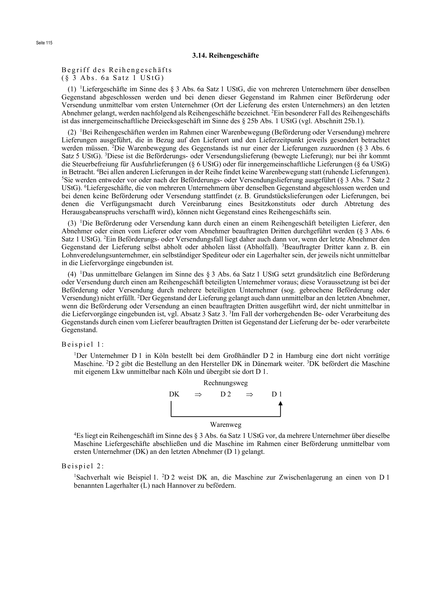

**Amtliche PDF, Seite 140:**

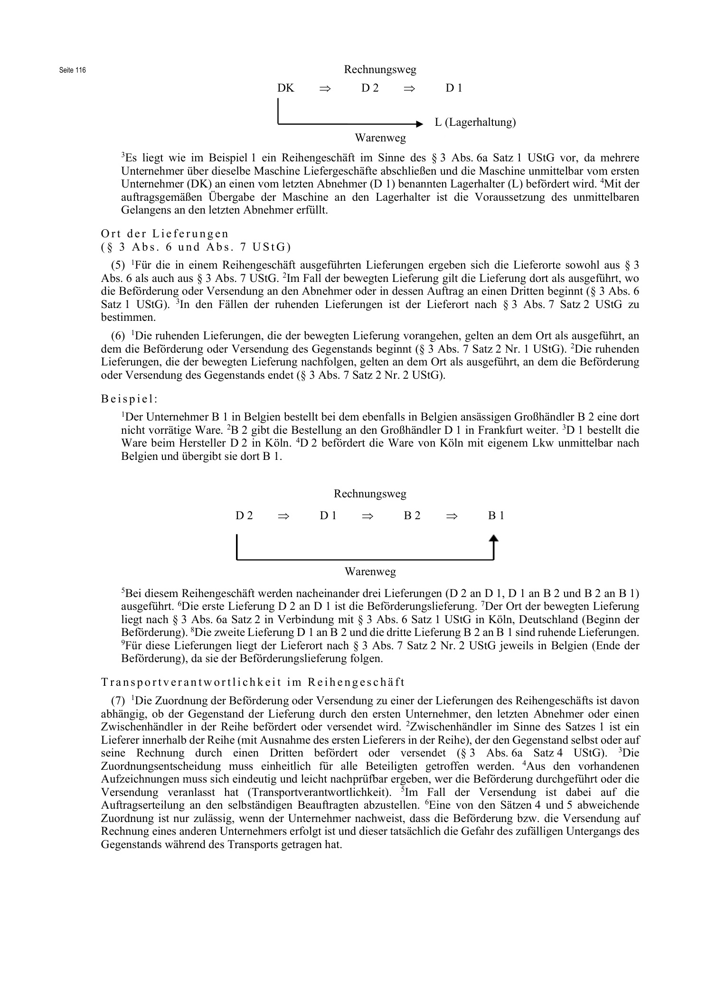

**Amtliche PDF, Seite 141:**

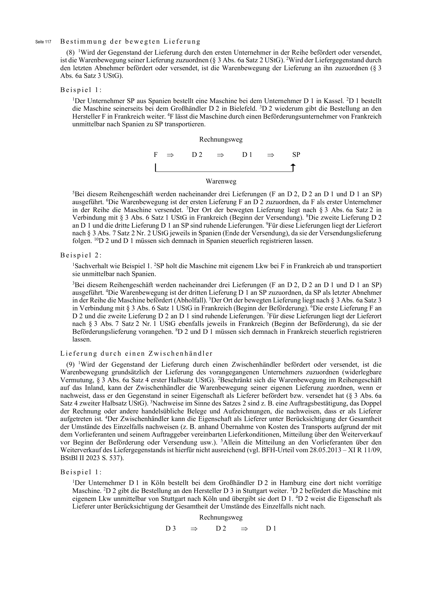

**Amtliche PDF, Seite 142:**

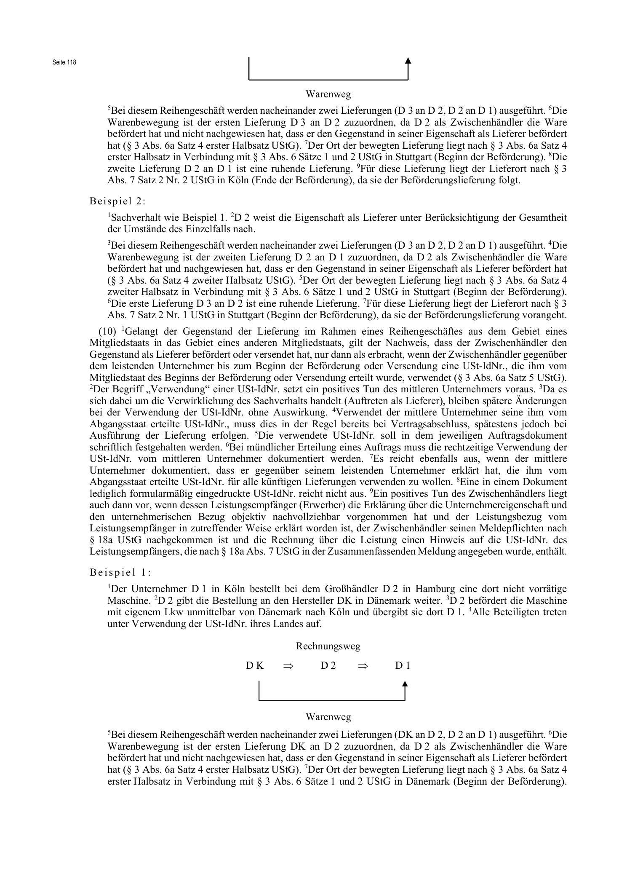

**Amtliche PDF, Seite 143:**

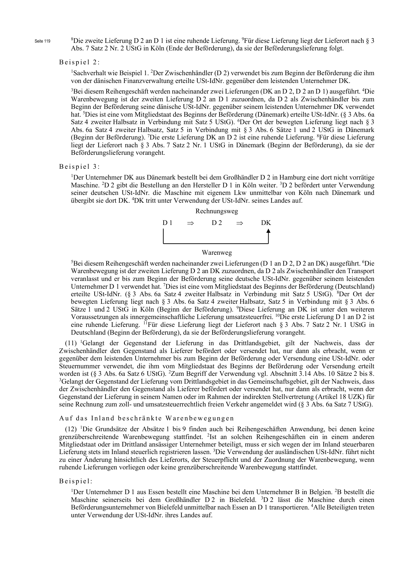

**Amtliche PDF, Seite 144:**

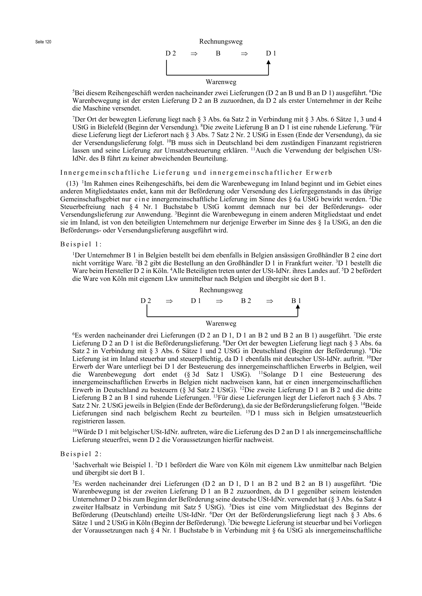

**Amtliche PDF, Seite 145:**

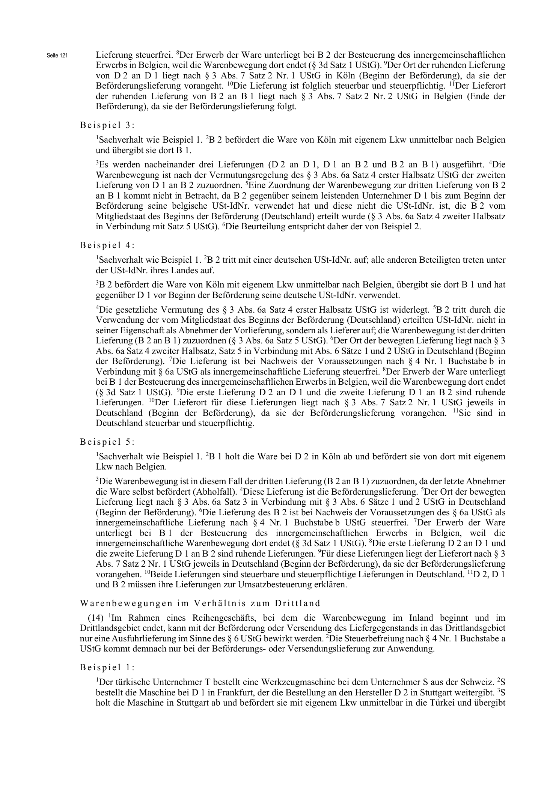

**Amtliche PDF, Seite 146:**

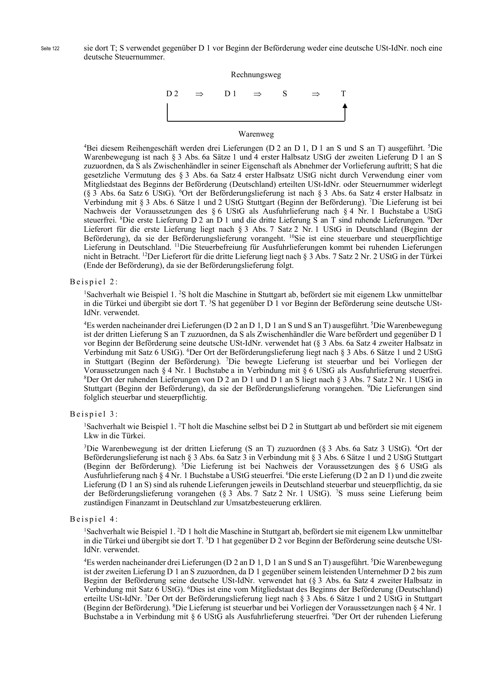

**Amtliche PDF, Seite 147:**

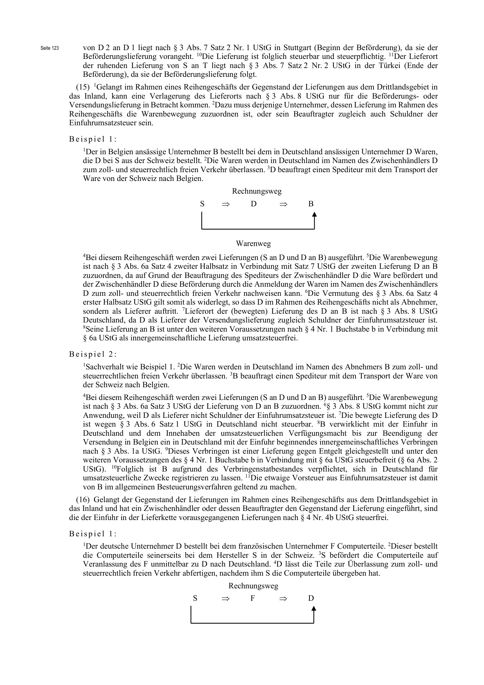

**Amtliche PDF, Seite 148:**

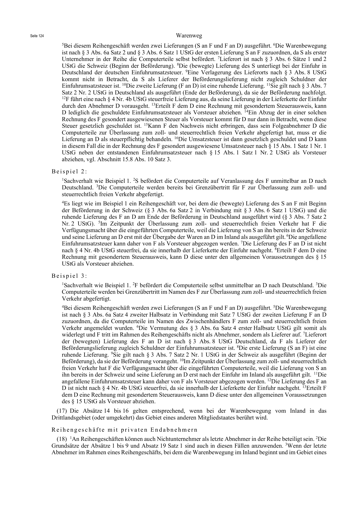

**Amtliche PDF, Seite 149:**

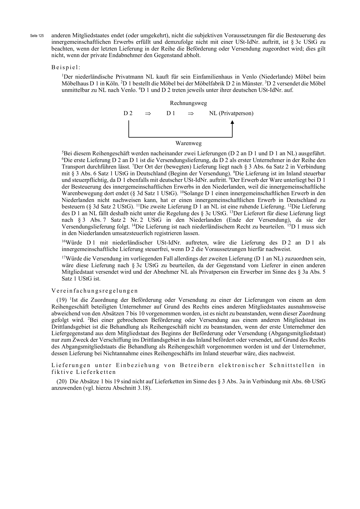

<!-- quelle:z5661-5661 -->

### 3.15 Dienstleistungskommission (§ 3 Abs. 11 UStG)
<!-- /quelle:z5661-5661 -->

<!-- quelle:z5662-5662 -->

(1) 1Wird ein Unternehmer (Auftragnehmer) in die Erbringung einer sonstigen Leistung eingeschaltet und handelt er dabei im eigenen Namen und für fremde Rechnung (Dienstleistungskommission), gilt diese sonstige Leistung als an ihn und von ihm erbracht. 2Dabei wird eine Leistungskette fingiert. 3Sie behandelt den Auftragnehmer als Leistungsempfänger und zugleich Leistenden. 4Die Dienstleistungskommission erfasst die Fälle des sog. Leistungseinkaufs und des sog. Leistungsverkaufs. 5Ein sog. Leistungseinkauf liegt vor, wenn ein von einem Auftraggeber bei der Beschaffung einer sonstigen Leistung eingeschalteter Unternehmer (Auftragnehmer) für Rechnung des Auftraggebers im eigenen Namen eine sonstige Leistung durch einen Dritten erbringen lässt. 6Ein sog. Leistungsverkauf liegt vor, wenn ein von einem Auftraggeber bei der Erbringung einer sonstigen Leistung eingeschalteter Unternehmer (Auftragnehmer) für Rechnung des Auftraggebers im eigenen Namen eine sonstige Leistung an einen Dritten erbringt.

<!-- /quelle:z5662-5662 -->

<!-- quelle:z5664-5664 -->

(2) 1Die Leistungen der Leistungskette, d.h. die an den Auftragnehmer erbrachte und die von ihm ausgeführte Leistung, werden bezüglich ihres Leistungsinhalts gleich behandelt.<a href="#fn-z5755">[1]</a> 2Die Leistungen werden zum selben Zeitpunkt erbracht. 3Im Übrigen ist jede der beiden Leistungen unter Berücksichtigung der Leistungsbeziehung gesondert für sich nach den allgemeinen Regeln des UStG zu beurteilen. 4Dies gilt z.B. in den Fällen des Verzichts auf die Steuerbefreiung nach § 9 UStG (Option). 5Fungiert ein Unternehmer bei der Erbringung einer steuerfreien sonstigen Leistung als Strohmann für einen Dritten („Hintermann“), liegt ein Kommissionsgeschäft nach § 3 Abs. 11 UStG vor mit der Folge, dass auch die Besorgungsleistung des Hintermanns steuerfrei zu behandeln ist (vgl. BFH-Urteil vom 22.09.2005 – V R 52/01, BStBl. II S. 278).

<!-- /quelle:z5664-5664 -->

<!-- quelle:z5666-5666 -->

(3)<a href="#fn-z5758">[2]</a> 1Personenbezogene Merkmale der an der Leistungskette Beteiligten sind weiterhin für jede Leistung innerhalb einer Dienstleistungskommission gesondert in die umsatzsteuerrechtliche Beurteilung einzubeziehen. 2Dies kann z.B. für die Anwendung von Steuerbefreiungsvorschriften von Bedeutung sein (vgl. z.B. § 4 Nr. 19 Buchstabe a UStG) oder für die Bestimmung des Orts der sonstigen Leistung, wenn er davon abhängig ist, ob die Leistung an einen Unternehmer oder einen Nichtunternehmer erbracht wird. 3Besorgt ein Unternehmer für Dritte Leistungen, für die die Befreiungsvorschrift des § 4 Nr. 20 Buchstabe a UStG zur Anwendung kommt, ist auch die Besorgungsleistungen<a href="#fn-z5761">[3]</a> an die Abnehmer nach § 4 Nr. 20 Buchstabe a UStG steuerbefreit, vgl. BFH-Urteil vom 25.04.2018 – XI R 16/16, BStBl. II 2021 S. 457. 4Die Steuer kann nach § 13 UStG für die jeweilige Leistung zu unterschiedlichen Zeitpunkten entstehen; z.B. wenn der Auftraggeber der Leistung die Steuer nach vereinbarten und der Auftragnehmer die Steuer nach vereinnahmten Entgelten berechnet. 5Außerdem ist z.B. zu berücksichtigen, ob die an der Leistungskette Beteiligten Nichtunternehmer, Kleinunternehmer (§ 19 UStG), Land- und Forstwirte, die für ihren Betrieb die Durchschnittssatzbesteuerung nach § 24 UStG anwenden, sind.

<!-- /quelle:z5666-5666 -->

<!-- quelle:z5668-5668 -->
#### Beispiel:
<!-- /quelle:z5668-5668 -->

<!-- quelle:z5670-5671 -->

1Der Bauunternehmer G besorgt für den Bauherrn B die sonstige Leistung des Handwerkers C, dessen Umsätze nach § 19 UStG steuerfrei sind. 
2Das personenbezogene Merkmal – Kleinunternehmer – des C ist nicht auf den Bauunternehmer G übertragbar. 3Die Leistung des G unterliegt dem allgemeinen Steuersatz.

<!-- /quelle:z5670-5671 -->

<!-- quelle:z5673-5673 -->

(4) 1Die zivilrechtlich vom Auftragnehmer an den Auftraggeber erbrachte Besorgungsleistung bleibt umsatzsteuerrechtlich ebenso wie beim Kommissionsgeschäft nach § 3 Abs. 3 UStG unberücksichtigt. 2Der Auftragnehmer erbringt im Rahmen einer Dienstleistungskommission nicht noch eine (andere) Leistung (Vermittlungsleistung). 3Der Auftragnehmer darf für die vereinbarte Geschäftsbesorgung keine Rechnung erstellen. 4Eine solche Rechnung, in der die Umsatzsteuer offen ausgewiesen ist, führt zu einer Steuer nach § 14c Abs. 2 UStG.

<!-- /quelle:z5673-5673 -->

<!-- quelle:z5675-5675 -->

(5) 1Erbringen Sanierungsträger, die ihre Aufgaben nach § 159 Abs. 1 BauGB im eigenen Namen und für Rechnung der auftraggebenden Körperschaften des öffentlichen Rechts (Gemeinden) als deren Treuhänder erfüllen, Leistungen nach § 157 BauGB und beauftragen sie zur Erbringung dieser Leistungen andere Unternehmer, gelten die von den beauftragten Unternehmern erbrachten Leistungen als an den Sanierungsträger und von diesem an die treugebende Gemeinde erbracht. 2Satz 1 gilt entsprechend für vergleichbare Leistungen der Entwicklungsträger nach § 167 BauGB.

<!-- /quelle:z5675-5675 -->

<!-- quelle:z5677-5677 -->

(6) Beispiele zur sog. Leistungseinkaufskommission:

<!-- /quelle:z5677-5677 -->

<!-- quelle:z5679-5679 -->
#### Beispiel 1:
<!-- /quelle:z5679-5679 -->

<!-- quelle:z5681-5682 -->

1Der im Inland ansässige Spediteur G besorgt für den im Inland ansässigen Unternehmer B im eigenen Namen und für Rechnung des B die inländische Beförderung eines Gegenstands von München nach Berlin. 2Die Beförderungsleistung bewirkt der im Inland ansässige Unternehmer C. 
3Da G in die Erbringung einer Beförderungsleistung eingeschaltet wird und dabei im eigenen Namen, jedoch für fremde Rechnung handelt, gilt diese Leistung als an ihn und von ihm erbracht.

<!-- /quelle:z5681-5682 -->

<!-- quelle:z5684-5684 -->

Schema zur Leistungskette bei Leistungseinkaufskommission

<!-- /quelle:z5684-5684 -->

<!-- quelle:z5686-5687 -->

4Die Leistungskette wird fingiert. 5Die zivilrechtlich vereinbarte Geschäftsbesorgungsleistung ist umsatzsteuerrechtlich unbeachtlich. 
6C erbringt an G eine im Inland steuerpflichtige Beförderungsleistung (§ 3a Abs. 2 UStG). 7G hat gegenüber B ebenfalls eine im Inland steuerpflichtige Beförderungsleistung (§ 3a Abs. 2 UStG) abzurechnen.

<!-- /quelle:z5686-5687 -->

<!-- quelle:z5689-5689 -->
#### Beispiel 2:
<!-- /quelle:z5689-5689 -->

<!-- quelle:z5691-5691 -->

1Der im Inland ansässige Spediteur G besorgt für den in Frankreich ansässigen Unternehmer F im eigenen Namen und für Rechnung des F die Beförderung eines Gegenstands von Paris nach München. 2Die Beförderungsleistung bewirkt der im Inland ansässige Unternehmer C. 3G und C verwenden jeweils ihre deutsche, F seine französische USt-IdNr.

<!-- /quelle:z5691-5691 -->

<!-- quelle:z5693-5693 -->

Schema zur Leistungskette bei Leistungseinkaufskommission

<!-- /quelle:z5693-5693 -->

<!-- quelle:z5695-5696 -->

4Die Leistungskette wird fingiert. 5Die zivilrechtlich vereinbarte Geschäftsbesorgungsleistung ist umsatzsteuerrechtlich unbeachtlich. 
6C erbringt an G eine in Deutschland steuerbare Beförderungsleistung (§ 3a Abs. 2 UStG). 7G hat gegenüber F eine nach § 3a Abs. 2 UStG in Frankreich steuerbare Beförderungsleistung abzurechnen. 8Die Verwendung der französischen USt-IdNr. durch F hat auf die Ortsbestimmung keine Auswirkung.

<!-- /quelle:z5695-5696 -->

<!-- quelle:z5698-5698 -->
#### Beispiel 3:
<!-- /quelle:z5698-5698 -->

<!-- quelle:z5700-5701 -->

1Der private Endverbraucher E beauftragt das im Inland ansässige Reisebüro R mit der Beschaffung der für die Reise notwendigen Betreuungsleistungen durch das Referenzunternehmen D mit Sitz im Drittland. 2R besorgt diese sonstige Leistung im eigenen Namen, für Rechnung des E. 
3Da R in die Erbringung einer sonstigen Leistung eingeschaltet wird und dabei im eigenen Namen, jedoch für fremde Rechnung handelt, gilt diese Leistung als an ihn und von ihm erbracht.

<!-- /quelle:z5700-5701 -->

<!-- quelle:z5703-5703 -->

Schema zur Leistungskette bei Leistungseinkaufskommission

<!-- /quelle:z5703-5703 -->

<!-- quelle:z5705-5706 -->

4Die Leistungskette wird fingiert. 5Die zivilrechtlich vereinbarte Geschäftsbesorgungsleistung ist umsatzsteuerrechtlich unbeachtlich. 6Die Leistungen der Leistungskette, d.h. die an R erbrachte und die von R ausgeführte Leistung, werden bezüglich des Leistungsinhalts gleich behandelt. 7Im Übrigen ist jede der beiden Leistungen unter Berücksichtigung der Leistungsbeziehungen gesondert für sich nach den allgemeinen Regeln des UStG zu beurteilen (vgl. Absatz 2). 
8Die von D an R erbrachte Betreuungsleistung wird grundsätzlich an dem Ort ausgeführt, von dem aus der Leistungsempfänger sein Unternehmen betreibt (§ 3a Abs. 2 UStG). 9Sie stellt aber eine Reisevorleistung im Sinne des § 25 Abs. 1 Satz 5 UStG dar, da sie dem Reisenden unmittelbar zugutekommt. 10Die Leistung wird nach § 3a Abs. 8 Satz 1 UStG als im Drittland ausgeführt behandelt. 11R erbringt nach § 3 Abs. 11 UStG ebenfalls eine Betreuungsleistung. 12Es handelt sich nach § 25 Abs. 1 Satz 1 UStG um eine Reiseleistung. 13Diese Leistung wird nach § 25 Abs. 1 Satz 4 in Verbindung mit § 3a Abs. 1 UStG an dem Ort ausgeführt, von dem aus R sein Unternehmen betreibt. 14Sie ist steuerbar, aber nach § 25 Abs. 2 Satz 1 UStG steuerfrei, da die ihr zuzurechnende Reisevorleistung im Drittlandsgebiet bewirkt wurde (vgl. BFH-Urteil vom 2. März 2006 – V R 25/03, BStBl. II S. 788).

<!-- /quelle:z5705-5706 -->

<!-- quelle:z5708-5708 -->

(7) Beispiele zur sog. Leistungsverkaufskommission:

<!-- /quelle:z5708-5708 -->

<!-- quelle:z5710-5710 -->

Kurzfristige Vermietung von Ferienhäusern

<!-- /quelle:z5710-5710 -->

<!-- quelle:z5711-5711 -->
#### Beispiel 1:
<!-- /quelle:z5711-5711 -->

<!-- quelle:z5713-5714 -->

1Der im Inland ansässige Eigentümer E eines in Belgien belegenen Ferienhauses beauftragt G mit Sitz im Inland, im eigenen Namen und für Rechnung des E Mieter für kurzfristige Ferienaufenthalte in seinem Ferienhaus zu besorgen. 2G erbringt dabei keine Eigenleistungen, sondern bezieht Reisevorleistungen von E (vgl. zur Abgrenzung Abschnitt 25.1 Abs. 8 Sätze 13 und 14). 
3Da G in die Erbringung sonstiger Leistungen (kurzfristige – steuerpflichtige – Vermietungsleistungen nach § 4 Nr. 12 Satz 2 UStG) eingeschaltet wird und dabei im eigenen Namen, jedoch für fremde Rechnung handelt, gelten die Leistungen als an ihn und von ihm erbracht.

<!-- /quelle:z5713-5714 -->

<!-- quelle:z5716-5716 -->

Schema zur Leistungskette bei Leistungsverkaufskommission

<!-- /quelle:z5716-5716 -->

<!-- quelle:z5718-5720 -->

4Die Leistungskette wird fingiert. 5Die zivilrechtlich vereinbarte Geschäftsbesorgungsleistung ist umsatzsteuerrechtlich unbeachtlich. 
6Die Vermietungsleistungen des E an G sind im Inland nicht steuerbar (§ 3a Abs. 3 Nr. 1 Satz 2 Buchstabe a UStG). 
7G erbringt an die Mieter Reiseleistungen im Sinne des § 25 UStG. 8Die Leistungen sind nach § 25 Abs. 1 Satz 4 in Verbindung mit § 3a Abs. 1 UStG steuerbar und mangels Steuerbefreiung steuerpflichtig.

<!-- /quelle:z5718-5720 -->

<!-- quelle:z5722-5722 -->
#### Beispiel 2:
<!-- /quelle:z5722-5722 -->

<!-- quelle:z5724-5725 -->

1Sachverhalt wie in Beispiel 1, jedoch befindet sich das Ferienhaus des E in der Schweiz. 
2Die Vermietungsleistungen des E an G sind im Inland nicht steuerbar. 3Die sonstigen Leistungen werden nach § 3a Abs. 3 Nr. 1 Satz 2 Buchstabe a UStG in der Schweiz ausgeführt (Belegenheitsort). 4G erbringt an die Mieter steuerbare Reiseleistungen, die nach § 25 Abs. 2 UStG steuerfrei sind, weil die Reisevorleistungen im Drittlandsgebiet bewirkt werden.

<!-- /quelle:z5724-5725 -->

<!-- quelle:z5727-5727 -->
#### Beispiel 3:
<!-- /quelle:z5727-5727 -->

<!-- quelle:z5729-5730 -->

1Sachverhalt wie in Beispiel 1, jedoch liegt das Ferienhaus des E im Inland. 
2Die Vermietungsleistungen des E an G sind im Inland steuerbar (§ 3a Abs. 3 Nr. 1 Satz 2 Buchstabe a UStG) und als kurzfristige Vermietungsleistungen (§ 4 Nr. 12 Satz 2 UStG) steuerpflichtig. 3G erbringt an die Mieter steuerbare und steuerpflichtige Reiseleistungen im Sinne des § 25 UStG. 4G ist nach § 25 Abs. 4 UStG nicht berechtigt, die in den Rechnungen des E ausgewiesenen Steuerbeträge als Vorsteuer abzuziehen.

<!-- /quelle:z5729-5730 -->

<!-- quelle:z5732-5732 -->

Leistungen in der Kreditwirtschaft

<!-- /quelle:z5732-5732 -->

<!-- quelle:z5733-5733 -->
#### Beispiel 4:
<!-- /quelle:z5733-5733 -->

<!-- quelle:z5735-5736 -->

1Ein nicht im Inland ansässiges Kreditinstitut K (ausländischer Geldgeber) beauftragt eine im Inland ansässige GmbH G mit der Anlage von Termingeldern im eigenen Namen für fremde Rechnung bei inländischen Banken. 
2Da G als Unternehmer in die Erbringung einer sonstigen Leistung (Kreditgewährungsleistung im Sinne des § 4 Nr. 8 Buchstabe a UStG) eingeschaltet wird und dabei im eigenen Namen, jedoch für fremde Rechnung handelt, gilt die Leistung als an sie und von ihr erbracht.

<!-- /quelle:z5735-5736 -->

<!-- quelle:z5738-5738 -->

Schema zur Leistungskette bei Leistungen in der Kreditwirtschaft

<!-- /quelle:z5738-5738 -->

<!-- quelle:z5740-5741 -->

3Die Leistungskette wird fingiert. 4Die zivilrechtlich vereinbarte Geschäftsbesorgungsleistung ist umsatzsteuerrechtlich unbeachtlich. 
5K erbringt an G und G an die inländischen Banken durch die Kreditgewährung im Inland steuerbare (§ 3a Abs. 2 UStG), jedoch steuerfreie Leistungen (§ 4 Nr. 8 Buchstabe a UStG).

<!-- /quelle:z5740-5741 -->

<!-- quelle:z5743-5743 -->

Vermietung beweglicher körperlicher Gegenstände

<!-- /quelle:z5743-5743 -->

<!-- quelle:z5744-5744 -->
#### Beispiel 5:
<!-- /quelle:z5744-5744 -->

<!-- quelle:z5746-5747 -->

1Ein im Inland ansässiger Netzbetreiber T beauftragt eine im Inland ansässige GmbH G mit der Vermietung von Telekommunikationsanlagen (ohne Einräumung von Nutzungsmöglichkeiten von Übertragungskapazitäten) im eigenen Namen für fremde Rechnung an den im Ausland ansässigen Unternehmer U. 
2Da G als Unternehmer in die Erbringung einer sonstigen Leistung (Vermietung beweglicher körperlicher Gegenstände) eingeschaltet wird und dabei im eigenen Namen, jedoch für fremde Rechnung handelt, gilt die Leistung als an sie und von ihr erbracht.

<!-- /quelle:z5746-5747 -->

<!-- quelle:z5749-5749 -->

Schema zur Leistungskette bei Vermietung beweglicher Gegenstände

<!-- /quelle:z5749-5749 -->

<!-- quelle:z5751-5753 -->

3Die Leistungskette wird fingiert. 4Die zivilrechtlich vereinbarte Geschäftsbesorgungsleistung ist umsatzsteuerrechtlich unbeachtlich. 5Die Leistungen der Leistungskette, d.h. die an G erbrachte und die von G ausgeführte Leistung, werden bezüglich des Leistungsinhalts gleich behandelt. 6Im Übrigen ist jede der beiden Leistungen unter Berücksichtigung der Leistungsbeziehungen gesondert für sich nach den allgemeinen Regeln des UStG zu beurteilen (vgl. Absatz 2). 
7T erbringt an G durch die Vermietung beweglicher körperlicher Gegenstände im Inland steuerbare (§ 3a Abs. 2 UStG) und, soweit keine Steuerbefreiung greift, steuerpflichtige Leistungen. 
8G erbringt an den im Ausland ansässigen U durch die Vermietung beweglicher körperlicher Gegenstände nicht im Inland steuerbare (§ 3a Abs. 2 UStG) Leistungen.

<!-- /quelle:z5751-5753 -->

<!-- quelle:z5755-5756 -->

<strong>[1]</strong> 
Zur Steuerfreiheit von Besorgungsleistungen i.Z.m. Opern-Eintrittskarten siehe BFH v. 25.4.2018 XI R 16/16, BStBl. II 2021, 457.

<!-- /quelle:z5755-5756 -->

<!-- quelle:z5758-5759 -->

<strong>[2]</strong> 
A 3.15 UStAE Abs. 3 Beispiel Satz 1 neu gef. durch BMF v. 18.3.2025, BStBl. I 2025, 742; anzuwenden auf Umsätze, die nach dem 31.12.2024 erbracht werden, für den Besteuerungszeitraum 2024 siehe Rn. 10 dieses Schreibens.

<!-- /quelle:z5758-5759 -->

<!-- quelle:z5761-5762 -->

<strong>[3]</strong> 
Richtig wohl: „Besorgungsleistung“.

<!-- /quelle:z5761-5762 -->

#### Ergänzung aus der amtlichen BMF-Fassung

Die folgenden Seitendarstellungen sichern die in der Textkopie fehlenden Schaubilder, Formulare oder Tabellenbeziehungen. Sie stammen aus der amtlichen PDF mit demselben Stand 2. Juni 2026; gegebenenfalls wiederholter Begleittext gehört zur vollständigen Originalseite.

**Amtliche PDF, Seite 150:**

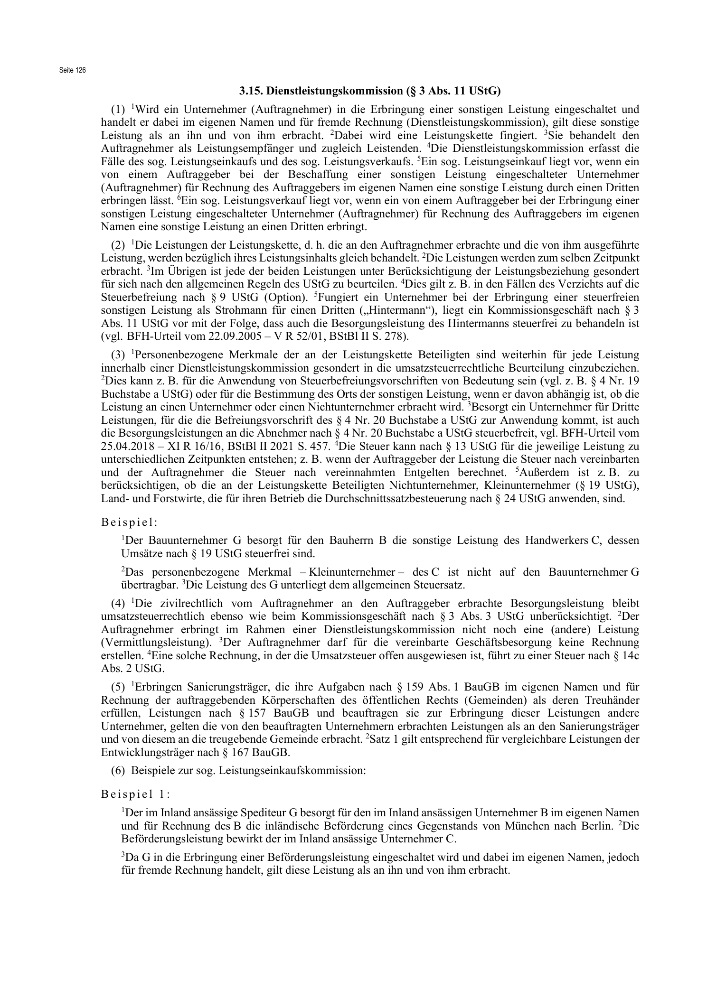

**Amtliche PDF, Seite 151:**

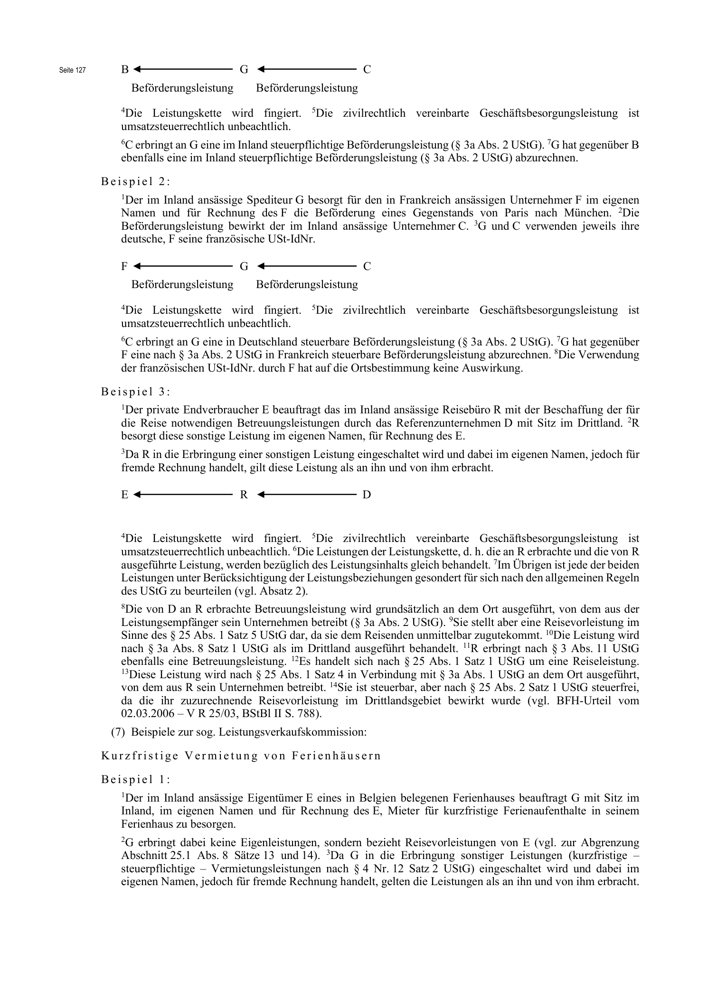

**Amtliche PDF, Seite 152:**

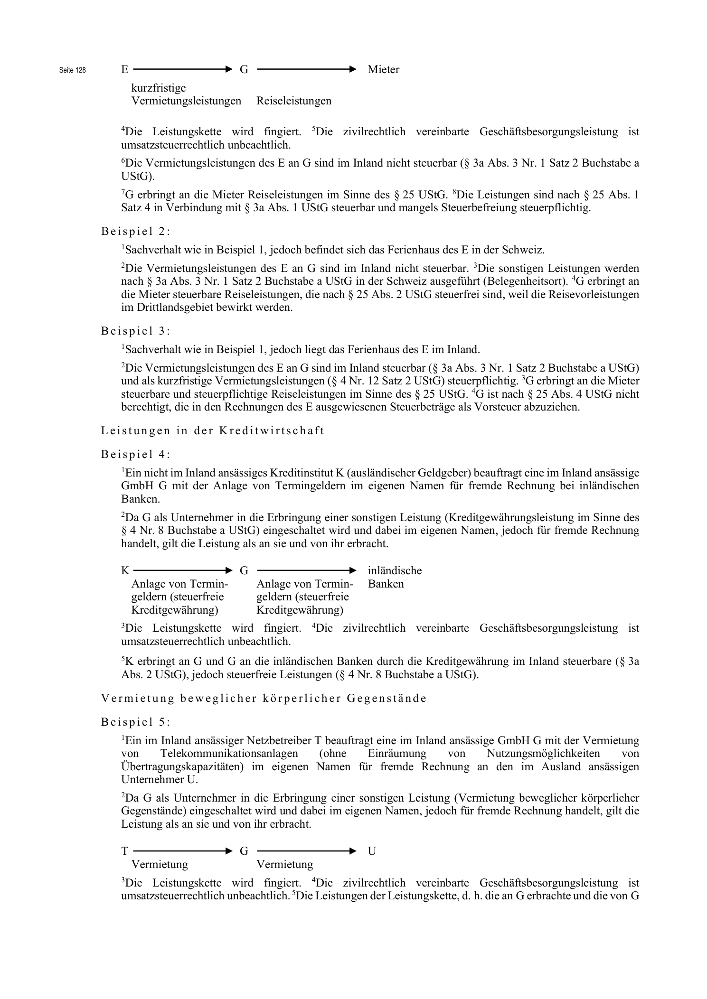

**Amtliche PDF, Seite 153:**

<!-- quelle:z5764-5764 -->

### 3.16 Leistungsbeziehungen bei der Abgabe werthaltiger Abfälle
<!-- /quelle:z5764-5764 -->

<!-- quelle:z5765-5765 -->

(1)<a href="#fn-z5839">[1]</a> 1Beauftragt ein Abfallerzeuger oder ‑besitzer einen Dritten mit der ordnungsgemäßen Entsorgung seines Abfalls, erbringt der Dritte mit der Übernahme und Erfüllung der Entsorgungspflicht eine sonstige Leistung im Sinne von § 3 Abs. 9 UStG, sofern der Entsorgung eine eigenständige wirtschaftliche Bedeutung zukommt. 2Ist dem zur Entsorgung überlassenen Abfall ein wirtschaftlicher Wert beizumessen (sog. werthaltiger Abfall), liegt ein tauschähnlicher Umsatz (Entsorgungsleistung gegen Lieferung des Abfalls) – ggf. mit Baraufgabe – vor, wenn nach den übereinstimmenden Vorstellungen der Vertragspartner

<!-- /quelle:z5765-5765 -->

<!-- quelle:z5767-5767 -->

–der überlassene Abfall die Höhe der Barvergütung für die Entsorgungsleistung oder

<!-- /quelle:z5767-5767 -->

<!-- quelle:z5769-5769 -->

–die übernommene Entsorgung die Barvergütung für die Lieferung des Abfalls

<!-- /quelle:z5769-5769 -->

<!-- quelle:z5771-5771 -->

beeinflusst hat (vgl. Abschnitt 10.5 Abs. 2). 3Ein tauschähnlicher Umsatz ist mangels einer der Entsorgungsleistung gegenüberstehenden Lieferung nicht anzunehmen, wenn ein Unternehmer nicht mehr nutzbaren, gefährlichen Abfall zum ausschließlichen Zweck der gesetzlich angeordneten Verwertung zur Rückgewinnung/Regenerierung von Abfällen übernimmt (vgl. BFH-Urteil vom 18.04.2024 – V R 7/22, BStBl. II 2025 S. 60).

<!-- /quelle:z5771-5771 -->

<!-- quelle:z5773-5773 -->
#### Entsorgungsleistung von eigenständiger wirtschaftlicher Bedeutung
<!-- /quelle:z5773-5773 -->

<!-- quelle:z5774-5774 -->

(2) 1Eine Entsorgungsleistung von eigenständiger wirtschaftlicher Bedeutung liegt vor, wenn Vereinbarungen über die Aufarbeitung oder Entsorgung der Abfälle getroffen wurden. 2Nicht ausreichend ist, dass sich der Entsorger allgemein zur Einhaltung abfallrechtlicher Normen (z.B. Einhaltung vorgeschriebener Verwertungsquoten) verpflichtet hat oder ein Entsorgungsnachweis ausgestellt wird. 3Leistet der Entsorger dem Abfallerzeuger oder ‑besitzer eine Vergütung für den gelieferten Abfall, ohne dass der Entsorgungsleistung eine eigenständige wirtschaftliche Bedeutung zukommt, ist von einer bloßen Abfalllieferung durch den Abfallerzeuger/‑besitzer an den Entsorger auszugehen. 4Haben Abfälle einen positiven Marktwert und werden sie unmittelbar in Produktionsprozessen z.B. als Roh- oder Brennstoff eingesetzt, steht im Falle ihrer Veräußerung nicht die Entsorgungsleistung im Vordergrund, selbst wenn die Stoffe ihre Abfalleigenschaft noch nicht verloren haben. 5Gleiches gilt für bereits sortenrein gesammelte Produktionsabfälle. 6Auch beim Handel mit derartigen Produkten liegt keine Entsorgungsleistung vor.

<!-- /quelle:z5774-5774 -->

<!-- quelle:z5776-5776 -->
#### Beeinflussung der Barvergütung
<!-- /quelle:z5776-5776 -->

<!-- quelle:z5777-5777 -->

(3) Auch wenn der Entsorgungsleistung eine eigenständige wirtschaftliche Bedeutung zukommt, ist aus Vereinfachungsgründen eine zum tauschähnlichen Umsatz führende Beeinflussung der Barvergütung durch den überlassenen Abfall grundsätzlich nur anzunehmen,

<!-- /quelle:z5777-5777 -->

<!-- quelle:z5779-5779 -->

1.wenn die Beteiligten ausdrücklich hierauf gerichtete Vereinbarungen getroffen, also neben dem Entsorgungsentgelt einen bestimmten Wert für eine bestimmte Menge der überlassenen Abfälle vereinbart haben, oder

<!-- /quelle:z5779-5779 -->

<!-- quelle:z5781-5781 -->

2.die wechselseitige Beeinflussung auf Grund der getroffenen Vereinbarungen offensichtlich ist. 2Hiervon ist nur in folgenden Fällen auszugehen:

<!-- /quelle:z5781-5781 -->

<!-- quelle:z5783-5783 -->

a)1Es wird vertraglich die Anpassung des ursprünglich ausdrücklich vereinbarten Entsorgungsentgelts an sich ändernde Marktverhältnisse für den übernommenen Abfall ausbedungen (sog. Preisanpassungsklauseln). 2Preisanpassungsklauseln, die nur Auswirkungen für zukünftige Umsätze haben, sind insoweit ohne Bedeutung.

<!-- /quelle:z5783-5783 -->

<!-- quelle:z5785-5785 -->
#### Beispiel 1:
<!-- /quelle:z5785-5785 -->

<!-- quelle:z5787-5787 -->

1Unternehmer U1 übernimmt gegenüber dem Reifenservice R die Entsorgung von Altreifen. 2R zahlt U1 einen Preis von 2 € je übernommenen Altreifen. 3Bei einer Veränderung des Preisindexes von Stahl oder Gummigranulat im Vergleich zu den Verhältnissen bei Vertragsabschluss sind beide Beteiligten berechtigt, diesen Preis um 50 % der Indexveränderung anzupassen.

<!-- /quelle:z5787-5787 -->

<!-- quelle:z5789-5789 -->

b)Das nach Art und Menge bestimmte Entsorgungsentgelt ändert sich in Abhängigkeit von der Qualität der überlassenen Abfälle.

<!-- /quelle:z5789-5789 -->

<!-- quelle:z5791-5791 -->
#### Beispiel 2:
<!-- /quelle:z5791-5791 -->

<!-- quelle:z5793-5793 -->

1Unternehmer U2 übernimmt gegenüber dem Bauunternehmer B die Entsorgung von Baustellenmischabfällen. 2Die Beteiligten vereinbaren einen Grundpreis von 250 € je Fuhre, welcher sich ab einem bestimmten Metall- und Folienanteil im Abfall um 50 € reduziert.

<!-- /quelle:z5793-5793 -->

<!-- quelle:z5795-5795 -->

c)Es wird eine (Mehr-)Erlösverteilungsabrede getroffen.

<!-- /quelle:z5795-5795 -->

<!-- quelle:z5797-5797 -->
#### Beispiel 3:
<!-- /quelle:z5797-5797 -->

<!-- quelle:z5799-5799 -->

1Unternehmer U3 übernimmt gegenüber dem Reifenhersteller R die Entsorgung von Fehlproduktionen und Materialresten für 80 € je Tonne. 2Die Beteiligten verabreden, dass R an den von U3 bei der Veräußerung von daraus gewonnenem Gummigranulat und Stahl erzielten Erlösen zu 25 % beteiligt wird.

<!-- /quelle:z5799-5799 -->

<!-- quelle:z5801-5801 -->
#### Vereinfachungsregelung
<!-- /quelle:z5801-5801 -->

<!-- quelle:z5802-5802 -->

(4) Sofern in den unter Absatz 3 Nr. 2 genannten Fällen weder die Barvergütung einen Betrag von 50,– € je Umsatz noch die entsorgte Menge ein Gewicht von 100 kg je Umsatz übersteigt, ist das Vorliegen eines tauschähnlichen Umsatzes aus Vereinfachungsgründen nicht zu prüfen.

<!-- /quelle:z5802-5802 -->

<!-- quelle:z5804-5804 -->
#### Beispiel 1:
<!-- /quelle:z5804-5804 -->

<!-- quelle:z5806-5806 -->

1U1 übernimmt die Entsorgung des bei der Buchhaltungsfirma B anfallenden Altpapiers. 2Er entsorgt dort eine Menge von max. 20 kg Altpapier und berechnet hierfür 10 €. 3Da die für B entsorgte Menge das Gewicht von 100 kg je Abholung nicht übersteigt und die Entgelte hierfür 50 € je Abholung nicht übersteigen, ist es aus Vereinfachungsgründen nicht zu beanstanden, wenn die Beteiligten keinen tauschähnlichen Umsatz angenommen und nur die Entsorgungsleistung des U1 der Besteuerung unterworfen haben.

<!-- /quelle:z5806-5806 -->

<!-- quelle:z5808-5808 -->
#### Beispiel 2:
<!-- /quelle:z5808-5808 -->

<!-- quelle:z5810-5810 -->

1U2 betreibt einen Abholservice für bestimmten Schrott und unbrauchbare Haushaltsgeräte, wie Waschmaschinen, Wäschetrockner und Geschirrspüler. 2Er bietet seinen Service privaten Haushalten kostenlos an. 3Daneben führt er unentgeltlich Altkleidersammlungen in Wohngebieten durch. 4Soweit das Gewicht des Abfalls je Abholung und Haushalt 100 kg nicht übersteigt, ist es aus Vereinfachungsgründen nicht zu beanstanden, wenn die Beteiligten ohne weitere Prüfung nur eine Entsorgungsleistung annehmen, die jedoch mangels Entgelt nicht steuerbar ist.

<!-- /quelle:z5810-5810 -->

<!-- quelle:z5812-5812 -->
#### Einzelfälle
<!-- /quelle:z5812-5812 -->

<!-- quelle:z5813-5813 -->

(5) Ein tauschähnlicher Umsatz liegt insbesondere nicht vor,

<!-- /quelle:z5813-5813 -->

<!-- quelle:z5815-5815 -->

1.im Falle sog. Umleersammeltouren (z.B. Leerung von Altpapiertonnen, Austausch bzw. Leerpumpen von Altölsammelbehältern), bei denen die Menge des im Einzelfall abgelieferten Abfalls und seine Zusammensetzung und Qualität nicht festgestellt werden; hier ist davon auszugehen, dass eine wechselseitige Beeinflussung von Barvergütung und Entsorgungsleistung und damit ein tauschähnlicher Umsatz nicht vorliegt.

<!-- /quelle:z5815-5815 -->

<!-- quelle:z5817-5817 -->

2.in den Fällen, in denen die Werthaltigkeit von zur Entsorgung überlassenen Abfällen erst später festgestellt werden kann, ohne dass sich hierdurch Auswirkungen auf die Höhe der Vergütung bereits getätigter Umsätze ergeben; eine Berücksichtigung der Werthaltigkeit der Abfälle beim Abschluss zukünftiger Entsorgungsverträge ist für bereits ausgeführte Umsätze unschädlich.

<!-- /quelle:z5817-5817 -->

<!-- quelle:z5819-5819 -->

3.wenn Nebenerzeugnisse oder Abfälle im Rahmen von Gehaltslieferungen im Sinne des § 3 Abs. 5 UStG zurückgenommen werden; hier fehlt es an einer Lieferung von Abfall.

<!-- /quelle:z5819-5819 -->

<!-- quelle:z5821-5821 -->
#### Beispiel 1:
<!-- /quelle:z5821-5821 -->

<!-- quelle:z5823-5823 -->

1U1 liefert zum Preis von 4,10 € je Dezitonne Zuckerrüben an die Zuckerfabrik Z und behält sich die Rückgabe der bei der Zuckerproduktion anfallenden Rübenschnitzel für Fütterungszwecke vor. 2Es handelt sich lediglich um eine (Gehalts-)Lieferung des U1 an Z (Entgelt 4,10 € je Dezitonne). 3Z erbringt keine Lieferung von Abfall in Form von Rübenschnitzeln, weil diese nicht am Leistungsaustausch teilgenommen haben und somit nicht Gegenstand der Gehaltslieferung des U1 geworden sind.

<!-- /quelle:z5823-5823 -->

<!-- quelle:z5825-5825 -->

4.1wenn das angekaufte Material ohne weitere Behandlung marktfähig (z.B. an einer Rohstoffbörse handelbar) ist, auch keiner gesetzlichen Entsorgungsverpflichtung mehr unterliegt und damit seine Eigenschaft als Abfall verloren hat. 2Da in diesem Fall das Material nur noch den Status eines normalen Handelsguts hat, kann davon ausgegangen werden, dass ggf. erforderliche Transport- oder Sortierleistungen ausschließlich im eigenen unternehmerischen Interesse des Erwerbers ausgeführt werden und keine Entsorgungsleistung vorliegt.

<!-- /quelle:z5825-5825 -->

<!-- quelle:z5827-5827 -->
#### Beispiel 2:
<!-- /quelle:z5827-5827 -->

<!-- quelle:z5829-5829 -->

1U2 erwirbt von verschiedenen Entsorgern unsortierte Altbleche, welche er nach Reinigung und Zerkleinerung einer elektrolytischen Entzinnung unterzieht. 2Das dabei gewonnene Eisen veräußert U2 an Stahlbearbeitungsbetriebe, das anfallende Zinn an Zinnhütten. 3Bei dem von U2 aus dem Altblechabfall zurück gewonnenen Zinn und Eisen handelt es sich um Rohstoffe für die weiterverarbeitende Industrie, die keiner gesetzlichen Entsorgungspflicht (mehr) unterliegen und deshalb nicht als Abfall anzusehen sind. 4Zwischen U2 und seinen Abnehmern finden keine tauschähnlichen Umsätze, sondern ausschließlich Rohstofflieferungen statt.

<!-- /quelle:z5829-5829 -->

<!-- quelle:z5831-5831 -->

5.wenn bei der Entsorgung der Abfälle die werthaltigen Bestandteile (z.B. Edelmetalle) im Eigentum des Abfallerzeugers verbleiben und Barvergütungen für diese Entsorgungsleistungen gesondert abgerechnet werden.

<!-- /quelle:z5831-5831 -->

<!-- quelle:z5833-5833 -->

(6) Für die Annahme eines tauschähnlichen Umsatzes ist es nicht erforderlich, dass beide Beteiligte Unternehmer sind bzw. die Abgabe des Abfalls im unternehmerischen Bereich erfolgt; dies ist jedoch für die ggf. erforderliche gegenseitige Rechnungsstellung sowie für die Steuerschuldnerschaft nach § 13b Abs. 2 Nr. 7 in Verbindung mit Abs. 5 Satz 1 UStG von Bedeutung, wenn der überlassene Abfall zu den Gegenständen im Sinne der Anlage 3 zum UStG gehört (vgl. Abschnitt 13b.4).

<!-- /quelle:z5833-5833 -->

<!-- quelle:z5835-5835 -->

(7)<a href="#fn-z5842">[2]</a> 1Im Falle eines tauschähnlichen Umsatzes ist der Wert des hingegebenen Abfalls Bemessungsgrundlage für die erbrachte Entsorgungsleistung. 2Bemessungsgrundlage für die Lieferung des Abfalls ist der Wert der Gegenleistung (Entsorgungsleistung). 3Baraufgaben sind zu berücksichtigen; eine ggf. enthaltene Umsatzsteuer ist stets herauszurechnen (vgl. Abschnitt 10.5). 4Der maßgebliche Zeitpunkt für die Ermittlung des Wertes der gelieferten Abfälle ist der Zeitpunkt der Übergabe an den Entsorger. 5Dabei ist nicht auf die einzelnen Inhaltsstoffe abzustellen, d.h. der Wert muss dem Abfall im Zeitpunkt der Überlassung als solchem zukommen. 6Spätere Bearbeitungsschritte (Bündelung, Sortierung, Aufbereitung usw.) durch den Entsorger sind bei der Wertermittlung außer Betracht zu lassen. 7Es bestehen keine Bedenken, dem zwischen den Beteiligten vereinbarten Wert der zur Entsorgung übergebenen Abfälle auch für umsatzsteuerrechtliche Zwecke zu folgen, sofern dieser Wert nicht offensichtlich unzutreffend erscheint.

<!-- /quelle:z5835-5835 -->

<!-- quelle:z5837-5837 -->

(8) 1Verändert sich der Marktpreis für die zu entsorgenden Abfälle nach Abschluss des Entsorgungs- und Liefervertrags, hat dies zunächst keine Auswirkung auf die Ermittlung der Bemessungsgrundlagen für die tauschähnlichen Umsätze und die Rechnungsstellung. 2Für diese Zwecke ist vielmehr so lange auf den im Zeitpunkt des Vertragsabschlusses maßgeblichen Wert abzustellen, bis dieser durch eine Vertragsänderung oder durch Änderung der Bemessungsgrundlage, z.B. auf Grund einer vereinbarten Preisanpassungsklausel oder einer vereinbarten Mehr- oder Mindererlösbeteiligung, angepasst wird.

<!-- /quelle:z5837-5837 -->

<!-- quelle:z5839-5840 -->

<strong>[1]</strong> 
A 3.16 UStAE Abs. 1 Satz 3 angef. durch BMF v. 15.1.2025, BStBl. I 2025, 274, anzuwenden auf alle offenen Fälle.

<!-- /quelle:z5839-5840 -->

<!-- quelle:z5842-5843 -->

<strong>[2]</strong> 
Überlassung gefährlicher Abfälle zur Entsorgung ist kein tauschähnlicher Umsatz mit Baraufgabe, sondern Entsorgungsdienstleistung, siehe BFH v. 18.04.2024 V R 7/22, BStBl. II 2025, 60.

<!-- /quelle:z5842-5843 -->

<!-- quelle:z5845-5845 -->

### 3.17 Einzweck-und Mehrzweck-Gutscheine<a href="#fn-z5976">[1]</a>
<!-- /quelle:z5845-5845 -->

<!-- quelle:z5846-5846 -->
#### Definition und Abgrenzung von Gutscheinen
<!-- /quelle:z5846-5846 -->

<!-- quelle:z5847-5847 -->

(1) 1Gutscheine im Sinne des § 3 Abs. 13 UStG sind solche Instrumente, die vom Berechtigten ganz oder teilweise anstelle einer regulären Geldzahlung als Gegenleistung zur Einlösung gegen Gegenstände oder sonstige Leistungen verwendet werden können. 2Diese Instrumente können körperlicher Art sein (z.B. Papierdokumente oder Plastikkarten) oder in elektronischer Form bestehen. 3Ein Gutschein im Sinne des § 3 Abs. 13 UStG kann auch dann vorliegen, wenn der auf dem Gutschein aufgedruckte Nennwert nicht zur vollständigen Begleichung der Leistung ausreicht und der Gutscheininhaber im Zeitpunkt der Inanspruchnahme des Gutscheins eine Zuzahlung leisten muss. 4§ 3 Abs. 13 UStG findet keine Anwendung bei Instrumenten, die den Inhaber lediglich zu einem Preisnachlass oder zu einer Preiserstattung beim Erwerb von Gegenständen oder Dienstleistungen berechtigen, aber nicht das Recht verleihen, solche Gegenstände oder sonstige Leistungen auch tatsächlich zu erhalten (vgl. § 3 Abs. 13 Satz 2 UStG, Abschnitt 17.2). 5Gutscheine für Warenproben oder Muster lösen grundsätzlich kein Entgelt aus und stellen keinen Gutschein im Sinne des § 3 Abs. 13 UStG dar. 6Briefmarken, Fahrscheine, Eintrittskarten für Kinos und Museen sowie vergleichbare Instrumente fallen ebenfalls nicht in den Anwendungsbereich des § 3 Abs. 13 UStG. 7Kann das Zahlungsinstrument jederzeit und voraussetzungslos gegen den ursprünglich gezahlten bzw. den noch nicht verwendeten Betrag zurückgetauscht werden, ist von einer Guthabenkarte im Unterschied zu einer Gutscheinkarte und damit von einem bloßen Zahlungsmittel auszugehen. 8Ein Zahlungsdienst im Sinne der Richtlinie (EU) 2015/2366 des Europäischen Parlaments und des Rates vom 25. November 2015 über Zahlungsdienste im Binnenmarkt, zur Änderung der Richtlinien 2002/65/EG, 2009/110/EG und 2013/36/EU und der Verordnung (EU) Nr. 1093/2010 sowie zur Aufhebung der Richtlinie 2007/64/EG gilt auch nicht als Gutschein im Sinne des § 3 Abs. 13 UStG. 9Aussteller des Gutscheins ist derjenige, der den Gutschein im eigenen Namen ausgestellt hat. 10Der Verkauf eines Gutscheins zwischen Unternehmern wird im Folgenden als Übertragung bezeichnet. 11Der Verkauf eines Gutscheins an Kunden wird im Folgenden als Ausgabe bezeichnet.

<!-- /quelle:z5847-5847 -->

<!-- quelle:z5849-5849 -->
#### Einzweck-Gutscheine im Sinne des § 3 Abs. 14 UStG
<!-- /quelle:z5849-5849 -->

<!-- quelle:z5850-5850 -->

(2) 1Ein Einzweck-Gutschein nach § 3 Abs. 14 Satz 1 UStG ist dadurch gekennzeichnet, dass der Ort der Lieferung oder sonstigen Leistung, zu deren Bezug der Gutschein berechtigt, sowie die geschuldete Umsatzsteuer, bei dessen Ausgabe bzw. erstmaliger Übertragung durch den Aussteller des Gutscheins feststehen. 2Für die Annahme eines Einzweck-Gutscheins ist die Identität des leistenden Unternehmers anzugeben sowie die Leistung dahingehend zu konkretisieren, dass der steuerberechtigte Mitgliedstaat und der auf die Leistung entfallende Steuersatz und damit der zutreffende Steuerbetrag mit Sicherheit bestimmt werden können. 3Zudem muss zur zutreffenden Bestimmung des Orts der sonstigen Leistung, deren Ortsbestimmung vom Status des Empfängers abhängt, feststehen, ob der Leistungsempfänger ein Unternehmer ist und diese für sein Unternehmen bezieht. 4Der Leistungsgegenstand muss für die Annahme eines Einzweck-Gutscheins zumindest im Hinblick auf die Gattung des jeweiligen Leistungsgegenstands auf dem Gutschein angegeben sein. 5Unter Gattung ist in diesem Zusammenhang die Gesamtheit von Arten von Waren oder sonstigen Leistungen zu verstehen, die in ihren wesentlichen Eigenschaften derart übereinstimmen, dass hieraus der zutreffende Steuersatz eindeutig bestimmbar ist. 6Der Gutschein soll vom Aussteller sichtbar als Einzweck-Gutschein gekennzeichnet werden. 7Grundlage dieser Kennzeichnung ist die rechtliche Einordnung des Gutscheins durch den leistenden Unternehmer. 8Auf die rechtliche Einordnung und die darauf basierende Kennzeichnung dürfen der Aussteller des Gutscheins sowie die nachfolgenden Unternehmer der Leistungskette vertrauen. 9Dies gilt nicht, soweit die Unternehmer der Leistungskette Kenntnis hatten oder nach der Sorgfalt eines ordentlichen Kaufmannes hätten Kenntnis haben müssen, dass die rechtliche Einordnung bzw. die Kennzeichnung des Gutscheins als Einzweck-Gutschein zu Unrecht erfolgt ist.

<!-- /quelle:z5850-5850 -->

<!-- quelle:z5852-5852 -->
#### Beispiel 1:
<!-- /quelle:z5852-5852 -->

<!-- quelle:z5854-5854 -->

1Eine Parfümerie mit mehreren Filialen in Deutschland gibt einen Gutschein zur Einlösung gegen alle im Sortiment befindlichen Parfümartikel im Wert von 20 € an einen Kunden für 20 € aus. 2Der Gutschein ist in einer beliebigen Filiale der Parfümerie in Deutschland einlösbar. 3Es handelt sich um einen Einzweck-Gutschein. 4Der Leistungsort ist in entsprechender Anwendung des § 3 Abs. 7 Satz 1 UStG hinsichtlich des steuerberechtigten Mitgliedstaates hinreichend bestimmt (= Deutschland). 5Somit kann die geschuldete Umsatzsteuer bei Ausgabe des Gutscheins ermittelt werden.

<!-- /quelle:z5854-5854 -->

<!-- quelle:z5856-5856 -->

10Es kann sich auch dann um einen Einzweck-Gutschein handeln, wenn der Gutschein zum Bezug mehrerer, genau bezeichneter Einzelleistungen berechtigt. 11In diesen Fällen ist der Gesamtbetrag im jeweiligen Verhältnis der Einzelleistungen aufzuteilen.

<!-- /quelle:z5856-5856 -->

<!-- quelle:z5858-5858 -->
#### Beispiel 2:
<!-- /quelle:z5858-5858 -->

<!-- quelle:z5860-5860 -->

1Ein Restaurant in München gibt im Januar 01 einen Gutschein im Wert von 150 € (2 Essen im Restaurant inklusive zwei alkoholfreie Getränke für 2 Personen im Wert von 100 € sowie das Buch „Der Restaurant-Guide“ im Wert von 50 €; der Restaurantgutschein berechtigt ausschließlich zum Verzehr an Ort und Stelle) zu einem Preis von 100 € an eine Privatperson aus. 2Der Gutschein wird im April 01 vom Gutscheininhaber in diesem Restaurant eingelöst. 3Es handelt sich um einen Einzweck-Gutschein. 4Das Restaurant muss in diesem Fall den erhaltenen Gesamtbetrag von 100 € im Verhältnis 100/150 zu 19 % und 50/150 zu 7 % aufteilen.<a href="#fn-z5979">[2]</a>

<!-- /quelle:z5860-5860 -->

<!-- quelle:z5862-5862 -->

12Die Umsatzsteuer für die durch den Einzweck-Gutschein geschuldete Leistung entsteht bei Besteuerung nach vereinbarten Entgelten im Zeitpunkt der Ausgabe des Gutscheins. 13Wird ein Gutschein vor Ausgabe an einen anderen Unternehmer übertragen, entsteht die Umsatzsteuer insoweit im Übertragungszeitpunkt. 14Die spätere Gutscheineinlösung, also die tatsächliche Lieferung bzw. Leistungserbringung, ist für die umsatzsteuerliche Würdigung nicht mehr relevant, da diese nicht als unabhängiger Umsatz gilt. 15Sollte eine Zuzahlung durch den Gutscheininhaber bei Einlösung des Gutscheins erfolgen, so ist lediglich die bislang noch nicht versteuerte Differenz zu versteuern.

<!-- /quelle:z5862-5862 -->

<!-- quelle:z5864-5864 -->
#### Beispiel 3:
<!-- /quelle:z5864-5864 -->

<!-- quelle:z5866-5866 -->

1Ein Kunde A erwirbt anlässlich einer Werbeaktion im Januar 01 beim örtlichen Elektroeinzelhändler B in Cottbus einen Gutschein im Wert von 50 € für 40 €. 2Der Gutschein berechtigt zum Erwerb eines Elektroartikels in dem Geschäft des B. 3A erwirbt im April 01 ein Lautsprecher-System bei B im Gesamtwert von 350 € und begleicht den Rechnungsbetrag unter Anrechnung seines Gutscheins im Wert von 50 € durch die Zuzahlung von 300 € in bar. 4Es handelt sich um einen Einzweck-Gutschein. 5Die Bemessungsgrundlage für den Umsatz des B beträgt gem. § 10 Abs. 1 Satz 1 UStG im Zeitpunkt der Ausgabe des Gutscheins im Januar 01 40 € abzüglich USt. 6Im April 01 hat B noch einen Umsatz in Höhe von 300 € abzüglich USt zu versteuern.

<!-- /quelle:z5866-5866 -->

<!-- quelle:z5868-5868 -->
#### Einzweck-Gutscheine in Vertriebsketten (Handeln im eigenen Namen)
<!-- /quelle:z5868-5868 -->

<!-- quelle:z5869-5869 -->

(3) 1Stellt der leistende Unternehmer einen Einzweck-Gutschein aus und überträgt ihn auf einen anderen Unternehmer, der ihn im eigenen Namen an den Kunden ausgibt, gilt auch der ausgebende Unternehmer als Leistender der auf dem Gutschein bezeichneten Leistung. 2Maßgeblicher Zeitpunkt für die Besteuerung der Leistungsfiktion des leistenden Unternehmers an den ausgebenden Unternehmer ist derjenige, in dem der ausstellende und leistende Unternehmer den Gutschein an den ausgebenden Unternehmer überträgt. 3Maßgeblicher Zeitpunkt für die Besteuerung der Leistungsfiktion des ausgebenden Unternehmers ist die Ausgabe des Gutscheins an den Kunden; dies gilt unabhängig davon, ob der ausgebende Unternehmer im eigenen Namen, aber für fremde Rechnung auftritt oder ob er im eigenen Namen und für eigene Rechnung tätig wird.

<!-- /quelle:z5869-5869 -->

<!-- quelle:z5871-5871 -->
#### Beispiel 1:
<!-- /quelle:z5871-5871 -->

<!-- quelle:z5873-5873 -->

1A ist Fahrradhersteller und überträgt im Januar 01 an den Gutscheinhändler B 10 Gutscheine über E-Bikes im Wert von jeweils 3.500 € für jeweils 2.500 €. 2B gibt einen der Gutscheine im März 01 im eigenen Namen an den Radfahrer R zum Preis von 3.000 € aus. 3R löst den Gutschein bei A im April 01 ein. 4A hat im Januar 01 einen Umsatz von 25.000 € abzüglich USt zu versteuern. 5B hat im März 01 einen Umsatz von 3.000 € abzüglich USt zu versteuern.

<!-- /quelle:z5873-5873 -->

<!-- quelle:z5875-5875 -->

4Stellt ein Unternehmer im eigenen Namen einen Einzweck-Gutschein mit der versprochenen Leistung aus, erbringt die darin bezeichnete Leistung jedoch nicht selbst, wird der spätere Leistungserbringer so behandelt, als habe er die in dem Gutschein genannte Leistung an den Gutscheinaussteller erbracht. 5Maßgeblicher Zeitpunkt der Leistungsfiktion und damit der Besteuerung beider Leistungen ist der Zeitpunkt der Ausgabe des Gutscheins an den Kunden. 6Der Gutscheinaussteller muss dem letztendlich leistenden Unternehmer zur fristgerechten Versteuerung mitteilen, zu welchem Zeitpunkt und in welcher Höhe Einzweck-Gutscheine an Kunden ausgegeben wurden.

<!-- /quelle:z5875-5875 -->

<!-- quelle:z5877-5877 -->
#### Beispiel 2:
<!-- /quelle:z5877-5877 -->

<!-- quelle:z5879-5879 -->

1Der Unternehmer B betreibt ein Gutscheinportal, auf dem er Gutscheine anbietet, mit denen Fahrräder des Herstellers A erworben werden können. 2A und B haben im Januar 01 vereinbart, dass B die E-Bike-Gutscheine jeweils im Wert von 3.500 € für 3.000 € an Kunden ausgibt. 3B hat an A für jeden ausgegebenen Gutschein 2.500 € weiterzuleiten. 4B verkauft einen der Gutscheine im April 01 im eigenen Namen an den Radfahrer R. 5R löst den Gutschein bei A im Juni 01 ein. 6A und B haben ihren Umsatz jeweils im April 01 zu versteuern, A in Höhe von 2.500 € abzüglich USt und B in Höhe von 3.000 € abzüglich USt.

<!-- /quelle:z5879-5879 -->

<!-- quelle:z5881-5881 -->
#### Einzweck-Gutscheine in Vertriebsketten (Handeln im fremden Namen)
<!-- /quelle:z5881-5881 -->

<!-- quelle:z5882-5882 -->

(4) 1Gibt ein Unternehmer einen Einzweck-Gutschein im fremden Namen aus, wird er nicht Teil der Leistungskette. 2Vielmehr gilt die Ausgabe des Gutscheins an den Kunden als Leistung desjenigen, in dessen Namen der Unternehmer handelt. 3Der ausgebende Unternehmer muss dem leistenden Unternehmer zur fristgerechten Versteuerung mitteilen, zu welchem Zeitpunkt Einzweck-Gutscheine an Kunden ausgegeben wurden, da der leistende Unternehmer zu diesem Zeitpunkt die fiktiv erbrachte Leistung zu versteuern hat. 4Der leistende Unternehmer hat als Bruttowert den vom Vermittler vereinnahmten Preis anzusetzen. 5Der ausgebende Unternehmer erbringt eine Vermittlungsleistung (vgl. Abschnitt 3.7).

<!-- /quelle:z5882-5882 -->

<!-- quelle:z5884-5884 -->
#### Beispiel:
<!-- /quelle:z5884-5884 -->

<!-- quelle:z5886-5886 -->

1Der Unternehmer B betreibt ein Gutscheinportal, auf dem er Büchergutscheine im Namen und für Rechnung des Buchhändlers A anbietet. 2Diese Gutscheine können in dem Buchladen des A eingelöst werden. 3B hat mit A vereinbart, im Falle eines ausgegebenen Gutscheins 20 % des Gutscheinwerts als Vermittlungsprovision einzubehalten und den Rest an A weiterzuleiten. 4B erstellt gegenüber A monatliche Abrechnungen über die veräußerten Gutscheine und gibt diese zusammen mit seiner eigenen Provisionsabrechnung an A weiter. 5Kunde C erwirbt im Januar 01 einen Büchergutschein des A auf der Internetseite des B. 6C bezahlt hierfür 10 € an B. 7A muss im Januar 01 für den Verkauf eines Buchs 10 € abzüglich 7 % USt versteuern. 8B muss für die Vermittlung des Gutscheins 2 € abzüglich 19 % USt versteuern.

<!-- /quelle:z5886-5886 -->

<!-- quelle:z5888-5888 -->
#### Bestimmung des Leistungsorts bei Einzweck-Gutscheinen
<!-- /quelle:z5888-5888 -->

<!-- quelle:z5889-5889 -->

(5) 1Berechtigt der Einzweck-Gutschein den Leistungsempfänger zum Bezug einer Lieferung nach § 3 Abs. 1 UStG, so bestimmt sich der Ort der fiktiven Lieferung aufgrund fehlender Warenbewegung im Zeitpunkt der Ausgabe bzw. erstmaligen Übertragung in entsprechender Anwendung des § 3 Abs. 7 Satz 1 UStG. 2Die Anwendung der Steuerbefreiung nach § 4 Nr. 1 Buchstabe a oder b UStG kommt daher nicht in Betracht. 3Bezieht sich die Ausgabe bzw. erstmalige Übertragung eines Einzweck-Gutscheins auf die Erbringung einer sonstigen Leistung nach § 3 Abs. 9 UStG, so bestimmt sich der Leistungsort im Zeitpunkt der Ausgabe bzw. erstmaligen Übertragung nach den allgemeinen Regelungen des § 3a Abs. 1 – vorbehaltlich der Absätze 2 bis 8 – sowie der §§ 3b und 3e UStG. 4Für eine genaue Ortsbestimmung bei der Ausgabe bzw. erstmaligen Übertragung eines Einzweck-Gutscheins muss daher bei sonstigen Leistungen, deren Ortsbestimmung vom Status des Empfängers abhängt, feststehen, ob der Empfänger der sonstigen Leistung ein Unternehmer ist und diese für sein Unternehmen bezieht. 5Abschnitt 3a.2 Abs. 11a gilt entsprechend. 6Handelt ein Unternehmer bei der Ausgabe bzw. Übertragung eines Einzweck-Gutscheins erkennbar im Namen des ausstellenden oder eines übertragenden Unternehmers, wird er nicht Teil der Leistungskette, sondern erbringt im Zeitpunkt der Ausgabe bzw. Übertragung eine Vermittlungsleistung. 7Der Ort dieser Vermittlungsleistung bestimmt sich nach den allgemeinen Regelungen des § 3a Abs. 2 UStG.

<!-- /quelle:z5889-5889 -->

<!-- quelle:z5891-5891 -->
#### Bemessungsgrundlage bei Einzweck-Gutscheinen
<!-- /quelle:z5891-5891 -->

<!-- quelle:z5892-5892 -->

(6) 1Wird ein Einzweck-Gutschein entgeltlich übertragen bzw. ausgegeben, bestimmt sich die Bemessungsgrundlage nach den allgemeinen Vorschriften des § 10 Abs. 1 UStG.

<!-- /quelle:z5892-5892 -->

<!-- quelle:z5894-5894 -->
#### Beispiel 1:
<!-- /quelle:z5894-5894 -->

<!-- quelle:z5896-5896 -->

1Kunde C erwirbt einen Büchergutschein bei Händler B für die Buchhandlung des A. 2Der Gutschein hat einen Wert von 60 €. 3Er wird für 50 € verkauft. 4Damit beträgt die Bemessungsgrundlage des B 50 € abzüglich USt, also 46,73 €.

<!-- /quelle:z5896-5896 -->

<!-- quelle:z5898-5898 -->

2Diese Grundsätze gelten auch in Vertriebsketten, bei denen jeder Unternehmer die Gutscheine im eigenen Namen überträgt bzw. ausgibt. 3Bemessungsgrundlage ist auf jeder Stufe das vereinbarte Entgelt.

<!-- /quelle:z5898-5898 -->

<!-- quelle:z5900-5900 -->
#### Beispiel 2:
<!-- /quelle:z5900-5900 -->

<!-- quelle:z5902-5902 -->

1Unternehmer A überträgt im Januar 01 einen Büchergutschein für 80 € an Unternehmer B. 2A verzichtet auf Vorgaben zum Endverkaufspreis der Gutscheine. 3B bietet den Gutschein im eigenen Namen für 90 € inklusive Umsatzsteuer an. 4B gibt den Gutschein im April 01 an einen Kunden aus. 5A muss den Umsatz von 80 € abzüglich USt im Januar 01 versteuern. 6B muss den Umsatz von 90 € abzüglich USt im April 01 versteuern.

<!-- /quelle:z5902-5902 -->

<!-- quelle:z5904-5904 -->

4Bei der unentgeltlichen Übertragung bzw. Ausgabe eines Einzweck-Gutscheins ist aufgrund der fiktiven Leistung bei Vorliegen der allgemeinen Voraussetzungen von einer unentgeltlichen Wertabgabe auszugehen. 5Bemessungsgrundlage ist nach § 10 Abs. 4 Satz 1 UStG der im Zeitpunkt der Übertragung bzw. Ausgabe maßgebende Einkaufspreis, subsidiär der Selbstkostenpreis.

<!-- /quelle:z5904-5904 -->

<!-- quelle:z5906-5906 -->
#### Nichteinlösung von Einzweck-Gutscheinen
<!-- /quelle:z5906-5906 -->

<!-- quelle:z5907-5907 -->

(7) 1Sollte ein Einzweck-Gutschein vom Gutscheininhaber nicht (innerhalb der Gültigkeitsdauer) eingelöst werden und somit verfallen, ergeben sich hieraus allein keine weiteren umsatzsteuerlichen Folgen, da die ursprüngliche Leistung bereits bei Übertragung bzw. Ausgabe des Gutscheins als erbracht gilt und demzufolge in diesemZeitpunkt zu versteuern ist. 2Eine Änderung der Bemessungsgrundlage nach § 17 Abs. 1 UStG kommt nur dann in Betracht, wenn das Entgelt ausnahmsweise zurückgezahlt wird.

<!-- /quelle:z5907-5907 -->

<!-- quelle:z5909-5909 -->
#### Beispiel 1:
<!-- /quelle:z5909-5909 -->

<!-- quelle:z5911-5911 -->

1Kunde A kauft beim Unternehmer B am 31.01.01 einen in seinem Bekleidungsgeschäft in Stuttgart einzulösenden Gutschein für Textilien in Höhe von 50 € für 40 €. 2Der Gutschein unterliegt der regelmäßigen Verjährung. 3A löst den Gutschein bis zum 31.12.04 nicht ein. 4B hat im Januar 01 eine fiktive Lieferung in Höhe von 40 € abzüglich USt zu versteuern. 5Die Nichteinlösung führt nicht zu einer Minderung der Bemessungsgrundlage.

<!-- /quelle:z5911-5911 -->

<!-- quelle:z5913-5913 -->
#### Beispiel 2:
<!-- /quelle:z5913-5913 -->

<!-- quelle:z5915-5915 -->

1Der Unternehmer G betreibt ein Gutscheinportal, auf dem er Gutscheine verschiedener Unternehmen im fremden Namen anbietet. 2Privatperson A erwirbt im Januar 01 einen Gutschein des Unternehmers B im Wert von 100 € für einen Fallschirmsprung und bezahlt hierfür 100 € an G. 3G hat mit B vereinbart, im Falle eines veräußerten Gutscheins 20 % des Gutscheinwerts als Vermittlungsprovision einzubehalten und den Rest an B weiterzuleiten. 4B hat im Januar 01 für den Verkauf des Gutscheins 100 € abzüglich USt zu versteuern, soweit er seine Umsätze nach vereinbarten Entgelten versteuert. 5G muss im Januar 01 20 € abzüglich USt versteuern. 6G hat in seinen Allgemeinen Geschäftsbedingungen mit den einzelnen Unternehmern, so auch mit B, geregelt, den vereinnahmten Gutscheinpreis abzüglich der Vermittlungsprovision erst bei Einlösung des Gutscheins auszuschütten. 7Hierfür muss B dem G innerhalb einer bestimmten Frist mitteilen, wann ein Kunde seinen Gutschein eingelöst hat. 8Erfolgt diese Mitteilung nicht oder wird der Gutschein nicht eingelöst, werden die von G vereinnahmten Gelder nicht an B weitergeleitet. 9A löst seinen Gutschein nicht ein. 10Zu einer Rückzahlung des Gutscheinwerts kommt es nicht. 11Eine Änderung der Bemessungsgrundlage nach § 17 Abs. 1 UStG kommt daher für die fiktiv erbrachte Leistung des B an A nicht in Betracht. 12G hat den bei ihm verbleibenden Betrag in Höhe von 80 € abzüglich USt als zusätzliches Entgelt für die an B erbrachte Vermittlungsleistung zu versteuern. 13Der Vorsteuerabzug des B in Bezug auf die Vermittlungsleistung des G erhöht sich entsprechend.

<!-- /quelle:z5915-5915 -->

<!-- quelle:z5917-5917 -->
#### Remonetarisierbarkeit von Einzweck-Gutscheinen
<!-- /quelle:z5917-5917 -->

<!-- quelle:z5918-5918 -->

(8) 1Wird ein Einzweck-Gutschein zurückgegeben und erhält der Kunde den Gutscheinwert ausnahmsweise zurückerstattet, so wird der ursprüngliche Umsatz rückgängig gemacht. 2Die Umsatzsteuer ist nach § 17 Abs. 2 Nr. 3 UStG beim Gutscheinaussteller, beim leistenden Unternehmer sowie ggf. beim Kommissionär zu berichtigen.

<!-- /quelle:z5918-5918 -->

<!-- quelle:z5920-5920 -->
#### Mehrzweck-Gutscheine im Sinne des § 3 Abs. 15 UStG
<!-- /quelle:z5920-5920 -->

<!-- quelle:z5921-5921 -->

(9) 1Ein Mehrzweck-Gutschein liegt dann vor, wenn zum Zeitpunkt der Übertragung bzw. Ausgabe des Gutscheins der Ort der Leistung und/oder der leistende Unternehmer und/oder der Leistungsgegenstand noch nicht endgültig feststehen und daher die geschuldete Umsatzsteuer nicht bestimmbar ist. 2Bei einem Mehrzweck-Gutschein gilt die Lieferung der Gegenstände oder die Erbringung der sonstigen Leistung erst im Zeitpunkt der tatsächlichen Erbringung der Leistung als erbracht. 3Die Ausgabe eines Mehrzweck-Gutscheins und alle bis dahin erfolgten Übertragungen sind steuerlich unbeachtlich. 4Es handelt sich insbesondere auch dann um einen Mehrzweck-Gutschein, wenn sich der Gutschein gegen Leistungen eintauschen lässt, die dem ermäßigten oder dem Regelsteuersatz unterliegen. 5In diesen Fällen lässt sich die geschuldete Umsatzsteuer zum Zeitpunkt der Gutscheinübertragung oder Ausgabe noch nicht abschließend bestimmen. 6Der Gutschein soll vom Aussteller sichtbar als Mehrzweck-Gutschein gekennzeichnet werden. 7Grundlage dieser Kennzeichnung ist die rechtliche Einordnung des Gutscheins durch den leistenden Unternehmer. 8Auf die rechtliche Einordnung und die darauf basierende Kennzeichnung dürfen der Aussteller des Gutscheins sowie die nachfolgenden übertragenden und der ausgebende Unternehmer der Leistungskette vertrauen. 9Dies gilt nicht, soweit die Unternehmer der Leistungskette Kenntnis hatten oder nach der Sorgfalt eines ordentlichen Kaufmannes hätten Kenntnis haben müssen, dass die rechtliche Einordnung bzw. die Kennzeichnung des Gutscheins als Mehrzweck-Gutschein zu Unrecht erfolgt ist.

<!-- /quelle:z5921-5921 -->

<!-- quelle:z5923-5923 -->
#### Beispiel 1:
<!-- /quelle:z5923-5923 -->

<!-- quelle:z5925-5925 -->

1Eine Parfümerie mit europaweiten Filialen veräußert einen Gutschein zur Einlösung gegen alle im Sortiment befindlichen Parfümerieartikel im Wert von 20 € an einen Kunden für 20 €. 2Der Gutschein kann in einer beliebigen Filiale eingelöst werden. 3In diesen Fällen steht im Zeitpunkt der Ausgabe des Gutscheins noch nicht abschließend fest, in welchem Mitgliedstaat der Gutschein eingelöst wird. 4Demzufolge steht die gesetzlich geschuldete Umsatzsteuer zu diesem Zeitpunkt noch nicht fest. 5Es handelt sich um einen Mehrzweck-Gutschein.

<!-- /quelle:z5925-5925 -->

<!-- quelle:z5927-5927 -->
#### Beispiel 2:
<!-- /quelle:z5927-5927 -->

<!-- quelle:z5929-5929 -->

1Ein Kunde erwirbt in einem Kaufhaus in München im Rahmen einer Werbeaktion einen Gutschein im Wert von 50 € für 45 €. 2Der Gutschein berechtigt den Kunden, diesen sowohl in der Lebensmittel- als auch in der Haushaltsgeräteabteilung einzulösen. 3Es handelt sich um einen Mehrzweck-Gutschein, da sich zum Zeitpunkt der Gutscheinausgabe zwar der Leistungsort (München), nicht aber die geschuldete Umsatzsteuer bestimmen lässt.

<!-- /quelle:z5929-5929 -->

<!-- quelle:z5931-5931 -->
#### Mehrzweck-Gutscheine in Vertriebsketten (Handeln im fremden und im eigenen Namen)
<!-- /quelle:z5931-5931 -->

<!-- quelle:z5932-5932 -->

(10) 1Die Übertragung und Ausgabe eines Mehrzweck-Gutscheins in der Vertriebskette stellt lediglich einen Tausch von Zahlungsmitteln dar. 2Der erkennbar im Namen des ausstellenden/übertragenden Unternehmers handelnde Vermittler erbringt im Zeitpunkt der Übertragung und Ausgabe eine grundsätzlich steuerbare Vermittlungsleistung. 3Eine grundsätzlich steuerbare Leistung an den ausstellenden/übertragenden Unternehmer liegt auch dann vor, wenn die Mittelperson Gutscheine im eigenen Namen ausgibt.

<!-- /quelle:z5932-5932 -->

<!-- quelle:z5934-5934 -->
#### Beispiel:
<!-- /quelle:z5934-5934 -->

<!-- quelle:z5936-5936 -->

1Eine deutsche Parfümerie A überträgt Gutscheine im Wert von jeweils 50 € im Januar 01 an den Unternehmer B zum Preis von jeweils 40 €. 2Mit den Gutscheinen können sowohl Waren, die dem Regelsteuersatz, als auch Waren, die dem ermäßigten Steuersatz unterliegen, erworben werden. 3A und B vereinbaren, dass B die Gutscheine im eigenen Namen zum Preis von 45 € an Kunden ausgibt. 4B gibt im Februar 01 einen Gutschein an den Kunden C aus. 5C löst den Gutschein im April 01 ein und erwirbt eine Ware zum Regelsteuersatz. 6B hat im Februar 01 einen Umsatz in Höhe von 5 € abzüglich USt zu versteuern. 7A hat im April 01 einen Umsatz von 45 € abzüglich USt zu versteuern.

<!-- /quelle:z5936-5936 -->

<!-- quelle:z5938-5938 -->
#### Bestimmung des Leistungsorts bei Mehrzweck-Gutscheinen
<!-- /quelle:z5938-5938 -->

<!-- quelle:z5939-5939 -->

(11) 1Bei einem Mehrzweck-Gutschein unterliegt erst bei dessen Einlösung die tatsächliche Lieferung oder die tatsächliche Erbringung der sonstigen Leistung der Umsatzsteuer; über diese Leistung ist dann nach den allgemeinen Regelungen abzurechnen. 2Die Ausgabe eines Mehrzweck-Gutscheins und alle bis dahin erfolgten Übertragungen sind umsatzsteuerlich unbeachtlich. 3Richtet sich der Mehrzweck-Gutschein auf die Ausführung einer Lieferung, so bestimmt sich der Ort der Lieferung nach den allgemeinen Bestimmungen (§ 3 Abs. 5a UStG). 4Richtet sich der Mehrzweck-Gutschein auf die Erbringung einer sonstigen Leistung, so bestimmt sich der Ort der sonstigen Leistung nach den Vorschriften des § 3a Abs. 1 UStG vorbehaltlich der Absätze 2 bis 8 und der §§ 3b und 3e UStG. 5Handelt ein Unternehmer bei der Ausgabe oder der Übertragung von Mehrzweck-Gutscheinen erkennbar im Namen des ausstellenden/übertragenden Unternehmers, erbringt er als Vermittler im Zeitpunkt der Übertragung und Ausgabe eine grundsätzlich steuerbare Vermittlungsleistung. 6Der Ort der Vermittlungsleistung bestimmt sich nach § 3a Abs. 2 UStG.

<!-- /quelle:z5939-5939 -->

<!-- quelle:z5941-5941 -->
#### Beispiel:
<!-- /quelle:z5941-5941 -->

<!-- quelle:z5943-5943 -->

1F hat als Franchisegeber in Deutschland ein erfolgreiches Franchisesystem im Fast-Food-Bereich aufgebaut. 2Gutscheinportal G stellt Gutscheine im fremden Namen für F und seine Franchise­nehmer aus. 3Der Gutschein berechtigt zum Erwerb von zwei Burgern zum Preis von einem Burger. 4Der Gutschein kann bei F und seinen Franchisenehmern eingelöst werden. 5F und G haben vereinbart, dass G die Gutscheine für den Preis von 2 € an Kunden ausgibt und hierfür eine Vergütung in Höhe von jeweils 0,50 € für seine Vermittlungsleistung erhalten soll. 6G erstellt gegenüber F monatliche Abrechnungen über die Anzahl der ausgegebenen Gutscheine. 7Kunde K erwirbt Ende April 01 bei G einen solchen Gutschein zum Preis von 2 € und löst ihn im Juni 01 beim Franchisenehmer N ein. 8Es handelt sich um einen Mehrzweck-Gutschein, weil sowohl die Identität des leistenden Unternehmers als auch der Steuersatz zum Zeitpunkt der Ausgabe des Gutscheins noch nicht feststehen. 9G erbringt eine Vermittlungsleistung an F, welche im April 01 in Deutschland (vgl. § 3a Abs. 2 UStG) bei Übergabe an den Kunden als ausgeführt gilt und hat diese in Höhe von 0,50 € abzüglich USt zu versteuern. 10N hat im Juni 01 für den Verkauf der Burger 2 € abzüglich USt zu versteuern.

<!-- /quelle:z5943-5943 -->

<!-- quelle:z5945-5945 -->
#### Bemessungsgrundlage bei Mehrzweck-Gutscheinen
<!-- /quelle:z5945-5945 -->

<!-- quelle:z5946-5946 -->

(12)<a href="#fn-z5982">[3]</a> 1Die Bemessungsgrundlage bei Mehrzweck-Gutscheinen bestimmt sich nach den Regelungen in § 10 Abs. 1 Satz 2 UStG. 2Wird ein Mehrzweck-Gutschein, der über Vertriebsketten übertragen wurde, vom Gutscheininhaber eingelöst und liegen beim leistenden Unternehmer im Zeitpunkt der Einlösung keine Angaben über die Höhe der vom Kunden an den letzten Unternehmer in der Vertriebskette gezahlten Gegenleistung vor, bemisst sich das Entgelt nach § 10 Abs. 1 Satz 6 UStG. 3Haben der leistende Unternehmer und der gutscheinausgebende Unternehmer keine Vereinbarungen über die Höhe der Vergütung für die Vermittlungsleistung getroffen, ergibt sich diese aus der Differenz zwischen dem Gutscheinausgabepreis und dem Einkaufspreis des gutscheinausgebenden Unternehmers. 4Dies gilt entsprechend, wenn die gutscheinausgebende Mittelperson den Gutschein im eigenen Namen ausgibt. 5Bei der Einbindung mehrerer Mittelpersonen in eine Vertriebskette ergibt sich die Höhe der Vergütung für die Leistung aus der Differenz zwischen dem Gutscheinwert und dem Einkaufspreis der jeweiligen Mittelperson, wenn keine Vereinbarung über die Höhe der Vergütung getroffen wurde und der Mittelperson der Weiterverkaufspreis an den letzten Kunden nicht bekannt ist.

<!-- /quelle:z5946-5946 -->

<!-- quelle:z5948-5948 -->
#### Beispiel 1:
<!-- /quelle:z5948-5948 -->

<!-- quelle:z5950-5950 -->

1Der Unternehmer B erwirbt im Buch- und Geschenkartikelladen des A in München einen Gutschein über einen Wert von 20 € für 10 €. 2Mit den Gutscheinen können sowohl Waren, die dem Regelsteuersatz, als auch Waren, die dem ermäßigten Steuersatz unterliegen, erworben werden. 3B verkauft den Gutschein für 15 € an den Kunden C weiter. 4C löst den Gutschein ein und erwirbt eine Ware im Wert von 20 € zum Regelsteuersatz. 5Kennt A den Verkaufspreis von B an C, beträgt die Bemessungsgrundlage für die erworbene Ware 15 € abzüglich USt. 6Kennt A den Verkaufspreis nicht, beträgt die Bemessungsgrundlage 20 € abzüglich USt. 7Es ist somit möglich, dass eine Umsatzsteuerbelastung beim leistenden Unternehmer A verbleibt.

<!-- /quelle:z5950-5950 -->

<!-- quelle:z5952-5952 -->
#### Beispiel 2:
<!-- /quelle:z5952-5952 -->

<!-- quelle:z5954-5954 -->

1Der Unternehmer B erwirbt im April 01 im Buch- und Geschenkartikelladen des A in München 10 Gutscheine über einen Wert von jeweils 20 € für 100 €. 2Mit den Gutscheinen können sowohl Waren, die dem Regelsteuersatz, als auch Waren, die dem ermäßigten Steuersatz unterliegen, erworben werden. 3A und B vereinbaren, dass die Gutscheine im Rahmen einer Werbeaktion höchstens für jeweils 15 € an Kunden ausgegeben werden. 4B gibt einen der Gutscheine im Mai 01 für 14 € an den Kunden C aus. 5C löst den Gutschein im Juni 01 bei A ein und erwirbt eine Ware im Wert von 20 € zum Regelsteuersatz. 6Indem A dem B einen maximalen Verkaufspreis an den Kunden vorgegeben hat, ist dieser Preis für die Ermittlung der Bemessungsgrundlage zugrunde zu legen, da er dem leistenden Unternehmer A bekannt ist. 7A hat im Juni 01 einen Umsatz in Höhe von 15 € abzüglich USt zu versteuern. 8Aufgrund der Vorgabe des maximalen Verkaufspreises ist für die Bemessungsgrundlage weder der Wert des Gutscheins noch der tatsächliche Verkaufspreis, sondern der vorgegebene maximale Verkaufspreis maßgebend. 9B hat im Mai 01 für seine Vermittlungsleistung 4 € abzüglich USt zu versteuern. 10Das ergibt sich aus der Differenz zwischen dem Gutscheinausgabepreis in Höhe von 14 € und dem Einkaufspreis des B in Höhe von 10 €.

<!-- /quelle:z5954-5954 -->

<!-- quelle:z5956-5956 -->
#### Beispiel 3:<a href="#fn-z5985">[4]</a>
<!-- /quelle:z5956-5956 -->

<!-- quelle:z5958-5958 -->

1Der Händler B erwirbt im Buch- und Geschenkartikelladen des Unternehmers A einen Gutschein über einen Wert von 100 € für 90 €. 2Mit dem Gutschein können sowohl Waren, die dem Regelsteuersatz, als auch Waren, die dem ermäßigten Steuersatz unterliegen, erworben werden. 3B verkauft den Gutschein weiter im eigenen Namen und auf eigene Rechnung an den Einzelhändler C für 95 €. 4C verkauft den Gutschein an den Kunden D für 100 €. 5Zwischen A, B und C sind keine Vereinbarungen über die Höhe einer Vergütung getroffen worden. 6Ein maximaler Verkaufspreis an den Kunden ist ebenfalls nicht vereinbart worden. 7Die Bemessungsgrundlage für die Leistung von B an A ergibt sich aus der Differenz zwischen dem Gutscheinwert (100 €) und dem Einkaufspreis von B (90 €), beträgt also 10 € abzüglich USt. 8C hat für seine Leistung an B 5 € abzüglich USt zu versteuern. 9Das ergibt sich aus der Differenz zwischen dem Gutscheinausgabepreis in Höhe von 100 € und dem Einkaufspreis des C in Höhe von 95 €.

<!-- /quelle:z5958-5958 -->

<!-- quelle:z5960-5960 -->

6Bei der unentgeltlichen Übertragung bzw. Ausgabe eines Mehrzweck-Gutscheins ist im Zeitpunkt der tatsächlichen Erbringung der Leistung bei Vorliegen der allgemeinen Voraussetzungen von einer unentgeltlichen Wertabgabe auszugehen. 7Dies gilt auch in dem Fall, in dem der leistende Unternehmer einen anderen Unternehmer mit der unentgeltlichen Ausgabe eines Gutscheins beauftragt. 8Die Bemessungsgrundlage ist nach den allgemeinen Regelungen in § 10 Abs. 4 Satz 1 UStG zu bestimmen. 9Gibt ein Unternehmer, der nicht personenidentisch mit dem leistenden Unternehmer ist, einen Mehrzweck-Gutschein aus eigener Entscheidung für unternehmensfremde (private) Zwecke unentgeltlich aus, handelt es sich um eine Entnahme eines Zahlungsmittels, die nicht Gegenstand einer unentgeltlichen Wertabgabe ist. 10Umsatzsteuerrelevant ist in diesen Fällen allein die tatsächliche Lieferung oder sonstige Leistung durch den die Leistung erbringenden Unternehmer an den Empfänger des unentgeltlich ausgegebenen Mehrzweck-Gutscheins. 11Dieser Umsatz ist grundsätzlich mit dem Betrag zu bemessen, den der ausgebende Unternehmer beim Einkauf des Gutscheins aufgewendet hat (§ 10 Abs. 1 Satz 2 UStG). 12Hat der die Leistung erbringende Unternehmer von diesem Betrag und der unentgeltlichen Gutscheinausgabe keine Kenntnis, ist die tatsächliche Lieferung oder sonstige Leistung nach § 10 Abs. 1 Satz 6 UStG mit dem Gutscheinwert zu versteuern.

<!-- /quelle:z5960-5960 -->

<!-- quelle:z5962-5962 -->
#### Beispiel 4<a href="#fn-z5988">[5]</a>:
<!-- /quelle:z5962-5962 -->

<!-- quelle:z5964-5964 -->

1Der Unternehmer A betreibt ein Hotel, in dem er am Wochenende ein Brunchbuffet anbietet. 2A überträgt an den Unternehmer B, der ein Gutscheinportal betreibt, Gutscheine im Wert von jeweils 50 € für 25 €. 3Die Gutscheine können sowohl für die Übernachtungsleistung als auch für das Buffet eingelöst werden. 4B gibt einen Gutschein für unternehmensfremde (private) Zwecke an seinen Freund C unentgeltlich ab. 5C löst den Gutschein bei A für eine Übernachtung ein. 6Ist dem A bekannt, dass B den Gutschein unentgeltlich ausgegeben hat, so hat A im Zeitpunkt der Einlösung des Gutscheins die von B erhaltenen 25 € abzüglich USt zu versteuern. 7Hat A keine Kenntnis von der unentgeltlichen Gutscheinausgabe, richtet sich die Bemessungsgrundlage für seine an C erbrachte Leistung nach § 10 Abs. 1 Satz 6 UStG und beträgt damit 50 € abzüglich USt.

<!-- /quelle:z5964-5964 -->

<!-- quelle:z5966-5966 -->
#### Nichteinlösung von Mehrzweck-Gutscheinen
<!-- /quelle:z5966-5966 -->

<!-- quelle:z5967-5967 -->

(13) 1Sollte ein Mehrzweck-Gutschein vom Gutscheininhaber nicht (innerhalb der Gültigkeitsdauer) eingelöst werden und somit verfallen, ergeben sich hieraus keine umsatzsteuerlichen Konsequenzen, da bei einem Mehrzweck-Gutschein die tatsächliche Leistungserbringung durch den leistenden Unternehmer erst in dem Zeitpunkt erfolgt, in dem der Gutschein eingelöst wird. 2Die Nichteinlösung des Gutscheins hat allerdings Auswirkung auf die Bemessungsgrundlage einer Vermittlungsleistung, wenn der auf den leistenden Unternehmer entfallende Entgeltanteil bei Nichteinlösung beim Vermittler verbleibt und das Entgelt für die Vermittlungsleistung sich erhöht.

<!-- /quelle:z5967-5967 -->

<!-- quelle:z5969-5969 -->
#### Beispiel:
<!-- /quelle:z5969-5969 -->

<!-- quelle:z5971-5971 -->

1Der Unternehmer G betreibt ein Gutscheinportal, auf dem er Gutscheine verschiedener Unternehmen im fremden Namen anbietet. 2Privatperson A erwirbt im Januar 01 einen Gutschein des Unternehmers B im Wert von 100 € für eine Übernachtung in einem seiner weltweit gelegenen Hotels und bezahlt hierfür 100 € an G. 3G hat mit B vereinbart, im Falle eines veräußerten Gutscheins 20 % des Gutscheinwerts als Vermittlungsprovision einzubehalten und den Rest an B weiterzuleiten. 4G muss im Januar 01 20 € abzüglich USt versteuern. 5G hat in seinen Allgemeinen Geschäftsbedingungen mit den einzelnen Unternehmern, so auch mit B, geregelt, den vereinnahmten Gutscheinpreis abzüglich der Vermittlungsprovision erst bei Einlösung des Gutscheins auszuschütten. 6Hierfür muss B dem G innerhalb einer bestimmten Frist mitteilen, wann ein Kunde seinen Gutschein eingelöst hat. 7Erfolgt diese Mitteilung nicht oder wird der Gutschein nicht eingelöst, werden die von G vereinnahmten Gelder nicht an B weitergeleitet. 8A löst seinen Gutschein nicht ein. 9Den vereinnahmten Gutscheinpreis erhält B von G nicht. 10G hat den bei ihm verbleibenden Betrag in Höhe von 80 € abzüglich USt als zusätzliches Entgelt für die an B erbrachte Vermittlungsleistung zu versteuern. 11Der Vorsteuerabzug des B in Bezug auf die Vermittlungsleistung des G erhöht sich entsprechend. 12B erbringt keine Leistung und hat somit auch keinen Umsatz zu versteuern.

<!-- /quelle:z5971-5971 -->

<!-- quelle:z5973-5973 -->
#### Remonetarisierbarkeit von Mehrzweck-Gutscheinen
<!-- /quelle:z5973-5973 -->

<!-- quelle:z5974-5974 -->

(14) Wird ein Mehrzweck-Gutschein zurückgegeben und erhält der Kunde ausnahmsweise den Gutscheinwert zurückerstattet, so ergeben sich hieraus keine umsatzsteuerlichen Auswirkungen, da lediglich ein Rücktausch von Zahlungsmitteln erfolgt.

<!-- /quelle:z5974-5974 -->

<!-- quelle:z5976-5977 -->

<strong>[1]</strong> 
Zur Qualifizierung von Einzweck- und Mehrzweck-Gutscheinen in Vertriebsketten siehe EuGH v. 18.4.2024 C-68/23, DStR 2024, 940.

<!-- /quelle:z5976-5977 -->

<!-- quelle:z5979-5980 -->

<strong>[2]</strong> 
[Amtl. Anm.:] Bei allen Beispielen wurden die Steuersätze von 19 bzw. 7 Prozent zugrunde gelegt. Die temporäre Anwendung des ermäßigten Steuersatzes für Umsätze des Gastronomiegewerbes vom 1. Juli 2020 bis zum 30. Juni 2021 sowie die generelle Absenkung der Steuersätze in der Zeit vom 1. Juli bis zum 31. Dezember 2020 wurden außer Acht gelassen.

<!-- /quelle:z5979-5980 -->

<!-- quelle:z5982-5983 -->

<strong>[3]</strong> 
A 3.17 Abs. 12 Sätze 4 und 5 eingef., bish. Sätze 4 bis 10 werden Sätze 6 bis 12 durch BMF v. 29.4.2026, BStBl. I 2026, 862, anzuwenden in allen offenen Fällen.

<!-- /quelle:z5982-5983 -->

<!-- quelle:z5985-5986 -->

<strong>[4]</strong> 
A 3.17 Abs. 12 Beispiel 3 eingef. durch BMF v. 29.4.2026, BStBl. I 2026, 862, anzuwenden in allen offenen Fällen.

<!-- /quelle:z5985-5986 -->

<!-- quelle:z5988-5989 -->

<strong>[5]</strong> 
A 3.17 Abs. 12 bish. Beispiel 3 wird Beispiel 4 durch BMF v. 29.4.2026, BStBl. I 2026, 862, anzuwenden in allen offenen Fällen.

<!-- /quelle:z5988-5989 -->

<!-- quelle:z5991-5991 -->

### 3.18 Einbeziehung von Betreibern elektronischer Schnittstellen in fiktive Lieferketten
<!-- /quelle:z5991-5991 -->

<!-- quelle:z5992-5992 -->

(1) 1§ 3 Abs. 3a Sätze 1 und 2 UStG regelt die Einbeziehung von Betreibern elektronischer Schnittstellen in fiktive Lieferketten. 2Nach § 3 Abs. 3a Satz 1 UStG werden Unternehmer, die mittels ihrer elektronischen Schnittstelle Lieferungen von Gegenständen durch einen nicht im Gemeinschaftsgebiet ansässigen Unternehmer an einen Nichtunternehmer (siehe Abschnitt 3a.1 Abs. 1) unterstützen, deren Beförderung oder Versendung im Gemeinschaftsgebiet beginnt und endet, so behandelt, als ob sie diese Gegenstände für ihr Unternehmen selbst erhalten und geliefert hätten. 3Gleiches gilt nach § 3 Abs. 3a Satz 2 UStG für die Unterstützung von Fernverkäufen von aus dem Drittlandsgebiet eingeführten Gegenständen in Sendungen mit einem Sachwert von höchstens 150 € mittels einer elektronischen Schnittstelle. 4Während tatsächlich lediglich ein einziges Verkaufsgeschäft vorliegt, werden für umsatzsteuerliche Zwecke zwei Lieferungen fingiert, indem eine (erste) Lieferung von dem Unternehmer an den Betreiber der elektronischen Schnittstelle sowie eine (zweite) Lieferung von dem Betreiber der elektronischen Schnittstelle an den Enderwerber angenommen werden. 5Die Regelungen des § 3 Abs. 3a Satz 1 und Satz 2 UStG gelten für unterschiedliche Erwerberkreise. 6In den Fällen des § 3 Abs. 3a Satz 1 UStG muss es sich bei dem Empfänger der Liefergegenstände um eine Person im Sinne des § 3a Abs. 5 Satz 1 UStG (insbesondere kein Unternehmer, für dessen Unternehmen die Leistung bezogen wird) handeln. 7Dagegen kann ein Erwerber in den Fällen des § 3 Abs. 3a Satz 2 UStG ein in § 3a Abs. 5 Satz 1 UStG bezeichneter Empfänger oder eine in § 1a Abs. 3 Nr. 1 UStG genannte Person sein, die weder die maßgebende Erwerbsschwelle überschreitet noch auf ihre Anwendung verzichtet (vgl. § 3 Abs. 3a Sätze 4 und 5 UStG); Abschnitt 3c.1 Abs. 2 Sätze 3 bis 6 gelten insoweit entsprechend.

<!-- /quelle:z5992-5992 -->

<!-- quelle:z5994-5994 -->

(2) 1Von § 3 Abs. 3a Satz 1 UStG werden sowohl Fälle erfasst, in denen die Beförderung oder Versendung im gleichen EU-Mitgliedstaat beginnt und endet, als auch solche, in denen Beginn und Ende der Beförderung oder Versendung in verschiedenen EU-Mitgliedstaaten liegen. 2Der liefernde Unternehmer muss im Drittlandsgebiet ansässig sein. 3Lieferungen von im Gemeinschaftsgebiet ansässigen Unternehmern fallen nicht unter diese Vorschrift. 4Ein Unternehmer gilt nur dann im Hinblick eines Ausschlusses der Regelung des § 3 Abs. 3a Satz 1 UStG als im Gemeinschaftsgebiet ansässig, wenn sich der Sitz seiner wirtschaftlichen Tätigkeit (Artikel 10 MwStVO) im Gemeinschaftsgebiet befindet oder er dort über eine feste Niederlassung (Artikel 11 MwStVO), einen Wohnsitz (Artikel 12 MwStVO) oder einen gewöhnlichen Aufenthaltsort (Artikel 13 MwStVO) verfügt. 5Allein das Vorhalten einer zustellfähigen Postanschrift reicht für die Begründung einer Ansässigkeit nicht aus. 6Wie beim Reihengeschäft nach § 3 Abs. 6a Satz 1 UStG kann dabei die Warenbewegung nur einer der Lieferungen zugeordnet werden, um insbesondere den Lieferort bestimmen zu können, weshalb nach § 3 Abs. 6b UStG die fiktive Lieferung des Betreibers der elektronischen Schnittstelle als die bewegte Lieferung zu behandeln ist.

<!-- /quelle:z5994-5994 -->

<!-- quelle:z5996-5996 -->
#### Beispiel 1:
<!-- /quelle:z5996-5996 -->

<!-- quelle:z5998-5999 -->

1Ein in Südkorea ansässiger Händler H veräußert über eine elektronische Schnittstelle Handyzubehör an eine Privatperson in Frankreich. 2Die Ware wird aus einem inländischen Lager eines anderen Unternehmers an den Wohnsitz der Privatperson in Frankreich versendet. 3Der Betreiber der elektronischen Schnittstelle überschreitet die Umsatzschwelle von 10.000 € (§ 3c Abs. 4 Satz 1 UStG) bzw. verzichtet auf die Anwendung des § 3c Abs. 4 Satz 1 UStG (§ 3c Abs. 4 Satz 2 UStG). 
4Es werden eine Lieferung des H an den Betreiber der elektronischen Schnittstelle und eine Lieferung des Betreibers der elektronischen Schnittstelle an die Privatperson nach § 3 Abs. 3a Satz 1 UStG fingiert. 5Die Warenbewegung wird nach § 3 Abs. 6b UStG der Lieferung des Betreibers der elektronischen Schnittstelle zugeschrieben. 6Die Lieferung des H an den Betreiber der elektronischen Schnittstelle ist gemäß § 3 Abs. 7 Satz 2 Nr. 1 UStG im Inland steuerbar, aber nach § 4 Nr. 4c UStG steuerbefreit (vgl. Abschnitt 4.4c.1). 7Die Ortsbestimmung der Lieferung des Betreibers der elektronischen Schnittstelle an die Privatperson richtet sich nach § 3c Abs. 1 UStG. 8Danach ist der Ort der Lieferung der Ort, an dem sich der Gegenstand bei Beendigung der Versendung an die Privatperson befindet (hier: Frankreich). 9Der Betreiber der elektronischen Schnittstelle kann das besondere Besteuerungsverfahren im Sinne des § 18j UStG (vgl. Abschnitt 18j.1) in Anspruch nehmen und den Umsatz darüber erklären. 10Andernfalls hat der Betreiber der elektronischen Schnittstelle den Umsatz im Bestimmungsland (hier: Frankreich) im allgemeinen Besteuerungsverfahren (Artikel 250 bis 261 MwStSystRL) zu erklären.

<!-- /quelle:z5998-5999 -->

<!-- quelle:z6001-6001 -->
#### Beispiel 2:
<!-- /quelle:z6001-6001 -->

<!-- quelle:z6003-6004 -->

1Ein in Südkorea ansässiger Händler H veräußert über eine elektronische Schnittstelle Handyzubehör an eine im Inland ansässige Privatperson. 2Die Ware wird aus einem inländischen Lager eines anderen Unternehmers an den Wohnsitz der Privatperson versendet. 
3Es werden eine Lieferung des H an den Betreiber der elektronischen Schnittstelle und eine Lieferung des Betreibers der elektronischen Schnittstelle an die Privatperson nach § 3 Abs. 3a Satz 1 UStG fingiert. 4Die Warenbewegung wird nach § 3 Abs. 6b UStG der Lieferung des Betreibers der elektronischen Schnittstelle zugeschrieben. 5Die Lieferung des H an den Betreiber der elektronischen Schnittstelle ist gemäß § 3 Abs. 7 Satz 2 Nr. 1 UStG im Inland steuerbar, aber nach § 4 Nr. 4c UStG steuerbefreit (vgl. Abschnitt 4.4c.1). 6Die Lieferung des Betreibers der elektronischen Schnittstelle an die Privatperson ist gemäß § 3 Abs. 6 Satz 1 UStG im Inland steuerbar und steuerpflichtig. 7§ 3c Abs. 1 UStG findet keine Anwendung, weil die Ware nicht aus dem Gebiet eines EU-Mitgliedstaates in das Gebiet eines anderen EU-Mitgliedstaates gelangt (vgl. § 3c Abs. 1 Satz 2 UStG). 8Der Betreiber der elektronischen Schnittstelle kann das besondere Besteuerungsverfahren im Sinne des § 18j UStG (vgl. Abschnitt 18j.1) in Anspruch nehmen und den Umsatz darüber erklären. 9Andernfalls hat der Betreiber der elektronischen Schnittstelle den Umsatz in Deutschland im allgemeinen Besteuerungsverfahren (§ 18 Abs. 1 bis 4 UStG) zu erklären.

<!-- /quelle:z6003-6004 -->

<!-- quelle:z6006-6006 -->
#### Beispiel 3:
<!-- /quelle:z6006-6006 -->

<!-- quelle:z6008-6009 -->

1Ein im Inland ansässiger Händler H veräußert über eine elektronische Schnittstelle Handyzubehör an eine Privatperson in Frankreich. 2Die Ware wird aus einem Lager im Inland an den Wohnsitz der Privatperson in Frankreich versendet. 3H überschreitet die Umsatzschwelle von 10.000 € (§ 3c Abs. 4 Satz 1 UStG) bzw. verzichtet auf die Anwendung des § 3c Abs. 4 Satz 1 UStG (§ 3c Abs. 4 Satz 2 UStG). 
4Nach § 3 Abs. 3a Satz 1 UStG wird keine Lieferung zwischen dem Betreiber der elektronischen Schnittstelle und der Privatperson fingiert, da H im Gemeinschaftsgebiet ansässig ist. 5§ 3 Abs. 3a Satz 2 UStG findet keine Anwendung, da die Ware nicht aus dem Drittlandsgebiet eingeführt wurde. 6Für die Lieferung des H an die Privatperson findet § 3c Abs. 1 UStG Anwendung. 7Der Ort der Lieferung ist der Ort, an dem sich der Gegenstand bei Beendigung der Versendung an die Privatperson befindet (hier: Frankreich). 8H kann das besondere Besteuerungsverfahren nach § 18j UStG (vgl. Abschnitt 18j.1) in Anspruch nehmen und den Umsatz darüber erklären. 9Andernfalls hat H den Umsatz im Bestimmungsland (hier: Frankreich) im allgemeinen Besteuerungsverfahren (Artikel 250 bis 261 MwStSystRL) zu erklären.

<!-- /quelle:z6008-6009 -->

<!-- quelle:z6011-6011 -->
#### Beispiel 4:
<!-- /quelle:z6011-6011 -->

<!-- quelle:z6013-6014 -->

1Ein im Inland ansässiger Händler H veräußert über eine elektronische Schnittstelle Handyzubehör an eine im Inland ansässige Privatperson. 2Die Ware wird aus einem Fulfillment-Center in Polen an den Wohnsitz der Privatperson versendet. 3H überschreitet die Umsatzschwelle von 10.000 € (§ 3c Abs. 4 Satz 1 UStG) bzw. verzichtet auf die Anwendung des § 3c Abs. 4 Satz 1 UStG (§ 3c Abs. 4 Satz 2 UStG) und nimmt an dem besonderen Besteuerungsverfahren nach § 18j UStG teil. 
4Nach § 3 Abs. 3a Satz 1 UStG wird keine Lieferung zwischen dem Betreiber der elektronischen Schnittstelle und der Privatperson fingiert, da H im Gemeinschaftsgebiet ansässig ist. 5§ 3 Abs. 3a Satz 2 UStG findet keine Anwendung, da die Ware nicht aus dem Drittlandsgebiet eingeführt wird. 6Für die Lieferung des H an die Privatperson findet § 3c Abs. 1 UStG Anwendung. 7Der Ort der Lieferung ist der Ort, an dem sich der Gegenstand bei Beendigung der Versendung an die Privatperson befindet (hier: Inland). 8Der Händler hat die Umsätze über das besondere Besteuerungsverfahren nach § 18j UStG (vgl. Abschnitt 18j.1) zu erklären.

<!-- /quelle:z6013-6014 -->

<!-- quelle:z6016-6016 -->

(3) 1Dem Begriff der elektronischen Schnittstelle im Sinne des § 3 Abs. 3a Sätze 1 und 2 UStG ist ein sehr weites Verständnis zugrunde zu legen, so dass in den Anwendungsbereich der Vorschriften nicht nur elektronische Marktplätze, Plattformen oder Portale fallen, sondern auch alle anderen vergleichbaren elektronischen Handelsplätze. 2Wann von einer Unterstützung im Sinne des § 3 Abs. 3a Satz 1 und 2 UStG auszugehen ist, ist in Artikel 5b MwStVO geregelt. 3Demnach unterstützt ein Unternehmer eine Lieferung im Sinne des § 3 Abs. 3a Satz 1 UStG oder einen Fernverkauf im Sinne des § 3 Abs. 3a Satz 2 UStG mittels seiner elektronischen Schnittstelle, wenn er es einem Erwerber und einem Lieferer, der über diese elektronische Schnittstelle Gegenstände zum Verkauf anbietet, ermöglicht, in Kontakt zu treten, woraus eine Lieferung von Gegenständen über diese elektronische Schnittstelle an den Erwerber resultiert. 4Ein Unternehmer unterstützt eine solche Lieferung dann nicht, wenn kumulativ die folgenden Voraussetzungen erfüllt sind:

<!-- /quelle:z6016-6016 -->

<!-- quelle:z6018-6018 -->

1.der Unternehmer legt weder unmittelbar noch mittelbar irgendeine der Bedingungen für die Lieferung der Gegenstände fest,

<!-- /quelle:z6018-6018 -->

<!-- quelle:z6020-6020 -->

2.der Unternehmer ist weder unmittelbar noch mittelbar an der Autorisierung der Abrechnung mit dem Erwerber bezüglich der getätigten Zahlung beteiligt und

<!-- /quelle:z6020-6020 -->

<!-- quelle:z6022-6022 -->

3.der Unternehmer ist weder unmittelbar noch mittelbar an der Bestellung oder Lieferung der Gegenstände beteiligt.

<!-- /quelle:z6022-6022 -->

<!-- quelle:z6024-6024 -->

5Die Merkmale der folgenden Auflistung können darauf hindeuten, dass im Sinne des Satzes 4 Nr. 1 ein Unternehmer eine elektronische Schnittstelle betreibt, für die er die Bedingungen für die Lieferung der Gegenstände festlegt (diese Auflistung ist nicht als kumulativ und nicht als erschöpfend zu betrachten):

<!-- /quelle:z6024-6024 -->

<!-- quelle:z6026-6026 -->

–Die elektronische Schnittstelle ist Eigentümer oder Verwalter der technischen Plattform, über die die Gegenstände geliefert werden.

<!-- /quelle:z6026-6026 -->

<!-- quelle:z6028-6028 -->

–Die elektronische Schnittstelle legt Regeln für die Auflistung und den Verkauf von Gegenständen über ihre Plattform fest.

<!-- /quelle:z6028-6028 -->

<!-- quelle:z6030-6030 -->

–Die elektronische Schnittstelle ist Eigentümer der Daten des Erwerbers in Verbindung mit der Lieferung.

<!-- /quelle:z6030-6030 -->

<!-- quelle:z6032-6032 -->

–Die elektronische Schnittstelle stellt die technische Lösung für die Erteilung der Bestellung oder die Einleitung des Kaufs bereit (z.B. durch Platzierung der Gegenstände in einem Warenkorb).

<!-- /quelle:z6032-6032 -->

<!-- quelle:z6034-6034 -->

–Die elektronische Schnittstelle organisiert bzw. verwaltet die Übermittlung des Angebots, die Annahme des Auftrags oder die Bezahlung der Gegenstände.

<!-- /quelle:z6034-6034 -->

<!-- quelle:z6036-6036 -->

–Die elektronische Schnittstelle legt die Bedingungen fest, unter denen der Lieferer oder der Erwerber die Kosten für die Rücksendung der Gegenstände zu tragen hat.

<!-- /quelle:z6036-6036 -->

<!-- quelle:z6038-6038 -->

–Die elektronische Schnittstelle schreibt dem zugrunde liegenden Lieferer eine oder mehrere spezifische Zahlungsmethoden, Lager- oder Erfüllungsbedingungen oder Versand- oder Liefermethoden vor, die zur Erfüllung des Geschäfts verwendet werden müssen.

<!-- /quelle:z6038-6038 -->

<!-- quelle:z6040-6040 -->

–Die elektronische Schnittstelle hat das Recht, die Zahlung des Erwerbers für den zugrundeliegenden Lieferer zu bearbeiten oder einzubehalten oder den Zugriff auf die Beträge in anderer Weise einzuschränken.

<!-- /quelle:z6040-6040 -->

<!-- quelle:z6042-6042 -->

–Die elektronische Schnittstelle ist in der Lage, eine Gutschrift für den Umsatz ohne Zustimmung oder Genehmigung des zugrundeliegenden Lieferers auszustellen, falls die Gegenstände nicht ordnungsgemäß empfangen wurden.

<!-- /quelle:z6042-6042 -->

<!-- quelle:z6044-6044 -->

–Die elektronische Schnittstelle bietet Kundendienst, Unterstützung bei der Rücksendung oder dem Umtausch von Gegenständen oder Beschwerde- oder Streitbeilegungsverfahren für Lieferer und/oder deren Erwerber.

<!-- /quelle:z6044-6044 -->

<!-- quelle:z6046-6046 -->

–Die elektronische Schnittstelle hat das Recht, den Preis festzulegen, zu dem die Gegenstände verkauft werden, z.B. indem sie im Rahmen eines Kundenbindungsprogramms einen Rabatt anbietet, die Preisgestaltung kontrolliert oder beeinflusst.

<!-- /quelle:z6046-6046 -->

<!-- quelle:z6048-6048 -->

6Die Merkmale der folgenden Auflistung können darauf hindeuten, dass im Sinne des Satzes 4 Nr. 2 eine elektronische Schnittstelle an der Autorisierung der Abrechnung beteiligt ist (diese Auflistung ist nicht als kumulativ und nicht als erschöpfend zu betrachten):

<!-- /quelle:z6048-6048 -->

<!-- quelle:z6050-6050 -->

–Über die elektronische Schnittstelle werden dem Erwerber Informationen zur Zahlung wie der zu zahlende Preis, seine Zusammensetzung, etwaige zusätzliche Gebühren, Zahlungsfristen, Zahlungsmodalitäten usw. bereitgestellt.

<!-- /quelle:z6050-6050 -->

<!-- quelle:z6052-6052 -->

–Die elektronische Schnittstelle leitet das Verfahren ein, über das dem Erwerber die Zahlung in Rechnung gestellt wird.

<!-- /quelle:z6052-6052 -->

<!-- quelle:z6054-6054 -->

–Die elektronische Schnittstelle erfasst bzw. erhält vom Erwerber Zahlungsdaten bzw. Informationen wie Kredit-/Debitkartennummer, Gültigkeit der Karte, Sicherheitscode, Name und/oder Konto des Zahlungsinhabers, Informationen zum in digitaler Währung oder Kryptowährung geführten Konto, Informationen zur digitalen Brieftasche usw.

<!-- /quelle:z6054-6054 -->

<!-- quelle:z6056-6056 -->

–Die elektronische Schnittstelle zieht die Zahlung für die gelieferten Gegenstände ein und leitet sie dann an den zugrundeliegenden Lieferer weiter.

<!-- /quelle:z6056-6056 -->

<!-- quelle:z6058-6058 -->

–Die elektronische Schnittstelle verbindet den Erwerber mit einem Dritten, der die Zahlung entsprechend den Anweisungen der elektronischen Schnittstelle verarbeitet (Tätigkeiten eines Unternehmers, der die Zahlung nur ohne jede andere Beteiligung an der Lieferung verarbeitet, sind von der Bestimmung des fiktiven Lieferers ausgeschlossen).

<!-- /quelle:z6058-6058 -->

<!-- quelle:z6060-6060 -->

7Die Merkmale der folgenden Auflistung können darauf hindeuten, dass im Sinne des Satzes 4 Nr. 3 ein Unternehmer, der eine elektronische Schnittstelle betreibt, an der Bestellung oder Lieferung der Gegenstände beteiligt ist (diese Auflistung ist nicht als kumulativ und nicht als erschöpfend zu betrachten):

<!-- /quelle:z6060-6060 -->

<!-- quelle:z6062-6062 -->

–Die elektronische Schnittstelle stellt das technische Instrument für die Erteilung der Bestellung durch den Erwerber bereit (in der Regel der Warenkorb/der Kaufabwicklungsvorgang).

<!-- /quelle:z6062-6062 -->

<!-- quelle:z6064-6064 -->

–Die elektronische Schnittstelle übermittelt dem Erwerber und dem zugrundeliegenden Lieferer die Bestätigung und/oder die Einzelheiten der Bestellung.

<!-- /quelle:z6064-6064 -->

<!-- quelle:z6066-6066 -->

–Die elektronische Schnittstelle stellt dem zugrundeliegenden Lieferer eine Gebühr oder Provision auf der Grundlage des Werts der Bestellung in Rechnung.

<!-- /quelle:z6066-6066 -->

<!-- quelle:z6068-6068 -->

–Die elektronische Schnittstelle übermittelt die Genehmigung, mit der Lieferung der Gegenstände zu beginnen, oder weist den zugrundeliegenden Lieferer oder einen Dritten an, die Gegenstände zu liefern.

<!-- /quelle:z6068-6068 -->

<!-- quelle:z6070-6070 -->

–Die elektronische Schnittstelle erbringt Fulfillment-Dienstleistungen für den zugrundeliegenden Lieferer.

<!-- /quelle:z6070-6070 -->

<!-- quelle:z6072-6072 -->

–Die elektronische Schnittstelle organisiert die Lieferung der Gegenstände.

<!-- /quelle:z6072-6072 -->

<!-- quelle:z6074-6074 -->

–Die elektronische Schnittstelle übermittelt dem Erwerber Einzelheiten zur Zustellung.

<!-- /quelle:z6074-6074 -->

<!-- quelle:z6076-6076 -->

8§ 3 Abs. 3a UStG findet auch keine Anwendung auf Unternehmer, die lediglich eine der folgenden Leistungen anbieten:

<!-- /quelle:z6076-6076 -->

<!-- quelle:z6078-6078 -->

1.die Verarbeitung von Zahlungen im Zusammenhang mit der Lieferung von Gegenständen,

<!-- /quelle:z6078-6078 -->

<!-- quelle:z6080-6080 -->

2.die Auflistung von Gegenständen oder die Werbung für diese oder

<!-- /quelle:z6080-6080 -->

<!-- quelle:z6082-6082 -->

3.die Weiterleitung oder Vermittlung von Erwerbern an andere elektronische Schnittstellen, über die Gegenstände zum Verkauf angeboten werden, ohne dass eine weitere Einbindung in die Lieferung besteht.

<!-- /quelle:z6082-6082 -->

<!-- quelle:z6084-6084 -->

(4) 1Ein Fernverkauf im Sinne des § 3 Abs. 3a Satz 2 UStG ist die Lieferung eines Gegenstands, der durch den Lieferer oder für dessen Rechnung aus dem Drittlandsgebiet an einen Erwerber in einem EU-Mitgliedstaat befördert oder versendet wird, einschließlich jener Lieferung, an deren Beförderung oder Versendung der Lieferer indirekt beteiligt ist (§ 3 Abs. 3a Satz 4 UStG). 2Die Lieferkettenfiktion nach § 3 Abs. 3a Satz 2 UStG gilt unabhängig von der Ansässigkeit des liefernden Unternehmers. 3Lieferungen von Gas, Elektrizität, Wärme und Kälte sind keine bewegten Lieferungen und sind deshalb nicht vom Begriff des Fernverkaufs im Sinne des § 3 Abs. 3a Satz 2 UStG erfasst. 4Erwerber im Sinne des § 3 Abs. 3a Satz 2 UStG sind Nichtunternehmer (siehe Abschnitt 3a.1 Abs. 1) sowie Unternehmer, die nur steuerfreie – nicht zum Vorsteuerabzug berechtigende – Umsätze ausführen, Kleinunternehmer, pauschalierende Land- und Forstwirte und juristische Personen, die nicht Unternehmer sind oder den Gegenstand nicht für das Unternehmen erwerben. 5Im Hinblick auf die in § 1a Abs. 3 Nr. 1 UStG genannten Personen ist der Erwerberkreis auf diejenigen Personen beschränkt, die weder die maßgebende Erwerbsschwelle im Sinne des § 1a Abs. 3 Nr. 2 UStG überschreiten, noch auf ihre Anwendung nach § 1a Abs. 4 UStG verzichten. 6Sofern die Beförderung oder Versendung im Gebiet eines anderen EU-Mitgliedstaates endet, ist die von diesem EU-Mitgliedstaat festgesetzte Erwerbsschwelle maßgebend (vgl. Abschnitt 1a.1 Abs. 2). 7Die Erwerbsschwellen in den anderen EU-Mitgliedstaaten betragen nach nicht amtlicher Veröffentlichung der EU-Kommission zum 01.04.2018:

<!-- /quelle:z6084-6084 -->

<!-- quelle:z6086-6086 -->

–Belgien: 11.200 €,

<!-- /quelle:z6086-6086 -->

<!-- quelle:z6088-6088 -->

–Bulgarien: 20.000 BGN,

<!-- /quelle:z6088-6088 -->

<!-- quelle:z6090-6090 -->

–Dänemark: 80.000 DKK,

<!-- /quelle:z6090-6090 -->

<!-- quelle:z6092-6092 -->

–Estland: 10.000 €,

<!-- /quelle:z6092-6092 -->

<!-- quelle:z6094-6094 -->

–Finnland: 10.000 €,

<!-- /quelle:z6094-6094 -->

<!-- quelle:z6096-6096 -->

–Frankreich: 10.000 €,

<!-- /quelle:z6096-6096 -->

<!-- quelle:z6098-6098 -->

–Griechenland: 10.000 €,

<!-- /quelle:z6098-6098 -->

<!-- quelle:z6100-6100 -->

–Irland: 41.000 €,

<!-- /quelle:z6100-6100 -->

<!-- quelle:z6102-6102 -->

–Italien: 10.000 €,

<!-- /quelle:z6102-6102 -->

<!-- quelle:z6104-6104 -->

–Kroatien: 10.000 €,

<!-- /quelle:z6104-6104 -->

<!-- quelle:z6106-6106 -->

–Lettland: 10.000 €,

<!-- /quelle:z6106-6106 -->

<!-- quelle:z6108-6108 -->

–Litauen: 14.000 €,

<!-- /quelle:z6108-6108 -->

<!-- quelle:z6110-6110 -->

–Luxemburg: 10.000 €,

<!-- /quelle:z6110-6110 -->

<!-- quelle:z6112-6112 -->

–Malta: 10.000 €,

<!-- /quelle:z6112-6112 -->

<!-- quelle:z6114-6114 -->

–Niederlande: 10.000 €,

<!-- /quelle:z6114-6114 -->

<!-- quelle:z6116-6116 -->

–Österreich: 11.000 €,

<!-- /quelle:z6116-6116 -->

<!-- quelle:z6118-6118 -->

–Polen: 50.000 PLN,

<!-- /quelle:z6118-6118 -->

<!-- quelle:z6120-6120 -->

–Portugal: 10.000 €,

<!-- /quelle:z6120-6120 -->

<!-- quelle:z6122-6122 -->

–Rumänien: 34.000 RON,

<!-- /quelle:z6122-6122 -->

<!-- quelle:z6124-6124 -->

–Schweden: 90.000 SEK,

<!-- /quelle:z6124-6124 -->

<!-- quelle:z6126-6126 -->

–Slowakei: 14.000 €,

<!-- /quelle:z6126-6126 -->

<!-- quelle:z6128-6128 -->

–Slowenien: 10.000 €,

<!-- /quelle:z6128-6128 -->

<!-- quelle:z6130-6130 -->

–Spanien: 10.000 €,

<!-- /quelle:z6130-6130 -->

<!-- quelle:z6132-6132 -->

–Tschechien: 326.000 CZK,

<!-- /quelle:z6132-6132 -->

<!-- quelle:z6134-6134 -->

–Ungarn: 10.000 €,

<!-- /quelle:z6134-6134 -->

<!-- quelle:z6136-6136 -->

–Zypern: 10.251 €.

<!-- /quelle:z6136-6136 -->

<!-- quelle:z6138-6138 -->

8Folgende Fälle sind gemäß Artikel 5a MwStVO als indirekte Beteiligung des Lieferers am Versand oder der Beförderung der Gegenstände anzusehen:

<!-- /quelle:z6138-6138 -->

<!-- quelle:z6140-6140 -->

1.die Versendung oder Beförderung der Gegenstände wird vom Lieferer als Unterauftrag an einen Dritten vergeben, der die Gegenstände an den Erwerber transportiert oder transportieren lässt;

<!-- /quelle:z6140-6140 -->

<!-- quelle:z6142-6142 -->

2.die Versendung oder Beförderung der Gegenstände erfolgt durch einen Dritten, der Lieferer trägt jedoch entweder die gesamte oder die teilweise Verantwortung für die Lieferung der Gegenstände an den Erwerber;

<!-- /quelle:z6142-6142 -->

<!-- quelle:z6144-6144 -->

3.der Lieferer stellt dem Erwerber die Transportkosten in Rechnung, zieht diese ein und leitet sie dann an einen Dritten weiter, der die Versendung oder Beförderung der Waren übernimmt;

<!-- /quelle:z6144-6144 -->

<!-- quelle:z6146-6146 -->

4.der Lieferer bewirbt in jeglicher Weise gegenüber dem Erwerber die Zustelldienste eines Dritten, stellt den Kontakt zwischen dem Erwerber und einem Dritten her oder übermittelt einem Dritten auf andere Weise die Informationen, die dieser für die Zustellung der Gegenstände an den Erwerber benötigt.

<!-- /quelle:z6146-6146 -->

<!-- quelle:z6148-6148 -->
#### Beispiel 1:
<!-- /quelle:z6148-6148 -->

<!-- quelle:z6150-6151 -->

1Ein in Südkorea ansässiger Händler H veräußert über eine elektronische Schnittstelle Handyzubehör (Sachwert: 50 €) an eine im Inland ansässige Privatperson. 2Die Ware wird von H aus einem Lager in Südkorea an den Wohnsitz der Privatperson versendet. 3Die Zollanmeldung in Deutschland erfolgt durch den Betreiber der elektronischen Schnittstelle, welcher im Inland ansässig ist und das besondere Besteuerungsverfahren nach § 18k UStG (vgl. Abschnitt 18k.1) in Anspruch nimmt. 
4Nach § 3 Abs. 3a Satz 2 UStG werden eine Lieferung des H an den Betreiber der elektronischen Schnittstelle und eine Lieferung des Betreibers der elektronischen Schnittstelle an die im Inland ansässige Privatperson fingiert. 5Die Einfuhr der Waren ist nach § 5 Abs. 1 Nr. 7 UStG steuerfrei. 6Die Warenbewegung wird nach § 3 Abs. 6b UStG der Lieferung des Betreibers der elektronischen Schnittstelle zugeschrieben. 7Die Lieferung des H an den Betreiber der elektronischen Schnittstelle ist daher nach § 3 Abs. 7 Satz 2 Nr. 1 UStG im Inland nicht steuerbar. 8Die Lieferung des Betreibers der elektronischen Schnittstelle an die Privatperson ist im Inland nach § 3c Abs. 3 Satz 1 UStG steuerbar und steuerpflichtig (vgl. Abschnitt 3c.1 Abs. 4). 9Der Betreiber der elektronischen Schnittstelle hat diesen Umsatz im besonderen Besteuerungsverfahren nach § 18k UStG zu erklären (vgl. Abschnitt 18k.1).

<!-- /quelle:z6150-6151 -->

<!-- quelle:z6153-6153 -->
#### Beispiel 2:
<!-- /quelle:z6153-6153 -->

<!-- quelle:z6155-6156 -->

1Ein im Inland ansässiger Händler H veräußert über eine elektronische Schnittstelle Handyzubehör (Sachwert: 60 €) an eine im Inland ansässige Privatperson. 2Die Ware wird aus einem Lager in der Schweiz an den Wohnsitz der Privatperson versendet. 3Die Zollanmeldung in Deutschland erfolgt durch den Betreiber der elektronischen Schnittstelle, welcher das besondere Besteuerungsverfahren nach § 18k UStG (vgl. Abschnitt 18k.1) in Anspruch nimmt. 
4Nach § 3 Abs. 3a Satz 2 UStG werden eine Lieferung des H an den Betreiber der elektronischen Schnittstelle und eine Lieferung des Betreibers der elektronischen Schnittstelle an die im Inland ansässige Privatperson fingiert. 5Einfuhr der Ware ist nach § 5 Abs. 1 Nr. 7 UStG steuerfrei. 6Die Warenbewegung wird nach § 3 Abs. 6b UStG der Lieferung durch den Betreiber der elektronischen Schnittstelle zugeschrieben. 7Die Lieferung des H an den Betreiber der elektronischen Schnittstelle ist daher nach § 3 Abs. 7 Satz 2 Nr. 1 UStG im Inland nicht steuerbar. 8Die Lieferung des Betreibers der elektronischen Schnittstelle an die Privatperson ist im Inland nach § 3c Abs. 3 Satz 1 UStG steuerbar und steuerpflichtig. 9Der Betreiber der elektronischen Schnittstelle hat diesen Umsatz im besonderen Besteuerungsverfahren nach § 18k UStG zu erklären (vgl. Abschnitt 18k.1).

<!-- /quelle:z6155-6156 -->

<!-- quelle:z6158-6158 -->

(5) 1Nach § 3 Abs. 6b UStG wird im Falle des § 3 Abs. 3a UStG die Lieferung des Betreibers der elektronischen Schnittstelle an den Erwerber als die bewegte Lieferung behandelt. 2Bei der Bestimmung der Warenbewegung geht § 3 Abs. 6b UStG als speziellere Vorschrift der Regelung des § 3 Abs. 6a UStG vor.

<!-- /quelle:z6158-6158 -->

<!-- quelle:z6160-6160 -->
#### Beispiel:
<!-- /quelle:z6160-6160 -->

<!-- quelle:z6162-6163 -->

1Eine in Italien ansässige Privatperson K bestellt Handyzubehör (Sachwert: 50 €) bei dem im Inland ansässigen Händler D über die elektronische Schnittstelle des im Inland ansässigen Betreibers B. 2D bestellt die Ware seinerseits bei dem in Südkorea ansässigen Händler H. 3H versendet die Ware direkt an K. 4Die Zollanmeldung in Deutschland erfolgt durch den Spediteur S in indirekter Vertretung des H. 
5Nach § 3 Abs. 3a Satz 2 UStG werden eine Lieferung des D an den Betreiber der elektronischen Schnittstelle B und eine Lieferung des Betreibers der elektronischen Schnittstelle B an die in Italien ansässige Privatperson K fingiert. 6Außerdem liegt eine Lieferung von H an D vor. 7Bei der Bestimmung der Warenbewegung geht § 3 Abs. 6b UStG als speziellere Vorschrift der Regelung des § 3 Abs. 6a UStG vor. 8Die Warenbewegung wird daher nach § 3 Abs. 6b UStG der Lieferung durch den Betreiber der elektronischen Schnittstelle B zugeschrieben. 9Der Ort dieser Lieferung liegt nach § 3c Abs. 2 UStG in Italien. 10Die Lieferungen des H an D und die fingierte Lieferung des D an B sind als ruhende Lieferungen gemäß § 3 Abs. 7 Satz 2 Nr. 1 UStG im Inland nicht steuerbar.

<!-- /quelle:z6162-6163 -->

<!-- quelle:z6165-6165 -->

(6) 1Jedes einzelne Packstück stellt grundsätzlich eine Sendung im Sinne des § 3 Abs. 3a Satz 2 UStG dar. 2Gegenstände, die zusammen in demselben Packstück verpackt und gleichzeitig vom selben Versender (z.B. zugrundeliegender Lieferer oder möglicherweise elektronische Schnittstelle, die als fiktiver Lieferer handelt) an denselben Empfänger (z.B. Erwerber in der EU) unter einem Beförderungsvertrag (z.B. Luftfrachtbrief, CMR, Postsendung nach Weltpostvertrag mit S-10 Barcode) versandt werden, gelten als eine einzige Sendung. 3Gegenstände, die von ein und derselben Person getrennt bestellt, aber zusammen in demselben Packstück versandt werden, werden ebenfalls als eine einzige Sendung betrachtet. 4Gegenstände, die vom selben Versender an denselben Empfänger versandt und getrennt bestellt und geliefert werden, gelten auch dann, wenn sie am selben Tag, aber in gesonderten Packstücken beim Postbetreiber oder Expresskurierdienstleister des Bestimmungsorts ankommen, als getrennte Sendungen.

<!-- /quelle:z6165-6165 -->

<!-- quelle:z6167-6167 -->

(7) Sachwert im Sinne des § 3 Abs. 3a Satz 2 UStG ist der Preis der Waren selbst beim sog. Verkauf zur Ausfuhr in das Zollgebiet der Union ohne Transport- und Versicherungskosten, sofern sie nicht im Preis enthalten und nicht gesondert auf der Rechnung ausgewiesen sind, sowie alle anderen Steuern und Abgaben, die von den Zollbehörden anhand der einschlägigen Dokumente ermittelt werden können.

<!-- /quelle:z6167-6167 -->

<!-- quelle:z6169-6169 -->
#### Beispiel 1:
<!-- /quelle:z6169-6169 -->

<!-- quelle:z6171-6171 -->

1Der Rechnungsbetrag setzt sich aus dem Preis für die Ware und den Beförderungskosten zusammen:

<!-- /quelle:z6171-6171 -->

<!-- quelle:z6173-6173 -->

Preis für die Ware auf der Rechnung:

<!-- /quelle:z6173-6173 -->

<!-- quelle:z6175-6175 -->

140,00 €

<!-- /quelle:z6175-6175 -->

<!-- quelle:z6179-6179 -->

Beförderungskosten auf der Rechnung:

<!-- /quelle:z6179-6179 -->

<!-- quelle:z6181-6181 -->

 20,00 €

<!-- /quelle:z6181-6181 -->

<!-- quelle:z6185-6185 -->

Rechnungsbetrag insgesamt:

<!-- /quelle:z6185-6185 -->

<!-- quelle:z6187-6187 -->

160,00 €

<!-- /quelle:z6187-6187 -->

<!-- quelle:z6191-6191 -->

2Der Sachwert der Ware beträgt 140,00 €.

<!-- /quelle:z6191-6191 -->

<!-- quelle:z6193-6193 -->
#### Beispiel 2:
<!-- /quelle:z6193-6193 -->

<!-- quelle:z6195-6195 -->

1Der Rechnungsbetrag beinhaltet die Beförderungskosten. 2Es ist anhand der Rechnung oder sonstiger Unterlagen nicht erkennbar, ob und in welcher Höhe Beförderungskosten im Rechnungspreis enthalten sind:

<!-- /quelle:z6195-6195 -->

<!-- quelle:z6197-6197 -->

Rechnungsbetrag insgesamt:

<!-- /quelle:z6197-6197 -->

<!-- quelle:z6199-6199 -->

160,00 €

<!-- /quelle:z6199-6199 -->

<!-- quelle:z6203-6203 -->

3Der Sachwert der Ware beträgt 160,00 €.

<!-- /quelle:z6203-6203 -->

<!-- quelle:z6205-6205 -->
#### Beispiel 3:
<!-- /quelle:z6205-6205 -->

<!-- quelle:z6207-6207 -->

1Der Rechnungsbetrag setzt sich aus dem Preis für die Ware, den Beförderungskosten und der Umsatzsteuer zusammen:

<!-- /quelle:z6207-6207 -->

<!-- quelle:z6209-6209 -->

Preis für die Ware auf der Rechnung:

<!-- /quelle:z6209-6209 -->

<!-- quelle:z6211-6211 -->

140,00 €

<!-- /quelle:z6211-6211 -->

<!-- quelle:z6215-6215 -->

Beförderungskosten auf der Rechnung:

<!-- /quelle:z6215-6215 -->

<!-- quelle:z6217-6217 -->

 20,00 €

<!-- /quelle:z6217-6217 -->

<!-- quelle:z6221-6221 -->

Umsatzsteuer (19 %) auf der Rechnung:

<!-- /quelle:z6221-6221 -->

<!-- quelle:z6223-6223 -->

 30,40 €

<!-- /quelle:z6223-6223 -->

<!-- quelle:z6227-6227 -->

Rechnungsbetrag insgesamt:

<!-- /quelle:z6227-6227 -->

<!-- quelle:z6229-6229 -->

190,40 €

<!-- /quelle:z6229-6229 -->

<!-- quelle:z6233-6233 -->

2Der Sachwert der Ware beträgt 140,00 €.

<!-- /quelle:z6233-6233 -->

<!-- quelle:z6235-6235 -->
#### Beispiel 4:
<!-- /quelle:z6235-6235 -->

<!-- quelle:z6237-6237 -->

1Der Rechnungsbetrag setzt sich aus dem Preis für die Ware, den Beförderungskosten und der drittländischen Umsatzsteuer zusammen:

<!-- /quelle:z6237-6237 -->

<!-- quelle:z6239-6239 -->

Preis für die Ware auf der Rechnung:

<!-- /quelle:z6239-6239 -->

<!-- quelle:z6241-6241 -->

140,00 €

<!-- /quelle:z6241-6241 -->

<!-- quelle:z6245-6245 -->

Rechnungsbetrag insgesamt:

<!-- /quelle:z6245-6245 -->

<!-- quelle:z6247-6247 -->

195,00 €

<!-- /quelle:z6247-6247 -->

<!-- quelle:z6251-6251 -->

2Der Sachwert der Ware beträgt auch in diesem Fall 140,00 €.

<!-- /quelle:z6251-6251 -->

<!-- quelle:z6253-6253 -->
## Zu § 3a UStG
<!-- /quelle:z6253-6253 -->

<!-- quelle:z6254-6254 -->

(§ 1 UStDV)

<!-- /quelle:z6254-6254 -->

<!-- quelle:z6255-6255 -->

### 3a.1 Ort der sonstigen Leistung bei Leistungen an Nichtunternehmer
<!-- /quelle:z6255-6255 -->

<!-- quelle:z6256-6256 -->

(1) 1Der Ort der sonstigen Leistung bestimmt sich nach § 3a Abs. 1 UStG nur bei Leistungen an

<!-- /quelle:z6256-6256 -->

<!-- quelle:z6258-6258 -->

–Leistungsempfänger, die nicht Unternehmer sind,

<!-- /quelle:z6258-6258 -->

<!-- quelle:z6260-6260 -->

–Unternehmer, wenn die Leistung nicht für ihr Unternehmen bezogen wird (vgl. Abschnitt 3a.2 Abs. 11a) und es sich nicht um eine juristische Person handelt,

<!-- /quelle:z6260-6260 -->

<!-- quelle:z6262-6262 -->

–sowohl unternehmerisch als auch nicht unternehmerisch tätige juristische Personen, wenn die Leistung für den privaten Bedarf des Personals bestimmt ist, oder

<!-- /quelle:z6262-6262 -->

<!-- quelle:z6264-6264 -->

–nicht unternehmerisch tätige juristische Personen, denen keine USt-IdNr. erteilt worden ist

<!-- /quelle:z6264-6264 -->

<!-- quelle:z6266-6266 -->

(Nichtunternehmer); maßgebend für diese Beurteilung ist der Zeitpunkt, in dem die Leistung an den Leistungsempfänger erbracht wird (vgl. Artikel 25 MwStVO). 2Der Leistungsort bestimmt sich außerdem nur nach § 3a Abs. 1 UStG, wenn kein Tatbestand des § 3a Abs. 3 bis 8 UStG, des § 3b UStG oder des § 3e UStG vorliegt. 3Maßgeblich ist grundsätzlich der Ort, von dem aus der Unternehmer sein Unternehmen betreibt (bei Körperschaften, Personenvereinigungen oder Vermögensmassen ist dabei der Ort der Geschäftsleitung maßgeblich). 4Das ist der Ort, an dem die Handlungen zur zentralen Verwaltung des Unternehmens vorgenommen werden; hierbei werden der Ort, an dem die wesentlichen Entscheidungen zur allgemeinen Leitung des Unternehmens getroffen werden, der Ort seines satzungsmäßigen Sitzes und der Ort, an dem die Unternehmensleitung zusammenkommt, berücksichtigt. 5Kann danach der Ort, von dem aus der Unternehmer sein Unternehmen betreibt, nicht mit Sicherheit bestimmt werden, ist der Ort, an dem die wesentlichen Entscheidungen zur allgemeinen Leitung des Unternehmens getroffen werden, vorrangiger Anknüpfungspunkt. 6Allein aus dem Vorliegen einer Postanschrift kann nicht geschlossen werden, dass sich dort der Ort befindet, von dem aus der Unternehmer sein Unternehmen betreibt (vgl. Artikel 10 MwStVO).<a href="#fn-z6288">[1]</a> 7Wird die Leistung tatsächlich von einer Betriebsstätte erbracht, ist dort der Leistungsort (vgl. Absatz 2 und 3). 8Verfügt eine natürliche Person weder über einen Unternehmenssitz noch über eine Betriebsstätte, kommen als Leistungsort der Wohnsitz des leistenden Unternehmers oder der Ort seines gewöhnlichen Aufenthalts in Betracht. 9Als Wohnsitz einer natürlichen Person gilt der im Melderegister oder in einem ähnlichen Register eingetragene Wohnsitz oder der Wohnsitz, den die betreffende Person bei der zuständigen Steuerbehörde angegeben hat, es sei denn, es liegen Anhaltspunkte dafür vor, dass diese Eintragung nicht die tatsächlichen Gegebenheiten widerspiegelt (vgl. Artikel 12 MwStVO). 10Als gewöhnlicher Aufenthaltsort einer natürlichen Person gilt der Ort, an dem diese aufgrund persönlicher und beruflicher Bindungen gewöhnlich lebt. 11Liegen die beruflichen Bindungen einer natürlichen Person in einem anderen Land als dem ihrer persönlichen Bindungen oder gibt es keine beruflichen Bindungen, bestimmt sich der gewöhnliche Aufenthaltsort nach den persönlichen Bindungen, die enge Beziehungen zwischen der natürlichen Person und einem Wohnort erkennen lassen (vgl. Artikel 13 MwStVO). 12Als gewöhnlicher Aufenthalt im Inland ist stets und von Beginn an ein zeitlich zusammenhängender Aufenthalt von mehr als sechs Monaten Dauer anzusehen; kurzfristige Unterbrechungen bleiben unberücksichtigt. 13Dies gilt nicht, wenn der Aufenthalt ausschließlich zu Besuchs-, Erholungs-, Kur- oder ähnlichen privaten Zwecken genommen wird und nicht länger als ein Jahr dauert. 14Der Ort einer einheitlichen sonstigen Leistung liegt nach § 3a Abs. 1 UStG auch dann an dem Ort, von dem aus der Unternehmer sein Unternehmen betreibt, wenn einzelne Leistungsteile nicht von diesem Ort aus erbracht werden (vgl. BFH-Urteil vom 26.03.1992 – V R 16/88, BStBl. II S. 929).

<!-- /quelle:z6266-6266 -->

<!-- quelle:z6268-6268 -->

(2) 1Der Ort einer Betriebsstätte ist nach § 3a Abs. 1 Satz 2 UStG Leistungsort, wenn die sonstige Leistung von dort ausgeführt wird, d.h. die sonstige Leistung muss der Betriebsstätte tatsächlich zuzurechnen sein. 2Dies ist der Fall, wenn die für die sonstige Leistung erforderlichen einzelnen Arbeiten ganz oder überwiegend durch Angehörige oder Einrichtungen der Betriebsstätte ausgeführt werden. 3Es ist nicht erforderlich, dass das Umsatzgeschäft von der Betriebsstätte aus abgeschlossen wurde. 4Wird ein Umsatz sowohl an dem Ort, von dem aus der Unternehmer sein Unternehmen betreibt, als auch von einer Betriebsstätte ausgeführt, ist der Leistungsort nach dem Ort zu bestimmen, an dem die sonstige Leistung überwiegend erbracht wird.

<!-- /quelle:z6268-6268 -->

<!-- quelle:z6270-6270 -->

(3)<a href="#fn-z6291">[2]</a> 1Betriebsstätte im Sinne des Umsatzsteuerrechts ist jede feste Geschäftseinrichtung oder Anlage, die der Tätigkeit des Unternehmers dient. 2Eine solche Einrichtung oder Anlage kann aber nur dann als Betriebsstätte angesehen werden, wenn sie über einen ausreichenden Mindestbestand an Personal- und Sachmitteln verfügt, der für die Erbringung der betreffenden Dienstleistungen erforderlich ist. 3Außerdem muss die Einrichtung oder Anlage einen hinreichenden Grad an Beständigkeit sowie eine Struktur aufweisen, die von der personellen und technischen Ausstattung her eine autonome Erbringung der jeweiligen Dienstleistungen ermöglicht (vgl. hierzu EuGH-Urteile vom 04.07.1985, C-168/84, Berkholz, vom 02.05.1996, C-231/94, Faaborg-Gelting Linien,vom 17.07.1997, C-190/95, ARO Lease, und vom 20.02.1997, C-260/95, DFDS<a href="#fn-z6294">[3]</a> und Artikel 11 MwStVO). 4Eine solche beständige Struktur liegt z.B. vor, wenn die Einrichtung über eine Anzahl von Beschäftigten verfügt, von hier aus Verträge abgeschlossen werden können, Rechnungslegung und Aufzeichnungen dort erfolgen und Entscheidungen getroffen werden, z.B. über den Wareneinkauf. 5Betriebsstätte kann auch eine Organgesellschaft im Sinne des § 2 Abs. 2 Nr. 2 UStG sein. 6Der Ort sonstiger Leistungen, die an Bord eines Schiffes tatsächlich von einer dort belegenen Betriebsstätte erbracht werden, bestimmt sich nach § 3a Abs. 1 Satz 2 UStG. 7Hierzu können z.B. Leistungen in den Bereichen Friseurhandwerk, Kosmetik, Massage und Landausflüge gehören.

<!-- /quelle:z6270-6270 -->

<!-- quelle:z6272-6272 -->

(4) Die Leistungsortbestimmung nach § 3a Abs. 1 UStG kommt z.B. in folgenden Fällen in Betracht:

<!-- /quelle:z6272-6272 -->

<!-- quelle:z6274-6274 -->

–Reiseleistungen (§ 25 Abs. 1 Satz 4 UStG);

<!-- /quelle:z6274-6274 -->

<!-- quelle:z6276-6276 -->

–Reisebetreuungsleistungen von angestellten Reiseleitern (vgl. BFH-Urteil vom 23.09.1993 – V R 132/99, BStBl. II 1994 S. 272);

<!-- /quelle:z6276-6276 -->

<!-- quelle:z6278-6278 -->

–Leistungen der Testamentsvollstrecker (vgl. EuGH-Urteil vom 06.12.2007, C-401/06, Kommission/Deutschland);<a href="#fn-z6297">[4]</a>

<!-- /quelle:z6278-6278 -->

<!-- quelle:z6280-6280 -->

–Leistungen der Notare, soweit sie nicht Grundstücksgeschäfte beurkunden (vgl. Abschnitt 3a.3 Abs. 6 und 8) oder nicht selbständige Beratungsleistungen an im Drittlandsgebiet ansässige Leistungsempfänger erbringen (vgl. Abschnitt 3a.9 Abs. 11);

<!-- /quelle:z6280-6280 -->

<!-- quelle:z6282-6282 -->

–die in § 3a Abs. 4 Satz 2 UStG bezeichneten sonstigen Leistungen, wenn der Leistungsempfänger Nichtunternehmer und innerhalb des Gemeinschaftsgebiets ansässig ist (vgl. jedoch Abschnitt 3a.14);

<!-- /quelle:z6282-6282 -->

<!-- quelle:z6284-6284 -->

–sonstige Leistungen im Rahmen einer Bestattung, soweit diese Leistungen als einheitliche Leistungen (vgl. Abschnitt 3.10) anzusehen sind (vgl. Artikel 28 MwStVO).

<!-- /quelle:z6284-6284 -->

<!-- quelle:z6286-6286 -->

(5) Zur Sonderregelung für den Ort der sonstigen Leistung nach § 3a Abs. 6 UStG wird auf Abschnitt 3a.14 verwiesen.

<!-- /quelle:z6286-6286 -->

<!-- quelle:z6288-6289 -->

<strong>[1]</strong> 
Siehe auch BFH v. 7.2.2019 V B 68/18, BFH/NV 2019, 595.

<!-- /quelle:z6288-6289 -->

<!-- quelle:z6291-6292 -->

<strong>[2]</strong> 
Zum Begriff der Betriebsstätte bzw. festen Niederlassung im Umsatzsteuerrecht siehe BFH v. 29.4.2020 XI R 3/18, DStR 2020, 1792; siehe auch EuGH v. 7.5.2020 C-547/18, DStR 2020, 1047, und vom 07.4.2022 C-330/20, DStR 2022, 771 (zu Art. 44 MwStSystRL, Art. 11 MwStVO).

<!-- /quelle:z6291-6292 -->

<!-- quelle:z6294-6295 -->

<strong>[3]</strong> 
DStR 1996, 1005. – DStRE 1997, 725. – DStRE 1997, 342.

<!-- /quelle:z6294-6295 -->

<!-- quelle:z6297-6298 -->

<strong>[4]</strong> 
DStRE 2008, 1387.

<!-- /quelle:z6297-6298 -->

<!-- quelle:z6300-6300 -->

### 3a.2 Ort der sonstigen Leistung bei Leistungen an Unternehmer und diesen gleichgestellte juristische Personen
<!-- /quelle:z6300-6300 -->

<!-- quelle:z6301-6301 -->

(1) 1Voraussetzung für die Anwendung des § 3a Abs. 2 UStG ist, dass der Leistungsempfänger

<!-- /quelle:z6301-6301 -->

<!-- quelle:z6303-6303 -->

–ein Unternehmer ist und die Leistung für sein Unternehmen bezogen hat (vgl. im Einzelnen Absätze 8 bis 12),

<!-- /quelle:z6303-6303 -->

<!-- quelle:z6305-6305 -->

–eine nicht unternehmerisch tätige juristische Person ist, der eine USt-IdNr. erteilt worden ist (einem Unternehmer gleichgestellte juristische Person; vgl. Absatz 7), oder

<!-- /quelle:z6305-6305 -->

<!-- quelle:z6307-6307 -->

–eine sowohl unternehmerisch als auch nicht unternehmerisch tätige juristische Person ist und die Leistung für den unternehmerischen oder den nicht unternehmerischen Bereich, nicht aber für den privaten Bedarf des Personals, bezogen hat; vgl. im Einzelnen Absätze 13 bis 15 (Leistungsempfänger im Sinne des § 3a Abs. 2 UStG); maßgebend für diese Beurteilung ist der Zeitpunkt, in dem die Leistung erbracht wird (vgl. Artikel 25 MwStVO).

<!-- /quelle:z6307-6307 -->

<!-- quelle:z6309-6309 -->

2Der Leistungsort bestimmt sich nur dann nach § 3a Abs. 2 UStG, wenn kein Tatbestand des § 3a Abs. 3 Nr. 1, 2, 3 Buchstabe b und Nr. 5, Abs. 6 Satz 1 Nr. 1, Abs. 7 und Abs. 8 UStG, des § 3b Abs. 1 Sätze 1 und 2 UStG oder des § 3e UStG vorliegt.

<!-- /quelle:z6309-6309 -->

<!-- quelle:z6311-6311 -->

(2) 1Als Leistungsempfänger im umsatzsteuerrechtlichen Sinn ist grundsätzlich derjenige zu behandeln, in dessen Auftrag die Leistung ausgeführt wird (vgl. Abschnitt 15.2b Abs. 1). 2Aus Vereinfachungsgründen ist bei steuerpflichtigen Güterbeförderungen, steuerpflichtigen selbständigen Nebenleistungen hierzu und bei der steuerpflichtigen Vermittlung der vorgenannten Leistungen, bei denen sich der Leistungsort nach § 3a Abs. 2 UStG richtet, der Rechnungsempfänger auch als Leistungsempfänger anzusehen.

<!-- /quelle:z6311-6311 -->

<!-- quelle:z6313-6313 -->
#### Beispiel:
<!-- /quelle:z6313-6313 -->

<!-- quelle:z6315-6316 -->

1Der in Deutschland ansässige Unternehmer U versendet Güter per Frachtnachnahme an den Unternehmer D mit Sitz in Dänemark. 2Die Güterbeförderungsleistung ist für unternehmerische Zwecke des D bestimmt. 
3Bei Frachtnachnahmen wird regelmäßig vereinbart, dass der Beförderungsunternehmer die Beförderungskosten dem Empfänger der Sendung in Rechnung stellt und dieser die Beförderungskosten bezahlt. 4Der Rechnungsempfänger der innergemeinschaftlichen Güterbeförderung ist als Empfänger der Beförderungsleistung und damit als Leistungsempfänger anzusehen, auch wenn er den Transportauftrag nicht unmittelbar erteilt hat.

<!-- /quelle:z6315-6316 -->

<!-- quelle:z6318-6318 -->

3Hierdurch wird erreicht, dass diese Leistungen in dem Staat besteuert werden, in dem der Rechnungsempfänger umsatzsteuerlich erfasst ist.

<!-- /quelle:z6318-6318 -->

<!-- quelle:z6320-6320 -->

(3) 1Nach § 3a Abs. 2 UStG bestimmt sich der Leistungsort maßgeblich nach dem Ort, von dem aus der Leistungsempfänger sein Unternehmen betreibt; zur Definition vgl. Abschnitt 3a.1 Abs. 1. 2Wird die Leistung tatsächlich an eine Betriebsstätte (vgl. Abschnitt 3a.1 Abs. 3) erbracht, ist dort der Leistungsort (vgl. hierzu im Einzelnen Absätze 4 und 6). 3Verfügt eine natürliche Person weder über einen Unternehmenssitz noch über eine Betriebsstätte, kommen als Leistungsort der Wohnsitz des Leistungsempfängers oder der Ort seines gewöhnlichen Aufenthalts in Betracht (vgl. Artikel 21 MwStVO). 4Zu den Begriffen „Sitz“, „Wohnsitz“ und „Ort des gewöhnlichen Aufenthalts“ vgl. Abschnitt 3a.1 Abs. 1.

<!-- /quelle:z6320-6320 -->

<!-- quelle:z6322-6322 -->

(4)<a href="#fn-z6462">[1]</a> 1Die sonstige Leistung kann auch an eine Betriebsstätte des Leistungsempfängers ausgeführt werden (zum Begriff der Betriebsstätte vgl. Abschnitt 3a.1 Abs. 3); eine Betriebsstätte kann nur angenommen werden, wenn sie einen hinreichenden Grad an Beständigkeit sowie eine Struktur aufweist, die es ihr von der personellen und technischen Ausstattung her erlaubt, Dienstleistungen, die an sie für ihren eigenen Bedarf erbracht werden, zu empfangen und zu verwenden. 2Dies ist der Fall, wenn die Leistung ausschließlich oder überwiegend für die Betriebsstätte bestimmt ist, also dort verwendet werden soll (vgl. Artikel 21 Abs. 2 MwStVO). 3In diesem Fall ist es nicht erforderlich, dass der Auftrag von der Betriebsstätte aus an den leistenden Unternehmer erteilt wird, der die sonstige Leistung durchführt, z.B. Verleger, Werbeagentur, Werbungsmittler; auch ist unerheblich, ob das Entgelt für die Leistung von der Betriebsstätte aus bezahlt wird.

<!-- /quelle:z6322-6322 -->

<!-- quelle:z6324-6324 -->
#### Beispiel:
<!-- /quelle:z6324-6324 -->

<!-- quelle:z6326-6327 -->

1Ein Unternehmen mit Sitz im Inland unterhält im Ausland Betriebsstätten. 2Durch Aufnahme von Werbeanzeigen in ausländischen Zeitungen und Zeitschriften wird für die Betriebsstätten geworben. 3Die Anzeigenaufträge werden an ausländische Verleger durch eine inländische Werbeagentur im Auftrag des im Inland ansässigen Unternehmens erteilt. 
4Die ausländischen Verleger und die inländische Werbeagentur unterliegen mit ihren Leistungen für die im Ausland befindlichen Betriebsstätten nicht der deutschen Umsatzsteuer.

<!-- /quelle:z6326-6327 -->

<!-- quelle:z6329-6329 -->

4Kann der leistende Unternehmer weder anhand der Art der von ihm erbrachten sonstigen Leistung noch ihrer Verwendung ermitteln, ob und ggf. an welche Betriebsstätte des Leistungsempfängers die Leistung erbracht wird, hat er anhand anderer Kriterien, insbesondere des mit dem Leistungsempfänger geschlossenen Vertrags, der vereinbarten Bedingungen für die Leistungserbringung, der vom Leistungsempfänger verwendeten USt-IdNr. und der Bezahlung der Leistung festzustellen, ob die von ihm erbrachte Leistung tatsächlich für eine Betriebsstätte des Leistungsempfängers bestimmt ist (vgl. Artikel 22 Abs. 1 Unterabs. 2 MwStVO). 5Kann der leistende Unternehmer anhand dieser Kriterien nicht bestimmen, ob die Leistung tatsächlich an eine Betriebsstätte des Leistungsempfängers erbracht wird, oder ist bei Vereinbarungen über eine oder mehrere sonstige Leistungen nicht feststellbar, ob diese Leistungen tatsächlich vom Sitz oder von einer bzw. mehreren Betriebsstätten des Leistungsempfängers genutzt werden, kann der Unternehmer davon ausgehen, dass der Leistungsort an dem Ort ist, von dem aus der Leistungsempfänger sein Unternehmen betreibt (vgl. Artikel 22 Abs. 1 Unterabs. 3 MwStVO). 6Zur Regelung in Zweifelsfällen vgl. Absatz 6.

<!-- /quelle:z6329-6329 -->

<!-- quelle:z6331-6331 -->

(5) Bei Werbeanzeigen in Zeitungen und Zeitschriften und bei Werbesendungen in Rundfunk und Fernsehen oder im Internet ist davon auszugehen, dass sie ausschließlich oder überwiegend für im Ausland belegene Betriebsstätten bestimmt und daher im Inland nicht steuerbar sind, wenn die folgenden Voraussetzungen erfüllt sind:

<!-- /quelle:z6331-6331 -->

<!-- quelle:z6333-6333 -->

1.Es handelt sich um

<!-- /quelle:z6333-6333 -->

<!-- quelle:z6335-6335 -->

a)fremdsprachige Zeitungen und Zeitschriften, um fremdsprachige Rundfunk- und Fernsehsendungen oder um fremdsprachige Internet-Seiten oder

<!-- /quelle:z6335-6335 -->

<!-- quelle:z6337-6337 -->

b)deutschsprachige Zeitungen und Zeitschriften oder um deutschsprachige Rundfunk- und Fernsehsendungen, die überwiegend im Ausland verbreitet werden.

<!-- /quelle:z6337-6337 -->

<!-- quelle:z6339-6339 -->

2.Die im Ausland belegenen Betriebsstätten sind in der Lage, die Leistungen zu erbringen, für die geworben wird.

<!-- /quelle:z6339-6339 -->

<!-- quelle:z6341-6341 -->

(5a) 1Wird eine in § 3a Abs. 5 Satz 2 UStG bezeichnete sonstige Leistung an einen Leistungsempfänger im Sinne des § 3a Abs. 2 UStG (siehe Absatz 1) an Orten wie Telefonzellen, Kiosk-Telefonen, WLAN-Hot-Spots, Internetcafés, Restaurants oder Hotellobbys erbracht und muss der Leistungsempfänger an diesem Ort physisch anwesend sein, damit ihm der leistende Unternehmer die sonstige Leistung erbringen kann, gilt der Leistungsempfänger insoweit als an diesem Ort ansässig (vgl. Artikel 24a Abs. 1 MwStVO). 2Werden diese Leistungen an Bord eines Schiffs, eines Flugzeugs oder in einer Eisenbahn während des innerhalb des Gemeinschaftsgebiets stattfindenden Teils einer Personenbeförderung (vgl. § 3e Abs. 2 UStG) erbracht, gilt abweichend von § 3a Abs. 2 UStG der Abgangsort des jeweiligen Beförderungsmittels im Gemeinschaftsgebiet als Leistungsort (vgl. Artikel 24a Abs. 2 MwStVO).

<!-- /quelle:z6341-6341 -->

<!-- quelle:z6343-6343 -->

(6) 1Bei einer einheitlichen sonstigen Leistung (vgl. Abschnitt 3.10 Abs. 1 bis 4) ist es nicht möglich, für einen Teil der Leistung den Ort der Betriebsstätte und für den anderen Teil den Sitz des Unternehmens als maßgebend anzusehen und die Leistung entsprechend aufzuteilen. 2Ist die Zuordnung zu einer Betriebsstätte nach den Grundsätzen des Absatzes 4 zweifelhaft und verwendet der Leistungsempfänger eine ihm von einem anderen EU-Mitgliedstaat erteilte USt-IdNr., kann davon ausgegangen werden, dass die Leistung für die im EU-Mitgliedstaat der verwendeten USt-IdNr. belegene Betriebsstätte bestimmt ist. 3Entsprechendes gilt bei der Verwendung einer deutschen USt-IdNr.

<!-- /quelle:z6343-6343 -->

<!-- quelle:z6345-6345 -->

(7) 1Für Zwecke der Bestimmung des Leistungsorts werden nach § 3a Abs. 2 Satz 3 UStG nicht unternehmerisch tätige juristische Personen, denen für die Umsatzbesteuerung innergemeinschaftlicher Erwerbe eine USt-IdNr. erteilt wurde – die also für umsatzsteuerliche Zwecke erfasst sind –, einem Unternehmer gleichgestellt. 2Hierunter fallen insbesondere juristische Personen des öffentlichen Rechts, die ausschließlich hoheitlich tätig sind, aber auch juristische Personen, die nicht Unternehmer sind (z.B. eine Holding, die ausschließlich eine bloße Vermögensverwaltungstätigkeit ausübt). 3Ausschließlich nicht unternehmerisch tätige juristische Personen, denen eine USt-IdNr. erteilt worden ist, müssen diese gegenüber dem leistenden Unternehmer verwenden, damit dieser die Leistungsortregelung des § 3a Abs. 2 UStG anwenden kann; Absatz 9 Sätze 4 bis 10 gilt entsprechend. 4Verwendet die nicht unternehmerisch tätige juristische Person als Leistungsempfänger keine USt-IdNr., hat der leistende Unternehmer nachzufragen, ob ihr eine solche Nummer erteilt worden ist.

<!-- /quelle:z6345-6345 -->

<!-- quelle:z6347-6347 -->
#### Beispiel:
<!-- /quelle:z6347-6347 -->

<!-- quelle:z6349-6350 -->

1Der in Belgien ansässige Unternehmer U erbringt an eine juristische Person des öffentlichen Rechts J mit Sitz in Deutschland eine Beratungsleistung. 2J verwendet für diesen Umsatz keine USt-IdNr. 3Auf Nachfrage teilt J dem U mit, ihr sei keine USt-IdNr. erteilt worden. 
4Da J angegeben hat, ihr sei keine USt-IdNr. erteilt worden, kann U davon ausgehen, dass die Voraussetzungen des § 3a Abs. 2 Satz 3 UStG nicht erfüllt sind. 5Der Ort der Beratungsleistung des U an J liegt in Belgien (§ 3a Abs. 1 UStG).

<!-- /quelle:z6349-6350 -->

<!-- quelle:z6352-6352 -->

5Zur Bestimmung des Leistungsorts bei sonstigen Leistungen an juristische Personen, die sowohl unternehmerisch als auch nicht unternehmerisch tätig sind, vgl. Absätze 13 bis 15.

<!-- /quelle:z6352-6352 -->

<!-- quelle:z6354-6355 -->

(8) 1Voraussetzung für die Anwendung der Ortsbestimmung nach § 3a Abs. 2 Satz 1 UStG ist, dass die Leistung für den unternehmerischen Bereich des Leistungsempfängers ausgeführt worden ist. 2Hierunter fallen auch Leistungen an einen Unternehmer, soweit diese Leistungen für die Erbringung von der Art nach nicht steuerbaren Umsätzen (z.B. Geschäftsveräußerungen im Ganzen) bestimmt sind. 
3Wird eine der Art nach in § 3a Abs. 2 UStG erfasste sonstige Leistung sowohl für den unternehmerischen als auch für den nicht unternehmerischen Bereich des Leistungsempfängers erbracht, ist der Leistungsort einheitlich nach § 3a Abs. 2 Satz 1 UStG zu bestimmen (vgl. Artikel 19 Abs. 3 MwStVO). 4Zur Bestimmung des Leistungsorts bei sonstigen Leistungen an juristische Personen, die sowohl unternehmerisch als auch nicht unternehmerisch tätig sind, vgl. Absätze 13 bis 15.

<!-- /quelle:z6354-6355 -->

<!-- quelle:z6357-6357 -->

(9)<a href="#fn-z6465">[2]</a> 1§ 3a Abs. 2 UStG regelt nicht, wie der leistende Unternehmer nachzuweisen hat, dass sein Leistungsempfänger Unternehmer ist, der die sonstige Leistung für den unternehmerischen Bereich bezieht. 2Bezieht ein im Gemeinschaftsgebiet ansässiger Unternehmer eine sonstige Leistung, die der Art nach unter § 3a Abs. 2 UStG fällt, für seinen unternehmerischen Bereich, muss er die ihm von dem EU-Mitgliedstaat, von dem aus er sein Unternehmen betreibt, erteilte USt-IdNr. für diesen Umsatz gegenüber seinem Auftragnehmer verwenden; wird die Leistung tatsächlich durch eine Betriebsstätte des Leistungsempfängers bezogen, ist die der Betriebsstätte erteilte USt-IdNr. zu verwenden (vgl. Artikel 55 Abs. 1 MwStVO). 3Satz 2 gilt entsprechend für einen Unternehmer,

<!-- /quelle:z6357-6357 -->

<!-- quelle:z6359-6359 -->

–der nur steuerfreie Umsätze ausführt, die zum Ausschluss vom Vorsteuerabzug führen, oder

<!-- /quelle:z6359-6359 -->

<!-- quelle:z6361-6361 -->

–der die Leistung zur Ausführung von Umsätzen verwendet, für die die Steuer nach den Durchschnittssätzen des § 24 UStG festgesetzt wird,

<!-- /quelle:z6361-6361 -->

<!-- quelle:z6363-6363 -->

und der weder zur Besteuerung seiner innergemeinschaftlichen Erwerbe verpflichtet ist, weil er die Erwerbsschwelle nicht überschreitet, noch zur Erwerbsbesteuerung nach § 1a Abs. 4 UStG optiert hat. 4Verwendet der Leistungsempfänger gegenüber seinem Auftragnehmer eine ihm von einem Mitgliedstaat erteilte USt-IdNr., kann dieser regelmäßig davon ausgehen, dass der Leistungsempfänger Unternehmer ist und die Leistung für dessen unternehmerischen Bereich bezogen wird (vgl. Artikel 18 Abs. 1 und Artikel 19 Abs. 2 MwStVO; zu den Leistungen, die ihrer Art nach aber mit hoher Wahrscheinlichkeit nicht für das Unternehmen bezogen werden, siehe im Einzelnen Absatz 11a); dies gilt auch dann, wenn sich nachträglich herausstellt, dass die Leistung vom Leistungsempfänger tatsächlich für nicht unternehmerische Zwecke verwendet worden ist. 5Voraussetzung ist, dass der leistende Unternehmer nach § 18e UStG von der Möglichkeit Gebrauch gemacht hat, sich die Gültigkeit einer USt-IdNr. eines anderen EU-Mitgliedstaates sowie den Namen und die Anschrift der Person, der diese Nummer erteilt wurde, durch das BZSt bestätigen zu lassen (vgl. Artikel 18 Abs. 1 Buchstabe a MwStVO).

<!-- /quelle:z6363-6363 -->

<!-- quelle:z6365-6365 -->
#### Beispiel:
<!-- /quelle:z6365-6365 -->

<!-- quelle:z6367-6368 -->

1Der Schreiner S mit Sitz in Frankreich erneuert für den Unternehmer U mit Sitz in Freiburg einen Aktenschrank. 2U verwendet für diesen Umsatz seine deutsche USt-IdNr. 3Bei einer Betriebsprüfung stellt sich im Nachhinein heraus, dass U den Aktenschrank für seinen privaten Bereich verwendet. 
4Der Leistungsort für die Reparatur des Schranks ist nach § 3a Abs. 2 UStG in Deutschland. 5Da U gegenüber S seine USt-IdNr. verwendet hat, gilt die Leistung als für das Unternehmen des U bezogen. 6Unbeachtlich ist, dass der Aktenschrank tatsächlich von U für nicht unternehmerische Zwecke verwendet wurde. 7U ist für die Leistung des S Steuerschuldner (§ 13b Abs. 1 und Abs. 5 Satz 1 UStG). 8U ist allerdings hinsichtlich der angemeldeten Steuer nicht zum Vorsteuerabzug berechtigt, da die Leistung nicht für unternehmerische Zwecke bestimmt ist.

<!-- /quelle:z6367-6368 -->

<!-- quelle:z6370-6370 -->

6Hat der Leistungsempfänger noch keine USt-IdNr. erhalten, eine solche Nummer aber bei der zuständigen Behörde des EU-Mitgliedstaats, von dem aus er sein Unternehmen betreibt oder eine Betriebsstätte unterhält, beantragt, bleibt es dem leistenden Unternehmer überlassen, auf welche Weise er den Nachweis der Unternehmereigenschaft und der unternehmerischen Verwendung führt (vgl. Artikel 18 Abs. 1 Buchstabe b MwStVO). 7Dieser Nachweis hat nur vorläufigen Charakter. 8Für den endgültigen Nachweis bedarf es der Vorlage der dem Leistungsempfänger erteilten USt-IdNr.; dieser Nachweis kann bis zur letzten mündlichen Verhandlung vor dem Finanzgericht geführt werden. 9Verwendet ein im Gemeinschaftsgebiet ansässiger Leistungsempfänger gegenüber seinem Auftragnehmer keine USt-IdNr., kann dieser grundsätzlich davon ausgehen, dass sein Leistungsempfänger ein Nichtunternehmer ist oder ein Unternehmer, der die Leistung für den nicht unternehmerischen Bereich bezieht, sofern ihm keine anderen Informationen vorliegen (vgl. Artikel 18 Abs. 2 MwStVO); in diesem Fall bestimmt sich der Leistungsort nach § 3a Abs. 1 UStG, soweit kein Tatbestand des § 3a Abs. 3 bis 8 UStG, des § 3b UStG oder des § 3e UStG vorliegt.

<!-- /quelle:z6370-6370 -->

<!-- quelle:z6372-6372 -->

(10) 1Verwendet der Leistungsempfänger eine USt-IdNr., soll dies grundsätzlich vor Ausführung der Leistung erfolgen und in dem jeweiligen Auftragsdokument schriftlich festgehalten werden. 2Der Begriff „Verwendung“ einer USt-IdNr. setzt ein positives Tun des Leistungsempfängers, in der Regel bereits bei Vertragsabschluss, voraus. 3So kann z.B. auch bei mündlichem Abschluss eines Auftrags zur Erbringung einer sonstigen Leistung eine Erklärung über die Unternehmereigenschaft und den unternehmerischen Bezug durch Verwendung einer bestimmten USt-IdNr. abgegeben und dies vom Auftragnehmer aufgezeichnet werden. 4Es reicht ebenfalls aus, wenn bei der erstmaligen Erfassung der Stammdaten eines Leistungsempfängers zusammen mit der für diesen Zweck erfragten USt-IdNr. zur Feststellung der Unternehmereigenschaft und des unternehmerischen Bezugs zusätzlich eine Erklärung des Leistungsempfängers aufgenommen wird, dass diese USt-IdNr. bei allen künftigen – unternehmerischen – Einzelaufträgen verwendet werden soll. 5Eine im Briefkopf eingedruckte USt-IdNr. oder eine in einer Gutschrift des Leistungsempfängers formularmäßig eingedruckte USt-IdNr. reicht allein nicht aus, um die Unternehmereigenschaft und den unternehmerischen Bezug der zu erbringenden Leistung zu dokumentieren. 6Ein positives Tun liegt auch dann vor, wenn der Leistungsempfänger (Erwerber bzw. Empfänger der Dienstleistung) die Erklärung über die Unternehmereigenschaft und den unternehmerischen Bezug objektiv nachvollziehbar vorgenommen hat und der Leistungsbezug vom Leistungsempfänger in zutreffender Weise erklärt worden ist, der leistende Unternehmer seinen Meldepflichten nach § 18a UStG nachgekommen ist und die Rechnung über die Leistung einen Hinweis auf die USt-IdNr., die nach § 18a Abs. 7 UStG in der Zusammenfassenden Meldung angegeben wurde, enthält. 7Unschädlich ist es im Einzelfall, wenn der Leistungsempfänger eine USt-IdNr. erst nachträglich verwendet oder durch eine andere ersetzt. 8In diesem Fall muss ggf. die Besteuerung in dem einen EU-Mitgliedstaat rückgängig gemacht und in dem anderen EU-Mitgliedstaat nachgeholt und die übermittelte ZM berichtigt werden. 9In einer bereits erteilten Rechnung sind die USt-IdNr. des Leistungsempfängers (vgl. § 14a Abs. 1 UStG) und ggf. ein gesonderter Steuerausweis (vgl. § 14 Abs. 4 Nr. 8 und § 14c Abs. 1 UStG) zu berichtigen. 10Die nachträgliche Angabe oder Änderung einer USt-IdNr. als Nachweis der Unternehmereigenschaft und des unternehmerischen Bezugs ist der Umsatzsteuerfestsetzung nur zu Grunde zu legen, wenn die Steuerfestsetzung in der Bundesrepublik Deutschland noch änderbar ist.

<!-- /quelle:z6372-6372 -->

<!-- quelle:z6374-6374 -->

(11)<a href="#fn-z6468">[3]</a> 1Ist der Leistungsempfänger im Drittlandsgebiet ansässig, kann der Nachweis der Unternehmereigenschaft durch eine Bescheinigung einer Behörde des Sitzstaates geführt werden, in der diese bescheinigt, dass der Leistungsempfänger dort als Unternehmer erfasst ist. 2Die Bescheinigung sollte inhaltlich der Unternehmerbescheinigung nach § 61a Abs. 4 UStDV entsprechen (vgl. Abschnitt 18.14 Abs. 6). 3Kann der Leistungsempfänger den Nachweis nicht anhand einer Bescheinigung nach Satz 1 und 2 führen, bleibt es dem leistenden Unternehmer überlassen, auf welche Weise er nachweist, dass der im Drittlandsgebiet ansässige Leistungsempfänger Unternehmer ist (vgl. Artikel 18 Abs. 3 MwStVO).

<!-- /quelle:z6374-6374 -->

<!-- quelle:z6376-6377 -->

(11a) 1Erbringt der Unternehmer sonstige Leistungen, die unter § 3a Abs. 2 UStG fallen können, die ihrer Art nach aber mit hoher Wahrscheinlichkeit nicht für das Unternehmen, sondern für den privaten Gebrauch einschließlich des Gebrauchs durch das Personal des Unternehmers bestimmt sind, ist es – abweichend von den Absätzen 9 und 11 – als Nachweis der unternehmerischen Verwendung dieser Leistung durch den Leistungsempfänger nicht ausreichend, wenn dieser gegenüber dem leistenden Unternehmer für diesen Umsatz seine USt-IdNr. verwendet bzw. seinen Status als Unternehmer nachweist. 2Vielmehr muss der leistende Unternehmer über ausreichende Informationen verfügen, die eine Verwendung der sonstigen Leistung für die unternehmerischen Zwecke dieses Leistungsempfängers bestätigen. 3Als ausreichende Information ist in der Regel eine Erklärung des Leistungsempfängers anzusehen, in der dieser bestätigt, dass die bezogene sonstige Leistung für sein Unternehmen bestimmt ist. 
4Sonstige Leistungen im Sinne des Satzes 1 sind insbesondere:

<!-- /quelle:z6376-6377 -->

<!-- quelle:z6379-6379 -->

–Krankenhausbehandlungen und ärztliche Heilbehandlungen,

<!-- /quelle:z6379-6379 -->

<!-- quelle:z6381-6381 -->

–von Zahnärzten und Zahntechnikern erbrachte sonstige Leistungen,

<!-- /quelle:z6381-6381 -->

<!-- quelle:z6383-6383 -->

–persönliche und häusliche Pflegeleistungen,

<!-- /quelle:z6383-6383 -->

<!-- quelle:z6385-6385 -->

–sonstige Leistungen im Bereich der Sozialfürsorge und der sozialen Sicherheit,

<!-- /quelle:z6385-6385 -->

<!-- quelle:z6387-6387 -->

–Betreuung von Kindern und Jugendlichen,

<!-- /quelle:z6387-6387 -->

<!-- quelle:z6389-6389 -->

–Erziehung von Kindern und Jugendlichen, Schul- und Hochschulunterricht,

<!-- /quelle:z6389-6389 -->

<!-- quelle:z6391-6391 -->

–Nachhilfeunterricht für Schüler oder Studierende,

<!-- /quelle:z6391-6391 -->

<!-- quelle:z6393-6393 -->

–sonstige Leistungen im Zusammenhang mit sportlicher Betätigung einschließlich der entgeltlichen Nutzung von Anlagen wie Turnhallen und vergleichbaren Anlagen,

<!-- /quelle:z6393-6393 -->

<!-- quelle:z6395-6395 -->

–Wetten, Lotterien und sonstige Glücksspiele mit Geldeinsatz,

<!-- /quelle:z6395-6395 -->

<!-- quelle:z6397-6397 -->

–Herunterladen von Filmen und Musik,

<!-- /quelle:z6397-6397 -->

<!-- quelle:z6399-6399 -->

–Bereitstellen von digitalisierten Texten einschließlich Büchern, ausgenommen Fachliteratur,

<!-- /quelle:z6399-6399 -->

<!-- quelle:z6401-6401 -->

–Abonnements von Online-Zeitungen und ‑Zeitschriften, mit Ausnahme von Online-Fachzeitungen und ‑Fachzeitschriften,

<!-- /quelle:z6401-6401 -->

<!-- quelle:z6403-6403 -->

–Online-Nachrichten einschließlich Verkehrsinformationen und Wettervorhersagen,

<!-- /quelle:z6403-6403 -->

<!-- quelle:z6405-6405 -->

–Beratungsleistungen in familiären und persönlichen Angelegenheiten,

<!-- /quelle:z6405-6405 -->

<!-- quelle:z6407-6407 -->

–Beratungsleistungen im Zusammenhang mit der persönlichen Einkommensteuererklärung und Sozialversicherungsfragen.

<!-- /quelle:z6407-6407 -->

<!-- quelle:z6409-6409 -->

(12) 1Erbringt der leistende Unternehmer gegenüber einem im Drittlandsgebiet ansässigen Auftraggeber eine in § 3a Abs. 4 Satz 2 UStG bezeichnete Leistung, muss der leistende Unternehmer grundsätzlich nicht prüfen, ob der Leistungsempfänger Unternehmer oder Nichtunternehmer ist, da der Leistungsort – unabhängig vom Status des Leistungsempfängers – im Drittlandsgebiet liegt (§ 3a Abs. 2 UStG oder § 3a Abs. 4 Satz 1 UStG). 2Dies gilt nicht für die in § 3a Abs. 5 Satz 2 Nr. 1 und 2 UStG bezeichneten Leistungen, bei denen die Nutzung oder Auswertung im Inland erfolgt, so dass der Leistungsort nach § 3a Abs. 6 Satz 1 Nr. 3 UStG im Inland liegen würde, wenn der Leistungsempfänger kein Unternehmer wäre (vgl. Abschnitt 3a.14). 3Eine Prüfung der Unternehmereigenschaft entfällt auch bei Vermittlungsleistungen gegenüber einem im Drittlandsgebiet ansässigen Auftraggeber, wenn der Ort der vermittelten Leistung im Drittlandsgebiet liegt, da der Ort der Vermittlungsleistung – unabhängig vom Status des Leistungsempfängers – in solchen Fällen immer im Drittlandsgebiet liegt (§ 3a Abs. 2 UStG, § 3a Abs. 3 Nr. 1 oder 4 UStG).

<!-- /quelle:z6409-6409 -->

<!-- quelle:z6411-6411 -->

(13) 1Bei Leistungsbezügen juristischer Personen des privaten Rechts, die sowohl unternehmerisch als auch nicht unternehmerisch tätig sind, kommt es für die Frage der Ortsbestimmung nicht darauf an, ob die Leistung für das Unternehmen ausgeführt worden ist (vgl. EuGH-Urteil vom 17.03.2021, C-459/19, Wellcome Trust).<a href="#fn-z6471">[4]</a> 2Absatz 14 Sätze 2 bis 7 gelten entsprechend.

<!-- /quelle:z6411-6411 -->

<!-- quelle:z6413-6413 -->

(14) 1Bei Leistungsbezügen juristischer Personen des öffentlichen Rechts, die hoheitlich und unternehmerisch tätig sind, kommt es für die Frage der Ortsbestimmung nicht darauf an, ob die Leistung für den unternehmerischen oder den hoheitlichen Bereich ausgeführt worden ist; bei den Gebietskörperschaften Bund und Länder ist stets davon auszugehen, dass sie sowohl hoheitlich als auch unternehmerisch tätig sind. 2Der Leistungsort bestimmt sich in diesen Fällen – unabhängig davon, ob die Leistung für den hoheitlichen oder den unternehmerischen Bereich bezogen wird – nach § 3a Abs. 2 Sätze 1 und 3 UStG. 3Ausgeschlossen sind nur die der Art nach unter § 3a Abs. 2 UStG fallenden sonstigen Leistungen, die für den privaten Bedarf des Personals der juristischen Person des öffentlichen Rechts bestimmt sind. 4Ist einer in Satz 1 genannten juristischen Person des öffentlichen Rechts eine USt-IdNr. erteilt worden, ist diese USt-IdNr. auch dann zu verwenden, wenn die bezogene Leistung ausschließlich für den hoheitlichen Bereich oder sowohl für den unternehmerischen als auch für den hoheitlichen Bereich bestimmt ist. 5Haben die Gebietskörperschaften Bund und Länder für einzelne Organisationseinheiten (z.B. Ressorts, Behörden und Ämter) von der Vereinfachungsregelung in Abschnitt 27a.1 Abs. 3 Sätze 4 und 5 Gebrauch gemacht, ist für den einzelnen Leistungsbezug stets die jeweilige, der einzelnen Organisationseinheit erteilte USt-IdNr. zu verwenden, unabhängig davon, ob dieser Leistungsbezug für den unternehmerischen Bereich, für den hoheitlichen Bereich oder sowohl für den unternehmerischen als auch für den hoheitlichen Bereich erfolgt. 6Dies gilt auch dann, wenn die einzelne Organisationseinheit ausschließlich hoheitlich tätig ist und ihr eine USt-IdNr. nur für Zwecke der Umsatzbesteuerung innergemeinschaftlicher Erwerbe erteilt wurde.

<!-- /quelle:z6413-6413 -->

<!-- quelle:z6415-6415 -->
#### Beispiel:
<!-- /quelle:z6415-6415 -->

<!-- quelle:z6417-6418 -->

1Der in Luxemburg ansässige Unternehmer U erbringt an eine ausschließlich hoheitlich tätige Behörde A eines deutschen Bundeslandes B eine Beratungsleistung. 2B hat neben dem hoheitlichen Bereich noch einen Betrieb gewerblicher Art, der für umsatzsteuerliche Zwecke erfasst ist. 3A ist eine gesonderte USt-IdNr. für Zwecke der Besteuerung innergemeinschaftlicher Erwerbe erteilt worden. 
4Der Leistungsort für die Leistung des U an A richtet sich nach § 3a Abs. 2 Sätze 1 und 3 UStG und liegt in Deutschland. 5A hat die ihr für Zwecke der Besteuerung innergemeinschaftlicher Erwerbe erteilte USt-IdNr. zu verwenden.

<!-- /quelle:z6417-6418 -->

<!-- quelle:z6420-6420 -->

7Bezieht eine sowohl unternehmerisch als auch hoheitlich tätige juristische Person des öffentlichen Rechts die sonstige Leistung für den privaten Bedarf ihres Personals, hat sie weder die ihr für den unternehmerischen Bereich noch die ihr für Zwecke der Umsatzbesteuerung innergemeinschaftlicher Erwerbe erteilte USt-IdNr. zu verwenden.

<!-- /quelle:z6420-6420 -->

<!-- quelle:z6422-6422 -->

(15) 1Soweit inländische und ausländische Rundfunkanstalten untereinander entgeltliche sonstige Leistungen ausführen, gelten hinsichtlich der Umsatzbesteuerung solcher grenzüberschreitender Leistungen die allgemeinen Regelungen zum Leistungsort. 2Der Leistungsort bestimmt sich bei grenzüberschreitenden Leistungen der Rundfunkanstalten nach § 3a Abs. 2 UStG, wenn die die Leistung empfangende Rundfunkanstalt

<!-- /quelle:z6422-6422 -->

<!-- quelle:z6424-6424 -->

–Unternehmer ist und die Leistung entweder ausschließlich für den unternehmerischen oder sowohl für den unternehmerischen als auch den nicht unternehmerischen Bereich bezogen wurde oder

<!-- /quelle:z6424-6424 -->

<!-- quelle:z6426-6426 -->

–eine juristische Person des öffentlichen Rechts ist, die sowohl nicht unternehmerisch (hoheitlich) als auch unternehmerisch tätig ist, sofern die Leistung nicht für den privaten Bedarf des Personals bezogen wird,

<!-- /quelle:z6426-6426 -->

<!-- quelle:z6428-6428 -->

–eine einem Unternehmer gleichgestellte juristische Person ist (siehe Absatz 1).

<!-- /quelle:z6428-6428 -->

<!-- quelle:z6430-6430 -->

(16) 1Grundsätzlich fallen unter die Ortsregelung des § 3a Abs. 2 UStG alle sonstigen Leistungen an einen Leistungsempfänger im Sinne des § 3a Abs. 2 UStG, soweit sich nicht aus § 3a Abs. 3 Nr. 1, 2, 3 Buchstabe b und Nr. 5, Abs. 7 und Abs. 8, § 3b Abs. 1 Sätze 1 und 2 und § 3e UStG eine andere Ortsregelung ergibt. 2Sonstige Leistungen, die unter die Ortsbestimmung nach § 3a Abs. 2 UStG fallen, sind insbesondere:

<!-- /quelle:z6430-6430 -->

<!-- quelle:z6432-6432 -->

–Arbeiten an beweglichen körperlichen Gegenständen und die Begutachtung dieser Gegenstände;

<!-- /quelle:z6432-6432 -->

<!-- quelle:z6434-6434 -->

–alle Vermittlungsleistungen, soweit diese nicht unter § 3a Abs. 3 Nr. 1 UStG fallen;

<!-- /quelle:z6434-6434 -->

<!-- quelle:z6436-6436 -->

–Leistungen, die in § 3a Abs. 4 Satz 2 und Abs. 5 Satz 2 UStG genannt sind;

<!-- /quelle:z6436-6436 -->

<!-- quelle:z6438-6438 -->

–die langfristige Vermietung eines Beförderungsmittels;

<!-- /quelle:z6438-6438 -->

<!-- quelle:z6440-6440 -->

–Güterbeförderungen, einschließlich innergemeinschaftlicher Güterbeförderungen sowie der Vor- und Nachläufe zu innergemeinschaftlichen Güterbeförderungen (Beförderungen eines Gegenstands, die in dem Gebiet desselben Mitgliedstaats beginnt und endet, wenn diese Beförderung unmittelbar einer innergemeinschaftlichen Güterbeförderung vorangeht oder folgt);

<!-- /quelle:z6440-6440 -->

<!-- quelle:z6442-6442 -->

–das Beladen, Entladen, Umschlagen und ähnliche mit einer Güterbeförderung im Zusammenhang stehende selbständige Leistungen;

<!-- /quelle:z6442-6442 -->

<!-- quelle:z6444-6444 -->

–1Planung, Gestaltung sowie Aufbau, Umbau und Abbau von Ständen im Zusammenhang mit Messen und Ausstellungen (vgl. EuGH-Urteil vom 27.10.2011, C-530/09, Inter-Mark Group, BStBl. II 2011, 160).<a href="#fn-z6474">[5]</a> 2Unter die „Planung“ fallen insbesondere Architektenleistungen, z.B. Anfertigung des Entwurfs für einen Stand. 3Zur „Gestaltung“ zählt z.B. die Leistung eines Gartengestalters oder eines Beleuchtungfachmannes.

<!-- /quelle:z6444-6444 -->

<!-- quelle:z6446-6446 -->

(17) Zu den sonstigen Leistungen, die unter § 3a Abs. 2 Satz 1 UStG fallen, gehören auch sonstige Leistungen, die im Zusammenhang mit der Beantragung oder Vereinnahmung der Steuer im Vorsteuer-Vergütungsverfahren (§ 18 Abs. 9 UStG) stehen (vgl. auch Artikel 27 MwStVO).

<!-- /quelle:z6446-6446 -->

<!-- quelle:z6448-6448 -->

(18) Wird ein Gegenstand im Zusammenhang mit einer Ausfuhr oder einer Einfuhr grenzüberschreitend befördert und ist der Leistungsort für diese Leistung unter Anwendung von § 3a Abs. 2 UStG im Inland, ist dieser Umsatz unter den weiteren Voraussetzungen des § 4 Nr. 3 UStG steuerfrei (§ 4 Nr. 3 Satz 1 Buchstabe a UStG), auch wenn bei dieser Beförderung das Inland nicht berührt wird.

<!-- /quelle:z6448-6448 -->

<!-- quelle:z6450-6450 -->

(19) Nicht unter die Ortsregelung des § 3a Abs. 2 UStG fallen folgende sonstigen Leistungen:

<!-- /quelle:z6450-6450 -->

<!-- quelle:z6452-6452 -->

–Sonstige Leistungen im Zusammenhang mit einem Grundstück (§ 3a Abs. 3 Nr. 1 UStG, vgl. Abschnitt 3a.3);

<!-- /quelle:z6452-6452 -->

<!-- quelle:z6454-6454 -->

–die kurzfristige Vermietung von Beförderungsmitteln (§ 3a Abs. 3 Nr. 2 und Abs. 7 UStG; vgl. Abschnitte 3a.5 Abs. 1 bis 6 und 3a.14 Abs. 4);

<!-- /quelle:z6454-6454 -->

<!-- quelle:z6456-6456 -->

–die Einräumung der Eintrittsberechtigung zu kulturellen, künstlerischen, wissenschaftlichen, unterrichtenden, sportlichen, unterhaltenden oder ähnlichen Veranstaltungen, wie Messen und Ausstellungen, sowie die damit zusammenhängenden sonstigen Leistungen (§ 3a Abs. 3 Nr. 5 UStG; vgl. Abschnitt 3a.7a);

<!-- /quelle:z6456-6456 -->

<!-- quelle:z6458-6458 -->

–die Abgabe von Speisen und Getränken zum Verzehr an Ort und Stelle (Restaurationsleistungen) nach § 3a Abs. 3 Nr. 3a Buchstabe a UStG (vgl. Abschnitt 3a.6 Abs. 8 und 9) und nach § 3e UStG (vgl. Abschnitt 3e.1);

<!-- /quelle:z6458-6458 -->

<!-- quelle:z6460-6460 -->

–Personenbeförderungen (§ 3b Abs. 1 Sätze 1 und 2 UStG; vgl. Abschnitt 3b.1).

<!-- /quelle:z6460-6460 -->

<!-- quelle:z6462-6463 -->

<strong>[1]</strong> 
Zum Begriff der Betriebsstätte bzw. festen Niederlassung im Umsatzsteuerrecht siehe BFH v. 29.4.2020 XI R 3/18, DStR 2020, 1792; siehe auch EuGH v. 7.5.2020 C-547/18, DStR 2020, 1047, und v. 7.4.2022 C-330/20, DStR 2022, 771 (zu Art. 44 MwStSystRL, Art. 11 MwStVO).

<!-- /quelle:z6462-6463 -->

<!-- quelle:z6465-6466 -->

<strong>[2]</strong> 
A 3a.2 UStAE Abs. 9 Satz 3 neu gef. durch BMF v. 18.3.2025, BStBl. I 2025, 742; anzuwenden auf Umsätze, die nach dem 31.12.2024 erbracht werden, für den Besteuerungszeitraum 2024 siehe Rn. 10 dieses Schreibens.

<!-- /quelle:z6465-6466 -->

<!-- quelle:z6468-6469 -->

<strong>[3]</strong> 
A 3a.2 Abs. 11 Satz 2 geänd. durch BMF v. 2.6.2026, BStBl. I 2026, 881, anzuwenden auf Anträge auf Vorsteuer-Vergütung, die nach dem 31.12.2025 gestellt werden.

<!-- /quelle:z6468-6469 -->

<!-- quelle:z6471-6472 -->

<strong>[4]</strong> 
DStR 2021, 721.

<!-- /quelle:z6471-6472 -->

<!-- quelle:z6474-6475 -->

<strong>[5]</strong> 
DStR 2011, 2145.

<!-- /quelle:z6474-6475 -->

<!-- quelle:z6477-6477 -->

### 3a.3 Ort der sonstigen Leistung im Zusammenhang mit einem Grundstück
<!-- /quelle:z6477-6477 -->

<!-- quelle:z6478-6478 -->

(1) § 3a Abs. 3 Nr. 1 UStG gilt sowohl für sonstige Leistungen an Nichtunternehmer (siehe Abschnitt 3a.1 Abs. 1) als auch an Leistungsempfänger im Sinne des § 3a Abs. 2 UStG (siehe Abschnitt 3a.2 Abs. 1).

<!-- /quelle:z6478-6478 -->

<!-- quelle:z6480-6480 -->

(2) 1Für den Ort einer sonstigen Leistung – einschließlich Werkleistung – im Zusammenhang mit einem Grundstück ist die Lage des Grundstücks entscheidend. 2Der Grundstücksbegriff im Sinne des Umsatzsteuerrechts ist ein eigenständiger Begriff des Unionsrechts; er richtet sich nicht nach dem zivilrechtlichen Begriff eines Grundstücks. 3Unter einem Grundstück im Sinne des § 3a Abs. 3 Nr. 1 UStG ist zu verstehen:

<!-- /quelle:z6480-6480 -->

<!-- quelle:z6482-6482 -->

–ein bestimmter über- oder unterirdischer Teil der Erdoberfläche, an dem Eigentum und Besitz begründet werden kann,

<!-- /quelle:z6482-6482 -->

<!-- quelle:z6484-6484 -->

–jedes mit oder in dem Boden über oder unter dem Meeresspiegel befestigte Gebäude oder jedes derartige Bauwerk, das nicht leicht abgebaut oder bewegt werden kann,

<!-- /quelle:z6484-6484 -->

<!-- quelle:z6486-6486 -->

–jede Sache, die einen wesentlichen Bestandteil eines Gebäudes oder eines Bauwerks bildet, ohne die das Gebäude oder das Bauwerk unvollständig ist, wie zum Beispiel Türen, Fenster, Dächer, Treppenhäuser und Aufzüge,

<!-- /quelle:z6486-6486 -->

<!-- quelle:z6488-6488 -->

–Sachen, Ausstattungsgegenstände oder Maschinen, die auf Dauer in einem Gebäude oder einem Bauwerk installiert sind, und die nicht bewegt werden können, ohne das Gebäude oder das Bauwerk zu zerstören oder erheblich zu verändern. 2Die Veränderung ist immer dann unerheblich, wenn die betreffenden Sachen einfach an der Wand hängen und wenn sie mit Nägeln oder Schrauben so am Boden oder an der Wand befestigt sind, dass nach ihrer Entfernung lediglich Spuren oder Markierungen zurück bleiben (z.B. Dübellöcher), die leicht überdeckt oder ausgebessert werden können.

<!-- /quelle:z6488-6488 -->

<!-- quelle:z6490-6490 -->

(3) 1Die sonstige Leistung muss nach Sinn und Zweck der Vorschrift in engem Zusammenhang mit einem ausdrücklich bestimmten Grundstück stehen. 2Ein enger Zusammenhang ist beispielsweise gegeben, wenn sich die sonstige Leistung nach den tatsächlichen Umständen überwiegend auf die Bebauung, Verwertung, Nutzung oder Unterhaltung des Grundstücks selbst bezieht. 3Hierzu gehört auch die Eigentumsverwaltung, die sich auf den Betrieb von Geschäfts-, Industrie- oder Wohnimmobilien durch oder für den Eigentümer des Grundstücks bezieht, mit Ausnahme von Portfolio-Management in Zusammenhang mit Eigentumsanteilen an Grundstücken.

<!-- /quelle:z6490-6490 -->

<!-- quelle:z6492-6492 -->

(3a) 1Das Grundstück selbst muss zudem Gegenstand der sonstigen Leistung sein. 2Dies ist u.a. dann der Fall, wenn ein ausdrücklich bestimmtes Grundstück insoweit als wesentlicher Bestandteil einer sonstigen Leistung anzusehen ist, als es einen zentralen und unverzichtbaren Bestandteil dieser sonstigen Leistung darstellt (vgl. EuGH-Urteil vom 27.06.2013, C-155/12, RR Donnelley Global Turnkey Solutions Poland).<a href="#fn-z6616">[1]</a>

<!-- /quelle:z6492-6492 -->

<!-- quelle:z6494-6494 -->

(4) 1Zu den in § 4 Nr. 12 UStG der Art nach bezeichneten sonstigen Leistungen (§ 3a Abs. 3 Nr. 1 Satz 2 Buchstabe a UStG), gehört die Vermietung und die Verpachtung von Grundstücken. 2Zum Begriff der Vermietung und Verpachtung von Grundstücken vgl. Abschnitt 4.12.1. 3Es kommt nicht darauf an, ob die Vermietungs- oder Verpachtungsleistung nach § 4 Nr. 12 UStG steuerfrei ist. 4Unter § 3a Abs. 3 Nr. 1 Satz 2 Buchstabe a UStG fallen auch

<!-- /quelle:z6494-6494 -->

<!-- quelle:z6496-6496 -->

1.die Vermietung von Wohn- und Schlafräumen, die ein Unternehmer bereithält, um kurzfristig Fremde zu beherbergen,

<!-- /quelle:z6496-6496 -->

<!-- quelle:z6498-6498 -->

2.die Vermietung von Plätzen, um Fahrzeuge abzustellen,

<!-- /quelle:z6498-6498 -->

<!-- quelle:z6500-6500 -->

3.die Überlassung von Wasser- und Bootsliegeplätze für Sportboote (vgl. BFH-Urteil vom 08.10.1991 – V R 46/88, BStBl. II 1992 S. 368),

<!-- /quelle:z6500-6500 -->

<!-- quelle:z6502-6502 -->

4.die kurzfristige Vermietung auf Campingplätzen,

<!-- /quelle:z6502-6502 -->

<!-- quelle:z6504-6504 -->

5.die entgeltliche Unterbringung auf einem Schiff, das für längere Zeit auf einem Liegeplatz befestigt ist (vgl. BFH-Urteil vom 07.03.1996 – V R 29/95, BStBl. II S. 341),

<!-- /quelle:z6504-6504 -->

<!-- quelle:z6506-6506 -->

6.die Überlassung von Wochenmarkt-Standplätzen an Markthändler (vgl. BFH-Urteil vom 24.01.2008 – V R 12/05, BStBl. II 2009 S. 60),

<!-- /quelle:z6506-6506 -->

<!-- quelle:z6508-6508 -->

7.die Einräumung des Nutzungsrechts an einem Grundstück oder einem Grundstücksteil einschließlich der Gewährung von Fischereirechten und Jagdrechten sowie der Benutzung einer Straße, einer Brücke oder eines Tunnels gegen eine Mautgebühr,

<!-- /quelle:z6508-6508 -->

<!-- quelle:z6510-6510 -->

8.die Umwandlung von Teilnutzungsrechten – sog. Timesharing – von Grundstücken oder Grundstücksteilen (vgl. EuGH-Urteil vom 03.09.2009, C-37/08, RCI Europe)<a href="#fn-z6619">[2]</a> und

<!-- /quelle:z6510-6510 -->

<!-- quelle:z6512-6512 -->

9.die Überlassung von Räumlichkeiten für Aufnahme- und Sendezwecke von inländischen und ausländischen Rundfunkanstalten des öffentlichen Rechts untereinander.

<!-- /quelle:z6512-6512 -->

<!-- quelle:z6514-6514 -->

5Das gilt auch für die Vermietung und Verpachtung von Maschinen und Vorrichtungen aller Art, die zu einer Betriebsanlage gehören, wenn sie wesentliche Bestandteile eines Grundstücks sind.

<!-- /quelle:z6514-6514 -->

<!-- quelle:z6516-6516 -->

(5) 1Die Überlassung von Camping-, Park- und Bootsliegeplätzen steht auch dann im Zusammenhang mit einem Grundstück, wenn sie nach den Grundsätzen des BFH-Urteils vom 04.12.1980 – V R 60/79, BStBl. II 1981 S. 231, bürgerlich-rechtlich nicht auf einem Mietvertrag beruht. 2Vermieten Unternehmer Wohnwagen, die auf Campingplätzen aufgestellt sind und ausschließlich zum stationären Gebrauch als Wohnung überlassen werden, ist die Vermietung als sonstige Leistung im Zusammenhang mit einem Grundstück anzusehen (§ 3a Abs. 3 Nr. 1 UStG). 3Dies gilt auch in den Fällen, in denen die Wohnwagen nicht fest mit dem Grund und Boden verbunden sind und deshalb auch als Beförderungsmittel verwendet werden könnten. 4Maßgebend ist nicht die abstrakte Eignung eines Gegenstands als Beförderungsmittel. 5Entscheidend ist, dass die Wohnwagen nach dem Inhalt der abgeschlossenen Mietverträge nicht als Beförderungsmittel, sondern zum stationären Gebrauch als Wohnungen überlassen werden. 6Das gilt ferner in den Fällen, in denen die Vermietung der Wohnwagen nicht die Überlassung des jeweiligen Standplatzes umfasst und die Mieter deshalb über die Standplätze besondere Verträge mit den Inhabern der Campingplätze abschließen müssen.

<!-- /quelle:z6516-6516 -->

<!-- quelle:z6518-6518 -->

(6) Zu den Leistungen der in § 4 Nr. 12 UStG bezeichneten Art zählen auch die Überlassung von Grundstücken und Grundstücksteilen zur Nutzung auf Grund eines auf Übertragung des Eigentums gerichteten Vertrages oder Vorvertrages (§ 4 Nr. 12 Satz 1 Buchstabe b UStG) sowie die Bestellung und Veräußerung von Dauerwohnrechten und Dauernutzungsrechten (§ 4 Nr. 12 Satz 1 Buchstabe c UStG).

<!-- /quelle:z6518-6518 -->

<!-- quelle:z6520-6520 -->

(7) 1Zu den sonstigen Leistungen im Zusammenhang mit der Veräußerung oder dem Erwerb von Grundstücken (§ 3a Abs. 3 Nr. 1 Satz 2 Buchstabe b UStG) gehören beispielsweise die sonstigen Leistungen der Grundstücksmakler und Grundstückssachverständigen sowie der Notare bei der Beurkundung von Grundstückskaufverträgen und anderen Verträgen, die auf die Veränderung von Rechten an einem Grundstück gerichtet sind; dies gilt auch dann, wenn die Veränderung des Rechts an dem Grundstück tatsächlich nicht erfolgt. 2Bei juristischen Dienstleistungen ist zu prüfen, ob diese im Zusammenhang mit Grundstücksübertragungen oder mit der Begründung oder Übertragung von bestimmten Rechten an Grundstücken stehen (siehe Absatz 9 Nummer 9 sowie Absatz 10 Nummer 7).

<!-- /quelle:z6520-6520 -->

<!-- quelle:z6522-6522 -->

(8) 1Zu den sonstigen Leistungen, die der Erschließung von Grundstücken oder der Vorbereitung oder der Ausführung von Bauleistungen dienen (§ 3a Abs. 3 Nr. 1 Satz 2 Buchstabe c UStG), gehören z.B. die Leistungen der Architekten, Bauingenieure, Vermessungsingenieure, Bauträgergesellschaften, Sanierungsträger sowie der Unternehmer, die Abbruch- und Erdarbeiten ausführen. 2Voraussetzung ist, dass die Leistung in engem Zusammenhang mit einem ausdrücklich bestimmten Grundstück erbracht wird, d.h. dass beispielsweise bei Ingenieur- oder Planungsleistungen der Standort des Grundstücks zum Zeitpunkt der Erbringung der Dienstleistung bereits feststeht. 3Dazu gehören ferner:

<!-- /quelle:z6522-6522 -->

<!-- quelle:z6524-6524 -->

1.Wartungs-, Renovierungs- und Reparaturarbeiten an einem Gebäude oder an Gebäudeteilen einschließlich Abrissarbeiten, Verlegen von Fließen und Parkett sowie Tapezieren, Errichtung von auf Dauer angelegten Konstruktionen, wie Gas-, Wasser- oder Abwasserleitungen,

<!-- /quelle:z6524-6524 -->

<!-- quelle:z6526-6526 -->

2.die Installation oder Montage von Maschinen oder Ausrüstungsgegenständen, soweit diese wesentlichen Bestandteile des Grundstücks sind,

<!-- /quelle:z6526-6526 -->

<!-- quelle:z6528-6528 -->

3.Bauaufsichtsmaßnahmen,

<!-- /quelle:z6528-6528 -->

<!-- quelle:z6530-6530 -->

4.Leistungen zum Aufsuchen oder Gewinnen von Bodenschätzen,

<!-- /quelle:z6530-6530 -->

<!-- quelle:z6532-6532 -->

5.die Begutachtung und die Bewertung von Grundstücken, auch zu Versicherungszwecken und zur Ermittlung des Grundstückswerts,

<!-- /quelle:z6532-6532 -->

<!-- quelle:z6534-6534 -->

6.die Vermessung von Grundstücken,

<!-- /quelle:z6534-6534 -->

<!-- quelle:z6536-6536 -->

7.die Errichtung eines Baugerüsts und

<!-- /quelle:z6536-6536 -->

<!-- quelle:z6538-6538 -->

8.die Überlassung von Personal, insbesondere bei der Einschaltung von Subunternehmern, wenn gleichzeitig eine bestimmte Leistung oder ein bestimmter Erfolg des überlassenen Personals im Zusammenhang mit einem Grundstück geschuldet wird (vgl. Abschnitt 3a.9 Abs. 18a).

<!-- /quelle:z6538-6538 -->

<!-- quelle:z6540-6540 -->

(9) In engem Zusammenhang mit einem Grundstück stehen auch:

<!-- /quelle:z6540-6540 -->

<!-- quelle:z6542-6542 -->

1.die Einräumung dinglicher Rechte, z.B. dinglicher Nießbrauch, Dienstbarkeiten, Erbbaurechte; zu den sonstigen Leistungen, die dabei ausgeführt werden, siehe Nummer 9 sowie Absatz 10 Nummer 7;

<!-- /quelle:z6542-6542 -->

<!-- quelle:z6544-6544 -->

2.die Vermittlung von Vermietungen von Grundstücken, nicht aber die Vermittlung der kurzfristigen Vermietung von Zimmern in Hotels, Gaststätten oder Pensionen, von Fremdenzimmern, Ferienwohnungen, Ferienhäusern und vergleichbaren Einrichtungen;

<!-- /quelle:z6544-6544 -->

<!-- quelle:z6546-6546 -->

2a.die Verwaltung von Grundstücken und Grundstücksteilen (z.B. Mietzinsverwaltung, Buchhaltung und Verwaltung der laufenden Ausgaben). 2Hiervon ausgenommen ist die Portfolioverwaltung im Zusammenhang mit Eigentumsanteilen an Grundstücken, selbst wenn das Portfolio Grundstücke enthält;

<!-- /quelle:z6546-6546 -->

<!-- quelle:z6548-6548 -->

2b.die Bearbeitung landwirtschaftlicher Grundstücke, einschließlich sonstiger Leistungen wie Landbestellung, Säen, Bewässerung, Düngung;

<!-- /quelle:z6548-6548 -->

<!-- quelle:z6550-6550 -->

2c.1die Zugangsberechtigung zu Warteräumen in Flughäfen, unabhängig davon, ob diese mit der Nutzung von üblichen begleitenden Annehmlichkeiten (z.B. Sitzmöglichkeiten, TV-Unterhaltung, Zeitschriftenauslage, WLAN, Getränke oder Snacks) verbunden ist. 2Dies gilt auch, wenn die Leistung darin besteht, dass dem Leistungsempfänger das Recht eingeräumt wird, die Zugangsberechtigung zu Warteräumen in Flughäfen an seine Kunden weiterzugeben. 3Wird die Zugangsberechtigung zusammen mit der Flugbeförderung vereinbart und vergütet, stellt die Zugangsberechtigung keine in engem Zusammenhang mit dem Grundstück stehende Leistung, sondern eine unselbständige Nebenleistung zur Flugbeförderung dar, so dass sich der Leistungsort nach § 3b UStG bestimmt;

<!-- /quelle:z6550-6550 -->

<!-- quelle:z6552-6552 -->

3.Lagerung von Gegenständen, wenn dem Empfänger dieser sonstigen Leistung ein Recht auf Nutzung eines ausdrücklich bestimmten Grundstücks oder eines Teils desselben gewährt wird (vgl. EuGH-Urteil vom 27.06.2013, C-155/12, RR Donnelley Global Turnkey Solutions Poland);<a href="#fn-z6622">[3]</a>

<!-- /quelle:z6552-6552 -->

<!-- quelle:z6554-6554 -->

4.Reinigung von Gebäuden oder Gebäudeteilen;

<!-- /quelle:z6554-6554 -->

<!-- quelle:z6556-6556 -->

5.Wartung und Überwachung von auf Dauer angelegten Konstruktionen, wie Gas-, Wasser- oder Abwasserleitungen;

<!-- /quelle:z6556-6556 -->

<!-- quelle:z6558-6558 -->

6.Wartung und Überwachung von Maschinen oder Ausrüstungsgegenständen, soweit diese wesentliche Bestandteile des Grundstücks sind. 2Hiervon umfasst sind auch Leistungen, die nicht vollständig vor Ort erbracht werden (z.B. Fälle der Fernwartung), sofern der Schwerpunkt der Wartungsdienstleistung vor Ort erbracht wird;

<!-- /quelle:z6558-6558 -->

<!-- quelle:z6560-6560 -->

7.grundstücksbezogene Sicherheitsleistungen;

<!-- /quelle:z6560-6560 -->

<!-- quelle:z6562-6562 -->

8.Leistungen bei der Errichtung eines Windparks im Zusammenhang mit einem ausdrücklich bestimmten Grundstück, insbesondere Studien und Untersuchungen zur Prüfung der Voraussetzungen zur Errichtung eines Windparks sowie für bereits genehmigte Windparks, ingenieurtechnische und gutachterliche Leistungen sowie Planungsleistungen im Rahmen der Projektzertifizierung (z.B. gutachterliche Stellungnahmen im Genehmigungsverfahren und standortbezogene Beratungs-, Prüf- und Überwachungsleistungen bei Projektzertifizierungen), die parkinterne Verkabelung einschließlich Umspannplattform sowie der parkexterne Netzanschluss zur Stromabführung an Land einschließlich Konverterplattform;

<!-- /quelle:z6562-6562 -->

<!-- quelle:z6564-6564 -->

9.1sonstige Leistungen juristischer Art im Zusammenhang mit Grundstücksübertragungen sowie mit der Begründung oder Übertragung von bestimmten Rechten an Grundstücken oder dinglichen Rechten an Grundstücken (unabhängig davon, ob diese Rechte einem körperlichen Gegenstand gleichgestellt sind), selbst wenn die zugrunde liegende Transaktion, die zur rechtlichen Veränderung an dem Grundstück führt, letztendlich nicht stattfindet. 2Zu den bestimmten Rechten an Grundstücken zählen z.B. das Miet- und Pachtrecht. 3Die Erbringung sonstiger Leistungen juristischer Art ist nicht auf bestimmte Berufsgruppen beschränkt. 4Erforderlich ist jedoch grundsätzlich, dass die Dienstleistung mit einer zumindest beabsichtigten Veränderung des rechtlichen Status des Grundstücks zusammenhängt. 5Bei der Ausgabe einfacher oder beglaubigter/amtlicher Grundbuchauszüge stellt das Grundstück einen zentralen und wesentlichen Bestandteil der Dienstleistung dar, so dass diese ungeachtet des Verwendungszwecks als in einem hinreichend direkten Zusammenhang mit einem Grundstück stehend anzusehen ist. 6Bei der Ausgabe einfacher oder beglaubigter/amtlicher Auszüge aus anderen öffentlichen Registern findet § 3a Abs. 3 Nr. 1 UStG mangels Grundstücksbezug keine Anwendung. 7Der Ort der sonstigen Leistung bei der Ausgabe einfacher oder beglaubigter/amtlicher Auszüge aus anderen öffentlichen Registern als dem Grundbuch bestimmt sich daher nach § 3a Abs. 1 und Abs. 2 UStG. 8Zu den sonstigen Leistungen im Sinne der Sätze 1 bis 4 zählen z.B.:

<!-- /quelle:z6564-6564 -->

<!-- quelle:z6566-6566 -->

–das Aufsetzen eines Vertrags über den Verkauf oder den Kauf eines Grundstücks und das Verhandeln der Vertragsbedingungen sowie damit in Zusammenhang stehende Beratungsleistungen (z.B. Finanzierungsberatung, Erstellung einer Due Diligence), sofern diese als unselbständige Nebenleistungen anzusehen sind;

<!-- /quelle:z6566-6566 -->

<!-- quelle:z6568-6568 -->

–die sonstigen Leistungen der Notare bei der Beurkundung von Grundstückskaufverträgen und anderen Verträgen, die auf die Veränderung von Rechten an einem Grundstück gerichtet sind, unabhängig davon, ob sie zwingend einer notariellen Beurkundung bedürfen;

<!-- /quelle:z6568-6568 -->

<!-- quelle:z6570-6570 -->

–die Beratung hinsichtlich einer Steuerklausel in einem Grundstücksübertragungsvertrag;

<!-- /quelle:z6570-6570 -->

<!-- quelle:z6572-6572 -->

–das Aufsetzen und Verhandeln der Vertragsbedingungen eines sale-and-lease-back-Vertrags über ein Grundstück oder einen Grundstücksteil sowie damit in Zusammenhang stehende Beratungsleistungen (z.B. Finanzierungsberatung), sofern diese als unselbständige Nebenleistungen anzusehen sind;

<!-- /quelle:z6572-6572 -->

<!-- quelle:z6574-6574 -->

–das Aufsetzen und Verhandeln von Miet- und Pachtverträgen über ein bestimmtes Grundstück oder einen bestimmten Grundstücksteil;

<!-- /quelle:z6574-6574 -->

<!-- quelle:z6576-6576 -->

–die rechtliche Prüfung bestehender Miet- oder Pachtverträge im Hinblick auf den Eigentümerwechsel im Rahmen einer Grundstücksübertragung.

<!-- /quelle:z6576-6576 -->

<!-- quelle:z6578-6578 -->

(10) Folgende Leistung stehen nicht im engen Zusammenhang mit einem Grundstück bzw. das Grundstück stellt bei diesen Leistungen keinen zentralen und unverzichtbaren Teil dar:

<!-- /quelle:z6578-6578 -->

<!-- quelle:z6580-6580 -->

1.Erstellung von Bauplänen für Gebäude und Gebäudeteile, die keinem bestimmten Grundstück oder Grundstücksteil zugeordnet werden können;

<!-- /quelle:z6580-6580 -->

<!-- quelle:z6582-6582 -->

2.Installation oder Montage, Arbeiten an sowie Kontrolle und Überwachung von Maschinen oder Ausstattungsgegenständen, die kein wesentlicher Bestandteil eines Grundstücks sind bzw. werden;

<!-- /quelle:z6582-6582 -->

<!-- quelle:z6584-6584 -->

3.Portfolio-Management in Zusammenhang mit Eigentumsanteilen an Grundstücken;

<!-- /quelle:z6584-6584 -->

<!-- quelle:z6586-6586 -->

4.der Verkauf von Anteilen und die Vermittlung der Umsätze von Anteilen an Grundstücksgesellschaften sowie Beratungsleistungen hinsichtlich des Abschlusses eines Kaufvertrags über Anteile an einer Grundstücksgesellschaft (Share Deal);

<!-- /quelle:z6586-6586 -->

<!-- quelle:z6588-6588 -->

5.die Veröffentlichung von Immobilienanzeigen, z.B. durch Zeitungen;

<!-- /quelle:z6588-6588 -->

<!-- quelle:z6590-6590 -->

6.die Finanzierung und Finanzierungsberatung im Zusammenhang mit dem Erwerb eines Grundstücks und dessen Bebauung;

<!-- /quelle:z6590-6590 -->

<!-- quelle:z6592-6592 -->

7.1sonstige Leistungen juristischer Art, mit Ausnahme der unter Absatz 9 Nummer 9 genannten sonstigen Leistungen, einschließlich Beratungsleistungen betreffend die Vertragsbedingungen eines Grundstücksübertragungsvertrags, die Durchsetzung eines solchen Vertrags oder den Nachweis, dass ein solcher Vertrag besteht, sofern diese Leistungen nicht speziell mit der Übertragung von Rechten an Grundstücken zusammenhängen. 2Zu diesen Leistungen gehören z.B.

<!-- /quelle:z6592-6592 -->

<!-- quelle:z6594-6594 -->

–die Rechts- und Steuerberatung in Grundstückssachen;

<!-- /quelle:z6594-6594 -->

<!-- quelle:z6596-6596 -->

–die Erstellung von Mustermiet- oder ‑pachtverträgen ohne Bezug zu einem konkreten Grundstück;

<!-- /quelle:z6596-6596 -->

<!-- quelle:z6598-6598 -->

–die Beratung zur Akquisitionsstruktur einer Transaktion (Asset Deal oder Share Deal);

<!-- /quelle:z6598-6598 -->

<!-- quelle:z6600-6600 -->

–die Prüfung der rechtlichen Verhältnisse eines Grundstücks (Due Diligence);

<!-- /quelle:z6600-6600 -->

<!-- quelle:z6602-6602 -->

–die Durchsetzung von Ansprüchen aus einer bereits vorgenommenen Übertragung von Rechten an Grundstücken;

<!-- /quelle:z6602-6602 -->

<!-- quelle:z6604-6604 -->

8.Planung, Gestaltung sowie Aufbau, Umbau und Abbau von Ständen im Zusammenhang mit Messen und Ausstellungen (vgl. EuGH-Urteil vom 27.10.2011, C-530/09, Inter-Mark Group, BStBl. II 2012 S. 160);<a href="#fn-z6625">[4]</a>

<!-- /quelle:z6604-6604 -->

<!-- quelle:z6606-6606 -->

9.Lagerung von Gegenständen auf einem Grundstück, wenn hierfür zwischen den Vertragsparteien kein bestimmter Teil eines Grundstücks zur ausschließlichen Nutzung festgelegt worden ist;

<!-- /quelle:z6606-6606 -->

<!-- quelle:z6608-6608 -->

10.Werbeleistungen, selbst wenn sie die Nutzung eines Grundstücks einschließen;

<!-- /quelle:z6608-6608 -->

<!-- quelle:z6610-6610 -->

11.Zurverfügungstellen von Gegenständen oder Vorrichtungen, mit oder ohne Personal für deren Betrieb, mit denen der Leistungsempfänger Arbeiten im Zusammenhang mit einem Grundstück durchführt (z.B. Vermietung eines Baugerüsts), wenn der leistende Unternehmer mit dem Zurverfügungstellen keinerlei Verantwortung für die Durchführung der genannten Arbeiten übernimmt;

<!-- /quelle:z6610-6610 -->

<!-- quelle:z6612-6612 -->

12.Leistungen bei der Errichtung eines Windparks, die nicht im Zusammenhang mit einem ausdrücklich bestimmten Grundstück stehen, insbesondere die Übertragung von Rechten im Rahmen der öffentlich-rechtlichen Projektverfahren sowie von Rechten an in Auftrag gegebenen Studien und Untersuchungen, Planungsarbeiten und Konzeptionsleistungen (z.B. Ermittlung der Eigentümer oder Abstimmung mit Versorgungsträgern), Projektsteuerungsarbeiten wie Organisation, Terminplanung, Kostenplanung, Kostenkontrolle und Dokumentation (z.B. im Zusammenhang mit der Kabelverlegung, Gleichstromübertragung und Anbindung an das Umspannwerk als Leistungsbündel bei der Netzanbindung);

<!-- /quelle:z6612-6612 -->

<!-- quelle:z6614-6614 -->

13.Die Einräumung der Berechtigung, auf einem Golfplatz Golf zu spielen (vgl. BFH-Urteil vom 12.10.2016 – XI R 5/14, BStBl. II 2017 S. 500).

<!-- /quelle:z6614-6614 -->

<!-- quelle:z6616-6617 -->

<strong>[1]</strong> 
MwStR 2013, 405, DStRE 2013, 1015.

<!-- /quelle:z6616-6617 -->

<!-- quelle:z6619-6620 -->

<strong>[2]</strong> 
DStR 2009, 2003.

<!-- /quelle:z6619-6620 -->

<!-- quelle:z6622-6623 -->

<strong>[3]</strong> 
MwStR 2013, 405.

<!-- /quelle:z6622-6623 -->

<!-- quelle:z6625-6626 -->

<strong>[4]</strong> 
DStR 2011, 2145.

<!-- /quelle:z6625-6626 -->

<!-- quelle:z6628-6628 -->

### 3a.4 Ort der sonstigen Leistung bei Messen, Ausstellungen und Kongressen
<!-- /quelle:z6628-6628 -->

<!-- quelle:z6629-6629 -->

(1) 1Bei der Überlassung von Standflächen auf Messen und Ausstellungen an die Aussteller handelt es sich um sonstige Leistungen im Zusammenhang mit einem Grundstück. 2Diese Leistungen werden im Rahmen eines Vertrages besonderer Art (vgl. Abschnitt 4.12.6 Abs. 2 Nr. 1) dort ausgeführt, wo die Standflächen liegen (§ 3a Abs. 3 Nr. 1 UStG). 3Die vorstehenden Ausführungen gelten entsprechend für folgende Leistungen an die Aussteller:

<!-- /quelle:z6629-6629 -->

<!-- quelle:z6631-6631 -->

1.Überlassung von Räumen und ihren Einrichtungen auf dem Messegelände für Informationsveranstaltungen einschließlich der üblichen Nebenleistungen;

<!-- /quelle:z6631-6631 -->

<!-- quelle:z6633-6633 -->

2.Überlassung von Parkplätzen auf dem Messegelände.

<!-- /quelle:z6633-6633 -->

<!-- quelle:z6635-6635 -->

4Übliche Nebenleistungen sind z.B. die Überlassung von Mikrofonanlagen und Simultandolmetscheranlagen sowie Bestuhlungsdienste, Garderobendienste und Hinweisdienste.

<!-- /quelle:z6635-6635 -->

<!-- quelle:z6637-6637 -->

(2) 1In der Regel erbringen Unternehmer neben der Überlassung von Standflächen usw. eine Reihe weiterer Leistungen an die Aussteller. 2Es kann sich dabei insbesondere um folgende sonstige Leistungen handeln:

<!-- /quelle:z6637-6637 -->

<!-- quelle:z6639-6639 -->

1.1Technische Versorgung der überlassenen Stände. 2Hierzu gehören z.B.

<!-- /quelle:z6639-6639 -->

<!-- quelle:z6641-6641 -->

a)Herstellung der Anschlüsse für Strom, Gas, Wasser, Wärme, Druckluft, Telefon, Telex, Internetzugang und Lautsprecheranlagen,

<!-- /quelle:z6641-6641 -->

<!-- quelle:z6643-6643 -->

b)die Abgabe von Energie, z.B. Strom, Gas, Wasser und Druckluft, wenn diese Leistungen umsatzsteuerrechtlich Nebenleistungen zur Hauptleistung der Überlassung der Standflächen darstellen;

<!-- /quelle:z6643-6643 -->

<!-- quelle:z6645-6645 -->

2.1Planung, Gestaltung sowie Aufbau, Umbau und Abbau von Ständen. 2Unter die „Planung“ fallen insbesondere Architektenleistungen, z.B. Anfertigung des Entwurfs für einen Stand. 3Zur „Gestaltung“ zählt z.B. die Leistung eines Gartengestalters oder eines Beleuchtungsfachmannes;

<!-- /quelle:z6645-6645 -->

<!-- quelle:z6647-6647 -->

3.Überlassung von Standbauteilen und Einrichtungsgegenständen, einschließlich Miet-System-Ständen;

<!-- /quelle:z6647-6647 -->

<!-- quelle:z6649-6649 -->

4.Standbetreuung und Standbewachung;

<!-- /quelle:z6649-6649 -->

<!-- quelle:z6651-6651 -->

5.Reinigung von Ständen;

<!-- /quelle:z6651-6651 -->

<!-- quelle:z6653-6653 -->

6.Überlassung von Garderoben und Schließfächern auf dem Messegelände;

<!-- /quelle:z6653-6653 -->

<!-- quelle:z6655-6655 -->

7.Überlassung von Eintrittsausweisen einschließlich Eintrittskarten;

<!-- /quelle:z6655-6655 -->

<!-- quelle:z6657-6657 -->

8.Überlassung von Telefonapparaten, Telefaxgeräten und sonstigen Kommunikationsmitteln zur Nutzung durch die Aussteller;

<!-- /quelle:z6657-6657 -->

<!-- quelle:z6659-6659 -->

9.Überlassung von Informationssystemen, z.B. von Bildschirmgeräten oder Lautsprecheranlagen, mit deren Hilfe die Besucher der Messen und Ausstellungen unterrichtet werden sollen;

<!-- /quelle:z6659-6659 -->

<!-- quelle:z6661-6661 -->

10.Schreibdienste und ähnliche sonstige Leistungen auf dem Messegelände;

<!-- /quelle:z6661-6661 -->

<!-- quelle:z6663-6663 -->

11.Beförderung und Lagerung von Ausstellungsgegenständen wie Exponaten und Standausrüstungen;

<!-- /quelle:z6663-6663 -->

<!-- quelle:z6665-6665 -->

12.Übersetzungsdienste;

<!-- /quelle:z6665-6665 -->

<!-- quelle:z6667-6667 -->

13.Eintragungen in Messekatalogen, Aufnahme von Werbeanzeigen usw. in Messekatalogen, Zeitungen, Zeitschriften usw., Anbringen von Werbeplakaten, Verteilung von Werbeprospekten und ähnliche Werbemaßnahmen;

<!-- /quelle:z6667-6667 -->

<!-- quelle:z6669-6669 -->

14.Besuchermarketing;

<!-- /quelle:z6669-6669 -->

<!-- quelle:z6671-6671 -->

15.Vorbereitung und Durchführung von Foren und Sonderschauen, von Pressekonferenzen, von Eröffnungsveranstaltungen und Ausstellerabenden;

<!-- /quelle:z6671-6671 -->

<!-- quelle:z6673-6673 -->

16.Gestellung von Hosts und Hostessen.

<!-- /quelle:z6673-6673 -->

<!-- quelle:z6675-6675 -->

3Handelt es sich um eine einheitliche Leistung – sog. Veranstaltungsleistung – (vgl. Abschnitt 3.10 und EuGH-Urteil vom 09.03.2006, C-114/05, Gillan Beach),<a href="#fn-z6712">[1]</a> bestimmt sich der Ort dieser sonstigen Leistung nach § 3a Abs. 2 UStG, wenn der Leistungsempfänger ein Leistungsempfänger im Sinne des § 3a Abs. 2 UStG ist (siehe Abschnitt 3a.2 Abs. 1); zum Leistungsort bei Veranstaltungsleistungen im Zusammenhang mit Messen und Ausstellungen, wenn die Veranstaltungsleistung ausschließlich im Drittlandsgebiet genutzt oder ausgewertet wird, vgl. Abschnitt 3a.14 Abs. 5. 4Ist in derartigen Fällen der Leistungsempfänger ein Nichtunternehmer (siehe Abschnitt 3a.1 Abs. 1), richtet sich der Leistungsort nach § 3a Abs. 3 Nr. 3 UStG. 5Eine Veranstaltungsleistung im Sinne von Satz 3 kann dann angenommen werden, wenn neben der Überlassung von Standflächen zumindest noch drei weitere Leistungen der in Satz 2 genannten Leistungen vertraglich vereinbart worden sind und auch tatsächlich erbracht werden. 6Werden nachträglich die Erbringung einer weiteren Leistung oder mehrerer weiterer Leistungen zwischen Auftragnehmer und Auftraggeber vereinbart, gilt dies als Vertragsergänzung und wird in die Beurteilung für das Vorliegen einer Veranstaltungsleistung einbezogen. 7Werden im Zusammenhang mit der Veranstaltungsleistung auch Übernachtungs- und/oder Verpflegungsleistungen erbracht, sind diese stets als eigenständige Leistungen zu beurteilen.

<!-- /quelle:z6675-6675 -->

<!-- quelle:z6677-6677 -->

(2a) 1Die Absätze 1 und 2 gelten entsprechend bei der Überlassung eines Kongresszentrums oder Teilen hiervon einschließlich des Veranstaltungsequipments an einen Veranstalter. 2Gleiches gilt für die Überlassung von Flächen in einem Hotel (Konferenz-, Seminar- oder Tagungsräume) einschließlich der Konferenztechnik.

<!-- /quelle:z6677-6677 -->

<!-- quelle:z6679-6679 -->

(3) Werden die in Absatz 2 Satz 2 bezeichneten sonstigen Leistungen nicht im Rahmen einer einheitlichen Leistung im Sinne des Absatzes 2 Satz 5, sondern als selbständige Leistungen einzeln erbracht, gilt Folgendes:

<!-- /quelle:z6679-6679 -->

<!-- quelle:z6681-6681 -->

1.Der Leistungsort der in Absatz 2 Satz 2 Nr. 1 Buchstabe a sowie Nr. 4 bis 6, 9 und 10 bezeichneten sonstigen Leistungen richtet sich nach § 3a Abs. 1 oder 2 UStG.

<!-- /quelle:z6681-6681 -->

<!-- quelle:z6683-6683 -->

2.Der Leistungsort der in Absatz 2 Satz 2 Nr. 2 bezeichneten Leistungen richtet sich nach § 3a Abs. 1, 2 (vgl. Abschnitt 3a.2 Abs. 16), 3 Nr. 3 Buchstabe a (vgl. Abschnitt 3a.6 Abs. 7) oder 4 Sätze 1 und 2 Nr. 2 UStG (vgl. Abschnitt 3a.9 Abs. 8a).

<!-- /quelle:z6683-6683 -->

<!-- quelle:z6685-6685 -->

3.Der Leistungsort der in Absatz 2 Satz 2 Nr. 3 bezeichneten Leistungen richtet sich nach § 3a Abs. 1, 2 (vgl. Abschnitt 3a.2 Abs. 16) oder 4 Sätze 1 und 2 Nr. 10 UStG (vgl. Abschnitt 3a.9 Abs. 19).

<!-- /quelle:z6685-6685 -->

<!-- quelle:z6687-6687 -->

4.Der Leistungsort der in Absatz 2 Satz 2 Nr. 7 bezeichneten Leistungen richtet sich nach § 3a Abs. 3 Nr. 3 oder Nr. 5 UStG.

<!-- /quelle:z6687-6687 -->

<!-- quelle:z6689-6689 -->

5.Der Leistungsort der in Absatz 2 Satz 2 Nr. 8 bezeichneten sonstigen Leistungen richtet sich nach § 3a Abs. 2 oder 5 Sätze 1 und 2 Nr. 1 und Abs. 6 Satz 1 Nr. 3 UStG.

<!-- /quelle:z6689-6689 -->

<!-- quelle:z6691-6691 -->

6.Der Leistungsort der in Absatz 2 Satz 2 Nr. 11 bezeichneten Beförderungsleistungen richtet sich nach § 3a Abs. 2 und 8 Sätze 1 und 3, § 3b Abs. 1 oder 3 UStG.

<!-- /quelle:z6691-6691 -->

<!-- quelle:z6693-6693 -->

7.Der Leistungsort der in Absatz 2 Satz 2 Nr. 11 bezeichneten Lagerung von Ausstellungsgegenständen richtet sich nach § 3a Abs. 2 und 8 Sätze 1 und 3 oder § 3b Abs. 2 UStG.

<!-- /quelle:z6693-6693 -->

<!-- quelle:z6695-6695 -->

8.Der Leistungsort der in Absatz 2 Satz 2 Nr. 12 bezeichneten Übersetzungsleistungen richtet sich nach § 3a Abs. 1, 2, 4 Sätze 1 und 2 Nr. 3 und Abs. 6 Satz 1 Nr. 2 UStG.

<!-- /quelle:z6695-6695 -->

<!-- quelle:z6697-6697 -->

9.Der Leistungsort der in Absatz 2 Satz 2 Nr. 13 bezeichneten Werbeleistungen richtet sich nach § 3a Abs. 1, 2, 4 Sätze 1 und 2 Nr. 2 und Abs. 6 Satz 1 Nr. 2 UStG.

<!-- /quelle:z6697-6697 -->

<!-- quelle:z6699-6699 -->

10.Der Leistungsort der in Absatz 2 Satz 2 Nr. 14 und 15 bezeichneten Leistungen richtet sich grundsätzlich nach § 3a Abs. 1 oder 2 UStG; soweit es sich um Werbeleistungen handelt, kommt auch die Ortsbestimmung nach § 3a Abs. 4 Sätze 1 und 2 Nr. 2 und Abs. 6 Satz 1 Nr. 2 UStG in Betracht.

<!-- /quelle:z6699-6699 -->

<!-- quelle:z6701-6701 -->

11.Der Leistungsort der in Absatz 2 Satz 2 Nr. 16 bezeichneten Gestellung von Personal richtet sich nach § 3a Abs. 1, 2, 4 Sätze 1 und 2 Nr. 7 oder Abs. 6 Satz 1 Nr. 2 UStG.

<!-- /quelle:z6701-6701 -->

<!-- quelle:z6703-6703 -->
#### Sonstige Leistungen ausländischer Durchführungsgesellschaften
<!-- /quelle:z6703-6703 -->

<!-- quelle:z6704-6704 -->

(4) 1Im Rahmen von Messen und Ausstellungen werden auch Gemeinschaftsausstellungen durchgeführt, z.B. von Ausstellern, die in demselben ausländischen Staat ansässig sind. 2Vielfach ist in diesen Fällen zwischen dem Veranstalter und den Ausstellern ein Unternehmen eingeschaltet, das im eigenen Namen die Gemeinschaftsausstellung organisiert (sog. Durchführungsgesellschaft). 3In diesen Fällen erbringt der Veranstalter die in den Absätzen 1 und 2 bezeichneten sonstigen Leistungen an die zwischengeschaltete Durchführungsgesellschaft. 4Diese erbringt die sonstigen Leistungen an die an der Gemeinschaftsausstellung beteiligten Aussteller. 5Für die umsatzsteuerliche Behandlung der Leistungen der Durchführungsgesellschaft gelten die Ausführungen in den Absätzen 1 bis 3 entsprechend. 6Zur Steuerschuldnerschaft des Leistungsempfängers bei Leistungen im Ausland ansässiger Durchführungsgesellschaften vgl. Abschnitt 13b.10 Abs. 3.

<!-- /quelle:z6704-6704 -->

<!-- quelle:z6706-6706 -->

(5) 1Einige ausländische Staaten beauftragen mit der Organisation von Gemeinschaftsausstellungen keine Durchführungsgesellschaft, sondern eine staatliche Stelle, z.B. ein Ministerium. 2Im Inland werden die ausländischen staatlichen Stellen vielfach von den Botschaften oder Konsulaten der betreffenden ausländischen Staaten vertreten. 3Im Übrigen werden Gemeinschaftsausstellungen entsprechend den Ausführungen in Absatz 4 durchgeführt. 4Hierbei erheben die ausländischen staatlichen Stellen von den einzelnen Ausstellern ihres Landes Entgelte, die sich in der Regel nach der beanspruchten Ausstellungsfläche richten. 5Bei dieser Gestaltung sind die ausländischen staatlichen Stellen als Unternehmer im Sinne des § 2 Abs. 3 UStG anzusehen. 6Die Ausführungen in Absatz 4 gelten deshalb für die ausländischen staatlichen Stellen entsprechend.

<!-- /quelle:z6706-6706 -->

<!-- quelle:z6708-6708 -->

(6) Ist die Festlegung des Leistungsortes bei Veranstaltungsleistungen im Sinne des Absatzes 2 auf Grund des Rechts eines anderen Mitgliedstaates ausnahmsweise abweichend von Absatz 2 vorgenommen worden, ist es nicht zu beanstanden, wenn dieser Ortsregelung gefolgt wird.

<!-- /quelle:z6708-6708 -->

<!-- quelle:z6710-6710 -->

(7) Zur Übergangsregelung bei der Anwendung des Leistungsortes bei Veranstaltungsleistungen im Zusammenhang mit Messen und Ausstellungen, vgl. Abschnitt II Nr. 1 des BMF-Schreibens vom 04.02.2011, BStBl. I S. 162.

<!-- /quelle:z6710-6710 -->

<!-- quelle:z6712-6713 -->

<strong>[1]</strong> 
DStRE 2006, 816.

<!-- /quelle:z6712-6713 -->

<!-- quelle:z6715-6715 -->

### 3a.5 Ort der Vermietung eines Beförderungsmittels
<!-- /quelle:z6715-6715 -->

<!-- quelle:z6716-6716 -->
#### Allgemeines
<!-- /quelle:z6716-6716 -->

<!-- quelle:z6717-6717 -->

(1) 1Der Ort der Vermietung eines Beförderungsmittels ist insbesondere von der Dauer der Vermietung abhängig. 2Dabei richtet sich die Dauer der Vermietung nach der tatsächlichen Dauer der Nutzungsüberlassung; wird der Zeitraum der Vermietung auf Grund höherer Gewalt verlängert, ist dieser Zeitraum bei der Abgrenzung einer kurzfristigen von einer langfristigen Vermietung nicht zu berücksichtigen (vgl. Artikel 39 Abs. 1 Unterabs. 3 MwStVO). 3Wird ein Beförderungsmittel mehrfach unmittelbar hintereinander an denselben Leistungsempfänger für einen Zeitraum vermietet, liegt eine kurzfristige Vermietung grundsätzlich nur dann vor, wenn der ununterbrochene Vermietungszeitraum von nicht mehr als 90 Tagen bzw. 30 Tagen insgesamt nicht überschritten wird (vgl. Artikel 39 Abs. 1 Unterabs. 1 und 2 und Abs. 2 Unterabs. 1 und 2 MwStVO). 4Wird ein Beförderungsmittel zunächst kurzfristig und anschließend über einen als langfristig geltenden Zeitraum an denselben Leistungsempfänger vermietet, sind die beiden Vermietungszeiträume abweichend von Satz 3 getrennt voneinander zu betrachten, sofern diese vertraglichen Regelungen nicht zur Erlangung steuerrechtlicher Vorteile erfolgten (vgl. Artikel 39 Abs. 2 Unterabs. 3 MwStVO). 5Werden aufeinander folgende Verträge über die Vermietung von Beförderungsmitteln geschlossen, die tatsächlich unterschiedliche Beförderungsmittel betreffen, sind die jeweiligen Vermietungen gesondert zu betrachten, sofern diese vertraglichen Regelungen nicht zur Erlangung steuerrechtlicher Vorteile erfolgten (vgl. Artikel 39 Abs. 3 MwStVO).

<!-- /quelle:z6717-6717 -->

<!-- quelle:z6719-6719 -->
#### Definition eines Beförderungsmittels<a href="#fn-z6776">[1]</a>
<!-- /quelle:z6719-6719 -->

<!-- quelle:z6720-6720 -->

(2)<a href="#fn-z6779">[2]</a> 1Als Beförderungsmittel sind Gegenstände anzusehen, deren Hauptzweck auf die Beförderung von Personen und Gütern zu Lande, zu Wasser oder in der Luft gerichtet ist und die auch tatsächlich zur Fortbewegung geeignet sind (vgl. Artikel 38 Abs. 1 MwStVO). 2Zu den Beförderungsmitteln gehören neben z.B. Pkw, Motorrädern, Fahrrädern, E-Bikes und Dreirädern auch Auflieger, Sattelanhänger, Fahrzeuganhänger, Eisenbahnwaggons, Elektro-Caddywagen, Transportbetonmischer, Segelboote, Ruderboote, Paddelboote, Motorboote, Sportflugzeuge, Segelflugzeuge, Wohnmobile, Wohnwagen (vgl. jedoch Abschnitt 3a.3 Abs. 5) sowie landwirtschaftliche Zugmaschinen und andere landwirtschaftliche Fahrzeuge, Fahrzeuge, die speziell für den Transport von kranken oder verletzten Menschen konzipiert sind, und Rollstühle und ähnliche Fahrzeuge für kranke und körperbehinderte Menschen, mit mechanischen oder elektronischen Vorrichtungen zur Fortbewegung (vgl. Artikel 38 Abs. 2 MwStVO). 3Keine Beförderungsmittel sind z.B. Bagger, Planierraupen, Bergungskräne, Schwertransportkräne, Transportbänder, Gabelstapler, Elektrokarren, Rohrleitungen, Ladekräne, Schwimmkräne, Schwimmrammen, Container, militärische Kampffahrzeuge, z.B. Kriegsschiffe – ausgenommen Versorgungsfahrzeuge –, Kampfflugzeuge, Panzer, und Fahrzeuge, die dauerhaft stillgelegt worden sind (vgl. Artikel 38 Abs. 3 MwStVO). 4Unabhängig hiervon kann jedoch mit diesen Gegenständen eine Beförderungsleistung ausgeführt werden. 5Als Vermietung von Beförderungsmitteln gilt auch die Überlassung von betrieblichen Kraftfahrzeugen durch Arbeitgeber an ihre Arbeitnehmer zur privaten Nutzung sowie die Überlassung eines Rundfunk- oder Fernsehübertragungswagens oder eines sonstigen Beförderungsmittels inländischer und ausländischer Rundfunkanstalten des öffentlichen Rechts untereinander.

<!-- /quelle:z6720-6720 -->

<!-- quelle:z6722-6722 -->

(3) 1Wird eine Segel- oder Motoryacht oder ein Luftfahrzeug ohne Besatzung verchartert, ist eine Vermietung eines Beförderungsmittels anzunehmen. 2Bei einer Vercharterung mit Besatzung ohne im Chartervertrag festgelegte Reiseroute ist ebenfalls eine Vermietung eines Beförderungsmittels anzunehmen. 3Dagegen ist eine Beförderungsleistung anzunehmen, wenn die Yacht oder das Luftfahrzeug mit Besatzung an eine geschlossene Gruppe vermietet wird, die mit dem Vercharterer vorher die Reiseroute festgelegt hat, diese Reiseroute aber im Verlauf der Reise ändern oder in anderer Weise auf den Ablauf der Reise Einfluss nehmen kann. 4Das gilt auch, wenn nach dem Chartervertrag eine bestimmte Beförderung geschuldet wird und der Unternehmer diese unter eigener Verantwortung vornimmt, z.B. bei einer vom Vercharterer organisierten Rundreise mit Teilnehmern, die auf Ablauf und nähere Ausgestaltung der Reise keinen Einfluss haben.

<!-- /quelle:z6722-6722 -->

<!-- quelle:z6724-6724 -->

(4)<a href="#fn-z6782">[3]</a> 1Überlässt der Unternehmer (Arbeitgeber) seinem Personal (Arbeitnehmer) ein erworbenes Fahrzeug auch zur privaten Nutzung (Privatfahrten, Fahrten zwischen Wohnung und erster Tätigkeitsstätte sowie Familienheimfahrten aus Anlass einer doppelten Haushaltsführung) ist dies regelmäßig als entgeltliche Vermietung eines Beförderungsmittels anzusehen (vgl. Abschnitt 15.23 Abs. 8 bis 11). 2Der Leistungsort dieser Leistung bestimmt sich nach § 3a Abs. 3 Nr. 2 UStG. 3Dabei kann die für die Anwendung der Leistungsortsbestimmung nach § 3a Abs. 3 Nr. 2 UStG erforderliche Zahlung eines Mietzinses auch in der im unmittelbaren Zusammenhang mit der Fahrzeugüberlassung zu erbringenden (anteiligen) Arbeitsleistung bestehen (vgl. BFH-Urteil vom 30.06.2022 – V R 25/21, BStBl. II2026 S. 254). 4Sofern ausnahmsweise eine unentgeltliche Überlassung im Sinne des § 3 Abs. 9a Nr. 1 UStG vorliegt (vgl. Abschnitt 15.23 Abs. 12), bestimmt sich deren Leistungsort nach § 3a Abs. 1 UStG (vgl. EuGH-Urteil vom 20.01.2021, C-288/19, Finanzamt Saarbrücken).

<!-- /quelle:z6724-6724 -->

<!-- quelle:z6726-6726 -->
#### Kurzfristige Vermietung eines Beförderungsmittels
<!-- /quelle:z6726-6726 -->

<!-- quelle:z6727-6727 -->

(5) 1Die Ortsbestimmung des § 3a Abs. 3 Nr. 2 Satz 1 und 2 UStG gilt für die kurzfristige Vermietungsleistung von Beförderungsmitteln sowohl an Nichtunternehmer (siehe Abschnitt 3a.1 Abs. 1) als auch an Leistungsempfänger im Sinne des § 3a Abs. 2 UStG (siehe Abschnitt 3a.2 Abs. 1). 2Zum Ort der kurzfristigen Fahrzeugvermietung zur Nutzung im Drittlandsgebiet vgl. Abschnitt 3a.14 Abs. 4; zum Ort der kurzfristigen Vermietung eines Beförderungsmittels durch einen im Drittlandsgebiet ansässigen Unternehmer zur Nutzung im Inland vgl. Abschnitt 3a.14 Abs. 1 und 2.

<!-- /quelle:z6727-6727 -->

<!-- quelle:z6729-6729 -->

(6) 1Leistungsort bei der kurzfristigen Vermietung eines Beförderungsmittels ist regelmäßig der Ort, an dem das Beförderungsmittel dem Leistungsempfänger tatsächlich zur Verfügung gestellt wird, das ist der Ort, an dem das Beförderungsmittel dem Leistungsempfänger übergeben wird (vgl. Artikel 40 MwStVO). 2Eine kurzfristige Vermietung liegt vor, wenn die Vermietung über einen ununterbrochenen Zeitraum von nicht mehr als 90 Tagen bei Wasserfahrzeugen und von nicht mehr als 30 Tagen bei anderen Beförderungsmitteln erfolgt.

<!-- /quelle:z6729-6729 -->

<!-- quelle:z6731-6731 -->
#### Beispiel:
<!-- /quelle:z6731-6731 -->

<!-- quelle:z6733-6734 -->

1Das Bootsvermietungsunternehmen B mit Sitz in Düsseldorf vermietet an den Unternehmer U eine Yacht für drei Wochen. 2Die Übergabe der Yacht erfolgt an der Betriebsstätte des B in einem italienischen Adriahafen. 
3Der Leistungsort für die Vermietungsleistung des B an U ist in Italien, dem Ort, an dem das vermietete Boot tatsächlich von B an U übergeben wird.

<!-- /quelle:z6733-6734 -->

<!-- quelle:z6736-6736 -->
#### Langfristige Vermietung eines Beförderungsmittels
<!-- /quelle:z6736-6736 -->

<!-- quelle:z6737-6737 -->

(7) Die Ortsbestimmung des § 3a Abs. 3 Nr. 2 Satz 3 UStG gilt nur für sonstige Leistungen an Nichtunternehmer (siehe Abschnitt 3a.1 Abs. 1).

<!-- /quelle:z6737-6737 -->

<!-- quelle:z6739-6739 -->

(8) 1Leistungsort bei der langfristigen Vermietung eines Beförderungsmittels ist regelmäßig der Ort, an dem der Leistungsempfänger seinen Wohnsitz, seinen gewöhnlichen Aufenthaltsort oder einen Sitz hat. 2Zur Definition des Wohnsitzes und des gewöhnlichen Aufenthaltsorts vgl. Abschnitt 3a.1 Abs. 1 Sätze 9 und 10. 3Der Leistungsempfänger gilt an dem Ort als ansässig bzw. hat dort seinen Wohnsitz oder gewöhnlichen Aufenthaltsort, der vom leistenden Unternehmer unter Darlegung von zwei in Satz 4 genannten, sich nicht widersprechenden Beweismitteln als Leistungsort bestimmt worden ist (vgl. Artikel 24c MwStVO). 4Als Beweismittel gelten insbesondere (vgl. Artikel 24e MwStVO):

<!-- /quelle:z6739-6739 -->

<!-- quelle:z6741-6741 -->

1.die Rechnungsanschrift des Leistungsempfängers;

<!-- /quelle:z6741-6741 -->

<!-- quelle:z6743-6743 -->

2.Bankangaben, wie der Ort, an dem das bei der unbaren Zahlung der Gegenleistung verwendete Bankkonto geführt wird, oder die der Bank vorliegende Rechnungsanschrift des Leistungsempfängers;

<!-- /quelle:z6743-6743 -->

<!-- quelle:z6745-6745 -->

3.die Zulassungsdaten des vom Leistungsempfänger gemieteten Beförderungsmittels, wenn dieses in dem Staat, in dem es genutzt wird, zugelassen sein muss, oder vergleichbare Informationen;

<!-- /quelle:z6745-6745 -->

<!-- quelle:z6747-6747 -->

4.sonstige für die Vermietung wirtschaftlich wichtige Informationen.

<!-- /quelle:z6747-6747 -->

<!-- quelle:z6749-6749 -->

5Liegen Hinweise vor, dass der leistende Unternehmer den Ort nach Satz 3 falsch oder missbräuchlich festgelegt hat, kann das für den leistenden Unternehmer zuständige Finanzamt die Vermutungen widerlegen (vgl. Artikel 24d Abs. 2 MwStVO). 6Eine langfristige Vermietung liegt vor, wenn die Vermietung über einen ununterbrochenen Zeitraum von mehr als 90 Tagen bei Wasserfahrzeugen und von mehr als 30 Tagen bei anderen Beförderungsmitteln erfolgt.

<!-- /quelle:z6749-6749 -->

<!-- quelle:z6751-6751 -->
#### Beispiel:
<!-- /quelle:z6751-6751 -->

<!-- quelle:z6753-6754 -->

1Ein österreichischer Staatsbürger mit Wohnsitz in Salzburg tritt eine private Deutschlandreise in München an und mietet ein Kraftfahrzeug bei einem Unternehmer mit Sitz in München für zwei Monate. 2Das Fahrzeug soll ausschließlich im Inland genutzt werden. 
3Es handelt sich um eine langfristige Vermietung. 4Der Leistungsort ist deshalb nach § 3a Abs. 3 Nr. 2 Satz 3 UStG zu bestimmen. 5Die Vermietung des Kraftfahrzeugs durch einen im Inland ansässigen Unternehmer ist insgesamt in Österreich am Wohnsitz des Leistungsempfängers steuerbar, auch wenn das vermietete Beförderungsmittel während der Vermietung nicht in Österreich, sondern ausschließlich im Inland genutzt wird.

<!-- /quelle:z6753-6754 -->

<!-- quelle:z6756-6756 -->

(8a) Wird die langfristige Vermietung eines Beförderungsmittels an einen Nichtunternehmer (siehe Abschnitt 3a.1 Abs. 1) erbracht, der in verschiedenen Ländern ansässig ist oder seinen Wohnsitz in einem Land und seinen gewöhnlichen Aufenthaltsort in einem anderen Land hat, ist

<!-- /quelle:z6756-6756 -->

<!-- quelle:z6758-6758 -->

1.bei Leistungen an eine nicht unternehmerisch tätige juristische Person, der keine USt-IdNr. erteilt worden ist, der Leistungsort vorrangig an dem Ort, an dem die Handlungen zur zentralen Verwaltung der juristischen Person vorgenommen werden, soweit keine Anhaltspunkte dafür vorliegen, dass die Leistung an deren Betriebsstätte genutzt oder ausgewertet wird (vgl. Artikel 24 Buchstabe a MwStVO),

<!-- /quelle:z6758-6758 -->

<!-- quelle:z6760-6760 -->

2.bei Leistungen an eine natürliche Person der Leistungsort vorrangig an deren gewöhnlichem Aufenthaltsort (siehe Abschnitt 3a.1 Abs. 1 Sätze 10 bis 14), soweit keine Anhaltspunkte dafür vorliegen, dass die Leistung an deren Wohnsitz genutzt oder ausgewertet wird (vgl. Artikel 24 Buchstabe b MwStVO).

<!-- /quelle:z6760-6760 -->

<!-- quelle:z6762-6762 -->

(9) 1Werden Beförderungsmittel langfristig durch einen im Drittlandsgebiet ansässigen Unternehmer an Nichtunternehmer zur Nutzung im Inland vermietet, bestimmt sich der Leistungsort bei der Vermietung nach § 3a Abs. 6 Satz 1 Nr. 1 UStG; vgl. hierzu Abschnitt 3a.14 Abs. 1 und 2. 2Der Ort der langfristigen Vermietung von Beförderungsmitteln an Leistungsempfänger im Sinne des § 3a Abs. 2 UStG (siehe Abschnitt 3a.2 Abs. 1) richtet sich nach § 3a Abs. 2 UStG.

<!-- /quelle:z6762-6762 -->

<!-- quelle:z6764-6764 -->
#### Langfristige Vermietung eines Sportbootes
<!-- /quelle:z6764-6764 -->

<!-- quelle:z6765-6765 -->

(10) Die Ortsbestimmung des § 3a Abs. 3 Nr. 2 Satz 4 UStG gilt nur für sonstige Leistungen an Nichtunternehmer (siehe Abschnitt 3a.1 Abs. 1).

<!-- /quelle:z6765-6765 -->

<!-- quelle:z6767-6767 -->

(11) 1Der Leistungsort bei der langfristigen Vermietung von Sportbooten an Nichtunternehmer richtet sich grundsätzlich nach dem Ort, an dem der Leistungsempfänger seinen Wohnsitz oder Sitz hat; die Absätze 7 bis 9 sind anzuwenden. 2Abweichend hiervon richtet sich der Leistungsort aber nach dem Ort, an dem das Sportboot dem Leistungsempfänger tatsächlich zur Verfügung gestellt, d.h. es ihm übergeben wird (§ 3a Abs. 3 Nr. 2 Satz 4 UStG), wenn sich auch der Sitz, die Geschäftsleitung oder eine Betriebsstätte des leistenden Unternehmers an diesem Ort befindet.

<!-- /quelle:z6767-6767 -->

<!-- quelle:z6769-6769 -->
#### Beispiel:
<!-- /quelle:z6769-6769 -->

<!-- quelle:z6771-6772 -->

1Das Bootsvermietungsunternehmen B mit Sitz in Düsseldorf vermietet an den Nichtunternehmer N mit Wohnsitz in Köln eine Yacht für vier Monate. 2Die Übergabe der Yacht erfolgt an der Betriebsstätte des B in einem italienischen Adriahafen. 
3Der Leistungsort für die Vermietungsleistung des B an N ist in Italien, dem Ort, an dem das vermietete Boot tatsächlich von B an N übergeben wird, da sich an dem Übergabeort auch eine Betriebsstätte des B befindet.

<!-- /quelle:z6771-6772 -->

<!-- quelle:z6774-6774 -->

(12) Sportboote im Sinne des § 3a Abs. 3 Nr. 2 Satz 4 UStG sind unabhängig von der Antriebsart sämtliche Boote mit einer Rumpflänge von 2,5 bis 24 Metern, die ihrer Bauart nach für Sport- und Freizeitzwecke bestimmt sind, insbesondere Segelyachten, Motoryachten, Segelboote, Ruderboote, Paddelboote oder Motorboote.

<!-- /quelle:z6774-6774 -->

<!-- quelle:z6776-6777 -->

<strong>[1]</strong> 
A 3a.5 UStAE Zwischenüberschrift eingef. und Abs. 2 Sätze 1 und 2 neu gef. durch BMF v. 12.3.2025, BStBl. I 2025, 726, anzuwenden auf alle offenen Fälle.

<!-- /quelle:z6776-6777 -->

<!-- quelle:z6779-6780 -->

<strong>[2]</strong> 
A 3a.5 UStAE Zwischenüberschrift eingef. und Abs. 2 Sätze 1 und 2 neu gef. durch BMF v. 12.3.2025, BStBl. I 2025, 726, anzuwenden auf alle offenen Fälle.

<!-- /quelle:z6779-6780 -->

<!-- quelle:z6782-6783 -->

<strong>[3]</strong> 
A 3a.5 Abs. 4 Satz 3 eingef., bish. Satz 3 wird Satz 4 und neu gef. durch BMF v. 3.3.2026, BStBl. I 2026, 367, anzuwenden auf alle offenen Fälle.

<!-- /quelle:z6782-6783 -->

<!-- quelle:z6785-6785 -->

Für Umsätze eines Unternehmers, die bis zum 30.6.2026 ausgeführt werden, wird es nicht beanstandet, wenn bei einer (ausnahmsweise) unentgeltlichen Fahrzeugüberlassung die bisherige Verwaltungsauffassung angewendet und der Leistungsort nach § 3a Abs. 3 Nr. 2 UStG bestimmt wird.

<!-- /quelle:z6785-6785 -->

<!-- quelle:z6787-6787 -->

### 3a.6 Ort der Tätigkeit
<!-- /quelle:z6787-6787 -->

<!-- quelle:z6788-6788 -->

(1) 1Die Regelungen des § 3a Abs. 3 Nr. 3 und Nr. 3a UStG gelten nur für sonstige Leistungen, die in einem positiven Tun bestehen. 2Bei diesen Leistungen bestimmt sich der Leistungsort nach dem Ort, an dem die sonstige Leistung tatsächlich bewirkt wird (vgl. EuGH-Urteil vom 09.03.2006, C-114/05, Gillan Beach).<a href="#fn-z6833">[1]</a> 3Der Ort, an dem der Erfolg eintritt oder die sonstige Leistung sich auswirkt, ist ohne Bedeutung (BFH-Urteil vom 04.04.1974 – V R 161/72, BStBl. II S. 532). 4Dabei kommt es nicht entscheidend darauf an, wo der Unternehmer, z.B. Künstler, im Rahmen seiner Gesamttätigkeit überwiegend tätig wird; vielmehr ist der jeweilige Umsatz zu betrachten. 5Es ist nicht erforderlich, dass der Unternehmer im Rahmen einer Veranstaltung tätig wird.

<!-- /quelle:z6788-6788 -->

<!-- quelle:z6790-6790 -->
#### Leistungen nach § 3a Abs. 3 Nr. 3 UStG
<!-- /quelle:z6790-6790 -->

<!-- quelle:z6791-6791 -->

(2) 1§ 3a Abs. 3 Nr. 3 UStG gilt nur für sonstige Leistungen an Nichtunternehmer (siehe Abschnitt 3a.1 Abs. 1). 2Die Regelung ist auch anzuwenden beim Verkauf von Eintrittskarten für kulturelle, künstlerische, wissenschaftliche, unterrichtende, sportliche, unterhaltende oder ähnliche Veranstaltungen durch einen anderen Unternehmer als den Veranstalter. 3Durch den Verkauf von Eintrittskarten wird dem Erwerber das Recht auf Zugang zu der jeweiligen Veranstaltung verschafft. 4Die Vermittlung von Eintrittskarten fällt nicht unter § 3a Abs. 3 Nr. 3 UStG (siehe Abschnitt 3a.7a Abs. 3 Satz 2).

<!-- /quelle:z6791-6791 -->

<!-- quelle:z6793-6793 -->

(2a) 1Zu den unter § 3a Abs. 3 Nr. 3 UStG fallenden sonstigen Leistungen eines auftretenden Künstlers gehören auch die Leistungen von Gastspielagenturen, die den auftretenden Künstler im eigenen Namen und als eigene Leistung am Markt anbieten. 2Es ist nicht erforderlich, dass eine Leistung nach § 3a Abs. 3 Nr. 3 UStG höchstpersönlich erbracht wird (vgl. BFH-Urteil vom 01.03.2018 – V R 25/17, BStBl. II S. 555). 3Der Leistungsort für die Vermittlung von Künstlern richtet sich bei Leistungsempfängern im Sinne des § 3a Abs. 2 UStG (siehe Abschnitt 3a.2 Abs. 1) nach § 3a Abs. 2 UStG und bei Leistungen an Nichtunternehmer (siehe Abschnitt 3a.1 Abs. 1) nach § 3a Abs. 3 Nr. 4 in Verbindung mit Nr. 3 UStG.

<!-- /quelle:z6793-6793 -->

<!-- quelle:z6795-6795 -->

(2b)<a href="#fn-z6836">[2]</a> 1Zu den unter § 3a Abs. 3 Nr. 3 UStG fallenden sonstigen Leistungen gehört auch die Bereitstellung eines Live-Streams einer Veranstaltung, der parallel zur bzw. anstelle der „Vor-Ort“-Veranstaltung und ausschließlich in Echtzeit angeboten wird. 2Die Leistung gilt nach § 3a Abs. 3 Nr. 3 Satz 2 UStG als dort erbracht, wo der Leistungsempfänger seinen Wohnsitz, seinen gewöhnlichen Aufenthalt oder seinen Sitz hat. 3Die Bereitstellung einer Aufzeichnung einer Veranstaltung in digitaler Form, die durch den Leistungsempfänger individuell zu einem späteren festen oder frei wählbaren Zeitpunkt abgerufen werden kann und ausschließlich über das Internet oder ein ähnliches elektronisches Netz übertragen wird, stellt hingegen eine auf elektronischem Weg erbrachte sonstige Leistung nach § 3a Abs. 5 Satz 2 Nr. 3 UStG dar (vgl. Abschnitt 3a.12 Abs. 3 Nr. 8). 4Hinsichtlich einer möglichen Steuerbefreiung vgl. Abschnitt 4.14.1 Abs. 4 Satz 3, Abschnitt 4.20.1 Abs. 1 Satz 7, Abschnitt 4.20.2 Abs. 3, Abschnitt 4.21.1 Abs. 2 und Abschnitt 4.22.1 Abs. 2 Satz 2; hinsichtlich einer möglichen Steuerermäßigung vgl. Abschnitt 12.5 Abs. 6.

<!-- /quelle:z6795-6795 -->

<!-- quelle:z6797-6797 -->

(3) 1Leistungen, die im Zusammenhang mit Leistungen im Sinne des § 3a Abs. 3 Nr. 3 UStG unerlässlich sind, werden an dem Ort erbracht, an dem diese Leistungen tatsächlich bewirkt werden. 2Hierzu können auch tontechnische Leistungen im Zusammenhang mit künstlerischen oder unterhaltenden Leistungen gehören (EuGH-Urteil vom 26.09.1996, C-327/94, Dudda, BStBl. II 1998 S. 313).<a href="#fn-z6839">[3]</a>

<!-- /quelle:z6797-6797 -->

<!-- quelle:z6799-6799 -->

(4) 1Insbesondere bei künstlerischen und wissenschaftlichen Leistungen ist zu beachten, dass sich im Falle der reinen Übertragung von Nutzungsrechten an Urheberrechten und ähnlichen Rechten (vgl. Abschnitt 3a.9 Abs. 1 und 2 sowie Abschnitt 12.7) der Leistungsort nicht nach § 3a Abs. 3 Nr. 3 UStG richtet. 2Der Leistungsort bestimmt sich nach § 3a Abs. 1 UStG (vgl. Abschnitt 3a.1) oder nach § 3a Abs. 4 Sätze 1 und 2 Nr. 1 UStG (vgl. Abschnitt 3a.9 Abs. 1 und 2).

<!-- /quelle:z6799-6799 -->

<!-- quelle:z6801-6801 -->

(5) 1Die Frage, ob bei einem wissenschaftlichen Gutachten eine wissenschaftliche Leistung nach § 3a Abs. 3 Nr. 3 UStG oder eine Beratungsleistung vorliegt, ist nach dem Zweck zu beurteilen, den der Auftraggeber mit dem von ihm bestellten Gutachten verfolgt. 2Eine wissenschaftliche Leistung im Sinne des § 3a Abs. 3 Nr. 3 UStG setzt voraus, dass das erstellte Gutachten nicht auf Beratung des Auftraggebers gerichtet ist; dies ist der Fall, wenn das Gutachten nach seinem Zweck keine konkrete Entscheidungshilfe für den Auftraggeber darstellt. 3Soll das Gutachten dem Auftraggeber dagegen als Entscheidungshilfe für die Lösung konkreter technischer, wirtschaftlicher oder rechtlicher Fragen dienen, liegt eine Beratungsleistung vor. 4Der Leistungsort bestimmt sich bei Leistungen an Nichtunternehmer (siehe Abschnitt 3a.1 Abs. 1) nach § 3a Abs. 1 oder 4 Satz 1 UStG.

<!-- /quelle:z6801-6801 -->

<!-- quelle:z6803-6803 -->
#### Beispiel 1:
<!-- /quelle:z6803-6803 -->

<!-- quelle:z6805-6806 -->

1Ein Hochschullehrer hält im Auftrag eines ausschließlich nicht unternehmerisch tätigen Verbandes, dem für Umsatzsteuerzwecke keine USt-IdNr. erteilt worden ist, auf einem Fachkongress einen Vortrag. 2Inhalt des Vortrags ist die Mitteilung und Erläuterung der von ihm auf seinem Forschungsgebiet, z.B. Maschinenbau, gefundenen Ergebnisse. 3Zugleich händigt der Hochschullehrer allen Teilnehmern ein Manuskript seines Vortrags aus. 4Vortrag und Manuskript haben nach Inhalt und Form den Charakter eines wissenschaftlichen Gutachtens. 5Sie sollen allen Teilnehmern des Fachkongresses zur Erweiterung ihrer beruflichen Kenntnisse dienen. 
6Der Leistungsort bestimmt sich nach § 3a Abs. 3 Nr. 3 UStG.

<!-- /quelle:z6805-6806 -->

<!-- quelle:z6808-6808 -->
#### Beispiel 2:
<!-- /quelle:z6808-6808 -->

<!-- quelle:z6810-6811 -->

1Ein Wirtschaftsforschungsunternehmen erhält von einer inländischen juristischen Person des öffentlichen Rechts, die nicht unternehmerisch tätig und der keine USt-IdNr. erteilt worden ist, den Auftrag, in Form eines Gutachtens Struktur- und Standortanalysen für die Errichtung von Gewerbebetrieben zu erstellen. 
2Auch wenn das Gutachten nach wissenschaftlichen Grundsätzen erstellt worden ist, handelt es sich um eine Beratung, da das Gutachten zur Lösung konkreter wirtschaftlicher Fragen verwendet werden soll. 3Der Leistungsort bestimmt sich nach § 3a Abs. 1 UStG.

<!-- /quelle:z6810-6811 -->

<!-- quelle:z6813-6813 -->

(5a) Die Einräumung der Berechtigung, auf einem Golfplatz Golf zu spielen, ist als sportliche Leistung nach § 3a Abs. 3 Nr. 3 UStG anzusehen (vgl. BFH-Urteil vom 12.10.2016 – XI R 5/14, BStBl. II 2017 S. 500).

<!-- /quelle:z6813-6813 -->

<!-- quelle:z6815-6815 -->

(6) 1Eine sonstige Leistung, die darin besteht, der Allgemeinheit gegen Entgelt die Benutzung von Geldspielautomaten zu ermöglichen, die in Spielhallen aufgestellt sind, ist als unterhaltende oder ähnliche Tätigkeit nach § 3a Abs. 3 Nr. 3 UStG anzusehen (vgl. EuGH-Urteil vom 12.05.2005, C-452/03, RAL (Channel Islands) u.a.).<a href="#fn-z6842">[4]</a> 2Für die Benutzung von Geldspielautomaten außerhalb von Spielhallen richtet sich der Leistungsort nach § 3a Abs. 1 UStG (vgl. EuGH-Urteil vom 04.07.1985, C-168/84, Berkholz).

<!-- /quelle:z6815-6815 -->

<!-- quelle:z6817-6817 -->

(7) 1Eine Leistung im Sinne des § 3a Abs. 3 Nr. 3 UStG liegt – unbeschadet Abschnitt 3a.9 Abs. 8a – auch bei der Planung, Gestaltung sowie dem Aufbau, Umbau und Abbau von Ständen im Zusammenhang mit Messen und Ausstellungen vor, wenn dieser Stand für eine bestimmte Messe oder Ausstellung im Bereich der Kultur, der Künste, des Sports, der Wissenschaften, des Unterrichts, der Unterhaltung oder einem ähnlichen Gebiet bestimmt ist (vgl. EuGH-Urteil vom 27.10.2011, C-530/09, Inter-Mark Group, BStBl. II 2012 S. 160).<a href="#fn-z6845">[5]</a> 2Zum Ort der sonstigen Leistung bei Messen und Ausstellungen vgl. im Übrigen Abschnitt 3a.4.

<!-- /quelle:z6817-6817 -->

<!-- quelle:z6819-6819 -->
#### Leistungen nach § 3a Abs. 3 Nr. 3a Buchstabe a UStG
<!-- /quelle:z6819-6819 -->

<!-- quelle:z6820-6820 -->

(8) § 3a Abs. 3 Nr. 3a Buchstabe a UStG gilt sowohl für sonstige Leistungen an Nichtunternehmer (siehe Abschnitt 3a.1 Abs. 1) als auch an Leistungsempfänger im Sinne des § 3a Abs. 2 UStG (siehe Abschnitt 3a.2 Abs. 1).

<!-- /quelle:z6820-6820 -->

<!-- quelle:z6822-6822 -->

(9) 1Bei der Abgabe von Speisen und Getränken zum Verzehr an Ort und Stelle (Restaurationsleistung) richtet sich der Leistungsort nach dem Ort, an dem diese Leistung tatsächlich erbracht wird (§ 3a Abs. 3 Nr. 3a Buchstabe a UStG). 2Die Restaurationsleistung muss aber als sonstige Leistung anzusehen sein; zur Abgrenzung zwischen Lieferung und sonstiger Leistung bei der Abgabe von Speisen und Getränken wird auf die BMF-Schreiben vom 16.10.2008, BStBl. I S. 949, und vom 29.03.2010, BStBl. I S. 330, verwiesen. 3Die Ortsregelung gilt nicht für Restaurationsleistungen an Bord eines Schiffs, in einem Luftfahrzeug oder in einer Eisenbahn während einer Beförderung im Inland oder im übrigen Gemeinschaftsgebiet. 4In diesen Fällen bestimmt sich der Leistungsort nach § 3e UStG (vgl. Abschnitt 3e.1).

<!-- /quelle:z6822-6822 -->

<!-- quelle:z6824-6824 -->
#### Leistungen nach § 3a Abs. 3 Nr. 3a Buchstabe b UStG
<!-- /quelle:z6824-6824 -->

<!-- quelle:z6825-6825 -->

(10) 1Bei Arbeiten an beweglichen körperlichen Gegenständen und bei der Begutachtung dieser Gegenstände für Nichtunternehmer (siehe Abschnitt 3a.1 Abs. 1) bestimmt sich der Leistungsort nach dem Ort, an dem der Unternehmer tatsächlich die Leistung ausführt (§ 3a Abs. 3 Nr. 3a Buchstabe b UStG). 2Ist der Leistungsempfänger ein Leistungsempfänger im Sinne des § 3a Abs. 2 UStG (siehe Abschnitt 3a.2 Abs. 1), richtet sich der Leistungsort nach § 3a Abs. 2 UStG (vgl. Abschnitt 3a.2). 3Zum Leistungsort bei Arbeiten an beweglichen körperlichen Gegenständen und bei der Begutachtung dieser Gegenstände, wenn diese Leistungen im Drittlandsgebiet genutzt oder ausgewertet werden, vgl. § 3a Abs. 8 Satz 1 UStG und Abschnitt 3a.14 Abs. 5.

<!-- /quelle:z6825-6825 -->

<!-- quelle:z6827-6827 -->

(11) 1Als Arbeiten an beweglichen körperlichen Gegenständen sind insbesondere Werkleistungen in Gestalt der Bearbeitung oder Verarbeitung von beweglichen körperlichen Gegenständen anzusehen. 2Hierzu ist grundsätzlich eine Veränderung des beweglichen Gegenstands erforderlich. 3Wartungsleistungen an Anlagen, Maschinen und Kraftfahrzeugen können als Werkleistungen angesehen werden. 4Verwendet der Unternehmer bei der Be- oder Verarbeitung eines Gegenstands selbstbeschaffte Stoffe, die nicht nur Zutaten oder sonstige Nebensachen sind, ist keine Werkleistung, sondern eine Werklieferung gegeben (§ 3 Abs. 4 UStG). 5Baut der leistende Unternehmer die ihm vom Leistungsempfänger sämtlich zur Verfügung gestellten Teile einer Maschine nur zusammen und wird die zusammengebaute Maschine nicht Bestandteil eines Grundstücks, bestimmt sich der Ort der sonstigen Leistung nach § 3a Abs. 3 Nr. 3a Buchstabe b UStG (vgl. Artikel 8 und 34 MwStVO), wenn der Leistungsempfänger ein Nichtunternehmer ist.

<!-- /quelle:z6827-6827 -->

<!-- quelle:z6829-6829 -->

(12) 1Bei der Begutachtung beweglicher körperlicher Gegenstände durch Sachverständige hat § 3a Abs. 3 Nr. 3a Buchstabe b UStG Vorrang vor § 3a Abs. 4 Satz 1 und 2 Nr. 3 UStG. 2Wegen der Leistungen von Handels­chemikern vgl. Abschnitt 3a.9 Abs. 12 Satz 3.

<!-- /quelle:z6829-6829 -->

<!-- quelle:z6831-6831 -->

(13) [aufgehoben]

<!-- /quelle:z6831-6831 -->

<!-- quelle:z6833-6834 -->

<strong>[1]</strong> 
DStRE 2006, 816.

<!-- /quelle:z6833-6834 -->

<!-- quelle:z6836-6837 -->

<strong>[2]</strong> 
A 3a.6 UStAE Abs. 2b eingef. durch BMF v. 29.4.2024, BStBl. I 2024, 726; Änd. wieder aufgeh. und neuer Abs. 2b eingef. durch BMF v. 8.8.2025, BStBl. I 2025, 1637; anzuwenden im Hinblick auf den Leistungsort auf Umsätze, die nach dem 31.12.2024 ausgeführt werden. Für vor dem 1.1.2026 ausgeführte Leistungen wird es nicht beanstandet, wenn sich der leistende Unternehmer auf die Regelungen des BMF-Schreibens vom 29.4.2024, BStBl. I S. 726, beruft. Dies gilt dann auch hinsichtlich seines Vorsteuerabzugs aus entsprechenden Eingangsleistungen. Geänd. durch BMF v. 24.10.2025, BStBl. I 2025, 1841; anzuwenden auf Umsätze, die nach dem 31.12.2024 erbracht wurden bzw. erbracht werden. Für Umsätze, die vor dem 1.1.2028 ausgeführt wurden bzw. werden, wird es für das Besteuerungsverfahren nicht beanstandet, wenn der Unternehmer weiterhin seine Leistung hiervon abweichend entsprechend den Regelungen der Abschnitte 4.21.1 bis 4.21.5 UStAE in der am 31.12.2024 geltenden Fassung als umsatzsteuerpflichtig bzw. umsatzsteuerfrei behandelt. Zu weiteren Anwendungsregelungen siehe BMF v. 24.10.2025, BStBl. I 2025, 1841, Rn. 6–13.

<!-- /quelle:z6836-6837 -->

<!-- quelle:z6839-6840 -->

<strong>[3]</strong> 
DStR 1996, 1688.

<!-- /quelle:z6839-6840 -->

<!-- quelle:z6842-6843 -->

<strong>[4]</strong> 
IStR 2005, 415.

<!-- /quelle:z6842-6843 -->

<!-- quelle:z6845-6846 -->

<strong>[5]</strong> 
DStR 2011, 2145.

<!-- /quelle:z6845-6846 -->

<!-- quelle:z6848-6848 -->

### 3a.7 Ort der Vermittlungsleistung
<!-- /quelle:z6848-6848 -->

<!-- quelle:z6849-6849 -->

(1) 1Unter den Begriff Vermittlungsleistung fallen sowohl Vermittlungsleistungen, die im Namen und für Rechnung des Empfängers der vermittelten Leistung erbracht werden, als auch Vermittlungsleistungen, die im Namen und für Rechnung des Unternehmers erbracht werden, der die vermittelte Leistung ausführt (vgl. Artikel 30 MwStVO). 2Der Leistungsort einer Vermittlungsleistung bestimmt sich nur bei Leistungen an Nichtunternehmer (siehe Abschnitt 3a.1 Abs. 1) nach § 3a Abs. 3 Nr. 4 UStG. 3Hierunter fällt auch die Vermittlung der kurzfristigen Vermietung von Zimmern in Hotels, Gaststätten oder Pensionen, von Fremdenzimmern, Ferienwohnungen, Ferienhäusern und vergleichbaren Einrichtungen an Nichtunternehmer (vgl. Artikel 31 Buchstabe b MwStVO). 4Bei Leistungen an einen Unternehmer oder an eine gleichgestellte juristische Person (siehe Abschnitt 3a.2 Abs. 1) richtet sich der Leistungsort nach § 3a Abs. 2 UStG (vgl. Artikel 31 Buchstabe a MwStVO und Abschnitt 3a.2), bei der Vermittlung von Vermietungen von Grundstücken nach § 3a Abs. 3 Nr. 1 UStG. 5Zur Abgrenzung der Vermittlungsleistung vom Eigenhandel vgl. Abschnitt 3.7.

<!-- /quelle:z6849-6849 -->

<!-- quelle:z6851-6851 -->

(2) 1Die Vermittlung einer nicht steuerbaren Leistung zwischen Nichtunternehmern wird an dem Ort erbracht, an dem die vermittelte Leistung ausgeführt wird (vgl. EuGH-Urteil vom 27.05.2004, C-68/03, Lipjes).<a href="#fn-z6853">[1]</a> 2Bei der Werbung von Mitgliedschaften liegt keine Vermittlung eines Umsatzes vor, weil die Begründung der Mitgliedschaft in einem Verein keinen Leistungsaustausch darstellt; der Leistungsort dieser Leistung richtet sich bei Leistungen an Nichtunternehmer (siehe Abschnitt 3a.1 Abs. 1) nicht nach § 3a Abs. 3 Nr. 4 UStG, sondern nach § 3a Abs. 1 UStG (vgl. BFH-Urteil vom 12.12.2012 – XI R 30/10, BStBl. II 2013 S. 348), bei Leistungen an einen Leistungsempfänger im Sinne des § 3a Abs. 2 UStG (siehe Abschnitt 3a.2 Abs. 1) nach § 3a Abs. 2 UStG.

<!-- /quelle:z6851-6851 -->

<!-- quelle:z6853-6854 -->

<strong>[1]</strong> 
DStRE 2004, 987.

<!-- /quelle:z6853-6854 -->

<!-- quelle:z6856-6856 -->

### 3a.7a Ort der Veranstaltung
<!-- /quelle:z6856-6856 -->

<!-- quelle:z6857-6857 -->

(1) 1§ 3a Abs. 3 Nr. 5 UStG gilt nur für Leistungen an einen Leistungsempfänger im Sinne des § 3a Abs. 2 UStG (siehe Abschnitt 3a.2 Abs. 1). 2Die Regelung ist auch anzuwenden, wenn ein anderer Unternehmer als der Veranstalter auf eigene oder auf Rechnung des Veranstalters Eintrittsberechtigungen an einen Unternehmer für dessen unternehmerischen Bereich oder an eine einem Unternehmer gleichgestellte juristische Person einräumt. 3Werden die in der Vorschrift genannten sonstigen Leistungen an Nichtunternehmer (siehe Abschnitt 3a.1 Abs. 1) erbracht, richtet sich der Leistungsort nach § 3a Abs. 3 Nr. 3 UStG (siehe Abschnitt 3a.6 Abs. 2 Satz 2). 4Eine Veranstaltung im Sinne des § 3a Abs. 3 Nr. 5 UStG erfordert die physische Anwesenheit des Leistungsempfängers bei dieser; die Vorschrift gilt daher nicht in Fällen der Online-Teilnahme des Leistungsempfängers.

<!-- /quelle:z6857-6857 -->

<!-- quelle:z6859-6859 -->

(2) 1Zu den Eintrittsberechtigungen gehören insbesondere (vgl. Artikel 32 Abs. 1 und 2 MwStVO)

<!-- /quelle:z6859-6859 -->

<!-- quelle:z6861-6861 -->

1.das Recht auf Zugang zu Darbietungen, Theateraufführungen, Zirkusvorstellungen, Freizeitparks, Konzerten, Ausstellungen sowie zu anderen ähnlichen kulturellen Veranstaltungen, auch wenn das Entgelt in Form eines Abonnements oder eines Jahresbeitrags entrichtet wird;

<!-- /quelle:z6861-6861 -->

<!-- quelle:z6863-6863 -->

2.das Recht auf Zugang zu Sportveranstaltungen, wie Spiele und Wettkämpfe gegen Entgelt, auch wenn das Entgelt in Form einer Zahlung für einen bestimmten Zeitraum oder eine festgelegte Anzahl von Veranstaltungen in einem Betrag erfolgt;

<!-- /quelle:z6863-6863 -->

<!-- quelle:z6865-6865 -->

3.1das Recht auf Zugang zu Veranstaltungen auf dem Gebiet des Unterrichts und der Wissenschaft, wie beispielsweise Konferenzen und Seminare. 2Dies gilt unabhängig davon, ob der Unternehmer selbst oder ein Arbeitnehmer an der Veranstaltung teilnimmt und das Entgelt vom Unternehmer (Arbeitgeber) entrichtet wird.

<!-- /quelle:z6865-6865 -->

<!-- quelle:z6867-6867 -->

2Zu den Eintrittsberechtigungen für Messen, Ausstellungen und Kongresse gehören insbesondere Leistungen, für die der Leistungsempfänger Kongress-, Teilnehmer- oder Seminarentgelte entrichtet, sowie damit im Zusammenhang stehende Nebenleistungen, wie z.B. Beförderungsleistungen, Vermietung von Fahrzeugen oder Unterbringung, wenn diese Leistungen vom Veranstalter der Messe, der Ausstellung oder des Kongresses zusammen mit der Einräumung der Eintrittsberechtigung als einheitliche Leistung (vgl. Abschnitt 3.10) angeboten werden. 3Zu den mit den in § 3a Abs. 3 Nr. 5 UStG genannten Veranstaltungen zusammenhängenden sonstigen Leistungen gehören auch die Nutzung von Garderoben und von sanitären Einrichtungen gegen gesondertes Entgelt (vgl. Artikel 33 MwStVO).

<!-- /quelle:z6867-6867 -->

<!-- quelle:z6869-6869 -->

(3) 1Nicht unter § 3a Abs. 3 Nr. 5 UStG fällt die Berechtigung zur Nutzung von Räumlichkeiten, wie beispielsweise Turnhallen oder anderen Räumen, gegen Entgelt (vgl. Artikel 32 Abs. 3 MwStVO). 2Auch die Vermittlung von Eintrittsberechtigungen fällt nicht unter § 3a Abs. 3 Nr. 5 UStG; der Leistungsort dieser Umsätze richtet sich bei Leistungen an einen Leistungsempfänger im Sinne des § 3a Abs. 2 UStG (siehe Abschnitt 3a.2 Abs. 1) nach § 3a Abs. 2 UStG, bei Leistungen an einen Nichtunternehmer (siehe Abschnitt 3a.1 Abs. 1) nach § 3a Abs. 3 Nr. 4 UStG.

<!-- /quelle:z6869-6869 -->

<!-- quelle:z6871-6871 -->

### 3a.8 Ort der in § 3a Abs. 4 Satz 2 UStG bezeichneten sonstigen Leistungen
<!-- /quelle:z6871-6871 -->

<!-- quelle:z6872-6872 -->

Bei der Bestimmung des Leistungsorts für die in § 3a Abs. 4 Satz 2 UStG bezeichneten Leistungen sind folgende Fälle zu unterscheiden:

<!-- /quelle:z6872-6872 -->

<!-- quelle:z6874-6874 -->

1.Ist der Empfänger der sonstigen Leistung ein Nichtunternehmer (siehe Abschnitt 3a.1 Abs. 1) und hat er seinen Wohnsitz oder Sitz außerhalb des Gemeinschaftsgebiets (vgl. Abschnitt 1.10 Abs. 1), wird die sonstige Leistung dort ausgeführt, wo der Empfänger seinen Wohnsitz oder Sitz hat (§ 3a Abs. 4 Satz 1 UStG).

<!-- /quelle:z6874-6874 -->

<!-- quelle:z6876-6876 -->

2.1Ist der Empfänger der sonstigen Leistung ein Nichtunternehmer (siehe Abschnitt 3a.1 Abs. 1) und hat er seinen Wohnsitz oder Sitz innerhalb des Gemeinschaftsgebiets (vgl. Abschnitt 1.10 Abs. 1), wird die sonstige Leistung dort ausgeführt, wo der leistende Unternehmer sein Unternehmen betreibt. 2Insoweit verbleibt es bei der Regelung des § 3a Abs. 1 UStG (vgl. jedoch § 3a Abs. 6 Satz 1 Nr. 2 UStG und Abschnitt 3a.14 Abs. 1 und 3).

<!-- /quelle:z6876-6876 -->

<!-- quelle:z6878-6878 -->

2a.Wird die sonstige Leistung an einen Nichtunternehmer (siehe Abschnitt 3a.1 Abs. 1) erbracht, der in verschiedenen Ländern ansässig ist oder seinen Wohnsitz in einem Land und seinen gewöhnlichen Aufenthaltsort in einem anderen Land hat, ist

<!-- /quelle:z6878-6878 -->

<!-- quelle:z6880-6880 -->

a)bei Leistungen an eine nicht unternehmerisch tätige juristische Person, der keine USt-IdNr. erteilt worden ist, der Leistungsort vorrangig an dem Ort, an dem die Handlungen zur zentralen Verwaltung der juristischen Person vorgenommen werden, soweit keine Anhaltspunkte dafür vorliegen, dass die Leistung an deren Betriebsstätte genutzt oder ausgewertet wird (vgl. Artikel 24 Buchstabe a MwStVO),

<!-- /quelle:z6880-6880 -->

<!-- quelle:z6882-6882 -->

b)bei Leistungen an eine natürliche Person der Leistungsort vorrangig an deren gewöhnlichem Aufenthaltsort (siehe Abschnitt 3a.1 Abs. 1 Sätze 10 bis 14), soweit keine Anhaltspunkte dafür vorliegen, dass die Leistung an deren Wohnsitz genutzt oder ausgewertet wird (vgl. Artikel 24 Buchstabe b MwStVO).

<!-- /quelle:z6882-6882 -->

<!-- quelle:z6884-6884 -->

3.Ist der Empfänger der sonstigen Leistung ein Leistungsempfänger im Sinne des § 3a Abs. 2 UStG (siehe Abschnitt 3a.2 Abs. 1), wird die sonstige Leistung dort ausgeführt, wo der Empfänger sein Unternehmen betreibt bzw. die juristische Person ihren Sitz hat (§ 3a Abs. 2 UStG; vgl. Abschnitt 3a.2).

<!-- /quelle:z6884-6884 -->

<!-- quelle:z6886-6886 -->

### 3a.9 Leistungskatalog des § 3a Abs. 4 Satz 2 Nr. 1 bis 10 UStG
<!-- /quelle:z6886-6886 -->

<!-- quelle:z6887-6887 -->
#### Patente, Urheberrechte, Markenrechte
<!-- /quelle:z6887-6887 -->

<!-- quelle:z6888-6888 -->

(1) Sonstige Leistungen im Sinne des § 3a Abs. 4 Satz 2 Nr. 1 UStG ergeben sich u.a. auf Grund folgender Gesetze:

<!-- /quelle:z6888-6888 -->

<!-- quelle:z6890-6890 -->

1.Gesetz über Urheberrecht und verwandte Schutzrechte;

<!-- /quelle:z6890-6890 -->

<!-- quelle:z6892-6892 -->

2.Gesetz über die Wahrnehmung von Urheberrechten und verwandten Schutzrechten;

<!-- /quelle:z6892-6892 -->

<!-- quelle:z6894-6894 -->

3.Patentgesetz;

<!-- /quelle:z6894-6894 -->

<!-- quelle:z6896-6896 -->

4.Markenrechtsreformgesetz;

<!-- /quelle:z6896-6896 -->

<!-- quelle:z6898-6898 -->

5.Gesetz über das Verlagsrecht;

<!-- /quelle:z6898-6898 -->

<!-- quelle:z6900-6900 -->

6.Gebrauchsmustergesetz.

<!-- /quelle:z6900-6900 -->

<!-- quelle:z6902-6902 -->

(2) 1Hinsichtlich der Leistungen auf dem Gebiet des Urheberrechts vgl. Abschnitt 3a.6 Abs. 4. 2Außerdem sind die Ausführungen in Abschnitt 12.7 zu beachten. 3Bei der Auftragsproduktion von Filmen wird auf die Rechtsprechung des BFH zur Abgrenzung zwischen Lieferung und sonstiger Leistung hingewiesen (vgl. BFH-Urteil vom 19.02.1976 – V R 92/74, BStBl. II S. 515). 4Die Überlassung von Fernsehübertragungsrechten und die Freigabe eines Berufsfußballspielers gegen Ablösezahlung sind als ähnliche Rechte im Sinne des § 3a Abs. 4 Satz 2 Nr. 1 UStG anzusehen.

<!-- /quelle:z6902-6902 -->

<!-- quelle:z6904-6904 -->
#### Werbung, Öffentlichkeitsarbeit, Werbungsmittler, Werbeagenturen
<!-- /quelle:z6904-6904 -->

<!-- quelle:z6905-6905 -->

(3) 1Unter dem Begriff „Leistungen, die der Werbung dienen“ im Sinne des § 3a Abs. 4 Satz 2 Nr. 2 UStG sind die Leistungen zu verstehen, die bei den Werbeadressaten den Entschluss zum Erwerb von Gegenständen oder zur Inanspruchnahme von sonstigen Leistungen auslösen sollen (vgl. BFH-Urteil vom 24.09.1987 – V R 105/77, BStBl. II 1988 S. 303). 2Unter den Begriff fallen auch die Leistungen, die bei den Werbeadressaten ein bestimmtes außerwirtschaftliches, z.B. politisches, soziales, religiöses Verhalten herbeiführen sollen. 3Es ist nicht erforderlich, dass die Leistungen üblicherweise und ausschließlich der Werbung dienen.

<!-- /quelle:z6905-6905 -->

<!-- quelle:z6907-6907 -->

(4) Zu den Leistungen, die der Werbung dienen, gehören insbesondere:

<!-- /quelle:z6907-6907 -->

<!-- quelle:z6909-6909 -->

1.1die Werbeberatung. 2Hierbei handelt es sich um die Unterrichtung über die Möglichkeiten der Werbung;

<!-- /quelle:z6909-6909 -->

<!-- quelle:z6911-6911 -->

2.1die Werbevorbereitung und die Werbeplanung. 2Bei ihr handelt es sich um die Erforschung und Planung der Grundlagen für einen Werbeeinsatz, z.B. die Markterkundung, die Verbraucheranalyse, die Erforschung von Konsumgewohnheiten, die Entwicklung einer Marktstrategie und die Entwicklung von Werbekonzeptionen;

<!-- /quelle:z6911-6911 -->

<!-- quelle:z6913-6913 -->

3.1die Werbegestaltung. 2Hierzu zählen die graphische Arbeit, die Abfassung von Werbetexten und die vorbereitenden Arbeiten für die Film-, Funk- und Fernsehproduktion;

<!-- /quelle:z6913-6913 -->

<!-- quelle:z6915-6915 -->

4.1die Werbemittelherstellung. 2Hierzu gehört die Herstellung oder Beschaffung der Unterlagen, die für die Werbung notwendig sind, z.B. Reinzeichnungen und Tiefdruckvorlagen für Anzeigen, Prospekte, Plakate usw., Druckstöcke, Bild- und Tonträger, einschließlich der Überwachung der Herstellungsvorgänge;

<!-- /quelle:z6915-6915 -->

<!-- quelle:z6917-6917 -->

5.1die Werbemittlung (vgl. Absatz 7). 2Der Begriff umfasst die Auftragsabwicklung in dem Bereich, in dem die Werbeeinsätze erfolgen sollen, z.B. die Erteilung von Anzeigenaufträgen an die Verleger von Zeitungen, Zeitschriften, Fachblättern und Adressbüchern sowie die Erteilung von Werbeaufträgen an Funk- und Fernsehanstalten und an sonstige Unternehmer, die Werbung durchführen;

<!-- /quelle:z6917-6917 -->

<!-- quelle:z6919-6919 -->

6.1die Durchführung von Werbung. 2Hierzu gehören insbesondere die Aufnahmen von Werbeanzeigen in Zeitungen, Zeitschriften, Fachblättern, auf Bild- und Tonträgern und in Adressbüchern, die sonstige Adresswerbung, z.B. Zusatzeintragungen oder hervorgehobene Eintragungen, die Beiheftung, Beifügung oder Verteilung von Prospekten oder sonstige Formen der Direktwerbung, das Anbringen von Werbeplakaten und Werbetexten an Werbeflächen, Verkehrsmitteln usw., das Abspielen von Werbefilmen in Filmtheatern oder die Ausstrahlung von Werbesendungen im Fernsehen oder Rundfunk.

<!-- /quelle:z6919-6919 -->

<!-- quelle:z6921-6921 -->

(5) 1Zeitungsanzeigen von Unternehmern, die Stellenangebote enthalten, ausgenommen Chiffreanzeigen, und sog. Finanzanzeigen, z.B. Veröffentlichung von Bilanzen, Emissionen, Börsenzulassungsprospekten usw., sind Werbeleistungen. 2Zeitungsanzeigen von Nichtunternehmern, z.B. Stellengesuche, Stellenangebote von juristischen Personen des öffentlichen Rechts für den hoheitlichen Bereich, Familienanzeigen, Kleinanzeigen, sind dagegen als nicht der Werbung dienend anzusehen.

<!-- /quelle:z6921-6921 -->

<!-- quelle:z6923-6923 -->

(6) 1Unter Leistungen, die der Öffentlichkeitsarbeit dienen, sind die Leistungen zu verstehen, durch die Verständnis, Wohlwollen und Vertrauen erreicht oder erhalten werden sollen. 2Es handelt sich hierbei in der Regel um die Unterrichtung der Öffentlichkeit über die Zielsetzungen, Leistungen und die soziale Aufgeschlossenheit staatlicher oder privater Stellen. 3Die Ausführungen in den Absätzen 3 und 4 gelten entsprechend.

<!-- /quelle:z6923-6923 -->

<!-- quelle:z6925-6925 -->

(7) Werbungsmittler ist, wer Unternehmern, die Werbung für andere durchführen, Werbeaufträge für andere im eigenen Namen und für eigene Rechnung erteilt (vgl. Absatz 4 Nr. 5).

<!-- /quelle:z6925-6925 -->

<!-- quelle:z6927-6927 -->

(8) 1Eine Werbeagentur ist ein Unternehmer, der neben der Tätigkeit eines Werbungsmittlers weitere Leistungen, die der Werbung dienen, ausführt. 2Bei den weiteren Leistungen handelt es sich insbesondere um Werbeberatung, Werbeplanung, Werbegestaltung, Beschaffung von Werbemitteln und Überwachung der Werbemittelherstellung (vgl. Absatz 4 Nr. 1 bis 4).

<!-- /quelle:z6927-6927 -->

<!-- quelle:z6929-6929 -->

(8a) Eine Leistung im Sinne des § 3a Abs. 4 Satz 2 Nr. 2 UStG liegt auch bei der Planung, Gestaltung sowie Aufbau, Umbau und Abbau von Ständen im Zusammenhang mit Messen und Ausstellungen vor, wenn dieser Stand für Werbezwecke verwendet wird (vgl. EuGH-Urteil vom 27.10.2011, C-530/09, Inter-Mark Group, BStBl. II 2012 S. 160).<a href="#fn-z6964">[1]</a>

<!-- /quelle:z6929-6929 -->

<!-- quelle:z6931-6931 -->
#### Beratungs- und Ingenieurleistungen
<!-- /quelle:z6931-6931 -->

<!-- quelle:z6932-6932 -->

(9) 1§ 3a Abs. 4 Satz 2 Nr. 3 UStG<a href="#fn-z6967">[2]</a> ist z.B. bei folgenden sonstigen Leistungen anzuwenden, wenn sie Hauptleistungen sind: Rechts-, Steuer- und Wirtschaftsberatung. 2Nicht unter § 3a Abs. 4 Satz 2 Nr. 3 UStG fallen Beratungsleistungen, wenn die Beratung nach den allgemeinen Grundsätzen des Umsatzsteuerrechts nur als Nebenleistung, z.B. zu einer Werklieferung, zu beurteilen ist. 3Keine reine Beratungsleistung liegt vor, wenn eine Dienstleistung die Ausübung einer Entscheidungsbefugnis voraussetzt (z.B. in Bezug auf die Gewährung oder Ablehnung einer Entschädigung, wie im Fall der Schadensregulierung, vgl. EuGH-Urteil vom 01.08.2022, C-267/21, Uniqa Asigurari).<a href="#fn-z6970">[3]</a>

<!-- /quelle:z6932-6932 -->

<!-- quelle:z6934-6934 -->

(10)<a href="#fn-z6973">[4]</a> 1Bei Rechtsanwälten, Patentanwälten, Steuerberatern und Wirtschaftsprüfern fallen alle berufstypischen Leistungen unter § 3a Abs. 4 Satz 2 Nr. 3 UStG. 2Zur Beratungstätigkeit gehören daher z.B. bei einem Rechtsanwalt die Prozessführung, bei einem Wirtschaftsprüfer auch die im Rahmen von Abschlussprüfungen erbrachten Leistungen. 3Im Rahmen des Anwaltsberufs erbrachte Leistungen haben hauptsächlich und gewöhnlich die Vertretung und Verteidigung der Interessen eines Mandanten zum Gegenstand, was im Allgemeinen in einem Kontext der Auseinandersetzung und in Gegenwart widerstreitender Interessen stattfindet (vgl. EuGH-Urteil vom 01.08.2022, C-267/21, Uniqa Asigurari).<a href="#fn-z6976">[5]</a> 4Keine berufstypische Leistung eines Rechtsanwaltes oder Steuerberaters ist daher die Tätigkeit als Testamentsvollstrecker oder Nachlasspfleger (vgl. BFH-Urteil vom 03.04.2008 – V R 62/05, BStBl. II S. 900).

<!-- /quelle:z6934-6934 -->

<!-- quelle:z6936-6936 -->

(11) 1§ 3a Abs. 4 Satz 2 Nr. 3 UStG erfasst auch die selbständigen Beratungsleistungen der Notare. 2Sie erbringen jedoch nur dann selbständige Beratungsleistungen, wenn die Beratungen nicht im Zusammenhang mit einer Beurkundung stehen. 3Das sind insbesondere die Fälle, in denen sich die Tätigkeit der Notare auf die Betreuung der Beteiligten auf dem Gebiet der vorsorgenden Rechtspflege, insbesondere die Anfertigung von Urkundsentwürfen und die Beratung der Beteiligten beschränkt (vgl. § 24 BNotO und §§ 145 und 147 Abs. 2 KostO<a href="#fn-z6979">[6]</a>).

<!-- /quelle:z6936-6936 -->

<!-- quelle:z6938-6938 -->

(12) 1Unter § 3a Abs. 4 Satz 2 Nr. 3 UStG fallen auch die Beratungsleistungen von Sachverständigen. 2Hierzu gehören z.B. die Anfertigung von rechtlichen, wirtschaftlichen und technischen Gutachten, soweit letztere nicht in engem Zusammenhang mit einem Grundstück (§ 3a Abs. 3 Nr. 1 UStG und Abschnitt 3a.3 Abs. 3) oder mit beweglichen Gegenständen (§ 3a Abs. 3 Nr. 3a Buchstabe b UStG und Abschnitt 3a.6 Abs. 12) stehen, sowie die Aufstellung von Finanzierungsplänen, die Auswahl von Herstellungsverfahren und die Prüfung ihrer Wirtschaftlichkeit. 3Leistungen von Handelschemikern sind als Beratungsleistungen im Sinne des § 3a Abs. 4 Satz 2 Nr. 3 UStG zu beurteilen, wenn sie Auftraggeber neben der chemischen Analyse von Warenproben insbesondere über Kennzeichnungsfragen beraten.

<!-- /quelle:z6938-6938 -->

<!-- quelle:z6940-6940 -->

(13) 1Ingenieurleistungen sind alle sonstigen Leistungen, die zum Berufsbild eines Ingenieurs gehören, also nicht nur beratende Tätigkeiten; die Ausübung von Ingenieurleistungen ist dadurch gekennzeichnet, Kenntnisse und bestehende Prozesse auf konkrete Probleme anzuwenden sowie neue Kenntnisse zu erwerben und neue Prozesse zur Lösung dieser und neuer Probleme zu entwickeln (vgl. EuGH-Urteile vom 07.10.2010, C-222/09, Kronospan Mielec, und vom 01.08.2022, C-267/21, Uniqa Asigurari,<a href="#fn-z6982">[7]</a> und BFH-Urteil vom 13.01.2011 – V R 63/09, BStBl. II S. 461). 2Es ist nicht erforderlich, dass der leistende Unternehmer Ingenieur ist. 3Nicht hierzu zählen Ingenieurleistungen in engem Zusammenhang mit einem Grundstück (vgl. Abschnitt 3a.3 Abs. 3 und 8). 4Die Anpassung von Software an die besonderen Bedürfnisse des Abnehmers gehört zu den sonstigen Leistungen, die von Ingenieuren erbracht werden, oder zu denen, die Ingenieurleistungen ähnlich sind (vgl. EuGH-Urteil vom 27.10.2005, C-41/04, Levob Verzekeringen und OV Bank).<a href="#fn-z6985">[8]</a> 5Ebenso sind Leistungen eines Ingenieurs, die in Forschungs- und Entwicklungsarbeiten, z.B. im Umwelt- und Technologiebereich, bestehen, Ingenieurleistungen im Sinne des § 3a Abs. 4 Satz 2 Nr. 3 UStG (vgl. EuGH-Urteil vom 07.10.2010, C-222/09, Kronospan Mielec).

<!-- /quelle:z6940-6940 -->

<!-- quelle:z6942-6942 -->

(14) Zu den unter § 3a Abs. 4 Satz 2 Nr. 3 UStG fallenden sonstigen Leistungen der Übersetzer gehören auch die Übersetzungen von Texten (vgl. Artikel 41 MwStVO), soweit es sich nicht um urheberrechtlich geschützte Übersetzungen handelt (vgl. auch Abschnitt 12.7 Abs. 12).

<!-- /quelle:z6942-6942 -->

<!-- quelle:z6944-6944 -->

(14a) Zu den unter § 3a Abs. 4 Satz 2 Nr. 3 UStG fallenden „ähnlichen Leistungen anderer Unternehmer“ gehören solche Leistungen, die irgendeiner der genannten Tätigkeiten, gesondert betrachtet, ähnlich sind; dies ist dann der Fall, wenn beide Tätigkeiten dem gleichen Zweck dienen (vgl. EuGH-Urteil vom 01.08.2022, C-267/21, Uniqa Asigurari).

<!-- /quelle:z6944-6944 -->

<!-- quelle:z6946-6946 -->
#### Datenverarbeitung
<!-- /quelle:z6946-6946 -->

<!-- quelle:z6947-6947 -->

(15) 1Unter Datenverarbeitung im Sinne des § 3a Abs. 4 Satz 2 Nr. 4 UStG ist die manuelle, mechanische oder elektronische Speicherung, Umwandlung, Verknüpfung und Verarbeitung von Daten zu verstehen. 2Hierzu gehören insbesondere die Automatisierung von gleichförmig wiederholbaren Abläufen, die Sammlung, Aufbereitung, Organisation, Speicherung und Wiedergewinnung von Informationsmengen sowie die Verknüpfung von Datenmengen oder Datenstrukturen mit der Verarbeitung dieser Informationen auf Grund computerorientierter Verfahren. 3Die Erstellung von Datenverarbeitungsprogrammen (Software) ist keine Datenverarbeitung im Sinne von § 3a Abs. 4 Satz 2 Nr. 4 UStG (vgl. aber Abschnitt 3a.12).

<!-- /quelle:z6947-6947 -->

<!-- quelle:z6949-6949 -->
#### Überlassung von Informationen
<!-- /quelle:z6949-6949 -->

<!-- quelle:z6950-6950 -->

(16) 1§ 3a Abs. 4 Satz 2 Nr. 5 UStG behandelt die Überlassung von Informationen einschließlich gewerblicher Verfahren und Erfahrungen, soweit diese sonstigen Leistungen nicht bereits unter § 3a Abs. 4 Satz 2 Nr. 1, 3 und 4 UStG fallen. 2Gewerbliche Verfahren und Erfahrungen können im Rahmen der laufenden Produktion oder der laufenden Handelsgeschäfte gesammelt werden und daher bei einer Auftragserteilung bereits vorliegen, z.B. Überlassung von Betriebsvorschriften, Unterrichtung über Fabrikationsverbesserungen, Unterweisung von Arbeitern des Auftraggebers im Betrieb des Unternehmers. 3Gewerbliche Verfahren und Erfahrungen können auch auf Grund besonderer Auftragsforschung gewonnen werden, z.B. Analysen für chemische Produkte, Methoden der Stahlgewinnung, Formeln für die Automation. 4Es ist ohne Belang, in welcher Weise die Verfahren und Erfahrungen übermittelt werden, z.B. durch Vortrag, Zeichnungen, Gutachten oder durch Übergabe von Mustern und Prototypen. 5Unter die Vorschrift fällt die Überlassung aller Erkenntnisse, die ihrer Art nach geeignet sind, technisch oder wirtschaftlich verwendet zu werden. 6Dies gilt z.B. auch für die Überlassung von Know-how und von Ergebnissen einer Meinungsumfrage auf dem Gebiet der Marktforschung (vgl. BFH-Urteil vom 22.11.1973 – V R 164/72, BStBl. II 1974 S. 259) sowie für die Überlassung von Informationen durch Journalisten oder Pressedienste, soweit es sich nicht um die Überlassung urheberrechtlich geschützter Rechte handelt (vgl. Abschnitt 12.7 Abs. 9 bis 11). 7Bei den sonstigen Leistungen der Detektive handelt es sich um Überlassungen von Informationen im Sinne des § 3a Abs. 4 Satz 2 Nr. 5 UStG. 8Dagegen stellt die Unterrichtung des Erben über den Erbfall durch einen Erbenermittler keine Überlassung von Informationen dar (vgl. BFH-Urteil vom 03.04.2008 – V R 62/05, BStBl. II S. 900).

<!-- /quelle:z6950-6950 -->

<!-- quelle:z6952-6952 -->
#### Finanzumsätze<a href="#fn-z6988">[9]</a>
<!-- /quelle:z6952-6952 -->

<!-- quelle:z6953-6953 -->

(17) 1Wegen der Bank-, Finanz- und Versicherungsumsätze, die in § 4 Nr. 8 Buchstabe a bis h und Nr. 10 UStG bezeichnet sind, vgl. Abschnitte 4.8.1 bis 4.8.13 und Abschnitte 4.10.1 und 4.10.2. 2Die Verweisung auf § 4 Nr. 8 Buchstabe a bis h und Nr. 10 UStG in § 3a Abs. 4 Satz 2 Nr. 6 Buchstabe a UStG erfasst auch die dort als nicht steuerfrei bezeichneten Leistungen. 3Zu den unter § 3a Abs. 4 Satz 2 Nr. 6 UStG fallenden Umsätzen gehört auch die Vermögensverwaltung mit Wertpapieren (vgl. EuGH-Urteil vom 19.07.2012, C-44/11, Deutsche Bank, BStBl. II S. 945,<a href="#fn-z6991">[10]</a> und BFH-Urteil vom 11.10.2012 – V R 9/10, BStBl. II 2014 S. 279).

<!-- /quelle:z6953-6953 -->

<!-- quelle:z6955-6955 -->
#### Edelmetallumsätze
<!-- /quelle:z6955-6955 -->

<!-- quelle:z6956-6956 -->

(18) 1Zu den sonstigen Leistungen im Geschäft mit Platin nach § 3a Abs. 4 Satz 2 Nr. 6 Buchstabe b UStG gehört auch der börsenmäßige Handel mit Platinmetallen (Palladium, Rhodium, Iridium, Osmium, Ruthenium). 2Dies gilt jedoch nicht für Geschäfte mit Platinmetallen, bei denen die Versorgungsfunktion der Verarbeitungsunternehmen im Vordergrund steht. 3Hierbei handelt es sich um Warengeschäfte.

<!-- /quelle:z6956-6956 -->

<!-- quelle:z6958-6958 -->
#### Personalgestellung
<!-- /quelle:z6958-6958 -->

<!-- quelle:z6959-6959 -->

(18a) 1Unter einer Gestellung von Personal ist die entgeltliche Überlassung von weiterhin beim leistenden Unternehmer angestellten Arbeitnehmern an einen Dritten zu verstehen, welcher das Personal für seine Zwecke einsetzt. 2Dabei muss der Leistungsempfänger in der Lage sein, das Personal entsprechend seines Weisungsrechts einzusetzen. 3Die Verantwortung für die Durchführung der Arbeiten muss beim Leistungsempfänger liegen. 4Schuldet hingegen der leistende Unternehmer den Eintritt eines bestimmten Erfolges oder Ereignisses, steht nicht die Überlassung des Personals, sondern die Ausführung einer anderen Art der Leistung im Vordergrund (zu den sonstigen Leistungen im Zusammenhang mit einem Grundstück vgl. Abschnitt 3a.3 Abs. 8).

<!-- /quelle:z6959-6959 -->

<!-- quelle:z6961-6961 -->
#### Vermietung von beweglichen körperlichen Gegenständen
<!-- /quelle:z6961-6961 -->

<!-- quelle:z6962-6962 -->

(19) Eine Vermietung von beweglichen körperlichen Gegenständen im Sinne des § 3a Abs. 4 Satz 2 Nr. 10 UStG liegt z.B. vor, wenn ein bestehender Messestand oder wesentliche Bestandteile eines Standes im Zusammenhang mit Messen und Ausstellungen an Aussteller vermietet werden und die Vermietung ein wesentliches Element dieser Dienstleistung ist (vgl. EuGH-Urteil vom 27.10.2011, C-530/09, Inter-Mark Group, BStBl. II 2012 S. 160).<a href="#fn-z6994">[11]</a>

<!-- /quelle:z6962-6962 -->

<!-- quelle:z6964-6965 -->

<strong>[1]</strong> 
DStR 2011, 2145.

<!-- /quelle:z6964-6965 -->

<!-- quelle:z6967-6968 -->

<strong>[2]</strong> 
Unter § 3a Abs. 4 Nr. 3 UStG fallen auch Leistungen von Aufsichtsratsmitgliedern, Dolmetschern und Übersetzern.

<!-- /quelle:z6967-6968 -->

<!-- quelle:z6970-6971 -->

<strong>[3]</strong> 
MwStR 2022, 704.

<!-- /quelle:z6970-6971 -->

<!-- quelle:z6973-6974 -->

<strong>[4]</strong> 
Zum Leistungsort für Beratungsleistungen bei der Personalsuche vgl. BFH v. 18.6.2009 V R 57/07, BStBl. II 2010, 83.

<!-- /quelle:z6973-6974 -->

<!-- quelle:z6976-6977 -->

<strong>[5]</strong> 
MwStR 2022, 704.

<!-- /quelle:z6976-6977 -->

<!-- quelle:z6979-6980 -->

<strong>[6]</strong> 
Siehe jetzt Gerichts- und Notarkostengesetz (GNotKG).

<!-- /quelle:z6979-6980 -->

<!-- quelle:z6982-6983 -->

<strong>[7]</strong> 
MwStR 2022, 704.

<!-- /quelle:z6982-6983 -->

<!-- quelle:z6985-6986 -->

<strong>[8]</strong> 
DStRE 2006, 41.

<!-- /quelle:z6985-6986 -->

<!-- quelle:z6988-6989 -->

<strong>[9]</strong> 
Zum Leistungsort bei bankmäßiger Vermögensverwaltung vgl. BFH v. 11.10.2007 V R 22/04, BStBl. II 2008, 993.

<!-- /quelle:z6988-6989 -->

<!-- quelle:z6991-6992 -->

<strong>[10]</strong> 
DStR 2012, 1601.

<!-- /quelle:z6991-6992 -->

<!-- quelle:z6994-6995 -->

<strong>[11]</strong> 
DStR 2011, 2145.

<!-- /quelle:z6994-6995 -->

<!-- quelle:z6997-6997 -->

### 3a.9a Ort der sonstigen Leistungen auf dem Gebiet der Telekommunikation, der Rundfunk- und Fernsehdienstleistungen und der auf elektronischem Weg erbrachten sonstigen Leistungen
<!-- /quelle:z6997-6997 -->

<!-- quelle:z6998-6998 -->
#### Ort der Leistungen
<!-- /quelle:z6998-6998 -->

<!-- quelle:z6999-6999 -->

(1) 1Bei der Bestimmung des Leistungsorts für die in § 3a Abs. 5 Satz 2 UStG bezeichneten Leistungen (Telekommunikations-, Rundfunk- und Fernsehdienstleistungen und auf elektronischem Weg erbrachte sonstige Leistungen) sind folgende Fälle zu unterscheiden:

<!-- /quelle:z6999-6999 -->

<!-- quelle:z7001-7001 -->

1.<a href="#fn-z7090">[1]</a>1Ist der Empfänger der sonstigen Leistung ein Nichtunternehmer (siehe Abschnitt 3a.1 Abs. 1), wird die sonstige Leistung vorbehaltlich des Satzes 2 dort ausgeführt, wo der Empfänger seinen Wohnsitz, gewöhnlichen Aufenthaltsort oder Sitz hat (§ 3a Abs. 5 Satz 1 UStG). 2Wird die sonstige Leistung von einem Unternehmer erbracht, der in nur einem EU-Mitgliedstaat ansässig ist, bestimmt sich der Leistungsort insoweit nach § 3a Abs. 1 UStG, wenn der Gesamtbetrag der Entgelte der in § 3a Abs. 5 Satz 2 UStG bezeichneten sonstigen Leistungen an in anderen EU-Mitgliedstaaten ansässige Nichtunternehmer sowie der innergemeinschaftlichen Fernverkäufe (Abschnitt 3c.1 Abs. 2 Satz 1) insgesamt 10.000 € im vorangegangenen Kalenderjahr nicht überschritten hat und im laufenden Kalenderjahr nicht überschreitet (§ 3a Abs. 5 Satz 3 UStG); für die Beurteilung des Leistungsorts im Besteuerungszeitraum 2021 sind auch die vorgenannten sonstigen Leistungen und innergemeinschaftlichen Fernverkäufe einzubeziehen, die im Kalenderjahr 2020 und im ersten Halbjahr 2021 ausgeführt wurden; eine zeitanteilige Aufteilung der Umsatzschwelle von 10.000 € ist im Kalenderjahr 2021 nicht vorzunehmen.

<!-- /quelle:z7001-7001 -->

<!-- quelle:z7003-7003 -->
#### Beispiel:
<!-- /quelle:z7003-7003 -->

<!-- quelle:z7005-7005 -->

1Der im Inland ansässige Unternehmer U erbringt in den Jahren 2020 und 2021 in § 3a Abs. 5 Satz 2 UStG bezeichnete sonstige Leistungen an in anderen EU-Mitgliedstaaten ansässige Nichtunternehmer im folgenden Wert:

<!-- /quelle:z7005-7005 -->

<!-- quelle:z7007-7007 -->

im Kalenderjahr 2020:

<!-- /quelle:z7007-7007 -->

<!-- quelle:z7009-7009 -->

 3.000 €

<!-- /quelle:z7009-7009 -->

<!-- quelle:z7011-7011 -->

im ersten Halbjahr 2021:

<!-- /quelle:z7011-7011 -->

<!-- quelle:z7013-7013 -->

 5.000 €

<!-- /quelle:z7013-7013 -->

<!-- quelle:z7015-7015 -->

im zweiten Halbjahr 2021:

<!-- /quelle:z7015-7015 -->

<!-- quelle:z7017-7017 -->

 2.000 €

<!-- /quelle:z7017-7017 -->

<!-- quelle:z7019-7019 -->

2Außerdem versendet U in den Jahren 2020 und 2021 Waren im folgenden Wert an in anderen EU-Mitgliedstaaten ansässige Nichtunternehmer:

<!-- /quelle:z7019-7019 -->

<!-- quelle:z7021-7021 -->

im Kalenderjahr 2020:

<!-- /quelle:z7021-7021 -->

<!-- quelle:z7023-7023 -->

 6.000 €

<!-- /quelle:z7023-7023 -->

<!-- quelle:z7025-7025 -->

im ersten Halbjahr 2021:

<!-- /quelle:z7025-7025 -->

<!-- quelle:z7027-7027 -->

20.000 €

<!-- /quelle:z7027-7027 -->

<!-- quelle:z7029-7029 -->

im zweiten Halbjahr 2021:

<!-- /quelle:z7029-7029 -->

<!-- quelle:z7031-7031 -->

 5.000 €

<!-- /quelle:z7031-7031 -->

<!-- quelle:z7033-7033 -->

3Im vorangegangenen Kalenderjahr 2020 wurde die ab dem 01.07.2021 maßgebliche Umsatzschwelle von 10.000 € nicht überschritten. 4Da die ab dem 01.07.2021 auch für innergemeinschaftliche Fernverkäufe maßgebliche Umsatzschwelle von 10.000 € für das Kalenderjahr 2021 jedoch bereits im ersten Halbjahr überschritten wurde, kommt es ab dem 01.07.2021 ab dem ersten Umsatz zur Ortsverlagerung in den EU-Mitgliedstaat, in dem der Empfänger ansässig ist. 5Die innergemeinschaftlichen Fernverkäufe vor dem 01.07.2021 sind zu berücksichtigen, unabhängig davon, ob die Ortsbestimmung nach § 3c UStG in der bis zum 30.06.2021 geltenden Fassung aufgrund des Überschreitens der Lieferschwelle zur Anwendung kam. 6U hat demnach alle in § 3a Abs. 5 Satz 2 UStG bezeichneten sonstigen Leistungen an in anderen EU-Mitgliedstaaten ansässige Nichtunternehmer sowie innergemeinschaftlichen Fernverkäufe ab dem 01.07.2021 in den EU-Mitgliedstaaten zu versteuern, in denen die Empfänger ansässig sind, und kann dafür das besondere Besteuerungsverfahren nach § 18j UStG (vgl. Abschnitt 18j.1) in Anspruch nehmen.

<!-- /quelle:z7033-7033 -->

<!-- quelle:z7035-7035 -->

3Sobald der Gesamtbetrag nach Satz 2 im laufenden Kalenderjahr überschritten wird, verlagert sich der Leistungsort an den Ort nach Satz 1; dies gilt bereits für den Umsatz, der zur Überschreitung des Gesamtbetrags führt. 4Satz 2 gilt nicht, wenn der leistende Unternehmer gegenüber dem Finanzamt bis zur Unanfechtbarkeit der Steuerfestsetzung (§ 18 Abs. 3 und 4 UStG), bzw. solange ein Vorbehalt der Nachprüfung nach § 164 AO besteht (vgl. Abschnitt 9.1 Abs. 3 Satz 1), erklärt, dass er auf die Anwendung von § 3a Abs. 5 Satz 3 UStG verzichtet; diese Erklärung gilt vom Beginn des Kalenderjahres an, für das der Unternehmer sie abgegeben hat, und bindet ihn für mindestens zwei Kalenderjahre (§ 3a Abs. 5 Sätze 4 und 5 UStG). 5Die Erklärung ist an keine besondere Form gebunden; sie gilt auch als abgegeben, wenn der leistende Unternehmer die Voraussetzungen nach § 3a Abs. 5 Satz 3 UStG erfüllt, jedoch weiterhin die Regelung nach § 3a Abs. 5 Satz 1 UStG anwendet. 6Nach Ablauf der Zweijahresfrist kann der Unternehmer die Erklärung nach Satz 4 mit Wirkung zu einem vom Unternehmer festgelegten Zeitpunkt widerrufen; der Widerruf ist spätestens bis zur Unanfechtbarkeit der Steuerfestsetzung des Kalenderjahres, für das er gelten soll, bzw. solange ein Vorbehalt der Nachprüfung nach § 164 AO besteht, zu erklären. 7Im Falle der dezentralen Besteuerung von Organisationseinheiten der Gebietskörperschaften Bund bzw. Länder (§ 18 Abs. 4f und 4g UStG) gilt die Umsatzschwelle als überschritten (§ 18 Abs. 4f Satz 6 UStG).

<!-- /quelle:z7035-7035 -->

<!-- quelle:z7037-7037 -->

2.Ist der Empfänger der sonstigen Leistung ein Leistungsempfänger im Sinne des § 3a Abs. 2 UStG (siehe Abschnitt 3a.2 Abs. 1), wird die sonstige Leistung dort ausgeführt, wo der Empfänger sein Unternehmen betreibt bzw. die juristische Person ihren Sitz hat (§ 3a Abs. 2 UStG; vgl. Abschnitt 3a.2).

<!-- /quelle:z7037-7037 -->

<!-- quelle:z7039-7039 -->

2Der leistende Unternehmer kann regelmäßig davon ausgehen, dass ein im Inland oder im übrigen Gemeinschaftsgebiet ansässiger Leistungsempfänger ein Nichtunternehmer ist, wenn dieser dem leistenden Unternehmer keine USt-IdNr. mitgeteilt hat (vgl. Artikel 18 Abs. 2 Unterabs. 2 MwStVO).

<!-- /quelle:z7039-7039 -->

<!-- quelle:z7041-7041 -->

(2) Wird eine in § 3a Abs. 5 Satz 2 UStG bezeichnete sonstige Leistung an einen Nichtunternehmer (siehe Abschnitt 3a.1 Abs. 1) erbracht, der in verschiedenen Ländern ansässig ist oder seinen Wohnsitz in einem Land und seinen gewöhnlichen Aufenthaltsort in einem anderen Land hat, ist – vorbehaltlich § 3a Abs. 5 Satz 3 UStG und der Absätze 3 bis 7 –

<!-- /quelle:z7041-7041 -->

<!-- quelle:z7043-7043 -->

1.bei Leistungen an eine nicht unternehmerisch tätige juristische Person, der keine USt-IdNr. erteilt worden ist, der Leistungsort vorrangig an dem Ort, an dem die Handlungen zur zentralen Verwaltung der juristischen Person vorgenommen werden, soweit keine Anhaltspunkte dafür vorliegen, dass die Leistung an deren Betriebsstätte genutzt oder ausgewertet wird (vgl. Artikel 24 Buchstabe a MwStVO),

<!-- /quelle:z7043-7043 -->

<!-- quelle:z7045-7045 -->

2.bei Leistungen an eine natürliche Person der Leistungsort vorrangig an deren gewöhnlichem Aufenthaltsort (siehe Abschnitt 3a.1 Abs. 1 Sätze 10 bis 14), soweit keine Anhaltspunkte dafür vorliegen, dass die Leistung an deren Wohnsitz genutzt oder ausgewertet wird (vgl. Artikel 24 Buchstabe b MwStVO).

<!-- /quelle:z7045-7045 -->

<!-- quelle:z7047-7047 -->

(3) 1Wird eine in § 3a Abs. 5 Satz 2 UStG bezeichnete sonstige Leistung an einen Nichtunternehmer (siehe Abschnitt 3a.1 Abs. 1) an Orten wie Telefonzellen, Kiosk-Telefonen, WLAN-Hot-Spots, Internetcafés, Restaurants oder Hotellobbys erbracht, und muss der Leistungsempfänger an diesem Ort physisch anwesend sein, damit ihm der leistende Unternehmer die sonstige Leistung erbringen kann, gilt der Leistungsempfänger als an diesem Ort ansässig (vgl. Artikel 24a Abs. 1 MwStVO). 2Werden diese Leistungen an Bord eines Schiffs, eines Flugzeugs oder in einer Eisenbahn während des innerhalb des Gemeinschaftsgebiets stattfindenden Teils einer Personenbeförderung (vgl. § 3e Abs. 2 UStG) erbracht, gilt der Abgangsort des jeweiligen Beförderungsmittels im Gemeinschaftsgebiet als Leistungsort (vgl. Artikel 24a Abs. 2 MwStVO).

<!-- /quelle:z7047-7047 -->

<!-- quelle:z7049-7049 -->

(4) Wird eine in § 3a Abs. 5 Satz 2 UStG bezeichnete sonstige Leistung an einen Nichtunternehmer (siehe Abschnitt 3a.1 Abs. 1)

<!-- /quelle:z7049-7049 -->

<!-- quelle:z7051-7051 -->

1.über dessen Festnetzanschluss erbracht, gilt der Leistungsempfänger an dem Ort als ansässig, an dem sich dieser Anschluss befindet (vgl. Artikel 24b Abs. 1 Buchstabe a MwStVO);

<!-- /quelle:z7051-7051 -->

<!-- quelle:z7053-7053 -->

2.über ein mobiles Telekommunikationsnetz erbracht, gilt der Leistungsempfänger in dem Land als ansässig, das durch den Ländercode der bei Inanspruchnahme dieser Leistung verwendeten SIM-Karte bezeichnet wird (vgl. Artikel 24b Abs. 1 Buchstabe b MwStVO);

<!-- /quelle:z7053-7053 -->

<!-- quelle:z7055-7055 -->
#### Beispiel:
<!-- /quelle:z7055-7055 -->

<!-- quelle:z7057-7058 -->

1Der Unternehmer A mit Sitz in Hannover schließt einen Vertrag über die Erbringung von Telekommunikationsleistungen (Übertragung von Signalen, Schrift, Bild, Ton oder Sprache via Mobilfunk) mit der im Inland ansässigen Privatperson P ab, die für ein Jahr beruflich eine Tätigkeit in Russland ausübt; P hat dort eine Wohnung angemietet. 2Danach werden an P nur Telekommunikationsleistungen erbracht, wenn sie von Russland aus ihr Handy benutzt. 3Das Handy wird mit der von A ausgegebenen deutschen SIM-Karte verwendet. 4Das Entgelt wird über Prepaid-Karten von P an A entrichtet. 5Eine Verwendung des Guthabens auf der Prepaid-Karte für Telekommunikationsdienstleistungen außerhalb Russlands ist vertraglich ausgeschlossen. 
6Der Leistungsort für die von A erbrachten Telekommunikationsleistungen liegt in Deutschland, weil eine deutsche SIM-Karte verwendet wird. 7Unbeachtlich ist, an welchem Ort P seinen Wohnsitz oder seinen gewöhnlichen Aufenthaltsort hat. 8Absatz 5 bleibt unberührt.

<!-- /quelle:z7057-7058 -->

<!-- quelle:z7060-7060 -->

3.1erbracht, für die ein Decoder oder ein ähnliches Gerät, eine Programm- oder Satellitenkarte verwendet wird, gilt der Leistungsempfänger an dem Ort als ansässig, an dem sich der Decoder oder das ähnliche Gerät befindet. 2Ist dieser Ort unbekannt, gilt der Leistungsempfänger an dem Ort als ansässig, an den die Programm- oder Satellitenkarte vom leistenden Unternehmer zur Verwendung gesendet worden ist (vgl. Artikel 24b Abs. 1 Buchstabe c MwStVO).

<!-- /quelle:z7060-7060 -->

<!-- quelle:z7062-7062 -->

(5) 1Wird die Leistung unter anderen als den in den Absätzen 3 und 4 genannten Bedingungen erbracht, gilt die Vermutung, dass der Leistungsempfänger an dem Ort ansässig ist oder seinen Wohnsitz oder seinen gewöhnlichen Aufenthaltsort hat, der vom leistenden Unternehmer unter Darlegung von zwei sich nicht widersprechenden Beweismitteln nach Absatz 6 Satz 2 als solcher bestimmt worden ist (vgl. Artikel 24b Abs. 1 Buchstabe d MwStVO). 2Unbeschadet dessen gilt bei Verwendung eines Beweismittels nach Absatz 6 Satz 2 Nr. 1 bis 5, das von einer an der Erbringung der sonstigen Leistungen beteiligten Person erbracht wurde, bei der es sich weder um den leistenden Unternehmer noch um den Leistungsempfänger handelt, die Vermutung, dass der Leistungsempfänger an dem Ort ansässig ist, den der leistende Unternehmer auf Grundlage dieses Beweismittels bestimmt; vorausgesetzt, dass der Gesamtbetrag der Entgelte der sonstigen Leistungen nach Satz 1, die ein leistender Unternehmer von seinem Sitz oder seiner Betriebsstätte in einem Mitgliedstaat erbringt, insgesamt 100.000 € im vorangegangenen Kalenderjahr nicht überschritten hat und im laufenden Kalenderjahr nicht überschreitet (vgl. Artikel 24b Abs. 2 MwStVO). 3Sobald dieser Betrag in einem Kalenderjahr überschritten wird, gilt Satz 2 so lange nicht mehr, bis die in Satz 2 festgelegten Bedingungen wieder erfüllt sind (vgl. Artikel 24b Abs. 3 MwStVO).

<!-- /quelle:z7062-7062 -->

<!-- quelle:z7064-7064 -->

(6) 1Der leistende Unternehmer kann die in den Absätzen 3 und 4 genannten Vermutungen widerlegen, wenn er durch drei sich nicht widersprechende Beweismittel nachweisen kann, dass der Leistungsempfänger seinen Sitz, seinen Wohnsitz oder seinen gewöhnlichen Aufenthaltsort an einem anderen Ort als dem nach den Absätzen 3 und 4 genannten Ort hat (vgl. Artikel 24d Abs. 1 MwStVO). 2Als Beweismittel gelten insbesondere (vgl. Artikel 24f MwStVO):

<!-- /quelle:z7064-7064 -->

<!-- quelle:z7066-7066 -->

1.die Rechnungsanschrift des Leistungsempfängers;

<!-- /quelle:z7066-7066 -->

<!-- quelle:z7068-7068 -->

2.die Internet-Protokoll-Adresse (IP-Adresse) des von dem Leistungsempfänger verwendeten Geräts oder jedes Verfahren der Geolokalisierung;

<!-- /quelle:z7068-7068 -->

<!-- quelle:z7070-7070 -->

3.Bankangaben, wie der Ort, an dem das bei der unbaren Zahlung der Gegenleistung verwendete Bankkonto geführt wird, oder die der Bank vorliegende Rechnungsanschrift des Leistungsempfängers;

<!-- /quelle:z7070-7070 -->

<!-- quelle:z7072-7072 -->

4.der Mobilfunk-Ländercode (Mobile Country Code – MCC) der Internationalen Mobilfunk-Teilnehmerkennung (International Mobile Subscriber Identity – IMSI), der auf der von dem Dienstleistungsempfänger verwendeten SIM-Karte (Teilnehmer-Identifikationsmodul – Subscriber Identity Module) gespeichert ist;

<!-- /quelle:z7072-7072 -->

<!-- quelle:z7074-7074 -->

5.der Ort des Festnetzanschlusses des Dienstleistungsempfängers, über den ihm die Dienstleistung erbracht wird;

<!-- /quelle:z7074-7074 -->

<!-- quelle:z7076-7076 -->

6.sonstige für die Leistungserbringung wirtschaftlich wichtige Informationen.

<!-- /quelle:z7076-7076 -->

<!-- quelle:z7078-7078 -->

(7) Das für den leistenden Unternehmer zuständige Finanzamt kann die Vermutungen nach den Absätzen 3 bis 5 widerlegen, wenn ihm Hinweise vorliegen, dass der leistende Unternehmer den Leistungsort falsch oder missbräuchlich festgelegt hat.

<!-- /quelle:z7078-7078 -->

<!-- quelle:z7080-7080 -->
#### Beispiel:
<!-- /quelle:z7080-7080 -->

<!-- quelle:z7082-7083 -->

1Der Unternehmer A mit Sitz in Hannover schließt einen Vertrag über die Erbringung von Telekommunikationsleistungen (Übertragung von Signalen, Schrift, Bild, Ton oder Sprache) mit der Privatperson P ab. 2Nach den Vertragsvereinbarungen werden an P Telekommunikationsleistungen über den Festnetzanschluss des P in Spanien sowie über mobile Netze erbracht, bei denen P eine deutsche SIM-Karte verwendet. 3P gibt als Rechnungsadresse die Adresse der ihm gehörenden Ferienwohnung in Spanien an. 4Die für die Telekommunikationsleistungen in Rechnung gestellten Beträge werden von A über das von P angegebene Konto einer Bank in Spanien abgewickelt. 5A sieht als Leistungsort entsprechend der Beweismittel Spanien an. 
6Bei einer Betriebsprüfung stellt das Finanzamt des A fest, dass die mobil erbrachten Telekommunikationsleistungen des A über das Handy des P mit deutscher SIM-Karte erbracht wurden (vgl. Absatz 4 Nr. 2). 7Absatz 5 ist von A falsch angewendet worden. 8Als Leistungsort gilt danach insoweit Deutschland.

<!-- /quelle:z7082-7083 -->

<!-- quelle:z7085-7085 -->

(8) Wird an einen Nichtunternehmer (siehe Abschnitt 3a.1 Abs. 1) neben der kurzfristigen Vermietung von Wohn- und Schlafräumen oder Campingplätzen noch eine in § 3a Abs. 5 Satz 2 UStG bezeichnete sonstige Leistung erbracht, gilt diese Leistung als am Ort der Vermietungsleistung erbracht (vgl. Artikel 31c MwStVO).

<!-- /quelle:z7085-7085 -->

<!-- quelle:z7087-7087 -->
#### Besteuerungsverfahren und Aufzeichnungspflichten
<!-- /quelle:z7087-7087 -->

<!-- quelle:z7088-7088 -->

(9) Zum Besteuerungsverfahren bei Leistungen im Sinne des § 3a Abs. 5 UStG, die im Rahmen der Regelungen nach § 18 Abs. 4c, 4d, 4e oder § 18h UStG erbracht werden, vgl. Abschnitt 3a.16 Abs. 8 bis 10 sowie die Abschnitte 18.7a, 18.7b und 18h.1, zu den Aufzeichnungspflichten zu den vorgenannten Leistungen vgl. Abschnitt 22.3a.

<!-- /quelle:z7088-7088 -->

<!-- quelle:z7090-7091 -->

<strong>[1]</strong> 
A 3a.9a UStAE Abs. 1 Nr. 1 Satz 4 geänd. durch BMF v. 18.3.2025, BStBl. I 2025, 742; anzuwenden auf Umsätze, die nach dem 31.12.2024 erbracht werden, zu weiteren Anwendungsregelungen siehe Rn. 10 dieses Schreibens.

<!-- /quelle:z7090-7091 -->

<!-- quelle:z7093-7093 -->

### 3a.10 Sonstige Leistungen auf dem Gebiet der Telekommunikation
<!-- /quelle:z7093-7093 -->

<!-- quelle:z7094-7094 -->

(1) 1Als sonstige Leistungen auf dem Gebiet der Telekommunikation im Sinne des § 3a Abs. 5 Satz 2 Nr. 1 UStG sind die Leistungen anzusehen, mit denen die Übertragung, die Ausstrahlung oder der Empfang von Signalen, Schrift, Bild und Ton oder Informationen jeglicher Art über Draht, Funk, optische oder sonstige elektromagnetische Medien ermöglicht und gewährleistet werden, einschließlich der damit im Zusammenhang stehenden Abtretung und Einräumung von Nutzungsrechten an Einrichtungen zur Übertragung, zur Ausstrahlung oder zum Empfang. 2Der Ort dieser Telekommunikationsdienstleistungen bestimmt sich nach § 3a Abs. 5 Satz 1 UStG, wenn der Leistungsempfänger ein Nichtunternehmer (siehe Abschnitt 3a.1 Abs. 1) ist. 3Für den per Telekommunikation übertragenen Inhalt bestimmt sich der Ort der sonstigen Leistung grundsätzlich nach der Art der Leistung (vgl. auch Absatz 4). 4Hierbei ist der Grundsatz der Einheitlichkeit der Leistung zu beachten (vgl. hierzu Abschnitt 3.10).

<!-- /quelle:z7094-7094 -->

<!-- quelle:z7096-7096 -->

(2) 1Zu den sonstigen Leistungen im Sinne des Absatzes 1 gehören insbesondere:

<!-- /quelle:z7096-7096 -->

<!-- quelle:z7098-7098 -->

1.1Die Übertragung von Signalen, Schrift, Bild, Ton, Sprache oder Informationen jeglicher Art

<!-- /quelle:z7098-7098 -->

<!-- quelle:z7100-7100 -->

a)via Festnetz;

<!-- /quelle:z7100-7100 -->

<!-- quelle:z7102-7102 -->

b)via Mobilfunk;

<!-- /quelle:z7102-7102 -->

<!-- quelle:z7104-7104 -->

c)via Satellitenkommunikation;

<!-- /quelle:z7104-7104 -->

<!-- quelle:z7106-7106 -->

d)via Internet.

<!-- /quelle:z7106-7106 -->

<!-- quelle:z7108-7108 -->

2Hierzu gehören auch Videoübertragungen und Schaltungen von Videokonferenzen;

<!-- /quelle:z7108-7108 -->

<!-- quelle:z7110-7110 -->

2.1die Bereitstellung von Leitungskapazitäten oder Frequenzen im Zusammenhang mit der Einräumung von Übertragungskapazitäten

<!-- /quelle:z7110-7110 -->

<!-- quelle:z7112-7112 -->

a)im Festnetz;

<!-- /quelle:z7112-7112 -->

<!-- quelle:z7114-7114 -->

b)im Mobilfunknetz;

<!-- /quelle:z7114-7114 -->

<!-- quelle:z7116-7116 -->

c)in der Satellitenkommunikation;

<!-- /quelle:z7116-7116 -->

<!-- quelle:z7118-7118 -->

d)im Rundfunk- und Fernsehnetz;

<!-- /quelle:z7118-7118 -->

<!-- quelle:z7120-7120 -->

e)beim Kabelfernsehen.

<!-- /quelle:z7120-7120 -->

<!-- quelle:z7122-7122 -->

2Dazu gehören auch Kontroll- und Überwachungsmaßnahmen im Zusammenhang mit der Einräumung von Übertragungskapazitäten zur Sicherung der Betriebsbereitschaft durch Fernüberwachung oder Vor-Ort-Service;

<!-- /quelle:z7122-7122 -->

<!-- quelle:z7124-7124 -->

3.1die Verschaffung von Zugangsberechtigungen zu

<!-- /quelle:z7124-7124 -->

<!-- quelle:z7126-7126 -->

a)den Festnetzen;

<!-- /quelle:z7126-7126 -->

<!-- quelle:z7128-7128 -->

b)den Mobilfunknetzen;

<!-- /quelle:z7128-7128 -->

<!-- quelle:z7130-7130 -->

c)der Satellitenkommunikation;

<!-- /quelle:z7130-7130 -->

<!-- quelle:z7132-7132 -->

d)dem Internet;

<!-- /quelle:z7132-7132 -->

<!-- quelle:z7134-7134 -->

e)dem Kabelfernsehen.

<!-- /quelle:z7134-7134 -->

<!-- quelle:z7136-7136 -->

2Hierzu gehört auch die Überlassung von sog. „Calling-Cards“, bei denen die Telefongespräche, unabhängig von welchem Apparat sie geführt werden, über die Telefonrechnung für den Anschluss im Heimatland abgerechnet werden;

<!-- /quelle:z7136-7136 -->

<!-- quelle:z7138-7138 -->

4.1die Vermietung und das Zurverfügungstellen von Telekommunikationsanlagen im Zusammenhang mit der Einräumung von Nutzungsmöglichkeiten der verschiedenen Übertragungskapazitäten. 2Dagegen handelt es sich bei der Vermietung von Telekommunikationsanlagen ohne Einräumung von Nutzungsmöglichkeiten von Übertragungskapazitäten um die Vermietung beweglicher körperlicher Gegenstände im Sinne des § 3a Abs. 4 Satz 2 Nr. 10 UStG;

<!-- /quelle:z7138-7138 -->

<!-- quelle:z7140-7140 -->

5.die Einrichtung von „voice-mail-box-Systemen“.

<!-- /quelle:z7140-7140 -->

<!-- quelle:z7142-7142 -->

2Zu den Telekommunikationsdienstleistungen gehören beispielsweise:

<!-- /quelle:z7142-7142 -->

<!-- quelle:z7144-7144 -->

1.Festnetz- und Mobiltelefondienste zur wechselseitigen Ton-, Daten- und Videoübertragung einschließlich Telefondienstleistungen mit bildgebender Komponente (Videofonie);

<!-- /quelle:z7144-7144 -->

<!-- quelle:z7146-7146 -->

2.über das Internet erbrachte Telefondienstleistungen einschließlich VoIP-Dienstleistungen (Voice over Internet Protocol);

<!-- /quelle:z7146-7146 -->

<!-- quelle:z7148-7148 -->

3.Sprachspeicherung (Voicemail), Anklopfen, Rufumleitung, Anruferkennung, Dreiwegeanruf und andere Anrufverwaltungsdienste;

<!-- /quelle:z7148-7148 -->

<!-- quelle:z7150-7150 -->

4.Personenrufdienste (sog. Paging-Dienste);

<!-- /quelle:z7150-7150 -->

<!-- quelle:z7152-7152 -->

5.Audiotextdienste;

<!-- /quelle:z7152-7152 -->

<!-- quelle:z7154-7154 -->

6.Fax, Telegrafie und Fernschreiben;

<!-- /quelle:z7154-7154 -->

<!-- quelle:z7156-7156 -->

7.der Zugang zum Internet und World Wide Web;

<!-- /quelle:z7156-7156 -->

<!-- quelle:z7158-7158 -->

8.private Netzanschlüsse für Telekommunikationsverbindungen zur ausschließlichen Nutzung durch den Dienstleistungsempfänger.

<!-- /quelle:z7158-7158 -->

<!-- quelle:z7160-7160 -->

(3) 1Von den Telekommunikationsleistungen im Sinne des § 3a Abs. 5 Satz 2 Nr. 1 UStG sind u.a. die über globale Informationsnetze (z.B. Online-Dienste, Internet) entgeltlich angebotenen Inhalte der übertragenen Leistungen zu unterscheiden. 2Hierbei handelt es sich um gesondert zu beurteilende selbständige Leistungen, deren Art für die umsatzsteuerrechtliche Beurteilung maßgebend ist.

<!-- /quelle:z7160-7160 -->

<!-- quelle:z7162-7162 -->

(4) 1Nicht zu den Telekommunikationsleistungen im Sinne des § 3a Abs. 5 Satz 2 Nr. 1 UStG gehören insbesondere:

<!-- /quelle:z7162-7162 -->

<!-- quelle:z7164-7164 -->

1.Angebote im Bereich Onlinebanking und Datenaustausch;

<!-- /quelle:z7164-7164 -->

<!-- quelle:z7166-7166 -->

2.Angebote zur Information (Datendienste, z.B. Verkehrs-, Wetter-, Umwelt- und Börsendaten, Verbreitung von Informationen über Waren und Dienstleistungsangebote);

<!-- /quelle:z7166-7166 -->

<!-- quelle:z7168-7168 -->

3.Angebote zur Nutzung des Internets oder weiterer Netze (z.B. Navigationshilfen);

<!-- /quelle:z7168-7168 -->

<!-- quelle:z7170-7170 -->

4.Angebote zur Nutzung von Onlinespielen;

<!-- /quelle:z7170-7170 -->

<!-- quelle:z7172-7172 -->

5.Angebote von Waren und Dienstleistungen in elektronisch abrufbaren Datenbanken mit interaktivem Zugriff und unmittelbarer Bestellmöglichkeit.

<!-- /quelle:z7172-7172 -->

<!-- quelle:z7174-7174 -->

2Der Inhalt dieser Leistungen kann z.B. in der Einräumung, Übertragung und Wahrnehmung von bestimmten Rechten (§ 3a Abs. 4 Satz 2 Nr. 1 UStG), in der Werbung und Öffentlichkeitsarbeit (§ 3a Abs. 4 Satz 2 Nr. 2 UStG), in der rechtlichen, wirtschaftlichen und technischen Beratung (§ 3a Abs. 4 Satz 2 Nr. 3 UStG), in der Datenverarbeitung (§ 3a Abs. 4 Satz 2 Nr. 4 UStG), in der Überlassung von Informationen (§ 3a Abs. 4 Satz 2 Nr. 5 UStG) oder in einer auf elektronischem Weg erbrachten sonstigen Leistung (§ 3a Abs. 5 Satz 2 Nr. 3 UStG) bestehen.

<!-- /quelle:z7174-7174 -->

<!-- quelle:z7176-7176 -->

(5) 1Die Anbieter globaler Informationsnetze (sog. Online-Anbieter) erbringen häufig ein Bündel sonstiger Leistungen an ihre Abnehmer. 2Zu den sonstigen Leistungen der Online-Anbieter auf dem Gebiet der Telekommunikation im Sinne des § 3a Abs. 5 Satz 2 Nr. 1 UStG gehören insbesondere:

<!-- /quelle:z7176-7176 -->

<!-- quelle:z7178-7178 -->

1.Die Einräumung des Zugangs zum Internet;

<!-- /quelle:z7178-7178 -->

<!-- quelle:z7180-7180 -->

2.die Ermöglichung des Bewegens im Internet;

<!-- /quelle:z7180-7180 -->

<!-- quelle:z7182-7182 -->

3.die Übertragung elektronischer Post (E-Mail) einschließlich der Zeit, die der Anwender zur Abfassung und Entgegennahme dieser Nachrichten benötigt, sowie die Einrichtung einer Mailbox.

<!-- /quelle:z7182-7182 -->

<!-- quelle:z7184-7184 -->

(6) Die Leistungen der Online-Anbieter sind wie folgt zu beurteilen:

<!-- /quelle:z7184-7184 -->

<!-- quelle:z7186-7186 -->

1.Grundsätzlich ist jede einzelne sonstige Leistung gesondert zu beurteilen.

<!-- /quelle:z7186-7186 -->

<!-- quelle:z7188-7188 -->

2.1Besteht die vom Online-Anbieter als sog. „Zugangs-Anbieter“ erbrachte sonstige Leistung allerdings vornehmlich darin, dem Abnehmer den Zugang zum Internet oder das Bewegen im Internet zu ermöglichen (Telekommunikationsleistung im Sinne des § 3a Abs. 5 Satz 2 Nr. 1 UStG), handelt es sich bei daneben erbrachten sonstigen Leistungen zwar nicht um Telekommunikationsleistungen. 2Sie sind jedoch Nebenleistungen, die das Schicksal der Hauptleistung teilen.

<!-- /quelle:z7188-7188 -->

<!-- quelle:z7190-7190 -->
#### Beispiel:
<!-- /quelle:z7190-7190 -->

<!-- quelle:z7192-7193 -->

1Der Zugangs-Anbieter Z ermöglicht dem Abnehmer A entgeltlich den Zugang zum Internet, ohne eigene Dienste anzubieten. 2Es wird lediglich eine Anwenderunterstützung (Navigationshilfe) zum Bewegen im Internet angeboten. 
3Die Leistung des Z ist insgesamt eine Telekommunikationsleistung im Sinne des § 3a Abs. 5 Satz 2 Nr. 1 UStG.

<!-- /quelle:z7192-7193 -->

<!-- quelle:z7195-7195 -->

3.Erbringt der Online-Anbieter dagegen als Zugangs- und sog. Inhalts-Anbieter („Misch-Anbieter“) neben den Telekommunikationsleistungen im Sinne des § 3a Abs. 5 Satz 2 Nr. 1 UStG weitere sonstige Leistungen, die nicht als Nebenleistungen zu den Leistungen auf dem Gebiet der Telekommunikation anzusehen sind, handelt es sich insoweit um selbständige Hauptleistungen, die gesondert zu beurteilen sind.

<!-- /quelle:z7195-7195 -->

<!-- quelle:z7197-7197 -->
#### Beispiel:
<!-- /quelle:z7197-7197 -->

<!-- quelle:z7199-7200 -->

1Der Misch-Anbieter M bietet die entgeltliche Nutzung eines Online-Dienstes an. 2Der Anwender B hat die Möglichkeit, neben dem Online-Dienst auch die Zugangsmöglichkeit für das Internet zu nutzen. 3Neben der Zugangsberechtigung zum Internet werden Leistungen im Bereich des Datenaustausches angeboten. 
4Bei den Leistungen des M handelt es sich um selbständige Hauptleistungen, die gesondert zu beurteilen sind.

<!-- /quelle:z7199-7200 -->

<!-- quelle:z7202-7202 -->

(7) 1Wird vom Misch-Anbieter für die selbständigen Leistungen jeweils ein gesondertes Entgelt erhoben, ist es den jeweiligen Leistungen zuzuordnen. 2Wird ein einheitliches Entgelt entrichtet, ist es grundsätzlich auf die jeweils damit vergüteten Leistungen aufzuteilen. 3Eine Aufteilung des Gesamtentgelts ist allerdings nicht erforderlich, wenn die sonstigen Leistungen insgesamt an demselben Ort ausgeführt werden. 4Dies gilt nicht, wenn die erbrachten Leistungen teilweise dem ermäßigten Steuersatz unterliegen oder steuerfrei sind.

<!-- /quelle:z7202-7202 -->

<!-- quelle:z7204-7204 -->
#### Beispiel:
<!-- /quelle:z7204-7204 -->

<!-- quelle:z7206-7207 -->

1Der Privatmann C mit Sitz in Los Angeles zahlt an den Misch-Anbieter M mit Sitz in München ein monatliches Gesamtentgelt. 2C nutzt zum einen den Zugang zum Internet und zum anderen die von M im Online-Dienst angebotene Leistung, sich über Waren und Dienstleistungsangebote zu informieren. 
3Die Nutzung des Zugangs zum Internet ist eine Telekommunikationsleistung im Sinne des § 3a Abs. 5 Satz 2 Nr. 1 UStG. 4Dagegen ist die Information über Waren und Dienstleistungsangebote eine auf elektronischem Weg erbrachte sonstige Leistung im Sinne des § 3a Abs. 5 Satz 2 Nr. 3 UStG. 5Eine Aufteilung des Gesamtentgelts ist allerdings nicht erforderlich, da die sonstigen Leistungen insgesamt nach § 3a Abs. 5 Satz 1 UStG am Wohnsitz des C in Los Angeles bzw. bei Vorliegen der Voraussetzungen des § 3a Abs. 5 Satz 3 UStG insgesamt am Unternehmenssitz des M in München erbracht werden.

<!-- /quelle:z7206-7207 -->

<!-- quelle:z7209-7209 -->

(8) 1Ist ein einheitlich entrichtetes Gesamtentgelt aufzuteilen, kann die Aufteilung im Schätzungswege vorgenommen werden. 2Das Aufteilungsverhältnis der Telekommunikationsleistungen im Sinne des § 3a Abs. 5 Satz 2 Nr. 1 UStG und der übrigen sonstigen Leistungen bestimmt sich nach den Nutzungszeiten für die Inanspruchnahme der einzelnen sonstigen Leistungen durch die Anwender. 3Das Finanzamt kann gestatten, dass ein anderer Aufteilungsmaßstab verwendet wird, wenn dieser Aufteilungsmaßstab nicht zu einem unzutreffenden Ergebnis führt.

<!-- /quelle:z7209-7209 -->

<!-- quelle:z7211-7211 -->
#### Beispiel:
<!-- /quelle:z7211-7211 -->

<!-- quelle:z7213-7214 -->

1Der Misch-Anbieter M führt in den Voranmeldungszeiträumen Januar bis März sowohl Telekommunikationsleistungen als auch sonstige Leistungen im Sinne des § 3a Abs. 4 UStG aus, für die er ein einheitliches Gesamtentgelt vereinnahmt hat. 
2Das Gesamtentgelt kann entsprechend dem Verhältnis der jeweils genutzten Einzelleistungen zur gesamten Anwendernutzzeit aufgeteilt werden.

<!-- /quelle:z7213-7214 -->

<!-- quelle:z7216-7216 -->

### 3a.11 Rundfunk- und Fernsehdienstleistungen<a href="#fn-z7231">[1]</a>
<!-- /quelle:z7216-7216 -->

<!-- quelle:z7217-7217 -->

(1) 1Rundfunk- und Fernsehdienstleistungen sind Rundfunk- und Fernsehprogramme, die auf der Grundlage eines Sendeplans über Kommunikationsnetze, wie Kabel, Antenne oder Satellit, durch einen Mediendiensteanbieter unter dessen redaktioneller Verantwortung der Öffentlichkeit zum zeitgleichen Anhören oder Ansehen verbreitet werden (vgl. Artikel 6b Abs. 1 MwStVO). 2Dies gilt auch dann, wenn die Verbreitung gleichzeitig über das Internet oder ein ähnliches elektronisches Netz erfolgt. 3Der Ort dieser Rundfunk- und Fernsehdienstleistungen bestimmt sich nach § 3a Abs. 5 Satz 1 UStG, wenn der Leistungsempfänger ein Nichtunternehmer (siehe Abschnitt 3a.1 Abs. 1) ist.

<!-- /quelle:z7217-7217 -->

<!-- quelle:z7219-7219 -->

(2) 1Ein Rundfunk- und Fernsehprogramm, das nur über das Internet oder ein ähnliches elektronisches Netz verbreitet und nicht zeitgleich durch herkömmliche Rundfunk- oder Fernsehdienstleister übertragen wird, gehört nicht zu den Rundfunk- und Fernsehdienstleistungen, sondern gilt als auf elektronischem Weg erbrachte sonstige Leistung (§ 3a Abs. 5 Satz 2 Nr. 3 UStG). 2Die Bereitstellung von Sendungen und Veranstaltungen aus den Bereichen Politik, Kultur, Kunst, Sport, Wissenschaft und Unterhaltung ist ebenfalls eine auf elektronischem Weg erbrachte sonstige Leistung (vgl. Abschnitt 3a.12 Abs. 3 Nr. 8). 3Hierunter fällt der Web-Rundfunk, der ausschließlich über das Internet oder ähnliche elektronische Netze und nicht gleichzeitig über Kabel, Antenne oder Satellit verbreitet wird.

<!-- /quelle:z7219-7219 -->

<!-- quelle:z7221-7221 -->

(2a) Nicht zu den Rundfunk- und Fernsehdienstleistungen im Sinne des § 3a Abs. 5 Satz 1 Nr. 2 UStG gehören insbesondere:

<!-- /quelle:z7221-7221 -->

<!-- quelle:z7223-7223 -->

1.Die Bereitstellung von Informationen über bestimmte auf Abruf erhältliche Programme;

<!-- /quelle:z7223-7223 -->

<!-- quelle:z7225-7225 -->

2.die Übertragung von Sende- oder Verbreitungsrechten;

<!-- /quelle:z7225-7225 -->

<!-- quelle:z7227-7227 -->

3.das Leasing von Geräten und technischer Ausrüstung zum Empfang von Rundfunk- und Fernsehdienstleistungen.

<!-- /quelle:z7227-7227 -->

<!-- quelle:z7229-7229 -->

(3) Zum Leistungsort bei sonstigen Leistungen inländischer und ausländischer Rundfunkanstalten des öffentlichen Rechts untereinander vgl. Abschnitt 3a.2 Abs. 15.

<!-- /quelle:z7229-7229 -->

<!-- quelle:z7231-7232 -->

<strong>[1]</strong> 
Zum Leistungsort bei Bezug von sog. Katalogleistungen im nichtunternehmerischen Bereich (öff.-rechtl. Rundfunkanstalt) vgl. BFH v. 10.12.2009 XI R 62/06, BStBl. II 2010, 436.

<!-- /quelle:z7231-7232 -->

<!-- quelle:z7234-7234 -->

### 3a.12 Auf elektronischem Weg erbrachte sonstige Leistungen
<!-- /quelle:z7234-7234 -->

<!-- quelle:z7235-7235 -->
#### Anwendungsbereich
<!-- /quelle:z7235-7235 -->

<!-- quelle:z7236-7236 -->

(1)

<!-- /quelle:z7236-7236 -->

<!-- quelle:z7238-7238 -->

1Eine auf elektronischem Weg erbrachte sonstige Leistung im Sinne des § 3a Abs. 5 Satz 2 Nr. 3 UStG ist eine Leistung, die über das Internet oder ein elektronisches Netz, einschließlich Netze zur Übermittlung digitaler Inhalte, erbracht wird und deren Erbringung auf Grund der Merkmale der sonstigen Leistung in hohem Maße auf Informationstechnologie angewiesen ist; d.h. die Leistung ist im Wesentlichen automatisiert, wird nur mit minimaler menschlicher Beteiligung erbracht und wäre ohne Informationstechnologie nicht möglich (vgl. Artikel 7 sowie Anhang I MwStVO). 2Maßgeblich ist insoweit, ob eine „menschliche Beteiligung“ den eigentlichen Leistungsvorgang betrifft. 3Deshalb stellen weder die (ursprüngliche) Inbetriebnahme noch die Wartung des elektronischen Systems eine wesentliche „menschliche Beteiligung“ dar. 4Auf Leistungselemente, welche nur der Vorbereitung und der Sicherung der Hauptleistung (z.B. Gewährung des Zugangs zu einer Online-Community) dienen, kommt es dabei nicht an. 5Die menschliche Betätigung durch die Nutzer ist nicht zu berücksichtigen. 6Eine auf elektronischem Weg erbrachte Dienstleistung ist nicht deshalb ausgeschlossen, weil dieselbe Leistung auch ohne Internetnutzung denkbar wäre; maßgeblich ist insoweit, wie die Ausführung der Leistung tatsächlich geschieht (vgl. BFH-Urteil vom 01.06.2016 – XI R 29/14, BStBl. II S. 905). 7Der Ort der auf elektronischem Weg erbrachten sonstigen Leistung bestimmt sich nach § 3a Abs. 5 Satz 1 UStG, wenn der Leistungsempfänger ein Nichtunternehmer (siehe Abschnitt 3a.1 Abs. 1) ist.

<!-- /quelle:z7238-7238 -->

<!-- quelle:z7240-7240 -->

(2)

<!-- /quelle:z7240-7240 -->

<!-- quelle:z7242-7242 -->

Auf elektronischem Weg erbrachte sonstige Leistungen umfassen im Wesentlichen:

<!-- /quelle:z7242-7242 -->

<!-- quelle:z7244-7244 -->

1.Digitale Produkte, wie z.B. Software und zugehörige Änderungen oder Updates;

<!-- /quelle:z7244-7244 -->

<!-- quelle:z7246-7246 -->

2.Dienste, die in elektronischen Netzen eine Präsenz zu geschäftlichen oder persönlichen Zwecken vermitteln oder unterstützen (z.B. Website, Web­page);

<!-- /quelle:z7246-7246 -->

<!-- quelle:z7248-7248 -->

3.von einem Computer automatisch generierte Dienstleistungen über das Internet oder ein elektronisches Netz auf der Grundlage spezifischer Dateneingabe des Leistungsempfängers;

<!-- /quelle:z7248-7248 -->

<!-- quelle:z7250-7250 -->

4.sonstige automatisierte Dienstleistungen, für deren Erbringung das Internet oder ein elektronisches Netz erforderlich ist (z.B. Dienstleistungen, die von Online-Markt-Anbietern erbracht und die z.B. über Provisionen und andere Entgelte abgerechnet werden).

<!-- /quelle:z7250-7250 -->

<!-- quelle:z7252-7252 -->

(3)

<!-- /quelle:z7252-7252 -->

<!-- quelle:z7254-7254 -->

Auf elektronischem Weg erbrachte sonstige Leistungen sind insbesondere:

<!-- /quelle:z7254-7254 -->

<!-- quelle:z7256-7257 -->

1.1Bereitstellung von Websites, Webhosting, Fernwartung von Programmen und Ausrüstungen. 
2Hierzu gehören z.B. die automatisierte Online-Fernwartung von Programmen, die Fernverwaltung von Systemen, das Online-Data-Warehousing (Datenspeicherung und ‑abruf auf elektronischem Weg), Online-Bereitstellung von Speicherplatz nach Bedarf;

<!-- /quelle:z7256-7257 -->

<!-- quelle:z7259-7260 -->

2.1Bereitstellung von Software und deren Aktualisierung. 
2Hierzu gehört z.B. die Gewährung des Zugangs zu oder das Herunterladen von Software (wie z.B. Beschaffungs- oder Buchhaltungsprogramme, Software zur Virusbekämpfung) und Updates, Bannerblocker (Software zur Unterdrückung der Anzeige von Webbannern), Herunterladen von Treibern (z.B. Software für Schnittstellen zwischen PC und Peripheriegeräten wie z.B. Drucker), automatisierte Online-Installation von Filtern auf Websites und automatisierte Online-Installation von Firewalls;

<!-- /quelle:z7259-7260 -->

<!-- quelle:z7262-7262 -->

3.Bereitstellung von Bildern, wie z.B. die Gewährung des Zugangs zu oder das Herunterladen von Desktop-Gestaltungen oder von Fotos, Bildern und Bildschirmschonern;

<!-- /quelle:z7262-7262 -->

<!-- quelle:z7264-7265 -->

4.1Bereitstellung von Texten und Informationen. 
2Hierzu gehören z.B. E-Books und andere elektronische Publikationen, Abonnements von Online-Zeitungen und Online-Zeitschriften, Web-Protokolle und Website-Statistiken, Online-Nachrichten, Online-Verkehrsinformationen und Online-Wetterberichte, Online-Informationen, die automatisch anhand spezifischer vom Leistungsempfänger eingegebener Daten etwa aus dem Rechts- und Finanzbereich generiert werden (z.B. regelmäßig aktualisierte Börsendaten), Werbung in elektronischen Netzen und Bereitstellung von Werbeplätzen (z.B. Bannerwerbung auf Websites und Webpages);

<!-- /quelle:z7264-7265 -->

<!-- quelle:z7267-7267 -->

5.1Bereitstellung von Datenbanken, wie z.B. die Benutzung von Suchmaschinen und Internetverzeichnissen einschließlich der Sammlung und Bereitstellung von Mitgliederprofilen (vgl. BFH-Urteil vom 01.06.2016 – XI R 29/14, BStBl. II S. 905). 2Eine „Datenbank“ ist eine Sammlung von Werken, Daten und anderen unabhängigen Elementen, die systematisch oder methodisch angeordnet und einzeln mit elektronischen Mitteln oder auf andere Weise zugänglich sind;

<!-- /quelle:z7267-7267 -->

<!-- quelle:z7269-7269 -->

6.Bereitstellung von Musik (z.B. die Gewährung des Zugangs zu oder das Herunterladen von Musik auf PC, Mobiltelefone usw. und die Gewährung des Zugangs zu oder das Herunterladen von Jingles, Ausschnitten, Klingeltönen und anderen Tönen);

<!-- /quelle:z7269-7269 -->

<!-- quelle:z7271-7272 -->

7.1Bereitstellung von Filmen und Spielen, einschließlich Glücksspielen und Lotterien. 
2Hierzu gehören z.B. die Gewährung des Zugangs zu oder das Herunterladen von Filmen und die Gewährung des Zugangs zu automatisierten Online-Spielen, die nur über das Internet oder ähnliche elektronische Netze laufen und bei denen die Spieler räumlich voneinander getrennt sind;

<!-- /quelle:z7271-7272 -->

<!-- quelle:z7274-7275 -->

8.1Bereitstellung von Sendungen und Veranstaltungen aus den Bereichen Politik, Kultur, Kunst, Sport, Wissenschaft und Unterhaltung. 
2Hierzu gehört z.B. der Web-Rundfunk, der ausschließlich über das Internet oder ähnliche elektronische Netze verbreitet und nicht gleichzeitig auf herkömmlichem Weg ausgestrahlt wird. 3Hierzu gehört auch die Bereitstellung von über ein Rundfunk- oder Fernsehnetz, das Internet oder ein ähnliches elektronisches Netz verbreitete Rundfunk- oder Fernsehsendungen, die der Nutzer zum Anhören oder Anschauen zu einem von ihm bestimmten Zeitpunkt aus einem von dem Mediendiensteanbieter bereitgestelltem Programm auswählt, wie Fernsehen auf Abruf oder Video-on-Demand (vgl. Artikel 7 Abs. 2 Buchstabe f und Anhang I Nr. 4 Buchstabe g MwStVO);

<!-- /quelle:z7274-7275 -->

<!-- quelle:z7277-7277 -->

8a.die Erbringung von Audio- und audiovisuellen Inhalten über Kommunikationsnetze, die weder durch einen Mediendiensteanbieter noch unter dessen redaktioneller Verantwortung erfolgt (vgl. Artikel 7 Abs. 2 Buchstabe f und Anhang I Nr. 4 Buchstabe h MwStVO);

<!-- /quelle:z7277-7277 -->

<!-- quelle:z7279-7279 -->

8b.die Weiterleitung von Audio- und audiovisuellen Inhalten eines Mediendiensteanbieters über Kommunikationsnetze durch einen anderen Unternehmer als den Mediendiensteanbieter (vgl. Artikel 7 Abs. 2 Buchstabe f und Anhang I Nr. 4 Buchstabe i MwStVO);

<!-- /quelle:z7279-7279 -->

<!-- quelle:z7281-7282 -->

9.1Erbringung von Fernunterrichtsleistungen. 
2Hierzu gehört z.B. der automatisierte Unterricht, der auf das Internet oder ähnliche elektronische Netze angewiesen ist, auch sog. virtuelle Klassenzimmer. 3Dazu gehören auch Arbeitsunterlagen, die vom Schüler online bearbeitet und anschließend ohne menschliches Eingreifen automatisch korrigiert werden;

<!-- /quelle:z7281-7282 -->

<!-- quelle:z7284-7284 -->

10.Online-Versteigerungen (soweit es sich nicht bereits um Web-Hosting-Leistungen handelt) über automatisierte Datenbanken und mit Dateneingabe durch den Leistungsempfänger, die kein oder nur wenig menschliches Eingreifen erfordern (z.B. Online-Marktplatz, Online-Einkaufs­portal);

<!-- /quelle:z7284-7284 -->

<!-- quelle:z7286-7286 -->

11.Internet-Service-Pakete, die mehr als nur die Gewährung des Zugangs zum Internet ermöglichen und weitere Elemente umfassen (z.B. Nachrichten, Wetterbericht, Reiseinformationen, Spielforen, Web-Hosting, Zugang zu Chatlines usw.).

<!-- /quelle:z7286-7286 -->

<!-- quelle:z7288-7288 -->

(4)

<!-- /quelle:z7288-7288 -->

<!-- quelle:z7290-7290 -->

Von den auf elektronischem Weg erbrachten sonstigen Leistungen sind die Leistungen zu unterscheiden, bei denen es sich um Lieferungen oder um andere sonstige Leistungen im Sinne des § 3a UStG handelt.

<!-- /quelle:z7290-7290 -->

<!-- quelle:z7292-7292 -->

(5)

<!-- /quelle:z7292-7292 -->

<!-- quelle:z7294-7294 -->

Insbesondere in den folgenden Fällen handelt es sich um Lieferungen, so dass keine auf elektronischem Weg erbrachten sonstigen Leistungen vorliegen:

<!-- /quelle:z7294-7294 -->

<!-- quelle:z7296-7296 -->

1.Lieferungen von Gegenständen nach elektronischer Bestellung und Auftragsbearbeitung;

<!-- /quelle:z7296-7296 -->

<!-- quelle:z7298-7298 -->

2.Lieferungen von CD-ROM, Disketten und ähnlichen körperlichen Datenträgern;

<!-- /quelle:z7298-7298 -->

<!-- quelle:z7300-7300 -->

3.Lieferungen von Druckerzeugnissen wie Büchern, Newsletter, Zeitungen und Zeitschriften;

<!-- /quelle:z7300-7300 -->

<!-- quelle:z7302-7302 -->

4.Lieferungen von CD, Audiokassetten, Videokassetten und DVD;

<!-- /quelle:z7302-7302 -->

<!-- quelle:z7304-7304 -->

5.Lieferungen von Spielen auf CD-ROM.

<!-- /quelle:z7304-7304 -->

<!-- quelle:z7306-7306 -->

(6)

<!-- /quelle:z7306-7306 -->

<!-- quelle:z7308-7308 -->

In den folgenden Fällen handelt es sich um andere als auf elektronischem Weg erbrachte sonstige Leistungen im Sinne des § 3a Abs. 5 Satz 2 Nr. 3 UStG, d.h. Dienstleistungen, die zum wesentlichen Teil durch Menschen erbracht werden, wobei das Internet oder ein elektronisches Netz nur als Kommunikationsmittel dient:

<!-- /quelle:z7308-7308 -->

<!-- quelle:z7310-7310 -->

1.1Data-Warehousing – offline –. 2Der Leistungsort richtet sich nach § 3a Abs. 1 oder 2 UStG.

<!-- /quelle:z7310-7310 -->

<!-- quelle:z7312-7312 -->

2.1Versteigerungen herkömmlicher Art, bei denen Menschen direkt tätig werden, unabhängig davon, wie die Gebote abgegeben werden – z.B. persönlich, per Internet oder per Telefon –. 2Der Leistungsort richtet sich nach § 3a Abs. 1 oder 2 UStG.

<!-- /quelle:z7312-7312 -->

<!-- quelle:z7314-7314 -->

3.1Fernunterricht, z.B. per Post. 2Der Leistungsort richtet sich nach § 3a Abs. 2 oder 3 Nr. 3 Buchstabe a UStG.

<!-- /quelle:z7314-7314 -->

<!-- quelle:z7316-7316 -->

4.1Reparatur von EDV-Ausrüstung. 2Der Leistungsort richtet sich nach § 3a Abs. 2 oder 3 Nr. 3a Buchstabe b UStG (vgl. Abschnitt 3a.6 Abs. 10 und 11).

<!-- /quelle:z7316-7316 -->

<!-- quelle:z7318-7318 -->

5.1Zeitungs-, Plakat- und Fernsehwerbung (§ 3a Abs. 4 Satz 2 Nr. 2 UStG; vgl. Abschnitt 3a.9 Abs. 3 bis 5). 2Der Leistungsort richtet sich nach § 3a Abs. 1, 2 oder 4 Satz 1 UStG.

<!-- /quelle:z7318-7318 -->

<!-- quelle:z7320-7320 -->

6.1Beratungsleistungen von Rechtsanwälten und Finanzberatern usw. per E-Mail (§ 3a Abs. 4 Satz 2 Nr. 3 UStG; vgl. Abschnitt 3a.9 Abs. 9 bis 13). 2Der Leistungsort richtet sich nach § 3a Abs. 1, 2 oder 4 Satz 1 UStG.

<!-- /quelle:z7320-7320 -->

<!-- quelle:z7322-7322 -->

7.1Anpassung von Software an die besonderen Bedürfnisse des Abnehmers (§ 3a Abs. 4 Satz 2 Nr. 3 UStG, vgl. Abschnitt 3a.9 Abs. 13). 2Der Leistungsort richtet sich nach § 3a Abs. 1, 2 oder 4 Satz 1 UStG.

<!-- /quelle:z7322-7322 -->

<!-- quelle:z7324-7324 -->

8.1Internettelefonie (§ 3a Abs. 5 Satz 2 Nr. 1 UStG). 2Der Leistungsort richtet sich nach § 3a Abs. 2 oder 5 Satz 1 UStG.

<!-- /quelle:z7324-7324 -->

<!-- quelle:z7326-7326 -->

9.1Kommunikation, wie z.B. E-Mail (§ 3a Abs. 5 Satz 2 Nr. 1 UStG). 2Der Leistungsort richtet sich nach § 3a Abs. 2 oder 5 Satz 1 UStG.

<!-- /quelle:z7326-7326 -->

<!-- quelle:z7328-7328 -->

10.1Telefon-Helpdesks (§ 3a Abs. 5 Satz 2 Nr. 1 UStG). 2Der Leistungsort richtet sich nach § 3a Abs. 2 oder 5 Satz 1 UStG.

<!-- /quelle:z7328-7328 -->

<!-- quelle:z7330-7330 -->

11.1Videofonie, d.h. Telefonie mit Video-Komponente (§ 3a Abs. 5 Satz 2 Nr. 1 UStG). 2Der Leistungsort richtet sich nach § 3a Abs. 2 oder 5 Satz 1 UStG.

<!-- /quelle:z7330-7330 -->

<!-- quelle:z7332-7332 -->

12.1Zugang zum Internet und World Wide Web (§ 3a Abs. 5 Satz 2 Nr. 1 UStG). 2Der Leistungsort richtet sich nach § 3a Abs. 2 oder 5 Satz 1 UStG.

<!-- /quelle:z7332-7332 -->

<!-- quelle:z7334-7334 -->

13.1Rundfunk- und Fernsehdienstleistungen über das Internet oder ein ähnliches elektronisches Netz bei gleichzeitiger Übertragung der Sendung auf herkömmlichem Weg (§ 3a Abs. 5 Satz 2 Nr. 2 UStG, vgl. Abschnitt 3a.11). 2Der Leistungsort richtet sich nach § 3a Abs. 2 oder 5 Satz 1 UStG.

<!-- /quelle:z7334-7334 -->

<!-- quelle:z7336-7336 -->

14.1Online gebuchte Eintrittskarten für kulturelle, künstlerische, wissenschaftliche, unterrichtende, sportliche, unterhaltende oder ähnliche Veranstaltungen. 2Der Leistungsort richtet sich nach § 3a Abs. 3 Nr. 3 oder Nr. 5 UStG.

<!-- /quelle:z7336-7336 -->

<!-- quelle:z7338-7338 -->

15.1Online gebuchte Beherbergungsleistungen. 2Der Leistungsort richtet sich nach § 3a Abs. 3 Nr. 1 UStG.

<!-- /quelle:z7338-7338 -->

<!-- quelle:z7340-7340 -->

16.1Online gebuchte Vermietung von Beförderungsmitteln. 2Der Leistungsort richtet sich nach § 3a Abs. 2, 3 Nr. 2, Abs. 6 Satz 1 Nr. 1 oder Abs. 7 UStG.

<!-- /quelle:z7340-7340 -->

<!-- quelle:z7342-7342 -->

17.1Online gebuchte Restaurationsleistungen. 2Der Leistungsort richtet sich nach § 3a Abs. 3 Nr. 3a Buchstabe a oder § 3e UStG.

<!-- /quelle:z7342-7342 -->

<!-- quelle:z7344-7344 -->

18.1Online gebuchte Personenbeförderungen. 2Der Leistungsort richtet sich nach § 3b Abs. 1 Satz 1 und 2 UStG.

<!-- /quelle:z7344-7344 -->

<!-- quelle:z7346-7346 -->

19.1Die Online-Vermittlung von online gebuchten Leistungen. 2Der Leistungsort richtet sich nach § 3a Abs. 2 oder 3 Nr. 1 und 4 UStG.

<!-- /quelle:z7346-7346 -->

<!-- quelle:z7348-7348 -->

### 3a.13 Gewährung des Zugangs zu Erdgas- und Elektrizitätsnetzen und die Fernleitung, die Übertragung oder die Verteilung über diese Netze sowie damit unmittelbar zusammenhängende sonstige Leistungen
<!-- /quelle:z7348-7348 -->

<!-- quelle:z7349-7349 -->

(1) 1Bei bestimmten sonstigen Leistungen im Zusammenhang mit Lieferungen von Gas über das Erdgasnetz, von Elektrizität über das Elektrizitätsnetz oder von Wärme oder Kälte über Wärme- oder Kältenetze (§ 3a Abs. 4 Satz 2 Nr. 14 UStG) richtet sich der Leistungsort bei Leistungen an im Drittlandsgebiet ansässige Nichtunternehmer (siehe Abschnitt 3a.1 Abs. 1) regelmäßig nach § 3a Abs. 4 Satz 1 UStG. 2Zu diesen Leistungen gehören die Gewährung des Zugangs zu Erdgas-, Elektrizitäts-, Wärme- oder Kältenetzen, die Fernleitung, die Übertragung oder die Verteilung über diese Netze sowie andere mit diesen Leistungen unmittelbar zusammenhängende Leistungen in Bezug auf Gas für alle Druckstufen und in Bezug auf Elektrizität für alle Spannungsstufen sowie in Bezug auf Wärme und auf Kälte.

<!-- /quelle:z7349-7349 -->

<!-- quelle:z7351-7351 -->

(2) Zu den mit der Gewährung des Zugangs zu Erdgas-, Elektrizitäts-, Wärme- oder Kältenetzen und der Fernleitung, der Übertragung oder der Verteilung über diese Netze unmittelbar zusammenhängenden Umsätzen gehören insbesondere Serviceleistungen wie Überwachung, Netzoptimierung, Notrufbereitschaften.

<!-- /quelle:z7351-7351 -->

<!-- quelle:z7353-7353 -->

(3) Der Ort der Vermittlung von unter § 3a Abs. 4 Satz 2 Nr. 14 UStG fallenden Leistungen bestimmt sich grundsätzlich nach § 3a Abs. 2 und 3 Nr. 4 UStG.

<!-- /quelle:z7353-7353 -->

<!-- quelle:z7355-7355 -->

### 3a.14 Sonderfälle des Orts der sonstigen Leistung
<!-- /quelle:z7355-7355 -->

<!-- quelle:z7356-7356 -->
#### Nutzung und Auswertung bestimmter sonstiger Leistungen im Inland (§ 3a Abs. 6 UStG)
<!-- /quelle:z7356-7356 -->

<!-- quelle:z7357-7357 -->

(1) Die Sonderregelung des § 3a Abs. 6 UStG betrifft sonstige Leistungen, die von einem im Drittlandsgebiet ansässigen Unternehmer oder von einer dort belegenen Betriebsstätte erbracht und im Inland genutzt oder ausgewertet werden.

<!-- /quelle:z7357-7357 -->

<!-- quelle:z7359-7359 -->

(2) Die Ortsbestimmung richtet sich nur bei der kurzfristigen Vermietung eines Beförderungsmittels an Leistungsempfänger im Sinne des § 3a Abs. 2 UStG (siehe Abschnitt 3a.2 Abs. 1) oder an Nichtunternehmer (siehe Abschnitt 3a.1 Abs. 1) und bei langfristiger Vermietung an Nichtunternehmer nach § 3a Abs. 6 Satz 1 Nr. 1 UStG.

<!-- /quelle:z7359-7359 -->

<!-- quelle:z7361-7361 -->
#### Beispiel:
<!-- /quelle:z7361-7361 -->

<!-- quelle:z7363-7364 -->

1Der Privatmann P mit Wohnsitz in der Schweiz mietet bei einem in der Schweiz ansässigen Autovermieter S einen Pkw für ein Jahr; das Fahrzeug soll ausschließlich im Inland genutzt werden. 
2Der Ort der Leistung bei der langfristigen Vermietung des Beförderungsmittels richtet sich nach § 3a Abs. 3 Nr. 2 Satz 3 UStG (vgl. Abschnitt 3a.5 Abs. 7 bis 9). 3Da der Pkw im Inland genutzt wird, ist die Leistung jedoch nach § 3a Abs. 6 Satz 1 Nr. 1 UStG als im Inland ausgeführt zu behandeln. 4Steuerschuldner ist S (§ 13a Abs. 1 Nr. 1 UStG).

<!-- /quelle:z7363-7364 -->

<!-- quelle:z7366-7366 -->

(3) 1§ 3a Abs. 6 Satz 1 Nr. 2 UStG gilt nur für Leistungen an im Inland ansässige juristische Personen des öffentlichen Rechts, wenn diese Nichtunternehmer sind (siehe Abschnitt 3a.1 Abs. 1). 2Die Leistungen eines Aufsichtsratmitgliedes werden am Sitz der Gesellschaft genutzt oder ausgewertet. 3Sonstige Leistungen, die der Werbung oder der Öffentlichkeitsarbeit dienen (vgl. Abschnitt 3a.9 Abs. 4 bis 8), werden dort genutzt oder ausgewertet, wo die Werbung oder Öffentlichkeitsarbeit wahrgenommen werden soll. 4Wird eine sonstige Leistung sowohl im Inland als auch im Ausland genutzt oder ausgewertet, ist darauf abzustellen, wo die Leistung überwiegend genutzt oder ausgewertet wird.

<!-- /quelle:z7366-7366 -->

<!-- quelle:z7368-7368 -->
#### Beispiel 1:
<!-- /quelle:z7368-7368 -->

<!-- quelle:z7370-7371 -->

1Die Stadt M (ausschließlich nicht unternehmerisch tätige juristische Person des öffentlichen Rechts ohne USt-IdNr.) im Inland platziert im Wege der Öffentlichkeitsarbeit eine Anzeige für eine Behörden-Service-Nummer über einen in der Schweiz ansässigen Werbungsmittler W in einer deutschen Zeitung. 
2Die Werbeleistung der deutschen Zeitung an W ist im Inland nicht steuerbar (§ 3a Abs. 2 UStG). 3Der Ort der Leistung des W an M liegt nach § 3a Abs. 6 Satz 1 Nr. 2 UStG im Inland. 4Steuerschuldner für die Leistung des W ist M (§ 13b Abs. 5 Satz 1 UStG).

<!-- /quelle:z7370-7371 -->

<!-- quelle:z7373-7373 -->
#### Beispiel 2:
<!-- /quelle:z7373-7373 -->

<!-- quelle:z7375-7375 -->

1Die im Inland ansässige Rundfunkanstalt R (ausschließlich nicht unternehmerisch tätige juristische Person des öffentlichen Rechts ohne USt-IdNr.) verpflichtet

<!-- /quelle:z7375-7375 -->

<!-- quelle:z7377-7377 -->

1.den in Norwegen ansässigen Künstler N für die Aufnahme und Sendung einer künstlerischen Darbietung;

<!-- /quelle:z7377-7377 -->

<!-- quelle:z7379-7379 -->

2.den in der Schweiz ansässigen Journalisten S, Nachrichten, Übersetzungen und Interviews auf Tonträgern und in Manuskriptform zu verfassen.

<!-- /quelle:z7379-7379 -->

<!-- quelle:z7381-7382 -->

2N und S räumen R das Nutzungsrecht am Urheberrecht ein. 3Die Sendungen werden sowohl in das Inland als auch in das Ausland ausgestrahlt. 
4Die Leistungen des N und des S sind in § 3a Abs. 4 Satz 2 Nr. 1 UStG bezeichnete sonstige Leistungen. 5Der Ort dieser Leistungen liegt im Inland, da sie von R hier genutzt werden (§ 3a Abs. 6 Satz 1 Nr. 2 UStG). 6Es kommt nicht darauf an, wohin die Sendungen ausgestrahlt werden. 7Steuerschuldner für die Leistungen des N und des S ist R (§ 13b Abs. 5 Satz 1 UStG).

<!-- /quelle:z7381-7382 -->

<!-- quelle:z7384-7384 -->

(3a) 1§ 3a Abs. 6 Satz 1 Nr. 3 UStG gilt für Leistungen an Nichtunternehmer. 2Roamingleistungen, die von einem in einem Drittland ansässigen Mobilfunkbetreiber an seine Kunden, die ebenfalls in diesem Drittland ansässig sind bzw. dort ihren Wohnsitz oder gewöhnlichen Aufenthalt haben, erbracht werden und die es diesen Kunden ermöglichen, das inländische Mobilfunknetz, in dem sie sich vorübergehend aufhalten, zu nutzen, sind als Dienstleistungen anzusehen, die im Inland genutzt oder ausgewertet werden (vgl. EuGH-Urteil vom 15.04.2021, C-593/19, SK Telecom). 3Für die Behandlung als im Inland ausgeführte Roamigleistung ist es unbeachtlich, welcher steuerlichen Behandlung die Roamingleistung nach dem nationalen Steuerrecht des Drittlands unterliegt (vgl. EuGH-Urteil vom 15.04.2021, C-593/19, SK Telecom).

<!-- /quelle:z7384-7384 -->

<!-- quelle:z7386-7386 -->
#### Kurzfristige Fahrzeugvermietung zur Nutzung im Drittlandsgebiet (§ 3a Abs. 7 UStG)
<!-- /quelle:z7386-7386 -->

<!-- quelle:z7387-7387 -->

(4) 1Die Sonderregelung des § 3a Abs. 7 UStG betrifft ausschließlich die kurzfristige Vermietung eines Schienenfahrzeugs, eines Kraftomnibusses oder eines ausschließlich zur Güterbeförderung bestimmten Straßenfahrzeugs, die an einen im Drittlandsgebiet ansässigen Unternehmer oder an eine dort belegene Betriebsstätte eines Unternehmers erbracht wird, das Fahrzeug für dessen Unternehmen bestimmt ist und im Drittlandsgebiet auch tatsächlich genutzt wird. 2Wird eine sonstige Leistung sowohl im Inland als auch im Drittlandsgebiet genutzt, ist darauf abzustellen, wo die Leistung überwiegend genutzt wird.

<!-- /quelle:z7387-7387 -->

<!-- quelle:z7389-7389 -->
#### Beispiel:
<!-- /quelle:z7389-7389 -->

<!-- quelle:z7391-7392 -->

1Der im Inland ansässige Unternehmer U vermietet an einen in der Schweiz ansässigen Mieter S einen Lkw für drei Wochen. 2Der Lkw wird von S bei U abgeholt. 3Der Lkw wird ausschließlich in der Schweiz genutzt. 
4Der Ort der Leistung bei der kurzfristigen Vermietung des Beförderungsmittels richtet sich grundsätzlich nach § 3a Abs. 3 Nr. 2 Satz 1 und 2 UStG (vgl. Abschnitt 3a.5 Abs. 1 bis 6). 5Da der Lkw aber nicht im Inland, sondern in der Schweiz genutzt wird, ist die Leistung nach § 3a Abs. 7 UStG als in der Schweiz ausgeführt zu behandeln.

<!-- /quelle:z7391-7392 -->

<!-- quelle:z7394-7394 -->
#### Sonstige im Drittlandsgebiet ausgeführte Leistungen an Unternehmer
<!-- /quelle:z7394-7394 -->

<!-- quelle:z7395-7395 -->

(5) 1§ 3a Abs. 8 UStG gilt nur für sonstige Leistungen an Leistungsempfänger im Sinne des § 3a Abs. 2 UStG (siehe Abschnitt 3a.2 Abs. 1). 2Güterbeförderungsleistungen, im Zusammenhang mit einer Güterbeförderung stehende Leistungen wie Beladen, Entladen, Umschlagen oder ähnliche mit der Beförderung eines Gegenstands im Zusammenhang stehende Leistungen (vgl. § 3b Abs. 2 UStG und Abschnitt 3b.2), Arbeiten an und Begutachtungen von beweglichen körperlichen Gegenständen (vgl. Abschnitt 3a.6 Abs. 11), Reisevorleistungen im Sinne des § 25 Abs. 1 Satz 5 UStG und Veranstaltungsleistungen im Zusammenhang mit Messen und Ausstellungen (vgl. Abschnitt 3a.4 Abs. 2 Sätze 2, 3, 5 und 6) werden regelmäßig im Drittlandsgebiet genutzt oder ausgewertet, wenn sie tatsächlich ausschließlich dort in Anspruch genommen werden können. 3Ausgenommen hiervon sind Leistungen, die in einem der in § 1 Abs. 3 UStG genannten Gebiete (insbesondere Freihäfen) erbracht werden. 4Die Regelung gilt nur in den Fällen, in denen der Leistungsort für die in § 3a Abs. 8 Satz 1 UStG genannten Leistungen unter Anwendung von § 3a Abs. 2 UStG im Inland liegen würde und

<!-- /quelle:z7395-7395 -->

<!-- quelle:z7397-7397 -->

–der leistende Unternehmer für den jeweiligen Umsatz Steuerschuldner nach § 13a Abs. 1 Nr. 1 UStG wäre, oder

<!-- /quelle:z7397-7397 -->

<!-- quelle:z7399-7399 -->

–der Leistungsempfänger für den jeweiligen Umsatz Steuerschuldner nach § 13b Abs. 1 oder Abs. 2 und Abs. 5 Satz 1 UStG wäre.

<!-- /quelle:z7399-7399 -->

<!-- quelle:z7401-7401 -->

### 3a.15 Ort der sonstigen Leistung bei Einschaltung eines Erfüllungsgehilfen
<!-- /quelle:z7401-7401 -->

<!-- quelle:z7402-7402 -->

Bedient sich der Unternehmer bei Ausführung einer sonstigen Leistung eines anderen Unternehmers als Erfüllungsgehilfen, der die sonstige Leistung im eigenen Namen und für eigene Rechnung ausführt, ist der Ort der Leistung für jede dieser Leistungen für sich zu bestimmen.

<!-- /quelle:z7402-7402 -->

<!-- quelle:z7404-7404 -->
#### Beispiel:
<!-- /quelle:z7404-7404 -->

<!-- quelle:z7406-7407 -->

1Die ausschließlich hoheitlich tätige juristische Person des öffentlichen Rechts P mit Sitz im Inland, der keine USt-IdNr. zugeteilt worden ist, erteilt dem Unternehmer F in Frankreich den Auftrag, ein Gutachten zu erstellen, das P in ihrem Hoheitsbereich auswerten will. 2F vergibt bestimmte Teilbereiche an den Unternehmer U im Inland und beauftragt ihn, die Ergebnisse seiner Ermittlungen unmittelbar P zur Verfügung zu stellen. 
3Die Leistung des U wird nach § 3a Abs. 2 UStG dort ausgeführt, wo F sein Unternehmen betreibt; sie ist daher im Inland nicht steuerbar. 4Der Ort der Leistung des F an P ist nach § 3a Abs. 1 UStG zu bestimmen; die Leistung ist damit ebenfalls im Inland nicht steuerbar.

<!-- /quelle:z7406-7407 -->

<!-- quelle:z7409-7409 -->

### 3a.16 Besteuerungsverfahren bei sonstigen Leistungen
<!-- /quelle:z7409-7409 -->

<!-- quelle:z7410-7410 -->
#### Leistungsort in der Bundesrepublik Deutschland
<!-- /quelle:z7410-7410 -->

<!-- quelle:z7411-7411 -->

(1) 1Bei im Inland erbrachten sonstigen Leistungen ist grundsätzlich der leistende Unternehmer der Steuerschuldner, wenn er im Inland ansässig ist; auf die Möglichkeit der Steuerschuldnerschaft des Leistungsempfängers (§ 13b UStG) wird hingewiesen (vgl. hierzu Abschnitt 13b.1). 2Die Umsätze sind im allgemeinen Besteuerungsverfahren nach § 16 und § 18 Abs. 1 bis 4 UStG zu versteuern.

<!-- /quelle:z7411-7411 -->

<!-- quelle:z7413-7413 -->

(2) Ist der leistende Unternehmer im Ausland ansässig, schuldet der Leistungsempfänger nach § 13b Abs. 5 Satz 1 UStG die Steuer, wenn er ein Unternehmer oder eine juristische Person ist (vgl. hierzu Abschnitt 13b.1).

<!-- /quelle:z7413-7413 -->

<!-- quelle:z7415-7415 -->

(3) Ist der Empfänger einer sonstigen Leistung weder ein Unternehmer noch eine juristische Person, hat der leistende ausländische Unternehmer diesen Umsatz im Inland im allgemeinen Besteuerungsverfahren nach § 16 und § 18 Abs. 1 bis 4 UStG zu versteuern.

<!-- /quelle:z7415-7415 -->

<!-- quelle:z7417-7417 -->
#### Leistungsort in anderen EU-Mitgliedstaaten
<!-- /quelle:z7417-7417 -->

<!-- quelle:z7418-7418 -->

(4) Grundsätzlich ist der Unternehmer, der sonstige Leistungen in einem anderen EU-Mitgliedstaat ausführt, in diesem EU-Mitgliedstaat Steuerschuldner der Umsatzsteuer (Artikel 193 MwSt­SystRL).

<!-- /quelle:z7418-7418 -->

<!-- quelle:z7420-7420 -->

(5) Liegt der Ort einer sonstigen Leistung, bei der sich der Leistungsort nach § 3a Abs. 2 UStG bestimmt, in einem EU-Mitgliedstaat, und ist der leistende Unternehmer dort nicht ansässig, schuldet der Leistungsempfänger die Umsatzsteuer, wenn er in diesem EU-Mitgliedstaat als Unternehmer für Umsatzsteuerzwecke erfasst ist oder eine nicht steuerpflichtige juristische Person mit USt-IdNr. ist (vgl. Artikel 196 MwSt­SystRL).

<!-- /quelle:z7420-7420 -->

<!-- quelle:z7422-7422 -->

(6) 1Ist der Leistungsempfänger Steuerschuldner, darf in der Rechnung des in einem anderen EU-Mitgliedstaat ansässigen leistenden Unternehmers keine Umsatzsteuer im Rechnungsbetrag gesondert ausgewiesen sein. 2In der Rechnung ist auf die Steuerschuldnerschaft des Leistungsempfängers besonders hinzuweisen.

<!-- /quelle:z7422-7422 -->

<!-- quelle:z7424-7424 -->

(7) Steuerpflichtige sonstige Leistungen nach § 3a Abs. 2 UStG, für die der in einem anderen Mitgliedstaat ansässige Leistungsempfänger die Steuer dort schuldet, hat der leistende Unternehmer in der Voranmeldung und der Umsatzsteuererklärung für das Kalenderjahr (§ 18b Satz 1 Nr. 2 UStG) und in der ZM (§ 18a UStG) anzugeben.

<!-- /quelle:z7424-7424 -->

<!-- quelle:z7426-7426 -->
#### Besonderes Besteuerungsverfahren für im Ausland ansässige Unternehmer, die vor dem 01.07.2021 sonstige Leistungen nach § 3a Abs. 5 UStG erbringen
<!-- /quelle:z7426-7426 -->

<!-- quelle:z7427-7427 -->

(8) Nicht im Gemeinschaftsgebiet ansässige Unternehmer, die vor dem 01.07.2021 im Gemeinschaftsgebiet als Steuerschuldner Telekommunikationsdienstleistungen, Rundfunk- und Fernsehdienstleistungen und/oder sonstige Leistungen auf elektronischem Weg an in der EU ansässige Nichtunternehmer (siehe Abschnitt 3a.1 Abs. 1) erbringen (§ 3a Abs. 5 UStG), können sich abweichend von § 18 Abs. 1 bis 4 UStG unter bestimmten Bedingungen dafür entscheiden, nur in einem EU-Mitgliedstaat erfasst zu werden (§ 18 Abs. 4c UStG); wegen der Einzelheiten vgl. Abschnitt 18.7a.

<!-- /quelle:z7427-7427 -->

<!-- quelle:z7429-7429 -->

(9) Im übrigen Gemeinschaftsgebiet ansässige Unternehmer (Abschnitt 13b.11 Abs. 1 Satz 2), die vor dem 01.07.2021 im Inland als Steuerschuldner Telekommunikationsdienstleistungen, Rundfunk- und Fernsehdienstleistungen und/oder sonstige Leistungen auf elektronischem Weg an im Inland ansässige Nichtunternehmer (siehe Abschnitt 3a.1 Abs. 1) erbringen (§ 3a Abs. 5 UStG), können sich abweichend von § 18 Abs. 1 bis 4 UStG unter bestimmten Bedingungen dafür entscheiden, an dem besonderen Besteuerungsverfahren teilzunehmen (§ 18 Abs. 4e UStG); wegen der Einzelheiten vgl. Abschnitt 18.7b.

<!-- /quelle:z7429-7429 -->

<!-- quelle:z7431-7431 -->
#### Besonderes Besteuerungsverfahren für im Inland ansässige Unternehmer, die vor dem 01.07.2021 sonstige Leistungen nach § 3a Abs. 5 UStG erbringen
<!-- /quelle:z7431-7431 -->

<!-- quelle:z7432-7432 -->

(10) Im Inland ansässige Unternehmer (Abschnitt 18h.1 Abs. 8), die vor dem 01.07.2021 in einem anderen EU-Mitgliedstaat Telekommunikationsdienstleistungen, Rundfunk- und Fernsehdienstleistungen und/oder sonstige Leistungen auf elektronischem Weg an in diesem EU-Mitgliedstaat ansässige Nichtunternehmer (siehe Abschnitt 3a.1 Abs. 1) erbringen (§ 3a Abs. 5 UStG), für die sie dort die Umsatzsteuer schulden und Umsatzsteuererklärungen abzugeben haben, können sich unter bestimmten Bedingungen dafür entscheiden, an dem besonderen Besteuerungsverfahren teilzunehmen (§ 18h UStG); wegen der Einzelheiten vgl. Abschnitt 18h.1.

<!-- /quelle:z7432-7432 -->

<!-- quelle:z7434-7434 -->
#### Besonderes Besteuerungsverfahren für von nicht im Gemeinschaftsgebiet ansässigen Unternehmern erbrachte sonstige Leistungen
<!-- /quelle:z7434-7434 -->

<!-- quelle:z7435-7435 -->

(11) Nicht im Gemeinschaftsgebiet ansässige Unternehmer, die nach dem 30.06.2021 als Steuerschuldner sonstige Leistungen an in der EU ansässige Nichtunternehmer (siehe Abschnitt 3a.1 Abs. 1) erbringen, können sich abweichend von § 18 Abs. 1 bis 4 UStG unter bestimmten Bedingungen dafür entscheiden, an dem besonderen Besteuerungsverfahren teilzunehmen (§ 18i UStG); wegen der Einzelheiten vgl. Abschnitt 18i.1.

<!-- /quelle:z7435-7435 -->

<!-- quelle:z7437-7437 -->
#### Besonderes Besteuerungsverfahren für von im Gemeinschaftsgebiet, nicht aber im Mitgliedstaat des Verbrauchs ansässigen Unternehmern erbrachte sonstige Leistungen
<!-- /quelle:z7437-7437 -->

<!-- quelle:z7438-7438 -->

(12) Im Gemeinschaftsgebiet ansässige Unternehmer, die nach dem 30.06.2021 in einem anderen EU-Mitgliedstaat sonstige Leistungen an Nichtunternehmer (siehe Abschnitt 3a.1 Abs. 1) erbringen, können sich abweichend von § 18 Abs. 1 bis 4 UStG unter bestimmten Bedingungen dafür entscheiden, an dem besonderen Besteuerungsverfahren teilzunehmen (§ 18j UStG); wegen der Einzelheiten vgl. Abschnitt 18j.1.

<!-- /quelle:z7438-7438 -->

<!-- quelle:z7440-7440 -->
## Zu § 3b UStG
<!-- /quelle:z7440-7440 -->

<!-- quelle:z7441-7441 -->

(§§ 2 bis 7 UStDV)

<!-- /quelle:z7441-7441 -->

<!-- quelle:z7442-7442 -->

### 3b.1 Ort einer Personenbeförderung und Ort einer Güterbeförderung, die keine innergemeinschaftliche Güterbeförderung ist
<!-- /quelle:z7442-7442 -->

<!-- quelle:z7443-7443 -->

(1) Die Ortsbestimmung des § 3b Abs. 1 Sätze 1 und 2 UStG (Personenbeförderung) ist bei sonstigen Leistungen sowohl an Nichtunternehmer (siehe Abschnitt 3a.1 Abs. 1) als auch an Leistungsempfänger im Sinne des § 3a Abs. 2 UStG (siehe Abschnitt 3a.2 Abs. 1) anzuwenden.

<!-- /quelle:z7443-7443 -->

<!-- quelle:z7445-7445 -->

(2) 1Der Ort einer Personenbeförderung liegt dort, wo die Beförderung tatsächlich bewirkt wird (§ 3b Abs. 1 Satz 1 UStG). 2Hieraus folgt für diejenigen Beförderungsfälle, in denen der mit der Beförderung beauftragte Unternehmer (Hauptunternehmer) die Beförderung durch einen anderen Unternehmer (Subunternehmer) ausführen lässt, dass sowohl die Beförderungsleistung des Hauptunternehmers als auch diejenige des Subunternehmers dort ausgeführt werden, wo der Subunternehmer die Beförderung bewirkt. 3Die Sonderregelung über die Besteuerung von Reiseleistungen (§ 25 Abs. 1 UStG) bleibt jedoch unberührt.

<!-- /quelle:z7445-7445 -->

<!-- quelle:z7447-7447 -->
#### Beispiel:
<!-- /quelle:z7447-7447 -->

<!-- quelle:z7449-7450 -->

1Der Reiseveranstalter A veranstaltet im eigenen Namen und für eigene Rechnung einen Tagesausflug. 2Er befördert die teilnehmenden Reisenden (Nichtunternehmer) jedoch nicht selbst, sondern bedient sich zur Ausführung der Beförderung des Omnibusunternehmers B. 3Dieser bewirkt an A eine Beförderungsleistung, indem er die Beförderung im eigenen Namen, unter eigener Verantwortung und für eigene Rechnung durchführt. 
4Der Ort der Beförderungsleistung des B liegt dort, wo dieser die Beförderung bewirkt. 5Für A stellt die Beförderungsleistung des B eine Reisevorleistung dar. 6A führt deshalb umsatzsteuerrechtlich keine Beförderungsleistung, sondern eine sonstige Leistung im Sinne des § 25 Abs. 1 UStG aus. 7Diese sonstige Leistung wird dort ausgeführt, von wo aus A sein Unternehmen betreibt (§ 3a Abs. 1 UStG).

<!-- /quelle:z7449-7450 -->

<!-- quelle:z7452-7452 -->

(3) 1Die Ortsbestimmung des § 3b Abs. 1 Satz 3 UStG (Güterbeförderung) ist nur bei Güterbeförderungen, die keine innergemeinschaftlichen Güterbeförderungen im Sinne des § 3b Abs. 3 UStG sind, an Nichtunternehmer (siehe Abschnitt 3a.1 Abs. 1) anzuwenden. 2Der Leistungsort liegt danach dort, wo die Beförderung tatsächlich bewirkt wird. 3Der Ort einer Güterbeförderung, die keine innergemeinschaftliche Güterbeförderung ist, an einen Leistungsempfänger im Sinne des § 3a Abs. 2 UStG (siehe Abschnitt 3a.2 Abs. 1) richtet sich nach § 3a Abs. 2 UStG. 4Zum Leistungsort bei Güterbeförderungen, die im Drittlandsgebiet genutzt oder ausgewertet werden, vgl. § 3a Abs. 8 Satz 1 UStG und Abschnitt 3a.14 Abs. 5.

<!-- /quelle:z7452-7452 -->

<!-- quelle:z7454-7454 -->
#### Grenzüberschreitende Beförderungen
<!-- /quelle:z7454-7454 -->

<!-- quelle:z7455-7455 -->

(4) 1Grenzüberschreitende Beförderungen – Personenbeförderungen sowie Güterbeförderungen an Nichtunternehmer (siehe Abschnitt 3a.1 Abs. 1) mit Ausnahme der innergemeinschaftlichen Güterbeförderungen im Sinne des § 3b Abs. 3 UStG – sind in einen steuerbaren und einen nicht steuerbaren Leistungsteil aufzuteilen (§ 3b Abs. 1 Satz 2 UStG). 2Die Aufteilung unterbleibt jedoch bei grenzüberschreitenden Beförderungen mit kurzen in- oder ausländischen Beförderungsstrecken, wenn diese Beförderungen entweder insgesamt als steuerbar oder insgesamt als nicht steuerbar zu behandeln sind (siehe auch Absätze 7 bis 17). 3Wegen der Auswirkung der Sonderregelung des § 1 Abs. 3 Satz 1 Nr. 2 und 3 UStG auf Beförderungen – in der Regel in Verbindung mit den §§ 4, 6 oder 7 UStDV – wird auf die Absätze 11 und 13 bis 17 verwiesen.

<!-- /quelle:z7455-7455 -->

<!-- quelle:z7457-7457 -->

(5) 1Bei einer Beförderungsleistung, bei der nur ein Teil der Leistung steuerbar ist und bei der die Umsatzsteuer für diesen Teil auch erhoben wird, ist Bemessungsgrundlage das Entgelt, das auf diesen Teil entfällt. 2Bei Personenbeförderungen im Gelegenheitsverkehr mit Kraftomnibussen, die nicht im Inland zugelassen sind und die bei der Ein- oder Ausreise eine Grenze zu einem Drittland überqueren, ist ein Durchschnittsbeförderungsentgelt für den Streckenanteil im Inland maßgebend (vgl. Abschnitte 10.8 und 16.2). 3In allen übrigen Fällen ist das auf den steuerbaren Leistungsteil entfallende tatsächlich vereinbarte oder vereinnahmte Entgelt zu ermitteln (vgl. hierzu Absatz 6). 4Das Finanzamt kann jedoch Unternehmer, die nach § 4 Nr. 3 UStG steuerfreie Umsätze bewirken, von der Verpflichtung befreien, die Entgelte für die vorbezeichneten steuerfreien Umsätze und die Entgelte für nicht steuerbare Beförderungen getrennt aufzuzeichnen (vgl. Abschnitt 22.6 Abs. 18 und 19).

<!-- /quelle:z7457-7457 -->

<!-- quelle:z7459-7459 -->

(6) 1Wird bei einer Beförderungsleistung, die sich nicht nur auf das Inland erstreckt und bei der kein Durchschnittsbeförderungsentgelt maßgebend ist, ein Gesamtpreis vereinbart oder vereinnahmt, ist der auf den inländischen Streckenanteil entfallende Entgeltanteil anhand dieses Gesamtpreises zu ermitteln. 2Hierzu gilt Folgendes:

<!-- /quelle:z7459-7459 -->

<!-- quelle:z7461-7461 -->

1.1Grundsätzlich ist vom vereinbarten oder vereinnahmten Nettobeförderungspreis auszugehen. 2Zum Nettobeförderungspreis gehören nicht die Umsatzsteuer für die Beförderungsleistung im Inland und die für den nicht steuerbaren Leistungsanteil in anderen Staaten zu zahlende Umsatzsteuer oder ähnliche Steuer. 3Sofern nicht besondere Umstände (wie z.B. tarifliche Vereinbarungen im internationalen Eisenbahnverkehr) eine andere Aufteilung rechtfertigen, ist der Nettobeförderungspreis für jede einzelne Beförderungsleistung im Verhältnis der Längen der inländischen und ausländischen Streckenanteile – einschließlich sog. Leerkilometer – aufzuteilen (vgl. BFH-Urteil vom 12.03.1998 – V R 17/93, BStBl. II S. 523). 4Unter Leerkilometer sind dabei nur die während der Beförderungsleistung ohne zu befördernde Personen zurückgelegten Streckenanteile zu verstehen. 5Die Hin- bzw. Rückfahrt vom bzw. zum Betriebshof – ohne zu befördernde Personen – ist nicht Teil der Beförderungsleistung und damit auch nicht bei der Aufteilung der Streckenanteile zu berücksichtigen. 6Das auf den inländischen Streckenanteil entfallende Entgelt kann nach folgender Formel ermittelt werden:

<!-- /quelle:z7461-7461 -->

<!-- quelle:z7463-7463 -->

Entgelt für den inländischen Streckenanteil

<!-- /quelle:z7463-7463 -->

<!-- quelle:z7465-7465 -->

=

<!-- /quelle:z7465-7465 -->

<!-- quelle:z7467-7467 -->

Nettobeförderungspreis für die Gesamtstrecke

<!-- /quelle:z7467-7467 -->

<!-- quelle:z7469-7469 -->

×

<!-- /quelle:z7469-7469 -->

<!-- quelle:z7471-7471 -->

Anzahl der km des inländischen Streckenanteils

<!-- /quelle:z7471-7471 -->

<!-- quelle:z7473-7473 -->

Anzahl der km der Gesamtstrecke

<!-- /quelle:z7473-7473 -->

<!-- quelle:z7475-7475 -->

2.1Bei Personenbeförderungen ist es nicht zu beanstanden, wenn zur Ermittlung des auf den inländischen Streckenanteil entfallenden Entgelts nicht vom Nettobeförderungspreis ausgegangen wird, sondern von dem für die Gesamtstrecke vereinbarten oder vereinnahmten Bruttobeförderungspreis, z.B. Gesamtpreis einschließlich der im Inland und im Ausland erhobenen Umsatzsteuer oder ähnlichen Steuer. 2Für die Entgeltsermittlung kann in diesem Falle die folgende geänderte Berechnungsformel dienen:

<!-- /quelle:z7475-7475 -->

<!-- quelle:z7477-7477 -->

Bruttoentgelt (Entgelt zuzüglich Umsatzsteuer) für den inländischen Streckenanteil

<!-- /quelle:z7477-7477 -->

<!-- quelle:z7479-7479 -->

=

<!-- /quelle:z7479-7479 -->

<!-- quelle:z7487-7487 -->

Bruttobeförderungspreis für die Gesamtstrecke

<!-- /quelle:z7487-7487 -->

<!-- quelle:z7489-7489 -->

×

<!-- /quelle:z7489-7489 -->

<!-- quelle:z7491-7491 -->

Anzahl der km des inländischen Streckenanteils

<!-- /quelle:z7491-7491 -->

<!-- quelle:z7493-7493 -->

Anzahl der km der Gesamtstrecke

<!-- /quelle:z7493-7493 -->

<!-- quelle:z7499-7499 -->

3Innerhalb eines Besteuerungszeitraumes muss bei allen Beförderungen einer Verkehrsart, z.B. bei Personenbeförderungen im Gelegenheitsverkehr mit Kraftfahrzeugen, nach ein und derselben Methode verfahren werden.

<!-- /quelle:z7499-7499 -->

<!-- quelle:z7501-7501 -->
#### Verbindungsstrecken im Inland
<!-- /quelle:z7501-7501 -->

<!-- quelle:z7502-7502 -->

(7) 1Zu den Verbindungsstrecken im Inland nach § 2 UStDV gehören insbesondere diejenigen Verbindungsstrecken von nicht mehr als 30 km Länge, für die in den folgenden Abkommen und Verträgen Erleichterungen für den Durchgangsverkehr vereinbart worden sind:

<!-- /quelle:z7502-7502 -->

<!-- quelle:z7504-7504 -->

1.Deutsch-Schweizerisches Abkommen vom 05.02.1958, Anlage III (BGBl. 1960 II S. 2162), geändert durch Vereinbarung vom 15.05.1981 (BGBl. 1981 II S. 211);

<!-- /quelle:z7504-7504 -->

<!-- quelle:z7506-7506 -->

2.Deutsch-Österreichisches Abkommen vom 14.09.1955, Artikel 1 Abs. 1 (BGBl. 1957 II S. 586);

<!-- /quelle:z7506-7506 -->

<!-- quelle:z7508-7508 -->

3.Deutsch-Österreichisches Abkommen vom 14.09.1955, Artikel 1 (BGBl. 1957 II S. 589);

<!-- /quelle:z7508-7508 -->

<!-- quelle:z7510-7510 -->

4.Deutsch-Österreichischer Vertrag vom 06.09.1962, Anlage II (BGBl. 1963 II S. 1280), zuletzt geändert durch Vereinbarung vom 03.12.1981 (BGBl. 1982 II S. 28);

<!-- /quelle:z7510-7510 -->

<!-- quelle:z7512-7512 -->

5.Deutsch-Österreichischer Vertrag vom 17.02.1966, Artikel 1 und 14 (BGBl. 1967 II S. 2092);

<!-- /quelle:z7512-7512 -->

<!-- quelle:z7514-7514 -->

6.Deutsch-Niederländischer Vertrag vom 08.04.1960, Artikel 33 (BGBl. 1963 II S. 463).

<!-- /quelle:z7514-7514 -->

<!-- quelle:z7516-7516 -->

2Bei diesen Strecken ist eine Prüfung, ob sie den nächsten oder verkehrstechnisch günstigsten Weg darstellen, nicht erforderlich. 3Bei anderen Verbindungsstrecken muss diese Voraussetzung im Einzelfall geprüft werden.

<!-- /quelle:z7516-7516 -->

<!-- quelle:z7518-7518 -->

(8)

<!-- /quelle:z7518-7518 -->

<!-- quelle:z7520-7520 -->

1§ 2 UStDV umfasst die grenzüberschreitenden Personen- und Güterbeförderungen, die von im Inland oder im Ausland ansässigen Unternehmern bewirkt werden, mit Ausnahme der Personenbeförderungen im Linienverkehr mit Kraftfahrzeugen. 2Bei grenzüberschreitenden Beförderungen im Passagier- und Fährverkehr mit Wasserfahrzeugen hat § 7 Abs. 2, 3 und 5 UStDV Vorrang (vgl. Absätze 15 bis 17).

<!-- /quelle:z7520-7520 -->

<!-- quelle:z7522-7522 -->
#### Verbindungsstrecken im Ausland
<!-- /quelle:z7522-7522 -->

<!-- quelle:z7523-7523 -->

(9) Zu den Verbindungsstrecken im Ausland nach § 3 UStDV gehören insbesondere diejenigen Verbindungsstrecken von nicht mehr als 10 km Länge, die in den in Absatz 7 und in den nachfolgend aufgeführten Abkommen und Verträgen enthalten sind:

<!-- /quelle:z7523-7523 -->

<!-- quelle:z7525-7525 -->

1.Deutsch-Österreichischer Vertrag vom 17.02.1966, Artikel 1 (BGBl. 1967 II S. 2086);

<!-- /quelle:z7525-7525 -->

<!-- quelle:z7527-7527 -->

2.Deutsch-Belgischer Vertrag vom 24.09.1956, Artikel 12 (BGBl. 1958 II S. 263);

<!-- /quelle:z7527-7527 -->

<!-- quelle:z7529-7529 -->

3.Deutsch-Schweizerischer Vertrag vom 25.04.1977, Artikel 5 (BGBl. 1978 II S. 1201).

<!-- /quelle:z7529-7529 -->

<!-- quelle:z7531-7531 -->

(10) 1Der Anwendungsbereich des § 3 UStDV umfasst die grenzüberschreitenden Personen- und Güterbeförderungen, die von im Inland oder im Ausland ansässigen Unternehmern durchgeführt werden, mit Ausnahme der Personenbeförderungen im Linienverkehr mit Kraftfahrzeugen. 2Bei grenzüberschreitenden Beförderungen im Passagier- und Fährverkehr mit Wasserfahrzeugen hat § 7 Abs. 2, 3 und 5 UStDV Vorrang (vgl. Absätze 15 bis 17).

<!-- /quelle:z7531-7531 -->

<!-- quelle:z7533-7533 -->
#### Anschlussstrecken im Schienenbahnverkehr
<!-- /quelle:z7533-7533 -->

<!-- quelle:z7534-7534 -->

(11) 1Im Eisenbahnverkehr enden die Beförderungsstrecken der nationalen Eisenbahnverwaltungen in der Regel an der Grenze des jeweiligen Hoheitsgebiets. 2In Ausnahmefällen betreiben jedoch die Eisenbahnverwaltungen kurze Beförderungsstrecken im Nachbarstaat bis zu einem dort befindlichen vertraglich festgelegten Gemeinschafts- oder Betriebswechselbahnhof (Anschlussstrecken). 3Bei Personenbeförderungen im grenzüberschreitenden Eisenbahnverkehr sind die nach § 4 UStDV von inländischen Eisenbahnverwaltungen im Ausland betriebenen Anschlussstrecken als inländische Beförderungsstrecken und die von ausländischen Eisenbahnverwaltungen im Inland betriebenen Anschlussstrecken als ausländische Beförderungsstrecken anzusehen. 4Ferner gelten bei Personenbeförderungen Schienenbahnstrecken in den in § 1 Abs. 3 UStG bezeichneten Gebieten als inländische Beförderungsstrecken.

<!-- /quelle:z7534-7534 -->

<!-- quelle:z7536-7536 -->

(12) [aufgehoben]

<!-- /quelle:z7536-7536 -->

<!-- quelle:z7538-7538 -->
#### Straßenstrecken in den in § 1 Abs. 3 UStG bezeichneten Gebieten
<!-- /quelle:z7538-7538 -->

<!-- quelle:z7539-7539 -->

(13) 1Bei grenzüberschreitenden Personenbeförderungen mit Kraftfahrzeugen, die von im Inland oder im Ausland ansässigen Unternehmern von und zu den in § 1 Abs. 3 UStG bezeichneten Gebieten sowie zwischen diesen Gebieten bewirkt werden, sind die Streckenanteile in diesen Gebieten nach § 6 UStDV als inländische Beförderungsstrecken anzusehen. 2Damit sind diese Beförderungen insgesamt steuerbar und mangels einer Befreiungsvorschrift auch steuerpflichtig.

<!-- /quelle:z7539-7539 -->

<!-- quelle:z7541-7541 -->
#### Kurze Strecken im grenzüberschreitenden Verkehr mit Wasserfahrzeugen
<!-- /quelle:z7541-7541 -->

<!-- quelle:z7542-7542 -->

(14) 1Bei grenzüberschreitenden Beförderungen im Passagier- und Fährverkehr mit Wasserfahrzeugen jeglicher Art, die lediglich im Inland und in den in § 1 Abs. 3 UStG bezeichneten Gebieten ausgeführt werden, sind nach § 7 Abs. 1 UStDV die Streckenanteile in den in § 1 Abs. 3 UStG bezeichneten Gebieten als inländische Beförderungsstrecken anzusehen. 2Hieraus ergibt sich, dass diese Beförderungen insgesamt steuerbar sind. 3Unter die Regelung fallen insbesondere folgende Sachverhalte:

<!-- /quelle:z7542-7542 -->

<!-- quelle:z7544-7544 -->

1.Grenzüberschreitende Beförderungen zwischen Hafengebieten im Inland und Freihäfen.

<!-- /quelle:z7544-7544 -->

<!-- quelle:z7546-7546 -->
#### Beispiel:
<!-- /quelle:z7546-7546 -->

<!-- quelle:z7548-7548 -->

Ein Unternehmer befördert mit seinem Schiff Personen zwischen dem Freihafen Cuxhaven und dem übrigen Cuxhavener Hafengebiet.

<!-- /quelle:z7548-7548 -->

<!-- quelle:z7550-7550 -->

2.Grenzüberschreitende Beförderungen, die zwischen inländischen Häfen durchgeführt werden und bei denen neben dem Inland lediglich die in § 1 Abs. 3 UStG bezeichneten Gebiete durchfahren werden.

<!-- /quelle:z7550-7550 -->

<!-- quelle:z7552-7552 -->
#### Beispiel:
<!-- /quelle:z7552-7552 -->

<!-- quelle:z7554-7554 -->

1Ein Unternehmer befördert mit seinem Schiff Touristen zwischen den ostfriesischen Inseln und benutzt hierbei den Seeweg nördlich der Inseln. 2Bei den Fahrten wird jedoch die Hoheitsgrenze nicht überschritten.

<!-- /quelle:z7554-7554 -->

<!-- quelle:z7556-7556 -->

(15) Für grenzüberschreitende Beförderungen im Passagier- und Fährverkehr mit Wasserfahrzeugen jeglicher Art, die zwischen inländischen Häfen durchgeführt werden, bei denen jedoch nicht lediglich das Inland und die in § 1 Abs. 3 UStG bezeichneten Gebiete, sondern auch das übrige Ausland berührt werden, enthält § 7 Abs. 2 UStDV folgende Sonderregelungen:

<!-- /quelle:z7556-7556 -->

<!-- quelle:z7558-7558 -->

1.1Ausländische Beförderungsstrecken sind als inländische Beförderungsstrecken anzusehen, wenn die ausländischen Streckenanteile außerhalb der in § 1 Abs. 3 UStG bezeichneten Gebiete jeweils nicht mehr als 10 km betragen (§ 7 Abs. 2 Satz 1 Nr. 1 UStDV). 2Die Vorschrift ist im Ergebnis eine Ergänzung des § 7 Abs. 1 UStDV.

<!-- /quelle:z7558-7558 -->

<!-- quelle:z7560-7560 -->
#### Beispiel:
<!-- /quelle:z7560-7560 -->

<!-- quelle:z7562-7563 -->

1Ein Unternehmer befördert Touristen mit seinem Schiff zwischen den Nordseeinseln und legt dabei nicht mehr als 10km jenseits der Hoheitsgrenze zurück. 
2Die Beförderungen im Seegebiet bis zur Hoheitsgrenze sind ohne Rücksicht auf die Länge der Beförderungsstrecke steuerbar. 3Die Beförderungen im Seegebiet jenseits der Hoheitsgrenze sind ebenfalls steuerbar, weil die Beförderungsstrecke hier nicht länger als 10 km ist.

<!-- /quelle:z7562-7563 -->

<!-- quelle:z7565-7565 -->

2.1Inländische Streckenanteile sind als ausländische Beförderungsstrecken anzusehen und Beförderungsleistungen, die auf die in § 1 Abs. 3 UStG bezeichneten Gebiete entfallen, sind nicht wie Umsätze im Inland zu behandeln, wenn bei der einzelnen Beförderung

<!-- /quelle:z7565-7565 -->

<!-- quelle:z7567-7567 -->

a)der ausländische Streckenanteil außerhalb der in § 1 Abs. 3 UStG bezeichneten Gebiete länger als 10 km und

<!-- /quelle:z7567-7567 -->

<!-- quelle:z7569-7569 -->

b)der Streckenanteil im Inland und in den in § 1 Abs. 3 UStG bezeichneten Gebieten nicht länger als 20 km

<!-- /quelle:z7569-7569 -->

<!-- quelle:z7571-7571 -->

sind (§ 7 Abs. 2 Satz 1 Nr. 2 UStDV). 2Die Beförderungen sind deshalb insgesamt nicht steuerbar.

<!-- /quelle:z7571-7571 -->

<!-- quelle:z7573-7573 -->

(16) 1Keine Sonderregelung besteht für die Fälle, in denen die ausländischen Streckenanteile außerhalb der in § 1 Abs. 3 UStG bezeichneten Gebiete jeweils länger als 10 km und die Streckenanteile im Inland und in den vorbezeichneten Gebieten jeweils länger als 20 km sind. 2In diesen Fällen ist deshalb die jeweilige Beförderungsleistung in einen steuerbaren Teil und einen nicht steuerbaren Teil aufzuteilen. 3Bei der Aufteilung ist zu beachten, dass Beförderungen in den in § 1 Abs. 3 UStG bezeichneten Gebieten steuerbar sind, wenn sie für unternehmensfremde Zwecke des Auftraggebers ausgeführt werden oder eine sonstige Leistung im Sinne von § 3 Abs. 9a Nr. 2 UStG vorliegt.

<!-- /quelle:z7573-7573 -->

<!-- quelle:z7575-7575 -->
#### Beispiel:
<!-- /quelle:z7575-7575 -->

<!-- quelle:z7577-7578 -->

1Ein Unternehmer befördert mit seinem Schiff Touristen auf die hohe See hinaus. 2Der Streckenanteil vom Hafen bis zur Hoheitsgrenze hin und zurück beträgt 50 km. 3Der Streckenanteil jenseits der Hoheitsgrenze beträgt 12,5 km. 
4Die Beförderung ist zu 80 % steuerbar und zu 20 % nicht steuerbar.

<!-- /quelle:z7577-7578 -->

<!-- quelle:z7580-7580 -->

(17) 1Bei grenzüberschreitenden Beförderungen im Passagier- und Fährverkehr mit Wasserfahrzeugen für die Seeschifffahrt nach § 7 Abs. 3 UStDV handelt es sich um folgende Beförderungen:

<!-- /quelle:z7580-7580 -->

<!-- quelle:z7582-7582 -->

1.Beförderungen, die zwischen ausländischen Seehäfen durchgeführt werden und durch das Inland oder durch die in § 1 Abs. 3 UStG bezeichneten Gebiete führen.

<!-- /quelle:z7582-7582 -->

<!-- quelle:z7584-7584 -->
#### Beispiel:
<!-- /quelle:z7584-7584 -->

<!-- quelle:z7586-7586 -->

1Ein Unternehmer befördert Touristen mit seinem Schiff von Stockholm durch den Nord-Ostsee-Kanal nach London. 2Die Strecke durch den Nord-Ostsee-Kanal ist als ausländischer Streckenanteil anzusehen.

<!-- /quelle:z7586-7586 -->

<!-- quelle:z7588-7588 -->

2.1Beförderungen, die zwischen einem inländischen Seehafen und einem ausländischen Seehafen durchgeführt werden. 2Inländische Seehäfen sind nach § 7 Abs. 4 UStDV auch die Freihäfen und die Insel Helgoland.<a href="#fn-z7613">[1]</a>

<!-- /quelle:z7588-7588 -->

<!-- quelle:z7590-7590 -->
#### Beispiel 1:
<!-- /quelle:z7590-7590 -->

<!-- quelle:z7592-7592 -->

Beförderungen im Passagier- und Fährverkehr zwischen Kiel und Oslo (Norwegen) oder Göteborg (Schweden).

<!-- /quelle:z7592-7592 -->

<!-- quelle:z7594-7594 -->
#### Beispiel 2:
<!-- /quelle:z7594-7594 -->

<!-- quelle:z7596-7596 -->

Beförderungen im Rahmen von Kreuzfahrten, die zwar in ein und demselben inländischen Seehafen beginnen und enden, bei denen aber zwischendurch mindestens ein ausländischer Seehafen angelaufen wird.

<!-- /quelle:z7596-7596 -->

<!-- quelle:z7598-7598 -->

2Die Regelung des § 7 Abs. 3 UStDV hat zur Folge, dass die Beförderungen insgesamt nicht steuerbar sind. 3Das gilt auch für die Gewährung von Unterbringung und Verpflegung sowie die Erbringung sonstiger – im Zusammenhang mit der Reise stehender – Dienstleistungen an die beförderten Personen, soweit diese Leistungen erforderlich sind, um die Personenbeförderung planmäßig durchführen und optimal in Anspruch nehmen zu können (vgl. BFH-Urteile vom 01.08.1996 – V R 58/94, BStBl. II 1997 S. 160, und vom 02.03.2011 – XI R 25/09, BStBl. II S. 737).

<!-- /quelle:z7598-7598 -->

<!-- quelle:z7600-7600 -->

(18) Bei Beförderungen von Personen mit Schiffen auf dem Rhein zwischen Basel (Rhein-km 170) und Neuburgweier (Rhein-km 353) über insgesamt 183 km ist hinsichtlich der einzelnen Streckenanteile wie folgt zu verfahren:

<!-- /quelle:z7600-7600 -->

<!-- quelle:z7602-7603 -->

1.Streckenanteil zwischen der Grenze bei Basel (Rhein-km 170) und Breisach (Rhein-km 227) über insgesamt 57 km: 
1Die Beförderungen erfolgen hier auf dem in Frankreich gelegenen Rheinseitenkanal. 2Sie unterliegen deshalb auf diesem Streckenanteil nicht der deutschen Umsatzsteuer.

<!-- /quelle:z7602-7603 -->

<!-- quelle:z7605-7605 -->

2.Streckenanteil zwischen Breisach (Rhein-km 227) und Straßburg (Rhein-km 295) über insgesamt 68 km:

<!-- /quelle:z7605-7605 -->

<!-- quelle:z7607-7607 -->

a)1Hier werden die Beförderungen auf einzelnen Streckenabschnitten (Schleusen und Schleusenkanälen) von zusammen 34 km auf französischem Hoheitsgebiet durchgeführt. 2Die Beförderungen unterliegen insoweit nicht der deutschen Umsatzsteuer.

<!-- /quelle:z7607-7607 -->

<!-- quelle:z7609-7609 -->

b)1Auf einzelnen anderen Streckenabschnitten von zusammen 34 km finden die Beförderungen auf dem Rheinstrom statt. 2Die Hoheitsgrenze zwischen Frankreich und der Bundesrepublik Deutschland wird durch die Achse des Talwegs bestimmt. 3Bedingt durch den Verlauf der Fahrrinne und mit Rücksicht auf den übrigen Verkehr muss die Schifffahrt häufig die Hoheitsgrenze überfahren. 4In der Regel wird der Verkehr je zur Hälfte (= 17 km) auf deutschem und französischem Hoheitsgebiet abgewickelt.

<!-- /quelle:z7609-7609 -->

<!-- quelle:z7611-7611 -->

3.Streckenanteil zwischen Straßburg (Rhein-km 295) und der Grenze bei Neuburgweier (Rhein-km 353) über insgesamt 58 km: 1Die Hoheitsgrenze im Rhein wird auch hier durch die Achse des Talwegs bestimmt. 2Deshalb ist auch hier davon auszugehen, dass die Beförderungen nur zur Hälfte (= 29 km) im Inland stattfinden.

<!-- /quelle:z7611-7611 -->

<!-- quelle:z7613-7614 -->

<strong>[1]</strong> 
Zu Personenbeförderungen zwischen inländischen Seehäfen und der Insel Helgoland vgl. § 4 Nr. 6 Buchst. d UStG.

<!-- /quelle:z7613-7614 -->

<!-- quelle:z7616-7616 -->

### 3b.2 Ort der Leistung, die im Zusammenhang mit einer Güterbeförderung steht
<!-- /quelle:z7616-7616 -->

<!-- quelle:z7617-7617 -->

(1) 1Die Ortsregelung des § 3b Abs. 2 UStG ist nur bei Leistungen an Nichtunternehmer (siehe Abschnitt 3a.1 Abs. 1) anzuwenden. 2Werden mit der Beförderung eines Gegenstands in Zusammenhang stehende Leistungen an einen Leistungsempfänger im Sinne des § 3a Abs. 2 UStG (siehe Abschnitt 3a.2 Abs. 1) erbracht, richtet sich der Leistungsort nach § 3a Abs. 2 UStG. 3Zum Leistungsort bei Leistungen, die im Zusammenhang mit einer Güterbeförderung stehen und die im Drittlandsgebiet genutzt oder ausgewertet werden, vgl. § 3a Abs. 8 Satz 1 UStG und Abschnitt 3a.14 Abs. 5.

<!-- /quelle:z7617-7617 -->

<!-- quelle:z7619-7619 -->

(2) 1Für den Ort einer Leistung, die im Zusammenhang mit einer Güterbeförderung steht (§ 3b Abs. 2 UStG), gelten die Ausführungen in Abschnitt 3a.6 Abs. 1 sinngemäß. 2Bei der Anwendung der Ortsregelung kommt es nicht darauf an, ob die Leistung mit einer rein inländischen, einer grenzüberschreitenden oder einer innergemeinschaftlichen Güterbeförderung im Zusammenhang steht.

<!-- /quelle:z7619-7619 -->

<!-- quelle:z7621-7621 -->

(3) 1Die Regelung des § 3b Abs. 2 UStG gilt für Umsätze, die selbständige Leistungen sind. 2Sofern das Beladen, das Entladen, der Umschlag, die Lagerung oder eine andere sonstige Leistung Nebenleistungen zu einer Güterbeförderung darstellen, teilen sie deren umsatzsteuerliches Schicksal.

<!-- /quelle:z7621-7621 -->

<!-- quelle:z7623-7623 -->

### 3b.3 Ort der innergemeinschaftlichen Güterbeförderung
<!-- /quelle:z7623-7623 -->

<!-- quelle:z7624-7624 -->

(1) 1§ 3b Abs. 3 UStG ist nur anzuwenden, wenn die innergemeinschaftliche Beförderung eines Gegenstands (innergemeinschaftliche Güterbeförderung) an einen Nichtunternehmer (siehe Abschnitt 3a.1 Abs. 1) erfolgt. 2In diesen Fällen wird die Leistung an dem Ort ausgeführt, an dem die Beförderung des Gegenstands beginnt (Abgangsort). 3Wird eine innergemeinschaftliche Güterbeförderung an einen Leistungsempfänger im Sinne des § 3a Abs. 2 UStG (siehe Abschnitt 3a.2 Abs. 1) ausgeführt, richtet sich der Leistungsort nach § 3a Abs. 2 UStG.

<!-- /quelle:z7624-7624 -->

<!-- quelle:z7626-7626 -->

(2) 1Eine innergemeinschaftliche Güterbeförderung liegt nach § 3b Abs. 3 Satz 1 UStG vor, wenn sie in dem Gebiet von zwei verschiedenen EU-Mitgliedstaaten beginnt (Abgangsort) und endet (Ankunftsort). 2Eine Anfahrt des Beförderungsunternehmers zum Abgangsort ist unmaßgeblich. 3Entsprechendes gilt für den Ankunftsort. 4Die Voraussetzungen einer innergemeinschaftlichen Güterbeförderung sind für jeden Beförderungsauftrag gesondert zu prüfen; sie müssen sich aus den im Beförderungs- und Speditionsgewerbe üblicherweise verwendeten Unterlagen (z.B. schriftlicher Speditionsauftrag oder Frachtbrief) ergeben. 5Für die Annahme einer innergemeinschaftlichen Güterbeförderung ist es unerheblich, ob die Beförderungsstrecke ausschließlich über Gemeinschaftsgebiet oder auch über Drittlandsgebiet führt (vgl. Absatz 4 Beispiel 2).

<!-- /quelle:z7626-7626 -->

<!-- quelle:z7628-7628 -->

(3) 1Die deutschen Freihäfen gehören unionsrechtlich zum Gebiet der Bundesrepublik Deutschland (Artikel 5 MwSt­SystRL). 2Deshalb ist eine innergemeinschaftliche Güterbeförderung auch dann gegeben, wenn die Beförderung in einem deutschen Freihafen beginnt und in einem anderen EU-Mitgliedstaat endet oder umgekehrt.

<!-- /quelle:z7628-7628 -->

<!-- quelle:z7630-7630 -->

(4) Beispielsfälle für innergemeinschaftliche Güterbeförderungen:

<!-- /quelle:z7630-7630 -->

<!-- quelle:z7632-7632 -->
#### Beispiel 1:
<!-- /quelle:z7632-7632 -->

<!-- quelle:z7634-7635 -->

1Die Privatperson P aus Deutschland beauftragt den deutschen Frachtführer F, Güter von Spanien nach Deutschland zu befördern. 
2Bei der Beförderungsleistung des F handelt es sich um eine innergemeinschaftliche Güterbeförderung, weil der Transport in einem EU-Mitgliedstaat beginnt und in einem anderen EU-Mitgliedstaat endet. 3Der Ort dieser Beförderungsleistung liegt in Spanien, da die Beförderung der Güter in Spanien beginnt (§ 3b Abs. 3 UStG). 4F ist Steuerschuldner in Spanien (Artikel 193 MwSt­SystRL; vgl. auch Abschnitt 3a.16 Abs. 4). 5Die Abrechnung richtet sich nach den Regelungen des spanischen Umsatzsteuerrechts.

<!-- /quelle:z7634-7635 -->

<!-- quelle:z7637-7637 -->
#### Beispiel 2:
<!-- /quelle:z7637-7637 -->

<!-- quelle:z7639-7640 -->

1Die Privatperson P aus Italien beauftragt den in der Schweiz ansässigen Frachtführer F, Güter von Deutschland über die Schweiz nach Italien zu befördern. 
2Bei der Beförderungsleistung des F handelt es sich um eine innergemeinschaftliche Güterbeförderung, weil der Transport in zwei verschiedenen EU-Mitgliedstaaten beginnt und endet. 3Der Ort dieser Leistung bestimmt sich nach dem inländischen Abgangsort (§ 3b Abs. 3 UStG). 4Die Leistung ist in Deutschland steuerbar und steuerpflichtig. 5Unbeachtlich ist dabei, dass ein Teil der Beförderungsstrecke auf das Drittland Schweiz entfällt (vgl. Absatz 2 Satz 5). 6Der leistende Unternehmer F ist Steuerschuldner (§ 13a Abs. 1 Nr. 1 UStG) und hat den Umsatz im Rahmen des allgemeinen Besteuerungsverfahrens (§ 18 Abs. 1 bis 4 UStG) zu versteuern (vgl. hierzu Abschnitt 3a.16 Abs. 3).

<!-- /quelle:z7639-7640 -->

<!-- quelle:z7642-7642 -->

### 3b.4 Ort der gebrochenen innergemeinschaftlichen Güterbeförderung
<!-- /quelle:z7642-7642 -->

<!-- quelle:z7643-7643 -->

(1) 1Eine gebrochene Güterbeförderung liegt vor, wenn einem Beförderungsunternehmer für eine Güterbeförderung über die gesamte Beförderungsstrecke ein Auftrag erteilt wird, jedoch bei der Durchführung der Beförderung mehrere Beförderungsunternehmer nacheinander mitwirken. 2Liegen Beginn und Ende der gesamten Beförderung in den Gebieten verschiedener EU-Mitgliedstaaten, ist hinsichtlich der Beförderungsleistung des Beförderungsunternehmers an den Auftraggeber eine gebrochene innergemeinschaftliche Güterbeförderung nach § 3b Abs. 3 UStG gegeben, wenn der Auftraggeber ein Nichtunternehmer (siehe Abschnitt 3a.1 Abs. 1) ist. 3Die Beförderungsleistungen der vom Auftragnehmer eingeschalteten weiteren Beförderungsunternehmer sind für sich zu beurteilen. 4Da es sich insoweit jeweils um Leistungen an einen anderen Unternehmer für dessen unternehmerischen Bereich handelt, richtet sich der Leistungsort für diese Beförderungsleistungen nicht nach § 3b Abs. 1 Sätze 1 bis 3 oder Abs. 3 UStG, sondern nach § 3a Abs. 2 UStG.

<!-- /quelle:z7643-7643 -->

<!-- quelle:z7645-7645 -->
#### Beispiel 1:
<!-- /quelle:z7645-7645 -->

<!-- quelle:z7647-7649 -->

1Die in Deutschland ansässige Privatperson P beauftragt den in Frankreich ansässigen Frachtführer S, Güter von Paris nach Rostock zu befördern. 2S befördert die Güter von Paris nach Aachen und beauftragt für die Strecke von Aachen nach Rostock den in Köln ansässigen Unterfrachtführer F mit der Beförderung. 3Dabei teilt S im Frachtbrief an F den Abgangsort und den Bestimmungsort der Gesamtbeförderung mit. 4S verwendet gegenüber F seine französische USt-IdNr. 
5Die Beförderungsleistung des S an seinen Auftraggeber P umfasst die Gesamtbeförderung von Paris nach Rostock. 6Die Leistung ist in Deutschland nicht steuerbar, da der Abgangsort in Frankreich liegt (§ 3b Abs. 3 UStG). 
7Die Beförderungsleistung des F von Aachen nach Rostock an seinen Auftraggeber S ist keine innergemeinschaftliche Güterbeförderung, sondern eine inländische Güterbeförderung. 8Da aber S Unternehmer ist und den Umsatz zur Ausführung von Umsätzen, also für den unternehmerischen Bereich verwendet, ist der Leistungsort in Frankreich (§ 3a Abs. 2 UStG). 9Steuerschuldner der französischen Umsatzsteuer ist der Leistungsempfänger S, da der leistende Unternehmer F nicht in Frankreich ansässig ist (vgl. Artikel 196 MwSt­SystRL, vgl. auch Abschnitt 3a.16 Abs. 5). 10In der Rechnung an S darf keine französische Umsatzsteuer enthalten sein (vgl. hierzu Abschnitt 3a.16 Abs. 6); auf die Steuerschuldnerschaft des Leistungsempfängers S ist in der Rechnung hinzuweisen.

<!-- /quelle:z7647-7649 -->

<!-- quelle:z7651-7651 -->
#### Beispiel 2:
<!-- /quelle:z7651-7651 -->

<!-- quelle:z7653-7655 -->

1Die deutsche Privatperson P beauftragt den in Deutschland ansässigen Frachtführer S, Güter von Amsterdam nach Dresden zu befördern. 2S beauftragt den in den Niederlanden ansässigen Unterfrachtführer F, die Güter von Amsterdam nach Venlo zu bringen. 3Dort übernimmt S die Güter und befördert sie weiter nach Dresden. 4Dabei teilt S im Frachtbrief an F den Abgangsort und den Bestimmungsort der Gesamtbeförderung mit. 5S verwendet gegenüber F seine deutsche USt-IdNr. 
6Die Beförderungsleistung des S an seinen Auftraggeber P umfasst die Gesamtbeförderung von Amsterdam nach Dresden und ist eine innergemeinschaftliche Güterbeförderung. 7Die Leistung ist in Deutschland nicht steuerbar, der Leistungsort ist am Abgangsort in den Niederlanden (§ 3b Abs. 3 UStG). 8Steuerschuldner in den Niederlanden ist der leistende Unternehmer S (Artikel 193 MwSt­SystRL). 
9Die Beförderungsleistung des F an seinen Auftraggeber S von Amsterdam nach Venlo ist keine innergemeinschaftliche Güterbeförderung, sondern eine inländische Güterbeförderung in den Niederlanden. 10Da S Unternehmer ist und den Umsatz zur Ausführung von Umsätzen, also für den unternehmerischen Bereich verwendet, ist der Leistungsort in Deutschland (§ 3a Abs. 2 UStG). 11Steuerschuldner in Deutschland ist der Leistungsempfänger S (§ 13b Abs. 1 und Abs. 5 Satz 1 UStG). 12F darf in der Rechnung an S die deutsche Umsatzsteuer nicht gesondert ausweisen.

<!-- /quelle:z7653-7655 -->

<!-- quelle:z7657-7657 -->

(2) 1Wird bei Vertragsabschluss einer gebrochenen innergemeinschaftlichen Güterbeförderung eine „unfreie Versendung“ bzw. „Nachnahme der Fracht beim Empfänger“ vereinbart, trägt der Empfänger der Frachtsendung die gesamten Beförderungskosten. 2Dabei erhält jeder nachfolgende Beförderungsunternehmer die Rechnung des vorhergehenden Beförderungsunternehmers über die Kosten der bisherigen Teilbeförderung. 3Der letzte Beförderungsunternehmer rechnet beim Empfänger der Ware über die Gesamtbeförderung ab. 4In diesen Fällen ist jeder Rechnungsempfänger als Leistungsempfänger im Sinne des § 3b Abs. 3 bzw. des § 3a Abs. 2 UStG anzusehen (vgl. Abschnitt 3a.2 Abs. 2).

<!-- /quelle:z7657-7657 -->

<!-- quelle:z7659-7659 -->
#### Beispiel:
<!-- /quelle:z7659-7659 -->

<!-- quelle:z7661-7664 -->

1Die deutsche Privatperson P beauftragt den deutschen Frachtführer S, Güter von Potsdam nach Bordeaux zu befördern. 2Die Beförderungskosten sollen dem Empfänger (Privatperson) A in Bordeaux in Rechnung gestellt werden (Frachtnachnahme). 3S befördert die Güter zu seinem Unterfrachtführer F in Paris und stellt diesem seine Kosten für die Beförderung bis Paris in Rechnung. 4F befördert die Güter nach Bordeaux und berechnet dem Empfänger A die Kosten der Gesamtbeförderung. 5Bei Auftragserteilung wird angegeben, dass F gegenüber S seine französische USt-IdNr. verwendet. 
6Als Leistungsempfänger des S ist F anzusehen, da S gegenüber F abrechnet und F die Frachtkosten des S als eigene Schuld übernommen hat. 7Als Leistungsempfänger von F ist A anzusehen, da F gegenüber A abrechnet (vgl. Abschnitt 3a.2 Abs. 2). 
8Die Beförderungsleistung des S an F umfasst die Beförderung von Potsdam nach Paris. 9Die Leistung ist in Frankreich steuerbar, da der Leistungsempfänger F Unternehmer ist und den Umsatz zur Ausführung von Umsätzen, also für den unternehmerischen Bereich verwendet (§ 3a Abs. 2 UStG). 10Steuerschuldner der französischen Umsatzsteuer ist der Leistungsempfänger F, da der leistende Unternehmer S nicht in Frankreich ansässig ist (vgl. Artikel 196 MwSt­SystRL, vgl. auch Abschnitt 3a.16 Abs. 5). 11In der Rechnung an F darf keine französische Umsatzsteuer enthalten sein (vgl. hierzu Abschnitt 3a.16 Abs. 6); auf die Steuerschuldnerschaft des F ist in der Rechnung hinzuweisen. 
12Da F gegenüber A die gesamte Beförderung abrechnet, ist F so zu behandeln, als ob er die Gesamtbeförderung von Potsdam nach Bordeaux erbracht hätte. 13Die Leistung ist als innergemeinschaftliche Güterbeförderung in Deutschland steuerbar und steuerpflichtig (§ 3b Abs. 3 UStG). 14Steuerschuldner der deutschen Umsatzsteuer ist der leistende Unternehmer F (§ 13a Abs. 1 Nr. 1 UStG; vgl. auch Abschnitt 3a.16 Abs. 3).

<!-- /quelle:z7661-7664 -->

<!-- quelle:z7666-7666 -->
## Zu § 3c UStG
<!-- /quelle:z7666-7666 -->

<!-- quelle:z7667-7667 -->

### 3c.1 Ort der Lieferung beim Fernverkauf
<!-- /quelle:z7667-7667 -->

<!-- quelle:z7668-7668 -->

(1) 1§ 3c Abs. 1 UStG verlagert den Ort der Lieferung eines innergemeinschaftlichen Fernverkaufs gemäß dem Bestimmungslandprinzip an den Ort, an dem sich der Gegenstand bei Beendigung der Beförderung oder Versendung an den Erwerber befindet, sofern nicht der Ausschlusstatbestand des § 3c Abs. 4 Satz 1 UStG greift. 2Im Falle des § 3c Abs. 4 Satz 1 UStG verlagert sich der Ort der Lieferung eines innergemeinschaftlichen Fernverkaufs nicht an den Ort, an dem sich der Gegenstand bei Beendigung der Beförderung oder Versendung an den Erwerber befindet, sondern es verbleibt bei der Regelung des § 3 Abs. 6 Satz 1 UStG. 3Abschnitt 3a.9a Abs. 1 Satz 1 Nr. 1 Sätze 2 bis 4 und 6 gelten entsprechend; Abschnitt 3a.9a Abs. 1 Satz 1 Nr. 1 Satz 5 gilt entsprechend unter der Maßgabe, dass die Erklärung als abgegeben gilt, wenn der liefernde Unternehmer die Voraussetzungen nach § 3c Abs. 4 Satz 1 UStG erfüllt, jedoch weiterhin die Regelung nach § 3c Abs. 1 UStG anwendet.

<!-- /quelle:z7668-7668 -->

<!-- quelle:z7670-7670 -->
#### Beispiel 1:
<!-- /quelle:z7670-7670 -->

<!-- quelle:z7672-7673 -->

1Ein im Inland ansässiger Händler veräußert über die eigene Internetseite einen Fernseher an eine Privatperson in Frankreich. 2Die Ware wird aus seinem Lager im Inland an den Wohnsitz der Privatperson in Frankreich versendet. 3Der Händler überschreitet die Umsatzschwelle von 10.000 € nicht und verzichtet nicht auf die Anwendung des § 3c Abs. 4 Satz 1 UStG (§ 3c Abs. 4 Satz 2 UStG). 
4Die Lieferung des Händlers an die Privatperson ist gemäß § 3 Abs. 6 Satz 1 UStG im Inland steuerbar und steuerpflichtig. 5§ 3c Abs. 1 UStG ist nach § 3c Abs. 4 Satz 1 UStG nicht anzuwenden, weil der Händler nur in einem EU-Mitgliedstaat ansässig ist und die Umsatzschwelle nicht überschreitet.

<!-- /quelle:z7672-7673 -->

<!-- quelle:z7675-7675 -->
#### Beispiel 2:
<!-- /quelle:z7675-7675 -->

<!-- quelle:z7677-7678 -->

1Sachverhalt wie Beispiel 1. 2Der Händler überschreitet jedoch die Umsatzschwelle von 10.000 € (§ 3c Abs. 4 Satz 1 UStG) bzw. verzichtet auf die Anwendung des § 3c Abs. 4 Satz 1 UStG (§ 3c Abs. 4 Satz 2 UStG). 
3Auf die Lieferung des Händlers an die Privatperson ist § 3c Abs. 1 UStG anzuwenden. 4Der Ort der Lieferung ist der Ort, an dem sich der Gegenstand bei Beendigung der Versendung an die Privatperson befindet (hier: Frankreich). 5Der Händler kann das besondere Besteuerungsverfahren im Sinne des § 18j UStG (vgl. Abschnitt 18j.1) in Anspruch nehmen und den Umsatz darüber erklären. 6Andernfalls hat der Händler den Umsatz im Bestimmungsland (hier: Frankreich) im allgemeinen Besteuerungsverfahren (Artikel 250 bis 261 MwStSystRL) zu erklären.

<!-- /quelle:z7677-7678 -->

<!-- quelle:z7680-7680 -->
#### Beispiel 3:
<!-- /quelle:z7680-7680 -->

<!-- quelle:z7682-7683 -->

1Ein in Südkorea ansässiger Händler veräußert über die eigene Internetseite einen Fernseher an eine Privatperson in Frankreich. 2Die Ware wird aus dem Lager seiner Betriebsstätte im Inland an den Wohnsitz der Privatperson in Frankreich versendet. 3Der Händler überschreitet die Umsatzschwelle von 10.000 € nicht und verzichtet nicht auf die Anwendung des § 3c Abs. 4 Satz 1 UStG (§ 3c Abs. 4 Satz 2 UStG). 
4Die Lieferung des Händlers an die Privatperson ist gemäß § 3 Abs. 6 Satz 1 UStG im Inland steuerbar und steuerpflichtig. 5§ 3c Abs. 1 UStG ist nach § 3c Abs. 4 Satz 1 UStG nicht anzuwenden, weil der Händler eine Betriebsstätte in nur einem EU-Mitgliedstaat hat und die Umsatzschwelle nicht überschreitet.

<!-- /quelle:z7682-7683 -->

<!-- quelle:z7685-7685 -->
#### Beispiel 4:
<!-- /quelle:z7685-7685 -->

<!-- quelle:z7687-7688 -->

1Sachverhalt wie Beispiel 3. 2Der Händler überschreitet jedoch die Umsatzschwelle von 10.000 € (§ 3c Abs. 4 Satz 1 UStG) bzw. verzichtet auf die Anwendung des § 3c Abs. 4 Satz 1 UStG (§ 3c Abs. 4 Satz 2 UStG). 
3Auf die Lieferung des Händlers an die Privatperson ist § 3c Abs. 1 UStG anzuwenden. 4Der Ort der Lieferung ist der Ort, an dem sich der Gegenstand bei Beendigung der Versendung an die Privatperson befindet (hier: Frankreich). 5Der Händler kann das besondere Besteuerungsverfahren im Sinne des § 18j UStG (vgl. Abschnitt 18j.1) in Anspruch nehmen und den Umsatz darüber erklären. 6Andernfalls hat der Händler den Umsatz im Bestimmungsland (hier: Frankreich) im allgemeinen Besteuerungsverfahren (Artikel 250 bis 261 MwStSystRL) zu erklären.

<!-- /quelle:z7687-7688 -->

<!-- quelle:z7690-7690 -->
#### Beispiel 5:
<!-- /quelle:z7690-7690 -->

<!-- quelle:z7692-7693 -->

1Ein im Inland ansässiger Händler H veräußert über die eigene Internetseite Handyzubehör an eine im Inland ansässige Privatperson. 2Die Ware wird aus seinem Lager in Frankreich an den Wohnsitz der Privatperson versendet. 3H verzichtet auf die Anwendung von § 3c Abs. 4 Satz 1 UStG und nimmt an dem besonderen Besteuerungsverfahren nach § 18j UStG (vgl. Abschnitt 18j.1) teil. 
4Auf die Lieferung des Händlers an die Privatperson ist § 3c Abs. 1 UStG anzuwenden. 5Der Ort der Lieferung ist der Ort, an dem sich der Gegenstand bei Beendigung der Versendung an die Privatperson befindet (hier: Inland). 6Der Händler hat die Umsätze über das besondere Besteuerungsverfahren im Sinne des § 18j UStG (vgl. Abschnitt 18j.1) zu erklären.

<!-- /quelle:z7692-7693 -->

<!-- quelle:z7695-7695 -->

4Im Falle der dezentralen Besteuerung von Organisationseinheiten der Gebietskörperschaften Bund bzw. Länder (§ 18 Abs. 4f und 4g UStG) greift der Ausschlusstatbestand des § 3c Abs. 4 UStG nicht (§ 18 Abs. 4f Satz 6 UStG).

<!-- /quelle:z7695-7695 -->

<!-- quelle:z7697-7697 -->

(2) 1Ein innergemeinschaftlicher Fernverkauf ist die Lieferung eines Gegenstands, der durch den Lieferer oder für dessen Rechnung aus dem Gebiet eines EU-Mitgliedstaates in das Gebiet eines anderen EU-Mitgliedstaates oder aus dem übrigen Gemeinschaftsgebiet in die in § 1 Abs. 3 UStG bezeichneten Gebiete an eine in § 1a Abs. 3 Nr. 1 UStG genannte Person oder eine Person nach § 3a Abs. 5 Satz 1 UStG – unter direkter oder indirekter Beteiligung – befördert oder versendet wird. 2Lieferungen von Gas, Elektrizität, Wärme und Kälte sind keine bewegten Lieferungen und sind deshalb nicht vom Begriff des innergemeinschaftlichen Fernverkaufs im Sinne des § 3c Abs. 1 Satz 2 UStG erfasst. 3Erwerber im Sinne des Satzes 1 sind Nichtunternehmer (siehe Abschnitt 3a.1 Abs. 1) sowie Unternehmer, die nur steuerfreie – nicht zum Vorsteuerabzug berechtigende – Umsätze ausführen, Kleinunternehmer, pauschalierende Land- und Forstwirte und juristische Personen, die nicht Unternehmer sind oder den Gegenstand nicht für das Unternehmen erwerben. 4Im Hinblick auf die in § 1a Abs. 3 Nr. 1 UStG genannten Personen ist der Erwerberkreis auf diejenigen Personen beschränkt, die weder die maßgebende Erwerbsschwelle im Sinne des § 1a Abs. 3 Nr. 2 UStG überschreiten, noch auf ihre Anwendung nach § 1a Abs. 4 UStG verzichten (vgl. zu den Erwerbsschwellen in den EU-Mitgliedstaaten Abschnitt 3.18 Abs. 4 Satz 7). 5Sofern die Beförderung oder Versendung im Gebiet eines anderen EU-Mitgliedstaates endet, ist die von diesem EU-Mitgliedstaat festgesetzte Erwerbsschwelle maßgebend. 6Als indirekte Beteiligung des Lieferers am Versand oder der Beförderung der Gegenstände sind die in Abschnitt 3.18 Abs. 4 Satz 8 genannten Fälle anzusehen.

<!-- /quelle:z7697-7697 -->

<!-- quelle:z7699-7699 -->
#### Beispiel:
<!-- /quelle:z7699-7699 -->

<!-- quelle:z7701-7702 -->

1Händler H aus Köln verkauft Waren über die eigene Internetseite an eine Privatperson in Belgien. 2Die Waren werden durch eine Spedition zum Kunden transportiert. 3H stellt dem Kunden die Transportkosten in Rechnung und leitet sie nach Zahlung an die Spedition weiter. 
4Da H seinem Kunden die Transportkosten berechnet und der Spedition weiterleitet, ist von einer indirekten Beteiligung am Transport auszugehen und es liegt ein innergemeinschaftlicher Fernverkauf von Gegenständen vor. 5Der Lieferort verlagert sich damit nach § 3c Abs. 1 UStG nach Belgien, wenn H die Umsatzschwelle von 10.000 € überschreitet oder überschritten hat (§ 3c Abs. 4 Satz 1 UStG) bzw. auf die Anwendung des § 3c Abs. 4 Satz 1 UStG verzichtet (§ 3c Abs. 4 Satz 2 UStG).

<!-- /quelle:z7701-7702 -->

<!-- quelle:z7704-7704 -->

(3) 1§ 3c Abs. 2 UStG verlagert den Ort der Lieferung eines Fernverkaufs eines Gegenstands, der aus dem Drittlandsgebiet in einen anderen EU-Mitgliedstaat als den, in dem die Beförderung oder Versendung des Gegenstands an den Erwerber endet, eingeführt wird, an den Ort, an dem sich der Gegenstand bei Beendigung der Beförderung oder Versendung an den Erwerber befindet. 2Absatz 2 Sätze 3 bis 6 und Abschnitt 3.18 Abs. 4 Sätze 1 bis 8 gelten entsprechend.

<!-- /quelle:z7704-7704 -->

<!-- quelle:z7706-7706 -->
#### Beispiel:
<!-- /quelle:z7706-7706 -->

<!-- quelle:z7708-7709 -->

1Ein in Südkorea ansässiger Händler H veräußert über die eigene Internetseite Handyzubehör (Sachwert: 200 €) an eine Privatperson in Frankreich. 2Die Ware wird durch H aus dem Lager in Südkorea nach Deutschland versendet, wo die Zollanmeldung erfolgt. 3Von dort aus wird die Ware weiter an den Wohnsitz der Privatperson in Frankreich versendet. 
4Da die Ware aus dem Drittlandsgebiet in einen anderen EU-Mitgliedstaat (hier: Deutschland) als den, in dem die Beförderung oder Versendung des Gegenstandes an den Erwerber endet (hier: Frankreich), eingeführt wird, verlagert sich der Ort nach § 3c Abs. 2 Satz 1 UStG an den Ort, an dem sich der Gegenstand bei Beendigung der Beförderung oder Versendung an den Erwerber befindet (hier: Frankreich). 5H hat den Umsatz im Bestimmungsland (hier: Frankreich) im allgemeinen Besteuerungsverfahren (Artikel 250 bis 261 MwStSystRL) zu erklären.

<!-- /quelle:z7708-7709 -->

<!-- quelle:z7711-7711 -->

(4) 1§ 3c Abs. 3 Satz 1 UStG verlagert den Ort der Lieferung eines Fernverkaufs eines Gegenstands, der aus dem Drittlandsgebiet in den EU-Mitgliedstaat, in dem die Beförderung oder Versendung des Gegenstands an den Erwerber endet, eingeführt wird, in diesen EU-Mitgliedstaat, sofern die Steuer auf diesen Gegenstand gemäß dem besonderen Besteuerungsverfahren nach § 18k UStG (vgl. Abschnitt 18k.1) zu erklären ist.

<!-- /quelle:z7711-7711 -->

<!-- quelle:z7713-7713 -->
#### Beispiel 1:
<!-- /quelle:z7713-7713 -->

<!-- quelle:z7715-7716 -->

1Ein in Südkorea ansässiger Händler H veräußert über die eigene Internetseite Handyzubehör (Sachwert: 50 €) an eine im Inland ansässige Privatperson. 2Die Ware wird aus seinem Lager in Südkorea an den Wohnsitz der Privatperson versendet. 3Die Zollanmeldung in Deutschland erfolgt durch den Spediteur S in indirekter Vertretung des H. 4H nimmt das besondere Besteuerungsverfahren nach § 18k UStG (vgl. Abschnitt 18k.1) nicht in Anspruch. 
5Da die Zollanmeldung für Rechnung des H erfolgt, schuldet H die Einfuhrumsatzsteuer, die er unter den allgemeinen Voraussetzungen des § 15 UStG als Vorsteuer abziehen kann. 6Die Lieferung des H an die Privatperson ist gemäß § 3 Abs. 8 UStG im Inland steuerbar und steuerpflichtig. 7H hat den Umsatz im Inland im allgemeinen Besteuerungsverfahren (§ 18 Abs. 1 bis 4 UStG) zu erklären. 8§ 3c Abs. 3 Satz 1 UStG ist nicht anzuwenden, weil H das besondere Besteuerungsverfahren nach § 18k UStG nicht in Anspruch nimmt.

<!-- /quelle:z7715-7716 -->

<!-- quelle:z7718-7718 -->
#### Beispiel 2:
<!-- /quelle:z7718-7718 -->

<!-- quelle:z7720-7721 -->

1Sachverhalt wie Beispiel 1. 2H nimmt jedoch durch einen im Inland ansässigen Vertreter das besondere Besteuerungsverfahren nach § 18k UStG (vgl. Abschnitt 18k.1) in Anspruch. 
3Die Einfuhr der Waren ist gemäß § 5 Abs. 1 Nr. 7 UStG steuerfrei. 4Die Lieferung des H an die Privatperson ist im Inland nach § 3c Abs. 3 Satz 1 UStG steuerbar und steuerpflichtig. 5H hat diesen Umsatz im besonderen Besteuerungsverfahren nach § 18k UStG zu erklären (vgl. Abschnitt 18k.1).

<!-- /quelle:z7720-7721 -->

<!-- quelle:z7723-7723 -->
#### Beispiel 3:
<!-- /quelle:z7723-7723 -->

<!-- quelle:z7725-7726 -->

1Sachverhalt wie Beispiel 1. 2Die Zollanmeldung in Deutschland erfolgt jedoch durch die Privatperson oder durch einen Post- oder Kurierdienstleister im Namen und für Rechnung der Privatperson. 
3Da die Zollanmeldung im Namen der Privatperson erfolgt, schuldet die Privatperson die Einfuhrumsatzsteuer, weshalb § 3 Abs. 8 UStG keine Anwendung findet. 4Die Lieferung des H an die Privatperson ist im Inland nicht steuerbar, da sich der Ort der Lieferung nach § 3 Abs. 6 Satz 1 UStG in Südkorea befindet. 5§ 3c Abs. 3 Satz 1 UStG ist nicht anzuwenden, weil H das besondere Besteuerungsverfahren nach § 18k UStG nicht in Anspruch nimmt.

<!-- /quelle:z7725-7726 -->

<!-- quelle:z7728-7728 -->
#### Beispiel 4:
<!-- /quelle:z7728-7728 -->

<!-- quelle:z7730-7731 -->

1Ein im Inland ansässiger Händler H veräußert Handyzubehör (Sachwert: 60 €) über die eigene Internetseite an eine im Inland ansässige Privatperson. 2Die Ware wird aus seinem Lager in der Schweiz an den Wohnsitz der Privatperson versendet. 3Die Zollanmeldung in Deutschland erfolgt durch H. 4Der Unternehmer nimmt das besondere Besteuerungsverfahren nach § 18k UStG (vgl. Abschnitt 18k.1) in Anspruch. 
5Auf die Lieferung des H an die Privatperson ist § 3c Abs. 3 Satz 1 UStG anzuwenden. 6Der Ort der Lieferung ist der Ort, an dem sich der Gegenstand bei Beendigung der Versendung an die Privatperson befindet (hier: Inland). 7Die Einfuhr der Ware ist nach § 5 Abs. 1 Nr. 7 UStG steuerfrei. 8H hat die Umsätze über das besondere Besteuerungsverfahren im Sinne des § 18k UStG (vgl. Abschnitt 18k.1) zu erklären.

<!-- /quelle:z7730-7731 -->

<!-- quelle:z7733-7733 -->

2Durch § 3c Abs. 3 Satz 3 UStG wird sichergestellt, dass bei einem Fernverkauf nach § 3 Abs. 3a Satz 2 UStG die Ortsverlagerung auch dann eintritt, wenn der Umsatz nicht in dem besonderen Besteuerungsverfahren nach § 18k UStG zu erklären ist sowie ein Unternehmer oder dessen Beauftragter Schuldner der Einfuhrumsatzsteuer sein sollte.

<!-- /quelle:z7733-7733 -->

<!-- quelle:z7735-7735 -->
#### Beispiel 5:
<!-- /quelle:z7735-7735 -->

<!-- quelle:z7737-7738 -->

1Ein in Südkorea ansässiger Händler H veräußert über eine elektronische Schnittstelle Handyzubehör (Sachwert: 50 €) an eine im Inland ansässige Privatperson. 2Die Ware wird aus einem Lager in Südkorea an den Wohnsitz der Privatperson versendet. 3Die Zollanmeldung in Deutschland erfolgt durch den Spediteur S in indirekter Vertretung des H. 4Der Betreiber der elektronischen Schnittstelle nimmt das besondere Besteuerungsverfahren nach § 18k UStG (vgl. Abschnitt 18k.1) nicht in Anspruch. 
5Nach § 3 Abs. 3a Satz 2 UStG werden eine Lieferung des H an den Betreiber der elektronischen Schnittstelle und eine Lieferung des Betreibers der elektronischen Schnittstelle an die im Inland ansässige Privatperson fingiert. 6Da die Zollanmeldung für Rechnung des H erfolgt, schuldet H die Einfuhrumsatzsteuer. 7Die Warenbewegung wird nach § 3 Abs. 6b UStG der Lieferung des Betreibers der elektronischen Schnittstelle zugeschrieben. 8Zum Abzug der Einfuhrumsatzsteuer als Vorsteuer ist H nicht berechtigt, da er eine ruhende Lieferung in Südkorea bewirkt und daher die anschließende Einfuhr im Zuge der bewegten Lieferung nicht für sein Unternehmen ausgeführt wird (siehe Abschnitt 15.8 Abs. 4). 9Vorsteuerabzugsberechtigt ist der Betreiber der elektronischen Schnittstelle, der die bewegte Lieferung ausführt und dabei so zu behandeln ist, als ob er den Gegenstand für sein Unternehmen selbst erhalten und geliefert hätte. 10Voraussetzung ist, dass H ihm den Beleg für den Vorsteuerabzug aushändigt (vgl. Abschnitt 15.8 Abs. 7). 11Die Lieferung des H an den Betreiber der elektronischen Schnittstelle ist gemäß § 3 Abs. 7 Satz 2 Nr. 1 UStG im Inland nicht steuerbar. 12Die Lieferung des Betreibers der elektronischen Schnittstelle an die Privatperson ist im Inland nach § 3c Abs. 3 Satz 3 UStG steuerbar und steuerpflichtig. 13§ 3 Abs. 8 UStG findet keine Anwendung, da die Lieferung des H an den Betreiber der elektronischen Schnittstelle unbewegt ist und der Betreiber der elektronischen Schnittstelle nicht die Einfuhrumsatzsteuer schuldet.

<!-- /quelle:z7737-7738 -->

<!-- quelle:z7740-7740 -->

(5) Nach § 3c Abs. 5 UStG kommt es zu keiner Verlagerung des Orts der Lieferung an den Bestimmungsort, wenn

<!-- /quelle:z7740-7740 -->

<!-- quelle:z7742-7742 -->

–ein neues Fahrzeug geliefert wird,

<!-- /quelle:z7742-7742 -->

<!-- quelle:z7744-7744 -->

–ein Gegenstand, der mit oder ohne probeweise Inbetriebnahme durch den Lieferer oder für dessen Rechnung montiert oder installiert geliefert wird,

<!-- /quelle:z7744-7744 -->

<!-- quelle:z7746-7746 -->

–auf die Lieferung eines Gegenstands die Differenzbesteuerung nach § 25a Abs. 1 oder 2 UStG angewendet wird oder

<!-- /quelle:z7746-7746 -->

<!-- quelle:z7748-7748 -->

–verbrauchsteuerpflichtige Waren an eine in § 1a Abs. 3 Nr. 1 UStG genannte Person geliefert werden.

<!-- /quelle:z7748-7748 -->

<!-- quelle:z7750-7750 -->
## Zu § 3d UStG
<!-- /quelle:z7750-7750 -->

<!-- quelle:z7751-7751 -->

### 3d.1 Ort des innergemeinschaftlichen Erwerbs
<!-- /quelle:z7751-7751 -->

<!-- quelle:z7752-7752 -->

(1) 1Die Beurteilung der Frage, in welchem Mitgliedstaat die Beförderung eines Gegenstands endet, ist im Wesentlichen das Ergebnis einer Würdigung der tatsächlichen Umstände. 2Beim Erwerb einer Yacht können die Angaben in einem „T2L“-Versandpapier im Sinne des Artikels 205 UZK-IA sowie ein im Schiffsregister eingetragener Heimathafen Anhaltspunkte sein (vgl. BFH-Urteil vom 20.12.2006 – V R 11/06, BStBl. II 2007 S. 424).

<!-- /quelle:z7752-7752 -->

<!-- quelle:z7754-7754 -->

(2) 1Der EU-Mitgliedstaat, in dem der innergemeinschaftliche Erwerb bewirkt wird oder als bewirkt gilt, nimmt seine Besteuerungskompetenz unabhängig von der umsatzsteuerlichen Behandlung des Vorgangs im EU-Mitgliedstaat des Beginns der Beförderung oder Versendung des Gegenstands wahr. 2Dabei ist unbeachtlich, ob der Umsatz bereits im EU-Mitgliedstaat des Beginns der Beförderung oder Versendung besteuert wurde. 3Etwaige Anträge auf Berichtigung einer vom Abgangsstaat festgesetzten Steuer werden von diesem Staat nach dessen nationalen Vorschriften bearbeitet (vgl. Artikel 16 MwStVO).

<!-- /quelle:z7754-7754 -->

<!-- quelle:z7756-7756 -->

(3) Zur Verwendung einer USt-IdNr. vgl. Abschnitt 3a.2 Abs. 10.

<!-- /quelle:z7756-7756 -->

<!-- quelle:z7758-7758 -->

(4)<a href="#fn-z7760">[1]</a> 1Entsteht die Umsatzsteuer für einen innergemeinschaftlichen Erwerb im Inland nur auf Grund der Verwendung einer von Deutschland erteilten USt-IdNr. nach § 3d Satz 2 UStG, ist der Abzug dieser Umsatzsteuer als Vorsteuer ausgeschlossen (vgl. Abschnitt 15.10 Abs. 2 Satz 2). 2Eine Entlastung von dieser Umsatzsteuer ist dem Unternehmer ausschließlich durch den Nachweis möglich, dass der Erwerb in dem Gebiet eines anderen Mitgliedstaats besteuert worden ist oder nach § 25b Abs. 3 UStG als besteuert gilt, (vgl. § 17 Abs. 2 Nr. 4 UStG sowie für eine nachträgliche Rechnungsberichtigung zur Aufnahme der erforderlichen Angaben nach § 14a Abs. 7 UStG siehe Abschnitt 15.2a Abs. 7, und vgl. BFH-Urteil vom 17.07.2024 – XI R 35/22 (XI R 14/20), BStBl. II S. 810). 3In der Wahl der Mittel der Nachweisführung im Sinne des § 3d Satz 2 UStG ist der Unternehmer grundsätzlich frei. 4Eine Besteuerung im Mitgliedstaat der Beendigung der Beförderung oder Versendung ist insbesondere dann nachgewiesen, wenn anhand der steuerlichen Aufzeichnungen des Unternehmers nachvollziehbar ist, dass der Umsatz in eine von ihm in diesem Mitgliedstaat abgegebene Steuererklärung eingeflossen ist und dort zu einer Besteuerung geführt hat.

<!-- /quelle:z7758-7758 -->

<!-- quelle:z7760-7761 -->

<strong>[1]</strong> 
A 3d.1 UStAE Abs. 4 Satz 2 geänd. durch BMF v. 15.10.2025, BStBl. I 2025, 1806; anzuwenden auf alle nach dem 31.12.2024 ausgeführten Umsätze, wobei die Übergangsregelungen bis zum 31.12.2027 zu beachten sind (vgl. BMF v. 15.10.2024, BStBl. I, 1320, Rn. 62–65). Für zuvor ausgeführte Umsätze ist der UStAE in seiner am 31.12.2024 gültigen Fassung anzuwenden.

<!-- /quelle:z7760-7761 -->

<!-- quelle:z7763-7763 -->
## Zu § 3e UStG
<!-- /quelle:z7763-7763 -->

<!-- quelle:z7764-7764 -->

### 3e.1 Ort der Lieferung und der Restaurationsleistung während einer Beförderung an Bord eines Schiffs, in einem Luftfahrzeug oder in der Eisenbahn (§ 3e UStG)
<!-- /quelle:z7764-7764 -->

<!-- quelle:z7765-7765 -->

1Der Ort der Lieferung von Gegenständen sowie der Ort der Abgabe von Speisen und Getränken zum Verzehr an Ort und Stelle (Restaurationsleistung) während einer Beförderung an Bord eines Schiffs, in einem Luftfahrzeug oder in der Eisenbahn ist grundsätzlich nach § 3e UStG im Inland belegen, wenn die Beförderung im Inland beginnt bzw. der Abgangsort des Beförderungsmittels im Inland belegen ist und die Beförderung im Gemeinschaftsgebiet endet bzw. der Ankunftsort des Beförderungsmittels im Gemeinschaftsgebiet belegen ist. 2Ausgenommen sind dabei lediglich Lieferungen und Restaurationsleistungen während eines Zwischenaufenthalts eines Schiffs im Drittland, bei dem die Reisenden das Schiff, und sei es nur für kurze Zeit, verlassen können, sowie während des Aufenthalts des Schiffs im Hoheitsgebiet dieses Staates. 3Lieferungen von Gegenständen und Restaurationsleistungen auf einem Schiff während eines solchen Zwischenaufenthalts und im Verlauf der Beförderung im Hoheitsgebiet dieses Staates, unterliegen der Besteuerungskompetenz des Staates, in dem der Zwischenaufenthalt erfolgt (vgl. EuGH-Urteil vom 15.09.2005, C-58/04, Köhler, BStBl. II 2007 S. 150,<a href="#fn-z7767">[1]</a> sowie BFH-Urteil vom 20.12.2005 – V R 30/02, BStBl. II 2007 S. 139). 4Gilt der Abgangsort des Beförderungsmittels nicht als Ort der Lieferung oder Restaurationsleistung, bestimmt sich dieser nach § 3 Abs. 6 bis 8 UStG bzw. nach § 3a Abs. 3 Nr. 3a Buchstabe a UStG (vgl. Abschnitt 3a.6 Abs. 9). 5Snacks, kleine Süßigkeiten und Getränke, die an Bord eines Flugzeugs während einer Beförderung innerhalb des Gemeinschaftsgebiets gegen gesondertes Entgelt abgegeben werden, werden nach § 3e UStG am Abgangsort des Flugzeugs geliefert; eine Nebenleistung zur Flugbeförderung liegt nicht vor (vgl. BFH-Urteil vom 27.02.2014 – V R 14/13, BStBl. II S. 869).

<!-- /quelle:z7765-7765 -->

<!-- quelle:z7767-7768 -->

<strong>[1]</strong> 
DStR 2005, 1283.

<!-- /quelle:z7767-7768 -->

<!-- quelle:z7770-7770 -->
## Zu § 3f UStG<a href="#fn-z7771">[1]</a>
<!-- /quelle:z7770-7770 -->

<!-- quelle:z7771-7772 -->

<strong>[1]</strong> 
§ 3f UStG aufgeh. durch G v. 12.12.2019, BGBl. I 2019, 2451, mWv 18.12.2019.

<!-- /quelle:z7771-7772 -->

<!-- quelle:z7774-7774 -->

### 3f.1 [aufgehoben]
<!-- /quelle:z7774-7774 -->

<!-- quelle:z7775-7775 -->
## Zu § 3g UStG
<!-- /quelle:z7775-7775 -->

<!-- quelle:z7776-7776 -->

### 3g.1 Ort der Lieferung von Gas oder Elektrizität<a href="#fn-z7793">[1]</a>
<!-- /quelle:z7776-7776 -->

<!-- quelle:z7777-7777 -->
#### Allgemeines
<!-- /quelle:z7777-7777 -->

<!-- quelle:z7778-7778 -->

(1) 1§ 3g UStG ist in Bezug auf Gas für alle Druckstufen und in Bezug auf Elektrizität für alle Spannungsstufen anzuwenden. 2Bezüglich der Lieferung von Gas ist die Anwendung auf Lieferungen über das Erdgasnetz beschränkt und findet z.B. keine Anwendung auf den Verkauf von Gas in Flaschen oder die Befüllung von Gastanks mittels Tanklastzügen. 3Zum Erdgasnetz gehören auch die Erdgasspeicheranlagen, deren Zugang ausschließlich über eine Erdgasleitung erfolgt, die fest und dauerhaft an das Erdgasverteil- bzw. Erdgasübertragungsnetz angeschlossen ist. 4Zur Steuerbarkeit von Umsätzen im Zusammenhang mit der Abgabe von Energie durch einen Netzbetreiber vgl. Abschnitt 1.7.

<!-- /quelle:z7778-7778 -->

<!-- quelle:z7780-7780 -->
#### Wiederverkäufer
<!-- /quelle:z7780-7780 -->

<!-- quelle:z7781-7781 -->

(2) 1Bei der Lieferung von Gas über das Erdgasnetz oder Elektrizität ist danach zu unterscheiden, ob diese Lieferung an einen Unternehmer, dessen Haupttätigkeit in Bezug auf den Erwerb dieser Gegenstände in deren Lieferung besteht und dessen eigener Verbrauch dieser Gegenstände von untergeordneter Bedeutung ist (sog. Wiederverkäufer von Gas oder Elektrizität) oder an einen anderen Abnehmer erfolgt. 2Die Haupttätigkeit des Unternehmers in Bezug auf den Erwerb von Gas über das Erdgasverteilungsnetz oder von Elektrizität besteht dann in deren Lieferung, d.h. im Wiederverkauf dieser Gegenstände, wenn der Unternehmer mehr als die Hälfte der von ihm erworbenen Menge weiterveräußert. 3Lieferungen von Elektrizität, die als Nebenleistung erfolgen (vgl. Abschnitt 4.12.1 Abs. 5 Satz 3), gelten nicht als weiterveräußert in diesem Sinne. 4Zur Wiederverkäufereigenschaft eines Betreibers von dezentralen Stromgewinnungsanlagen vgl. Abschnitt 2.5 Abs. 3. 5Der eigene Gas- bzw. Elektrizitätsverbrauch des Unternehmers ist von untergeordneter Bedeutung, wenn nicht mehr als 5 % der erworbenen Menge zu eigenen (unternehmerischen sowie nichtunternehmerischen) Zwecken verwendet wird. 6Die Bereiche „Gas“ und „Elektrizität“ sind dabei getrennt, jedoch für das gesamte Unternehmen im Sinne des § 2 UStG zu beurteilen. 7In der Folge werden grenzüberschreitende Leistungen zwischen Unternehmensteilen, die als nicht steuerbare Innenumsätze zu behandeln sind und die nach § 3g Abs. 3 UStG auch keinen Verbringungstatbestand erfüllen, in diese Betrachtung einbezogen. 8Außerdem ist damit ein Unternehmer, der z.B. nur im Bereich „Elektrizität“ mehr als die Hälfte der von ihm erworbenen Menge weiterveräußert und nicht mehr als 5 % zu eigenen Zwecken verwendet, diese Voraussetzungen aber für den Bereich „Gas“ nicht erfüllt, nur für Lieferungen an ihn im Bereich „Elektrizität“ als Wiederverkäufer anzusehen. 9Die Gebietskörperschaften Bund und Länder gelten weder für die Lieferung von Gas über das Erdgasnetz noch für die Lieferung von Elektrizität als Wiederverkäufer.

<!-- /quelle:z7781-7781 -->

<!-- quelle:z7783-7783 -->

(3) 1Maßgeblich sind die Verhältnisse im vorangegangenen Kalenderjahr. 2Verwendet der Unternehmer zwar mehr als 5 %, jedoch nicht mehr als 10 % der erworbenen Menge an Gas oder Elektrizität zu eigenen Zwecken, ist weiterhin von einer untergeordneten Bedeutung auszugehen, wenn die im Mittel der vorangegangenen drei Jahre zu eigenen Zwecken verbrauchte Menge 5 % der in diesem Zeitraum erworbenen Menge nicht überschritten hat. 3Im Unternehmen selbst erzeugte Mengen bleiben bei der Beurteilung unberücksichtigt. 4Ob die selbst erzeugte Menge veräußert oder zum eigenen Verbrauch im Unternehmen verwendet wird, ist daher unbeachtlich. 5Ebenso ist die veräußerte Energiemenge, die selbst erzeugt wurde, hinsichtlich der Beurteilung der Wiederverkäufereigenschaft aus der Gesamtmenge der veräußerten Energie auszuscheiden; auch sie beeinflusst die nach Absatz 2 Sätze 1 und 2 einzuhaltenden Grenzwerte nicht. 6Sowohl hinsichtlich der erworbenen als auch hinsichtlich der veräußerten Menge an Energie ist wegen der Betrachtung des gesamten Unternehmens darauf abzustellen, ob die Energie von einem anderen Unternehmen erworben bzw. an ein anderes Unternehmen veräußert worden ist. 7Netzverluste bleiben bei der Ermittlung der Menge der zu eigenen Zwecken verwendeten Energie außer Betracht. 8Anderer Abnehmer ist ein Abnehmer, der nicht Wiederverkäufer ist.

<!-- /quelle:z7783-7783 -->

<!-- quelle:z7785-7785 -->
#### Ort der Lieferung von Gas oder Elektrizität
<!-- /quelle:z7785-7785 -->

<!-- quelle:z7786-7786 -->

(4) 1Bei der Lieferung von Gas oder Elektrizität an einen Wiederverkäufer gilt entweder der Ort, von dem aus dieser sein Unternehmen betreibt, oder – wenn die Lieferung an eine Betriebsstätte des Wiederverkäufers ausgeführt wird – der Ort dieser Betriebsstätte als Ort der Lieferung. 2Eine Lieferung erfolgt an eine Betriebsstätte, wenn sie ausschließlich oder überwiegend für diese bestimmt ist; Abschnitt 3a.2 Abs. 4 gilt sinngemäß. 3Dementsprechend ist auf die Bestellung durch und die Abrechnung für Rechnung der Betriebsstätte abzustellen. 4Es kommt nicht darauf an, wie und wo der Wiederverkäufer die gelieferten Gegenstände tatsächlich verwendet. 5Somit gilt diese Regelung auch für die für den eigenen Verbrauch des Wiederverkäufers gelieferte Menge. 6Dies ist insbesondere von Bedeutung bei der Verwendung für eigene Zwecke in eigenen ausländischen Betriebsstätten und ausländischen Betriebsstätten des Organträgers; auch insoweit verbleibt es bei der Besteuerung im Sitzstaat, soweit nicht unmittelbar an die ausländische Betriebsstätte geliefert wird.

<!-- /quelle:z7786-7786 -->

<!-- quelle:z7788-7788 -->

(5) 1Bei der Lieferung von Gas oder Elektrizität an einen anderen Abnehmer wird grundsätzlich auf den Ort des tatsächlichen Verbrauchs dieser Gegenstände abgestellt. 2Das ist regelmäßig der Ort, wo sich der Zähler des Abnehmers befindet. 3Sollte der andere Abnehmer die an ihn gelieferten Gegenstände nicht tatsächlich verbrauchen (z.B. bei Weiterverkauf von Überkapazitäten), wird insoweit für die Lieferung an diesen Abnehmer der Verbrauch nach § 3g Abs. 2 Satz 2 UStG dort fingiert, wo dieser sein Unternehmen betreibt oder eine Betriebsstätte hat, an die die Gegenstände geliefert werden. 4Im Ergebnis führt dies dazu, dass im Falle des Weiterverkaufs von Gas über das Erdgasnetz oder Elektrizität für den Erwerb dieser Gegenstände stets das Empfängerortprinzip gilt. 5Da Gas und Elektrizität allenfalls in begrenztem Umfang gespeichert werden, steht regelmäßig bereits bei Abnahme von Gas über das Erdgasnetz oder Elektrizität fest, in welchem Umfang ein Wiederverkauf erfolgt.

<!-- /quelle:z7788-7788 -->

<!-- quelle:z7790-7790 -->
#### Innergemeinschaftlicher Erwerb, innergemeinschaftliches Verbringen sowie Einfuhr von Gas oder Elektrizität
<!-- /quelle:z7790-7790 -->

<!-- quelle:z7791-7791 -->

(6) 1Durch die spezielle Ortsregelung für die Lieferung von Gas über das Erdgasnetz oder Elektrizität wird klargestellt, dass Lieferungen dieser Gegenstände keine bewegten Lieferungen sind. 2Daraus folgt, dass weder eine Ausfuhrlieferung nach § 6 UStG noch eine innergemeinschaftliche Lieferung nach § 6a UStG vorliegen kann. 3Bei Lieferungen von Gas über das Erdgasnetz und von Elektrizität unter den Bedingungen von § 3g Abs. 1 oder 2 UStG liegt weder ein innergemeinschaftliches Verbringen noch ein innergemeinschaftlicher Erwerb vor. 4Die Einfuhr von Gas über das Erdgasnetz oder von Elektrizität ist nach § 5 Abs. 1 Nr. 6 UStG steuerfrei. 5§ 3g UStG gilt auch im Verhältnis zum Drittlandsgebiet; die Anwendung von § 3 Abs. 8 UStG ist demgegenüber mangels Beförderung oder Versendung ausgeschlossen. 6Die Lieferung von Gas über das Erdgasnetz und von Elektrizität aus dem Drittlandsgebiet in das Inland ist damit im Inland steuerbar und steuerpflichtig; die Steuerschuldnerschaft des Leistungsempfängers unter den Voraussetzungen des § 13b Abs. 2 Nr. 5 Buchstabe a und Abs. 5 Satz 1 UStG ist zu beachten (vgl. Abschnitt 13b.1 Abs. 2 Nr. 7 Buchstabe a und Abschnitt 13b.3a Abs. 1). 7Die Lieferung von Gas über das Erdgasnetz und von Elektrizität aus dem Inland in das Drittlandsgebiet ist eine im Inland nicht steuerbare Lieferung.

<!-- /quelle:z7791-7791 -->

<!-- quelle:z7793-7794 -->

<strong>[1]</strong> 
Zur Erweiterung auf Lieferung von Wärme und Kälte vgl. Art. 38 und 39 MwStSystRL i.d.F. der RL 2009/162/EU.

<!-- /quelle:z7793-7794 -->

<!-- quelle:z7796-7796 -->
## Zu § 4 Nr. 1 UStG
<!-- /quelle:z7796-7796 -->

<!-- quelle:z7797-7797 -->

(§§ 8 bis 17c UStDV)

<!-- /quelle:z7797-7797 -->

<!-- quelle:z7798-7798 -->

### 4.1.1 Ausfuhrlieferungen und Lohnveredelungen an Gegenständen der Ausfuhr
<!-- /quelle:z7798-7798 -->

<!-- quelle:z7799-7799 -->

Auf die Abschnitte 6.1 bis 6.12 und 7.1 bis 7.4 wird hingewiesen.

<!-- /quelle:z7799-7799 -->

<!-- quelle:z7801-7801 -->

### 4.1.2 Innergemeinschaftliche Lieferungen
<!-- /quelle:z7801-7801 -->

<!-- quelle:z7802-7802 -->
#### Allgemeines
<!-- /quelle:z7802-7802 -->

<!-- quelle:z7803-7803 -->

(1) Auf die Abschnitte 6a.1 bis 6a.8 wird hingewiesen.

<!-- /quelle:z7803-7803 -->

<!-- quelle:z7805-7805 -->
#### Zusammenfassende Meldung – Allgemeines
<!-- /quelle:z7805-7805 -->

<!-- quelle:z7806-7806 -->

(2) 1Gemäß § 4 Nr. 1 Buchstabe b UStG ist die Steuerfreiheit der innergemeinschaftlichen Lieferung davon abhängig, dass der Unternehmer seiner gesetzlichen Pflicht zur Abgabe einer Zusammenfassenden Meldung (ZM) gemäß § 18a UStG nachkommt und diese im Hinblick auf die jeweilige Lieferung richtig und vollständig ist. 2Gibt der Unternehmer die ZM für den betreffenden Meldezeitraum nicht, unrichtig oder unvollständig ab, erfüllt er die Voraussetzungen für die Steuerbefreiung nicht. 3Die Feststellung, dass die Voraussetzungen nicht erfüllt sind, kann immer erst nachträglich getroffen werden, da die Abgabe einer ZM zu einer innergemeinschaftlichen Lieferung immer erst später, nämlich bis zum 25. Tag nach Ablauf des jeweiligen Meldezeitraums erfolgt. 4§ 18a Abs. 8 UStG ist entsprechend zu berücksichtigen.

<!-- /quelle:z7806-7806 -->

<!-- quelle:z7808-7808 -->
#### Zusammenfassende Meldung – Berichtigung und verspätetete Abgabe
<!-- /quelle:z7808-7808 -->

<!-- quelle:z7809-7809 -->

(3) 1Die Pflicht zur Berichtigung einer fehlerhaften ZM nach § 18a Abs. 10 UStG bleibt vom Vorliegen der Voraussetzungen gemäß § 4 Nr. 1 Buchstabe b UStG unberührt. 2Eine fehlerhafte ZM ist gemäß § 18a Abs. 10 UStG innerhalb eines Monats zu berichtigen, wenn der Unternehmer nachträglich erkennt, dass die von ihm abgegebene ZM unrichtig oder unvollständig ist. 3Auf § 18a Abs. 7 Satz 2 UStG wird hingewiesen. 4Die in § 18a Abs. 10 UStG normierte Frist dient ausschließlich den Zwecken der Durchführung eines ordnungsgemäßen innergemeinschaftlichen Kontrollverfahrens sowie eines etwaigen Bußgeldverfahrens (§ 26a Abs. 2 Nr. 5 UStG). 5Die Verpflichtung zur Abgabe einer richtigen und vollständigen ZM für Zwecke der Steuerbefreiung nach § 4 Nr. 1 Buchstabe b UStG besteht auch über die in § 18a Abs. 10 UStG genannte Frist hinaus. 6Berichtigt der Unternehmer die fehlerhafte ursprüngliche ZM für den Meldezeitraum nicht, ist die Steuerbefreiung für die betreffende Lieferung nachträglich zu versagen. 7Eine Berichtigung von Fehlern in einer anderen ZM als der ursprünglichen, führt zu keinem Aufleben der Steuerfreiheit für die betreffende Lieferung. 8Wird eine nicht fristgerecht abgegebene ZM erstmalig für den betreffenden Meldezeitraum richtig und vollständig abgegeben, liegen in diesem Zeitpunkt erstmals die materiell-rechtlichen Voraussetzungen für die Steuerbefreiung vor und diese ist bei Vorliegen der weiteren Voraussetzungen zu gewähren. 9Die erstmalige Abgabe einer ZM und die Berichtigung einer fehlerhaften ZM durch den Unternehmer innerhalb der Festsetzungsfrist entfalten für Zwecke der Steuerbefreiung Rückwirkung. 10Die rückwirkende Gewährung der Steuerbefreiung im Veranlagungsverfahren schließt ein Bußgeldverfahren des BZSt nach § 26a Abs. 2 Nr. 5 UStG nicht aus.

<!-- /quelle:z7809-7809 -->

<!-- quelle:z7811-7811 -->
#### Beispiel 1:
<!-- /quelle:z7811-7811 -->

<!-- quelle:z7813-7813 -->

1Der in Deutschland ansässige Unternehmer U liefert an einen französischenKraftwerksbetreiber A am 10.02.01 eine Maschine im Wert von 50.000 €. 2Die Rechnungsstellung erfolgt ebenfalls am 10.02.01. 3A hat gegenüber U seine französische USt-IdNr. bei Auftragserteilung verwendet. 4In der ZM für Februar 01 gibt U versehentlich durch einen fehlerhaften Abgleich im Buchhaltungssystem an, Gegenstände im Wert von 5.000 € an A geliefert zu haben. 5U entdeckt den Fehler zufällig am 10.06.01 und meldet in der ZM Juni 01, die er am 05.07.01 an das BZSt übermittelt, dass er an A Waren im Wert von 45.000 € geliefert hat. 6Zwar liegen die übrigen Voraussetzungen für eine steuerfreie innergemeinschaftliche Lieferung vor, allerdings hat U für Februar 01 eine unrichtige ZM in Bezug auf die Lieferung an A abgegeben. 7Da er den Fehler nicht in der ursprünglichen ZM für Februar 01 berichtigt hat, sondern in der ZM für Juni 01, ist die Steuerfreiheit insgesamt zu versagen. 8Würde U sowohl die ZM für Februar 01, als auch für Juni 01 berichtigen, wäre die Steuerbefreiung für die Lieferung an A rückwirkend zu gewähren, sofern die entsprechenden Steuerfestsetzungen noch änderbar sind.

<!-- /quelle:z7813-7813 -->

<!-- quelle:z7815-7815 -->
#### Beispiel 2:
<!-- /quelle:z7815-7815 -->

<!-- quelle:z7817-7817 -->

1Der in Deutschland ansässige Unternehmer U liefert an einen französischen Kraftwerksbetreiber A am 10.02.01 eine Maschine im Wert von 50.000 €. 2Die Rechnungsstellung erfolgt ebenfalls am 10.02.01. 3A hat gegenüber U seine französische USt-IdNr. bei Auftragserteilung verwendet. 4U gibt nach Ablauf des Meldezeitraums für Februar 01 keine ZM ab. 5Damit liegen nicht alle materiell-rechtlichen Voraussetzungen für die Steuerbefreiung einer innergemeinschaftlichen Lieferung vor. 6Die Steuerbefreiung ist für diese Lieferung zu versagen. 7Gibt U die ZM für Februar 01 nach Ablauf der Abgabefrist noch richtig und vollständig ab, liegen die Voraussetzungen für die Steuerbefreiung im Zeitpunkt der verspäteten Abgabe erstmals vor und die Steuerbefreiung für die Lieferung an A ist rückwirkend zu gewähren, sofern die entsprechende Steuerfestsetzung noch änderbar ist.

<!-- /quelle:z7817-7817 -->

<!-- quelle:z7819-7819 -->
## Zu § 4 Nr. 2 UStG
<!-- /quelle:z7819-7819 -->

<!-- quelle:z7820-7820 -->

(§ 18 UStDV)

<!-- /quelle:z7820-7820 -->

<!-- quelle:z7821-7821 -->

### 4.2.1 Umsätze für die Seeschifffahrt und für die Luftfahrt
<!-- /quelle:z7821-7821 -->

<!-- quelle:z7822-7822 -->

Auf die Abschnitte 8.1 bis 8.3 wird hingewiesen.

<!-- /quelle:z7822-7822 -->

<!-- quelle:z7824-7824 -->
## Zu § 4 Nr. 3 UStG
<!-- /quelle:z7824-7824 -->

<!-- quelle:z7825-7825 -->

(§§ 19 bis 21 UStDV)

<!-- /quelle:z7825-7825 -->

<!-- quelle:z7826-7826 -->

### 4.3.1 Allgemeines
<!-- /quelle:z7826-7826 -->

<!-- quelle:z7827-7827 -->

(1) 1Die Steuerbefreiung nach § 4 Nr. 3 UStG setzt voraus, dass die in der Vorschrift bezeichneten Leistungen umsatzsteuerrechtlich selbständig zu beurteilende Leistungen sind. 2Ist eine Leistung nur eine unselbständige Nebenleistung zu einer Hauptleistung, teilt sie deren umsatzsteuerrechtliches Schicksal (vgl. Abschnitt 3.10 Abs. 5). 3Vortransporte zu sich anschließenden Luftbeförderungen sind keine unselbständigen Nebenleistungen. 4Hingegen ist die Beförderung im Eisenbahngepäckverkehr als unselbständige Nebenleistung zur Personenbeförderung anzusehen. 5Zum Eisenbahngepäckverkehr zählt auch der „Auto-im-Reisezugverkehr“.

<!-- /quelle:z7827-7827 -->

<!-- quelle:z7829-7829 -->

(2) Das Finanzamt kann die Unternehmer von der Verpflichtung befreien, die Entgelte für Leistungen, die nach § 4 Nr. 3 UStG steuerfrei sind, und die Entgelte für nicht steuerbare Umsätze, z.B. für Beförderungen im Ausland, getrennt aufzuzeichnen (vgl. Abschnitt 22.6 Abs. 18 und 19).

<!-- /quelle:z7829-7829 -->

<!-- quelle:z7831-7831 -->

### 4.3.2 Grenzüberschreitende Güterbeförderungen
<!-- /quelle:z7831-7831 -->

<!-- quelle:z7832-7832 -->

(1) 1Eine grenzüberschreitende Beförderung von Gegenständen, die im Zusammenhang mit einer Ausfuhr, einer Durchfuhr oder einer Einfuhr steht, ist unter den Voraussetzungen des § 4 Nr. 3 Satz 1 Buchstabe a und Sätze 2 bis 4 UStG steuerfrei (vgl. Abschnitte 4.3.3 und 4.3.4). 2Sie liegt vor, wenn sich eine Güterbeförderung sowohl auf das Inland als auch auf das Ausland erstreckt (§ 3b Abs. 1 Satz 4 UStG). 3Zu den grenzüberschreitenden Beförderungen im Allgemeinen vgl. Abschnitt 3b.1. 4Grenzüberschreitende Beförderungen sind grundsätzlich auch die Beförderungen aus einem Freihafen in das Inland oder vom Inland in einen Freihafen (§ 1 Abs. 2 UStG); Güterbeförderungen vom Inland in einen Freihafen sind jedoch nicht nach § 4 Nr. 3 Buchstabe a Doppelbuchstabe aa UStG als grenzüberschreitende Beförderungen, die sich unmittelbar auf Gegenstände der Ausfuhr beziehen, steuerfrei, wenn der Beförderungsunternehmer nicht das nach der Weiterverschiffung der Güter vorgesehene Transportziel im Drittlandsgebiet nachweisen kann, auch wenn das Transportziel des Güterbeförderungsunternehmers (Freihafen) selbst – zumindest nach den Regelungen des nationalen Rechts – nach § 1 Abs. 2 Satz 1 in Verbindung mit Abs. 2a Satz 1 UStG als Drittlandsgebiet gilt. 5Wird ein Gegenstand im Zusammenhang mit einer Ausfuhr oder einer Einfuhr grenzüberschreitend befördert und ist der Leistungsort für diese Leistung unter Anwendung von § 3a Abs. 2 UStG im Inland, ist dieser Umsatz unter den weiteren Voraussetzungen des § 4 Nr. 3 UStG steuerfrei (§ 4 Nr. 3 Satz 1 Buchstabe a UStG), auch wenn bei dieser Beförderung das Inland nicht berührt wird.

<!-- /quelle:z7832-7832 -->

<!-- quelle:z7834-7834 -->

(2) 1Beförderungen im internationalen Eisenbahnfrachtverkehr sind Güterbeförderungen, auf die die „Einheitlichen Rechtsvorschriften für den Vertrag über die internationale Eisenbahnbeförderung von Gütern (CIM)“ anzuwenden sind. 2Die Rechtsvorschriften sind im Anhang B des Übereinkommens über den internationalen Eisenbahnverkehr (COTIF) vom 09.05.1980 (BGBl. 1985 II S. 225), geändert durch Protokoll vom 03.06.1999 (BGBl. 2002 II S. 2221), enthalten. 3Sie finden auf Sendungen von Gütern Anwendung, die mit durchgehendem Frachtbrief zur Beförderung auf einem Schienenwege aufgegeben werden, der das Inland und mindestens einen Nachbarstaat berührt.

<!-- /quelle:z7834-7834 -->

<!-- quelle:z7836-7836 -->

(3) 1Für die Befreiung nach § 4 Nr. 3 Satz 1 Buchstabe a UStG ist es unerheblich, auf welche Weise die Beförderungen durchgeführt werden, z.B. mit Kraftfahrzeugen, Luftfahrzeugen, Eisenbahnen, Seeschiffen, Binnenschiffen oder durch Rohrleitungen. 2Auf Grund der Definition des Beförderungsbegriffs in § 3 Abs. 6 Satz 2 UStG sind auch das Schleppen und Schieben stets als Beförderung anzusehen.

<!-- /quelle:z7836-7836 -->

<!-- quelle:z7838-7838 -->

(4) 1Ein Frachtführer, der die Beförderung von Gegenständen übernommen hat, bewirkt auch dann eine Beförderungsleistung, wenn er die Beförderung nicht selbst ausführt, sondern sie von einem oder mehreren anderen Frachtführern (Unterfrachtführern) ausführen lässt. 2In diesen Fällen hat er die Stellung eines Hauptfrachtführers, für den der oder die Unterfrachtführer ebenfalls Beförderungsleistungen bewirken. 3Beförderungsleistungen können grenzüberschreitend sein. 4Die Beförderungsleistungen des Hauptfrachtführers sowie der Unterfrachtführer, deren Leistungen sich sowohl auf das Inland als auch auf das Ausland erstrecken, sind grenzüberschreitend. 5Zur Anwendung der Steuerbefreiung bei grenzüberschreitenden Beförderungen und anderen Leistungen, die sich unmittelbar auf Gegenstände der Ausfuhr oder Durchfuhr beziehen (§ 4 Nr. 3 Satz 1 Buchstabe a Doppelbuchstabe aa UStG), in Haupt- und Unterfrachtführerkonstellationen vgl. Abschnitt 4.3.4 Abs. 3.

<!-- /quelle:z7838-7838 -->

<!-- quelle:z7840-7840 -->

(5) 1Spediteure sind in den Fällen des Selbsteintritts der Spedition zu festen Kosten – Übernahmesätzen – sowie des Sammelladungsverkehrs umsatzsteuerrechtlich als Beförderer anzusehen. 2Der Fall eines Selbsteintritts liegt vor, wenn der Spediteur die Beförderung selbst ausführt (§ 458 HGB). 3Im Fall der Spedition zu festen Kosten – Übernahmesätzen – hat sich der Spediteur mit dem Auftraggeber über einen bestimmten Satz der Beförderungskosten geeinigt (§ 459 HGB). 4Der Fall eines Sammelladungsverkehrs ist gegeben, wenn der Spediteur die Versendung des Gegenstands zusammen mit den Gegenständen anderer Auftraggeber bewirkt, und zwar auf Grund eines für seine Rechnung über eine Sammelladung geschlossenen Frachtvertrags (§ 460 HGB).

<!-- /quelle:z7840-7840 -->

<!-- quelle:z7842-7842 -->

(6) 1Im Güterfernverkehr mit Kraftfahrzeugen ist verkehrsrechtlich davon auszugehen, dass den Frachtbriefen jeweils besondere Beförderungsverträge zu Grunde liegen und dass es sich bei der Durchführung dieser Verträge jeweils um selbständige Beförderungsleistungen handelt. 2Dementsprechend ist auch umsatzsteuerrechtlich jede frachtbriefmäßig gesondert behandelte Beförderung als selbständige Beförderungsleistung anzusehen.

<!-- /quelle:z7842-7842 -->

<!-- quelle:z7844-7844 -->

### 4.3.3 Grenzüberschreitende Güterbeförderungen und andere sonstige Leistungen, die sich auf Gegenstände der Einfuhr beziehen
<!-- /quelle:z7844-7844 -->

<!-- quelle:z7845-7845 -->

(1) 1Die Steuerbefreiung nach § 4 Nr. 3 Satz 1 Buchstabe a Doppelbuchstabe bb UStG kommt insbesondere für folgende sonstige Leistungen in Betracht:

<!-- /quelle:z7845-7845 -->

<!-- quelle:z7847-7847 -->

1.für grenzüberschreitende Güterbeförderungen und Beförderungen im internationalen Eisenbahnfrachtverkehr (vgl. Abschnitt 4.3.2) bis zum ersten Bestimmungsort in der Gemeinschaft (vgl. Absatz 8 Beispiel 1);

<!-- /quelle:z7847-7847 -->

<!-- quelle:z7849-7849 -->

2.für Güterbeförderungen, die nach vorangegangener Beförderung nach Nr. 1 nach einem weiteren Bestimmungsort in der Gemeinschaft durchgeführt werden, z.B. Beförderungen auf Grund einer nachträglichen Verfügung oder Beförderungen durch Rollfuhrunternehmer vom Flughafen, Binnenhafen oder Bahnhof zum Empfänger (vgl. Absatz 8 Beispiele 2 und 3);

<!-- /quelle:z7849-7849 -->

<!-- quelle:z7851-7851 -->

3.für den Umschlag und die Lagerung von eingeführten Gegenständen (vgl. Absatz 8 Beispiele 1 bis 6);

<!-- /quelle:z7851-7851 -->

<!-- quelle:z7853-7853 -->

4.für handelsübliche Nebenleistungen, die bei grenzüberschreitenden Güterbeförderungen oder bei den in den Nummern 2 und 3 bezeichneten Leistungen vorkommen, z.B. Wiegen, Messen, Probeziehen oder Anmelden zur Abfertigung zum freien Verkehr;

<!-- /quelle:z7853-7853 -->

<!-- quelle:z7855-7855 -->

5.für die Besorgung der in den Nummern 1 bis 4 bezeichneten Leistungen;

<!-- /quelle:z7855-7855 -->

<!-- quelle:z7857-7857 -->

6.für Vermittlungsleistungen, für die die Steuerbefreiung nach § 4 Nr. 5 UStG nicht in Betracht kommt, z.B. für die Vermittlung von steuerpflichtigen Lieferungen, die von einem Importlager im Inland ausgeführt werden (vgl. Absatz 8 Beispiele 5 und 6).

<!-- /quelle:z7857-7857 -->

<!-- quelle:z7859-7859 -->

2Die Steuerbefreiung setzt nicht voraus, dass die Leistungen an einen ausländischen Auftraggeber bewirkt werden. 3Die Leistungen sind steuerfrei, wenn sie sich auf Gegenstände der Einfuhr beziehen und soweit die Kosten für die Leistungen in der Bemessungsgrundlage für diese Einfuhr enthalten sind.

<!-- /quelle:z7859-7859 -->

<!-- quelle:z7861-7861 -->

(2) 1Da die Steuerbefreiung für jede Leistung, die sich auf Gegenstände der Einfuhr bezieht, in Betracht kommen kann, braucht nicht geprüft zu werden, ob es sich um eine Beförderung, einen Umschlag oder eine Lagerung von Einfuhrgegenständen oder um handelsübliche Nebenleistungen dazu handelt. 2Voraussetzung für die Steuerbefreiung ist, dass die Kosten für die Leistungen in der Bemessungsgrundlage für die Einfuhr enthalten sind. 3Diese Voraussetzung ist in den Fällen erfüllt, in denen die Kosten einer Leistung nach § 11 Abs. 1 oder 2 und/oder 3 Nr. 3 und 4 UStG Teil der Bemessungsgrundlage für die Einfuhr geworden sind (vgl. Absatz 8 Beispiele 1, 2 und 4 bis 6). 4Dies ist auch bei Gegenständen der Fall, deren Einfuhr nach den für die Einfuhrbesteuerung geltenden Vorschriften befreit ist (z.B. Umzugs- oder Messegut).

<!-- /quelle:z7861-7861 -->

<!-- quelle:z7863-7863 -->

(3) 1Der leistende Unternehmer hat im Geltungsbereich des UStG durch Belege nachzuweisen, dass die Kosten für die Leistung in der Bemessungsgrundlage für die Einfuhr enthalten sind (§ 20 Abs. 2 und 3 UStDV). 2Aus Vereinfachungsgründen wird jedoch bei Leistungen an ausländische Auftraggeber auf den Nachweis durch Belege verzichtet, wenn das Entgelt für die einzelne Leistung weniger als 100 € beträgt und sich aus der Gesamtheit der beim leistenden Unternehmer vorhandenen Unterlagen keine berechtigten Zweifel daran ergeben, dass die Kosten für die Leistung Teil der Bemessungsgrundlage für die Einfuhr sind.

<!-- /quelle:z7863-7863 -->

<!-- quelle:z7865-7865 -->

(4) Als Belege für den in Absatz 3 bezeichneten Nachweis kommen in Betracht:

<!-- /quelle:z7865-7865 -->

<!-- quelle:z7867-7867 -->

1.zollamtliche Belege, und zwar

<!-- /quelle:z7867-7867 -->

<!-- quelle:z7869-7869 -->

a)1ein Stück der Zollanmeldung – auch ergänzende Zollanmeldung – mit der Festsetzung der Einfuhrabgaben und gegebenenfalls auch der Zollquittung. 2Diese Belege können als Nachweise insbesondere in den Fällen dienen, in denen der leistende Unternehmer, z.B. der Spediteur, selbst die Abfertigung der Gegenstände, auf die sich seine Leistung bezieht, zum freien Verkehr beantragt,

<!-- /quelle:z7869-7869 -->

<!-- quelle:z7871-7871 -->

b)1ein Beleg mit einer Bestätigung der Zollstelle, dass die Kosten für die Leistung in die Bemessungsgrundlage für die Einfuhr einbezogen worden sind. 2Für diesen Beleg soll von den deutschen Zollstellen eine Bescheinigung nach vorgeschriebenem Muster verwendet werden. 3Die Zollstelle erteilt die vorbezeichnete Bestätigung auf Antrag, und zwar auch auf anderen im Beförderungs- und Speditionsgewerbe üblichen Papieren. 4Diese Papiere müssen jedoch alle Angaben enthalten, die das Muster vorsieht. 5Auf Absatz 8 Beispiele 2 und 4 bis 6 wird hingewiesen. 6Sind bei der Besteuerung der Einfuhr die Kosten für die Leistung des Unternehmers geschätzt worden, genügt es für den Nachweis, dass der geschätzte Betrag in den Belegen angegeben ist. 7Bescheinigungen entsprechenden Inhalts von Zollstellen anderer EU-Mitgliedstaaten sind ebenfalls anzuerkennen;

<!-- /quelle:z7871-7871 -->

<!-- quelle:z7873-7874 -->

2.<a href="#fn-z7967">[1]</a>andere Belege 
1In den Fällen, in denen die Kosten für eine Leistung nach § 11 Abs. 1 und 2 und/oder 3 Nr. 3 und 4 UStG Teil der Bemessungsgrundlage für die Einfuhr geworden sind, genügt der eindeutige Nachweis hierüber. 2Als Nachweisbelege kommen in diesen Fällen insbesondere der schriftliche Speditionsauftrag, das im Speditionsgewerbe übliche Bordero, ein Doppel des Versandscheins, ein Doppel der Rechnung des Lieferers über die Lieferung der Gegenstände oder der vom Lieferer ausgestellte Lieferschein in Betracht (vgl. Absatz 8 Beispiele 1, 5 und 6). 3Erfolgt die Beförderung und die Zollabfertigung durch verschiedene Beauftragte, wird als ausreichender Nachweis auch eine Bestätigung eines Verzollungsspediteurs auf einem der in Satz 2 genannten Belege anerkannt, wenn der Verzollungsspediteur in dieser eigenhändig unterschriebenen Bestätigung versichert, dass es sich bei den beförderten Gegenständen um Gegenstände der Einfuhr handelt, die zollamtlich abgefertigt wurden und die Beförderungskosten (des Beförderungsspediteurs) in der Bemessungsgrundlage für die Einfuhrumsatzsteuer enthalten sind. 4Die Belege können auch auf elektronischem Weg übermittelt werden; bei einer elektronischen Übermittlung eines Belegs ist eine Unterschrift nicht erforderlich, sofern erkennbar ist, dass die elektronische Übermittlung im Verfügungsbereich des Ausstellers begonnen hat. 5Abschnitt 6a.4 Abs. 3 Satz 2 und Abs. 6 ist entsprechend anzuwenden;

<!-- /quelle:z7873-7874 -->

<!-- quelle:z7876-7876 -->

3.Fotokopien

<!-- /quelle:z7876-7876 -->

<!-- quelle:z7878-7878 -->

Fotokopien können nur in Verbindung mit anderen beim leistenden Unternehmer vorhandenen Belegen als ausreichend anerkannt werden, wenn sich aus der Gesamtheit der Belege keine ernsthaften Zweifel an der Erfassung der Kosten bei der Besteuerung der Einfuhr ergeben.

<!-- /quelle:z7878-7878 -->

<!-- quelle:z7880-7880 -->

(5) 1Bei der Inanspruchnahme der Steuerbefreiung ist es aus Vereinfachungsgründen nicht zu beanstanden, wenn der Unternehmer den in § 20 Abs. 2 UStDV vorgeschriebenen Nachweis durch einen Beleg erbringt, aus dem sich eindeutig und leicht nachprüfbar ergibt, dass im Zeitpunkt seiner Leistungserbringung die Einfuhrumsatzsteuer noch nicht entstanden ist. 2Hierfür kommen beispielsweise die vom Lagerhalter im Rahmen der vorübergehenden Verwahrung oder eines bewilligten Zolllagerverfahrens zu führenden Bestandsaufzeichnungen sowie das im Seeverkehr übliche Konnossement in Betracht. 3Im Übrigen ist Absatz 4 sinngemäß anzuwenden.

<!-- /quelle:z7880-7880 -->

<!-- quelle:z7882-7882 -->

(6) 1Ist bei einer Beförderung im Eisenbahnfrachtverkehr, die im Anschluss an eine grenzüberschreitende Beförderung oder Beförderung im internationalen Eisenbahnfrachtverkehr bewirkt wird, der Absender im Ausland außerhalb der Gebiete im Sinne des § 1 Abs. 3 UStG ansässig und werden die Beförderungskosten von diesem Absender bezahlt, kann der Nachweis über die Einbeziehung der Beförderungskosten in die Bemessungsgrundlage für die Einfuhr aus Vereinfachungsgründen durch folgende Bescheinigungen auf dem Frachtbrief erbracht werden:

<!-- /quelle:z7882-7882 -->

<!-- quelle:z7884-7884 -->

„Bescheinigungen für Umsatzsteuerzwecke

<!-- /quelle:z7884-7884 -->

<!-- quelle:z7886-7886 -->

1.

<!-- /quelle:z7886-7886 -->

<!-- quelle:z7888-7888 -->

Bescheinigung des im Gemeinschaftsgebiet ansässigen Beauftragten des ausländischen Absenders

<!-- /quelle:z7888-7888 -->

<!-- quelle:z7890-7890 -->

Nach meinen Unterlagen handelt es sich um Gegenstände der Einfuhr. Die Beförderungskosten werden von

<!-- /quelle:z7890-7890 -->

<!-- quelle:z7892-7892 -->

_______________

<!-- /quelle:z7892-7892 -->

<!-- quelle:z7894-7894 -->

(Name und Anschrift des ausländischen Absenders)

<!-- /quelle:z7894-7894 -->

<!-- quelle:z7896-7896 -->

bezahlt.

<!-- /quelle:z7896-7896 -->

<!-- quelle:z7898-7898 -->

_______________

<!-- /quelle:z7898-7898 -->

<!-- quelle:z7900-7900 -->

_______________

<!-- /quelle:z7900-7900 -->

<!-- quelle:z7902-7902 -->

(Ort und Datum)

<!-- /quelle:z7902-7902 -->

<!-- quelle:z7904-7904 -->

(Unterschrift)

<!-- /quelle:z7904-7904 -->

<!-- quelle:z7906-7906 -->

2.

<!-- /quelle:z7906-7906 -->

<!-- quelle:z7908-7908 -->

Bescheinigung der Zollstelle (zu Zollbeleg-Nr. …)

<!-- /quelle:z7908-7908 -->

<!-- quelle:z7910-7910 -->

Bei der Ermittlung der Bemessungsgrundlage für die Einfuhr (§ 11 UStG) wurden die Beförderungskosten bis

<!-- /quelle:z7910-7910 -->

<!-- quelle:z7912-7912 -->

_______________

<!-- /quelle:z7912-7912 -->

<!-- quelle:z7914-7914 -->

(Bestimmungsort im Gemeinschaftsgebiet)

<!-- /quelle:z7914-7914 -->

<!-- quelle:z7916-7916 -->

entsprechend der Anmeldung erfasst.

<!-- /quelle:z7916-7916 -->

<!-- quelle:z7918-7918 -->

_______________

<!-- /quelle:z7918-7918 -->

<!-- quelle:z7920-7920 -->

_______________

<!-- /quelle:z7920-7920 -->

<!-- quelle:z7922-7922 -->

(Ort und Datum)

<!-- /quelle:z7922-7922 -->

<!-- quelle:z7924-7924 -->

(Unterschrift und Dienststempel)“

<!-- /quelle:z7924-7924 -->

<!-- quelle:z7926-7926 -->

2Der in der Bescheinigung Nummer 1 angegebene ausländische Absender muss der im Frachtbrief angegebene Absender sein. 3Als Beauftragter des ausländischen Absenders kommt insbesondere ein im Gemeinschaftsgebiet ansässiger Unternehmer in Betracht, der im Namen und für Rechnung des ausländischen Absenders die Weiterbeförderung der eingeführten Gegenstände über Strecken, die ausschließlich im Gemeinschaftsgebiet gelegen sind, veranlasst. 4Die Bescheinigung kann auch auf elektronischem Weg übermittelt werden; bei einer elektronischen Übermittlung der Bescheinigung ist eine Unterschrift nicht erforderlich, sofern erkennbar ist, dass die elektronische Übermittlung im Verfügungsbereich des Ausstellers begonnen hat. 5Abschnitt 6a.4 Abs. 3 Satz 2 und Abs. 6 ist entsprechend anzuwenden.

<!-- /quelle:z7926-7926 -->

<!-- quelle:z7928-7928 -->

(7) 1Bei grenzüberschreitenden Beförderungen von einem Drittland in das Gemeinschaftsgebiet werden die Kosten für die Beförderung der eingeführten Gegenstände bis zum ersten Bestimmungsort im Gemeinschaftsgebiet in die Bemessungsgrundlage für die Einfuhrumsatzsteuer einbezogen (§ 11 Abs. 3 Nr. 3 UStG). 2Beförderungskosten zu einem weiteren Bestimmungsort im Gemeinschaftsgebiet sind ebenfalls einzubeziehen, sofern dieser weitere Bestimmungsort im Zeitpunkt des Entstehens der Einfuhrumsatzsteuer bereits feststeht (§ 11 Abs. 3 Nr. 4 UStG). 3Dies gilt auch für die auf inländische oder innergemeinschaftliche Beförderungsleistungen und andere sonstige Leistungen entfallenden Kosten im Zusammenhang mit einer Einfuhr (vgl. Absatz 8 Beispiele 2 und 3).

<!-- /quelle:z7928-7928 -->

<!-- quelle:z7930-7930 -->

(8) Beispiele zur Steuerbefreiung für sonstige Leistungen, die sich auf Gegenstände der Einfuhr beziehen und steuerbar sind:

<!-- /quelle:z7930-7930 -->

<!-- quelle:z7932-7932 -->
#### Beispiel 1:
<!-- /quelle:z7932-7932 -->

<!-- quelle:z7934-7937 -->

1Der Lieferer L mit Sitz in Lübeck liefert aus Norwegen kommende Gegenstände an den Abnehmer A in Mailand, und zwar „frei Bestimmungsort Mailand“. 2Im Auftrag und für Rechnung des L werden die folgenden Leistungen bewirkt: 
3Der Reeder R befördert die Gegenstände bis Lübeck. 4Die Weiterbeförderung bis Mailand führt der Spediteur S mit seinem Lkw aus. 5Den Umschlag vom Schiff auf den Lkw bewirkt der Unternehmer U. 
6A beantragt bei der Ankunft der Gegenstände in Mailand deren Abfertigung zur Überlassung zum zollrechtlich freien Verkehr. 7Bemessungsgrundlage für die Einfuhr ist der Zollwert. 8Das ist regelmäßig der Preis (Artikel 70 UZK). 9In den Preis hat L auf Grund der Lieferkondition „frei Bestimmungsort Mailand“ auch die Kosten für die Leistungen von R, S und U einkalkuliert. 
10Bei der grenzüberschreitenden Güterbeförderung des R von Norwegen nach Lübeck, der Anschlussbeförderung des S von Lübeck bis Mailand und der Umschlagsleistung des U handelt es sich um Leistungen, die sich auf Gegenstände der Einfuhr beziehen. 11R, S und U weisen jeweils anhand des von L empfangenen Doppels der Lieferrechnung die Lieferkondition „frei Bestimmungsort Mailand“ nach. 12Ferner ergibt sich aus der Lieferrechnung, dass L Gegenstände geliefert hat, bei deren Einfuhr der Preis Bemessungsgrundlage ist. 13Dadurch ist nachgewiesen, dass die Kosten für die Leistungen des R, des S und des U in der Bemessungsgrundlage für die Einfuhr enthalten sind. 14R, S und U können deshalb für ihre Leistungen, sofern sie auch den buchmäßigen Nachweis führen, die Steuerbefreiung nach § 4 Nr. 3 Satz 1 Buchstabe a Doppelbuchstabe bb UStG in Anspruch nehmen. 15Der Nachweis kann auch durch die in Absatz 4 Nr. 2 bezeichneten Belege erbracht werden.

<!-- /quelle:z7934-7937 -->

<!-- quelle:z7939-7939 -->
#### Beispiel 2:
<!-- /quelle:z7939-7939 -->

<!-- quelle:z7941-7942 -->

1Sachverhalt wie im Beispiel 1, jedoch mit Abnehmer A in München und der Liefervereinbarung „frei Grenze“. 2A hat die Umschlagskosten und die Beförderungskosten von Lübeck bis München gesondert angemeldet. 3Ferner hat A der Zollstelle die für den Nachweis der Höhe der Umschlags- und Beförderungskosten erforderlichen Unterlagen vorgelegt. 4In diesem Falle ist Bemessungsgrundlage für die Einfuhr nach § 11 Abs. 1 und 3 Nr. 3 und 4 UStG der Zollwert der Gegenstände frei Grenze zuzüglich darin noch nicht enthaltener Umschlags- und Beförderungskosten bis München (= weiterer Bestimmungsort im Gemeinschaftsgebiet). 
5Wie im Beispiel 1 ist die grenzüberschreitende Güterbeförderung des R von Norwegen nach Lübeck nach § 4 Nr. 3 Satz 1 Buchstabe a Doppelbuchstabe bb UStG steuerfrei. 6Die Anschlussbeförderung des S von Lübeck bis München und die Umschlagsleistung des U sind ebenfalls Leistungen, die sich auf Gegenstände der Einfuhr beziehen. 7Die Kosten für die Leistungen sind in die Bemessungsgrundlage für die Einfuhr einzubeziehen, da der weitere Bestimmungsort im Gemeinschaftsgebiet im Zeitpunkt des Entstehens der Einfuhrumsatzsteuer bereits feststeht (§ 11 Abs. 3 Nr. 4 UStG). 8Die Leistungen sind deshalb ebenfalls nach § 4 Nr. 3 Satz 1 Buchstabe a Doppelbuchstabe bb UStG steuerfrei.

<!-- /quelle:z7941-7942 -->

<!-- quelle:z7944-7944 -->
#### Beispiel 3:
<!-- /quelle:z7944-7944 -->

<!-- quelle:z7946-7947 -->

1Der in Deutschland ansässige Unternehmer U beauftragt den niederländischen Frachtführer F, Güter von New York nach München zu befördern. 2F beauftragt mit der Beförderung per Schiff bis Rotterdam den niederländischen Reeder R. 3In Rotterdam wird die Ware umgeladen und von F per Lkw bis München weiterbefördert. 4F beantragt für U bei der Einfuhr in die Niederlande, die Ware erst im Bestimmungsland Deutschland zur Überlassung zum zoll- und steuerrechtlich freien Verkehr für U abfertigen zu lassen (sog. T 1-Versandverfahren). 5Diese Abfertigung erfolgt bei einem deutschen Zollamt. 
6Die Beförderungsleistung des F von New York nach München ist eine grenzüberschreitende Güterbeförderung. 7Die Einfuhr der Ware in die Niederlande wird dort nicht besteuert, da die Ware unter zollamtlicher Überwachung im T 1-Verfahren nach Deutschland verbracht wird. 8Die Kosten für die Beförderung bis München (= erster Bestimmungsort im Gemeinschaftsgebiet) werden in die Bemessungsgrundlage der deutschen Einfuhrumsatzsteuer einbezogen (§ 11 Abs. 3 Nr. 3 UStG). 9Die Beförderungsleistung des F an U ist in Deutschland steuerbar (§ 3a Abs. 2 Satz 1 UStG), jedoch nach § 4 Nr. 3 Satz 1 Buchstabe a Doppelbuchstabe bb UStG steuerfrei. 10Die Beförderungsleistung des R an den Frachtführer F ist in Deutschland nicht steuerbar (§ 3a Abs. 2 Satz 1 UStG).

<!-- /quelle:z7946-7947 -->

<!-- quelle:z7949-7949 -->
#### Beispiel 4:
<!-- /quelle:z7949-7949 -->

<!-- quelle:z7951-7953 -->

1Der Lieferer L in Odessa liefert Gegenstände an den Abnehmer A mit Sitz in München für dessen Unternehmen zu der Lieferbedingung „ab Werk“. 2Der Spediteur S aus Odessa übernimmt im Auftrag des A die Beförderung der Gegenstände von Odessa bis München zu einem festen Preis – Übernahmesatz –. 3S führt die Beförderung jedoch nicht selbst durch, sondern beauftragt auf seine Kosten (franco) den Binnenschiffer B mit der Beförderung von Odessa bis Passau und der Übergabe der Gegenstände an den Empfangsspediteur E. 4Dieser führt ebenfalls im Auftrag des S auf dessen Kosten den Umschlag aus dem Schiff auf den Lkw und die Übergabe an den Frachtführer F durch. 5F führt die Weiterbeförderung im Auftrag des S von Passau nach München durch. 6Der Abnehmer A beantragt in München die Abfertigung zum freien Verkehr und rechnet den Übernahmesatz unmittelbar mit S ab. 7Mit dem zwischen S und A vereinbarten Übernahmesatz sind auch die Kosten für die Leistungen des B, des E und des F abgegolten. 
8Bei der Leistung des S handelt es sich um eine Spedition zu festen Kosten (vgl. Abschnitt 4.3.2 Abs. 5). 9S bewirkt damit eine sonstige Leistung (grenzüberschreitende Güterbeförderung von Odessa bis München), die insgesamt steuerbar (§ 3a Abs. 2 Satz 1 UStG), aber steuerfrei ist (§ 4 Nr. 3 Satz 1 Buchstabe a Doppelbuchstabe bb UStG). 10Der Endpunkt dieser Beförderung ist der erste Bestimmungsort im Gemeinschaftsgebiet im Sinne des § 11 Abs. 3 Nr. 3 UStG. 11Nach dieser Vorschrift sind deshalb die Kosten für die Beförderung des S bis München in die Bemessungsgrundlage für die Einfuhr einzubeziehen. 12Über die Leistung des S an A sind die Kosten der Leistungen von B, E und F in der Bemessungsgrundlage für die Einfuhr enthalten. 
13Die Beförderung des B von Odessa bis Passau ist als grenzüberschreitende Güterbeförderung insgesamt nicht steuerbar (§ 3a Abs. 2 Satz 1 UStG), da S seinen Sitz im Drittlandsgebiet hat. 14Die Umschlagsleistung des E und die Beförderung des F von Passau bis München sind zwar Leistungen, die sich auf Gegenstände der Einfuhr beziehen, jedoch ebenfalls nicht steuerbar.

<!-- /quelle:z7951-7953 -->

<!-- quelle:z7955-7955 -->
#### Beispiel 5:
<!-- /quelle:z7955-7955 -->

<!-- quelle:z7957-7957 -->

1Der im Inland ansässige Handelsvertreter H ist damit betraut, Lieferungen von Nicht-Unionswaren für den im Inland ansässigen Unternehmer U zu vermitteln. 2Um eine zügige Auslieferung der vermittelten Gegenstände zu gewährleisten, hat U die Gegenstände bereits vor der Vermittlung in das Inland einführen und auf ein Zolllager des H bringen lassen. 3Nachdem H die Lieferung der Gegenstände vermittelt hat, entnimmt er sie aus dem Zolllager in den freien Verkehr und sendet sie dem Abnehmer zu. 4Mit der Entnahme der Gegenstände aus dem Zolllager entsteht die Einfuhrumsatzsteuer. 5Die Vermittlungsprovision des H und die an H gezahlten Lagerkosten sind in die Bemessungsgrundlage für die Einfuhr (§ 11 Abs. 3 Nr. 3 UStG) einzubeziehen. 6H weist dies durch einen zollamtlichen Beleg nach. 7Die Vermittlungsleistung des H fällt nicht unter die Steuerbefreiung des § 4 Nr. 5 UStG. 8H kann jedoch für die Vermittlung die Steuerbefreiung nach § 4 Nr. 3 Satz 1 Buchstabe a Doppelbuchstabe bb UStG in Anspruch nehmen, sofern er den erforderlichen buchmäßigen Nachweis führt. 9Dasselbe gilt für die Lagerung.

<!-- /quelle:z7957-7957 -->

<!-- quelle:z7959-7959 -->
#### Beispiel 6:
<!-- /quelle:z7959-7959 -->

<!-- quelle:z7961-7963 -->

1Sachverhalt wie im Beispiel 5, jedoch werden die Gegenstände nicht auf ein Zolllager verbracht, sondern sofort zum freien Verkehr abgefertigt und von H außerhalb eines Zolllagers gelagert. 2Im Zeitpunkt der Abfertigung stehen die Vermittlungsprovision und die Lagerkosten des H noch nicht fest. 3Die Beträge werden deshalb nicht in die Bemessungsgrundlage für die Einfuhr einbezogen. 
4Die Leistungen des H sind weder nach § 4 Nr. 5 UStG noch nach § 4 Nr. 3 Satz 1 Buchstabe a Doppelbuchstabe bb UStG steuerfrei. 
5Falls die erst nach der Abfertigung zum freien Verkehr entstehenden Kosten (Vermittlungsprovision und Lagerkosten) bereits bei der Abfertigung bekannt sind, sind diese Kosten in die Bemessungsgrundlage für die Einfuhr einzubeziehen (§ 11 Abs. 3 Nr. 3 UStG). 6Die Rechtslage ist dann dieselbe wie in Beispiel 5.

<!-- /quelle:z7961-7963 -->

<!-- quelle:z7965-7965 -->

(9) Beförderungen aus einem Freihafen in das Inland sowie ihre Besorgung sind von der Steuerbefreiung ausgenommen, wenn sich die beförderten Gegenstände in einer zollamtlich bewilligten Freihafen-Veredelung (§ 12b EUStBV) oder in einer zollamtlich besonders zugelassenen Freihafenlagerung (§ 12a EUStBV) befunden haben (§ 4 Nr. 3 Satz 1 Buchstabe a Doppelbuchstabe bb Satz 2 UStG).

<!-- /quelle:z7965-7965 -->

<!-- quelle:z7967-7968 -->

<strong>[1]</strong> 
Siehe auch EuGH v. 7.9.2023 C-461/21, MwStR 2024, 10, zur Steuerbefreiung für im Zusammenhang mit der Einfuhr stehende Beförderungsleistungen.

<!-- /quelle:z7967-7968 -->

<!-- quelle:z7970-7970 -->

### 4.3.4 Grenzüberschreitende Beförderungen und andere sonstige Leistungen, die sich unmittelbar auf Gegenstände der Ausfuhr oder der Durchfuhr beziehen
<!-- /quelle:z7970-7970 -->

<!-- quelle:z7971-7971 -->

(1) 1Die Steuerbefreiung nach § 4 Nr. 3 Satz 1 Buchstabe a Doppelbuchstabe aa UStG kommt insbesondere für folgende sonstige Leistungen in Betracht:

<!-- /quelle:z7971-7971 -->

<!-- quelle:z7973-7973 -->

1.für grenzüberschreitende Güterbeförderungen und Beförderungen im internationalen Eisenbahnfrachtverkehr (vgl. Abschnitt 4.3.2) ins Drittlandsgebiet;

<!-- /quelle:z7973-7973 -->

<!-- quelle:z7975-7975 -->

2.für inländische und innergemeinschaftliche Güterbeförderungen, die einer Beförderung nach Nr. 1 vorangehen, z.B. Beförderungen durch Rollfuhrunternehmer vom Absender zum Flughafen, Binnenhafen oder Bahnhof oder Beförderungen von leeren Transportbehältern, z.B. Containern, zum Beladeort;

<!-- /quelle:z7975-7975 -->

<!-- quelle:z7977-7977 -->

3.für den Umschlag und die Lagerung von Gegenständen vor ihrer Ausfuhr oder während ihrer Durchfuhr;

<!-- /quelle:z7977-7977 -->

<!-- quelle:z7979-7979 -->

4.für die handelsüblichen Nebenleistungen, die bei Güterbeförderungen aus dem Inland in das Drittlandsgebiet oder durch das Inland oder bei den in den Nummern 1 bis 3 bezeichneten Leistungen vorkommen, z.B. Wiegen, Messen oder Probeziehen;

<!-- /quelle:z7979-7979 -->

<!-- quelle:z7981-7981 -->

5.für die Besorgung der in den Nummern 1 bis 4 bezeichneten Leistungen.

<!-- /quelle:z7981-7981 -->

<!-- quelle:z7983-7983 -->

2Die Leistungen müssen sich unmittelbar auf Gegenstände der Ausfuhr oder der Durchfuhr beziehen. 3Eine Ausfuhr liegt vor, wenn ein Gegenstand in das Drittlandsgebiet verbracht wird. 4Dabei ist nicht Voraussetzung, dass der Gegenstand im Drittlandsgebiet verbleibt. 5Es ist unbeachtlich, ob es sich um eine Beförderung, einen Umschlag oder eine Lagerung oder um eine handelsübliche Nebenleistung zu diesen Leistungen handelt. 6Auch die Tätigkeit einer internationalen Kontroll- und Überwachungsgesellschaft, deren „Bescheinigung über die Entladung und Einfuhr“ von Erzeugnissen in das Drittland Voraussetzung für eine im Inland zu gewährende Ausfuhrerstattung ist, steht in unmittelbarem Zusammenhang mit Gegenständen der Ausfuhr (vgl. BFH-Urteil vom 10.11.2010 – V R 27/09, BStBl. II 2011 S. 557).

<!-- /quelle:z7983-7983 -->

<!-- quelle:z7985-7985 -->

(2) Folgende sonstige Leistungen sind nicht als Leistungen anzusehen, die sich unmittelbar auf Gegenstände der Ausfuhr oder der Durchfuhr beziehen:

<!-- /quelle:z7985-7985 -->

<!-- quelle:z7987-7987 -->

1.1Vermittlungsleistungen im Zusammenhang mit der Ausfuhr oder der Durchfuhr von Gegenständen. 2Diese Leistungen können jedoch nach § 4 Nr. 5 UStG steuerfrei sein (vgl. Abschnitt 4.5.1);

<!-- /quelle:z7987-7987 -->

<!-- quelle:z7989-7989 -->

2.1Leistungen, die sich im Rahmen einer Ausfuhr oder einer Durchfuhr von Gegenständen nicht auf diese Gegenstände, sondern auf die Beförderungsmittel beziehen, z.B. die Leistung eines Gutachters, die sich auf einen verunglückten Lkw – und nicht auf seine Ladung – bezieht, oder die Überlassung eines Liegeplatzes in einem Binnenhafen. 2Für Leistungen, die für den unmittelbaren Bedarf von Seeschiffen oder Luftfahrzeugen, einschließlich ihrer Ausrüstungsgegenstände und ihrer Ladungen, bestimmt sind, kann jedoch die Steuerbefreiung nach § 4 Nr. 2, § 8 Abs. 1 Nr. 5 oder Abs. 2 Nr. 4 UStG in Betracht kommen (vgl. Abschnitt 8.1 Abs. 7 und Abschnitt 8.2 Abs. 7).

<!-- /quelle:z7989-7989 -->

<!-- quelle:z7991-7991 -->

(3) 1Die Steuerbefreiung kommt grundsätzlich nur für die Leistung des Hauptfrachtführers, nicht aber für die Leistungen der Unterfrachtführer in Betracht, da diese die Beförderungsleistungen nicht unmittelbar an den Versender oder den Empfänger der Gegenstände erbringen, sondern an den Hauptfrachtführer (vgl. EuGH-Urteil vom 29.06.2017, C-288/16, L.C.).<a href="#fn-z8058">[1]</a> 2Versender ist der liefernde Unternehmer; Empfänger ist der Abnehmer des Gegenstandes. 3In Fällen, in denen ein Versender (z.B. ein Händler) oder Empfänger (z.B. Nichtunternehmer oder Unternehmer) einen Hauptfrachtführer (z.B. einen Logistikdienstleister) mit der grenzüberschreitenden Beförderung von Gegenständen beauftragt, dieser hierzu einen Unterfrachtführer (z.B. ein Speditionsunternehmen) beauftragt und neben der Beförderung dieser Gegenstände, z.B. in einem Container oder einem Paket, auch Gegenstände grenzüberschreitend befördert werden, für die der Hauptfrachtführer selbst liefernder Unternehmer und damit Versender ist (gemischte Sendung), kommt die Steuerbefreiung grundsätzlich nur für die grenzüberschreitende Beförderung des Unterfrachtführers hinsichtlich der Gegenstände in Betracht, für die der Hauptfrachtführer selbst Versender ist. 4Die grenzüberschreitende Beförderungsleistung des Unterfrachtführers für die Gegenstände, für die der Hauptfrachtführer jedoch nicht selbst Versender ist, ist wegen der fehlenden Unmittelbarkeit nicht von der Steuerbefreiung umfasst (vgl. EuGH-Urteil vom 29.06.2017, C-288/16, L.C.). 5Die Beförderungsleistung bei solch einer gemischten Sendung ist entsprechend in einen steuerpflichtigen und steuerfreien Teil aufzuteilen. 6Es wird jedoch nicht beanstandet, wenn diese Leistung, auch für Zwecke des Vorsteuerabzugs, insgesamt als steuerpflichtig behandelt wird. 7Der Unternehmer (Hauptfrachtführer) muss für die Anwendung der Steuerbefreiung durch Belege nachweisen, dass er im Sinne von § 4 Nr. 3 Buchstabe a Doppelbuchstabe aa UStG begünstigte Leistungen unmittelbar an den Versender oder den Empfänger erbringt, etwa durch eine beleghafte Erklärung über eine Versendereigenschaft. 8In Fällen, in denen sich herausstellt, dass die Angaben über die Eigenschaft als Versender unzutreffend waren, kann die Steuerbefreiung zur Vermeidung von Unbilligkeiten gleichwohl gewährt werden, wenn der Unternehmer keine Kenntnis davon hatte und auch nicht mit der Sorgfalt eines ordentlichen Kaufmanns erkennen konnte, dass die Angaben des Versenders unzutreffend waren. 9Werden grenzüberschreitende Beförderungsleistungen oder sonstige begünstigte Leistungen im Namen eines Unternehmers, jedoch für Rechnung eines anderen Unternehmers beauftragt und vom ersten Unternehmer die Versendereigenschaft bestätigt, ist davon auszugehen, dass diese Angabe unzutreffend ist. 10Zur Frage der Steuerbefreiung bei Leistungen im Bereich des Be- und Entladens eines Seeschiffes auf einer vorhergehenden Stufe vgl. Abschnitt 8.1 Abs. 1 Sätze 4 und 5.

<!-- /quelle:z7991-7991 -->

<!-- quelle:z7993-7993 -->

(4) 1Als Gegenstände der Ausfuhr oder der Durchfuhr sind auch solche Gegenstände anzusehen, die sich vor der Ausfuhr im Rahmen einer Bearbeitung oder Verarbeitung im Sinne des § 6 Abs. 1 Satz 2 UStG oder einer Lohnveredelung im Sinne des § 7 UStG befinden. 2Die Steuerbefreiung erstreckt sich somit auch auf sonstige Leistungen, die sich unmittelbar auf diese Gegenstände beziehen.

<!-- /quelle:z7993-7993 -->

<!-- quelle:z7995-7995 -->

(5) 1Bei grenzüberschreitenden Güterbeförderungen und anderen sonstigen Leistungen, einschließlich Besorgungsleistungen, die sich unmittelbar auf Gegenstände der Ausfuhr oder der Durchfuhr beziehen, hat der leistende Unternehmer im Geltungsbereich des UStG die Ausfuhr oder Wiederausfuhr der Gegenstände durch Belege eindeutig und leicht nachprüfbar nachzuweisen (§ 20 Abs. 1 und 3 UStDV). 2Bei grenzüberschreitenden Güterbeförderungen kommen insbesondere die vorgeschriebenen Frachturkunden (z.B. Frachtbrief, Konnossement), der schriftliche Speditionsauftrag, das im Speditionsgewerbe übliche Bordero, ein Doppel des Versandscheins oder im EDV-gestützten Ausfuhrverfahren (ATLAS-Ausfuhr) die durch die AfZSt per EDIFACT-Nachricht übermittelte Statusmeldung über die Erlaubnis des Ausgangs „STA“ als Nachweisbelege in Betracht. 3Bei anderen sonstigen Leistungen kommen als Ausfuhrbelege insbesondere Belege mit einer Ausfuhrbestätigung der den Ausgang aus dem Zollgebiet der Gemeinschaft überwachenden Grenzzollstelle, Versendungsbelege oder sonstige handelsübliche Belege in Betracht (§§ 9 bis 11 UStDV, vgl. Abschnitte 6.6 bis 6.8). 4Die sonstigen handelsüblichen Belege können auch von den Unternehmern ausgestellt werden, die für die Lieferung die Steuerbefreiung für Ausfuhrlieferungen (§ 4 Nr. 1 Buchstabe a, § 6 UStG) oder für die Bearbeitung oder Verarbeitung die Steuerbefreiung für Lohnveredelungen an Gegenständen der Ausfuhr (§ 4 Nr. 1 Buchstabe a, § 7 UStG) in Anspruch nehmen. 5Diese Unternehmer müssen für die Inanspruchnahme der vorbezeichneten Steuerbefreiungen die Ausfuhr der Gegenstände nachweisen. 6Anhand der bei ihnen vorhandenen Unterlagen können sie deshalb einen sonstigen handelsüblichen Beleg, z.B. für einen Frachtführer, Umschlagbetrieb oder Lagerhalter, ausstellen. 7Die Belege können auch auf elektronischem Weg übermittelt werden; bei einer elektronischen Übermittlung der Belege ist eine Unterschrift nicht erforderlich, sofern erkennbar ist, dass die elektronische Übermittlung im Verfügungsbereich des Ausstellers des Belegs begonnen hat. 8Abschnitt 6a.4 Abs. 3 Satz 2 und Abs. 6 ist entsprechend anzuwenden.

<!-- /quelle:z7995-7995 -->

<!-- quelle:z7997-7997 -->

(6) Bei Vortransporten, die mit Beförderungen im Luftfrachtverkehr aus dem Inland in das Drittlandsgebiet verbunden sind, ist der Nachweis der Ausfuhr oder Wiederausfuhr als erfüllt anzusehen, wenn sich aus den Unterlagen des Unternehmers eindeutig und leicht nachprüfbar ergibt, dass im Einzelfall

<!-- /quelle:z7997-7997 -->

<!-- quelle:z7999-7999 -->

1.die Vortransporte auf Grund eines Auftrags bewirkt worden sind, der auch die Ausführung der nachfolgenden grenzüberschreitenden Beförderung zum Gegenstand hat,

<!-- /quelle:z7999-7999 -->

<!-- quelle:z8001-8001 -->

2.die Vortransporte als örtliche Rollgebühren oder Vortransportkosten abgerechnet worden sind und

<!-- /quelle:z8001-8001 -->

<!-- quelle:z8003-8003 -->

3.die Kosten der Vortransporte wie folgt ausgewiesen worden sind:

<!-- /quelle:z8003-8003 -->

<!-- quelle:z8005-8005 -->

a)im Luftfrachtbrief – oder im Sammelladungsverkehr im Hausluftfrachtbrief – oder

<!-- /quelle:z8005-8005 -->

<!-- quelle:z8007-8007 -->

b)in der Rechnung an den Auftraggeber, wenn die Rechnung die Nummer des Luftfrachtbriefs – oder im Sammelladungsverkehr die Nummer des Hausluftfrachtbriefs – enthält.

<!-- /quelle:z8007-8007 -->

<!-- quelle:z8009-8009 -->

(7) 1Ist bei einer Beförderung im Eisenbahnfrachtverkehr, die einer grenzüberschreitenden Beförderung oder einer Beförderung im internationalen Eisenbahnfrachtverkehr vorausgeht, der Empfänger oder der Absender im Ausland außerhalb der Gebiete im Sinne des § 1 Abs. 3 UStG ansässig und werden die Beförderungskosten von diesem Empfänger oder Absender bezahlt, kann die Ausfuhr oder Wiederausfuhr aus Vereinfachungsgründen durch folgende Bescheinigung auf dem Frachtbrief nachgewiesen werden:

<!-- /quelle:z8009-8009 -->

<!-- quelle:z8011-8011 -->

„Bescheinigung für Umsatzsteuerzwecke

<!-- /quelle:z8011-8011 -->

<!-- quelle:z8013-8013 -->

Nach meinen Unterlagen bezieht sich die Beförderung unmittelbar auf Gegenstände der Ausfuhr oder der Durchfuhr (§ 4 Nr. 3 Satz 1 Buchstabe a Doppelbuchstabe aa UStG).

<!-- /quelle:z8013-8013 -->

<!-- quelle:z8015-8015 -->

Die Beförderungskosten werden von

<!-- /quelle:z8015-8015 -->

<!-- quelle:z8017-8017 -->

_______________

<!-- /quelle:z8017-8017 -->

<!-- quelle:z8019-8019 -->

(Name und Anschrift des ausländischen Empfängers oder Absenders)

<!-- /quelle:z8019-8019 -->

<!-- quelle:z8021-8021 -->

bezahlt.

<!-- /quelle:z8021-8021 -->

<!-- quelle:z8023-8023 -->

_______________

<!-- /quelle:z8023-8023 -->

<!-- quelle:z8025-8025 -->

_______________

<!-- /quelle:z8025-8025 -->

<!-- quelle:z8027-8027 -->

(Ort und Datum)

<!-- /quelle:z8027-8027 -->

<!-- quelle:z8029-8029 -->

(Unterschrift)“

<!-- /quelle:z8029-8029 -->

<!-- quelle:z8031-8031 -->

2Der in der vorbezeichneten Bescheinigung angegebene ausländische Empfänger oder Absender muss der im Frachtbrief angegebene Empfänger oder Absender sein. 3Die Bescheinigung kann auch auf elektronischem Weg übermittelt werden; bei einer elektronischen Übermittlung der Bescheinigung ist eine Unterschrift nicht erforderlich, sofern erkennbar ist, dass die elektronische Übermittlung im Verfügungsbereich des Ausstellers des Belegs begonnen hat. 4Abschnitt 6a.4 Abs. 3 Satz 2 und Abs. 6 ist entsprechend anzuwenden.

<!-- /quelle:z8031-8031 -->

<!-- quelle:z8033-8033 -->

(8)<a href="#fn-z8061">[2]</a> 1Bei einer Güterbeförderung, die einer grenzüberschreitenden Güterbeförderung vorangeht, kann die Ausfuhr oder die Wiederausfuhr aus Vereinfachungsgründen durch folgende Bescheinigung des auftraggebenden Spediteurs/Hauptfrachtführers oder des auftraggebenden Lieferers auf dem schriftlichen Transportauftrag nachgewiesen werden:

<!-- /quelle:z8033-8033 -->

<!-- quelle:z8035-8035 -->

„Bescheinigung für Umsatzsteuerzwecke

<!-- /quelle:z8035-8035 -->

<!-- quelle:z8037-8037 -->

Ich versichere, dass ich die im Auftrag genannten Gegenstände nach … (Ort im Drittlandsgebiet) versenden werde. Die Angaben habe ich nach bestem Wissen und Gewissen auf Grund meiner Geschäftsunterlagen gemacht, die im Gemeinschaftsgebiet nachprüfbar sind.

<!-- /quelle:z8037-8037 -->

<!-- quelle:z8039-8039 -->

_______________

<!-- /quelle:z8039-8039 -->

<!-- quelle:z8041-8041 -->

_______________

<!-- /quelle:z8041-8041 -->

<!-- quelle:z8043-8043 -->

(Ort und Datum)

<!-- /quelle:z8043-8043 -->

<!-- quelle:z8045-8045 -->

(Unterschrift)“

<!-- /quelle:z8045-8045 -->

<!-- quelle:z8047-8047 -->

2Rechnen der Spediteur/Hauptfrachtführer bzw. der auftraggebende Lieferer und der Unterfrachtführer durch Gutschrift (§ 14 Abs. 2 Satz 5 UStG) ab, kann die Bescheinigung nach Satz 1 auch auf der Gutschrift erfolgen. 3Auf die eigenhändige Unterschrift des auftraggebenden Spediteurs/Frachtführers bzw. des auftraggebenden Lieferers kann verzichtet werden, wenn die für den Spediteur/Hauptfrachtführer bzw. den auftraggebenden Lieferer zuständige Oberfinanzdirektion bzw. oberste Landesfinanzbehörde dies genehmigt hat und in dem Transportauftrag oder der Gutschrift auf die Genehmigungsverfügung bzw. den Genehmigungserlass unter Angabe von Datum und Aktenzeichen hingewiesen wird. 4Die Belege können auch auf elektronischem Weg übermittelt werden; bei einer elektronischen Übermittlung der Bescheinigung nach Satz 1 ist eine Unterschrift nicht erforderlich, sofern erkennbar ist, dass die elektronische Übermittlung im Verfügungsbereich des Spediteurs/Hauptfrachtführers bzw. des auftraggebenden Lieferers begonnen hat. 5Abschnitt 6a.4 Abs. 3 Satz 2 und Abs. 6 ist entsprechend anzuwenden.

<!-- /quelle:z8047-8047 -->

<!-- quelle:z8049-8049 -->

(9) 1Eine grenzüberschreitende Beförderung zwischen dem Inland und einem Drittland liegt auch vor, wenn die Güterbeförderung vom Inland über einen anderen EU-Mitgliedstaat in ein Drittland durchgeführt wird. 2Befördert in diesem Fall ein Unternehmer die Güter auf einer Teilstrecke vom Inland in das übrige Gemeinschaftsgebiet, ist diese Leistung nach § 4 Nr. 3 Satz 1 Buchstabe a Doppelbuchstabe aa UStG steuerfrei. 3Der Unternehmer hat die Ausfuhr der Güter durch Belege nachzuweisen (§ 4 Nr. 3 Sätze 3 und 4 UStG in Verbindung mit § 20 Abs. 1 und 3 UStDV). 4Der Beleg kann auch auf elektronischem Weg übermittelt werden; bei einer elektronischen Übermittlung des Belegs ist eine Unterschrift nicht erforderlich, sofern erkennbar ist, dass die elektronische Übermittlung im Verfügungsbereich des Ausstellers begonnen hat. 5Abschnitt 6a.4 Abs. 3 Satz 2 und Abs. 6 ist entsprechend anzuwenden. 6Wird der Nachweis nicht erbracht, ist die Güterbeförderung steuerpflichtig.

<!-- /quelle:z8049-8049 -->

<!-- quelle:z8051-8051 -->
#### Beispiel:
<!-- /quelle:z8051-8051 -->

<!-- quelle:z8053-8056 -->

1Die in der Schweiz ansässige Privatperson P beauftragt den in Deutschland ansässigen Frachtführer F, Güter von Mainz nach Istanbul (Türkei) zu befördern. 2F beauftragt den deutschen Unterfrachtführer F1 mit der Beförderung von Mainz nach Bozen (Italien) und den italienischen Unterfrachtführer F2 mit der Beförderung von Bozen nach Istanbul. 3Dabei kann F2 die Ausfuhr in die Türkei durch Belege nachweisen, F1 dagegen nicht. 
4Die Beförderungsleistung des F an seinen Leistungsempfänger P umfasst die Gesamtbeförderung von Mainz nach Istanbul. 5Nach § 3b Abs. 1 Sätze 2 und 3 UStG ist nur der Teil der Leistung steuerbar, der auf den inländischen Streckenanteil entfällt. 6Dieser Teil der Leistung ist nach § 4 Nr. 3 Satz 1 Buchstabe a Doppelbuchstabe aa UStG allerdings steuerfrei, da sich diese Güterbeförderung unmittelbar auf Gegenstände der Ausfuhr bezieht und unmittelbar an den Versender erbracht wird. 
7Der Ort der Beförderungsleistung des Unterfrachtführers F1 an den Frachtführer F bestimmt sich nach dem Ort, von dem aus F sein Unternehmen betreibt (§ 3a Abs. 2 Satz 1 UStG). 8Die Leistung des F1 ist nicht steuerfrei, da F1 keinen belegmäßigen Nachweis nach § 20 Abs. 1 und Abs. 3 UStDV erbringen kann und zudem keine unmittelbare Beförderung für den Versender P erbringt. 9Steuerschuldner ist der leistende Unternehmer F1 (§ 13a Abs. 1 Nr. 1 UStG). 
10Die Beförderungsleistung des Unterfrachtführers F2 an den Frachtführer F ist in Deutschland steuerbar (§ 3a Abs. 2 Satz 1 UStG) und aufgrund der fehlenden Unmittelbarkeit der Beförderungsleistung für den Versender P steuerpflichtig.

<!-- /quelle:z8053-8056 -->

<!-- quelle:z8058-8059 -->

<strong>[1]</strong> 
DStRE 2018, 366.

<!-- /quelle:z8058-8059 -->

<!-- quelle:z8061-8062 -->

<strong>[2]</strong> 
A 4.3.4 UStAE Abs. 8 Satz 2 geänd. durch BMF v. 15.10.2025, BStBl. I 2025, 1806; anzuwenden auf alle nach dem 31.12.2024 ausgeführten Umsätze, wobei die Übergangsregelungen bis zum 31.12.2027 zu beachten sind (vgl. BMF v. 15.10.2024, BStBl. I, 1320, Rn. 62–65). Für zuvor ausgeführte Umsätze ist der UStAE in seiner am 31.12.2024 gültigen Fassung anzuwenden.

<!-- /quelle:z8061-8062 -->

<!-- quelle:z8064-8064 -->

### 4.3.5 Ausnahmen von der Steuerbefreiung
<!-- /quelle:z8064-8064 -->

<!-- quelle:z8065-8065 -->

(1)<a href="#fn-z8069">[1]</a> 1Die Steuerbefreiung nach § 4 Nr. 3 UStG (vgl. Abschnitte 4.3.3 und 4.3.4) ist ausgeschlossen für die in § 4 Nr. 8, 10, 11 und 11b UStG bezeichneten Umsätze. 2Dadurch wird bei Umsätzen des Geld- und Kapitalverkehrs, bei Versicherungsumsätzen und bei Post-Universaldienstleistungen eine Steuerbefreiung mit Vorsteuerabzug in anderen als in den in § 15 Abs. 3 Satz 1 Nr. 1 Buchstabe b und Nr. 2 Buchstabe b UStG bezeichneten Fällen vermieden. 3Die Regelung hat jedoch nur Bedeutung für umsatzsteuerrechtlich selbständige Leistungen.

<!-- /quelle:z8065-8065 -->

<!-- quelle:z8067-8067 -->

(2) 1Von der Steuerbefreiung nach § 4 Nr. 3 UStG sind ferner Bearbeitungen oder Verarbeitungen von Gegenständen einschließlich Werkleistungen im Sinne des § 3 Abs. 10 UStG ausgeschlossen. 2Diese Leistungen können jedoch z.B. unter den Voraussetzungen des § 4 Nr. 1 Buchstabe a, § 7 UStG steuerfrei sein.

<!-- /quelle:z8067-8067 -->

<!-- quelle:z8069-8070 -->

<strong>[1]</strong> 
A 4.3.5 UStAE Abs. 1 Satz 2 geänd. durch BMF v. 18.3.2025, BStBl. I 2025, 742; anzuwenden auf Umsätze, die nach dem 31.12.2024 erbracht werden, zu weiteren Anwendungsregelungen siehe Rn. 10 dieses Schreibens.

<!-- /quelle:z8069-8070 -->

<!-- quelle:z8072-8072 -->

### 4.3.6 Buchmäßiger Nachweis
<!-- /quelle:z8072-8072 -->

<!-- quelle:z8073-8073 -->

1Die jeweiligen Voraussetzungen der Steuerbefreiung nach § 4 Nr. 3 UStG müssen vom Unternehmer buchmäßig nachgewiesen sein (§ 21 UStDV). 2Hierfür gelten die Ausführungen zum buchmäßigen Nachweis bei Ausfuhrlieferungen in Abschnitt 6.10 Abs. 1 bis 5 entsprechend. 3Regelmäßig soll der Unternehmer Folgendes aufzeichnen:

<!-- /quelle:z8073-8073 -->

<!-- quelle:z8075-8075 -->

1.die Art und den Umfang der sonstigen Leistung – bei Besorgungsleistungen einschließlich der Art und des Umfangs der besorgten Leistung –,

<!-- /quelle:z8075-8075 -->

<!-- quelle:z8077-8077 -->

2.den Namen und die Anschrift des Auftraggebers,

<!-- /quelle:z8077-8077 -->

<!-- quelle:z8079-8079 -->

3.den Tag der sonstigen Leistung,

<!-- /quelle:z8079-8079 -->

<!-- quelle:z8081-8081 -->

4.das vereinbarte Entgelt oder das vereinnahmte Entgelt und den Tag der Vereinnahmung und

<!-- /quelle:z8081-8081 -->

<!-- quelle:z8083-8083 -->

5.

<!-- /quelle:z8083-8083 -->

<!-- quelle:z8085-8085 -->

a)die Einbeziehung der Kosten für die Leistung in die Bemessungsgrundlage für die Einfuhr, z.B. durch Hinweis auf die Belege im Sinne des § 20 Abs. 2 UStDV (vgl. Abschnitt 4.3.3 Abs. 3 und 4), oder

<!-- /quelle:z8085-8085 -->

<!-- quelle:z8087-8087 -->

b)die Ausfuhr oder Wiederausfuhr der Gegenstände, auf die sich die Leistung bezogen hat, z.B. durch Hinweis auf die Ausfuhrbelege (vgl. Abschnitt 4.3.4 Abs. 5 bis 7 und 9).

<!-- /quelle:z8087-8087 -->

<!-- quelle:z8089-8089 -->
## Zu § 4 Nr. 4 UStG
<!-- /quelle:z8089-8089 -->

<!-- quelle:z8090-8090 -->

### 4.4.1 Lieferungen von Gold an Zentralbanken
<!-- /quelle:z8090-8090 -->

<!-- quelle:z8091-8091 -->

1Unter die Steuerbefreiung nach § 4 Nr. 4 UStG fallen Goldlieferungen an die Deutsche Bundesbank und die Europäische Zentralbank. 2Die Steuerbefreiung erstreckt sich ferner auf Goldlieferungen, die an Zentralbanken anderer Staaten oder an die den Zentralbanken entsprechenden Währungsbehörden anderer Staaten bewirkt werden. 3Es ist hierbei nicht erforderlich, dass das gelieferte Gold in das Ausland gelangt. 4Liegen für Goldlieferungen nach § 4 Nr. 4 UStG auch die Voraussetzungen der Steuerbefreiung für Anlagegold (§ 25c Abs. 1 und 2 UStG) vor, geht die Steuerbefreiung des § 25c Abs. 1 und 2 UStG der Steuerbefreiung des § 4 Nr. 4 UStG vor.

<!-- /quelle:z8091-8091 -->

<!-- quelle:z8093-8093 -->
## Zu § 4 Nr. 4a UStG
<!-- /quelle:z8093-8093 -->

<!-- quelle:z8094-8094 -->

### 4.4a.1<a href="#fn-z8095">[1]</a> – gestrichen –
<!-- /quelle:z8094-8094 -->

<!-- quelle:z8095-8096 -->

<strong>[1]</strong> 
A 4.4a.1 aufgeh. durch BMF v. 29.12.2025, BStBl. I 2025, 2106, anzuwenden auf nach dem 31.12.2025 bewirkte Umsätze.

<!-- /quelle:z8095-8096 -->

<!-- quelle:z8098-8098 -->
## Zu § 4 Nr. 4b UStG
<!-- /quelle:z8098-8098 -->

<!-- quelle:z8099-8099 -->

### 4.4b.1 Steuerbefreiung für die einer Einfuhr vorangehenden Lieferungen von Gegenständen
<!-- /quelle:z8099-8099 -->

<!-- quelle:z8100-8100 -->
#### Grundsätze<a href="#fn-z8217">[1]</a>
<!-- /quelle:z8100-8100 -->

<!-- quelle:z8101-8101 -->

(1) 1Nach § 4 Nr. 4b UStG sind Lieferungen von Nicht-Unionswaren, die sich in einem besonderen Verfahren nach Artikel 210 UZK befinden, von der Umsatzsteuer befreit, wenn der Abnehmer, ein nachfolgender Abnehmer oder deren Beauftragter für diesen Gegenstand das besondere Verfahren (z.B. durch eine Einfuhr oder Wiederausfuhr) beendet (vgl. auch Absatz 10 und zum Reihengeschäft vgl. Abschnitt 3.14 Abs. 16). 2D.h. dem jeweiligen Abnehmer muss die Überführung des Gegenstandes in den zoll- und steuerrechtlich freien Verkehr oder die anderweitige Beendigung des besonderen Verfahrens zuzurechnen sein. 3Hierbei ist es unerheblich, wo der jeweilige Abnehmer ansässig ist oder ob er zum Vorsteuerabzug berechtigt ist. 4Auch dieser Lieferung vorangegangene Lieferungen können somit unter die Steuerbefreiung fallen. 5In den Fällen der Beendigung des besonderen Verfahrens durch eine Einfuhr gilt die Anwendung der Steuerbefreiung unabhängig davon, ob die nachfolgende Einfuhr steuerpflichtig oder steuerfrei ist.

<!-- /quelle:z8101-8101 -->

<!-- quelle:z8103-8103 -->
#### Beispiel 1:
<!-- /quelle:z8103-8103 -->

<!-- quelle:z8105-8106 -->

1Unternehmer A befördert Nicht-Unionswaren aus der Schweiz in das Gemeinschaftsgebiet und lagert diese unversteuert in einem Zolllager in Cottbus ein. 2Im Anschluss liefert A diese Gegenstände an Unternehmer B aus Dresden. 3Die Übergabe erfolgt durch Aushändigung eines Lagerscheines, ohne dass die Gegenstände das Zolllager verlassen. 4B liefert diese Gegenstände dann an Unternehmer C in Berlin. 5C überführt die Gegenstände in den zoll- und steuerrechtlich freien Verkehr. 
6Der Ort der Lieferungen von A an B und von B an C liegt in Cottbus (§ 3 Abs. 7 Satz 1 UStG); die Lieferungen sind steuerbar. 7Beide Lieferungen werden vor der Einfuhr ausgeführt und sind nach § 4 Nr. 4b UStG steuerfrei.

<!-- /quelle:z8105-8106 -->

<!-- quelle:z8108-8108 -->
#### Beispiel 2:
<!-- /quelle:z8108-8108 -->

<!-- quelle:z8110-8111 -->

1Sachverhalt wie im Beispiel 1. 2B verkauft jedoch die Waren an C, überführt die Gegenstände in den zoll- und steuerrechtlich freien Verkehr und befördert sie an C. 
3Die Lieferung von A an B ist als Lieferung vor der Einfuhr nach § 4 Nr. 4b UStG steuerfrei. 4Die Lieferung von B an C ist steuerpflichtig. 5Die Befreiung des § 4 Nr. 4b UStG kann nicht angewendet werden, weil B als liefernder Unternehmer und nicht C als Abnehmer dieser Lieferung den Gegenstand einführt.

<!-- /quelle:z8110-8111 -->

<!-- quelle:z8113-8113 -->
#### Beispiel 3:
<!-- /quelle:z8113-8113 -->

<!-- quelle:z8115-8118 -->

1Unternehmer A verkauft und versendet Gegenstände aus den USA an Unternehmer B in das Inland, der diese in ein Zolllagerverfahren überführt und beim Lagerhalter L einlagert. 2Im Anschluss werden die Gegenstände von B an C, von C an D und von D an E zu der Kondition „unverzollt und unversteuert“ verkauft. 3E lässt die Gegenstände durch L in den zoll- und steuerrechtlich freien Verkehr überführen. 4E ist Schuldner der Einfuhrumsatzsteuer. 
5Die Lieferung von A an B ist im Inland nicht steuerbar. 
6Die Lieferungen von B an C und von C an D im Zolllager sind nach § 4 Nr. 4b UStG steuerfrei. 
7Die Lieferung von D an E ist ebenfalls nach § 4 Nr. 4b UStG steuerfrei.

<!-- /quelle:z8115-8118 -->

<!-- quelle:z8120-8120 -->
#### Beispiel 4:
<!-- /quelle:z8120-8120 -->

<!-- quelle:z8122-8126 -->

1Sachverhalt wie im Beispiel 3. 2E verkauft und liefert jedoch die Gegenstände zwei Jahre später an F in der Schweiz. 
3Die Lieferung von A an B ist im Inland nicht steuerbar. 
4Die Lieferungen von B an C, von C an D und von D an E im Zolllager sind nach § 4 Nr. 4b UStG steuerfrei. 
5Die Lieferung von E an F ist nicht nach § 4 Nr. 4b UStG steuerfrei, da E das besondere Verfahren durch die Ausfuhr in die Schweiz beendet. 
6Die Lieferung kann jedoch unter den Voraussetzungen des § 6 UStG steuerfrei sein.

<!-- /quelle:z8122-8126 -->

<!-- quelle:z8128-8128 -->

6Hinsichtlich des Nachweises der Voraussetzungen für die Steuerbefreiung wird auf Absatz 11 hingewiesen.

<!-- /quelle:z8128-8128 -->

<!-- quelle:z8130-8130 -->
#### Abgrenzung von Nicht-Unionswaren<a href="#fn-z8220">[2]</a>
<!-- /quelle:z8130-8130 -->

<!-- quelle:z8131-8131 -->

(2)<a href="#fn-z8223">[3]</a> 1Nicht-Unionswaren sind Gegenstände, die keine Unionswaren darstellen (vgl. Artikel 5 Nr. 23 und Artikel 153 UZK in Verbindung mit Artikel 119 Abs. 1 UZK-DA) oder die den zollrechtlichen Status als Unionswaren verloren haben (Artikel 5 Nr. 24 in Verbindung mit Artikel 154 UZK). 2Zu den Nicht-Unionswaren gehören:

<!-- /quelle:z8131-8131 -->

<!-- quelle:z8133-8133 -->

–Alle Gegenstände zum Zeitpunkt des Verbringens in das Zollgebiet der Union, mit Ausnahme von im internen gemeinschaftlichen Versandverfahren (T2) beförderten Gegenständen und Gegenständen, für die der Nachweis ihres Gemeinschaftscharakters ordnungsgemäß erbracht wird (z.B. T2L).

<!-- /quelle:z8133-8133 -->

<!-- quelle:z8135-8135 -->

–Gegenstände aus Drittländern, die in ein besonderes Verfahren, das keine Erhebung von Abgaben und/oder Beachtung handelspolitischer Maßnahmen vorsieht (z.B. das Zolllagerverfahren, die aktive Veredelung oder die vorübergehende Verwendung), überführt worden sind (Artikel 250 ff. UZK).

<!-- /quelle:z8135-8135 -->

<!-- quelle:z8137-8137 -->

–Gegenstände, die aus der gemeinsamen Be- oder Verarbeitung von Unions- und Nicht-Unionswaren entstehen.

<!-- /quelle:z8137-8137 -->

<!-- quelle:z8139-8139 -->

–Unionswaren, die das Zollgebiet der Union verlassen.

<!-- /quelle:z8139-8139 -->

<!-- quelle:z8141-8141 -->

3Zu den Unionswaren gehören gemäß Artikel 5 Nr. 23 UZK:

<!-- /quelle:z8141-8141 -->

<!-- quelle:z8143-8143 -->

–Gegenstände, die vollständig im Zollgebiet der Union gewonnen oder hergestellt worden sind, unter der Voraussetzung, dass keine aus Ländern oder Gebieten außerhalb des Zollgebiets der Union eingeführten Gegenstände verwendet wurden.

<!-- /quelle:z8143-8143 -->

<!-- quelle:z8145-8145 -->

–Gegenstände, die außerhalb des Zollgebiets der Union gewonnen oder hergestellt wurden (Ursprungsland ist ein Drittland) und in der Union ordnungsgemäß in das Zollverfahren „Überführung in den zollrechtlich freien Verkehr“ überführt worden sind.

<!-- /quelle:z8145-8145 -->

<!-- quelle:z8147-8147 -->

–Gegenstände, die ausschließlich aus den vorgenannten Unionswaren gewonnen oder hergestellt wurden.

<!-- /quelle:z8147-8147 -->

<!-- quelle:z8149-8149 -->
#### Besondere Verfahren nach Artikel 5 Nr. 16 Buchstabe b in Verbindung mit Artikel 210 UZK<a href="#fn-z8226">[4]</a>
<!-- /quelle:z8149-8149 -->

<!-- quelle:z8150-8150 -->

(3)<a href="#fn-z8229">[5]</a> Zu den besonderen Verfahren (Nichterhebungsverfahren) nach Artikel 210 ff. UZK zählen:

<!-- /quelle:z8150-8150 -->

<!-- quelle:z8152-8152 -->

–das Versandverfahren (Artikel 226 ff. UZK),

<!-- /quelle:z8152-8152 -->

<!-- quelle:z8154-8154 -->

–das Zolllagerverfahren (Artikel 237 bis 242 UZK sowie Artikel 201 bis 203 UZK-DA),

<!-- /quelle:z8154-8154 -->

<!-- quelle:z8156-8156 -->

–die vorübergehende Verwendung (Artikel 250 bis 253 UZK in Verbindung mit Artikel 322 und 323 UZK-IA und Artikel 204 ff. UZK-DA) und die Endverwendung (Artikel 254 UZK) und

<!-- /quelle:z8156-8156 -->

<!-- quelle:z8158-8158 -->

–die Veredelung (Artikel 255 ff. UZK).

<!-- /quelle:z8158-8158 -->

<!-- quelle:z8160-8160 -->
#### Versandverfahren<a href="#fn-z8232">[6]</a>
<!-- /quelle:z8160-8160 -->

<!-- quelle:z8161-8161 -->

(4)<a href="#fn-z8235">[7]</a> 1Nicht-Unionswaren, die an einem Ort in das Zollgebiet der Union eingeführt und an einen anderen endgültigen Bestimmungsort im Gemeinschaftsgebiet unter zollamtlicher Überwachung befördert werden, können im Versandverfahren bis zur Gestellung bei der zuständigen Zollstelle am Bestimmungsort von den Einfuhrabgaben befreit werden. 2Am Bestimmungsort müssen die Nicht-Unionswaren eine zollrechtliche Bestimmung erhalten.

<!-- /quelle:z8161-8161 -->

<!-- quelle:z8163-8163 -->
#### Zolllagerverfahren<a href="#fn-z8238">[8]</a>
<!-- /quelle:z8163-8163 -->

<!-- quelle:z8164-8164 -->

(5)<a href="#fn-z8241">[9]</a> 1Im Zolllagerverfahren können Nicht-Unionswaren unter zollamtlicher Überwachung in für diesen Zweck durch die Zollbehörde zugelassenen bzw. durch den Zoll selbst unterhaltenen Zolllagern gelagert werden (Artikel 240 Abs. 1 UZK). 2Bei den von den Zollbehörden zugelassenen Räumlichkeiten oder sonstigen Stätten (= Zolllagern) kann es sich um Räume oder andere abgegrenzte Orte (z.B. Freiflächen, Tanks und Silos) handeln, an denen der Inhaber der Bewilligung für den Betrieb eines Zolllagers (Lagerhalter) in der Regel Nicht-Unionswaren unter festgelegten Bedingungen als Verfügungsberechtigter über diese Gegenstände oder für den Verfügungsberechtigten lagert. 3Im Anschluss an das Zolllagerverfahren können die Gegenstände wieder ausgeführt oder in ein anderes Verfahren ggf. mit Einfuhrabgabenerhebung übergeführt werden. 4Eingelagerte Gegenstände dürfen grundsätzlich nur gelagert werden mit Ausnahme von üblichen Behandlungen (z.B. Verwiegen, Probeentnahmen oder Abfüllen/Abpacken) an den Gegenständen.

<!-- /quelle:z8164-8164 -->

<!-- quelle:z8166-8166 -->
#### Beispiel:
<!-- /quelle:z8166-8166 -->

<!-- quelle:z8168-8169 -->

1Der brasilianische Tabakexporteur A versendet eine Schiffsladung Tabak von Brasilien nach Bremen. 2Er hat über die Sendung ein Orderkonnossement ausgestellt, das während der anschließenden Lagerung des Tabaks in einem Zolllager in Bremen nacheinander auf mehrere im Ausland oder im Inland ansässige Abnehmer B, C, D, E und F übertragen wird. 3Schließlich erwirbt es der Tabakimporteur G in Bremen. 
4Alle Lieferungen sind nach § 4 Nr. 4b UStG steuerfrei.

<!-- /quelle:z8168-8169 -->

<!-- quelle:z8171-8171 -->

(6)<a href="#fn-z8244">[10]</a> 1Bei Lieferungen von Gegenständen in ein oder in einem Zolllager an einen Abnehmer, der Endverbraucher ist, bei denen es im Regelfall nicht zu einer Einfuhr bzw. Wiederausfuhr der Gegenstände kommt (z.B. bei Erwerb von Gegenständen zur Kapitalanlage), ist die Steuerbefreiung nach § 4 Nr. 4b UStG nur dann anwendbar, wenn der Abnehmer oder dessen Beauftragter das Zolllagerverfahren beendet. 2Wird die Beendigung des Zolllagerverfahrens nachgewiesen, kann die Steuerbefreiung für diese Lieferungen rückwirkend gewährt werden, sofern die entsprechenden Steuerfestsetzungen verfahrensrechtlich noch änderbar sind.

<!-- /quelle:z8171-8171 -->

<!-- quelle:z8173-8173 -->
#### Beispiel 1:
<!-- /quelle:z8173-8173 -->

<!-- quelle:z8175-8176 -->

1Der Unternehmer A erwirbt Gegenstände aus dem Drittland und lagert diese unversteuert in ein Zolllager in Schwedt ein. 2A liefert die eingelagerten Gegenstände an eine Privatperson P. 3Die Lieferung an P erfolgt durch Gutschrift in seinem Lagerdepot im Zolllager. 4Die Übergabe erfolgt durch Aushändigung eines Lagerscheines, ohne dass die Gegenstände das Zolllager verlassen. 5P erwirbt die Gegenstände als Kapitalanlage und beendet bis zum Verkauf der Gegenstände das besondere Verfahren nicht. 
6Die Lieferung von A an P ist eine in Deutschland steuerbare und steuerpflichtige Lieferung. 7Weil P oder dessen Beauftragter das Nichterhebungsverfahren nicht beendet, ist die Steuerbefreiung nach § 4 Nr. 4b UStG ausgeschlossen.

<!-- /quelle:z8175-8176 -->

<!-- quelle:z8178-8178 -->
#### Beispiel 2:
<!-- /quelle:z8178-8178 -->

<!-- quelle:z8180-8181 -->

1Sachverhalt wie Beispiel 1. 2A und P legen jedoch im Kaufvertrag fest, dass P oder dessen Beauftragter die Gegenstände bei Verkauf aus dem Zolllager auszulagern hat und die Waren in den Wirtschaftskreislauf der EU einführen muss. 
3Die Lieferung von A an P ist bereits im Zeitpunkt der Verschaffung der Verfügungsmacht (vgl. Abschnitt 3.1 Abs. 2) nach § 4 Nr. 4b UStG steuerfrei zu behandeln, weil P oder dessen Beauftragter das besondere Verfahren beenden muss.

<!-- /quelle:z8180-8181 -->

<!-- quelle:z8183-8183 -->
#### Beispiel 3:
<!-- /quelle:z8183-8183 -->

<!-- quelle:z8185-8186 -->

1Sachverhalt wie Beispiel 1. 2A liefert im Zolllager eingelagertes Kobalt an P. 
3Nach praxisorientierter Betrachtungsweise hinsichtlich der Art des Metalls ist ausschließlich die weitere Lagerung im Zolllager möglich und die Beendigung des Verfahrens durch eine Privatperson so gut wie ausgeschlossen. 4Die Lieferung von A an P ist daher nicht nach § 4 Nr. 4b UStG steuerfrei, da P das besondere Verfahren nicht beenden wird.

<!-- /quelle:z8185-8186 -->

<!-- quelle:z8188-8188 -->
#### Vorübergehende Verwendung<a href="#fn-z8247">[11]</a>
<!-- /quelle:z8188-8188 -->

<!-- quelle:z8189-8189 -->

(7)<a href="#fn-z8250">[12]</a> 1Nicht-Unionswaren, die zu einem bestimmten Zweck vorübergehend im Zollgebiet der Union in unverändertem Zustand verwendet werden sollen und von vornherein zur Wiederausfuhr aus dem Zollgebiet bestimmt sind, können in die vorübergehende Verwendung überführt werden (vgl. Artikel 210 Buchstabe c UZK). 2Ausnahmen von der Unveränderbarkeit stellen Reparaturen und Wartungen einschließlich Instandsetzungen und Einstellarbeiten sowie Maßnahmen zum Erhalt der Gegenstände oder solche, die die Übereinstimmung mit den technischen Anforderungen für die vorübergehende Verwendung der Gegenstände sicherstellen sollen, dar. 3Die vorübergehende Verwendung wird z.B. für Ausstellungsgut (Messen), Werbematerial, Warenmuster oder Berufsausrüstung bewilligt. 4Gelangen die Gegenstände in den Wirtschaftskreislauf der EU sind sie den Einfuhrabgaben zu unterwerfen.

<!-- /quelle:z8189-8189 -->

<!-- quelle:z8191-8191 -->
#### Beispiel:
<!-- /quelle:z8191-8191 -->

<!-- quelle:z8193-8195 -->

1Unternehmer A aus der Schweiz möchte seine Ski-Kollektion auf der Messe in München ausstellen. 2Er überführt die Ski zu diesem Zweck nach Deutschland und meldet diese zollrechtlich zur vorübergehenden Verwendung an. 3Im Rahmen der Messe verkauft er die Ski an Unternehmer M aus München, der diese in den zoll- und steuerrechtlich freien Verkehr überführt. 
4Der Ort der Lieferung von A an M liegt in München (§ 3 Abs. 6 Satz 1 UStG); die Lieferung ist steuerbar. 
5Die Lieferung von A an M ist nach § 4 Nr. 4b UStG steuerfrei, da sie vor der Einfuhr ausgeführt wurde.

<!-- /quelle:z8193-8195 -->

<!-- quelle:z8197-8197 -->
#### Aktive Veredelung<a href="#fn-z8253">[13]</a>
<!-- /quelle:z8197-8197 -->

<!-- quelle:z8198-8198 -->

(8)<a href="#fn-z8256">[14]</a> 1Nicht-Unionswaren, die zur Bearbeitung, Verarbeitung, Zerstörung oder Ausbesserung (Reparatur) in das Zollgebiet der Union eingeführt und im Anschluss dieser Vorgänge in ein anschließendes Zollverfahren (z.B. Ausfuhr oder Überlassung zum zollrechtlich freien Verkehr) überführt werden, können in die aktive Veredelung übergeführt werden. 2Werden die Gegenstände nach Durchführung der Vorgänge wieder ausgeführt, werden keine Einfuhrabgaben erhoben. 3Gelangen die Gegenstände aber in den Wirtschaftskreislauf der EU sind sie den Einfuhrabgaben zu unterwerfen.

<!-- /quelle:z8198-8198 -->

<!-- quelle:z8200-8200 -->
#### Beispiel:
<!-- /quelle:z8200-8200 -->

<!-- quelle:z8202-8206 -->

1Eine im Drittland gefertigte Glasscheibe wird von Unternehmer A bei der Ankunft in Deutschland in die aktive Veredelung überführt. 2Die Glasscheibe wird anschließend in einen Kunststoffrahmen, der sich im freien Verkehr befindet, eingebaut. 3Die Glasscheibe einschließlich Kunststoffrahmen wird danach im Rahmen des aktiven Veredelungsverkehrs an Unternehmer B veräußert, der die gesamte Scheibe in sein Produkt (Fahrzeug) einbaut. 4Unternehmer B fertigt die Fahrzeuge, die nicht in das Drittland ausgeführt werden, zum freien Verkehr ab und entrichtet die fälligen Einfuhrabgaben (Zoll und Einfuhrumsatzsteuer). 
5Nach Artikel 256 Abs. 1 UZK werden grundsätzlich nur Nicht-Unionswaren in das Verfahren der aktiven Veredelung überführt. 6Durch das „Hinzufügen“ von Nicht-Unionswaren (hier die Glasscheibe) verlieren die Unionswaren (hier der verwendete Glasrahmen) allerdings ihren zollrechtlichen Status „Unionswaren“ und werden zu Nicht-Unionswaren. 
7Wird das Endprodukt (hier die gerahmte Glasscheibe) im Rahmen eines weiteren Verfahrens der aktiven Veredelung an einen Abnehmer veräußert, der das Endprodukt in ein neues Produkt (z.B. ein Fahrzeug) einbaut, und gelangt das Wirtschaftsgut in diesem Zusammenhang in den Wirtschaftskreislauf der EU (z.B. durch Abfertigung zur Überlassung zum zoll- und steuerrechtlich freien Verkehr), entstehen Einfuhrabgaben. 
8Soweit der Unternehmer, der den Gegenstand eingeführt hat, zum Vorsteuerabzug berechtigt ist, kann er unter den weiteren Voraussetzungen des § 15 UStG die entstandene Einfuhrumsatzsteuer als Vorsteuer abziehen (§ 15 Abs. 1 Satz 1 Nr. 2 UStG). 
9Die Lieferung des im Rahmen der aktiven Veredelung bearbeiteten und gelieferten Gegenstands (hier die gerahmte Glasscheibe) ist nach § 4 Nr. 4b UStG steuerfrei, wenn der Abnehmer der Lieferung oder dessen Beauftragter den Gegenstand einführt.

<!-- /quelle:z8202-8206 -->

<!-- quelle:z8208-8208 -->
#### Leistungen im Zusammenhang mit Gegenständen, die sich in einem besonderen Verfahren befinden<a href="#fn-z8259">[15]</a>
<!-- /quelle:z8208-8208 -->

<!-- quelle:z8209-8209 -->

(9)<a href="#fn-z8262">[16]</a> 1§ 4 Nr. 4b UStG findet keine Anwendung auf Leistungen im Zusammenhang mit Gegenständen, die sich in einem besonderen Verfahren befinden; zur Befreiung siehe § 4 Nr. 3 Satz 1 Buchstabe a Doppelbuchstabe bb und Buchstabe c UStG und Abschnitt 4.3.3. 2Zur Vermittlung von Umsätzen nach Absatz 1 und Leistungen im Zusammenhang mit Gegenständen, die sich in einem besonderen Verfahren befinden, siehe § 4 Nr. 5 Satz 1 Buchstabe a UStG und Abschnitt 4.5.1.

<!-- /quelle:z8209-8209 -->

<!-- quelle:z8211-8211 -->
#### Abgrenzung zu anderen Steuerbefreiungen<a href="#fn-z8265">[17]</a>
<!-- /quelle:z8211-8211 -->

<!-- quelle:z8212-8212 -->

(10)<a href="#fn-z8268">[18]</a> 1Wird eine Nicht-Unionsware, die sich zollrechtlich in einem besonderen Verfahren befindet, im Zusammenhang mit einer Lieferung aus dem Inland in das Drittlandsgebiet ausgeführt, ist diese Lieferung nicht nach § 4 Nr. 4b UStG , sondern unter den Voraussetzungen des § 6 UStG steuerfrei. 2Wird eine Nicht-Unionsware, die sich zollrechtlich in einem besonderen Verfahren befindet, im Zusammenhang mit einer Lieferung aus dem Inland in das übrige Gemeinschaftsgebiet befördert oder versendet, ist diese Lieferung nicht nach § 4 Nr. 4b UStG, sondern unter den Voraussetzungen des § 4 Nr. 1 Buchstabe b in Verbindung mit § 6a UStG als innergemeinschaftliche Lieferung steuerfrei (vgl. auch Absatz 4).

<!-- /quelle:z8212-8212 -->

<!-- quelle:z8214-8214 -->
#### Nachweise<a href="#fn-z8271">[19]</a>
<!-- /quelle:z8214-8214 -->

<!-- quelle:z8215-8215 -->

(11)<a href="#fn-z8274">[20]</a> 1Der Unternehmer hat die Voraussetzungen für die Steuerbefreiung nach § 4 Nr. 4b UStG nachzuweisen. 2Dies muss sich aus den Belegen leicht und eindeutig nachprüfbar ergeben. 3Liefert ein Unternehmer Nicht-Unionswaren, die sich in einem besonderen Verfahren befinden, muss ein Beleg über den Status der Waren vorgehalten werden. 4Im Falle der Einlagerung der Nicht-Unionswaren durch den liefernden Unternehmer kann dies durch eine Bescheinigung des Lagerhalters (Lagerschein) erfolgen. 5Auch eine schriftliche Bestätigung des Abnehmers, der die an ihn gelieferten Nicht-Unionswaren zum zoll- und steuerrechtlich freien Verkehr abfertigen lässt, ist als Nachweis möglich. 6Steht im Zeitpunkt der Lieferung eines sich in einem besonderen Verfahren befindlichen Gegenstands seine endgültige Verwendung noch nicht fest, d.h. ob und wann der Gegenstand tatsächlich eingeführt wird – z.B. wenn Gegenstände mehrfach, u.U. in größeren zeitlichen Abständen, geliefert werden – ist es für eine Anerkennung mit Ausnahme der Fälle des Absatzes 6 ausreichend, wenn der Statusnachweis als Nicht-Unionsware in Form eines Lagerscheines oder einer entsprechenden Quittung beigebracht wird und aus den Lieferkonditionen (unverzollt/unversteuert) eindeutig hervorgeht, dass der Gegenstand nicht vom Lieferer oder dessen Beauftragtem eingeführt wird.

<!-- /quelle:z8215-8215 -->

<!-- quelle:z8217-8218 -->

<strong>[1]</strong> 
A 4.4b.1 Zwischenüberschrift eingef., bish. Inhalt wird Abs. 1 und neu gef. durch BMF v. 9.4.2026, BStBl. I 2026, 635, anzuwenden auf alle offenen Fälle. Mit Nichtbeanstandungsregelung für vor dem 11.5.2026 ausgeführte Umsätze i.S.d. Abs. 6.

<!-- /quelle:z8217-8218 -->

<!-- quelle:z8220-8221 -->

<strong>[2]</strong> 
A 4.4b.1 Zwischenüberschrift eingef. durch BMF v. 9.4.2026, BStBl. I 2026, 635, anzuwenden auf alle offenen Fälle. Mit Nichtbeanstandungsregelung für vor dem 11.5.2026 ausgeführte Umsätze i.S.d. Abs. 6.

<!-- /quelle:z8220-8221 -->

<!-- quelle:z8223-8224 -->

<strong>[3]</strong> 
A 4.4b.1 Abs. 2 angef. durch BMF v. 9.4.2026, BStBl. I 2026, 635, anzuwenden auf alle offenen Fälle. Mit Nichtbeanstandungsregelung für vor dem 11.5.2026 ausgeführte Umsätze i.S.d. Abs. 6.

<!-- /quelle:z8223-8224 -->

<!-- quelle:z8226-8227 -->

<strong>[4]</strong> 
A 4.4b.1 Zwischenüberschrift eingef. durch BMF v. 9.4.2026, BStBl. I 2026, 635, anzuwenden auf alle offenen Fälle. Mit Nichtbeanstandungsregelung für vor dem 11.5.2026 ausgeführte Umsätze i.S.d. Abs. 6.

<!-- /quelle:z8226-8227 -->

<!-- quelle:z8229-8230 -->

<strong>[5]</strong> 
A 4.4b.1 Abs. 3 angef. durch BMF v. 9.4.2026, BStBl. I 2026, 635, anzuwenden auf alle offenen Fälle. Mit Nichtbeanstandungsregelung für vor dem 11.5.2026 ausgeführte Umsätze i.S.d. Abs. 6.

<!-- /quelle:z8229-8230 -->

<!-- quelle:z8232-8233 -->

<strong>[6]</strong> 
A 4.4b.1 Zwischenüberschrift eingef. durch BMF v. 9.4.2026, BStBl. I 2026, 635, anzuwenden auf alle offenen Fälle. Mit Nichtbeanstandungsregelung für vor dem 11.5.2026 ausgeführte Umsätze i.S.d. Abs. 6.

<!-- /quelle:z8232-8233 -->

<!-- quelle:z8235-8236 -->

<strong>[7]</strong> 
A 4.4b.1 Abs. 4 angef. durch BMF v. 9.4.2026, BStBl. I 2026, 635, anzuwenden auf alle offenen Fälle. Mit Nichtbeanstandungsregelung für vor dem 11.5.2026 ausgeführte Umsätze i.S.d. Abs. 6.

<!-- /quelle:z8235-8236 -->

<!-- quelle:z8238-8239 -->

<strong>[8]</strong> 
A 4.4b.1 Zwischenüberschrift eingef. durch BMF v. 9.4.2026, BStBl. I 2026, 635, anzuwenden auf alle offenen Fälle. Mit Nichtbeanstandungsregelung für vor dem 11.5.2026 ausgeführte Umsätze i.S.d. Abs. 6.

<!-- /quelle:z8238-8239 -->

<!-- quelle:z8241-8242 -->

<strong>[9]</strong> 
A 4.4b.1 Abs. 5 angef. durch BMF v. 9.4.2026, BStBl. I 2026, 635, anzuwenden auf alle offenen Fälle. Mit Nichtbeanstandungsregelung für vor dem 11.5.2026 ausgeführte Umsätze i.S.d. Abs. 6.

<!-- /quelle:z8241-8242 -->

<!-- quelle:z8244-8245 -->

<strong>[10]</strong> 
A 4.4b.1 Abs. 6 angef. durch BMF v. 9.4.2026, BStBl. I 2026, 635, anzuwenden auf alle offenen Fälle. Mit Nichtbeanstandungsregelung für vor dem 11.5.2026 ausgeführte Umsätze i.S.d. Abs. 6.

<!-- /quelle:z8244-8245 -->

<!-- quelle:z8247-8248 -->

<strong>[11]</strong> 
A 4.4b.1 Zwischenüberschrift eingef. durch BMF v. 9.4.2026, BStBl. I 2026, 635, anzuwenden auf alle offenen Fälle. Mit Nichtbeanstandungsregelung für vor dem 11.5.2026 ausgeführte Umsätze i.S.d. Abs. 6.

<!-- /quelle:z8247-8248 -->

<!-- quelle:z8250-8251 -->

<strong>[12]</strong> 
A 4.4b.1 Abs. 7 angef. durch BMF v. 9.4.2026, BStBl. I 2026, 635, anzuwenden auf alle offenen Fälle. Mit Nichtbeanstandungsregelung für vor dem 11.5.2026 ausgeführte Umsätze i.S.d. Abs. 6.

<!-- /quelle:z8250-8251 -->

<!-- quelle:z8253-8254 -->

<strong>[13]</strong> 
A 4.4b.1 Zwischenüberschrift eingef. durch BMF v. 9.4.2026, BStBl. I 2026, 635, anzuwenden auf alle offenen Fälle. Für vor dem 11.5.2026 ausgeführte Umsätze im Sinne des Abs. 6 wird es nicht beanstandet, wenn der leistende Unternehmer diese abweichend von den in Abs. 6 genannten Ausführungen steuerfrei behandelt hat.

<!-- /quelle:z8253-8254 -->

<!-- quelle:z8256-8257 -->

<strong>[14]</strong> 
A 4.4b.1 Abs. 8 angef. durch BMF v. 9.4.2026, BStBl. I 2026, 635, anzuwenden auf alle offenen Fälle. Für vor dem 11.5.2026 ausgeführte Umsätze im Sinne des Abs. 6 wird es nicht beanstandet, wenn der leistende Unternehmer diese abweichend von den in Abs. 6 genannten Ausführungen steuerfrei behandelt hat.

<!-- /quelle:z8256-8257 -->

<!-- quelle:z8259-8260 -->

<strong>[15]</strong> 
A 4.4b.1 Zwischenüberschrift eingef. durch BMF v. 9.4.2026, BStBl. I 2026, 635, anzuwenden auf alle offenen Fälle. Mit Nichtbeanstandungsregelung für vor dem 11.5.2026 ausgeführte Umsätze i.S.d. Abs. 6.

<!-- /quelle:z8259-8260 -->

<!-- quelle:z8262-8263 -->

<strong>[16]</strong> 
A 4.4b.1 Abs. 9 angef. durch BMF v. 9.4.2026, BStBl. I 2026, 635, anzuwenden auf alle offenen Fälle. Mit Nichtbeanstandungsregelung für vor dem 11.5.2026 ausgeführte Umsätze i.S.d. Abs. 6.

<!-- /quelle:z8262-8263 -->

<!-- quelle:z8265-8266 -->

<strong>[17]</strong> 
A 4.4b.1 Zwischenüberschrift eingef. durch BMF v. 9.4.2026, BStBl. I 2026, 635, anzuwenden auf alle offenen Fälle. Mit Nichtbeanstandungsregelung für vor dem 11.5.2026 ausgeführte Umsätze i.S.d. Abs. 6.

<!-- /quelle:z8265-8266 -->

<!-- quelle:z8268-8269 -->

<strong>[18]</strong> 
A 4.4b.1 Abs. 10 angef. durch BMF v. 9.4.2026, BStBl. I 2026, 635, anzuwenden auf alle offenen Fälle. Mit Nichtbeanstandungsregelung für vor dem 11.5.2026 ausgeführte Umsätze i.S.d. Abs. 6.

<!-- /quelle:z8268-8269 -->

<!-- quelle:z8271-8272 -->

<strong>[19]</strong> 
A 4.4b.1 Zwischenüberschrift eingef. durch BMF v. 9.4.2026, BStBl. I 2026, 635, anzuwenden auf alle offenen Fälle. Mit Nichtbeanstandungsregelung für vor dem 11.5.2026 ausgeführte Umsätze i.S.d. Abs. 6.

<!-- /quelle:z8271-8272 -->

<!-- quelle:z8274-8275 -->

<strong>[20]</strong> 
A 4.4b.1 Abs. 11 angef. durch BMF v. 9.4.2026, BStBl. I 2026, 635, anzuwenden auf alle offenen Fälle. Mit Nichtbeanstandungsregelung für vor dem 11.5.2026 ausgeführte Umsätze i.S.d. Abs. 6.

<!-- /quelle:z8274-8275 -->

<!-- quelle:z8277-8277 -->
## Zu § 4 Nr. 4c UStG
<!-- /quelle:z8277-8277 -->

<!-- quelle:z8278-8278 -->

### 4.4c.1 Steuerbefreiung der Lieferung im Sinne des § 3 Abs. 3a Satz 1 UStG an einen Unternehmer
<!-- /quelle:z8278-8278 -->

<!-- quelle:z8279-8279 -->

1Wird ein Gegenstand, dessen Beförderung oder Versendung im Gemeinschaftsgebiet beginnt und endet, durch einen nicht im Gemeinschaftsgebiet ansässigen Unternehmer an einen Nichtunternehmer (siehe Abschnitt 3a.1 Abs. 1) geliefert und wird dies durch einen Unternehmer mittels seiner elektronischen Schnittstelle unterstützt, so wird dieser Unternehmer nach § 3 Abs. 3a Satz 1 UStG behandelt, als ob er diesen Gegenstand für sein Unternehmen selbst erhalten und geliefert hätte (vgl. Abschnitt 3.18 Abs. 1). 2Die gemäß § 3 Abs. 3a Satz 1 UStG fingierte Lieferung des nicht im Gemeinschaftsgebiet ansässigen Unternehmers an den Unternehmer, der den Gegenstand im Gemeinschaftsgebiet weiterliefert (Betreiber der elektronischen Schnittstelle), wird nach § 4 Nr. 4c UStG von der Umsatzsteuer befreit. 3Zur Frage, wann ein Unternehmer eine Lieferung im Sinne des § 3 Abs. 3a Satz 1 UStG unterstützt, und zum Begriff „elektronische Schnittstelle“ wird auf Abschnitt 3.18 Abs. 3 verwiesen.

<!-- /quelle:z8279-8279 -->

<!-- quelle:z8281-8281 -->
## Zu § 4 Nr. 5 UStG
<!-- /quelle:z8281-8281 -->

<!-- quelle:z8282-8282 -->

(§ 22 UStDV)

<!-- /quelle:z8282-8282 -->

<!-- quelle:z8283-8283 -->

### 4.5.1 Steuerfreie Vermittlungsleistungen<a href="#fn-z8296">[1]</a>
<!-- /quelle:z8283-8283 -->

<!-- quelle:z8284-8284 -->

(1) 1Die Vermittlungsleistung erfordert ein Handeln in fremdem Namen und für fremde Rechnung. 2Der Wille, in fremdem Namen zu handeln und unmittelbare Rechtsbeziehungen zwischen dem leistenden Unternehmer und dem Leistungsempfänger herzustellen, muss hierbei den Beteiligten gegenüber deutlich zum Ausdruck kommen (vgl. BFH-Urteil vom 19.01.1967 – V 52/63, BStBl. III S. 211). 3Für die Annahme einer Vermittlungsleistung reicht es aus, dass der Unternehmer nur eine Vermittlungsvollmacht – also keine Abschlussvollmacht – besitzt (vgl. § 84 HGB). 4Zum Begriff der Vermittlungsleistung vgl. Abschnitt 3.7 Abs. 1. 5Hinsichtlich einer einheitlichen Vermittlungsleistung, durch die mehrere einzelne Leistungen vermittelt werden, vgl. Abschnitt 3.10 Abs. 6 Nr. 22.

<!-- /quelle:z8284-8284 -->

<!-- quelle:z8286-8286 -->

(2) 1Die Steuerbefreiung des § 4 Nr. 5 UStG erstreckt sich nicht auf die als handelsübliche Nebenleistungen bezeichneten Tätigkeiten, die im Zusammenhang mit Vermittlungsleistungen als selbständige Leistungen vorkommen. 2Nebenleistungen sind daher im Rahmen des § 4 Nr. 5 UStG nur dann steuerfrei, wenn sie als unselbständiger Teil der Vermittlungsleistung anzusehen sind, z.B. die Übernahme des Inkasso oder der Entrichtung der Einfuhrabgaben durch den Vermittler. 3Für die selbständigen Leistungen, die im Zusammenhang mit den Vermittlungsleistungen ausgeübt werden, kann jedoch gegebenenfalls Steuerbefreiung nach § 4 Nr. 2 UStG oder nach § 4 Nr. 3 UStG in Betracht kommen.

<!-- /quelle:z8286-8286 -->

<!-- quelle:z8288-8288 -->

(3) 1Für die Steuerbefreiung nach § 4 Nr. 5 Satz 1 Buchstabe a UStG wird zu der Frage, welche der vermittelten Umsätze unter die Befreiungsvorschriften des § 4 Nr. 1 Buchstabe a, Nr. 2 bis 4b sowie Nr. 6 und 7 UStG fallen, auf die Abschnitte 1.9, 3.13, 4.1.1 bis 4.4b.1, 4.6.1, 4.6.2, 4.7.1, 6.1 bis 6.12 und 7.1 bis 8.3 hingewiesen. 2Eine steuerfreie Vermittlungsleistung im Sinne des § 4 Nr. 5 Satz 1 Buchstabe a UStG muss einen eindeutigen Bezug zu konkreten Umsätzen im Sinne des § 4 Nr. 1 Buchstabe a, Nr. 2 bis 4b sowie Nr. 6 und 7 UStG aufweisen (zum Klarierungsagenten vgl. Abschnitt 3.10 Abs. 6 Nr. 22). 3Dabei kommt eine Aufteilung einer einheitlichen Vermittlungsleistung in einen steuerpflichtigen und einen steuerfreien Teil grundsätzlich nicht in Betracht (vgl. BFH-Urteil vom 18.01.2024 – V R 4/22, BStBl. II 2025 S. 638).

<!-- /quelle:z8288-8288 -->

<!-- quelle:z8290-8290 -->

(4) Bei der Vermittlung von grenzüberschreitenden Personenbeförderungen mit Luftfahrzeugen oder Seeschiffen (§ 4 Nr. 5 Satz 1 Buchstabe b UStG) ist es unerheblich, wenn kurze ausländische Streckenanteile als Beförderungsstrecken im Inland oder kurze Streckenanteile im Inland als Beförderungsstrecken im Ausland anzusehen sind (vgl. Abschnitt 3b.1 Abs. 7 bis 18).

<!-- /quelle:z8290-8290 -->

<!-- quelle:z8292-8292 -->

(5) 1Nicht unter die Befreiungsvorschrift des § 4 Nr. 5 UStG fällt die Vermittlung der Lieferungen, die im Anschluss an die Einfuhr an einem Ort im Inland bewirkt werden. 2Hierbei handelt es sich insbesondere um die Fälle, in denen der Gegenstand nach der Einfuhr gelagert und erst anschließend vom Lager aus an den Abnehmer geliefert wird. 3Für die Vermittlung dieser Lieferungen kann jedoch die Steuerbefreiung nach § 4 Nr. 3 Satz 1 Buchstabe a Doppelbuchstabe bb UStG in Betracht kommen (vgl. Abschnitt 4.3.3 Abs. 1 Satz 1 Nr. 6).

<!-- /quelle:z8292-8292 -->

<!-- quelle:z8294-8294 -->

(6) Zur Möglichkeit der Steuerbefreiung von Ausgleichszahlungen an Handelsvertreter nach § 89b HGB vgl. BFH-Urteil vom 25.06.1998 – V R 57/97, BStBl. II 1999 S. 102.

<!-- /quelle:z8294-8294 -->

<!-- quelle:z8296-8297 -->

<strong>[1]</strong> 
Zur Abgrenzung Vermittlung/Eigenhandel vgl. A 3.7 UStAE; zum Ort der Vermittlungsleistungen vgl. § 3a Abs. 3 Nr. 4 und Abs. 4 Nr. 10 UStG.

<!-- /quelle:z8296-8297 -->

<!-- quelle:z8299-8299 -->

### 4.5.2 Vermittlungsleistungen der Reisebüros
<!-- /quelle:z8299-8299 -->

<!-- quelle:z8300-8300 -->

(1) 1Die Steuerbefreiung nach § 4 Nr. 5 UStG erstreckt sich auch auf steuerbare Vermittlungsleistungen der Reisebüros. 2Ausgenommen von der Befreiung sind jedoch die in § 4 Nr. 5 Satz 2 UStG bezeichneten Vermittlungsleistungen (vgl. hierzu Absatz 5). 3Die Befreiung kommt insbesondere für Vermittlungsleistungen in Betracht, bei denen die Reisebüros als Vermittler für die so genannten Leistungsträger, z.B. Beförderungsunternehmer, auftreten. 4Zu Abgrenzungsfragen beim Zusammentreffen von Vermittlungsleistungen und Reiseleistungen vgl. Abschnitt 25.1 Abs. 5.

<!-- /quelle:z8300-8300 -->

<!-- quelle:z8302-8302 -->

(2) Die Steuerbefreiung für Vermittlungsleistungen an einen Leistungsträger kommt in Betracht, wenn das Reisebüro die Vermittlungsprovision nicht vom Leistungsträger oder einer zentralen Vermittlungsstelle überwiesen erhält, sondern in der vertraglich zulässigen Höhe selbst berechnet und dem Leistungsträger nur den Preis abzüglich der Provision zahlt.

<!-- /quelle:z8302-8302 -->

<!-- quelle:z8304-8304 -->

(3) 1Zum Ort der Leistung bei der Vermittlung von Unterkünften siehe Abschnitte 3a.3 Abs. 9 und 3a.7 Abs. 1. 2Liegt danach der Ort nicht im Inland, ist die Vermittlungsleistung nicht steuerbar. 3§ 4 Nr. 5 Satz 1 Buchstabe c UStG kommt daher für diese Vermittlungsleistungen nicht in Betracht.

<!-- /quelle:z8304-8304 -->

<!-- quelle:z8306-8306 -->

(4) 1Die Vermittlung einer Reiseleistung im Sinne des § 25 UStG für einen im Inland ansässigen Reiseveranstalter ist steuerpflichtig, auch wenn sich die betreffende Reiseleistung aus einer oder mehreren in § 4 Nr. 5 Satz 1 Buchstabe b und c UStG bezeichneten Leistungen zusammensetzt. 2Es liegt jedoch keine Vermittlung einer Reiseleistung im Sinne des § 25 Abs. 1 UStG, sondern eine Vermittlung von Einzelleistungen durch das Reisebüro vor, soweit der Reiseveranstalter die Reiseleistung mit eigenen Mitteln erbringt. 3Das gilt auch, wenn die vermittelten Leistungen in einer Summe angeboten werden und die Reisebüros für die Vermittlung dieser Leistungen eine einheitliche Provision erhalten.

<!-- /quelle:z8306-8306 -->

<!-- quelle:z8308-8308 -->

(5) 1Die Ausnahmeregelung des § 4 Nr. 5 Satz 2 UStG betrifft alle Unternehmer, die Reiseleistungen für Reisende vermitteln. 2Es kommt nicht darauf an, ob sich der Unternehmer als Reisebüro bezeichnet. 3Maßgebend ist vielmehr, ob er die Tätigkeit eines Reisebüros ausübt. 4Da die Reisebüros die Reiseleistungen in der Regel im Auftrag der Leistungsträger und nicht im Auftrag der Reisenden vermitteln, fällt im Allgemeinen nur die Vermittlung solcher Tätigkeiten unter die Ausnahmeregelung, für die das Reisebüro dem Reisenden ein gesondertes Entgelt berechnet. 5Das ist z.B. dann der Fall, wenn der Leistungsträger die Zahlung einer Vergütung an das Reisebüro ausgeschlossen hat und das Reisebüro daher dem Reisenden von sich aus einen Zuschlag zu dem vom Leistungsträger für seine Leistung geforderten Entgelt berechnet. 6Das Gleiche trifft auf die Fälle zu, in denen das Reisebüro dem Reisenden für eine besondere Leistung gesondert Kosten berechnet, wie z.B. Telefon- oder Telefaxkosten, Visabeschaffungsgebühren oder besondere Bearbeitungsgebühren. 7Für diese Leistungen scheidet die Steuerbefreiung auch dann aus, wenn sie im Zusammenhang mit nicht steuerbaren oder steuerfreien Vermittlungsleistungen an einen Leistungsträger bewirkt werden.

<!-- /quelle:z8308-8308 -->

<!-- quelle:z8310-8310 -->
#### Beispiel:
<!-- /quelle:z8310-8310 -->

<!-- quelle:z8312-8312 -->

1Das Reisebüro vermittelt dem Reisenden einen grenzüberschreitenden Flug. 2Gleichzeitig vermittelt es im Auftrag des Reisenden die Erteilung des Visums. 3Die Steuerbefreiung des § 4 Nr. 5 UStG kann in diesem Fall nur für die Vermittlung des Fluges in Betracht kommen.

<!-- /quelle:z8312-8312 -->

<!-- quelle:z8314-8314 -->

(6) 1Erhält ein Reisebüro eine Zahlung von einem Luftverkehrsunternehmen, das die dem Reisenden vermittelte grenzüberschreitende Personenbeförderung im Luftverkehr erbringt, obwohl eine Vermittlungsprovision nicht vereinbart wurde (z.B. im Rahmen des sog. Nullprovisionsmodells oder einer sog. Incentive-Vereinbarung), ist im Einzelfall auf Basis der vertraglichen Vereinbarungen zu prüfen, welche Leistungen des Reisebüros mit der Zahlung vergütet werden. 2Zahlungen des Luftverkehrsunternehmens für die Bereitschaft des Reisebüros, die Erbringung von Leistungen des Luftverkehrsunternehmens in besonderem Maß zu fördern und in Kundengesprächen bevorzugt anzubieten, sind Entgelt für eine steuerpflichtige Vertriebsleitung eigener Art des Reisebüros gegenüber dem Luftverkehrsunternehmen. 3Erhält ein Reisebüro, das grenzüberschreitende Personenbeförderungsleistungen im Luftverkehr im Auftrag des Luftverkehrsunternehmens vermittelt, von diesem für den Flugscheinverkauf ein Entgelt, und erhebt es daneben einen zusätzlichen Betrag vom Reisenden (z.B. sog. Service-Fee), erbringt es beim Flugscheinverkauf eine nach § 4 Nr. 5 Satz 1 Buchstabe b UStG steuerfreie Vermittlungsleistung an das Luftverkehrsunternehmen und gleichzeitig eine Vermittlungsleistung an den Reisenden (vgl. im Einzelnen Abschnitt 10.1 Abs. 9).

<!-- /quelle:z8314-8314 -->

<!-- quelle:z8316-8316 -->

(7) 1Firmenkunden-Reisebüros erbringen mit ihren Leistungen an Firmenkunden hauptsächlich Vermittlungsleistungen und nicht eine einheitliche sonstige Leistung der Kundenbetreuung. 2Wesen des Vertrags zwischen Firmenkunden-Reisebüro und Firmenkunden ist die effiziente Vermittlung von Reiseleistungen unter Beachtung aller Vorgaben des Firmenkunden. 3Hierzu gehört insbesondere auch die Einhaltung der kundeninternen Reisekosten-Richtlinie und die erleichterte Reisebuchung mittels Online-Buchungsplattformen. 4Das Entgelt wird in erster Linie für die Vermittlung der Reiseleistung des Leistungsträgers und nicht für eine gesonderte Betreuungsleistung gezahlt.

<!-- /quelle:z8316-8316 -->

<!-- quelle:z8318-8318 -->

(8) 1Das Firmenkunden-Reisebüro wird nicht (nur) im Auftrag des jeweiligen Leistungsträgers tätig. 2Es tritt regelmäßig als Vermittler im Namen und für Rechnung des Firmenkunden auf. 3Die Vermittlungsleistung des Reisebüros ist gemäß Absatz 5 Satz 4 steuerpflichtig, wenn dem Kunden für die Vermittlung der Tätigkeit ein gesondertes Entgelt berechnet wird. 4Das betrifft insbesondere Fälle, in denen das Reisebüro dem Kunden für eine besondere Leistung gesondert Kosten berechnet (z.B. besondere Bearbeitungsgebühren).

<!-- /quelle:z8318-8318 -->

<!-- quelle:z8320-8320 -->

(9) Eine von einem Reisebüro an einen Reiseveranstalter erbrachte Leistung ist auch dann noch als Vermittlungsleistung anzusehen, wenn der Reisende von der Reise vertragsgemäß zurücktritt und das Reisebüro in diesem Fall vom Reiseveranstalter nur noch ein vermindertes Entgelt (sog. Stornoprovision) für die von ihm erbrachte Leistung erhält.

<!-- /quelle:z8320-8320 -->

<!-- quelle:z8322-8322 -->

### 4.5.3 Verkauf von Flugscheinen durch Reisebüros oder Tickethändler („Consolidator“)
<!-- /quelle:z8322-8322 -->

<!-- quelle:z8323-8323 -->

(1) 1Bei Verkäufen von Flugscheinen sind grundsätzlich folgende Sachverhalte zu unterscheiden:

<!-- /quelle:z8323-8323 -->

<!-- quelle:z8325-8325 -->

1.1Der Linienflugschein wird von einem lizenzierten IATA-Reisebüro verkauft und das Reisebüro erhält hierfür eine Provision. 2Der Linienflugschein enthält einen Preiseindruck, der dem offiziellen IATA-Preis entspricht. 3Der Kunde erhält sofort oder auch später eine Gutschrift in Höhe des gewährten Rabattes. 4Die Abrechnung erfolgt als „Nettopreisticket“, so dass keine übliche Vermittlungsprovision vereinbart wird. 5Die Flugscheine werden mit einem am Markt durchsetzbaren Aufschlag auf den Festpreis an den Reisenden veräußert. 6Der Festpreis liegt in der Regel deutlich unter dem um die Provision geminderten offiziellen Ticketpreis. 7Erfolgt die Veräußerung über einen Vermittler („Consolidator“), erhöht sich der Festpreis um einen Gewinnzuschlag des Vermittlers. 8Die Abrechnung erfolgt dann über eine sog. „Bruttoabrechnung“.

<!-- /quelle:z8325-8325 -->

<!-- quelle:z8327-8327 -->

2.1Bei „IT-Flugscheinen“ (Linientickets mit einem besonderen Status) darf der Flugpreis nicht im Flugschein ausgewiesen werden, da er nur im Zusammenhang mit einer Pauschalreise (Kombination des Flugs mit einer anderen Reiseleistung, z.B. Hotel) gültig ist. 2Der Verkauf des Flugscheins an den Kunden mit einem verbundenen, zusätzlichen Leistungsgutschein (Voucher) erfolgt in einem Gesamtpaket zu einem Pauschalpreis. 3Sind sich der Kunde und der Verkäufer der Leistung aber einig, dass der Leistungsgutschein wertlos ist (Null-Voucher), handelt es sich wirtschaftlich um den Verkauf eines günstigen Fluges und nicht um eine Pauschalreise.

<!-- /quelle:z8327-8327 -->

<!-- quelle:z8329-8329 -->

3.1„Weichwährungstickets“ sind Flugscheine mit regulärem Preiseindruck (IATA-Tarif). 2Allerdings lautet der Flugpreis nicht auf Euro, sondern wird in einer beliebigen „weicheren“ Währung ausgedruckt. 3Dabei wird der Flugschein entweder unmittelbar im „Weichwährungsland“ erworben oder in Deutschland mit einem fingierten ausländischen Abflugort ausgestellt und der für den angeblichen Abflugort gültige, günstigere Preis zu Grunde gelegt.

<!-- /quelle:z8329-8329 -->

<!-- quelle:z8331-8331 -->

4.1Charterflugscheine unterlagen bis zur Änderung der luftfahrtrechtlichen Bestimmungen den gleichen Beschränkungen wie „IT-Flugscheine“, d.h. nur die Bündelung der Flugleistung mit einer/mehreren anderen touristischen Leistungen führte zu einem gültigen Ticket. 2Die Umgehung der luftfahrtrechtlichen Beschränkungen wurde über die Ausstellung von „Null-Vouchers“ erreicht. 3Nach der Aufhebung der Beschränkungen ist der Verkauf von einzelnen Charterflugscheinen ohne Leistungsgutschein (sog. Nur-Flüge) zulässig.

<!-- /quelle:z8331-8331 -->

<!-- quelle:z8333-8333 -->

2Die Veräußerung dieser Flugscheine an den Kunden erfolgt entweder unmittelbar über Reisebüros oder über einen oder mehrere zwischengeschaltete Tickethändler („Consolidator“). 3Die eigentliche Beförderung kommt zwischen der Fluggesellschaft und dem Kunden zustande. 4Kennzeichnend ist in allen Sachverhalten, dass die Umsätze Elemente eines Eigengeschäfts (Veranstalterleistung) sowie eines Vermittlungsgeschäfts enthalten.

<!-- /quelle:z8333-8333 -->

<!-- quelle:z8335-8335 -->

(2) 1Aus Vereinfachungsgründen kann der Verkauf von Einzeltickets für grenzüberschreitende Flüge (Linien- oder Charterflugschein) vom Reisebüro im Auftrag des Luftverkehrsunternehmens an die Kunden als steuerfreie Vermittlungsleistung nach § 4 Nr. 5 Satz 1 Buchstabe b UStG behandelt werden. 2Gleiches gilt für die Umsätze des Consolidators, der in den Verkauf der Einzeltickets eingeschaltet worden ist. 3Die Vereinfachungsregelung findet ausschließlich Anwendung beim Verkauf von Einzelflugtickets durch Reisebüros und Tickethändler. 4Sobald diese ein „Paket“ von Flugtickets erwerben und mit anderen Leistungen (z.B. Unterkunft und Verpflegung) zu einer Pauschalreise verbinden, handelt es sich um eine Reiseleistung, deren Umsatzbesteuerung sich nach § 25 UStG richtet. 5Können nicht alle Reisen aus diesem „Paket“ veräußert werden und werden daher Flugtickets ohne die vorgesehenen zusätzlichen Leistungen veräußert, sind die Voraussetzungen einer Vermittlungsleistung im Sinne des Satzes 1 nicht erfüllt, da insoweit das Reisebüro bzw. der Tickethändler auf eigene Rechnung und eigenes Risiko tätig wird. 6Nachträglich (rückwirkend) kann diese Leistung nicht in eine Vermittlungsleistung umgedeutet werden. 7Die Versteuerung richtet sich in diesen Fällen daher weiterhin nach § 25 UStG. 8Reisebüros/Tickethändler müssen deshalb beim Erwerb der Flugtickets entscheiden, ob sie die Flugtickets einzeln „veräußern“ oder zusammen mit anderen Leistungen in einem „Paket“ anbieten wollen. 9Der Nachweis hierüber ist entsprechend den Regelungen des § 25 Abs. 5 Nr. 2 in Verbindung mit § 22 Abs. 2 Nr. 1 UStG zu führen.

<!-- /quelle:z8335-8335 -->

<!-- quelle:z8337-8337 -->

(3) Erhebt das Reisebüro beim Verkauf eines Einzeltickets vom Reisenden zusätzlich Gebühren (z.B. sog. Service-Fee), liegt insoweit eine Vermittlungsleistung vor (vgl. Abschnitt 10.1 Absatz 9 Nr. 1 und 4).

<!-- /quelle:z8337-8337 -->

<!-- quelle:z8339-8339 -->

(4) Wird dem Flugschein eine zusätzliche „Leistung“ des Reisebüros oder des Consolidators ohne entsprechenden Gegenwert (z.B. Null-Voucher) hinzugefügt, handelt es sich bei dem wertlosen Leistungsgutschein um eine unentgeltliche Beigabe.

<!-- /quelle:z8339-8339 -->

<!-- quelle:z8341-8341 -->

(5) 1Das Reisebüro bzw. der Consolidator hat die Voraussetzungen der steuerfreien Vermittlungsleistung im Einzelnen nachzuweisen. 2Dabei muss dem Käufer des Flugscheins deutlich werden, dass sich die angebotene Leistung auf die bloße Vermittlung der Beförderung beschränkt und die Beförderungsleistung tatsächlich von einem anderen Unternehmer (der Fluggesellschaft) erbracht wird.

<!-- /quelle:z8341-8341 -->

<!-- quelle:z8343-8343 -->

(6) 1Steht ein Ticketverkauf dagegen im Zusammenhang mit anderen Leistungen, die vom leistenden Unternehmer erbracht werden (Transfer, Unterkunft, Verpflegung usw.), liegt in der Gesamtleistung eine eigenständige Veranstaltungsleistung, die unter den Voraussetzungen des § 25 UStG der Margenbesteuerung unterworfen wird. 2Dabei kommt es nicht auf die Art des Flugscheins (Linien- oder Charterflugschein) an.

<!-- /quelle:z8343-8343 -->

<!-- quelle:z8345-8345 -->

### 4.5.4 Buchmäßiger Nachweis
<!-- /quelle:z8345-8345 -->

<!-- quelle:z8346-8346 -->

(1) 1Der Unternehmer hat den Buchnachweis eindeutig und leicht nachprüfbar zu führen. 2Wegen der allgemeinen Grundsätze wird auf die Ausführungen zum buchmäßigen Nachweis bei Ausfuhrlieferungen hingewiesen (vgl. Abschnitt 6.10 Abs. 1 bis 3).

<!-- /quelle:z8346-8346 -->

<!-- quelle:z8348-8348 -->

(2) 1In § 22 Abs. 2 UStDV ist geregelt, welche Angaben der Unternehmer für die Steuerbefreiung des § 4 Nr. 5 UStG aufzeichnen soll. 2Zum Nachweis der Richtigkeit dieser buchmäßigen Aufzeichnung sind im Allgemeinen schriftliche Angaben des Auftraggebers oder schriftliche Bestätigungen mündlicher Angaben des Auftraggebers durch den Unternehmer über das Vorliegen der maßgeblichen Merkmale erforderlich. 3Außerdem kann dieser Nachweis durch geeignete Unterlagen über das vermittelte Geschäft geführt werden, wenn daraus der Zusammenhang mit der Vermittlungsleistung, z.B. durch ein Zweitstück der Verkaufs- oder Versendungsunterlagen, hervorgeht.

<!-- /quelle:z8348-8348 -->

<!-- quelle:z8350-8350 -->

(3) 1Bei einer mündlich vereinbarten Vermittlungsleistung kann der Nachweis auch dadurch geführt werden, dass der Vermittler, z.B. das Reisebüro, den Vermittlungsauftrag seinem Auftraggeber, z.B. dem Beförderungsunternehmer, auf der Abrechnung oder dem Überweisungsträger bestätigt. 2Das kann z.B. in der Weise geschehen, dass der Vermittler in diesen Unterlagen den vom Auftraggeber für die vermittelte Leistung insgesamt geforderten Betrag angibt und davon den einbehaltenen Betrag unter der Bezeichnung „vereinbarte Provision“ ausdrücklich absetzt.

<!-- /quelle:z8350-8350 -->

<!-- quelle:z8352-8352 -->

(4) 1Zum buchmäßigen Nachweis gehören auch Angaben über den vermittelten Umsatz (§ 22 Abs. 2 Nr. 1 UStDV). 2Im Allgemeinen ist es als ausreichend anzusehen, wenn der Unternehmer die erforderlichen Merkmale in seinen Aufzeichnungen festhält. 3Bei der Vermittlung der in § 4 Nr. 5 Satz 1 Buchstabe a UStG bezeichneten Umsätze sollen sich daher die Aufzeichnungen auch darauf erstrecken, dass der vermittelte Umsatz unter eine der Steuerbefreiungen des § 4 Nr. 1 Buchstabe a, Nr. 2 bis 4b sowie Nr. 6 und 7 UStG fällt. 4Dementsprechend sind in den Fällen des § 4 Nr. 5 Satz 1 Buchstaben b und c UStG auch der Ort und in den Fällen des Buchstabens b zusätzlich die Art des vermittelten Umsatzes aufzuzeichnen. 5Bei der Vermittlung von Einfuhrlieferungen genügen Angaben darüber, dass der Liefergegenstand im Zuge der Lieferung vom Drittlandsgebiet in das Inland gelangt ist. 6Einer Unterscheidung danach, ob es sich hierbei um eine Lieferung im Drittlandsgebiet oder um eine unter § 3 Abs. 8 UStG fallende Lieferung handelt, bedarf es für die Inanspruchnahme der Steuerbefreiung des § 4 Nr. 5 UStG aus Vereinfachungsgründen nicht.

<!-- /quelle:z8352-8352 -->

<!-- quelle:z8354-8354 -->
## Zu § 4 Nr. 6 UStG
<!-- /quelle:z8354-8354 -->

<!-- quelle:z8355-8355 -->

### 4.6.1 Leistungen der Eisenbahnen des Bundes
<!-- /quelle:z8355-8355 -->

<!-- quelle:z8356-8356 -->

Bei den Leistungen der Eisenbahnen des Bundes handelt es sich insbesondere um die Überlassung von Anlagen und Räumen, um Personalgestellungen und um Lieferungen von Betriebsstoffen, Schmierstoffen und Energie.

<!-- /quelle:z8356-8356 -->

<!-- quelle:z8358-8358 -->

### 4.6.2 Steuerbefreiung für Restaurationsumsätze an Bord von Seeschiffen
<!-- /quelle:z8358-8358 -->

<!-- quelle:z8359-8359 -->

1Die Steuerbefreiung nach § 4 Nr. 6 Buchstabe e UStG umfasst die entgeltliche und unentgeltliche Abgabe von Speisen und Getränken zum Verzehr an Bord von Seeschiffen, sofern diese eine selbständige sonstige Leistung ist. 2Nicht befreit ist die Lieferung von Speisen und Getränken. 3Zur Abgrenzung vgl. Abschnitt 3.6.

<!-- /quelle:z8359-8359 -->

<!-- quelle:z8361-8361 -->
## Zu § 4 Nr. 7 UStG
<!-- /quelle:z8361-8361 -->

<!-- quelle:z8362-8362 -->

### 4.7.1 Leistungen an Vertragsparteien des Nordatlantikvertrages, NATO-Streitkräfte, diplomatische Missionen, zwischenstaatliche Einrichtungen und Streitkräfte der Mitgliedstaaten der Europäischen Union im Rahmen der GSVP
<!-- /quelle:z8362-8362 -->

<!-- quelle:z8363-8363 -->

(1) 1Die Steuerbefreiung nach § 4 Nr. 7 Satz 1 Buchstabe a UStG betrifft insbesondere wehrtechnische Gemeinschaftsprojekte der NATO-Partner, bei denen der Generalunternehmer im Inland ansässig ist. 2Die Leistungen eines Generalunternehmers sind steuerfrei, wenn die Verträge so gestaltet und durchgeführt werden, dass der Generalunternehmer seine Leistungen unmittelbar an jeden einzelnen der beteiligten Staaten ausführt. 3Diese Voraussetzungen sind auch dann erfüllt, wenn beim Abschluss und bei der Durchführung der Verträge das Bundesamt für Ausrüstung, Informationstechnik und Nutzung der Bundeswehr oder eine von den beteiligten Staaten geschaffene Einrichtung im Namen und für Rechnung der beteiligten Staaten handelt.

<!-- /quelle:z8363-8363 -->

<!-- quelle:z8365-8365 -->

(2) 1Die Steuerbefreiung nach § 4 Nr. 7 Satz 1 Buchstabe a UStG umfasst auch Lieferungen von Rüstungsgegenständen an andere NATO-Partner. 2Für diese Lieferungen kann auch die Steuerbefreiung für Ausfuhrlieferungen nach § 4 Nr. 1 Buchstabe a, § 6 Abs. 1 UStG in Betracht kommen (vgl. Abschnitt 6.1).

<!-- /quelle:z8365-8365 -->

<!-- quelle:z8367-8367 -->

(3) 1Nach § 4 Nr. 7 Satz 1 Buchstabe b UStG sind Lieferungen und sonstige Leistungen an die im Gebiet eines anderen Mitgliedstaats stationierten NATO-Streitkräfte befreit. 2Dabei darf es sich nicht um die Streitkräfte dieses Mitgliedstaates handeln (z.B. Lieferungen an die belgischen Streitkräfte in Belgien). 3Begünstigt sind Leistungsbezüge, die für unmittelbare amtliche Zwecke der Streitkraft selbst und für den persönlichen Gebrauch oder Verbrauch durch Angehörige der Streitkraft bestimmt sind. 4Die Steuerbefreiung kann nicht für Leistungen an den einzelnen Soldaten in Anspruch genommen werden, sondern nur, wenn die Beschaffungsstelle der im übrigen Gemeinschaftsgebiet stationierten Streitkraft Auftraggeber und Rechnungsempfänger der Leistung ist.

<!-- /quelle:z8367-8367 -->

<!-- quelle:z8369-8369 -->

(3a) 1Die Steuerbefreiungen nach § 4 Nr. 7 Satz 1 Buchstaben e und f UStG betreffen Maßnahmen im Rahmen der Gemeinsamen Sicherheits- und Verteidigungspolitik (GSVP) gemäß Titel V Kapitel 2 Abschnitt 2 des Vertrags über die Europäische Union. 2Verteidigungsanstrengungen, die zur Durchführung einer Tätigkeit der Union im Rahmen der GSVP unternommen werden, sind unter anderem militärische Missionen und Operationen, Tätigkeiten von Gefechtsverbänden, der gegenseitige Beistand, Projekte im Rahmen der Ständigen Strukturierten Zusammenarbeit (SSZ) sowie Tätigkeiten der Europäischen Verteidigungsagentur (European Defence Agency – EDA). 3Ausgenommen sind Tätigkeiten im Rahmen der Solidaritätsklausel nach Artikel 222 des Vertrags über die Arbeitsweise der Europäischen Union und andere bilaterale oder multilaterale Tätigkeiten der Mitgliedstaaten, soweit sie nicht mit Verteidigungsanstrengungen, die zur Durchführung einer Tätigkeit der Union im Rahmen der GSVP unternommen werden, in Zusammenhang stehen. 4Hierzu zählen auch zivile Missionen im Rahmen der GSVP, Aufgaben, zu deren Erfüllung ausschließlich Zivilpersonal oder zivile Fähigkeiten eingesetzt werden,<a href="#fn-z8383">[1]</a> und Lieferungen und Leistungen, die die Streitkräfte für den Gebrauch oder Verbrauch durch die Truppen oder das Zivilpersonal erwerben, das sie innerhalb ihres eigenen Mitgliedstaats begleitet.

<!-- /quelle:z8369-8369 -->

<!-- quelle:z8371-8371 -->

(3b) 1Nach § 4 Nr. 7 Satz 1 Buchstabe e UStG sind Lieferungen und sonstige Leistungen an Streitkräfte eines anderen Mitgliedstaats, die an einer Verteidigungsanstrengung im Inland teilnehmen, befreit. 2Begünstigt sind Leistungsbezüge, die für unmittelbare amtliche Zwecke der Streitkraft selbst und für den persönlichen Gebrauch oder Verbrauch durch Angehörige der Streitkraft, ihres zivilen Begleitpersonals oder für die Versorgung ihrer Kasinos oder Kantinen bestimmt sind. 3Die Steuerbefreiung kann nicht für Leistungen an den einzelnen Soldaten in Anspruch genommen werden, sondern nur, wenn die Beschaffungsstelle der Streitkraft Auftraggeber und Rechnungsempfänger der Leistung ist.

<!-- /quelle:z8371-8371 -->

<!-- quelle:z8373-8373 -->

(3c) 1Nach § 4 Nr. 7 Satz 1 Buchstabe f UStG sind Lieferungen und sonstige Leistungen an die im Gebiet eines anderen Mitgliedstaats stationierten Streitkräfte befreit. 2Dabei darf es sich nicht um die Streitkräfte dieses Mitgliedstaates handeln (z.B. Lieferungen an die belgischen Streitkräfte in Belgien). 3Begünstigt sind Leistungsbezüge, die für unmittelbare amtliche Zwecke der Streitkraft selbst und für den persönlichen Gebrauch oder Verbrauch durch Angehörige der Streitkraft, ihres zivilen Begleitpersonals oder für die Versorgung ihrer Kasinos oder Kantinen bestimmt sind. 4Die Steuerbefreiung kann nicht für Leistungen an den einzelnen Soldaten in Anspruch genommen werden, sondern nur, wenn die Beschaffungsstelle der im übrigen Gemeinschaftsgebiet stationierten Streitkraft Auftraggeber und Rechnungsempfänger der Leistung ist.

<!-- /quelle:z8373-8373 -->

<!-- quelle:z8375-8375 -->

(4) 1Die Steuerbefreiung nach § 4 Nr. 7 Satz 1 UStG gilt nicht für die Lieferungen neuer Fahrzeuge im Sinne des § 1b Abs. 2 und 3 UStG. 2In diesen Fällen richtet sich die Steuerbefreiung nach § 4 Nr. 1 Buchstabe b, § 6a UStG.

<!-- /quelle:z8375-8375 -->

<!-- quelle:z8377-8377 -->

(5) 1Die Steuerbefreiung nach § 4 Nr. 7 Satz 1 Buchstabe b bis d und f UStG setzt voraus, dass der Gegenstand der Lieferung in das Gebiet des anderen Mitgliedstaates befördert oder versendet wird. 2Die Beförderung oder Versendung ist durch einen Beleg entsprechend § 17a oder § 17b UStDV nachzuweisen. 3Eine Steuerbefreiung kann nur für Leistungsbezüge gewährt werden, die noch für mindestens sechs Monate zum Gebrauch oder Verbrauch im übrigen Gemeinschaftsgebiet bestimmt sind, mit Ausnahme der Steuerbefreiung nach § 4 Nr. 7 Satz 1 Buchstabe f UStG.

<!-- /quelle:z8377-8377 -->

<!-- quelle:z8379-8379 -->

(6) 1Für die genannten Einrichtungen und Personen ist die Steuerbefreiung nach § 4 Nr. 7 Satz 1 Buchstabe b bis d und f UStG – abgesehen von den beleg- und buchmäßigen Nachweiserfordernissen – von den Voraussetzungen und Beschränkungen abhängig, die im Gastmitgliedstaat gelten. 2Bei Lieferungen und sonstigen Leistungen an Organe oder sonstige Organisationseinheiten (z.B. Außenstellen oder Vertretungen) von zwischenstaatlichen Einrichtungen gelten die umsatzsteuerlichen Privilegien des Mitgliedstaates, in dem sich diese Einrichtungen befinden. 3Der Unternehmer hat als Voraussetzung der Steuerbefreiung zwingend mit der ihm vom Abnehmer ausgehändigten und für diesen von der zuständigen Behörde des Gastmitgliedstaates erteilten Bestätigung (Sichtvermerk) nachzuweisen, dass die in dem Gastmitgliedstaat geltenden Voraussetzungen und Beschränkungen eingehalten sind (siehe Satz 1). 4Kann diese vorgelegt werden, ist dies zwar ein wichtiges, aber nicht allein entscheidendes Kriterium und führt für sich alleine noch nicht zurAnwendung der Steuerbefreiung nach § 4 Nr. 7 Satz 1 Buchstabe b bis d und f UStG. 5Die Gastmitgliedstaaten können zur Vereinfachung des Bestätigungsverfahrens bestimmte Einrichtungen von der Verpflichtung befreien, einen Sichtvermerk der zuständigen Behörde einzuholen. 6In diesen Fällen tritt an die Stelle des Sichtvermerks eine Eigenbestätigung der Einrichtung, in der auf die entsprechende Genehmigung (Datum und Aktenzeichen) hinzuweisen ist. 7Für die von der zuständigen Behörde des Gastmitgliedstaates zu erteilende Bestätigung bzw. die Eigenbestätigung der begünstigten Einrichtung ist ein Vordruck nach amtlich vorgeschriebenem Muster zu verwenden (vgl. BMF-Schreiben vom 16.09.2022, BStBl. I S. 1418, und Artikel 51 in Verbindung mit Anhang II MwStVO).

<!-- /quelle:z8379-8379 -->

<!-- quelle:z8381-8381 -->

(7) 1Die Voraussetzungen der Steuerbefreiung müssen vom Unternehmer im Geltungsbereich des UStG buchmäßig nachgewiesen werden. 2Die Voraussetzungen müssen eindeutig und leicht nachprüfbar aus der Buchführung zu ersehen sein. 3Der Unternehmer soll den Nachweis bei Lieferungen entsprechend § 17d Abs. 2 UStDV und bei sonstigen Leistungen entsprechend § 13 Abs. 2 UStDV führen. 4Kann der Unternehmer den beleg- und buchmäßigen Nachweis nicht, nicht vollständig oder nicht zeitnah führen, ist grundsätzlich davon auszugehen, dass die Voraussetzungen der Steuerbefreiung nicht erfüllt sind. 5Etwas anderes gilt ausnahmsweise dann, wenn auf Grund der vorliegenden Belege und der sich daraus ergebenden tatsächlichen Umstände objektiv feststeht, dass die Voraussetzungen der Steuerbefreiung vorliegen (vgl. auch BFH-Urteil vom 05.07.2012 – V R 10/10, BStBl. II 2014 S. 539).

<!-- /quelle:z8381-8381 -->

<!-- quelle:z8383-8384 -->

<strong>[1]</strong> 
Zeichensetzung nichtamtlich.

<!-- /quelle:z8383-8384 -->

<!-- quelle:z8386-8386 -->
## Zu § 4 Nr. 8 UStG
<!-- /quelle:z8386-8386 -->

<!-- quelle:z8387-8387 -->

### 4.8.1 Vermittlungsleistungen im Sinne des § 4 Nr. 8 und 11 UStG
<!-- /quelle:z8387-8387 -->

<!-- quelle:z8388-8388 -->

1Die in § 4 Nr. 8 und 11 UStG bezeichneten Vermittlungsleistungen setzen die Tätigkeit einer Mittelsperson voraus, die nicht den Platz einer der Parteien des zu vermittelnden Vertragsverhältnisses einnimmt und deren Tätigkeit sich von den vertraglichen Leistungen, die von den Parteien dieses Vertrages erbracht werden, unterscheidet. 2Zweck der Vermittlungstätigkeit ist, das Erforderliche zu tun, damit zwei Parteien einen Vertrag schließen, an dessen Inhalt der Vermittler kein Eigeninteresse hat. 3Es genügt, wenn der jeweilige Vermittler zu den Parteien eine mittelbare Verbindung über andere Steuerpflichtige unterhält, die selbst in unmittelbarer Verbindung zu einer dieser Parteien stehen (vgl. BFH-Urteil vom 28.05.2009 – V R 7/08, BStBl. II 2010 S. 80). 4Die Mittlertätigkeit kann darin bestehen, einer Vertragspartei Gelegenheit zum Abschluss eines Vertrages nachzuweisen, mit der anderen Partei Kontakt aufzunehmen oder über die Einzelheiten der gegenseitigen Leistungen zu verhandeln, wobei sich die Tätigkeit auf ein einzelnes Geschäft, das vermittelt werden soll, beziehen muss. 5Die spezifischen und wesentlichen Funktionen einer Vermittlung sind auch erfüllt, wenn ein Unternehmer einem Vermittler am Abschluss eines Vertrages potentiell interessierte Personen nachweist und hierfür eine sog. „Zuführungsprovision“ erhält (vgl. BFH-Urteil vom 28.05.2009 – V R 7/08, a.a.O.). 6Nicht steuerfrei sind hingegen Leistungen, die keinen spezifischen und wesentlichen Bezug zu einzelnen Vermittlungsgeschäften aufweisen, sondern allenfalls dazu dienen, als Subunternehmer den Versicherer bei den ihm selbst obliegenden Aufgaben zu unterstützen, ohne Vertragsbeziehungen zu den Versicherten zu unterhalten (vgl. BFH-Urteil vom 28.05.2009 – V R 7/08, a.a.O.). 7Wer lediglich einen Teil der mit einem zu vermittelnden Vertragsverhältnis verbundenen Sacharbeit übernimmt oder lediglich einem anderen Unternehmer Vermittler zuführt und diese betreut, erbringt insoweit keine steuerfreie Vermittlungsleistung (vgl. BFH-Urteil vom 14.05.2014 – XI R 13/11, BStBl. II S. 734). 8Die Steuerbefreiung einer Vermittlungsleistung setzt nicht voraus, dass es tatsächlich zum Abschluss des zu vermittelnden Vertragsverhältnisses gekommen ist. 9Unbeschadet dessen erfüllen bloße Beratungsleistungen den Begriff der Vermittlung nicht (vgl. EuGH-Urteil vom 21.06.2007, C-453/05, Ludwig).<a href="#fn-z8390">[1]</a> 10Auch die Betreuung, Überwachung oder Schulung von nachgeordneten selbständigen Vermittlern kann zur berufstypischen Tätigkeit eines Bausparkassenvertreters, Versicherungsvertreters oder Versicherungsmaklers nach § 4 Nr. 11 UStG oder zu Vermittlungsleistungen der in § 4 Nr. 8 UStG bezeichneten Art gehören. 11Dies setzt aber voraus, dass der Unternehmer, der die Leistung der Betreuung, Überwachung und Schulung übernimmt, durch Prüfung eines jeden Vertragsangebots mittelbar auf eine der Vertragsparteien einwirken kann. 12Dabei ist auf die Möglichkeit abzustellen, eine solche Prüfung im Einzelfall durchzuführen (vgl. BFH-Urteil vom 03.08.2017 – V R 19/16, BStBl. II S. 1207).

<!-- /quelle:z8388-8388 -->

<!-- quelle:z8390-8391 -->

<strong>[1]</strong> 
DStR 2007, 1160.

<!-- /quelle:z8390-8391 -->

<!-- quelle:z8393-8393 -->

### 4.8.2 Gewährung und Vermittlung von Krediten
<!-- /quelle:z8393-8393 -->

<!-- quelle:z8394-8394 -->

(1) 1Gewährt ein Unternehmer im Zusammenhang mit einer Lieferung oder sonstigen Leistung einen Kredit, ist diese Kreditgewährung nach § 4 Nr. 8 Buchstabe a UStG steuerfrei, wenn sie als selbständige Leistung anzusehen ist. 2Entgelte für steuerfreie Kreditleistungen können Stundungszinsen, Zielzinsen und Kontokorrentzinsen sein (vgl. Abschnitt 3.11 Abs. 3 und 4). 3Als Kreditgewährung ist auch die Kreditbereitschaft anzusehen, zu der sich ein Unternehmer vertraglich bis zur Auszahlung des Darlehens verpflichtet hat. 4Zur umsatzsteuerrechtlichen Behandlung von Krediten, die im eigenen Namen, aber für fremde Rechnung gewährt werden, siehe Abschnitt 3.15.

<!-- /quelle:z8394-8394 -->

<!-- quelle:z8396-8396 -->

(2) 1Werden bei der Gewährung von Krediten Sicherheiten verlangt, müssen zur Ermittlung der Beleihungsgrenzen der Sicherungsobjekte, z.B. Grundstücke, bewegliche Sachen, Warenlager, deren Werte festgestellt werden. 2Die dem Kreditgeber hierdurch entstehenden Kosten, insbesondere Schätzungsgebühren und Fahrtkosten, werden dem Kreditnehmer bei der Kreditgewährung in Rechnung gestellt. 3Mit der Ermittlung der Beleihungsgrenzen der Sicherungsobjekte werden keine selbständigen wirtschaftlichen Zwecke verfolgt. 4Diese Tätigkeit dient vielmehr lediglich dazu, die Kreditgewährung zu ermöglichen. 5Dieser unmittelbare, auf wirtschaftlichen Gegebenheiten beruhende Zusammenhang rechtfertigt es, in der Ermittlung des Wertes der Sicherungsobjekte eine Nebenleistung zur Kreditgewährung zu sehen und sie damit als steuerfrei nach § 4 Nr. 8 Buchstabe a UStG zu behandeln (BFH-Urteil vom 09.07.1970 – V R 32/70, BStBl. II S. 645).

<!-- /quelle:z8396-8396 -->

<!-- quelle:z8398-8398 -->

(3) Zur umsatzsteuerrechtlichen Behandlung des Factoring siehe Abschnitt 2.4.

<!-- /quelle:z8398-8398 -->

<!-- quelle:z8400-8400 -->

(4) 1Die Darlehenshingabe der Bausparkassen durch Auszahlung der Baudarlehen auf Grund von Bausparverträgen ist als Kreditgewährung nach § 4 Nr. 8 Buchstabe a UStG steuerfrei. 2Die Steuerfreiheit umfasst die gesamte Vergütung, die von den Bausparkassen für die Kreditgewährung vereinnahmt wird. 3Darunter fallen außer den Zinsbeträgen auch die Nebengebühren, wie z.B. die Abschluss- und die Zuteilungsgebühren. 4Steuerfrei sind ferner die durch die Darlehensgebühr und durch die Kontogebühr abgegoltenen Leistungen der Bausparkasse (BFH-Urteil vom 13.02.1969 – V R 68/67, BStBl. II S. 449). 5Dagegen sind insbesondere die Herausgabe eines Nachrichtenblatts, die Bauberatung und Bauaufsicht steuerpflichtig, weil es sich dabei um selbständige Leistungen neben der Kreditgewährung handelt.

<!-- /quelle:z8400-8400 -->

<!-- quelle:z8402-8402 -->

(5)<a href="#fn-z8412">[1]</a> Die Vergütungen, die dem Pfandleiher nach § 10 Abs. 1 Satz 1 Nr. 2 der Verordnung über den Geschäftsbetrieb der gewerblichen Pfandleiher (PfandlV) zustehen, sind Entgelt für eine nach § 4 Nr. 8 Buchstabe a UStG steuerfreie Kreditgewährung (BFH-Urteil vom 09.07.1970 – V R 32/70, BStBl. II S. 645).

<!-- /quelle:z8402-8402 -->

<!-- quelle:z8404-8404 -->

(6) Hat der Kunde einer Hypothekenbank bei Nichtabnahme des Hypothekendarlehens, bei dessen vorzeitiger Rückzahlung oder bei Widerruf einer Darlehenszusage oder Rückforderung des Darlehens als Folge bestimmter, vom Kunden zu vertretender Ereignisse im Voraus festgelegte Beträge zu zahlen (sog. Nichtabnahme- bzw. Vorfälligkeitsentschädigungen), handelt es sich – soweit nicht Schadensersatz vorliegt – um Entgelte für nach § 4 Nr. 8 Buchstabe a UStG steuerfreie Kreditleistungen (BFH-Urteil vom 20.03.1980 – V R 32/76, BStBl. II S. 538).

<!-- /quelle:z8404-8404 -->

<!-- quelle:z8406-8406 -->

(7) 1Eine nach § 4 Nr. 8 Buchstabe a UStG steuerfreie Kreditgewährung liegt nicht vor, wenn jemand einem Unternehmer Geld für dessen Unternehmen oder zur Durchführung einzelner Geschäfte gegen Beteiligung nicht nur am Gewinn, sondern auch am Verlust zur Verfügung stellt. 2Eine Beteiligung am Verlust ist mit dem Wesen des Darlehens, bei dem die hingegebene Geldsumme zurückzuzahlen ist, unvereinbar (BFH-Urteil vom 19.03.1970 – V R 137/69, BStBl. II S. 602).

<!-- /quelle:z8406-8406 -->

<!-- quelle:z8408-8408 -->

(8) 1Vereinbart eine Bank mit einem Kreditvermittler, dass dieser in die Kreditanträge der Kreditkunden einen höheren Zinssatz einsetzen darf, als sie ohne die Einschaltung eines Kreditvermittlers verlangen würde (sog. Packing), ist die Zinsdifferenz das Entgelt für eine Vermittlungsleistung des Kreditvermittlers gegenüber der Bank (BFH-Urteil vom 08.05.1980 – V R 126/76, BStBl. II S. 618). 2Die Leistung ist als Kreditvermittlung nach § 4 Nr. 8 Buchstabe a UStG steuerfrei.

<!-- /quelle:z8408-8408 -->

<!-- quelle:z8410-8410 -->

(9) Eine vorab erstellte Finanzanalyse der Kundendaten durch den Vermittler, in der Absicht den Kunden bei der Auswahl des Finanzproduktes zu unterstützen bzw. das für ihn am besten passende Finanzprodukt auswählen zu können, kann, wenn sie ähnlich einer Kaufberatung das Mittel darstellt, um die Hauptleistung Kreditvermittlung in Anspruch zu nehmen, als unselbständige Nebenleistung (vgl. hierzu Abschnitt 3.10 Abs. 5) zur Kreditvermittlung angesehen werden.

<!-- /quelle:z8410-8410 -->

<!-- quelle:z8412-8413 -->

<strong>[1]</strong> 
Pfandleihe: Versteigerungsleistung ist keine Nebenleistung zur Kreditgewährung, siehe EuGH v. 18.4.2024 C-89/23, MwStR 2024, 559.

<!-- /quelle:z8412-8413 -->

<!-- quelle:z8415-8415 -->

### 4.8.3 Gesetzliche Zahlungsmittel
<!-- /quelle:z8415-8415 -->

<!-- quelle:z8416-8416 -->

(1)<a href="#fn-z8426">[1]</a> 1Von der Steuerfreiheit für die Umsätze von gesetzlichen Zahlungsmitteln (kursgültige Münzen und Banknoten) und für die Vermittlung dieser Umsätze sind solche Zahlungsmittel ausgenommen, die wegen ihres Metallgehalts oder ihres Sammlerwerts umgesetzt werden. 2Hierdurch sollen gesetzliche Zahlungsmittel, die als Waren gehandelt werden, auch umsatzsteuerrechtlich als Waren behandelt werden.

<!-- /quelle:z8416-8416 -->

<!-- quelle:z8418-8418 -->

(2) 1Bei anderen Münzen als Goldmünzen, deren Umsätze nach § 25c UStG steuerbefreit sind, und bei Banknoten ist davon auszugehen, dass sie wegen ihres Metallgehalts oder ihres Sammlerwerts umgesetzt werden, wenn sie mit einem höheren Wert als ihrem Nennwert umgesetzt werden. 2Die Umsätze dieser Münzen und Banknoten sind nicht von der Umsatzsteuer befreit.

<!-- /quelle:z8418-8418 -->

<!-- quelle:z8420-8420 -->

(3) 1Das Sortengeschäft (Geldwechselgeschäft) bleibt von den Regelungen der Absätze 1 und 2 unberührt. 2Dies gilt auch dann, wenn die fremde Währung auf Wunsch des Käufers in kleiner Stückelung (kleine Scheine oder Münzen) ausgezahlt und hierfür ein vom gültigen Wechselkurs abweichender Kurs berechnet wird oder Verwaltungszuschläge erhoben werden.

<!-- /quelle:z8420-8420 -->

<!-- quelle:z8422-8422 -->

(3a) 1Sog. virtuelle Währungen (Kryptowährungen, z.B. Bitcoin) werden den gesetzlichen Zahlungsmitteln gleichgestellt, soweit diese sog. virtuellen Währungen von den an der Transaktion Beteiligten als alternatives vertragliches und unmittelbares Zahlungsmittel akzeptiert worden sind und keinem anderen Zweck als der Verwendung als Zahlungsmittel dienen (vgl. EuGH-Urteil vom 22.10.2015, C-264/14, Hedqvist, BStBl. II 2008 S. 211). 2Dies gilt nicht für virtuelles Spielgeld (sog. Spielwährungen oder Ingame-Währungen, insbesondere in Onlinespielen).

<!-- /quelle:z8422-8422 -->

<!-- quelle:z8424-8424 -->

(4) 1Die durch Geldspielautomaten erzielten Umsätze sind keine Umsätze von gesetzlichen Zahlungsmitteln. 2Die Steuerbefreiung nach § 4 Nr. 8 Buchstabe b UStG kommt daher für diese Umsätze nicht in Betracht (BFH-Urteil vom 04.02.1971 – V R 41/69, BStBl. II S. 467).

<!-- /quelle:z8424-8424 -->

<!-- quelle:z8426-8427 -->

<strong>[1]</strong> 
Gilt auch für „Platinum Nobles“ (Isle of Man), vgl. Art. 45 MwStVO.

<!-- /quelle:z8426-8427 -->

<!-- quelle:z8429-8429 -->

### 4.8.4 Umsätze im Geschäft mit Forderungen
<!-- /quelle:z8429-8429 -->

<!-- quelle:z8430-8430 -->

(1) Unter die Steuerbefreiung nach § 4 Nr. 8 Buchstabe c UStG fallen auch die Umsätze von aufschiebend bedingten Geldforderungen (BFH-Urteil vom 12.12.1963 – V 60/61 U, BStBl. III 1964 S. 109).

<!-- /quelle:z8430-8430 -->

<!-- quelle:z8432-8432 -->

(2) Die Veräußerung eines Bausparvorratsvertrags ist als einheitliche Leistung anzusehen, die in vollem Umfang nach § 4 Nr. 8 Buchstabe c UStG steuerfrei ist.

<!-- /quelle:z8432-8432 -->

<!-- quelle:z8434-8434 -->

(3) Zur Steuerbefreiung bei der Veräußerung von Kapitallebensversicherungen auf dem Zweitmarkt vgl. BFH-Urteil vom 05.09.2019 – V R 57/17, BStBl. II 2020 S. 356.

<!-- /quelle:z8434-8434 -->

<!-- quelle:z8436-8436 -->

(4) Zur umsatzsteuerrechtlichen Behandlung des Factoring siehe Abschnitt 2.4.

<!-- /quelle:z8436-8436 -->

<!-- quelle:z8438-8438 -->

(5) 1Zu den Umsätzen im Geschäft mit Forderungen gehören auch die Optionsgeschäfte mit Geldforderungen. 2Gegenstand dieser Optionsgeschäfte ist das Recht, bestimmte Geldforderungen innerhalb einer bestimmten Frist zu einem festen Kurs geltend machen oder veräußern zu können. 3Unter die Steuerbefreiung fallen auch die Optionsgeschäfte mit Devisen.

<!-- /quelle:z8438-8438 -->

<!-- quelle:z8440-8440 -->

(6) 1Bei Geschäften mit Warenforderungen (z.B. Optionen im Warentermingeschäft) handelt es sich ebenfalls um Umsätze im Geschäft mit Forderungen (vgl. BFH-Urteil vom 30.03.2006 – V R 19/02, BStBl. II 2007 S. 68). 2Optionsgeschäfte auf Warenterminkontrakte sind nur dann nach § 4 Nr. 8 Buchstabe c UStG steuerfrei, wenn die Optionsausübung nicht zu einer Warenlieferung führt.

<!-- /quelle:z8440-8440 -->

<!-- quelle:z8442-8442 -->

(7) Ein Umsatz im Geschäft mit Forderungen wird nicht ausgeführt, wenn lediglich Zahlungsansprüche (z.B. Zahlungsansprüche nach der EU-Agrarreform (GAP-Reform) für land- und forstwirtschaftliche Betriebe) zeitweilig oder endgültig übertragen werden (vgl. BFH-Urteil vom 30.03.2011 – XI R 19/10, BStBl. II S. 772).

<!-- /quelle:z8442-8442 -->

<!-- quelle:z8444-8444 -->

### 4.8.5 Einlagengeschäft
<!-- /quelle:z8444-8444 -->

<!-- quelle:z8445-8445 -->

(1) Zu den nach § 4 Nr. 8 Buchstabe d UStG steuerfreien Umsätzen im Einlagengeschäft gehören z.B. die Verwahrung des Kontoguthabens, die Kontoführung, Kontenauflösungen, Kontensperrungen und sonstige mittelbar mit dem Einlagengeschäft zusammenhängende Leistungen, die durch Kontogebühren oder durch den Einbehalt negativer Einlagezinsen aus der Einlage des Leistungsempfängers vergütet werden.

<!-- /quelle:z8445-8445 -->

<!-- quelle:z8447-8447 -->

(2) Die von Bausparkassen und anderen Instituten erhobenen Gebühren für die Bearbeitung von Wohnungsbauprämienanträgen sind Entgelte für steuerfreie Umsätze im Einlagengeschäft im Sinne des § 4 Nr. 8 Buchstabe d UStG.

<!-- /quelle:z8447-8447 -->

<!-- quelle:z8449-8449 -->

### 4.8.6 Inkasso von Handelspapieren
<!-- /quelle:z8449-8449 -->

<!-- quelle:z8450-8450 -->

Handelspapiere im Sinne des § 4 Nr. 8 Buchstabe d UStG sind Wechsel, Schecks, Quittungen oder ähnliche Dokumente im Sinne der „Einheitlichen Richtlinien für Inkassi – ERI 522“ der Internationalen Handelskammer.

<!-- /quelle:z8450-8450 -->

<!-- quelle:z8452-8452 -->

### 4.8.7 Zahlungs-, Überweisungs- und Kontokorrentverkehr
<!-- /quelle:z8452-8452 -->

<!-- quelle:z8453-8453 -->

(1) 1Nach § 4 Nr. 8 Buchstabe d UStG steuerfreie Leistungen im Rahmen des Kontokorrentverkehrs sind z.B. die Veräußerung von Scheckheften, der Firmeneindruck auf Zahlungs- und Überweisungsvordrucken und die Anfertigung von Kontoabschriften und Fotokopien. 2Die Steuerfreiheit der Umsätze im Zahlungsverkehr hängt nicht davon ab, dass der Unternehmer ein Kreditinstitut im Sinne des § 1 Abs. 1 Satz 1 KWG betreibt (vgl. BFH-Urteil vom 27.08.1998 – V R 84/97, BStBl. II 1999 S. 106).

<!-- /quelle:z8453-8453 -->

<!-- quelle:z8455-8455 -->

(2) 1Umsätze im Überweisungsverkehr liegen nur dann vor, wenn die erbrachten Dienstleistungen eine Weiterleitung von Geldern bewirken und zu rechtlichen und finanziellen Änderungen führen (vgl. BFH-Urteil vom 13.07.2006 – V R 57/04, BStBl. II 2007 S. 19). 2Es liegt kein nach § 4 Nr. 8 Buchstabe d UStG steuerfreier Umsatz vor, wenn für eine Bank, die Geldausgabeautomaten betreibt, Dienstleistungen erbracht werden, die darin bestehen, diese Automaten aufzustellen und zu warten, sie mit Bargeld zu befüllen und mit Hard- und Software zum Einlesen der Geldkartendaten auszustatten, Autorisierungsanfragen wegen Bargeldabhebungen an die Bank weiterzuleiten, die die verwendete Geldkarte ausgegeben hat, die gewünschte Bargeldauszahlung vorzunehmen und einen Datensatz über die Auszahlungen zu generieren (vgl. EuGH-Urteil vom 03.10.2019, C-42/18, Cardpoint,<a href="#fn-z8457">[1]</a> und BFH-Urteil vom 13.11.2019 – V R 30/19, BStBl. II 2020 S. 522). 3Leistungen eines Rechenzentrums (Rechenzentrale) an Banken können nur dann nach § 4 Nr. 8 Buchstabe d UStG steuerfrei sein, wenn diese Leistungen ein im Großen und Ganzen eigenständiges Ganzes sind, das die spezifischen und wesentlichen Funktionen der Leistungen des § 4 Nr. 8 Buchstabe d UStG erfüllt. 4Besteht ein Leistungspaket aus diversen Einzelleistungen, die einzeln vergütet werden, können nicht einzelne dieser Leistungen zu nach § 4 Nr. 8 Buchstabe d UStG steuerfreien Leistungen zusammengefasst werden. 5Unerheblich für die Anwendung der Steuerbefreiung nach § 4 Nr. 8 Buchstabe d UStG auf Leistungen eines Rechenzentrums an die Bank ist die inhaltliche Vorgabe der Bank, dass das Rechenzentrum für die Ausführung der Kundenanweisung keine dispositive Entscheidung zu treffen hat (vgl. BFH-Urteil vom 12.06.2008 – V R 32/06, BStBl. II S. 777). 6Die Steuerbefreiung nach § 4 Nr. 8 Buchstabe d UStG gilt für die Leistungen der Banken und der Rechenzentren dagegen nicht, wenn sie die ihnen übertragenen Vorgänge sämtlich nur technisch abwickeln (vgl. BFH-Urteil vom 16.11.2016 – XI R 35/14, BStBl. II 2017 S. 327). 7Bei dem im Rahmen eines bargeldlosen Zahlungssystems für die Überlassung elektronischer Zahlungskarten in Stadien erhobenen Kartenpfand handelt es sich nicht um pauschalierten (durch die Kartenrückgabe auflösend bedingten) Schadensersatz, sondern um Entgelt für eine steuerbare sonstige Leistung, die nach § 4 Nr. 8 Buchstabe d UStG als Umsatz im Zahlungs- und Überweisungsverkehr steuerfrei ist, wenn der leistende Unternehmer selbst die Übertragung von Geldern vornimmt (vgl. Abschnitt 3.10 Abs. 6 Nr. 18 und BFH-Urteil vom 26.01.2022 – XI R 19/19 (XI R 12/17), BStBl. II S. 582).

<!-- /quelle:z8455-8455 -->

<!-- quelle:z8457-8458 -->

<strong>[1]</strong> 
DStR 2019, 2220.

<!-- /quelle:z8457-8458 -->

<!-- quelle:z8460-8460 -->

### 4.8.8<a href="#fn-z8483">[1]</a> Umsätze im Geschäft mit Wertpapieren
<!-- /quelle:z8460-8460 -->

<!-- quelle:z8461-8461 -->

(1) 1Zu den Umsätzen im Geschäft mit Wertpapieren gehören auch die Optionsgeschäfte mit Wertpapieren (vgl. BFH-Urteil vom 30.03.2006 – V R 19/02, BStBl. II 2007 S. 68). 2Gegenstand dieser Optionsgeschäfte ist das Recht, eine bestimmte Anzahl von Wertpapieren innerhalb einer bestimmten Frist jederzeit zu einem festen Preis fordern (Kaufoption) oder liefern (Verkaufsoption) zu können. 3Die Steuerbefreiung nach § 4 Nr. 8 Buchstabe e UStG umfasst sowohl den Abschluss von Optionsgeschäften als auch die Übertragung von Optionsrechten.

<!-- /quelle:z8461-8461 -->

<!-- quelle:z8463-8463 -->

(2) Zu den Umsätzen im Geschäft mit Wertpapieren gehören auch die sonstigen Leistungen im Emissionsgeschäft, z.B. die Übernahme und Platzierung von Neuemissionen und die Börseneinführung von Wertpapieren.

<!-- /quelle:z8463-8463 -->

<!-- quelle:z8465-8465 -->

(3) Zur Vermittlung von erstmalig ausgegebenen Anteilen vgl. Abschnitt 4.8.10 Abs. 4 in Verbindung mit Abschnitt 1.6 Abs. 2.

<!-- /quelle:z8465-8465 -->

<!-- quelle:z8467-8467 -->

(4) Zur Frage der Beschaffung von Anschriften von Wertpapieranlegern gilt Abschnitt 4.8.1 entsprechend.

<!-- /quelle:z8467-8467 -->

<!-- quelle:z8469-8469 -->

(5) Die Erfüllung der Meldepflichten nach § 22 WpHG durch ein Zentralinstitut oder ein anderes Kreditinstitut für den Meldepflichtigen ist nicht nach § 4 Nr. 8 Buchstabe e UStG steuerfrei.

<!-- /quelle:z8469-8469 -->

<!-- quelle:z8471-8471 -->

(6) 1Eine steuerfreie Vermittlungsleistung kommt auch in den Fällen der von einem Wertpapieremittenten, z.B. einer Fondsgesellschaft, gezahlten Bestands- und Kontinuitätsprovisionen in Betracht, in denen – bezogen auf den einzelnen Kunden – die im Depotbestand enthaltenen Wertpapiere nicht ausschließlich durch das depotführende Kreditinstitut vermittelt wurden. 2Überträgt ein Kunde sein Depot auf ein anderes Kreditinstitut und hat dieses bei Depotübergang noch keine der im übertragenen Depot befindlichen Wertpapiere an diesen Kunden bis dahin vermittelt, stellen auch die für die übertragenen Wertpapiere an das aufnehmende Kreditinstitut gezahlten Bestands- und Kontinuitätsprovisionen Entgelt für steuerfreie Vermittlungsleistungen dar, wenn

<!-- /quelle:z8471-8471 -->

<!-- quelle:z8473-8473 -->

–die Bestands- und Kontinuitätsprovisionen ausschließlich auf der Grundlage der zwischen Emittent und aufnehmendem Kreditinstitut abgeschlossenen Vertriebsvereinbarung gezahlt werden,

<!-- /quelle:z8473-8473 -->

<!-- quelle:z8475-8475 -->

–neben der Vertriebsleistung keine weitere Leistung zwischen Emittent und aufnehmendem Kreditinstitut erbracht wird,

<!-- /quelle:z8475-8475 -->

<!-- quelle:z8477-8477 -->

–der Emittent auch nach Depotüberträgen – bezogen auf die gesamten Wertpapierbestände – in der Summe die gleichen Bestands- und Kontinuitätsprovisionen an die Kreditinstitute zahlt, mit denen eine Vertriebsvereinbarung besteht, und

<!-- /quelle:z8477-8477 -->

<!-- quelle:z8479-8479 -->

–der Zahlung der Bestands- und Kontinuitätsprovisionen immer eine zuvor getätigte Vertriebsleistung eines Kreditinstituts vorausgeht.

<!-- /quelle:z8479-8479 -->

<!-- quelle:z8481-8481 -->

3Satz 2 gilt entsprechend, wenn nur einzelne Wertpapiere in ein Depot eines anderen Kreditinstituts übertragen werden.

<!-- /quelle:z8481-8481 -->

<!-- quelle:z8483-8484 -->

<strong>[1]</strong> 
Zur umsatzsteuerlichen Behandlung von Leistungen von Börsen und anderen Handelsplattformen für Finanzprodukte siehe BMF v. 3.5.2021, BStBl. I 2021, 713 i.V.m. BMF v. 23.6.2022, BStBl. I 2022, 1005.

<!-- /quelle:z8483-8484 -->

<!-- quelle:z8486-8486 -->

### 4.8.9 Verwahrung und Verwaltung von Wertpapieren
<!-- /quelle:z8486-8486 -->

<!-- quelle:z8487-8487 -->

(1) 1Bei der Abgrenzung der steuerfreien Umsätze im Geschäft mit Wertpapieren von der steuerpflichtigen Verwahrung und Verwaltung von Wertpapieren gilt Folgendes: 2Die Leistung des Unternehmers (Kreditinstitut) ist grundsätzlich steuerfrei, wenn das Entgelt dem Emittenten in Rechnung gestellt wird. 3Sie ist grundsätzlich steuerpflichtig, wenn sie dem Depotkunden in Rechnung gestellt wird. 4Zu den steuerpflichtigen Leistungen gehören z.B. auch die Depotunterhaltung, das Inkasso von fremden Zins- und Dividendenscheinen, die Ausfertigung von Depotauszügen, von Erträgnis-, Kurswert- und Steuerkurswertaufstellungen sowie die Informationsübermittlung von Kreditinstituten an Emittenten zur Führung des Aktienregisters bei Namensaktien.

<!-- /quelle:z8487-8487 -->

<!-- quelle:z8489-8489 -->

(2) 1Bei der Vermögensverwaltung (Portfolioverwaltung) nimmt eine Bank einerseits die Vermögensverwaltung und andererseits Transaktionen vor. 2Dabei handelt es sich um eine einheitliche Leistung der Vermögensverwaltung (vgl. Abschnitt 3.10 Abs. 1 und 3), die nicht nach § 4 Nr. 8 Buchstabe e UStG steuerfrei ist. 3Eine Aufspaltung dieser wirtschaftlich einheitlichen Leistung ist nicht möglich (vgl. EuGH-Urteile vom 25.02.1999, C-349/96, CPP, und vom 19.07.2012, C-44/11, Deutsche Bank, BStBl. II S. 945<a href="#fn-z8491">[1]</a>, und BFH-Urteil vom 11.10.2012 – V R 9/10, BStBl. II 2014 S. 279). 4Zur Abgrenzung der Vermögensverwaltung von der Verwaltung von Investmentvermögen (§ 4 Nr. 8 Buchstabe h UStG) siehe Abschnitt 4.8.13.

<!-- /quelle:z8489-8489 -->

<!-- quelle:z8491-8492 -->

<strong>[1]</strong> 
DStRE 1999, 271. – DStR 2012, 1601.

<!-- /quelle:z8491-8492 -->

<!-- quelle:z8494-8494 -->

### 4.8.10 Gesellschaftsanteile
<!-- /quelle:z8494-8494 -->

<!-- quelle:z8495-8495 -->

(1) 1Zu den Anteilen an Gesellschaften gehören insbesondere die Anteile an Kapitalgesellschaften, z.B. GmbH-Anteile, die Anteile an Personengesellschaften, z.B. OHG-Anteile, und die stille Beteiligung (§ 230 HGB). 2Zur Steuerbarkeit bei der Ausgabe von Gesellschaftsanteilen vgl. Abschnitt 1.6 Abs. 2.

<!-- /quelle:z8495-8495 -->

<!-- quelle:z8497-8497 -->

(2) 1Erwirbt jemand treuhänderisch Gesellschaftsanteile und verwaltet diese gegen Entgelt, werden ihm dadurch keine Gesellschaftsanteile verschafft. 2Die Tätigkeit ist deshalb grundsätzlich steuerpflichtig. 3Dies gilt auch dann, wenn sich der Unternehmer treuhänderisch an einer Anlagegesellschaft beteiligt und deren Geschäfte führt (vgl. BFH-Urteil vom 29.01.1998 – V R 67/96, BStBl. II S. 413). 4Eine Befreiung nach § 4 Nr. 8 Buchstabe h UStG kommt nur in Betracht, wenn der Unternehmer nach den Vorschriften des KAGB tätig geworden ist.

<!-- /quelle:z8497-8497 -->

<!-- quelle:z8499-8499 -->

(3) 1Zum Begriff der Vermittlung siehe Abschnitt 4.8.1. 2Eine unmittelbare Beauftragung durch eine der Parteien des vermittelnden Vertrages ist nicht erforderlich (vgl. BFH-Urteil vom 20.12.2007 – V R 62/06, BStBl. II 2008 S. 641). 3Marketing- und Werbeaktivitäten, die darin bestehen, dass sich ein Vertriebsunternehmen nur in allgemeiner Form an die Öffentlichkeit wendet, sind mangels Handelns gegenüber individuellen Vertragsinteressenten keine Vermittlung nach § 4 Nr. 8 Buchstabe f UStG (BFH-Urteil vom 06.12.2007 – V R 66/05, BStBl. II 2008 S. 638). 4Keine Vermittlungsleistung erbringt ein Unternehmer, der einem mit dem Vertrieb von Gesellschaftsanteilen betrauten Unternehmer Abschlussvertreter zuführt und diese betreut (BFH-Urteil vom 23.10.2002 – V R 68/01, BStBl. II 2003 S. 618). 5Die Steuerfreiheit für die Vermittlung nach § 4 Nr. 8 Buchstabe f UStG setzt eine Tätigkeit voraus, die einzelne Vertragsabschlüsse fördert. 6Eine der Art nach geschäftsführende Leitung einer Vermittlungsorganisation ist keine derartige Vermittlung (vgl. BFH-Urteil vom 20.12.2007 – V R 62/06, BStBl. II 2008 S. 641).

<!-- /quelle:z8499-8499 -->

<!-- quelle:z8501-8501 -->

(4) Die Vermittlung von erstmalig ausgegebenen Gesellschaftsanteilen (zur Ausgabe von Gesellschaftsanteilen vgl. Abschnitt 1.6 Abs. 2) ist steuerbar und nach § 4 Nr. 8 Buchstabe f UStG steuerfrei (vgl. EuGH-Urteil vom 27.05.2004, C-68/03, Lipjes).<a href="#fn-z8505">[1]</a>

<!-- /quelle:z8501-8501 -->

<!-- quelle:z8503-8503 -->

(5) Die Vermittlung der Mitgliedschaften in einem Idealverein ist nicht nach § 4 Nr. 8 Buchstabe f UStG steuerfrei (vgl. BFH-Urteil vom 27.07.1995 – V R 40/93, BStBl. II S. 753).

<!-- /quelle:z8503-8503 -->

<!-- quelle:z8505-8506 -->

<strong>[1]</strong> 
DStR 2004, 987.

<!-- /quelle:z8505-8506 -->

<!-- quelle:z8508-8508 -->

### 4.8.11 Übernahme von Verbindlichkeiten
<!-- /quelle:z8508-8508 -->

<!-- quelle:z8509-8509 -->

1Der Begriff „Übernahme von Verbindlichkeiten“ erfasst lediglich Geldverbindlichkeiten im Bereich von Finanzdienstleistungen. 2Die Übernahme anderer Verpflichtungen, wie beispielsweise die Renovierung einer Immobilie, ist vom Anwendungsbereich des § 4 Nr. 8 Buchstabe g UStG ausgeschlossen (vgl. EuGH-Urteil vom 19.04.2007, C-455/05, Velvet &amp; Steel Immobilien).<a href="#fn-z8511">[1]</a> 3Nach § 4 Nr. 8 Buchstabe g UStG ist die Übernahme von Verbindlichkeiten, soweit hierin nicht lediglich – wie im Regelfall – eine Entgeltzahlung zu sehen ist (vgl. Abschnitt 1.1 Abs. 3 und BFH-Urteil vom 31.07.1969 – V R 149/66, BStBl. II 1970 S. 73), steuerfrei, z.B. Übernahme von Einlagen bei der Zusammenlegung von Kreditinstituten.

<!-- /quelle:z8509-8509 -->

<!-- quelle:z8511-8512 -->

<strong>[1]</strong> 
DStRE 2007, 1519.

<!-- /quelle:z8511-8512 -->

<!-- quelle:z8514-8514 -->

### 4.8.12 Übernahme von Bürgschaften und anderen Sicherheiten
<!-- /quelle:z8514-8514 -->

<!-- quelle:z8515-8515 -->

(1)<a href="#fn-z8521">[1]</a> 1Als andere Sicherheiten, deren Übernahme nach § 4 Nr. 8 Buchstabe g UStG steuerfrei ist, sind z.B. Garantieverpflichtungen (vgl. BFH-Urteile vom 14.12.1989 – V R 125/84, BStBl. II 1990 S. 401, vom 24.01.1991 – V R 19/87, BStBl. II S. 539 – Zinshöchstbetragsgarantie und Liquiditätsgarantie –, und vom 22.10.1992 – V R 53/89, BStBl. II 1993 S. 318 – Ausbietungsgarantie und Vermietungsgarantie –) und Kautionsversicherungen (vgl. Abschnitt 4.10.1 Abs. 2 Satz 3) anzusehen. 2Der umsatzsteuerbare Verzicht auf eine Garantie ist steuerfrei, wenn die Einräumung dieser Garantie nach § 4 Nr. 8 Buchstabe g UStG steuerfrei ist oder – bei Entgeltlichkeit – steuerfrei wäre (vgl. BFH-Urteil vom 15.04.2015 – V R 46/13, BStBl. II S. 947). 3Umsätze, die keine Finanzdienstleistungen sind, sind vom Anwendungsbereich des § 4 Nr. 8 Buchstabe g UStG ausgeschlossen (vgl. Abschnitt 4.8.11 Sätze 1 und 2). 4Zur Garantiezusage eines Kraftfahrzeughändlers vgl. Abschnitt 4.10.1 Abs. 4 Satz 3.

<!-- /quelle:z8515-8515 -->

<!-- quelle:z8517-8517 -->

(2) 1Ein Garantieversprechen ist nach § 4 Nr. 8 Buchstabe g UStG steuerfrei, wenn es ein vom Eigenverhalten des Garantiegebers unabhängiges Risiko abdeckt; diese Voraussetzung liegt nicht vor, wenn lediglich garantiert wird, eine aus einem anderen Grund geschuldete Leistung vertragsgemäß auszuführen (vgl. BFH-Urteil vom 14.12.1989 – V R 125/84, BStBl. II 1990 S. 401). 2Leistungen persönlich haftender Gesellschafter, für die eine unabhängig vom Gewinn bemessene Haftungsvergütung gezahlt wird, sind nicht nach § 4 Nr. 8 Buchstabe g UStG steuerfrei, weil ein ggf. haftender Gesellschafter über seine Geschäftsführungstätigkeit unmittelbaren Einfluss auf das Gesellschaftsergebnis – und damit auf die Frage, ob es zu einem Haftungsfall kommt – hat.

<!-- /quelle:z8517-8517 -->

<!-- quelle:z8519-8519 -->

(3) Bei den im Rahmen der Einlagensicherung von den jeweiligen Sicherungseinrichtungen an ihre Mitglieder erbrachten Präventiv- und Sicherungsmaßnahmen handelt es sich unter den weiteren Voraussetzungen des § 4 Nr. 8 Buchstabe a (Kreditgewährung) und Buchstabe g (Bürgschaften, Garantiezusagen und ‑verpflichtungen) UStG um steuerfreie Leistungen.

<!-- /quelle:z8519-8519 -->

<!-- quelle:z8521-8522 -->

<strong>[1]</strong> 
A 4.8.12 UStAE Abs. 1 Satz 4 neu gef. BMF v. 11.5.2021, BStBl. I 2021, 781, anzuwenden auf Garantiezusagen, die nach dem 31.12.2022 abgegeben werden; die Anwendung auf vor dem 1.1.2023 abgegebene Garantiezusagen wird nicht beanstandet; gilt branchenunabhängig (BMF v. 18.10.2021, BStBl. I 2021, 2142).

<!-- /quelle:z8521-8522 -->

<!-- quelle:z8524-8524 -->

### 4.8.13 Verwaltung von Investmentvermögen und von Versorgungseinrichtungen
<!-- /quelle:z8524-8524 -->

<!-- quelle:z8525-8525 -->
#### Allgemeines und Begriffsbestimmungen
<!-- /quelle:z8525-8525 -->

<!-- quelle:z8526-8526 -->

(1) 1Die Steuerbefreiung nach § 4 Nr. 8 Buchstabe h UStG erstreckt sich auf die Verwaltung von OGAW im Sinne des § 1 Abs. 2 KAGB, die Verwaltung von AIF im Sinne des § 1 Abs. 3 KAGB und die Verwaltung von Versorgungseinrichtungen im Sinne des Versicherungsaufsichtsgesetzes (siehe Absatz 21). 2Nicht unter die Steuerbefreiung fallen Leistungen der Vermögensverwaltung mit Wertpapieren, bei der die mit den Leistungen beauftragte Bank auf Grund eigenen Ermessens über den Kauf und Verkauf von Wertpapieren entscheidet und diese Entscheidung durch den Kauf und Verkauf der Wertpapiere vollzieht (vgl. EuGH-Urteil vom 19.07.2012, C-44/11, Deutsche Bank, BStBl. II S. 945,<a href="#fn-z8656">[1]</a> und BFH-Urteil vom 11.10.2012 – V R 9/10, BStBl. II 2014 S. 279).

<!-- /quelle:z8526-8526 -->

<!-- quelle:z8528-8528 -->

(2) 1OGAW sind Investmentvermögen, die die Anforderungen der sog. OGAW-Richtlinie (Richtlinie 2009/65/EG des Europäischen Parlaments und des Rates vom 13. Juli 2009 zur Koordinierung der Rechts- und Verwaltungsvorschriften betreffend bestimmte OGAW – ABl. EU 2009 Nr. L 302/32) erfüllen (§ 1 Abs. 2 KAGB). 2AIF sind alle Investmentvermögen, die keine OGAW sind (§ 1 Abs. 3 KAGB). 3Unter AIF fallen somit alle geschlossenen Investmentvermögen und alle offenen Investmentvermögen, die nicht als OGAW gelten. 4Ein Investmentvermögen ist nach § 1 Abs. 1 Satz 1 KAGB jeder Organismus für gemeinsame Anlagen, der von einer Anzahl von Anlegern Kapital einsammelt, um es nach einer festgelegten Anlagestrategie zum Nutzen dieser Anleger zu investieren und der kein operativ tätiges Unternehmen außerhalb des Finanzsektors ist. 5Eine Anzahl von Anlegern ist gegeben, wenn die Anlagebedingungen, die Satzung oder der Gesellschaftsvertrag des Organismus für gemeinsame Anlagen die Anzahl möglicher Anleger nicht auf einen Anleger begrenzen (§ 1 Abs. 1 Satz 2 KAGB). 6Inländische Investmentvermögen sind Investmentvermögen, die dem inländischen Recht unterliegen (§ 1 Abs. 7 KAGB). 7EU-Investmentvermögen sind Investmentvermögen, die dem Recht eines anderen Mitgliedstaates des Abkommens über den Europäischen Wirtschaftsraum unterliegen (§ 1 Abs. 8 KAGB). 8Ausländische AIF sind AIF, die dem Recht eines Drittstaates unterliegen (§ 1 Abs. 9 KAGB).

<!-- /quelle:z8528-8528 -->

<!-- quelle:z8530-8530 -->

(3) 1Offene inländische Investmentvermögen dürfen unter den Voraussetzungen des § 91 KAGB in Form eines Sondervermögens, einer Investmentaktiengesellschaft mit veränderlichem Kapital oder einer offenen Investmentkommanditgesellschaft gebildet werden. 2Geschlossene inländische Investmentvermögen dürfen nach § 139 KAGB als Investmentaktiengesellschaft mit fixem Kapital oder als geschlossene Investmentkommanditgesellschaft aufgelegt werden. 3Sondervermögen sind inländische offene Investmentvermögen in Vertragsform, die von einer Verwaltungsgesellschaft, z.B. der Kapitalverwaltungsgesellschaft im Sinne des § 17 Abs. 2 Nr. 1 KAGB, für Rechnung der Anleger nach Maßgabe des KAGB und den Anlagebedingungen, nach denen sich das Rechtsverhältnis der Verwaltungsgesellschaft zu den Anlegern bestimmt, verwaltet werden (§ 1 Abs. 10 KAGB).

<!-- /quelle:z8530-8530 -->

<!-- quelle:z8532-8532 -->

(4) 1Kapitalverwaltungsgesellschaften sind Unternehmen mit satzungsmäßigem Sitz und Hauptverwaltung im Inland, deren Geschäftsbetrieb darauf gerichtet ist, inländische Investmentvermögen, EU-Investmentvermögen oder ausländische AIF zu verwalten (§ 17 Abs. 1 Satz 1 KAGB). 2Je nach Art des verwalteten Investmentvermögens bestehen Kapitalverwaltungsgesellschaften in zwei Ausprägungen. 3OGAW-Kapitalverwaltungsgesellschaften sind Kapitalverwaltungsgesellschaften nach § 17 KAGB, die mindestens einen OGAW verwalten oder zu verwalten beabsichtigen (§ 1 Abs. 15 KAGB). 4AIF-Kapitalverwaltungsgesellschaften sind Kapitalverwaltungsgesellschaften nach § 17 KAGB, die mindestens einen AIF verwalten oder zu verwalten beabsichtigen (§ 1 Abs. 16 KAGB). 5Kapitalverwaltungsgesellschaften, die vom Investmentvermögen oder im Namen des Investmentvermögens bestellt sind und auf Grund dieser Bestellung für die Verwaltung des Investmentvermögens verantwortlich sind (externe Kapitalverwaltungsgesellschaften, § 17 Abs. 2 Nr. 1 KAGB), dürfen neben der kollektiven Vermögensverwaltung (§ 1 Abs. 19 Nr. 24 KAGB) von OGAW bzw. AIF nur die Dienstleistungen und Nebendienstleistungen nach § 20 Abs. 2 bzw. Abs. 3 KAGB erbringen. 6Sie dürfen jedoch nicht ausschließlich die in § 20 Abs. 2 Nr. 1 bis 4 KAGB bzw. § 20 Abs. 3 Nr. 1 bis 6 KAGB genannten Leistungen erbringen, ohne auch die kollektive Vermögensverwaltung zu erbringen (§ 20 Abs. 4 KAGB).

<!-- /quelle:z8532-8532 -->

<!-- quelle:z8534-8534 -->

(5) 1Die OGAW-Kapitalverwaltungsgesellschaft hat sicherzustellen, dass für jeden von ihr verwalteten OGAW eine Verwahrstelle beauftragt wird, die ein im Sinne des § 68 Abs. 2 KAGB zugelassenes Kreditinstitut ist (§ 68 Abs. 1 Satz 1 KAGB); die AIF-Kapitalverwaltungsgesellschaft muss nach § 80 Abs. 1 Satz 1 KAGB dafür sorgen, dass eine Verwahrstelle im Sinne des § 80 Abs. 2 oder 3 KAGB beauftragt wird. 2Die Verwahrstelle ist neben den Verwahraufgaben nach § 72 KAGB bzw. § 81 KAGB zu sonstigen Aufgaben nach Maßgabe der §§ 74 bis 79 KAGB bzw. der §§ 83 bis 89a KAGB verpflichtet. 3Nach Artikel 22 Abs. 3 Buchstaben a und b der OGAW-Richtlinie muss die Verwahrstelle u.a. dafür sorgen, dass die Ausgabe und die Rücknahme sowie die Berechnung des Wertes der Anteile nach den gesetzlichen Vorschriften oder Vertragsbedingungen erfolgt. 4Für OGAW-Kapitalverwaltungsgesellschaften bestimmt § 76 Abs. 1 Nr. 1 KAGB demgemäß, dass die Verwahrstelle im Rahmen ihrer Kontrollfunktion sicherzustellen hat, dass die Ausgabe und Rücknahme von Anteilen und die Ermittlung des Wertes der Anteile den Vorschriften des KAGB und den Anlagebedingungen entsprechen. 5Die Ausgabe und die Rücknahme der Anteile hat die Verwahrstelle selbst vorzunehmen (§ 71 Abs. 1 Satz 1 KAGB). 6Die Bewertung des Werts eines inländischen OGAW je Anteil oder Aktie wird entweder von der Verwahrstelle unter Mitwirkung der OGAW-Kapitalverwaltungsgesellschaft oder nur von der OGAW-Kapitalverwaltungsgesellschaft vorgenommen (§ 212 KAGB). 7Hinsichtlich der Bestimmungen für die Verwahrstellen von AIF-Kapitalverwaltungsgesellschaften wird auf die Vorschriften für AIF-Verwahrstellen (§§ 80 bis 90 KAGB) verwiesen.

<!-- /quelle:z8534-8534 -->

<!-- quelle:z8536-8536 -->

(6) 1Die Kapitalverwaltungsgesellschaft kann unter den Bedingungen des § 36 Abs. 1 KAGB Aufgaben, die für die Durchführung der Geschäfte wesentlich sind, zum Zwecke einer effizienteren Geschäftsführung auf ein anderes Unternehmen (Auslagerungsunternehmen) auslagern. 2So muss das Auslagerungsunternehmen z.B. über ausreichende Ressourcen für die Ausführung der ihm übertragenen Aufgaben verfügen und die Personen, die die Geschäfte des Auslagerungsunternehmens tatsächlich leiten, müssen zuverlässig sein und über ausreichende Erfahrung verfügen (§ 36 Abs. 1 Satz 1 Nr. 2 KAGB). 3Eine weitere Bedingung ist, dass die Auslagerung die Wirksamkeit der Beaufsichtigung der Kapitalverwaltungsgesellschaft in keiner Weise beeinträchtigen darf; insbesondere darf sie weder die Kapitalverwaltungsgesellschaft daran hindern, im Interesse ihrer Anleger zu handeln, noch darf sie verhindern, dass das Investmentvermögen im Interesse der Anleger verwaltet wird (§ 36 Abs. 1 Satz 1 Nr. 5 KAGB). 4Das Auslagerungsunternehmen darf die ihm übertragenen ausgelagerten Aufgaben unter den Bedingungen des § 36 Abs. 6 KAGB weiter übertragen (Unterauslagerung).

<!-- /quelle:z8536-8536 -->

<!-- quelle:z8538-8538 -->

(7) 1Die Verwahrstelle darf der Kapitalverwaltungsgesellschaft aus den zu einem inländischen OGAW bzw. AIF gehörenden Konten nur die für die Verwaltung des inländischen OGAW bzw. AIF zustehende Vergütung und den ihr zustehenden Ersatz von Aufwendungen auszahlen (§§ 79 Abs. 1 und 89a Abs. 1 KAGB). 2Werden die zu einem inländischen AIF gehörenden Konten bei einer anderen Stelle nach § 83 Abs. 6 Satz 2 KAGB geführt, bedarf die Auszahlung der der AIF-Kapitalverwaltungsgesellschaft für die Verwaltung des inländischen AIF zustehenden Vergütung und des ihr zustehenden Ersatzes von Aufwendungen der Zustimmung der Verwahrstelle (§ 89a Abs. 1 Satz 2 KAGB).

<!-- /quelle:z8538-8538 -->

<!-- quelle:z8540-8540 -->
#### Investmentvermögen, deren Verwaltung unter die Umsatzsteuerbefreiung nach § 4 Buchstabe h UStG fällt (sog. begünstigte Investmentvermögen)
<!-- /quelle:z8540-8540 -->

<!-- quelle:z8541-8541 -->

(8) 1Steuerbegünstigt können inländische Investmentvermögen, EU-Investmentvermögen und ausländische AIF sein. 2Investmentvermögen, die die Anforderungen der OGAW-Richtlinie erfüllen, stellen grundsätzlich steuerbegünstigte Investmentvermögen dar. 3Darüber hinaus fallen auch AIF im Sinne des § 1 Abs. 3 KAGB in den Anwendungsbereich der Steuerbefreiung.

<!-- /quelle:z8541-8541 -->

<!-- quelle:z8543-8543 -->
#### Verwaltung von Investmentvermögen
<!-- /quelle:z8543-8543 -->

<!-- quelle:z8544-8544 -->

(9) Die Steuerbefreiung umfasst lediglich Tätigkeiten der Verwaltung; andere Tätigkeiten als die Verwaltung, insbesondere Tätigkeiten der Verwahrung von Vermögensgegenständen des Investmentvermögens sowie sonstige Aufgaben nach Maßgabe der §§ 72 bis 79 KAGB bzw. der §§ 81 bis 89a KAGB, sind nicht steuerbegünstigt.

<!-- /quelle:z8544-8544 -->

<!-- quelle:z8546-8546 -->

(10) 1Die Anwendung der Steuerbefreiung setzt das Vorliegen eines steuerbaren Leistungsaustauschs voraus. 2Die Steuerbefreiung ist unabhängig davon anzuwenden, in welcher Rechtsform der Leistungserbringer auftritt. 3Für die Steuerbefreiung ist auch unerheblich, dass § 36 Abs. 1 Satz 1 Nr. 3 KAGB (Auslagerung) verlangt, dass bei der Übertragung der Portfolioverwaltung ein für Zwecke der Vermögensverwaltung oder Finanzportfolioverwaltung zugelassenes oder registriertes Unternehmen, das der Aufsicht unterliegt, benannt wird.

<!-- /quelle:z8546-8546 -->

<!-- quelle:z8548-8548 -->
#### Verwaltung des Investmentvermögens durch eine externe Kapitalverwaltungsgesellschaft
<!-- /quelle:z8548-8548 -->

<!-- quelle:z8549-8549 -->

(11) 1Bei einem Investmentvermögen in der Form eines Sondervermögens erfüllt die Kapitalverwaltungsgesellschaft durch die Verwaltung des Investmentvermögens ihre gegenüber den Anlegern auf Grund des Investmentvertrags bestehenden Verpflichtungen. 2Dabei können die zum Investmentvermögen gehörenden Vermögensgegenstände nach Maßgabe der Vertragsbedingungen im Eigentum der Kapitalverwaltungsgesellschaft oder im Miteigentum der Anleger stehen. 3Es liegt eine Verwaltungsleistung gegenüber den Anlegern als Leistungsempfänger vor. 4Bei einem Investmentvermögen in der Form einer Investmentgesellschaft (§ 1 Abs. 11 KAGB), das eine externe Kapitalverwaltungsgesellschaft mit der Verwaltung und Anlage ihrer Mittel bestellt hat, wird die Kapitalverwaltungsgesellschaft ausschließlich auf Grund der vertraglichen Vereinbarung zwischen ihr und der Investmentgesellschaft tätig. 5Es liegt eine Verwaltungsleistung gegenüber der Investmentgesellschaft als Leistungsempfänger vor.

<!-- /quelle:z8549-8549 -->

<!-- quelle:z8551-8551 -->
#### Investmentvermögen in Form einer intern verwalteten Investmentgesellschaft
<!-- /quelle:z8551-8551 -->

<!-- quelle:z8552-8552 -->

(12) 1Hat das Investmentvermögen die Organisationsform einer Investmentaktiengesellschaft im Sinne des KAGB oder einer Investmentkommanditgesellschaft im Sinne des KAGB, ist der Anleger Aktionär bzw. Gesellschafter. 2Seine konkrete Rechtsstellung richtet sich nach gesellschaftsrechtlichen Regelungen und der Satzung bzw. dem Gesellschaftsvertrag der Investmentgesellschaft. 3Soweit keine separate schuldrechtliche Vereinbarung über die Erbringung einer besonderen Verwaltungsleistung besteht, ist insofern kein Leistungsaustausch zwischen der Investmentgesellschaft und ihren Aktionären bzw. Gesellschaftern anzunehmen. 4Der Anspruch auf die Verwaltungsleistung ergibt sich aus der Gesellschafterstellung. 5Die Verwaltung des Investmentvermögens durch die Investmentgesellschaft ist insoweit ein nicht steuerbarer Vorgang.

<!-- /quelle:z8552-8552 -->

<!-- quelle:z8554-8554 -->
#### Auslagerung von Verwaltungstätigkeiten durch eine Kapitalverwaltungsgesellschaft
<!-- /quelle:z8554-8554 -->

<!-- quelle:z8555-8555 -->

(13) 1Beauftragt eine Kapitalverwaltungsgesellschaft einen Dritten mit der Verwaltung des Investmentvermögens, erbringt dieser eine Leistung gegenüber der Kapitalverwaltungsgesellschaft, indem er die ihr insoweit obliegende Pflicht erfüllt. 2Der Dritte wird ausschließlich auf Grund der vertraglichen Vereinbarung zwischen ihm und der Kapitalverwaltungsgesellschaft tätig, so dass er auch nur ihr gegenüber zur Leistung verpflichtet ist.

<!-- /quelle:z8555-8555 -->

<!-- quelle:z8557-8557 -->
#### Auslagerung von Verwaltungstätigkeiten bei Investmentgesellschaften
<!-- /quelle:z8557-8557 -->

<!-- quelle:z8558-8558 -->

(14) 1Beauftragt eine intern verwaltete Investmentaktiengesellschaft bzw. eine intern verwaltete Investmentkommanditgesellschaft einen Dritten mit der Wahrnehmung von Aufgaben, erbringt der Dritte ihr gegenüber eine Leistung, da grundsätzlich der intern verwalteten Investmentgesellschaft die Anlage und die Verwaltung ihrer Mittel obliegt. 2Beauftragt eine extern verwaltete Investmentgesellschaft eine Kapitalverwaltungsgesellschaft mit der Verwaltung und Anlage ihrer Mittel, ist die Kapitalverwaltungsgesellschaft Vertragspartnerin des von ihr mit bestimmten Verwaltungstätigkeiten beauftragten Dritten. 3Dieser erbringt somit auch nur gegenüber der Kapitalverwaltungsgesellschaft und nicht gegenüber der Investmentgesellschaft eine Leistung.

<!-- /quelle:z8558-8558 -->

<!-- quelle:z8560-8560 -->
#### Ausgelagerte Verwaltungstätigkeiten als Gegenstand der Steuerbefreiung
<!-- /quelle:z8560-8560 -->

<!-- quelle:z8561-8561 -->

(15) 1Für Tätigkeiten im Rahmen der Verwaltung von Investmentvermögen, die nach § 36 Abs. 1 KAGB auf ein anderes Unternehmen ausgelagert worden sind, kann ebenfalls die Steuerbefreiung in Betracht kommen. 2Zur steuerfreien Verwaltung gehören auch Dienstleistungen der administrativen und buchhalterischen Verwaltung von Investmentvermögen durch einen außenstehenden Verwalter, wenn sie ein im Großen und Ganzen eigenständiges Ganzes bilden und für die Verwaltung dieses Investmentvermögens spezifisch und wesentlich sind. 3Rein materielle oder technische Dienstleistungen, die in diesem Zusammenhang erbracht werden, wie z.B. die Zurverfügungstellung eines Datenverarbeitungssystems, fallen nicht unter die Steuerbefreiung. 4Ob die Dienstleistungen der administrativen und buchhalterischen Verwaltung von Investmentvermögen durch einen außenstehenden Verwalter ein im Großen und Ganzen eigenständiges Ganzes bilden, ist danach zu beurteilen, ob die übertragenen Aufgaben für die Durchführung der Geschäfte der Kapitalverwaltungsgesellschaft/Investmentgesellschaft unerlässlich sind und ob der außenstehende Verwalter die Aufgaben eigenverantwortlich auszuführen hat. 5Vorbereitende Handlungen, bei denen sich die Kapitalverwaltungsgesellschaft/Investmentgesellschaft eine abschließende Entscheidung vorbehält, bilden regelmäßig nicht ein im Großen und Ganzen eigenständiges Ganzes. 6Demgegenüber fallen Leistungen, die in der Abgabe von Empfehlungen zum An- und Verkauf von Vermögenswerten (z.B. Wertpapiere oder Immobilien) gegenüber einer Kapitalverwaltungsgesellschaft bestehen, unter die Steuerbefreiung, wenn eine enge Verbindung zu der spezifischen Tätigkeit einer Kapitalverwaltungsgesellschaft besteht. 7Davon ist auszugehen, wenn die Empfehlung für den Kauf oder Verkauf von Vermögenswerten konkret an den rechtlichen und tatsächlichen Erfordernissen der jeweiligen Wertpapieranlage ausgerichtet ist, die Empfehlung für den Kauf oder Verkauf von Vermögenswerten auf Grund ständiger Beobachtung des Fondsvermögens erteilt wird und auf einem stets aktuellen Kenntnisstand über die Zusammenstellung des Vermögens beruht (vgl. BFH-Urteil vom 11.04.2013 – V R 51/10, BStBl. II S. 877, EuGH-Urteil vom 07.03.2013, C-275/11, GfBk, BStBl. II S. 900).<a href="#fn-z8659">[2]</a>

<!-- /quelle:z8561-8561 -->

<!-- quelle:z8563-8563 -->

(16) 1Für die Beurteilung der Steuerbefreiung ist im Übrigen grundsätzlich ausschließlich die Art der ausgelagerten Tätigkeiten maßgebend und nicht die Eigenschaft des Unternehmens, das die betreffende Leistung erbringt. 2§ 36 KAGB ist insoweit für die steuerliche Beurteilung der Auslagerung ohne Bedeutung. 3Soweit Aufgaben der Kapitalverwaltungsgesellschaft/Investmentgesellschaft von den Verwahrstellen wahrgenommen oder auf diese übertragen werden, die zu den administrativen Tätigkeiten der Kapitalverwaltungsgesellschaft/Investmentgesellschaft und nicht zu den Tätigkeiten als Verwahrstelle gehören, kann die Steuerbefreiung auch dann in Betracht kommen, wenn sie durch die Verwahrstellen wahrgenommen werden.

<!-- /quelle:z8563-8563 -->

<!-- quelle:z8565-8565 -->
#### Steuerfreie Verwaltungstätigkeiten
<!-- /quelle:z8565-8565 -->

<!-- quelle:z8566-8566 -->

(17) Insbesondere folgende Tätigkeiten der Verwaltung von Investmentvermögen durch die Kapitalverwaltungsgesellschaft, die Investmentaktiengesellschaft, die Investmentkommanditgesellschaft oder die Verwahrstelle sind steuerfrei nach § 4 Nr. 8 Buchstabe h UStG:

<!-- /quelle:z8566-8566 -->

<!-- quelle:z8568-8568 -->

1.Portfolioverwaltung,

<!-- /quelle:z8568-8568 -->

<!-- quelle:z8570-8570 -->

2.Risikomanagement,

<!-- /quelle:z8570-8570 -->

<!-- quelle:z8572-8572 -->

3.Ausübung des Sicherheitenmanagements (Verwalten von Sicherheiten, sog. Collateral Management, das im Rahmen von Wertpapierleihgeschäften nach § 200 Abs. 2 KAGB Aufgabe der OGAW-Kapitalverwaltungsgesellschaft ist),

<!-- /quelle:z8572-8572 -->

<!-- quelle:z8574-8574 -->

4.Folgende administrative Leistungen, soweit sie nicht dem Anteilsvertrieb dienen:

<!-- /quelle:z8574-8574 -->

<!-- quelle:z8576-8576 -->

a)Gesetzlich vorgeschriebene und im Rahmen der Fondsverwaltung vorgeschriebene Rechnungslegungsdienstleistungen (u.a. Fondsbuchhaltung und die Erstellung von Jahresberichten und sonstiger Berichte),

<!-- /quelle:z8576-8576 -->

<!-- quelle:z8578-8578 -->

b)Bewertung und Preisfestsetzung (Ermittlung und verbindliche Festsetzung des Anteilspreises),

<!-- /quelle:z8578-8578 -->

<!-- quelle:z8580-8580 -->

c)Überwachung und Einhaltung der Rechtsvorschriften (u.a. Kontrolle der Anlagegrenzen und der Marktgerechtigkeit (Fonds-Controlling)),

<!-- /quelle:z8580-8580 -->

<!-- quelle:z8582-8582 -->

d)Ausgabe und Rücknahme von Anteilen (diese Aufgabe wird nach § 71 Abs. 1 KAGB von der Verwahrstelle ausgeführt),

<!-- /quelle:z8582-8582 -->

<!-- quelle:z8584-8584 -->

e)Führung des Anteilinhaberregisters,

<!-- /quelle:z8584-8584 -->

<!-- quelle:z8586-8586 -->

f)Beantwortung von Kundenanfragen und Übermittlung von Informationen an Kunden, auch für potentielle Neukunden,

<!-- /quelle:z8586-8586 -->

<!-- quelle:z8588-8588 -->

g)Tätigkeiten im Zusammenhang mit der Gewinnausschüttung,

<!-- /quelle:z8588-8588 -->

<!-- quelle:z8590-8590 -->

h)Erstellung von Kontraktabrechnungen (einschließlich Versand und Zertifikate, ausgenommen Erstellung von Steuererklärungen),

<!-- /quelle:z8590-8590 -->

<!-- quelle:z8592-8592 -->

i)Führung gesetzlich vorgeschriebener und im Rahmen der Fondsverwaltung vorgeschriebener Aufzeichnungen,

<!-- /quelle:z8592-8592 -->

<!-- quelle:z8594-8594 -->

j)die aufsichtsrechtlich vorgeschriebene Prospekterstellung.

<!-- /quelle:z8594-8594 -->

<!-- quelle:z8596-8596 -->

(18) 1Wird von einem außenstehenden Dritten, auf den Verwaltungsaufgaben übertragen wurden, nur ein Teil der Leistungen aus dem vorstehenden Leistungskatalog erbracht, kommt die Steuerbefreiung nur in Betracht, wenn die erbrachte Leistung ein im Großen und Ganzen eigenständiges Ganzes bildet und für die Verwaltung von Investmentvermögen spezifisch und wesentlich ist. 2Leistungen, die in der Abgabe von Empfehlungen zum An- und Verkauf von Vermögenswerten (z.B. Wertpapiere oder Immobilien) gegenüber einer Kapitalverwaltungsgesellschaft bestehen, können unter die Steuerbefreiung fallen (vgl. Absatz 15 Sätze 6 und 7). 3Für eine administrative Leistung nach Absatz 17 Nr. 4 Buchstabe e bis j kommt imFall der Auslagerung auf einen außenstehenden Dritten die Steuerbefreiung nur in Betracht, wenn die Leistung von dem Dritten gemeinsam mit einer der in Absatz 17 Nr. 4 Buchstabe a bis d aufgeführten administrativen Leistungen erbracht wird. 4Erbringt eine Kapitalverwaltungsgesellschaft, eine Investmentaktiengesellschaft mit veränderlichem Kapital, eine offene Investmentkommanditgesellschaft oder eine Verwahrstelle Verwaltungsleistungen bezüglich des ihr nach dem KAGB zugewiesenen Investmentvermögens, kann die Steuerbefreiung unabhängig davon in Betracht kommen, ob ggf. nur einzelne Verwaltungsleistungen aus dem vorstehenden Leistungskatalog erbracht werden.

<!-- /quelle:z8596-8596 -->

<!-- quelle:z8598-8598 -->
#### Steuerpflichtige Tätigkeiten im Zusammenhang mit der Verwaltung
<!-- /quelle:z8598-8598 -->

<!-- quelle:z8599-8599 -->

(19) Insbesondere folgende Tätigkeiten können nicht als Tätigkeiten der Verwaltung von Investmentvermögen angesehen werden und fallen daher nicht unter die Steuerbefreiung nach § 4 Nr. 8 Buchstabe h UStG, soweit sie nicht Nebenleistungen zu einer nach Absatz 17 steuerfreien Tätigkeit sind (zur allgemeinen Abgrenzung von Haupt- und Nebenleistung vgl. Abschnitt 3.10):

<!-- /quelle:z8599-8599 -->

<!-- quelle:z8601-8601 -->

1.Erstellung von Steuererklärungen,

<!-- /quelle:z8601-8601 -->

<!-- quelle:z8603-8603 -->

2.Tätigkeiten im Zusammenhang mit der Portfolioverwaltung wie allgemeine Rechercheleistungen – sofern diese nicht unselbständige Nebenleistungen zu Beratungsleistungen mit konkreten Kauf- oder Verkaufsempfehlungen für Vermögenswerte (z.B. Wertpapiere oder Immobilien) sind –, insbesondere

<!-- /quelle:z8603-8603 -->

<!-- quelle:z8605-8605 -->

a)die planmäßige Beobachtung der Wertpapiermärkte,

<!-- /quelle:z8605-8605 -->

<!-- quelle:z8607-8607 -->

b)die Beobachtung der Entwicklungen auf den Märkten,

<!-- /quelle:z8607-8607 -->

<!-- quelle:z8609-8609 -->

c)das Analysieren der wirtschaftlichen Situation in den verschiedenen Währungszonen, Staaten oder Branchen,

<!-- /quelle:z8609-8609 -->

<!-- quelle:z8611-8611 -->

d)die Prüfung der Gewinnaussichten einzelner Unternehmen,

<!-- /quelle:z8611-8611 -->

<!-- quelle:z8613-8613 -->

e)die Aufbereitung der Ergebnisse dieser Analysen,

<!-- /quelle:z8613-8613 -->

<!-- quelle:z8615-8615 -->

3.Beratungsleistungen ohne konkrete Kauf- oder Verkaufsempfehlungen,

<!-- /quelle:z8615-8615 -->

<!-- quelle:z8617-8617 -->

4.Tätigkeiten im Zusammenhang mit dem Anteilsvertrieb, wie z.B. die Erstellung von Werbematerialien,

<!-- /quelle:z8617-8617 -->

<!-- quelle:z8619-8619 -->

5.Tätigkeiten im Zusammenhang mit der tatsächlichen Bewirtschaftung gehaltener Immobilien, insbesondere ihre Vermietung, die Verwaltung der bestehenden Mietverhältnisse, die Beauftragung Dritter mit Instandhaltungsmaßnahmen sowie deren Überwachung und Überprüfung (vgl. EuGH-Urteil vom 09.12.2015, C-595/13, Fiscale Eenheid X).<a href="#fn-z8662">[3]</a>

<!-- /quelle:z8619-8619 -->

<!-- quelle:z8621-8621 -->
#### Andere steuerpflichtige Tätigkeiten
<!-- /quelle:z8621-8621 -->

<!-- quelle:z8622-8622 -->

(20) 1Nicht nach § 4 Nr. 8 Buchstabe h UStG steuerfrei sind insbesondere alle Leistungen der Verwahrstelle als Verwahr- oder Kontrollstelle gegenüber der Kapitalverwaltungsgesellschaft. 2Dies sind insbesondere folgende Leistungen:

<!-- /quelle:z8622-8622 -->

<!-- quelle:z8624-8624 -->

1.Verwahrung der Vermögensgegenstände des Investmentvermögens; hierzu gehören z.B.:

<!-- /quelle:z8624-8624 -->

<!-- quelle:z8626-8626 -->

a)die Verwahrung der zu einem Investmentvermögen gehörenden Wertpapiere, Einlagenzertifikate und Bargeldbestände in gesperrten Depots und Konten,

<!-- /quelle:z8626-8626 -->

<!-- quelle:z8628-8628 -->

b)die Verwahrung von als Sicherheiten für Wertpapiergeschäfte oder Wertpapier-Pensionsgeschäfte verpfändeten Wertpapieren oder abgetretenen Guthaben bei der Verwahrstelle oder unter Kontrolle der Verwahrstelle bei einem geeigneten Kreditinstitut,

<!-- /quelle:z8628-8628 -->

<!-- quelle:z8630-8630 -->

c)die Übertragung der Verwahrung von zu einem Investmentvermögen gehörenden Wertpapieren an eine Wertpapiersammelbank oder an eine andere in- oder ausländische Bank,

<!-- /quelle:z8630-8630 -->

<!-- quelle:z8632-8632 -->

d)die Unterhaltung von Geschäftsbeziehungen mit Drittverwahrern;

<!-- /quelle:z8632-8632 -->

<!-- quelle:z8634-8634 -->

2.Leistungen zur Erfüllung der Zahlstellenfunktion,

<!-- /quelle:z8634-8634 -->

<!-- quelle:z8636-8636 -->

3.Einzug und Gutschrift von Zinsen und Dividenden,

<!-- /quelle:z8636-8636 -->

<!-- quelle:z8638-8638 -->

4.Mitwirkung an Kapitalmaßnahmen (Corporate Actions) und der Stimmrechtsausübung (Proxy Voting),

<!-- /quelle:z8638-8638 -->

<!-- quelle:z8640-8640 -->

5.Abwicklung des Erwerbs und Verkaufs der Vermögensgegenstände inklusive Abgleich der Geschäftsdaten mit dem Broker (Broker-Matching); hierbei handelt es sich nicht um Verwaltungstätigkeiten, die von der Kapitalverwaltungsgesellschaft auf die Verwahrstelle übertragen werden könnten, sondern um Tätigkeiten der Verwahrstelle im Rahmen der Verwahrung der Vermögensgegenstände,

<!-- /quelle:z8640-8640 -->

<!-- quelle:z8642-8642 -->

6.Leistungen der Kontrolle und Überwachung, die gewährleisten, dass die Verwaltung des Investmentvermögens nach den entsprechenden gesetzlichen Vorschriften erfolgt, wie insbesondere

<!-- /quelle:z8642-8642 -->

<!-- quelle:z8644-8644 -->

a)Kontrolle der Ermittlung und der verbindlichen Feststellung des Anteilspreises,

<!-- /quelle:z8644-8644 -->

<!-- quelle:z8646-8646 -->

b)Kontrolle der Ausgabe und Rücknahme von Anteilen,

<!-- /quelle:z8646-8646 -->

<!-- quelle:z8648-8648 -->

c)Erstellung aufsichtsrechtlicher Meldungen, z.B. Meldungen, zu denen die Verwahrstelle verpflichtet ist.

<!-- /quelle:z8648-8648 -->

<!-- quelle:z8650-8650 -->
#### Verwaltung von Versorgungseinrichtungen
<!-- /quelle:z8650-8650 -->

<!-- quelle:z8651-8651 -->

(21) 1Nach § 4 Nr. 8 Buchstabe h UStG ist die Verwaltung von Versorgungseinrichtungen, welche Leistungen im Todes- oder Erlebensfall, bei Arbeitseinstellung oder bei Minderung der Erwerbstätigkeit vorsehen, steuerfrei (§ 1 Abs. 2 VAG). 2Die Versorgungswerke der Ärzte, Apotheker, Architekten, Notare, Rechtsanwälte, Steuerberater bzw. Steuerbevollmächtigten, Tierärzte, Wirtschaftsprüfer und vereidigten Buchprüfer sowie Zahnärzte zählen zu den Versorgungseinrichtungen im Sinne des § 1 Abs. 2 VAG; Pensionsfonds sind Versorgungseinrichtungen im Sinne des § 236 Abs. 1 VAG. 3Damit sind die unmittelbaren Verwaltungsleistungen durch Unternehmer an die auftraggebenden Versorgungseinrichtungen steuerfrei. 4Voraussetzung für die Steuerbefreiung ist jedoch nicht, dass die Versorgungseinrichtungen der Versicherungsaufsicht unterliegen. 5Einzelleistungen an die jeweilige Versorgungseinrichtung, die keine unmittelbare Verwaltungstätigkeit darstellen (z.B. Erstellung eines versicherungsmathematischen Gutachtens), fallen dagegen nicht unter die Steuerbefreiung nach § 4 Nr. 8 Buchstabe h UStG. 6Zu weiteren Einzelheiten, insbesondere bei Unterstützungskassen, vgl. BMF-Schreiben vom 18.12.1997, BStBl. I S. 1046. 7Bei Leistungen zur Durchführung des Versorgungsausgleichs nach dem Gesetz über den Versorgungsausgleich (Versorgungsausgleichsgesetz – VersAusglG) handelt es sich abweichend von diesem BMF-Schreiben um typische und somit steuerfreie Verwaltungsleistungen.

<!-- /quelle:z8651-8651 -->

<!-- quelle:z8653-8653 -->
#### Vermögensverwaltung
<!-- /quelle:z8653-8653 -->

<!-- quelle:z8654-8654 -->

(22) 1Bei der Vermögensverwaltung (Portfolioverwaltung) nimmt eine Bank einerseits die Vermögensverwaltung und andererseits Transaktionen vor (vgl. Abschnitt 4.8.9 Abs. 2). 2Die Steuerbefreiung nach § 4 Nr. 8 Buchstabe h UStG kommt in Betracht, soweit tatsächlich begünstigte Investmentvermögen verwaltet werden (vgl. Absätze 1 bis 18).

<!-- /quelle:z8654-8654 -->

<!-- quelle:z8656-8657 -->

<strong>[1]</strong> 
DStR 2012, 1601.

<!-- /quelle:z8656-8657 -->

<!-- quelle:z8659-8660 -->

<strong>[2]</strong> 
MwStR 2013, 121.

<!-- /quelle:z8659-8660 -->

<!-- quelle:z8662-8663 -->

<strong>[3]</strong> 
MwStR 2016, 109.

<!-- /quelle:z8662-8663 -->

<!-- quelle:z8665-8665 -->

### 4.8.14 Amtliche Wertzeichen
<!-- /quelle:z8665-8665 -->

<!-- quelle:z8666-8666 -->

1Durch die Worte „zum aufgedruckten Wert“ wird zum Ausdruck gebracht, dass die Steuerbefreiung nach § 4 Nr. 8 Buchstabe i UStG für die im Inland gültigen amtlichen Wertzeichen nur in Betracht kommt, wenn die Wertzeichen zum aufgedruckten Wert geliefert werden. 2Zum aufgedruckten Wert gehören auch aufgedruckte Sonderzuschläge, z.B. Zuschlag bei Wohlfahrtsmarken. 3Werden die Wertzeichen mit einem höheren Preis als dem aufgedruckten Wert gehandelt, ist der Umsatz insgesamt steuerpflichtig. 4Lieferungen der im Inland postgültigen Briefmarken sind auch dann steuerfrei, wenn diese zu einem Preis veräußert werden, der unter ihrem aufgedruckten Wert liegt.

<!-- /quelle:z8666-8666 -->

<!-- quelle:z8668-8668 -->
## Zu § 4 Nr. 9 UStG
<!-- /quelle:z8668-8668 -->

<!-- quelle:z8669-8669 -->

### 4.9.1 Umsätze, die unter das Grunderwerbsteuergesetz fallen<a href="#fn-z8686">[1]</a><a href="#fn-z8689">[2]</a><a href="#fn-z8692">[3]</a>
<!-- /quelle:z8669-8669 -->

<!-- quelle:z8670-8670 -->

(1) 1Zu den Umsätzen, die unter das GrEStG fallen (grunderwerbsteuerbare Umsätze), gehören insbesondere die Umsätze von unbebauten und bebauten Grundstücken. 2Für die Grunderwerbsteuer können mehrere von dem Grundstückserwerber mit verschiedenen Personen – z.B. Grundstückseigentümer, Bauunternehmer, Bauhandwerker – abgeschlossene Verträge als ein einheitliches, auf den Erwerb von fertigem Wohnraum gerichtetes Vertragswerk anzusehen sein (BFH-Urteile vom 27.10.1982 – II R 102/81, BStBl. II 1983 S. 55, und vom 27.10.1999 – II R 17/99, BStBl. II 2000 S. 34). 3Dieser dem GrEStG unterliegende Vorgang wird jedoch nicht zwischen dem Grundstückserwerber und den einzelnen Bauunternehmern bzw. Bauhandwerkern verwirklicht (BFH-Urteile vom 07.02.1991 – V R 53/85, BStBl. II S. 737, vom 29.08.1991 – V R 87/86, BStBl. II 1992 S. 206, und vom 10.09.1992 – V R 99/88, BStBl. II 1993 S. 316). 4Die Leistungen der Architekten, der einzelnen Bauunternehmer und der Bauhandwerker sind mit dem der Grunderwerbsteuer unterliegenden Erwerbsvorgang nicht identisch und fallen daher auch nicht unter die Umsatzsteuerbefreiung nach § 4 Nr. 9 Buchstabe a UStG (vgl. auch BFH-Beschluss vom 30.10.1986 – V B 44/86, BStBl. II 1987 S. 145, und BFH-Urteil vom 24.02.2000 – V R 89/98, BStBl. II S. 278). 5Ein nach § 4 Nr. 9 Buchstabe a UStG insgesamt steuerfreier einheitlicher Grundstücksumsatz kann nicht nur bei der Veräußerung eines bereits bebauten Grundstücks vorliegen, sondern auch dann, wenn derselbe Veräußerer in zwei getrennten Verträgen ein Grundstück veräußert und die Pflicht zur Erstellung eines schlüsselfertigen Bürohauses und Geschäftshauses übernimmt. 6Leistungsgegenstand ist in diesem Fall ein noch zu bebauendes Grundstück (BFH-Urteil vom 19.03.2009 – V R 50/07, BStBl. II 2010 S. 78).

<!-- /quelle:z8670-8670 -->

<!-- quelle:z8672-8672 -->

(2)<a href="#fn-z8695">[4]</a> Unter die Steuerbefreiung nach § 4 Nr. 9 Buchstabe a UStG fallen z.B. auch:

<!-- /quelle:z8672-8672 -->

<!-- quelle:z8674-8674 -->

1.die Bestellung von Erbbaurechten (BFH-Urteile vom 28.11.1967 – II 1/64, BStBl. II 1968 S. 222, und vom 28.11.1967 – II R 37/66, BStBl. II 1968 S. 223) und die Übertragung von Erbbaurechten (BFH-Urteil vom 05.12.1979 – II R 122/76, BStBl. II 1980 S. 136),

<!-- /quelle:z8674-8674 -->

<!-- quelle:z8676-8676 -->

2.die Übertragung von Miteigentumsanteilen an einem Grundstück,

<!-- /quelle:z8676-8676 -->

<!-- quelle:z8678-8678 -->

3.die Lieferung von auf fremdem Boden errichteten Gebäuden nach Ablauf der Miet- oder Pachtzeit (vgl. Abschnitt F II des BMF-Schreibens vom 23.07.1986, BStBl. I S. 432),

<!-- /quelle:z8678-8678 -->

<!-- quelle:z8680-8680 -->

4.die Übertragung eines Betriebsgrundstückes zur Vermeidung einer drohenden Enteignung (BFH-Urteil vom 24.06.1992 – V R 60/88, BStBl. II S. 986),

<!-- /quelle:z8680-8680 -->

<!-- quelle:z8682-8682 -->

5.die Umsätze von Grundstücken und von Gebäuden nach dem Sachenrechtsbereinigungsgesetz, und

<!-- /quelle:z8682-8682 -->

<!-- quelle:z8684-8684 -->

6.die Entnahme von Grundstücken, unabhängig davon, ob damit ein Rechtsträgerwechsel verbunden ist.

<!-- /quelle:z8684-8684 -->

<!-- quelle:z8686-8687 -->

<strong>[1]</strong> 
Zum Entgelt bei steuerpflichtigen Grundstücksumsätzen vgl. A 10.1 Abs. 7 UStAE.

<!-- /quelle:z8686-8687 -->

<!-- quelle:z8689-8690 -->

<strong>[2]</strong> 
Die Doppelbelastung mit USt und GrESt verstößt nicht gegen Art. 33 Abs. 1 RL 77/388/EWG (= Art. 401 MwSt­SystRL); vgl. EuGH v. 27.11.2008 C-156/08, Vollkommer, DStR 2009, 223.

<!-- /quelle:z8689-8690 -->

<!-- quelle:z8692-8693 -->

<strong>[3]</strong> 
Keine USt-Freiheit bei Verzicht auf Ankaufsrecht an Grundstück; vgl. BFH v. 3.9.2008 XI R 54/07, BStBl. II 2009, 499.

<!-- /quelle:z8692-8693 -->

<!-- quelle:z8695-8696 -->

<strong>[4]</strong> 
Zur Doppelbelastung mit Grunderwerbsteuer und Umsatzsteuer siehe auch BFH v. 3.5.2024 X B 73/23, BFH/NV 2024, 797, zu Leistungen Dritter.

<!-- /quelle:z8695-8696 -->

<!-- quelle:z8698-8698 -->

### 4.9.2 Umsätze, die unter das Rennwett- und Lotteriegesetz fallen
<!-- /quelle:z8698-8698 -->

<!-- quelle:z8699-8699 -->

(1) 1Die Leistungen der Buchmacher im Wettgeschäft sind nach § 4 Nr. 9 Buchstabe b UStG umsatzsteuerfrei, weil sie der Rennwettsteuer unterliegen. 2Zum Entgelt für diese Leistungen zählt alles, was der Wettende hierfür aufwendet. 3Dazu gehören auch der von den Buchmachern zum Wetteinsatz erhobene Zuschlag und die Wettscheingebühr, weil ihnen keine besonderen selbständig zu beurteilenden Leistungen des Buchmachers gegenüberstehen. 4Auch wenn die Rennwettsteuer lediglich nach dem Wetteinsatz bemessen wird, erstreckt sich daher die Umsatzsteuerbefreiung auf die gesamte Leistung des Buchmachers.

<!-- /quelle:z8699-8699 -->

<!-- quelle:z8701-8701 -->

(2) 1Buchmacher, die nicht selbst Wetten abschließen, sondern nur vermitteln, sind mit ihrer Vermittlungsleistung, für die sie eine Provision erhalten, nicht nach § 4 Nr. 9 Buchstabe b UStG von der Umsatzsteuer befreit. 2Die Tätigkeit von Vertretern, die die Wetten für einen Buchmacher entgegennehmen, fällt nicht unter § 4 Nr. 9 Buchstabe b UStG (vgl. EuGH-Beschluss vom 14.05.2008, C-231/07 und C-232/07, Tiercé Ladbroke).

<!-- /quelle:z8701-8701 -->

<!-- quelle:z8703-8703 -->

(3) 1Im Inland veranstaltete öffentliche Lotterien unterliegen der Lotteriesteuer. 2Schuldner der Lotteriesteuer ist der Veranstalter der Lotterie. 3Lässt ein Wohlfahrtsverband eine ihm genehmigte Lotterie von einem gewerblichen Lotterieunternehmen durchführen, ist Veranstalter der Verband. 4Der Lotterieunternehmer kann die Steuerbefreiung nach § 4 Nr. 9 Buchstabe b UStG nicht in Anspruch nehmen (BFH-Urteil vom 10.12.1970 – V R 50/67, BStBl. II 1971 S. 193).

<!-- /quelle:z8703-8703 -->

<!-- quelle:z8705-8705 -->

(4) 1Spiele, die dem Spieler lediglich die Möglichkeit einräumen, seinen Geldeinsatz wiederzuerlangen (sog. Fun-Games), fallen nicht unter die Steuerbefreiung des § 4 Nr. 9 Buchstabe b UStG (BFH-Urteil vom 29.05.2008 – V R 7/06, BStBl. II 2009 S. 64). 2Das gilt auch für den Betrieb von Geldspielautomaten (BFH-Urteil vom 10.11.2010 – XI R 79/07, BStBl. II 2011 S. 311).<a href="#fn-z8707">[1]</a>

<!-- /quelle:z8705-8705 -->

<!-- quelle:z8707-8708 -->

<strong>[1]</strong> 
Vgl. auch EuGH v. 10.6.2010 C-58/09, Leo-Libera, DStR 2010, 943, BFH v. 22.4.2010 V R 26/08, BStBl. II 2010, 883, und v. 11.12.2019 XI R 13/18, BStBl. II 2020, 296.

<!-- /quelle:z8707-8708 -->

<!-- quelle:z8710-8710 -->
## Zu § 4 Nr. 10 UStG
<!-- /quelle:z8710-8710 -->

<!-- quelle:z8711-8711 -->

### 4.10.1 Versicherungsleistungen<a href="#fn-z8720">[1]</a>
<!-- /quelle:z8711-8711 -->

<!-- quelle:z8712-8712 -->

(1) Die Befreiungsvorschrift betrifft auch Leistungen aus Versicherungs- und Rückversicherungsverträgen, die wegen Fehlens der in § 1 Abs. 1 bis 4 VersStG genannten Voraussetzungen nicht der Versicherungsteuer unterliegen.

<!-- /quelle:z8712-8712 -->

<!-- quelle:z8714-8714 -->

(2) 1Nicht befreit sind Versicherungsleistungen, die aus anderen Gründen nicht unter das VersStG fallen. 2Hierbei handelt es sich um Leistungen aus einem Vertrag, durch den der Versicherer sich verpflichtet, für den Versicherungsnehmer Bürgschaft oder sonstige Sicherheit zu leisten (§ 2 Abs. 2 VersStG). 3Hierunter sind insbesondere die Kautionsversicherungen (Bürgschafts- und Personenkautionsversicherungen) zu verstehen (vgl. BFH-Urteil vom 13.07.1972 – V R 33/68).<a href="#fn-z8723">[2]</a> 4Es kann jedoch die Steuerbefreiung nach § 4 Nr. 8 Buchstabe g UStG in Betracht kommen (vgl. Abschnitt 4.8.12).

<!-- /quelle:z8714-8714 -->

<!-- quelle:z8716-8716 -->

(3) 1Übernimmt bei der durch eine Beteiligungsklausel im Versicherungsvertrag offengelegten Mitversicherung eines Risikos durch mehrere Versicherer (sog. offene Mitversicherung) der führende Versicherer die bei Begründung und Abwicklung der Mitversicherungsverträge anfallenden Verwaltungsaufgaben (sog. Führungsleistungen) gegen einen erhöhten Anteil aus dem Versicherungsentgelt (sog. Führungsprovision), liegt darin eine steuerbare und steuerpflichtige sonstige Leistung an den/die Mitversicherer. 2Hierbei handelt es sich nicht um Leistungen auf Grund eines Versicherungsverhältnisses im Sinne des VersStG (BFH-Urteil vom 24.04.2013 – XI R 7/11, BStBl. II S. 648).

<!-- /quelle:z8716-8716 -->

<!-- quelle:z8718-8718 -->

(4)<a href="#fn-z8726">[3]</a> 1Die Dienstleistung eines von einem Kraftfahrzeughändler unabhängigen Wirtschaftsteilnehmers, die darin besteht, gegen Zahlung eines Pauschalbetrags mechanische Ausfälle bestimmter Teile eines Gebrauchtfahrzeugs zu versichern, stellt einen nach § 4 Nr. 10 Buchstabe a UStG steuerfreien Versicherungsumsatz dar (vgl. EuGH-Urteil vom 16.07.2015, C-584/13, Mapfre asistencia und Mapfre warranty).<a href="#fn-z8729">[4]</a> 2Zur Verschaffung von Versicherungsschutz durch einen Kraftfahrzeughändler vgl. Abschnitt 3.10 Abs. 6 Nr. 3 und Abschnitt 4.10.2 Abs. 1 Satz 1. 3Die entgeltliche Garantiezusage eines Kraftfahrzeughändlers, mit der dieser als Garantiegeber im Garantiefall eine Geldleistung verspricht, ist eine Leistung auf Grund eines Versicherungsverhältnisses im Sinne des VersStG, die nach § 4 Nr. 10 Buchstabe a UStG steuerfrei ist (vgl. BFH-Urteil vom 14.11.2018 – XI R 16/17, BStBl. II 2021 S. 461); Gleiches gilt für das Versprechen einer Reparaturleistung durch den Garantiegeber (vgl. BMF-Schreiben vom 11.05.2021, BStBl. I 2021 S. 781).

<!-- /quelle:z8718-8718 -->

<!-- quelle:z8720-8721 -->

<strong>[1]</strong> 
Übertragung von Versicherungsverträgen ist eine nicht steuerbefreite sonstige Leistung; vgl. EuGH v. 22.10.2009 C-242/08, Swiss Re Germany, BStBl. II 2011, 559, auf Vorlage des BFH v. 16.4.2008 XI R 54/06, BStBl. II 2008, 772.

<!-- /quelle:z8720-8721 -->

<!-- quelle:z8723-8724 -->

<strong>[2]</strong> 
BFHE 107, 60.

<!-- /quelle:z8723-8724 -->

<!-- quelle:z8726-8727 -->

<strong>[3]</strong> 
A 4.10.1 UStAE Abs. 4 Satz 3 neu gef. BMF v. 11.5.2021, BStBl. I 2021, 781, anzuwenden auf Garantiezusagen, die nach dem 31.12.2022 abgegeben werden; die Anwendung auf vor dem 1.1.2023 abgegebene Garantiezusagen wird nicht beanstandet; gilt branchenunabhängig (BMF v. 18.10.2021, BStBl. I 2021, 2142).

<!-- /quelle:z8726-8727 -->

<!-- quelle:z8729-8730 -->

<strong>[4]</strong> 
MwStR 2015, 762.

<!-- /quelle:z8729-8730 -->

<!-- quelle:z8732-8732 -->

### 4.10.2 Verschaffung von Versicherungsschutz
<!-- /quelle:z8732-8732 -->

<!-- quelle:z8733-8733 -->

(1) 1Die Verschaffung eines Versicherungsschutzes liegt vor, wenn der Unternehmer mit einem Versicherungsunternehmen einen Versicherungsvertrag zugunsten eines Dritten abschließt (vgl. BFH-Urteil vom 09.10.2002 – V R 67/01, BStBl. II 2003 S. 378). 2Der Begriff Versicherungsschutz umfasst alle Versicherungsarten. 3Hierzu gehören z.B. Lebens-, Kranken-, Unfall-, Haftpflicht-, Rechtsschutz-, Diebstahl-, Feuer- und Hausratversicherungen. 4Unter die Steuerbefreiung fällt auch die Besorgung einer Transportversicherung durch den Unternehmer, der die Beförderung der versicherten Gegenstände durchführt; das gilt nicht für die Haftungsversicherung des Spediteurs, auch wenn diese dem Kunden in Rechnung gestellt wird.

<!-- /quelle:z8733-8733 -->

<!-- quelle:z8735-8735 -->

(2) 1Durch den Versicherungsvertrag muss der begünstigte Dritte – oder bei Lebensversicherungen auf den Todesfall der Bezugsberechtigte – das Recht erhalten, im Versicherungsfall die Versicherungsleistung zu fordern. 2Unerheblich ist es, ob dieses Recht unmittelbar gegenüber dem Versicherungsunternehmen oder mittelbar über den Unternehmer geltend gemacht werden kann. 3Bei der Frage, ob ein Versicherungsverhältnis vorliegt, ist von den Grundsätzen des VersStG auszugehen. 4Ein Vertrag, der einem Dritten (Arbeitnehmer oder Vereinsmitglied) lediglich die Befugnis einräumt, einen Versicherungsvertrag zu günstigeren Konditionen abzuschließen, verschafft keinen unmittelbaren Anspruch des Dritten gegen das Versicherungsunternehmen und demnach keinen Versicherungsschutz nach § 4 Nr. 10 Buchstabe b UStG. 5Auch in der Übernahme weiterer Aufgaben für das Versicherungsunternehmen (insbesondere Beitragsinkasso und Abwicklung des Geschäftsverkehrs) liegt kein Verschaffen von Versicherungsschutz. 6Für diese Tätigkeit kommt auch eine Steuerbefreiung nach § 4 Nr. 11 UStG nicht in Betracht.

<!-- /quelle:z8735-8735 -->

<!-- quelle:z8737-8737 -->
## Zu § 4 Nr. 11 UStG
<!-- /quelle:z8737-8737 -->

<!-- quelle:z8738-8738 -->

### 4.11.1 Bausparkassenvertreter, Versicherungsvertreter, Versicherungsmakler<a href="#fn-z8745">[1]</a>
<!-- /quelle:z8738-8738 -->

<!-- quelle:z8739-8739 -->

(1) 1Die Befreiungsvorschrift des § 4 Nr. 11 UStG enthält eine ausschließliche Aufzählung der begünstigten Berufsgruppen. 2Sie kann auf andere Berufe, z.B. Bankenvertreter, auch wenn sie ähnliche Tätigkeitsmerkmale aufweisen, nicht angewendet werden (vgl. BFH-Urteil vom 16.07.1970 – V R 138/69, BStBl. II S. 709). 3Die Begriffe des Versicherungsvertreters und Versicherungsmaklers sind richtlinienkonform nach dem Unionsrecht und nicht handelsrechtlich im Sinne von § 92 und § 93 HGB auszulegen (vgl. BFH-Urteil vom 06.09.2007 – V R 50/05, BStBl. II 2008 S. 829).

<!-- /quelle:z8739-8739 -->

<!-- quelle:z8741-8741 -->

(2) 1Die Befreiung erstreckt sich auf alle Leistungen, die in Ausübung der begünstigten Tätigkeiten erbracht werden. 2Sie ist weder an eine bestimmte Rechtsform des Unternehmens gebunden, noch stellt sie darauf ab, dass die begünstigten Tätigkeiten im Rahmen der gesamten unternehmerischen Tätigkeit überwiegen. 3Unter die Befreiung fällt z.B. auch ein Kreditinstitut, das Bauspar- oder Versicherungsverträge vermittelt; zum Begriff der Vermittlung siehe Abschnitt 4.8.1. 4Zu der Tätigkeit der Kreditinstitute als Bausparkassenvertreter gehört auch die im Zusammenhang mit dieser Tätigkeit übernommene Bewilligung und Auszahlung der Bauspardarlehen. 5Der Wortlaut der Vorschrift „aus der Tätigkeit als“ erfordert, dass die Umsätze des Berufsangehörigen für seinen Beruf charakteristisch, d.h. berufstypisch, sind. 6Auch die Betreuung, Überwachung oder Schulung von nachgeordneten selbständigen Vermittlern kann zur berufstypischen Tätigkeit eines Bausparkassenvertreters, Versicherungsvertreters oder Versicherungsmaklers gehören, wenn der Unternehmer, der diese Leistungen übernimmt, durch Prüfung eines jeden Vertragsangebots mittelbar auf eine der Vertragsparteien einwirken kann. 7Dabei ist auf die Möglichkeit abzustellen, eine solche Prüfung im Einzelfall durchzuführen. 8Die Zahlung erfolgsabhängiger Vergütungen (sog. Superprovisionen) ist ein Beweisanzeichen, dass berufstypische Leistungen erbracht werden (vgl. BFH-Urteile vom 09.07.1998 – V R 62/97, BStBl. II 1999 S. 253, und vom 08.07.2025 – XI R 7/23, BStBl. II S. 948). 9Sog. „Backoffice-Tätigkeiten“, die darin bestehen, gegen Vergütung Dienstleistungen für ein Versicherungsunternehmen zu erbringen, stellen keine zu Versicherungsumsätzen gehörenden Dienstleistungen im Sinne des § 4 Nr. 11 UStG dar, die von Versicherungsmaklern oder Versicherungsvertretern erbracht werden (vgl. EuGH-Urteil vom 03.03.2005, C-472/03, Arthur Andersen<a href="#fn-z8748">[2]</a> und BFH-Urteil vom 03.08.2017 – V R 19/16, BStBl. II S. 1207). 10Nach dem Wortlaut der Vorschrift sind die Hilfsgeschäfte von der Steuerbefreiung ausgeschlossen (vgl. BFH-Urteil vom 11.04.1957 – V 46/56 U, BStBl. III S. 222). 11Es kann jedoch die Steuerbefreiung nach § 4 Nr. 28 UStG in Betracht kommen (vgl. Abschnitt 4.28.1). 12Versicherungsmakler, die nach § 34d Abs. 1 Satz 8 GewO gegenüber Dritten, die nicht Verbraucher sind, beratend tätig werden (Honorarberatung), erbringen keine steuerfreie Leistung nach § 4 Nr. 11 UStG.

<!-- /quelle:z8741-8741 -->

<!-- quelle:z8743-8743 -->

(3) 1Bestandspflegeleistungen in Form von nachwirkender Vertragsbetreuung, z.B. durch Hilfen bei Modifikationen oder Abwicklung von Verträgen, die gegen Bestandspflegeprovision erbracht werden, sind berufstypisch und somit nach § 4 Nr. 11 UStG steuerfrei. 2Ein nach § 4 Nr. 11 UStG steuerfreier Umsatz aus der Tätigkeit als Bausparkassenvertreter, Versicherungsvertreter und Versicherungsmakler kann auch dann vorliegen, wenn aufgrund der Tätigkeit ein bestehender Vertrag durch Abschluss einer Änderungsvereinbarung optimiert wird (BFH-Urteil vom 08.07.2025 – XI R 7/23, BStBl. II S. 948).

<!-- /quelle:z8743-8743 -->

<!-- quelle:z8745-8746 -->

<strong>[1]</strong> 
Zur Untervermittlung von Versicherungsverträgen vgl. EuGH v. 3.4.2008 C-124/07, J.C.M. Beheer, BB 2008, 1152, und BFH v. 28.5.2009 V R 7/08, BStBl. II 2010, 80.

<!-- /quelle:z8745-8746 -->

<!-- quelle:z8748-8749 -->

<strong>[2]</strong> 
DStR 2005, 467.

<!-- /quelle:z8748-8749 -->

<!-- quelle:z8751-8751 -->
## Zu § 4 Nr. 11b UStG
<!-- /quelle:z8751-8751 -->

<!-- quelle:z8752-8752 -->

### 4.11b.1 Umsatzsteuerbefreiung für Post-Universaldienstleistungen
<!-- /quelle:z8752-8752 -->

<!-- quelle:z8753-8753 -->
#### Begünstigte Leistungen
<!-- /quelle:z8753-8753 -->

<!-- quelle:z8754-8754 -->

(1) 1Unter die Steuerbefreiung nach § 4 Nr. 11b UStG fallen nur bestimmte Post-Universaldienstleistungen. 2Post-Universaldienstleistungen sind ein Mindestangebot an Postdienstleistungen, die flächendeckend im gesamten Gebiet der Bundesrepublik Deutschland in einer bestimmten Qualität und zu einem erschwinglichen Preis erbracht werden (§ 11 Postgesetz – PostG). 3Inhalt, Umfang und Qualitätsmerkmale von Post-Universaldienstleistungen sind in der Post-Universaldienstleistungsverordnung (PUDLV) festgelegt.

<!-- /quelle:z8754-8754 -->

<!-- quelle:z8756-8756 -->

(2) Unter die Steuerbefreiung nach § 4 Nr. 11b UStG fallen nur folgende Post-Universaldienstleistungen:

<!-- /quelle:z8756-8756 -->

<!-- quelle:z8758-8758 -->

1.1Die Beförderung von Briefsendungen bis zu einem Gewicht von 2000 Gramm. 2Briefsendungen sind adressierte schriftliche Mitteilungen; Mitteilungen, die den Empfänger nicht mit Namen bezeichnen, sondern lediglich mit einer Sammelbezeichnung von Wohnung oder Geschäftssitz versehen sind, gelten nicht als adressiert und sind dementsprechend keine Briefsendungen (§ 4 Nr. 2 Sätze 1 und 3 PostG). 3Briefsendungen sind nur dann der Art nach begünstigte Post-Universaldienstleistungen, wenn die Qualitätsmerkmale des § 2 PUDLV erfüllt sind:

<!-- /quelle:z8758-8758 -->

<!-- quelle:z8760-8760 -->

a)1Bundesweit müssen mindestens 12.000 stationäre Einrichtungen vorhanden sein, in denen Verträge über Briefbeförderungsleistungen abgeschlossen und abgewickelt werden können. 2In allen Gemeinden mit mehr als 2.000 Einwohnern muss mindestens eine stationäre Einrichtung vorhanden sein; dies gilt in der Regel auch für Gemeinden, die gemäß landesplanerischen Vorgaben zentralörtliche Funktionen haben. 3In Gemeinden mit mehr als 4.000 Einwohnern und Gemeinden, die gemäß landesplanerischen Vorgaben zentralörtliche Funktionen haben, ist grundsätzlich zu gewährleisten, dass in zusammenhängend bebauten Gebieten eine stationäre Einrichtung in maximal 2.000 Metern für die Kunden erreichbar ist. 4Bei Veränderungen der stationären Einrichtungen ist frühzeitig, mindestens zehn Wochen vor der Maßnahme, das Benehmen mit der zuständigen kommunalen Gebietskörperschaft herzustellen. 5Daneben muss in allen Landkreisen mindestens je Fläche von 80 Quadratkilometern eine stationäre Einrichtung vorhanden sein. 6Alle übrigen Orte müssen durch einen mobilen Postservice versorgt werden. 7Die Einrichtungen müssen werktäglich nachfragegerecht betriebsbereit sein.

<!-- /quelle:z8760-8760 -->

<!-- quelle:z8762-8762 -->

b)1Briefkästen müssen so ausreichend vorhanden sein, dass die Kunden in zusammenhängend bebauten Wohngebieten in der Regel nicht mehr als 1.000 Meter zurückzulegen haben, um zu einem Briefkasten zu gelangen. 2Briefkästen sind jeden Werktag sowie bedarfsgerecht jeden Sonn- und Feiertag so zu leeren, dass die in Buchstabe c genannten Qualitätsmerkmale eingehalten werden können. 3Dabei sind die Leerungszeiten der Briefkästen an den Bedürfnissen des Wirtschaftslebens zu orientieren; die Leerungszeiten und die nächste Leerung sind auf den Briefkästen anzugeben. 4Briefkästen im Sinne der Sätze 1 und 2 sind auch andere zur Einlieferung von Briefsendungen geeignete Vorrichtungen.

<!-- /quelle:z8762-8762 -->

<!-- quelle:z8764-8764 -->

c)1Von den an einem Werktag eingelieferten inländischen Briefsendungen müssen – mit Ausnahme der Sendungen, die eine Mindesteinlieferungsmenge von 50 Stück je Einlieferungsvorgang voraussetzen – im Jahresdurchschnitt mindestens 80 % an dem ersten auf den Einlieferungstag folgenden Werktag und 95 % bis zum zweiten auf den Einlieferungstag folgenden Werktag ausgeliefert werden. 2Im grenzüberschreitenden Briefverkehr mit Mitgliedstaaten der Europäischen Union gelten die im Anhang der Richtlinie 97/67/EG des Europäischen Parlaments und des Rates vom 15.12.1997 über gemeinsame Vorschriften für die Entwicklung des Binnenmarktes der Postdienste der Gemeinschaft und die Verbesserung der Dienstequalität (ABl. EG 1998 Nr. L 15 S. 14) in der jeweils geltenden Fassung festgelegten Qualitätsmerkmale. 3Wird der Anhang dieser Richtlinie geändert, gelten die Qualitätsmerkmale in der geänderten Fassung vom ersten Tage des dritten auf die Veröffentlichung der Änderung folgenden Monats an.

<!-- /quelle:z8764-8764 -->

<!-- quelle:z8766-8766 -->

d)1Briefsendungen sind zuzustellen, sofern der Empfänger nicht durch Einrichtung eines Postfaches oder in sonstiger Weise erklärt hat, dass er die Sendungen abholen will. 2Die Zustellung hat an der in der Anschrift genannten Wohn- oder Geschäftsadresse durch Einwurf in eine für den Empfänger bestimmte und ausreichend aufnahmefähige Vorrichtung für den Empfang von Briefsendungen oder durch persönliche Aushändigung an den Empfänger zu erfolgen. 3Kann eine Sendung nicht gemäß Satz 2 zugestellt werden, ist sie nach Möglichkeit einem Ersatzempfänger auszuhändigen, soweit keine gegenteilige Weisung des Absenders oder Empfängers vorliegt. 4Ist die Wohn- oder Geschäftsadresse des Empfängers nur unter unverhältnismäßigen Schwierigkeiten zu erreichen oder fehlt eine geeignete und zugängliche Vorrichtung für den Empfang von Briefsendungen, kann der Empfänger von der Zustellung ausgeschlossen werden. 5Der Betroffene ist von dem beabsichtigten Ausschluss zu unterrichten.

<!-- /quelle:z8766-8766 -->

<!-- quelle:z8768-8768 -->

e)Die Zustellung hat mindestens einmal werktäglich zu erfolgen (vgl. BFH-Urteil vom 02.03.2016 – V R 20/15, BStBl. II S. 548).

<!-- /quelle:z8768-8768 -->

<!-- quelle:z8770-8770 -->

2.1Die Beförderung von adressierten Büchern, Katalogen, Zeitungen und Zeitschriften, bis zu einem Gewicht von 2000 Gramm. 2Die Beförderung muss durch Unternehmer erfolgen, die die Beförderung von Briefsendungen (vgl. vorstehende Nummer 1) oder die Beförderung von adressierten Paketen bis zu einem Gewicht von 20 Kilogramm durchführen (vgl. § 1 Abs. 1 Nr. 1 und 3 PUDLV in Verbindung mit § 4 Nr. 1 Buchstabe c PostG). 3Für das Vorliegen einer Post-Universaldienstleistung gelten für die Beförderung von adressierten Büchern und Katalogen die Qualitätsmerkmale für Briefsendungen (§ 2 PUDLV) entsprechend (vgl. vorstehende Nummer 1 Satz 3). 4Die Beförderung von Zeitungen und Zeitschriften ist nur dann der Art nach eine begünstigte Post-Universaldienstleistung, wenn die Qualitätsmerkmale des § 4 PUDLV erfüllt sind:

<!-- /quelle:z8770-8770 -->

<!-- quelle:z8772-8772 -->

a)Zeitungen und Zeitschriften sind im Rahmen des betrieblich Zumutbaren bedarfsgerecht zu befördern.

<!-- /quelle:z8772-8772 -->

<!-- quelle:z8774-8774 -->

b)1Zeitungen und Zeitschriften sind zuzustellen, sofern der Empfänger nicht durch Einrichtung eines Postfaches oder in sonstiger Weise erklärt hat, dass er die Sendungen abholen will. 2Die Zustellung hat an der in der Anschrift genannten Wohn- oder Geschäftsadresse durch Einwurf in eine für den Empfänger bestimmte und ausreichend aufnahmefähige Vorrichtung für den Empfang von Zeitungen und Zeitschriften oder durch persönliche Aushändigung an den Empfänger zu erfolgen. 3Kann eine Sendung nicht gemäß Satz 2 zugestellt werden, ist sie nach Möglichkeit einem Ersatzempfänger auszuhändigen, soweit keine gegenteilige Weisung des Absenders oder Empfängers vorliegt. 4Ist die Wohn- oder Geschäftsadresse des Empfängers nur unter unverhältnismäßigen Schwierigkeiten zu erreichen oder fehlt eine geeignete und zugängliche Vorrichtung für den Empfang von Zeitungen und Zeitschriften, kann der Empfänger von der Zustellung ausgeschlossen werden. 5Der Betroffene ist von dem beabsichtigten Ausschluss zu unterrichten.

<!-- /quelle:z8774-8774 -->

<!-- quelle:z8776-8776 -->

c)Die Zustellung hat mindestens einmal werktäglich zu erfolgen (vgl. BFH-Urteil vom 02.03.2016 – V R 20/15, a.a.O.).

<!-- /quelle:z8776-8776 -->

<!-- quelle:z8778-8778 -->

3.1Die Beförderung von adressierten Paketen bis zu einem Gewicht von 10 Kilogramm. 2Die Beförderung von adressierten Paketen ist nur dann der Art nach eine begünstigte Post-Universaldienstleistung, wenn die Qualitätsmerkmale des § 3 PUDLV erfüllt sind:

<!-- /quelle:z8778-8778 -->

<!-- quelle:z8780-8780 -->

a)Für die Bereitstellung von Einrichtungen, in denen Verträge über Paketbeförderungsleistungen abgeschlossen und abgewickelt werden können, gelten die Qualitätsmerkmale für Briefsendungen (§ 2 Nr. 1 PUDLV) entsprechend (vgl. vorstehende Nummer 1 Satz 3 Buchstabe a).

<!-- /quelle:z8780-8780 -->

<!-- quelle:z8782-8782 -->

b)1Von den an einem Werktag eingelieferten inländischen Paketen müssen im Jahresdurchschnitt mindestens 80 % bis zum zweiten auf den Einlieferungstag folgenden Werktag ausgeliefert werden. 2Im grenzüberschreitenden Paketverkehr mit EU-Mitgliedstaaten gelten die im Anhang der Richtlinie 97/67/EG des Europäischen Parlaments und des Rates vom 15.12.1997 über gemeinsame Vorschriften für die Entwicklung des Binnenmarktes der Postdienste der Gemeinschaft und die Verbesserung der Dienstequalität (ABl. EG 1998 Nr. L 15 S. 14) in der jeweils geltenden Fassung festgelegten Qualitätsmerkmale. 3Wird der Anhang dieser Richtlinie geändert, gelten die Qualitätsmerkmale in der geänderten Fassung vom ersten Tage des dritten auf die Veröffentlichung der Änderung folgenden Monats an.

<!-- /quelle:z8782-8782 -->

<!-- quelle:z8784-8784 -->

c)1Pakete sind zuzustellen, sofern der Empfänger nicht erklärt hat, dass er die Sendungen abholen will. 2Die Zustellung hat an der in der Anschrift genannten Wohn- oder Geschäftsadresse durch persönliche Aushändigung an den Empfänger oder einen Ersatzempfänger zu erfolgen, soweit keine gegenteilige Weisung des Absenders oder Empfängers vorliegt.

<!-- /quelle:z8784-8784 -->

<!-- quelle:z8786-8786 -->

d)Die Zustellung hat mindestens einmal werktäglich zu erfolgen (vgl. BFH-Urteil vom 02.03.2016 – V R 20/15, a.a.O.).

<!-- /quelle:z8786-8786 -->

<!-- quelle:z8788-8788 -->

4.Einschreibsendungen. Einschreibsendungen sind Briefsendungen, die pauschal gegen Verlust, Entwendung oder Beschädigung versichert sind und gegen Empfangsbestätigung ausgehändigt werden (§ 1 Abs. 2 Nr. 1 PUDLV); für das Vorliegen einer Post-Universaldienstleistung gelten die Qualitätsmerkmale für Briefsendungen (§ 2 PUDLV) entsprechend (vgl. vorstehende Nummer 1 Satz 3).

<!-- /quelle:z8788-8788 -->

<!-- quelle:z8790-8790 -->

5.Wertsendungen. Wertsendungen sind Briefsendungen, deren Inhalt in Höhe des vom Absender angegebenen Wertes gegen Verlust, Entwendung oder Beschädigung versichert ist (§ 1 Abs. 2 Nr. 2 PUDLV); für das Vorliegen einer Post-Universaldienstleistung gelten die Qualitätsmerkmale für Briefsendungen (§ 2 PUDLV) entsprechend (vgl. vorstehende Nummer 1 Satz 3).

<!-- /quelle:z8790-8790 -->

<!-- quelle:z8792-8792 -->

6.Förmliche Zustellungen von Schriftstücken von Gerichten oder Verwaltungsbehörden auf der Grundlage der Prozessordnungen und der Gesetze, die die Verwaltungszustellungen regeln, entsprechend einer seitens der Bundesnetzagentur zu diesem Zweck erteilten Lizenz, wenn sich der Lizenznehmer verpflichtet, diese Zustellungen im gesamten Bundesgebiet anzubieten (vgl. EuGH-Urteil vom 16.10.2019, C-4/18 und C-5/18, Winterhoff u.a.<a href="#fn-z8884">[1]</a> sowie BFH-Urteile vom 06.02.2020 – V R 36/19 (V R 30/15), BStBl. II 2021 S. 790, und vom 06.02.2020 – V R 37/19 (V R 8/16), BStBl. II 2021 S. 792).

<!-- /quelle:z8792-8792 -->

<!-- quelle:z8794-8794 -->

(3) 1Weitere Voraussetzung für das Vorliegen einer der Art nach begünstigten Post-Universaldienstleistung ist für die unter Absatz 2 genannten Leistungen, dass der Preis für diese Leistungen erschwinglich sein muss. 2Der Preis gilt als erschwinglich, wenn er dem realen Preis für die durchschnittliche Nachfrage eines Privathaushalts nach der jeweiligen Post-Universaldienstleistung entspricht. 3Dies ist bei Briefsendungen bis zu einem Gewicht von 1000 Gramm bis zu einer Einlieferungsmenge von weniger als 50 Sendungen grundsätzlich das nach § 19 PostG genehmigte Entgelt, wenn der Unternehmer auf diesem Markt marktbeherrschend ist. 4Bei allen anderen Post-Universaldienstleistungen, die nicht dieser Entgeltsgenehmigungspflicht unterliegen, ist dies das Entgelt, das der Unternehmer für die jeweilige Einzelleistung an Privathaushalte allgemein festgelegt hat. 5Als genehmigtes Entgelt ist auch das um 1 % verminderte Entgelt anzusehen, das der Leistungsempfänger für unter Abs. 2 genannte begünstigte Briefsendungen entrichtet, für die die Freimachung mittels einer Frankiermaschine (sog. Freistempler) durch den Leistungsempfänger erfolgt. 6Soweit eine Entgeltsminderung jedoch aus anderen Gründen gewährt wird, z.B. weil die Briefsendungen unmittelbar beim Anbieter der Post-Universaldienstleistung eingeliefert werden müssen, liegen die Voraussetzungen für die Steuerbefreiung nicht vor (vgl. nachfolgend unter Absatz 7).

<!-- /quelle:z8794-8794 -->

<!-- quelle:z8796-8796 -->
#### Begünstigter Unternehmerkreis
<!-- /quelle:z8796-8796 -->

<!-- quelle:z8797-8797 -->

(4) 1Begünstigt können alle Unternehmer sein, die die in Absatz 2 genannten Leistungen selbst erbringen; hierzu gehören auch Unternehmenszusammenschlüsse. 2Voraussetzung ist, dass sie sich verpflichten, alle Post-Universaldienstleistungsbereiche bzw. einen einzelnen der in Absatz 2 genannten Post-Universaldienstleistungsbereiche ständig und flächendeckend im gesamten Gebiet der Bundesrepublik Deutschland anzubieten.

<!-- /quelle:z8797-8797 -->

<!-- quelle:z8799-8799 -->
#### Beispiel 1:
<!-- /quelle:z8799-8799 -->

<!-- quelle:z8801-8801 -->

1Der Postdienstleistungsanbieter P verpflichtet sich, ständig anzubieten, Briefsendungen bis zu einem Gewicht von 2000 Gramm im gesamten Gebiet der Bundesrepublik Deutschland durchzuführen. 2Die Voraussetzungen des § 2 PUDLV sind erfüllt. 3Die Durchführung der Briefsendungen bis zu einem Gewicht von 2000 Gramm ist unter den weiteren Voraussetzungen des § 4 Nummer 11b UStG steuerfrei.

<!-- /quelle:z8801-8801 -->

<!-- quelle:z8803-8803 -->
#### Beispiel 2:
<!-- /quelle:z8803-8803 -->

<!-- quelle:z8805-8805 -->

1Der Postdienstleistungsanbieter P verpflichtet sich, ständig anzubieten, Briefsendungen bis zu einem Gewicht von 2000 Gramm sowie Paketsendungen bis zu einem Gewicht von 5 Kilogramm im gesamten Gebiet der Bundesrepublik Deutschland durchzuführen. 2Die Voraussetzungen der §§ 2 und 3 PUDLV sind erfüllt. 3Die Durchführung der Briefsendungen bis zu einem Gewicht von 2000 Gramm durch P ist unter den weiteren Voraussetzungen des § 4 Nummer 11b UStG steuerfrei. 4Die Durchführung der Paketsendungen bis zu einem Gewicht von 5 Kilogramm ist dagegen steuerpflichtig, da P sich nicht verpflichtet hat, den gesamten Bereich der Paketsendungen bis zu einem Gewicht von 10 Kilogramm anzubieten.

<!-- /quelle:z8805-8805 -->

<!-- quelle:z8807-8807 -->
#### Beispiel 3:
<!-- /quelle:z8807-8807 -->

<!-- quelle:z8809-8809 -->

1Der Postdienstleistungsanbieter P verpflichtet sich, ständig anzubieten, Briefsendungen bis zu einem Gewicht von 1000 Gramm im gesamten Gebiet der Bundesrepublik Deutschland durchzuführen. 2Die Voraussetzungen der §§ 2 und 3 PUDLV sind erfüllt. 3Die Durchführung der Briefsendungen bis zu einem Gewicht von 1000 Gramm ist steuerpflichtig, da P sich nicht verpflichtet hat, den gesamten Bereich der Briefsendungen bis zu einem Gewicht von 2000 Gramm anzubieten.

<!-- /quelle:z8809-8809 -->

<!-- quelle:z8811-8811 -->
#### Beispiel 4:
<!-- /quelle:z8811-8811 -->

<!-- quelle:z8813-8813 -->

1Der Postdienstleistungsanbieter P verpflichtet sich, ständig anzubieten, Briefsendungen bis zu einem Gewicht von 1000 Gramm im gesamten Gebiet der Bundesrepublik Deutschland und Briefsendungen mit einem Gewicht von mehr als 1000 Gramm bis zu einem Gewicht von 2000 Gramm nur in Nordrhein-Westfalen durchzuführen. 2Die Voraussetzungen der §§ 2 und 3 PUDLV sind erfüllt. 3Die Durchführung der Briefsendungen ist insgesamt steuerpflichtig, da P sich nicht verpflichtet hat, den gesamten Bereich der Briefsendungen bis zu einem Gewicht von 2000 Gramm ständig und flächendeckend im gesamten Gebiet der Bundesrepublik Deutschland anzubieten.

<!-- /quelle:z8813-8813 -->

<!-- quelle:z8815-8815 -->
#### Der Art nach nicht unter die Steuerbefreiung fallende Leistungen
<!-- /quelle:z8815-8815 -->

<!-- quelle:z8816-8816 -->

(5) Nicht unter die Steuerbefreiung fallen folgende in § 1 PUDLV genannte Leistungen:

<!-- /quelle:z8816-8816 -->

<!-- quelle:z8818-8818 -->

1.Die Beförderung von Paketsendungen mit einem Gewicht von mehr als 10 Kilogramm,

<!-- /quelle:z8818-8818 -->

<!-- quelle:z8820-8820 -->

2.die Beförderung von adressierten Büchern, Katalogen, Zeitungen und Zeitschriften mit einem Gewicht von jeweils mehr als 2 Kilogramm,

<!-- /quelle:z8820-8820 -->

<!-- quelle:z8822-8822 -->

3.Expresszustellungen; Expresszustellungen sind Briefsendungen, die so bald wie möglich nach ihrem Eingang bei einer Zustelleinrichtung des leistenden Unternehmers durch besonderen Boten zugestellt werden (§ 1 Abs. 2 Nr. 4 PUDLV),

<!-- /quelle:z8822-8822 -->

<!-- quelle:z8824-8824 -->

4.Nachnahmesendungen; Nachnahmesendungen sind Briefsendungen, die erst nach Einziehung eines bestimmten Geldbetrages an den Empfänger ausgehändigt werden (§ 1 Abs. 2 Nummer 3 PUDLV).

<!-- /quelle:z8824-8824 -->

<!-- quelle:z8826-8826 -->

(6) 1Ausdrücklich sind auch Leistungen, deren Bedingungen zwischen den Vertragsparteien individuell vereinbart werden, nicht steuerfrei (§ 4 Nr. 11b Satz 3 Buchstabe a UStG). 2Hierunter fallen auch Leistungen eines Postdienstleistungsanbieters an einen im eigenen Namen und für eigene Rechnung auftretenden sog. Konsolidierer, der Inhaber einer postrechtlichen Lizenz gem. § 51 Abs. 1 Satz 2 Nr. 5 PostG ist und Briefsendungen eines oder mehrerer Absender bündelt und vorsortiert in die Briefzentren des Postdienstleistungsanbieters einliefert, wenn der Postdienstleistungsanbieter dem Konsolidierer nachträglich Rabatte auf die festgelegten Entgelte für einzelne Briefsendungen gewährt.

<!-- /quelle:z8826-8826 -->

<!-- quelle:z8828-8828 -->
#### Beispiel 1:
<!-- /quelle:z8828-8828 -->

<!-- quelle:z8830-8830 -->

1Der Konsolidierer K liefert an einem Tag 1000 Briefsendungen des Absenders A vereinbarungsgemäß beim Postdienstleistungsanbieter P ein. 2K tritt gegenüber P im eigenen Namen und für eigene Rechnung auf. 3Das Standardporto für eine Briefsendung beträgt 0,85 €. 4K erhält für die Einlieferung von P einen Rabatt in Höhe von 21 %. 5Die von P an K erbrachte Postdienstleistung ist steuerpflichtig. 6Eine Steuerbefreiung ist wegen individueller Vereinbarungen zwischen den Vertragsparteien ausgeschlossen (§ 4 Nr. 11b Satz 3 Buchstabe a UStG).

<!-- /quelle:z8830-8830 -->

<!-- quelle:z8832-8832 -->

3Tritt der Konsolidierer gegenüber dem Postdienstleistungsanbieter im Namen und für Rechnung der Absender auf, so dass die Postdienstleistung vom Postdienstleistungsanbieter gegenüber dem Absender der Briefsendung erbracht wird, und gewährt der Postdienstleistungsanbieter dem Absender über den Konsolidierer nachträglich einen Rabatt, fällt die Leistung ebenfalls nicht unter die Steuerbefreiung nach § 4 Nummer 11b UStG.

<!-- /quelle:z8832-8832 -->

<!-- quelle:z8834-8834 -->
#### Beispiel 2:
<!-- /quelle:z8834-8834 -->

<!-- quelle:z8836-8836 -->

1Der Konsolidierer K liefert an einem Tag 1000 Briefsendungen des Absenders A vereinbarungsgemäß beim Postdienstleistungsanbieter P ein. 2K tritt gegenüber P im Namen und für Rechnung des A auf. 3Das Standardporto für eine Briefsendung beträgt 0,85 €. 4K erhält für die Einlieferung von P einen Rabatt in Höhe von 21 %. 5K gewährt dem A einen Rabatt in Höhe von 8 %. 6Die Rabatte werden bereits im Zeitpunkt der Ausführung der sonstigen Leistung gewährt. 7Die von P an A erbrachte Postdienstleistung ist steuerpflichtig. 8Der Rabatt in Höhe von 21 % mindert das Entgelt für die von P an A erbrachte Postdienstleistung. 9§ 4 Nr. 11b Satz 3 Buchstabe a UStG schließt eine Steuerbefreiung aus.

<!-- /quelle:z8836-8836 -->

<!-- quelle:z8838-8838 -->

4Zur Behandlung von Leistungen eines sog. Konsolidierers wird im Übrigen auf das BMF-Schreiben vom 13.12.2006 (BStBl. I 2007 S. 119) verwiesen.

<!-- /quelle:z8838-8838 -->

<!-- quelle:z8840-8840 -->

(7) 1Nicht unter die Steuerbefreiung fallen außerdem nach § 4 Nr. 11b Satz 3 Buchstabe b UStG sog. AGB-Leistungen

<!-- /quelle:z8840-8840 -->

<!-- quelle:z8842-8842 -->

a)mit nach den Allgemeinen Geschäftsbedingungen eines Anbieters festgelegten Qualitätsmerkmalen, die von den festgelegten Qualitätsmerkmalen (vgl. Absatz 2) abweichen,

<!-- /quelle:z8842-8842 -->

<!-- quelle:z8844-8844 -->
#### Beispiel:
<!-- /quelle:z8844-8844 -->

<!-- quelle:z8846-8846 -->

1Der Postdienstleistungsanbieter P befördert den einzelnen Standardbrief bis 20 Gramm für ein Entgelt von 0,45 €. 2In seinen Allgemeinen Geschäftsbedingungen bietet er an, Standardbriefe ab einer Einlieferungsmenge von 50 Stück für ein Entgelt von 0,40 € zu befördern, wenn die Briefe beim Anbieter unmittelbar eingeliefert werden. 3Der Kunde K macht hiervon Gebrauch und liefert 100 Standardbriefe ein. 4P stellt K ein Entgelt von 40 € in Rechnung. 5Die Beförderung der 100 Standardbriefe zu einem Entgelt von 40 € ist steuerpflichtig. 6Die Steuerbefreiung nach § 4 Nr. 11b UStG kann nicht in Anspruch genommen werden, weil die Standardbriefe zwingend bei einer stationären Einrichtung des P eingeliefert werden müssen und nicht in einen Briefkasten eingeworfen werden können. 7Es liegt somit keine begünstigte Post-Universaldienstleistung vor.

<!-- /quelle:z8846-8846 -->

<!-- quelle:z8848-8848 -->

und/oder

<!-- /quelle:z8848-8848 -->

<!-- quelle:z8850-8850 -->

b)1zu nach den Allgemeinen Geschäftsbedingungen eines Anbieters festgelegten Tarifen, die zwar grundsätzlich für jedermann zugänglich sind, aber nicht für den durchschnittlichen Nachfrager eines Privathaushalts bestimmt sind.

<!-- /quelle:z8850-8850 -->

<!-- quelle:z8852-8852 -->
#### Beispiel:
<!-- /quelle:z8852-8852 -->

<!-- quelle:z8854-8854 -->

1Der Postdienstleistungsanbieter P befördert den einzelnen Standardbrief bis 20 Gramm für ein Entgelt von 0,45 €. 2In seinen Allgemeinen Geschäftsbedingungen bietet er an, Standardbriefe ab einer Einlieferungsmenge von 50 Stück für ein Entgelt von 0,40 € zu befördern. 3Der Kunde K macht hiervon Gebrauch und liefert 100 Standardbriefe ein. 4P stellt K ein Entgelt von 40 € in Rechnung. 5Die Beförderung der 100 Standardbriefe zu einem Entgelt von 40 € ist steuerpflichtig. 6Die Steuerbefreiung nach § 4 Nr. 11b UStG kann nicht in Anspruch genommen werden, weil das Entgelt für die Einlieferung der 100 Standardbriefe von dem Entgelt für die Einlieferung von bis zu 50 Standardbriefen abweicht und der zugrunde liegende Tarif damit nicht für den durchschnittlichen Nachfrager eines Privathaushalts bestimmt ist.

<!-- /quelle:z8854-8854 -->

<!-- quelle:z8856-8856 -->

2Hierzu gehört auch der Versand von sog. Postvertriebsstücken (Zeitungen und Zeitschriften), bei denen das Entgelt dasjenige unterschreitet, das für die Einzelsendung festgelegt ist,

<!-- /quelle:z8856-8856 -->

<!-- quelle:z8858-8858 -->

bzw.

<!-- /quelle:z8858-8858 -->

<!-- quelle:z8860-8860 -->

c)zu günstigeren Preisen als den nach § 19 PostG genehmigten Entgelten.

<!-- /quelle:z8860-8860 -->

<!-- quelle:z8862-8862 -->
#### Beispiel:
<!-- /quelle:z8862-8862 -->

<!-- quelle:z8864-8864 -->

1Der Postdienstleistungsanbieter P befördert den einzelnen Standardbrief bis 20 Gramm für ein nach § 19 PostG von der Bundesnetzagentur genehmigtes Entgelt von 0,45 €. 2In seinen Allgemeinen Geschäftsbedingungen bietet er an, Standardbriefe ab einer Einlieferungsmenge von 50 Stück für ein Entgelt von 0,40 € zu befördern. 3Der Kunde K macht hiervon Gebrauch und liefert 100 Standardbriefe ein. 4P stellt K ein Entgelt von 40 € in Rechnung. 5Die Beförderung der 100 Standardbriefe zu einem Entgelt von 40 € ist steuerpflichtig. 6Die Steuerbefreiung nach § 4 Nr. 11b UStG kann nicht in Anspruch genommen werden, weil das Entgelt für die Einlieferung der 100 Standardbriefe von dem nach § 19 PostG von der Bundesnetzagentur genehmigten Entgelt für die Einlieferung von bis zu 50 Standardbriefen abweicht.

<!-- /quelle:z8864-8864 -->

<!-- quelle:z8866-8866 -->

2Eine Steuerbefreiung kommt für diese Leistungen schon deshalb nicht in Betracht, weil es sich hierbei nicht um Post-Universaldienstleistungen im Sinne des Artikel 3 der 1. Post-Richtlinie und damit auch im Sinne des § 11 PostG und der PUDLV handelt, da die darin genannten Qualitätsmerkmale nicht erfüllt werden. 3Unbeachtlich ist, aus welchen Gründen das nach den Allgemeinen Geschäftsbedingungen vorgesehene niedrigere Entgelt vereinbart wurde. 4So ist z.B. die Beförderung von Paketen und Büchern nicht steuerfrei, wenn diese mit einem Leitcode auf der Sendung eingeliefert werden und hierfür eine Entgeltsminderung gewährt wird.

<!-- /quelle:z8866-8866 -->

<!-- quelle:z8868-8868 -->

(8) [aufgehoben]

<!-- /quelle:z8868-8868 -->

<!-- quelle:z8870-8870 -->

(9) 1Nicht unter die Steuerbefreiung nach § 4 Nr. 11b UStG fällt auch die Transportversicherung für einen Brief. 2Diese Leistung ist keine Nebenleistung zur Briefsendung, sondern eine eigenständige Leistung, die unter die Steuerbefreiung nach § 4 Nr. 10 Buchstabe a UStG fällt.

<!-- /quelle:z8870-8870 -->

<!-- quelle:z8872-8872 -->
#### Feststellung des Vorliegens der Voraussetzungen der Steuerbefreiung
<!-- /quelle:z8872-8872 -->

<!-- quelle:z8873-8873 -->

(10) 1Die Feststellung, dass die Voraussetzungen für die Anwendung der Steuerbefreiung erfüllt sind, trifft nicht das für den Postdienstleister zuständige Finanzamt, sondern das Bundeszentralamt für Steuern (§ 4 Nummer 11b Satz 2 UStG). 2Hierzu muss der Unternehmer, der die Steuerbefreiung für alle oder für Teilbereiche der unter die Begünstigung fallenden Leistungen (vgl. Absatz 2) in Anspruch nehmen will, einen entsprechenden formlosen Antrag beim Bundeszentralamt für Steuern (BZSt), An der Küppe 1, 53225 Bonn, stellen. 3Der Antragsteller hat in seinem Antrag darzulegen, für welche Leistungen er die Steuerbefreiung in Anspruch nehmen will. 4Hierzu muss er erklären, dass er sich verpflichtet, die genannten Leistungen flächendeckend zu erbringen und im Einzelnen nachweisen, dass die weiteren Voraussetzungen für das Vorliegen einer Post-Universaldienstleistung bei den von ihm zu erbringenden Leistungen erfüllt sind. 5Dabei hat der Antragsteller seine unternehmerische Konzeption für sein Angebot an Post-Universaldienstleistungen darzulegen.

<!-- /quelle:z8873-8873 -->

<!-- quelle:z8875-8875 -->

(11) Stellt das BZSt fest, dass die Voraussetzungen für die Steuerbefreiung vorliegen, erteilt es hierüber dem Antragsteller eine entsprechende Bescheinigung.

<!-- /quelle:z8875-8875 -->

<!-- quelle:z8877-8877 -->

(12) Stellt sich im Nachhinein heraus, dass die Voraussetzungen für die Bescheinigung nicht oder nicht mehr vorliegen, nimmt sie das Bundeszentralamt für Steuern – ggf. auch rückwirkend – zurück.

<!-- /quelle:z8877-8877 -->

<!-- quelle:z8879-8879 -->
#### Anwendung
<!-- /quelle:z8879-8879 -->

<!-- quelle:z8880-8880 -->

(13) Soweit das BMF-Schreiben vom 13.12.2006 (BStBl. I 2007 S. 119) diesem Abschnitt entgegensteht, ist es nicht mehr anzuwenden.

<!-- /quelle:z8880-8880 -->

<!-- quelle:z8882-8882 -->

(14) Liegen für Leistungen nach § 4 Nr. 11b UStG auch die Voraussetzungen der Steuerbefreiung für Leistungen im Zusammenhang mit Gegenständen der Ausfuhr (§ 4 Nr. 3 Satz 1 Buchstabe a Doppelbuchstabe aa UStG) vor, geht die Steuerbefreiung des § 4 Nr. 11b UStG dieser Steuerbefreiung vor.

<!-- /quelle:z8882-8882 -->

<!-- quelle:z8884-8885 -->

<strong>[1]</strong> 
DStRE 2020, 27.

<!-- /quelle:z8884-8885 -->

<!-- quelle:z8887-8887 -->
## Zu § 4 Nr. 12 UStG
<!-- /quelle:z8887-8887 -->

<!-- quelle:z8888-8888 -->

### 4.12.1 Vermietung und Verpachtung von Grundstücken<a href="#fn-z8899">[1]</a>
<!-- /quelle:z8888-8888 -->

<!-- quelle:z8889-8889 -->

(1) 1Zum Begriff des Grundstücks vgl. im Einzelnen Abschnitt 3a.3 Abs. 2 Sätze 2 und 3. 2Die Frage, ob eine Vermietung oder Verpachtung eines Grundstücks im Sinne des § 4 Nr. 12 Satz 1 Buchstabe a UStG vorliegt, richtet sich nicht nach den Vorschriften des nationalen Zivilrechts, sondern nach Unionsrecht (BFH-Urteile vom 08.11.2012 – V R 15/12, BStBl. II 2013 S. 455, und vom 28.05.2013 – XI R 32/11, BStBl. II 2014 S. 411). 3Danach setzt die Vermietung eines Grundstücks voraus, dass dem Mieter vom Vermieter auf bestimmte Zeit gegen eine Vergütung das Recht eingeräumt wird, das Grundstück so in Besitz zu nehmen, als ob er dessen Eigentümer wäre, und jede andere Person von diesem Recht auszuschließen. 4Für die Beurteilung, ob eine bestimmte Vereinbarung als „Vermietung“ in diesem Sinne zu behandeln ist, sind alle Umstände des Einzelfalls, vor allem der tatsächlich verwirklichte Sachverhalt zu berücksichtigen. 5Maßgebend ist insoweit der objektive Inhalt des Vorgangs, unabhängig von der Bezeichnung, die die Parteien ihm gegeben haben (vgl. EuGH-Urteil vom 16.12.2010, C-270/09, Macdonald Resorts Limited).<a href="#fn-z8902">[2]</a> 6Diese Voraussetzungen gelten auch für die Verpachtung eines Grundstücks (vgl. EuGH-Urteil vom 06.12.2007, C-451/06, Walderdorff)<a href="#fn-z8905">[3]</a> und die hierdurch typischerweise eingeräumten Berechtigungen an dem Grundstück zur Ausübung einer sachgerechten und nachhaltigen Bewirtschaftung. 7Der Vermietung eines Grundstücks gleichzusetzen ist der Verzicht auf Rechte aus dem Mietvertrag gegen eine Abstandszahlung (vgl. EuGH-Urteil vom 15.12.1993, C-63/92, Lubbock Fine, BStBl. II 1995 S. 480, und Abschnitt 1.3 Abs. 13).<a href="#fn-z8908">[4]</a> 8Eine Dienstleistung, die darin besteht, dass eine Person, die ursprünglich kein Recht an einem Grundstück hat, aber gegen Entgelt die Rechte und Pflichten aus einem Mietvertrag über dieses Grundstück übernimmt, ist nicht von der Umsatzsteuer befreit (vgl. EuGH-Urteile vom 09.10.2001, C-409/98, Mirror Group, und C-108/99, Cantor Fitzgerald International).<a href="#fn-z8911">[5]</a>

<!-- /quelle:z8889-8889 -->

<!-- quelle:z8891-8891 -->

(2) 1Für die Vermietung eines Grundstücks ist es nicht erforderlich, dass die vermietete Grundstücksfläche bereits im Zeitpunkt des Abschlusses des Mietvertrags bestimmt ist. 2Der Mietvertrag kann auch über eine zunächst unbestimmte, aber bestimmbare Grundstücksfläche (z.B. Fahrzeugabstellplatz) geschlossen werden. 3Die spätere Konkretisierung der Grundstücksfläche kann durch den Vermieter oder den Mieter erfolgen. 4Die Dauer des Vertragsverhältnisses ist ohne Bedeutung. 5Auch die kurzfristige Gebrauchsüberlassung eines Grundstücks kann daher die Voraussetzungen einer Vermietung erfüllen. 6Die Dauer der Gebrauchsüberlassung muss nicht von vornherein festgelegt sein. 7Auch vertragliche Beschränkungen des an der Mietsache bestehenden Nutzungsrechts schließen nicht aus, dass es sich um ein ausschließliches Nutzungsrecht handelt (vgl. EuGH-Urteil vom 18.11.2004, C-284/03, Temco Europe).

<!-- /quelle:z8891-8891 -->

<!-- quelle:z8893-8893 -->

(3) 1Die Steuerbefreiung nach § 4 Nr. 12 Satz 1 Buchstabe a UStG gilt nicht nur für die Vermietung und die Verpachtung von ganzen Grundstücken, sondern auch für die Vermietung und die Verpachtung von Grundstücksteilen. 2Hierzu gehören insbesondere Gebäude und Gebäudeteile wie Stockwerke, Wohnungen und einzelne Räume (vgl. BFH-Urteil vom 08.10.1991 – V R 89/86, BStBl. II 1992 S. 108). 3Auch räumlich abgrenzbare und individualisierte Grundstücksparzellen fallen hierunter (vgl. BFH-Urteile vom 21.06.2017 – V R 3/17, BStBl. II 2018 S. 372, und V R 4/17, BStBl. II 2018 S. 370). 4Die Steuerbefreiung erstreckt sich in der Regel auch auf mitvermietete oder mitverpachtete Einrichtungsgegenstände, z.B. auf das bewegliche Büromobiliar oder das bewegliche Inventar eines Seniorenheims (vgl. BFH-Urteil vom 11.11.2015 – V R 37/14, BStBl. II 2017 S. 1259); vgl. aber Abschnitt 4.12.10 zur Vermietung und Verpachtung von Betriebsvorrichtungen. 5Zur Vermietung von Abstellflächen für Fahrzeuge vgl. Abschnitt 4.12.2. 6Steuerfrei ist auch die Überlassung von Werkdienstwohnungen durch Arbeitgeber an Arbeitnehmer (vgl. BFH-Urteile vom 30.07.1986 – V R 99/76, BStBl. II S. 877, und vom 07.10.1987 – V R 2/79, BStBl. II 1988 S. 88), wenn sie mehr als sechs Monate dauert (vgl. Abschnitt 4.12.9 Abs. 1 Satz 2). 7Wegen der Überlassung von Räumen einer Pension an Saison-Arbeitnehmer vgl. aber Abschnitt 4.12.9 Abs. 2 Satz 3. 8Soweit die Verwendung eines dem Unternehmen zugeordneten Grundstücks/Gebäudes für nichtunternehmerische Zwecke steuerbar ist und die Übergangsregelung nach § 27 Abs. 16 UStG Anwendung findet (vgl. auch Abschnitt 3.4 Abs. 6 bis 8), ist diese nicht einer steuerfreien Grundstücksvermietung im Sinne des § 4 Nr. 12 Satz 1 Buchstabe a UStG gleichgestellt (vgl. BFH-Urteil vom 24.07.2003 – V R 39/99, BStBl. II 2004 S. 371, und BMF-Schreiben vom 13.04.2004, BStBl. I S. 469).

<!-- /quelle:z8893-8893 -->

<!-- quelle:z8895-8895 -->

(4) 1Eine Grundstücksvermietung liegt regelmäßig nicht vor bei der Vermietung von Baulichkeiten, die nur zu einem vorübergehenden Zweck mit dem Grund und Boden verbunden und daher keine Bestandteile des Grundstücks sind (vgl. BFH-Urteil vom 15.12.1966 – V 252/63, BStBl. III 1967 S. 209). 2Steuerpflichtig kann hiernach insbesondere die Vermietung von Büro- und Wohncontainern, Baubuden, Kiosken, Tribünen und ähnlichen Einrichtungen sein. 3Allerdings stellt die Vermietung eines Gebäudes, das aus Fertigteilen errichtet wird, die so in das Erdreich eingelassen werden, dass sie weder leicht demontiert noch leicht versetzt werden können, die Vermietung eines Grundstücks dar, auch wenn dieses Gebäude nach Beendigung des Mietvertrags entfernt und auf einem anderen Grundstück wieder verwendet werden soll (vgl. EuGH-Urteil vom 16.01.2003, C-315/00, Maierhofer).<a href="#fn-z8914">[6]</a> 4Gleiches gilt für die Verpachtung eines Hausboots einschließlich der dazugehörenden Liegefläche und Steganlage, wenn das Hausboot mit nicht leicht zu lösenden Befestigungen, die am Ufer oder auf dem Grund eines Gewässers angebracht sind, ortsfest gehalten wird und an einem abgegrenzten und identifizierbaren Liegeplatz im Gewässer liegt sowie vertraglich und tatsächlich auf Dauer ausschließlich ortsfest und damit wie ein mit einem Grundstück fest verbundenes Gebäude genutzt wird (vgl. EuGH-Urteil vom 15.11.2012, C-532/11, Leichenich, BStBl. II 2013 S. 891).<a href="#fn-z8917">[7]</a> 5Steuerpflichtig ist hingegen die Vermietung beweglicher Gegenstände wie z.B. Zelte, Wohnanhänger und Mobilheime (vgl. EuGH-Urteil vom 03.07.1997, C-60/96, Kommission); vgl. aber Abschnitt 4.12.3 zur Vermietung von Campingflächen.

<!-- /quelle:z8895-8895 -->

<!-- quelle:z8897-8897 -->

(5)<a href="#fn-z8920">[8]</a> 1Zu den nach § 4 Nr. 12 Satz 1 UStG steuerfreien Leistungen der Vermietung und Verpachtung von Grundstücken gehören auch die damit in unmittelbarem wirtschaftlichen Zusammenhang stehenden üblichen Nebenleistungen (BFH-Urteil vom 09.12.1971 – V R 84/71, BStBl. 1972 II S. 203). 2Dies sind Leistungen, die im Vergleich zur Grundstücksvermietung bzw. ‑verpachtung nebensächlich sind, mit ihr eng zusammenhängen und in ihrem Gefolge üblicherweise vorkommen. 3Als Nebenleistungen<a href="#fn-z8923">[9]</a> sind in der Regel die Lieferung von Wärme, die Versorgung mit Wasser, auch mit Warmwasser, die Überlassung von Waschmaschinen, die Flur- und Treppenreinigung, die Treppenbeleuchtung, die Lieferung von Strom sowie die Bereitstellung von Internet- und/oder TV-Anschluss durch den Vermieter anzusehen (vgl. BFH-Urteil vom 15.01.2009 – V R 91/07, BStBl. II S. 615, und EuGH-Urteile vom 11.06.2009, C-572/07, RLRE Tellmer Property,<a href="#fn-z8926">[10]</a> und vom 27.09.2012, C-392/11, Field Fisher Waterhouse).<a href="#fn-z8929">[11]</a> 4Eine Nebenleistung zur Wohnungsvermietung ist in der Regel auch die von dem Vermieter einer Wohnanlage vertraglich übernommene Balkonbepflanzung (BFH-Urteil vom 09.12.1971 – V R 84/71, BStBl. II 1972 S. 203). 5Keine Nebenleistungen sind die Lieferungen von Heizgas und Heizöl.

<!-- /quelle:z8897-8897 -->

<!-- quelle:z8899-8900 -->

<strong>[1]</strong> 
Zu Vermietungsumsätzen juristischer Personen des öff. Rechts vgl. BFH v. 20.12.2007 V R 70/05, BStBl. II 2008, 454.

<!-- /quelle:z8899-8900 -->

<!-- quelle:z8902-8903 -->

<strong>[2]</strong> 
DStR 2011, 119.

<!-- /quelle:z8902-8903 -->

<!-- quelle:z8905-8906 -->

<strong>[3]</strong> 
IStR 2008, 110.

<!-- /quelle:z8905-8906 -->

<!-- quelle:z8908-8909 -->

<strong>[4]</strong> 
Siehe auch BFH v. 22.5.2019 XI R 20/17, BFH/NV 2019, 1256.

<!-- /quelle:z8908-8909 -->

<!-- quelle:z8911-8912 -->

<strong>[5]</strong> 
DStRE 2002, 40. – DStRE 2002, 38.

<!-- /quelle:z8911-8912 -->

<!-- quelle:z8914-8915 -->

<strong>[6]</strong> 
DStRE 2003, 237.

<!-- /quelle:z8914-8915 -->

<!-- quelle:z8917-8918 -->

<strong>[7]</strong> 
SteuK 2013, 39.

<!-- /quelle:z8917-8918 -->

<!-- quelle:z8920-8921 -->

<strong>[8]</strong> 
Zur Vermietung von Standplätzen auf Wochenmärkten vgl. BFH v. 24.1.2008 V R 12/05, BStBl. II 2009, 60.

<!-- /quelle:z8920-8921 -->

<!-- quelle:z8923-8924 -->

<strong>[9]</strong> 
Zum Vorsteuerabzug siehe auch BFH v. 7.12.2023 V R 15/21, BStBl. II 2024, 503 (Heizungsanlage bei Wohnraumvermietung) sowie BFH v. 17.7.2024 XI R 8/21, DStR 2024, 2260 (Lieferung von Mieterstrom).

<!-- /quelle:z8923-8924 -->

<!-- quelle:z8926-8927 -->

<strong>[10]</strong> 
DStR 2009, 1260.

<!-- /quelle:z8926-8927 -->

<!-- quelle:z8929-8930 -->

<strong>[11]</strong> 
Zu Mietnebenleistungen (hier: von Dritten im Rahnmen einer Vermietung erbrachte Versorgungsleistungen) als grds. von der Vermietung getrennt zu beurteilende Leistungen des Vermieters siehe EuGH v. 16.4.2015 C-42/14, DStR 2015, 888.

<!-- /quelle:z8929-8930 -->

<!-- quelle:z8932-8932 -->

### 4.12.2 Vermietung von Plätzen für das Abstellen von Fahrzeugen
<!-- /quelle:z8932-8932 -->

<!-- quelle:z8933-8933 -->

(1) 1Die Vermietung von Plätzen für das Abstellen von Fahrzeugen ist nach § 4 Nr. 12 Satz 2 UStG umsatzsteuerpflichtig. 2Als Plätze für das Abstellen von Fahrzeugen kommen Grundstücke einschließlich Wasserflächen (vgl. BFH-Urteil vom 08.10.1991 – V R 46/88, BStBl. II 1992 S. 368, und EuGH-Urteil vom 03.03.2005, C-428/02, Fonden Marselisborg Lystbådehavn)<a href="#fn-z8974">[1]</a> oder Grundstücksteile in Betracht. 3Die Bezeichnung des Platzes und die bauliche oder technische Gestaltung (z.B. Befestigung, Begrenzung, Überdachung) sind ohne Bedeutung. 4Auch auf die Dauer der Nutzung als Stellplatz kommt es nicht an. 5Die Stellplätze können sich im Freien (z.B. Parkplätze, Parkbuchten, Bootsliegeplätze) oder in Parkhäusern, Tiefgaragen, Einzelgaragen, Boots- und Flugzeughallen befinden. 6Auch andere Flächen (z.B. landwirtschaftliche Grundstücke), die aus besonderem Anlass (z.B. Sport- und Festveranstaltung) nur vorübergehend für das Abstellen von Fahrzeugen genutzt werden, gehören zu den Stellplätzen in diesem Sinne.

<!-- /quelle:z8933-8933 -->

<!-- quelle:z8935-8935 -->

(2) 1Als Fahrzeuge sind vor allem Beförderungsmittel anzusehen. 2Das sind Gegenstände, deren Hauptzweck auf die Beförderung von Personen und Gütern zu Lande, zu Wasser oder in der Luft gerichtet ist und die sich auch tatsächlich fortbewegen. 3Hierzu gehören auch Fahrzeuganhänger sowie Elektro-Caddywagen. 4Tiere (z.B. Reitpferde) können zwar Beförderungsmittel sein, sie fallen jedoch nicht unter den Fahrzeugbegriff. 5Der Begriff des Fahrzeugs nach § 4 Nr. 12 Satz 2 UStG geht jedoch über den Begriff des Beförderungsmittels hinaus. 6Als Fahrzeuge sind auch Gegenstände anzusehen, die sich tatsächlich fortbewegen, ohne dass die Beförderung von Personen und Gütern im Vordergrund steht. 7Hierbei handelt es sich insbesondere um gewerblich genutzte Gegenstände (z.B. Bau- und Ladekräne, Bagger, Planierraupen, Gabelstapler, Elektrokarren), landwirtschaftlich genutzte Gegenstände (z.B. Mähdrescher, Rübenernter) und militärisch genutzte Gegenstände (z.B. Panzer, Kampfflugzeuge, Kriegsschiffe).

<!-- /quelle:z8935-8935 -->

<!-- quelle:z8937-8937 -->

(3) 1Eine Vermietung von Plätzen für das Abstellen von Fahrzeugen liegt vor, wenn dem Fahrzeugbesitzer der Gebrauch einer Stellfläche überlassen wird. 2Auf die tatsächliche Nutzung der überlassenen Stellfläche als Fahrzeugstellplatz durch den Mieter kommt es nicht an. 3§ 4 Nr. 12 Satz 2 UStG gilt auch für die Vermietung eines Parkplatz-Grundstücks, wenn der Mieter dort zwar nicht selbst parken will, aber entsprechend der Vereinbarung im Mietvertrag das Grundstück Dritten zum Parken überlässt (vgl. BFH-Urteil vom 30.03.2006 – V R 52/05, BStBl. II S. 731). 4Die Vermietung ist steuerfrei, wenn sie eine Nebenleistung zu einer steuerfreien Leistung, insbesondere zu einer steuerfreien Grundstücksvermietung nach § 4 Nr. 12 Satz 1 UStG ist. 5Für die Annahme einer Nebenleistung ist es unschädlich, wenn die steuerfreie Grundstücksvermietung und die Stellplatzvermietung zivilrechtlich in getrennten Verträgen vereinbart werden. 6Beide Verträge müssen aber zwischen denselben Vertragspartnern abgeschlossen sein. 7Die Verträge können jedoch zu unterschiedlichen Zeiten zustande kommen. 8Für die Annahme einer Nebenleistung ist ein räumlicher Zusammenhang zwischen Grundstück und Stellplatz erforderlich. 9Dieser Zusammenhang ist gegeben, wenn der Platz für das Abstellen des Fahrzeugs Teil eines einheitlichen Gebäudekomplexes ist oder sich in unmittelbarer Nähe des Grundstücks befindet (z.B. Reihenhauszeile mit zentralem Garagengrundstück).

<!-- /quelle:z8937-8937 -->

<!-- quelle:z8939-8939 -->
#### Beispiel 1:
<!-- /quelle:z8939-8939 -->

<!-- quelle:z8941-8942 -->

1Vermieter V und Mieter M schließen über eine Wohnung und einen Fahrzeugstellplatz auf dem gleichen Grundstück zwei Mietverträge ab. 
2Die Vermietung des Stellplatzes ist eine Nebenleistung zur Wohnungsvermietung. 3Das gilt auch, wenn der Vertrag über die Stellplatzvermietung erst zu einem späteren Zeitpunkt abgeschlossen wird.

<!-- /quelle:z8941-8942 -->

<!-- quelle:z8944-8944 -->
#### Beispiel 2:
<!-- /quelle:z8944-8944 -->

<!-- quelle:z8946-8947 -->

1Ein Vermieter vermietet an eine Gemeinde ein Bürogebäude und die auf dem gleichen Grundstück liegenden und zur Nutzung des Gebäudes erforderlichen Plätze zum Abstellen von Fahrzeugen. 
2Die Vermietung der Fahrzeugstellplätze ist als Nebenleistung zur Vermietung des Bürogebäudes anzusehen.

<!-- /quelle:z8946-8947 -->

<!-- quelle:z8949-8949 -->
#### Beispiel 3:
<!-- /quelle:z8949-8949 -->

<!-- quelle:z8951-8952 -->

1Vermieter V schließt mit dem Mieter M 1 einen Wohnungsmietvertrag und mit dem im Haushalt von M 1 lebenden Sohn M 2 einen Vertrag über die Vermietung eines zur Wohnung gehörenden Fahrzeugstellplatzes ab. 
2Die Vermietung des Stellplatzes ist eine eigenständige steuerpflichtige Leistung. 3Eine Nebenleistung liegt nicht vor, weil der Mieter der Wohnung und der Mieter des Stellplatzes verschiedene Personen sind. 4Ohne Bedeutung ist, dass M 2 im Haushalt von M 1 lebt.

<!-- /quelle:z8951-8952 -->

<!-- quelle:z8954-8954 -->
#### Beispiel 4:
<!-- /quelle:z8954-8954 -->

<!-- quelle:z8956-8957 -->

1Eine GmbH vermietet eine Wohnung. 2Der Geschäftsführer der GmbH vermietet seine im Privateigentum stehende Garage im gleichen Gebäudekomplex an denselben Mieter. 
3Da die Mietverträge nicht zwischen denselben Personen abgeschlossen sind, liegen zwei selbständig zu beurteilende Leistungen vor.

<!-- /quelle:z8956-8957 -->

<!-- quelle:z8959-8959 -->
#### Beispiel 5:
<!-- /quelle:z8959-8959 -->

<!-- quelle:z8961-8962 -->

1Vermieter V 1 eines Mehrfamilienhauses kann keine eigenen Stellplätze anbieten. 2Zur besseren Vermietung seiner Wohnungen hat er mit seinem Nachbarn V 2 einen Rahmenvertrag über die Vermietung von Fahrzeugstellplätzen abgeschlossen. 3Dieser vermietet die Stellplätze unmittelbar an die Wohnungsmieter. 
4Es bestehen zwei Leistungsbeziehungen zu den Wohnungs- und Stellplatzmietern. 5Die Stellplatzvermietung durch V 2 ist als selbständige Leistung steuerpflichtig. 6Gleiches gilt, wenn V 1 den Rahmenvertrag mit V 2 aus baurechtlichen Verpflichtungen zur Bereitstellung von Parkflächen abschließt.

<!-- /quelle:z8961-8962 -->

<!-- quelle:z8964-8964 -->
#### Beispiel 6:
<!-- /quelle:z8964-8964 -->

<!-- quelle:z8966-8967 -->

1Ein Grundstückseigentümer ist gegenüber einem Wohnungsvermieter V verpflichtet, auf einem in seinem Eigentum befindlichen Nachbargrundstück die Errichtung von Fahrzeugstellplätzen für die Mieter des V zu dulden (Eintragung einer dinglichen Baulast im Grundbuch). 2V mietet die Parkflächen insgesamt an und vermietet sie an seine Wohnungsmieter weiter. 
3Die Vermietung der Stellplätze durch den Grundstückseigentümer an V ist steuerpflichtig. 4Die Weitervermietung der in räumlicher Nähe zu den Wohnungen befindlichen Stellplätze ist eine Nebenleistung zur Wohnungsvermietung des V.

<!-- /quelle:z8966-8967 -->

<!-- quelle:z8969-8969 -->
#### Beispiel 7:
<!-- /quelle:z8969-8969 -->

<!-- quelle:z8971-8972 -->

1Eine Behörde einer Gebietskörperschaft vermietet im Rahmen eines Betriebes gewerblicher Art Wohnungen und zu den Wohnungen gehörige Fahrzeugstellplätze. 2Die Vermietung der Wohnung wird durch Verwaltungsvereinbarung einer anderen Behörde der gleichen Gebietskörperschaft übertragen. 3Die Stellplatzmietverträge werden weiterhin von der bisherigen Behörde abgeschlossen. 
4Da die Behörden der gleichen Gebietskörperschaft angehören, ist auf der Vermieterseite Personenidentität bei der Vermietung der Wohnung und der Stellplätze gegeben. 5Die Stellplatzvermietungen sind Nebenleistungen zu den Wohnungsvermietungen.

<!-- /quelle:z8971-8972 -->

<!-- quelle:z8974-8975 -->

<strong>[1]</strong> 
DStRE 2005, 658.

<!-- /quelle:z8974-8975 -->

<!-- quelle:z8977-8977 -->

### 4.12.3 Vermietung von Campingflächen
<!-- /quelle:z8977-8977 -->

<!-- quelle:z8978-8978 -->

(1)<a href="#fn-z8998">[1]</a> 1Die Leistungen der Campingplatzunternehmer sind als Grundstücksvermietungen im Sinne des § 4 Nr. 12 Satz 1 UStG anzusehen, wenn sie darauf gerichtet sind, dem Benutzer des Campingplatzes den Gebrauch einer bestimmten, nur ihm zur Verfügung stehenden Campingfläche zu gewähren (vgl. Abschnitt 4.12.1 Abs. 2). 2Die Dauer der Überlassung der Campingfläche ist für die Frage, ob eine Vermietung vorliegt, ohne Bedeutung.

<!-- /quelle:z8978-8978 -->

<!-- quelle:z8980-8980 -->

(2) 1Die Überlassung einer Campingfläche ist nur dann steuerfrei, wenn sie nicht kurzfristig ist, d.h., wenn die tatsächliche Gebrauchsüberlassung mehr als sechs Monate beträgt (vgl. BFH-Urteil vom 13.02.2008 – XI R 51/06, BStBl. II 2009 S. 63).

<!-- /quelle:z8980-8980 -->

<!-- quelle:z8982-8982 -->
#### Beispiel 1:
<!-- /quelle:z8982-8982 -->

<!-- quelle:z8984-8985 -->

1Eine Campingfläche wird auf unbestimmte Dauer vermietet. 2Der Vertrag kann monatlich gekündigt werden. 
3Die Vermietung ist als langfristig anzusehen und somit steuerfrei. 4Endet die tatsächliche Gebrauchsüberlassung jedoch vor Ablauf von sechs Monaten, handelt es sich insgesamt um eine steuerpflichtige kurzfristige Vermietung.

<!-- /quelle:z8984-8985 -->

<!-- quelle:z8987-8987 -->
#### Beispiel 2:
<!-- /quelle:z8987-8987 -->

<!-- quelle:z8989-8990 -->

1Eine Campingfläche wird für drei Monate vermietet. 2Der Mietvertrag verlängert sich automatisch um je einen Monat, wenn er nicht vorher gekündigt wird. 
3Die Vermietung ist als kurzfristig anzusehen und somit steuerpflichtig. 4Dauert die tatsächliche Gebrauchsüberlassung jedoch mehr als sechs Monate, handelt es sich insgesamt um eine steuerfreie langfristige Vermietung.

<!-- /quelle:z8989-8990 -->

<!-- quelle:z8992-8992 -->

2Zur Anwendung des ermäßigten Steuersatzes auf Umsätze aus der kurzfristigen Vermietung von Campingflächen siehe Abschnitt 12.16.

<!-- /quelle:z8992-8992 -->

<!-- quelle:z8994-8994 -->

(3) 1Die vom Campingplatzunternehmer durch die Überlassung von üblichen Gemeinschaftseinrichtungen gewährten Leistungen sind gegenüber der Vermietung der Campingfläche von untergeordneter Bedeutung. 2Sie sind als Nebenleistungen anzusehen, die den Charakter der Hauptleistung als Grundstücksvermietung nicht beeinträchtigen. 3Zu den üblichen Gemeinschaftseinrichtungen gehören insbesondere Wasch- und Duschräume, Toiletten, Wasserzapfstellen, elektrische Anschlüsse, Vorrichtungen zur Müllbeseitigung, Kinderspielplätze. 4Die Nebenleistungen fallen unter die Steuerbefreiung für die Grundstücksvermietung. 5Dies gilt auch dann, wenn für sie ein besonderes Entgelt berechnet wird. 6Die vom Campingplatzunternehmer durch die Überlassung von Wasserzapfstellen, Abwasseranschlüssen und elektrischen Anschlüssen erbrachten Leistungen sind in den Fällen nicht als Nebenleistungen steuerfrei, in denen die Einrichtungen nicht für alle Benutzer gemeinschaftlich, sondern gesondert für einzelne Benutzer bereitgestellt werden und es sich um Betriebsvorrichtungen im Sinne von § 4 Nr. 12 Satz 2 UStG handelt (vgl. BFH-Urteil vom 28.05.1998 – V R 19/96, BStBl. II 2010 S. 307). 7Bei den Lieferungen von Strom, Wärme und Wasser durch den Campingplatzunternehmer ist entsprechend den Regelungen in Abschnitt 4.12.1 Abs. 5 und 6 zu verfahren.

<!-- /quelle:z8994-8994 -->

<!-- quelle:z8996-8996 -->

(4) 1Leistungen, die nicht durch die Überlassung von üblichen Gemeinschaftseinrichtungen erbracht werden, sind nicht als Nebenleistungen anzusehen. 2Es handelt sich hier in der Regel um Leistungen, die darin bestehen, dass den Benutzern der Campingplätze besondere Sportgeräte, Sportanlagen usw. zur Verfügung gestellt werden wie z.B. Segelboote, Wasserski, Reitpferde, Tennisplätze, Minigolfplätze, Hallenbäder, Saunabäder. 3Derartige Leistungen sind umsatzsteuerrechtlich gesondert zu beurteilen. 4Die Überlassung von Sportgeräten fällt nicht unter die Steuerbefreiung nach § 4 Nr. 12 Satz 1 Buchstabe a UStG. 5Das Gleiche gilt für die Überlassung von Sportanlagen (BFH-Urteil vom 31.05.2001 – V R 97/98, BStBl. II S. 658). 6Wird für die bezeichneten Leistungen und für die Vermietung der Campingfläche ein Gesamtentgelt berechnet, ist dieses Entgelt im Schätzungswege aufzuteilen.

<!-- /quelle:z8996-8996 -->

<!-- quelle:z8998-8999 -->

<strong>[1]</strong> 
Die entgeltliche Überlassung von Bootsliegeplätzen ist nicht steuersatzermäßigt; siehe BFH v. 24.6.2020 – V R 47/19 (V R 33/17), BStBl. II 2020, 853 (Nachfolgeentscheidung zu EuGH v. 19.12.2019, C-715/18, Seglervereinigung Cuxhaven, DStR 2019, 2696).

<!-- /quelle:z8998-8999 -->

<!-- quelle:z9001-9001 -->

### 4.12.4 Abbau- und Ablagerungsverträge
<!-- /quelle:z9001-9001 -->

<!-- quelle:z9002-9002 -->

1Verträge, durch die der Grundstückseigentümer einem anderen gestattet, die im Grundstück vorhandenen Bodenschätze, z.B. Sand, Kies, Kalk, Torf, abzubauen, sind unter den in Abschnitt 4.12.1 Abs. 1 genannten Voraussetzungen in der Regel als Pachtverträge anzusehen und von der Umsatzsteuer befreit (vgl. BFH-Urteil vom 28.06.1973 – V R 7/72, BStBl. II S. 717). 2Verträge über die entgeltliche Überlassung von Grundstücken zur Ablagerung von Abfällen – z.B. Überlassung eines Steinbruchs zur Auffüllung mit Klärschlamm – sind unter den in Abschnitt 4.12.1 Abs. 1 genannten Voraussetzungen in der Regel als Mietverträge anzusehen und von der Umsatzsteuer befreit. 3Dies gilt auch dann, wenn sich das Entgelt nicht nach der Nutzungsdauer, sondern nach der Menge der abgelagerten Abfälle bemisst.

<!-- /quelle:z9002-9002 -->

<!-- quelle:z9004-9004 -->

### 4.12.5 Gemischte Verträge
<!-- /quelle:z9004-9004 -->

<!-- quelle:z9005-9005 -->

(1) 1Ein gemischter Vertrag liegt vor, wenn die Leistungsvereinbarung sowohl Elemente einer Grundstücksüberlassung als auch anderer Leistungen umfasst. 2Bei einem solchen Vertrag ist nach den allgemeinen Grundsätzen des Abschnitts 3.10 Absätze 1 bis 4 zunächst zu prüfen, ob es sich um eine einheitliche Leistung oder um mehrere selbständige Leistungen handelt. 3Liegen mehrere selbständige Leistungen vor, ist zu prüfen, ob diese nach den Grundsätzen von Haupt- und Nebenleistung (vgl. Abschnitt 3.10 Abs. 5) einheitlich zu beurteilen sind.

<!-- /quelle:z9005-9005 -->

<!-- quelle:z9007-9007 -->

(2) 1Liegt nach Absatz 1 eine einheitlich zu beurteilende Leistung vor, ist für die Steuerbefreiung nach § 4 Nr. 12 Satz 1 Buchstabe a UStG entscheidend, ob das Vermietungselement der Leistung ihr Gepräge gibt (vgl. BFH-Urteile vom 31.05.2001 – V R 97/98, BStBl. II S. 658, und vom 24.01.2008 – V R 12/05, BStBl. II 2009 S. 60). 2In diesem Fall ist die Leistung insgesamt steuerfrei. 3Eine Aufteilung des Entgelts in einen auf das Element der Grundstücksüberlassung und einen auf den Leistungsteil anderer Art entfallenden Teil ist nicht zulässig. 4Dies kann z.B. die Vermietung von Standflächen bei Kirmesveranstaltungen oder auf Wochenmärkten betreffen, wenn die Überlassung der Standplätze als wesentliches Leistungselement prägend ist und darüber hinaus erbrachte Leistungen als Nebenleistungen anzusehen sind. 5Zur Abgrenzung gegenüber insgesamt steuerpflichtigen Leistungen vgl. Abschnitt 4.12.6 Abs. 2.

<!-- /quelle:z9007-9007 -->

<!-- quelle:z9009-9009 -->

### 4.12.6 Verträge besonderer Art<a href="#fn-z9046">[1]</a>
<!-- /quelle:z9009-9009 -->

<!-- quelle:z9010-9010 -->

(1) 1Ein Vertrag besonderer Art liegt vor, wenn die Gebrauchsüberlassung des Grundstücks gegenüber anderen wesentlicheren Leistungen zurücktritt und das Vertragsverhältnis ein einheitliches, unteilbares Ganzes darstellt (vgl. BFH-Urteile vom 19.12.1952 – V 4/51 U, BStBl. III 1953 S. 98, und vom 31.05.2001 – V R 97/98, BStBl. II S. 658). 2Bei einem Vertrag besonderer Art kommt die Steuerbefreiung nach § 4 Nr. 12 UStG weder für die gesamte Leistung noch für einen Teil der Leistung in Betracht.

<!-- /quelle:z9010-9010 -->

<!-- quelle:z9012-9012 -->

(2) Verträge besonderer Art liegen z.B. in folgenden Fällen vor:

<!-- /quelle:z9012-9012 -->

<!-- quelle:z9014-9014 -->

1.Der Veranstalter einer Ausstellung überlässt den Ausstellern unter besonderen Auflagen Freiflächen in Hallen zur Schaustellung gewerblicher Erzeugnisse.

<!-- /quelle:z9014-9014 -->

<!-- quelle:z9016-9016 -->

2.[aufgehoben]

<!-- /quelle:z9016-9016 -->

<!-- quelle:z9018-9018 -->

3.[aufgehoben]

<!-- /quelle:z9018-9018 -->

<!-- quelle:z9020-9020 -->

4.Ein Hausbesitzer überlässt Prostituierten Zimmer und erbringt zusätzliche Leistungselemente, die die Ausübung des Gewerbes der Bewohnerinnen fördern und die der Gesamtleistung das Gepräge geben (vgl. BFH-Urteil vom 17.12.2014 – XI R 16/11, BStBl. II 2015 S. 427).

<!-- /quelle:z9020-9020 -->

<!-- quelle:z9022-9022 -->

5.Ein Unternehmer übernimmt neben der Raumüberlassung die Lagerung und Aufbewahrung von Gütern – Lagergeschäft §§ 467 ff. HGB – (vgl. BFH-Urteil vom 14.11.1968 – V 191/65, BStBl. II 1969 S. 120).

<!-- /quelle:z9022-9022 -->

<!-- quelle:z9024-9024 -->

6.Ein Hausbesitzer überlässt die Außenwandflächen oder Dachflächen des Gebäudes zu Reklamezwecken (vgl. BFH-Urteil vom 23.10.1957 – V 153/55 U, BStBl. III S. 457).

<!-- /quelle:z9024-9024 -->

<!-- quelle:z9026-9026 -->

7.Eine Gemeinde gestattet einem Unternehmer, auf öffentlichen Wegen und Plätzen Anschlagtafeln zu errichten und auf diesen Wirtschaftswerbung zu betreiben (BFH-Urteil vom 31.07.1962 – I 283/61 U, BStBl. III S. 476).

<!-- /quelle:z9026-9026 -->

<!-- quelle:z9028-9028 -->

8.Ein Unternehmer gestattet die Benutzung eines Sportplatzes oder eines Schwimmbads (Sportanlage) gegen Eintrittsgeld (vgl. BFH-Urteil vom 31.05.2001 – V R 97/98, BStBl. II S. 658).

<!-- /quelle:z9028-9028 -->

<!-- quelle:z9030-9030 -->

9.Ein Golfclub stellt vereinsfremden Spielern seine Anlage gegen Entgelt (sog. Greenfee) zur Verfügung (vgl. BFH-Urteil vom 09.04.1987 – V R 150/78, BStBl. II S. 659).

<!-- /quelle:z9030-9030 -->

<!-- quelle:z9032-9032 -->

10.Vereinen oder Schulen werden einzelne Schwimmbahnen zur Verfügung gestellt (vgl. BFH-Urteile vom 10.02.1994 – V R 33/92, BStBl. II S. 668, und vom 31.05.2001 – V R 97/98, BStBl. II S. 658).

<!-- /quelle:z9032-9032 -->

<!-- quelle:z9034-9034 -->

11.Zwischen denselben Beteiligten werden ein Tankstellenvertrag – Tankstellenagenturvertrag – und ein Tankstellenmietvertrag – Vertrag über die Nutzung der Tankstelle – abgeschlossen, die beide eine Einheit bilden, wobei die Bestimmungen des Tankstellenvertrags eine beherrschende und die des Mietvertrags eine untergeordnete Rolle spielen (BFH-Urteile vom 05.02.1959 – V 138/57 U, BStBl. III S. 223, und vom 21.04.1966 – V 200/63, BStBl. III S. 415).

<!-- /quelle:z9034-9034 -->

<!-- quelle:z9036-9036 -->

12.<a href="#fn-z9049">[2]</a>1Betreiber eines Alten- oder Pflegeheims erbringen gegenüber pflegebedürftigen Heiminsassen umfassende medizinische und pflegerische Betreuung und Versorgung. 2Die nach § 4 Nr. 12 Satz 1 Buchstabe a UStG steuerfreie Vermietung von Grundstücken tritt hinter diese Leistungen zurück (vgl. BFH-Urteil vom 21.04.1993 – XI R 55/90, BStBl. II 1994 S. 266). 3Für die Leistungen der Alten- oder Pflegeheimbetreiber kann die Steuerbefreiung nach § 4 Nr. 16 Satz 1 Buchstabe c, d oder n UStG in Betracht kommen.

<!-- /quelle:z9036-9036 -->

<!-- quelle:z9038-9038 -->

13.Schützen wird gestattet, eine überdachte Schießanlage zur Ausübung des Schießsports gegen ein Eintrittsgeld und ein nach Art und Anzahl der abgegebenen Schüsse bemessenes Entgelt zu nutzen (vgl. BFH-Urteile vom 24.06.1993 – V R 69/92, BStBl. II 1994 S. 52, und vom 31.05.2001 – V R 97/98, BStBl. II S. 658).

<!-- /quelle:z9038-9038 -->

<!-- quelle:z9040-9040 -->

14.Ein Gastwirt räumt das Recht zum Aufstellen eines Zigarettenautomaten in seiner Gastwirtschaft ein (vgl. EuGH-Urteil vom 12.06.2003, C-275/01, Sinclair Collins).<a href="#fn-z9052">[3]</a>

<!-- /quelle:z9040-9040 -->

<!-- quelle:z9042-9042 -->

15.Der Eigentümer einer Wasserfläche räumt ein Fischereirecht ein, ohne die Grundstücksfläche unter Ausschluss anderer zu überlassen (vgl. EuGH-Urteil vom 06.12.2007, C-451/06, Walderdorff).<a href="#fn-z9055">[4]</a>

<!-- /quelle:z9042-9042 -->

<!-- quelle:z9044-9044 -->

16.1Eine Einrichtung stellt ihren Bewohnern aufgrund eines Wohn- und Betreuungsvertrags, der unter das Wohn- und Betreuungsvertragsgesetz (WBVG) fällt, Wohnraum, Pflege- und Betreuungsleistungen und ggf. Verpflegung als Teil der Betreuungsleistung zur Verfügung. 2Die nach § 4 Nr. 12 Satz 1 Buchstabe a UStG steuerfreie Vermietung von Grundstücken tritt hinter diese Leistungen zurück. 3Für die Umsätze aus diesen Wohn- und Betreuungsverträgen kommt insgesamt die Steuerbefreiung nach § 4 Nr. 16 Satz 1 Buchstabe h UStG in Betracht.

<!-- /quelle:z9044-9044 -->

<!-- quelle:z9046-9047 -->

<strong>[1]</strong> 
Zur USt-Freiheit der langfristigen Vermietung einer Turnhalle samt Betriebsvorrichtungen ohne weitere Leistungen vgl. BFH v. 17.12.2008 XI R 23/08, BStBl. II 2010, 208.

<!-- /quelle:z9046-9047 -->

<!-- quelle:z9049-9050 -->

<strong>[2]</strong> 
A 4.12.6 UStAE Abs. 2 Nr. 12 Satz 3 geänd. durch BMF v. 20.12.2024, BStBl. I 2024, 1682.

<!-- /quelle:z9049-9050 -->

<!-- quelle:z9052-9053 -->

<strong>[3]</strong> 
DStRE 2003, 874.

<!-- /quelle:z9052-9053 -->

<!-- quelle:z9055-9056 -->

<strong>[4]</strong> 
IStR 2008, 110.

<!-- /quelle:z9055-9056 -->

<!-- quelle:z9058-9058 -->

### 4.12.7 Kaufanwartschaftsverhältnisse
<!-- /quelle:z9058-9058 -->

<!-- quelle:z9059-9059 -->

1Nach § 4 Nr. 12 Satz 1 Buchstabe b UStG ist die Überlassung von Grundstücken und Grundstücksteilen zur Nutzung auf Grund von Kaufanwartschaftsverhältnissen steuerfrei. 2Der hierbei zu Grunde liegende Kaufanwartschaftsvertrag und der gleichzeitig abgeschlossene Nutzungsvertrag sehen in der Regel vor, dass dem Kaufanwärter das Grundstück bis zur Auflassung zur Nutzung überlassen wird. 3Vielfach liegt zwischen der Auflassung und der Eintragung des neuen Eigentümers in das Grundbuch eine längere Zeitspanne, in der das bestehende Nutzungsverhältnis zwischen den Beteiligten auch nach der Auflassung fortgesetzt wird und in der der Kaufanwärter bis zur Eintragung in das Grundbuch die im Nutzungsvertrag vereinbarte Nutzungsgebühr weiter zahlt. 4In diesen Fällen ist davon auszugehen, dass die Nutzungsgebühren auch in der Zeit zwischen Auflassung und Grundbucheintragung auf Grund des – stillschweigend verlängerten – Nutzungsvertrags entrichtet werden und damit nach § 4 Nr. 12 Satz 1 Buchstabe b UStG steuerfrei sind.

<!-- /quelle:z9059-9059 -->

<!-- quelle:z9061-9061 -->

### 4.12.8 Dingliche Nutzungsrechte
<!-- /quelle:z9061-9061 -->

<!-- quelle:z9062-9062 -->

(1) 1Unter die Steuerbefreiung nach § 4 Nr. 12 Satz 1 Buchstabe c UStG fallen insbesondere der Nießbrauch (§ 1030 BGB), die Grunddienstbarkeit (§ 1018 BGB), die beschränkte persönliche Dienstbarkeit (§ 1090 BGB) sowie das Dauerwohnrecht und das Dauernutzungsrecht (§ 31 WEG), wenn die Bestellung solcher dinglicher Nutzungsrechte vom Begriff der Vermietung und Verpachtung nach Abschnitt 4.12.1 umfasst wird. 2Danach ist z.B. die entgeltliche Bestellung eines unwiderruflich eingeräumten dinglichen Nutzungsrechts zur Durchführung von Ausgleichsmaßnahmen nach den Naturschutzgesetzen nicht nach § 4 Nr. 12 UStG befreit (vgl. BFH-Urteile vom 08.11.2012 – V R 15/12, BStBl. II 2013 S. 455, und vom 28.05.2013 – XI R 32/11, BStBl. II 2014 S. 411). 3Es fallen nur jene dinglichen Nutzungsrechte unter die Steuerbefreiung, die – wie z.B. die Einräumung des Wegerechts – dem Inhaber ein Nutzungsrecht an dem Grundstück geben (vgl. BFH-Urteil vom 24.02.2005 – V R 45/02, BStBl. II 2007 S. 61).

<!-- /quelle:z9062-9062 -->

<!-- quelle:z9064-9064 -->

(2) 1Bei der Überlassung von Grundstücksteilen zur Errichtung von Strommasten für eine Überlandleitung, der Einräumung des Rechts zur Überspannung der Grundstücke und der Bewilligung einer beschränkten persönlichen Dienstbarkeit zur dinglichen Sicherung dieser Rechte handelt es sich um eine einheitliche sonstige Leistung, die nach § 1 Abs. 1 Nr. 1 UStG steuerbar und nach § 4 Nr. 12 Satz 1 Buchstabe a UStG steuerfrei ist. 2Der Bewilligung der Grunddienstbarkeit kommt neben der Vermietung und Verpachtung der Grundstücke in diesem Fall kein eigenständiger umsatzsteuerlicher Gehalt zu, da sie nur der Absicherung der Rechte aus dem Miet- bzw. Pachtvertrag dient. 3Die vorstehenden Grundsätze gelten z.B. auch bei der Überlassung von Grundstücken zum Verlegen von Erdleitungen (z.B. Erdgas- oder Elektrizitätsleitungen) oder bei der Überlassung von Grundstücken für Autobahn- oder Eisenbahntrassen (vgl. BFH-Urteil vom 11.11.2004 – V R 30/04, BStBl. II 2005 S. 802).

<!-- /quelle:z9064-9064 -->

<!-- quelle:z9066-9066 -->

### 4.12.9 Beherbergungsumsätze
<!-- /quelle:z9066-9066 -->

<!-- quelle:z9067-9067 -->

(1) 1Die nach § 4 Nr. 12 Satz 2 UStG steuerpflichtige Vermietung von Wohn- und Schlafräumen, die ein Unternehmer zur kurzfristigen Beherbergung von Fremden bereithält, setzt kein gaststättenähnliches Verhältnis voraus. 2Entscheidend ist vielmehr die Absicht des Unternehmers, die Räume nicht auf Dauer und damit nicht für einen dauernden Aufenthalt im Sinne der §§ 8 und 9 AO zur Verfügung zu stellen (BFH-Beschluss vom 18.01.1973 – V B 47/72, BStBl. II S. 426). 3Die halbstündige oder stundenweise Überlassung von Zimmern in einem „Stundenhotel“ ist keine Beherbergung im Sinne von § 4 Nr. 12 Satz 2 UStG und daher steuerfrei (vgl. BFH-Urteil vom 24.09.2015 – V R 30/14, BStBl. II 2017 S. 132).

<!-- /quelle:z9067-9067 -->

<!-- quelle:z9069-9069 -->

(2) 1Hat ein Unternehmer den einen Teil der in einem Gebäude befindlichen Räume längerfristig, den anderen Teil nur kurzfristig vermietet, ist die Vermietung nur insoweit steuerfrei, als er die Räume eindeutig und leicht nachprüfbar zur nicht nur vorübergehenden Beherbergung von Fremden bereitgehalten hat (vgl. BFH-Urteil vom 09.12.1993 – V R 38/91, BStBl. II 1994 S. 585). 2Bietet der Unternehmer dieselben Räume wahlweise zur lang- oder kurzfristigen Beherbergung von Fremden an, sind sämtliche Umsätze steuerpflichtig (vgl. BFH-Urteil vom 20.04.1988 – X R 5/82, BStBl. II S. 795). 3Steuerpflichtig ist auch die Überlassung von Räumen einer Pension an Saison-Arbeitnehmer (Kost und Logis), wenn diese Räume wahlweise zur kurzfristigen Beherbergung von Gästen oder des Saison-Personals bereitgehalten werden (BFH-Urteil vom 13.09.1988 – V R 46/83, BStBl. II S. 1021). 4Zur Anwendung des ermäßigten Steuersatzes auf Umsätze aus der kurzfristigen Vermietung von Wohn- und Schlafräumen siehe Abschnitt 12.16.

<!-- /quelle:z9069-9069 -->

<!-- quelle:z9071-9071 -->

### 4.12.10 Vermietung und Verpachtung von Betriebsvorrichtungen
<!-- /quelle:z9071-9071 -->

<!-- quelle:z9072-9072 -->

1Die Vermietung und Verpachtung von Betriebsvorrichtungen ist selbst dann nach § 4 Nr. 12 Satz 2 UStG steuerpflichtig, wenn diese wesentliche Bestandteile des Grundstücks sind (vgl. BFH-Urteil vom 28.05.1998 – V R 19/96, BStBl. II 2010 S. 307).<a href="#fn-z9074">[1]</a> 2Der Begriff der „Maschinen und sonstigen Vorrichtungen aller Art, die zu einer Betriebsanlage gehören (Betriebsvorrichtungen)“, ist in § 4 Nr. 12 Satz 2 UStG in gleicher Weise auszulegen wie für das Bewertungsrecht (BFH-Urteil vom 16.10.1980 – V R 51/76, BStBl. II 1981 S. 228). 3Im Bewertungsrecht sind die Betriebsvorrichtungen von den Gebäuden, den einzelnen Teilen eines Gebäudes und den Außenanlagen des Grundstücks, z.B. Umzäunungen, Bodenbefestigungen, abzugrenzen. 4Liegen dabei alle Merkmale des Gebäudebegriffs vor, kann das Bauwerk keine Betriebsvorrichtung sein (BFH-Urteil vom 15.06.2005 – II R 67/04, BStBl. II S. 688). 5Ein Bauwerk ist als Gebäude anzusehen, wenn es Menschen, Tieren oder Sachen durch räumliche Umschließung Schutz gegen Witterungseinflüsse gewährt, den Aufenthalt von Menschen gestattet, fest mit dem Grund und Boden verbunden, von einiger Beständigkeit und ausreichend standfest ist (BFH-Urteil vom 28.05.2003 – II R 41/01, BStBl. II S. 693). 6Zu den Betriebsvorrichtungen gehören hiernach neben Maschinen und maschinenähnlichen Anlagen alle Anlagen, die – ohne Gebäude, Teil eines Gebäudes oder Außenanlage eines Gebäudes zu sein – in besonderer und unmittelbarer Beziehung zu dem auf dem Grundstück ausgeübten Gewerbebetrieb stehen, d.h. Anlagen, durch die das Gewerbe unmittelbar betrieben wird (BFH-Urteil vom 11.12.1991 – II R 14/89, BStBl. II 1992 S. 278). 7Die Überlassung eines landwirtschaftlichen Betriebs mit aus Rebflächen bestehenden landwirtschaftlichen Grundflächen kann nicht als Vermietung und Verpachtung von Vorrichtungen oder Maschinen eingestuft werden (vgl. EuGH-Urteil vom 28.02.2019, C-278/18, Sequeira Mesquita).<a href="#fn-z9077">[2]</a> 8Wegen der Einzelheiten zum Begriff der Betriebsvorrichtungen und zur Abgrenzung zum Gebäudebegriff wird auf den gleich lautenden Ländererlass vom 05.06.2013, BStBl. I S. 734, hingewiesen.<a href="#fn-z9080">[3]</a>

<!-- /quelle:z9072-9072 -->

<!-- quelle:z9074-9075 -->

<strong>[1]</strong> 
Kein Aufteilungsgebot bei Vermietung/Verpachtung eines Grundstücks mit Betriebsvorrichtungen; siehe BFH v. 17.8.2023, V R 7/23, DStR 2023, 2005, als Nachfolgeentscheidung zu EuGH v. 4.5.2023 C-516/21, DStR 2023, 1076, unter Aufgabe des Urteils v. 28.5.1998, V R 19/96.

<!-- /quelle:z9074-9075 -->

<!-- quelle:z9077-9078 -->

<strong>[2]</strong> 
MwStR 2019, 212.

<!-- /quelle:z9077-9078 -->

<!-- quelle:z9080-9081 -->

<strong>[3]</strong> 
Sog. Abgrenzungserlass.

<!-- /quelle:z9080-9081 -->

<!-- quelle:z9083-9083 -->

### 4.12.11 Nutzungsüberlassung von Sportanlagen und anderen Anlagen<a href="#fn-z9269">[1]</a>
<!-- /quelle:z9083-9083 -->

<!-- quelle:z9084-9084 -->

(1) 1Die Überlassung von Sportanlagen durch den Sportanlagenbetreiber an Endverbraucher ist eine einheitliche steuerpflichtige Leistung (vgl. BFH-Urteil vom 31.05.2001 – V R 97/98, BStBl. II S. 658, siehe auch Abschnitt 3.10). 2Dies gilt auch für die Überlassung anderer Anlagen an Endverbraucher. 3Die Absätze 2 bis 4 sind insoweit nicht anzuwenden.

<!-- /quelle:z9084-9084 -->

<!-- quelle:z9086-9086 -->

(2) 1Überlässt ein Unternehmer eine gesamte Sportanlage einem anderen Unternehmer als Betreiber zur Überlassung an Dritte (sog. Zwischenvermietung), ist die Nutzungsüberlassung an diesen Betreiber in eine steuerfreie Grundstücksüberlassung und eine steuerpflichtige Vermietung von Betriebsvorrichtungen aufzuteilen (vgl. BFH-Urteil vom 11.03.2009 – XI R 71/07, BStBl. II 2010 S. 209). 2Nach den Vorschriften des Bewertungsrechts und damit auch nach § 4 Nr. 12 UStG (vgl. Abschnitt 4.12.10) sind bei den nachstehend aufgeführten Sportanlagen insbesondere folgende Einrichtungen als Grundstücksteile bzw. Betriebsvorrichtungen anzusehen:

<!-- /quelle:z9086-9086 -->

<!-- quelle:z9088-9088 -->

1.Sportplätze und Sportstadien

<!-- /quelle:z9088-9088 -->

<!-- quelle:z9090-9090 -->

a)Grundstücksteile:

<!-- /quelle:z9090-9090 -->

<!-- quelle:z9092-9092 -->

Überdachungen von Zuschauerflächen, wenn sie nach der Verkehrsauffassung einen Raum umschließen und dadurch gegen Witterungseinflüsse Schutz gewähren, allgemeine Beleuchtungsanlagen, Einfriedungen, allgemeine Wege- und Platzbefestigungen, Kassenhäuschen – soweit nicht transportabel –, Kioske, Umkleideräume, Duschen im Gebäude, Toiletten, Saunen, Unterrichts- und Ausbildungsräume, Übernachtungsräume für Trainingsmannschaften.

<!-- /quelle:z9092-9092 -->

<!-- quelle:z9094-9094 -->

b)Betriebsvorrichtungen:

<!-- /quelle:z9094-9094 -->

<!-- quelle:z9096-9096 -->

besonders hergerichtete Spielfelder – Spielfeldbefestigung, Drainage, Rasen, Rasenheizung –, Laufbahnen, Sprunggruben, Zuschauerwälle, Zuschauertribünen – soweit nicht Grundstücksteil nach Buchstabe a –, spezielle Beleuchtungsanlagen, z.B. Flutlicht, Abgrenzungszäune und Sperrgitter zwischen Spielfeld und Zuschaueranlagen, Anzeigetafeln, Schwimm- und Massagebecken, Küchen- und Ausschankeinrichtungen.

<!-- /quelle:z9096-9096 -->

<!-- quelle:z9098-9098 -->

2.Schwimmbäder (Frei- und Hallenbäder)

<!-- /quelle:z9098-9098 -->

<!-- quelle:z9100-9100 -->

a)Grundstücksteile:

<!-- /quelle:z9100-9100 -->

<!-- quelle:z9102-9102 -->

Überdachungen von Zuschauerflächen unter den unter Nummer 1 Buchstabe a bezeichneten Voraussetzungen, Kassenhäuschen – soweit nicht transportabel –, Kioske, allgemeine Wege- und Platzbefestigungen, Duschräume, Toiletten, technische Räume, allgemeine Beleuchtungsanlagen, Emporen, Galerien.

<!-- /quelle:z9102-9102 -->

<!-- quelle:z9104-9104 -->

b)Betriebsvorrichtungen:

<!-- /quelle:z9104-9104 -->

<!-- quelle:z9106-9106 -->

Schwimmbecken, Sprunganlagen, Duschen im Freien und im Gebäude, Rasen von Liegewiesen, Kinderspielanlagen, Umkleidekabinen, Zuschauertribünen – soweit nicht Grundstücksteil nach Nummer 1 Buchstabe a –, technische Ein- und Vorrichtungen, Einrichtungen der Saunen, der Solarien und der Wannenbäder, spezielle Beleuchtungsanlagen, Bestuhlung der Emporen und Galerien.

<!-- /quelle:z9106-9106 -->

<!-- quelle:z9108-9108 -->

3.Tennisplätze und Tennishallen

<!-- /quelle:z9108-9108 -->

<!-- quelle:z9110-9110 -->

a)Grundstücksteile:

<!-- /quelle:z9110-9110 -->

<!-- quelle:z9112-9112 -->

Überdachungen von Zuschauerflächen unter den unter Nummer 1 Buchstabe a bezeichneten Voraussetzungen, Open-Air-Hallen, allgemeine Beleuchtungsanlagen, Duschen, Umkleideräume, Toiletten.

<!-- /quelle:z9112-9112 -->

<!-- quelle:z9114-9114 -->

b)Betriebsvorrichtungen:

<!-- /quelle:z9114-9114 -->

<!-- quelle:z9116-9116 -->

besonders hergerichtete Spielfelder – Spielfeldbefestigung mit Unterbau bei Freiplätzen, spezielle Oberböden bei Hallenplätzen –, Drainage, Bewässerungsanlagen der Spielfelder, Netz mit Haltevorrichtungen, Schiedsrichterstühle, freistehende Übungswände, Zuschauertribünen – soweit nicht Grundstücksteil nach Nummer 1 Buchstabe a –, Einfriedungen der Spielplätze, Zuschauerabsperrungen, Brüstungen, Traglufthallen, spezielle Beleuchtungsanlagen, Ballfangnetze, Ballfanggardinen, zusätzliche Platzbeheizung in Hallen.

<!-- /quelle:z9116-9116 -->

<!-- quelle:z9118-9118 -->

4.Schießstände

<!-- /quelle:z9118-9118 -->

<!-- quelle:z9120-9120 -->

a)Grundstücksteile:

<!-- /quelle:z9120-9120 -->

<!-- quelle:z9122-9122 -->

allgemeine Einfriedungen.

<!-- /quelle:z9122-9122 -->

<!-- quelle:z9124-9124 -->

b)Betriebsvorrichtungen:

<!-- /quelle:z9124-9124 -->

<!-- quelle:z9126-9126 -->

Anzeigevorrichtungen, Zielscheibenanlagen, Schutzvorrichtungen, Einfriedungen als Sicherheitsmaßnahmen.

<!-- /quelle:z9126-9126 -->

<!-- quelle:z9128-9128 -->

5.Kegelbahnen

<!-- /quelle:z9128-9128 -->

<!-- quelle:z9130-9130 -->

a)Grundstücksteile:

<!-- /quelle:z9130-9130 -->

<!-- quelle:z9132-9132 -->

allgemeine Beleuchtungsanlagen.

<!-- /quelle:z9132-9132 -->

<!-- quelle:z9134-9134 -->

b)Betriebsvorrichtungen:

<!-- /quelle:z9134-9134 -->

<!-- quelle:z9136-9136 -->

Bahnen, Kugelfangeinrichtungen, Kugelrücklaufeinrichtungen, automatische Kegelaufstelleinrichtungen, automatische Anzeigeeinrichtungen, spezielle Beleuchtungsanlagen, Schallisolierungen.

<!-- /quelle:z9136-9136 -->

<!-- quelle:z9138-9138 -->

6.Squashhallen

<!-- /quelle:z9138-9138 -->

<!-- quelle:z9140-9140 -->

a)Grundstücksteile:

<!-- /quelle:z9140-9140 -->

<!-- quelle:z9142-9142 -->

Zuschauertribünen, allgemeine Beleuchtungsanlagen, Umkleideräume, Duschräume, Toiletten.

<!-- /quelle:z9142-9142 -->

<!-- quelle:z9144-9144 -->

b)Betriebsvorrichtungen:

<!-- /quelle:z9144-9144 -->

<!-- quelle:z9146-9146 -->

Trennwände zur Aufteilung in Boxen – soweit nicht tragende Wände –, besondere Herrichtung der Spielwände, Ballfangnetze, Schwingböden, Bestuhlung der Zuschauertribünen, spezielle Beleuchtungsanlagen.

<!-- /quelle:z9146-9146 -->

<!-- quelle:z9148-9148 -->

7.Reithallen

<!-- /quelle:z9148-9148 -->

<!-- quelle:z9150-9150 -->

a)Grundstücksteile:

<!-- /quelle:z9150-9150 -->

<!-- quelle:z9152-9152 -->

Stallungen – einschließlich Boxenaufteilungen und Futterraufen –, Futterböden, Nebenräume, allgemeine Beleuchtungsanlagen, Galerien, Emporen.

<!-- /quelle:z9152-9152 -->

<!-- quelle:z9154-9154 -->

b)Betriebsvorrichtungen:

<!-- /quelle:z9154-9154 -->

<!-- quelle:z9156-9156 -->

spezieller Reithallenboden, Befeuchtungseinrichtungen für den Reithallenboden, Bande an den Außenwänden, spezielle Beleuchtungsanlagen, Tribünen – soweit nicht Grundstücksteil nach Nummer 1 Buchstabe a –, Richterstände, Pferdesolarium, Pferdewaschanlage, Schmiede – technische Einrichtungen –, Futtersilos, automatische Pferdebewegungsanlage, sonstiges Zubehör wie Hindernisse, Spiegel, Geräte zur Aufarbeitung des Bodens, Markierungen.

<!-- /quelle:z9156-9156 -->

<!-- quelle:z9158-9158 -->

8.Turn-, Sport- und Festhallen, Mehrzweckhallen

<!-- /quelle:z9158-9158 -->

<!-- quelle:z9160-9160 -->

a)Grundstücksteile:

<!-- /quelle:z9160-9160 -->

<!-- quelle:z9162-9162 -->

Galerien, Emporen, Schwingböden in Mehrzweckhallen, allgemeine Beleuchtungsanlagen, Duschen, Umkleidekabinen und ‑räume, Toiletten, Saunen, bewegliche Trennwände.

<!-- /quelle:z9162-9162 -->

<!-- quelle:z9164-9164 -->

b)Betriebsvorrichtungen:

<!-- /quelle:z9164-9164 -->

<!-- quelle:z9166-9166 -->

Zuschauertribünen – soweit nicht Grundstücksteil nach Nummer 1 Buchstabe a –, Schwingböden in reinen Turn- und Sporthallen, Turn­geräte, Bestuhlung der Tribünen, Galerien und Emporen, spezielle Beleuchtungsanlagen, Kücheneinrichtungen, Ausschankeinrichtungen, Bühneneinrichtungen, Kühlsystem bei Nutzung für Eissportzwecke.

<!-- /quelle:z9166-9166 -->

<!-- quelle:z9168-9168 -->

9.Eissportstadien, ‑hallen, ‑zentren

<!-- /quelle:z9168-9168 -->

<!-- quelle:z9170-9170 -->

a)Grundstücksteile:

<!-- /quelle:z9170-9170 -->

<!-- quelle:z9172-9172 -->

Unterböden von Eislaufflächen, Eisschnellaufbahnen und Eisschießbahnen, Unterböden der Umgangszonen und des Anschnallbereichs, allge­meine Beleuchtungsanlagen, Klimaanlagen im Hallenbereich, Duschräume, Toiletten, Umkleideräume, Regieraum, Werkstatt, Massageräume, Sanitätsraum, Duschen, Heizungs- und Warmwasserversorgungsanlagen, Umschließungen von Trafostationen und Notstromversorgungsanlagen – wenn nicht Betriebsvorrichtung nach Buchstabe b –, Überdachungen von Zuschauerflächen unter den unter Nummer 1 Buchstabe a bezeichneten Voraussetzungen, Emporen und Galerien, Kassenhäuschen – soweit nicht transportabel –, Kioske, allgemeine Wege- und Platzbefestigungen, Einfriedungen, Ver- und Entsorgungsleitungen.

<!-- /quelle:z9172-9172 -->

<!-- quelle:z9174-9174 -->

b)Betriebsvorrichtungen:

<!-- /quelle:z9174-9174 -->

<!-- quelle:z9176-9176 -->

Oberböden von Eislaufflächen, Eisschnellaufbahnen und Eisschießbahnen, Schneegruben, Kälteerzeuger, Schlittschuh schonender Bodenbelag, Oberbodenbelag des Anschnallbereichs, spezielle Beleuchtungsanlagen, Lautsprecheranlagen, Spielanzeige, Uhren, Anzeigetafeln, Abgrenzungen, Sicherheitseinrichtungen, Sperrgitter zwischen Spielfeld und Zuschauerbereich, Massagebecken, Transformatorenhäuser oder ähnliche kleine Bauwerke, die Betriebsvorrichtungen enthalten und nicht mehr als 30 qm Grundfläche haben, Trafo und Schalteinrichtungen, Notstromaggregat, Zuschauertribünen – soweit nicht Grundstücksteil nach Nummer 1 Buchstabe a –, Bestuhlung der Zuschauertribünen, der Emporen und Galerien, Küchen- und Ausschankeinrichtungen.

<!-- /quelle:z9176-9176 -->

<!-- quelle:z9178-9178 -->

10.Golfplätze

<!-- /quelle:z9178-9178 -->

<!-- quelle:z9180-9180 -->

a)Grundstücksteile:

<!-- /quelle:z9180-9180 -->

<!-- quelle:z9182-9182 -->

Einfriedungen, soweit sie nicht unmittelbar als Schutzvorrichtungen dienen, allgemeine Wege- und Platzbefestigungen, Kassenhäuschen – soweit nicht transportabel –, Kioske, Klubräume, Wirtschaftsräume, Büros, Aufenthaltsräume, Umkleideräume, Duschräume, Toiletten, Verkaufsräume, Caddy-Räume, Lager- und Werkstatträume.

<!-- /quelle:z9182-9182 -->

<!-- quelle:z9184-9184 -->

b)Betriebsvorrichtungen:

<!-- /quelle:z9184-9184 -->

<!-- quelle:z9186-9186 -->

besonders hergerichtete Abschläge, Spielbahnen, roughs und greens (Spielbefestigung, Drainage, Rasen), Spielbahnhindernisse, Übungsflächen, Einfriedungen, soweit sie unmittelbar als Schutzvorrichtungen dienen, Abgrenzungseinrichtungen zwischen Spielbahnen und Zuschauern, Anzeige- und Markierungseinrichtungen oder ‑gegenstände, Unterstehhäuschen, Küchen- und Ausschankeinrichtungen, Bewässerungsanlagen – einschließlich Brunnen und Pumpen – und Drainagen, wenn sie ausschließlich der Unterhaltung der für das Golfspiel notwendigen Rasenflächen dienen.

<!-- /quelle:z9186-9186 -->

<!-- quelle:z9188-9188 -->

(3) 1Für die Aufteilung bei der Überlassung einer gesamten Sportanlage an einen anderen Unternehmer als Betreiber zur Überlassung an Dritte (sog. Zwischenvermietung) in den steuerfreien Teil für die Vermietung des Grundstücks (Grund und Boden, Gebäude, Gebäudeteile, Außenanlagen) sowie in den steuerpflichtigen Teil für die Vermietung der Betriebsvorrichtungen sind die jeweiligen Verhältnisse des Einzelfalles maßgebend. 2Bei der Aufteilung ist im Regelfall von dem Verhältnis der Herstellungs- bzw. Anschaffungskosten der Grundstücke zu denen der Betriebsvorrichtungen auszugehen. 3Zu berücksichtigen sind hierbei die Nutzungsdauer und die kalkulatorischen Zinsen auf das eingesetzte Kapital. 4Die Aufteilung ist erforderlichenfalls im Schätzungswege vorzunehmen. 5Der Vermieter kann das Aufteilungsverhältnis aus Vereinfachungsgründen für die gesamte Vermietungsdauer beibehalten und – soweit eine wirtschaftliche Zuordnung nicht möglich ist – auch der Aufteilung der Vorsteuern zu Grunde legen.

<!-- /quelle:z9188-9188 -->

<!-- quelle:z9190-9190 -->
#### Beispiel:
<!-- /quelle:z9190-9190 -->

<!-- quelle:z9192-9192 -->

1Ein Unternehmer überlässt ein Hallenbad einem anderen Unternehmer als Betreiber, der die gesamte Sportanlage zur Überlassung an Dritte für einen Zeitraum von 10 Jahren nutzt. 2Die Herstellungs- bzw. Anschaffungskosten des Hallenbads haben betragen:

<!-- /quelle:z9192-9192 -->

<!-- quelle:z9194-9194 -->

Grund und Boden

<!-- /quelle:z9194-9194 -->

<!-- quelle:z9196-9196 -->

1 Mio. €

<!-- /quelle:z9196-9196 -->

<!-- quelle:z9198-9198 -->

Gebäude

<!-- /quelle:z9198-9198 -->

<!-- quelle:z9200-9200 -->

2 Mio. €

<!-- /quelle:z9200-9200 -->

<!-- quelle:z9202-9202 -->

Betriebsvorrichtungen

<!-- /quelle:z9202-9202 -->

<!-- quelle:z9204-9204 -->

3 Mio. €

<!-- /quelle:z9204-9204 -->

<!-- quelle:z9206-9206 -->

insgesamt

<!-- /quelle:z9206-9206 -->

<!-- quelle:z9208-9208 -->

6 Mio. €

<!-- /quelle:z9208-9208 -->

<!-- quelle:z9210-9210 -->

3Bei den Gebäuden wird von einer Nutzungsdauer von 50 Jahren und einer AfA von 2 %, bei den Betriebsvorrichtungen von einer Nutzungsdauer von 20 Jahren und einer AfA von 5 % ausgegangen. 4Die kalkulatorischen Zinsen werden mit 6 % angesetzt. 5Es ergibt sich:

<!-- /quelle:z9210-9210 -->

<!-- quelle:z9212-9212 -->

AfA

<!-- /quelle:z9212-9212 -->

<!-- quelle:z9214-9214 -->

Zinsen

<!-- /quelle:z9214-9214 -->

<!-- quelle:z9216-9216 -->

Gesamt

<!-- /quelle:z9216-9216 -->

<!-- quelle:z9218-9218 -->

Grund und Boden

<!-- /quelle:z9218-9218 -->

<!-- quelle:z9220-9220 -->

–

<!-- /quelle:z9220-9220 -->

<!-- quelle:z9222-9222 -->

60.000

<!-- /quelle:z9222-9222 -->

<!-- quelle:z9224-9224 -->

60.000

<!-- /quelle:z9224-9224 -->

<!-- quelle:z9226-9226 -->

Gebäude

<!-- /quelle:z9226-9226 -->

<!-- quelle:z9228-9228 -->

40.000

<!-- /quelle:z9228-9228 -->

<!-- quelle:z9230-9230 -->

120.000

<!-- /quelle:z9230-9230 -->

<!-- quelle:z9232-9232 -->

160.000

<!-- /quelle:z9232-9232 -->

<!-- quelle:z9234-9234 -->

insgesamt

<!-- /quelle:z9234-9234 -->

<!-- quelle:z9236-9236 -->

40.000

<!-- /quelle:z9236-9236 -->

<!-- quelle:z9238-9238 -->

180.000

<!-- /quelle:z9238-9238 -->

<!-- quelle:z9240-9240 -->

220.000

<!-- /quelle:z9240-9240 -->

<!-- quelle:z9242-9242 -->

Betriebsvorrichtungen

<!-- /quelle:z9242-9242 -->

<!-- quelle:z9244-9244 -->

150.000

<!-- /quelle:z9244-9244 -->

<!-- quelle:z9246-9246 -->

180.000

<!-- /quelle:z9246-9246 -->

<!-- quelle:z9248-9248 -->

330.000

<!-- /quelle:z9248-9248 -->

<!-- quelle:z9250-9251 -->

6Die Gesamtsumme von AfA und Zinsen beträgt danach 550.000 €. 7Davon entfallen auf den Grund und Boden sowie auf die Gebäude 220.000 € (2/5) und auf die Betriebsvorrichtungen 330.000 € (3/5). 
8Die Umsätze aus der Überlassung des Hallenbads sind zu zwei Fünfteln nach § 4 Nr. 12 Satz 1 Buchstabe a UStG steuerfrei und zu drei Fünfteln steuerpflichtig.

<!-- /quelle:z9250-9251 -->

<!-- quelle:z9253-9253 -->

(4) 1Bei der Nutzungsüberlassung anderer Anlagen mit vorhandenen Betriebsvorrichtungen beurteilt sich die Leistung aus der Sicht eines Durchschnittsverbrauchers unter Berücksichtigung der vorgesehenen Art der Nutzung, wie sie sich aus Unterlagen des leistenden Unternehmers ergibt (z.B. aus dem Mietvertrag), und hilfsweise aus der Ausstattung der überlassenen Räumlichkeiten. 2Dies gilt beispielsweise bei der Nutzungsüberlassung von Veranstaltungsräumen an einen Veranstalter für Konzerte, Theateraufführungen, Hochzeiten, Bürger- und Vereinsversammlungen und sonstige Veranstaltungen (vgl. BMF-Schreiben vom 17.04.2003, BStBl. I S. 279). 3Hierbei ist von folgenden Grundsätzen auszugehen:

<!-- /quelle:z9253-9253 -->

<!-- quelle:z9255-9255 -->

1.1Umfasst die Nutzungsüberlassung von Räumen auch die Nutzung vorhandener Betriebsvorrichtungen, auf die es einem Veranstalter bei der vorgesehenen Art der Nutzung nicht ankommt, weil er in erster Linie die Räumlichkeiten als solche nutzen will, ist die Leistung als steuerfreie Grundstücksüberlassung anzusehen. 2Die Überlassung der vorhandenen Betriebsvorrichtungen bleibt dann umsatzsteuerrechtlich unberücksichtigt. 3Die Umsatzsteuerbefreiung der Grundstücksüberlassung umfasst auch die mit der Grundstücksüberlassung in unmittelbarem wirtschaftlichem Zusammenhang stehenden üblichen Nebenleistungen. 4Zusatzleistungen mit aus Sicht eines Durchschnittsverbrauchers eigenständigem wirtschaftlichem Gewicht sind als weitere Hauptleistungen umsatzsteuerrechtlich separat zu beurteilen.

<!-- /quelle:z9255-9255 -->

<!-- quelle:z9257-9257 -->
#### Beispiel:
<!-- /quelle:z9257-9257 -->

<!-- quelle:z9259-9260 -->

1Ein Anlagenbetreiber überlässt seine Veranstaltungshalle einschließlich der vorhandenen Betriebsvorrichtungen zur Durchführung einer schriftlichen Leistungsprüfung einer Schulungseinrichtung. 2Der Schulungseinrichtung kommt es auf die Nutzung des Raumes und nicht auf die Nutzung der Betriebsvorrichtungen an. 
3Der Anlagenbetreiber erbringt an die Schulungseinrichtung eine steuerfreie Grundstücksüberlassung.

<!-- /quelle:z9259-9260 -->

<!-- quelle:z9262-9262 -->

2.1Überlässt ein Anlagenbetreiber Veranstaltungsräume mit Betriebsvorrichtungen (z.B. vorhandener Bestuhlung, Bühne, speziellen Beleuchtungs- oder Lautsprecheranlagen und anderen Einrichtungen mit Betriebsvorrichtungscharakter), die für die vorgesehene Art der Nutzung regelmäßig benötigt werden, ist die Leistung des Anlagenbetreibers in aller Regel in eine steuerfreie Grundstücksvermietung und in eine steuerpflichtige Vermietung von Betriebsvorrichtungen aufzuteilen. 2Eine andere Beurteilung ergibt sich lediglich in den Ausnahmefällen, in denen ein Durchschnittsverbraucher die Leistungselemente als eine einheitliche Leistung ansieht und die Grundstücksvermietung gegenüber anderen Leistungen derart in den Hintergrund tritt, dass die Raumüberlassung aus seiner Sicht – wie die Überlassung von Sportanlagen zur sportlichen Nutzung durch Endverbraucher – keinen leistungsbestimmenden Bestandteil mehr ausmacht. 3In diesen Fällen liegt insgesamt eine umsatzsteuerpflichtige Leistung eigener Art vor.

<!-- /quelle:z9262-9262 -->

<!-- quelle:z9264-9264 -->
#### Beispiel:
<!-- /quelle:z9264-9264 -->

<!-- quelle:z9266-9267 -->

1Ein Betreiber überlässt seine Veranstaltungshalle an einen Veranstalter zur Durchführung einer Ausstellung. 2Dem Veranstalter kommt es auch darauf an, vorhandene Betriebsvorrichtungen zu nutzen. 
3Der Betreiber erbringt an den Veranstalter eine sonstige Leistung, die in eine steuerfreie Grundstücksvermietung und in eine steuerpflichtige Vermietung von Betriebsvorrichtungen aufzuteilen ist. 4Die Nutzungsüberlassung des Veranstalters an die Ausstellungsteilnehmer ist – soweit sie gegen Entgelt erbracht wird – nach den Grundsätzen des BFH-Urteils vom 31.05.2001 – V R 97/98, BStBl. II S. 658, eine einheitliche steuerpflichtige Leistung (vgl. Abschnitte 3a.4 und 4.12.6 Abs. 2 Nr. 1).

<!-- /quelle:z9266-9267 -->

<!-- quelle:z9269-9270 -->

<strong>[1]</strong> 
Zur entgeltlichen Überlassung eines Fußballstadions siehe EuGH v. 22.1.2015 C-55/14, Stade Luc Varenne, MwStR 2015, 172.

<!-- /quelle:z9269-9270 -->

<!-- quelle:z9272-9272 -->
## Zu § 4 Nr. 13 UStG
<!-- /quelle:z9272-9272 -->

<!-- quelle:z9273-9273 -->

### 4.13.1 Gemeinschaften der Wohnungseigentümer
<!-- /quelle:z9273-9273 -->

<!-- quelle:z9274-9274 -->

(1) 1Das WEG unterscheidet zwischen dem Sondereigentum der einzelnen und dem gemeinschaftlichen Eigentum aller Wohnungs- und Teileigentümer (§ 1 WEG). 2Gemeinschaftliches Eigentum sind das Grundstück sowie die Teile, Anlagen und Einrichtungen eines Gebäudes, die nicht im Sondereigentum eines Mitglieds der Gemeinschaft oder im Eigentum eines Dritten stehen. 3Das gemeinschaftliche Eigentum wird in der Regel von der Gemeinschaft der Wohnungseigentümer verwaltet (§ 18 WEG).

<!-- /quelle:z9274-9274 -->

<!-- quelle:z9276-9276 -->

(2)<a href="#fn-z9302">[1]</a> 1Im Rahmen ihrer Verwaltungsaufgaben erbringen die Gemeinschaften der Wohnungseigentümer neben nicht steuerbaren Gemeinschaftsleistungen, die den Gesamtbelangen aller Mitglieder dienen, auch steuerbare Sonderleistungen an einzelne Mitglieder. 2Die Gemeinschaften der Wohnungseigentümer erheben zur Deckung ihrer Kosten von ihren Mitgliedern (Wohnungs- und Teileigentümern) Umlagen, insbesondere für

<!-- /quelle:z9276-9276 -->

<!-- quelle:z9278-9278 -->

–Lieferungen von Wärme (Heizung), Wasser und Strom;

<!-- /quelle:z9278-9278 -->

<!-- quelle:z9280-9280 -->

–Waschküchen- und Waschmaschinenbenutzung;

<!-- /quelle:z9280-9280 -->

<!-- quelle:z9282-9282 -->

–Verwaltungsgebühren (Entschädigung für den Verwalter der Gemeinschaft);

<!-- /quelle:z9282-9282 -->

<!-- quelle:z9284-9284 -->

–Hausmeisterlohn;

<!-- /quelle:z9284-9284 -->

<!-- quelle:z9286-9286 -->

–Instandhaltung und Instandsetzung des gemeinschaftlichen Eigentums;

<!-- /quelle:z9286-9286 -->

<!-- quelle:z9288-9288 -->

–Flurbeleuchtung;

<!-- /quelle:z9288-9288 -->

<!-- quelle:z9290-9290 -->

–Schornsteinreinigung;

<!-- /quelle:z9290-9290 -->

<!-- quelle:z9292-9292 -->

–Feuer- und Haftpflichtversicherung;

<!-- /quelle:z9292-9292 -->

<!-- quelle:z9294-9294 -->

–Müllabfuhr;

<!-- /quelle:z9294-9294 -->

<!-- quelle:z9296-9296 -->

–Straßenreinigung;

<!-- /quelle:z9296-9296 -->

<!-- quelle:z9298-9298 -->

–Entwässerung.

<!-- /quelle:z9298-9298 -->

<!-- quelle:z9300-9300 -->

3Diese Umlagen sind das Entgelt für steuerbare Sonderleistungen der Gemeinschaften der Wohnungseigentümer an ihre Mitglieder. 4Hinsichtlich der verschiedenartigen Lieferungen und sonstigen Leistungen liegen jeweils selbständige Umsätze der Gemeinschaften der Wohnungseigentümer an ihre Mitglieder vor, die nach § 4 Nr. 13 UStG steuerfrei sind. 5Die Instandhaltung, Instandsetzung und Verwaltung des Sondereigentums der Mitglieder oder des Eigentums Dritter fallen nicht unter die Befreiungsvorschrift. 6Zu den ähnlichen Gegenständen wie Wärme, deren Lieferung an die Mitglieder der Gemeinschaft steuerfrei ist, gehören nicht Kohlen, Koks, Heizöl und Gas.

<!-- /quelle:z9300-9300 -->

<!-- quelle:z9302-9303 -->

<strong>[1]</strong> 
Siehe auch BGH v. 15.1.2025 – XII ZR 29/24, NJW-RR 2025, 845, zur Umsatzsteuer auf Miete und Nebenkosten bei Vermietung von Gewerberaum in WEG-Fällen.

<!-- /quelle:z9302-9303 -->

<!-- quelle:z9305-9305 -->
## Zu § 4 Nr. 14 UStG
<!-- /quelle:z9305-9305 -->

<!-- quelle:z9306-9306 -->

### 4.14.1 Anwendungsbereich und Umfang der Steuerbefreiung
<!-- /quelle:z9306-9306 -->

<!-- quelle:z9307-9307 -->
#### Anwendungsbereich
<!-- /quelle:z9307-9307 -->

<!-- quelle:z9308-9308 -->

(1) 1Kriterium für die Abgrenzung der Anwendungsbereiche von § 4 Nr. 14 Buchstabe a und Buchstabe b UStG ist weniger die Art der Leistung als vielmehr der Ort ihrer Erbringung. 2§ 4 Nr. 14 Buchstabe b UStG bezieht sich auf Leistungen, die in Einrichtungen des öffentlichen Rechts oder unter Bedingungen, die mit den Bedingungen für diese Einrichtungen in sozialer Hinsicht vergleichbar sind, von Krankenanstalten, Zentren für ärztliche Heilbehandlung und Diagnostik und anderen ordnungsgemäß anerkannten Einrichtungen gleicher Art erbracht werden. 3§ 4 Nr. 14 Buchstabe a UStG betrifft dagegen Leistungen, die außerhalb von Krankenhäusern oder ähnlichen Einrichtungen, z.B. in Praxisräumen des Behandelnden, in der Wohnung des Patienten oder an einem anderen Ort erbracht werden (vgl. EuGH-Urteil vom 18.09.2019, C-700/17, Peters).<a href="#fn-z9349">[1]</a>

<!-- /quelle:z9308-9308 -->

<!-- quelle:z9310-9310 -->

(2) 1Neben dem Kriterium der Heilbehandlung (vgl. Absatz 4) muss für die Anwendung der Steuerbefreiung des § 4 Nr. 14 Buchstabe a UStG auch eine entsprechende Befähigung des Unternehmers vorliegen. 2Diese ergibt sich aus der Ausübung eines der in § 4 Nr. 14 Buchstabe a Satz 1 UStG bezeichneten Katalogberufe oder einer ähnlichen heilberuflichen Tätigkeit (vgl. Abschnitt 4.14.4 Abs. 6 und 7).

<!-- /quelle:z9310-9310 -->

<!-- quelle:z9312-9312 -->

(3) 1Krankenhausbehandlungen und ärztliche Heilbehandlungen nach § 4 Nr. 14 Buchstabe b UStG zeichnen sich dadurch aus, dass sie in Einrichtungen mit sozialer Zweckbestimmung, wie der des Schutzes der menschlichen Gesundheit, erbracht werden. 2Krankenhausbehandlungen und ärztliche Heilbehandlungen umfassen in Anlehnung an die im Fünften Buch Sozialgesetzbuch (SGB V – Gesetzliche Krankenversicherung) bzw. Elften Buch Sozialgesetzbuch (SGB XI – Soziale Pflegeversicherung) und im Strafvollzugsgesetz (StVollzG) definierten Leistungen u.a. Leistungen der Diagnostik, Befunderhebung, Vorsorge, Rehabilitation, Geburtshilfe und Hospizleistungen (vgl. Abschnitt 4.14.5 Abs. 1 ff.).

<!-- /quelle:z9312-9312 -->

<!-- quelle:z9314-9314 -->
#### Umfang der Steuerbefreiung
<!-- /quelle:z9314-9314 -->

<!-- quelle:z9315-9315 -->

(4)<a href="#fn-z9352">[2]</a><a href="#fn-z9355">[3]</a> 1Unter Beachtung der Rechtsprechung des Europäischen Gerichtshofs sind „ärztliche Heilbehandlungen“ ebenso wie „Heilbehandlungen im Bereich der Humanmedizin“ Tätigkeiten, die zum Zweck der Vorbeugung, Diagnose, Behandlung und, soweit möglich, der Heilung von Krankheiten oder Gesundheitsstörungen bei Menschen vorgenommen werden. 2Die befreiten Leistungen müssen dem Schutz der Gesundheit des Betroffenen dienen (EuGH-Urteile vom 14.09.2000, C-384/98, D., vom 20.11.2003, C-212/01, Unterpertinger, und vom 20.11.2003, C-307/01, d’Ambrumenil und Dispute Resolution Services).<a href="#fn-z9358">[4]</a> 3Dies gilt unabhängig davon, um welche konkrete heilberufliche Leistung es sich handelt (Untersuchung, Attest, Gutachten usw.), für wen sie erbracht wird (Patient, Gericht, Sozialversicherung o.a.), wer sie erbringt (freiberuflicher oder angestellter Arzt, Heilpraktiker, Physiotherapeut oder Unternehmer, der ähnliche heilberufliche Tätigkeiten ausübt, bzw. Krankenhäuser, Kliniken usw.) und in welcher Form sie erbracht wird (persönliches, telefonisches oder digitales Beratungsgespräch zwischen Patient und Arzt; vgl. BFH-Urteil vom 23.09.2020 – XI R 6/20 (XI R 19/15), BStBl. II 2023 S. 415). 4Heilberufliche Leistungen sind daher nur steuerfrei, wenn bei der Tätigkeit ein therapeutisches Ziel im Vordergrund steht. 5Auch ästhetische Operationen (sog. Schönheitsoperationen) oder ästhetische Behandlungen sind Heilbehandlungsleistungen, wenn diese Leistungen dazu dienen, Personen zu behandeln oder zu heilen, bei denen aufgrund einer Krankheit – auch psychischer Art –, Verletzung oder eines angeborenen körperlichen Mangels ein Eingriff ästhetischer Natur erforderlich ist. 6Der Unternehmer, der sich auf die Steuerbefreiung beruft, trägt insoweit die Feststellungslast. 7Sofern sich die medizinische Indikation der Behandlung nicht bereits aus den zu beurteilenden Leistungen selbst ergibt, sind in anonymisierter Form für jeden einzelnen Patienten durch von medizinischem Fachpersonal zu treffende Feststellungen die damit verfolgte therapeutische oder prophylaktische Zielsetzung zu dokumentieren und nachzuweisen; § 203 StGB steht einer Verwendung entsprechender Unterlagen im Besteuerungsverfahren nicht entgegen (vgl. BFH-Urteile vom 04.12.2014 – V R 16/12, BStBl II 2026 S. 516, vom 04.12.2014 – V R 33/12, BStBl II 2026 S. 520 und vom 25.09.2024 – XI R 17/21, BStBl II 2025 S. 95). 8Erforderlich ist somit eine qualifizierte ärztliche Bescheinigung, die Angaben insbesondere dazu enthalten soll, auf welcher tatsächlichen Grundlage die fachliche Beurteilung erfolgt ist, welche Methode der Tatsachenerhebung angewandt wurde, wie die fachlich-medizinische Beurteilung des Krankheitsbildes (Diagnose) lautet, welchen Schweregrad die Erkrankung aufweist und welche (entstellenden oder psychischen) Folgen sich aus ihr ergeben. 9Die Feststellung einer entstellenden Wirkung oder einer psychischen Erkrankung hat durch einen dafür zuständigen Facharzt zu erfolgen (vgl. BFH-Urteil vom 25.09.2024 – XI R 17/21, a.a.O.). 10Die Abgabe von (Fertig-)Medikamenten kann zudem eine unselbständige Nebenleistung zu der nach § 4 Nr. 14 Buchstabe a oder b UStG umsatzsteuerfreien Heilbehandlungsleistung darstellen. 11Hierunter fällt die Abgabe von allen Medikamenten, die im Zeitpunkt der Heilbehandlung für diese unentbehrlich sind und ohne die diese Heilbehandlung nicht erfolgversprechend wäre. 12Hiervon ist auszugehen, wenn die Medikamentenabgabe während der Behandlung durch den behandelnden Arzt erfolgt. 13Hierunter fällt u.a. die Abgabe dialyseimmanenter Medikamente im Rahmen einer ambulanten oder stationären Dialysebehandlung, die Abgabe von Faktorpräparaten im Rahmen der Behandlung von Blutern unabhängig vom Ort der Einnahme, die Abgabe von Zytostatika im Rahmen einer Chemotherapie zur Krebsbehandlung oder die Abgabe von schmerzstillenden bzw. entzündungshemmenden Medikamenten im Rahmen einer Heilbehandlung. 14Nicht unter die Befreiung fallen Tätigkeiten, die nicht Teil eines konkreten, individuellen, der Diagnose, Behandlung, Vorbeugung und Heilung von Krankheiten oder Gesundheitsstörungen dienenden Leistungskonzeptes sind. 15Neben (Zahn-)Ärzten und Psychotherapeuten dürfen lediglich Heilpraktiker als Angehörige der Heilberufe eigenverantwortlich körperliche oder seelische Leiden behandeln. 16Das gilt auch für die auf das Gebiet der Physiotherapie beschränkten Heilpraktiker (vgl. BVerwG-Urteil vom 26.08.2009 – 3 C 19.08, BVerwGE 134 S. 345). 17Für Leistungen aus der Tätigkeit von Gesundheitsfachberufen kommt die Steuerbefreiung grundsätzlich nur in Betracht, wenn sie aufgrund ärztlicher Verordnung bzw. einer Verordnung eines Heilpraktikers oder im Rahmen einer Vorsorge- oder Rehabilitationsmaßnahme durchgeführt werden (vgl. BFH-Urteil vom 07.07.2005 – V R 23/04, BStBl. II S. 904). 18Behandlungen durch Angehörige von Gesundheitsfachberufen im Anschluss/Nachgang einer Verordnung eines Arztes oder Heilpraktikers sind grundsätzlich nicht als steuerfreie Heilbehandlung anzusehen, sofern für diese Anschlussbehandlungen keine neue Verordnung vorliegt.

<!-- /quelle:z9315-9315 -->

<!-- quelle:z9317-9317 -->

(5) Danach sind z.B. folgende Tätigkeiten keine Heilbehandlungsleistungen:

<!-- /quelle:z9317-9317 -->

<!-- quelle:z9319-9319 -->

1.die schriftstellerische oder wissenschaftliche Tätigkeit, auch soweit es sich dabei um Berichte in einer ärztlichen Fachzeitschrift handelt;

<!-- /quelle:z9319-9319 -->

<!-- quelle:z9321-9321 -->

2.die Vortragstätigkeit, auch wenn der Vortrag vor Ärzten im Rahmen einer Fortbildung gehalten wird;

<!-- /quelle:z9321-9321 -->

<!-- quelle:z9323-9323 -->

3.die Lehrtätigkeit;

<!-- /quelle:z9323-9323 -->

<!-- quelle:z9325-9325 -->

4.die Lieferungen von Hilfsmitteln, z.B. Kontaktlinsen, Schuheinlagen;

<!-- /quelle:z9325-9325 -->

<!-- quelle:z9327-9327 -->

5.die entgeltliche Nutzungsüberlassung von medizinischen Großgeräten;

<!-- /quelle:z9327-9327 -->

<!-- quelle:z9329-9329 -->

6.die Erstellung von Alkohol-Gutachten, Zeugnissen oder Gutachten über das Sehvermögen, über Berufstauglichkeit, in Versicherungsangelegenheiten oder in Unterbringungssachen (vgl. z.B. BFH-Beschluss vom 31.07.2007 – V B 98/06, BStBl. II 2008 S. 35, und BFH-Urteil vom 08.10.2008 – V R 32/07, BStBl. II 2009 S. 429), Einstellungsuntersuchungen, Untersuchungsleistungen wie z.B. Röntgenaufnahmen zur Erstellung eines umsatzsteuerpflichtigen Gutachtens (vgl. hierzu auch BMF-Schreiben vom 08.11.2001, BStBl. I S. 826, BMF-Schreiben vom 04.05.2007, BStBl. I S. 481, und EuGH-Urteil vom 20.11.2003, C-307/01, d’Ambrumenil und Dispute Resolution Services);<a href="#fn-z9361">[5]</a>

<!-- /quelle:z9329-9329 -->

<!-- quelle:z9331-9331 -->

6a.1Meldungen eines Arztes zur reinen Dokumentation von Patientendaten, wenn diese Meldungen keine Auswirkungen auf die Heilbehandlung eines bestimmten Patienten haben (vgl. BFH-Urteil vom 09.09.2015 – XI R 31/13, n.v.). 2Steuerfrei sind dagegen Meldungen, z.B. zur klinischen Krebsregistrierung nach § 65c Abs. 6 SGB V, bei denen nach der Auswertung der übermittelten Daten eine patientenindividuelle Rückmeldung an den Arzt erfolgt und hierdurch weitere im Einzelfall erforderliche Behandlungsmaßnahmen getroffen werden können. 3Dies gilt auch für Meldungen zum Abschluss der Behandlung. 4Als patientenindividuell ist auch eine pseudonymisierte Rückmeldung anzusehen, wenn der Arzt auf Grund des Inhalts und Bezugs der Rückmeldung eine konkrete Behandlungsentscheidung für den von der Rückmeldung individuell betroffenen Patienten vornehmen kann;

<!-- /quelle:z9331-9331 -->

<!-- quelle:z9333-9333 -->

7.kosmetische Leistungen von Podologinnen/Podologen in der Fußpflege;

<!-- /quelle:z9333-9333 -->

<!-- quelle:z9335-9335 -->

8.<a href="#fn-z9364">[6]</a>1ästhetisch-plastische Leistungen, die nicht dazu dienen, Personen zu behandeln oder zu heilen, bei denen aufgrund einer Krankheit, Verletzung oder eines angeborenen körperlichen Mangels ein Eingriff ästhetischer Natur erforderlich ist (vgl. BFH-Urteile vom 04.12.2014 – V R 16/12, BStBl. II 2026 S. 516, vom 04.12.2014 – V R 33/12, BStBl. II 2026 S. 520, und vom 25.09.2024 – XI R 17/21, BStBl. II 2025 S. 95). 2Indiz hierfür kann sein, dass die Kosten regelmäßig nicht durch Krankenversicherungen übernommen werden (vgl. BFH-Urteil vom 15.07.2004 – V R 27/03, BStBl. II S. 862). 3Ästhetische Leistungen sind dagegen steuerfrei, wenn sie dazu dienen, die negativen Folgen einer vorherigen medizinisch indizierten Heilbehandlung zu beseitigen (vgl. BFH-Urteil vom 19.03.2015 – V R 60/14, BStBl. II S. 946);

<!-- /quelle:z9335-9335 -->

<!-- quelle:z9337-9337 -->

9.1Leistungen zur Prävention und Selbsthilfe im Sinne des § 20 SGB V, die keinen unmittelbaren Krankheitsbezug haben, weil sie lediglich „den allgemeinen Gesundheitszustand verbessern und insbesondere einen Beitrag zur Verminderung sozial bedingter Ungleichheiten von Gesundheitschancen erbringen“ sollen – § 20 Abs. 1 Satz 2 SGB V – (vgl. BFH-Urteil vom 07.07.2005 – V R 23/04, BStBl. II S. 904). 2Etwas anderes gilt, wenn die entsprechenden Maßnahmen im Rahmen einer medizinischen Behandlung – auf Grund ärztlicher Anordnung oder mithilfe einer Vorsorge- oder Rehabilitationsmaßnahme – durchgeführt werden, z.B. auf Grund der von Betriebsärzten vorgenommenen und auf medizinischen Feststellungen der Betriebsärzte beruhenden Sammelüberweisung von Arbeitnehmern zur Teilnahme an Raucherentwöhnungsseminaren (vgl. BFH-Urteil vom 26.08.2014 – XI R 19/12, BStBl. II 2015 S. 310);

<!-- /quelle:z9337-9337 -->

<!-- quelle:z9339-9339 -->

10.Supervisionsleistungen (vgl. BFH-Urteil vom 30.06.2005 – V R 1/02, BStBl. II S. 675);

<!-- /quelle:z9339-9339 -->

<!-- quelle:z9341-9341 -->

11.die Durchführung einer Leichenschau, soweit es sich um die zweite Leichenschau oder weitere handelt sowie das spätere Ausstellen der Todesbescheinigung als Genehmigung zur Feuerbestattung;

<!-- /quelle:z9341-9341 -->

<!-- quelle:z9343-9343 -->

12.die bloße Überlassung von Praxis- und Operationsräumen nebst Ausstattung sowie die Gestellung von Personal durch einen Arzt an andere Ärzte (vgl. BFH-Urteil vom 18.03.2015 – XI R 15/11, BStBl. II S. 1058).

<!-- /quelle:z9343-9343 -->

<!-- quelle:z9345-9345 -->

(5a) 1Als ärztliche Verordnung gilt im Allgemeinen sowohl das Kassenrezept als auch das Privatrezept; bei Rezepten von Heilpraktikern handelt es sich durchweg um Privatrezepte. 2Eine Behandlungsempfehlung durch einen Arzt oder Heilpraktiker, z.B. bei Antritt des Aufenthalts in einem „Kur“-Hotel, gilt nicht als für die Steuerbefreiung ausreichende Verordnung.

<!-- /quelle:z9345-9345 -->

<!-- quelle:z9347-9347 -->

(6) 1Hilfsgeschäfte sind nicht nach § 4 Nr. 14 UStG steuerfrei. 2Es kann jedoch die Steuerbefreiung nach § 4 Nr. 28 UStG in Betracht kommen (vgl. Abschnitt 4.28.1).

<!-- /quelle:z9347-9347 -->

<!-- quelle:z9349-9350 -->

<strong>[1]</strong> 
DStR 2019, 1972.

<!-- /quelle:z9349-9350 -->

<!-- quelle:z9352-9353 -->

<strong>[2]</strong> 
A 4.14.1 UStAE Abs. 4 Satz 3 geänd. durch BMF v. 29.4.2024, BStBl. I 2024, 726; Änd. wieder aufgeh. und Satz 3 neu gef. durch BMF v. 8.8.2025, BStBl. I 2025, 1637; anzuwenden im Hinblick auf die Umsatzsteuerbefreiungen nach § 4 Nr. 14 und Nr. 20, 21 und 22 Buchst. a UStG sowie im Hinblick auf den ermäßigten Umsatzsteuersatz nach § 12 Abs. 2 Nr. 7 Buchst. a UStG auf alle offenen Fälle. Für vor dem 1.1.2026 ausgeführte Leistungen wird es nicht beanstandet, wenn sich der leistende Unternehmer auf die Regelungen des BMF-Schreibens vom 29.4.2024, BStBl. I S. 726, beruft. Dies gilt dann auch hinsichtlich seines Vorsteuerabzugs aus entsprechenden Eingangsleistungen.

<!-- /quelle:z9352-9353 -->

<!-- quelle:z9355-9356 -->

<strong>[3]</strong> 
A 4.14.1 UStAE Abs. 4 Sätze 5–9 eingef., bish. Sätze 5–13 werden Sätze 10–18 durch BMF v. 21.5.2026, BStBl. I 2026, 878, anzuwenden auf alle offenen Fälle.

<!-- /quelle:z9355-9356 -->

<!-- quelle:z9358-9359 -->

<strong>[4]</strong> 
IStR 2000, 594. – DStRE 2004, 44. – DStRE 2004, 47.

<!-- /quelle:z9358-9359 -->

<!-- quelle:z9361-9362 -->

<strong>[5]</strong> 
DStRE 2004, 47.

<!-- /quelle:z9361-9362 -->

<!-- quelle:z9364-9365 -->

<strong>[6]</strong> 
A 4.14.1 UStAE Abs. 5 Nr. 8 neu gef. durch BMF v. 21.5.2026, BStBl. I 2026, 878, anzuwenden auf alle offenen Fälle.

<!-- /quelle:z9364-9365 -->

<!-- quelle:z9367-9367 -->

### 4.14.2 Tätigkeit als Arzt
<!-- /quelle:z9367-9367 -->

<!-- quelle:z9368-9368 -->

(1)<a href="#fn-z9376">[1]</a> 1Tätigkeit als Arzt im Sinne von § 4 Nr. 14 Buchstabe a UStG ist die Ausübung der Heilkunde unter der Berufsbezeichnung „Arzt“ oder „Ärztin“. 2Zur Ausübung der Heilkunde gehören Maßnahmen, die der Feststellung, Heilung oder Linderung von Krankheiten, Leiden oder Körperschäden beim Menschen dienen. 3Auch die Leistungen der vorbeugenden Gesundheitspflege (z.B. prophylaktische Impfungen und Vorsorgeuntersuchungen) gehören zur Ausübung der Heilkunde; dabei ist es unerheblich, ob die Leistungen gegenüber Einzelpersonen oder Personengruppen bewirkt werden. 4Zum Umfang der Steuerbefreiung siehe Abschnitt 4.14.1.

<!-- /quelle:z9368-9368 -->

<!-- quelle:z9370-9370 -->

(2) 1Leistungen eines Arztes aus dem Betrieb eines Krankenhauses oder einer anderen Einrichtung im Sinne des § 4 Nr. 14 Buchstabe b UStG sind auch hinsichtlich der ärztlichen Leistung nur dann befreit, wenn die in § 4 Nr. 14 Buchstabe b UStG bezeichneten Voraussetzungen erfüllt sind (vgl. BFH-Urteil vom 18.03.2004 – V R 53/00, BStBl. II S. 677). 2Heilbehandlungsleistungen eines selbständigen Arztes, die in einem Krankenhaus erbracht werden (z.B. Belegarzt), sowie die selbständigen ärztlichen Leistungen eines im Krankenhaus angestellten Arztes (z.B. in der eigenen Praxis im Krankenhaus), sind demgegenüber nach § 4 Nr. 14 Buchstabe a UStG steuerfrei.

<!-- /quelle:z9370-9370 -->

<!-- quelle:z9372-9372 -->

(3) 1Die im Zusammenhang mit einem Schwangerschaftsabbruch nach § 218a StGB stehenden ärztlichen Leistungen stellen umsatzsteuerfreie Heilbehandlungsleistungen dar; dies gilt auch für die nach den §§ 218b, 219 StGB vorgesehene Sozialberatung durch einen Arzt. 2Bei den sonstigen Leistungen eines Arztes im Zusammenhang mit Empfängnisverhütungsmaßnahmen handelt es sich um umsatzsteuerfreie Heilbehandlungsleistungen. 3Die sonstigen ärztlichen Leistungen bei Schwangerschaftsabbrüchen und Empfängnisverhütungsmaßnahmen sind auch steuerfrei, wenn sie von Einrichtungen nach § 4 Nr. 14 Buchstabe b UStG ausgeführt werden.

<!-- /quelle:z9372-9372 -->

<!-- quelle:z9374-9374 -->

(4) 1Sonstige Leistungen eines Arztes im Zusammenhang mit Fruchtbarkeitsbehandlungen, z.B. das Einfrieren (Kryokonservierung) und Lagern von Eizellen oder Spermien, sind umsatzsteuerfreie Heilbehandlungsleistungen. 2Steuerfrei ist auch die weitere Lagerung der vom Arzt im Rahmen einer Fruchtbarkeitsbehandlung eingefrorenen Eizellen oder Spermien, wenn damit ein therapeutischer Zweck verfolgt wird, z.B. zur Herbeiführung einer weiteren Schwangerschaft bei einer andauernden organisch bedingten Sterilität. 3Steuerpflichtig ist hingegen die vorsorgliche Lagerung von Eizellen oder Spermien ohne medizinischen Anlass, wie z.B. das sog. Social Freezing (vgl. BFH-Urteil vom 29.07.2015 – XI R 23/13, BStBl. II 2017 S. 733).<a href="#fn-z9379">[2]</a> 4Die bloße Lagerung eingefrorener Eizellen oder Spermien durch dritte Unternehmer, wie z.B. Kryobanken, die nicht auch die vorhergehende oder die sich ggf. anschließende Fruchtbarkeitsbehandlung erbringen, ist regelmäßig umsatzsteuerpflichtig. 5Die Sätze 1 bis 4 gelten entsprechend, wenn die sonstigen Leistungen im Rahmen einer Fruchtbarkeitsbehandlung von Einrichtungen nach § 4 Nr. 14 Buchstabe b UStG erbracht werden.

<!-- /quelle:z9374-9374 -->

<!-- quelle:z9376-9377 -->

<strong>[1]</strong> 
Zum steuerbaren und steuerpflichtigen Verzicht auf das Recht zur Privatliquidation siehe BFH v. 30.6.2022 V R 36/20, BStBl. II2025, 373.

<!-- /quelle:z9376-9377 -->

<!-- quelle:z9379-9380 -->

<strong>[2]</strong> 
Zur Einlagerung eingefrorener Eizellen als steuerfreie Heilbehandlung siehe BFH v. 7.7.2022 V R 10/20, DStRE 2022, 1323.

<!-- /quelle:z9379-9380 -->

<!-- quelle:z9382-9382 -->

### 4.14.3 Tätigkeit als Zahnarzt
<!-- /quelle:z9382-9382 -->

<!-- quelle:z9383-9383 -->

(1) 1Tätigkeit als Zahnarzt im Sinne von § 4 Nr. 14 Buchstabe a UStG ist die Ausübung der Zahnheilkunde unter der Berufsbezeichnung „Zahnarzt“ oder „Zahnärztin“. 2Als Ausübung der Zahnheilkunde ist die berufsmäßige, auf zahnärztlich wissenschaftliche Kenntnisse gegründete Feststellung und Behandlung von Zahn-, Mund- und Kieferkrankheiten anzusehen. 3Ausübung der Zahnheilkunde ist auch der Einsatz einer intraoralen Videokamera eines CEREC-Gerätes für diagnostische Zwecke.

<!-- /quelle:z9383-9383 -->

<!-- quelle:z9385-9385 -->

(2) 1Die Lieferung oder Wiederherstellung von Zahnprothesen, anderen Waren der Zahnprothetik sowie kieferorthopädischen Apparaten und Vorrichtungen ist von der Steuerbefreiung ausgeschlossen, soweit die bezeichneten Gegenstände im Unternehmen des Zahnarztes hergestellt oder wiederhergestellt werden. 2Dabei ist es unerheblich, ob die Arbeiten vom Zahnarzt selbst oder von angestellten Personen durchgeführt werden.

<!-- /quelle:z9385-9385 -->

<!-- quelle:z9387-9387 -->

(3) 1Füllungen (Inlays), Dreiviertelkronen (Onlays) und Verblendschalen für die Frontflächen der Zähne (Veneers) aus Keramik sind Zahnprothesen im Sinne der Unterposition 9021 29 00 des Zolltarifs, auch wenn sie vom Zahnarzt computergesteuert im sog. CEREC-Verfahren hergestellt werden (vgl. BFH-Urteil vom 28.11.1996 – V R 23/95, BStBl. II 1999 S. 251). 2Zur Herstellung von Zahnprothesen und kieferorthopädischen Apparaten gehört auch die Herstellung von Modellen, Bissschablonen, Bisswällen und Funktionslöffeln. 3Hat der Zahnarzt diese Leistungen in seinem Unternehmen erbracht, besteht insoweit auch dann Steuerpflicht, wenn die übrigen Herstellungsarbeiten von anderen Unternehmern durchgeführt werden.

<!-- /quelle:z9387-9387 -->

<!-- quelle:z9389-9389 -->

(4) 1Lassen Zahnärzte Zahnprothesen und andere Waren der Zahnprothetik außerhalb ihres Unternehmens fertigen, stellen sie aber Material, z.B. Gold und Zähne, bei, ist die Beistellung einer Herstellung gleichzusetzen. 2Die Lieferung der Zahnprothesen durch den Zahnarzt ist daher hinsichtlich des beigestellten Materials steuerpflichtig.

<!-- /quelle:z9389-9389 -->

<!-- quelle:z9391-9391 -->

(5) 1Die Zahnärzte sind berechtigt, Pauschbeträge oder die tatsächlich entstandenen Kosten gesondert zu berechnen für

<!-- /quelle:z9391-9391 -->

<!-- quelle:z9393-9393 -->

1.Abformmaterial zur Herstellung von Kieferabdrücken;

<!-- /quelle:z9393-9393 -->

<!-- quelle:z9395-9395 -->

2.Hülsen zum Schutz beschliffener Zähne für die Zeit von der Präparierung der Zähne bis zur Eingliederung der Kronen;

<!-- /quelle:z9395-9395 -->

<!-- quelle:z9397-9397 -->

3.nicht individuell hergestellte provisorische Kronen;

<!-- /quelle:z9397-9397 -->

<!-- quelle:z9399-9399 -->

4.Material für direkte Unterfütterungen von Zahnprothesen und

<!-- /quelle:z9399-9399 -->

<!-- quelle:z9401-9401 -->

5.Versandkosten für die Übersendung von Abdrücken usw. an das zahntechnische Labor.

<!-- /quelle:z9401-9401 -->

<!-- quelle:z9403-9403 -->

2Die Pauschbeträge oder die berechneten tatsächlichen Kosten gehören zum Entgelt für steuerfreie zahnärztliche Leistungen. 3Steuerpflichtig sind jedoch die Lieferungen von im Unternehmen des Zahnarztes individuell hergestellten provisorischen Kronen und die im Unternehmen des Zahnarztes durchgeführten indirekten Unterfütterungen von Zahnprothesen.

<!-- /quelle:z9403-9403 -->

<!-- quelle:z9405-9405 -->

(6) Als Entgelt für die Lieferung oder Wiederherstellung des Zahnersatzes usw. sind die Material- und zahntechnischen Laborkosten anzusetzen, die der Zahnarzt nach § 9 GOZ neben den Gebühren für seine ärztliche Leistung berechnen kann.

<!-- /quelle:z9405-9405 -->

<!-- quelle:z9407-9407 -->

(7) 1Wird der Zahnersatz teils durch einen selbständigen Zahntechniker, teils im Unternehmen des Zahnarztes hergestellt, ist der Zahnarzt nur mit dem auf sein Unternehmen entfallenden Leistungsanteil steuerpflichtig. 2Bei der Ermittlung des steuerpflichtigen Leistungsanteils sind deshalb die Beträge nicht zu berücksichtigen, die der Zahnarzt an den selbständigen Zahntechniker zu zahlen hat.

<!-- /quelle:z9407-9407 -->

<!-- quelle:z9409-9409 -->

(8) 1Die Überlassung von kieferorthopädischen Apparaten (Zahnspangen) und Vorrichtungen, die der Fehlbildung des Kiefers entgegenwirken, ist Teil der steuerfreien Heilbehandlung. 2Steuerpflichtige Lieferungen von kieferorthopädischen Apparaten können jedoch nicht schon deshalb ausgeschlossen werden, weil Zahnärzte sich das Eigentum daran vorbehalten haben (vgl. BFH-Urteil vom 23.10.1997 – V R 36/96, BStBl. II 1998 S. 584).

<!-- /quelle:z9409-9409 -->

<!-- quelle:z9411-9411 -->

(8a) 1Umsätze aus der professionellen Zahnreinigung sind umsatzsteuerfreie Heilbehandlungsleistungen, weil sie zur zahnmedizinischen Prophylaxe gehören. 2Werden derartige Leistungen nicht von Zahnärzten, sondern von einem Angehörigen eines ähnlichen Heilberufs erbracht, ist für die Steuerbefreiung eine ärztliche Verordnung/Indikation erforderlich. 3Von den umsatzsteuerfreien Zahnreinigungen abzugrenzen sind Maßnahmen aus ästhetischen Gründen wie Bleaching, sofern diese nicht dazu dienen, die negativen Folgen einer vorherigen steuerfreien Heilbehandlung zu beseitigen (vgl. BFH-Urteil vom 19.03.2015 – V R 60/14, BStBl. II S. 946).

<!-- /quelle:z9411-9411 -->

<!-- quelle:z9413-9413 -->

(9) Die Steuerfreiheit für die Umsätze der Zahnärzte gilt auch für die Umsätze der Dentisten.

<!-- /quelle:z9413-9413 -->

<!-- quelle:z9415-9415 -->

### 4.14.4 Tätigkeit als Heilpraktiker, Physiotherapeut, Hebamme sowie als Angehöriger ähnlicher Heilberufe
<!-- /quelle:z9415-9415 -->

<!-- quelle:z9416-9416 -->
#### Tätigkeit als Heilpraktiker
<!-- /quelle:z9416-9416 -->

<!-- quelle:z9417-9417 -->

(1) Die Tätigkeit als Heilpraktiker im Sinne des § 4 Nr. 14 Buchstabe a UStG ist die berufsmäßige Ausübung der Heilkunde am Menschen – ausgenommen Zahnheilkunde – durch den Inhaber einer Erlaubnis nach § 1 Abs. 1 des Heilpraktikergesetzes.

<!-- /quelle:z9417-9417 -->

<!-- quelle:z9419-9419 -->
#### Tätigkeit als Physiotherapeut
<!-- /quelle:z9419-9419 -->

<!-- quelle:z9420-9420 -->

(2) 1Die Tätigkeit eines Physiotherapeuten im Sinne des § 4 Nr. 14 Buchstabe a UStG besteht darin, Störungen des Bewegungssystems zu beheben und die sensomotorische Entwicklung zu fördern. 2Ein Teilbereich der Physiotherapie ist die Krankengymnastik. 3Die Berufsbezeichnung des Krankengymnasten ist mit Einführung des Masseur- und Physiotherapeutengesetzes – MPhG – durch die Bezeichnung „Physiotherapeut“ ersetzt worden. 4Zu den Heilmethoden der Physiotherapie kann u.a. die Hippotherapie gehören (vgl. BFH-Urteil vom 30.01.2008 – XI R 53/06, BStBl. II S. 647).

<!-- /quelle:z9420-9420 -->

<!-- quelle:z9422-9422 -->
#### Tätigkeit als Hebamme
<!-- /quelle:z9422-9422 -->

<!-- quelle:z9423-9423 -->

(3) 1Die Tätigkeit einer Hebamme bzw. eines Entbindungspflegers im Sinne des § 4 Nr. 14 Buchstabe a UStG umfasst die eigenverantwortliche Betreuung, Beratung und Pflege der Frau von Beginn der Schwangerschaft an, bei der Geburt, im Wochenbett und in der gesamten Stillzeit. 2Eine ärztliche Verordnung ist für die Umsatzsteuerbefreiung dieser Tätigkeit nicht erforderlich.

<!-- /quelle:z9423-9423 -->

<!-- quelle:z9425-9425 -->

(4) 1Zu den steuerfreien Leistungen einer Hebamme gehören u.a. die Aufklärung und Beratung zu den Methoden der Familienplanung, die Feststellung der Schwangerschaft, die Schwangerschaftsvorsorge der normal verlaufenden Schwangerschaft mit deren notwendigen Untersuchungen sowie Veranlassung von Untersuchungen, Vorbereitung auf die Elternschaft, Geburtsvorbereitung, die eigenverantwortliche kontinuierliche Betreuung der Gebärenden und Überwachung des Fötus mit zu Hilfenahme geeigneter Mittel (Geburtshilfe) bei Spontangeburten (Entbindung), Pflege und Überwachung im gesamten Wochenbett von Wöchnerin und Kind, Überwachung der Rückbildungsvorgänge, Hilfe beim Stillen/Stillberatung, Rückbildungsgymnastik und Beratung zur angemessenen Pflege und Ernährung des Neugeborenen. 2Unter die Steuerbefreiung fallen auch die Leistungen als Beleghebamme.

<!-- /quelle:z9425-9425 -->

<!-- quelle:z9427-9427 -->

(5) Die Leistungen im Rahmen der Entbindung in von Hebammen geleiteten Einrichtungen können unter den weiteren Voraussetzungen des § 4 Nr. 14 Buchstabe b Satz 2 Doppelbuchstabe ff UStG steuerfrei sein (vgl. Abschnitt 4.14.5 Abs. 19).

<!-- /quelle:z9427-9427 -->

<!-- quelle:z9429-9429 -->
#### Tätigkeit als Angehöriger ähnlicher heilberuflicher Tätigkeiten
<!-- /quelle:z9429-9429 -->

<!-- quelle:z9430-9430 -->

(6) 1Neben den Leistungen aus der Tätigkeit als (Zahn-)Arzt oder (Zahn-)Ärztin und aus den in § 4 Nr. 14 Buchstabe a Satz 1 UStG genannten nichtärztlichen Heil- und Gesundheitsfachberufen können auch die Umsätze aus der Tätigkeit von nicht ausdrücklich genannten Heil- und Gesundheitsfachberufen unter die Steuerbefreiung fallen. 2Dies gilt jedoch nur dann, wenn es sich um eine einem Katalogberuf ähnliche heilberufliche Tätigkeit handelt und die sonstigen Voraussetzungen dieser Vorschrift erfüllt sind. 3Für die Frage, ob eine ähnliche heilberufliche Tätigkeit vorliegt, ist entscheidendes Kriterium die Qualifikation des Behandelnden (vgl. EuGH-Urteil vom 27.06.2006, C-443/04, Solleveld).<a href="#fn-z9492">[1]</a> 4Die Steuerbefreiung der Umsätze aus heilberuflicher Tätigkeit im Sinne von § 4 Nr. 14 Buchstabe a UStG setzt voraus, dass es sich um ärztliche oder arztähnliche Leistungen handeln muss, und dass diese von Personen erbracht werden, die die erforderlichen beruflichen Befähigungsnachweise besitzen (vgl. BFH-Urteil vom 12.08.2004 – V R 18/02, BStBl. II 2005 S. 227). 5Grundsätzlich kann vom Vorliegen der Befähigungsnachweise ausgegangen werden, wenn die heilberufliche Tätigkeit in der Regel von Sozialversicherungsträgern finanziert wird, d.h., wenn ein Großteil der Träger der gesetzlichen Krankenkassen eine Kostentragung in ihrer Satzung regelt (vgl. BVerfG-Urteil vom 29.10.1999 – 2 BvR 1264/90, BStBl. II 2000 S. 155, und BFH-Urteil vom 08.03.2012 – V R 30/09, BStBl. II S. 623). 6Auf die ertragsteuerliche Auslegung des § 18 EStG kommt es für die Frage der Umsatzsteuerfreiheit nach § 4 Nr. 14 Buchstabe a UStG nicht an, da diese Norm unter Berücksichtigung der MwSt­SystRL und damit nicht nach einkommensteuerrechtlichen Grundsätzen auszulegen ist.

<!-- /quelle:z9430-9430 -->

<!-- quelle:z9432-9432 -->

(7) 1Ein Beruf ist einem der im Gesetz genannten Katalogberufe ähnlich, wenn das typische Bild des Katalogberufs mit seinen wesentlichen Merkmalen dem Gesamtbild des zu beurteilenden Berufs vergleichbar ist. 2Dazu gehören die Vergleichbarkeit der jeweils ausgeübten Tätigkeit nach den sie charakterisierenden Merkmalen, die Vergleichbarkeit der Ausbildung und die Vergleichbarkeit der Bedingungen, an die das Gesetz die Ausübung des zu vergleichenden Berufs knüpft (BFH-Urteil vom 29.01.1998 – V R 3/96, BStBl. II S. 453). 3Dies macht vergleichbare berufsrechtliche Regelungen über Ausbildung, Prüfung, staatliche Anerkennung sowie staatliche Erlaubnis und Überwachung der Berufsausübung erforderlich.

<!-- /quelle:z9432-9432 -->

<!-- quelle:z9434-9434 -->

(8) 1Das Fehlen einer berufsrechtlichen Regelung ist für sich allein kein Hinderungsgrund für die Befreiung. 2Als Nachweis der beruflichen Befähigung für eine ärztliche oder arztähnliche Leistung ist grundsätzlich auch die Zulassung des jeweiligen Unternehmers bzw. die regelmäßige Zulassung seiner Berufsgruppe nach § 124 Abs. 2 SGB V durch die zuständigen Stellen der gesetzlichen Krankenkassen anzusehen. 3Ist weder der jeweilige Unternehmer selbst noch – regelmäßig – seine Berufsgruppe nach § 124 Abs. 2 SGB V durch die zuständigen Stellen der gesetzlichen Krankenkassen zugelassen, kann Indiz für das Vorliegen eines beruflichen Befähigungsnachweises die Aufnahme von Leistungen der betreffenden Art in den Leistungskatalog der gesetzlichen Krankenkassen (§ 92 SGB V) sein (vgl. BFH-Urteil vom 11.11.2004 – V R 34/02, BStBl. II 2005 S. 316).

<!-- /quelle:z9434-9434 -->

<!-- quelle:z9436-9436 -->

(9) 1Darüber hinaus kommen nach § 4 Nr. 14 UStG steuerfreie Leistungen auch dann in Betracht, wenn eine Rehabilitationseinrichtung auf Grund eines Versorgungsvertrags nach § 11 Abs. 2, §§ 40, 111 SGB V mit Hilfe von Fachkräften Leistungen der Rehabilitation erbringt. 2In diesem Fall sind regelmäßig sowohl die Leistungen der Rehabilitationseinrichtung als auch die Leistungen der Fachkräfte an die Rehabilitationseinrichtung steuerfrei, soweit sie die im Versorgungsvertrag benannte Qualifikation besitzen (vgl. BFH-Urteil vom 25.11.2004 – V R 44/02, BStBl. II 2005 S. 190). 3Leistungen im Rahmen von Rehabilitationssport und Funktionstraining, die im Sinne des § 64 Abs. 1 Nr. 3 und 4 SGB IX in Verbindung mit der „Rahmenvereinbarung über den Rehabilitationssport und das Funktionstraining“ erbracht werden, können nach § 4 Nr. 14 UStG steuerfrei sein (vgl. BFH-Urteil vom 30.04.2009 – V R 6/07, BStBl. II S. 679).

<!-- /quelle:z9436-9436 -->

<!-- quelle:z9438-9438 -->

(9a) 1Der berufliche Befähigungsnachweis kann sich auch aus dem Abschluss eines Integrierten Versorgungsvertrags nach §§ 140a ff. SGB V zwischen dem Berufsverband des Leistungserbringers und den gesetzlichen Kassen ergeben. 2Dies setzt voraus, dass der Leistungserbringer Mitglied des Berufsverbands ist, der Integrierte Versorgungsvertrag Qualitätsanforderungen für diese Leistungserbringer aufstellt und der Leistungserbringer diese Anforderungen auch erfüllt (vgl. BFH-Urteile vom 08.03.2012 – V R 30/09, BStBl. II S. 623 und vom 26.07.2017 – XI R 3/15, BStBl. II 2018 S. 793).

<!-- /quelle:z9438-9438 -->

<!-- quelle:z9440-9440 -->

(10) 1Bei Einschaltung von Subunternehmern gilt Folgendes: 2Wird eine ärztliche oder arztähnliche Leistung in der Unternehmerkette erbracht, müssen bei jedem Unternehmer in der Kette die Voraussetzungen nach § 4 Nr. 14 Buchstabe a UStG geprüft werden.

<!-- /quelle:z9440-9440 -->

<!-- quelle:z9442-9442 -->

(11) 1Eine ähnliche heilberufliche Tätigkeit nach § 4 Nr. 14 Buchstabe a Satz 1 UStG üben z.B. aus:

<!-- /quelle:z9442-9442 -->

<!-- quelle:z9444-9444 -->

1.Dental-Hygienikerinnen und Dental-Hygieniker im Auftrag eines Zahnarztes (vgl. BFH-Urteil vom 12.10.2004 – V R 54/03, BStBl. II 2005 S. 106);

<!-- /quelle:z9444-9444 -->

<!-- quelle:z9446-9446 -->

2.Diätassistentinnen und Diätassistenten (Diätassistentengesetz – DiätAssG –);

<!-- /quelle:z9446-9446 -->

<!-- quelle:z9448-9448 -->

3.Ergotherapeutinnen und Ergotherapeuten (Ergotherapeutengesetz – Erg­ThG –);

<!-- /quelle:z9448-9448 -->

<!-- quelle:z9450-9450 -->

4.1Krankenschwestern, Gesundheits- und Krankenpflegerinnen und Gesundheits- und Krankenpfleger, Gesundheits- und Kinderkrankenpflegerinnen und Gesundheits- und Kinderkrankenpfleger (Krankenpflegegesetz – KrPflG –) sowie Altenpflegerinnen und Altenpfleger (Altenpflegegesetz – AltpflG –). 2Sozialpflegerische Leistungen (z.B. Grundpflege und hauswirtschaftliche Versorgung) sind nicht nach § 4 Nr. 14 UStG steuerfrei. 3Es kann jedoch die Steuerbefreiung nach § 4 Nr. 16 UStG in Betracht kommen (vgl. Abschnitt 4.16.5 Abs. 6);

<!-- /quelle:z9450-9450 -->

<!-- quelle:z9452-9452 -->

5.Logopädinnen und Logopäden (Gesetz über den Beruf des Logopäden – LogopG –);

<!-- /quelle:z9452-9452 -->

<!-- quelle:z9454-9454 -->

6.1Masseurinnen und medizinische Bademeisterinnen und Masseure und medizinische Bademeister (Masseur- und Physiotherapeutengesetz – MPhG –). 2Die Steuerbefreiung kann von den genannten Unternehmern u.a. für die medizinische Fußpflege und die Verabreichung von medizinischen Bädern, Unterwassermassagen, Fangopackungen (BFH-Urteil vom 24.01.1985 – IV R 249/82, BStBl. II S. 676) und Wärmebestrahlungen in Anspruch genommen werden. 3Das gilt auch dann, wenn diese Verabreichungen selbständige Leistungen und nicht Hilfstätigkeiten zur Heilmassage darstellen;

<!-- /quelle:z9454-9454 -->

<!-- quelle:z9456-9456 -->

7.auf dem Gebiet der Humanmedizin selbständig tätige medizinisch-technische Assistentinnen für Funktionsdiagnostik und medizinisch-technische Assistenten für Funktionsdiagnostik (Gesetz über technische Assistenten der Medizin – MTAG – vgl. BFH-Urteil vom 29.01.1998 – V R 3/96, BStBl. II S. 453);

<!-- /quelle:z9456-9456 -->

<!-- quelle:z9458-9458 -->

8.Dipl. Oecotrophologinnen und Dipl. Oecotrophologen (Ernährungsberatende) im Rahmen einer medizinischen Behandlung (vgl. BFH-Urteile vom 10.03.2005 – V R 54/04, BStBl. II S. 669, und vom 07.07.2005 – V R 23/04, BStBl. II S. 904);

<!-- /quelle:z9458-9458 -->

<!-- quelle:z9460-9460 -->

9.Orthoptistinnen und Orthoptisten (Orthoptistengesetz – OrthoptG –);

<!-- /quelle:z9460-9460 -->

<!-- quelle:z9462-9462 -->

10.Podologinnen und Podologen (Podologengesetz – PodG –);

<!-- /quelle:z9462-9462 -->

<!-- quelle:z9464-9464 -->

11.Psychologische Psychotherapeutinnen und Psychologische Psychotherapeuten sowie Kinder- und Jugendlichenpsychotherapeutinnen und Kinder- und Jugendlichenpsychotherapeuten (Psychotherapeutengesetz – PsychThG –);

<!-- /quelle:z9464-9464 -->

<!-- quelle:z9466-9466 -->

12.Rettungsassistentinnen und Rettungsassistenten (Rettungsassistentengesetz – RettAssG – in der bis zum 31.12.2014 geltenden Fassung (BGBl. 2013 I S. 1348)) bzw. Notfallsanitäterinnen und Notfallsanitäter (Notfallsanitätergesetz – NotSanG –);

<!-- /quelle:z9466-9466 -->

<!-- quelle:z9468-9468 -->

13.Sprachtherapeutinnen und Sprachtherapeuten, die staatlich anerkannt und nach § 124 Abs. 2 SGB V zugelassen sind;

<!-- /quelle:z9468-9468 -->

<!-- quelle:z9470-9470 -->

14.Apothekerinnen und Apotheker, die im Rahmen des Modellvorhabens nach § 132j SGB V Grippeschutzimpfungen durchführen, oder die nach § 5 Abs. 10 Satz 2 Nr. 2 Betäubungsmittel-Verschreibungsverordnung Substitutionsmittel dem Patienten zum unmittelbaren Verbrauch überlassen.

<!-- /quelle:z9470-9470 -->

<!-- quelle:z9472-9472 -->

2Personen, die eine Ausbildung in einem nichtärztlichen Heil- und Gesundheitsfachberuf absolviert haben, verfügen im Regelfall bereits dann über die erforderliche Berufsqualifikation zur Erbringung steuerfreier Heilbehandlungsleistungen nach § 4 Nr. 14 Buchstabe a UStG, wenn sie die nach dem jeweiligen Berufszulassungsgesetz vorgesehene staatliche Prüfung mit Erfolg abgelegt haben (vgl. BFH-Urteil vom 07.02.2013 – V R 22/12, BStBl. II 2014 S. 126). 3Satz 2 gilt nicht, soweit Personen im Sinne des Satzes 1 Nr. 4 im Rahmen von Modellvorhaben nach § 63 Abs. 3c SGB V tätig werden.

<!-- /quelle:z9472-9472 -->

<!-- quelle:z9474-9474 -->

(12) Keine ähnliche heilberufliche Tätigkeit nach § 4 Nr. 14 Buchstabe a Satz 1 UStG üben z.B. aus:

<!-- /quelle:z9474-9474 -->

<!-- quelle:z9476-9476 -->

1.Fußpraktikerinnen und Fußpraktiker, weil sie vorwiegend auf kosmetischem Gebiet tätig werden;

<!-- /quelle:z9476-9476 -->

<!-- quelle:z9478-9478 -->

2.Heileurythmistinnen und Heileurythmisten (BFH-Urteil vom 11.11.2004 – V R 34/02, BStBl. II 2005 S. 316); etwas anderes gilt, wenn diese den Nachweis ihrer beruflichen Qualifikation durch die Teilnahmeberechtigung an einem Vertrag zur Integrierten Versorgung erbringen (vgl. Absatz 9a);

<!-- /quelle:z9478-9478 -->

<!-- quelle:z9480-9480 -->

3.Krankenpflegehelferinnen und Krankenpflegehelfer (BFH-Urteil vom 26.08.1993 – V R 45/89, BStBl. II S. 887);

<!-- /quelle:z9480-9480 -->

<!-- quelle:z9482-9482 -->

4.Logotherapeutinnen und Logotherapeuten (BFH-Urteil vom 23.08.2007 – V R 38/04, BStBl. II 2008 S. 37);

<!-- /quelle:z9482-9482 -->

<!-- quelle:z9484-9484 -->

5.Kosmetikerinnen und Kosmetiker (BFH-Urteil vom 02.09.2010 – V R 47/09, BStBl. II 2011 S. 195);

<!-- /quelle:z9484-9484 -->

<!-- quelle:z9486-9486 -->

6.Vitalogistinnen und Vitalogisten.

<!-- /quelle:z9486-9486 -->

<!-- quelle:z9488-9488 -->

(12a) 1Medizinisch indizierte osteopathische Leistungen stellen Heilbehandlungen im Sinne des § 4 Nr. 14 Buchstabe a UStG dar, wenn sie von einem Arzt oder Heilpraktiker mit einer entsprechenden Zusatzausbildung erbracht werden. 2Auch Physiotherapeuten oder Masseure bzw. medizinische Bademeister mit entsprechender Zusatzausbildung können umsatzsteuerfreie osteopathische Leistungen erbringen, sofern eine ärztliche Verordnung bzw. eine Verordnung eines Heilpraktikers vorliegt.

<!-- /quelle:z9488-9488 -->

<!-- quelle:z9490-9490 -->

(13) 1Die Umsätze aus dem Betrieb einer Sauna sind grundsätzlich keine Umsätze aus der Tätigkeit eines der in § 4 Nr. 14 Buchstabe a UStG ausdrücklich genannten Berufe oder aus einer ähnlichen heilberuflichen Tätigkeit. 2Die Verabreichung von Saunabädern ist nur insoweit nach § 4 Nr. 14 UStG umsatzsteuerfrei, als hierin eine Hilfstätigkeit zu einem Heilberuf oder einem diesen ähnlichen Beruf, z.B. als Vorbereitung oder als Nachbehandlung zu einer Massagetätigkeit, zu sehen ist (BFH-Urteile vom 21.10.1971 – V R 19/71, BStBl. II 1972 S. 78, und vom 13.07.1994 – XI R 90/92, BStBl. II 1995 S. 84).

<!-- /quelle:z9490-9490 -->

<!-- quelle:z9492-9493 -->

<strong>[1]</strong> 
DStRE 2007, 377.

<!-- /quelle:z9492-9493 -->

<!-- quelle:z9495-9495 -->

### 4.14.5 Krankenhausbehandlungen und ärztliche Heilbehandlungen
<!-- /quelle:z9495-9495 -->

<!-- quelle:z9496-9496 -->

(1) 1Krankenhausbehandlungen und ärztliche Heilbehandlungen einschließlich der Diagnostik, Befunderhebung, Vorsorge, Rehabilitation, Geburtshilfe und Hospizleistungen sowie damit eng verbundene Umsätze, sind nach § 4 Nr. 14 Buchstabe b UStG steuerfrei, wenn sie

<!-- /quelle:z9496-9496 -->

<!-- quelle:z9498-9498 -->

–von Einrichtungen des öffentlichen Rechts (§ 4 Nr. 14 Buchstabe b Satz 1 UStG) oder

<!-- /quelle:z9498-9498 -->

<!-- quelle:z9500-9500 -->

–von den in § 4 Nr. 14 Buchstabe b Satz 2 Doppelbuchstabe aa bis hh UStG genannten Einrichtungen jeweils im Rahmen des von der Zulassung, dem Vertrag bzw. der Regelung nach Sozialgesetzbuch erfassten Bereichs (vgl. Absatz 24) erbracht werden.

<!-- /quelle:z9500-9500 -->

<!-- quelle:z9502-9502 -->

2Die Behandlung der Leistungen im Maßregelvollzug durch Einrichtungen des privaten Rechts bestimmt sich nach § 4 Nr. 14 Buchstabe b Satz 2 Doppelbuchstabe ii UStG (vgl. Absatz 23).

<!-- /quelle:z9502-9502 -->

<!-- quelle:z9504-9504 -->
#### Krankenhäuser (§ 4 Nr. 14 Buchstabe b Satz 2 Doppelbuchstabe aa UStG)
<!-- /quelle:z9504-9504 -->

<!-- quelle:z9505-9505 -->

(2) Krankenhäuser sind Einrichtungen, die der Krankenhausbehandlung oder Geburtshilfe dienen, fachlich-medizinisch unter ständiger ärztlicher Leitung stehen, über ausreichende, ihrem Versorgungsauftrag entsprechende diagnostische und therapeutische Möglichkeiten verfügen und nach wissenschaftlich anerkannten Methoden arbeiten, mit Hilfe von jederzeit verfügbarem ärztlichen, Pflege-, Funktions- und medizinisch-technischen Personal darauf eingerichtet sind, vorwiegend durch ärztliche und pflegerische Hilfeleistung Krankheiten der Patienten zu erkennen, zu heilen, ihre Verschlimmerung zu verhüten, Krankheitsbeschwerden zu lindern oder Geburtshilfe zu leisten, und in denen die Patienten untergebracht und verpflegt werden können (§ 107 Abs. 1 SGB V).

<!-- /quelle:z9505-9505 -->

<!-- quelle:z9507-9507 -->

(3) 1Krankenhäuser, die von Einrichtungen des privaten Rechts betrieben werden, unterliegen der Steuerbefreiung nach § 4 Nr. 14 Buchstabe b Satz 2 Doppelbuchstabe aa UStG, wenn sie nach § 108 SGB V zugelassen sind. 2Dies sind somit

<!-- /quelle:z9507-9507 -->

<!-- quelle:z9509-9509 -->

1.Krankenhäuser, die nach den landesrechtlichen Vorschriften als Hochschulklinik anerkannt sind,

<!-- /quelle:z9509-9509 -->

<!-- quelle:z9511-9511 -->

2.Krankenhäuser, die in den Krankenhausplan eines Landes aufgenommen sind (Plankrankenhäuser), sowie

<!-- /quelle:z9511-9511 -->

<!-- quelle:z9513-9513 -->

3.Krankenhäuser, die einen Versorgungsvertrag mit den Landesverbänden der Krankenkassen und den Verbänden der Ersatzkassen abgeschlossen haben.

<!-- /quelle:z9513-9513 -->

<!-- quelle:z9515-9515 -->

(4)<a href="#fn-z9578">[1]</a> 1Krankenhäuser, die nicht von juristischen Personen des öffentlichen Rechts betrieben werden und die weder eine Zulassung nach § 108 SGB V besitzen noch eine sonstige Einrichtung im Sinne des § 4 Nr. 14 Buchstabe b Satz 2 UStG sind, sind mit ihren in § 4 Nr. 14 Buchstabe b Satz 1 UStG genannten Leistungen steuerpflichtig. 2Auch ihre in einer Vielzahl sonstiger Krankenhausleistungen eingebetteten ärztlichen Heilbehandlungsleistungen sind demnach von der Umsatzsteuerbefreiung ausgeschlossen (vgl. BFH-Urteil vom 18.03.2004 – V R 53/00, BStBl. II S. 677). 3Zur Anwendung der BFH-Urteile vom 23.10.2014 – V R 20/14, BStBl. II 2016 S. 785, und vom 18.03.2015 – XI R 38/13, BStBl. II 2016 S. 793, vgl. BMF-Schreiben vom 06.10.2016, BStBl. I S. 1076.

<!-- /quelle:z9515-9515 -->

<!-- quelle:z9517-9517 -->
#### Zentren für ärztliche Heilbehandlung und Diagnostik oder Befunderhebung (§ 4 Nr. 14 Buchstabe b Satz 2 Doppelbuchstabe bb oder cc UStG)
<!-- /quelle:z9517-9517 -->

<!-- quelle:z9518-9518 -->

(5) 1In Zentren für ärztliche Heilbehandlung und Diagnostik werden durch ärztliche Leistungen Krankheiten, Leiden und Körperschäden festgestellt, geheilt oder gelindert. 2Im Gegensatz zu Krankenhäusern wird den untersuchten und behandelten Personen regelmäßig weder Unterkunft noch Verpflegung gewährt.

<!-- /quelle:z9518-9518 -->

<!-- quelle:z9520-9520 -->

(6) 1Zentren für ärztliche Befunderhebung sind Einrichtungen, in denen durch ärztliche Leistung der Zustand menschlicher Organe, Gewebe, Körperflüssigkeiten usw. festgestellt wird. 2Die Leistungen unterliegen nur der Steuerbefreiung, sofern ein therapeutisches Ziel im Vordergrund steht. 3Blutalkoholuntersuchungen für gerichtliche Zwecke in Einrichtungen ärztlicher Befunderhebung sind daher nicht steuerfrei.

<!-- /quelle:z9520-9520 -->

<!-- quelle:z9522-9522 -->

(7) 1Leistungen von Zentren für ärztliche Heilbehandlung, Diagnostik oder Befunderhebung als Einrichtungen des privaten Rechts sind steuerfrei, wenn sie die Voraussetzungen nach § 4 Nr. 14 Buchstabe b Satz 2 Doppelbuchstabe bb UStG erfüllen. 2Die Befreiung setzt hiernach entweder eine Teilnahme an der ärztlichen Versorgung nach § 95 SGB V oder die Anwendung der Regelungen nach § 115 SGB V voraus. 3Eine Teilnahme an der vertragsärztlichen Versorgung nach § 95 SGB V ist auch dann gegeben, wenn eine Einrichtung nach § 13 des Schwangerschaftskonfliktgesetzes mit einer kassenärztlichen Vereinigung eine Vergütungsvereinbarung nach § 75 Abs. 9 SGB V abgeschlossen hat. 4Die Anforderung an die Steuerbefreiung gilt auch dann als erfüllt, wenn eine diagnostische Leistung von einer Einrichtung erbracht wird, die auf Grundlage einer durch die gesetzlichen Krankenversicherung abgeschlossenen vertraglichen Vereinbarung an der Heilbehandlung beteiligt worden ist. 5Dies gilt insbesondere für labordiagnostische Typisierungsleistungen, die im Rahmen der Vorbereitung einer Stammzellentransplantation zur Suche nach einem geeigneten Spender für die Behandlung einer lebensbedrohlich erkrankten Person erbracht und durch das Zentrale Knochenmarkspender-Register Deutschland beauftragt werden. 6Die vertragliche Regelung zwischen dem Spitzenverband der gesetzlichen Krankenversicherung und dem Zentralen Knochenmarkspender-Register Deutschland schließt auch labordiagnostische Typisierungsleistungen von durch zugelassene Spenderdateien beauftragte Labore mit ein.

<!-- /quelle:z9522-9522 -->

<!-- quelle:z9524-9524 -->
#### Einrichtungen von klinischen Chemikern und Laborärzten
<!-- /quelle:z9524-9524 -->

<!-- quelle:z9525-9525 -->

(8) Klinische Chemiker sind Personen, die den von der Deutschen Gesellschaft für Klinische Chemie e.V. entwickelten Ausbildungsgang mit Erfolg beendet haben und dies durch die von der genannten Gesellschaft ausgesprochene Anerkennung nachweisen.

<!-- /quelle:z9525-9525 -->

<!-- quelle:z9527-9527 -->

(9) Medizinische Analysen klinischer Chemiker und von Laborärzten können sowohl nach § 4 Nr. 14 Buchstabe a UStG als auch nach § 4 Nr. 14 Buchstabe b Satz 2 Doppelbuchstabe bb oder cc UStG steuerfrei sein (vgl. BFH v. 18.12.2019 XI R 23/19 (XI R 23/15), BStBl. II 2023, S. 984), sofern die Leistungen im Rahmen einer Heilbehandlung erbracht werden.

<!-- /quelle:z9527-9527 -->

<!-- quelle:z9529-9529 -->
#### Medizinische Versorgungszentren
<!-- /quelle:z9529-9529 -->

<!-- quelle:z9530-9530 -->

(10) 1Medizinische Versorgungszentren sind rechtsformunabhängige fachlich übergreifende ärztlich geleitete Einrichtungen, in denen Ärzte – mit verschiedenen Facharzt- oder Schwerpunktbezeichnungen – als Angestellte oder Vertragsärzte tätig sind (§ 95 Abs. 1 SGB V). 2Medizinische Versorgungszentren, die an der vertragsärztlichen Versorgung nach § 95 SGB V teilnehmen, erbringen steuerfreie Leistungen nach § 4 Nr. 14 Buchstabe b Satz 2 Doppelbuchstabe bb UStG. 3Die an einem medizinischen Versorgungszentrum als selbständige Unternehmer tätigen Ärzte erbringen dagegen steuerfreie Leistungen im Sinne des § 4 Nr. 14 Buchstabe a Satz 1 UStG, wenn sie ihre Leistungen gegenüber dem medizinischen Versorgungszentrum erbringen. 4Zu den Leistungen von Einrichtungen, mit denen Verträge nach §§ 73b, 73c oder 140a SGB V bestehen, vgl. Abschnitt 4.14.9.

<!-- /quelle:z9530-9530 -->

<!-- quelle:z9532-9532 -->
#### Einrichtungen nach § 115 SGB V
<!-- /quelle:z9532-9532 -->

<!-- quelle:z9533-9533 -->

(11) Die Regelungen des § 115 SGB V beziehen sich auf Verträge und Rahmenempfehlungen zwischen Krankenkassen, Krankenhäusern und Vertragsärzten, deren Ziel in der Gewährleistung einer nahtlosen ambulanten und stationären Heilbehandlung gegenüber dem Leistungsempfänger besteht.

<!-- /quelle:z9533-9533 -->

<!-- quelle:z9535-9535 -->

(12) 1Hierunter fallen insbesondere Einrichtungen, in denen Patienten durch Zusammenarbeit mehrerer Vertragsärzte ambulant oder stationär versorgt werden (z.B. Praxiskliniken). 2Zu den Leistungen von Einrichtungen, mit denen Verträge nach §§ 73b, 73c oder 140a SGB V bestehen, vgl. Abschnitt 4.14.9.

<!-- /quelle:z9535-9535 -->

<!-- quelle:z9537-9537 -->

(13) Des Weiteren gehören zum Kreis der nach § 4 Nr. 14 Buchstabe b Satz 2 Doppelbuchstabe bb UStG anerkannten Einrichtungen alle Einrichtungen des Vierten Abschnitts des Vierten Kapitels SGB V, für die die Regelung nach § 115 SGB V anzuwenden sind, z.B. auch Hochschulambulanzen nach § 117 SGB V, Psychiatrische Institutsambulanzen nach § 118 SGB V und Sozialpädiatrische Zentren nach § 119 SGB V.

<!-- /quelle:z9537-9537 -->

<!-- quelle:z9539-9539 -->
#### Einrichtungen der gesetzlichen Unfallversicherung (§ 4 Nr. 14 Buchstabe b Satz 2 Doppelbuchstabe cc UStG)
<!-- /quelle:z9539-9539 -->

<!-- quelle:z9540-9540 -->

(14) 1Einrichtungen, die von den Trägern der gesetzlichen Unfallversicherung nach § 34 SGB VII an der Versorgung beteiligt worden sind, erbringen als anerkannte Einrichtung nach § 4 Nr. 14 Buchstabe b Satz 2 Doppelbuchstabe cc UStG steuerfreie Heilbehandlungen im Sinne des § 4 Nr. 14 Buchstabe b Satz 1 UStG. 2Die Beteiligung von Einrichtungen an der Durchführung von Heilbehandlungen bzw. der Versorgung durch Träger der gesetzlichen Unfallversicherungen nach § 34 SGB VII kann auch durch Verwaltungsakt erfolgen.

<!-- /quelle:z9540-9540 -->

<!-- quelle:z9542-9542 -->
#### Vorsorge- und Rehabilitationseinrichtungen (§ 4 Nr. 14 Buchstabe b Satz 2 Doppelbuchstabe dd UStG)
<!-- /quelle:z9542-9542 -->

<!-- quelle:z9543-9543 -->

(15) Vorsorge- oder Rehabilitationseinrichtungen sind fachlich-medizinisch unter ständiger ärztlicher Verantwortung und unter Mitwirkung von besonders geschultem Personal stehende Einrichtungen, die der stationären Behandlung der Patienten dienen, um eine Schwächung der Gesundheit zu beseitigen oder einer Gefährdung der gesundheitlichen Entwicklung eines Kindes entgegenzuwirken (Vorsorge) oder eine Krankheit zu heilen, ihre Verschlimmerung zu verhüten oder Krankheitsbeschwerden zu lindern oder im Anschluss an eine Krankenhausbehandlung den dabei erzielten Behandlungserfolg zu sichern oder zu festigen (Rehabilitation), wobei Leistungen der aktivierenden Pflege nicht von den Krankenkassen übernommen werden dürfen (vgl. § 107 Abs. 2 SGB V).

<!-- /quelle:z9543-9543 -->

<!-- quelle:z9545-9545 -->

(16) Vorsorge- oder Rehabilitationseinrichtungen, mit denen ein Versorgungsvertrag nach § 111 SGB V besteht, sind mit ihren medizinischen Leistungen zur Vorsorge oder Leistungen zur medizinischen Rehabilitation einschließlich der Anschlussheilbehandlung, die eine stationäre Behandlung, aber keine Krankenhausbehandlung erfordern, nach § 4 Nr. 14 Buchstabe b Satz 2 Doppelbuchstabe dd UStG steuerfrei.

<!-- /quelle:z9545-9545 -->

<!-- quelle:z9547-9547 -->
#### Einrichtungen des Müttergenesungswerks oder gleichartige Einrichtungen (§ 4 Nr. 14 Buchstabe b Satz 2 Doppelbuchstabe dd UStG)
<!-- /quelle:z9547-9547 -->

<!-- quelle:z9548-9548 -->

(17) Einrichtungen des Müttergenesungswerks oder gleichartige Einrichtungen oder für Vater-Kind-Maßnahmen geeignete Einrichtungen, mit denen ein Versorgungsvertrag nach § 111a SGB V besteht, sind mit ihren stationären medizinischen Leistungen zur Vorsorge oder Rehabilitation für Mütter und Väter nach § 4 Nr. 14 Buchstabe b Satz 2 Doppelbuchstabe dd UStG steuerfrei.

<!-- /quelle:z9548-9548 -->

<!-- quelle:z9550-9550 -->
#### Medizinische Rehabilitationseinrichtungen (§ 4 Nr. 14 Buchstabe b Satz 2 Doppelbuchstabe ee UStG)
<!-- /quelle:z9550-9550 -->

<!-- quelle:z9551-9551 -->

(18) 1Nach § 4 Nr. 14 Buchstabe b Satz 2 Doppelbuchstabe ee UStG gelten Rehabilitationsdienste und Rehabilitationseinrichtungen, mit denen Verträge nach § 38 SGB IX (Rehabilitation und Teilhabe behinderter Menschen) bestehen, als anerkannte Einrichtungen. 2Dies gilt auch für ambulante Rehabilitationseinrichtungen, die Leistungen nach § 40 Abs. 1 SGB V erbringen und mit denen Verträge unter Berücksichtigung von § 38 SGB IX bestehen (§ 2 Abs. 3 der Richtlinie des Gemeinsamen Bundesausschusses über Leistungen zur medizinischen Rehabilitation).

<!-- /quelle:z9551-9551 -->

<!-- quelle:z9553-9553 -->
#### Einrichtungen zur Geburtshilfe (§ 4 Nr. 14 Buchstabe b Satz 2 Doppelbuchstabe ff UStG)
<!-- /quelle:z9553-9553 -->

<!-- quelle:z9554-9554 -->

(19) 1Von Hebammen geleitete Einrichtungen zur Geburtshilfe, z.B. Geburtshäuser und Entbindungsheime, erbringen mit der Hilfe bei der Geburt und der Überwachung des Wochenbettverlaufs sowohl ambulante wie auch stationäre Leistungen. 2Werden diese Leistungen von Einrichtungen des privaten Rechts erbracht, unterliegen sie der Steuerbefreiung, wenn für sie nach § 4 Nr. 14 Buchstabe b Satz 2 Doppelbuchstabe ff UStG Verträge nach § 134a SGB V gelten. 3Verträge dieser Art dienen der Regelung und Versorgung mit Hebammenhilfe. 4Die Steuerbefreiung ist unabhängig von einer sozialversicherungsrechtlichen Abrechnungsfähigkeit dieser Leistung.

<!-- /quelle:z9554-9554 -->

<!-- quelle:z9556-9556 -->
#### Hospize (§ 4 Nr. 14 Buchstabe b Satz 2 Doppelbuchstabe gg UStG)
<!-- /quelle:z9556-9556 -->

<!-- quelle:z9557-9557 -->

(20) 1Hospize dienen der Begleitung eines würdevolleren Sterbens. 2Leistungen in und von Hospizen werden sowohl ambulant als auch stationär ausgeführt.

<!-- /quelle:z9557-9557 -->

<!-- quelle:z9559-9559 -->

(21) 1Stationäre und teilstationäre Hospizleistungen fallen unter die Befreiungsvorschrift nach § 4 Nr. 14 Buchstabe b Satz 2 Doppelbuchstabe gg UStG, sofern sie von Einrichtungen des Privatrechts erbracht werden, mit denen Verträge nach § 39a Abs. 1 SGB V bestehen. 2Diese Verträge regeln Zuschüsse zur stationären oder teilstationären Versorgung in Hospizen, in denen palliativ-medizinische Behandlungen erbracht werden, wenn eine ambulante Versorgung im eigenen Haushalt ausgeschlossen ist.

<!-- /quelle:z9559-9559 -->

<!-- quelle:z9561-9561 -->

(22) 1Ambulante Hospizleistungen, die unter der fachlichen Verantwortung von Gesundheits- und Krankenpflegern oder anderen vergleichbar qualifizierten medizinischen Fachkräften erbracht werden, unterliegen der Steuerbefreiung nach § 4 Nr. 14 Buchstabe a UStG. 2Das Gleiche gilt für Leistungen der spezialisierten ambulanten Palliativversorgung nach § 37b SGB V.

<!-- /quelle:z9561-9561 -->

<!-- quelle:z9563-9563 -->
#### Dialyseeinrichtungen (§ 4 Nr. 14 Buchstabe b Satz 2 Doppelbuchstabe hh UStG)
<!-- /quelle:z9563-9563 -->

<!-- quelle:z9564-9564 -->

(22a) Einrichtungen, die nicht bereits nach § 95 SGB V als Dialysezentren zugelassen sind, mit denen aber Verträge nach § 127 in Verbindung mit § 126 Abs. 3 SGB V über die Erbringung nichtärztlicher Dialyseleistungen bestehen, sind mit ihren entsprechenden Dialyseleistungen nach § 4 Nr. 14 Buchstabe b Satz 2 Doppelbuchstabe hh UStG von der Umsatzsteuer befreit.

<!-- /quelle:z9564-9564 -->

<!-- quelle:z9566-9566 -->
#### Maßregelvollzug (§ 4 Nr. 14 Buchstabe b Satz 2 Doppelbuchstabe ii UStG)
<!-- /quelle:z9566-9566 -->

<!-- quelle:z9567-9567 -->

(23) 1Die Umsätze von Krankenhäusern des Maßregelvollzugs, die von juristischen Personen des öffentlichen Rechts betrieben werden, sind nach § 4 Nr. 14 Buchstabe b Satz 1 UStG umsatzsteuerfrei. 2Einrichtungen des privaten Rechts, denen im Wege der Beleihung die Durchführung des Maßregelvollzugs übertragen wird und die nicht über eine Zulassung nach § 108 SGB V verfügen, sind mit ihren Leistungen nach § 4 Nr. 14 Buchstabe b Satz 2 Doppelbuchstabe ii UStG ebenfalls von der Umsatzsteuer befreit, wenn es sich um Einrichtungen nach § 138 Abs. 1 Satz 1 StVollzG handelt. 3Hierunter fallen insbesondere psychiatrische Krankenhäuser und Entziehungsanstalten, in denen psychisch kranke oder suchtkranke Straftäter behandelt und untergebracht werden. 4Neben den ärztlichen Behandlungsleistungen umfasst die Steuerbefreiung auch die Unterbringung, Verpflegung und Verwahrung der in diesen Einrichtungen untergebrachten Personen.

<!-- /quelle:z9567-9567 -->

<!-- quelle:z9569-9569 -->
#### Beschränkung der Steuerbefreiungen
<!-- /quelle:z9569-9569 -->

<!-- quelle:z9570-9570 -->

(24) 1Leistungen nach § 4 Nr. 14 Buchstabe b UStG sind sowohl im Bereich gesetzlicher Versicherungen steuerfrei als auch bei Vorliegen eines privaten Versicherungsschutzes. 2Die Steuerbefreiung für Einrichtungen im Sinne des § 4 Nr. 14 Buchstabe b Satz 2 Doppelbuchstabe aa bis hh UStG wird jedoch jeweils auf den Bereich der Zulassung, des Vertrages bzw. der Regelung nach Sozialgesetzbuch beschränkt.

<!-- /quelle:z9570-9570 -->

<!-- quelle:z9572-9572 -->
#### Beispiel:
<!-- /quelle:z9572-9572 -->

<!-- quelle:z9574-9574 -->

Eine Einrichtung ohne Zulassung nach § 108 SGB V, mit der ein Versorgungsvertrag nach § 111 SGB V besteht, kann keine steuerfreien Krankenhausbehandlungen erbringen.

<!-- /quelle:z9574-9574 -->

<!-- quelle:z9576-9576 -->

(25) 1Die Steuerbefreiung beschränkt sich allerdings nicht auf den „Umfang“ z.B. des im Rahmen der Zulassung vereinbarten Leistungspakets. 2Sofern z.B. ein nach § 108 SGB V zugelassenes Krankenhaus Leistungen erbringt, die über den Leistungskatalog der gesetzlichen Krankenversicherung hinausgehen (z.B. Chefarztbehandlung, Doppel- oder Einzelzimmerbelegung), fallen auch diese unter die Steuerbefreiung nach § 4 Nr. 14 Buchstabe b UStG.

<!-- /quelle:z9576-9576 -->

<!-- quelle:z9578-9579 -->

<strong>[1]</strong> 
Zur Steuerbefreiung für private Krankenhäuser ohne Zulassung nach § 108 SGB V siehe EuGH v. 7.4.2022 C-228/20, I GmbH/FA H, DStR 2022, 833.

<!-- /quelle:z9578-9579 -->

<!-- quelle:z9581-9581 -->

### 4.14.6 Eng mit Krankenhausbehandlungen und ärztlichen Heilbehandlungen verbundene Umsätze
<!-- /quelle:z9581-9581 -->

<!-- quelle:z9582-9582 -->

(1) 1Als eng mit Krankenhausbehandlungen und ärztlichen Heilbehandlungen nach § 4 Nr. 14 Buchstabe b UStG verbundene Umsätze sind Leistungen anzusehen, die für diese Einrichtungen nach der Verkehrsauffassung typisch und unerlässlich sind, regelmäßig und allgemein beim laufenden Betrieb vorkommen und damit unmittelbar oder mittelbar zusammenhängen (vgl. BFH-Urteil vom 01.12.1977 – V R 37/75, BStBl. II 1978 S. 173). 2Die Umsätze dürfen nicht im Wesentlichen dazu bestimmt sein, den Einrichtungen zusätzliche Einnahmen durch Tätigkeiten zu verschaffen, die in unmittelbarem Wettbewerb zu steuerpflichtigen Umsätzen anderer Unternehmer stehen (vgl. EuGH-Urteil vom 01.12.2005, C-394/04 und C-395/04, Ygeia).<a href="#fn-z9628">[1]</a>

<!-- /quelle:z9582-9582 -->

<!-- quelle:z9584-9584 -->

(2)<a href="#fn-z9631">[2]</a> Unter diesen Voraussetzungen können zu den eng verbundenen Umsätzen gehören:

<!-- /quelle:z9584-9584 -->

<!-- quelle:z9586-9586 -->

1.die stationäre oder teilstationäre Aufnahme von Patienten, deren ärztliche und pflegerische Betreuung einschließlich der Lieferungen der zur Behandlung erforderlichen Medikamente;

<!-- /quelle:z9586-9586 -->

<!-- quelle:z9588-9588 -->

2.die Behandlung und Versorgung ambulanter Patienten;

<!-- /quelle:z9588-9588 -->

<!-- quelle:z9590-9590 -->

3.1die Abgabe von Medikamenten durch die Apotheke eines Krankenhauses, für die im Rahmen einer ambulant in den Räumen dieses Krankenhauses durchgeführte Heilbehandlung; auf eine patientenindividuelle Herstellung der Medikamente und die sozialrechtliche Ermächtigungsform für die ambulante Heilbehandlung kommt es nicht an (vgl. BFH-Urteil vom 24.09.2014 – V R 19/11, BStBl. II 2016 S. 781). 2Dies gilt nur für die Abgabe von Medikamenten, die im Zeitpunkt einer Heilbehandlung unentbehrlich sind, d.h., wenn die ärztliche Leistung ohne diese Medikamentenabgabe nicht erfolgversprechend wäre. 3Hierfür ist die ärztliche Entscheidung über die Notwendigkeit der konkreten Behandlung maßgeblich. 4Eine Behandlung im selben Gebäude, in dem sich auch die Krankenhausapotheke befindet, ist nicht erforderlich. 5Für die Steuerbefreiung ist die Abgabe von Medikamenten durch die Krankenhausapotheke eines Krankenhauses zur Behandlung eines Patienten in einem Krankenhaus desselben Unternehmers an einem anderen Standort unschädlich. 6Das gilt entsprechend auch für die Medikamentenabgabe im Rahmen eines Vertrags nach § 140a SGB V von einem Krankenhaus an einen anderen Vertragspartner dieses Krankenhauses, der die Arzneimittel zur Durchführung einer Heilbehandlung im Rahmen dieses Vertrags verwendet, wenn das abgebende Krankenhaus selbst vergleichbare Behandlungen vornimmt und nicht lediglich insoweit Lieferant von Medikamenten ist.

<!-- /quelle:z9590-9590 -->

<!-- quelle:z9592-9592 -->

4.die Lieferungen von Körperersatzstücken und orthopädischen Hilfsmitteln, soweit sie unmittelbar mit einer Leistung im Sinne des § 4 Nr. 14 Buchstabe b UStG in Zusammenhang stehen;

<!-- /quelle:z9592-9592 -->

<!-- quelle:z9594-9594 -->

5.die Überlassung von Einrichtungen (z.B. Operationssaal, Röntgenanlage, medizinisch-technische Großgeräte) und die damit verbundene Gestellung von medizinischem Hilfspersonal durch Einrichtungen nach § 4 Nr. 14 Buchstabe b UStG an andere Einrichtungen dieser Art, an angestellte Ärzte für deren selbständige Tätigkeit und an niedergelassene Ärzte zur Mitbenutzung;

<!-- /quelle:z9594-9594 -->

<!-- quelle:z9596-9596 -->

6.[aufgehoben]

<!-- /quelle:z9596-9596 -->

<!-- quelle:z9598-9598 -->

7.die Gestellung von Ärzten und von medizinischem Hilfspersonal durch Einrichtungen nach § 4 Nr. 14 Buchstabe b UStG an andere Einrichtungen dieser Art;

<!-- /quelle:z9598-9598 -->

<!-- quelle:z9600-9600 -->

8.1die Lieferungen von Gegenständen des Anlagevermögens, z.B. Röntgeneinrichtungen, Krankenfahrstühle und sonstige Einrichtungsgegenstände. 2Zur Veräußerung des gesamten Anlagevermögens siehe jedoch Absatz 3 Nummer 11;

<!-- /quelle:z9600-9600 -->

<!-- quelle:z9602-9602 -->

9.die Erstellung von ärztlichen Gutachten gegen Entgelt, sofern ein therapeutischer Zweck im Vordergrund steht.

<!-- /quelle:z9602-9602 -->

<!-- quelle:z9604-9604 -->

(3)<a href="#fn-z9634">[3]</a> Nicht zu den eng verbundenen Umsätzen gehören insbesondere:

<!-- /quelle:z9604-9604 -->

<!-- quelle:z9606-9606 -->

1.die entgeltliche Abgabe von Speisen und Getränken an Besucher;

<!-- /quelle:z9606-9606 -->

<!-- quelle:z9608-9608 -->

2.die Lieferungen von Arzneimitteln an das Personal oder Besucher sowie die Abgabe von Medikamenten gegen gesondertes Entgelt an ehemals ambulante oder stationäre Patienten zur Überbrückung;

<!-- /quelle:z9608-9608 -->

<!-- quelle:z9610-9610 -->

3.1die Arzneimittellieferungen einer Krankenhausapotheke an Krankenhäuser anderer Träger (BFH-Urteil vom 18.10.1990 – V R 76/89, BStBl. II 1991 S. 268) sowie die entgeltlichen Medikamentenlieferungen an ermächtigte Ambulanzen des Krankenhauses, an Polikliniken, an Institutsambulanzen, an sozialpädiatrische Zentren – soweit es sich in diesen Fällen nicht um nicht steuerbare Innenumsätze des Trägers der jeweiligen Krankenhausapotheke handelt – und an öffentliche Apotheken. 2Auch die Steuerbefreiung nach § 4 Nr. 18 UStG kommt insoweit nicht in Betracht;

<!-- /quelle:z9610-9610 -->

<!-- quelle:z9612-9612 -->

4.[aufgehoben]

<!-- /quelle:z9612-9612 -->

<!-- quelle:z9614-9614 -->

5.die in Abschnitt 4.14.1 Abs. 5 Nr. 6 genannten Leistungen;

<!-- /quelle:z9614-9614 -->

<!-- quelle:z9616-9616 -->

6.<a href="#fn-z9637">[4]</a>1ästhetisch-plastische Leistungen, die nicht dazu dienen, Personen zu behandeln oder zu heilen, bei denen aufgrund einer Krankheit, Verletzung oder eines angeborenen körperlichen Mangels ein Eingriff ästhetischer Natur erforderlich ist (vgl. BFH-Urteile vom 04.12.2014 – V R 16/12, BStBl. II 2026 S. 516, vom 04.12.2014 – V R 33/12, BStBl. II 2026 S. 520, und vom 25.09.2024 – XI R 17/21, BStBl. II 2025 S. 95). 2Indiz hierfür kann sein, dass die Kosten regelmäßig nicht durch Krankenversicherungen übernommen werden (vgl. BFH-Urteil vom 15.07.2004 – V R 27/03, BStBl. II S. 862). 3Ästhetische Leistungen sind dagegen steuerfrei, wenn sie dazu dienen, die negativen Folgen einer vorherigen medizinisch indizierten Heilbehandlung zu beseitigen (vgl. BFH-Urteil vom 19.03.2015 – V R 60/14, BStBl. II S. 946);

<!-- /quelle:z9616-9616 -->

<!-- quelle:z9618-9618 -->

7.Leistungen zur Prävention und Selbsthilfe im Sinne des § 20 SGB V, die keinen unmittelbaren Krankheitsbezug haben, weil sie lediglich „den allgemeinen Gesundheitszustand verbessern und insbesondere einen Beitrag zur Verminderung sozial bedingter Ungleichheiten von Gesundheitschancen erbringen“ sollen – § 20 Abs. 1 Satz 2 SGB V – (vgl. BFH-Urteil vom 07.07.2005 – V R 23/04, BStBl. II S. 904);

<!-- /quelle:z9618-9618 -->

<!-- quelle:z9620-9620 -->

8.Supervisionsleistungen (vgl. BFH-Urteil vom 30.06.2005 – V R 1/02, BStBl. II S. 675);

<!-- /quelle:z9620-9620 -->

<!-- quelle:z9622-9622 -->

9.1die Leistungen der Zentralwäschereien (vgl. BFH-Urteil vom 18.10.1990 – V R 35/85, BStBl. II 1991 S. 157). 2Dies gilt sowohl für die Fälle, in denen ein Krankenhaus in seiner Wäscherei auch die Wäsche anderer Krankenhäuser reinigt, als auch für die Fälle, in denen die Wäsche mehrerer Krankenhäuser in einer verselbständigten Wäscherei gereinigt wird. 3Auch die Steuerbefreiung nach § 4 Nr. 18 UStG kommt nicht in Betracht;

<!-- /quelle:z9622-9622 -->

<!-- quelle:z9624-9624 -->

10.die Telefongestellung an Patienten, die Vermietung von Fernsehgeräten und die Unterbringung und Verpflegung von Begleitpersonen (EuGH-Urteil vom 01.12.2005, C-394/04 und C-395/04, Ygeia);<a href="#fn-z9640">[5]</a>

<!-- /quelle:z9624-9624 -->

<!-- quelle:z9626-9626 -->

11.1die Veräußerung des gesamten beweglichen Anlagevermögens und der Warenvorräte nach Einstellung des Betriebs (BFH-Urteil vom 01.12.1977 – V R 37/75, BStBl. II 1978 S. 173). 2Es kann jedoch die Steuerbefreiung nach § 4 Nr. 28 UStG in Betracht kommen.

<!-- /quelle:z9626-9626 -->

<!-- quelle:z9628-9629 -->

<strong>[1]</strong> 
DStRE 2006, 86.

<!-- /quelle:z9628-9629 -->

<!-- quelle:z9631-9632 -->

<strong>[2]</strong> 
Siehe ergänzend OFD Baden-Württemberg v. 13.8.2025 – S 7170, DB 2025, 2338.

<!-- /quelle:z9631-9632 -->

<!-- quelle:z9634-9635 -->

<strong>[3]</strong> 
Siehe ergänzend OFD Baden-Württemberg v. 13.8.2025 – S 7170, DB 2025, 2338.

<!-- /quelle:z9634-9635 -->

<!-- quelle:z9637-9638 -->

<strong>[4]</strong> 
A 4.14.6 UStAE Abs. 3 Nr. 6 neu gef. durch BMF v. 21.5.2026, BStBl. I 2026, 878, anzuwenden auf alle offenen Fälle.

<!-- /quelle:z9637-9638 -->

<!-- quelle:z9640-9641 -->

<strong>[5]</strong> 
DStRE 2006, 286.

<!-- /quelle:z9640-9641 -->

<!-- quelle:z9643-9643 -->

### 4.14.7 Rechtsform des Unternehmers
<!-- /quelle:z9643-9643 -->

<!-- quelle:z9644-9644 -->
#### Tätigkeit als Arzt, Zahnarzt, Heilpraktiker, Physiotherapeut, Hebamme oder ähnliche heilberufliche Tätigkeit (§ 4 Nr. 14 Buchstabe a UStG)
<!-- /quelle:z9644-9644 -->

<!-- quelle:z9645-9645 -->

(1) 1Werden Leistungen aus der Tätigkeit als Arzt, Zahnarzt, Heilpraktiker oder aus einer anderen heilberuflichen Tätigkeit im Sinne des § 4 Nr. 14 Buchstabe a UStG erbracht, kommt es für die Steuerbefreiung nach dieser Vorschrift nicht darauf an, in welcher Rechtsform der Unternehmer die Leistung erbringt (vgl. BFH-Urteile vom 04.03.1998 – XI R 53/96, BStBl. II 2000 S. 13, und vom 26.09.2007 – V R 54/05, BStBl. II 2008 S. 262). 2Auch ein in der Rechtsform einer GmbH &amp; Co. KG betriebenes Unternehmen kann bei Vorliegen der Voraussetzungen die Steuerbefreiung nach § 4 Nr. 14 UStG in Anspruch nehmen (vgl. Beschluss des BVerfG vom 10.11.1999 – 2 BvR 2861/93, BStBl. II 2000 S. 160). 3Die Steuerbefreiung hängt im Wesentlichen davon ab, dass es sich um ärztliche oder arztähnliche Leistungen handelt und dass diese von Personen erbracht werden, die die erforderlichen beruflichen Befähigungsnachweise besitzen (vgl. EuGH-Urteil vom 10.09.2002, C-141/00, Kügler).<a href="#fn-z9656">[1]</a> 4Die Leistungen können auch mit Hilfe von Arbeitnehmern, die die erforderliche berufliche Qualifikation aufweisen, erbracht werden (vgl. BFH-Urteil vom 01.04.2004 – V R 54/98, BStBl. II S. 681, für eine Stiftung).

<!-- /quelle:z9645-9645 -->

<!-- quelle:z9647-9647 -->

(2) Die Umsätze einer Personengesellschaft aus einer heilberuflichen Tätigkeit sind auch dann nach § 4 Nr. 14 Buchstabe a UStG steuerfrei, wenn die Gesellschaft daneben eine Tätigkeit im Sinne des § 15 Abs. 1 Nr. 1 EStG ausübt und ihre Einkünfte deshalb ertragsteuerlich als Einkünfte aus Gewerbebetrieb nach § 15 Abs. 3 Nr. 1 EStG zu qualifizieren sind (vgl. BFH-Urteil vom 13.07.1994 – XI R 90/92, BStBl. II 1995 S. 84).

<!-- /quelle:z9647-9647 -->

<!-- quelle:z9649-9649 -->

(3) 1Der Befreiung von Heilbehandlungen im Bereich der Humanmedizin steht nicht entgegen, wenn diese im Rahmen von Verträgen der hausarztzentrierten Versorgung nach § 73b SGB V oder der besonderen ambulanten ärztlichen Versorgung nach § 73c SGB V bzw. nach anderen sozialrechtlichen Vorschriften erbracht werden. 2Zu den Leistungen von Einrichtungen, mit denen Verträge nach §§ 73b, 73c oder 140a SGB V bestehen, vgl. Abschnitt 4.14.9.

<!-- /quelle:z9649-9649 -->

<!-- quelle:z9651-9651 -->
#### Krankenhausbehandlungen und ärztliche Heilbehandlungen (§ 4 Nr. 14 Buchstabe b UStG)
<!-- /quelle:z9651-9651 -->

<!-- quelle:z9652-9652 -->

(4) Neben Leistungen, die unmittelbar von Ärzten oder anderen Heilkundigen unter ärztlicher Aufsicht erbracht werden, umfasst der Begriff ärztliche Heilbehandlung auch arztähnliche Leistungen, die u.a. in Krankenhäusern unter der alleinigen Verantwortung von Personen, die keine Ärzte sind, erbracht werden (vgl. EuGH-Urteil vom 06.11.2003, C-45/01, Dornier).<a href="#fn-z9659">[2]</a>

<!-- /quelle:z9652-9652 -->

<!-- quelle:z9654-9654 -->

(5) 1Begünstigte Leistungserbringer können Einrichtungen des öffentlichen Rechts (§ 4 Nr. 14 Buchstabe b Satz 1 UStG) oder Einrichtungen des privaten Rechts, die nach § 4 Nr. 14 Buchstabe b Satz 2 UStG mit Einrichtungen des öffentlichen Rechts in sozialer Hinsicht, insbesondere hinsichtlich der Bedingungen, vergleichbar sind, sein. 2Der Begriff „Einrichtung“ umfasst dabei auch natürliche Personen. 3Als privatrechtliche Einrichtungen sind auch Einrichtungen anzusehen, die in der Form privatrechtlicher Gesellschaften betrieben werden, deren Anteile nur von juristischen Personen des öffentlichen Rechts gehalten werden.

<!-- /quelle:z9654-9654 -->

<!-- quelle:z9656-9657 -->

<strong>[1]</strong> 
DStRE 2002, 1196.

<!-- /quelle:z9656-9657 -->

<!-- quelle:z9659-9660 -->

<strong>[2]</strong> 
DStRE 2004, 99.

<!-- /quelle:z9659-9660 -->

<!-- quelle:z9662-9662 -->

### 4.14.8 [aufgehoben]
<!-- /quelle:z9662-9662 -->

<!-- quelle:z9663-9663 -->

### 4.14.9 Leistungen von Einrichtungen mit Versorgungsverträgen nach §§ 73b, 73c oder 140a SGB V
<!-- /quelle:z9663-9663 -->

<!-- quelle:z9664-9664 -->

(1) Im Rahmen eines Versorgungsvertrags nach §§ 73b, 73c oder 140a SGB V wird die vollständige bzw. teilweise ambulante und/oder stationäre Versorgung der Mitglieder der jeweiligen Krankenkasse auf eine Einrichtung im Sinne der §§ 73b Abs. 4, 73c Abs. 3 oder 140b Abs. 1 SGB V übertragen mit dem Ziel, eine bevölkerungsbezogene Flächendeckung der Versorgung zu ermöglichen.

<!-- /quelle:z9664-9664 -->

<!-- quelle:z9666-9666 -->

(2) Einrichtungen im Sinne der §§ 73b Abs. 4, 73c Abs. 3 und 140b Abs. 1 SGB V, die Leistungen nach § 4 Nr. 14 Buchstabe a und b UStG erbringen, führen nach § 4 Nr. 14 Buchstabe c UStG steuerfreie Umsätze aus, soweit mit ihnen Verträge

<!-- /quelle:z9666-9666 -->

<!-- quelle:z9668-9668 -->

–zur hausarztzentrierten Versorgung nach § 73b SGB V,

<!-- /quelle:z9668-9668 -->

<!-- quelle:z9670-9670 -->

–zur besonderen ambulanten ärztlichen Versorgung nach § 73c SGB V oder

<!-- /quelle:z9670-9670 -->

<!-- quelle:z9672-9672 -->

–zur integrierten Versorgung nach § 140a SGB V

<!-- /quelle:z9672-9672 -->

<!-- quelle:z9674-9674 -->

bestehen.

<!-- /quelle:z9674-9674 -->

<!-- quelle:z9676-9676 -->

(3) Zu den Einrichtungen nach § 73b Abs. 4 SGB V zählen:

<!-- /quelle:z9676-9676 -->

<!-- quelle:z9678-9678 -->

–vertragsärztliche Leistungserbringer, die an der hausärztlichen Versorgung nach § 73 Abs. 1a SGB V teilnehmen, und deren Gemeinschaften;

<!-- /quelle:z9678-9678 -->

<!-- quelle:z9680-9680 -->

–Gemeinschaften, die mindestens die Hälfte der an der hausärztlichen Versorgung teilnehmenden Allgemeinärzte des Bezirks einer Kassenärztlichen Vereinigung vertreten;

<!-- /quelle:z9680-9680 -->

<!-- quelle:z9682-9682 -->

–Träger von Einrichtungen, die eine hausarztzentrierte Versorgung nach § 73b Abs. 1 SGB V durch vertragsärztliche Leistungserbringer, die an der hausärztlichen Versorgung nach § 73 Abs. 1a SGB V teilnehmen, anbieten;

<!-- /quelle:z9682-9682 -->

<!-- quelle:z9684-9684 -->

–Kassenärztliche Vereinigungen, soweit Gemeinschaften von vertragsärztlichen Leistungserbringern, die an der hausärztlichen Versorgung nach § 73 Abs. 1a SGB V teilnehmen, sie hierzu ermächtigt haben.

<!-- /quelle:z9684-9684 -->

<!-- quelle:z9686-9686 -->

(4) Zu den Einrichtungen nach § 73c Abs. 3 SGB V zählen:

<!-- /quelle:z9686-9686 -->

<!-- quelle:z9688-9688 -->

–vertragsärztliche Leistungserbringer;

<!-- /quelle:z9688-9688 -->

<!-- quelle:z9690-9690 -->

–Gemeinschaften vertragsärztlicher Leistungserbringer;

<!-- /quelle:z9690-9690 -->

<!-- quelle:z9692-9692 -->

–Träger von Einrichtungen, die eine besondere ambulante Versorgung nach § 73c Abs. 1 SGB V durch vertragsärztliche Leistungserbringer anbieten;

<!-- /quelle:z9692-9692 -->

<!-- quelle:z9694-9694 -->

–Kassenärztliche Vereinigungen.

<!-- /quelle:z9694-9694 -->

<!-- quelle:z9696-9696 -->

(5) Zu den Einrichtungen nach § 140b Abs. 1 SGB V zählen:

<!-- /quelle:z9696-9696 -->

<!-- quelle:z9698-9698 -->

–einzelne, zur vertragsärztlichen Versorgung zugelassene Ärzte und Zahnärzte und einzelne sonstige, nach dem Vierten Kapitel des SGB V zur Versorgung der Versicherten berechtigte Leistungserbringer;

<!-- /quelle:z9698-9698 -->

<!-- quelle:z9700-9700 -->

–Träger zugelassener Krankenhäuser, soweit sie zur Versorgung berechtigt sind, Träger von stationären Vorsorge- und Rehabilitationseinrichtungen, soweit mit ihnen ein Versorgungsvertrag nach § 111 SGB V besteht, Träger von ambulanten Rehabilitationseinrichtungen;

<!-- /quelle:z9700-9700 -->

<!-- quelle:z9702-9702 -->

–Träger von Einrichtungen nach § 95 Abs. 1 Satz 2 SGB V (medizinische Versorgungszentren);

<!-- /quelle:z9702-9702 -->

<!-- quelle:z9704-9704 -->

–Träger von Einrichtungen, die eine integrierte Versorgung nach § 140a SGB V durch zur Versorgung der Versicherten nach dem Vierten Kapitel des SGB V berechtigte Leistungserbringer anbieten (sog. Managementgesellschaften);

<!-- /quelle:z9704-9704 -->

<!-- quelle:z9706-9706 -->

–Pflegekassen und zugelassene Pflegeeinrichtungen auf der Grundlage des § 92b SGB XI;

<!-- /quelle:z9706-9706 -->

<!-- quelle:z9708-9708 -->

–Gemeinschaften der vorgenannten Leistungserbringer und deren Gemeinschaften;

<!-- /quelle:z9708-9708 -->

<!-- quelle:z9710-9710 -->

–Praxiskliniken nach § 115 Abs. 2 Satz 1 Nr. 1 SGB V.

<!-- /quelle:z9710-9710 -->

<!-- quelle:z9712-9712 -->

(6) 1Gemeinschaften der in Absatz 3 bis 5 genannten Einrichtungen sind z.B. Managementgesellschaften, die als Träger dieser Einrichtungen nicht selbst Versorger sind, sondern eine Versorgung durch dazu berechtigte Leistungserbringer anbieten. 2Sie erbringen mit der Übernahme der Versorgung von Patienten und dem „Einkauf“ von Behandlungsleistungen Dritter sowie der Einhaltung vereinbarter Ziele und Qualitätsstandards steuerfreie Leistungen, wenn die beteiligten Leistungserbringer die jeweiligen Heilbehandlungsleistungen unmittelbar mit dem Träger abrechnen. 3In diesen Fällen ist die Wahrnehmung von Managementaufgaben als unselbständiger Teil der Heilbehandlungsleistung der Managementgesellschaften gegenüber der jeweiligen Krankenkasse anzusehen. 4Sofern in einem Vertrag zur vollständigen bzw. teilweisen ambulanten und/oder stationären Versorgung der Mitglieder der Krankenkasse jedoch lediglich Steuerungs-, Koordinierungs- und/oder Managementaufgaben von der Krankenkasse auf die Managementgesellschaft übertragen werden, handelt es sich hierbei um eine Auslagerung von Verwaltungsaufgaben. 5Diese Leistungen gegenüber der jeweiligen Krankenkasse stellen keine begünstigten Heilbehandlungen dar und sind steuerpflichtig.

<!-- /quelle:z9712-9712 -->

<!-- quelle:z9714-9714 -->
## Zu § 4 Nr. 15 UStG
<!-- /quelle:z9714-9714 -->

<!-- quelle:z9715-9715 -->

### 4.15.1 Sozialversicherung, Grundsicherung für Arbeitsuchende, Sozialhilfe, Kriegsopferversorgung
<!-- /quelle:z9715-9715 -->

<!-- quelle:z9716-9716 -->

(1) 1Nach § 4 Nr. 15 Buchstabe a und b UStG sind in unionsrechtskonformer Auslegung von Artikel 132 Abs. 1 Buchstabe g MwStSystRL nur die Umsätze der in § 4 Nr. 15 UStG genannten Unternehmer untereinander und an die Versicherten steuerfrei, bei denen es sich um eng mit der Sozialfürsorge oder der sozialen Sicherheit verbundene Leistungen handelt. 2Es kommt grundsätzlich nicht darauf an, dass diese aufgrund einer gesetzlichen Verpflichtung bewirkt werden.

<!-- /quelle:z9716-9716 -->

<!-- quelle:z9718-9718 -->

(2) Nicht unter die Steuerbefreiung des § 4 Nr. 15 Buchstabe b UStG fallen Leistungen, die außerhalb eines bestehenden Sozialversicherungsverhältnisses erbracht werden, sowie Tätigkeiten, die für die Einrichtung nicht unerlässlich oder dazu bestimmt sind, der Einrichtung zusätzliche Einnahmen zu verschaffen (vgl. BFH-Urteil vom 16.12.2015 – XI R 52/13, BStBl. II 2023 S. 412).

<!-- /quelle:z9718-9718 -->

<!-- quelle:z9720-9720 -->
## Zu § 4 Nr. 16 UStG
<!-- /quelle:z9720-9720 -->

<!-- quelle:z9721-9721 -->

### 4.16.1 Anwendungsbereich und Umfang der Steuerbefreiung
<!-- /quelle:z9721-9721 -->

<!-- quelle:z9722-9722 -->
#### Anwendungsbereich
<!-- /quelle:z9722-9722 -->

<!-- quelle:z9723-9723 -->

(1) 1§ 4 Nr. 16 UStG befreit die eng mit der Betreuung oder Pflege körperlich, kognitiv oder psychisch hilfsbedürftiger Personen verbundenen Leistungen. 2Welche Leistungen letztlich im Einzelnen in den Anwendungsbereich der Steuerbefreiung fallen, ergibt sich aus der Definition der nach § 4 Nr. 16 Satz 1 Buchstaben a bis n UStG begünstigten Einrichtungen. 3Die eng mit der Betreuung und Pflege hilfsbedürftiger Personen verbundenen Leistungen dieser Einrichtungen fallen nach § 4 Nr. 16 Satz 2 UStG in den Anwendungsbereich der Steuerbefreiung, soweit es sich ihrer Art nach um Leistungen handelt, auf die sich die Anerkennung, der Vertrag oder die Vereinbarung nach Sozialrecht oder die Vergütung jeweils beziehen (vgl. auch Absätze 8 und 9).

<!-- /quelle:z9723-9723 -->

<!-- quelle:z9725-9725 -->

(2) Die eng mit der Betreuung oder Pflege körperlich, kognitiv oder psychisch hilfsbedürftiger Personen verbundenen Leistungen sind nach § 4 Nr. 16 Satz 1 Buchstabe a UStG steuerfrei, wenn sie von juristischen Personen des öffentlichen Rechts erbracht werden.

<!-- /quelle:z9725-9725 -->

<!-- quelle:z9727-9727 -->

(3)<a href="#fn-z9753">[1]</a> 1Ferner sind die eng mit der Betreuung oder Pflege hilfsbedürftiger Personen verbundenen Leistungen nach § 4 Nr. 16 Satz 1 Buchstaben b bis n UStG steuerfrei, wenn sie von anderen anerkannten Einrichtungen mit sozialem Charakter im Sinne des Artikels 132 Abs. 1 Buchstabe g MwStSystRL erbracht werden. 2Dabei umfasst der Begriff „Einrichtungen“ unabhängig von der Rechts- oder Organisationsform des Leistungserbringers sowohl natürliche als auch juristische Personen. 3Als andere Einrichtungen sind auch Einrichtungen anzusehen, die in der Form privatrechtlicher Gesellschaften betrieben werden, deren Anteile nur von juristischen Personen des öffentlichen Rechts gehalten werden. 4Für die Anerkennung eines Unternehmers als eine Einrichtung mit sozialem Charakter reicht es für sich allein nicht schon aus, dass der Unternehmer lediglich als Subunternehmer für eine anerkannte Einrichtung tätig ist (vgl. Abschnitt 4.16.3 Abs. 3a). 5Eine Aufgabenübertragung oder Kostenübernahme ohne eine spezifische gesetzliche Grundlage führt nicht zu einer Anerkennung eines Unternehmers als eine Einrichtung mit sozialem Charakter (vgl. BFH-Urteil vom 18.02.2016 – V R 46/14, BStBl. II 2023 S. 771). 6Ein Zeitarbeitsunternehmen, das anerkannten Pflegeeinrichtungen staatlich geprüfte Pflegekräfte zur Verfügung stellt, ist selbst keine Einrichtung mit sozialem Charakter (vgl. EuGH-Urteil vom 12.03.2015, C-594/13, „go fair“ Zeitarbeit, BStBl. II S. 980).

<!-- /quelle:z9727-9727 -->

<!-- quelle:z9729-9729 -->
#### Umfang der Steuerbefreiung an hilfsbedürftige Personen
<!-- /quelle:z9729-9729 -->

<!-- quelle:z9730-9730 -->

(4) 1Die Steuerbefreiung erfasst sowohl eng mit der Betreuung als auch mit der Pflege hilfsbedürftiger Personen verbundene Leistungen. 2Hilfsbedürftig sind alle Personen, die körperliche, kognitive oder psychische Beeinträchtigungen haben oder gesundheitlich bedingte Belastungen oder Anforderungen nicht selbständig kompensieren oder bewältigen können (vgl. § 14 SGB XI). 3Dies schließt auch Personen mit ein, bei denen ein Grundpflegebedarf oder eine erhebliche Einschränkung der Alltagskompetenz (§ 45a SGB XI), besteht. 4Hilfsbedürftig sind darüber hinaus auch Personen, denen Haushaltshilfe nach dem KVLG 1989, dem ALG oder dem SGB VII gewährt wird, etwa im Fall der Arbeitsunfähigkeit nach § 10 Abs. 1 KVLG 1989.

<!-- /quelle:z9730-9730 -->

<!-- quelle:z9732-9732 -->
#### Umfang der Steuerbefreiung bei Leistungen auch an nicht hilfsbedürftige Personen
<!-- /quelle:z9732-9732 -->

<!-- quelle:z9733-9733 -->

(5) 1Soweit Pflege- oder Betreuungsleistungen in stationären Einrichtungen in geringem Umfang auch an nicht hilfsbedürftige Personen erbracht werden, ist die Inanspruchnahme der Steuerbefreiung nicht zu beanstanden. 2Von einem geringen Umfang ist auszugehen, wenn die Leistungen in nicht mehr als 10 % der Fälle an nicht hilfsbedürftige Personen erbracht werden. 3Die Steuerbefreiung gilt dann insgesamt für eng mit der Betreuung und Pflege verbundene Leistungen eines Altenheims oder Pflegeheims, auch wenn hier in geringem Umfang bereits Personen aufgenommen werden, die nicht hilfsbedürftig sind.

<!-- /quelle:z9733-9733 -->

<!-- quelle:z9735-9735 -->
#### Umfang der Steuerbefreiung bei Betreuungs- und Pflegeleistungen
<!-- /quelle:z9735-9735 -->

<!-- quelle:z9736-9736 -->

(6) 1Die Steuerbefreiung umfasst die eng mit der Betreuung oder Pflege körperlich, kognitiv oder psychisch hilfsbedürftiger Personen verbundenen Leistungen, unabhängig davon, ob diese Leistungen ambulant oder stationär erbracht werden. 2Werden die Leistungen stationär erbracht, kommt es zudem nicht darauf an, ob die Personen vorübergehend oder dauerhaft aufgenommen werden.

<!-- /quelle:z9736-9736 -->

<!-- quelle:z9738-9738 -->

(7) 1Unter den Begriff der Betreuung oder Pflege fallen z.B. die in § 36 Abs. 1 SGB XI bzw. § 64b SGB XII aufgeführten körperbezogenen Pflegemaßnahmen und pflegerischen Betreuungsmaßnahmen sowie Hilfen bei der Haushaltsführung; bei teilstationärer oder stationärer Aufnahme gilt dies auch für die Unterbringung und Verpflegung. 2Steuerfreie Betreuungsleistungen kann eine Einrichtung im Sinne von § 4 Nr. 16 UStG z.B. auch in Form von Leistungen zur hauswirtschaftlichen Versorgung, zur Sozialen Teilhabe oder in Form von Angeboten zur Unterstützung im Alltag erbringen (vgl. auch Abschnitt 4.16.5).

<!-- /quelle:z9738-9738 -->

<!-- quelle:z9740-9740 -->
#### Beschränkung der Steuerbefreiung
<!-- /quelle:z9740-9740 -->

<!-- quelle:z9741-9741 -->

(8) 1Leistungen nach § 4 Nr. 16 UStG sind sowohl im Bereich gesetzlicher Versicherungen steuerfrei als auch bei Vorliegen eines privaten Versicherungsschutzes. 2Nach § 4 Nr. 16 Satz 2 UStG sind eng mit der Betreuung oder Pflege hilfsbedürftiger Personen verbundene Leistungen, die von den in § 4 Nr. 16 Satz 1 UStG genannten Einrichtungen erbracht werden, befreit, soweit es sich ihrer Art nach um Leistungen handelt, auf die sich die Anerkennung, der Vertrag oder die Vereinbarung nach Sozialrecht oder die Vergütung jeweils bezieht.

<!-- /quelle:z9741-9741 -->

<!-- quelle:z9743-9743 -->
#### Beispiel 1:
<!-- /quelle:z9743-9743 -->

<!-- quelle:z9745-9745 -->

1Ein Unternehmer erbringt Haushaltshilfeleistungen im Rahmen eines Vertrages nach § 132 SGB V mit der Krankenkasse A an eine hilfsbedürftige Person. 2Daneben erbringt er die identischen Haushaltshilfeleistungen an hilfsbedürftige Privatpersonen, an hilfsbedürftige Privatversicherte sowie an die Krankenkasse B. 3Ein Vertrag nach § 132 SGB V besteht mit der Krankenkasse B nicht. 4Der Unternehmer stellt eine begünstigte Einrichtung nach § 4 Nr. 16 Satz 1 Buchstabe b UStG dar. 5Somit sind die gesamten Haushaltshilfeleistungen im Sinne des § 132 SGB V steuerfrei.

<!-- /quelle:z9745-9745 -->

<!-- quelle:z9747-9747 -->
#### Beispiel 2:
<!-- /quelle:z9747-9747 -->

<!-- quelle:z9749-9749 -->

Ein Unternehmer, der Leistungen in verschiedenen Bereichen erbringt, z.B. neben einem nach § 72 SGB XI zugelassenen Pflegeheim auch einen Integrationsfachdienst betreibt, hat die Voraussetzung für die Steuerbefreiung für beide Bereiche gesondert nachzuweisen (Vereinbarung nach § 194 SGB IX).

<!-- /quelle:z9749-9749 -->

<!-- quelle:z9751-9751 -->

(9) 1Die Steuerbefreiung beschränkt sich allerdings nicht auf den „Umfang“ z.B. des im Rahmen der Zulassung vereinbarten Leistungspakets. 2Sofern z.B. eine nach § 72 SGB XI zugelassene Pflegeeinrichtung Leistungen erbringt, die über den Leistungskatalog der gesetzlichen Krankenversicherung hinausgehen (z.B. tägliche Hilfe beim Baden anstatt nur einmal wöchentlich), fallen auch diese unter die Steuerbefreiung nach § 4 Nr. 16 Satz 1 Buchstabe c UStG.

<!-- /quelle:z9751-9751 -->

<!-- quelle:z9753-9754 -->

<strong>[1]</strong> 
Zur umsatzsteuerrechtlichen Behandlung von Gutachtertätigkeiten im Auftrag des MDK siehe BFH v. 24.2.2021 XI R 30/20 (XI R 11/17), BStBl. II 2023, 792, als Nachfolgeentscheidung zu EuGH v. 8.10.2020 C-657/19, MwStR 2020, 1059 (Rspr.-Änderung).

<!-- /quelle:z9753-9754 -->

<!-- quelle:z9756-9756 -->

### 4.16.2 Nachweis der Voraussetzungen
<!-- /quelle:z9756-9756 -->

<!-- quelle:z9757-9757 -->

(1) 1Die Voraussetzungen für die Steuerbefreiung, dass die Leistungen an hilfsbedürftige Personen erbracht wurden, müssen für jede betreute oder gepflegte Person beleg- und buchmäßig nachgewiesen werden. 2Hierzu gehören insbesondere

<!-- /quelle:z9757-9757 -->

<!-- quelle:z9759-9759 -->

–der Nachweis der Pflegebedürftigkeit und ihrer voraussichtlichen Dauer durch eine Bestätigung der Krankenkasse, der Pflegekasse, des Sozialhilfeträgers, des Gesundheitsamts oder durch ärztliche Verordnung;

<!-- /quelle:z9759-9759 -->

<!-- quelle:z9761-9761 -->

–der Nachweis der Kosten des Falls durch Rechnungen und der Höhe der Kostenerstattung der gesetzlichen Träger der Sozialversicherung oder Sozialhilfe durch entsprechende Abrechnungsunterlagen;

<!-- /quelle:z9761-9761 -->

<!-- quelle:z9763-9763 -->

–die Aufzeichnung des Namens und der Anschrift der hilfsbedürftigen Person;

<!-- /quelle:z9763-9763 -->

<!-- quelle:z9765-9765 -->

–die Aufzeichnung des Entgelts für die gesamte Betreuungs- oder Pflegeleistung und der Höhe des Kostenersatzes durch den Träger der Sozialversicherung oder Sozialhilfe für den einzelnen Fall;

<!-- /quelle:z9765-9765 -->

<!-- quelle:z9767-9767 -->

–die Summe der gesamten Fälle eines Kalenderjahres;

<!-- /quelle:z9767-9767 -->

<!-- quelle:z9769-9769 -->

–die Summe der Fälle dieses Jahres mit überwiegender Kostentragung durch die Träger der Sozialversicherung oder Sozialhilfe.

<!-- /quelle:z9769-9769 -->

<!-- quelle:z9771-9771 -->

3Übernimmt eine anerkannte und zugelassene Pflegeeinrichtung als Kooperationspartner einer anderen Einrichtung einen Teil des Pflegeauftrags für eine zu pflegende Person, kann für beide Einrichtungen die Steuerbefreiung nach § 4 Nr. 16 UStG in Betracht kommen.

<!-- /quelle:z9771-9771 -->

<!-- quelle:z9773-9773 -->

(2) 1Als Nachweis über die Hilfsbedürftigkeit der gepflegten oder betreuten Personen kommen ferner andere Belege/Aufzeichnungen, die als Nachweis eines Betreuungs- und Pflegebedarfs geeignet sind und oftmals bereits auf Grund sozialrechtlicher Vorgaben vorhanden sind, z.B. Betreuungstagebücher und Pflegeleistungsaufzeichnungen der Pflegekräfte, in Betracht. 2Ferner kann sich der Pflegebedarf insbesondere aus der Anerkennung eines Pflegegrads nach den §§ 14 oder 15 SGB XI oder aus einem diesbezüglichen Ablehnungsbescheid ergeben.

<!-- /quelle:z9773-9773 -->

<!-- quelle:z9775-9775 -->

### 4.16.3 Einrichtungen nach § 4 Nr. 16 Satz 1 Buchstabe n UStG
<!-- /quelle:z9775-9775 -->

<!-- quelle:z9776-9776 -->

(1) Sofern eng mit der Betreuung oder Pflege hilfsbedürftiger Personen verbundene Leistungen von Einrichtungen erbracht werden, die nicht nach Sozialrecht anerkannt sind und mit denen weder ein Vertrag noch eine Vereinbarung nach Sozialrecht bestehen, sind diese nach § 4 Nr. 16 Satz 1 Buchstabe n UStG steuerfrei, wenn die Betreuungs- oder Pflegekosten oder die Kosten für eng mit der Betreuung oder Pflege verbundene Leistungen in mindestens 25 % der Fälle dieser Einrichtung von den gesetzlichen Trägern der Sozialversicherung, den Trägern der Sozialhilfe, den Trägern der Eingliederungshilfe nach § 94 SGB IX oder den für die Durchführung des Vierzehnten Buches Sozialgesetzbuch zuständigen Stellen ganz oder zum überwiegenden Teil vergütet werden.

<!-- /quelle:z9776-9776 -->

<!-- quelle:z9778-9778 -->

(1a) 1Bei den gesetzlichen Trägern der Sozialversicherung und den Trägern der Sozialhilfe handelt es sich um Körperschaften des öffentlichen Rechts. 2Bestandteile der Sozialversicherung sind nach § 4 Abs. 2 SGB I die gesetzliche Kranken-, Pflege-, Unfall- und Rentenversicherung einschließlich der Alterssicherung der Landwirte. 3Ferner unterliegt die Arbeitsförderung nach Maßgabe des § 1 Abs. 1 Satz 2 SGB IV den Gemeinsamen Vorschriften für die Sozialversicherung. 4Träger der Sozialversicherung sind im Einzelnen:

<!-- /quelle:z9778-9778 -->

<!-- quelle:z9780-9780 -->

–in der gesetzlichen Krankenversicherung die (Allgemeinen) Ortskrankenkassen, die Betriebskrankenkassen, die Innungskrankenkassen, die Sozialversicherung für Landwirtschaft, Forsten und Gartenbau, die Deutsche Rentenversicherung, die Knappschaft-Bahn-See und die Ersatzkassen;

<!-- /quelle:z9780-9780 -->

<!-- quelle:z9782-9782 -->

–in der sozialen Pflegeversicherung die bei den Krankenkassen eingerichteten Pflegekassen;

<!-- /quelle:z9782-9782 -->

<!-- quelle:z9784-9784 -->

–in der gesetzlichen Unfallversicherung die gewerblichen Berufsgenossenschaften, die Sozialversicherung für Landwirtschaft, Forsten und Gartenbau, die Gemeindeunfallversicherungsverbände, die Unfallkassen der Länder und der Gemeinden, die Feuerwehr-Unfallkassen, die gemeinsamen Unfallkassen für den Landes- und den kommunalen Bereich sowie die Unfallkasse Bund und Bahn;

<!-- /quelle:z9784-9784 -->

<!-- quelle:z9786-9786 -->

–in der Arbeitslosenversicherung die Bundesagentur für Arbeit, die Regionaldirektionen und die Agenturen für Arbeit.

<!-- /quelle:z9786-9786 -->

<!-- quelle:z9788-9788 -->

5Örtliche Träger der Sozialhilfe sind nach § 3 SGB XII die kreisfreien Städte und die Kreise, soweit nicht nach Landesrecht etwas anderes bestimmt wird. 6Der überörtliche Träger wird vom Land bestimmt und ist in jedem Bundesland ein anderer. 7Landes- oder Bundesgerichte sind hingegen keine gesetzlichen Träger der Sozialversicherung oder der Sozialhilfe.

<!-- /quelle:z9788-9788 -->

<!-- quelle:z9790-9790 -->

(2)<a href="#fn-z9804">[1]</a> Eine Vergütung der Betreuungs- oder Pflegeleistungen aus Geldern des Persönlichen Budgets (§ 29 SGB IX) durch die hilfsbedürftige Person als mittelbare Vergütung ist nicht in die Ermittlung der Sozialgrenze bei der erbringenden Einrichtung mit einzubeziehen.

<!-- /quelle:z9790-9790 -->

<!-- quelle:z9792-9792 -->

(3) 1Für die Ermittlung der 25 %-Grenze nach § 4 Nr. 16 Satz 1 Buchstabe n UStG und die darauf beruhende Anwendung der Befreiung muss zu Beginn des Kalenderjahres bzw. bei Aufnahme der Tätigkeit bereits absehbar sein, dass die Betreuungs- und Pflegekosten oder die Kosten für eng mit der Betreuung oder Pflege verbundene Leistungen in mindestens 25 % der Fälle ganz oder zum überwiegenden Teil von den gesetzlichen Trägern der Sozialversicherung, den Trägern der Sozialhilfe, den Trägern der Eingliederungshilfe nach § 94 SGB IX oder den für die Durchführung des Vierzehnten Buches Sozialgesetzbuch zuständigen Stellen vergütet werden. 2Maßgebend für die Beurteilung sind dabei die Verhältnisse zu Beginn des Kalenderjahres bzw. bei Aufnahme der Tätigkeit, unabhängig davon, wie sich die Umsätze des Unternehmers später im Kalenderjahr entwickeln. 3Ferner gilt die Grenze ab dem Zeitpunkt als erreicht, ab dem der Unternehmer auf Grund einer Vereinbarung mit einem Sozialträger absehbar regelmäßig die 25 %-Grenze erreichen wird. 4Des Weiteren gilt die 25 %-Grenze auch für das laufende Kalenderjahr als erreicht, wenn diese im vorangegangenen Kalenderjahr erreicht wurde.

<!-- /quelle:z9792-9792 -->

<!-- quelle:z9794-9794 -->

(3a) 1Eine Vergütung im Sinne des § 4 Nr. 16 Satz 1 Buchstabe n UStG kann nicht nur bei einer unmittelbaren, sondern auch bei einer mittelbaren (durchgeleiteten) Kostentragung vorliegen. 2Das ist dann der Fall, wenn die in Absatz 3 genannten Träger und Einrichtungen in Kenntnis der Person des leistungserbringenden Subunternehmers auf Grundlage einer expliziten Entscheidung die Kosten für dessen Leistungen übernehmen (vgl. BFH-Urteile vom 13.06.2018 – XI R 20/16, BStBl. II 2023 S. 786 und vom 24.02.2021 – XI R 30/20 (XI R 11/17), BStBl. II 2023 S. 792). 3Die bloße Möglichkeit, Verträge über Betreuungs- und Pflegeleistungen mit den in Absatz 3 genannten Trägern und Einrichtungen abschließen zu können, genügt nicht für die Anerkennung als Einrichtung mit sozialem Charakter. 4Die Nachweispflicht für die entscheidungserheblichen Tatsachen hat der Unternehmer. 5Wenn die Kosten für Pflegeleistungen nicht ganz oder zum überwiegenden Teil von Einrichtungen der sozialen Sicherheit vergütet werden, sondern die zu pflegende Person selbst aus eigenen Mitteln für die Pflegeleistungen aufzukommen hat, kann nicht von einer Übernahme der Kosten durch soziale Einrichtungen gesprochen werden; dies gilt auch, wenn der Leistungsempfänger die für seine Pflege eingesetzten Mittel aus einer Altersrente bezogen hat (vgl.BFH-Beschluss vom 01.06.2021 – XI B 27/20, n.v.).

<!-- /quelle:z9794-9794 -->

<!-- quelle:z9796-9796 -->

(3b) 1Für die Auslegung des Begriffs „Fälle“ ist grundsätzlich von der Anzahl der hilfsbedürftigen Personen im Laufe eines Kalendermonats auszugehen. 2Bei der stationären oder teilstationären Unterbringung in einer Einrichtung gilt daher die Aufnahme einer Person innerhalb eines Kalendermonats als ein „Fall“. 3Bei der Erbringung ambulanter Betreuungs- oder Pflegeleistungen gelten grundsätzlich alle Leistungen für eine Person in einem Kalendermonat als ein „Fall“. 4Leistungen, die in einem Kalendermonat für denselben Auftraggeber gegenüber einer Mehrzahl von hilfsbedürftigen Personen einmalig oder wiederkehrend erbracht werden, z.B. von einem Gebärdensprachdolmetscher, gelten als ein „Fall“. 5Etwas anderes gilt, wenn eine hilfsbedürftige Person in ihrer Lebensführung begleitet wird und der Leistungserbringer innerhalb eines Kalendermonats gegenüber mehreren Leistungsempfängern seine Leistung erbringt, z.B. am Arbeitsplatz gegenüber dem Arbeitgeber der hilfsbedürftigen Person, im Rahmen eines Sozialprojekts gegenüber dem Sozialträger und im Rahmen der Teilhabe am Leben gegenüber der hilfsbedürftigen Person selbst; diese Leistungen gelten als drei Fälle pro Kalendermonat. 6Werden von einem Unternehmer mehrere verschiedenartige Einrichtungen im Sinne des § 4 Nr. 16 Satz 1 UStG betrieben, sind die im Laufe eines Kalendermonats betreuten oder gepflegten Personen zur Ermittlung der Gesamtzahl der Fälle jeder Einrichtung gesondert zuzuordnen.

<!-- /quelle:z9796-9796 -->

<!-- quelle:z9798-9798 -->

(4) 1Die Kosten eines „Falls“ werden von den gesetzlichen Trägern der Sozialversicherung, den Trägern der Sozialhilfe, den Trägern der Eingliederungshilfe nach § 94 SGB IX, oder den für die Durchführung des Vierzehnten Buches Sozialgesetzbuch zuständigen Stellen zum überwiegenden Teil getragen, wenn sie die Kosten des Falls allein oder gemeinsam zu mehr als 50 % übernehmen. 2Der Zeitpunkt der Kostenerstattung ist dabei ohne Bedeutung. 3Kostenzuschüsse oder Kostenerstattungen anderer Einrichtungen (z.B. private Krankenkassen, Beihilfestellen für Beamte, Wohlfahrtsverbände) sind den eigenen Aufwendungen der hilfsbedürftigen Person zuzurechnen.

<!-- /quelle:z9798-9798 -->

<!-- quelle:z9800-9800 -->

(5) [aufgehoben]

<!-- /quelle:z9800-9800 -->

<!-- quelle:z9802-9802 -->

(6) [aufgehoben]

<!-- /quelle:z9802-9802 -->

<!-- quelle:z9804-9805 -->

<strong>[1]</strong> 
Zum Persönlichen Budget und zur Umsatzsteuerfreiheit siehe BFH v. 19.12.2024 V R 1/22, MwStR 2025, 546, v. 30.4.2025 XI R 1/23, MwStR 2025, 887, und XI R 25/24, MwStR 2025, 883.

<!-- /quelle:z9804-9805 -->

<!-- quelle:z9807-9807 -->

### 4.16.4 Leistungen der Altenheime, Pflegeheime und Altenwohnheime
<!-- /quelle:z9807-9807 -->

<!-- quelle:z9808-9808 -->
#### Altenheime (§ 4 Nr. 16 Satz 1 Buchstabe n UStG)
<!-- /quelle:z9808-9808 -->

<!-- quelle:z9809-9809 -->

(1) Altenheime sind Einrichtungen, in denen ältere Menschen, die grundsätzlich nicht pflegebedürftig, aber zur Führung eines eigenen Hausstands außerstande sind, Unterkunft, Verpflegung und Betreuung erhalten.

<!-- /quelle:z9809-9809 -->

<!-- quelle:z9811-9811 -->

(2) Die Inanspruchnahme der Steuerbefreiung nach § 4 Nr. 16 Satz 1 Buchstabe n UStG für Betreuungs- oder Pflegeleistungen an hilfsbedürftige Personen durch private Altenheime setzt grundsätzlich voraus, dass die Leistungen im vorangegangenen Kalenderjahr in 25 % der Fälle von den gesetzlichen Trägern der Sozialversicherung oder der Sozialhilfe oder den für die Durchführung des Vierzehnten Buches Sozialgesetzbuch zuständigen Stellen ganz oder zum überwiegenden Teil vergütet worden sind.

<!-- /quelle:z9811-9811 -->

<!-- quelle:z9813-9813 -->
#### Pflegeheime (§ 4 Nr. 16 Satz 1 Buchstaben c oder d UStG)
<!-- /quelle:z9813-9813 -->

<!-- quelle:z9814-9814 -->

(3) Stationäre Pflegeeinrichtungen (Pflegeheime) sind selbständige wirtschaftliche Einrichtungen, in denen Pflegebedürftige unter ständiger Verantwortung einer ausgebildeten Pflegefachkraft gepflegt werden und ganztägig (vollstationär) oder nur tagsüber oder nur nachts (teilstationär) untergebracht und verpflegt werden (§ 71 Abs. 2 SGB XI).

<!-- /quelle:z9814-9814 -->

<!-- quelle:z9816-9816 -->

(4) Die Betreuungs- oder Pflegeleistungen an hilfsbedürftige Personen in stationären Pflegeeinrichtungen sind nach § 4 Nr. 16 Satz 1 Buchstabe c bzw. d UStG steuerfrei, wenn mit den Einrichtungen ein Versorgungsvertrag nach § 72 SGB XI besteht bzw. diese zur Heimpflege nach § 26 Abs. 5 in Verbindung mit § 44 SGB VII bestimmt oder die Voraussetzungen nach § 4 Nr. 16 Satz 1 Buchstabe n UStG erfüllt sind.

<!-- /quelle:z9816-9816 -->

<!-- quelle:z9818-9818 -->
#### Altenwohnheime
<!-- /quelle:z9818-9818 -->

<!-- quelle:z9819-9819 -->

(5) 1Beim Betrieb eines Altenwohnheims ist grundsätzlich nur von einer nach § 4 Nr. 12 UStG steuerfreien Vermietungsleistung auszugehen. 2Wird mit den Bewohnern eines Altenwohnheims ein Vertrag über die Aufnahme in das Heim geschlossen, der neben der Wohnraumüberlassung auch Leistungen zur Betreuung oder Pflege vorsieht, wobei die Betreuungs- und Pflegeleistungen die Wohnraumüberlassung aber nicht überlagern, handelt es sich um zwei getrennt voneinander zu betrachtende Leistungen. 3Auch in diesem Fall ist die Wohnraumüberlassung grundsätzlich nach § 4 Nr. 12 UStG steuerfrei. 4Werden daneben eigenständige Leistungen der Betreuung oder Pflege erbracht, können diese unter den Voraussetzungen des § 4 Nr. 16 UStG steuerfrei sein (vgl. BFH-Urteil vom 04.05.2011 – XI R 35/10, BStBl. II S. 836).

<!-- /quelle:z9819-9819 -->

<!-- quelle:z9821-9821 -->

### 4.16.5 Weitere Betreuungs- und/oder Pflegeeinrichtungen
<!-- /quelle:z9821-9821 -->

<!-- quelle:z9822-9822 -->
#### Haushaltshilfeleistungen (§ 4 Nr. 16 Satz 1 Buchstaben b, d, i oder n UStG)
<!-- /quelle:z9822-9822 -->

<!-- quelle:z9823-9823 -->

(1) Haushaltshilfe erhalten Personen, denen z.B. wegen einer Krankenhausbehandlung und ggf. weiterer Voraussetzungen die Weiterführung des Haushalts nicht möglich ist.

<!-- /quelle:z9823-9823 -->

<!-- quelle:z9825-9825 -->

(2) 1Haushaltshilfeleistungen sind nach § 4 Nr. 16 Satz 1 Buchstabe b UStG steuerfrei, wenn diese von Einrichtungen erbracht werden, mit denen ein Vertrag nach § 132 SGB V besteht. 2Hierunter fallen insbesondere Umsätze, die eine Einrichtung durch Gestellung von Haushaltshilfen im Sinne des § 38 SGB V erzielt (vgl. BFH-Urteil vom 30.07.2008 – XI R 61/07, BStBl. II 2009 S. 68).

<!-- /quelle:z9825-9825 -->

<!-- quelle:z9827-9827 -->

(3) 1Auch die Haushaltshilfeleistungen von Einrichtungen, die hierzu nach § 26 Abs. 5 in Verbindung mit § 42 SGB VII (Haushaltshilfe und Kinderbetreuung) bestimmt sind (§ 4 Nr. 16 Satz 1 Buchstabe d UStG) oder mit denen ein Vertrag nach § 8 Abs. 3 Satz 2 SVLFGG (Inanspruchnahme anderer geeigneter Personen, Einrichtungen oder Unternehmen zur Gewährung von häuslicher Krankenpflege, Betriebs- und Haushaltshilfe) über die Gewährung von Leistungen

<!-- /quelle:z9827-9827 -->

<!-- quelle:z9829-9829 -->

–nach den §§ 10 und 11 KVLG 1989 (Betriebs- und Haushaltshilfe in der landwirtschaftlichen Krankenversicherung wegen Krankheit, einer medizinischen Vorsorge- oder Rehabilitationsleistung oder Schwangerschaft und Entbindung),

<!-- /quelle:z9829-9829 -->

<!-- quelle:z9831-9831 -->

–nach den §§ 10, 36, 37 und 39 ALG (Betriebs- und Haushaltshilfe in der Alterssicherung der Landwirte bei medizinischer Rehabilitation, bei Arbeitsunfähigkeit, Schwangerschaft und Kuren, bei Tod und in anderen Fällen) oder

<!-- /quelle:z9831-9831 -->

<!-- quelle:z9833-9833 -->

–nach § 54 Abs. 2 SGB VII (Betriebs- oder Haushaltshilfe in der landwirtschaftlichen Unfallversicherung)

<!-- /quelle:z9833-9833 -->

<!-- quelle:z9835-9835 -->

besteht (§ 4 Nr. 16 Satz 1 Buchstabe i UStG) sind steuerfrei. 2Zudem sind Haushaltshilfeleistungen steuerfrei, wenn die Voraussetzungen des § 4 Nr. 16 Satz 1 Buchstabe n UStG erfüllt sind.

<!-- /quelle:z9835-9835 -->

<!-- quelle:z9837-9837 -->

(4) Für die Leistungen aus der Gestellung von Betriebshelfern kann die Steuerbefreiung nach § 4 Nr. 27 Buchstabe b UStG unter den dortigen Voraussetzungen in Betracht kommen.

<!-- /quelle:z9837-9837 -->

<!-- quelle:z9839-9839 -->
#### Leistungen der häuslichen Pflege (§ 4 Nr. 16 Satz 1 Buchstabe c, i oder n UStG)
<!-- /quelle:z9839-9839 -->

<!-- quelle:z9840-9840 -->

(5) 1Einrichtungen, die Leistungen zur häuslichen Pflege und Betreuung sowie zur hauswirtschaftlichen Versorgung erbringen, sind mit ihren Leistungen steuerfrei, wenn mit ihnen die Krankenkasse einen Vertrag nach § 132a SGB V (Versorgung mit häuslicher Krankenpflege) bzw. die zuständige Pflegekasse einen Vertrag nach § 77 SGB XI (Häusliche Pflege durch Einzelpersonen) geschlossen hat oder mit ihnen ein Versorgungsvertrag

<!-- /quelle:z9840-9840 -->

<!-- quelle:z9842-9842 -->

–nach § 72 SGB XI (zugelassene Pflegeeinrichtungen – § 4 Nr. 16 Satz 1 Buchstabe c UStG) bzw.

<!-- /quelle:z9842-9842 -->

<!-- quelle:z9844-9844 -->

–nach § 8 Abs. 3 Satz 2 SVLFGG (Inanspruchnahme anderer geeigneter Personen, Einrichtungen oder Unternehmen zur Gewährung von häuslicher Krankenpflege, Betriebs- und Haushaltshilfe – § 4 Nr. 16 Satz 1 Buchstabe i UStG) über die Gewährung von Leistungen nach § 8 KVLG 1989 in Verbindung mit § 37 SGB V besteht,

<!-- /quelle:z9844-9844 -->

<!-- quelle:z9846-9846 -->

–oder wenn sie hierzu nach § 26 Abs. 5 in Verbindung mit §§ 32 bzw. 44 SGB VII (Leistungen bei Pflegebedürftigkeit durch häusliche Krankenpflege bzw. Pflege) bestimmt sind (§ 4 Nr. 16 Satz 1 Buchstabe c UStG)

<!-- /quelle:z9846-9846 -->

<!-- quelle:z9848-9848 -->

bzw. wenn die Voraussetzungen nach § 4 Nr. 16 Satz 1 Buchstabe n UStG erfüllt sind. 2Unter die Steuerbefreiung fallen auch die von diesen Einrichtungen erbrachten Pflegeberatungsleistungen nach §§ 7a bzw. 37 Abs. 3 SGB XI.

<!-- /quelle:z9848-9848 -->

<!-- quelle:z9850-9850 -->

(6) 1Häusliche Krankenpflege kann die auf Grund ärztlicher Verordnung erforderliche Grund- und Behandlungspflege sowie die hauswirtschaftliche Versorgung umfassen. 2Nach § 4 Nr. 16 UStG sind aber nur die Grundpflegeleistungen und die hauswirtschaftliche Versorgung befreit. 3Dabei fallen auch isolierte hauswirtschaftliche Versorgungsleistungen, die an hilfsbedürftige Personen erbracht werden, unter diese Steuerbefreiung. 4Leistungen der Behandlungspflege können aber unter den weiteren Voraussetzungen des § 4 Nr. 14 UStG steuerfrei sein (vgl. Abschnitt 4.14.4 Abs. 11 Nr. 4).

<!-- /quelle:z9850-9850 -->

<!-- quelle:z9852-9852 -->
#### Leistungen der Integrationsfachdienste (§ 4 Nr. 16 Satz 1 Buchstabe e UStG)
<!-- /quelle:z9852-9852 -->

<!-- quelle:z9853-9853 -->

(7) 1Integrationsfachdienste sind Dienste Dritter, die bei der Durchführung der Maßnahmen zur Teilhabe schwer behinderter Menschen am Arbeitsleben, um die Erwerbsfähigkeit des genannten Personenkreises herzustellen oder wiederherzustellen, beteiligt sind. 2Sie können unter weiteren Voraussetzungen auch zur beruflichen Eingliederung von behinderten Menschen, die nicht schwer behindert sind, tätig werden (§ 192 Abs. 1 und 4 SGB IX). 3Sie können zur Teilhabe (schwer-)behinderter Menschen am Arbeitsleben (Aufnahme, Ausübung und Sicherung einer möglichst dauerhaften Beschäftigung) beteiligt werden, indem sie die (schwer-)behinderten Menschen beraten, unterstützen und auf geeignete Arbeitsplätze vermitteln, sowie die Arbeitgeber informieren, beraten und ihnen Hilfe leisten (§ 193 SGB IX). 4Anders als bei den Leistungen der Arbeitsvermittlungsagenturen steht hier die Betreuung behinderter Menschen zur Eingliederung ins Arbeitsleben im Vordergrund.

<!-- /quelle:z9853-9853 -->

<!-- quelle:z9855-9855 -->

(8) 1Die Inanspruchnahme der Steuerbefreiung nach § 4 Nr. 16 Satz 1 Buchstabe e UStG für Leistungen der Integrationsfachdienste setzt voraus, dass diese im Auftrag der Integrationsämter oder der Rehabilitationsträger tätig werden und mit ihnen eine Vereinbarung nach § 194 SGB IX besteht. 2Für die Inanspruchnahme der Steuerbefreiung nach § 4 Nr. 16 Satz 1 Buchstabe e UStG kommt es ausschließlich darauf an, dass das Integrationsamt mit dem Integrationsfachdienst eine Vereinbarung abgeschlossen hat, in der dieser als Integrationsfachdienst benannt ist. 3Wenn diese (Grund-)Vereinbarung besteht, sind alle Tätigkeiten des Integrationsfachdienstes im Rahmen des gesetzlichen Auftrages (§ 193 SGB IX) steuerbefreit. 4Dabei ist es unerheblich, wer den konkreten Auftrag im Einzelfall erteilt (z.B. Integrationsamt, Rehabilitationsträger oder Träger der Arbeitsverwaltung).

<!-- /quelle:z9855-9855 -->

<!-- quelle:z9857-9857 -->
#### Leistungen der Werkstätten für behinderte Menschen (§ 4 Nr. 16 Satz 1 Buchstabe f UStG)
<!-- /quelle:z9857-9857 -->

<!-- quelle:z9858-9858 -->

(9) 1Eine Werkstatt für behinderte Menschen ist eine Einrichtung zur Teilhabe behinderter Menschen am Arbeitsleben und zur Eingliederung in das Arbeitsleben. 2Eine solche Werkstatt steht allen behinderten Menschen offen, sofern erwartet werden kann, dass sie spätestens nach Teilnahme an Maßnahmen im Berufsbildungsbereich wenigstens ein Mindestmaß wirtschaftlich verwertbarer Arbeitsleistungen erbringen werden (§ 219 Abs. 1 und 2 SGB IX). 3Behinderte Menschen, die die Voraussetzungen für die Beschäftigung in der Werkstatt nicht erfüllen, sollen in Einrichtungen oder Gruppen betreut und gefördert werden, die der Werkstatt angegliedert sind (§ 219 Abs. 3 SGB IX).

<!-- /quelle:z9858-9858 -->

<!-- quelle:z9860-9860 -->

(10) 1Die nach dem Sozialgesetzbuch an Werkstätten für behinderte Menschen und deren angegliederten Betreuungseinrichtungen gezahlten Pflegegelder sind als Entgelte für die Betreuungs-, Beköstigungs-, Beherbergungs- und Beförderungsleistungen dieser Werkstätten anzusehen. 2Diese Leistungen sind nach § 4 Nr. 16 Satz 1 Buchstabe f UStG befreit, wenn sie von Werkstätten bzw. deren Zusammenschlüssen erbracht werden, die nach § 225 SGB IX anerkannt sind.

<!-- /quelle:z9860-9860 -->

<!-- quelle:z9862-9862 -->

(11) Zur umsatzsteuerlichen Behandlung der Umsätze im Werkstattbereich wird auf Abschnitt 12.9 Abs. 4 Nr. 4 hingewiesen.

<!-- /quelle:z9862-9862 -->

<!-- quelle:z9864-9864 -->
#### Angebote zur Unterstützung im Alltag (§ 4 Nr. 16 Satz 1 Buchstabe g UStG)
<!-- /quelle:z9864-9864 -->

<!-- quelle:z9865-9865 -->

(12) 1Angebote zur Unterstützung im Alltag sind zum einen Angebote, in denen Helferinnen und Helfer unter pflegefachlicher Anleitung die Betreuung von Pflegebedürftigen mit allgemeinem oder mit besonderem Betreuungsbedarf in Gruppen oder im häuslichen Bereich übernehmen sowie pflegende Angehörige und vergleichbar nahestehende Pflegepersonen entlasten und beratend unterstützen (Betreuungsangebote sowie Angebote zur Entlastung von Pflegenden, § 45a Abs. 1 Satz 2 Nr. 1 und Nr. 2 SGB XI). 2Das sind z.B. Betreuungsgruppen für Pflegebedürftige mit demenzbedingten Fähigkeitsstörungen, mit geistigen Behinderungen oder mit psychischen Erkrankungen, Helferinnen- und Helferkreise zur stundenweisen Entlastung pflegender Angehöriger im häuslichen Bereich, die Tagesbetreuung in Kleingruppen oder die Einzelbetreuung durch anerkannte Helferinnen und Helfer oder familienentlastende Dienste. 3Angebote zur Unterstützung im Alltag sind zum anderen Angebote, die dazu dienen, die Pflegebedürftigen bei der Bewältigung von allgemeinen oder pflegebedingten Anforderungen des Alltags oder im Haushalt, insbesondere der Haushaltsführung, oder bei der eigenverantwortlichen Organisation individuell benötigter Hilfeleistungen zu unterstützen (Angebote zur Entlastung im Alltag, § 45a Abs. 1 Satz 2 Nr. 3 SGB XI). 4Das sind z.B. Alltagsbegleiterinnen und ‑begleiter oder Angebote für haushaltsnahe Dienstleistungen.

<!-- /quelle:z9865-9865 -->

<!-- quelle:z9867-9867 -->

(13) 1Solche Angebote zur Unterstützung im Alltag werden z.B. von ambulanten Pflegediensten, von Wohlfahrtsverbänden, Betroffenenverbänden, Nachbarschaftshäusern, Kirchengemeinden und anderen Organisationen und Vereinen erbracht, aber auch von Einzelpersonen. 2Umsätze von Einrichtungen sind nach § 4 Nr. 16 Satz 1 Buchstabe g UStG steuerfrei, soweit sie Leistungen erbringen, die landesrechtlich als Angebote zur Unterstützung im Alltag nach § 45a SGB XI anerkannt oder zugelassen sind.

<!-- /quelle:z9867-9867 -->

<!-- quelle:z9869-9869 -->
#### Eingliederungshilfe- und Sozialhilfeleistungen (§ 4 Nr. 16 Satz 1 Buchstabe h UStG)
<!-- /quelle:z9869-9869 -->

<!-- quelle:z9870-9870 -->

(14) 1Die Träger der Eingliederungshilfe nach § 94 SGB IX und der Sozialhilfe sind für alle Vertragsangelegenheiten der Leistungserbringer im Bereich Eingliederungshilfe und Sozialhilfe zuständig. 2Neben dem Abschluss von Rahmenvereinbarungen mit den Vereinigungen der Leistungserbringer werden auch individuelle Leistungs- und Vergütungsvereinbarungen nach § 123 SGB IX oder nach § 76 SGB XII geschlossen.

<!-- /quelle:z9870-9870 -->

<!-- quelle:z9872-9872 -->

(15) 1Im Bereich Eingliederungshilfe (SGB IX Teil 2) werden mit den Leistungserbringern nach §§ 123 ff. SGB IX ausschließlich Verträge über die Erbringung der Fachleistungen der Eingliederungshilfe (z.B. Assistenzleistungen) an Menschen mit wesentlichen Behinderungen (§ 99 SGB IX) abgeschlossen. 2Im Bereich des SGB XII werden nach §§ 75 ff. SGB XII insbesondere Verträge für die folgenden Leistungsbereiche abgeschlossen:

<!-- /quelle:z9872-9872 -->

<!-- quelle:z9874-9874 -->

–Leistungen der Hilfe zur Pflege (§§ 61 ff. SGB XII [7. Kapitel]);

<!-- /quelle:z9874-9874 -->

<!-- quelle:z9876-9876 -->

–Leistungen zur Überwindung besonderer sozialer Schwierigkeiten (§§ 67 ff. SGB XII [8. Kapitel]).

<!-- /quelle:z9876-9876 -->

<!-- quelle:z9878-9878 -->

(16) Leistungserbringer, die Vereinbarungen nach § 123 SGB XI oder nach § 76 SGB XII mit den Trägern der Träger der Eingliederungshilfe und der Sozialhilfe geschlossen haben, sind nach § 4 Nr. 16 Satz 1 Buchstabe h UStG begünstigte Einrichtungen (vgl. BFH-Urteil vom 09.03.2017 – V R 39/16, BStBl. II 2023 S. 784).

<!-- /quelle:z9878-9878 -->

<!-- quelle:z9880-9880 -->
#### Interdisziplinäre Frühförderstellen (§ 4 Nr. 16 Satz 1 Buchstabe j UStG)
<!-- /quelle:z9880-9880 -->

<!-- quelle:z9881-9881 -->

(17) 1Interdisziplinäre Frühförderstellen sind familien- und wohnortnahe Dienste und Einrichtungen, die der Früherkennung, Behandlung und Förderung von Kindern dienen, um in interdisziplinärer Zusammenarbeit von qualifizierten medizinisch-therapeutischen und pädagogischen Fachkräften eine drohende oder bereits eingetretene Behinderung zum frühestmöglichen Zeitpunkt zu erkennen und die Behinderung durch gezielte Förder- und Behandlungsmaßnahmen auszugleichen oder zu mildern. 2Leistungen durch interdisziplinäre Frühförderstellen werden in der Regel in ambulanter, einschließlich mobiler Form erbracht (§ 3 Frühförderungsverordnung).

<!-- /quelle:z9881-9881 -->

<!-- quelle:z9883-9883 -->

(18) Die Leistungen der interdisziplinären Frühförderstellen sind nach § 4 Nr. 16 Satz 1 Buchstabe j UStG steuerfrei, wenn die Stellen auf der Grundlage einer Landesrahmenempfehlung nach § 2 Frühförderungsverordnung als fachlich geeignet anerkannt sind.

<!-- /quelle:z9883-9883 -->

<!-- quelle:z9885-9885 -->

(19) Leistungen der sozialpädiatrischen Zentren (§ 4 Frühförderungsverordnung, § 119 SGB V), die Leistungen zur Früherkennung und Frühförderung behinderter oder von Behinderung bedrohter Kinder erbringen, können unter den weiteren Voraussetzungen nach § 4 Nr. 14 Buchstabe b Satz 2 Doppelbuchstabe bb UStG steuerfrei sein.

<!-- /quelle:z9885-9885 -->

<!-- quelle:z9887-9887 -->
#### Rechtliche Betreuungsleistungen (§ 4 Nr. 16 Satz 1 Buchstabe k UStG)
<!-- /quelle:z9887-9887 -->

<!-- quelle:z9888-9888 -->

(20) 1Rechtliche Betreuung erhalten volljährige Personen, die ihre Angelegenheiten auf Grund einer psychischen Krankheit oder einer körperlichen, geistigen oder seelischen Behinderung ganz oder teilweise nicht besorgen können. 2Rechtliche Betreuungsleistungen nach §§ 1896 ff. BGB sind nach § 4 Nr. 16 Satz 1 Buchstabe k UStG steuerfrei, wenn sie von Einrichtungen erbracht werden, denen die rechtliche Betreuung nach § 1896 BGB durch einen Betreuungsbeschluss übertragen wurde. 3Der Begriff „Einrichtungen“ erfasst – unabhängig von der Rechts- oder Organisationsform des Leistungserbringers – sowohl natürliche als auch juristische Personen. 4Nicht unter die Steuerbefreiung des § 4 Nr. 16 Satz 1 Buchstabe k UStG fallen Leistungen, die nach § 1908i Abs. 1 Satz 1 in Verbindung mit § 1835 Abs. 3 BGB vergütet werden (Dienste, die zum Gewerbe oder Beruf des Betreuers gehören), da es sich bei ihnen nicht um Betreuungsleistungen im eigentlichen Sinne handelt; z.B. wenn der Betreuer Rechtsanwalt ist und den Betreuten in einem Prozess vertritt oder wenn er Steuerberater ist und die Steuererklärung für den Betreuten erstellt (vgl. BFH-Urteil vom 25.04.2013 – V R 7/11, BStBl. II S. 976). 5Zu rechtlichen Betreuungsleistungen für Kinder und Jugendliche vgl. auch Abschnitt 4.25.2 Abs. 7 ff.

<!-- /quelle:z9888-9888 -->

<!-- quelle:z9890-9890 -->
#### Pflegeberatungsleistungen (§ 4 Nr. 16 Satz 1 Buchstabe l UStG)
<!-- /quelle:z9890-9890 -->

<!-- quelle:z9891-9891 -->

(20a) 1Pflegeberatungsleistungen sind nach § 4 Nr. 16 Satz 1 Buchstabe l UStG steuerfrei, wenn sie von Einrichtungen erbracht werden, mit denen eine Vereinbarung zur Pflegeberatung nach § 7a SGB XI besteht. 2Damit umfasst die Steuerbefreiung neben Pflegeberatungsleistungen im Auftrag der gesetzlichen Pflegekassen auch solche Pflegeberatungsleistungen, die auf Grund von Vereinbarungen mit der privaten Pflege-Pflichtversicherung nach § 7a Abs. 5 SGB XI erbracht werden, und andere eng mit der Pflegeberatung verbundene Pflege- und Betreuungsleistungen, soweit die Einrichtungen hierzu von den Pflegekassen oder der privaten Pflege-Pflichtversicherung beauftragt wurden bzw. sie hierzu gesetzlich befugt sind, z.B. damit zusammenhängende Schulungskurse und Beratungen.

<!-- /quelle:z9891-9891 -->

<!-- quelle:z9893-9893 -->
#### Sonstige eng mit der Betreuung oder Pflege hilfsbedürftiger Personen verbundene Leistungen (§ 4 Nr. 16 Satz 1 Buchstabe n UStG)
<!-- /quelle:z9893-9893 -->

<!-- quelle:z9894-9894 -->

(21) 1Zu den begünstigten Leistungen zählen auch Leistungen zur Betreuung hilfsbedürftiger Personen zum Erwerb und Erhalt praktischer Kenntnisse und Fähigkeiten, die erforderlich und geeignet sind, Menschen mit Behinderungen oder von Behinderung bedrohten Menschen die für sie erreichbare Teilhabe am Leben in der Gemeinschaft zu ermöglichen, z.B. die Unterrichtung im Umgang mit dem Langstock als Orientierungshilfe für blinde Menschen. 2Zu den begünstigten Leistungen zählen auch Leistungen der Eingliederungshilfe für Menschen mit Behinderungen, für die mit den Leistungserbringern keine Vereinbarungen nach § 123 SGB IX geschlossen wurden. 3Zur umsatzsteuerlichen Behandlung der Leistungen von Gebärdensprachdolmetschern vgl. BMF-Schreiben vom 01.02.2016, BStBl. I S. 219. 4Auch die Erstellung von Gutachten zur Feststellung der Pflegebedürftigkeit nach § 18 SGB XI, Leistungen des Hausnotrufs nach § 40 SGB XI oder die Erteilung von Pflegekursen nach § 45 SGB XI sind als eng mit der Betreuung oder Pflege hilfsbedürftiger Personen verbundene Leistungen anzusehen.

<!-- /quelle:z9894-9894 -->

<!-- quelle:z9896-9896 -->

### 4.16.6 Eng verbundene Umsätze
<!-- /quelle:z9896-9896 -->

<!-- quelle:z9897-9897 -->

(1) 1Als eng mit der Betreuung oder Pflege körperlich, kognitiv oder psychisch hilfsbedürftiger Personen verbundene Umsätze einer Einrichtung sind Leistungen anzusehen, die für diese Einrichtungen nach der Verkehrsauffassung typisch und unerlässlich sind, regelmäßig und allgemein beim laufenden Betrieb vorkommen und damit unmittelbar oder mittelbar zusammenhängen (vgl. BFH-Urteil vom 01.12.1977 – V R 37/75, BStBl. II 1978 S. 173). 2Die Umsätze dürfen nicht im Wesentlichen dazu bestimmt sein, den Einrichtungen zusätzliche Einnahmen durch Tätigkeiten zu verschaffen, die in unmittelbarem Wettbewerb zu steuerpflichtigen Umsätzen anderer Unternehmer stehen (vgl. EuGH-Urteil vom 01.12.2005, C-394/04 und C-395/04, Ygeia).<a href="#fn-z9923">[1]</a>

<!-- /quelle:z9897-9897 -->

<!-- quelle:z9899-9899 -->

(2) Unter diesen Voraussetzungen können zu den eng verbundenen Umsätzen gehören:

<!-- /quelle:z9899-9899 -->

<!-- quelle:z9901-9901 -->

1.die stationäre oder teilstationäre Aufnahme von hilfsbedürftigen Personen, deren Betreuung oder Pflege einschließlich der Lieferungen der zur Betreuung oder Pflege erforderlichen Medikamente und Hilfsmittel z.B. Verbandsmaterial;

<!-- /quelle:z9901-9901 -->

<!-- quelle:z9903-9903 -->

2.die (ambulante) Betreuung, Pflege oder hauswirtschaftliche Versorgung (Einkaufen, Kochen, Verpflegen, Reinigen der Wohnung, Waschen der Kleidung) hilfsbedürftiger Personen (vgl. BFH-Urteil vom 22.04.2004 – V R 1/98, BStBl. II S. 849);

<!-- /quelle:z9903-9903 -->

<!-- quelle:z9905-9905 -->

3.1die Lieferungen von Gegenständen, die im Wege der Arbeitstherapie hergestellt worden sind, sofern kein nennenswerter Wettbewerb zu den entsprechenden Unternehmen der gewerblichen Wirtschaft besteht. 2Ein solcher Wettbewerb ist anzunehmen, wenn für den Absatz der im Wege der Arbeitstherapie hergestellten Gegenstände geworben wird;

<!-- /quelle:z9905-9905 -->

<!-- quelle:z9907-9907 -->

4.die Gestellung von Personal durch Einrichtungen nach § 4 Nr. 16 Satz 1 UStG an andere Einrichtungen dieser Art;

<!-- /quelle:z9907-9907 -->

<!-- quelle:z9909-9909 -->

5.Verpflegungsleistungen, die durch Werkstätten für behinderte Menschen an die Menschen mit Behinderung erbracht werden.

<!-- /quelle:z9909-9909 -->

<!-- quelle:z9911-9911 -->

(3) Nicht zu den eng verbundenen Umsätzen gehören insbesondere:

<!-- /quelle:z9911-9911 -->

<!-- quelle:z9913-9913 -->

1.die entgeltliche Abgabe von Speisen und Getränken an Besucher;

<!-- /quelle:z9913-9913 -->

<!-- quelle:z9915-9915 -->

2.die Telefongestellung an hilfsbedürftige Personen, die Vermietung von Fernsehgeräten und die Unterbringung und Verpflegung von Begleitpersonen (EuGH-Urteil vom 01.12.2005, C-394/04 und C-395/04, Ygeia);<a href="#fn-z9926">[2]</a>

<!-- /quelle:z9915-9915 -->

<!-- quelle:z9917-9917 -->

3.1die Veräußerung des gesamten beweglichen Anlagevermögens und der Warenvorräte nach Einstellung des Betriebs (BFH-Urteil vom 01.12.1977 – V R 37/75, BStBl. II 1978 S. 173). 2Es kann jedoch die Steuerbefreiung nach § 4 Nr. 28 UStG in Betracht kommen;

<!-- /quelle:z9917-9917 -->

<!-- quelle:z9919-9919 -->

4.die Abgabe von Medikamenten und Hilfsmitteln gegen gesondertes Entgelt an ehemals stationär oder teilstationär untergebrachte körperlich, kognitiv oder psychisch hilfsbedürftige Personen;

<!-- /quelle:z9919-9919 -->

<!-- quelle:z9921-9921 -->

5.1Verpflegungsleistungen, insbesondere Lieferungen von Speisen, soweit sie eigenständige Leistungen darstellen (z.B. „Essen auf Rädern“) (vgl. BFH-Urteil vom 01.12.2010 – XI R 46/08, BStBl. II 2023 S. 269). 2Diese Leistungen unterliegen aber unter den Voraussetzungen des § 12 Abs. 2 Nr. 1 oder 8 UStG dem ermäßigten Steuersatz.

<!-- /quelle:z9921-9921 -->

<!-- quelle:z9923-9924 -->

<strong>[1]</strong> 
DStRE 2006, 286.

<!-- /quelle:z9923-9924 -->

<!-- quelle:z9926-9927 -->

<strong>[2]</strong> 
DStRE 2006, 286.

<!-- /quelle:z9926-9927 -->

<!-- quelle:z9929-9929 -->
## Zu § 4 Nr. 17 UStG
<!-- /quelle:z9929-9929 -->

<!-- quelle:z9930-9930 -->

### 4.17.1 Menschliche Organe, menschliches Blut und Frauenmilch
<!-- /quelle:z9930-9930 -->

<!-- quelle:z9931-9931 -->

(1) 1Unter den Begriff „menschliches Blut“ fallen sowohl Vollblut, als auch Blutbestandteile, wie z.B. Blutzellen und Blutplasma. 2Die Steuerbefreiung für die Lieferung von menschlichem Blut setzt weiter voraus, dass die Lieferung unmittelbar zu den dem Gemeinwohl dienenden Tätigkeiten beiträgt, d.h. unmittelbar für Gesundheitsleistungen oder zu therapeutischen Zwecken eingesetzt wird. 3In den Anwendungsbereich der Steuerbefreiung fallen danach Frischblutkonserven, Vollblutkonserven, Serum- und Plasmakonserven, Serumaugentropfen und Konserven zellulärer Blutbestandteile, z.B. Thrombozytenkonzentrat und Erythrozytenkonzentrat. 4Die Steuerbefreiung für die Lieferung von menschlichem Blut umfasst nicht die Lieferung von aus menschlichem Blut gewonnenem Blutplasma, wenn dieses Blutplasma nicht unmittelbar für therapeutische Zwecke, sondern ausschließlich zur Herstellung von Arzneimitteln bestimmt ist (vgl. EuGH-Urteil vom 05.10.2016, C-412/15, TMD, BStBl. II 2017 S. 505).<a href="#fn-z9939">[1]</a>

<!-- /quelle:z9931-9931 -->

<!-- quelle:z9933-9933 -->

(2) 1Nicht unter die Befreiung fallen die aus Mischungen von humanem Blutplasma hergestellten Plasmapräparate. 2Hierzu gehören insbesondere: Faktoren-Präparate, Humanalbumin, Fibrinogen, Immunglobuline. 3Dies gilt ebenso für die Lieferung allogener menschlicher Knochen, welche als Teil des Skeletts nicht unter den Begriff „Organe“ fallen.

<!-- /quelle:z9933-9933 -->

<!-- quelle:z9935-9935 -->

(3) Für die Steuerfreiheit der Lieferungen von Frauenmilch ist es ohne Bedeutung, ob die Frauenmilch bearbeitet, z.B. gereinigt, erhitzt, tiefgekühlt, getrocknet, wird.

<!-- /quelle:z9935-9935 -->

<!-- quelle:z9937-9937 -->

(4) Liegen für die Lieferungen nach § 4 Nr. 17 Buchstabe a UStG auch die Voraussetzungen einer Ausfuhrlieferung (§ 4 Nr. 1 Buchstabe a, § 6 UStG) bzw. einer innergemeinschaftlichen Lieferung (§ 4 Nr. 1 Buchstabe b, § 6a UStG) vor, geht die Steuerbefreiung des § 4 Nr. 17 Buchstabe a UStG diesen Steuerbefreiungen vor.

<!-- /quelle:z9937-9937 -->

<!-- quelle:z9939-9940 -->

<strong>[1]</strong> 
MwStR 2016, 999.

<!-- /quelle:z9939-9940 -->

<!-- quelle:z9942-9942 -->

### 4.17.2 Beförderung von kranken und verletzten Personen
<!-- /quelle:z9942-9942 -->

<!-- quelle:z9943-9943 -->

(1) 1Ein Fahrzeug (Kraft-, Luft- und Wasserfahrzeug) ist für die Beförderung von kranken und verletzten Personen besonders eingerichtet, wenn es durch die vorhandenen Einrichtungen die typischen Merkmale eines Krankenfahrzeugs aufweist, z.B. Liegen, Spezialsitze. 2Spezielle Einrichtungen für die Beförderung von Kranken und Verletzten können u.a. auch eine Bodenverankerung für Rollstühle, eine Auffahrrampe sowie eine seitlich ausfahrbare Trittstufe sein. 3Bei Fahrzeugen, die nach dem Fahrzeugschein als Krankenkraftwagen anerkannt sind (§ 4 Abs. 6 PBefG), ist stets davon auszugehen, dass sie für die Beförderung von kranken und verletzten Personen besonders eingerichtet sind. 4Serienmäßige Pkw, die lediglich mit blauem Rundumlicht und Einsatzhorn, sog. Martinshorn, ausgerüstet sind, erfüllen die Voraussetzungen nicht (BFH-Urteil vom 16.11.1989 – V R 9/85, BStBl. II 1990 S. 255). 5Die Ausstattung mit einer Trage und einer Grundausstattung für „Erste Hilfe“ reicht nicht aus.

<!-- /quelle:z9943-9943 -->

<!-- quelle:z9945-9945 -->

(2) 1Für die Inanspruchnahme der Steuerbefreiung nach § 4 Nr. 17 Buchstabe b UStG ist es nicht erforderlich, dass das verwendete Fahrzeug für die Beförderung von kranken und verletzten Personen dauerhaft besonders eingerichtet ist; das Fahrzeug muss aber im Zeitpunkt der begünstigten Beförderung nach seiner Bauart und Ausstattung speziell für die Beförderung verletzter und kranker Personen bestimmt sein (vgl. BFH-Urteil vom 12.08.2004 – V R 45/03, BStBl. II 2005 S. 314). 2Bei der Beförderung mit Fahrzeugen, die zum Zweck einer anderweitigen Verwendung umgerüstet werden können, sind die Voraussetzungen für jede einzelne Fahrt, z.B. mittels eines Fahrtenbuchs, nachzuweisen. 3Befördert der Unternehmer neben kranken oder verletzten Personen in einem hierfür besonders eingerichteten Fahrzeug weitere Personen, ist das auf die Beförderung der weiteren Personen entfallende Entgelt steuerpflichtig; ein für steuerfreie und steuerpflichtige Beförderungsleistungen einheitliches Entgelt ist aufzuteilen.

<!-- /quelle:z9945-9945 -->

<!-- quelle:z9947-9947 -->

(3) Die Steuerbefreiung gilt nicht nur für die Beförderung von akut erkrankten und verletzten Personen, sondern auch für die Beförderung von Personen, die körperlich oder geistig behindert und auf die Benutzung eines Rollstuhls angewiesen sind (vgl. BFH-Urteil vom 12.08.2004 – V R 45/03, BStBl. II 2005 S. 314).

<!-- /quelle:z9947-9947 -->

<!-- quelle:z9949-9949 -->

(4) 1Nach § 4 Nr. 17 Buchstabe b UStG sind bestimmte Beförderungsleistungen befreit. 2Dabei ist es nicht erforderlich, dass die Beförderungen auf Grund eines Beförderungsvertrages ausgeführt werden oder dass der Empfänger der umsatzsteuerlichen Leistung und die beförderte Person identisch sind. 3Es können deshalb auch die Beförderungen von kranken oder verletzten Personen im Rahmen von Dienstverträgen über den Betrieb einer Rettungswache befreit werden (vgl. BFH-Urteil vom 18.01.1995 – XI R 71/93, BStBl. II S. 559).

<!-- /quelle:z9949-9949 -->

<!-- quelle:z9951-9951 -->

(5) 1Die Leistungen der Notfallrettung umfassen sowohl Leistungen der Lebensrettung und Betreuung von Notfallpatienten als auch deren Beförderung. 2Die lebensrettenden Maßnahmen i.e.S. werden regelmäßig durch selbständige Ärzte erbracht, die sich dazu gegenüber dem beauftragten Unternehmen verpflichtet haben und insoweit als Unternehmer im Sinne des § 2 UStG tätig werden. 3Die Leistungen dieser Ärzte sind nach § 4 Nr. 14 Buchstabe a UStG steuerfrei. 4Die vom beauftragten Unternehmer am Einsatzort erbrachten lebensrettenden Maßnahmen im weiteren Sinne können unter den Voraussetzungen des § 4 Nr. 14 Buchstabe a oder b UStG steuerfrei sein. 5Die Beförderung von Notfallpatienten in dafür besonders eingerichteten Fahrzeugen ist steuerfrei nach § 4 Nr. 17 Buchstabe b UStG. 6Wird der Verletzte im Anschluss an eine Notfallrettung in ein Krankenhaus befördert, stellen die lebensrettenden Maßnahmen, die der Vorbereitung der Transportfähigkeit des Patienten dienen, eine einheitliche Leistung dar, die nach § 4 Nr. 17 Buchstabe b UStG steuerfrei ist.

<!-- /quelle:z9951-9951 -->

<!-- quelle:z9953-9953 -->

(6) 1Werden Leistungen zur Sicherstellung der Einsatzbereitschaft der Rettungsmittel und des Personals (sog. Vorhalteleistungen) von demselben Unternehmer erbracht, der die Beförderung von Notfallpatienten als Hauptleistung ausführt, teilen die Vorhalteleistungen als Nebenleistungen das Schicksal der Hauptleistung. 2Eine Steuerbefreiung nach § 4 Nr. 17 Buchstabe b UStG kommt hingegen nicht in Betracht, wenn Vorhalteleistungen und Hauptleistungen von verschiedenen Unternehmern erbracht werden.

<!-- /quelle:z9953-9953 -->

<!-- quelle:z9955-9955 -->
## Zu § 4 Nr. 18 UStG
<!-- /quelle:z9955-9955 -->

<!-- quelle:z9956-9956 -->

(§ 23 UStDV)

<!-- /quelle:z9956-9956 -->

<!-- quelle:z9957-9957 -->

### 4.18.1 Eng mit der Sozialfürsorge und der sozialen Sicherheit verbundene Leistungen
<!-- /quelle:z9957-9957 -->

<!-- quelle:z9958-9958 -->
#### Umfang der Steuerbefreiung
<!-- /quelle:z9958-9958 -->

<!-- quelle:z9959-9959 -->

(1) 1Die Steuerbefreiung des § 4 Nr. 18 UStG umfasst eng mit der Sozialfürsorge und der sozialen Sicherheit verbundene Leistungen im Sinne des Artikels 132 Abs. 1 Buchstabe g MwStSystRL, soweit diese nicht bereits in anderen Nummern des § 4 UStG genannt sind. 2Unter eng mit der Sozialfürsorge und der sozialen Sicherheit verbundene Leistungen fallen sowohl Leistungen, die im Rahmen von Maßnahmen der Sozialfürsorge und der sozialen Sicherheit unmittelbar an die hilfsbedürftigen Personen erbracht werden, als auch solche Leistungen, die zwar nicht unmittelbar an die hilfsbedürftigen Personen erbracht werden, jedoch für die Umsätze im Bereich der Sozialfürsorge und der sozialen Sicherheit unerlässlich sind (vgl. EuGH-Urteil vom 08.10.2020, C-657/19, Finanzamt D); eine Vertragsbeziehung zu der hilfsbedürftigen Person selbst muss nicht bestehen.

<!-- /quelle:z9959-9959 -->

<!-- quelle:z9961-9961 -->

(2)<a href="#fn-z9974">[1]</a> 1Nach § 4 Nr. 18 UStG sind insbesondere Leistungen an wirtschaftlich hilfsbedürftige Personen zur Überwindung der wirtschaftlichen Hilfsbedürftigkeit steuerfrei, z.B. Leistungen der Schuldnerberatung im außergerichtlichen Insolvenzverfahren, der „Tafeln“, der Frauenhäuser nach § 36a SGB II, der Bahnhofsmission, der Mitternachtsmission oder die Beratung und Hilfe für Obdach- und Wohnungslose. 2Als eng mit der Sozialfürsorge und der sozialen Sicherheit verbundene Leistungen sind auch Leistungen steuerfrei, die an wirtschaftlich hilfsbedürftige Personen zu einem marktunüblichen niedrigen Entgelt z.B. im Rahmen eines Second-Hand-Ladens oder einer Fahrradreparaturwerkstatt erbracht werden. 3Auch Beratungsleistungen für Angehörige drogen- oder alkoholabhängiger Menschen oder bei Fragen zu Mütterkuren, Mutter-Kind-Kuren oder Vater-Kind-Kuren, Leistungen der Beratungsstellen für Ehe- und Lebensfragen und die Beratung und Hilfe für Haftentlassene sowie für Prostituierte sind eng mit der Sozialfürsorge und der sozialen Sicherheit verbundene Leistungen. 4Das gilt auch für Leistungen im Zusammenhang mit der Migration von Menschen, z.B. die Beratung und Hilfe für Migranten, Asylbewerber, Aussiedler oder Flüchtlinge. 5Hierunter fallen auch die im Zusammenhang mit dem Betrieb von Flüchtlingsunterkünften erbrachten Leistungen wie die Unterbringung und Betreuung der Flüchtlinge sowie in Erstaufnahmeeinrichtungen auch die Verpflegung der Flüchtlinge (vgl. BFH-Urteil vom 24.03.2021 – V R 1/19, BStBl. II 2023 S. 279).

<!-- /quelle:z9961-9961 -->

<!-- quelle:z9963-9963 -->

(3) 1Unter die Steuerbefreiung des § 4 Nr. 18 UStG fallen auch Leistungen, die auf Grund von Verträgen zur Übertragung von Aufgaben im Rahmen des Bundesfreiwilligendienstes nach § 16 Bundesfreiwilligendienstgesetz (BFDG) erbracht werden, sofern die Einsatzstellen mit den Freiwilligen Aufgaben im Bereich der Sozialfürsorge oder der sozialen Sicherheit erfüllen. 2Insbesondere sind die unter § 4 Nr. 14 Buchstabe f, Nr. 15, 15a, 15b, 15c, 16 und 18 UStG genannten Leistungen als eng mit der Sozialfürsorge und der sozialen Sicherheit verbundene Dienstleistungen anzusehen. 3Sofern die Freiwilligen durch die Einsatzstellen jedoch für Aufgaben in anderen Bereichen eingesetzt werden, z.B. in den Bereichen Umwelt- oder Naturschutz, Landschaftspflege, Kultur und Denkmalpflege, Sport sowie Zivil- und Katastrophenschutz, ist eine Befreiung der auf Grund eines vorgenannten Vertrages nach § 16 BFDG u.a. von Zentralstellen an das Bundesamt für Familie und zivilgesellschaftliche Aufgaben erbrachten Leistungen nach § 4 Nr. 18 UStG nicht möglich (vgl. BFH-Urteil vom 23.07.2009 – V R 93/07, BStBl. II 2015 S. 735). 4Des Weiteren sind auch Leistungen, die ein Träger des Jugendfreiwilligendienstes, der gemäß § 11 Abs. 1 Jugendfreiwilligendienstegesetz zur Gewährung von Geld- und Sachleistungen an die Freiwilligen verpflichtet ist, an die Einsatzstelle der Freiwilligen erbringt, und die dem Träger von der Einsatzstelle durch eine monatliche Pauschale vergütet werden, von der Steuerbefreiung des § 4 Nr. 18 UStG umfasst (vgl. BFH-Urteil vom 24.06.2020 – V R 21/19, BStBl. II 2023 S. 276); die Sätze 2 und 3 gelten entsprechend.

<!-- /quelle:z9963-9963 -->

<!-- quelle:z9965-9965 -->

(4) 1Eine Steuerfreiheit für die Beherbergung, Beköstigung, ausgenommen die Abgabe von alkoholischen Getränken, und die üblichen Naturalleistungen an Personen, die bei den begünstigten Leistungen tätig sind, kommt nur dann in Betracht, wenn diese Sachzuwendungen als Vergütung für geleistete Dienste gewährt werden. 2Diese Voraussetzung ist erfüllt, wenn ein Arbeitnehmer nach dem Arbeitsvertrag, den mündlichen Abreden oder nach den sonstigen Umständen des Arbeitsverhältnisses (z.B. faktische betriebliche Übung) neben dem Barlohn einen zusätzlichen Lohn in Form der Sachzuwendungen erhält. 3Unschädlich ist es hierbei, wenn die Beteiligten aus verrechnungstechnischen Gründen einen Bruttogesamtlohn bilden und hierauf die Sachzuwendungen anrechnen. 4Die Sachzuwendungen werden jedoch nicht als Vergütung für geleistete Dienste gewährt, wenn sie auf den Barlohn des Arbeitnehmers angerechnet werden. 5Die Sachzuwendungen haben hier nicht die Eigenschaft eines Arbeitslohnes. 6Vielmehr liegt ein besonderer Umsatz an den Arbeitnehmer vor, der nicht unter die Befreiung des § 4 Nr. 18 UStG fällt (vgl. BFH-Urteil vom 03.03.1960 – V 103/58 U, BStBl. III S. 169).

<!-- /quelle:z9965-9965 -->

<!-- quelle:z9967-9967 -->

(5) 1Die Steuerbefreiung nach § 4 Nr. 18 UStG findet keine Anwendung, wenn für eine Leistung eine andere Steuerbefreiung als lex specialis vorgeht (vgl. EuGH-Urteil vom 15.11.2012, C-174/11, Zimmermann). 2Das gilt u.a. für Heilbehandlungsleistungen, für Leistungen der Behindertenhilfe (z.B. der Werkstätten für behinderte Menschen), für Leistungen im Rahmen der rechtlichen Betreuung, der Altenhilfe, der Jugendhilfe oder für Leistungen zur Beförderung von kranken und verletzten Personen.

<!-- /quelle:z9967-9967 -->

<!-- quelle:z9969-9969 -->

(6) 1Leistungen, die in der Regel nicht speziell den hilfsbedürftigen Personen im Rahmen der Sozialfürsorge und der sozialen Sicherheit angeboten werden, z.B. Umzugsleistungen, Rechtsberatungsleistungen oder allgemeine Geschäftsführungs- und Verwaltungsleistungen, sind als solche keine eng mit der Sozialfürsorge und der sozialen Sicherheit verbundenen Leistungen. 2Auch bei den von einem Menüservice erbrachten Leistungen handelt es sich nicht um eng mit der Sozialfürsorge oder der sozialen Sicherheit verbundene Leistungen; diese fallen daher nicht unter die Steuerbefreiung des § 4 Nr. 18 UStG (vgl. BFH-Urteil vom 01.12.2010 – XI R 46/08, BStBl. II 2023 S. 269). 3Die Leistungen eines solchen Menüservices oder Mahlzeitendienstes (z.B. „Essen auf Rädern“) unterliegen aber unter den Voraussetzungen des § 12 Abs. 2 Nr. 1 oder 8 UStG dem ermäßigten Steuersatz.

<!-- /quelle:z9969-9969 -->

<!-- quelle:z9971-9971 -->
#### Begünstigte Leistungserbringer
<!-- /quelle:z9971-9971 -->

<!-- quelle:z9972-9972 -->

(7) 1Eng mit der Sozialfürsorge und der sozialen Sicherheit verbundene Leistungen sind steuerfrei, wenn sie von Einrichtungen juristischer Personen des öffentlichen Rechts oder von anderen Einrichtungen, die keine systematische Gewinnerzielung anstreben, erbracht werden. 2Bei der Beurteilung der Frage, ob es sich um eine Einrichtung handelt, die keine systematische Gewinnerzielung anstrebt, sind sämtliche Tätigkeiten desselben Unternehmers zu berücksichtigen. 3Eine Einrichtung ohne systematische Gewinnerzielung kann jedoch auch dann vorliegen, wenn sie zwar systematisch danach strebt, Überschüsse zu erwirtschaften, sie diese jedoch nicht als Gewinn an ihre Mitglieder ausschüttet, sondern für die Durchführung ihrer Leistungen verwendet (vgl. EuGH-Urteil vom 21.03.2002, C-174/00, Kennemer Golf &amp; Country Club)

<!-- /quelle:z9972-9972 -->

<!-- quelle:z9974-9975 -->

<strong>[1]</strong> 
A 4.18.1 Abs. 2 neu gef. durch BMF v. 11.12.2025, BStBl. I 2025, 2087, anzuwenden auf alle offenen Umsätze, die nach dem 31.12.2019 erbracht wurden bzw. erbracht werden.

<!-- /quelle:z9974-9975 -->

<!-- quelle:z9977-9977 -->

Für Umsätze, die vor dem 1.1.2026 erbracht wurden bzw. werden, wird es nicht beanstandet, wenn der Unternehmer seine Leistungen abweichend von den o.g. Ausführungen als umsatzsteuerpflichtig behandelt.

<!-- /quelle:z9977-9977 -->

<!-- quelle:z9979-9979 -->
## Zu § 4 Nr. 19 UStG
<!-- /quelle:z9979-9979 -->

<!-- quelle:z9980-9980 -->

### 4.19.1 Blinde
<!-- /quelle:z9980-9980 -->

<!-- quelle:z9981-9981 -->

(1) Der Unternehmer hat den Nachweis der Blindheit in der gleichen Weise wie bei der Einkommensteuer für die Inanspruchnahme eines Pauschbetrags nach § 33b EStG in Verbindung mit § 65 EStDV zu führen.

<!-- /quelle:z9981-9981 -->

<!-- quelle:z9983-9983 -->

(2) 1Bei der Frage nach den beschäftigten Arbeitnehmern kommt es nach dem Sinn und Zweck der Steuerbefreiung nicht auf die Anzahl der Arbeitnehmer schlechthin, sondern auf ihre zeitliche Arbeitsleistung an. 2Die Umsätze von Blinden sind daher auch dann steuerfrei, wenn mehr als zwei Teilzeitkräfte beschäftigt werden, sofern ihre Beschäftigungszeit – bezogen jeweils auf den Kalendermonat – diejenige von zwei ganztägig beschäftigten Arbeitnehmern nicht übersteigt.

<!-- /quelle:z9983-9983 -->

<!-- quelle:z9985-9985 -->

(3) 1Die Einschränkung der Steuerbefreiung für die Lieferungen von Mineralöl und Alkoholerzeugnissen in den Fällen, in denen der Blinde für diese Waren Energiesteuer oder Alkoholsteuer zu entrichten hat, ist insbesondere für blinde Tankstellenunternehmer von Bedeutung, denen nach § 7 EnergieStG ein Lager für Energieerzeugnisse bewilligt ist. 2Der Begriff Mineralöl richtet sich nach § 1 Abs. 2 und 3 EnergieStG. 3Hiernach fallen unter diesen Begriff vor allem Vergaserkraftstoffe, Dieselkraftstoffe, Flüssiggase (Autogase). 4Der Begriff Alkoholerzeugnisse richtet sich nach § 1 des Alkoholsteuergesetzes (AlkStG). 5Bei einer Erhöhung der Energiesteuer oder Alkoholsteuer können die entsprechenden Waren einer Nachsteuer unterliegen. 6Wenn blinde Unternehmer lediglich eine solche Nachsteuer zu entrichten haben, entfällt die Steuerbefreiung nicht.

<!-- /quelle:z9985-9985 -->

<!-- quelle:z9987-9987 -->

(4) Liegen für die Lieferungen durch einen in § 4 Nr. 19 Buchstabe a UStG genannten Unternehmer auch die Voraussetzungen einer Ausfuhrlieferung (§ 4 Nr. 1 Buchstabe a, § 6 UStG) bzw. einer innergemeinschaftlichen Lieferung (§ 4 Nr. 1 Buchstabe b, § 6a UStG) vor, geht die Steuerbefreiung des § 4 Nr. 19 Buchstabe a UStG diesen Steuerbefreiungen vor.

<!-- /quelle:z9987-9987 -->

<!-- quelle:z9989-9989 -->

### 4.19.2 Blindenwerkstätten
<!-- /quelle:z9989-9989 -->

<!-- quelle:z9990-9990 -->

(1) 1Blindenwerkstätten sind Betriebe, in denen ausschließlich Blindenwaren hergestellt und in denen bei der Herstellung andere Personen als Blinde nur mit Hilfs- oder Nebenarbeiten beschäftigt werden. 2Die Unternehmer sind im Besitz eines Anerkennungsbescheids auf Grund des Blindenwarenvertriebsgesetzes vom 09.04.1965 (BGBl. 1965 I S. 311) in der bis zum 13.09.2007 geltenden Fassung (BGBl. 2007 I S. 2246).

<!-- /quelle:z9990-9990 -->

<!-- quelle:z9992-9992 -->

(2) 1Welche Waren als Blindenwaren und Zusatzwaren anzusehen sind, bestimmt sich nach § 2 des Blindenwarenvertriebsgesetzes vom 09.04.1965 (BGBl. 1965 I S. 311) in der bis zum 13.09.2007 geltenden Fassung (BGBl. 2007 I S. 2246) und nach den §§ 1 und 2 der zu diesem Gesetz ergangenen Durchführungsverordnung vom 11.08.1965 (BGBl. I S. 807), geändert durch die Verordnung vom 10.07.1991 (BGBl. 1991 I S. 1491) in der bis zum 13.09.2007 geltenden Fassung (BGBl. 2007 I S. 2246). 2Unter die Steuerbefreiung fallen auch die Umsätze von solchen Blindenwaren, die nicht in der eigenen Blindenwerkstätte hergestellt sind.

<!-- /quelle:z9992-9992 -->

<!-- quelle:z9994-9994 -->

(3) Liegen für die Lieferungen durch einen in § 4 Nr. 19 Buchstabe b UStG genannten Unternehmer auch die Voraussetzungen einer Ausfuhrlieferung (§ 4 Nr. 1 Buchstabe a, § 6 UStG) bzw. einer innergemeinschaftlichen Lieferung (§ 4 Nr. 1 Buchstabe b, § 6a UStG) vor, geht die Steuerbefreiung des § 4 Nr. 19 Buchstabe b UStG diesen Steuerbefreiungen vor.

<!-- /quelle:z9994-9994 -->

<!-- quelle:z9996-9996 -->
## Zu § 4 Nr. 20 UStG
<!-- /quelle:z9996-9996 -->

<!-- quelle:z9997-9997 -->

### 4.20.1 Theater
<!-- /quelle:z9997-9997 -->

<!-- quelle:z9998-9998 -->

(1)<a href="#fn-z10006">[1]</a> 1Ein Theater im Sinne des § 4 Nr. 20 UStG wendet sich in der Regel an eine unbestimmte Zahl von Zuschauern und hat die Aufgabe, der Öffentlichkeit Theaterstücke in künstlerischer Form nahezubringen (BVerwG-Urteil vom 31.07.2008 – 9 B 80/07).<a href="#fn-z10009">[2]</a> 2Danach können Umsätze eines Theaters nur vorliegen, wenn Personen in irgendeiner Weise auf einer Bühne vor einem Publikum ein Stück zur Aufführung bringen oder eine für Zuschauer bestimmte Aufführung durch eine Person erfolgt (vgl. BFH-Urteile vom 04.05.2011 – XI R 44/08, BStBl. II 2014 S. 200, und vom 10.01.2013 – V R 31/10, BStBl. II S. 352). 3Wenn z.B. so viele künstlerische und technische Kräfte und die zur Aufführung von Theaterveranstaltungen notwendigen technischen Voraussetzungen unterhalten werden, dass die Durchführung eines Spielplans aus eigenen Kräften möglich ist (BFH-Urteil vom 14.11.1968 – V 217/64, BStBl. II 1969 S. 274), liegt ein Theater vor. 4Es genügt, dass ein Theater die künstlerischen und technischen Kräfte nur für die Spielzeit eines Stückes verpflichtet. 5Ein eigenes oder gemietetes Theatergebäude braucht nicht vorhanden zu sein (BFH-Urteil vom 24.03.1960 – V 158/58 U, BStBl. III S. 277). 6Unter die Befreiungsvorschrift fallen deshalb auch die Theatervorführungen in einem Fernsehstudio, und zwar unabhängig davon, ob die Theatervorführung unmittelbar übertragen oder aufgezeichnet wird. 7Von der Befreiungsvorschrift erfasst ist auch die Bereitstellung von Live-Streaming-Angeboten an einen Leistungsempfänger, die parallel zu bzw. anstelle der „Vor-Ort“-Veranstaltung und in Echtzeit erfolgen. 8Dagegen sind Streaming-Angebote aufgezeichneter Veranstaltungen von der Steuerbefreiung ausgeschlossen.

<!-- /quelle:z9998-9998 -->

<!-- quelle:z10000-10000 -->

(2)<a href="#fn-z10012">[3]</a> 1Zu den Theatern gehören auch Freilichtbühnen, Wanderbühnen, Zimmertheater, Heimatbühnen, Puppen-, Marionetten- und Schattenspieltheater sowie literarische und politische Kabaretts, wenn sie die in Absatz 1 bezeichneten Voraussetzungen erfüllen. 2Theatervorführungen sind auch Aufführungen der Pantomime und Tanzkunst, der Kleinkunst, des Varietés (u.a. Zauberei, Artistik und Bauchrednerei), der Eisrevuen sowie Mischformen von Sprech-, Musik- und Tanzdarbietungen (vgl. BFH-Urteile vom 04.05.2011 – XI R 44/08, BStBl. II 2014 S. 200, und vom 10.01.2013 – V R 31/10, BStBl. II S. 352). 3Filmvorführungen fallen nicht unter die Steuerbefreiung. 4Dasselbe gilt für reine Autorenlesungen vor Publikum (vgl. BFH-Urteil vom 25.02.2015 – XI R 35/12, BStBl. II S. 677).

<!-- /quelle:z10000-10000 -->

<!-- quelle:z10002-10002 -->

(3)<a href="#fn-z10015">[4]</a> 1Befreit sind die eigentlichen Theaterleistungen einschließlich der damit üblicherweise verbundenen Nebenleistungen. 2Als Theaterleistungen sind auch solche Leistungen anzusehen, die gegenüber einem gastgebenden Theater ausgeführt werden, z.B. zur Verfügung stellen eines Ensembles. 3Zu den Nebenleistungen gehören insbesondere die Aufbewahrung der Garderobe, der Verkauf von Programmen und die Vermietung von Operngläsern. 4Die Abgabe von Speisen und Getränken bei Theatervorstellungen ist keine nach § 4 Nr. 20 Buchstabe a UStG steuerfreie Nebenleistung (BFH-Urteile vom 14.05.1998 – V R 85/97, BStBl. II 1999 S. 145, vom 21.04.2005 – V R 6/03, BStBl. II S. 899, und vom 18.08.2005 – V R 20/03, BStBl. II S. 910). 5Bei einer Veranstaltung, bei der kulinarische und künstlerische Elemente untrennbar gleichwertig nebeneinander angeboten werden und aus Sicht des Durchschnittsverbrauchers gerade dieses Kombinationserlebnis im Vordergrund steht, liegt eine einheitliche sonstige Leistung eigener Art vor; diese unterliegt dem allgemeinen Steuersatz nach § 12 Abs. 1 UStG (vgl. BFH-Urteil vom 13.06.2018 – XI R 2/16, BStBl. II S. 678, sowie Abschnitt 12.5 Abs. 2 Satz 10). 6Der Betrieb einer Theatergaststätte und die Vermietung oder Verpachtung eines Theaters oder eines Nebenbetriebs, z.B. Gaststätte, Kleiderablage, sind steuerpflichtig, sofern nicht besondere Befreiungsvorschriften, z.B. § 4 Nr. 12 UStG, anzuwenden sind.

<!-- /quelle:z10002-10002 -->

<!-- quelle:z10004-10004 -->

(4) 1Veranstalter ist derjenige, der im eigenen Namen die organisatorischen Maßnahmen dafür trifft, dass die Theatervorführung abgehalten werden kann, wobei er die Umstände, den Ort und die Zeit der Darbietung selbst bestimmt. 2Werden bei Theatervorführungen mehrere Veranstalter tätig, kann jeder Veranstalter die Steuerbefreiung des § 4 Nr. 20 Buchstabe b UStG unter den Voraussetzungen dieser Vorschrift in Anspruch nehmen. 3Bei Tournee-Veranstaltungen kann deshalb die Steuerbefreiung sowohl dem Tournee-Veranstalter als auch dem örtlichen Veranstalter zustehen.

<!-- /quelle:z10004-10004 -->

<!-- quelle:z10006-10007 -->

<strong>[1]</strong> 
A 4.20.1 UStAE Abs. 1 Sätze 7 und 8 angef. durch BMF v. 29.4.2024, BStBl. I 2024, 726; Änd. wieder aufgeh. und Sätze 7 und 8 angef. durch BMF v. 8.8.2025, BStBl. I 2025, 1637; anzuwenden im Hinblick auf die Umsatzsteuerbefreiungen nach § 4 Nr. 14 und Nr. 20, 21 und 22 Buchst. a UStG sowie im Hinblick auf den ermäßigten Umsatzsteuersatz nach § 12 Abs. 2 Nr. 7 Buchst. a UStG auf alle offenen Fälle. Für vor dem 1.1.2026 ausgeführte Leistungen wird es nicht beanstandet, wenn sich der leistende Unternehmer auf die Regelungen des BMF-Schreibens vom 29.4.2024, BStBl. I S. 726, beruft. Dies gilt dann auch hinsichtlich seines Vorsteuerabzugs aus entsprechenden Eingangsleistungen.

<!-- /quelle:z10006-10007 -->

<!-- quelle:z10009-10010 -->

<strong>[2]</strong> 
NJW 2009, 793.

<!-- /quelle:z10009-10010 -->

<!-- quelle:z10012-10013 -->

<strong>[3]</strong> 
Zur Steuerfreiheit von Besorgungsleistungen i.Z.m. Opern-Eintrittskarten siehe BFH v. 25.4.2018 XI R 16/16, BStBl. II 2021, 457, und A 3.15 Abs. 3 UStAE.

<!-- /quelle:z10012-10013 -->

<!-- quelle:z10015-10016 -->

<strong>[4]</strong> 
Zur Steuerfreiheit von Besorgungsleistungen i.Z.m. Opern-Eintrittskarten siehe BFH v. 25.4.2018 XI R 16/16, BStBl. II 2021, 457, und A 3.15 Abs. 3 UStAE.

<!-- /quelle:z10015-10016 -->

<!-- quelle:z10018-10018 -->

### 4.20.2 Orchester, Kammermusikensembles und Chöre
<!-- /quelle:z10018-10018 -->

<!-- quelle:z10019-10019 -->

(1) 1Zu den Orchestern, Kammermusikensembles und Chören gehören alle Musiker- und Gesangsgruppen, die aus zwei oder mehr Mitwirkenden bestehen. 2Artikel 132 Abs. 1 Buchstabe n MwSt­SystRL<a href="#fn-z10025">[1]</a> ist dahin auszulegen, dass der Begriff der „anderen … anerkannten Einrichtungen“ als Einzelkünstler auftretende Solisten und Dirigenten nicht ausschließt (vgl. auch EuGH-Urteil vom 03.04.2003, C-144/00, Hoffmann, BStBl. II S. 679).<a href="#fn-z10028">[2]</a> 3Demnach ist auch die Leistung eines einzelnen Orchestermusikers gegenüber dem Orchester, in dem er tätig ist, als kulturelle Dienstleistung eines Solisten anzusehen (vgl. BFH-Urteile vom 18.02.2010 – V R 28/08, BStBl. II S. 876, und vom 22.08.2019 – V R 14/17, BStBl. II 2020 S. 720). 4Auf die Art der Musik kommt es nicht an; auch Unterhaltungsmusik kann unter die Vorschrift fallen. 5Unter Konzerten sind Aufführungen von Musikstücken zu verstehen, bei denen Instrumente und/oder die menschliche Stimme eingesetzt werden (BFH-Urteil vom 26.04.1995 – XI R 20/94, BStBl. II S. 519).

<!-- /quelle:z10019-10019 -->

<!-- quelle:z10021-10021 -->

(2) Zur umsatzsteuerlichen Behandlung von Konzerten, bei denen mehrere Veranstalter tätig werden, wird auf Abschnitt 4.20.1 Abs. 4 hingewiesen.

<!-- /quelle:z10021-10021 -->

<!-- quelle:z10023-10023 -->

(3)<a href="#fn-z10031">[3]</a> Zur umsatzsteuerlichen Behandlung der Bereitstellung von Streaming-Angeboten wird auf Abschnitt 4.20.1 Abs. 1 Sätze 7 und 8 hingewiesen.

<!-- /quelle:z10023-10023 -->

<!-- quelle:z10025-10026 -->

<strong>[1]</strong> 
A 4.20.2 UStAE Abs. 3 angef. durch BMF v. 8.8.2025, BStBl. I 2025, 1637; anzuwenden auf alle offenen Fälle. Für vor dem 1.1.2026 ausgeführte Leistungen wird es nicht beanstandet, wenn sich der leistende Unternehmer auf die Regelungen des BMF-Schreibens vom 29.4.2024, BStBl. I S. 726, beruft. Dies gilt dann auch hinsichtlich seines Vorsteuerabzugs aus entsprechenden Eingangsleistungen.

<!-- /quelle:z10025-10026 -->

<!-- quelle:z10028-10029 -->

<strong>[2]</strong> 
IStR 2003, 309.

<!-- /quelle:z10028-10029 -->

<!-- quelle:z10031-10032 -->

<strong>[3]</strong> 
A 4.20.2 UStAE Abs. 3 angef. durch BMF v. 29.4.2024, BStBl. I 2024, 726; Änd. wieder aufgeh. und Abs. 3 angef. durch BMF v. 8.8.2025, BStBl. I 2025, 1637; anzuwenden im Hinblick auf die Umsatzsteuerbefreiungen nach § 4 Nr. 14 und Nr. 20, 21 und 22 Buchst. a UStG sowie im Hinblick auf den ermäßigten Umsatzsteuersatz nach § 12 Abs. 2 Nr. 7 Buchst. a UStG auf alle offenen Fälle. Für vor dem 1.1.2026 ausgeführte Leistungen wird es nicht beanstandet, wenn sich der leistende Unternehmer auf die Regelungen des BMF-Schreibens vom 29.4.2024, BStBl. I S. 726, beruft. Dies gilt dann auch hinsichtlich seines Vorsteuerabzugs aus entsprechenden Eingangsleistungen.

<!-- /quelle:z10031-10032 -->

<!-- quelle:z10034-10034 -->

### 4.20.3 Museen und Denkmäler der Bau- und Gartenbaukunst
<!-- /quelle:z10034-10034 -->

<!-- quelle:z10035-10035 -->

(1) 1Museen im Sinne des § 4 Nr. 20 Buchstabe a UStG sind wissenschaftliche Sammlungen und Kunstsammlungen. 2Deren Umsätze sind steuerfrei, wenn die Einrichtungen die Voraussetzungen des § 4 Nr. 20 Buchstabe a Sätze 1 und 2 UStG erfüllen. 3Ob eine Sammlung wissenschaftlich ist, richtet sich nach dem Gesamtbild der Umstände, z.B. danach, ob die Sammlung nach wissenschaftlichen Gesichtspunkten zusammengestellt oder geordnet ist und ob sie entsprechend durch Beschriftungen und/oder Kataloge erläutert wird. 4Als Gegenstände derartiger Sammlungen kommen auch technische Gegenstände wie Luftfahrzeuge in Betracht (vgl. BFH-Urteil vom 19.05.1993 – V R 110/88, BStBl. II S. 779).

<!-- /quelle:z10035-10035 -->

<!-- quelle:z10037-10037 -->

(2) 1Als Museen können auch Kunstausstellungen in Betracht kommen. 2Hierbei muss es sich um Kunstsammlungen handeln, die ausgestellt und dadurch der Öffentlichkeit zum Betrachten und zu den damit verbundenen kulturellen und bildenden Zwecken zugänglich gemacht werden. 3Es kann sich dabei auch um die Kunstsammlung einer anderen Person handeln. 4Die Sammlungen können auch eigens für die Ausstellung zusammengestellt sein. 5Es kommt nicht darauf an, ob Sonderausstellungen entweder komplett aus den Sammlungsbeständen anderer Einrichtungen oder privater Leihgeber zusammengestellt sind oder aber nur zu einem geringen Anteil aus der eigenen Sammlung bestückt werden. 6Aus dem Begriff der Sammlung folgt ferner kein Erfordernis der Dauerhaftigkeit (vgl. BFH-Urteil vom 22.11.2018 – V R 29/17, BStBl. II 2021 S. 495). 7Daher können auch Ausstellungen, welche nur für eine begrenzte Zeit besichtigt werden können (sog. Wanderausstellungen), sowie Sammlungen vergänglicher Gegenstände (wie beispielsweise Eis- oder Sandskulpturen) grundsätzlich hierunter fallen, sofern es sich bei den ausgestellten Objekten um Kunstwerke handelt. 8Kunstausstellungen, die Verkaufszwecken dienen und damit gewerbliche Ziele verfolgen, können demgegenüber nicht als Museen angesehen werden. 9Verkäufe von sehr untergeordneter Bedeutung beeinträchtigen die Eigenschaft der Kunstausstellung als Kunstsammlung dagegen nicht.

<!-- /quelle:z10037-10037 -->

<!-- quelle:z10039-10039 -->

(3) 1Steuerfrei sind insbesondere die Leistungen der Museen, für die als Entgelte Eintrittsgelder erhoben werden, und zwar auch insoweit, als es sich um Sonderausstellungen, Führungen und Vorträge handelt. 2Die Steuerbefreiung erfasst auch die bei diesen Leistungen üblichen Nebenleistungen, z.B. den Verkauf von Katalogen und Museumsführern und die Aufbewahrung der Garderobe. 3Weitere typische Museumsleistungen sind das Dulden der Anfertigung von Reproduktionen, Abgüssen und Nachbildungen sowie die Restaurierung und Pflege von Kunstwerken in Privatbesitz, die von den Museen im Interesse der Erhaltung dieser Werke für die Allgemeinheit vorgenommen werden. 4Der Verkauf von Kunstpostkarten, Fotografien, Dias, Plakaten, Klischees, Reproduktionen, Abgüssen, Nachbildungen, Farbdrucken und Bildbänden ist nur dann als typische Museumsleistung steuerfrei, wenn

<!-- /quelle:z10039-10039 -->

<!-- quelle:z10041-10041 -->

1.es sich um Darstellungen von Objekten des betreffenden Museums handelt,

<!-- /quelle:z10041-10041 -->

<!-- quelle:z10043-10043 -->

2.das Museum die genannten Gegenstände selbst herstellt oder herstellen lässt und

<!-- /quelle:z10043-10043 -->

<!-- quelle:z10045-10045 -->

3.diese Gegenstände ausschließlich in diesem Museum vertrieben werden.

<!-- /quelle:z10045-10045 -->

<!-- quelle:z10047-10047 -->

5Der Verkauf von Literatur, die in Beziehung zu der Sammlung des betreffenden Museums steht, ist bei Vorliegen der Voraussetzungen zu Satz 4 Nummern 2 und 3 ebenfalls steuerfrei. 6Die Veräußerung von Museumsobjekten sowie von Altmaterial ist dagegen von der Steuerbefreiung nach § 4 Nr. 20 UStG ausgeschlossen. 7Es kann jedoch die Steuerbefreiung nach § 4 Nr. 28 UStG in Betracht kommen (vgl. Abschnitt 4.28.1).

<!-- /quelle:z10047-10047 -->

<!-- quelle:z10049-10049 -->

(4) 1Denkmäler der Baukunst sind Bauwerke, die nach denkmalpflegerischen Gesichtspunkten als schützenswerte Zeugnisse der Architektur anzusehen sind. 2Hierzu gehören z.B. Kirchen, Schlösser, Burgen und Burgruinen. 3Auf eine künstlerische Ausgestaltung kommt es nicht an. 4Zu den Denkmälern der Gartenbaukunst gehören z.B. Parkanlagen mit künstlerischer Ausgestaltung.

<!-- /quelle:z10049-10049 -->

<!-- quelle:z10051-10051 -->

### 4.20.4 Zoologische Gärten und Tierparks
<!-- /quelle:z10051-10051 -->

<!-- quelle:z10052-10052 -->

(1) 1Zoologische Gärten im Sinne der Befreiungsvorschrift sind auch Aquarien und Terrarien. 2Sog. Vergnügungsparks sind keine begünstigten Einrichtungen; das gilt auch für Delfinarien, die auf dem Gelände zoologischer Gärten von anderen Unternehmern in eigener Regie betrieben werden (BFH-Urteil vom 20.04.1988 – X R 20/82, BStBl. II S. 796).

<!-- /quelle:z10052-10052 -->

<!-- quelle:z10054-10054 -->

(2) 1Die Umsätze der zoologischen Gärten und Tierparks sind unter der Voraussetzung steuerfrei, dass es sich um typische Leistungen der bezeichneten Einrichtungen handelt. 2Typische Umsätze sind insbesondere:

<!-- /quelle:z10054-10054 -->

<!-- quelle:z10056-10056 -->

1.Zurschaustellung von Tieren;

<!-- /quelle:z10056-10056 -->

<!-- quelle:z10058-10058 -->

2.Erteilung der Erlaubnis zum Fotografieren;

<!-- /quelle:z10058-10058 -->

<!-- quelle:z10060-10060 -->

3.Verkauf von Ansichtskarten, Fotografien und Dias mit Zoo- und Tierparkmotiven;

<!-- /quelle:z10060-10060 -->

<!-- quelle:z10062-10062 -->

4.Verkauf von Zoo- und Tierparkführern;

<!-- /quelle:z10062-10062 -->

<!-- quelle:z10064-10064 -->

5.Verkauf von Tierfutter an die Besucher zum Füttern der zur Schau gestellten Tiere;

<!-- /quelle:z10064-10064 -->

<!-- quelle:z10066-10066 -->

6.Verkauf von Tieren, wenn der Verkauf den Aufgaben der zoologischen Gärten und Tierparks dient oder mit dem Betrieb dieser Einrichtung zwangsläufig verbunden ist, z.B. Verkauf zum Zweck der Zurschaustellung in einem anderen zoologischen Garten oder Tierpark, Verkauf zum Zweck der Zucht oder Verkauf zum Zweck der Verjüngung des Tierbestandes.

<!-- /quelle:z10066-10066 -->

<!-- quelle:z10068-10068 -->

(3) Insbesondere folgende Umsätze der zoologischen Gärten und Tierparks sind für diese nicht typisch und fallen deshalb nicht unter die Steuerbefreiung:

<!-- /quelle:z10068-10068 -->

<!-- quelle:z10070-10070 -->

1.Umsätze in den Gaststättenbetrieben;

<!-- /quelle:z10070-10070 -->

<!-- quelle:z10072-10072 -->

2.Verkauf von Gebrauchsartikeln, z.B. Zeitungen, und anderen als den in Absatz 2 Satz 2 Nr. 3 bezeichneten Andenken;

<!-- /quelle:z10072-10072 -->

<!-- quelle:z10074-10074 -->

3.Duldung der Jagd in einem Tierpark;

<!-- /quelle:z10074-10074 -->

<!-- quelle:z10076-10076 -->

4.Verkauf von Wildbret, Fellen, Jagdtrophäen und Abwurfstangen;

<!-- /quelle:z10076-10076 -->

<!-- quelle:z10078-10078 -->

5.Überlassung besonderer Vergnügungseinrichtungen, z.B. Kleinbahnen, Autoscooter, Boote, Minigolfplätze;

<!-- /quelle:z10078-10078 -->

<!-- quelle:z10080-10080 -->

6.1Verkauf von Gegenständen des Anlagevermögens, ausgenommen die in Absatz 2 Satz 2 Nr. 6 bezeichneten Umsätze von Tieren. 2Es kann jedoch die Steuerbefreiung nach § 4 Nr. 28 UStG in Betracht kommen (vgl. Abschnitt 4.28.1).

<!-- /quelle:z10080-10080 -->

<!-- quelle:z10082-10082 -->

### 4.20.5 Bescheinigungsverfahren
<!-- /quelle:z10082-10082 -->

<!-- quelle:z10083-10083 -->

(1)<a href="#fn-z10087">[1]</a> 1Für die Erteilung der Bescheinigung der zuständigen Landesbehörde<a href="#fn-z10094">[2]</a> gilt Abschnitt 4.21.7 Abs. 2, 3 und 6 entsprechend. 2Die Bescheinigung nach § 4 Nr. 20 Buchstabe a Sätze 2 und 3 UStG ist zwingend zu erteilen, wenn die Voraussetzungen für die Steuerbefreiung vorliegen (vgl. BVerwG-Urteil vom 04.05.2006 – 10 C 10.05). 3Gastieren ausländische Theater und Orchester im Inland an verschiedenen Orten, genügt eine Bescheinigung der Landesbehörde, in deren Zuständigkeitsbereich das ausländische Ensemble erstmalig im Inland tätig wird.<a href="#fn-z10097">[3]</a>

<!-- /quelle:z10083-10083 -->

<!-- quelle:z10085-10085 -->

(2) [aufgehoben]

<!-- /quelle:z10085-10085 -->

<!-- quelle:z10087-10088 -->

<strong>[1]</strong> 
A 4.20.5 UStAE Abs. 1 Satz 1 geänd., Satz 2 eingef., bish. Satz 2 wird Satz 3 durch BMF v. 24.10.2025, BStBl. I 2025, 1841; anzuwenden auf Umsätze, die nach dem 31.12.2024 erbracht wurden bzw. erbracht werden.

<!-- /quelle:z10087-10088 -->

<!-- quelle:z10090-10090 -->

Für Umsätze, die vor dem 1.1.2028 ausgeführt wurden bzw. werden, wird es für das Besteuerungsverfahren nicht beanstandet, wenn der Unternehmer weiterhin seine Leistung hiervon abweichend entsprechend den Regelungen der Abschnitte 4.21.1 bis 4.21.5 UStAE in der am 31.12.2024 geltenden Fassung als umsatzsteuerpflichtig bzw. umsatzsteuerfrei behandelt.

<!-- /quelle:z10090-10090 -->

<!-- quelle:z10092-10092 -->

Zu weiteren Anwendungsregelungen siehe BMF v. 24.10.2025, BStBl. I 2025, 1841, Rn. 6–13.

<!-- /quelle:z10092-10092 -->

<!-- quelle:z10094-10095 -->

<strong>[2]</strong> 
Vgl. hierzu BVerwG v. 4.5.2006 10 C 10/05, DStRE 2006, 1476, und v. 11.10.2006 10 C 7/05, NJW 2007, 711, und 10 C 4/06, NJW 2007, 714.

<!-- /quelle:z10094-10095 -->

<!-- quelle:z10097-10098 -->

<strong>[3]</strong> 
Zur Bescheinigung nach § 4 Nr. 20 Buchst. a Satz 2 UStG (hier: Orchestermusiker) siehe BFH v. 18.2.2010 V R 28/08, BStBl. II 2010, 876.

<!-- /quelle:z10097-10098 -->

<!-- quelle:z10100-10100 -->
## Zu § 4 Nr. 21 UStG
<!-- /quelle:z10100-10100 -->

<!-- quelle:z10101-10101 -->

### 4.21.1<a href="#fn-z10154">[1]</a> Unmittelbar dem Schul- und Bildungszweck dienende Leistungen
<!-- /quelle:z10101-10101 -->

<!-- quelle:z10102-10102 -->
#### Allgemeines
<!-- /quelle:z10102-10102 -->

<!-- quelle:z10103-10103 -->

(1) 1Die dem Schul- und Bildungszweck dienenden Leistungen in § 4 Nr. 21 Satz 1 Buchstabe a und Buchstabe b UStG umfassen Schulunterricht, Hochschulunterricht, Ausbildung, Fortbildung sowie berufliche Umschulung (Bildungsleistungen) und auch damit eng verbundene Lieferungen und sonstige Leistungen. 2Unmittelbar dem Schul- und Bildungszweck dienen die Leistungen, die ihn nicht nur ermöglichen, sondern ihn selbst bewirken (vgl. BFH-Urteil vom 21.03.2007 – V R 28/04, BStBl. II 2010 S. 999). 3Es ist unerheblich, wem gegenüber sich der Unternehmer zivilrechtlich zur Ausführung dieser Leistungen verpflichtet hat. 4Auf die Ziele der Personen, welche die Leistungen in Anspruch nehmen, kommt es nicht an. 5Entscheidend sind vielmehr die Art der erbrachten Leistungen und ihre generelle Eignung als Schulunterricht, Hochschulunterricht, Ausbildung, Fortbildung oder berufliche Umschulung. 6Deshalb ist es auch ohne Belang, wie hoch der Anteil der Schüler ist, die den Unterricht tatsächlich im Hinblick auf eine Schul- oder Berufsbildung besuchen oder später tatsächlich den entsprechenden Beruf ergreifen (vgl. BFH-Urteil vom 24.01.2008 – V R 3/05, BStBl. II 2012 S. 267).

<!-- /quelle:z10103-10103 -->

<!-- quelle:z10105-10105 -->

(2) 1Bildungsleistungen können auch parallel zu bzw. anstelle einer „Vor-Ort“-Veranstaltung als interaktiver Live-Stream angeboten werden. 2Die Bereitstellung einer Aufzeichnung des Unterrichts im Nachgang zu einer „Vor-Ort“-Veranstaltung oder zu einem Live-Stream ohne gesondertes Entgelt stellt eine Nebenleistung zur Bildungsleistung dar. 3Dagegen sind bloße Streaming-Angebote eines aufgezeichneten Unterrichts oder Onlineübungen und Onlineklausuren mit automatisiert generierter Rückmeldung, wie sie zum Beispiel mit Lern-Apps oder auf Lernplattformen bereitgestellt werden, von der Steuerbefreiung ausgeschlossen. 4Lehrgänge und Streaming-Angebote, die nach dem Fernunterrichtsschutzgesetz zugelassen sind, sind Bildungsleistungen.

<!-- /quelle:z10105-10105 -->

<!-- quelle:z10107-10107 -->
#### Schul- und Hochschulunterricht
<!-- /quelle:z10107-10107 -->

<!-- quelle:z10108-10108 -->

(3) 1Unter Schul- und Hochschulunterricht i.S.d. § 4 Nr. 21 UStG ist solcher Unterricht zu fassen, der als Teil eines integrierten Systems für die Vermittlung von Kenntnissen und Fähigkeiten in Bezug auf ein breites und vielfältiges Spektrum von Stoffen anzusehen ist. 2Der Unterricht ist als Teil des integrierten Bildungssystems anzusehen, wenn er der Vertiefung und Entwicklung der Kenntnisse und Fähigkeiten durch die Schüler und Studenten je nach ihrem Fortschritt und ihrer Spezialisierung auf den verschiedenen dieses System bildenden Stufen dient. 3Dieser Unterricht folgt regelmäßig einem längerfristig angelegten Lehrplan. 4Darunter fällt auch Unterricht, der von einem Lehrer in einzelnen Fächern, z.B. Mathematik oder Latein, erbracht wird, sofern dieser darauf ausgelegt ist, Kenntnisse und Fähigkeiten der Schüler und Studenten auf verschiedenen Stufen zu entwickeln oder um zusätzliche Zeugnisse oder Abschlüsse zu erwerben. 5Schüler und Studenten in diesem Sinne sind Personen jeder Altersgruppe; deshalb kann auch Unterricht im Bereich der Erwachsenenbildung Schul- und Hochschulunterricht sein.

<!-- /quelle:z10108-10108 -->

<!-- quelle:z10110-10110 -->

(4) 1Schul- und Hochschulunterricht schließt Tätigkeiten ein, bei denen die Unterweisung in Schulen oder Hochschulen erteilt wird, um die Kenntnisse und Fähigkeiten der Schüler oder Studenten zu entwickeln (vgl. EuGH-Urteil vom 14.06.2007, C-445/05, Haderer, und BFH-Urteil vom 27.09.2007 – V R 75/03, BStBl. II 2008 S. 323), sowie Tätigkeiten, die im Wesentlichen im Rahmen der Vermittlung von Kenntnissen und Fähigkeiten durch den Unterrichtenden an Schüler und Studenten ausgeübt werden (vgl. EuGH-Urteil vom 28.01.2010, C-473/08, Eulitz). 2Demzufolge umfasst dieser Unterricht auch Tätigkeiten zur Vermittlung sowohl praktischer als auch theoretischer Kenntnisse, die der Vertiefung und Festigung der von den Schülern und Studenten in Bildungseinrichtungen erworbenen Kenntnisse dienen, z.B. Nachhilfeleistungen und Hausaufgabenhilfe.

<!-- /quelle:z10110-10110 -->

<!-- quelle:z10112-10112 -->

(5) Umfasst vom Begriff „Schul- und Hochschulunterricht“ sind auch z.B. Bewerbungstrainings oder Potenzialchecks für Schüler (vgl. BVerwG-Urteil vom 12.06.2013, 9 C 4/12) oder Kurse zu „Sofortmaßnahmen am Unfallort“, die die Teilnehmer zur Erstversorgung Unfallverletzter und zur Durchführung anderer lebensrettender Sofortmaßnahmen befähigen sollen (vgl. BFH-Urteile vom 10.1.2008 – V R 52/06, BStBl. II 2025 S. 802 und vom 28.01.2009 – XI R 77/07, n.v.).

<!-- /quelle:z10112-10112 -->

<!-- quelle:z10114-10114 -->

(6) 1Nicht umfasst vom Begriff „Schul- und Hochschulunterricht“ i.S.d. § 4 Nr. 21 UStG ist außerhalb des integrierten Systems erteilter spezialisierter, punktueller Unterricht. 2Danach ist Fahrschulunterricht einer Fahrschule zum Erwerb der Fahrerlaubnisklassen B und C1 (siehe auch Absatz 10 und Abschnitt 4.21.5 Abs. 5) kein Schul- und Hochschulunterricht, sondern Unterricht, der die Fähigkeit vermittelt, ein Fahrzeug zu führen. 3Auch in einer Schwimmschule erteilter Schwimmunterricht, Surf- und Segelunterricht und Kampfsportunterricht ist ein spezialisierter, punktueller Unterricht (vgl. EuGH-Urteile vom 14.03.2019, C 449/17, A &amp; G Fahrschul-Akademie GmbH, DStR 2019, 620, und vom 21.10.2021, C-373/19, Dubrovin &amp; Tröger GbR – Aquatics, EuGH-Beschluss vom 07.10.2019 – C-47/19, Finanzamt Hamburg-Barmbek-Uhlenhorst, sowie BFH-Urteile vom 23.05.2019 – V R 7/19 (V R 38/16), BStBl. II 2025 S. 820, vom 15.12.2021 – XI R 31/21 (XI R 6/18) n.v., und vom 16.12.2021 – V R 31/21 (V R 32/18), BStBl. II 2025 S. 831, sowie BVerwG-Beschluss vom 22.09.2021 – 9 B 8/21). 4Dasselbe gilt für die Tätigkeit eines Präventions- und Persönlichkeitstrainers und die Tätigkeit eines Gästeführers in einem Museum (vgl. BFH-Urteil vom 15.12.2021 – XI R 3/20, BStBl. II 2025 S. 827, und BFH-Beschluss vom 15.02.2022 – XI R 30/21 (XI R 37/18), BStBl. II 2025 S. 833).

<!-- /quelle:z10114-10114 -->

<!-- quelle:z10116-10116 -->

(7) 1Auch Leistungen, bei denen die Möglichkeit im Vordergrund steht, gemeinsam mit Anderen Sport zu treiben, sind grundsätzlich nicht als Unterricht anzusehen (vgl. BFH-Beschluss vom 25.10.2018 – XI B 57/18, n.v.). 2Sporttraining, Sportkurse und Sportlehrgänge können aber unter den Voraussetzungen des § 4 Nr. 22 Buchstabe b UStG steuerfrei sein.

<!-- /quelle:z10116-10116 -->

<!-- quelle:z10118-10118 -->
#### Ausbildung, Fortbildung und berufliche Umschulung
<!-- /quelle:z10118-10118 -->

<!-- quelle:z10119-10119 -->

(8) 1Dienstleistungen der Ausbildung, Fortbildung und der beruflichen Umschulung (berufsbildende Leistungen) umfassen nach Artikel 44 Satz 1 MwStVO Schulungsmaßnahmen mit direktem Bezug zu einem Gewerbe oder einem Beruf (Alternative 1) sowie jegliche Schulungsmaßnahmen, die dem Erwerb oder der Erhaltung beruflicher Kenntnisse dienen (Alternative 2). 2Für Schulungsmaßnahmen, die dem Erwerb oder der Erhaltung beruflicher Kenntnisse dienen (Alternative 2), besteht weder ein Unmittelbarkeitserfordernis noch kommt es (wie bei Alternative 1) auf einen direkten Gewerbe- oder Berufsbezug an. 3Hierbei ist vielmehr auf die konkrete Eignung der Schulungsmaßnahme zum Erwerb oder zur Erhaltung beruflicher Kenntnisse und Fähigkeiten abzustellen, d.h. es muss den Teilnehmern ermöglicht werden, die vermittelten Kenntnisse und Fähigkeiten beruflich zu nutzen. 4Danach fallen Schulungsmaßnahmen unter die Umsatzsteuerbefreiung, wenn sie auf die Bedürfnisse der beruflichen Bildung zugeschnitten sind. 5Verwenden alle Teilnehmer die Schulungsmaßnahme beruflich, ist die erforderliche Eignung zu unterstellen. 6Auf die in Absatz 3 bis 6 genannten Anforderungen an die Steuerfreiheit des Schul- und Hochschulunterrichts kommt es für die Steuerfreiheit der Ausbildung, Fortbildung und der beruflichen Umschulung nicht an (vgl. BFH-Urteil vom 30.06.2022 – V R 32/21 (V R 31/17), BStBl. II 2025 S. 837). 7Keine berufsbildenden Leistungen sind Leistungen in der Art einer Unternehmensberatung, die nicht im engeren Sinn der Bildung der Teilnehmer, sondern der Verbesserung der Betriebsführung dienen.

<!-- /quelle:z10119-10119 -->

<!-- quelle:z10121-10121 -->

(9) 1Zu den Leistungen der Ausbildung und beruflichen Umschulung zählen Leistungsangebote (Lehrgänge, Kurse u.Ä.), die jeweils für sich genommen zum Erwerb von Kenntnissen und Fähigkeiten führen, die zur Aufnahme eines Berufs befähigen bzw. auf einen Berufswechsel vorbereiten. 2Leistungen der Fortbildung sind solche, die es in dem ausgeübten Beruf ermöglichen, die berufliche Handlungsfähigkeit zu erhalten, anzupassen, zu erweitern oder beruflich aufzusteigen.

<!-- /quelle:z10121-10121 -->

<!-- quelle:z10123-10123 -->

(10) 1Berufsbildende Leistungen sind u.a. solche, die öffentlich-rechtlich geregelt sind, z.B. bundesrechtlich im Berufsbildungsgesetz, in der Handwerksordnung, im Seemannsgesetz oder in den Gesetzen der Länder zu den Ausbildungsberufen. 2Auch Leistungen, die den Anforderungen zu den nicht öffentlich-rechtlich geregelten Berufen entsprechen, sind berufsbildende Leistungen. 3Hierunter fällt auch der Fahrunterricht von Fahrschulen für die Fahrerlaubnisklassen C, CE, D, DE, D1, D1E, T und L als Dienstleistung im Bereich der Ausbildung, Fortbildung oder der beruflichen Umschulung (vgl. auch Abschnitt 4.21.5 Abs. 5).

<!-- /quelle:z10123-10123 -->

<!-- quelle:z10125-10125 -->

(11) 1Leistungen, die die Aufnahme an einer (Hoch-)Schule oder Fach(hoch-)schule ermöglichen, z.B. Musikunterricht (Instrumental- und Vokalunterricht), Unterricht im künstlerischen Bühnentanz oder Unterricht in darstellender und bildender Kunst, sind als Ausbildungsleistungen anzusehen (siehe auch Abschnitt 4.21.5 Abs. 7). 2Hiervon umfasst sind sowohl Musikunterricht als auch Kurse der tänzerischen Früherziehung, Kindertanzen und klassischer Ballettunterricht für Kinder ab 3 Jahren. 3Bei Gruppenangeboten, die sich an Kinder ab 3 Jahren richten, ist es unschädlich, wenn einzelne Kinder unter 3 Jahre alt sind. 4Maßgeblich für die Einordnung als Ausbildungsleistung ist allein die Ausgestaltung des angebotenen Unterrichts. 5Diese Leistungen können unter den vorgenannten Voraussetzungen unabhängig von den persönlichen Voraussetzungen des Lernenden (z.B. Alter, Kenntnisstand) bzw. dessen Intention unter die Steuerbefreiung fallen. 6Musik-, Kunst- und Bewegungsunterricht für Kinder unter 3 Jahren kann nach § 4 Nr. 23 Satz 1 Buchstabe a UStG steuerfrei sein (vgl. auch Abschnitt 4.21.2 Abs. 1 Satz 7).

<!-- /quelle:z10125-10125 -->

<!-- quelle:z10127-10127 -->

(12) 1Für die Steuerbefreiung nach § 4 Nr. 21 UStG ist es ausreichend, wenn die Schulungsmaßnahme zum Erwerb oder zum Erhalt beruflicher Kenntnisse und Fähigkeiten konkret geeignet ist (vgl. Absatz 8). 2Daher fallen auch Schulungsmaßnahmen unter die Steuerbefreiung, die lediglich einen mittelbaren Bezug zur Ausübung einer beruflichen Tätigkeit aufweisen (z.B. Leistungen der allgemeinen Qualifikation wie IT-Schulungen, Computer-, Sprach- und Kommunikationskurse). 3Das gilt auch für Supervisionsleistungen, wenn sie im Einzelfall nicht als eine Art der Unternehmensberatung erfolgen, sondern die Teilnehmer für die von ihnen ausgeübte Berufstätigkeit geschult werden (vgl. BFH-Urteil vom 20.03.2014 – V R 3/13, BStBl. II 2025 S. 809, und BFH-Beschluss vom 22.06.2022 – XI R 32/21 (XI R 6/19), BStBl. II 2025 S. 835).

<!-- /quelle:z10127-10127 -->

<!-- quelle:z10129-10129 -->

(13) 1Nach Artikel 44 Satz 2 MwStVO ist die Dauer der Ausbildung, Fortbildung oder beruflichen Umschulung für eine eventuelle Steuerbefreiung unerheblich. 2Eine steuerfreie berufsbildende Leistung kann somit auch im Rahmen von Tagesveranstaltungen oder Vortragsreihen erfolgen (vgl. BFH-Urteil vom 07.10.2010 – V R 12/10, BStBl. II 2011 S. 303). 3Im Hinblick auf die Leistungen selbständiger Lehrer (siehe Abschnitt 4.21.6) bedeutet dies, dass auch einzelne Vorträge, die evtl. Bestandteile eines Tages- bzw. Kurz-Seminars sind, unter die Steuerbefreiung fallen.

<!-- /quelle:z10129-10129 -->

<!-- quelle:z10131-10131 -->

(14) Zum Bestandteil der Bildungsleistung gehören auch diejenigen Elemente, die den organisatorischen Rahmen der Einrichtung ausmachen, in der der Unterricht erteilt wird (vgl. EuGH-Urteile vom 14.06.2007, C-434/05, Horizon College, und vom 28.01.2010, C-473/08, Eulitz); darunter fällt auch z.B. die vom Unterricht getrennt erbrachte Prüfungstätigkeit (vgl. BFH-Urteil vom 30.06.2022 – V R 32/21 (V R 31/17), BStBl. II 2025 S. 837).

<!-- /quelle:z10131-10131 -->

<!-- quelle:z10133-10133 -->
#### Eng verbundene Umsätze
<!-- /quelle:z10133-10133 -->

<!-- quelle:z10134-10134 -->

(15) 1Als eng mit Schulunterricht, Hochschulunterricht, Ausbildung, Fortbildung oder beruflicher Umschulung verbunden sind unter bestimmten Voraussetzungen Leistungen anzusehen, die als eigenständige Leistungen zur Bildungsleistung erbracht werden. 2Sowohl die Bildungsleistung als auch die damit eng verbundene Leistung muss von einer in § 4 Nr. 21 Satz 1 Buchstabe a UStG genannten Einrichtung erbracht werden. 3Der eng verbundene Umsatz muss außerdem zur Ausübung der Bildungsleistung unerlässlich sein; das ist dann der Fall, wenn er von solcher Art und Qualität ist, dass ohne Rückgriff auf ihn eine Gleichwertigkeit der Bildungsleistung nicht gewährleistet ist. 4Der eng verbundene Umsatz darf nicht im Wesentlichen dazu bestimmt sein, der Einrichtung zusätzliche Einnahmen durch Tätigkeiten zu verschaffen, die in unmittelbarem Wettbewerb zu steuerpflichtigen Tätigkeiten gewerblicher Unternehmer stehen; dafür reicht es nicht bereits aus, wenn als Gegenleistung lediglich eine Kostenerstattung erfolgt (vgl. EuGH-Urteile vom 01.12.2005, C-394/04 und C-395/04, Ygeia, und vom 14.06.2007, C-434/05, Horizon College).

<!-- /quelle:z10134-10134 -->

<!-- quelle:z10136-10136 -->

(16) Unter diesen Voraussetzungen können zu den eng verbundenen Umsätzen gehören:

<!-- /quelle:z10136-10136 -->

<!-- quelle:z10138-10138 -->

1.die Zurverfügungstellung von Lehr-, Lern- und Verbrauchsmaterial, sofern es inhaltlich den Unterricht ergänzt, zum Einsatz im Unterricht bestimmt ist und keine Nebenleistung vorliegt (vgl. Abschnitt 4.21.2 Abs. 2 UStAE);

<!-- /quelle:z10138-10138 -->

<!-- quelle:z10140-10140 -->

2.die entgeltliche Gestellung eines Lehrers an eine andere Lehreinrichtung (EuGH-Urteil vom 14.06.2007, C-434/05, Horizon College);

<!-- /quelle:z10140-10140 -->

<!-- quelle:z10142-10142 -->

3.Restaurations- und Unterhaltungsleistungen, die der Ausbildung der Studenten dienen und die für einen eingeschränkten Nutzerkreis und zu nicht kostendeckenden Preisen erbracht werden (EuGH-Urteil vom 04.05.2017, C-699/15, Brockenhurst College);

<!-- /quelle:z10142-10142 -->

<!-- quelle:z10144-10144 -->

4.Leistungen von Schülerfirmen und Schülergenossenschaften, die rechtlich unselbständig sind, in die Organisationsstruktur der Schule integriert sind und in denen im Rahmen von unternehmerischen Schulprojekten ökonomisches Handeln gelehrt oder berufliche Orientierung vertieft wird.

<!-- /quelle:z10144-10144 -->

<!-- quelle:z10146-10146 -->

(17) Nicht zu den eng verbundenen Umsätzen gehören:

<!-- /quelle:z10146-10146 -->

<!-- quelle:z10148-10148 -->

1.die entgeltliche Forschungstätigkeit staatlicher Hochschulen, da sie für den Hochschulunterricht nicht unverzichtbar ist (EuGH-Urteil vom 20.06.2002, C-287/00, Kommission/Deutschland);

<!-- /quelle:z10148-10148 -->

<!-- quelle:z10150-10150 -->

2.die entgeltliche Abgabe von Speisen und Getränken an Teilnehmer sowie die Unterbringung der Teilnehmer (vgl. BFH-Urteil vom 17.03.1981 – VIII R 149/76, BStBl. II S. 746). 2Die Verpflegung mit kalten oder kleinen Gerichten im Seminarraum, wie z.B. bei Kaffeepausen, kann hingegen als eng verbundener Umsatz angesehen werden (BFH-Urteil vom 07.10.2010 – V R 12/10, BStBl. II 2011 S. 303). 3Im Übrigen kann die Verpflegung und Beherbergung der Teilnehmer nach § 4 Nr. 23 Satz 1 Buchstabe c UStG steuerfrei sein.

<!-- /quelle:z10150-10150 -->

<!-- quelle:z10152-10152 -->

(18) Eng verbundene Umsätze von Privatlehrern sind nicht nach § 4 Nr. 21 Satz 1 Buchstabe c UStG befreit.

<!-- /quelle:z10152-10152 -->

<!-- quelle:z10154-10155 -->

<strong>[1]</strong> 
Bish. A 4.21.4 UStAE wird A 4.21.1 UStAE und neu gef. durch BMF v. 24.10.2025, BStBl. I 2025, 1841; anzuwenden auf Umsätze, die nach dem 31.12.2024 erbracht wurden bzw. erbracht werden.

<!-- /quelle:z10154-10155 -->

<!-- quelle:z10157-10157 -->

Für Umsätze, die vor dem 1.1.2028 ausgeführt wurden bzw. werden, wird es für das Besteuerungsverfahren nicht beanstandet, wenn der Unternehmer weiterhin seine Leistung hiervon abweichend entsprechend den Regelungen der Abschnitte 4.21.1 bis 4.21.5 UStAE in der am 31.12.2024 geltenden Fassung als umsatzsteuerpflichtig bzw. umsatzsteuerfrei behandelt.

<!-- /quelle:z10157-10157 -->

<!-- quelle:z10159-10159 -->

Zu weiteren Anwendungsregelungen siehe BMF v. 24.10.2025, BStBl. I 2025, 1841, Rn. 6–13.

<!-- /quelle:z10159-10159 -->

<!-- quelle:z10161-10161 -->

### 4.21.2<a href="#fn-z10168">[1]</a> Nicht unmittelbar dem Schul- und Bildungszweck dienende Leistungen
<!-- /quelle:z10161-10161 -->

<!-- quelle:z10162-10162 -->

(1) 1Für die Annahme eines Schul- und Bildungszwecks ist entscheidend, dass die Leistungen nicht nur der bloßen Freizeitgestaltung dienen. 2Veranstaltungen und Kurse, die von ihrer Zielsetzung auf bloße Freizeitgestaltung gerichtet sind, sind von der Steuerbefreiung nach § 4 Nr. 21 UStG ausgeschlossen (vgl. BFH-Urteile vom 27.09.2007 – V R 75/03, BStBl. II 2008 S. 323, vom 24.01.2008 – V R 3/05, BStBl. II 2012 S. 267, und vom 28.05.2013 – XI R 35/11, BStBl. II S. 879). 3Eine solche Zielsetzung ist anzunehmen, wenn die Veranstaltung lediglich den organisatorischen Rahmen für eine Gelegenheit zum Ausüben einer Freizeitaktivität bietet, wie z.B. animierte Tanzabende, eine bloße Produktherstellung (u.a. das Töpfern einer Vase, die Fertigstellung eines Adventskranzes) oder das bloße Ausüben einer Tätigkeit (u.a. Kochen, Kalligraphieren). 4Ob die erbrachte Unterrichtsleistung den Charakter einer Veranstaltung hat, die lediglich den Rahmen für eine Gelegenheit zum Ausüben einer Freizeitaktivität („bloße Freizeitgestaltung“) bietet, kann nur im jeweiligen Einzelfall entschieden werden. 5Die bloße Möglichkeit, während einer solchen Veranstaltung erlernte Fähigkeiten oder Kenntnisse auch beruflich nutzen zu können, nimmt einer solchen Veranstaltung nicht den Charakter einer Freizeitaktivität (vgl. BFH-Urteil vom 22.01.2025 – XI R 9/22, BStBl. II S. 842). 6Eine Freizeitaktivität liegt nicht vor, wenn sich Schulungsangebote an Personen richten, die sich ehrenamtlich engagieren wollen, z.B. Kurse zur Ausbildung von Schöffen oder Übungsleitern. 7Erziehungsleistungen an Kinder und Jugendliche, wie insbesondere altersgerechte Sprach- und Wissensvermittlung, Angebote von Musik-, Kunst- und Bewegungserziehung sowie die Vermittlung von sozialen Kompetenzen und Werten (insbesondere im Bereich des Erlernens elementarer Grundfähigkeiten), können aber nach § 4 Nr. 23 Satz 1 Buchstabe a UStG steuerfrei sein.

<!-- /quelle:z10162-10162 -->

<!-- quelle:z10164-10164 -->

(2) 1Die Lieferungen von Lehr-, Lern- und Verbrauchsmaterial dienen nicht unmittelbar dem Schul- und Bildungszweck. 2Sie sind nur insoweit steuerfrei, als es sich um einen eng verbundenen Umsatz (siehe Abschnitt 4.21.1 Abs. 15 bis 17) oder um Nebenleistungen (siehe Abschnitt 3.10) handelt. 3Eine Nebenleistung liegt in diesen Fällen vor, wenn das den Lehrgangsteilnehmern überlassene Lehr-, Lern- und Verbrauchsmaterial inhaltlich den Unterricht ergänzt und zum Einsatz im Unterricht bestimmt ist.

<!-- /quelle:z10164-10164 -->

<!-- quelle:z10166-10166 -->

(3) 1Leistungen, die sich auf die Unterbringung und Verpflegung von Schülern beziehen, dienen dem Schul- und Bildungszweck im Regelfall nicht unmittelbar, sondern nur mittelbar (BFH-Urteil vom 17.03.1981 – VIII R 149/76, BStBl. II S. 746). 2Es liegt auch im Grundsatz keine eng verbundene Leistung (siehe Abschnitt 4.21.1 Abs. 15 bis 17) oder Nebenleistung zu einer steuerfreien Leistung vor (vgl. BFH-Urteil vom 07.10.2010 – V R 12/10, BStBl. II 2011 S. 303). 3Diese Leistungen sind aber unter den Voraussetzungen des § 4 Nr. 23 UStG steuerfrei.

<!-- /quelle:z10166-10166 -->

<!-- quelle:z10168-10169 -->

<strong>[1]</strong> 
A 4.21.2 UStAE neu gef. durch BMF v. 24.10.2025, BStBl. I 2025, 1841; anzuwenden auf Umsätze, die nach dem 31.12.2024 erbracht wurden bzw. erbracht werden.

<!-- /quelle:z10168-10169 -->

<!-- quelle:z10171-10171 -->

Für Umsätze, die vor dem 1.1.2028 ausgeführt wurden bzw. werden, wird es für das Besteuerungsverfahren nicht beanstandet, wenn der Unternehmer weiterhin seine Leistung hiervon abweichend entsprechend den Regelungen der Abschnitte 4.21.1 bis 4.21.5 UStAE in der am 31.12.2024 geltenden Fassung als umsatzsteuerpflichtig bzw. umsatzsteuerfrei behandelt.

<!-- /quelle:z10171-10171 -->

<!-- quelle:z10173-10173 -->

Zu weiteren Anwendungsregelungen siehe BMF v. 24.10.2025, BStBl. I 2025, 1841, Rn. 6–13.

<!-- /quelle:z10173-10173 -->

<!-- quelle:z10175-10175 -->

### 4.21.3<a href="#fn-z10178">[1]</a> Einrichtungen des öffentlichen Rechts
<!-- /quelle:z10175-10175 -->

<!-- quelle:z10176-10176 -->

1Nach § 4 Nr. 21 Satz 1 Buchstabe a UStG sind Einrichtungen von juristischen Personen des öffentlichen Rechts, die mit Aufgaben des Schulunterrichts, des Hochschulunterrichts, der Ausbildung, der Fortbildung oder der beruflichen Umschulung aufgrund entsprechender Rechtsgrundlagen (z.B. der Schul- und Weiterbildungsgesetze der Länder, des Hochschulrahmengesetzes, des Gesetzes zur vorläufigen Regelung des Rechts der Industrie- und Handelskammern oder der HwO) betraut sind, als begünstigte Bildungseinrichtungen anzusehen. 2Der Begriff der Einrichtung setzt nicht voraus, dass die Tätigkeit in einem selbständigen Bereich der juristischen Person des öffentlichen Rechts ausgeübt wird. 3Hierzu gehören insbesondere allgemeinbildende oder berufsbildende Schulen in öffentlich-rechtlicher Trägerschaft und staatliche Hochschulen.

<!-- /quelle:z10176-10176 -->

<!-- quelle:z10178-10179 -->

<strong>[1]</strong> 
A 4.21.3 UStAE neu gef. durch BMF v. 24.10.2025, BStBl. I 2025, 1841; anzuwenden auf Umsätze, die nach dem 31.12.2024 erbracht wurden bzw. erbracht werden.

<!-- /quelle:z10178-10179 -->

<!-- quelle:z10181-10181 -->

Für Umsätze, die vor dem 1.1.2028 ausgeführt wurden bzw. werden, wird es für das Besteuerungsverfahren nicht beanstandet, wenn der Unternehmer weiterhin seine Leistung hiervon abweichend entsprechend den Regelungen der Abschnitte 4.21.1 bis 4.21.5 UStAE in der am 31.12.2024 geltenden Fassung als umsatzsteuerpflichtig bzw. umsatzsteuerfrei behandelt.

<!-- /quelle:z10181-10181 -->

<!-- quelle:z10183-10183 -->

Zu weiteren Anwendungsregelungen siehe BMF v. 24.10.2025, BStBl. I 2025, 1841, Rn. 6–13.

<!-- /quelle:z10183-10183 -->

<!-- quelle:z10185-10185 -->

### 4.21.4<a href="#fn-z10188">[1]</a> Ersatzschulen
<!-- /quelle:z10185-10185 -->

<!-- quelle:z10186-10186 -->

Der Nachweis, dass für den Betrieb der Ersatzschule eine staatliche Genehmigung oder landesrechtliche Erlaubnis vorliegt, kann durch eine Bescheinigung der Schulaufsichtsbehörde geführt werden.

<!-- /quelle:z10186-10186 -->

<!-- quelle:z10188-10189 -->

<strong>[1]</strong> 
Bish. A 4.21.1 UStAE wird A 4.21.4 UStAE durch BMF v. 24.10.2025, BStBl. I 2025, 1841; anzuwenden auf Umsätze, die nach dem 31.12.2024 erbracht wurden bzw. erbracht werden.

<!-- /quelle:z10188-10189 -->

<!-- quelle:z10191-10191 -->

Für Umsätze, die vor dem 1.1.2028 ausgeführt wurden bzw. werden, wird es für das Besteuerungsverfahren nicht beanstandet, wenn der Unternehmer weiterhin seine Leistung hiervon abweichend entsprechend den Regelungen der Abschnitte 4.21.1 bis 4.21.5 UStAE in der am 31.12.2024 geltenden Fassung als umsatzsteuerpflichtig bzw. umsatzsteuerfrei behandelt.

<!-- /quelle:z10191-10191 -->

<!-- quelle:z10193-10193 -->

Zu weiteren Anwendungsregelungen siehe BMF v. 24.10.2025, BStBl. I 2025, 1841, Rn. 6–13.

<!-- /quelle:z10193-10193 -->

<!-- quelle:z10195-10195 -->

### 4.21.5<a href="#fn-z10220">[1]</a> Ergänzungsschulen und andere allgemeinbildende oder berufsbildende Einrichtungen
<!-- /quelle:z10195-10195 -->

<!-- quelle:z10196-10196 -->

(1) 1Zu den anderen allgemeinbildenden oder berufsbildenden Einrichtungen nach § 4 Nr. 21 Satz 1 Buchstabe a UStG gehören u.a. Fernlehrinstitute, Fahrlehrerausbildungsstätten, Heilpraktikerschulen sowie Einrichtungen, die Nachhilfeunterricht für Schüler oder Repetitorien für Studenten erteilen. 2Zum Begriff der allgemeinbildenden Einrichtung wird auf das Urteil des BVerwG vom 03.12.1976 – VII C 73.75, BStBl. II 1977 S. 334, hingewiesen. 3Berufsbildende Einrichtungen sind Einrichtungen, die Leistungen erbringen, die ihrer Art nach den Zielen der Berufsausbildung, der Berufsfortbildung oder der beruflichen Umschulung dienen. 4Sie müssen spezielle Kenntnisse und Fertigkeiten vermitteln, die zur Ausübung bestimmter beruflicher Tätigkeiten notwendig sind (BFH-Urteil vom 18.12.2003 – V R 62/02, BStBl. II 2004 S. 252). 5Auf die Rechtsform des Trägers der Einrichtung kommt es nicht an. 6Es können deshalb auch natürliche Personen oder Personenzusammenschlüsse begünstigte Einrichtungen betreiben, wenn neben den personellen auch die organisatorischen und sachlichen Voraussetzungen vorliegen, um einen Unterricht zu ermöglichen.

<!-- /quelle:z10196-10196 -->

<!-- quelle:z10198-10198 -->

(2)<a href="#fn-z10227">[2]</a> 1Der Unternehmer ist Träger einer Bildungseinrichtung, wenn er selbst entgeltliche Unterrichtsleistungen gegenüber seinen Vertragspartnern (z.B. Schüler, Studenten, Auszubildende, Berufstätige oder Arbeitgeber) anbietet. 2Die Einrichtung braucht im Rahmen ihres Lehrprogramms keinen eigenen Lehrstoff anzubieten. 3Es ist nicht erforderlich, dass eine Bildungseinrichtung im vorstehenden Sinne ausschließlich Bildungsleistungen erbringt. 4Keine Bildungseinrichtung in diesem Sinne sind jedoch z.B. Hersteller- oder Vertriebsunternehmen, die lediglich den Absatz ihrer Produkte durch entsprechende (Produkt-)Schulungen beim Kunden fördern (u.a. Einweisungen zu Software und Maschinen), da sie keine vergleichbare Zielsetzung haben wie die genannten Einrichtungen des öffentlichen Rechts; dahingegen können Unternehmer, die Schulungen z.B. von herstellerübergreifender Software anbieten, insoweit zu den begünstigten Bildungseinrichtungen gehören. 5Auch ein Rechtsanwalt ist nicht als Bildungseinrichtung anzusehen, soweit er Leistungen erbringt, die nur eines der Ziele des Anwaltsberufs darstellen, z.B. bei Leistungen gegenüber Nichterwerbstätigen im Rahmen eines sog. Lotsendienstes für Gründungswillige (vgl. BFH-Urteil vom 29.03.2017 – XI R 6/16, BStBl. II 2025 S. 817).

<!-- /quelle:z10198-10198 -->

<!-- quelle:z10200-10200 -->

(3) 1Ein vom Bundesamt für Migration und Flüchtlinge zur Durchführung von Leistungen nach § 43 AufenthG (Integrationskurse) oder nach § 45a AufenthG (berufsbezogene Deutschsprachförderung) zugelassener Kursträger ist eine berufsbildende Einrichtung, da Integrations- und Berufssprachkurse dem Erwerb ausreichender Kenntnisse der deutschen Sprache dienen. 2Diese Maßnahmen fallen daher unter die Steuerbefreiung des § 4 Nr. 21 Satz 1 Buchstabe a UStG.

<!-- /quelle:z10200-10200 -->

<!-- quelle:z10202-10202 -->

(4) 1Die Aufgaben der Integrationsfachdienste (§§ 192 ff SGB IX) entsprechen in Teilbereichen den in § 45 SGB III genannten Tätigkeiten, gehen jedoch insgesamt darüber hinaus. 2Da eine Trennung der einzelnen Aufgaben nicht möglich ist, kommt eine Steuerbefreiung nach § 4 Nr. 21 UStG für die Leistungen der Integrationsfachdienste insgesamt nicht in Betracht; auf die Ausführungen in Abschnitt 4.16.5 Abs. 7 und 8 wird hingewiesen.

<!-- /quelle:z10202-10202 -->

<!-- quelle:z10204-10204 -->

(5)<a href="#fn-z10230">[3]</a> 1Fahrschulen können grundsätzlich nicht als allgemeinbildende oder berufsbildende Einrichtungen beurteilt werden (BFH-Urteile vom 14.03.1974 – V R 54/73, BStBl. II S. 527, und vom 23.05.2019 – V R 7/19 (V R 38/16), BStBl. II 2025 S. 820, sowie EuGH-Urteil vom 14.03.2019, C-449/17, A &amp; G Fahrschul-Akademie GmbH).<a href="#fn-z10233">[4]</a> 2Fahrschulen können aber insoweit berufsbildende Einrichtungen sein, als sie Lehrgänge zur Ausbildung für die Fahrerlaubnis der Klassen C, CE, D, DE, D1, D1E, T und L durchführen, da diese Leistungen in der Regel der Berufsausbildung dienen. 3Eine Fahrerlaubnis der Klassen C, CE, D, DE, D1 und D1E darf nur erteilt werden, wenn der Bewerber bereits die Fahrerlaubnis der Klasse B besitzt oder die Voraussetzungen für deren Erteilung erfüllt hat (§ 9 Fahrerlaubnis-Verordnung). 4Eine Steuerbefreiung kommt deshalb auch in Betracht, wenn der Fahrschüler im Rahmen seiner Ausbildung zeitgleich neben den Klassen C und CE die Fahrerlaubnis der Klasse B erwerben möchte; die Ausbildungsleistung, die auf die Klasse B entfällt, ist aber steuerpflichtig.<a href="#fn-z10236">[5]</a> 5Als Lehrgang ist die dem einzelnen Fahrschüler gegenüber erbrachte Leistung anzusehen. 6Bei Fahrschulen gelten als Bescheinigung im Sinne des § 4 Nr. 21 Satz 1 Buchstabe a Doppelbuchstabe bb UStG:

<!-- /quelle:z10204-10204 -->

<!-- quelle:z10206-10206 -->

–die nach dem 31.12.2017 erteilte Fahrschulerlaubnis (§ 26 Abs. 1 FahrlG) in den Fahrlehrerlaubnisklassen CE und DE oder

<!-- /quelle:z10206-10206 -->

<!-- quelle:z10208-10208 -->

–die vor dem 01.01.2018 ausgestellte Fahrschulerlaubnisurkunde (§ 13 Abs. 1 FahrlG), die zur Ausbildung zum Erwerb der Fahrerlaubnis der Klasse 2 bzw. 3 (ausgestellt bis zum 31.12.1998) bzw. der Fahrerlaubnisklassen C, CE, D, DE, D1, D1E, T und L (ausgestellt ab Januar 1999) berechtigt oder

<!-- /quelle:z10208-10208 -->

<!-- quelle:z10210-10210 -->

–bei Fahrschulen, die bei Inkrafttreten des FahrlG alter Fassung bestanden und die Fahrschulerlaubnis somit nach § 69 FahrlG als erteilt gilt, eine Bescheinigung der zuständigen Landesbehörde, welche die Angabe enthält, dass die Fahrschulerlaubnis für die Ausbildung zum Erwerb der Klasse 2 berechtigt.

<!-- /quelle:z10210-10210 -->

<!-- quelle:z10212-10212 -->

7Die Anerkennung von Fahrschulen als berufsbildende Einrichtungen nach § 4 Nr. 21 Satz 1 Buchstabe a Doppelbuchstabe bb erstreckt sich auch auf Lehrgänge zum Erwerb der Grundqualifikation nach § 2 Abs. 1 BKrFQG, der beschleunigten Grundqualifikation nach § 2 Abs. 2 BKrFQG sowie die in § 5 BKrFQG vorgeschriebenen Weiterbildungskurse. 8Bei nach § 9 Abs. 2 BKrFQG anerkannten Ausbildungsstätten gilt die durch eine nach Landesrecht zuständige Behörde erfolgte staatliche Anerkennung als Ausbildungsstätte im Sinne von § 9 Abs. 1 BKrFQG ebenfalls als Bescheinigung im Sinne des § 4 Nr. 21 Satz 1 Buchstabe a Doppelbuchstabe bb UStG. 9Unter die Steuerbefreiung fallen auch die Leistungen von Fahrschulen, die zur Ausbildung gegenüber Mitgliedern der Freiwilligen Feuerwehren, der nach Landesrecht anerkannten Rettungsdienste und der technischen Hilfsdienste sowie des Katastrophenschutzes erbracht werden und zum Führen von Einsatzfahrzeugen bis zu einer zulässigen Gesamtmasse von 7,5 t berechtigen.

<!-- /quelle:z10212-10212 -->

<!-- quelle:z10214-10214 -->

(6) 1Eine „Jagdschule“, die Schulungen zur Vorbereitung auf die Jägerprüfung durchführt, ist keine allgemeinbildende oder berufsbildende Einrichtung im Sinne des § 4 Nr. 21 UStG. 2Eine Steuerbefreiung nach dieser Vorschrift kommt daher nicht in Betracht (BFH-Urteil vom 18.12.2003 – V R 62/02, BStBl. II 2004 S. 252).

<!-- /quelle:z10214-10214 -->

<!-- quelle:z10216-10216 -->

(7) 1Musikschulen, künstlerische Bühnentanzschulen und Schulen für darstellende oder bildende Künste, deren Leistungen eine Aufnahme an einer (Hoch-)Schule oder Fach(hoch-)schule ermöglichen, werden als allgemeinbildende oder berufsbildende Einrichtungen beurteilt. 2Zu den Leistungen dieser Einrichtungen siehe auch Abschnitt 4.21.1 Abs. 11.

<!-- /quelle:z10216-10216 -->

<!-- quelle:z10218-10218 -->

(8) 1Einrichtungen, die insbesondere durch die Vermittlung von Kenntnissen und Fähigkeiten der Didaktik und Methodik (Unterrichtslehre), der Pädagogik und Lernpsychologie, sowie hinsichtlich der berufsbezogenen Rechtsvorschriften – wie u.a. jener zum Schutz von Kindern und Jugendlichen – in der berufsbezogenen erforderlichen Tiefe Lehrkräfte ausbilden, sind als berufsbildende Einrichtungen anzusehen. 2Es ist ausreichend, wenn die Ausbildungsleistung zusammen mit Leistungen anderer Unternehmer bewirkt wird.

<!-- /quelle:z10218-10218 -->

<!-- quelle:z10220-10221 -->

<strong>[1]</strong> 
Bish. A 4.21.2 UStAE wird A 4.21.5 UStAE und neu gef. durch BMF v. 24.10.2025, BStBl. I 2025, 1841; anzuwenden auf Umsätze, die nach dem 31.12.2024 erbracht wurden bzw. erbracht werden.

<!-- /quelle:z10220-10221 -->

<!-- quelle:z10223-10223 -->

Für Umsätze, die vor dem 1.1.2028 ausgeführt wurden bzw. werden, wird es für das Besteuerungsverfahren nicht beanstandet, wenn der Unternehmer weiterhin seine Leistung hiervon abweichend entsprechend den Regelungen der Abschnitte 4.21.1 bis 4.21.5 UStAE in der am 31.12.2024 geltenden Fassung als umsatzsteuerpflichtig bzw. umsatzsteuerfrei behandelt.

<!-- /quelle:z10223-10223 -->

<!-- quelle:z10225-10225 -->

Zu weiteren Anwendungsregelungen siehe BMF v. 24.10.2025, BStBl. I 2025, 1841, Rn. 6–13.

<!-- /quelle:z10225-10225 -->

<!-- quelle:z10227-10228 -->

<strong>[2]</strong> 
Zur Definition des Begriffs „Unterricht“ siehe BFH v. 25.10.2018 XI B 57/18, BFH/NV 2019, 130.

<!-- /quelle:z10227-10228 -->

<!-- quelle:z10230-10231 -->

<strong>[3]</strong> 
Zur USt-Befreiung von Kursen „Sofortmaßnahmen am Unfallort“ siehe BFH v. 10.1.2008 V R 52/06, DStRE 2008, 445.

<!-- /quelle:z10230-10231 -->

<!-- quelle:z10233-10234 -->

<strong>[4]</strong> 
Siehe auch BFH v. 23.5.2019 V R 7/19 (V R 38/16), DStR 2019, 1748, zuvor EuGH v. 14.3.2019 C 449/17, A &amp; G Fahrschul-Akademie GmbH, DStR 2019, 620, zum Fahrunterricht in einer Fahrschule und zum Begriff „Schul- und Hochschulunterricht“ i.S.d. Art. 132 Abs. 1 Buchst. i und j MwStSystRL.

<!-- /quelle:z10233-10234 -->

<!-- quelle:z10236-10237 -->

<strong>[5]</strong> 
Siehe auch BFH v. 15.5.2025 V R 23/24, MwStR 2025, 927.

<!-- /quelle:z10236-10237 -->

<!-- quelle:z10239-10239 -->

### 4.21.6<a href="#fn-z10268">[1]</a> Erteilung von Unterricht durch selbständige Lehrer an Schulen und Hochschulen<a href="#fn-z10275">[2]</a><a href="#fn-z10278">[3]</a>
<!-- /quelle:z10239-10239 -->

<!-- quelle:z10240-10240 -->

(1) 1Die Steuerbefreiung nach § 4 Nr. 21 Satz 1 Buchstabe b UStG gilt für Personen, die als freie Mitarbeiter an Schulen, Hochschulen oder ähnlichen Bildungseinrichtungen (z.B. Volkshochschulen, Industrie- und Handwerkskammern oder Handelskammern) Unterricht erteilen. 2Auf die Rechtsform des Unternehmers kommt es nicht an. 3Daher ist die Vorschrift auch anzuwenden, wenn Personenzusammenschlüsse oder juristische Personen beauftragt werden, an anderen Bildungseinrichtungen Unterricht zu erteilen. 4Zum Begriff „unmittelbar dem Schul- und Bildungszweck dienende Leistungen“ siehe Abschnitt 4.21.1 und 4.21.2.

<!-- /quelle:z10240-10240 -->

<!-- quelle:z10242-10242 -->

(2) (Fach-)Autoren erbringen mit der Erstellung von Lehrbriefen keine unmittelbare Unterrichtstätigkeit; hierbei fehlt es an der Einflussnahme durch den persönlichen Kontakt mit den Studenten.

<!-- /quelle:z10242-10242 -->

<!-- quelle:z10244-10244 -->

(3) 1Der Unternehmer hat in geeigneter Weise nachzuweisen, dass er an einer Schule, Hochschule oder Einrichtung im Sinne des § 4 Nr. 21 Satz 1 Buchstabe a UStG tätig ist. 2Dient die Einrichtung verschiedenartigen Bildungszwecken, hat er nachzuweisen, dass er in einem Bereich tätig ist, der dem Schulunterricht, dem Hochschulunterricht, der Ausbildung, der Fortbildung oder der beruflichen Umschulung dient (begünstigter Bereich). 3Der Nachweis ist durch eine Bestätigung der Bildungseinrichtung zu führen, aus der sich ergibt, dass diese die Voraussetzungen des § 4 Nr. 21 Satz 1 Buchstabe a Doppelbuchstabe bb UStG erfüllt und die Unterrichtsleistung des Unternehmers im begünstigten Bereich der Einrichtung erfolgt. 4Auf die Bestätigung wird verzichtet, wenn die Unterrichtsleistungen an folgenden Einrichtungen erbracht werden:

<!-- /quelle:z10244-10244 -->

<!-- quelle:z10246-10246 -->

1.Hochschulen im Sinne der §§ 1 und 70 des Hochschulrahmengesetzes;

<!-- /quelle:z10246-10246 -->

<!-- quelle:z10248-10248 -->

2.Einrichtungen des öffentlichen Rechts (allgemein- und berufsbildende Schulen, z.B. Gymnasien, Realschulen, Berufsschulen);

<!-- /quelle:z10248-10248 -->

<!-- quelle:z10250-10250 -->

3.als Ersatzschulen nach Artikel 7 Abs. 4 GG staatlich genehmigte oder nach Landesrecht erlaubte Schulen.

<!-- /quelle:z10250-10250 -->

<!-- quelle:z10252-10252 -->

(4) 1Die Bestätigung soll folgende Angaben enthalten:

<!-- /quelle:z10252-10252 -->

<!-- quelle:z10254-10254 -->

1.Bezeichnung und Anschrift der Bildungseinrichtung;

<!-- /quelle:z10254-10254 -->

<!-- quelle:z10256-10256 -->

2.Name und Anschrift des Unternehmers;

<!-- /quelle:z10256-10256 -->

<!-- quelle:z10258-10258 -->

3.Bezeichnung des Fachs, des Kurses oder Lehrgangs etc., in dem der Unternehmer unterrichtet;

<!-- /quelle:z10258-10258 -->

<!-- quelle:z10260-10260 -->

4.Unterrichtszeitraum und

<!-- /quelle:z10260-10260 -->

<!-- quelle:z10262-10262 -->

5.Versicherung über das Vorliegen einer Bescheinigung nach § 4 Nr. 21 Satz 1 Buchstabe a Doppelbuchstabe bb UStG für den oben bezeichneten Unterrichtsbereich.

<!-- /quelle:z10262-10262 -->

<!-- quelle:z10264-10264 -->

2Erteilt der Unternehmer bei einer Bildungseinrichtung in mehreren Fächern, Kursen oder Lehrgängen etc. Unterricht, können diese in einer Bestätigung zusammengefasst werden. 3Sie sind gesondert aufzuführen. 4Die Bestätigung ist für jedes Kalenderjahr gesondert zu erteilen. 5Erstreckt sich ein Kurs oder Lehrgang über den 31. Dezember eines Kalenderjahrs hinaus, reicht es für den Nachweis aus, wenn nur eine Bestätigung für die betroffenen Besteuerungszeiträume erteilt wird. 6Der Unterrichtszeitraum muss in diesem Falle beide Kalenderjahre benennen.

<!-- /quelle:z10264-10264 -->

<!-- quelle:z10266-10266 -->

(5) 1Die Bildungseinrichtung darf dem bei ihr tätigen Unternehmer nur dann eine Bestätigung erteilen, wenn sie selbst über eine Bescheinigung der zuständigen Landesbehörde verfügt (vgl. BFH-Beschluss vom 27.07.2021 – V R 39/20, BStBl. II S. 964). 2Bei der Bestimmung der zuständigen Landesbehörde gilt Abschnitt 4.21.7 Abs. 3 entsprechend. 3Es ist daher nicht zu beanstanden, wenn der Bestätigung eine Bescheinigung der Behörde eines anderen Bundeslands zu Grunde liegt. 4Erstreckt sich die Bescheinigung der Landesbehörde für die Bildungseinrichtung nur auf einen Teilbereich ihres Leistungsangebots, darf die Bildungseinrichtung dem Unternehmer nur dann eine Bestätigung erteilen, soweit er bei ihr im begünstigten Bereich unterrichtet. 5Erteilt die Bildungseinrichtung dem Unternehmer eine Bestätigung, obwohl sie selbst keine Bescheinigung der zuständigen Landesbehörde besitzt, oder erteilt die Bildungseinrichtung eine Bestätigung für einen Tätigkeitsbereich, für den die ihr erteilte Bescheinigung der zuständigen Landesbehörde nicht gilt, ist die Steuerbefreiung für die Unterrichtsleistung des Unternehmers zu versagen. 6Sofern eine Bestätigung bzw. Zulassung nach Abschnitt 4.21.7 Abs. 5 bis 7 vorliegt, tritt diese an die Stelle der Bescheinigung der zuständigen Landesbehörde.

<!-- /quelle:z10266-10266 -->

<!-- quelle:z10268-10269 -->

<strong>[1]</strong> 
Bish. A 4.21.3 UStAE wird A 4.21.6 UStAE und neu gef. durch BMF v. 24.10.2025, BStBl. I 2025, 1841; anzuwenden auf Umsätze, die nach dem 31.12.2024 erbracht wurden bzw. erbracht werden.

<!-- /quelle:z10268-10269 -->

<!-- quelle:z10271-10271 -->

Für Umsätze, die vor dem 1.1.2028 ausgeführt wurden bzw. werden, wird es für das Besteuerungsverfahren nicht beanstandet, wenn der Unternehmer weiterhin seine Leistung hiervon abweichend entsprechend den Regelungen der Abschnitte 4.21.1 bis 4.21.5 UStAE in der am 31.12.2024 geltenden Fassung als umsatzsteuerpflichtig bzw. umsatzsteuerfrei behandelt.

<!-- /quelle:z10271-10271 -->

<!-- quelle:z10273-10273 -->

Zu weiteren Anwendungsregelungen siehe BMF v. 24.10.2025, BStBl. I 2025, 1841, Rn. 6–13.

<!-- /quelle:z10273-10273 -->

<!-- quelle:z10275-10276 -->

<strong>[2]</strong> 
Zur USt-Pflicht von (beruflichen) Fortbildungsseminaren selbstständiger Referenten und zur Bescheinigung nach § 4 Nr. 21 Buchst. b UStG siehe BFH v. 17.4.2008 V R 58/05, DStR 2008, 1329.

<!-- /quelle:z10275-10276 -->

<!-- quelle:z10278-10279 -->

<strong>[3]</strong> 
Zum Umfang der Steuerbefreiung für selbstständige Lehrer vgl. EuGH v. 28.1.2010 C-473/08, Ingenieurbüro Eulitz, DStR 2010, 218, auch zur unionsrechtswidrigen Umsetzung durch § 4 Nr. 21 Buchst. b UStG („Privatunterricht“).

<!-- /quelle:z10278-10279 -->

<!-- quelle:z10281-10281 -->

### 4.21.7<a href="#fn-z10296">[1]</a> Bescheinigungsverfahren
<!-- /quelle:z10281-10281 -->

<!-- quelle:z10282-10282 -->

(1) 1Einrichtungen des öffentlichen Rechts, Träger von privaten Schulen und anderen allgemeinbildenden oder berufsbildenden Einrichtungen benötigen, sofern sie keine Ersatzschule im Sinne des § 4 Nr. 21 Satz 1 Buchstabe a Doppelbuchstabe aa UStG betreiben, nach § 4 Nr. 21 Satz 1 Buchstabe a Doppelbuchstabe bb UStG eine Bescheinigung der zuständigen Landesbehörde.<a href="#fn-z10303">[2]</a> 2Aus dieser Bescheinigung muss sich ergeben, dass der Unternehmer mit der bescheinigten Leistung Schulunterricht, Hochschulunterricht, Ausbildung, Fortbildung oder berufliche Umschulung erbringt.

<!-- /quelle:z10282-10282 -->

<!-- quelle:z10284-10284 -->

(2) 1Die zuständige Landesbehörde befindet darüber, ob, mit welchen Leistungen und für welchen Zeitraum die Bildungseinrichtung Schulunterricht, Hochschulunterricht, Ausbildung, Fortbildung oder berufliche Umschulung erbringt. 2Hierfür prüft die zuständige Landesbehörde z.B. die objektive Eignung der eingesetzten Lehrkräfte (siehe Abschnitt 4.21.8 Abs. 3), des Lehrplans, der Lehrmethode oder des Lehrmaterials. 3Die Bescheinigung weist damit nach, dass die darin benannten Leistungen dem Schul- und Bildungszweck dienen, und bindet die Finanzbehörden insoweit als Grundlagenbescheid nach § 171 Abs. 10 in Verbindung mit § 175 Abs. 1 Satz 1 Nr. 1 AO (vgl. BFH-Urteil vom 20.08.2009 – V R 25/08, BStBl. II 2010 S. 15, und BFH- Beschluss vom 27.07.2021 – V R 39/20, BStBl. II S. 964); das schließt nicht aus, dass die Finanzbehörden bei der zuständigen Landesbehörde eine Überprüfung der Bescheinigung anregen. 4Die Finanzbehörden entscheiden jedoch in eigener Zuständigkeit, ob die Voraussetzungen für die Steuerfreiheit im Übrigen vorliegen. 5Dazu gehören die Voraussetzung der Unmittelbarkeit und die Voraussetzungen einer allgemeinbildenden oder berufsbildenden Einrichtung (BFH-Urteil vom 03.05.1989 – V R 83/84, BStBl. II S. 815). 6Eine für zurückliegende Zeiträume erteilte Bescheinigung kann nur unter den Voraussetzungen des § 171 Abs. 10 AO eine Ablaufhemmung auslösen (vgl. AEAO zu § 171, Nr. 6.1, 6.2 und 6.5). 7Die zuständige Landesbehörde kann darauf in der Bescheinigung hinweisen. 8Die konkrete Feststellung, für welche Umsatzsteuerfestsetzung die Bescheinigung bzw. deren Aufhebung von Bedeutung ist, trifft die Finanzbehörde.

<!-- /quelle:z10284-10284 -->

<!-- quelle:z10286-10286 -->

(3) 1Erbringt der Unternehmer die dem Schul- und Bildungszweck dienenden Leistungen in mehreren Bundesländern, ist eine Bescheinigung der zuständigen Behörde des Bundeslands, in dem der Unternehmer steuerlich geführt wird, als für umsatzsteuerliche Zwecke ausreichend anzusehen. 2Werden die Leistungen ausschließlich außerhalb dieses Bundeslands ausgeführt, genügt eine Bescheinigung der zuständigen Behörde eines der Bundesländer, in denen der Unternehmer tätig wird. 3Erbringen Unternehmer Leistungen im Sinne des § 4 Nr. 21 Satz 1 Buchstabe a UStG im Rahmen eines Franchisevertrags, muss jeder Franchisenehmer selbst bei der für ihn zuständigen Landesbehörde die Ausstellung einer Bescheinigung nach § 4 Nr. 21 Satz 1 Buchstabe a Doppelbuchstabe bb UStG beantragen.

<!-- /quelle:z10286-10286 -->

<!-- quelle:z10288-10288 -->

(4) Werden Leistungen erbracht, die verschiedenartigen Bildungszwecken dienen, ist es ausreichend, wenn die verschiedenen Bildungsmaßnahmen in einer Bescheinigung im Sinne des § 4 Nr. 21 Satz 1 Buchstabe a Doppelbuchstabe bb UStG einzeln benannt werden, z.B. bei Fernlehrinstituten jeder Lehrgang.

<!-- /quelle:z10288-10288 -->

<!-- quelle:z10290-10290 -->

(5) 1Die Zulassung eines Trägers zur Durchführung von Integrationskursen oder der berufsbezogenen Deutschsprachförderung nach Abschnitt 4.21.5 Abs. 3 durch das Bundesamt für Migration und Flüchtlinge gilt als Bescheinigung im Sinne des § 4 Nr. 21 Satz 1 Buchst. a Doppelbuchst. bb UStG, wenn aus der Zulassung ersichtlich ist, dass sich die zuständige Landesbehörde – generell oder im Einzelfall – mit der Zulassung durch das Bundesamt für Migration und Flüchtlinge einverstanden erklärt hat. 2Liegen die Voraussetzungen vor, tritt die Zulassung an die Stelle der Bescheinigung der zuständigen Landesbehörde und bindet die Finanzbehörden insoweit ebenfalls als Grundlagenbescheid nach § 171 Abs. 10 in Verbindung mit § 175 Abs. 1 Satz 1 Nr. 1 AO.

<!-- /quelle:z10290-10290 -->

<!-- quelle:z10292-10292 -->

(6) 1Die Bescheinigung durch eine nach Landesrecht zuständige untergeordnete Behörde gilt als eine nach § 4 Nr. 21 Satz 1 Buchstabe a Doppelbuchstabe bb UStG erforderliche Bescheinigung der zuständigen Landesbehörde. 2Das Gleiche gilt für die staatliche Anerkennung der Bildungseinrichtungen durch eine nach Landesrecht zuständige Behörde, wenn diese Anerkennung inhaltlich der Bescheinigung der zuständigen Landesbehörde entspricht.

<!-- /quelle:z10292-10292 -->

<!-- quelle:z10294-10294 -->

(7) 1Bei Kooperationsverträgen z.B. für die berufliche oder hochschulische Ausbildung nach dem Pflegeberufegesetz, für die Ausbildung nach landesrechtlichen Vorschriften über eine Helfer- oder Assistenzausbildung und bei Vereinbarungen über die Durchführung des berufspraktischen Teils des Hebammenstudiums nach dem Hebammengesetz, genügt es, wenn nur die Träger der praktischen Ausbildung, die Träger des praktischen Teils der hochschulischen Pflegeausbildung, die verantwortlichen Praxiseinrichtungen oder die für die Ausbildung nach dem Notfallsanitätergesetz und für die Ausbildung zum Rettungssanitäter nach dem jeweiligen Landesrecht die für die Ausbildung gesamtverantwortlichen Einrichtungen und nicht auch die Kooperations- bzw. Vereinbarungspartner eine Bescheinigung bei der zuständigen Landesbehörde beantragen. 2Als Nachweis nach Abschnitt 4.21.6 Abs. 3, dass die weiteren an der praktischen Ausbildung bzw. am berufspraktischen Teil des Hebammenstudiums beteiligten Einrichtungen (Kooperationspartner) an einer Einrichtung im Sinne des § 4 Nr. 21 Satz 1 Buchstabe a UStG tätig sind, ist eine Kopie der Bescheinigung des Trägers der praktischen Ausbildung, des Trägers des praktischen Teils der hochschulischen Pflegeausbildung, der verantwortlichen Praxiseinrichtung oder der für die Ausbildung gesamtverantwortlichen Einrichtung ausreichend, wenn ein gültiger Kooperationsvertrag bzw. eine Vereinbarung über die Durchführung des berufspraktischen Teils für das Jahr der Bescheinigung vorgelegt wird, den die Kooperations- bzw. Vereinbarungspartner mit dem Inhaber der Bescheinigung geschlossen haben.

<!-- /quelle:z10294-10294 -->

<!-- quelle:z10296-10297 -->

<strong>[1]</strong> 
Bish. A 4.21.5 UStAE wird A 4.21.7 UStAE und neu gef. durch BMF v. 24.10.2025, BStBl. I 2025, 1841; anzuwenden auf Umsätze, die nach dem 31.12.2024 erbracht wurden bzw. erbracht werden.

<!-- /quelle:z10296-10297 -->

<!-- quelle:z10299-10299 -->

Für Umsätze, die vor dem 1.1.2028 ausgeführt wurden bzw. werden, wird es für das Besteuerungsverfahren nicht beanstandet, wenn der Unternehmer weiterhin seine Leistung hiervon abweichend entsprechend den Regelungen der Abschnitte 4.21.1 bis 4.21.5 UStAE in der am 31.12.2024 geltenden Fassung als umsatzsteuerpflichtig bzw. umsatzsteuerfrei behandelt.

<!-- /quelle:z10299-10299 -->

<!-- quelle:z10301-10301 -->

Zu weiteren Anwendungsregelungen siehe BMF v. 24.10.2025, BStBl. I 2025, 1841, Rn. 6–13.

<!-- /quelle:z10301-10301 -->

<!-- quelle:z10303-10304 -->

<strong>[2]</strong> 
Zur Bescheinigung für Leistungen zur beruflichen Orientierung siehe BVerwG v. 12.6.2013 9 C 4/12, DVBl. 2013, 1193 (Rspr.-Änderung).

<!-- /quelle:z10303-10304 -->

<!-- quelle:z10306-10306 -->

### 4.21.8<a href="#fn-z10317">[1]</a> Privatlehrer
<!-- /quelle:z10306-10306 -->

<!-- quelle:z10307-10307 -->

(1) 1§ 4 Nr. 21 Satz 1 Buchstabe c UStG befreit Schul- und Hochschulunterricht, der von Privatlehrern erteilt wird, von der Umsatzsteuer. 2Der Begriff des Privatlehrers umfasst hierbei nur natürliche Personen. 3Die Steuerbefreiung erfasst von Privatlehrern erteilte Unterrichtseinheiten, die sich auf Schul- und Hochschulunterricht beziehen, und schließt somit auch die Vermittlung von Kenntnissen und Fähigkeiten im Hinblick auf die Ausübung einer Berufstätigkeit – d.h. Ausbildung, Fortbildung und Umschulung – ein (vgl. BFH-Urteil vom 20.03.2014 – V R 3/13, BStBl. II 2025 S. 809). 4Zum Umfang der begünstigten Leistungen vgl. Abschnitt 4.21.1 und 4.21.2.

<!-- /quelle:z10307-10307 -->

<!-- quelle:z10309-10309 -->

(2) 1Der Privatlehrer muss die Unterrichtsleistungen in eigener Person, für eigene Rechnung und in eigener Verantwortung erbringen (vgl. BFH-Urteil vom 27.09.2007 – V R 75/03, BStBl. II 2008 S. 323). 2Dabei gestaltet und organisiert der Privatlehrer, z.B. als Nachhilfelehrer oder als Musiklehrer, selbst die Unterrichtseinheiten, die z.B. auch in dessen Wohnung erteilt werden können. 3Der Unterricht muss auf die individuellen Bedürfnisse des jeweiligen Schülers oder Studenten ausgerichtet sein. 4Dem steht es nicht entgegen, wenn der Unterricht gleichzeitig gegenüber mehreren Schülern oder Studenten erbracht wird. 5Ein Lehrer, der im Verhinderungsfall Anspruch auf Fortzahlung der Vergütung hat, wird nicht für eigene Rechnung tätig und kann damit nicht als Privatlehrer in diesem Sinne angesehen werden. 6Auf eigene Verantwortung wird die Unterrichtstätigkeit dann erbracht, wenn der Privatlehrer das Lehrkonzept selbst bestimmt; das gilt unabhängig davon, ob das Thema oder ein Lehrplan vorgegeben sind, z.B. im Rahmen des Franchisings. 7Das Erfordernis, dass der Unterricht privat erteilt wird, setzt keine unmittelbare Vertragsbeziehung zwischen den Schülern oder Studenten und dem Privatlehrer voraus. 8Eine Vertragsbeziehung des Privatlehrers kann auch mit anderen Personen, etwa mit den Eltern der Schüler und Studenten oder mit anderen Auftraggebern, bestehen.

<!-- /quelle:z10309-10309 -->

<!-- quelle:z10311-10311 -->

(3) 1Ein Privatlehrer ist objektiv geeignet, Schul- und Hochschulunterricht zu erbringen, wenn dieser über fachliche und pädagogische Qualifikationen verfügt. 2Diese können durch ein Studium, eine Ausbildung, einen Berufsabschluss sowie durch nachweisbar langjährige Erfahrung, persönliches Engagement oder spezifische Lebenserfahrungen erworben worden sein.

<!-- /quelle:z10311-10311 -->

<!-- quelle:z10313-10313 -->

(4) 1Kein Privatlehrer nach § 4 Nr. 21 Satz 1 Buchstabe c UStG ist ein Unternehmer, der als selbständiger Lehrer Bildungsleistungen im Rahmen von Verträgen mit Bildungseinrichtungen an diese Einrichtungen erbringt, weil nicht er, sondern die Bildungseinrichtung, an der er Unterricht erteilt, die Unterrichtsleistung an die Teilnehmer erbringt. 2Unterrichtsleistungen eines solchen selbständigen Lehrers sind unter den weiteren Voraussetzungen des § 4 Nr. 21 Satz 1 Buchstabe b UStG steuerfrei (vgl. Abschnitt 4.21.6).

<!-- /quelle:z10313-10313 -->

<!-- quelle:z10315-10315 -->

(5) 1Der Begriff des Privatlehrers ist nicht erfüllt, wenn das Unternehmen organisatorische Strukturen aufweist, die denen eines Schulbetriebs ähnlich sind. 2Dies ist der Fall, wenn z.B. entsprechendes Personal und Sachmittel sowie Unterrichtsräume zur Verfügung stehen und beständig Lehrveranstaltungen angeboten werden. 3Demzufolge kommt für eine Einrichtung, in der sowohl der Unternehmer als auch seine Mitarbeiter Unterricht erteilen, eine Steuerbefreiung nach § 4 Nr. 21 Satz 1 Buchstabe c UStG nicht in Betracht; und zwar auch nicht anteilig für den vom Unternehmer selbst erteilten Unterricht. Die Leistungen einer solchen Einrichtung können vielmehr nur unter den Voraussetzungen des § 4 Nr. 21 Satz 1 Buchstabe a UStG von der Umsatzsteuer befreit sein.

<!-- /quelle:z10315-10315 -->

<!-- quelle:z10317-10318 -->

<strong>[1]</strong> 
A 4.21.8 UStAE eingef. durch BMF v. 24.10.2025, BStBl. I 2025, 1841; anzuwenden auf Umsätze, die nach dem 31.12.2024 erbracht wurden bzw. erbracht werden.

<!-- /quelle:z10317-10318 -->

<!-- quelle:z10320-10320 -->

Für Umsätze, die vor dem 1.1.2028 ausgeführt wurden bzw. werden, wird es für das Besteuerungsverfahren nicht beanstandet, wenn der Unternehmer weiterhin seine Leistung hiervon abweichend entsprechend den Regelungen der Abschnitte 4.21.1 bis 4.21.5 UStAE in der am 31.12.2024 geltenden Fassung als umsatzsteuerpflichtig bzw. umsatzsteuerfrei behandelt.

<!-- /quelle:z10320-10320 -->

<!-- quelle:z10322-10322 -->

Zu weiteren Anwendungsregelungen siehe BMF v. 24.10.2025, BStBl. I 2025, 1841, Rn. 6–13.

<!-- /quelle:z10322-10322 -->

<!-- quelle:z10324-10324 -->
## Zu § 4 Nr. 22 UStG
<!-- /quelle:z10324-10324 -->

<!-- quelle:z10325-10325 -->

### 4.22.1 Veranstaltung wissenschaftlicher und belehrender Art
<!-- /quelle:z10325-10325 -->

<!-- quelle:z10326-10326 -->

(1) 1Volkshochschulen sind Einrichtungen, die auf freiwilliger, überparteilicher und überkonfessioneller Grundlage Bildungsziele verfolgen. 2Begünstigt sind auch Volkshochschulen mit gebundener Erwachsenenbildung. 3Das sind Einrichtungen, die von einer festen politischen, sozialen oder weltanschaulichen Grundeinstellung ausgehen, im Übrigen aber den Kreis der Hörer nicht ausdrücklich einengen (BFH-Urteil vom 02.08.1962 – V 37/60 U, BStBl. III S. 458).

<!-- /quelle:z10326-10326 -->

<!-- quelle:z10328-10328 -->

(2)<a href="#fn-z10334">[1]</a> 1Veranstaltungen wissenschaftlicher oder belehrender Art sind solche, die als Erziehung von Kindern und Jugendlichen, als Schul- oder Hochschulunterricht, als Ausbildung, Fortbildung oder berufliche Umschulung zu qualifizieren sind (vgl. BFH-Urteil vom 27.04.2006 – V R 53/04, BStBl. II 2007 S. 16). 2Soweit diese online erbracht werden, gilt Abschnitt 4.21.1 Abs. 2 entsprechend.

<!-- /quelle:z10328-10328 -->

<!-- quelle:z10330-10330 -->

(3)<a href="#fn-z10343">[2]</a><a href="#fn-z10350">[3]</a> 1Begünstigt sind nach § 4 Nr. 22 Buchstabe a UStG nur Leistungen, die von den im Gesetz genannten Unternehmern erbracht werden und in Vorträgen, Kursen und anderen Veranstaltungen wissenschaftlicher oder belehrender Art bestehen. 2Es handelt sich hierbei um eine abschließende Aufzählung, die nicht im Auslegungswege erweitert werden kann. 3Vergleichbare Tätigkeiten der bei den begünstigten Unternehmern tätigen externen Dozenten fallen nicht hierunter (vgl. BFH-Beschluss vom 12.05.2005 – V B 146/03, BStBl. II S. 714). 4Sie können unter den Voraussetzungen des § 4 Nr. 21 UStG steuerfrei sein (vgl. Abschnitt 4.21.6). 5Beherbergung und Beköstigung sind grundsätzlich nur unter den Voraussetzungen des § 4 Nr. 23 UStG steuerfrei (vgl. BFH-Urteil vom 07.10.2010 – V R 12/10, BStBl. II 2011 S. 303).

<!-- /quelle:z10330-10330 -->

<!-- quelle:z10332-10332 -->

(4)<a href="#fn-z10353">[4]</a> 1Zu den in § 4 Nr. 22 Buchstabe a UStG bezeichneten Veranstaltungen belehrender Art gehört auf dem Gebiet des Sports die Erteilung von Sportunterricht, z.B. die Erteilung von Schwimm-, Tennis-, Reit-, Segel- und Skiunterricht. 2Tanzkurse stellen nur dann Sportunterricht dar, wenn die Teilnehmer das Tanzen als Tanzsportler in erster Linie als Wettkampf zwischen Paaren bzw. Formationen im Rahmen des Vereins- bzw. Leistungssports betreiben (vgl. BFH-Urteil vom 27.04.2006 – V R 53/04, a.a.O.). 3Der Sportunterricht ist steuerfrei, soweit er von einem Sportverein im Rahmen eines Zweckbetriebes im Sinne des § 67a AO<a href="#fn-z10356">[5]</a> durchgeführt wird.<a href="#fn-z10359">[6]</a> 4Ein bestimmter Stunden- und Stoffplan sowie eine von den Teilnehmern abzulegende Prüfung sind nicht erforderlich. 5Die Steuerbefreiung gilt unabhängig davon, ob der Sportunterricht Mitgliedern des Vereins oder anderen Personen erteilt wird.

<!-- /quelle:z10332-10332 -->

<!-- quelle:z10334-10335 -->

<strong>[1]</strong> 
A 4.22.1 UStAE Abs. 2 Satz 2 angef. durch BMF v. 29.4.2024, BStBl. I 2024, 726; Änd. wieder aufgeh. und Abs. 2 Satz 2 angef. durch BMF v. 8.8.2025, BStBl. I 2025, 1637; anzuwenden im Hinblick auf die Umsatzsteuerbefreiungen nach § 4 Nr. 14 und Nr. 20, 21 und 22 Buchst. a UStG sowie im Hinblick auf den ermäßigten Umsatzsteuersatz nach § 12 Abs. 2 Nr. 7 Buchst. a UStG auf alle offenen Fälle. Für vor dem 1.1.2026 ausgeführte Leistungen wird es nicht beanstandet, wenn sich der leistende Unternehmer auf die Regelungen des BMF-Schreibens vom 29.4.2024, BStBl. I S. 726, beruft. Dies gilt dann auch hinsichtlich seines Vorsteuerabzugs aus entsprechenden Eingangsleistungen.

<!-- /quelle:z10334-10335 -->

<!-- quelle:z10337-10337 -->

Abs. 2 Satz 2 geänd. durch BMF v. 24.10.2025, BStBl. I 2025, 1841; anzuwenden auf Umsätze, die nach dem 31.12.2024 erbracht wurden bzw. erbracht werden.

<!-- /quelle:z10337-10337 -->

<!-- quelle:z10339-10339 -->

Für Umsätze, die vor dem 1.1.2028 ausgeführt wurden bzw. werden, wird es für das Besteuerungsverfahren nicht beanstandet, wenn der Unternehmer weiterhin seine Leistung hiervon abweichend entsprechend den Regelungen der Abschnitte 4.21.1 bis 4.21.5 UStAE in der am 31.12.2024 geltenden Fassung als umsatzsteuerpflichtig bzw. umsatzsteuerfrei behandelt.

<!-- /quelle:z10339-10339 -->

<!-- quelle:z10341-10341 -->

Zu weiteren Anwendungsregelungen siehe BMF v. 24.10.2025, BStBl. I 2025, 1841, Rn. 6–13.

<!-- /quelle:z10341-10341 -->

<!-- quelle:z10343-10344 -->

<strong>[2]</strong> 
A 4.22.1 UStAE Abs. 3 Satz 4 geänd. durch BMF v. 24.10.2025, BStBl. I 2025, 1841; anzuwenden auf Umsätze, die nach dem 31.12.2024 erbracht wurden bzw. erbracht werden.

<!-- /quelle:z10343-10344 -->

<!-- quelle:z10346-10346 -->

Für Umsätze, die vor dem 1.1.2028 ausgeführt wurden bzw. werden, wird es für das Besteuerungsverfahren nicht beanstandet, wenn der Unternehmer weiterhin seine Leistung hiervon abweichend entsprechend den Regelungen der Abschnitte 4.21.1 bis 4.21.5 UStAE in der am 31.12.2024 geltenden Fassung als umsatzsteuerpflichtig bzw. umsatzsteuerfrei behandelt.

<!-- /quelle:z10346-10346 -->

<!-- quelle:z10348-10348 -->

Zu weiteren Anwendungsregelungen siehe BMF v. 24.10.2025, BStBl. I 2025, 1841, Rn. 6–13.

<!-- /quelle:z10348-10348 -->

<!-- quelle:z10350-10351 -->

<strong>[3]</strong> 
Ortskundeprüfungen für angehende Taxifahrer sind umsatzsteuerfrei, siehe BFH v. 30.6.2022 V R 32/21 (V R 31/17), DStR 2022, 2312.

<!-- /quelle:z10350-10351 -->

<!-- quelle:z10353-10354 -->

<strong>[4]</strong> 
Zur USt-Freiheit von Golfeinzelunterricht durch angestellte Golflehrer nach Unionsrecht vgl. BFH v. 2.3.2011 XI R 21/09, DStR 2011, 1179.

<!-- /quelle:z10353-10354 -->

<!-- quelle:z10356-10357 -->

<strong>[5]</strong> 
Vgl. AEAO zu § 67a AO.

<!-- /quelle:z10356-10357 -->

<!-- quelle:z10359-10360 -->

<strong>[6]</strong> 
Zur umsatzsteuerlichen Behandlung von Fahrsicherheitstraining als Aus- oder Fortbildung siehe BFH v. 17.11.2022 V R 33/21 (V R 26/18), DStR 2023, 276.

<!-- /quelle:z10359-10360 -->

<!-- quelle:z10362-10362 -->

### 4.22.2 Andere kulturelle und sportliche Veranstaltungen
<!-- /quelle:z10362-10362 -->

<!-- quelle:z10363-10363 -->

(1) Als andere kulturelle Veranstaltungen kommen z.B. Musikwettbewerbe und Trachtenfeste in Betracht.

<!-- /quelle:z10363-10363 -->

<!-- quelle:z10365-10365 -->

(2)<a href="#fn-z10373">[1]</a> 1Eine sportliche Veranstaltung ist die organisatorische Maßnahme einer begünstigten Einrichtung, die es aktiven Sportlern erlaubt, Sport zu treiben. 2Eine bestimmte Organisationsform oder ‑struktur ist für die Veranstaltung nicht notwendig (vgl. BFH-Urteil vom 25.07.1996 – V R 7/95, BStBl. II 1997 S. 154).<a href="#fn-z10376">[2]</a> 3Es ist auch nicht erforderlich, dass Publikum teilnimmt oder ausschließlich Mitglieder sich betätigen. 4Deshalb können schon das bloße Training, Sportkurse und Sportlehrgänge eine sportliche Veranstaltung sein. 5Eine sportliche Veranstaltung liegt auch vor, wenn ein Sportverein im Rahmen einer anderen Veranstaltung eine sportliche Darbietung präsentiert. 6Die andere Veranstaltung braucht nicht notwendigerweise die sportliche Veranstaltung eines Sportvereins zu sein (BFH-Urteil vom 04.05.1994 – XI R 109/90, BStBl. II S. 886). 7Zu sportlichen Veranstaltungen, die gemeinnützige Sportvereine gegen Mitgliederbeiträge durchführen, vgl. BMF-Schreiben vom 04.02.2019, BStBl. I S. 115.

<!-- /quelle:z10365-10365 -->

<!-- quelle:z10367-10367 -->

(3) 1Sportreisen sind als sportliche Veranstaltung anzusehen, wenn die sportliche Betätigung wesentlicher und notwendiger Bestandteil der Reise ist (z.B. Reise zum Wettkampfort). 2Reisen, bei denen die Erholung der Teilnehmer im Vordergrund steht (Touristikreisen), zählen dagegen nicht zu den sportlichen Veranstaltungen, selbst wenn anlässlich der Reise auch Sport getrieben wird.

<!-- /quelle:z10367-10367 -->

<!-- quelle:z10369-10369 -->

(4) 1Eine sportliche Veranstaltung ist nicht gegeben, wenn sich die organisatorische Maßnahme auf Sonderleistungen für einzelne Personen beschränkt. 2Dies liegt vor, wenn die Maßnahme nur eine Nutzungsüberlassung von Sportgegenständen bzw. ‑anlagen oder bloße konkrete Dienstleistungen, wie z.B. die Beförderung zum Ort der sportlichen Betätigung oder ein spezielles Training für einzelne Sportler zum Gegenstand hat (BFH-Urteil vom 25.07.1996 – V R 7/95, BStBl. II 1997 S. 154). 3Auch die Genehmigung von Wettkampfveranstaltungen oder von Trikotwerbung sowie die Ausstellung oder Verlängerung von Sportausweisen durch einen Sportverband sind keine sportlichen Veranstaltungen im Sinne des § 4 Nr. 22 Buchstabe b UStG; wegen der Anwendung des ermäßigten Steuersatzes vgl. Abschnitt 12.9 Abs. 4 Nr. 1. 4Die Verwaltung von Sporthallen sowie das Einziehen der Hallenmieten einschließlich des Mahnwesens und Vollstreckungswesens durch einen gemeinnützigen Verein gegen Entgelt einer Stadt ist ebenfalls keine sportliche Veranstaltung nach § 4 Nr. 22 Buchstabe b UStG (BFH-Urteil vom 05.08.2010 – V R 54/09, BStBl. II 2011 S. 191).

<!-- /quelle:z10369-10369 -->

<!-- quelle:z10371-10371 -->

(5) 1Teilnehmergebühren sind Entgelte, die gezahlt werden, um an den Veranstaltungen aktiv teilnehmen zu können, z.B. Startgelder und Meldegelder. 2Soweit das Entgelt für die Veranstaltung in Eintrittsgeldern der Zuschauer besteht, ist die Befreiungsvorschrift nicht anzuwenden.

<!-- /quelle:z10371-10371 -->

<!-- quelle:z10373-10374 -->

<strong>[1]</strong> 
Zur USt-Freiheit der Leistungen eines gemeinnützigen Golf-Clubs nach Unionsrecht siehe BFH v. 3.4.2008 V R 74/07, DStR 2008, 1481.

<!-- /quelle:z10373-10374 -->

<!-- quelle:z10376-10377 -->

<strong>[2]</strong> 
Zur Überlassung vereinseigener Golfanlagen an Mitglieder sowie zu Mitgliedsbeiträgen und Aufnahmegebühren als umsatzsteuerliches Entgelt siehe BFH v. 11.10.2007 V R 69/06, DStRE 2008, 303. – Siehe auch BFH v. 20.3.2014 V R 4/13, DStR 2014, 1539. – Siehe nunmehr EuGH v. 10.12.2020 C-488/18, Golfclub Schloss Igling, DStR 2020, 2869, zur Umsatzbesteuerung von Vereinen, und BFH v. 21.4.2022 V R 48/20 (V R 20/17), DStR 2022, 930. Keine Berufung auf das Unionsrecht für Leistungen im Bereich des Sports (Rspr.-Änderung).

<!-- /quelle:z10376-10377 -->

<!-- quelle:z10379-10379 -->
## Zu § 4 Nr. 23 UStG
<!-- /quelle:z10379-10379 -->

<!-- quelle:z10380-10380 -->

### 4.23.1 Beherbergung und Beköstigung von Jugendlichen
<!-- /quelle:z10380-10380 -->

<!-- quelle:z10381-10381 -->

(1) 1Die Steuerbefreiung nach § 4 Nr. 23 UStG ist davon abhängig, dass die Aufnahme der Jugendlichen zu Erziehungs-, Ausbildungs- oder Fortbildungszwecken erfolgt. 2Sie hängt nicht davon ab, in welchem Umfang und in welcher Organisationsform die Aufnahme von Jugendlichen zu den genannten Zwecken betrieben wird; die Tätigkeit muss auch nicht der alleinige Gegenstand oder der Hauptgegenstand des Unternehmens sein (BFH-Urteil vom 24.05.1989 – V R 127/84, BStBl. II S. 912).

<!-- /quelle:z10381-10381 -->

<!-- quelle:z10383-10383 -->

(2) 1Die Erziehungs-, Ausbildungs- oder Fortbildungsleistungen müssen dem Unternehmer, der die Jugendlichen aufgenommen hat, selbst obliegen. 2Dabei ist es nicht erforderlich, dass der Unternehmer die Leistungen allein erbringt. 3Er kann die ihm obliegenden Leistungen zur Gänze selbst oder teilweise durch Beauftragte erbringen. 4Für die Steuerbefreiung nach § 4 Nr. 23 UStG ist es auch ausreichend, wenn der leistende Unternehmer konkrete Erziehungs-, Ausbildungs- oder Fortbildungszwecke, z.B. in seiner Satzung, festschreibt und den Leistungsempfänger vertraglich verpflichtet, sich im Rahmen seines Aufenthaltes an diesen pädagogischen Grundsätzen zu orientieren. 5Der leistende Unternehmer erbringt auch in diesen Fällen – zumindest mittelbar – Leistungen im Sinne des § 4 Nr. 23 UStG, die über Beherbergungs- und Verpflegungsleistungen hinausgehen. 6Der Unternehmer, der Jugendliche für Erziehungszwecke bei sich aufnimmt, muss eine Einrichtung auf dem Gebiet der Kinder- und Jugendbetreuung oder der Kinder- und Jugenderziehung im Sinne des Artikels 132 Abs. 1 Buchstabe h oder i MwSt­SystRL unterhalten. 7Daher können – unter Beachtung der übrigen Voraussetzungen des § 4 Nr. 23 UStG – die Steuerbefreiung nur Einrichtungen des öffentlichen Rechts auf dem Gebiet der Kinder- und Jugendbetreuung sowie der Kinder- und Jugenderziehung oder vergleichbare privatrechtliche Einrichtungen in Anspruch nehmen (BFH-Urteil vom 28.09.2000 – V R 26/99, BStBl. II 2001 S. 691); dies gilt entsprechend für Einrichtungen, die Jugendliche für die sonstigen in § 4 Nr. 23 Satz 1 UStG genannten Zwecke aufnehmen. 8Vergleichbare privatrechtliche Einrichtungen sind insbesondere Kinder- und Jugendhilfeeinrichtungen, die als solche formal durch staatliche Einrichtungen anerkannt sind oder deren Kosten überwiegend von hierfür zuständigen Einrichtungen des öffentlichen Rechts übernommen werden. 9Hierzu gehören nicht Einrichtungen, die im Rahmen des Hotel- und Gaststättengewerbes der Aufnahme von Kindern oder Jugendlichen dienen und die dafür nach § 45 Abs. 1 Satz 2 Nr. 3 SGB VIII einer Erlaubnis nicht bedürfen. 10Die Leistungen im Zusammenhang mit der Aufnahme müssen dem in § 4 Nr. 23 UStG genannten Personenkreis tatsächlich zu Gute kommen. 11Auf die Frage, wer Vertragspartner des Unternehmers und damit Leistungsempfänger im Rechtssinne ist, kommt es nicht an. 12Dem Kantinenpächter einer berufsbildenden oder schulischen Einrichtung steht für die Abgabe von Speisen und Getränken an Schüler und Lehrpersonal die Steuerbefreiung nach § 4 Nr. 23 UStG nicht zu, weil er allein mit der Bewirtung der Schüler diese nicht zur Erziehung, Ausbildung oder Fortbildung bei sich aufnimmt (vgl. BFH-Beschluss vom 26.07.1979 – V B 15/79, BStBl. II S. 721). 13Dasselbe gilt für derartige Leistungen eines Schulfördervereins (vgl. BFH-Urteil vom 12.02.2009 – V R 47/07, BStBl. II S. 677). 14Die Befreiung ist aber möglich, wenn die Beköstigung im Rahmen der Aufnahme der Jugendlichen zu den begünstigten Zwecken zum Beispiel von der Bildungseinrichtung selbst erbracht wird. 15Davon ausgenommen ist die Abgabe von alkoholischen Getränken. 16Leistungen der Beherbergung und Beköstigung während kurzfristiger Urlaubsaufenthalte oder Fahrten, die von Sport- und Freizeitangeboten geprägt sind, stellen keine Aufnahme zu Erziehungs-, Ausbildungs- oder Fortbildungszwecken dar (vgl. BFH-Urteile vom 12.05.2009 – V R 35/07, BStBl. II S. 1032, und vom 30.07.2008 – V R 66/06, BStBl. II 2010 S. 507). 17Fahrten, die nach § 11 SGB VIII ausgeführt werden, können unter den Voraussetzungen des § 4 Nr. 25 UStG steuerfrei sein.

<!-- /quelle:z10383-10383 -->

<!-- quelle:z10385-10385 -->

(3) 1Der Begriff „Aufnahme“ ist nicht an die Voraussetzung gebunden, dass die Jugendlichen Unterkunft während der Nachtzeit und volle Verpflegung erhalten. 2Es genügt außerdem, wenn die Aufnahme solange andauert, dass der im Gesetz vorausgesetzte Erziehungs- oder Bildungszweck erreicht werden kann. 3Zu den begünstigten Leistungen gehören neben der Beherbergung und Beköstigung insbesondere die Beaufsichtigung der häuslichen Schularbeiten und die Freizeitgestaltung durch Basteln, Spiele und Sport (BFH-Urteil vom 19.12.1963 – V 102/61 U, BStBl. III 1964 S. 110). 4Sowohl die Erziehungs-, Ausbildungs- und Fortbildungsleistung als auch die damit zusammenhängenden Unterbringungs- und Verpflegungsleistungen sind bei Vorliegen der weiteren Voraussetzungen des § 4 Nr. 23 UStG als einheitliche Leistung zu befreien.

<!-- /quelle:z10385-10385 -->

<!-- quelle:z10387-10387 -->

(4) 1Die Erziehungs-, Ausbildungs- und Fortbildungszwecke umfassen nicht nur den beruflichen Bereich, sondern die gesamte geistige, sittliche und körperliche Erziehung und Fortbildung von Jugendlichen (vgl. BFH-Urteil vom 21.11.1974 – II R 107/68, BStBl. II 1975 S. 389). 2Vorbehaltlich von Abs. 2 Satz 16 gehört hierzu u.a. auch die sportliche Erziehung. 3Die Befreiungsvorschrift kommt deshalb sowohl bei von einer anerkannten Kinder- und Jugendhilfeeinrichtung durchgeführten Sportlehrgängen für Berufssportler als auch bei solchen für Amateursportler in Betracht.

<!-- /quelle:z10387-10387 -->

<!-- quelle:z10389-10389 -->

(5) Hinsichtlich des Begriffs der Vergütung für geleistete Dienste wird auf Abschnitt 4.18.1 Abs. 4 hingewiesen.

<!-- /quelle:z10389-10389 -->

<!-- quelle:z10391-10391 -->

(6) 1§ 4 Nr. 23 Satz 4 UStG regelt, dass diese Steuerbefreiungsvorschrift nicht gilt, soweit eine Leistung der Jugendhilfe nach SGB VIII erbracht wird. 2Die Leistungen nach § 2 Abs. 2 SGB VIII (Abschnitt 4.25.1 Abs. 1 Satz 2) und die Inobhutnahme nach § 42 SGB VIII sind somit nur unter den Voraussetzungen des § 4 Nr. 25 UStG steuerfrei.

<!-- /quelle:z10391-10391 -->

<!-- quelle:z10393-10393 -->
## Zu § 4 Nr. 24 UStG
<!-- /quelle:z10393-10393 -->

<!-- quelle:z10394-10394 -->

### 4.24.1 Jugendherbergswesen
<!-- /quelle:z10394-10394 -->

<!-- quelle:z10395-10395 -->

(1) Nach Satz 1 der Vorschrift des § 4 Nr. 24 UStG sind folgende Unternehmer begünstigt:

<!-- /quelle:z10395-10395 -->

<!-- quelle:z10397-10397 -->

1.das Deutsche Jugendherbergswerk, Hauptverband für Jugendwandern und Jugendherbergen e.V. (DJH), und die ihm angeschlossenen Landes-, Kreis- und Ortsverbände;

<!-- /quelle:z10397-10397 -->

<!-- quelle:z10399-10399 -->

2.kommunale, kirchliche und andere Träger von Jugendherbergen, die dem DJH als Mitglied angeschlossen sind und deren Häuser im Deutschen Jugendherbergsverzeichnis als Jugendherbergen ausgewiesen sind;

<!-- /quelle:z10399-10399 -->

<!-- quelle:z10401-10401 -->

3.die Pächter der Jugendherbergen, die von den in den Nummern 1 und 2 genannten Unternehmern unterhalten werden;

<!-- /quelle:z10401-10401 -->

<!-- quelle:z10403-10403 -->

4.die Herbergseltern, soweit sie einen Teil der Jugendherberge, insbesondere die Kantine, auf eigene Rechnung betreiben.

<!-- /quelle:z10403-10403 -->

<!-- quelle:z10405-10405 -->

(2) Die in Absatz 1 genannten Unternehmer erbringen folgende Leistungen:

<!-- /quelle:z10405-10405 -->

<!-- quelle:z10407-10407 -->

1.die Beherbergung und die Beköstigung in Jugendherbergen einschließlich der Lieferung von Lebensmitteln und alkoholfreien Getränken außerhalb der Tagesverpflegung (Zusatz- und Wanderverpflegung);

<!-- /quelle:z10407-10407 -->

<!-- quelle:z10409-10409 -->

2.die Durchführung von Freizeiten, Wanderfahrten und Veranstaltungen, die dem Sport, der Erholung oder der Bildung dienen;

<!-- /quelle:z10409-10409 -->

<!-- quelle:z10411-10411 -->

3.die Lieferungen von Schlafsäcken und die Überlassung von Schlafsäcken und Bettwäsche zum Gebrauch;

<!-- /quelle:z10411-10411 -->

<!-- quelle:z10413-10413 -->

4.die Überlassung von Rucksäcken, Fahrrädern und Fotoapparaten zum Gebrauch;

<!-- /quelle:z10413-10413 -->

<!-- quelle:z10415-10415 -->

5.die Überlassung von Spiel- und Sportgeräten zum Gebrauch sowie die Gestattung der Telefonbenutzung in Jugendherbergen;

<!-- /quelle:z10415-10415 -->

<!-- quelle:z10417-10417 -->

6.die Lieferungen von Wanderkarten, Wanderbüchern und von Ansichtskarten mit Jugendherbergsmotiven;

<!-- /quelle:z10417-10417 -->

<!-- quelle:z10419-10419 -->

7.die Lieferungen von Jugendherbergsverzeichnissen, Jugendherbergskalendern, Jugendherbergsschriften und von Wimpeln und Abzeichen mit dem Emblem des DJH oder des Internationalen Jugendherbergswerks (IYHF);

<!-- /quelle:z10419-10419 -->

<!-- quelle:z10421-10421 -->

8.die Lieferungen der für den Betrieb von Jugendherbergen erforderlichen und vom Hauptverband oder von den Landesverbänden zentral beschafften Einrichtungsgegenstände.

<!-- /quelle:z10421-10421 -->

<!-- quelle:z10423-10423 -->

(3) 1Die in Absatz 2 bezeichneten Leistungen dienen unmittelbar den Satzungszwecken der begünstigten Unternehmer und sind daher steuerfrei, wenn

<!-- /quelle:z10423-10423 -->

<!-- quelle:z10425-10425 -->

1.1die Leistungen in den Fällen des Absatzes 2 Nr. 1 bis 6 an folgende Personen bewirkt werden:

<!-- /quelle:z10425-10425 -->

<!-- quelle:z10427-10427 -->

a)Jugendliche; Jugendliche in diesem Sinne sind alle Personen vor Vollendung des 27. Lebensjahres,

<!-- /quelle:z10427-10427 -->

<!-- quelle:z10429-10429 -->

b)andere Personen, wenn sie sich in der Ausbildung oder Fortbildung befinden und Mitglied einer geführten Gruppe sind,

<!-- /quelle:z10429-10429 -->

<!-- quelle:z10431-10431 -->

c)Leiter und Betreuer von Gruppen, deren Mitglieder die in den Buchstaben a und b genannten Jugendlichen oder andere Personen sind,

<!-- /quelle:z10431-10431 -->

<!-- quelle:z10433-10433 -->

d)1wandernde Familien mit Kindern. 2Hierunter fallen alle Inhaber von Familienmitgliedsausweisen in Begleitung von eigenen oder anderen minderjährigen Kindern.

<!-- /quelle:z10433-10433 -->

<!-- quelle:z10435-10435 -->

2Soweit die Leistungen in geringem Umfang auch an andere Personen erbracht werden, ist die Inanspruchnahme der Steuerbefreiung nicht zu beanstanden. 3Von einem geringen Umfang ist auszugehen, wenn die Leistungen an diese Personen nicht mehr als 2 % der in Absatz 2 Nr. 1 bis 6 bezeichneten Leistungen betragen;<a href="#fn-z10445">[1]</a>

<!-- /quelle:z10435-10435 -->

<!-- quelle:z10437-10437 -->

2.die Leistungen im Fall des Absatzes 2 Nr. 8 an die in Absatz 1 genannten Unternehmer bewirkt werden.

<!-- /quelle:z10437-10437 -->

<!-- quelle:z10439-10439 -->

2Die Steuerfreiheit der in Absatz 2 Nr. 7 bezeichneten Leistungen ist nicht von der Lieferung an bestimmte Personen oder Einrichtungen abhängig.

<!-- /quelle:z10439-10439 -->

<!-- quelle:z10441-10441 -->

(4) Hinsichtlich des Begriffs der Vergütung für geleistete Dienste wird auf Abschnitt 4.18.1 Abs. 4 hingewiesen.

<!-- /quelle:z10441-10441 -->

<!-- quelle:z10443-10443 -->

(5) 1Nach § 4 Nr. 24 Satz 2 UStG gilt die Steuerbefreiung auch für andere Vereinigungen, die gleiche Aufgaben unter denselben Voraussetzungen erfüllen. 2Hierbei ist es insbesondere erforderlich, dass die Unterkunftsstätten der anderen Vereinigungen nach der Satzung und ihrer tatsächlichen Durchführung überwiegend Jugendlichen dienen. 3Zu den hiernach begünstigten „anderen Vereinigungen“ gehören der Touristenverein „Natur Freunde Deutschlands Verband für Umweltschutz, sanften Tourismus, Sport und Kultur Bundesgruppe Deutschland e.V.“ und die ihm angeschlossenen Landesverbände, Bezirke und Ortsgruppen sowie die Pächter der von diesen Unternehmern unterhaltenen Naturfreundehäuser. 4Die Absätze 2 bis 4 gelten entsprechend.

<!-- /quelle:z10443-10443 -->

<!-- quelle:z10445-10446 -->

<strong>[1]</strong> 
Siehe auch BFH v. 10.8.2016 V R 11/15, BStBl. II 2018, 113, sowie AEAO Nr. 3 Satz 2 zu § 68 Nr. 1 AO.

<!-- /quelle:z10445-10446 -->

<!-- quelle:z10448-10448 -->
## Zu § 4 Nr. 25 UStG
<!-- /quelle:z10448-10448 -->

<!-- quelle:z10449-10449 -->

### 4.25.1 Leistungen im Rahmen der Kinder- und Jugendhilfe
<!-- /quelle:z10449-10449 -->

<!-- quelle:z10450-10450 -->

(1) 1Die Steuerbefreiungsvorschrift des § 4 Nr. 25 Satz 1 UStG umfasst die Leistungen der Jugendhilfe nach § 2 Abs. 2 SGB VIII und die Inobhutnahme nach § 42 SGB VIII. 2Unter § 2 Abs. 2 SGB VIII fallen folgende Leistungen:

<!-- /quelle:z10450-10450 -->

<!-- quelle:z10452-10452 -->

1.Angebote der Jugendarbeit, der Jugendsozialarbeit und des erzieherischen Kinder- und Jugendschutzes (§§ 11 bis 14 SGB VIII);

<!-- /quelle:z10452-10452 -->

<!-- quelle:z10454-10454 -->

2.Angebote zur Förderung der Erziehung in der Familie (§§ 16 bis 21 SGB VIII);

<!-- /quelle:z10454-10454 -->

<!-- quelle:z10456-10456 -->

3.Angebote zur Förderung von Kindern in Tageseinrichtungen und in Tagespflege (§§ 22 bis 25 SGB VIII);

<!-- /quelle:z10456-10456 -->

<!-- quelle:z10458-10458 -->

4.Hilfe zur Erziehung und ergänzende Leistungen (§§ 27 bis 35, 36, 37, 39, 40 SGB VIII);

<!-- /quelle:z10458-10458 -->

<!-- quelle:z10460-10460 -->

5.Hilfe für seelisch behinderte Kinder und Jugendliche und ergänzende Leistungen (§§ 35a bis 37, 39, 40 SGB VIII);

<!-- /quelle:z10460-10460 -->

<!-- quelle:z10462-10462 -->

6.Hilfe für junge Volljährige und Nachbetreuung (§ 41 SGB VIII).

<!-- /quelle:z10462-10462 -->

<!-- quelle:z10464-10464 -->

3Mit Wirkung vom 01.11.2015 wurde der Inobhutnahme von ausländischen Kindern und Jugendlichen nach § 42 Abs. 1 Nr. 3 SGB VIII die vorläufige Inobhutnahme von ausländischen Kindern und Jugendlichen nach unbegleiteter Einreise nach § 42a SGB VIII vorgeschaltet. 4Da es sich hierbei ebenfalls um Leistungen der Jugendhilfe handelt, sind diese Leistungen nach § 42a SGB VIII unter den weiteren Voraussetzungen des § 4 Nr. 25 UStG ebenso wie die Leistungen der Inobhutnahme nach § 42 SGB VIII umsatzsteuerfrei.

<!-- /quelle:z10464-10464 -->

<!-- quelle:z10466-10466 -->
#### Begünstigte Leistungserbringer
<!-- /quelle:z10466-10466 -->

<!-- quelle:z10467-10467 -->

(2) 1Die vorgenannten Leistungen sind steuerfrei, wenn sie durch Träger der öffentlichen Jugendhilfe (§ 69 SGB VIII) oder andere Einrichtungen mit sozialem Charakter erbracht werden. 2Der Begriff der „anderen Einrichtung mit sozialem Charakter“ entspricht der Formulierung der maßgeblichen unionsrechtlichen Grundlage (Artikel 132 Abs. 1 Buchstabe h MwSt­Syst­RL). 3Auf der Grundlage der dort eingeräumten Befugnis der Mitgliedstaaten sind insoweit anerkannt:

<!-- /quelle:z10467-10467 -->

<!-- quelle:z10469-10469 -->

1.von der zuständigen Jugendbehörde anerkannte Träger der freien Jugendhilfe (§ 75 Abs. 1 SGB VIII), die Kirchen und Religionsgemeinschaften des öffentlichen Rechts;

<!-- /quelle:z10469-10469 -->

<!-- quelle:z10471-10471 -->

2.1bestimmte weitere Einrichtungen soweit sie

<!-- /quelle:z10471-10471 -->

<!-- quelle:z10473-10473 -->

a)1für ihre Leistungen eine im SGB VIII geforderte Erlaubnis besitzen. 2Insoweit handelt es sich um die Erlaubnistatbestände des § 43 SGB VIII (Erlaubnis zur Kindertagespflege), § 44 Abs. 1 Satz 1 SGB VIII (Erlaubnis zur Vollzeitpflege), § 45 Abs. 1 Satz 1 SGB VIII (Erlaubnis für den Betrieb einer Einrichtung, in der Kinder oder Jugendliche ganztägig oder für einen Teil des Tages betreut werden oder Unterkunft erhalten) und § 54 SGB VIII (Erlaubnis zur Übernahme von Pflegschaften oder Vormundschaften durch rechtsfähige Vereine). 3Eine Betriebserlaubnis, die einer Einrichtung nach § 45 SGB VIII erteilt wurde, gilt auch als Erlaubnis für eine sonstige Wohnform im Sinne des § 48a Abs. 2 SGB VIII, wenn sie in der Erlaubnis ausdrücklich aufgeführt ist. 4Das gilt auch bei einem Wechsel einer sonstigen Wohnform im Sinne des § 48a Abs. 2 SGB VIII, wenn die zuständige Behörde bestätigt hat, dass die Einrichtung ihrer Anzeigepflicht nachgekommen ist und der Unternehmer die für die Tätigkeit notwendige Eignung besitzt. 5Die Ausführungen zur Wirkung der Betriebserlaubnis in den Sätzen 3 und 4 gelten sinngemäß auch für einen Unternehmer, der vom Träger einer Jugendhilfeeinrichtung mit der pädagogischen Leitung dieser Einrichtung beauftragt wurde,

<!-- /quelle:z10473-10473 -->

<!-- quelle:z10475-10475 -->

b)1für ihre Leistungen einer Erlaubnis nach SGB VIII nicht bedürfen. 2Dies sind die in § 44 Abs. 1 Satz 2 SGB VIII geregelten Fälle der Vollzeitpflege sowie der Betrieb einer Einrichtung nach § 45 SGB VIII, allerdings nur, wenn es sich um eine Jugendfreizeiteinrichtung, eine Jugendausbildungseinrichtung, eine Jugendherberge oder ein Schullandheim im Sinne des § 45 Abs. 1 Satz 2 Nr. 1 SGB VIII oder um ein landesgesetzlich der Schulaufsicht unterstehendes Schülerheim im Sinne des § 45 Abs. 1 Satz 2 Nr. 2 SGB VIII handelt. 3Ausgenommen sind somit die Einrichtungen im Sinne des § 45 Abs. 1 Satz 2 Nr. 3 SGB VIII, die außerhalb der Jugendhilfe liegende Aufgaben für Kinder oder Jugendliche wahrnehmen,

<!-- /quelle:z10475-10475 -->

<!-- quelle:z10477-10477 -->

c)1Leistungen erbringen, die im vorangegangenen Kalenderjahr ganz oder zum überwiegenden Teil von Trägern der öffentlichen Jugendhilfe (§ 69 SGB VIII), anerkannten Trägern der freien Jugendhilfe (§ 75 Abs. 1 SGB VIII) oder Kirchen und Religionsgemeinschaften des öffentlichen Rechts vergütet wurden. 2Eine Vergütung in diesem Sinne kann nicht nur bei einer unmittelbaren, sondern auch bei einer mittelbaren (durchgeleiteten) Kostentragung vorliegen (vgl. BFH-Urteil vom 22.06.2016 – V R 46/15, BStBl. II 2023 S. 776). 3Das ist dann der Fall, wenn die zuvor genannten Träger und Einrichtungen in Kenntnis der Person des Subunternehmers auf der Grundlage einer expliziten Entscheidung die Kosten für dessen Leistungen übernehmen. 4Vergütet der Kostenträger Leistungen einer Einrichtung, ohne die Kosten für den Subunternehmer ausdrücklich zu übernehmen, so sind die Leistungen des Subunternehmers nicht als von einem Träger der öffentlichen oder freien Jugendhilfe vergütet anzusehen (vgl. BFH-Urteile vom 13.06.2018 –, XI R 20/16, BStBl. II 2023 S. 786, und vom 24.02.2021 – XI R 30/20 (XI R 11/17), BStBl. II 2023 S. 792). 5Die Vergütung ist nicht um eine eventuelle Kostenbeteiligung nach §§ 90 ff. SGB VIII, z.B. der Eltern, zu mindern,

<!-- /quelle:z10477-10477 -->

<!-- quelle:z10479-10479 -->

d)1Leistungen der Kindertagespflege erbringen, für die die Einrichtungen nach § 23 Abs. 3 SGB VIII geeignet sind und aufgrund dessen nach §§ 24 in Verbindung mit § 23 Abs. 1 SGB VIII vermittelt werden können. 2Da der Befreiungstatbestand insoweit allein darauf abstellt, dass die Einrichtung nach § 23 Abs. 3 SGB VIII als Tagespflegeperson geeignet ist, greift die Steuerbefreiung somit auch in den Fällen, in denen die Leistung „privat“, also ohne Vermittlung durch das Jugendamt, nachgefragt wird,

<!-- /quelle:z10479-10479 -->

<!-- quelle:z10481-10481 -->

e)Adoptionsvermittlungsleistungen nach dem Adoptionsvermittlungsgesetz (AdVermiG) erbringen und hierfür als Adoptionsvermittlungsstellen nach § 4 Abs. 1 AdVermiG anerkannt oder nach § 4 Abs. 2 AdVermiG zugelassen sind.

<!-- /quelle:z10481-10481 -->

<!-- quelle:z10483-10483 -->

2Der Begriff „Einrichtungen“ umfasst dabei auch natürliche Personen.

<!-- /quelle:z10483-10483 -->

<!-- quelle:z10485-10485 -->
#### Leistungsberechtigte/‑adressaten
<!-- /quelle:z10485-10485 -->

<!-- quelle:z10486-10486 -->

(3) 1Das SGB VIII unterscheidet Leistungsberechtigte und Leistungsadressaten. 2Leistungen der Jugendhilfe – namentlich im Eltern-Kind-Verhältnis – sind meist nicht personenorientiert, sondern systemorientiert. 3Sie zielen nicht nur auf die Verhaltensänderung einer bestimmten Person ab, sondern auf die Änderung bzw. Verbesserung des Eltern-Kind-Verhältnisses. 4Deshalb sind leistungsberechtigte Personen

<!-- /quelle:z10486-10486 -->

<!-- quelle:z10488-10488 -->

–in der Regel die Eltern,

<!-- /quelle:z10488-10488 -->

<!-- quelle:z10490-10490 -->

darüber hinaus

<!-- /quelle:z10490-10490 -->

<!-- quelle:z10492-10492 -->

–Kinder im Rahmen der Förderung in Tageseinrichtungen und in Tagespflege,

<!-- /quelle:z10492-10492 -->

<!-- quelle:z10494-10494 -->

–Kinder und Jugendliche als Teilnehmer an Veranstaltungen der Jugendarbeit (§ 11 SGB VIII),

<!-- /quelle:z10494-10494 -->

<!-- quelle:z10496-10496 -->

–Kinder und Jugendliche im Rahmen der Eingliederungshilfe für seelisch Behinderte (§ 35a SGB VIII),

<!-- /quelle:z10496-10496 -->

<!-- quelle:z10498-10498 -->

–junge Volljährige im Rahmen von Veranstaltungen der Jugendarbeit (§ 11 SGB VIII) und von Hilfe für junge Volljährige (§ 41 SGB VIII).

<!-- /quelle:z10498-10498 -->

<!-- quelle:z10500-10500 -->

5Leistungsadressaten sind bei Hilfen für Eltern regelmäßig auch Kinder und Jugendliche.

<!-- /quelle:z10500-10500 -->

<!-- quelle:z10502-10502 -->

(4) 1§ 4 Nr. 25 UStG verzichtet zudem auf eine eigenständige Definition des „Jugendlichen“. 2Umsatzsteuerbefreit können daher auch Leistungen an Personen über 27 Jahren sein, z.B. Angebote der Jugendarbeit (§ 11 SGB VIII) die nach § 11 Abs. 4 SGB VIII in angemessenem Umfang auch Personen einbeziehen, die das 27. Lebensjahr vollendet haben.

<!-- /quelle:z10502-10502 -->

<!-- quelle:z10504-10504 -->

### 4.25.2 Eng mit der Jugendhilfe verbundene Leistungen
<!-- /quelle:z10504-10504 -->

<!-- quelle:z10505-10505 -->
#### Durchführung von kulturellen und sportlichen Veranstaltungen
<!-- /quelle:z10505-10505 -->

<!-- quelle:z10506-10506 -->

(1) Steuerfrei ist nach § 4 Nr. 25 Satz 3 Buchstabe a UStG auch die Durchführung von kulturellen und sportlichen Veranstaltungen, wenn die Darbietungen von den von der Jugendhilfe begünstigten Personen (vgl. Abschnitt 4.25.1 Absätze 3 und 4) selbst erbracht oder die Einnahmen überwiegend zur Deckung der Kosten verwendet werden und diese Leistungen in engem Zusammenhang mit den in § 4 Nr. 25 Satz 1 UStG bezeichneten Leistungen (vgl. Abschnitt 4.25.1 Abs. 1 und 2) stehen.

<!-- /quelle:z10506-10506 -->

<!-- quelle:z10508-10508 -->

(2) 1In § 4 Nr. 25 Satz 3 Buchstabe a UStG wird auf „die von der Jugendhilfe begünstigten Personen“ abgestellt. 2Danach ist die Einbeziehung von Eltern in die Durchführung von kulturellen und sportlichen Veranstaltungen für die Steuerbefreiung unschädlich, sofern diese Leistungen in engem Zusammenhang mit den Leistungen der Jugendhilfe stehen.

<!-- /quelle:z10508-10508 -->

<!-- quelle:z10510-10510 -->
#### Beherbergung, Beköstigung und die üblichen Naturalleistungen
<!-- /quelle:z10510-10510 -->

<!-- quelle:z10511-10511 -->

(3) 1Nach § 4 Nr. 25 Satz 3 Buchstabe b UStG sind auch die Beherbergung, Beköstigung und die üblichen Naturalleistungen steuerfrei, die diese Einrichtungen den Empfängern der Jugendhilfeleistungen und Mitarbeitern in der Jugendhilfe sowie den bei den Leistungen nach § 4 Nr. 25 Satz 1 UStG tätigen Personen als Vergütung für die geleisteten Dienste gewähren. 2Davon ausgenommen ist die Abgabe von alkoholischen Getränken. 3Hinsichtlich des Begriffs der Vergütung für geleistete Dienste wird auf Abschnitt 4.18.1 Abs. 4 hingewiesen.

<!-- /quelle:z10511-10511 -->

<!-- quelle:z10513-10513 -->

(4) Durch das Abstellen auf den „Empfänger der Jugendhilfeleistungen“ wird auch insoweit eine steuerfreie Einbeziehung von Eltern ermöglicht.

<!-- /quelle:z10513-10513 -->

<!-- quelle:z10515-10515 -->
#### Leistungen von Vormündern und Ergänzungspflegern
<!-- /quelle:z10515-10515 -->

<!-- quelle:z10516-10516 -->

(5) Von der Umsatzsteuer sind nach § 4 Nr. 25 Satz 3 Buchstabe c UStG auch die Leistungen befreit, die von einer Einrichtung erbracht werden, die als Vormund nach § 1773 BGB oder als Ergänzungspfleger nach § 1909 BGB bestellt worden ist, es sei denn, es handelt sich um Leistungen, die nach § 1835 Abs. 3 BGB vergütet werden.

<!-- /quelle:z10516-10516 -->

<!-- quelle:z10518-10518 -->

(6) Für alle Pflegschaften gelten die Vorschriften über die Vormundschaft nach § 1915 BGB entsprechend; hinsichtlich der von nicht mittellosen Pfleglingen zu zahlenden Vergütung gilt eine Sonderregelung zur Berechnung der Vergütung abweichend von § 3 Abs. 1 bis 3 Vormünder- und Betreuervergütungsgesetz (§ 1915 Abs. 1 Satz 2 BGB).

<!-- /quelle:z10518-10518 -->

<!-- quelle:z10520-10520 -->

(7) 1Die Ergänzungspflegschaft nach § 1909 BGB dient – wie die Vormundschaft – der Fürsorge für Minderjährige, wenn deren Angelegenheiten in Teilbereichen nicht von dem Sorgeberechtigten (Eltern oder Vormund) besorgt werden können. 2Die Ergänzungspflegschaft kann sich, der Betreuung vergleichbar, auf die gesamte Personen- oder Vermögenssorge oder auf einzelne Angelegenheiten dieser Teilbereiche beziehen. 3Wird die Pflegschaft in Teilbereichen wahrgenommen, bleibt die sorgerechtliche Zuständigkeit der Eltern oder des Vormunds in den übrigen Angelegenheiten bestehen. 4So kann z.B. Eltern, die ihr Kind vernachlässigen, nur die Personensorge entzogen und einem Ergänzungspfleger übertragen werden; die Vermögenssorge bleibt in diesem Fall bei den Eltern. 5Andererseits kann auch die Ergänzungspflegschaft für Vermögensangelegenheiten des Minderjährigen erforderlich sein, insbesondere in den Fällen des § 1909 Abs. 1 Satz 2 BGB in Verbindung mit § 1638 Abs. 1 BGB.

<!-- /quelle:z10520-10520 -->

<!-- quelle:z10522-10522 -->

(7a) 1Als eine Form der Ergänzungspflegschaft fallen auch die Leistungen, die von einer Einrichtung erbracht werden, die als Umgangspfleger nach § 1684 Abs. 3 BGB bestellt worden ist, unter die Steuerbefreiung nach § 4 Nr. 25 Satz 3 Buchstabe c UStG. 2Für die Umgangspflegschaft, die als ein Sonderfall der Pflegschaft den Umgang zwischen Eltern(‑teil) und Kind regelt, sind ebenfalls die Regelungen über die Pflegschaft (§ 1909 ff. BGB) entsprechend anzuwenden (vgl. § 1915 Abs. 1 Satz 1 BGB).

<!-- /quelle:z10522-10522 -->

<!-- quelle:z10524-10524 -->

(8) 1Die sonstigen Pflegschaften des BGB sind mit der Vormundschaft und Ergänzungspflegschaft nicht vergleichbar, da diese nicht auf die Fürsorge für Minderjährige gerichtet sind und somit bei ihnen der spezifisch soziale Charakter nicht gegeben ist. 2Für die Leistungen im Rahmen der sonstigen Pflegschaften des BGB wird deshalb keine Umsatzsteuerbefreiung gewährt. 3Unter die sonstigen Pflegschaften fallen die Abwesenheitspflegschaft für abwesende Volljährige (§ 1911 BGB) und die Nachlasspflegschaft (§§ 1960 ff. BGB) sowie die Sammlungspflegschaft (§ 1914 BGB). 4Sie betreffen nur die Verwaltung von Vermögen und haben keinen spezifischen Bezug auf Minderjährige, für die die elterlichen Sorgeberechtigten ersetzt werden müssen. 5Des Weiteren zählen hierzu die Pflegschaft für einen unbekannten Beteiligten nach § 1913 BGB und die Pflegschaft für eine Leibesfrucht nach § 1912 BGB, die ebenfalls in der Regel nur die Verwaltung von Vermögen betreffen.

<!-- /quelle:z10524-10524 -->

<!-- quelle:z10526-10526 -->
#### Leistungen von Verfahrensbeiständen
<!-- /quelle:z10526-10526 -->

<!-- quelle:z10527-10527 -->

(9)<a href="#fn-z10532">[1]</a> 1Nach § 4 Nr. 25 Satz 3 Buchstabe d UStG sind die von Verfahrensbeiständen erbrachten Leistungen von der Umsatzsteuer befreit, wenn sie von Einrichtungen erbracht werden, die als Verfahrensbeistand nach den §§ 158, 174 oder 191 des Gesetzes über das Verfahren in Familiensachen und in den Angelegenheiten der freiwilligen Gerichtsbarkeit zur Wahrnehmung der Interessen minderjähriger Kinder in Kindschaftssachen, in Abstammungssachen oder in Adoptionssachen bestellt worden sind (vgl. BFH-Urteil vom 17.07.2019 – V R 27/17, BStBl. II 2023 S. 591). 2Unter die Steuerbefreiung fallen sowohl die von freiberuflich tätigen Rechtsanwälten, Pädagogen sowie Kinder-und Jugendpsychologen erbrachten Beistandsleistungen als auch die Leistungen von Mitarbeitern von Betreuungsvereinen, die vom Familiengericht zum Verfahrensbeistand bestellt wurden. 3Voraussetzung für die Steuerbefreiung ist, dass die Preise, die diese Einrichtungen verlangen, von den zuständigen Behörden genehmigt sind oder die genehmigten Preise nicht übersteigen. 4Bei Umsätzen, für die eine Preisgenehmigung nicht vorgesehen ist, müssen die verlangten Preise unter den Preisen liegen, die der Mehrwertsteuer unterliegende gewerbliche Unternehmen für entsprechende Umsätze fordern.

<!-- /quelle:z10527-10527 -->

<!-- quelle:z10529-10529 -->
#### Reiseleistungen im Drittland
<!-- /quelle:z10529-10529 -->

<!-- quelle:z10530-10530 -->

(10) Liegen für Leistungen nach § 4 Nr. 25 UStG auch die Voraussetzungen der Steuerbefreiung für Reiseleistungen im Drittland (§ 25 Abs. 2 UStG) vor, geht die Steuerbefreiung des § 4 Nr. 25 UStG der Steuerbefreiung nach § 25 Abs. 2 UStG vor.

<!-- /quelle:z10530-10530 -->

<!-- quelle:z10532-10533 -->

<strong>[1]</strong> 
Die nach §§ 276, 317 FamFG gerichtlich bestellten Verfahrenspfleger für Betreuungs- und Unterbringungssachen können sich auf die unionsrechtliche Steuerbefreiung nach Art. 132 Abs. 1 Buchst. g MwStSystRL berufen, siehe BFH v. 25.11.2021 V R 34/19, DStR 2022, 653.

<!-- /quelle:z10532-10533 -->

<!-- quelle:z10535-10535 -->
## Zu § 4 Nr. 26 UStG
<!-- /quelle:z10535-10535 -->

<!-- quelle:z10536-10536 -->

### 4.26.1 Ehrenamtliche Tätigkeit
<!-- /quelle:z10536-10536 -->

<!-- quelle:z10537-10537 -->

(1) 1Für die Steuerbefreiung nach § 4 Nr. 26 Buchstabe a und Buchstabe b UStG ist das Vorliegen einer ehrenamtlichen Tätigkeit erforderlich (vgl. BFH-Urteil vom 17.12.2015 – V R 45/14, BStBl. II 2017 S. 658). 2Hierzu rechnen neben den in einem Gesetz ausdrücklich als solche genannten Tätigkeiten auch die, die man im allgemeinen Sprachgebrauch herkömmlicherweise als ehrenamtlich bezeichnet (vgl. BFH-Urteil vom 27.07.1972 – V R 33/72, BStBl. II S. 844) oder die dem materiellen Begriffsinhalt der Ehrenamtlichkeit entsprechen (vgl. BFH-Urteil vom 14.05.2008 – XI R 70/07, BStBl. II S. 912, und vom 20.08.2009 – V R 32/08, BStBl. II 2010 S. 88). 3Die Annahme der Ehrenamtlichkeit kraft gesetzlicher Regelung erfordert die Benennung in einem materiellen oder formellen Gesetz. 4Eine Ehrenamtlichkeit kraft gesetzlicher Regelung ist allerdings nicht anzunehmen, wenn es sich um eine Bestimmung in einer im Bereich der Selbstverwaltung erlassenen Satzung handelt (vgl. BFH-Urteil vom 17.12.2015 – V R 45/14, a.a.O.). 5Die Tätigkeit im Aufsichtsrat einer Volksbank wird im allgemeinen Sprachgebrauch herkömmlicherweise nicht als ehrenamtlich bezeichnet (vgl. BFH-Urteil vom 20.08.2009 – V R 32/08, a.a.O.). 6Ergibt sich die Bezeichnung „ehrenamtlich“ weder aus einem Gesetz noch lässt sich ein diesbezüglicher Sprachgebrauch ermitteln, bedarf es einer Bestimmung des materiellen Begriffsinhalts. 7Im öffentlich-rechtlichen Bereich ist darunter die unentgeltliche Mitwirkung natürlicher Personen bei der Erfüllung öffentlicher Aufgaben zu verstehen, die auf Grund behördlicher Bestellung außerhalb eines haupt- oder nebenamtlichen Dienstverhältnisses stattfindet und für die lediglich eine Entschädigung besonderer Art gezahlt wird (vgl. BFH-Urteil vom 16.12.1987 – X R 7/82, BStBl. II 1988 S. 384). 8Wenn eine Tätigkeit für den hoheitlichen Bereich einer juristischen Person des öffentlichen Rechts (vgl. Abschnitt 4.26.1 Abs. 2 Satz 1 UStAE) in einem anderen Gesetz oder im allgemeinen Sprachgebrauch als ehrenamtlich bezeichnet wird, kann grundsätzlich vom Vorliegen der Befreiungsvoraussetzungen ausgegangen werden, es sei denn, die Anwendung des Begriffs der Ehrenamtlichkeit auf die Tätigkeit ist mit der gebotenen engen Auslegung des Begriffs der Ehrenamtlichkeit ausnahmsweise nicht mehr vereinbar, insbesondere wenn sie in einem Umfang ausgeführt wird, bei dem die Annahme einer beruflichen Ausübung nicht mehr ausgeschlossen werden kann. 9Für den nicht-öffentlichen Bereich kommt es nach dem materiellen Begriffsinhalt hingegen auf das Fehlen eines eigennützigen Erwerbsstrebens, die fehlende Hauptberuflichkeit und den Einsatz für eine fremdnützig bestimmte Einrichtung an. 10Danach kann sowohl die Tätigkeit eines Ratsmitgliedes im Aufsichtsrat einer kommunalen Eigengesellschaft (BFH-Urteil vom 04.05.1994 – XI R 86/92, BStBl. II S. 773) als auch die Tätigkeit in Gremien der berufsständischen Kammern und Verbände eine ehrenamtliche Tätigkeit im Sinne der Befreiungsvorschrift sein. 11Liegt ein eigennütziges Erwerbsstreben oder eine Hauptberuflichkeit vor bzw. wird der Einsatz nicht für eine fremdnützig bestimmte Einrichtung erbracht, kann unabhängig von der Höhe der Entschädigung nicht von einer ehrenamtlichen Tätigkeit ausgegangen werden. 12Das ist insbesondere dann der Fall, wenn der Zeitaufwand der Tätigkeit auf eine hauptberufliche Teilzeit- oder sogar Vollzeitbeschäftigung hindeutet. 13Ein Entgelt, das nicht lediglich im Sinne einer Entschädigung für Zeitversäumnis oder eines Verdienstausfalls gezahlt wird, sondern sich an der Qualifikation des Tätigen und seiner Leistung orientiert, steht dem Begriff der ehrenamtlichen Tätigkeit entgegen.

<!-- /quelle:z10537-10537 -->

<!-- quelle:z10539-10539 -->

(2) 1Die ehrenamtlichen Tätigkeiten für juristische Personen des öffentlichen Rechts fallen nur dann unter § 4 Nr. 26 Buchstabe a UStG, wenn sie für deren nichtunternehmerischen Bereich ausgeführt werden. 2Es muss sich also um die Ausübung einer ehrenamtlichen Tätigkeit für den öffentlich-rechtlichen Bereich handeln. 3Wird die ehrenamtliche Tätigkeit für den Betrieb gewerblicher Art einer Körperschaft des öffentlichen Rechts ausgeübt, kann sie deshalb nur unter den Voraussetzungen des § 4 Nr. 26 Buchstabe b UStG steuerfrei belassen werden (BFH-Urteil vom 04.04.1974 – V R 70/73, BStBl. II S. 528).

<!-- /quelle:z10539-10539 -->

<!-- quelle:z10541-10541 -->

(3) Die Mitwirkung von Rechtsanwälten in Rechtsberatungsdiensten ist keine ehrenamtliche Tätigkeit, weil die Rechtsanwälte in diesen Fällen nicht außerhalb ihres Hauptberufs tätig werden.

<!-- /quelle:z10541-10541 -->

<!-- quelle:z10543-10543 -->

(4) 1Geht in Fällen des § 4 Nr. 26 Buchstabe b UStG das Entgelt über einen Auslagenersatz und eine angemessene Entschädigung für Zeitversäumnis hinaus, besteht in vollem Umfang Steuerpflicht. 2Was als angemessene Entschädigung für Zeitversäumnis anzusehen ist, muss nach den Verhältnissen des Einzelfalls beurteilt werden; dabei ist eine Entschädigung in Höhe von bis zu 50 € je Tätigkeitsstunde regelmäßig als angemessen anzusehen, sofern die Vergütung für die gesamten ehrenamtlichen Tätigkeiten im Sinne des § 4 Nr. 26 Buchstabe b UStG den Betrag von 17.500 € im Jahr nicht übersteigt. 3Zur Ermittlung der Grenze von 17.500 € ist auf die tatsächliche Höhe der Aufwandsentschädigung im Vorjahr sowie die voraussichtliche Höhe der Aufwandsentschädigung im laufenden Jahr abzustellen. 4Ein (echter) Auslagenersatz, der für die tatsächlich entstandenen und nachgewiesenen Aufwendungen der ehrenamtlichen Tätigkeit vergütet wird, bleibt bei der Berechnung der Betragsgrenzen unberücksichtigt. 5Als Auslagenersatz im Sinne des Satzes 4 werden beispielsweise auch ein Fahrtkostenersatz nach den pauschalen Kilometersätzen oder auch Verpflegungsmehraufwendungen anerkannt, sofern sie lohnsteuerlich ihrer Höhe nach als Reisekosten angesetzt werden könnten (vgl. R 9.4 Abs. 1 LStR).

<!-- /quelle:z10543-10543 -->

<!-- quelle:z10545-10545 -->

(5) 1Eine vom tatsächlichen Zeitaufwand unabhängige z.B. laufend gezahlte pauschale bzw. monatliche oder jährlich laufend gezahlte pauschale Vergütung sowie ein gesondert gezahltes Urlaubs-, Weihnachts- bzw. Krankheitsgeld stehen dem Charakter einer Entschädigung für Zeitversäumnis entgegen und führen zur Nichtanwendbarkeit der Befreiungsvorschrift mit der Folge, dass sämtliche für diese Tätigkeit gezahlten Vergütungen – auch soweit sie daneben in Auslagenersatz oder einer Entschädigung für Zeitaufwand bestehen – der Umsatzsteuer unterliegen. 2Dies gilt für eine pauschal gezahlte Aufwandsentschädigung nicht, wenn der Vertrag, die Satzung oder der Beschluss eines laut Satzung hierzu befugten Gremiums zwar eine Pauschale vorsieht, aber zugleich festgehalten ist, dass der ehrenamtlich Tätige durchschnittlich eine bestimmte Anzahl an Stunden pro Woche/Monat/Jahr für die fremdnützig bestimmte Einrichtung tätig ist und die in Absatz 4 genannten Betragsgrenzen nicht überschritten werden. 3Der tatsächliche Zeitaufwand ist glaubhaft zu machen. 4Aus Vereinfachungsgründen kann die Steuerbefreiung auch ohne weitere Prüfung gewährt werden, wenn der Jahresgesamtbetrag der Entschädigungen den Freibetrag nach § 3 Nr. 26 EStG nicht übersteigt. 5In diesen Fällen bedarf es lediglich der Angabe der Tätigkeiten und der Höhe der dabei erhaltenen Entschädigungen.

<!-- /quelle:z10545-10545 -->

<!-- quelle:z10547-10547 -->
## Zu § 4 Nr. 27 UStG
<!-- /quelle:z10547-10547 -->

<!-- quelle:z10548-10548 -->

### 4.27.1 Gestellung von Personal durch religiöse und weltanschauliche Einrichtungen
<!-- /quelle:z10548-10548 -->

<!-- quelle:z10549-10549 -->

(1) 1Die Steuerbefreiung nach § 4 Nr. 27 Buchstabe a UStG umfasst die Gestellung von selbständigem, nicht beim leistenden Unternehmer abhängig beschäftigtem Personal, wie z.B. die Gestellung von Mitgliedern oder Angehörigen der Einrichtungen sowie die Gestellung abhängig beschäftigter Arbeitnehmer. 2Unter den Begriff religiöse und weltanschauliche Einrichtungen fallen alle Einrichtungen, die den Schutz des Artikels 4 Abs. 1 und 2 GG und des Artikels 140 GG in Verbindung mit Artikel 137 der deutschen Verfassung vom 11.08.1919 (Weimarer Verfassung) in Anspruch zu nehmen berechtigt sind. 3Hierunter fallen z.B. Kirchen in der Rechtsform einer juristischen Person des öffentlichen Rechts, geistliche Genossenschaften oder Mutterhäuser.

<!-- /quelle:z10549-10549 -->

<!-- quelle:z10551-10551 -->

(2) 1Die Voraussetzung, dass die Personalgestellung für bestimmte unter § 4 Nr. 27 Buchstabe a UStG genannte Tätigkeiten erfolgt, ist erfüllt, wenn die Einrichtung, der das Personal gestellt wird, steuerfreie Leistungen nach § 4 Nr. 14 Buchstabe b, Nr. 16, 18, 21, 22 Buchstabe a sowie Nr. 23 und 25 UStG erbringt, und wenn die überlassene Person in diesem steuerbegünstigten Bereich tätig wird. 2In Betracht kommen insbesondere die Gestellung von Gesundheits- und Krankenpflegern oder Altenpflegern an Krankenhäuser oder Altenheime sowie die Gestellung von Lehrern an Schulen zur Erteilung von Unterricht. 3Dies gilt für die Erteilung von Unterricht jeder Art, also nicht nur für die Erteilung von Religionsunterricht. 4Wird Personal für Zwecke geistlichen Beistands, z.B. für Zwecke des Abhaltens von Gottesdiensten, gestellt, muss die aufnehmende Einrichtung keine weiteren Voraussetzungen erfüllen.

<!-- /quelle:z10551-10551 -->

<!-- quelle:z10553-10553 -->

### 4.27.2 Gestellung von land- und forstwirtschaftlichen Arbeitskräften sowie Gestellung von Betriebshelfern
<!-- /quelle:z10553-10553 -->

<!-- quelle:z10554-10554 -->

(1) 1Steuerfrei sind insbesondere Leistungen land- und forstwirtschaftlicher Selbsthilfeeinrichtungen – Betriebshilfsdienste und Dorfhelferinnendienste –, die in der Regel in der Rechtsform eines eingetragenen Vereins betrieben werden. 2Die Vorschrift des § 4 Nr. 27 Buchstabe b UStG unterscheidet zwischen unmittelbaren Leistungen an land- und forstwirtschaftliche Betriebe und Leistungen an die gesetzlichen Träger der Sozialversicherung.

<!-- /quelle:z10554-10554 -->

<!-- quelle:z10556-10556 -->
#### Unmittelbare Leistungen an land- und forstwirtschaftliche Betriebe
<!-- /quelle:z10556-10556 -->

<!-- quelle:z10557-10557 -->

(2) 1Die Steuerbefreiung für unmittelbare Leistungen an land- und forstwirtschaftliche Betriebe kann nur von juristischen Personen des privaten oder öffentlichen Rechts – z.B. eingetragenen Vereinen oder Genossenschaften – beansprucht werden, nicht aber von Einzelunternehmern oder Personengesellschaften. 2Befreit ist nur die Gestellung land- und forstwirtschaftlicher Arbeitskräfte. 3Die Arbeitskräfte müssen unmittelbar land- und forstwirtschaftlichen Unternehmern für deren land- und forstwirtschaftliche Betriebe im Sinne des § 24 Abs. 2 UStG gestellt werden. 4Indessen hängt die Steuerbefreiung nicht davon ab, ob die Kosten für die Ersatzkräfte von den gesetzlichen Trägern der Sozialversicherung erstattet werden.

<!-- /quelle:z10557-10557 -->

<!-- quelle:z10559-10559 -->

(3) 1Der Unternehmer hat nachzuweisen, dass die Arbeitskräfte für einen land- und forstwirtschaftlichen Betrieb mit höchstens drei Vollarbeitskräften gestellt worden sind. 2Dieser Nachweis kann durch eine schriftliche Bestätigung des betreffenden Land- und Forstwirts geführt werden. 3Darüber hinaus ist nachzuweisen, dass die gestellte Arbeitskraft den Ausfall des Betriebsinhabers oder eines voll mitarbeitenden Familienangehörigen wegen Krankheit, Unfalls, Schwangerschaft, eingeschränkter Erwerbsfähigkeit oder Todes überbrückt. 4Für diesen Nachweis sind entsprechende Bescheinigungen oder Bestätigungen Dritter – z.B. ärztliche Bescheinigungen, Bescheinigungen der Krankenhäuser und Heilanstalten oder Bestätigungen der Sozialversicherungsträger – erforderlich.

<!-- /quelle:z10559-10559 -->

<!-- quelle:z10561-10561 -->
#### Leistungen an die gesetzlichen Träger der Sozialversicherung
<!-- /quelle:z10561-10561 -->

<!-- quelle:z10562-10562 -->

(4) 1Die Steuerbefreiung des § 4 Nr. 27 Buchstabe b UStG umfasst weiterhin die Gestellung von Betriebshelfern an die gesetzlichen Träger der Sozialversicherung (Berufsgenossenschaften, Krankenkassen, Rentenversicherungsträger, landwirtschaftliche Alterskassen). 2Diese Träger sind verpflichtet, ihren Mitgliedern in bestimmten Notfällen – z.B. bei einem Arbeitsunfall, einem Krankenhausaufenthalt oder einer Heilanstaltspflege – Betriebshilfe zu gewähren. 3Sie bedienen sich dabei anderer Unternehmer – z.B. der Betriebshilfsdienste und der Dorfhelferinnendienste – und lassen sich von diesen die erforderlichen Ersatzkräfte zur Verfügung stellen. 4Die Unternehmer, die Ersatzkräfte zur Verfügung stellen, erbringen damit steuerfreie Leistungen an die gesetzlichen Träger der Sozialversicherung. 5Auf die Rechtsform des Unternehmens kommt es dabei nicht an. 6Unter die Steuerbefreiung fällt auch die „Selbstgestellung“ eines Einzelunternehmers, der seine Betriebshelferleistungen gegenüber einem Träger der Sozialversicherung erbringt.

<!-- /quelle:z10562-10562 -->

<!-- quelle:z10564-10564 -->

(5) 1Die Steuerbefreiung nach Absatz 4 ist nicht anwendbar, wenn es die gesetzlichen Träger der Sozialversicherung ihren Mitgliedern überlassen, die Ersatzkräfte selbst zu beschaffen, und ihnen lediglich die dadurch entstandenen Kosten erstatten. 2In diesen Fällen kann aber die Steuerbefreiung für unmittelbare Leistungen an land- und forstwirtschaftliche Betriebe (Absätze 2 und 3) in Betracht kommen.

<!-- /quelle:z10564-10564 -->

<!-- quelle:z10566-10566 -->
## Zu § 4 Nr. 28 UStG
<!-- /quelle:z10566-10566 -->

<!-- quelle:z10567-10567 -->

### 4.28.1 Lieferung bestimmter Gegenstände
<!-- /quelle:z10567-10567 -->

<!-- quelle:z10568-10568 -->

(1) 1Nach § 4 Nr. 28 UStG ist die Lieferung von Gegenständen befreit, die der Unternehmer ausschließlich für Tätigkeiten verwendet, die nach § 4 Nr. 8 bis 27 und 29 UStG steuerfrei sind (vgl. BFH-Urteil vom 21.09.2016 – V R 43/15, BStBl. II 2017 S. 1203). 2Diese Voraussetzungen müssen während des gesamten Verwendungszeitraumes vorgelegen haben.

<!-- /quelle:z10568-10568 -->

<!-- quelle:z10570-10570 -->
#### Beispiel:
<!-- /quelle:z10570-10570 -->

<!-- quelle:z10572-10572 -->

Ein Arzt veräußert Einrichtungsgegenstände, die ausschließlich seiner nach § 4 Nr. 14 UStG steuerfreien Tätigkeit gedient haben.

<!-- /quelle:z10572-10572 -->

<!-- quelle:z10574-10574 -->

3§ 4 Nr. 28 UStG ist weder unmittelbar noch entsprechend auf sonstige Leistungen anwendbar (vgl. BFH-Urteil vom 26.04.1995 – XI R 75/94, BStBl. II S. 746).

<!-- /quelle:z10574-10574 -->

<!-- quelle:z10576-10576 -->

(2) 1Aus Vereinfachungsgründen kann die Steuerbefreiung nach § 4 Nr. 28 UStG auch in den Fällen in Anspruch genommen werden, in denen der Unternehmer die Gegenstände in geringfügigem Umfang (höchstens 5 %) für Tätigkeiten verwendet hat, die nicht nach § 4 Nr. 8 bis 27 und 29 UStG befreit sind. 2Voraussetzung hierfür ist jedoch, dass der Unternehmer für diese Gegenstände darauf verzichtet, einen anteiligen Vorsteuerabzug vorzunehmen.

<!-- /quelle:z10576-10576 -->

<!-- quelle:z10578-10578 -->

(3) 1Nach § 4 Nr. 28 UStG ist auch die Lieferung von Gegenständen befreit, für die der Vorsteuerabzug nach § 15 Abs. 1a UStG ausgeschlossen ist. 2Die Steuerbefreiung kommt hiernach nur in Betracht, wenn im Zeitpunkt der Lieferung die Vorsteuer für die gesamten Anschaffungs- oder Herstellungskosten einschließlich der Nebenkosten und der nachträglichen Anschaffungs- oder Herstellungskosten nicht abgezogen werden konnte.

<!-- /quelle:z10578-10578 -->

<!-- quelle:z10580-10580 -->
#### Beispiel:
<!-- /quelle:z10580-10580 -->

<!-- quelle:z10582-10582 -->

1Ein Unternehmer veräußert im Jahr 02 Einrichtungen seines Gästehauses. 2Ein Vorsteuerabzug aus den Anschaffungs- und Herstellungskosten, die auf die Einrichtungen entfallen, war im Jahr 01 nach § 15 Abs. 1a UStG ausgeschlossen. 3Die Lieferung der Einrichtungsgegenstände im Jahr 02 ist hiernach steuerfrei.

<!-- /quelle:z10582-10582 -->

<!-- quelle:z10584-10584 -->

(4) 1Die Lieferung von Gegenständen ist auch dann nach § 4 Nr. 28 UStG befreit, wenn die anteiligen Anschaffungs- oder Herstellungskosten in der Zeit bis zum 31.03.1999 als Repräsentationsaufwendungen der Besteuerung des Eigenverbrauchs unterworfen waren und für die Zeit nach dem 31.03.1999 eine Vorsteuerberichtigung nach § 17 Abs. 1 in Verbindung mit Abs. 2 Nr. 5 UStG vorgenommen wurde.<a href="#fn-z10597">[1]</a> 2Die Steuerbefreiung kommt hiernach nur in Betracht, wenn im Zeitpunkt der Lieferung der Vorsteuerabzug aus der Anschaffung, Herstellung oder Einfuhr des Gegenstands im Ergebnis durch die Besteuerung als Eigenverbrauch oder durch die Vorsteuerberichtigung nach § 17 UStG vollständig ausgeglichen worden ist. 3Dies bedeutet, dass die Steuer für den Eigenverbrauch und die Vorsteuerberichtigung angemeldet und entrichtet sein muss. 4Im Übrigen wird auf das BFH-Urteil vom 02.07.2008 – XI R 60/06, BStBl. II 2009 S. 167 hingewiesen.

<!-- /quelle:z10584-10584 -->

<!-- quelle:z10586-10586 -->
#### Beispiel:
<!-- /quelle:z10586-10586 -->

<!-- quelle:z10588-10589 -->

1Der Unternehmer U hat ein Segelschiff für 100.000 € zuzüglich Umsatzsteuer erworben. 2Er verkauft es im Kalenderjahr 2004. 3Bis zum 31.03.1999 hat er die Aufwendungen für das Schiff als Repräsentationsaufwendungen der Eigenverbrauchsbesteuerung nach § 1 Abs. 1 Nr. 2 Buchstabe c UStG 1993 unterworfen. 4Für die Zeit nach dem 31.03.1999 bis zum 31.12.2003 nimmt er eine Vorsteuerberichtigung nach § 17 Abs. 1 in Verbindung mit Abs. 2 Nr. 5 UStG vor. 5Die Steuer für den Aufwendungseigenverbrauch und die Vorsteuerberichtigung nach § 17 UStG ist vollständig entrichtet worden. 6Das Schiff ist mit Ablauf des 31.12.2003 vollständig abgeschrieben. 
7Der Verkauf im Kalenderjahr 2004 ist nach § 4 Nr. 28 UStG steuerfrei.

<!-- /quelle:z10588-10589 -->

<!-- quelle:z10591-10591 -->

(5) Absatz 4 gilt entsprechend für die Lieferungen im Sinne des § 3 Abs. 1b Satz 1 Nr. 1 UStG.

<!-- /quelle:z10591-10591 -->

<!-- quelle:z10593-10593 -->

(6) Liegen für die Lieferungen von Gegenständen nach § 4 Nr. 28 UStG durch den Unternehmer auch die Voraussetzungen einer Ausfuhrlieferung (§ 4 Nr. 1 Buchstabe a, § 6 UStG) bzw. einer innergemeinschaftlichen Lieferung (§ 4 Nr. 1 Buchstabe b, § 6a UStG) vor, geht die Steuerbefreiung des § 4 Nr. 28 UStG diesen Steuerbefreiungen vor.

<!-- /quelle:z10593-10593 -->

<!-- quelle:z10595-10595 -->

(7) § 4 Nr. 28 UStG ist auch dann anwendbar, wenn der Abzug der Vorsteuer aus den Anschaffungskosten der gelieferten Gegenstände in unmittelbarer Anwendung der MwSt­SystRL nach § 15 Abs. 2 Satz 1 Nr. 1 UStG ausgeschlossen war (vgl. BFH-Urteil vom 16.05.2012 – XI R 24/10, BStBl. II 2013 S. 52).

<!-- /quelle:z10595-10595 -->

<!-- quelle:z10597-10598 -->

<strong>[1]</strong> 
Vgl. A 15.6 UStAE.

<!-- /quelle:z10597-10598 -->

<!-- quelle:z10600-10600 -->
## Zu § 4 Nr. 29 UStG
<!-- /quelle:z10600-10600 -->

<!-- quelle:z10601-10601 -->

### 4.29.1 Befreiung der Leistungen von selbständigen Personenzusammenschlüssen an ihre Mitglieder<a href="#fn-z10604">[1]</a>
<!-- /quelle:z10601-10601 -->

<!-- quelle:z10602-10602 -->

Zur Befreiung der Leistungen von selbständigen Personenzusammenschlüssen an ihre Mitglieder vgl. BMF-Schreiben vom 19.07.2022, BStBl. I S. 1208.

<!-- /quelle:z10602-10602 -->

<!-- quelle:z10604-10605 -->

<strong>[1]</strong> 
Siehe auch BFH v. 4.9.2024BFH v. 4.9.2024 XI R 37/21, DStR 2025, 43 zu einer Praxisgemeinschaft.

<!-- /quelle:z10604-10605 -->

<!-- quelle:z10607-10607 -->
## Zu § 4a UStG
<!-- /quelle:z10607-10607 -->

<!-- quelle:z10608-10608 -->

(§ 24 UStDV)

<!-- /quelle:z10608-10608 -->

<!-- quelle:z10609-10609 -->

### 4a.1 Vergütungsberechtigte
<!-- /quelle:z10609-10609 -->

<!-- quelle:z10610-10610 -->

Vergütungsberechtigte nach § 4a Abs. 1 UStG sind:

<!-- /quelle:z10610-10610 -->

<!-- quelle:z10612-10612 -->

1.Körperschaften, Personenvereinigungen und Vermögensmassen im Sinne des KStG, die ausschließlich und unmittelbar gemeinnützige, mildtätige oder kirchliche Zwecke verfolgen (§§ 51 bis 68 AO), und

<!-- /quelle:z10612-10612 -->

<!-- quelle:z10614-10614 -->

2.juristische Personen des öffentlichen Rechts.

<!-- /quelle:z10614-10614 -->

<!-- quelle:z10616-10616 -->

### 4a.2 Voraussetzungen für die Vergütung
<!-- /quelle:z10616-10616 -->

<!-- quelle:z10617-10617 -->

(1) 1Die Voraussetzungen für die Vergütung (§ 4a Abs. 1 UStG) sind nicht erfüllt, wenn die Lieferung des Gegenstands an den Vergütungsberechtigten nicht der Umsatzsteuer unterlegen hat. 2Dies ist z.B. der Fall bei steuerfreien Lieferungen, bei Lieferungen durch Privatpersonen sowie bei unentgeltlichen Lieferungen, zu denen insbesondere Sachspenden gehören. 3Unbeachtlich ist, ob die der Lieferung an den Vergütungsberechtigten vorausgegangene Lieferung umsatzsteuerpflichtig gewesen ist.

<!-- /quelle:z10617-10617 -->

<!-- quelle:z10619-10619 -->

(2)<a href="#fn-z10635">[1]</a> 1Ist in der Rechnung ein zu niedriger Steuerbetrag ausgewiesen, ist nur dieser Betrag zu vergüten. 2Bei einem zu hohen Steuerausweis wird die Vergütung nur bis zur Höhe der für den betreffenden Umsatz gesetzlich vorgeschriebenen Steuer gewährt. 3Ausgeschlossen ist die Vergütung der Steuer außerdem in den Fällen eines unberechtigten Steuerausweises nach § 14c Abs. 2 UStG, z.B. bei Lieferungen durch Privatpersonen.

<!-- /quelle:z10619-10619 -->

<!-- quelle:z10621-10621 -->

(3) 1Die Vergütung kann erst beantragt werden, wenn der Kaufpreis einschließlich Umsatzsteuer für den erworbenen Gegenstand in voller Höhe gezahlt worden ist. 2Abschlags- oder Teilzahlungen genügen nicht. 3Bei einem vorher eingeführten Gegenstand ist es erforderlich, dass die für die Einfuhr geschuldete Einfuhrumsatzsteuer entrichtet ist. 4Schuldet die juristische Person die Steuer für den innergemeinschaftlichen Erwerb, muss diese entrichtet worden sein.

<!-- /quelle:z10621-10621 -->

<!-- quelle:z10623-10623 -->

(4) 1Die Vergütung ist nur zu gewähren, wenn der ausgeführte Gegenstand im Drittlandsgebiet (§ 1 Abs. 2a Satz 3 UStG) verbleibt und dort zu humanitären, karitativen oder erzieherischen Zwecken verwendet wird. 2Der Vergütungsberechtigte muss diese Zwecke im Drittlandsgebiet nicht selbst – z.B. mit eigenen Einrichtungen und Hilfskräften – erfüllen. 3Es reicht aus, wenn der Gegenstand einem Empfänger im Drittlandsgebiet übereignet wird – z.B. einer nationalen oder internationalen Institution –, der ihn dort zu den begünstigten Zwecken verwendet.

<!-- /quelle:z10623-10623 -->

<!-- quelle:z10625-10625 -->

(5) 1Ist die Verwendung der ausgeführten Gegenstände zu den nach § 4a Abs. 1 Satz 1 Nr. 5 UStG begünstigten Zwecken vorgesehen (vgl. Absatz 9), kann die Vergütung schon beansprucht werden, wenn die Gegenstände zunächst im Drittlandsgebiet – z.B. in einem Freihafen – eingelagert werden. 2Nicht zu gewähren ist die Vergütung bei einer zugelassenen vorübergehenden Freihafenlagerung nach § 12a EUStBV. 3Werden Gegenstände im Anschluss an eine vorübergehende Freihafenlagerung einer begünstigten Verwendung im Drittlandsgebiet zugeführt, kann die Vergütung von diesem Zeitpunkt an beansprucht werden.

<!-- /quelle:z10625-10625 -->

<!-- quelle:z10627-10627 -->

(6) 1Humanitär im Sinne des § 4a Abs. 1 Satz 1 Nr. 5 UStG ist nicht nur die Beseitigung und Milderung besonderer Notlagen, sondern auch die Verbesserung der wirtschaftlichen und sozialen Verhältnisse und der Umweltbedingungen. 2Karitative Zwecke werden verfolgt, wenn anderen selbstlose Hilfe gewährt wird. 3Erzieherischen Zwecken (vgl. Abschnitt 4.23.1 Abs. 4) dienen auch Gegenstände, die für die berufliche und nichtberufliche Aus- und Weiterbildung einschließlich der Bildungsarbeit auf politischem, weltanschaulichem, künstlerischem und wissenschaftlichem Gebiet verwendet werden. 4Es ist davon auszugehen, dass die steuerbegünstigten Zwecke im Sinne der §§ 52 bis 54 AO zugleich auch den in § 4a Abs. 1 Satz 1 Nr. 5 UStG bezeichneten Verwendungszwecken entsprechen.

<!-- /quelle:z10627-10627 -->

<!-- quelle:z10629-10629 -->

(7) 1Die ausgeführten Gegenstände brauchen nicht für Gruppen von Menschen verwendet zu werden; sie können auch Einzelpersonen im Drittlandsgebiet überlassen werden. 2Eine Vergütung kann deshalb z.B. für die Versendung von Lebensmitteln, Medikamenten oder Bekleidung an Privatpersonen in Betracht kommen.

<!-- /quelle:z10629-10629 -->

<!-- quelle:z10631-10631 -->

(8) Bei Körperschaften, die steuerbegünstigte Zwecke verfolgen, stehen der Erwerb oder die Einfuhr und die Ausfuhr im Rahmen eines Zweckbetriebs (§§ 65 bis 68 AO) dem Anspruch auf Vergütung nicht entgegen.

<!-- /quelle:z10631-10631 -->

<!-- quelle:z10633-10633 -->

(9) Eine Vergütung der Umsatzsteuer ist ausgeschlossen, wenn der Vergütungsberechtigte die Gegenstände vor der Ausfuhr in das Drittland im Inland genutzt hat.

<!-- /quelle:z10633-10633 -->

<!-- quelle:z10635-10636 -->

<strong>[1]</strong> 
A 4a.2 UStAE Abs. 2 Satz 3 neu gef. durch BMF v. 18.3.2025, BStBl. I 2025, 742; anzuwenden auf Umsätze, die nach dem 31.12.2024 erbracht werden, zum Besteuerungszeitraum 2024 siehe Rn. 10 dieses Schreibens.

<!-- /quelle:z10635-10636 -->

<!-- quelle:z10638-10638 -->

### 4a.3 Nachweis der Voraussetzungen
<!-- /quelle:z10638-10638 -->

<!-- quelle:z10639-10639 -->

(1) 1Das Vorliegen der Voraussetzungen für die Steuervergütung ist durch Belege nachzuweisen (§ 4a Abs. 1 Satz 1 Nr. 7 UStG, § 24 Abs. 2 und 3 UStDV). 2Als Belege für den Ausfuhrnachweis (vgl. § 24 Abs. 2 UStDV) kommen insbesondere Frachtbriefe, Konnossemente, Posteinlieferungsscheine oder deren Doppelstücke sowie Spediteurbescheinigungen in Betracht (vgl. Abschnitte 6.5 bis 6.9).

<!-- /quelle:z10639-10639 -->

<!-- quelle:z10641-10641 -->

(2) Für den buchmäßigen Nachweis der Voraussetzungen (vgl. § 24 Abs. 3 UStDV) ist Folgendes zu beachten:

<!-- /quelle:z10641-10641 -->

<!-- quelle:z10643-10643 -->

1.Zur Bezeichnung des Lieferers genügt es im Allgemeinen, seinen Namen aufzuzeichnen.

<!-- /quelle:z10643-10643 -->

<!-- quelle:z10645-10645 -->

2.1Wird der Gegenstand von dem Vergütungsberechtigten selbst zu begünstigten Zwecken verwendet, ist als Empfänger die Anschrift der betreffenden Stelle des Vergütungsberechtigten im Drittlandsgebiet anzugeben. 2Werden ausgeführte Gegenstände von Hilfskräften des Vergütungsberechtigten im Drittlandsgebiet Einzelpersonen übergeben – z.B. Verteilung von Lebensmitteln, Medikamenten und Bekleidung –, ist lediglich der Ort aufzuzeichnen, an dem die Übergabe vorgenommen wird.

<!-- /quelle:z10645-10645 -->

<!-- quelle:z10647-10647 -->

3.Bei Zweifeln über den Verwendungszweck im Drittlandsgebiet kann die begünstigte Verwendung durch eine Bestätigung einer staatlichen Stelle oder einer internationalen Organisation nachgewiesen werden.

<!-- /quelle:z10647-10647 -->

<!-- quelle:z10649-10649 -->

4.1Statt des Ausfuhrtags kann auch der Kalendermonat aufgezeichnet werden, in dem der Gegenstand ausgeführt worden ist. 2Bei einer vorübergehenden Freihafenlagerung, an die sich eine begünstigte Verwendung der ausgeführten Gegenstände im Drittlandsgebiet anschließt (vgl. Abschnitt 4a.2 Abs. 5), ist zusätzlich der Zeitpunkt (Tag oder Kalendermonat) des Beginns der begünstigten Verwendung aufzuzeichnen.

<!-- /quelle:z10649-10649 -->

<!-- quelle:z10651-10651 -->

5.Zum Nachweis, dass die Umsatzsteuer bezahlt oder die Einfuhrumsatzsteuer entrichtet wurde, ist in den Aufzeichnungen auf die betreffende Rechnung und den Zahlungsbeleg bzw. auf den Beleg über die Einfuhrumsatzsteuer (vgl. Abschnitt 15.11 Abs. 1 Satz 2 Nr. 2) hinzuweisen.

<!-- /quelle:z10651-10651 -->

<!-- quelle:z10653-10653 -->

6.1Ändert sich die Umsatzsteuer – z.B. durch die Inanspruchnahme eines Skontos, durch die Gewährung eines nachträglichen Rabatts, durch eine Preisherabsetzung oder durch eine Nachberechnung –, sind der Betrag der Entgeltänderung und der Betrag, um den sich die Umsatzsteuer erhöht oder vermindert, aufzuzeichnen. 2Ist die Festsetzung der Einfuhrumsatzsteuer nachträglich geändert worden, muss neben dem Betrag, um den sich die Einfuhrumsatzsteuer verringert oder erhöht hat, ggf. der Betrag aufgezeichnet werden, um den sich die Bemessungsgrundlage der Einfuhrumsatzsteuer geändert hat. 3Aufzuzeichnen sind darüber hinaus erlassene oder erstattete Einfuhrumsatzsteuerbeträge.

<!-- /quelle:z10653-10653 -->

<!-- quelle:z10655-10655 -->

### 4a.4 Antragsverfahren
<!-- /quelle:z10655-10655 -->

<!-- quelle:z10656-10656 -->

(1) 1Die Vergütung ist nur auf Antrag zu gewähren (§ 4a Abs. 1 Satz 1 UStG). 2Bestandteil des Vergütungsantrags ist eine Anlage, in der die Ausfuhren einzeln aufzuführen sind. 3In der Anlage sind auch nachträgliche Minderungen von Vergütungsansprüchen anzugeben, die der Vergütungsberechtigte bereits mit früheren Anträgen geltend gemacht hat.

<!-- /quelle:z10656-10656 -->

<!-- quelle:z10658-10658 -->

(2) 1Der Vergütungsantrag einschließlich Anlage (vgl. BMF-Schreiben vom 05.11.2019, BStBl. I S. 1041) ist bei dem Finanzamt einzureichen, in dessen Bezirk der Vergütungsberechtigte seinen Sitz hat. 2Der Antrag ist bis zum Ablauf des Kalenderjahrs zu stellen, das dem Kalenderjahr folgt, in dem der Gegenstand in das Drittlandsgebiet gelangt ist (§ 24 Abs. 1 Satz 1 UStDV). 3Die Antragsfrist kann nicht verlängert werden (Ausschlussfrist). 4Bei Versäumung der Antragsfrist kann unter den Voraussetzungen des § 110 AO allenfalls Wiedereinsetzung in den vorigen Stand gewährt werden. 5Ist der ausgeführte Gegenstand zunächst im Rahmen einer zugelassenen Freihafenlagerung nach § 12a EUStBV vorübergehend in einem Freihafen gelagert worden, ist für die Antragsfrist der Zeitpunkt des Beginns der begünstigten Verwendung des Gegenstands maßgebend.

<!-- /quelle:z10658-10658 -->

<!-- quelle:z10660-10660 -->

### 4a.5 Wiedereinfuhr von Gegenständen
<!-- /quelle:z10660-10660 -->

<!-- quelle:z10661-10661 -->

1Wiedereingeführte Gegenstände, für die bei der Ausfuhr eine Vergütung nach § 4a UStG gewährt worden ist, sind nicht als Rückwaren einfuhrumsatzsteuerfrei (§ 12 Nr. 3 EUStBV). 2Vergütungsberechtigte müssen deshalb bei der Wiedereinfuhr von Gegenständen erklären, ob der betreffende Gegenstand zur Verwendung für humanitäre, karitative oder erzieherische Zwecke in das Drittlandsgebiet ausgeführt und dafür die Vergütung beansprucht worden ist.

<!-- /quelle:z10661-10661 -->

<!-- quelle:z10663-10663 -->
## Zu § 4b UStG
<!-- /quelle:z10663-10663 -->

<!-- quelle:z10664-10664 -->

### 4b.1 Steuerbefreiung beim innergemeinschaftlichen Erwerb von Gegenständen
<!-- /quelle:z10664-10664 -->

<!-- quelle:z10665-10665 -->

(1) 1Die Steuerbefreiung nach § 4b UStG setzt einen innergemeinschaftlichen Erwerb voraus. 2Durch § 4b Nr. 1 und 2 UStG ist der innergemeinschaftliche Erwerb bestimmter Gegenstände, deren Lieferung im Inland steuerfrei wäre, von der Umsatzsteuer befreit. 3Danach ist steuerfrei insbesondere der innergemeinschaftliche Erwerb von:

<!-- /quelle:z10665-10665 -->

<!-- quelle:z10667-10667 -->

a)Gold durch Zentralbanken – z.B. durch die Deutsche Bundesbank – (Abschnitt 4.4.1);

<!-- /quelle:z10667-10667 -->

<!-- quelle:z10669-10669 -->

b)gesetzlichen Zahlungsmitteln, die nicht wegen ihres Metallgehalts oder ihres Sammlerwerts umgesetzt werden (Abschnitt 4.8.3 Abs. 1);

<!-- /quelle:z10669-10669 -->

<!-- quelle:z10671-10671 -->

c)Wasserfahrzeugen, die nach ihrer Bauart dem Erwerb durch die Seeschifffahrt oder der Rettung Schiffbrüchiger dienen (Abschnitt 8.1 Abs. 2).

<!-- /quelle:z10671-10671 -->

<!-- quelle:z10673-10673 -->

(2) 1Nach § 4b Nr. 3 UStG ist der innergemeinschaftliche Erwerb der Gegenstände, deren Einfuhr steuerfrei wäre, von der Steuer befreit. 2Der Umfang dieser Steuerbefreiung ergibt sich zu einem wesentlichen Teil aus der EUStBV.

<!-- /quelle:z10673-10673 -->

<!-- quelle:z10675-10675 -->

(3) 1§ 4b Nr. 4 UStG befreit den innergemeinschaftlichen Erwerb von Gegenständen, die der Unternehmer für Umsätze verwendet, für die der Ausschluss vom Vorsteuerabzug nach § 15 Abs. 3 UStG nicht eintritt (z.B. für steuerfreie innergemeinschaftliche Lieferungen, steuerfreie Ausfuhrlieferungen oder nicht umsatzsteuerbare Lieferungen im Drittlandsgebiet). 2Es wird jedoch nicht beanstandet, wenn in diesen Fällen der innergemeinschaftliche Erwerb steuerpflichtig behandelt wird.

<!-- /quelle:z10675-10675 -->

<!-- quelle:z10677-10677 -->
## Zu § 6 UStG
<!-- /quelle:z10677-10677 -->

<!-- quelle:z10678-10678 -->

(§§ 8 bis 11 und 13 bis 17 UStDV)

<!-- /quelle:z10678-10678 -->

<!-- quelle:z10679-10679 -->

### 6.1 Ausfuhrlieferungen<a href="#fn-z10700">[1]</a>
<!-- /quelle:z10679-10679 -->

<!-- quelle:z10680-10680 -->

(1) 1Hat der Unternehmer den Gegenstand der Lieferung in das Drittlandsgebiet außerhalb der in § 1 Abs. 3 UStG bezeichneten Gebiete befördert oder versendet, braucht der Abnehmer kein ausländischer Abnehmer zu sein (§ 6 Abs. 1 Satz 1 Nr. 1 UStG). 2Die Steuerbefreiung kann deshalb in diesen Ausfuhrfällen z.B. auch für die Lieferungen an Abnehmer in Anspruch genommen werden, die ihren Wohnort oder Sitz im Inland oder in den in § 1 Abs. 3 UStG bezeichneten Gebieten haben. 3Das gilt auch für Lieferungen, bei denen der Unternehmer den Gegenstand auf die Insel Helgoland oder in das Gebiet von Büsingen befördert oder versendet hat, weil diese Gebiete umsatzsteuerrechtlich nicht zum Inland im Sinne des § 1 Abs. 2 Satz 1 UStG gehören und auch nicht zu den in § 1 Abs. 3 UStG bezeichneten Gebieten zählen.

<!-- /quelle:z10680-10680 -->

<!-- quelle:z10682-10682 -->

(2) 1Hat der Abnehmer den Gegenstand der Lieferung in das Drittlandsgebiet – außerhalb der in § 1 Abs. 3 UStG bezeichneten Gebiete – befördert oder versendet (Abholfall), muss er ein ausländischer Abnehmer sein (§ 6 Abs. 1 Satz 1 Nr. 2 UStG). 2Zum Begriff des ausländischen Abnehmers wird auf Abschnitt 6.3 hingewiesen.

<!-- /quelle:z10682-10682 -->

<!-- quelle:z10684-10684 -->

(3) 1Haben der Unternehmer oder der Abnehmer den Gegenstand der Lieferung in die in § 1 Abs. 3 UStG bezeichneten Gebiete, d.h. in einen Freihafen oder in die Gewässer oder Watten zwischen der Hoheitsgrenze und der jeweiligen Basislinie (vgl. Abschnitt 1.9 Abs. 3) befördert oder versendet, kommt die Steuerbefreiung (§ 6 Abs. 1 Satz 1 Nr. 3 UStG) in Betracht, wenn der Abnehmer ein Unternehmer ist, der den Gegenstand für Zwecke seines Unternehmens erworben hat (vgl. Abschnitt 15.2b) und dieser nicht ausschließlich oder nicht zum Teil für eine nach § 4 Nr. 8 bis 27 und 29 UStG steuerfreie Tätigkeit verwendet werden soll. 2Bei der Lieferung eines einheitlichen Gegenstands, z.B. eines Kraftfahrzeugs, ist im Allgemeinen davon auszugehen, dass der Abnehmer den Gegenstand dann für Zwecke seines Unternehmens erwirbt, wenn der unternehmerische Verwendungszweck zum Zeitpunkt des Erwerbs überwiegt. 3Bei der Lieferung von vertretbaren Sachen, die der Abnehmer sowohl für unternehmerische als auch für nichtunternehmerische Zwecke erworben hat, ist der Anteil, der auf den unternehmerischen Erwerbszweck entfällt, durch eine Aufteilung entsprechend den Erwerbszwecken zu ermitteln. 4Bei ausländischen Abnehmern, die keine Unternehmer sind, muss der Gegenstand in das übrige Drittlandsgebiet gelangen.

<!-- /quelle:z10684-10684 -->

<!-- quelle:z10686-10686 -->

(3a) 1Die sog. gebrochene Beförderung oder Versendung des Gegenstands der Lieferung durch mehrere Beteiligte (Lieferer und Abnehmer bzw. in deren Auftrag jeweils ein Dritter) ist für die Annahme der Steuerbefreiung einer Ausfuhrlieferung unschädlich, wenn der Abnehmer zu Beginn des Transports feststeht (vgl. Abschnitt 3.12 Abs. 3 Satz 4 ff.) und der Transport ohne nennenswerte Unterbrechung erfolgt. 2Der liefernde Unternehmer muss nachweisen, dass ein zeitlicher und sachlicher Zusammenhang zwischen der Lieferung des Gegenstands und seiner Beförderung oder Versendung sowie ein kontinuierlicher Ablauf dieses Vorgangs gegeben sind. 3In den Fällen, in denen der Abnehmer den Gegenstand der Lieferung im Rahmen seines Teils der Lieferstrecke in das Drittlandsgebiet befördert oder versendet, müssen die Voraussetzungen des § 6 Abs. 1 Satz 1 Nr. 2 UStG erfüllt sein.

<!-- /quelle:z10686-10686 -->

<!-- quelle:z10688-10688 -->

(4) Liegt ein Reihengeschäft vor, kann nur die Beförderungs- oder Versendungslieferung (vgl. Abschnitt 3.14 Abs. 14) unter den Voraussetzungen des § 6 UStG als Ausfuhrlieferung steuerfrei sein.

<!-- /quelle:z10688-10688 -->

<!-- quelle:z10690-10690 -->

(5) 1Der Gegenstand der Lieferung kann durch einen Beauftragten oder mehrere Beauftragte vor der Ausfuhr sowohl im Inland als auch in einem anderen EU-Mitgliedstaat bearbeitet oder verarbeitet worden sein. 2Es kann sich nur um Beauftragte des Abnehmers oder eines folgenden Abnehmers handeln. 3Erteilt der liefernde Unternehmer oder ein vorangegangener Lieferer den Bearbeitungs- oder Verarbeitungsauftrag, ist die Ausführung dieses Auftrags ein der Lieferung des Unternehmers vorgelagerter Umsatz. 4Gegenstand der Lieferung des Unternehmers ist in diesem Fall der bearbeitete oder verarbeitete Gegenstand und nicht der Gegenstand vor seiner Bearbeitung oder Verarbeitung. 5Der Auftrag für die Bearbeitung oder Verarbeitung des Gegenstands der Lieferung kann auch von einem Abnehmer erteilt worden sein, der kein ausländischer Abnehmer ist.

<!-- /quelle:z10690-10690 -->

<!-- quelle:z10692-10692 -->

(6) Besondere Regelungen sind getroffen worden:

<!-- /quelle:z10692-10692 -->

<!-- quelle:z10694-10694 -->

1.für Lieferungen von Gegenständen der Schiffsausrüstung an ausländische Binnenschiffer (vgl. BMF-Schreiben vom 19.06.1974, BStBl. I S. 438);

<!-- /quelle:z10694-10694 -->

<!-- quelle:z10696-10696 -->

2.für Fälle, in denen Formen, Modelle oder Werkzeuge zur Herstellung steuerfrei ausgeführter Gegenstände benötigt wurden (vgl. BMF-Schreiben vom 27.11.1975, BStBl. I S. 1126).

<!-- /quelle:z10696-10696 -->

<!-- quelle:z10698-10698 -->

(7) Die Steuerbefreiung für Ausfuhrlieferungen (§ 4 Nr. 1 Buchstabe a, § 6 UStG) kommt nicht in Betracht, wenn für die Lieferung eines Gegenstands in das Drittlandsgebiet auch die Voraussetzungen der Steuerbefreiungen nach § 4 Nr. 17, 19 oder 28 oder nach § 25c Abs. 1 und 2 UStG vorliegen.

<!-- /quelle:z10698-10698 -->

<!-- quelle:z10700-10701 -->

<strong>[1]</strong> 
Zur Steuerbefreiung für Ausfuhrlieferungen trotz Nichterfüllung der Nachweispflichten vgl. BFH v. 19.11.2009 V R 8/09, BFH/NV 2010, 1141; siehe auch A 6.11 UStAE.

<!-- /quelle:z10700-10701 -->

<!-- quelle:z10703-10703 -->

### 6.2 Elektronisches Ausfuhrverfahren (Allgemeines)
<!-- /quelle:z10703-10703 -->

<!-- quelle:z10704-10704 -->

(1) 1Seit 01.07.2009 besteht EU-einheitlich die Pflicht zur Teilnahme am elektronischen Ausfuhrverfahren (Artikel 326 UZK-IA). 2In Deutschland steht hierfür das IT-System ATLAS-Ausfuhr zur Verfügung. 3Die Pflicht zur Abgabe elektronischer Anmeldungen betrifft alle Anmeldungen unabhängig vom Beförderungsweg (Straßen-, Luft-, See-, Post- und Bahnverkehr).

<!-- /quelle:z10704-10704 -->

<!-- quelle:z10706-10706 -->

(2) 1Die Ausfuhrzollstelle (AfZSt) überführt die elektronisch angemeldeten Waren in das Ausfuhrverfahren und übermittelt der angegebenen Ausgangszollstelle (AgZSt) vorab die Angaben zum Ausfuhrvorgang. 2Über das europäische IT-System AES (Automated Export System)/ECS (Export Control System) kann die AgZSt, unabhängig davon, in welchem Mitgliedstaat sie sich befindet, anhand der Registriernummer der Ausfuhranmeldung (MRN) den Ausfuhrvorgang aufrufen und den körperlichen Ausgang der Waren überwachen. 3Die AgZSt vergewissert sich unter anderem, dass die gestellten Waren den angemeldeten entsprechen, und überwacht den körperlichen Ausgang der Waren aus dem Zollgebiet der Gemeinschaft. 4Der körperliche Ausgang der Waren ist der AfZSt durch die AgZSt mit der „Ausgangsbestätigung/Kontrollergebnis“ unmittelbar anzuzeigen. 5Weder im nationalen noch im europäischen Zollrecht existiert eine Differenzierung zwischen Beförderungs- und Versendungsfällen. 6Für alle elektronisch angemeldeten Waren übersendet die AgZSt der AfZSt die Nachricht „Ausgangsbestätigung/Kontrollergebnis“.

<!-- /quelle:z10706-10706 -->

<!-- quelle:z10708-10708 -->

(3) 1Der Nachrichtenaustausch zwischen den Teilnehmern und den Zolldienststellen wird im IT-Verfahren ATLAS mit EDIFACT-Nachrichten durchgeführt, die auf EDIFACT-Nachrichtentypen basieren. 2Die (deutsche) AfZSt erledigt den Ausfuhrvorgang auf Basis der von der AgZSt übermittelten „Ausgangsbestätigung“ dadurch, dass sie dem Ausführer/Anmelder elektronisch den „Ausgangsvermerk“ (Artikel 334 UZK-IA) als PDF-Dokument (vgl. Anlage 1 zum BMF-Schreiben vom 03.05.2010, BStBl. I S. 499) übermittelt. 3Der „Ausgangsvermerk“ beinhaltet die Daten der ursprünglichen Ausfuhranmeldung, ergänzt um die zusätzlichen Feststellungen und Ergebnisse der AgZSt. 4Der belegmäßige Nachweis der Ausfuhr wird daher zollrechtlich in allen Fällen (Beförderungs- und Versendungsfällen) durch den „Ausgangsvermerk“ erbracht.

<!-- /quelle:z10708-10708 -->

<!-- quelle:z10710-10710 -->

(4) 1Von dem seit 01.07.2009 geltenden elektronischen Nachrichtenaustauschverfahren sind – aus zollrechtlicher Sicht – Abweichungen nur zulässig

<!-- /quelle:z10710-10710 -->

<!-- quelle:z10712-10712 -->

1.1im Ausfall- und Sicherheitskonzept (erkennbar am Stempelabdruck „ECS/AES Notfallverfahren“). 2Hier wird das Exemplar Nr. 3 des Einheitspapiers, ein Handelsbeleg oder ein Verwaltungspapier als schriftliche Ausfuhranmeldung verwendet,

<!-- /quelle:z10712-10712 -->

<!-- quelle:z10714-10714 -->

2.1bei der Ausfuhr mit mündlicher oder konkludenter Anmeldung (in Fällen von geringer wirtschaftlicher Bedeutung). 2Hier wird ggf. ein sonstiger handelsüblicher Beleg als Ausfuhranmeldung verwendet.

<!-- /quelle:z10714-10714 -->

<!-- quelle:z10716-10716 -->

2Nur in diesen Fällen wird die vom Ausführer/Anmelder vorgelegte Ausfuhranmeldung von der AgZSt auf der Rückseite mit Dienststempelabdruck versehen.

<!-- /quelle:z10716-10716 -->

<!-- quelle:z10718-10718 -->

(5) 1Geht die Nachricht „Ausgangsbestätigung/Kontrollergebnis“ der AgZSt bei der AfZSt – aus welchen Gründen auch immer – nicht ein, kann das Ausfuhrverfahren nicht automatisiert mit dem PDF-Dokument „Ausgangsvermerk“ erledigt werden. 2Das Gemeinschaftszollrecht sieht in diesen Fällen eine Überprüfung des Ausfuhrvorgangs vor (Artikel 334 und 335 UZK-IA). 3Sofern der Ausfuhrvorgang weder verwaltungsintern noch durch den Anmelder/Ausführer geklärt werden kann, wird die ursprüngliche Ausfuhranmeldung für ungültig erklärt. 4Wird durch die Recherchen der AgZSt der Ausgang bestätigt, erstellt die AfZSt einen per EDIFACT-Nachricht übermittelten „Ausgangsvermerk“. 5Legt der Anmelder/Ausführer einen sog. Alternativnachweis vor, erstellt die AfZSt ebenfalls einen per EDIFACT-Nachricht übermittelten „Alternativ-Ausgangsvermerk“ (vgl. Anlage 2 zum BMF-Schreiben vom 03.05.2010, BStBl. I S. 499).

<!-- /quelle:z10718-10718 -->

<!-- quelle:z10720-10720 -->

### 6.3 Ausländischer Abnehmer
<!-- /quelle:z10720-10720 -->

<!-- quelle:z10721-10721 -->

(1) Ausländische Abnehmer sind Personen mit Wohnort oder Sitz im Ausland (§ 1 Abs. 2 Satz 2 UStG) – also auch auf Helgoland oder in der Gemeinde Büsingen – mit Ausnahme der in § 1 Abs. 3 UStG bezeichneten Gebiete (z.B. in den Freihäfen).

<!-- /quelle:z10721-10721 -->

<!-- quelle:z10723-10723 -->

(2) 1Wer ausländischer Abnehmer ist, bestimmt sich bei einer natürlichen Person nach ihrem Wohnort. 2Es ist unbeachtlich, welche Staatsangehörigkeit der Abnehmer hat. 3Wohnort ist der Ort, an dem sich der Abnehmer für längere Zeit eine Wohnung genommen hat und der nicht nur auf Grund subjektiver Willensentscheidung, sondern auch bei objektiver Betrachtung als der örtliche Mittelpunkt seines Lebens anzusehen ist (BFH-Urteil vom 31.07.1975 – V R 52/74, BStBl. II 1976 S. 80). 4Der Begriff des Wohnorts ist nicht mit den in §§ 8 und 9 AO verwendeten Begriffen des Wohnsitzes und des gewöhnlichen Aufenthalts inhaltsgleich. 5Eine Wohnsitzbegründung im Inland und im Ausland ist gleichzeitig möglich; dagegen kann ein Abnehmer jeweils nur einen Wohnort im Sinne des § 6 Abs. 2 Satz 1 Nr. 1 UStG haben. 6Die zeitliche Dauer eines Aufenthalts ist ein zwar wichtiges, aber nicht allein entscheidendes Kriterium für die Bestimmung des Wohnorts. 7Daneben müssen die sonstigen Umstände des Aufenthalts, insbesondere sein Zweck, in Betracht gezogen werden. 8Arbeitnehmer eines ausländischen Unternehmers, die lediglich zur Durchführung eines bestimmten, zeitlich begrenzten Auftrags in das Inland kommen, ohne hier objektiv erkennbar den örtlichen Mittelpunkt ihres Lebens zu begründen, bleiben daher ausländische Abnehmer, auch wenn ihr Aufenthalt im Inland von längerer Dauer ist (BFH-Urteil vom 31.07.1975 – V R 52/74, a.a.O.). 9Personen, die ihren Wohnort vom Inland in das Ausland mit Ausnahme der in § 1 Abs. 3 UStG bezeichneten Gebiete verlegen oder zurückverlegen, sind bis zu ihrer tatsächlichen Ausreise (Grenzübergang) keine ausländischen Abnehmer (BFH-Urteil vom 14.12.1994 – XI R 70/93, BStBl. II 1995 S. 515). 10Eine nach § 6 Abs. 1 Satz 1 Nr. 2 oder Nr. 3 Buchstabe b UStG steuerfreie Ausfuhrlieferung kann an sie nur nach diesem Zeitpunkt erbracht werden. 11Maßgebend für den Zeitpunkt der Lieferung ist das Erfüllungsgeschäft und nicht das Verpflichtungsgeschäft. 12Zum Nachweis des Wohnorts des Abnehmers bei Ausfuhrlieferungen im nichtkommerziellen Reiseverkehr vgl. Abschnitt 6.11 Abs. 11.

<!-- /quelle:z10723-10723 -->

<!-- quelle:z10725-10725 -->

(3) Bei Abnehmern mit wechselndem Aufenthalt ist wie folgt zu verfahren:

<!-- /quelle:z10725-10725 -->

<!-- quelle:z10727-10727 -->

1.1Deutsche Auslandsbeamte, die ihren Wohnort im staatsrechtlichen Ausland haben, sind ausländische Abnehmer. 2Das Gleiche gilt für deutsche Auslandsvertretungen, z.B. Botschaften, Gesandtschaften, Konsulate, für Zweigstellen oder Dozenturen des Goethe-Instituts im Ausland, für im Ausland errichtete Bundeswehrdienststellen und im Ausland befindliche Bundeswehr-Einsatzkontingente, wenn sie das Umsatzgeschäft im eigenen Namen abgeschlossen haben.

<!-- /quelle:z10727-10727 -->

<!-- quelle:z10729-10729 -->

2.Ausländische Diplomaten, die in der Bundesrepublik Deutschland akkreditiert sind, sind keine ausländischen Abnehmer.

<!-- /quelle:z10729-10729 -->

<!-- quelle:z10731-10731 -->

3.1Ausländische Touristen, die sich nur vorübergehend im Inland aufhalten, verlieren auch bei längerem Aufenthalt nicht ihre Eigenschaft als ausländische Abnehmer. 2Das Gleiche gilt für Ausländer, die sich aus beruflichen Gründen vorübergehend im Inland aufhalten, wie z.B. ausländische Künstler und Angehörige von Gastspiel-Ensembles.

<!-- /quelle:z10731-10731 -->

<!-- quelle:z10733-10733 -->

4.1Ausländische Gastarbeiter verlegen mit Beginn ihres Arbeitsverhältnisses ihren Wirkungskreis vom Ausland in das Inland. 2In der Regel sind sie daher bis zu ihrer endgültigen Ausreise nicht als ausländische Abnehmer anzusehen. 3Ausländische Studenten sind in gleicher Weise zu behandeln.

<!-- /quelle:z10733-10733 -->

<!-- quelle:z10735-10735 -->

5.Arbeitnehmer eines ausländischen Unternehmers, die nur zur Durchführung eines bestimmten zeitlich begrenzten Auftrags in das Inland kommen, bleiben ausländische Abnehmer (vgl. Absatz 2 Satz 8).

<!-- /quelle:z10735-10735 -->

<!-- quelle:z10737-10737 -->

6.Mitglieder der in der Bundesrepublik Deutschland stationierten ausländischen Truppen und die im Inland wohnenden Angehörigen der Mitglieder sind keine ausländischen Abnehmer.

<!-- /quelle:z10737-10737 -->

<!-- quelle:z10739-10739 -->

### 6.4 Ausschluss der Steuerbefreiung bei der Ausrüstung und Versorgung von Beförderungsmitteln<a href="#fn-z10787">[1]</a><a href="#fn-z10790">[2]</a><a href="#fn-z10793">[3]</a>
<!-- /quelle:z10739-10739 -->

<!-- quelle:z10740-10740 -->
#### Allgemeines
<!-- /quelle:z10740-10740 -->

<!-- quelle:z10741-10741 -->

(1) 1Die Steuerbefreiung für Ausfuhrlieferungen ist bei der Lieferung eines Gegenstands, der zur Ausrüstung oder Versorgung nichtunternehmerischer Beförderungsmittel bestimmt ist, insbesondere in den Fällen ausgeschlossen, in denen der ausländische Abnehmer – und nicht der Lieferer – den Liefergegenstand in das Drittlandsgebiet befördert oder versendet hat (§ 6 Abs. 3 UStG).

<!-- /quelle:z10741-10741 -->

<!-- quelle:z10743-10743 -->
#### Beispiel:
<!-- /quelle:z10743-10743 -->

<!-- quelle:z10745-10746 -->

1Der Unternehmer U verkauft zwei Fahrradreifen an den ausländischen Abnehmer K. 2K befördert oder versendet diese in ein Drittland. 3Die Fahrradreifen sind zur Nutzung am privaten Fahrrad des K bestimmt. 
4Es liegt keine Ausfuhrlieferung im Sinne des § 6 Abs. 1 Satz 1 Nr. 2 UStG vor, da die Fahrradreifen als Ausrüstungsgegenstände für ein Beförderungsmittel erworben werden, das nicht den unternehmerischen Zwecken des ausländischen Abnehmers dient (§ 6 Abs. 3 Nr. 2 UStG). 5Eine Ausfuhrlieferung nach § 6 Abs. 3a UStG kommt ebenfalls nicht in Betracht, da Beförderungsmittel, deren Bestandteile sowie Gegenstände zu deren Ausrüstung und Versorgung kein persönliches Reisegepäck sind (vgl. Abschnitt 6.11 Abs. 1 Satz 6). 6Diese Lieferung ist somit steuerpflichtig.

<!-- /quelle:z10745-10746 -->

<!-- quelle:z10748-10748 -->

2Die Einschränkung des § 6 Abs. 3 UStG gilt für Gegenstände zur Ausrüstung und Versorgung eines Beförderungsmittels, nicht jedoch für die Lieferung des Beförderungsmittels selbst (Fälle des § 6 Abs. 1 UStG).

<!-- /quelle:z10748-10748 -->

<!-- quelle:z10750-10750 -->

(2) 1Unter § 6 Abs. 3 UStG fallen auch die Lieferungen, bei denen der Unternehmer den Gegenstand, der zur Ausrüstung oder Versorgung eines nichtunternehmerischen Beförderungsmittels, z.B. eines Sportbootes, bestimmt ist, in die in § 1 Abs. 3 UStG bezeichneten Gebiete befördert oder versendet hat (Fall des § 6 Abs. 1 Satz 1 Nr. 3 Buchstabe b UStG). 2In diesem Fall ist die Steuerbefreiung für Ausfuhrlieferungen stets ausgeschlossen.

<!-- /quelle:z10750-10750 -->

<!-- quelle:z10752-10752 -->

(3) 1Werden hingegen Gegenstände zur Ausrüstung eines privaten Beförderungsmittels im Rahmen einer Werklieferung geliefert, ist die Steuerbefreiung für Ausfuhrlieferungen nicht nach § 6 Abs. 3 UStG ausgeschlossen. 2Für diese Werklieferungen kommt die Steuerbefreiung für Ausfuhrlieferungen nach § 6 Abs. 1 UStG in Betracht.

<!-- /quelle:z10752-10752 -->

<!-- quelle:z10754-10754 -->
#### Beispiel:
<!-- /quelle:z10754-10754 -->

<!-- quelle:z10756-10757 -->

1Der ausländische Abnehmer K bringt seinen Oldtimer in die Werkstatt des Unternehmers U im Inland zur Restauration. 2Unternehmer U demontiert den Pkw, überarbeitet diesen in seiner Gesamtheit und verbaut u.a. die von ihm beschafften neuen Karosserieteile, einen neuen Motor, neue Sitze und versieht den Pkw mit neuer Elektrik. 3Der Entgeltanteil des Materials beträgt mehr als 50 % des Gesamtentgelts für die Restauration. 4Nach Abschluss der Restauration holt K den Oldtimer bei U im Inland ab und befördert ihn in ein Drittland. 
5Die Leistung des U stellt eine Werklieferung an einem Beförderungsmittel dar. 6Da K den Oldtimer in ein Drittland befördert, ist die Lieferung als Ausfuhrlieferung nach § 4 Nr. 1 Buchstabe a in Verbindung mit § 6 Abs. 1 Satz 1 Nr. 2 UStG steuerfrei; der Ausschluss nach § 6 Abs. 3 UStG findet keine Anwendung.

<!-- /quelle:z10756-10757 -->

<!-- quelle:z10759-10759 -->

(4) In den Fällen des § 6 Abs. 3 UStG, in denen das Beförderungsmittel den Zwecken des Unternehmens des ausländischen Abnehmers dient und deshalb die Steuerbefreiung für Ausfuhrlieferungen nicht ausgeschlossen ist, hat der Lieferer den Gewerbezweig oder Beruf des Abnehmers und den Verwendungszweck des Beförderungsmittels zusätzlich aufzuzeichnen (vgl. Abschnitt 6.10 Abs. 7).

<!-- /quelle:z10759-10759 -->

<!-- quelle:z10761-10761 -->
#### Ausrüstung oder Versorgung eines Beförderungsmittels
<!-- /quelle:z10761-10761 -->

<!-- quelle:z10762-10762 -->

(5) 1Zum Begriff des Beförderungsmittels vgl. Abschnitt 3a.5 Abs. 2. 2Zu den Gegenständen zur Ausrüstung eines privaten Beförderungsmittels gehören – unabhängig von der Art ihrer Befestigung – alle Teile einschließlich Ersatz- und Zubehörteile. 3Als Zubehörteile sind bewegliche Gegenstände anzusehen, die, ohne direkter Bestandteil des Beförderungsmittels zu sein, dem Zweck der Verwendung des Beförderungsmittels zu dienen bestimmt sein können und zu diesem in einem dieser Bestimmung entsprechenden räumlichen Verhältnis stehen (vgl. § 97 Abs. 1 BGB). 4Bei der Beurteilung, ob es sich um ein Zubehörteil handelt, kommt es allerdings hauptsächlich auf die objektive Verkehrsanschauung an, welchem – ggf. ihr innenwohnenden – Hauptzweck die Sache zu dienen bestimmt ist. 5Dabei können auch weitere Informationsquellen wie die zolltarifliche Einordnung sachdienlich sein. 6Eine vom objektiven Hauptzweck abweichende subjektive Verwendungsabsicht, eine abweichende tatsächliche Verwendung oder eine abweichende vertragliche Vereinbarung ist bei der Zuordnungsbeurteilung im Grundsatz nicht ausschlaggebend. 7Daher sind u.a. Schlösser, Beleuchtungssets mit Batterie oder Akku, Fahrradtaschen, Fahrradkörbe, Werkzeuge und Reservekanister als Zubehörteile anzusehen, auch wenn diese nicht am Beförderungsmittel befestigt sind oder mit diesem verwendet werden. 8Als Ersatzteile sind Gegenstände anzusehen, die defekte oder verschlissene Bauteile des Beförderungsmittels ersetzen. 9Zu den Gegenständen zur Versorgung eines privaten Beförderungsmittels gehören Gegenstände, die zum Verbrauch in dem bzw. durch das Beförderungsmittel bestimmt sind, z.B. Treibstoff, Motoröl, Bremsflüssigkeit, Autowaschmittel und Autopflegemittel, Farben/Lackstifte, Frostschutzmittel und Öl für Fahrradketten.

<!-- /quelle:z10762-10762 -->

<!-- quelle:z10764-10764 -->
#### Beispiel 1:
<!-- /quelle:z10764-10764 -->

<!-- quelle:z10766-10767 -->

1Der Unternehmer U verkauft zwei Fahrradreifen an den ausländischen Abnehmer K. 2K lässt die Fahrradreifen von U direkt auf sein Fahrrad aufziehen. 3Die Fahrradreifen sind zur Nutzung des privaten Fahrrads des K bestimmt, welches er anschließend in ein Drittland befördert. 
4Es liegt keine Ausfuhrlieferung im Sinne des § 6 Abs. 1 Satz 1 Nr. 2 UStG vor, da die Fahrradreifen als Ausrüstungsgegenstände für ein Beförderungsmittel erworben werden, das nicht den unternehmerischen Zwecken des ausländischen Abnehmers dient (§ 6 Abs. 3 Nr. 2 UStG). 5Diese Lieferung ist steuerpflichtig. 6Die Montage des Fahrradzubehörs durch U stellt mangels Be- oder Verarbeitung keine Werklieferung im Sinne des § 3 Abs. 4 UStG dar (vgl. BFH-Urteil vom 30.09.1999 – V R 77/98, BStBl. II 2000 S. 14).

<!-- /quelle:z10766-10767 -->

<!-- quelle:z10769-10769 -->
#### Beispiel 2:
<!-- /quelle:z10769-10769 -->

<!-- quelle:z10771-10772 -->

1Der Unternehmer U verkauft einen Kindersitz an den ausländischen Abnehmer K. 2K holt den Kindersitz von U im Inland ab und transportiert ihn mit seinem privaten Pkw in ein Drittland. 
3Es liegt keine Ausfuhrlieferung im Sinne des § 6 Abs. 1 Satz 1 Nr. 2 UStG vor, da das Beförderungsmittel (hier: Pkw) nicht den unternehmerischen Zwecken des ausländischen Abnehmers dient (§ 6 Abs. 3 Nr. 2 UStG). 4Dabei ist es unerheblich, ob der Ausrüstungsgegenstand (hier: Kindersitz) in das Beförderungsmittel fest verbaut wird oder nicht. 5Die Lieferung des Kindersitzes ist somit steuerpflichtig. 6Auch die eventuelle Montage des Kindersitzes durch U stellt keine Werklieferung im Sinne des § 3 Abs. 4 UStG dar (vgl. BFH-Urteil vom 30.09.1999 – V R 77/98, a.a.O.).

<!-- /quelle:z10771-10772 -->

<!-- quelle:z10774-10774 -->
#### Lieferungen von Ausrüstungs- und Versorgungsgegenständen zur Weiterlieferung
<!-- /quelle:z10774-10774 -->

<!-- quelle:z10775-10775 -->

(6) 1Die Ausnahmeregelung des § 6 Abs. 3 UStG findet nach ihrem Sinn und Zweck nur auf diejenigen Lieferungen Anwendung, bei denen die Gegenstände zur Ausrüstung oder Versorgung des eigenen Beförderungsmittels des Abnehmers oder des von ihm mitgeführten fremden Beförderungsmittels bestimmt sind. 2Die Regelung gilt jedoch nicht für Lieferungen von Ausrüstungsgegenständen und Versorgungsgegenständen, die ein Unternehmer zur Weiterlieferung oder zur Verwendung in seinem Unternehmen, z.B. für Reparaturen, erworben hat.

<!-- /quelle:z10775-10775 -->

<!-- quelle:z10777-10777 -->
#### Beispiel 1:
<!-- /quelle:z10777-10777 -->

<!-- quelle:z10779-10780 -->

1Der Unternehmer U verkauft 100 Pkw-Reifen an den ausländischen Abnehmer K, der einen Kraftfahrzeughandel und eine Kraftfahrzeugwerkstatt betreibt. 2K holt die Reifen mit eigenem Lkw im Inland ab. 3Die Reifen sind zur Weiterveräußerung oder zur Verwendung bei Kraftfahrzeugreparaturen bestimmt. 
4Es liegt eine Lieferung im Sinne des § 6 Abs. 1 Satz 1 Nr. 2 UStG vor. 5Gleichwohl findet § 6 Abs. 3 UStG keine Anwendung. 6Die Lieferung ist deshalb steuerfrei, wenn U den Ausfuhrnachweis und den buchmäßigen Nachweis geführt hat.

<!-- /quelle:z10779-10780 -->

<!-- quelle:z10782-10782 -->
#### Beispiel 2:
<!-- /quelle:z10782-10782 -->

<!-- quelle:z10784-10785 -->

1Sachverhalt wie im Beispiel 1. 2U versendet jedoch die Reifen zur Verfügung des K in einen Freihafen. 
3Es liegt eine Lieferung im Sinne des § 6 Abs. 1 Satz 1 Nr. 3 Buchstabe a UStG vor. 4Für sie gilt die rechtliche Beurteilung wie im Beispiel 1.

<!-- /quelle:z10784-10785 -->

<!-- quelle:z10787-10788 -->

<strong>[1]</strong> 
A 6.4 UStAE neu gef. durch BMF v. 12.3.2025, BStBl. I 2025, 726; anzuwenden auf alle offenen Fälle.

<!-- /quelle:z10787-10788 -->

<!-- quelle:z10790-10791 -->

<strong>[2]</strong> 
Zum Ausschluss der Steuerbefreiung bei unentgeltlicher Wertabgabe vgl. § 6 Abs. 5 UStG und A 3.2 Abs. 2 UStAE.

<!-- /quelle:z10790-10791 -->

<!-- quelle:z10793-10794 -->

<strong>[3]</strong> 
Zu privaten Zwecken dienenden Beförderungsmitteln vgl. Art. 47 MwStVO.

<!-- /quelle:z10793-10794 -->

<!-- quelle:z10796-10796 -->

### 6.5 Ausfuhrnachweis (Allgemeines)
<!-- /quelle:z10796-10796 -->

<!-- quelle:z10797-10797 -->

(1)<a href="#fn-z10819">[1]</a> 1Der Unternehmer hat die Ausfuhr durch Belege nachzuweisen (§ 6 Abs. 4 UStG und §§ 8 bis 11 UStDV). 2Die Vorlage der Belege reicht jedoch für die Annahme einer Ausfuhrlieferung nicht in jedem Fall aus. 3Die geforderten Unterlagen bilden nur die Grundlage einer sachlichen Prüfung auf die inhaltliche Richtigkeit der Angaben (BFH-Urteil vom 14.12.1994 – XI R 70/93, BStBl. II 1995 S. 515). 4Für die Führung des Ausfuhrnachweises hat der Unternehmer in jedem Falle die Grundsätze des § 8 UStDV zu beachten (Mussvorschrift). 5Für die Form und den Inhalt des Ausfuhrnachweises enthalten die §§ 9 bis 11 UStDV Mussvorschriften. 6Der Unternehmer kann den Ausfuhrnachweis nur in besonders begründeten Einzelfällen auch abweichend von diesen Vorschriften führen, wenn

<!-- /quelle:z10797-10797 -->

<!-- quelle:z10799-10799 -->

1.sich aus der Gesamtheit der Belege die Ausfuhr eindeutig und leicht nachprüfbar ergibt (§ 8 Abs. 1 Satz 2 UStDV) und

<!-- /quelle:z10799-10799 -->

<!-- quelle:z10801-10801 -->

2.die buchmäßig nachzuweisenden Voraussetzungen eindeutig und leicht nachprüfbar aus der Buchführung zu ersehen sind (§ 13 Abs. 1 Satz 2 UStDV).

<!-- /quelle:z10801-10801 -->

<!-- quelle:z10803-10803 -->

7Zu den besonders begründeten Einzelfällen gehören z.B. Funktionsstörungen der elektronischen Systeme der Zollverwaltung. 8Kann der Unternehmer den beleg- und buchmäßigen Nachweis nicht, nicht vollständig oder nicht zeitnah führen, ist grundsätzlich davon auszugehen, dass die Voraussetzungen für die Steuerbefreiung nicht erfüllt sind. 9Etwas anderes gilt im Falle der Nichteinhaltung einer formellen Anforderung ausnahmsweise dann, wenn nach objektiven Kriterien zweifelsfrei feststeht, dass die materiell-rechtlichen Voraussetzungen für die Steuerfreiheit der Ausfuhrlieferung vorliegen, insbesondere, wenn objektiv erkennbar feststeht, dass der Gegenstand der Lieferung das Gemeinschaftsgebiet tatsächlich verlassen hat (Grundsatz der Steuerneutralität und Grundsatz der Verhältnismäßigkeit, vgl. EuGH-Urteile vom 08.11.2018, C-495/17, Cartrans Spedition<a href="#fn-z10824">[2]</a>, vom 28.03.2019, C-275/18, Vinš, und vom 17.10.2019, C-653/18, Unitel Sp, und BFH-Urteil vom 12.03.2020 – V R 20/19, BStBl. II S. 608). 10Allerdings kann sich der liefernde Unternehmer nicht auf die Grundsätze steuerlicher Neutralität und der Verhältnismäßigkeit berufen, wenn

<!-- /quelle:z10803-10803 -->

<!-- quelle:z10805-10805 -->

1.<a href="#fn-z10827">[3]</a>sich der liefernde Unternehmer vorsätzlich an einer das Funktionieren des gemeinsamen Mehrwertsteuersystems gefährdenden Steuerhinterziehung beteiligt hat bzw. davon Kenntnis hatte oder nach der Sorgfalt eines ordentlichen Kaufmanns hätte haben müssen, dass der von ihm bewirkte Umsatz mit einer Steuerhinterziehung des Erwerbers zu Lasten eines Mitgliedstaates verknüpft war und er nicht alle ihm zur Verfügung stehenden, zumutbaren Maßnahmen ergriffen hat, um diese zu verhindern (vgl. EuGH-Urteile vom 08.11.2018, C-495/17, Cartrans Spedition, vom 28.03.2019, C-275/18, Vinš, und vom 17.10.2019, C-653/18, Unitel Sp,<a href="#fn-z10832">[4]</a> und BFH-Urteil vom 12.03.2020 – V R 20/19, a.a.O.), oder

<!-- /quelle:z10805-10805 -->

<!-- quelle:z10807-10807 -->

2.<a href="#fn-z10835">[5]</a>der Verstoß gegen die formellen Anforderungen den sicheren Nachweis verhindert, dass die materiell-rechtlichen Voraussetzungen für die Steuerbefreiung erfüllt wurden (vgl. EuGH-Urteile vom 08.11.2018, C-495/17, Cartrans Spedition, vom 28.03.2019, C-275/18, Vinš, und vom 17.10.2019, C-653/18, Unitel Sp,<a href="#fn-z10840">[6]</a> und BFH-Urteil vom 12.03.2020 – V R 20/19, a.a.O.).

<!-- /quelle:z10807-10807 -->

<!-- quelle:z10809-10809 -->

(2)<a href="#fn-z10843">[7]</a> 1Die Angaben in den Belegen für den Ausfuhrnachweis müssen im Geltungsbereich des UStG nachprüfbar sein. 2Es genügt, wenn der Aussteller der Belege die Geschäftsunterlagen, auf denen die Angaben in den Belegen beruhen, dem Finanzamt auf Verlangen im Geltungsbereich des UStG vorlegt. 3Die Regelung in § 10 Abs. 1 Satz 1 Nr. 2 Buchstabe b Doppelbuchstabe ff UStDV bleibt unberührt. 4Die Ausfuhrbelege müssen sich im Besitz des Unternehmers befinden. 5Sie sind nach § 147 Abs. 3 Satz 1 AO acht Jahre aufzubewahren. 6Diese Aufbewahrungsfrist kann sich nach § 147 Abs. 3 Satz 5 AO verlängern.

<!-- /quelle:z10809-10809 -->

<!-- quelle:z10811-10811 -->

(3) 1Der Ausfuhrnachweis kann als Bestandteil des buchmäßigen Nachweises noch bis zur letzten mündlichen Verhandlung vor dem Finanzgericht über eine Klage gegen die erstmalige endgültige Steuerfestsetzung oder den Berichtigungsbescheid geführt werden (BFH-Urteil vom 28.02.1980 – V R 118/76, BStBl. II S. 415). 2Das gilt nicht, wenn das Finanzgericht für die Vorlage des Ausfuhrnachweises eine Ausschlussfrist gesetzt hat.

<!-- /quelle:z10811-10811 -->

<!-- quelle:z10813-10813 -->

(4) 1Ausfuhrbelege können nach § 147 Abs. 2 AO auch auf solchen Datenträgern aufbewahrt werden, bei denen das Verfahren den Grundsätzen ordnungsmäßiger Buchführung entspricht und sichergestellt ist, dass bei der Lesbarmachung die Wiedergabe mit den empfangenen Ausfuhrbelegen bildlich übereinstimmt. 2Als solche bildlich wiedergabefähige Datenträger kommen neben Bildträgern (z.B. Mikrofilm oder Mikrokopie) insbesondere auch die maschinell lesbaren Datenträger (z.B. Diskette, Magnetband, Magnetplatte, elektro-optische Speicherplatte) in Betracht, soweit auf diesen eine Veränderung bzw. Verfälschung nicht möglich ist (vgl. BMF-Schreiben vom 28.11.2019, BStBl. I S. 1269, zuletzt geändert durch BMF-Schreiben vom 14.07.2025, BStBl. I S. 1502). 3Unternehmer, die ihre Geschäftspapiere unter Beachtung der in den vorbezeichneten BMF-Schreiben festgelegten Verfahren aufbewahren, können mit Hilfe der gespeicherten Daten oder mikroverfilmten Unterlagen den Ausfuhrnachweis erbringen. 4Wird kein zugelassenes Verfahren angewendet, gelten Ausdrucke oder Fotokopien für sich allein nicht als ausreichender Ausfuhrnachweis. 5Sie können nur in Verbindung mit anderen Belegen als Ausfuhrnachweis anerkannt werden, wenn sich aus der Gesamtheit der Belege die Ausfuhr des Gegenstands zweifelsfrei ergibt.

<!-- /quelle:z10813-10813 -->

<!-- quelle:z10815-10815 -->

(5) [aufgehoben]

<!-- /quelle:z10815-10815 -->

<!-- quelle:z10817-10817 -->

(6) 1Aus den im Steuerrecht allgemein geltenden Grundsätzen der Verhältnismäßigkeit und des Vertrauensschutzes ergibt sich, dass die Steuerfreiheit einer Ausfuhrlieferung nicht versagt werden darf, wenn der liefernde Unternehmer die Fälschung des Ausfuhrnachweises, den der Abnehmer ihm vorlegt, auch bei Beachtung der Sorgfalt eines ordentlichen Kaufmanns nicht hat erkennen können (BFH-Urteil vom 30.07.2008 – V R 7/03, BStBl. II 2010 S. 1075). 2Ob die Grundsätze des Vertrauensschutzes die Gewährung der Steuerbefreiung gebieten, obwohl die Voraussetzungen einer Ausfuhrlieferung nicht erfüllt sind, kann nur im Billigkeitsverfahren entschieden werden. 3Hat der liefernde Unternehmer alle ihm zu Gebote stehenden zumutbaren Maßnahmen ergriffen, um sicherzustellen, dass die von ihm getätigten Umsätze nicht zu einer Beteiligung an einer Steuerhinterziehung führen, ist das Verwaltungsermessen hinsichtlich der Gewährung einer Billigkeitsmaßnahme auf null reduziert (vgl. BFH-Urteil vom 30.07.2008 – V R 7/03, a.a.O.).

<!-- /quelle:z10817-10817 -->

<!-- quelle:z10819-10820 -->

<strong>[1]</strong> 
A 6.5 UStAE Abs. 1 Satz 9 geänd. durch BMF v. 1.7.2025, BStBl. I 2025, 1477; anzuwenden auf alle Fälle nach Veröffentlichung des Schreibens.

<!-- /quelle:z10819-10820 -->

<!-- quelle:z10822-10822 -->

Für Umsätze, die vor dem 1. Januar 2026 ausgeführt werden, wird es nicht beanstandet, wenn sich der leistende Unternehmer für die Nachweisführung auf die Unmöglichkeit bzw. die Nichtzumutbarkeit der Vorgaben in § 9 Abs. 1 Nr. 2 Buchst. d und § 17 Nr. 2 UStDV beruft und die Nachweise durch andere geeignete Belege zweifelsfrei erbracht hat.

<!-- /quelle:z10822-10822 -->

<!-- quelle:z10824-10825 -->

<strong>[2]</strong> 
DStRE 2019, 633. – MwStR 2019, 486. – DStR 2019, 2254.

<!-- /quelle:z10824-10825 -->

<!-- quelle:z10827-10828 -->

<strong>[3]</strong> 
A 6.5 UStAE Abs. 1 Satz 10 Nr. 1 geänd. durch BMF v. 1.7.2025, BStBl. I 2025, 1477; anzuwenden auf alle Fälle nach Veröffentlichung des Schreibens.

<!-- /quelle:z10827-10828 -->

<!-- quelle:z10830-10830 -->

Für Umsätze, die vor dem 1. Januar 2026 ausgeführt werden, wird es nicht beanstandet, wenn sich der leistende Unternehmer für die Nachweisführung auf die Unmöglichkeit bzw. die Nichtzumutbarkeit der Vorgaben in § 9 Abs. 1 Nr. 2 Buchst. d und § 17 Nr. 2 UStDV beruft und die Nachweise durch andere geeignete Belege zweifelsfrei erbracht hat.

<!-- /quelle:z10830-10830 -->

<!-- quelle:z10832-10833 -->

<strong>[4]</strong> 
DStRE 2019, 633. – MwStR 2019, 486. – DStR 2019, 2254.

<!-- /quelle:z10832-10833 -->

<!-- quelle:z10835-10836 -->

<strong>[5]</strong> 
A 6.5 UStAE Abs. 1 Satz 10 Nr. 2 geänd. durch BMF v. 1.7.2025, BStBl. I 2025, 1477; anzuwenden auf alle Fälle nach Veröffentlichung des Schreibens.

<!-- /quelle:z10835-10836 -->

<!-- quelle:z10838-10838 -->

Für Umsätze, die vor dem 1. Januar 2026 ausgeführt werden, wird es nicht beanstandet, wenn sich der leistende Unternehmer für die Nachweisführung auf die Unmöglichkeit bzw. die Nichtzumutbarkeit der Vorgaben in § 9 Abs. 1 Nr. 2 Buchst. d und § 17 Nr. 2 UStDV beruft und die Nachweise durch andere geeignete Belege zweifelsfrei erbracht hat.

<!-- /quelle:z10838-10838 -->

<!-- quelle:z10840-10841 -->

<strong>[6]</strong> 
DStRE 2019, 633. – MwStR 2019, 486. – DStR 2019, 2254.

<!-- /quelle:z10840-10841 -->

<!-- quelle:z10843-10844 -->

<strong>[7]</strong> 
A 6.5 UStAE Abs. 2 Satz 5 geänd. durch BMF v. 8.7.2025, BStBl. I 2025, 1479; anzuwenden ab dem 1.1.2025.

<!-- /quelle:z10843-10844 -->

<!-- quelle:z10846-10846 -->

### 6.6 Ausfuhrnachweis in Beförderungsfällen
<!-- /quelle:z10846-10846 -->

<!-- quelle:z10847-10847 -->

(1) In Beförderungsfällen (vgl. Abschnitt 3.12 Abs. 2) ist die Ausfuhr wie folgt nachzuweisen (§ 9 UStDV):

<!-- /quelle:z10847-10847 -->

<!-- quelle:z10849-10849 -->

1.bei einer Ausfuhr außerhalb des gVV/Unionsversandverfahrens oder des Versandverfahrens mit Carnet TIR

<!-- /quelle:z10849-10849 -->

<!-- quelle:z10851-10851 -->

a)<a href="#fn-z10921">[1]</a>1in Fällen, in denen die Ausfuhranmeldung im EDV-gestützten Ausfuhrverfahren (ATLAS-Ausfuhr) auf elektronischem Weg erfolgt, mit dem durch die AfZSt an den Anmelder/Ausführer per EDIFACT-Nachricht übermittelten PDF-Dokument „Ausgangsvermerk“ (vgl. Anlage 1 zum BMF-Schreiben vom 03.05.2010, BStBl. I S. 499 und Abschnitt 6.7a). 2Dies gilt unabhängig davon, ob der Gegenstand der Ausfuhr vom Unternehmer oder vom Abnehmer befördert oder versendet wird. 3Hat der Unternehmer statt des Ausgangsvermerks einen von der AfZSt erstellten „Alternativ-Ausgangsvermerk“ (vgl. Anlage 2 zum BMF-Schreiben vom 03.05.2010, BStBl. I S. 499), gilt dieser als Ausfuhrnachweis. 4Liegt dem Unternehmer weder ein „Ausgangsvermerk“ noch ein „Alternativ-Ausgangsvermerk“ vor, kann er den Belegnachweis entsprechend Absätze 6 und 6a führen. 5Die Unternehmen haben die mit der Zollverwaltung ausgetauschten EDIFACT-Nachrichten zu archivieren (§ 147 Abs. 1 Nr. 4a in Verbindung mit Abs. 2 und 3 AO). 6Das Ausfuhrbegleitdokument (ABD) ist nicht als Ausfuhrnachweis geeignet, weil es von der AgZSt weder abgestempelt noch zurückgegeben wird. 7Ein nachträglich von einer ausländischen Grenzzollstelle abgestempeltes ABD ist als Ausfuhrnachweis geeignet,

<!-- /quelle:z10851-10851 -->

<!-- quelle:z10853-10853 -->

b)1in Fällen, in denen die Ausfuhranmeldung nicht im elektronischen Ausfuhrverfahren durchgeführt werden kann (im Ausfall- und Sicherheitskonzept), wird das Exemplar Nr. 3 der Ausfuhranmeldung (= Exemplar Nr. 3 des Einheitspapiers – Einheitspapier Ausfuhr/Sicherheit, Zollvordruck 033025 oder Einheitspapier, Zollvordruck 0733 mit Sicherheitsdokument, Zollvordruck 033023) als Nachweis der Beendigung des zollrechtlichen Ausfuhrverfahrens verwendet. 2Dieser Beleg wird als Nachweis für Umsatzsteuerzwecke anerkannt, wenn die Ausfuhrbestätigung durch einen Vermerk (Dienststempelabdruck der Grenzzollstelle mit Datum) auf der Rückseite des Exemplars Nr. 3 der Ausfuhranmeldung angebracht ist. 3Dieser Beleg muss im Fall des Ausfallkonzepts außerdem den Stempelabdruck „ECS/AES Notfallverfahren“ tragen, da im Ausfallkonzept stets alle anstelle einer elektronischen Ausfuhranmeldung verwendeten schriftlichen Ausfuhranmeldungen mit diesem Stempelabdruck versehen werden,

<!-- /quelle:z10853-10853 -->

<!-- quelle:z10855-10855 -->

c)1in Fällen, in denen die Ausfuhranmeldung nicht im elektronischen Ausfuhrverfahren erfolgt (bei Ausfuhren mit mündlicher oder konkludenter Anmeldung in Fällen von geringer wirtschaftlicher Bedeutung bzw. bei Ausfuhranmeldungen bis zu einem Warenwert von 1.000 €), wird auf andere Weise als mit dem Exemplar Nr. 3 der Ausfuhranmeldung (= Exemplar Nr. 3 des Einheitspapiers) der Ausgang der Ware überwacht. 2Wird hierfür ein handelsüblicher Beleg (z.B. Frachtbrief, Rechnung, Lieferschein) verwendet, wird er als Nachweis für Umsatzsteuerzwecke anerkannt, wenn die Ausfuhrbestätigung durch einen Vermerk (Dienststempelabdruck der Grenzzollstelle mit Datum) auf der Rückseite angebracht ist. 3In diesem Beleg müssen in jedem Fall Name und Anschrift des liefernden Unternehmers, die handelsübliche Bezeichnung und die Menge des ausgeführten Gegenstands, der Ort und der Tag der Ausfuhr sowie die Ausfuhrbestätigung der zuständigen Grenzzollstelle enthalten sein;

<!-- /quelle:z10855-10855 -->

<!-- quelle:z10857-10857 -->

2.bei einer Ausfuhr im gVV/Unionsversandverfahren oder im Versandverfahren mit Carnet TIR<a href="#fn-z10926">[2]</a>

<!-- /quelle:z10857-10857 -->

<!-- quelle:z10859-10859 -->

a)1Ausfuhr nach Absatz 1 Nr. 1 Buchstabe a: durch das von der AfZSt übermittelte oder erstellte Dokument „Ausgangsvermerk“, wenn das EDV-gestützte Ausfuhrverfahren erst nach Eingang der Kontrollergebnisnachricht/des Rückscheins oder Trennabschnitts im Versandverfahren (Beendigung des Versandverfahrens) durch die Abgangsstelle, die in diesen Fällen als AgZSt handelt, beendet wurde. 2Dies gilt nur, wenn das EDV-gestützte Ausfuhrverfahren von einer deutschen Abgangsstelle (AgZSt) beendet wurde, oder

<!-- /quelle:z10859-10859 -->

<!-- quelle:z10861-10861 -->

b)1Ausfuhr nach Abs. 1 Nr. 1 Buchstabe b: durch eine Ausfuhrbestätigung der Abgangsstelle, die bei einer Ausfuhr im Versandverfahren (gVV/Unionsversandverfahren oder Carnet TIR) nach Eingang der Kontroll­ergebnisnachricht erteilt wird, sofern das Versandverfahren EDV-gestützt eröffnet wurde. 2Bei einer Ausfuhr im Versandverfahren (gVV/Unionsversandverfahren oder Carnet TIR), das nicht EDV-gestützt eröffnet wurde, wird die Ausfuhrbestätigung nach Eingang des Rückscheins (Exemplar Nr. 5 des Einheitspapiers im gVV/Unionsversandverfahren) bzw. nach Eingang der Bescheinigung über die Beendigung im Carnet TIR (Trennabschnitt) erteilt, sofern sich aus letzterer die Ausfuhr ergibt.

<!-- /quelle:z10861-10861 -->

<!-- quelle:z10863-10863 -->

(2) 1Das Unionsversandverfahren<a href="#fn-z10929">[3]</a> dient der Erleichterung des innergemeinschaftlichen Warenverkehrs und der Erleichterung des Warenverkehrs zwischen EU-Mitgliedstaaten und den Drittstaaten Andorra und San Marino, während das gemeinsame Versandverfahren den Warenverkehr zwischen EU-Mitgliedstaaten und den EFTA-Ländern (Island, Liechtenstein, Norwegen und Schweiz) und den übrigen Staaten des Übereinkommens (Türkei, Nordmazedonien, Serbien, Vereinigtes Königreich, Ukraine und Georgien) erleichtert. 2Beide Verfahren werden im Wesentlichen einheitlich abgewickelt. 3Bei Ausfuhren im Rahmen dieser Verfahren werden die Grenzzollstellen grundsätzlich nicht eingeschaltet. 4Die Waren sind der Abgangsstelle per Teilnehmernachricht (E_DEC_DAT/Versandanmeldung) oder Internetversandanmeldung über das System ATLAS-Versand anzumelden. 5Die Abgangsstelle überlässt – nach Prüfung der Anmeldung – die Waren in das gVV/Unionsversandverfahren und händigt dem Hauptverpflichteten ein Versandbegleitdokument (VBD) aus. 6Die Bestimmungsstelle leitet der Abgangsstelle nach Gestellung der Waren die Eingangsbestätigung und die Kontrollergebnisnachricht zu. 7Die Abgangsstelle schließt hierauf das Ausfuhrverfahren im Rahmen ihrer Eigenschaft als Ausgangszollstelle durch einen manuellen Datenabgleich ab. 8Bestehen auf Grund von Unstimmigkeiten in der Kontrollergebnisnachricht (oder Exemplar Nr. 5 des Einheitspapiers im gVV/Unionsversandverfahren bzw. Bescheinigung über die Beendigung im Carnet TIR (Trennabschnitt)) der Bestimmungs(zoll)stelle Zweifel an der tatsächlich erfolgten Ausfuhr der Waren, kann der Ausfuhrnachweis für den entsprechenden Ausfuhrvorgang nur durch Alternativnachweise (z.B. Drittlandsverzollungsbeleg) geführt werden. 9Die Teilnehmernachricht, die Internetversandanmeldung oder das VBD sind in diesem Zusammenhang nicht als Ausfuhrnachweise geeignet.

<!-- /quelle:z10863-10863 -->

<!-- quelle:z10865-10865 -->

(3) 1Die Ausfuhrbestätigung der den Ausgang des Gegenstands aus dem Gemeinschaftsgebiet überwachenden Grenzzollstelle oder der Abgangsstelle kann sich auf einem üblichen Geschäftsbeleg, z.B. Lieferschein, Rechnungsdurchschrift, Versandbegleitdokument oder der Ausfuhranmeldung (Exemplar Nr. 3 des Einheitspapiers) befinden. 2Es kann auch ein besonderer Beleg, der die Angaben des § 9 UStDV enthält, oder ein dem Geschäftsbeleg oder besonderen Beleg anzustempelnder Aufkleber verwendet werden.

<!-- /quelle:z10865-10865 -->

<!-- quelle:z10867-10867 -->

(4) 1Die deutschen Zollstellen wirken auf Antrag bei der Erteilung der Ausfuhrbestätigung wie folgt mit:

<!-- /quelle:z10867-10867 -->

<!-- quelle:z10869-10870 -->

1.Mitwirkung der Grenzzollstelle außerhalb des EDV-gestützten Ausfuhrverfahrens 
1Die Grenzzollstelle prüft die Angaben in dem vom Antragsteller vorgelegten Beleg und bescheinigt auf Antrag den körperlichen Ausgang der Waren durch einen Vermerk. 2Der Vermerk erfolgt durch einen Dienststempelabdruck, der den Namen der Zollstelle und das Datum enthält. 3Das nach der Verfahrensanweisung ATLAS Kapitel 8.2.6.1 Abs. 7 behandelte Exemplar Nr. 3 des Einheitspapiers Ausfuhr/Sicherheit (EPAS) dient grundsätzlich nur als Nachweis der Beendigung des zollrechtlichen Ausfuhrverfahrens. 4In den Fällen, in denen das Exemplar Nr. 3 durch die letzte Zollstelle oder – wenn die Waren im Eisenbahn-, Post-, Luft- oder Seeverkehr ausgeführt werden – durch die für den Ort der Übernahme der Ausfuhrsendung durch die Beförderungsgesellschaften bzw. Postdienste zuständige Ausgangszollstelle behandelt wird, kann das Exemplar Nr. 3 als Ausfuhrnachweis für Umsatzsteuerzwecke (Ausfuhrbestätigung der Grenzzollstelle im Sinne von § 9 UStDV) verwendet werden. 5Eines gesonderten Antrags bedarf es nicht.

<!-- /quelle:z10869-10870 -->

<!-- quelle:z10872-10873 -->

2.Mitwirkung der Abgangsstelle bei Ausfuhren im gVV/Unionsversandverfahren oder im Versandverfahren mit Carnet TIR<a href="#fn-z10932">[4]</a> 
1Bei Ausfuhren im gVV/Unionsversandverfahren oder im Versandverfahren mit Carnet TIR wird, wenn diese Verfahren nicht bei einer Grenzzollstelle beginnen, die Ausfuhrbestätigung der Grenzzollstelle ersetzt durch

<!-- /quelle:z10872-10873 -->

<!-- quelle:z10875-10875 -->

a)eine Ausgangsbestätigung der Ausfuhrzollstelle bei einer Ausfuhr im EDV-gestützten Ausfuhrverfahren mit einem in Deutschland erzeugten Dokument „Ausgangsvermerk“ (unter Beachtung von Absatz 1 Nr. 2 Buchstabe a), oder

<!-- /quelle:z10875-10875 -->

<!-- quelle:z10877-10877 -->

b)eine Ausfuhrbestätigung (§ 9 Abs. 3 UStDV) der Abgangsstelle, die bei einer Ausfuhr im gVV/Unionsversandverfahren nach Eingang der Kontrollergebnisnachricht/des Rückscheins oder Trennabschnitts erteilt wird (siehe unter Absatz 1 Nr. 2 Buchstabe b).

<!-- /quelle:z10877-10877 -->

<!-- quelle:z10879-10879 -->

2Die Ausfuhrbestätigung wird von der Abgangsstelle in den Fällen des Satzes 1 mit folgendem Vermerk erteilt: „Ausgeführt mit Versandanmeldung MRN/mit Carnet TIR VAB-Nr. … vom …“. 3Der Vermerk muss Ort, Datum, Unterschrift und Dienststempelabdruck enthalten. 4Die Sätze 1 bis 3 gelten sinngemäß für im Rahmen des Ausfallkonzepts für ATLAS-Versand erstellte Versandanmeldungen auf Basis des Einheitspapiers (vgl. Absatz 1 Nr. 1 Buchstabe b Satz 2).

<!-- /quelle:z10879-10879 -->

<!-- quelle:z10881-10881 -->

2Die den Ausgang des Ausfuhrgegenstands aus dem Gemeinschaftsgebiet überwachenden Grenzzollstellen (Ausgangszollstellen) anderer EU-Mitgliedstaaten bescheinigen im Ausfall- und Sicherheitskonzept (vgl. Abschnitt 6.2 Abs. 4 Satz 1 Nr. 1) auf Antrag den körperlichen Ausgang der Waren ebenfalls durch einen Vermerk auf der Rückseite des Exemplars Nr. 3 der Ausfuhranmeldung (= Exemplar Nr. 3 des Einheitspapiers).

<!-- /quelle:z10881-10881 -->

<!-- quelle:z10883-10883 -->

(4a)<a href="#fn-z10935">[5]</a> 1Bei der Ausfuhr von Fahrzeugen im Sinne des § 1b Abs. 2 Nr. 1 UStG (vgl. Abschnitt 1b.1), die zum bestimmungsmäßigen Gebrauch im Straßenverkehr einer Zulassung bedürfen, muss der Beleg nach § 9 Abs. 1 UStDV (vgl. Absätze 1 bis 3) immer auch die Fahrzeug-Identifikationsnummer im Sinne des § 6 Abs. 6 Nr. 6 FZV enthalten (§ 9 Abs. 2 Satz 1 Nr. 1 UStDV), unabhängig davon, ob das Fahrzeug mit Hilfe eines Beförderungsmittels oder auf eigener Achse ausgeführt wird. 2Ob das ausgeführte Fahrzeug zum bestimmungsmäßigen Gebrauch im Straßenverkehr einer Zulassung bedarf, richtet sich dabei nach § 3 Abs. 1 und 3 Satz 1 Nr. 1 in Verbindung mit § 2 Nr. 1 und 3 FZV. 3Außerdem muss der Unternehmer bei der Ausfuhr eines solchen Fahrzeugs nach § 9 Abs. 2 Satz 1 Nr. 2 UStDV grundsätzlich zusätzlich über eine Bescheinigung über die Zulassung, die Verzollung oder die Einfuhrbesteuerung im Drittland verfügen; Absatz 6 Sätze 3 und 4 gilt entsprechend. 4Dies gilt nach § 9 Abs. 2 Satz 2 UStDV jedoch nicht in den Fällen, in denen das Fahrzeug

<!-- /quelle:z10883-10883 -->

<!-- quelle:z10885-10885 -->

1.mit einem Ausfuhrkennzeichen ausgeführt wird, das im Beleg nach § 9 Abs. 1 UStDV aufgeführt ist, oder

<!-- /quelle:z10885-10885 -->

<!-- quelle:z10887-10887 -->

2.nicht im Sinne der FZV auf öffentlichen Straßen in Betrieb gesetzt worden ist (vgl. § 3 und §§ 41 bis 45 FZV) und nicht auf eigener Achse in das Drittlandsgebiet ausgeführt wird.

<!-- /quelle:z10887-10887 -->

<!-- quelle:z10889-10889 -->

(5) Bei einer Werklieferung an einem beweglichen Gegenstand, z.B. bei dem Einbau eines Motors in ein Kraftfahrzeug, kann der Ausfuhrnachweis auch dann als erbracht angesehen werden, wenn die Grenzzollstelle oder Abgangsstelle die Ausfuhr des tatsächlich in das Drittlandsgebiet gelangten Gegenstands, z.B. des Kraftfahrzeugs, bestätigt und sich aus der Gesamtheit der vorliegenden Unterlagen kein ernstlicher Zweifel ergibt, dass die verwendeten Stoffe mit dem ausgeführten Gegenstand in das Drittlandsgebiet gelangt sind.

<!-- /quelle:z10889-10889 -->

<!-- quelle:z10891-10891 -->

(6)<a href="#fn-z10940">[6]</a> 1Kann der Unternehmer den formellen Anforderungen des Ausfuhrnachweises nicht genügen, ist aufgrund des Grundsatzes der steuerlichen Neutralität die Steuerbefreiung für die Ausfuhrlieferung zu gewähren, wenn die materiell-rechtlichen Voraussetzungen für die Inanspruchnahme der Steuerbefreiung anhand objektiver Kriterien zweifelsfrei nachgewiesen werden (vgl. EuGH-Urteile vom 08.11.2018, C-495/17, Cartrans Spedition, vom 28.03.2019, C-275/18, Vinš, und vom 17.10.2019, C-653/18, Unitel Sp, <a href="#fn-z10945">[7]</a> und BFH-Urteil vom 12.03.2020 – V R 20/19, BStBl. II S. 608). 2In folgenden Fällen ist daher ein Ausfuhrnachweis ohne eine Bestätigung der Grenzzollstelle oder der Abgangsstelle durch andere geeignete Belege oder Ersatzbelege anzuerkennen:

<!-- /quelle:z10891-10891 -->

<!-- quelle:z10893-10893 -->

1.bei der Ausfuhr von Gegenständen, bei denen ein Nachweis durch Belege mit einer Bestätigung der Grenzzollstelle oder der Abgangsstelle nicht möglich ist,

<!-- /quelle:z10893-10893 -->

<!-- quelle:z10895-10895 -->

2.bei der Ausfuhr von Gegenständen durch die Kurier- und Poststelle des Auswärtigen Amts oder durch Transportmittel der Bundeswehr oder der Stationierungstruppen,

<!-- /quelle:z10895-10895 -->

<!-- quelle:z10897-10897 -->

3.bei der Ausfuhr von im Sicherheits- bzw. Transitbereich eines deutschen Flughafens erworbenen Gegenständen im Reiseverkehr bis zu einem Netto-Verkaufspreis der Einzelware von 1.000 € sowie bei einem Netto-Verkaufspreis der Einzelware von über 1.000 €, wenn eine Bestätigung der Grenzzollstelle nicht möglich ist, insbesondere wenn die Zollverwaltung nicht im jeweiligen Transit- bzw. Sicherheitsbereich, in dem sich das Verkaufsgeschäft des Unternehmers befindet, präsent ist.

<!-- /quelle:z10897-10897 -->

<!-- quelle:z10899-10899 -->

3Nachweise in ausländischer Sprache können grundsätzlich nur in Verbindung mit einer amtlich anerkannten Übersetzung anerkannt werden. 4Bei Einfuhrverzollungsbelegen aus dem Drittlandsgebiet in englischer Sprache kann im Einzelfall auf eine amtliche Übersetzung verzichtet werden. 5Zahlungsnachweise oder Rechnungen (Artikel 335 Abs. 4 Buchstabe b und c UZK-IA) können grundsätzlich nicht als Nachweise anerkannt werden.

<!-- /quelle:z10899-10899 -->

<!-- quelle:z10901-10901 -->

(6a)<a href="#fn-z10948">[8]</a> 1In den Fällen des Absatzes 6 Satz 2 können als Ersatzbelege insbesondere Bescheinigungen amtlicher Stellen der Bundesrepublik Deutschland anerkannt werden; amtliche Stellen der Bundesrepublik Deutschland im Bestimmungsland können aber keine Ausfuhrbescheinigungen für Kraftfahrzeuge erteilen. 2Grundsätzlich sind anzuerkennen:

<!-- /quelle:z10901-10901 -->

<!-- quelle:z10903-10903 -->

1.Bescheinigungen des Auswärtigen Amts oder des Bundesamts für Auswärtige Angelegenheiten einschließlich der diplomatischen oder konsularischen Vertretungen der Bundesrepublik Deutschland im Bestimmungsland,

<!-- /quelle:z10903-10903 -->

<!-- quelle:z10905-10905 -->

2.Bescheinigungen der Bundeswehr einschließlich ihrer im Drittlandsgebiet stationierten Truppeneinheiten,

<!-- /quelle:z10905-10905 -->

<!-- quelle:z10907-10907 -->

3.Belege über die Verzollung oder Einfuhrbesteuerung durch außergemeinschaftliche Zollstellen oder beglaubigte Abschriften davon,

<!-- /quelle:z10907-10907 -->

<!-- quelle:z10909-10909 -->

4.Transportbelege der Stationierungstruppen, z.B. Militärfrachtbriefe, und

<!-- /quelle:z10909-10909 -->

<!-- quelle:z10911-10911 -->

5.Abwicklungsscheine.

<!-- /quelle:z10911-10911 -->

<!-- quelle:z10913-10913 -->

(7) 1In Beförderungsfällen, bei denen der Unternehmer den Gegenstand der Lieferung in eine Freizone (Freihäfen Bremerhaven und Cuxhaven; vgl. Abschnitt 1.9 Abs. 1) befördert, ist die Beschaffung der Bestätigung bei den den Ausgang aus dem Gemeinschaftsgebiet überwachenden Zollämtern an der Freihafengrenze wegen der großen Anzahl der Beförderungsfälle nicht zumutbar. 2Als Ausfuhrnachweis kann deshalb ein Beleg anerkannt werden, der neben den in § 9 Abs. 1 Satz 1 Nr. 2 Buchstaben a bis c UStDV bezeichneten Angaben Folgendes enthält:

<!-- /quelle:z10913-10913 -->

<!-- quelle:z10915-10915 -->

1.einen Hinweis darauf, dass der Unternehmer den Gegenstand in eine Freizone befördert hat;

<!-- /quelle:z10915-10915 -->

<!-- quelle:z10917-10917 -->

2.1eine Empfangsbestätigung des Abnehmers oder seines Beauftragten mit Datum, Unterschrift, Firmenstempel und Bezeichnung des Empfangsorts. 2Die Empfangsbestätigung kann auch auf elektronischem Weg übermittelt werden; bei einer elektronischen Übermittlung der Empfangsbestätigung ist eine Unterschrift nicht erforderlich, sofern erkennbar ist, dass die elektronische Übermittlung im Verfügungsbereich des Abnehmers begonnen hat. 3Abschnitt 6a.4 Abs. 3 Satz 2 und Abs. 6 ist entsprechend anzuwenden;

<!-- /quelle:z10917-10917 -->

<!-- quelle:z10919-10919 -->

3Als Belege kommen alle handelsüblichen Belege, insbesondere Lieferscheine, Kaiempfangsscheine oder Rechnungsdurchschriften, in Betracht. 4Soweit sie die erforderlichen Angaben nicht enthalten, sind sie entsprechend zu ergänzen oder mit Hinweisen auf andere Belege zu versehen, aus denen sich die notwendigen Angaben ergeben.

<!-- /quelle:z10919-10919 -->

<!-- quelle:z10921-10922 -->

<strong>[1]</strong> 
A 6.6 UStAE Abs. 1 Nr. 1 Buchst. a Satz 4 neu gef. durch BMF v. 1.7.2025, BStBl. I 2025, 1477; anzuwenden auf alle Fälle nach Veröffentlichung des Schreibens.

<!-- /quelle:z10921-10922 -->

<!-- quelle:z10924-10924 -->

Für Umsätze, die vor dem 1. Januar 2026 ausgeführt werden, wird es nicht beanstandet, wenn sich der leistende Unternehmer für die Nachweisführung auf die Unmöglichkeit bzw. die Nichtzumutbarkeit der Vorgaben in § 9 Abs. 1 Nr. 2 Buchst. d und § 17 Nr. 2 UStDV beruft und die Nachweise durch andere geeignete Belege zweifelsfrei erbracht hat.

<!-- /quelle:z10924-10924 -->

<!-- quelle:z10926-10927 -->

<strong>[2]</strong> 
Gemeinsames Versandverfahren EU-EFTA; Unionsversandverfahren gem. Art. 226 ff. Unionszollkodex; TIR-Übereinkommen.

<!-- /quelle:z10926-10927 -->

<!-- quelle:z10929-10930 -->

<strong>[3]</strong> 
Gemeinsames Versandverfahren EU-EFTA; gemeinschaftliches Versandverfahren gem. Art. 91 Unionszollkodex; TIR-Übereinkommen.

<!-- /quelle:z10929-10930 -->

<!-- quelle:z10932-10933 -->

<strong>[4]</strong> 
Gemeinsames Versandverfahren EU-EFTA; Unionsversandverfahren gem. Art. 226 ff. UZK.

<!-- /quelle:z10932-10933 -->

<!-- quelle:z10935-10936 -->

<strong>[5]</strong> 
A 6.6 UStAE Abs. 4a Satz 3 geänd. durch BMF v. 1.7.2025, BStBl. I 2025, 1477; anzuwenden auf alle Fälle nach Veröffentlichung des Schreibens.

<!-- /quelle:z10935-10936 -->

<!-- quelle:z10938-10938 -->

Für Umsätze, die vor dem 1. Januar 2026 ausgeführt werden, wird es nicht beanstandet, wenn sich der leistende Unternehmer für die Nachweisführung auf die Unmöglichkeit bzw. die Nichtzumutbarkeit der Vorgaben in § 9 Abs. 1 Nr. 2 Buchst. d und § 17 Nr. 2 UStDV beruft und die Nachweise durch andere geeignete Belege zweifelsfrei erbracht hat.

<!-- /quelle:z10938-10938 -->

<!-- quelle:z10940-10941 -->

<strong>[6]</strong> 
A 6.6 UStAE Abs. 6 neu gef. durch BMF v. 1.7.2025, BStBl. I 2025, 1477; anzuwenden auf alle Fälle nach Veröffentlichung des Schreibens.

<!-- /quelle:z10940-10941 -->

<!-- quelle:z10943-10943 -->

Für Umsätze, die vor dem 1. Januar 2026 ausgeführt werden, wird es nicht beanstandet, wenn sich der leistende Unternehmer für die Nachweisführung auf die Unmöglichkeit bzw. die Nichtzumutbarkeit der Vorgaben in § 9 Abs. 1 Nr. 2 Buchst. d und § 17 Nr. 2 UStDV beruft und die Nachweise durch andere geeignete Belege zweifelsfrei erbracht hat.

<!-- /quelle:z10943-10943 -->

<!-- quelle:z10945-10946 -->

<strong>[7]</strong> 
DStR 2019, 2254. – MwStR 2019, 486. – DStRE 2019, 633.

<!-- /quelle:z10945-10946 -->

<!-- quelle:z10948-10949 -->

<strong>[8]</strong> 
A 6.6 UStAE Abs. 6a eingef. durch BMF v. 1.7.2025, BStBl. I 2025, 1477; anzuwenden auf alle Fälle nach Veröffentlichung des Schreibens.

<!-- /quelle:z10948-10949 -->

<!-- quelle:z10951-10951 -->

Für Umsätze, die vor dem 1. Januar 2026 ausgeführt werden, wird es nicht beanstandet, wenn sich der leistende Unternehmer für die Nachweisführung auf die Unmöglichkeit bzw. die Nichtzumutbarkeit der Vorgaben in § 9 Abs. 1 Nr. 2 Buchst. d und § 17 Nr. 2 UStDV beruft und die Nachweise durch andere geeignete Belege zweifelsfrei erbracht hat.

<!-- /quelle:z10951-10951 -->

<!-- quelle:z10953-10953 -->

### 6.7 Ausfuhrnachweis in Versendungsfällen
<!-- /quelle:z10953-10953 -->

<!-- quelle:z10954-10954 -->

(1) In den Versendungsfällen (vgl. Abschnitt 3.12 Abs. 3) muss der Ausfuhrnachweis, sofern die Ausfuhranmeldung im EDV-gestützten Ausfuhrverfahren (ATLAS-Ausfuhr) auf elektronischem Weg erfolgt, durch den „Ausgangsvermerk“ bzw. „Alternativ-Ausgangsvermerk“ geführt werden; Abschnitt 6.6 Abs. 1 Nr. 1 Buchstabe a gilt entsprechend.

<!-- /quelle:z10954-10954 -->

<!-- quelle:z10956-10956 -->

(1a) 1Bei allen anderen Ausfuhranmeldungen muss der Ausfuhrnachweis durch Versendungsbelege oder durch sonstige handelsübliche Belege geführt werden. 2Versendungsbelege sind neben dem Eisenbahnfrachtbrief insbesondere der Luftfrachtbrief, der Einlieferungsschein für im Postverkehr beförderte Sendungen (vgl. Abschnitt 6.9 Abs. 5), das zur Auftragserteilung an einen Kurierdienst gefertigte Dokument (vgl. Abschnitt 6.9 Abs. 6), das Konnossement, der Ladeschein sowie deren Doppelstücke, wenn sich aus ihnen die grenzüberschreitende Warenbewegung ergibt. 3Zum Begriff der sonstigen handelsüblichen Belege vgl. Absatz 2. 4Die bei der Abwicklung eines Ausfuhrgeschäfts anfallenden Geschäftspapiere, z.B. Rechnungen, Auftragsschreiben, Lieferscheine oder deren Durchschriften, Kopien und Abschriften von Versendungsbelegen, Spediteur-Übernahmebescheinigungen, Frachtabrechnungen, sonstiger Schriftwechsel, können als Ausfuhrnachweis in Verbindung mit anderen Belegen anerkannt werden, wenn sich aus der Gesamtheit der Belege die Angaben nach § 10 Abs. 1 Satz 1 Nr. 2 UStDV eindeutig und leicht nachprüfbar ergeben. 5Unternehmer oder Abnehmer, denen Belege über die Ausfuhr eines Gegenstands, z.B. Versendungsbelege oder sonstige handelsübliche Belege, ausgestellt worden sind, obwohl sie diese für Zwecke des Ausfuhrnachweises nicht benötigen, können die Belege mit einem Übertragungsvermerk versehen und an den Unternehmer, der die Lieferung bewirkt hat, zur Führung des Ausfuhrnachweises weiterleiten. 6Ist der Versendungsbeleg ein Frachtbrief (z.B. CMR-Frachtbrief), muss dieser vom Absender als Auftraggeber des Frachtführers, also dem Versender des Liefergegenstands, unterzeichnet sein (beim CMR-Frachtbrief in Feld 22). 7Der Auftraggeber kann hierbei von einem Dritten vertreten werden (z.B. Lagerhalter); es reicht aus, dass die Berechtigung des Dritten, den Frachtbrief zu unterschreiben, glaubhaft gemacht wird (z.B. durch Vorliegen eines Lagervertrages). 8Beim Eisenbahnfrachtbrief kann die Unterschrift auch durch einen Stempelaufdruck oder einen maschinellen Bestätigungsvermerk ersetzt werden. 9Die Unterschrift eines zur Besorgung des Warentransports eingeschalteten Dritten (z.B. ein Spediteur) ist nicht erforderlich. 10Der Versendungsbeleg kann auch auf elektronischem Weg übermittelt werden; bei einer elektronischen Übermittlung des Versendungsbelegs ist eine Unterschrift nicht erforderlich, sofern erkennbar ist, dass die elektronische Übermittlung im Verfügungsbereich des Übermittlers begonnen hat. 11Abschnitt 6a.4 Abs. 6 ist entsprechend anzuwenden.

<!-- /quelle:z10956-10956 -->

<!-- quelle:z10958-10958 -->

(2) 1Ist ein Spediteur, Frachtführer oder Verfrachter mit der Beförderung oder Versendung des Gegenstands in das Drittlandsgebiet beauftragt worden, soll der Unternehmer in den Fällen des Absatzes 1a die Ausfuhr durch eine Ausfuhrbescheinigung nach vorgeschriebenem Muster nachweisen. 2Die Bescheinigung muss vom Spediteur nicht eigenhändig unterschrieben worden sein, wenn die für den Spediteur zuständige Landesfinanzbehörde die Verwendung des Unterschriftsstempels (Faksimile) oder einen Ausdruck des Namens der verantwortlichen Person genehmigt hat und auf der Bescheinigung auf die Genehmigungsverfügung der Landesfinanzbehörde unter Angabe von Datum und Aktenzeichen hingewiesen wird. 3Die Bescheinigung kann auch auf elektronischem Weg übermittelt werden; bei einer elektronischen Übermittlung der Bescheinigung ist eine Unterschrift nicht erforderlich, sofern erkennbar ist, dass die elektronische Übermittlung im Verfügungsbereich des Spediteurs begonnen hat. 4Abschnitt 6a.4 Abs. 3 Satz 2 und Abs. 6 ist entsprechend anzuwenden. 5Anstelle der Ausfuhrbescheinigung des Spediteurs, Frachtführers oder Verfrachters kann der Unternehmer den Ausfuhrnachweis im Ausfall- und Sicherheitskonzept (vgl. Abschnitt 6.2 Abs. 4 Satz 1 Nr. 1) auch mit dem Exemplar Nr. 3 des Einheitspapiers führen, wenn diese mit einem Ausfuhrvermerk der Ausgangszollstelle versehen sind (vgl. Abschnitt 6.6 Abs. 4 Satz 1 Nr. 1 Sätze 3 bis 5).

<!-- /quelle:z10958-10958 -->

<!-- quelle:z10960-10960 -->

(2a) 1Ist eine Ausfuhr elektronisch angemeldet worden und ist es dem Unternehmer nicht möglich oder nicht zumutbar, den Ausfuhrnachweis mit dem „Ausgangsvermerk“ oder dem „Alternativ-Ausgangsvermerk“ zu führen, kann der Unternehmer die Ausfuhr mit den in § 10 Abs. 1 Satz 1 Nr. 2 UStDV genannten Belegen nachweisen. 2In diesen Fällen muss der Beleg zusätzlich zu den nach § 10 Abs. 1 Satz 1 Nr. 2 UStDV erforderlichen Angaben die Versendungsbezugsnummer der Ausfuhranmeldung nach Artikel 226 UZK-IA und Artikel 1 Nr. 22 UZK-DA (MRN) enthalten. 3An den Nachweis des Unternehmers, dass ein Ausnahmefall im Sinne des § 10 Abs. 3 UStDV vorliegt, sind keine erhöhten Anforderungen zu stellen. 4Die Regelung in § 10 Abs. 3 UStDV betrifft hauptsächlich diejenigen Fälle, in denen ein anderer als der liefernde Unternehmer die Ausfuhr elektronisch anmeldet; die Sätze 1 bis 3 gelten jedoch auch in den Fällen, in denen das Ausfuhrverfahren nach Ablauf von 150 Tagen zollrechtlich für ungültig erklärt worden ist, weil eine ordnungsgemäße Beendigung des Ausfuhrverfahrens nicht möglich war. 5Ein Beleg nach § 10 Abs. 1 Satz 1 Nr. 2 UStDV, der in den Fällen des § 10 Abs. 3 UStDV nicht die richtige MRN enthält, ist nicht als Ausfuhrnachweis anzuerkennen. 6Eine unrichtige MRN kann jedoch korrigiert werden.

<!-- /quelle:z10960-10960 -->

<!-- quelle:z10962-10962 -->

(3) 1Die Regelung in § 10 Abs. 4 UStDV betrifft hauptsächlich diejenigen Fälle, in denen der selbständige Beauftragte, z.B. der Spediteur mit Sitz im Drittlandsgebiet oder die Privatperson, die in § 10 Abs. 1 Satz 1 Nr. 2 Buchstabe b Doppelbuchstabe ff UStDV vorgesehene Versicherung über die Nachprüfbarkeit seiner Angaben im Gemeinschaftsgebiet nicht abgeben kann. 2An den Nachweis des Unternehmers, dass ein Ausnahmefall im Sinne des § 10 Abs. 4 UStDV vorliegt, sind keine erhöhten Anforderungen zu stellen.

<!-- /quelle:z10962-10962 -->

<!-- quelle:z10964-10964 -->

(4)<a href="#fn-z10970">[1]</a> 1Bei der Ausfuhr von Fahrzeugen im Sinne des § 1b Abs. 2 Nr. 1 UStG (vgl. Abschnitt 1b.1), die zum bestimmungsmäßigen Gebrauch im Straßenverkehr einer Zulassung bedürfen, muss der Beleg nach § 10 Abs. 1 UStDV (vgl. Absätze 1 und 2) immer auch die Fahrzeug-Identifikationsnummer im Sinne des § 6 Abs. 6 Nr. 6 FZV enthalten (§ 10 Abs. 2 Satz 1 Nr. 1 UStDV), unabhängig davon, ob das Fahrzeug mit Hilfe eines Beförderungsmittels oder auf eigener Achse ausgeführt wird. 2Ob das ausgeführte Fahrzeug zum bestimmungsmäßigen Gebrauch im Straßenverkehr einer Zulassung bedarf, richtet sich dabei nach § 3 Abs. 1 und 3 Satz 1 Nr. 1 in Verbindung mit § 2 Nr. 1 und 3 FZV. 3Außerdem muss der Unternehmer bei der Ausfuhr eines solchen Fahrzeugs nach § 10 Abs. 2 Satz 1 Nr. 2 UStDV grundsätzlich zusätzlich über eine Bescheinigung über die Zulassung, die Verzollung oder die Einfuhrbesteuerung im Drittland verfügen; Abschnitt 6.6 Abs. 6 Sätze 3 und 4 gilt entsprechend. 4Dies gilt nach § 10 Abs. 2 Satz 2 UStDV jedoch nicht in den Fällen, in denen das Fahrzeug

<!-- /quelle:z10964-10964 -->

<!-- quelle:z10966-10966 -->

1.mit einem Ausfuhrkennzeichen ausgeführt wird, das im Beleg nach § 10 Abs. 1 UStDV aufgeführt ist, oder

<!-- /quelle:z10966-10966 -->

<!-- quelle:z10968-10968 -->

2.nicht im Sinne der FZV auf öffentlichen Straßen in Betrieb gesetzt worden ist (§ 3 und §§ 41 bis 45 FZV) und nicht auf eigener Achse in das Drittlandsgebiet ausgeführt wird.

<!-- /quelle:z10968-10968 -->

<!-- quelle:z10970-10971 -->

<strong>[1]</strong> 
A 6.7 UStAE Abs. 4 Satz 3 geänd. durch BMF v. 1.7.2025, BStBl. I 2025, 1477; anzuwenden auf alle Fälle nach Veröffentlichung des Schreibens.

<!-- /quelle:z10970-10971 -->

<!-- quelle:z10973-10973 -->

Für Umsätze, die vor dem 1. Januar 2026 ausgeführt werden, wird es nicht beanstandet, wenn sich der leistende Unternehmer für die Nachweisführung auf die Unmöglichkeit bzw. die Nichtzumutbarkeit der Vorgaben in § 9 Abs. 1 Nr. 2 Buchst. d und § 17 Nr. 2 UStDV beruft und die Nachweise durch andere geeignete Belege zweifelsfrei erbracht hat.

<!-- /quelle:z10973-10973 -->

<!-- quelle:z10975-10975 -->

### 6.7a Ausgangsvermerke als Ausfuhrnachweis
<!-- /quelle:z10975-10975 -->

<!-- quelle:z10976-10976 -->

1Neben dem allgemeinen „Ausgangsvermerk“ und dem „Alternativ-Ausgangsvermerk“ (vgl. Abschnitt 6.6 Abs. 1 Nr. 1 Buchstabe a und Abschnitt 6.7 Abs. 1) werden folgende Ausgangsvermerke, die im EDV-gestützten Ausfuhrverfahren ATLAS durch die AfZSt an den Anmelder/Ausführer übermittelt werden, als Ausfuhrnachweis anerkannt:

<!-- /quelle:z10976-10976 -->

<!-- quelle:z10978-10978 -->

1.Ausgangsvermerk auf Grund einer monatlichen Sammelanmeldung nach Artikel 167 und 182 UZK sowie 225 UZK-IA, soweit sich aus den begleitenden Dokumenten und aus der Buchführung die Ausfuhr der Ware eindeutig und leicht nachprüfbar ergibt,

<!-- /quelle:z10978-10978 -->

<!-- quelle:z10980-10980 -->

2.Ausgangsvermerk auf Grund einer nachträglichen Ausfuhranmeldung im Ausfallverfahren,

<!-- /quelle:z10980-10980 -->

<!-- quelle:z10982-10982 -->

3.Ausgangsvermerk auf Grund einer rückwirkenden Ausfuhranmeldung nach Artikel 337 UZK-IA und

<!-- /quelle:z10982-10982 -->

<!-- quelle:z10984-10984 -->

4.Ausgangsvermerk auf Grund einer nachträglichen Ausfuhranmeldung bei vorheriger ganz oder teilweise unrichtiger Ausfuhranmeldung.

<!-- /quelle:z10984-10984 -->

<!-- quelle:z10986-10986 -->

2Zu den Mustern dieser Ausgangsvermerke siehe Anlagen 1 bis 4 des BMF-Schreibens vom 23.01.2015, BStBl. I S. 144.

<!-- /quelle:z10986-10986 -->

<!-- quelle:z10988-10988 -->

### 6.8 Ausfuhrnachweis in Bearbeitungs- und Verarbeitungsfällen
<!-- /quelle:z10988-10988 -->

<!-- quelle:z10989-10989 -->

(1) 1Wenn der Gegenstand der Lieferung vor der Ausfuhr durch einen Beauftragten des Abnehmers bearbeitet oder verarbeitet worden ist (vgl. Abschnitt 6.1 Abs. 5), muss der Beleg über den Ausfuhrnachweis die in § 11 Abs. 1 UStDV aufgeführten zusätzlichen Angaben enthalten. 2Dieser Beauftragte kann zu diesem Zweck den Beleg mit einem die zusätzlichen Angaben enthaltenden Übertragungsvermerk versehen oder die zusätzlichen Angaben auf einem gesonderten Beleg machen. 3Er kann auch auf Grund der bei ihm vorhandenen Geschäftsunterlagen, z.B. Versendungsbeleg, Ausfuhrbescheinigung des beauftragten Spediteurs oder Bestätigung der den Ausgang aus dem Gemeinschaftsgebiet überwachenden Grenzzollstelle, dem Unternehmer eine kombinierte Ausfuhr- und Bearbeitungsbescheinigung nach vorgeschriebenem Muster ausstellen; hinsichtlich dieses Musters wird auf das BMF-Schreiben vom 13.12.2022, BStBl. I 2022 S. 1685 verwiesen.

<!-- /quelle:z10989-10989 -->

<!-- quelle:z10991-10991 -->

(2) 1Ist der Gegenstand der Lieferung nacheinander durch mehrere Beauftragte des Abnehmers und/oder eines nachfolgenden Abnehmers bearbeitet oder verarbeitet worden, muss aus den Belegen des Unternehmers die von jedem Beauftragten vorgenommene Bearbeitung oder Verarbeitung ersichtlich sein. 2In der Regel wird der Unternehmer den Nachweis hierüber durch eine Ausfuhr- und Bearbeitungsbescheinigung des Beauftragten des Abnehmers führen können, dem er den Gegenstand der Lieferung übergeben oder übersandt hat. 3Der Beauftragte kann in der Ausfuhrbescheinigung nicht nur die von ihm selbst vorgenommene Bearbeitung oder Verarbeitung, sondern auch die Bearbeitung oder Verarbeitung nachfolgender Beauftragter sowie deren Namen und Anschrift angeben. 4Der Unternehmer kann sich aber auch die verschiedenen Bearbeitungen oder Verarbeitungen durch gesonderte Bescheinigung der einzelnen Beauftragten bestätigen lassen.

<!-- /quelle:z10991-10991 -->

<!-- quelle:z10993-10993 -->

(3) 1Der Beleg nach Absatz 1 bzw. die Bescheinigung nach Absatz 1 oder Absatz 2 können auch auf elektronischem Weg übermittelt werden; bei einer elektronischen Übermittlung des Belegs bzw. der Bescheinigung ist eine Unterschrift nicht erforderlich, sofern erkennbar ist, dass die elektronische Übermittlung im Verfügungsbereich des Ausstellers begonnen hat. 2Abschnitt 6a.4 Abs. 3 Satz 2 und Abs. 6 ist entsprechend anzuwenden.

<!-- /quelle:z10993-10993 -->

<!-- quelle:z10995-10995 -->

### 6.9 Sonderregelungen zum Ausfuhrnachweis
<!-- /quelle:z10995-10995 -->

<!-- quelle:z10996-10996 -->
#### Lieferungen im Freihafen
<!-- /quelle:z10996-10996 -->

<!-- quelle:z10997-10997 -->

(1) 1In einem Freihafen ausgeführte Lieferungen von Gegenständen, die sich im Zeitpunkt der Lieferung einfuhrumsatzsteuerrechtlich im freien Verkehr befinden (§ 1 Abs. 3 Satz 1 Nr. 4 Buchstabe b UStG), sind wie steuerfreie Ausfuhrlieferungen zu behandeln, wenn die Gegenstände bei Ausführung der Lieferungen in das Drittlandsgebiet außerhalb der in § 1 Abs. 3 UStG bezeichneten Gebiete gelangen. 2Da eine Ausfuhr nicht vorliegt, kann kein Ausfuhrnachweis geführt werden. 3Es genügt, dass der Unternehmer die vorbezeichneten Voraussetzungen glaubhaft macht. 4Auch das Fehlen des buchmäßigen Nachweises ist in diesen Fällen zur Vermeidung von unbilligen Härten nicht zu beanstanden. 5Eine entsprechende Regelung ist für die Fälle des Freihafen-Veredelungsverkehrs und der Freihafenlagerung (§ 1 Abs. 3 Satz 1 Nr. 4 Buchstabe a UStG) nicht erforderlich, weil in diesen Fällen keine steuerbaren Lieferungen vorliegen (vgl. Abschnitt 1.12 Abs. 3).

<!-- /quelle:z10997-10997 -->

<!-- quelle:z10999-10999 -->
#### Versendungen nach Grenzbahnhöfen oder Güterabfertigungsstellen
<!-- /quelle:z10999-10999 -->

<!-- quelle:z11000-11000 -->

(2) 1Werden Liefergegenstände von einem Ort im Inland nach einem Grenzbahnhof oder einer Güterabfertigungsstelle eines deutschen Eisenbahnunternehmens im Drittlandsgebiet versendet, kann der Ausfuhrnachweis mit Hilfe des verwendeten Frachtbriefes, des Frachtbriefdoppels oder mit der von dem Eisenbahnunternehmen ausgestellten Bescheinigung zu Umsatzsteuerzwecken geführt werden. 2Im Drittlandsgebiet liegen die folgenden Grenzbahnhöfe oder Güterabfertigungsstellen:

<!-- /quelle:z11000-11000 -->

<!-- quelle:z11002-11002 -->

Basel Bad Bf,

<!-- /quelle:z11002-11002 -->

<!-- quelle:z11004-11004 -->

Basel Bad Gbf,

<!-- /quelle:z11004-11004 -->

<!-- quelle:z11006-11006 -->

Bremerhaven Nordhafen (ohne Carl-Schurz-Gelände) und

<!-- /quelle:z11006-11006 -->

<!-- quelle:z11008-11008 -->

Schaffhausen.

<!-- /quelle:z11008-11008 -->

<!-- quelle:z11010-11010 -->

3Als Grenzbahnhof im Drittlandsgebiet ist auch der Bahnhof Bremerhaven Kaiserhafen (ohne Ladebezirk Industriestammgleis Speckenbüttel) anzusehen. 4Bei diesem Bahnhof liegen zwar die Gebäude im Inland, die jeweiligen Be- und Entladestellen befinden sich jedoch im Freihafen. 5Über den Bahnhof Bremerhaven Kaiserhafen können auch Liefergegenstände versandt werden, bei denen als Bestimmungsort Privatgleisanschlüsse, private Ladestellen oder Freiladegleise im Inland angegeben sind. 6Es liegt deshalb keine Ausfuhr vor, wenn einer dieser Gleisanschlüsse, eine dieser Ladestellen oder eines dieser Ladegleise Bestimmungsort ist.

<!-- /quelle:z11010-11010 -->

<!-- quelle:z11012-11012 -->

(3) 1Werden Liefergegenstände aus dem Inland nach einem Grenzbahnhof oder einer Güterabfertigungsstelle im Inland versendet, liegt keine Ausfuhr vor. 2Die verwendeten Frachtbriefe oder Frachtbriefdoppel kommen deshalb als Ausfuhrbelege nicht in Betracht. 3Lediglich bei Versendungen nach dem Bahnhof Cuxhaven ist es möglich, Liefergegenstände durch zusätzliche Angabe des Anschlusses in den Freihafen zu versenden. 4Die Bezeichnungen hierfür lauten

<!-- /quelle:z11012-11012 -->

<!-- quelle:z11014-11014 -->

1.Cuxhaven, Anschluss Amerika-Bahnhof Gleise 1 und 2,

<!-- /quelle:z11014-11014 -->

<!-- quelle:z11016-11016 -->

2.Cuxhaven, Anschluss Amerika-Bahnhof Lentzkai Gleise 9 und 10.

<!-- /quelle:z11016-11016 -->

<!-- quelle:z11018-11018 -->

5Frachtbriefe oder Frachtbriefdoppel, in denen einer der bezeichneten Anschlüsse als Bestimmungsort angegeben ist, können deshalb als Ausfuhrnachweis anerkannt werden.

<!-- /quelle:z11018-11018 -->

<!-- quelle:z11020-11020 -->

(4) 1In den Fällen, in denen Gegenstände nach ihrer Ankunft auf einem Grenzbahnhof oder einer Güterabfertigungsstelle im Inland weiter in das Drittlandsgebiet befördert oder versendet werden, gelten für die Führung des Ausfuhrnachweises die allgemeinen Regelungen (vgl. Abschnitte 6.5 bis 6.7). 2Jedoch ist Folgendes zu beachten:

<!-- /quelle:z11020-11020 -->

<!-- quelle:z11022-11022 -->

1.1Auf folgenden Grenzbahnhöfen im Inland besteht auch eine Güterabfertigungsstelle der Schweizerischen Bundesbahnen (SBB):

<!-- /quelle:z11022-11022 -->

<!-- quelle:z11024-11024 -->

Konstanz, SBB

<!-- /quelle:z11024-11024 -->

<!-- quelle:z11026-11026 -->

und Singen (Hohentwiel), SBB.

<!-- /quelle:z11026-11026 -->

<!-- quelle:z11028-11028 -->

2Werden Liefergegenstände von diesen Gemeinschaftsbahnhöfen zu einem Bestimmungsort in der Schweiz versendet und zu diesem Zweck an den Güterabfertigungsstellen der SBB aufgegeben, kann der Ausfuhrnachweis auch mit Hilfe des Frachtbriefs oder Frachtbriefdoppels der SBB geführt werden.

<!-- /quelle:z11028-11028 -->

<!-- quelle:z11030-11030 -->

2.1Auf dem Grenzbahnhof Waldshut kann die Güterabfertigungsstelle der Eisenbahnen des Bundes beim Güterverkehr mit der Schweiz die Abfertigungsarbeiten für die SBB erledigen. 2Satz 2 der Nummer 1 gilt deshalb für diese Fälle entsprechend.

<!-- /quelle:z11030-11030 -->

<!-- quelle:z11032-11032 -->
#### Postsendungen
<!-- /quelle:z11032-11032 -->

<!-- quelle:z11033-11033 -->

(5) 1Bei Postsendungen kommen als Ausfuhrnachweise in Betracht:

<!-- /quelle:z11033-11033 -->

<!-- quelle:z11035-11035 -->

1.Versendungsbelege, und zwar

<!-- /quelle:z11035-11035 -->

<!-- quelle:z11037-11037 -->

a)1der Einlieferungsbeleg für eingeschriebene Briefsendungen einschließlich eingeschriebener Päckchen, für Briefe mit Wertangabe und für gewöhnliche Briefe mit Nachnahme sowie der Einlieferungsschein für Filialkunden bzw. die Einlieferungsliste (Auftrag zur Beförderung Ausland) für Vertragskunden für Postpakete (Wertpakete und gewöhnliche Postpakete). 2Die Bescheinigung wird erteilt auf den Einlieferungsbelegen bzw. ‑scheinen, im Einlieferungsbuch, auf Belegen des Absenders, die im Aufdruck mit dem Einlieferungsbeleg bzw. ‑schein, der Einlieferungsliste oder dem Einlieferungsbuch im Wesentlichen übereinstimmen, und – bei gewöhnlichen Postpaketen – auch auf vom Absender vorbereiteten Bescheinigungen,

<!-- /quelle:z11037-11037 -->

<!-- quelle:z11039-11039 -->

b)die Versandbestätigung für gewöhnliche Päckchen auf vom Absender vorbereiteten Bescheinigungen;

<!-- /quelle:z11039-11039 -->

<!-- quelle:z11041-11041 -->

2.andere Belege, und zwar

<!-- /quelle:z11041-11041 -->

<!-- quelle:z11043-11043 -->

a)1die von der AfZSt mit Dienststempelabdruck und von der AgZSt mit einem Dienststempelabdruck, der den Namen der Zollstelle und das Datum enthält, versehene und dem Beteiligten zurückgegebene bzw. zurückgesandte Ausfuhranmeldung (Exemplar Nr. 3 des Einheitspapiers) im Ausfall- und Sicherheitskonzept (vgl. Abschnitt 6.2 Abs. 4 Satz 1 Nr. 1). 2Der Anmelder ist jedoch von der Vorlage einer schriftlichen Ausfuhranmeldung nach Artikel 141 Abs. 4 UZK-DA unter Einschränkung des Artikel 142 UZK-DA insbesondere in folgenden Fällen befreit:

<!-- /quelle:z11043-11043 -->

<!-- quelle:z11045-11045 -->

aa)bei Postsendungen (Pakete oder Päckchen, Artikel 1 Nr. 24 UZK-DA), die zu kommerziellen Zwecken bestimmte Waren enthalten, bis zu einem Wert von 1.000 €;

<!-- /quelle:z11045-11045 -->

<!-- quelle:z11047-11047 -->

bb)bei Postsendungen mit Waren zu nichtkommerziellen Zwecken (Artikel 1 Nr. 21 UZK-DA);

<!-- /quelle:z11047-11047 -->

<!-- quelle:z11049-11049 -->

cc)bei Briefsendungen (Artikel 1 Nr. 26 UZK-DA).

<!-- /quelle:z11049-11049 -->

<!-- quelle:z11051-11051 -->

3In diesen Fällen kann deshalb der Ausfuhrnachweis nicht mit Hilfe der Ausfuhranmeldung (Exemplar Nr. 3 des Einheitspapiers) geführt werden,

<!-- /quelle:z11051-11051 -->

<!-- quelle:z11053-11053 -->

b)1leicht nachprüfbare innerbetriebliche Versendungsunterlagen in Verbindung mit den Aufzeichnungen in der Finanzbuchhaltung. 2Dieser Nachweis kommt bei der Ausfuhr von Gegenständen in gewöhnlichen Briefen, für die eine Ausfuhranmeldung nicht erforderlich ist, in Betracht. 3Diese Regelung trägt dem Umstand Rechnung, dass bei diesen Ausfuhrsendungen der Ausfuhrnachweis weder nach Nummer 1 noch nach Nummer 2 Buchstabe a geführt werden kann.

<!-- /quelle:z11053-11053 -->

<!-- quelle:z11055-11055 -->

2Erfolgt die Versendung in ATLAS-Ausfuhr, gilt Abschnitt 6.6 Abs. 1 Nr. 1 Buchstaben a und b entsprechend.

<!-- /quelle:z11055-11055 -->

<!-- quelle:z11057-11057 -->
#### Kurierdienste
<!-- /quelle:z11057-11057 -->

<!-- quelle:z11058-11058 -->

(6) 1Grundsätzlich sind an die schriftliche Auftragserteilung an den Unternehmer, der Kurierdienstleistungen erbringt, die gleichen Anforderungen zu stellen wie an einen Posteinlieferungsschein. 2Ein Unternehmer erbringt eine Kurierdienstleistung, wenn er adressierte Sendungen in einer Weise befördert, dass entweder einzelne nachgewiesene Sendungen im Interesse einer schnellen und zuverlässigen Beförderung auf dem Weg vom Absender zum Empfänger ständig begleitet werden und die Begleitperson die Möglichkeit hat, jederzeit auf die einzelne Sendung zuzugreifen und die erforderlichen Dispositionen zu treffen, oder eine Kontrolle des Sendungsverlaufs durch den Einsatz elektronischer Kontroll- und Steuerungssysteme jederzeit möglich ist (sog. tracking and tracing). 3Im Einzelnen sollen folgende Angaben vorhanden sein:

<!-- /quelle:z11058-11058 -->

<!-- quelle:z11060-11060 -->

–Name und Anschrift des Ausstellers des Belegs;

<!-- /quelle:z11060-11060 -->

<!-- quelle:z11062-11062 -->

–Name und Anschrift des Absenders;

<!-- /quelle:z11062-11062 -->

<!-- quelle:z11064-11064 -->

–Name und Anschrift des Empfängers;

<!-- /quelle:z11064-11064 -->

<!-- quelle:z11066-11066 -->

–handelsübliche Bezeichnung und Menge der beförderten Gegenstände;

<!-- /quelle:z11066-11066 -->

<!-- quelle:z11068-11068 -->

–Tag der Einlieferung der beförderten Gegenstände beim Unternehmer.

<!-- /quelle:z11068-11068 -->

<!-- quelle:z11070-11070 -->

4Aus Vereinfachungsgründen kann bzgl. der Angaben zur handelsüblichen Bezeichnung, Menge und Wert der beförderten Gegenstände auf die Rechnung des Auftraggebers durch Angabe der Rechnungsnummer verwiesen werden, wenn auf dieser die Nummer des Versendungsbelegs angegeben ist. 5Überwacht ein Transportunternehmen den Sendungsverlauf elektronisch, wird für Zwecke des Ausfuhrnachweises nicht zwischen den Leistungen von Kurierdiensten und anderen Transportunternehmen (Spediteure/Frachtführer) unterschieden. 6Erfolgt die Versendung in ATLAS-Ausfuhr, gilt Abschnitt 6.6 Abs. 1 Nr. 1 Buchstaben a und b entsprechend.

<!-- /quelle:z11070-11070 -->

<!-- quelle:z11072-11072 -->
#### Druckerzeugnisse
<!-- /quelle:z11072-11072 -->

<!-- quelle:z11073-11073 -->

(7) 1Bücher, Zeitungen, Zeitschriften und sonstige Druckerzeugnisse werden vielfach als Sendungen zu ermäßigtem Entgelt oder als Sendungen zu ermäßigtem Entgelt in besonderem Beutel („M“-Beutel) in das Drittlandsgebiet versandt. 2Bei diesen Sendungen kann der Ausfuhrnachweis nicht durch Versendungsbelege geführt werden. 3Die Ausfuhr kann deshalb durch leicht nachprüfbare innerbetriebliche Versendungsunterlagen in Verbindung mit den Aufzeichnungen in der Finanzbuchhaltung nachgewiesen werden. 4Innerbetriebliche Versendungsunterlagen können sein:

<!-- /quelle:z11073-11073 -->

<!-- quelle:z11075-11075 -->

1.bei Lieferungen von Büchern in das Drittlandsgebiet

<!-- /quelle:z11075-11075 -->

<!-- quelle:z11077-11077 -->

a)Auslieferungslisten oder Auslieferungskarteien mit Versanddaten, nach Nummern oder alphabetisch geordnet;

<!-- /quelle:z11077-11077 -->

<!-- quelle:z11079-11079 -->

b)Durchschriften von Rechnungen oder Lieferscheinen, nach Nummern oder alphabetisch geordnet;

<!-- /quelle:z11079-11079 -->

<!-- quelle:z11081-11081 -->

c)Postausgangsbücher oder Portobücher;

<!-- /quelle:z11081-11081 -->

<!-- quelle:z11083-11083 -->

2.bei Lieferungen von Zeitungen, Zeitschriften und sonstigen periodisch erscheinenden Druckschriften in das Drittlandsgebiet

<!-- /quelle:z11083-11083 -->

<!-- quelle:z11085-11085 -->

a)Fortsetzungskarteien oder Fortsetzungslisten mit Versanddaten – in der Regel nur bei geringer Anzahl von Einzellieferungen –;

<!-- /quelle:z11085-11085 -->

<!-- quelle:z11087-11087 -->

b)Fortsetzungskarteien oder Fortsetzungslisten ohne Versanddaten – bei Massenversand häufig erscheinender Zeitschriften –, und zwar entweder in Verbindung mit Strichvermerken auf den Karteikarten oder in Verbindung mit maschinell erstellten Aufklebeadressen;

<!-- /quelle:z11087-11087 -->

<!-- quelle:z11089-11089 -->

c)Durchschriften von Rechnungen, nach Nummern oder alphabetisch geordnet;

<!-- /quelle:z11089-11089 -->

<!-- quelle:z11091-11091 -->

d)Postausgangsbücher oder Portobücher – nicht bei Massenversand –.

<!-- /quelle:z11091-11091 -->

<!-- quelle:z11093-11093 -->

5Die bezeichneten Versendungsunterlagen können unter den Voraussetzungen des § 146 Abs. 5 und des § 147 Abs. 2 AO auch auf Datenträgern geführt werden.

<!-- /quelle:z11093-11093 -->

<!-- quelle:z11095-11095 -->

(8) 1In den Fällen des Absatzes 7 soll durch Verweisungen zwischen den Versendungsunterlagen und der Finanzbuchhaltung der Zusammenhang zwischen den jeweiligen Lieferungen und den dazugehörigen Entgelten leicht nachprüfbar nachgewiesen werden. 2Dazu dienen in der Regel die Nummern oder die Daten der Rechnungen oder der Lieferscheine, die auf den Debitorenkonten und auf den Auslieferungslisten, Auslieferungskarteien oder sonstigen Versendungsunterlagen zu vermerken sind. 3Zulässig ist auch jedes andere System gegenseitiger Hinweise, sofern es die leichte Nachprüfbarkeit gewährleistet.

<!-- /quelle:z11095-11095 -->

<!-- quelle:z11097-11097 -->

(9) 1Werden Bücher, Zeitungen und Zeitschriften von einem Vertreter des Unternehmers, z.B. von einem sog. Auslieferer, gelagert und auf Weisung des Unternehmers an Abnehmer im Drittlandsgebiet versendet, kann der Unternehmer die Ausfuhr in der Regel durch eine Ausfuhrbestätigung seines Lieferers oder des Vertreters, die auf innerbetrieblichen Versendungsunterlagen beruhen kann, nachweisen. 2Es bestehen keine Bedenken, Ausfuhrbestätigungen des versendenden Vertreters auch ohne Angabe des Tages der Versendung als ausreichenden Ausfuhrnachweis anzuerkennen, wenn nach der Gesamtheit der beim Unternehmer vorliegenden Unterlagen kein ernstlicher Zweifel an der Ausfuhr der Gegenstände besteht. 3Die Ausfuhrbestätigung des versendenden Vertreters kann auch auf elektronischem Weg übermittelt werden; bei einer elektronischen Übermittlung der Ausfuhrbestätigung ist eine Unterschrift nicht erforderlich, sofern erkennbar ist, dass die elektronische Übermittlung im Verfügungsbereich des Ausstellers begonnen hat. 4Abschnitt 6a.4 Abs. 3 Satz 2 und Abs. 6 ist entsprechend anzuwenden.

<!-- /quelle:z11097-11097 -->

<!-- quelle:z11099-11099 -->

(10) Erfolgt die Versendung der genannten Druckerzeugnisse in ATLAS-Ausfuhr, gilt Abschnitt 6.6 Abs. 1 Nr. 1 Buchstaben a und b entsprechend.

<!-- /quelle:z11099-11099 -->

<!-- quelle:z11101-11101 -->

(11)–(13) [aufgehoben]

<!-- /quelle:z11101-11101 -->

<!-- quelle:z11103-11103 -->
#### Ausfuhranmeldungen im Rahmen der einzigen Bewilligung
<!-- /quelle:z11103-11103 -->

<!-- quelle:z11104-11104 -->

(14) 1Mit Wirkung vom 01.01.2009 wurden die Vorschriften über die Binnengrenzen überschreitende Abfertigungsmöglichkeiten im Rahmen einer sog. einzigen Bewilligung auch auf das Ausfuhrverfahren ausgedehnt (Verordnung [EG] Nr. 1192/2008 der Kommission vom 17.11.2008, ABl. EU 2008 Nr. L 329). 2Mit dieser zentralisierten Zollabwicklung werden der Ort, an dem sich die Waren befinden und der Ort, an dem die Ausfuhranmeldung abgegeben wird, Mitgliedstaaten übergreifend entkoppelt.

<!-- /quelle:z11104-11104 -->

<!-- quelle:z11106-11106 -->

(15) 1Ein Unternehmen, das von mehreren Warenorten in der EU seine Ausfuhren tätigt, kann die Ausfuhrsendung zentral in dem Mitgliedstaat anmelden, in dem sich seine Hauptbuchhaltung befindet. 2Für den Nachrichtenaustausch im EDV-gestützten Ausfuhrsystem bedeutet dies, dass der elektronische Ausfuhrvorgang in dem Mitgliedstaat begonnen und erledigt wird, in dem die ursprüngliche elektronische Anmeldung abgegeben wurde und zwar unabhängig davon, in welchem Mitgliedstaat sich die Waren im Anmeldezeitpunkt befanden. 3Bei Ausfuhranmeldungen, die im Rahmen der „ausländischen“ einzigen Bewilligung bei einer für den Ausführer/Anmelder zuständigen AfZSt in Deutschland abgegeben werden, müssen zwar in allen Mitgliedstaaten die Anmelder/Ausführer gemäß Artikel 334 UZK-IA über den körperlichen Ausgang der Waren per EDIFACT-Nachricht unterrichtet werden; ob – wie in Deutschland – dazu zusätzlich noch ein PDF-Dokument beigefügt wird, obliegt der Entscheidung der Mitgliedstaaten.

<!-- /quelle:z11106-11106 -->

<!-- quelle:z11108-11108 -->
#### Beispiel 1:
<!-- /quelle:z11108-11108 -->

<!-- quelle:z11110-11111 -->

1Ein Unternehmen hat seine Hauptbuchhaltung in den Niederlanden und unterhält Warenorte in den Niederlanden und in Deutschland. 2Die Ausfuhranmeldung erfolgt über das niederländische IT-System DSU auch für die in Deutschland befindlichen Waren. 3Im deutschen IT-System ATLAS-Ausfuhr kann von der für den Warenort zuständigen AfZSt kein PDF-Dokument „Ausgangsvermerk“ erzeugt werden. 
4In diesen Fällen ist die von der ausländischen Zolldienststelle erhaltene EDIFACT-Nachricht über den körperlichen Ausgang der Waren als Beleg im Sinne des § 9 Abs. 1 UStDV oder des § 10 Abs. 1 UStDV und als Nachweis für Umsatzsteuerzwecke anzuerkennen, wenn der Unternehmer zusammen mit der Nachricht über Aufzeichnungen/Dokumentationen verfügt, dass er diese von der ausländischen Zolldienststelle erhalten hat. 5Zusätzlich muss der Unternehmer die Verbindung der Nachricht mit der entsprechenden Ausfuhranmeldung bei der ausländischen Zolldienststelle aufzeichnen.

<!-- /quelle:z11110-11111 -->

<!-- quelle:z11113-11113 -->

4Bei Ausfuhranmeldungen, die im Rahmen der „deutschen“ einzigen Bewilligung bei einer für den Ausführer/Anmelder zuständigen AfZSt in einem anderen Mitgliedstaat abgegeben werden, erhält der Ausführer/Anmelder für alle Waren, die er über das deutsche IT-System ATLAS angemeldet hat, ein PDF-Dokument „Ausgangsvermerk“.

<!-- /quelle:z11113-11113 -->

<!-- quelle:z11115-11115 -->
#### Beispiel 2:
<!-- /quelle:z11115-11115 -->

<!-- quelle:z11117-11117 -->

1Ein Unternehmen hat seine Hauptbuchhaltung in Deutschland und unterhält Warenorte in den Niederlanden und in Deutschland. 2Die Ausfuhranmeldung erfolgt über das deutsche IT-System ATLAS-Ausfuhr auch für die in den Niederlanden befindlichen Waren. 3Anhand der Angabe in Feld 15a (Ausfuhr-/Versendungsland) des Ausgangsvermerks ist für die deutschen Finanzämter erkennbar, dass sich die Waren im Anmeldezeitpunkt in einem anderen Mitgliedstaat befanden.

<!-- /quelle:z11117-11117 -->

<!-- quelle:z11119-11119 -->
#### Abgabe der Ausfuhranmeldung in einem Mitgliedstaat des übrigen Gemeinschaftsgebiets
<!-- /quelle:z11119-11119 -->

<!-- quelle:z11120-11120 -->

(16) Wurde die Ausfuhranmeldung zulässigerweise ohne einzige Bewilligung in einem Mitgliedstaat des übrigen Gemeinschaftsgebiets abgegeben, gilt Folgendes:

<!-- /quelle:z11120-11120 -->

<!-- quelle:z11122-11122 -->

1.Hat die ausländische Zolldienststelle der von ihr übermittelten elektronischen Nachricht (z.B. EDIFACT-Nachricht) das PDF-Dokument „Ausgangsvermerk“ beigefügt, ist der Ausfuhrnachweis mit diesem Ausgangsvermerk, der den Regelungen in § 9 Abs. 1 Satz 1 Nr. 1 UStDV und § 10 Abs. 1 Satz 1 Nr. 1 UStDV entspricht, zu führen.

<!-- /quelle:z11122-11122 -->

<!-- quelle:z11124-11124 -->

2.Wurde dem Ausführer von der ausländischen Zolldienststelle lediglich eine elektronische Nachricht übersandt, ist der Ausfuhrnachweis wie folgt zu führen und unter folgenden Voraussetzungen anzuerkennen:

<!-- /quelle:z11124-11124 -->

<!-- quelle:z11126-11126 -->

a)der Unternehmer weist den körperlichen Ausgang der Waren mit der von der ausländischen Zolldienststelle erhaltenen elektronischen Nachricht nach,

<!-- /quelle:z11126-11126 -->

<!-- quelle:z11128-11128 -->

b)er verfügt über Aufzeichnungen/Dokumentationen, dass er die Nachricht von der ausländischen Zolldienststelle erhalten hat,

<!-- /quelle:z11128-11128 -->

<!-- quelle:z11130-11130 -->

c)er zeichnet die Verbindung der Nachricht mit der entsprechenden Ausfuhranmeldung bei der ausländischen Zolldienststelle auf und

<!-- /quelle:z11130-11130 -->

<!-- quelle:z11132-11132 -->

d)es bestehen keine Zweifel bezüglich des ordnungsgemäßen Ausgangs der Waren aus dem Zollgebiet der EU.

<!-- /quelle:z11132-11132 -->

<!-- quelle:z11134-11134 -->

### 6.10 Buchmäßiger Nachweis
<!-- /quelle:z11134-11134 -->

<!-- quelle:z11135-11135 -->

(1) Der Unternehmer hat die Ausfuhr – neben dem Ausfuhrnachweis (vgl. Abschnitt 6.5 Abs. 1) – buchmäßig nachzuweisen (§ 6 Abs. 4 UStG und § 13 UStDV).

<!-- /quelle:z11135-11135 -->

<!-- quelle:z11137-11137 -->

(2) 1Der buchmäßige Nachweis muss grundsätzlich im Geltungsbereich des UStG geführt werden. 2Steuerlich zuverlässigen Unternehmern kann jedoch gestattet werden, die Aufzeichnungen über den buchmäßigen Nachweis im Ausland vorzunehmen und dort aufzubewahren. 3Voraussetzung ist hierfür, dass andernfalls der buchmäßige Nachweis in unverhältnismäßiger Weise erschwert würde und dass die erforderlichen Unterlagen den deutschen Finanzbehörden jederzeit auf Verlangen im Geltungsbereich des UStG vorgelegt werden. 4Der Bewilligungsbescheid ist unter einer entsprechenden Auflage und unter dem Vorbehalt jederzeitigen Widerrufs zu erteilen.

<!-- /quelle:z11137-11137 -->

<!-- quelle:z11139-11139 -->

(3) 1Aus dem Grundsatz, dass die buchmäßig nachzuweisenden Voraussetzungen eindeutig und leicht nachprüfbar aus der Buchführung zu ersehen sein müssen (§ 13 Abs. 1 UStDV), ergibt sich, dass die erforderlichen Aufzeichnungen laufend und unmittelbar nach Ausführung des jeweiligen Umsatzes vorgenommen werden müssen. 2Der Unternehmer muss den buchmäßigen Nachweis der steuerfreien Ausfuhrlieferung (§ 6 Abs. 4 UStG in Verbindung mit § 13 UStDV) bis zu dem Zeitpunkt führen, zu dem er die Umsatzsteuer-Voranmeldung für die Ausfuhrlieferung zu übermitteln hat (vgl. BFH-Urteil vom 28.08.2014 – V R 16/14, BStBl. II 2015 S. 46). 3Der Unternehmer kann fehlende oder fehlerhafte Aufzeichnungen eines rechtzeitig erbrachten Buchnachweises bis zum Schluss der letzten mündlichen Verhandlung vor dem Finanzgericht nach den für Rechnungsberichtigungen geltenden Grundsätzen ergänzen oder berichtigen (BFH-Urteil vom 28.05.2009 – V R 23/08, BStBl. II 2010 S. 517).

<!-- /quelle:z11139-11139 -->

<!-- quelle:z11141-11141 -->

(3a)<a href="#fn-z11157">[1]</a> Wird der Buchnachweis weder rechtzeitig geführt noch zulässigerweise ergänzt oder berichtigt, kann die Ausfuhrlieferung gleichwohl steuerfrei sein, wenn auf Grund der objektiven Beweislage feststeht, dass die Voraussetzungen des § 6 Abs. 1 bis Abs. 3a UStG vorliegen (BFH-Urteil vom 28.05.2009 – V R 23/08, BStBl. II 2010 S. 517).

<!-- /quelle:z11141-11141 -->

<!-- quelle:z11143-11143 -->

(4) 1Der Inhalt und der Umfang des buchmäßigen Nachweises sind in Form von Mussvorschriften geregelt (§ 13 Abs. 2 bis 7 UStDV). 2Der Unternehmer kann den Nachweis aber in besonders begründeten Einzelfällen auch in anderer Weise führen. 3Er muss jedoch in jedem Fall die Grundsätze des § 13 Abs. 1 UStDV beachten.

<!-- /quelle:z11143-11143 -->

<!-- quelle:z11145-11145 -->

(5) 1Bei der Aufzeichnung der Menge und der handelsüblichen Bezeichnung des Gegenstands der Lieferung sind Sammelbezeichnungen, z.B. Lebensmittel oder Textilien, in der Regel nicht ausreichend (vgl. Abschnitt 14.5 Abs. 15). 2Aus der Aufzeichnung der Art und des Umfangs einer etwaigen Bearbeitung oder Verarbeitung vor der Ausfuhr (vgl. Abschnitt 6.1 Abs. 5) sollen auch der Name und die Anschrift des mit der Bearbeitung oder Verarbeitung Beauftragten, die Bezeichnung des betreffenden Auftrags sowie die Menge und handelsübliche Bezeichnung des ausgeführten Gegenstands hervorgehen. 3Als Grundlage dieser Aufzeichnungen können die Belege dienen, die der Unternehmer über die Bearbeitung oder Verarbeitung erhalten hat (vgl. Abschnitt 6.8). 4Die Aufzeichnung der Fahrzeug-Identifikationsnummer bei der Lieferung eines Fahrzeugs im Sinne des § 1b Abs. 2 UStG nach § 13 Abs. 2 Nr. 1 UStDV und die Aufzeichnung der MRN nach § 13 Abs. 2 Nr. 7 UStDV sind unerlässlich.

<!-- /quelle:z11145-11145 -->

<!-- quelle:z11147-11147 -->

(6) 1Befördert oder versendet der Unternehmer oder der Abnehmer den Gegenstand der Lieferung in die in § 1 Abs. 3 UStG bezeichneten Gebiete, muss sich aus der Angabe des Berufs oder des Gewerbezweigs des Abnehmers dessen Unternehmereigenschaft sowie aus der Angabe des Erwerbszwecks des Abnehmers dessen Absicht, den Gegenstand für sein Unternehmen zu verwenden, ergeben. 2Bei Lieferungen, deren Gegenstände nach Art und/oder Menge nur zur Verwendung in dem Unternehmen des Abnehmers bestimmt sein können, genügt neben der Aufzeichnung des Berufs oder Gewerbezweigs des Abnehmers die Angabe der Art und Menge der gelieferten Gegenstände. 3In Zweifelsfällen kann der Erwerbszweck durch eine Bestätigung des Abnehmers nachgewiesen werden. 4Bei Lieferungen an juristische Personen des öffentlichen Rechts ist davon auszugehen, dass die Lieferungen für deren hoheitlichen und nicht für deren unternehmerischen Bereich ausgeführt worden sind, sofern nicht der Unternehmer anhand von Aufzeichnungen und Belegen, z.B. durch eine Bescheinigung des Abnehmers, das Gegenteil nachweist. 5Wenn der Abnehmer kein Unternehmer ist, muss sich aus den Aufzeichnungen der Bestimmungsort im übrigen Drittlandsgebiet ergeben.

<!-- /quelle:z11147-11147 -->

<!-- quelle:z11149-11149 -->

(7) Bei den in § 6 Abs. 3 UStG bezeichneten Lieferungen von Gegenständen, die zur Ausrüstung oder Versorgung eines Beförderungsmittels bestimmt sind (vgl. Abschnitt 6.4), muss der Unternehmer zusätzlich zu den in § 13 Abs. 2 UStDV bezeichneten Angaben Folgendes aufzeichnen (§ 13 Abs. 6 UStDV):

<!-- /quelle:z11149-11149 -->

<!-- quelle:z11151-11151 -->

1.den Gewerbezweig oder Beruf des ausländischen Abnehmers zum Nachweis der Unternehmereigenschaft des Abnehmers und

<!-- /quelle:z11151-11151 -->

<!-- quelle:z11153-11153 -->

2.1den Zweck, dem das ausgerüstete oder versorgte Beförderungsmittel dient, zum Nachweis des unternehmerischen Verwendungszwecks. 2Es genügt die Angabe der Art des Beförderungsmittels, wenn es seiner Art nach nur unternehmerischen Zwecken dienen kann, z.B. Lkw, Reiseomnibus, Frachtschiff. 3Bei anderen Beförderungsmitteln, z.B. Pkw, Krafträdern, Sport- und Vergnügungsbooten oder Sportflugzeugen, ist davon auszugehen, dass sie nichtunternehmerischen Zwecken dienen, es sei denn, dass nach der Gesamtheit der bei dem Unternehmer befindlichen Unterlagen kein ernstlicher Zweifel daran besteht, dass das Beförderungsmittel den Zwecken des Unternehmens des Abnehmers dient. 4Eine Bescheinigung des Abnehmers über den Verwendungszweck des Beförderungsmittels reicht wegen der fehlenden Nachprüfungsmöglichkeit in der Regel nicht aus.

<!-- /quelle:z11153-11153 -->

<!-- quelle:z11155-11155 -->

(8) Zum Buchnachweis beim nichtkommerziellen Reiseverkehr vgl. Abschnitt 6.11 Abs. 16.

<!-- /quelle:z11155-11155 -->

<!-- quelle:z11157-11158 -->

<strong>[1]</strong> 
Siehe auch FM Schl-H Kurzinfo USt Nr. 2015/05 v. 12.8.2015, StEd 2015, 590, mit Anlage Arbeitspapier der EU-Kommission v. 14.11.1995 XXI/1667/94 endg.

<!-- /quelle:z11157-11158 -->

<!-- quelle:z11160-11160 -->

### 6.11 Ausfuhrlieferungen im nichtkommerziellen Reiseverkehr<a href="#fn-z11225">[1]</a><a href="#fn-z11228">[2]</a><a href="#fn-z11231">[3]</a>
<!-- /quelle:z11160-11160 -->

<!-- quelle:z11161-11161 -->
#### Allgemeines
<!-- /quelle:z11161-11161 -->

<!-- quelle:z11162-11162 -->

(1)<a href="#fn-z11234">[4]</a> 1Bei den Ausfuhrlieferungen im nichtkommerziellen Reiseverkehr (§ 6 Abs. 3a UStG) handelt es sich um Fälle, in denen der Abnehmer Waren zu nichtunternehmerischen Zwecken erwirbt und im persönlichen Reisegepäck in das Drittlandsgebiet verbringt. 2Zum „persönlichen Reisegepäck“ gehören diejenigen Gegenstände, die der Abnehmer bei einem Grenzübertritt mit sich führt, z.B. das Handgepäck oder die in einem von ihm benutzten Fahrzeug befindlichen Gegenstände, sowie das anlässlich einer Reise aufgegebene Handgepäck. 3Als Reise sind auch Einkaufsfahrten und der Berufsverkehr anzusehen. 4Ein Fahrzeug, seine Bestandteile und sein Zubehör sind kein persönliches Reisegepäck. 5Ein Beförderungsmittel nach Abschnitt 3a.5 Abs. 2, seine Bestandteile sowie die Gegenstände zur Ausrüstung und Versorgung sind kein persönliches Reisegepäck (vgl. Abschnitt 6.4).

<!-- /quelle:z11162-11162 -->

<!-- quelle:z11164-11164 -->
#### Wertgrenze
<!-- /quelle:z11164-11164 -->

<!-- quelle:z11165-11165 -->

(2) Ausfuhrlieferungen im nichtkommerziellen Reiseverkehr sind erst dann von der Umsatzsteuer befreit, wenn der Gesamtwert der Lieferung einschließlich Umsatzsteuer 50 € übersteigt (Wertgrenze).

<!-- /quelle:z11165-11165 -->

<!-- quelle:z11167-11167 -->

(3) 1Für die Feststellung, ob die Wertgrenze überschritten wurde, ist der Rechnungsbetrag maßgeblich (vgl. Artikel 48 Satz 1 MwStVO). 2Der Rechnungsbetrag kann neben dem Entgelt und dem auf das Entgelt entfallenden Steuerbetrag u.a. auch Kosten für Nebenleistungen (z.B. für Beförderung oder für Warenumschließungen) enthalten, die in die Ermittlung der Wertgrenze mit einzubeziehen sind (vgl. Abschnitt 10.1 Abs. 3). 3Pfandgeld auf Warenumschließungen, das dem Abnehmer bei der Lieferung berechnet wird, ist grundsätzlich Teil des Entgelts für die Lieferung (Nebenleistungen zur Hauptleistung; vgl. Abschnitt 3.10 Abs. 5a Satz 2). 4Unabhängig davon, ob einzelne Liefergegenstände von der Steuerbefreiung für Ausfuhrlieferungen ausgeschlossen sind (z.B. Gegenstände, die zur Ausrüstung oder Versorgung nichtunternehmerischer Beförderungsmittel bestimmt sind; § 6 Abs. 3 UStG), werden diese jedoch bei der Ermittlung der Wertgrenze berücksichtigt.

<!-- /quelle:z11167-11167 -->

<!-- quelle:z11169-11169 -->

(4) 1Werden mehrere Gegenstände von ein und demselben Unternehmer an ein und denselben Abnehmer geliefert, darf der Gesamtwert der Lieferung nur dann zugrunde gelegt werden, wenn alle diese Gegenstände auf einer gemeinsamen Rechnung aufgeführt sind (vgl. Artikel 48 Satz 2 MwStVO). 2Eine Zusammenfassung mehrerer einzelner Rechnungen, um dadurch die Wertgrenze von 50 € zu überschreiten, ist nicht zulässig.

<!-- /quelle:z11169-11169 -->

<!-- quelle:z11171-11171 -->

(5) 1Bei nachträglichen Entgeltminderungen ist für die Beurteilung der Wertgrenze zu unterscheiden: Pfandrückgaben bleiben aus Vereinfachungsgründen unberücksichtigt. 2Nachträgliche Teilrückabwicklungen (etwa bei Reklamation, Umtausch gegen Barauszahlung) sind demgegenüber zu berücksichtigen.

<!-- /quelle:z11171-11171 -->

<!-- quelle:z11173-11173 -->

(6) 1Bei Einzweckgutscheinen im Sinne des § 3 Abs. 14 Satz 1 UStG kommt die Steuerbefreiung für Ausfuhrlieferungen im nichtkommerziellen Reiseverkehr – unabhängig von der Überschreitung der Wertgrenze – nicht in Betracht (ruhende Lieferung). 2Die Ausgabe oder erstmalige Übertragung eines Mehrzweckgutscheins im Sinne des § 3 Abs. 15 Satz 1 UStG stellt keine umsatzsteuerbare Lieferung dar. 3Bei einem Mehrzweckgutschein gilt die Lieferung des Gegenstandes erst im Zeitpunkt der tatsächlichen Lieferung (= Einlösung) als erbracht. 4Die Wertgrenze ist daher auch für Mehrzweckgutscheine anzuwenden, die vor dem 01.01.2020 ausgegeben, aber erst nach dem 31.12.2019 eingelöst werden.

<!-- /quelle:z11173-11173 -->

<!-- quelle:z11175-11175 -->
#### Beispiel:
<!-- /quelle:z11175-11175 -->

<!-- quelle:z11177-11177 -->

1Kauf eines Mehrzweckgutscheins am 23.12.2019 in Höhe von 20 €; Einlösung des Gutscheins für den Kauf einer CD zum Rechnungsbetrag von 20 € am 04.01.2020. 2Die Ausgabe des Mehrzweckgutscheins am 23.12.2019 ist umsatzsteuerlich unbeachtlich. 3Erst mit Einlösung des Gutscheins am 04.01.2020 wird die tatsächliche Lieferung erbracht. 4Die Steuerbefreiung kommt mangels Überschreiten der Wertgrenze nicht in Betracht.

<!-- /quelle:z11177-11177 -->

<!-- quelle:z11179-11179 -->
#### Ausfuhrnachweis
<!-- /quelle:z11179-11179 -->

<!-- quelle:z11180-11180 -->

(7) 1Die Verbringung des Liefergegenstands in das Drittlandsgebiet muss grundsätzlich durch eine Ausfuhrbestätigung der den Ausgang des Gegenstands aus dem Gemeinschaftsgebiet überwachenden Grenzzollstelle eines EU-Mitgliedstaats (Ausgangszollstelle) nachgewiesen werden (§ 9 Abs. 1 Satz 1 Nr. 2 UStDV, Abschnitt 6.6 Abs. 3). 2Die Ausfuhrbestätigung erfolgt durch einen Sichtvermerk der Ausgangszollstelle der Gemeinschaft auf der vorgelegten Rechnung oder dem vorgelegten Ausfuhrbeleg. 3Unter Sichtvermerk ist der Dienststempelabdruck der Ausgangszollstelle mit Namen der Zollstelle und Datum zu verstehen.

<!-- /quelle:z11180-11180 -->

<!-- quelle:z11182-11182 -->

(8)<a href="#fn-z11237">[5]</a> 1Als ausreichender Ausfuhrnachweis ist grundsätzlich ein Beleg (Rechnung oder ein entsprechender Beleg) anzuerkennen, der mit einem gültigen Stempelabdruck der Ausgangszollstelle versehen ist. 2Das gilt auch dann, wenn außer dem Stempelabdruck keine weiteren Angaben, z.B. Datum und Unterschrift, gemacht wurden oder wenn auf besonderen Ausfuhrbelegen die vordruckmäßig vorgesehenen Ankreuzungen fehlen. 3Entscheidend ist, dass sich aus dem Beleg die Abfertigung des Liefergegenstands zur Ausfuhr durch die Ausgangszollstelle erkennen lässt. 4Zu Fällen eines Ausfuhrnachweises ohne eine Bestätigung der Grenzzollstelle oder der Abgangsstelle durch andere geeignete Belege oder Ersatzbelege siehe Abschnitt 6.6 Abs. 6 und 6a Nr. 1, 2, 4 und 5.

<!-- /quelle:z11182-11182 -->

<!-- quelle:z11184-11184 -->

(9) 1Der Ausfuhrbeleg (Rechnung oder entsprechender Beleg) muss u.a. auch die handelsübliche Bezeichnung und die Menge des ausgeführten Gegenstands enthalten. 2Handelsüblich ist jede im Geschäftsverkehr für die Gegenstände allgemein verwendete Bezeichnung, die den Erfordernissen von Kaufleuten im Sinne des HGB genügt und von Unternehmern in den entsprechenden Geschäftskreisen allgemein (d.h. nicht nur gelegentlich) verwendet wird, z.B. auch eine Markenartikelbezeichnung. 3Ob eine Bezeichnung handelsüblich ist, ist unter Berücksichtigung von Handelsstufe, Art und Inhalt der Lieferungen und dem Wert der einzelnen Gegenstände im Einzelfall zu bestimmen. 4Bezeichnungen allgemeiner Art, die Gruppen verschiedenartiger Gegenstände umfassen, z.B. Geschenkartikel, reichen grundsätzlich nicht aus (vgl. Abschnitt 14.5 Abs. 15). 5Die im Ausfuhrbeleg verwendete handelsübliche Bezeichnung von Gegenständen ist nicht zu beanstanden, wenn die Ausgangszollstelle anhand der Angaben im Ausfuhrbeleg die Ausfuhr dieser Gegenstände bestätigt. 6Damit ist ausreichend belegt, dass die Gegenstände im Ausfuhrbeleg so konkret bezeichnet worden sind, dass die Ausgangszollstelle in der Lage war, die Abfertigung dieser Gegenstände zur Ausfuhr zu bestätigen.

<!-- /quelle:z11184-11184 -->

<!-- quelle:z11186-11186 -->
#### Nachweis der Ausfuhrfrist
<!-- /quelle:z11186-11186 -->

<!-- quelle:z11187-11187 -->

(10) 1Der Unternehmer hat die Einhaltung der Ausfuhrfrist (§ 6 Abs. 3a Nr. 2 UStG) durch Angabe des Tags der Ausfuhr im Ausfuhrbeleg nachzuweisen. 2Fehlt auf dem Ausfuhrbeleg die Angabe des Ausfuhrtags (z.B. in den Fällen des Absatzes 2), muss der Unternehmer den Tag der Ausfuhr durch andere überprüfbare Unterlagen nachweisen.

<!-- /quelle:z11187-11187 -->

<!-- quelle:z11189-11189 -->
#### Abnehmernachweis
<!-- /quelle:z11189-11189 -->

<!-- quelle:z11190-11190 -->

(11) 1Außer der Ausfuhr der Gegenstände hat der Unternehmer durch einen Beleg nachzuweisen, dass der Abnehmer im Zeitpunkt der Lieferung seinen Wohnort im Drittlandsgebiet hatte. 2Bei einem Abnehmer aus dem Vereinigten Königreich Großbritannien und Nordirland befindet sich dessen Wohnort für Zwecke des Warenverkehrs nur dann im Drittlandsgebiet, wenn der Abnehmer diesen in Großbritannien (nicht Nordirland) hat (vgl. Abschnitt 1.10). 3Bei einem Abnehmer aus dem Vereinigten Königreich Großbritannien und Nordirland befindet sich dessen Wohnort für Zwecke des Warenverkehrs nur dann im Drittlandsgebiet, wenn der Abnehmer diesen in Großbritannien (nicht Nordirland) hat (vgl. Abschnitt 1.10). 4Wohnort ist der Ort, an dem der Abnehmer für längere Zeit seine Wohnung hat und der als der örtliche Mittelpunkt seines Lebens anzusehen ist. 5Als Wohnort in diesem Sinne gilt der Ort, der im Reisepass oder in einem anderen in der Bundesrepublik Deutschland anerkannten Grenzübertrittspapier (insbesondere Personalausweis) eingetragen ist. 6Der Unternehmer kann sich hiervon durch Einsichtnahme in das vom Abnehmer vorgelegte Grenzübertrittspapier überzeugen. 7Aus dem Ausfuhrbeleg (Rechnung oder entsprechender Beleg) müssen sich daher der Name und die Anschrift des Abnehmers ergeben (Land, Wohnort, Straße und Hausnummer). 8Ist die Angabe der vollständigen Anschrift des Abnehmers zum Beispiel auf Grund von Sprachproblemen nicht möglich, genügt neben dem Namen des Abnehmers die Angabe des Landes, in dem der Abnehmer wohnt, und die Angabe der Nummer des Reisepasses oder eines anderen anerkannten Grenzübertrittspapiers.

<!-- /quelle:z11190-11190 -->

<!-- quelle:z11192-11192 -->

(12)<a href="#fn-z11242">[6]</a> 1Im Ausfuhrbeleg bestätigt die Ausgangszollstelle außer der Ausfuhr, dass die Angaben zum Namen und zur Anschrift des Abnehmers mit den Eintragungen in dem vorgelegten Pass oder sonstigen Grenzübertrittspapier desjenigen übereinstimmen, der den Gegenstand in seinem Reisegepäck in das Drittlandsgebiet verbringt (§ 17 UStDV). 2Ist aus dem ausländischen Grenzübertrittspapier nicht die volle Anschrift, sondern nur das Land und der Wohnort oder nur das Land ersichtlich, erteilen die Ausgangszollstellen auch in diesen Fällen die Abnehmerbestätigung. 3Derartige Abnehmerbestätigungen sind als ausreichender Belegnachweis anzuerkennen. 4Absatz 8 Satz 2 ist für Abnehmerbestätigungen entsprechend anzuwenden.

<!-- /quelle:z11192-11192 -->

<!-- quelle:z11194-11194 -->

(13) 1Die Abnehmerbestätigung wird von den deutschen Grenzzollstellen in folgenden Fällen trotz Vorlage eines gültigen Grenzübertrittspapiers des Ausführers nicht erteilt:

<!-- /quelle:z11194-11194 -->

<!-- quelle:z11196-11196 -->

1.Die Angaben über den ausländischen Abnehmer in dem vorgelegten Beleg stimmen nicht mit den Eintragungen in dem vorgelegten Pass oder sonstigen Grenzübertrittspapier des Ausführers überein.

<!-- /quelle:z11196-11196 -->

<!-- quelle:z11198-11198 -->

2.1Der Ausführer weist einen in einem Drittland ausgestellten Pass vor, in dem ein Aufenthaltstitel im Sinne des Aufenthaltsgesetzes für einen drei Monate übersteigenden Aufenthalt in der Bundesrepublik Deutschland oder in einem anderen EU-Mitgliedstaat eingetragen ist, wenn diese Erlaubnis noch nicht abgelaufen ist oder nach ihrem Ablauf noch kein Monat vergangen ist. 2Entsprechendes gilt bei der Eintragung: „Aussetzung der Abschiebung (Duldung)“. 3Die Abnehmerbestätigung wird jedoch nicht versagt, wenn der Ausführer einen in einem Drittland ausgestellten Pass vorweist, in dem ein Aufenthaltstitel im Sinne des Aufenthaltsgesetzes durch eine Auslandsvertretung eines anderen EU-Mitgliedstaates für die Dauer von 180 Tagen eingetragen ist und mit dem kein Titel für einen gewöhnlichen Aufenthalt oder Wohnsitz in diesem anderen EU-Mitgliedstaat erworben wurde. 4Die Abnehmerbestätigung wird ebenfalls nicht versagt, wenn der Ausführer einen Pass vorweist, in dem zwar eine Aufenthaltserlaubnis eingetragen ist, die formell noch nicht abgelaufen ist, er aber gleichzeitig eine Abmeldebestätigung vorlegt, die mindestens sechs Monate vor der erneuten Ausreise ausgestellt worden ist oder der Ausführer nur eine Aufenthaltserlaubnis in der Form des Sichtvermerks (Visum) einer Auslandsvertretung der Bundesrepublik Deutschland oder eines anderen Mitgliedstaats besitzt, die zu mehrmaligen Einreisen in die Gemeinschaft, dabei jedoch nur zu einem Aufenthalt von bis zu maximal drei Monaten pro Halbjahr berechtigt (sog. Geschäftsvisum). 5Die Gültigkeit solcher Geschäftsvisa kann bis zu zehn Jahre betragen.

<!-- /quelle:z11198-11198 -->

<!-- quelle:z11200-11200 -->

3.Der Ausführer weist einen ausländischen Personalausweis vor, der in einem Drittland ausgestellt worden ist, dessen Staatsangehörige nur unter Vorlage eines Passes und nicht lediglich unter Vorlage eines Personalausweises in die Bundesrepublik Deutschland einreisen dürfen.

<!-- /quelle:z11200-11200 -->

<!-- quelle:z11202-11202 -->

4.1Der Ausführer weist einen deutschen oder einen in einem anderen EU-Mitgliedstaat ausgestellten Personalausweis vor. 2Bei Vorlage des deutschen Personalausweises wird die Abnehmerbestätigung jedoch in den Fällen erteilt, in denen der Inhaber des Ausweises ein Bewohner Helgolands oder der Gemeinde Büsingen ist.

<!-- /quelle:z11202-11202 -->

<!-- quelle:z11204-11204 -->

5.1Der Ausführer weist einen deutschen oder einen in einem anderen EU-Mitgliedstaat ausgestellten Pass vor, ohne seinen im Drittland befindlichen Wohnort durch Eintragung in den Pass oder durch eine besondere Bescheinigung nachweisen zu können; als eine solche Bescheinigung ist auch ein Aufenthaltstitel eines Drittlands mit mindestens noch einjähriger Gültigkeitsdauer anzusehen. 2Bei Vorlage eines deutschen Passes wird die Abnehmerbestätigung jedoch in den Fällen erteilt, in denen der Inhaber des Passes ein Bewohner Helgolands oder der Gemeinde Büsingen ist.

<!-- /quelle:z11204-11204 -->

<!-- quelle:z11206-11206 -->

6.Der Ausführer ist erkennbar ein Mitglied einer nicht in einem Drittland, sondern in der Bundesrepublik Deutschland oder in einem anderen EU-Mitgliedstaat stationierten Truppe, eines in diesen Gebieten befindlichen Gefolges oder deren Angehöriger.

<!-- /quelle:z11206-11206 -->

<!-- quelle:z11208-11208 -->

7.1Der Ausführer legt einen vom Auswärtigen Amt ausgestellten amtlichen Pass (Diplomaten-, Ministerial- oder Dienstpass) vor. 2Bei Diplomaten- und Dienstpässen mit eingetragenem Dienstort in einem Drittland kann die Abnehmerbestätigung erteilt werden, wenn der Ausführer nachweist, dass er die Auslandsmission bereits in der Vergangenheit angetreten hat (Einreisestempel des Drittstaates, Reisepass mit entsprechendem Wohnorteintrag, durch eine besondere Bescheinigung oder durch ein Dokument über den diplomatischen oder konsularischen Aufenthalt im Ausland, das auch in den Diplomaten- oder Dienstpass eingetragen oder eingeklebt sein kann).

<!-- /quelle:z11208-11208 -->

<!-- quelle:z11210-11210 -->

8.1Der Abnehmer weist ausschließlich einen Reisepass des Vereinigten Königreichs Großbritannien und Nordirland vor. 2Da dieser lediglich den Ländercode „GBR“ und darüber hinaus keine Angaben zum Wohnort des Abnehmers enthält, ist eine Bestimmung des Wohnortes anhand dieses Reisepasses nicht möglich. 3Weist der Abnehmer jedoch durch einen gültigen britischen Führerschein, einen aktuellen Kommunalsteuerbescheid oder eine aktuelle Strom-, Gas- oder Wasserrechnung (nicht älter als 12 Monate) seinen Wohnsitz in Großbritannien (nicht Nordirland) oder durch einen Aufenthaltstitel seinen Wohnsitz in einem anderen Drittland nach, kann die Abnehmerbestätigung durch die Grenzzollstelle erteilt werden.

<!-- /quelle:z11210-11210 -->

<!-- quelle:z11212-11212 -->

2In diesen Fällen kann mit Hilfe des Grenzübertrittspapiers nicht der Nachweis erbracht werden, dass der Wohnort des Abnehmers in einem Drittland liegt. 3Die deutsche Grenzzollstelle bestätigt dann lediglich die Ausfuhr des Gegenstands der Lieferung. 4Ferner vermerkt sie auf dem Ausfuhrbeleg den Grund dafür, warum sie die Richtigkeit des Namens und der Anschrift des ausländischen Abnehmers nicht bestätigen kann.

<!-- /quelle:z11212-11212 -->

<!-- quelle:z11214-11214 -->

(14)<a href="#fn-z11247">[7]</a> 1Ist der Abnehmernachweis in den Fällen des Abschnitts 6.6 Abs. 6 Satz 2 Nr. 1 und 3 durch eine Bestätigung der Grenzzollstelle oder Abgangsstelle nicht möglich, bestehen keine Bedenken, geeignete Belege oder Ersatzbelege nach Abschnitt 6.6 Abs. 6a Satz 1 und Satz 2 Nr. 1, 2, 4 und 5 als ausreichend anzuerkennen. 2Aus dieser Bestätigung muss hervorgehen, dass die Angaben über den ausländischen Abnehmer – Name und Anschrift – im Zeitpunkt der Lieferung zutreffend waren. 3Die Erteilung von Ersatzbestätigungen durch Auslandsvertretungen der Bundesrepublik Deutschland ist gebührenpflichtig und unterliegt besonderen Anforderungen.

<!-- /quelle:z11214-11214 -->

<!-- quelle:z11216-11216 -->
#### Ausfuhr- und Abnehmerbescheinigung
<!-- /quelle:z11216-11216 -->

<!-- quelle:z11217-11217 -->

(15) 1Für den Ausfuhrbeleg im Sinne des § 17 UStDV soll ein Vordruck nach vorgeschriebenem Muster (vgl. Anlage 2 der Anlage zum BMF-Schreiben vom 12.03.2025, BStBl. I S. 730) verwendet werden. 2Es bestehen keine Bedenken, wenn die in den Abschnitten B und C des Musters enthaltenen Angaben nicht auf einem besonderen Vordruck, sondern, z.B. durch Stempelaufdruck, auf einer Rechnung angebracht werden, sofern aus dieser Rechnung der Lieferer, der ausländische Abnehmer und der Gegenstand der Lieferung ersichtlich sind.

<!-- /quelle:z11217-11217 -->

<!-- quelle:z11219-11219 -->
#### Buchnachweis
<!-- /quelle:z11219-11219 -->

<!-- quelle:z11220-11220 -->

(16)<a href="#fn-z11252">[8]</a> 1Neben dem belegmäßigen Ausfuhr- und Abnehmernachweis müssen sich die Voraussetzungen der Steuerbefreiung auch eindeutig und leicht nachprüfbar aus der Buchführung ergeben (§ 13 UStDV). 2Grundlage des buchmäßigen Nachweises ist grundsätzlich der Beleg mit der Ausfuhr- und Abnehmerbestätigung der Ausgangszollstelle; zur Anerkennung anderer geeigneter Belege siehe Absätze 12 und 14 und Abschnitt 6.6 Abs. 6 und 6a Satz 1 und Satz 2 Nr. 1, 2, 4 und 5. 3Hat die Ausgangszollstelle die Ausfuhr der Gegenstände sowie die Angaben zum Abnehmer in dem vorgelegten Beleg bestätigt, sind die in dem Beleg enthaltenen Angaben (z.B. hinsichtlich der handelsüblichen Bezeichnung der Gegenstände und der Anschrift des Abnehmers) insoweit auch als ausreichender Buchnachweis anzuerkennen. 4Dies gilt auch dann, wenn zum Beispiel bei Sprachproblemen anstelle der vollständigen Anschrift lediglich das Land und die Passnummer aufgezeichnet werden.

<!-- /quelle:z11220-11220 -->

<!-- quelle:z11222-11222 -->
#### Merkblatt
<!-- /quelle:z11222-11222 -->

<!-- quelle:z11223-11223 -->

(17)<a href="#fn-z11257">[9]</a> Weitere Hinweise enthält das Merkblatt zur Umsatzsteuerbefreiung für Ausfuhrlieferungen im nichtkommerziellen Reiseverkehr, Stand März 2025 (Anlage zum BMF-Schreiben vom 12.03.2025, BStBl. I S. 730).

<!-- /quelle:z11223-11223 -->

<!-- quelle:z11225-11226 -->

<strong>[1]</strong> 
Vordruckmuster und Merkblatt vgl. BMF v. 12.3.2025, BStBl. I 2025, 726. 

<!-- /quelle:z11225-11226 -->

<!-- quelle:z11228-11229 -->

<strong>[2]</strong> 
Zu Verkäufen von „Duty-Free-Waren“ im Transitbereich vgl. BFH v. 3.11.2005 – V R 63/02, BStBl. II 2006 S. 337.

<!-- /quelle:z11228-11229 -->

<!-- quelle:z11231-11232 -->

<strong>[3]</strong> 
Zum Vertrauensschutz für Ausfuhrlieferer vgl. EuGH v. 21.2.2008 C-271/06, Netto-Supermarkt, DStR 2008, 450, und BFH v. 30.7.2008 V R 7/03, BStBl. II 2010, 1075.

<!-- /quelle:z11231-11232 -->

<!-- quelle:z11234-11235 -->

<strong>[4]</strong> 
A 6.11 UStAE Abs. 1 Satz 6 neu gef. durch BMF v. 12.3.2025, BStBl. I 2025, 726; anzuwenden auf alle offenen Fälle.

<!-- /quelle:z11234-11235 -->

<!-- quelle:z11237-11238 -->

<strong>[5]</strong> 
A 6.11 UStAE Abs. 8 Satz 4 neu gef. durch BMF v. 1.7.2025, BStBl. I 2025, 1477; anzuwenden auf alle Fälle nach Veröffentlichung des Schreibens.

<!-- /quelle:z11237-11238 -->

<!-- quelle:z11240-11240 -->

Für Umsätze, die vor dem 1. Januar 2026 ausgeführt werden, wird es nicht beanstandet, wenn sich der leistende Unternehmer für die Nachweisführung auf die Unmöglichkeit bzw. die Nichtzumutbarkeit der Vorgaben in § 9 Abs. 1 Nr. 2 Buchst. d und § 17 Nr. 2 UStDV beruft und die Nachweise durch andere geeignete Belege zweifelsfrei erbracht hat.

<!-- /quelle:z11240-11240 -->

<!-- quelle:z11242-11243 -->

<strong>[6]</strong> 
A 6.11 UStAE Abs. 12 Satz 4 neu gef. durch BMF v. 1.7.2025, BStBl. I 2025, 1477; anzuwenden auf alle Fälle nach Veröffentlichung des Schreibens.

<!-- /quelle:z11242-11243 -->

<!-- quelle:z11245-11245 -->

Für Umsätze, die vor dem 1. Januar 2026 ausgeführt werden, wird es nicht beanstandet, wenn sich der leistende Unternehmer für die Nachweisführung auf die Unmöglichkeit bzw. die Nichtzumutbarkeit der Vorgaben in § 9 Abs. 1 Nr. 2 Buchst. d und § 17 Nr. 2 UStDV beruft und die Nachweise durch andere geeignete Belege zweifelsfrei erbracht hat.

<!-- /quelle:z11245-11245 -->

<!-- quelle:z11247-11248 -->

<strong>[7]</strong> 
A 6.11 UStAE Abs. 14 Satz 1 neu gef., Satz 3 aufgeh., bish. Satz 4 wird Satz 3 durch BMF v. 1.7.2025, BStBl. I 2025, 1477; anzuwenden auf alle Fälle nach Veröffentlichung des Schreibens.

<!-- /quelle:z11247-11248 -->

<!-- quelle:z11250-11250 -->

Für Umsätze, die vor dem 1. Januar 2026 ausgeführt werden, wird es nicht beanstandet, wenn sich der leistende Unternehmer für die Nachweisführung auf die Unmöglichkeit bzw. die Nichtzumutbarkeit der Vorgaben in § 9 Abs. 1 Nr. 2 Buchst. d und § 17 Nr. 2 UStDV beruft und die Nachweise durch andere geeignete Belege zweifelsfrei erbracht hat.

<!-- /quelle:z11250-11250 -->

<!-- quelle:z11252-11253 -->

<strong>[8]</strong> 
A 6.11 UStAE Abs. 16 Satz 2 neu gef. durch BMF v. 1.7.2025, BStBl. I 2025, 1477; anzuwenden auf alle Fälle nach Veröffentlichung des Schreibens.

<!-- /quelle:z11252-11253 -->

<!-- quelle:z11255-11255 -->

Für Umsätze, die vor dem 1. Januar 2026 ausgeführt werden, wird es nicht beanstandet, wenn sich der leistende Unternehmer für die Nachweisführung auf die Unmöglichkeit bzw. die Nichtzumutbarkeit der Vorgaben in § 9 Abs. 1 Nr. 2 Buchst. d und § 17 Nr. 2 UStDV beruft und die Nachweise durch andere geeignete Belege zweifelsfrei erbracht hat.

<!-- /quelle:z11255-11255 -->

<!-- quelle:z11257-11258 -->

<strong>[9]</strong> 
A 6.11 UStAE Abs. 17 neu gef. durch BMF v. 12.3.2025, BStBl. I 2025, 726; anzuwenden auf alle offenen Fälle.

<!-- /quelle:z11257-11258 -->

<!-- quelle:z11260-11260 -->

### 6.12 Gesonderter Steuerausweis bei Ausfuhrlieferungen
<!-- /quelle:z11260-11260 -->

<!-- quelle:z11261-11261 -->

1Zu den Folgen eines gesonderten Steuerausweises bei Ausfuhrlieferungen vgl. Abschnitt 14c.1 Abs. 1 Satz 7 Nr. 3 und zur Möglichkeit der Berichtigung vgl. Abschnitt 14c.1 Abs. 7. 2Bei Ausfuhren im nichtkommerziellen Reiseverkehr vgl. Abschnitt 14c.1 Abs. 8.

<!-- /quelle:z11261-11261 -->

<!-- quelle:z11263-11263 -->
## Zu § 6a UStG
<!-- /quelle:z11263-11263 -->

<!-- quelle:z11264-11264 -->

(§§ 17a bis 17c UStDV)

<!-- /quelle:z11264-11264 -->

<!-- quelle:z11265-11265 -->

### 6a.1 Innergemeinschaftliche Lieferungen
<!-- /quelle:z11265-11265 -->

<!-- quelle:z11266-11266 -->

(1) 1Eine innergemeinschaftliche Lieferung setzt eine im Inland steuerbare Lieferung (§ 1 Abs. 1 Nr. 1 UStG) voraus. 2Gegenstand der Lieferung muss ein körperlicher Gegenstand sein, der vom liefernden Unternehmer, vom Abnehmer oder von einem vom liefernden Unternehmer oder vom Abnehmer beauftragten Dritten in das übrige Gemeinschaftsgebiet befördert oder versendet wird (§ 3 Abs. 6 Satz 1 UStG). 3Das Vorliegen einer innergemeinschaftlichen Lieferung kommt nicht in Betracht für Lieferungen von Gas über das Erdgasnetz und von Elektrizität im Sinne des § 3g UStG. 4Werklieferungen (§ 3 Abs. 4 UStG) können unter den Voraussetzungen des § 3 Abs. 6 Satz 1 UStG innergemeinschaftliche Lieferungen sein.

<!-- /quelle:z11266-11266 -->

<!-- quelle:z11268-11268 -->

(2) 1Bei Reihengeschäften (§ 3 Abs. 6a Satz 1 UStG) kommt die Steuerbefreiung einer innergemeinschaftlichen Lieferung nur für die Lieferung in Betracht, der die Beförderung oder Versendung des Liefergegenstands zuzurechnen ist. 2Im Rahmen eines Reihengeschäfts, bei dem die Warenbewegung im Inland beginnt und im Gebiet eines anderen Mitgliedstaates endet, kann daher mit der Beförderung oder Versendung des Liefergegenstands in das übrige Gemeinschaftsgebiet nur eine innergemeinschaftliche Lieferung im Sinne des § 6a UStG bewirkt werden. 3Die Steuerbefreiung kommt demnach nur bei der Beförderungs- oder Versendungslieferung zur Anwendung (vgl. Abschnitt 3.14 Abs. 13).

<!-- /quelle:z11268-11268 -->

<!-- quelle:z11270-11270 -->

(2a) Die Steuerbefreiung für innergemeinschaftliche Lieferungen (§ 4 Nr. 1 Buchstabe b, § 6a UStG) kommt nicht in Betracht, wenn für die Lieferung eines Gegenstands in das übrige Gemeinschaftsgebiet auch die Voraussetzungen der Steuerbefreiungen nach § 4 Nr. 17, 19 oder 28 oder nach § 25c Abs. 1 und 2 UStG vorliegen.

<!-- /quelle:z11270-11270 -->

<!-- quelle:z11272-11272 -->

(3)<a href="#fn-z11349">[1]</a> 1Die Person/Einrichtung, die eine steuerfreie innergemeinschaftliche Lieferung bewirken kann, muss ein Unternehmer sein, der seine Umsätze nach den allgemeinen Vorschriften des Umsatzsteuergesetzes besteuert (sog. Regelversteuerer). 2Auf Umsätze von Kleinunternehmern, die nicht gemäß § 19 Abs. 3 UStG zur Besteuerung nach den allgemeinen Vorschriften des Umsatzsteuergesetzes optiert haben, auf Umsätze im Rahmen eines land- und forstwirtschaftlichen Betriebs, auf die die Durchschnittssätze gemäß § 24 UStG angewendet werden, und auf Umsätze, die der Differenzbesteuerung gemäß § 25a UStG unterliegen, findet die Steuerbefreiung nach § 4 Nr. 1 Buchstabe b, § 6a UStG keine Anwendung (vgl. § 19 Abs. 1 Satz 2, § 24 Abs. 1 Satz 2, § 25a Abs. 5 Satz 2 und § 25a Abs. 7 Nr. 3 UStG).

<!-- /quelle:z11272-11272 -->

<!-- quelle:z11274-11274 -->

(4) Die Steuerbefreiung einer innergemeinschaftlichen Lieferung erstreckt sich auf das gesamte Entgelt, das für die Lieferung vereinbart oder vereinnahmt worden ist.

<!-- /quelle:z11274-11274 -->

<!-- quelle:z11276-11276 -->

(5) Abschnitt 6.1 Abs. 6 Nr. 2 ist entsprechend anzuwenden.

<!-- /quelle:z11276-11276 -->

<!-- quelle:z11278-11278 -->
#### Beförderung oder Versendung in das übrige Gemeinschaftsgebiet (§ 6a Abs. 1 Satz 1 Nr. 1 UStG)
<!-- /quelle:z11278-11278 -->

<!-- quelle:z11279-11279 -->

(6) 1Das Vorliegen einer innergemeinschaftlichen Lieferung setzt voraus, dass der Unternehmer, der Abnehmer oder ein vom liefernden Unternehmer oder vom Abnehmer beauftragter Dritter den Gegenstand der Lieferung in das übrige Gemeinschaftsgebiet befördert oder versendet hat. 2Eine Beförderungslieferung liegt vor, wenn der liefernde Unternehmer, der Abnehmer oder ein von diesen beauftragter unselbständiger Erfüllungsgehilfe den Gegenstand der Lieferung befördert. 3Befördern ist jede Fortbewegung eines Gegenstands (§ 3 Abs. 6 Satz 2 UStG). 4Eine Versendungslieferung liegt vor, wenn die Beförderung durch einen selbständigen Beauftragten ausgeführt oder besorgt wird. 5Zu den weiteren Voraussetzungen einer Beförderungs- oder Versendungslieferung vgl. Abschnitt 3.12 Abs. 2 bzw. Abs. 3.

<!-- /quelle:z11279-11279 -->

<!-- quelle:z11281-11281 -->

(7) 1Das übrige Gemeinschaftsgebiet umfasst die unionsrechtlichen Inlandsgebiete der EU-Mitgliedstaaten mit Ausnahme des Inlands der Bundesrepublik Deutschland im Sinne des § 1 Abs. 2 Satz 1 UStG. 2Zu den einzelnen Gebieten des übrigen Gemeinschaftsgebiets vgl. Abschnitt 1.10.

<!-- /quelle:z11281-11281 -->

<!-- quelle:z11283-11283 -->

(8) 1Die Beförderung oder Versendung des Gegenstands der Lieferung „in das übrige Gemeinschaftsgebiet“ erfordert, dass die Beförderung oder Versendung im Inland beginnt und im Gebiet eines anderen Mitgliedstaats endet. 2Der Liefergegenstand muss somit das Inland der Bundesrepublik Deutschland physisch verlassen haben und tatsächlich in das übrige Gemeinschaftsgebiet gelangt, d.h. dort physisch angekommen sein. 3Die sog. gebrochene Beförderung oder Versendung durch mehrere Beteiligte (Lieferer und Abnehmer bzw. in deren Auftrag jeweils ein Dritter) ist für die Annahme der Steuerbefreiung einer innergemeinschaftlichen Lieferung unschädlich, wenn der Abnehmer zu Beginn des Transports feststeht (vgl. Abschnitt 3.12 Abs. 3 Satz 4 ff.) und der Transport ohne nennenswerte Unterbrechung erfolgt. 4Der liefernde Unternehmer muss nachweisen, dass ein zeitlicher und sachlicher Zusammenhang zwischen der Lieferung des Gegenstands und seiner Beförderung oder Versendung sowie ein kontinuierlicher Ablauf dieses Vorgangs gegeben sind. 5Hat der Empfänger einer innergemeinschaftlichen Lieferung (Abnehmer) im Bestimmungsmitgliedstaat in seiner Mehrwertsteuererklärung den Erwerb des Gegenstands als innergemeinschaftlichen Erwerb erklärt, kann dies nur ein zusätzliches Indiz dafür darstellen, dass der Liefergegenstand tatsächlich das Inland physisch verlassen hat. 6Ein maßgeblicher Anhaltspunkt für das Vorliegen einer innergemeinschaftlichen Lieferung ist dies jedoch nicht.

<!-- /quelle:z11283-11283 -->

<!-- quelle:z11285-11285 -->
#### Empfänger (= Abnehmer) der Lieferung (§ 6a Abs. 1 Satz 1 Nr. 2 UStG)
<!-- /quelle:z11285-11285 -->

<!-- quelle:z11286-11286 -->

(9) Empfänger einer innergemeinschaftlichen Lieferung können nur folgende Personen sein:

<!-- /quelle:z11286-11286 -->

<!-- quelle:z11288-11288 -->

1.Unternehmer, die den Gegenstand der Lieferung für ihr Unternehmen erworben haben;

<!-- /quelle:z11288-11288 -->

<!-- quelle:z11290-11290 -->

2.juristische Personen, die nicht Unternehmer sind oder die den Gegenstand der Lieferung nicht für ihr Unternehmen erworben haben oder

<!-- /quelle:z11290-11290 -->

<!-- quelle:z11292-11292 -->

3.bei der Lieferung eines neuen Fahrzeugs auch jeder andere Erwerber.

<!-- /quelle:z11292-11292 -->

<!-- quelle:z11294-11294 -->

(10) 1Der Abnehmer im Sinne des § 6a Abs. 1 Satz 1 Nr. 2 UStG muss der Empfänger der Lieferung bzw. der Abnehmer des Gegenstands der Lieferung sein. 2Das ist regelmäßig diejenige Person/Einrichtung, der der Anspruch auf die Lieferung zusteht und gegen die sich der zivilrechtliche Anspruch auf Zahlung des Kaufpreises richtet.

<!-- /quelle:z11294-11294 -->

<!-- quelle:z11296-11296 -->

(11)<a href="#fn-z11352">[2]</a> 1Eine Person/Einrichtung, die den Gegenstand für ihr Unternehmen erwirbt, muss zum Zeitpunkt der Lieferung Unternehmer sein. 2Es ist nicht erforderlich, dass dieser Unternehmer im Ausland ansässig ist. 3Es kann sich auch um einen im Inland ansässigen Unternehmer handeln. 4Unerheblich ist auch, ob es sich (ggf. nach dem Recht eines anderen Mitgliedstaates) bei dem Abnehmer um einen Unternehmer, der ausschließlich steuerfreie den Vorsteuerabzug ausschließende Umsätze ausführt, oder um einen Land- und Forstwirt handelt, der seine Umsätze nach einer Pauschalregelung besteuert.

<!-- /quelle:z11296-11296 -->

<!-- quelle:z11298-11298 -->

(12) 1Von der Unternehmereigenschaft des Abnehmers kann regelmäßig ausgegangen werden, wenn dieser gegenüber dem liefernden Unternehmer mit einer ihm von einem anderen Mitgliedstaat erteilten, im Zeitpunkt der Lieferung gültigen USt-IdNr. auftritt. 2Nicht ausreichend ist es, wenn die USt-IdNr. im Zeitpunkt der Lieferung vom Abnehmer lediglich beantragt wurde. 3Die USt-IdNr. muss vielmehr im Zeitpunkt der Lieferung gültig sein.

<!-- /quelle:z11298-11298 -->

<!-- quelle:z11300-11300 -->

(13) Von einem Erwerb des Gegenstands für das Unternehmen des Abnehmers kann regelmäßig ausgegangen werden, wenn der Abnehmer mit einer ihm von einem anderen Mitgliedstaat erteilten, im Zeitpunkt der Lieferung gültigen USt-IdNr. auftritt und sich aus der Art und Menge der erworbenen Gegenstände keine berechtigten Zweifel an der unternehmerischen Verwendung ergeben.

<!-- /quelle:z11300-11300 -->

<!-- quelle:z11302-11302 -->

(14) 1Die Lieferung kann auch an eine juristische Person, die nicht Unternehmer ist oder die den Gegenstand nicht für ihr Unternehmen erwirbt, bewirkt werden. 2Es kann sich um eine juristische Person des öffentlichen oder des privaten Rechts handeln. 3Die juristische Person kann im Ausland (z.B. eine ausländische Gebietskörperschaft, Anstalt oder Stiftung des öffentlichen Rechts oder ein ausländischer gemeinnütziger Verein) oder im Inland ansässig sein. 4Von der Eigenschaft der juristischen Person als zur Erwerbsbesteuerung verpflichteter Abnehmer kann nur dann ausgegangen werden, wenn sie gegenüber dem liefernden Unternehmer mit einer ihr von einem anderen Mitgliedstaat erteilten, im Zeitpunkt der Lieferung gültigen USt-IdNr. auftritt.

<!-- /quelle:z11302-11302 -->

<!-- quelle:z11304-11304 -->

(15) 1Bei der Lieferung eines neuen Fahrzeugs kommt es auf die Eigenschaft des Abnehmers nicht an. 2Hierbei kann es sich auch um Privatpersonen handeln. 3Zum Begriff der neuen Fahrzeuge vgl. § 1b UStG und Abschnitt 1b.1.

<!-- /quelle:z11304-11304 -->

<!-- quelle:z11306-11306 -->
#### Besteuerung des innergemeinschaftlichen Erwerbs in einem anderen Mitgliedstaat (§ 6a Abs. 1 Satz 1 Nr. 3 UStG)
<!-- /quelle:z11306-11306 -->

<!-- quelle:z11307-11307 -->

(16)<a href="#fn-z11355">[3]</a> 1Zu den Voraussetzungen einer innergemeinschaftlichen Lieferung gehört nach § 6a Abs. 1 Satz 1 Nr. 3 UStG, dass der Erwerb des Gegenstands der Lieferung beim Abnehmer in einem anderen Mitgliedstaat den Vorschriften der Umsatzbesteuerung (Besteuerung des innergemeinschaftlichen Erwerbs; kurz: Erwerbsbesteuerung) unterliegt. 2Die Steuerbefreiung für innergemeinschaftliche Lieferungen kommt daher für andere Gegenstände als verbrauchsteuerpflichtige Waren und neue Fahrzeuge nicht in Betracht, wenn der Abnehmer Unternehmer, der ausschließlich steuerfreie den Vorsteuerabzug ausschließende Umsätze ausführt, Land- oder Forstwirt ist, der seine Umsätze nach einer Pauschalregelung versteuert, oder eine nicht unternehmerische juristische Personen ist und die innergemeinschaftlichen Erwerbe dieses Abnehmerkreises im Bestimmungsmitgliedstaat des gelieferten Gegenstands nicht der Mehrwertsteuer unterliegen, weil im Bestimmungsmitgliedstaat die dortige Erwerbsschwelle vom Abnehmer nicht überschritten wird und er dort auch nicht zur Besteuerung seiner innergemeinschaftlichen Erwerbe optiert hat.

<!-- /quelle:z11307-11307 -->

<!-- quelle:z11309-11309 -->
#### Beispiel 1:
<!-- /quelle:z11309-11309 -->

<!-- quelle:z11311-11311 -->

1Das in Deutschland ansässige Saatgutunternehmen D liefert am 03.03.01 Saatgut an einen in Frankreich ansässigen Landwirt F, der dort mit seinen Umsätzen der Pauschalregelung für Land- und Forstwirte unterliegt. 2Das Saatgut wird durch einen Spediteur im Auftrag des D vom Sitz des D zum Sitz des F nach Amiens befördert. 3Das Entgelt für das Saatgut beträgt 2.000 €. 4F hat außer dem Saatgut im Jahr 01 keine weiteren innergemeinschaftlichen Erwerbe getätigt und in Frankreich auch nicht zur Besteuerung der innergemeinschaftlichen Erwerbe optiert. 5F hat gegenüber D keine französische USt-IdNr. verwendet. 6Die Lieferung des D ist nicht als innergemeinschaftliche Lieferung zu behandeln, weil F mit seinem Erwerb in Frankreich nicht der Besteuerung des innergemeinschaftlichen Erwerbs unterliegt, da er unter die Pauschalregelung für Land- und Fortwirte fällt, die Erwerbsschwelle nicht überschreitet und er auf deren Anwendung nicht verzichtet hat sowie F keine USt-IdNr. gegenüber D verwendet hat. 7Die Lieferung des D ist als inländische Lieferung steuerbar und steuerpflichtig.

<!-- /quelle:z11311-11311 -->

<!-- quelle:z11313-11313 -->
#### Beispiel 2:
<!-- /quelle:z11313-11313 -->

<!-- quelle:z11315-11316 -->

1Der in Deutschland ansässige Weinhändler D, dessen Umsätze nicht der Durchschnittssatzbesteuerung (§ 24 UStG) unterliegen, liefert am 01.04.01 fünf Kisten Wein an den in Limoges (Frankreich) ansässigen Versicherungsvertreter F (nicht zum Vorsteuerabzug berechtigter Unternehmer). 2D befördert die Ware mit eigenem Lkw nach Limoges. 3Das Entgelt für die Lieferung beträgt 1.500 €. 4F hat gegenüber D seine französische USt-IdNr. verwendet. 5F hat außer dem Wein im Jahr 01 keine weiteren innergemeinschaftlichen Erwerbe getätigt. 
6Für D ist die Lieferung des Weins als verbrauchsteuerpflichtige Ware eine innergemeinschaftliche Lieferung, weil der Wein aus dem Inland nach Frankreich gelangt, der Abnehmer ein Unternehmer ist und mit der Verwendung seiner USt-IdNr. zum Ausdruck bringt, dass er die Ware für sein Unternehmen erwirbt und den Erwerb in Frankreich der Besteuerung des innergemeinschaftlichen Erwerbs zu unterwerfen hat. 7Da F seine französische USt-IdNr. verwendet, kann D davon ausgehen, dass der Wein für das Unternehmen des F erworben wird. 8Unbeachtlich ist, ob F in Frankreich die Erwerbsschwelle überschritten hat oder nicht (vgl. analog für Deutschland § 1a Abs. 5 in Verbindung mit Abs. 3 UStG). 9Unbeachtlich ist auch, ob F in Frankreich tatsächlich einen innergemeinschaftlichen Erwerb erklärt oder nicht. 10Indem F gegenüber D seine USt-IdNr. verwendet hat, sind zudem die Voraussetzungen des § 6a Abs. 1 Satz 1 Nr. 4 UStG erfüllt.

<!-- /quelle:z11315-11316 -->

<!-- quelle:z11318-11318 -->

3Bei unentgeltlichen Lieferungen fehlt es für die Erwerbsbesteuerung im anderen Mitgliedstaat an der Entgeltlichkeit der Lieferung, wodurch eine Erwerbsbesteuerung und damit auch die Anwendung der Steuerbefreiung für innergemeinschaftliche Lieferungen bereits dem Grunde nach ausgeschlossen ist.

<!-- /quelle:z11318-11318 -->

<!-- quelle:z11320-11320 -->

(17) Durch die Regelung des § 6a Abs. 1 Satz 1 Nr. 3 UStG, nach der der Erwerb des Gegenstands in einem anderen Mitgliedstaat den Vorschriften der Erwerbsbesteuerung unterliegen muss, wird sichergestellt, dass die Steuerbefreiung für innergemeinschaftliche Lieferungen in den Fällen nicht anzuwenden ist, in denen die in Absatz 16 bezeichneten Ausschlusstatbestände vorliegen.

<!-- /quelle:z11320-11320 -->

<!-- quelle:z11322-11322 -->

(18) 1Die Voraussetzung des § 6a Abs. 1 Satz 1 Nr. 3 UStG ist erfüllt, wenn der Abnehmer gegenüber dem liefernden Unternehmer mit einer ihm von einem anderen Mitgliedstaat erteilten, im Zeitpunkt der Lieferung gültigen USt-IdNr. auftritt (vgl. BFH-Beschluss vom 05.02.2004 – V B 180/03, n.v.). 2Hiermit gibt der Abnehmer zu erkennen, dass er den Gegenstand steuerfrei erwerben will, weil der Erwerb in dem anderen Mitgliedstaat den dortigen Besteuerungsvorschriften unterliegt. 3Es ist nicht erforderlich, dass der Erwerb des Gegenstands dort tatsächlich besteuert wird.

<!-- /quelle:z11322-11322 -->

<!-- quelle:z11324-11324 -->
#### Beispiel:
<!-- /quelle:z11324-11324 -->

<!-- quelle:z11326-11326 -->

1Der deutsche Computer-Händler H verkauft dem spanischen Abnehmer S einen Computer. 2S lässt den Computer von seinem Beauftragten, dem in Frankreich ansässigen F abholen. 3F tritt im Abholungszeitpunkt mit seiner ihm in Frankreich erteilten USt-IdNr. auf, die H als Abnehmer-USt-IdNr. aufzeichnet. 4S verwendet gegenüber H keine USt-IdNr. 5Die Voraussetzung des § 6a Abs. 1 Satz 1 Nr. 3 UStG ist im vorliegenden Fall nicht erfüllt, weil der Abnehmer S gegenüber dem liefernden Unternehmer H nicht eine ihm von einem anderen Mitgliedstaat erteilte USt-IdNr. verwendet. 6Die USt-IdNr. des F als Beauftragter des S kann für Zwecke des § 6a Abs. 1 Satz 1 Nr. 3 UStG keine Verwendung finden.

<!-- /quelle:z11326-11326 -->

<!-- quelle:z11328-11328 -->

4Die Voraussetzung, dass der Erwerb des Gegenstands der Erwerbsbesteuerung unterliegt, ist auch erfüllt, wenn der innergemeinschaftliche Erwerb in dem anderen Mitgliedstaat steuerfrei ist oder dem sog. Nullsteuersatz (Steuerbefreiung mit Vorsteuerabzug) unterliegt.

<!-- /quelle:z11328-11328 -->

<!-- quelle:z11330-11330 -->
#### Verwendung einer von einem anderen Mitgliedstaat erteilten gültigen Umsatzsteuer-Identifikationsnummer (§ 6a Abs. 1 Satz 1 Nr. 4 UStG)
<!-- /quelle:z11330-11330 -->

<!-- quelle:z11331-11331 -->

(19) 1§ 6a Abs. 1 Satz 1 Nr. 4 UStG bestimmt, dass eine innergemeinschaftliche Lieferung nur vorliegt, wenn der Abnehmer gegenüber dem Unternehmer eine ihm von einem anderen Mitgliedstaat erteilte gültige USt-IdNr. verwendet. 2Zum Begriff der Verwendung vgl. Abschnitt 3a.2 Abs. 10 Sätze 2 bis 10. 3Die nachträgliche Verwendung einer im Zeitpunkt der Lieferung gültigen USt-IdNr. durch den Abnehmer entfaltet für Zwecke der Steuerbefreiung Rückwirkung. 4Die (ausländische) USt-IdNr. muss nicht durch den Mitgliedstaat erteilt worden sein, in dem die Beförderung oder Versendung endet. 5Die Regelung des § 3d Satz 2 UStG ist zu beachten. 6Wurde eine USt-IdNr. gegenüber dem Unternehmer verwendet, die von dem Mitgliedstaat erteilt wurde, in dem die Beförderung oder Versendung beginnt, liegt tatbestandlich keine innergemeinschaftliche Lieferung vor. 7Erteilt die Steuerverwaltung eines anderen Mitgliedstaates einem Organkreis nur eine USt-IdNr., ist diese bei der Verwendung durch die Organgesellschaft gegenüber einem inländischen Unternehmer anzuerkennen.

<!-- /quelle:z11331-11331 -->

<!-- quelle:z11333-11333 -->
#### Bearbeitung oder Verarbeitung vor der Beförderung oder Versendung in das übrige Gemeinschaftsgebiet (§ 6a Abs. 1 Satz 2 UStG)
<!-- /quelle:z11333-11333 -->

<!-- quelle:z11334-11334 -->

(20) 1Der Gegenstand der Lieferung kann durch Beauftragte vor der Beförderung oder Versendung in das übrige Gemeinschaftsgebiet bearbeitet oder verarbeitet worden sein. 2Der Ort, an dem diese Leistungen tatsächlich erbracht werden, kann sich im Inland, im Drittland oder in einem anderen Mitgliedstaat mit Ausnahme des Bestimmungsmitgliedstaats befinden. 3Die genannten Leistungen dürfen unter den Voraussetzungen des § 6a Abs. 1 Satz 2 UStG nur von einem Beauftragten des Abnehmers oder eines folgenden Abnehmers erbracht werden. 4Erteilt der liefernde Unternehmer oder ein vorangegangener Lieferer den Bearbeitungs- oder Verarbeitungsauftrag, ist die Ausführung dieses Auftrags ein der innergemeinschaftlichen Lieferung des Unternehmers vorgelagerter Umsatz. 5Gegenstand der Lieferung des Unternehmers ist in diesem Fall der bearbeitete oder verarbeitete Gegenstand und nicht der Gegenstand vor seiner Bearbeitung oder Verarbeitung.

<!-- /quelle:z11334-11334 -->

<!-- quelle:z11336-11336 -->
#### Beispiel 1:
<!-- /quelle:z11336-11336 -->

<!-- quelle:z11338-11339 -->

1Das in Italien ansässige Textilverarbeitungsunternehmen I hat bei einer in Deutschland ansässigen Weberei D1 Stoffe zur Herstellung von Herrenanzügen bestellt. 2D1 soll die Stoffe auftragsgemäß nach Italien befördern, nachdem sie von einer in Deutschland ansässigen Färberei D2 gefärbt worden sind. 3D2 erbringt die Färbearbeiten im Auftrag von I. 
4D1 erbringt mit der Lieferung der Stoffe an I eine innergemeinschaftliche Lieferung. 5<a href="#fn-z11358">[4]</a>Gegenstand dieser Lieferung sind die ungefärbten Stoffe. 6Das Einfärben der Stoffe vor ihrer Beförderung nach Italien stellt eine Bearbeitung im Sinne von § 6a Abs. 1 Satz 2 UStG dar, die unabhängig von der innergemeinschaftlichen Lieferung des D1 zu beurteilen ist. 7Voraussetzung hierfür ist allerdings, dass I (und nicht D1) den Auftrag zu der Verarbeitung erteilt hat.

<!-- /quelle:z11338-11339 -->

<!-- quelle:z11341-11341 -->
#### Beispiel 2:
<!-- /quelle:z11341-11341 -->

<!-- quelle:z11343-11344 -->

1Wie Beispiel 1; die Stoffe werden jedoch vor ihrer Beförderung durch D1 in Belgien von dem dort ansässigen Unternehmen B (im Auftrag des I) eingefärbt. 2Zu diesem Zweck transportiert D1 die Stoffe zunächst nach Belgien und nach ihrer Einfärbung von dort nach Italien. 
3D1 erbringt auch in diesem Falle eine im Inland steuerbare innergemeinschaftliche Lieferung an I. 4Die Be- oder Verarbeitung des Liefergegenstands kann auch in einem anderen Mitgliedstaat als dem des Beginns oder Endes der Beförderung oder Versendung erfolgen.

<!-- /quelle:z11343-11344 -->

<!-- quelle:z11346-11346 -->
#### Innergemeinschaftliches Verbringen als innergemeinschaftliche Lieferung (§ 6a Abs. 2 UStG)
<!-- /quelle:z11346-11346 -->

<!-- quelle:z11347-11347 -->

(21) 1Als innergemeinschaftliche Lieferung gilt nach § 6a Abs. 2 UStG auch das einer Lieferung gleichgestellte Verbringen eines Gegenstands (§ 3 Abs. 1a UStG). 2Zu den Voraussetzungen eines innergemeinschaftlichen Verbringens vgl. Abschnitt 1a.2. 3Ebenso wie bei einer innergemeinschaftlichen Lieferung nach § 6a Abs. 1 UStG ist auch bei einem innergemeinschaftlichen Verbringen nach § 6a Abs. 2 UStG die Steuerbefreiung davon abhängig, dass der Vorgang in dem anderen Mitgliedstaat den Vorschriften der Erwerbsbesteuerung unterliegt und das Verbringen in der ZM gemäß § 4 Nr. 1 Buchstabe b UStG zutreffend erklärt wird. 4Die Absätze 16 bis 18 sowie Abschnitt 4.1.2 sind entsprechend anzuwenden.

<!-- /quelle:z11347-11347 -->

<!-- quelle:z11349-11350 -->

<strong>[1]</strong> 
A 6a.1 UStAE Abs. 3 Satz 2 geänd. durch BMF v. 18.3.2025, BStBl. I 2025, 742; anzuwenden auf Umsätze, die nach dem 31.12.2024 erbracht werden, zu weiteren Anwendungsregelungen siehe Rn. 10 dieses Schreibens.

<!-- /quelle:z11349-11350 -->

<!-- quelle:z11352-11353 -->

<strong>[2]</strong> 
A 6a.1 UStAE Abs. 11 Satz 4 geänd. durch BMF v. 18.3.2025, BStBl. I 2025, 742; anzuwenden auf Umsätze, die nach dem 31.12.2024 erbracht werden, zu weiteren Anwendungsregelungen siehe Rn. 10 dieses Schreibens.

<!-- /quelle:z11352-11353 -->

<!-- quelle:z11355-11356 -->

<strong>[3]</strong> 
A 6a.1 UStAE Abs. 16 Satz 2 geänd. durch BMF v. 18.3.2025, BStBl. I 2025, 742; anzuwenden auf Umsätze, die nach dem 31.12.2024 erbracht werden, zu weiteren Anwendungsregelungen siehe Rn. 10 dieses Schreibens; Satz 3 angef. mWv 31.3.2026 durch BMF v. 31.3.2026, BStBl. I 2026, 390, anzuwenden auf alle offenen Fälle.

<!-- /quelle:z11355-11356 -->

<!-- quelle:z11358-11359 -->

<strong>[4]</strong> 
Anm. d. Red.: Hier fehlt der Satzzähler im amtlichen Text.

<!-- /quelle:z11358-11359 -->

<!-- quelle:z11361-11361 -->

### 6a.2 Nachweis der Voraussetzungen der Steuerbefreiung für innergemeinschaftliche Lieferungen
<!-- /quelle:z11361-11361 -->

<!-- quelle:z11362-11362 -->
#### Allgemeines
<!-- /quelle:z11362-11362 -->

<!-- quelle:z11363-11363 -->

(1) 1Nach § 6a Abs. 3 Satz 1 UStG muss der liefernde Unternehmer die Voraussetzungen für das Vorliegen einer innergemeinschaftlichen Lieferung im Sinne von § 6a Abs. 1 und 2 UStG nachweisen. 2Nach § 17d Abs. 1 Satz 1 UStDV hat der Unternehmer die Voraussetzungen der Steuerbefreiung der innergemeinschaftlichen Lieferung einschließlich der USt-IdNr. des Abnehmers buchmäßig nachzuweisen; die Voraussetzungen müssen eindeutig und leicht nachprüfbar aus der Buchführung zu ersehen sein (sog. Buchnachweis; § 17d Abs. 1 Satz 2 UStDV). 3Unter einem Buchnachweis ist ein Nachweis durch Bücher oder Aufzeichnungen in Verbindung mit Belegen zu verstehen. 4Der Buchnachweis verlangt deshalb stets mehr als den bloßen Nachweis entweder nur durch Aufzeichnungen oder nur durch Belege. 5Belege werden durch die entsprechenden und erforderlichen Hinweise bzw. Bezugnahmen in den stets notwendigen Aufzeichnungen Bestandteil der Buchführung und damit des Buchnachweises, so dass beide eine Einheit bilden.

<!-- /quelle:z11363-11363 -->

<!-- quelle:z11365-11365 -->

(2) 1Die §§ 17a (Gelangensvermutung bei innergemeinschaftlichen Lieferungen in Beförderungs- und Versendungsfällen), 17b UStDV (Gelangensnachweis bei innergemeinschaftlichen Lieferungen in Beförderungs- und Versendungsfällen) und 17c UStDV (Nachweis bei innergemeinschaftlichen Lieferungen in Bearbeitungs- oder Verarbeitungsfällen) regeln, mit welchen Belegen der Unternehmer den Nachweis zu führen hat. 2Werden die Voraussetzungen von § 17a UStDV erfüllt, wird widerlegbar vermutet, dass der Gegenstand der Lieferung in das übrige Gemeinschaftsgebiet befördert oder versendet wurde. 3Besteht keine Vermutung nach § 17a UStDV, hat der Unternehmer nach § 17b Abs. 1 UStDV bei innergemeinschaftlichen Lieferungen durch Belege nachzuweisen, dass er oder der Abnehmer den Gegenstand der Lieferung in das übrige Gemeinschaftsgebiet befördert oder versendet hat. 4Die Voraussetzung muss sich aus den Belegen eindeutig und leicht nachprüfbar ergeben (sog. Belegnachweis). 5Hinsichtlich der übrigen Voraussetzungen des § 6a Abs. 1 UStG (z.B. Unternehmereigenschaft des Abnehmers, Verpflichtung des Abnehmers zur Erwerbsbesteuerung im Bestimmungsmitgliedstaat), die auch nachgewiesen werden müssen, enthält die UStDV keine besonderen Regelungen für den Belegnachweis.

<!-- /quelle:z11365-11365 -->

<!-- quelle:z11367-11367 -->

(3) 1Grundsätzlich hat allein der Unternehmer die Feststellungslast für das Vorliegen der Voraussetzungen der Steuerbefreiung zu tragen. 2Die Finanzverwaltung ist nicht an seiner Stelle verpflichtet, die Voraussetzungen der Steuerbefreiung nachzuweisen. 3Insbesondere ist die Finanzverwaltung nicht verpflichtet, auf Verlangen des Unternehmers ein Auskunftsersuchen an die Finanzverwaltung im Zuständigkeitsbereich des vermeintlichen Abnehmers der innergemeinschaftlichen Lieferung zu stellen (vgl. EuGH-Urteil vom 27.09.2007, C-184/05, Twoh International, BStBl. II 2009 S. 83).<a href="#fn-z11386">[1]</a> 4Kann der Unternehmer den beleg- und buchmäßigen Nachweis nicht, nicht vollständig oder nicht zeitnah führen, ist deshalb grundsätzlich davon auszugehen, dass die Voraussetzungen der Steuerbefreiung einer innergemeinschaftlichen Lieferung (§ 6a Abs. 1 und 2 UStG) nicht erfüllt sind. 5Etwas anderes gilt ausnahmsweise dann, wenn – trotz der Nichterfüllung, der nicht vollständigen oder der nicht zeitnahen Erfüllung des Buchnachweises – auf Grund der vorliegenden Belege und der sich daraus ergebenden tatsächlichen Umstände objektiv feststeht, dass die Voraussetzungen des § 6a Abs. 1 und 2 UStG vorliegen. 6Damit kann ein zweifelsfreier Belegnachweis Mängel beim Buchnachweis heilen. 7Dient der Verstoß gegen die Nachweispflichten nach § 6a Abs. 3 UStG aber dazu, die Identität des Abnehmers der innergemeinschaftlichen Lieferung zu verschleiern, um diesem im Bestimmungsmitgliedstaat eine Mehrwertsteuerhinterziehung zu ermöglichen, kann der Unternehmer die Steuerbefreiung für die innergemeinschaftliche Lieferung auch nicht aufgrund des objektiven Nachweises ihrer Voraussetzungen in Anspruch nehmen (vgl. BFH-Urteile vom 17.02.2011 – V R 30/10, BStBl. II S. 769, und vom 11.08.2011 – V R 19/10, BStBl. II 2012 S. 156, sowie EuGH-Urteil vom 07.12.2010, C-285/09, R., BStBl. II 2011 S. 846).<a href="#fn-z11389">[2]</a> 8Das Gleiche gilt, wenn sich ein Unternehmer wissentlich an einem „strukturierten Verfahrensablauf“ beteiligt, der darauf abzielt, die Besteuerung des innergemeinschaftlichen Erwerbs im Bestimmungsmitgliedstaat durch Vortäuschen einer differenzbesteuerten Lieferung zu verdecken (vgl. BFH-Urteil vom 11.08.2011 – V R 19/10, a.a.O.).

<!-- /quelle:z11367-11367 -->

<!-- quelle:z11369-11369 -->

(4) Sind Mängel im Buch- und/oder Belegnachweis festgestellt worden und hat das Finanzamt z.B. durch ein bereits erfolgtes Auskunftsersuchen an den Bestimmungsmitgliedstaat die Kenntnis erlangt, dass der Liefergegenstand tatsächlich in das übrige Gemeinschaftsgebiet gelangt ist, ist auch diese Information in die objektive Beweislage einzubeziehen.

<!-- /quelle:z11369-11369 -->

<!-- quelle:z11371-11371 -->

(5) 1Der Unternehmer ist nicht von seiner grundsätzlichen Verpflichtung entbunden, den Beleg- und Buchnachweis vollständig und rechtzeitig zu führen. 2Nur unter dieser Voraussetzung kann der Unternehmer die Vertrauensschutzregelung nach § 6a Abs. 4 UStG in Anspruch nehmen (vgl. Abschnitt 6a.8 Abs. 1 bis 4). 3An die Nachweispflichten sind besonders hohe Anforderungen zu stellen, wenn der (angeblichen) innergemeinschaftlichen Lieferung eines hochwertigen Gegenstands (z.B. eines hochwertigen Pkw) ein Barkauf mit Beauftragten zu Grunde liegt (vgl. BFH-Urteil vom 14.11.2012 – XI R 17/12, BStBl. II 2013 S. 407).

<!-- /quelle:z11371-11371 -->

<!-- quelle:z11373-11373 -->
#### Voraussetzungen des Beleg- und Buchnachweises nach den §§ 17a bis 17d UStDV<a href="#fn-z11392">[3]</a>
<!-- /quelle:z11373-11373 -->

<!-- quelle:z11374-11374 -->

(6) 1Die §§ 17a bis 17d UStDV regeln im Einzelnen, wie der Unternehmer die Nachweise der Steuerbefreiung einer innergemeinschaftlichen Lieferung zu führen hat. 2Während gemäß § 17a UStDV bei Vorliegen der Voraussetzungen widerlegbar vermutet wird, dass der Gegenstand der Lieferung in das übrige Gemeinschaftsgebiet befördert oder versendet wurde, gilt bei Erfüllung der Voraussetzungen von § 17b UStDV der Belegnachweis als erbracht (siehe Absatz 8). 3Zwischen § 17a UStDV einerseits und §§ 17b bzw. 17c UStDV anderseits besteht kein Vorrangverhältnis. 4Der Unternehmer kann den Belegnachweis entweder nach § 17a UStDV oder nach § 17b UStDV führen. 5§ 17b Abs. 1 UStDV bestimmt in Form einer Generalklausel (Mussvorschrift), dass der Unternehmer im Geltungsbereich des UStG durch Belege nachzuweisen hat, dass er oder der Abnehmer den Liefergegenstand in das übrige Gemeinschaftsgebiet befördert oder versendet hat. 6Dies muss sich aus den Belegen leicht und eindeutig nachprüfbar ergeben. 7Der Unternehmer muss den Belegnachweis einer innergemeinschaftlichen Lieferung nicht zwingend mit einer Gelangensbestätigung nach § 17b Abs. 2 Nr. 2 UStDV oder mit den in § 17b Abs. 3 UStDV aufgeführten weiteren Nachweismöglichkeiten führen. 8Die Gelangensbestätigung ist eine mögliche Form des Belegnachweises, mit dem die Voraussetzungen der Steuerbefreiung einer innergemeinschaftlichen Lieferung für die Finanzverwaltung eindeutig und leicht nachprüfbar sind. 9Gleiches gilt auch für die in § 17b Abs. 3 UStDV aufgeführten Belege, mit denen der Unternehmer anstelle der Gelangensbestätigung die Steuerbefreiung einer innergemeinschaftlichen Lieferung nachweisen kann. 10Dem Unternehmer steht es frei, den Belegnachweis mit allen geeigneten Belegen und Beweismitteln zu führen, aus denen sich das Gelangen des Liefergegenstands in das übrige Gemeinschaftsgebiet an den umsatzsteuerrechtlichen Abnehmer in der Gesamtschau nachvollziehbar und glaubhaft ergibt.

<!-- /quelle:z11374-11374 -->

<!-- quelle:z11376-11376 -->

(7)<a href="#fn-z11395">[4]</a> § 17d Abs. 1 UStDV setzt voraus, dass auch in der Person des Abnehmers die Voraussetzungen für die Inanspruchnahme der Steuerbefreiung durch den liefernden Unternehmer vorliegen müssen und bestimmt, dass der Unternehmer die ausländische USt-IdNr. des Abnehmers buchmäßig nachzuweisen, d.h. aufzuzeichnen hat.

<!-- /quelle:z11376-11376 -->

<!-- quelle:z11378-11378 -->

(8)<a href="#fn-z11398">[5]</a> 1Führt der Unternehmer den Belegnachweis anhand der in § 17b Abs. 2 und 3 UStDV geregelten Nachweismöglichkeiten, ist der belegmäßige Nachweis als erfüllt anzuerkennen. 2Das Fehlen einer der in den Vorschriften des § 17b Abs. 2 und 3 UStDV aufgeführten Voraussetzungen führt jedoch nicht zwangsläufig zur Versagung der Steuerbefreiung. 3Der jeweils bezeichnete Nachweis kann auch durch andere Belege – z.B. durch die auf den Rechnungen ausgewiesene Anschrift des Leistungsempfängers als Belegnachweis des Bestimmungsorts nach § 17b Abs. 2 Nr. 2 Buchstabe c UStDV – erbracht werden. 4Diese können nur dann als Nachweise anerkannt werden, wenn

<!-- /quelle:z11378-11378 -->

<!-- quelle:z11380-11380 -->

1.sich aus der Gesamtheit der Belege die innergemeinschaftliche Lieferung eindeutig und leicht nachprüfbar ergibt (§ 17b Abs. 1 Satz 2 UStDV) und

<!-- /quelle:z11380-11380 -->

<!-- quelle:z11382-11382 -->

2.die buchmäßig nachzuweisenden Voraussetzungen eindeutig und leicht nachprüfbar aus der Buchführung zu ersehen sind (§ 17d Abs. 1 UStDV).

<!-- /quelle:z11382-11382 -->

<!-- quelle:z11384-11384 -->

(9) Abschnitt 6.5 Abs. 2 bis 4 ist entsprechend anzuwenden.

<!-- /quelle:z11384-11384 -->

<!-- quelle:z11386-11387 -->

<strong>[1]</strong> 
IStR 2007, 745.

<!-- /quelle:z11386-11387 -->

<!-- quelle:z11389-11390 -->

<strong>[2]</strong> 
DStR 2010, 2572.

<!-- /quelle:z11389-11390 -->

<!-- quelle:z11392-11393 -->

<strong>[3]</strong> 
Zum Nachweis für das Vorliegen einer innergemeinschaftlichen Lieferung siehe auch BFH v. 26.6.2019 V R 38/18, BStBl. II 2020, 112.

<!-- /quelle:z11392-11393 -->

<!-- quelle:z11395-11396 -->

<strong>[4]</strong> 
Zum Nachweis für das Vorliegen einer innergemeinschaftlichen Lieferung siehe auch BFH v. 26.6.2019 V R 38/18, BStBl. II 2020, 112.

<!-- /quelle:z11395-11396 -->

<!-- quelle:z11398-11399 -->

<strong>[5]</strong> 
Zum Nachweis für das Vorliegen einer innergemeinschaftlichen Lieferung siehe auch BFH v. 26.6.2019 V R 38/18, BStBl. II 2020, 112.

<!-- /quelle:z11398-11399 -->

<!-- quelle:z11401-11401 -->

### 6a.3 Belegnachweis in Beförderungs- und Versendungsfällen – Allgemeines
<!-- /quelle:z11401-11401 -->

<!-- quelle:z11402-11402 -->
#### Allgemeine Anforderungen an die Belegnachweise
<!-- /quelle:z11402-11402 -->

<!-- quelle:z11403-11403 -->

(1) 1Der Unternehmer kann den Belegnachweis nach § 17a und b UStDV erforderlichenfalls bis zum Schluss der mündlichen Verhandlung vor dem Finanzgericht nachholen. 2Mit einer Rechnung nach § 17b Abs. 2 Nr. 1 UStDV, die nicht auf die Steuerfreiheit der innergemeinschaftlichen Lieferung hinweist, und/oder einer nicht gegenüber dem liefernden Unternehmer abgegebenen Spediteurversicherung nach Abschnitt 6a.5 Abs. 9 und 10, die den Unternehmer auch nicht namentlich bezeichnet, kann der Belegnachweis nach § 17b Abs. 2 Nr. 1 und Abs. 3 Satz 1 Nr. 2 UStDV nicht geführt werden (vgl. BFH-Urteile vom 12.05.2011 – V R 46/10, BStBl. II S. 957, und vom 14.11.2012 – XI R 8/11 zu § 17a UStDV a.F.).<a href="#fn-z11410">[1]</a> 3In Fällen der innergemeinschaftlichen Lieferung eines Fahrzeugs im Sinne des § 1b Abs. 2 UStG müssen die Belege nach § 17b Abs. 2 Nr. 2 UStDV bzw. nach § 17b Abs. 3 Satz 1 UStDV zusätzlich die Fahrzeug-Identifikationsnummer des Fahrzeugs enthalten.

<!-- /quelle:z11403-11403 -->

<!-- quelle:z11405-11405 -->
#### Bestimmungsort im übrigen Gemeinschaftsgebiet
<!-- /quelle:z11405-11405 -->

<!-- quelle:z11406-11406 -->

(2) 1Die Begriffe des Orts des Erhalts des Liefergegenstands bzw. des Orts des Endes der Beförderung des Liefergegenstands im übrigen Gemeinschaftsgebiet in § 17b Abs. 2 Satz 1 Nr. 2 Buchstabe c UStDV sind dahingehend zu verstehen, dass aus den Belegen der jeweilige EU-Mitgliedstaat, in den der gelieferte Gegenstand im Rahmen der innergemeinschaftlichen Lieferung gelangt, und der dort belegene Bestimmungsort des Liefergegenstands (z.B. Stadt, Gemeinde) hervorgehen. 2Mit einer Bescheinigung des Kraftfahrt-Bundesamtes, wonach ein vorgeblich innergemeinschaftlich geliefertes Fahrzeug nicht in Deutschland für den Straßenverkehr zugelassen ist, kann der Nachweis, dass ein Fahrzeug das Inland verlassen hat bzw. in das übrige Gemeinschaftsgebiet befördert worden ist, nicht geführt werden. 3Die Risiken hinsichtlich der Voraussetzungen einer innergemeinschaftlichen Lieferung, die sich daraus ergeben, dass der Lieferer die Beförderung oder Versendung der Sache dem Erwerber überlässt, trägt grundsätzlich der liefernde Unternehmer. 4So kann der Unternehmer nicht mit Erfolg einwenden, er habe z.B. als Zwischenhändler in einem Reihengeschäft ein berechtigtes wirtschaftliches Interesse daran, den endgültigen Bestimmungsort des Liefergegenstands nicht nachzuweisen, um den Endabnehmer nicht preis geben<a href="#fn-z11413">[2]</a> zu müssen, zumal die Regelungen über die Nachweise bei der Inanspruchnahme der Steuerbefreiung für innergemeinschaftliche Lieferungen keine Sonderregelungen für Reihengeschäfte vorsehen. 5Auch ein Einwand des liefernden Unternehmers, dass er im Falle der Beförderung oder Versendung durch den Abnehmer in einem Reihengeschäft keine verlässlichen Nachweise über den Bestimmungsort des Gegenstands führen könne, weil dieser ihm nur bekannt sein könne, wenn er selbst den Transportauftrag erteilt habe, ist nicht durchgreifend.

<!-- /quelle:z11406-11406 -->

<!-- quelle:z11408-11408 -->

(3) 1Entspricht der Ort des Erhalts des Gegenstands im übrigen Gemeinschaftsgebiet bzw. der Ort des Endes der Beförderung des Gegenstands im übrigen Gemeinschaftsgebiet nicht den Angaben des Abnehmers, ist dies nicht zu beanstanden, wenn es sich bei dem tatsächlichen Ort um einen Ort im übrigen Gemeinschaftsgebiet handelt. 2Zweifel über das Gelangen des Gegenstands in das übrige Gemeinschaftsgebiet gehen zu Lasten des Steuerpflichtigen.

<!-- /quelle:z11408-11408 -->

<!-- quelle:z11410-11411 -->

<strong>[1]</strong> 
MwStR 2013, 165.

<!-- /quelle:z11410-11411 -->

<!-- quelle:z11413-11414 -->

<strong>[2]</strong> 
Richtig wohl: „preisgeben“.

<!-- /quelle:z11413-11414 -->

<!-- quelle:z11416-11416 -->

### 6a.3a Belegnachweis in Beförderungs- und Versendungsfällen – Gelangensvermutung
<!-- /quelle:z11416-11416 -->

<!-- quelle:z11417-11417 -->
#### Allgemeines
<!-- /quelle:z11417-11417 -->

<!-- quelle:z11418-11418 -->

(1) 1Nach § 17a Abs. 1 UStDV wird bei Vorliegen der Voraussetzungen vermutet, dass der Gegenstand der Lieferung in das übrige Gemeinschaftsgebiet befördert oder versendet wurde. 2§ 17a Abs. 1 UStDV beinhaltet zwei Sachverhaltsvarianten, die zu unterschiedlichen Anforderungen beim Belegnachweis führen. 3Während § 17a Abs. 1 Nr. 1 UStDV den Fall der Beförderung oder Versendung durch den Unternehmer oder durch einen von ihm beauftragten Dritten regelt, gilt § 17a Abs. 1 Nr. 2 UStDV für alle übrigen Fälle (z.B. Abholfall durch den Abnehmer). 4Der Unternehmer kann anstatt der Voraussetzungen des § 17a UStDV den Belegnachweis auch nach den in § 17b bzw. § 17c UStDV statuierten Regelungen erbringen.

<!-- /quelle:z11418-11418 -->

<!-- quelle:z11420-11420 -->
#### Belege
<!-- /quelle:z11420-11420 -->

<!-- quelle:z11421-11421 -->

(2) 1§ 17a Abs. 2 UStDV benennt die notwendigen Belege und verweist hierzu unter anderem auf die in § 17b Abs. 3 Satz 1 Nr. 3 UStDV benannten Beförderungsbelege (vgl. hierzu Abschnitt 6a.5 Abs. 11) und die in § 17b Abs. 3 Satz 1 Nr. 1 Buchstabe a UStDV aufgeführten Versendungsbelege (vgl. hierzu Abschnitt 6a.5 Abs. 1 und 2). 2Die Gelangensvermutung erfordert immer mindestens zwei Belege, die von unterschiedlichen Parteien ausgestellt wurden und die zudem vom Unternehmer und Abnehmer unabhängig sind.

<!-- /quelle:z11421-11421 -->

<!-- quelle:z11423-11423 -->
#### Widerbelegbare Vermutung
<!-- /quelle:z11423-11423 -->

<!-- quelle:z11424-11424 -->

(3) 1Gemäß § 17a Abs. 3 UStDV kann das Finanzamt eine nach Absatz 1 bestehende Vermutung widerlegen. 2Die Vermutung ist widerlegt, wenn das Finanzamt (z.B. anhand vorliegender Unterlagen oder Belege) feststellt, dass die Gegenstände beispielsweise nicht in das übrige Gemeinschaftsgebiet gelangt sind, sodass keine innergemeinschaftliche Lieferung vorliegt. 3Kann das Finanzamt nachweisen, dass Belege unzutreffende Angaben enthalten oder gefälscht sind, steht es dem Unternehmer frei, durch andere Belege im Sinne von § 17a Abs. 2 UStDV das Gelangen in das übrige Gemeinschaftsgebiet zu belegen.

<!-- /quelle:z11424-11424 -->

<!-- quelle:z11426-11426 -->

### 6a.4 Belegnachweis in Beförderungs- und Versendungsfällen – Gelangensbestätigung
<!-- /quelle:z11426-11426 -->

<!-- quelle:z11427-11427 -->
#### Allgemeines
<!-- /quelle:z11427-11427 -->

<!-- quelle:z11428-11428 -->

(1) Nach § 17b Abs. 2 Satz 1 UStDV gilt in den Fällen, in denen der Unternehmer oder der Abnehmer den Gegenstand der Lieferung in das übrige Gemeinschaftsgebiet befördert oder versendet hat, insbesondere ein Nachweis, den der Unternehmer hierüber wie folgt führt, als eindeutig und leicht nachprüfbar:

<!-- /quelle:z11428-11428 -->

<!-- quelle:z11430-11430 -->

1.durch das Doppel der Rechnung (§§ 14, 14a UStG) und

<!-- /quelle:z11430-11430 -->

<!-- quelle:z11432-11432 -->

2.1durch eine Bestätigung des Abnehmers, dass der Gegenstand der Lieferung in das übrige Gemeinschaftsgebiet gelangt ist (Gelangensbestätigung).<a href="#fn-z11475">[1]</a> 2Diese Bestätigung hat folgende Angaben zu enthalten:

<!-- /quelle:z11432-11432 -->

<!-- quelle:z11434-11434 -->

a)den Namen und die Anschrift des Abnehmers,

<!-- /quelle:z11434-11434 -->

<!-- quelle:z11436-11436 -->

b)die Menge des Gegenstands der Lieferung und die handelsübliche Bezeichnung einschließlich der Fahrzeug-Identifikationsnummer bei Fahrzeugen im Sinne des § 1b Abs. 2 UStG,

<!-- /quelle:z11436-11436 -->

<!-- quelle:z11438-11438 -->

c)im Fall der Beförderung oder Versendung durch den Unternehmer oder im Fall der Versendung durch den Abnehmer den Ort und den Monat des Erhalts des Gegenstands im übrigen Gemeinschaftsgebiet und im Fall der Beförderung des Gegenstands durch den Abnehmer den Ort und den Monat des Endes der Beförderung des Gegenstands im übrigen Gemeinschaftsgebiet,

<!-- /quelle:z11438-11438 -->

<!-- quelle:z11440-11440 -->

d)das Ausstellungsdatum der Bestätigung sowie

<!-- /quelle:z11440-11440 -->

<!-- quelle:z11442-11442 -->

e)1die Unterschrift des Abnehmers oder eines von ihm zur Abnahme Beauftragten. 2Bei einer elektronischen Übermittlung der Gelangensbestätigung ist eine Unterschrift nicht erforderlich, sofern erkennbar ist, dass die elektronische Übermittlung im Verfügungsbereich des Abnehmers oder des Beauftragten begonnen hat.

<!-- /quelle:z11442-11442 -->

<!-- quelle:z11444-11444 -->
#### Unterschrift des Abnehmers
<!-- /quelle:z11444-11444 -->

<!-- quelle:z11445-11445 -->

(2) 1Die Gelangensbestätigung muss u.a. die Unterschrift des Abnehmers enthalten. 2Die Unterschrift des Abnehmers kann auch von einem von dem Abnehmer zur Abnahme des Liefergegenstands Beauftragten oder von einem zur Vertretung des Abnehmers Berechtigten geleistet werden. 3Dies kann z.B. ein Arbeitnehmer des Abnehmers sein, ein selbständiger Lagerhalter, der für den Abnehmer die Ware entgegennimmt, ein anderer Unternehmer, der mit der Warenannahme beauftragt wurde, oder in einem Reihengeschäft der tatsächliche (letzte) Abnehmer am Ende der Lieferkette. 4Sofern an der Vertretungsberechtigung für das Leisten der Unterschrift des Abnehmers im konkreten Einzelfall Zweifel bestehen, ist der Nachweis der Vertretungsberechtigung zu führen. 5Dieser Nachweis kann sich aus der Gesamtschau mit anderen Unterlagen, die dem liefernden Unternehmer vorliegen, ergeben (unter anderem Lieferauftrag, Bestellvorgang, Firmenstempel des Abnehmers auf der Gelangensbestätigung). 6Ein mit dem Warentransport beauftragter selbständiger Dritter kann für Zwecke der Gelangensbestätigung nicht zur Abnahme der Ware beauftragt sein.

<!-- /quelle:z11445-11445 -->

<!-- quelle:z11447-11447 -->

(3) 1Bei einer elektronischen Übermittlung der Gelangensbestätigung ist eine Unterschrift nach Absatz 2 nicht erforderlich, sofern erkennbar ist, dass die elektronische Übermittlung im Verfügungsbereich des Abnehmers oder des Beauftragten begonnen hat (§ 17b Abs. 2 Nr. 2 Buchstabe e Satz 2 UStDV). 2Von der Erkennbarkeit des Beginns der elektronischen Übermittlung im Verfügungsbereich des Abnehmers ist insbesondere auszugehen, wenn bei der elektronischen Übermittlung der Gelangensbestätigung keine begründeten Zweifel daran bestehen, dass die Angaben dem Abnehmer zugerechnet werden können (z.B. Absenderangabe und Datum der Erstellung der E-Mail in dem sog. Header-Abschnitt der E-Mail, Nutzung einer im Zusammenhang mit dem Abschluss oder der Durchführung des Liefervertrags bekannt gewordenen E-Mail-Adresse, Verwendung eines zuvor zwischen dem Unternehmer und dem Abnehmer vereinbarten elektronischen Verfahrens). 3Eine bei der Übermittlung der Gelangensbestätigung verwendete E-Mail-Adresse muss dem liefernden Unternehmer nicht bereits vorher bekannt gewesen sein. 4Für die Erkennbarkeit des Übermittlungsbeginns im Verfügungsbereich des Abnehmers ist es unschädlich, wenn die E-Mail-Adresse eine Domain enthält, die nicht auf den Ansässigkeitsmitgliedstaat des Abnehmers oder auf den Bestimmungsmitgliedstaat der Lieferung hinweist.

<!-- /quelle:z11447-11447 -->

<!-- quelle:z11449-11449 -->
#### Sammelbestätigung
<!-- /quelle:z11449-11449 -->

<!-- quelle:z11450-11450 -->

(4) 1Die Gelangensbestätigung kann als Sammelbestätigung ausgestellt werden. 2In dieser können Umsätze aus bis zu einem Quartal zusammengefasst werden (§ 17b Abs. 2 Nr. 2 Sätze 2 und 3 UStDV). 3Es ist somit nicht erforderlich, die Gelangensbestätigung für jeden einzelnen Liefergegenstand auszustellen. 4Bei Lieferungen, die mehrere Gegenstände umfassen, oder bei Rechnungen, in denen einem Abnehmer gegenüber über mehrere Lieferungen abgerechnet wird, ist es regelmäßig ausreichend, wenn sich die Gelangensbestätigung auf die jeweilige Gesamtlieferung bzw. auf die Sammelrechnung bezieht. 5Die Sammelbestätigung nach einem Quartal ist auch bei der Pflicht zur monatlichen Übermittlung von Umsatzsteuer-Voranmeldungen zulässig.

<!-- /quelle:z11450-11450 -->

<!-- quelle:z11452-11452 -->
#### Beispiel 1:
<!-- /quelle:z11452-11452 -->

<!-- quelle:z11454-11454 -->

1Der deutsche Unternehmer U hat mit einem dänischen Unternehmer K eine ständige Geschäftsbeziehung und liefert in den Monaten Juli bis September Waren, über die in insgesamt 150 Rechnungen abgerechnet wird. 2K kann in einer einzigen Gelangensbestätigung den Erhalt der Waren unter Bezugnahme auf die jeweiligen Rechnungsnummern bestätigen. 3Als Zeitpunkt des Warenerhalts kann der jeweilige Monat angegeben werden.

<!-- /quelle:z11454-11454 -->

<!-- quelle:z11456-11456 -->
#### Beispiel 2:
<!-- /quelle:z11456-11456 -->

<!-- quelle:z11458-11458 -->

1Der deutsche Unternehmer U hat an den italienischen Unternehmer K am 10. Januar, 20. Februar und 30. Juni eines Jahres Lieferungen ausgeführt. 2K kann die Lieferungen des 10. Januar und des 20. Februar in einer Gelangensbestätigung zusammenfassen. 3Für die Lieferung am 30. Juni muss eine weitere Gelangensbestätigung (oder ein anderer Beleg als die Gelangensbestätigung) ausgestellt werden, weil diese Lieferung außerhalb des ersten Quartals liegt.

<!-- /quelle:z11458-11458 -->

<!-- quelle:z11460-11460 -->
#### Formen der Gelangensbestätigung
<!-- /quelle:z11460-11460 -->

<!-- quelle:z11461-11461 -->

(5) 1Die Gelangensbestätigung kann in jeder die erforderlichen Angaben enthaltenen Form erbracht werden; sie kann auch aus mehreren Dokumenten bestehen, aus denen sich die geforderten Angaben insgesamt ergeben (§ 17b Abs. 2 Satz 4 UStDV); eine gegenseitige Bezugnahme in den entsprechenden Dokumenten ist dabei nicht erforderlich. 2Die Bestätigung muss sich also keineswegs zwingend aus einem einzigen Beleg ergeben. 3Sie kann z.B. auch aus einer Kombination des Lieferscheins mit einer entsprechenden Bestätigung über den Erhalt des Liefergegenstands bestehen. 4Sie kann auch aus einer Kopie der Rechnung über die innergemeinschaftliche Lieferung, ergänzt um die weiteren erforderlichen Angaben, bestehen. 5In den Fällen der Versendung des Gegenstands der innergemeinschaftlichen Lieferung durch den Unternehmer oder durch den Abnehmer können die Angaben der Gelangensbestätigung auch auf einem Versendungsbeleg enthalten sein. 6Eine dem Muster der Anlagen 1 bis 3 inhaltlich entsprechende Gelangensbestätigung ist als Beleg im Sinne des § 17b Abs. 2 Satz 1 Nr. 2 UStDV anzuerkennen. 7Die Gelangensbestätigung oder die die Gelangensbestätigung bildenden Dokumente können danach auch in englischer oder französischer Sprache abgefasst werden; entsprechende Nachweise in anderen Sprachfassungen bedürfen einer amtlich beglaubigten Übersetzung. 8Auch die Verwendung des Musters einer Gelangensbestätigung bedeutet nicht, dass die Gelangensbestätigung zwingend ein einziger Beleg sein muss. 9Das Muster soll lediglich verdeutlichen, welche Angaben für eine Gelangensbestätigung erforderlich sind.

<!-- /quelle:z11461-11461 -->

<!-- quelle:z11463-11463 -->
#### Beispiel 1:
<!-- /quelle:z11463-11463 -->

<!-- quelle:z11465-11466 -->

1Der deutsche Unternehmer U hat einem französischen Unternehmer K am 05.12.01 einen Büroschrank geliefert. 2K hat den Schrank mit eigenem Lkw abgeholt und nach Paris transportiert. 3Das Ende der Beförderung war am 07.12.01. 4U hat K am 10.01.02 über die Lieferung eine Rechnung mit der Nr. 1234 ausgestellt. 
5K kann U das Gelangen des Schranks nach Frankreich sinngemäß wie folgt bestätigen: „Die Beförderung der mit Rechnung Nummer 1234 vom 10.01.02 abgerechneten Waren endete im Dezember 01 in Paris“.

<!-- /quelle:z11465-11466 -->

<!-- quelle:z11468-11468 -->
#### Beispiel 2:
<!-- /quelle:z11468-11468 -->

<!-- quelle:z11470-11471 -->

1Der deutsche Unternehmer U hat einem polnischen Unternehmer K in der Zeit vom 10.01. bis 30.03.02 Waren geliefert, die jeweils bar bezahlt und von einem von K beauftragten Frachtführer nach Warschau transportiert wurden (Verschaffung der Verfügungsmacht durch Übergabe der Ware an den von K beauftragten Frachtführer). 2Es wurden insgesamt zehn Lieferungen getätigt bzw. zehn Transporte nach Warschau durchgeführt. 3Drei Transporte endeten am 14., 20. und 24.01.02. 4Vier Transporte endeten am 5., 9., 15. und 25.02.02. 5Die restlichen drei Transporte endeten am 10. und 23. März sowie am 5. April des Jahres 02. 6U hat K über jede Lieferung eine Rechnung mit den Nummern X1 bis X10 ausgestellt, wobei die ersten drei Rechnungen auf Tage im Januar 02, die folgenden vier Rechnungen auf Tage im Februar 02 und die restlichen drei Rechnungen auf Tage im April 02 datiert sind. 
7K kann U das Gelangen der Liefergegenstände nach Polen, z.B. durch Übersendung einer E-Mail (vgl. Absatz 6), als Sammelbestätigung (vgl. Absatz 4) sinngemäß wie folgt bestätigen: „Ich habe die mit den Rechnungen Nr. X1 bis X3 abgerechneten Waren im Monat Januar 02, die mit den Rechnungen X4 bis X7 abgerechneten Waren im Monat Februar 02, die mit Rechnungen X8 und X9 abgerechneten Waren im März 02 und die mit Rechnung X10 abgerechneten Waren im April 02 in Warschau erhalten.“

<!-- /quelle:z11470-11471 -->

<!-- quelle:z11473-11473 -->

(6) 1Die Gelangensbestätigung kann auf elektronischem Weg, z.B. per E-Mail, ggf. mit PDF- oder Textdateianhang, per Computer-Telefax oder Fax-Server, per Web-Download oder im Wege des elektronischen Datenaustauschs (EDI) übermittelt werden; eine wirksame elektronische Übermittlung ist auch dann möglich, wenn der Ort der elektronischen Übermittlung nicht mit dem Ort des Gelangens des Liefergegenstands im übrigen Gemeinschaftsgebiet übereinstimmt. 2Eine auf elektronischem Weg erhaltene Gelangensbestätigung kann für umsatzsteuerliche Zwecke auch in ausgedruckter Form aufbewahrt werden. 3Wird die Gelangensbestätigung per E-Mail übersandt, soll, um den Nachweis der Herkunft des Dokuments vollständig führen zu können, auch die E-Mail archiviert werden, die für umsatzsteuerliche Zwecke ebenfalls in ausgedruckter Form aufbewahrt werden kann. 4Die GoBD (vgl. BMF-Schreiben vom 28.11.2019, BStBl. I S. 1269, zuletzt geändert durch BMF-Schreiben vom 14.07.2025, BStBl. I S. 1502) bleiben unberührt.

<!-- /quelle:z11473-11473 -->

<!-- quelle:z11475-11476 -->

<strong>[1]</strong> 
Anlagen 1–3 zum UStAE.

<!-- /quelle:z11475-11476 -->

<!-- quelle:z11478-11478 -->

### 6a.5 Belegnachweis in Beförderungs- und Versendungsfällen – Andere Belege als die Gelangensbestätigung
<!-- /quelle:z11478-11478 -->

<!-- quelle:z11479-11479 -->
#### Versendungsbeleg in Versendungsfällen (Frachtbrief, Konnossement)
<!-- /quelle:z11479-11479 -->

<!-- quelle:z11480-11480 -->

(1) 1Nach § 17b Abs. 3 Satz 1 Nr. 1 Buchstabe a UStDV kann der Unternehmer in den Fällen, in denen er oder der Abnehmer den Gegenstand der Lieferung in das übrige Gemeinschaftsgebiet versendet hat, den Nachweis der innergemeinschaftlichen Lieferung wie folgt führen: durch einen Versendungsbeleg, insbesondere durch einen handelsrechtlichen Frachtbrief, der vom Auftraggeber des Frachtführers unterzeichnet ist und die Unterschrift des Empfängers als Bestätigung des Erhalts des Gegenstands der Lieferung enthält, durch ein Konnossement oder durch Doppelstücke des Frachtbriefs oder des Konnossements. 2Abschnitt 6a.4 Abs. 5 Satz 1 ist entsprechend anzuwenden.

<!-- /quelle:z11480-11480 -->

<!-- quelle:z11482-11482 -->

(2) 1Die Unterschrift eines zur Besorgung des Warentransports eingeschalteten Dritten (z.B. eines Spediteurs) ist nicht erforderlich. 2Ist der Versendungsbeleg ein Frachtbrief (z.B. CMR-Frachtbrief), muss dieser vom Absender als Auftraggeber des Frachtführers, also dem Versender des Liefergegenstands, unterzeichnet sein (beim CMR-Frachtbrief in Feld 22). 3Der Auftraggeber kann hierbei von einem Dritten vertreten werden (z.B. Lagerhalter); es reicht aus, dass die Berechtigung des Dritten, den Frachtbrief zu unterschreiben, glaubhaft gemacht wird (z.B. durch Vorliegen eines Lagervertrages). 4Beim internationalen Eisenbahnfrachtbrief (CIM-Frachtbrief) wird die Unterschrift regelmäßig durch einen Stempelaufdruck oder einen maschinellen Bestätigungsvermerk ersetzt; dies ist grundsätzlich ausreichend. 5Hinsichtlich der Unterschrift des Empfängers (z.B. beim CMR-Frachtbrief in Feld 24) sind die Regelungen in Abschnitt 6a.4 Abs. 2 entsprechend anzuwenden. 6Bei Frachtbriefen in Form des Seawaybill oder Airwaybill kann von einer Unterschrift des Auftraggebers des Frachtführers abgesehen werden. 7Hinsichtlich der Ausstellung des Versendungsbelegs als Sammelbestätigung und der Form der Ausstellung sind die Regelungen in Abschnitt 6a.4 Abs. 4 bis 6 entsprechend anzuwenden. 8Bei der Lieferung eines Fahrzeugs im Sinne des § 1b Abs. 2 UStG muss der Versendungsbeleg zusätzlich die Fahrzeug-Identifikationsnummer enthalten.

<!-- /quelle:z11482-11482 -->

<!-- quelle:z11484-11484 -->
#### Anderer handelsüblicher Beleg als ein Versendungsbeleg in Versendungsfällen (Spediteurbescheinigung)
<!-- /quelle:z11484-11484 -->

<!-- quelle:z11485-11485 -->

(3) 1Nach § 17b Abs. 3 Satz 1 Nr. 1 Buchstabe b UStDV kann der Unternehmer in den Fällen, in denen er oder der Abnehmer den Gegenstand der Lieferung in das übrige Gemeinschaftsgebiet versendet hat, den Nachweis der innergemeinschaftlichen Lieferung wie folgt führen: durch einen anderen handelsüblichen Beleg als einen Versendungsbeleg nach Absatz 1 und 2, insbesondere mit einer Bescheinigung des beauftragten Spediteurs (Spediteurbescheinigung). 2Diese Bescheinigung hat folgende Angaben zu enthalten:

<!-- /quelle:z11485-11485 -->

<!-- quelle:z11487-11487 -->

1.den Namen und die Anschrift des mit der Beförderung beauftragten Unternehmers sowie das Ausstellungsdatum,

<!-- /quelle:z11487-11487 -->

<!-- quelle:z11489-11489 -->

2.den Namen und die Anschrift des liefernden Unternehmers sowie des Auftraggebers der Versendung,

<!-- /quelle:z11489-11489 -->

<!-- quelle:z11491-11491 -->

3.die Menge des Gegenstands der Lieferung und dessen handelsübliche Bezeichnung,

<!-- /quelle:z11491-11491 -->

<!-- quelle:z11493-11493 -->

4.den Empfänger des Gegenstands der Lieferung und den Bestimmungsort im übrigen Gemeinschaftsgebiet,

<!-- /quelle:z11493-11493 -->

<!-- quelle:z11495-11495 -->

5.den Monat, in dem die Beförderung des Gegenstands der Lieferung im übrigen Gemeinschaftsgebiet geendet hat,

<!-- /quelle:z11495-11495 -->

<!-- quelle:z11497-11497 -->

6.eine Versicherung des mit der Beförderung beauftragten Unternehmers, dass die Angaben in dem Beleg auf Grund von Geschäftsunterlagen gemacht wurden, die im Gemeinschaftsgebiet nachprüfbar sind, sowie

<!-- /quelle:z11497-11497 -->

<!-- quelle:z11499-11499 -->

7.die Unterschrift des mit der Beförderung beauftragten Unternehmers.

<!-- /quelle:z11499-11499 -->

<!-- quelle:z11501-11501 -->

(4) 1Eine dem Muster der Anlage 4 entsprechende, vollständig und richtig ausgefüllte Spediteurbescheinigung ist als Beleg im Sinne des § 17b Abs. 3 Satz 1 Nr. 1 Buchstabe b UStDV anzuerkennen. 2Abschnitt 6a.4 Abs. 5 Satz 1 und Abschnitt 6.7 Abs. 2 Satz 2 gelten entsprechend. 3Bei einer elektronischen Übermittlung des Belegs an den liefernden Unternehmer ist eine Unterschrift des mit der Beförderung beauftragten Unternehmers nicht erforderlich, sofern erkennbar ist, dass die elektronische Übermittlung im Verfügungsbereich des mit der Beförderung beauftragten Unternehmers begonnen hat. 4Abschnitt 6a.4 Abs. 3 bis 6 ist entsprechend anzuwenden.

<!-- /quelle:z11501-11501 -->

<!-- quelle:z11503-11503 -->
#### Versendungsprotokoll in Versendungsfällen
<!-- /quelle:z11503-11503 -->

<!-- quelle:z11504-11504 -->

(5) 1Nach § 17b Abs. 3 Satz 1 Nr. 1 Buchstabe c UStDV kann der Unternehmer in den Fällen, in denen er oder der Abnehmer den Gegenstand der Lieferung in das übrige Gemeinschaftsgebiet versendet hat, den Nachweis der innergemeinschaftlichen Lieferung wie folgt führen: durch eine schriftliche oder elektronische Auftragserteilung und ein von dem mit der Beförderung Beauftragten (z.B. Kurierdienstleister) erstelltes Protokoll, das den Transport lückenlos bis zur Ablieferung beim Empfänger nachweist. 2Hinsichtlich der Ausstellung des Versendungsprotokolls als Sammelbestätigung und der Form der Ausstellung sind die Regelungen in Abschnitt 6a.4 Abs. 4 bis 6 entsprechend anzuwenden. 3Abweichend von Satz 1 kann der Unternehmer aus Vereinfachungsgründen bei der Versendung eines oder mehrerer Gegenstände, deren Wert insgesamt 500 € nicht übersteigt, den Nachweis der innergemeinschaftlichen Lieferung wie folgt führen: durch eine schriftliche oder elektronische Auftragserteilung und durch einen Nachweis über die Entrichtung der Gegenleistung für die Lieferung des Gegenstands oder der Gegenstände.

<!-- /quelle:z11504-11504 -->

<!-- quelle:z11506-11506 -->

(6) 1Für eine schriftliche oder elektronische Auftragserteilung sind inhaltlich die folgenden Angaben ausreichend:

<!-- /quelle:z11506-11506 -->

<!-- quelle:z11508-11508 -->

–Name und Anschrift des Ausstellers des Belegs;

<!-- /quelle:z11508-11508 -->

<!-- quelle:z11510-11510 -->

–Name und Anschrift des Absenders;

<!-- /quelle:z11510-11510 -->

<!-- quelle:z11512-11512 -->

–Name und Anschrift des Empfängers;

<!-- /quelle:z11512-11512 -->

<!-- quelle:z11514-11514 -->

–handelsübliche Bezeichnung und Menge der beförderten Gegenstände;

<!-- /quelle:z11514-11514 -->

<!-- quelle:z11516-11516 -->

–Tag der Abholung bzw. Übernahme der beförderten Gegenstände durch den mit der Beförderung beauftragten Unternehmer.

<!-- /quelle:z11516-11516 -->

<!-- quelle:z11518-11518 -->

2Aus Vereinfachungsgründen kann bezüglich der Angaben zur handelsüblichen Bezeichnung und Menge der beförderten Gegenstände auf die Rechnung über die Lieferung durch Angabe der Rechnungsnummer verwiesen werden, wenn auf dieser die Nummer des Versendungsbelegs angegeben ist. 3Eine schriftliche oder elektronische Auftragserteilung kann darin bestehen, dass der liefernde Unternehmer mit dem mit der Beförderung beauftragten Unternehmer eine schriftliche Rahmenvereinbarung über periodisch zu erbringende Warentransporte abgeschlossen hat oder schriftliche Bestätigungen des mit der Beförderung beauftragten Unternehmers über den Beförderungsauftrag vorliegen, wie z.B. Einlieferungslisten oder Versandquittungen. 4Aus dem von dem mit der Beförderung beauftragten Unternehmer erstellten Protokoll, das den Warentransport nachvollziehbar bis zu Ablieferung beim Empfänger nachweist (sog. tracking-and-tracing-Protokoll) muss sich der Monat und der Ort des Endes der Beförderung im übrigen Gemeinschaftsgebiet ergeben. 5Ein Nachweis der Bestätigung des Empfängers, die Ware erhalten zu haben (z.B. Nachweis der Unterschrift des Empfängers gegenüber dem örtlichen Frachtführer), ist nicht erforderlich. 6Der liefernde Unternehmer kann das Protokoll über den Warentransport, wenn es ihm in elektronischer Form zur Verfügung gestellt wird, elektronisch oder in Form eines Ausdrucks aufbewahren. 7Bei einer elektronischen Aufbewahrung des Protokolls ist Abschnitt 6a.4 Abs. 6 entsprechend anzuwenden.

<!-- /quelle:z11518-11518 -->

<!-- quelle:z11520-11520 -->
#### Empfangsbescheinigung eines Postdienstleisters in Versendungsfällen
<!-- /quelle:z11520-11520 -->

<!-- quelle:z11521-11521 -->

(7) 1Nach § 17b Abs. 3 Satz 1 Nr. 1 Buchstabe d UStDV kann der Unternehmer in den Fällen von Postsendungen, in denen er oder der Abnehmer den Gegenstand der Lieferung in das übrige Gemeinschaftsgebiet versendet hat und in denen eine Belegnachweisführung nach § 17b Abs. 3 Satz 1 Nr. 1 Buchstabe c UStDV nicht möglich ist, den Nachweis wie folgt führen: durch eine Empfangsbescheinigung eines Postdienstleisters über die Entgegennahme der an den Abnehmer adressierten Postsendung und den Nachweis über die Bezahlung der Lieferung. 2Abschnitt 6a.4 Abs. 5 Satz 1 ist entsprechend anzuwenden. 3Eine Belegnachweisführung nach § 17b Abs. 3 Satz 1 Nr. 1 Buchstabe c UStDV gilt auch dann als möglich, wenn der mit der Beförderung Beauftragte (z.B. ein Kurierdienstleister) kein nachvollziehbares Protokoll, das den Transport bis zur Ablieferung beim Empfänger nachweist, sondern z.B. nur ein Protokoll bis zur Übergabe der Waren an den letzten Unterfrachtführer zur Verfügung stellt; in diesen Fällen kann der Belegnachweis damit nicht mit einer Empfangsbescheinigung eines Postdienstleisters nach § 17b Abs. 3 Satz 1 Nr. 1 Buchstabe d UStDV geführt werden.

<!-- /quelle:z11521-11521 -->

<!-- quelle:z11523-11523 -->

(8) 1Für eine Empfangsbescheinigung des Postdienstleisters über die Entgegennahme der Postsendung an den Abnehmer sind die folgenden Angaben ausreichend:

<!-- /quelle:z11523-11523 -->

<!-- quelle:z11525-11525 -->

–Name und Anschrift des Ausstellers des Belegs;

<!-- /quelle:z11525-11525 -->

<!-- quelle:z11527-11527 -->

–Name und Anschrift des Absenders;

<!-- /quelle:z11527-11527 -->

<!-- quelle:z11529-11529 -->

–Name und Anschrift des Empfängers;

<!-- /quelle:z11529-11529 -->

<!-- quelle:z11531-11531 -->

–handelsübliche Bezeichnung und Menge der beförderten Gegenstände;

<!-- /quelle:z11531-11531 -->

<!-- quelle:z11533-11533 -->

–Tag der Abholung bzw. Übernahme der beförderten Gegenstände durch den mit der Beförderung beauftragten Postdienstleister.

<!-- /quelle:z11533-11533 -->

<!-- quelle:z11535-11535 -->

2Die Angaben in der Empfangsbescheinigung über den Empfänger und die gelieferten Gegenstände können durch einen entsprechenden Verweis auf die Rechnung, einen Lieferschein oder entsprechende andere Dokumente über die Lieferung ersetzt werden. 3Der Zusammenhang zwischen der Empfangsbescheinigung des Postdienstleisters und der jeweiligen Rechnung über die innergemeinschaftliche Lieferung muss, ggf. durch ein gegenseitiges Verweissystem, leicht nachprüfbar sein. 4Der Nachweis der Bezahlung des Liefergegenstands ist grundsätzlich mit Hilfe des entsprechenden Kontoauszugs oder im Fall einer Barzahlung mit einem Doppel der Zahlungsquittierung zu führen. 5Als Bezahlung des Liefergegenstands gilt bei verbundenen Unternehmen auch die Verrechnung über ein internes Abrechnungssystem (sog. inter company clearing). 6In diesen Fällen ist der Nachweis in entsprechender Form zu führen.

<!-- /quelle:z11535-11535 -->

<!-- quelle:z11537-11537 -->
#### Andere Bescheinigung des Spediteurs in Versendungsfällen im Auftrag des Abnehmers (Spediteurversicherung)
<!-- /quelle:z11537-11537 -->

<!-- quelle:z11538-11538 -->

(9) Nach § 17b Abs. 3 Satz 1 Nr. 2 UStDV kann der Unternehmer bei der Versendung des Gegenstands der Lieferung durch den Abnehmer den Nachweis der innergemeinschaftlichen Lieferung wie folgt führen: durch einen Nachweis über die Entrichtung der Gegenleistung für die Lieferung des Gegenstands von einem Bankkonto des Abnehmers sowie durch eine Bescheinigung des beauftragten Spediteurs (Spediteurversicherung), die folgende Angaben zu enthalten hat:

<!-- /quelle:z11538-11538 -->

<!-- quelle:z11540-11540 -->

1.den Namen und die Anschrift des mit der Beförderung beauftragten Unternehmers sowie das Ausstellungsdatum,

<!-- /quelle:z11540-11540 -->

<!-- quelle:z11542-11542 -->

2.den Namen und die Anschrift des liefernden Unternehmers sowie des Auftraggebers der Versendung,

<!-- /quelle:z11542-11542 -->

<!-- quelle:z11544-11544 -->

3.die Menge des Gegenstands der Lieferung und die handelsübliche Bezeichnung,

<!-- /quelle:z11544-11544 -->

<!-- quelle:z11546-11546 -->

4.den Empfänger des Gegenstands der Lieferung und den Bestimmungsort im übrigen Gemeinschaftsgebiet,

<!-- /quelle:z11546-11546 -->

<!-- quelle:z11548-11548 -->

5.eine Versicherung des mit der Beförderung beauftragten Unternehmers, den Gegenstand der Lieferung an den Bestimmungsort im übrigen Gemeinschaftsgebiet zu befördern, sowie

<!-- /quelle:z11548-11548 -->

<!-- quelle:z11550-11550 -->

6.die Unterschrift des mit der Beförderung beauftragten Unternehmers; Abschnitt 6.7 Abs. 2 Satz 2 gilt entsprechend.

<!-- /quelle:z11550-11550 -->

<!-- quelle:z11552-11552 -->

(10) 1Der liefernde Unternehmer hat den Nachweis der Bezahlung des Liefergegenstands von einem Bankkonto des Abnehmers zu führen. 2Das Bankkonto des Abnehmers kann ein ausländisches oder inländisches Konto (z.B. auch ein inländisches Konzernverrechnungskonto) sein; als Bezahlung des Liefergegenstands gilt bei verbundenen Unternehmen auch die Verrechnung über ein internes Abrechnungssystem (sog. inter company clearing). 3Neben dem Nachweis über die Bezahlung des Liefergegenstands hat der liefernde Unternehmer den Nachweis in Form der Spediteurversicherung zu führen. 4Der Nachweis mit einer Spediteurversicherung kommt nur in den Fällen in Betracht, in denen der Abnehmer den Liefergegenstand versendet. 5Eine dem Muster der Anlage 5 entsprechende, vollständig und richtig ausgefüllte Spediteurversicherung ist als Beleg im Sinne des § 17b Abs. 3 Satz 1 Nr. 2 UStDV anzuerkennen. 6Bestehen in den Fällen der Versendung des Liefergegenstands im Auftrag des Abnehmers begründete Zweifel daran, dass der Liefergegenstand tatsächlich in das übrige Gemeinschaftsgebiet gelangt ist, hat der Unternehmer den Nachweis der innergemeinschaftlichen Lieferung mit anderen Mitteln als der Spediteurversicherung, z.B. mit der Gelangensbestätigung nach Abschnitt 6a.4 oder einem der anderen Belege nach § 17b Abs. 3 UStDV zu führen.

<!-- /quelle:z11552-11552 -->

<!-- quelle:z11554-11554 -->
#### Bestätigung der Abgangsstelle in Beförderungsfällen im Unionsversandverfahren
<!-- /quelle:z11554-11554 -->

<!-- quelle:z11555-11555 -->

(11) 1Nach § 17b Abs. 3 Satz 1 Nr. 3 UStDV kann der Unternehmer bei der Beförderung des Gegenstands der Lieferung im Unionsversandverfahren in das übrige Gemeinschaftsgebiet den Nachweis der innergemeinschaftlichen Lieferung wie folgt führen: durch eine Bestätigung der Abgangsstelle über die innergemeinschaftliche Lieferung, die nach Eingang des Beendigungsnachweises für das Versandverfahren erteilt wird, sofern sich daraus die Lieferung in das übrige Gemeinschaftsgebiet ergibt. 2Diese Nachweismöglichkeit ist auch in den Fällen der Versendung des Gegenstands der Lieferung zulässig.

<!-- /quelle:z11555-11555 -->

<!-- quelle:z11557-11557 -->
#### EMCS-Eingangsmeldung bei der Lieferung verbrauchsteuerpflichtiger Waren in Beförderungsfällen
<!-- /quelle:z11557-11557 -->

<!-- quelle:z11558-11558 -->

(12) 1Nach § 17b Abs. 3 Satz 1 Nr. 4 Buchstabe a UStDV kann der Unternehmer bei der Beförderung verbrauchsteuerpflichtiger Waren unter Steueraussetzung und Verwendung des IT-Verfahrens EMCS (Excise Movement and Control System – EDV-gestütztes Beförderungs- und Kontrollsystem für verbrauchsteuerpflichtige Waren) den Nachweis der innergemeinschaftlichen Lieferung wie folgt führen: durch die von der zuständigen Behörde des anderen Mitgliedstaats (Bestimmungsmitgliedstaates) validierte EMCS-Eingangsmeldung. 2Diese Nachweismöglichkeit ist auch in den Fällen der Versendung verbrauchsteuerpflichtiger Waren zulässig.

<!-- /quelle:z11558-11558 -->

<!-- quelle:z11560-11560 -->

(13) 1Als Nachweis der innergemeinschaftlichen Lieferung nach Absatz 12 ist eine nach den Anforderungen der Tabelle 6 in Anhang I der Delegierten Verordnung (EU) 2022/1636 der Kommission vom 05.07.2022 zur Ergänzung der Richtlinie (EU) 2020/262 des Rates durch Festlegung von Struktur und Inhalt der im Zusammenhang mit der Beförderung verbrauchsteuerpflichtiger Waren ausgetauschten Dokumente und durch Festlegung von Schwellenwerten für Verluste aufgrund der Beschaffenheit der Waren (ABl. EU 2022 Nr. L 247 S. 2; vgl. Anlage 6) zollrechtlich vollständig und richtig ausgefüllte Eingangsmeldung nur anzuerkennen, wenn darin Angaben zum Bestimmungsort enthalten sind. 2In Fällen, in denen diese Angaben fehlen, muss der Unternehmer weitere Belege vorlegen, aus denen sich der Bestimmungsort eindeutig und leicht nachprüfbar ergibt.

<!-- /quelle:z11560-11560 -->

<!-- quelle:z11562-11562 -->
#### Dritte Ausfertigung des vereinfachten Begleitdokuments bei Lieferung verbrauchsteuerpflichtiger Waren des steuerrechtlich freien Verkehrs in Beförderungsfällen
<!-- /quelle:z11562-11562 -->

<!-- quelle:z11563-11563 -->

(14) 1Nach § 17b Abs. 3 Satz 1 Nr. 4 Buchstabe b UStDV kann der Unternehmer bei der Beförderung verbrauchsteuerpflichtiger Waren des steuerrechtlich freien Verkehrs den Nachweis der innergemeinschaftlichen Lieferung wie folgt führen: durch die dritte Ausfertigung des vereinfachten Begleitdokuments, das dem zuständigen Hauptzollamt für Zwecke der Verbrauchsteuerentlastung vorzulegen ist. 2Diese Nachweismöglichkeit ist auch in den Fällen der Versendung verbrauchsteuerpflichtiger Waren zulässig.

<!-- /quelle:z11563-11563 -->

<!-- quelle:z11565-11565 -->

(15) Eine nach dem Muster des im Anhang zu der Verordnung (EWG) Nr. 3649/92 der Kommission vom 17.12.1992 über ein vereinfachtes Begleitdokument für die Beförderung von verbrauchsteuerpflichtigen Waren, die sich bereits im steuerrechtlich freien Verkehr des Abgangsmitgliedstaats befinden, (ABl. EG 1992 Nr. L 369 S. 17) enthaltenen Begleitdokuments vollständig und richtig ausgefüllte dritte Ausfertigung (3. Ausfertigung; vgl. Anlage 7) ist als Beleg im Sinne von Absatz 14 anzuerkennen.

<!-- /quelle:z11565-11565 -->

<!-- quelle:z11567-11567 -->
#### Zulassung des Fahrzeugs auf den Erwerber bei Beförderung durch den Abnehmer
<!-- /quelle:z11567-11567 -->

<!-- quelle:z11568-11568 -->

(16) Nach § 17b Abs. 3 Satz 1 Nr. 5 UStDV kann der Unternehmer bei der innergemeinschaftlichen Lieferung von Fahrzeugen, die durch den Abnehmer befördert werden und für die eine Zulassung für den Straßenverkehr erforderlich ist, den Nachweis der innergemeinschaftlichen Lieferung wie folgt führen: durch einen Nachweis über die Zulassung des Fahrzeugs auf den Erwerber im Bestimmungsmitgliedstaat der Lieferung; dabei ist eine einfache Kopie der Zulassung ausreichend.

<!-- /quelle:z11568-11568 -->

<!-- quelle:z11570-11570 -->

(17) 1Der Nachweis der Zulassung muss die Fahrzeug-Identifikationsnummer enthalten. 2Ein Nachweis der Zulassung des Fahrzeugs im übrigen Gemeinschaftsgebiet auf eine andere Person als den Erwerber, d.h. den Abnehmer der Lieferung, ist kein ausreichender Nachweis.

<!-- /quelle:z11570-11570 -->

<!-- quelle:z11572-11572 -->

### 6a.6 Belegnachweis in Bearbeitungs- oder Verarbeitungsfällen
<!-- /quelle:z11572-11572 -->

<!-- quelle:z11573-11573 -->

1In Bearbeitungs- oder Verarbeitungsfällen im Zusammenhang mit innergemeinschaftlichen Lieferungen hat der liefernde Unternehmer den Belegnachweis durch Belege nach § 17b UStDV zu führen, die zusätzlich die in § 11 Abs. 1 Nr. 1 bis 4 UStDV bezeichneten Angaben enthalten (§ 17c Satz 2 UStDV). 2Abschnitt 6.8 ist entsprechend anzuwenden.

<!-- /quelle:z11573-11573 -->

<!-- quelle:z11575-11575 -->

### 6a.7 Buchmäßiger Nachweis
<!-- /quelle:z11575-11575 -->

<!-- quelle:z11576-11576 -->

(1) 1Zur Führung des Buchnachweises muss der liefernde Unternehmer die ausländische USt-IdNr. des Abnehmers aufzeichnen (§ 17d Abs. 1 UStDV). 2Darüber hinaus muss er den Namen und die Anschrift des Abnehmers aufzeichnen (§ 17d Abs. 2 Nr. 1 UStDV). 3Zu den erforderlichen Voraussetzungen der Steuerbefreiung gehört auch die Unternehmereigenschaft des Abnehmers. 4Diese muss der liefernde Unternehmer nachweisen (§ 17d Abs. 1 UStDV in Verbindung mit § 6a Abs. 1 Satz 1 Nr. 2 Buchstabe a UStG). 5Die Aufzeichnung der ausländischen USt-IdNr. allein reicht hierfür nicht aus, weil sich aus ihr nicht ergibt, wer der tatsächliche Leistungsempfänger ist. 6Die Beteiligten eines Leistungsaustausches – und somit auch der Abnehmer – ergeben sich regelmäßig aus den zivilrechtlichen Vereinbarungen. 7Handelt jemand im fremden Namen, kommt es darauf an, ob er hierzu Vertretungsmacht hat. 8Der Unternehmer muss daher die Identität des Abnehmers (bzw. dessen Vertretungsberechtigten), z.B. durch Vorlage des Kaufvertrags, nachweisen. 9Handelt ein Dritter im Namen des Abnehmers, muss der Unternehmer auch die Vollmacht des Vertretungsberechtigten nachweisen, weil beim Handeln im fremden Namen die Wirksamkeit der Vertretung davon abhängt, ob der Vertretungsberechtigte Vertretungsmacht hat.

<!-- /quelle:z11576-11576 -->

<!-- quelle:z11578-11578 -->

(2) 1Die nach § 17d Abs. 1 Satz 1 UStDV buchmäßig nachzuweisende USt-IdNr. des Abnehmers bezeichnet die gültige ausländische USt-IdNr. des Abnehmers im Sinne des Abschnitts 6a.1 Abs. 10. 2Wenn der liefernde Unternehmer die gültige USt-IdNr. des Abnehmers nicht aufzeichnen bzw. im Bestätigungsverfahren beim BZSt nicht erfragen kann, weil ihm eine unrichtige USt-IdNr. genannt worden ist, steht nicht objektiv fest, an welchen Abnehmer die Lieferung bewirkt wurde. 3Im Übrigen steht nicht entsprechend § 6a Abs. 1 Satz 1 Nr. 3 UStG fest, dass der Erwerb des Gegenstands in dem anderen Mitgliedstaat der Erwerbsbesteuerung unterliegt. 4In einem solchen Fall liegen die Voraussetzungen für die Inanspruchnahme der Steuerbefreiung für eine innergemeinschaftliche Lieferung nicht vor. 5Zu einer etwaigen Gewährung von Vertrauensschutz in diesen Fällen vgl. Abschnitt 6a.8.

<!-- /quelle:z11578-11578 -->

<!-- quelle:z11580-11580 -->

(3) Hat der Unternehmer eine im Zeitpunkt der Lieferung gültige ausländische USt-IdNr. des Abnehmers im Sinne des Abschnitts 6a.1 Abs. 10 aufgezeichnet, kann

<!-- /quelle:z11580-11580 -->

<!-- quelle:z11582-11582 -->

–die Feststellung, dass der Adressat einer Lieferung den Gegenstand nicht zur Ausführung entgeltlicher Umsätze verwendet hat,

<!-- /quelle:z11582-11582 -->

<!-- quelle:z11584-11584 -->

–die Feststellung, der Empfänger der Lieferung habe die mit Hilfe der bezogenen Lieferungen ausgeführten Umsätze nicht versteuert, oder

<!-- /quelle:z11584-11584 -->

<!-- quelle:z11586-11586 -->

–die Mitteilung eines anderen Mitgliedstaates, bei dem Abnehmer handele es sich um einen „missing trader“,

<!-- /quelle:z11586-11586 -->

<!-- quelle:z11588-11588 -->

für sich genommen nicht zu dem Schluss führen, nicht der Vertragspartner, sondern eine andere Person sei Empfänger der Lieferung gewesen.

<!-- /quelle:z11588-11588 -->

<!-- quelle:z11590-11590 -->

(4) Für die Unternehmereigenschaft des Abnehmers ist es auch unerheblich, ob dieser im Bestimmungsmitgliedstaat des Gegenstands der Lieferung seine umsatzsteuerlichen Pflichten erfüllt.

<!-- /quelle:z11590-11590 -->

<!-- quelle:z11592-11592 -->

(5) 1Regelmäßig ergibt sich aus den abgeschlossenen zivilrechtlichen Vereinbarungen, wer bei einem Umsatz als Leistender und wer als Leistungsempfänger anzusehen ist. 2Allerdings kommt unter vergleichbaren Voraussetzungen eine von den „vertraglichen Vereinbarungen“ abweichende Bestimmung des Leistungsempfängers in Betracht, wenn bei einer innergemeinschaftlichen Lieferung nach den konkreten Umständen des Falles für den liefernden Unternehmer erkennbar eine andere Person als sein „Vertragspartner“ unter dessen Namen auftritt, und bei denen der liefernde Unternehmer mit der Nichtbesteuerung des innergemeinschaftlichen Erwerbs rechnet oder rechnen muss.

<!-- /quelle:z11592-11592 -->

<!-- quelle:z11594-11594 -->

(6) 1Der Inhalt und der Umfang des buchmäßigen Nachweises sind in Form von Mussvorschriften geregelt (§ 17d Abs. 2 bis 4 UStDV). 2Der Unternehmer kann den Nachweis aber auch in anderer Weise führen. 3Er muss jedoch in jedem Fall die Grundsätze des § 17d Abs. 1 UStDV beachten.

<!-- /quelle:z11594-11594 -->

<!-- quelle:z11596-11596 -->

(7) 1Der buchmäßige Nachweis muss grundsätzlich im Geltungsbereich des UStG geführt werden. 2Steuerlich zuverlässigen Unternehmern kann jedoch gestattet werden, die Aufzeichnungen über den buchmäßigen Nachweis im Ausland vorzunehmen und dort aufzubewahren. 3Voraussetzung ist hierfür, dass andernfalls der buchmäßige Nachweis in unverhältnismäßiger Weise erschwert würde und dass die erforderlichen Unterlagen den deutschen Finanzbehörden jederzeit auf Verlangen im Geltungsbereich des UStG vorgelegt werden. 4Der Bewilligungsbescheid ist unter einer entsprechenden Auflage und unter dem Vorbehalt jederzeitigen Widerrufs zu erteilen. 5Die zuständige Finanzbehörde kann unter den Voraussetzungen des § 146 Abs. 2a und 2b AO auf schriftlichen Antrag des Unternehmers bewilligen, dass die elektronischen Aufzeichnungen über den buchmäßigen Nachweis im Ausland geführt und aufbewahrt werden.

<!-- /quelle:z11596-11596 -->

<!-- quelle:z11598-11598 -->

(8) 1Aus dem Grundsatz, dass die buchmäßig nachzuweisenden Voraussetzungen eindeutig und leicht nachprüfbar aus der Buchführung zu ersehen sein müssen (§ 17d Abs. 1 UStDV), ergibt sich, dass die erforderlichen Aufzeichnungen grundsätzlich laufend und unmittelbar nach Ausführung des jeweiligen Umsatzes vorgenommen werden sollen. 2Der buchmäßige Nachweis darf um den gegebenenfalls später eingegangenen Belegnachweis vervollständigt werden. 3Der Unternehmer muss den buchmäßigen Nachweis der steuerfreien innergemeinschaftlichen Lieferung bis zu dem Zeitpunkt führen, zu dem er die Umsatzsteuer-Voranmeldung für die innergemeinschaftliche Lieferung zu übermitteln hat. 4Der Unternehmer kann fehlende oder fehlerhafte Aufzeichnungen eines rechtzeitig erbrachten Buchnachweises bis zum Schluss der letzten mündlichen Verhandlung vor dem Finanzgericht ergänzen oder berichtigen.

<!-- /quelle:z11598-11598 -->

<!-- quelle:z11600-11600 -->

(9) 1Bei der Aufzeichnung der Menge und der handelsüblichen Bezeichnung des Gegenstands der Lieferung sind Sammelbezeichnungen, z.B. Lebensmittel oder Textilien, in der Regel nicht ausreichend (vgl. Abschnitt 14.5 Abs. 15). 2Die Aufzeichnung der Fahrzeug-Identifikationsnummer bei der Lieferung eines Fahrzeugs im Sinne von § 1b Abs. 2 UStG nach § 17d Abs. 2 Nr. 4 UStDV ist unerlässlich. 3Aus der Aufzeichnung der Art und des Umfangs einer etwaigen Bearbeitung oder Verarbeitung vor der Beförderung oder Versendung in das übrige Gemeinschaftsgebiet sollen auch der Name und die Anschrift des mit der Bearbeitung oder Verarbeitung Beauftragten, die Bezeichnung des betreffenden Auftrags sowie die Menge und handelsübliche Bezeichnung des gelieferten Gegenstands hervorgehen. 4Als Grundlage dieser Aufzeichnungen können die Belege dienen, die der Unternehmer über die Bearbeitung oder Verarbeitung erhalten hat.

<!-- /quelle:z11600-11600 -->

<!-- quelle:z11602-11602 -->

### 6a.8 Gewährung von Vertrauensschutz
<!-- /quelle:z11602-11602 -->

<!-- quelle:z11603-11603 -->

(1)<a href="#fn-z11621">[1]</a> 1Nach § 6a Abs. 4 UStG ist eine Lieferung, die der Unternehmer als steuerfreie innergemeinschaftliche Lieferung behandelt hat, obwohl die Voraussetzungen nach § 6a Abs. 1 UStG nicht vorliegen, gleichwohl als steuerfrei anzusehen, wenn die Inanspruchnahme der Steuerbefreiung auf unrichtigen Angaben des Abnehmers beruht und der Unternehmer die Unrichtigkeit dieser Angaben auch bei Beachtung der Sorgfalt eines ordentlichen Kaufmanns nicht erkennen konnte. 2In diesem Fall schuldet der Abnehmer die entgangene Steuer. 3Die Frage, ob der Unternehmer die Unrichtigkeit der Angaben des Abnehmers auch bei Sorgfalt eines ordentlichen Kaufmanns nicht erkennen konnte, stellt sich erst dann, wenn der Unternehmer seinen Nachweispflichten nach §§ 17a ff. UStDV vollständig nachgekommen ist. 4Entscheidend dabei ist, dass die vom Unternehmer vorgelegten Nachweise (buch- und belegmäßig) eindeutig und schlüssig auf die Ausführung einer innergemeinschaftlichen Lieferung hindeuten und dass der Unternehmer bei der Nachweisführung – insbesondere mit Blick auf die Unrichtigkeit der Angaben – der Sorgfaltspflicht des ordentlichen Kaufmanns genügte und in gutem Glauben war. 5Die Steuerbefreiung nach § 6a Abs. 4 Satz 1 UStG setzt voraus, dass der Unternehmer den Nachweispflichten nach § 6a Abs. 3 UStG in Verbindung mit §§ 17a ff. UStDV als Voraussetzung für die Steuerbefreiung nach § 6a Abs. 4 Satz 1 UStG ihrer Art nach vollständig nachkommt. 6Maßgeblich ist hierfür die formelle Vollständigkeit, nicht aber auch die inhaltliche Richtigkeit der Beleg- und Buchangaben, da § 6a Abs. 4 Satz 1 UStG das Vertrauen auf unrichtige Abnehmerangaben schützt (vgl. BFH-Urteil vom 12.05.2011 – V R 46/10, BStBl. II S. 957).

<!-- /quelle:z11603-11603 -->

<!-- quelle:z11605-11605 -->

(2) 1„Abnehmer“ im Sinne des § 6a Abs. 4 Satz 2 UStG ist derjenige, der den Unternehmer durch falsche Angaben getäuscht hat, d.h. derjenige, der gegenüber dem Unternehmer als (vermeintlicher) Erwerber aufgetreten ist. 2Dieser schuldet die entgangene Steuer und die Steuer ist gegen ihn festzusetzen und ggf. zu vollstrecken (ggf. im Wege der Amtshilfe, da es sich bei den Betroffenen in der Regel um nicht im Inland ansässige Personen handelt). 3Der (vermeintliche) Abnehmer im Sinne des § 6a Abs. 4 Satz 2 UStG muss nicht notwendigerweise mit der im Beleg- und Buchnachweis des Unternehmers als Leistungsempfänger dokumentierten Person übereinstimmen. 4Liegen die Voraussetzungen für die Gewährung von Vertrauensschutz vor, ist eine Lieferung, die der Unternehmer als steuerfreie innergemeinschaftliche Lieferung behandelt hat, obwohl die Voraussetzungen nach § 6a Abs. 1 UStG nicht vorliegen, auch dann als steuerfrei anzusehen, wenn eine Festsetzung der Steuer nach § 6a Abs. 4 Satz 2 UStG gegen den Abnehmer nicht möglich ist, z.B. weil dieser sich dem Zugriff der Finanzbehörde entzogen hat.

<!-- /quelle:z11605-11605 -->

<!-- quelle:z11607-11607 -->

(3) Die örtliche Zuständigkeit des Finanzamts für die Festsetzung der entgangenen Steuer ergibt sich aus § 21 Abs. 1 AO und der UStZustV.

<!-- /quelle:z11607-11607 -->

<!-- quelle:z11609-11609 -->

(4) 1Der gute Glaube im Sinne des § 6a Abs. 4 UStG bezieht sich allein auf unrichtige Angaben über die in § 6a Abs. 1 UStG bezeichneten Voraussetzungen (Unternehmereigenschaft des Abnehmers, Verwendung des Lieferungsgegenstands für sein Unternehmen, körperliche Warenbewegung in den anderen Mitgliedstaat). 2Er bezieht sich nicht auch auf die Richtigkeit der nach § 6a Abs. 3 UStG in Verbindung mit §§ 17a ff. UStDV vom Unternehmer zu erfüllenden Nachweise (vgl. BFH-Urteil vom 12.05.2011 – V R 46/10, BStBl. II S. 957).

<!-- /quelle:z11609-11609 -->

<!-- quelle:z11611-11611 -->

(5) 1Die Erfüllung des Beleg- und Buchnachweises gehört zu den Sorgfaltspflichten eines ordentlichen Kaufmanns. 2Deshalb stellt sich die Frage, ob der Unternehmer die Unrichtigkeit der Angaben des Abnehmers auch bei Sorgfalt eines ordentlichen Kaufmanns nicht erkennen konnte, erst dann, wenn der Unternehmer seinen Nachweispflichten nach §§ 17a bis 17d UStDV vollständig nachgekommen ist. 3Allerdings kann die Gewährung von Vertrauensschutz im Einzelfall in Betracht kommen, wenn der Unternehmer eine unrichtige USt-IdNr. aufgezeichnet hat, dies jedoch auch bei Beachtung der Sorgfalt eines ordentlichen Kaufmanns nicht erkennen konnte (z.B. weil der Bestimmungsmitgliedstaat die USt-IdNr. des Abnehmers rückwirkend für ungültig erklärt hat). 4Der Unternehmer trägt die Feststellungslast, dass er die Sorgfalt eines ordentlichen Kaufmanns beachtet hat.

<!-- /quelle:z11611-11611 -->

<!-- quelle:z11613-11613 -->

(6) 1War die Unrichtigkeit einer USt-IdNr. erkennbar und hat der Unternehmer dies nicht erkannt (z.B. weil das Bestätigungsverfahren nicht oder zu einem späteren Zeitpunkt als dem des Umsatzes durchgeführt wird), genügt dies nicht der Sorgfaltspflicht eines ordentlichen Kaufmanns. 2Gleiches gilt in Fällen, in denen der Abnehmer oder dessen Beauftragter den Gegenstand der Lieferung befördert und der liefernde Unternehmer die Steuerbefreiung in Anspruch nimmt, ohne über eine schriftliche Versicherung des Abnehmers zu verfügen, den Gegenstand der Lieferung in einen anderen Mitgliedstaat befördern zu wollen.

<!-- /quelle:z11613-11613 -->

<!-- quelle:z11615-11615 -->

(7) 1An die Nachweispflichten sind besonders hohe Anforderungen zu stellen, wenn der vermeintlichen innergemeinschaftlichen Lieferung ein Barkauf zu Grunde liegt. 2In Fällen dieser Art ist es dem Unternehmer auch zumutbar, dass er sich über den Namen, die Anschrift des Abnehmers und ggf. über den Namen, die Anschrift und die Vertretungsmacht eines Vertreters des Abnehmers vergewissert und entsprechende Belege vorlegen kann. 3Wird der Gegenstand der Lieferung von einem Vertreter des Abnehmers beim liefernden Unternehmer abgeholt, reicht die alleinige Durchführung eines qualifizierten Bestätigungsverfahrens nach § 18e UStG über die vom Abnehmer verwendete USt-IdNr. nicht aus, um den Sorgfaltspflichten eines ordentlichen Kaufmanns zu genügen. 4Auffällige Unterschiede zwischen der Unterschrift des Abholers unter der Empfangsbestätigung auf der Rechnung und der Unterschrift auf dem vorgelegten Personalausweis können Umstände sein, die den Unternehmer zu besonderer Sorgfalt hinsichtlich der Identität des angeblichen Vertragspartners und des Abholers veranlassen müssen (vgl. BFH-Urteil vom 14.11.2012 – XI R 17/12, BStBl. II 2013 S. 407).

<!-- /quelle:z11615-11615 -->

<!-- quelle:z11617-11617 -->

(8) 1Die Vertrauensschutzregelung ist auf Fälle, in denen der Abnehmer in sich widersprüchliche oder unklare Angaben zu seiner Identität macht, von vornherein nicht anwendbar. 2Bei unklarer Sachlage verstößt es stets gegen die einem ordentlichen Kaufmann obliegenden Sorgfaltspflichten, wenn der liefernde Unternehmer diese Unklarheiten bzw. Widersprüchlichkeiten aus Unachtsamkeit gar nicht erkennt oder im Vertrauen auf diese Angaben die weitere Aufklärung unterlässt. 3Für einen Vertrauensschutz ist nur dort Raum, wo eine Täuschung des liefernden Unternehmers festgestellt werden kann.

<!-- /quelle:z11617-11617 -->

<!-- quelle:z11619-11619 -->

(9) 1Für die Inanspruchnahme des Vertrauensschutzes nach § 6a Abs. 4 Satz 1 UStG muss der Lieferer in gutem Glauben handeln und alle Maßnahmen ergreifen, die vernünftigerweise verlangt werden können, um sicherzustellen, dass der von ihm getätigte Umsatz nicht zu seiner Beteiligung an einer Steuerhinterziehung führt. 2Dabei sind alle Gesichtspunkte und tatsächlichen Umstände umfassend zu berücksichtigen. 3Danach kann sich die zur Steuerpflicht führende Bösgläubigkeit auch aus Umständen ergeben, die nicht mit den Beleg- und Buchangaben zusammenhängen (vgl. BFH-Urteil vom 25.04.2013 – V R 28/11, BStBl. II S. 656).

<!-- /quelle:z11619-11619 -->

<!-- quelle:z11621-11622 -->

<strong>[1]</strong> 
Keine Anwendung des § 6a Abs. 4 UStG bei unvollständigem Belegnachweis; vgl. BFH v. 14.11.2012 XI R 8/11, BFH/NV 2013, 596.

<!-- /quelle:z11621-11622 -->

<!-- quelle:z11624-11624 -->
## Zu § 6b UStG
<!-- /quelle:z11624-11624 -->

<!-- quelle:z11625-11625 -->

### 6b.1 Lieferung in ein Lager im Sinne des § 6b UStG im Gemeinschaftsgebiet (Konsignationslagerregelung)
<!-- /quelle:z11625-11625 -->

<!-- quelle:z11626-11626 -->
#### Allgemeines
<!-- /quelle:z11626-11626 -->

<!-- quelle:z11627-11627 -->

(1) 1§ 6b UStG beinhaltet eine Vereinfachungsregelung für Lieferungen in ein Lager zu Abrufzwecken im Gemeinschaftsgebiet (Konsignationslagerregelung). 2Lager im Sinne des § 6b UStG (vgl. Artikel 17a Abs. 1 MwStSystRL) sind Warenlager, in welche der liefernde Unternehmer oder ein von ihm beauftragter Dritter Gegenstände aus dem Gebiet eines Mitgliedstaates (Abgangsmitgliedstaat) in das Gebiet eines anderen Mitgliedstaates (Bestimmungsmitgliedstaat) in einen zum Verbleib gedachten Bestand und zur Entnahme nach eigenem Ermessen durch einen dem liefernden Unternehmer bekannten Erwerber befördert oder versendet. 3Für die Anwendung der Konsignationslagerregelung müssen dem Unternehmer aufgrund einer vertraglichen Vereinbarung im Sinne des Absatzes 3 zum Beginn der Beförderung oder Versendung die folgenden Angaben des Erwerbers bekannt sein:

<!-- /quelle:z11627-11627 -->

<!-- quelle:z11629-11629 -->

–der vollständige Name,

<!-- /quelle:z11629-11629 -->

<!-- quelle:z11631-11631 -->

–die vollständige Adresse,

<!-- /quelle:z11631-11631 -->

<!-- quelle:z11633-11633 -->

–die dem Erwerber vom Bestimmungsmitgliedstaat erteilte USt-IdNr.

<!-- /quelle:z11633-11633 -->

<!-- quelle:z11635-11635 -->

(2) 1Die Vereinfachungsregelung nach § 6b UStG kommt nicht in Betracht, wenn der Unternehmer im Bestimmungsmitgliedstaat ansässig ist, d.h. wenn er dort seinen Sitz, seine Geschäftsleitung oder eine Betriebsstätte (vgl. Abschnitt 3a.1 Abs. 3) oder in Ermangelung eines Sitzes, einer Geschäftsleitung oder einer Betriebsstätte seinen Wohnsitz oder gewöhnlichen Aufenthalt hat. 2Dies gilt unabhängig davon, ob eine der vorgenannten Ansässigkeitsformen am Liefergeschehen beteiligt ist. 3Bereits ein im Eigentum des Unternehmers befindliches Lager oder ein durch den Unternehmer angemietetes oder gepachtetes Lager, welches mit eigenen Mitteln (z.B. mit eigenem Personal),<a href="#fn-z11718">[1]</a> aus dem Bestimmungsmitgliedstaat betrieben wird, begründet eine solche Ansässigkeit. 4Eine alleinige Registrierung für mehrwertsteuerliche Zwecke im Bestimmungsmitgliedstaat begründet jedoch noch keine Ansässigkeit.

<!-- /quelle:z11635-11635 -->

<!-- quelle:z11637-11637 -->

(3) 1Die vertragliche Vereinbarung mit dem dem liefernden Unternehmer bekannten späteren Erwerber muss die Verschaffung der Verfügungsmacht zu einem späteren Zeitpunkt als dem der Beendigung der Beförderung oder Versendung vorsehen. 2Ausreichend ist ein (Rahmen-)Vertrag, der die Modalitäten bestimmt, unter denen der Erwerber zur Entnahme der im Bestand des Lagers befindlichen Waren berechtigt, aber nicht verpflichtet, ist. 3Hat der spätere Erwerber vor dem Zeitpunkt der Entnahme des Liefergegenstandes diesen bereits verbindlich bestellt oder bezahlt, kann die Vereinfachungsregelung nach § 6b UStG unter den übrigen Voraussetzungen angewendet werden, wenn der liefernde Unternehmer und der spätere Erwerber deren Anwendung z.B. in einem Rahmenvertrag vereinbaren. 4Für Fälle, in denen § 6b UStG bereits dem Grunde nach keine Anwendung findet, gelten die Regelungen in Abschnitt 1a.2 Abs. 6 Satz 6 bzw. Abschnitt 3.12 Abs. 3 Satz 8 sowie Abs. 7 Satz 1; in den Fällen des § 6b Abs. 3 und 6 UStG sind die Regelungen in Abschnitt 1a.2 Abs. 6 Satz 6 bzw. Abschnitt 3.12 Abs. 3 Satz 8 sowie Abs. 7 Satz 1 jedoch nicht anzuwenden.

<!-- /quelle:z11637-11637 -->

<!-- quelle:z11639-11639 -->
#### Beispiel:
<!-- /quelle:z11639-11639 -->

<!-- quelle:z11641-11641 -->

1Beim belgischen Automobilhersteller Z mit Sitz in Belgien werden im Februar 02 Motorenteile von einem deutschen Zulieferer A mit Sitz in Köln eingelagert, die Z zuvor bei A verbindlich bestellt hat. 2Nach einem entsprechenden Rahmenvertrag soll die Vereinfachungsregelung nach § 6b UStG Anwendung finden und die Verfügungsmacht an den Motorenteilen erst im Zeitpunkt der Entnahme durch Z auf Z übergehen. 3Aufgrund erheblicher Produktionsverzögerungen erfolgt die Entnahme der Motorenteile durch Z erst im März 03. 4Bereits am Tag nach Ablauf der 12-Monatsfrist im Februar 03 tritt die Rechtsfolge nach § 6b Abs. 3 UStG ein, sodass die Beförderung oder Versendung durch A als das einer innergemeinschaftlichen Lieferung gleichgestellte Verbringen nach § 6b Abs. 3 in Verbindung mit § 6a Abs. 2 und § 3 Abs. 1a Satz 1 UStG gilt. 5A muss sich spätestens im Zeitpunkt, in dem das Ereignis (am Tag nach Ablauf der 12-Monatsfrist) eintritt, unverzüglich im Bestimmungsmitgliedstaat für Mehrwertsteuerzwecke registrieren lassen und die Erteilung einer USt-IdNr. beantragen (vgl. Absätze 15 und 17).

<!-- /quelle:z11641-11641 -->

<!-- quelle:z11643-11643 -->

5Für ein Lager im Sinne des § 6b UStG können auch Vereinbarungen mit mehreren bekannten Erwerbern geschlossen werden. 6Sind entsprechende Vereinbarungen mit mehreren Erwerbern geschlossen, muss für jeden Erwerber entsprechend des § 22 Abs. 4f und 4g UStG sichergestellt sein, dass die Gegenstände dem jeweiligen Erwerber eindeutig und klar zugeordnet werden können. 7Zur Ersetzung eines Erwerbers siehe Absatz 6.

<!-- /quelle:z11643-11643 -->

<!-- quelle:z11645-11645 -->

(4) 1Ein Lager im Sinne des § 6b UStG kann zum Beispiel ein Konsignationslager oder ein Auslieferungslager sein. 2Ein Lager nach Satz 1, in welches die Gegenstände der Lieferung gelangen, muss nicht zwingend ein Lager im Sinne eines Gebäudes sein. 3Eine Zwischenlagerung der Gegenstände in einem Lager im Sinne des § 6b UStG kann an jedem räumlich und physisch bestimmbaren Ort erfolgen, für den ein vorhandener Inhaber gegeben ist und für den die eingelagerten Gegenstände der Art und Menge nach bestimmbar sind. 4Die Angaben müssen mit den Aufzeichnungen nach § 22 Abs. 4f UStG übereinstimmen. 5Hierzu zählen sowohl ortsfeste Behälterlager für körperliche Gegenstände in flüssigem oder gasförmigem Aggregatzustand, z.B. ortsfeste Tanklager (oberirdisch oder unterirdisch), als auch jeder andere räumlich und physisch bestimmbare Ort (z.B. Eisenbahnwaggons, Container, Trailer oder Binnenschiffe), wenn hinreichend nachgewiesen wird, dass es sich um ein Lager im Sinne des § 6b UStG handelt (vgl. hierzu § 22 Abs. 4f Nr. 6 UStG). 6Für eine leichte und eindeutige Nachprüfbarkeit muss daher für jeden Zeitpunkt bis zur Entnahme mit hinreichender Sicherheit leicht und einwandfrei aus den Aufzeichnungen im Sinne des § 22 Abs. 4f UStG erkennbar sein, wo sich die Gegenstände bis zum Zeitpunkt der Entnahme durch den Erwerber befinden.

<!-- /quelle:z11645-11645 -->

<!-- quelle:z11647-11647 -->
#### Erwerber (= Abnehmer) der Lieferung (§ 6b Abs. 1 UStG)
<!-- /quelle:z11647-11647 -->

<!-- quelle:z11648-11648 -->

(5) 1Erwerber einer Lieferung nach § 6b Abs. 1 UStG kann nur sein, wer im Zeitpunkt des Abschlusses der Vereinbarung nach § 6b Abs. 1 Nr. 1 UStG Unternehmer ist und die Gegenstände für sein Unternehmen erwerben will. 2Auch ein Kommissionär kann als berechtigter Erwerber fungieren. 3Ein Sitz, eine Geschäftsleitung oder eine Betriebsstätte (vgl. Abschnitt 3a.1 Abs. 3) oder in Ermangelung eines Sitzes, einer Geschäftsleitung oder einer Betriebsstätte ein Wohnsitz oder gewöhnlicher Aufenthalt im Bestimmungsmitgliedstaat ist nicht Voraussetzung. 4Der dem liefernden Unternehmer bekannte und zur Entnahme der Gegenstände berechtigte Erwerber muss zum Zwecke der Inanspruchnahme der Konsignationslagerregelung die ihm vom Bestimmungsmitgliedstaat erteilte USt-IdNr. verwenden. 5Hinsichtlich der Auslegung des Begriffs der Verwendung der von einem anderen Mitgliedsstaat erteilten und gültigen USt-IdNr. siehe Abschnitt 3a.2 Abs. 10 Sätze 2 bis 10. 6Die Verwendung einer anderen als vom Bestimmungsmitgliedstaat erteilten USt-IdNr. schließt die Anwendung des § 6b UStG hingegen aus.

<!-- /quelle:z11648-11648 -->

<!-- quelle:z11650-11650 -->
#### Wechsel des Erwerbers (§ 6b Abs. 5 UStG)
<!-- /quelle:z11650-11650 -->

<!-- quelle:z11651-11651 -->

(6) 1Wird der berechtigte Erwerber durch einen anderen Erwerber innerhalb von 12 Monaten ersetzt, müssen alle Voraussetzungen des Absatzes 1 Satz 3 erfüllt sein. 2Die vertragliche Vereinbarung für die Substitution muss zudem bereits am Tag des Wirksamwerdens des Erlöschens der bisherigen Vereinbarung wirksam abgeschlossen sein. 3Es ist auch möglich, dass der neue Erwerber nur über einen Teil der sich im Lager im Sinne des § 6b UStG befindlichen Gegenstände eine Vereinbarung abschließt. 4Auch hier gelten die Regelungen der klaren und eindeutigen Identifizierbarkeit der Gegenstände (vgl. Absatz 3 Satz 6). 5Durch den Wechsel eines Erwerbers wird die 12-Monatsfrist nach § 6b Abs. 3 UStG (vgl. auch Absatz 15 Satz 2) nicht verlängert. 6Die Frist beginnt im Zeitpunkt der ersten Ankunft der Waren im Lager (Einlagerung) im anderen Mitgliedstaat, in den sie versendet oder befördert wurden (vgl. Absatz 15 Satz 2). 7Eine im Rahmen der Substitution erfolgende Beförderung durch den Unternehmer an einen anderen Lagerort im Bestimmungsmitgliedstaat bleibt unschädlich und verlängert nicht die 12-Monatsfrist nach § 6b Abs. 3 UStG (vgl. auch Absatz 15 Satz 2). 8Wegen der Melde- und Aufzeichnungspflichten im Falle eines Wechsels des Erwerbers wird auf die Abschnitte 18a.1 und 18a.3 sowie 22.3b verwiesen.

<!-- /quelle:z11651-11651 -->

<!-- quelle:z11653-11653 -->
#### Beispiel 1:
<!-- /quelle:z11653-11653 -->

<!-- quelle:z11655-11656 -->

1Der deutsche Zulieferer A befördert im Rahmen einer Lagerabrufvereinbarung mit Unternehmer B (berechtigter Erwerber) ab Februar 01 Motorenteile in ein Lager in Frankreich. 2Im September desselben Jahres ändern Zulieferer A und Unternehmer B ihre Vereinbarung für den Teil der Motorenteile, die von Unternehmer B noch nicht entnommen wurden. 3Diese Motorenteile verbleiben im Lager. 4Gleichzeitig schließt Zulieferer A mit Unternehmer C (weiterer berechtigter Erwerber) eine Vereinbarung über die noch im Lager befindlichen Motorenteile ab. 5C entnimmt diese Motorenteile im November und Dezember 01. 
6Im Februar 01 hat A die Beförderung der Motorenteile aufzuzeichnen und in der ZM die verwendete USt-IdNr. des Unternehmers B anzugeben. 7Auch der Lagerhalter muss im Februar 01 die Ankunft der Waren im Bestand registrieren. 8Für die entnommenen Motorenteile durch Unternehmer B gilt jeweils im Zeitpunkt der Entnahme für A die Annahme einer innergemeinschaftlichen Lieferung und für B die eines innergemeinschaftlichen Erwerbes (§ 6b Abs. 2 UStG). 9Ab dem Zeitpunkt der Änderung der Vereinbarung im September 01 tritt die Rechtsfolge des § 6b Abs. 2 UStG für A und B nicht mehr ein. 10Die Ersetzung des B durch C nach § 6b Abs. 5 UStG ist von A nach § 22 Abs. 4f UStG aufzuzeichnen und in der ZM anzugeben. 11C hat seine ihm vom Bestimmungsmitgliedstaat erteilte USt-IdNr. gegenüber A zu verwenden. 12Bei Entnahme der Motorenteile durch C im November und Dezember 01 tritt die Rechtsfolge des § 6b Abs. 2 UStG ein.

<!-- /quelle:z11655-11656 -->

<!-- quelle:z11658-11658 -->
#### Beispiel 2:
<!-- /quelle:z11658-11658 -->

<!-- quelle:z11660-11660 -->

1Sachverhalt wie in Beispiel 1, jedoch erfolgt die neue Vereinbarung mit Unternehmer C erst im Oktober 01. 2Alle Ausführungen in Beispiel 1 Sätze 1 bis 9 finden analog Anwendung. 3Die Vereinbarung mit C im Oktober 01 stellt jedoch für die bereits im Lager befindlichen Motorenteile keine wirksame Ersetzung im Sinne des § 6b Abs. 5 UStG dar, da die vertragliche Vereinbarung mit dem neuen Erwerber C nicht bereits am Tag des Wirksamwerdens des Erlöschens der bisherigen Vereinbarung mit B abgeschlossen war. 4Die Beförderung oder Versendung durch A in sein Lager gilt am Tag des Wegfalls der Voraussetzungen nach § 6b Abs. 1 UStG im September 01 als ein einer innergemeinschaftlichen Lieferung gleichgestelltes Verbringen nach § 6b Abs. 6 in Verbindung mit § 6a Abs. 2 und § 3 Abs. 1a Satz 1 UStG. 5A unterliegt somit einer unverzüglichen Registrierungspflicht im Bestimmungsmitgliedstaat.

<!-- /quelle:z11660-11660 -->

<!-- quelle:z11662-11662 -->
#### Gelangen eines Gegenstandes aus dem Abgangsmitgliedstaat in den Bestimmungsmitgliedstaat
<!-- /quelle:z11662-11662 -->

<!-- quelle:z11663-11663 -->

(7) 1Die Beförderung (vgl. § 3 Abs. 6 Satz 2 UStG) oder Versendung (vgl. § 3 Abs. 6 Satz 3 UStG) in den Bestimmungsmitgliedstaat muss durch den Unternehmer oder durch einen von ihm beauftragten Dritten erfolgen. 2Übernimmt der spätere Erwerber den Transport, darf dies für die Anwendung der Konsignationslagerregelung nur ausdrücklich und erkennbar im Namen des liefernden Unternehmers erfolgen, und ohne dass dem späteren Erwerber bereits die Verfügungsmacht an dem Gegenstand verschafft wird. 3Hiervon kann regelmäßig ausgegangen werden, wenn entsprechende Vereinbarungen z.B. in einem Rahmenvertrag aufgenommen wurden.

<!-- /quelle:z11663-11663 -->

<!-- quelle:z11665-11665 -->

(8) 1Bei dem Gegenstand, der vom Erwerber aus dem Lager im Sinne des § 6b UStG entnommen wird, muss es sich um denselben Gegenstand handeln, der aus dem Abgangsmitgliedstaat in das Lager im Sinne des § 6b UStG im Bestimmungsmitgliedstaat befördert oder versendet worden ist. 2Die Verwendung des Gegenstandes vor Entnahme durch den Erwerber für eine Werklieferung oder Werkleistung (vgl. Abschnitt 3.8) des Unternehmers führt zum Ausschluss der Vereinfachungsregelung nach § 6b UStG.

<!-- /quelle:z11665-11665 -->

<!-- quelle:z11667-11667 -->

(9) Für den Ort der Lieferung im Sinne des § 6b Abs. 1 UStG gilt Abschnitt 3.12 Abs. 1 Satz 1 entsprechend.

<!-- /quelle:z11667-11667 -->

<!-- quelle:z11669-11669 -->

(10) Bestimmungsmitgliedstaat und Abgangsmitgliedstaat sind die unionsrechtlichen Inlandsgebiete der übrigen EU-Mitgliedstaaten und das Inland der Bundesrepublik Deutschland im Sinne des § 1 Abs. 2 Satz 1 UStG (vgl. Abschnitt 1.10).

<!-- /quelle:z11669-11669 -->

<!-- quelle:z11671-11671 -->

(11) 1Für Lieferungen eines im Drittland ansässigen Unternehmers aus einem Mitgliedstaat in ein Lager im Sinne des § 6b UStG in einem anderen Mitgliedstaat (Bestimmungsmitgliedstaat) kann die Konsignationslagerregelung angewendet werden. 2Voraussetzung ist die Registrierung für mehrwertsteuerliche Zwecke des Unternehmers im Abgangsmitgliedstaat. 3Auf die tatsächliche Ansässigkeit der Vertragsparteien ist nicht abzustellen. 4Der Unternehmer kann auch Gegenstände, die zur Einlagerung und Entnahme durch einen oder mehrere berechtigte(n) Erwerber in einem Lager im Sinne des § 6b UStG bestimmt sind, aus verschiedenen anderen Mitgliedstaaten in das Lager im Sinne des § 6b UStG im Bestimmungsmitgliedstaat befördern oder versenden.

<!-- /quelle:z11671-11671 -->

<!-- quelle:z11673-11673 -->

(12) Eine Kombination der Steuerbefreiung nach § 5 Abs. 1 Nr. 3 UStG (Einfuhr mit anschließender steuerfreier innergemeinschaftlicher Lieferung) mit einer Beförderung/Versendung in ein Lager im Sinne des § 6b UStG ist nicht möglich, da es hier an einer unmittelbar ausgeführten innergemeinschaftlichen Lieferung fehlt.

<!-- /quelle:z11673-11673 -->

<!-- quelle:z11675-11675 -->
#### Verbleiben im Bestimmungsmitgliedstaat
<!-- /quelle:z11675-11675 -->

<!-- quelle:z11676-11676 -->

(13) 1Die Konsignationslagerregelung setzt ein Verbleiben des Liefergegenstandes im Bestimmungsmitgliedstaat vom Zeitpunkt der Einlagerung bis zur Entnahme durch den Erwerber voraus. 2Eine der Entnahme des Liefergegenstandes aus dem Lager im Sinne des § 6b UStG nachfolgende Lieferung des Erwerbers über die Grenzen des Bestimmungsmitgliedstaates hinaus ist unschädlich. 3Die Beförderung oder Versendung in ein anderes im Bestimmungsmitgliedstaat gelegenes Lager im Sinne des § 6b UStG vor Entnahme aus dem ursprünglichen Lager durch den Erwerber führt ebenfalls nicht zum Ausschluss dieser Regelung. 4Die Beförderung oder Versendung in ein Lager im Sinne des § 6b UStG in einem anderen als dem vereinbarten Mitgliedstaat setzt eine Rücklieferung (§ 6b Abs. 4 UStG) voraus (vgl. Absatz 18). 5Erfolgt der Verzicht auf die Rücklieferung und werden die Gegenstände unmittelbar in einen weiteren Mitgliedstaat oder ins Drittland befördert oder versendet, tritt die Rechtsfolge nach § 6b Abs. 6 UStG ein.

<!-- /quelle:z11676-11676 -->

<!-- quelle:z11678-11678 -->
#### Reihengeschäfte
<!-- /quelle:z11678-11678 -->

<!-- quelle:z11679-11679 -->

(14) Bei Reihengeschäften (§ 3 Abs. 6a UStG) kommt die Vereinfachungsregelung nach § 6b UStG nicht in Betracht, da bei Reihengeschäften im Rahmen der Warenbewegung dem Erwerber bereits die Verfügungsmacht an dem Gegenstand der Lieferung verschafft wird.

<!-- /quelle:z11679-11679 -->

<!-- quelle:z11681-11681 -->

12-Monatsfrist (§ 6b Abs. 3 UStG)

<!-- /quelle:z11681-11681 -->

<!-- quelle:z11682-11682 -->

(15) 1Die Vereinfachungsregelung nach § 6b UStG setzt eine Entnahme des Gegenstandes aus dem Lager im Sinne des § 6b UStG durch den berechtigten Erwerber binnen eines Zeitraums von 12 Monaten voraus (12-Monatsfrist nach § 6b Abs. 3 UStG). 2Der Zeitraum von 12 Monaten beginnt am Tag nach Beendigung des Warentransportes im Bestimmungsmitgliedstaat (Einlagerung im Lager). 3Für die Berechnung der Frist gelten die Grundsätze der Artikel 2 und 3 der Verordnung (EWG, Euratom) Nr. 1182/71 vom 03.06.1971; § 108 Abs. 1 AO findet insoweit keine Anwendung. 4Der Unternehmer hat die Einhaltung der Frist durch Angabe des Tags der Einlagerung und des Tags der Entnahme (Lieferung im Sinne des § 6b Abs. 2 UStG) nachzuweisen. 5Der Inhalt und der Umfang der Aufzeichnungspflichten ergibt sich aus § 22 Abs. 4f UStG.

<!-- /quelle:z11682-11682 -->

<!-- quelle:z11684-11684 -->
#### Beispiel:
<!-- /quelle:z11684-11684 -->

<!-- quelle:z11686-11686 -->

1Der deutsche Zulieferer A befördert im Rahmen einer Lagerabrufvereinbarung mit Unternehmer B (berechtigter Erwerber) ab Januar 01 Motorenteile in ein Lager in Frankreich. 2Ein Warentransport beginnt am Donnerstag, 14.01.01, von Deutschland nach Frankreich und trifft am selben Tag am Lagerort in Frankreich ein. 3Die Motorenteile werden ebenfalls am 14.01.01 eingelagert. 4Die 12-Monatsfrist beginnt nach Artikel 3 Abs. 1 Unterabs. 2 der Verordnung (EWG, Euratom) Nr. 1182/71 vom 03.06.1971 am Freitag, 15.01.01. 5Grundsätzlich würde diese nach Artikel 3 Abs. 2 Buchstabe c der Verordnung (EWG, Euratom) Nr. 1182/71 vom 03.06.1971 am Sonnabend, 15.01.02, enden, aufgrund Artikel 2 Abs. 1 Unterabs. 2 der Verordnung (EWG, Euratom) Nr. 1182/71 vom 03.06.1971 endet diese am Montag, 17.01.02. 6Die Rechtsfolge nach § 6b Abs. 3 UStG tritt somit am Tag nach Ablauf der 12-Monatsfrist am Dienstag, 18.01.02 ein (siehe Absatz 17).

<!-- /quelle:z11686-11686 -->

<!-- quelle:z11688-11688 -->

(16) 1Aus Vereinfachungsgründen wird es für Waren besonderer Form (Flüssigkeiten, Gase, Schüttgüter) nicht beanstandet, wenn für Zwecke der Fristberechnung das Verfahren FIFO „First in – First out“ angewendet wird. 2Dieses Verfahren kann auch für andere identische und eindeutig identifizierbare Waren, die nicht als Massengüter anzusehen sind, zur Anwendung kommen. 3Für identische Waren verschiedener liefernder Unternehmen in einem Lager im Sinne des § 6b UStG ist das Verfahren auf den Bestand eines jeden liefernden Unternehmers gesondert anzuwenden.

<!-- /quelle:z11688-11688 -->

<!-- quelle:z11690-11690 -->

(17) 1Wird die Lagerfrist nach § 6b Abs. 3 UStG überschritten und liegt keine der Voraussetzungen des § 6b Abs. 6 UStG vor, ist für die Waren am Tag nach Ablauf der 12-Monatsfrist ein einer innergemeinschaftlichen Lieferung gleichgestelltes Verbringen im Sinne des § 6a Abs. 2 in Verbindung mit § 3 Abs. 1a UStG anzunehmen. 2Hieraus ergibt sich für den Unternehmer die Pflicht zur unverzüglichen Registrierung in dem Mitgliedstaat, in dem sich das Lager im Sinne des § 6b UStG befindet. 3Dies gilt auch dann, wenn das im Bestimmungsmitgliedstaat einem innergemeinschaftlichen Erwerb gleichgestellte Verbringen steuerbefreit wäre. 4Gegebenenfalls besteht, in Abhängigkeit von den Bestimmungen in dem Mitgliedstaat, in dem sich das Lager im Sinne des § 6b UStG befindet, die Möglichkeit, einen Fiskalvertreter zu beauftragen. 5Bemessungsgrundlage für das der innergemeinschaftlichen Lieferung und dem innergemeinschaftlichen Erwerb gleichgestellte Verbringen ist der Einkaufspreis zuzüglich der Nebenkosten für den Gegenstand oder mangels eines Einkaufspreises die Selbstkosten, jeweils zum Zeitpunkt des Umsatzes und ohne Umsatzsteuer (§ 10 Abs. 4 Satz 1 Nr. 1 UStG).

<!-- /quelle:z11690-11690 -->

<!-- quelle:z11692-11692 -->
#### Beispiel:
<!-- /quelle:z11692-11692 -->

<!-- quelle:z11694-11694 -->

1Sachverhalt wie in Beispiel 1 zu Absatz 6, jedoch entnimmt Unternehmer C die Waren erst im April 02. 2Alle Ausführungen in Absatz 6 Beispiel 1 Sätze 1 bis 11 finden analog Anwendung. 3Jedoch wurde für die verbliebenen Motorenteile im Lager die 12-Monatsfrist überschritten (siehe § 6b Abs. 3 UStG), sodass am Tag nach Ablauf des Zeitraums von 12 Monaten die Beförderung oder Versendung durch A als das einer innergemeinschaftlichen Lieferung gleichgestellte Verbringen nach § 6b Abs. 3 in Verbindung mit § 6a Abs. 2 und § 3 Abs. 1a Satz 1 UStG gilt. 4A muss sich spätestens im Zeitpunkt, in dem das Ereignis (am Tag nach Ablauf der 12-Monatsfrist) eintritt, unverzüglich im Bestimmungsmitgliedstaat für Mehrwertsteuerzwecke registrieren lassen und die Erteilung einer USt-IdNr. beantragen. 5Nur dann und bei Vorliegen der übrigen tatbestandlichen Voraussetzungen, etwa der Abgabe einer zutreffenden ZM, kann eine Steuerbefreiung im Sinne des § 4 Nr. 1 Buchstabe b UStG für dieses innergemeinschaftliche Verbringen nach § 6b Abs. 3 in Verbindung mit § 6a Abs. 2 UStG vorliegen.

<!-- /quelle:z11694-11694 -->

<!-- quelle:z11696-11696 -->
#### Rückausnahme durch Rücklieferung (§ 6b Abs. 4 UStG)
<!-- /quelle:z11696-11696 -->

<!-- quelle:z11697-11697 -->

(18) 1Nach § 6b Abs. 4 UStG gilt § 6b Abs. 3 UStG in den Fällen nicht, in denen der Unternehmer die beabsichtigte Lieferung nicht bewirkt hat und der Gegenstand binnen 12 Monaten (zur Fristberechnung vgl. Absatz 15) nach Einlagerung im Lager im Sinne des § 6b UStG im Bestimmungsmitgliedstaat in den Abgangsmitgliedstaat zurückbefördert bzw. ‑versendet wird und der Beginn der Rückbeförderung bzw. ‑versendung (Rücklieferung) nach § 22 Abs. 4f Nr. 14 UStG aufgezeichnet worden ist. 2Wegen der Meldepflichten im Falle einer Rücklieferung wird auf die Abschnitte 18a.1 und 18a.3 verwiesen.

<!-- /quelle:z11697-11697 -->

<!-- quelle:z11699-11699 -->
#### Ausschluss der Vereinfachungsregelung (§ 6b Abs. 6 UStG)
<!-- /quelle:z11699-11699 -->

<!-- quelle:z11700-11700 -->

(19) 1Die Fiktion nach § 6b Abs. 2 UStG findet nach ihrem Sinn und Zweck nur auf diejenigen Lieferungen Anwendung, für die die Voraussetzungen nach § 6b Abs. 1 und 5 UStG innerhalb von 12 Monaten nach Ende der Beförderung oder Versendung in den Bestimmungsmitgliedsstaat vorliegen. 2Durch die Nichterfüllung einer dieser Voraussetzungen kann der liefernde Unternehmer erreichen, dass die Vereinfachungsregelung nach § 6b UStG keine Anwendung findet. 3Die Anwendung der Regelung ist gegenstandsbezogen. 4Ein Ausschluss der Vereinfachungsregelung für eine bestimmte Lieferung eines oder mehrerer Gegenstände führt daher nicht zur grundsätzlichen Versagung der Regelung für weitere Lieferungen von Gegenständen in ein Lager im Sinne des § 6b UStG.

<!-- /quelle:z11700-11700 -->

<!-- quelle:z11702-11702 -->

(20) 1Unter § 6b Abs. 6 Satz 2 UStG fallen Lieferungen, bei denen ein anderer Erwerber als der nach § 6b Abs. 1 Nr. 1 oder Abs. 5 UStG die Verfügungsmacht an dem Gegenstand erhält. 2Die Voraussetzungen nach § 6b Abs. 1 und 5 UStG gelten an dem Tag vor der Lieferung als nicht mehr erfüllt. 3In diesem Fall liegt stets ein einer innergemeinschaftlichen Lieferung gleichgestelltes Verbringen vor.

<!-- /quelle:z11702-11702 -->

<!-- quelle:z11704-11704 -->

(21) 1Nach § 6b Abs. 6 Satz 3 UStG kommt § 6b Abs. 2 UStG ebenfalls nicht zur Anwendung, wenn der Gegenstand der Lieferung vor der Lieferung oder bei Lieferung in einen anderen Mitgliedstaat als den Abgangsmitgliedstaat oder in das Drittland befördert oder versendet wird. 2Vielmehr liegt in diesem Fall am Tag vor der Beförderung oder Versendung ein einer innergemeinschaftlichen Lieferung gleichgestelltes Verbringen vor. 3Soll ein sich bereits in einem Lager im Sinne des § 6b UStG im Bestimmungsmitgliedstaat befindlicher Gegenstand vor Lieferung aus diesem Lager in ein in einem anderen Mitgliedstaat gelegenes Lager im Sinne des § 6b UStG befördert oder versendet werden, bedarf es zur Vermeidung der Ausschlussregelung des § 6b Abs. 6 Satz 3 in Verbindung mit Satz 2 UStG einer Rücklieferung nach § 6b Abs. 4 UStG in den Abgangsmitgliedstaat (vgl. Absätze 13 und 18).

<!-- /quelle:z11704-11704 -->

<!-- quelle:z11706-11706 -->

(22) 1In den Fällen des § 6b Abs. 6 Satz 4 UStG, in denen der Gegenstand nach dem Ende der Beförderung oder Versendung in das Lager im Sinne des § 6b UStG und vor dem Zeitpunkt der Lieferung durch Zerstörung, Verlust oder Diebstahl verloren geht, ist die Anwendung des § 6b Abs. 2 UStG grundsätzlich ausgeschlossen. 2Die Voraussetzungen nach § 6b Abs. 1 und 5 UStG gelten an dem Tag, an dem die Zerstörung, der Verlust oder der Diebstahl festgestellt wird, als nicht mehr erfüllt. 3Gewöhnliche, branchenübliche, sich aus den Erfahrungen der letzten Lagerungsjahre ergebende Mengenverluste von Gegenständen, die aufgrund ihrer Beschaffenheit oder infolge unvorhersehbarer Umstände nach dem Ende der Beförderung oder Versendung und vor dem Zeitpunkt der Lieferung entstanden sind, gelten als sog. „kleine Verluste“, für die § 6b Abs. 6 Satz 4 UStG keine Anwendung findet. 4Von „kleinen Verlusten“ ist im Regelfall auszugehen, wenn diese wert- oder mengenmäßig weniger als 5 % des Gesamtbestands (Freigrenze) der identischen Gegenstände betragen, der an dem Tag der Zerstörung, des Verlustes oder des Diebstahls oder, falls ein solcher Tag nicht bestimmt werden kann, an dem Tag, an dem die Zerstörung oder das Fehlen der Gegenstände erkannt worden ist, festgestellt wurde.

<!-- /quelle:z11706-11706 -->

<!-- quelle:z11708-11708 -->
#### Beispiel:
<!-- /quelle:z11708-11708 -->

<!-- quelle:z11710-11711 -->

1Der deutsche Zulieferer A befördert im Rahmen einer Lagerabrufvereinbarung mit Unternehmer B (berechtigter Erwerber) ab Februar 01 5.000 Motorenteile in ein Lager im Sinne des § 6b UStG in Frankreich. 2Am 02.10.01 werden 6.000 Motorenteile bei einem Diebstahl entwendet und im Rahmen der Inventur stellt A im Dezember 01 fest, dass von den jährlich gelieferten 60.000 Motorenteilen 300 Stück durch Rost unbrauchbar geworden sind. 3Am Tag der Inventur befinden sich noch 10.000 Motorenteile im Lager. 4Aus den Unterlagen des A ist zu entnehmen, dass in den Jahren 00 und 01 bereits jährlich 300 bis 400 Motorenteile selbige Mängel durch Verrostung aufgewiesen haben. 
5Im Februar 01 hat A die Beförderung der 5.000 Motorenteile aufzuzeichnen und in der ZM die verwendete USt-IdNr. des Unternehmers B anzugeben. 6Für die 6.000 entwendeten Motorenteile tritt am 02.10.01 die Rechtsfolge nach § 6b Abs. 6 Satz 4 UStG ein und die Lieferung gilt als ein einer innergemeinschaftlichen Lieferung gleichgestelltes Verbringen nach § 6b Abs. 6 in Verbindung mit § 6a Abs. 2 und § 3 Abs. 1a Satz 1 UStG. 7A unterliegt für die 6.000 Motorenteile somit einer unverzüglichen Registrierungspflicht im Bestimmungsmitgliedstaat und muss die Erteilung einer USt-IdNr. beantragen. 8Für den im Dezember 01 im Rahmen der Inventur festgestellten Verlust der 300 Motorenteile tritt aus Vereinfachungsgründen (weniger als 5 % des Gesamtbestandes der am Tag der Feststellung im Lager befindlichen identischen Gegenstände) die Rechtsfolge des § 6b Abs. 6 UStG nicht ein. 9A unterläge nur für die 300 Motorenteile nicht einer Registrierungspflicht im Bestimmungsmitgliedstaat. 10A ist bereits durch den Diebstahl im Bestimmungsland zur Registrierung verpflichtet, eine Meldung für den „kleinen“ Verlust der 300 Motorenteile muss nicht erfolgen.

<!-- /quelle:z11710-11711 -->

<!-- quelle:z11713-11713 -->

(23) 1Für alle in den Absätzen 19 bis 22 eintretenden Fälle, in denen ein einer innergemeinschaftlichen Lieferung gleichgestelltes Verbringen anzunehmen ist, sind Absatz 17 Sätze 2 bis 5 entsprechend anzuwenden; zur Anwendung der Steuerbefreiung nach § 4 Nr. 1 Buchstabe b UStG gelten die Grundsätze des Beispiels in Absatz 17 entsprechend. 2Die steuerliche Registrierung im Bestimmungsmitgliedstaat ist bis zum Erhalt der USt-IdNr. anhand geeigneter Unterlagen nachzuweisen.

<!-- /quelle:z11713-11713 -->

<!-- quelle:z11715-11715 -->
#### Konsequenzen des Austritts des Vereinigten Königreichs Großbritannien und Nordirland aus der Europäischen Union
<!-- /quelle:z11715-11715 -->

<!-- quelle:z11716-11716 -->

(24) 1Das Vereinigte Königreich Großbritannien und Nordirland ist mit Ablauf des 31.12.2020 Drittlandsgebiet. 2Allerdings wird Nordirland für die Umsatzbesteuerung des Warenverkehrs auch nach dem 31.12.2020 als zum Gemeinschaftsgebiet gehörig behandelt; vgl. Abschnitt 1.10 Abs. 3. 3Die Absätze 1 bis 23 gelten demnach nicht für die Lieferung gemäß § 6b UStG, deren Warentransport durch Beförderung oder Versendung nach dem 31.12.2020 in das oder aus dem Vereinigte(n) Königreich Großbritannien (ohne Nordirland) erfolgt. 4Für die Entnahme der Waren, die vor dem 01.01.2021 eingelagert wurden und für die die Voraussetzungen nach § 6b Abs. 1 UStG vorliegen, wird bei einer Entnahme nach dem 31.12.2020 im Zeitpunkt der Entnahme die Lieferung an den Erwerber einer innergemeinschaftlichen Lieferung (§ 6a UStG) gleichgestellt, unabhängig davon, ob das Lager im Sinne des § 6b UStG in dem Vereinigten Königreich Großbritannien (ohne Nordirland) oder in Deutschland belegen ist. 5Für die entsprechenden Lieferungen können keine Angaben in der ZM gemacht werden. 6Es sind jedoch die Aufzeichnungen entsprechend § 22 Abs. 4f und 4g UStG vorzuhalten und aufzubewahren. 7Für einen Gegenstand, der vor dem 01.01.2021 im Rahmen der Konsignationslagerregelung aus dem Vereinigten Königreich Großbritannien (ohne Nordirland) in ein Lager im Sinne des § 6b UStG in einen Bestimmungsmitgliedstaat befördert oder versendet worden ist, für den der liefernde Unternehmer die beabsichtigte Lieferung nicht innerhalb der Frist bewirkt hat und der Gegenstand binnen 12 Monaten (zur Fristberechnung vgl. Absatz 15) nach Einlagerung im Bestimmungsmitgliedstaat in den Abgangsmitgliedstaat zurückbefördert oder ‑versendet wird (siehe § 6b Abs. 4 UStG), gelten die Regelungen für Ausfuhrlieferungen im Sinne des § 6 UStG. 8Für Fälle im Sinne des § 6b Abs. 6 UStG, deren Warenbeförderung oder ‑versendung aus dem oder in das Vereinigte(n) Königreich Großbritannien (ohne Nordirland) vor dem 01.01.2021 endet, gilt Satz 3 entsprechend. 9Für Waren, die nicht innerhalb der 12-Monatsfrist (letzter Stichtag: 31.12.2021) durch den Erwerber entnommen wurden, wird aus Vereinfachungsgründen auf eine Anwendung des § 6b Abs. 3 UStG verzichtet, sofern sich aus den Aufzeichnungen nach § 22 Abs. 4f und 4g UStG ergibt, dass sich die Gegenstände weiterhin im Vereinigten Königreich Großbritannien (ohne Nordirland) befinden und keine Anzeichen für einen Betrug vorliegen. 10Darüber hinausgehende zusätzliche Verpflichtungen bestehen nicht.

<!-- /quelle:z11716-11716 -->

<!-- quelle:z11718-11719 -->

<strong>[1]</strong> 
Zeichensetzung amtlich.

<!-- /quelle:z11718-11719 -->

<!-- quelle:z11721-11721 -->

### 6b.2 Nachweis der Voraussetzungen der Konsignationslagerregelung nach § 6b UStG
<!-- /quelle:z11721-11721 -->

<!-- quelle:z11722-11722 -->
#### Nachweise (Allgemeines)
<!-- /quelle:z11722-11722 -->

<!-- quelle:z11723-11723 -->

(1) Wegen des Belegnachweises und der Aufzeichnungspflichten im Zeitpunkt der Entnahme der Waren (§ 6b Abs. 2 UStG) wird auf Abschnitt 22.3b verwiesen.

<!-- /quelle:z11723-11723 -->

<!-- quelle:z11725-11725 -->

(2) Hinsichtlich der Verpflichtungen zur Abgabe der ZM siehe Abschnitte 4.1.2 Abs. 2 und 3, 18a.1 Abs. 1 und 2, 18a.2 Abs. 7 und 18a.3 Abs. 1 und 2.

<!-- /quelle:z11725-11725 -->

<!-- quelle:z11727-11727 -->
## Zu § 7 UStG
<!-- /quelle:z11727-11727 -->

<!-- quelle:z11728-11728 -->

(§§ 12 und 13 UStDV)

<!-- /quelle:z11728-11728 -->

<!-- quelle:z11729-11729 -->

### 7.1 Lohnveredelung an Gegenständen der Ausfuhr
<!-- /quelle:z11729-11729 -->

<!-- quelle:z11730-11730 -->

(1) 1Die Befreiungstatbestände in § 7 Abs. 1 Satz 1 Nr. 1 und 2 UStG entsprechen den Befreiungstatbeständen bei der Steuerbefreiung für Ausfuhrlieferungen in § 6 Abs. 1 Satz 1 Nr. 1 und 2 UStG. 2Die Ausführungen in Abschnitt 6.1 Abs. 1 und 2 gelten deshalb entsprechend.

<!-- /quelle:z11730-11730 -->

<!-- quelle:z11732-11732 -->

(1a) 1Hat der Unternehmer den zu bearbeitenden oder zu verarbeitenden Gegenstand in die in § 1 Abs. 3 UStG bezeichneten Gebiete, d.h. in einen Freihafen oder in die Gewässer oder Watten zwischen der Hoheitsgrenze und der jeweiligen Strandlinie (Abschnitt 1.9 Abs. 3) befördert oder versendet, liegt bei ausländischen Auftraggebern (vgl. § 7 Abs. 2 UStG) eine Lohnveredelung nach § 7 Abs. 1 Satz 1 Nr. 3 Buchstabe a UStG vor. 2Bei Auftraggebern, die im Inland oder in den bezeichneten Gebieten nach § 1 Abs. 3 UStG ansässig sind, liegt eine Lohnveredelung nach § 7 Abs. 1 Satz 1 Nr. 3 Buchstabe b UStG vor, wenn der Auftraggeber den bearbeiteten oder verarbeiteten Gegenstand für Zwecke seines Unternehmens verwendet (vgl. Abschnitt 15.2b). 3Der Auftraggeber erwirbt im Allgemeinen den zu bearbeitenden oder zu verarbeitenden Gegenstand für Zwecke seines Unternehmens, wenn der beabsichtigte unternehmerische Verwendungszweck im Zeitpunkt des Beginns der Beförderung oder Versendung überwiegt. 4Bei der Be- oder Verarbeitung von vertretbaren Sachen, die der Auftraggeber sowohl für unternehmerische als auch für nichtunternehmerische Zwecke verwendet, ist der Anteil, der auf den unternehmerischen Erwerbszweck entfällt, durch eine Aufteilung entsprechend den Erwerbszwecken zu ermitteln.

<!-- /quelle:z11732-11732 -->

<!-- quelle:z11734-11734 -->

(2) 1Voraussetzung für die Steuerbefreiung bei jedem der Befreiungstatbestände ist, dass der Auftraggeber den zu bearbeitenden oder zu verarbeitenden Gegenstand zum Zwecke der Bearbeitung oder Verarbeitung in das Gemeinschaftsgebiet eingeführt oder zu diesem Zweck in diesem Gebiet erworben hat (§ 7 Abs. 1 Satz 1 UStG). 2Die Bearbeitung oder Verarbeitung braucht nicht der ausschließliche Zweck für die Einfuhr oder für den Erwerb zu sein. 3Die Absicht, den Gegenstand bearbeiten oder verarbeiten zu lassen, muss jedoch bei dem Auftraggeber bereits zum Zeitpunkt der Einfuhr oder des Erwerbs bestehen. 4Eine Einfuhr durch den Auftraggeber liegt auch dann vor, wenn dieser den zu bearbeitenden oder zu verarbeitenden Gegenstand von dem Unternehmer im Drittlandsgebiet abholen lässt.

<!-- /quelle:z11734-11734 -->

<!-- quelle:z11736-11736 -->

(3) 1Die Voraussetzung der Einfuhr eines Gegenstands zum Zwecke seiner Bearbeitung oder Verarbeitung ist insbesondere in den folgenden Fällen als erfüllt anzusehen:

<!-- /quelle:z11736-11736 -->

<!-- quelle:z11738-11738 -->

1.Der Gegenstand wurde in einer zollamtlich bewilligten aktiven Veredelung – einschließlich einer Ausbesserung – veredelt.

<!-- /quelle:z11738-11738 -->

<!-- quelle:z11740-11740 -->
#### Beispiel 1:
<!-- /quelle:z11740-11740 -->

<!-- quelle:z11742-11742 -->

1Der im Inland ansässigen Weberei W ist von der zuständigen Zollstelle eine aktive Veredelung (Artikel 256 UZK) mit Garnen zum Verweben für den in der Schweiz ansässigen Trachtenverein (nicht unternehmerisch tätiger Auftraggeber) S bewilligt worden. 2S versendet zu diesem Zweck Garne an W. 3Die Garne werden zollamtlich zur aktiven Veredelung abgefertigt. 4Für ihre Einfuhr werden keine Einfuhrabgaben erhoben. 5W verwebt die Garne, meldet die hergestellten Gewebe zur Wiederausfuhr an und sendet sie an S in die Schweiz zurück.

<!-- /quelle:z11742-11742 -->

<!-- quelle:z11744-11744 -->

2.1Der eingeführte Gegenstand wurde in die Überlassung zum zollrechtlich freien Verkehr übergeführt. 2Die Einfuhrumsatzsteuer ist entstanden.

<!-- /quelle:z11744-11744 -->

<!-- quelle:z11746-11746 -->
#### Beispiel 2:
<!-- /quelle:z11746-11746 -->

<!-- quelle:z11748-11748 -->

1Der in der Schweiz ansässige Auftraggeber S (Nichtunternehmer) beauftragt die im Inland ansässige Weberei W mit dem Verweben von Garnen. 2S versendet zu diesem Zweck Garne an W. 3Da es sich auf Grund des vorliegenden Präferenznachweises um eine zollfreie Einfuhr handelt und W zum Vorsteuerabzug berechtigt ist, wird keine aktive Veredelung bewilligt. 4W verwebt die Garne und sendet die Gewebe an S in die Schweiz zurück. 5Die für die Einfuhr der Garne entstandene Einfuhrumsatzsteuer kann W als Vorsteuer abziehen (vgl. Abschnitt 15.8 Abs. 8).

<!-- /quelle:z11748-11748 -->

<!-- quelle:z11750-11750 -->

3.Das Bestimmungsland hat für die Wiedereinfuhr des bearbeiteten oder verarbeiteten Gegenstands Einfuhrabgaben, z.B. Zoll oder Einfuhrumsatzsteuer, erhoben.

<!-- /quelle:z11750-11750 -->

<!-- quelle:z11752-11752 -->
#### Beispiel 3:
<!-- /quelle:z11752-11752 -->

<!-- quelle:z11754-11754 -->

1Der im Drittlandsgebiet wohnhafte Kfz-Besitzer K hat seinen Pkw zur Reparatur durch eine Kraftfahrzeugwerkstatt im Inland eingeführt. 2Die Reparatur besteht in einer Werkleistung. 3Der Kraftwagen ist bei der Einfuhr konkludent (Artikel 139 Abs. 1 UZK-DA) in die vorübergehende Verwendung (Artikel 250 UZK) übergeführt worden. 4Die Einfuhr in das Inland kann deshalb nicht durch zollamtliche Belege einer deutschen Zollstelle nachgewiesen werden. 5Das Wohnsitzland hat jedoch bei der Wiedereinfuhr des reparierten Kraftfahrzeugs Einfuhrabgaben erhoben.

<!-- /quelle:z11754-11754 -->

<!-- quelle:z11756-11756 -->

2Wegen des in den in Satz 1 Nummern 1 bis 3 genannten Sachverhalten zu führenden buchmäßigen Nachweises wird auf Abschnitt 7.3 Abs. 2 hingewiesen.

<!-- /quelle:z11756-11756 -->

<!-- quelle:z11758-11758 -->

(4) 1Bei Beförderungsmitteln und Transportbehältern, die ihrer Art nach von einem ausländischen Auftraggeber nur für unternehmerische Zwecke verwendet werden können – z.B. Binnenschiffe für gewerbliche Zwecke, Eisenbahnwagen, Container, Kraftomnibusse, Lkw, Anhänger, Tankaufleger, Tanksattelschlepper und Tankcontainer – kann unterstellt werden, dass sie nicht nur zu Transportzwecken, sondern regelmäßig auch zur Wartung, Reinigung und Instandsetzung eingeführt werden. 2In diesen Fällen braucht deshalb der Einfuhrzweck nicht nachgewiesen zu werden.

<!-- /quelle:z11758-11758 -->

<!-- quelle:z11760-11760 -->

(5) 1Die Voraussetzung des Erwerbs im Gemeinschaftsgebiet zum Zwecke der Bearbeitung oder Verarbeitung ist bei einem Gegenstand insbesondere als erfüllt anzusehen, wenn

<!-- /quelle:z11760-11760 -->

<!-- quelle:z11762-11762 -->

1.das Bestimmungsland für die Einfuhr des bearbeiteten oder verarbeiteten Gegenstands Einfuhrabgaben, z.B. Zoll, Einfuhrumsatzsteuer, erhoben hat, die nach dem Wert des eingeführten Gegenstands, einschließlich der durch die Bearbeitung oder Verarbeitung eingetretenen Wertsteigerung, berechnet worden sind, oder

<!-- /quelle:z11762-11762 -->

<!-- quelle:z11764-11764 -->

2.der Gegenstand unmittelbar vom Lieferer an den beauftragten Unternehmer oder – im Falle der Bearbeitung oder Verarbeitung durch mehrere Beauftragte – vom vorangegangenen Beauftragten an den nachfolgenden Beauftragten gelangt ist.

<!-- /quelle:z11764-11764 -->

<!-- quelle:z11766-11766 -->

2Zum buchmäßigen Nachweis wird auf Abschnitt 7.3 Abs. 2 hingewiesen.

<!-- /quelle:z11766-11766 -->

<!-- quelle:z11768-11768 -->

(6) 1In der Regel liegt keine Einfuhr zum Zwecke der Bearbeitung oder Verarbeitung vor, wenn ein Gegenstand, der in das Inland gelangt ist, hier wider Erwarten reparaturbedürftig geworden und deshalb bearbeitet oder verarbeitet worden ist. 2Die Steuerbefreiung kommt hiernach z.B. nicht in Betracht, wenn ein im Drittlandsgebiet zugelassenes Kraftfahrzeug während einer Fahrt im Inland unerwartet repariert werden musste. 3Entsprechendes gilt, wenn ein Gegenstand, z.B. ein Kraftwagen, den ein ausländischer Abnehmer im Inland erworben hat, hier vor der Ausfuhr genutzt wurde und während dieser Zeit wider Erwarten repariert werden musste.

<!-- /quelle:z11768-11768 -->

<!-- quelle:z11770-11770 -->

(7) 1Der bearbeitete oder verarbeitete oder – im Falle der Werkleistung nach § 3 Abs. 10 UStG – der überlassene Gegenstand kann durch einen weiteren Beauftragten oder mehrere weitere Beauftragte des Auftraggebers oder eines folgenden Auftraggebers vor der Ausfuhr bearbeitet oder verarbeitet worden sein. 2Die Ausführungen in Abschnitt 6.1 Abs. 5 gelten hierzu entsprechend.

<!-- /quelle:z11770-11770 -->

<!-- quelle:z11772-11772 -->

### 7.2 Ausfuhrnachweis<a href="#fn-z11785">[1]</a>
<!-- /quelle:z11772-11772 -->

<!-- quelle:z11773-11773 -->

(1) 1Die für den Ausfuhrnachweis bei Ausfuhrlieferungen maßgebenden Vorschriften sind entsprechend anzuwenden. 2Auf die Ausführungen in den Abschnitten 6.5 bis 6.8 wird hingewiesen. 3Hat der Unternehmer einen anderen Unternehmer (Subunternehmer) mit der Bearbeitung oder Verarbeitung beauftragt und befördert oder versendet dieser den bearbeiteten, verarbeiteten oder überlassenen Gegenstand in das Drittlandsgebiet, kann die Ausfuhr in diesen Fällen durch eine Versandbestätigung nachgewiesen werden. 4Die Versandbestätigung des versendenden Vertreters kann auch auf elektronischem Weg übermittelt werden; bei einer elektronischen Übermittlung der Versandbestätigung ist eine Unterschrift nicht erforderlich, sofern erkennbar ist, dass die elektronische Übermittlung im Verfügungsbereich des Ausstellers begonnen hat. 5Abschnitt 6a.4 Abs. 3 Satz 2 und Abs. 6 ist entsprechend anzuwenden.

<!-- /quelle:z11773-11773 -->

<!-- quelle:z11775-11775 -->

(2) Beziehen sich die Bearbeitungen oder Verarbeitungen auf Binnenschiffe, die gewerblichen Zwecken dienen, Eisenbahnwagen oder Container ausländischer Auftraggeber (vgl. Abschnitt 7.1 Abs. 4), kann der Unternehmer den Nachweis der Ausfuhr dadurch erbringen, dass er neben dem Namen und der Anschrift des ausländischen Auftraggebers und des Verwenders, wenn dieser nicht der Auftraggeber ist, Folgendes aufzeichnet:

<!-- /quelle:z11775-11775 -->

<!-- quelle:z11777-11777 -->

1.bei Binnenschiffen, die gewerblichen Zwecken dienen, den Namen und den Heimathafen des Schiffes,

<!-- /quelle:z11777-11777 -->

<!-- quelle:z11779-11779 -->

2.bei Eisenbahnwagen das Kennzeichen der ausländischen Eisenbahnverwaltung und die Nummer des Eisenbahnwagens und

<!-- /quelle:z11779-11779 -->

<!-- quelle:z11781-11781 -->

3.bei Containern das Kennzeichen des Behälters.

<!-- /quelle:z11781-11781 -->

<!-- quelle:z11783-11783 -->

(3) 1Wird der Nachweis der Einfuhr zum Zwecke der Bearbeitung oder Verarbeitung durch Hinweis auf die Belege über die Bezahlung der Einfuhrabgaben des Bestimmungslandes geführt (vgl. Abschnitt 7.3 Abs. 2 Nr. 3), kann dieser Nachweis zugleich als Ausfuhrnachweis angesehen werden. 2Eines weiteren Nachweises für die Ausfuhr bedarf es in diesen Fällen nicht mehr.

<!-- /quelle:z11783-11783 -->

<!-- quelle:z11785-11786 -->

<strong>[1]</strong> 
Zur Mitwirkung der Zolldienststellen vgl. BMF v. 16.10.1997 IV C 4-S 7134-78/97, UR 1998, 37, geänd. durch BMF v. 21.6.2006 IV A 6-S 7134-21/06.

<!-- /quelle:z11785-11786 -->

<!-- quelle:z11788-11788 -->

### 7.3 Buchmäßiger Nachweis
<!-- /quelle:z11788-11788 -->

<!-- quelle:z11789-11789 -->

(1) 1Die Ausführungen zum buchmäßigen Nachweis bei Ausfuhrlieferungen in Abschnitt 6.10 Abs. 1 bis 6 gelten entsprechend. 2Ist der Gegenstand durch mehrere Unternehmer – Beauftragte – nacheinander bearbeitet oder verarbeitet worden (vgl. Abschnitt 7.1 Abs. 7), muss jeder dieser Unternehmer die Voraussetzungen der Steuerbefreiung einschließlich der Einfuhr oder des Erwerbs im Gemeinschaftsgebiet zum Zwecke der Bearbeitung oder Verarbeitung buchmäßig nachweisen.

<!-- /quelle:z11789-11789 -->

<!-- quelle:z11791-11791 -->

(2) Der Nachweis der Einfuhr oder des Erwerbs für Zwecke der Bearbeitung und Verarbeitung muss in den Fällen des Abschnitts 7.1 Abs. 3 und 5 wie folgt geführt werden:

<!-- /quelle:z11791-11791 -->

<!-- quelle:z11793-11793 -->

1.in den Fällen der aktiven Lohnveredelung (vgl. Abschnitt 7.1 Abs. 3 Satz 1 Nr. 1) durch Hinweis auf die zollamtlichen Belege über die Anmeldung der Waren zur Veredelung und über die Abmeldung der Waren aus der Veredelung;

<!-- /quelle:z11793-11793 -->

<!-- quelle:z11795-11795 -->

2.1in den Fällen der Einfuhrbesteuerung (vgl. Abschnitt 7.1 Abs. 3 Satz 1 Nr. 2) durch Hinweis auf den zollamtlichen Beleg über die Entstehung der Einfuhrumsatzsteuer. 2Im Falle der Bearbeitung oder Verarbeitung durch mehrere Unternehmer – Beauftragte – genügt bei den nachfolgenden Beauftragten ein Hinweis auf eine Bescheinigung des vorangegangenen Beauftragten, worin dieser die Entstehung der Einfuhrumsatzsteuer bestätigt hat;

<!-- /quelle:z11795-11795 -->

<!-- quelle:z11797-11797 -->

3.in den Fällen der Erhebung von Einfuhrabgaben durch das Bestimmungsland (vgl. Abschnitt 7.1 Abs. 3 Satz 1 Nr. 3 und Abs. 5 Satz 1 Nr. 1) durch Hinweis auf die bei dem Unternehmer vorhandenen Belege oder ihre beglaubigten Abschriften über die Bezahlung der Einfuhrabgaben des Bestimmungslands;

<!-- /quelle:z11797-11797 -->

<!-- quelle:z11799-11799 -->

4.in den Fällen, in denen der im Gemeinschaftsgebiet erworbene Gegenstand unmittelbar vom Lieferer an den Unternehmer – Beauftragten – oder von dem vorangegangenen Beauftragten an den nachfolgenden Beauftragten gelangt ist (vgl. Abschnitt 7.1 Abs. 5 Satz 1 Nr. 2), durch Hinweis auf die Durchschrift der Ausfuhrbestätigung für Umsatzsteuerzwecke in Bearbeitungs- oder Verarbeitungsfällen.

<!-- /quelle:z11799-11799 -->

<!-- quelle:z11801-11801 -->

(3) 1Bei der Bearbeitung, z.B. Wartung, Reinigung oder Instandsetzung, eines Kraftfahrzeuges eines ausländischen Auftraggebers kann der Unternehmer den Nachweis der Einfuhr des Kraftfahrzeuges zum Zwecke dieser Bearbeitung auch in anderer Weise führen. 2In Betracht kommen z.B. Hinweise auf eine schriftliche Anmeldung des Auftraggebers zur Reparatur oder auf eine Bescheinigung einer ausländischen Behörde, dass das Kraftfahrzeug bei einem Unfall im Drittlandsgebiet beschädigt worden ist. 3Diese Regelung gilt jedoch nur dann, wenn nach den Umständen des Einzelfalls keine ernsthaften Zweifel daran bestehen, dass der Auftraggeber das Kraftfahrzeug zum Zwecke der Bearbeitung eingeführt hat.

<!-- /quelle:z11801-11801 -->

<!-- quelle:z11803-11803 -->

### 7.4 Abgrenzung zwischen Lohnveredelungen im Sinne des § 7 UStG und Ausfuhrlieferungen im Sinne des § 6 UStG
<!-- /quelle:z11803-11803 -->

<!-- quelle:z11804-11804 -->

1Die Steuerbefreiung für Ausfuhrlieferungen kommt für Werklieferungen an eingeführten oder im Gemeinschaftsgebiet erworbenen Gegenständen – anders als die Steuerbefreiung nach § 4 Nr. 1 Buchstabe a, § 7 UStG bei Werkleistungen (Lohnveredelungen) – ohne Rücksicht darauf in Betracht, zu welchem Zweck die Gegenstände eingeführt oder erworben worden sind. 2Deshalb ist für die Frage, ob für einen Umsatz Steuerfreiheit gewährt werden kann, insbesondere bei Reparaturen beweglicher körperlicher Gegenstände häufig von entscheidender Bedeutung, ob der Umsatz eine Werklieferung (§ 3 Abs. 4 UStG) oder eine Werkleistung darstellt. 3Zur Abgrenzung zwischen Werklieferung und Werkleistung allgemein und bei Reparaturen beweglicher körperlicher Gegenstände vgl. Abschnitt 3.8.

<!-- /quelle:z11804-11804 -->

<!-- quelle:z11806-11806 -->
## Zu § 8 UStG
<!-- /quelle:z11806-11806 -->

<!-- quelle:z11807-11807 -->

(§ 18 UStDV)

<!-- /quelle:z11807-11807 -->

<!-- quelle:z11808-11808 -->

### 8.1 Umsätze für die Seeschifffahrt
<!-- /quelle:z11808-11808 -->

<!-- quelle:z11809-11809 -->

(1) 1Die Steuerbefreiung nach § 4 Nr. 2, § 8 Abs. 1 UStG ist grundsätzlich davon abhängig, dass die Umsätze unmittelbar an Betreiber eines Seeschiffes oder an die Gesellschaft zur Rettung Schiffbrüchiger bewirkt werden. 2Die Lieferung eines Wasserfahrzeuges im Sinne des § 8 Abs. 1 Nr. 1 UStG ist auch dann umsatzsteuerfrei, wenn die Lieferung an einen Unternehmer erfolgt, der das Wasserfahrzeug zum Zweck der Überlassung an einen Betreiber eines Seeschiffes oder die Gesellschaft zur Rettung Schiffbrüchiger zu deren ausschließlicher Nutzung erwirbt und diese Zweckbestimmung im Zeitpunkt der Lieferung endgültig feststeht und vom liefernden Unternehmer nachgewiesen wird (vgl. EuGH-Urteil vom 19.07.2012, C-33/11, A). 3Die Steuerbefreiung kann sich nicht auf Umsätze auf den vorhergehenden Stufen erstrecken, wenn im Zeitpunkt dieser Leistungen deren endgültige Verwendung für den Bedarf eines konkreten, eindeutig identifizierbaren Seeschiffes ihrem Wesen nach nicht feststeht. 4Steht jedoch im Zeitpunkt der Leistung deren endgültige Verwendung für den Bedarf eines solchen Seeschiffes fest und ist die endgültige Zweckbestimmung der Leistung bereits aufgrund der Befolgung der steuerlichen Buchführungs- und Aufzeichnungspflichten (Beleg- und Buchnachweis) sowie der Befolgung der Aufbewahrungspflichten und nicht erst durch besondere Kontroll- und Überwachungsmechanismen nachvollziehbar, kann sich die Steuerbefreiung auch auf vorhergehende Stufen erstrecken (vgl. EuGH-Urteile vom 14.09.2006, C-181/04 bis C-183/04, Elmeka<a href="#fn-z11861">[1]</a>, und vom 19.07.2012, C-33/11, A).<a href="#fn-z11864">[2]</a> 5Auch Dienstleistungen im Bereich des Beladens und Entladens eines Seeschiffes können steuerfrei sein, wenn sie nicht unmittelbar an den Betreiber eines Seeschiffes, sondern auf einer vorhergehenden Stufe erbracht werden, wie etwa eine von einem Unterauftragnehmer an einen Auftraggeber erbrachte Be- oder Entladeleistung, die dieser dann einem Speditions- oder Transportunternehmen weiterberechnet. 6Auch können Be- und Entladedienstleistungen steuerfrei sein, die an den Verfügungsberechtigten der Schiffsladung, etwa deren Ausführer oder Einführer, erbracht werden (vgl. EuGH-Urteil vom 04.05.2017, C-33/16, A, BStBl. II 2017, S. 1027).<a href="#fn-z11867">[3]</a> 7Bereits das abstrakte Erfordernis von Kontroll- und Überwachungsmaßnahmen steht der Anwendung der Steuerfreiheit entgegen. 8Unter die Steuerfreiheit fallen daher nicht solche Vorstufenumsätze, die bereits aufgrund ihres Wesens objektiv sowohl für steuerfreie als auch für steuerpflichtige Leistungen verwendet werden können, ungeachtet der im Vertrag vorgesehenen Zweckbestimmung und der tatsächlichen Verwendung (z.B. bloße Nutzungsüberlassung bei der Vermietung einer Maschine, vgl. BFH-Urteil vom 19.12.2024 – V R 12/23, BStBl. II 2025 S. 664). 9Unter den Begriff „Betreiber“ fallen unter Berücksichtigung des unionsrechtlichen Umfangs der Befreiung von Umsätzen für die Seeschifffahrt sowohl Reeder als auch Bereederer von Seeschiffen, sofern die Leistungen unmittelbar dem Erwerb durch die Seeschifffahrt dienen. 10Die Eigentumsverhältnisse sind für die Steuerbefreiung insoweit unerheblich. 11Eine Zwischenlagerung von Lieferungsgegenständen im Sinne des § 8 Abs. 1 UStG ist ebenfalls unschädlich. 12Chartervergütungen, die von Linienreedereien geleistet werden, die wiederum Bereederungsverträge mit Reedereien abschließen, sind als Gegenleistung für steuerbefreite Umsätze für die Seeschifffahrt anzusehen.

<!-- /quelle:z11809-11809 -->

<!-- quelle:z11811-11811 -->

(2) 1Bei den begünstigten Schiffen (§ 8 Abs. 1 Nr. 1 UStG) muss es sich um bereits vorhandene Wasserfahrzeuge handeln, die nach ihrer Bauart dem Erwerb durch die Seeschifffahrt oder der Rettung Schiffbrüchiger dienen; maßgebend ist die zolltarifliche Einordnung. 2Ein Wasserfahrzeug ist ab dem Zeitpunkt seiner Abnahme durch den Besteller als „vorhanden“ anzusehen. 3Zu den vorbezeichneten Schiffen gehören insbesondere Seeschiffe der Handelsschifffahrt, seegehende Fahrgast- und Fährschiffe, Fischereifahrzeuge und Schiffe des Seeschifffahrtshilfsgewerbes, z.B. Seeschlepper und Bugsierschiffe. 4Nicht dazu gehören Wassersportfahrzeuge (vgl. BFH-Urteil vom 13.02.1992 – V R 141/90, BStBl. II S. 576) und Behördenfahrzeuge. 5Weitere Voraussetzung für die Steuerbefreiung ist, dass die nach ihrer Bauart begünstigten Wasserfahrzeuge auch tatsächlich ausschließlich oder überwiegend in der Erwerbsseeschifffahrt oder zur Rettung Schiffbrüchiger eingesetzt werden.<a href="#fn-z11870">[4]</a> 6Als Erwerbsseeschifffahrt ist die Schifffahrt seewärts des Küstenmeeres im Sinne des Seerechtsübereinkommens der Vereinten Nationen vom 10.12.1982 (BGBl. 1994 II S. 1798) und die Küstenfischerei nach Absatz 5 anzusehen. 7Zur seewärtigen Abgrenzung veröffentlicht jeder Küstenstaat Seekarten oderVerzeichnisse geographischer Koordinaten (vgl. Artikel 16 des Seerechtsübereinkommens der Vereinten Nationen, Bekanntmachung der Proklamation der Bundesregierung über die Ausweitung des deutschen Küstenmeeres vom 11.11.1994, BGBl. 1994 I S. 3428). 8Die seewärtige Begrenzung des Küstenmeeres der Bundesrepublik Deutschland verläuft im Wesentlichen in einem Abstand von 12 Seemeilen, gemessen von der Niedrigwasserlinie und den geraden Basislinien und ergibt sich aus den Seegrenzkarten 2920 und 2921 (Bundesamt für Seeschifffahrt und Hydrographie). 9In den Fällen der Reise-, Zeit-, Slot- und Bareboat-Vercharterung handelt es sich jeweils um eine steuerfreie Vercharterung eines Wasserfahrzeuges für die Seeschifffahrt nach § 4 Nr. 2, § 8 Abs. 1 Nr. 1 UStG. 10Wesentliches Merkmal dieser Verträge ist das Zurverfügungstellen eines Schiffes bzw. von Schiffsraum. 11Lediglich die Beförderung im Rahmen von Stückgutverträgen wird als Güterbeförderung angesehen, deren Behandlung sich nach §§ 3a, 3b, 4 Nr. 3 UStG (vgl. Abschnitte 3b.3, 4.3.2 bis 4.3.4) richtet.

<!-- /quelle:z11811-11811 -->

<!-- quelle:z11813-11813 -->

(3) Zu den Gegenständen der Schiffsausrüstung (§ 8 Abs. 1 Nr. 2 UStG) gehören:

<!-- /quelle:z11813-11813 -->

<!-- quelle:z11815-11815 -->

1.die an Bord eines Schiffes zum Gebrauch mitgeführten in der Regel beweglichen Gegenstände, z.B. optische und nautische Geräte, Drahtseile und Tauwerk, Persenninge, Werkzeug und Ankerketten, nicht aber Transportbehälter, z.B. Container,

<!-- /quelle:z11815-11815 -->

<!-- quelle:z11817-11817 -->

2.das Schiffszubehör, z.B. Rettungsboote und andere Rettungsvorrichtungen, Möbel, Wäsche und anderes Schiffsinventar, Seekarten und Handbücher, sowie

<!-- /quelle:z11817-11817 -->

<!-- quelle:z11819-11819 -->

3.Teile von Schiffen und andere Gegenstände, die in ein bestimmtes nach § 8 Abs. 1 Nr. 1 UStG begünstigtes Wasserfahrzeug eingebaut werden sollen oder die zum Ersatz von Teilen oder zur Reparatur eines begünstigten Wasserfahrzeugs bestimmt sind; Absatz 2 Sätze 1 und 2 gilt entsprechend.

<!-- /quelle:z11819-11819 -->

<!-- quelle:z11821-11821 -->

(4) Gegenstände zur Versorgung von Schiffen (§ 8 Abs. 1 Nr. 3 Satz 1 UStG) sind die technischen Verbrauchsgegenstände – z.B. Treibstoffe, Schmierstoffe, Farbe oder Putzwolle –, die sonstigen zum Verbrauch durch die Besatzungsmitglieder und die Fahrgäste bestimmten Gegenstände – z.B. Proviant, Genussmittel, Toilettenartikel, Zeitungen und Zeitschriften – und die Waren für Schiffsapotheken, Bordkantinen sowie Bordläden, wenn diese üblicherweise für den Gebrauch oder Verbrauch durch die Besatzungsmitglieder oder die Fahrgäste an Bord bestimmt sind.

<!-- /quelle:z11821-11821 -->

<!-- quelle:z11823-11823 -->

(5) 1Küstenfischerei (§ 8 Abs. 1 Nr. 3 Satz 2 UStG) ist die Fischerei, die in dem Gebiet des Küstenmeeres (vgl. Absatz 2 Satz 6) durchgeführt wird. 2Unter Bordproviant sind die ausschließlich zum Verbrauch an Bord durch Besatzung und Passagiere bestimmten Waren (Mundvorrat) zu verstehen.

<!-- /quelle:z11823-11823 -->

<!-- quelle:z11825-11825 -->

(6) 1Bei der Versorgung ausländischer Kriegsschiffe (§ 8 Abs. 1 Nr. 4 UStG) kann davon ausgegangen werden, dass die Voraussetzung für die Steuerbefreiung stets erfüllt ist. 2Bei der Versorgung von Kriegsschiffen der Bundeswehr ist die Voraussetzung durch einen Bestellschein, der die erforderlichen Angaben enthält, nachzuweisen. 3Zu dem Begriff „Gegenstände zur Versorgung von Schiffen“ gelten die Ausführungen in Absatz 4 entsprechend.

<!-- /quelle:z11825-11825 -->

<!-- quelle:z11827-11827 -->

(7)<a href="#fn-z11873">[5]</a> 1Zu den in § 8 Abs. 1 Nr. 5 UStG bezeichneten sonstigen Leistungen gehören, wenn die Voraussetzungen des Absatzes 1 erfüllt sind, insbesondere:

<!-- /quelle:z11827-11827 -->

<!-- quelle:z11829-11829 -->

1.1die Leistungen des Schiffsmaklers, soweit es sich hierbei nicht um Vermittlungsleistungen handelt. 2Der Schiffsmakler vermittelt im Allgemeinen den Abschluss von Seefrachtverträgen. 3Sein Aufgabenbereich bestimmt sich jedoch nicht allein nach den Vorschriften über den Handelsmakler (§§ 93 ff. HGB). 4Nach der Verkehrsauffassung und Verwaltungsübung ist vielmehr davon auszugehen, dass er, im Gegensatz zum Handelsmakler, nicht nur von Fall zu Fall tätig wird, sondern auch ständig mit der Betreuung eines Schiffs betraut sein kann;

<!-- /quelle:z11829-11829 -->

<!-- quelle:z11831-11831 -->

2.1die Leistungen des Havariekommissars. 2Dieser ist in der Regel als Schadensagent für Versicherer, Versicherungsnehmer, Versicherte oder Beförderungsunternehmer tätig. 3Er hat hauptsächlich die Aufgabe, die Interessen seines Auftraggebers wahrzunehmen, wenn bei Beförderungen Schäden an den Beförderungsmitteln oder ihren Ladungen eintreten;

<!-- /quelle:z11831-11831 -->

<!-- quelle:z11833-11833 -->

3.1die Leistungen des Schiffsbesichtigers. 2Dieser ist ein Sachverständiger, der Schiffe und Ladungen besichtigt oder der auf Wunsch der Beteiligten bei Schiffshavarien oder Ladungsschäden Gutachten über Ursache, Art und Umfang der Schäden anfertigt;

<!-- /quelle:z11833-11833 -->

<!-- quelle:z11835-11835 -->

4.1die Leistungen des Güterbesichtigers. 2Dieser ist ein Sachverständiger, der zu einer Güterbesichtigung im Falle von Transportschäden aus Anlass einer Güterbeförderung berufen ist. 3Eine amtliche Bestellung ist nicht zu fordern;

<!-- /quelle:z11835-11835 -->

<!-- quelle:z11837-11837 -->

5.1die Leistungen des Dispacheurs. 2Seine Tätigkeit besteht in der Feststellung und Verteilung von Schäden in den Fällen der großen Havarie (§ 595 HGB);

<!-- /quelle:z11837-11837 -->

<!-- quelle:z11839-11839 -->

6.1die Leistungen der Hafenbetriebe. 2Hierzu gehören alle Unternehmen, die Leistungen erbringen, die in unmittelbarem Zusammenhang mit der Zweckbestimmung eines Hafens stehen;

<!-- /quelle:z11839-11839 -->

<!-- quelle:z11841-11841 -->

7.1das Schleppen. 2Diese Leistung wird auf Grund eines Dienst- oder Werkvertrags, z.B. Assistieren beim Ein- und Auslaufen, Einschleppen eines Schiffes in den Hafen, Verholen eines Schiffes innerhalb des Hafens, oder auf Grund eines Frachtvertrags im Sinne des § 527 HGB (Fortbewegung eines unbemannten Schiffes) bewirkt;

<!-- /quelle:z11841-11841 -->

<!-- quelle:z11843-11843 -->

8.1das Lotsen. 2Diese Leistung liegt vor, wenn ein Schiff auf See oder Wasserstraßen von einem orts- und schifffahrtskundigen Berater geleitet wird, der dieser Tätigkeit berufsmäßig auf Grund behördlicher Zulassung oder eines Lotsenpatents nachgeht;

<!-- /quelle:z11843-11843 -->

<!-- quelle:z11845-11845 -->

9.1das Bergen. 2Hierunter fallen alle Leistungen für ein Schiff, seine Besatzung oder Ladung, die den Anspruch auf Berge- oder Hilfslohn begründen (vgl. § 574 HGB);

<!-- /quelle:z11845-11845 -->

<!-- quelle:z11847-11847 -->

10.1die selbständigen Nebenleistungen zu den in den Nummern 1 bis 8 bezeichneten Leistungen. 2Haupt- und Nebenleistungen können von verschiedenen Unternehmern bewirkt werden;

<!-- /quelle:z11847-11847 -->

<!-- quelle:z11849-11849 -->

11.1die Personalgestellung im Rahmen des sog. Crew-Management. 2Dagegen fallen die Personalbewirtschaftungsleistungen schon deshalb nicht unter die Steuerbefreiung, weil sie nicht unmittelbar an Unternehmer der Seeschifffahrt erbracht werden. 3Die Personalvermittlung ist nach § 4 Nr. 5 UStG steuerfrei (vgl. Absatz 8);

<!-- /quelle:z11849-11849 -->

<!-- quelle:z11851-11851 -->

12.die Vermietung (Leasing), das Be- und Entladen, das Lagern und die Reparatur von Seetransport-Containern, wenn sie für den unmittelbaren Bedarf der Schiffsladung bestimmt sind;

<!-- /quelle:z11851-11851 -->

<!-- quelle:z11853-11853 -->

13.die bewaffnete Sicherheitsbegleitung.

<!-- /quelle:z11853-11853 -->

<!-- quelle:z11855-11855 -->

2Im Übrigen ist Abschnitt 8.2 Abs. 7 und Abs. 8 auf die Umsätze für die Seeschifffahrt entsprechend anzuwenden.

<!-- /quelle:z11855-11855 -->

<!-- quelle:z11857-11857 -->

(8) 1Vermittlungsleistungen sind keine Leistungen für den unmittelbaren Bedarf der begünstigten Schiffe. 2Das gilt auch dann, wenn sie von im Absatz 7 genannten Unternehmern erbracht werden. 3Die Vermittlung der in § 8 UStG bezeichneten Umsätze ist jedoch unter den Voraussetzungen des § 4 Nr. 5 UStG steuerfrei.

<!-- /quelle:z11857-11857 -->

<!-- quelle:z11859-11859 -->

(9) Sonstige Leistungen, die sich unmittelbar auf Gegenstände beziehen, die in das Drittlandsgebiet verbracht werden, oder die sich auf Gegenstände der Einfuhr in das Gebiet eines Mitgliedstaates der Europäischen Gemeinschaft beziehen, aber keine Leistungen für den unmittelbaren Bedarf der in § 8 Abs. 1 Nr. 1 und 2 UStG bezeichneten Wasserfahrzeuge darstellen, können nach § 4 Nr. 3 UStG unter den dort genannten Voraussetzungen steuerfrei sein.

<!-- /quelle:z11859-11859 -->

<!-- quelle:z11861-11862 -->

<strong>[1]</strong> 
HFR 2006, 1171.

<!-- /quelle:z11861-11862 -->

<!-- quelle:z11864-11865 -->

<strong>[2]</strong> 
Siehe auch BFH v. 19.12.2024 – V R 12/23, BStBl. II 2025 S. 664

<!-- /quelle:z11864-11865 -->

<!-- quelle:z11867-11868 -->

<strong>[3]</strong> 
MwStR 2017, 578.

<!-- /quelle:z11867-11868 -->

<!-- quelle:z11870-11871 -->

<strong>[4]</strong> 
Lieferung selbsthebender Offshore-Bohreinheiten ist kein steuerbefreiter Umsatz für die Seeschifffahrt, siehe EuGH v. 20.6.2019 C-291/18, MwStR 2019, 695.

<!-- /quelle:z11870-11871 -->

<!-- quelle:z11873-11874 -->

<strong>[5]</strong> 
Vermietung kein Vorstufenumsatz für die Seeschifffahrt, siehe BFH v. 19.12.2024 – V R 12/23, BStBl. II 2025 S. 664.

<!-- /quelle:z11873-11874 -->

<!-- quelle:z11876-11876 -->

### 8.2 Umsätze für die Luftfahrt
<!-- /quelle:z11876-11876 -->

<!-- quelle:z11877-11877 -->

(1) Abschnitt 8.1 Abs. 1 bis 3 ist auf Umsätze für die Luftfahrt entsprechend anzuwenden.

<!-- /quelle:z11877-11877 -->

<!-- quelle:z11879-11879 -->

(2) 1Die Steuerbefreiung nach § 8 Abs. 2 Nr. 1 UStG ist davon abhängig, dass der Unternehmer nur in unbedeutendem Umfang nach § 4 Nr. 17 Buchstabe b UStG steuerfreie, auf das Inland beschränkte Beförderungen mit Luftfahrzeugen durchführt (vgl. Abschnitt 4.17.2). 2Der Unternehmer führt dann steuerfreie, auf das Inland beschränkte Beförderungen mit Luftfahrzeugen in unbedeutendem Umfang durch, wenn die Entgelte für diese Umsätze im vorangegangenen Kalenderjahr nicht mehr als 1 % der Entgelte seiner im jeweiligen Zeitraum ausgeführten Personenbeförderungen im Binnenluftverkehr und im internationalen Luftverkehr betragen oder die Anzahl der Flüge, bei denen nach § 4 Nr. 17 Buchstabe b UStG steuerfreie, auf das Inland beschränkte Beförderungen ausgeführt werden, im vorangegangenen Kalenderjahr nicht mehr als 1 % der Gesamtzahl der ausgeführten Flüge des Unternehmers im Personenverkehr beträgt.

<!-- /quelle:z11879-11879 -->

<!-- quelle:z11881-11881 -->

(3) 1Von den Beförderungen im internationalen Luftverkehr im Sinne des § 8 Abs. 2 Nr. 1 UStG sind die Beförderungen zu unterscheiden, die sich ausschließlich auf das Inland erstrecken (Binnenluftverkehr). 2Die Frage, welcher der beiden Verkehre überwiegt, bestimmt sich nach der Höhe der Entgelte für die Personen- und Güterbeförderungen im Luftverkehr. 3Übersteigen bei einem Unternehmer, der ausschließlich – oder mit einem Unternehmensteil oder auch nur im Rahmen von Hilfsumsätzen – entgeltlichen Luftverkehr betreibt, die Entgelte für die Beförderungen im internationalen Luftverkehr die Entgelte für die Beförderungen im Binnenluftverkehr, kommt für die Lieferungen usw. von Luftfahrzeugen, die zum Einsatz bei diesem Unternehmer bestimmt sind, die Steuerbefreiung in Betracht. 4Auf den Zweck, für den das einzelne Flugzeug bestimmt ist oder verwendet wird – Einsatz im internationalen Luftverkehr oder im Binnenluftverkehr –, kommt es nicht an. 5Bei den Luftverkehrsunternehmern mit Sitz im Ausland ist davon auszugehen, dass sie im Rahmen ihres entgeltlichen Luftverkehrs überwiegend internationalen Luftverkehr betreiben und nur in unbedeutendem Umfang nach § 4 Nr. 17 Buchstabe b UStG steuerfreie, auf das Inland beschränkte Beförderungen durchführen. 6Bei den Luftverkehrsunternehmern mit Sitz im Inland kann diese Voraussetzung als erfüllt angesehen werden, wenn sie in der für den Besteuerungszeitraum maßgeblichen im Bundessteuerblatt veröffentlichten Liste aufgeführt sind.<a href="#fn-z11923">[1]</a> 7Die Liste wird jeweils zu Beginn eines Kalenderjahres neu herausgegeben, soweit bis zu diesem Zeitpunkt Änderungen eingetreten sind. 8Das Vorliegen einer aktiven Betriebsgenehmigung durch das Luftfahrtbundesamt kann ein Indiz dafür sein, dass das betreffende Unternehmen in die Liste aufgenommen werden kann, ist aber keine materiell-rechtliche Voraussetzung für die Anwendung der Steuerbefreiung nach § 8 Abs. 2 UStG.

<!-- /quelle:z11881-11881 -->

<!-- quelle:z11883-11883 -->

(4)<a href="#fn-z11926">[2]</a> 1Bis zur Aufnahme eines Unternehmers in die in Absatz 3 bezeichnete Liste gilt Folgendes: Haben die zuständigen Landesfinanzbehörden bei einem Unternehmer festgestellt, dass er im entgeltlichen Luftverkehr überwiegend internationalen Luftverkehr betreibt und nur in unbedeutendem Umfang nach § 4 Nr. 17 Buchstabe b UStG steuerfreie, auf das Inland beschränkte Beförderungsleistungen erbringt, erteilt das zuständige Finanzamt dem Unternehmer hierüber einen schriftlichen bis zum Ablauf des Kalenderjahres befristeten Bescheid. 2Der Unternehmer kann anderen Unternehmern Ablichtungen oder Abschriften des Bescheids des Finanzamts übersenden und sie auf diese Weise unterrichten. 3Die anderen Unternehmer sind berechtigt, diese Ablichtungen oder Abschriften bis zum Beginn des neuen Kalenderjahres für die Führung des buchmäßigen Nachweises zu verwenden.

<!-- /quelle:z11883-11883 -->

<!-- quelle:z11885-11885 -->

(5) 1Das Finanzamt prüft einmal jährlich, ob der in die Liste aufgenommene Unternehmer die Voraussetzungen hierfür noch erfüllt. 2Ist der Unternehmer danach in die nächste Liste nicht mehr aufzunehmen, können andere Unternehmer aus Vereinfachungsgründen bei Umsätzen, die sie bis zum Beginn des neuen Kalenderjahres bewirken, noch davon ausgehen, dass der Unternehmer im entgeltlichen Luftverkehr überwiegend internationalen Luftverkehr betreibt und nur in unbedeutendem Umfang nach § 4 Nr. 17 Buchstabe b UStG steuerfreie, auf das Inland beschränkte Beförderungen durchführt.

<!-- /quelle:z11885-11885 -->

<!-- quelle:z11887-11887 -->

(6) 1Bezüglich der Begriffe „Ausrüstungsgegenstände“ und „Versorgungsgegenstände“ gelten die Ausführungen in Abschnitt 8.1 Abs. 3 und 4 entsprechend. 2Jedoch ist es nicht erforderlich, dass der Unternehmer die Gegenstände zur Ausrüstung oder Versorgung eines bestimmten Luftfahrzeuges liefert. 3Bei speziell nur für die Luftfahrt zu verwendenden Containern (z.B. für einen bestimmten Flugzeugtyp angefertigte Container) handelt es sich um Ausrüstungsgegenstände im Sinne von § 8 Abs. 2 Nr. 2 UStG.

<!-- /quelle:z11887-11887 -->

<!-- quelle:z11889-11889 -->

(7) Zu den sonstigen Leistungen im Sinne des § 8 Abs. 2 Nr. 4 UStG gehören insbesondere:

<!-- /quelle:z11889-11889 -->

<!-- quelle:z11891-11891 -->

1.die Duldung der Benutzung des Flughafens und seiner Anlagen einschließlich der Erteilung der Start- und Landeerlaubnis;

<!-- /quelle:z11891-11891 -->

<!-- quelle:z11893-11893 -->

2.die Reinigung von Luftfahrzeugen;

<!-- /quelle:z11893-11893 -->

<!-- quelle:z11895-11895 -->

3.die Umschlagsleistungen auf Flughäfen;

<!-- /quelle:z11895-11895 -->

<!-- quelle:z11897-11897 -->

4.die Leistungen der Havariekommissare, soweit sie bei Beförderungen im Luftverkehr anlässlich von Schäden an den Beförderungsmitteln oder ihren Ladungen tätig werden (vgl. Abschnitt 8.1 Abs. 7 Satz 1 Nr. 2);

<!-- /quelle:z11897-11897 -->

<!-- quelle:z11899-11899 -->

5.die mit dem Flugbetrieb zusammenhängenden sonstigen Leistungen auf Flughäfen, z.B. das Schleppen von Flugzeugen;

<!-- /quelle:z11899-11899 -->

<!-- quelle:z11901-11901 -->

6.die sog. Standby-Leistungen selbständiger Piloten bei Vorliegen der sonstigen Voraussetzungen des § 8 Abs. 2 Nr. 4 UStG und

<!-- /quelle:z11901-11901 -->

<!-- quelle:z11903-11903 -->

7.1die Leistungen für Zwecke der Luftsicherheitskontrollen zur Überprüfung von Fluggästen und deren Gepäck an eine Luftsicherheitsbehörde (§ 5 LuftSiG in Verbindung mit § 29 LuftVG) oder an einen zur Wahrnehmung der Luftsicherheitskontrollen Beliehenen (§ 16a LuftSiG). 2Dies gilt auch für die Aufwendungen für den Erwerb, die Nutzung und die Erhaltung von Sicherheitseinrichtungen zur Fluggast- und Gepäckkontrolle (z.B. Körper- oder Gepäckscanner) und den Einkauf von Security-Leistungen.

<!-- /quelle:z11903-11903 -->

<!-- quelle:z11905-11905 -->

(8) Nicht befreit nach § 4 Nr. 2, § 8 Abs. 2 Nr. 4 UStG sind insbesondere die folgenden sonstigen Leistungen:

<!-- /quelle:z11905-11905 -->

<!-- quelle:z11907-11907 -->

1.1die Vermittlung von befreiten Umsätzen. 2Es kann jedoch die Steuerbefreiung nach § 4 Nr. 5 UStG in Betracht kommen (vgl. Abschnitt 4.5.1 Abs. 3);

<!-- /quelle:z11907-11907 -->

<!-- quelle:z11909-11909 -->

2.die Vermietung von Hallen für Werftbetriebe auf Flughäfen;

<!-- /quelle:z11909-11909 -->

<!-- quelle:z11911-11911 -->

3.die Leistungen zu Kontrollzwecken des Flughafen- und Bodenpersonals sowie sonstige Bodendienstleistungen (z.B. die Reinigung des Flughafens), soweit sie nicht nach Absatz 7 Nr. 7 begünstigt sind;

<!-- /quelle:z11911-11911 -->

<!-- quelle:z11913-11913 -->

4.die Beherbergung und Beköstigung von Besatzungsmitgliedern eines Luftfahrzeuges;

<!-- /quelle:z11913-11913 -->

<!-- quelle:z11915-11915 -->

5.die Beförderung von Besatzungsmitgliedern, z.B. mit einem Taxi, vom Flughafen zum Hotel und zurück;

<!-- /quelle:z11915-11915 -->

<!-- quelle:z11917-11917 -->

6.die Beherbergung und Beköstigung von Passagieren bei Flugunregelmäßigkeiten;

<!-- /quelle:z11917-11917 -->

<!-- quelle:z11919-11919 -->

7.die Beförderung von Passagieren und des Fluggepäcks, z.B. mit einem Kraftfahrzeug, zu einem Ausweichflughafen und

<!-- /quelle:z11919-11919 -->

<!-- quelle:z11921-11921 -->

8.die Zugangsberechtigung zu Warteräumen in Flughäfen (siehe Abschnitt 3a.3 Abs. 9 Nr. 2c).

<!-- /quelle:z11921-11921 -->

<!-- quelle:z11923-11924 -->

<strong>[1]</strong> 
Ab 1.1.2025 siehe BMF v. 2.1.2025, BStBl. I 2025, 84; ab 1.1.2026 siehe BMF v. 2.1.2026, BStBl. I 2026, 99.

<!-- /quelle:z11923-11924 -->

<!-- quelle:z11926-11927 -->

<strong>[2]</strong> 
Satzzählung in Abs. 4 so amtlich.

<!-- /quelle:z11926-11927 -->

<!-- quelle:z11929-11929 -->

### 8.3 Buchmäßiger Nachweis
<!-- /quelle:z11929-11929 -->

<!-- quelle:z11930-11930 -->

(1) 1Der Unternehmer hat die Voraussetzungen der Steuerbefreiung buchmäßig nachzuweisen. 2Hierzu gelten die Ausführungen zu den Ausfuhrlieferungen entsprechend (vgl. Abschnitt 6.10 Abs. 1 bis 4).

<!-- /quelle:z11930-11930 -->

<!-- quelle:z11932-11932 -->

(2) 1Der Unternehmer soll nach § 18 UStDV neben den in § 13 Abs. 2 Nr. 1 bis 4 UStDV bezeichneten Angaben auch aufzeichnen, für welchen Zweck der Gegenstand der Lieferung oder die sonstige Leistung bestimmt ist. 2Es genügt der Hinweis auf Urkunden, z.B. auf ein Schiffszertifikat, oder auf Belege, wenn sich aus diesen Unterlagen der Zweck eindeutig und leicht nachprüfbar ergibt. 3In Zweifelsfällen kann der begünstigte Zweck durch eine Bestätigung desjenigen, bei dem er verwirklicht werden soll, nachgewiesen werden. 4Soll der begünstigte Zweck bei einem Dritten verwirklicht werden (vgl. Abschnitt 8.1 Abs. 1 und Abschnitt 8.2 Abs. 1), sollen auch der Name und die Anschrift dieses Dritten aufgezeichnet sein.

<!-- /quelle:z11932-11932 -->

<!-- quelle:z11934-11934 -->

(3) 1Bei Reihengeschäften können ausländische Unternehmer in der Reihe den buchmäßigen Nachweis in der Regel nicht im Geltungsbereich des UStG erbringen. 2In diesen Fällen ist zur Vermeidung von Unbilligkeiten das Fehlen des Nachweises nicht zu beanstanden.

<!-- /quelle:z11934-11934 -->

<!-- quelle:z11936-11936 -->
## Zu § 9 UStG
<!-- /quelle:z11936-11936 -->

<!-- quelle:z11937-11937 -->

### 9.1 Verzicht auf Steuerbefreiungen (§ 9 Abs. 1 UStG)<a href="#fn-z11950">[1]</a>
<!-- /quelle:z11937-11937 -->

<!-- quelle:z11938-11938 -->

(1) 1Ein Verzicht auf Steuerbefreiungen (Option) ist nur in den Fällen des § 4 Nr. 8 Buchstaben a bis g, Nr. 9 Buchstabe a, Nr. 12, 13 oder 19 UStG zulässig. 2Der Unternehmer hat bei diesen Steuerbefreiungen die Möglichkeit, seine Entscheidung für die Steuerpflicht bei jedem Umsatz einzeln zu treffen. 3Zu den Aufzeichnungspflichten wird auf Abschnitt 22.2 Abs. 4 hingewiesen.

<!-- /quelle:z11938-11938 -->

<!-- quelle:z11940-11940 -->

(2)<a href="#fn-z11953">[2]</a> 1Der Verzicht auf die Steuerbefreiung ist in den Fällen des § 19 Abs. 1 Satz 1 UStG nicht zulässig (§ 19 Abs. 1 Satz 2 UStG). 2Für Unternehmer, die ihre Umsätze aus land- und forstwirtschaftlichen Betrieben nach den Vorschriften des § 24 UStG versteuern, findet § 9 UStG keine Anwendung (§ 24 Abs. 1 Satz 2 UStG). 3Ferner ist § 9 UStG in den Fällen der unentgeltlichen Wertabgabe nach § 3 Abs. 1b Satz 1 Nr. 1 und 2 UStG nicht anzuwenden.<a href="#fn-z11956">[3]</a>

<!-- /quelle:z11940-11940 -->

<!-- quelle:z11942-11942 -->

(3) 1Die Erklärung zur Option nach § 9 UStG sowie die Rücknahme dieser Option sind zulässig, solange die Steuerfestsetzung für das Jahr der Leistungserbringung anfechtbar oder auf Grund eines Vorbehalts der Nachprüfung nach § 164 AO noch änderbar ist (vgl. BFH-Urteile vom 19.12.2013 – V R 6/12, BStBl. II 2017 S. 837, und V R 7/12, BStBl. II 2017 S. 841). 2Im Rahmen einer Geschäftsveräußerung im Ganzen kommt eine Option grundsätzlich nicht in Betracht. 3Gehen die Parteien jedoch im Rahmen des notariellen Kaufvertrags übereinstimmend von einer Geschäftsveräußerung im Ganzen aus und beabsichtigen sie lediglich für den Fall, dass sich ihre rechtliche Beurteilung später als unzutreffend herausstellt, eine Option zur Steuerpflicht, gilt diese vorsorglich und im Übrigen unbedingt im notariellen Kaufvertrag erklärte Option als mit Vertragsschluss wirksam. 4Weitere Einschränkungen ergeben sich für Umsätze im Sinne des § 4 Nr. 9 Buchstabe a UStG aus § 9 Abs. 3 UStG (vgl. hierzu Abschnitt 9.2 Abs. 8 und 9). 5An eine besondere Form ist die Ausübung des Verzichts auf Steuerbefreiung nicht gebunden. 6Die Option erfolgt, indem der leistende Unternehmer den Umsatz als steuerpflichtig behandelt. 7Dies geschieht regelmäßig, wenn er gegenüber dem Leistungsempfänger mit gesondertem Ausweis der Umsatzsteuer abrechnet. 8Der Verzicht kann auch in anderer Weise (durch schlüssiges Verhalten) erklärt werden, soweit aus den Erklärungen oder sonstigen Verlautbarungen, in die das gesamte Verhalten einzubeziehen ist, der Wille zum Verzicht eindeutig hervorgeht.

<!-- /quelle:z11942-11942 -->

<!-- quelle:z11944-11944 -->

(4) 1Unter den in Absatz 3 genannten Voraussetzungen kann der Verzicht auch wieder rückgängig gemacht werden. 2Sind für diese Umsätze Rechnungen oder Gutschriften mit gesondertem Steuerausweis erteilt worden, entfällt die Steuerschuld nur, wenn die Rechnungen oder Gutschriften berichtigt werden (vgl. § 14c Abs. 1 Satz 3 UStG und Abschnitt 14c.1 Abs. 11). 3Einer Zustimmung des Leistungsempfängers zur Rückgängigmachung des Verzichts bedarf es grundsätzlich nicht.

<!-- /quelle:z11944-11944 -->

<!-- quelle:z11946-11946 -->

(5) 1Voraussetzung für einen Verzicht auf die Steuerbefreiungen der in § 9 Abs. 1 UStG genannten Umsätze ist, dass steuerbare Umsätze von einem Unternehmer im Rahmen seines Unternehmens an einen Unternehmer für dessen Unternehmen ausgeführt werden bzw. eine entsprechende Verwendungsabsicht besteht, auch wenn es, z.B. bei erfolglosen Vorbereitungshandlungen, tatsächlich nicht zu einem Verwendungsumsatz kommt (BFH-Urteil vom 17.05.2001 – V R 38/00, BStBl. II 2003 S. 434; vgl. Abschnitt 2.6 Abs. 1). 2Diese Verwendungsabsicht muss der Unternehmer, der von dem Verzicht auf die Steuerbefreiung Gebrauch machen möchte, objektiv belegen und in gutem Glauben erklären (BFH-Urteil vom 22.03.2001 – V R 46/00, BStBl. II 2003 S. 433, vgl. Abschnitt 15.12). 3Eine Option ist nicht zulässig, soweit der leistende Unternehmer den Gegenstand der Leistung oder der Leistungsempfänger die erhaltene Leistung zulässigerweise anteilig nicht seinem Unternehmen zugeordnet hat oder zuordnen konnte (vgl. BFH-Urteile vom 20.07.1988 – X R 6/80, BStBl. II S. 915, und vom 28.02.1996 – XI R 70/90, BStBl. II S. 459). 4Wegen der Grundsätze für die Zuordnung einer Leistung zum Unternehmen wird auf Abschnitt 15.2c verwiesen.

<!-- /quelle:z11946-11946 -->

<!-- quelle:z11948-11948 -->

(6) 1Der Verzicht auf die Steuerbefreiung kann bei der Lieferung vertretbarer Sachen sowie bei aufteilbaren sonstigen Leistungen auf deren Teile begrenzt werden (Teiloption). 2Eine Teiloption kommt z.B. bei der Gebäudelieferung, insbesondere bei unterschiedlichen Nutzungsarten der Gebäudeteile, in Betracht. 3Unter Zugrundelegung unterschiedlicher wirtschaftlicher Funktionen ist auch eine Aufteilung nach räumlichen Gesichtspunkten (nicht dagegen eine bloße quotale Aufteilung) möglich (vgl. BFH-Urteile vom 26.06.1996 – XI R 43/90, BStBl. II 1997 S. 98, und vom 24.04.2014 – V R 27/13, BStBl. II S. 732). 4Bei der Lieferung von Gebäuden oder Gebäudeteilen und dem dazugehörigen Grund und Boden kann die Option für eine Besteuerung nur zusammen für die Gebäude oder Gebäudeteile und den dazugehörigen Grund und Boden ausgeübt werden (EuGH-Urteil vom 08.06.2000, C-400/98, Breitsohl, BStBl. II 2003 S. 452).<a href="#fn-z11959">[4]</a> 5Sind bei der Vermietung an mehrere Personen die einzelnen Gemeinschafter als Leistungsempfänger anzusehen (vgl. Abschnitt 15.2b Abs. 1), kann der Vermieter nur insoweit optieren, als der Vermietungsumsatz an einen unternehmerisch tätigen Gemeinschafter ausgeführt wird (vgl. BFH-Urteil vom 01.02.2001 – V R 79/99, BStBl. II 2008 S. 495).

<!-- /quelle:z11948-11948 -->

<!-- quelle:z11950-11951 -->

<strong>[1]</strong> 
Zum Vorsteuerabzug aus den Herstellungskosten einer in 1993/1994 errichteten und stpfl. vermieteten Sporthalle vgl. BFH v. 11.3.2009 XI R 71/07, BStBl. II 2010, 209.

<!-- /quelle:z11950-11951 -->

<!-- quelle:z11953-11954 -->

<strong>[2]</strong> 
A 9.1 UStAE Abs. 2 Satz 1 geänd. durch BMF v. 18.3.2025, BStBl. I 2025, 742; anzuwenden auf Umsätze, die nach dem 31.12.2024 erbracht werden, zu weiteren Anwendungsregelungen siehe Rn. 10 dieses Schreibens.

<!-- /quelle:z11953-11954 -->

<!-- quelle:z11956-11957 -->

<strong>[3]</strong> 
Hinweis auf A 3.2 Abs. 2 UStAE.

<!-- /quelle:z11956-11957 -->

<!-- quelle:z11959-11960 -->

<strong>[4]</strong> 
DStRE 2000, 881.

<!-- /quelle:z11959-11960 -->

<!-- quelle:z11962-11962 -->

### 9.2 Einschränkung des Verzichts auf Steuerbefreiungen (§ 9 Abs. 2 und 3 UStG)
<!-- /quelle:z11962-11962 -->

<!-- quelle:z11963-11963 -->

(1) 1Der Verzicht auf die in § 9 Abs. 2 UStG genannten Steuerbefreiungen ist nur zulässig, soweit der Leistungsempfänger das Grundstück ausschließlich für Umsätze verwendet oder zu verwenden beabsichtigt, die den Vorsteuerabzug nach § 15 Abs. 1 UStG nicht ausschließen. 2Unter den Begriff des Grundstücks fallen nicht nur Grundstücke insgesamt, sondern auch selbständig nutzbare Grundstücksteile (z.B. Wohnungen, gewerbliche Flächen, Büroräume, Praxisräume). 3Soweit der Leistungsempfänger das Grundstück oder einzelne Grundstücksteile ausschließlich für Umsätze verwendet, die zum Vorsteuerabzug berechtigen, kann auf die Steuerbefreiung des einzelnen Umsatzes weiterhin verzichtet werden. 4Werden mehrere Grundstücksteile räumlich oder zeitlich unterschiedlich genutzt, ist die Frage der Option bei jedem Grundstücksteil gesondert zu beurteilen. 5Dabei ist es unschädlich, wenn die Verwendung der Grundstücksteile zivilrechtlich in einem einheitlichen Vertrag geregelt ist. 6Ein vereinbartes Gesamtentgelt ist, ggf. im Schätzungswege, aufzuteilen.

<!-- /quelle:z11963-11963 -->

<!-- quelle:z11965-11965 -->
#### Beispiel 1:
<!-- /quelle:z11965-11965 -->

<!-- quelle:z11967-11968 -->

1V 1 errichtet ein Gebäude mit mehreren Wohnungen und vermietet es insgesamt an V 2. 2Dieser vermietet die Wohnungen an Privatpersonen weiter. 
3Die Vermietung des Gebäudes durch V 1 an V 2 und die Vermietung der Wohnungen durch V 2 an die Privatpersonen sind nach § 4 Nr. 12 Satz 1 Buchstabe a UStG steuerfrei. 4V 1 kann auf die Steuerbefreiung nicht verzichten, weil sein Mieter das Gebäude für steuerfreie Umsätze verwendet, die den Vorsteuerabzug ausschließen (§ 9 Abs. 2 UStG). 5V 2 kann auf die Steuerbefreiung nicht verzichten, weil er nicht an Unternehmer vermietet (§ 9 Abs. 1 UStG).

<!-- /quelle:z11967-11968 -->

<!-- quelle:z11970-11970 -->
#### Beispiel 2:
<!-- /quelle:z11970-11970 -->

<!-- quelle:z11972-11973 -->

1V 1 errichtet ein Gebäude und vermietet es an V 2. 2Dieser vermietet es an eine Gemeinde zur Unterbringung der Gemeindeverwaltung weiter. 
3Die Vermietung des Gebäudes durch V 1 an V 2 und die Weitervermietung durch V 2 an die Gemeinde sind nach § 4 Nr. 12 Satz 1 Buchstabe a UStG steuerfrei. 4V 1 kann auf die Steuerbefreiung nicht verzichten, weil V 2 das Gebäude für steuerfreie Umsätze verwendet, die den Vorsteuerabzug ausschließen (§ 9 Abs. 2 UStG). 5V 2 kann auf die Steuerbefreiung nicht verzichten, weil das Gebäude von der Gemeinde für nichtunternehmerische Zwecke genutzt wird (§ 9 Abs. 1 UStG).

<!-- /quelle:z11972-11973 -->

<!-- quelle:z11975-11975 -->
#### Beispiel 3:
<!-- /quelle:z11975-11975 -->

<!-- quelle:z11977-11978 -->

1V 1 errichtet ein gewerblich zu nutzendes Gebäude mit Einliegerwohnung und vermietet es insgesamt an V 2. 2Dieser betreibt in den gewerblichen Räumen einen Supermarkt. 3Die Einliegerwohnung vermietet V 2 an seinen angestellten Hausmeister. 
4Die Vermietung des Gebäudes durch V 1 an V 2 und die Vermietung der Wohnung durch V 2 an den Hausmeister sind nach § 4 Nr. 12 Satz 1 Buchstabe a UStG steuerfrei. 5V 1 kann bei der Vermietung der gewerblichen Räume auf die Steuerbefreiung verzichten, weil V 2 diese Räume ausschließlich für Umsätze verwendet, die zum Vorsteuerabzug berechtigen (§ 9 Abs. 2 UStG). 6Bei der Vermietung der Einliegerwohnung kann V 1 auf die Steuerbefreiung nicht verzichten, weil V 2 die Wohnung für steuerfreie Umsätze verwendet, die den Vorsteuerabzug ausschließen (§ 9 Abs. 2 UStG). 7V 2 kann bei der Vermietung der Einliegerwohnung nicht auf die Steuerbefreiung verzichten, weil der Hausmeister kein Unternehmer ist (§ 9 Abs. 1 UStG).

<!-- /quelle:z11977-11978 -->

<!-- quelle:z11980-11980 -->
#### Beispiel 4:
<!-- /quelle:z11980-11980 -->

<!-- quelle:z11982-11982 -->

1V errichtet ein mehrgeschossiges Gebäude und vermietet es wie folgt:

<!-- /quelle:z11982-11982 -->

<!-- quelle:z11984-11984 -->

–die Räume des Erdgeschosses an eine Bank;

<!-- /quelle:z11984-11984 -->

<!-- quelle:z11986-11986 -->

–die Räume im 1. Obergeschoss an einen Arzt;

<!-- /quelle:z11986-11986 -->

<!-- quelle:z11988-11988 -->

–die Räume im 2. Obergeschoss an einen Rechtsanwalt;

<!-- /quelle:z11988-11988 -->

<!-- quelle:z11990-11990 -->

–die Räume im 3. Obergeschoss an das städtische Schulamt.

<!-- /quelle:z11990-11990 -->

<!-- quelle:z11992-11992 -->

2Die Vermietungsumsätze des V sind von der Umsatzsteuer befreit (§ 4 Nr. 12 Satz 1 Buchstabe a UStG). 3Die Geschosse des Gebäudes sind selbständig nutzbare Grundstücksteile. 4Die Frage der Option ist für jeden Grundstücksteil gesondert zu prüfen.

<!-- /quelle:z11992-11992 -->

<!-- quelle:z11994-11995 -->

–Erdgeschoss 
5V kann auf die Steuerbefreiung nicht verzichten, weil die Bank die Räume für grundsätzlich steuerfreie Umsätze (§ 4 Nr. 8 UStG) verwendet, die den Vorsteuerabzug ausschließen (§ 9 Abs. 2 UStG).

<!-- /quelle:z11994-11995 -->

<!-- quelle:z11997-11998 -->

–1. Obergeschoss 
6V kann auf die Steuerbefreiung nicht verzichten, weil der Arzt die Räume für grundsätzlich steuerfreie Umsätze (§ 4 Nr. 14 UStG) verwendet, die den Vorsteuerabzug ausschließen (§ 9 Abs. 2 UStG).

<!-- /quelle:z11997-11998 -->

<!-- quelle:z12000-12001 -->

–2. Obergeschoss 
7V kann auf die Steuerbefreiung verzichten, weil der Rechtsanwalt die Räume ausschließlich für Umsätze verwendet, die zum Vorsteuerabzug berechtigen (§ 9 Abs. 2 UStG).

<!-- /quelle:z12000-12001 -->

<!-- quelle:z12003-12004 -->

–3. Obergeschoss 
8V kann auf die Steuerbefreiung nicht verzichten, weil die Stadt die Räume nicht unternehmerisch nutzt (§ 9 Abs. 1 UStG).

<!-- /quelle:z12003-12004 -->

<!-- quelle:z12006-12006 -->
#### Beispiel 5:
<!-- /quelle:z12006-12006 -->

<!-- quelle:z12008-12009 -->

1V 1 errichtet ein mehrgeschossiges Gebäude und vermietet es an V 2. 2Dieser vermietet das Gebäude wie im Beispiel 4 weiter. 
3Die Vermietung des Gebäudes durch V 1 an V 2 und die Weitervermietung durch V 2 sind nach § 4 Nr. 12 Satz 1 Buchstabe a UStG steuerfrei. 4V 2 kann, wie in Beispiel 4 dargestellt, nur bei der Vermietung des 2. Obergeschosses an den Rechtsanwalt auf die Steuerbefreiung verzichten (§ 9 Abs. 2 UStG). 5V 1 kann bei der Vermietung des 2. Obergeschosses auf die Steuerbefreiung verzichten, wenn V 2 von seiner Optionsmöglichkeit Gebrauch macht. 6V 2 verwendet das 2. Obergeschoss in diesem Fall für steuerpflichtige Umsätze. 7Bei der Vermietung der übrigen Geschosse kann V 1 auf die Steuerbefreiung nicht verzichten, weil V 2 diese Geschosse für steuerfreie Umsätze verwendet, die den Vorsteuerabzug ausschließen (§ 9 Abs. 2 UStG).

<!-- /quelle:z12008-12009 -->

<!-- quelle:z12011-12011 -->
#### Beispiel 6:
<!-- /quelle:z12011-12011 -->

<!-- quelle:z12013-12014 -->

1V errichtet ein zweistöckiges Gebäude und vermietet es an den Zahnarzt Z. 2Dieser nutzt das Obergeschoss als Wohnung und betreibt im Erdgeschoss seine Praxis. 3Einen Raum im Erdgeschoss nutzt Z ausschließlich für die Anfertigung und Wiederherstellung von Zahnprothesen. 
4Die Vermietung des Gebäudes durch V an Z ist von der Umsatzsteuer befreit (§ 4 Nr. 12 Satz 1 Buchstabe a UStG). 5Die Geschosse des Gebäudes und auch die Räume im Erdgeschoss sind selbständig nutzbare Grundstücksteile. 6Die Frage der Option ist für jeden Grundstücksteil gesondert zu prüfen.

<!-- /quelle:z12013-12014 -->

<!-- quelle:z12016-12017 -->

–Erdgeschoss 
7V kann auf die Steuerbefreiung insoweit nicht verzichten, als Z die Räume für seine grundsätzlich steuerfreie zahnärztliche Tätigkeit (§ 4 Nr. 14 Buchstabe a Satz 1 UStG) verwendet, die den Vorsteuerabzug ausschließt (§ 9 Abs. 2 UStG). 8Dagegen kann V auf die Steuerbefreiung insoweit verzichten, als Z einen Raum zur Anfertigung und Wiederherstellung von Zahnprothesen, also ausschließlich zur Erbringung von steuerpflichtigen und damit den Vorsteuerabzug nicht ausschließenden Umsätzen verwendet (§ 4 Nr. 14 Buchstabe a Satz 2 UStG).

<!-- /quelle:z12016-12017 -->

<!-- quelle:z12019-12020 -->

–Obergeschoss 
9V kann auf die Steuerbefreiung nicht verzichten, weil Z die Räume nicht unternehmerisch nutzt (§ 9 Abs. 1 UStG).

<!-- /quelle:z12019-12020 -->

<!-- quelle:z12022-12022 -->

(2)<a href="#fn-z12056">[1]</a> 1Die Option ist unter den Voraussetzungen des Absatzes 1 auch dann zulässig, wenn der Leistungsempfänger ein Unternehmer ist, der Reiseleistungen erbringt (§ 25 UStG) oder die Differenzbesteuerung für die Umsätze von beweglichen körperlichen Gegenständen anwendet (§ 25a UStG). 2Die Option ist nicht zulässig, wenn der Leistungsempfänger ein Unternehmer ist, der das Grundstück für Umsätze verwendet, für die er seine abziehbaren Vorsteuerbeträge nach Durchschnittssätzen entsprechend der Sonderregelung nach § 23a UStG berechnet, oder der seine Umsätze nach den Durchschnittssätzen für land- und forstwirtschaftliche Betriebe nach § 24 UStG versteuert (vgl. BFH-Urteil vom 01.03.2018 V R 49/20, BStBl. II S. 749).<a href="#fn-z12059">[2]</a> 3Dasselbe gilt, wenn der Leistungsempfänger ein Unternehmer ist, dessen Leistungen nach § 19 UStG steuerfrei sind.

<!-- /quelle:z12022-12022 -->

<!-- quelle:z12024-12024 -->

(3) 1Verwendet der Leistungsempfänger das Grundstück bzw. einzelne Grundstücksteile nur in sehr geringem Umfang für Umsätze, die den Vorsteuerabzug ausschließen (Ausschlussumsätze), ist der Verzicht auf Steuerbefreiung zur Vermeidung von Härten weiterhin zulässig. 2Eine geringfügige Verwendung für Ausschlussumsätze kann angenommen werden, wenn im Falle der steuerpflichtigen Vermietung die auf den Mietzins für das Grundstück bzw. für den Grundstücksteil entfallende Umsatzsteuer im Besteuerungszeitraum (Kalenderjahr, § 16 Abs. 1 Satz 2 UStG) höchstens zu 5 % vom Vorsteuerabzug ausgeschlossen wäre (Bagatellgrenze). 3Für die Vorsteueraufteilung durch den Leistungsempfänger (Mieter) gelten die allgemeinen Grundsätze (vgl. Abschnitte 15.16 bis 15.18).

<!-- /quelle:z12024-12024 -->

<!-- quelle:z12026-12026 -->
#### Beispiel 1:
<!-- /quelle:z12026-12026 -->

<!-- quelle:z12028-12029 -->

1V vermietet das Erdgeschoss eines Gebäudes an den Schönheitschirurgen S. 2Neben den steuerpflichtigen Leistungen (Durchführung von plastischen und ästhetischen Operationen) bewirkt S auch in geringem Umfang steuerfreie Heilbehandlungsleistungen (§ 4 Nr. 14 Buchstabe a UStG). 3Die Aufteilung der sowohl mit den steuerpflichtigen als auch mit den steuerfreien Umsätzen in wirtschaftlichem Zusammenhang stehenden Vorsteuerbeträge nach ihrer wirtschaftlichen Zuordnung führt im Besteuerungszeitraum zu einem Vorsteuerausschluss von 3 %. 
4Die Vermietung des Erdgeschosses von V an S ist nach § 4 Nr. 12 Satz 1 Buchstabe a UStG steuerfrei. 5V kann auf die Steuerbefreiung verzichten, weil S das Erdgeschoss nur in geringfügigem Umfang für Umsätze verwendet, die den Vorsteuerabzug ausschließen.

<!-- /quelle:z12028-12029 -->

<!-- quelle:z12031-12031 -->
#### Beispiel 2:
<!-- /quelle:z12031-12031 -->

<!-- quelle:z12033-12034 -->

1V vermietet an den Autohändler A einen Ausstellungsraum. 2A vermietet den Ausstellungsraum jährlich für zwei Wochen an ein Museum zur Ausstellung von Kunst. 
3Die Vermietung des Ausstellungsraums durch V an A und die Weitervermietung durch A sind nach § 4 Nr. 12 Satz 1 Buchstabe a UStG steuerfrei. 4Da A den Ausstellungsraum im Besteuerungszeitraum lediglich an 14 von 365 Tagen (ca. 4 %) zur Ausführung von Umsätzen verwendet, die den Vorsteuerabzug ausschließen, kann V auf die Steuerbefreiung der Vermietung des Ausstellungsraums verzichten. 5A kann auf die Steuerbefreiung nicht verzichten, weil das Museum den Ausstellungsraum für steuerfreie Umsätze (§ 4 Nr. 20 Buchstabe a UStG) verwendet, die den Vorsteuerabzug ausschließen (§ 9 Abs. 2 UStG).

<!-- /quelle:z12033-12034 -->

<!-- quelle:z12036-12036 -->

(4) 1Der Unternehmer hat die Voraussetzungen für den Verzicht auf die Steuerbefreiungen nachzuweisen. 2Der Nachweis ist an keine besondere Form gebunden. 3Er kann sich aus einer Bestätigung des Mieters, aus Bestimmungen des Mietvertrags oder aus anderen Unterlagen ergeben. 4Ständig wiederholte Bestätigungen des Mieters über die Verwendung des Grundstücks bzw. Grundstücksteils sind nicht erforderlich, solange beim Mieter keine Änderungen bei der Verwendung des Grundstücks zu erwarten sind. 5Im Einzelfall kann es aber erforderlich sein, vom Mieter zumindest eine jährliche Bestätigung einzuholen.

<!-- /quelle:z12036-12036 -->

<!-- quelle:z12038-12038 -->

(5) 1§ 9 Abs. 2 UStG in der ab 01.01.1994 geltenden Fassung ist nicht anzuwenden, wenn das auf dem Grundstück errichtete Gebäude vor dem 01.01.1998 fertiggestellt wird und wenn mit der Errichtung des Gebäudes vor dem 11.11.1993 begonnen wurde. 2Unter dem Beginn der Errichtung eines Gebäudes ist der Zeitpunkt zu verstehen, in dem einer der folgenden Sachverhalte als Erster verwirklicht worden ist:

<!-- /quelle:z12038-12038 -->

<!-- quelle:z12040-12040 -->

1.Beginn der Ausschachtungsarbeiten,

<!-- /quelle:z12040-12040 -->

<!-- quelle:z12042-12042 -->

2.Erteilung eines spezifizierten Bauauftrags an den Bauunternehmer oder

<!-- /quelle:z12042-12042 -->

<!-- quelle:z12044-12044 -->

3.Anfuhr nicht unbedeutender Mengen von Baumaterial auf dem Bauplatz.

<!-- /quelle:z12044-12044 -->

<!-- quelle:z12046-12046 -->

3Vor diesem Zeitpunkt im Zusammenhang mit der Errichtung eines Gebäudes durchgeführte Arbeiten oder die Stellung eines Bauantrags sind noch nicht als Beginn der Errichtung anzusehen. 4Dies gilt auch für die Arbeiten zum Abbruch eines Gebäudes, es sei denn, dass unmittelbar nach dem Abbruch des Gebäudes mit der Errichtung eines neuen Gebäudes begonnen wird. 5Hiervon ist stets auszugehen, wenn der Steuerpflichtige die Entscheidung zu bauen für sich bindend und unwiderruflich nach außen hin erkennbar macht. 6Dies kann z.B. durch eine Abbruchgenehmigung nachgewiesen werden, die nur unter der Auflage erteilt wurde, zeitnah ein neues Gebäude zu errichten.

<!-- /quelle:z12046-12046 -->

<!-- quelle:z12048-12048 -->

(6) 1Wird durch einen Anbau an einem Gebäude oder eine Aufstockung eines Gebäudes ertragsteuerlich ein selbständiges Wirtschaftsgut hergestellt, ist auf dieses Wirtschaftsgut die seit dem 01.01.1994 geltende Rechtslage anzuwenden. 2Diese Rechtslage gilt auch, wenn ein Gebäude nachträglich durch Herstellungsarbeiten so umfassend saniert oder umgebaut wird, dass nach ertragsteuerlichen Grundsätzen ein anderes Wirtschaftsgut entsteht (vgl. H 7.3 EStH 2011 zu R 7.3 EStR). 3Die Ausführungen in den Sätzen 1 und 2 sind jedoch in den Fällen nicht anzuwenden, in denen die Herstellungsarbeiten vor dem 11.11.1993 begonnen haben und vor dem 01.01.1998 abgeschlossen werden. 4Die Einschränkung der Optionsmöglichkeiten ab 01.01.1994 hat keine Auswirkungen auf einen für die Errichtung des Gebäudes in Anspruch genommenen Vorsteuerabzug.

<!-- /quelle:z12048-12048 -->

<!-- quelle:z12050-12050 -->

(7) 1Durch die Veräußerung eines Grundstücks wird die Frage, ob der Verzicht auf die in § 9 Abs. 2 UStG genannten Steuerbefreiungen zulässig ist, nicht beeinflusst. 2Für Grundstücke mit Altbauten gilt daher, auch wenn sie veräußert werden, die Rechtslage vor dem 01.01.1994. 3Zu beachten sind aber weiterhin die Grundsätze des BMF-Schreibens vom 29.05.1992, BStBl. I S. 378, zum Missbrauch rechtlicher Gestaltungsmöglichkeiten (§ 42 AO);<a href="#fn-z12062">[3]</a> vgl. auch BFH-Urteil vom 14.05.1992 – V R 12/88, BStBl. II S. 931.

<!-- /quelle:z12050-12050 -->

<!-- quelle:z12052-12052 -->

(8) Ein Verzicht auf die Steuerbefreiung nach § 9 Abs. 1 UStG bei Lieferungen von Grundstücken (§ 4 Nr. 9 Buchstabe a UStG) im Zwangsversteigerungsverfahren durch den Vollstreckungsschuldner an den Ersteher ist bis zur Aufforderung zur Abgabe von Geboten im Versteigerungstermin zulässig.

<!-- /quelle:z12052-12052 -->

<!-- quelle:z12054-12054 -->

(9)<a href="#fn-z12065">[4]</a> 1Der Verzicht auf die Umsatzsteuerbefreiung der Lieferung eines Grundstücks außerhalb eines Zwangsversteigerungsverfahrens kann nur in dem dieser Grundstückslieferung zu Grunde liegenden notariell zu beurkundenden Vertrag erklärt werden. 2Ein späterer Verzicht auf die Umsatzsteuerbefreiung ist unwirksam, auch wenn er notariell beurkundet wird (vgl. BFH-Urteil vom 21.10.2015 – XI R 40/13, BStBl. II 2017 S. 852). 3Gleiches gilt für die Rücknahme des Verzichts auf die Umsatzsteuerbefreiung.

<!-- /quelle:z12054-12054 -->

<!-- quelle:z12056-12057 -->

<strong>[1]</strong> 
A 9.2 UStAE Abs. 2 Satz 3 neu gef. durch BMF v. 18.3.2025, BStBl. I 2025, 742; anzuwenden auf Umsätze, die nach dem 31.12.2024 erbracht werden, für den Besteuerungszeitraum 2024 siehe Rn. 10 dieses Schreibens.

<!-- /quelle:z12056-12057 -->

<!-- quelle:z12059-12060 -->

<strong>[2]</strong> 
Zum Vertrauensschutz bei rechtswidrigen Verwaltungsanweisungen siehe BFH v. 24.8.2023 V R 49/20, MwStR 2024, 24.

<!-- /quelle:z12059-12060 -->

<!-- quelle:z12062-12063 -->

<strong>[3]</strong> 
Siehe auch BFH v. 9.11.2006 V R 43/04, BStBl. II 2007, 344 (Sparkassen-/Bankenmodell).

<!-- /quelle:z12062-12063 -->

<!-- quelle:z12065-12066 -->

<strong>[4]</strong> 
Zum Widerruf des Verzichts auf die Steuerbefreiung nach § 4 Nr. 9 Buchst. a außerhalb notarieller Urkunde siehe BFH v. 2.7.2021 XI R 22/19, DStR 2021, 2584.

<!-- /quelle:z12065-12066 -->

<!-- quelle:z12068-12068 -->
## Zu § 10 UStG
<!-- /quelle:z12068-12068 -->

<!-- quelle:z12069-12069 -->

(§ 25 UStDV)

<!-- /quelle:z12069-12069 -->

<!-- quelle:z12070-12070 -->

### 10.1 Entgelt
<!-- /quelle:z12070-12070 -->

<!-- quelle:z12071-12071 -->

(1) 1Der Begriff des Entgelts in § 10 Abs. 1 UStG gilt sowohl für die Besteuerung nach vereinbarten Entgelten (§ 16 Abs. 1 UStG) als auch für die Besteuerung nach vereinnahmten Entgelten (§ 20 UStG). 2Zwischen den beiden Besteuerungsarten besteht insoweit kein Unterschied, als auch bei der Besteuerung nach vereinbarten Entgelten grundsätzlich nur das zu versteuern ist, was für die Lieferung oder sonstige Leistung tatsächlich vereinnahmt wird (vgl. BFH-Urteile vom 02.04.1981 – V R 39/79, BStBl. II S. 627, und vom 10.11.1983 – V R 91/80, BStBl. II 1984 S. 120). 3Wegen der Änderung der Bemessungsgrundlage vgl. Abschnitte 17.1 und 17.2.

<!-- /quelle:z12071-12071 -->

<!-- quelle:z12073-12073 -->

(2) 1Das Entgelt ist auch dann Bemessungsgrundlage, wenn es dem objektiven Wert der bewirkten Leistung nicht entspricht. 2Eine Ausnahme besteht für unentgeltliche oder verbilligte Leistungen durch Unternehmer an ihr Personal, von Vereinigungen an ihre Mitglieder und von Einzelunternehmern an ihnen nahestehende Personen; vgl. Abschnitte 1.8, 10.6 und 10.7. 3Liefert eine Kapitalgesellschaft einer Tochtergesellschaft einen Gegenstand zu einem überhöhten Preis, bildet dieser grundsätzlich selbst dann das Entgelt im Sinne des § 10 Abs. 1 UStG, wenn ein Teil der Gegenleistung ertragsteuerrechtlich als verdeckte Gewinnausschüttung zu beurteilen ist (BFH-Urteil vom 25.11.1987 – X R 12/81, BStBl. II 1988 S. 210).

<!-- /quelle:z12073-12073 -->

<!-- quelle:z12075-12075 -->

(3) 1Der Umfang des Entgelts beschränkt sich nicht auf die bürgerlich-rechtlich bestimmte oder bestimmbare Gegenleistung für eine Leistung, sondern erstreckt sich auf alles, was der Leistungsempfänger tatsächlich für die an ihn bewirkte Leistung aufwendet. 2Dazu gehören auch Nebenkosten des Leistenden, die er vom Leistungsempfänger einfordert (vgl. BFH-Urteil vom 16.03.2000 – V R 16/99, BStBl. II S. 360). 3Verlangt der Leistende für die Annahme einer Bezahlung mit Kredit- oder Geldkarte, dass der Leistungsempfänger ihm oder einem anderen Unternehmer hierfür einen Betrag entrichtet und wird der von diesem Empfänger zu zahlende Gesamtpreis durch die Zahlungsweise nicht beeinflusst, ist dieser Betrag Bestandteil der Bemessungsgrundlage für seine Leistung (vgl. Artikel 42 MwStVO). 4Vereinbaren die Beteiligten rechtsirrtümlich die Gegenleistung ohne Umsatzsteuer, ist der ursprünglich vereinbarte Betrag in Entgelt und darauf entfallende Umsatzsteuer aufzuteilen (vgl. BFH-Urteil vom 20.01.1997 – V R 28/95, BStBl. II S. 716). 5Neben dem vereinbarten Preis einer Leistung können auch zusätzliche Aufwendungen des Leistungsempfängers Leistungsentgelt sein, wenn der Leistungsempfänger sie zugunsten des Leistenden für die Leistung erbringt (vgl. BFH-Urteil vom 13.12.1995 – XI R 16/95, BStBl. II 1996 S. 208). 6Wenn der Leistungsempfänger die Leistung irrtümlich doppelt bezahlt oder versehentlich zu viel zahlt, ist der Gesamtbetrag Entgelt im Sinne des § 10 Abs. 1 Satz 2 UStG (vgl. BFH-Urteil vom 19.07.2007 – V R 11/05, BStBl. II S. 966). 7Es kommt nicht darauf an, ob der Leistungsempfänger gewillt ist, die vom Leistenden zu erbringende oder erbrachte Leistung anzunehmen, und ob er auf sie Wert legt oder nicht (vgl. BFH-Urteil vom 28.01.1988 – V R 112/86, BStBl. II S. 473). 8Vertragsstrafen, die wegen Nichterfüllung oder wegen nicht gehöriger Erfüllung geleistet werden, haben Schadensersatzcharakter (vgl. Abschnitt 1.3 Abs. 3). 9Auch Verzugszinsen, Fälligkeitszinsen, Prozesszinsen und Nutzungszinsen sind nicht Teil des Entgelts, sondern Schadensersatz (vgl. Abschnitt 1.3 Abs. 6). 10Wegen der Behandlung der Teilzahlungszuschläge vgl. Abschnitt 3.11. 11Das erhöhte Beförderungsentgelt, das Personenbeförderungsunternehmer von sog. Schwarzfahrern erheben, ist regelmäßig kein Entgelt für die Beförderungsleistung oder eine andere steuerbare Leistung des Beförderungsunternehmers (BFH-Urteil vom 25.11.1986 – V R 109/78, BStBl. II 1987 S. 228). 12Als Entgelt für die Lieferung sind auch die dem Abnehmer vom Lieferer berechneten Beförderungskosten anzusehen. 13Bei einer unfreien Versendung im Sinne des § 40 UStDV gehören jedoch die Kosten für die Beförderung oder deren Besorgung nicht zum Entgelt für die vom Absender ausgeführte Lieferung. 14Bei Versendungen per Nachnahme ist als Entgelt für die gelieferte Ware der vom Empfänger entrichtete Nachnahmebetrag – ohne Umsatzsteuer – anzusehen, der auch die Zahlkarten- oder Überweisungsgebühr einschließt (vgl. BFH-Urteil vom 13.12.1973 – V R 57/72, BStBl. II 1974 S. 191). 15Beim Pfandleihgeschäft sind die notwendigen Kosten der Verwertung, die der Pfandleiher einbehalten darf, nicht Entgelt innerhalb eines Leistungsaustauschs (vgl. BFH-Urteil vom 09.07.1970 – V R 32/70, BStBl. II S. 645). 16Zahlungen im Rahmen einer sog. Erlöspoolung, die nicht leistungsbezogen sind, fehlt der Entgeltcharakter (BFH-Urteil vom 28.02.1974 – V R 55/72, BStBl. II S. 345). 17Auch die Übernahme von Schulden kann Entgelt sein (vgl. Abschnitt 1.6 Abs. 2).

<!-- /quelle:z12075-12075 -->

<!-- quelle:z12077-12077 -->

(4) 1Eine Lieferung oder sonstige Leistung eines Unternehmers wird nur mit der Bemessungsgrundlage versteuert, die sich auf Grund der von ihm vereinnahmten Gegenleistung ergibt. 2Umsatzsteuerrechtlich macht es keinen Unterschied, ob der Besteller eines Werks, das sich als mangelhaft erweist, das Werk behält und statt der Minderung Schadensersatz wegen Nichterfüllung verlangt (vgl. BFH-Urteil vom 16.01.2003 – V R 72/01, BStBl. II S. 620). 3Weicht der vom Leistungsempfänger aufgewendete Betrag im Einzelfall von dem vom Unternehmer vereinnahmten Betrag ab, ist von den Aufwendungen des Abnehmers für die Lieferung oder sonstige Leistung auszugehen. 4Bei der Abtretung einer Forderung unter dem Nennwert bestimmt sich deshalb das Entgelt für die der abgetretenen Forderung zu Grunde liegende Leistung nach den tatsächlichen Aufwendungen des Leistungsempfängers (vgl. BFH-Urteil vom 27.05.1987 – X R 2/81, BStBl. II S. 739). 5Wegen der Steuer- und Vorsteuerberichtigung in diesen Fällen wird auf Abschnitt 17.1 Abs. 6 verwiesen.

<!-- /quelle:z12077-12077 -->

<!-- quelle:z12079-12079 -->

(5) 1Zum Entgelt gehören auch freiwillig an den Unternehmer gezahlte Beträge, z.B. Trinkgelder, wenn zwischen der Zahlung und der Leistung des Unternehmers eine innere Verknüpfung besteht (vgl. BFH-Urteil vom 17.02.1972 – V R 118/71, BStBl. II S. 405). 2Der im Gaststätten- und Beherbergungsgewerbe erhobene Bedienungszuschlag ist Teil des vom Unternehmer vereinnahmten Entgelts, auch wenn das Bedienungspersonal den Zuschlag nicht abführt, sondern vereinbarungsgemäß als Entlohnung für seine Dienste zurückbehält (vgl. BFH-Urteil vom 19.08.1971 – V R 74/68, BStBl. II 1972 S. 24). 3Dagegen rechnen die an das Bedienungspersonal gezahlten freiwilligen Trinkgelder nicht zum Entgelt für die Leistungen des Unternehmers.

<!-- /quelle:z12079-12079 -->

<!-- quelle:z12081-12081 -->

(6) 1Geschäftskosten dürfen das Entgelt nicht mindern. 2Dies gilt auch für Provisionen, die der Unternehmer an seinen Handelsvertreter oder Makler für die Vermittlung des Geschäfts zu zahlen hat. 3Mit Ausnahme der auf den Umsatz entfallenden Umsatzsteuer rechnen zum Entgelt auch die vom Unternehmer geschuldeten Steuern (Verbrauch- und Verkehrsteuern), öffentlichen Gebühren und Abgaben, auch wenn diese Beträge offen auf den Leistungsempfänger überwälzt werden. 4Diese Abgaben können auch nicht als durchlaufende Posten im Sinne des § 10 Abs. 1 Satz 5 UStG behandelt werden (vgl. BFH-Urteil vom 04.06.1970 – V R 92/66, V R 10/67, BStBl. II S. 648, sowie Abschnitt 10.4).

<!-- /quelle:z12081-12081 -->

<!-- quelle:z12083-12083 -->

(7) 1Als Entgelt im Sinne des § 10 Abs. 1 Satz 2 UStG kommen auch Zahlungen des Leistungsempfängers an Dritte in Betracht, sofern sie für Rechnung des leistenden Unternehmers entrichtet werden und im Zusammenhang mit der Leistung stehen. 2Dies gilt jedoch nicht für diejenigen Beträge, die der Leistungsempfänger im Rahmen eines eigenen Schuldverhältnisses mit einem Dritten aufwenden muss, damit der Unternehmer seine Leistung erbringen kann (vgl. BFH-Urteil vom 22.02.1968 – V 84/64, BStBl. II S. 463). 3Nicht zum Entgelt nach § 10 UStG gehören auch öffentlich-rechtliche Abgaben, die der Leistungsempfänger auf Grund eigener Verpflichtung schuldet, auch wenn sie durch die bezogenen Leistungen veranlasst sind (vgl. zu Sozialversicherungsbeiträgen BFH-Urteil vom 25.06.2009 – V R 37/08, BStBl. II S. 873). 4Zahlt eine Rundfunkanstalt zugunsten ihrer freien Mitarbeiter Beiträge an die Pensionskasse für freie Mitarbeiter der Deutschen Rundfunkanstalten, gehören auch die Beträge zum Entgelt für die Leistungen der Mitarbeiter (vgl. BFH-Urteil vom 09.10.2002 – V R 73/01, BStBl. II 2003 S. 217). 5Erfüllt der Leistungsempfänger durch seine Zahlungen an einen Dritten sowohl eine eigene Verbindlichkeit als auch eine Schuld des leistenden Unternehmers, weil beide im Verhältnis zu dem Dritten Gesamtschuldner sind, rechnen die Zahlungen nur insoweit zum Entgelt, wie die Schuldbefreiung des leistenden Unternehmers für diesen von wirtschaftlichem Interesse ist und damit für ihn einen Wert darstellt. 6Bei einer Grundstücksveräußerung gehört die gesamtschuldnerisch von Erwerber und Veräußerer geschuldete Grunderwerbsteuer auch dann nicht zum Entgelt für die Grundstücksveräußerung, wenn die Parteien des Grundstückskaufvertrags vereinbaren, dass der Erwerber die Grunderwerbsteuer allein zu tragen hat, weil der Erwerber mit der Zahlung der vertraglich übernommenen Grunderwerbsteuer eine ausschließlich eigene Verbindlichkeit begleicht. 7Gleiches gilt hinsichtlich der vom Käufer zu tragenden Kosten der Beurkundung des Kaufvertrags und der Auflassung, der Eintragung ins Grundbuch und der zu der Eintragung erforderlichen Erklärungen (§ 448 Abs. 2 BGB), vgl. BFH-Urteil vom 09.11.2006 – V R 9/04, BStBl. II 2007 S. 285.

<!-- /quelle:z12083-12083 -->

<!-- quelle:z12085-12085 -->

(8) 1Wird das Pfandgeld für Warenumschließungen dem Abnehmer bei jeder Lieferung berechnet, ist es Teil des Entgelts für die Lieferung. 2Bei Rücknahme des Leerguts und Rückzahlung des Pfandbetrags liegt eine Entgeltminderung vor. 3Dabei wird es nicht beanstandet, wenn der Unternehmer die ausgezahlten Pfandgelder für Leergut unabhängig von dem Umfang der Vollgutlieferungen des jeweiligen Besteuerungszeitraums als Entgeltminderungen behandelt. 4Es muss jedoch sichergestellt sein, dass die Entgeltminderungen in sachgerechter Weise (z.B. durch Aufteilung im gleichen Verhältnis wie bei den Vollgutlieferungen) den geltenden Steuersätzen zugeordnet werden. 5Aus Vereinfachungsgründen können dem Unternehmer auf Antrag auch folgendes Verfahren genehmigt werden:

<!-- /quelle:z12085-12085 -->

<!-- quelle:z12087-12087 -->

1.1Die bei der Warenlieferung jeweils in Rechnung gestellten und bei Rückgabe des Leerguts dem Abnehmer zurückgewährten Pfandbeträge bleiben bei der laufenden Umsatzbesteuerung zunächst unberücksichtigt. 2Der Unternehmer hat spätestens am Schluss jedes Kalenderjahrs den Pfandbetragssaldo, der sich aus dem Unterschiedsbetrag zwischen den den Abnehmern im Laufe des jeweiligen Abrechnungszeitraums berechneten und den zurückgewährten Pfandbeträgen ergibt, auf Grund seiner Aufzeichnungen zu ermitteln. 3Dabei bleibt jedoch ein bereits versteuerter Saldovortrag, z.B. aus dem Vorjahr, außer Betracht. 4Ein sich danach ergebender Überschuss an berechneten Pfandbeträgen ist zusammen mit den Umsätzen des betreffenden letzten Voranmeldungszeitraums der Umsatzsteuer zu unterwerfen. 5Bei diesem Pfandbetragssaldo handelt es sich um einen Nettobetrag – ohne Umsatzsteuer. 6Der Abnehmer kann die auf den Pfandbetragssaldo entfallende Steuer als Vorsteuer abziehen, wenn sie ihm gesondert in Rechnung gestellt ist. 7Ergibt sich ein Pfandbetragssaldo zugunsten des Abnehmers, liegt bei diesem – seine Unternehmereigenschaft vorausgesetzt – eine steuerpflichtige Lieferung von Leergut vor. 8Der Unternehmer, der dieses Verfahren beantragt, muss die bei den einzelnen Lieferungen berechneten und bei Rückgabe des Leerguts zurückgewährten Pfandbeträge – nach Abnehmern getrennt – gesondert von den sonstigen Entgelten aufzeichnen. 9Die Aufzeichnungen müssen eindeutig und leicht nachprüfbar sein und fortlaufend geführt werden (vgl. § 63 Abs. 1 UStDV, § 146 AO). 10Aus ihnen muss gegebenenfalls zu ersehen sein, wie sich die Pfandbeträge auf verschiedene Steuersätze verteilen (§ 22 Abs. 2 Nr. 1 UStG). 11Für den Abnehmer muss aus der Rechnung klar ersichtlich sein, dass für die in Rechnung gestellten Pfandbeträge Umsatzsteuer nicht berechnet worden ist.

<!-- /quelle:z12087-12087 -->

<!-- quelle:z12089-12089 -->

2.1Alternativ zu dem unter Nummer 1 geregelten Verfahren kann der Unternehmer in jeder einzelnen Rechnung die Leergutrücknahme mit der Vollgutlieferung verrechnen und nur den verbleibenden Netto-Rechnungsbetrag der Umsatzsteuer unterwerfen. 2Einen sich möglicherweise zum Jahresende ergebenden Pfandbetragssaldo zugunsten des Abnehmers hat in diesem Fall weder der Lieferer noch der Abnehmer zu ermitteln und zu versteuern. 3Auch gesonderte Aufzeichnungen über die Pfandbeträge sind nicht erforderlich.

<!-- /quelle:z12089-12089 -->

<!-- quelle:z12091-12091 -->

6Bei den folgenden Abwicklungsarten ist zunächst ein Entgelt für die Überlassung der Warenumschließung nicht gegeben:

<!-- /quelle:z12091-12091 -->

<!-- quelle:z12093-12093 -->

1.1Für den jeweiligen Abnehmer wird ein Leergutkonto geführt, auf dem der Lieferer das hingegebene und zurückgenommene Leergut mengenmäßig festhält. 2Über den Saldo wird periodisch, häufig aber erst bei Lösung des Vertragsverhältnisses abgerechnet.

<!-- /quelle:z12093-12093 -->

<!-- quelle:z12095-12095 -->

2.1Die Pfandbeträge für Leergutabgänge und Leergutzugänge werden vom Lieferer auf einem besonderen Konto verbucht und auch – nachrichtlich – in den jeweiligen Rechnungen ausgewiesen, ohne aber in die Rechnungssumme einbezogen zu werden. 2Von Zeit zu Zeit wird über das Leergut abgerechnet.

<!-- /quelle:z12095-12095 -->

<!-- quelle:z12097-12097 -->

3.1Der Lieferer erhebt mit jeder Lieferung einen Kautionsbetrag, z.B. 1 oder 2 Cent je Flasche. 2Diese Beträge dienen der Ansammlung eines Kautionsguthabens zugunsten des Abnehmers. 3Die Verbuchung erfolgt auf einem besonderen Konto. 4Daneben werden die Leergutbewegungen mengenmäßig festgehalten. 5Über das Leergut wird in der Regel bei Auflösung der Vertragsbeziehungen abgerechnet.

<!-- /quelle:z12097-12097 -->

<!-- quelle:z12099-12099 -->

7In diesen Fällen kommt ein von der vorangegangenen Warenlieferung losgelöster selbständiger Leistungsaustausch erst im Zeitpunkt der Leergutabrechnung zustande. 8Die Annahme eines nicht steuerbaren Schadensersatzes scheidet aus, weil der Zahlung des Kunden eine Leistung des Unternehmers gegenübersteht. 9Die dargestellten Vereinfachungsregelungen gelten sinngemäß auch für die Hin- und Rückgabe von Transporthilfsmitteln. 10Zur Behandlung von Transporthilfsmitteln vgl. Abschnitt 3.10 Abs. 5a und zur Abgrenzung zwischen Transporthilfsmitteln und Warenumschließungen vgl. BMF-Schreiben vom 20.10.2014, BStBl. I S. 1372.

<!-- /quelle:z12099-12099 -->

<!-- quelle:z12101-12101 -->

(9) Hinsichtlich des Entgelts für die Vermittlung von grenzüberschreitenden Personenbeförderungsleistungen im Luftverkehr durch Reisebüros gilt:

<!-- /quelle:z12101-12101 -->

<!-- quelle:z12103-12103 -->

1.1Die Vermittlung grenzüberschreitender Beförderungen von Personen im Luftverkehr gegenüber einem Reisenden ist steuerpflichtig, soweit die vermittelte Leistung auf das Inland entfällt (§ 3b Abs. 1, § 4 Nr. 5 Satz 2 UStG). 2Abschnitt 4.5.3 Abs. 2 ist in diesen Fällen nicht anwendbar, weil das Reisebüro nicht im Auftrag des Luftverkehrsunternehmens tätig wird. 3Soweit die vermittelte Leistung nicht auf das Inland entfällt, ist deren Vermittlung nicht steuerbar.

<!-- /quelle:z12103-12103 -->

<!-- quelle:z12105-12105 -->

2.1Das Entgelt für eine Vermittlungsleistung im Sinne der Nummer 1 ist in einen steuerpflichtigen und einen nicht steuerbaren Teil aufzuteilen. 2Die Umsatzsteuer ist aus der anteiligen Zahlung des Reisenden herauszurechnen. 3Der Vorsteuerabzug ist auch hinsichtlich des nicht steuerbaren Teils dieser Vermittlungsleistung nicht ausgeschlossen.

<!-- /quelle:z12105-12105 -->

<!-- quelle:z12107-12107 -->

3.1Erhält ein Reisebüro von einem Luftverkehrsunternehmen, das die dem Reisenden vermittelte Personenbeförderungsleistung erbringt, eine Zahlung, ohne von diesem ausdrücklich zur Vermittlung beauftragt zu sein (z.B. im Rahmen eines sog. Nullprovisionsmodells oder einer sog. Incen­tive-Vereinbarung), ist im Einzelfall auf Basis der vertraglichen Vereinbarungen zu prüfen, welche Leistung des Reisebüros mit der Zahlung vergütet werden. 2Zahlungen des Luftverkehrsunternehmens für die Bereitschaft des Reisebüros, die Erbringung von Leistung des Luftverkehrsunternehmens in besonderem Maß zu fördern und in Kundengesprächen bevorzugt anzubieten, sind Entgelt für eine steuerpflichtige Vertriebsleistung eigener Art des Reisebüros gegenüber dem Luftverkehrsunternehmen.

<!-- /quelle:z12107-12107 -->

<!-- quelle:z12109-12109 -->

4.Erhält ein Reisebüro, das grenzüberschreitende Personenbeförderungsleistungen im Luftverkehr im Auftrag des Luftverkehrsunternehmens vermittelt, von diesem für den Flugscheinverkauf ein Entgelt, und erhebt es daneben einen zusätzlichen Betrag vom Reisenden, erbringt es beim Flugscheinverkauf eine nach § 4 Nr. 5 Satz 1 Buchstabe b UStG steuerfreie Vermittlungsleistung an das Luftverkehrsunternehmen und gleichzeitig eine nach Maßgabe der Nummer 1 anteilig steuerpflichtige Vermittlungsleistung an den Reisenden.

<!-- /quelle:z12109-12109 -->

<!-- quelle:z12111-12111 -->

5.Soweit eine vom Luftverkehrsunternehmen gezahlte Vergütung auf den vom Reisenden erhobenen Preis angerechnet wird, mindert sich die Bemessungsgrundlage für die Leistung gegenüber dem Reisenden entsprechend.

<!-- /quelle:z12111-12111 -->

<!-- quelle:z12113-12113 -->

6.1Unter der Voraussetzung, dass der Unternehmer bei allen Vermittlungsleistungen im Sinne der Nummer 1 entsprechend verfährt, ist es nicht zu beanstanden, wenn der steuerpflichtige Teil einer Vermittlungsleistung im Sinne der Nummer 1 wie folgt ermittelt wird:

<!-- /quelle:z12113-12113 -->

<!-- quelle:z12115-12115 -->

–bei der Vermittlung von grenzüberschreitenden Beförderungen von Personen im Luftverkehr von bzw. zu Beförderungszielen im übrigen Gemeinschaftsgebiet (sog. EU-Flüge) mit 25 % des Entgelts für die Vermittlungsleistung,

<!-- /quelle:z12115-12115 -->

<!-- quelle:z12117-12117 -->

–bei der Vermittlung von grenzüberschreitenden Beförderungen von Personen im Luftverkehr von bzw. zu Beförderungszielen außerhalb des übrigen Gemeinschaftsgebiets (sog. Drittlandsflüge) mit 5 % des Entgelts für die Vermittlungsleistung.

<!-- /quelle:z12117-12117 -->

<!-- quelle:z12119-12119 -->

2Zwischen- oder Umsteigehalte gelten dabei nicht als Beförderungsziele. 3Dieser vereinfachte Aufteilungsmaßstab gilt nicht, soweit das vom Reisenden erhobene Entgelt auf andere als die in Nummer 1 bezeichneten Leistungen entfällt (z.B. auf die Vermittlung von Unterkunft oder Mietwagen).

<!-- /quelle:z12119-12119 -->

<!-- quelle:z12121-12121 -->

(10)<a href="#fn-z12139">[1]</a> 1Zur Bemessungsgrundlage in den Fällen der Steuerschuldnerschaft des Leistungsempfängers nach § 13b UStG vgl. Abschnitt 13b.13. 2Zur Bemessungsgrundlage bei Leistungen im Rahmen sog. Public-Private-Partnerships (PPP) im Bundesfernstraßenbau vgl. BMF-Schreiben vom 30.03.2022, BStBl. I S. 568. 3Zur Bemessungsgrundlage bei Leistungen im Rahmen des Betriebs von Anlagen zur Energieerzeugung vgl. Abschnitt 2.5.

<!-- /quelle:z12121-12121 -->

<!-- quelle:z12123-12123 -->

(11) 1Erbringt ein Unternehmer im Rahmen eines Gesamtverkaufspreises zwei oder mehrere unterschiedlich zu besteuernde Lieferungen oder sonstige Leistungen, ist der einheitliche Preis sachgerecht auf die einzelnen Leistungen aufzuteilen. 2Dabei hat der Unternehmer grundsätzlich die einfachstmögliche sachgerechte Aufteilungsmethode zu wählen (vgl. BFH-Beschluss vom 03.04.2013 – V B 125/12, BStBl. II 2013 S. 973, und BFH-Urteil vom 30.06.2011 – V R 44/10, BStBl. II S. 1003). 3Bestehen mehrere sachgerechte, gleich einfache Aufteilungsmethoden, kann der Unternehmer zwischen diesen Methoden frei wählen. 4Bietet der Unternehmer die im Rahmen des Gesamtverkaufspreises erbrachten Leistungen auch einzeln an, ist der Gesamtverkaufspreis grundsätzlich nach dem Verhältnis der Einzelverkaufspreise aufzuteilen. 5Daneben sind auch andere Aufteilungsmethoden wie das Verhältnis des Wareneinsatzes zulässig, sofern diese gleich einfach sind und zu sachgerechten Ergebnissen führen (vgl. BFH-Urteil vom 22.01.2025 – XI R 19/23, BStBl. II S. 583).BFH v. 22.01.2025 – XI R 22/22, BFH/NV 2025, 1029. 6Die Aufteilung nach den betrieblichen Kosten ist keine gleich einfache Aufteilungsmethode und danach nicht zulässig. 7Nach den vorstehenden Grundsätzen ist auch zu verfahren, wenn das Entgelt für eine einheitliche Leistung für Zwecke der Umsatzsteuer auf unterschiedlich besteuerte Leistungsbestandteile aufzuteilen ist, z.B. bei grenzüberschreitenden Personenbeförderungen im Sinne von § 3b Abs. 1 Satz 2 UStG oder bei der Vermietung von Grundstücken mit aufstehenden Betriebsvorrichtungen nach § 4 Nr. 12 Satz 2 UStG. 8Zur Aufteilung eines pauschalen Gesamtpreises/Gesamtentgelts

<!-- /quelle:z12123-12123 -->

<!-- quelle:z12125-12125 -->

–für unterschiedlich besteuerte Dienstleistungen auf dem Gebiet der Telekommunikation siehe Abschnitt 3a.10 Abs. 7 und 8,

<!-- /quelle:z12125-12125 -->

<!-- quelle:z12127-12127 -->

–für grenzüberschreitende Personenbeförderungen siehe Abschnitt 3b.1 Abs. 6,

<!-- /quelle:z12127-12127 -->

<!-- quelle:z12129-12129 -->

–für die Vermietung von Sportanlagen zusammen mit den darauf befindlichen Betriebsvorrichtungen siehe Abschnitt 4.12.11 Abs. 3,

<!-- /quelle:z12129-12129 -->

<!-- quelle:z12131-12131 -->

–für die Vermittlung von grenzüberschreitenden Personenbeförderungsleistungen im Luftverkehr durch Reisebüros siehe Abschnitt 10.1 Abs. 9 und

<!-- /quelle:z12131-12131 -->

<!-- quelle:z12133-12133 -->

–für Beherbergungsleistungen zusammen mit nicht von der Steuerermäßigung nach § 12 Abs. 2 Nr. 11 Satz 1 UStG erfassten Leistungen siehe Abschnitt 12.16 Abs. 11 und 12.

<!-- /quelle:z12133-12133 -->

<!-- quelle:z12135-12135 -->

9Zu den Aufzeichnungspflichten vgl. Abschnitt 22.2 Abs. 6.

<!-- /quelle:z12135-12135 -->

<!-- quelle:z12137-12137 -->

(12)<a href="#fn-z12142">[2]</a> Für die Anwendung des ermäßigten Umsatzsteuersatzes für Restaurant- und Verpflegungsdienstleistungen, mit Ausnahme der Abgabe von Getränken, ist es nicht zu beanstanden, wenn zur Aufteilung des Gesamtkaufpreises von sogenannten Kombiangeboten aus Speisen inklusive Getränken (z.B. Buffet, All-Inclusive-Angeboten) der auf die Getränke entfallende Entgeltanteil mit 30 % des Pauschalpreises angesetzt wird.

<!-- /quelle:z12137-12137 -->

<!-- quelle:z12139-12140 -->

<strong>[1]</strong> 
A 10.1 UStAE Abs. 10 Satz 3 neu gef. durch BMF v. 31.3.2025, BStBl. I 2025, 977; anzuwenden auf alle offenen Fälle. Zu weiteren Anwendungsregelungen siehe dort.

<!-- /quelle:z12139-12140 -->

<!-- quelle:z12142-12143 -->

<strong>[2]</strong> 
A 10.1 Abs. 12 angef. durch BMF v. 22.12.2025, BStBl. I 2025, 2105, anzuwenden auf alle Umsätze ab dem 1.1.2026.

<!-- /quelle:z12142-12143 -->

<!-- quelle:z12145-12145 -->

Es wird nicht beanstandet, dass auf Restaurant- und Verpflegungsdienstleistungen, die in der Nacht vom 31.12.2025 zum 1.1.2026 ausgeführt werden, der bis zum 31.12.2025 geltende Regelsteuersatz von 19 % angewandt wird.

<!-- /quelle:z12145-12145 -->

<!-- quelle:z12147-12147 -->

### 10.2 Zuschüsse
<!-- /quelle:z12147-12147 -->

<!-- quelle:z12148-12148 -->
#### Allgemeines
<!-- /quelle:z12148-12148 -->

<!-- quelle:z12149-12149 -->

(1) 1Zahlungen unter den Bezeichnungen „Zuschuss, Zuwendung, Beihilfe, Prämie, Ausgleichsbetrag u.Ä.“ (Zuschüsse) können entweder

<!-- /quelle:z12149-12149 -->

<!-- quelle:z12151-12151 -->

1.Entgelt für eine Leistung an den Zuschussgeber (Zahlenden);

<!-- /quelle:z12151-12151 -->

<!-- quelle:z12153-12153 -->

2.(zusätzliches) Entgelt eines Dritten oder

<!-- /quelle:z12153-12153 -->

<!-- quelle:z12155-12155 -->

3.echter Zuschuss

<!-- /quelle:z12155-12155 -->

<!-- quelle:z12157-12157 -->

sein. 2Der Zahlende ist Leistungsempfänger, wenn er für seine Zahlung eine Leistung vom Zahlungsempfänger erhält. 3Der Zahlende kann ein Dritter sein (§ 10 Abs. 1 Satz 2 UStG), der selbst nicht Leistungsempfänger ist.

<!-- /quelle:z12157-12157 -->

<!-- quelle:z12159-12159 -->
#### Zuschüsse als Entgelt für Leistungen an den Zahlenden
<!-- /quelle:z12159-12159 -->

<!-- quelle:z12160-12160 -->

(2) 1Zuschüsse sind Entgelt für eine Leistung an den Zahlenden,

<!-- /quelle:z12160-12160 -->

<!-- quelle:z12162-12162 -->

1.wenn ein Leistungsaustauschverhältnis zwischen dem leistenden Unternehmer (Zahlungsempfänger) und dem Zahlenden besteht (vgl. dazu Abschnitte 1.1 bis 1.6);

<!-- /quelle:z12162-12162 -->

<!-- quelle:z12164-12164 -->

2.wenn ein unmittelbarer Zusammenhang zwischen der erbrachten Leistung und dem Zuschuss besteht, d.h. wenn der Zahlungsempfänger seine Leistung – insbesondere bei gegenseitigen Verträgen – erkennbar um der Gegenleistung willen erbringt;

<!-- /quelle:z12164-12164 -->

<!-- quelle:z12166-12166 -->

3.wenn der Zahlende einen Gegenstand oder einen sonstigen Vorteil erhält, auf Grund dessen er als Empfänger einer Lieferung oder sonstigen Leistung angesehen werden kann;

<!-- /quelle:z12166-12166 -->

<!-- quelle:z12168-12168 -->

4.wenn (beim Zahlenden oder am Ende der Verbraucherkette) ein Verbrauch im Sinne des gemeinsamen Mehrwertsteuerrechts vorliegt.

<!-- /quelle:z12168-12168 -->

<!-- quelle:z12170-12170 -->

2Ob die Leistung des Zahlungsempfängers derart mit der Zahlung verknüpft ist, dass sie sich auf den Erhalt einer Gegenleistung (Zahlung) richtet, ergibt sich aus den Vereinbarungen des Zahlungsempfängers mit dem Zahlenden, z.B. den zu Grunde liegenden Verträgen oder den Vergaberichtlinien (vgl. BFH-Urteil vom 13.11.1997 – V R 11/97, BStBl. II 1998 S. 169). 3Die Abgrenzung zwischen einem Entgelt für eine Leistung an den Zahlenden und einem nicht steuerbaren echten Zuschuss ist vor allem nach der Person des Bedachten und dem Förderungsziel vorzunehmen. 4Dementsprechend ist bei Zuschüssen entscheidend, ob dem Zuschussgeber eine bestimmte Leistung zugewendet werden soll oder ob vielmehr die Tätigkeit des Zuwendungsempfängers nicht für den Zahlenden als Leistungsempfänger bestimmt ist, wobei als Indiz u.a. der vom Zahlenden verfolgte Zweck dient, vgl. BFH-Urteil vom 18.11.2021 – V R 17/20, BStBl. II 2024 S. 492. 5Die Annahme eines Leistungsaustauschs setzt weder auf der Seite des Zahlenden noch auf der Seite des Zahlungsempfängers rechtlich durchsetzbare Ansprüche voraus (vgl. BFH-Urteile vom 23.02.1989 – V R 141/84, BStBl. II S. 638, und vom 09.10.2003 – V R 51/02, BStBl. II 2004 S. 322). 6Zuwendungen im Rahmen von Vertragsnaturschutzmaßnahmen, die für die Bearbeitung von Flächen des Zuwendungsgebers erfolgen, werden im Rahmen eines Leistungsaustauschs gezahlt; erfolgt die Zuwendung dagegen für eigene Flächen des Land- und Forstwirts, liegt im Allgemeinen ein nicht der Umsatzsteuer unterliegender echter Zuschuss vor. 7Zahlungen für die Übernahme der Erfüllung von Aufgaben einer juristischen Person des öffentlichen Rechts, zu deren Ausführung sich die Parteien in einem gegenseitigen Vertrag verpflichtet haben, erfolgen grundsätzlich im Rahmen eines Leistungsaustauschs. 8Die Zuwendung erfolgt in diesem Fall nicht lediglich zur Subventionierung aus strukturpolitischen, volkswirtschaftlichen oder allgemeinpolitischen Gründen, wenn der Zuwendungsgeber damit auch eigene wirtschaftliche Interessen verfolgt. 9Gewährt eine juristische Person des öffentlichen Rechts in diesem Zusammenhang eine als „Starthilfe“ bezeichnete Zuwendung neben der Übertragung des für die Durchführung der Aufgabe erforderlichen Vermögens zu einem symbolischen Kaufpreis, ist diese Zuwendung Entgelt für die Entbindung aus der Durchführung der öffentlichen Aufgabe (vgl. BFH-Urteil vom 21.04.2005 – V R 11/03, BStBl. II 2007 S. 63). 10Besteht aufgrund eines Rechtsverhältnisses ein unmittelbarer Zusammenhang zwischen der Leistung des Zahlungsempfängers und der Zahlung, ist die Zahlung Entgelt für die Leistung des Zahlungsempfängers.

<!-- /quelle:z12170-12170 -->

<!-- quelle:z12172-12172 -->
#### Beispiel 1:
<!-- /quelle:z12172-12172 -->

<!-- quelle:z12174-12174 -->

Zuschüsse einer Gemeinde an einen eingetragenen Verein, z.B. eine Werbegemeinschaft zur vertragsgemäßen Durchführung einer Werbeveranstaltung in der Vorweihnachtszeit.

<!-- /quelle:z12174-12174 -->

<!-- quelle:z12176-12176 -->
#### Beispiel 2:
<!-- /quelle:z12176-12176 -->

<!-- quelle:z12178-12178 -->

1Ein Bauherr errichtet ein Geschäftshaus mit einer Tiefgarage und verpflichtet sich gegenüber der Stadt, einen Teil der Stellplätze der Allgemeinheit zur Verfügung zu stellen. 2Er erhält dafür ein Entgelt von der Stadt (vgl. BFH-Urteil vom 13.11.1997 – V R 11/97, a.a.O.).

<!-- /quelle:z12178-12178 -->

<!-- quelle:z12180-12180 -->
#### Beispiel 3:
<!-- /quelle:z12180-12180 -->

<!-- quelle:z12182-12182 -->

Anfertigung von Auftragsgutachten gegen Entgelt, wenn der öffentliche Auftraggeber das Honorar für das Gutachten und nicht dafür leistet, die Tätigkeit des Zahlungsempfängers zu ermöglichen oder allgemein zu fördern; zum Leistungsaustausch bei der Durchführung von Forschungsvorhaben, zu der die öffentliche Hand Zuwendungen bewilligt hat, vgl. BFH-Urteil vom 23.02.1989 – V R 141/84, a.a.O.

<!-- /quelle:z12182-12182 -->

<!-- quelle:z12184-12184 -->
#### Beispiel 4:
<!-- /quelle:z12184-12184 -->

<!-- quelle:z12186-12187 -->

1Eine Gemeinde bedient sich zur Erfüllung der ihr nach Landesrecht obliegenden Verpflichtung zur Abwasserbeseitigung einschließlich der Errichtung der dafür benötigten Bauwerke eines Unternehmers. 2Dieser erlangt dafür u.a. einen vertraglichen Anspruch auf die Fördermittel, die der Gemeinde zustehen. 
3Der Unternehmer erbringt eine steuerbare Leistung an die Gemeinde. 4Ein für Rechnung der Gemeinde vom Land an den Unternehmer gezahlter Investitionszuschuss für die Errichtung der Kläranlage ist Entgelt (vgl. BFH-Urteil vom 20.12.2001 – V R 81/99, BStBl. II 2003 S. 213).

<!-- /quelle:z12186-12187 -->

<!-- quelle:z12189-12189 -->
#### Beispiel 5:
<!-- /quelle:z12189-12189 -->

<!-- quelle:z12191-12192 -->

1Die Gemeinde G hat im Wege eines Geschäftsbesorgungsvertrages die Bewirtschaftung und den Erhalt einer im Gemeindegebiet belegenen Sporthalle auf den Sportverein V übertragen. 2Nach diesem Vertrag übertrug G die Befugnis an V, die Sporthalle zur regelmäßigen oder einmaligen Ausübung von Vereins- und Betriebssport und zur gewerblichen und nicht gewerblichen privaten Nutzung zu sportlichen Zwecken im Namen und auf Rechnung der G zu vermieten. 3G zahlte aufgrund des Geschäftsbesorgungsvertrags an V jährlich einen bestimmten Betrag. 4Die Geschäftsbesorgung umfasste das Einziehen des Mietzinses unter Einschluss etwaiger Mahn- und Vollstreckungsverfahren. 
5 Aufgrund der Abgabe der Verwaltung der Sporthalle durch G an V sowie des Einziehens der Hallenmieten einschließlich des Mahn- und Vollstreckungswesens durch V wird die Grenze zum Leistungsaustausch überschritten (vgl. BFH-Urteile vom 05.08.2010 – V R 54/09, BStBl. II 2011 S. 191, und vom 18.11.2021 – V R 17/20, a.a.O.). 6V erbringt – unter Berücksichtigung des von G verfolgten übergeordneten Zwecks – eine steuerbare und steuerpflichtige Leistung (Bewirtschaftung und Erhalt der Liegenschaft) an G. 7Zum Entgelt gehören die Zuwendungen der G.

<!-- /quelle:z12191-12192 -->

<!-- quelle:z12194-12194 -->
#### Zuschüsse als zusätzliches Entgelt eines Dritten<a href="#fn-z12312">[1]</a>
<!-- /quelle:z12194-12194 -->

<!-- quelle:z12195-12195 -->

(3) 1Zusätzliches Entgelt im Sinne des § 10 Abs. 1 Satz 2 UStG sind solche Zahlungen, die der leistende Unternehmer (Zahlungsempfänger) von einem anderen als dem Leistungsempfänger für die Lieferung oder sonstige Leistung erhält. 2Ein zusätzliches Entgelt kommt in der Regel nur dann in Betracht, wenn ein unmittelbarer Leistungsaustausch zwischen dem Zahlungsempfänger und dem zahlenden Dritten zu verneinen ist (vgl. BFH-Urteil vom 20.02.1992 – V R 107/87, BStBl. II S. 705). 3Der Dritte ist in diesen Fällen nicht Leistungsempfänger. 4Ein zusätzliches Entgelt liegt vor, wenn der Leistungsempfänger einen Rechtsanspruch auf die Zahlung hat, die Zahlung in Erfüllung einer öffentlich-rechtlichen Verpflichtung gegenüber dem Leistungsempfänger oder zumindest im Interesse des Leistungsempfängers gewährt wird (vgl. BFH-Urteile vom 25.11.1986 – V R 109/78, BStBl. II 1987 S. 228, und vom 08.05.2024 – XI R 16/20, BStBl. II S. 662). 5Diese Zahlung gehört unabhängig von der Bezeichnung als „Zuschuss“ zum Entgelt, wenn der Zuschuss dem Abnehmer des Gegenstands oder dem Dienstleistungsempfänger zugutekommt, der Zuschuss gerade für die Lieferung eines bestimmten Gegenstands oder die Erbringung einer bestimmten sonstigen Leistung gezahlt wird und mit der Verpflichtung der den Zuschuss gewährenden Stelle zur Zuschusszahlung das Recht des Zahlungsempfängers (des Leistenden) auf Auszahlung des Zuschusses einhergeht, wenn er einen steuerbaren Umsatz bewirkt hat (vgl. BFH-Urteil vom 09.10.2003 – V R 51/02, BStBl. II 2004 S. 322).

<!-- /quelle:z12195-12195 -->

<!-- quelle:z12197-12197 -->
#### Beispiel 1:
<!-- /quelle:z12197-12197 -->

<!-- quelle:z12199-12200 -->

1Die BA gewährt einer Werkstatt für behinderte Menschen pauschale Zuwendungen zu den Sach-, Personal- und Beförderungskosten, die für die Betreuung und Ausbildung der behinderten Menschen entstehen. 
2Die Zahlungen sind Entgelt von dritter Seite für die Leistungen der Werkstatt für behinderte Menschen (Zahlungsempfänger) an die behinderten Menschen, da der einzelne behinderte Mensch auf diese Zahlungen einen Anspruch hat.

<!-- /quelle:z12199-12200 -->

<!-- quelle:z12202-12202 -->
#### Beispiel 2:
<!-- /quelle:z12202-12202 -->

<!-- quelle:z12204-12205 -->

1Ein Bundesland gewährt einem Studentenwerk einen Zuschuss zum Bau eines Studentenwohnheims. 2Der Zuschuss wird unmittelbar dem Bauunternehmer ausgezahlt. 
3Es liegt Entgelt von dritter Seite für die Leistung des Bauunternehmers an das Studentenwerk vor.

<!-- /quelle:z12204-12205 -->

<!-- quelle:z12207-12207 -->

6Wird das Entgelt für eine Leistung des Unternehmers wegen der Insolvenz des Leistungsempfängers uneinbringlich und zahlt eine Bank, die zu dem Leistungsempfänger Geschäftsbeziehungen unterhalten hat, an den Unternehmer gegen Abtretung der Insolvenzforderung einen Betrag, der sich – unter Berücksichtigung von Gewährleistungsansprüchen – an der Höhe des noch nicht bezahlten Entgelts orientiert, kann diese Zahlung Entgelt eines Dritten für die Leistung des Unternehmers sein (vgl. BFH-Urteil vom 19.10.2001 – V R 48/00, BStBl. II 2003 S. 210, zur Abtretung einer Konkursforderung).

<!-- /quelle:z12207-12207 -->

<!-- quelle:z12209-12209 -->

(4) 1Nicht zum zusätzlichen Entgelt gehören hingegen Zahlungen eines Dritten dann, wenn sie dem leistenden Unternehmer (Zahlungsempfänger) zu dessen Förderung und nicht überwiegend im Interesse des Leistungsempfängers gewährt werden. 2Die Abgrenzung von zusätzlichem Entgelt und echtem Zuschuss wird somit nach der Person des Bedachten und nach dem Förderungsziel vorgenommen (BFH-Urteil vom 08.03.1990 – V R 67/89, BStBl. II S. 708). 3Ist die Zahlung des Dritten an den Zahlungsempfänger ein echter Zuschuss, weil sie zur Förderung des Zahlungsempfängers gewährt wird, ist es unbeachtlich, dass der Zuschuss auch dem Leistungsempfänger zugutekommt, weil er nicht das Entgelt aufzubringen hat, das der Zahlungsempfänger – ohne den Zuschuss – verlangen müsste (vgl. BFH-Urteil vom 09.10.1975 – V R 88/74, BStBl. II 1976 S. 105).

<!-- /quelle:z12209-12209 -->

<!-- quelle:z12211-12211 -->

(5) 1Ein zusätzliches Entgelt ist anzunehmen, wenn die Zahlung die Entgeltzahlung des Leistungsempfängers ergänzt und sie damit preisauffüllenden Charakter hat. 2Die Zahlung dient der Preisauffüllung, wenn sie den erklärten Zweck hat, das Entgelt für die Leistung des Zahlungsempfängers an den Leistungsempfänger auf die nach Kalkulationsgrundsätzen erforderliche Höhe zu bringen und dadurch das Zustandekommen eines Leistungsaustauschs zu sichern oder wenigstens zu erleichtern (vgl. BFH-Urteil vom 24.08.1967 – V 31/64, BStBl. III S. 717). 3Die von Versicherten der gesetzlichen Krankenkassen nach § 31 Abs. 3 SGB V zu entrichtende Zuzahlung bei der Abgabe von Arzneimitteln ist Entgelt von dritter Seite für die Lieferung des Arzneimittels durch die Apotheke an die Krankenkasse. 4Hinsichtlich der den Verlagen zugewendeten Druckkostenzuschüsse bei der Vervielfältigung und Verbreitung von Druckwerken gilt:

<!-- /quelle:z12211-12211 -->

<!-- quelle:z12213-12213 -->

1.1Der Druckkostenzuschuss des Autors an den Verlag ist grundsätzlich Entgelt für die Leistung des Verlags an den Autor, wenn zwischen dem Verlag und dem Autor ein Leistungsaustauschverhältnis z.B. auf Grund eines Verlagsvertrags besteht (vgl. BFH-Urteil vom 21.10.2015 – XI R 22/13, BStBl. II 2018 S. 612). 2Dabei ist es unerheblich, ob der Autor den Druckkostenzuschuss aus eigenen Mitteln oder mit Fördermitteln finanziert. 3Zahlt der Dritte die Fördermittel für den Autor unmittelbar an den Verlag, liegt ein verkürzter Zahlungsweg vor.

<!-- /quelle:z12213-12213 -->

<!-- quelle:z12215-12215 -->

2.Der Druckkostenzuschuss eines Dritten an den Verlag, der nicht im Namen und für Rechnung des Autors gewährt wird, ist grundsätzlich dann Entgelt von dritter Seite für die Leistung des Verlags an den Autor, wenn zwischen dem Verlag und dem Autor ein Leistungsaustauschverhältnis z.B. auf Grund eines Verlagsvertrags besteht.

<!-- /quelle:z12215-12215 -->

<!-- quelle:z12217-12217 -->

3.Druckkostenzuschüsse eines Dritten an den Verlag sind grundsätzlich dann Entgelt für die Leistung des Verlags an den Dritten, wenn zwischen dem Verlag und dem Dritten ein Leistungsaustauschverhältnis z.B. auf Grund eines gegenseitigen Vertrags besteht.

<!-- /quelle:z12217-12217 -->

<!-- quelle:z12219-12219 -->

5Entgelt von dritter Seite liegt auch dann vor, wenn der Zahlungsempfänger in pauschalierter Form das erhalten soll, was ihm vom Begünstigten (Leistungsempfänger) für die Leistung zustünde, wobei eine Kostendeckung nicht erforderlich ist (vgl. BFH-Urteil vom 26.06.1986 – V R 93/77, BStBl. II S. 723). 6Wegen der Rechnungserteilung bei der Vereinnahmung von Entgelten von dritter Seite vgl. Abschnitt 14.10 Abs. 1. 7Liefert der Vermittler eines Mobilfunkvertrags im eigenen Namen an den Kunden ein Mobilfunkgerät oder einen sonstigen Elektronikartikel und gewährt das Mobilfunkunternehmen dem Vermittler auf Grund vertraglicher Vereinbarung eine von der Abgabe des Mobilfunkgeräts oder sonstigen Elektronikartikels abhängige Provision bzw. einen davon abhängigen Provisionsbestandteil, handelt es sich bei dieser Provision oder diesem Provisionsbestandteil insoweit nicht um ein Entgelt für die Vermittlungsleistung an das Mobilfunkunternehmen, sondern um ein von einem Dritten gezahltes Entgelt im Sinne des § 10 Abs. 1 Satz 2 UStG für die Lieferung des Mobilfunkgeräts oder des sonstigen Elektronikartikels (vgl. BFH-Urteil vom 16.10.2013 – XI R 39/12, BStBl. II 2014 S. 1024). 8Dies gilt unabhängig von der Höhe einer von dem Kunden zu leistenden Zuzahlung. 9Wird zwischen dem Mobilfunkunternehmen und dem Vermittler ein Vertrag geschlossen, nach dem das Mobilfunkunternehmen dem Vermittler eine (Abschluss-)Provision unabhängig von der Abgabe eines Mobilfunkgeräts (vertragliche Entkopplung) an den Endkunden zahlt, stellt die Provision insgesamt Entgelt für die Vermittlungsleistung dar.

<!-- /quelle:z12219-12219 -->

<!-- quelle:z12221-12221 -->

(6) 1Nach den vorstehenden Grundsätzen ist auch dann zu verfahren, wenn bei der Einschaltung von Unternehmern in die Erfüllung hoheitlicher Aufgaben einer juristischen Person des öffentlichen Rechts der eingeschaltete Unternehmer einen eigenen gesetzlichen oder sonstigen Anspruch auf die Zahlung hat. 2Auch wenn es nach den Vergabebedingungen im Ermessen des Zuwendungsgebers steht, ob er die Mittel der juristischen Person des öffentlichen Rechts oder unmittelbar dem eingeschalteten Unternehmer gewährt, ist entscheidend, dass der Unternehmer einen eigenen Anspruch auf die Zuwendung hat (vgl. BMF-Schreiben vom 27.12.1990, BStBl. I 1991 S. 81).

<!-- /quelle:z12221-12221 -->

<!-- quelle:z12223-12223 -->
#### Beispiel 1:
<!-- /quelle:z12223-12223 -->

<!-- quelle:z12225-12226 -->

1Erstattung von Fahrgeldausfällen für die unentgeltliche Beförderung schwer behinderter Menschen im öffentlichen Personenverkehr nach §§ 145 ff. SGB IX. 
2Die erstatteten Fahrgeldausfälle sind Entgelt eines Dritten, da die Zahlungen das Fahrgeld abgelten sollen, das die begünstigten Personen ansonsten als Leistungsempfänger entsprechend dem geltenden Tarif hätten aufwenden müssen. 3Nicht entscheidungserheblich ist, dass die Erstattungen pauschaliert erfolgen. 4Maßgeblich ist vielmehr, dass die Zuwendungen nach einem Prozentsatz der Fahrgeldeinnahmen berechnet werden und damit in geschätzter Höhe die erbrachten Beförderungsleistungen abgelten sollen. 5Inwieweit mit der Erstattung eine Äquivalenz von Leistung und Gegenleistung erreicht wird, ist nicht entscheidend (vgl. BFH-Urteil vom 26.06.1986, BStBl. II S. 723).

<!-- /quelle:z12225-12226 -->

<!-- quelle:z12228-12228 -->
#### Beispiel 2:
<!-- /quelle:z12228-12228 -->

<!-- quelle:z12230-12230 -->

1Eine Gemeinde bedient sich zur Erfüllung ihrer hoheitlichen Aufgaben im Bereich der Abfallwirtschaft einer GmbH. 2Die GmbH übernimmt die Errichtung und den Betrieb von Entsorgungseinrichtungen. 3Hierfür gewährt das Land Zuwendungen, die nach den Förderrichtlinien von den abfallbeseitigungspflichtigen Gemeinden oder den mit der Abfallbeseitigung beauftragten privaten Unternehmern beantragt werden können.

<!-- /quelle:z12230-12230 -->

<!-- quelle:z12232-12235 -->

a)1Die Gemeinde ist Antragstellerin. 
2Das Land zahlt die Zuwendungen an die antragstellende Gemeinde aus. 3Die Gemeinde reicht die Gelder an die GmbH weiter. 
4Die GmbH erbringt steuerbare und steuerpflichtige Leistungen (Errichtung und Betrieb der Entsorgungseinrichtungen) an die Gemeinde. 5Zum Entgelt für diese Leistungen gehören auch die von der Gemeinde an die GmbH weitergeleiteten Zuwendungen des Landes. 
6Selbst wenn das Land auf Antrag der Gemeinde die Mittel direkt an die GmbH überwiesen hätte, wären diese Teile des Entgelts für die Leistungen der GmbH.

<!-- /quelle:z12232-12235 -->

<!-- quelle:z12237-12239 -->

b)1Die GmbH ist Antragstellerin. 
2Das Land zahlt die Zuwendungen an die antragstellende GmbH aus. 
3Die GmbH erbringt auch in diesem Fall steuerbare und steuerpflichtige Leistungen an die Gemeinde. 4Die Zahlungen des Landes an die GmbH sind zusätzliches Entgelt eines Dritten für die Leistungen der GmbH an die Gemeinde, da die Zahlungen im Interesse der Gemeinde geleistet werden.

<!-- /quelle:z12237-12239 -->

<!-- quelle:z12241-12241 -->
#### Echte Zuschüsse
<!-- /quelle:z12241-12241 -->

<!-- quelle:z12242-12242 -->

(7)<a href="#fn-z12315">[2]</a> 1Echte Zuschüsse liegen vor, wenn die Zahlungen nicht auf Grund eines Leistungsaustauschverhältnisses erbracht werden (vgl. BFH-Urteile vom 28.07.1994 – V R 19/92, BStBl. II 1995 S. 86, und vom 13.11.1997 – V R 11/97, BStBl. II 1998 S. 169). 2Das ist der Fall, wenn die Zahlungen nicht an bestimmte Umsätze anknüpfen, sondern unabhängig von einer bestimmten Leistung gewährt werden, weil z.B. der leistende Unternehmer (Zahlungsempfänger) einen Anspruch auf die Zahlung hat oder weil in Erfüllung einer öffentlich-rechtlichen Verpflichtung bzw. im überwiegenden öffentlich-rechtlichen Interesse an ihn gezahlt wird (vgl. BFH-Urteile vom 24.08.1967 – V 31/64, BStBl. III S. 717, und vom 25.11.1986 – V R 109/78, BStBl. II 1987 S. 228). 3Echte Zuschüsse liegen auch vor, wenn der Zahlungsempfänger die Zahlungen lediglich erhält, um ganz allgemein in die Lage versetzt zu werden, überhaupt tätig zu werden oder seine nach dem Gesellschaftszweck obliegenden Aufgaben erfüllen zu können. 4So sind Zahlungen echte Zuschüsse, die vorrangig dem leistenden Zahlungsempfänger zu seiner Förderung aus strukturpolitischen, volkswirtschaftlichen oder allgemeinpolitischen Gründen gewährt werden (BFH-Urteile vom 13.11.1997 – V R 11/97, a.a.O., und vom 18.11.2021 – V R 17/20, BStBl. II 2024 S. 492). 5Dies gilt auch für Beihilfen in der Landwirtschaft, durch die Strukturveränderungen oder Verhaltensänderungen z.B. auf Grund von EG-Marktordnungen gefördert werden sollen. 6Ebenso stellen Prämien wie z.B. Marktprämien, Managementprämien und Flexibilitätsprämien echte, nichtsteuerbare Zuschüsse dar, vgl. Abschnitt 2.5 Abs. 18. 7Vorteile in Form von Subventionen, Beihilfen, Förderprämien, Geldpreisen und dergleichen, die ein Unternehmer als Anerkennung oder zur Förderung seiner im allgemeinen Interesse liegenden Tätigkeiten ohne Bindung an bestimmte Umsätze erhält, sind kein Entgelt (vgl. BFH-Urteil vom 06.08.1970 – V R 94/68, BStBl. II S. 730). 8Die bloße technische Anknüpfung von Förderungsmaßnahmen an eine Leistung des Zahlungsempfängers führt nicht dazu, dass die Förderung als zusätzliches Entgelt für die Leistung zu beurteilen ist, wenn das Förderungsziel nicht die Subvention der Preise zugunsten der Abnehmer (Leistungsempfänger), sondern die Subvention des Zahlungsempfängers ist (vgl. BFH-Urteil vom 08.03.1990 – V R 67/89, BStBl. II S. 708).

<!-- /quelle:z12242-12242 -->

<!-- quelle:z12244-12244 -->
#### Beispiel 1:
<!-- /quelle:z12244-12244 -->

<!-- quelle:z12246-12247 -->

1Zuschüsse, die die BA bestimmten Unternehmern zu den Löhnen und Ausbildungsvergütungen oder zu den Kosten für Arbeitserprobung und Probebeschäftigung gewährt. 
2Damit erbringt die BA weder als Dritter zusätzliche Entgelte zugunsten der Vertragspartner des leistenden Unternehmers, noch erfüllt sie als dessen Leistungsempfänger eigene Entgeltverpflichtungen.

<!-- /quelle:z12246-12247 -->

<!-- quelle:z12249-12249 -->
#### Beispiel 2:
<!-- /quelle:z12249-12249 -->

<!-- quelle:z12251-12251 -->

1Zuschüsse, die von den gesetzlichen Trägern der Grundsicherung für Arbeitssuchende für die Teilnehmer an Arbeitsgelegenheiten mit Mehraufwandsentschädigung zur Abdeckung des durch die Ausübung des Zusatzjobs entstehenden tatsächlichen Mehraufwands gezahlt werden, sind echte Zuschüsse. 2Ein unmittelbarer Zusammenhang zwischen einer erbrachten Leistung und der Zuwendung besteht nicht.

<!-- /quelle:z12251-12251 -->

<!-- quelle:z12253-12253 -->
#### Beispiel 3:
<!-- /quelle:z12253-12253 -->

<!-- quelle:z12255-12256 -->

1Für die Einrichtung von Zusatzjobs können den Arbeitsgelegenheiten mit Mehraufwandsentschädigung die entstehenden Kosten von den gesetzlichen Trägern der Grundsicherung für Arbeitssuchende erstattet werden. 2Die Erstattung kann sowohl Sach- als auch Personalkosten umfassen und pauschal ausgezahlt werden. 
3Diese Maßnahmekostenpauschale stellt einen echten Zuschuss an die Arbeitsgelegenheit dar, sie soll ihre Kosten für die Einrichtung und die Durchführung der Zusatzjobs abdecken. 4Ein individualisierbarer Leistungsempfänger ist nicht feststellbar.

<!-- /quelle:z12255-12256 -->

<!-- quelle:z12258-12258 -->
#### Beispiel 4:
<!-- /quelle:z12258-12258 -->

<!-- quelle:z12260-12261 -->

1Qualifizierungsmaßnahmen, die eine Arbeitsgelegenheit mit Mehraufwandsentschädigung selbst oder von einem externen Weiterbildungsträger durchführen lässt. 
2Qualifizierungsmaßnahmen, die von der Arbeitsgelegenheit selbst durchgeführt werden und bei denen deren eigenunternehmerisches Interesse im Vordergrund steht, sind keine Leistungen im umsatzsteuerrechtlichen Sinn; ebenso begründet die Vereinbarung zur Durchführung von Qualifizierungsmaßnahmen, bei denen deren eigenunternehmerisches Interesse im Vordergrund steht, durch externe Weiterbildungsträger keinen Vertrag zugunsten Dritter. 3Die von den gesetzlichen Trägern der Grundsicherung für Arbeitssuchende insoweit geleisteten Zahlungen sind kein Entgelt für eine Leistung der Arbeitsgelegenheit gegenüber diesen Trägern oder dem Weiterzubildenden, sondern echte Zuschüsse. 4Für die Beurteilung der Leistungen der externen Weiterbildungsträger gelten die allgemeinen umsatzsteuerrechtlichen Grundsätze.

<!-- /quelle:z12260-12261 -->

<!-- quelle:z12263-12263 -->
#### Beispiel 5:
<!-- /quelle:z12263-12263 -->

<!-- quelle:z12265-12266 -->

1Zuwendungen des Bundes und der Länder nach den vom Bundesministerium des Innern (BMI) herausgegebenen Grundsätzen zur Regelung von Kriterien und Höhe der Förderung des Deutschen Olympischen Sportbundes – Bereich Leistungssport – sowie den vom BMI entworfenen Vereinbarungs-/Vertragsmuster, die bundesweit zur Weiterleitung der Bundeszuwendung bei der Förderung der Olympiastützpunkte und Bundesleistungszentren verwendet werden sollen, zu den Betriebs- und Unterhaltskosten ausgewählter Sportstätten. 
2Im Allgemeinen liegt kein Leistungsaustausch zwischen dem Träger der geförderten Sportstätte und dem Träger des Olympiastützpunkts vor, auch wenn Nutzungszeiten für einen bestimmten Personenkreis in den Zuwendungsbedingungen enthalten sind, denn die Zuwendungen werden im Regelfall für die im allgemeinen Interesse liegende Sportförderung zur Verfügung gestellt. 3Dies gilt auch für die Förderung des Leistungssports. 4Die normierten Auflagen für den Zuwendungsempfänger reichen für die Annahme eines Leistungsaustauschverhältnisses nicht aus. 5Sie haben lediglich den Zweck, den Zuwendungsgeber über den von ihm erhofften und erstrebten Nutzen des Projekts zu unterrichten und die sachgerechte Verwendung der eingesetzten Fördermittel sicherzustellen und werden daher als echte Zuschüsse gewährt.

<!-- /quelle:z12265-12266 -->

<!-- quelle:z12268-12268 -->
#### Beispiel 6:
<!-- /quelle:z12268-12268 -->

<!-- quelle:z12270-12271 -->

1Dem Verein V wird nach einem mit der Gemeinde G geschlossenen Nutzungsvertrag eine Sportanlage zur langfristigen Eigennutzung unentgeltlich zur Verfügung gestellt. 2V hat gegenüber G keine konkreten Betreiberleistungen wie z.B. die Vorhaltung bestimmter Sportangebote zu erbringen. 3V erhält von G eine pauschale Kostenerstattung für die Bewirtschaftung. 
4Die Zahlungen von G stellen einen echten nicht steuerbaren Zuschuss dar. 5G verfolgt mit diesen Zahlungen den Zweck, die Tätigkeit von V allgemein zu fördern und V in die Lage zu versetzen, seine gemeinnützige Tätigkeit auszuüben (vgl. BFH-Urteil vom 18.11.2021 – V R 17/20, a.a.O.).

<!-- /quelle:z12270-12271 -->

<!-- quelle:z12273-12273 -->
#### Zuwendungen aus öffentlichen Kassen
<!-- /quelle:z12273-12273 -->

<!-- quelle:z12274-12274 -->

(8) 1Ob Zuwendungen aus öffentlichen Kassen echte Zuschüsse sind, ergibt sich nicht aus der haushaltsrechtlichen Erlaubnis zur Ausgabe, sondern allein aus dem Grund der Zahlung (vgl. BFH-Urteile vom 27.11.2008 – V R 8/07, BStBl. II 2009 S. 397, und vom 18.12.2008 – V R 38/06, BStBl. II 2009 S. 749). 2Werden Zuwendungen aus öffentlichen Kassen ausschließlich auf der Grundlage des Haushaltsrechts in Verbindung mit den dazu erlassenen Allgemeinen Nebenbestimmungen vergeben, liegen in der Regel echte Zuschüsse vor.<a href="#fn-z12318">[3]</a> 3Denn die in den Allgemeinen Nebenbestimmungen normierten Auflagen für den Zuwendungsempfänger reichen grundsätzlich für die Annahme eines Leistungsaustauschverhältnisses nicht aus. 4Sie haben den Sinn, den Zuwendungsgeber über den von ihm erhofften und erstrebten Nutzen des Projekts zu unterrichten und die sachgerechte Verwendung der eingesetzten Fördermittel sicherzustellen. 5Grund der Zahlung ist in diesen Fällen die im überwiegenden öffentlichen Interesse liegende Förderung des Zuwendungsempfängers, nicht der Erwerb eines verbrauchsfähigen Vorteils durch den Zuwendungsgeber.

<!-- /quelle:z12274-12274 -->

<!-- quelle:z12276-12276 -->

(9) 1Wird die Bewilligung der Zuwendungen über die Allgemeinen Nebenbestimmungen hinaus mit besonderen Nebenbestimmungen verknüpft, kann ein Leistungsaustauschverhältnis vorliegen. 2Besondere Nebenbestimmungen sind auf den jeweiligen Einzelfall abgestellte Regelungen, die Bestandteil jeder Zuwendung sein können und im Zuwendungsbescheid oder ‑vertrag besonders kenntlich zu machen sind. 3Dort können Auflagen und insbesondere Vorbehalte des Zuwendungsgebers hinsichtlich der Verwendung des Tätigkeitsergebnisses geregelt sein, die auf einen Leistungsaustausch schließen lassen. 4Entsprechendes gilt für vertraglich geregelte Vereinbarungen. 5Denn bei Leistungen, zu denen sich die Vertragsparteien in einem gegenseitigen Vertrag verpflichtet haben, liegt grundsätzlich ein Leistungsaustausch vor (vgl. BFH-Urteil vom 18.12.2008 – V R 38/06, BStBl. II 2009 S. 749). 6Das ist nicht der Fall, wenn vertraglich vereinbarte Zahlungen aus den in Absatz 7 Sätze 3 und 4 genannten Gründen gewährt werden (vgl. BFH-Urteil vom 18.11.2021 – V R 17/20, BStBl. II 2024 S. 492). 7Regelungen zur technischen Abwicklung der Zuwendung und zum haushaltsrechtlichen Nachweis ihrer Verwendung sind umsatzsteuerrechtlich regelmäßig unbeachtlich (vgl. BFH-Urteil vom 28.07.1994 – V R 19/92, BStBl. II 1995 S. 86).

<!-- /quelle:z12276-12276 -->

<!-- quelle:z12278-12278 -->

(10) 1Zuwendungen, die zur Projektförderung oder zur institutionellen Förderung auf der Grundlage folgender Nebenbestimmungen gewährt werden, sind grundsätzlich als nicht der Umsatzsteuer unterliegende echte Zuschüsse zu beurteilen:

<!-- /quelle:z12278-12278 -->

<!-- quelle:z12280-12280 -->

1.Nebenbestimmungen für Zuwendungen auf Kostenbasis des Bundesministeriums für Bildung und Forschung (BMBF) an Unternehmen der gewerblichen Wirtschaft für Forschungs- und Entwicklungsvorhaben (NKBF 98); diese gelten z.B. auch im Geschäftsbereich des Bundesministeriums für Wirtschaft und Energie (BMWi) und des Bundesministeriums für Umwelt, Naturschutz und nukleare Sicherheit (BMU);

<!-- /quelle:z12280-12280 -->

<!-- quelle:z12282-12282 -->

2.Allgemeine Nebenbestimmungen für Zuwendungen zur Projektförderung (ANBest-P) – Anlage 2 der VV zu § 44 BHO;

<!-- /quelle:z12282-12282 -->

<!-- quelle:z12284-12284 -->

3.Allgemeine Nebenbestimmungen für Zuwendungen zur Projektförderung an Gebietskörperschaften und Zusammenschlüsse von Gebietskörperschaften (ANBest-GK) – Anlage 3 der VV zu § 44 BHO;

<!-- /quelle:z12284-12284 -->

<!-- quelle:z12286-12286 -->

4.Besondere Nebenbestimmungen für Zuwendungen des BMBF zur Projektförderung auf Ausgabenbasis (BNBest-BMBF 98); diese gelten z.B. auch im Geschäftsbereich des BMWi und des BMU;

<!-- /quelle:z12286-12286 -->

<!-- quelle:z12288-12288 -->

5.Allgemeine Nebenbestimmungen für Zuwendungen zur Projektförderung auf Kostenbasis (ANBest-P-Kosten) – Anlage 4 der VV zu § 44 BHO;

<!-- /quelle:z12288-12288 -->

<!-- quelle:z12290-12290 -->

6.Allgemeine Nebenbestimmungen für Zuwendungen zur institutionellen Förderung (ANBest-I) – Anlage 1 der VV zu § 44 BHO;

<!-- /quelle:z12290-12290 -->

<!-- quelle:z12292-12292 -->

7.Finanzstatut für Forschungseinrichtungen der Hermann von Helmholtz-Gemeinschaft Deutscher Forschungszentren e.V. (FinSt-HZ);

<!-- /quelle:z12292-12292 -->

<!-- quelle:z12294-12294 -->

8.Nebenbestimmungen für Zuwendungen auf Kostenbasis des Bundesministeriums für Bildung und Forschung an gewerbliche Unternehmen für Forschungs- und Entwicklungsvorhaben (NKBF 2017); diese gelten z.B. auch im Geschäftsbereich des BMWi und des BMU;

<!-- /quelle:z12294-12294 -->

<!-- quelle:z12296-12296 -->

9.Nebenbestimmungen für Zuwendungen auf Ausgabenbasis (NABF); diese gelten z.B. auch im Geschäftsbereich des BMWi und des BMU;

<!-- /quelle:z12296-12296 -->

<!-- quelle:z12298-12298 -->

10.Zuwendungen im Zusammenhang mit EU-Rahmenprogrammen, die den Teilnehmern für Forschungs- und Innovationstätigkeiten innerhalb der Rahmenprogramme der EU (beispielsweise Horizont 2020; RP7 oder Horizont Europa), jedoch außerhalb öffentlicher Auftragsvergabe bereitgestellt werden, wenn die Zuwendungen nicht mit dem Preis einer Lieferung von Gegenständen oder der Erbringung einer Dienstleistung im Zusammenhang stehen, und sofern keine Übertragung der Eigentumsrechte an den Ergebnissen von aus den genannten EU-Rahmenprogrammen finanzierten Tätigkeiten an die Kommission vorgesehen ist.

<!-- /quelle:z12298-12298 -->

<!-- quelle:z12300-12300 -->

2Entsprechendes gilt für Zuwendungen, die nach Richtlinien und Nebenbestimmungen zur Förderung bestimmter Vorhaben gewährt werden, die inhaltlich den o.a. Förderbestimmungen entsprechen (z.B. Zuwendungen im Rahmen der Programme der Biotechnologie- und Energieforschung sowie zur Förderung des Forschungs- und Entwicklungspersonals in der Wirtschaft). 3Diese Beurteilung schließt im Einzelfall eine Prüfung nicht aus, ob auf Grund zusätzlicher Auflagen oder Bedingungen des Zuwendungsgebers oder sonstiger Umstände ein steuerbarer Leistungsaustausch zwischen dem Zuwendungsgeber und dem Zuwendungsempfänger begründet worden ist. 4Dabei ist bei Vorliegen entsprechender Umstände auch die Frage des Entgelts von dritter Seite zu prüfen. 5Eine Prüfung kommt insbesondere in Betracht, wenn die Tätigkeit zur Erfüllung von Ressortaufgaben des Zuwendungsgebers durchgeführt wird und deshalb z.B. folgende zusätzliche Vereinbarungen getroffen wurden (vgl. auch BFH-Urteile vom 23.02.1989 – V R 141/84, BStBl. II S. 638, und vom 28.07.1994 – V R 19/92, BStBl. II 1995 S. 86):

<!-- /quelle:z12300-12300 -->

<!-- quelle:z12302-12302 -->

1.Vorbehalt von Verwertungsrechten für den Zuwendungsgeber;

<!-- /quelle:z12302-12302 -->

<!-- quelle:z12304-12304 -->

2.Zustimmungsvorbehalt des Zuwendungsgebers für die Veröffentlichung der Ergebnisse;

<!-- /quelle:z12304-12304 -->

<!-- quelle:z12306-12306 -->

3.fachliche Detailsteuerung durch den Zuwendungsgeber;

<!-- /quelle:z12306-12306 -->

<!-- quelle:z12308-12308 -->

4.Vollfinanzierung bei Zuwendungen an Unternehmen der gewerblichen Wirtschaft.

<!-- /quelle:z12308-12308 -->

<!-- quelle:z12310-12310 -->

6Die Vorbehalte sprechen nicht für einen Leistungsaustausch, wenn sie lediglich dazu dienen, die Tätigkeit zu optimieren und die Ergebnisse für die Allgemeinheit zu sichern. 7Nach den vorstehenden Grundsätzen ist auch bei der umsatzsteuerlichen Beurteilung von Zuwendungen zur Projektförderung sowie zur institutionellen Förderung auf Grund entsprechender Bestimmungen der Bundesländer zu verfahren.

<!-- /quelle:z12310-12310 -->

<!-- quelle:z12312-12313 -->

<strong>[1]</strong> 
Hinweis auf A 14.10 Abs. 1 UStAE.

<!-- /quelle:z12312-12313 -->

<!-- quelle:z12315-12316 -->

<strong>[2]</strong> 
A 10.2 UStAE Abs. 7 Satz 6 neu gef. durch BMF v. 31.3.2025, BStBl. I 2025, 977; anzuwenden auf alle offenen Fälle. Zu weiteren Anwendungsregelungen siehe dort.

<!-- /quelle:z12315-12316 -->

<!-- quelle:z12318-12319 -->

<strong>[3]</strong> 
Siehe aber BFH v. 18.12.2019 XI R 31/17, BFH/NV 2020, 565 (Zuschüsse einer Stadt an Fremdenverkehrsverein).

<!-- /quelle:z12318-12319 -->

<!-- quelle:z12321-12321 -->

### 10.3 Entgeltminderungen
<!-- /quelle:z12321-12321 -->

<!-- quelle:z12322-12322 -->

(1) 1Entgeltminderungen liegen vor, wenn der Leistungsempfänger bei der Zahlung Beträge abzieht, z.B. Skonti, Rabatte, Preisnachlässe usw., oder wenn dem Leistungsempfänger bereits gezahlte Beträge zurückgewährt werden, ohne dass er dafür eine Leistung zu erbringen hat. 2Hierbei ist der Abzugsbetrag oder die Rückzahlung in Entgelt und Umsatzsteuer aufzuteilen (vgl. BFH-Urteil vom 28.05.2009 – V R 2/08, BStBl. II S. 870). 3Auf die Gründe, die für die Ermäßigung des Entgelts maßgebend waren, kommt es nicht an (vgl. BFH-Urteil vom 21.03.1968 – V R 85/65, BStBl. II S. 466). 4Die Pflicht des Unternehmers, bei nachträglichen Änderungen des Entgelts die Steuer bzw. den Vorsteuerabzug zu berichtigen, ergibt sich aus § 17 UStG. 5Eine Entgeltminderung liegt grundsätzlich auch vor, wenn ein in der Leistungskette beteiligter Unternehmer einem nicht unmittelbar nachfolgenden Abnehmer einen Teil des von diesem gezahlten Leistungsentgelts erstattet oder ihm gegenüber einen Preisnachlass gewährt. 6Erstattet danach der erste Unternehmer in einer Leistungskette dem Endverbraucher einen Teil des von diesem gezahlten Leistungsentgelts oder gewährt er ihm einen Preisnachlass, mindert sich dadurch grundsätzlich die Bemessungsgrundlage des ersten Unternehmers an seinen unmittelbaren Abnehmer (vgl. EuGH-Urteil vom 24.10.1996, C-317/94, Elida Gibbs, BStBl. II 2004 S. 324).<a href="#fn-z12346">[1]</a> 7Auf die Abschnitte 17.1 und 17.2 wird hingewiesen.

<!-- /quelle:z12322-12322 -->

<!-- quelle:z12324-12324 -->

(2) 1Eine Entgeltminderung kann vorliegen, wenn der Erwerber einer Ware Mängel von sich aus beseitigt und dem Lieferer die entstandenen Kosten berechnet. 2Zur Frage, ob in derartigen Fällen ein Schadensersatz vorliegt, vgl. Abschnitt 1.3 Abs. 1. 3Wird jedoch von den Vertragspartnern von vornherein ein pauschaler Abzug vom Kaufpreis vereinbart und dafür vom Erwerber global auf alle Ansprüche aus der Sachmängelhaftung des Lieferers verzichtet, erbringt der Käufer eine entgeltliche sonstige Leistung (vgl. BFH-Urteil vom 15.12.1966 – V R 83/64, BStBl. III 1967 S. 234). 4Zuwendungen, die ein Lieferant seinem Abnehmer für die Durchführung von Werbemaßnahmen gewährt, sind regelmäßig als Preisnachlass zu behandeln, wenn und soweit keine Verpflichtung zur Werbung besteht, der Werber die Werbung im eigenen Interesse am Erfolg der Werbemaßnahme ausführt und die Gewährung des Zuschusses nicht losgelöst von der Warenlieferung, sondern mit dieser eng verknüpft ist (vgl. BFH-Urteil vom 05.08.1965 – V 144/62 U, BStBl. III S. 630). 5Werbeprämien, die den Abnehmern für die Werbung eines neuen Kunden gewährt werden, mindern daher nicht das Entgelt (vgl. BFH-Urteil vom 07.03.1995 – XI R 72/93, BStBl. II S. 518). 6Entsprechendes gilt bei der Überlassung von Prämienbüchern durch eine Buchgemeinschaft an ihre Mitglieder für die Werbung neuer Mitglieder (vgl. BFH-Urteil vom 17.12.1959 – V 251/58 U, BStBl. III 1960 S. 97). 7Soweit einem Altabonnenten eine Prämie als Belohnung für die Verlängerung seines eigenen Belieferungsverhältnisses gewährt wird, liegt eine Entgeltminderung vor (vgl. BFH-Urteil vom 07.03.1995 – XI R 72/93, a.a.O.). 8Die Teilnahme eines Händlers an einem Verkaufswettbewerb seines Lieferanten, dessen Gegenstände die vertriebenen Produkte sind, begründet regelmäßig keinen besonderen Leistungsaustausch, die Zuwendung des Preises kann jedoch als Preisnachlass durch den Lieferanten zu behandeln sein (BFH-Urteil vom 09.11.1994 – XI R 81/92, BStBl. II 1995 S. 277). 9Gleiches gilt für die Zuwendung eines Lieferanten an einen Abnehmer als Belohnung für Warenbezüge in einer bestimmten Größenordnung (vgl. BFH-Urteil vom 28.06.1995 – XI R 66/94, BStBl. II S. 850). 10Hat der leistende Unternehmer eine Vertragsstrafe wegen nicht gehöriger Erfüllung an den Leistungsempfänger zu zahlen, liegt darin keine Entgeltminderung (vgl. Abschnitt 1.3 Abs. 3). 11Die nach der Milch-Garantiemengen-Verordnung erhobene Abgabe mindert nicht das Entgelt für die Milchlieferungen des Erzeugers.

<!-- /quelle:z12324-12324 -->

<!-- quelle:z12326-12326 -->

(3) Eine Minderung des Kaufpreises einer Ware liegt nicht vor, wenn der Käufer vom Verkäufer zur Ware einen Chip erhält, der zum verbilligten Bezug von Leistungen eines Dritten berechtigt, und der Kunde den vereinbarten Kaufpreis für die Ware unabhängig davon, ob er den Chip annimmt, zu zahlen hat und die Rechnung über den Warenkauf diesen Kaufpreis ausweist (BFH-Urteil vom 11.05.2006 – V R 33/03, BStBl. II S. 699, und vgl. Abschnitt 17.2 Abs. 8).

<!-- /quelle:z12326-12326 -->

<!-- quelle:z12328-12328 -->

(4) Sog. Preisnachlässe, die von Verkaufsagenten eingeräumt werden, sind wie folgt zu behandeln:

<!-- /quelle:z12328-12328 -->

<!-- quelle:z12330-12330 -->
#### Beispiel 1:
<!-- /quelle:z12330-12330 -->

<!-- quelle:z12332-12333 -->

1Der Agent räumt den Abnehmern mit Zustimmung der Lieferfirma einen Preisnachlass vom Listenpreis zu Lasten seiner Provision ein. 2Der Lieferer erteilt dem Abnehmer eine Rechnung über den geminderten Preis. 3Dem Agenten wird auf Grund der vereinbarten „Provisionsklausel“ nur die um den Preisnachlass gekürzte Provision gutgeschrieben. 
4In diesem Fall hat der Lieferer nur den vom Abnehmer aufgewendeten Betrag zu versteuern. 5Der vom Agenten eingeräumte Preisnachlass ist ihm nicht in Form eines Provisionsverzichts des Agenten als Entgelt von dritter Seite zugeflossen. 6Das Entgelt für die Leistung des Agenten besteht in der ihm gutgeschriebenen, gekürzten Provision.

<!-- /quelle:z12332-12333 -->

<!-- quelle:z12335-12335 -->
#### Beispiel 2:
<!-- /quelle:z12335-12335 -->

<!-- quelle:z12337-12338 -->

1Der Agent räumt den Preisnachlass ohne Beteiligung der Lieferfirma zu Lasten seiner Provision ein. 2Der Lieferer erteilt dem Abnehmer eine Rechnung über den vollen Listenpreis und schreibt dem Agenten die volle Provision nach dem Listenpreis gut. 3Der Agent gewährt dem Abnehmer den zugesagten Preisnachlass in bar, durch Gutschrift oder durch Sachleistungen, z.B. kostenlose Lieferung von Zubehör o.Ä. 
4In diesem Fall mindert der vom Agenten eingeräumte Preisnachlass weder das Entgelt der Lieferfirma noch die Provision des Agenten (vgl. BFH-Urteil vom 27.02.2014 – V R 18/11, BStBl. II 2015 S. 306, und Abschnitt 17.2 Abs. 7). 5Der Agent ist nicht berechtigt, dem Abnehmer eine Abrechnung über den Preisnachlass mit Ausweis der Umsatzsteuer zu erteilen und einen entsprechenden Vorsteuerabzug vorzunehmen, weil zwischen ihm und dem Abnehmer kein Leistungsaustausch stattfindet (vgl. auch BFH-Beschluss vom 14.04.1983 – V B 28/81, BStBl. II S. 393).

<!-- /quelle:z12337-12338 -->

<!-- quelle:z12340-12340 -->

(5) Sog. Preisnachlässe, die ein Zentralregulierer seinen Anschlusskunden für den Bezug von Waren von bestimmten Lieferanten gewährt, mindern nicht die Bemessungsgrundlage für die Leistungen, die der Zentralregulierer gegenüber den Lieferanten erbringt, und führen dementsprechend auch nicht zu einer Berichtigung des Vorsteuerabzuges beim Anschlusskunden aus den Warenbezügen (BFH-Urteil vom 03.07.2014 – V R 3/12, BStBl. II 2015 S. 307).<a href="#fn-z12349">[2]</a>

<!-- /quelle:z12340-12340 -->

<!-- quelle:z12342-12342 -->

(6) 1Wechselvorzinsen (Wechseldiskont), die dem Unternehmer bei der Weitergabe (Diskontierung) eines für seine Lieferung oder sonstige Leistung in Zahlung genommenen Wechsels abgezogen werden, mindern das Entgelt für seinen Umsatz (vgl. BFH-Urteil vom 27.10.1967 – V 206/64, BStBl. II 1968 S. 128). 2Dies gilt auch für die bei Prolongation eines Wechsels berechneten Wechselvorzinsen. 3Dagegen sind die Wechselumlaufspesen (Diskontspesen) Kosten des Zahlungseinzugs, die das Entgelt nicht mindern (vgl. BFH-Urteil vom 29.11.1955 – V 79/55 S, BStBl. III 1956 S. 53). 4Hat der Unternehmer für seine steuerpflichtige Leistung eine Rechnung mit gesondertem Steuerausweis im Sinne des § 14 Abs. 2 UStG erteilt und unterlässt er es, seinem Abnehmer die Entgeltminderung und die darauf entfallende Steuer mitzuteilen, schuldet er die auf den Wechseldiskont entfallende Steuer nach § 14c Abs. 1 UStG. 5Gewährt der Unternehmer im Zusammenhang mit einer Lieferung oder sonstigen Leistung einen Kredit, der als gesonderte Leistung anzusehen ist (vgl. Abschnitt 3.11 Abs. 1 und 2), und hat er über die zu leistenden Zahlungen Wechsel ausgestellt, die vom Leistungsempfänger akzeptiert werden, mindern die bei der Weitergabe der Wechsel berechneten Wechselvorzinsen nicht das Entgelt für die Lieferung oder sonstige Leistung.

<!-- /quelle:z12342-12342 -->

<!-- quelle:z12344-12344 -->

(7) 1Der vom Hersteller eines Arzneimittels den gesetzlichen Krankenkassen zu gewährende gesetzliche Rabatt führt beim Hersteller zu einer Minderung des Entgelts für seine Lieferung an den Zwischenhändler oder die Apotheke. 2Gleiches gilt bei der verbilligten Abgabe des Arzneimittels durch die in der Lieferkette beteiligten Unternehmer. 3Die Erstattung des Abschlags durch den Hersteller ist in diesem Fall Entgelt von dritter Seite für die Lieferung des Arzneimittels.<a href="#fn-z12352">[3]</a> 4Verzichtet eine Apotheke, die nicht nach § 43b SGB V zum Einzug der Zuzahlung nach § 31 Abs. 3 SGB V verpflichtet ist, auf diese Zuzahlung, mindert sich insoweit die Bemessungsgrundlage für die Lieferung an die jeweilige Krankenkasse. 5Gleiches gilt bei der Gewährung von Boni auf erhobene Zuzahlungen. 6Wegen der Änderung des für die ursprüngliche Lieferung geschuldeten Umsatzsteuerbetrags sowie des in Anspruch genommenen Vorsteuerabzugs vgl. Abschnitt 17.1. 7Zahlungen des Herstellers auf Grundlage des § 1 des Gesetzes über Rabatte für Arzneimittel (AMRabG) an die Unternehmen der privaten Krankenversicherung und an die Träger der Kosten in Krankheits-, Pflege- und Geburtsfällen nach beamtenrechtlichen Vorschriften mindern ebenfalls die Bemessungsgrundlage für die gelieferten Arzneimittel (vgl. BFH-Urteil vom 08.02.2018 – V R 42/15, BStBl. II S. 676).

<!-- /quelle:z12344-12344 -->

<!-- quelle:z12346-12347 -->

<strong>[1]</strong> 
IStR 1996, 583.

<!-- /quelle:z12346-12347 -->

<!-- quelle:z12349-12350 -->

<strong>[2]</strong> 
Ebenso BFH v. 29.8.2024 V R 20/23, BFH/NV 2025, 28, auch zu den in dieser Konstellation vorliegenden vertraglichen Beziehungen.

<!-- /quelle:z12349-12350 -->

<!-- quelle:z12352-12353 -->

<strong>[3]</strong> 
Zum Herstellerrabatt als Entgeltbestandteil des innergemeinschaftlichen Erwerbs von Arzneimitteln siehe BFH v. 10.12.2020 V R 34/18, BStBl. II 2021, 576.

<!-- /quelle:z12352-12353 -->

<!-- quelle:z12355-12355 -->

### 10.4 Durchlaufende Posten
<!-- /quelle:z12355-12355 -->

<!-- quelle:z12356-12356 -->

(1) 1Durchlaufende Posten gehören nicht zum Entgelt (§ 10 Abs. 1 Satz 5 UStG). 2Sie liegen vor, wenn der Unternehmer, der die Beträge vereinnahmt und verauslagt, im Zahlungsverkehr lediglich die Funktion einer Mittelsperson ausübt, ohne selbst einen Anspruch auf den Betrag gegen den Leistenden zu haben und auch nicht zur Zahlung an den Empfänger verpflichtet zu sein. 3Ob der Unternehmer Beträge im Namen und für Rechnung eines anderen vereinnahmt und verauslagt, kann nicht nach der wirtschaftlichen Betrachtungsweise entschieden werden. 4Es ist vielmehr erforderlich, dass zwischen dem Zahlungsverpflichteten und dem, der Anspruch auf die Zahlung hat (Zahlungsempfänger), unmittelbare Rechtsbeziehungen bestehen (vgl. BFH-Urteil vom 24.02.1966 – V 135/63, BStBl. III S. 263). 5Liegen solche unmittelbaren Rechtsbeziehungen mit dem Unternehmer vor, sind Rechtsbeziehungen ohne Bedeutung, die zwischen dem Zahlungsempfänger und der Person bestehen, die an den Unternehmer leistet oder zu leisten verpflichtet ist (vgl. BFH-Urteil vom 02.03.1967 – V 54/64, BStBl. III S. 377).

<!-- /quelle:z12356-12356 -->

<!-- quelle:z12358-12358 -->

(2) 1Unmittelbare Rechtsbeziehungen setzen voraus, dass der Zahlungsverpflichtete und der Zahlungsempfänger jeweils den Namen des anderen und die Höhe des gezahlten Betrags erfahren (vgl. BFH-Urteil vom 04.12.1969 – V R 104/66, BStBl. II 1970 S. 191). 2Dieser Grundsatz findet jedoch regelmäßig auf Abgaben und Beiträge keine Anwendung. 3Solche Beträge können auch dann durchlaufende Posten sein, wenn die Mittelsperson dem Zahlungsempfänger die Namen der Zahlungsverpflichteten und die jeweilige Höhe der Beträge nicht mitteilt (vgl. BFH-Urteil vom 11.08.1966 – V 13/64, BStBl. III S. 647). 4Kosten (Gebühren und Auslagen), die Rechtsanwälte, Notare und Angehörige verwandter Berufe bei Behörden und ähnlichen Stellen für ihre Auftraggeber auslegen, können als durchlaufende Posten auch dann anerkannt werden, wenn dem Zahlungsempfänger Namen und Anschriften der Auftraggeber nicht mitgeteilt werden. 5Voraussetzung ist, dass die Kosten nach Kosten-(Gebühren-)ordnungen berechnet werden, die den Auftraggeber als Kosten-(Gebühren-)schuldner bestimmen (vgl. BFH-Urteil vom 24.08.1967 – V 239/64, BStBl. III S. 719). 6Zu durchlaufenden Posten im Rahmen von postvorbereitenden sonstigen Leistungen von Konsolidierern an die Deutsche Post AG vgl. BMF-Schreiben vom 13.12.2006, BStBl. I 2007 S. 119. 7Die von den gesetzlichen Trägern der Grundsicherung für Arbeitssuchende gezahlte Mehraufwandsentschädigung ist bei der Auszahlung durch die Arbeitsgelegenheit bei dieser als durchlaufender Posten zu beurteilen.

<!-- /quelle:z12358-12358 -->

<!-- quelle:z12360-12360 -->

(3) 1Steuern, öffentliche Gebühren und Abgaben, die vom Unternehmer geschuldet werden, sind bei ihm keine durchlaufenden Posten, auch wenn sie dem Leistungsempfänger gesondert berechnet werden (vgl. BFH-Urteil vom 04.06.1970 – V R 10/67, BStBl. II S. 648, und Abschnitt 10.1 Abs. 6). 2Dementsprechend sind z.B. Gebühren, die im Rahmen eines Grundbuchabrufverfahrens vom Notar geschuldet werden, bei diesem keine durchlaufenden Posten, auch wenn sie als verauslagte Gerichtskosten in Rechnung gestellt werden dürfen.

<!-- /quelle:z12360-12360 -->

<!-- quelle:z12362-12362 -->

(4) Für die Annahme eines durchlaufenden Postens in Fällen der Gesamtschuldnerschaft obliegt der Nachweis über die Funktion als Mittelsperson dem Unternehmer.

<!-- /quelle:z12362-12362 -->

<!-- quelle:z12364-12364 -->

### 10.5 Bemessungsgrundlage beim Tausch und bei tauschähnlichen Umsätzen
<!-- /quelle:z12364-12364 -->

<!-- quelle:z12365-12365 -->
#### Allgemeines
<!-- /quelle:z12365-12365 -->

<!-- quelle:z12366-12366 -->

(1)<a href="#fn-z12446">[1]</a> 1Beim Tausch und bei tauschähnlichen Umsätzen gilt der Wert jedes Umsatzes als Entgelt für den anderen Umsatz. 2Der Wert des anderen Umsatzes wird durch den subjektiven Wert für die tatsächlich erhaltene und in Geld ausdrückbare Gegenleistung bestimmt. 3Subjektiver Wert ist derjenige, den der Leistungsempfänger der Leistung beimisst, die er sich verschaffen will und deren Wert dem Betrag entspricht, den er zu diesem Zweck aufzuwenden bereit ist (vgl. BFH-Urteil vom 16.04.2008 – XI R 56/06, BStBl. II S. 909, und EuGH-Urteil vom 02.06.1994, C-33/93, Empire Stores). 4Dieser Wert umfasst alle Ausgaben einschließlich der Nebenleistungen, die der Empfänger der jeweiligen Leistung aufwendet, um diese Leistung zu erhalten (vgl. BFH-Urteile vom 01.08.2002 – V R 21/01, BStBl. II 2003 S. 438, und vom 16.04.2008 – XI R 56/06, a.a.O.; zu Versandkosten vgl. z.B. EuGH-Urteil vom 03.07.2001, C-380/99, Bertelsmann).<a href="#fn-z12449">[2]</a> 5Soweit der Leistungsempfänger konkrete Aufwendungen für die von ihm erbrachte Gegenleistung getätigt hat, ist daher der gemeine Wert (§ 9 BewG) dieser Gegenleistung nicht maßgeblich. 6Hat er keine konkreten Aufwendungen für seine Gegenleistung getätigt, ist das Entgelt für die Leistung gem. § 162 AO zu schätzen (vgl. BFH-Urteil vom 25.04.2018 – XI R 21/16, BStBl. II S. 505). 7Wird ein Geldbetrag zugezahlt, handelt es sich um einen Tausch oder tauschähnlichen Umsatz mit Baraufgabe. 8In diesen Fällen ist der Wert der Sachleistung um diesen Betrag zu mindern. 9Wird im Rahmen eines tauschähnlichen Umsatzes Kapital zinslos oder verbilligt zur Nutzung überlassen, richtet sich der Wert dieses Vorteils nach den allgemeinen Vorschriften des BewG (§§ 13 bis 16 BewG). 10Danach ist ein einjähriger Betrag der Nutzung mit 5,5  % des Darlehens zu ermitteln (vgl. BFH-Urteil vom 28.02.1991 – V R 12/85, BStBl. II S. 649).

<!-- /quelle:z12366-12366 -->

<!-- quelle:z12368-12368 -->
#### Materialabfall und werthaltige Abfälle
<!-- /quelle:z12368-12368 -->

<!-- quelle:z12369-12369 -->

(2)<a href="#fn-z12452">[3]</a> 1Zum Entgelt für eine Werkleistung oder eine Werklieferung kann neben der vereinbarten Barvergütung auch der bei der Werkleistung oder Werklieferung anfallende Materialabfall gehören, den der Leistungsempfänger dem leistenden Unternehmer überlässt. 2Das gilt insbesondere, wenn Leistungsempfänger und leistender Unternehmer sich darüber einig sind, dass die Barvergütung kein hinreichender Gegenwert für die Werkleistung oder die Werklieferung ist. 3Der Wert des Materialabfalls kann auch dann anteilige Gegenleistung für die Werkleistung oder die Werklieferung sein, wenn über den Verbleib des Materialabfalls keine besondere Vereinbarung getroffen worden ist. 4Die Vermutung, dass in diesem Fall die Höhe der vereinbarten Barvergütung durch den überlassenen Materialabfall beeinflusst worden ist, besteht insbesondere, wenn es sich um wertvollen Materialabfall handelt (vgl. BFH-Urteil vom 15.12.1988 – V R 24/88, BStBl. II 1989 S. 252). 5Übernimmt bei der Entsorgung werthaltiger Abfälle der Unternehmer (Entsorger) die vertraglich geschuldete industrielle Aufbereitung und erhält er die Verwertungs- und Vermarktungsmöglichkeit über die im Abfall enthaltenen Wertstoffe, bleibt der Charakter der Leistung als Entsorgungsleistung ungeachtet des durch den Entsorger erzielten Preises für die Wertstoffe unberührt. 6Der Wert des Wertstoffs ist Bemessungsgrundlage für die erbrachte Entsorgungsleistung, ggf. – je nach Marktlage – abzüglich bzw. zuzüglich einer Baraufgabe. 7Die für die Höhe der Baraufgabe maßgebenden Verhältnisse ergeben sich dabei regelmäßig aus den vertraglichen Vereinbarungen und Abrechnungen. 8Bemessungsgrundlage für die Lieferung des Unternehmers, der den werthaltigen Abfall abgibt, ist der Wert der Gegenleistung (Entsorgungsleistung) ggf. – je nach Marktlage – abzüglich bzw. zuzüglich einer Baraufgabe. 9Zu tauschähnlichen Umsätzen bei der Abgabe von werthaltigen Abfällen vgl. Abschnitt 3.16. 10Beginnt die Beförderung oder Versendung an den Abnehmer (Entsorger) in einem anderen EU-Mitgliedstaat, kann die Leistung des liefernden Unternehmers als innergemeinschaftliche Lieferung steuerfrei sein. 11Der Entsorger hat einen betragsmäßig identischen innergemeinschaftlichen Erwerb des werthaltigen Abfalls der Umsatzbesteuerung in Deutschland zu unterwerfen, wenn hier die Entsorgung des Abfalls erfolgt.

<!-- /quelle:z12369-12369 -->

<!-- quelle:z12371-12371 -->
#### Austauschverfahren in der Kraftfahrzeugwirtschaft
<!-- /quelle:z12371-12371 -->

<!-- quelle:z12372-12372 -->

(3) 1Die Umsätze beim Austauschverfahren in der Kraftfahrzeugwirtschaft sind in der Regel Tauschlieferungen mit Baraufgabe (vgl. BFH-Urteil vom 03.05.1962 – V 298/59 S, BStBl. III S. 265). 2Der Lieferung eines aufbereiteten funktionsfähigen Austauschteils (z.B. Motor, Aggregat, Achse, Benzinpumpe, Kurbelwelle, Vergaser) durch den Unternehmer der Kraftfahrzeugwirtschaft stehen eine Geldzahlung und eine Lieferung des reparaturbedürftigen Kraftfahrzeugteils (Altteils) durch den Kunden gegenüber. 3Als Entgelt für die Lieferung des Austauschteils sind demnach die vereinbarte Geldzahlung und der subjektive Wert des Altteils, jeweils abzüglich der darin enthaltenen Umsatzsteuer, anzusetzen (vgl. BFH-Urteil vom 25.04.2018 – XI R 21/16, BStBl. II S. 505). 4Dabei können die Altteile mit einem Durchschnittswert von 10 % des sog. Bruttoaustauschentgelts bewertet werden. 5Als Bruttoaustauschentgelt ist der Betrag anzusehen, den der Endabnehmer für den Erwerb eines dem zurückgegebenen Altteil entsprechenden Austauschteils abzüglich Umsatzsteuer, jedoch ohne Abzug eines Rabatts zu zahlen hat. 6Der Durchschnittswert ist danach auf allen Wirtschaftsstufen gleich. 7Er kann beim Austauschverfahren sowohl für Pkw als auch für andere Kraftfahrzeuge, insbesondere auch Traktoren, Mähdrescher und andere selbst fahrende Arbeitsmaschinen im Sinne des § 3 Abs. 3 Satz 1 Nr. 1 Buchstabe a FZV, angewandt werden. 8Setzt ein Unternehmer bei der Abrechnung an Stelle des Durchschnittswerts andere Werte an, sind die tatsächlichen Werte der Umsatzsteuer zu unterwerfen. 9Zur Vereinfachung der Abrechnung (§ 14 UStG) und zur Erleichterung der Aufzeichnungspflichten (§ 22 UStG) kann wie folgt verfahren werden:

<!-- /quelle:z12372-12372 -->

<!-- quelle:z12374-12374 -->

1.<a href="#fn-z12455">[4]</a>1Die Lieferungen von Altteilen durch die am Kraftfahrzeug-Austauschverfahren beteiligten Unternehmer werden nicht zur Umsatzsteuer herangezogen. 2Soweit der Endabnehmer des Austauschteils ein Land- und Forstwirt ist und seine Umsätze nach § 24 UStG nach Durchschnittssätzen versteuert, ist der Lieferer des Austauschteils, z.B. Reparaturwerkstatt, verpflichtet, über die an ihn ausgeführte Lieferung des Altteils auf Verlangen eine Gutschrift nach § 14 Abs. 2 Satz 5 UStG zu erteilen (vgl. Nummer 2 Satz 2 Buchstabe a Beispiel 2).

<!-- /quelle:z12374-12374 -->

<!-- quelle:z12376-12376 -->

2.1Bei der Lieferung des Austauschteils wird der Wert des zurückgegebenen Altteils in allen Fällen von den Lieferern – Hersteller, Großhändler, Reparaturwerkstatt – als Teil der Bemessungsgrundlage berücksichtigt. 2Dabei ist Folgendes zu beachten:

<!-- /quelle:z12376-12376 -->

<!-- quelle:z12378-12378 -->

a)<a href="#fn-z12458">[5]</a>1In der Rechnung über die Lieferung des Austauschteils braucht der Wert des Altteils nicht in den Rechnungsbetrag einbezogen zu werden. 2Es genügt, dass der Unternehmer den auf den Wert des Altteils entfallenden Steuerbetrag angibt.

<!-- /quelle:z12378-12378 -->

<!-- quelle:z12380-12380 -->
#### Beispiel 1:
<!-- /quelle:z12380-12380 -->

<!-- quelle:z12382-12382 -->

1 Austauschmotor

<!-- /quelle:z12382-12382 -->

<!-- quelle:z12384-12384 -->

1.000 €

<!-- /quelle:z12384-12384 -->

<!-- quelle:z12386-12386 -->

+ Umsatzsteuer (19 %)

<!-- /quelle:z12386-12386 -->

<!-- quelle:z12388-12388 -->

190 €

<!-- /quelle:z12388-12388 -->

<!-- quelle:z12390-12390 -->

+ Umsatzsteuer (19 %) auf den Wert des Altteils von 100 €

<!-- /quelle:z12390-12390 -->

<!-- quelle:z12392-12392 -->

(10 % von 1.000 €)

<!-- /quelle:z12392-12392 -->

<!-- quelle:z12394-12394 -->

19 €

<!-- /quelle:z12394-12394 -->

<!-- quelle:z12396-12396 -->

1.209 €

<!-- /quelle:z12396-12396 -->

<!-- quelle:z12398-12398 -->
#### Beispiel 2:
<!-- /quelle:z12398-12398 -->

<!-- quelle:z12400-12400 -->

(Lieferung eines Austauschteils an einen Landwirt, der § 24 UStG anwendet)

<!-- /quelle:z12400-12400 -->

<!-- quelle:z12402-12402 -->

1 Austauschmotor

<!-- /quelle:z12402-12402 -->

<!-- quelle:z12404-12404 -->

1.000,00 €

<!-- /quelle:z12404-12404 -->

<!-- quelle:z12406-12406 -->

+ Umsatzsteuer (19 %)

<!-- /quelle:z12406-12406 -->

<!-- quelle:z12408-12408 -->

190,00 €

<!-- /quelle:z12408-12408 -->

<!-- quelle:z12410-12410 -->

+ Umsatzsteuer (19 %) auf den Wert des Altteils von 100 €

<!-- /quelle:z12410-12410 -->

<!-- quelle:z12412-12412 -->

(10 % von 1.000 €)

<!-- /quelle:z12412-12412 -->

<!-- quelle:z12414-12414 -->

19,00 €

<!-- /quelle:z12414-12414 -->

<!-- quelle:z12416-12416 -->

1.209,00 €

<!-- /quelle:z12416-12416 -->

<!-- quelle:z12418-12418 -->

./. Gutschrift 8,4 %

<!-- /quelle:z12418-12418 -->

<!-- quelle:z12420-12420 -->

Umsatzsteuer auf den Wert des Altteils (100 €)

<!-- /quelle:z12420-12420 -->

<!-- quelle:z12422-12422 -->

8,40 €

<!-- /quelle:z12422-12422 -->

<!-- quelle:z12424-12424 -->

1.200,60 €

<!-- /quelle:z12424-12424 -->

<!-- quelle:z12426-12426 -->

3In einer E-Rechnung kann die Umsatzsteuer auf das Altteil z.B. dadurch angegeben werden, dass eine Rechnungsposition mit der Bemessungsgrundlage für das Altteil und dem anzuwendenden Steuersatz sowie eine Rechnungsposition mit identischer, aber negativer Netto-Bemessungsgrundlage ohne Steuersatz aufgenommen wird.

<!-- /quelle:z12426-12426 -->

<!-- quelle:z12428-12428 -->

b)1Der Lieferer der Austauschteile – Hersteller, Großhändler, Reparaturwerkstatt – hat die auf die Werte der Altteile entfallenden Steuerbeträge gesondert aufzuzeichnen. 2Am Schluss des Voranmeldungs- und des Besteuerungszeitraums ist aus der Summe dieser Steuerbeträge die Summe der betreffenden Entgeltteile zu errechnen.

<!-- /quelle:z12428-12428 -->

<!-- quelle:z12430-12430 -->

c)Der Lieferungsempfänger muss, sofern er auf der Eingangsseite die Entgelte für empfangene steuerpflichtige Lieferungen und sonstige Leistungen und die darauf entfallenden Steuerbeträge nicht getrennt voneinander, sondern nach § 63 Abs. 5 UStDV in einer Summe aufzeichnet, die um die Steuer auf die Werte der Altteile verminderten Bruttorechnungsbeträge (nach den vorstehenden Beispielen 1.190 €) und die auf die Werte der Altteile entfallenden Steuerbeträge getrennt voneinander aufzeichnen.

<!-- /quelle:z12430-12430 -->

<!-- quelle:z12432-12432 -->

(4) 1Nimmt ein Kraftfahrzeughändler beim Verkauf eines Kraftfahrzeugs einen Gebrauchtwagen in Zahlung und leistet der Käufer in Höhe des Differenzbetrags eine Zuzahlung, liegt ein Tausch mit Baraufgabe vor. 2Zum Entgelt des Händlers gehört neben der Zuzahlung auch der subjektive Wert des in Zahlung genommenen gebrauchten Fahrzeugs. 3Der subjektive Wert ergibt sich aus dem individuell vereinbarten Verkaufspreis zwischen dem Kraftfahrzeughändler und dem Käufer abzüglich der vom Käufer zu leistenden Zuzahlung. 4Denn dies ist der Wert, den der Händler dem Gebrauchtwagen beimisst und den er bereit ist, hierfür aufzuwenden (vgl. Abs. 1 Sätze 2 bis 4).

<!-- /quelle:z12432-12432 -->

<!-- quelle:z12434-12434 -->

(5) [aufgehoben]

<!-- /quelle:z12434-12434 -->

<!-- quelle:z12436-12436 -->
#### Forderungskauf
<!-- /quelle:z12436-12436 -->

<!-- quelle:z12437-12437 -->

(6) 1Der Forderungskauf ohne Übernahme des Forderungseinzugs stellt einen tauschähnlichen Umsatz dar, bei dem der Forderungskäufer eine Baraufgabe leistet, vgl. Abschnitt 2.4 Abs. 5 Sätze 1 bis 3. 2Die Baraufgabe des Forderungskäufers ist der von ihm ausgezahlte Betrag. 3Der Wert der Leistung des Forderungskäufers besteht aus dem Wert für die Kreditgewährung, welcher durch die Gebühr und den Zins bestimmt wird, sowie dem bar aufgegebenen Betrag. 4Der Wert der Leistung des Forderungsverkäufers besteht aus dem Kaufpreis, d.h. dem (Brutto-)Nennwert der abgetretenen Forderung zzgl. der darauf entfallenden Umsatzsteuer. 5Dementsprechend ist Bemessungsgrundlage für die Leistung des Forderungsverkäufers der Wert des gewährten Kredits – dieser wird regelmäßig durch die vereinbarten Gebühren und Zinsen bestimmt – zzgl. des vom Käufer gezahlten Auszahlungsbetrags. 6Bemessungsgrundlage für die Leistung des Forderungskäufers ist der Wert der übertragenen Forderung – dieser entspricht dem Bruttoverkaufspreis der Forderung, abzüglich der selbst geleisteten Baraufgabe in Höhe des Auszahlungsbetrags.

<!-- /quelle:z12437-12437 -->

<!-- quelle:z12439-12439 -->
#### Beispiel:
<!-- /quelle:z12439-12439 -->

<!-- quelle:z12441-12444 -->

1V hat eine Forderung über 1.190.000 € gegenüber einem Dritten, die er an den Erwerber K veräußert und abtritt. 2Der Einzug der Forderung verbleibt bei V. 3Sowohl V als auch K machen von der Möglichkeit der Option nach § 9 UStG Gebrauch. 4K zahlt dem V den Forderungsbetrag (1.190.000 €) zuzüglich Umsatzsteuer (226.100 €) und abzüglich einer vereinbarten Gebühr von 5.950 €, also 1.410.150 €. 
5Da der Einzug der Forderung nicht vom Erwerber der Forderung übernommen wird, erbringt K keine Factoringleistung, sondern eine grundsätzlich nach § 4 Nr. 8 Buchstabe a UStG steuerfreie Kreditgewährung. 6Die Leistung des V besteht in der Abtretung seiner Forderung; auch diese Leistung ist grundsätzlich nach § 4 Nr. 8 Buchstabe c UStG steuerfrei. 7Da sowohl V als auch K für ihre Leistung zur Steuerpflicht optiert haben, sind die Bemessungsgrundlagen für ihre Leistungen wie folgt zu ermitteln: 
8Bemessungsgrundlage für die Leistung des V ist der Wert des gewährten Kredits – dieser wird durch die vereinbarte Gebühr in Höhe von 5.950 € bestimmt – zuzüglich des vom Käufer gezahlten Auszahlungsbetrags in Höhe von 1.410.150 €, abzüglich der darin enthaltenen Umsatzsteuer von 226.100 €. 9Im Ergebnis ergibt sich somit eine Bemessungsgrundlage in Höhe des Bruttowerts der abgetretenen Forderung von 1.190.000 €. 
10Bemessungsgrundlage für die Leistung des Forderungskäufers ist der Wert der übertragenen Forderung – dieser entspricht dem Bruttoverkaufspreis der Forderung von 1.416.100 €, abzüglich der selbst geleisteten Baraufgabe in Höhe des Auszahlungsbetrags von 1.410.150 €. 11Im Ergebnis ergibt sich dabei eine Bemessungsgrundlage in Höhe der vereinbarten Gebühr, abzüglich der darin enthaltenen Umsatzsteuer, also 5.000 €.

<!-- /quelle:z12441-12444 -->

<!-- quelle:z12446-12447 -->

<strong>[1]</strong> 
Vgl. BFH v. 30.9.2008 XI B 74/08, BFH/NV 2008, 2066 (tauschähnlicher Umsatz beim Reinigen von Toilettenanlagen gegen Entgelt).

<!-- /quelle:z12446-12447 -->

<!-- quelle:z12449-12450 -->

<strong>[2]</strong> 
DStRE 2001, 936.

<!-- /quelle:z12449-12450 -->

<!-- quelle:z12452-12453 -->

<strong>[3]</strong> 
Überlassung gefährlicher Abfälle zur Entsorgung ist kein tauschähnlicher Umsatz mit Baraufgabe, sondern Entsorgungsdienstleistung, siehe BFH v. 18.04.2024 V R 7/22, BStBl. II 2025, 60.

<!-- /quelle:z12452-12453 -->

<!-- quelle:z12455-12456 -->

<strong>[4]</strong> 
A 10.5 UStAE Abs. 3 Satz 9 Nr. 1 Satz 2 geänd. durch BMF v. 15.10.2025, BStBl. I 2025, 1806; anzuwenden auf alle nach dem 31.12.2024 ausgeführten Umsätze, wobei die Übergangsregelungen bis zum 31.12.2027 zu beachten sind (vgl. BMF v. 15.10.2024, BStBl. I, 1320, Rn. 62–65). Für zuvor ausgeführte Umsätze ist der UStAE in seiner am 31.12.2024 gültigen Fassung anzuwenden.

<!-- /quelle:z12455-12456 -->

<!-- quelle:z12458-12459 -->

<strong>[5]</strong> 
A 10.5 UStAE Abs. 3 Satz 9 Nr. 2 Satz 2 Buchst. a Satz 3 angef. durch BMF v. 15.10.2025, BStBl. I 2025, 1806; anzuwenden auf alle nach dem 31.12.2024 ausgeführtne Umsätze, wobei die Übergangsregelungen bis zum 31.12.2027 zu beachten sind (vgl. BMF v. 15.10.2024, BStBl. I, 1320, Rn. 62–65). Für zuvor ausgeführte Umsätze ist der UStAE in seiner am 31.12.2024 gültigen Fassung anzuwenden.

<!-- /quelle:z12458-12459 -->

<!-- quelle:z12461-12461 -->

### 10.6 Bemessungsgrundlage bei unentgeltlichen Wertabgaben
<!-- /quelle:z12461-12461 -->

<!-- quelle:z12462-12462 -->

(1)<a href="#fn-z12493">[1]</a> 1Bei den einer Lieferung gleichgestellten Wertabgaben im Sinne des § 3 Abs. 1b UStG (vgl. Abschnitt 3.3) ist bei der Ermittlung der Bemessungsgrundlage grundsätzlich vom Einkaufspreis zuzüglich der Nebenkosten für den Gegenstand oder für einen gleichartigen Gegenstand im Zeitpunkt der Entnahme oder Zuwendung auszugehen (§ 10 Abs. 4 Satz 1 Nr. 1 UStG). 2Dieser fiktive Einkaufspreis entspricht in der Regel dem – auf der Handelsstufe des Unternehmers ermittelbare – Wiederbeschaffungspreis im Zeitpunkt der Entnahme. 3Bei im eigenen Unternehmen hergestellten Gegenständen ist ebenfalls grundsätzlich der fiktive Einkaufspreis maßgebend. 4Ist der hergestellte Gegenstand eine Sonderanfertigung, für die ein Marktpreis nicht ermittelbar ist, oder lässt sich aus anderen Gründen ein Einkaufspreis am Markt für einen gleichartigen Gegenstand nicht ermitteln, sind die Selbstkosten zum Zeitpunkt des Umsatzes anzusetzen (vgl. BFH-Urteil vom 12.12.2012 – XI R 3/10, BStBl. II 2014 S. 809). 5Diese umfassen alle durch den betrieblichen Leistungsprozess bis zum Zeitpunkt der Entnahme oder Zuwendung entstandenen Ausgaben; dabei sind auch die nicht zum Vorsteuerabzug berechtigenden Kosten in die Bemessungsgrundlage einzubeziehen (vgl. BFH-Urteil vom 04.09.2024 – XI R 15/24 (XI R 17/20), BStBl. II 2025 S. 465). 6Bei der Ermittlung der Selbstkosten sind die Anschaffungs- oder Herstellungskosten des Unternehmensgegenstandes, soweit dieser der Fertigung des unentgeltlich zugewendeten Gegenstandes gedient hat, auf die betriebsgewöhnliche Nutzungsdauer, die nach den ertragsteuerrechtlichen Grundsätzen anzusetzen ist, zu verteilen. 7Die auf die Wertabgabe entfallende Umsatzsteuer gehört nicht zur Bemessungsgrundlage. 8Zu den Pauschbeträgen für unentgeltliche Wertabgaben (Sachentnahmen) 2025<a href="#fn-z12496">[2]</a> vgl. BMF-Schreiben vom 21.01.2025, BStBl. I S. 288. 9Zur Frage der Bemessungsgrundlage der unentgeltlichen Wertabgabe von Wärme, die durch eine KWK-Anlage erzeugt wird, vgl. Abschnitt 2.5 Abs. 14 bis 16.

<!-- /quelle:z12462-12462 -->

<!-- quelle:z12464-12464 -->

(1a) Bei der Ermittlung der Bemessungsgrundlage nach den Grundsätzen des Absatzes 1 Sätze 1 bis 6 ist auch zu berücksichtigen, ob Gegenstände zum Zeitpunkt der unentgeltlichen Wertabgabe aufgrund ihrer Beschaffenheit nicht mehr oder nur noch stark eingeschränkt verkehrsfähig sind. 2Hiervon ist bei Lebensmitteln auszugehen, wenn diese kurz vor Ablauf des Mindesthaltbarkeitsdatums stehen oder die Verkaufsfähigkeit als Frischware, wie Backwaren, Obst und Gemüse, wegen Mängeln nicht mehr gegeben ist. 3Dies gilt auch für Non-Food-Artikel mit Mindesthaltbarkeitsdatum wie beispielsweise Kosmetika, Drogerieartikel, pharmazeutische Artikel, Tierfutter oder Bauchemieprodukte wie Silikon oder Beschichtungen sowie Blumen und andere verderbliche Waren. 4Bei anderen Gegenständen ist die Verkehrsfähigkeit eingeschränkt, wenn diese aufgrund von erheblichen Material- oder Verpackungsfehlern (z.B. Befüllungsfehler, Falschetikettierung, beschädigte Retouren) oder fehlender Marktgängigkeit (z.B. Vorjahresware oder saisonale Ware wie Weihnachts- oder Osterartikel) nicht mehr oder nur noch schwer verkäuflich sind. 5Werden solche Gegenstände im Rahmen einer unentgeltlichen Wertabgabe abgegeben (z.B. Hingabe als Spende), kann eine im Vergleich zu noch verkehrsfähiger Ware geminderte Bemessungsgrundlage angesetzt werden. 6Die Minderung ist im Umfang der Einschränkung der Verkehrsfähigkeit vorzunehmen, so dass der Ansatz einer Bemessungsgrundlage von 0 € nur bei wertloser Ware (z.B. Lebensmittel und Non-Food-Artikel kurz vor Ablauf des Mindesthaltbarkeitsdatums oder bei Frischwaren, bei denen die Verkaufsfähigkeit nicht mehr gegeben ist) in Betracht kommt. 7Eine eingeschränkte Verkehrsfähigkeit liegt insbesondere nicht vor, wenn Neuware ohne jegliche Beeinträchtigung aus wirtschaftlichen oder logistischen Gründen aus dem Warenverkehr ausgesondert wird. 8Auch wenn diese Neuware ansonsten vernichtet werden würde, weil z.B. Verpackungen beschädigt sind, bei Bekleidung deutliche Spuren einer Anprobe erkennbar sind oder Ware verschmutzt ist, ohne dass sie beschädigt ist, führt dies nicht dazu, dass die Neuware ihre Verkaufsfähigkeit vollständig verliert. 9Auch in diesen Fällen ist ein fiktiver Einkaufspreis anhand objektiver Schätzungsunterlagen zu ermitteln.

<!-- /quelle:z12464-12464 -->

<!-- quelle:z12466-12466 -->

(2) 1Im Fall einer nach § 3 Abs. 1b Satz 1 Nr. 1 in Verbindung mit Satz 2 UStG steuerpflichtigen Entnahme eines Gegenstands, den der Unternehmer ohne Berechtigung zum Vorsteuerabzug erworben hat und an dem Arbeiten ausgeführt worden sind, die zum Vorsteuerabzug berechtigt und zum Einbau von Bestandteilen geführt haben (vgl. Abschnitt 3.3 Abs. 2 bis 4), ist Bemessungsgrundlage nach § 10 Abs. 4 Satz 1 Nr. 1 UStG der Einkaufspreis der Bestandteile im Zeitpunkt der Entnahme (Restwert). 2Ob ein nachträglich z.B. in einen Pkw eingebauter Bestandteil im Zeitpunkt der Entnahme des Pkw noch einen Restwert hat, lässt sich im Allgemeinen unter Heranziehung anerkannter Marktübersichten für den Wert gebrauchter Pkw (z.B. sog. „Schwacke-Liste“ oder vergleichbare Übersichten von Automobilclubs) beurteilen. 3Wenn insoweit kein Aufschlag auf den – im Wesentlichen nach Alter und Laufleistung bestimmten – durchschnittlichen Marktwert des Pkw im Zeitpunkt der Entnahme üblich ist, scheidet der Ansatz eines Restwertes aus.

<!-- /quelle:z12466-12466 -->

<!-- quelle:z12468-12468 -->

(3) 1Bei den einer sonstigen Leistung gleichgestellten Wertabgaben im Sinne des § 3 Abs. 9a UStG (vgl. Abschnitt 3.4) bilden die bei der Ausführung der Leistung entstandenen Ausgaben die Bemessungsgrundlage (§ 10 Abs. 4 Satz 1 Nr. 2 und 3 UStG). 2Soweit ein Gegenstand für die Erbringung der sonstigen Leistung verwendet wird, zählen hierzu auch die Anschaffungs- und Herstellungskosten für diesen Gegenstand. 3Diese sind gleichmäßig auf einen Zeitraum zu verteilen, der dem Berichtigungszeitraum nach § 15a UStG für diesen Gegenstand entspricht (vgl. EuGH-Urteil vom 14.09.2006, C-72/05, Wollny, BStBl. II 2007 S. 32).<a href="#fn-z12499">[3]</a> 4In diese Ausgaben sind – unabhängig von der Einkunftsermittlungsart – die nach § 15 UStG abziehbaren Vorsteuerbeträge nicht einzubeziehen. 5Besteht die Wertabgabe in der Verwendung eines Gegenstands (§ 3 Abs. 9a Nr. 1 UStG), sind nach § 10 Abs. 4 Satz 1 Nr. 2 UStG aus der Bemessungsgrundlage solche Ausgaben auszuscheiden, die nicht zum vollen oder teilweisen Vorsteuerabzug berechtigt haben. 6Dabei ist es unerheblich, ob das Fehlen des Abzugsrechts darauf zurückzuführen ist, dass

<!-- /quelle:z12468-12468 -->

<!-- quelle:z12470-12470 -->

a)für die Leistung an den Unternehmer keine Umsatzsteuer geschuldet wird oder

<!-- /quelle:z12470-12470 -->

<!-- quelle:z12472-12472 -->

b)die Umsatzsteuer für die empfangene Leistung beim Unternehmer nach § 15 Abs. 1a oder 2 UStG vom Vorsteuerabzug ausgeschlossen ist oder

<!-- /quelle:z12472-12472 -->

<!-- quelle:z12474-12474 -->

c)die Aufwendungen in öffentlichen Abgaben (Steuern, Gebühren oder Beiträgen) bestehen.

<!-- /quelle:z12474-12474 -->

<!-- quelle:z12476-12476 -->

7Zur Bemessungsgrundlage zählen auch Ausgaben, die aus Zuschüssen finanziert worden sind.

<!-- /quelle:z12476-12476 -->

<!-- quelle:z12478-12478 -->

(4) Zur Bemessungsgrundlage

<!-- /quelle:z12478-12478 -->

<!-- quelle:z12480-12480 -->

–bei unentgeltlichen Leistungen an das Personal vgl. Abschnitt 1.8;

<!-- /quelle:z12480-12480 -->

<!-- quelle:z12482-12482 -->

–bei nichtunternehmerischer Verwendung eines dem Unternehmen (teilweise) zugeordneten Fahrzeugs vgl. Abschnitt 15.23.

<!-- /quelle:z12482-12482 -->

<!-- quelle:z12484-12484 -->

(5) 1Bei der privaten Nutzung von Freizeitgegenständen (z.B. Wohnmobile, Wohnwagen, Sportboote, Sportflugzeuge) ist nur der Teil der Ausgaben zu berücksichtigen, der zu den Gesamtausgaben im selben Verhältnis steht wie die Dauer der tatsächlichen Verwendung des Gegenstands für unternehmensfremde Zwecke zur Gesamtdauer seiner tatsächlichen Verwendung (vgl. BFH-Urteil vom 24.08.2000 – V R 9/00, BStBl. II 2001 S. 76). 2Das ist der Fall, wenn der Unternehmer über den Gegenstand – wie ein Endverbraucher – nach Belieben verfügen kann und ihn nicht (zugleich) für unternehmerische Zwecke bereithält oder bereithalten muss.

<!-- /quelle:z12484-12484 -->

<!-- quelle:z12486-12486 -->
#### Beispiel:
<!-- /quelle:z12486-12486 -->

<!-- quelle:z12488-12489 -->

1Ein Unternehmer vermietet eine dem Unternehmensvermögen zugeordnete Yacht im Kalenderjahr an insgesamt 49 Tagen. 2Er nutzte seine Yacht an insgesamt 7 Tagen für eine private Segeltour. 3Die gesamten vorsteuerbelasteten Ausgaben im Kalenderjahr betragen 28.000 €. 4In der übrigen Zeit stand sie ihm für private Zwecke jederzeit zur Verfügung. 
5Als Bemessungsgrundlage bei der unentgeltlichen Wertabgabe werden von den gesamten vorsteuerbelasteten Ausgaben (28.000 €) die anteiligen auf die private Verwendung entfallenden Ausgaben im Verhältnis von 56 Tagen der tatsächlichen Gesamtnutzung zur Privatnutzung von 7 Tagen angesetzt. 6Die Umsatzsteuer beträgt demnach 665 € (7/56 von 28.000 € = 3.500 €, darauf 19 % Umsatzsteuer).

<!-- /quelle:z12488-12489 -->

<!-- quelle:z12491-12491 -->

3Für die Berechnung des Verhältnisses werden Leerstandszeiten bzw. Zeiten der Nichtnutzung weder der nichtunternehmerischen noch der unternehmerischen Nutzung zugerechnet.

<!-- /quelle:z12491-12491 -->

<!-- quelle:z12493-12494 -->

<strong>[1]</strong> 
A 10.6 UStAE Abs. 1 Satz 9 geänd. durch BMF v. 31.3.2025, BStBl. I 2025, 977; anzuwenden auf alle offenen Fälle. Zu weiteren Anwendungsregelungen siehe dort.

<!-- /quelle:z12493-12494 -->

<!-- quelle:z12496-12497 -->

<strong>[2]</strong> 
Für 2026 siehe BMF v. 2.1.2026, BStBl. I 2026, 4.

<!-- /quelle:z12496-12497 -->

<!-- quelle:z12499-12500 -->

<strong>[3]</strong> 
DStR 2006, 1746.

<!-- /quelle:z12499-12500 -->

<!-- quelle:z12502-12502 -->

### 10.7 Mindestbemessungsgrundlage (§ 10 Abs. 5 UStG)
<!-- /quelle:z12502-12502 -->

<!-- quelle:z12503-12503 -->

(1) 1Die Mindestbemessungsgrundlage gilt nur für folgende Umsätze:

<!-- /quelle:z12503-12503 -->

<!-- quelle:z12505-12505 -->

1.Umsätze der in § 10 Abs. 5 Nr. 1 UStG genannten Vereinigungen an ihre Anteilseigner, Gesellschafter, Mitglieder und Teilhaber oder diesen nahestehende Personen (vgl. Beispiele 2 und 3);

<!-- /quelle:z12505-12505 -->

<!-- quelle:z12507-12507 -->

2.Umsätze von Einzelunternehmern an ihnen nahestehende Personen;

<!-- /quelle:z12507-12507 -->

<!-- quelle:z12509-12509 -->

3.Umsätze von Unternehmern an ihr Personal oder dessen Angehörige auf Grund des Dienstverhältnisses (vgl. Abschnitt 1.8).

<!-- /quelle:z12509-12509 -->

<!-- quelle:z12511-12511 -->

2Als „nahestehende Personen“ sind Angehörige im Sinne des § 15 AO sowie andere Personen und Gesellschaften anzusehen, zu denen der Unternehmer oder dessen Anteilseigner, Gesellschafter usw. eine enge rechtliche, wirtschaftliche oder persönliche Beziehung hat (zu Gesellschaften, an denen der Unternehmer beteiligt ist, vgl. BFH-Urteil vom 09.11.2022 – XI R 31/19, BStBl. II 2025 S. 262). 3Ist das für die genannten Umsätze entrichtete Entgelt niedriger als die nach § 10 Abs. 4 UStG in Betracht kommenden Werte oder Ausgaben für gleichartige unentgeltliche Leistungen, sind als Bemessungsgrundlage die Werte oder Ausgaben nach § 10 Abs. 4 UStG anzusetzen (vgl. Abschnitt 10.6). 4Die Anwendung der Mindestbemessungsgrundlage setzt voraus, dass die Gefahr einer Steuerhinterziehung oder ‑umgehung besteht (vgl. BFH-Urteil vom 08.10.1997 – XI R 8/86, BStBl. II S. 840, und EuGH-Urteil vom 29.05.1997, C-63/96, Skripalle, BStBl. II S. 841). 5Hieran fehlt es, wenn das vereinbarte Entgelt dem marktüblichen Entgelt entspricht oder der Unternehmer seine Leistung in Höhe des marktüblichen Entgelts versteuert (vgl. BFH-Urteil vom 07.10.2010 – V R 4/10, BStBl. II 2016 S. 181). 6Insoweit ist der Umsatz höchstens nach dem marktüblichen Entgelt zu bemessen. 7Marktübliches Entgelt ist der gesamte Betrag, den ein Leistungsempfänger an einen Unternehmer unter Berücksichtigung der Handelsstufe zahlen müsste, um die betreffende Leistung zu diesem Zeitpunkt unter den Bedingungen des freien Wettbewerbs zu erhalten. 8Dies gilt auch bei Dienstleistungen z.B. in Form der Überlassung von Leasingfahrzeugen an Arbeitnehmer. 9Sonderkonditionen für besondere Gruppen von Kunden oder Sonderkonditionen für Mitarbeiter und Führungskräfte anderer Arbeitgeber haben daher keine Auswirkung auf das marktübliche Entgelt. 10Das marktübliche Entgelt wird durch im Einzelfall gewährte Zuschüsse nicht gemindert. 11Das Vorliegen und die Höhe eines die Mindestbemessungsgrundlage mindernden marktüblichen Entgelts ist vom Unternehmer darzulegen.

<!-- /quelle:z12511-12511 -->

<!-- quelle:z12513-12513 -->
#### Beispiel 1:
<!-- /quelle:z12513-12513 -->

<!-- quelle:z12515-12515 -->

Fall

<!-- /quelle:z12515-12515 -->

<!-- quelle:z12517-12517 -->

Vereinbartes

<!-- /quelle:z12517-12517 -->

<!-- quelle:z12519-12519 -->

Entgelt

<!-- /quelle:z12519-12519 -->

<!-- quelle:z12521-12521 -->

Marktübliches

<!-- /quelle:z12521-12521 -->

<!-- quelle:z12523-12523 -->

Entgelt

<!-- /quelle:z12523-12523 -->

<!-- quelle:z12525-12525 -->

Wert nach § 10 Abs. 4 UStG

<!-- /quelle:z12525-12525 -->

<!-- quelle:z12527-12527 -->

Bemessungs­grundlage

<!-- /quelle:z12527-12527 -->

<!-- quelle:z12529-12529 -->

1

<!-- /quelle:z12529-12529 -->

<!-- quelle:z12531-12531 -->

10

<!-- /quelle:z12531-12531 -->

<!-- quelle:z12533-12533 -->

20

<!-- /quelle:z12533-12533 -->

<!-- quelle:z12535-12535 -->

15

<!-- /quelle:z12535-12535 -->

<!-- quelle:z12537-12537 -->

15

<!-- /quelle:z12537-12537 -->

<!-- quelle:z12539-12539 -->

2

<!-- /quelle:z12539-12539 -->

<!-- quelle:z12541-12541 -->

12

<!-- /quelle:z12541-12541 -->

<!-- quelle:z12543-12543 -->

10

<!-- /quelle:z12543-12543 -->

<!-- quelle:z12545-12545 -->

15

<!-- /quelle:z12545-12545 -->

<!-- quelle:z12547-12547 -->

12

<!-- /quelle:z12547-12547 -->

<!-- quelle:z12549-12549 -->

3

<!-- /quelle:z12549-12549 -->

<!-- quelle:z12551-12551 -->

12

<!-- /quelle:z12551-12551 -->

<!-- quelle:z12553-12553 -->

12

<!-- /quelle:z12553-12553 -->

<!-- quelle:z12555-12555 -->

15

<!-- /quelle:z12555-12555 -->

<!-- quelle:z12557-12557 -->

12

<!-- /quelle:z12557-12557 -->

<!-- quelle:z12559-12559 -->

4

<!-- /quelle:z12559-12559 -->

<!-- quelle:z12561-12561 -->

10

<!-- /quelle:z12561-12561 -->

<!-- quelle:z12563-12563 -->

12

<!-- /quelle:z12563-12563 -->

<!-- quelle:z12565-12565 -->

15

<!-- /quelle:z12565-12565 -->

<!-- quelle:z12567-12567 -->

12

<!-- /quelle:z12567-12567 -->

<!-- quelle:z12569-12569 -->
#### Beispiel 2:
<!-- /quelle:z12569-12569 -->

<!-- quelle:z12571-12571 -->

1Eine KG überlässt einem ihrer Gesellschafter einen firmeneigenen Pkw zur privaten Nutzung. 2Sie belastet in der allgemeinen kaufmännischen Buchführung das Privatkonto des Gesellschafters im Kalenderjahr mit 2.400 €. 3Der auf die private Nutzung des Pkw entfallende Anteil an den zum Vorsteuerabzug berechtigten Ausgaben (z.B. Anschaffungs- oder Herstellungskosten verteilt auf den maßgeblichen Berichtigungszeitraum nach § 15a UStG, Kraftstoff, Öl, Reparaturen) beträgt jedoch 3.600 €.

<!-- /quelle:z12571-12571 -->

<!-- quelle:z12573-12574 -->

a)1Die marktübliche Miete für den Pkw beträgt 4.500 € für das Kalenderjahr. 
2Das vom Gesellschafter durch Belastung seines Privatkontos entrichtete Entgelt ist niedriger als die Bemessungsgrundlage nach § 10 Abs. 4 Satz 1 Nr. 2 UStG sowie als das marktübliche Entgelt. 3Nach § 10 Abs. 5 Satz 1 erster Halbsatz UStG ist deshalb die Pkw-Überlassung mit 3.600 € zu versteuern.

<!-- /quelle:z12573-12574 -->

<!-- quelle:z12576-12577 -->

b)1Die marktübliche Miete für den Pkw beträgt 1.800 € für das Kalenderjahr. 
2Das vom Gesellschafter durch Belastung seines Privatkontos entrichtete Entgelt übersteigt zwar nicht die Bemessungsgrundlage nach § 10 Abs. 4 Satz 1 Nr. 2 UStG, jedoch das niedrigere marktübliche Entgelt. 3Nach § 10 Abs. 5 Satz 2 UStG ist daher die Pkw-Überlassung mit dem vereinbarten Entgelt in Höhe von 2.400 € zu versteuern.

<!-- /quelle:z12576-12577 -->

<!-- quelle:z12579-12580 -->

c)1Die marktübliche Miete für den Pkw beträgt 2.800 € für das Kalenderjahr. 
2Das marktübliche Entgelt bildet die Höchstgrenze für die Mindestbemessungsgrundlage. 3Da das vereinbarte Entgelt unter dem marktüblichen Entgelt liegt, kommt nach § 10 Abs. 5 Satz 1 zweiter Halbsatz UStG das marktübliche Entgelt in Höhe von 2.800 € zum Ansatz.

<!-- /quelle:z12579-12580 -->

<!-- quelle:z12582-12582 -->
#### Beispiel 3:
<!-- /quelle:z12582-12582 -->

<!-- quelle:z12584-12584 -->

1Ein Verein gestattet seinen Mitgliedern und auch Dritten die Benutzung seiner Vereinseinrichtungen gegen Entgelt. 2Das von den Mitgliedern zu entrichtende Entgelt ist niedriger als das von Dritten zu zahlende Entgelt.

<!-- /quelle:z12584-12584 -->

<!-- quelle:z12586-12587 -->

a)1Der Verein ist nicht als gemeinnützig anerkannt. 
2Es ist zu prüfen, ob die bei der Überlassung der Vereinseinrichtungen entstandenen Ausgaben das vom Mitglied gezahlte Entgelt übersteigen. 3Ist dies der Fall, sind nach § 10 Abs. 5 Nr. 1 UStG grundsätzlich die Ausgaben als Bemessungsgrundlage anzusetzen. 4Übersteigen die Ausgaben das von den Dritten zu zahlende Entgelt, ist dieses (marktübliche) Entgelt die Bemessungsgrundlage. 5Bei einem Ansatz der Mindestbemessungsgrundlage erübrigt sich die Prüfung, ob ein Teil der Mitgliederbeiträge als Entgelt für Sonderleistungen anzusehen ist.

<!-- /quelle:z12586-12587 -->

<!-- quelle:z12589-12590 -->

b)1Der Verein ist als gemeinnützig anerkannt. 
2Mitglieder gemeinnütziger Vereine dürfen im Gegensatz zu Mitgliedern anderer Vereine nach § 55 Abs. 1 Nr. 1 AO keine Gewinnanteile und in ihrer Eigenschaft als Mitglieder auch keine sonstigen Zuwendungen aus Mitteln des Vereins erhalten. 3Erbringt der Verein an seine Mitglieder Sonderleistungen gegen Entgelt, braucht aus Vereinfachungsgründen eine Ermittlung der Ausgaben und ggf. des marktüblichen Entgelts erst dann vorgenommen zu werden, wenn die Entgelte offensichtlich nicht kostendeckend sind.

<!-- /quelle:z12589-12590 -->

<!-- quelle:z12592-12592 -->

(2) 1Die Mindestbemessungsgrundlage nach § 10 Abs. 5 Nr. 2 UStG findet keine Anwendung, wenn die Leistung des Unternehmers an sein Personal nicht zur Befriedigung persönlicher Bedürfnisse des Personals erfolgt, sondern durch betriebliche Erfordernisse bedingt ist, weil dann keine Leistung „auf Grund des Dienstverhältnisses“ vorliegt (vgl. zur verbilligten Überlassung von Arbeitskleidung BFH-Urteile vom 27.02.2008 – XI R 50/07, BStBl. II 2009 S. 426, und vom 29.05.2008 – V R 12/07, BStBl. II 2009 S. 428). 2Auch die entgeltliche Beförderung von Arbeitnehmern zur Arbeitsstätte ist keine Leistung „auf Grund des Dienstverhältnisses“, wenn für die Arbeitnehmer keine zumutbaren Möglichkeiten bestehen, die Arbeitsstätte mit öffentlichen Verkehrsmitteln zu erreichen (vgl. BFH-Urteil vom 15.11.2007 – V R 15/06, BStBl. II 2009 S. 423). 3Vgl. im Einzelnen Abschnitt 1.8 Abs. 4 und Abs. 6 Satz 5.

<!-- /quelle:z12592-12592 -->

<!-- quelle:z12594-12594 -->

(3) Wegen der Rechnungserteilung in den Fällen der Mindestbemessungsgrundlage vgl. Abschnitt 14.9.

<!-- /quelle:z12594-12594 -->

<!-- quelle:z12596-12596 -->

(4) Zur Mindestbemessungsgrundlage in den Fällen des § 13b Abs. 2 UStG vgl. Abschnitt 13b.13 Abs. 1.

<!-- /quelle:z12596-12596 -->

<!-- quelle:z12598-12598 -->

(5)<a href="#fn-z12604">[1]</a> Zur Mindestbemessungsgrundlage im Fall der Lieferung von Wärme, die durch eine KWK-Anlage erzeugt wird, vgl. Abschnitt 2.5 Abs. 17.

<!-- /quelle:z12598-12598 -->

<!-- quelle:z12600-12600 -->

(6) 1Der Anwendung der Mindestbemessungsgrundlage steht nicht entgegen, dass über eine ordnungsgemäß erbrachte Leistung an einen vorsteuerabzugsberechtigten Unternehmer abgerechnet wird (vgl. BFH-Urteil vom 24.01.2008 – V R 39/06, BStBl. II 2009 S. 786). 2Die Mindestbemessungsgrundlage ist jedoch bei Leistungen an einen zum vollen Vorsteuerabzug berechtigten Unternehmer dann nicht anwendbar, wenn der vom Leistungsempfänger in Anspruch genommene Vorsteuerabzug keiner Vorsteuerberichtigung nach § 15a UStG unterliegt (vgl. BFH-Urteil vom 05.06.2014 – XI R 44/12, BStBl. II 2016 S. 187). 3Dies ist der Fall, wenn die bezogene Leistung der Art nach keinem Berichtigungstatbestand des § 15a UStG unterfällt. 4Bei der Lieferung von Strom und Wärme an einen zum vollen Vorsteuerabzugberechtigten Unternehmer findet die Mindestbemessungsgrundlage keine Anwendung, wenn die Leistung im Zeitpunkt der Lieferung verbraucht wird. 5Abnehmer, die ihre Vorsteuern nach Durchschnittssätzen entsprechend den Sonderregelungen nach §§ 23a und 24 UStG ermitteln, sind keine zum vollen Vorsteuerabzug berechtigte Unternehmer.

<!-- /quelle:z12600-12600 -->

<!-- quelle:z12602-12602 -->

(7) Die Mindestbemessungsgrundlage nach § 10 Abs. 5 UStG findet auch bei der Bestimmung der Bemessungsgrundlage bei Einzweck- und Mehrzweck-Gutscheinen im Sinne des § 3 Abs. 13 bis 15 UStG (vgl. hierzu Abschnitt 3.17 Abs. 6 und Abs. 12) Anwendung.

<!-- /quelle:z12602-12602 -->

<!-- quelle:z12604-12605 -->

<strong>[1]</strong> 
A 10.7 UStAE Abs. 5 geänd. durch BMF v. 31.3.2025, BStBl. I 2025, 977; anzuwenden auf alle offenen Fälle. Zu weiteren Anwendungsregelungen siehe dort.

<!-- /quelle:z12604-12605 -->

<!-- quelle:z12607-12607 -->

### 10.8 Durchschnittsbeförderungsentgelt
<!-- /quelle:z12607-12607 -->

<!-- quelle:z12608-12608 -->

1Bei der Beförderungseinzelbesteuerung wird aus Vereinfachungsgrün­den als Bemessungsgrundlage ein Durchschnittsbeförderungsentgelt angesetzt (§ 10 Abs. 6 UStG). 2Das Durchschnittsbeförderungsentgelt beträgt 4,43 Cent je Personenkilometer (§ 25 UStDV). 3Auf diese Bemessungsgrundlage ist der allgemeine Steuersatz (§ 12 Abs. 1 UStG) anzuwenden. 4Der Unternehmer kann nach Ablauf des Besteuerungszeitraums anstelle der Beförderungseinzelbesteuerung die Berechnung der Steuer nach § 16 Abs. 1 und 2 UStG beantragen (§ 16 Abs. 5b UStG), vgl. Abschnitt 18.8 Abs. 3.

<!-- /quelle:z12608-12608 -->

<!-- quelle:z12610-12610 -->
## Zu § 12 UStG
<!-- /quelle:z12610-12610 -->

<!-- quelle:z12611-12611 -->

### 12.1 Steuersätze (§ 12 Abs. 1, 2 und 3 UStG)<a href="#fn-z12718">[1]</a><a href="#fn-z12730">[2]</a>
<!-- /quelle:z12611-12611 -->

<!-- quelle:z12612-12612 -->

(1) 1Nach § 12 UStG bestehen für die Besteuerung nach den allgemeinen Vorschriften des UStG folgende Steuersätze:

<!-- /quelle:z12612-12612 -->

<!-- quelle:z12614-12614 -->

allgemeiner

<!-- /quelle:z12614-12614 -->

<!-- quelle:z12616-12616 -->

Steuersatz

<!-- /quelle:z12616-12616 -->

<!-- quelle:z12618-12618 -->

ermäßigter

<!-- /quelle:z12618-12618 -->

<!-- quelle:z12620-12620 -->

Steuersatz

<!-- /quelle:z12620-12620 -->

<!-- quelle:z12622-12622 -->

vom 01.01.1968 bis 30.06.1968

<!-- /quelle:z12622-12622 -->

<!-- quelle:z12624-12624 -->

10 %

<!-- /quelle:z12624-12624 -->

<!-- quelle:z12626-12626 -->

  5 %

<!-- /quelle:z12626-12626 -->

<!-- quelle:z12628-12628 -->

vom 01.07.1968 bis 31.12.1977

<!-- /quelle:z12628-12628 -->

<!-- quelle:z12630-12630 -->

11 %

<!-- /quelle:z12630-12630 -->

<!-- quelle:z12632-12632 -->

5,5 %

<!-- /quelle:z12632-12632 -->

<!-- quelle:z12634-12634 -->

vom 01.01.1978 bis 30.06.1979

<!-- /quelle:z12634-12634 -->

<!-- quelle:z12636-12636 -->

12 %

<!-- /quelle:z12636-12636 -->

<!-- quelle:z12638-12638 -->

  6 %

<!-- /quelle:z12638-12638 -->

<!-- quelle:z12640-12640 -->

vom 01.07.1979 bis 30.06.1983

<!-- /quelle:z12640-12640 -->

<!-- quelle:z12642-12642 -->

13 %

<!-- /quelle:z12642-12642 -->

<!-- quelle:z12644-12644 -->

6,5 %

<!-- /quelle:z12644-12644 -->

<!-- quelle:z12646-12646 -->

vom 01.07.1983 bis 31.12.1992

<!-- /quelle:z12646-12646 -->

<!-- quelle:z12648-12648 -->

14 %

<!-- /quelle:z12648-12648 -->

<!-- quelle:z12650-12650 -->

  7 %

<!-- /quelle:z12650-12650 -->

<!-- quelle:z12652-12652 -->

vom 01.01.1993 bis 31.03.1998

<!-- /quelle:z12652-12652 -->

<!-- quelle:z12654-12654 -->

15 %

<!-- /quelle:z12654-12654 -->

<!-- quelle:z12656-12656 -->

  7 %

<!-- /quelle:z12656-12656 -->

<!-- quelle:z12658-12658 -->

vom 01.04.1998 bis 31.12.2006

<!-- /quelle:z12658-12658 -->

<!-- quelle:z12660-12660 -->

16 %

<!-- /quelle:z12660-12660 -->

<!-- quelle:z12662-12662 -->

  7 %

<!-- /quelle:z12662-12662 -->

<!-- quelle:z12664-12664 -->

vom 01.01.2007 bis 30.06.2020

<!-- /quelle:z12664-12664 -->

<!-- quelle:z12666-12666 -->

19 %

<!-- /quelle:z12666-12666 -->

<!-- quelle:z12668-12668 -->

  7 %

<!-- /quelle:z12668-12668 -->

<!-- quelle:z12670-12670 -->

vom 01.07.2020 bis 31.12.2020

<!-- /quelle:z12670-12670 -->

<!-- quelle:z12672-12672 -->

16 %

<!-- /quelle:z12672-12672 -->

<!-- quelle:z12674-12674 -->

  5 %

<!-- /quelle:z12674-12674 -->

<!-- quelle:z12676-12676 -->

vom 01.01.2021 bis 31.12.2022

<!-- /quelle:z12676-12676 -->

<!-- quelle:z12678-12678 -->

19 %

<!-- /quelle:z12678-12678 -->

<!-- quelle:z12680-12680 -->

  7 %

<!-- /quelle:z12680-12680 -->

<!-- quelle:z12682-12682 -->

ab 01.01.2023

<!-- /quelle:z12682-12682 -->

<!-- quelle:z12684-12684 -->

oder 0 %.

<!-- /quelle:z12684-12684 -->

<!-- quelle:z12686-12686 -->

2Zur Anwendung des ermäßigten Steuersatzes auf die in der Anlage 2 des UStG aufgeführten Gegenstände vgl. das BMF-Schreiben vom 05.08.2004, BStBl. I S. 638.<a href="#fn-z12739">[3]</a> 3Zur Frage des anzuwendenden Steuersatzes in besonderen Fällen wird auf folgende Regelungen hingewiesen:

<!-- /quelle:z12686-12686 -->

<!-- quelle:z12688-12688 -->

1.Lieferung sog. Kombinationsartikel (vgl. BMF-Schreiben vom 21.03.2006, BStBl. I S. 286);

<!-- /quelle:z12688-12688 -->

<!-- quelle:z12690-12690 -->

2.Umsätze mit getrockneten Schweineohren (vgl. BMF-Schreiben vom 16.10.2006, BStBl. I S. 620);

<!-- /quelle:z12690-12690 -->

<!-- quelle:z12692-12692 -->

3.Lieferung von Pflanzen und damit in Zusammenhang stehende sonstige Leistungen (vgl. BMF-Schreiben vom 04.02.2010, BStBl. I S. 214);

<!-- /quelle:z12692-12692 -->

<!-- quelle:z12694-12694 -->

4.Legen von Hauswasseranschlüssen (vgl. BMF-Schreiben vom 04.02.2021, BStBl. I S. 312);

<!-- /quelle:z12694-12694 -->

<!-- quelle:z12696-12696 -->

5.Umsätze mit Gehhilfe-Rollatoren (vgl. BMF-Schreiben vom 11.08.2011, BStBl. I S. 824);

<!-- /quelle:z12696-12696 -->

<!-- quelle:z12698-12698 -->

6.Umsätze mit Hörbüchern (vgl. BMF-Schreiben vom 01.12.2014, BStBl. I S. 1605);

<!-- /quelle:z12698-12698 -->

<!-- quelle:z12700-12700 -->

7.<a href="#fn-z12742">[4]</a>Umsätze mit Kunstgegenständen und Sammlungsstücken (BMF-Schreiben vom 18.12.2025, BStBl. I S. 2089);

<!-- /quelle:z12700-12700 -->

<!-- quelle:z12702-12702 -->

8.Umsätze mit Fotobüchern (vgl. BMF-Schreiben vom 20.04.2016, BStBl. I S. 483).

<!-- /quelle:z12702-12702 -->

<!-- quelle:z12704-12704 -->

4Bestehen Zweifel, ob eine beabsichtigte Lieferung oder ein beabsichtigter innergemeinschaftlicher Erwerb eines Gegenstands unter die Steuermäßigung nach § 12 Abs. 2 Nr. 1 UStG fällt, haben die Lieferer und die Abnehmer bzw. die innergemeinschaftlichen Erwerber die Möglichkeit, bei der zuständigen Dienststelle des Bildungs- und Wissenschaftszentrums der Bundesfinanzverwaltung eine unverbindliche Zolltarifauskunft für Umsatzsteuerzwecke (uvZTA) einzuholen.<a href="#fn-z12747">[5]</a> 5UvZTA können auch von den Landesfinanzbehörden (z.B. den Finanzämtern) beantragt werden (vgl. Rz. 8 des BMF-Schreibens vom 05.08.2004, a.a.O., und des BMF-Schreibens vom 23.10.2006, BStBl. I S. 622).<a href="#fn-z12752">[6]</a> 6Das Vordruckmuster mit Hinweisen zu den Zuständigkeiten für die Erteilung von uvZTA steht auf den Internetseiten der Zollabteilung des Bundesministeriums der Finanzen (http://www.zoll.de) unter der Rubrik Formulare und Merkblätter zum Ausfüllen und Herunterladen bereit. 7Zu den für land- und forstwirtschaftliche Betriebe geltenden Durchschnittssätzen vgl. § 24 Abs. 1 UStG. 8Zur Abgrenzung von Lieferungen und sonstigen Leistungen bei der Abgabe von Speisen und Getränken vgl. Abschnitt 3.6.

<!-- /quelle:z12704-12704 -->

<!-- quelle:z12706-12706 -->

(2) 1Anzuwenden ist jeweils der Steuersatz, der in dem Zeitpunkt gilt, in dem der Umsatz ausgeführt wird. 2Zu beachten ist der Zeitpunkt des Umsatzes besonders bei

<!-- /quelle:z12706-12706 -->

<!-- quelle:z12708-12708 -->

1.der Änderung (Anhebung oder Herabsetzung) der Steuersätze,

<!-- /quelle:z12708-12708 -->

<!-- quelle:z12710-12710 -->

2.der Einführung oder Aufhebung von Steuervergünstigungen (Steuerbefreiungen und Steuerermäßigungen) sowie

<!-- /quelle:z12710-12710 -->

<!-- quelle:z12712-12712 -->

3.der Einführung oder Aufhebung von steuerpflichtigen Tatbeständen.

<!-- /quelle:z12712-12712 -->

<!-- quelle:z12714-12714 -->

(3) 1Bei einer Änderung der Steuersätze sind die neuen Steuersätze auf Umsätze anzuwenden, die von dem Inkrafttreten der jeweiligen Änderungsvorschrift an bewirkt werden. 2Auf den Zeitpunkt der Vereinnahmung des Entgelts kommt es für die Frage, welchem Steuersatz eine Leistung oder Teilleistung unterliegt, ebenso wenig an wie auf den Zeitpunkt der Rechnungserteilung. 3Auch in den Fällen der Istversteuerung (§ 20 UStG) und der Istversteuerung von Anzahlungen (§ 13 Abs. 1 Nr. 1 Buchstabe a Satz 4 UStG) ist entscheidend, wann der Umsatz bewirkt wird. 4Das gilt unabhängig davon, wann die Steuer nach § 13 Abs. 1 Nr. 1 UStG entsteht.

<!-- /quelle:z12714-12714 -->

<!-- quelle:z12716-12716 -->

(4) 1Für Leistungen, die in wirtschaftlich abgrenzbaren Teilen (Teilleistungen, vgl. Abschnitt 13.4) geschuldet werden, können bei einer Steuersatzänderung unterschiedliche Steuersätze in Betracht kommen. 2Vor dem Inkrafttreten der Steuersatzänderung bewirkte Teilleistungen sind nach dem bisherigen Steuersatz zu versteuern. 3Auf die danach bewirkten Teilleistungen ist der neue Steuersatz anzuwenden.

<!-- /quelle:z12716-12716 -->

<!-- quelle:z12718-12719 -->

<strong>[1]</strong> 
Zur befristeten Absenkung

<!-- /quelle:z12718-12719 -->

<!-- quelle:z12721-12721 -->

–des allgemeinen Steuersatzes von 19% auf 16% (§ 28 Abs. 1 UStG),

<!-- /quelle:z12721-12721 -->

<!-- quelle:z12723-12723 -->

–des ermäßigten Steuersatzees von 7% auf 5% (§ 28 Abs. 2 UStG) sowie

<!-- /quelle:z12723-12723 -->

<!-- quelle:z12725-12725 -->

–des Steuersatzes für land- und forstwirtschaftliche Betriebe nach § 24 Abs. 1 Satz 1 Nr. 2 UStG von 19% auf 16% (§ 28 Abs. 3 UStG),

<!-- /quelle:z12725-12725 -->

<!-- quelle:z12727-12727 -->

vom 1.7.2020 bis zum 31.12.2020 vgl. BMF v. 30.6.2020, BStBl. I 2020, 584, ergänzt durch BMF v. 4.11.2020, BStBl. I 2020, 1129.

<!-- /quelle:z12727-12727 -->

<!-- quelle:z12730-12731 -->

<strong>[2]</strong> 
Zur Abgrenzung von Lieferungen und sonstigen Leistungen bei der Abgabe von Speisen und Getränken siehe A 3.6 UStAE.

<!-- /quelle:z12730-12731 -->

<!-- quelle:z12733-12733 -->

Zum Verkauf von Kontaktlisten als ermäßigt zu besteuernde Druckerzeugnisse vgl. BFH v. 13.5.2009 XI R 75/07, BStBl. II 2009, 865.

<!-- /quelle:z12733-12733 -->

<!-- quelle:z12735-12735 -->

Zur Anwendung des ab 1.1.2010 geltenden ermäßigten Steuersatzes für Beherbergungsleistungen (§ 12 Abs. 2 Nr. 11 UStG) vgl. BMF v. 5.3.2010, BStBl. I 2010, 259.

<!-- /quelle:z12735-12735 -->

<!-- quelle:z12737-12737 -->

Zum Steuersatz auf Umsätze aus dem Verkauf von Messekatalogen siehe BFH v. 14.6.2016 VII R 12/15, BFH/NV 2016, 1594.

<!-- /quelle:z12737-12737 -->

<!-- quelle:z12739-12740 -->

<strong>[3]</strong> 
Zu Sammlermünzen (Edelmetalle) für Kj. 2025 siehe BMF v. 2.12.2024, BStBl. I 2024, 1480; für Kj. 2026 siehe BMF v. 2.12.2025, BStBl. I 2025, 2026; BMF v. 7.1.2005, BStBl. I 2005, 75 (unedle Metalle).

<!-- /quelle:z12739-12740 -->

<!-- quelle:z12742-12743 -->

<strong>[4]</strong> 
A 12.1 Abs. 1 Satz 3 Nr. 7 geänd. durch BMF v. 18.12.2025, BStBl. I 2025, 2089, anzuwenden auf alle Umsätze ab dem 1.1.2025.

<!-- /quelle:z12742-12743 -->

<!-- quelle:z12745-12745 -->

Es wird nicht beanstandet, wenn sich der leistende Unternehmer für bis einschließlich 31.12.2025 ausgeführte Umsätze auf die Grundsätze des BMF-Schreibens vom 7.1.2005, BStBl. I S. 75, beruft.

<!-- /quelle:z12745-12745 -->

<!-- quelle:z12747-12748 -->

<strong>[5]</strong> 
A 12.1 Abs. 1 Satz 4 geänd. durch BMF v. 18.12.2025, BStBl. I 2025, 2089, anzuwenden auf alle Umsätze ab dem 1.1.2025.

<!-- /quelle:z12747-12748 -->

<!-- quelle:z12750-12750 -->

Es wird nicht beanstandet, wenn sich der leistende Unternehmer für bis einschließlich 31.12.2025 ausgeführte Umsätze auf die Grundsätze des BMF-Schreibens vom 7.1.2005, BStBl. I S. 75, beruft.

<!-- /quelle:z12750-12750 -->

<!-- quelle:z12752-12753 -->

<strong>[6]</strong> 
Geänd. durch BMF v. 6.2.2008, UR 2008, 281.

<!-- /quelle:z12752-12753 -->

<!-- quelle:z12755-12755 -->
## Zu § 12 Abs. 2 Nr. 3 UStG
<!-- /quelle:z12755-12755 -->

<!-- quelle:z12756-12756 -->

### 12.2 Vieh- und Pflanzenzucht (§ 12 Abs. 2 Nr. 3 UStG)<a href="#fn-z12767">[1]</a>
<!-- /quelle:z12756-12756 -->

<!-- quelle:z12757-12757 -->

(1) 1Die Steuerermäßigung nach § 12 Abs. 2 Nr. 3 UStG gilt für sonstige Leistungen, die in der Aufzucht und dem Halten von Vieh, in der Anzucht von Pflanzen oder in der Teilnahme an Leistungsprüfungen für Tiere bestehen. 2Hierunter fällt nicht die Klauen- oder Hufpflege (vgl. BFH-Urteil vom 16.01.2014 – V R 26/13, BStBl. II S. 350). 3Sie kommt für alle Unternehmer in Betracht, die nicht § 24 UStG anwenden.

<!-- /quelle:z12757-12757 -->

<!-- quelle:z12759-12759 -->

(2) 1Unter Vieh sind solche Tiere zu verstehen, die als landwirtschaftliche Nutztiere in Nummer 1 der Anlage 2 des UStG aufgeführt sind; hierzu gehören außerdem Pferde, sofern sie der landwirtschaftlichen Erzeugung dienen (vgl. BFH-Urteil vom 10.09.2014 – XI R 33/13, BStBl. II 2015 S. 720). 2Nicht begünstigt sind die Aufzucht und das Halten anderer Tiere, z.B. von Katzen oder Hunden.

<!-- /quelle:z12759-12759 -->

<!-- quelle:z12761-12761 -->

(3) 1Das Einstellen und Betreuen von Reitpferden, die von ihren Eigentümern zur Ausübung von Freizeitsport genutzt werden, fällt nicht unter den Begriff „Halten von Vieh“ im Sinne des § 12 Abs. 2 Nr. 3 UStG und ist deshalb nicht mit dem ermäßigten, sondern mit dem allgemeinen Steuersatz zu versteuern (BFH-Urteil vom 22.01.2004 – V R 41/02, BStBl. II S. 757). 2Gleiches gilt für Pferde, die zu gewerblichen Zwecken genutzt werden (z.B. durch Berufsreiter oder Reitlehrer), sowie für alle anderen Pferde, die ebenfalls nicht zu land- und forstwirtschaftlichen Zwecken genutzt werden (vgl. BFH-Urteil vom 10.09.2014 – XI R 33/13, BStBl. II 2015 S. 720). 3Die Steuerermäßigung nach § 12 Abs. 2 Nr. 8 UStG bleibt bei Vorliegen der Voraussetzungen unberührt; zu den Voraussetzungen des § 24 UStG vgl. Abschnitt 24.3 Abs. 12.

<!-- /quelle:z12761-12761 -->

<!-- quelle:z12763-12763 -->

(4) 1Eine Anzucht von Pflanzen liegt vor, wenn ein Pflanzenzüchter einem Unternehmer (Kostnehmer) junge Pflanzen – in der Regel als Sämlinge bezeichnet – überlässt, damit dieser sie auf seinem Grundstück einpflanzt, pflegt und dem Pflanzenzüchter auf Abruf zurückgibt. 2Die Hingabe der Sämlinge an den Kostnehmer stellt keine Lieferung dar (BFH-Urteil vom 19.07.1962 – V 145/59 U, BStBl. III S. 543). 3Dementsprechend kann auch die Rückgabe der aus den Sämlingen angezogenen Pflanzen nicht als Rücklieferung angesehen werden. 4Die Tätigkeit des Kostnehmers ist vielmehr eine begünstigte sonstige Leistung.

<!-- /quelle:z12763-12763 -->

<!-- quelle:z12765-12765 -->

(5) 1Leistungsprüfungen für Tiere sind tierzüchterische Veranstaltungen, die als Wettbewerbe mit Prämierung durchgeführt werden, z.B. Tierschauen, Pferderennen oder Pferdeleistungsschauen (Turniere). 2Der ermäßigte Steuersatz nach § 12 Abs. 2 Nr. 3 UStG ist auf Entgelte anzuwenden, die dem Unternehmer platzierungsunabhängig für die Teilnahme an solchen Leistungsprüfungen zufließen (z.B. Antrittsgelder), insbesondere auf Zahlungen, die den Prämien im Sinne des Abschnitts 12.3 Abs. 3 Satz 1 Nr. 8 entsprechen, sowie platzierungsunabhängige Preisgelder; zu den grundsätzlichen Voraussetzungen für einen Leistungsaustausch vgl. Abschnitt 1.1 Abs. 24. 3Für die Inanspruchnahme der Steuerermäßigung nach § 12 Abs. 2 Nr. 3 UStG ist es jedoch nicht Voraussetzung, dass es sich bei dem geprüften Tier um ein Zuchttier handelt. 4Nach dieser Vorschrift ist nur die Teilnahme an Tierleistungsprüfungen begünstigt. 5Für die Veranstaltung dieser Prüfungen kann jedoch der ermäßigte Steuersatz nach § 12 Abs. 2 Nr. 4 oder 8 UStG oder Steuerfreiheit nach § 4 Nr. 22 Buchstabe b UStG in Betracht kommen.

<!-- /quelle:z12765-12765 -->

<!-- quelle:z12767-12768 -->

<strong>[1]</strong> 
Zum Steuersatz für die Lieferung von Pflanzen und damit in Zusammenhang stehende sonstige Leistungen vgl. BFH v. 25.6.2009 V R 25/07, BStBl. II 2010, 239, und BMF v. 4.2.2010, BStBl. I 2010, 214. Siehe aber auch BFH v. 14.2.2019 V R 22/17, BStBl. II 2019, 350 (Pflanzenlieferungen für eine Gartenanlage als komplexe Leistung).

<!-- /quelle:z12767-12768 -->

<!-- quelle:z12770-12770 -->
## Zu § 12 Abs. 2 Nr. 4 UStG
<!-- /quelle:z12770-12770 -->

<!-- quelle:z12771-12771 -->

### 12.3 Vatertierhaltung, Förderung der Tierzucht usw. (§ 12 Abs. 2 Nr. 4 UStG)
<!-- /quelle:z12771-12771 -->

<!-- quelle:z12772-12772 -->

(1) 1§ 12 Abs. 2 Nr. 4 UStG betrifft nur Leistungen, die einer für landwirtschaftliche Zwecke geeigneten Tierzucht usw. zu dienen bestimmt sind (vgl. BFH-Urteil vom 17.11.1966 – V 20/65, BStBl. III 1967 S. 164). 2Die Leistungen müssen den begünstigten Zwecken unmittelbar dienen. 3Diese Voraussetzung ist nicht erfüllt bei Lieferungen von Impfstoffen durch die Pharmaindustrie an Tierseuchenkassen, Trächtigkeitsuntersuchungen bei Zuchttieren, Maßnahmen der Unfruchtbarkeitsbekämpfung, Kaiserschnitt, Geburtshilfe und bei der Klauenpflege (vgl. BFH-Urteil vom 16.01.2014 – V R 26/13, BStBl. II S. 350).

<!-- /quelle:z12772-12772 -->

<!-- quelle:z12774-12774 -->

(2) 1Entgelte für Leistungen, die unmittelbar der Vatertierhaltung dienen, sind insbesondere:

<!-- /quelle:z12774-12774 -->

<!-- quelle:z12776-12776 -->

1.Deckgelder;

<!-- /quelle:z12776-12776 -->

<!-- quelle:z12778-12778 -->

2.Umlagen (z.T. auch Mitgliederbeiträge genannt), die nach der Zahl der deckfähigen Tiere bemessen werden;

<!-- /quelle:z12778-12778 -->

<!-- quelle:z12780-12780 -->

3.Zuschüsse, die nach der Zahl der gedeckten Tiere oder nach sonstigen mit den Umsätzen des Unternehmers (Vatertierhalters) verknüpften Maßstäben bemessen werden (zusätzliche Entgelte von dritter Seite nach § 10 Abs. 1 Satz 3 UStG).

<!-- /quelle:z12780-12780 -->

<!-- quelle:z12782-12782 -->

2Die kurzfristige Einstallung von Pferden zum Zwecke der Bedeckung ist auch dann eine unselbständige Nebenleistung zu der ermäßigt zu besteuernden Hauptleistung Bedeckung, wenn die Halter der Pferde nicht landwirtschaftliche Pferdeeigentümer sind. 3In den Fällen der langfristigen Einstallung sind die Pensions- und die Deckleistung zwei selbständige Hauptleistungen. 4Die Pensionsleistung unterliegt dem allgemeinen Steuersatz, sofern das eingestallte Tier keiner land- und forstwirtschaftlichen Erzeugertätigkeit dient (vgl. Abschnitt 12.2 Abs. 3). 5Dies gilt auch für den Zeitraum, in dem die Deckleistung erbracht wird. 6Die Deckleistung ist nach § 12 Abs. 2 Nr. 4 UStG ermäßigt zu besteuern.

<!-- /quelle:z12782-12782 -->

<!-- quelle:z12784-12784 -->

(3) 1Entgelte für Leistungen, die unmittelbar der Förderung der Tierzucht dienen, sind insbesondere:

<!-- /quelle:z12784-12784 -->

<!-- quelle:z12786-12786 -->

1.Gebühren für Eintragungen in Zuchtbücher, zu denen z.B. Herdbücher, Leistungsbücher und Elite-Register gehören;

<!-- /quelle:z12786-12786 -->

<!-- quelle:z12788-12788 -->

2.Gebühren für die Zuchtwertschätzung von Zuchttieren;

<!-- /quelle:z12788-12788 -->

<!-- quelle:z12790-12790 -->

3.Gebühren für die Ausstellung und Überprüfung von Abstammungsnachweisen (einschließlich der damit verbundenen Blutgruppenbestimmungen), für Kälberkennzeichnung durch Ohrmarken und für die Bereitstellung von Stall- und Gestütbüchern;

<!-- /quelle:z12790-12790 -->

<!-- quelle:z12792-12792 -->

4.Entgelte für prophylaktische und therapeutische Maßnahmen nach tierseuchenrechtlichen Vorschriften bei Zuchttieren (z.B. die staatlich vorgeschriebenen Reihenuntersuchungen auf Tuberkulose, Brucellose und Leukose, die jährlichen Impfungen gegen Maul- und Klauenseuche, Maßnahmen zur Bekämpfung der Aujeszkyschen Krankheit, Leistungen zur Verhütung, Kontrolle und Tilgung bestimmter transmissibler spongiformer Enzephalopathien (TSE) auch an toten Zuchttieren sowie Bekämpfungsprogramme von IBR (Infektiöse Bovine Rhinitis)/IVB (Infektiöse Bovine Vulvovaginitis) und BVD (Bovine Virus Diarrhoe) oder die Behandlung gegen Dassellarven) sowie die Entgelte für die Ausstellung von Gesundheitszeugnissen bei Zuchttieren;

<!-- /quelle:z12792-12792 -->

<!-- quelle:z12794-12794 -->

5.Entgelte für die Durchführung von Veranstaltungen, insbesondere Versteigerungen, auf denen Zuchttiere mit Abstammungsnachweis abgesetzt werden (z.B. Standgelder, Kataloggelder und Impfgebühren), sowie Provisionen für die Vermittlung des An- und Verkaufs von Zuchttieren im Rahmen solcher Absatzveranstaltungen (vgl. BFH-Urteil vom 18.12.1996 – XI R 19/96, BStBl. II 1997 S. 334);

<!-- /quelle:z12794-12794 -->

<!-- quelle:z12796-12796 -->

6.1Entgelte, die von Tierzüchtern oder ihren Angestellten für die Teilnahme an Ausstellungen und Lehrschauen, die lediglich die Tierzucht betreffen, zu entrichten sind (z.B. Eintritts-, Katalog- und Standgelder). 2Der ermäßigte Steuersatz ist auch anzuwenden, wenn mit den Ausstellungen oder Lehrschauen Material- und Eignungsprüfungen verbunden sind;

<!-- /quelle:z12796-12796 -->

<!-- quelle:z12798-12798 -->

7.unechte Mitgliederbeiträge, die von Tierzuchtvereinigungen für Leistungen der vorstehenden Art erhoben werden;

<!-- /quelle:z12798-12798 -->

<!-- quelle:z12800-12800 -->

8.Züchterprämien, wenn sie ausnahmsweise umsatzsteuerrechtlich Leistungsentgelte darstellen (vgl. BFH-Urteile vom 02.10.1969 – V R 163/66, BStBl. II 1970 S. 111, und vom 06.08.1970 – V R 94/68, BStBl. II S. 730); zur Nichtsteuerbarkeit vgl. Abschnitt 10.2 Abs. 7 Satz 7;

<!-- /quelle:z12800-12800 -->

<!-- quelle:z12802-12802 -->

9.Entgelte für die Lieferung von Embryonen an Tierzüchter zum Einsetzen in deren Tiere sowie die unmittelbar mit dem Einsetzen der Embryonen in Zusammenhang stehenden Leistungen.

<!-- /quelle:z12802-12802 -->

<!-- quelle:z12804-12804 -->

2Zuchttiere im Sinne dieser Vorschrift sind Tiere der in der Nummer 1 der Anlage 2 des UStG aufgeführten Nutztierarten sowie Pferde, die in Beständen stehen, die zur Vermehrung bestimmt sind und deren Identität gesichert ist. 3Aus Vereinfachungsgründen kommt es nicht darauf an, ob das Einzeltier tatsächlich zur Zucht verwendet wird. 4Es genügt, dass das Tier einem zur Vermehrung bestimmten Bestand angehört. 5Zuchttiere sind auch Reit- und Rennpferde sowie die ihrer Nachzucht dienenden Pferde. 6Wallache sind Zuchttiere, wenn sie die Voraussetzungen des § 2 Nr. 11 TierZG erfüllen (vgl. BFH-Urteil vom 18.12.1996 – XI R 19/96, a.a.O.). 7Die Steuerermäßigung ist auf Eintrittsgelder, die bei Pferderennen, Pferdeleistungsschauen (Turnieren) und ähnlichen Veranstaltungen erhoben werden, nicht anzuwenden. 8Bei gemeinnützigen Vereinen, z.B. Rennvereinen oder Reit- und Fahrvereinen, kann hierfür jedoch der ermäßigte Steuersatz unter den Voraussetzungen des § 12 Abs. 2 Nr. 8 Buchstabe a UStG in Betracht kommen.

<!-- /quelle:z12804-12804 -->

<!-- quelle:z12806-12806 -->

(4) Unmittelbar der künstlichen Tierbesamung dienen nur

<!-- /quelle:z12806-12806 -->

<!-- quelle:z12808-12808 -->

1.die Besamungsleistung, z.B. durch Besamungsgenossenschaften, Tierärzte oder Besamungstechniker, und

<!-- /quelle:z12808-12808 -->

<!-- quelle:z12810-12810 -->

2.die Tiersamenlieferung an Tierhalter zur Besamung ihrer Tiere.

<!-- /quelle:z12810-12810 -->

<!-- quelle:z12812-12812 -->

(5) Entgelte für Leistungen, die unmittelbar der Leistungs- und Qualitätsprüfung in der Tierzucht und in der Milchwirtschaft dienen, sind insbesondere:

<!-- /quelle:z12812-12812 -->

<!-- quelle:z12814-12814 -->

1.Entgelte für Milchleistungsprüfungen bei Kühen, Ziegen oder Schafen einschließlich der Untersuchungen der Milchbestandteile;

<!-- /quelle:z12814-12814 -->

<!-- quelle:z12816-12816 -->

2.Entgelte für Mastleistungsprüfungen bei Rindern, Schweinen, Schafen und Geflügel;

<!-- /quelle:z12816-12816 -->

<!-- quelle:z12818-12818 -->

3.Entgelte für Eierleistungsprüfungen bei Geflügel;

<!-- /quelle:z12818-12818 -->

<!-- quelle:z12820-12820 -->

4.Entgelte für die Prüfung der Aufzuchtleistung bei Schweinen;

<!-- /quelle:z12820-12820 -->

<!-- quelle:z12822-12822 -->

5.Entgelte für Leistungsprüfungen bei Pferden, z.B. Nenn- und Startgelder bei Pferdeleistungsschauen (Turnieren) oder Rennen;

<!-- /quelle:z12822-12822 -->

<!-- quelle:z12824-12824 -->

6.Entgelte für Leistungsprüfungen bei Brieftauben, z.B. Korb- und Satzgelder;

<!-- /quelle:z12824-12824 -->

<!-- quelle:z12826-12826 -->

7.Entgelte für Milch-Qualitätsprüfungen, insbesondere für die Anlieferungskontrolle bei den Molkereien;

<!-- /quelle:z12826-12826 -->

<!-- quelle:z12828-12828 -->

8.unechte Mitgliederbeiträge, die von Kontrollverbänden oder sonstigen Vereinigungen für Leistungen der vorstehenden Art erhoben werden.

<!-- /quelle:z12828-12828 -->

<!-- quelle:z12830-12830 -->

(6) 1Nebenleistungen teilen umsatzsteuerrechtlich das Schicksal der Hauptleistung. 2Zu Nebenleistungen vgl. Abschnitt 3.10 Abs. 5. 3Begünstigte Nebenleistungen liegen z.B. vor, wenn bei einer tierseuchen-prophylaktischen Impfung von Zuchttieren Impfstoffe eingesetzt werden, oder wenn im Rahmen einer Besamungsleistung Tiersamen und Arzneimittel abgegeben werden, die bei der künstlichen Tierbesamung erforderlich sind. 4Die Kontrolle des Erfolgs einer künstlichen Besamung (z.B. mittels Ultraschall-Scannertechnik) kann eine Nebenleistung zur Besamungsleistung sein.

<!-- /quelle:z12830-12830 -->

<!-- quelle:z12832-12832 -->
## Zu § 12 Abs. 2 Nr. 6 UStG
<!-- /quelle:z12832-12832 -->

<!-- quelle:z12833-12833 -->

### 12.4 Umsätze der Zahntechniker und Zahnärzte (§ 12 Abs. 2 Nr. 6 UStG)
<!-- /quelle:z12833-12833 -->

<!-- quelle:z12834-12834 -->

(1) 1Der ermäßigte Steuersatz nach § 12 Abs. 2 Nr. 6 UStG ist auf alle sonstigen Leistungen aus der Tätigkeit als Zahntechniker und auf die Lieferungen von Zahnersatz einschließlich der unentgeltlichen Wertabgaben anzuwenden (vgl. BFH-Urteil vom 24.10.2013 – V R 14/12, BStBl. II 2014 S. 286). 2Begünstigt sind auch Lieferungen von halbfertigen Teilen von Zahnprothesen. 3Die Steuerermäßigung setzt nicht voraus, dass der Zahntechniker als Einzelunternehmer tätig wird. 4Begünstigt sind auch Leistungen der zahntechnischen Labors, die in der Rechtsform einer Gesellschaft – z.B. OHG, KG oder GmbH – betrieben werden.

<!-- /quelle:z12834-12834 -->

<!-- quelle:z12836-12836 -->

(2) 1Bei den Zahnärzten umfasst die Steuerermäßigung die Leistungen, die nach § 4 Nr. 14 Buchstabe a Satz 2 UStG von der Steuerbefreiung ausgeschlossen sind. 2Es handelt sich um die Lieferung oder Wiederherstellung von Zahnprothesen (aus Unterpositionen 9021 21 und 9021 29 00 des Zolltarifs) und kieferorthopädischen Apparaten (aus Unterposition 9021 10 des Zolltarifs), soweit sie der Zahnarzt in seinem Unternehmen hergestellt oder wiederhergestellt hat. 3Dabei ist es unerheblich, ob die Arbeiten vom Zahnarzt selbst oder von angestellten Personen ausgeführt werden. 4Zur Abgrenzung der steuerfreien Umsätze von den dem ermäßigten Steuersatz unterliegenden Prothetikumsätzen vgl. Abschnitt 4.14.3.

<!-- /quelle:z12836-12836 -->

<!-- quelle:z12838-12838 -->

(3) 1Dentisten stehen den Zahnärzten gleich. 2Sie werden deshalb in § 12 Abs. 2 Nr. 6 UStG nicht besonders genannt.

<!-- /quelle:z12838-12838 -->

<!-- quelle:z12840-12840 -->

(4) Hilfsgeschäfte, wie z.B. der Verkauf von Anlagegegenständen, Bohrern, Gips und sonstigem Material, unterliegen nicht dem ermäßigten Steuersatz (vgl. auch BFH-Urteil vom 28.10.1971 – V R 101/71, BStBl. II 1972 S. 102).

<!-- /quelle:z12840-12840 -->

<!-- quelle:z12842-12842 -->
## Zu § 12 Abs. 2 Nr. 7 UStG
<!-- /quelle:z12842-12842 -->

<!-- quelle:z12843-12843 -->

(§ 30 UStDV)

<!-- /quelle:z12843-12843 -->

<!-- quelle:z12844-12844 -->

### 12.5 Eintrittsberechtigung für Theater, Konzerte, Museen usw. (§ 12 Abs. 2 Nr. 7 Buchstabe a UStG)
<!-- /quelle:z12844-12844 -->

<!-- quelle:z12845-12845 -->

(1) 1Begünstigt sind die in § 12 Abs. 2 Nr. 7 Buchstabe a UStG bezeichneten Leistungen, wenn sie nicht unter die Befreiungsvorschrift des § 4 Nr. 20 Buchstabe a UStG fallen. 2Die Begriffe Theater und Konzert sowie auch der Umfang der ermäßigt zu besteuernden Leistungen ausübender Künstler sind nach den Merkmalen abzugrenzen, die für die Steuerbefreiung maßgebend sind. 3Zum Museumsbegriff wird auf Absatz 7 verwiesen. 4Artikel 98 Abs. 1 und 2 in Verbindung mit Anhang III Nr. 7 und 9 MwStSystRL erfasst sowohl die Leistungen einzelner ausübender Künstler als auch die Leistungen der zu einer Gruppe zusammengeschlossenen Künstler (vgl. EuGH-Urteil vom 23.10.2003, C-109/02, Kommission/Deutschland, BStBl. II 2004 S. 337, 482).<a href="#fn-z12859">[1]</a> 5Die Leistungen von Dirigenten können dem ermäßigten Steuersatz nach § 12 Abs. 2 Nr. 7 Buchstabe a UStG unterliegen; nicht dagegen die Leistungen von Regisseuren (soweit nicht umsatzsteuerfrei), Bühnen- und Kostümbildnern (vgl. aber Abschnitt 12.7 Abs. 19), Tontechnikern, Beleuchtern, Maskenbildnern, Souffleusen, Cuttern oder Kameraleuten. 6Die Tätigkeit eines Hochzeits- oder Trauerredners stellt grundsätzlich keine künstlerische Tätigkeit dar. 7Ist die Tätigkeit jedoch als die eines ausübenden Künstlers anzusehen, kann der ermäßigte Steuersatz anzuwenden sein. 8Dies ist dann der Fall, wenn die künstlerische Leistung von einer eigenschöpferischen Leistung des Künstlers geprägt wird, in der seine besondere Gestaltungskraft zum Ausdruck kommt. 9Gegen eine künstlerische Tätigkeit spricht bei einer Redetätigkeit die Beschränkung auf eine schablonenartige Wiederholung anhand eines Redegerüstes (vgl. BFH-Urteil vom 03.12.2015 – V R 61/14, BStBl. II 2020 S. 797).

<!-- /quelle:z12845-12845 -->

<!-- quelle:z12847-12847 -->

(2)<a href="#fn-z12862">[2]</a> 1Die Steuerermäßigung erstreckt sich auf den Verkauf von Eintrittsberechtigungen für die Veranstaltung von Theatervorführungen und Konzerten. 2Begünstigt ist nur der Verkauf von Eintrittsberechtigungen; die Ermäßigung erstreckt sich nicht auf andere Leistungen der Veranstalter oder die Vermittlung des Verkaufs von Eintrittsberechtigungen. 3Die Theatervorführung bzw. das Konzert müssen den eigentlichen Zweck der Veranstaltung ausmachen (vgl. BFH-Urteil vom 26.04.1995 – XI R 20/94, BStBl. II S. 519). 4Zum Begriff Theater/Theatervorführungen gilt Abschnitt 4.20.1 entsprechend. 5Als Konzerte sind musikalische und gesangliche Aufführungen durch einzelne oder mehrere Personen anzusehen. 6Das bloße Abspielen eines Tonträgers durch einen Diskjockey ist kein Konzert. 7Jedoch kann eine „Techno“-Veranstaltung ein Konzert im Sinne des § 12 Abs. 2 Nr. 7 Buchstabe a UStG sein (BFH-Urteile vom 18.08.2005 – V R 50/04, BStBl. II 2006 S. 101, und vom 23.07.2020 – V R 17/17, BStBl. II 2021 S. 406). 8Pop- und Rockkonzerte, die den Besuchern die Möglichkeit bieten, zu der im Rahmen des Konzerts dargebotenen Musik zu tanzen, können Konzerte sein (vgl. BFH-Urteil vom 26.04.1995 – XI R 20/94, a.a.O.). 9Begünstigt ist auch der Verkauf von Eintrittsberechtigungen für die Veranstaltung von Mischformen zwischen Theatervorführung und Konzert (vgl. BFH-Urteil vom 26.04.1995 – XI R 20/94, a.a.O.). 10Leistungen anderer Art, die in Verbindung mit diesen Veranstaltungen erbracht werden, müssen von so untergeordneter Bedeutung sein, dass dadurch der Charakter der Veranstaltungen als Theatervorführung oder Konzert nicht beeinträchtigt wird (für eine sog. Dinner-Show siehe BFH-Urteile vom 10.01.2013 – V R 31/10, a.a.O., und vom 13.06.2018 – XI R 2/16, BStBl. II S. 678). 11Nicht begünstigt sind nach dieser Vorschrift z.B. gesangliche, kabarettistische oder tänzerische Darbietungen im Rahmen einer Tanzbelustigung, einer sportlichen Veranstaltung oder zur Unterhaltung der Besucher von Gaststätten.

<!-- /quelle:z12847-12847 -->

<!-- quelle:z12849-12849 -->

(3)<a href="#fn-z12865">[3]</a> 1Der ausübende Künstler hat nicht zu unterscheiden, ob seine Leistung im Rahmen einer nicht begünstigten Tanzveranstaltung oder eines begünstigten Konzertes dargeboten wird, es sei denn, er wird selbst als Verkäufer der Eintrittsberechtigungen tätig. 2Seine Leistung an einen Veranstalter kann unabhängig von dem für die Veranstaltung selbst anzuwendenden Steuersatz ermäßigt zu besteuern sein.

<!-- /quelle:z12849-12849 -->

<!-- quelle:z12851-12851 -->

(4) 1Werden bei Theatervorführungen und Konzerten mehrere Veranstalter tätig, kann nur der Veranstalter die Steuerermäßigung in Anspruch nehmen, der die Eintrittsberechtigung verschafft. 2Bei Tournee-Veranstaltungen steht deshalb die Steuerermäßigung regelmäßig nur dem örtlichen Veranstalter zu. 3Dem ermäßigten Steuersatz unterliegen ebenfalls die Umsätze von Ticket-Eigenhändlern aus dem Verkauf von Eintrittsberechtigungen. 4Auf Vermittlungsleistungen ist die Steuerermäßigung hingegen nicht anzuwenden (vgl. BFH-Urteil vom 03.11.2011 – V R 16/09, BStBl. II 2012 S. 378).

<!-- /quelle:z12851-12851 -->

<!-- quelle:z12853-12853 -->

(5) Nicht begünstigt nach § 12 Abs. 2 Nr. 7 Buchstabe a UStG sind die Leistungen der Gastspieldirektionen, welche im eigenen Namen Künstler verpflichten und im Anschluss daran das von diesen dargebotene Programm an einen Veranstalter in einem gesonderten Vertrag verkaufen.

<!-- /quelle:z12853-12853 -->

<!-- quelle:z12855-12855 -->

(6)<a href="#fn-z12868">[4]</a> Die Steuerermäßigung erstreckt sich auf den Verkauf einer digitalen Eintrittsberechtigung für ein Live-Streaming-Angebot, welches in Echtzeit parallel zu bzw. anstelle der „Vor-Ort“-Veranstaltung erfolgt, sofern die Leistung nicht nach § 4 Nr. 20 UStG steuerfrei ist (vgl. Abschnitt 4.20.1 Sätze 7 und 8 sowie Abschnitt 4.20.2 Abs. 3).

<!-- /quelle:z12855-12855 -->

<!-- quelle:z12857-12857 -->

(7)<a href="#fn-z12871">[5]</a> 1Bei der Bestimmung des Museumsbegriffs in § 12 Abs. 2 Nr. 7 Buchstabe a UStG ist die grundlegende Begriffsdefinition in § 4 Nr. 20 Buchstabe a Satz 4 UStG zu beachten (vgl. Abschnitt 4.20.3 Abs. 1 und 2). 2Die Steuersatzermäßigung in § 12 Abs. 2 Nr. 7 Buchstabe a UStG erfasst nur die Eintrittsberechtigung für die in § 4 Nr. 20 Buchstabe a Satz 4 UStG genannten wissenschaftlichen Sammlungen und Kunstsammlungen, sofern das Museum die Voraussetzungen des § 4 Nr. 20 Buchstabe a Sätze 1 und 2 UStG nicht erfüllt (vgl. BFH-Urteil vom 22.11.2018 – V R 29/17, BStBl. II 2021 S. 495).

<!-- /quelle:z12857-12857 -->

<!-- quelle:z12859-12860 -->

<strong>[1]</strong> 
DStRE 2003, 1411.

<!-- /quelle:z12859-12860 -->

<!-- quelle:z12862-12863 -->

<strong>[2]</strong> 
A 12.5 UStAE Abs. 2 Sätze 1, 2 und 9 neu gef. durch BMF v. 29.4.2024, BStBl. I 2024, 726; Änd. wieder aufgeh. und Abs. 2 Sätze 1, 2 und 9 neu gef. durch BMF v. 8.8.2025, BStBl. I 2025, 1637; anzuwenden im Hinblick auf die Umsatzsteuerbefreiungen nach § 4 Nr. 14 und Nr. 20, 21 und 22 Buchst. a UStG sowie im Hinblick auf den ermäßigten Umsatzsteuersatz nach § 12 Abs. 2 Nr. 7 Buchst. a UStG auf alle offenen Fälle. Für vor dem 1.1.2026 ausgeführte Leistungen wird es nicht beanstandet, wenn sich der leistende Unternehmer auf die Regelungen des BMF-Schreibens vom 29.4.2024, BStBl. I S. 726, beruft. Dies gilt dann auch hinsichtlich seines Vorsteuerabzugs aus entsprechenden Eingangsleistungen.

<!-- /quelle:z12862-12863 -->

<!-- quelle:z12865-12866 -->

<strong>[3]</strong> 
A 12.5 UStAE Abs. 3 Satz 1 neu gef. durch BMF v. 29.4.2024, BStBl. I 2024, 726; Änd. wieder aufgeh. und Abs. 3 Satz 1 neu gef. durch BMF v. 8.8.2025, BStBl. I 2025, 1637; anzuwenden im Hinblick auf die Umsatzsteuerbefreiungen nach § 4 Nr. 14 und Nr. 20, 21 und 22 Buchst. a UStG sowie im Hinblick auf den ermäßigten Umsatzsteuersatz nach § 12 Abs. 2 Nr. 7 Buchst. a UStG auf alle offenen Fälle. Für vor dem 1.1.2026 ausgeführte Leistungen wird es nicht beanstandet, wenn sich der leistende Unternehmer auf die Regelungen des BMF-Schreibens vom 29.4.2024, BStBl. I S. 726, beruft. Dies gilt dann auch hinsichtlich seines Vorsteuerabzugs aus entsprechenden Eingangsleistungen.

<!-- /quelle:z12865-12866 -->

<!-- quelle:z12868-12869 -->

<strong>[4]</strong> 
A 12.5 UStAE Abs. 6 eingef., bish. Abs. 6 wird Abs. 7 durch BMF v. 29.4.2024, BStBl. I 2024, 726; Änd. wieder aufgeh. und Abs. 6 eingef., bish. Abs. 6 wird Abs. 7 durch BMF v. 8.8.2025, BStBl. I 2025, 1637; anzuwenden im Hinblick auf die Umsatzsteuerbefreiungen nach § 4 Nr. 14 und Nr. 20, 21 und 22 Buchst. a UStG sowie im Hinblick auf den ermäßigten Umsatzsteuersatz nach § 12 Abs. 2 Nr. 7 Buchst. a UStG auf alle offenen Fälle. Für vor dem 1.1.2026 ausgeführte Leistungen wird es nicht beanstandet, wenn sich der leistende Unternehmer auf die Regelungen des BMF-Schreibens vom 29.4.2024, BStBl. I S. 726, beruft. Dies gilt dann auch hinsichtlich seines Vorsteuerabzugs aus entsprechenden Eingangsleistungen.

<!-- /quelle:z12868-12869 -->

<!-- quelle:z12871-12872 -->

<strong>[5]</strong> 
A 12.5 UStAE Abs. 6 eingef., bish. Abs. 6 wird Abs. 7 durch BMF v. 29.4.2024, BStBl. I 2024, 726; Änd. wieder aufgeh. und Abs. 6 eingef., bish. Abs. 6 wird Abs. 7 durch BMF v. 8.8.2025, BStBl. I 2025, 1637; anzuwenden im Hinblick auf die Umsatzsteuerbefreiungen nach § 4 Nr. 14 und Nr. 20, 21 und 22 Buchst. a UStG sowie im Hinblick auf den ermäßigten Umsatzsteuersatz nach § 12 Abs. 2 Nr. 7 Buchst. a UStG auf alle offenen Fälle. Für vor dem 1.1.2026 ausgeführte Leistungen wird es nicht beanstandet, wenn sich der leistende Unternehmer auf die Regelungen des BMF-Schreibens vom 29.4.2024, BStBl. I S. 726, beruft. Dies gilt dann auch hinsichtlich seines Vorsteuerabzugs aus entsprechenden Eingangsleistungen.

<!-- /quelle:z12871-12872 -->

<!-- quelle:z12874-12874 -->

### 12.6 Überlassung von Filmen und Filmvorführungen (§ 12 Abs. 2 Nr. 7 Buchstabe b UStG)
<!-- /quelle:z12874-12874 -->

<!-- quelle:z12875-12875 -->

(1) 1Nach § 12 Abs. 2 Nr. 7 Buchstabe b UStG sind die Überlassung von Filmen zur Auswertung und Vorführung sowie die Filmvorführungen begünstigt, wenn die Filme vor dem 01.01.1970 erstaufgeführt wurden. 2Sind die Filme nach dem 31.12.1969 erstaufgeführt worden, kommt die Begünstigung nur in Betracht, wenn die Filme nach § 6 Abs. 3 Nr. 1 bis 5 JÖSchG oder nach § 14 Abs. 2 Nr. 1 bis 5 JuSchG vom 23.07.2002 (BGBl. 2002 I S. 2730, 2003 I S. 476) in der jeweils geltenden Fassung gekennzeichnet sind. 3Begünstigt sind danach auch die mit „Nicht freigegeben unter achtzehn Jahren“ gekennzeichneten Filme.

<!-- /quelle:z12875-12875 -->

<!-- quelle:z12877-12877 -->

(2) 1Die Überlassung von Filmen zur Auswertung und Vorführung fällt zugleich unter § 12 Abs. 2 Nr. 7 Buchstabe c UStG (vgl. Abschnitt 12.7). 2Das Senden von Spielfilmen durch private Fernsehunternehmen oder Hotelbesitzer, z.B. im Rahmen des Pay-TV (Abruf-Fernsehen), ist weder nach Buchstabe b noch nach Buchstabe c des § 12 Abs. 2 Nr. 7 UStG begünstigt (vgl. BFH-Urteil vom 26.01.2006 – V R 70/03, BStBl. II S. 387). 3Ebenso fällt die Vorführung eines oder mehrerer Filme oder Filmausschnitte in einem zur alleinigen Nutzung durch den Leistungsempfänger überlassenen Raum (z.B. Einzelkabinen in Erotikläden) nicht unter die Steuerermäßigung nach § 12 Abs. 2 Nr. 7 Buchstabe b UStG (vgl. EuGH-Urteil vom 18.03.2010, C-3/09, Erotic Center).<a href="#fn-z12883">[1]</a>

<!-- /quelle:z12877-12877 -->

<!-- quelle:z12879-12879 -->

(3) 1Bei begünstigten Filmvorführungen ist der ermäßigte Steuersatz auf die Eintrittsgelder anzuwenden. 2Die Aufbewahrung der Garderobe und der Verkauf von Programmen sind als Nebenleistungen ebenfalls begünstigt. 3Andere Umsätze – z.B. die Abgabe von Speisen und Getränken oder Hilfsumsätze – fallen nicht unter diese Steuerermäßigung (vgl. BFH-Urteile vom 07.03.1995 – XI R 46/93, BStBl. II S. 429, und vom 01.06.1995 – V R 90/93, BStBl. II S. 914). 4Werbeleistungen durch Vorführungen von Werbefilmen sowie Lichtbildervorführungen, auch sog. Dia-Multivisionsvorführungen, sind keine begünstigten Filmvorführungen (vgl. BFH-Urteil vom 10.12.1997 – XI R 73/96, BStBl. II 1998 S. 222).

<!-- /quelle:z12879-12879 -->

<!-- quelle:z12881-12881 -->

(4) 1Mit Filmen bespielte Videokassetten, DVDs und Blu-ray Discs sind als Filme anzusehen. 2Ihre Überlassung an andere Unternehmer zur Vorführung oder Weitervermietung ist unter den Voraussetzungen des Absatzes 1 eine begünstigte Überlassung von Filmen zur Auswertung. 3Die Vermietung zur Verwendung im nichtöffentlichen – privaten – Bereich durch den Mieter ist dagegen nicht nach § 12 Abs. 2 Nr. 7 Buchstaben b oder c begünstigt (vgl. BFH-Urteil vom 29.11.1984 – V R 96/84, BStBl. II 1985 S. 271).

<!-- /quelle:z12881-12881 -->

<!-- quelle:z12883-12884 -->

<strong>[1]</strong> 
HFR 2010, 679.

<!-- /quelle:z12883-12884 -->

<!-- quelle:z12886-12886 -->

### 12.7 Einräumung, Übertragung und Wahrnehmung urheberrechtlicher Schutzrechte (§ 12 Abs. 2 Nr. 7 Buchstabe c UStG)
<!-- /quelle:z12886-12886 -->

<!-- quelle:z12887-12887 -->
#### Allgemeines
<!-- /quelle:z12887-12887 -->

<!-- quelle:z12888-12888 -->

(1) 1Nach § 12 Abs. 2 Nr. 7 Buchstabe c UStG sind sonstige Leistungen begünstigt, deren wesentlicher Inhalt in der Einräumung, Übertragung und Wahrnehmung von Rechten nach dem UrhG besteht. 2Ob dies der Fall ist, bestimmt sich nach dem entsprechend der vertraglichen Vereinbarung erzielten wirtschaftlichen Ergebnis. 3Hierfür ist neben dem vertraglich vereinbarten Leistungsentgelt maßgebend, für welchen Teil der Leistung die Gegenleistung im Rahmen des Leistungsaustausches erbracht wird (vgl. BFH-Urteil vom 14.02.1974 – V R 129/70, BStBl. II S. 261). 4Nicht ausschlaggebend ist die Leistungsbezeichnung in der Rechnung, z.B. „Übertragung von Nutzungsrechten“ oder „künstlerische Tätigkeit“. 5Ist eine nicht begünstigte Lieferung anzunehmen, ändert eine Aufsplittung des Rechnungsbetrags in Honorar und Lieferung daran nichts. 6Nicht begünstigt sind z.B. Leistungen auf dem Gebiet der Meinungs-, Sozial-, Wirtschafts-, Markt-, Verbraucher- und Werbeforschung, weil der Hauptinhalt dieser Leistungen nicht in einer Rechtsübertragung, sondern in der Ausführung und Auswertung demoskopischer Erhebungen usw. besteht. 7Das Gleiche gilt für die Überlassung von Programmen für Anlagen der elektronischen Datenverarbeitung (Software) zum Betrieb von EDV-Anlagen. 8Wenn der wirtschaftliche Gehalt der Überlassung des Computerprogramms überwiegend auf seine Anwendung für die Bedürfnisse des Leistungsempfängers gerichtet ist, ist die hiermit verbundene Übertragung urheberrechtlicher Nutzungsrechte Bestandteil einer einheitlichen wirtschaftlichen Gesamtleistung, die nicht in der Übertragung urheberrechtlicher Schutzrechte, sondern in der Überlassung von Software zur Benutzung besteht. 9Die Einräumung oder Übertragung von urheberrechtlichen Befugnissen stellt dazu nur eine Nebenleistung dar. 10Dagegen unterliegt die Überlassung von urheberrechtlich geschützten Computerprogrammen dem ermäßigten Steuersatz, wenn dem Leistungsempfänger die in § 69c Satz 1 Nr. 1 bis 4 UrhG bezeichneten Rechte auf Vervielfältigung und Verbreitung nicht nur als Nebenfolge eingeräumt werden (vgl. BFH-Urteil vom 27.09.2001 – V R 14/01, BStBl. II 2002 S. 114). 11Dabei ist von den vertraglichen Vereinbarungen und den tatsächlichen Leistungen auszugehen. 12Ergänzend ist auf objektive Beweisanzeichen (z.B. die Tätigkeit des Leistungsempfängers, die vorhandenen Vertriebsvorbereitungen und Vertriebswege, die wirkliche Durchführung der Vervielfältigung und Verbreitung sowie die Vereinbarungen über die Bemessung und Aufteilung des Entgelts) abzustellen (vgl. BFH-Urteile vom 25.11.2004 – V R 4/04, BStBl. II 2005 S. 415, und vom 25.11.2004 – V R 25/04, 26/04, BStBl. II 2005 S. 419). 13Bei Standort- und Biotopkartierungen ist Hauptinhalt der Leistung nicht die Übertragung von Urheberrechten, sondern die vertragsgemäße Durchführung der Untersuchungen und die Erstellung der Kartierung. 14Die entgeltliche Nutzungsüberlassung von digitalen Informationsquellen (z.B. Datenbanken und elektronische Zeitschriften, Bücher und Nachschlagewerke) durch Bibliotheken kann der Einräumung, Übertragung und Wahrnehmung von Patenten, Urheberrechten, Markenrechten und ähnlichen Rechten, wie z.B. Gebrauchs- und Verlagsrechten nicht gleichgestellt werden. 15Die Steuerermäßigung gilt auch nicht für Leistungen, mit denen zwar derartige Rechtsübertragungen verbunden sind, die jedoch nach ihrem wirtschaftlichen Gehalt als Lieferungen oder elektronische Dienstleistungen anzusehen sind (vgl. BFH-Urteil vom 03.12.2015 – V R 43/13, BStBl. II 2016 S. 858). 16Zur Frage der Abgrenzung zwischen Lieferung und sonstiger Leistung vgl. Abschnitt 3.5.

<!-- /quelle:z12888-12888 -->

<!-- quelle:z12890-12890 -->

(2) 1Zu den Rechten, deren Einräumung, Übertragung und Wahrnehmung begünstigt sind, gehören nicht nur die Urheberrechte nach dem ersten Teil des UrhG (§§ 1 bis 69g), sondern alle Rechte, die sich aus dem Gesetz ergeben. 2Urheberrechtlich geschützt sind z.B. auch die Darbietungen ausübender Künstler (vgl. Absätze 19 bis 21). 3Dem ermäßigten Steuersatz unterliegen außerdem die Umsätze der Verwertungsgesellschaften, die nach dem Urheberrechtswahrnehmungsgesetz<a href="#fn-z13011">[1]</a> Nutzungsrechte, Einwilligungsrechte oder Vergütungsansprüche wahrnehmen.

<!-- /quelle:z12890-12890 -->

<!-- quelle:z12892-12892 -->

(3) 1Urheber ist nach § 7 UrhG der Schöpfer des Werks. 2Werke im urheberrechtlichen Sinn sind nach § 2 Abs. 2 UrhG nur persönliche geistige Schöpfungen. 3Zu den urheberrechtlich geschützten Werken der Literatur, Wissenschaft und Kunst gehören nach § 2 Abs. 1 UrhG insbesondere

<!-- /quelle:z12892-12892 -->

<!-- quelle:z12894-12894 -->

1.Sprachwerke, wie Schriftwerke, Reden und Computerprogramme (vgl. Absätze 1 und 6 bis 14);

<!-- /quelle:z12894-12894 -->

<!-- quelle:z12896-12896 -->

2.Werke der Musik (vgl. Absatz 15);

<!-- /quelle:z12896-12896 -->

<!-- quelle:z12898-12898 -->

3.pantomimische Werke einschließlich der Werke der Tanzkunst;

<!-- /quelle:z12898-12898 -->

<!-- quelle:z12900-12900 -->

4.Werke der bildenden Künste einschließlich der Werke der Baukunst und der angewandten Kunst und Entwürfe solcher Werke (vgl. Absätze 16 und 17);

<!-- /quelle:z12900-12900 -->

<!-- quelle:z12902-12902 -->

5.Lichtbildwerke einschließlich der Werke, die ähnlich wie Lichtbildwerke geschaffen werden (vgl. Absatz 18);

<!-- /quelle:z12902-12902 -->

<!-- quelle:z12904-12904 -->

6.Filmwerke einschließlich der Werke, die ähnlich wie Filmwerke geschaffen werden;

<!-- /quelle:z12904-12904 -->

<!-- quelle:z12906-12906 -->

7.Darstellungen wissenschaftlicher oder technischer Art, wie Zeichnungen, Pläne, Karten, Skizzen, Tabellen und plastische Darstellungen.

<!-- /quelle:z12906-12906 -->

<!-- quelle:z12908-12908 -->

(4) 1Der Urheber hat das ausschließliche Recht, sein Werk zu verwerten. 2Dabei wird zwischen der Verwertung in körperlicher Form und der öffentlichen Wiedergabe in unkörperlicher Form unterschieden. 3Das Recht der Verwertung eines Werks in körperlicher Form umfasst nach § 15 Abs. 1 UrhG insbesondere

<!-- /quelle:z12908-12908 -->

<!-- quelle:z12910-12910 -->

1.das Vervielfältigungsrecht (§ 16 UrhG),

<!-- /quelle:z12910-12910 -->

<!-- quelle:z12912-12912 -->

2.das Verbreitungsrecht (§ 17 UrhG) und

<!-- /quelle:z12912-12912 -->

<!-- quelle:z12914-12914 -->

3.das Ausstellungsrecht (§ 18 UrhG).

<!-- /quelle:z12914-12914 -->

<!-- quelle:z12916-12916 -->

4Zum Recht der öffentlichen Wiedergabe gehören nach § 15 Abs. 2 UrhG insbesondere

<!-- /quelle:z12916-12916 -->

<!-- quelle:z12918-12918 -->

1.das Vortrags-, Aufführungs- und Vorführungsrecht (§ 19 UrhG),

<!-- /quelle:z12918-12918 -->

<!-- quelle:z12920-12920 -->

2.das Recht der öffentlichen Zugänglichmachung (§ 19a UrhG),

<!-- /quelle:z12920-12920 -->

<!-- quelle:z12922-12922 -->

3.das Senderecht (§ 20 UrhG),

<!-- /quelle:z12922-12922 -->

<!-- quelle:z12924-12924 -->

4.das Recht der Wiedergabe durch Bild- und Tonträger (§ 21 UrhG) und

<!-- /quelle:z12924-12924 -->

<!-- quelle:z12926-12926 -->

5.das Recht der Wiedergabe von Funksendungen und der Wiedergabe von öffentlicher Zugänglichmachung (§ 22 UrhG).

<!-- /quelle:z12926-12926 -->

<!-- quelle:z12928-12928 -->

(5) 1Der Urheber kann nach § 31 Abs. 1 UrhG einem anderen das Recht einräumen, das Werk auf einzelne oder alle Nutzungsarten zu nutzen. 2Dieses Nutzungsrecht kann als einfaches oder ausschließliches Recht eingeräumt und außerdem räumlich, zeitlich oder inhaltlich beschränkt werden.

<!-- /quelle:z12928-12928 -->

<!-- quelle:z12930-12930 -->
#### Schriftsteller
<!-- /quelle:z12930-12930 -->

<!-- quelle:z12931-12931 -->

(6) 1Für Schriftsteller kommt die Steuerermäßigung in Betracht, soweit sie einem anderen Nutzungsrechte an urheberrechtlich geschützten Werken einräumen. 2Zu den geschützten Sprachwerken gehören z.B. Romane, Epen, Sagen, Erzählungen, Märchen, Fabeln, Novellen, Kurzgeschichten, Essays, Satiren, Anekdoten, Biographien, Autobiographien, Reiseberichte, Aphorismen, Traktate, Gedichte, Balladen, Sonette, Oden, Elegien, Epigramme, Liedtexte, Bühnenwerke aller Art, Libretti, Hörspiele, Drehbücher, wissenschaftliche Bücher, Abhandlungen und Vorträge, Forschungsberichte, Denkschriften, Kommentare zu politischen und kulturellen Ereignissen sowie Reden und Predigten (vgl. aber Absatz 13).

<!-- /quelle:z12931-12931 -->

<!-- quelle:z12933-12933 -->

(7) 1Mit der Veräußerung des Originals eines Werks, z.B. des Manuskripts eines Sprachwerks, wird nach § 44 Abs. 1 UrhG im Zweifel dem Erwerber ein Nutzungsrecht nicht eingeräumt. 2Auf die bloße Lieferung eines Manuskripts ist deshalb grundsätzlich der allgemeine Steuersatz anzuwenden. 3Eine nach § 12 Abs. 2 Nr. 7 Buchstabe c UStG begünstigte sonstige Leistung ist nur dann anzunehmen, wenn zugleich mit der Veräußerung des Werkoriginals dem Erwerber auf Grund einer besonderen Vereinbarung Nutzungsrechte an dem Werk eingeräumt werden.

<!-- /quelle:z12933-12933 -->

<!-- quelle:z12935-12935 -->

(8) 1Der Schriftsteller, der im Rahmen einer Veranstaltung seine Werkausgaben signiert oder Autogramme gibt und dafür vom Veranstalter – z.B. Verleger oder Buchhändler – ein Entgelt erhält, erbringt eine sonstige Leistung, die dem allgemeinen Steuersatz unterliegt. 2Das Gleiche gilt grundsätzlich auch dann, wenn der Schriftsteller aus seinen Werken liest oder mit bestimmten Personengruppen – z.B. Lesern, Politikern, Schriftstellern, Buchhändlern – Gespräche oder Aussprachen führt. 3Wird die Lesung oder das Gespräch von einer Rundfunk- und Fernsehanstalt – z.B. in einem Studio – veranstaltet und gesendet, führt der Schriftsteller eine Leistung aus, deren wesentlicher Inhalt in der Einräumung urheberrechtlicher Nutzungsrechte – u.a. des Senderechts – besteht und auf die deshalb der ermäßigte Steuersatz anzuwenden ist. 4Dabei ist es unerheblich, ob die Lesung oder das Gespräch zugleich mit der Aufnahme gesendet (Live-Sendung) oder zunächst auf Bild- und Tonträger aufgenommen und später gesendet wird. 5Das Gleiche gilt, wenn nur Teile oder Ausschnitte gesendet werden oder eine Sendung unterbleibt.

<!-- /quelle:z12935-12935 -->

<!-- quelle:z12937-12937 -->
#### Journalisten, Presseagenturen
<!-- /quelle:z12937-12937 -->

<!-- quelle:z12938-12938 -->

(9) 1Zu den begünstigten Leistungen der Journalisten gehören u.a. Kommentare zu politischen, kulturellen, wissenschaftlichen, wirtschaftlichen, technischen und religiösen Ereignissen und Entwicklungen, Kunstkritiken einschließlich Buch-, Theater-, Musik-, Schallplatten- und Filmkritiken sowie Reportagen, die über den bloßen Bericht hinaus eine kritische Würdigung vornehmen. 2Nicht urheberrechtlich geschützt sind z.B. Tatsachennachrichten und Tagesneuigkeiten, es sei denn, sie haben durch eine individuelle Formgebung Werkcharakter erlangt.

<!-- /quelle:z12938-12938 -->

<!-- quelle:z12940-12940 -->

(10) 1Zur Vermeidung von Abgrenzungsschwierigkeiten wird aus Vereinfachungsgründen zugelassen, dass Journalisten grundsätzlich auf ihre Leistungen aus journalistischer Tätigkeit insgesamt den ermäßigten Steuersatz anwenden. 2Nur die Journalisten, die lediglich Daten sammeln und ohne redaktionelle Bearbeitung weiterleiten – z.B. Kurs- und Preisnotierungen, Börsennotizen, Wettervorhersagen, Rennergebnisse, Fußball- und andere Sport­ergebnisse, Theater-, Opern- und Kinospielpläne sowie Ausstellungs- und Tagungspläne –, haben ihre Leistungen nach dem allgemeinen Steuersatz zu versteuern.

<!-- /quelle:z12940-12940 -->

<!-- quelle:z12942-12942 -->

(11) Bei den Leistungen der Pressedienste und ‑agenturen, deren wesentlicher Inhalt in der Einräumung oder Übertragung der Verwertungsrechte – z.B. Vervielfältigungsrecht, Verbreitungsrecht, Senderecht – an dem in den sog. Pressediensten enthaltenen Material besteht, ist Folgendes zu beachten:

<!-- /quelle:z12942-12942 -->

<!-- quelle:z12944-12944 -->

1.1Die Bilderdienste sind nach § 2 Abs. 1 Nr. 5 und § 72 UrhG geschützt. 2Die Einräumung oder Übertragung von Verwertungsrechten an dem Bildmaterial führt deshalb stets zur Anwendung des ermäßigten Steuersatzes (vgl. Absatz 18).

<!-- /quelle:z12944-12944 -->

<!-- quelle:z12946-12946 -->

2.1Bei sonstigen Pressediensten kann der Anteil der urheberrechtlich geschützten Beiträge – insbesondere Namensberichte, Aufsätze und redaktionell besonders aufgemachte Nachrichten – unterschiedlich sein. 2Die Vereinfachungsregelung in Absatz 10 gilt entsprechend.

<!-- /quelle:z12946-12946 -->

<!-- quelle:z12948-12948 -->
#### Übersetzungen und andere Bearbeitungen
<!-- /quelle:z12948-12948 -->

<!-- quelle:z12949-12949 -->

(12) 1Die Übersetzer fremdsprachiger Werke – z.B. Romane, Gedichte, Schauspiele, wissenschaftliche Bücher und Abhandlungen – räumen urheberrechtliche Nutzungsrechte ein, wenn die Werke in der Übersetzung z.B. veröffentlicht oder aufgeführt werden. 2Unerheblich ist es, ob ein Sprachwerk einzeln – z.B. als Buch – oder in Sammlungen – z.B. Zeitschriften, Zeitungen, Kalendern, Almanachen – veröffentlicht wird. 3Entsprechendes gilt für andere Bearbeitungen urheberrechtlich geschützter Werke, sofern sie persönliche geistige Schöpfungen des Bearbeiters sind, z.B. für die Dramatisierung eines Romans oder einer Novelle, für die Episierung eines Bühnenstücks, einer Ballade oder eines Gedichts, für die Umgestaltung eines Romans, einer Kurzgeschichte, einer Anekdote oder eines Bühnenstücks zu einer Ballade oder einem Gedicht, für die Umwandlung eines Schauspiels, eines Romans oder einer Novelle in ein Opernlibretto oder ein Musical, für die Fortsetzung eines literarischen Werks, für die Verwendung einer literarischen Vorlage – Roman, Novelle, Schauspiel usw. – für Comicstrips – Comics – sowie für das Schreiben eines Filmdrehbuchs nach einer Vorlage und die Verfilmung. 4Die Übertragung von Senderechten an Übersetzungen von Nachrichtensendungen in die Deutsche Gebärdensprache unterliegt dem ermäßigten Steuersatz nach § 12 Abs. 2 Nr. 7 Buchstabe c UStG (vgl. BFH-Urteil vom 18.08.2005 – V R 42/03, BStBl. II 2006 S. 44).

<!-- /quelle:z12949-12949 -->

<!-- quelle:z12951-12951 -->
#### Vorträge, Reden, Gutachten, technische Darstellungen
<!-- /quelle:z12951-12951 -->

<!-- quelle:z12952-12952 -->

(13) 1Vorträge und Reden sind zwar urheberrechtlich geschützte Sprachwerke. 2Wer einen Vortrag oder eine Rede hält, räumt damit jedoch einem anderen keine urheberrechtlichen Nutzungsrechte ein. 3Das Gleiche gilt für Vorlesungen, das Abhalten von Seminaren, die Erteilung von Unterricht sowie die Beteiligung an Aussprachen. 4Urheberrechtliche Nutzungsrechte werden auch dann nicht eingeräumt, wenn z.B. der Inhalt oder der Text eines Vortrags oder einer Rede in schriftlicher Wiedergabe dem Veranstalter oder den Teilnehmern übergeben wird. 5Eine steuerermäßigte Einräumung von urheberrechtlichen Nutzungsrechten liegt aber insoweit vor, als ein Vortrag oder eine Rede – z.B. in einer Fachzeitschrift oder als Sonderdruck – veröffentlicht wird. 6Außerdem kommt der ermäßigte Steuersatz z.B. dann in Betracht, wenn Vorträge oder Unterrichtsveranstaltungen von Rundfunk- und Fernsehanstalten gesendet werden.

<!-- /quelle:z12952-12952 -->

<!-- quelle:z12954-12954 -->

(14) 1Die Übergabe eines Gutachtens oder einer Studie ist regelmäßig nicht mit der Einräumung urheberrechtlicher Nutzungsrechte verbunden, auch wenn das Werk urheberrechtlichen Schutz genießt. 2Das gilt auch, wenn sich der Auftraggeber vorsorglich das Recht der alleinigen Verwertung und Nutzung einräumen lässt. 3Werden im Zusammenhang mit der Erstellung eines Gutachtens oder einer Studie auch Urheberrechte zur Vervielfältigung und Verbreitung des Gutachtens oder der Studie übertragen, ist auf diese Gesamtleistung der allgemeine Steuersatz anzuwenden, wenn der Schwerpunkt der Leistung nicht in der Übertragung der Urheberrechte liegt, sondern in der Erstellung des Gutachtens oder der Studie im eigenständigen Interesse des Auftraggebers. 4Entgeltliche Leistungen auf Grund von Forschungs- und Entwicklungsaufträgen unterliegen, sofern sie nicht im Rahmen eines Zweckbetriebs (§§ 65 und 68 Nr. 9 AO)<a href="#fn-z13014">[2]</a> erbracht werden, stets insgesamt der Umsatzsteuer nach dem allgemeinen Steuersatz. 5Das gilt auch dann, wenn hinsichtlich der Forschungs- und Entwicklungsergebnisse eine Übertragung urheberrechtlicher Nutzungsrechte vereinbart wird und die Forschungs- und Entwicklungsergebnisse in der Form von Berichten, Dokumentationen usw. tatsächlich veröffentlicht werden. 6Die Übertragung urheberrechtlicher Nutzungsrechte ist in diesen Fällen lediglich eine Nebenleistung und muss somit bei der umsatzsteuerrechtlichen Beurteilung unbeachtet bleiben. 7Zu den geschützten Werken im Sinne des § 2 Abs. 1 Nr. 1 UrhG können auch Sprachwerke gehören, in die ausschließlich handwerkliche, technische und wissenschaftliche Kenntnisse und Erfahrungen eingeflossen sind, z.B. technische Darstellungen und Handbücher, Darstellungen und Erläuterungen technischer Funktionen, Bedienungs- und Gebrauchsanleitungen sowie Wartungs-, Pflege- und Reparaturanleitungen. 8Voraussetzung hierfür ist, dass es sich um persönliche geistige Schöpfungen handelt, die eine individuelle Eigenart aufweisen. 9Es genügt, dass die individuelle Prägung in der Form und Gestaltung des Werks zum Ausdruck kommt.

<!-- /quelle:z12954-12954 -->

<!-- quelle:z12956-12956 -->
#### Werke der Musik
<!-- /quelle:z12956-12956 -->

<!-- quelle:z12957-12957 -->

(15) 1Die Urheber von Musikwerken erbringen mit der Einräumung urheberrechtlicher Nutzungsrechte an ihren Werken steuerbegünstigte Leistungen. 2Urheberrechtlichen Schutz genießt auch elektronische Musik. 3Zu den urheberrechtlich geschützten Musikwerken bzw. Bearbeitungen gehören außerdem z.B. Klavierauszüge aus Orchesterwerken, Potpourris, in denen nicht nur verschiedene Musikstücke oder Melodien aneinandergereiht sind, die Instrumentierungen von Melodien und die Orchesterbearbeitungen von Klavierstücken.

<!-- /quelle:z12957-12957 -->

<!-- quelle:z12959-12959 -->
#### Werke der bildenden Künste und der angewandten Kunst
<!-- /quelle:z12959-12959 -->

<!-- quelle:z12960-12960 -->

(16) 1Mit der vertraglichen Vereinbarung über die Vervielfältigung und Verbreitung von Werken der bildenden Künste – z.B. in Büchern und Zeitschriften, auf Kalendern, Postkarten und Kunstblättern sowie mit Diapositiven – werden urheberrechtliche Nutzungsrechte eingeräumt. 2Der Graphiker, der einem Galeristen oder Verleger das Recht überträgt, Originalgraphiken zu drucken und zu vertreiben, erbringt eine begünstigte Leistung. 3Das Gleiche gilt z.B. für die Einräumung des Rechts zur Herstellung und zum Vertrieb künstlerischer Siebdrucke – sog. Serigraphien –, die vom Künstler signiert und nummeriert werden. 4Urheberrechtlichen Schutz genießen auch die Werke der Karikaturisten, Cartoonisten und Pressezeichner. 5Das Folgerecht, das bei der Weiterveräußerung eines Originals der bildenden Künste entsteht (§ 26 UrhG), zählt nicht zu den urheberrechtlichen Nutzungs- und Verwertungsrechten. 6Zur Nichtsteuerbarkeit vgl. Abschnitt 1.1 Abs. 21.

<!-- /quelle:z12960-12960 -->

<!-- quelle:z12962-12962 -->

(17) 1Für die Frage, ob Leistungen der Gebrauchsgraphiker und der Graphik-Designer ermäßigt zu besteuern sind, ist aus Vereinfachungsgründen auf die dem Leistungsaustausch zugrunde liegende zivilrechtliche Vereinbarung abzustellen, sofern dies nicht zu offensichtlich unzutreffenden steuerlichen Ergebnissen führt. 2Gehen die Vertragspartner ausweislich der zwischen ihnen geschlossenen Vereinbarung einvernehmlich von der Einräumung urheberrechtlicher Nutzungsrechte an einem Muster oder einem Entwurf aus, ist der ermäßigte Steuersatz anzuwenden. 3Ein Tätowierer erbringt mit dem Aufbringen einer Tätowierung keine begünstigte Leistung (vgl. BFH-Urteil vom 23.07.1998 – V R 87/97, BStBl. II S. 641).

<!-- /quelle:z12962-12962 -->

<!-- quelle:z12964-12964 -->
#### Lichtbildwerke und Lichtbilder
<!-- /quelle:z12964-12964 -->

<!-- quelle:z12965-12965 -->

(18) 1Urheberrechtlich geschützt sind Lichtbildwerke und Werke, die ähnlich wie Lichtbildwerke geschaffen werden. 2Lichtbilder und Erzeugnisse, die ähnlich wie Lichtbilder hergestellt werden, sind nach § 72 UrhG den Lichtbildwerken urheberrechtlich praktisch gleichgestellt. 3Dem ermäßigten Steuersatz unterliegen deshalb insbesondere die Leistungen der Bildjournalisten (Bildberichterstatter), Bildagenturen (vgl. Absatz 11 Nr. 1), Kameramänner und Foto-Designer. 4Übergibt der Fotograf seinem Auftraggeber nur die bestellten Positive oder Bilddateien – z.B. Passbilder, Familien- oder Gruppenaufnahmen –, geht die Rechtsübertragung in der nicht begünstigten Lieferung auf. 5Das Gleiche gilt für die Herstellung und Überlassung von Luftbildaufnahmen für planerische Zwecke – z.B. Landesplanung, Natur- und Umweltschutz oder Erfassung und Bilanzierung der Flächennutzung –, für Zwecke der Geodäsie – z.B. auch fotografische Messbilder (Fotogramme) nach dem Verfahren der Fotogrammetrie – oder für bestimmte wissenschaftliche Zwecke – z.B. auf dem Gebiet der Archäologie –, selbst wenn damit auch urheberrechtliche Nutzungsrechte übertragen werden.

<!-- /quelle:z12965-12965 -->

<!-- quelle:z12967-12967 -->
#### Darbietungen ausübender Künstler
<!-- /quelle:z12967-12967 -->

<!-- quelle:z12968-12968 -->

(19) 1Außer den Werken der Literatur, Wissenschaft und Kunst sind auch die Darbietungen ausübender Künstler urheberrechtlich geschützt. 2Diese Schutzrechte sind in §§ 74 ff. UrhG abschließend aufgeführt (verwandtes Schutzrecht). 3Ausübender Künstler ist nach § 73 UrhG, wer ein Werk vorträgt oder aufführt oder hierbei künstlerisch mitwirkt. 4Zu den ausübenden Künstlern zählen insbesondere Schauspieler, Sänger, Musiker, Tänzer, Dirigenten, Kapellmeister, Regisseure und Spielleiter sowie Bühnen- und Kostümbildner (vgl. BMF-Schreiben vom 07.02.2014, BStBl. I S. 273). 5Ausübende Künstler sind z.B. auch Tonmeister, die bei Aufführungen elektronischer Musik mitwirken. 6Im Einzelfall kann auch der Beleuchter ein ausübender Künstler sein.

<!-- /quelle:z12968-12968 -->

<!-- quelle:z12970-12970 -->

(20) 1Nach § 79 UrhG kann der ausübende Künstler die ihm durch §§ 77 und 78 UrhG gewährten Rechte und Ansprüche übertragen. 2Begünstigte Leistungen ausübender Künstler liegen z.B. in folgenden Fällen vor:

<!-- /quelle:z12970-12970 -->

<!-- quelle:z12972-12972 -->

1.Musikwerke – z.B. Opern, Operetten, Musicals, Ballette, Chorwerke, Gesänge, Messen, Kantaten, Madrigale, Motetten, Orgelwerke, Sinfonien, Kammermusikwerke, Solokonzerte, Lieder, Chansons, Spirituals und Jazz –, Bühnenwerke – z.B. Schauspiele, Schauspielszenen, Mysterienspiele, Fastnachtsspiele, Kabarettszenen, Varietészenen und die Bühnenfassung einer Erzählung – sowie Hörspiele und Hörspielfassungen von Sprachwerken werden

<!-- /quelle:z12972-12972 -->

<!-- quelle:z12974-12974 -->

a)im Studio oder Sendesaal einer Rundfunk- und Fernsehanstalt aufgeführt, auf Bild- und Tonträger aufgenommen und gesendet oder

<!-- /quelle:z12974-12974 -->

<!-- quelle:z12976-12976 -->

b)im Studio eines Tonträgerherstellers – z.B. eines Schallplattenproduzenten – aufgeführt, auf Tonträger aufgenommen und vervielfältigt.

<!-- /quelle:z12976-12976 -->

<!-- quelle:z12978-12978 -->

2.Öffentliche Aufführungen von Musikwerken und Bühnenwerken – z.B. in einem Konzertsaal oder Theater – werden

<!-- /quelle:z12978-12978 -->

<!-- quelle:z12980-12980 -->

a)von einer Rundfunk- und Fernsehanstalt veranstaltet, auf Bild- und Tonträger aufgenommen und – z.B. als Live-Sendung – gesendet oder

<!-- /quelle:z12980-12980 -->

<!-- quelle:z12982-12982 -->

b)von einem Tonträgerhersteller veranstaltet, auf Tonträger aufgenommen – sog. Live-Mitschnitt – und vervielfältigt.

<!-- /quelle:z12982-12982 -->

<!-- quelle:z12984-12984 -->

3.Fernsehfilme werden von einer Fernsehanstalt oder in ihrem Auftrag von einem Filmproduzenten hergestellt.

<!-- /quelle:z12984-12984 -->

<!-- quelle:z12986-12986 -->

4.Vorführfilme – Spielfilme – werden von einem Filmproduzenten hergestellt.

<!-- /quelle:z12986-12986 -->

<!-- quelle:z12988-12988 -->

5.Darbietungen ausübender Künstler – z.B. die Rezitation von Gedichten und Balladen, das Vorlesen einer Novelle, der Vortrag von Liedern, das Spielen eines Musikwerks – werden in einem Studio auf Bild- und Tonträger aufgenommen und von einer Rundfunk- und Fernsehanstalt gesendet oder von einem Tonträgerhersteller vervielfältigt.

<!-- /quelle:z12988-12988 -->

<!-- quelle:z12990-12990 -->

6.Darbietungen ausübender Künstler – z.B. Sänger, Musiker, Schauspieler, Tänzer – im Rahmen von Rundfunk- und Fernsehsendungen – z.B. in Shows und sonstigen Unterhaltungssendungen, in Quizveranstaltungen sowie bei Sportsendungen und Diskussionsveranstaltungen – werden auf Bild- und Tonträger aufgenommen und gesendet.

<!-- /quelle:z12990-12990 -->

<!-- quelle:z12992-12992 -->

(21) 1Mit der Darbietung eines ausübenden Künstlers ist nicht in jedem Fall eine Einwilligung zu ihrer Verwertung oder eine Übertragung urheberrechtlicher Nutzungsrechte verbunden. 2Eine Einräumung, Übertragung oder Wahrnehmung urheberrechtlicher Schutzrechte liegt auch dann nicht vor, wenn die Darbietung zur Dokumentation, für Archivzwecke oder z.B. zum wissenschaftlichen Gebrauch mitgeschnitten wird. 3Hat ein an eine Agentur gebundener Künstler dieser sein Recht der Funksendung und der öffentlichen Wiedergabe zur ausschließlichen Verwertung übertragen und stellt die Agentur den Künstler vertragsgemäß einer Rundfunk- oder Fernsehanstalt für die Mitwirkung in einer Rundfunk- oder Fernsehsendung zur Verfügung, ist Hauptinhalt der Leistung der Agentur gegenüber der Rundfunk- und Fernsehanstalt die Einräumung von urheberrechtlichen Nutzungsrechten, auf die der ermäßigte Steuersatz nach § 12 Abs. 2 Nr. 7 Buchstabe c UStG anzuwenden ist. 4Soweit die Voraussetzungen nach § 12 Abs. 2 Nr. 7 Buchstabe c UStG nicht vorliegen, kann auch eine Steuerermäßigung nach § 12 Abs. 2 Nr. 7 Buchstabe a UStG in Betracht kommen, vgl. Abschnitt 12.5 Abs. 1.

<!-- /quelle:z12992-12992 -->

<!-- quelle:z12994-12994 -->

(22) 1Kann ein urheberrechtlich geschütztes Werk, z.B. ein Sprachwerk, vom Auftraggeber nur durch die Ausnutzung von Rechten an diesem Werk bestimmungsgemäß verwendet werden und werden ihm daher die entsprechenden Nutzungsrechte eingeräumt oder übertragen, bildet die Einräumung oder Übertragung urheberrechtlicher Nutzungsrechte den wesentlichen Inhalt der Leistung. 2Die Herstellung des Werks geht als Vorstufe für die eigentliche Leistung in dieser auf, und zwar auch dann, wenn das Werkoriginal dem Auftraggeber überlassen wird.

<!-- /quelle:z12994-12994 -->

<!-- quelle:z12996-12996 -->
#### Beispiel 1:
<!-- /quelle:z12996-12996 -->

<!-- quelle:z12998-12998 -->

1Bei der Überlassung von urheberrechtlich geschützten Kopiervorlagen für Unterrichtszwecke ist wesentlicher Inhalt der Leistung die Übertragung urheberrechtlicher Nutzungsrechte. 2Das gilt auch für die Überlassung von Kopiervorlagen an Personen, die diese nicht selbst für Unterrichtszwecke verwenden, z.B. an Buchhändler.

<!-- /quelle:z12998-12998 -->

<!-- quelle:z13000-13000 -->
#### Beispiel 2:
<!-- /quelle:z13000-13000 -->

<!-- quelle:z13002-13002 -->

1Bei der Erarbeitung urheberrechtlich geschützter technischer Dienstvorschriften (Benutzungsunterlagen) für den Hersteller eines Produkts stellt die Überlassung des Manuskripts oder druckfertiger Vorlagen zur Verwertung – z.B. zur Vervielfältigung – lediglich eine unselbständige Nebenleistung zur Hauptleistung dar, die in der Übertragung urheberrechtlicher Nutzungsrechte besteht. 2Wird jedoch vertraglich neben der Erarbeitung einer Dienstvorschrift auch die Lieferung der benötigten Druckexemplare dieses Werks vereinbart, liegt eine einheitliche Hauptleistung (Lieferung) vor, in der die Einarbeitung der Dienstvorschrift als unselbständige Nebenleistung aufgeht. 3Auf diese Lieferung ist aber nach § 12 Abs. 2 Nr. 1 UStG in Verbindung mit Nr. 49 der Anlage 2 des UStG ebenfalls der ermäßigte Steuersatz anzuwenden.

<!-- /quelle:z13002-13002 -->

<!-- quelle:z13004-13004 -->
#### Beispiel 3:
<!-- /quelle:z13004-13004 -->

<!-- quelle:z13006-13007 -->

1Die Erstellung von urheberrechtlich geschütztem technischen Schulungsmaterial – Lehrtafeln, Lehrfilme, bei denen der Auftragnehmer im urheberrechtlichen Sinne Hersteller des Lehrfilms ist, Diapositive – ist nach ihrem wesentlichen Inhalt auch dann eine unter § 12 Abs. 2 Nr. 7 Buchstabe c UStG fallende sonstige Leistung, wenn der erstellte Entwurf, die Druck- oder Kopiervorlagen, das Filmwerk oder die Diapositive dem Auftraggeber übergeben werden. 
2Wird bei der Erstellung von Lehrtafeln zusätzlich zur Übertragung urheberrechtlicher Nutzungsrechte auch die Herstellung und Lieferung der benötigten Exemplare (Vervielfältigungsstücke) übernommen, liegt eine nicht unter § 12 Abs. 2 Nr. 7 Buchstabe c UStG fallende Werklieferung vor, auf die nach § 12 Abs. 1 UStG der allgemeine Steuersatz anzuwenden ist.

<!-- /quelle:z13006-13007 -->

<!-- quelle:z13009-13009 -->

(23) 1Die Gestattung der Herstellung von Aufnahmen von Sportveranstaltungen ist keine nach § 12 Abs. 2 Nr. 7 Buchstabe c UStG begünstigte Übertragung urheberrechtlicher Nutzungsrechte, da ein urheberrechtlich geschütztes Werk erst mit der Herstellung der Aufnahmen entsteht. 2Vielmehr willigt der Veranstalter hierdurch in Eingriffe ein, die er auf Grund außerhalb des Urheberrechts bestehender Rechte verbieten könnte (z.B. durch Ausübung des Hausrechts). 3Wenn der Veranstalter des Sportereignisses die Aufnahmen selbst herstellt und die daran bestehenden Urheberrechte verwertet, sind die Umsätze aus der Verwertung von Rechten an Laufbildern nach § 12 Abs. 2 Nr. 7 Buchstabe c UStG ermäßigt zu besteuern (Absatz 3 Satz 3 Nr. 6).

<!-- /quelle:z13009-13009 -->

<!-- quelle:z13011-13012 -->

<strong>[1]</strong> 
Siehe jetzt Verwertungsgesellschaftengesetz (VGG).

<!-- /quelle:z13011-13012 -->

<!-- quelle:z13014-13015 -->

<strong>[2]</strong> 
Vgl. auch AEAO zu § 65 AO.

<!-- /quelle:z13014-13015 -->

<!-- quelle:z13017-13017 -->

### 12.8 Zirkusunternehmen, Schausteller und zoologische Gärten (§ 12 Abs. 2 Nr. 7 Buchstabe d UStG)
<!-- /quelle:z13017-13017 -->

<!-- quelle:z13018-13018 -->

(1) 1Zirkusvorführungen sind auch die von den Zirkusunternehmen veranstalteten Tierschauen. 2Begünstigt sind auch die üblichen Nebenleistungen, z.B. der Verkauf von Programmen und die Aufbewahrung der Garderobe. 3Bei Fernsehaufzeichnungen und ‑übertragungen ist die Leistung des Zirkusunternehmens sowohl nach Buchstabe c als auch nach Buchstabe d des § 12 Abs. 2 Nr. 7 UStG begünstigt. 4Nicht begünstigt sind Hilfsgeschäfte, wie z.B. Veräußerungen von Anlagegegenständen. 5Für den Verkauf der in Nummer 1 der Anlage 2 des UStG bezeichneten Tiere kommt jedoch die Steuerermäßigung nach § 12 Abs. 2 Nr. 1 UStG in Betracht.

<!-- /quelle:z13018-13018 -->

<!-- quelle:z13020-13020 -->

(2)<a href="#fn-z13026">[1]</a> 1Als Leistungen aus der Tätigkeit als Schausteller gelten Schaustellungen, Musikaufführungen, unterhaltende Vorstellungen oder sonstige Lustbarkeiten, die auf Jahrmärkten, Volksfesten, Schützenfesten oder ähnlichen Veranstaltungen erbracht werden (§ 30 UStDV). 2Begünstigt sind tätigkeits- und nicht personenbezogene Leistungen, die voraussetzen, dass der jeweilige Umsatz auf einer ambulanten, d.h. ortsungebunden ausgeführten schaustellerischen Leistung beruht (vgl. BFH-Urteil vom 25.11.1993 – V R 59/91, BStBl. II 1994 S. 336). 3Dabei reicht es aus, wenn diese Leistungen vom Unternehmer im eigenen Namen mit Hilfe seiner Arbeitnehmer oder sonstiger Erfüllungsgehilfen (z.B. engagierte Schaustellergruppen) an die Besucher der Veranstaltungen ausgeführt werden (vgl. BFH-Urteil vom 18.07.2002 – V R 89/01, BStBl. II 2004 S. 88). 4Unter die Steuerermäßigung fällt auch die Gewährung von Eintrittsberechtigungen zu Stadt- oder Dorffesten, die nur einmal jährlich durchgeführt werden und bei denen die schaustellerischen Leistungen ausschließlich mit Hilfe von sonstigen Erfüllungsgehilfen erbracht werden (vgl. BFH-Urteil vom 05.11.2014 – XI R 42/12, BStBl. II 2017 S. 849). 5Ähnliche Veranstaltungen können auch durch den Schausteller selbst organisierte und unter seiner Regie stattfindende Eigenveranstaltungen sein (vgl. BFH-Urteil vom 25.11.1993 – V R 59/91, a.a.O.). 6Ortsgebundene Schaustellungsunternehmen – z.B. Märchenwaldunternehmen, Vergnügungsparks – sind mit ihren Leistungen nicht begünstigt (vgl. BFH-Urteile vom 22.10.1970 – V R 67/70, BStBl. II 1971 S. 37, vom 22.06.1972 – V R 36/71, BStBl. II S. 684, vom 25.11.1993 – V R 59/91, a.a.O., und vom 02.08.2018 – V R 6/16, BStBl. II 2019 S. 293, und EuGH-Urteil vom 09.09.2021, C-406/20, Phantasialand).<a href="#fn-z13029">[2]</a> 7Zu den begünstigten Leistungen (§ 30 UStDV) gehören auch die Leistungen der Schau- und Belustigungsgeschäfte, der Fahrgeschäfte aller Art – Karussells, Schiffschaukeln, Achterbahnen usw. –, der Schießstände sowie die Ausspielungen. 8Nicht begünstigt sind Warenlieferungen, sofern sie nicht unter § 12 Abs. 2 Nr. 1 UStG fallen, und Hilfsgeschäfte.

<!-- /quelle:z13020-13020 -->

<!-- quelle:z13022-13022 -->

(3) 1Die Steuerermäßigung kommt für die Leistungen der zoologischen Gärten in Betracht, die nicht unter § 4 Nr. 20 Buchstabe a UStG (vgl. Abschnitt 4.20.4) fallen. 2Zoologische Gärten sind z.B. auch Aquarien und Terrarien, nicht dagegen Delphinarien (vgl. BFH-Urteil vom 20.04.1988 – X R 20/82, BStBl. II S. 796). 3Für Tierparks gilt die Steuerermäßigung nicht; ihre Umsätze können aber nach § 4 Nr. 20 Buchstabe a UStG steuerfrei sein. 4Tierpark in diesem Sinn ist eine Anlage, in der weniger Tierarten als in zoologischen Gärten, diese aber in Herden oder Zuchtgruppen auf großen Flächen gehalten werden.

<!-- /quelle:z13022-13022 -->

<!-- quelle:z13024-13024 -->

(4) 1Zu den Umsätzen, die unmittelbar mit dem Betrieb der zoologischen Gärten verbunden sind, gehören nur Leistungen, auf die der Betrieb eines zoologischen Gartens im eigentlichen Sinn gerichtet ist, in denen sich also dieser Betrieb verwirklicht (BFH-Urteil vom 04.12.1980 – V R 60/79, BStBl. II 1981 S. 231). 2Hierunter fallen insbesondere die Umsätze, bei denen die Entgelte in Eintrittsgeldern bestehen, einschließlich etwaiger Nebenleistungen (z.B. Abgabe von Wegweisern und Lageplänen). 3Nicht zu den begünstigten Umsätzen gehören z.B. Hilfsumsätze und die entgeltliche Überlassung von Parkplätzen an Zoobesucher.

<!-- /quelle:z13024-13024 -->

<!-- quelle:z13026-13027 -->

<strong>[1]</strong> 
Zur Regelbesteuerung für Umsätze eines Freizeitparks siehe BFH v. 17.3.2022 XI R 23/21 (XI R 4/21), BStBl. II 2022, 818.

<!-- /quelle:z13026-13027 -->

<!-- quelle:z13029-13030 -->

<strong>[2]</strong> 
DStR 2021, 2199.

<!-- /quelle:z13029-13030 -->

<!-- quelle:z13032-13032 -->
## Zu § 12 Abs. 2 Nr. 8 UStG<a href="#fn-z13033">[2]</a>
<!-- /quelle:z13032-13032 -->

<!-- quelle:z13033-13034 -->

<strong>[2]</strong> 
Zu Anforderungen an die Vereinssatzung (Vermögensbindung) vgl. BFH v. 23.7.2009 V R 20/08, BStBl. II 2010, 719, und BMF v. 7.7.2010, BStBl. I 2010, 630.

<!-- /quelle:z13033-13034 -->

<!-- quelle:z13036-13036 -->

### 12.9 Gemeinnützige, mildtätige und kirchliche Einrichtungen (§ 12 Abs. 2 Nr. 8 Buchstabe a UStG)
<!-- /quelle:z13036-13036 -->

<!-- quelle:z13037-13037 -->
#### Allgemeines
<!-- /quelle:z13037-13037 -->

<!-- quelle:z13038-13038 -->

(1)<a href="#fn-z13136">[1]</a> 1Begünstigt nach § 12 Abs. 2 Nr. 8 Buchstabe a UStG sind die Leistungen der Körperschaften, die gemeinnützige, mildtätige oder kirchliche Zwecke im Sinne der §§ 51 bis 68 AO verfolgen. 2Die abgabenrechtlichen Vorschriften gelten auch für Betriebe gewerblicher Art von juristischen Personen des öffentlichen Rechts. 3Es ist nicht erforderlich, dass der gesamte unternehmerische Bereich einer juristischen Person des öffentlichen Rechts gemeinnützigen Zwecken dient. 4Wenn bereits für andere Steuern (vgl. z.B. § 5 Abs. 1 Nr. 9 KStG) darüber entschieden ist, ob und gegebenenfalls in welchen Bereichen das Unternehmen steuerbegünstigte Zwecke verfolgt, ist von dieser Entscheidung im Allgemeinen auch für Zwecke der Umsatzsteuer auszugehen. 5Ist diese Frage für andere Steuern nicht entschieden worden, sind die Voraussetzungen für die Steuerermäßigung nach § 12 Abs. 2 Nr. 8 Buchstabe a UStG besonders zu prüfen. 6Der ermäßigte Steuersatz nach § 12 Abs. 2 Nr. 8 Buchstabe a UStG kommt nicht nur für entgeltliche Leistungen der begünstigten Körperschaften in Betracht, sondern auch für unentgeltliche Wertabgaben an den eigenen unternehmensfremden (privaten) Bereich, wenn diese aus Tätigkeitsbereichen erfolgen, die nicht nach § 12 Abs. 2 Nr. 8 Buchstabe a Sätze 2 und 3 UStG einer Besteuerung mit dem allgemeinen Steuersatz unterliegen (vgl. Abschnitt 3.2 Abs. 2 Satz 3).

<!-- /quelle:z13038-13038 -->

<!-- quelle:z13040-13040 -->

(2) 1Die auf Grund des Reichssiedlungsgesetzes von den zuständigen Landesbehörden begründeten oder anerkannten gemeinnützigen Siedlungsunternehmen sind nur begünstigt, wenn sie alle Voraussetzungen der Gemeinnützigkeit im Sinne der AO erfüllen. 2Dem allgemeinen Steuersatz unterliegen die Leistungen insbesondere dann, wenn in der Satzung oder dem Gesellschaftsvertrag die Ausschüttung von Dividenden vorgesehen ist.

<!-- /quelle:z13040-13040 -->

<!-- quelle:z13042-13042 -->
#### Wirtschaftlicher Geschäftsbetrieb, Zweckbetrieb
<!-- /quelle:z13042-13042 -->

<!-- quelle:z13043-13043 -->

(3)<a href="#fn-z13139">[2]</a> 1Die Steuerermäßigung gilt nicht für die Leistungen, die im Rahmen eines wirtschaftlichen Geschäftsbetriebs ausgeführt werden. 2Der Begriff des wirtschaftlichen Geschäftsbetriebs ist in § 14 AO bestimmt. 3Nach § 64 AO bleibt die Steuervergünstigung für einen wirtschaftlichen Geschäftsbetrieb jedoch bestehen, soweit es sich um einen Zweckbetrieb im Sinne der §§ 65 bis 68 AO handelt. 4Für die Annahme eines Zweckbetriebs ist nach § 65 AO vor allem erforderlich, dass der wirtschaftliche Geschäftsbetrieb zu den nicht begünstigten Betrieben derselben oder ähnlichen Art nicht in größerem Umfang in Wettbewerb treten darf, als es bei der Erfüllung der steuerbegünstigten Zwecke unvermeidbar ist. 5Liegt nach den §§ 66 bis 68 AO ein Zweckbetrieb vor, müssen die allgemeinen Voraussetzungen des § 65 AO für die Annahme eines Zweckbetriebs nicht erfüllt sein (vgl. BFH-Urteile vom 18.01.1995 – V R 139–142/92, BStBl. II S. 446, und vom 25.07.1996 – V R 7/95, BStBl. II 1997 S. 154). 6Ist nach den Grundsätzen des § 14 AO lediglich Vermögensverwaltung gegeben, wird die Steuerermäßigung ebenfalls nicht ausgeschlossen.

<!-- /quelle:z13043-13043 -->

<!-- quelle:z13045-13045 -->

(4) Folgende Regelungen zur Abgrenzung von wirtschaftlichen Geschäftsbetrieben und Zweckbetrieben sind zu beachten:

<!-- /quelle:z13045-13045 -->

<!-- quelle:z13047-13047 -->

1.1Die Tätigkeit der Landessportbünde im Rahmen der Verleihung des Deutschen Sportabzeichens und des Deutschen Jugendsportabzeichens stellt einen Zweckbetrieb im Sinne des § 65 AO dar. 2Entsprechendes kann bei gemeinnützigen Sportverbänden für die Genehmigung von Wettkampfveranstaltungen der Sportvereine sowie für die Ausstellung oder Verlängerung von Sportausweisen für Sportler gelten.

<!-- /quelle:z13047-13047 -->

<!-- quelle:z13049-13049 -->

2.1Die Herstellung und Veräußerung von Erzeugnissen, die in der 2. Stufe der Blutfraktionierung gewonnen werden – Plasmaderivate wie Albumin, Globulin, Gerinnungsfaktoren –, durch die Blutspendedienste des Deutschen Roten Kreuzes sind ein nicht begünstigter wirtschaftlicher Geschäftsbetrieb (§§ 14 und 64 Abs. 6 Nr. 3 AO). 2Ein nicht begünstigter wirtschaftlicher Geschäftsbetrieb ist ebenfalls die Weiterveräußerung von im Aphereseverfahren gewonnenen Blutbestandteilen der 1. Stufe der Blutfraktionierung zur weiteren Fraktionierung.

<!-- /quelle:z13049-13049 -->

<!-- quelle:z13051-13051 -->

3.1Krankenfahrten, die von gemeinnützigen und mildtätigen Organisationen ausgeführt werden, erfüllen nicht die Voraussetzungen des § 66 Abs. 2 AO und finden deshalb nicht im Rahmen einer Einrichtung der Wohlfahrtspflege statt. 2Die Annahme eines Zweckbetriebs nach § 65 AO scheidet aus Wettbewerbsgründen aus, so dass die Krankenfahrten als wirtschaftlicher Geschäftsbetrieb im Sinne der §§ 64 und 14 AO zu behandeln sind. 3Krankenfahrten sind Fahrten von Patienten, für die ein Arzt die Beförderung in einem Pkw, Mietwagen oder Taxi verordnet hat. 4Zur Steuerbefreiung vgl. Abschnitt 4.17.2. 5Zur Steuerermäßigung nach § 12 Abs. 2 Nr. 10 UStG vgl. Abschnitt 12.13 Abs. 8.

<!-- /quelle:z13051-13051 -->

<!-- quelle:z13053-13053 -->

4.<a href="#fn-z13142">[3]</a>1Bei den Werkstätten für behinderte Menschen umfasst der Zweckbetrieb (§ 68 Nr. 3 Buchstabe a AO) auch den eigentlichen Werkstattbereich. 2Im Werkstattbereich werden in der Regel keine nach § 4 Nr. 16 Satz 1 Buchstabe f UStG steuerfreien Umsätze ausgeführt. 3Die steuerpflichtigen Umsätze unterliegen nach Maßgabe der Absätze 8 bis 15 dem ermäßigten Steuersatz. 4Die den Werkstätten für behinderte Menschen in Rechnung gestellten Umsatzsteuerbeträge, die auf Leistungen entfallen, die andere Unternehmer für den Werkstattbetrieb ausgeführt haben, können deshalb nach § 15 Abs. 1 UStG in vollem Umfang als Vorsteuern abgezogen werden. 5Eine Aufteilung der Vorsteuerbeträge in einen abziehbaren und einen nicht abziehbaren Teil entfällt. 6Das gilt insbesondere auch insoweit, als Investitionen für den Werkstattbereich – z.B. Neubau oder Umbau, Anschaffung von Einrichtungsgegenständen oder Maschinen – vorgenommen werden.

<!-- /quelle:z13053-13053 -->

<!-- quelle:z13055-13055 -->

5.1Als Zweckbetrieb werden nach § 68 Nr. 6 AO die von den zuständigen Behörden genehmigten Lotterien und Ausspielungen steuerbegünstigter Körperschaften anerkannt, wenn der Reinertrag unmittelbar und ausschließlich zur Förderung gemeinnütziger, mildtätiger oder kirchlicher Zwecke verwendet wird. 2Eine nachhaltige Tätigkeit im Sinne des § 14 AO und des § 2 Abs. 1 Satz 3 UStG liegt auch dann vor, wenn Lotterien oder Ausspielungen jedes Jahr nur einmal veranstaltet werden. 3Deshalb ist auch in diesen Fällen grundsätzlich ein Zweckbetrieb gegeben, für dessen Umsätze der ermäßigte Steuersatz in Betracht kommt. 4Soweit öffentliche Lotterien und Ausspielungen von steuerbegünstigten Körperschaften der Lotteriesteuer unterliegen (vgl. §§ 17 und 18 RennwLottG), sind die daraus erzielten Umsätze nach § 4 Nr. 9 Buchstabe b UStG steuerfrei.

<!-- /quelle:z13055-13055 -->

<!-- quelle:z13057-13057 -->

6.1Mensa- und Cafeteria-Betriebe, die von gemeinnützigen Studentenwerken unterhalten werden, werden nach Maßgabe des § 66 AO als Zweckbetriebe angesehen. 2Speisen- und Getränkeumsätze, die in diesen Betrieben an Nichtstudierende ausgeführt werden, unterliegen deshalb nach Abs. 9 Satz 3 Nr. 1 dem ermäßigten Steuersatz. 3Nichtstudierender ist, wer nach dem jeweiligen Landesstudentenwerks- bzw. Landeshochschulgesetz nicht unter den begünstigten Personenkreis des Studentenwerks fällt, insbesondere Hochschulbedienstete, z.B. Hochschullehrer, wissenschaftliche Räte, Assistenten und Schreibkräfte sowie Studentenwerksbedienstete und Gäste. 4Dies gilt z.B. auch für die Umsätze von alkoholischen Flüssigkeiten, sofern diese das Warenangebot des Mensa- und Cafeteria-Betriebs ergänzen und lediglich einen geringen Teil des Gesamtumsatzes ausmachen. 5Als geringer Anteil am Gesamtumsatz wird es angesehen, wenn diese Umsätze im vorangegangenen Kalenderjahr nicht mehr als 5 % des Gesamtumsatzes betragen haben. 6Verpflegungsdienstleistungen gegenüber Studierenden und Schülern sind unter den Voraussetzungen des § 4 Nr. 23 Satz 1 Buchstabe c UStG steuerfrei.

<!-- /quelle:z13057-13057 -->

<!-- quelle:z13059-13059 -->

7.<a href="#fn-z13145">[4]</a>1Die kurzfristige Vermietung von Wohnräumen und Schlafräumen an Nichtstudierende durch ein Studentenwerk ist ein selbständiger wirtschaftlicher Geschäftsbetrieb, wenn sie sich aus tatsächlichen Gründen von den satzungsmäßigen Leistungen abgrenzen lässt. 2Dieser wirtschaftliche Geschäftsbetrieb ist kein Zweckbetrieb. 3Zur Anwendung der Steuerermäßigung nach § 12 Abs. 2 Nr. 11 UStG vgl. Abschnitt 12.16.

<!-- /quelle:z13059-13059 -->

<!-- quelle:z13061-13061 -->

8.Die entgeltliche Überlassung von Kfz durch einen „Carsharing“-Verein an seine Mitglieder ist kein Zweckbetrieb (vgl. BFH-Urteil vom 12.06.2008 – V R 33/05, BStBl. II 2009 S. 221).

<!-- /quelle:z13061-13061 -->

<!-- quelle:z13063-13063 -->

9.Die nicht nur gelegentliche Erbringung von Geschäftsführungs- und Verwaltungsleistungen für einem Verein angeschlossene Mitgliedsvereine stellt keinen Zweckbetrieb dar (vgl. BFH-Urteil vom 29.01.2009 – V R 46/06, BStBl. II S. 560).

<!-- /quelle:z13063-13063 -->

<!-- quelle:z13065-13065 -->

10.Die Verwaltung von Sporthallen sowie das Einziehen der Hallenmieten einschließlich des Mahn- und Vollstreckungswesens durch einen gemeinnützigen Verein gegen Entgelt im Namen und für Rechnung einer Stadt ist kein begünstigter Zweckbetrieb (vgl. BFH-Urteil vom 05.08.2010 – V R 54/09, BStBl. II 2011 S. 191).

<!-- /quelle:z13065-13065 -->

<!-- quelle:z13067-13067 -->

(5) 1Nach § 68 Nr. 7 AO sind kulturelle Einrichtungen und Veranstaltungen einer steuerbegünstigten Körperschaft unabhängig von einer Umsatz- oder Einkommensgrenze als Zweckbetrieb zu behandeln. 2Die Umsätze von Speisen und Getränken sowie die Werbung gehören nicht zum Zweckbetrieb.

<!-- /quelle:z13067-13067 -->

<!-- quelle:z13069-13069 -->

(6) 1Nach § 67a Abs. 1 AO sind sportliche Veranstaltungen eines Sportvereins ein Zweckbetrieb, wenn die Einnahmen einschließlich Umsatzsteuer 45.000 € im Jahr nicht übersteigen. 2Das gilt unabhängig davon, ob bezahlte Sportler im Sinne des § 67a Abs. 3 AO teilnehmen oder nicht. 3Die Umsätze von Speisen und Getränken sowie die Werbung anlässlich einer sportlichen Veranstaltung gehören nicht zum Zweckbetrieb. 4Ein nach § 67a Abs. 2 und 3 AO körperschaftsteuerrechtlich wirksamer Verzicht auf die Anwendung des § 67a Abs. 1 Satz 1 AO gilt auch für Zwecke der Umsatzsteuer. 5Wegen weiterer Einzelheiten zur Behandlung sportlicher Veranstaltungen vgl. AEAO zu § 67a.

<!-- /quelle:z13069-13069 -->

<!-- quelle:z13071-13071 -->

(7) 1Eine steuerbegünstigte sportliche oder kulturelle Veranstaltung im Sinne der §§ 67a, 68 Nr. 7 AO kann auch dann vorliegen, wenn ein Sport- oder Kulturverein in Erfüllung seiner Satzungszwecke im Rahmen einer Veranstaltung einer anderen Person oder Körperschaft eine sportliche oder kulturelle Darbietung erbringt. 2Die Veranstaltung, bei der die sportliche oder kulturelle Darbietung präsentiert wird, braucht keine steuerbegünstigte Veranstaltung zu sein (vgl. BFH-Urteil vom 04.05.1994 – XI R 109/90, BStBl. II S. 886).

<!-- /quelle:z13071-13071 -->

<!-- quelle:z13073-13073 -->
#### Ermäßigter Steuersatz bei Leistungen der Zweckbetriebe steuerbegünstigter Körperschaften
<!-- /quelle:z13073-13073 -->

<!-- quelle:z13074-13074 -->

(8) 1Die umsatzsteuerliche Begünstigung eines wirtschaftlichen Geschäftsbetriebs nach § 12 Abs. 2 Nr. 8 UStG kann auch dann gewährt werden, wenn sich die Auswirkungen auf den Wettbewerb, die von den Umsätzen eines wirtschaftlichen Geschäftsbetriebs ausgehen, nicht auf das zur Erfüllung des steuerbegünstigten Zwecks unvermeidbare Maß beschränken. 2Voraussetzung ist jedoch, dass sich ein derartiger Geschäftsbetrieb in seiner Gesamtrichtung als ein Zweckbetrieb darstellt, mit dem erkennbar darauf abgezielt wird, die satzungsmäßigen Zwecke der Körperschaft zu verwirklichen. 3Die Anwendung der Steuerermäßigungsvorschrift des § 12 Abs. 2 Nr. 8 Buchstabe a UStG kann daher nicht lediglich von einer gesetzlichen Zugehörigkeitsfiktion zum begünstigten Bereich einer Körperschaft abhängig gemacht werden. 4Vielmehr ist es erforderlich, dass auch die ausgeführten Leistungen von ihrer tatsächlichen Ausgestaltung her und in ihrer Gesamtrichtung dazu bestimmt sind, den in der Satzung bezeichneten steuerbegünstigten Zweck der Körperschaft selbst zu verwirklichen. 5Insoweit gilt allein der Betrieb eines steuerbegünstigten Zweckbetriebs selbst nicht als steuerbegünstigter Zweck. 6Die Regelung des § 12 Abs. 2 Nr. 8 Buchstabe a Satz 3 UStG zielt darauf ab, Wettbewerbsverzerrungen durch die Inanspruchnahme des ermäßigten Steuersatzes auf den unionsrechtlich zulässigen Umfang zu beschränken und dadurch missbräuchlichen Gestaltungen zu begegnen. 7Nur soweit die Körperschaft mit den Leistungen ihrer in §§ 66 bis 68 AO bezeichneten Zweckbetriebe ihre steuerbegünstigten satzungsgemäßen Zwecke selbst verwirklicht, kommt der ermäßigte Steuersatz uneingeschränkt zur Anwendung. 8Für die übrigen Umsätze gilt dies nur, wenn der Zweckbetrieb nicht in erster Linie der Erzielung zusätzlicher Einnahmen dient, die in unmittelbarem Wettbewerb mit dem allgemeinen Steuersatz unterliegenden Leistungen anderer Unternehmer ausgeführt werden (vgl. BFH-Urteil vom 05.08.2010 – V R 54/09, BStBl. II 2011 S. 191); ist diese Voraussetzung nicht erfüllt, unterliegen die übrigen Leistungen des Zweckbetriebs dem allgemeinen Steuersatz.

<!-- /quelle:z13074-13074 -->

<!-- quelle:z13076-13076 -->
#### Zweckbetriebe, die nicht in erster Linie der Erzielung zusätzlicher Einnahmen dienen
<!-- /quelle:z13076-13076 -->

<!-- quelle:z13077-13077 -->

(9)<a href="#fn-z13148">[5]</a> 1Nach § 65 AO als Zweckbetriebe anerkannte wirtschaftliche Geschäftsbetriebe gewährleisten bereits, dass sie auch hinsichtlich der Umsätze, mit deren Ausführung selbst sie ausnahmsweise nicht auch ihre satzungsmäßigen Zwecke verwirklichen, zu nicht begünstigten Betrieben derselben oder ähnlicher Art nicht in größerem Umfang in Wettbewerb treten, als es zur Erfüllung der steuerbegünstigten Zwecke unvermeidbar ist und sie damit nicht in erster Linie der Erzielung zusätzlicher Einnahmen durch die Ausführung von Umsätzen dienen, die in unmittelbarem Wettbewerb mit dem allgemeinen Steuersatz unterliegenden Leistungen anderer Unternehmer ausgeführt werden. 2Der ermäßigte Steuersatz ist daher auf Zweckbetriebe nach § 65 AO uneingeschränkt anwendbar.<a href="#fn-z13151">[6]</a> 3Gleiches gilt für folgende, als Zweckbetriebe anerkannte wirtschaftliche Geschäftsbetriebe:

<!-- /quelle:z13077-13077 -->

<!-- quelle:z13079-13079 -->

1.Einrichtungen der Wohlfahrtspflege im Sinne des § 66 AO, denn diese dürfen nach Abs. 2 dieser Vorschrift nicht des Erwerbs wegen ausgeübt werden;

<!-- /quelle:z13079-13079 -->

<!-- quelle:z13081-13081 -->

2.in § 68 Nr. 1 Buchstabe a AO aufgeführte Alten-, Altenwohn- und Pflegeheime, Erholungsheime oder Mahlzeitendienste, denn diese müssen mindestens zwei Drittel ihrer Leistungen gegenüber den in § 53 AO genannten Personen erbringen (§ 66 Abs. 3 AO), um Zweckbetrieb sein zu können;

<!-- /quelle:z13081-13081 -->

<!-- quelle:z13083-13083 -->

3.Selbstversorgungseinrichtungen nach § 68 Nr. 2 AO, denn diese dürfen höchstens 20 % ihrer Leistungen an Außenstehende erbringen, um als Zweckbetrieb anerkannt zu werden.

<!-- /quelle:z13083-13083 -->

<!-- quelle:z13085-13085 -->
#### Leistungen, mit deren Ausführung selbst lediglich steuerbegünstigte Zwecke verwirklicht werden
<!-- /quelle:z13085-13085 -->

<!-- quelle:z13086-13086 -->

(10) 1Auch die satzungsmäßig erbrachten Leistungen der folgenden als Katalog-Zweckbetriebe anerkannten wirtschaftlichen Geschäftsbetriebe unterliegen, sofern sie nicht bereits unter eine Steuerbefreiungsvorschrift fallen, weiterhin dem ermäßigten Steuersatz, weil mit ihrer Ausführung selbst die steuerbegünstigten Zwecke der Körperschaft unmittelbar verwirklicht werden:

<!-- /quelle:z13086-13086 -->

<!-- quelle:z13088-13088 -->

1.1Krankenhäuser. 2Umsätze auf dem Gebiet der Heilbehandlung sind Leistungen, mit deren Ausführung selbst der steuerbegünstigte Zweck eines in § 67 AO bezeichneten Zweckbetriebs verwirklicht wird (vgl. AEAO zu § 67);

<!-- /quelle:z13088-13088 -->

<!-- quelle:z13090-13090 -->

2.1Sportvereine. 2Die z.B. als Eintrittsgeld für die von den Vereinen durchgeführten sportlichen Veranstaltungen erhobenen Beträge sind Entgelte für Leistungen, mit deren Ausführung selbst die steuerbegünstigten Zwecke eines in § 67a AO bezeichneten Zweckbetriebs verwirklicht werden. 3Dies gilt nicht, wenn die Besteuerungsgrenze des § 67a Abs. 1 AO überschritten wurde und im Falle des Verzichts auf deren Anwendung hinsichtlich der in § 67a Abs. 3 Satz 2 AO genannten Veranstaltungen;

<!-- /quelle:z13090-13090 -->

<!-- quelle:z13092-13092 -->

3.1Kindergärten, Kinder-, Jugend- und Studenten- oder Schullandheime. 2Mit der Ausführung der Betreuungs- oder Beherbergungsumsätze selbst werden die steuerbegünstigten Zwecke der in § 68 Nr. 1 Buchstabe b AO bezeichneten Zweckbetriebe verwirklicht;<a href="#fn-z13154">[7]</a>

<!-- /quelle:z13092-13092 -->

<!-- quelle:z13094-13094 -->

4.1Einrichtungen für Beschäftigungs- und Arbeitstherapie. 2Mit der Ausführung der auf Grund ärztlicher Indikation außerhalb eines Beschäftigungsverhältnisses erbrachten Therapie-, Ausbildungs- oder Förderungsleistungen selbst wird der steuerbegünstigte Zweck eines in § 68 Nr. 3 Buchstabe b AO bezeichneten Zweckbetriebs verwirklicht;

<!-- /quelle:z13094-13094 -->

<!-- quelle:z13096-13096 -->

5.1Einrichtungen zur Durchführung der Blindenfürsorge, der Fürsorge für Körperbehinderte, der Fürsorgeerziehung und der freiwilligen Erziehungshilfe. 2Mit der Ausführung der gegenüber diesem Personenkreis erbrachten Leistungen auf dem Gebiet der Fürsorge selbst werden die steuerbegünstigten Zwecke der in § 68 Nr. 4 und 5 AO bezeichneten Zweckbetriebe verwirklicht;

<!-- /quelle:z13096-13096 -->

<!-- quelle:z13098-13098 -->

6.1Kulturelle Einrichtungen, wie Museen, Theater, Konzerte und Kunstausstellungen. 2Die z.B. als Eintrittsgeld erhobenen Beträge sind Entgelt für Leistungen, mit deren Ausführung selbst die steuerbegünstigten Zwecke eines in § 68 Nr. 7 AO bezeichneten Zweckbetriebs verwirklicht werden;

<!-- /quelle:z13098-13098 -->

<!-- quelle:z13100-13100 -->

7.1Volkshochschulen u.ä. Einrichtungen. 2Mit der Durchführung von Lehrveranstaltungen selbst werden die steuerbegünstigten Zwecke der in § 68 Nr. 8 AO bezeichneten Zweckbetriebe verwirklicht; soweit dabei den Teilnehmern Beherbergungs- oder Beköstigungsleistungen erbracht werden, vgl. BFH-Urteil vom 08.03.2012 – V R 14/11, BStBl. II S. 630 sowie die Ausführungen in Absatz 11;

<!-- /quelle:z13100-13100 -->

<!-- quelle:z13102-13102 -->

8.<a href="#fn-z13157">[8]</a>1Wissenschafts- und Forschungseinrichtungen, deren Träger sich überwiegend aus Zuwendungen der öffentlichen Hand oder Dritter oder aus der Vermögensverwaltung finanzieren. 2Mit der Ausführung von Forschungsumsätzen selbst werden die steuerbegünstigten Zwecke der in § 68 Nr. 9 AO bezeichneten Forschungseinrichtungen verwirklicht. 3Dies gilt auch für die Auftragsforschung. 4Die Steuerermäßigung kann nicht in Anspruch genommen werden für Tätigkeiten, die sich auf die Anwendung gesicherter wissenschaftlicher Erkenntnisse beschränken, für die Übernahme von Projekttätigkeiten sowie für wirtschaftliche Tätigkeiten ohne Forschungsbezug.

<!-- /quelle:z13102-13102 -->

<!-- quelle:z13104-13104 -->

2Sofern besondere Ausgestaltungsformen gemeinnütziger Zwecke nach den allgemeinen abgabenrechtlichen Regelungen ebenfalls bestimmten Katalogzweckbetrieben zugeordnet werden, besteht kein Anlass, hiervon umsatzsteuerrechtlich abzuweichen. 3So werden beispielsweise mit Leistungen wie „Betreutes Wohnen“, „Hausnotrufleistungen“, „Betreute Krankentransporte“ selbst die in § 66 AO bezeichneten steuerbegünstigten Zwecke verwirklicht. 4Werden derartige Leistungen von wirtschaftlichen Geschäftsbetrieben, die nach §§ 66 oder 68 Nr. 1 AO als Zweckbetrieb anerkannt sind, satzungsmäßig ausgeführt, fallen auch sie in den Anwendungsbereich des ermäßigten Steuersatzes. 5Hinsichtlich der übrigen Umsätze der genannten Zweckbetriebe gelten die Ausführungen in Absatz 11.

<!-- /quelle:z13104-13104 -->

<!-- quelle:z13106-13106 -->
#### Leistungen, mit deren Ausführung selbst nicht steuerbegünstigte Zwecke verwirklicht werden
<!-- /quelle:z13106-13106 -->

<!-- quelle:z13107-13107 -->

(11)<a href="#fn-z13160">[9]</a> 1Vorbehaltlich der Regelungen der Absätze 12 bis 14 unterliegen von Zweckbetrieben ausgeführte Leistungen, mit deren Ausführung selbst nicht steuerbegünstigte Zwecke verwirklicht werden, nur dann dem ermäßigten Steuersatz, wenn der Zweckbetrieb insgesamt nicht in erster Linie der Erzielung von zusätzlichen Einnahmen durch die Ausführung von Umsätzen dient, die in unmittelbarem Wettbewerb mit dem allgemeinen Steuersatz unterliegenden Leistungen anderer Unternehmer ausgeführt werden. 2Einnahmen aus derartigen Umsätzen werden zusätzlich erzielt, wenn die Umsätze nicht lediglich Hilfsumsätze (Abschnitt 19.2 Abs. 3 Sätze 4 und 5) sind (zusätzliche Einnahmen). 3Ein Zweckbetrieb dient in erster Linie der Erzielung zusätz­licher Einnahmen, wenn mehr als 50 % seiner gesamten steuerpflichtigen Umsätze durch derartige (zusätzliche und wettbewerbsrelevante) Leistungen erzielt werden. 4Leistungen sind dann nicht wettbewerbsrelevant, wenn sie auch bei allen anderen Unternehmern dem ermäßigten Steuersatz unterliegen (z.B. die Lieferungen von Speisen oder seit dem 01.01.2010 Beherbergungsleistungen). 5Umsatzsteuerfreie Umsätze sowie umsatzsteuerrechtlich als nicht steuerbare Zuschüsse zu beurteilende Zuwendungen sind – unabhängig von einer ertragsteuerrechtlichen Beurteilung als Betriebseinnahmen – keine zusätzlichen Einnahmen im Sinne des Satzes 3. 6Aus Vereinfachungsgründen kann davon ausgegangen werden, dass ein Zweckbetrieb nicht in erster Linie der Erzielung zusätzlicher Einnahmen dient, wenn der Gesamtumsatz im Sinne des § 19 Abs. 2 UStG des Zweckbetriebs die Besteuerungsgrenze des § 64 Abs. 3 AO insgesamt nicht übersteigt. 7Da sich bei Leistungen gegenüber in vollem Umfang zum Vorsteuerabzug berechtigten Unternehmen kein Wettbewerbsvorteil ergibt, ist es nicht zu beanstanden, wenn diese Umsätze bei der betragsmäßigen Prüfung unberücksichtigt bleiben.

<!-- /quelle:z13107-13107 -->

<!-- quelle:z13109-13109 -->
#### Einzelfälle
<!-- /quelle:z13109-13109 -->

<!-- quelle:z13110-13110 -->

(12) 1Bei Werkstätten für behinderte Menschen (§ 68 Nr. 3 Buchstabe a AO) gehören sowohl der Verkauf von Waren, die in einer Werkstätte für behinderte Menschen selbst hergestellt worden sind, als auch die Umsätze von Handelsbetrieben, die nach § 225 SGB IX als zusätzlicher Arbeitsbereich, zusätzlicher Betriebsteil oder zusätzliche Betriebsstätte einer Werkstatt für behinderte Menschen anerkannt sind, sowie sonstige Leistungen, sofern sie in die Anerkennung nach § 225 SGB IX einbezogen sind, zum Zweckbetrieb. 2Für die Frage, ob der Zweckbetrieb in erster Linie der Erzielung von zusätzlichen Einnahmen dient, gelten die folgenden Ausführungen für Zweckbetriebe nach § 68 Nr. 3 Buchstabe c AO entsprechend.

<!-- /quelle:z13110-13110 -->

<!-- quelle:z13112-13112 -->

(13)<a href="#fn-z13163">[10]</a><a href="#fn-z13166">[11]</a> 1Inklusionsbetriebe im Sinne von § 215 Abs. 1 SGB IX unterliegen weder nach § 215 SGB IX noch nach § 68 Nr. 3 Buchstabe c AO bestimmten Voraussetzungen in Bezug auf die Ausführung ihrer Leistungen; sie können dementsprechend mit der Ausführung ihrer Leistungen selbst keinen steuerbegünstigten Zweck erfüllen. 2Daher ist bei Überschreiten der Besteuerungsgrenze (§ 64 Abs. 3 AO) grundsätzlich zu prüfen, ob die Einrichtung in erster Linie der Erzielung von zusätzlichen Einnahmen dient. 3Dies ist regelmäßig der Fall,

<!-- /quelle:z13112-13112 -->

<!-- quelle:z13114-13114 -->

–wenn die besonders betroffenen schwerbehinderten Menschen im Sinne des § 215 Abs. 1 SGB IX oder die psychisch kranken beschäftigten Menschen im Sinne des § 215 Abs. 4 SGB IX nicht als Arbeitnehmer der Einrichtung beschäftigt sind, sondern lediglich z.B. von Zeitarbeitsfirmen entliehen werden; dies gilt nicht, soweit die entliehenen Arbeitnehmer über die nach § 68 Nr. 3 Buchstabe c AO erforderliche Quote hinaus beschäftigt werden, oder

<!-- /quelle:z13114-13114 -->

<!-- quelle:z13116-13116 -->

–wenn die Einrichtung von anderen Unternehmern in die Erbringung von Leistungen lediglich zwischengeschaltet wird oder sich zur Erbringung eines wesentlichen Teils der Leistung anderer Subunternehmer bedient, die nicht selbst steuerbegünstigt sind.

<!-- /quelle:z13116-13116 -->

<!-- quelle:z13118-13118 -->

4Anhaltspunkte dafür, dass ein Zweckbetrieb nach § 68 Nr. 3 Buchstabe c AO in erster Linie der Erzielung zusätzlicher Einnahmen durch Steuervorteile dient, sind insbesondere:

<!-- /quelle:z13118-13118 -->

<!-- quelle:z13120-13120 -->

–Fehlen einer nach Art und Umfang der erbrachten Leistungen erforderlichen Geschäftseinrichtung;

<!-- /quelle:z13120-13120 -->

<!-- quelle:z13122-13122 -->

–Nutzung des ermäßigten Steuersatzes als Werbemittel, insbesondere zur Anbahnung von Geschäftsverbindungen zu nicht vorsteuerabzugsberechtigten Leistungsempfängern;

<!-- /quelle:z13122-13122 -->

<!-- quelle:z13124-13124 -->

–Erbringung von Leistungen fast ausschließlich gegenüber nicht vorsteuerabzugsberechtigten Leistungsempfängern;

<!-- /quelle:z13124-13124 -->

<!-- quelle:z13126-13126 -->

–das Fehlen von medizinisch, psychologisch, pädagogisch oder anderweitig spezifiziert geschultem Personal, welches im Hinblick auf die besonderen Belange der besonders betroffenen schwerbehinderten Menschen geeignet ist, deren Heranführung an das Erwerbsleben zu fördern, bzw. die Unterlassung gleichwertiger Ersatzmaßnahmen;

<!-- /quelle:z13126-13126 -->

<!-- quelle:z13128-13128 -->

–die Beschäftigung der besonders betroffenen schwerbehinderten Menschen nicht im eigentlichen Erwerbsbereich der Einrichtung, sondern überwiegend in Hilfsfunktionen.

<!-- /quelle:z13128-13128 -->

<!-- quelle:z13130-13130 -->

5Aus Vereinfachungsgründen können diese Anhaltspunkte unberücksichtigt bleiben, wenn der Gesamtumsatz der Einrichtung (§ 19 Abs. 2 UStG) den für Kleinunternehmer geltenden Betrag von 25.000 € im Jahr (Kleinunternehmergrenze, § 19 Abs. 1 UStG) je Beschäftigtem, der zu der Gruppe der besonders betroffenen schwerbehinderten Menschen im Sinne des § 215 Abs. 1 SGB IX oder der psychisch kranken beschäftigten Menschen im Sinne des § 215 Abs. 4 SGB IX zählt, nicht übersteigt, oder wenn der durch die Anwendung des ermäßigten Steuersatzes im Kalenderjahr erzielte Steuervorteil insgesamt den um Zuwendungen Dritter gekürzten Betrag nicht übersteigt, welchen die Einrichtung im Rahmen der Beschäftigung aller besonders betroffenen schwerbehinderten Menschen im Sinne des § 215 Abs. 1 SGB IX oder der psychisch kranken beschäftigten Menschen im Sinne des § 215 Abs. 4 SGB IX in diesem Zeitraum zusätzlich aufwendet. 6Vorbehaltlich des Nachweises höherer tatsächlicher Aufwendungen kann als zusätzlich aufgewendeter Betrag die um Lohnzuschüsse Dritter gekürzte Summe der Löhne und Gehälter, die an die besonders betroffenen schwerbehinderten Menschen im Sinne des § 215 Abs. 1 SGB IX und an die psychisch kranken beschäftigten Menschen im Sinne des § 215 Abs. 4 SGB IX ausgezahlt wird, zu Grunde gelegt werden. 7Als erzielter Steuervorteil gilt die Differenz zwischen der Anwendung des allgemeinen Steuersatzes und der Anwendung des ermäßigten Steuersatzes auf den ohne Anwendung der Steuerermäßigung nach § 12 Abs. 2 Nr. 8 UStG dem allgemeinen Steuersatz unterliegenden Teil des Gesamtumsatzes der Einrichtung.

<!-- /quelle:z13130-13130 -->

<!-- quelle:z13132-13132 -->

(14) 1Behördlich genehmigte Lotterien und Ausspielungen können mit dem Verkauf ihrer Lose selbst regelmäßig nicht den gemeinnützigen Zweck eines Zweckbetriebs nach § 68 Nr. 6 AO verwirklichen, da sie lediglich den Reinertrag dafür zu verwenden haben. 2Aus Vereinfachungsgründen kann jedoch auch bei Überschreiten der Besteuerungsgrenze des § 64 Abs. 3 AO davon ausgegangen werden, dass der Zweckbetrieb nicht in erster Linie der Erzielung zusätzlicher Einnahmen dient, wenn der Gesamtpreis der Lose je genehmigter Lotterie oder Ausspielung zu ausschließlich gemeinnützigen, mildtätigen oder kirchlichen Zwecken 40.000 € (§ 28 RennwLottG) nicht überschreitet. 3Die nicht nach § 4 Nr. 9 Buchstabe b UStG steuerfreien Leistungen nicht gemeinnütziger Lotterieveranstalter unterliegen auch dann dem allgemeinen Steuersatz, wenn die Reinerlöse für steuerbegünstigte Zwecke verwendet werden.

<!-- /quelle:z13132-13132 -->

<!-- quelle:z13134-13134 -->

(15) 1Für die Anwendung der Absätze 8 ff. ist das Gesamtbild der Verhältnisse im Einzelfall maßgebend. 2Bei der Prüfung der betragsmäßigen Nichtaufgriffsgrenzen sowie bei der Gegenüberstellung der zusätzlichen Einnahmen zu den übrigen Einnahmen ist dabei auf die Verhältnisse des abgelaufenen Kalenderjahres sowie auf die voraussichtlichen Verhältnisse des laufenden Kalenderjahres abzustellen.

<!-- /quelle:z13134-13134 -->

<!-- quelle:z13136-13137 -->

<strong>[1]</strong> 
A 12.9 Abs. 1 Satz 6 geänd. durch BMF v. 1.4.2026, BStBl. I 2026, 624, anzuwenden in allen offenen Fällen.

<!-- /quelle:z13136-13137 -->

<!-- quelle:z13139-13140 -->

<strong>[2]</strong> 
Zu steuerbaren Leistungen eines Sportvereins siehe auch BFH v. 20.3.2014 V R 4/13, DStR 2014, 1539. – Zu Leistungen einer Pferdepension durch einen Verein siehe BFH v. 10.8.2016 V R 14/15, DStR 2017, 152 (weder USt-befreit noch ‑begünstigt).

<!-- /quelle:z13139-13140 -->

<!-- quelle:z13142-13143 -->

<strong>[3]</strong> 
Zu Umsätzen eines gemeinnützigen Vereins aus dem Betrieb eines Bistros und einer öff. Toilette siehe BFH v. 23.7.2019 XI R 2/17, DStR 2019, 2476; Vb. für erledigt erklärt, siehe BVerfG v. 10.1.2022 1 BvR 2837/19.

<!-- /quelle:z13142-13143 -->

<!-- quelle:z13145-13146 -->

<strong>[4]</strong> 
Ebenso für Jugendherbergen: Der ermäßigte USt-Satz gilt nicht für alleinreisende Erwachsene; siehe BFH v. 10.8.2016, V R 11/15, BStBl. II 2018, 113; siehe auch AEAO Nr. 3 zu § 68 Nr. 1 AO.

<!-- /quelle:z13145-13146 -->

<!-- quelle:z13148-13149 -->

<strong>[5]</strong> 
Zu individuellem Verbraucherschutz als Zweckbetrieb siehe aber BFH v. 26.8.2021 V R 5/19, DStR 2021, 2895 (gegen A 12.9 Abs. 9 UStAE).

<!-- /quelle:z13148-13149 -->

<!-- quelle:z13151-13152 -->

<strong>[6]</strong> 
Siehe aber einschränkend BFH v. 26.8.2021 V R 5/19, DStR 2021, 2895, und v. 12.5.2022 V R 37/20, BStBl. II 2022, 603.

<!-- /quelle:z13151-13152 -->

<!-- quelle:z13154-13155 -->

<strong>[7]</strong> 
Siehe auch AEAO Nr. 3 zu § 68 Nr. 1 AO.

<!-- /quelle:z13154-13155 -->

<!-- quelle:z13157-13158 -->

<strong>[8]</strong> 
Zum ermäßigten Steuersatz für Wissenschafts- und Forschungszweckbetriebe siehe BFH v. 26.9.2019 V R 16/18, DStR 2019, 2586 (Finanzierung durch Mitteltransfer ohne eigene Gegenleistung, Zweckbetrieb nur für notwendige Nebentätigkeiten zur Eigen- und Grundlagenforschung).

<!-- /quelle:z13157-13158 -->

<!-- quelle:z13160-13161 -->

<strong>[9]</strong> 
A 12.9 UStAE Abs. 11 Sätze 2 und 6 geänd. durch BMF v. 18.3.2025, BStBl. I 2025, 742; anzuwenden auf Umsätze, die nach dem 31.12.2024 erbracht werden, zu weiteren Anwendungsregelungen siehe Rn. 10 dieses Schreibens.

<!-- /quelle:z13160-13161 -->

<!-- quelle:z13163-13164 -->

<strong>[10]</strong> 
A 12.9 UStAE Abs. 13 Satz 5 geänd. durch BMF v. 18.3.2025, BStBl. I 2025, 742; anzuwenden auf Umsätze, die nach dem 31.12.2024 erbracht werden, zu weiteren Anwendungsregelungen siehe Rn. 10 dieses Schreibens.

<!-- /quelle:z13163-13164 -->

<!-- quelle:z13166-13167 -->

<strong>[11]</strong> 
Zur Auskunftspflicht im Rahmen von Konkurrentenklagen gegen gemeinnützig tätige Steuerpflichtige siehe BFH v. 29.5.2024 V S 15/22, DStR 2024, 1504.

<!-- /quelle:z13166-13167 -->

<!-- quelle:z13169-13169 -->

### 12.10 Zusammenschlüsse steuerbegünstigter Einrichtungen (§ 12 Abs. 2 Nr. 8 Buchstabe b UStG)
<!-- /quelle:z13169-13169 -->

<!-- quelle:z13170-13170 -->

1Die Steuerermäßigung nach § 12 Abs. 2 Nr. 8 Buchstabe b UStG für Leistungen von nichtrechtsfähigen Personenvereinigungen oder Gemeinschaften steuerbegünstigter Körperschaften wird unter folgenden Voraussetzungen gewährt:

<!-- /quelle:z13170-13170 -->

<!-- quelle:z13172-13172 -->

1.Alle Mitglieder der nichtrechtsfähigen Personenvereinigung oder Gemeinschaft müssen steuerbegünstigte Körperschaften im Sinne der §§ 51 ff. AO sein.

<!-- /quelle:z13172-13172 -->

<!-- quelle:z13174-13174 -->

2.Alle Leistungen müssten, falls sie anteilig von den Mitgliedern der Personenvereinigung oder der Gemeinschaft ausgeführt würden, nach § 12 Abs. 2 Nr. 8 Buchstabe a UStG ermäßigt zu besteuern sein.

<!-- /quelle:z13174-13174 -->

<!-- quelle:z13176-13176 -->

2Eine Personenvereinigung oder Gemeinschaft kann somit für ihre Leistungen nur dann die Umsatzsteuerermäßigung nach § 12 Abs. 2 Nr. 8 Buchstabe b UStG beanspruchen, wenn sie sich auf steuerbegünstigte Bereiche, z.B. Zweckbetriebe, erstreckt. 3Daneben kann jedoch mit den wirtschaftlichen Geschäftsbetrieben, die nicht Zweckbetriebe sind, z.B. Vereinsgaststätten, jeweils eine gesonderte Personenvereinigung oder Gemeinschaft gebildet werden, deren Leistungen der Umsatzsteuer nach dem allgemeinen Steuersatz unterliegen. 4Bestehen begünstigte und nicht begünstigte Personenvereinigungen oder Gemeinschaften nebeneinander, müssen u.a. die für Umsatzsteuerzwecke erforderlichen Aufzeichnungen dieser Zusammenschlüsse voneinander getrennt geführt werden. 5Die Steuerermäßigung ist ausgeschlossen, wenn eine Personenvereinigung oder Gemeinschaft auch Zweckbetriebe, für deren Leistungen der ermäßigte Steuersatz nach § 12 Abs. 2 Nr. 8 Buchstabe a Satz 3 UStG auch nur teilweise ausgeschlossen ist, oder wirtschaftliche Geschäftsbetriebe umfasst, die keine Zweckbetriebe sind, z.B. Gemeinschaft aus der kulturellen Veranstaltung des einen und dem Bewirtungsbetrieb des anderen gemeinnützigen Vereins. 6Auch bei gemeinschaftlichen Sportveranstaltungen darf durch die Zurechnung der anteiligen Einnahmen der Personenvereinigung oder der Gemeinschaft bei keinem Vereinigungs- oder Gemeinschaftsmitglied ein wirtschaftlicher Geschäftsbetrieb entstehen, der nicht Zweckbetrieb ist.

<!-- /quelle:z13176-13176 -->

<!-- quelle:z13178-13178 -->
## Zu § 12 Abs. 2 Nr. 9 UStG
<!-- /quelle:z13178-13178 -->

<!-- quelle:z13179-13179 -->

### 12.11 Schwimm- und Heilbäder, Bereitstellung von Kureinrichtungen (§ 12 Abs. 2 Nr. 9 UStG)
<!-- /quelle:z13179-13179 -->

<!-- quelle:z13180-13180 -->

(1) 1Unmittelbar mit dem Betrieb der Schwimmbäder verbundene Umsätze liegen insbesondere vor bei

<!-- /quelle:z13180-13180 -->

<!-- quelle:z13182-13182 -->

1.der Benutzung der Schwimmbäder, z.B. durch Einzelbesucher, Gruppen oder Vereine (gegen Eintrittsberechtigung oder bei Vermietung des ganzen Schwimmbads an einen Verein);

<!-- /quelle:z13182-13182 -->

<!-- quelle:z13184-13184 -->

2.ergänzenden Nebenleistungen, z.B. Benutzung von Einzelkabinen;

<!-- /quelle:z13184-13184 -->

<!-- quelle:z13186-13186 -->

3.der Erteilung von Schwimmunterricht;

<!-- /quelle:z13186-13186 -->

<!-- quelle:z13188-13188 -->

4.notwendigen Hilfsleistungen, z.B. Vermietung von Schwimmgürteln, Handtüchern und Badekleidung, Aufbewahrung der Garderobe, Benutzung von Haartrocknern.

<!-- /quelle:z13188-13188 -->

<!-- quelle:z13190-13190 -->

2Ein Schwimmbad im Sinne des § 12 Abs. 2 Nr. 9 UStG muss dazu bestimmt und geeignet sein, eine Gelegenheit zum Schwimmen zu bieten. 3Dies setzt voraus, dass insbesondere die Wassertiefe und die Größe des Beckens das Schwimmen oder andere sportliche Betätigungen ermöglichen (vgl. BFH-Urteil vom 28.08.2014 – V R 24/13, BStBl. II 2015 S. 194). 4Die sportliche Betätigung muss nicht auf einem bestimmten Niveau oder in einer bestimmten Art und Weise, etwa regelmäßig oder organisiert oder im Hinblick auf die Teilnahme an sportlichen Wettkämpfen, ausgeübt werden. 5Die Steuerermäßigung nach § 12 Abs. 2 Nr. 9 UStG scheidet aus, wenn die Überlassung des Schwimmbads mit weiteren, nicht begünstigten Einrichtungen im Rahmen einer eigenständigen Leistung besonderer Art erfolgt (vgl. BMF-Schreiben vom 18. Dezember 2019, BStBl. I S. 1396, und BFH-Urteil vom 08.09.1994 – V R 88/92, BStBl. II S. 959).

<!-- /quelle:z13190-13190 -->

<!-- quelle:z13192-13192 -->

(2) 1Nicht unmittelbar mit dem Betrieb eines Schwimmbads verbunden und deshalb nicht begünstigt sind u.a. die Abgabe von Reinigungsbädern, die Lieferungen von Seife und Haarwaschmitteln, die Vermietung von Liegestühlen und Strandkörben, die Zurverfügungstellung von Unterhaltungseinrichtungen – Minigolf, Tischtennis und dgl. – und die Vermietung oder Verpachtung einzelner Betriebsteile, wie z.B. die Vermietung eines Parkplatzes, einer Sauna oder von Reinigungsbädern. 2Das Gleiche gilt für die Parkplatzüberlassung, die Fahrradaufbewahrung sowie für die Umsätze in Kiosken, Milchbars und sonstigen angegliederten Wirtschaftsbetrieben.

<!-- /quelle:z13192-13192 -->

<!-- quelle:z13194-13194 -->

(3) 1Die Verabreichung eines Heilbads im Sinne des § 12 Abs. 2 Nr. 9 UStG muss der Behandlung einer Krankheit oder einer anderen Gesundheitsstörung und damit dem Schutz der menschlichen Gesundheit dienen (vgl. BFH-Urteil vom 12.05.2005 – V R 54/02, BStBl. II 2007 S. 283). 2Davon ist auszugehen, wenn das Heilbad im Einzelfall nach § 4 der Richtlinie des Gemeinsamen Bundesausschusses über die Verordnung von Heilmitteln in der vertragsärztlichen Versorgung (Heilmittel-Richtlinie/HeilM-RL in der jeweils geltenden Fassung) in Verbindung mit dem sog. Heilmittelkatalog als Heilmittel selbständig verordnungsfähig ist, unabhängig davon, ob eine Verordnung tatsächlich vorliegt. 3Die Heilmittel-Richtlinie und der Katalog verordnungsfähiger Heilmittel nach § 92 Abs. 6 SGB V (Zweiter Teil der Heilmittel-Richtlinie) stehen auf den Internetseiten des Gemeinsamen Bundesausschusses unter – Informationsarchiv – Richtlinien – (https://www.g-ba.de/informationen/richtlinien/12/) zum Herunterladen bereit. 4Als verordnungsfähig anerkannt sind danach beispielsweise Peloidbäder und ‑packungen, Inhalationen, Elektrotherapie, Heilmassage, Heilgymnastik und Unterwasserdruckstrahl-Massagen. 5Für diese Maßnahmen kommt eine Steuerermäßigung nach § 12 Abs. 2 Nr. 9 UStG in Betracht, sofern sie im Einzelfall nicht nach § 4 Nr. 14 UStG steuerfrei sind. 6Nicht verordnungsfähig und somit keine Heilbäder im Sinne des § 12 Abs. 2 Nr. 9 UStG sind nach § 5 der Heilmittel-Richtlinie u.a. folgende in der Anlage zu der Richtlinie aufgeführte Maßnahmen:

<!-- /quelle:z13194-13194 -->

<!-- quelle:z13196-13196 -->

1.Maßnahmen, deren therapeutischer Nutzen nach Maßgabe der Verfahrensordnung des Gemeinsamen Bundesausschusses (VerfO) nicht nachgewiesen ist, z.B. Höhlen-/Speläotherapie, nicht-invasive Magnetfeldtherapie, Fußreflexzonenmassage, Akupunktmassage und Atlas-Therapie nach Arlen;

<!-- /quelle:z13196-13196 -->

<!-- quelle:z13198-13198 -->

2.Maßnahmen, die der persönlichen Lebensführung zuzuordnen sind, z.B.:

<!-- /quelle:z13198-13198 -->

<!-- quelle:z13200-13200 -->

a)Massage des ganzen Körpers (Ganz- bzw. Vollmassagen), Massage mittels Geräten sowie Unterwassermassage mittels automatischer Düsen, sofern es sich nicht um eine Heilmassage handelt;

<!-- /quelle:z13200-13200 -->

<!-- quelle:z13202-13202 -->

b)Teil- und Wannenbäder, soweit sie nicht nach den Vorgaben des Heilmittelkataloges verordnungsfähig sind;

<!-- /quelle:z13202-13202 -->

<!-- quelle:z13204-13204 -->

c)Sauna, römisch-irische und russisch-römische Bäder;

<!-- /quelle:z13204-13204 -->

<!-- quelle:z13206-13206 -->

d)Schwimmen und Baden, auch in Thermal- und Warmwasserbädern – hier kommt allerdings eine Ermäßigung nach § 12 Abs. 2 Nr. 9 Satz 1 Alternative 1 UStG in Betracht;

<!-- /quelle:z13206-13206 -->

<!-- quelle:z13208-13208 -->

e)Maßnahmen, die der Veränderung der Körperform (z.B. Bodybuilding) oder dem Fitness-Training dienen.

<!-- /quelle:z13208-13208 -->

<!-- quelle:z13210-13210 -->

7Keine Heilbäder sind außerdem z.B. sog. Floating-Bäder, Heubäder, Schokobäder, Kleopatrabäder, Aromabäder, Meerwasserbäder, Lichtbehandlungen, Garshan und Reiki.

<!-- /quelle:z13210-13210 -->

<!-- quelle:z13212-13212 -->

(4) 1Die Verabreichung von Heilbädern setzt eine Abgabe des Heilbades unmittelbar an den Kurgast voraus. 2An dieser Voraussetzung fehlt es, wenn Kurbetriebe Heilwasser nicht an Kurgäste, sondern an Dritte – z.B. an Sozialversicherungsträger – liefern, die das Wasser zur Verabreichung von Heilbädern in ihren eigenen Sanatorien verwenden. 3Das Gleiche gilt, wenn Heilwässer nicht unmittelbar zur Anwendung durch den Kurgast abgegeben werden. 4Für die Abgrenzung gegenüber den nicht begünstigten Leistungen der Heilbäder gelten im Übrigen die Absätze 1 und 2 entsprechend.

<!-- /quelle:z13212-13212 -->

<!-- quelle:z13214-13214 -->

(5) 1Bei der Bereitstellung von Kureinrichtungen handelt es sich um eine einheitliche Gesamtleistung, die sich aus verschiedenartigen Einzelleistungen (z.B. die Veranstaltung von Kurkonzerten, das Gewähren von Trinkkuren sowie das Überlassen von Kurbädern, Kurstränden, Kurparks und anderen Kuranlagen oder ‑einrichtungen zur Benutzung) zusammensetzt. 2Eine aufgrund der Kommunalabgabengesetze der Länder oder vergleichbarer Regelungen erhobene Kurtaxe kann aus Vereinfachungsgründen als Gegenleistung für eine in jedem Fall nach § 12 Abs. 2 Nr. 9 UStG ermäßigt zu besteuernde Leistung angesehen werden. 3Eine andere Bezeichnung als „Kurtaxe“ (z.B. Kurbeitrag oder ‑abgabe) ist unschädlich. 4Voraussetzung für die Anwendung der Steuerermäßigung ist, dass die Gemeinde als Kur-, Erholungs- oder Küstenbadeort anerkannt ist. 5Nicht begünstigt sind Einzelleistungen, wie z.B. die Gebrauchsüberlassung einzelner Kureinrichtungen oder ‑anlagen und die Veranstaltung von Konzerten, Theatervorführungen oder Festen, für die neben der Kurtaxe ein besonderes Entgelt zu zahlen ist.

<!-- /quelle:z13214-13214 -->

<!-- quelle:z13216-13216 -->
## Zu § 12 Abs. 2 Nr. 10 UStG
<!-- /quelle:z13216-13216 -->

<!-- quelle:z13217-13217 -->

### 12.12 [aufgehoben]
<!-- /quelle:z13217-13217 -->

<!-- quelle:z13218-13218 -->

### 12.13 Begünstigte Verkehrsarten
<!-- /quelle:z13218-13218 -->

<!-- quelle:z13219-13219 -->

(1) Die einzelnen nach § 12 Abs. 2 Nr. 10 UStG begünstigten Verkehrsarten sind grundsätzlich nach dem Verkehrsrecht abzugrenzen.

<!-- /quelle:z13219-13219 -->

<!-- quelle:z13221-13221 -->
#### Verkehr mit Schienenbahnen
<!-- /quelle:z13221-13221 -->

<!-- quelle:z13222-13222 -->

(2)<a href="#fn-z13293">[1]</a> 1Schienenbahnen sind die Vollbahnen – Haupt- und Nebenbahnen – und die Kleinbahnen sowie die sonstigen Eisenbahnen, z.B. Anschlussbahnen und Straßenbahnen. 2Als Straßenbahnen gelten auch Hoch- und Untergrundbahnen, Schwebebahnen und ähnliche Bahnen besonderer Bauart (§ 4 Abs. 2 PBefG). 3Zu den Schienenbahnen gehören auch Kleinbahnen in Tierparks und Ausstellungen (BFH-Urteil vom 14.12.1951 – II 176/51 U, BStBl. III 1952 S. 22) sowie Bergbahnen.

<!-- /quelle:z13222-13222 -->

<!-- quelle:z13224-13224 -->
#### Verkehr mit Oberleitungsomnibussen
<!-- /quelle:z13224-13224 -->

<!-- quelle:z13225-13225 -->

(3) Oberleitungsomnibusse sind nach § 4 Abs. 3 PBefG elektrisch angetriebene, nicht an Schienen gebundene Straßenfahrzeuge, die ihre Antriebsenergie einer Fahrleitung entnehmen.

<!-- /quelle:z13225-13225 -->

<!-- quelle:z13227-13227 -->
#### Genehmigter Linienverkehr mit Kraftfahrzeugen
<!-- /quelle:z13227-13227 -->

<!-- quelle:z13228-13228 -->

(4) 1Linienverkehr mit Kraftfahrzeugen ist eine zwischen bestimmten Ausgangs- und Endpunkten eingerichtete regelmäßige Verkehrsverbindung, auf der Fahrgäste an bestimmten Haltestellen ein- und aussteigen können. 2Er setzt nicht voraus, dass ein Fahrplan mit bestimmten Abfahrts- und Ankunftszeiten besteht oder Zwischenhaltestellen eingerichtet sind (§ 42 PBefG). 3Als Linienverkehr gilt auch die Beförderung von

<!-- /quelle:z13228-13228 -->

<!-- quelle:z13230-13230 -->

1.Berufstätigen zwischen Wohnung und Arbeitsstelle (Berufsverkehr);

<!-- /quelle:z13230-13230 -->

<!-- quelle:z13232-13232 -->

2.Schülern zwischen Wohnung und Lehranstalt (Schülerfahrten; hierzu gehören z.B. Fahrten zum Schwimmunterricht, nicht jedoch Klassenfahrten);

<!-- /quelle:z13232-13232 -->

<!-- quelle:z13234-13234 -->

3.Kindern zwischen Wohnung und Kindergarten (Kindergartenfahrten);

<!-- /quelle:z13234-13234 -->

<!-- quelle:z13236-13236 -->

4.Personen zum Besuch von Märkten (Marktfahrten);

<!-- /quelle:z13236-13236 -->

<!-- quelle:z13238-13238 -->

5.Theaterbesuchern.

<!-- /quelle:z13238-13238 -->

<!-- quelle:z13240-13240 -->

4Linienverkehr kann mit Kraftomnibussen und mit Pkw sowie in besonderen Ausnahmefällen auch mit Lkw betrieben werden.

<!-- /quelle:z13240-13240 -->

<!-- quelle:z13242-13242 -->

(5) 1Beförderungen im Linienverkehr mit Kraftfahrzeugen sind jedoch nur dann begünstigt, wenn der Linienverkehr genehmigt ist oder unter die Freistellungsverordnung zum PBefG fällt oder eine genehmigungsfreie Sonderform des Linienverkehrs im Sinne der Verordnung (EWG) Nr. 684/92 vom 16.03.1992 (ABl. EG Nr. L 74 S. 1) darstellt. 2Über die Genehmigung muss eine entsprechende Genehmigungsurkunde oder eine einstweilige Erlaubnis der zuständigen Genehmigungsstelle vorliegen. 3Eine begünstigte Personenbeförderungsleistung setzt nicht voraus, dass sie durch den Genehmigungsinhaber (§ 2 Abs. 1 PBefG) mit eigenbetrieblichen Kraftomnibussen erbracht wird. 4Hinsichtlich des Leistungsverhältnisses zwischen Auftraggeber und Subunternehmer ist im Einzelfall zu prüfen, ob es sich um eine nicht begünstigte Gestellungsleistung, wie z.B. die Anmietung eines Busses, oder um eine begünstigungsfähige Beförderungsleistung, z.B. auf Grund eines Betriebsführungsübertragungsvertrages, handelt. 5Nur der Genehmigungsinhaber kann auf die von ihm erbrachten Beförderungsleistungen den ermäßigten Steuersatz anwenden. 6Eine Genehmigung für den Mietomnibusverkehr ist nicht ausreichend. 7Im Falle der Betriebsübertragung nach § 2 Abs. 2 PBefG gelten die vom Betriebsführungsberechtigten ausgeführten Beförderungsleistungen als solche im genehmigten Linienverkehr, sofern die Betriebsübertragung von der zuständigen Behörde (§ 11 PBefG) genehmigt worden ist. 8Für bestimmte Beförderungen im Linienverkehr sieht die Freistellungsverordnung zum PBefG von dem Erfordernis einer Genehmigung für den Linienverkehr ab. 9Hierbei handelt es sich um Beförderungen durch die Streitkräfte oder durch die Polizei mit eigenen Kraftfahrzeugen sowie um die folgenden Beförderungen, wenn von den beförderten Personen selbst ein Entgelt nicht zu entrichten ist:

<!-- /quelle:z13242-13242 -->

<!-- quelle:z13244-13244 -->

1.Beförderungen von Berufstätigen mit Kraftfahrzeugen zu und von ihrer Eigenart nach wechselnden Arbeitsstellen, insbesondere Baustellen, sofern nicht ein solcher Verkehr zwischen gleichbleibenden Ausgangs- und Endpunkten länger als ein Jahr betrieben wird;

<!-- /quelle:z13244-13244 -->

<!-- quelle:z13246-13246 -->

2.Beförderungen von Berufstätigen mit Kraftfahrzeugen zu und von Arbeitsstellen in der Land- und Forstwirtschaft;

<!-- /quelle:z13246-13246 -->

<!-- quelle:z13248-13248 -->

3.Beförderungen mit Kraftfahrzeugen durch oder für Kirchen oder sonstigen Religionsgesellschaften zu und von Gottesdiensten;

<!-- /quelle:z13248-13248 -->

<!-- quelle:z13250-13250 -->

4.Beförderungen mit Kraftfahrzeugen durch oder für Schulträger zum und vom Unterricht;

<!-- /quelle:z13250-13250 -->

<!-- quelle:z13252-13252 -->

5.Beförderungen von Kranken wegen einer Beschäftigungstherapie oder zu sonstigen Behandlungszwecken durch Krankenhäuser oder Heilanstalten mit eigenen Kraftfahrzeugen;

<!-- /quelle:z13252-13252 -->

<!-- quelle:z13254-13254 -->

6.Beförderungen von Berufstätigen mit Pkw von und zu ihren Arbeitsstellen;

<!-- /quelle:z13254-13254 -->

<!-- quelle:z13256-13256 -->

7.Beförderungen von körperlich, geistig oder seelisch behinderten Personen mit Kraftfahrzeugen zu und von Einrichtungen, die der Betreuung dieser Personenkreise dienen;

<!-- /quelle:z13256-13256 -->

<!-- quelle:z13258-13258 -->

8.Beförderungen von Arbeitnehmern durch den Arbeitgeber zu betrieblichen Zwecken zwischen Arbeitsstätten desselben Betriebes;

<!-- /quelle:z13258-13258 -->

<!-- quelle:z13260-13260 -->

9.Beförderungen mit Kraftfahrzeugen durch oder für Kindergartenträger zwischen Wohnung und Kindergarten.

<!-- /quelle:z13260-13260 -->

<!-- quelle:z13262-13262 -->

10Diese Beförderungen sind wie genehmigter Linienverkehr zu behandeln. 11Ebenso zu behandeln sind die nach der Verordnung (EWG) Nr. 684/92 genehmigungsfreien Sonderformen des grenzüberschreitenden Linienverkehrs, der der regelmäßigen ausschließlichen Beförderung bestimmter Gruppen von Fahrgästen dient, wenn der besondere Linienverkehr zwischen dem Veranstalter und dem Verkehrsunternehmer vertraglich geregelt ist. 12Zu den Sonderformen des Linienverkehrs zählen insbesondere:

<!-- /quelle:z13262-13262 -->

<!-- quelle:z13264-13264 -->

1.die Beförderung von Arbeitnehmern zwischen Wohnort und Arbeitsstätte;

<!-- /quelle:z13264-13264 -->

<!-- quelle:z13266-13266 -->

2.die Beförderung von Schülern und Studenten zwischen Wohnort und Lehranstalt;

<!-- /quelle:z13266-13266 -->

<!-- quelle:z13268-13268 -->

3.die Beförderung von Angehörigen der Streitkräfte und ihren Familien zwischen Herkunftsland und Stationierungsort.

<!-- /quelle:z13268-13268 -->

<!-- quelle:z13270-13270 -->

13Der Verkehrsunternehmer muss neben der in Satz 7 genannten vertraglichen Regelung die Genehmigung für Personenbeförderungen im Linien-, Pendel- oder Gelegenheitsverkehr mit Kraftomnibussen durch den Niederlassungsstaat erhalten haben, die Voraussetzungen der gemeinschaftlichen Rechtsvorschriften über den Zugang zum Beruf des Personenkraftverkehrsunternehmers im innerstaatlichen und grenzüberschreitenden Verkehr sowie die Rechtsvorschriften über die Sicherheit im Straßenverkehr für Fahrer und Fahrzeuge erfüllen. 14Der Nachweis über das Vorliegen einer genehmigungsfreien Sonderform des Linienverkehrs nach der Verordnung (EWG) Nr. 684/92 kann durch die Vorlage des zwischen dem Veranstalter und dem Verkehrsunternehmer abgeschlossenen Beförderungsvertrags erbracht werden.

<!-- /quelle:z13270-13270 -->

<!-- quelle:z13272-13272 -->

(6) 1Keine Beförderungsleistung liegt vor, wenn ein Kraftfahrzeug unbemannt – auf Grund eines Miet- oder Leihvertrags – zur Durchführung von Beförderungen im genehmigten Linienverkehr zur Verfügung gestellt wird. 2Diese Leistung ist deshalb nicht begünstigt.

<!-- /quelle:z13272-13272 -->

<!-- quelle:z13274-13274 -->
#### Verkehr mit Taxen
<!-- /quelle:z13274-13274 -->

<!-- quelle:z13275-13275 -->

(7) 1Verkehr mit Taxen ist nach § 47 Abs. 1 PBefG die Beförderung von Personen mit Pkw, die der Unternehmer an behördlich zugelassenen Stellen bereithält und mit denen er Fahrten zu einem vom Fahrgast bestimmten Ziel ausführt. 2Der Unternehmer kann Beförderungsaufträge auch während einer Fahrt oder am Betriebssitz entgegennehmen. 3Das der Abgrenzung zum Linien- und Ausflugsfahrtenverkehr dienende Merkmal der Bestimmung des Fahrtziels durch den Fahrgast ist auch dann erfüllt, wenn nicht die zu befördernde Person persönlich, sondern eine andere, ihrer Sphäre (der „Fahrgastseite“) zuzurechnende Person das Fahrtziel vorgibt oder mitteilt und dabei Auftraggeber und/oder Rechnungsadressat des Taxiunternehmers ist (z.B. bei Transferleistungen für Reisebüros). 4Pkw sind Kraftfahrzeuge, die nach ihrer Bauart und Ausstattung zur Beförderung von nicht mehr als 9 Personen – einschließlich Führer – geeignet und bestimmt sind (§ 4 Abs. 4 Nr. 1 PBefG). 5Der Verkehr mit Taxen bedarf der Genehmigung. 6Über die Genehmigung wird eine besondere Urkunde erteilt. 7Eine begünstigte Personenbeförderungsleistung setzt nicht voraus, dass sie durch den Genehmigungsinhaber mit eigenbetriebenen Taxen erbracht wird (vgl. BFH-Urteil vom 23.09.2015 – V R 4/15, BStBl. II 2016 S. 494). 8Deshalb kann die Steuerermäßigung auch dann anzuwenden sein, wenn der leistende Unternehmer über keine eigene Genehmigung nach dem PBefG verfügt und die Personenbeförderung durch einen Subunternehmer durchführen lässt, der eine entsprechende Genehmigung besitzt. 9Ist im Gebiet einer Gemeinde der Verkehr mit Pkw allgemein unzulässig, kann ein umsatzsteuerrechtlich begünstigter Verkehr mit Taxen auch ohne Pkw (z.B. mit Pferdefuhrwerken) vorliegen, wenn die übrigen Merkmale des Taxenverkehrs in vergleichbarer Form gegeben sind. 10Maßgeblich ist, ob die durchgeführten Beförderungen dem Leitbild des Verkehrs mit Taxen im Sinne von § 47 PBefG als Beförderung von Personen mit Wagen entsprechen, die der Unternehmer an öffentlich zugänglichen Stellen bereithält und mit denen er Fahrten zu einem vom Fahrgast bestimmten Ziel ausführt. 11Zu prüfen ist auch, ob allgemeine Beförderungsentgelte (Tarife) oder jeweils speziell ausgehandelte Beförderungspreise vorliegen (vgl. BFH-Urteil vom 13.11.2019 – V R 9/18, BStBl. II 2021 S. 540).

<!-- /quelle:z13275-13275 -->

<!-- quelle:z13277-13277 -->

(8) 1Grundsätzlich nicht begünstigt ist der Verkehr mit Mietwagen (BFH-Urteile vom 30.10.1969 – V R 99/69, BStBl. II 1970 S. 78, vom 02.07.2014 – XI R 22/10, BStBl. II 2015 S. 416 und XI R 39/10, BStBl. II 2015 S. 421, und BVerfG-Beschluss vom 11.02.1992 – 1 BvL 29/87, BVerfGE 85, 238). 2Der Mietwagenverkehr unterscheidet sich im Wesentlichen vom Taxenverkehr dadurch, dass nur Beförderungsaufträge ausgeführt werden dürfen, die am Betriebssitz oder in der Wohnung des Unternehmers eingegangen sind (§ 49 Abs. 4 PbefG). 3Führt ein Mietwagenunternehmer hingegen Krankenfahrten mit hierfür nicht besonders eingerichteten Fahrzeugen durch (vgl. Abschnitt 4.17.2) und beruhen diese steuerpflichtigen Leistungen auf mit Krankenkassen geschlossenen Sondervereinbarungen, die ebenfalls für Taxiunternehmer gelten, ist die Steuerermäßigung bei Vorliegen der weiteren Voraussetzungen anwendbar (vgl. BFH-Urteil vom 02.07.2014 – XI R 39/10, a.a.O.). 4Liegt in diesem Fall der Beförderungsleistung eines Mietwagenunternehmers eine nur für Mietwagenunternehmen geltende Sondervereinbarung zu Grunde, kann die Steuerermäßigung zur Anwendung kommen, wenn der Unternehmer nachweist, dass im selben räumlichen Geltungsbereich eine hinsichtlich Beförderungsentgelt und Transportpflicht inhaltsgleiche Sondervereinbarung für Taxiunternehmer gilt. 5Die Gleichartigkeit dieser für Mietwagen- bzw. Taxiunternehmer geltenden Sondervereinbarungen kann für den Bereich der Krankenfahrten aus Vereinfachungsgründen in solchen Fällen regelmäßig unterstellt werden, in denen dem Mietwagenunternehmer ein Nachweis gleichartiger Sondervereinbarungen (z.B. über den Verband) praktisch nicht möglich ist oder in denen keine Vergleichsmöglichkeit besteht. 6Die entgeltliche Überlassung von Kfz durch einen Carsharing-Verein an seine Mitglieder ist nicht begünstigt (BFH-Urteil vom 12.06.2008 – V R 33/05, BStBl. II 2009 S. 221).

<!-- /quelle:z13277-13277 -->

<!-- quelle:z13279-13279 -->
#### Verkehr mit Drahtseilbahnen und sonstigen mechanischen Aufstiegshilfen
<!-- /quelle:z13279-13279 -->

<!-- quelle:z13280-13280 -->

(9) 1Zu den Drahtseilbahnen gehören Standseilbahnen und andere Anlagen, deren Fahrzeuge von Rädern oder anderen Einrichtungen getragen und durch ein oder mehrere Seile bewegt werden, Seilschwebebahnen, deren Fahrzeuge von einem oder mehreren Seilen getragen und/oder bewegt werden (einschließlich Kabinenbahnen und Sesselbahnen) und Schleppaufzüge, bei denen mit geeigneten Geräten ausgerüstete Benutzer durch ein Seil fortbewegt werden (vgl. Artikel 1 Abs. 3 der Richtlinie 2000/9/EG vom 20.03.2000, ABl. EG 2000 Nr. L 106, S. 21). 2Zu den sonstigen mechanischen Aufstiegshilfen gehören auch Seilschwebebahnen, Sessellifte und Skilifte.

<!-- /quelle:z13280-13280 -->

<!-- quelle:z13282-13282 -->

(10) 1Nicht begünstigt ist grundsätzlich der Betrieb einer Sommer- oder Winterrodelbahn. 2Ebenso unterliegen die mit einer sog. „Coaster-Bahn“ erbrachten Umsätze, bei denen die Fahrtkunden auf schienengebundenen Schlitten zu Tal fahren, nicht dem ermäßigten Steuersatz, da es sich umsatzsteuerrechtlich insoweit nicht um Beförderungsleistungen handelt (vgl. BFH-Urteil vom 20.02.2013 – XI R 12/11, BStBl. II S. 645).

<!-- /quelle:z13282-13282 -->

<!-- quelle:z13284-13284 -->
#### Genehmigter Linienverkehr mit Schiffen
<!-- /quelle:z13284-13284 -->

<!-- quelle:z13285-13285 -->

(10a) 1Hinsichtlich des Linienverkehrs mit Schiffen gelten die Regelungen in Absatz 4 sinngemäß. 2Die Steuerermäßigung gilt damit insbesondere nicht für Floßfahrten, Wildwasserrafting-Touren oder für andere Leistungen zur Ausübung des Wassersports. 3Ebenso sind organisierte Schiffsfahrten mit angeschlossener Tanz-, Verkaufs- oder einer ähnlichen Veranstaltung, Sonderfahrten wie z.B. Sommernachts- oder Feiertagsfahrten, die Vercharterung von Schiffen inklusive Besatzung zum Transport geschlossener Gesellschaften (z.B. anlässlich von Betriebsausflügen oder von privaten Feiern) sowie Rundfahrten, bei denen Anfangs- und Endpunkt identisch sind und kein Zwischenhalt angeboten wird, nicht begünstigt. 4Personenbeförderungen im Linienverkehr mit Schiffen sind nur dann begünstigt, wenn der Linienverkehr genehmigt ist. 5Soweit die verkehrsrechtlichen Bestimmungen des Bundes und der Länder kein Genehmigungsverfahren vorsehen, ist von einer stillschweigenden Genehmigung des Linienverkehrs auszugehen. 6Erbringt der Unternehmer neben der Beförderung im Linienverkehr mit Schiffen weitere selbständige Einzelleistungen wie z.B. Restaurationsleistungen (vgl. Abschnitt 3.6), sind die Einzelleistungen umsatzsteuerlich jeweils für sich zu beurteilen.

<!-- /quelle:z13285-13285 -->

<!-- quelle:z13287-13287 -->
#### Fährverkehr
<!-- /quelle:z13287-13287 -->

<!-- quelle:z13288-13288 -->

(10b) 1Fährverkehr ist der Übersetzverkehr mit Schiffen zwischen zwei festen Anlegestellen (z.B. bei Flussquerungen oder im Verkehr zwischen dem Festland und Inseln). 2Die Anwendung der Steuerermäßigung ist nicht vom Vorliegen einer Genehmigung abhängig.

<!-- /quelle:z13288-13288 -->

<!-- quelle:z13290-13290 -->
#### Nebenleistungen
<!-- /quelle:z13290-13290 -->

<!-- quelle:z13291-13291 -->

(11) 1Der ermäßigte Steuersatz erstreckt sich auch auf die Nebenleistungen zu einer begünstigten Hauptleistung. 2Als Nebenleistung zur Personenbeförderung ist insbesondere die Beförderung des Reisegepäcks des Reisenden anzusehen. 3Zum Reisegepäck gehören z.B. die Gegenstände, die nach der EVO und nach den Einheitlichen Rechtsvorschriften für den Vertrag über die internationale Eisenbahnbeförderung von Personen (CIV), Anhang A zum Übereinkommen über den internationalen Eisenbahnverkehr (COTIF) vom 09.05.1980 in der Fassung vom 03.06.1999 (BGBl. 2002 II S. 2140), als Reisegepäck befördert werden. 4Nebenleistung zur Personenbeförderung ist auch der Transport von Pkw, Krafträdern und anderen Fahrzeugen. 5Dies gilt nicht, wenn Schwerpunkt der Fährleistung, wie z.B. beim Transport von Lkw, die Güterbeförderung ist.

<!-- /quelle:z13291-13291 -->

<!-- quelle:z13293-13294 -->

<strong>[1]</strong> 
Zur Absenkung des Steuersatzes für die Personenbeförderung im Schienenbahnfernverkehr ab 1.1.2020 siehe BMF v. 21.1.2020, BStBl. I 2020, 197.

<!-- /quelle:z13293-13294 -->

<!-- quelle:z13296-13296 -->

### 12.14 Begünstigte Beförderungsstrecken
<!-- /quelle:z13296-13296 -->

<!-- quelle:z13297-13297 -->

(1) Unter Gemeinde im Sinne des § 12 Abs. 2 Nr. 10 Buchstabe b Doppelbuchstabe aa UStG ist die politische Gemeinde zu verstehen.

<!-- /quelle:z13297-13297 -->

<!-- quelle:z13299-13299 -->

(2) 1Beförderungsstrecke (§ 12 Abs. 2 Nr. 10 Buchstabe b Doppelbuchstabe bb UStG) ist die Strecke, auf der der Beförderungsunternehmer einen Fahrgast oder eine Mehrzahl von Fahrgästen auf Grund eines Beförderungsvertrags oder mehrerer Beförderungsverträge befördert oder, z.B. durch einen Subunternehmer, befördern lässt. 2Werden mehrere Beförderungsverträge abgeschlossen, erbringt der Beförderungsunternehmer eine entsprechende Zahl von Beförderungsleistungen, von denen jede für sich zu beurteilen ist. 3Nur eine Beförderungsleistung liegt vor, wenn der Beförderungsunternehmer mit einer Mehrzahl von Personen bzw. zur Beförderung einer Mehrzahl von Personen einen Beförderungsvertrag abgeschlossen hat. 4Maßgebliche Beförderungsstrecke ist in diesem Fall die vom Beförderungsunternehmer aufgrund des Beförderungsvertrages zurückgelegte Strecke. 5Sie beginnt mit dem Einstieg der ersten und endet mit dem Ausstieg der letzten beförderten Person innerhalb einer Fahrtrichtung. 6Bei grenzüberschreitenden Beförderungen ist nur die Länge des auf das Inland entfallenden Teils der Beförderungsstrecke maßgebend. 7Bei der Bemessung dieses Streckenanteils sind die §§ 2 bis 7 UStDV zu beachten.

<!-- /quelle:z13299-13299 -->

<!-- quelle:z13301-13301 -->

(3) 1Maßgebliche Beförderungsstrecke ist bei Ausgabe von Fahrausweisen grundsätzlich die im Fahrausweis ausgewiesene Tarifentfernung, sofern die Beförderungsleistung nur auf Beförderungsstrecken im Inland durchgeführt wird. 2Bei Fahrausweisen für grenzüberschreitende Beförderungen ist die Tarifentfernung der auf das Inland entfallenden Beförderungsstrecke unter Berücksichtigung der §§ 2 bis 7 UStDV maßgebend. 3Vorstehende Grundsätze gelten auch für die Fälle, in denen der Fahrgast die Fahrt unterbricht oder auf ein anderes Verkehrsmittel desselben Beförderers umsteigt. 4Wird eine Umwegkarte gelöst, ist der gefahrene Umweg bei Ermittlung der Länge der Beförderungsstrecke zu berücksichtigen. 5Bei Bezirkskarten, Netzkarten, Streifenkarten usw. ist als maßgebliche Beförderungsstrecke die längste Strecke anzusehen, die der Fahrgast mit dem Fahrausweis zurücklegen kann. 6Zwei getrennte Beförderungsstrecken liegen vor, wenn ein Fahrausweis ausgegeben wird, der zur Hin- und Rückfahrt berechtigt.

<!-- /quelle:z13301-13301 -->

<!-- quelle:z13303-13303 -->

(4) 1Verkehrsunternehmer haben sich vielfach zu einem Verkehrsverbund zusammengeschlossen. 2Ein solcher Verbund bezweckt die Ausgabe von durchgehenden Fahrausweisen, die den Fahrgast zur Inanspruchnahme von Beförderungsleistungen verschiedener, im Verkehrsverbund zusammengeschlossener Beförderungsunternehmer berechtigen (Wechselverkehr). 3In diesen Fällen bewirkt jeder Beförderungsunternehmer mit seinem Verkehrsmittel eine eigene Beförderungsleistung unmittelbar an den Fahrgast, wenn folgende Voraussetzungen vorliegen:

<!-- /quelle:z13303-13303 -->

<!-- quelle:z13305-13305 -->

1.In den Tarifen der beteiligten Beförderungsunternehmer bzw. des Verkehrsverbundes muss festgelegt sein, dass der Fahrgast den Beförderungsvertrag jeweils mit dem Beförderungsunternehmer abschließt, mit dessen Verkehrsmittel er befördert wird; ferner muss sich aus ihnen ergeben, dass die Fahrausweise im Namen und für Rechnung des jeweiligen Beförderungsunternehmers verkauft werden und dass für die von ihm durchfahrene Beförderungsstrecke seine Beförderungsbedingungen gelten.

<!-- /quelle:z13305-13305 -->

<!-- quelle:z13307-13307 -->

2.Die praktische Durchführung der Beförderungen muss den Tarifbedingungen entsprechen.

<!-- /quelle:z13307-13307 -->

<!-- quelle:z13309-13309 -->

(5) 1Bei Taxifahrten sind Hin- und Rückfahrt eine einheitliche Beförderungsleistung, wenn vereinbarungsgemäß die Fahrt unterbrochen wird und der Fahrer auf den Fahrgast wartet (Wartefahrt). 2Keine einheitliche Beförderungsleistung liegt jedoch vor, wenn das Taxi nicht auf den Fahrgast wartet, sondern später – sei es aufgrund vorheriger Vereinbarung über den Abholzeitpunkt oder aufgrund erneuter Bestellung – wieder abholt und zum Ausgangspunkt zurückbefördert (Doppelfahrt). 3In diesem Fall ist die Gesamtfahrtstrecke nicht zusammenzurechnen und die beiden Fahrten sind als Nahverkehrsleistungen mit dem begünstigten Steuersatz abzurechnen, wenn die als einheitliche Nahverkehrsleistung zu wertende Hinfahrt 50 km nicht überschreitet. 4Bemessungsgrundlage für diese Taxifahrten ist das für die jeweilige Fahrt vereinbarte Entgelt; dabei ist ohne Bedeutung, ob der Fahrpreis unter Berücksichtigung unterschiedlicher Tarife für die „Leerfahrt“ berechnet wird (vgl. BFH-Urteil vom 19.07.2007 – V R 68/05, BStBl. II 2008 S. 208).

<!-- /quelle:z13309-13309 -->

<!-- quelle:z13311-13311 -->

### 12.15 Beförderung von Arbeitnehmern zwischen Wohnung und Arbeitsstelle
<!-- /quelle:z13311-13311 -->

<!-- quelle:z13312-13312 -->

(1) 1Für die Beförderung von Arbeitnehmern zwischen Wohnung und Arbeitsstelle kann der ermäßigte Steuersatz nach § 12 Abs. 2 Nr. 10 UStG nur dann in Betracht kommen, wenn es sich bei den Beförderungen verkehrsrechtlich um Beförderungen im genehmigten Linienverkehr handelt (vgl. Abschnitt 12.13 Abs. 4 bis 6). 2Bei den in Abschnitt 12.13 Abs. 5 Satz 9 bezeichneten Beförderungen ist auf Grund der Freistellung keine personenbeförderungsrechtliche Genehmigung erforderlich. 3Gleichwohl sind diese Beförderungen umsatzsteuerrechtlich wie Beförderungen im genehmigten Linienverkehr zu behandeln (vgl. BFH-Urteil vom 11.03.1988 – V R 114/83, BStBl. II S. 651). 4Im Zweifel ist eine Stellungnahme der für die Erteilung der Genehmigung zuständigen Verkehrsbehörde einzuholen. 5Zur genehmigungsfreien Sonderform des Linienverkehrs im Sinne der Verordnung (EWG) Nr. 684/92 vom 16.03.1992 vgl. Abschnitt 12.13 Abs. 5 Satz 11 ff.

<!-- /quelle:z13312-13312 -->

<!-- quelle:z13314-13314 -->

(2) In den Fällen, in denen der Arbeitgeber selbst seine Arbeitnehmer zwischen Wohnung und Arbeitsstelle befördert, muss er in eigener Person die in Absatz 1 bezeichneten Voraussetzungen erfüllen, wenn er für die Beförderung den ermäßigten Steuersatz nach § 12 Abs. 2 Nr. 10 UStG in Anspruch nehmen will.

<!-- /quelle:z13314-13314 -->

<!-- quelle:z13316-13316 -->

(3) 1Hat der Arbeitgeber einen Beförderungsunternehmer mit der Beförderung beauftragt, liegen umsatzsteuerrechtlich einerseits eine Leistung des Beförderungsunternehmers an den Arbeitgeber, andererseits Leistungen des Arbeitgebers an jeden Arbeitnehmer vor. 2Erfüllt der Beförderungsunternehmer die in Absatz 1 bezeichneten Voraussetzungen, ist seine Leistung als Beförderungsleistung im Sinne des § 12 Abs. 2 Nr. 10 UStG anzusehen. 3Dabei ist davon auszugehen, dass der Beförderungsunternehmer als Genehmigungsinhaber den Verkehr auch dann im eigenen Namen, unter eigener Verantwortung und für eigene Rechnung betreibt, wenn der Arbeitgeber den Einsatz allgemein regelt, insbesondere Zweck, Ziel und Ablauf der Fahrt bestimmt. 4Die Steuerermäßigung nach § 12 Abs. 2 Nr. 10 UStG kommt für die Beförderungsleistung des Arbeitgebers, der den Linienverkehr nicht selbst betreibt, dagegen nicht in Betracht (BFH-Urteil vom 11.03.1988 – V R 30/84, BStBl. II S. 643).<a href="#fn-z13318">[1]</a>

<!-- /quelle:z13316-13316 -->

<!-- quelle:z13318-13319 -->

<strong>[1]</strong> 
Hinweis auf A 12.13 Abs. 7 UStAE.

<!-- /quelle:z13318-13319 -->

<!-- quelle:z13321-13321 -->
## Zu § 12 Abs. 2 Nr. 11 UStG
<!-- /quelle:z13321-13321 -->

<!-- quelle:z13322-13322 -->

### 12.16 Umsätze aus der kurzfristigen Vermietung von Wohn- und Schlafräumen sowie aus der kurzfristigen Vermietung von Campingflächen (§ 12 Abs. 2 Nr. 11 UStG)
<!-- /quelle:z13322-13322 -->

<!-- quelle:z13323-13323 -->

(1) 1Die in § 12 Abs. 2 Nr. 11 Satz 1 UStG bezeichneten Umsätze gehören zu den nach § 4 Nr. 12 Satz 2 UStG von der Steuerbefreiung ausgenommenen Umsätzen. 2Hinsichtlich des Merkmals der Kurzfristigkeit gelten daher die in den Abschnitten 4.12.3 Abs. 2 und 4.12.9 Abs. 1 dargestellten Grundsätze. 3Die Steuerermäßigung begünstigt nicht nur die Vermietung von Grundstücken und mit diesen fest verbundenen Gebäuden, sondern allgemein die Vermietung von Wohn- und Schlafräumen zur kurzfristigen Beherbergung von Fremden. 4§ 12 Abs. 2 Nr. 11 Satz 1 UStG erfasst daher auch die Beherbergung in nicht ortsfesten Einrichtungen (vgl. BFH-Urteil vom 29.11.2022 – XI R 13/20, BStBl. II 2023 S. 938). 5Maßgeblich für die Anwendung des ermäßigten Steuersatzes ist neben der Kurzfristigkeit der Vermietung, dass der Schwerpunkt der Leistung in der Überlassung der Wohn- oder Schlafräume zur Beherbergung liegt.

<!-- /quelle:z13323-13323 -->

<!-- quelle:z13325-13325 -->

(2) 1Der Schwerpunkt der Leistung liegt nicht in der Überlassung der Wohn- oder Schlafräume zur Beherbergung, wenn aus Sicht eines Durchschnittsverbrauchers der Charakter der Leistung nicht durch die Überlassung von Räumen zu Wohn- oder Schlafzwecken, sondern durch andere Aspekte geprägt wird. 2So ist beispielsweise die Vermietung von nicht ortsfesten Hausbooten oder Wohnmobilen zur Durchführung von Reisen insgesamt nicht begünstigt, da dabei nicht der Beherbergungsgedanke im Vordergrund steht, sondern andere Aspekte, wie die gegebene Mobilität und örtliche Flexibilität für die Gesamtleistung charakterbestimmend sind. 3Sonstige Leistungen eigener Art, bei denen die Überlassung von Räumen nicht charakterbestimmend ist (z.B. die Anmietung von Räumen, um dort entgeltlich sexuelle Dienstleistungen zu erbringen) unterliegen auch hinsichtlich dieses Leistungsaspekts ebenfalls nicht der Steuerermäßigung nach § 12 Abs. 2 Nr. 11 Satz 1 UStG.

<!-- /quelle:z13325-13325 -->

<!-- quelle:z13327-13327 -->
#### Vermietung von Wohn- und Schlafräumen, die ein Unternehmer zur kurzfristigen Beherbergung von Fremden bereithält
<!-- /quelle:z13327-13327 -->

<!-- quelle:z13328-13328 -->

(3) 1Die Steuerermäßigung nach § 12 Abs. 2 Nr. 11 Satz 1 UStG setzt ebenso wie § 4 Nr. 12 Satz 2 UStG eine Vermietung von Wohn- und Schlafräumen zur kurzfristigen Beherbergung voraus. 2Hieran fehlt es bei einer Vermietung z.B. in einem „Bordell“ (vgl. BFH-Urteil vom 22.08.2013 – V R 18/12, BStBl. II S. 1058). 3Auch das halbstündige oder stundenweise Überlassen von Zimmern in einem „Stundenhotel“ ist keine Beherbergung im Sinne des § 12 Abs. 2 Nr. 11 Satz 1 UStG (vgl. BFH-Urteil vom 24.09.2015 – V R 30/14, BStBl. II 2017 S. 132). 4Die Steuerermäßigung für Beherbergungsleistungen umfasst sowohl die Umsätze des klassischen Hotelgewerbes als auch kurzfristige Beherbergungen in Pensionen, Fremdenzimmern, Ferienwohnungen und vergleichbaren Einrichtungen.<a href="#fn-z13430">[1]</a> 5Für die Inanspruchnahme der Steuerermäßigung ist es jedoch nicht Voraussetzung, dass der Unternehmer einen hotelartigen Betrieb führt oder Eigentümer der überlassenen Räumlichkeiten ist. 6Begünstigt ist daher beispielsweise auch die Unterbringung von Begleitpersonen in Krankenhäusern, sofern diese Leistung nicht nach § 4 Nr. 14 Buchstabe b UStG (z.B. bei Aufnahme einer Begleitperson zu therapeutischen Zwecken) steuerfrei ist.

<!-- /quelle:z13328-13328 -->

<!-- quelle:z13330-13330 -->

(4) 1Die erbrachte Leistung muss unmittelbar der Beherbergung dienen. 2Diese Voraussetzung ist insbesondere hinsichtlich der folgenden Leistungen erfüllt, auch wenn die Leistungen gegen gesondertes Entgelt erbracht werden:

<!-- /quelle:z13330-13330 -->

<!-- quelle:z13332-13332 -->

–Überlassung von möblierten und mit anderen Einrichtungsgegenständen (z.B. Fernsehgerät, Radio, Telefon, Zimmersafe) ausgestatteten Räumen;

<!-- /quelle:z13332-13332 -->

<!-- quelle:z13334-13334 -->

–Stromanschluss;

<!-- /quelle:z13334-13334 -->

<!-- quelle:z13336-13336 -->

–Überlassung von Bettwäsche, Handtüchern und Bademänteln;

<!-- /quelle:z13336-13336 -->

<!-- quelle:z13338-13338 -->

–Reinigung der gemieteten Räume;

<!-- /quelle:z13338-13338 -->

<!-- quelle:z13340-13340 -->

–Bereitstellung von Körperpflegeutensilien, Schuhputz- und Nähzeug;

<!-- /quelle:z13340-13340 -->

<!-- quelle:z13342-13342 -->

–Weckdienst;

<!-- /quelle:z13342-13342 -->

<!-- quelle:z13344-13344 -->

–Bereitstellung eines Schuhputzautomaten;

<!-- /quelle:z13344-13344 -->

<!-- quelle:z13346-13346 -->

–Mitunterbringung von Tieren in den überlassenen Wohn- und Schlafräumen.

<!-- /quelle:z13346-13346 -->

<!-- quelle:z13348-13348 -->

(5) Insbesondere folgende Leistungen sind keine Beherbergungsleistungen im Sinne von § 12 Abs. 2 Nr. 11 UStG und daher nicht begünstigt:

<!-- /quelle:z13348-13348 -->

<!-- quelle:z13350-13350 -->

–Überlassung von Tagungsräumen;

<!-- /quelle:z13350-13350 -->

<!-- quelle:z13352-13352 -->

–Überlassung von Räumen zur Ausübung einer beruflichen oder gewerblichen Tätigkeit (vgl. BFH-Urteil vom 22.08.2013 – V R 18/12, BStBl. II S. 1058);

<!-- /quelle:z13352-13352 -->

<!-- quelle:z13354-13354 -->

–Gesondert vereinbarte Überlassung von Plätzen zum Abstellen von Fahrzeugen;

<!-- /quelle:z13354-13354 -->

<!-- quelle:z13356-13356 -->

–Überlassung von nicht ortsfesten Wohnmobilen, Caravans, Wohnanhängern, Hausbooten und Yachten;

<!-- /quelle:z13356-13356 -->

<!-- quelle:z13358-13358 -->

–Beförderungen in Schlafwagen der Eisenbahnen;

<!-- /quelle:z13358-13358 -->

<!-- quelle:z13360-13360 -->

–Überlassung von Kabinen auf der Beförderung dienenden Schiffen;

<!-- /quelle:z13360-13360 -->

<!-- quelle:z13362-13362 -->

–Vermittlung von Beherbergungsleistungen;

<!-- /quelle:z13362-13362 -->

<!-- quelle:z13364-13364 -->

–Umsätze von Tierpensionen;

<!-- /quelle:z13364-13364 -->

<!-- quelle:z13366-13366 -->

–Unentgeltliche Wertabgaben (z.B. Selbstnutzung von Ferienwohnungen).

<!-- /quelle:z13366-13366 -->

<!-- quelle:z13368-13368 -->

(6) Stornokosten stellen grundsätzlich nichtsteuerbaren Schadensersatz dar (vgl. EuGH-Urteil vom 18.07.2007, C-277/05, Société thermale d’Eugénie-Les-Bains).<a href="#fn-z13433">[2]</a>

<!-- /quelle:z13368-13368 -->

<!-- quelle:z13370-13370 -->
#### Kurzfristige Vermietung von Campingflächen
<!-- /quelle:z13370-13370 -->

<!-- quelle:z13371-13371 -->

(7) 1Die kurzfristige Vermietung von Campingflächen betrifft Flächen zum Aufstellen von Zelten und Flächen zum Abstellen von Wohnmobilen und Wohnwagen. 2Ebenso ist die kurzfristige Vermietung von ortsfesten Wohnmobilen, Wohncaravans und Wohnanhängern begünstigt. 3Für die Steuerermäßigung ist es unschädlich, wenn auf der überlassenen Fläche auch das zum Transport des Zelts bzw. zum Ziehen des Wohnwagens verwendete Fahrzeug abgestellt werden kann. 4Zur begünstigten Vermietung gehört auch die Lieferung von Strom (vgl. Abschnitt 4.12.1 Abs. 5 Satz 3). 5Nicht unter die Steuerermäßigung fällt die entgeltliche Überlassung von Bootsliegeplätzen (vgl. EuGH-Urteil vom 19.12.2019, C-715/18, Segler-Vereinigung Cuxhaven,<a href="#fn-z13436">[3]</a> und BFH-Urteil vom 24.06.2020 – V R 47/19, BStBl. II S. 853).

<!-- /quelle:z13371-13371 -->

<!-- quelle:z13373-13373 -->
#### Leistungen, die nicht unmittelbar der Vermietung dienen
<!-- /quelle:z13373-13373 -->

<!-- quelle:z13374-13374 -->

(8) 1Nach § 12 Abs. 2 Nr. 11 Satz 2 UStG gilt die Steuerermäßigung nicht für Leistungen, die nicht unmittelbar der Vermietung dienen, auch wenn es sich um Nebenleistungen zur Beherbergung handelt und diese Leistungen mit dem Entgelt für die Vermietung abgegolten sind (Aufteilungsgebot). 2Der Grundsatz, dass eine (unselbständige) Nebenleistung das Schicksal der Hauptleistung teilt, wird von diesem Aufteilungsgebot verdrängt. 3Das in § 12 Abs. 2 Nr. 11 Satz 2 UStG gesetzlich normierte Aufteilungsgebot für einheitliche Leistungen geht den allgemeinen Grundsätzen zur Abgrenzung von Haupt- und Nebenleistung vor (BFH-Urteil vom 24.04.2013 – XI R 3/11, BStBl. II 2014 S. 86). 4Unter dieses Aufteilungsgebot fallen insbesondere:

<!-- /quelle:z13374-13374 -->

<!-- quelle:z13376-13376 -->

–Verpflegungsleistungen (z.B. Frühstück, Halb- oder Vollpension, „All in­clusive“);

<!-- /quelle:z13376-13376 -->

<!-- quelle:z13378-13378 -->

–Getränkeversorgung aus der Minibar;

<!-- /quelle:z13378-13378 -->

<!-- quelle:z13380-13380 -->

–Nutzung von Kommunikationsnetzen (insbesondere Telefon und Internet);

<!-- /quelle:z13380-13380 -->

<!-- quelle:z13382-13382 -->

–Nutzung von Fernsehprogrammen außerhalb des allgemein und ohne gesondertes Entgelt zugänglichen Programms („pay per view“);

<!-- /quelle:z13382-13382 -->

<!-- quelle:z13384-13384 -->

–1Leistungen, die das körperliche, geistige und seelische Wohlbefinden steigern („Wellnessangebote“). 2Die Überlassung von Schwimmbädern oder die Verabreichung von Heilbädern im Zusammenhang mit einer begünstigten Beherbergungsleistung kann dagegen nach § 12 Abs. 2 Nr. 9 Satz 1 UStG dem ermäßigten Steuersatz unterliegen;

<!-- /quelle:z13384-13384 -->

<!-- quelle:z13386-13386 -->

–Überlassung von Fahrberechtigungen für den Nahverkehr, die jedoch nach § 12 Abs. 2 Nr. 10 UStG dem ermäßigten Steuersatz unterliegen können;

<!-- /quelle:z13386-13386 -->

<!-- quelle:z13388-13388 -->

–Überlassung von Eintrittsberechtigungen für Veranstaltungen, die jedoch nach § 4 Nr. 20 UStG steuerfrei sein oder nach § 12 Abs. 2 Nr. 7 Buchstabe a oder d UStG dem ermäßigten Steuersatz unterliegen können;

<!-- /quelle:z13388-13388 -->

<!-- quelle:z13390-13390 -->

–Transport von Gepäck außerhalb des Beherbergungsbetriebs;

<!-- /quelle:z13390-13390 -->

<!-- quelle:z13392-13392 -->

–Überlassung von Sportgeräten und ‑anlagen;

<!-- /quelle:z13392-13392 -->

<!-- quelle:z13394-13394 -->

–Ausflüge;

<!-- /quelle:z13394-13394 -->

<!-- quelle:z13396-13396 -->

–Reinigung und Bügeln von Kleidung, Schuhputzservice;

<!-- /quelle:z13396-13396 -->

<!-- quelle:z13398-13398 -->

–Transport zwischen Bahnhof/Flughafen und Unterkunft;

<!-- /quelle:z13398-13398 -->

<!-- quelle:z13400-13400 -->

–Einräumung von Parkmöglichkeiten, auch wenn diese nicht gesondert vereinbart und vergütet werden (vgl. BFH-Urteil vom 01.03.2016 – XI R 11/14, BStBl. II S. 753).

<!-- /quelle:z13400-13400 -->

<!-- quelle:z13402-13402 -->
#### Anwendung der Steuerermäßigung in den Fällen des § 25 UStG
<!-- /quelle:z13402-13402 -->

<!-- quelle:z13403-13403 -->

(9) 1Soweit Reiseleistungen der Margenbesteuerung nach § 25 UStG unterliegen, gelten sie nach § 25 Abs. 1 Satz 3 UStG als eine einheitliche sonstige Leistung. 2Eine Reiseleistung unterliegt als sonstige Leistung eigener Art auch hinsichtlich ihres Beherbergungsanteils nicht der Steuerermäßigung nach § 12 Abs. 2 Nr. 11 UStG. 3Das gilt auch, wenn die Reiseleistung nur aus einer Übernachtungsleistung besteht.

<!-- /quelle:z13403-13403 -->

<!-- quelle:z13405-13405 -->
#### Angaben in der Rechnung
<!-- /quelle:z13405-13405 -->

<!-- quelle:z13406-13406 -->

(10)<a href="#fn-z13439">[4]</a> 1Der Unternehmer ist in den Fällen von § 14 Abs. 2 Satz 2 Nr. 1 und Nr. 2 UStG verpflichtet, innerhalb von sechs Monaten nach Ausführung der Leistung eine Rechnung mit den in § 14 Abs. 4 UStG genannten Angaben auszustellen. 2Für Umsätze aus der Vermietung von Wohn- und Schlafräumen zur kurzfristigen Beherbergung von Fremden sowie die kurzfristige Vermietung von Campingflächen besteht eine Rechnungsausstellungspflicht jedoch nicht, wenn die Leistung weder an einen anderen Unternehmer für dessen Unternehmen noch an eine juristische Person erbracht wird (vgl. Abschnitt 14.1 Abs. 9 Satz 8).

<!-- /quelle:z13406-13406 -->

<!-- quelle:z13408-13408 -->

(11) 1Wird für Leistungen, die nicht von der Steuerermäßigung nach § 12 Abs. 2 Nr. 11 Satz 1 UStG erfasst werden, kein gesondertes Entgelt berechnet, ist deren Entgeltanteil zu schätzen. 2Schätzungsmaßstab kann hierbei beispielsweise der kalkulatorische Kostenanteil zuzüglich eines angemessenen Gewinnaufschlags sein.

<!-- /quelle:z13408-13408 -->

<!-- quelle:z13410-13410 -->

(12)<a href="#fn-z13442">[5]</a> 1Aus Vereinfachungsgründen wird es – auch für Zwecke des Vorsteuerabzugs des Leistungsempfängers – nicht beanstandet, wenn folgende in einem Pauschalangebot enthaltene nicht begünstigte Leistungen in der Rechnung zu einem Sammelposten (z.B. „Business-Package“, „Servicepauschale“) zusammengefasst und der darauf entfallende Entgeltanteil in einem Betrag ausgewiesen werden:

<!-- /quelle:z13410-13410 -->

<!-- quelle:z13412-13412 -->

–Abgabe eines Frühstücks;

<!-- /quelle:z13412-13412 -->

<!-- quelle:z13414-13414 -->

–Nutzung von Kommunikationsnetzen;

<!-- /quelle:z13414-13414 -->

<!-- quelle:z13416-13416 -->

–Reinigung und Bügeln von Kleidung, Schuhputzservice;

<!-- /quelle:z13416-13416 -->

<!-- quelle:z13418-13418 -->

–Transport zwischen Bahnhof/Flughafen und Unterkunft;

<!-- /quelle:z13418-13418 -->

<!-- quelle:z13420-13420 -->

–Transport von Gepäck außerhalb des Beherbergungsbetriebs;

<!-- /quelle:z13420-13420 -->

<!-- quelle:z13422-13422 -->

–Nutzung von Saunaeinrichtungen;

<!-- /quelle:z13422-13422 -->

<!-- quelle:z13424-13424 -->

–Überlassung von Fitnessgeräten;

<!-- /quelle:z13424-13424 -->

<!-- quelle:z13426-13426 -->

–Überlassung von Plätzen zum Abstellen von Fahrzeugen.<a href="#fn-z13447">[6]</a>

<!-- /quelle:z13426-13426 -->

<!-- quelle:z13428-13428 -->

2Es wird ebenfalls nicht beanstandet, wenn der auf diese Leistungen entfallende Entgeltanteil mit 15 % des Pauschalpreises angesetzt wird. 3Für Kleinbetragsrechnungen (§ 33 UStDV) gilt dies für den in der Rechnung anzugebenden Steuerbetrag entsprechend. 4Die Vereinfachungsregelung gilt nicht für Leistungen, für die ein gesondertes Entgelt vereinbart wird.

<!-- /quelle:z13428-13428 -->

<!-- quelle:z13430-13431 -->

<strong>[1]</strong> 
Die Vermietung von Ferienwohnungen, die der Unternehmer von anderen Unternehmern angemietet hat, unterliegt der Margenbesteuerung nach § 25 UStG unter Anwendung des Regelsteuersatzes; siehe BFH v. 27.3.2019 V R 10/19 (V R 60/16), BStBl. II 2021, 497. Siehe auch A 25 UStAE.

<!-- /quelle:z13430-13431 -->

<!-- quelle:z13433-13434 -->

<strong>[2]</strong> 
EuZW 2007, 706.

<!-- /quelle:z13433-13434 -->

<!-- quelle:z13436-13437 -->

<strong>[3]</strong> 
DStR 2019, 2696.

<!-- /quelle:z13436-13437 -->

<!-- quelle:z13439-13440 -->

<strong>[4]</strong> 
A 12.16 UStAE Abs. 10 neu gef. durch BMF v. 15.10.2025, BStBl. I 2025, 1806; anzuwenden auf alle nach dem 31.12.2024 ausgeführten Umsätze, wobei die Übergangsregelungen bis zum 31.12.2027 zu beachten sind (vgl. BMF v. 15.10.2024, BStBl. I, 1320, Rn. 62–65). Für zuvor ausgeführte Umsätze ist der UStAE in seiner am 31.12.2024 gültigen Fassung anzuwenden.

<!-- /quelle:z13439-13440 -->

<!-- quelle:z13442-13443 -->

<strong>[5]</strong> 
A 12.16 Abs. 12 Satz 2 neu gef. durch BMF v. 22.12.2025, BStBl. I 2025, 2105, anzuwenden auf alle Umsätze ab dem 1.1.2026.

<!-- /quelle:z13442-13443 -->

<!-- quelle:z13445-13445 -->

Es wird nicht beanstandet, dass auf Restaurant- und Verpflegungsdienstleistungen, die in der Nacht vom 31.12.2025 zum 1.1.2026 ausgeführt werden, der bis zum 31.12.2025 geltende Regelsteuersatz von 19 % angewandt wird.

<!-- /quelle:z13445-13445 -->

<!-- quelle:z13447-13448 -->

<strong>[6]</strong> 
Siehe hierzu auch BFH v. 1.3.2016, XI R 11/14, BStBl. II 2016, 753.

<!-- /quelle:z13447-13448 -->

<!-- quelle:z13450-13450 -->

### 12.17 Digitale Medien (§ 12 Abs. 2 Nr. 14 UStG)
<!-- /quelle:z13450-13450 -->

<!-- quelle:z13451-13451 -->

(1) 1Nach § 12 Abs. 2 Nr. 14 Satz 1 UStG unterliegt die Überlassung der in Nummer 49 Buchstabe a bis e und Nummer 50 der Anlage 2 des UStG bezeichneten Erzeugnisse in elektronischer Form dem ermäßigten Steuersatz. 2Dies gilt unabhängig davon, ob das Erzeugnis auch auf einem physischen Träger angeboten wird. 3Von der Ermäßigung ausgenommen sind Veröffentlichungen, die vollständig oder im Wesentlichen aus Videoinhalten oder hörbarer Musik bestehen. 4Entscheidend ist, ob die digitalen Produkte in ihrer Funktion über die gedruckter Bücher, Zeitungen oder Zeitschriften deutlich hinausgehen. 5Die Durchsuchbarkeit, Filtermöglichkeit und Verlinkung innerhalb des digitalen Produkts schließen die Anwendung des ermäßigten Steuersatzes nicht aus. 6Ebenfalls ausgenommen sind nach § 12 Abs. 2 Nr. 14 Satz 2 UStG Erzeugnisse, für die Beschränkungen als jugendgefährdende Trägermedien oder Hinweispflichten nach § 15 Abs. 1 bis 3 und 6 JuSchG in der jeweils geltenden Fassung bestehen, sowie Veröffentlichungen, die vollständig oder im Wesentlichen Werbezwecken, einschließlich Reisewerbung, dienen. 7Bei einem Angebot verschiedener kombinierter Produkte zu einem einheitlichen Entgelt (sog. Bundling-Angebot) ist nach den Grundsätzen des Abschnitts 3.10 im Einzelfall zu entscheiden, ob eine einheitliche Leistung vorliegt, die einem einheitlichen Steuersatz unterliegt, oder ob ein Leistungsbündel gegeben ist, dessen einzelne Leistungsbestandteile separat zu betrachten sind und ggf. unterschiedlichen Steuersätzen unterliegen. 8Ob ausschließlich in elektronischer Form vertriebene Produkte dem ermäßigten Steuersatz unterliegen, kann nicht im Wege einer uvZTA (vgl. Abschnitt 12.1 Abs. 1 Satz 4) geklärt werden.

<!-- /quelle:z13451-13451 -->

<!-- quelle:z13453-13453 -->

(2) 1Dem ermäßigten Steuersatz unterliegt nach § 12 Abs. 2 Nr. 14 Satz 3 UStG auch die Bereitstellung eines Zugangs zu Datenbanken, die eine Vielzahl von elektronischen Büchern, Zeitungen oder Zeitschriften oder Teile von diesen enthalten. 2Die Bereitstellung eines Zugangs zu einer Datenbank kann in rein elektronischer Form (z.B. über einen Online-Zugang u.Ä.) oder mittels eines physischen Datenträgers (z.B. CD-Rom, DVD, USB-Stick u.Ä.) erfolgen. 3Die Bereitstellung eines Zugangs zu einer Datenbank stellt eine einheitliche Leistung dar. 4Eine Datenbank im Sinne des § 12 Abs. 2 Nr. 14 Satz 3 UStG ist eine Sammlung von Werken, Daten und anderen unabhängigen Elementen, die systematisch oder methodisch angeordnet und einzeln mit elektronischen Mitteln zugänglich sind (vgl. Abschnitt 3a.12 Abs. 3 Nr. 5 Satz 2). 5Erforderlich für die Begünstigung ist, dass die Datenbank eine Vielzahl von elektronischen Büchern, Zeitungen oder Zeitschriften oder Teile von diesen enthält und somit primär durch die Bereitstellung begünstigter Werke im Sinne des § 12 Abs. 2 Nr. 14 Satz 1 UStG geprägt wird. 6Dabei ist auf die Sicht des Durchschnittsverbrauchers abzustellen. 7Unschädlich ist, wenn die Datenbank auch oder nur andere der in Nummer 49 Buchstabe a bis e und Nummer 50 der Anlage 2 des UStG bezeichneten Erzeugnisse (z.B. Noten) in elektronischer Form enthält. 8Datenbanken, die überwiegend andere Elemente als elektronische Bücher, Zeitungen oder Zeitschriften oder Teile von diesen enthalten, sind nicht begünstigt. 9Ob andere Elemente als die nach § 12 Abs. 2 Nr. 14 Satz 1 UStG begünstigten überwiegen, beurteilt sich sowohl quantitativ als auch qualitativ anhand der in der Datenbank enthaltenen Elemente. 10Die Durchsuchbarkeit, Filtermöglichkeit und Verlinkung innerhalb der Datenbank schließen die Anwendung des ermäßigten Steuersatzes nicht aus. 11Nicht begünstigt sind Datenbanken, die Elemente im Sinne des § 12 Abs. 2 Nr. 14 Satz 2 UStG enthalten. 12Unschädlich ist, wenn eine Datenbank Werbung enthält, ohne den Tatbestand des § 12 Abs. 2 Nr. 14 Satz 2 UStG zu erfüllen.

<!-- /quelle:z13453-13453 -->

<!-- quelle:z13455-13455 -->
#### Beispiel 1:
<!-- /quelle:z13455-13455 -->

<!-- quelle:z13457-13458 -->

1Eine Datenbank enthält Noten sowie kurze Hörbeispiele der einzelnen Lieder zur besseren Auffindbarkeit und bietet zusätzlich die Möglichkeit, die Noten in eine andere Tonart umzuwandeln. 2In der Datenbank überwiegen die begünstigten Elemente (Noten) sowohl qualitativ als auch quantitativ. 
3Der Zugang zur Datenbank unterliegt insgesamt dem ermäßigten Steuersatz.

<!-- /quelle:z13457-13458 -->

<!-- quelle:z13460-13460 -->
#### Beispiel 2:
<!-- /quelle:z13460-13460 -->

<!-- quelle:z13462-13463 -->

1Im Rahmen eines digitalen Office-Pakets bietet ein Verlag neben Kommentaren, Gerichtsurteilen, Aufsätzen, Gesetzestexten und Verordnungen auch Formulare zum Ausfüllen oder Tools wie Steuer- oder auch Mindestlohnrechner sowie e-Trainings, Generatoren und Online-Live-Seminare an. 2Sowohl bei der Anzahl der in der Datenbank enthaltenen Dateien als auch bei den abgerufenen Inhalten überwiegen die begünstigten Elemente (Kommentare, Gerichtsurteile, Aufsätze, Gesetzestexte, Verordnungen und Formulare). 
3Der Zugang zur Datenbank unterliegt insgesamt dem ermäßigten Steuersatz.

<!-- /quelle:z13462-13463 -->

<!-- quelle:z13465-13465 -->
#### Beispiel 3:
<!-- /quelle:z13465-13465 -->

<!-- quelle:z13467-13468 -->

1Eine Plattform bietet neben Texten auch kurze Videos, einen Chatroom mit anderen Teilnehmern und die Möglichkeit eines interaktiven Abschlusstests. 2Bei qualitativer/quantitativer Betrachtungsweise überwiegen die nicht begünstigten Elemente. 
3Der Zugang zur Datenbank unterliegt insgesamt nicht dem ermäßigten Steuersatz.

<!-- /quelle:z13467-13468 -->

<!-- quelle:z13470-13470 -->
#### Beispiel 4:
<!-- /quelle:z13470-13470 -->

<!-- quelle:z13472-13473 -->

1Im Rahmen einer Plattform zur Bereitstellung von Lehr- und Lernmedien bietet ein Verlag neben Schulbüchern, Wörterbüchern, Enzyklopädien, Handreichungen für den Unterricht, Test- und Prüfungsbögen in Textform auch kurze Erklärvideos und Hörbeispiele oder Tools für das kollaborative digitale Lernen, beispielsweise Zuweisfunktionen von Aufgaben sowie Lernstandsanzeigen und Planer zur Unterrichtsgestaltung an. 
2Bei qualitativer/quantitativer Betrachtungsweise überwiegen die begünstigten Elemente (Schulbücher, Wörterbücher, Enzyklopädien, Handreichungen für den Unterricht, Test- und Prüfungsbögen in Textform). 3Der Zugang zur Datenbank unterliegt insgesamt dem ermäßigten Steuersatz.

<!-- /quelle:z13472-13473 -->

<!-- quelle:z13475-13475 -->

### 12.18 Nullsteuersatz für bestimmte Photovoltaikanlagen
<!-- /quelle:z13475-13475 -->

<!-- quelle:z13476-13476 -->
#### Lieferung einer Photovoltaikanlage
<!-- /quelle:z13476-13476 -->

<!-- quelle:z13477-13477 -->

(1) 1Die Verschaffung der Verfügungsmacht an einer Photovoltaikanlage begründet eine Lieferung im Sinne des § 3 Abs. 1 UStG und unterliegt dem Nullsteuersatz. 2Zur Bestimmung des Zeitpunkts der Lieferung einer Photovoltaikanlage vgl. Abschnitt 13.1. 3Lieferungen und sonstige Leistungen, die für den Leistungsempfänger keinen eigenen Zweck, sondern das Mittel darstellen, um die Lieferung der Photovoltaikanlage unter optimalen Bedingungen in Anspruch zu nehmen, teilen das Schicksal der Lieferung der Photovoltaikanlage und sind als Nebenleistungen zur Hauptleistung dementsprechend einheitlich mit dem Nullsteuersatz zu besteuern (vgl. Abschnitt 3.10). 4Zu den Nebenleistungen der Lieferung der Photovoltaikanlage zählen u.a. die Übernahme der Anmeldung in das MaStR, die Bereitstellung von Software zur Steuerung und Überwachung der Anlage, die Montage der Solarmodule, die Kabelinstallationen, die Lieferung und der Anschluss des Wechselrichters oder des Zweirichtungszählers, die Lieferung von Schrauben und Stromkabeln, die Herstellung des AC-Anschlusses, die Bereitstellung von Gerüsten oder auch die Lieferung von Befestigungsmaterial, die Erneuerung oder Ertüchtigung eines Zählerschranks, die Erneuerung oder Ertüchtigung der Unterkonstruktion einer Photovoltaikanlage (z.B. durch eine Verbreiterung oder Aufdopplung von Sparren) oder auch die Lieferung eines Taubenschutzes. 5Nicht zu den Nebenleistungen der Lieferung der Photovoltaikanlage zählen u.a. die zwingend vorgeschriebenen Maßnahmen (z.B. Demontage und Neumontage von Platten) bei einem Aufbringen der Photovoltaikanlage auf Dächern mit asbesthaltigen Deckwerkstoffen oder auch die Anpassung einer Blitzschutzanlage. 6Dem Nullsteuersatz unterliegen grundsätzlich auch die Lieferungen von Photovoltaikanlagen durch Bauträger. 7Dies gilt auch, wenn der Bauträger neben der Photovoltaikanlage auch das Gebäude liefert, da die Lieferung der Photovoltaikanlage hierzu eine eigenständige Leistung und keine unselbstständige Nebenleistung darstellt. 8Die Vermietung von Photovoltaikanlagen stellt keine Lieferung von Photovoltaikanlagen dar und unterliegt daher dem Regelsteuersatz. 9Dagegen können Leasing- oder Mietkaufverträge je nach konkreter Ausgestaltung umsatzsteuerrechtlich als Lieferung oder als sonstige Leistung einzustufen sein. 10Maßgeblich für die Abgrenzung sind die vertraglichen Vereinbarungen zwischen den Vertragsparteien gemäß den Grundsätzen des Abschnittes 3.5 Abs. 5. 11Dabei sind Laufzeit, Zahlungsbedingungen und mögliche Kombinationen mit anderen Leistungselementen u.Ä. zu berücksichtigen. 12Der Nullsteuersatz findet keine Anwendung auf den Teil des Entgelts, der auf eigenständige Serviceleistungen entfällt wie z.B. Wartungsarbeiten, die Einholung von behördlichen Genehmigungen oder die Versicherung der Photovoltaikanlage mit einer Haftpflicht- und Vermögensschadens-Versicherung. 13Ein einheitlicher Mietbetrag ist nach der einfachsten möglichen Methode aufzuteilen.

<!-- /quelle:z13477-13477 -->

<!-- quelle:z13479-13479 -->
#### Beispiel:
<!-- /quelle:z13479-13479 -->

<!-- quelle:z13481-13482 -->

1Unternehmer U vermietet an Kunden K eine Photovoltaikanlage. 2Der Zeitraum der Vermietung beträgt 20 Jahre. 3Die jährliche Miete beträgt 1.625 €. 4Von dem Mietbetrag entfallen 1.300 € auf die Überlassung der Photovoltaikanlage einschließlich der damit verbundenen Finanzierungskosten, während der restliche Betrag von 325 € auf die einhergehenden Serviceleistungen (Versicherung usw.) gezahlt wird. 5U räumt K die Option ein, zum Ende der Mietzeit die Photovoltaikanlage zum Preis von 1 € zu erwerben. 6Sofern K von der Option Gebrauch macht, tritt U die Herstellergarantie, deren weitere Laufzeit sich zum Zeitpunkt der Optionsausübung noch auf 5 Jahre beläuft, an K ab. 7Sollte K von der Option keinen Gebrauch machen, ist er auf Grund des Mietvertrages verpflichtet, die Photovoltaikanlage zum Ende der Mietzeit aufeigene Kosten abzubauen und dem U auszuhändigen. 8Der Verkehrswert der Photovoltaikanlage beträgt zu Beginn der Vertragslaufzeit 22.000 € und am Ende der Vertragslaufzeit 4.400 €. 
9Es liegt eine Lieferung der Photovoltaikanlage des U an K vor. 10Die Summe der vertraglichen Raten beträgt 26.000 € und entspricht damit dem Verkehrswert des Gegenstands einschließlich der Finanzierungskosten. 11K muss bei der Ausübung der Option lediglich 1 € bezahlen und muss daher zusätzlich keine erhebliche Summe entrichten. 12Unter Einbeziehung der Abtretung der Herstellergarantie in die Gesamtbetrachtung erscheint die Optionsausübung zum Vertragsende als einzig wirtschaftlich rationale Möglichkeit für den K. 13Bezüglich des Entgelts, das K für die Überlassung der Photovoltaikanlage an U zu entrichten hat, findet der Nullsteuersatz Anwendung. 14Die Serviceleistungen sind mit dem Regelsteuersatz zu besteuern, so dass U für den jährlichen Betrag in Höhe von 325 € für die Serviceleistungen Umsatzsteuer in Höhe von 51,89 € abzuführen hat.

<!-- /quelle:z13481-13482 -->

<!-- quelle:z13484-13484 -->

14Für Mietkauf und Leasingverträge, die als Lieferung einzustufen sind und die keine Aufteilung des Entgelts gemäß Satz 12 vorsehen, ist eine Aufteilung anhand der internen Kalkulation vorzunehmen, wenn die Photovoltaikanlage nach dem 31.12.2022 geliefert worden ist. 15Es wird nicht beanstandet, wenn der Unternehmer pauschalierend ein Verhältnis von 90 % für die Überlassung der Photovoltaikanlage und 10 % für die eigenständigen Serviceleistungen ansetzt. 16Im Übrigen gelten die Grundsätze des Abschnittes 3.5 Abs. 7.

<!-- /quelle:z13484-13484 -->

<!-- quelle:z13486-13486 -->
#### Betreiber einer Photovoltaikanlage
<!-- /quelle:z13486-13486 -->

<!-- quelle:z13487-13487 -->

(2) 1Der Nullsteuersatz erfasst nur die Lieferung an den Betreiber einer Photovoltaikanlage. 2Die in der Lieferkette vorausgehenden Lieferungen (z.B. an Zwischenhändler, Leasinggeber, Mietverkäufer) unterliegen hingegen dem Regelsteuersatz. 3Betreiber der Photovoltaikanlage sind die natürlichen Personen, juristischen Personen oder Personenzusammenschlüsse, die dem Grunde nach zum Leistungszeitpunkt als Betreiber der jeweiligen Anlage im MaStR registrierungspflichtig sind oder voraussichtlich registrierungspflichtig werden. 4Hierfür genügt es, wenn die Anlage unmittelbar an das Stromnetz angeschlossen werden soll; auf eine tatsächliche Einspeisung oder Förderung nach dem EEG kommt es nicht an. 5Auch wird für die Anwendung des Nullsteuersatzes nicht die Unternehmereigenschaft des Betreibers vorausgesetzt. 6Die tatsächliche Registrierung im MaStR (z.B. im Falle von Steckersolargeräten, sog. Balkonkraftwerken) ist für die Betreibereigenschaft nicht maßgeblich. 7Nachträgliche Änderungen der Person des Betreibers sind unerheblich. 8Besteht keine Registrierungspflicht (beispielsweise bei sog. Inselanlagen), kann gleichwohl der Nullsteuersatz zur Anwendung kommen (vgl. Absatz 7). 9In diesem Fall ist aus Vereinfachungsgründen davon auszugehen, dass der Leistungsempfänger Betreiber der Photovoltaikanlage ist. 10Hinsichtlich der Nachweispflichten vgl. Absatz 6.

<!-- /quelle:z13487-13487 -->

<!-- quelle:z13489-13489 -->
#### Belegenheitsvoraussetzungen
<!-- /quelle:z13489-13489 -->

<!-- quelle:z13490-13490 -->

(3) 1Die Anwendung des Nullsteuersatzes setzt eine Installation der Solarmodule/Speicher/wesentlichen Komponenten auf oder in der Nähe von Privatwohnungen, Wohnungen oder öffentlichen und anderen Gebäuden, die für dem Gemeinwohl dienende Tätigkeiten genutzt werden, voraus. 2Wohnung/Privatwohnung ist jeder umschlossene Raum, der zum Wohnen oder Schlafen benutzt wird. 3Als Wohnung im Sinne dieser Vorschrift gelten daher auch Gebäude auf Freizeitgrundstücken und Gartenlauben in Kleingartensiedlungen. 4Wohnwagen und Wohnschiffe sind nur dann als Wohnungen anzusehen, wenn sie nicht oder nur gelegentlich fortbewegt werden. 5Öffentliche und andere Gebäude, die für dem Gemeinwohl dienende Tätigkeiten genutzt werden, liegen vor, wenn das jeweilige Gebäude für Umsätze nach § 4 Nr. 11b, 14 bis 18, 20 bis 25, 27 und 29 oder § 12 Abs. 2 Nr. 8 UStG oder für hoheitliche oder ideelle Tätigkeiten verwendet wird. 6Container können ebenfalls den für die Anwendung des Nullsteuersatzes erforderlichen Gebäudebegriff erfüllen, soweit die übrigen Voraussetzungen vorliegen (z.B. Schulcontainer, die für hoheitliche Tätigkeiten etwa zur Auslagerung von Schulklassen wegen Sanierungsarbeiten genutzt werden). 7In der Nähe der genannten Wohnungen/Gebäude befindet sich eine Photovoltaikanlage insbesondere, wenn sie auf dem Grundstück installiert ist, auf dem sich auch die betreffende Wohnung bzw. das betreffende begünstigte Gebäude befindet (z.B. Garage, Gartenschuppen, Zaun). 8Von einer Nähe ist daher auch auszugehen, wenn zwischen dem Grundstück und der Photovoltaikanlage ein räumlicher oder funktionaler Nutzungszusammenhang besteht (z.B. einheitlicher Gebäudekomplex oder einheitliches Areal). 9Die Vereinfachungsregelung des § 12 Abs. 3 Nr. 1 Satz 2 UStG bleibt davon unberührt.

<!-- /quelle:z13490-13490 -->

<!-- quelle:z13492-13492 -->

(4) 1Wird ein Gebäude sowohl für begünstigte als auch nicht begünstigte Zwecke verwendet (z.B. teilweise zu Wohnzwecken und teilweise zu gewerblichen Zwecken), ist grundsätzlich von einem begünstigten Gebäude auszugehen. 2Dies gilt nur dann nicht, wenn die unschädliche Nutzung so sehr hinter der schädlichen Nutzung zurücktritt, dass eine Anwendung der Begünstigung nicht sachgerecht wäre. 3Hiervon ist auszugehen, wenn die unschädliche Nutzung in so engem Zusammenhang mit der schädlichen Nutzung steht, dass ihr kein eigener Zweck zukommt (beispielsweise Hausmeisterwohnung in einem Gewerbekomplex) oder wenn die auf die unschädliche Nutzung entfallenden Nutzflächenanteile weniger als 10 % der Gesamtgebäudenutzfläche ausmachen. 4Tritt die unschädliche Nutzung hinter der schädlichen Nutzung zurück, unterliegt die Lieferung insgesamt dem Regelsteuersatz.

<!-- /quelle:z13492-13492 -->

<!-- quelle:z13494-13494 -->
#### Vereinfachungsregelung in § 12 Abs. 3 Nr. 1 Satz 2 UStG
<!-- /quelle:z13494-13494 -->

<!-- quelle:z13495-13495 -->

(5) 1Die Voraussetzungen des § 12 Abs. 3 Nr. 1 Satz 1 UStG gelten als erfüllt, wenn die installierte Bruttoleistung der Photovoltaikanlage (Einheit) laut MaStR nichtmehr als 30 kW (peak) beträgt oder betragen wird. 2Die Regelung stellt eine Vereinfachung für die Prüfung der Gebäudeart dar. 3Die Vereinfachungsregelung gilt nicht für die Betreibereigenschaft. 4Besteht keine Registrierungspflicht im MaStR, ist die Vereinfachungsregelung nicht anwendbar (vgl. aber die Vereinfachungsregelung in Absatz 6). 5Nach § 16 Abs. 3 Nr. 7 MaStRV eröffnet die Bundesnetzagentur den Finanzbehörden des Bundes und der Länder auf Anforderung einen Zugang zu Daten, die nach § 15 Abs. 1 MaStRV nicht veröffentlicht werden, einschließlich personenbezogener Daten, soweit die Finanzbehörden diese Daten zur Erfüllung ihrer gesetzlichen Aufgaben benötigen. 6Die 30 kW-Grenze ist einheitenbezogen zu prüfen. 7Bei der nachträglichen Erweiterung einer Photovoltaikanlage ist die Leistung der bestehenden Einheit mit der der Erweiterung zu addieren. 8Wird die 30 kW-Grenze durch die Erweiterung überschritten, ist die Vereinfachungsregelung auf den nachträglich ergänzten Teil nicht anwendbar. 9Für den bereits bestehenden Teil führt dies jedoch nicht zur nachträglichen Nichtanwendbarkeit der Vereinfachungsregelung.

<!-- /quelle:z13495-13495 -->

<!-- quelle:z13497-13497 -->
#### Nachweis über das Vorliegen der Voraussetzungen
<!-- /quelle:z13497-13497 -->

<!-- quelle:z13498-13498 -->

(6) 1Der leistende Unternehmer hat nachzuweisen, dass die Tatbestandsvoraussetzungen zur Anwendung des Nullsteuersatzes erfüllt sind. 2Ausreichend für den Nachweis ist es, wenn der Erwerber erklärt, dass er Betreiber der Photovoltaikanlage ist und es sich entweder um ein begünstigtes Gebäude handelt oder die installierte Bruttoleistung der Photovoltaikanlage laut MaStR nicht mehr als 30 kW (peak) beträgt oder betragen wird. 3Eine Erklärung des Erwerbers im Sinne des Satzes 2 kann auch im Rahmen der vertraglichen Vereinbarung (z.B. AGB) erfolgen. 4Dasselbe gilt für nachträgliche Lieferungen von Speichern, wesentlichen Komponenten und Ersatzteilen.

<!-- /quelle:z13498-13498 -->

<!-- quelle:z13500-13500 -->
#### Solarmodule und Speicher
<!-- /quelle:z13500-13500 -->

<!-- quelle:z13501-13501 -->

(7) 1Netzgebundene Anlagen und nicht-netzgebundene stationäre Anlagen (sog. Inselanlagen) unterliegen dem Nullsteuersatz. 2Aus Vereinfachungsgründen ist davon auszugehen, dass Solarmodule mit einer Leistung von 300 Watt und mehr für netzgekoppelte Anlagen oder stationäre Inselanlagen eingesetzt werden. 3Beträgt die Leistung der Photovoltaikanlagen nicht mehr als 800 Voltampere, entfällt die besondere Nachweispflicht nach Absatz 6, auch die Betreibereigenschaft des Leistungsempfängers wird unterstellt. 4Dies gilt nicht für Lieferungen durch Hersteller von Photovoltaikanlagen und Lieferungen im Großhandel. 5Stationäre Solarmodule, die neben der Stromerzeugung weitere unbedeutende Nebenzwecke erfüllen, sind ebenfalls begünstigt (z.B. Solartische). 6Ebenso begünstigt sind sogenannte Hybridmodule, die sowohl Strom als auch Wärme produzieren. 7Bei sog. Solar-Carports oder Solar-Terrassenüberdachungen ist nicht mehr von einem nur unbedeutenden Nebenzweck im Sinne des Satzes 5 auszugehen. 8In diesen Fällen stellt allerdings die Photovoltaikanlage ein eigenständiges Wirtschaftsgut dar; bei Erfüllung der Voraussetzungen des § 12 Abs. 3 Nr. 1 UStG unterliegen daher die Solarpaneele (mit Halterung), die wesentlichen Komponenten sowie die hierfür erforderlichen Nebenleistungen zur Lieferung der Photovoltaikanlage nach den allgemeinen Grundsätzen des Absatzes 1 dem Nullsteuersatz; nicht hingegen die primäre Unterkonstruktion, die den Zweck der Terrassenüberdachung oder des Carports selbst erfüllt. 9Batterien und Speicher unterliegen dem Nullsteuersatz, wenn diese im konkreten Anwendungsfall dazu bestimmt sind, Strom aus begünstigten Solarmodulen im Sinne der Sätze 1 bis 6 zu speichern. 10Aus Vereinfachungsgründen ist davon auszugehen, dass Speicher mit einer nutzbaren Kapazität von mindestens 5 kWh bestimmt sind, Strom aus begünstigten Solarmodulen im Sinne der Sätze 1 bis 6 zu speichern. 11Die Lieferung sowie die Installation eines Energiespeichersystems, das den mit einer Photovoltaikanlage im Sinne des § 12 Abs. 3 Nr. 1 UStG erzeugten überschüssigen Strom vollständig oder teilweise chemisch in Wasserstoff speichert, unterliegt dem Nullsteuersatz des § 12 Abs. 3 UStG, wenn keine anderweitige Verwendung des Wasserstoffs außer der Rückumwandlung der im Wasserstoff gespeicherten chemischen Energie in elektrischen Strom zum Verbrauch möglich ist. 12Das im Rückumwandlungsprozess zwangsläufige Entstehen von nutzbarer Wärme ist hierbei unerheblich. 13Nachträgliche Änderungen der Nutzung von Batterien und Speicher sind unerheblich.

<!-- /quelle:z13501-13501 -->

<!-- quelle:z13503-13503 -->
#### Wesentliche Komponenten
<!-- /quelle:z13503-13503 -->

<!-- quelle:z13504-13504 -->

(8) 1Neben den Solarmodulen und dem Batteriespeicher (auch nachträglich eingebaute Speicher) unterliegen „wesentliche Komponenten“ dem Nullsteuersatz. 2Wesentliche Komponenten sind die Gegenstände, deren Verwendungszweck speziell im Betrieb oder der Installation von Photovoltaikanlagen liegt oder die zur Erfüllung technischer Normen notwendig sind. 3Zu den wesentlichen Komponenten gehören jene, die geliefert und installiert werden, um Photovoltaikanlagen zu errichten und zu betreiben, insbesondere die photovoltaikanlagenspezifischen Komponenten wie z.B.:

<!-- /quelle:z13504-13504 -->

<!-- quelle:z13506-13506 -->

–Wechselrichter,

<!-- /quelle:z13506-13506 -->

<!-- quelle:z13508-13508 -->

–Dachhalterung,

<!-- /quelle:z13508-13508 -->

<!-- quelle:z13510-13510 -->

–Energiemanagement-System,

<!-- /quelle:z13510-13510 -->

<!-- quelle:z13512-13512 -->

–Solarkabel,

<!-- /quelle:z13512-13512 -->

<!-- quelle:z13514-13514 -->

–Einspeisesteckdose (sog. Wieland-Steckdose),

<!-- /quelle:z13514-13514 -->

<!-- quelle:z13516-13516 -->

–Funk-Rundsteuerungsempfänger

<!-- /quelle:z13516-13516 -->

<!-- quelle:z13518-13518 -->

–Backup Box und der Notstromversorgung dienende Einrichtungen.

<!-- /quelle:z13518-13518 -->

<!-- quelle:z13520-13520 -->

4Auch die (nachträgliche) Lieferung einzelner wesentlicher Komponenten und deren Ersatzteile, sowie deren Installation unterliegen dem Nullsteuersatz, wenn diese Teil einer Anlage sind, die die Voraussetzungen des § 12 Abs. 3 Nr. 1 UStG erfüllt. 5Ebenso unterliegt die isolierte Erweiterung bzw. Erneuerung eines Zählerschranks im Zusammenhang mit der Installation einer Photovoltaikanlage, die die Voraussetzungen des § 12 Abs. 3 Nr. 1 UStG erfüllt, dem Nullsteuersatz.

<!-- /quelle:z13520-13520 -->

<!-- quelle:z13522-13522 -->

(9) 1Keine wesentlichen Komponenten sind Zubehör, wie z.B. Schrauben, Nägel und Kabel, auch wenn diese für die Installation der Anlage notwendig sind. 2Ebenso wenig gehören Stromverbraucher für den neu erzeugten Strom (z.B. Ladeinfrastruktur, Wärmepumpe, Wasserstoffspeicher mit nicht ausschließlicher Bestimmung zur Stromerzeugung durch Rückumwandlung des Wasserstoffs in Strom) zu den wesentlichen Komponenten einer Photovoltaikanlage (vgl. aber zur Einheitlichkeit der Leistung Absatz 1).

<!-- /quelle:z13522-13522 -->

<!-- quelle:z13524-13524 -->
#### Beispiel 1:
<!-- /quelle:z13524-13524 -->

<!-- quelle:z13526-13527 -->

1Unternehmer U erwirbt im Baumarkt u.a. Schrauben und Kabel, um eine Photovoltaikanlage in Eigenleistung auf seinem Privathaus zu errichten. 
2Die Lieferung der Schrauben und Kabel unterliegt dem Regelsteuersatz in Höhe von 19 %, da es sich nicht um wesentliche Komponenten im Sinne des § 12 Abs. 3 UStG handelt.

<!-- /quelle:z13526-13527 -->

<!-- quelle:z13529-13529 -->
#### Beispiel 2:
<!-- /quelle:z13529-13529 -->

<!-- quelle:z13531-13532 -->

1Unternehmer U beauftragt das Solarunternehmen S im Rahmen einer sog. „Paketlösung“ eine Photovoltaikanlage auf seinem Privathaus zu installieren. 2In den Materialkosten, die S gegenüber U in Rechnung stellt, sind auch Kabel und Schrauben enthalten. 
3Die Lieferung der nicht wesentlichen Komponenten (Kabel und Schrauben) erfolgt im Rahmen einer einheitlichen Leistung (Lieferung einer Photovoltaikanlage) und unterliegt unter den übrigen Voraussetzungen des § 12 Abs. 3 UStG dem Nullsteuersatz.

<!-- /quelle:z13531-13532 -->

<!-- quelle:z13534-13534 -->
#### Installation einer Photovoltaikanlage
<!-- /quelle:z13534-13534 -->

<!-- quelle:z13535-13535 -->

(10) 1Gemäß § 12 Abs. 3 Nr. 4 UStG unterliegt auch die Installation von Photovoltaikanlagen der Begünstigung, wenn die Lieferung der installierten Komponenten die Voraussetzungen der § 12 Abs. 3 Nr. 1 UStG erfüllt. 2Zu den begünstigten Leistungen gehören die photovoltaikanlagenspezifischen Arbeiten, die ausschließlich dazu dienen, eine Photovoltaikanlage sicher für das Gebäude und für die sich darin befindlichen Menschen zu betreiben (z.B. photovoltaikanlagenspezifische Elektroinstallation). 3Die Installationsarbeiten müssen direkt gegenüber dem Anlagenbetreiber erbracht werden, um unter die Steuersatzermäßigung zu fallen. 4(Vor-)­Arbeiten, die auch anderen Stromverbrauchern oder Stromerzeugern oder anderen Zwecken zugutekommen, unterliegen nicht dem Nullsteuersatz (vgl. aber zur Einheitlichkeit der Leistung Absatz 1).

<!-- /quelle:z13535-13535 -->

<!-- quelle:z13537-13537 -->
#### Beispiel 1:
<!-- /quelle:z13537-13537 -->

<!-- quelle:z13539-13540 -->

1Unternehmer U errichtet in Eigenleistung eine Photovoltaikanlage auf seinem Privathaus. 2Für die erforderlichen Bodenarbeiten beauftragt U eine Baufirma B und für die Erweiterung seines Zählerschranks das Elektrounternehmen E. 3Des Weiteren ist eine Verstärkung der Dachsparren erforderlich. 4U beauftragt hierfür das Dachdeckerunternehmen D. 
5Die Bodenarbeiten unterliegen ebenso dem Regelsteuersatz in Höhe von 19 % wie die Dacharbeiten. 6Die Erweiterung des Zählerschranks unterliegt dem Nullsteuersatz.

<!-- /quelle:z13539-13540 -->

<!-- quelle:z13542-13542 -->
#### Beispiel 2:
<!-- /quelle:z13542-13542 -->

<!-- quelle:z13544-13545 -->

1Unternehmer U errichtet in Eigenleistung eine Photovoltaikanlage auf seinem Privathaus. 2Das Gebäude des U wird gleichzeitig und unabhängig von der Errichtung der Photovoltaikanlage grundlegend renoviert. 3So werden umfassende Elektroarbeiten durchgeführt, bei denen auch eine Erneuerung des Zählerschranks erforderlich ist. 4In diesem Zusammenhang wird die Photovoltaikanlage berücksichtigt und angeschlossen. 
5Die am Privathaus des U durchgeführten Elektroarbeiten unterliegen insgesamt dem Regelsteuersatz in Höhe von 19 %, da die Erneuerung des Zählerschranks nicht durch die Installation der Photovoltaikanlage bedingt ist und sie somit nicht in ursächlichem Zusammenhang mit der Installation der Photovoltaikanlage steht.

<!-- /quelle:z13544-13545 -->

<!-- quelle:z13547-13547 -->
#### Beispiel 3:
<!-- /quelle:z13547-13547 -->

<!-- quelle:z13549-13550 -->

1Sachverhalt wie in Beispiel 1, jedoch beauftragt U das Solarunternehmen S im Rahmen einer sog. „Paketlösung“ eine Photovoltaikanlage mit 25 kw (peak) auf seinem Gebäude zu installieren. 
2Alle von S im Rahmen einer einheitlichen Leistung (Dacharbeiten, Lieferung einer Photovoltaikanlage, Bodenarbeiten, Erweiterung Zählerschrank) erbrachten Arbeiten unterliegen unter den übrigen Voraussetzungen des § 12 Abs. 3 UStG dem Nullsteuersatz.

<!-- /quelle:z13549-13550 -->

<!-- quelle:z13552-13552 -->
## Zu § 13 UStG
<!-- /quelle:z13552-13552 -->

<!-- quelle:z13553-13553 -->

### 13.1 Entstehung der Steuer bei der Versteuerung nach vereinbarten Entgelten
<!-- /quelle:z13553-13553 -->

<!-- quelle:z13554-13554 -->

(1)<a href="#fn-z13568">[1]</a> 1Bei der Versteuerung nach vereinbarten Entgelten (Sollversteuerung) entsteht die Steuer grundsätzlich mit Ablauf des Voranmeldungszeitraums, in dem die Lieferung oder sonstige Leistung ausgeführt worden ist. 2Das gilt auch für unentgeltliche Wertabgaben im Sinne des § 3 Abs. 1b und 9a UStG. 3Die Steuerentstehung ist nicht auf bereits fällige Entgeltansprüche beschränkt (vgl. BFH-Urteil vom 01.02.2022 – V R 37/21 (V R 16/19), BStBl. II S. 860). 4Die Steuer entsteht in der gesetzlichen Höhe unabhängig davon, ob die am Leistungsaustausch beteiligten Unternehmer von den ihnen vom Gesetz gebotenen Möglichkeiten der Rechnungserteilung mit gesondertem Steuerausweis und des Vorsteuerabzugs Gebrauch machen oder nicht. 5Für Umsätze, die ein Unternehmer in seinen Voranmeldungen nicht angibt (auch bei Rechtsirrtum über deren Steuerbarkeit), entsteht die Umsatzsteuer ebenso wie bei ordnungsgemäß erklärten Umsätzen (vgl. BFH-Urteil vom 20.01.1997 – V R 28/95, BStBl. II S. 716). 6Der Zeitpunkt der Leistung ist entscheidend, für welchen Voranmeldungszeitraum ein Umsatz zu berücksichtigen ist (vgl. BFH-Urteil vom 13.10.1960 – V 294/58 U, BStBl. III S. 478). 7Dies gilt nicht für die Istversteuerung von Anzahlungen im Sinne des § 13 Abs. 1 Nr. 1 Buchstabe a Satz 4 UStG (vgl. Abschnitt 13.5).

<!-- /quelle:z13554-13554 -->

<!-- quelle:z13556-13556 -->

(2) 1Lieferungen – einschließlich Werklieferungen – sind grundsätzlich dann ausgeführt, wenn der Leistungsempfänger die Verfügungsmacht über den zu liefernden Gegenstand erlangt. 2Lieferungen, bei denen der Lieferort nach § 3 Abs. 6 UStG bestimmt wird, werden im Zeitpunkt des Beginns der Beförderung oder Versendung des Gegenstands ausgeführt (vgl. BFH-Urteil vom 06.12.2007 – V R 24/05, BStBl. II 2009 S. 490). 3Bei Sukzessivlieferungsverträgen ist der Zeitpunkt jeder einzelnen Lieferung maßgebend. 4Lieferungen von Elektrizität, Gas, Wärme, Kälte und Wasser sind jedoch erst mit Ablauf des jeweiligen Ablesezeitraums als ausgeführt zu behandeln. 5Die während des Ablesezeitraums geleisteten Abschlagszahlungen der Tarifabnehmer sind nicht als Entgelt für Teilleistungen (vgl. Abschnitt 13.4) anzusehen; sie führen jedoch bereits mit Ablauf des Voranmeldungszeitraums ihrer Vereinnahmung nach § 13 Abs. 1 Nr. 1 Buchstabe a Satz 4 UStG zur Entstehung der Steuer (vgl. Abschnitt 13.5).

<!-- /quelle:z13556-13556 -->

<!-- quelle:z13558-13558 -->

(3) 1Sonstige Leistungen, insbesondere Werkleistungen, sind grundsätzlich im Zeitpunkt ihrer Vollendung ausgeführt. 2Bei zeitlich begrenzten Dauerleistungen, z.B. Duldungs- oder Unterlassungsleistungen (vgl. Abschnitt 3.1 Abs. 4) ist die Leistung mit Beendigung des entsprechenden Rechtsverhältnisses ausgeführt, es sei denn, die Beteiligten haben Teilleistungen (vgl. Abschnitt 13.4) vereinbart. 3Anzahlungen sind stets im Zeitpunkt ihrer Vereinnahmung zu versteuern (vgl. Abschnitt 13.5).

<!-- /quelle:z13558-13558 -->

<!-- quelle:z13560-13560 -->

(4) 1Eine Leasinggesellschaft, die ihrem Kunden (Mieter) eine Sache gegen Entrichtung monatlicher Leasingraten überlässt, erbringt eine Dauerleistung, die entsprechend der Vereinbarung über die monatlich zu zahlenden Leasingraten in Form von Teilleistungen (vgl. Abschnitt 13.4) bewirkt wird. 2Die Steuer entsteht jeweils mit Ablauf des monatlichen Voranmeldungszeitraums, für den die Leasingrate zu entrichten ist. 3Tritt die Leasinggesellschaft ihre Forderung gegen den Mieter auf Zahlung der Leasingraten an eine Bank ab, die das Risiko des Ausfalls der erworbenen Forderung übernimmt, führt die Vereinnahmung des Abtretungsentgelts nicht zur sofortigen Entstehung der Steuer für die Vermietung nach § 13 Abs. 1 Nr. 1 Buchstabe a Satz 4 UStG, weil das Abtretungsentgelt nicht zugleich Entgelt für die der Forderung zu Grunde liegende Vermietungsleistung ist. 4Die Bank zahlt das Abtretungsentgelt für den Erwerb der Forderung, nicht aber als Dritter für die Leistung der Leasinggesellschaft an den Mieter. 5Die Leasinggesellschaft vereinnahmt das Entgelt für ihre Vermietungsleistung vielmehr jeweils mit der Zahlung der Leasingraten durch den Mieter an die Bank, weil sie insoweit gleichzeitig von ihrer Gewährleistungspflicht für den rechtlichen Bestand der Forderung gegenüber der Bank befreit wird. 6Dieser Vereinnahmungszeitpunkt wird in der Regel mit dem Zeitpunkt der Ausführung der einzelnen Teilleistung übereinstimmen.

<!-- /quelle:z13560-13560 -->

<!-- quelle:z13562-13562 -->

(5) Nach den Grundsätzen des Absatzes 4 ist auch in anderen Fällen zu verfahren, in denen Forderungen für noch zu erbringende Leistungen oder Teilleistungen verkauft werden.

<!-- /quelle:z13562-13562 -->

<!-- quelle:z13564-13564 -->

(6) 1Bei einem Kauf auf Probe (§ 454 BGB) im Versandhandel kommt der Kaufvertrag noch nicht mit der Zusendung der Ware, sondern erst nach Ablauf der vom Verkäufer eingeräumten Billigungsfrist oder durch Überweisung des Kaufpreises zustande. 2Erst zu diesem Zeitpunkt ist umsatzsteuerrechtlich die Lieferung ausgeführt (vgl. BFH-Urteil vom 06.12.2007 – V R 24/05, BStBl. II 2009 S. 490). 3Dagegen ist bei einem Kauf mit Rückgaberecht bereits mit der Zusendung der Ware der Kaufvertrag zustande gekommen und die Lieferung ausgeführt.

<!-- /quelle:z13564-13564 -->

<!-- quelle:z13566-13566 -->

(7) 1Eine Abmahnleistung im Sinne des Abschnitts 1.3 Abs. 16a ist mit dem Zugang der Abmahnung beim Abgemahnten ausgeführt. 2Aus Vereinfachungsgründen wird es nicht beanstandet, wenn der Steuerpflichtige die Versteuerung für die Abmahnleistung in demjenigen Voranmeldungszeitraum vornimmt, in dem die Abmahnung an den Abgemahnten abgesendet wurde (vgl. BMF-Schreiben vom 01.10.2021, BStBl. I S. 1859).

<!-- /quelle:z13566-13566 -->

<!-- quelle:z13568-13569 -->

<strong>[1]</strong> 
Zur Korrektur einer jahresübergreifenden Umsatzverlagerung siehe BFH v. 29.8.2024 V R 19/22, BStBl. II2025 S. 136.

<!-- /quelle:z13568-13569 -->

<!-- quelle:z13571-13571 -->

### 13.2 Sollversteuerung in der Bauwirtschaft
<!-- /quelle:z13571-13571 -->

<!-- quelle:z13572-13572 -->

(1) 1In der Bauwirtschaft werden Werklieferungen und Werkleistungen auf dem Grund und Boden der Auftraggeber im Allgemeinen nicht in Teilleistungen (vgl. Abschnitt 13.4), sondern als einheitliche Leistungen erbracht. 2Diese Leistungen sind ausgeführt:

<!-- /quelle:z13572-13572 -->

<!-- quelle:z13574-13574 -->

1.1Werklieferungen, wenn dem Auftraggeber die Verfügungsmacht verschafft wird. 2Das gilt auch dann, wenn das Eigentum an den verwendeten Baustoffen nach §§ 946, 93, 94 BGB zur Zeit der Verbindung mit dem Grundstück auf den Auftraggeber übergeht. 3Der Werklieferungsvertrag wird mit der Übergabe und Abnahme des fertiggestellten Werks erfüllt (vgl. BFH-Urteil vom 05.09.2019 – V R 38/17, BStBl. II 2022 S. 696). 4Der Auftraggeber erhält die Verfügungsmacht mit der Übergabe des fertiggestellten Werks (vgl. BFH-Urteil vom 26.02.1976 – V R 132/73, BStBl. II S. 309). 5Auf die Form der Abnahme kommt es dabei nicht an. 6Insbesondere ist eine Verschaffung der Verfügungsmacht bereits dann anzunehmen, wenn der Auftraggeber das Werk durch schlüssiges Verhalten, z.B. durch Benutzung, abgenommen hat und eine förmliche Abnahme entweder gar nicht oder erst später erfolgen soll. 7Wird das vertraglich vereinbarte Werk nicht fertiggestellt und ist eine Vollendung des Werks durch den Werkunternehmer nicht mehr vorgesehen, entsteht ein neuer Leistungsgegenstand. 8Dieser beschränkt sich bei der Eröffnung eines Insolvenzverfahrens auf den vom Werkunternehmer bis zu diesem Zeitpunkt gelieferten Teil des Werks, wenn der Insolvenzverwalter die weitere Erfüllung des Werkvertrags nach § 103 InsO ablehnt (vgl. Abschnitt 3.9). 9In diesen Fällen ist die Lieferung im Zeitpunkt der Insolvenzeröffnung bewirkt. 10Wählt der Insolvenzverwalter die Erfüllung eines bei Eröffnung des Insolvenzverfahrens noch nicht oder nicht vollständig erfüllten Werkvertrags, wird die Werklieferung – wenn keine Teilleistungen im Sinne des § 13 Abs. 1 Nr. 1 Buchstabe a Sätze 2 und 3 UStG gesondert vereinbart worden sind – erst mit der Leistungserbringung nach Verfahrenseröffnung ausgeführt (BFH-Urteil vom 30.04.2009 – V R 1/06, BStBl. II 2010 S. 138). 11Im Falle der Kündigung des Werkvertrags wird die Leistung mit dem Tag des Zugangs der Kündigung ausgeführt. 12Stellt der Werkunternehmer die Arbeiten an dem vereinbarten Werk vorzeitig ein, weil der Besteller – ohne eine eindeutige Erklärung abzugeben – nicht willens und in der Lage ist, seinerseits den Vertrag zu erfüllen, wird das bis dahin errichtete halbfertige Werk zum Gegenstand der Werklieferung. 13Es wird in dem Zeitpunkt geliefert, in dem für den Werkunternehmer nach den gegebenen objektiven Umständen feststeht, dass er wegen fehlender Aussicht auf die Erlangung weiteren Werklohns nicht mehr leisten wird (vgl. BFH-Urteil vom 28.02.1980 – V R 90/75, BStBl. II S. 535).

<!-- /quelle:z13574-13574 -->

<!-- quelle:z13576-13576 -->

2.Sonstige Leistungen, insbesondere Werkleistungen, grundsätzlich im Zeitpunkt ihrer Vollendung, der häufig mit dem Zeitpunkt der Abnahme zusammenfallen wird.

<!-- /quelle:z13576-13576 -->

<!-- quelle:z13578-13578 -->

(2) 1Die in der Bauwirtschaft regelmäßig vor Ausführung der Leistung vereinnahmten Vorauszahlungen, Abschlagszahlungen usw. führen jedoch bereits mit Ablauf des Voranmeldungszeitraums ihrer Vereinnahmung nach § 13 Abs. 1 Nr. 1 Buchstabe a Satz 4 UStG (vgl. Abschnitt 13.5) zur Entstehung der Steuer. 2Wird über die bereits erbrachten Bauleistungen erst einige Zeit nach Ausführung der Leistungen abgerechnet, ist das Entgelt – sofern es noch nicht feststeht – sachgerecht zu schätzen, z.B. anhand des Angebots (vgl. auch BMF-Schreiben vom 27.01.2023, BStBl. I S. 305). 3Weitere Hinweise enthält das Merkblatt zur Umsatzbesteuerung in der Bauwirtschaft, Stand Januar 2023 (BMF-Schreiben vom 27.01.2023, a.a.O.).

<!-- /quelle:z13578-13578 -->

<!-- quelle:z13580-13580 -->

### 13.3 Sollversteuerung bei Architekten und Ingenieuren
<!-- /quelle:z13580-13580 -->

<!-- quelle:z13581-13581 -->
#### Leistungen nach der Verordnung über die Honorare für Architekten- und Ingenieurleistungen (HOAI)<a href="#fn-z13589">[1]</a>
<!-- /quelle:z13581-13581 -->

<!-- quelle:z13582-13582 -->

(1) 1Die Leistungen der Architekten und Ingenieure, denen Leistungsbilder nach der HOAI zu Grunde liegen, werden grundsätzlich als einheitliche Leistung erbracht, auch wenn die Gesamtleistung nach der Beschreibung in der HOAI, insbesondere durch die Aufgliederung der Leistungsbilder in Leistungsphasen, teilbar ist. 2Allein die Aufgliederung der Leistungsbilder zur Ermittlung des (Teil-)Honorars führt nicht zur Annahme von Teilleistungen im Sinne des § 13 Abs. 1 Nr. 1 Buchstabe a Sätze 2 und 3 UStG (vgl. Abschnitt 13.4). 3Nur wenn zwischen den Vertragspartnern im Rahmen des Gesamtauftrags über ein Leistungsbild zusätzliche Vereinbarungen über die gesonderte Ausführung und Honorierung einzelner Leistungsphasen getroffen werden, sind insoweit Teilleistungen anzunehmen.

<!-- /quelle:z13582-13582 -->

<!-- quelle:z13584-13584 -->

(2) Absatz 1 gilt sinngemäß auch für Architekten- und Ingenieurleistungen, die nicht nach der HOAI abgerechnet werden.

<!-- /quelle:z13584-13584 -->

<!-- quelle:z13586-13586 -->
#### Leistungen nach den Richtlinien für die Durchführung von Bauaufgaben des Bundes im Zuständigkeitsbereich der Finanzbauverwaltungen (RBBau)
<!-- /quelle:z13586-13586 -->

<!-- quelle:z13587-13587 -->

(3) 1Architekten- und Ingenieurleistungen werden entsprechend des Vertragsmusters (Teil 3/VM1/1 RBBau) vergeben. 2Nach § 1 dieses Vertragsmusters wird der Auftragnehmer zunächst nur mit der Aufstellung der Entscheidungsunterlage – Bau – beauftragt. 3Für diese Leistung wird das Honorar auch gesondert ermittelt. 4Im Vertrag wird die Absichtserklärung abgegeben, dem Auftragnehmer weitere Leistungen zu übertragen, wenn die Voraussetzungen dazu gegeben sind. 5Die Übertragung dieser weiteren Leistungen erfolgt durch gesonderte Schreiben. 6Bei dieser Abwicklung ist das Aufstellen der Entscheidungsunterlage – Bau – als eine selbständige Leistung des Architekten oder Ingenieurs anzusehen. 7Mit der Ausführung der ihm gesondert übertragenen weiteren Leistungen erbringt er ebenfalls eine selbständige einheitliche Gesamtleistung, es sei denn, dass die unter Absatz 1 bezeichneten Voraussetzungen für die Annahme von Teilleistungen vorliegen.

<!-- /quelle:z13587-13587 -->

<!-- quelle:z13589-13590 -->

<strong>[1]</strong> 
Zum Verstoß der Mindest- und Höchstsätze der HOAI gegen EU-Recht siehe EuGH v. 4.7.2019, C-377/17, EU-Kommission/Deutschland, NVwZ 2019, 1120 s. auch EuGH v. 18.1.2022, C-261/20, NJW 2022, 927. HOAI jetzt idF der VO v. 2.12.2020, BGBl. I 2020, 2636.

<!-- /quelle:z13589-13590 -->

<!-- quelle:z13592-13592 -->

### 13.4 Teilleistungen
<!-- /quelle:z13592-13592 -->

<!-- quelle:z13593-13593 -->

1Teilleistungen setzen voraus, dass eine nach wirtschaftlicher Betrachtungsweise teilbare Leistung nicht als Ganzes, sondern in Teilen geschuldet und bewirkt wird. 2Eine Leistung ist in Teilen geschuldet, wenn für bestimmte Teile das Entgelt gesondert vereinbart wird (§ 13 Abs. 1 Nr. 1 Buchstabe a Satz 3 UStG). 3Vereinbarungen dieser Art werden im Allgemeinen anzunehmen sein, wenn für einzelne Leistungsteile gesonderte Entgeltabrechnungen durchgeführt werden. 4Eine Teilleistung im Sinne von § 13 Abs. 1 Nr. 1 Buchstabe a Satz 3 UStG erfordert eine Leistung mit kontinuierlichem oder wiederkehrendem Charakter (vgl. BFH-Urteil vom 01.02.2022 – V R 37/21 (V R 16/19), BStBl. II S. 860). 5Keine Teilleistung liegt hingegen vor, wenn es sich um eine einmalige Leistung gegen Ratenzahlung handelt. 6Deshalb gehören Vorauszahlungen auf spätere Teilleistungen zum Entgelt für diese Teilleistungen (vgl. BFH-Urteil vom 19.05.1988 – V R 102/83, BStBl. II S. 848), die jedoch nach § 13 Abs. 1 Nr. 1 Buchstabe a Satz 4 UStG bereits mit Ablauf des Voranmeldungszeitraums ihrer Vereinnahmung zur Entstehung der Steuer führen (vgl. Abschnitt 13.5).

<!-- /quelle:z13593-13593 -->

<!-- quelle:z13595-13595 -->
#### Beispiel 1:
<!-- /quelle:z13595-13595 -->

<!-- quelle:z13597-13597 -->

In einem Mietvertrag über 2 Jahre ist eine monatliche Mietzahlung vereinbart.

<!-- /quelle:z13597-13597 -->

<!-- quelle:z13599-13599 -->
#### Beispiel 2:
<!-- /quelle:z13599-13599 -->

<!-- quelle:z13601-13601 -->

1Ein Bauunternehmer hat sich verpflichtet, zu Einheitspreisen (§ 4 Abs. 1 Nr. 1 VOB/A) die Maurer- und Betonarbeiten sowie den Innen- und Außenputz an einem Bauwerk auszuführen. 2Die Maurer- und Betonarbeiten werden gesondert abgenommen und abgerechnet. 3Die Arbeiten am Innen- und Außenputz werden später ausgeführt, gesondert abgenommen und abgerechnet.

<!-- /quelle:z13601-13601 -->

<!-- quelle:z13603-13603 -->

7In den Beispielen 1 und 2 werden Leistungen in Teilen geschuldet und bewirkt.

<!-- /quelle:z13603-13603 -->

<!-- quelle:z13605-13605 -->
#### Beispiel 3:
<!-- /quelle:z13605-13605 -->

<!-- quelle:z13607-13608 -->

1Eine Fahrschule schließt mit ihren Fahrschülern Verträge über die praktische und theoretische Ausbildung zur Erlangung des Führerscheins ab und weist darin die Grundgebühr, den Preis je Fahrstunde und die Gebühr für die Vorstellung zur Prüfung gesondert aus. 2Entsprechend werden die Abrechnungen durchgeführt. 
3Die einzelnen Fahrstunden und die Vorstellung zur Prüfung sind als Teilleistungen zu behandeln, weil für diese Teile das Entgelt gesondert vereinbart worden ist. 4Die durch die Grundgebühr abgegoltenen Ausbildungsleistungen können mangels eines gesondert vereinbarten Entgelts nicht in weitere Teilleistungen zerlegt werden (vgl. BFH-Urteil vom 21.04.1994 – V R 59/92, n.v.<a href="#fn-z13620">[1]</a>).

<!-- /quelle:z13607-13608 -->

<!-- quelle:z13610-13610 -->
#### Beispiel 4:
<!-- /quelle:z13610-13610 -->

<!-- quelle:z13612-13613 -->

1Ein Unternehmer wird beauftragt, in einem Wohnhaus Parkettfußböden zu legen. 2In der Auftragsbestätigung sind die Materialkosten getrennt ausgewiesen. 3Der Unternehmer versendet die Materialien zum Bestimmungsort und führt dort die Arbeiten aus. 
4Gegenstand der vom Auftragnehmer auszuführenden Werklieferung ist der fertige Parkettfußboden. 5Die Werklieferung bildet eine Einheit, die nicht in eine Materiallieferung und in eine Werkleistung zerlegt werden kann (vgl. Abschnitte 3.8 und 3.10).

<!-- /quelle:z13612-13613 -->

<!-- quelle:z13615-13615 -->
#### Beispiel 5:
<!-- /quelle:z13615-13615 -->

<!-- quelle:z13617-13618 -->

1Eine Gebietskörperschaft überträgt einem Bauunternehmer nach Maßgabe der VOB als Gesamtleistung die Maurer- und Betonarbeiten an einem Hausbau. 2Sie gewährt dem Bauunternehmer auf Antrag nach Maßgabe des § 16 Abs. 1 Nr. 1 VOB/B „in Höhe des Wertes der jeweils nachgewiesenen vertragsgemäßen Leistungen“ Abschlagszahlungen. 
3Die Abschlagszahlungen sind ohne Einfluss auf die Haftung und gelten nicht als Abnahme von Teilleistungen. 4Der Bauunternehmer erteilt die Schlussrechnung erst, wenn die Gesamtleistung ausgeführt ist. 5Die Abschlagszahlungen unterliegen der Istversteuerung (vgl. Abschnitt 13.5). 6Soweit das Entgelt laut Schlussrechnung die geleisteten Abschlagszahlungen übersteigt, entsteht die Steuer mit Ablauf des Voranmeldungszeitraums, in dem der Bauunternehmer die gesamte, vertraglich geschuldete Werklieferung bewirkt hat. 7Weitere Hinweise zu Teilleistungen enthält das Merkblatt zur Umsatzbesteuerung in der Bauwirtschaft, Stand Januar 2023 (BMF-Schreiben vom 27.01.2023, BStBl. I S. 305).

<!-- /quelle:z13617-13618 -->

<!-- quelle:z13620-13621 -->

<strong>[1]</strong> 
BFH/NV 1995, 367.

<!-- /quelle:z13620-13621 -->

<!-- quelle:z13623-13623 -->

### 13.5 Istversteuerung von Anzahlungen
<!-- /quelle:z13623-13623 -->

<!-- quelle:z13624-13624 -->

(1) 1Nach § 13 Abs. 1 Nr. 1 Buchstabe a Satz 4 UStG entsteht die Steuer in den Fällen, in denen das Entgelt oder ein Teil des Entgelts (z.B. Anzahlungen, Abschlagszahlungen, Vorauszahlungen) vor Ausführung der Leistung oder Teilleistung gezahlt wird, bereits mit Ablauf des Voranmeldungszeitraums, in dem das Entgelt oder Teilentgelt vereinnahmt worden ist. 2Zum Zeitpunkt der Vereinnahmung vgl. Abschnitt 13.6 Abs. 1.

<!-- /quelle:z13624-13624 -->

<!-- quelle:z13626-13626 -->

(2) 1Anzahlungen können außer in Barzahlungen auch in Lieferungen oder sonstigen Leistungen bestehen, die im Rahmen eines Tauschs oder tauschähnlichen Umsatzes als Entgelt oder Teilentgelt hingegeben werden. 2Eine Vereinnahmung der Anzahlung durch den Leistungsempfänger wird in diesen Fällen nicht dadurch ausgeschlossen, dass diese Leistung selbst noch nicht als ausgeführt gilt und die Steuer hierfür nach § 13 Abs. 1 Nr. 1 Buchstabe a Satz 1 UStG noch nicht entstanden ist (vgl. EuGH-Urteil vom 19.12.2012, C-549/11, Orfey Balgaria).<a href="#fn-z13640">[1]</a>

<!-- /quelle:z13626-13626 -->

<!-- quelle:z13628-13628 -->

(3) 1Anzahlungen führen zur Entstehung der Steuer, wenn sie für eine bestimmte Lieferung oder sonstige Leistung entrichtet werden. 2Dies setzt voraus, dass alle maßgeblichen Elemente der künftigen Lieferung oder künftigen Dienstleistung bereits bekannt sind, insbesondere die Gegenstände oder die Dienstleistungen zum Zeitpunkt der Anzahlung genau bestimmt sind (vgl. BFH-Urteile vom 15.09.2011 – V R 36/09, BStBl. II 2012 S. 365, vom 14.11.2018 – XI R 27/16, n.v., vom 10.04.2019 – XI R 4/17, BStBl. II S. 635, und vom 13.11.2024 – XI R 5/23, BStBl. II 2025 S. 469). <a href="#fn-z13643">[2]</a>, BStBl. II 2025, 587. 3Bezieht sich eine Anzahlung auf mehrere Lieferungen oder sonstige Leistungen, ist sie entsprechend aufzuteilen. 4Was Gegenstand der Lieferung oder sonstigen Leistung ist, muss nach den Gegebenheiten des Einzelfalls beurteilt werden. 5Wird eine Leistung in Teilen geschuldet und bewirkt (Teilleistung), sind Anzahlungen der jeweiligen Teilleistung zuzurechnen, für die sie geleistet werden (vgl. BFH-Urteil vom 19.05.1988 – V R 102/83, BStBl. II S. 848). 6Fehlt es bei der Vereinnahmung der Zahlung noch an einer konkreten Leistungsvereinbarung, ist zu prüfen, ob die Zahlung als bloße Kreditgewährung zu betrachten ist; aus den Umständen des Einzelfalles, z.B. bei dauernder Geschäftsverbindung mit regelmäßig sich wiederholenden Aufträgen, kann sich ergeben, dass es sich dennoch um eine Anzahlung für eine künftige Leistung handelt, die zur Entstehung der Steuer führt.

<!-- /quelle:z13628-13628 -->

<!-- quelle:z13630-13630 -->

(4) 1Eine Anzahlung für eine Leistung, die voraussichtlich unter eine Befreiungsvorschrift des § 4 UStG fällt oder nicht steuerbar ist, braucht nicht der Steuer unterworfen zu werden. 2Dagegen ist die Anzahlung zu versteuern, wenn bei ihrer Vereinnahmung noch nicht abzusehen ist, ob die Voraussetzungen für die Steuerbefreiung oder Nichtsteuerbarkeit der Leistung erfüllt werden. 3Ergibt sich im Nachhinein, dass die Leistung nicht der Umsatzsteuer unterliegt, ist die Bemessungsgrundlage in entsprechender Anwendung des § 17 Abs. 2 Nr. 2 UStG zu berichtigen (vgl. BFH-Urteil vom 08.09.2011 – V R 42/10, BStBl. II 2012 S. 248).

<!-- /quelle:z13630-13630 -->

<!-- quelle:z13632-13632 -->

(5) Zur Behandlung von Anzahlungen für steuerpflichtige Reiseleistungen, für die die Bemessungsgrundlage nach § 25 Abs. 3 UStG zu ermitteln ist, vgl. Abschnitt 25.3 Abs. 5.

<!-- /quelle:z13632-13632 -->

<!-- quelle:z13634-13634 -->

(6) Zur Rechnungserteilung bei der Istversteuerung von Anzahlungen vgl. Abschnitt 14.8, zum Vorsteuerabzug bei Anzahlungen vgl. Abschnitt 15.3 und zur Minderung der Bemessungsgrundlage bei Rückgewährung einer Anzahlung vgl. Abschnitt 17.1 Abs. 7.

<!-- /quelle:z13634-13634 -->

<!-- quelle:z13636-13636 -->

(7) Werden Anzahlungen in fremder Währung geleistet, ist die einzelne Anzahlung nach dem im Monat der Vereinnahmung geltenden Durchschnittskurs<a href="#fn-z13646">[3]</a> umzurechnen (§ 16 Abs. 6 UStG); bei dieser Umrechnung verbleibt es, auch wenn im Zeitpunkt der Leistungsausführung ein anderer Durchschnittskurs gilt.

<!-- /quelle:z13636-13636 -->

<!-- quelle:z13638-13638 -->

(8) Zur Behandlung von Anzahlungen für Leistungen im Sinne des § 13b UStG, wenn die Voraussetzungen für die Steuerschuld des Leistungsempfängers im Zeitpunkt der jeweiligen Vereinnahmung der Anzahlung noch nicht vorlagen, vgl. Abschnitt 13b.12 Abs. 3.

<!-- /quelle:z13638-13638 -->

<!-- quelle:z13640-13641 -->

<strong>[1]</strong> 
MwStR 2013, 28.

<!-- /quelle:z13640-13641 -->

<!-- quelle:z13643-13644 -->

<strong>[2]</strong> 
Zur Umsatzsteuerpflicht der Schutzmarkenpauschale siehe BFH vom 6.2.2025 – V R 24/25

<!-- /quelle:z13643-13644 -->

<!-- quelle:z13646-13647 -->

<strong>[3]</strong> 
Monatlich veröffentlicht im BStBl. I.

<!-- /quelle:z13646-13647 -->

<!-- quelle:z13649-13649 -->

### 13.6 Entstehung der Steuer bei der Versteuerung nach vereinnahmten Entgelten<a href="#fn-z13656">[1]</a>
<!-- /quelle:z13649-13649 -->

<!-- quelle:z13650-13650 -->

(1) 1Bei der Versteuerung nach vereinnahmten Entgelten (Istversteuerung; vgl. Abschnitt 20.1) entsteht die Steuer für Lieferungen und sonstige Leistungen mit Ablauf des Voranmeldungszeitraums, in dem die Entgelte vereinnahmt worden sind. 2Anzahlungen (vgl. Abschnitt 13.5) sind stets im Voranmeldungszeitraum ihrer Vereinnahmung zu versteuern. 3Als Zeitpunkt der Vereinnahmung gilt bei Überweisungen auf ein Bankkonto grundsätzlich der Zeitpunkt der Gutschrift. 4Zur Frage der Vereinnahmung bei Einzahlung auf ein gesperrtes Konto vgl. BFH-Urteile vom 27.11.1958 – V 284/57 U, BStBl. III 1959 S. 64, und vom 23.04.1980 – VII R 156/75, BStBl. II S. 643. 5Vereinnahmt sind auch Beträge, die der Schuldner dem Gläubiger am Fälligkeitstag gutschreibt, wenn die Beträge dem Berechtigten von nun an zur Verwendung zur Verfügung stehen (vgl. BFH-Urteil vom 24.03.1993 – X R 55/91, BStBl. II S. 499). 6Dies gilt jedoch nicht, wenn die Beträge im Zeitpunkt der Gutschrift nicht fällig waren und das Guthaben nicht verzinst wird (vgl. BFH-Urteil vom 12.11.1997 – XI R 30/97, BStBl. II 1998 S. 252). 7Beim Kontokorrentverkehr ist das Entgelt mit der Anerkennung des Saldos am Ende eines Abrechnungszeitraums vereinnahmt. 8Wird für eine Leistung ein Wechsel in Zahlung genommen, gilt das Entgelt erst mit dem Tag der Einlösung oder – bei Weitergabe – mit dem Tag der Gutschrift oder Wertstellung als vereinnahmt. 9Ein Scheckbetrag ist grundsätzlich nicht erst mit Einlösung des Schecks, sondern bereits mit dessen Hingabe zugeflossen, wenn der sofortigen Vorlage des Schecks keine zivilrechtlichen Abreden entgegenstehen und wenn davon ausgegangen werden kann, dass die bezogene Bank im Falle der sofortigen Vorlage des Schecks den Scheckbetrag auszahlen oder gutschreiben wird (vgl. BFH-Urteil vom 20.03.2001 – IX R 97/97, BStBl. II S. 482). 10Die Abtretung einer Forderung an Zahlungs statt (§ 364 Abs. 1 BGB) führt im Zeitpunkt der Abtretung in Höhe des wirtschaftlichen Wertes, der der Forderung im Abtretungszeitpunkt zukommt, zu einem Zufluss. 11Das Gleiche gilt bei einer zahlungshalber erfolgten Zahlungsabtretung (§ 364 Abs. 2 BGB), wenn eine fällige, unbestrittene und einziehbare Forderung vorliegt (vgl. BFH-Urteil vom 30.10.1980 – IV R 97/78, BStBl. II 1981 S. 305). 12Eine Aufrechnung ist im Zeitpunkt der Aufrechnungserklärung einer Zahlung gleichzusetzen (vgl. BFH-Urteil vom 19.04.1977 – VIII R 119/75, BStBl. II S. 601).

<!-- /quelle:z13650-13650 -->

<!-- quelle:z13652-13652 -->

(2) Führen Unternehmer, denen die Versteuerung nach vereinnahmten Entgelten gestattet worden ist, Leistungen an ihr Personal aus, für die kein besonderes Entgelt berechnet wird, entsteht die Steuer insoweit mit Ablauf des Voranmeldungszeitraums, in dem diese Leistungen ausgeführt worden sind.

<!-- /quelle:z13652-13652 -->

<!-- quelle:z13654-13654 -->

(3)<a href="#fn-z13659">[2]</a> 1Die im Zeitpunkt der Ausführung der Lieferung oder sonstigen Leistung geltenden Voraussetzungen für die Entstehung der Steuer bleiben auch dann maßgebend, wenn der Unternehmer von der Berechnung der Steuer nach vereinnahmten Entgelten zur Berechnung der Steuer nach vereinbarten Entgelten wechselt. 2Für Umsätze, die in einem Besteuerungszeitraum ausgeführt wurden, für den dem Unternehmer die Berechnung der Steuer nach vereinnahmten Entgelten erlaubt war, gilt diese Versteuerung weiter, auch wenn in späteren Besteuerungszeiträumen ein Wechsel zur Sollversteuerung eintritt. 3Danach entsteht die Steuer insoweit bei Vereinnahmung des Entgelts (vgl. BFH-Urteil vom 30.01.2003 – V R 58/01, BStBl. II S. 817). 4Im Falle eines bereits sollversteuerten Umsatzes bleibt der Zeitpunkt des Entstehens der Steuer auch dann unverändert, wenn der Unternehmer zur Ist-Versteuerung wechselt und das Entgelt noch nicht vereinnahmt hat.

<!-- /quelle:z13654-13654 -->

<!-- quelle:z13656-13657 -->

<strong>[1]</strong> 
Zur Vereinnahmung von Entgelten für vor Eröffnung des Insolvenzverfahrens erbrachte Leistungen vgl. BFH v. 29.1.2009 V R 64/07, BStBl. II 2009, 682. 

<!-- /quelle:z13656-13657 -->

<!-- quelle:z13659-13660 -->

<strong>[2]</strong> 
Zum rückwirkenden Wechsel von der Ist- zur Sollbesteuerung vgl. BFH v. 10.12.2008 XI R 1/08, BStBl. II 2009, 1026.

<!-- /quelle:z13659-13660 -->

<!-- quelle:z13662-13662 -->

### 13.7 Entstehung der Steuer in den Fällen des unrichtigen Steuerausweises
<!-- /quelle:z13662-13662 -->

<!-- quelle:z13663-13663 -->

1In den Fällen des unrichtigen Steuerausweises (§ 14c Abs. 1 Satz 1 UStG, Abschnitt 14c.1) entsteht die Steuer nach § 13 Abs. 1 Nr. 3 UStG im Zeitpunkt der Ausgabe der Rechnung. 2Weist der leistende Unternehmer oder der von ihm beauftragte Dritte in einer Rechnung über eine steuerpflichtige Leistung einen höheren Steuerbetrag aus, als der leistende Unternehmer nach dem Gesetz schuldet, wird es aus Vereinfachungsgründen jedoch nicht beanstandet, wenn der Unternehmer den Mehrbetrag für den Voranmeldungszeitraum anmeldet, mit dessen Ablauf die Steuer für die zu Grunde liegende Leistung nach § 13 Abs. 1 Nr. 1 Buchstabe a oder b UStG entsteht.<a href="#fn-z13670">[1]</a>

<!-- /quelle:z13663-13663 -->

<!-- quelle:z13665-13665 -->
#### Beispiel:
<!-- /quelle:z13665-13665 -->

<!-- quelle:z13667-13668 -->

1Der Unternehmer U liefert im Voranmeldungszeitraum Januar 01 einen Rollstuhl (Position 8713 des Zolltarifs) an ein Altenheim (kein Endverbraucher) für insgesamt 238 € und weist in der am 02.02.01 ausgegebenen Rechnung unter Anwendung des Steuersatzes in Höhe von 19 % eine darin enthaltene Umsatzsteuer in Höhe von 38 € gesondert aus. 
2Die gesetzlich geschuldete Steuer in Höhe von 7 % entsteht mit Ablauf des Voranmeldungszeitraums Januar 01. 3Der nach § 14c Abs. 1 Satz 1 UStG geschuldete Mehrbetrag entsteht im Zeitpunkt der Ausgabe der Rechnung im Februar 01. 4Es wird jedoch nicht beanstandet, wenn der Unternehmer die in der Rechnung ausgewiesene Steuer in voller Höhe für den Voranmeldungszeitraum Januar 01 anmeldet.

<!-- /quelle:z13667-13668 -->

<!-- quelle:z13670-13671 -->

<strong>[1]</strong> 
Siehe aber BFH v. 5.6.2014 XI R 44/12, BStBl. II 2016, 187, zur Anwendung der Mindestbemessungsgrundlage und zum Zeitpunkt der Steuerentstehung bei Nachberechnung.

<!-- /quelle:z13670-13671 -->

<!-- quelle:z13673-13673 -->

### 13.8 Entstehung der Steuer in den Fällen des § 3 Abs. 3a und § 18k UStG
<!-- /quelle:z13673-13673 -->

<!-- quelle:z13674-13674 -->

1In den Fällen des § 3 Abs. 3a UStG entsteht die Steuer zu dem Zeitpunkt, zu dem die Zahlung angenommen wurde. 2In den Fällen des § 18k UStG entsteht die Steuer mit Ablauf des Besteuerungszeitraums (Kalendermonat; § 16 Abs. 1e Satz 1 UStG), in dem die Lieferungen ausgeführt worden sind; die Gegenstände gelten als zu dem Zeitpunkt geliefert, zu dem die Zahlung angenommen wurde. 3Der Zeitpunkt, zu dem die Zahlung angenommen wurde, ist der Zeitpunkt, zu dem die Zahlung bestätigt wurde oder die Zahlungsgenehmigungsmeldung oder eine Zahlungszusage des Erwerbers beim Lieferer, der die Gegenstände über eine elektronische Schnittstelle verkauft bzw. an dem besonderen Besteuerungsverfahren nach § 18k UStG teilnimmt, oder für dessen Rechnung eingeht, und zwar unabhängig davon, wann die tatsächliche Zahlung erfolgt, je nachdem, welcher Zeitpunkt der frühere ist (vgl. Artikel 41a MwStVO).

<!-- /quelle:z13674-13674 -->

<!-- quelle:z13676-13676 -->
## Zu § 13b UStG
<!-- /quelle:z13676-13676 -->

<!-- quelle:z13677-13677 -->

(§ 30a UStDV)

<!-- /quelle:z13677-13677 -->

<!-- quelle:z13678-13678 -->

### 13b.1 Leistungsempfänger als Steuerschuldner
<!-- /quelle:z13678-13678 -->

<!-- quelle:z13679-13679 -->

(1) 1Unternehmer und juristische Personen schulden als Leistungsempfänger für bestimmte an sie im Inland ausgeführte steuerpflichtige Umsätze die Steuer. 2Dies gilt sowohl für im Inland ansässige als auch für im Ausland ansässige Leistungsempfänger. 3Auch Kleinunternehmer (§ 19 UStG), pauschalversteuernde Land- und Forstwirte (§ 24 UStG) und Unternehmer, die ausschließlich steuerfreie Umsätze tätigen, schulden die Steuer. 4Die Steuerschuldnerschaft erstreckt sich mit Ausnahme der in § 13b Abs. 5 Satz 11 UStG genannten Leistungen, die ausschließlich an den nichtunternehmerischen Bereich von juristischen Personen des öffentlichen Rechts erbracht werden, sowohl auf die Umsätze für den unternehmerischen als auch auf die Umsätze für den nichtunternehmerischen Bereich des Leistungsempfängers. 5Zuständig für die Besteuerung dieser Umsätze ist das Finanzamt, bei dem der Leistungsempfänger als Unternehmer umsatzsteuerlich erfasst ist. 6Für juristische Personen ist das Finanzamt zuständig, in dessen Bezirk sie ihren Sitz haben.

<!-- /quelle:z13679-13679 -->

<!-- quelle:z13681-13681 -->

(2) 1Für folgende steuerpflichtige Umsätze schuldet der Leistungsempfänger die Steuer:

<!-- /quelle:z13681-13681 -->

<!-- quelle:z13683-13683 -->

1.Nach § 3a Abs. 2 UStG im Inland steuerpflichtige sonstige Leistungen eines im übrigen Gemeinschaftsgebiet ansässigen Unternehmers (§ 13b Abs. 1 UStG).

<!-- /quelle:z13683-13683 -->

<!-- quelle:z13685-13685 -->

2.Werklieferungen im Ausland ansässiger Unternehmer (§ 13b Abs. 2 Nr. 1 UStG).

<!-- /quelle:z13685-13685 -->

<!-- quelle:z13687-13687 -->
#### Beispiel:
<!-- /quelle:z13687-13687 -->

<!-- quelle:z13689-13690 -->

1Der in Kiel ansässige Bauunternehmer U hat den Auftrag erhalten, in Flensburg ein Geschäftshaus zu errichten. 2Lieferung und Einbau der Fenster lässt U von seinem dänischen Subunternehmer D aus Kopenhagen ausführen. 
3Der im Ausland ansässige Unternehmer D erbringt im Inland eine steuerpflichtige Werklieferung an U (§ 3 Abs. 4 und 7 Satz 1 UStG). 4Die Umsatzsteuer für diese Werklieferung schuldet U (§ 13b Abs. 5 Satz 1 in Verbindung mit Abs. 2 Nr. 1 UStG).

<!-- /quelle:z13689-13690 -->

<!-- quelle:z13692-13692 -->

3.Sonstige Leistungen im Ausland ansässiger Unternehmer (§ 13b Abs. 2 Nr. 1 UStG).

<!-- /quelle:z13692-13692 -->

<!-- quelle:z13694-13694 -->
#### Beispiel:
<!-- /quelle:z13694-13694 -->

<!-- quelle:z13696-13697 -->

1Der in Frankreich ansässige Architekt F plant für den in Stuttgart ansässigen Unternehmer U die Errichtung eines Gebäudes in München. 
2Der im Ausland ansässige Unternehmer F erbringt im Inland steuerpflichtige Leistungen an U (§ 3a Abs. 3 Nr. 1 UStG). 3Die Umsatzsteuer für diese Leistung schuldet U (§ 13b Abs. 5 Satz 1 in Verbindung mit Abs. 2 Nr. 1 UStG).

<!-- /quelle:z13696-13697 -->

<!-- quelle:z13699-13699 -->

4.1Lieferungen von sicherungsübereigneten Gegenständen durch den Sicherungsgeber an den Sicherungsnehmer außerhalb des Insolvenzverfahrens (§ 13b Abs. 2 Nr. 2 UStG). 2§ 13b Abs. 2 Nr. 2 und Abs. 5 Sätze 1 und 7 bis 9 UStG findet keine Anwendung, wenn ein sicherungsübereigneter Gegenstand vom Sicherungsgeber unter den Voraussetzungen des § 25a UStG geliefert wird.

<!-- /quelle:z13699-13699 -->

<!-- quelle:z13701-13701 -->
#### Beispiel:
<!-- /quelle:z13701-13701 -->

<!-- quelle:z13703-13704 -->

1Für den Unternehmer U in Leipzig finanziert eine Bank B in Dresden die Anschaffung eines Pkw. 2Bis zur Rückzahlung des Darlehens lässt sich B den Pkw zur Sicherheit übereignen. 3Da U seinen Zahlungsverpflichtungen nicht nachkommt, verwertet B den Pkw durch Veräußerung an einen privaten Abnehmer A. 
4Mit der Veräußerung des Pkw durch B liegen eine Lieferung des U (Sicherungsgeber) an B (Sicherungsnehmer) sowie eine Lieferung von B an A vor (vgl. Abschnitt 1.2 Abs. 1). 5Für die Lieferung des U schuldet B als Leistungsempfänger die Umsatzsteuer (§ 13b Abs. 5 Satz 1 in Verbindung mit Abs. 2 Nr. 2 UStG).

<!-- /quelle:z13703-13704 -->

<!-- quelle:z13706-13706 -->

5.1Umsätze, die unter das GrEStG fallen (§ 13b Abs. 2 Nr. 3 UStG). 2Zu den Umsätzen, die unter das GrEStG fallen, vgl. Abschnitt 4.9.1. 3Hierzu gehören insbesondere:

<!-- /quelle:z13706-13706 -->

<!-- quelle:z13708-13708 -->

–Die Umsätze von unbebauten und bebauten Grundstücken und

<!-- /quelle:z13708-13708 -->

<!-- quelle:z13710-13710 -->

–die Bestellung und Übertragung von Erbbaurechten gegen Einmalzahlung oder regelmäßig wiederkehrende Erbbauzinsen.

<!-- /quelle:z13710-13710 -->

<!-- quelle:z13712-13712 -->

4Da die Umsätze, die unter das GrEStG fallen, nach § 4 Nr. 9 Buchstabe a UStG steuerfrei sind, ist für die Anwendung der Steuerschuldnerschaft des Leistungsempfängers (Abnehmers) erforderlich, dass ein wirksamer Verzicht auf die Steuerbefreiung (Option) durch den Lieferer vorliegt (vgl. Abschnitte 9.1 und 9.2 Abs. 8 und 9).

<!-- /quelle:z13712-13712 -->

<!-- quelle:z13714-13714 -->
#### Beispiel:
<!-- /quelle:z13714-13714 -->

<!-- quelle:z13716-13717 -->

1Der Unternehmer U in Berlin ist Eigentümer eines Werkstattgebäudes, dessen Errichtung mit Darlehen einer Bank B finanziert wurde. 2Da U seine Zahlungsverpflichtungen nicht erfüllt, betreibt B die Zwangsversteigerung des Grundstückes. 3Den Zuschlag erhält der Unternehmer E. 4Auf die Steuerbefreiung der Grundstückslieferung (§ 4 Nr. 9 Buchstabe a UStG) verzichtet U rechtzeitig (§ 9 Abs. 3 Satz 1 UStG). 
5Mit dem Zuschlag in der Zwangsversteigerung erbringt U an E eine steuerpflichtige Lieferung. 6E schuldet als Leistungsempfänger die Umsatzsteuer (§ 13b Abs. 5 Satz 1 in Verbindung mit Abs. 2 Nr. 3 UStG).

<!-- /quelle:z13716-13717 -->

<!-- quelle:z13719-13719 -->

6.1Bauleistungen, einschließlich Werklieferungen und sonstigen Leistungen im Zusammenhang mit Grundstücken, die der Herstellung, Instandsetzung, Instandhaltung, Änderung oder Beseitigung von Bauwerken dienen, mit Ausnahmen von Planungs- und Überwachungsleistungen (§ 13b Abs. 2 Nr. 4 Satz 1 UStG). 2Als Grundstücke gelten insbesondere auch Sachen, Ausstattungsgegenstände und Maschinen, die auf Dauer in einem Gebäude oder Bauwerk installiert sind und die nicht bewegt werden können, ohne das Gebäude oder Bauwerk zu zerstören oder zu verändern (§ 13b Abs. 2 Nr. 4 Satz 2 UStG). 3Die Veränderung muss dabei erheblich sein; Abschnitt 3a.3 Abs. 2 Satz 3 vierter Spiegelstrich Satz 2 gilt entsprechend. 4§ 13b Abs. 2 Nr. 1 UStG bleibt unberührt.

<!-- /quelle:z13719-13719 -->

<!-- quelle:z13721-13721 -->

7.Lieferungen

<!-- /quelle:z13721-13721 -->

<!-- quelle:z13723-13723 -->

a)der in § 3g Abs. 1 Satz 1 UStG genannten Gegenstände eines im Ausland ansässigen Unternehmers unter den Bedingungen des § 3g UStG (vgl. Abschnitt 3g.1) und

<!-- /quelle:z13723-13723 -->

<!-- quelle:z13725-13725 -->

b)von Gas über das Erdgasnetz und von Elektrizität, die nicht unter Buchstabe a fallen.

<!-- /quelle:z13725-13725 -->

<!-- quelle:z13727-13727 -->

8.1Übertragung von Berechtigungen nach § 3 Nr. 3 des Treibhausgas-Emissionshandelsgesetzes vom 21.07.2011 (BGBl. 2011 I S. 1475), Emissionsreduktionseinheiten nach § 2 Nr. 20 des Projekt-Mechanismen-Gesetzes, zertifizierten Emissionsreduktionen nach § 2 Nr. 21 des Projekt-Mechanismen-Gesetzes, Emissionszertifikaten nach § 3 Nr. 2 des Brennstoffemissionshandelsgesetzes sowie Gas- und Elektrizitätszertifikaten (§ 13b Abs. 2 Nr. 6 UStG). 2Zu den Elektrizitätszertifikaten gehören insbesondere Herkunftsnachweise nach § 79 Erneuerbare-Energien-Gesetz und Regionalnachweise nach § 79a Erneuerbare-Energien-Gesetz.

<!-- /quelle:z13727-13727 -->

<!-- quelle:z13729-13729 -->

9.1Lieferungen der in der Anlage 3 des UStG bezeichneten Gegenstände (§ 13b Abs. 2 Nr. 7 UStG). 2§ 13b Abs. 2 Nr. 7 und Abs. 5 Sätze 1 und 7 bis 9 UStG findet keine Anwendung, wenn ein in der Anlage 3 bezeichneter Gegenstand von dem liefernden Unternehmer unter den Voraussetzungen des § 25a UStG geliefert wird.

<!-- /quelle:z13729-13729 -->

<!-- quelle:z13731-13731 -->

10.1Reinigen von Gebäuden und Gebäudeteilen (§ 13b Abs. 2 Nr. 8 UStG). 2§ 13b Abs. 2 Nr. 1 bleibt unberührt.

<!-- /quelle:z13731-13731 -->

<!-- quelle:z13733-13733 -->

11.1Lieferungen von Gold mit einem Feingehalt von mindestens 325 Tausendstel, in Rohform oder als Halbzeug (aus Position 7108 des Zolltarifs) und von Goldplattierungen mit einem Goldfeingehalt von mindestens 325 Tausendstel (aus Position 7109) (§ 13b Abs. 2 Nr. 9 UStG). 2§ 13b Abs. 2 Nr. 9 und Abs. 5 Sätze 1 und 7 bis 9 UStG findet keine Anwendung, wenn ein in § 13b Abs. 2 Nr. 9 UStG bezeichneter Gegenstand von dem liefernden Unternehmer unter den Voraussetzungen des § 25a UStG geliefert wird.

<!-- /quelle:z13733-13733 -->

<!-- quelle:z13735-13735 -->

12.1Lieferungen von Mobilfunkgeräten, Tablet-Computern und Spielekonsolen sowie von integrierten Schaltkreisen vor Einbau in einen zur Lieferung auf der Einzelhandelsstufe geeigneten Gegenstand, wenn die Summe der für sie in Rechnung zu stellenden Entgelte im Rahmen eines wirtschaftlichen Vorgangs mindestens 5.000 € beträgt; nachträgliche Minderungen des Entgelts bleiben dabei unberücksichtigt (§ 13b Abs. 2 Nr. 10 UStG). 2§ 13b Abs. 2 Nr. 10 und Abs. 5 Sätze 1 und 7 bis 9 UStG findet keine Anwendung, wenn ein in § 13b Abs. 2 Nr. 10 UStG bezeichneter Gegenstand von dem liefernden Unternehmer unter den Voraussetzungen des § 25a UStG geliefert wird.

<!-- /quelle:z13735-13735 -->

<!-- quelle:z13737-13737 -->

13.1Lieferungen der in der Anlage 4 des UStG bezeichneten Gegenstände, wenn die Summe der für sie in Rechnung zu stellenden Entgelte im Rahmen eines wirtschaftlichen Vorgangs mindestens 5.000 € beträgt; nachträgliche Minderungen des Entgelts bleiben dabei unberücksichtigt (§ 13b Abs. 2 Nr. 11 UStG). 2§ 13b Abs. 2 Nr. 11 und Abs. 5 Sätze 1 und 7 bis 9 UStG findet keine Anwendung, wenn ein in der Anlage 4 bezeichneter Gegenstand von dem liefernden Unternehmer unter den Voraussetzungen des § 25a UStG geliefert wird.

<!-- /quelle:z13737-13737 -->

<!-- quelle:z13739-13739 -->

14.1Sonstige Leistungen auf dem Gebiet der Telekommunikation (§ 13b Abs. 2 Nr. 12 Satz 1 UStG). 2§ 13b Abs. 2 Nr. 1 UStG bleibt unberührt.

<!-- /quelle:z13739-13739 -->

<!-- quelle:z13741-13741 -->

2Der Leistungsempfänger schuldet die Steuer auch beim Tausch und bei tauschähnlichen Umsätzen.

<!-- /quelle:z13741-13741 -->

<!-- quelle:z13743-13743 -->

(3) 1Werden steuerpflichtige Umsätze nach Absatz 2 an Organisationseinheiten der Gebietskörperschaften Bund bzw. Länder erbracht, sind die Verhältnisse der jeweiligen Gebietskörperschaft maßgeblich. 2Dabei gelten die Voraussetzungen des § 13b Abs. 1 und 2 Nr. 1 bis 3, 5 Buchstabe a, Nr. 6, 7, 9 bis 11 in Verbindung mit Abs. 5 Satz 1 UStG stets als erfüllt; § 13b Abs. 5 Satz 11 UStG und Abschnitt 3g.1 Abs. 2 Satz 9 bleiben unberührt. 3Dagegen gelten die Voraussetzungen des § 13b Abs. 2 Nr. 4, 5 Buchstabe b, Nr. 8 und 12 in Verbindung mit Abs. 5 Sätze 2 bis 6 UStG stets als nicht gegeben.

<!-- /quelle:z13743-13743 -->

<!-- quelle:z13745-13745 -->

### 13b.2 Bauleistungen
<!-- /quelle:z13745-13745 -->

<!-- quelle:z13746-13746 -->

(1) 1Der Begriff des Bauwerks (vgl. Abschnitt 13b.1 Abs. 2 Nr. 6) ist weit auszulegen und umfasst nicht nur Gebäude, sondern darüber hinaus sämtliche irgendwie mit dem Erdboden verbundene oder infolge ihrer eigenen Schwere auf ihm ruhende, aus Baustoffen oder Bauteilen hergestellte Anlagen (z.B. Brücken, Straßen oder Tunnel, Versorgungsleitungen, Schiffshebewerke, Windkraftanlagen). 2In jedem Fall gelten die in Abschnitt 3a.3 Abs. 2 Satz 3 Spiegelstriche 2 bis 4 genannten Grundstücke als Bauwerke im Sinne des § 13b Abs. 2 Nr. 4 UStG.

<!-- /quelle:z13746-13746 -->

<!-- quelle:z13748-13748 -->

(2) [aufgehoben]

<!-- /quelle:z13748-13748 -->

<!-- quelle:z13750-13750 -->

(3) 1Eine Bauleistung muss sich unmittelbar auf die Substanz des Bauwerks auswirken, d.h. es muss eine Substanzerweiterung, Substanzverbesserung, Substanzbeseitigung oder Substanzerhaltung bewirkt werden. 2Hierzu zählen auch Erhaltungsaufwendungen (z.B. Reparaturleistungen); vgl. hierzu aber Absatz 7 Nr. 15.

<!-- /quelle:z13750-13750 -->

<!-- quelle:z13752-13752 -->

(4) 1Werden im Rahmen eines Vertragsverhältnisses mehrere Leistungen erbracht, bei denen es sich teilweise um Bauleistungen handelt, kommt es darauf an, welche Leistung im Vordergrund steht, also der vertraglichen Beziehung das Gepräge gibt. 2Die Leistung fällt nur dann – insgesamt – unter § 13b Abs. 2 Nr. 4 Satz 1 UStG, wenn die Bauleistung als Hauptleistung anzusehen ist. 3Ein auf einem Gesamtvertrag beruhendes Leistungsverhältnis ist jedoch aufzuteilen, wenn hierin mehrere ihrem wirtschaftlichen Gehalt nach selbständige und voneinander unabhängige Einzelleistungen zusammengefasst werden (vgl. BFH-Urteil vom 24.11.1994 – V R 30/92, BStBl. II 1995 S. 151).

<!-- /quelle:z13752-13752 -->

<!-- quelle:z13754-13754 -->

(5) Zu den Bauleistungen gehören insbesondere auch:

<!-- /quelle:z13754-13754 -->

<!-- quelle:z13756-13756 -->

1.Der Einbau von Fenstern, Türen, Bodenbelägen, Aufzügen, Rolltreppen und Heizungsanlagen sowie die Errichtung von Dächern und Treppenhäusern;

<!-- /quelle:z13756-13756 -->

<!-- quelle:z13758-13758 -->

2.1die Werklieferungen oder der Einbau von Ausstattungsgegenständen oder Maschinenanlagen, sofern diese sich unmittelbar auf die Substanz des Bauwerks auswirken (vgl. Absatz 3). 2Dies ist der Fall, wenn die Ausstattungsgegenstände oder Maschinenanlagen auf Dauer in einem Gebäude oder Bauwerk installiert sind, und nicht bewegt werden können, ohne das Gebäude oder Bauwerk zu zerstören oder erheblich zu verändern; Abschnitt 3a.3 Abs. 2 Satz 3 vierter Spiegelstrich Satz 2 gilt entsprechend;

<!-- /quelle:z13758-13758 -->

<!-- quelle:z13760-13760 -->

3.[aufgehoben]

<!-- /quelle:z13760-13760 -->

<!-- quelle:z13762-13762 -->

4.[aufgehoben]

<!-- /quelle:z13762-13762 -->

<!-- quelle:z13764-13764 -->

5.Erdarbeiten im Zusammenhang mit der Erstellung eines Bauwerks;

<!-- /quelle:z13764-13764 -->

<!-- quelle:z13766-13766 -->

6.1EDV- oder Telefonanlagen, die fest mit dem Bauwerk verbunden sind, in das sie eingebaut werden. 2Die Lieferung von Endgeräten allein ist dagegen keine Bauleistung;

<!-- /quelle:z13766-13766 -->

<!-- quelle:z13768-13768 -->

7.die Dachbegrünung eines Bauwerks;

<!-- /quelle:z13768-13768 -->

<!-- quelle:z13770-13770 -->

8.<a href="#fn-z13817">[1]</a>der Hausanschluss durch Versorgungsunternehmen (die Hausanschlussarbeiten umfassen regelmäßig Erdarbeiten, Mauerdurchbruch, Installation der Hausanschlüsse und Verlegung der Hausanschlussleitungen vom Netz des Versorgungsunternehmens zum Hausanschluss), wenn es sich um eine eigenständige Leistung handelt;

<!-- /quelle:z13770-13770 -->

<!-- quelle:z13772-13772 -->

9.1künstlerische Leistungen an Bauwerken, wenn sie sich unmittelbar auf die Substanz auswirken und der Künstler auch die Ausführung des Werks als eigene Leistung schuldet. 2Stellt der Künstler lediglich Ideen oder Planungen zur Verfügung oder überwacht er die Ausführung des von einem Dritten geschuldeten Werks durch einen Unternehmer, liegt keine Bauleistung vor;

<!-- /quelle:z13772-13772 -->

<!-- quelle:z13774-13774 -->

10.1ein Reinigungsvorgang, bei dem die zu reinigende Oberfläche verändert wird. 2Dies gilt z.B. für eine Fassadenreinigung, bei der die Oberfläche abgeschliffen oder mit Sandstrahl bearbeitet wird;

<!-- /quelle:z13774-13774 -->

<!-- quelle:z13776-13776 -->

11.Werklieferungen von Photovoltaikanlagen, die auf oder an einem Gebäude oder Bauwerk installiert werden (z.B. dachintegrierte Anlagen, Auf-Dach-Anlagen oder Fassadenmontagen) oder mit dem Grund und Boden auf Dauer fest verbunden werden (Freiland-Photovoltaikanlagen).

<!-- /quelle:z13776-13776 -->

<!-- quelle:z13778-13778 -->

(6) 1Von den Bauleistungen ausgenommen sind nach § 13b Abs. 2 Nr. 4 Satz 1 UStG ausdrücklich Planungs- und Überwachungsleistungen. 2Hierunter fallen ausschließlich planerische Leistungen (z.B. von Statikern, Architekten, Garten- und Innenarchitekten, Vermessungs-, Prüf- und Bauingenieuren), Labordienstleistungen (z.B. chemische Analyse von Baustoffen) oder reine Leistungen zur Bauüberwachung, zur Prüfung von Bauabrechnungen und zur Durchführung von Ausschreibungen und Vergaben.

<!-- /quelle:z13778-13778 -->

<!-- quelle:z13780-13780 -->

(7) Insbesondere folgende Leistungen fallen nicht unter die in § 13b Abs. 2 Nr. 4 Satz 1 UStG genannten Umsätze:

<!-- /quelle:z13780-13780 -->

<!-- quelle:z13782-13782 -->

1.Materiallieferungen (z.B. durch Baustoffhändler oder Baumärkte), auch wenn der liefernde Unternehmer den Gegenstand der Lieferung im Auftrag des Leistungsempfängers herstellt, nicht aber selbst in ein Bauwerk einbaut;

<!-- /quelle:z13782-13782 -->

<!-- quelle:z13784-13784 -->

2.1Lieferungen einzelner Maschinen, die vom liefernden Unternehmer im Auftrag des Abnehmers auf ein Fundament gestellt werden. 2Stellt der liefernde Unternehmer das Fundament oder die Befestigungsvorrichtung allerdings vor Ort selbst her, ist nach den Grundsätzen in Absatz 4 zu entscheiden, ob es sich um eine Bauleistung handelt;

<!-- /quelle:z13784-13784 -->

<!-- quelle:z13786-13786 -->

3.1Anliefern von Beton. 2Wird Beton geliefert und durch Personal des liefernden Unternehmers an der entsprechenden Stelle des Bauwerks lediglich abgelassen oder in ein gesondertes Behältnis oder eine Verschalung eingefüllt, liegt eine Lieferung, aber keine Werklieferung, und somit keine Bauleistung vor. 3Dagegen liegt eine Bauleistung vor, wenn der liefernde Unternehmer den Beton mit eigenem Personal fachgerecht verarbeitet;

<!-- /quelle:z13786-13786 -->

<!-- quelle:z13788-13788 -->

4.Lieferungen von Wasser und Energie;

<!-- /quelle:z13788-13788 -->

<!-- quelle:z13790-13791 -->

5.1Zurverfügungstellen von Betonpumpen und anderen Baugeräten. 2Das Zurverfügungstellen von Baugeräten ist dann eine Bauleistung, wenn gleichzeitig Personal für substanzverändernde Arbeiten zur Verfügung gestellt wird. 
3Zu den Baugeräten gehören auch Großgeräte wie Krane oder selbstfahrende Arbeitsmaschinen. 4Das reine Zurverfügungstellen (Vermietung) von Kranen – auch mit Personal – stellt keine Bauleistung dar. 5Eine Bauleistung liegt auch dann nicht vor, wenn Leistungsinhalt ist, einen Kran an die Baustelle zu bringen, diesen aufzubauen und zu bedienen und nach Weisung des Anmietenden bzw. dessen Erfüllungsgehilfen Güter am Haken zu befördern. 6Ebenso liegt keine Bauleistung vor, wenn ein Baukran mit Personal vermietet wird und die mit dem Kran bewegten Materialien vom Personal des Auftraggebers befestigt oder mit dem Bauwerk verbunden werden, da nicht vom Personal des Leistungserbringers in die Substanz des Bauwerks eingegriffen wird;

<!-- /quelle:z13790-13791 -->

<!-- quelle:z13793-13793 -->

6.Aufstellen von Material- und Bürocontainern, mobilen Toilettenhäusern;

<!-- /quelle:z13793-13793 -->

<!-- quelle:z13795-13795 -->

7.Entsorgung von Baumaterialien (Schuttabfuhr durch Abfuhrunternehmer);

<!-- /quelle:z13795-13795 -->

<!-- quelle:z13797-13797 -->

8.Aufstellen von Messeständen;

<!-- /quelle:z13797-13797 -->

<!-- quelle:z13799-13799 -->

9.Gerüstbau;

<!-- /quelle:z13799-13799 -->

<!-- quelle:z13801-13801 -->

10.1Anlegen von Bepflanzungen und deren Pflege (z.B. Bäume, Gehölze, Blumen, Rasen) mit Ausnahme von Dachbegrünungen. 2Nicht zu den Bauleistungen im Zusammenhang mit einem Bauwerk gehören das Anlegen von Gärten und von Wegen in Gärten, soweit dabei keine Bauwerke hergestellt, instand gesetzt, geändert oder beseitigt werden, die als Hauptleistung anzusehen sind. 3Das Anschütten von Hügeln und Böschungen sowie das Ausheben von Gräben und Mulden zur Landschaftsgestaltung sind ebenfalls keine Bauleistungen;

<!-- /quelle:z13801-13801 -->

<!-- quelle:z13803-13803 -->

11.1Aufhängen und Anschließen von Beleuchtungen sowie das Anschließen von Elektrogeräten. 2Dagegen ist die Installation einer Lichtwerbeanlage und die Montage und das Anschließen von Beleuchtungssystemen, z.B. in Kaufhäusern oder Fabrikhallen, eine Bauleistung;

<!-- /quelle:z13803-13803 -->

<!-- quelle:z13805-13805 -->

12.1als Verkehrssicherungsleistungen bezeichnete Leistungen (Auf- und Abbau, Vorhaltung, Wartung und Kontrolle von Verkehrseinrichtungen, unter anderem Absperrgeräte, Leiteinrichtungen, Blinklicht- und Lichtzeichenanlagen, Aufbringung von vorübergehenden Markierungen, Lieferung und Aufstellen von transportablen Verkehrszeichen, Einsatz von fahrbaren Absperrtafeln und die reine Vermietung von Verkehrseinrichtungen und Bauzäunen). 2Dagegen sind das Aufbringen von Endmarkierungen (sog. Weißmarkierungen) sowie das Aufstellen von Verkehrszeichen und Verkehrseinrichtungen, die dauerhaft im öffentlichen Verkehrsraum verbleiben, Bauleistungen, wenn es sich um jeweils eigenständige Leistungen handelt;

<!-- /quelle:z13805-13805 -->

<!-- quelle:z13807-13807 -->

13.die Arbeitnehmerüberlassung, auch wenn die überlassenen Arbeitnehmer für den Entleiher Bauleistungen erbringen, unabhängig davon, ob die Leistungen nach dem Arbeitnehmerüberlassungsgesetz erbracht werden oder nicht;

<!-- /quelle:z13807-13807 -->

<!-- quelle:z13809-13809 -->

14.die bloße Reinigung von Räumlichkeiten oder Flächen, z.B. von Fenstern;

<!-- /quelle:z13809-13809 -->

<!-- quelle:z13811-13811 -->

15.<a href="#fn-z13820">[2]</a>1Reparatur- und Wartungsarbeiten an Bauwerken oder Teilen von Bauwerken, wenn das (Netto-)Entgelt für den einzelnen Umsatz nicht mehr als 500 € beträgt. 2Wartungsleistungen an Bauwerken oder Teilen von Bauwerken, die einen Nettowert von 500 € übersteigen, sind nur dann als Bauleistungen zu behandeln, wenn Teile verändert, bearbeitet oder ausgetauscht werden;

<!-- /quelle:z13811-13811 -->

<!-- quelle:z13813-13813 -->

16.Luftdurchlässigkeitsmessungen an Gebäuden, die für die Erfüllung von § 6 EnEV<a href="#fn-z13823">[3]</a> und Anlage 4 zur EnEV durchgeführt werden, da sich diese Leistungen nicht auf die Substanz eines Gebäudes auswirken;

<!-- /quelle:z13813-13813 -->

<!-- quelle:z13815-13815 -->

17.1Bebauung von eigenen Grundstücken zum Zwecke des Verkaufs; insoweit liegt eine Lieferung und keine Werklieferung vor. 2Dies gilt auch dann, wenn die Verträge mit den Abnehmern bereits zu einem Zeitpunkt geschlossen werden, in dem diese noch Einfluss auf die Bauausführung und Baugestaltung – unabhängig vom Umfang – nehmen können.

<!-- /quelle:z13815-13815 -->

<!-- quelle:z13817-13818 -->

<strong>[1]</strong> 
Vgl. hierzu BMF v. 4.2.2021, BStBl. I 2021, 312.

<!-- /quelle:z13817-13818 -->

<!-- quelle:z13820-13821 -->

<strong>[2]</strong> 
Vgl. die detaillierte Übersicht in der Vfg. OFD Ffm v. 10.10.2012 - S 7279 A-14-St 113, DStR 2013, 363.

<!-- /quelle:z13820-13821 -->

<!-- quelle:z13823-13824 -->

<strong>[3]</strong> 
Energieeinsparverordnung aufgeh. und ersetzt mWv 1.11.2020 durch Gebäudeenergiegesetz.

<!-- /quelle:z13823-13824 -->

<!-- quelle:z13826-13826 -->

### 13b.3 Bauleistender Unternehmer als Leistungsempfänger
<!-- /quelle:z13826-13826 -->

<!-- quelle:z13827-13827 -->

(1) 1Werden Bauleistungen von einem im Inland ansässigen Unternehmer im Inland erbracht, ist der Leistungsempfänger nur dann Steuerschuldner, wenn er Unternehmer ist und selbst Bauleistungen erbringt, unabhängig davon, ob er sie für eine von ihm erbrachte Bauleistung verwendet (§ 13b Abs. 5 Satz 2 UStG). 2Der Leistungsempfänger muss derartige Bauleistungen nachhaltig erbringen oder erbracht haben. 3Die Steuerschuldnerschaft des Leistungsempfängers gilt deshalb vor allem nicht für Nichtunternehmer sowie für Unternehmer mit anderen als den vorgenannten Umsätzen, z.B. Baustoffhändler, die ausschließlich Baumaterial liefern, oder Unternehmer, die ausschließlich Lieferungen erbringen, die unter das GrEStG fallen.

<!-- /quelle:z13827-13827 -->

<!-- quelle:z13829-13829 -->

(2)<a href="#fn-z13870">[1]</a> 1Ein Unternehmer erbringt zumindest dann nachhaltig Bauleistungen, wenn er mindestens 10 % seines Weltumsatzes (Summe seiner im Inland steuerbaren und nicht steuerbaren Umsätze) als Bauleistungen erbringt. 2Dies gilt unabhängig davon, ob der Leistungsempfänger Kleinunternehmer ist und die von ihm nachhaltig erbrachten Bauleistungen daher nach § 19 Abs. 1 oder 4 UStG oder nach einer entsprechenden Vorschrift in einem anderen Mitgliedstaat steuerfrei sind. 3Unternehmer, die Bauleistungen unterhalb dieser Grenze erbringen, sind danach grundsätzlich keine bauleistenden Unternehmer. 4Hat der Unternehmer zunächst keine Bauleistungen ausgeführt oder nimmt er seine Tätigkeit in diesem Bereich erst auf, ist er – abweichend von Absatz 1 – auch schon vor der erstmaligen Erbringung von Bauleistungen als bauleistender Unternehmer anzusehen, wenn er nach außen erkennbar mit ersten Handlungen zur nachhaltigen Erbringung von Bauleistungen begonnen hat und die Bauleistungen voraussichtlich mehr als 10 % seines Weltumsatzes im Sinne des Satzes 1 betragen werden.

<!-- /quelle:z13829-13829 -->

<!-- quelle:z13831-13831 -->

(3)<a href="#fn-z13873">[2]</a> 1Es ist davon auszugehen, dass die Voraussetzung nach Absatz 2 erfüllt ist, wenn dem Unternehmer das nach den abgabenrechtlichen Vorschriften für die Besteuerung seiner Umsätze zuständige Finanzamt auf Antrag oder von Amts wegen eine im Zeitpunkt der Ausführung des Umsatzes gültige Bescheinigung nach dem Vordruckmuster USt 1 TG erteilt hat; hinsichtlich dieses Musters wird auf das BMF-Schreiben vom 05.11.2019, BStBl. I S. 1041, verwiesen. 2Zur Erteilung dieser Bescheinigung sind die Voraussetzungen in geeigneter Weise glaubhaft zu machen. 3Aus Vereinfachungsgründen kann auf den Weltumsatz des im Zeitpunkt der Ausstellung der Bescheinigung abgelaufenen Besteuerungszeitraums abgestellt werden, für den dem Finanzamt bereits Umsatzsteuer-Voranmeldungen bzw. Umsatzsteuererklärungen für das Kalenderjahr vorliegen. 4In den Fällen des Absatzes 2 Satz 4 muss glaubhaft gemacht werden, dass der Umfang der ausgeführten Bauleistungen zukünftig die 10 %-Grenze nach Absatz 2 Satz 1 überschreiten wird.

<!-- /quelle:z13831-13831 -->

<!-- quelle:z13833-13833 -->

(4) Die Gültigkeitsdauer der Bescheinigung nach Absatz 3 Satz 1 ist auf längstens drei Jahre zu beschränken; sie kann nur mit Wirkung für die Zukunft widerrufen oder zurückgenommen werden.

<!-- /quelle:z13833-13833 -->

<!-- quelle:z13835-13835 -->

(5) 1Hat das Finanzamt dem Unternehmer eine Bescheinigung nach dem Vordruckmuster USt 1 TG ausgestellt, ist er auch dann als Leistungsempfänger Steuerschuldner, wenn er diesen Nachweis gegenüber dem leistenden Unternehmer nicht – im Original oder in Kopie – verwendet oder sich herausstellt, dass der Unternehmer tatsächlich nicht mindestens 10 % seines Weltumsatzes nach Absatz 1 Satz 1 als Bauleistungen erbringt oder erbracht hat. 2Wurde die Bescheinigung mit Wirkung für die Zukunft widerrufen oder zurückgenommen, und erbringt der Leistungsempfänger nicht nachhaltig Bauleistungen, schuldet der leistende Unternehmer dann die Steuer, wenn er hiervon Kenntnis hatte oder hätte haben können. 3Hatte der leistende Unternehmer in diesen Fällen keine Kenntnis oder hat er keine Kenntnis haben können, wird es beim leistenden Unternehmer und beim Leistungsempfänger nicht beanstandet, wenn beide einvernehmlich von einer Steuerschuldnerschaft des Leistungsempfängers ausgehen und durch diese Handhabung keine Steuerausfälle entstehen; dies gilt dann als erfüllt, wenn der Umsatz vom Leistungsempfänger in zutreffender Höhe versteuert wird.

<!-- /quelle:z13835-13835 -->

<!-- quelle:z13837-13837 -->

(6) 1Arbeitsgemeinschaften (ARGE) sind auch dann als Leistungsempfänger Steuerschuldner, wenn sie nur eine Bauleistung als Gesamtleistung erbringen. 2Dies gilt bereits für den Zeitraum, in dem sie noch keinen Umsatz erbracht haben. 3Soweit Gesellschafter einer ARGE Bauleistungen an die ARGE erbringen, ist die ARGE als Leistungsempfänger Steuerschuldner. 4Bestehen Zweifel, ob die Leistung an die ARGE eine Bauleistung ist, kann § 13b Abs. 5 Satz 8 UStG (vgl. Abschnitt 13b.8) angewendet werden.

<!-- /quelle:z13837-13837 -->

<!-- quelle:z13839-13839 -->

(7) 1Erbringt bei einem Organschaftsverhältnis nur ein Teil des Organkreises (z.B. der Organträger oder eine Organgesellschaft) nachhaltig Bauleistungen, ist der Organträger nur für die Bauleistungen Steuerschuldner, die an diesen Teil des Organkreises erbracht werden. 2Die Absätze 1 bis 5 sind auf den jeweiligen Unternehmensteil entsprechend anzuwenden. 3Bei der Berechnung der 10 %-Grenze sind nur die Bemessungsgrundlagen der Umsätze zu berücksichtigen, die dieser Teil des Organkreises erbracht hat; nicht steuerbare Innenumsätze sind dabei unbeachtlich. 4Die Bescheinigung nach dem Vordruckmuster USt 1 TG stellt das für den Organkreis für Zwecke der Umsatzsteuer zuständige Finanzamt für alle im Inland gelegenen Unternehmensteile im Sinne des Abschnitts 2.9 Abs. 3 bis 5 auf Antrag oder von Amts wegen aus. 5Der Antrag im Sinne des Satzes 4 ist von dem Organträger zustellen; Abschnitt 2.9 Abs. 6 und 7 gilt entsprechend. 6Der Antrag hat folgende Informationen zu enthalten:

<!-- /quelle:z13839-13839 -->

<!-- quelle:z13841-13841 -->

–Steuernummer, unter der der Organkreis im Inland für Zwecke der Umsatzsteuer geführt wird,

<!-- /quelle:z13841-13841 -->

<!-- quelle:z13843-13843 -->

–Name und Anschrift des Organträgers; im Falle der Ansässigkeit des Organträgers im Ausland zusätzlich Name und Anschrift des im Inland gelegenen wirtschaftlich bedeutendsten Unternehmensteils,

<!-- /quelle:z13843-13843 -->

<!-- quelle:z13845-13845 -->

–Name und Anschrift der betreffenden Organgesellschaft bzw. im Inland gelegenen Betriebsstätte,

<!-- /quelle:z13845-13845 -->

<!-- quelle:z13847-13847 -->

–Steuernummer, unter der die betreffende Organgesellschaft bzw. im Inland gelegene Betriebsstätte ertragsteuerlich geführt wird,

<!-- /quelle:z13847-13847 -->

<!-- quelle:z13849-13849 -->

–Bezeichnung des zuständigen Finanzamts, bei dem die betreffende Organgesellschaft bzw. im Inland gelegene Betriebsstätte ertragsteuerlich geführt wird.

<!-- /quelle:z13849-13849 -->

<!-- quelle:z13851-13851 -->

(8) 1Bauträger, die ausschließlich eigene Grundstücke zum Zwecke des Verkaufs bebauen, führen eine bloße Grundstückslieferung mit der Folge aus, dass sie für an sie erbrachte, in § 13b Abs. 2 Nr. 4 Satz 1 UStG genannte Leistungen grundsätzlich nicht Steuerschuldner nach § 13b Abs. 5 Satz 2 UStG sind; § 13b Abs. 2 Nr. 1 und Abs. 5 Satz 1 erster Halbsatz UStG sowie die Absätze 3 und 5 bleiben unberührt. 2Dies gilt auch dann, wenn die entsprechenden Kaufverträge mit den Kunden bereits zu einem Zeitpunkt geschlossen werden, in dem der Kunde noch Einfluss auf die Bauausführung und Baugestaltung – unabhängig vom Umfang – nehmen kann, unabhängig davon, ob dieser Umsatz steuerpflichtig ist oder unter die Steuerbefreiung nach § 4 Nr. 9 Buchstabe a UStG fällt (vgl. Abschnitt 13b.2 Abs. 7 Nr. 17). 3Bei Unternehmern (Bauträgern), die sowohl Umsätze erbringen, die unter das GrEStG fallen, als auch, z.B. als Generalunternehmer, Bauleistungen im Sinne von § 13b Abs. 2 Nr. 4 Satz 1 UStG, sind die allgemeinen Grundsätze der Absätze 1 bis 7 anzuwenden.

<!-- /quelle:z13851-13851 -->

<!-- quelle:z13853-13853 -->

(9) 1Die Gemeinschaft der Wohnungseigentümer ist für Bauleistungen als Leistungsempfänger nicht Steuerschuldner, wenn diese Leistungen als nach § 4 Nr. 13 UStG steuerfreie Leistungen der Gemeinschaft der Wohnungseigentümer an die einzelnen Wohnungseigentümer weitergegeben werden. 2Dies gilt auch dann, wenn die Gemeinschaft der Wohnungseigentümer derartige Umsätze nach § 9 Abs. 1 UStG als steuerpflichtig behandelt.

<!-- /quelle:z13853-13853 -->

<!-- quelle:z13855-13855 -->

(10) Es ist nicht erforderlich, dass die an den Leistungsempfänger erbrachten Bauleistungen mit von ihm erbrachten Bauleistungen unmittelbar zusammenhängen.

<!-- /quelle:z13855-13855 -->

<!-- quelle:z13857-13857 -->
#### Beispiel:
<!-- /quelle:z13857-13857 -->

<!-- quelle:z13859-13860 -->

1Der Bauunternehmer A beauftragt den Unternehmer B mit dem Einbau einer Heizungsanlage in sein Bürogebäude. 2A bewirkt nachhaltig Bauleistungen. 
3Der Einbau der Heizungsanlage durch B ist eine unter § 13b Abs. 2 Nr. 4 Satz 1 und Abs. 5 Satz 2 UStG fallende Werklieferung. 4Für diesen Umsatz ist A Steuerschuldner, da er selbst nachhaltig Bauleistungen erbringt. 5Unbeachtlich ist, dass der von B erbrachte Umsatz nicht mit den Ausgangsumsätzen des A in unmittelbarem Zusammenhang steht.

<!-- /quelle:z13859-13860 -->

<!-- quelle:z13862-13862 -->

(11) Die Steuerschuldnerschaft des Leistungsempfängers nach § 13b Abs. 2 Nr. 4 Satz 1 UStG ist von Personengesellschaften (z.B. KG, GbR) und Kapitalgesellschaften (AG, GmbH) nicht anzuwenden, wenn ein Unternehmer ei­ne Bauleistung für den privaten Bereich eines (Mit-)Gesellschafters oder Anteilseigners erbringt, da es sich hierbei um unterschiedliche Personen handelt.

<!-- /quelle:z13862-13862 -->

<!-- quelle:z13864-13864 -->

(12) 1Erfüllt der Leistungsempfänger die Voraussetzungen des § 13b Abs. 5 Satz 2 UStG, ist er auch dann Steuerschuldner, wenn die Leistung für den nichtunternehmerischen Bereich erbracht wird (§ 13b Abs. 5 Satz 7 UStG). 2Ausgenommen hiervon sind Bauleistungen, die ausschließlich an den nichtunternehmerischen Bereich von juristischen Personen des öffentlichen Rechts erbracht werden, auch wenn diese im Rahmen von Betrieben gewerblicher Art unternehmerisch tätig sind und nachhaltig Bauleistungen erbringen (vgl. § 13b Abs. 5 Satz 11 UStG). 3Absatz 1 ist auf den jeweiligen Betrieb gewerblicher Art einer juristischen Person des öffentlichen Rechts entsprechend anzuwenden, der Bauleistungen erbringt.

<!-- /quelle:z13864-13864 -->

<!-- quelle:z13866-13866 -->

(13) Erbringt ein Unternehmer eine Leistung, die keine Bauleistung ist, und bezeichnet er sie dennoch in der Rechnung als Bauleistung, ist der Leistungsempfänger für diesen Umsatz nicht Steuerschuldner nach § 13b Abs. 5 UStG.

<!-- /quelle:z13866-13866 -->

<!-- quelle:z13868-13868 -->

(14) Werden Bauleistungen an Organisationseinheiten der Gebietskörperschaften Bund bzw. Länder erbracht, vgl. Abschnitt 13b.1 Abs. 3 Sätze 1 und 3.

<!-- /quelle:z13868-13868 -->

<!-- quelle:z13870-13871 -->

<strong>[1]</strong> 
A 13b.3 UStAE Abs. 2 Satz 2 eingef., bish. Sätze 2 und 3 werden Sätze 3 und 4 durch BMF v. 18.3.2025, BStBl. I 2025, 742; anzuwenden auf Umsätze, die nach dem 31.12.2024 erbracht werden, zum Besteuerungszeitraum 2024 siehe Rn. 10 dieses Schreibens.

<!-- /quelle:z13870-13871 -->

<!-- quelle:z13873-13874 -->

<strong>[2]</strong> 
A 13b.3 UStAE Abs. 3 Satz 4 geänd. durch BMF v. 18.3.2025, BStBl. I 2025, 742; anzuwenden auf Umsätze, die nach dem 31.12.2024 erbracht werden, zum Besteuerungszeitraum 2024 siehe Rn. 10 dieses Schreibens.

<!-- /quelle:z13873-13874 -->

<!-- quelle:z13876-13876 -->

### 13b.3a Lieferungen von Gas, Elektrizität, Wärme oder Kälte
<!-- /quelle:z13876-13876 -->

<!-- quelle:z13877-13877 -->

(1) 1Die Steuerschuldnerschaft des Leistungsempfängers nach § 13b Abs. 2 Nr. 5 Buchstabe a in Verbindung mit Abs. 5 Satz 1 zweiter Halbsatz UStG gilt für Lieferungen von Gas über das Erdgasnetz, von Elektrizität sowie von Wärme und Kälte über ein Wärme- oder Kältenetz durch einen im Ausland ansässigen Unternehmer an einen anderen Unternehmer unter den Bedingungen des § 3g UStG. 2Zu den Bedingungen nach § 3g UStG vgl. Abschnitt 3g.1 Abs. 1 bis 3.

<!-- /quelle:z13877-13877 -->

<!-- quelle:z13879-13879 -->

(2) 1Bei Lieferungen von Gas über das Erdgasnetz durch einen im Inland ansässigen Unternehmer ist der Leistungsempfänger Steuerschuldner nach § 13b Abs. 2 Nr. 5 Buchstabe b in Verbindung mit Abs. 5 Satz 3 UStG, wenn er ein Wiederverkäufer von Erdgas im Sinne des § 3g UStG ist. 2Bei Lieferungen von Elektrizität durch einen im Inland ansässigen Unternehmer ist der Leistungsempfänger Steuerschuldner nach § 13b Abs. 2 Nr. 5 Buchstabe b in Verbindung mit Abs. 5 Satz 4 UStG, wenn er und der liefernde Unternehmer Wiederverkäufer von Elektrizität im Sinne des § 3g Abs. 1 UStG sind. 3Betreiber von dezentralen Stromgewinnungsanlagen (z.B. Photovoltaik- bzw. Windkraftanlagen, Biogas-Blockheizkraftwerke) sind regelmäßig keine Wiederverkäufer von Elektrizität im Sinne des § 3g UStG (vgl. Abschnitt 2.5 Abs. 3), wenn sie ausschließlich selbsterzeugte Elektrizität liefern. 4Zum Begriff des Wiederverkäufers von Erdgas oder Elektrizität im Sinne des § 3g Abs. 1 UStG vgl. Abschnitt 3g.1 Abs. 2 und 3. 5Es ist davon auszugehen, dass ein Unternehmer Wiederverkäufer von Erdgas oder Elektrizität ist, wenn er einen im Zeitpunkt der Ausführung des Umsatzes gültigen Nachweis nach dem Vordruckmuster USt 1 TH im Original oder in Kopie vorlegt; hinsichtlich dieses Musters wird auf das BMF-Schreiben vom 05.11.2019, BStBl. I S. 1041, verwiesen. 6Verwendet bei der Lieferung von Erdgas der Leistungsempfänger einen Nachweis nach dem Vordruckmuster USt 1 TH, ist er Steuerschuldner, auch wenn er im Zeitpunkt der Lieferung tatsächlich kein Wiederverkäufer von Erdgas im Sinne des § 3g UStG ist; dies gilt nicht, wenn der Leistungsempfänger einen gefälschten Nachweis nach dem Vordruckmuster USt 1 TH verwendet hat und der Vertragspartner hiervon Kenntnis hatte. 7Bei der Lieferung von Elektrizität gilt dies entsprechend für die Verwendung eines Nachweises nach dem Vordruckmuster USt 1 TH durch den leistenden Unternehmer und/oder den Leistungsempfänger.

<!-- /quelle:z13879-13879 -->

<!-- quelle:z13881-13881 -->

(3) 1Erfüllt bei einem Organschaftsverhältnis nur ein Teil des Organkreises (z.B. der Organträger oder eine Organgesellschaft) die Voraussetzung als Wiederverkäufer nach § 3g Abs. 1 UStG, ist für Zwecke der Anwendung der Steuerschuldnerschaft des Leistungsempfängers nach § 13b Abs. 2 Nr. 5 Buchstabe b und Abs. 5 Satz 3 und 4 UStG nur dieser Teil des Organkreises als Wiederverkäufer anzusehen. 2Absatz 2 und Abschnitt 3g.1 Abs. 2 und 3 sind insoweit nur auf den jeweiligen Unternehmensteil anzuwenden; nicht steuerbare Innenumsätze sind bei der Ermittlung der Wiederverkäufereigenschaft unbeachtlich. 3Die Bescheinigung nach dem Vordruckmuster USt 1 TH stellt das für den Organkreis für Zwecke der Umsatzsteuer zuständige Finanzamt für alle im Inland gelegenen Unternehmensteile im Sinne des Abschnitts 2.9 Abs. 3 bis 5 auf Antrag aus. 4Der Antrag im Sinne des Satzes 3 ist von dem Organträger zu stellen; Abschnitt 2.9 Abs. 6 und 7 sowie Abschnitt 13b.3 Abs. 7 Satz 6 gelten entsprechend.

<!-- /quelle:z13881-13881 -->

<!-- quelle:z13883-13883 -->

(4) 1Erfüllen der leistende Unternehmer und der Leistungsempfänger die Voraussetzungen des § 13b Abs. 5 Satz 3 und 4 UStG, ist der Leistungsempfänger auch dann Steuerschuldner, wenn die Leistung für den nichtunternehmerischen Bereich erbracht wird (§ 13b Abs. 5 Satz 7 UStG). 2Ausgenommen hiervon sind die Lieferungen von Erdgas und Elektrizität, die ausschließlich an den nichtunternehmerischen Bereich von juristischen Personen des öffentlichen Rechts erbracht werden, auch wenn diese im Rahmen von Betrieben gewerblicher Art als Wiederverkäufer von Erdgas bzw. Elektrizität im Sinne von § 3g Abs. 1 UStG unternehmerisch tätig sind (vgl. § 13b Abs. 5 Satz 11 UStG). 3Absatz 2 ist auf den jeweiligen Betrieb gewerblicher Art einer juristischen Person des öffentlichen Rechts entsprechend anzuwenden, der Wiederverkäufer von Erdgas bzw. Elektrizität im Sinne von § 3g Abs. 1 UStG ist.

<!-- /quelle:z13883-13883 -->

<!-- quelle:z13885-13885 -->

(4a) Der Ausgleich von Mehr- bzw. Mindermengen Gas stellt eine Lieferung dar (vgl. Abschnitt 1.7 Abs. 5).

<!-- /quelle:z13885-13885 -->

<!-- quelle:z13887-13887 -->

(5) Lieferungen von Elektrizität sind auch:

<!-- /quelle:z13887-13887 -->

<!-- quelle:z13889-13889 -->

1.Die Lieferung von Elektrizität aus dezentralen Stromgewinnungsanlagen durch Verteilernetzbetreiber und Übertragungsnetzbetreiber zum Zweck der Vermarktung an der Strombörse EEX.

<!-- /quelle:z13889-13889 -->

<!-- quelle:z13891-13891 -->

2.1Die Energiebeschaffung zur Deckung von Netzverlusten. 2Hierbei handelt es sich um physische Beschaffungsgeschäfte durch Netzbetreiber zur Deckung des Bedarfes an Netzverlustenergie.

<!-- /quelle:z13891-13891 -->

<!-- quelle:z13893-13893 -->

3.1Der horizontale Belastungsausgleich der Übertragungsnetzbetreiber (nur Anteil physischer Ausgleich). 2Hierbei handelt es sich um den physikalischen Ausgleich der Elektrizitätsmengen zwischen den einzelnen Regelzonen im Übertragungsnetz untereinander.

<!-- /quelle:z13893-13893 -->

<!-- quelle:z13895-13895 -->

4.Die Regelenergielieferung (positiver Preis), das ist der Energiefluss zum Ausgleich des Bedarfs an Regelenergie und damit eine physische Elektrizitätslieferung.

<!-- /quelle:z13895-13895 -->

<!-- quelle:z13897-13897 -->

5.Ausgleich von Mehr- bzw. Mindermengen Strom (vgl. Abschnitt 1.7 Abs. 6).

<!-- /quelle:z13897-13897 -->

<!-- quelle:z13899-13899 -->

(6) Keine Lieferungen von Elektrizität sind:

<!-- /quelle:z13899-13899 -->

<!-- quelle:z13901-13901 -->

1.1Der Bilanzkreis- und Regelzonenausgleich sowie die Bilanzkreisabrechnung. 2Dabei handelt es sich um die Verteilung der Kosten des Regelenergieeinsatzes beim Übertragungsnetzbetreiber auf alle Bilanzkreisverantwortlichen (z.B. Händler, Lieferanten) im Rahmen der Bilanzkreisabrechnung. 3Leistungserbringer dieser sonstigen Leistung ist stets der Übertragungsnetzbetreiber, wobei sich im Rahmen der Verteilung auf die einzelnen Bilanzkreise infolge der energetischen Über- und Unterdeckungen der Bilanzkreise positive bzw. negative (finanzielle) Abrechnungsergebnisse ergeben (vgl. auch Abschnitt 1.7 Abs. 1 Satz 1).

<!-- /quelle:z13901-13901 -->

<!-- quelle:z13903-13903 -->

2.Die Netznutzung in Form der Bereitstellung und Vorhaltung des Netzes bzw. des Netzzugangs durch den Netzbetreiber (Verteilernetzbetreiber bzw. Übertragungsnetzbetreiber) gegenüber seinen Netzkunden.

<!-- /quelle:z13903-13903 -->

<!-- quelle:z13905-13905 -->

3.1Die Regelleistung (primär, sekundär, Minutenreserve – Anteil Leistungsvorhaltung). 2Hierbei handelt es sich um eine sonstige Leistung, die in der Bereitschaft zur Bereitstellung von Regelleistungskapazität zur Aufrechterhaltung der Systemstabilität des elektrischen Systems (Stromnetz) besteht.

<!-- /quelle:z13905-13905 -->

<!-- quelle:z13907-13907 -->

4.1Die Regelenergielieferung (negativer Preis), bei der ein Energieversorger seine am Markt nicht mehr zu einem positiven Kaufpreis veräußerbare überschüssige Elektrizität in Verbindung mit einer Zuzahlung abgibt, um sich eigene Aufwendungen für das Zurückfahren der eigenen Produktionsanlagen zu ersparen. 2Hier liegt keine Lieferung von Elektrizität vor, sondern eine sonstige Leistung des Abnehmers (vgl. auch Abschnitt 1.7 Abs. 1 Satz 3).

<!-- /quelle:z13907-13907 -->

<!-- quelle:z13909-13909 -->

(7) 1Werden Lieferungen von Gas über das Erdgasnetz, von Elektrizität sowie von Wärme und Kälte über ein Wärme- oder Kältenetz durch einen im Ausland ansässigen Unternehmer an Organisationseinheiten der Gebietskörperschaften Bund bzw. Länder (§ 18 Abs. 4f und 4g UStG) erbracht, vgl. Abschnitte 3g.1 Abs. 2 Satz 9 und 13b.1 Abs. 3 Sätze 1 und 2. 2Werden Lieferungen von Gas über das Erdgasnetz und von Elektrizität durch einen im Inland ansässigen Unternehmer an Organisationseinheiten der Gebietskörperschaften Bund bzw. Länder erbracht, vgl. Abschnitt 13b.1 Abs. 3 Sätze 1 und 3.

<!-- /quelle:z13909-13909 -->

<!-- quelle:z13911-13911 -->

### 13b.4 Lieferungen von Industrieschrott, Altmetallen und sonstigen Abfallstoffen
<!-- /quelle:z13911-13911 -->

<!-- quelle:z13912-13912 -->

(1) 1Zu den in der Anlage 3 des UStG bezeichneten Gegenständen gehören:

<!-- /quelle:z13912-13912 -->

<!-- quelle:z13914-13914 -->

1.1Unter Nummer 1 der Anlage 3 des UStG fallen nur granulierte Schlacken (Schlackensand) aus der Eisen- und Stahlherstellung im Sinne der Unterposition 2618 00 00 des Zolltarifs. 2Hierzu gehört granulierte Schlacke (Schlackensand), die zum Beispiel durch rasches Eingießen flüssiger, aus dem Hochofen kommender Schlacken in Wasser gewonnen wird. 3Nicht hierzu gehören dagegen mit Dampf oder Druckluft hergestellte Schlackenwolle sowie Schaumschlacke, die man erhält, wenn man schmelzflüssiger Schlacke etwas Wasser zusetzt, und Schlackenzement.

<!-- /quelle:z13914-13914 -->

<!-- quelle:z13916-13916 -->

2.1Unter Nummer 2 der Anlage 3 des UStG fallen nur Schlacken (ausgenommen granulierte Schlacke), Zunder und andere Abfälle der Eisen- und Stahlherstellung im Sinne der Unterposition 2619 00 des Zolltarifs. 2Die hierzu gehörenden Schlacken bestehen entweder aus Aluminium- oder Calciumsilicaten, die beim Schmelzen von Eisenerz (Hochofenschlacke), beim Raffinieren von Roheisen oder bei der Stahlherstellung (Konverterschlacke) entstehen. 3Diese Schlacken gehören auch dann hierzu, wenn ihr Eisenanteil zur Wiedergewinnung des Metalls ausreicht. 4Außerdem gehören Hochofenstaub und andere Abfälle oder Rückstände der Eisen- oder Stahlherstellung hierzu, sofern sie nicht bereits von Nummer 8 der Anlage 3 des UStG (vgl. nachfolgende Nummer 8) umfasst sind. 5Nicht hierzu gehören dagegen phosphorhaltige Schlacken (Thomasphosphat-Schlacke). 6Bei der Lieferung von nach der Düngemittelverordnung hergestellten Konverter- und Hüttenkalken wird es aus Vereinfachungsgründen nicht beanstandet, wenn die Unternehmer übereinstimmend § 13a Abs. 1 Nr. 1 UStG angewendet haben und der Umsatz in zutreffender Höhe versteuert wurde.

<!-- /quelle:z13916-13916 -->

<!-- quelle:z13918-13918 -->

3.1Unter Nummer 3 der Anlage 3 des UStG fallen nur Schlacken, Aschen und Rückstände (ausgenommen solche der Eisen- und Stahlherstellung), die Metalle, Arsen oder deren Verbindungen enthalten, im Sinne der Position 2620 des Zolltarifs. 2Hierzu gehören Schlacken, Aschen und Rückstände (andere als solche der Nummern 1, 2 und 7 der Anlage 3 des UStG, vgl. Nummern 1, 2 und 7), die Arsen und Arsenverbindungen (auch Metalle enthaltend), Metalle oder deren Verbindungen enthalten und die eine Beschaffenheit aufweisen, wie sie zum Gewinnen von Arsen oder Metall oder zum Herstellen von Metallverbindungen verwendet werden. 3Derartige Schlacken, Aschen und Rückstände fallen bei der Aufarbeitung von Erzen oder von metallurgischen Zwischenerzeugnissen (z.B. Matten) an oder stammen aus elektrolytischen, chemischen oder anderen industriellen Verfahren, die keine mechanischen Bearbeitungen einschließen. 4Nicht hierzu gehören Aschen und Rückstände vom Verbrennen von Siedlungsabfällen, Schlämme aus Lagertanks für Erdöl (überwiegend aus solchen Ölen bestehend), chemisch einheitliche Verbindungen sowie Zinkstaub, der durch Kondensation von Zinkdämpfen gewonnen wird.

<!-- /quelle:z13918-13918 -->

<!-- quelle:z13920-13920 -->

4.1Unter Nummer 4 der Anlage 3 des UStG fallen nur Abfälle, Schnitzel und Bruch von Kunststoffen der Position 3915 des Zolltarifs. 2Diese Waren können entweder aus zerbrochenen oder gebrauchten Kunststoffwaren, die in diesem Zustand eindeutig für den ursprünglichen Verwendungszweck unbrauchbar sind, bestehen oder es sind Bearbeitungsabfälle (Späne, Schnitzel, Bruch usw.). 3Gewisse Abfälle können als Formmasse, Lackrohstoffe, Füllstoffe usw. wieder verwendet werden. 4Außerdem gehören hierzu Abfälle, Schnitzel und Bruch aus einem einzigen duroplastischen Stoff oder aus Mischungen von zwei oder mehr thermoplastischen Stoffen, auch wenn sie in Primärformen umgewandelt worden sind. 5Hierunter fallen auch Styropor sowie gebrauchte (leere) Tonerkartuschen und Tintenpatronen, soweit diese nicht von Position 8443 des Zolltarifs erfasst sind. 6Nicht hierzu gehören jedoch Abfälle, Schnitzel und Bruch aus einem einzigen thermoplastischen Stoff, in Primärformen umgewandelt.

<!-- /quelle:z13920-13920 -->

<!-- quelle:z13922-13922 -->

5.1Unter Nummer 5 der Anlage 3 des UStG fallen nur Abfälle, Bruch und Schnitzel von Weichkautschuk, auch zu Pulver oder Granulat zerkleinert, der Unterposition 4004 00 00 des Zolltarifs. 2Hierzu gehören auch zum Runderneuern ungeeignete gebrauchte Reifen sowie Granulate daraus. 3Nicht dazu gehören zum Runderneuern geeignete gebrauchte Reifen sowie Abfälle, Bruch, Schnitzel, Pulver und Granulat aus Hartkautschuk.

<!-- /quelle:z13922-13922 -->

<!-- quelle:z13924-13924 -->

6.1Unter Nummer 6 der Anlage 3 des UStG fallen nur Bruchglas und andere Abfälle und Scherben von Glas der Unterposition 7001 00 10 des Zolltarifs. 2Der Begriff „Bruchglas“ bezeichnet zerbrochenes Glas zur Wiederverwertung bei der Glasherstellung.

<!-- /quelle:z13924-13924 -->

<!-- quelle:z13926-13926 -->

7.1Unter Nummer 7 der Anlage 3 des UStG fallen nur Abfälle und Schrott von Edelmetallen oder Edelmetallplattierungen sowie andere Abfälle und Schrott, Edelmetalle oder Edelmetallverbindungen enthaltend, von der hauptsächlich zur Wiedergewinnung von Edelmetallen verwendeten Art, im Sinne der Position 7112 des Zolltarifs. 2Hierzu gehören Abfälle und Schrott, die Edelmetalle enthalten und ausschließlich zur Wiedergewinnung des Edelmetalls oder als Base zur Herstellung chemischer Erzeugnisse geeignet sind. 3Hierher gehören auch Abfälle und Schrott aller Materialien, die Edelmetalle oder Edelmetallverbindungen von der hauptsächlich zur Wiedergewinnung von Edelmetallen verwendeten Art enthalten. 4Hierunter fallen ebenfalls durch Zerbrechen, Zerschlagen oder Abnutzung für ihren ursprünglichen Verwendungszweck unbrauchbar gewordene alte Waren (Tischgeräte, Gold- und Silberschmiedewaren, Katalysatoren in Form von Metallgeweben usw.); ausgenommen sind daher Waren, die – mit oder ohne Reparatur oder Aufarbeiten – für ihren ursprünglichen Zweck brauchbar sind oder – ohne Anwendung eines Verfahrens zum Wiedergewinnen des Edelmetalls – zu anderen Zwecken gebraucht werden können. 5Eingeschmolzener und zu Rohblöcken, Masseln oder ähnlichen Formen gegossener Abfall und Schrott von Edelmetallen ist als unbearbeitetes Metall einzureihen und fällt deshalb nicht unter Nummer 7 der Anlage 3 des UStG, sondern unter Nummer 1 oder 2 der Anlage 4 des UStG (vgl. § 13b Abs. 2 Nr. 11 UStG und Abschnitt 13b.7a Abs. 1 Satz 1 Nr. 1 und 2). 6Sofern es sich um Gold handelt, kann § 13b Abs. 2 Nr. 9 UStG in Betracht kommen (vgl. Abschnitt 13b.6).

<!-- /quelle:z13926-13926 -->

<!-- quelle:z13928-13928 -->

8.1Unter Nummer 8 der Anlage 3 des UStG fallen nur Abfälle und Schrott aus Eisen oder Stahl sowie Abfallblöcke aus Eisen oder Stahl der Position 7204 des Zolltarifs. 2Hierzu gehören Abfälle und Schrott, die beim Herstellen oder beim Be- und Verarbeiten von Eisen oder Stahl anfallen, und Waren aus Eisen oder Stahl, die durch Bruch, Verschnitt, Verschleiß oder aus anderen Gründen als solche endgültig unbrauchbar sind. 3Als Abfallblöcke aus Eisen oder Stahl gelten grob in Masseln oder Rohblöcke ohne Gießköpfe gegossene Erzeugnisse mit deutlich sichtbaren Oberflächenfehlern, die hinsichtlich ihrer chemischen Zusammensetzung nicht den Begriffsbestimmungen für Roheisen, Spiegeleisen oder Ferrolegierungen entsprechen. 4Hinsichtlich der Lieferung von Roheisen, Spiegeleisen und massiven stranggegossenen, nur vorgewalzten oder vorgeschmiedeten Erzeugnissen aus Eisen oder Stahl vgl. Abschnitt 13b.7a Abs. 1 Satz 1 Nr. 3.

<!-- /quelle:z13928-13928 -->

<!-- quelle:z13930-13930 -->

9.1Unter Nummer 9 der Anlage 3 des UStG fallen nur Abfälle und Schrott aus Kupfer der Position 7404 des Zolltarifs. 2Hierzu gehören Abfälle und Schrott, die beim Herstellen oder beim Be- und Verarbeiten von Kupfer anfallen, und Waren aus Kupfer, die durch Bruch, Verschnitt, Verschleiß oder aus anderen Gründen als solche endgültig unbrauchbar sind. 3Außerdem gehört hierzu der beim Ziehen von Kupfer entstehende Schlamm, der hauptsächlich aus Kupferpulver besteht, das mit den beim Ziehvorgang verwendeten Schmiermitteln vermischt ist. 4Hinsichtlich der Lieferung von Kupfer vgl. Abschnitt 13b.7a Abs. 1 Satz 1 Nr. 4.

<!-- /quelle:z13930-13930 -->

<!-- quelle:z13932-13932 -->

10.1Unter Nummer 10 der Anlage 3 des UStG fallen nur Abfälle und Schrott aus Nickel der Position 7503 des Zolltarifs. 2Hierzu gehören Abfälle und Schrott, die beim Herstellen oder beim Be- und Verarbeiten von Nickel anfallen, und Waren aus Nickel, die durch Bruch, Verschnitt, Verschleiß oder aus anderen Gründen als solche endgültig unbrauchbar sind. 3Hinsichtlich der Lieferung von Nickel vgl. Abschnitt 13b.7a Abs. 1 Satz 1 Nr. 5.

<!-- /quelle:z13932-13932 -->

<!-- quelle:z13934-13934 -->

11.1Unter Nummer 11 der Anlage 3 des UStG fallen nur Abfälle und Schrott aus Aluminium der Position 7602 des Zolltarifs. 2Hierzu gehören Abfälle und Schrott, die beim Herstellen oder beim Be- und Verarbeiten von Aluminium anfallen, und Waren aus Aluminium, die durch Bruch, Verschnitt, Verschleiß oder aus anderen Gründen als solche endgültig unbrauchbar sind. 3Hinsichtlich der Lieferung von Aluminium vgl. Abschnitt 13b.7a Abs. 1 Satz 1 Nr. 6.

<!-- /quelle:z13934-13934 -->

<!-- quelle:z13936-13936 -->

12.1Unter Nummer 12 der Anlage 3 des UStG fallen nur Abfälle und Schrott aus Blei der Position 7802 des Zolltarifs. 2Hierzu gehören Abfälle und Schrott, die beim Herstellen oder beim Be- und Verarbeiten von Blei anfallen, und Waren aus Blei, die durch Bruch, Verschnitt, Verschleiß oder aus anderen Gründen als solche endgültig unbrauchbar sind. 3Hinsichtlich der Lieferung von Blei vgl. Abschnitt 13b.7a Abs. 1 Satz 1 Nr. 7.

<!-- /quelle:z13936-13936 -->

<!-- quelle:z13938-13938 -->

13.1Unter Nummer 13 der Anlage 3 des UStG fallen nur Abfälle und Schrott aus Zink der Position 7902 des Zolltarifs. 2Hierzu gehören Abfälle und Schrott, die beim Herstellen oder beim Be- und Verarbeiten von Zink anfallen, und Waren aus Zink, die durch Bruch, Verschnitt, Verschleiß oder aus anderen Gründen als solche endgültig unbrauchbar sind. 3Hinsichtlich der Lieferung von Zink vgl. Abschnitt 13b.7a Abs. 1 Satz 1 Nr. 8.

<!-- /quelle:z13938-13938 -->

<!-- quelle:z13940-13940 -->

14.1Unter Nummer 14 der Anlage 3 des UStG fallen nur Abfälle und Schrott aus Zinn der Position 8002 des Zolltarifs. 2Hierzu gehören Abfälle und Schrott, die beim Herstellen oder beim Be- und Verarbeiten von Zinn anfallen, und Waren aus Zinn, die durch Bruch, Verschnitt, Verschleiß oder aus anderen Gründen als solche endgültig unbrauchbar sind. 3Hinsichtlich der Lieferung von Zinn vgl. Abschnitt 13b.7a Abs. 1 Satz 1 Nr. 9.

<!-- /quelle:z13940-13940 -->

<!-- quelle:z13942-13942 -->

15.1Unter Nummer 15 der Anlage 3 des UStG fallen nur Abfälle und Schrott der in den Positionen 8101 bis 8113 des Zolltarifs genannten anderen unedlen Metallen. 2Hierzu gehören Abfälle und Schrott, die beim Herstellen oder beim Be- und Verarbeiten der genannten unedlen Metalle anfallen, sowie Waren aus diesen unedlen Metallen, die durch Bruch, Verschnitt, Verschleiß oder aus anderen Gründen als solche endgültig unbrauchbar sind. 3Zu den unedlen Metallen zählen hierbei Wolfram, Molybdän, Tantal, Magnesium, Cobalt, Bismut (Wismut), Cadmium, Titan, Zirconium, Antimon, Mangan, Beryllium, Chrom, Germanium, Vanadium, Gallium, Hafnium, Indium, Niob (Columbium), Rhenium, Thallium und Cermet. 4Hinsichtlich der Lieferung der vorgenannten unedlen Metalle vgl. Abschnitt 13b.7a Abs. 1 Satz 1 Nr. 10 und 11.

<!-- /quelle:z13942-13942 -->

<!-- quelle:z13944-13944 -->

16.1Unter Nummer 16 der Anlage 3 des UStG fallen nur Abfälle und Schrott von elektrischen Primärelementen, Primärbatterien und Akkumulatoren; ausgebrauchte elektrische Primärelemente, Primärbatterien und Akkumulatoren im Sinne der Unterposition 8548 10 des Zolltarifs. 2Diese Erzeugnisse sind im Allgemeinen als Fabrikationsabfälle erkennbar, oder sie bestehen entweder aus elektrischen Primärelementen, Primärbatterien oder Akkumulatoren, die durch Bruch, Zerstörung, Abnutzung oder aus anderen Gründen als solche nicht mehr verwendet werden können oder nicht wiederaufladbar sind, oder aus Schrott davon. 3Ausgebrauchte elektrische Primärelemente und Akkumulatoren dienen im Allgemeinen zur Rückgewinnung von Metallen (Blei, Nickel, Cadmium usw.), Metallverbindungen oder Schlacken. 4Unter Nummer 16 der Anlage 3 des UStG fallen insbesondere nicht mehr gebrauchsfähige Batterien und nicht mehr aufladbare Akkus.

<!-- /quelle:z13944-13944 -->

<!-- quelle:z13946-13946 -->

2Bestehen Zweifel, ob ein Gegenstand unter die Anlage 3 des UStG fällt, haben der Lieferer und der Abnehmer die Möglichkeit, bei dem zuständigen Bildungs- und Wissenschaftszentrum der Bundesfinanzverwaltung eine unverbindliche Zolltarifauskunft für Umsatzsteuerzwecke (uvZTA) mit dem Vordruckmuster 0310 einzuholen. 3Das Vordruckmuster mit Hinweisen zu den Zuständigkeiten für die Erteilung von uvZTA steht auf den Internetseiten der Zollabteilung des Bundesministeriums der Finanzen (http://www.zoll.de) unter der Rubrik Formulare und Merkblätter zum Ausfüllen und Herunterladen bereit. 4UvZTA können auch von den Landesfinanzbehörden (z.B. den Finanzämtern) beantragt werden.

<!-- /quelle:z13946-13946 -->

<!-- quelle:z13948-13948 -->

(2) 1Werden sowohl Gegenstände geliefert, die unter die Anlage 3 des UStG fallen, als auch Gegenstände, die nicht unter die Anlage 3 des UStG fallen, ergeben sich unterschiedliche Steuerschuldner. 2Dies ist auch bei der Rechnungsstellung zu beachten.

<!-- /quelle:z13948-13948 -->

<!-- quelle:z13950-13950 -->
#### Beispiel 1:
<!-- /quelle:z13950-13950 -->

<!-- quelle:z13952-13955 -->

1Der in München ansässige Aluminiumhersteller U liefert Schlackenzement und Schlackensand in zwei getrennten Partien an den auf Landschafts-, Tief- und Straßenbau spezialisierten Unternehmer B in Köln. 
2Es liegen zwei Lieferungen vor. 3Die Umsatzsteuer für die Lieferung des Schlackenzements wird vom leistenden Unternehmer U geschuldet (§ 13a Abs. 1 Nr. 1 UStG), da Schlackenzement in der Anlage 3 des UStG nicht aufgeführt ist (insbesondere fällt Schlackenzement nicht unter die Nummer 1 der Anlage 3 des UStG). 
4Für die Lieferung des Schlackensands schuldet der Empfänger B die Umsatzsteuer (§ 13b Abs. 5 Satz 1 in Verbindung mit Abs. 2 Nr. 7 UStG). 
5In der Rechnung ist hinsichtlich des gelieferten Schlackenzements u.a. das Entgelt sowie die hierauf entfallende Umsatzsteuer gesondert auszuweisen (§ 14 Abs. 4 Satz 1 Nr. 7 und 8 UStG). 6Hinsichtlich des gelieferten Schlackensands ist eine Steuer nicht gesondert auszuweisen (§ 14a Abs. 5 Satz 2 UStG). 7U ist zur Ausstellung einer Rechnung mit der Angabe „Steuerschuldnerschaft des Leistungsempfängers“ verpflichtet (§ 14a Abs. 5 Satz 1 UStG).

<!-- /quelle:z13952-13955 -->

<!-- quelle:z13957-13957 -->

3Erfolgt die Lieferung von Gegenständen der Anlage 3 des UStG im Rahmen eines Tauschs oder eines tauschähnlichen Umsatzes, gilt als Entgelt für jede einzelne Leistung der Wert der vom Leistungsempfänger erhaltenen Gegenleistung, beim Tausch oder tauschähnlichen Umsatz mit Baraufgabe ggf. abzüglich bzw. zuzüglich einer Baraufgabe (vgl. Abschnitt 10.5 Abs. 1 Sätze 5 bis 9). 4Zum Entgelt bei Werkleistungen, bei denen zum Entgelt neben der vereinbarten Barvergütung auch der bei der Werkleistung anfallende Materialabfall gehört, vgl. Abschnitt 10.5 Abs. 2.

<!-- /quelle:z13957-13957 -->

<!-- quelle:z13959-13959 -->
#### Beispiel 2:
<!-- /quelle:z13959-13959 -->

<!-- quelle:z13961-13962 -->

1Der Metallverarbeitungsbetrieb B stellt Spezialmuttern für das Maschinenbauunternehmen M im Werklohn her. 2Der erforderliche Stahl wird von M gestellt. 3Dabei wird für jeden Auftrag gesondert festgelegt, aus welcher Menge Stahl welche Menge Muttern herzustellen ist. 4Der anfallende Schrott verbleibt bei B und wird auf den Werklohn angerechnet. 
5Es liegt ein tauschähnlicher Umsatz vor, bei dem die Gegenleistung für die Herstellung der Muttern in der Lieferung des Stahlschrotts zuzüglich der Baraufgabe besteht (vgl. Abschnitt 10.5 Abs. 2 Sätze 1 und 8). 6Neben der Umsatzsteuer für das Herstellen der Spezialmuttern (§ 13a Abs. 1 Nr. 1 UStG) schuldet B als Leistungsempfänger auch die Umsatzsteuer für die Lieferung des Stahlschrotts (§ 13b Abs. 5 Satz 1 in Verbindung mit Abs. 2 Nr. 7 UStG).

<!-- /quelle:z13961-13962 -->

<!-- quelle:z13964-13964 -->

5Zur Bemessungsgrundlage bei tauschähnlichen Umsätzen bei der Abgabe von werthaltigen Abfällen, für die gesetzliche Entsorgungspflichten bestehen, vgl. Abschnitt 10.5 Abs. 2 Satz 9.

<!-- /quelle:z13964-13964 -->

<!-- quelle:z13966-13966 -->

(3) 1Werden Mischungen oder Warenzusammensetzungen geliefert, die sowohl aus in der Anlage 3 des UStG bezeichneten als auch dort nicht genannten Gegenständen bestehen, sind die Bestandteile grundsätzlich getrennt zu beurteilen. 2Ist eine getrennte Beurteilung nicht möglich, werden Waren nach Satz 1 nach dem Stoff oder Bestandteil beurteilt, der ihnen ihren wesentlichen Charakter verleiht; die Steuerschuldnerschaft des Leistungsempfängers nach § 13b Abs. 2 Nr. 7 UStG ist demnach auf Lieferungen von Gegenständen anzuwenden, sofern der Stoff oder der Bestandteil, der den Gegenständen ihren wesentlichen Charakter verleiht, in der Anlage 3 des UStG bezeichnet ist; § 13b Abs. 5 Satz 8 UStG und Abschnitt 13b.8 bleibt unberührt. 3Bei durch Bruch, Verschleiß oder aus ähnlichen Gründen nicht mehr gebrauchsfähigen Maschinen, Elektro- und Elektronikgeräten und Heizkesseln und Fahrzeugwracks ist aus Vereinfachungsgründen davon auszugehen, dass sie unter die Steuerschuldnerschaft des Leistungsempfängers nach § 13b Abs. 2 Nr. 7 UStG fallen; dies gilt auch für Gegenstände, für die es eine eigene Zolltarifposition gibt. 4Unterliegt die Lieferung unbrauchbar gewordener landwirtschaftlicher Geräte der Durchschnittssatzbesteuerung nach § 24 UStG (vgl. Abschnitt 24.2 Abs. 6), findet § 13b Abs. 2 Nr. 7 UStG keine Anwendung.

<!-- /quelle:z13966-13966 -->

<!-- quelle:z13968-13968 -->

(4) 1Erfüllt der Leistungsempfänger die Voraussetzungen des § 13b Abs. 5 Satz 1 zweiter Halbsatz UStG, ist er auch dann Steuerschuldner, wenn die Leistung für den nichtunternehmerischen Bereich erbracht wird (§ 13b Abs. 5 Satz 7 UStG). 2Ausgenommen hiervon sind Lieferungen der in der Anlage 3 des UStG bezeichneten Gegenstände, die ausschließlich an den nichtunternehmerischen Bereich von juristischen Personen des öffentlichen Rechts erbracht werden, auch wenn diese im Rahmen von Betrieben gewerblicher Art unternehmerisch tätig sind (vgl. § 13b Abs. 5 Satz 11 UStG).

<!-- /quelle:z13968-13968 -->

<!-- quelle:z13970-13970 -->

(5) Werden Lieferungen der in der Anlage 3 des UStG bezeichneten Gegenständen an Organisationseinheiten der Gebietskörperschaften Bund bzw. Länder erbracht, vgl. Abschnitt 13b.1 Abs. 3 Sätze 1 und 2.

<!-- /quelle:z13970-13970 -->

<!-- quelle:z13972-13972 -->

### 13b.5 Reinigung von Gebäuden und Gebäudeteilen
<!-- /quelle:z13972-13972 -->

<!-- quelle:z13973-13973 -->

(1) 1Zu den Gebäuden gehören Baulichkeiten, die auf Dauer fest mit dem Grundstück verbunden sind. 2Zu den Gebäudeteilen zählen insbesondere Stockwerke, Wohnungen und einzelne Räume. 3Nicht zu den Gebäuden oder Gebäudeteilen gehören Baulichkeiten, die nur zu einem vorübergehenden Zweck mit dem Grund und Boden verbunden und daher keine Bestandteile eines Grundstücks sind, insbesondere Büro- oder Wohncontainer, Baubuden, Kioske, Tribünen oder ähnliche Einrichtungen.

<!-- /quelle:z13973-13973 -->

<!-- quelle:z13975-13975 -->

(2) Unter die Reinigung von Gebäuden und Gebäudeteilen fällt insbeson­dere:

<!-- /quelle:z13975-13975 -->

<!-- quelle:z13977-13977 -->

1.Die Reinigung sowie die pflegende und schützende (Nach-)Behandlung von Gebäuden und Gebäudeteilen (innen und außen);

<!-- /quelle:z13977-13977 -->

<!-- quelle:z13979-13979 -->

2.1die Hausfassadenreinigung (einschließlich Graffitientfernung). 2Dies gilt nicht für Reinigungsarbeiten, die bereits unter § 13b Abs. 2 Nr. 4 Satz 1 UStG fallen (vgl. Abschnitt 13b.2 Abs. 5 Nr. 10);

<!-- /quelle:z13979-13979 -->

<!-- quelle:z13981-13981 -->

3.die Fensterreinigung;

<!-- /quelle:z13981-13981 -->

<!-- quelle:z13983-13983 -->

4.die Reinigung von Dachrinnen und Fallrohren;

<!-- /quelle:z13983-13983 -->

<!-- quelle:z13985-13985 -->

5.die Bauendreinigung;

<!-- /quelle:z13985-13985 -->

<!-- quelle:z13987-13987 -->

6.die Reinigung von haustechnischen Anlagen, soweit es sich nicht um Wartungsarbeiten handelt;

<!-- /quelle:z13987-13987 -->

<!-- quelle:z13989-13989 -->

7.die Hausmeisterdienste und die Objektbetreuung, wenn sie auch Gebäudereinigungsleistungen beinhalten.

<!-- /quelle:z13989-13989 -->

<!-- quelle:z13991-13991 -->

(3) Insbesondere folgende Leistungen fallen nicht unter die in § 13b Abs. 2 Nr. 8 Satz 1 UStG genannten Umsätze:

<!-- /quelle:z13991-13991 -->

<!-- quelle:z13993-13993 -->

1.Die Schornsteinreinigung;

<!-- /quelle:z13993-13993 -->

<!-- quelle:z13995-13995 -->

2.die Schädlingsbekämpfung;

<!-- /quelle:z13995-13995 -->

<!-- quelle:z13997-13997 -->

3.der Winterdienst, soweit es sich um eine eigenständige Leistung handelt;

<!-- /quelle:z13997-13997 -->

<!-- quelle:z13999-13999 -->

4.die Reinigung von Inventar, wie Möbel, Teppiche, Matratzen, Bettwäsche, Gardinen und Vorhänge, Geschirr, Jalousien und Bilder, soweit es sich um eine eigenständige Leistung handelt;

<!-- /quelle:z13999-13999 -->

<!-- quelle:z14001-14001 -->

5.die Arbeitnehmerüberlassung, auch wenn die überlassenen Arbeitnehmer für den Entleiher Gebäudereinigungsleistungen erbringen, unabhängig davon, ob die Leistungen nach dem Arbeitnehmerüberlassungsgesetz erbracht werden oder nicht.

<!-- /quelle:z14001-14001 -->

<!-- quelle:z14003-14003 -->

(4) 1Werden Gebäudereinigungsleistungen von einem im Inland ansässigen Unternehmer im Inland erbracht, ist der Leistungsempfänger nur dann Steuerschuldner, wenn er Unternehmer ist und selbst nachhaltig Gebäudereinigungsleistungen erbringt, unabhängig davon, ob er sie für eine von ihm erbrachte Gebäudereinigungsleistung verwendet (§ 13b Abs. 5 Satz 5 UStG). 2Abschnitt 13b.2 Abs. 4 und Abschnitt 13b.3 Abs. 1 bis 5, 7, 9, 11, 13 und 14 gelten sinngemäß.

<!-- /quelle:z14003-14003 -->

<!-- quelle:z14005-14005 -->

(5) Es ist nicht erforderlich, dass die an den Leistungsempfänger erbrachten Gebäudereinigungsleistungen mit von ihm erbrachten Gebäudereinigungsleistungen unmittelbar zusammenhängen.

<!-- /quelle:z14005-14005 -->

<!-- quelle:z14007-14007 -->
#### Beispiel:
<!-- /quelle:z14007-14007 -->

<!-- quelle:z14009-14010 -->

1Der Gebäudereiniger A beauftragt den Unternehmer B mit der Reinigung seines Bürogebäudes. 2A bewirkt nachhaltig Gebäudereinigungsleistungen. 
3Die Gebäudereinigungsleistung durch B ist eine unter § 13b Abs. 2 Nr. 8 Satz 1 und Abs. 5 Satz 5 UStG fallende sonstige Leistung. 4Für diesen Umsatz ist A Steuerschuldner, da er selbst nachhaltig Gebäudereinigungsleistungen erbringt. 5Unbeachtlich ist, dass der von B erbrachte Umsatz nicht mit den Ausgangsumsätzen des A in unmittelbarem Zusammenhang steht.

<!-- /quelle:z14009-14010 -->

<!-- quelle:z14012-14012 -->

(6) 1Erfüllt der Leistungsempfänger die Voraussetzungen des § 13b Abs. 5 Satz 5 UStG, ist er auch dann Steuerschuldner, wenn die Leistung für den nichtunternehmerischen Bereich erbracht wird (§ 13b Abs. 5 Satz 7 UStG). 2Ausgenommen hiervon sind Gebäudereinigungsleistungen, die ausschließlich an den nichtunternehmerischen Bereich von juristischen Personen des öffentlichen Rechts erbracht werden, auch wenn diese im Rahmen von Betrieben gewerblicher Art unternehmerisch tätig sind und nachhaltig Gebäudereinigungsleistungen erbringen (vgl. § 13b Abs. 5 Satz 11 UStG). 3Absatz 4 ist auf den jeweiligen Betrieb gewerblicher Art einer juristischen Person des öffentlichen Rechts entsprechend anzuwenden, der Gebäudereinigungsleistungen erbringt.

<!-- /quelle:z14012-14012 -->

<!-- quelle:z14014-14014 -->

### 13b.6 Lieferungen von Gold mit einem Feingehalt von mindestens 325 Tausendstel
<!-- /quelle:z14014-14014 -->

<!-- quelle:z14015-14015 -->

(1) 1Unter die Umsätze nach § 13b Abs. 2 Nr. 9 UStG (vgl. Abschnitt 13b.1 Abs. 2 Nr. 11) fallen die Lieferung von Gold (einschließlich von platiniertem Gold) oder Goldlegierungen in Rohform oder als Halbzeug mit einem Feingehalt von mindestens 325 Tausendstel und Goldplattierungen mit einem Feingehalt von mindestens 325 Tausendstel und die steuerpflichtigen Lieferungen von Anlagegold mit einem Feingehalt von mindestens 995 Tausendstel nach § 25c Abs. 3 UStG. 2Ebenfalls darunter fällt die Lieferung von Barren, die in einer zufälligen groben Verschmelzung von Schrott und verschiedenen goldhaltigen Metallgegenständen sowie verschiedenen anderen Metallen, Stoffen und Substanzen bestehen und die einen Goldgehalt von mindestens 325 Tausendstel haben (vgl. EuGH-Urteil vom 26.05.2016, C-550/14, Envirotec Denmark).<a href="#fn-z14026">[1]</a> 3Goldplattierungen sind Waren, bei denen auf einer Metallunterlage auf einer Seite oder auf mehreren Seiten Gold in beliebiger Dicke durch Schweißen, Löten, Warmwalzen oder ähnliche mechanische Verfahren aufgebracht worden ist. 4Zum Umfang der Lieferungen von Anlagegold vgl. Abschnitt 25c.1 Abs. 1 Satz 2, Abs. 2 und 4, zur Möglichkeit der Option zur Umsatzsteuerpflicht bei der Lieferung von Anlagegold vgl. Abschnitt 25c.1 Abs. 5.

<!-- /quelle:z14015-14015 -->

<!-- quelle:z14017-14017 -->
#### Beispiel:
<!-- /quelle:z14017-14017 -->

<!-- quelle:z14019-14020 -->

1Der in Bremen ansässige Goldhändler G überlässt der Scheideanstalt S in Hamburg verunreinigtes Gold mit einem Feingehalt von 500 Tausendstel. 2S trennt vereinbarungsgemäß das verunreinigte Gold in Anlagegold und unedle Metalle und stellt aus dem Anlagegold einen Goldbarren mit einem Feingehalt von 995 Tausendstel her; das hergestellte Gold fällt unter die Position 7108 des Zolltarifs. 3Der entsprechende Goldgewichtsanteil wird G auf einem Anlagegoldkonto gutgeschrieben; G hat nach den vertraglichen Vereinbarungen auch nach der Bearbeitung des Goldes und der Gutschrift auf dem Anlagegoldkonto noch die Verfügungsmacht an dem Gold. 4Danach verzichtet G gegen Entgelt auf seinen Herausgabeanspruch des Anlagegolds. 5G hat nach § 25c Abs. 3 Satz 2 UStG zur Umsatzsteuerpflicht optiert. 
6Der Verzicht auf Herausgabe des Anlagegolds gegen Entgelt stellt eine Lieferung des Anlagegolds von G an S dar. 7Da G nach § 25c Abs. 3 Satz 2 UStG zur Umsatzsteuerpflicht optiert hat, schuldet S als Leistungsempfänger die Umsatzsteuer für diese Lieferung (§ 13b Abs. 5 Satz 1 in Verbindung mit Abs. 2 Nr. 9 UStG).

<!-- /quelle:z14019-14020 -->

<!-- quelle:z14022-14022 -->

(2) 1Erfüllt der Leistungsempfänger die Voraussetzungen des § 13b Abs. 5 Satz 1 zweiter Halbsatz UStG, ist er auch dann Steuerschuldner, wenn die Leistung für den nichtunternehmerischen Bereich erbracht wird (§ 13b Abs. 5 Satz 7 UStG). 2Ausgenommen hiervon sind Lieferungen von Gold in der in § 13b Abs. 2 Nr. 9 UStG bezeichneten Art, die ausschließlich an den nichtunternehmerischen Bereich von juristischen Personen des öffentlichen Rechts erbracht werden, auch wenn diese im Rahmen von Betrieben gewerblicher Art unternehmerisch tätig sind (vgl. § 13b Abs. 5 Satz 11 UStG).

<!-- /quelle:z14022-14022 -->

<!-- quelle:z14024-14024 -->

(3) Werden Lieferungen nach Absatz 1 Satz 1 an Organisationseinheiten der Gebietskörperschaften Bund bzw. Länder erbracht, vgl. Abschnitt 13b.1 Abs. 3 Sätze 1 und 2.

<!-- /quelle:z14024-14024 -->

<!-- quelle:z14026-14027 -->

<strong>[1]</strong> 
MwStR 2016, 580.

<!-- /quelle:z14026-14027 -->

<!-- quelle:z14029-14029 -->

### 13b.7 Lieferungen von Mobilfunkgeräten, Tablet-Computern, Spielekonsolen und integrierten Schaltkreisen
<!-- /quelle:z14029-14029 -->

<!-- quelle:z14030-14030 -->

(1) 1Mobilfunkgeräte sind Geräte, die zum Gebrauch mittels eines zugelassenen Mobilfunk-Netzes und auf bestimmten Frequenzen hergestellt oder hergerichtet wurden, unabhängig von etwaigen weiteren Nutzungsmöglichkeiten. 2Hiervon werden insbesondere alle Geräte erfasst, mit denen Telekommunikationsleistungen in Form von Sprachübertragung über drahtlose Mobilfunk-Netzwerke in Anspruch genommen werden können, z.B. Telefone zur Verwendung in beliebigen drahtlosen Mobilfunk-Netzwerken (insbesondere für den zellularen Mobilfunk – Mobiltelefone – und Satellitentelefone) und mobile Datenerfassungsgeräte mit der Möglichkeit zur Verwendung in beliebigen drahtlosen Mobilfunk-Netzwerken; hierzu gehören nicht CB-Funkgeräte und Walkie-Talkies. 3Ebenso fällt die Lieferung von kombinierten Produkten (sog. Produktbundle), d.h. gemeinsame Lieferungen von Mobilfunkgeräten und Zubehör zu einem einheitlichen Entgelt, unter die Regelung, wenn die Lieferung des Mobilfunkgeräts die Hauptleistung darstellt. 4Die Lieferung von Geräten, die ausschließlich reine Daten übertragen, ohne diese in akustische Signale umzusetzen, fällt dagegen nicht unter die Regelung. 5Zum Beispiel gehören daher folgende Gegenstände nicht zu den Mobilfunkgeräten im Sinne von § 13b Abs. 2 Nr. 10 UStG:

<!-- /quelle:z14030-14030 -->

<!-- quelle:z14032-14032 -->

1.Navigationsgeräte;

<!-- /quelle:z14032-14032 -->

<!-- quelle:z14034-14034 -->

2.Computer, soweit sie eine Sprachübertragung über drahtlose Mobilfunk-Netzwerke nicht ermöglichen (z.B. Tablet-PC);

<!-- /quelle:z14034-14034 -->

<!-- quelle:z14036-14036 -->

3.mp3-Player;

<!-- /quelle:z14036-14036 -->

<!-- quelle:z14038-14038 -->

4.Spielekonsolen;

<!-- /quelle:z14038-14038 -->

<!-- quelle:z14040-14040 -->

5.On-Board-Units.

<!-- /quelle:z14040-14040 -->

<!-- quelle:z14042-14042 -->

(1a) Ein Tablet-Computer (aus Unterposition 8471 30 00 des Zolltarifs) ist ein tragbarer, flacher Computer in besonders leichter Ausführung, der vollständig in einem Touchscreen-Gehäuse untergebracht ist und mit den Fingern oder einem Stift bedient werden kann.

<!-- /quelle:z14042-14042 -->

<!-- quelle:z14044-14044 -->

(1b) 1Spielekonsolen sind Computer oder computerähnliche Geräte, die in erster Linie für Videospiele entwickelt werden. 2Neben dem Spielen können sie weitere Funktionen bieten, z.B. Wiedergabe von Audio-CDs, Video-DVDs und Blu-ray Discs.

<!-- /quelle:z14044-14044 -->

<!-- quelle:z14046-14046 -->

(2) 1Ein integrierter Schaltkreis ist eine auf einem einzelnen (Halbleiter-)Substrat (sog. Chip) untergebrachte elektronische Schaltung (elektronische Bauelemente mit Verdrahtung). 2Zu den integrierten Schaltkreisen zählen insbesondere Mikroprozessoren und CPUs (Central Processing Unit, Hauptprozessor einer elektronischen Rechenanlage). 3Die Lieferungen dieser Gegenstände fallen unter die Umsätze im Sinne von § 13b Abs. 2 Nr. 10 UStG (vgl. Abschnitt 13b.1 Abs. 2 Nr. 12), sofern sie (noch) nicht in einen zur Lieferung auf der Einzelhandelsstufe geeigneten Gegenstand (Endprodukt) eingebaut wurden; ein Gegenstand ist für die Lieferung auf der Einzelhandelsstufe insbesondere dann geeignet, wenn er ohne weitere Be- oder Verarbeitung an einen Endverbraucher geliefert werden kann. 4Die Voraussetzungen des Satzes 3 erster Halbsatz sind immer dann erfüllt, wenn integrierte Schaltkreise unverbaut an Unternehmer geliefert werden; dies gilt auch dann, wenn unverbaute integrierte Schaltkreise auch an Letztverbraucher abgegeben werden können. 5Wird ein integrierter Schaltkreis in einen anderen Gegenstand eingebaut oder verbaut, handelt es sich bei dem weiter gelieferten Wirtschaftsgut nicht mehr um einen integrierten Schaltkreis; in diesem Fall ist es unbeachtlich, ob der weiter gelieferte Gegenstand ein Endprodukt ist und auf der Einzelhandelsstufe gehandelt werden kann.

<!-- /quelle:z14046-14046 -->

<!-- quelle:z14048-14048 -->
#### Beispiel:
<!-- /quelle:z14048-14048 -->

<!-- quelle:z14050-14053 -->

1Der in Halle ansässige Chiphersteller C liefert dem in Erfurt ansässigen Computerhändler A CPUs zu einem Preis von insgesamt 20.000 €. 2Diese werden von C an A unverbaut, d.h. ohne Einarbeitung in ein Endprodukt, übergeben. 3A baut einen Teil der CPUs in Computer ein und bietet den Rest in seinem Geschäft zum Einzelverkauf an. 4Im Anschluss liefert A unverbaute CPUs in seinem Geschäft an den Unternehmer U für insgesamt 6.000 €. 5Außerdem liefert er Computer mit den eingebauten CPUs an den Einzelhändler E für insgesamt 7.000 €. 
6A schuldet als Leistungsempfänger der Lieferung des C die Umsatzsteuer nach § 13b Abs. 5 Satz 1 in Verbindung mit Abs. 2 Nr. 10 UStG, weil es sich insgesamt um die Lieferung unverbauter integrierter Schaltkreise handelt; auf die spätere Verwendung durch A kommt es nicht an. 
7Für die sich anschließende Lieferung der CPUs von A an U schuldet U als Leistungsempfänger die Umsatzsteuer nach § 13b Abs. 5 Satz 1 in Verbindung mit Abs. 2 Nr. 10 UStG, weil es sich insgesamt um die Lieferung unverbauter integrierter Schaltkreise handelt; auf die spätere Verwendung durch U kommt es nicht an. 
8Für die Lieferung der Computer mit den eingebauten CPUs von A an E schuldet A als leistender Unternehmer die Umsatzsteuer (§ 13a Abs. 1 Nr. 1 UStG), weil Liefergegenstand nicht mehr integrierte Schaltkreise, sondern Computer sind.

<!-- /quelle:z14050-14053 -->

<!-- quelle:z14055-14056 -->

6Aus Vereinfachungsgründen kann die Abgrenzung der unter § 13b Abs. 2 Nr. 10 UStG fallenden integrierten Schaltkreise anhand der Unterposition 5842 31 90 des Zolltarifs vorgenommen werden; dies sind insbesondere monolithische und hybride elektronische integrierte Schaltungen mit in großer Dichte angeordneten und als eine Einheit anzusehenden passiven und aktiven Bauelementen, die sich als Prozessoren bzw. Steuer- und Kontrollschaltungen darstellen. 
7Die Lieferungen folgender Gegenstände fallen beispielsweise nicht unter die in § 13b Abs. 2 Nr. 10 UStG genannten Umsätze, auch wenn sie elektronische Komponenten im Sinne der Sätze 1 und 2 enthalten:

<!-- /quelle:z14055-14056 -->

<!-- quelle:z14058-14058 -->

1.Antennen;

<!-- /quelle:z14058-14058 -->

<!-- quelle:z14060-14060 -->

2.elektrotechnische Filter;

<!-- /quelle:z14060-14060 -->

<!-- quelle:z14062-14062 -->

3.Induktivitäten (passive elektrische oder elektronische Bauelemente mit festem oder einstellbarem Induktivitätswert);

<!-- /quelle:z14062-14062 -->

<!-- quelle:z14064-14064 -->

4.Kondensatoren;

<!-- /quelle:z14064-14064 -->

<!-- quelle:z14066-14066 -->

5.Sensoren (Fühler).

<!-- /quelle:z14066-14066 -->

<!-- quelle:z14068-14068 -->

8Als verbaute integrierte Schaltkreise im Sinne des Satzes 5 sind insbesondere die folgenden Gegenstände anzusehen, bei denen der einzelne integrierte Schaltkreis bereits mit anderen Bauteilen verbunden wurde:

<!-- /quelle:z14068-14068 -->

<!-- quelle:z14070-14070 -->

1.Platinen, die mit integrierten Schaltkreisen und ggf. mit verschiedenen anderen Bauelementen bestückt sind;

<!-- /quelle:z14070-14070 -->

<!-- quelle:z14072-14072 -->

2.Bauteile, in denen mehrere integrierte Schaltkreise zusammengefasst sind;

<!-- /quelle:z14072-14072 -->

<!-- quelle:z14074-14074 -->

3.zusammengesetzte elektronische Schaltungen;

<!-- /quelle:z14074-14074 -->

<!-- quelle:z14076-14076 -->

4.Platinen, in die integrierte Schaltkreise integriert sind (sog. Chips on board);

<!-- /quelle:z14076-14076 -->

<!-- quelle:z14078-14078 -->

5.Speicherkarten mit integrierten Schaltungen (sog. Smart Cards);

<!-- /quelle:z14078-14078 -->

<!-- quelle:z14080-14080 -->

6.Grafikkarten, Flashspeicherkarten, Schnittstellenkarten, Soundkarten, Memory-Sticks.

<!-- /quelle:z14080-14080 -->

<!-- quelle:z14082-14082 -->

9Ebenfalls nicht unter § 13b Abs. 2 Nr. 10 UStG fallen:

<!-- /quelle:z14082-14082 -->

<!-- quelle:z14084-14084 -->

1.Verarbeitungseinheiten für automatische Datenverarbeitungsmaschinen, auch mit einer oder zwei der folgenden Arten von Einheiten in einem gemeinsamen Gehäuse: Speichereinheit, Eingabe- und Ausgabeeinheit (Unterposition 8471 50 00 des Zolltarifs);

<!-- /quelle:z14084-14084 -->

<!-- quelle:z14086-14086 -->

2.Baugruppen zusammengesetzter elektronischer Schaltungen für automatische Datenverarbeitungsmaschinen oder für andere Maschinen der Position 8471 (Unterposition 8473 30 20 des Zolltarifs);

<!-- /quelle:z14086-14086 -->

<!-- quelle:z14088-14088 -->

3.Teile und Zubehör für automatische Datenverarbeitungsmaschinen oder für andere Maschinen der Position 8471 (Unterposition 8473 30 80 des Zolltarifs).

<!-- /quelle:z14088-14088 -->

<!-- quelle:z14090-14090 -->

(3) 1Lieferungen von Mobilfunkgeräten, Tablet-Computern, Spielekonsolen und integrierten Schaltkreisen fallen nur unter die Regelung zur Steuerschuldnerschaft des Leistungsempfängers nach § 13b Abs. 2 Nr. 10 UStG, wenn der Leistungsempfänger ein Unternehmer ist und die Summe der für die steuerpflichtigen Lieferungen dieser Gegenstände in Rechnung zu stellenden Bemessungsgrundlagen mindestens 5.000 € beträgt. 2Abzustellen ist dabei auf alle im Rahmen eines zusammenhängenden wirtschaftlichen Vorgangs gelieferten Gegenstände der genannten Art. 3Als Anhaltspunkt für einen wirtschaftlichen Vorgang dient insbesondere die Bestellung, der Auftrag, der Vertrag oder der Rahmen-Vertrag mit konkretem Auftragsvolumen. 4Lieferungen bilden stets einen einheitlichen wirtschaftlichen Vorgang, wenn sie im Rahmen eines einzigen Erfüllungsgeschäfts geführt werden, auch wenn hierüber mehrere Aufträge vorliegen oder mehrere Rechnungen ausgestellt werden.

<!-- /quelle:z14090-14090 -->

<!-- quelle:z14092-14092 -->
#### Beispiel:
<!-- /quelle:z14092-14092 -->

<!-- quelle:z14094-14095 -->

1Der in Stuttgart ansässige Großhändler G bestellt am 01.07.01 bei dem in München ansässigen Handyhersteller H 900 Mobilfunkgeräte zu einem Preis von insgesamt 45.000 €. 2Vereinbarungsgemäß liefert H die Mobilfunkgeräte in zehn Tranchen mit je 90 Stück zu je 4.500 € an G aus. 
3Die zehn Tranchen Mobilfunkgeräte stellen einen zusammenhängenden wirtschaftlichen Vorgang dar, denn die Lieferung der Geräte erfolgte auf der Grundlage einer Bestellung über die Gesamtmenge von 900 Stück. 4G schuldet daher als Leistungsempfänger die Umsatzsteuer für diese zusammenhängenden Lieferungen (§ 13b Abs. 5 Satz 1 in Verbindung mit Abs. 2 Nr. 10 UStG).

<!-- /quelle:z14094-14095 -->

<!-- quelle:z14097-14097 -->

5Keine Lieferungen im Rahmen eines zusammenhängenden wirtschaftlichen Vorgangs liegen in folgenden Fällen vor:

<!-- /quelle:z14097-14097 -->

<!-- quelle:z14099-14099 -->

1.Lieferungen aus einem Konsignationslager, das der liefernde Unternehmer in den Räumlichkeiten des Abnehmers unterhält, wenn der Abnehmer Mobilfunkgeräte, Tablet-Computer, Spielekonsolen oder integrierte Schaltkreise jederzeit in beliebiger Menge entnehmen kann;

<!-- /quelle:z14099-14099 -->

<!-- quelle:z14101-14101 -->

2.Lieferungen auf Grund eines Rahmenvertrags, in dem lediglich Lieferkonditionen und Preise der zu liefernden Gegenstände, nicht aber deren Menge festgelegt wird;

<!-- /quelle:z14101-14101 -->

<!-- quelle:z14103-14103 -->

3.Lieferungen im Rahmen einer dauerhaften Geschäftsbeziehung, bei denen Aufträge – ggf. mehrmals täglich – schriftlich, per Telefon, per Telefax oder auf elektronischem Weg erteilt werden, die zu liefernden Gegenstände ggf. auch zusammen ausgeliefert werden, es sich aber bei den Lieferungen um voneinander unabhängige Erfüllungsgeschäfte handelt.

<!-- /quelle:z14103-14103 -->

<!-- quelle:z14105-14105 -->

6Bei der Anwendung des Satzes 1 bleiben nachträgliche Entgeltminderungen für die Beurteilung der Betragsgrenze von 5.000 € unberücksichtigt; dies gilt auch für nachträgliche Teilrückabwicklungen. 7Ist auf Grund der vertraglichen Vereinbarungen nicht absehbar oder erkennbar, ob die Betragsgrenze von 5.000 € für Lieferungen erreicht oder überschritten wird, wird es aus Vereinfachungsgründen nicht beanstandet, wenn die Steuerschuldnerschaft des Leistungsempfängers nach § 13b Abs. 2 Nr. 10 und Abs. 5 Satz 1 zweiter Halbsatz UStG angewendet wird, sofern beide Vertragspartner übereinstimmend vom Vorliegen der Voraussetzungen zur Anwendung von § 13b UStG ausgegangen sind und dadurch keine Steuerausfälle entstehen; dies gilt dann als erfüllt, wenn der Umsatz vom Leistungsempfänger in zutreffender Höhe versteuert wird. 8Dies gilt auch dann, wenn sich im Nachhinein herausstellt, dass die Betragsgrenze von 5.000 € nicht überschritten wird.

<!-- /quelle:z14105-14105 -->

<!-- quelle:z14107-14107 -->

(4) 1Erfüllt der Leistungsempfänger die Voraussetzungen des § 13b Abs. 5 Satz 1 zweiter Halbsatz UStG, ist er auch dann Steuerschuldner, wenn die Leistung für den nichtunternehmerischen Bereich erbracht wird (§ 13b Abs. 5 Satz 7 UStG). 2Ausgenommen hiervon sind Lieferungen von Mobilfunkgeräten, Tablet-Computern und Spielekonsolen sowie von integrierten Schaltkreisen vor Einbau in einen zur Lieferung auf der Einzelhandelsstufe geeigneten Gegenstand, die ausschließlich an den nichtunternehmerischen Bereich von juristischen Personen des öffentlichen Rechts erbracht werden, auch wenn diese im Rahmen von Betrieben gewerblicher Art unternehmerisch tätig sind (vgl. § 13b Abs. 5 Satz 11 UStG). 3Absatz 3 ist auf den jeweiligen Betrieb gewerblicher Art einer juristischen Person des öffentlichen Rechts entsprechend anzuwenden.

<!-- /quelle:z14107-14107 -->

<!-- quelle:z14109-14109 -->

(5) Werden Lieferungen von Mobilfunkgeräten, Tablet-Computern, Spielekonsolen und von integrierten Schaltkreisen vor Einbau in einen zur Lieferung auf der Einzelhandelsstufe geeigneten Gegenstand, deren Summe der für sie in Rechnung zu stellenden Entgelte im Rahmen eines wirtschaftlichen Vorgangs mindestens 5.000 € beträgt, an Organisationseinheiten der Gebietskörperschaften Bund bzw. Länder erbracht, vgl. Abschnitt 13b.1 Abs. 3 Sätze 1 und 2.

<!-- /quelle:z14109-14109 -->

<!-- quelle:z14111-14111 -->

### 13b.7a Lieferungen von Edelmetallen, unedlen Metallen und Cermets
<!-- /quelle:z14111-14111 -->

<!-- quelle:z14112-14112 -->

(1) 1Zu den in der Anlage 4 des UStG bezeichneten Gegenständen gehören vor allem Metalle in Rohform oder als Halberzeugnis, im Einzelnen sind das:

<!-- /quelle:z14112-14112 -->

<!-- quelle:z14114-14114 -->

1.1Unter Nummer 1 der Anlage 4 des UStG fallen nur Silber (in Rohform, als Halbzeug oder als Pulver) sowie Silberplattierungen auf unedlen Metallen (in Rohform oder als Halbzeug) im Sinne der Positionen 7106 und 7107 des Zolltarifs. 2Hierzu gehören Silber und Silberlegierungen sowie vergoldetes Silber, platiniertes Silber und mit Platinbeimetallen überzogenes Silber (z.B. palladiniertes, rhodiniertes Silber) in den verschiedenen Roh- und Halbzeugformen und in Pulverform. 3Als Silberplattierungen gelten u.a. Waren, bei denen auf einer Metallunterlage auf einer Seite oder mehreren Seiten Silber durch Löten, Schweißen, Warmwalzen oder ähnliche mechanische Verfahren aufgebracht ist. 4Nicht hierzu gehören gegossene, gesinterte, getriebene, gestanzte usw. Stücke in Form von Rohlingen für Schmuckwaren usw. (z.B. Fassungen, Rohlinge von Ringen, Blumen, Tiere, andere Figuren) sowie Abfälle und Schrott aus Silber (vgl. hierzu Abschnitt 13b.4 Abs. 1 Satz 1 Nr. 7).

<!-- /quelle:z14114-14114 -->

<!-- quelle:z14116-14116 -->

2.1Unter Nummer 2 der Anlage 4 des UStG fallen nur Platin, Palladium, Rhodium, Iridium, Osmium und Ruthenium (in Rohform, als Halbzeug oder als Pulver) sowie Platinplattierungen auf unedlen Metallen, auf Silber oder auf Gold (in Rohform oder als Halbzeug) im Sinne der Position 7110 und der Unterposition 7111 00 00 des Zolltarifs. 2Hierzu gehören Platin oder Platinlegierungen in Rohform oder als Halbzeug. 3Als Platinplattierungen gelten u.a. Waren, bei denen auf einer Metallunterlage auf einer Seite oder mehreren Seiten Platin durch Löten, Schweißen, Warmwalzen oder ähnliche mechanische Verfahren aufgebracht ist. 4Nicht hierzu gehören gegossene, gesinterte, getriebene, gestanzte usw. Stücke in Form von Rohlingen für Schmuckwaren usw. (z.B. Fassungen, Rohlinge von Ringen, Blumen, Tiere, andere Figuren) sowie Abfälle und Schrott aus Platin (vgl. hierzu Abschnitt 13b.4 Abs. 1 Satz 1 Nr. 7).

<!-- /quelle:z14116-14116 -->

<!-- quelle:z14118-14118 -->

3.1Unter Nummer 3 der Anlage 4 des UStG fallen nur Roheisen oder Spiegeleisen (in Masseln, Blöcken oder anderen Rohformen), Körner und Pulver aus Roheisen, Spiegeleisen, Eisen oder Stahl, Rohblöcke und andere Rohformen aus Eisen oder Stahl, Halbzeug aus Eisen oder Stahl im Sinne der Positionen 7201, 7205, 7206, 7207, 7218 und 7224 des Zolltarifs. 2Roheisen kann in Form von Masseln, Barren oder Blöcken, auch gebrochen oder in flüssiger Form vorliegen, jedoch gehören geformte oder bearbeitete Waren (z.B. rohe oder bearbeitete Gussstücke oder Rohre) nicht hierzu. 3Zu der Nummer 3 der Anlage 4 des UStG gehören Eisen und nicht legierter Stahl, nicht rostender Stahl und anderer legierter Stahl in Rohblöcken (Ingots) oder anderen Rohformen (auch als Halbzeug). 4Nicht hierzu gehören radioaktive Eisenpulver (Isotope), als Arzneiwaren aufgemachte Eisenpulver, Rohre oder Behälter aus Stahl sowie Abfälle und Schrott aus Eisen oder Stahl (vgl. hierzu Abschnitt 13b.4 Abs. 1 Satz 1 Nr. 8).

<!-- /quelle:z14118-14118 -->

<!-- quelle:z14120-14120 -->

4.1Unter Nummer 4 der Anlage 4 des UStG fallen nur nicht raffiniertes Kupfer und Kupferanoden zum elektrolytischen Raffinieren, raffiniertes Kupfer und Kupferlegierungen (in Rohform), Kupfervorlegierungen, Pulver und Flitter aus Kupfer im Sinne der Positionen 7402, 7403, 7405 und 7406 des Zolltarifs. 2Hierzu gehören Schwarzkupfer und Blisterkupfer sowie Kupferkathoden und Kupferkathodenabschnitte (Unterposition 7403 11 00 des Zolltarifs). 3Nicht hierzu gehören Pulver und Flitter aus Kupfer, die zubereitete Farben sind, zugeschnittener Flitter sowie Abfälle und Schrott aus Kupfer (vgl. hierzu Abschnitt 13b.4 Abs. 1 Satz 1 Nr. 9).

<!-- /quelle:z14120-14120 -->

<!-- quelle:z14122-14122 -->

5.1Unter Nummer 5 der Anlage 4 des UStG fallen nur Nickelmatte, Nickeloxidsinter und andere Zwischenerzeugnisse der Nickelmetallurgie, Nickel in Rohform sowie Pulver und Flitter aus Nickel im Sinne der Positionen 7501, 7502 und 7504 des Zolltarifs. 2Hierzu gehören unreine Nickeloxide, unreines Ferronickel und Nickelspeise. 3Nicht hierzu gehören Abfälle und Schrott aus Nickel (vgl. hierzu Abschnitt 13b.4 Abs. 1 Satz 1 Nr. 10).

<!-- /quelle:z14122-14122 -->

<!-- quelle:z14124-14124 -->

6.1Unter Nummer 6 der Anlage 4 des UStG fallen nur Aluminium in Rohform, Pulver und Flitter aus Aluminium im Sinne der Positionen 7601 und 7603 des Zolltarifs. 2Nicht hierzu gehören Pulver und Flitter aus Aluminium, die zubereitete Farben sind, zugeschnittener Flitter sowie Abfälle und Schrott aus Aluminium (vgl. hierzu Abschnitt 13b.4 Abs. 1 Satz 1 Nr. 11).

<!-- /quelle:z14124-14124 -->

<!-- quelle:z14126-14126 -->

7.1Unter Nummer 7 der Anlage 4 des UStG fallen nur Blei in Rohform, Pulver und Flitter aus Blei im Sinne der Position 7801 und aus der Position 7804 des Zolltarifs. 2Hierzu gehören Blei in Rohformen in verschiedenen Reinheitsgraden (von unreinem Blei und silberhaltigem Blei bis zum raffinierten Elektrolytblei), gegossene Anoden zum elektrolytischen Raffinieren und gegossene Stangen, die z.B. zum Walzen, Ziehen oder zum Gießen in geformte Waren bestimmt sind. 3Nicht hierzu gehören Pulver und Flitter aus Blei, die zubereitete Farben sind, sowie Abfälle und Schrott aus Blei (vgl. hierzu Abschnitt 13b.4 Abs. 1 Satz 1 Nr. 12).

<!-- /quelle:z14126-14126 -->

<!-- quelle:z14128-14128 -->

8.1Unter Nummer 8 der Anlage 4 des UStG fallen nur Zink in Rohform, Staub, Pulver und Flitter aus Zink im Sinne der Positionen 7901 und 7903 des Zolltarifs. 2Hierzu gehört Zink in Rohform der verschiedenen Reinheitsgrade. 3Nicht hierzu gehören Staub, Pulver und Flitter aus Zink, die zubereitete Farben sind, sowie Abfälle und Schrott aus Zink (vgl. hierzu Abschnitt 13b.4 Abs. 1 Satz 1 Nr. 13).

<!-- /quelle:z14128-14128 -->

<!-- quelle:z14130-14130 -->

9.1Unter Nummer 9 der Anlage 4 des UStG fällt nur Zinn in Rohform im Sinne der Position 8001 des Zolltarifs. 2Nicht hierzu gehören Abfälle und Schrott aus Zinn (vgl. hierzu Abschnitt 13b.4 Abs. 1 Satz 1 Nr. 14).

<!-- /quelle:z14130-14130 -->

<!-- quelle:z14132-14132 -->

10.1Unter Nummer 10 der Anlage 4 des UStG fallen nur andere unedle Metalle in Rohform oder als Pulver aus den Positionen 8101 bis 8112 des Zolltarifs. 2Hierzu gehören Wolfram, Molybdän, Tantal, Magnesium, Cobalt, Bismut (Wismut), Cadmium, Titan, Zirconium, Antimon, Mangan, Beryllium, Chrom, Germanium, Vanadium, Gallium, Hafnium, Indium, Niob (Columbium), Rhenium und Thallium. 3Nicht hierzu gehören Wolfram-, Molybdän-, Tantal- und Titancarbid sowie Abfälle und Schrott aus anderen unedlen Metallen (vgl. hierzu Abschnitt 13b.4 Abs. 1 Satz 1 Nr. 15).

<!-- /quelle:z14132-14132 -->

<!-- quelle:z14134-14134 -->

11.1Unter Nummer 11 der Anlage 4 des UStG fallen nur Cermets (Erzeugnisse aus einem keramischen und einem metallischen Bestandteil) in Rohform im Sinne der Unterposition 8113 00 20 des Zolltarifs. 2Nicht hierzu gehören Waren aus Cermets, Cermets, die spaltbare oder radioaktive Stoffe enthalten, Plättchen, Stäbchen, Spitzen und ähnliche Formstücke für Werkzeuge aus Cermets sowie Abfälle und Schrott aus Cermets (vgl. aber Abschnitt 13b.4 Abs. 1 Satz 1 Nr. 15).

<!-- /quelle:z14134-14134 -->

<!-- quelle:z14136-14136 -->

2Bestehen Zweifel, ob ein Gegenstand unter die Anlage 4 des UStG fällt, gilt Abschnitt 13b.4 Abs. 1 Sätze 2 bis 4 entsprechend. 3Abschnitt 13b.4 Abs. 2 Sätze 1 bis 3 und Abs. 3 Sätze 1 und 2 gilt sinngemäß.

<!-- /quelle:z14136-14136 -->

<!-- quelle:z14138-14138 -->

(2) 1Lieferungen von Edelmetallen, unedlen Metallen und Cermets fallen nur unter die Regelung zur Steuerschuldnerschaft des Leistungsempfängers nach § 13b Abs. 2 Nr. 11 UStG, wenn der Leistungsempfänger ein Unternehmer ist und die Summe der für die steuerpflichtigen Lieferungen dieser Gegenstände in Rechnung zu stellenden Bemessungsgrundlagen im Rahmen eines wirtschaftlichen Vorgangs mindestens 5.000 € beträgt. 2Abschnitt 13b.7 Abs. 3 gilt sinngemäß.

<!-- /quelle:z14138-14138 -->

<!-- quelle:z14140-14140 -->

(3) 1Erfüllt der Leistungsempfänger die Voraussetzungen des § 13b Abs. 5 Satz 1 zweiter Halbsatz UStG, ist er auch dann Steuerschuldner, wenn die Leistung für den nichtunternehmerischen Bereich erbracht wird (§ 13b Abs. 5 Satz 7 UStG). 2Ausgenommen hiervon sind Lieferungen von Edelmetallen, unedlen Metallen und Cermets, die ausschließlich an den nichtunternehmerischen Bereich von juristischen Personen des öffentlichen Rechts erbracht werden, auch wenn diese im Rahmen von Betrieben gewerblicher Art unternehmerisch tätig sind (vgl. § 13b Abs. 5 Satz 11 UStG). 3Absatz 2 ist auf den jeweiligen Betrieb gewerblicher Art einer juristischen Person des öffentlichen Rechts entsprechend anzuwenden.

<!-- /quelle:z14140-14140 -->

<!-- quelle:z14142-14142 -->

(4) Werden Lieferungen der in der Anlage 4 des UStG bezeichneten Gegenständen an Organisationseinheiten der Gebietskörperschaften Bund bzw. Länder erbracht, vgl. Abschnitt 13b.1 Abs. 3 Sätze 1 und 2.

<!-- /quelle:z14142-14142 -->

<!-- quelle:z14144-14144 -->

### 13b.7b Sonstige Leistungen auf dem Gebiet der Telekommunikation
<!-- /quelle:z14144-14144 -->

<!-- quelle:z14145-14145 -->

(1) Zum Begriff der sonstigen Leistung auf dem Gebiet der Telekommunikation im Sinne des § 13b Abs. 2 Nr. 12 Satz 1 UStG wird auf Abschnitt 3a.10 verwiesen.

<!-- /quelle:z14145-14145 -->

<!-- quelle:z14147-14147 -->

(2) 1Bei diesen sonstigen Leistungen auf dem Gebiet der Telekommunikation schuldet der Leistungsempfänger die Steuer, wenn er ein Unternehmer ist, dessen Haupttätigkeit in Bezug auf den Erwerb dieser Leistungen in deren Erbringung besteht und dessen eigener Verbrauch dieser Leistungen von untergeordneter Bedeutung ist (§ 13b Abs. 5 Satz 6 erster Halbsatz UStG, sog. Wiederverkäufer). 2Die Haupttätigkeit des Unternehmers in Bezug auf den Erwerb dieser Leistungen besteht dann in deren Erbringung, wenn der Unternehmer mehr als die Hälfte der von ihm erworbenen Leistungen weiterveräußert. 3Der eigene Verbrauch dieser Leistungen ist von untergeordneter Bedeutung, wenn nicht mehr als 5 % der erworbenen Leistungen zu eigenen (unternehmerischen sowie nichtunternehmerischen) Zwecken verwendet wird. 4Maßgeblich sind die Verhältnisse im vorangegangenen Kalenderjahr; nimmt der Unternehmer seine Tätigkeit in diesem Bereich erst auf, ist er auch schon vor der erstmaligen Erbringung von Leistungen auf dem Gebiet der Telekommunikation als Wiederverkäufer anzusehen, wenn er nach außen erkennbar mit ersten Handlungen zur Erbringung von Leistungen auf dem Gebiet der Telekommunikation begonnen hat und mit diesen Leistungen voraussichtlich die vorgenannten Voraussetzungen erfüllen wird. 5Verwendet der Unternehmer zwar mehr als 5 %, jedoch nicht mehr als 10 % der erworbenen Leistungen zu eigenen Zwecken, ist weiterhin von einer untergeordneten Bedeutung auszugehen, wenn die im Mittel der vorangegangenen drei Jahre zu eigenen Zwecken verbrauchten Leistungen 5 % der in diesem Zeitraum erworbenen Leistungen nicht überschritten haben. 6Im Unternehmen selbst erzeugte Leistungen bleiben bei der Beurteilung unberücksichtigt. 7Ob die selbst erzeugten Leistungen veräußert oder zum eigenen Verbrauch im Unternehmen verwendet werden, ist daher unbeachtlich. 8Ebenso sind die veräußerten Leistungen, die selbst erzeugt wurden, hinsichtlich der Beurteilung der Wiederverkäufereigenschaft aus der Gesamtheit der veräußerten Leistungen auszuscheiden; auch beeinflussen sie die nach den Sätzen 1 und 2 einzuhaltenden Grenzwerte nicht.

<!-- /quelle:z14147-14147 -->

<!-- quelle:z14149-14149 -->

(3) 1Es ist davon auszugehen, dass ein Unternehmer Wiederverkäufer nach Absatz 2 ist, wenn ihm das nach den abgabenrechtlichen Vorschriften für die Besteuerung seiner Umsätze zuständige Finanzamt auf Antrag oder von Amts wegen eine im Zeitpunkt der Ausführung des Umsatzes gültige Bescheinigung nach dem Vordruckmuster USt 1 TQ erteilt hat; hinsichtlich dieses Musters wird auf das BMF-Schreiben vom 23.12.2020, BStBl. I S. 92, verwiesen. 2Die Gültigkeitsdauer der Bescheinigung ist auf längstens drei Jahre zu beschränken; sie kann nur mit Wirkung für die Zukunft widerrufen oder zurückgenommen werden. 3Verwendet der Leistungsempfänger einen Nachweis nach dem Vordruckmuster USt 1 TQ – im Original oder in Kopie –, ist er Steuerschuldner, auch wenn er im Zeitpunkt der Leistung tatsächlich kein Wiederverkäufer nach Absatz 2 ist; dies gilt nicht, wenn der Leistungsempfänger einen gefälschten Nachweis nach dem Vordruckmuster USt 1 TQ verwendet hat und der leistende Unternehmer hiervon Kenntnis hatte.

<!-- /quelle:z14149-14149 -->

<!-- quelle:z14151-14151 -->

(4) Hat das Finanzamt dem Unternehmer eine Bescheinigung nach dem Vordruckmuster USt 1 TQ ausgestellt, ist er auch dann als Leistungsempfänger Steuerschuldner, wenn er diesen Nachweis gegenüber dem leistenden Unternehmer nicht – im Original oder in Kopie – verwendet. 2Wurde die Bescheinigung mit Wirkung für die Zukunft widerrufen oder zurückgenommen und ist der Leistungsempfänger kein Wiederverkäufer nach Absatz 2, schuldet der leistende Unternehmer dann die Steuer, wenn er hiervon Kenntnis hatte oder hätte haben können. 3Hatte der leistende Unternehmer in diesen Fällen keine Kenntnis oder hat er keine Kenntnis haben können, wird es beim leistenden Unternehmer und beim Leistungsempfänger nicht beanstandet, wenn beide einvernehmlich von einer Steuerschuldnerschaft des Leistungsempfängers ausgehen und durch diese Handhabung keine Steuerausfälle entstehen; dies gilt dann als erfüllt, wenn der Umsatz vom Leistungsempfänger in zutreffender Höhe versteuert wird.

<!-- /quelle:z14151-14151 -->

<!-- quelle:z14153-14153 -->

(5) Erfüllt bei einem Organschaftsverhältnis nur ein Teil des Organkreises (z.B. der Organträger oder eine Organgesellschaft) die Voraussetzung als Wiederverkäufer nach Absatz 2, ist für Zwecke der Anwendung der Steuerschuldnerschaft des Leistungsempfängers nach § 13b Abs. 2 Nr. 12 und Abs. 5 Satz 6 UStG nur dieser Teil des Organkreises als Wiederverkäufer anzusehen. 2Die Absätze 2 und 3 sind insoweit nur auf den jeweiligen Unternehmensteil anzuwenden; nicht steuerbare Innenumsätze sind bei der Ermittlung der Wiederverkäufereigenschaft unbeachtlich. 3Die Bescheinigung nach dem Vordruckmuster USt 1 TQ stellt das für den Organkreis für Zwecke der Umsatzsteuer zuständige Finanzamt für alle im Inland gelegenen Unternehmensteile im Sinne des Abschnitts 2.9 Abs. 3 bis 5 auf Antrag aus. 4Der Antrag im Sinne des Satzes 3 ist von dem Organträger zu stellen; Abschnitt 2.9 Abs. 6 und 7 sowie Abschnitt 13b.3 Abs. 7 Satz 6 gelten entsprechend.

<!-- /quelle:z14153-14153 -->

<!-- quelle:z14155-14155 -->

(6) Erfüllt der Leistungsempfänger die Voraussetzungen des § 13b Abs. 5 Satz 6 erster Halbsatz UStG, ist der Leistungsempfänger auch dann Steuerschuldner, wenn die Leistung für den nichtunternehmerischen Bereich erbracht wird (§ 13b Abs. 5 Satz 7 UStG). 2Ausgenommen hiervon sind die sonstigen Leistungen auf dem Gebiet der Telekommunikation, die ausschließlich an den nichtunternehmerischen Bereich von juristischen Personen des öffentlichen Rechts erbracht werden, auch wenn diese im Rahmen von Betrieben gewerblicher Art als Wiederverkäufer von sonstigen Leistungen auf dem Gebiet der Telekommunikation unternehmerisch tätig sind (vgl. § 13b Abs. 5 Satz 11 UStG). 3Absätze 2 und 3 sind auf den jeweiligen Betrieb gewerblicher Art einer juristischen Person des öffentlichen Rechts entsprechend anzuwenden, der Wiederverkäufer von sonstigen Leistungen auf dem Gebiet der Telekommunikation ist.

<!-- /quelle:z14155-14155 -->

<!-- quelle:z14157-14157 -->

(7) Werden sonstige Leistungen auf dem Gebiet der Telekommunikation an Organisationseinheiten der Gebietskörperschaften Bund bzw. Länder erbracht, vgl. Abschnitt 13b.1 Abs. 3 Sätze 1 und 3.

<!-- /quelle:z14157-14157 -->

<!-- quelle:z14159-14159 -->

(8) 1Die Gemeinschaften der Wohnungseigentümer sind für Telekommunikationsdienstleistungen als Leistungsempfänger nicht Steuerschuldner, wenn diese Leistungen als nach § 4 Nr. 13 UStG steuerfreie Leistungen der Gemeinschaften der Wohnungseigentümer an die einzelnen Wohnungseigentümer weitergegeben werden. 2Dies gilt auch, wenn die Wohnungseigentümergemeinschaft derartige Umsätze nach § 9 Abs. 1 UStG als steuerpflichtig behandelt.

<!-- /quelle:z14159-14159 -->

<!-- quelle:z14161-14161 -->

(9) 1Vermieter sind für Telekommunikationsdienstleistungen als Leistungsempfänger nicht Steuerschuldner, wenn diese Leistungen als nach § 4 Nr. 12 UStG steuerfreie Nebenleistungen der Vermieter an die einzelnen Mieter weitergegeben werden. 2Dies gilt auch, wenn der Vermieter derartige Umsätze nach § 9 Abs. 1 UStG als steuerpflichtig behandelt.

<!-- /quelle:z14161-14161 -->

<!-- quelle:z14163-14163 -->

### 13b.8 Vereinfachungsregelung
<!-- /quelle:z14163-14163 -->

<!-- quelle:z14164-14164 -->

(1) 1Haben der leistende Unternehmer und der Leistungsempfänger für einen an ihn erbrachten Umsatz § 13b Abs. 2 Nr. 4, Nr. 5 Buchstabe b oder Nr. 7 bis 12 in Verbindung mit Abs. 5 Satz 1 zweiter Halbsatz und Sätze 3 bis 6 UStG angewandt, obwohl dies nach Art der Umsätze unter Anlegung objektiver Voraussetzungen nicht zutreffend war, gilt der Leistungsempfänger dennoch als Steuerschuldner (§ 13b Abs. 5 Satz 8 UStG). 2Voraussetzung ist, dass durch diese Handhabung keine Steuerausfälle entstehen. 3Dies gilt dann als erfüllt, wenn der Umsatz vom Leistungsempfänger in zutreffender Höhe versteuert wird.

<!-- /quelle:z14164-14164 -->

<!-- quelle:z14166-14166 -->

(2) § 13b Abs. 5 Satz 8 UStG gilt nicht bei einer Anwendung der Steuerschuldnerschaft des Leistungsempfängers, wenn fraglich war, ob die Voraussetzungen hierfür in der Person der beteiligten Unternehmer (z.B. die Eigenschaft als Bauleistender; vgl. dazu Abschnitt 13b.3 Abs. 1 bis 7) erfüllt sind.

<!-- /quelle:z14166-14166 -->

<!-- quelle:z14168-14168 -->

### 13b.9 Unfreie Versendungen
<!-- /quelle:z14168-14168 -->

<!-- quelle:z14169-14169 -->

1Zu den sonstigen Leistungen, für die der Leistungsempfänger die Steuer schuldet (vgl. Abschnitt 13b.1 Abs. 2 Nr. 3), können auch die unfreie Versendung oder die Besorgung einer solchen gehören (§§ 453 ff. HGB). 2Eine unfreie Versendung liegt vor, wenn ein Absender einen Gegenstand durch einen Frachtführer oder Verfrachter unfrei zum Empfänger der Frachtsendung befördern oder eine solche Beförderung durch einen Spediteur unfrei besorgen lässt. 3Die Beförderungsleistung wird nicht gegenüber dem Absender, sondern gegenüber dem Empfänger der Frachtsendung abgerechnet. 4Nach § 30a UStDV wird der Rechnungsempfänger aus Vereinfachungsgründen unter folgenden Voraussetzungen an Stelle des Absenders zum Steuerschuldner für die Beförderungsleistung bestimmt:

<!-- /quelle:z14169-14169 -->

<!-- quelle:z14171-14171 -->

1.Der Gegenstand wird durch einen im Ausland ansässigen Unternehmer befördert oder eine solche Beförderung durch einen im Ausland ansässigen Spediteur besorgt;

<!-- /quelle:z14171-14171 -->

<!-- quelle:z14173-14173 -->

2.der Empfänger der Frachtsendung (Rechnungsempfänger) ist ein Unternehmer oder eine juristische Person des öffentlichen Rechts;

<!-- /quelle:z14173-14173 -->

<!-- quelle:z14175-14175 -->

3.der Empfänger der Frachtsendung (Rechnungsempfänger) hat die Entrichtung des Entgelts für die Beförderung oder für ihre Besorgung übernommen und

<!-- /quelle:z14175-14175 -->

<!-- quelle:z14177-14177 -->

4.aus der Rechnung über die Beförderung oder ihre Besorgung ist auch die in der Nummer 3 bezeichnete Voraussetzung zu ersehen.

<!-- /quelle:z14177-14177 -->

<!-- quelle:z14179-14179 -->

5Der Rechnungsempfänger erkennt seine Steuerschuldnerschaft anhand der Angaben in der Rechnung (§ 14a UStG und § 30a Satz 1 Nr. 3 UStDV).

<!-- /quelle:z14179-14179 -->

<!-- quelle:z14181-14181 -->
#### Beispiel:
<!-- /quelle:z14181-14181 -->

<!-- quelle:z14183-14184 -->

1Der in Frankreich ansässige Unternehmer F versendet vereinbarungsgemäß einen Gegenstand per Frachtnachnahme durch den ebenfalls in Frankreich ansässigen Beförderungsunternehmer B von Paris nach Stuttgart an den dort ansässigen Unternehmer U. 2B stellt dem U die Beförderungsleistung in Rechnung. 3U verwendet gegenüber B seine deutsche USt-IdNr. 
4B erbringt eine in Deutschland steuerpflichtige innergemeinschaftliche Güterbeförderung, weil U, der als Leistungsempfänger anzusehen ist (vgl. Abschnitt 3a.2 Abs. 2), ein Unternehmer ist, der die Leistung für sein Unternehmen bezieht (§ 3a Abs. 2 Satz 1 UStG). 5U schuldet damit auch die Umsatzsteuer für diese Beförderungsleistung (§ 13b Abs. 9 UStG, § 30a UStDV).

<!-- /quelle:z14183-14184 -->

<!-- quelle:z14186-14186 -->

### 13b.10 Ausnahmen
<!-- /quelle:z14186-14186 -->

<!-- quelle:z14187-14187 -->

(1) 1§ 13b Abs. 1 bis 5 UStG findet keine Anwendung, wenn die Leistung des im Ausland ansässigen Unternehmers in einer Personenbeförderung im Gelegenheitsverkehr mit nicht im Inland zugelassenen Kraftomnibussen besteht und bei der eine Grenze zum Drittland überschritten wird (§ 13b Abs. 6 Nr. 1 UStG). 2Dies gilt auch, wenn die Personenbeförderung mit einem Fahrzeug im Sinne des § 1b Abs. 2 Satz 1 Nr. 1 UStG (insbesondere Taxi und Kraftomnibus) durchgeführt worden ist (§ 13b Abs. 6 Nr. 2 UStG). 3Der Unternehmer hat diese Beförderungen im Wege der Beförderungseinzelbesteuerung (§ 16 Abs. 5 UStG, § 18 Abs. 5 UStG) oder im allgemeinen Besteuerungsverfahren zu versteuern. 4§ 13b Abs. 1 bis 5 UStG findet ebenfalls keine Anwendung, wenn die Leistung des im Ausland ansässigen Unternehmers in einer grenzüberschreitenden Personenbeförderung im Luftverkehr besteht (§ 13b Abs. 6 Nr. 3 UStG).

<!-- /quelle:z14187-14187 -->

<!-- quelle:z14189-14189 -->

(2) 1§ 13b Abs. 1 bis 5 UStG findet auch keine Anwendung, wenn die Leistung des im Ausland ansässigen Unternehmers in der Einräumung der Eintrittsberechtigung für Messen, Ausstellungen und Kongresse im Inland besteht (§ 13b Abs. 6 Nr. 4 UStG). 2Unter die Umsätze, die zur Einräumung der Eintrittsberechtigung für Messen, Ausstellungen und Kongresse gehören, fallen insbesondere Leistungen, für die der Leistungsempfänger Kongress-, Teilnehmer- oder Seminarentgelte entrichtet, sowie damit im Zusammenhang stehende Nebenleistungen, wie z.B. Beförderungsleistungen, Vermietung von Fahrzeugen oder Unterbringung, wenn diese Leistungen vom Veranstalter der Messe, der Ausstellung oder des Kongresses zusammen mit der Einräumung der Eintrittsberechtigung als einheitliche Leistung (vgl. Abschnitt 3.10) angeboten werden.

<!-- /quelle:z14189-14189 -->

<!-- quelle:z14191-14191 -->

(3) 1Im Rahmen von Messen und Ausstellungen werden auch Gemeinschaftsausstellungen durchgeführt, z.B. von Ausstellern, die in demselben ausländischen Staat ansässig sind. 2Vielfach ist in diesen Fällen zwischen dem Veranstalter und den Ausstellern ein Unternehmen eingeschaltet, das im eigenen Namen die Gemeinschaftsausstellung organisiert (Durchführungsgesellschaft). 3In diesen Fällen erbringt der Veranstalter sonstige Leistungen an die zwischengeschaltete Durchführungsgesellschaft. 4Diese erbringt die sonstigen Leistungen an die an der Gemeinschaftsausstellung beteiligten Aussteller. 5§ 13b Abs. 1 bis 5 UStG findet keine Anwendung, wenn die im Ausland ansässige Durchführungsgesellschaft sonstige Leistungen an im Ausland ansässige Unternehmer erbringt, soweit diese Leistung im Zusammenhang mit der Veranstaltung von Messen und Ausstellungen im Inland steht (§ 13b Abs. 6 Nr. 5 UStG). 6Für ausländische staatliche Stellen, die mit der Organisation von Gemeinschaftsausstellungen im Rahmen von Messen und Ausstellungen beauftragt worden sind, gelten die Ausführungen in den Sätzen 1 bis 5 entsprechend, sofern die betreffende ausländische staatliche Stelle von den einzelnen Ausstellern ihres Landes Entgelte in der Regel in Abhängigkeit von der beanspruchten Ausstellungsfläche erhebt und deshalb insoweit als Unternehmer anzusehen ist.

<!-- /quelle:z14191-14191 -->

<!-- quelle:z14193-14193 -->

(4) § 13b Abs. 1 bis 5 UStG findet ebenfalls keine Anwendung, wenn die Leistung des im Ausland ansässigen Unternehmers in der Abgabe von Speisen und Getränken zum Verzehr an Ort und Stelle (Restaurationsleistung) besteht, wenn diese Abgabe an Bord eines Schiffs, in einem Luftfahrzeug oder in einer Eisenbahn erfolgt (§ 13b Abs. 6 Nr. 6 UStG).

<!-- /quelle:z14193-14193 -->

<!-- quelle:z14195-14195 -->

### 13b.11 Im Ausland bzw. im übrigen Gemeinschaftsgebiet ansässiger Unternehmer
<!-- /quelle:z14195-14195 -->

<!-- quelle:z14196-14196 -->

(1) 1Ein im Ausland ansässiger Unternehmer im Sinne des § 13b Abs. 7 UStG ist ein Unternehmer, der im Inland (§ 1 Abs. 2 UStG), auf der Insel Helgoland und in einem der in § 1 Abs. 3 UStG bezeichneten Gebiete weder einen Wohnsitz, seinen gewöhnlichen Aufenthalt, seinen Sitz, seine Geschäftsleitung noch eine Betriebsstätte hat (§ 13b Abs. 7 Satz 1 erster Halbsatz UStG); dies gilt auch, wenn der Unternehmer ausschließlich einen Wohnsitz oder einen gewöhnlichen Aufenthaltsort im Inland, aber seinen Sitz, den Ort der Geschäftsleitung oder eine Betriebsstätte im Ausland hat (§ 13b Abs. 7 Satz 1 zweiter Halbsatz UStG). 2Ein im übrigen Gemeinschaftsgebiet ansässiger Unternehmer ist ein Unternehmer, der in den Gebieten der anderen EU-Mitgliedstaaten, die nach dem Unionsrecht als Inland dieser Mitgliedstaaten gelten, einen Wohnsitz, seinen gewöhnlichen Aufenthalt, seinen Sitz, seine Geschäftsleitung oder eine Betriebsstätte hat (§ 13b Abs. 7 Satz 2 erster Halbsatz UStG); dies gilt nicht, wenn der Unternehmer ausschließlich einen Wohnsitz oder einen gewöhnlichen Aufenthaltsort in den Gebieten der anderen EU-Mitgliedstaaten der Europäischen Union, die nach dem Unionsrecht als Inland dieser Mitgliedstaaten gelten, aber seinen Sitz, den Ort der Geschäftsleitung oder eine Betriebsstätte im Drittlandsgebiet hat (§ 13b Abs. 7 Satz 2 zweiter Halbsatz UStG). 3Hat der Unternehmer im Inland eine Betriebsstätte (vgl. Abschnitt 3a.1 Abs. 3) und führt er einen Umsatz nach § 13b Abs. 1 oder Abs. 2 Nr. 1 oder Nr. 5 Buchstabe a UStG aus, gilt er hinsichtlich dieses Umsatzes als im Ausland oder im übrigen Gemeinschaftsgebiet ansässig, wenn die Betriebsstätte an dem Umsatz nicht beteiligt ist (§ 13b Abs. 7 Satz 3 UStG). 4Dies ist regelmäßig dann der Fall, wenn der Unternehmer hierfür nicht die technische und personelle Ausstattung dieser Betriebsstätte nutzt. 5Nicht als Nutzung der technischen und personellen Ausstattung der Betriebsstätte gelten unterstützende Arbeiten durch die Betriebsstätte wie Buchhaltung, Rechnungsausstellung oder Einziehung von Forderungen. 6Stellt der leistende Unternehmer die Rechnung über den von ihm erbrachten Umsatz aber unter Angabe der der Betriebsstätte erteilten USt-IdNr. aus, gilt die Betriebsstätte als an dem Umsatz beteiligt, so dass der Unternehmer als im Inland ansässig anzusehen ist (vgl. Artikel 53 MwStVO). 7Hat der Unternehmer seinen Sitz im Inland und wird ein im Inland steuerbarer und steuerpflichtiger Umsatz vom Ausland aus, z.B. von einer Betriebsstätte, erbracht, ist der Unternehmer als im Inland ansässig zu betrachten, selbst wenn der Sitz des Unternehmens an diesem Umsatz nicht beteiligt war (vgl. Artikel 54 MwStVO).

<!-- /quelle:z14196-14196 -->

<!-- quelle:z14198-14198 -->

(2) 1Für die Frage, ob ein Unternehmer im Ausland bzw. im übrigen Gemeinschaftsgebiet ansässig ist, ist der Zeitpunkt maßgebend, in dem die Leistung ausgeführt wird (§ 13b Abs. 7 Satz 3 UStG); dieser Zeitpunkt ist auch dann maßgebend, wenn das Merkmal der Ansässigkeit im Ausland bzw. im übrigen Gemeinschaftsgebiet bei Vertragsabschluss noch nicht vorgelegen hat. 2Unternehmer, die ein im Inland gelegenes Grundstück besitzen und steuerpflichtig vermieten, sind insoweit als im Inland ansässig zu behandeln. 3Sie haben diese Umsätze im allgemeinen Besteuerungsverfahren zu erklären. 4Der Leistungsempfänger schuldet nicht die Steuer für diese Umsätze. 5Die Tatsache, dass ein Unternehmer bei einem Finanzamt im Inland umsatzsteuerlich geführt wird, ist kein Merkmal dafür, dass er im Inland ansässig ist. 6Das Gleiche gilt grundsätzlich, wenn dem Unternehmer eine deutsche USt-IdNr. erteilt wurde. 7Zur Frage der Ansässigkeit bei Organschaftsverhältnissen vgl. Abschnitt 2.9.

<!-- /quelle:z14198-14198 -->

<!-- quelle:z14200-14200 -->

(3) 1Ist es für den Leistungsempfänger nach den Umständen des Einzelfalls ungewiss, ob der leistende Unternehmer im Zeitpunkt der Leistungserbringung im Inland ansässig ist – z.B. weil die Standortfrage in rechtlicher oder tatsächlicher Hinsicht unklar ist oder die Angaben des leistenden Unternehmers zu Zweifeln Anlass geben –, schuldet der Leistungsempfänger die Steuer nur dann nicht, wenn ihm der leistende Unternehmer durch eine Bescheinigung des nach den abgabenrechtlichen Vorschriften für die Besteuerung seiner Umsätze zuständigen Finanzamts nachweist, dass er kein Unternehmer im Sinne des § 13b Abs. 7 Satz 1 UStG ist (§ 13b Abs. 7 Satz 5 UStG). 2Die Bescheinigung hat der leistende Unternehmer bei dem für ihn zuständigen Finanzamt zu beantragen. 3Soweit erforderlich hat er hierbei in geeigneter Weise darzulegen, dass er im Inland ansässig ist. 4Die Bescheinigung nach § 13b Abs. 7 Satz 5 UStG ist vom zuständigen Finanzamt nach dem Muster USt 1 TS zu erteilen. 5Hinsichtlich dieses Musters wird auf das BMF-Schreiben vom 05.11.2019, BStBl. I S. 1041, hingewiesen.

<!-- /quelle:z14200-14200 -->

<!-- quelle:z14202-14202 -->

(4) 1Die Gültigkeitsdauer der Bescheinigung (Absatz 3) ist auf ein Jahr beschränkt. 2Ist nicht auszuschließen, dass der leistende Unternehmer für eine kürzere Dauer als ein Jahr im Inland ansässig bleibt, hat das Finanzamt die Gültigkeit der Bescheinigung entsprechend zu befristen.

<!-- /quelle:z14202-14202 -->

<!-- quelle:z14204-14204 -->

### 13b.12 Entstehung der Steuer beim Leistungsempfänger
<!-- /quelle:z14204-14204 -->

<!-- quelle:z14205-14205 -->

(1) Schuldet der Leistungsempfänger für einen Umsatz die Steuer, gilt zur Entstehung der Steuer Folgendes:

<!-- /quelle:z14205-14205 -->

<!-- quelle:z14207-14207 -->

1.1Für die in Abschnitt 13b.1 Abs. 2 Nr. 1 bezeichneten steuerpflichtigen Umsätze entsteht die Steuer mit Ablauf des Voranmeldungszeitraums, in dem die Leistungen ausgeführt worden sind (§ 13b Abs. 1 UStG). 2§ 13 Abs. 1 Nr. 1 Buchstabe a Sätze 2 und 3 UStG gilt entsprechend (§ 13b Abs. 4 Satz 1 UStG).

<!-- /quelle:z14207-14207 -->

<!-- quelle:z14209-14209 -->

2.1Für die in Abschnitt 13b.1 Abs. 2 Nr. 2 bis 14 bezeichneten steuerpflichtigen Umsätze entsteht die Steuer mit Ausstellung der Rechnung, spätestens jedoch mit Ablauf des der Ausführung der Leistung folgenden Kalendermonats (§ 13b Abs. 2 UStG). 2§ 13 Abs. 1 Nr. 1 Buchstabe a Sätze 2 und 3 UStG gilt entsprechend (§ 13b Abs. 4 Satz 1 UStG).

<!-- /quelle:z14209-14209 -->

<!-- quelle:z14211-14211 -->
#### Beispiel:
<!-- /quelle:z14211-14211 -->

<!-- quelle:z14213-14214 -->

1Der in Belgien ansässige Unternehmer B führt am 18.03.01 in Köln eine Werklieferung (Errichtung und Aufbau eines Messestandes) an seinen deutschen Abnehmer D aus. 2Die Rechnung über diesen im Inland steuerpflichtigen Umsatz, für den D als Leistungsempfänger die Steuer schuldet, erstellt B am 15.04.01. 3Sie geht D am 17.04.01 zu. 4D hat monatliche Umsatzsteuer-Voranmeldungen zu übermitteln. 
5Die Steuer entsteht mit Ablauf des Monats, in dem die Rechnung ausgestellt worden ist (§ 13b Abs. 2 Nr. 1 UStG); das ist mit Ablauf des Monats April 01. 6D hat den Umsatz in seiner Umsatzsteuer-Voranmeldung April 01 anzumelden. 7Dies würde auch dann gelten, wenn die Rechnung erst im Mai 01 erstellt oder erst in diesem Monat bei D angekommen wäre.

<!-- /quelle:z14213-14214 -->

<!-- quelle:z14216-14216 -->

(2) Abweichend von § 13b Abs. 1 und 2 Nr. 1 UStG entsteht die Steuer für sonstige Leistungen, die dauerhaft über einen Zeitraum von mehr als einem Jahr erbracht werden, spätestens mit Ablauf eines jeden Kalenderjahres, in dem sie tatsächlich erbracht werden (§ 13b Abs. 3 UStG).

<!-- /quelle:z14216-14216 -->

<!-- quelle:z14218-14218 -->

(3) 1Wird das Entgelt oder ein Teil des Entgelts vereinnahmt, bevor die Leistung oder Teilleistung ausgeführt worden ist, entsteht insoweit die Steuer mit Ablauf des Voranmeldungszeitraums, in dem das Entgelt oder das Teilentgelt vereinnahmt worden ist (§ 13b Abs. 4 Satz 2 UStG). 2Aus Vereinfachungsgründen ist es nicht zu beanstanden, wenn der Leistungsempfänger die Steuer auf das Entgelt oder Teilentgelt bereits in dem Voranmeldungszeitraum anmeldet, in dem die Beträge von ihm verausgabt werden. 3Liegen die Voraussetzungen für die Steuerschuld des Leistungsempfängers im Zeitpunkt der Vereinnahmung der Anzahlungen nicht vor, schuldet der leistende Unternehmer die Umsatzsteuer. 4Erfüllt der Leistungsempfänger im Zeitpunkt der Leistungserbringung die Voraussetzungen als Steuerschuldner, bleibt die bisherige Besteuerung der Anzahlungen beim leistenden Unternehmer bestehen (vgl. BFH-Urteil vom 21.06.2001, BStBl. II 2002 S. 255). 5In den Fällen des Abschnitts 13b.1 Abs. 2 Nr. 12 und 13 ist auch im Fall einer Anzahlungsrechnung für die Prüfung der Betragsgrenze von 5.000 € auf den gesamten wirtschaftlichen Vorgang und nicht auf den Betrag in der Anzahlungsrechnung abzustellen.

<!-- /quelle:z14218-14218 -->

<!-- quelle:z14220-14220 -->

### 13b.13 Bemessungsgrundlage und Berechnung der Steuer
<!-- /quelle:z14220-14220 -->

<!-- quelle:z14221-14221 -->

(1) 1In den Fällen, in denen der Leistungsempfänger die Steuer schuldet, ist Bemessungsgrundlage der in der Rechnung oder Gutschrift ausgewiesene Betrag (Betrag ohne Umsatzsteuer); zur Bemessungsgrundlage für steuerpflichtige Umsätze, die unter das GrEStG fallen, vgl. Abschnitt 10.1 Abs. 7 Sätze 6 und 7. 2Die Umsatzsteuer ist von diesem Betrag vom Leistungsempfänger zu berechnen (vgl. Absatz 4 und Abschnitt 13b.14 Abs. 1). 3Bei tauschähnlichen Umsätzen mit oder ohne Baraufgabe ist § 10 Abs. 2 Sätze 2 und 3 UStG anzuwenden. 4Die Mindestbemessungsgrundlage nach § 10 Abs. 5 UStG ist auch bei Leistungen eines im Ausland bzw. im übrigen Gemeinschaftsgebiet ansässigen Unternehmers zu beachten. 5Ist der Leistungsempfänger Steuerschuldner nach § 13b Abs. 5 UStG, hat er die Bemessungsgrundlage für den Umsatz nach § 10 Abs. 5 UStG zu ermitteln.

<!-- /quelle:z14221-14221 -->

<!-- quelle:z14223-14223 -->

(2) Im Zwangsversteigerungsverfahren ist das Meistgebot der Berechnung als Nettobetrag zu Grunde zu legen.

<!-- /quelle:z14223-14223 -->

<!-- quelle:z14225-14225 -->

(3) [aufgehoben]

<!-- /quelle:z14225-14225 -->

<!-- quelle:z14227-14227 -->

(4) 1Der Leistungsempfänger hat bei der Steuerberechnung den Steuersatz zu Grunde zu legen, der sich für den maßgeblichen Umsatz nach § 12 UStG ergibt. 2Das gilt auch in den Fällen, in denen der Leistungsempfänger die Besteuerung nach § 19 Abs. 1 oder § 24 Abs. 1 UStG anwendet (§ 13b Abs. 8 UStG). 3Ändert sich die Bemessungsgrundlage, gilt § 17 Abs. 1 Sätze 1 bis 4 UStG in den Fällen des § 13b UStG sinngemäß.

<!-- /quelle:z14227-14227 -->

<!-- quelle:z14229-14229 -->

### 13b.14 Rechnungserteilung
<!-- /quelle:z14229-14229 -->

<!-- quelle:z14230-14230 -->

(1)<a href="#fn-z14234">[1]</a> 1Führt der im Inland ansässige Unternehmer Umsätze im Sinne des § 13b Abs. 2 Nr. 2 bis 12 UStG aus, für die der Leistungsempfänger nach § 13b Abs. 5 UStG die Steuer schuldet, ist er zur Ausstellung von Rechnungen verpflichtet (§ 14a Abs. 5 Satz 1 UStG), in denen die Steuer nicht gesondert ausgewiesen ist (§ 14a Abs. 5 Satz 2 UStG). 2Auch eine Gutschrift ist eine Rechnung (§ 14 Abs. 2 Satz 5 UStG). 3Neben den übrigen Angaben nach § 14 Abs. 4 UStG müssen die Rechnungen die Angabe „Steuerschuldnerschaft des Leistungsempfängers“ enthalten (§ 14a Abs. 5 Satz 1 UStG). 4Fehlt diese Angabe in der Rechnung, wird der Leistungsempfänger von der Steuerschuldnerschaft nicht entbunden. 5Weist der leistende Unternehmer die Steuer in der Rechnung gesondert aus, wird diese Steuer von ihm nach § 14c Abs. 1 UStG geschuldet (vgl. BFH-Urteil vom 12.10.2016 – XI R 43/14, BStBl. II 2022 S. 566).

<!-- /quelle:z14230-14230 -->

<!-- quelle:z14232-14232 -->

(2)<a href="#fn-z14237">[2]</a> 1Der leistende Unternehmer und der Leistungsempfänger haben ein Doppel der Rechnung acht Jahre aufzubewahren. 2Die Aufbewahrungsfrist beginnt mit dem Schluss des Kalenderjahres, in dem die Rechnung ausgestellt worden ist (§ 14b Abs. 1 UStG).

<!-- /quelle:z14232-14232 -->

<!-- quelle:z14234-14235 -->

<strong>[1]</strong> 
A 13b.14 UStAE Abs. 1 Satz 2 geänd. durch BMF v. 15.10.2025, BStBl. I 2025, 1806; anzuwenden auf alle nach dem 31.12.2024 ausgeführten Umsätze, wobei die Übergangsregelungen bis zum 31.12.2027 zu beachten sind (vgl. BMF v. 15.10.2024, BStBl. I, 1320, Rn. 62–65). Für zuvor ausgeführte Umsätze ist der UStAE in seiner am 31.12.2024 gültigen Fassung anzuwenden.

<!-- /quelle:z14234-14235 -->

<!-- quelle:z14237-14238 -->

<strong>[2]</strong> 
A 13b.14 UStAE Abs. 2 Satz 1 geänd. durch BMF v. 8.7.2025, BStBl. I 2025, 1479; anzuwenden ab dem 1.1.2025.

<!-- /quelle:z14237-14238 -->

<!-- quelle:z14240-14240 -->

### 13b.15 Vorsteuerabzug des Leistungsempfängers
<!-- /quelle:z14240-14240 -->

<!-- quelle:z14241-14241 -->

(1) 1Der Leistungsempfänger kann die von ihm nach § 13b Abs. 5 UStG geschuldete Umsatzsteuer als Vorsteuer abziehen, wenn er die Lieferung oder sonstige Leistung für sein Unternehmen bezieht und zur Ausführung von Umsätzen verwendet, die den Vorsteuerabzug nicht ausschließen. 2Soweit die Steuer auf eine Zahlung vor Ausführung dieser Leistung entfällt, ist sie bereits abziehbar, wenn die Zahlung geleistet worden ist (§ 15 Abs. 1 Satz 1 Nr. 4 UStG).

<!-- /quelle:z14241-14241 -->

<!-- quelle:z14243-14243 -->

(2) Erteilt der leistende Unternehmer dem Leistungsempfänger eine Rechnung, die entgegen § 14a Abs. 5 Satz 1 UStG nicht die Angabe „Steuerschuldnerschaft des Leistungsempfängers“ enthält (vgl. Abschnitt 13b.14 Abs. 1), ist dem Leistungsempfänger dennoch der Vorsteuerabzug unter den weiteren Voraussetzungen des § 15 UStG zu gewähren, da nach § 15 Abs. 1 Satz 1 Nr. 4 UStG das Vorliegen einer Rechnung nach §§ 14, 14a UStG nicht Voraussetzung für den Abzug der nach § 13b Abs. 5 UStG geschuldeten Steuer als Vorsteuer ist.

<!-- /quelle:z14243-14243 -->

<!-- quelle:z14245-14245 -->

(3) 1Liegt dem Leistungsempfänger im Zeitpunkt der Erstellung der Voranmeldung bzw. Umsatzsteuererklärung für das Kalenderjahr, in der der Umsatz anzumelden ist, für den der Leistungsempfänger die Steuer schuldet, keine Rechnung vor, muss er die Bemessungsgrundlage ggf. schätzen. 2Die von ihm angemeldete Steuer kann er im gleichen Besteuerungszeitraum unter den weiteren Voraussetzungen des § 15 UStG als Vorsteuer abziehen.

<!-- /quelle:z14245-14245 -->

<!-- quelle:z14247-14247 -->

(4) 1Soweit an nicht im Inland ansässige Unternehmer Umsätze ausgeführt werden, für die diese die Steuer nach § 13b Abs. 5 UStG schulden, haben sie die für Vorleistungen in Rechnung gestellte Steuer im allgemeinen Besteuerungsverfahren und nicht im Vorsteuer-Vergütungsverfahren als Vorsteuer geltend zu machen.

<!-- /quelle:z14247-14247 -->

<!-- quelle:z14249-14249 -->
#### Beispiel:
<!-- /quelle:z14249-14249 -->

<!-- quelle:z14251-14252 -->

1Der in Frankreich ansässige Unternehmer A wird von dem ebenfalls in Frankreich ansässigen Unternehmer B beauftragt, eine Maschine nach Frankfurt zu liefern und dort zu montieren. 2Der Lieferort soll sich nach § 3 Abs. 7 UStG richten. 
3In diesem Fall erbringt A im Inland eine steuerpflichtige Werklieferung an B (§ 13b Abs. 2 Nr. 1 UStG). 4Die Umsatzsteuer für diese Werklieferung schuldet B (§ 13b Abs. 5 Satz 1 UStG). 5Unter den weiteren Voraussetzungen des § 15 UStG kann B im allgemeinen Besteuerungsverfahren die nach § 13b Abs. 5 Satz 1 UStG geschuldete Steuer und die für Vorleistungen an ihn in Rechnung gestellte Steuer als Vorsteuer abziehen (§ 15 Abs. 1 Satz 1 Nr. 1 und 4 UStG).

<!-- /quelle:z14251-14252 -->

<!-- quelle:z14254-14254 -->

2Für Unternehmer, die nicht im Gemeinschaftsgebiet ansässig sind und die nur Steuer nach § 13b Abs. 5 UStG, nur Steuer nach § 13b Abs. 5 und § 13a Abs. 1 Nr. 1 in Verbindung mit § 14c Abs. 1 UStG oder nur Steuer nach § 13b Abs. 5 und § 13a Abs. 1 Nr. 4 UStG schulden, gelten die Einschränkungen des § 18 Abs. 9 Sätze 5 und 6 UStG entsprechend (§ 15 Abs. 4b UStG).<a href="#fn-z14258">[1]</a> 3Satz 2 gilt nicht, wenn Unternehmer, die nicht im Gemeinschaftsgebiet ansässig sind, auch steuerpflichtige Umsätze im Inland ausführen, für die sie oder ein anderer die Steuer schulden.

<!-- /quelle:z14254-14254 -->

<!-- quelle:z14256-14256 -->

(5) Der Unternehmer kann bei Vorliegen der weiteren Voraussetzungen des § 15 UStG den Vorsteuerabzug in der Voranmeldung oder in der Umsatzsteuererklärung für das Kalenderjahr geltend machen, in der er den Umsatz zu versteuern hat (vgl. § 13b Abs. 1 und 2 UStG).

<!-- /quelle:z14256-14256 -->

<!-- quelle:z14258-14259 -->

<strong>[1]</strong> 
Vorsteuerabzug von Drittlands-Unternehmen auch im allgemeinen Besteuerungsverfahren nur bei Gegenseitigkeit, siehe BFH v. 22.5.2019 XI R 1/18, MwStR 2019, 828.

<!-- /quelle:z14258-14259 -->

<!-- quelle:z14261-14261 -->

### 13b.16 Steuerschuldnerschaft des Leistungsempfängers und allge­meines Besteuerungsverfahren
<!-- /quelle:z14261-14261 -->

<!-- quelle:z14262-14262 -->

(1) 1Voranmeldungen (§ 18 Abs. 1 und 2 UStG) und eine Umsatzsteuererklärung für das Kalenderjahr (§ 18 Abs. 3 und 4 UStG) haben auch Unternehmer und juristische Personen abzugeben, soweit sie als Leistungsempfänger ausschließlich eine Steuer nach § 13b Abs. 5 UStG zu entrichten haben (§ 18 Abs. 4a Satz 1 UStG). 2Voranmeldungen sind nur für die Voranmeldungszeiträume abzugeben, in denen die Steuer für die Umsätze im Sinne des § 13b Abs. 1 und 2 UStG zu erklären ist (§ 18 Abs. 4a Satz 2 UStG). 3Die Anwendung des § 18 Abs. 2a UStG ist ausgeschlossen.

<!-- /quelle:z14262-14262 -->

<!-- quelle:z14264-14264 -->

(2) 1Hat der im Ausland bzw. im übrigen Gemeinschaftsgebiet ansässige Unternehmer im Besteuerungszeitraum oder Voranmeldungszeitraum nur Umsätze ausgeführt, für die der Leistungsempfänger die Steuer schuldet (§ 13b Abs. 5 UStG), sind von ihm nur dann Steueranmeldungen abzugeben, wenn er selbst als Leistungsempfänger eine Steuer nach § 13b UStG schuldet, er eine Steuer nach § 14c UStG schuldet oder wenn ihn das Finanzamt hierzu besonders auffordert. 2Das Finanzamt hat den Unternehmer insbesondere in den Fällen zur Abgabe von Steueranmeldungen aufzufordern, in denen es zweifelhaft ist, ob er tatsächlich nur Umsätze ausgeführt hat, für die der Leistungsempfänger die Steuer schuldet. 3Eine Besteuerung des im Ausland bzw. im übrigen Gemeinschaftsgebiet ansässigen Unternehmers nach § 16 und § 18 Abs. 1 bis 4 UStG ist jedoch nur dann durchzuführen, wenn er im Inland steuerpflichtige Umsätze ausgeführt hat, für die der Leistungsempfänger die Steuer nicht schuldet.

<!-- /quelle:z14264-14264 -->

<!-- quelle:z14266-14266 -->

(3) 1Bei der Besteuerung des im Ausland bzw. im übrigen Gemeinschaftsgebiet ansässigen Unternehmers nach § 16 und § 18 Abs. 1 bis 4 UStG sind die Umsätze, für die der Leistungsempfänger die Steuer schuldet, nicht zu berücksichtigen. 2Ferner bleiben die Vorsteuerbeträge unberücksichtigt, die im Vorsteuer-Vergütungsverfahren (§ 18 Abs. 9 UStG, §§ 59 bis 61a UStDV) vergütet wurden. 3Die danach verbleibenden Vorsteuerbeträge sind ggf. durch Vorlage der Rechnungen und Einfuhrbelege nachzuweisen. 4Abschnitt 15.11 Abs. 1 gilt sinngemäß. 5Das Finanzamt hat die vorgelegten Rechnungen und Einfuhrbelege durch Stempelaufdruck oder in anderer Weise zu entwerten und dem Unternehmer zurückzusenden.

<!-- /quelle:z14266-14266 -->

<!-- quelle:z14268-14268 -->

(4) Hat der im Ausland bzw. im übrigen Gemeinschaftsgebiet ansässige Unternehmer im Besteuerungszeitraum oder im Voranmeldungszeitraum nur Umsätze ausgeführt, für die der Leistungsempfänger die Steuer schuldet, und kommt deshalb das allgemeine Besteuerungsverfahren nach § 16 und § 18 Abs. 1 bis 4 UStG nicht zur Anwendung, können die nach § 15 UStG abziehbaren Vorsteuerbeträge unter den weiteren Voraussetzungen nur im Vorsteuer-Vergütungsverfahren (§ 18 Abs. 9 UStG, §§ 59 bis 61a UStDV) vergütet werden.

<!-- /quelle:z14268-14268 -->

<!-- quelle:z14270-14270 -->

### 13b.17 Aufzeichnungspflichten
<!-- /quelle:z14270-14270 -->

<!-- quelle:z14271-14271 -->

1Neben den allgemeinen Aufzeichnungspflichten nach § 22 UStG müssen in den Fällen des § 13b Abs. 1 bis 5 UStG beim Leistungsempfänger die in § 22 Abs. 2 Nr. 1 und 2 UStG enthaltenen Angaben über die an ihn ausgeführten oder noch nicht ausgeführten Lieferungen und sonstigen Leistungen aus den Aufzeichnungen zu ersehen sein. 2Auch der leistende Unternehmer hat diese Angaben gesondert aufzuzeichnen (§ 22 Abs. 2 Nr. 8 UStG). 3Die Verpflichtung, zur Feststellung der Steuer und der Grundlagen ihrer Berechnung Aufzeichnungen zu machen, gilt in den Fällen der Steuerschuldnerschaft des Leistungsempfängers auch für Personen, die nicht Unternehmer sind (§ 22 Abs. 1 Satz 2 UStG); z.B. Bezug einer Leistung für den nichtunternehmerischen Bereich des Unternehmers oder den Hoheitsbereich einer juristischen Person des öffentlichen Rechts mit Ausnahme der in § 13b Abs. 5 Satz 11 UStG genannten Leistungen, die ausschließlich an den nichtunternehmerischen Bereich von juristischen Personen des öffentlichen Rechts erbracht werden.

<!-- /quelle:z14271-14271 -->

<!-- quelle:z14273-14273 -->

### 13b.18 Übergangsregelungen
<!-- /quelle:z14273-14273 -->

<!-- quelle:z14274-14274 -->

1Zur Übergangsregelung in § 27 Abs. 4 UStG vgl. BMF-Schreiben vom 05.12.2001, BStBl. I S. 1013. 2Zur Übergangsregelung bei der Anwendung der Erweiterung des § 13b UStG ab 01.04.2004 auf alle Umsätze, die unter das GrEStG fallen, und auf bestimmte Bauleistungen vgl. BMF-Schreiben vom 31.03.2004, BStBl. I S. 453, und vom 02.12.2004, BStBl. I S. 1129. 3Zur Übergangsregelung bei der Anwendung der Erweiterung der Ausnahmen, in denen die Steuerschuldnerschaft des Leistungsempfängers nicht anzuwenden ist, ab 01.01.2007 bei Messen, Ausstellungen und Kongressen vgl. BMF-Schreiben vom 20.12.2006, BStBl. I S. 796. 4Zur Übergangsregelung bei der Abgrenzung des Begriffs des Unternehmers, der selbst Bauleistungen erbringt, vgl. BMF-Schreiben vom 16.10.2009, BStBl. I S. 1298. 5Zum Übergang auf die Anwendung der Erweiterung des § 13b UStG ab 01.01.2011 auf Lieferungen von Kälte und Wärme, Lieferungen der in der Anlage 3 des UStG bezeichneten Gegenstände und bestimmte Lieferungen von Gold sowie zur Übergangsregelung bei der Anwendung der Erweiterung des § 13b UStG ab 01.01.2011 auf Gebäudereinigungsleistungen vgl. BMF-Schreiben vom 04.02.2011, BStBl. I S. 156. 6Zum Übergang auf die Anwendung der Erweiterung des § 13b UStG ab 01.07.2011 auf bestimmte Lieferungen von Mobilfunkgeräten und integrierten Schaltkreisen vgl. Teil II des BMF-Schreibens vom 24.06.2011, BStBl. I S. 687, und Teil II des BMF-Schreibens vom 22.09.2011, BStBl. I S. 910. 7Zum Übergang auf die Anwendung der Erweiterung des § 13b UStG ab 01.09.2013 auf Lieferungen von Gas über das Erdgasnetz oder Elektrizität durch einen im Inland ansässigen Unternehmer vgl. BMF-Schreiben vom 19.09.2013, BStBl. I S. 1212. 8Zum Übergang auf die Anwendung der Erweiterung des § 13b UStG ab 01.10.2014 auf Lieferungen von Tablet-Computern, Spielekonsolen, Edelmetallen, unedlen Metallen, Selen und Cermets sowie zur Änderung der Anwendung des § 13b UStG ab 01.10.2014 bei Bauleistungen und Gebäudereinigungsleistungen vgl. Teil II des BMF-Schreibens vom 26.09.2014, BStBl. I S. 1297. 9Zum Übergang auf die Anwendung der Änderung des § 13b UStG ab 01.01.2015 auf Lieferungen von Edelmetallen, unedlen Metallen und Cermets vgl. Teil II des BMF-Schreibens vom 13.03.2015, BStBl. I S. 234. 10Zum Übergang auf die Anwendung der Änderung des § 13b UStG ab 06.11.2015 auf Lieferungen der in der Anlage 3 des UStG bezeichneten Gegenstände, auf Gebäudereinigungsleistungen, auf bestimmte Lieferungen von Gold sowie auf Lieferungen von Mobilfunkgeräten, Tablet-Computern, Spielekonsolen, integrierten Schaltkreisen, Edelmetallen, unedlen Metallen und Cermets vgl. Teil II des BMF-Schreibens vom 10.08.2016, BStBl. I S. 820. 11Zum Übergang auf die Anwendung der Änderung des § 13b UStG ab 01.01.2020 auf Übertragungen von Gas- und Elektrizitätszertifikaten vgl. Teil II des BMF-Schreibens vom 23.03.2020, BStBl. I S. 288. 12Zum Übergang auf die Anwendung der Änderung des § 13b UStG ab 01.01.2021 auf sonstige Leistungen auf dem Gebiet der Telekommunikation vgl. Teil II des BMF-Schreibens vom 23.12.2020, BStBl. I S. 92.

<!-- /quelle:z14274-14274 -->

<!-- quelle:z14276-14276 -->
## Zu § 13c UStG
<!-- /quelle:z14276-14276 -->

<!-- quelle:z14277-14277 -->

### 13c.1 Haftung bei Abtretung, Verpfändung oder Pfändung von Forderungen
<!-- /quelle:z14277-14277 -->

<!-- quelle:z14278-14278 -->

(1) 1§ 13c UStG regelt eine Haftung für die Fälle, in denen ein leistender Unternehmer (Steuerschuldner) seinen Anspruch auf die Gegenleistung für einen steuerpflichtigen Umsatz (Forderung) abtritt, der Abtretungsempfänger die Forderung einzieht oder an einen Dritten überträgt und der Steuerschuldner die in der Forderung enthaltene Umsatzsteuer bei Fälligkeit nicht oder nicht rechtzeitig entrichtet. 2§ 13c UStG umfasst auch die Fälle, in denen Forderungen des leistenden Unternehmers verpfändet oder gepfändet werden.

<!-- /quelle:z14278-14278 -->

<!-- quelle:z14280-14280 -->
#### Tatbestandsmerkmale
<!-- /quelle:z14280-14280 -->

<!-- quelle:z14281-14281 -->

(2) 1§ 13c UStG erfasst nur die Abtretung, Verpfändung oder Pfändung von Forderungen aus steuerbaren und steuerpflichtigen Umsätzen eines Unternehmers. 2Der steuerpflichtige Umsatz muss nicht an einen anderen Unternehmer erbracht worden sein, es kann sich auch um einen steuerpflichtigen Umsatz an einen Nichtunternehmer handeln.

<!-- /quelle:z14281-14281 -->

<!-- quelle:z14283-14283 -->

(3) 1Der Haftungstatbestand umfasst grundsätzlich alle Formen der Abtretung, Verpfändung oder Pfändung von Forderungen aus diesen Umsätzen. 2Insbesondere fällt unter § 13c UStG die Abtretung bestimmter künftiger Forderungen aus bestehenden Geschäftsverbindungen zugunsten eines Dritten im Zusammenhang mit Waren- oder Bankkrediten. 3Hauptfälle dieser Abtretungen künftiger Forderungen sind u. a. die Sicherungsabtretung zugunsten eines Kreditgebers, einschließlich der sog. Globalzession.

<!-- /quelle:z14283-14283 -->

<!-- quelle:z14285-14285 -->

(4) 1Die Abtretung (§ 398 BGB) ist grundsätzlich nicht formbedürftig. 2Unmittelbare Folge der Abtretung ist der Wechsel der Gläubigerstellung.

<!-- /quelle:z14285-14285 -->

<!-- quelle:z14287-14287 -->

(5) Die Rechtsfolgen des § 13c UStG für die Forderungsabtretung treten auch bei der Verpfändung oder Pfändung von Forderungen ein.

<!-- /quelle:z14287-14287 -->

<!-- quelle:z14289-14289 -->

(6) 1Bei der Pfändung von Forderungen kommt eine Haftung des Vollstreckungsgläubigers in Betracht. 2Durch die Pfändung wird eine Geldforderung beschlagnahmt (z.B. § 829 ZPO). 3Die Pfändung ist mit der Zustellung des Beschlusses an den Drittschuldner als bewirkt anzusehen (§ 829 Abs. 3 ZPO).

<!-- /quelle:z14289-14289 -->

<!-- quelle:z14291-14291 -->

(7) 1Die Abtretung, Verpfändung oder Pfändung von Forderungen kann auf einen Teilbetrag der Gesamtforderung beschränkt werden. 2Dabei ist die Umsatzsteuer zivilrechtlich unselbständiger Teil des abgetretenen, verpfändeten oder gepfändeten Forderungsbetrags. 3Die Abtretung kann nicht auf einen (fiktiven) Nettobetrag ohne Umsatzsteuer beschränkt werden, vielmehr erstreckt sich die Haftung auf die im abgetretenen, verpfändeten oder gepfändeten Betrag enthaltene Umsatzsteuer. 4Die Umsatzsteuer, für die gehaftet wird, ist somit aus dem abgetretenen, verpfändeten oder gepfändeten Forderungsbetrag heraus zu rechnen.

<!-- /quelle:z14291-14291 -->

<!-- quelle:z14293-14293 -->

(8) 1Voraussetzung für die Haftung ist, dass der Leistende ein Unternehmer im Sinne des § 2 UStG ist. 2Zur Anwendung des § 13c UStG bei Kleinunternehmern im Sinne des § 19 UStG und land- und forstwirtschaftlichen Unternehmern, die die Durchschnittssatzbesteuerung nach § 24 UStG anwenden, vgl. Absatz 11.

<!-- /quelle:z14293-14293 -->

<!-- quelle:z14295-14295 -->

(9)<a href="#fn-z14425">[1]</a> 1Der Abtretungsempfänger, Pfandgläubiger oder Vollstreckungsgläubiger muss nach § 13c Abs. 1 Satz 1 in Verbindung mit Abs. 3 UStG Unternehmer im Sinne des § 2 UStG sein. 2Kleinunternehmer im Sinne des § 19 UStG oder land- und forstwirtschaftliche Unternehmer, die die Durchschnittssatzbesteuerung nach § 24 UStG anwenden, können auch Haftungsschuldner im Sinne des § 13c UStG sein. 3Nicht Voraussetzung für die Haftung nach § 13c UStG ist, dass die Abtretung, Verpfändung oder Pfändung der Forderung für den unternehmerischen Bereich des Abtretungsempfängers, Pfandgläubigers oder Vollstreckungsgläubigers erfolgt. 4Pfändet z.B. ein Unternehmer eine Forderung für seinen nichtunternehmerischen Bereich, kann er als Haftungsschuldner nach § 13c UStG in Anspruch genommen werden. 5Die Sätze 2 bis 4 gelten auch bei einer unternehmerisch tätigen juristischen Person des öffentlichen Rechts, für die § 2b UStG anwendbar ist.

<!-- /quelle:z14295-14295 -->

<!-- quelle:z14297-14297 -->

(10)<a href="#fn-z14428">[2]</a> 1Bei Abtretungen und Verpfändungen an Nichtunternehmer oder Pfändungen durch Nichtunternehmer kommt die Haftung nach § 13c UStG nicht in Betracht. 2Zu den Nichtunternehmern gehören auch juristische Personen des öffentlichen Rechts, soweit nicht ein Betrieb gewerblicher Art (vgl. § 2 Abs. 3 UStG) vorliegt. 3Satz 2 ist nur noch für diejenigen Zeiträume anwendbar, in denen die juristische Person des öffentlichen Rechts nach § 27 Abs. 22 und 22a UStG die Regelung des § 2 Abs. 3 UStG a.F. anwendet.

<!-- /quelle:z14297-14297 -->

<!-- quelle:z14299-14299 -->

(11) 1§ 13c UStG setzt voraus, dass der leistende Unternehmer die Steuer, bei deren Ermittlung der steuerpflichtige Umsatz ganz oder teilweise berücksichtigt wurde, für den der Anspruch auf Gegenleistung (Forderung) abgetreten, verpfändet oder gepfändet wird, zum Zeitpunkt der Fälligkeit nicht oder nicht vollständig entrichtet hat. 2§ 13c UStG kann deshalb nicht angewendet werden, wenn sich keine zu entrichtende Steuer ergibt (z.B. bei Vorsteuerüberschüssen; bei leistenden Unternehmern, die die sog. Kleinunternehmerregelung im Sinne des § 19 UStG anwenden). 3Bei der Abtretung, Verpfändung oder Pfändung von Forderungen eines land- und forstwirtschaftlichen Unternehmers, der die Durchschnittssatzbesteuerung nach § 24 UStG anwendet, kommt eine Haftung in Betracht, soweit bei diesem eine Zahllast entsteht.

<!-- /quelle:z14299-14299 -->

<!-- quelle:z14301-14301 -->

(12) 1War die Umsatzsteuer, für die eine Haftung in Betracht kommen würde, in der Vorauszahlung für den maßgeblichen Voranmeldungszeitraum nicht enthalten, kommt eine Haftung nicht in Betracht. 2Ist die in der abgetretenen, verpfändeten oder gepfändeten Forderung enthaltene Umsatzsteuer erstmals in der zu entrichtenden Steuer für das Kalenderjahr enthalten, greift die Haftung ein, wenn der leistende Unternehmer den Unterschiedsbetrag im Sinne des § 18 Abs. 4 UStG bei Fälligkeit nicht oder nicht vollständig entrichtet hat.

<!-- /quelle:z14301-14301 -->

<!-- quelle:z14303-14303 -->

(13) 1Hat der leistende Unternehmer die Vorauszahlung für den maßgeblichen Voranmeldungszeitraum vollständig entrichtet und war die in der abgetretenen, verpfändeten oder gepfändeten Forderung enthaltene Umsatzsteuer in der Vorauszahlung enthalten, haftet der Abtretungsempfänger, Pfandgläubiger oder Vollstreckungsgläubiger nicht. 2Dies gilt auch dann, wenn sich für das entsprechende Kalenderjahr eine zu entrichtende Steuer im Sinne des § 18 Abs. 3 UStG zugunsten des Finanzamts ergibt und der Unternehmer den Unterschiedsbetrag nach § 18 Abs. 4 UStG bei Fälligkeit nicht oder nicht vollständig entrichtet hat.

<!-- /quelle:z14303-14303 -->

<!-- quelle:z14305-14305 -->

(14) 1Die Haftung greift dem Grunde nach, wenn die Steuer nicht bis zum Ablauf des Fälligkeitstags entrichtet wird. 2Die Fälligkeit richtet sich nach § 220 Abs. 1 AO in Verbindung mit § 18 Abs. 1 und 4 UStG. 3Die Anwendung von § 13c UStG kommt nicht in Betracht, wenn die Steuer innerhalb der Zahlungs-Schonfrist nach § 240 Abs. 3 AO entrichtet wird. 4Ein bis zum Ablauf der Zahlungs-Schonfrist entrichteter Betrag ist bei der Berechnung des Haftungsbetrags zu berücksichtigen. 5Soweit die Steuer nach diesem Zeitpunkt entrichtet wird, fallen die Voraussetzungen für den Erlass eines Haftungsbescheids (vgl. Absatz 40) ab diesem Zeitpunkt weg.

<!-- /quelle:z14305-14305 -->

<!-- quelle:z14307-14307 -->

(15) Ist die umsatzsteuerrechtliche Behandlung des der Forderung zu Grunde liegenden steuerpflichtigen Umsatzes streitig und wurde in Bezug darauf bei der entsprechenden Steuerfestsetzung Aussetzung der Vollziehung gewährt, ist insoweit keine Fälligkeit gegeben (§ 13c Abs. 1 Satz 2 UStG).

<!-- /quelle:z14307-14307 -->

<!-- quelle:z14309-14309 -->

(16) 1Für die Begründung der Haftung reicht es aus, wenn der der abgetretenen, verpfändeten oder gepfändeten Forderung zu Grunde liegende Umsatz bei der Steuer berücksichtigt wurde. 2Eine weitere Zuordnung der in der abgetretenen, verpfändeten oder gepfändeten Forderung enthaltenen Umsatzsteuer ist nicht erforderlich. 3Deshalb kann die Haftung nicht dadurch ausgeschlossen werden, dass der leistende Unternehmer Zahlungen an das Finanzamt speziell der in den abgetretenen, verpfändeten oder gepfändeten Forderungen enthaltenen Umsatzsteuer zuordnet.

<!-- /quelle:z14309-14309 -->

<!-- quelle:z14311-14311 -->

(17) 1Wird über das Vermögen des leistenden Unternehmers das Insolvenzverfahren eröffnet, können Steuerbeträge nicht mehr festgesetzt werden, das Steuerfestsetzungsverfahren wird unterbrochen. 2Ist die Umsatzsteuer, für die die Haftung in Betracht kommt, durch den Insolvenzverwalter bzw. den Insolvenzschuldner für Zeiträume vor Eröffnung des Insolvenzverfahrens angemeldet worden, gilt die Umsatzsteuer nach § 41 Abs. 1 InsO insoweit als fällig im Sinne des § 13c UStG. 3Entsprechendes gilt, wenn die Umsatzsteuer von Amts wegen zur Insolvenztabelle angemeldet worden ist. 4Hierbei ist es unerheblich, ob der Insolvenzverwalter der Anmeldung widerspricht. 5Nur in Fällen der Aussetzung der Vollziehung (vgl. Absatz 15) ist keine Fälligkeit im Sinne des § 13c UStG gegeben. 6Von einer Nichtentrichtung der Steuer ist auch dann auszugehen, wenn eine Insolvenzquote zu erwarten ist. 7Wird tatsächlich eine Zahlung durch den Insolvenzverwalter auf die angemeldete Umsatzsteuer geleistet, ist ein rechtmäßiger Haftungsbescheid zugunsten des Haftungsschuldners insoweit zu widerrufen (vgl. Absatz 40).

<!-- /quelle:z14311-14311 -->

<!-- quelle:z14313-14313 -->
#### Vereinnahmung
<!-- /quelle:z14313-14313 -->

<!-- quelle:z14314-14314 -->

(18) 1Die Haftung setzt voraus, dass der Abtretungsempfänger, Pfandgläubiger oder Vollstreckungsgläubiger die abgetretene, verpfändete oder gepfändete Forderung ganz oder teilweise vereinnahmt hat. 2Wurde die Forderung teilweise vereinnahmt, erstreckt sich die Haftung nur auf die Umsatzsteuer, die im tatsächlich vereinnahmten Betrag enthalten ist.

<!-- /quelle:z14314-14314 -->

<!-- quelle:z14316-14316 -->

(19) 1In den Fällen der Sicherungsabtretung gilt die Forderung durch den Abtretungsempfänger auch dann als vereinnahmt, soweit der leistende Unternehmer die Forderung selbst einzieht und den Geldbetrag an den Abtretungsempfänger weiterleitet oder soweit der Abtretungsempfänger die Möglichkeit des Zugriffs auf den Geldbetrag hat. 2Bei der Vereinnahmung des Forderungsbetrags durch den Abtretungsempfänger selbst ist dessen Einziehungs- oder Verfügungsbefugnis an einer Forderung zu berücksichtigen.

<!-- /quelle:z14316-14316 -->

<!-- quelle:z14318-14318 -->

(20) 1Macht der Abtretungsempfänger von seiner Einziehungsbefugnis Gebrauch, ist maßgebender Rechtsgrund die mit der Abtretung verbundene Sicherungsabrede. 2Eine Vereinnahmung durch das kontoführende Unternehmen (z.B. ein Kreditinstitut) als Abtretungsempfänger liegt in den Fällen der Sicherungsabtretung (insbesondere der Globalzession) vor, wenn dieses die Forderung unter Offenlegung der Sicherungsabrede selbst beim Schuldner der Forderung einzieht. 3In diesem Fall entzieht es dem leistenden Unternehmer dessen Einziehungsbefugnis auf Grund der im Rahmen der Globalzession getroffenen Vereinbarungen.

<!-- /quelle:z14318-14318 -->

<!-- quelle:z14320-14320 -->

(21) Eine Vereinnahmung durch den Abtretungsempfänger bzw. Gläubiger liegt darüber hinaus auch dann vor, wenn die Einziehung der Forderung durch den Abtretungsempfänger auf der Grundlage anderer Ansprüche, wie z.B. einer Einzelabrede, eines Pfandrechts oder ohne Rechtsgrundlage erfolgt.

<!-- /quelle:z14320-14320 -->

<!-- quelle:z14322-14322 -->

(22) 1Macht der Abtretungsempfänger von seiner Verfügungsbefugnis Gebrauch, ist insoweit die Abtretung für die Inhaberschaft an der Forderung maßgebend. 2Diese begründet auch bei mittelbarer Vereinnahmung (z.B. mittels Bareinzahlung oder Überweisung von einem anderen Konto des Gläubigers nach Vereinnahmung durch den Gläubiger) das Recht auf Entzug der Verfügungsbefugnis.

<!-- /quelle:z14322-14322 -->

<!-- quelle:z14324-14324 -->

(23) 1Der Abtretungsempfänger soll nach Sinn und Zweck des § 13c UStG haften, soweit nicht mehr der leistende Unternehmer, sondern der Abtretungsempfänger über den eingegangenen Geldbetrag verfügen kann und daher die Verfügungsmacht über die in der abgetretenen Forderung enthaltene Umsatzsteuer hat. 2In den Fällen der Sicherungsabtretung gilt demnach die Forderung auch dann durch den Abtretungsempfänger als vereinnahmt, wenn und soweit der leistende Unternehmer die Forderung zwar selbst einzieht, den Geldbetrag jedoch an den Abtretungsempfänger weiterleitet oder dieser die Möglichkeit des Zugriffs auf diesen Betrag hat (vgl. Absatz 19). 3Dies betrifft insbesondere die Fälle, in denen Forderungsbeträge auf einem beim Abtretungsempfänger geführten Konto des leistenden Unternehmers eingehen. 4Die Vereinnahmung des Forderungsbetrags durch den Abtretungsempfänger wird jedoch nicht bereits bei jedem Geldeingang auf einem bei dem Abtretungsempfänger geführten Konto des leistenden Unternehmers fingiert, dies grundsätzlich auch dann nicht, wenn sich das Konto des leistenden Unternehmers im Debet befindet, sondern nur soweit der Abtretungsempfänger die Verfügungsbefugnis erhält.

<!-- /quelle:z14324-14324 -->

<!-- quelle:z14326-14326 -->

(24) Die Verfügungsbefugnis am Forderungsbetrag liegt in folgenden Fällen beim Abtretungsempfänger, so dass insoweit eine Vereinnahmung durch diesen fingiert wird:

<!-- /quelle:z14326-14326 -->

<!-- quelle:z14328-14328 -->

1.Das beim Abtretungsempfänger geführte Konto des leistenden Unternehmers befindet sich auch nach der Gutschrift des Forderungseingangs im Debet und es besteht keine Kreditvereinbarung („Kreditlinie“, „Kreditrahmen“).

<!-- /quelle:z14328-14328 -->

<!-- quelle:z14330-14330 -->
#### Beispiel:
<!-- /quelle:z14330-14330 -->

<!-- quelle:z14332-14333 -->

1Unternehmer A unterhält ein Kontokorrentkonto bei dem kontoführenden Unternehmen B. 2B hat sich die Forderungen aus der Geschäftstätigkeit des A im Wege der Globalzession abtreten lassen. 3Es besteht keine Kreditvereinbarung für das Konto des A bei B. 4Ein Kunde des A begleicht eine Forderung in Höhe von 34.800 € durch Barzahlung; A zahlt den Betrag auf sein Konto bei B ein, welches nach der Gutschrift noch einen Saldo von 5.000 € im Debet aufweist. 
5B hat das Recht, den Betrag ausschließlich zum Ausgleich der eigenen Forderung zu verwenden und dem A insoweit eine anderweitige Verfügung zu versagen. 6Die Forderung gilt in voller Höhe als durch B vereinnahmt.

<!-- /quelle:z14332-14333 -->

<!-- quelle:z14335-14335 -->

2.Das beim Abtretungsempfänger geführte Konto des leistenden Unternehmers befindet sich auch nach der Gutschrift des Forderungseingangs im Debet und eine bestehende Kreditvereinbarung („vereinbarte Überziehung“) ist ausgeschöpft.

<!-- /quelle:z14335-14335 -->

<!-- quelle:z14337-14337 -->
#### Beispiel:
<!-- /quelle:z14337-14337 -->

<!-- quelle:z14339-14340 -->

1Unternehmer A unterhält ein Kontokorrentkonto bei dem kontoführenden Unternehmen B. 2B hat sich die Forderungen aus der Geschäftstätigkeit des A im Wege der Globalzession abtreten lassen. 3Für das Konto des A bei B besteht ein Kreditrahmen von 100.000 € (sog. „vereinbarte Überziehung“). 4Ein Kunde des A begleicht eine Forderung in Höhe von 34.800 € durch Überweisung auf das Konto des A bei B, welches nach der Gutschrift noch einen Saldo von 120.000 € im Debet aufweist. 
5B hat das Recht, den Betrag ausschließlich zum Ausgleich der eigenen Forderung zu verwenden und dem A insoweit eine anderweitige Verfügung zu versagen. 6Die Forderung gilt in voller Höhe als durch B vereinnahmt.

<!-- /quelle:z14339-14340 -->

<!-- quelle:z14342-14342 -->

3.1Das beim Abtretungsempfänger geführte Konto des leistenden Unternehmers befindet sich auch nach der Gutschrift des Forderungseingangs im Debet und ein bestehender Kreditrahmen ist zwar noch nicht ausgeschöpft, wird jedoch im unmittelbaren Zusammenhang mit dem Geldeingang eingeschränkt. 2Das Konto des leistenden Unternehmers ist nach dieser Einschränkung (z.B. durch Kündigung oder Reduzierung des Kreditrahmens) über das vereinbarte Maß in Anspruch genommen.

<!-- /quelle:z14342-14342 -->

<!-- quelle:z14344-14344 -->
#### Beispiel:
<!-- /quelle:z14344-14344 -->

<!-- quelle:z14346-14347 -->

1Unternehmer A unterhält ein Kontokorrentkonto bei dem kontoführenden Unternehmen B. 2B hat sich die Forderungen aus der Geschäftstätigkeit des A im Wege der Globalzession abtreten lassen. 3Für das Konto des A bei B besteht ein Kreditrahmen von 100.000 € (sog. „vereinbarte Überziehung“). 4Ein Kunde des A begleicht eine Forderung in Höhe von 34.800 € durch Überweisung auf das Konto des A bei B, welches nach der Gutschrift noch einen Saldo von 70.000 € im Debet aufweist. 5B reduziert den vereinbarten Kreditrahmen unmittelbar nach Gutschrift des Forderungseingangs auf 50.000 €. 
6A kann über den gutgeschriebenen Forderungsbetrag nicht mehr verfügen, da er von B zum Ausgleich der eigenen (durch die Reduzierung des Kontokorrentkredits entstandenen) Forderung verwendet worden ist und dem A kein weiterer Verfügungsrahmen auf seinem Konto verblieben ist. 7Die Forderung gilt in voller Höhe als durch B vereinnahmt.

<!-- /quelle:z14346-14347 -->

<!-- quelle:z14349-14349 -->

4.Der Abtretungsempfänger separiert den Geldbetrag nach Eingang auf dem Konto des leistenden Unternehmers auf ein anderes Konto, z.B. ein Sicherheitenerlöskonto.

<!-- /quelle:z14349-14349 -->

<!-- quelle:z14351-14351 -->
#### Beispiel:
<!-- /quelle:z14351-14351 -->

<!-- quelle:z14353-14355 -->

1Unternehmer A unterhält ein Kontokorrentkonto bei dem kontoführenden Unternehmen B. 2B hat sich die Forderungen aus der Geschäftstätigkeit des A im Wege der Globalzession abtreten lassen. 3Für das Konto des A bei B besteht ein Kreditrahmen von 100.000 € (sog. „vereinbarte Überziehung“). 4Ein Kunde des A begleicht eine Forderung in Höhe von 34.800 € durch Überweisung auf das Konto des A bei B, welches nach der Gutschrift zunächst noch einen Saldo von 80.000 € im Debet aufweist. 5B bucht den zunächst gutgeschriebenen Betrag auf ein Darlehnskonto des A um, welches von diesem nicht bedient worden war. 
6A kann über den gutgeschriebenen Forderungsbetrag nach Separierung durch B nicht mehr verfügen, da er von B zum Ausgleich der eigenen (neben dem Kontokorrent bestehenden Darlehns-)Forderung verwendet worden ist. 7Dies gilt unabhängig davon, ob dem A ein Verfügungsrahmen auf seinem Konto verblieben ist. 8Die Forderung gilt in voller Höhe als durch B vereinnahmt. 
9Gleiches gilt bei Umbuchung auf ein gesondertes Sicherheitenerlöskonto.

<!-- /quelle:z14353-14355 -->

<!-- quelle:z14357-14357 -->

(25) 1Bei einem Kontokorrentkonto widerspricht das kontoführende Unternehmen Verfügungen des leistenden Unternehmers regelmäßig nicht bereits bei jedem Überschreiten des vereinbarten Kreditrahmens. 2In der Regel erfolgt ein Widerspruch erst dann, wenn die vorgenommene Anweisung den vereinbarten Kreditrahmen um mehr als 15 % überschreitet. 3In diesem Rahmen kann der leistende Unternehmer die Erfüllung seiner Kontoanweisungen vom kontoführenden Unternehmen regelmäßig noch erwarten. 4Es ist daher nur insoweit von einem Entzug der Verfügungsbefugnis über eingehende Beträge durch das kontoführende Unternehmen auszugehen, als das Konto des leistenden Unternehmers den vereinbarten Kreditrahmen auch nach der Gutschrift des Forderungseingangs um 15 % überschreitet; nur insoweit muss der leistende Unternehmer davon ausgehen, dass er über den gutgeschriebenen Betrag nicht mehr verfügen können wird.

<!-- /quelle:z14357-14357 -->

<!-- quelle:z14359-14359 -->
#### Beispiel:
<!-- /quelle:z14359-14359 -->

<!-- quelle:z14361-14362 -->

1Unternehmer A unterhält ein Kontokorrentkonto bei dem kontoführenden Unternehmen B. 2B hat sich die Forderungen aus der Geschäftstätigkeit des A im Wege der Globalzession abtreten lassen. 3Für das Konto des A bei B besteht ein Kreditrahmen von 100.000 € (sog. „vereinbarte Überziehung“). 4Ein Kunde des A begleicht eine Forderung in Höhe von 34.800 € durch Überweisung auf das Konto des A bei B, welches nach der Gutschrift noch einen Saldo von 110.000 € im Debet aufweist. 
5Obwohl der Kreditrahmen des A keine weiteren Verfügungen zulässt und die Forderung damit als in voller Höhe als durch B vereinnahmt gelten könnte, ist davon auszugehen, dass A über einen Teilbetrag der gutgeschriebenen Forderung in Höhe von 5.000 € noch verfügen kann, da die kontoführenden Unternehmen im Allgemeinen nur den die Kreditlinie um 15 % übersteigenden Forderungseingang zum Ausgleich der eigenen (durch ausnahmsweise geduldete Überziehung des Kontokorrentkredits entstandenen) Forderung verwenden wird und den A insoweit von einer Verfügung ausschließen. 6Die Forderung gilt daher in Höhe von 29.800 € als durch B vereinnahmt.

<!-- /quelle:z14361-14362 -->

<!-- quelle:z14364-14364 -->

(26) 1Kündigt oder reduziert das kontoführende Unternehmen die Kreditlinie zwar ganz oder teilweise, ggf. auf einen geringeren Betrag, räumt es dem leistenden Unternehmer jedoch einen gewissen Zeitraum ein, um dieses Kreditziel (vereinbarte Überziehung) zu erreichen, wird es während dieses Zeitraums auch weiterhin Verfügungen des Unternehmers zu Lasten seines Kontokorrents innerhalb des bisherigen Kreditrahmens zulassen (geduldete Überziehung). 2In diesem Fall ist von einer Vereinnahmung durch das kontoführende Unternehmen für eigene Zwecke der Rückführung eingeräumter Kredite nur insoweit auszugehen, als die geduldete Überziehung insgesamt zu einer Verringerung des in Anspruch genommenen Kredits geführt hat. 3Bei dieser Betrachtung ist auf den Unterschiedsbetrag abzustellen, der sich nach Gutschrift des Geldeingangs zum Kreditbetrag im Kündigungszeitpunkt ergibt.

<!-- /quelle:z14364-14364 -->

<!-- quelle:z14366-14366 -->
#### Beispiel:
<!-- /quelle:z14366-14366 -->

<!-- quelle:z14368-14369 -->

1Unternehmer A unterhält ein Kontokorrentkonto bei dem kontoführenden Unternehmen B. 2B hat sich die Forderungen aus der Geschäftstätigkeit des A im Wege der Globalzession abtreten lassen. 3Für das Konto des A bei B besteht ein Kreditrahmen von 100.000 € (sog. „vereinbarte Überziehung“), der auch vollständig ausgeschöpft ist. 4B kündigt diesen Kreditrahmen auf 40.000 € herab, räumt dem A jedoch eine Zeitspanne von drei Monaten ein, um dieses Kreditziel zu erreichen und sagt dem A zu, Verfügungen zu Lasten dieses Kontos innerhalb des bisherigen Kreditrahmens zunächst nicht zu widersprechen. 5Innerhalb dieses Zeitraums verzeichnet B insgesamt 348.000 € Zahlungseingänge und führt Verfügungen von insgesamt 298.000 € zu Lasten des A aus. 
6A hat bei einem Debet von 50.000 € nach Ablauf der drei Monate nicht mehr die Möglichkeit, über die seinem Konto gutgeschriebenen Forderungseingänge zu verfügen, da sowohl der (nun in Höhe von 40.000 €) vereinbarte, als auch der üblicherweise zusätzlich geduldete Kreditrahmen (in Höhe von weiteren 15 %, hier 6.000 €) ausgeschöpft ist und B diese Beträge zum Ausgleich der eigenen (durch die teilweise Kündigung des Kontokorrentkredits entstandenen) Forderung verwendet hat. 7Wegen der Zusage von B, zunächst die Verfügungsmöglichkeit des A im bisherigen Umfang zu belassen, gelten die Forderungen nicht in Höhe von 348.000 € als durch B vereinnahmt, sondern nur im Umfang der tatsächlichen Verwendung zur Darlehensrückführung von 50.000 €. 8Eine Haftung des B besteht dementsprechend für die in den durch B als vereinnahmt geltenden Forderungen enthaltene Umsatzsteuer von 7.983 €.

<!-- /quelle:z14368-14369 -->

<!-- quelle:z14371-14371 -->

(27) 1In den Fällen des Forderungsverkaufs gilt die Forderung nicht durch den Abtretungsempfänger als vereinnahmt, soweit der leistende Unternehmer für die Abtretung der Forderung eine Gegenleistung in Geld vereinnahmt (z.B. bei entsprechend gestalteten Asset-Backed-Securities (ABS)-Transaktionen). 2Voraussetzung ist, dass dieser Geldbetrag tatsächlich in den Verfügungsbereich des leistenden Unternehmers gelangt. 3Davon ist nicht auszugehen, soweit dieser Geldbetrag auf ein Konto gezahlt wird, auf das der Abtretungsempfänger die Möglichkeit des Zugriffs hat. 4Hinsichtlich der Vereinnahmung eines Kaufpreises für eine abgetretene Forderung durch den Forderungskäufer bzw. Abtretungsempfänger gelten die Absätze 20 bis 26 entsprechend, soweit der Kaufpreis auf einem beim Forderungskäufer bzw. Abtretungsempfänger geführten Konto des leistenden Unternehmers eingeht.

<!-- /quelle:z14371-14371 -->

<!-- quelle:z14373-14373 -->

(28) 1§ 13c UStG ist anzuwenden, wenn im Rahmen von Insolvenzverfahren beim leistenden Unternehmer anstelle des Abtretungsempfängers der Insolvenzverwalter die abgetretene Forderung einzieht oder verwertet (§ 166 Abs. 2 InsO). 2Der Abtretungsempfänger vereinnahmt den vom Insolvenzverwalter eingezogenen Geldbetrag nach Abzug der Feststellungs- und Verwertungskosten (§ 170 InsO) auf Grund des durch die Abtretung begründeten Absonderungsrechts. 3Die Absätze 18, 30 und 41 ff. sind hinsichtlich des Umfangs der Haftung entsprechend anzuwenden.

<!-- /quelle:z14373-14373 -->

<!-- quelle:z14375-14375 -->

(29) 1Vereinnahmt der Abtretungsempfänger, Pfandgläubiger oder Vollstreckungsgläubiger die Forderung und zahlt er den eingezogenen Geldbetrag ganz oder teilweise an den leistenden Unternehmer zurück, beschränkt sich die Haftung auf die im einbehaltenen Restbetrag enthaltene Umsatzsteuer. 2Die Haftung kann nicht dadurch ausgeschlossen werden, dass der Abtretungsempfänger, Pfandgläubiger oder Vollstreckungsgläubiger an den leistenden Unternehmer einen Betrag in Höhe der auf die Forderung entfallenden Umsatzsteuer entrichtet, vielmehr beschränkt sich auch in diesem Fall die Haftung auf die im einbehaltenen Restbetrag enthaltene Umsatzsteuer.

<!-- /quelle:z14375-14375 -->

<!-- quelle:z14377-14377 -->

(30) 1Hat der Abtretungsempfänger die abgetretene Forderung ganz oder teilweise an einen Dritten abgetreten, gilt dieses Rechtsgeschäft insoweit als Vereinnahmung, d.h. der Abtretungsempfänger kann für die im Gesamtbetrag der weiter übertragenen Forderung enthaltene Umsatzsteuer in Haftung genommen werden. 2Dies gilt unabhängig davon, welche Gegenleistung er für die Übertragung der Forderung erhalten hat. 3Entsprechendes gilt für die Pfandgläubiger und Vollstreckungsgläubiger in den Fällen der Verpfändung und Pfändung von Forderungen.

<!-- /quelle:z14377-14377 -->

<!-- quelle:z14379-14379 -->
#### Inanspruchnahme des Haftenden
<!-- /quelle:z14379-14379 -->

<!-- quelle:z14380-14380 -->

(31) 1Die Haftungsinanspruchnahme ist frühestens in dem Zeitpunkt zulässig, in dem die Steuer fällig war und nicht oder nicht vollständig entrichtet wurde (unter Beachtung von § 240 Abs. 3 AO). 2Hat der Abtretungsempfänger, Pfandgläubiger oder Vollstreckungsgläubiger die Forderung zu diesem Zeitpunkt noch nicht vereinnahmt, ist der Zeitpunkt der nachfolgenden Vereinnahmung maßgebend.

<!-- /quelle:z14380-14380 -->

<!-- quelle:z14382-14382 -->

(32) 1Der Abtretungsempfänger, Pfandgläubiger oder Vollstreckungsgläubiger ist bei Vorliegen der gesetzlichen Voraussetzungen durch Haftungsbescheid in Anspruch zu nehmen. 2Die Haftungsinanspruchnahme nach anderen Haftungstatbeständen (z.B. auf Grund §§ 69 AO, 128 HGB) bleibt unberührt.

<!-- /quelle:z14382-14382 -->

<!-- quelle:z14384-14384 -->

(33) 1Für den Erlass des Haftungsbescheids gelten die allgemeinen Regeln des § 191 AO, ohne dass dabei ein Ermessen besteht. 2Auf ein Verschulden des leistenden Unternehmers oder des Abtretungsempfängers kommt es nicht an. 3Bei der Inanspruchnahme des Haftungsschuldners durch Zahlungsaufforderung (Leistungsgebot) ist § 219 AO zu beachten.

<!-- /quelle:z14384-14384 -->

<!-- quelle:z14386-14386 -->

(34) Der Haftungsbescheid ist durch das Finanzamt zu erlassen, das für die Umsatzsteuer des leistenden Unternehmers örtlich zuständig ist (vgl. §§ 21, 24 AO).

<!-- /quelle:z14386-14386 -->

<!-- quelle:z14388-14388 -->

(35) 1Stellt das Finanzamt fest, dass der Anspruch des leistenden Unternehmers auf Gegenleistung für einen steuerpflichtigen Umsatz im Sinne des § 1 Abs. 1 Nr. 1 UStG an einen anderen Unternehmer abgetreten, verpfändet oder gepfändet wurde, ist zu prüfen, ob die Steuer, bei deren Berechnung der Umsatz berücksichtigt worden ist, bei Fälligkeit nicht oder nicht vollständig entrichtet wurde. 2Es ist insbesondere im Vollstreckungsverfahren und im Rahmen von Außenprüfungen auf entsprechende Haftungstatbestände zu achten und ggf. zeitnah der Erlass eines Haftungsbescheids anzuregen.

<!-- /quelle:z14388-14388 -->

<!-- quelle:z14390-14390 -->

(36) 1Das für den leistenden Unternehmer zuständige Finanzamt ist berechtigt, den Abtretungsempfänger, Pfandgläubiger oder Vollstreckungsgläubiger über den Zeitpunkt und die Höhe der vereinnahmten abgetretenen, verpfändeten oder gepfändeten Forderung zu befragen und Belege anzufordern, weil es für den Erlass des Haftungsbescheids zuständig ist. 2Diese Befragung soll in der Regel in schriftlicher Form durchgeführt werden. 3Es gelten die Mitwirkungspflichten im Sinne der §§ 90 ff. AO.

<!-- /quelle:z14390-14390 -->

<!-- quelle:z14392-14392 -->

(37) 1Der leistende Unternehmer hat nach § 93 AO Auskunft über den der Abtretung, Verpfändung oder Pfändung zu Grunde liegenden Umsatz (Höhe des Umsatzes und den darauf entfallenen Steuerbetrag) sowie über den Abtretungsempfänger, Pfandgläubiger oder Vollstreckungsgläubiger zu geben. 2Es gelten die Mitwirkungspflichten im Sinne des §§ 90 ff. AO. 3Der Abtretungsempfänger, Pfandgläubiger oder Vollstreckungsgläubiger muss vom leistenden Unternehmer so eindeutig bezeichnet werden, dass er durch das anfragende Finanzamt eindeutig und leicht identifiziert werden kann. 4Wird keine oder keine hinreichende Antwort erteilt, kann diese mit Zwangsmitteln (§§ 328 ff. AO) durchgesetzt oder eine Außenprüfung, bzw. eine Umsatzsteuer-Nachschau (§ 27b UStG) durchgeführt werden.

<!-- /quelle:z14392-14392 -->

<!-- quelle:z14394-14394 -->

(38) 1Dem Abtretungsempfänger, Pfandgläubiger oder Vollstreckungsgläubiger soll vor Erlass eines Haftungsbescheids rechtliches Gehör gewährt werden (vgl. § 91 AO). 2Er hat nach § 93 AO Auskunft zu geben. 3Wird keine oder keine hinreichende Antwort erteilt, kann das für den leistenden Unternehmer zuständige Finanzamt z.B. ein Ersuchen auf Amtshilfe bei dem für den Abtretungsempfänger, Pfandgläubiger oder Vollstreckungsgläubiger örtlich zuständigen Finanzamt stellen. 4Die Ermittlungen können auch im Rahmen einer Außenprüfung oder einer Umsatzsteuer-Nachschau nach § 27b UStG durchgeführt werden.

<!-- /quelle:z14394-14394 -->

<!-- quelle:z14396-14396 -->

(39) Mit der Festsetzung der Haftungsschuld wird ein Gesamtschuldverhältnis im Sinne des § 44 AO begründet.

<!-- /quelle:z14396-14396 -->

<!-- quelle:z14398-14398 -->

(40) 1Die Rechtmäßigkeit des Haftungsbescheids richtet sich nach den Verhältnissen im Zeitpunkt seines Erlasses bzw. der entsprechenden Einspruchsentscheidung. 2Minderungen der dem Haftungsbescheid zu Grunde liegenden Steuerschuld durch Zahlungen des Steuerschuldners nach Ergehen einer Einspruchsentscheidung berühren die Rechtmäßigkeit des Haftungsbescheids nicht. 3Ein rechtmäßiger Haftungsbescheid ist aber zugunsten des Haftungsschuldners zu widerrufen, soweit die ihm zu Grunde liegende Steuerschuld später gemindert worden ist.

<!-- /quelle:z14398-14398 -->

<!-- quelle:z14400-14400 -->

(41) Die Haftung ist der Höhe nach auf den Betrag der im Fälligkeitszeitpunkt nicht entrichteten Steuer und auf die im vereinnahmten Betrag der abgetretenen, verpfändeten oder gepfändeten Forderung enthaltene Umsatzsteuer begrenzt (zweifache Begrenzung).

<!-- /quelle:z14400-14400 -->

<!-- quelle:z14402-14402 -->
#### Beispiel 1:
<!-- /quelle:z14402-14402 -->

<!-- quelle:z14404-14405 -->

1Der Unternehmer U hat auf Grund der Angaben in seiner Umsatzsteuer-Voranmeldung eine Vorauszahlung in Höhe von 20.000 € an das Finanzamt zu entrichten. 2In der Bemessungsgrundlage für die Umsatzsteuer ist auch ein Betrag in Höhe von 100.000 € enthalten, der zivilrechtlich zuzüglich 19.000 € Umsatzsteuer an den Abtretungsempfänger A, der Unternehmer im Sinne des § 2 UStG ist, abgetreten worden ist. 3A hat 119.000 € vereinnahmt. 4U entrichtet bei Fälligkeit der Vorauszahlung nur einen Betrag in Höhe von 15.000 € an das Finanzamt. 
5Eine Haftungsinanspruchnahme des A ist in Höhe von 5.000 € zulässig. 6Die Differenz zwischen der Vorauszahlung (20.000 €) und dem von U entrichteten Betrag (15.000 €) ist geringer als der in der abgetretenen Forderung enthaltene Umsatzsteuerbetrag (19.000 €).

<!-- /quelle:z14404-14405 -->

<!-- quelle:z14407-14407 -->
#### Beispiel 2:
<!-- /quelle:z14407-14407 -->

<!-- quelle:z14409-14410 -->

1Wie Beispiel 1. 2U entrichtet die Vorauszahlung bei Fälligkeit nicht. 3Das Finanzamt stellt fest, dass A die abgetretene Forderung an einen Dritten für 80.000 € zuzüglich 15.200 € Umsatzsteuer übertragen hat. 
4Die Haftungsinanspruchnahme des A ist in Höhe von 19.000 € zulässig. 5Die abgetretene Forderung gilt infolge der Übertragung an den Dritten als in voller Höhe vereinnahmt.

<!-- /quelle:z14409-14410 -->

<!-- quelle:z14412-14412 -->
#### Beispiel 3:
<!-- /quelle:z14412-14412 -->

<!-- quelle:z14414-14415 -->

1Der Unternehmer U hat auf Grund der Angaben in seiner Umsatzsteuer-Voranmeldung für den Monat Juli eine Vorauszahlung in Höhe von 20.000 € an das Finanzamt zu entrichten. 2In der Bemessungsgrundlage für die Umsatzsteuer ist auch ein Betrag in Höhe von 100.000 € enthalten, der zivilrechtlich zuzüglich 19.000 € Umsatzsteuer an den Abtretungsempfänger A, der Unternehmer im Sinne des § 2 UStG ist, abgetreten worden ist. 3U entrichtet bei Fälligkeit nur einen Betrag in Höhe von 5.000 € an das Finanzamt. 4Das Finanzamt stellt fest, dass A am 20. August aus der abgetretenen Forderung einen Teilbetrag in Höhe von 59.500 € erhalten hat. 
5Der Haftungstatbestand ist frühestens zum 20. August erfüllt. 6Der Haftungsbetrag ist der Höhe nach auf 15.000 € (20.000 € − 5.000 €) begrenzt. 7Wegen der nur teilweisen Vereinnahmung der Forderung ist A nur in Höhe von 9.500 € (in dem vereinnahmten Betrag enthaltene Steuer) in Anspruch zu nehmen.

<!-- /quelle:z14414-14415 -->

<!-- quelle:z14417-14417 -->
#### Haftungsausschluss
<!-- /quelle:z14417-14417 -->

<!-- quelle:z14418-14418 -->

(42) Der Abtretungsempfänger, Pfandgläubiger oder Vollstreckungsgläubiger kann sich der Haftungsinanspruchnahme entziehen, soweit er als Dritter Zahlungen im Sinne des § 48 AO zugunsten des leistenden Unternehmers bewirkt.

<!-- /quelle:z14418-14418 -->

<!-- quelle:z14420-14420 -->

(43) 1Derartige Zahlungen soll der Abtretungsempfänger, Pfandgläubiger oder Vollstreckungsgläubiger an das für den leistenden Unternehmer örtlich zuständige Finanzamt unter Angabe der Steuernummer des Steuerschuldners leisten. 2Insbesondere soll der Anlass der Zahlung angegeben werden sowie der Name desjenigen, für den die Zahlung geleistet wird. 3Zusätzlich soll der Abtretungsempfänger, Pfandgläubiger oder Vollstreckungsgläubiger die Zahlung zeitraumbezogen der Vorauszahlung oder dem Unterschiedsbetrag zuordnen, in der/dem die Umsatzsteuer aus dem der abgetretenen, verpfändeten oder gepfändeten Forderung zu Grunde liegenden Umsatz enthalten ist. 4Die Steuerschuld des leistenden Unternehmers verringert sich um die vom Abtretungsempfänger, Pfandgläubiger oder Vollstreckungsschuldner geleisteten Zahlungen. 5Wird die Steuer vom leistenden Unternehmer im Fälligkeitszeitpunkt entrichtet, kann der vom Abtretungsempfänger, Pfandgläubiger oder Vollstreckungsgläubiger geleistete Betrag an den leistenden Unternehmer erstattet oder mit anderen Steuerrückständen des leistenden Unternehmers verrechnet werden.

<!-- /quelle:z14420-14420 -->

<!-- quelle:z14422-14422 -->
#### Übergangsregelung
<!-- /quelle:z14422-14422 -->

<!-- quelle:z14423-14423 -->

(44) 1§ 27 Abs. 7 UStG regelt, dass § 13c UStG auf Forderungen anzuwenden ist, die nach dem 07.11.2003 abgetreten, verpfändet oder gepfändet worden sind. 2Wird eine nach dem 31.12.2003 entstandene Forderung vereinnahmt, die auf Grund einer Globalzession vor dem 08.11.2003 abgetreten wurde, ist § 13c UStG nicht anwendbar (vgl. BFH-Urteil vom 03.06.2009 – XI R 57/07, BStBl. II 2010 S. 520).

<!-- /quelle:z14423-14423 -->

<!-- quelle:z14425-14426 -->

<strong>[1]</strong> 
A 13c.1 Abs. 9 Satz 5 angef. durch BMF v. 30.4.2026, BStBl. I 2026, 863, anzuwenden in allen offenen Fällen.

<!-- /quelle:z14425-14426 -->

<!-- quelle:z14428-14429 -->

<strong>[2]</strong> 
A 13c.1 Abs. 10 Satz 3 angef. durch BMF v. 30.4.2026, BStBl. I 2026, 863, anzuwenden in allen offenen Fällen.

<!-- /quelle:z14428-14429 -->

<!-- quelle:z14431-14431 -->
## Zu § 14 UStG
<!-- /quelle:z14431-14431 -->

<!-- quelle:z14432-14434 -->

(§§ 31 bis 34a UStDV)<a href="#fn-z14433">[3]</a> 
<strong>[3]</strong> 
§ 34a UStDV eingef. durch G v. 2.12.2024, BGBl. I 2024 Nr. 387, mWv 1.1.2025.

<!-- /quelle:z14432-14434 -->

<!-- quelle:z14436-14436 -->

### 14.1 Zum Begriff der Rechnung
<!-- /quelle:z14436-14436 -->

<!-- quelle:z14437-14437 -->

(1)<a href="#fn-z14545">[1]</a> 1Nach § 14 Abs. 1 Satz 1 UStG ist eine Rechnung jedes Dokument, mit dem über eine Lieferung oder sonstige Leistung abgerechnet wird. 2Eine sonstige Rechnung (vgl. Absatz 2) kann auch aus einer Mehrzahl von Dokumenten bestehen, die die nach § 14 Abs. 4 und § 14a UStG geforderten Angaben insgesamt enthalten (§ 31 Abs. 1 UStDV). 3Rechnungen im Sinne des § 14 UStG brauchen nicht ausdrücklich als solche bezeichnet zu werden. 4Es reicht aus, wenn sich aus dem Inhalt des Dokuments ergibt, dass der Unternehmer über eine Leistung abrechnet. 5Keine Rechnungen sind Schriftstücke, die nicht der Abrechnung einer Leistung dienen, sondern sich ausschließlich auf den Zahlungsverkehr beziehen (z.B. Mahnungen), auch wenn sie alle in § 14 Abs. 4 UStG geforderten Angaben enthalten. 6Nicht steuerbare Innenumsätze, z.B. zwischen Betriebsabteilungen desselben Unternehmens oder innerhalb eines Organkreises, sind innerbetriebliche Vorgänge. 7Werden für sie Belege mit gesondertem Steuerausweis ausgestellt, handelt es sich umsatzsteuerlich nicht um Rechnungen, sondern um unternehmensinterne Buchungsbelege. 8Die darin ausgewiesene Steuer wird nicht nach § 14c Abs. 2 UStG geschuldet (vgl. BFH-Urteil vom 28.10.2010 – V R 7/10, BStBl. II 2011 S. 391, und Abschnitt 14c.2 Abs. 2a). 9Handelt es sich nach den vorstehenden Regelungen bei einem öffentlich-rechtlichen Gebührenbescheid um eine Rechnung im Sinne des UStG, gelten die allgemeinen umsatzsteuerlichen Regelungen (z.B. zur Verwendung einer E-Rechnung, vgl. Absatz 4), auch wenn das anzuwendende Verfahrensrecht ggf. abweichende Vorgaben macht. 10Wurde der Gebührenbescheid umsatzsteuerlich in Form einer sonstigen Rechnung gestellt, kann diese durch nachträgliche Ausstellung einer E-Rechnung berichtigt werden (vgl. Abschnitt 15.2a Abs. 7)

<!-- /quelle:z14437-14437 -->

<!-- quelle:z14439-14439 -->
#### E-Rechnung und sonstige Rechnung (Begriffsbestimmungen)<a href="#fn-z14548">[2]</a>
<!-- /quelle:z14439-14439 -->

<!-- quelle:z14440-14440 -->

(2)<a href="#fn-z14551">[3]</a> 1Bei der Ausstellung von Rechnungen ist zwischen einer E-Rechnung im Sinne des § 14 Abs. 1 Satz 3 UStG und einer sonstigen Rechnung im Sinne des § 14 Abs. 1 Satz 4 UStG zu unterscheiden. 2Eine E-Rechnung ist eine Rechnung, die in einem strukturierten elektronischen Format ausgestellt, übermittelt und empfangen wird und eine elektronische Verarbeitung ermöglicht. 3Das strukturierte elektronische Format einer E-Rechnung

<!-- /quelle:z14440-14440 -->

<!-- quelle:z14442-14442 -->

1.muss der europäischen Norm EN 16931 entsprechen (technische Umsetzung der Richtlinie für die elektronische Rechnungsstellung und die Liste der entsprechenden Syntaxen gemäß der Richtlinie 2014/55/EU des Europäischen Parlaments und des Rates vom 16.04.2014 über die elektronische Rechnungsstellung bei öffentlichen Aufträgen, ABl. L 133 vom 06.05.2014, S. 1, vgl. Absatz 13) oder

<!-- /quelle:z14442-14442 -->

<!-- quelle:z14444-14444 -->

2.kann zwischen Rechnungsaussteller und Rechnungsempfänger vereinbart werden. 2Voraussetzung ist, dass das Format die richtige und vollständige Extraktion der nach dem UStG erforderlichen Angaben aus der E-Rechnung in ein Format ermöglicht, das der Norm nach Nummer 1 entspricht oder mit dieser interoperabel ist (vgl. Absatz 15).

<!-- /quelle:z14444-14444 -->

<!-- quelle:z14446-14446 -->

4Als sonstige Rechnungen gelten alle Rechnungen

<!-- /quelle:z14446-14446 -->

<!-- quelle:z14448-14448 -->

1.in Papierform oder

<!-- /quelle:z14448-14448 -->

<!-- quelle:z14450-14450 -->

2.in anderen elektronischen Formaten, die nicht den in Satz 3 genannten Vorgaben entsprechen. 2Dazu zählen auch alle nicht strukturierten elektronischen Dateien, zum Beispiel PDF-Dateien ohne integrierte Datensätze, Bilddateien oder Angaben in E-Mails. 3Auch eine Datei, die auf Grund von Formatfehlern (vgl. Absatz 11) die Anforderungen an das strukturierte elektronische Format einer E-Rechnung nach § 14 Abs. 1 Satz 6 UStG nicht erfüllt, stellt unter der Voraussetzung des § 14 Abs. 1 Satz 1 UStG eine sonstige Rechnung in einem anderen elektronischen Format dar. 4Zu Inhaltsfehlern bei einer E-Rechnung siehe Abschnitt 14.5 Abs. 1.

<!-- /quelle:z14450-14450 -->

<!-- quelle:z14452-14452 -->

5Der Rechnungsaussteller ist – vorbehaltlich einer Verpflichtung zur Verwendung einer E-Rechnung (vgl. Absatz 4) – frei in seiner Entscheidung, in welcher Weise er eine Rechnung übermittelt. 6Bei Verwendung einer E-Rechnung, zu deren Ausstellung keine Verpflichtung nach Absatz 4 besteht, oder einer sonstigen Rechnung in einem anderen elektronischen Format hat er die erforderliche Zustimmung des Rechnungsempfängers zu beachten (vgl. Absatz 7). 7Zum zivilrechtlichen Anspruch auf Erteilung einer ordnungsmäßigen Rechnung vgl. Absatz 10.

<!-- /quelle:z14452-14452 -->

<!-- quelle:z14454-14454 -->
#### Rechnungsausstellung<a href="#fn-z14554">[4]</a>
<!-- /quelle:z14454-14454 -->

<!-- quelle:z14455-14455 -->

(3)<a href="#fn-z14557">[5]</a> 1Führt der Unternehmer eine Lieferung oder eine sonstige Leistung aus, ist er berechtigt, eine Rechnung auszustellen. 2Ein Unternehmer muss eine Rechnung ausstellen, wenn die Leistung nicht nach § 4 Nr. 8 bis 29 UStG steuerfrei ist und eine der folgenden Fallgruppen vorliegt:

<!-- /quelle:z14455-14455 -->

<!-- quelle:z14457-14457 -->

1.Die Leistung wird an einen anderen Unternehmer für dessen Unternehmen erbracht.

<!-- /quelle:z14457-14457 -->

<!-- quelle:z14459-14459 -->

2.Die Leistung wird an eine juristische Person erbracht, auch soweit diese nicht Unternehmer ist.

<!-- /quelle:z14459-14459 -->

<!-- quelle:z14461-14461 -->

3.Im Zusammenhang mit einem Grundstück wird eine steuerpflichtige Leistung (Werklieferung oder sonstige Leistung) an einen Empfänger erbracht, der nicht bereits unter Nummer 1 oder Nummer 2 fällt.

<!-- /quelle:z14461-14461 -->

<!-- quelle:z14463-14463 -->

3Die Rechnung muss regelmäßig innerhalb von sechs Monaten nach Ausführung der Leistung ausgestellt werden (zu den Ausnahmen siehe Abschnitt 14a.1 Abs. 3). 4Wird das Entgelt oder ein Teil des Entgelts bereits vor Ausführung der Leistung vereinnahmt (Voraus- oder Anzahlungen), ist die Rechnung innerhalb von sechs Monaten nach Vereinnahmung des Entgelts oder des Teilentgelts auszustellen. 5Bei Umsätzen zwischen inländischen Unternehmern ist regelmäßig eine E-Rechnung zu verwenden (siehe Absatz 4). 6Eine Rechnung kann

<!-- /quelle:z14463-14463 -->

<!-- quelle:z14465-14465 -->

–durch den leistenden Unternehmer selbst,

<!-- /quelle:z14465-14465 -->

<!-- quelle:z14467-14467 -->

–durch einen von ihm beauftragten Dritten, der im Namen und für Rechnung des Unternehmers abrechnet (§ 14 Abs. 2 Satz 7 UStG),

<!-- /quelle:z14467-14467 -->

<!-- quelle:z14469-14469 -->

–durch den Leistungsempfänger (Gutschrift, § 14 Abs. 2 Satz 5 UStG, vgl. Abschnitt 14.3) oder

<!-- /quelle:z14469-14469 -->

<!-- quelle:z14471-14471 -->

–in den Fällen des § 14 Abs. 2 Satz 2 Nr. 1 und 2 UStG durch einen vom Leistungsempfänger beauftragten Dritten (Gutschrift, § 14 Abs. 2 Satz 5 UStG, vgl. Abschnitt 14.3).

<!-- /quelle:z14471-14471 -->

<!-- quelle:z14473-14473 -->

ausgestellt werden 7Der Leistungsempfänger kann nicht Dritter sein. 8Bedient sich der leistende Unternehmer zur Rechnungserstellung eines Dritten, hat der leistende Unternehmer sicherzustellen, dass der Dritte die Einhaltung der sich aus den §§ 14, 14a UStG ergebenden formalen Voraussetzungen gewährleistet. 9Die zusätzlichen Pflichten bei der Ausstellung von Rechnungen in besonderen Fällen nach § 14a UStG (vgl. Abschnitt 14a.1) sind zu beachten.

<!-- /quelle:z14473-14473 -->

<!-- quelle:z14475-14475 -->

(4)<a href="#fn-z14560">[6]</a> 1Die Rechnung ist grundsätzlich als E-Rechnung auszustellen, wenn der Leistungsempfänger die Leistung für sein Unternehmen bezieht und sowohl Leistender als auch Leistungsempfänger im Inland oder in einem der in § 1 Abs. 3 UStG bezeichneten Gebiete ansässig sind. 2Dies ist der Fall, wenn beide Unternehmer jeweils in einem dieser Gebiete ihren Sitz, ihre Geschäftsleitung, eine umsatzsteuerliche Betriebsstätte (vgl. Abschnitt 3a.1 Abs. 3), die an dem Umsatz beteiligt ist, oder in Ermangelung eines Sitzes ihren Wohnsitz oder gewöhnlichen Aufenthalt haben (§ 14 Abs. 2 Satz 3 UStG). 3Zur Beteiligung ausländischer Unternehmensteile an einem im Inland steuerbaren und steuerpflichtigen Umsatz vgl. Abschnitt 13b.11 Abs. 1 Satz 7. 4Die Ausstellung einer E-Rechnung an einen anderen inländischen Unternehmer bedarf nicht der Zustimmung des Leistungsempfängers. 5Dieser hat die technischen Voraussetzungen für den Empfang einer E-Rechnung zu schaffen (siehe Absatz 5). 6E-Rechnungen können z.B. per E-Mail, per Download über ein Internetportal oder per EDI, per Bereitstellung der Daten mittels einer elektronischen Schnittstelle oder durch gemeinsamen Zugriff auf einen zentralen Speicherort übermittelt werden. 7Auf welches zulässige elektronische Rechnungsformat (vgl. Absatz 11) und welchen zulässigen Übermittlungsweg sich die Vertragsparteien einigen, ist zivilrechtlich zwischen ihnen zu klären. 8Die grundsätzliche Verpflichtung zur Ausstellung einer E-Rechnung besteht auch dann, wenn die Umsätze den Sonderregelungen nach §§ 23a bis 25c UStG unterliegen oder wenn der Unternehmer eine Leistung im Sinne des § 13b Abs. 2 UStG ausführt, für die der Leistungsempfänger nach § 13b Abs. 5 UStG die Steuer schuldet. 9Auch für Umsätze, die nach § 4 Nr. 1 bis 7 UStG steuerfrei sind, ist unter den übrigen Voraussetzungen eine E-Rechnung auszustellen (z.B. innergemeinschaftliche Lieferung aus Deutschland an die Betriebsstätte eines anderen inländischen Unternehmers im Gemeinschaftsgebiet). 10Die Verpflichtung zur Ausstellung einer E-Rechnung gilt ebenfalls, wenn nur Teile der abgerechneten Leistungen der Pflicht zur Verwendung der E-Rechnung unterliegen (z.B. bei teilweise steuerpflichtigen, teilweise nach § 4 Nr. 8 bis 29 UStG steuerfreien Umsätzen), sowie in Fällen, in denen die Leistung aufgrund einer Option (§ 9 Abs. 1 UStG) steuerpflichtig ist.

<!-- /quelle:z14475-14475 -->

<!-- quelle:z14477-14477 -->

(5)<a href="#fn-z14563">[7]</a> 1Inländische Unternehmer müssen die technischen Voraussetzungen zum Empfang einer E-Rechnung schaffen. 2Dies gilt auch, wenn der Rechnungsempfänger der Sonderregelung nach § 19 UStG unterliegt. 3Bei einem Empfang mittels E-Mail ist kein gesondertes E-Mail-Postfach nur für den Empfang von E-Rechnungen erforderlich. 4Ist ein Unternehmer technisch nicht in der Lage, eine E-Rechnung empfangen zu können, bzw. verweigert er die Annahme, hat er kein Anrecht auf eine alternative Ausstellung einer sonstigen Rechnung durch den Rechnungsaussteller. 5In diesem Fall gelten die umsatzsteuerrechtlichen Pflichten des Rechnungsausstellers auch als erfüllt, wenn er eine E-Rechnung ausgestellt und sich nachweislich (z.B. anhand eines Sendeprotokolls) um eine ordnungsgemäße Übermittlung bemüht hat.

<!-- /quelle:z14477-14477 -->

<!-- quelle:z14479-14479 -->

(6)<a href="#fn-z14566">[8]</a> 1Ein Verstoß gegen die Verpflichtung zur Ausstellung einer E-Rechnung wird beim Rechnungsaussteller nicht beanstandet, solange er keine Kenntnis davon hatte und auch nicht mit der Sorgfalt eines ordentlichen Kaufmanns erkennen konnte, dass seine Leistung an einen anderen Unternehmer für dessen Unternehmen erbracht wurde. 2Die Verwendung der USt-IdNr. oder der W-IdNr. kann ein Indiz dafür sein, dass der Leistungsempfänger als Unternehmer handelt. 3Ist mindestens einer der am Umsatz beteiligten Unternehmer nicht im Inland oder einem der in § 1 Abs. 3 UStG bezeichneten Gebiete ansässig, besteht keine Pflicht zur Ausstellung einer E-Rechnung; in diesen Fällen kann die gemäß § 14 Abs. 2 Satz 2 Nr. 1, erster Halbsatz UStG auszustellende Rechnung als Rechnung in Papierform oder mit Zustimmung des Rechnungsempfängers als E-Rechnung oder sonstige Rechnung in einem anderen elektronischen Format ausgestellt werden (§ 14 Abs. 1 Satz 5 UStG). 4Kleinbetragsrechnungen nach § 33 UStDV (vgl. Abschnitt 14.6), Fahrausweise nach § 34 UStDV (vgl. Abschnitt 14.7) und Rechnungen eines Kleinunternehmers nach § 34a UStDV (vgl. Abschnitt 14.7a) können immer als sonstige Rechnung ausgestellt und übermittelt werden; verwendet der Rechnungsaussteller in diesen Fällen dennoch eine E-Rechnung, ist dies bei Umsätzen zwischen inländischen Unternehmern ohne Zustimmung des Rechnungsempfängers möglich. 5Für Umsätze, bei denen trotz fehlender Verpflichtung zur Ausstellung (z.B. bei Umsätzen, die nach § 4 Nr. 8 bis 29 UStG steuerfrei sind, oder an private Endverbraucher) eine Rechnung ausgestellt wird, kann eine E-Rechnung nur bei Zustimmung des Rechnungsempfängers verwendet werden (§ 14 Abs. 1 Satz 5 UStG).

<!-- /quelle:z14479-14479 -->

<!-- quelle:z14481-14481 -->

(7)<a href="#fn-z14569">[9]</a> 1Sofern keine Pflicht zur Verwendung einer E-Rechnung (nach § 14 Abs. 2 Satz 2 Nr. 1, zweiter Halbsatz UStG) besteht, ist die Verwendung einer sonstigen Rechnung in Papierform immer zulässig. 2Auch in diesen Fällen kann eine E-Rechnung oder eine sonstige Rechnung in einem anderen elektronischen Format verwendet werden, dies bedarf aber der Zustimmung des Rechnungsempfängers (§ 14 Abs. 1 Satz 5 UStG). 3Zum Zustimmungserfordernis bei Kleinbetragsrechnungen, Fahrausweisen und Rechnungen eines Kleinunternehmers siehe Absatz 6. 4Die Zustimmung bedarf dabei keiner besonderen Form und kann auch konkludent (z.B. durch eine widerspruchslose Annahme) erfolgen. 5Es muss lediglich Einvernehmen zwischen Rechnungsaussteller und Rechnungsempfänger darüber bestehen, dass die Rechnung elektronisch übermittelt werden soll. 6Die Zustimmung kann z.B. in Form einer Rahmenvereinbarung (z.B. in den Allgemeinen Geschäftsbedingungen) erklärt werden. 7Sie kann auch nachträglich erklärt werden. 8Es genügt aber auch, dass die Beteiligten diese Verfahrensweise tatsächlich praktizieren und damit stillschweigend billigen.

<!-- /quelle:z14481-14481 -->

<!-- quelle:z14483-14483 -->

(8)<a href="#fn-z14572">[10]</a> 1Nach § 14 Abs. 2 Satz 2 Nr. 2 UStG ist der Unternehmer bei Ausführung von Lieferungen oder sonstigen Leistungen an eine juristische Person, soweit sie nicht Unternehmer ist, verpflichtet, eine Rechnung auszustellen. 2Die Rechnung kann – vorbehaltlich anderer Vorschriften, z.B. der ERechV – auf Papier oder mit Zustimmung des Leistungsempfängers als E-Rechnung oder als sonstige Rechnung in einem anderen elektronischen Format ausgestellt werden. 3Die Zustimmung bedarf keiner besonderen Form und kann auch konkludent (z.B. durch eine widerspruchslose Annahme) erfolgen. 4Wird ein Umsatz sowohl für den unternehmerischen als auch für den nichtunternehmerischen Bereich der juristischen Person ausgeführt, geht die Verpflichtung zur Ausstellung einer E-Rechnung nach § 14 Abs. 2 Satz 2 Nr. 1 UStG vor. 5Zu Rechnungen von Kleinunternehmern vgl. Abschnitt 14.7a.

<!-- /quelle:z14483-14483 -->

<!-- quelle:z14485-14485 -->

(9)<a href="#fn-z14575">[11]</a> 1Nach § 14 Abs. 2 Satz 2 Nr. 3 UStG ist der Unternehmer bei Ausführung von steuerpflichtigen Leistungen (Werklieferungen im Sinne von § 3 Abs. 4 Satz 1 UStG oder sonstige Leistungen) im Zusammenhang mit einem Grundstück an einen anderen als unter § 14 Abs. 2 Satz 2 Nr. 1 und 2 UStG genannten Empfänger (Nichtunternehmer oder Unternehmer für dessen nichtunternehmerischen Bereich) verpflichtet, eine Rechnung auszustellen. 2Zu den Einzelheiten, welche Leistungen hierunter fallen, siehe Abschnitt 14.2. 3Die Rechnung kann in Papierform oder – mit Zustimmung des Leistungsempfängers – als E-Rechnung oder als sonstige Rechnung in einem anderen elektronischen Format ausgestellt werden. 4Die Zustimmung bedarf keiner besonderen Form und kann auch konkludent (z.B. durch eine widerspruchslose Annahme) erfolgen. 5Die Verpflichtung zur Erteilung einer Rechnung ist nicht davon abhängig, ob der Empfänger der steuerpflichtigen Werklieferung oder sonstigen Leistung der Eigentümer des Grundstücks ist. 6Die Verpflichtung zur Erteilung einer Rechnung bei steuerpflichtigen Leistungen (Werklieferungen oder sonstigen Leistungen) im Zusammenhang mit einem Grundstück gilt auch für Land- und Forstwirte, die die Durchschnittssatzbesteuerung nach § 24 UStG anwenden. 7Zu Rechnungen von Kleinunternehmern vgl. Abschnitt 14.7a. 8Für steuerpflichtige sonstige Leistungen der in § 4 Nr. 12 Sätze 1 und 2 UStG bezeichneten Art, die weder an einen anderen Unternehmer für dessen Unternehmen noch an eine juristische Person erbracht werden, besteht keine Rechnungsausstellungspflicht.

<!-- /quelle:z14485-14485 -->

<!-- quelle:z14487-14487 -->
#### Anspruch auf Ausstellung einer Rechnung<a href="#fn-z14578">[12]</a>
<!-- /quelle:z14487-14487 -->

<!-- quelle:z14488-14488 -->

(10)<a href="#fn-z14581">[13]</a> 1Besteht eine umsatzsteuerliche Verpflichtung zur Ausstellung einer Rechnung (vgl. Absatz 3), leitet sich hieraus ein zivilrechtlicher Anspruch des Leistungsempfängers ab, der nach § 13 GVG vor den ordentlichen Gerichten geltend zu machen ist (vgl. BGH-Urteil vom 11.12.1974 – VIII ZR 186/73). 2Satz 1 gilt entsprechend, wenn ein übersandter Datensatz bei bestehender Pflicht zur Ausstellung einer E-Rechnung nicht die Anforderungen an eine ordnungsmäßige Rechnung erfüllt. 3Zur Notwendigkeit, eine E-Rechnung empfangen zu können, siehe Absatz 5. 4Der Anspruch auf Erfüllung einer aus § 242 BGB abgeleiteten zivilrechtlichen Nebenpflicht aus dem zu Grunde liegenden Schuldverhältnis setzt voraus, dass der leistende Unternehmer zur Rechnungsausstellung mit gesondertem Steuerausweis berechtigt ist und ihn zivilrechtlich die Abrechnungslast trifft (vgl. BFH-Urteil vom 04.03.1982 – V R 107/79, BStBl. II S. 309). 5Die Verjährung richtet sich nach § 195 BGB; weiterhin gelten die allgemeinen Vorschriften des BGB über die Verjährung. 6Ist es ernstlich zweifelhaft, ob eine Leistung der Umsatzsteuer unterliegt, kann der Leistungsempfänger die Erteilung einer Rechnung mit gesondert ausgewiesener Steuer nur verlangen, wenn der Vorgang bestandskräftig der Umsatzsteuer unterworfen wurde (vgl. BGH-Urteile vom 24.02.1988 – VIII ZR 64/87 und vom 10.11.1988 – VII ZR 137/87 sowie BFH-Urteil vom 30.03.2011 – XI R 12/08, BStBl. II S. 819). 7Zu der Möglichkeit des Leistungsempfängers, die Steuerpflicht des Vorgangs auch durch eine Feststellungsklage nach § 41 FGO klären zu lassen, vgl. BFH-Urteil vom 10.07.1997 – V R 94/96, BStBl. II S. 707. 8Nach Eröffnung des Insolvenzverfahrens ist der Anspruch auf Ausstellung einer Rechnung nach § 14 Abs. 1 UStG vom Insolvenzverwalter auch dann zu erfüllen, wenn die Leistung vor Eröffnung des Insolvenzverfahrens bewirkt wurde (vgl. BGH-Urteil vom 06.05.1981 – VIII ZR 45/80, zum Konkursverfahren).

<!-- /quelle:z14488-14488 -->

<!-- quelle:z14490-14490 -->
#### Zulässige Formate einer E-Rechnung<a href="#fn-z14584">[14]</a>
<!-- /quelle:z14490-14490 -->

<!-- quelle:z14491-14491 -->

(11)<a href="#fn-z14587">[15]</a> 1Das Format einer E-Rechnung muss gewährleisten, dass die Rechnungsangaben nach §§ 14, 14a UStG in einem strukturierten elektronischen Format übermittelt und elektronisch weiterverarbeitet werden können. 2Anderenfalls handelt es sich nicht um ein umsatzsteuerrechtlich zulässiges Format. 3Die Verwendung von Rechnungsformaten, die der Normenreihe EN 16931 (siehe Absatz 13) entsprechen, ist immer zulässig. 4Formatfehler liegen vor, wenn die Rechnungsdatei nicht den zulässigen Syntaxen bzw. deren technischen Vorgaben entspricht oder in den Fällen des § 14 Abs. 1 Satz 6 Nr. 2 UStG keine richtige und vollständige Extraktion zulässt. 5Dabei ist es unerheblich, welcher Art die Formatfehler sind, da die Datei dann nicht den Vorgaben des § 14 Abs. 1 Satz 6 UStG entspricht. 6Von Formatfehlern ist eine Verletzung der Geschäftsregeln zu unterscheiden (Geschäftsregelfehler). 7Diese liegen vor, wenn die Rechnungsdatei gegen die für dieses E-Rechnungsformat gültigen Geschäftsregeln verstößt. 8Geschäftsregeln sind technische Vorschriften zur Überprüfung der logischen Abhängigkeiten der in einer E-Rechnung enthaltenen Informationen. 9Geschäftsregelfehler können sich dadurch ergeben, dass die in einer Rechnung enthaltenen Informationen unvollständig sind (z.B. keine Angabe im Pflichtfeld „BT-10 Buyer reference“ in einer XRechnung) oder zueinander in Widerspruch stehen (z.B. Steuerbetrag stimmt rechnerisch nicht mit dem angegebenen Steuersatz überein). 10Zu den Rechtsfolgen vgl. Absatz 2 und Abschnitt 14.5 Abs. 1. 11Ob eine Rechnung die Anforderungen der Normenreihe EN 16931 – auch hinsichtlich des Formats und der gültigen Geschäftsregeln – erfüllt, kann beispielsweise durch die Nutzung einer geeigneten Validierungsanwendung überprüft werden. 12Daneben können unter bestimmten Voraussetzungen auch von der Normenreihe EN 16931 abweichende strukturierte elektronische Rechnungsformate verwendet werden, z.B. EDI-Verfahren (vgl. Absatz 15).

<!-- /quelle:z14491-14491 -->

<!-- quelle:z14493-14493 -->

(12)<a href="#fn-z14590">[16]</a> 1Eine E-Rechnung kann sowohl in einem rein strukturierten als auch in einem hybriden Format erstellt werden. 2Die nationalen Rechnungsformate nach dem Standard XRechnung (vgl. Absatz 13) und – unter bestimmten Voraussetzungen – nach dem ZUGFeRD-Format (vgl. Absatz 14) erfüllen die Voraussetzungen einer Rechnung in einem strukturierten elektronischen Format, die der europäischen Norm EN 16931 entspricht. 3Die Verwendung elektronischer Rechnungsformate ist nicht auf nationale Formate beschränkt, sofern diese der europäischen Norm EN 16931 entsprechen. 4Für die Ausstellung einer E-Rechnung kommt insoweit auch eine Verwendung von weiteren europäischen Rechnungsformaten nach dem vorbezeichneten Standard in Betracht. 5Welches – zulässige – Format verwendet wird, ist eine zivilrechtliche Frage, die nur zwischen den Vertragsparteien zu entscheiden ist.

<!-- /quelle:z14493-14493 -->

<!-- quelle:z14495-14495 -->

(13)<a href="#fn-z14593">[17]</a> 1Die Vorgaben der Richtlinie 2014/55/EU sind von dem CEN (Comité Européen de Normalisation, Europäisches Komitee für Normung) mit der europäischen Normenreihe EN 16931 technisch umgesetzt worden. 2Eine solche E-Rechnung ist als rein strukturiertes Datenformat konzipiert und ermöglicht, Rechnungsdaten direkt und ohne Medienbruch in die verarbeitenden Systeme zu importieren. 3Sie gibt die Verwendung des strukturierten Datenformates XML vor. 4Dieses Format dient in erster Linie der maschinellen Verarbeitung und ist nicht für eine Sichtprüfung durch das menschliche Auge geeignet. 5Durch eine Visualisierungsanwendung kann der XML-Datensatz für den Menschen lesbar dargestellt werden. 6In Deutschland wurde auf Grundlage der Normenreihe EN 16931 der Standard XRechnung als rein strukturiertes Format (im Unterschied zu einem hybriden Format, vgl. Absatz 14) auf Basis des semantischen Kern-Datenmodells unter Berücksichtigung nationaler Besonderheiten entwickelt. 7Der Standard XRechnung entspricht der Normenreihe EN 16931 und den Anforderungen des § 14 Abs. 1 Satz 6 Nr. 1 UStG. 8Neben dem mit der Normenreihe EN 16931 übereinstimmenden („compliant“) Kern-Datenmodell stellt der Standard XRechnung auch eine konforme („conformant“) Erweiterung (sogenannte Extension XRechnung) zur Verfügung. 9Mit einer Extension können z.B. branchenbezogene Anforderungen berücksichtigt werden, ohne das Kern-Datenmodell für alle Anwender erweitern zu müssen. 10Die umsatzsteuerrechtlichen Pflichtangaben sind im Kern-Datenmodell enthalten. 11Ob eine Rechnung die Anforderungen der Normenreihe EN 16931 erfüllt, kann beispielsweise durch die Nutzung einer geeigneten Validierungsanwendung überprüft werden.

<!-- /quelle:z14495-14495 -->

<!-- quelle:z14497-14497 -->

(14)<a href="#fn-z14596">[18]</a> 1Neben rein strukturierten elektronischen Formaten können auch hybride Rechnungsformate die Voraussetzungen an eine E-Rechnung erfüllen. 2Ein hybrides Format besteht neben dem strukturierten Datenteil (z.B. XML-Datei) auch aus einem menschenlesbaren Datenteil (z.B. PDF-Dokument). 3Beide Datenteile sind in einer Datei zusammengefasst. 4Beispielsweise das hybride Format ZUGFeRD ab der Version 2.0.1 – ausgenommen die Profile MINIMUM und BASIC-WL – beruht auf der Normenreihe EN 16931 und fällt somit unter die zulässigen E-Rechnungs-Formate.

<!-- /quelle:z14497-14497 -->

<!-- quelle:z14499-14499 -->

(15)<a href="#fn-z14599">[19]</a> 1Das strukturierte elektronische Format einer E-Rechnung kann auch zwischen Rechnungsaussteller und Rechnungsempfänger vereinbart werden (§ 14 Abs. 1 Satz 6 Nr. 2 UStG) und damit von den Vorgaben der Normenreihe EN 16931 abweichen (z.B. bei EDI-Verfahren). 2Voraussetzung hierfür ist, dass das Format die richtige und vollständige Extraktion der nach dem UStG erforderlichen Angaben aus der E-Rechnung in ein Format ermöglicht, das der Normenreihe EN 16931 entspricht oder mit dieser interoperabel ist. 3Interoperabel bedeutet, dass die umsatzsteuerrechtlich geforderten Informationen aus dem ursprünglich verwendeten elektronischen Rechnungsformat ohne Informationsverlust weiterverarbeitet werden können, wie es auch eine entsprechende Extraktion der Informationen aus einer E-Rechnung gemäß der Normenreihe EN 16931 erlauben würde. 4Ein Informationsverlust liegt vor, wenn sich der Inhalt oder die Bedeutung einer Information ändert oder diese nicht mehr erkennbar ist.

<!-- /quelle:z14499-14499 -->

<!-- quelle:z14501-14501 -->
#### Besondere Fälle der Rechnungsausstellung<a href="#fn-z14602">[20]</a>
<!-- /quelle:z14501-14501 -->

<!-- quelle:z14502-14502 -->

(16)<a href="#fn-z14605">[21]</a> 1Soweit ein Kreditinstitut mittels Kontoauszug über eine von ihm erbrachte Leistung abrechnet, kommt diesem Kontoauszug Abrechnungscharakter zu mit der Folge, dass dieser Kontoauszug eine Rechnung im Sinne des § 14 Abs. 1 Satz 1 UStG darstellt. 2Ein Kontoauszug kann eine E-Rechnung darstellen, wenn er die Anforderungen an deren Format (vgl. Absätze 11 bis 15) und Inhalt (vgl. insbesondere Abschnitt 14.5) erfüllt. 3Ansonsten handelt es sich um eine sonstige Rechnung, die erforderlichenfalls durch Ausstellung einer E-Rechnung berichtigt werden kann (vgl. Abschnitt 15.2a Abs. 7).

<!-- /quelle:z14502-14502 -->

<!-- quelle:z14504-14504 -->

(17)<a href="#fn-z14608">[22]</a> Als Rechnung im Sinne des § 14 Abs. 1 Satz 1 UStG ist auch ein Vertrag anzusehen, der die in § 14 Abs. 4 UStG geforderten Angaben enthält. 2Er kann eine E-Rechnung darstellen, wenn er die Anforderungen an deren Format (vgl. Absätze 11 bis 15) erfüllt. 3Ansonsten handelt es sich um eine sonstige Rechnung. 4Bei bestehender Pflicht zur Ausstellung einer E-Rechnung nach Absatz 4 ist dann daher zusätzlich eine E-Rechnung auszustellen, die die sonstige Rechnung berichtigt (vgl. Abschnitt 15.2a Abs. 7). 5In dieser kann der zugrundeliegende Vertrag als ergänzende Angabe in einem in der E-Rechnung enthaltenen Anhang aufgenommen werden.

<!-- /quelle:z14504-14504 -->

<!-- quelle:z14506-14506 -->

(18)<a href="#fn-z14611">[23]</a> 1Ist in einem Vertrag – z.B. in einem Miet- oder Pachtvertrag, Wartungsvertrag oder Pauschalvertrag mit einem Steuerberater – der Zeitraum, über den sich die jeweilige Leistung oder Teilleistung erstreckt, nicht angegeben, reicht es aus, wenn sich dieser aus den einzelnen Zahlungsbelegen, z.B. aus den Ausfertigungen der Überweisungsaufträge, ergibt (vgl. BFH-Beschluss vom 07.07.1988 – V B 72/86, BStBl. II S. 913). 2Die in einem Vertrag enthaltene gesonderte Inrechnungstellung der Steuer muss jedoch wie bei jeder anderen Abrechnungsform eindeutig, klar und unbedingt sein. 3Das ist nicht der Fall, wenn z.B. die in einem Vertrag enthaltene Abrechnung offen lässt, ob der leistende Unternehmer den Umsatz versteuern oder als steuerfrei behandeln will, und demnach die Abrechnungsvereinbarung für jeden der beiden Fälle eine wahlweise Ausgestaltung enthält (vgl. BFH-Urteil vom 04.03.1982 – V R 55/80, BStBl. II S. 317).

<!-- /quelle:z14506-14506 -->

<!-- quelle:z14508-14508 -->

(19)<a href="#fn-z14614">[24]</a> 1Besteht eine Pflicht zur Ausstellung einer E-Rechnung nach Absatz 4, ist es bei einem Dauerschuldverhältnis (z.B. Mietverhältnis) ausreichend, wenn einmalig für den ersten Teilleistungszeitraum eine E-Rechnung ausgestellt wird, in welcher der zugrundeliegende Vertrag als Anhang enthalten ist oder sich aus dem sonstigen Inhalt der E-Rechnung klar ergibt, dass es sich um eine Dauerrechnung handelt. 2Zu den Folgezeiträumen vgl. Abschnitt 14.5 Abs. 17. 3Ändern sich die umsatzsteuerrechtlichen Rechnungspflichtangaben nach §§ 14, 14a UStG, muss die ursprüngliche E-Rechnung berichtigt werden oder eine neue E-Rechnung im Sinne der Absätze 11 bis 15 ausgestellt werden. 4Solange sich die Rechnungsangaben nicht ändern, besteht für zulässigerweise als sonstige Rechnung erteilte Dauerrechnungen keine Pflicht, zusätzlich eine E-Rechnung auszustellen. 5Besteht keine Verpflichtung zur Ausstellung einer E-Rechnung nach Absatz 4, können im Vertrag fehlende Pflichtangaben (vgl. Abschnitt 14.5) in anderen Unterlagen enthalten sein, auf die im Vertrag hinzuweisen ist (§ 31 Abs. 1 UStDV). 6Umsatzsteuerlich kann auch eine Sammelrechnung als E-Rechnung ausgestellt werden.

<!-- /quelle:z14508-14508 -->

<!-- quelle:z14510-14510 -->
#### Maßgebliche Vorschriften für die Rechnungsausstellung<a href="#fn-z14617">[25]</a>
<!-- /quelle:z14510-14510 -->

<!-- quelle:z14511-14511 -->

(20)<a href="#fn-z14620">[26]</a> 1Für Umsätze, die nach § 1 Abs. 1 Nr. 1 UStG im Inland steuerbar sind, gelten grundsätzlich die Vorschriften zur Rechnungsausstellung nach den §§ 14, 14a UStG. 2Ist der Unternehmer zwar nicht im Inland, aber in einem anderen Mitgliedstaat ansässig und führt er einen nach § 1 Abs. 1 Nr. 1 UStG im Inland steuerbaren Umsatz aus, für den der Leistungsempfänger die Steuer nach § 13b Abs. 5 in Verbindung mit Abs. 1 und 2 UStG schuldet, gelten für die Rechnungsausstellung die Vorschriften des Mitgliedstaates, in dem der Unternehmer seinen Sitz, seine Geschäftsleitung, eine Betriebsstätte, von der aus der Umsatz ausgeführt wird, oder in Ermangelung eines Sitzes seinen Wohnsitz oder gewöhnlichen Aufenthalt hat (§ 14 Abs. 7 Satz 1 UStG). 3Der Unternehmer ist bei Anwendung des § 14 Abs. 7 Satz 1 UStG nicht im Inland ansässig, wenn er weder seinen Sitz noch seine Geschäftsleitung, eine Betriebsstätte (vgl. Abschnitt 3a.1 Abs. 3), von der aus der Umsatz ausgeführt wird oder die an der Erbringung dieses Umsatzes beteiligt ist, oder in Ermangelung eines Sitzes seinen Wohnsitz oder gewöhnlichen Aufenthalt im Inland hat; dies gilt auch, wenn der Unternehmer ausschließlich einen Wohnsitz oder gewöhnlichen Aufenthaltsort im Inland, aber seinen Sitz, den Ort der Geschäftsleitung oder eine Betriebsstätte im Ausland hat. 4Vereinbaren die am Leistungsaustausch Beteiligten, dass der Leistungsempfänger über den Umsatz abrechnet, greift der Grundsatz nach Satz 1 (§ 14 Abs. 7 Satz 2 UStG).

<!-- /quelle:z14511-14511 -->

<!-- quelle:z14513-14513 -->
#### Beispiel 1:
<!-- /quelle:z14513-14513 -->

<!-- quelle:z14515-14516 -->

1Der französische Unternehmer F erbringt an den deutschen Unternehmer D eine Unternehmensberatungsleistung. 2F hat seinen Unternehmenssitz in Frankreich, von dem aus die Leistung erbracht wird. 
3F erbringt an D eine sonstige Leistung, die nach § 3a Abs. 2 UStG im Inland steuerbar ist. 4Steuerschuldner für die steuerpflichtige Leistung ist D als Leistungsempfänger nach § 13b Abs. 5 Satz 1 in Verbindung mit Abs. 1 UStG.

<!-- /quelle:z14515-14516 -->

<!-- quelle:z14518-14519 -->

a)1F erteilt die Rechnung. 
2F hat eine Rechnung nach den in Frankreich geltenden Vorgaben zur Rechnungserteilung auszustellen.

<!-- /quelle:z14518-14519 -->

<!-- quelle:z14521-14522 -->

b)1F und D vereinbaren, dass D mit Gutschrift abrechnet. 
2D hat die Gutschrift nach den in Deutschland geltenden Rechnungserteilungspflichten zu erstellen.

<!-- /quelle:z14521-14522 -->

<!-- quelle:z14524-14524 -->
#### Beispiel 2:
<!-- /quelle:z14524-14524 -->

<!-- quelle:z14526-14527 -->

1Wie Beispiel 1. 2F weist in der Rechnung gesondert deutsche Umsatzsteuer aus. 
3F hat deutsche Umsatzsteuer gesondert ausgewiesen, obwohl er diese nach deutschem Umsatzsteuergesetz nicht schuldet. 4Solange F den unrichtigen Steuerbetrag gegenüber D nicht berichtigt, schuldet er den gesondert ausgewiesenen Steuerbetrag nach § 14c Abs. 1 UStG (vgl. Abschnitt 14c.1). 5Auch ohne Rechnungsberichtigung durch F wird D von der Steuerschuldnerschaft des Leistungsempfängers nach § 13b Abs. 5 Satz 1 in Verbindung mit Abs. 1 UStG nicht entbunden.

<!-- /quelle:z14526-14527 -->

<!-- quelle:z14529-14529 -->

5Ist der Unternehmer im Ausland ansässig und macht er von einem besonderen Besteuerungsverfahren im Sinne von § 14 Abs. 7 Satz 3 UStG Gebrauch, dessen Inanspruchnahme er in einem anderen Mitgliedstaat angezeigt hat, gelten für die in diesen Besteuerungsverfahren zu erklärenden Umsätze abweichend von § 14 Abs. 1 bis 6 UStG für die Rechnungserteilung die Vorschriften des anderen Mitgliedstaates. 6Für im Drittlandsgebiet ansässige Unternehmer und für im Inland ansässige Unternehmer, die von einem besonderen Besteuerungsverfahren Gebrauch machen, dessen Inanspruchnahme sie beim BZSt angezeigt haben, gelten die Vorschriften zur Rechnungserteilung nach § 14 Abs. 1 bis 6 UStG. 7Besondere Besteuerungsverfahren in diesem Sinne sind die nach

<!-- /quelle:z14529-14529 -->

<!-- quelle:z14531-14531 -->

–§ 18 Abs. 4c UStG (vgl. Abschnitt 18.7a),

<!-- /quelle:z14531-14531 -->

<!-- quelle:z14533-14533 -->

–§ 18 Abs. 4d UStG (vgl. Abschnitt 18.7a Abs. 7),

<!-- /quelle:z14533-14533 -->

<!-- quelle:z14535-14535 -->

–§ 18 Abs. 4e UStG (vgl. Abschnitt 18.7b),

<!-- /quelle:z14535-14535 -->

<!-- quelle:z14537-14537 -->

–§ 18h UStG (vgl. Abschnitt 18h.1),

<!-- /quelle:z14537-14537 -->

<!-- quelle:z14539-14539 -->

–§ 18i UStG (vgl. Abschnitt 18i.1 Abs. 1 Satz 1),

<!-- /quelle:z14539-14539 -->

<!-- quelle:z14541-14541 -->

–§ 18j UStG (vgl. Abschnitt 18j.1 Abs. 1) bzw.

<!-- /quelle:z14541-14541 -->

<!-- quelle:z14543-14543 -->

–§ 18k UStG (vgl. Abschnitt 18k.1 Abs. 1).

<!-- /quelle:z14543-14543 -->

<!-- quelle:z14545-14546 -->

<strong>[1]</strong> 
A 14.1 UStAE Abs. 1 Satz 1 neu gef., Satz 2 eingef., bish. Sätze 2 bis 4 werden Sätze 3 bis 5, bish. Sätze 5 und 6 aufgeh., Sätze 6 bis 10 angef. durch BMF v. 15.10.2025, BStBl. I 2025, 1806; anzuwenden auf alle nach dem 31.12.2024 ausgeführten Umsätze, wobei die Übergangsregelungen bis zum 31.12.2027 zu beachten sind (vgl. BMF v. 15.10.2024, BStBl. I, 1320, Rn. 62–65). Für zuvor ausgeführte Umsätze ist der UStAE in seiner am 31.12.2024 gültigen Fassung anzuwenden.

<!-- /quelle:z14545-14546 -->

<!-- quelle:z14548-14549 -->

<strong>[2]</strong> 
A 14.1 UStAE Zwischenüberschrift eingef. durch BMF v. 15.10.2025, BStBl. I 2025, 1806; anzuwenden auf alle nach dem 31.12.2024 ausgeführten Umsätze, wobei die Übergangsregelungen bis zum 31.12.2027 zu beachten sind (vgl. BMF v. 15.10.2024, BStBl. I, 1320, Rn. 62–65). Für zuvor ausgeführte Umsätze ist der UStAE in seiner am 31.12.2024 gültigen Fassung anzuwenden.

<!-- /quelle:z14548-14549 -->

<!-- quelle:z14551-14552 -->

<strong>[3]</strong> 
A 14.1 UStAE Abs. 2 neu gef. durch BMF v. 15.10.2025, BStBl. I 2025, 1806; anzuwenden auf alle nach dem 31.12.2024 ausgeführten Umsätze, wobei die Übergangsregelungen bis zum 31.12.2027 zu beachten sind (vgl. BMF v. 15.10.2024, BStBl. I, 1320, Rn. 62–65). Für zuvor ausgeführte Umsätze ist der UStAE in seiner am 31.12.2024 gültigen Fassung anzuwenden.

<!-- /quelle:z14551-14552 -->

<!-- quelle:z14554-14555 -->

<strong>[4]</strong> 
A 14.1 UStAE Zwischenüberschrift eingef. durch BMF v. 15.10.2025, BStBl. I 2025, 1806; anzuwenden auf alle nach dem 31.12.2024 ausgeführten Umsätze, wobei die Übergangsregelungen bis zum 31.12.2027 zu beachten sind (vgl. BMF v. 15.10.2024, BStBl. I, 1320, Rn. 62–65). Für zuvor ausgeführte Umsätze ist der UStAE in seiner am 31.12.2024 gültigen Fassung anzuwenden.

<!-- /quelle:z14554-14555 -->

<!-- quelle:z14557-14558 -->

<strong>[5]</strong> 
A 14.1 UStAE Abs. 3 neu gef. durch BMF v. 15.10.2025, BStBl. I 2025, 1806; anzuwenden auf alle nach dem 31.12.2024 ausgeführten Umsätze, wobei die Übergangsregelungen bis zum 31.12.2027 zu beachten sind (vgl. BMF v. 15.10.2024, BStBl. I, 1320, Rn. 62–65). Für zuvor ausgeführte Umsätze ist der UStAE in seiner am 31.12.2024 gültigen Fassung anzuwenden.

<!-- /quelle:z14557-14558 -->

<!-- quelle:z14560-14561 -->

<strong>[6]</strong> 
A 14.1 UStAE Abs. 4 neu gef. durch BMF v. 15.10.2025, BStBl. I 2025, 1806; anzuwenden auf alle nach dem 31.12.2024 ausgeführten Umsätze, wobei die Übergangsregelungen bis zum 31.12.2027 zu beachten sind (vgl. BMF v. 15.10.2024, BStBl. I, 1320, Rn. 62–65). Für zuvor ausgeführte Umsätze ist der UStAE in seiner am 31.12.2024 gültigen Fassung anzuwenden.

<!-- /quelle:z14560-14561 -->

<!-- quelle:z14563-14564 -->

<strong>[7]</strong> 
A 14.1 UStAE Abs. 5 neu gef. durch BMF v. 15.10.2025, BStBl. I 2025, 1806; anzuwenden auf alle nach dem 31.12.2024 ausgeführten Umsätze, wobei die Übergangsregelungen bis zum 31.12.2027 zu beachten sind (vgl. BMF v. 15.10.2024, BStBl. I, 1320, Rn. 62–65). Für zuvor ausgeführte Umsätze ist der UStAE in seiner am 31.12.2024 gültigen Fassung anzuwenden.

<!-- /quelle:z14563-14564 -->

<!-- quelle:z14566-14567 -->

<strong>[8]</strong> 
A 14.1 UStAE Abs. 6 bis 19 eingef. durch BMF v. 15.10.2025, BStBl. I 2025, 1806; anzuwenden auf alle nach dem 31.12.2024 ausgeführten Umsätze, wobei die Übergangsregelungen bis zum 31.12.2027 zu beachten sind (vgl. BMF v. 15.10.2024, BStBl. I, 1320, Rn. 62–65). Für zuvor ausgeführte Umsätze ist der UStAE in seiner am 31.12.2024 gültigen Fassung anzuwenden.

<!-- /quelle:z14566-14567 -->

<!-- quelle:z14569-14570 -->

<strong>[9]</strong> 
A 14.1 UStAE Abs. 6 bis 19 eingef. durch BMF v. 15.10.2025, BStBl. I 2025, 1806; anzuwenden auf alle nach dem 31.12.2024 ausgeführten Umsätze, wobei die Übergangsregelungen bis zum 31.12.2027 zu beachten sind (vgl. BMF v. 15.10.2024, BStBl. I, 1320, Rn. 62–65). Für zuvor ausgeführte Umsätze ist der UStAE in seiner am 31.12.2024 gültigen Fassung anzuwenden.

<!-- /quelle:z14569-14570 -->

<!-- quelle:z14572-14573 -->

<strong>[10]</strong> 
A 14.1 UStAE Abs. 6 bis 19 eingef. durch BMF v. 15.10.2025, BStBl. I 2025, 1806; anzuwenden auf alle nach dem 31.12.2024 ausgeführten Umsätze, wobei die Übergangsregelungen bis zum 31.12.2027 zu beachten sind (vgl. BMF v. 15.10.2024, BStBl. I, 1320, Rn. 62–65). Für zuvor ausgeführte Umsätze ist der UStAE in seiner am 31.12.2024 gültigen Fassung anzuwenden.

<!-- /quelle:z14572-14573 -->

<!-- quelle:z14575-14576 -->

<strong>[11]</strong> 
A 14.1 UStAE Abs. 6 bis 19 eingef. durch BMF v. 15.10.2025, BStBl. I 2025, 1806; anzuwenden auf alle nach dem 31.12.2024 ausgeführten Umsätze, wobei die Übergangsregelungen bis zum 31.12.2027 zu beachten sind (vgl. BMF v. 15.10.2024, BStBl. I, 1320, Rn. 62–65). Für zuvor ausgeführte Umsätze ist der UStAE in seiner am 31.12.2024 gültigen Fassung anzuwenden.

<!-- /quelle:z14575-14576 -->

<!-- quelle:z14578-14579 -->

<strong>[12]</strong> 
A 14.1 UStAE Zwischenüberschrift eingef. durch BMF v. 15.10.2025, BStBl. I 2025, 1806; anzuwenden auf alle nach dem 31.12.2024 ausgeführten Umsätze, wobei die Übergangsregelungen bis zum 31.12.2027 zu beachten sind (vgl. BMF v. 15.10.2024, BStBl. I, 1320, Rn. 62–65). Für zuvor ausgeführte Umsätze ist der UStAE in seiner am 31.12.2024 gültigen Fassung anzuwenden.

<!-- /quelle:z14578-14579 -->

<!-- quelle:z14581-14582 -->

<strong>[13]</strong> 
A 14.1 UStAE Abs. 6 bis 19 eingef. durch BMF v. 15.10.2025, BStBl. I 2025, 1806; anzuwenden auf alle nach dem 31.12.2024 ausgeführten Umsätze, wobei die Übergangsregelungen bis zum 31.12.2027 zu beachten sind (vgl. BMF v. 15.10.2024, BStBl. I, 1320, Rn. 62–65). Für zuvor ausgeführte Umsätze ist der UStAE in seiner am 31.12.2024 gültigen Fassung anzuwenden.

<!-- /quelle:z14581-14582 -->

<!-- quelle:z14584-14585 -->

<strong>[14]</strong> 
A 14.1 UStAE Zwischenüberschrift eingef. durch BMF v. 15.10.2025, BStBl. I 2025, 1806; anzuwenden auf alle nach dem 31.12.2024 ausgeführten Umsätze, wobei die Übergangsregelungen bis zum 31.12.2027 zu beachten sind (vgl. BMF v. 15.10.2024, BStBl. I, 1320, Rn. 62–65). Für zuvor ausgeführte Umsätze ist der UStAE in seiner am 31.12.2024 gültigen Fassung anzuwenden.

<!-- /quelle:z14584-14585 -->

<!-- quelle:z14587-14588 -->

<strong>[15]</strong> 
A 14.1 UStAE Abs. 6 bis 19 eingef. durch BMF v. 15.10.2025, BStBl. I 2025, 1806; anzuwenden auf alle nach dem 31.12.2024 ausgeführten Umsätze, wobei die Übergangsregelungen bis zum 31.12.2027 zu beachten sind (vgl. BMF v. 15.10.2024, BStBl. I, 1320, Rn. 62–65). Für zuvor ausgeführte Umsätze ist der UStAE in seiner am 31.12.2024 gültigen Fassung anzuwenden.

<!-- /quelle:z14587-14588 -->

<!-- quelle:z14590-14591 -->

<strong>[16]</strong> 
A 14.1 UStAE Abs. 6 bis 19 eingef. durch BMF v. 15.10.2025, BStBl. I 2025, 1806; anzuwenden auf alle nach dem 31.12.2024 ausgeführten Umsätze, wobei die Übergangsregelungen bis zum 31.12.2027 zu beachten sind (vgl. BMF v. 15.10.2024, BStBl. I, 1320, Rn. 62–65). Für zuvor ausgeführte Umsätze ist der UStAE in seiner am 31.12.2024 gültigen Fassung anzuwenden.

<!-- /quelle:z14590-14591 -->

<!-- quelle:z14593-14594 -->

<strong>[17]</strong> 
A 14.1 UStAE Abs. 6 bis 19 eingef. durch BMF v. 15.10.2025, BStBl. I 2025, 1806; anzuwenden auf alle nach dem 31.12.2024 ausgeführten Umsätze, wobei die Übergangsregelungen bis zum 31.12.2027 zu beachten sind (vgl. BMF v. 15.10.2024, BStBl. I, 1320, Rn. 62–65). Für zuvor ausgeführte Umsätze ist der UStAE in seiner am 31.12.2024 gültigen Fassung anzuwenden.

<!-- /quelle:z14593-14594 -->

<!-- quelle:z14596-14597 -->

<strong>[18]</strong> 
A 14.1 UStAE Abs. 6 bis 19 eingef. durch BMF v. 15.10.2025, BStBl. I 2025, 1806; anzuwenden auf alle nach dem 31.12.2024 ausgeführten Umsätze, wobei die Übergangsregelungen bis zum 31.12.2027 zu beachten sind (vgl. BMF v. 15.10.2024, BStBl. I, 1320, Rn. 62–65). Für zuvor ausgeführte Umsätze ist der UStAE in seiner am 31.12.2024 gültigen Fassung anzuwenden.

<!-- /quelle:z14596-14597 -->

<!-- quelle:z14599-14600 -->

<strong>[19]</strong> 
A 14.1 UStAE Abs. 6 bis 19 eingef. durch BMF v. 15.10.2025, BStBl. I 2025, 1806; anzuwenden auf alle nach dem 31.12.2024 ausgeführten Umsätze, wobei die Übergangsregelungen bis zum 31.12.2027 zu beachten sind (vgl. BMF v. 15.10.2024, BStBl. I, 1320, Rn. 62–65). Für zuvor ausgeführte Umsätze ist der UStAE in seiner am 31.12.2024 gültigen Fassung anzuwenden.

<!-- /quelle:z14599-14600 -->

<!-- quelle:z14602-14603 -->

<strong>[20]</strong> 
A 14.1 UStAE Zwischenüberschrift eingef. durch BMF v. 15.10.2025, BStBl. I 2025, 1806; anzuwenden auf alle nach dem 31.12.2024 ausgeführten Umsätze, wobei die Übergangsregelungen bis zum 31.12.2027 zu beachten sind (vgl. BMF v. 15.10.2024, BStBl. I, 1320, Rn. 62–65). Für zuvor ausgeführte Umsätze ist der UStAE in seiner am 31.12.2024 gültigen Fassung anzuwenden.

<!-- /quelle:z14602-14603 -->

<!-- quelle:z14605-14606 -->

<strong>[21]</strong> 
A 14.1 UStAE Abs. 6 bis 19 eingef. durch BMF v. 15.10.2025, BStBl. I 2025, 1806; anzuwenden auf alle nach dem 31.12.2024 ausgeführten Umsätze, wobei die Übergangsregelungen bis zum 31.12.2027 zu beachten sind (vgl. BMF v. 15.10.2024, BStBl. I, 1320, Rn. 62–65). Für zuvor ausgeführte Umsätze ist der UStAE in seiner am 31.12.2024 gültigen Fassung anzuwenden.

<!-- /quelle:z14605-14606 -->

<!-- quelle:z14608-14609 -->

<strong>[22]</strong> 
A 14.1 UStAE Abs. 6 bis 19 eingef. durch BMF v. 15.10.2025, BStBl. I 2025, 1806; anzuwenden auf alle nach dem 31.12.2024 ausgeführten Umsätze, wobei die Übergangsregelungen bis zum 31.12.2027 zu beachten sind (vgl. BMF v. 15.10.2024, BStBl. I, 1320, Rn. 62–65). Für zuvor ausgeführte Umsätze ist der UStAE in seiner am 31.12.2024 gültigen Fassung anzuwenden.

<!-- /quelle:z14608-14609 -->

<!-- quelle:z14611-14612 -->

<strong>[23]</strong> 
A 14.1 UStAE Abs. 6 bis 19 eingef. durch BMF v. 15.10.2025, BStBl. I 2025, 1806; anzuwenden auf alle nach dem 31.12.2024 ausgeführten Umsätze, wobei die Übergangsregelungen bis zum 31.12.2027 zu beachten sind (vgl. BMF v. 15.10.2024, BStBl. I, 1320, Rn. 62–65). Für zuvor ausgeführte Umsätze ist der UStAE in seiner am 31.12.2024 gültigen Fassung anzuwenden.

<!-- /quelle:z14611-14612 -->

<!-- quelle:z14614-14615 -->

<strong>[24]</strong> 
A 14.1 UStAE Abs. 6 bis 19 eingef. durch BMF v. 15.10.2025, BStBl. I 2025, 1806; anzuwenden auf alle nach dem 31.12.2024 ausgeführten Umsätze, wobei die Übergangsregelungen bis zum 31.12.2027 zu beachten sind (vgl. BMF v. 15.10.2024, BStBl. I, 1320, Rn. 62–65). Für zuvor ausgeführte Umsätze ist der UStAE in seiner am 31.12.2024 gültigen Fassung anzuwenden.

<!-- /quelle:z14614-14615 -->

<!-- quelle:z14617-14618 -->

<strong>[25]</strong> 
A 14.1 UStAE Zwischenüberschrift eingef. durch BMF v. 15.10.2025, BStBl. I 2025, 1806; anzuwenden auf alle nach dem 31.12.2024 ausgeführten Umsätze, wobei die Übergangsregelungen bis zum 31.12.2027 zu beachten sind (vgl. BMF v. 15.10.2024, BStBl. I, 1320, Rn. 62–65). Für zuvor ausgeführte Umsätze ist der UStAE in seiner am 31.12.2024 gültigen Fassung anzuwenden.

<!-- /quelle:z14617-14618 -->

<!-- quelle:z14620-14621 -->

<strong>[26]</strong> 
A 14.1 UStAE bish. Abs. 6 wird Abs. 20 und Satz 2 geänd. durch BMF v. 15.10.2025, BStBl. I 2025, 1806; anzuwenden auf alle nach dem 31.12.2024 ausgeführten Umsätze, wobei die Übergangsregelungen bis zum 31.12.2027 zu beachten sind (vgl. BMF v. 15.10.2024, BStBl. I, 1320, Rn. 62–65). Für zuvor ausgeführte Umsätze ist der UStAE in seiner am 31.12.2024 gültigen Fassung anzuwenden.

<!-- /quelle:z14620-14621 -->

<!-- quelle:z14623-14623 -->

### 14.2 Rechnungsausstellungspflicht bei steuerpflichtigen Leistungen im Zusammenhang mit einem Grundstück<a href="#fn-z14670">[1]</a>
<!-- /quelle:z14623-14623 -->

<!-- quelle:z14624-14624 -->

(1)<a href="#fn-z14673">[2]</a> 1Der Begriff der steuerpflichtigen Leistungen (Werklieferungen oder sonstigen Leistungen) im Zusammenhang mit einem Grundstück (vgl. Abschnitt 14.1 Abs. 9) umfasst die Bauleistungen nach § 13b Abs. 2 Nr. 4 UStG und sonstige Leistungen im Zusammenhang mit einem Grundstück im Sinne des § 3a Abs. 3 Nr. 1 UStG (vgl. Abschnitt 3a.3). 2Sofern in den Absätzen 2 bis 4 für die Rechnungsausstellungspflicht nach § 14 Abs. 2 Satz 2 Nr. 3 UStG darüber hinaus Leistungen als im Zusammenhang mit einem Grundstück qualifiziert werden, sind hieraus keine Rückschlüsse für die Anwendung von § 3a Abs. 3 Nr. 1 und § 13b Abs. 2 Nr. 4 UStG zu ziehen.

<!-- /quelle:z14624-14624 -->

<!-- quelle:z14626-14626 -->

(2)<a href="#fn-z14676">[3]</a> 1Zu den Leistungen, bei denen nach § 14 Abs. 2 Satz 2 Nr. 3 UStG eine Verpflichtung zur Rechnungserteilung besteht, gehören zunächst alle Bauleistungen, bei denen der Leistungsempfänger unter den weiteren Voraussetzungen des § 13b Abs. 2 Nr. 4 UStG Steuerschuldner sein kann (vgl. Abschnitt 13b.2). 2Weiter gehören dazu die steuerpflichtigen Werklieferungen oder sonstigen Leistungen, die der Erschließung von Grundstücken oder der Vorbereitung von Bauleistungen dienen. 3Damit sind z.B. auch die folgenden Leistungen von der Rechnungserteilungspflicht erfasst:

<!-- /quelle:z14626-14626 -->

<!-- quelle:z14628-14628 -->

–Planerische Leistungen (z.B. von Statikern, Architekten, Garten- und Innenarchitekten, Vermessungs-, Prüf- und Bauingenieuren);

<!-- /quelle:z14628-14628 -->

<!-- quelle:z14630-14630 -->

–Labordienstleistungen (z.B. die chemische Analyse von Baustoffen oder Bodenproben);

<!-- /quelle:z14630-14630 -->

<!-- quelle:z14632-14632 -->

–reine Leistungen der Bauüberwachung;

<!-- /quelle:z14632-14632 -->

<!-- quelle:z14634-14634 -->

–Leistungen zur Prüfung von Bauabrechnungen;

<!-- /quelle:z14634-14634 -->

<!-- quelle:z14636-14636 -->

–Leistungen zur Durchführung von Ausschreibungen und Vergaben;

<!-- /quelle:z14636-14636 -->

<!-- quelle:z14638-14638 -->

–Abbruch- oder Erdarbeiten.

<!-- /quelle:z14638-14638 -->

<!-- quelle:z14640-14640 -->

(3) 1Die steuerpflichtige Werklieferung oder sonstige Leistung muss in engem Zusammenhang mit einem Grundstück stehen. 2Ein enger Zusammenhang ist gegeben, wenn sich die Werklieferung oder sonstige Leistung nach den tatsächlichen Umständen überwiegend auf die Bebauung, Verwertung, Nutzung oder Unterhaltung, aber auch Veräußerung oder den Erwerb des Grundstücks selbst bezieht. 3Es besteht bei der Erbringung u.a. folgender Leistungen eine Verpflichtung zur Erteilung einer Rechnung:

<!-- /quelle:z14640-14640 -->

<!-- quelle:z14642-14642 -->

–Zurverfügungstellen von Betonpumpen oder von anderem Baugerät;

<!-- /quelle:z14642-14642 -->

<!-- quelle:z14644-14644 -->

–Aufstellen von Material- oder Bürocontainern;

<!-- /quelle:z14644-14644 -->

<!-- quelle:z14646-14646 -->

–Aufstellen von mobilen Toilettenhäusern;

<!-- /quelle:z14646-14646 -->

<!-- quelle:z14648-14648 -->

–Entsorgung von Baumaterial (z.B. Schuttabfuhr durch ein Abfuhrunternehmen);

<!-- /quelle:z14648-14648 -->

<!-- quelle:z14650-14650 -->

–Gerüstbau;

<!-- /quelle:z14650-14650 -->

<!-- quelle:z14652-14652 -->

–bloße Reinigung von Räumlichkeiten oder Flächen (z.B. Fensterreinigung);

<!-- /quelle:z14652-14652 -->

<!-- quelle:z14654-14654 -->

–Instandhaltungs-, Reparatur-, Wartungs- oder Renovierungsarbeiten an Bauwerken oder Teilen von Bauwerken (z.B. Klempner- oder Malerarbeiten);

<!-- /quelle:z14654-14654 -->

<!-- quelle:z14656-14656 -->

–Anlegen von Grünanlagen und Bepflanzungen und deren Pflege (z.B. Bäume, Gehölze, Blumen, Rasen);

<!-- /quelle:z14656-14656 -->

<!-- quelle:z14658-14658 -->

–Beurkundung von Grundstückskaufverträgen durch Notare;

<!-- /quelle:z14658-14658 -->

<!-- quelle:z14660-14660 -->

–Vermittlungsleistungen der Makler bei Grundstücksveräußerungen oder Vermietungen.

<!-- /quelle:z14660-14660 -->

<!-- quelle:z14662-14662 -->

(4)<a href="#fn-z14679">[4]</a> Sofern selbständige Leistungen vorliegen, sind folgende Leistungen keine Leistungen im Zusammenhang mit einem Grundstück, bei denen nach § 14 Abs. 2 Satz 2 Nr. 3 UStG die Verpflichtung zur Erteilung einer Rechnung besteht:

<!-- /quelle:z14662-14662 -->

<!-- quelle:z14664-14664 -->

–Veröffentlichung von Immobilienanzeigen, z.B. durch Zeitungen;

<!-- /quelle:z14664-14664 -->

<!-- quelle:z14666-14666 -->

–Rechts- und Steuerberatung in Grundstückssachen.

<!-- /quelle:z14666-14666 -->

<!-- quelle:z14668-14668 -->

(5) 1Alltägliche Geschäfte, die mit einem Kaufvertrag abgeschlossen werden (z.B. der Erwerb von Gegenständen durch einen Nichtunternehmer in einem Baumarkt), unterliegen nicht der Verpflichtung zur Rechnungserteilung. 2Auch die Lieferung von Baumaterial auf eine Baustelle eines Nichtunternehmers oder eines Unternehmers, der das Baumaterial für seinen nichtunternehmerischen Bereich bezieht, wird nicht von der Verpflichtung zur Erteilung einer Rechnung umfasst.

<!-- /quelle:z14668-14668 -->

<!-- quelle:z14670-14671 -->

<strong>[1]</strong> 
A 14.2 UStAE Überschrift neu gef. durch BMF v. 15.10.2025, BStBl. I 2025, 1806; anzuwenden auf alle nach dem 31.12.2024 ausgeführten Umsätze, wobei die Übergangsregelungen bis zum 31.12.2027 zu beachten sind (vgl. BMF v. 15.10.2024, BStBl. I, 1320, Rn. 62–65). Für zuvor ausgeführte Umsätze ist der UStAE in seiner am 31.12.2024 gültigen Fassung anzuwenden.

<!-- /quelle:z14670-14671 -->

<!-- quelle:z14673-14674 -->

<strong>[2]</strong> 
A 14.2 UStAE Abs. 1 neu gef. durch BMF v. 15.10.2025, BStBl. I 2025, 1806; anzuwenden auf alle nach dem 31.12.2024 ausgeführten Umsätze, wobei die Übergangsregelungen bis zum 31.12.2027 zu beachten sind (vgl. BMF v. 15.10.2024, BStBl. I, 1320, Rn. 62–65). Für zuvor ausgeführte Umsätze ist der UStAE in seiner am 31.12.2024 gültigen Fassung anzuwenden.

<!-- /quelle:z14673-14674 -->

<!-- quelle:z14676-14677 -->

<strong>[3]</strong> 
A 14.2 UStAE Abs. 2 Satz 1 geänd. durch BMF v. 15.10.2025, BStBl. I 2025, 1806; anzuwenden auf alle nach dem 31.12.2024 ausgeführten Umsätze, wobei die Übergangsregelungen bis zum 31.12.2027 zu beachten sind (vgl. BMF v. 15.10.2024, BStBl. I, 1320, Rn. 62–65). Für zuvor ausgeführte Umsätze ist der UStAE in seiner am 31.12.2024 gültigen Fassung anzuwenden.

<!-- /quelle:z14676-14677 -->

<!-- quelle:z14679-14680 -->

<strong>[4]</strong> 
A 14.2 UStAE Abs. 4 geänd. durch BMF v. 15.10.2025, BStBl. I 2025, 1806; anzuwenden auf alle nach dem 31.12.2024 ausgeführten Umsätze, wobei die Übergangsregelungen bis zum 31.12.2027 zu beachten sind (vgl. BMF v. 15.10.2024, BStBl. I, 1320, Rn. 62–65). Für zuvor ausgeführte Umsätze ist der UStAE in seiner am 31.12.2024 gültigen Fassung anzuwenden.

<!-- /quelle:z14679-14680 -->

<!-- quelle:z14682-14682 -->

### 14.3 Rechnung in Form der Gutschrift<a href="#fn-z14691">[1]</a>
<!-- /quelle:z14682-14682 -->

<!-- quelle:z14683-14683 -->

(1)<a href="#fn-z14694">[2]</a> 1Eine Gutschrift ist eine Rechnung, die vom Leistungsempfänger ausgestellt wird (§ 14 Abs. 2 Satz 5 UStG). 2Die Regelungen zur verpflichtenden Verwendung von E-Rechnungen (vgl. Abschnitt 14.1 Abs. 4) gelten für die Rechnungsausstellung in Form einer Gutschrift entsprechend. 3Eine Gutschrift kann auch durch eine juristische Person, die nicht Unternehmer ist, ausgestellt werden, wenn sie Leistungsempfänger ist (§ 14 Abs. 2 Satz 2 Nr. 2 in Verbindung mit Satz 5 UStG). 4Der Leistungsempfänger kann mit der Ausstellung einer Gutschrift auch einen Dritten beauftragen, der im Namen und für Rechnung des Leistungsempfängers abrechnet (§ 14 Abs. 2 Satz 7 UStG). 5Eine Gutschrift kann auch ausgestellt werden, wenn über steuerfreie Umsätze abgerechnet wird. 6Dies kann dazu führen, dass ein Unternehmer als Empfänger der Gutschrift unrichtig ausgewiesene Steuer nach § 14c Abs. 1 UStG schuldet. 7Wird in der Gutschrift an einen Unternehmer Umsatzsteuer gesondert ausgewiesen, obwohl dieser nicht zum Steuerausweis berechtigt ist – z.B. bei dem Verkauf eines nicht unternehmerisch genutzten Pkw – schuldet er den Steuerbetrag nach § 14c Abs. 2 Satz 1 UStG. 8Wird aufgrund einer vorherigen Vereinbarung ein Dokument erstellt, als Gutschrift verwendet und widerspricht der Empfänger diesem Dokument nicht unverzüglich (siehe dazu Absatz 4), obwohl er nicht Unternehmer ist oder die abgerechnete Leistung nicht tatsächlich ausgeführt hat, schuldet er die unberechtigt ausgewiesene Steuer nach § 14c Abs. 2 Satz 2 Nr. 2 UStG.

<!-- /quelle:z14683-14683 -->

<!-- quelle:z14685-14685 -->

(2)<a href="#fn-z14697">[3]</a> 1Die am Leistungsaustausch Beteiligten können frei vereinbaren, ob der leistende Unternehmer oder der in § 14 Abs. 2 Satz 2 Nr. 1 oder 2 UStG bezeichnete Leistungsempfänger abrechnet. 2Die Vereinbarung hierüber muss vor der Abrechnung getroffen sein und kann sich aus Verträgen oder sonstigen Geschäftsunterlagen ergeben. 3Sie ist an keine besondere Form gebunden und kann auch mündlich getroffen werden. 4Die Gutschrift ist, vorbehaltlich der Regelungen des § 14a UStG, innerhalb von sechs Monaten zu erteilen (vgl. Abschnitt 14.1 Abs. 3) und muss als solche gekennzeichnet sein (vgl. § 14 Abs. 4 Satz 1 Nr. 10 UStG und Abschnitt 14.5 Abs. 24). 5Keine Gutschrift ist die im allgemeinen Sprachgebrauch ebenso bezeichnete Stornierung oder Korrektur der ursprünglichen Rechnung (vgl. Abschnitt 14c.1 Abs. 3). 6Wird in einer sonstigen Rechnung sowohl über empfangene Leistungen (Gutschrift) als auch über ausgeführte Leistungen (Rechnung) zusammen abgerechnet, muss aus der Abrechnung hervorgehen, dass es sich um eine Gutschrift handelt. 7Wenn solche Sachverhalte aus technischen Gründen nicht in einer E-Rechnung zusammengefasst werden können, sind hierfür getrennte E-Rechnungen auszustellen. 8Zudem muss aus dem Dokument zweifelsfrei hervorgehen, über welche Leistung als Leistungsempfänger bzw. leistender Unternehmer abgerechnet wird. 9In dem Dokument sind Saldierung und Verrechnung der gegenseitigen Leistungen unzulässig.

<!-- /quelle:z14685-14685 -->

<!-- quelle:z14687-14687 -->

(3)<a href="#fn-z14700">[4]</a> 1Voraussetzung für die Wirksamkeit einer Gutschrift ist, dass die Gutschrift dem leistenden Unternehmer übermittelt worden ist und dieser dem ihm zugeleiteten Dokument nicht widerspricht (§ 14 Abs. 2 Satz 6 UStG). 2Die Gutschrift ist übermittelt, wenn sie dem leistenden Unternehmer so zugänglich gemacht worden ist, dass er von ihrem Inhalt Kenntnis nehmen kann (vgl. BFH-Urteil vom 15.09.1994 – XI R 56/93, BStBl. II 1995 S. 275).

<!-- /quelle:z14687-14687 -->

<!-- quelle:z14689-14689 -->

(4)<a href="#fn-z14703">[5]</a> 1Der leistende Unternehmer kann der Gutschrift widersprechen. 2Mit dem Widerspruch verliert die Gutschrift die Wirkung als Rechnung. 3Dies gilt auch dann, wenn die Gutschrift den zivilrechtlichen Vereinbarungen entspricht und die Umsatzsteuer zutreffend ausweist. 4Es genügt, dass der Widerspruch eine wirksame Willenserklärung darstellt (vgl. BFH-Urteil vom 23.01.2013 – XI R 25/11, BStBl. II S. 417). 5Wurde eine Vereinbarung nach Absatz 2 abgeschlossen und daraufhin ein Dokument mit gesondertem Steuerausweis erstellt, obwohl der Empfänger des Dokuments nicht Unternehmer ist oder die abgerechnete Leistung nicht tatsächlich ausgeführt hat, muss er dem Dokument unverzüglich widersprechen, um die Rechtsfolgen des § 14c Abs. 2 UStG zu vermeiden. 6Erfolgt der Steuerausweis in einer Gutschrift an einen Unternehmer für eine Leistung, zu der dieser nicht zum Steuerausweis berechtigt ist (z.B. beim Verkauf eines Wirtschaftsguts außerhalb seines Unternehmens), schuldet er die Steuer bereits nach § 14c Abs. 2 Satz 1 UStG. 7Der Widerspruch wirkt – auch für den Vorsteuerabzug des Leistungsempfängers – mit Ausnahme eines unverzüglichen Widerspruchs nach § 14c Abs. 2 Satz 2 Nr. 2 UStG erst in dem Besteuerungszeitraum, in dem er erklärt wird (vgl. BFH-Urteil vom 19.05.1993 – V R 110/88, BStBl. II S. 779, und Abschnitt 15.2a Abs. 11). 8Die Wirksamkeit des Widerspruchs setzt den Zugang beim Gutschriftsaussteller voraus. 9Für den Widerspruch gegen eine Gutschrift kommt es nicht auf die Verjährung nach den Vorgaben der §§ 195 ff. BGB an; er ist damit grundsätzlich unbefristet möglich.

<!-- /quelle:z14689-14689 -->

<!-- quelle:z14691-14692 -->

<strong>[1]</strong> 
Zur Abrechnung über nicht ausgeführte sonstige Leistung mittels Gutschrift und zu BFH v. 27.11.2019, V R 23/19 (V R 62/17), BStBl. II 2021, 542, siehe BMF v. 19.8.2021, BStBl. I 2021, 1087.

<!-- /quelle:z14691-14692 -->

<!-- quelle:z14694-14695 -->

<strong>[2]</strong> 
A 14.3 UStAE Abs. 1 Satz 4 neu gef. durch BMF v. 18.3.2025, BStBl. I 2025, 742; anzuwenden auf Umsätze, die nach dem 31.12.2024 erbracht werden; zum Besteuerungszeitraum 2024 siehe Rn. 10 dieses Schreibens. Satz 5 neu gef., Sätze 6 und 7 angef. durch BMF v. 8.7.2025, BStBl. I 2025, 1479; anzuwenden auf Sachverhalte, die nach dem 5.12.2024 (Verkündung des JStG 2024) verwirklicht worden sind. Satz 1 geänd., Satz 2 eingef., bish. Sätze 2 und 3 werden Sätze 3 und 4 und neu gef., bish. Sätze 4 bis 7 werden Sätze 5 bis 8 durch BMF v. 15.10.2025, BStBl. I 2025, 1806; anzuwenden auf alle nach dem 31.12.2024 ausgeführten Umsätze, wobei die Übergangsregelungen bis zum 31.12.2027 zu beachten sind (vgl. BMF v. 15.10.2024, BStBl. I, 1320, Rn. 62–65). Für zuvor ausgeführte Umsätze ist der UStAE in seiner am 31.12.2024 gültigen Fassung anzuwenden.

<!-- /quelle:z14694-14695 -->

<!-- quelle:z14697-14698 -->

<strong>[3]</strong> 
A 14.3 UStAE Abs. 2 Satz 1 geänd., Sätze 4 und 6 neu gef., Satz 7 eingef., bish. Sätze 7 und 8 werden Sätze 8 und 9 durch BMF v. 15.10.2025, BStBl. I 2025, 1806; anzuwenden auf alle nach dem 31.12.2024 ausgeführten Umsätze, wobei die Übergangsregelungen bis zum 31.12.2027 zu beachten sind (vgl. BMF v. 15.10.2024, BStBl. I, 1320, Rn. 62–65). Für zuvor ausgeführte Umsätze ist der UStAE in seiner am 31.12.2024 gültigen Fassung anzuwenden.

<!-- /quelle:z14697-14698 -->

<!-- quelle:z14700-14701 -->

<strong>[4]</strong> 
A 14.3 UStAE Abs. 3 Satz 1 geänd. durch BMF v. 15.10.2025, BStBl. I 2025, 1806; anzuwenden auf alle nach dem 31.12.2024 ausgeführten Umsätze, wobei die Übergangsregelungen bis zum 31.12.2027 zu beachten sind (vgl. BMF v. 15.10.2024, BStBl. I, 1320, Rn. 62–65). Für zuvor ausgeführte Umsätze ist der UStAE in seiner am 31.12.2024 gültigen Fassung anzuwenden.

<!-- /quelle:z14700-14701 -->

<!-- quelle:z14703-14704 -->

<strong>[5]</strong> 
A 14.3 UStAE Abs. 4 Sätze 5 und 6 eingef., bish. Satz 5 wird Satz 7 und neu gef., bish. Sätze 6 und 7 werden Sätze 8 und 9 durch BMF v. 8.7.2025, BStBl. I 2025, 1479; anzuwenden auf Sachverhalte, die nach dem 5.12.2024 (Verkündung des JStG 2024) verwirklicht worden sind.

<!-- /quelle:z14703-14704 -->

<!-- quelle:z14706-14706 -->

### 14.4 Echtheit, Unversehrtheit und Lesbarkeit von Rechnungen<a href="#fn-z14742">[1]</a>
<!-- /quelle:z14706-14706 -->

<!-- quelle:z14707-14707 -->

(1)<a href="#fn-z14745">[2]</a> [aufgehoben]

<!-- /quelle:z14707-14707 -->

<!-- quelle:z14709-14709 -->

(2)<a href="#fn-z14748">[3]</a> [aufgehoben]

<!-- /quelle:z14709-14709 -->

<!-- quelle:z14711-14711 -->

(3)<a href="#fn-z14751">[4]</a> 1Für alle Rechnungsarten (E-Rechnungen und sonstige Rechnungen) gilt, dass die Rechnungen ordnungsgemäß übermittelt werden, wenn die Echtheit der Herkunft, die Unversehrtheit des Inhalts und die Lesbarkeit der Rechnung gewährleistet sind; sie sind auch inhaltlich ordnungsgemäß, wenn alle erforderlichen Angaben nach § 14 Abs. 4 und § 14a UStG enthalten sind. 2Im Einzelnen gilt:

<!-- /quelle:z14711-14711 -->

<!-- quelle:z14713-14713 -->

–Die Echtheit der Herkunft einer Rechnung ist gewährleistet, wenn die Identität des Rechnungsausstellers sichergestellt ist.

<!-- /quelle:z14713-14713 -->

<!-- quelle:z14715-14715 -->

–Die Unversehrtheit des Inhalts einer Rechnung ist gewährleistet, wenn die nach dem UStG erforderlichen Angaben während oder nach der Übermittlung der Rechnung nicht geändert worden sind.

<!-- /quelle:z14715-14715 -->

<!-- quelle:z14717-14717 -->

–1Die Lesbarkeit bedeutet bei einer E-Rechnung, dass der strukturierte Datensatz – z.B. die XML-Datei bei einer Rechnung, die der Normenreihe EN 16931 entspricht – maschinell auswertbar sein muss (maschinelle Lesbarkeit). 2Ob eine Rechnung die Anforderungen der Normenreihe EN 16931 erfüllt, kann beispielsweise durch die Nutzung einer geeigneten Validierungsanwendung überprüft werden. 3Die zusätzliche Erstellung eines menschenlesbaren Dokuments ist nicht erforderlich. 4Denn die maschinelle Auswertbarkeit einer standardisierten Datei ermöglicht es auch, dass die Datei z.B. durch eine Visualisierungsanwendung menschenlesbar angezeigt werden kann (vgl. Abschnitt 14.1 Abs. 13). 5Bei einem hybriden Format bilden die im strukturierten Teil vorliegenden Rechnungsdaten den führenden Teil. 6Im Fall von Abweichungen zwischen den strukturierten Rechnungsdaten und den sonstigen Informationen im Bildteil gehen die Daten des strukturierten Teils denen der Bilddatei vor.

<!-- /quelle:z14717-14717 -->

<!-- quelle:z14719-14719 -->

–1Eine sonstige Rechnung gilt als lesbar, wenn sie für das menschliche Auge lesbar ist. 2Sonstige Rechnungen in einem anderen elektronischen Format sind in ihrem Originalformat nicht menschenlesbar, sondern erst nach einer Konvertierung.

<!-- /quelle:z14719-14719 -->

<!-- quelle:z14721-14721 -->

3Werden bei der Übermittlung einer Rechnung eine qualifizierte elektronische Signatur oder ein EDI-Verfahren verwendet (vgl. Absätze 7 bis 10), gelten die Echtheit der Herkunft und die Unversehrtheit des Inhalts als gewährleistet. 4Beides kann aber auch durch ein innerbetriebliches Kontrollverfahren (vgl. Absätze 4 bis 6) gewährleistet werden.

<!-- /quelle:z14721-14721 -->

<!-- quelle:z14723-14723 -->
#### Innerbetriebliche Kontrollverfahren
<!-- /quelle:z14723-14723 -->

<!-- quelle:z14724-14724 -->

(4)<a href="#fn-z14754">[5]</a> 1Die Echtheit der Herkunft und die Unversehrtheit des Inhalts der Rechnung müssen, sofern keine qualifizierte elektronische Signatur verwendet oder die Rechnung per EDI übermittelt wird (vgl. Absätze 7 bis 10), durch ein innerbetriebliches Kontrollverfahren, das einen verlässlichen Prüfpfad zwischen Rechnung und Leistung schaffen kann, gewährleistet werden (§ 14 Abs. 3 UStG). 2Der Empfänger einer Rechnung kann die ihm obliegenden Pflichten auch auf einen Dritten übertragen.

<!-- /quelle:z14724-14724 -->

<!-- quelle:z14726-14726 -->

(5)<a href="#fn-z14757">[6]</a> 1Als innerbetriebliches Kontrollverfahren im Sinne des § 14 Abs. 3 UStG ist ein Verfahren ausreichend, das der Unternehmer zum Abgleich der Rechnung mit seiner Zahlungsverpflichtung einsetzt, um zu gewährleisten, dass nur die Rechnungen beglichen werden, zu deren Begleichung eine Verpflichtung besteht. 2Der Unternehmer kann hierbei auf bereits bestehende Rechnungsprüfungssysteme zurückgreifen. 3Es werden keine technischen Verfahren vorgegeben, die der Unternehmer verwenden muss. 4Es kann daher ein EDV-unterstütztes, aber auch ein manuelles Verfahren sein.

<!-- /quelle:z14726-14726 -->

<!-- quelle:z14728-14728 -->

(6)<a href="#fn-z14760">[7]</a> 1Ein innerbetriebliches Kontrollverfahren erfüllt die Anforderungen des § 14 Abs. 3 UStG, wenn es einen verlässlichen Prüfpfad beinhaltet, durch den ein Zusammenhang zwischen der Rechnung und der zu Grunde liegenden Leistung hergestellt werden kann. 2Dieser Prüfpfad kann z.B. durch (technischen oder manuellen) Abgleich der Rechnung mit vorhandenen geschäftlichen Unterlagen (z.B. Bestellung, Auftrag, Kaufvertrag, Lieferschein oder Überweisung bzw. Zahlungsbeleg) gewährleistet werden. 3Das innerbetriebliche Kontrollverfahren und der verlässliche Prüfpfad unterliegen keiner gesonderten Dokumentationspflicht. 4Eine inhaltlich zutreffende Rechnung – insbesondere Leistung, Entgelt, leistender Unternehmer und Zahlungsempfänger sind zutreffend angegeben – rechtfertigt die Annahme, dass bei der Übermittlung keine die Echtheit der Herkunft oder die Unversehrtheit des Inhalts beeinträchtigenden Fehler vorgekommen sind.

<!-- /quelle:z14728-14728 -->

<!-- quelle:z14730-14730 -->
#### Qualifizierte elektronische Signatur und elektronischer Datenaustausch (EDI)
<!-- /quelle:z14730-14730 -->

<!-- quelle:z14731-14731 -->

(7)<a href="#fn-z14763">[8]</a> Beispiele für Technologien, die die Echtheit der Herkunft und die Unversehrtheit des Inhalts bei einer Rechnung gewährleisten, sind zum einen eine qualifizierte elektronische Signatur oder ein qualifiziertes elektronisches Siegel im Sinne der eIDAS-VO und zum anderen ein EDI-Verfahren, wenn in der Vereinbarung über diesen Datenaustausch der Einsatz von Verfahren vorgesehen ist, die die Echtheit der Herkunft und die Unversehrtheit der Daten gewährleisten (§ 14 Abs. 3 Satz 6 Nr. 1 und 2 UStG).

<!-- /quelle:z14731-14731 -->

<!-- quelle:z14733-14733 -->

(8)<a href="#fn-z14766">[9]</a> 1Das VDG regelt die nationalen Ergänzungen zu der unmittelbar anwendbaren eIDAS-VO (ABl. EU 2014 Nr. L 257 S. 73). 2Im Sinne der eIDAS-VO ist die elektronische Signatur die elektronische Bescheinigung für eine natürliche Person und das elektronische Siegel die elektronische Bescheinigung für eine juristische Person. 3Beide Begriffe nach der eIDAS-VO fallen unter den umsatzsteuerlichen Begriff der qualifizierten elektronischen Signatur im Sinne von § 14 Abs. 3 Satz 6 Nr. 1 UStG. 4Zur Erstellung einer qualifizierten elektronischen Signatur oder eines qualifizieren<a href="#fn-z14769">[10]</a> elektronischen Siegels nach der eIDAS-VO wird ein qualifiziertes Zertifikat benötigt, das von einem Vertrauensdiensteanbieter ausgestellt wird und mit dem die Identität des Zertifikatsinhabers bestätigt wird (Artikel 3 Nr. 14 und 29 eIDAS-VO). 5Es ist zulässig, dass eine oder mehrere natürliche Personen im Unternehmen bevollmächtigt werden, für den Unternehmer zu signieren. 6Eine Verlagerung der dem leistenden Unternehmer oder dem von diesem beauftragten Dritten obliegenden steuerlichen Verpflichtungen ist damit jedoch nicht verbunden. 7Die grundlegenden Anforderungen für ein qualifiziertes Zertifikat ergeben sich für qualifizierte elektronische Signaturen aus Artikel 28 Abs. 1 in Verbindung mit Anhang I eIDAS-VO und für qualifizierte elektronische Siegel aus Artikel 38 Abs. 1 in Verbindung mit Anhang III eIDAS-VO, der Zertifikatsinhaber kann zusätzliche Attribute einsetzen (vgl. § 12 VDG). 8Ein Attribut kann z.B. lauten „Frau Musterfrau ist Handlungsbevollmächtigte des Unternehmers A und berechtigt, für Unternehmer A Rechnungen bis zu einer Höhe von 100.000 € Gesamtbetrag zu unterzeichnen“. 9Auch Vertreterregelungen und ggf. erforderliche Zeichnungsberechtigungen, die an die Unterzeichnung durch mehrere Berechtigte gekoppelt sind, können durch Attribute abgebildet werden. 10Nach § 12 Abs. 2 VDG in Verbindung mit Anhang I Buchstabe c eIDAS-VO kann in einem qualifizierten Zertifikat für eine elektronische Signatur auf Verlangen des Zertifikatsinhabers anstelle seines Namens ein Pseudonym aufgeführt werden. 11Das Finanzamt hat nach § 8 Abs. 2 Nr. 1 Buchstabe c VDG einen Anspruch auf Auskunft gegenüber dem Vertrauensdiensteanbieter, soweit dies zur Erfüllung der gesetzlichen Aufgaben erforderlich ist. 12Für die Erstellung qualifizierter elektronischer Signaturen sind alle technischen Verfahren (z.B. Smart-Card, „Kryptobox“) zulässig, die den Vorgaben des VDG entsprechen. 13Der Rechnungsaussteller kann die Rechnungen auch in einem automatisierten Massenverfahren signieren. 14Es ist zulässig, mehrere Rechnungen an einen Rechnungsempfänger in einer Datei zusammenzufassen und diese Datei mit nur einer qualifizierten elektronischen Signatur an den Empfänger zu übermitteln.

<!-- /quelle:z14733-14733 -->

<!-- quelle:z14735-14735 -->

(9)<a href="#fn-z14772">[11]</a> [aufgehoben]

<!-- /quelle:z14735-14735 -->

<!-- quelle:z14737-14737 -->
#### Echtheit und Unversehrtheit bei besonderen Formen der Rechnungsstellung
<!-- /quelle:z14737-14737 -->

<!-- quelle:z14738-14738 -->

(10)<a href="#fn-z14775">[12]</a> 1Die Absätze 3 bis 8 gelten entsprechend für Gutschriften (§ 14 Abs. 2 Satz 5 UStG), Rechnungen, die im Namen und für Rechnung des Unternehmers oder eines in § 14 Abs. 2 Satz 2 Nr. 2 UStG bezeichneten Leistungsempfängers von einem Dritten ausgestellt werden (§ 14 Abs. 2 Satz 7 UStG), sowie für Anzahlungsrechnungen (§ 14 Abs. 5 UStG). 2Wird eine Gutschrift ausgestellt, ist der leistende Unternehmer als Gutschriftsempfänger zur Durchführung des innerbetrieblichen Kontrollverfahrens entsprechend den Absätzen 4 bis 6 verpflichtet. 3Der Dritte ist nach §§ 93 ff. AO verpflichtet, dem Finanzamt die Prüfung des Verfahrens durch Erteilung von Auskünften und Vorlage von Unterlagen in seinen Räumen zu gestatten.

<!-- /quelle:z14738-14738 -->

<!-- quelle:z14740-14740 -->

(11)<a href="#fn-z14778">[13]</a> [aufgehoben]

<!-- /quelle:z14740-14740 -->

<!-- quelle:z14742-14743 -->

<strong>[1]</strong> 
A 14.4 UStAE Überschrift neu gef. durch BMF v. 15.10.2025, BStBl. I 2025, 1806; anzuwenden auf alle nach dem 31.12.2024 ausgeführten Umsätze, wobei die Übergangsregelungen bis zum 31.12.2027 zu beachten sind (vgl. BMF v. 15.10.2024, BStBl. I, 1320, Rn. 62–65). Für zuvor ausgeführte Umsätze ist der UStAE in seiner am 31.12.2024 gültigen Fassung anzuwenden.

<!-- /quelle:z14742-14743 -->

<!-- quelle:z14745-14746 -->

<strong>[2]</strong> 
A 14.4 UStAE Abs. 1 und 2 aufgeh. durch BMF v. 15.10.2025, BStBl. I 2025, 1806; anzuwenden auf alle nach dem 31.12.2024 ausgeführten Umsätze, wobei die Übergangsregelungen bis zum 31.12.2027 zu beachten sind (vgl. BMF v. 15.10.2024, BStBl. I, 1320, Rn. 62–65). Für zuvor ausgeführte Umsätze ist der UStAE in seiner am 31.12.2024 gültigen Fassung anzuwenden.

<!-- /quelle:z14745-14746 -->

<!-- quelle:z14748-14749 -->

<strong>[3]</strong> 
A 14.4 UStAE Abs. 1 und 2 aufgeh. durch BMF v. 15.10.2025, BStBl. I 2025, 1806; anzuwenden auf alle nach dem 31.12.2024 ausgeführten Umsätze, wobei die Übergangsregelungen bis zum 31.12.2027 zu beachten sind (vgl. BMF v. 15.10.2024, BStBl. I, 1320, Rn. 62–65). Für zuvor ausgeführte Umsätze ist der UStAE in seiner am 31.12.2024 gültigen Fassung anzuwenden.

<!-- /quelle:z14748-14749 -->

<!-- quelle:z14751-14752 -->

<strong>[4]</strong> 
A 14.4 UStAE Abs. 3 neu gef. durch BMF v. 15.10.2025, BStBl. I 2025, 1806; anzuwenden auf alle nach dem 31.12.2024 ausgeführten Umsätze, wobei die Übergangsregelungen bis zum 31.12.2027 zu beachten sind (vgl. BMF v. 15.10.2024, BStBl. I, 1320, Rn. 62–65). Für zuvor ausgeführte Umsätze ist der UStAE in seiner am 31.12.2024 gültigen Fassung anzuwenden.

<!-- /quelle:z14751-14752 -->

<!-- quelle:z14754-14755 -->

<strong>[5]</strong> 
A 14.4 UStAE Abs. 4 Satz 1 neu gef. durch BMF v. 15.10.2025, BStBl. I 2025, 1806; anzuwenden auf alle nach dem 31.12.2024 ausgeführten Umsätze, wobei die Übergangsregelungen bis zum 31.12.2027 zu beachten sind (vgl. BMF v. 15.10.2024, BStBl. I, 1320, Rn. 62–65). Für zuvor ausgeführte Umsätze ist der UStAE in seiner am 31.12.2024 gültigen Fassung anzuwenden.

<!-- /quelle:z14754-14755 -->

<!-- quelle:z14757-14758 -->

<strong>[6]</strong> 
A 14.4 UStAE Abs. 5 Satz 1 geänd. durch BMF v. 15.10.2025, BStBl. I 2025, 1806; anzuwenden auf alle nach dem 31.12.2024 ausgeführten Umsätze, wobei die Übergangsregelungen bis zum 31.12.2027 zu beachten sind (vgl. BMF v. 15.10.2024, BStBl. I, 1320, Rn. 62–65). Für zuvor ausgeführte Umsätze ist der UStAE in seiner am 31.12.2024 gültigen Fassung anzuwenden.

<!-- /quelle:z14757-14758 -->

<!-- quelle:z14760-14761 -->

<strong>[7]</strong> 
A 14.4 UStAE Abs. 6 Satz 1 geänd., Satz 2 neu gef. durch BMF v. 15.10.2025, BStBl. I 2025, 1806; anzuwenden auf alle nach dem 31.12.2024 ausgeführten Umsätze, wobei die Übergangsregelungen bis zum 31.12.2027 zu beachten sind (vgl. BMF v. 15.10.2024, BStBl. I, 1320, Rn. 62–65). Für zuvor ausgeführte Umsätze ist der UStAE in seiner am 31.12.2024 gültigen Fassung anzuwenden.

<!-- /quelle:z14760-14761 -->

<!-- quelle:z14763-14764 -->

<strong>[8]</strong> 
A 14.4 UStAE Abs. 7 neu gef. durch BMF v. 15.10.2025, BStBl. I 2025, 1806; anzuwenden auf alle nach dem 31.12.2024 ausgeführten Umsätze, wobei die Übergangsregelungen bis zum 31.12.2027 zu beachten sind (vgl. BMF v. 15.10.2024, BStBl. I, 1320, Rn. 62–65). Für zuvor ausgeführte Umsätze ist der UStAE in seiner am 31.12.2024 gültigen Fassung anzuwenden.

<!-- /quelle:z14763-14764 -->

<!-- quelle:z14766-14767 -->

<strong>[9]</strong> 
A 14.4 UStAE Abs. 8 Satz 3 geänd. durch BMF v. 15.10.2025, BStBl. I 2025, 1806; anzuwenden auf alle nach dem 31.12.2024 ausgeführten Umsätze, wobei die Übergangsregelungen bis zum 31.12.2027 zu beachten sind (vgl. BMF v. 15.10.2024, BStBl. I, 1320, Rn. 62–65). Für zuvor ausgeführte Umsätze ist der UStAE in seiner am 31.12.2024 gültigen Fassung anzuwenden.

<!-- /quelle:z14766-14767 -->

<!-- quelle:z14769-14770 -->

<strong>[10]</strong> 
Richtig wohl: „qualifizierten“.

<!-- /quelle:z14769-14770 -->

<!-- quelle:z14772-14773 -->

<strong>[11]</strong> 
A 14.4 UStAE Abs. 9 aufgeh. durch BMF v. 15.10.2025, BStBl. I 2025, 1806; anzuwenden auf alle nach dem 31.12.2024 ausgeführten Umsätze, wobei die Übergangsregelungen bis zum 31.12.2027 zu beachten sind (vgl. BMF v. 15.10.2024, BStBl. I, 1320, Rn. 62–65). Für zuvor ausgeführte Umsätze ist der UStAE in seiner am 31.12.2024 gültigen Fassung anzuwenden.

<!-- /quelle:z14772-14773 -->

<!-- quelle:z14775-14776 -->

<strong>[12]</strong> 
A 14.4 UStAE Abs. 10 Satz 1 neu gef. durch BMF v. 15.10.2025, BStBl. I 2025, 1806; anzuwenden auf alle nach dem 31.12.2024 ausgeführten Umsätze, wobei die Übergangsregelungen bis zum 31.12.2027 zu beachten sind (vgl. BMF v. 15.10.2024, BStBl. I, 1320, Rn. 62–65). Für zuvor ausgeführte Umsätze ist der UStAE in seiner am 31.12.2024 gültigen Fassung anzuwenden.

<!-- /quelle:z14775-14776 -->

<!-- quelle:z14778-14779 -->

<strong>[13]</strong> 
A 14.4 UStAE Abs. 11 aufgeh. durch BMF v. 15.10.2025, BStBl. I 2025, 1806; anzuwenden auf alle nach dem 31.12.2024 ausgeführten Umsätze, wobei die Übergangsregelungen bis zum 31.12.2027 zu beachten sind (vgl. BMF v. 15.10.2024, BStBl. I, 1320, Rn. 62–65). Für zuvor ausgeführte Umsätze ist der UStAE in seiner am 31.12.2024 gültigen Fassung anzuwenden.

<!-- /quelle:z14778-14779 -->

<!-- quelle:z14781-14781 -->

### 14.5 Pflichtangaben in der Rechnung<a href="#fn-z14866">[1]</a>
<!-- /quelle:z14781-14781 -->

<!-- quelle:z14782-14782 -->

(1)<a href="#fn-z14869">[2]</a> 1§ 14 Abs. 4 und § 14a UStG gelten nur für Rechnungen an andere Unternehmer oder an juristische Personen, soweit sie nicht Unternehmer sind, sowie an andere Leistungsempfänger, die in § 14a UStG bezeichnet sind. 2Dabei ist es unerheblich, ob es sich um steuerpflichtige oder steuerfreie Leistungen oder um Teilleistungen handelt oder ob die Sonderregelungen nach den §§ 23a bis 25c UStG angewendet werden. 3Sofern eine Verpflichtung zur Erteilung einer Rechnung besteht, muss die Rechnung alle Pflichtangaben, die sich aus § 14 Abs. 4, § 14a UStG sowie aus den §§ 33, 34 und 34a UStDV ergeben, enthalten und die übrigen formalen Voraussetzungen des § 14 UStG erfüllen. 4Besteht die Verpflichtung zur Erteilung einer E-Rechnung (zur verpflichtenden Ausstellung einer E-Rechnung vgl. Abschnitt 14.1 Abs. 4), erfordert die Voraussetzung der elektronischen Verarbeitung (§ 14 Abs. 1 Satz 3 UStG), dass alle umsatzsteuerrechtlichen Pflichtangaben nach §§ 14, 14a UStG im strukturierten Teil der E-Rechnung enthalten sein müssen. 5Ein bloßer Verweis in den strukturierten Daten auf eine Anlage, in der die Rechnungspflichtangaben in unstrukturierter Form enthalten sind, genügt nicht, da dann keine elektronische Verarbeitung möglich ist. 6Da die umsatzsteuerrechtlichen Pflichtangaben im Kern-Datenmodell der E-Rechnung enthalten sind, ist die Verwendung einer Extension (branchenbezogene Anforderungen, vgl. Abschnitt 14.1 Abs. 13) nicht von den umsatzsteuerrechtlichen Vorgaben für die Ausstellung, die Übermittlung und den Empfang einer E-Rechnung betroffen. 7Bei einem Verstoß gegen die umsatzsteuerlichen Pflichtangaben der §§ 14 Abs. 4 und 14a UStG liegt eine nicht ordnungsmäßige Rechnung vor (vgl. auch Abschnitt 15.2a). 8Solche Fehler (Inhaltsfehler) können bei einer E-Rechnung beispielsweise als Verletzung der entsprechenden Geschäftsregeln im Rahmen einer Validierung (vgl. Abschnitt 14.1 Abs. 13) festgestellt werden. 9Geschäftsregelfehler (vgl. Abschnitt 14.1 Abs. 11) zu anderen Inhalten (z.B. die fehlende Angabe des Feldes „BT-10 Buyer reference“) sind umsatzsteuerlich unbeachtlich. 10Inhaltsfehler können aber auch vorliegen, wenn formal kein Verstoß gegen die Geschäftsregeln vorliegt und zum Beispiel auch im Rahmen der Validierung kein Fehler festgestellt wurde (z.B. Angabe eines fehlerhaften Steuersatzes). 11Eine Validierung der E-Rechnung ersetzt nicht die dem Empfänger obliegende Pflicht zur Überprüfung der Rechnung auf Vollständigkeit und Richtigkeit (vgl. Abschnitt 15.2a Abs. 6 und 15.11 Abs. 3), sondern unterstützt ihn hierbei. 12Ein Unternehmer kann sich bei Beachtung der Sorgfaltspflichten eines ordentlichen Kaufmanns auf das technische Ergebnis einer Validierung (hinsichtlich des Formats und der Geschäftsregeln) durch eine geeignete Validierungsanwendung verlassen. 13Zum Nachweis bietet es sich an, den Validierungsbericht aufzubewahren. 14Die Angaben, die eine Rechnung enthalten muss, sollen es der Finanzverwaltung insbesondere ermöglichen, die Entrichtung der geschuldeten Steuer und das Bestehen des Vorsteuerabzugsrechts zu kontrollieren (Kontrollfunktion der Rechnung, vgl. EuGH-Urteil vom 15.09.2016, C-516/14, Barlis 06).<a href="#fn-z14872">[3]</a> 15Eine sonstige Rechnung (vgl. Abschnitt 14.1 Abs. 2) wird ggf. von der Gesamtheit aller Dokumente gebildet, die die nach § 14 Abs. 4 und § 14a UStG geforderten Angaben insgesamt enthalten (§ 31 Abs. 1 UStDV). 16In einem Dokument fehlende Angaben müssen in anderen Dokumenten enthalten sein. 17In einem dieser Dokumente müssen mindestens das Entgelt und der Steuerbetrag angegeben werden. 18Außerdem sind in diesem Dokument alle anderen Dokumente zu bezeichnen, aus denen sich die nach § 14 Abs. 4 und § 14a UStG erforderlichen Angaben insgesamt ergeben (§ 31 Abs. 1 UStDV). 19Hinsichtlich der Leistungsbeschreibung ist es nur bei einer sonstigen Rechnung zulässig, auf den vom leistenden Unternehmer erstellten Lieferschein Bezug zu nehmen. 20Alle Dokumente müssen vom Rechnungsaussteller erstellt werden. 21Im Fall der Gutschrift muss deshalb der Gutschriftsaussteller alle Dokumente erstellen. 22Ist ein Dritter mit der Rechnungserstellung beauftragt (§ 14 Abs. 2 Satz 7 UStG), ist auch derjenige, der den Dritten mit der Rechnungserstellung beauftragt hat, zur Erstellung der fehlenden Dokumente berechtigt. 23Die Erteilung einer Rechnung, die nicht alle in § 14 Abs. 4 Satz 1 UStG aufgeführten Pflichtangaben enthält, gilt nicht als Ordnungswidrigkeit im Sinne des § 26a Abs. 2 Nr. 1 UStG.

<!-- /quelle:z14782-14782 -->

<!-- quelle:z14784-14784 -->
#### Name und Anschrift des leistenden Unternehmers und des Leistungsempfängers
<!-- /quelle:z14784-14784 -->

<!-- quelle:z14785-14785 -->

(2) 1Nach § 14 Abs. 4 Satz 1 Nr. 1 UStG sind in der Rechnung der Name und die Anschrift des leistenden Unternehmers und des Leistungsempfängers jeweils vollständig anzugeben. 2Dabei ist es nach § 31 Abs. 2 UStDV ausreichend, wenn sich auf Grund der in die Rechnung aufgenommenen Bezeichnungen der Name und die Anschrift sowohl des leistenden Unternehmers als auch des Leistungsempfängers eindeutig feststellen lassen. 3Unter diesen Voraussetzungen kann auch die Verwendung eines Aliasnamens nach dem ProstSchG eine ausreichende Rechnungsangabe sein (siehe BMF-Schreiben vom 07.09.2021, BStBl. I S. 1591). 4Bei Versteigerungen im fremden Namen und für fremde Rechnung (vgl. Abschnitt 3.7 Abs. 6) kann die sog. Losnummer als Angabe des leistenden Unternehmers (Einlieferer) genügen. 5Es reicht jede Art von Anschrift, sofern der leistende Unternehmer bzw. der Leistungsempfänger unter dieser Anschrift erreichbar ist. 6Dabei ist es unerheblich, ob die wirtschaftlichen Tätigkeiten des leistenden Unternehmers unter der Anschrift ausgeübt werden, die in der von ihm ausgestellten Rechnung angegeben ist (vgl. BFH-Urteile vom 13.06.2018 – XI R 20/14, BStBl. II S. 800, und vom 21.06.2018 – V R 25/15, BStBl. II S. 809, und V R 28/16, BStBl. II S. 806). 7Maßgeblich für eine Erreichbarkeit ist der Zeitpunkt der Rechnungsausstellung (vgl. BFH-Urteil vom 05.12.2018 – XI R 22/14, BStBl. II 2020 S. 418). 8Verfügt der leistende Unternehmer bzw. der Leistungsempfänger über ein Postfach, über eine Großkundenadresse oder über eine c/o-Adresse, genügt die jeweilige Angabe in der Rechnung den Anforderungen des § 14 Abs. 4 Satz 1 Nr. 1 UStG an eine vollständige Anschrift.

<!-- /quelle:z14785-14785 -->

<!-- quelle:z14787-14787 -->

(3) [aufgehoben]

<!-- /quelle:z14787-14787 -->

<!-- quelle:z14789-14789 -->

(4) 1Im Fall der umsatzsteuerlichen Organschaft kann der Name und die Anschrift der Organgesellschaft angegeben werden, wenn der leistende Unternehmer oder der Leistungsempfänger unter dem Namen und der Anschrift der Organgesellschaft die Leistung erbracht bzw. bezogen hat. 2Entsprechendes gilt für die Angabe der Anschrift einer Zweigniederlassung, einer Betriebsstätte oder eines Betriebsteils des Unternehmers.

<!-- /quelle:z14789-14789 -->

<!-- quelle:z14791-14791 -->
#### Steuernummer oder USt-IdNr. des leistenden Unternehmers
<!-- /quelle:z14791-14791 -->

<!-- quelle:z14792-14792 -->

(5) 1Nach § 14 Abs. 4 Satz 1 Nr. 2 UStG muss der leistende Unternehmer in der Rechnung entweder die ihm vom inländischen Finanzamt erteilte Steuernummer oder die vom BZSt erteilte USt-IdNr. angeben (vgl. BFH-Urteil vom 02.09.2010 – V R 55/09, BStBl. II 2011 S. 235). 2Wurde dem leistenden Unternehmer keine USt-IdNr. erteilt, ist zwingend die erteilte Steuernummer anzugeben. 3Wenn das Finanzamt eine gesonderte Steuernummer für Zwecke der Umsatzbesteuerung erteilt hat (z.B. bei von der Zuständigkeit nach dem Betriebssitz abweichender Zuständigkeit nach § 21 AO), ist diese anzugeben. 4Erteilt das Finanzamt dem leistenden Unternehmer eine neue Steuernummer (z.B. bei Verlagerung des Unternehmenssitzes), ist nur noch diese zu verwenden. 5Es ist nicht erforderlich, dass der Unternehmer die vom Finanzamt erteilte Steuernummer um zusätzliche Angaben (z.B. Name oder Anschrift des Finanzamts, Finanzamtsnummer oder Länderschlüssel) ergänzt. 6Im Fall der Gutschrift ist die Steuernummer bzw. die USt-IdNr. des leistenden Unternehmers und nicht die des die Gutschrift erteilenden Leistungsempfängers anzugeben. 7Zu diesem Zweck hat der leistende Unternehmer (Gutschriftsempfänger) dem Aussteller der Gutschrift seine Steuernummer oder USt-IdNr. mitzuteilen. 8Dies gilt auch für einen ausländischen Unternehmer, dem von einem inländischen Finanzamt eine Steuernummer oder vom BZSt eine USt-IdNr. erteilt wurde. 9Hinsichtlich des Anspruchs natürlicher Personen auf Erteilung einer Steuernummer für Umsatzsteuerzwecke vgl. BFH-Urteil vom 23.09.2009 – II R 66/07, BStBl. II 2010 S. 712, und BMF-Schreiben vom 01.07.2010, BStBl. I S. 625.

<!-- /quelle:z14792-14792 -->

<!-- quelle:z14794-14794 -->

(6) Leistet ein Unternehmer im eigenen Namen (Eigengeschäft) und vermittelt er einen Umsatz in fremdem Namen und für fremde Rechnung (vermittelter Umsatz), gilt für die Angabe der Steuernummer oder der USt-IdNr. Folgendes:

<!-- /quelle:z14794-14794 -->

<!-- quelle:z14796-14796 -->

–Für das Eigengeschäft gibt der leistende Unternehmer seine Steuernummer oder USt-IdNr. an.

<!-- /quelle:z14796-14796 -->

<!-- quelle:z14798-14798 -->

–Rechnet der Unternehmer über einen vermittelten Umsatz ab (z.B. Tankstellenbetreiber, Reisebüro, Versteigerer), hat er die Steuernummer oder USt-IdNr. des leistenden Unternehmers (z.B. Mineralölgesellschaft, Reiseunternehmen, Einlieferer) anzugeben.

<!-- /quelle:z14798-14798 -->

<!-- quelle:z14800-14800 -->

–1Werden das Eigengeschäft und der vermittelte Umsatz in einer Rechnung aufgeführt (vgl. Abschnitt 14.10 Abs. 3), kann aus Vereinfachungsgründen der jeweilige Umsatz durch Kennziffern oder durch Symbole der jeweiligen Steuernummer oder USt-IdNr. zugeordnet werden. 2Diese sind in der Rechnung oder in anderen Dokumenten (§ 31 UStDV) zu erläutern.

<!-- /quelle:z14800-14800 -->

<!-- quelle:z14802-14802 -->

(7) Im Fall der umsatzsteuerlichen Organschaft muss die Organgesellschaft die ihr oder dem Organträger erteilte USt-IdNr. oder die Steuernummer des Organträgers angeben.

<!-- /quelle:z14802-14802 -->

<!-- quelle:z14804-14804 -->

(8)<a href="#fn-z14875">[4]</a> 1Die Angabe der Steuernummer oder der USt-IdNr. ist vorbehaltlich der §§ 33 und 34 UStDV auch erforderlich, wenn

<!-- /quelle:z14804-14804 -->

<!-- quelle:z14806-14806 -->

–ausschließlich über steuerfreie Umsätze abgerechnet wird,

<!-- /quelle:z14806-14806 -->

<!-- quelle:z14808-14808 -->

–der Leistungsempfänger nach § 13b Abs. 1 Satz 1 Nr. 2 bis 4 UStG Steuerschuldner ist (vgl. auch § 14a Abs. 5 UStG).

<!-- /quelle:z14808-14808 -->

<!-- quelle:z14810-14810 -->

2In Fällen, in denen sich das Unternehmen ausschließlich auf den Betrieb einer Photovoltaikanlage im Sinne des § 12 Abs. 3 Nr. 1 Satz 1 UStG sowie ggf. auf eine steuerfreie Vermietung und Verpachtung nach § 4 Nr. 12 UStG beschränkt (vgl. BMF-Schreiben vom 12.06.2023, BStBl. I S. 990) und die Kleinunternehmerregelung nach § 19 UStG angewandt wird, wird es nicht beanstandet, wenn in einer Rechnung über die Stromlieferung im Zusammenhang mit der Photovoltaikanlage statt einer dem Betreiber der Photovoltaikanlage für Umsatzsteuerzwecke erteilten Steuernummer die ihm erteilte MaStR-Nummer verwendet wird.

<!-- /quelle:z14810-14810 -->

<!-- quelle:z14812-14812 -->

(9)<a href="#fn-z14878">[5]</a> 1Ein Vertrag erfüllt die Anforderung des § 14 Abs. 4 Satz 1 Nr. 2 UStG, wenn er die Steuernummer oder die USt-IdNr. des leistenden Unternehmers enthält. 2Ist in dem Vertrag die Steuernummer angegeben und erteilt das Finanzamt dem leistenden Unternehmer eine neue Steuernummer (z.B. bei Verlagerung des Unternehmenssitzes), ist der Vertragspartner in geeigneter Weise darüber zu informieren. 3Die leichte Nachprüfbarkeit dieser Angabe muss beim Leistungsempfänger gewährleistet sein. 4Es ist nicht erforderlich, dass auf den Zahlungsbelegen die Steuernummer oder die USt-IdNr. des leistenden Unternehmers angegeben ist. 5Besteht die Verpflichtung zur Ausstellung einer E-Rechnung (vgl. Abschnitt 14.1 Abs. 4), kann der zugrundeliegende Vertrag als ergänzende Angabe in einem in der E-Rechnung enthaltenen Anhang aufgenommen werden (vgl. Abschnitt 14.1 Abs. 17). 6Die Angabe der Steuernummer oder USt-IdNr. des leistenden Unternehmers muss als Pflichtangabe im strukturierten Teil der E-Rechnung enthalten sein.

<!-- /quelle:z14812-14812 -->

<!-- quelle:z14814-14814 -->
#### Fortlaufende Nummer (Rechnungsnummer)
<!-- /quelle:z14814-14814 -->

<!-- quelle:z14815-14815 -->

(10) 1Durch die fortlaufende Nummer (Rechnungsnummer) soll sichergestellt werden, dass die vom Unternehmer erstellte Rechnung einmalig ist. 2Bei der Erstellung der Rechnungsnummer ist es zulässig, eine oder mehrere Zahlen- oder Buchstabenreihen zu verwenden. 3Auch eine Kombination von Ziffern mit Buchstaben ist möglich. 4Eine lückenlose Abfolge der ausgestellten Rechnungsnummern ist nicht zwingend. 5Es ist auch zulässig, im Rahmen eines weltweiten Abrechnungssystems verschiedener, in unterschiedlichen Ländern angesiedelter Konzerngesellschaften nur einen fortlaufenden Nummernkreis zu verwenden.

<!-- /quelle:z14815-14815 -->

<!-- quelle:z14817-14817 -->

(11) 1Bei der Erstellung der Rechnungsnummer bleibt es dem Rechnungsaussteller überlassen, wie viele und welche separaten Nummernkreise geschaffen werden, in denen eine Rechnungsnummer jeweils einmalig vergeben wird. 2Dabei sind Nummernkreise für zeitlich, geographisch oder organisatorisch abgegrenzte Bereiche zulässig, z.B. für Zeiträume (Monate, Wochen, Tage), verschiedene Filialen, Betriebsstätten einschließlich Organgesellschaften oder Bestandsobjekte. 3Die einzelnen Nummernkreise müssen dabei nicht zwingend lückenlos sein. 4Es muss jedoch gewährleistet sein (z.B. durch Vergabe einer bestimmten Klassifizierung für einen Nummernkreis), dass die jeweilige Rechnung leicht und eindeutig dem jeweiligen Nummernkreis zugeordnet werden kann und die Rechnungsnummer einmalig ist.

<!-- /quelle:z14817-14817 -->

<!-- quelle:z14819-14819 -->

(12)<a href="#fn-z14881">[6]</a> 1Bei einer E-Rechnung über ein Dauerschuldverhältnis ist es erforderlich, dass die Rechnungsnummer im strukturierten Teil der E-Rechnung enthalten ist, um die Voraussetzung des § 14 Abs. 4 Satz 1 Nr. 4 UStG zu erfüllen. 2Dabei ist es ausreichend, wenn eine in dem zugrundeliegenden Vertrag enthaltene einmalige Nummer (z.B. Wohnungs- oder Objektnummer, Mieternummer) verwendet wird. 3Es ist nicht erforderlich, dass Zahlungsbelege eine gesonderte fortlaufende Nummer erhalten. 4Zur Ausstellung von E-Rechnungen bei Dauerschuldverhältnissen vgl. Abschnitt 14.1 Abs. 19.

<!-- /quelle:z14819-14819 -->

<!-- quelle:z14821-14821 -->

(13)<a href="#fn-z14884">[7]</a> 1Im Fall der Gutschrift ist die fortlaufende Nummer durch den Gutschriftsaussteller zu vergeben. 2Wird die Rechnung nach § 14 Abs. 2 Satz 7 UStG von einem Dritten ausgestellt, kann dieser die fortlaufende Nummer vergeben.

<!-- /quelle:z14821-14821 -->

<!-- quelle:z14823-14823 -->

(14)<a href="#fn-z14887">[8]</a> Kleinbetragsrechnungen nach § 33 UStDV, Fahrausweise nach § 34 UStDV und Rechnungen von Kleinunternehmern nach § 34a UStDV müssen keine fortlaufende Nummer enthalten.

<!-- /quelle:z14823-14823 -->

<!-- quelle:z14825-14825 -->
#### Menge und Art der gelieferten Gegenstände oder Umfang und Art der sonstigen Leistung
<!-- /quelle:z14825-14825 -->

<!-- quelle:z14826-14826 -->

(15)<a href="#fn-z14890">[9]</a> 1Die Bezeichnung der Leistung muss eine eindeutige und leicht nachprüfbare Feststellung der Leistung ermöglichen, über die abgerechnet worden ist (vgl. BFH-Urteile vom 10.11.1994 – V R 45/93, BStBl. II 1995 S. 395, vom 08.10.2008 – V R 59/07, BStBl. II 2009 S. 218, vom 16.01.2014 – V R 28/13, BStBl. II S. 867, und vom 12.03.2020 – V R 48/17, BStBl. II S. 604). 2Besteht die Verpflichtung zur Ausstellung einer E-Rechnung (vgl. Abschnitt 14.1 Abs. 4), gilt hinsichtlich der Leistungsbeschreibung, dass die im strukturierten Teil der E-Rechnung enthaltenen Angaben eine eindeutige und leicht nachprüfbare Feststellung der Leistung ermöglichen müssen (vgl. Abschnitt 15.2a Abs. 4 und 5), die die Kontrollfunktion der Rechnung (vgl. Abschnitt 14.5 Abs. 1) gewährleisten können. 3Ergänzende Angaben können jedoch in einem in der E-Rechnung enthaltenen Anhang aufgenommen werden (z.B. eine Aufschlüsselung von Stundennachweisen in einer PDF-Datei). 4Ein enthaltener Link auf ein externes Ziel erfüllt nicht die Voraussetzungen nach § 14 Abs. 1 Satz 3 UStG. 5Unrichtige oder ungenaue Angaben, die eventuell auch keinen Rückschluss auf den Ort der Leistungserbringung und eine mögliche Steuerpflicht ermöglichen, genügen diesen Anforderungen nicht (vgl. BFH-Urteil vom 01.03.2018 – V R 18/17, BStBl. II 2021 S. 644). 6Bei Lieferungen kann neben der Angabe der Menge die Angabe der Art der gelieferten Gegenstände in Form einer handelsüblichen Bezeichnung erfolgen (§ 14 Abs. 4 Satz 1 Nr. 5 UStG). 7Handelsüblich ist jede im Geschäftsverkehr für die Gegenstände allgemein verwendete Bezeichnung, die den Erfordernissen von Kaufleuten im Sinne des HGB genügt und von Unternehmern in den entsprechenden Geschäftskreisen allgemein (d.h. nicht nur gelegentlich) verwendet wird, z.B. auch eine Markenartikelbezeichnung. 8Ob eine Bezeichnung handelsüblich ist, ist unter Berücksichtigung von Handelsstufe, Art und Inhalt der Lieferungen und dem Wert der einzelnen Gegenstände im Einzelfall zu bestimmen (zu den Anforderungen bei hochpreisigen Uhren und Armbändern vgl. BFH-Beschluss vom 29.11.2002 – V B 119/02, n.v.; abgrenzend dazu im Niedrigpreissegment vgl. BFH-Urteil vom 10.07.2019 – XI R 28/18, BStBl. II 2021 S. 961). 9Bezeichnungen allgemeiner Art, die Gruppen verschiedenartiger Gegenstände umfassen, z.B. Geschenkartikel, reichen grundsätzlich nicht aus. 10In Rechnungen über die Lieferung von Präsentkörben reicht es aus, als handelsübliche Bezeichnung des Liefergegenstandes lediglich „Präsentkorb“ anzugeben. 11Die Mengen und die handelsüblichen Bezeichnungen der im Präsentkorb enthaltenen einzelnen Gegenstände brauchen in der Rechnung nicht genannt zu werden. 12In einer Rechnung über die Übertragung bzw. Ausgabe eines Einzweck-Gutscheins nach § 3 Abs. 14 UStG ist die Bezeichnung der Gutscheinart (Einzweck-Gutschein) sowie eine kurze Beschreibung der Lieferung oder der sonstigen Leistung, zu deren Bezug der Gutschein berechtigt, ausreichend (vgl. hierzu Abschnitt 3.17 Abs. 2). 13Bei einem Mehrzweck-Gutschein nach § 3 Abs. 15 UStG unterliegt erst bei dessen Einlösung die tatsächliche Lieferung oder die tatsächliche Erbringung der sonstigen Leistung der Umsatzsteuer (vgl. hierzu Abschnitt 3.17 Abs. 9); über diese Leistung ist dann nach den allgemeinen Regelungen abzurechnen. 14Zur Verwendung der Geräteidentifikationsnummer als Bestandteil der handelsüblichen Bezeichnung des gelieferten Gegenstands vgl. BMF-Schreiben vom 01.04.2009, BStBl. I S. 525.

<!-- /quelle:z14826-14826 -->

<!-- quelle:z14828-14828 -->
#### Zeitpunkt der Leistung und Vereinnahmung des Entgelts
<!-- /quelle:z14828-14828 -->

<!-- quelle:z14829-14829 -->

(16)<a href="#fn-z14893">[10]</a> 1Nach § 14 Abs. 4 Satz 1 Nr. 6 UStG ist in der Rechnung der Zeitpunkt der Lieferung oder sonstigen Leistung anzugeben. 2Dies gilt auch dann, wenn das Ausstellungsdatum der Rechnung (§ 14 Abs. 4 Satz 1 Nr. 3 UStG) mit dem Zeitpunkt der Lieferung oder der sonstigen Leistung übereinstimmt. 3Nur bei sonstigen Rechnungen genügt in diesen Fällen eine Angabe wie z.B. „Leistungsdatum entspricht Rechnungsdatum“ (vgl. BFH-Urteil vom 17.12.2008 – XI R 62/07, BStBl. II 2009 S. 432). 4In einer E-Rechnung hingegen muss die Angabe im vorgegebenen strukturierten Datenformat (vgl. Abschnitt 14.1 Abs. 11 bis 15) enthalten sein. 5Nach § 31 Abs. 1 UStDV kann eine sonstige Rechnung aus mehreren Dokumenten bestehen, aus denen sich die nach § 14 Abs. 4 Satz 1 UStG erforderlichen Angaben insgesamt ergeben. 6Daher kann nur bei sonstigen Rechnungen die Angabe des Zeitpunkts der Lieferung in einem Lieferschein erfolgen, wenn in dem Dokument, in dem Entgelt und Steuerbetrag angegeben sind, der Lieferschein bezeichnet ist. 7Dies setzt voraus, dass der Lieferschein neben dem Lieferscheindatum eine gesonderte Angabe des Leistungsdatums enthält. 8Sofern das Leistungsdatum dem Lieferscheindatum entspricht, kann an Stelle der gesonderten Angabe des Leistungsdatums ein Hinweis in die Rechnung aufgenommen werden, dass das Lieferscheindatum dem Leistungsdatum entspricht. 9Nach § 31 Abs. 4 UStDV kann als Zeitpunkt der Lieferung oder der sonstigen Leistung der Kalendermonat angegeben werden, in dem die Leistung ausgeführt wird. 10Die Verpflichtung zur Angabe des Zeitpunkts der Lieferung oder der sonstigen Leistung besteht auch in den Fällen, in denen die Ausführung der Leistung gegen Barzahlung erfolgt. 11Im Einzelnen gilt zum Zeitpunkt der Lieferung oder sonstigen Leistung hierbei Folgendes:

<!-- /quelle:z14829-14829 -->

<!-- quelle:z14831-14831 -->

1.<a href="#fn-z14896">[11]</a>[aufgehoben]

<!-- /quelle:z14831-14831 -->

<!-- quelle:z14833-14834 -->

2.Angabe des Zeitpunkts der Lieferung in den Fällen, in denen der Ort der Lieferung nach § 3 Abs. 6 UStG bestimmt wird: 
1In den Fällen, in denen der Gegenstand der Lieferung durch den Lieferer, den Abnehmer oder einen vom Lieferer oder vom Abnehmer beauftragten Dritten befördert oder versendet wird, gilt die Lieferung nach § 3 Abs. 6 Satz 1 UStG dort als ausgeführt, wo die Beförderung oder Versendung an den Abnehmer oder in dessen Auftrag an einen Dritten beginnt (vgl. Abschnitt 3.12). 2Soweit es sich um eine Lieferung handelt, für die der Ort der Lieferung nach § 3 Abs. 6 UStG bestimmt wird, ist in der Rechnung als Tag der Lieferung der Tag des Beginns der Beförderung oder Versendung des Gegenstands der Lieferung anzugeben. 3Dieser Tag ist zugleich auch maßgeblich für die Entstehung der Steuer, wenn es nach § 13 Abs. 1 Nr. 1 UStG auf die Ausführung der Leistung ankommt (vgl. Abschnitt 13.1 Abs. 1 und 2 Satz 2).

<!-- /quelle:z14833-14834 -->

<!-- quelle:z14836-14837 -->

3.Angabe des Zeitpunkts der Lieferung in anderen Fällen: 
1In allen Fällen, in denen sich der Ort der Lieferung nicht nach § 3 Abs. 6 UStG bestimmt, ist als Tag der Lieferung in der Rechnung der Tag der Verschaffung der Verfügungsmacht anzugeben. 2Zum Begriff der Verschaffung der Verfügungsmacht vgl. Abschnitt 3.1 Abs. 2.

<!-- /quelle:z14836-14837 -->

<!-- quelle:z14839-14840 -->

4.Angabe des Zeitpunkts der sonstigen Leistung: 
1Nach § 14 Abs. 4 Satz 1 Nr. 6 UStG ist in der Rechnung der Zeitpunkt der sonstigen Leistung anzugeben. 2Dies ist der Zeitpunkt, zu dem die sonstige Leistung ausgeführt ist. 3Sonstige Leistungen sind grundsätzlich im Zeitpunkt ihrer Vollendung ausgeführt. 4Bei zeitlich begrenzten Dauerleistungen ist die Leistung mit Beendigung des entsprechenden Rechtsverhältnisses ausgeführt, es sei denn, die Beteiligten haben Teilleistungen vereinbart (vgl. Abschnitt 13.1 Abs. 3). 5Bei sonstigen Leistungen, die sich über mehrere Monate oder Jahre erstrecken, reicht die Angabe des gesamten Leistungszeitraums (z.B. „01.01.01 bis 31.12.01“) aus. 6Eine Rechnung, die nur die Angabe einer Leistung „bis zum heutigen Tag“ ohne Konkretisierung des Beginns des Leistungszeitraums enthält, erfüllt diese Voraussetzungen nicht (vgl. EuGH-Urteil vom 15.09.2016, C-516/14, Barlis 06).<a href="#fn-z14899">[12]</a>

<!-- /quelle:z14839-14840 -->

<!-- quelle:z14842-14843 -->

5.<a href="#fn-z14902">[13]</a>Noch nicht ausgeführte Lieferung oder sonstige Leistung: 
1Wird über eine noch nicht ausgeführte Lieferung oder sonstige Leistung abgerechnet, handelt es sich um eine Rechnung über eine Anzahlung, in der die Angabe des Zeitpunkts der Vereinnahmung des Entgelts oder des Teilentgelts entsprechend § 14 Abs. 4 Satz 1 Nr. 6 UStG nur dann erforderlich ist, wenn der Zeitpunkt der Vereinnahmung bei der Rechnungsstellung feststeht und nicht mit dem Ausstellungsdatum der Rechnung übereinstimmt (vgl. BFH-Urteil vom 02.12.2015 – V R 15/15, BStBl. II 2016 S. 486). 2Auch in diesem Fall reicht es aus, den Kalendermonat der Vereinnahmung anzugeben. 3Auf der Rechnung ist kenntlich zu machen, dass über eine noch nicht erbrachte Leistung abgerechnet wird (vgl. Abschnitt 14.8 Abs. 4). 4Bei einer E-Rechnung kann dies gegebenenfalls durch die Verwendung eines entsprechenden Rechnungstyps erfolgen.

<!-- /quelle:z14842-14843 -->

<!-- quelle:z14845-14845 -->

(17)<a href="#fn-z14905">[14]</a> 1Ist in einem Vertrag – z.B. Miet- oder Pachtvertrag, Wartungsvertrag oder Pauschalvertrag mit einem Steuerberater – der Zeitraum, über den sich die jeweilige Leistung oder Teilleistung erstreckt, nicht angegeben, reicht es aus, wenn sich dieser Zeitraum aus den einzelnen Zahlungsbelegen, z.B. aus den Überweisungsaufträgen oder den Kontoauszügen, ergibt. 2Soweit periodisch wiederkehrende Zahlungen im Rahmen eines Dauerschuldverhältnisses in der Höhe und zum Zeitpunkt der vertraglichen Fälligkeiten erfolgen und keine ausdrückliche Zahlungsbestimmung vorliegt, ergibt sich der Zeitpunkt der Leistung aus Vereinfachungsgründen durch die Zuordnung der Zahlung zu der Periode, in der sie geleistet wird. 3Dabei wird es nicht beanstandet, wenn der Zahlungsbeleg vom Leistungsempfänger ausgestellt wird. 4Sofern eine Pflicht zur Ausstellung einer E-Rechnung bei einem Dauerschuldverhältnis (z.B. Mietverhältnis) besteht, ist es ausreichend, wenn einmalig für den ersten Teilleistungszeitraum eine E-Rechnung ausgestellt wird, in welcher der zugrundeliegende Vertrag als Anhang enthalten ist, oder sich aus dem sonstigen Inhalt klar ergibt, dass es sich um eine Dauerrechnung handelt. 5Ändern sich die umsatzsteuerrechtlichen Rechnungspflichtangaben nach §§ 14, 14a UStG in den Folgezeiträumen (z.B. bei einer Mieterhöhung), müssen die Änderungen in einer neuen E-Rechnung abgebildet werden (vgl. Abschnitt 14.1 Abs. 19).

<!-- /quelle:z14845-14845 -->

<!-- quelle:z14847-14847 -->
#### Entgelt
<!-- /quelle:z14847-14847 -->

<!-- quelle:z14848-14848 -->

(18) Nach § 14 Abs. 4 Satz 1 Nr. 7 UStG ist in der Rechnung das nach Steuersätzen und einzelnen Steuerbefreiungen aufgeschlüsselte Entgelt anzugeben.

<!-- /quelle:z14848-14848 -->

<!-- quelle:z14850-14850 -->
#### Im Voraus vereinbarte Minderung des Entgelts
<!-- /quelle:z14850-14850 -->

<!-- quelle:z14851-14851 -->

(19)<a href="#fn-z14908">[15]</a> 1Zusätzlich ist jede im Voraus vereinbarte Minderung des Entgelts, sofern sie nicht bereits im Entgelt berücksichtigt ist, anzugeben (§ 14 Abs. 4 Satz 1 Nr. 7 UStG). 2Dies bezieht sich nur auf solche Vereinbarungen, die der Leistungsempfänger gegenüber dem leistenden Unternehmer unmittelbar geltend machen kann. 3Vereinbarungen des leistenden Unternehmers mit Dritten, die nicht Leistungsempfänger sind, müssen in der Rechnung nicht bezeichnet werden. 4Insbesondere im Fall der Vereinbarung von Boni, Skonti und Rabatten, bei denen im Zeitpunkt der Rechnungserstellung die Höhe der Entgeltminderung nicht feststeht, ist in der Rechnung eindeutig auf die Vereinbarung hinzuweisen. 5Für eine leichte und eindeutige Nachprüfbarkeit ist eine hinreichend genaue Bezeichnung erforderlich (z.B. durch Benennung des entsprechenden Vertrages). 6Diese Regelungen gelten sowohl im Fall des Steuerausweises in einer Rechnung als auch im Fall des Hinweises auf eine Steuerbefreiung. 7Die spätere Zahlung aufgrund einer solchen Vereinbarung stellt eine Änderung der Bemessungsgrundlage dar (§ 17 UStG, vgl. auch Abschnitt 17.1), eine Rechnungsberichtigung im Sinne von § 31 Abs. 5 UStDV ist dann nicht erforderlich. 8Eine Belegaustauschpflicht besteht nur in den in § 17 Abs. 4 UStG bezeichneten Fällen. 9Ein solcher Beleg kann, muss aber nicht als umsatzsteuerliche Rechnung ausgestellt werden. 10Die Vereinbarung ist als Teil der Aufzeichnungspflichten (vgl. Abschnitt 22.2 Abs. 2) geordnet aufzubewahren (vgl. Abschnitt 22.1 Abs. 1). 11Bei Skontovereinbarungen genügt eine Angabe wie z.B. „2 % Skonto bei Zahlung bis“ den Anforderungen des § 14 Abs. 4 Satz 1 Nr. 7 UStG. 12Das Skonto muss nicht betragsmäßig (weder mit dem Bruttobetrag noch mit dem Nettobetrag zzgl. USt) ausgewiesen werden.

<!-- /quelle:z14851-14851 -->

<!-- quelle:z14853-14853 -->
#### Steuersatz und Steuerbetrag oder Hinweis auf eine Steuerbefreiung
<!-- /quelle:z14853-14853 -->

<!-- quelle:z14854-14854 -->

(20) 1Nach § 14 Abs. 4 Satz 1 Nr. 8 UStG ist in der Rechnung der Steuersatz sowie der auf das Entgelt entfallende Steuerbetrag oder im Fall der Steuerbefreiung ein Hinweis auf die Steuerbefreiung anzubringen. 2Der Steuerbetrag muss vom Unternehmer für die von ihm ausgeführte steuerpflichtige Leistung nach Cent genau berechnet werden. 3Ergibt sich bei der Steuerberechnung kein voller Centbetrag, ist der Centbetrag abzurunden, wenn die nachfolgende Ziffer höchstens 4 ist, bzw. aufzurunden, wenn die unmittelbar folgende Ziffer größer als 4 ist. 4Bei dem Hinweis auf eine Steuerbefreiung ist es nicht erforderlich, dass der Unternehmer die entsprechende Vorschrift des UStG oder der MwSt­SystRL nennt. 5Allerdings soll in der Rechnung ein Hinweis auf den Grund der Steuerbefreiung enthalten sein. 6Dabei reicht eine Angabe in umgangssprachlicher Form aus (z.B. „Ausfuhr“, zur Angabe „innergemeinschaftliche Lieferung“ für den Belegnachweis vgl. BFH-Urteil vom 12.05.2011 – V R 46/10, BStBl. II S. 957, und Abschnitt 6a.3 Abs. 1).

<!-- /quelle:z14854-14854 -->

<!-- quelle:z14856-14856 -->

(21) 1Die Regelung des § 32 UStDV für Rechnungen über Umsätze, die verschiedenen Steuersätzen unterliegen, gilt entsprechend, wenn in einer Rechnung neben steuerpflichtigen Umsätzen auch nicht steuerbare oder steuerfreie Umsätze aufgeführt werden. 2Soweit Kosten für Nebenleistungen, z.B. für Beförderung, Verpackung, Versicherung, besonders berechnet werden, sind sie den unterschiedlich besteuerten Hauptleistungen entsprechend zuzuordnen. 3Die Aufteilung ist nach geeigneten Merkmalen, z.B. nach dem Verhältnis der Werte oder Gewichte, vorzunehmen.

<!-- /quelle:z14856-14856 -->

<!-- quelle:z14858-14858 -->

(22) In Rechnungen für Umsätze, auf die die Durchschnittssätze des § 24 Abs. 1 UStG anzuwenden sind, ist außer dem Steuerbetrag der für den Umsatz maßgebliche Durchschnittssatz anzugeben (§ 24 Abs. 1 Satz 5 UStG).

<!-- /quelle:z14858-14858 -->

<!-- quelle:z14860-14860 -->
#### Hinweis auf die Aufbewahrungspflicht des Leistungsempfängers
<!-- /quelle:z14860-14860 -->

<!-- quelle:z14861-14861 -->

(23) 1Nach § 14 Abs. 4 Satz 1 Nr. 9 UStG ist der leistende Unternehmer bei Ausführung einer steuerpflichtigen Werklieferung oder sonstigen Leistung im Zusammenhang mit einem Grundstück verpflichtet, in der Rechnung auf die einem nichtunternehmerischen Leistungsempfänger nach § 14b Abs. 1 Satz 5 UStG obliegenden Aufbewahrungspflichten hinzuweisen. 2Hierbei ist es ausreichend, wenn in der Rechnung z.B. ein allgemeiner Hinweis enthalten ist, dass ein nichtunternehmerischer Leistungsempfänger diese Rechnung zwei Jahre aufzubewahren hat. 3Ein Hinweis auf die Aufbewahrungspflicht des Leistungsempfängers nach § 14b Abs. 1 Satz 5 UStG ist nicht erforderlich, wenn es sich bei der steuerpflichtigen Werklieferung oder sonstigen Leistung um eine Bauleistung im Sinne des § 13b Abs. 2 Nr. 4 UStG an einen anderen Unternehmer handelt, für die dieser die Umsatzsteuer schuldet, oder mit einer Kleinbetragsrechnung im Sinne des § 33 UStDV abgerechnet wird.

<!-- /quelle:z14861-14861 -->

<!-- quelle:z14863-14863 -->
#### Gutschrift
<!-- /quelle:z14863-14863 -->

<!-- quelle:z14864-14864 -->

(24)<a href="#fn-z14911">[16]</a> 1Vereinbaren die am Leistungsaustausch Beteiligten, dass der in § 14 Abs. 2 Satz 2 Nr. 1 oder Nr. 2 UStG bezeichnete Leistungsempfänger abrechnet (Gutschrift, § 14 Abs. 2 Satz 5 UStG), muss die Gutschrift als solche gekennzeichnet sein (vgl. § 14 Abs. 4 Satz 1 Nr. 10 UStG); bei E-Rechnungen beispielsweise durch die Auswahl des entsprechenden Rechnungstyps. 2Darüber hinaus kommt die Anerkennung von Formulierungen in Betracht, die in anderen Amtssprachen für den Begriff „Gutschrift“ in Artikel 226 Nr. 10a MwSt­SystRL der jeweiligen Sprachfassung verwendet werden (z.B. „Self-billing“; vgl. Anlage 8). 3Die Verwendung anderer Begriffe entspricht nicht § 14 Abs. 4 Satz 1 Nr. 10 UStG. 4Gleichwohl ist der Vorsteuerabzug des Leistungsempfängers nicht allein wegen begrifflicher Unschärfen zu versagen, wenn die gewählte Bezeichnung hinreichend eindeutig ist (z.B. Eigenfaktura), die Gutschrift im Übrigen ordnungsgemäß erteilt wurde und keine Zweifel an ihrer inhaltlichen Richtigkeit bestehen (vgl. im Übrigen Abschnitt 15.2a Abs. 1a).

<!-- /quelle:z14864-14864 -->

<!-- quelle:z14866-14867 -->

<strong>[1]</strong> 
Zu Anforderungen an die Rechnung und zur Feststellungslast vgl. BFH v. 6.12.2007 V R 61/05, BStBl. II 2008, 695.

<!-- /quelle:z14866-14867 -->

<!-- quelle:z14869-14870 -->

<strong>[2]</strong> 
A 14.5 UStAE Abs. 1 Satz 3 geänd., Sätze 4 bis 13 eingef., bish. Satz 4 wird Satz 14, bish. Satz 5 wird Satz 15 und neu gef., bish. Sätze 6 bis 8 werden Sätze 16 bis 18, bish. Sätze 9 und 10 werden Sätze 20 und 21, bish. Satz 11 wird Satz 22 und neu gef., bish. Satz 12 wird Satz 19 und neu gef., bish. Satz 13 wird Satz 23 durch BMF v. 15.10.2025, BStBl. I 2025, 1806; anzuwenden auf alle nach dem 31.12.2024 ausgeführten Umsätze, wobei die Übergangsregelungen bis zum 31.12.2027 zu beachten sind (vgl. BMF v. 15.10.2024, BStBl. I, 1320, Rn. 62–65). Für zuvor ausgeführte Umsätze ist der UStAE in seiner am 31.12.2024 gültigen Fassung anzuwenden.

<!-- /quelle:z14869-14870 -->

<!-- quelle:z14872-14873 -->

<strong>[3]</strong> 
DStR 2016, 2216.

<!-- /quelle:z14872-14873 -->

<!-- quelle:z14875-14876 -->

<strong>[4]</strong> 
A 14.5 UStAE Abs. 8 Satz 1 geänd.. durch BMF v. 18.3.2025, BStBl. I 2025, 742; anzuwenden auf Umsätze, die nach dem 31.12.2024 erbracht werden; zum Besteuerungszeitraum 2024 siehe Rn. 10 dieses Schreibens.

<!-- /quelle:z14875-14876 -->

<!-- quelle:z14878-14879 -->

<strong>[5]</strong> 
A 14.5 UStAE Abs. 9 Sätze 5 und 6 angef. durch BMF v. 15.10.2025, BStBl. I 2025, 1806; anzuwenden auf alle nach dem 31.12.2024 ausgeführten Umsätze, wobei die Übergangsregelungen bis zum 31.12.2027 zu beachten sind (vgl. BMF v. 15.10.2024, BStBl. I, 1320, Rn. 62–65). Für zuvor ausgeführte Umsätze ist der UStAE in seiner am 31.12.2024 gültigen Fassung anzuwenden.

<!-- /quelle:z14878-14879 -->

<!-- quelle:z14881-14882 -->

<strong>[6]</strong> 
A 14.5 UStAE Abs. 12 neu gef. durch BMF v. 15.10.2025, BStBl. I 2025, 1806; anzuwenden auf alle nach dem 31.12.2024 ausgeführten Umsätze, wobei die Übergangsregelungen bis zum 31.12.2027 zu beachten sind (vgl. BMF v. 15.10.2024, BStBl. I, 1320, Rn. 62–65). Für zuvor ausgeführte Umsätze ist der UStAE in seiner am 31.12.2024 gültigen Fassung anzuwenden.

<!-- /quelle:z14881-14882 -->

<!-- quelle:z14884-14885 -->

<strong>[7]</strong> 
A 14.5 UStAE Abs. 13 Satz 2 geänd. durch BMF v. 15.10.2025, BStBl. I 2025, 1806; anzuwenden auf alle nach dem 31.12.2024 ausgeführten Umsätze, wobei die Übergangsregelungen bis zum 31.12.2027 zu beachten sind (vgl. BMF v. 15.10.2024, BStBl. I, 1320, Rn. 62–65). Für zuvor ausgeführte Umsätze ist der UStAE in seiner am 31.12.2024 gültigen Fassung anzuwenden.

<!-- /quelle:z14884-14885 -->

<!-- quelle:z14887-14888 -->

<strong>[8]</strong> 
A 14.5 UStAE Abs. 14 neu gef. durch BMF v. 15.10.2025, BStBl. I 2025, 1806; anzuwenden auf alle nach dem 31.12.2024 ausgeführten Umsätze, wobei die Übergangsregelungen bis zum 31.12.2027 zu beachten sind (vgl. BMF v. 15.10.2024, BStBl. I, 1320, Rn. 62–65). Für zuvor ausgeführte Umsätze ist der UStAE in seiner am 31.12.2024 gültigen Fassung anzuwenden.

<!-- /quelle:z14887-14888 -->

<!-- quelle:z14890-14891 -->

<strong>[9]</strong> 
A 14.5 UStAE Abs. 15 Sätze 2 bis 4 eingef., bish. Sätze 2 bis 11 werden Sätze 5 bis 14 durch BMF v. 15.10.2025, BStBl. I 2025, 1806; anzuwenden auf alle nach dem 31.12.2024 ausgeführten Umsätze, wobei die Übergangsregelungen bis zum 31.12.2027 zu beachten sind (vgl. BMF v. 15.10.2024, BStBl. I, 1320, Rn. 62–65). Für zuvor ausgeführte Umsätze ist der UStAE in seiner am 31.12.2024 gültigen Fassung anzuwenden.

<!-- /quelle:z14890-14891 -->

<!-- quelle:z14893-14894 -->

<strong>[10]</strong> 
A 14.5 UStAE Abs. 16 Satz 2 geänd., Sätze 3 bis 8 eingef., bish. Sätze 3 und 4 werden Sätze 9 und 10, bish. Satz 5 wird Satz 11 und einl. Satzteil geänd. durch BMF v. 15.10.2025, BStBl. I 2025, 1806; anzuwenden auf alle nach dem 31.12.2024 ausgeführten Umsätze, wobei die Übergangsregelungen bis zum 31.12.2027 zu beachten sind (vgl. BMF v. 15.10.2024, BStBl. I, 1320, Rn. 62–65). Für zuvor ausgeführte Umsätze ist der UStAE in seiner am 31.12.2024 gültigen Fassung anzuwenden.

<!-- /quelle:z14893-14894 -->

<!-- quelle:z14896-14897 -->

<strong>[11]</strong> 
A 14.5 UStAE Abs. 16 neuer Satz 11 Nr. 1 aufgeh. durch BMF v. 15.10.2025, BStBl. I 2025, 1806; anzuwenden auf alle nach dem 31.12.2024 ausgeführten Umsätze, wobei die Übergangsregelungen bis zum 31.12.2027 zu beachten sind (vgl. BMF v. 15.10.2024, BStBl. I, 1320, Rn. 62–65). Für zuvor ausgeführte Umsätze ist der UStAE in seiner am 31.12.2024 gültigen Fassung anzuwenden.

<!-- /quelle:z14896-14897 -->

<!-- quelle:z14899-14900 -->

<strong>[12]</strong> 
DStR 2016, 2216.

<!-- /quelle:z14899-14900 -->

<!-- quelle:z14902-14903 -->

<strong>[13]</strong> 
A 14.5 UStAE Abs. 16 neuer Satz 11 Nr. 5 Satz 4 angef. durch BMF v. 15.10.2025, BStBl. I 2025, 1806; anzuwenden auf alle nach dem 31.12.2024 ausgeführten Umsätze, wobei die Übergangsregelungen bis zum 31.12.2027 zu beachten sind (vgl. BMF v. 15.10.2024, BStBl. I, 1320, Rn. 62–65). Für zuvor ausgeführte Umsätze ist der UStAE in seiner am 31.12.2024 gültigen Fassung anzuwenden.

<!-- /quelle:z14902-14903 -->

<!-- quelle:z14905-14906 -->

<strong>[14]</strong> 
A 14.5 UStAE Abs. 17 neue Sätze 4 und 5 angef. durch BMF v. 15.10.2025, BStBl. I 2025, 1806; anzuwenden auf alle nach dem 31.12.2024 ausgeführten Umsätze, wobei die Übergangsregelungen bis zum 31.12.2027 zu beachten sind (vgl. BMF v. 15.10.2024, BStBl. I, 1320, Rn. 62–65). Für zuvor ausgeführte Umsätze ist der UStAE in seiner am 31.12.2024 gültigen Fassung anzuwenden.

<!-- /quelle:z14905-14906 -->

<!-- quelle:z14908-14909 -->

<strong>[15]</strong> 
A 14.5 UStAE Abs. 19 neu gef. durch BMF v. 15.10.2025, BStBl. I 2025, 1806; anzuwenden auf alle nach dem 31.12.2024 ausgeführten Umsätze, wobei die Übergangsregelungen bis zum 31.12.2027 zu beachten sind (vgl. BMF v. 15.10.2024, BStBl. I, 1320, Rn. 62–65). Für zuvor ausgeführte Umsätze ist der UStAE in seiner am 31.12.2024 gültigen Fassung anzuwenden.

<!-- /quelle:z14908-14909 -->

<!-- quelle:z14911-14912 -->

<strong>[16]</strong> 
A 14.5 UStAE Abs. 24 Satz 2 geänd. durch BMF v. 17.9.2025, BStBl. I 2025, 1758; anzuwenden auf alle offenen Fälle; Satz 1 neu gef., Satz 4 geänd. durch BMF v. 15.10.2025, BStBl. I 2025, 1806; anzuwenden auf alle nach dem 31.12.2024 ausgeführten Umsätze, wobei die Übergangsregelungen bis zum 31.12.2027 zu beachten sind (vgl. BMF v. 15.10.2024, BStBl. I, 1320, Rn. 62–65). Für zuvor ausgeführte Umsätze ist der UStAE in seiner am 31.12.2024 gültigen Fassung anzuwenden.

<!-- /quelle:z14911-14912 -->

<!-- quelle:z14914-14914 -->

### 14.6 Rechnungen über Kleinbeträge
<!-- /quelle:z14914-14914 -->

<!-- quelle:z14915-14915 -->

(1) 1Nach § 33 UStDV sind in Rechnungen, deren Gesamtbetrag 250 € nicht übersteigt (Kleinbetragsrechnungen), abweichend von § 14 Abs. 4 UStG nur folgende Angaben erforderlich:

<!-- /quelle:z14915-14915 -->

<!-- quelle:z14917-14917 -->

–der vollständige Name und die vollständige Anschrift des leistenden Unternehmers;

<!-- /quelle:z14917-14917 -->

<!-- quelle:z14919-14919 -->

–das Ausstellungsdatum;

<!-- /quelle:z14919-14919 -->

<!-- quelle:z14921-14921 -->

–die Menge und die Art der gelieferten Gegenstände oder der Umfang und die Art der sonstigen Leistung und

<!-- /quelle:z14921-14921 -->

<!-- quelle:z14923-14923 -->

–das Entgelt und der darauf entfallende Steuerbetrag in einer Summe sowie

<!-- /quelle:z14923-14923 -->

<!-- quelle:z14925-14925 -->

–der anzuwendende Steuersatz oder

<!-- /quelle:z14925-14925 -->

<!-- quelle:z14927-14927 -->

–im Fall einer Steuerbefreiung ein Hinweis darauf, dass für die Lieferung oder sonstige Leistung eine Steuerbefreiung gilt.

<!-- /quelle:z14927-14927 -->

<!-- quelle:z14929-14929 -->

2Wird in einer Rechnung über verschiedene Leistungen abgerechnet, die verschiedenen Steuersätzen unterliegen, sind für die verschiedenen Steuersätzen unterliegenden Leistungen die jeweiligen Summen anzugeben.

<!-- /quelle:z14929-14929 -->

<!-- quelle:z14931-14931 -->

(2) 1Dabei sind die übrigen formalen Voraussetzungen des § 14 UStG zu beachten. 2Die Grundsätze der §§ 31 (Angaben in der Rechnung) und 32 (Rechnungen über Umsätze, die verschiedenen Steuersätzen unterliegen) UStDV sind entsprechend anzuwenden.

<!-- /quelle:z14931-14931 -->

<!-- quelle:z14933-14933 -->

(3) Wird über Leistungen im Sinne der §§ 3c (Ort der Lieferung beim Fernverkauf), 6a (innergemeinschaftliche Lieferung) oder 13b (Leistungsempfänger als Steuerschuldner) UStG abgerechnet, gilt § 33 UStDV nicht.

<!-- /quelle:z14933-14933 -->

<!-- quelle:z14935-14935 -->

(4)<a href="#fn-z14937">[1]</a> 1Rechnungen im Sinne von § 33 UStDV können abweichend von der Pflicht zur Ausstellung einer E-Rechnung immer entweder als Rechnung in Papierform oder mit Zustimmung des Empfängers in einem anderen elektronischen Format ausgestellt und übermittelt werden (vgl. Abschnitt 14.1 Abs. 2 und 7). 2Die Zustimmung bedarf dabei keiner gesonderten Form. 3Es muss lediglich Einvernehmen über das zu verwendende Format bestehen. 4Die Ausstellung und Übermittlung einer E-Rechnung ist unter den übrigen Voraussetzungen immer ohne Zustimmung des Empfängers möglich. 5Sofern in einer Rechnung über mehrere Leistungen abgerechnet wird, ist für die Verpflichtung zur Ausstellung einer E-Rechnung allein der Gesamtbetrag der Rechnung maßgebend. 6Übersteigt der Gesamtbetrag der Rechnung 250 €, ist eine E-Rechnung auszustellen, auch wenn der Bruttobetrag des der Pflicht zur Erteilung einer E-Rechnung unterliegenden Anteils der abgerechneten Leistungen weniger als 250 € beträgt (z.B. bei auch mit abgerechneten bestimmten steuerfreien oder nicht steuerbaren Leistungen).

<!-- /quelle:z14935-14935 -->

<!-- quelle:z14937-14938 -->

<strong>[1]</strong> 
A 14.6 UStAE Abs. 4 angef. durch BMF v. 15.10.2025, BStBl. I 2025, 1806; anzuwenden auf alle nach dem 31.12.2024 ausgeführten Umsätze, wobei die Übergangsregelungen bis zum 31.12.2027 zu beachten sind (vgl. BMF v. 15.10.2024, BStBl. I, 1320, Rn. 62–65). Für zuvor ausgeführte Umsätze ist der UStAE in seiner am 31.12.2024 gültigen Fassung anzuwenden.

<!-- /quelle:z14937-14938 -->

<!-- quelle:z14940-14940 -->

### 14.7 Fahrausweise als Rechnungen
<!-- /quelle:z14940-14940 -->

<!-- quelle:z14941-14941 -->

(1) 1Fahrausweise (§ 34 UStDV) sind Dokumente, die einen Anspruch auf Beförderung von Personen gewähren. 2Dazu gehören auch Zuschlagkarten für zuschlagspflichtige Züge, Platzkarten, Bettkarten und Liegekarten. 3Mit Fahrscheindruckern ausgestellte Fahrscheine sind auch dann Fahrausweise im Sinne des § 34 UStDV, wenn auf ihnen der Steuersatz in Verbindung mit einem Symbol angegeben ist (z.B. „V“ mit dem zusätzlichen Vermerk „V = 19 % USt“). 4Keine Fahrausweise sind Rechnungen über die Benutzung eines Taxis oder Mietwagens.

<!-- /quelle:z14941-14941 -->

<!-- quelle:z14943-14943 -->

(2) 1Zeitfahrausweise (Zeitkarten) werden von den Verkehrsunternehmen in folgenden Formen ausgegeben:

<!-- /quelle:z14943-14943 -->

<!-- quelle:z14945-14945 -->

1.Die Zeitkarte wird für jeden Gültigkeitszeitraum insgesamt neu ausgestellt,

<!-- /quelle:z14945-14945 -->

<!-- quelle:z14947-14947 -->

2.1die Zeitkarte ist zweigeteilt in eine Stammkarte und eine Wertkarte oder Wertmarke. 2Hierbei gilt die Stammkarte, die lediglich der Identitätskontrolle dient, für einen längeren Zeitraum als die jeweilige Wertkarte oder Wertmarke.

<!-- /quelle:z14947-14947 -->

<!-- quelle:z14949-14949 -->

2Beide Formen der Zeitkarten sind als Fahrausweise anzuerkennen, wenn sie die in § 34 Abs. 1 UStDV bezeichneten Angaben enthalten. 3Sind diese Angaben bei den unter Satz 1 Nummer 2 aufgeführten Zeitkarten insgesamt auf der Wertkarte oder der Wertmarke vermerkt, sind diese Belege für sich allein als Fahrausweise anzusehen.

<!-- /quelle:z14949-14949 -->

<!-- quelle:z14951-14951 -->

(3)<a href="#fn-z14967">[1]</a> 1Fahrausweise gelten nach § 34 UStDV als Rechnungen im Sinne des § 14 UStG, wenn sie mindestens die folgenden Angaben enthalten:

<!-- /quelle:z14951-14951 -->

<!-- quelle:z14953-14953 -->

–den vollständigen Namen und die vollständige Anschrift des Unternehmers, der die Beförderungsleistung ausführt (§ 31 Abs. 2 UStDV ist entsprechend anzuwenden);

<!-- /quelle:z14953-14953 -->

<!-- quelle:z14955-14955 -->

–das Ausstellungsdatum;

<!-- /quelle:z14955-14955 -->

<!-- quelle:z14957-14957 -->

–das Entgelt und den darauf entfallenden Steuerbetrag in einer Summe;

<!-- /quelle:z14957-14957 -->

<!-- quelle:z14959-14959 -->

–den anzuwendenden Steuersatz, wenn die Beförderungsleistung nicht dem ermäßigten Steuersatz nach § 12 Abs. 2 Nr. 10 UStG unterliegt;

<!-- /quelle:z14959-14959 -->

<!-- quelle:z14961-14961 -->

–im Fall der Anwendung des § 26 Abs. 3 UStG ein Hinweis auf die grenzüberschreitende Beförderung im Luftverkehr.

<!-- /quelle:z14961-14961 -->

<!-- quelle:z14963-14963 -->

2Die übrigen formalen Voraussetzungen des § 14 UStG sind zu beachten. 3Zur Erstellung von Fahrausweisen im Online-Verfahren vgl. Abschnitt 15.5 Abs. 1. 4Fahrausweise für eine grenzüberschreitende Beförderung im Personenverkehr und im internationalen Eisenbahn-Personenverkehr gelten nur dann als Rechnung im Sinne des § 14 UStG, wenn eine Bescheinigung des Beförderungsunternehmers oder seines Beauftragten darüber vorliegt, welcher Anteil des Beförderungspreises auf das Inland entfällt. 5In der Bescheinigung ist der Steuersatz anzugeben, der auf den auf das Inland entfallenden Teil der Beförderungsleistung anzuwenden ist. 6Die Ausführungen gelten für Belege im Reisegepäckverkehr entsprechend.

<!-- /quelle:z14963-14963 -->

<!-- quelle:z14965-14965 -->

(4)<a href="#fn-z14970">[2]</a> 1Fahrausweise können abweichend von der Pflicht zur Ausstellung einer E-Rechnung immer entweder als Rechnung in Papierform oder mit Zustimmung des Empfängers in einem anderen elektronischen Format ausgestellt und übermittelt werden (vgl. Abschnitt 14.1 Abs. 2 und 7). 2Die Zustimmung bedarf dabei keiner gesonderten Form. 3Es muss lediglich Einvernehmen über das zu verwendende Format bestehen. 4Die Ausstellung und Übermittlung einer E-Rechnung ist unter den übrigen Voraussetzungen immer ohne Zustimmung des Empfängers möglich.

<!-- /quelle:z14965-14965 -->

<!-- quelle:z14967-14968 -->

<strong>[1]</strong> 
A 14.7 UStAE Abs. 3 Satz 3 geänd. durch BMF v. 15.10.2025, BStBl. I 2025, 1806; anzuwenden auf alle nach dem 31.12.2024 ausgeführten Umsätze, wobei die Übergangsregelungen bis zum 31.12.2027 zu beachten sind (vgl. BMF v. 15.10.2024, BStBl. I, 1320, Rn. 62–65). Für zuvor ausgeführte Umsätze ist der UStAE in seiner am 31.12.2024 gültigen Fassung anzuwenden.

<!-- /quelle:z14967-14968 -->

<!-- quelle:z14970-14971 -->

<strong>[2]</strong> 
A 14.7 UStAE Abs. 4 angef. durch BMF v. 15.10.2025, BStBl. I 2025, 1806; anzuwenden auf alle nach dem 31.12.2024 ausgeführten Umsätze, wobei die Übergangsregelungen bis zum 31.12.2027 zu beachten sind (vgl. BMF v. 15.10.2024, BStBl. I, 1320, Rn. 62–65). Für zuvor ausgeführte Umsätze ist der UStAE in seiner am 31.12.2024 gültigen Fassung anzuwenden.

<!-- /quelle:z14970-14971 -->

<!-- quelle:z14973-14973 -->

### 14.7a Rechnungen von Kleinunternehmern<a href="#fn-z14982">[1]</a>
<!-- /quelle:z14973-14973 -->

<!-- quelle:z14974-14974 -->

(1) 1Unternehmer, die die Steuerbefreiung für Kleinunternehmer nach § 19 Abs. 1 UStG anwenden, können vereinfachte Rechnungen ausstellen. 2Diese müssen abweichend von §§ 14, 14a UStG nur die in § 34a UStDV aufgeführten Angaben enthalten. 3Nach § 34a Satz 1 Nr. 5 UStDV muss dabei darauf hingewiesen werden, dass für die Lieferung oder sonstige Leistung die Steuerbefreiung für Kleinunternehmer gilt (§ 19 UStG). 4Eine Angabe in umgangssprachlicher Form ist ausreichend (z.B. „steuerfreier Kleinunternehmer“), wenn sie die Steuerfreiheit für Kleinunternehmer eindeutig bezeichnet.

<!-- /quelle:z14974-14974 -->

<!-- quelle:z14976-14976 -->

(2) 1Soweit ein Kleinunternehmer eine Rechnung im Sinne von § 33 UStDV (Kleinbetragsrechnungen) oder § 34 UStDV (Fahrausweise) ausstellt, braucht diese Rechnung nur die dort aufgeführten Angaben zu enthalten (§ 34a Satz 2 UStDV). 2Auch im Fall einer Kleinbetragsrechnung muss ein Hinweis auf die Steuerbefreiung für Kleinunternehmer aufgenommen werden (§ 33 Satz 1 Nr. 4 UStDV). 3Im Fall eines Fahrausweises gilt der Nichtausweis des angewandten Steuersatzes als Ausweis des ermäßigten Steuersatzes nach § 12 Abs. 2 Nr. 10 UStG (§ 34 Abs. 1 Nr. 4 UStDV). 4Weist der Kleinunternehmer in einem Fahrausweis nicht gemäß Absatz 1 auf die Steuerbefreiung hin, schuldet er daher unter den übrigen Voraussetzungen die Steuer nach dem ermäßigten Steuersatz als Steuerausweis nach § 14c Abs. 1 UStG (vgl. Abschnitt 14c.1).

<!-- /quelle:z14976-14976 -->

<!-- quelle:z14978-14978 -->

(3)<a href="#fn-z14985">[2]</a> 1Rechnungen von Kleinunternehmern können immer entweder als Rechnung in Papierform oder mit Zustimmung des Empfängers in einem anderen elektronischen Format ausgestellt und übermittelt werden (vgl. Abschnitt 14.1 Abs. 2 und 7). 2Die Zustimmung bedarf dabei keiner gesonderten Form. 3Es muss lediglich Einvernehmen über das zu verwendende Format bestehen. 4Die Ausstellung und Übermittlung einer E-Rechnung ist unter den übrigen Voraussetzungen immer ohne Zustimmung des Empfängers möglich.

<!-- /quelle:z14978-14978 -->

<!-- quelle:z14980-14980 -->

(4) Für Unternehmer aus dem übrigen Gemeinschaftsgebiet, die die Steuerbefreiung für Kleinunternehmer nach § 19 Abs. 4 UStG anwenden, gelten die obigen Ausführungen entsprechend.

<!-- /quelle:z14980-14980 -->

<!-- quelle:z14982-14983 -->

<strong>[1]</strong> 
A 14.7a UStAE eingef. durch BMF v. 18.3.2025, BStBl. I 2025, 742; anzuwenden auf Umsätze, die nach dem 31.12.2024 erbracht werden; zum Besteuerungszeitraum 2024 siehe Rn. 10 dieses Schreibens.

<!-- /quelle:z14982-14983 -->

<!-- quelle:z14985-14986 -->

<strong>[2]</strong> 
A 14.7a UStAE Abs. 3 neu gef. durch BMF v. 15.10.2025, BStBl. I 2025, 1806; anzuwenden auf alle nach dem 31.12.2024 ausgeführten Umsätze, wobei die Übergangsregelungen bis zum 31.12.2027 zu beachten sind (vgl. BMF v. 15.10.2024, BStBl. I, 1320, Rn. 62–65). Für zuvor ausgeführte Umsätze ist der UStAE in seiner am 31.12.2024 gültigen Fassung anzuwenden.

<!-- /quelle:z14985-14986 -->

<!-- quelle:z14988-14988 -->

### 14.8 Rechnungserteilung bei der Istversteuerung von Anzahlungen
<!-- /quelle:z14988-14988 -->

<!-- quelle:z14989-14989 -->

(1) 1Aus Rechnungen über Zahlungen vor Ausführung der Leistung muss hervorgehen, dass damit Voraus- oder Anzahlungen (vgl. Abschnitt 13.5) abgerechnet werden, z.B. durch Angabe des voraussichtlichen Zeitpunkts der Leistung. 2Unerheblich ist, ob vor Ausführung der Leistung über das gesamte Entgelt oder nur einen Teil des Entgelts abgerechnet wird. 3Die Regelung gilt auch für die Unternehmer, die die Steuer nach § 20 UStG nach vereinnahmten Entgelten berechnen.

<!-- /quelle:z14989-14989 -->

<!-- quelle:z14991-14991 -->

(2) 1Sofern die berechneten Voraus- oder Anzahlungen nicht geleistet werden, tritt eine Besteuerung nach § 14c Abs. 2 UStG nicht ein. 2Das gilt auch dann, wenn der Unternehmer die Leistung nicht ausführt, es sei denn, die Leistung war von vornherein nicht beabsichtigt (vgl. BFH-Urteil vom 21.02.1980 – V R 146/73, BStBl. II S. 283).

<!-- /quelle:z14991-14991 -->

<!-- quelle:z14993-14993 -->

(3)<a href="#fn-z15369">[1]</a> 1Über Voraus- und Anzahlungen kann auch mit Gutschriften abgerechnet werden. 2In diesen Fällen gilt § 14 Abs. 2 Sätze 5 und 6 UStG (vgl. Abschnitt 14.3).

<!-- /quelle:z14993-14993 -->

<!-- quelle:z14995-14995 -->

(4) 1Für Rechnungen über Voraus- oder Anzahlungen ist § 14 Abs. 4 UStG sinngemäß anzuwenden (vgl. Abschnitt 14.5 ff.). 2In Rechnungen über Lieferungen oder sonstige Leistungen, auf die eine Voraus- oder Anzahlung geleistet wurde, müssen die Gegenstände der Lieferung oder die Art der sonstigen Leistung zum Zeitpunkt der Voraus- oder Anzahlung genau bestimmt sein (vgl. BFH-Urteil vom 24.08.2006 – V R 16/05, BStBl. II 2007 S. 340). 3Statt des Zeitpunkts der Lieferung oder sonstigen Leistung (§ 14 Abs. 4 Satz 1 Nr. 6 UStG) ist der voraussichtliche Zeitpunkt oder der Kalendermonat der Leistung anzugeben (§ 31 Abs. 4 UStDV). 4Haben die Beteiligten lediglich vereinbart, in welchem Zeitraum oder bis zu welchem Zeitpunkt die Leistung ausgeführt werden soll, ist dieser Zeitraum oder der betreffende Zeitpunkt in der Rechnung anzugeben. 5Ist der Leistungszeitpunkt noch nicht vereinbart worden, genügt es, dass dies aus der Rechnung hervorgeht. 6An die Stelle des Entgelts für die Lieferung oder sonstige Leistung tritt in einer Rechnung über eine Voraus- oder Anzahlung die Angabe des vor der Ausführung der Leistung vereinnahmten Entgelts oder Teilentgelts (§ 14 Abs. 4 Satz 1 Nr. 7 UStG). 7Außerdem ist in einer Rechnung über eine Voraus- oder Anzahlung der auf das Entgelt oder Teilentgelt entfallende Umsatzsteuerbetrag auszuweisen (§ 14 Abs. 4 Satz 1 Nr. 8 UStG).

<!-- /quelle:z14995-14995 -->

<!-- quelle:z14997-14997 -->

(5) 1In einer Rechnung über Zahlungen vor Ausführung der Leistung können mehrere oder alle Voraus- oder Anzahlungen zusammengefasst werden. 2Dabei genügt es, wenn der Unternehmer den Gesamtbetrag der vorausgezahlten Teilentgelte und die darauf entfallende Steuer angibt. 3Rechnungen mit gesondertem Steuerausweis können schon erteilt werden, bevor eine Voraus- oder Anzahlung vereinnahmt worden ist. 4Ist das im Voraus vereinnahmte Entgelt oder Teilentgelt niedriger als in der Rechnung angegeben, entsteht die Umsatzsteuer nur insoweit, als sie auf das tatsächlich vereinnahmte Entgelt oder Teilentgelt entfällt. 5Einer Berichtigung der Rechnung bedarf es in diesem Falle nicht.

<!-- /quelle:z14997-14997 -->

<!-- quelle:z14999-14999 -->

(6) 1Der Unternehmer kann über die Leistung im Voraus eine Rechnung erteilen, in der das gesamte Entgelt und die Steuer für diese Leistung insgesamt gesondert ausgewiesen werden. 2Zusätzliche Rechnungen über Voraus- oder Anzahlungen entfallen dann.

<!-- /quelle:z14999-14999 -->

<!-- quelle:z15001-15001 -->

(7)<a href="#fn-z15372">[2]</a> 1In einer Endrechnung, mit der ein Unternehmer über die ausgeführte Leistung insgesamt abrechnet, sind die vor der Ausführung der Leistung vereinnahmten Entgelte oder Teilentgelte sowie die hierauf entfallenden Steuerbeträge abzusetzen, wenn über diese Entgelte oder Teilentgelte Rechnungen mit gesondertem Steuerausweis erteilt worden sind (§ 14 Abs. 5 Satz 2 UStG). 2Bei mehreren Voraus- oder Anzahlungen genügt es, wenn der Gesamtbetrag der vorausgezahlten Entgelte oder Teilentgelte und die Summe der darauf entfallenden Steuerbeträge abgesetzt werden. 3Statt der vorausgezahlten Entgelte oder Teilentgelte und der Steuerbeträge können auch die Gesamtbeträge der Voraus- oder Anzahlungen abgesetzt und die darin enthaltenen Steuerbeträge zusätzlich angegeben werden. 4Wird in der Endrechnung der Gesamtbetrag der Steuer für die Leistung angegeben, braucht der auf das verbleibende restliche Entgelt entfallende Steuerbetrag nicht angegeben zu werden.

<!-- /quelle:z15001-15001 -->

<!-- quelle:z15003-15003 -->
#### Beispiel 1:
<!-- /quelle:z15003-15003 -->

<!-- quelle:z15005-15005 -->

Absetzung der einzelnen im Voraus vereinnahmten Teilentgelte und der auf sie entfallenden Steuerbeträge

<!-- /quelle:z15005-15005 -->

<!-- quelle:z15007-15007 -->

Endrechnung

<!-- /quelle:z15007-15007 -->

<!-- quelle:z15009-15009 -->

Errichtung einer Lagerhalle

<!-- /quelle:z15009-15009 -->

<!-- quelle:z15011-15011 -->

Ablieferung und Abnahme: 10.10.01

<!-- /quelle:z15011-15011 -->

<!-- quelle:z15013-15013 -->

Summe

<!-- /quelle:z15013-15013 -->

<!-- quelle:z15015-15015 -->

Preis

<!-- /quelle:z15015-15015 -->

<!-- quelle:z15017-15017 -->

Entgelt

<!-- /quelle:z15017-15017 -->

<!-- quelle:z15019-15019 -->

Umsatzsteuer

<!-- /quelle:z15019-15019 -->

<!-- quelle:z15021-15021 -->

7.140.000 €

<!-- /quelle:z15021-15021 -->

<!-- quelle:z15023-15023 -->

6.000.000 €

<!-- /quelle:z15023-15023 -->

<!-- quelle:z15025-15025 -->

1.140.000 €

<!-- /quelle:z15025-15025 -->

<!-- quelle:z15027-15027 -->

./. Abschlagszahlungen

<!-- /quelle:z15027-15027 -->

<!-- quelle:z15029-15029 -->

05.03.01

<!-- /quelle:z15029-15029 -->

<!-- quelle:z15031-15031 -->

1.190.000 €

<!-- /quelle:z15031-15031 -->

<!-- quelle:z15033-15033 -->

1.000.000 €

<!-- /quelle:z15033-15033 -->

<!-- quelle:z15035-15035 -->

190.000 €

<!-- /quelle:z15035-15035 -->

<!-- quelle:z15037-15037 -->

02.04.01

<!-- /quelle:z15037-15037 -->

<!-- quelle:z15039-15039 -->

1.190.000 €

<!-- /quelle:z15039-15039 -->

<!-- quelle:z15041-15041 -->

1.000.000 €

<!-- /quelle:z15041-15041 -->

<!-- quelle:z15043-15043 -->

190.000 €

<!-- /quelle:z15043-15043 -->

<!-- quelle:z15045-15045 -->

04.06.01

<!-- /quelle:z15045-15045 -->

<!-- quelle:z15047-15047 -->

1.190.000 €

<!-- /quelle:z15047-15047 -->

<!-- quelle:z15049-15049 -->

1.000.000 €

<!-- /quelle:z15049-15049 -->

<!-- quelle:z15051-15051 -->

190.000 €

<!-- /quelle:z15051-15051 -->

<!-- quelle:z15053-15053 -->

03.09.01

<!-- /quelle:z15053-15053 -->

<!-- quelle:z15055-15055 -->

2.380.000 €

<!-- /quelle:z15055-15055 -->

<!-- quelle:z15057-15057 -->

5.950.000 €

<!-- /quelle:z15057-15057 -->

<!-- quelle:z15059-15059 -->

2.000.000 €

<!-- /quelle:z15059-15059 -->

<!-- quelle:z15061-15061 -->

380.000 €

<!-- /quelle:z15061-15061 -->

<!-- quelle:z15063-15063 -->

Verbleibende Restzahlung

<!-- /quelle:z15063-15063 -->

<!-- quelle:z15065-15065 -->

1.190.000 €

<!-- /quelle:z15065-15065 -->

<!-- quelle:z15067-15067 -->

1.000.000 €

<!-- /quelle:z15067-15067 -->

<!-- quelle:z15069-15069 -->

190.000 €

<!-- /quelle:z15069-15069 -->

<!-- quelle:z15071-15071 -->
#### Beispiel 2:
<!-- /quelle:z15071-15071 -->

<!-- quelle:z15073-15073 -->

Absetzung des Gesamtbetrags der vorausgezahlten Teilentgelte und der Summe der darauf entfallenden Steuerbeträge

<!-- /quelle:z15073-15073 -->

<!-- quelle:z15075-15075 -->

Endrechnung

<!-- /quelle:z15075-15075 -->

<!-- quelle:z15077-15077 -->

Lieferung und Einbau eines Fahrstuhls

<!-- /quelle:z15077-15077 -->

<!-- quelle:z15079-15079 -->

Ablieferung und Abnahme: 10.09.01

<!-- /quelle:z15079-15079 -->

<!-- quelle:z15081-15081 -->

Preis

<!-- /quelle:z15081-15081 -->

<!-- quelle:z15083-15083 -->

Entgelt

<!-- /quelle:z15083-15083 -->

<!-- quelle:z15085-15085 -->

Umsatzsteuer

<!-- /quelle:z15085-15085 -->

<!-- quelle:z15087-15087 -->

1.428.000 €

<!-- /quelle:z15087-15087 -->

<!-- quelle:z15089-15089 -->

1.200.000 €

<!-- /quelle:z15089-15089 -->

<!-- quelle:z15091-15091 -->

228.000 €

<!-- /quelle:z15091-15091 -->

<!-- quelle:z15093-15093 -->

./. Abschlagszahlungen am 02.04. und 04.06.01

<!-- /quelle:z15093-15093 -->

<!-- quelle:z15095-15095 -->

1.190.000 €

<!-- /quelle:z15095-15095 -->

<!-- quelle:z15097-15097 -->

1.000.000 €

<!-- /quelle:z15097-15097 -->

<!-- quelle:z15099-15099 -->

190.000 €

<!-- /quelle:z15099-15099 -->

<!-- quelle:z15101-15101 -->

Verbleibende Restzahlung

<!-- /quelle:z15101-15101 -->

<!-- quelle:z15103-15103 -->

238.000 €

<!-- /quelle:z15103-15103 -->

<!-- quelle:z15105-15105 -->

  200.000 €

<!-- /quelle:z15105-15105 -->

<!-- quelle:z15107-15107 -->

38.000 €

<!-- /quelle:z15107-15107 -->

<!-- quelle:z15109-15109 -->
#### Beispiel 3:
<!-- /quelle:z15109-15109 -->

<!-- quelle:z15111-15111 -->

Absetzung des Gesamtbetrags der Abschlagszahlungen (Vorauszahlungen)

<!-- /quelle:z15111-15111 -->

<!-- quelle:z15113-15113 -->

Endrechnung

<!-- /quelle:z15113-15113 -->

<!-- quelle:z15115-15115 -->

Lieferung und Montage einer Heizungsanlage

<!-- /quelle:z15115-15115 -->

<!-- quelle:z15117-15117 -->

Ablieferung und Abnahme: 10.07.01

<!-- /quelle:z15117-15117 -->

<!-- quelle:z15119-15119 -->

Entgelt insgesamt

<!-- /quelle:z15119-15119 -->

<!-- quelle:z15121-15121 -->

1.500.000 €

<!-- /quelle:z15121-15121 -->

<!-- quelle:z15123-15123 -->

+ Umsatzsteuer

<!-- /quelle:z15123-15123 -->

<!-- quelle:z15125-15125 -->

285.000 €

<!-- /quelle:z15125-15125 -->

<!-- quelle:z15127-15127 -->

Gesamtpreis

<!-- /quelle:z15127-15127 -->

<!-- quelle:z15129-15129 -->

1.785.000 €

<!-- /quelle:z15129-15129 -->

<!-- quelle:z15131-15131 -->

./. Abschlagszahlungen am 01.02. und 07.05.01

<!-- /quelle:z15131-15131 -->

<!-- quelle:z15133-15133 -->

1.428.000 €

<!-- /quelle:z15133-15133 -->

<!-- quelle:z15135-15135 -->

Verbleibende Restzahlung

<!-- /quelle:z15135-15135 -->

<!-- quelle:z15137-15137 -->

357.000 €

<!-- /quelle:z15137-15137 -->

<!-- quelle:z15139-15139 -->

Darin enthaltene Umsatzsteuer

<!-- /quelle:z15139-15139 -->

<!-- quelle:z15141-15141 -->

57.000 €

<!-- /quelle:z15141-15141 -->

<!-- quelle:z15143-15143 -->

In den Abschlagszahlungen enthaltene Umsatzsteuer

<!-- /quelle:z15143-15143 -->

<!-- quelle:z15145-15145 -->

228.000 €

<!-- /quelle:z15145-15145 -->

<!-- quelle:z15147-15147 -->
#### Beispiel 4:
<!-- /quelle:z15147-15147 -->

<!-- quelle:z15149-15149 -->

Verzicht auf die Angabe des auf das restliche Entgelt entfallenden Steuerbetrags

<!-- /quelle:z15149-15149 -->

<!-- quelle:z15151-15151 -->

Endrechnung

<!-- /quelle:z15151-15151 -->

<!-- quelle:z15153-15153 -->

Lieferung eines Baukrans am 20.08.01

<!-- /quelle:z15153-15153 -->

<!-- quelle:z15155-15155 -->

1 Baukran

<!-- /quelle:z15155-15155 -->

<!-- quelle:z15157-15157 -->

Entgelt

<!-- /quelle:z15157-15157 -->

<!-- quelle:z15159-15159 -->

1.600.000 €

<!-- /quelle:z15159-15159 -->

<!-- quelle:z15161-15161 -->

+ Umsatzsteuer

<!-- /quelle:z15161-15161 -->

<!-- quelle:z15163-15163 -->

304.000 €

<!-- /quelle:z15163-15163 -->

<!-- quelle:z15165-15165 -->

Preis

<!-- /quelle:z15165-15165 -->

<!-- quelle:z15167-15167 -->

1.904.000 €

<!-- /quelle:z15167-15167 -->

<!-- quelle:z15169-15169 -->

./. Abschlagszahlungen, geleistet am 12.03., 14.05. und 10.07.01:

<!-- /quelle:z15169-15169 -->

<!-- quelle:z15171-15171 -->

Entgelt

<!-- /quelle:z15171-15171 -->

<!-- quelle:z15173-15173 -->

1.300.000 €

<!-- /quelle:z15173-15173 -->

<!-- quelle:z15175-15175 -->

+ Umsatzsteuer

<!-- /quelle:z15175-15175 -->

<!-- quelle:z15177-15177 -->

  247.000 €

<!-- /quelle:z15177-15177 -->

<!-- quelle:z15179-15179 -->

1.547.000 €

<!-- /quelle:z15179-15179 -->

<!-- quelle:z15181-15181 -->

Verbleibende Restzahlung

<!-- /quelle:z15181-15181 -->

<!-- quelle:z15183-15183 -->

357.000 €

<!-- /quelle:z15183-15183 -->

<!-- quelle:z15185-15185 -->

5Zu Fällen, in denen die Pflicht zur Ausstellung einer E-Rechnung besteht, vgl. Rn. 47 und 48 des BMF-Schreibens vom 15.10.2024, BStBl. I S. 1320.

<!-- /quelle:z15185-15185 -->

<!-- quelle:z15187-15187 -->

(8) Für die Erteilung der Endrechnung gelten folgende Vereinfachungen:

<!-- /quelle:z15187-15187 -->

<!-- quelle:z15189-15189 -->

1.1Die vor der Ausführung der Leistung vereinnahmten Teilentgelte und die darauf entfallenden Steuerbeträge werden nicht vom Rechnungsbetrag abgesetzt, sondern auf der Endrechnung zusätzlich angegeben. 2Auch hierbei können mehrere Voraus- oder Anzahlungen zusammengefasst werden.

<!-- /quelle:z15189-15189 -->

<!-- quelle:z15191-15191 -->
#### Beispiel 1:
<!-- /quelle:z15191-15191 -->

<!-- quelle:z15193-15193 -->

Angabe der einzelnen Anzahlungen

<!-- /quelle:z15193-15193 -->

<!-- quelle:z15195-15195 -->

Endrechnung

<!-- /quelle:z15195-15195 -->

<!-- quelle:z15197-15197 -->

Lieferung einer Entlüftungsanlage am 23.7.01

<!-- /quelle:z15197-15197 -->

<!-- quelle:z15199-15199 -->

Entgelt

<!-- /quelle:z15199-15199 -->

<!-- quelle:z15201-15201 -->

800.000 €

<!-- /quelle:z15201-15201 -->

<!-- quelle:z15203-15203 -->

+ Umsatzsteuer

<!-- /quelle:z15203-15203 -->

<!-- quelle:z15205-15205 -->

152.000 €

<!-- /quelle:z15205-15205 -->

<!-- quelle:z15207-15207 -->

Preis

<!-- /quelle:z15207-15207 -->

<!-- quelle:z15209-15209 -->

952.000 €

<!-- /quelle:z15209-15209 -->

<!-- quelle:z15211-15211 -->

Geleistete Anzahlungen:

<!-- /quelle:z15211-15211 -->

<!-- quelle:z15213-15213 -->

Gesamtbetrag

<!-- /quelle:z15213-15213 -->

<!-- quelle:z15215-15215 -->

Entgelt

<!-- /quelle:z15215-15215 -->

<!-- quelle:z15217-15217 -->

Umsatzsteuer

<!-- /quelle:z15217-15217 -->

<!-- quelle:z15219-15219 -->

01.02.01:

<!-- /quelle:z15219-15219 -->

<!-- quelle:z15221-15221 -->

238.000 €

<!-- /quelle:z15221-15221 -->

<!-- quelle:z15223-15223 -->

200.000 €

<!-- /quelle:z15223-15223 -->

<!-- quelle:z15225-15225 -->

38.000 €

<!-- /quelle:z15225-15225 -->

<!-- quelle:z15227-15227 -->

05.03.01:

<!-- /quelle:z15227-15227 -->

<!-- quelle:z15229-15229 -->

238.000 €

<!-- /quelle:z15229-15229 -->

<!-- quelle:z15231-15231 -->

200.000 €

<!-- /quelle:z15231-15231 -->

<!-- quelle:z15233-15233 -->

38.000 €

<!-- /quelle:z15233-15233 -->

<!-- quelle:z15235-15235 -->

07.05.01:

<!-- /quelle:z15235-15235 -->

<!-- quelle:z15237-15237 -->

238.000 €

<!-- /quelle:z15237-15237 -->

<!-- quelle:z15239-15239 -->

200.000 €

<!-- /quelle:z15239-15239 -->

<!-- quelle:z15241-15241 -->

38.000 €

<!-- /quelle:z15241-15241 -->

<!-- quelle:z15243-15243 -->

714.000 €

<!-- /quelle:z15243-15243 -->

<!-- quelle:z15245-15245 -->

600.000 €

<!-- /quelle:z15245-15245 -->

<!-- quelle:z15247-15247 -->

114.000 €

<!-- /quelle:z15247-15247 -->

<!-- quelle:z15249-15249 -->
#### Beispiel 2:
<!-- /quelle:z15249-15249 -->

<!-- quelle:z15251-15251 -->

Angabe der Gesamt-Anzahlungen

<!-- /quelle:z15251-15251 -->

<!-- quelle:z15253-15253 -->

Endrechnung

<!-- /quelle:z15253-15253 -->

<!-- quelle:z15255-15255 -->

Lieferung eines Baggers am 18.06.01

<!-- /quelle:z15255-15255 -->

<!-- quelle:z15257-15257 -->

Preis

<!-- /quelle:z15257-15257 -->

<!-- quelle:z15259-15259 -->

Entgelt

<!-- /quelle:z15259-15259 -->

<!-- quelle:z15261-15261 -->

Umsatzsteuer

<!-- /quelle:z15261-15261 -->

<!-- quelle:z15263-15263 -->

1 Bagger

<!-- /quelle:z15263-15263 -->

<!-- quelle:z15265-15265 -->

535.500 €

<!-- /quelle:z15265-15265 -->

<!-- quelle:z15267-15267 -->

450.000 €

<!-- /quelle:z15267-15267 -->

<!-- quelle:z15269-15269 -->

 85.500 €

<!-- /quelle:z15269-15269 -->

<!-- quelle:z15271-15271 -->

Geleistete Anzahlungen am 13.03. und 21.05.01:

<!-- /quelle:z15271-15271 -->

<!-- quelle:z15273-15273 -->

Entgelt

<!-- /quelle:z15273-15273 -->

<!-- quelle:z15275-15275 -->

350.000 €

<!-- /quelle:z15275-15275 -->

<!-- quelle:z15277-15277 -->

+ Umsatzsteuer

<!-- /quelle:z15277-15277 -->

<!-- quelle:z15279-15279 -->

 66.500 €

<!-- /quelle:z15279-15279 -->

<!-- quelle:z15281-15281 -->

Gesamtbetrag

<!-- /quelle:z15281-15281 -->

<!-- quelle:z15283-15283 -->

416.500 €

<!-- /quelle:z15283-15283 -->

<!-- quelle:z15285-15285 -->

2.1Die vor der Ausführung der Leistung vereinnahmten Teilentgelte und die darauf entfallenden Steuerbeträge werden in einem Anhang der Endrechnung aufgeführt. 2Auf diesen Anhang ist in der Endrechnung ausdrücklich hinzuweisen.

<!-- /quelle:z15285-15285 -->

<!-- quelle:z15287-15287 -->
#### Beispiel:
<!-- /quelle:z15287-15287 -->

<!-- quelle:z15289-15289 -->

Angabe der einzelnen Anzahlungen in einem Anhang zur Endrechnung

<!-- /quelle:z15289-15289 -->

<!-- quelle:z15291-15291 -->

Endrechnung Nr. …, 19.11.01

<!-- /quelle:z15291-15291 -->

<!-- quelle:z15293-15293 -->

Errichtung einer Montagehalle

<!-- /quelle:z15293-15293 -->

<!-- quelle:z15295-15295 -->

Ablieferung und Abnahme: 12.11.01

<!-- /quelle:z15295-15295 -->

<!-- quelle:z15297-15297 -->

Montagehalle

<!-- /quelle:z15297-15297 -->

<!-- quelle:z15299-15299 -->

Gesamtentgelt

<!-- /quelle:z15299-15299 -->

<!-- quelle:z15301-15301 -->

6.500.000 €

<!-- /quelle:z15301-15301 -->

<!-- quelle:z15303-15303 -->

+ Umsatzsteuer

<!-- /quelle:z15303-15303 -->

<!-- quelle:z15305-15305 -->

1.235.000 €

<!-- /quelle:z15305-15305 -->

<!-- quelle:z15307-15307 -->

Gesamtpreis

<!-- /quelle:z15307-15307 -->

<!-- quelle:z15309-15309 -->

7.735.000 €

<!-- /quelle:z15309-15309 -->

<!-- quelle:z15311-15311 -->

Die geleisteten Anzahlungen sind in der angefügten Zahlungsübersicht zusammengestellt.

<!-- /quelle:z15311-15311 -->

<!-- quelle:z15313-15313 -->

Anhang der Rechnung Nr. … vom 19.11.01

<!-- /quelle:z15313-15313 -->

<!-- quelle:z15315-15315 -->

Zahlungsübersicht

<!-- /quelle:z15315-15315 -->

<!-- quelle:z15317-15317 -->

Gesamtbetrag

<!-- /quelle:z15317-15317 -->

<!-- quelle:z15319-15319 -->

Entgelt

<!-- /quelle:z15319-15319 -->

<!-- quelle:z15321-15321 -->

Umsatzsteuer

<!-- /quelle:z15321-15321 -->

<!-- quelle:z15323-15323 -->

Anzahlung am 01.02.01

<!-- /quelle:z15323-15323 -->

<!-- quelle:z15325-15325 -->

2.380.000 €

<!-- /quelle:z15325-15325 -->

<!-- quelle:z15327-15327 -->

2.000.000 €

<!-- /quelle:z15327-15327 -->

<!-- quelle:z15329-15329 -->

380.000 €

<!-- /quelle:z15329-15329 -->

<!-- quelle:z15331-15331 -->

Anzahlung am 02.04.01

<!-- /quelle:z15331-15331 -->

<!-- quelle:z15333-15333 -->

1.190.000 €

<!-- /quelle:z15333-15333 -->

<!-- quelle:z15335-15335 -->

1.000.000 €

<!-- /quelle:z15335-15335 -->

<!-- quelle:z15337-15337 -->

190.000 €

<!-- /quelle:z15337-15337 -->

<!-- quelle:z15339-15339 -->

Anzahlung am 04.06.01

<!-- /quelle:z15339-15339 -->

<!-- quelle:z15341-15341 -->

1.190.000 €

<!-- /quelle:z15341-15341 -->

<!-- quelle:z15343-15343 -->

1.000.000 €

<!-- /quelle:z15343-15343 -->

<!-- quelle:z15345-15345 -->

190.000 €

<!-- /quelle:z15345-15345 -->

<!-- quelle:z15347-15347 -->

Anzahlung am 01.08.01

<!-- /quelle:z15347-15347 -->

<!-- quelle:z15349-15349 -->

1.190.000 €

<!-- /quelle:z15349-15349 -->

<!-- quelle:z15351-15351 -->

1.000.000 €

<!-- /quelle:z15351-15351 -->

<!-- quelle:z15353-15353 -->

190.000 €

<!-- /quelle:z15353-15353 -->

<!-- quelle:z15355-15355 -->

5.950.000 €

<!-- /quelle:z15355-15355 -->

<!-- quelle:z15357-15357 -->

5.000.000 €

<!-- /quelle:z15357-15357 -->

<!-- quelle:z15359-15359 -->

950.000 €

<!-- /quelle:z15359-15359 -->

<!-- quelle:z15361-15361 -->

3.1Der Leistungsempfänger erhält außer der Endrechnung eine besondere Zusammenstellung der Anzahlungen, über die Rechnungen mit gesondertem Steuerausweis erteilt worden sind. 2In der Endrechnung muss ausdrücklich auf die Zusammenstellung der Anzahlungen hingewiesen werden. 3Die Zusammenstellung muss einen entsprechenden Hinweis auf die Endrechnung enthalten.

<!-- /quelle:z15361-15361 -->

<!-- quelle:z15363-15363 -->

(9) 1Wenn der Unternehmer ordnungsgemäß erteilte Rechnungen über Voraus- oder Anzahlungen, in denen die Steuer gesondert ausgewiesen ist, nachträglich bei der Abrechnung der gesamten Leistung widerruft oder zurücknimmt, ist er gleichwohl nach § 14 Abs. 5 Satz 2 UStG verpflichtet, in der Endrechnung die vorausgezahlten Entgelte oder Teilentgelte und die darauf entfallenden Steuerbeträge abzusetzen. 2Dementsprechend ändert sich in diesem Falle auch an der Berechtigung des Leistungsempfängers zum Vorsteuerabzug auf Grund von Voraus- oder Anzahlungsrechnungen nichts.

<!-- /quelle:z15363-15363 -->

<!-- quelle:z15365-15365 -->

(10) 1Werden – entgegen der Verpflichtung nach § 14 Abs. 5 Satz 2 UStG – in einer Endrechnung oder der zugehörigen Zusammenstellung die vor der Leistung vereinnahmten Teilentgelte und die auf sie entfallenden Steuerbeträge nicht abgesetzt oder angegeben, hat der Unternehmer den in dieser Rechnung ausgewiesenen gesamten Steuerbetrag an das Finanzamt abzuführen. 2Entsprechendes gilt, wenn in der Endrechnung oder der zugehörigen Zusammenstellung nur ein Teil der im Voraus vereinnahmten Teilentgelte und der auf sie entfallenden Steuerbeträge abgesetzt wird. 3Der Teil der in der Endrechnung ausgewiesenen Steuer, der auf die vor der Leistung vereinnahmten Teilentgelte entfällt, wird in diesen Fällen zusätzlich nach § 14c Abs. 1 UStG geschuldet. 4Der Leistungsempfänger kann jedoch nur den Teil des in der Endrechnung ausgewiesenen Steuerbetrags als Vorsteuer abziehen, der auf das nach der Ausführung der Leistung zu entrichtende restliche Entgelt entfällt. 5Erteilt der Unternehmer dem Leistungsempfänger nachträglich eine berichtigte Endrechnung, die den Anforderungen des § 14 Abs. 5 Satz 2 UStG genügt, kann er die von ihm geschuldete Steuer in entsprechender Anwendung des § 17 Abs. 1 UStG berichtigen.

<!-- /quelle:z15365-15365 -->

<!-- quelle:z15367-15367 -->

(11) 1Statt einer Endrechnung kann der Unternehmer über das restliche Entgelt oder den verbliebenen Restpreis eine Rechnung erteilen (Restrechnung). 2In ihr sind die im Voraus vereinnahmten Teilentgelte und die darauf entfallenden Steuerbeträge nicht anzugeben. 3Es ist jedoch nicht zu beanstanden, wenn zusätzlich das Gesamtentgelt (ohne Steuer) angegeben wird und davon die im Voraus vereinnahmten Teilentgelte (ohne Steuer) abgesetzt werden.

<!-- /quelle:z15367-15367 -->

<!-- quelle:z15369-15370 -->

<strong>[1]</strong> 
A 14.8 UStAE Abs. 3 Satz 2 geänd. durch BMF v. 15.10.2025, BStBl. I 2025, 1806; anzuwenden auf alle nach dem 31.12.2024 ausgeführten Umsätze, wobei die Übergangsregelungen bis zum 31.12.2027 zu beachten sind (vgl. BMF v. 15.10.2024, BStBl. I, 1320, Rn. 62–65). Für zuvor ausgeführte Umsätze ist der UStAE in seiner am 31.12.2024 gültigen Fassung anzuwenden.

<!-- /quelle:z15369-15370 -->

<!-- quelle:z15372-15373 -->

<strong>[2]</strong> 
A 14.8 UStAE Abs. 7 Satz 5 angef. durch BMF v. 15.10.2025, BStBl. I 2025, 1806; anzuwenden auf alle nach dem 31.12.2024 ausgeführten Umsätze, wobei die Übergangsregelungen bis zum 31.12.2027 zu beachten sind (vgl. BMF v. 15.10.2024, BStBl. I, 1320, Rn. 62–65). Für zuvor ausgeführte Umsätze ist der UStAE in seiner am 31.12.2024 gültigen Fassung anzuwenden.

<!-- /quelle:z15372-15373 -->

<!-- quelle:z15375-15375 -->

### 14.9 Rechnungserteilung bei verbilligten Leistungen (§ 10 Abs. 5 UStG)
<!-- /quelle:z15375-15375 -->

<!-- quelle:z15376-15376 -->

(1)<a href="#fn-z15401">[1]</a> 1Grundsätzlich können in einer Rechnung nur das Entgelt und der darauf entfallende Umsatzsteuerbetrag ausgewiesen werden. 2Hiervon abweichend sind Unternehmer berechtigt und bei Ausführung einer Leistung an einen unternehmerischen Leistungsempfänger oder an eine juristische Person, soweit sie nicht Unternehmer ist, verpflichtet, in den folgenden Fällen die Mindestbemessungsgrundlage des § 10 Abs. 5 in Verbindung mit § 10 Abs. 4 UStG sowie den darauf entfallenden Steuerbetrag in einer Rechnung auszuweisen:

<!-- /quelle:z15376-15376 -->

<!-- quelle:z15378-15378 -->

1.Körperschaften und Personenvereinigungen im Sinne des § 1 Abs. 1 Nr. 1 bis 5 KStG, nichtrechtsfähige Personenvereinigungen sowie Gemeinschaften führen im Inland verbilligte Lieferungen oder sonstige Leistungen an ihre Anteilseigner, Gesellschafter, Mitglieder, Teilhaber oder diesen nahestehende Personen aus (§ 10 Abs. 5 Nr. 1 UStG).

<!-- /quelle:z15378-15378 -->

<!-- quelle:z15380-15380 -->

2.Einzelunternehmer führen verbilligte Leistungen an ihnen nahestehende Personen aus (§ 10 Abs. 5 Nr. 1 UStG).

<!-- /quelle:z15380-15380 -->

<!-- quelle:z15382-15382 -->

3.Unternehmer führen verbilligte Leistungen an ihr Personal oder dessen Angehörige auf Grund des Dienstverhältnisses aus (§ 10 Abs. 5 Nr. 2 UStG).

<!-- /quelle:z15382-15382 -->

<!-- quelle:z15384-15384 -->
#### Beispiel:<a href="#fn-z15404">[2]</a>
<!-- /quelle:z15384-15384 -->

<!-- quelle:z15386-15387 -->

1Eine Gesellschaft liefert an ihren unternehmerisch tätigen Gesellschafter eine gebrauchte Maschine, deren Wiederbeschaffungskosten netto 50.000 € betragen, zu einem Kaufpreis von 30.000 €. 
2In diesem Fall muss die Rechnung neben den übrigen erforderlichen Angaben enthalten:

<!-- /quelle:z15386-15387 -->

<!-- quelle:z15389-15389 -->

Mindestbemessungsgrundlage

<!-- /quelle:z15389-15389 -->

<!-- quelle:z15391-15391 -->

50.000 €

<!-- /quelle:z15391-15391 -->

<!-- quelle:z15393-15393 -->

19 % Umsatzsteuer

<!-- /quelle:z15393-15393 -->

<!-- quelle:z15395-15395 -->

 9.500 €

<!-- /quelle:z15395-15395 -->

<!-- quelle:z15397-15397 -->

3In einer E-Rechnung kann die Differenz zwischen Rechnungsbetrag (hier: 59.500 €) und Kaufpreis (hier: 30.000 €) als Netto-Nachlass (hier: 29.500 €) ausgewiesen werden. 4Der die Maschine erwerbende Gesellschafter kann unter den weiteren Voraussetzungen des § 15 UStG 9.500 € als Vorsteuer abziehen.

<!-- /quelle:z15397-15397 -->

<!-- quelle:z15399-15399 -->

(2) Für Land- und Forstwirte, die nach den Durchschnittssätzen des § 24 Abs. 1 bis 3 UStG besteuert werden, gilt die Regelung nicht.

<!-- /quelle:z15399-15399 -->

<!-- quelle:z15401-15402 -->

<strong>[1]</strong> 
A 14.9 UStAE Abs. 1 Satz 2 einl. Satzteil geänd. durch BMF v. 15.10.2025, BStBl. I 2025, 1806; anzuwenden auf alle nach dem 31.12.2024 ausgeführten Umsätze, wobei die Übergangsregelungen bis zum 31.12.2027 zu beachten sind (vgl. BMF v. 15.10.2024, BStBl. I, 1320, Rn. 62–65). Für zuvor ausgeführte Umsätze ist der UStAE in seiner am 31.12.2024 gültigen Fassung anzuwenden.

<!-- /quelle:z15401-15402 -->

<!-- quelle:z15404-15405 -->

<strong>[2]</strong> 
A 14.9 UStAE Abs. 1 Beispiel Satz 3 eingef., bish. Satz 3 wird Satz 4 durch BMF v. 15.10.2025, BStBl. I 2025, 1806; anzuwenden auf alle nach dem 31.12.2024 ausgeführten Umsätze, wobei die Übergangsregelungen bis zum 31.12.2027 zu beachten sind (vgl. BMF v. 15.10.2024, BStBl. I, 1320, Rn. 62–65). Für zuvor ausgeführte Umsätze ist der UStAE in seiner am 31.12.2024 gültigen Fassung anzuwenden.

<!-- /quelle:z15404-15405 -->

<!-- quelle:z15407-15407 -->

### 14.10 Rechnungserteilung in Einzelfällen
<!-- /quelle:z15407-15407 -->

<!-- quelle:z15408-15408 -->

(1) 1Erhält ein Unternehmer für seine Leistung von einem anderen als dem Leistungsempfänger ein zusätzliches Entgelt im Sinne des § 10 Abs. 1 Satz 2 UStG (Entgelt von dritter Seite), entspricht die Rechnung den Anforderungen des § 14 Abs. 4 Satz 1 Nr. 7 und 8 UStG, wenn in ihr das Gesamtentgelt – einschließlich der Zuzahlung – und der darauf entfallende Steuerbetrag angegeben sind. 2Gibt der Unternehmer in der Rechnung den vollen Steuerbetrag, nicht aber das Entgelt von dritter Seite an, ist die Rechnung für Zwecke des Vorsteuerabzugs durch den Leistungsempfänger ausreichend, wenn der angegebene Steuerbetrag die für den Umsatz geschuldete Steuer nicht übersteigt.

<!-- /quelle:z15408-15408 -->

<!-- quelle:z15410-15410 -->

(2) Auf folgende Regelungen wird hingewiesen:

<!-- /quelle:z15410-15410 -->

<!-- quelle:z15412-15412 -->

1.Pfandgeld für Warenumschließungen,

<!-- /quelle:z15412-15412 -->

<!-- quelle:z15414-15414 -->

vgl. Abschnitt 10.1 Abs. 8,

<!-- /quelle:z15414-15414 -->

<!-- quelle:z15416-15416 -->

2.Austauschverfahren in der Kraftfahrzeugwirtschaft,

<!-- /quelle:z15416-15416 -->

<!-- quelle:z15418-15418 -->

vgl. Abschnitt 10.5 Abs. 3,

<!-- /quelle:z15418-15418 -->

<!-- quelle:z15420-15420 -->

3.Versteigerungsgewerbe,

<!-- /quelle:z15420-15420 -->

<!-- quelle:z15422-15422 -->

vgl. Abschnitte 3.7 Abs. 6 und 14.5 Abs. 2 und 6,

<!-- /quelle:z15422-15422 -->

<!-- quelle:z15424-15424 -->

4.Kraft- und Schmierstofflieferungen für den Eigenbedarf der Tankstellenagenten,

<!-- /quelle:z15424-15424 -->

<!-- quelle:z15426-15426 -->

vgl. Abschnitt 3.7 Abs. 5,

<!-- /quelle:z15426-15426 -->

<!-- quelle:z15428-15428 -->

5.Garantieleistungen in der Reifenindustrie,

<!-- /quelle:z15428-15428 -->

<!-- quelle:z15430-15430 -->

vgl. BMF-Schreiben vom 21.11.1974, BStBl. I S. 1021,

<!-- /quelle:z15430-15430 -->

<!-- quelle:z15432-15432 -->

6.Garantieleistungen und Freiinspektionen in der Kraftfahrzeugwirtschaft,

<!-- /quelle:z15432-15432 -->

<!-- quelle:z15434-15434 -->

vgl. BMF-Schreiben vom 03.12.1975, BStBl. I S. 1132.

<!-- /quelle:z15434-15434 -->

<!-- quelle:z15436-15436 -->

(3)<a href="#fn-z15438">[1]</a> 1Leistungen verschiedener Unternehmer können in einer Rechnung aufgeführt werden, wenn darin über die Leistungen eines jeden Unternehmers getrennt abgerechnet wird, z.B. die Rechnung einer Tankstelle über eine eigene Leistung und über eine Kraftstofflieferung einer Mineralölgesellschaft. 2Zur Angabe der Steuernummer oder USt-IdNr. in der Rechnung vgl. Abschnitt 14.5 Abs. 6. 3Erfolgt die Trennung nicht zutreffend, entsteht auch Steuer nach § 14c Abs. 2 UStG.

<!-- /quelle:z15436-15436 -->

<!-- quelle:z15438-15439 -->

<strong>[1]</strong> 
A 14.10 UStAE Abs. 3 Satz 1 geänd. durch BMF v. 15.10.2025, BStBl. I 2025, 1806; anzuwenden auf alle nach dem 31.12.2024 ausgeführten Umsätze, wobei die Übergangsregelungen bis zum 31.12.2027 zu beachten sind (vgl. BMF v. 15.10.2024, BStBl. I, 1320, Rn. 62–65). Für zuvor ausgeführte Umsätze ist der UStAE in seiner am 31.12.2024 gültigen Fassung anzuwenden.

<!-- /quelle:z15438-15439 -->

<!-- quelle:z15441-15441 -->

### 14.11 Berichtigung von Rechnungen
<!-- /quelle:z15441-15441 -->

<!-- quelle:z15442-15442 -->

(1)<a href="#fn-z15450">[1]</a> 1Nach § 14 Abs. 6 Satz 1 Nr. 5 UStG, § 31 Abs. 5 UStDV kann eine Rechnung berichtigt werden, wenn sie nicht alle Angaben nach § 14 Abs. 4 und § 14a UStG enthält oder wenn Angaben in der Rechnung unzutreffend sind. 2Dabei müssen nur die fehlenden oder unzutreffenden Angaben ergänzt oder berichtigt werden. 3Die Berichtigung einer Rechnung um fehlende oder unzutreffende Angaben ist kein rückwirkendes Ereignis im Sinne von § 175 Abs. 1 Satz 1 Nr. 2 und § 233a Abs. 2a AO (§ 14 Abs. 4 Satz 4 UStG). 4Die Berichtigung muss durch ein Dokument erfolgen, das spezifisch und eindeutig auf die Rechnung bezogen ist (vgl. BFH-Urteile vom 22.01.2020 – XI R 10/17, BStBl. II S. 601, und vom 05.09.2019 – V R 38/17, BStBl. II 2022 S. 696). 5Dies ist regelmäßig der Fall, wenn in diesem Dokument die fortlaufende Nummer der ursprünglichen Rechnung angegeben ist; eine neue Rechnungsnummer für dieses Dokument ist nicht erforderlich. 6Das Dokument, mit dem die Berichtigung durchgeführt werden soll, muss die formalen Anforderungen der §§ 14 und 14a UStG erfüllen (§ 31 Abs. 5 Satz 3 UStDV). 7Daher muss die Berichtigung einer E-Rechnung ebenfalls in der für diese vorgeschriebenen Form (unter Verwendung des entsprechenden Rechnungstyps) erfolgen. 8Eine Übermittlung der fehlenden oder unzutreffenden Angaben in einer anderen Form ist nicht ausreichend. 9Sofern dagegen für einen Umsatz nach § 14 Abs. 2 Satz 2 in Verbindung mit § 27 Abs. 38 UStG keine Verpflichtung zur Verwendung einer E-Rechnung besteht, kann eine Rechnungsberichtigung für diesen Umsatz auch ohne Verwendung einer E-Rechnung erfolgen. 10Für die Berichtigung einer Rechnung gelten keine höheren Formanforderungen, wenn in einem notariell beurkundeten Kaufvertrag mit Umsatzsteuerausweis abgerechnet worden ist (vgl. BFH-Urteil vom 11.10.2007 – V R 27/05, BStBl. II 2008 S. 438). 11Die Rückgabe der ursprünglichen Rechnung durch den Leistungsempfänger ist nicht erforderlich (vgl. BFH-Urteil vom 25.02.1993 – V R 112/91, BStBl. II S. 643).

<!-- /quelle:z15442-15442 -->

<!-- quelle:z15444-15444 -->

(2)<a href="#fn-z15453">[2]</a> 1Die Berichtigung einer Rechnung kann nur durch den Rechnungsaussteller selbst vorgenommen werden (vgl. BFH-Urteil vom 27.09.1979 – V R 78/73, BStBl. II 1980 S. 228). 2Lediglich in dem Fall, in dem ein Dritter mit der Ausstellung der Rechnung beauftragt wurde (§ 14 Abs. 2 Satz 7 UStG), kann die Berichtigung durch den leistenden Unternehmer selbst oder im Fall der Gutschrift (§ 14 Abs. 2 Satz 5 UStG) durch den Gutschriftsaussteller vorgenommen werden. 3Der Rechnungsempfänger kann von sich aus den Inhalt der ihm erteilten Rechnung nicht mit rechtlicher Wirkung verändern. 4Insbesondere kann der gesonderte Ausweis der Steuer nur vom Rechnungsaussteller vorgenommen werden. 5Der Leistungsempfänger kann den in einer ihm erteilten Rechnung enthaltenen Gesamtkaufpreis selbst dann nicht mit rechtlicher Wirkung in Entgelt und darauf entfallende Steuer aufteilen, wenn diese Änderung der Rechnung im Beisein des leistenden Unternehmers vorgenommen wird. 6Eine Berichtigung oder Ergänzung einer sonstigen Rechnung im Sinne von § 14 Abs. 1 Satz 4 UStG durch den Rechnungsempfänger ist jedoch anzuerkennen, wenn sich der Rechnungsaussteller die Änderung zu eigen macht und dies aus der geänderten Rechnung oder anderen Unterlagen hervorgeht, auf die in der Rechnung hingewiesen wird (vgl. BFH-Beschluss vom 17.04.1980 – V S 18/79, BStBl. II S. 540). 7Zu der Möglichkeit des Rechnungsempfängers, in § 14 Abs. 4 Satz 1 Nr. 5 und 6 UStG bezeichnete Angaben für Zwecke des Vorsteuerabzugs selbst zu ergänzen oder nachzuweisen, vgl. Abschnitt 15.11 Abs. 3.

<!-- /quelle:z15444-15444 -->

<!-- quelle:z15446-15446 -->

(3)<a href="#fn-z15456">[3]</a> 1Da der Leistungsempfänger nach § 15 Abs. 1 Satz 1 Nr. 1 UStG im Besitz einer nach §§ 14, 14a UStG ausgestellten Rechnung sein muss, kann er vom Rechnungsaussteller eine Berichtigung verlangen, wenn die Rechnung nicht diesen Anforderungen genügt und dadurch der Vorsteuerabzug beim Leistungsempfänger gefährdet würde. 2Zum zivilrechtlichen Anspruch vgl. Abschnitt 14.1 Abs. 10.

<!-- /quelle:z15446-15446 -->

<!-- quelle:z15448-15448 -->

(4)<a href="#fn-z15459">[4]</a> 1Bei einer Änderung der Bemessungsgrundlage im Sinne von § 17 UStG (siehe dazu Abschnitt 17.1) ist keine Rechnungsberichtigung erforderlich (vgl. auch Abschnitt 17.1 Abs. 3a). 2Beispiele hierfür sind Skonti, Nachlässe aufgrund von Mängelrügen ohne Auswirkungen auf die abgerechnete Leistung oder eine Rückgängigmachung einer Leistung im Sinne des § 17 Abs. 2 Nr. 3 UStG (vgl. Abschnitt 17.1 Abs. 8). 3Änderungen im Leistungsumfang oder -gehalt (z.B. relevante Aufmaßänderungen in einer Rechnung über eine Bauleistung) stellen hingegen keine bloße Änderung der Bemessungsgrundlage dar und erfordern daher grundsätzlich eine Rechnungsberichtigung jedenfalls hinsichtlich der Leistungsbeschreibung.

<!-- /quelle:z15448-15448 -->

<!-- quelle:z15450-15451 -->

<strong>[1]</strong> 
A 14.11 UStAE Abs. 1 Sätze 1 und 6 geänd., Sätze 7 bis 9 eingef., bish. Satz 7 wird Satz 10 und neu gef., bish. Satz 8 wird Satz 11 durch BMF v. 15.10.2025, BStBl. I 2025, 1806; anzuwenden auf alle nach dem 31.12.2024 ausgeführten Umsätze, wobei die Übergangsregelungen bis zum 31.12.2027 zu beachten sind (vgl. BMF v. 15.10.2024, BStBl. I, 1320, Rn. 62–65). Für zuvor ausgeführte Umsätze ist der UStAE in seiner am 31.12.2024 gültigen Fassung anzuwenden.

<!-- /quelle:z15450-15451 -->

<!-- quelle:z15453-15454 -->

<strong>[2]</strong> 
A 14.11 UStAE Abs. 2 Sätze 2 und 6 neu gef., Sätze 3 und 4 geänd. durch BMF v. 15.10.2025, BStBl. I 2025, 1806; anzuwenden auf alle nach dem 31.12.2024 ausgeführten Umsätze, wobei die Übergangsregelungen bis zum 31.12.2027 zu beachten sind (vgl. BMF v. 15.10.2024, BStBl. I, 1320, Rn. 62–65). Für zuvor ausgeführte Umsätze ist der UStAE in seiner am 31.12.2024 gültigen Fassung anzuwenden.

<!-- /quelle:z15453-15454 -->

<!-- quelle:z15456-15457 -->

<strong>[3]</strong> 
A 14.11 UStAE Abs. 3 Satz 2 geänd. durch BMF v. 15.10.2025, BStBl. I 2025, 1806; anzuwenden auf alle nach dem 31.12.2024 ausgeführten Umsätze, wobei die Übergangsregelungen bis zum 31.12.2027 zu beachten sind (vgl. BMF v. 15.10.2024, BStBl. I, 1320, Rn. 62–65). Für zuvor ausgeführte Umsätze ist der UStAE in seiner am 31.12.2024 gültigen Fassung anzuwenden.

<!-- /quelle:z15456-15457 -->

<!-- quelle:z15459-15460 -->

<strong>[4]</strong> 
A 14.11 UStAE Abs. 4 angef. durch BMF v. 15.10.2025, BStBl. I 2025, 1806; anzuwenden auf alle nach dem 31.12.2024 ausgeführten Umsätze, wobei die Übergangsregelungen bis zum 31.12.2027 zu beachten sind (vgl. BMF v. 15.10.2024, BStBl. I, 1320, Rn. 62–65). Für zuvor ausgeführte Umsätze ist der UStAE in seiner am 31.12.2024 gültigen Fassung anzuwenden.

<!-- /quelle:z15459-15460 -->

<!-- quelle:z15462-15462 -->
## Zu § 14a UStG
<!-- /quelle:z15462-15462 -->

<!-- quelle:z15463-15463 -->

### 14a.1 Zusätzliche Pflichten bei der Ausstellung von Rechnungen in besonderen Fällen
<!-- /quelle:z15463-15463 -->

<!-- quelle:z15464-15464 -->

(1)<a href="#fn-z15504">[1]</a> 1§ 14a UStG regelt die zusätzlichen Pflichten bei der Ausstellung von Rechnungen in besonderen Fällen. 2§ 14a UStG ergänzt § 14 UStG. 3Soweit nichts anderes bestimmt ist, bleiben die Regelungen des § 14 UStG unberührt. 4Dies schließt die nach § 14 Abs. 4 UStG geforderten Angaben ein. 5Entsprechend § 14 Abs. 2 Satz 5 UStG kann auch mit einer Gutschrift abgerechnet werden. 6Zu den besonderen Fällen gehören:

<!-- /quelle:z15464-15464 -->

<!-- quelle:z15466-15466 -->

–sonstige Leistungen im Sinne des § 3a Abs. 2 UStG, für die der Leistungsempfänger die Steuer nach § 13b Abs. 1 und Abs. 5 Satz 1 UStG schuldet;

<!-- /quelle:z15466-15466 -->

<!-- quelle:z15468-15468 -->

–Lieferungen im Sinne des § 3c Abs. 1 UStG, wenn der Unternehmer nicht an dem besonderen Besteuerungsverfahren nach § 18j UStG (vgl. Abschnitt 18j.1) teilnimmt;

<!-- /quelle:z15468-15468 -->

<!-- quelle:z15470-15470 -->

–innergemeinschaftliche Lieferungen (§ 6a UStG);

<!-- /quelle:z15470-15470 -->

<!-- quelle:z15472-15472 -->

–innergemeinschaftliche Lieferungen neuer Fahrzeuge (§§ 2a, 6a UStG);

<!-- /quelle:z15472-15472 -->

<!-- quelle:z15474-15474 -->

–Fälle der Steuerschuldnerschaft des Leistungsempfängers (§ 13b UStG);

<!-- /quelle:z15474-15474 -->

<!-- quelle:z15476-15476 -->

–Besteuerung von Reiseleistungen (§ 25 UStG);

<!-- /quelle:z15476-15476 -->

<!-- quelle:z15478-15478 -->

–Differenzbesteuerung (§ 25a UStG) und

<!-- /quelle:z15478-15478 -->

<!-- quelle:z15480-15480 -->

–innergemeinschaftliche Dreiecksgeschäfte (§ 25b UStG).

<!-- /quelle:z15480-15480 -->

<!-- quelle:z15482-15482 -->

(2)<a href="#fn-z15507">[2]</a> 1Hat der Unternehmer seinen Sitz, seine Geschäftsleitung, eine Betriebsstätte, von der aus der Umsatz ausgeführt wird, oder in Ermangelung eines Sitzes seinen Wohnsitz oder gewöhnlichen Aufenthalt im Inland und führt er einen Umsatz in einem anderen Mitgliedstaat aus, an dem eine Betriebsstätte in diesem Mitgliedstaat nicht beteiligt ist, ist er zur Ausstellung einer Rechnung mit der Angabe „Steuerschuldnerschaft des Leistungsempfängers“ verpflichtet, wenn die Steuer in dem anderen Mitgliedstaat von dem Leistungsempfänger geschuldet wird (§ 14a Abs. 1 Satz 1 UStG). 2Dies gilt nicht, wenn eine Abrechnung durch Gutschrift im Sinne des § 14 Abs. 2 Satz 5 UStG vereinbart worden ist. 3Absatz 6 Satz 2 gilt entsprechend. 4Vereinbaren die am Leistungsaustausch Beteiligten, dass der Leistungsempfänger über eine sonstige Leistung im Sinne des § 3a Abs. 2 UStG abrechnet (Gutschrift, § 14 Abs. 2 Satz 5 UStG), die im Inland ausgeführt wird und für die der Leistungsempfänger die Steuer nach § 13b Abs. 1 und 5 UStG schuldet, sind Absatz 3 Sätze 2 und 3 und Absatz 6 entsprechend anzuwenden.

<!-- /quelle:z15482-15482 -->

<!-- quelle:z15484-15484 -->

(3)<a href="#fn-z15510">[3]</a> 1Führt der Unternehmer eine innergemeinschaftliche Lieferung (§ 6a UStG) aus, ist er nach § 14a Abs. 3 UStG verpflichtet, spätestens am 15. Tag des Monats, der auf den Monat folgt, in dem die Lieferung ausgeführt worden ist, eine Rechnung auszustellen. 2Die gleiche Frist gilt, wenn der Unternehmer eine sonstige Leistung im Sinne des § 3a Abs. 2 UStG in einem anderen Mitgliedstaat ausführt, für die der Leistungsempfänger die Steuer schuldet (§ 14a Abs. 1 Satz 2 UStG). 3In beiden Fällen ist in der Rechnung sowohl die USt-IdNr. des Unternehmers als auch die des Leistungsempfängers anzugeben. 4Eine Nichteinhaltung der vorgenannten Frist stellt keine Ordnungswidrigkeit nach § 26a UStG dar. 5Zum zivilrechtlichen Anspruch auf Erteilung einer ordnungsgemäßen Rechnung vgl. Abschnitt 14.1 Abs. 10.

<!-- /quelle:z15484-15484 -->

<!-- quelle:z15486-15486 -->

(4) 1Der Unternehmer, der steuerfreie innergemeinschaftliche Lieferungen (§ 4 Nr. 1 Buchstabe b, § 6a UStG) ausführt, muss in den Rechnungen auf die Steuerfreiheit hinweisen. 2Eine Verpflichtung zur Ausstellung einer Rechnung besteht in diesen Fällen nicht nur, wenn der Abnehmer ein Unternehmer ist, der den Gegenstand der Lieferung für unternehmerische Zwecke erworben hat. 3Sie besteht auch dann, wenn die innergemeinschaftliche Lieferung an eine juristische Person (z.B. eingetragener Verein oder Körperschaft des öffentlichen Rechts) erfolgt, die entweder kein Unternehmer ist oder den Gegenstand der Lieferung für ihren nichtunternehmerischen Bereich erworben hat.

<!-- /quelle:z15486-15486 -->

<!-- quelle:z15488-15488 -->

(5)<a href="#fn-z15513">[4]</a> 1Die Verpflichtung zur Ausstellung von Rechnungen über steuerfreie Lieferungen im Sinne des § 6a UStG greift beim innergemeinschaftlichen Verbringen von Gegenständen nicht ein, weil Belege in Verbringensfällen weder als Abrechnungen anzusehen sind noch eine Außenwirkung entfalten (vgl. auch Abschnitt 14.1 Abs. 1) und deshalb keine Rechnungen im Sinne des § 14 Abs. 1 UStG sind. 2Zur Abwicklung von Verbringensfällen hat der inländische Unternehmensteil gleichwohl für den ausländischen Unternehmensteil einen Beleg auszustellen, in dem die verbrachten Gegenstände aufgeführt sind und der die Bemessungsgrundlagen, die USt-IdNr. des inländischen Unternehmensteils und die USt-IdNr. des ausländischen Unternehmensteils enthält (z.B. in einer sog. Pro-forma-Rechnung).

<!-- /quelle:z15488-15488 -->

<!-- quelle:z15490-15490 -->

(6)<a href="#fn-z15516">[5]</a> 1Führt der Unternehmer eine Leistung im Sinne des § 13b Abs. 2 UStG aus, für die der Leistungsempfänger nach § 13b Abs. 5 UStG die Steuer schuldet, ist er zur Ausstellung einer Rechnung mit der Angabe „Steuerschuldnerschaft des Leistungsempfängers“ verpflichtet (vgl. Abschnitt 13b.14 Abs. 1). 2Alternativ kommen Formulierungen in Betracht, die in anderen Amtssprachen für den Begriff „Steuerschuldnerschaft des Leistungsempfängers“ in Artikel 226 Nr. 11a MwSt­SystRL der jeweiligen Sprachfassung verwendet werden (z.B. „Reverse charge“; vgl. Anlage 8). 3Zur Rechnungslegung bei in einem anderen Mitgliedstaat ansässigen Unternehmer vgl. Abschnitt 14.1 Abs. 20.

<!-- /quelle:z15490-15490 -->

<!-- quelle:z15492-15492 -->

(7) 1Der gesonderte Ausweis der Steuer ist auch in den Rechnungen des Unternehmers erforderlich, in denen er über die im Inland ausgeführten Fernverkäufe im Sinne des § 3c UStG abrechnet. 2Nimmt der Unternehmer an dem besonderen Besteuerungsverfahren nach § 18j UStG teil, besteht keine besondere Pflicht zur Ausstellung einer Rechnung (§ 14a Abs. 2 Satz 2 UStG). 3In diesem Fall ist die Rechnung nach den Vorschriften des Mitgliedstaates zu erteilen, in dem der Unternehmer seine Teilnahme anzeigt (§ 14 Abs. 7 Satz 3 UStG).

<!-- /quelle:z15492-15492 -->

<!-- quelle:z15494-15494 -->

(8)<a href="#fn-z15519">[6]</a> Eine Rechnung über die innergemeinschaftliche Lieferung von neuen Fahrzeugen muss neben den Angaben des § 14 Abs. 4 UStG alle für die ordnungsgemäße Durchführung der Erwerbsbesteuerung benötigten Merkmale (§ 1b Abs. 2 und 3 UStG) enthalten.

<!-- /quelle:z15494-15494 -->

<!-- quelle:z15496-15496 -->

(9) Zu den Besonderheiten bei der Rechnungserteilung im Rahmen

<!-- /quelle:z15496-15496 -->

<!-- quelle:z15498-15498 -->

1.des innergemeinschaftlichen Dreiecksgeschäfts nach § 25b UStG vgl. Abschnitt 25b.1 Abs. 8,

<!-- /quelle:z15498-15498 -->

<!-- quelle:z15500-15500 -->

2.der Steuerschuldnerschaft des Leistungsempfängers nach § 13b UStG vgl. Abschnitt 13b.14 Abs. 1.

<!-- /quelle:z15500-15500 -->

<!-- quelle:z15502-15502 -->

(10)<a href="#fn-z15522">[7]</a> 1In den Fällen der Besteuerung von Reiseleistungen nach § 25 UStG muss die Rechnung die Angabe „Sonderregelung für Reisebüros“ und in den Fällen der Differenzbesteuerung nach § 25a UStG die Angabe „Gebrauchtgegenstände/Sonderregelung“, „Kunstgegenstände/Sonderregelung“ oder „Sammlungsstücke und Antiquitäten/Sonderregelung“ enthalten (§ 14a Abs. 6 Satz 1 UStG). 2Der Rechnungsaussteller kann anstelle der deutschen Begriffe auch Formulierungen verwenden, die in anderen Amtssprachen für die Rechnungsangaben nach Artikel 226 Nr. 13 und 14 MwSt­SystRL der jeweiligen Sprachfassung verwendet werden (z.B. „Margin scheme – Travel agents“ für „Sonderregelung für Reisebüros“, „Margin scheme – Second-hand goods“ für „Gebrauchtgegenstände/Sonderregelung“, „Margin scheme – Works of art“ für „Kunstgegenstände/Sonderregelung“ oder „Margin scheme – Collectors’s<a href="#fn-z15525">[8]</a> items and antiques“ für „Sammlungsstücke und Antiquitäten/Sonderregelung“; vgl. Anlage 8). 3Ein gesonderter Steuerausweis ist in den Fällen des § 25 Abs. 3 und § 25a Abs. 3 und 4 UStG unzulässig (§ 14a Abs. 6 Satz 2 UStG) und ein Vorsteuerabzug aus diesen Rechnungen ausgeschlossen.

<!-- /quelle:z15502-15502 -->

<!-- quelle:z15504-15505 -->

<strong>[1]</strong> 
A 14a.1 UStAE Abs. 1 Satz 5 geänd. durch BMF v. 15.10.2025, BStBl. I 2025, 1806; anzuwenden auf alle nach dem 31.12.2024 ausgeführten Umsätze, wobei die Übergangsregelungen bis zum 31.12.2027 zu beachten sind (vgl. BMF v. 15.10.2024, BStBl. I, 1320, Rn. 62–65). Für zuvor ausgeführte Umsätze ist der UStAE in seiner am 31.12.2024 gültigen Fassung anzuwenden.

<!-- /quelle:z15504-15505 -->

<!-- quelle:z15507-15508 -->

<strong>[2]</strong> 
A 14a.1 UStAE Abs. 2 Sätze 2 und 4 geänd. durch BMF v. 15.10.2025, BStBl. I 2025, 1806; anzuwenden auf alle nach dem 31.12.2024 ausgeführten Umsätze, wobei die Übergangsregelungen bis zum 31.12.2027 zu beachten sind (vgl. BMF v. 15.10.2024, BStBl. I, 1320, Rn. 62–65). Für zuvor ausgeführte Umsätze ist der UStAE in seiner am 31.12.2024 gültigen Fassung anzuwenden.

<!-- /quelle:z15507-15508 -->

<!-- quelle:z15510-15511 -->

<strong>[3]</strong> 
A 14a.1 UStAE Abs. 3 Satz 5 geänd. durch BMF v. 15.10.2025, BStBl. I 2025, 1806; anzuwenden auf alle nach dem 31.12.2024 ausgeführten Umsätze, wobei die Übergangsregelungen bis zum 31.12.2027 zu beachten sind (vgl. BMF v. 15.10.2024, BStBl. I, 1320, Rn. 62–65). Für zuvor ausgeführte Umsätze ist der UStAE in seiner am 31.12.2024 gültigen Fassung anzuwenden.

<!-- /quelle:z15510-15511 -->

<!-- quelle:z15513-15514 -->

<strong>[4]</strong> 
A 14a.1 UStAE Abs. 5 Satz 1 geänd. durch BMF v. 15.10.2025, BStBl. I 2025, 1806; anzuwenden auf alle nach dem 31.12.2024 ausgeführten Umsätze, wobei die Übergangsregelungen bis zum 31.12.2027 zu beachten sind (vgl. BMF v. 15.10.2024, BStBl. I, 1320, Rn. 62–65). Für zuvor ausgeführte Umsätze ist der UStAE in seiner am 31.12.2024 gültigen Fassung anzuwenden.

<!-- /quelle:z15513-15514 -->

<!-- quelle:z15516-15517 -->

<strong>[5]</strong> 
A 14a.1 UStAE Abs. 6 Satz 2 geänd. durch BMF v. 17.9.2025, BStBl. I 2025, 1758; anzuwenden auf alle offenen Fälle. Satz 3 geänd. durch BMF v. 15.10.2025, BStBl. I 2025, 1806; anzuwenden auf alle nach dem 31.12.2024 ausgeführten Umsätze, wobei die Übergangsregelungen bis zum 31.12.2027 zu beachten sind (vgl. BMF v. 15.10.2024, BStBl. I, 1320, Rn. 62–65). Für zuvor ausgeführte Umsätze ist der UStAE in seiner am 31.12.2024 gültigen Fassung anzuwenden.

<!-- /quelle:z15516-15517 -->

<!-- quelle:z15519-15520 -->

<strong>[6]</strong> 
A 14a.1 UStAE Abs. 8 geänd. durch BMF v. 15.10.2025, BStBl. I 2025, 1806; anzuwenden auf alle nach dem 31.12.2024 ausgeführten Umsätze, wobei die Übergangsregelungen bis zum 31.12.2027 zu beachten sind (vgl. BMF v. 15.10.2024, BStBl. I, 1320, Rn. 62–65). Für zuvor ausgeführte Umsätze ist der UStAE in seiner am 31.12.2024 gültigen Fassung anzuwenden.

<!-- /quelle:z15519-15520 -->

<!-- quelle:z15522-15523 -->

<strong>[7]</strong> 
A 14a.1 UStAE Abs. 10 Satz 2 geänd. durch BMF v. 17.9.2025, BStBl. I 2025, 1758; anzuwenden auf alle offenen Fälle.

<!-- /quelle:z15522-15523 -->

<!-- quelle:z15525-15526 -->

<strong>[8]</strong> 
Richtig wohl: „Collector&#x27;s“.

<!-- /quelle:z15525-15526 -->

<!-- quelle:z15528-15528 -->
## Zu § 14b UStG
<!-- /quelle:z15528-15528 -->

<!-- quelle:z15529-15529 -->

### 14b.1 Aufbewahrung von Rechnungen
<!-- /quelle:z15529-15529 -->

<!-- quelle:z15530-15530 -->

(1)<a href="#fn-z15568">[1]</a> 1Nach § 14b Abs. 1 UStG hat der Unternehmer aufzubewahren:

<!-- /quelle:z15530-15530 -->

<!-- quelle:z15532-15532 -->

–ein Doppel der Rechnung, die er selbst oder ein Dritter in seinem Namen und für seine Rechnung ausgestellt hat,

<!-- /quelle:z15532-15532 -->

<!-- quelle:z15534-15534 -->

–alle Rechnungen, die er erhalten oder die ein Leistungsempfänger oder in dessen Namen und für dessen Rechnung ein Dritter ausgestellt hat.

<!-- /quelle:z15534-15534 -->

<!-- quelle:z15536-15536 -->

2Die Aufbewahrung einer Rechnung muss grundsätzlich im empfangenen Format erfolgen. 3Dabei muss die Echtheit der Herkunft, die Unversehrtheit ihres Inhalts und ihre Lesbarkeit gewährleistet sein (siehe Abschnitt 14.4). 4Bei einer E-Rechnung ist zumindest deren strukturierter Teil so aufzubewahren, dass er unversehrt in seiner ursprünglichen Form vorliegt. 5Für Zwecke der Umsatzsteuer gilt, dass alleine wegen einer Speicherung und Archivierung von E-Rechnungen außerhalb eines GoBD-konformen Datenverarbeitungssystems regelmäßig kein Verstoß gegen § 14b Abs. 1 UStG und die Unversehrtheit des Inhalts vorliegt. 6Zum Vorsteuerabzug aus einer sonstigen Rechnung in einem anderen elektronischen Format vgl. Abschnitt 15.2a Abs. 1. 7Soweit der Unternehmer Rechnungen mithilfe elektronischer Aufzeichnungssysteme (z.B. Kassensysteme) erteilt, ist es hinsichtlich einer erteilten Rechnung im Sinne des § 33 UStDV ausreichend, wenn ein Doppel der Ausgangsrechnung aus den unveränderbaren digitalen Aufzeichnungen reproduziert werden kann, die auch die übrigen Anforderungen der GoBD (vgl. BMF-Schreiben vom 28.11.2019, BStBl. I S. 1269, zuletzt geändert durch BMF-Schreiben vom 14.07.2025, BStBl. I S. 1502) erfüllen, insbesondere die Vollständigkeit, Richtigkeit und Zeitgerechtigkeit der Erfassung (siehe auch § 146 Abs. 1 und 4 AO). 8Aufbewahrungspflichten nach anderen Vorschriften bleiben für andere als umsatzsteuerliche Zwecke unberührt. 9Sind bei gemeinsamem Leistungsbezug durch mehrere Personen die einzelnen Gemeinschafter als Leistungsempfänger anzusehen (vgl. Abschnitt 15.2b Abs. 1), hat jeder unternehmerisch tätige Gemeinschafter eine Kopie der Rechnung aufzubewahren; wurde eine Rechnung in Papierform ausgestellt, ist es ausreichend, wenn das Original bei einem der Gemeinschafter aufbewahrt wird.

<!-- /quelle:z15536-15536 -->

<!-- quelle:z15538-15538 -->

(2)<a href="#fn-z15571">[2]</a> 1Die Aufbewahrungsfrist beträgt acht Jahre und beginnt mit dem Ablauf des Kalenderjahres, in dem die Rechnung ausgestellt wird. 2Die Aufbewahrungsfrist läuft jedoch nicht ab, soweit und solange die Unterlagen für Steuern von Bedeutung sind, für welche die Festsetzungsfrist noch nicht abgelaufen ist (§ 147 Abs. 3 Satz 5 AO). 3Dies betrifft auch Rechnungen, die für eine Vorsteuerberichtigung mit einer zehnjährigen Berichtigungsfrist (§ 15a Abs. 1 Satz 2 UStG) relevant sind. 4In derartigen Fällen endet die Aufbewahrungsfrist erst, wenn die Festsetzungsfrist für das letzte Jahr des zehnjährigen Berichtigungszeitraums abgelaufen ist.

<!-- /quelle:z15538-15538 -->

<!-- quelle:z15540-15540 -->

(3) Die Aufbewahrungspflichten gelten auch:

<!-- /quelle:z15540-15540 -->

<!-- quelle:z15542-15542 -->

–für Fahrzeuglieferer (§ 2a UStG);

<!-- /quelle:z15542-15542 -->

<!-- quelle:z15544-15544 -->

–in den Fällen, in denen der letzte Abnehmer die Steuer nach § 13a Abs. 1 Nr. 5 UStG schuldet, für den letzten Abnehmer und

<!-- /quelle:z15544-15544 -->

<!-- quelle:z15546-15546 -->

–in den Fällen, in denen der Leistungsempfänger die Steuer nach § 13b Abs. 5 UStG schuldet, für den Leistungsempfänger (unabhängig davon, ob die Leistung für den unternehmerischen oder nichtunternehmerischen Bereich bezogen wurde, mit Ausnahme der in § 13b Abs. 5 Satz 10 UStG genannten Leistungen, die ausschließlich an den nichtunternehmerischen Bereich von juristischen Personen des öffentlichen Rechts erbracht werden).

<!-- /quelle:z15546-15546 -->

<!-- quelle:z15548-15548 -->

(4)<a href="#fn-z15574">[3]</a> 1In den Fällen des § 14 Abs. 2 Satz 2 Nr. 3 UStG hat der Leistungsempfänger die Rechnung, einen Zahlungsbeleg oder eine andere beweiskräftige Unterlage zwei Jahre aufzubewahren soweit er

<!-- /quelle:z15548-15548 -->

<!-- quelle:z15550-15550 -->

–nicht Unternehmer ist oder

<!-- /quelle:z15550-15550 -->

<!-- quelle:z15552-15552 -->

–Unternehmer ist, aber die Leistung für seinen nichtunternehmerischen Bereich verwendet.

<!-- /quelle:z15552-15552 -->

<!-- quelle:z15554-15554 -->

2Als Zahlungsbelege kommen z.B. Kontobelege und Quittungen in Betracht. 3Andere beweiskräftige Unterlagen im Sinne des § 14b Abs. 1 Satz 5 UStG können z.B. Bauverträge, Abnahmeprotokolle nach VOB oder Unterlagen zu Rechtsstreitigkeiten im Zusammenhang mit der Leistung sein, mittels derer sich der Leistende, Art und Umfang der ausgeführten Leistung sowie das Entgelt bestimmen lassen. 4Die Verpflichtung zur Aufbewahrung gilt auch dann, wenn der leistende Unternehmer entgegen § 14 Abs. 4 Satz 1 Nr. 9 UStG in der Rechnung nicht auf die Aufbewahrungspflichten nach § 14b Abs. 1 Satz 5 UStG hingewiesen hat bzw. wenn ein Hinweis auf die Aufbewahrungspflichten des Leistungsempfängers nicht erforderlich war, weil es sich um eine Kleinbetragsrechnung im Sinne des § 33 UStDV handelt (vgl. Abschnitt 14.5 Abs. 23). 5Für steuerpflichtige sonstige Leistungen der in § 4 Nr. 12 Sätze 1 und 2 UStG bezeichneten Art, die weder an einen anderen Unternehmer für dessen Unternehmen noch an eine juristische Person erbracht werden, besteht keine Verpflichtung des Leistungsempfängers zur Aufbewahrung von Rechnungen, Zahlungsbelegen oder anderen beweiskräftigen Unterlagen. 6§ 14b Abs. 1 Satz 4 Nr. 3 UStG geht § 14b Abs. 1 Satz 5 UStG vor.

<!-- /quelle:z15554-15554 -->

<!-- quelle:z15556-15556 -->

(5)<a href="#fn-z15577">[4]</a> 1Die Rechnungen müssen über den gesamten Aufbewahrungszeitraum die Anforderungen des § 14 Absatz 1 Satz 2 UStG – Echtheit der Herkunft, Unversehrtheit des Inhalts und Lesbarkeit der Rechnung – erfüllen. 2Nachträgliche Änderungen sind nicht zulässig. 3Der strukturierte Teil einer E-Rechnung ist so aufzubewahren, dass dieser in seiner ursprünglichen Form vorliegt und die Anforderungen an die Unversehrtheit erfüllt werden (vgl. Abschnitt 14.4 Abs. 3). 4Eine maschinelle Auswertbarkeit seitens der Finanzverwaltung muss sichergestellt sein. 5Sollte die Rechnung in Papierform auf Thermopapier ausgedruckt sein, ist sie durch einen nochmaligen Kopiervorgang auf Papier zu konservieren, das für den gesamten Aufbewahrungszeitraum nach § 14b Absatz 1 UStG lesbar ist. 6Dabei ist es nicht erforderlich, die ursprüngliche, auf Thermopapier ausgedruckte Rechnung in Papierform aufzubewahren.

<!-- /quelle:z15556-15556 -->

<!-- quelle:z15558-15558 -->

(6)<a href="#fn-z15580">[5]</a> 1Für die Aufbewahrung von Rechnungen (vgl. Absatz 1) sind durch innerbetriebliche Kontrollverfahren (vgl. Abschnitt 14.4 Abs. 4 bis 6) die Echtheit der Herkunft und die Unversehrtheit des Inhalts sicherzustellen sowie die Lesbarkeit der Rechnung zu gewährleisten. 2Wird eine Rechnung (E-Rechnung oder sonstige Rechnung in einem anderen elektronischen Format) mit einer qualifizierten elektronischen Signatur übermittelt, ist auch die Signatur an sich als Nachweis über die Echtheit und die Unversehrtheit der Daten aufzubewahren, selbst wenn nach anderen Vorschriften die Gültigkeit dieser Nachweise bereits abgelaufen ist. 3Aufbewahrungspflichten nach anderen Vorschriften, z.B. nach der AO (vgl. GoBD, BMF-Schreiben vom 28.11.2019, BStBl. I S. 1269, zuletzt geändert durch BMF-Schreiben vom 14.07.2025, BStBl. I S. 1502), bleiben für andere als umsatzsteuerliche Zwecke unberührt.

<!-- /quelle:z15558-15558 -->

<!-- quelle:z15560-15560 -->

(7) 1Im Inland oder in einem der in § 1 Abs. 3 UStG genannten Gebiete ansässige Unternehmer sind verpflichtet, die Rechnungen im Inland oder in einem der in § 1 Abs. 3 UStG genannten Gebiete aufzubewahren (§ 14b Abs. 2 Satz 1 UStG). 2Ein im Inland oder in einem der in § 1 Abs. 3 UStG bezeichneten Gebiete ansässiger Unternehmer ist ein Unternehmer, der in einem dieser Gebiete einen Wohnsitz, seinen Sitz, seine Geschäftsleitung oder eine Zweigniederlassung hat (§ 14b Abs. 3 UStG).

<!-- /quelle:z15560-15560 -->

<!-- quelle:z15562-15562 -->

(8)<a href="#fn-z15583">[6]</a> 1Bei E-Rechnungen wie auch elektronisch aufzubewahrenden sonstigen Rechnungen kann der im Inland oder der in einem der in § 1 Abs. 3 UStG genannten Gebiete ansässige Unternehmer die Rechnungen im Gemeinschaftsgebiet, in einem der in § 1 Abs. 3 UStG genannten Gebiete, im Gebiet von Büsingen oder auf der Insel Helgoland aufbewahren, soweit eine vollständige Fernabfrage (Online-Zugriff) der betreffenden Daten und deren Herunterladen und Verwendung durch das Finanzamt gewährleistet ist. 2Bewahrt der Unternehmer in diesem Fall die Rechnungen nicht im Inland oder in einem der in § 1 Abs. 3 UStG genannten Gebiete auf, hat er dem für die Umsatzbesteuerung zuständigen Finanzamt den Aufbewahrungsort unaufgefordert und schriftlich mitzuteilen. 3Will der Unternehmer die Rechnungen außerhalb des Gemeinschaftsgebiets elektronisch aufbewahren, gilt § 146 Abs. 2b AO (§ 14b Abs. 5 UStG).

<!-- /quelle:z15562-15562 -->

<!-- quelle:z15564-15564 -->

(9)<a href="#fn-z15586">[7]</a> 1Ein nicht im Inland oder in einem der in § 1 Abs. 3 UStG bezeichneten Gebiete ansässiger Unternehmer hat die Rechnungen im Gemeinschaftsgebiet, in einem der in § 1 Abs. 3 UStG bezeichneten Gebiete, im Gebiet von Büsingen oder auf der Insel Helgoland aufzubewahren. 2Er ist verpflichtet, dem Finanzamt auf dessen Verlangen alle aufzubewahrenden Rechnungen und Daten oder die an deren Stelle tretenden Bild- und Datenträger unverzüglich zur Verfügung zu stellen. 3Kommt der Unternehmer dieser Verpflichtung nicht oder nicht rechtzeitig nach, kann das Finanzamt verlangen, dass er die Rechnungen im Inland oder in einem der in § 1 Abs. 3 UStG bezeichneten Gebiete aufbewahrt. 4Ist ein nicht im Gemeinschaftsgebiet ansässiger Unternehmer nach den Bestimmungen des Staates, in dem er ansässig ist, verpflichtet, die Rechnung in Papierform im Staat der Ansässigkeit aufzubewahren, ist es ausreichend, wenn dieser Unternehmer im Gemeinschaftsgebiet Kopien der aufzubewahrenden Rechnungen in Papierform aufbewahrt.

<!-- /quelle:z15564-15564 -->

<!-- quelle:z15566-15566 -->

(10)<a href="#fn-z15589">[8]</a> 1Verletzt der Unternehmer seine Aufbewahrungspflichten nach § 14b UStG, kann dies als eine Ordnungswidrigkeit im Sinne des § 26a Abs. 2 Nr. 2 UStG geahndet werden. 2Der Anspruch auf Vorsteuerabzug nach § 15 Abs. 1 Satz 1 Nr. 1 UStG bleibt hiervon zwar unberührt, der Unternehmer trägt nach allgemeinen Grundsätzen jedoch die objektive Feststellungslast für alle Tatsachen, die den Anspruch begründen. 3Verletzungen der GoBD (vgl. BMF-Schreiben vom 28.11.2019, BStBl. I S. 1269, zuletzt geändert durch BMF-Schreiben vom 14.07.2025, BStBl. I S. 1502) wirken sich ebenfalls nicht auf den ursprünglichen Vorsteuerabzug aus, sofern die Voraussetzungen für den Vorsteuerabzug nachgewiesen werden (vgl. Abschnitt 15.11 Abs. 1 Satz 3). 4Sind Unterlagen für den Vorsteuerabzug unvollständig oder nicht vorhanden, kann das Finanzamt die abziehbare Vorsteuer unter bestimmten Voraussetzungen schätzen oder aus Billigkeitsgründen ganz oder teilweise anerkennen, sofern im Übrigen die Voraussetzungen für den Vorsteuerabzug vorliegen (vgl. Abschnitt 15.11 Abs. 5 bis 7).

<!-- /quelle:z15566-15566 -->

<!-- quelle:z15568-15569 -->

<strong>[1]</strong> 
A 14b.1 UStAE Abs. 1 Sätze 2 bis 6 eingef., bish. Satz 2 wird Satz 7 und neu gef., bish. Satz 3 wird Satz 8, bish. Satz 4 wird Satz 9 und neu gef. durch BMF v. 15.10.2025, BStBl. I 2025, 1806; anzuwenden auf alle nach dem 31.12.2024 ausgeführten Umsätze, wobei die Übergangsregelungen bis zum 31.12.2027 zu beachten sind (vgl. BMF v. 15.10.2024, BStBl. I, 1320, Rn. 62–65). Für zuvor ausgeführte Umsätze ist der UStAE in seiner am 31.12.2024 gültigen Fassung anzuwenden.

<!-- /quelle:z15568-15569 -->

<!-- quelle:z15571-15572 -->

<strong>[2]</strong> 
A 14b.1 UStAE Abs. 2 Satz 1 geänd., Sätze 3 und 4 angef. durch BMF v. 8.7.2025, BStBl. I 2025, 1479; anzuwenden ab dem 1.1.2025.

<!-- /quelle:z15571-15572 -->

<!-- quelle:z15574-15575 -->

<strong>[3]</strong> 
A 14b.1 UStAE Abs. 4 Satz 1 geänd. durch BMF v. 15.10.2025, BStBl. I 2025, 1806; anzuwenden auf alle nach dem 31.12.2024 ausgeführten Umsätze, wobei die Übergangsregelungen bis zum 31.12.2027 zu beachten sind (vgl. BMF v. 15.10.2024, BStBl. I, 1320, Rn. 62–65). Für zuvor ausgeführte Umsätze ist der UStAE in seiner am 31.12.2024 gültigen Fassung anzuwenden.

<!-- /quelle:z15574-15575 -->

<!-- quelle:z15577-15578 -->

<strong>[4]</strong> 
A 14b.1 UStAE Abs. 5 Sätze 3 und 4 eingef., bish. Sätze 3 und 4 werden Sätze 5 und 6 und geänd. durch BMF v. 15.10.2025, BStBl. I 2025, 1806; anzuwenden auf alle nach dem 31.12.2024 ausgeführten Umsätze, wobei die Übergangsregelungen bis zum 31.12.2027 zu beachten sind (vgl. BMF v. 15.10.2024, BStBl. I, 1320, Rn. 62–65). Für zuvor ausgeführte Umsätze ist der UStAE in seiner am 31.12.2024 gültigen Fassung anzuwenden.

<!-- /quelle:z15577-15578 -->

<!-- quelle:z15580-15581 -->

<strong>[5]</strong> 
A 14b.1 UStAE Abs. 6 neu gef. durch BMF v. 15.10.2025, BStBl. I 2025, 1806; anzuwenden auf alle nach dem 31.12.2024 ausgeführten Umsätze, wobei die Übergangsregelungen bis zum 31.12.2027 zu beachten sind (vgl. BMF v. 15.10.2024, BStBl. I, 1320, Rn. 62–65). Für zuvor ausgeführte Umsätze ist der UStAE in seiner am 31.12.2024 gültigen Fassung anzuwenden.

<!-- /quelle:z15580-15581 -->

<!-- quelle:z15583-15584 -->

<strong>[6]</strong> 
A 14b.1 UStAE Abs. 8 Satz 1 geänd. durch BMF v. 15.10.2025, BStBl. I 2025, 1806; anzuwenden auf alle nach dem 31.12.2024 ausgeführten Umsätze, wobei die Übergangsregelungen bis zum 31.12.2027 zu beachten sind (vgl. BMF v. 15.10.2024, BStBl. I, 1320, Rn. 62–65). Für zuvor ausgeführte Umsätze ist der UStAE in seiner am 31.12.2024 gültigen Fassung anzuwenden.

<!-- /quelle:z15583-15584 -->

<!-- quelle:z15586-15587 -->

<strong>[7]</strong> 
A 14b.1 UStAE Abs. 9 Satz 4 neu gef. durch BMF v. 15.10.2025, BStBl. I 2025, 1806; anzuwenden auf alle nach dem 31.12.2024 ausgeführten Umsätze, wobei die Übergangsregelungen bis zum 31.12.2027 zu beachten sind (vgl. BMF v. 15.10.2024, BStBl. I, 1320, Rn. 62–65). Für zuvor ausgeführte Umsätze ist der UStAE in seiner am 31.12.2024 gültigen Fassung anzuwenden.

<!-- /quelle:z15586-15587 -->

<!-- quelle:z15589-15590 -->

<strong>[8]</strong> 
A 14b.1 UStAE Abs. 10 Satz 3 geänd. durch BMF v. 15.10.2025, BStBl. I 2025, 1806; anzuwenden auf alle nach dem 31.12.2024 ausgeführten Umsätze, wobei die Übergangsregelungen bis zum 31.12.2027 zu beachten sind (vgl. BMF v. 15.10.2024, BStBl. I, 1320, Rn. 62–65). Für zuvor ausgeführte Umsätze ist der UStAE in seiner am 31.12.2024 gültigen Fassung anzuwenden.

<!-- /quelle:z15589-15590 -->

<!-- quelle:z15592-15592 -->
## Zu § 14c UStG
<!-- /quelle:z15592-15592 -->

<!-- quelle:z15593-15593 -->

### 14c.1 Unrichtiger Steuerausweis (§ 14c Abs. 1 UStG)
<!-- /quelle:z15593-15593 -->

<!-- quelle:z15594-15594 -->
#### Zu hoher Steuerausweis
<!-- /quelle:z15594-15594 -->

<!-- quelle:z15595-15595 -->

(1)<a href="#fn-z15733">[1]</a> 1Weist der leistende Unternehmer oder der von ihm beauftragte Dritte in einer Rechnung einen höheren Steuerbetrag aus, als der leistende Unternehmer nach dem Gesetz schuldet (unrichtiger Steuerausweis), schuldet der leistende Unternehmer unter Beachtung von Absatz 1a auch den Mehrbetrag (§ 14c Abs. 1 Satz 1 UStG). 2Die Rechtsfolgen treten unabhängig davon ein, ob die Rechnung alle in § 14 Abs. 4 und § 14a UStG aufgeführten Angaben enthält, die abstrakte Gefahr einer Vorsteuerinanspruchnahme ist ausreichend (vgl. BFH-Urteil vom 17.02.2011 – V R 39/09, BStBl. II S. 734). 3Dies ist jedenfalls der Fall, wenn die Rechnung den Rechnungsaussteller, den Leistungsempfänger, eine Leistungsbeschreibung sowie das Entgelt und die gesondert ausgewiesene Umsatzsteuer enthält. 4Als Angabe zum Entgelt genügt es bereits, wenn durch die Angabe des Bruttorechnungsbetrags und des gesondert ausgewiesenen Umsatzsteuerbetrags das Entgelt ohne weiteres errechnet werden kann. 5Die Vorschrift des § 14c Abs. 1 UStG gilt für Unternehmer, die persönlich zum gesonderten Steuerausweis berechtigt sind und für eine Lieferung oder sonstige Leistung einen Steuerbetrag in der Rechnung gesondert ausgewiesen haben, obwohl sie für diesen Umsatz keine oder eine niedrigere Steuer schulden. 6Auch eine zivilrechtlich vollbeendete Personengesellschaft kann die Steuer nach § 14c Abs. 1 UStG schulden, vgl. BFH-Urteil vom 17.08.2023 – V R 3/21, BStBl. II 2025 S. 883. 7Hiernach werden von § 14c Abs. 1 UStG Rechnungen mit gesondertem Steuerausweis erfasst (vgl. BFH-Urteil vom 07.05.1981 – V R 126/75, BStBl. II S. 547):

<!-- /quelle:z15595-15595 -->

<!-- quelle:z15597-15597 -->

1.für steuerpflichtige Leistungen, wenn eine höhere als die dafür geschuldete Steuer ausgewiesen wurde;

<!-- /quelle:z15597-15597 -->

<!-- quelle:z15599-15599 -->

2.für steuerpflichtige Leistungen in den Fällen der Steuerschuldnerschaft des Leistungsempfängers (vgl. Abschnitt 13b.14 Abs. 1 Satz 5);

<!-- /quelle:z15599-15599 -->

<!-- quelle:z15601-15601 -->

3.für steuerfreie Leistungen;

<!-- /quelle:z15601-15601 -->

<!-- quelle:z15603-15603 -->

4.für tatsächlich erbrachte, aber nicht steuerbare Leistungen (unentgeltliche Leistungen, Leistungen im Ausland und Geschäftsveräußerungen im Sinne des § 1 Abs. 1a UStG; vgl. abgrenzend zu nicht tatsächlich erbrachten Leistungen Abschnitt 14c.2 Abs. 2 Nr. 2);

<!-- /quelle:z15603-15603 -->

<!-- quelle:z15605-15605 -->

5.für nicht versteuerte steuerpflichtige Leistungen, wenn die Steuer für die Leistung wegen des Ablaufs der Festsetzungsfrist (§§ 169 bis 171 AO) nicht mehr erhoben werden kann (vgl. BFH-Urteil vom 13.11.2003 – V R 79/01, BStBl. II 2004 S. 375).

<!-- /quelle:z15605-15605 -->

<!-- quelle:z15607-15607 -->

8Die zu hoch ausgewiesene Steuer wird vom Unternehmer geschuldet, obwohl der Leistungsempfänger diese Steuer nicht als Vorsteuer abziehen kann (vgl. BFH-Urteil vom 06.12.2007 – V R 3/06, BStBl. II 2009 S. 203, Abschnitt 15.2 Abs. 1 Sätze 1 und 2). 9Zur Steuerentstehung vgl. Abschnitt 13.7.

<!-- /quelle:z15607-15607 -->

<!-- quelle:z15609-15609 -->

(1a) 1Die Vorschrift ist unionsrechtskonform einschränkend auszulegen, dass keine Steuer nach § 14c Abs. 1 UStG entsteht, wenn ein Unternehmer eine Leistung tatsächlich ausgeführt und hierüber eine Rechnung mit einem unrichtigen Steuerausweis an einen Endverbraucher (insbesondere Nichtunternehmer oder Unternehmer für dessen nichtunternehmerischen Bereich) gestellt hat (vgl. EuGH-Urteil vom 08.12.2022, C-378/21, Finanzamt Österreich).<a href="#fn-z15740">[2]</a> 2Es bedarf in diesen Fällen keiner Berichtigung des Steuerbetrages nach Absatz 5. 3Die Tatsache, dass die fragliche Rechnung an einen Endverbraucher ausgestellt worden ist, stellt eine den Steueranspruch einschränkende Tatsache dar, die durch den Unternehmer glaubhaft darzulegen bzw. plausibel zu begründen ist. 4In Mischfällen, in denen die gleiche Leistung betreffende Rechnungen mit unrichtigem Steuerausweis sowohl an Endverbraucher als auch an Unternehmer für deren unternehmerischen Bereich erteilt wurden, sind die vorgenannten Grundsätze nur bezüglich der Rechnungserteilung an Endverbraucher anzuwenden. 5Es kann keine Schätzung der betroffenen Umsätze oder des Anteils der an Endverbraucher ausgestellten Rechnungen, keine Wahrscheinlichkeitsberechnung oder Ähnliches erfolgen. 6Bei der Beurteilung, ob der Leistungsbezieher als Endverbraucher gehandelt hat, kann aber die Art der Leistung berücksichtigt werden. 7Zu Leistungen, die ihrer Art nach mit hoher Wahrscheinlichkeit nicht für das Unternehmen, sondern für den privaten Gebrauch bestimmt sind, vgl. Abschnitt 3a.2 Abs. 11a; dieser Leistungskatalog ist aber unbeachtlich, sofern im Einzelfall feststeht, dass die Leistung nicht an einen Endverbraucher erbracht worden ist.

<!-- /quelle:z15609-15609 -->

<!-- quelle:z15611-15611 -->

(2)<a href="#fn-z15743">[3]</a> 1Ein zu hoher Steuerausweis im Sinne des § 14c Abs. 1 UStG liegt auch vor, wenn in Rechnungen über Kleinbeträge (§ 33 UStDV) oder in Fahrausweisen (§ 34 UStDV) ein zu hoher Steuersatz angegeben ist, oder in der Rechnung eines Kleinunternehmers (auch nach § 34a UStDV) ein Steuerausweis erfolgt. 2Die Angabe einer falschen Beförderungsstrecke nach § 12 Abs. 2 Nr. 10 UStG führt für sich alleine noch nicht zu einer Steuerschuld nach § 14c Abs. 1 UStG, da diese nicht zu den Mindestangaben nach § 34 Abs. 1 UStDV gehört.

<!-- /quelle:z15611-15611 -->

<!-- quelle:z15613-15613 -->

(3)<a href="#fn-z15746">[4]</a> 1Die Regelung des § 14c Abs. 1 UStG ist auch auf Gutschriften (§ 14 Abs. 2 Satz 5 UStG) anzuwenden, soweit der Gutschriftsempfänger einem zu hohen Steuerbetrag nicht widerspricht (vgl. BFH-Urteil vom 23.04.1998 – V R 13/92, BStBl. II S. 418). 2In diesem Fall schuldet der Gutschriftsempfänger die Steuer (vgl. BFH-Beschluss vom 15.12.2021 – XI R 19/18, BStBl. II 2024 S. 495). 3Zum Widerspruch vgl. Abschnitt 14.3 Abs. 4. 4Wird in einem Dokument der Begriff „Gutschrift“ verwendet, obwohl keine Gutschrift im umsatzsteuerrechtlichen Sinne nach § 14 Abs. 2 Satz 5 UStG vorliegt (z.B. kaufmännische Gutschrift), führt allein die Bezeichnung als „Gutschrift“ nicht zur Anwendung des § 14c UStG.

<!-- /quelle:z15613-15613 -->

<!-- quelle:z15615-15615 -->

(4)<a href="#fn-z15749">[5]</a> 1§ 14c Abs. 1 UStG gilt auch, wenn der Steuerbetrag von einem zu hohen Entgelt berechnet wurde (bei verdecktem Preisnachlass vgl. BMF-Schreiben vom 28.08.2020, BStBl. I S. 928). 2Die Folgen des § 14c Abs. 1 UStG treten nicht ein, wenn in Rechnungen für nicht steuerpflichtige Leistungen lediglich der Gesamtpreis einschließlich Umsatzsteuer in einem Betrag angegeben wird. 3Das Gleiche gilt, wenn der für eine Leistung geschuldete Kaufpreis auf Grund einer nachträglichen Vereinbarung wirksam herabgesetzt wird. 4Zu Anzahlungen vgl. Abschnitt 13.5 Abs. 4. 5Sind für ein und dieselbe Leistung mehrere Rechnungen ausgestellt worden, ohne dass sie als Duplikat oder Kopie gekennzeichnet wurden, schuldet der leistende Unternehmer den hierin gesondert ausgewiesenen Steuerbetrag (vgl. BFH-Urteil vom 27.04.1994 – XI R 54/93, BStBl. II S. 718). 6Dies gilt nicht, wenn inhaltlich identische (s. § 14 Abs. 4 UStG) Mehrstücke derselben Rechnung übersandt werden. 7Es ist unschädlich, wenn die Datei zu einer E-Rechnung (vgl. Abschnitt 14.1 Abs. 11 bis 15) mehrfach übersandt wird, solange es sich um dieselbe Rechnung handelt und die Übermittlung nur als inhaltlich identisches Mehrstück erfolgt. 8Besteht eine sonstige Rechnung aus mehreren Dokumenten, sind diese Regelungen für die Dokumente in ihrer Gesamtheit anzuwenden.

<!-- /quelle:z15615-15615 -->

<!-- quelle:z15617-15617 -->

(4a)<a href="#fn-z15752">[6]</a> 1Enthält der Bildteil eines hybriden Rechnungsformats (vgl. Abschnitt 14.1 Abs. 14) keine von dem strukturierten Teil abweichenden Rechnungsangaben nach §§ 14, 14a UStG, handelt es sich bei dem Bildteil um ein inhaltlich identisches Mehrstück (vgl. Absatz 4 Satz 6). 2Enthält der Bildteil dagegen abweichende Rechnungsangaben (z.B. aufgrund manipulativer Eingriffe eine andere Leistungsbeschreibung oder einen abweichenden Umsatzsteuerbetrag), stellt er ggf. eine weitere (sonstige) Rechnung dar, für die die Voraussetzungen des § 14c UStG zu prüfen sind. 3Dabei werden technisch begründete geringfügige Abweichungen, konkretisierende oder ergänzende Informationen (z.B. aus Gründen der Darstellung verkürzte Leistungsbeschreibung oder Rundungsdifferenzen) nicht beanstandet, wenn der Charakter als inhaltlich identisches Mehrstück nicht verloren geht. 4Ein Vorsteuerabzug ist auch in diesen Fällen nur aus dem strukturierten Rechnungsteil möglich.

<!-- /quelle:z15617-15617 -->

<!-- quelle:z15619-15619 -->

(4b)<a href="#fn-z15755">[7]</a> 1Soweit der Aussteller eines Dokuments mit diesem nicht über eine von ihm erbrachte Leistung, sondern über eine Entgeltminderung abrechnet und dies zusätzlich durch ein Minuszeichen bei dem offen ausgewiesenen Betrag zum Ausdruck bringt, wird dieser negative Betrag nicht nach § 14c Abs. 1 UStG geschuldet (vgl. BFH-Urteil vom 26.06.2019 – XI R 5/18, BStBl. II 2023 S. 521). 2Zu einem Schriftstück, das keine Rechnung, sondern Grundlage für den Zahlungsverkehr ist, siehe Abschnitt 14.1 Abs. 1 Satz 5. 3Bei der Prüfung, ob ein Dokument (nur) über Leistungen oder (auch) über Entgeltminderungen abrechnet, sind unter dem Gesichtspunkt der Gefährdung des Steueraufkommens weitere Dokumente nur dann ergänzend heranzuziehen, wenn die Abrechnung auf diese verweist.

<!-- /quelle:z15619-15619 -->

<!-- quelle:z15621-15621 -->
#### Berichtigung eines zu hohen Steuerausweises
<!-- /quelle:z15621-15621 -->

<!-- quelle:z15622-15622 -->

(5)<a href="#fn-z15758">[8]</a> 1Der leistende Unternehmer oder der von ihm beauftragte Dritte kann den Steuerbetrag gegenüber dem Leistungsempfänger berichtigen (vgl. Absatz 7). 2In diesem Fall ist § 17 Abs. 1 UStG entsprechend anzuwenden. 3Die Berichtigung des geschuldeten Mehrbetrags ist folglich für den Besteuerungszeitraum vorzunehmen, in welchem dem Leistungsempfänger die berichtigte Rechnung erteilt wurde; die Rechnungsberichtigung wirkt nicht auf den Zeitpunkt zurück, in dem die Rechnung erstmals ausgestellt wurde (vgl. BFH-Urteil vom 12.10.2016 – XI R 43/14, BStBl. II 2022 S. 566). 4Wurde ein zu hoch ausgewiesener Rechnungsbetrag bereits vereinnahmt und steht dem Leistungsempfänger aus der Rechnungsberichtigung ein Rückforderungsanspruch zu, ist die Berichtigung des geschuldeten Mehrbetrags erst nach einer entsprechenden Rückzahlung an den Leistungsempfänger zulässig (vgl. BFH-Urteile vom 18.09.2008 – V R 56/06, BStBl. II 2009 S. 250, vom 02.09.2010 – V R 34/09, BStBl. II 2011 S. 991, und vom 16.05.2018 – XI R 28/16, BStBl. II 2022 S. 570).

<!-- /quelle:z15622-15622 -->

<!-- quelle:z15624-15624 -->
#### Beispiel:
<!-- /quelle:z15624-15624 -->

<!-- quelle:z15626-15626 -->

1Ein Unternehmer berechnet für eine Lieferung die Umsatzsteuer mit 19 %, obwohl hierfür nach § 12 Abs. 2 UStG nur 7 % geschuldet werden.

<!-- /quelle:z15626-15626 -->

<!-- quelle:z15628-15628 -->

Entgelt

<!-- /quelle:z15628-15628 -->

<!-- quelle:z15630-15630 -->

1.000 €

<!-- /quelle:z15630-15630 -->

<!-- quelle:z15632-15632 -->

+ 19 % Umsatzsteuer

<!-- /quelle:z15632-15632 -->

<!-- quelle:z15634-15634 -->

190 €

<!-- /quelle:z15634-15634 -->

<!-- quelle:z15636-15636 -->

Rechnungsbetrag

<!-- /quelle:z15636-15636 -->

<!-- quelle:z15638-15638 -->

1.190 €

<!-- /quelle:z15638-15638 -->

<!-- quelle:z15640-15640 -->

2Wird der Rechnungsbetrag um die zu hoch ausgewiesene Steuer herabgesetzt, ergibt sich folgende berichtigte Rechnung:

<!-- /quelle:z15640-15640 -->

<!-- quelle:z15642-15642 -->

Entgelt

<!-- /quelle:z15642-15642 -->

<!-- quelle:z15644-15644 -->

1.000 €

<!-- /quelle:z15644-15644 -->

<!-- quelle:z15646-15646 -->

+ 7 % Umsatzsteuer

<!-- /quelle:z15646-15646 -->

<!-- quelle:z15648-15648 -->

70 €

<!-- /quelle:z15648-15648 -->

<!-- quelle:z15650-15650 -->

Rechnungsbetrag

<!-- /quelle:z15650-15650 -->

<!-- quelle:z15652-15652 -->

1.070 €

<!-- /quelle:z15652-15652 -->

<!-- quelle:z15654-15654 -->

3Diese berichtigte Rechnung ist für Zwecke der Berichtigung des Steuerbetrags nur anzuerkennen, soweit der leistende Unternehmer vom bereits vereinnahmten Rechnungsbetrag den Differenzbetrag in Höhe von 120 € (= 1.190 € − 1.070 €) an den Leistungsempfänger zurück gewährt. 4Bleibt der Rechnungsbetrag in der berichtigten Rechnung unverändert, ergibt sich die richtige Steuer durch Herausrechnen aus dem bisherigen Rechnungsbetrag:

<!-- /quelle:z15654-15654 -->

<!-- quelle:z15656-15656 -->

Rechnungsbetrag mit Steuer

<!-- /quelle:z15656-15656 -->

<!-- quelle:z15658-15658 -->

1.190,00 €

<!-- /quelle:z15658-15658 -->

<!-- quelle:z15660-15660 -->

darin enthaltene Steuer auf der Grundlage des ermäßigten Steuersatzes

<!-- /quelle:z15660-15660 -->

<!-- quelle:z15662-15662 -->

von 7 % = 7/107

<!-- /quelle:z15662-15662 -->

<!-- quelle:z15664-15664 -->

77,85 €

<!-- /quelle:z15664-15664 -->

<!-- quelle:z15666-15666 -->

Rechnungsbetrag ohne Steuer

<!-- /quelle:z15666-15666 -->

<!-- quelle:z15668-15668 -->

1112,15 €

<!-- /quelle:z15668-15668 -->

<!-- quelle:z15670-15670 -->

Berichtigte Rechnung:

<!-- /quelle:z15670-15670 -->

<!-- quelle:z15672-15672 -->

Entgelt

<!-- /quelle:z15672-15672 -->

<!-- quelle:z15674-15674 -->

1112,15 €

<!-- /quelle:z15674-15674 -->

<!-- quelle:z15676-15676 -->

+ 7 % Umsatzsteuer

<!-- /quelle:z15676-15676 -->

<!-- quelle:z15678-15678 -->

77,85 €

<!-- /quelle:z15678-15678 -->

<!-- quelle:z15680-15680 -->

Rechnungsbetrag

<!-- /quelle:z15680-15680 -->

<!-- quelle:z15682-15682 -->

1.190,00 €

<!-- /quelle:z15682-15682 -->

<!-- quelle:z15684-15684 -->

5Diese Rechnungsberichtigung ist für Zwecke der Berichtigung des Steuerbetrags auch ohne Rückgewähr des Entgelts anzuerkennen.

<!-- /quelle:z15684-15684 -->

<!-- quelle:z15686-15686 -->

5Die Rückzahlung an den Leistungsempfänger kann auch im Wege der Abtretung erfolgen (vgl. BFH-Urteil vom 12.10.2016 – XI R 43/14, a.a.O.).

<!-- /quelle:z15686-15686 -->

<!-- quelle:z15688-15688 -->

(6) 1Im Rahmen eines Organschaftsverhältnisses ist eine von der Organgesellschaft mit einem zu hohen Steuerausweis ausgestellte Rechnung durch sie oder einen von ihr beauftragten Dritten gegenüber dem Leistungsempfänger zu berichtigen. 2Die Steuerschuldnerschaft des Organträgers für den zu hohen Steuerausweis bleibt unberührt.

<!-- /quelle:z15688-15688 -->

<!-- quelle:z15690-15690 -->

(7) 1Die Berichtigung der zu hoch ausgewiesenen Umsatzsteuer im Sinne des § 14c Abs. 1 UStG erfolgt durch Berichtigungserklärung gegenüber dem Leistungsempfänger (vgl. BFH-Urteil vom 10.12.1992 – V R 73/90, BStBl. II 1993 S. 383). 2Dem Leistungsempfänger muss eine hinreichend bestimmte, schriftliche Berichtigung tatsächlich zugehen (vgl. BFH-Urteil vom 12.10.2016 – XI R 43/14, BStBl. II 2022 S. 566). 3Es können mehrere Berichtigungen in einer einzigen Korrekturmeldung zusammengefasst werden, wenn sich daraus erkennen lässt, auf welche Umsatzsteuerbeträge im Einzelnen sich die Berichtigung beziehen soll (vgl. BFH-Urteil vom 25.02.1993 – V R 112/91, BStBl. II S. 643). 4Zur Berichtigung von Rechnungen im Übrigen vgl. Abschnitt 14.11.

<!-- /quelle:z15690-15690 -->

<!-- quelle:z15692-15692 -->

(8) 1Hat ein Unternehmer – insbesondere im Einzelhandel – über eine tatsächlich erbrachte Lieferung an einen Abnehmer aus einem Drittland eine Rechnung mitgesondertem Steuerausweis (§ 14 Abs. 4 UStG) bzw. eine Kleinbetragsrechnung im Sinne des § 33 UStDV (z.B. einen Kassenbon mit Angabe des Steuersatzes) erteilt und werden nachträglich die Voraussetzungen für die Steuerbefreiung als Ausfuhrlieferung im nichtkommerziellen Reiseverkehr (sog. Export über den Ladentisch) erfüllt (vgl. im Einzelnen Abschnitt 6.11), liegt eine Rechnung mit einem unrichtigen Steuerausweis an einen Endverbraucher vor. 2Gemäß Absatz 1a entsteht in derartigen Fällen keine Steuer nach § 14c Abs. 1 UStG.

<!-- /quelle:z15692-15692 -->

<!-- quelle:z15694-15694 -->
#### Zu niedriger Steuerausweis
<!-- /quelle:z15694-15694 -->

<!-- quelle:z15695-15695 -->

(9) 1Bei zu niedrigem Steuerausweis schuldet der Unternehmer die gesetzlich vorgeschriebene Steuer. 2Der Unternehmer hat in diesem Fall die Steuer unter Zugrundelegung des maßgeblichen Steuersatzes aus dem Gesamtrechnungsbetrag herauszurechnen.

<!-- /quelle:z15695-15695 -->

<!-- quelle:z15697-15697 -->
#### Beispiel:
<!-- /quelle:z15697-15697 -->

<!-- quelle:z15699-15699 -->

1Ein Unternehmer berechnet für eine Lieferung die Steuer mit 7 %, obwohl hierfür nach § 12 Abs. 1 UStG eine Steuer von 19 % geschuldet wird.

<!-- /quelle:z15699-15699 -->

<!-- quelle:z15701-15701 -->

Berechnetes Entgelt

<!-- /quelle:z15701-15701 -->

<!-- quelle:z15703-15703 -->

400,00 €

<!-- /quelle:z15703-15703 -->

<!-- quelle:z15705-15705 -->

+ 7 % Umsatzsteuer

<!-- /quelle:z15705-15705 -->

<!-- quelle:z15707-15707 -->

28,00 €

<!-- /quelle:z15707-15707 -->

<!-- quelle:z15709-15709 -->

Gesamtrechnungsbetrag

<!-- /quelle:z15709-15709 -->

<!-- quelle:z15711-15711 -->

428,00 €

<!-- /quelle:z15711-15711 -->

<!-- quelle:z15713-15713 -->

Herausrechnung der Steuer mit 19/119 ./.

<!-- /quelle:z15713-15713 -->

<!-- quelle:z15715-15715 -->

68,34 €

<!-- /quelle:z15715-15715 -->

<!-- quelle:z15717-15717 -->

Entgelt

<!-- /quelle:z15717-15717 -->

<!-- quelle:z15719-15719 -->

359,66 €

<!-- /quelle:z15719-15719 -->

<!-- quelle:z15721-15721 -->

Vom Unternehmer gesetzlich geschuldete Steuer:

<!-- /quelle:z15721-15721 -->

<!-- quelle:z15723-15723 -->

19 % von 359,66 € =

<!-- /quelle:z15723-15723 -->

<!-- quelle:z15725-15725 -->

68,34 €

<!-- /quelle:z15725-15725 -->

<!-- quelle:z15727-15727 -->

2Der Leistungsempfänger darf als Vorsteuer nur den in der Rechnung ausgewiesenen Steuerbetrag abziehen. 3Es bleibt aber dem leistenden Unternehmer unbenommen, den zu niedrig ausgewiesenen Steuerbetrag zu berichtigen.

<!-- /quelle:z15727-15727 -->

<!-- quelle:z15729-15729 -->

(10) 1Hat der Leistungsempfänger entgegen § 15 Abs. 1 Satz 1 Nr. 1 UStG einen höheren Betrag als die für die Lieferung oder sonstige Leistung gesetzlich geschuldete Steuer als Vorsteuer geltend gemacht, hat er den Mehrbetrag an das Finanzamt zurückzuzahlen. 2Die Rückzahlung ist für den Besteuerungszeitraum vorzunehmen, für den der Mehrbetrag als Vorsteuer abgezogen wurde.

<!-- /quelle:z15729-15729 -->

<!-- quelle:z15731-15731 -->

(11) 1In den Fällen eines unrichtigen Steuerausweises bei Umsätzen im Rahmen einer Geschäftsveräußerung an einen anderen Unternehmer für dessen Unternehmen (§ 1 Abs. 1a UStG) und bei Rückgängigmachung des Verzichts auf die Steuerbefreiung nach § 9 UStG ist die Berichtigung des geschuldeten Betrags nur zulässig, wenn die Rechnung berichtigt wird und soweit die Gefährdung des Steueraufkommens beseitigt ist (§ 14c Abs. 1 Satz 3 UStG). 2Zur Beseitigung der Gefährdung des Steueraufkommens und zum besonderen Berichtigungsverfahren vgl. Abschnitt 14c.2.

<!-- /quelle:z15731-15731 -->

<!-- quelle:z15733-15734 -->

<strong>[1]</strong> 
A 14c.1 Abs. 1 Satz 6 eingef., bish. Sätze 6 bis 8 werden Sätze 7 bis 9 durch BMF v. 12.11.2025, BStBl. I 2025, 1934, anzuwenden auf alle offenen Fälle.

<!-- /quelle:z15733-15734 -->

<!-- quelle:z15736-15736 -->

Aus Gründen des Vertrauensschutzes wird es für bis zum 30.6.2026 ausgeführte Umsätze – auch für Zwecke des Vorsteuerabzuges – nicht beanstandet, wenn sich der Unternehmer auf die Regelungen des A 24.2 Abs. 6 Sätze 3 bis 5 und des A 24.3 Abs. 9 Sätze 3 und 4 in der bis zum 11.11.2025 gültigen Fassung beruft und die Rechnung entsprechend ausstellt. Wird die ausgestellte Rechnung nachträglich unter Ausweis des regulären Steuersatzes berichtigt, ist ggf. A 14c.1 Abs. 1 Satz 6 Nr. 5 zu beachten.

<!-- /quelle:z15736-15736 -->

<!-- quelle:z15738-15738 -->

Wenn ein Verkauf von luf Unternehmensvermögen der Regelbesteuerung unterliegt (weil für einen Umsatz vor dem 1.7.2026 die vorstehende Regelung nicht in Anspruch genommen wird oder der Umsatz nach dem 30.6.2026 erfolgt), kann wegen dieser Änderung der Verhältnisse unter den übrigen Voraussetzungen eine zeitanteilige Berichtigung des – ursprünglich nur in Höhe des sich aus § 24 Abs. 1 Satz 3 UStG ergebenden Vorsteuerabzuges – nach § 15a Abs. 8 und 9 UStG erfolgen (vgl. A 15a.2 Abs. 2 Satz 3 Nr. 2).

<!-- /quelle:z15738-15738 -->

<!-- quelle:z15740-15741 -->

<strong>[2]</strong> 
DStR 2022, 2621.

<!-- /quelle:z15740-15741 -->

<!-- quelle:z15743-15744 -->

<strong>[3]</strong> 
A 14c.1 UStAE Abs. 2 Satz 1 neu gef. durch BMF v. 18.3.2025, BStBl. I 2025, 742; anzuwenden auf Umsätze, die nach dem 31.12.2024 erbracht werden; zum Besteuerungszeitraum 2024 siehe Rn. 10 dieses Schreibens.

<!-- /quelle:z15743-15744 -->

<!-- quelle:z15746-15747 -->

<strong>[4]</strong> 
A 14c.1 UStAE Abs. 3 Sätze 1 und 4 geänd. durch BMF v. 15.10.2025, BStBl. I 2025, 1806; anzuwenden auf alle nach dem 31.12.2024 ausgeführten Umsätze, wobei die Übergangsregelungen bis zum 31.12.2027 zu beachten sind (vgl. BMF v. 15.10.2024, BStBl. I, 1320, Rn. 62–65). Für zuvor ausgeführte Umsätze ist der UStAE in seiner am 31.12.2024 gültigen Fassung anzuwenden.

<!-- /quelle:z15746-15747 -->

<!-- quelle:z15749-15750 -->

<strong>[5]</strong> 
A 14c.1 UStAE Abs. 4 Satz 7 eingef., bish. Satz 7 wird Satz 8 und neu gef. durch BMF v. 15.10.2025, BStBl. I 2025, 1806; anzuwenden auf alle nach dem 31.12.2024 ausgeführten Umsätze, wobei die Übergangsregelungen bis zum 31.12.2027 zu beachten sind (vgl. BMF v. 15.10.2024, BStBl. I, 1320, Rn. 62–65). Für zuvor ausgeführte Umsätze ist der UStAE in seiner am 31.12.2024 gültigen Fassung anzuwenden.

<!-- /quelle:z15749-15750 -->

<!-- quelle:z15752-15753 -->

<strong>[6]</strong> 
A 14c.1 UStAE Abs. 4a eingef. durch BMF v. 15.10.2025, BStBl. I 2025, 1806; anzuwenden auf alle nach dem 31.12.2024 ausgeführten Umsätze, wobei die Übergangsregelungen bis zum 31.12.2027 zu beachten sind (vgl. BMF v. 15.10.2024, BStBl. I, 1320, Rn. 62–65). Für zuvor ausgeführte Umsätze ist der UStAE in seiner am 31.12.2024 gültigen Fassung anzuwenden.

<!-- /quelle:z15752-15753 -->

<!-- quelle:z15755-15756 -->

<strong>[7]</strong> 
A 14c.1 UStAE bish. Abs. 4a wird Abs. 4b und Satz 2 geänd. durch BMF v. 15.10.2025, BStBl. I 2025, 1806; anzuwenden auf alle nach dem 31.12.2024 ausgeführten Umsätze, wobei die Übergangsregelungen bis zum 31.12.2027 zu beachten sind (vgl. BMF v. 15.10.2024, BStBl. I, 1320, Rn. 62–65). Für zuvor ausgeführte Umsätze ist der UStAE in seiner am 31.12.2024 gültigen Fassung anzuwenden.

<!-- /quelle:z15755-15756 -->

<!-- quelle:z15758-15759 -->

<strong>[8]</strong> 
Siehe aber nunmehr BFH vom 9.7.2025 – XI R 25/23, MwStR 2026, 143.

<!-- /quelle:z15758-15759 -->

<!-- quelle:z15761-15761 -->

### 14c.2 Unberechtigter Steuerausweis (§ 14c Abs. 2 UStG)<a href="#fn-z15822">[1]</a>
<!-- /quelle:z15761-15761 -->

<!-- quelle:z15762-15762 -->

(1)<a href="#fn-z15825">[2]</a> 1Wer in einer Rechnung einen Steuerbetrag ausweist, obwohl er dazu nicht berechtigt ist (unberechtigter Steuerausweis), schuldet unter Beachtung von Absatz 1a den ausgewiesenen Betrag (§ 14c Abs. 2 Sätze 1 und 2 UStG). 2Dies gilt vor allem, wenn jemand wie ein leistender Unternehmer abrechnet und einen Steuerbetrag ausweist, obwohl er nicht Unternehmer ist oder eine Lieferung oder sonstige Leistung nicht ausführt. 3Die Rechtsfolgen treten unabhängig davon ein, ob die Rechnung alle in § 14 Abs. 4 und § 14a UStG aufgeführten Angaben enthält, die abstrakte Gefahr einer Vorsteuerinanspruchnahme ist ausreichend (vgl. BFH-Urteile vom 17.02.2011 – V R 39/09, BStBl. II S. 734, und vom 14.02.2019 – V R 68/17, BStBl. II 2020 S. 65). 4Die Anforderungen an einen unberechtigten Steuerausweis erfüllt eine Rechnung vielmehr schon dann, wenn sie den Rechnungsaussteller, den (vermeintlichen) Leistungsempfänger, eine Leistungsbeschreibung sowie das Entgelt und die gesondert ausgewiesene Umsatzsteuer enthält. 5Als Angabe zum Entgelt genügt es bereits, wenn durch die Angabe des Bruttorechnungsbetrags und des gesondert ausgewiesenen Umsatzsteuerbetrags das Entgelt ohne weiteres errechnet werden kann. 6Die Umsatzsteuer ist bereits dann gesondert ausgewiesen, wenn die Steuer als Geldbetrag genannt und als Steuerbetrag gekennzeichnet ist. 7Der eindeutige, klare und unbedingte Ausweis der Umsatzsteuer genügt. 8An den Steuerausweis im Sinne von § 14c Abs. 2 UStG sind im Übrigen keine bestimmten optischen Anforderungen zu stellen. 9Die Steuer kann auch im Rahmen eines erläuternden Hinweises gesondert ausgewiesen werden (BFH-Urteil vom 21.09.2016 – XI R 4/15, BStBl. II 2021 S. 106). 10Bei Kleinbetragsrechnungen (§ 33 UStDV) hat der angegebene Steuersatz die Wirkung des gesonderten Ausweises einer Steuer (vgl. BFH-Urteil vom 25.09.2013 – XI R 41/12, BStBl. II 2014 S. 135). 11Entsprechendes gilt für Fahrausweise (§ 34 UStDV).

<!-- /quelle:z15762-15762 -->

<!-- quelle:z15764-15764 -->

(1a)<a href="#fn-z15828">[3]</a> Auf die Fälle des § 14c Abs. 2 UStG ist die einschränkende Auslegung nach Abschnitt 14c.1 Abs. 1a nicht anzuwenden, da schon die grundlegenden Voraussetzungen des Sachverhalts im EuGH-Urteil vom 08.12.2022, C-378/21, Finanzamt Österreich,<a href="#fn-z15831">[4]</a> (tatsächliche Leistungserbringung durch einen Unternehmer) nicht vorliegen.

<!-- /quelle:z15764-15764 -->

<!-- quelle:z15766-15766 -->

(2) Von § 14c Abs. 2 UStG werden die folgenden Fälle erfasst:

<!-- /quelle:z15766-15766 -->

<!-- quelle:z15768-15768 -->

1.<a href="#fn-z15834">[5]</a>[aufgehoben]

<!-- /quelle:z15768-15768 -->

<!-- quelle:z15770-15770 -->

2.1Ein Unternehmer erteilt eine Rechnung mit gesondertem Steuerausweis, obwohl er eine Leistung nicht ausführt, z.B. eine Schein- oder Gefälligkeitsrechnung oder in den Fällen des Schadensersatzes. 2Hierunter fallen nicht Rechnungen, die vor Ausführung der Leistung erteilt werden und die ihrer Aufmachung (z.B. durch die Bezeichnung) oder ihrem Inhalt nach (z.B. durch Hinweis auf einen erst in der Zukunft liegenden Zeitpunkt der Leistung) eindeutig als Vorausrechnungen erkennbar sind (BFH-Urteile vom 20.03.1980 – V R 131/74, BStBl. II S. 287, vom 07.04.2011 – V R 44/09, BStBl. II S. 954, und vom 06.04.2016 – V R 12/15, BStBl. II 2017 S. 188). 3Steht der Leistungszeitpunkt noch nicht fest, muss dies aus der Rechnung oder aus anderen Unterlagen, auf die in der Rechnung hingewiesen wird, hervorgehen. 4Unterbleibt nach Erteilung einer Vorausrechnung mit Steuerausweis die zunächst beabsichtigte Leistung, z.B. bei Rückgängigmachung eines Kaufvertrags, ist § 14c Abs. 2 UStG nicht anzuwenden (vgl. BFH-Urteil vom 21.02.1980 – V R 146/73, BStBl. II S. 283). 5Das gilt unabhängig davon, ob die angeforderten Voraus- oder Anzahlungen geleistet werden (vgl. Abschnitt 14.8 Abs. 2). 6Wer dagegen eine Vorausrechnung mit gesondertem Steuerausweis erteilt, obwohl bereits feststeht, dass er die darin aufgeführte Leistung nicht mehr ausführen wird, schuldet diese Steuer nach § 14c Abs. 2 UStG (vgl. BFH-Urteil vom 05.02.1998 – V R 65/97, BStBl. II S. 415).

<!-- /quelle:z15770-15770 -->

<!-- quelle:z15772-15772 -->

3.1Ein Unternehmer erteilt eine Rechnung mit gesondertem Steuerausweis, in der er statt des tatsächlich gelieferten Gegenstands einen anderen, von ihm nicht gelieferten Gegenstand aufführt, oder statt der tatsächlich ausgeführten sonstigen Leistung eine andere, von ihm nicht erbrachte Leistung angibt (unrichtige Leistungsbezeichnung). 2Der leistende Unternehmer schuldet die gesondert ausgewiesene Steuer nach § 14c Abs. 2 UStG neben der Steuer für die tatsächlich ausgeführte Leistung (vgl. BFH-Urteil vom 08.09.1994 – V R 70/91, BStBl. II 1995 S. 32).

<!-- /quelle:z15772-15772 -->

<!-- quelle:z15774-15774 -->

Beispiele:

<!-- /quelle:z15774-15774 -->

<!-- quelle:z15776-15776 -->

a)Es wird eine Büromaschine aufgeführt, während tatsächlich ein Fernsehgerät geliefert worden ist.

<!-- /quelle:z15776-15776 -->

<!-- quelle:z15778-15778 -->

b)Es werden Antriebsmotoren angegeben, während tatsächlich der Schrott solcher Motoren geliefert worden ist (vgl. BFH-Beschluss vom 21.05.1987 – V R 129/78, BStBl. II S. 652).

<!-- /quelle:z15778-15778 -->

<!-- quelle:z15780-15780 -->

c)Es wird hergestelltes Mauerwerk abgerechnet, während tatsächlich ein Kranführer überlassen worden ist (vgl. BFH-Beschluss vom 09.12.1987 – V B 54/85, BStBl. II 1988 S. 700).

<!-- /quelle:z15780-15780 -->

<!-- quelle:z15782-15782 -->

d)Es werden „Malerarbeiten in Büroräumen“ in Rechnung gestellt, während die Malerarbeiten tatsächlich in der Wohnung des Leistungsempfängers ausgeführt worden sind.

<!-- /quelle:z15782-15782 -->

<!-- quelle:z15784-15784 -->

3Die in Rechnungen mit ungenauer Angabe der Leistungsbezeichnung gesondert ausgewiesenen Steuerbeträge werden dagegen nicht nach § 14c Abs. 2 UStG geschuldet. 4Ungenaue Angaben liegen vor, wenn die Rechnungsangaben nicht so eingehend und eindeutig sind, dass sie ohne weiteres völlige Gewissheit über Art und Umfang des Leistungsgegenstands verschaffen.

<!-- /quelle:z15784-15784 -->

<!-- quelle:z15786-15786 -->
#### Beispiel:
<!-- /quelle:z15786-15786 -->

<!-- quelle:z15788-15788 -->

Es werden ausgeführte Bauarbeiten lediglich durch Angabe einer Baustelle und „Arbeiten wie gesehen und besichtigt“ beschrieben (vgl. BFH-Beschluss vom 04.12.1987 – V S 9/85, BStBl. II 1988 S. 702).

<!-- /quelle:z15788-15788 -->

<!-- quelle:z15790-15790 -->

4.<a href="#fn-z15837">[6]</a>1Ein Unternehmer erteilt eine Rechnung mit gesondertem Steuerausweis für eine Leistung, die er nicht im Rahmen seines Unternehmens ausführt, z.B. Verkauf eines Gegenstands aus dem Privatbereich (§ 14c Abs. 2 Satz 1 UStG). 2Das Gleiche gilt, wenn er – statt selber eine Rechnung auszustellen – eine Gutschrift mit gesondertem Steuerausweis erhält. 3Bei einer Steuer nach § 14c Abs. 2 Satz 1 UStG kommt es nicht darauf an, ob ein unverzüglicher Widerspruch im Sinne von § 14c Abs. 2 Satz 2 Nr. 2 UStG vorliegt, vielmehr ist die Steuergefährdung nach § 14c Abs. 2 Satz 3 bis 5 UStG zu beseitigen.

<!-- /quelle:z15790-15790 -->

<!-- quelle:z15792-15792 -->
#### Beispiel:
<!-- /quelle:z15792-15792 -->

<!-- quelle:z15794-15795 -->

1Unternehmer U verkauft einen nicht unternehmerisch genutzten Pkw an einen Gebrauchtwagenhändler. 2Über den Verkauf wird (in einer Rechnung oder einer Gutschrift) Umsatzsteuer gesondert ausgewiesen. 
3U schuldet die ausgewiesene Umsatzsteuer nach § 14c Abs. 2 Satz 1 UStG.

<!-- /quelle:z15794-15795 -->

<!-- quelle:z15797-15797 -->

5.1Ein Nichtunternehmer, z.B. eine Privatperson oder ein Hoheitsbetrieb einer juristischen Person des öffentlichen Rechts, weist in einem Dokument einen Steuerbetrag gesondert aus. 2Das gilt auch für denjenigen, der Abrechnungen dadurch in den Verkehr bringt, dass er sie einem anderen zur beliebigen Verwendung überlässt oder ein blanko unterschriebenes Papier zum Ausfüllen als Kaufvertrag aushändigt, ohne ausdrücklich den gesonderten Steuerausweis zu untersagen (vgl. auch BFH-Urteil vom 05.08.1988 – X R 66/82, BStBl. II S. 1019). 3Der Nichtunternehmer schuldet den Steuerbetrag, gleichgültig ob er eine Leistung ausführt oder nicht.

<!-- /quelle:z15797-15797 -->

<!-- quelle:z15799-15799 -->

6.<a href="#fn-z15840">[7]</a>1Zwei Personen vereinbaren, über eine Leistung mit einer Gutschrift (vgl. Abschnitt 14.3) abzurechnen. 2Der Gutschriftsempfänger ist nicht Unternehmer oder führt die abgerechnete Leistung nicht tatsächlich aus. 3Trotzdem wird in dem als Gutschrift verwendeten Dokument Umsatzsteuer offen ausgewiesen. 4Der Gutschriftsempfänger schuldet den unberechtigten Steuerausweis nach § 14c Abs. 2 Satz 2 Nr. 2 UStG, wenn er dem als Gutschrift verwendeten Dokument nicht unverzüglich widerspricht.

<!-- /quelle:z15799-15799 -->

<!-- quelle:z15801-15801 -->
#### Beispiel:
<!-- /quelle:z15801-15801 -->

<!-- quelle:z15803-15804 -->

1Nichtunternehmer N, z.B. eine Privatperson, verkauft einen Pkw an einen Gebrauchtwagenhändler. 2Dieser erstellt vereinbarungsgemäß eine Gutschrift, in der er Umsatzsteuer gesondert ausweist. 3N widerspricht diesem Dokument nicht unverzüglich. 
4N schuldet die ausgewiesene Umsatzsteuer nach § 14c Abs. 2 Satz 2 Nr. 2 UStG.

<!-- /quelle:z15803-15804 -->

<!-- quelle:z15806-15806 -->

(2a)<a href="#fn-z15843">[8]</a> 1Bei Umsätzen zwischen Betriebsabteilungen desselben Unternehmens oder innerhalb eines Organkreises handelt es sich nicht um steuerbare Lieferungen oder sonstige Leistungen, sondern um innerbetriebliche Vorgänge (sog. Innenumsätze). 2Werden für sie Belege mit gesondertem Steuerausweis erteilt, sind diese Belege nicht als Rechnungen im Sinne des § 14c UStG, sondern als unternehmensinterne Buchungsbelege zu beurteilen. 3Die darin ausgewiesene Steuer wird nicht nach § 14c Abs. 2 UStG geschuldet (vgl. BFH-Urteil vom 28.10.2010 – V R 7/10, BStBl. II 2011 S. 391, und Abschnitt 14.1 Abs. 1).

<!-- /quelle:z15806-15806 -->

<!-- quelle:z15808-15808 -->

(2b)<a href="#fn-z15846">[9]</a> 1Soweit der Aussteller eines Dokuments mit diesem nicht unberechtigt über eine von ihm (angeblich) erbrachte Leistung, sondern über eine Entgeltminderung abrechnet und dies zusätzlich durch ein Minuszeichen bei dem offen ausgewiesenen Betrag zum Ausdruck bringt, wird dieser negative Betrag nicht nach § 14c Abs. 2 UStG geschuldet (vgl. BFH-Urteil vom 26.06.2019 – XI R 5/18, BStBl. II 2023 S. 521). 2Zu einem Schriftstück, das keine Rechnung, sondern Grundlage für den Zahlungsverkehr ist, siehe Abschnitt 14.1. Abs. 1 Satz 5. 3Bei der Prüfung, ob ein Dokument (nur) über Leistungen oder (auch) über Entgeltminderungen abrechnet, sind unter dem Gesichtspunkt der Gefährdung des Steueraufkommens weitere Dokumente nur dann ergänzend heranzuziehen, wenn die Abrechnung auf diese verweist.

<!-- /quelle:z15808-15808 -->

<!-- quelle:z15810-15810 -->

(3) 1Soweit der Aussteller der Rechnung den unberechtigten Steuerausweis gegenüber dem Belegempfänger für ungültig erklärt hat und die Gefährdung des Steueraufkommens beseitigt wurde, ist dem Schuldner des Steuerbetrags die Möglichkeit zur Berichtigung einzuräumen (§ 14c Abs. 2 Satz 3 ff. UStG). 2Im Rahmen eines Organschaftsverhältnisses ist die Organgesellschaft oder ein von ihr beauftragter Dritter berechtigt, eine von ihr ausgestellte Rechnung mit unberechtigtem Steuerausweis gegenüber dem Belegempfänger für ungültig zu erklären. 3Bei der Berichtigung des unberechtigten Steuerausweises ist § 17 Abs. 1 UStG entsprechend anzuwenden. 4Auf den guten Glauben des Ausstellers der betreffenden Rechnung kommt es nicht an (vgl. BFH-Urteil vom 22.02.2001 – V R 5/99, BStBl. II 2004 S. 143). 5Die Gefährdung des Steueraufkommens ist beseitigt, wenn ein Vorsteuerabzug beim Empfänger der Rechnung nicht durchgeführt oder die geltend gemachte Vorsteuer an das Finanzamt zurückgezahlt worden ist (§ 14c Abs. 2 Satz 4 UStG). 6Dies ist in dem Sinne zu verstehen, dass endgültig feststehen muss, dass jedwede Gefährdung des Steueraufkommens ausgeschlossen ist (BFH-Urteil vom 08.11.2016 – VII R 34/15, BStBl. II 2017 S. 496). 7Die nach § 14c Abs. 2 Satz 5 UStG erforderliche Zustimmung ist nicht von einer Rückzahlung eines vereinnahmten Betrags durch den Steuerschuldner an den Belegempfänger abhängig.

<!-- /quelle:z15810-15810 -->

<!-- quelle:z15812-15812 -->

(4)<a href="#fn-z15849">[10]</a> 1Steuerschuldner nach § 14c Abs. 2 UStG ist der Aussteller der Rechnung (§ 13a Abs. 1 Nr. 4 UStG). 2Im Rahmen eines Organschaftsverhältnisses schuldet hingegen der Organträger die durch eine Organgesellschaft unberechtigt ausgewiesene Steuer. 3Eine GmbH schuldet die Steuer nach § 14c Abs. 2 UStG, wenn ein nur zur Gesamtvertretung berechtigter Geschäftsführer ohne Mitwirkung des anderen Geschäftsführers das Abrechnungsdokument mit unberechtigtem Steuerausweis erstellt, ohne den allgemeinen Rahmen des ihm übertragenen Geschäftskreises zu überschreiten (vgl. BFH-Urteil vom 28.01.1993 – V R 75/88, BStBl. II S. 357). 4Wirkt dagegen der in der Rechnung als Aussteller Bezeichnete in keiner Weise bei der Erstellung des Dokuments mit, kommt eine Inanspruchnahme nach § 14c Abs. 2 UStG nicht in Betracht (vgl. BFH-Urteil vom 16.03.1993 – XI R 103/90, BStBl. II S. 531). 5Hierbei sind die Grundsätze der Stellvertretung, zu denen auch die Grundsätze der Anscheins- und Duldungsvollmacht gehören, zu berücksichtigen (vgl. BFH-Urteile vom 07.04.2011 – V R 44/09, BStBl. II S. 954, und vom 05.12.2024 – V R 16/22, BStBl. II 2025 S. 536). 6Zur Frage, wem die Rechnung zuzurechnen ist, die ein Vermittler auf den Namen seines Auftraggebers ausgestellt hat, vgl. BFH-Urteil vom 04.03.1982 – V R 59/81, BStBl. II S. 315.<a href="#fn-z15852">[11]</a> 7Zur Frage, wer Steuerschuldner ist, wenn ein Arbeitnehmer ohne Wissen und Zustimmung seines Arbeitgebers falsche Rechnungen ausstellt, in denen die Identität des Arbeitgebers als Aussteller der Rechnungen verwendet wird, vgl. EuGH-Urteil vom 30.01.2024, C-442/22, Dyrektor Izby Administracji Skarbowej w Lublinie.

<!-- /quelle:z15812-15812 -->

<!-- quelle:z15814-15814 -->

(5) 1Der Schuldner des unberechtigt ausgewiesenen Betrages hat die Berichtigung des geschuldeten Steuerbetrags bei dem für seine Besteuerung zuständigen Finanzamt gesondert schriftlich zu beantragen. 2Diesem Antrag hat er ausreichende Angaben über die Identität des Rechnungsempfängers beizufügen. 3Das Finanzamt des Schuldners des unberechtigt ausgewiesenen Betrags hat durch Einholung einer Auskunft beim Finanzamt des Rechnungsempfängers zu ermitteln, in welcher Höhe und wann ein unberechtigt in Anspruch genommener Vorsteuerabzug durch den Rechnungsempfänger zurückgezahlt wurde. 4Nach Einholung dieser Auskunft teilt das Finanzamt des Schuldners des unberechtigt ausgewiesenen Betrags diesem mit, für welchen Besteuerungszeitraum und in welcher Höhe die Berichtigung des geschuldeten Steuerbetrags vorgenommen werden kann. 5Die Berichtigung des geschuldeten Steuerbetrags ist in entsprechender Anwendung des § 17 Abs. 1 UStG für den Besteuerungszeitraum vorzunehmen, in dem die Gefährdung des Steueraufkommens beseitigt worden ist (§ 14c Abs. 2 Satz 5 UStG). 6Hat der Rechnungsempfänger einen Vorsteuerabzug geltend gemacht, ist der auf Grund des unberechtigten Steuerausweises geschuldete Steuerbetrag für den Zeitraum zu berichtigen, in dem der Rechnungsempfänger die Vorsteuer an das Finanzamt zurückgezahlt hat. 7Auf den Zeitpunkt der Berichtigungsbeantragung beim Finanzamt oder den einer Rechnungsberichtigung kommt es hierbei nicht an (vgl. BFH-Beschluss vom 27.07.2021 – V R 43/19, BStBl. II 2024 S. 237). 8Wurde beim Rechnungsempfänger kein Vorsteuerabzug durchgeführt, ist der nach § 14c Abs. 2 UStG geschuldete Betrag beim Rechnungsaussteller für den Zeitraum zu berichtigen, in dem die Steuer nach § 13 Abs. 1 Nr. 3 UStG entstanden ist.

<!-- /quelle:z15814-15814 -->

<!-- quelle:z15816-15816 -->

(6)<a href="#fn-z15855">[12]</a> [aufgehoben]

<!-- /quelle:z15816-15816 -->

<!-- quelle:z15818-15818 -->

(7)<a href="#fn-z15858">[13]</a> 1Der Steueranspruch aus § 14c Abs. 2 UStG besteht vorbehaltlich Absatz 5 grundsätzlich unabhängig davon, ob der Rechnungsempfänger (Gutschriftsaussteller) die gesondert ausgewiesene Umsatzsteuer unberechtigt als Vorsteuer abgezogen hat oder nicht. 2Es reicht aus, dass das Dokument als Abrechnung abstrakt die Gefahr begründet, vom Empfänger oder einem Dritten zur Inanspruchnahme des Vorsteuerabzugs gebraucht zu werden (vgl. BFH-Urteil vom 17.02.2011 – V R 39/09, BStBl. II S. 734). 3In den Fällen des § 14c Abs. 2 Satz 2 Nr. 2 UStG (nach vorheriger Vereinbarung als Gutschrift verwendetes Dokument mit gesondertem Steuerausweis) entsteht bei einem unverzüglichen Widerspruch durch den Empfänger (vgl. Abschnitt 14.3 Abs. 4) keine Steuer nach § 14c Abs. 2 UStG. 4Im Übrigen führt alleine ein (späterer) wirksamer Widerspruch gegen eine Gutschrift nicht zur Beseitigung der Steuergefährdung nach § 14c Abs. 2 UStG, sodass in diesem Fall der Gutschriftsempfänger die ausgewiesene Steuer weiterhin nach § 14c Abs. 2 UStG schuldet, bis die Steuergefährdung beseitigt worden ist.

<!-- /quelle:z15818-15818 -->

<!-- quelle:z15820-15820 -->

(8) Für die Berichtigung der auf Grund des unberechtigt ausgewiesenen Steuerbetrags nach § 14c Abs. 2 UStG ergangenen Steuerbescheide gelten die allgemeinen verfahrensrechtlichen Vorschriften der AO.

<!-- /quelle:z15820-15820 -->

<!-- quelle:z15822-15823 -->

<strong>[1]</strong> 
Zur Verantwortlichkeit des faktischen Geschäftsführers und zu einem Strohmanngeschäft siehe BGH v. 27.6.2023 – 1 StR 374/22, NStZ-RR 2023, 279, auch zu § 35 AO.

<!-- /quelle:z15822-15823 -->

<!-- quelle:z15825-15826 -->

<strong>[2]</strong> 
A 14c.2 UStAE Abs. 1 Satz 2 neu gef. durch BMF v. 18.3.2025, BStBl. I 2025, 742; anzuwenden auf Umsätze, die nach dem 31.12.2024 erbracht werden; zum Besteuerungszeitraum 2024 siehe Rn. 10 dieses Schreibens. Abs. 1 Satz 12 aufgeh. durch BMF v. 8.7.2025, BStBl. I 2025, 1479; anzuwenden auf Sachverhalte, die nach dem 5.12.2024 (Verkündung des JStG 2024) verwirklicht worden sind.

<!-- /quelle:z15825-15826 -->

<!-- quelle:z15828-15829 -->

<strong>[3]</strong> 
A 14c.2 UStAE Abs. 1a neu gef. durch BMF v. 18.3.2025, BStBl. I 2025, 742; anzuwenden auf Umsätze, die nach dem 31.12.2024 erbracht werden; zum Besteuerungszeitraum 2024 siehe Rn. 10 dieses Schreibens.

<!-- /quelle:z15828-15829 -->

<!-- quelle:z15831-15832 -->

<strong>[4]</strong> 
DStR 2022, 2621.

<!-- /quelle:z15831-15832 -->

<!-- quelle:z15834-15835 -->

<strong>[5]</strong> 
A 14c.2 UStAE Abs. 2 Nr. 1 aufgeh. durch BMF v. 18.3.2025, BStBl. I 2025, 742; anzuwenden auf Umsätze, die nach dem 31.12.2024 erbracht werden; zum Besteuerungszeitraum 2024 siehe Rn. 10 dieses Schreibens.

<!-- /quelle:z15834-15835 -->

<!-- quelle:z15837-15838 -->

<strong>[6]</strong> 
A 14c.2 UStAE Abs. 2 Nr. 4 neu gef. durch BMF v. 8.7.2025, BStBl. I 2025, 1479; anzuwenden auf Sachverhalte, die nach dem 5.12.2024 (Verkündung des JStG 2024) verwirklicht worden sind.

<!-- /quelle:z15837-15838 -->

<!-- quelle:z15840-15841 -->

<strong>[7]</strong> 
A 14c.2 UStAE Abs. 2 Nr. 6 angef. durch BMF v. 8.7.2025, BStBl. I 2025, 1479; anzuwenden auf Sachverhalte, die nach dem 5.12.2024 (Verkündung des JStG 2024) verwirklicht worden sind.

<!-- /quelle:z15840-15841 -->

<!-- quelle:z15843-15844 -->

<strong>[8]</strong> 
A 14c.2 UStAE Abs. 2a Satz 3 geänd. durch BMF v. 15.10.2025, BStBl. I 2025, 1806; anzuwenden auf alle nach dem 31.12.2024 ausgeführten Umsätze, wobei die Übergangsregelungen bis zum 31.12.2027 zu beachten sind (vgl. BMF v. 15.10.2024, BStBl. I, 1320, Rn. 62–65). Für zuvor ausgeführte Umsätze ist der UStAE in seiner am 31.12.2024 gültigen Fassung anzuwenden.

<!-- /quelle:z15843-15844 -->

<!-- quelle:z15846-15847 -->

<strong>[9]</strong> 
A 14c.2 UStAE Abs. 2b Satz 2 geänd. durch BMF v. 15.10.2025, BStBl. I 2025, 1806; anzuwenden auf alle nach dem 31.12.2024 ausgeführten Umsätze, wobei die Übergangsregelungen bis zum 31.12.2027 zu beachten sind (vgl. BMF v. 15.10.2024, BStBl. I, 1320, Rn. 62–65). Für zuvor ausgeführte Umsätze ist der UStAE in seiner am 31.12.2024 gültigen Fassung anzuwenden.

<!-- /quelle:z15846-15847 -->

<!-- quelle:z15849-15850 -->

<strong>[10]</strong> 
A 14c.2 UStAE Abs. 4 Satz 3 geänd. durch BMF v. 15.10.2025, BStBl. I 2025, 1806; anzuwenden auf alle nach dem 31.12.2024 ausgeführten Umsätze, wobei die Übergangsregelungen bis zum 31.12.2027 zu beachten sind (vgl. BMF v. 15.10.2024, BStBl. I, 1320, Rn. 62–65). Für zuvor ausgeführte Umsätze ist der UStAE in seiner am 31.12.2024 gültigen Fassung anzuwenden.

<!-- /quelle:z15849-15850 -->

<!-- quelle:z15852-15853 -->

<strong>[11]</strong> 
Zur Rechnungsausstellung durch Beauftragte/Vermittler/Dritte vgl. § 14 Abs. 2 Satz 4 UStG, A 3.7 Abs. 1, A 14.1 Abs. 3 Satz 9, A 14.4 Abs. 8 und A 14.5 Abs. 6 UStAE.

<!-- /quelle:z15852-15853 -->

<!-- quelle:z15855-15856 -->

<strong>[12]</strong> 
A 14c.2 UStAE Abs. 6 aufgeh. durch BMF v. 18.3.2025, BStBl. I 2025, 742; anzuwenden auf Umsätze, die nach dem 31.12.2024 erbracht werden; zum Besteuerungszeitraum 2024 siehe Rn. 10 dieses Schreibens.

<!-- /quelle:z15855-15856 -->

<!-- quelle:z15858-15859 -->

<strong>[13]</strong> 
A 14c.2 UStAE Abs. 7 Satz 1 neu gef., Sätze 3 und 4 angef. durch BMF v. 8.7.2025, BStBl. I 2025, 1479; anzuwenden auf Sachverhalte, die nach dem 5.12.2024 (Verkündung des JStG 2024) verwirklicht worden sind.

<!-- /quelle:z15858-15859 -->

<!-- quelle:z15861-15861 -->
## Zu § 15 UStG
<!-- /quelle:z15861-15861 -->

<!-- quelle:z15862-15862 -->

(§§ 35 bis 43 UStDV)

<!-- /quelle:z15862-15862 -->

<!-- quelle:z15863-15863 -->

### 15.1 Zum Vorsteuerabzug berechtigter Personenkreis
<!-- /quelle:z15863-15863 -->

<!-- quelle:z15864-15864 -->

(1)<a href="#fn-z15896">[1]</a> 1Zum Vorsteuerabzug sind ausschließlich Unternehmer im Sinne der §§ 2 und 2a UStG im Rahmen ihrer unternehmerischen Tätigkeit berechtigt. 2Abziehbar sind hierbei auch Vorsteuerbeträge, die vor der Ausführung von Ausgangsumsätzen (vgl. BFH-Urteile vom 06.05.1993 – V R 45/88, BStBl. II S. 564, und vom 16.12.1993 – V R 103/88, BStBl. II 1994 S. 278) oder die nach Aufgabe des Unternehmens anfallen, sofern die Leistungen für die unternehmerische Tätigkeit bezogen worden sind. 3Zum Beginn und Ende der Unternehmereigenschaft vgl. Abschnitt 2.6.

<!-- /quelle:z15864-15864 -->

<!-- quelle:z15866-15866 -->

(2) 1Im Ausland ansässige Unternehmer können den Vorsteuerabzug grundsätzlich auch dann beanspruchen, wenn sie im Inland keine Lieferungen oder sonstige Leistungen ausgeführt haben (vgl. aber Abschnitt 18.11 Abs. 4 zur erforderlichen Gegenseitigkeit beim Vorsteuer-Vergütungsverfahren für Unternehmer, die nicht im Gemeinschaftsgebiet ansässig sind). 2Auch ihnen steht der Vorsteuerabzug nur insoweit zu, als die entsprechenden Leistungen für ihre unternehmerische Tätigkeit bezogen worden sind. 3Das gilt auch für die Vorsteuern, die im Zusammenhang mit den im Ausland bewirkten Umsätzen stehen. 4Zur Frage, ob die im Ausland ansässigen Unternehmer ihre abziehbaren Vorsteuerbeträge im Vorsteuer-Vergütungsverfahren (§§ 59 bis 61a UStDV) oder im allgemeinen Besteuerungsverfahren (§ 16 und § 18 Abs. 1 bis 4 UStG) geltend zu machen haben, vgl. Abschnitt 18.15.

<!-- /quelle:z15866-15866 -->

<!-- quelle:z15868-15868 -->

(3) 1Folgende Unternehmer können ihre abziehbaren Vorsteuern ganz oder teilweise nach Durchschnittssätzen ermitteln:

<!-- /quelle:z15868-15868 -->

<!-- quelle:z15870-15870 -->

1.[aufgehoben]

<!-- /quelle:z15870-15870 -->

<!-- quelle:z15872-15872 -->

2.Körperschaften, Personenvereinigungen und Vermögensmassen im Sinne des § 5 Abs. 1 Nr. 9 KStG mit einem Vorjahresumsatz bis zu 45.000 € (§ 23a UStG) und

<!-- /quelle:z15872-15872 -->

<!-- quelle:z15874-15874 -->

3.<a href="#fn-z15899">[2]</a>land- und forstwirtschaftliche Betriebe von Unternehmern, deren Gesamtumsatz (§ 19 Abs. 2 UStG) im vorangegangenen Kalenderjahr nicht mehr als 600.000 € betragen hat (§ 24 UStG).

<!-- /quelle:z15874-15874 -->

<!-- quelle:z15876-15876 -->

2Unterhält ein Land- und Forstwirt neben einem – der Vorsteuerpauschalierung unterliegenden – landwirtschaftlichen Betrieb einen – der Regelbesteuerung unterliegenden – Gewerbebetrieb, muss er die einzelnen Leistungsbezüge und damit die dafür in Rechnung gestellten Steuerbeträge je einem der beiden Unternehmensteile zuordnen und diese Steuerbeträge in die nach § 15 Abs. 1 UStG abziehbaren Vorsteuerbeträge und die im Rahmen der Vorsteuerpauschalierung zu berücksichtigenden Steuerbeträge aufteilen (vgl. BFH-Urteil vom 13.11.2013 – XI R 2/11, BStBl. II 2014 S. 543). 3Für diese Zuordnung kommt es darauf an, ob der Unternehmer mit den bezogenen Eingangsleistungen der Durchschnittssatzbesteuerung oder der Regelbesteuerung unterliegende Umsätze ausführt.

<!-- /quelle:z15876-15876 -->

<!-- quelle:z15878-15878 -->

(4)<a href="#fn-z15902">[3]</a> 1Zum Ausschluss vom Vorsteuerabzug eines Unternehmers, der steuerfreie Umsätze nach § 19 Abs. 1 oder 4 UStG oder nach einer entsprechenden Regelung in einem anderen Mitgliedstaat erbringt, vgl. Abschnitte 15.2 Abs. 3, 15.13 Abs. 6 und 15.14 Abs. 1. 2Der Vorsteuerabzug ist auch ausgeschlossen, wenn solche Unternehmer trotz Steuerfreiheit ihrer eigenen Umsätze einen Steuerbetrag offen ausweisen und diese Steuer nach § 14c Abs. 1 UStG schulden.

<!-- /quelle:z15878-15878 -->

<!-- quelle:z15880-15880 -->

(5)<a href="#fn-z15905">[4]</a><a href="#fn-z15908">[5]</a> 1Unternehmer, die von der Besteuerung nach § 19 Abs. 1 oder 4, §§ 23a oder 24 UStG zur allgemeinen Besteuerung des UStG übergegangen sind, können den Vorsteuerabzug nach § 15 UStG für folgende Beträge vornehmen:

<!-- /quelle:z15880-15880 -->

<!-- quelle:z15882-15882 -->

1.<a href="#fn-z15913">[6]</a>gesondert in Rechnung gestellte Steuerbeträge für Lieferungen und sonstige Leistungen, die nach dem Zeitpunkt an sie ausgeführt worden sind, zu dem sie zur allgemeinen Besteuerung übergingen;

<!-- /quelle:z15882-15882 -->

<!-- quelle:z15884-15884 -->

2.Einfuhrumsatzsteuer für Gegenstände, die nach dem Zeitpunkt, zu dem sie zur allgemeinen Besteuerung übergingen, für ihr Unternehmen eingeführt worden sind;

<!-- /quelle:z15884-15884 -->

<!-- quelle:z15886-15886 -->

3.die Steuer für den innergemeinschaftlichen Erwerb von Gegenständen, die nach dem Zeitpunkt für ihr Unternehmen erworben wurden, zu dem sie zur allgemeinen Besteuerung übergingen;

<!-- /quelle:z15886-15886 -->

<!-- quelle:z15888-15888 -->

4.die vom Leistungsempfänger nach § 13b UStG und § 25b UStG geschuldete Steuer für Leistungen, die nach dem Zeitpunkt an sie ausgeführt worden sind, zu dem sie zur allgemeinen Besteuerung übergingen.

<!-- /quelle:z15888-15888 -->

<!-- quelle:z15890-15890 -->

2Vom Vorsteuerabzug ausgeschlossen sind die Steuerbeträge für Umsätze, die vor dem Zeitpunkt des Übergangs zur allgemeinen Besteuerung ausgeführt worden sind. 3Das gilt auch für Bezüge, die erstmalig nach dem Übergang zur allgemeinen Besteuerung verwendet werden (vgl. BFH-Urteil vom 12.07.2023 – XI R 14/22, BStBl. II 2024 S. 204). 4Jedoch stellt der Übergang zur Regelbesteuerung eine Änderung der Verhältnisse im Sinne von § 15a UStG zu diesem Zeitpunkt dar, weshalb für die entsprechenden Vorsteuerbeträge nur unter den dortigen Voraussetzungen und unter Beachtung der Bagatellgrenzen des § 44 UStDV eine Vorsteuerberichtigung zu Gunsten des Unternehmers möglich ist. 5Wechselt ein Landwirt, der einen Stall errichtet, vor dessen Fertigstellung von der Besteuerung nach § 24 UStG zur allgemeinen Besteuerung, können die Vorsteuerbeträge, die vor dem Wechsel angefallen sind, erst ab dem Zeitpunkt der erstmaligen Verwendung nach § 15a UStG (anteilig) geltend gemacht werden (vgl. BFH-Urteil vom 12.06.2008 – V R 22/06, BStBl. II 2009 S. 165, sowie Abschnitt 15a.9 Abs. 2). 6Auf den Zeitpunkt des Eingangs der Rechnung oder der Entrichtung der Einfuhrumsatzsteuer kommt es nicht an (vgl. BFH-Urteile vom 06.12.1979 – V R 87/72, BStBl. II 1980 S. 279, und vom 17.09.1981 – V R 76/75, BStBl. II 1982 S. 198). 7Wegen des Vorsteuerabzugs bei Zahlungen vor Ausführung des Umsatzes nach § 15 Abs. 1 Satz 1 Nr. 1 Satz 3 UStG vgl. Abschnitt 15.3.

<!-- /quelle:z15890-15890 -->

<!-- quelle:z15892-15892 -->

(6)<a href="#fn-z15916">[7]</a> 1Bei einem Übergang von der allgemeinen Besteuerung zur Besteuerung nach § 19 Abs. 1 oder 4, §§ 23a oder 24 UStG sind umgekehrt die in Absatz 5 bezeichneten Vorsteuerbeträge nicht nach § 15 UStG abziehbar. 2Der Übergang stellt eine Änderung der Verhältnisse im Sinne von § 15a UStG zu diesem Zeitpunkt dar, weshalb für einen vorher vorgenommenen Vorsteuerabzug unter den dortigen Voraussetzungen und unter Beachtung der Bagatellgrenzen des § 44 UStDV eine Vorsteuerberichtigung zu Lasten des Unternehmers zu prüfen ist.

<!-- /quelle:z15892-15892 -->

<!-- quelle:z15894-15894 -->

(7) Zum Verfahren bei der Geltendmachung von Vorsteuerbeträgen aus der Beteiligung an Gesamtobjekten vgl. BMF-Schreiben vom 24.04.1992, BStBl. I S. 291.

<!-- /quelle:z15894-15894 -->

<!-- quelle:z15896-15897 -->

<strong>[1]</strong> 
Zum Vorsteuerabzug bei Einbau einer Photovoltaikanlage siehe BFH v. 11.4.2008 V R 10/07, BStBl. II 2009, 741. – Zur Vorsteuerabzugsberechtigung eines Treuhänders siehe BFH v. 18.2.2009 V R 82/07, BStBl. II 2009, 876. – Zum Vorsteuerabzug bei Wechsel des Organträgers siehe BFH v. 13.5.2009 XI R 84/07, BStBl. II 2009, 868.

<!-- /quelle:z15896-15897 -->

<!-- quelle:z15899-15900 -->

<strong>[2]</strong> 
A 15.1 UStAE Abs. 3 Satz 1 Nr. 3 geänd. durch BMF v. 18.3.2025, BStBl. I 2025, 742; anzuwenden auf Umsätze, die nach dem 31.12.2024 erbracht werden, zu weiteren Anwendungsregelungen siehe Rn. 10 dieses Schreibens.

<!-- /quelle:z15899-15900 -->

<!-- quelle:z15902-15903 -->

<strong>[3]</strong> 
A 15.1 UStAE Abs. 4 neu gef. durch BMF v. 8.7.2025, BStBl. I 2025, 1479; anzuwenden ab dem 1.1.2025.

<!-- /quelle:z15902-15903 -->

<!-- quelle:z15905-15906 -->

<strong>[4]</strong> 
Zum Wechsel der Besteuerungsform vgl. auch A 19.5 und A 24.7 UStAE.

<!-- /quelle:z15905-15906 -->

<!-- quelle:z15908-15909 -->

<strong>[5]</strong> 
A 15.1 UStAE Abs. 5 Satz 1 einl. Satzteil geänd. durch BMF v. 18.3.2025, BStBl. I 2025, 742; anzuwenden auf Umsätze, die nach dem 31.12.2024 erbracht werden, zu weiteren Anwendungsregelungen siehe Rn. 10 dieses Schreibens.

<!-- /quelle:z15908-15909 -->

<!-- quelle:z15911-15911 -->

Satz 4 eingef., bish. Sätze 4 bis 6 werden Sätze 5 bis 7 durch BMF v. 10.11.2025, BStBl. I 2025, 1854, anzuwenden auf alle offenen Fälle. Es wird jedoch nicht beanstandet, wenn sich ein Unternehmer in einer bis zum 10.11.2025 abgegebenen USt-Erklärung auf die bis zum 10.11.2025 gültige Fassung von A 15.3 Abs. 2 UStAE beruft. In diesen Fällen sind ggf. in einer USt-Erklärung für ein späteres Kj. die Vorsteuern entsprechend zu berücksichtigen.

<!-- /quelle:z15911-15911 -->

<!-- quelle:z15913-15914 -->

<strong>[6]</strong> 
Zum Vorsteuerabzug bei einem kraft Gesetzes erfolgenden Wechsel von der Durchschnittssatz- zur Regelbesteuerung siehe BFH v. 12.7.2023 XI R 14/22, BStBl. II 2024, 204.

<!-- /quelle:z15913-15914 -->

<!-- quelle:z15916-15917 -->

<strong>[7]</strong> 
A 15.1 UStAE Abs. 6 Satz 1 geänd. durch BMF v. 18.3.2025, BStBl. I 2025, 742; anzuwenden auf Umsätze, die nach dem 31.12.2024 erbracht werden, zu weiteren Anwendungsregelungen siehe Rn. 10 dieses Schreibens.

<!-- /quelle:z15916-15917 -->

<!-- quelle:z15919-15919 -->

Satz 2 angef. durch BMF v. 10.11.2025, BStBl. I 2025, 1854, anzuwenden auf alle offenen Fälle. Es wird jedoch nicht beanstandet, wenn sich ein Unternehmer in einer bis zum 10.11.2025 abgegebenen USt-Erklärung auf die bis zum 10.11.2025 gültige Fassung von A 15.3 Abs. 2 UStAE beruft. In diesen Fällen sind ggf. in einer USt-Erklärung für ein späteres Kj. die Vorsteuern entsprechend zu berücksichtigen.

<!-- /quelle:z15919-15919 -->

<!-- quelle:z15921-15921 -->

### 15.2 Allgemeines zum Vorsteuerabzug
<!-- /quelle:z15921-15921 -->

<!-- quelle:z15922-15922 -->

(1) 1Nach § 15 Abs. 1 Satz 1 Nr. 1 UStG ist nur die gesetzlich geschuldete Steuer für Lieferungen und sonstige Leistungen, die von einem anderen Unternehmer für das Unternehmen des Leistungsempfängers ausgeführt worden sind, als Vorsteuer abziehbar. 2Ein Vorsteuerabzug ist damit nicht zulässig, soweit der die Rechnung ausstellende Unternehmer die Steuer nach § 14c UStG schuldet (vgl. BFH-Urteil vom 05.09.2019 – V R 38/17, BStBl. II 2022 S. 696). 3Abziehbar sind nur die Steuerbeträge, die nach dem deutschen UStG geschuldet werden (vgl. BFH-Urteile vom 02.04.1998 – V R 34/97, BStBl. II S. 695, und vom 06.12.2007 – V R 3/06, BStBl. II 2009 S. 203). 4Abziehbar ist damit auch die Steuer für die Lieferungen und sonstigen Leistungen, die nach § 1 Abs. 3 UStG wie Umsätze im Inland zu behandeln sind. 5Unternehmer, die mit ausländischen Vorsteuerbeträgen belastet wurden, haben sich wegen eines eventuellen Abzugs an den Staat zu wenden, der die Steuer erhoben hat. 6Die EU-Mitgliedstaaten vergüten nach Maßgabe der Richtlinie 2008/9/EG des Rates vom 12.02.2008 den in einem anderen Mitgliedstaat ansässigen Unternehmern die Vorsteuern in einem besonderen Verfahren und haben hierfür zentrale Erstattungsbehörden bestimmt. 7In der Bundesrepublik Deutschland sind Anträge auf Vergütung der Vorsteuerbeträge in anderen EU-Mitgliedstaaten elektronisch über das BZSt (www.bzst.de) zu übermitteln (vgl. auch Abschnitt 18g.1).

<!-- /quelle:z15922-15922 -->

<!-- quelle:z15924-15924 -->

(2)<a href="#fn-z15954">[1]</a> 1Die Berechtigung zum Vorsteuerabzug aus Lieferungen und sonstigen Leistungen ist unter folgenden Voraussetzungen gegeben:

<!-- /quelle:z15924-15924 -->

<!-- quelle:z15926-15926 -->

1.Die Steuer muss für eine Lieferung oder sonstige Leistung gesondert in Rechnung gestellt worden sein (vgl. Abschnitt 15.2a);

<!-- /quelle:z15926-15926 -->

<!-- quelle:z15928-15928 -->

2.die Lieferung oder sonstige Leistung muss von einem Unternehmer ausgeführt worden sein (vgl. Abschnitt 15.2a Abs. 1);

<!-- /quelle:z15928-15928 -->

<!-- quelle:z15930-15930 -->

3.der Leistungsempfänger muss Unternehmer und die Lieferung oder sonstige Leistung für sein Unternehmen ausgeführt worden sein (vgl. Abschnitte 15.2b und 15.2c);

<!-- /quelle:z15930-15930 -->

<!-- quelle:z15932-15932 -->

4.1der Leistungsempfänger ist im Besitz einer nach den §§ 14, 14a UStG ausgestellten Rechnung, in der die Angaben vollständig und richtig sind (vgl. Abschnitt 15.2a Abs. 6). 2Wegen der Ausnahmen hiervon vgl. Abschnitt 15.2a Abs. 1a.

<!-- /quelle:z15932-15932 -->

<!-- quelle:z15934-15934 -->

2Diese Voraussetzungen müssen insgesamt erfüllt werden. 3Das gilt auch für Leistungsempfänger, die die Steuer für ihre Umsätze nach vereinnahmten Entgelten berechnen (§ 20 UStG). 4Der den Vorsteuerabzug begehrende Unternehmer trägt die Feststellungslast für die Erfüllung der Anspruchsvoraussetzungen (vgl. BFH-Urteil vom 06.04.2016 – V R 6/14, BStBl. II 2017 S. 577); die Finanzbehörden können vom Unternehmer neben der Rechnung auch die Vorlage anderer Dokumente verlangen, durch die die abgerechneten Leistungen und ihre Verwendung für die Zwecke der steuerbaren Umsätze nachgewiesen werden (vgl. EuGH-Urteil vom 04.09.2025, C-726/23, Arcomet Towercranes, und BFH-Beschluss vom 07.03.2025 – XI B 25/24, n.v.). 5Der Vorsteuerabzug ist von einem Unternehmer für den Besteuerungszeitraum geltend zu machen, in dem die Berechtigung zum Vorsteuerabzug entstanden ist; für einen späteren Besteuerungszeitraum kann die Vorsteuer nicht abgezogen werden (vgl. BFH-Urteile vom 01.12.2010 – XI R 28/08, BStBl. II 2011 S. 994, und vom 13.02.2014 – V R 8/13, BStBl. II 2014 S. 595). 6Fallen Empfang der Leistung und Empfang der Rechnung zeitlich auseinander, ist der Vorsteuerabzug für den Besteuerungszeitraum zulässig, in dem erstmalig beide Voraussetzungen erfüllt sind (vgl. BFH-Urteile vom 01.07.2004 – V R 33/01, BStBl. II S. 861, und vom 19.06.2013 – XI R 41/10, BStBl. II 2014 S. 738). 7Im Falle eines objektiven Nachweises einzelner materieller Voraussetzungen für den Vorsteuerabzug ohne ordnungsmäßige (berichtigte) Rechnung (vgl. Abschnitt 15.2a Abs. 1a) ist der Vorsteuerabzug in dem Zeitpunkt vorzunehmen, in dem die Leistung bezogen wurde und eine Rechnung mit offen ausgewiesener Umsatzsteuer vorlag. 8Zum Zeitpunkt des Vorsteuerabzuges aus einer berichtigten Rechnung siehe Abschnitt 15.2a Abs. 7. 9Die Berechtigung des Organträgers zum Vorsteuerabzug aus Eingangsleistungen auf Ebene der Organgesellschaft richtet sich nach den Verhältnissen im Zeitpunkt des Leistungsbezugs, nicht der Rechnungserteilung (vgl. BFH-Urteil vom 13.05.2009 – XI R 84/07, BStBl. II S. 868). 10Bei Zahlungen vor Ausführung des (Eingangs-)Umsatzes vgl. aber Abschnitt 15.3. 11Bezieht ein Unternehmer Teilleistungen (z.B. Mietleistungen) für sein Unternehmen, ist sowohl für den Leistungsbezug (§ 15 Abs. 1 Satz 1 Nr. 1 UStG) als auch für die Frage der Verwendung dieser Leistungen (§ 15 Abs. 2 UStG, vgl. Abschnitt 15.12) auf die monatlichen (Teil-)Leistungsabschnitte abzustellen (BFH-Urteil vom 09.09.1993 – V R 42/91, BStBl. II 1994 S. 269).

<!-- /quelle:z15934-15934 -->

<!-- quelle:z15936-15936 -->

(3) Folgende Regelungen für den Vorsteuerabzug sind zu beachten:

<!-- /quelle:z15936-15936 -->

<!-- quelle:z15938-15938 -->

1.1Nach § 15 Abs. 1a UStG sind Vorsteuerbeträge nicht abziehbar, die auf Aufwendungen entfallen, für die das Abzugsverbot des § 4 Abs. 5 Satz 1 Nr. 1 bis 4, 7 oder des § 12 Nr. 1 EStG gilt. 2Ausgenommen von der Vorsteuerabzugsbeschränkung sind Bewirtungsaufwendungen, soweit § 4 Abs. 5 Satz 1 Nr. 2 EStG einen Abzug angemessener und nachgewiesener Aufwendungen ausschließt (vgl. auch Abschnitt 15.6 Abs. 6).

<!-- /quelle:z15938-15938 -->

<!-- quelle:z15940-15940 -->

2.Nach § 15 Abs. 1b UStG sind Vorsteuerbeträge für ein dem Unternehmen zugeordnetes teilunternehmerisch genutztes Grundstück nicht abziehbar, soweit sie nicht auf die Verwendung des Grundstücks für Zwecke des Unternehmens entfallen (vgl. Abschnitt 15.6a).

<!-- /quelle:z15940-15940 -->

<!-- quelle:z15942-15942 -->

3.<a href="#fn-z15957">[2]</a>1Ein Unternehmer ist nicht zum Vorsteuerabzug aus Eingangsleistungen berechtigt, die er zur Ausführung von der Steuerbefreiung für Kleinunternehmer nach § 19 Abs. 1 oder 4 UStG oder einer entsprechenden Vorschrift in einem anderen Mitgliedstaat unterliegenden Ausgangsumsätzen verwendet (§ 15 Abs. 2 Satz 1 Nr. 1 bzw. Nr. 3 UStG; vgl. Abschnitt 15.1 Abs. 4 bis 6 und Abschnitt 19.7). 2Auch Vorsteuern eines inländischen Kleinunternehmers im Zusammenhang mit Umsätzen im Ausland sind nicht abzugsfähig (§ 15 Abs. 2 Satz 1 Nr. 2 UStG, siehe auch Abschnitt 15.14 Abs. 1), auch soweit sie dort steuerbar und steuerpflichtig sind.

<!-- /quelle:z15942-15942 -->

<!-- quelle:z15944-15944 -->

4.Ermitteln Unternehmer ihre abziehbaren Vorsteuern nach dem Durchschnittssatz des § 23a UStG, ist insoweit ein weiterer Vorsteuerabzug ausgeschlossen (§ 23a Abs. 1 UStG; vgl. Abschnitt 15.1 Abs. 3 Satz 1 Nr. 2, Abs. 5 und 6).

<!-- /quelle:z15944-15944 -->

<!-- quelle:z15946-15946 -->

5.Werden die Vorsteuerbeträge, die den im Rahmen eines land- und forstwirtschaftlichen Betriebs ausgeführten Umsätzen zuzurechnen sind, nach Durchschnittssätzen ermittelt, entfällt ein weiterer Vorsteuerabzug (§ 24 Abs. 1 Satz 3 und 4 UStG; vgl. Abschnitt 15.1 Abs. 3 Satz 1 Nr. 3, Abs. 5 und 6 sowie Abschnitt 24.7 Abs. 2 und 3).

<!-- /quelle:z15946-15946 -->

<!-- quelle:z15948-15948 -->

6.Bewirkt der Unternehmer Reiseleistungen im Sinne des § 25 Abs. 1 UStG, ist er nicht berechtigt, die ihm in diesen Fällen für die Reisevorleistungen gesondert in Rechnung gestellten Steuerbeträge als Vorsteuern abzuziehen (§ 25 Abs. 4 UStG, vgl. Abschnitt 25.4).

<!-- /quelle:z15948-15948 -->

<!-- quelle:z15950-15950 -->

7.Ein Wiederverkäufer, der für die Lieferung beweglicher körperlicher Gegenstände die Differenzbesteuerung des § 25a Abs. 2 UStG anwendet, kann die entstandene Einfuhrumsatzsteuer sowie die Steuer für die an ihn ausgeführte Lieferung nicht als Vorsteuer abziehen (§ 25a Abs. 5 UStG; vgl. Abschnitt 25a.1 Abs. 7).

<!-- /quelle:z15950-15950 -->

<!-- quelle:z15952-15952 -->

8.In Fällen der Hinterziehung von Umsatzsteuer, der Erlangung eines nicht gerechtfertigten Vorsteuerabzugs oder der Schädigung des Umsatzsteueraufkommens auf einer vorhergehenden oder nachfolgenden Umsatzstufe, von der der Unternehmer wusste oder hätte wissen müssen, ist der Vorsteuerabzug nach § 25f UStG zu versagen, auch wenn die übrigen Voraussetzungen des § 15 UStG – z.B. der Besitz einer nach §§ 14, 14a UStG ausgestellten Rechnung – erfüllt sind (vgl. Abschnitt 25f.1).

<!-- /quelle:z15952-15952 -->

<!-- quelle:z15954-15955 -->

<strong>[1]</strong> 
Zur Entstehung des Rechts auf Vorsteuerabzug des Leistenden siehe BFH v. 12.7.2023 XI R 5/21, BStBl. II 2024, 887.

<!-- /quelle:z15954-15955 -->

<!-- quelle:z15957-15958 -->

<strong>[2]</strong> 
A 15.2 UStAE Abs. 3 Nr. 3 neu gef. durch BMF v. 18.3.2025, BStBl. I 2025, 742; anzuwenden auf Umsätze, die nach dem 31.12.2024 erbracht werden; zum Besteuerungszeitraum 2024 siehe Rn. 10 dieses Schreibens.

<!-- /quelle:z15957-15958 -->

<!-- quelle:z15960-15960 -->

### 15.2a<a href="#fn-z16016">[1]</a> Ordnungsmäßige Rechnung als Voraussetzung für den Vorsteuerabzug
<!-- /quelle:z15960-15960 -->

<!-- quelle:z15961-15961 -->
#### Rechnung im Sinne der §§ 14, 14a UStG
<!-- /quelle:z15961-15961 -->

<!-- quelle:z15962-15962 -->

(1)<a href="#fn-z16019">[2]</a> 1Nach § 15 Abs. 1 Satz 1 Nr. 1 Satz 2 in Verbindung mit § 14 Abs. 4 Satz 1 Nr. 8 UStG muss die Steuer in einer nach den §§ 14, 14a UStG ausgestellten Rechnung gesondert ausgewiesen sein. 2Der Begriff der Rechnung ergibt sich aus § 14 Abs. 1 UStG (vgl. auch Abschnitt 14.1). 3Sofern für einen Umsatz nach § 14 Abs. 2 Satz 2 in Verbindung mit § 27 Abs. 38 UStG eine Verpflichtung zur Ausstellung einer E-Rechnung besteht, erfüllt nur eine solche dem Grunde nach die Anforderungen der §§ 14, 14a UStG. 4Wird in einem solchen Fall stattdessen eine sonstige Rechnung ausgestellt, handelt es sich nicht um eine ordnungsmäßige Rechnung im Sinne von §§ 14, 14a UStG, so dass diese Rechnung dem Grunde nach nicht zum Vorsteuerabzug berechtigt (vgl. aber Absatz 1a). 5Für den Vorsteuerabzug muss eine Rechnung das Entgelt und den Steuerbetrag getrennt ausweisen; die Angabe des Entgelts als Grundlage des gesondert ausgewiesenen Steuerbetrags ist damit zwingend erforderlich (vgl. Abschnitt 15.11 Abs. 4). 6Ein gesonderter Steuerausweis liegt nicht vor, wenn die in einem Vertrag enthaltene Abrechnung offen lässt, ob der leistende Unternehmer den Umsatz steuerfrei oder steuerpflichtig (§ 9 UStG) behandeln will (vgl. Abschnitt 14.1 Abs. 18), oder in dem Dokument nicht durch Angaben tatsächlicher Art zum Ausdruck kommt, dass die gesondert ausgewiesene Steuer auf Lieferungen oder sonstigen Leistungen des Rechnungsausstellers an den Leistungsempfänger beruht (BFH-Urteil vom 12.06.1986 – V R 75/78, BStBl. II S. 721). 7Eine nach den §§ 14, 14a UStG ausgestellte Rechnung ist auch bei der Abrechnung der Leistung des Insolvenzverwalters an den Gemeinschuldner erforderlich. 8Der Beschluss des Insolvenzgerichts über die Festsetzung der Vergütung ist für den Vorsteuerabzug nicht ausreichend (vgl. BFH-Urteile vom 20.02.1986 – V R 16/81, BStBl. II S. 579 und vom 26.09.2012 – V R 9/11, BStBl. II 2013 S. 346).

<!-- /quelle:z15962-15962 -->

<!-- quelle:z15964-15964 -->

(1a)<a href="#fn-z16022">[3]</a> 1Das Recht auf Vorsteuerabzug kann ausnahmsweise auch geltend gemacht werden, wenn der Unternehmer im Besitz einer Rechnung ist, die nicht alle formellen Voraussetzungen erfüllt und die auch nicht berichtigt wurde (vgl. Absatz 7). 2Der Vorsteuerabzug ist unter Anwendung eines strengen Maßstabes auch zu gewähren, wenn die Finanzverwaltung über sämtliche Angaben verfügt, um die materiellen Voraussetzungen zu überprüfen (vgl. EuGH-Urteil vom 15.09.2016, C-516/14, Barlis 06). 3Der Unternehmer kann daher durch objektive Nachweise belegen, dass ihm andere Unternehmer auf einer vorausgehenden Umsatzstufe tatsächlich Gegenstände oder Dienstleistungen geliefert bzw. erbracht haben, die seinen der Umsatzsteuer unterliegenden Umsätzen dienten und für die er die Umsatzsteuer tatsächlich entrichtet hat. 4Aus dieser Rechtsprechung folgt aber insbesondere nicht, dass ein Vorsteuerabzug gänzlich ohne Rechnung geltend gemacht werden kann (vgl. Rz. 39 ff. des BFH-Urteils vom 15.10.2019 – V R 14/18, BStBl. II 2020 S. 596). 5Der Nachweis über die tatsächliche Entrichtung der Steuer kann nämlich nur über eine Rechnung oder deren Kopie (vgl. Abschnitt 15.11 Abs. 1 Satz 4) mit offen ausgewiesener Umsatzsteuer erfolgen. 6Ohne diesen Ausweis verbleiben Zweifel, ob und in welcher Höhe die Steuer in dem Zahlbetrag enthalten ist und damit, ob die Steuer tatsächlich entrichtet worden ist. 7Entscheidend ist, dass die vorgelegten Beweismittel eine leichte und zweifelsfreie Feststellung der Voraussetzungen durch die Finanzbehörden ermöglichen (vgl. BFH-Urteils vom 12.03.2020 – V R 48/17, BStBl. II S. 604), anderenfalls ist die Kontrollfunktion nicht erfüllt. 8Der Leistungszeitpunkt kann sich im Einzelfall aus dem Rechnungsdatum ergeben, wenn keine Zweifel bestehen, dass die Leistung in dem Monat der Rechnungsstellung ausgeführt wurde (vgl. BFH-Urteile vom 01.03.2018 – V R 18/17, BStBl. II 2021 S. 644, und vom 15.10.2019 – V R 29/19 (V R 44/16), BStBl. II 2021 S. 646). 9Solche Zweifel bestehen insbesondere, wenn das Zusammenfallen von Rechnungs- und Leistungsdatum nicht branchenüblich ist, der Rechnungsaussteller eine zeitnahe Abrechnung nicht regelmäßig durchführt oder bei der konkreten Leistung sonstige Zweifel am Zusammenfallen der Daten bestehen. 10Es besteht keine Pflicht der Finanzbehörden, fehlende Informationen selbst von Amts wegen zu ermitteln. 11Zweifel und Unklarheiten wirken zu Lasten des Unternehmers (vgl. Abschnitt 15.11 Abs. 3 Satz 1). 12Die vorstehenden Grundsätze gelten auch dann, wenn für einen Umsatz nach § 14 Abs. 2 Satz 2 in Verbindung mit § 27 Abs. 38 UStG eine Verpflichtung zur Ausstellung einer E-Rechnung bestand, aber stattdessen eine sonstige Rechnung ausgestellt wurde und auch keine Rechnungsberichtigung durch nachträgliches Ausstellen einer E-Rechnung erfolgt ist (vgl. Absatz 7). 13In solchen Fällen werden bei einer inhaltlich richtigen und vollständigen sonstigen Rechnung die genannten Voraussetzungen regelmäßig erfüllt sein. 14Zu Einzelheiten siehe BMF-Schreiben vom 15.10.2024, BStBl. I S. 1320.

<!-- /quelle:z15964-15964 -->

<!-- quelle:z15966-15966 -->
#### Rechnungsaussteller
<!-- /quelle:z15966-15966 -->

<!-- quelle:z15967-15967 -->

(2)<a href="#fn-z16025">[4]</a> 1Die Rechnung muss grundsätzlich vom leistenden Unternehmer oder vom Leistungsempfänger (Gutschrift) ausgestellt sein. 2Ein Vorsteuerabzug ist deshalb nicht zulässig, wenn ein anderer im Namen des Leistenden oder des Leistungsempfängers eine Rechnung mit gesondertem Steuerausweis erteilt, ohne vom Leistenden oder vom Leistungsempfänger dazu beauftragt zu sein. 3Der Rechnungsaussteller (Gutschriftsempfänger) muss mit dem leistenden Unternehmer grundsätzlich identisch sein, um eine Verbindung zwischen einerbestimmten wirtschaftlichen Transaktion und dem Rechnungsaussteller (Gutschriftsempfänger) herzustellen (vgl. BFH-Urteil vom 14.02.2019 – V R 47/16, BStBl. II 2020 S. 424). 4Zur Abrechnung durch den Vermittler vgl. BFH-Urteil vom 04.03.1982 – V R 59/81, BStBl. II S. 315. 5Der Vorsteuerabzug ist nur möglich, wenn die Rechnung die Angabe des vollständigen Namens und der vollständigen Anschrift des leistenden Unternehmers enthält, wobei es nicht erforderlich ist, dass die wirtschaftlichen Tätigkeiten des leistenden Unternehmers unter der Anschrift ausgeübt werden, die in der von ihm ausgestellten Rechnung angegeben ist; es reicht vielmehr jede Art von Anschrift und damit auch eine Briefkastenanschrift, sofern der Unternehmer unter dieser Anschrift erreichbar ist (vgl. BFH-Urteile vom 13.06.2018 – XI R 20/14, BStBl. II S. 800, und vom 21.06.2018 – V R 25/15, BStBl. II S. 809, und V R 28/16, BStBl. II S. 806). 6Maßgeblich für eine Erreichbarkeit ist der Zeitpunkt der Rechnungsausstellung. 7Die Feststellungslast für die postalische Erreichbarkeit zu diesem Zeitpunkt trifft den den Vorsteuerabzug begehrenden Leistungsempfänger (vgl. BFH-Urteil vom 05.12.2018 – XI R 22/14, BStBl. II 2020 S. 418). 8Der Unternehmer, der die Lieferung oder sonstige Leistung ausgeführt hat, muss in der Rechnung (Abrechnungsdokument) grundsätzlich mit seinem wirklichen Namen bzw. mit der wirklichen Firma angegeben sein (vgl. auch § 31 Abs. 2 UStDV). 9Bei der Verwendung eines unzutreffenden und ungenauen Namens (z.B. Scheinname oder Scheinfirma) kann der Vorsteuerabzug ausnahmsweise zugelassen werden, wenn der tatsächlich leistende Unternehmer eindeutig und leicht nachprüfbar aus dem Abrechnungsdokument ersichtlich ist (vgl. BFH-Urteil vom 07.10.1987 – X R 60/82, BStBl. II 1988 S. 34). 10Diese Ausnahmekriterien sind eng auszulegen, so dass z.B. der Vorsteuerabzug unter folgenden Umständen unzulässig ist:

<!-- /quelle:z15967-15967 -->

<!-- quelle:z15969-15969 -->

1.<a href="#fn-z16028">[5]</a>1Bei Verwendung einer Scheinfirma oder eines Scheinnamens ergibt sich aus dem Abrechnungsdokument kein Hinweis auf den tatsächlich leistenden Unternehmer (vgl. BFH-Urteil vom 19.10.1978 – V R 39/75, BStBl. II 1979 S. 345). 2Hinweise auf den tatsächlich leistenden Unternehmer fehlen in der Regel in Rechnungen mit willkürlich ausgesuchten Firmenbezeichnungen und/oder unzutreffenden Anschriften sowie bei Rechnungen von zwar existierenden Firmen, die aber die Leistung nicht ausgeführt haben (z.B. bei Verwendung von Daten eines tatsächlich existierenden Unternehmers ohne dessen Wissen). 3Das gilt auch, wenn der Abrechnende bereits bei der Leistungsbewirkung unter dem fremden Namen aufgetreten ist (BFH-Urteil vom 17.09.1992 – V R 41/89, BStBl. II 1993 S. 205) oder wenn die als Rechnungsaussteller bezeichnete Person einen auf ihren Namen lautenden Gewerbebetrieb vortäuscht, ohne tatsächlich selbst direkt oder über einen rechtsgeschäftlichen Vertreter zivilrechtliche Vertragsbeziehungen mit dem Leistungsempfänger zu unterhalten (vgl. BFH-Urteil vom 15.10.2019 – V R 29/19 (V R 44/16), BStBl. II 2021 S. 646).

<!-- /quelle:z15969-15969 -->

<!-- quelle:z15971-15971 -->

2.<a href="#fn-z16031">[6]</a>1Aus dem Abrechnungsdokument geht der tatsächlich leistende Unternehmer nicht eindeutig hervor. 2Dies ist beispielsweise anzunehmen, wenn nach der Abrechnung mehrere leistende Unternehmer in Betracht kommen und sich der tatsächlich leistende Unternehmer nicht zweifelsfrei ergibt. 3Die Feststellung, welcher Leistungsbeziehung die Verschaffung der Verfügungsmacht zuzurechnen ist, ist im Wesentlichen tatsächliche Würdigung (vgl. BFH-Urteil vom 04.09.2003 – V R 9, 10/02, BStBl. II 2004 S. 627). 4Im Fall eines Strohmannverhältnisses sind die von dem (weisungsabhängigen) Strohmann bewirkten Leistungen trotz selbständigen Auftretens im Außenverhältnis dem Hintermann als Leistendem zuzurechnen (vgl. BFH-Urteil vom 15.09.1994 – XI R 56/93, BStBl. II 1995 S. 275). 5Ein Strohmann, der im eigenen Namen Gegenstände verkauft und bewirkt, dass dem Abnehmer die Verfügungsmacht daran eingeräumt wird, kann aber umsatzsteuerrechtlich Leistender sein (vgl. BFH-Urteil vom 28.01.1999 – V R 4/98, BStBl. II S. 628, und BFH-Beschluss vom 31.01.2002 – V B 108/01, BStBl. II 2004 S. 622). 6Ein Unternehmer, der unter fremdem Namen auftritt, liefert dagegen selbst, wenn nach den erkennbaren Umständen durch sein Handeln unter fremdem Namen lediglich verdeckt wird, dass er und nicht der „Vertretene“ die Lieferung erbringt (vgl. BFH-Urteil vom 04.09.2003 – V R 9, 10/02, a.a.O.). 7Im Übrigen vgl. zum Begriff des Leistenden Abschnitt 2.1 Abs. 3.

<!-- /quelle:z15971-15971 -->

<!-- quelle:z15973-15973 -->

3.<a href="#fn-z16034">[7]</a>Aus dem Abrechnungsdokument ist der tatsächlich leistende Unternehmer nur schwer zu ermitteln, also nicht leicht nachprüfbar festzustellen.

<!-- /quelle:z15973-15973 -->

<!-- quelle:z15975-15975 -->

4.<a href="#fn-z16037">[8]</a>Der tatsächlich leistende Unternehmer ist zwar bekannt, seine Identität ergibt sich jedoch nicht aus dem Abrechnungsdokument oder aus solchen Unterlagen, auf die in dem Abrechnungsdokument verwiesen wird (vgl. hierzu die zur zutreffenden Leistungsbezeichnung in Rechnungen ergangenen BFH-Beschlüsse vom 04.12.1987 – V S 9/85, BStBl. II 1988 S. 702, und vom 09.12.1987 – V B 54/85, BStBl. II 1988 S. 700).

<!-- /quelle:z15975-15975 -->

<!-- quelle:z15977-15977 -->

11Steuern, die dem Unternehmer von einem Lieferer oder Leistenden in Rechnung gestellt werden, der nicht Unternehmer ist, sind – obwohl sie von diesem nach § 14c Abs. 2 UStG geschuldet werden – nicht abziehbar (vgl. BFH-Urteile vom 08.12.1988 – V R 28/84, BStBl. II 1989 S. 250, und vom 02.04.1998 – V R 34/97, BStBl. II S. 695).

<!-- /quelle:z15977-15977 -->

<!-- quelle:z15979-15979 -->
#### Rechnungsadressat
<!-- /quelle:z15979-15979 -->

<!-- quelle:z15980-15980 -->

(3)<a href="#fn-z16040">[9]</a> 1Der Vorsteuerabzug setzt grundsätzlich eine auf den Namen des umsatzsteuerlichen Leistungsempfängers lautende Rechnung mit gesondert ausgewiesener Steuer voraus. 2Es ist jede Bezeichnung des Leistungsempfängers ausreichend, die eine eindeutige und leicht nachprüfbare Feststellung seines Namens und seiner Anschrift ermöglicht (vgl. BFH-Beschluss vom 02.04.1997 – V B 26/96, BStBl. II S. 443). 3Eine andere Rechnungsadresse ist nicht zu beanstanden, wenn aus dem übrigen Inhalt der Rechnung oder aus anderen Unterlagen, auf die in der Rechnung hingewiesen wird (§ 31 Abs. 1 UStDV), Name und Anschrift des umsatzsteuerlichen Leistungsempfängers eindeutig hervorgehen (z.B. bei einer Rechnungsausstellung auf den Namen eines Gesellschafters für Leistungen an die Gesellschaft). 4Eine Gesellschaft kann jedoch aus einer Rechnung, die nur auf einen Gesellschafter ausgestellt ist, keinen Vorsteuerabzug vornehmen, wenn die Rechnung keinen Hinweis auf die Gesellschaft als Leistungsempfänger enthält (vgl. BFH-Urteile vom 05.10.1995 – V R 113/92, BStBl. II 1996 S. 111). 5Entsprechendes gilt für Gemeinschaften (vgl. BFH-Urteil vom 23.09.2009 – XI R 14/08, BStBl. II 2010 S. 243). 6Der in einer Rechnung an die Bauherren eines Gesamtobjekts (z.B. Wohnanlage mit Eigentumswohnungen) gesondert ausgewiesene Steuerbetrag kann nach § 1 Abs. 2 der Verordnung über die gesonderte Feststellung von Besteuerungsgrundlagen nach § 180 Abs. 2 AO auf die Beteiligten verteilt und ihnen zugerechnet werden. 7Die Bezeichnung der einzelnen Leistungsempfänger und der für sie abziehbare Steuerbetrag kann aus einer Abrechnung über das bezeichnete Gesamtobjekt abgeleitet werden (BFH-Urteil vom 27.01.1994 – V R 31/91, BStBl. II S. 488). 8Sind bei gemeinsamem Leistungsbezug durch mehrere Personen die einzelnen Gemeinschafter als Leistungsempfänger anzusehen (vgl. Abschnitt 15.2b Abs. 1), genügt für Zwecke des Vorsteuerabzugs des einzelnen Gemeinschafters grundsätzlich eine Rechnung an die Gemeinschaft, die als Angabe nach § 14 Abs. 4 Satz 1 Nr. 1 UStG nur den vollständigen Namen und die vollständige Anschrift der Gemeinschaft enthält. 9Aus den durch die den Vorsteuerabzug begehrenden Gemeinschafter nach § 22 UStG zu führenden Aufzeichnungen müssen sich dann die Namen und die Anschriften der übrigen Gemeinschafter sowie die auf die Gemeinschafter entfallenden Anteile am Gemeinschaftsvermögen ergeben. 10Eine Rechnung an eine solche Gemeinschaft, an der auch Unternehmer beteiligt sind, muss als E-Rechnung ausgestellt werden, wenn keine Übergangsregelung nach § 27 Abs. 38 UStG zur Anwendung kommt, da dann die Verpflichtung zur Ausstellung einer E-Rechnung vorgeht. 11In den Fällen eines Entgelts von dritter Seite (§ 10 Abs. 1 Satz 2 UStG) ist nicht der Dritte, sondern nur der Leistungsempfänger zum Vorsteuerabzug berechtigt (vgl. auch Abschnitt 14.10 Abs. 1).

<!-- /quelle:z15980-15980 -->

<!-- quelle:z15982-15982 -->
#### Leistungsbeschreibung
<!-- /quelle:z15982-15982 -->

<!-- quelle:z15983-15983 -->

(4) 1In der Rechnung sind als Nachweis dafür, dass die Leistung für das Unternehmen bezogen wurde, zutreffende Angaben des leistenden Unternehmers über die Menge und die Art der von ihm gelieferten Gegenstände oder den Umfang und die Art der von ihm ausgeführten sonstigen Leistungen erforderlich (vgl. Abschnitt 14.5 Abs. 15). 2Bei Lieferungen kann die erforderliche Angabe der Art in der (unter Berücksichtigung von Handelsstufe, Art und Inhalt der Lieferung und dem Wert der einzelnen Gegenstände) zutreffenden handelsüblichen Bezeichnung der einzelnen Liefergegenstände bestehen (zu den Anforderungen bei hochpreisigen Uhren und Armbändern vgl. BFH-Beschluss vom 29.11.2002 – V B 119/02, n.v.<a href="#fn-z16043">[10]</a>; abgrenzend dazu im Niedrigpreissegment vgl. BFH-Urteil vom 10.07.2019 – XI R 28/18, BStBl. II 2021 S. 961). 3In Zweifelsfällen ist der Unternehmer nach den allgemeinen Regeln (vgl. Absätze 5 und 6) nachweispflichtig, dass eine in der Rechnung aufgeführte Bezeichnung (z.B. bloße Gattungsbezeichnung wie „T-Shirts“ oder „Bluse“) auf der betreffenden Handelsstufe handelsüblich ist. 4Bei sonstigen Leistungen müssen die Angaben eine eindeutige Identifizierung der abgerechneten Leistungen ermöglichen. 5Der Umfang und die Art der erbrachten Dienstleistungen sind zu präzisieren; dies bedeutet jedoch nicht, dass die konkreten erbrachten Dienstleistungen erschöpfend beschrieben werden müssen (BFH-Urteil vom 15.10.2019 – V R 29/19 (V R 44/16), BStBl. II 2021 S. 646 und EuGH-Urteil vom 15.09.2016, C-516/14, Barlis 06). 6Allein nicht ausreichend sind allgemeine Angaben wie „Erbringung juristischer Dienstleistungen“, „Bauarbeiten“ (vgl. BFH-Urteil vom 10.11.1994 – V R 45/93, BStBl. II 1995 S. 395), „Beratungsleistung“ (vgl. BFH-Beschluss vom 16.12.2008 – V B 228/07, n.v.), „Werbungskosten lt. Absprache“, „Akquisitions-Aufwand“ oder „Reinigungskosten“ (vgl. BFH-Urteil vom 01.03.2018 – V R 18/17, BStBl. II 2021 S. 644), da sie nicht die erforderliche Kontrollfunktion (vgl. Abschnitt 14.5 Abs. 1) erfüllen.

<!-- /quelle:z15983-15983 -->

<!-- quelle:z15985-15985 -->

(5)<a href="#fn-z16046">[11]</a> 1Der Vorsteuerabzug kann nur auf Grund einer Rechnung geltend gemacht werden, die eine eindeutige und leicht nachprüfbare Feststellung der Leistung ermöglicht, über die abgerechnet worden ist (BFH-Urteile vom 10.11.1994 – V R 45/93, BStBl. II 1995 S. 395, vom 16.01.2014 – V R 28/13, BStBl. II S. 867, vom 01.03.2018 – V R 18/17, BStBl. II 2021 S. 644, und vom 15.10.2019 – V R 29/19 (V R 44/16), BStBl. II 2021 S. 646). 2Eine für die Gewährung des Vorsteuerabzugs ausreichende Leistungsbezeichnung ist dann nicht gegeben, wenn die Angaben tatsächlicher Art im Abrechnungsdokument unrichtig oder so ungenau sind, dass sie eine Identifizierung des Leistungsgegenstands nicht ermöglichen. 3Den Vorsteuerabzug ausschließende

<!-- /quelle:z15985-15985 -->

<!-- quelle:z15987-15987 -->

1.unrichtige Angaben liegen vor, wenn eine in der Rechnung aufgeführte Leistung tatsächlich nicht erbracht ist und auch nicht erbracht werden soll (z.B. bei Gefälligkeitsrechnungen), oder zwar eine Leistung ausgeführt ist oder ausgeführt werden soll, jedoch in der Rechnung nicht auf die tatsächliche Leistung, sondern auf eine andere hingewiesen wird (vgl. Beispielsfälle in Abschnitt 14c.2 Abs. 2 Nr. 3);

<!-- /quelle:z15987-15987 -->

<!-- quelle:z15989-15989 -->

2.1ungenaue Angaben liegen vor, wenn die Rechnungsangaben zwar nicht unrichtig, aber nicht so eingehend und präzise sind, dass sie ohne weiteres völlige Gewissheit über Art und Umfang des Leistungsgegenstands verschaffen. 2Dies ist regelmäßig der Fall, wenn sich anhand der Rechnung nachträglich nicht genau feststellen lässt, auf welchen gelieferten Gegenstand bzw. auf welchen beim Leistungsempfänger eingetretenen Erfolg einer sonstigen Leistung sich die gesondert ausgewiesene Steuer beziehen soll (vgl. Beispielsfälle in Abschnitt 14c.2 Abs. 2 Nr. 3). 3Die erforderlichen Angaben müssen aus der vom leistenden Unternehmer erstellten Rechnung oder aus weiteren, ergänzenden Unterlagen hervorgehen (vgl. Absätze 1a und 7). 4Rechnungsergänzungen durch den Leistungsempfänger können nicht berücksichtigt werden (vgl. BFH-Beschluss vom 04.12.1987 – V S 9/85, BStBl. II 1988 S. 702).

<!-- /quelle:z15989-15989 -->

<!-- quelle:z15991-15991 -->
#### Überprüfung der Rechnungsangaben
<!-- /quelle:z15991-15991 -->

<!-- quelle:z15992-15992 -->

(6)<a href="#fn-z16049">[12]</a> 1Der Leistungsempfänger hat die in der Rechnung enthaltenen Angaben auf ihre Vollständigkeit und Richtigkeit zu überprüfen (vgl. BFH-Urteil vom 06.12.2007 – V R 61/05, BStBl. II 2008 S. 695). 2Dabei ist allerdings der Grundsatz der Verhältnismäßigkeit zu wahren. 3Bei einer E-Rechnung bietet sich für die Überprüfung der Vollständigkeit der Rechnungsangaben, aber auch der Zulässigkeit des Formats (siehe Abschnitt 14.1 Abs. 11 bis 15) die Nutzung einer geeigneten Validierungsanwendung an. 4Enthält die Rechnung entgegen § 14 Abs. 4 Satz 1 Nr. 2 UStG nur eine Zahlen- und Buchstabenkombination, bei der es sich nicht um die dem leistenden Unternehmer erteilte Steuernummer handelt, ist der Leistungsempfänger nach § 15 Abs. 1 Satz 1 Nr. 1 Satz 2 UStG – vorbehaltlich einer Rechnungsberichtigung – nicht zum Vorsteuerabzug berechtigt (BFH-Urteil vom 02.09.2010 – V R 55/09, BStBl. II 2011 S. 235). 5Die Überprüfung der Richtigkeit der Steuernummer oder der inländischen USt-IdNr. und der Rechnungsnummer ist dem Rechnungsempfänger regelmäßig nicht möglich (vgl. BFH-Urteil vom 02.09.2010 – V R 55/09, a.a.O.). 6Ist eine dieser Angaben unrichtig und konnte der Unternehmer dies nicht erkennen, bleibt der Vorsteuerabzug erhalten, wenn im Übrigen die Voraussetzungen für den Vorsteuerabzug gegeben sind. 7Unberührt davon bleibt, dass der Unternehmer nach § 15 Abs. 1 Satz 1 Nr. 1 UStG nur die gesetzlich geschuldete Steuer für Lieferungen und sonstige Leistungen eines anderen Unternehmers für sein Unternehmen als Vorsteuer abziehen kann. 8Deshalb besteht z.B. kein Recht auf Vorsteuerabzug, wenn die Identität des leistenden Unternehmers mit den Rechnungsangaben nicht übereinstimmt oder über eine nicht ausgeführte Lieferung oder sonstige Leistung abgerechnet wird. 9Hinsichtlich der übrigen nach den §§ 14, 14a UStG erforderlichen Angaben hat der Rechnungsempfänger die inhaltliche Richtigkeit der Angaben zu überprüfen. 10Dazu gehört insbesondere, ob es sich bei der ausgewiesenen Steuer um gesetzlich geschuldete Steuer für eine Lieferung oder sonstige Leistung handelt. 11Bei unrichtigen Angaben besteht grundsätzlich kein Recht auf Vorsteuerabzug. 12Enthält eine Rechnung Rechenfehler oder die unrichtige Angabe des Entgelts, des Steuersatzes oder des Steuerbetrags, kann ggf. der zu niedrig ausgewiesene Steuerbetrag abgezogen werden (vgl. Abschnitt 14c.1 Abs. 9 und BFH-Urteil vom 28.08.2014 – V R 49/13, BStBl. II 2021 S. 825). 13Im Fall des § 14c Abs. 1 UStG kann der Vorsteuerabzug unter den übrigen Voraussetzungen in Höhe der für die bezogene Leistung geschuldeten Steuer vorgenommen werden. 14Ungenauigkeiten stehen dem Recht auf Vorsteuerabzug unter den übrigen Voraussetzungen nicht entgegen, z.B. bei Schreibfehlern im Namen oder der Anschrift des leistenden Unternehmers oder des Leistungsempfängers oder in der Leistungsbeschreibung, solange eine eindeutige und unzweifelhafte Identifizierung der am Leistungsaustausch Beteiligten, der Leistung und des Leistungszeitpunkts möglich ist und die Ungenauigkeiten nicht sinnentstellend sind.

<!-- /quelle:z15992-15992 -->

<!-- quelle:z15994-15994 -->
#### Berichtigte Rechnung
<!-- /quelle:z15994-15994 -->

<!-- quelle:z15995-15995 -->

(7)<a href="#fn-z16052">[13]</a> 1Ist eine Rechnung nicht ordnungsmäßig und kann auch kein Nachweis im Sinne von Absatz 1a geführt werden, ist sie zu berichtigen, um das Recht auf einen Vorsteuerabzug zu eröffnen (vgl. Abschnitt 14.11). 2Das gilt auch dann, wenn für einen Umsatz nach § 14 Abs. 2 Satz 2 in Verbindung mit § 27 Abs. 38 UStG eine Verpflichtung zur Ausstellung einer E-Rechnung bestand, aber stattdessen eine sonstige Rechnung ausgestellt wurde (z.B. eine durch ein Kassensystem oder ein Taxameter erzeugte Rechnung). 3Die E-Rechnung muss dann durch eine spezifische und eindeutige Bezugnahme auf die ursprüngliche Rechnung zum Ausdruck bringen, dass es sich um eine berichtigte Rechnung handelt. 4Eine Rechnungsberichtigung kann auf den Zeitpunkt zurückwirken, in dem die Rechnung erstmals ausgestellt wurde (vgl. BFH-Urteil vom 20.10.2016 – V R 26/15, BStBl. II 2020 S. 593). 5Auch der Stornierung einer Rechnung nebst Neuausstellung einer sie ersetzenden Rechnung kann eine Rückwirkung beim Vorsteuerabzug zukommen (vgl. BFH-Urteil vom 22.01.2020 – XI R 10/17, BStBl. II S. 601). 6Die Rückwirkung einer Rechnungsberichtigung beim Vorsteuerabzug gilt unabhängig davon, ob die Berichtigung zum Vorteil oder zum Nachteil des Leistungsempfängers wirkt. 7Eine Rechnung ist auch dann „unzutreffend“ im Sinne des § 31 Abs. 5 Satz 1 Buchststabe b UStDV, wenn sie im Einvernehmen aller Beteiligten vollständig rückabgewickelt und die gezahlte Umsatzsteuer zurückgezahlt wurde (vgl. BFH-Urteil vom 22.01.2020 – XI R 10/17, a.a.O.). 8Ein Dokument ist dann eine rückwirkend berichtigungsfähige Rechnung, wenn es Angaben zum Rechnungsaussteller, zum Leistungsempfänger, zur Leistungsbeschreibung, zum Entgelt und zur gesondert ausgewiesenen Umsatzsteuer enthält. 9Hierfür reicht es aus, dass die Rechnung diesbezügliche Angaben enthält und die Angaben nicht in so hohem Maße unbestimmt, unvollständig oder offensichtlich unzutreffend sind, dass sie fehlenden Angaben gleichstehen (vgl. BFH-Beschluss vom 14.11.2022 – XI B 105/21, n.v.)<a href="#fn-z16055">[14]</a>. 10Sind diese Anforderungen erfüllt, entfaltet die Rechnungsberichtigung immer Rückwirkung. 11Die Rechnung kann bis zum Schluss der letzten mündlichen Verhandlung vor dem Finanzgericht berichtigt und vorgelegt werden. 12Kleinbetragsrechnungen nach § 33 UStDV müssen nur berichtigt werden, soweit diese Vorschrift die in Rede stehenden Angaben erfordert. 13Zu den Einzelheiten vgl. BMF-Schreiben vom 18.09.2020, BStBl. I S. 976. 14Keine Rückwirkung entfaltet eine Rechnungsberichtigung in folgenden Fällen:

<!-- /quelle:z15995-15995 -->

<!-- quelle:z15997-15997 -->

–wenn eine Ausgangsrechnung von einem Unternehmer in der Annahme einer Leistungserbringung im Ausland ohne inländischen Steuerausweis erteilt worden ist (vgl. BFH-Urteil vom 07.07.2022 – V R 33/20, BStBl. II S. 821);

<!-- /quelle:z15997-15997 -->

<!-- quelle:z15999-15999 -->

–wenn eine vom Zwischenerwerber ausgestellte Rechnung über ein innergemeinschaftliches Dreiecksgeschäft im Sinne von § 25b Abs. 2 UStG nicht die nach § 14a Abs. 7 UStG erforderlichen Angaben enthält (vgl. BFH-Urteil vom 17.07.2024 – XI R 35/22 (XI R 14/20), BStBl. II S. 810).

<!-- /quelle:z15999-15999 -->

<!-- quelle:z16001-16001 -->

15Das Recht auf Vorsteuerabzug aus einer mit Rückwirkung berichtigten Rechnung ist grundsätzlich in dem Zeitpunkt auszuüben, in dem die Leistung bezogen wurde und die ursprüngliche Rechnung vorlag. 16Abweichend hiervon kann bei einem zu niedrigen Steuerausweis in der ursprünglichen Rechnung das Recht auf Vorsteuerabzug in Höhe der Differenz zwischen dem zu niedrigen Steuerbetrag, für den ein Vorsteuerabzug bereits vorgenommen wurde, und dem zutreffenden Steuerbetrag erst dann ausgeübt werden, wenn der Leistungsempfänger im Besitz einer Rechnung ist, die den Steuerbetrag in zutreffender Höhe ausweist. 17Wird eine Rechnung berichtigt, die nach den vorstehenden Ausführungen nicht rückwirkend berichtigungsfähig ist, kann der Vorsteuerabzug erst zu dem Zeitpunkt in Anspruch genommen werden, in dem der Rechnungsaussteller die Rechnung berichtigt und die zu berichtigenden Angaben an den Rechnungsempfänger übermittelt hat.

<!-- /quelle:z16001-16001 -->

<!-- quelle:z16003-16003 -->
#### Endrechnungen
<!-- /quelle:z16003-16003 -->

<!-- quelle:z16004-16004 -->

(8) 1Bei einer Schlussrechnung ergibt sich der abzugsfähige Vorsteuerbetrag aus der ausgewiesenen Umsatzsteuer abzüglich der bereits in den Abschlagsrechnungen enthaltenen Umsatzsteuer (vgl. BFH-Urteil vom 05.09.2019 – V R 38/17, BStBl. II 2022 S. 696). 2Hat der leistende Unternehmer in einer Endrechnung die vor Ausführung der Lieferung oder sonstigen Leistung vereinnahmten Teilentgelte und die auf sie entfallenden Steuerbeträge nicht nach § 14 Abs. 5 Satz 2 UStG abgesetzt, ist die zu hoch ausgewiesene Umsatzsteuer nicht alsVorsteuer abziehbar (BFH-Urteil vom 11.04.2002 – V R 26/01, BStBl. II 2004 S. 317).

<!-- /quelle:z16004-16004 -->

<!-- quelle:z16006-16006 -->
#### Gutschriften
<!-- /quelle:z16006-16006 -->

<!-- quelle:z16007-16007 -->

(9)<a href="#fn-z16058">[15]</a> 1Auch wenn über die Lieferung oder sonstige Leistung mit einer Gutschrift abgerechnet wird, kommt der Vorsteuerabzug für den Leistungsempfänger nur in Betracht, wenn die ausgewiesene Steuer gesetzlich geschuldet wird. 2Daher ist aus einer Gutschrift kein Vorsteuerabzug möglich, wenn die Lieferung oder sonstige Leistung nicht steuerpflichtig ist (vgl. auch BFH-Urteil vom 31.01.1980 – V R 60/74, BStBl. II S. 369).

<!-- /quelle:z16007-16007 -->

<!-- quelle:z16009-16009 -->

(10)<a href="#fn-z16061">[16]</a> 1Hat der Aussteller der Gutschrift die Steuer zu hoch ausgewiesen, kann er den zu hoch ausgewiesenen Steuerbetrag nicht als Vorsteuer abziehen (vgl. Absatz 6). 2Ein Vorsteuerabzug ist ebenfalls nicht zulässig, wenn eine Gutschrift ohne das Einverständnis des Gutschriftsempfängers erteilt wird oder wenn der Leistungsempfänger eine unvollständige und daher zum Vorsteuerabzug nicht berechtigende Rechnung (z.B. bei fehlendem gesonderten Steuerausweis) ohne ausdrückliche Anerkennung des Lieferers oder Leistenden durch eine Gutschrift ersetzt (vgl. auch Abschnitt 14.3 Abs. 1).

<!-- /quelle:z16009-16009 -->

<!-- quelle:z16011-16011 -->

(11)<a href="#fn-z16064">[17]</a> 1Der Vorsteuerabzug entfällt, soweit der Gutschriftsempfänger dem in der Gutschrift angegebenen Steuerbetrag widerspricht (vgl. § 14 Abs. 2 Satz 6 UStG). 2Dieser Widerspruch wirkt auch für den Vorsteuerabzug des Gutschriftausstellers grundsätzlich erst in dem Besteuerungszeitraum, in dem er erklärt wird (vgl. BFH-Urteil vom 19.05.1993 – V R 110/88, BStBl. II S. 779). 3Widerspricht der Gutschriftsempfänger dem übermittelten Abrechnungsdokument, verliert die Gutschrift die Wirkung einer zum Vorsteuerabzug berechtigenden Rechnung auch dann, wenn die Gutschrift den zivilrechtlichen Vereinbarungen entspricht und die Umsatzsteuer zutreffend ausweist; es genügt, dass der Widerspruch eine wirksame Willenserklärung darstellt (vgl. BFH-Urteil vom 23.01.2013 – XI R 25/11, BStBl. II S. 417). 4In den Fällen des § 14c Abs. 2 Satz 2 Nr. 2 UStG (unverzüglicher Widerspruch gegen ein als Gutschrift verwendetes Dokument) hat der Gutschriftsaussteller schon dem Grunde nach keinen Vorsteueranspruch (vgl. Abschnitt 15.2 Abs. 1).

<!-- /quelle:z16011-16011 -->

<!-- quelle:z16013-16013 -->
#### Betriebsinterne Abrechnungen
<!-- /quelle:z16013-16013 -->

<!-- quelle:z16014-16014 -->

(12)<a href="#fn-z16067">[18]</a> 1Steuerbeträge, die für einen Innenumsatz (z.B. zwischen Betriebsabteilungen desselben Unternehmers oder innerhalb eines Organkreises) gesondert ausgewiesen werden, berechtigen nicht zum Vorsteuerabzug (vgl. auch Abschnitt 14.1 Abs. 1). 2Bei Sacheinlagen von bisher nichtunternehmerisch (unternehmensfremd oder nichtwirtschaftlich i.e.S., vgl. Abschnitt 2.3 Abs. 1a) verwendeten Gegenständen ist ein Vorsteuerabzug ebenfalls nicht zulässig.

<!-- /quelle:z16014-16014 -->

<!-- quelle:z16016-16017 -->

<strong>[1]</strong> 
Nachweis der Voraussetzungen für den Vorsteuerabzug auch ohne die Vorlage von Rechnungen möglich; siehe EuGH v. 21.11.2018, C-664/16, DStR 2018, 2524.

<!-- /quelle:z16016-16017 -->

<!-- quelle:z16019-16020 -->

<strong>[2]</strong> 
A 15.2a UStAE Abs. 1 Sätze 3 und 4 eingef., bish. Satz 3 wird Satz 5, bish. Satz 4 wird Satz 6 und neu gef., bish. Sätze 5 und 6 werden Sätze 7 und 8 durch BMF v. 15.10.2025, BStBl. I 2025, 1806; anzuwenden auf alle nach dem 31.12.2024 ausgeführten Umsätze, wobei die Übergangsregelungen bis zum 31.12.2027 zu beachten sind (vgl. BMF v. 15.10.2024, BStBl. I, 1320, Rn. 62–65). Für zuvor ausgeführte Umsätze ist der UStAE in seiner am 31.12.2024 gültigen Fassung anzuwenden.

<!-- /quelle:z16019-16020 -->

<!-- quelle:z16022-16023 -->

<strong>[3]</strong> 
A 15.2a UStAE Abs. 1a Sätze 12 bis 14 angef. durch BMF v. 15.10.2025, BStBl. I 2025, 1806; anzuwenden auf alle nach dem 31.12.2024 ausgeführten Umsätze, wobei die Übergangsregelungen bis zum 31.12.2027 zu beachten sind (vgl. BMF v. 15.10.2024, BStBl. I, 1320, Rn. 62–65). Für zuvor ausgeführte Umsätze ist der UStAE in seiner am 31.12.2024 gültigen Fassung anzuwenden.

<!-- /quelle:z16022-16023 -->

<!-- quelle:z16025-16026 -->

<strong>[4]</strong> 
A 15.2a UStAE Abs. 2 Sätze 8 und 9 geänd. durch BMF v. 15.10.2025, BStBl. I 2025, 1806; anzuwenden auf alle nach dem 31.12.2024 ausgeführten Umsätze, wobei die Übergangsregelungen bis zum 31.12.2027 zu beachten sind (vgl. BMF v. 15.10.2024, BStBl. I, 1320, Rn. 62–65). Für zuvor ausgeführte Umsätze ist der UStAE in seiner am 31.12.2024 gültigen Fassung anzuwenden.

<!-- /quelle:z16025-16026 -->

<!-- quelle:z16028-16029 -->

<strong>[5]</strong> 
A 15.2a UStAE Abs. 2 Satz 10 Nr. 1 Sätze 1 und 2 neu gef. durch BMF v. 15.10.2025, BStBl. I 2025, 1806; anzuwenden auf alle nach dem 31.12.2024 ausgeführten Umsätze, wobei die Übergangsregelungen bis zum 31.12.2027 zu beachten sind (vgl. BMF v. 15.10.2024, BStBl. I, 1320, Rn. 62–65). Für zuvor ausgeführte Umsätze ist der UStAE in seiner am 31.12.2024 gültigen Fassung anzuwenden.

<!-- /quelle:z16028-16029 -->

<!-- quelle:z16031-16032 -->

<strong>[6]</strong> 
A 15.2a UStAE Abs. 2 Satz 10 Nr. 2 Satz 1 geänd. durch BMF v. 15.10.2025, BStBl. I 2025, 1806; anzuwenden auf alle nach dem 31.12.2024 ausgeführten Umsätze, wobei die Übergangsregelungen bis zum 31.12.2027 zu beachten sind (vgl. BMF v. 15.10.2024, BStBl. I, 1320, Rn. 62–65). Für zuvor ausgeführte Umsätze ist der UStAE in seiner am 31.12.2024 gültigen Fassung anzuwenden.

<!-- /quelle:z16031-16032 -->

<!-- quelle:z16034-16035 -->

<strong>[7]</strong> 
A 15.2a UStAE Abs. 2 Satz 10 Nr. 3 geänd. durch BMF v. 15.10.2025, BStBl. I 2025, 1806; anzuwenden auf alle nach dem 31.12.2024 ausgeführten Umsätze, wobei die Übergangsregelungen bis zum 31.12.2027 zu beachten sind (vgl. BMF v. 15.10.2024, BStBl. I, 1320, Rn. 62–65). Für zuvor ausgeführte Umsätze ist der UStAE in seiner am 31.12.2024 gültigen Fassung anzuwenden.

<!-- /quelle:z16034-16035 -->

<!-- quelle:z16037-16038 -->

<strong>[8]</strong> 
A 15.2a UStAE Abs. 2 Satz 10 Nr. 4 geänd. durch BMF v. 15.10.2025, BStBl. I 2025, 1806; anzuwenden auf alle nach dem 31.12.2024 ausgeführten Umsätze, wobei die Übergangsregelungen bis zum 31.12.2027 zu beachten sind (vgl. BMF v. 15.10.2024, BStBl. I, 1320, Rn. 62–65). Für zuvor ausgeführte Umsätze ist der UStAE in seiner am 31.12.2024 gültigen Fassung anzuwenden.

<!-- /quelle:z16037-16038 -->

<!-- quelle:z16040-16041 -->

<strong>[9]</strong> 
A 15.2a UStAE Abs. 3 Satz 10 eingef., bish. Satz 10 wird Satz 11 durch BMF v. 15.10.2025, BStBl. I 2025, 1806; anzuwenden auf alle nach dem 31.12.2024 ausgeführten Umsätze, wobei die Übergangsregelungen bis zum 31.12.2027 zu beachten sind (vgl. BMF v. 15.10.2024, BStBl. I, 1320, Rn. 62–65). Für zuvor ausgeführte Umsätze ist der UStAE in seiner am 31.12.2024 gültigen Fassung anzuwenden.

<!-- /quelle:z16040-16041 -->

<!-- quelle:z16043-16044 -->

<strong>[10]</strong> 
BFH/NV 2003, 518.

<!-- /quelle:z16043-16044 -->

<!-- quelle:z16046-16047 -->

<strong>[11]</strong> 
A 15.2a UStAE Abs. 5 Satz 2 geänd. durch BMF v. 15.10.2025, BStBl. I 2025, 1806; anzuwenden auf alle nach dem 31.12.2024 ausgeführten Umsätze, wobei die Übergangsregelungen bis zum 31.12.2027 zu beachten sind (vgl. BMF v. 15.10.2024, BStBl. I, 1320, Rn. 62–65). Für zuvor ausgeführte Umsätze ist der UStAE in seiner am 31.12.2024 gültigen Fassung anzuwenden.

<!-- /quelle:z16046-16047 -->

<!-- quelle:z16049-16050 -->

<strong>[12]</strong> 
A 15.2a UStAE Abs. 6 Satz 3 eingef., bish. Sätze 3 bis 13 werden Sätze 4 bis 14 durch BMF v. 15.10.2025, BStBl. I 2025, 1806; anzuwenden auf alle nach dem 31.12.2024 ausgeführten Umsätze, wobei die Übergangsregelungen bis zum 31.12.2027 zu beachten sind (vgl. BMF v. 15.10.2024, BStBl. I, 1320, Rn. 62–65). Für zuvor ausgeführte Umsätze ist der UStAE in seiner am 31.12.2024 gültigen Fassung anzuwenden.

<!-- /quelle:z16049-16050 -->

<!-- quelle:z16052-16053 -->

<strong>[13]</strong> 
A 15.2a UStAE Abs. 7 Satz 1 neu gef., Sätze 2 und 3 eingef., bish. Sätze 2 bis 15 werden Sätze 4 bis 17 durch BMF v. 15.10.2025, BStBl. I 2025, 1806; anzuwenden auf alle nach dem 31.12.2024 ausgeführten Umsätze, wobei die Übergangsregelungen bis zum 31.12.2027 zu beachten sind (vgl. BMF v. 15.10.2024, BStBl. I, 1320, Rn. 62–65). Für zuvor ausgeführte Umsätze ist der UStAE in seiner am 31.12.2024 gültigen Fassung anzuwenden.

<!-- /quelle:z16052-16053 -->

<!-- quelle:z16055-16056 -->

<strong>[14]</strong> 
BFH/NV 2023, 155.

<!-- /quelle:z16055-16056 -->

<!-- quelle:z16058-16059 -->

<strong>[15]</strong> 
A 15.2a UStAE Abs. 9 neu gef. durch BMF v. 18.3.2025, BStBl. I 2025, 742; anzuwenden auf Umsätze, die nach dem 31.12.2024 erbracht werden; zum Besteuerungszeitraum 2024 siehe Rn. 10 dieses Schreibens.

<!-- /quelle:z16058-16059 -->

<!-- quelle:z16061-16062 -->

<strong>[16]</strong> 
A 15.2a UStAE Abs. 10 Satz 1 aufgeh., bish. Sätze 2 und 3 werden Sätze 1 und 2 durch BMF v. 18.3.2025, BStBl. I 2025, 742; anzuwenden auf Umsätze, die nach dem 31.12.2024 erbracht werden; zum Besteuerungszeitraum 2024 siehe Rn. 10 dieses Schreibens.

<!-- /quelle:z16061-16062 -->

<!-- quelle:z16064-16065 -->

<strong>[17]</strong> 
A 15.2a UStAE Abs. 11 Satz 2 geänd., Satz 4 angef. durch BMF v. 8.7.2025, BStBl. I 2025, 1479; anzuwenden auf Sachverhalte, die nach dem 5.12.2024 (Verkündung des JStG 2024) verwirklicht worden sind. Satz 1 geänd. durch BMF v. 15.10.2025, BStBl. I 2025, 1806; anzuwenden auf alle nach dem 31.12.2024 ausgeführten Umsätze, wobei die Übergangsregelungen bis zum 31.12.2027 zu beachten sind (vgl. BMF v. 15.10.2024, BStBl. I, 1320, Rn. 62–65). Für zuvor ausgeführte Umsätze ist der UStAE in seiner am 31.12.2024 gültigen Fassung anzuwenden.

<!-- /quelle:z16064-16065 -->

<!-- quelle:z16067-16068 -->

<strong>[18]</strong> 
A 15.2a UStAE Abs. 12 Satz 1 geänd. durch BMF v. 15.10.2025, BStBl. I 2025, 1806; anzuwenden auf alle nach dem 31.12.2024 ausgeführten Umsätze, wobei die Übergangsregelungen bis zum 31.12.2027 zu beachten sind (vgl. BMF v. 15.10.2024, BStBl. I, 1320, Rn. 62–65). Für zuvor ausgeführte Umsätze ist der UStAE in seiner am 31.12.2024 gültigen Fassung anzuwenden.

<!-- /quelle:z16067-16068 -->

<!-- quelle:z16070-16070 -->

### 15.2b Leistung für das Unternehmen
<!-- /quelle:z16070-16070 -->

<!-- quelle:z16071-16071 -->
#### Leistungsempfänger
<!-- /quelle:z16071-16071 -->

<!-- quelle:z16072-16072 -->

(1)<a href="#fn-z16245">[1]</a> 1Eine Lieferung oder sonstige Leistung wird grundsätzlich an diejenige Person ausgeführt, die aus dem schuldrechtlichen Vertragsverhältnis, das dem Leistungsaustausch zu Grunde liegt, berechtigt oder verpflichtet ist (vgl. BFH-Urteil vom 28.08.2013 – XI R 4/11, BStBl. II 2014 S. 282). 2Leistungsempfänger ist somit regelmäßig der Auftraggeber oder Besteller einer Leistung. 3Alleine die Umlage der Umsatzsteuer durch den Leistungsempfänger auf sein unternehmerisch tätiges Mitglied führt auch unter Beachtung des Grundsatzes der Neutralität der Umsatzsteuer nicht dazu, dass das Mitglied zum Leistungsempfänger wird (vgl. BFH-Urteil vom 31.05.2017 – XI R 40/14, BStBl. II 2021 S. 828). 4Saniert ein Treuhänder ein Gebäude für Zwecke einer umsatzsteuerpflichtigen Vermietung, ist der Treuhänder und nicht der Treugeber auf Grund der im Namen des Treuhänders bezogenen Bauleistungen zum Vorsteuerabzug berechtigt (BFH-Urteil vom 18.02.2009 – V R 82/07, BStBl. II S. 876). 5Wird auf einem Grundstück, an dem die Ehegatten gemeinschaftlich Miteigentümer sind, ein Bauwerk errichtet, kann statt der Ehegattengemeinschaft auch einer der Ehegatten allein Leistungsempfänger sein. 6In derartigen Fällen muss sich schon aus der Auftragserteilung klar ergeben, wer Auftraggeber und damit Leistungsempfänger ist. 7Bei gemeinsamem Erwerb durch mehrere Personen in Form einer nach Abschnitt 2.1 Abs. 2a nicht selbst unternehmerisch tätigen Bruchteilsgemeinschaft sind die einzelnen Gemeinschafter als Leistungsempfänger anzusehen (BFH-Urteil vom 28.08.2014 – V R 49/13, BStBl. II 2021 S. 825). 8Dies gilt für den Bezug von sonstigen Leistungen gleichermaßen, z.B. bei der Vermietung eines Ladenlokals an eine nichtunternehmerische Ehegattengemeinschaft (vgl. BFH-Urteil vom 01.02.2001 – V R 79/99, BStBl. II 2008 S. 495). 9Einem Unternehmer, der nach den vorstehenden Grundsätzen als Leistungsempfänger anzusehen ist, steht nach § 15 Abs. 1 UStG der Vorsteuerabzug zu, wenn und soweit die Leistung für sein Unternehmen ausgeführt wurde (vgl. Absatz 2 und 3). 10Ist bei einer nicht rechtsfähigen Gemeinschaft nur ein Gemeinschafter unternehmerisch tätig und verwendet dieser einen Teil des Gegenstands ausschließlich für seine unternehmerischen Zwecke, steht ihm das Vorsteuerabzugsrecht aus den bezogenen Leistungen anteilig zu, soweit der seinem Unternehmen zugeordnete Anteil am Gegenstand seinen Miteigentumsanteil nicht übersteigt (vgl. BFH-Urteil vom 06.10.2005 – V R 40/01, BStBl. II 2007 S. 13 sowie Abschnitt 15a.2 Abs. 4). 11Die tatsächliche Durchführung muss den getroffenen Vereinbarungen entsprechen (vgl. BFH-Urteile vom 11.12.1986 – V R 57/76, BStBl. II 1987 S. 233, vom 26.11.1987 – V R 85/83, BStBl. II 1988 S. 158, und vom 05.10.1995 – V R 113/92, BStBl. II 1996 S. 111). 12Wird unter Missachtung des sich aus dem schuldrechtlichen Vertragsverhältnis ergebenden Anspruchs die Leistung tatsächlich an einen Dritten erbracht, kann der Dritte unabhängig von den zu Grunde liegenden Rechtsbeziehungen Leistungsempfänger sein (BFH-Urteil vom 01.06.1989 – V R 72/84, BStBl. II S. 677). 13Zur Bestimmung des Leistungsempfängers bei Leistungen im Sinne des § 3a Abs. 2 UStG vgl. Abschnitt 3a.2 Abs. 2.

<!-- /quelle:z16072-16072 -->

<!-- quelle:z16074-16074 -->
#### Leistung für das Unternehmen
<!-- /quelle:z16074-16074 -->

<!-- quelle:z16075-16075 -->

(2)<a href="#fn-z16248">[2]</a> 1Ein Unternehmer, der für Zwecke des Vorsteuerabzugs als Leistungsempfänger anzusehen ist (vgl. Absatz 1), ist nach § 15 Abs. 1 UStG zum Vorsteuerabzug berechtigt, soweit er Leistungen für sein Unternehmen im Sinne des § 2 Abs. 1 UStG und damit für seine unternehmerischen Tätigkeiten zur Erbringung entgeltlicher Leistungen zu verwenden beabsichtigt (vgl. BFH-Urteil vom 27.01.2011 – V R 38/09, BStBl. II 2012 S. 68). 2Bei der Prüfung des Vorsteuerabzugs sind die Ausschlusstatbestände nach § 15 Abs. 1a, 1b und 2 UStG zu berücksichtigen (vgl. Abschnitte 15.6, 15.6a und 15.12 bis 15.14). 3Zwischen Eingangs- und Ausgangsleistung muss nach dem objektiven Inhalt der bezogenen Leistung ein direkter und unmittelbarer Zusammenhang bestehen (vgl. BFH-Urteil vom 11.04.2013 – V R 29/10, BStBl. II S. 840); nur mittelbar verfolgte Zwecke sind unerheblich (vgl. BFH-Urteil vom 13.01.2011 – V R 12/08, BStBl. II 2012 S. 61), sofern die Voraussetzungen nach Absatz 2a nicht erfüllt sind. 4Maßgebend ist nicht nur die Verwendung der bezogenen Eingangsleistung, sondern auch der ausschließliche Entstehungsgrund des Eingangsumsatzes (vgl. BFH-Urteil vom 07.12.2022 – XI R 16/21, BStBl. II 2025 S. 580). 5Im Hinblick auf den erforderlichen Zusammenhang ist wie folgt zu differenzieren (vgl. BFH-Urteil vom 11.04.2013 – V R 29/10, a.a.O.):

<!-- /quelle:z16075-16075 -->

<!-- quelle:z16077-16077 -->

1.1Besteht der direkte und unmittelbare Zusammenhang zu einem einzelnen Ausgangsumsatz seiner wirtschaftlichen Tätigkeit, der steuerpflichtig ist (bzw. von § 15 Abs. 3 UStG umfasst wird), kann der Unternehmer den Vorsteuerabzug in Anspruch nehmen. 2Die für den Leistungsbezug getätigten Aufwendungen gehören dann zu den Kostenelementen dieses Ausgangsumsatzes.

<!-- /quelle:z16077-16077 -->

<!-- quelle:z16079-16079 -->

2.<a href="#fn-z16251">[3]</a>1Bei einem direkten und unmittelbaren Zusammenhang zu einem Ausgangsumsatz, der mangels wirtschaftlicher Tätigkeit nicht dem Anwendungsbereich der Umsatzsteuer unterliegt (nichtwirtschaftliche Tätigkeit i.e.S., vgl. Abschnitt 2.3 Abs. 1a) oder ohne Anwendung von § 15 Abs. 3 UStG steuerfrei ist, besteht keine Berechtigung zum Vorsteuerabzug. 2Dies gilt auch, wenn der Unternehmer eine Leistung z.B. für einen steuerfreien Ausgangsumsatz bezieht, um mittelbar seine zum Vorsteuerabzug berechtigende wirtschaftliche Gesamttätigkeit zu stärken, da der von ihm verfolgte endgültige Zweck unerheblich ist.

<!-- /quelle:z16079-16079 -->

<!-- quelle:z16081-16081 -->

3.1Fehlt ein direkter und unmittelbarer Zusammenhang zwischen einem bestimmten Eingangsumsatz und einem oder mehreren Ausgangsumsätzen, kann der Unternehmer zum Vorsteuerabzug berechtigt sein, wenn die Kosten für die Eingangsleistung zu seinen allgemeinen Aufwendungen gehören und – als solche – Bestandteile des Preises der von ihm erbrachten Leistungen sind. 2Derartige Kosten hängen direkt und unmittelbar mit seiner wirtschaftlichen Gesamttätigkeit zusammen und berechtigen nach Maßgabe dieser Gesamttätigkeit zum Vorsteuerabzug (vgl. Abschnitte 15.15, 15.21 und 15.22).

<!-- /quelle:z16081-16081 -->

<!-- quelle:z16083-16083 -->

6Zum Ausschluss eines Vorsteuerabzuges einer Holdinggesellschaft aus Eingangsleistungen, die nicht in direktem und unmittelbarem Zusammenhang mit den eigenen Umsätzen, sondern mit denen der Tochtergesellschaften stehen, vgl. BFH-Urteil vom 15.02.2023 – XI R 24/22 (XI R 22/18), BStBl. II S. 940. 7Beabsichtigt der Unternehmer bereits bei Leistungsbezug, die bezogene Leistung nicht für seine unternehmerische Tätigkeit, sondern ausschließlich und unmittelbar für die Erbringung unentgeltlicher Wertabgaben im Sinne des § 3 Abs. 1b oder 9a UStG zu verwenden, ist er nicht zum Vorsteuerabzug berechtigt (vgl. Abschnitt 15.15 sowie BFH-Urteile vom 09.12.2010 – V R 17/10, BStBl. II 2012 S. 53, und vom 26.08.2014 – XI R 26/10, BStBl. II 2021 S. 881).

<!-- /quelle:z16083-16083 -->

<!-- quelle:z16085-16085 -->

(2a) 1Bezieht ein Unternehmer eine Leistung, um diese an einen Dritten unentgeltlich weiter zu leisten und zugleich die eigene unternehmerischeTätigkeit zu ermöglichen, steht ihm der Vorsteuerabzug zu, wenn die bezogene Eingangsleistung nicht über das hinausgeht, was erforderlich bzw. unerlässlich ist, um diesen Zweck zu erfüllen, und die Kosten für die Eingangsleistung Bestandteil des Preises der von ihm erbrachten Leistungen sind und der Vorteil des Dritten allenfalls nebensächlich ist. 2Nur insoweit reicht eine mittelbare Veranlassung für den Vorsteuerabzug aus (vgl. BFH-Urteil vom 16.12.2020 – XI R 26/20 (XI R 28/17), BStBl. II 2024 S. 146). 3Der Bezug einer Leistung ist insbesondere dann erforderlich bzw. unerlässlich, wenn der Unternehmer seine wirtschaftliche Tätigkeit ohne Ausführung dieses Leistungsbezugs nicht ausüben oder fortführen könnte. 4Ein solcher Leistungsbezug ist nicht schon deswegen erforderlich bzw. unerlässlich, weil dieser sich allein aus der Erfüllung einer rechtlichen Verpflichtung (wie z.B. einer behördlichen Auflage) begründet. 5Geht der Leistungsbezug über das hinaus, was erforderlich bzw. unerlässlich war, liegt ein Leistungsbezug für das Unternehmen insoweit nicht vor und ein Vorsteuerabzug ist entsprechend ausgeschlossen; es besteht dann auch kein Zuordnungswahlrecht nach Abschnitt 15.2c Abs. 2 Satz 1 Nr. 2 Buchstabe b. 6Eine in Fällen des Satzes 5 ggf. erforderliche Aufteilung ist in analoger Anwendung des Abschnitts 15.17 vorzunehmen. 7Der Vorteil des Dritten ist insbesondere dann allenfalls nebensächlich, wenn die Weiterleistung der Leistung nicht den Bedürfnissen dieses Dritten dient oder wenn der Vorteil dieses Dritten gegenüber dem Bedarf des Unternehmers nur nebensächlich ist.

<!-- /quelle:z16085-16085 -->

<!-- quelle:z16087-16087 -->
#### Beispiel 1:
<!-- /quelle:z16087-16087 -->

<!-- quelle:z16089-16090 -->

1Unternehmer U möchte einen Steinbruch unternehmerisch ausbeuten. 2Der Betrieb des Steinbruchs wird von der zuständigen Behörde nur unter der Auflage genehmigt, dass die Erschließung des Steinbruchs über eine öffentliche Gemeindestraße erfolgt. 3U verpflichtet sich, die Kosten für den Ausbau der Straße zu tragen. 4Die hierfür von U bezogenen Leistungen werden nur zu dem für die Nutzung durch den Schwerlastverkehr erforderlichen Ausbau der Straße genutzt und gehen nicht darüber hinaus. 5Die Kosten für den Straßenausbau gehen kalkulatorisch in den Verkaufspreis der abgebauten Steine ein. 6Durch Abnahme der Bauleistung durch die Gemeinde wird die Straße kostenlos an diese übertragen. 7Die (öffentliche) Straße wird in der Folge hauptsächlich von dem Schwerlastverkehr im Zusammenhang mit dem Steinbruch genutzt, daneben erfolgt nur eine geringe Nutzung durch die Allgemeinheit (Pkw-Verkehr). 
8Die Errichtung der Straße ist Voraussetzung für den Betrieb des Steinbruchs. 9Die Arbeiten für die Errichtung der Straße gehen nicht über das hinaus, was erforderlich war, um den Steinbruch zu betreiben. 10Die Kosten für die Baumaßnahmen gehen in die zum Vorsteuerabzug berechtigenden Ausgangsumsätze des U ein. 11Aufgrund der hauptsächlichen Nutzung der Straße für den Schwerlastverkehr des U ist der Nutzen für die Gemeinde (in Form der nur geringen Pkw-Nutzung durch die Allgemeinheit) nur nebensächlich. 12U ist daher zum Vorsteuerabzug aus den im Zusammenhang mit dem Straßenausbau bezogenen Leistungen berechtigt. 13Eine Besteuerung der unentgeltlichen Wertabgabe des U an die Gemeinde erfolgt unter den genannten Umständen nicht (vgl. BFH-Urteil vom 16.12.2020 – XI R 26/20 (XI R 28/17), a.a.O.).

<!-- /quelle:z16089-16090 -->

<!-- quelle:z16092-16092 -->
#### Beispiel 2:
<!-- /quelle:z16092-16092 -->

<!-- quelle:z16094-16095 -->

1Ein Industriebetrieb wird über eine zum Schwerlastverkehr grundsätzlich geeignete Straße beliefert. 2Durch die Besucher eines nah gelegenen Naherholungsgebiets wird der Lkw-Verkehr so erheblich beeinträchtigt, dass die Produktionsabläufe grundlegend gestört werden. 3Der Industriebetrieb hat von der Gemeinde auf Antrag die Genehmigung erhalten, auf eigene Kosten die Straße so zu verbreitern, dass ein reibungsloser Lkw-Verkehr wieder möglich ist. 4Um die Unfallgefahr durch das hohe Radfahreraufkommen zu minimieren, baut der Unternehmer freiwillig einen zusätzlichen Fahrradweg. 5Aufgrund einer Auflage in der Genehmigung führt der Unternehmer dazu Maßnahmen zur Begrünung durch, um den Charakter des Naherholungsgebiets zu erhalten. 6Alle Maßnahmen werden ausschließlich auf Grundstücken der Gemeinde durchgeführt bzw. betreffen die dem öffentlichen Verkehr gewidmete Straße. 
7Die Verbreiterung der Straße ist für die Ausübung der wirtschaftlichen Tätigkeit des Industriebetriebes erforderlich, da erst hierdurch wieder ein ungestörter Betriebsablauf möglich ist. 8Darüber hinaus ist der Vorteil der Gemeinde nur nebensächlich, da bereits eine für den öffentlichen Verkehr nutzbare Straße vorhanden ist. 9Daher erfolgt der Bezug dieser Leistung für das Unternehmen des Industriebetriebes, wodurch insoweit ein Vorsteuerabzug möglich ist. 10Die Aufwendungen für den Fahrradweg dienen der Verkehrssicherheit und verbessern weiter den Verkehrsfluss. 11Allerdings ist eine Nutzung der ausgebauten Straße durch die Lkw auch ohne den Fahrradweg möglich. 12Daneben ist der Vorteil für die Gemeinde bzw. die Allgemeinheit nicht nur nebensächlich, indem die Radfahrer mit dem Fahrradweg nun einen eigenen, bislang nicht vorhandenen Verkehrsstreifen nutzen können. 13Damit erfolgt dieser Leistungsbezug nicht für das Unternehmen und ein Vorsteuerabzug ist insoweit unzulässig. 14Die Begrünungsmaßnahmen sind für die Ausübung der wirtschaftlichen Tätigkeit nicht erforderlich. 15Selbst die gemeindliche Auflage zur Vornahme entsprechender Maßnahmen führt nicht dazu, dass diese für die Ausübung der wirtschaftlichen Tätigkeit unerlässlich werden. 16Daneben ist der Vorteil für die Gemeinde bzw. die Allgemeinheit aus der Begrünung nicht nur nebensächlich, sondern dient unmittelbar ihren Bedürfnissen. 17Damit erfolgt dieser Leistungsbezug nicht für das Unternehmen und ein Vorsteuerabzug ist insoweit unzulässig. 18Wurden die einzelnen Leistungen oder Leistungsbestandteile nicht gesondert abgerechnet, ist eine Aufteilung der Vorsteuerbeträge in analoger Anwendung des Abschnitts 15.17 vorzunehmen. 19Hinsichtlich der eigentlichen Straßenverbreiterung ergibt sich keine unentgeltliche Wertabgabe, da der Leistungsbezug für den Industriebetrieb erforderlich bzw. unerlässlich ist, um seine wirtschaftliche Tätigkeit ausüben zu können, und der Vorteil der Gemeinde hier allenfalls nebensächlich ist, da bereits eine nutzbare Straße vorhanden ist. 20Hinsichtlich des Fahrradweges und der Begrünung ergibt sich ebenfalls keine unentgeltliche Wertabgabe, da insoweit schon keine Berechtigung zum Vorsteuerabzug bestanden hat.

<!-- /quelle:z16094-16095 -->

<!-- quelle:z16097-16097 -->

(3)<a href="#fn-z16254">[4]</a> 1Ob eine Leistung für unternehmerische Tätigkeiten bezogen wird, ist nach dem Innenverhältnis zu beurteilen. 2Danach muss die Verwendung der bezogenen Leistung für unternehmerische Tätigkeiten objektiv möglich und auch durchgeführt sein. 3Für die Frage, ob eine Leistung für das Unternehmen vorliegt, sind grundsätzlich die Verhältnisse im Zeitpunkt des Umsatzes an den Unternehmer maßgebend (vgl. BFH-Urteil vom 06.05.1993 – V R 45/88, BStBl. II S. 564); vgl. auch Abschnitt 15.2c Abs. 12. 4Im Falle einer Bürotätigkeit kann sich die berufliche Nutzung eines an den Arbeitgeber vermieteten Home-Office auch auf einen Sanitärraum erstrecken, nicht jedoch auf ein mit Dusche und Badewanne ausgestattetes Badezimmer (vgl. BFH-Urteil vom 07.05.2020 – V R 1/18, BStBl. II 2026 S. 394). 5Eine erstmalige vorübergehende nichtunternehmerische Verwendung steht dem Leistungsbezug für das Unternehmen nicht entgegen, wenn der erworbene Gegenstand anschließend bestimmungsgemäß unternehmerisch genutzt wird (vgl. BFH-Urteil vom 20.07.1988 – X R 8/80, BStBl. II S. 1012, und BFH-Beschluss vom 21.06.1990 – V B 27/90, BStBl. II S. 801). 6Bei der Anschaffung von sog. Freizeitgegenständen (z.B. von Segelbooten, Segelflugzeugen und Wohnwagen) ist davon auszugehen, dass diese Gegenstände den nichtunternehmerischen Tätigkeiten zuzuordnen sind (vgl. Abschnitt 2.6 Abs. 3). 7Zum Vorsteuerabzug aus dem Erwerb eines Flugzeugs durch die Ehefrau, das weitaus überwiegend vom Ehemann genutzt wird, vgl. BFH-Urteil vom 19.05.1988 – V R 115/83, BStBl. II S. 916. 8Liefert ein Unternehmer unter der Anschrift und Bezeichnung, unter der er seine Umsatztätigkeit ausführt, einen ihm gelieferten für sein Unternehmen objektiv nützlichen Gegenstand sogleich weiter und rechnet darüber mit gesondertem Steuerausweis ab, behandelt er den Gegenstand als für sein Unternehmen bezogen (vgl. BFH-Urteil vom 27.07.1995 – V R 44/94, BStBl. II S. 853). 9Eine Personengesellschaft kann die ihr in Rechnung gestellte Umsatzsteuer für von ihr bezogene Dienstleistungen, die der Erfüllung einkommensteuerrechtlicher Verpflichtungen ihrer Gesellschafter dienen, nicht als Vorsteuer abziehen (BFH-Urteil vom 08.09.2010 – XI R 31/08, BStBl. II 2011 S. 197). 10Dient ein Insolvenzverfahren sowohl der Befriedigung von Verbindlichkeiten des – zum Vorsteuerabzug berechtigten – Unternehmers wie auch der Befriedigung von Privatverbindlichkeiten des Unternehmers, ist der Unternehmer aus der Leistung des Insolvenzverwalters grundsätzlich im Verhältnis der unternehmerischen zu den privaten Verbindlichkeiten, die im Insolvenzverfahren jeweils als Insolvenzforderungen geltend gemacht werden, zum anteiligen Vorsteuerabzug berechtigt (BFH-Urteil vom 15.04.2015 – V R 44/14, BStBl. II S. 679). 11Dies gilt entsprechend für den Vorsteuerabzug des Gesamtrechtsnachfolgers eines vormals als Unternehmer zum Vorsteuerabzug berechtigten Erblassers aus den Leistungen des Nachlassinsolvenzverwalters (vgl. BFH-Urteil vom 21.10.2015 – XI R 28/14, BStBl. II 2016 S. 550). 12Zu den Anforderungen an die Rechnungsstellung des Insolvenzverwalters vgl. Abschnitt 15.2a Abs. 1 Sätze 5 und 6. 13Zum Vorsteuerabzug eines Insolvenzverwalters vgl. Abschnitt 15.2d Abs. 1 Nr. 14. 14Zum Vorsteuerabzug eines Unternehmens, das seine Tätigkeit bereits vor Insolvenzeröffnung eingestellt hatte, vgl. Abschnitt 15.12 Abs. 1 Satz 5 Nr. 1.

<!-- /quelle:z16097-16097 -->

<!-- quelle:z16099-16099 -->
#### Teilunternehmerische Verwendung einer bezogenen Leistung<a href="#fn-z16257">[5]</a>
<!-- /quelle:z16099-16099 -->

<!-- quelle:z16100-16100 -->

(3a)<a href="#fn-z16260">[6]</a> 1Bei Verwendung einer Eingangsleistung sowohl für unternehmerische als auch für nichtunternehmerische Zwecke (teilunternehmerische Verwendung) ist für den Vorsteuerabzug wie folgt zu unterscheiden (vgl. auch Abschnitt 15.2c Abs. 2 und BFH-Urteile vom 06.05.2010 – V R 29/09, BStBl. II S. 885, und vom 03.03.2011 – V R 23/10, BStBl. II 2012 S. 74):

<!-- /quelle:z16100-16100 -->

<!-- quelle:z16102-16102 -->

1.1Besteht die nichtunternehmerische Verwendung eines einheitlichen Gegenstandes in einer Nutzung für eine unternehmensfremde (private) Tätigkeit, ist eine weitergehende Zuordnung zum Unternehmen und damit ein weiterer Vorsteuerabzug möglich. 2In diesem Fall sind für die spätere unternehmensfremde (private) Verwendung die Voraussetzungen einer unentgeltlichen Wertabgabe nach § 3 Abs. 1b und 9a UStG zu prüfen (vgl. Abschnitte 3.3 und 3.4).

<!-- /quelle:z16102-16102 -->

<!-- quelle:z16104-16104 -->

2.1Besteht die nichtunternehmerische Verwendung eines einheitlichen Gegenstandes in einer Nutzung für nichtwirtschaftliche Tätigkeiten i.e.S., ist keine über die unternehmerische Nutzung hinausgehende Zuordnung zum Unternehmen und damit insoweit kein Vorsteuerabzug möglich. 2Die spätere Nutzung des Gegenstandes für die nichtwirtschaftliche Tätigkeit i.e.S. stellt dann keine unentgeltliche Wertabgabe dar. 3Bei einer Änderung der Nutzungsverhältnisse sind die Voraussetzungen des § 15a UStG unter Beachtung der Bagatellgrenzen des § 44 UStDV zu prüfen (vgl. Abschnitt 15a.1 Abs. 6 und 7).

<!-- /quelle:z16104-16104 -->

<!-- quelle:z16106-16106 -->

3.1Vorsteuern aus teilunternehmerisch verwendeten sonstigen Leistungen und Lieferungen vertretbarer Sachen, die keine einheitlichen Gegenstände sind, sind immer entsprechend der beabsichtigten Verwendung aufzuteilen. 2Dabei spielt es keine Rolle, ob es sich bei der nichtunternehmerischen Tätigkeit um eine unternehmensfremde (private) Tätigkeit oder eine nichtwirtschaftliche Tätigkeit i.e.S. handelt.

<!-- /quelle:z16106-16106 -->

<!-- quelle:z16108-16108 -->

2Zum Unterschied zwischen einer nichtwirtschaftlichen Tätigkeit i.e.S. und einer unternehmensfremden (privaten) Tätigkeit siehe Abschnitt 2.3 Abs. 1a. 3Bei der Entscheidung, ob und ggf. inwieweit bei einer teilweisen Verwendung für eine nichtwirtschaftliche Tätigkeit i.e.S. ein Bezug für das Unternehmen vorliegt (vgl. auch Absatz 2), sind die Grundsätze eines Handelns als Unternehmer (Abschnitt 15.2c Abs. 14 bis 17) und der Verwendungsabsicht bei Ausschlussumsätzen (Abschnitt 15.12 Abs. 2 bis 2b) entsprechend anzuwenden. 4Ist danach eine Vorsteueraufteilung vorzunehmen, sind die Grundsätze des § 15 Abs. 4 UStG (vgl. dazu Abschnitte 15.16 und 15.17) analog anzuwenden (vgl. BFH-Urteil vom 03.03.2011 – V R 23/10, a.a.O.). 5Zum Vorsteuerabzug bei nichtwirtschaftlichen Tätigkeiten i.e.S. siehe auch Abschnitt 15.19 (zu juristischen Personen des öffentlichen Rechts) sowie Abschnitte 15.21 und 15.22 (zum Zusammenhang mit der Ausgabe, dem Halten oder Veräußern von gesellschaftsrechtlichen Anteilen).

<!-- /quelle:z16108-16108 -->

<!-- quelle:z16110-16110 -->

Einheitlicher Gegenstand wird verwendet

<!-- /quelle:z16110-16110 -->

<!-- quelle:z16112-16112 -->

↓

<!-- /quelle:z16112-16112 -->

<!-- quelle:z16114-16114 -->

↓

<!-- /quelle:z16114-16114 -->

<!-- quelle:z16116-16116 -->

ausschließlich

<!-- /quelle:z16116-16116 -->

<!-- quelle:z16118-16118 -->

unternehmerisch oder nichtunternehmerisch

<!-- /quelle:z16118-16118 -->

<!-- quelle:z16120-16120 -->

teilunternehmerisch

<!-- /quelle:z16120-16120 -->

<!-- quelle:z16122-16122 -->

(sowohl unternehmerisch als auch nichtunternehmerisch)

<!-- /quelle:z16122-16122 -->

<!-- quelle:z16124-16124 -->

↓

<!-- /quelle:z16124-16124 -->

<!-- quelle:z16126-16126 -->

↓

<!-- /quelle:z16126-16126 -->

<!-- quelle:z16128-16128 -->

↓

<!-- /quelle:z16128-16128 -->

<!-- quelle:z16130-16130 -->

↓

<!-- /quelle:z16130-16130 -->

<!-- quelle:z16132-16132 -->

unternehmerisch

<!-- /quelle:z16132-16132 -->

<!-- quelle:z16134-16134 -->

nichtunternehmerisch

<!-- /quelle:z16134-16134 -->

<!-- quelle:z16136-16136 -->

unternehmerisch und nichtwirtschaftlich i.e.S.

<!-- /quelle:z16136-16136 -->

<!-- quelle:z16138-16138 -->

unternehmerisch und unternehmensfremd (privat)

<!-- /quelle:z16138-16138 -->

<!-- quelle:z16140-16140 -->

↓

<!-- /quelle:z16140-16140 -->

<!-- quelle:z16142-16142 -->

↓

<!-- /quelle:z16142-16142 -->

<!-- quelle:z16144-16144 -->

↓

<!-- /quelle:z16144-16144 -->

<!-- quelle:z16146-16146 -->

↓

<!-- /quelle:z16146-16146 -->

<!-- quelle:z16148-16148 -->

voller Vorsteuerabzug nach § 15 Abs. 1 UStG

<!-- /quelle:z16148-16148 -->

<!-- quelle:z16150-16150 -->

kein Vorsteuerabzug nach § 15 Abs. 1 UStG

<!-- /quelle:z16150-16150 -->

<!-- quelle:z16152-16152 -->

Vorsteuerabzug nach § 15 Abs. 1 UStG, soweit unternehmerische Verwendung; keine Wertabgabenbesteuerung

<!-- /quelle:z16152-16152 -->

<!-- quelle:z16154-16154 -->

Zuordnungswahlrecht: wenn voller Vorsteuerabzug nach § 15 Abs. 1 UStG, dann Wertabgabenbesteuerung (ausgenommen Fälle des § 15 Abs. 1b UStG)

<!-- /quelle:z16154-16154 -->

<!-- quelle:z16156-16156 -->

↓

<!-- /quelle:z16156-16156 -->

<!-- quelle:z16158-16158 -->

↓

<!-- /quelle:z16158-16158 -->

<!-- quelle:z16160-16160 -->

↓

<!-- /quelle:z16160-16160 -->

<!-- quelle:z16162-16162 -->

↓

<!-- /quelle:z16162-16162 -->

<!-- quelle:z16164-16164 -->

spätere nichtunternehmerische Verwendung

<!-- /quelle:z16164-16164 -->

<!-- quelle:z16166-16166 -->

spätere unternehmerische Verwendung

<!-- /quelle:z16166-16166 -->

<!-- quelle:z16168-16168 -->

Änderung des Verhältnisses unternehmerisch/nichtwirtschaftlich i.e.S

<!-- /quelle:z16168-16168 -->

<!-- quelle:z16170-16170 -->

Änderung des Verhältnisses unternehmerisch/unternehmensfremd (privat)

<!-- /quelle:z16170-16170 -->

<!-- quelle:z16172-16172 -->

↓

<!-- /quelle:z16172-16172 -->

<!-- quelle:z16174-16174 -->

↓

<!-- /quelle:z16174-16174 -->

<!-- quelle:z16176-16176 -->

↓

<!-- /quelle:z16176-16176 -->

<!-- quelle:z16178-16178 -->

↓

<!-- /quelle:z16178-16178 -->

<!-- quelle:z16180-16180 -->

↓

<!-- /quelle:z16180-16180 -->

<!-- quelle:z16182-16182 -->

↓

<!-- /quelle:z16182-16182 -->

<!-- quelle:z16184-16184 -->

↓

<!-- /quelle:z16184-16184 -->

<!-- quelle:z16186-16186 -->

mehr unternehmensfremd (privat

<!-- /quelle:z16186-16186 -->

<!-- quelle:z16188-16188 -->

mehr nichtwirtschaftlich i.e.S

<!-- /quelle:z16188-16188 -->

<!-- quelle:z16190-16190 -->

mehr unternehmerisch

<!-- /quelle:z16190-16190 -->

<!-- quelle:z16192-16192 -->

mehr nichtwirtschaftlich i.e.S.

<!-- /quelle:z16192-16192 -->

<!-- quelle:z16194-16194 -->

mehr unternehmerisch

<!-- /quelle:z16194-16194 -->

<!-- quelle:z16196-16196 -->

mehr unternehmensfremd (privat)

<!-- /quelle:z16196-16196 -->

<!-- quelle:z16198-16198 -->

mehr unternehmerisch

<!-- /quelle:z16198-16198 -->

<!-- quelle:z16200-16200 -->

↓

<!-- /quelle:z16200-16200 -->

<!-- quelle:z16202-16202 -->

↓

<!-- /quelle:z16202-16202 -->

<!-- quelle:z16204-16204 -->

↓

<!-- /quelle:z16204-16204 -->

<!-- quelle:z16206-16206 -->

↓

<!-- /quelle:z16206-16206 -->

<!-- quelle:z16208-16208 -->

↓

<!-- /quelle:z16208-16208 -->

<!-- quelle:z16210-16210 -->

↓

<!-- /quelle:z16210-16210 -->

<!-- quelle:z16212-16212 -->

↓

<!-- /quelle:z16212-16212 -->

<!-- quelle:z16214-16214 -->

unentgeltliche Wertabgabe

<!-- /quelle:z16214-16214 -->

<!-- quelle:z16216-16216 -->

keine unentgeltliche Wertabgabe

<!-- /quelle:z16216-16216 -->

<!-- quelle:z16218-16218 -->

keine Einlageentsteuerung

<!-- /quelle:z16218-16218 -->

<!-- quelle:z16220-16220 -->

keine unentgeltliche Wertabgabe

<!-- /quelle:z16220-16220 -->

<!-- quelle:z16222-16222 -->

keine Einlageentsteuerung, aber

<!-- /quelle:z16222-16222 -->

<!-- quelle:z16224-16224 -->

unentgeltliche Wertabgabe

<!-- /quelle:z16224-16224 -->

<!-- quelle:z16226-16226 -->

keine Einlageentsteuerung

<!-- /quelle:z16226-16226 -->

<!-- quelle:z16228-16228 -->

keine Berichtigung nach § 15a UStG

<!-- /quelle:z16228-16228 -->

<!-- quelle:z16230-16230 -->

Berichtigung nach § 15a UStG

<!-- /quelle:z16230-16230 -->

<!-- quelle:z16232-16232 -->

keine Berichtigung nach § 15a UStG

<!-- /quelle:z16232-16232 -->

<!-- quelle:z16234-16234 -->

Berichtigung nach § 15a UStG

<!-- /quelle:z16234-16234 -->

<!-- quelle:z16236-16236 -->

Berichtigung nach § 15a UStG aus Billigkeitsgründen

<!-- /quelle:z16236-16236 -->

<!-- quelle:z16238-16238 -->

keine Berichtigung nach § 15a UStG

<!-- /quelle:z16238-16238 -->

<!-- quelle:z16240-16240 -->

keine Berichtigung nach § 15a UStG

<!-- /quelle:z16240-16240 -->

<!-- quelle:z16242-16242 -->
#### Leistungsbezug durch Vorgründungsgesellschaft oder Gesellschafter
<!-- /quelle:z16242-16242 -->

<!-- quelle:z16243-16243 -->

(4) 1Ein Gesellschafter oder eine zur Gründung einer Kapitalgesellschaft errichtete Personengesellschaft (sog. Vorgründungsgesellschaft), der bzw. die nach Gründung der Kapitalgesellschaft die bezogenen Leistungen in einem Akt gegen Entgelt an diese veräußert und andere Ausgangsumsätze von vornherein nicht beabsichtigt hatte, ist unter den übrigen Voraussetzungen des § 15 UStG zum Abzug der Vorsteuer für den Bezug von Dienstleistungen und Gegenständen ungeachtet dessen berechtigt, dass die Umsätze im Rahmen einer Geschäftsveräußerung nach § 1 Abs. 1a UStG nicht der Umsatzsteuer unterliegen. 2Maßgebend sind insoweit die beabsichtigten Umsätze der Kapitalgesellschaft (vgl. BFH-Urteil vom 15.07.2004 – V R 84/99, BStBl. II 2005 S. 155). 3Erfolgt die Übertragung außerhalb einer entgeltlichen Leistung, kann dem Gesellschafter bzw. der Vorgründungsgesellschaft unter den übrigen Voraussetzungen des § 15 UStG der Vorsteuerabzug aus einer bezogenen Leistung zustehen, wenn es sich aus Sicht der (geplanten) Gesellschaft um einen Investitionsumsatz handelt und soweit die beabsichtigte Tätigkeit der Gesellschaft einen Vorsteuerabzug nicht ausschließt. 4Unter den Begriff des Investitionsumsatzes fallen dabei bezogene Lieferungen oder sonstige Leistungen, die der Gesellschafter (bzw. die Vorgründungsgesellschaft) tatsächlich an die Gesellschaft überträgt und die von dieser für ihre wirtschaftliche Tätigkeit genutzt werden. 5Gleiches gilt, wenn der Investitionsumsatz zwar beabsichtigt ist, aber nur deshalb nicht tatsächlich erfolgt,weil eine geplante Gesellschaftsgründung scheitert. 6Der private Verbrauch oder der Weiterverkauf eines Investitionsumsatzes nach einer gescheiterten Gesellschaftsgründung führt nicht zum Verlust des ursprünglichen Vorsteuerabzugs, sondern zu einer Entnahmebesteuerung bzw. Lieferung im Rahmen eines Hilfsgeschäfts. 7Für einen Vorsteuerabzug aus einem Investitionsumsatz genügt es, dass die Eigenschaft des Gesellschafters als (erfolgloser) Unternehmer aus diesem Investitionsumsatz resultiert. 8Von einem Investitionsumsatz abzugrenzen sind bezogene Leistungen, die generell nicht an die Gesellschaft übertragen werden können (vgl. BFH-Urteil vom 11.11.2015 – V R 8/15, BStBl. II 2022 S. 288), sondern z.B. durch den Gesellschafter selbst genutzt oder verbraucht werden, oder die zwar von der Gesellschaft genutzt, aber nicht tatsächlich an sie übertragen werden (vgl. BFH-Urteil vom 26.08.2014 – XI R 26/10, BStBl. II 2021 S. 881).

<!-- /quelle:z16243-16243 -->

<!-- quelle:z16245-16246 -->

<strong>[1]</strong> 
A 15.2b Abs. 1 Satz 7 geänd., Satz 9 aufgeh., bish. Sätze 10 bis 14 werden Sätze 9 bis 13, neuer Satz 10 neu gef. durch BMF v. 9.4.2026, BStBl. I 2026, 640, anzuwenden mit Inkrafttreten der Änd. des § 2 Abs. 1 Satz 1 UStG zum 1.1.2023. Mit Nichtbeanstandungsregelung, wenn diese Grundsätze – entsprechend der bisherigen Verwaltungsauffassung – auch für Zeiträume vor dem 1.1.2023 angewendet werden. Sofern die BFH-Urteile vom 22.11.2018 – V R 65/17, BStBl. II 2026 S. 389 und vom 7.5.2020 – V R 1/18, BStBl. II 2026 S. 394, für Zeiträume vor dem 1.1.2023 angewendet werden und die Bruchteilsgemeinschaft insoweit nicht als Unternehmerin anzusehen ist, ist dies nur zuzulassen, soweit kein widersprüchliches Verhalten vorliegt und die Mitglieder der Bruchteilsgemeinschaft dementsprechend getrennte Umsatzsteuererklärungen eingereicht haben.

<!-- /quelle:z16245-16246 -->

<!-- quelle:z16248-16249 -->

<strong>[2]</strong> 
A 15.2b Abs. 2 Sätze 8 bis 11 aufgeh. durch BMF v. 1.4.2026, BStBl. I 2026, 624, anzuwenden in allen offenen Fällen.

<!-- /quelle:z16248-16249 -->

<!-- quelle:z16251-16252 -->

<strong>[3]</strong> 
A 15.2b Abs. 2 Satz 5 Nr. 2 Satz 1 geänd. durch BMF v. 1.4.2026, BStBl. I 2026, 624, anzuwenden in allen offenen Fällen.

<!-- /quelle:z16251-16252 -->

<!-- quelle:z16254-16255 -->

<strong>[4]</strong> 
A 15.2b Abs. 3 Satz 4 eingef., bish. Sätze 4 bis 13 werden Sätze 5 bis 14 durch BMF v. 9.4.2026, BStBl. I 2026, 640, anzuwenden mit Inkrafttreten der Änd. des § 2 Abs. 1 Satz 1 UStG zum 1.1.2023. Mit Nichtbeanstandungsregelung, wenn diese Grundsätze – entsprechend der bisherigen Verwaltungsauffassung – auch für Zeiträume vor dem 1.1.2023 angewendet werden. Sofern die BFH-Urteile vom 22.11.2018 – V R 65/17, BStBl. II 2026 S. 389 und vom 7.5.2020 – V R 1/18, BStBl. II 2026 S. 394, für Zeiträume vor dem 1.1.2023 angewendet werden und die Bruchteilsgemeinschaft insoweit nicht als Unternehmerin anzusehen ist, ist dies nur zuzulassen, soweit kein widersprüchliches Verhalten vorliegt und die Mitglieder der Bruchteilsgemeinschaft dementsprechend getrennte Umsatzsteuererklärungen eingereicht haben.

<!-- /quelle:z16254-16255 -->

<!-- quelle:z16257-16258 -->

<strong>[5]</strong> 
A 15.2b Zwischenüberschrift eingef. durch BMF v. 1.4.2026, BStBl. I 2026, 624, anzuwenden in allen offenen Fällen.

<!-- /quelle:z16257-16258 -->

<!-- quelle:z16260-16261 -->

<strong>[6]</strong> 
A 15.2b Abs. 3a eingef. durch BMF v. 1.4.2026, BStBl. I 2026, 624, anzuwenden in allen offenen Fällen.

<!-- /quelle:z16260-16261 -->

<!-- quelle:z16263-16263 -->

### 15.2c Zuordnung von Leistungen zum Unternehmen
<!-- /quelle:z16263-16263 -->

<!-- quelle:z16264-16264 -->
#### Zuordnungsgebot, Zuordnungsverbot und Zuordnungswahlrecht
<!-- /quelle:z16264-16264 -->

<!-- quelle:z16265-16265 -->

(1) 1Wird eine Leistung ausschließlich für unternehmerische Tätigkeiten bezogen, ist sie vollständig dem Unternehmen zuzuordnen (Zuordnungsgebot). 2Bei einer Leistung, die ausschließlich für nichtunternehmerische Tätigkeiten bezogen wird, ist eine Zuordnung zum Unternehmen hingegen ausgeschlossen (Zuordnungsverbot). 3Erreicht der Umfang der unternehmerischen Verwendung eines einheitlichen Gegenstands nicht mindestens 10 % (unternehmerische Mindestnutzung), greift das Zuordnungsverbot nach § 15 Abs. 1 Satz 2 UStG (vgl. Absätze 5 bis 7).

<!-- /quelle:z16265-16265 -->

<!-- quelle:z16267-16267 -->

(2)<a href="#fn-z16774">[1]</a> 1Bei einer Leistung, die sowohl für unternehmerische als auch für nichtunternehmerische Tätigkeiten bezogen wird, ist zwischen vertretbaren Sachen und sonstigen Leistungen auf der einen Seite und einheitlichen Gegenständen auf der anderen Seite zu differenzieren:

<!-- /quelle:z16267-16267 -->

<!-- quelle:z16269-16270 -->

1.Lieferung vertretbarer Sachen und sonstige Leistungen: 
1Lieferungen vertretbarer Sachen, die keine einheitlichen Gegenstände im Sinne von Satz 1 Nummer 2 sind, und sonstige Leistungen sind entsprechend der beabsichtigten Verwendung aufzuteilen (Aufteilungsgebot, vgl. BFH-Urteil vom 14.10.2015 – V R 10/14, BStBl. II 2016 S. 717). 2Telefondienstleistungen bezieht ein Unternehmer nur insoweit für sein Unternehmen, als er das Telefon unternehmerisch nutzt.

<!-- /quelle:z16269-16270 -->

<!-- quelle:z16272-16272 -->

2.Einheitliche Gegenstände

<!-- /quelle:z16272-16272 -->

<!-- quelle:z16274-16274 -->

Beabsichtigt der Unternehmer, einen einheitlichen Gegenstand sowohl für die unternehmerische als auch nichtunternehmerische Tätigkeit zu verwenden (teilunternehmerische Verwendung), gilt Folgendes:

<!-- /quelle:z16274-16274 -->

<!-- quelle:z16276-16277 -->

a)Teilunternehmerische nichtwirtschaftliche Verwendung i.e.S. 
1Besteht die nichtunternehmerische Tätigkeit in einer nichtwirtschaftlichen Tätigkeit i.e.S. (vgl. Abschnitt 2.3 Abs. 1a Satz 4), hat der Unternehmer kein Wahlrecht zur vollständigen Zuordnung (vgl. Abschnitte 2.10, 2.11, 15.19, 15.21 und 15.22 und BFH-Urteil vom 03.03.2011 – V R 23/10, BStBl. II 2012 S. 74); es besteht grundsätzlich ein Aufteilungsgebot. 2Aus Billigkeitsgründen kann der Unternehmer den Gegenstand im vollen Umfang in seinem nichtunternehmerischen Bereich belassen. 3In diesem Fall ist eine spätere Vorsteuerberichtigung zugunsten des Unternehmers im Billigkeitswege nach Abschnitt 15a.1 Abs. 7 ausgeschlossen.

<!-- /quelle:z16276-16277 -->

<!-- quelle:z16279-16280 -->

b)<a href="#fn-z16777">[2]</a>Teilunternehmerische unternehmensfremde Verwendung 
1Besteht die nichtunternehmerische Tätigkeit in einer unternehmensfremden Verwendung (vgl. Abschnitt 2.3 Abs. 1a), hat der Unternehmer ein Zuordnungswahlrecht. 2Er kann den Gegenstand

<!-- /quelle:z16279-16280 -->

<!-- quelle:z16282-16282 -->

–insgesamt seiner unternehmerischen Tätigkeit zuordnen,

<!-- /quelle:z16282-16282 -->

<!-- quelle:z16284-16284 -->

–in vollem Umfang in seinem nichtunternehmerischen Bereich belassen oder

<!-- /quelle:z16284-16284 -->

<!-- quelle:z16286-16286 -->

–im Umfang der tatsächlichen (ggf. zu schätzenden) unternehmerischen Verwendung seiner unternehmerischen Tätigkeit zuordnen (vgl. BFH-Urteile vom 07.07.2011 – V R 42/09, BStBl. II 2014 S. 76 und V R 21/10, BStBl. II 2014 S. 81).

<!-- /quelle:z16286-16286 -->

<!-- quelle:z16288-16288 -->

3Ein Zuordnungswahlrecht besteht nicht, wenn ein getrenntes Wirtschaftsgut im umsatzsteuerrechtlichen Sinne neu hergestellt wird. 4Errichtet der Unternehmer daher ein ausschließlich für private Wohnzwecke zu nutzendes Einfamilienhaus als Anbau an eine Werkshalle auf seinem Betriebsgrundstück, darf er den Anbau nicht seinem Unternehmen zuordnen, wenn beide Bauten räumlich voneinander abgrenzbar sind (vgl. BFH-Urteil vom 23.09.2009 – XI R 18/08, BStBl. II 2010 S. 313). 5Soweit bei gemeinsamem Erwerb durch mehrere Personen der einzelne Gemeinschafter als Leistungsempfänger anzusehen ist (vgl. Abschnitt 15.2b Abs. 1) und Miteigentum an einem Gegenstand erwirbt, steht dem Gemeinschafter das Zuordnungswahlrecht bezogen auf seinen Anteil am Miteigentum zu. 6Voraussetzung für die Zuordnung des Miteigentumsanteils ist, dass dieser zu mindestens 10 % für das Unternehmen genutzt wird (§ 15 Abs. 1 Satz 2 UStG).

<!-- /quelle:z16288-16288 -->

<!-- quelle:z16290-16290 -->
#### Beispiel 1:
<!-- /quelle:z16290-16290 -->

<!-- quelle:z16292-16293 -->

1Der Arzt A hat ausschließlich nach § 4 Nr. 14 Buchstabe a UStG steuerfreie Umsätze aus Heilbehandlungsleistungen und kauft einen Pkw, den er privat und unternehmerisch nutzt. 2Der Pkw wurde in vollem Umfang dem Unternehmen zugeordnet. 
3A führt keine Umsätze aus, die zum Vorsteuerabzug berechtigen. 4Der Vorsteuerabzug aus den Kosten der Anschaffung und Nutzung des Pkw für die unternehmerische und private Verwendung ist deshalb ausgeschlossen. 5Die private Verwendung führt zu keiner steuerbaren unentgeltlichen Wertabgabe.

<!-- /quelle:z16292-16293 -->

<!-- quelle:z16295-16295 -->
#### Beispiel 2:
<!-- /quelle:z16295-16295 -->

<!-- quelle:z16297-16298 -->

1Der Arzt A erbringt im Umfang von 80 % seiner entgeltlichen Umsätze steuerfreie Heilbehandlungsleistungen und nimmt zu 20 % steuerpflichtige plastische und ästhetische Operationen vor. 2Er kauft einen Pkw, den er je zur Hälfte privat und für seine gesamte ärztliche Tätigkeit nutzt. 3Der Pkw wurde in vollem Umfang dem Unternehmen zugeordnet. 
4Die Vorsteuern aus der Anschaffung und Nutzung des Pkw sind zu 60 % (20 % steuerpflichtige von 50 % unternehmerischer Nutzung + 50 % der Art nach steuerpflichtige Privatnutzung) abzugsfähig und zu 40 % (80 % steuerfreie von 50 % unternehmerischer Nutzung) nicht abzugsfähig. 5Die unentgeltliche Wertabgabe (50 % Privatanteil) ist in voller Höhe steuerbar und steuerpflichtig.

<!-- /quelle:z16297-16298 -->

<!-- quelle:z16300-16300 -->

2Aufwendungen, die im Zusammenhang mit dem Gebrauch, der Nutzung oder der Erhaltung eines einheitlichen Gegenstands stehen, der nur teilweise unternehmerisch genutzt wird, sind grundsätzlich nur in Höhe der unternehmerischen Verwendung für das Unternehmen bezogen (Aufteilungsgebot). 3Dabei ist vorrangig zu prüfen, ob die bezogene Leistung unmittelbar für die unternehmerische oder nichtunternehmerische Nutzung des Gegenstands verwendet wird oder ihren ausschließlichen Entstehungsgrund in einem dieser Bereiche hat (vgl. BFH-Urteil vom 07.12.2022 – XI R 16/21, BStBl. II 2025 S. 580). 4Ist eine direkte Zuordnung danach nicht möglich, ist eine Aufteilung der Vorsteuerbeträge analog § 15 Abs. 4 UStG vorzunehmen. 5Diese Aufteilung kann auf einer sachgerechten Schätzung beruhen (z.B. Aufteilungsmaßstab des Vorjahres), die erforderlichenfalls im Voranmeldungsverfahren oder in der Jahreserklärung anzupassen ist. 6Für einheitliche Gegenstände, die keine Grundstücke im Sinne des § 15 Abs. 1b UStG sind und für die der Unternehmer sein Wahlrecht zur vollständigen Zuordnung zum Unternehmen ausgeübt hat (vgl. Nr. 2 Buchstabe b), kann für Aufwendungen, die durch die Verwendung des Gegenstands anfallen, aus Vereinfachungsgründen grundsätzlich unter den übrigen Voraussetzungen des § 15 UStG der volle Vorsteuerabzug geltend gemacht werden; im Gegenzug sind diese Aufwendungen in die Bemessungsgrundlage einer für die unternehmensfremde (private) Verwendung des einheitlichen Gegenstands zu besteuernde unentgeltliche Wertabgabe einzubeziehen.

<!-- /quelle:z16300-16300 -->

<!-- quelle:z16302-16302 -->

(3)<a href="#fn-z16780">[3]</a> 1Die Entscheidung über die Zuordnung zum Unternehmen hat der Unternehmer zu treffen (BFH-Urteile vom 25.03.1988 – V R 101/83, BStBl. II S. 649, und vom 27.10.1993 – XI R 86/90, BStBl. II 1994 S. 274). 2Wird ein nicht zum Unternehmen gehörender Gegenstand gelegentlich dem Unternehmen überlassen, können die im Zusammenhang mit dem Betrieb des Gegenstands anfallenden Vorsteuern (z.B. Vorsteuerbeträge aus Betrieb und Wartung eines nicht dem Unternehmen zugeordneten Kraftfahrzeugs) im Verhältnis der unternehmerischen zur nichtunternehmerischen Nutzung abgezogen werden. 3Vorsteuerbeträge, die unmittelbar und ausschließlich auf die unternehmerische Verwendung des nicht zum Unternehmen gehörenden Gegenstands entfallen (z.B. Vorsteuerbeträge aus dem Bezug von Kraftstoff anlässlich einer betrieblichen Fahrt mit einem privaten Kfz oder Vorsteuerbeträge aus Reparaturaufwendungen in Folge eines unternehmerisch veranlassten Schadens), können unter den übrigen Voraussetzungen des § 15 UStG in voller Höhe abgezogen werden (vgl. BFH-Urteil vom 07.12.2022 – XI R 16/21, BStBl. II 2025 S. 580).

<!-- /quelle:z16302-16302 -->

<!-- quelle:z16304-16304 -->

(4)<a href="#fn-z16783">[4]</a> 1Im Fall der Zuordnung des unternehmensfremd genutzten Teils eines einheitlichen Gegenstands zum nichtunternehmerischen Bereich wird dieser als separater Gegenstand angesehen, der nicht „für das Unternehmen“ im Sinne des § 15 Abs. 1 Satz 1 Nr. 1 UStG bezogen wird. 2Somit scheidet der Vorsteuerabzug aus den Kosten aus, die auf diesen Gegenstand entfallen. 3Die abziehbaren Vorsteuerbeträge sind in analoger Anwendung von § 15 Abs. 4 UStG zu ermitteln, vgl. hierzu Abschnitt 15.17. 4Wird dieser dem nichtunternehmerischen Bereich zugeordnete Gegenstand später unternehmerisch genutzt (bei Gebäuden z.B. durch Umwandlung von selbstgenutzten Wohnräumen in Büroräume), ist eine Vorsteuerberichtigung zugunsten des Unternehmers nach § 15a UStG nicht zulässig (vgl. Abschnitt 15a.1 Abs. 6). 5Bei einer späteren Veräußerung des bebauten Grundstücks kann der Unternehmer unter den Voraussetzungen des § 9 UStG lediglich auf die Steuerbefreiung des § 4 Nr. 9 Buchstabe a UStG für die Lieferung des zu diesem Zeitpunkt unternehmerisch genutzten Teils verzichten. 6Die Lieferung des zu diesem Zeitpunkt unternehmensfremd genutzten Teils erfolgt nicht im Rahmen des Unternehmens und ist somit nicht steuerbar. 7Ein Gesamtkaufpreis ist entsprechend aufzuteilen. 8Weist der Unternehmer für die Lieferung des unternehmensfremd genutzten Teils dennoch in der Rechnung Umsatzsteuer aus, schuldet er diese nach § 14c Abs. 2 UStG.

<!-- /quelle:z16304-16304 -->

<!-- quelle:z16306-16306 -->
#### Unternehmerische Mindestnutzung nach § 15 Abs. 1 Satz 2 UStG
<!-- /quelle:z16306-16306 -->

<!-- quelle:z16307-16307 -->

(5) 1Die Lieferung, die Einfuhr oder der innergemeinschaftliche Erwerb eines Gegenstands gilt als nicht für das Unternehmen ausgeführt, wenn der Unternehmer den Gegenstand zu weniger als 10 % für seine unternehmerische Tätigkeit verwendet (unternehmerische Mindestnutzung, Zuordnungsverbot nach § 15 Abs. 1 Satz 2 UStG). 2Geht der bezogene Gegenstand als Bestandteil in einen bereits vorhandenen Gegenstand ein, ist die unternehmerische Mindestnutzung für den Bestandteil gesondert zu prüfen.

<!-- /quelle:z16307-16307 -->

<!-- quelle:z16309-16309 -->

(6) 1Grundsätzlich prägt die Nutzung eines Gebäudes auch die Nutzung des dazugehörigen Grund und Bodens. 2Sofern ausnahmsweise Teile des Grundstücks als eigenständige Zuordnungsobjekte anzusehen sind (vgl. Absatz 11), ist für jedes Zuordnungsobjekt die unternehmerische Mindestnutzung gesondert zu ermitteln.

<!-- /quelle:z16309-16309 -->

<!-- quelle:z16311-16311 -->

(7) Nicht ausschließlich unternehmerisch genutzte Räume eines Gebäudes sind nur mit dem Anteil der tatsächlichen unternehmerischen Nutzung in die Ermittlung der unternehmerischen Mindestnutzung einzubeziehen.

<!-- /quelle:z16311-16311 -->

<!-- quelle:z16313-16313 -->
#### Beispiel:
<!-- /quelle:z16313-16313 -->

<!-- quelle:z16315-16315 -->

1Unternehmer U hat in seinem Einfamilienhaus ein Arbeitszimmer mit einer Nutzfläche von 12 % der Gesamtnutzfläche, das er zu 50 % für seine unternehmerischen Zwecke verwendet. 2Die Nutzungseinheiten sind vergleichbar ausgestattet, es kommt nur eine Aufteilung nach dem objektbezogenen Flächenschlüssel in Betracht (vgl. Abschnitt 15.17 Abs. 7). 3Bezogen auf das gesamte Gebäude beträgt die unternehmerische Nutzung nur 6 % (50 % von 12 %). 4Eine Zuordnung des Gebäudes zum Unternehmen ist nach § 15 Abs. 1 Satz 2 UStG nicht möglich (Zuordnungsverbot).

<!-- /quelle:z16315-16315 -->

<!-- quelle:z16317-16317 -->
#### Zuordnungsschlüssel
<!-- /quelle:z16317-16317 -->

<!-- quelle:z16318-16318 -->

(8) 1Als Zuordnungsschlüssel bei teilunternehmerischer Verwendung des Zuordnungsobjekts ist der Aufteilungsschlüssel nach § 15 Abs. 4 UStG analog anzuwenden. 2Der unternehmerische Nutzungsanteil ist danach im Wege einer sachgerechten und vom Finanzamt überprüfbaren Schätzung zu ermitteln. 3Sachgerechter Aufteilungsmaßstab bei gemischt genutzten Gebäuden ist in der Regel das Verhältnis der Nutzflächen (objektbezogener Flächenschlüssel vgl. Abschnitt 15.17 Abs. 7). 4Die Anwendung des Gesamtumsatzschlüssels als Zuordnungsschlüssel ist nur sachgerecht, wenn keine andere wirtschaftliche Zuordnung möglich ist (vgl. BFH-Urteile vom 19.07.2011 – XI R 29/09, BStBl. II 2012 S. 430, XI R 29/10, BStBl. II 2012 S. 438, und XI R 21/10, BStBl. II 2012 S. 434, und Abschnitt 15.17 Abs. 7). 5Die Anwendung eines objektbezogenen Umsatzschlüssels kommt bei gemischt genutzten Gebäuden insbesondere in Betracht, wenn die Nutzflächen nicht wesensgleich sind, wie z.B. Dach- und Innenflächen eines Gebäudes. 6Für den Zuordnungsschlüssel ist in diesen Fällen auf das Verhältnis der Vermietungsumsätze für die Dach- und Gebäudeinnenfläche abzustellen. 7Werden bei gemischt genutzten Gebäuden tatsächlich keine Vermietungsumsätze erzielt, sind fiktive Vermietungsumsätze anzusetzen (vgl. BFH-Urteil vom 19.07.2011 – XI R 29/09, a.a.O.)..

<!-- /quelle:z16318-16318 -->

<!-- quelle:z16320-16320 -->
#### Beispiel 1:
<!-- /quelle:z16320-16320 -->

<!-- quelle:z16322-16323 -->

1Unternehmer U errichtet im Jahr 01 einen Schuppen, auf dessen Dach er eine Photovoltaikanlage zur Erzeugung von Strom betreibt (sog. „Auf-Dach-Montage“). 2Die Herstellungskosten des Schuppens betragen 20.000 € zzgl. 3.800 € Umsatzsteuer. 3U beabsichtigt für den Innenraum des Schuppens dauerhaft keine weitere Nutzung (vgl. BFH-Urteil vom 19.07.2011 – XI R 29/09, a.a.O.). 4Den mit der Photovoltaikanlage erzeugten Strom speist U vollständig in das örtliche Stromnetz gegen Entgelt ein. 5Für den Schuppen wäre in der betreffenden Region ein Mietpreis von 1.000 € und für die Dachfläche, die für Zwecke der Photovoltaikanlage genutzt wird, von 180 € jährlich realisierbar. 6Im Jahr 02 lässt U ein Sicherheitsschloss für 100 € zzgl. 19 € Umsatzsteuer anbringen, um den Schuppen vor unberechtigter Nutzung zu schützen. 
7Da das Dach des Schuppens für die Installation der Photovoltaikanlage erforderlich ist, besteht hinsichtlich der Dachfläche ein direkter und unmittelbarer Zusammenhang mit der unternehmerischen Tätigkeit (Verkauf von Strom). 8Hinsichtlich der übrigen Flächen besteht ein direkter und unmittelbarer Zusammenhang zu der nichtwirtschaftlichen Tätigkeit i.e.S. des U (Leerstand des Schuppens). 9U kann den Schuppen im Umfang des unternehmerisch verwendeten Anteils (Dachfläche) seinem Unternehmen zuordnen, sofern diese Verwendung insgesamt mindestens 10 % beträgt (§ 15 Abs. 1 Satz 2 UStG). 10Für die Zuordnungsmöglichkeit ist die Verwendung des gesamten Gebäudes entscheidend. 11Die Nutzflächen innerhalb des Schuppens und die Nutzfläche auf dessen Dach können dabei nicht zu einer Gesamtnutzfläche addiert werden, da sie nicht wesensgleich sind. 12Eine Ermittlung anhand eines Flächenschlüssels ist deshalb für die Zuordnung nicht möglich. 13Stattdessen ist in diesem Fall die Anwendung eines objektbezogenen Umsatzschlüssels sachgerecht. 14Da es an einer entgeltlichen Nutzung des Schuppens und der Dachfläche fehlt, ist auf das Verhältnis der fiktiven Vermietungsumsätze abzustellen. 15U hätte für den Schuppen (Dachfläche und übrige Flächen) jährlich insgesamt 1.180 € erzielen können; hiervon wären 180 € auf die Dachfläche entfallen. 16Der Zuordnungsschlüssel beträgt somit 15,25 % (Verhältnis der fiktiven Miete für das Dach in Höhe von 180 € zur fiktiven Gesamtmiete von 1.180 €). 17U kann in Bezug auf die Herstellung des Schuppens einen Vorsteuerabzug von 579,66 € (15,25 % von 3.800 €) geltend machen. 18Das Sicherheitsschloss ist der nichtwirtschaftlichen Verwendung i.e.S. des Schuppens direkt zuzuordnen und berechtigt deshalb nicht zum Vorsteuerabzug. 19Die Photovoltaikanlage stellt umsatzsteuerrechtlich ein eigenständiges Zuordnungsobjekt dar (vgl. Absatz 10), welches ausschließlich unternehmerisch zur Ausführung entgeltlicher Stromlieferungen verwendet wird und deshalb zwingend dem Unternehmen zuzuordnen ist (Zuordnungsgebot).

<!-- /quelle:z16322-16323 -->

<!-- quelle:z16325-16325 -->
#### Beispiel 2:
<!-- /quelle:z16325-16325 -->

<!-- quelle:z16327-16328 -->

1Unternehmer U lässt das Dach seines privat genutzten Einfamilienhauses nach dem 31.12.2012 (Anwendung des § 15 Abs. 1b UStG) sanieren (Werklieferung) und dort anschließend eine Photovoltaikanlage installieren, die 50 % der Dachfläche bedeckt. 2Die Photovoltaikanlage wird zu 70 % zur Ausführung entgeltlicher Stromlieferungen verwendet. 3Die verbleibenden 30 % des selbstproduzierten Stroms verbraucht U privat. 4Die Sanierung des asbesthaltigen Daches ist u.a. auch für die Installation der Photovoltaikanlage erforderlich. 5Für das Einfamilienhaus wäre in der betreffenden Region ein Mietpreis von 10.000 € und für die Dachfläche, die für Zwecke der Photovoltaikanlage genutzt wird, von 500 € jährlich realisierbar. 
6Die Dachsanierung stellt Erhaltungsaufwand dar und ist somit einer eigenständigen Zuordnungsentscheidung zugänglich (vgl. Absatz 9). 7Bei der Zuordnung von Erhaltungsaufwendungen ist grundsätzlich der Gebäudeteil maßgeblich, für den die Aufwendungen entstehen. 8Die Dachsanierung ist danach dem gesamten Gebäude zuzurechnen, da das Dach mit allen Gebäudeteilen in einem einheitlichen Nutzungs- und Funktionszusammenhang steht. 9Für die Zuordnungsmöglichkeit zum Unternehmen ist damit die Verwendung des gesamten Gebäudes entscheidend (vgl. BFH-Urteil vom 03.08.2017 – V R 59/16, BStBl. II S. 1209). 10Da das Zuordnungsobjekt ein Gegenstand ist, ist nach § 15 Abs. 1 Satz 2 UStG die unternehmerische Mindestnutzung zu prüfen. 11Eine Ermittlung anhand eines Flächenschlüssels ist für die Zuordnung nicht möglich, weil die Dach- und Gebäudeinnenflächen nicht wesensgleich sind (vgl. Beispiel 1). 12Stattdessen ist die Anwendung eines objektbezogenen Umsatzschlüssels sachgerecht. 13Da es an einer entgeltlichen Nutzung des Gebäudes und der Dachfläche fehlt, ist in diesem Fall auf das Verhältnis der fiktiven Umsätze aus der Vermietung der Dachfläche und des Gebäudes abzustellen (vgl. BFH-Urteil vom 19.07.2011 – XI R 29/10, a.a.O).. 14U hätte bei einer Vermietung des Einfamilienhauses (Dachfläche und übrige Flächen) jährlich insgesamt 10.500 € erzielen können. 15Der objektbezogene Umsatzschlüssel auf Basis der fiktiven Mieten beträgt somit 4,76 % (Verhältnis der fiktiven Miete für das Dach in Höhe von 500 € zur fiktiven Gesamtmiete von 10.500 €). 16Da die Photovoltaikanlage nur zu 70 % unternehmerisch genutzt wird, beträgt der Zuordnungsschlüssel 3,33 % (70 % von 4,76 % = 3,33 %) und erreicht somit nicht die erforderliche unternehmerische Mindestnutzung im Sinne des § 15 Abs. 1 Satz 2 UStG von 10 %. 17U ist deshalb hinsichtlich der Dachsanierung nicht zum Vorsteuerabzug berechtigt. 18Die Photovoltaikanlage stellt umsatzsteuerrechtlich ein eigenständiges Zuordnungsobjekt dar (vgl. Absatz 10), welches unternehmerisch und unternehmensfremd verwendet wird. 19Da die unternehmerische Mindestnutzung von 10 % überschritten ist, hat der Unternehmer die Wahl, die Photovoltaikanlage nicht, vollständig oder nur im Umfang der unternehmerischen Nutzung seinem Unternehmen zuzuordnen.

<!-- /quelle:z16327-16328 -->

<!-- quelle:z16330-16330 -->
#### Zuordnungsobjekt
<!-- /quelle:z16330-16330 -->

<!-- quelle:z16331-16331 -->

(9)<a href="#fn-z16786">[5]</a> 1Objekt der Zuordnungsentscheidung des Unternehmers nach Absatz 2 Nr. 2 Buchstabe b ist grundsätzlich jeder Leistungsbezug, d.h. jeder bezogene Gegenstand und jede bezogene sonstige Leistung im Rahmen der Anschaffung oder Herstellung eines einheitlichen Gegenstands. 2Dies gilt auch für Erhaltungsaufwendungen, weil die Vorsteuern aus der Anschaffung bzw. Herstellung eines Gegenstands und die Vorsteuern aus seinem Gebrauch und seiner Erhaltung einer getrennten umsatzsteuerrechtlichen Beurteilung unterliegen. 3Erhaltungsaufwendungen, die nach § 6 Abs. 1 Nr. 1a EStG zu Herstellungskosten (anschaffungsnahe Herstellungskosten) umqualifiziert werden, sind umsatzsteuerlich weiterhin wie Erhaltungsaufwendungen zu behandeln.

<!-- /quelle:z16331-16331 -->

<!-- quelle:z16333-16334 -->

1.(Zeitlich gestreckte) Herstellung eines einheitlichen Gegenstands: 
1Bezieht der Unternehmer sonstige Leistungen und Lieferungen zur Herstellung eines einheitlichen Gegenstands, ist dieser herzustellende bzw. hergestellte Gegenstand endgültiges Zuordnungsobjekt. 2Bei dieser Zuordnung ist bereits auf die im Zeitpunkt des Bezugs bestehende Verwendungsabsicht für den fertiggestellten Gegenstand (z.B. das zu errichtende Gebäude) als Summe der im Rahmen seiner Herstellung bezogenen Leistungen abzustellen. 3Bei Anzahlungen für eine Leistung ist entsprechend zu verfahren. 4Nach dem Grundsatz des Sofortabzugs ist für den Vorsteuerabzug die Verwendungsabsicht im Zeitpunkt des jeweiligen Leistungsbezugs entscheidend. 5Ändert der Unternehmer während eines zeitlich sich über einen Veranlagungszeitraum hinaus erstreckenden Herstellungsvorgangs (gestreckter Herstellungsvorgang) seine Verwendungsabsicht, führt dies aus Vereinfachungsgründen nicht zu einer sofortigen Einlage oder Entnahme der zuvor bezogenen Leistungen für die Herstellung des einheitlichen Gegenstands. 6Zu der Frage, inwieweit der Unternehmer in diesen Fällen den fertiggestellten einheitlichen Gegenstand seinem Unternehmen zugeordnet hat, vgl. Absätze 14 bis 19.

<!-- /quelle:z16333-16334 -->

<!-- quelle:z16336-16337 -->

2.Nachträgliche Herstellungskosten: 
1Die Begriffe Herstellungskosten und nachträgliche Herstellungskosten sind grundsätzlich nach den für das Einkommensteuerrecht geltenden Grundsätzen auszulegen. 2Dies gilt jedoch nicht, soweit nach § 6 Abs. 1 Nr. 1a EStG Erhaltungsaufwendungen zu Herstellungskosten (anschaffungsnahe Herstellungskosten) umqualifiziert werden (vgl. Abschnitt 15.17 Abs. 6). 3Nachträgliche Herstellungskosten sind getrennt vom ursprünglichen Herstellungsvorgang zu betrachten. 4Sie bilden deshalb ein eigenständiges Zuordnungsobjekt, über dessen Zuordnung anhand der Tätigkeiten zu entscheiden ist, denen die nachträglichen Herstellungskosten konkret dienen oder dienen sollen. 5Wird im Rahmen einer nachträglichen Herstellungsmaßnahme ein bestehendes Gebäude um neue Gebäudeteile erweitert (z.B. durch Aufstockung, Anbau oder Vergrößerung der Nutzflächen), ist dementsprechend für die Zuordnung der nachträglichen Herstellungskosten ausschließlich auf die Verwendungsverhältnisse in den neuen Gebäudeteilen abzustellen. 6Dies gilt entsprechend für Aufteilungsobjekte im Sinne des § 15 Abs. 4 UStG (vgl. Abschnitt 15.17 Abs. 7 Satz 12).

<!-- /quelle:z16336-16337 -->

<!-- quelle:z16339-16339 -->
#### Beispiel 1:
<!-- /quelle:z16339-16339 -->

<!-- quelle:z16341-16341 -->

1Unternehmer U ist Eigentümer eines teilunternehmerisch genutzten Gebäudes (200 qm), das er im Anschaffungsjahr 01 (nach dem Stichtag 31.12.2010 und damit Anwendung des § 15 Abs. 1b UStG) zu 50 % für seine zum Vorsteuerabzug berechtigende Tätigkeit als Steuerberater (Steuerberaterpraxis im Erdgeschoss, 100 qm) und zu 50 % privat (Wohnung im 1. Obergeschoss, 100 qm) nutzt. 2Die Nutzungseinheiten sind vergleichbar ausgestattet, es kommt nur eine Aufteilung nach dem objektbezogenen Flächenschlüssel in Betracht (vgl. Abschnitt 15.17 Abs. 7). 3U hat das Gebäude vollständig seinem Unternehmen zugeordnet. 4Fallvarianten:

<!-- /quelle:z16341-16341 -->

<!-- quelle:z16343-16344 -->

a)1Im Jahr 03 wird in dem Steuerberaterbüro des U eine neue Trennwand für 1.000 € zzgl. 190 € Umsatzsteuer eingezogen. 
2Die Aufwendungen für die Trennwand sind nachträgliche Herstellungskosten und bilden ein eigenständiges Zuordnungsobjekt. 3U nutzt die Trennwand ausschließlich unternehmerisch, da sie in einem Raum des Steuerberaterbüros eingezogen wird. 4Die Trennwand ist deshalb dem Unternehmen des U zuzuordnen (Zuordnungsgebot). 5U ist zum Vorsteuerabzug in Höhe von 190 € berechtigt (§ 15 Abs. 1 UStG).

<!-- /quelle:z16343-16344 -->

<!-- quelle:z16346-16347 -->

b)1Im Jahr 03 lässt U an seiner privat genutzten Wohnung im 1. Obergeschoss eine Markise mit Motor für 3.000 € zzgl. 570 € Umsatzsteuer anbauen. 
2Die Aufwendungen für die Markise sind nachträgliche Herstellungskosten und bilden ein eigenständiges Zuordnungsobjekt. 3U nutzt die Markise ausschließlich unternehmensfremd, da sie Teil der privaten Wohnung wird. 4Die Markise ist deshalb nicht dem Unternehmen des U zuzuordnen (Zuordnungsverbot). 5U ist nicht zum Vorsteuerabzug berechtigt.

<!-- /quelle:z16346-16347 -->

<!-- quelle:z16349-16350 -->

c)1Im Jahr 03 wird das Steuerberaterbüro um einen Anbau (50 qm) erweitert. 2Die Herstellungskosten betragen 50.000 € zzgl. 9.500 € Umsatzsteuer. 
3Die Aufwendungen für den Anbau an das Steuerberaterbüro stellen nachträgliche Herstellungskosten dar, die ein selbständiges Zuordnungsobjekt bilden. 4U nutzt den Anbau zu 100 % unternehmerisch für seine Steuerberatertätigkeit. 5Der Anbau ist deshalb dem Unternehmen zuzuordnen (Zuordnungsgebot). 6U ist zum Vorsteuerabzug in Höhe von 9.500 € berechtigt (§ 15 Abs. 1 UStG).

<!-- /quelle:z16349-16350 -->

<!-- quelle:z16352-16353 -->

d)1Im Jahr 03 lässt U das Dachgeschoss ausbauen. 2Es entsteht eine neue Wohnung (100 qm), die U steuerfrei zu Wohnzwecken vermieten möchte. 3Die Aufwendungen für den Dachausbau betragen 100.000 € zzgl. 19.000 € Umsatzsteuer. 
4Die Aufwendungen für den Dachausbau stellen nachträgliche Herstellungskosten dar, die ein selbständiges Zuordnungsobjekt bilden. 5Die Wohnung soll umsatzsteuerfrei zu Wohnzwecken vermietet werden und ist dem Unternehmen zuzuordnen (Zuordnungsgebot), da durch die Vermietung eine ausschließliche unternehmerische Nutzung vorliegt. 6Der Vorsteuerabzug ist auf Grund der geplanten steuerfreien Vermietung nach § 15 Abs. 2 Satz 1 Nr. 1 UStG ausgeschlossen.

<!-- /quelle:z16352-16353 -->

<!-- quelle:z16355-16356 -->

e)1Im Jahr 03 lässt U das Dachgeschoss ausbauen. 2Die neue Nutzfläche von 100 qm beabsichtigt U zu 80 % (80 qm) als Archiv für sein Steuerberaterbüro und zu 20 % (20 qm) für einen privaten Fitnessraum zu verwenden. 3Die Ausstattung von Archiv und Fitnessraum und der jeweilige Bauaufwand weichen nicht erheblich voneinander ab. 4Die Aufwendungen für den Dachausbau betragen 100.000 € zzgl. 19.000 € Umsatzsteuer. 
5Die Aufwendungen für den Dachausbau stellen nachträgliche Herstellungskosten dar, die ein selbständiges Zuordnungsobjekt bilden. 6Soweit U das Dachgeschoss unternehmensfremd (privater Fitnessraum) verwendet, ist der Vorsteuerabzug nach § 15 Abs. 1b UStG ausgeschlossen. 7Für die Aufteilung ist der Flächenschlüssel des Dachgeschosses maßgebend, weil die Ausstattung der unterschiedlich genutzten Räume nicht erheblich voneinander abweicht. 8Da U nur 80 qm von 100 qm für seine unternehmerische Tätigkeit zu verwenden beabsichtigt, ist er nur in Höhe von 15.200 € (80 % von 19.000 €) zum Vorsteuerabzug berechtigt.

<!-- /quelle:z16355-16356 -->

<!-- quelle:z16358-16358 -->
#### Beispiel 2:
<!-- /quelle:z16358-16358 -->

<!-- quelle:z16360-16361 -->

1Wie Beispiel 1. 2U hat das Gebäude in 01 jedoch nur im Umfang der unternehmerischen Nutzung zu 50 % seinem Unternehmen zugeordnet. 
3Lösung zu a) bis e) wie Beispiel 1.

<!-- /quelle:z16360-16361 -->

<!-- quelle:z16363-16363 -->

(10) Photovoltaikanlagen, Blockheizkraftwerke und Betriebsvorrichtungen gelten unabhängig davon, ob es sich um einen wesentlichen Bestandteil des Gebäudes handelt (§ 94 BGB), als umsatzsteuerrechtlich eigenständige Zuordnungsobjekte, soweit sie nicht gemäß Abschnitt 15.17 Abs. 6 Anschaffungs- oder Herstellungskosten des gesamten Gebäudes darstellen.

<!-- /quelle:z16363-16363 -->

<!-- quelle:z16365-16365 -->

(11) 1Das Gebäude und der dazugehörige Grund und Boden sind für Zwecke der Umsatzsteuer nicht getrennt voneinander zu behandeln (EuGH-Urteil vom 08.06.2000, C-400/98, Breitsohl, BStBl. II 2003 S. 452).<a href="#fn-z16789">[6]</a> 2Grundsätzlich folgt die Behandlung des Grund und Bodens der Nutzung des Gebäudes. 3Die Nutzung des Gebäudes prägt in diesen Fällen auch die Nutzung des dazugehörigen Grund und Bodens. 4Der Umfang des zum Gebäude gehörigen Grund und Bodens muss aber nicht immer identisch sein mit dem Umfang des gesamten Grundstücks, auf dem das Gebäude steht. 5Sofern nach der Verkehrsanschauung Teile des Grundstücks einer eigenständigen wirtschaftlichen Nutzung unterliegen und deswegen nicht mehr von der Nutzung des Gebäudes geprägt werden, können diese Teile des Grund und Bodens ausnahmsweise ein eigenständiges Zuordnungsobjekt darstellen.

<!-- /quelle:z16365-16365 -->

<!-- quelle:z16367-16367 -->
#### Beispiel:
<!-- /quelle:z16367-16367 -->

<!-- quelle:z16369-16370 -->

1Unternehmer U besitzt ein privat genutztes Einfamilienhaus auf einem 10.000 qm großen Grundstück. 2Ein Zimmer in seinem Einfamilienhaus nutzt U als Bürozimmer für seine unternehmerische Tätigkeit als Spediteur. 3Das Zimmer entspricht 5 % der Gesamtfläche des Einfamilienhauses, das nach einem Flächenschlüssel zu beurteilen ist. 48.000 qm des Grundstücks werden als Parkplatz für die unternehmerisch genutzten Lkw ausgewiesen und entsprechend genutzt. 
5Die Nutzung des Gebäudes prägt nicht die Nutzung des gesamten Grundstücks. 6Nach der Verkehrsanschauung stellen die Parkflächen ein eigenes Wirtschaftsgut dar. 7Das Einfamilienhaus mit dazugehörigem Grund und Boden (2.000 qm) kann nicht dem Unternehmen zugeordnet werden, da die unternehmerische Nutzung weniger als 10 % beträgt (Zuordnungsverbot nach § 15 Abs. 1 Satz 2 UStG). 8Die 8.000 qm des Grundstücks, die als Parkplatz genutzt werden, sind dem Unternehmen zuzuordnen, da insoweit eine ausschließliche Verwendung für die unternehmerische Tätigkeit vorliegt (Zuordnungsgebot).

<!-- /quelle:z16369-16370 -->

<!-- quelle:z16372-16372 -->
#### Prognosezeitraum
<!-- /quelle:z16372-16372 -->

<!-- quelle:z16373-16373 -->

(12) 1Bei der Zuordnung eines einheitlichen Gegenstands handelt es sich um eine Prognoseentscheidung, die sich grundsätzlich nach der im Zeitpunkt des Leistungsbezugs beabsichtigten Verwendung für den Besteuerungszeitraum der erstmaligen Verwendung des bezogenen oder herzustellenden oder hergestellten Gegenstands richtet (vgl. auch Abschnitt 15.2b Abs. 3 Satz 3). 2Dies gilt auch, wenn die erstmalige Verwendung des Gegenstands in einem auf den Besteuerungszeitraum der Anschaffung oder Fertigstellung folgenden Besteuerungszeitraum erfolgt. 3Für die Zuordnung zum Unternehmen muss die Verwendungsabsicht objektiv belegt und in gutem Glauben erklärt werden (vgl. Absätze 13 bis 20<a href="#fn-z16792">[7]</a>).

<!-- /quelle:z16373-16373 -->

<!-- quelle:z16375-16375 -->
#### Beispiel 1:
<!-- /quelle:z16375-16375 -->

<!-- quelle:z16377-16378 -->

1Unternehmer U erwirbt zum 01.04.01 ein Gebäude (Jahr 01 nach dem Stichtag 31.12.2010 und damit Anwendung des § 15 Abs. 1b UStG). 2U beabsichtigt nachweislich, das Gebäude vom 01.05.01 bis 30.06.01 zu 70 % und ab dem 01.07.01 bis 31.12.01 sowie in den Folgejahren zu 50 % für seine unternehmerische Tätigkeit und ansonsten für private Zwecke zu nutzen. 
3Die beabsichtigte unternehmerische Nutzung für das Jahr der erstmaligen Verwendung beträgt im Jahr 01 als gemittelter Wert 55 % (2 Monate zu 70 % + 6 Monate zu 50 %) und überschreitet damit die unternehmerische Mindestnutzung des § 15 Abs. 1 Satz 2 UStG. 4U kann das Gebäude somit entweder zu 0 %, zu 55 % oder zu 100 % seinem Unternehmen zuordnen. 5Die beabsichtigte Nutzung im Folgejahr ist für die Zuordnungsentscheidung unerheblich, da nur der Besteuerungszeitraum der ersten Verwendung maßgebend ist. 6Entscheidet sich U für eine vollständige oder teilweise Zuordnung des Gebäudes zum Unternehmen, kann sich in den Folgejahren eine Vorsteuerberichtigung nach § 15a Abs. 1 in Verbindung mit Abs. 6a UStG ergeben.

<!-- /quelle:z16377-16378 -->

<!-- quelle:z16380-16380 -->
#### Beispiel 2:
<!-- /quelle:z16380-16380 -->

<!-- quelle:z16382-16383 -->

1Unternehmer U erwirbt zum 01.04.01 ein Gebäude (Jahr 01 nach dem Stichtag 31.12.2010 und damit Anwendung des § 15 Abs. 1b UStG). 2U beabsichtigt nachweislich, dieses zu 20 % für seine unternehmerische Tätigkeit und zu 80 % für private Zwecke zu verwenden. 3Tatsächlich verwendet U das Gebäude bis zum 31.12.01 (erstmalige Verwendung 01.06.01) nur zu 5 % für seine unternehmerische Tätigkeit. 
4U hat im Zeitpunkt des Erwerbs (01.04.01) über die Zuordnung des Gebäudes zu entscheiden. 5Da er zu diesem Zeitpunkt das Gebäude zu mindestens 10 % unternehmerisch (§ 15 Abs. 1 Satz 2 UStG) und ansonsten für seine unternehmensfremden Tätigkeiten zu nutzen beabsichtigt, hat U ein Zuordnungswahlrecht, d.h. er kann das Gebäude zu 0 %, zu 100 % oder zu 20 % seinem Unternehmen zuordnen. 6Ordnet U das Gebäude zu 100 % seinem Unternehmen zu, ist der Vorsteuerabzug nach § 15 Abs. 1b UStG ausgeschlossen, soweit das Gebäude für unternehmensfremde Zwecke verwendet wird. 7Soweit die tatsächliche Verwendung von der vorgesehenen Verwendung abweicht, ist eine Berichtigung des Vorsteuerabzugs nach § 15a Abs. 6a UStG zu prüfen.

<!-- /quelle:z16382-16383 -->

<!-- quelle:z16385-16385 -->

(13) 1Wird ein einheitlicher Gegenstand von Anfang an ausschließlich nichtunternehmerisch verwendet, kann grundsätzlich davon ausgegangen werden, dass der Gegenstand nicht für das Unternehmen bezogen worden ist. 2Wenn ein Gegenstand, für den von vornherein die Absicht zu einer dauerhaften unternehmerischen Nutzung besteht, zunächst und nur übergangsweise nichtunternehmerisch verwendet wird, kann in Ausnahmefällen jedoch ein Leistungsbezug für das Unternehmen vorliegen. 3Bei dieser Beurteilung ist u.a. das Verhältnis der vorübergehenden nichtunternehmerischen Nutzungszeit zur Gesamtnutzungsdauer des Gegenstands von Bedeutung (vgl. EuGH-Urteil vom 19.07.2012, C-334/10, X).<a href="#fn-z16795">[8]</a> 4Als Gesamtnutzungsdauer gilt in der Regel die betriebsgewöhnliche Nutzungsdauer, die nach ertragsteuerrechtlichen Grundsätzen für den Gegenstand anzusetzen ist. 5Nur eine im Verhältnis zur Gesamtnutzungsdauer untergeordnete nichtunternehmerische Nutzungszeit ist für einen Bezug für das Unternehmen unschädlich. 6Je länger die anfängliche nichtunternehmerische Nutzung andauert, desto höher sind die Anforderungen an den Nachweis der von vornherein bestehenden unternehmerischen Nutzungsabsicht. 7Dies gilt insbesondere, wenn sich die anfängliche nichtunternehmerische Nutzungszeit über das erste Kalenderjahr der Nutzung hinaus erstreckt.

<!-- /quelle:z16385-16385 -->

<!-- quelle:z16387-16387 -->
#### Beispiel 1:<a href="#fn-z16798">[9]</a>
<!-- /quelle:z16387-16387 -->

<!-- quelle:z16389-16390 -->

1Verein V lässt eine Mehrzweckhalle schlüsselfertig errichten (Fertigstellung und Abnahme am 01.01.01; Herstellungskosten 300.000 € zzgl. 57.000 € Umsatzsteuer). 2V beabsichtigt nachweislich von Anfang an, die Halle ab dem 01.12.01 umsatzsteuerpflichtig zu vermieten, und zwar im Umfang von 50 % der Hallennutzung. 3Bis zum 01.12.01 wird die Sporthalle vorübergehend nur für ideelle Vereinszwecke genutzt. 
4Die bestimmungsgemäße unternehmerische Nutzung im Jahr 01 beträgt 50 %. 5Die Mehrzweckhalle ist deshalb zu 50 % dem Unternehmen zuzuordnen und die Vorsteuern aus der Errichtung der Mehrzweckhalle sind daher zu 50 % (28.500 €) abzugsfähig. 6Dabei ist die anfängliche ausschließliche nichtwirtschaftliche Verwendung i.e.S. unbeachtlich (vgl. BFH-Urteil vom 20.07.1988 – X R 8/80, BStBl. II S. 1012). 7Die vorübergehende nichtwirtschaftliche Verwendung i.e.S. des dem Unternehmen zugeordneten Gebäudeanteils im Zeitraum 01.01.01 bis 01.12.01 unterliegt einer Vorsteuerberichtigung nach § 15a UStG in Höhe von 2.612 € zuungunsten des V (28.500 € Vorsteuern x 1/10 Berichtigungsbetrag nach § 15a Abs. 1 UStG x 11/12) (Abschnitte 3.4 Abs. 5a Satz 4 und 15a.2 Abs. 2 Satz 3 Nr. 9).

<!-- /quelle:z16389-16390 -->

<!-- quelle:z16392-16392 -->
#### Zeitpunkt und Dokumentation der Zuordnungsentscheidung – Auswirkungen der Zuordnungsentscheidung auf den Vorsteuerabzug und dessen Berichtigung nach § 15a UStG
<!-- /quelle:z16392-16392 -->

<!-- quelle:z16393-16393 -->

(14) 1Beabsichtigt der Unternehmer einen einheitlichen Gegenstand teilunternehmerisch sowohl für unternehmerische als auch für unternehmensfremde Tätigkeiten zu verwenden, hat der Unternehmer ein Zuordnungswahlrecht (vgl. Absatz 2 Satz 1 Nr. 2 Buchstabe b). 2Die (vollständige oder teilweise) Zuordnung des Gegenstands zum Unternehmen erfordert aus diesem Grund eine durch Beweisanzeichen gestützte Zuordnungsentscheidung des Unternehmers. 3Die Zuordnung zum Unternehmen kommt dadurch zum Ausdruck, dass der Unternehmer beim Erwerb oder bei der Herstellung des Gegenstands ganz oder teilweise als solcher handelt. 4Die Zuordnungsentscheidung ist eine innere Tatsache, die erst durch äußere Beweisanzeichen erkennbar wird. 5Sie kann somit auch konkludent (implizit) zum Ausdruck kommen (vgl. BFH-Urteile vom 04.05.2022 – XI R 28/21 (XI R 3/19), BStBl. II 2024 S. 447 und XI R 29/21 (XI R 7/19)BStBl. II 2024 S. 450). 6In den Fällen, in denen ein einheitlicher Gegenstand für unternehmerische und nichtwirtschaftliche Tätigkeiten i.e.S. verwendet wird, bedarf es dagegen keiner Zuordnungsentscheidung, da ein grundsätzliches Aufteilungsgebot gilt. 7Eine solche ist nur erforderlich, wenn der Unternehmer von der Billigkeitsregelung nach Absatz 2 Satz 1 Nr. 2 Buchstabe a Gebrauch macht.

<!-- /quelle:z16393-16393 -->

<!-- quelle:z16395-16395 -->

(15) 1Für die zur Herstellung des Gegenstands verwendeten Leistungen erfolgt die Zuordnung zum Unternehmen bereits beim ersten Leistungsbezug bzw. bei der ersten Anzahlung, unabhängig vom Vorliegen einer Rechnung (vgl. Abschnitte 15.12 Abs. 2a und 15a.4 Abs. 2). 2Die Zuordnungsentscheidung ist im Hinblick auf das Zuordnungsverbot nach § 15 Abs. 1 Satz 2 UStG stets mit Blick auf die beabsichtigte Nutzung des gesamten herzustellenden Gegenstands zu treffen.

<!-- /quelle:z16395-16395 -->

<!-- quelle:z16397-16397 -->

(16) 1Aus dem Grundsatz des Sofortabzugs der Vorsteuer folgt, dass die Zuordnungsentscheidung bereits bei Leistungsbezug für einen einheitlichen Gegenstand zu treffen ist (vgl. BFH-Beschluss vom 28.10.2020 – XI B 26/20, n.v.). 2Als innere Tatsache (vgl. Absatz 14) bedarf die Zuordnungsentscheidung einer Dokumentation. 3Diese Dokumentation (grundlegend BFH-Urteil vom 07.07.2011 – V R 42/09, BStBl. II 2014 S. 76) muss innerhalb der Dokumentationsfrist erfolgen. 4Eine rechtzeitige Dokumentation der Zuordnungsentscheidung liegt vor, wenn sie bis zur gesetzlichen Regelabgabefrist für Steuererklärungen (regelmäßig 31.07. des Folgejahres, § 149 Abs. 2 Satz 1 AO) erfolgt. 5Fristverlängerungen für die Abgabe der Steuererklärungen haben keinen Einfluss auf die Dokumentationsfrist (vgl. BFH-Urteile vom 07.07.2011 – V R 42/09, a.a.O., und V R 21/10, BStBl. II 2014 S. 81). 6Die Dokumentation erfolgt regelmäßig bereits durch die Geltendmachung des Vorsteuerabzugs. 7Lässt die Geltendmachung des Vorsteuerabzugs nicht auf die Zuordnung zum Unternehmen an sich oder deren Umfang schließen, sind andere nach außen hin objektiv erkennbare Beweisanzeichen heranzuziehen (vgl. hierzu Absatz 17). 8Liegen innerhalb der Dokumentationsfrist nach außen hin objektiv erkennbare Beweisanzeichen für eine Zuordnung vor, können diese dem Finanzamt auch noch nach Ablauf der Frist mitgeteilt werden (siehe BFH-Urteile vom 04.05.2022 – XI R 28/21 (XI R 3/19), BStBl. II 2024 S. 447, und XI R 29/21 (XI R 7/19), BStBl. II 2024 S. 450). 9Fehlt es an objektiven Beweisanzeichen für eine Zuordnung, ist demgegenüber eine ausdrückliche Mitteilung an das Finanzamt innerhalb der Dokumentationsfrist erforderlich. 10Bis zum Ablauf der Dokumentationsfrist kann auch eine im Voranmeldungsverfahren getroffene Zuordnungsentscheidung korrigiert werden (vgl. BFH-Urteil vom 07.07.2011 – V R 21/10, a.a.O.).

<!-- /quelle:z16397-16397 -->

<!-- quelle:z16399-16399 -->

(17) 1Das Unterlassen des Vorsteuerabzugs ist ein gewichtiges Indiz gegen die Zuordnung eines Gegenstands zum Unternehmen. 2Das Fehlen eines Vorsteuerabzugs in der Umsatzsteuer-Voranmeldung für den Zeitraum, in dem der Gegenstand erworben wurde, lässt für sich genommen aber nicht den Schluss zu, dass sich der Steuerpflichtige dafür entschieden hat, den betreffenden Gegenstand nicht seinem Unternehmen zuzuordnen (vgl. EuGH-Urteil vom 14.10.2021, C-45/20 und C-46/20, BStBl. II 2024 S. 461). 3Ist ein Vorsteuerabzug (z.B. wegen eines Erwerbs von einer Privatperson) nicht möglich, müssen andere Beweisanzeichen herangezogen werden (BFH-Urteil vom 31.01.2002 – V R 61/96, BStBl. II 2003 S. 813). 4Gibt es keine Beweisanzeichen für eine Zuordnung zum Unternehmen, kann diese nicht unterstellt werden (BFH-Urteile vom 28.02.2002 – V R 25/96, BStBl. II 2003 S. 815; und vom 07.07.2011 – V R 42/09, BStBl. II 2014 S. 76). 5Ob andere Beweisanzeichen für die Zuordnung vorliegen, ist unter Berücksichtigung aller Gegebenheiten des Sachverhalts, zu denen die Art der betreffenden Gegenstände und der zwischen dem Erwerb der Gegenstände und ihrer Verwendung für Zwecke der wirtschaftlichen Tätigkeiten des Unternehmers liegende Zeitraum gehören, zu prüfen. 6Beispiele für andere objektiv erkennbare Beweisanzeichen der Zuordnung zum Unternehmensvermögen können sein:

<!-- /quelle:z16399-16399 -->

<!-- quelle:z16401-16401 -->

–Kauf oder Verkauf des Gegenstandes unter Firmennamen,

<!-- /quelle:z16401-16401 -->

<!-- quelle:z16403-16403 -->

–betriebliche Versicherung des Gegenstandes,

<!-- /quelle:z16403-16403 -->

<!-- quelle:z16405-16405 -->

–bilanzielle und ertragsteuerrechtliche Behandlung des Gegenstandes (vgl. BFH-Urteil vom 07.07.2011 – V R 42/09, a.a.O.),

<!-- /quelle:z16405-16405 -->

<!-- quelle:z16407-16407 -->

–Abschluss von Verträgen, um mit dem Gegenstand Ausgangsumsätze zu erzielen (z.B. Einspeisevergütungsverträge zu Photovoltaikanlagen, Mietverträge u.Ä., vgl. BFH-Urteil vom 04.05.2022 – XI R 29/21 (XI R 7/19), BStBl. II 2024 S. 450),

<!-- /quelle:z16407-16407 -->

<!-- quelle:z16409-16409 -->

–Ersatzbeschaffung vergleichbarer, bisher dem Unternehmen zugeordneter Gegenstände und

<!-- /quelle:z16409-16409 -->

<!-- quelle:z16411-16411 -->

–1Angaben in den Bauantragsunterlagen oder Bauplänen, die auf eine unternehmerische Nutzung schließen lassen, jedenfalls dann, wenn weitere Beweisanzeichen hinzukommen (vgl. BFH-Urteil vom 04.05.2022 – XI R 28/21 (XI R 3/19), BStBl. II 2024 S. 447). 2Dies kann z.B. die Ummeldung des Unternehmens an die Adresse des errichteten Gebäudes sein.

<!-- /quelle:z16411-16411 -->

<!-- quelle:z16413-16413 -->

7Zwar ist die Wahrnehmung von Bilanzierungspflichten für die umsatzsteuerrechtliche Zuordnung nicht maßgeblich, jedoch kann z.B. der Umstand, dass der Unternehmer einen Gegenstand nicht als gewillkürtes Betriebsvermögen behandelt, obwohl die Voraussetzungen dafür gegeben sind, Indiz dafür sein, dass er ihn auch umsatzsteuerrechtlich nicht seinem Unternehmen zuordnen wollte (vgl. BFH-Urteil vom 31.01.2002 – V R 61/96, a.a.O.). 8Umgekehrt spricht insoweit für eine Zuordnung zum Unternehmen, als der Unternehmer einen aktivierungspflichtigen Gegenstand nur mit den Netto-Anschaffungs- oder Herstellungskosten aktiviert, weil nach § 9b Abs. 1 EStG der Vorsteuerbetrag nach § 15 UStG, soweit er umsatzsteuerrechtlich abgezogen werden kann, nicht zu den Anschaffungs- oder Herstellungskosten des Wirtschaftsgutes gehört (vgl. BFH-Urteil vom 07.07.2011 – V R 42/09, a.a.O.). 9Ein Zeugenbeweis oder eine Parteivernehmung stellen keine objektiven Beweisanzeichen zur Annahme einer Zuordnung dar (vgl. BFH-Urteil vom 04.05.2022 – XI R 29/21 (XI R 7/19), a.a.O.). 10Im Einzelfall kann bei entsprechenden Beweisanzeichen auch von einer nur anteiligen Zuordnung im Sinne von Absatz 2 Satz 1 Nr. 2 Buchstabe b Satz 2 dritter Spiegelstrich auszugehen sein (vgl. auch BFH-Urteil vom 04.05.2022 – XI R 29/21 (XI R 7/19), a.a.O.). 11Eine Zuordnung über die vorliegenden Beweisanzeichen hinaus ist in einem solchen Fall nicht objektiv erkennbar und der Gegenstand damit insoweit nicht dem Unternehmen zugeordnet. 12Eine später – außerhalb der Dokumentationsfrist – getroffene Entscheidung, einen höheren Anteil der Leistung unternehmerisch zu nutzen, wirkt nicht zurück und führt daher nicht dazu, dass sich der Vorsteuerabzug erhöht (vgl. BFH-Beschluss vom 10.02.2021 – XI B 24/20, n.v.).

<!-- /quelle:z16413-16413 -->

<!-- quelle:z16415-16415 -->

(18) 1Bei der Anschaffung oder Herstellung von teilunternehmerisch genutzten Grundstücken und Gebäuden ist die Zuordnung bei Leistungsbezug ebenfalls zu dokumentieren. 2Ist z.B. bei der Anschaffung oder Herstellung eines Gebäudes ein Vorsteuerabzug nach § 15 Abs. 1, 1b oder 2 UStG (teilweise) nicht möglich, kann der Unternehmer durch eine gegenüber dem Finanzamt abgegebene schriftliche Erklärung dokumentieren, in welchem Umfang er das Gebäude dem Unternehmen zugeordnet hat, wenn sich aus dem Umfang des geltend gemachten Vorsteuerabzugs oder anderen Beweisanzeichen (vgl. Absatz 17) nicht ergibt, mit welchem Anteil das Gebäude dem Unternehmen zugeordnet wurde. 3Gibt es in diesem Fall keine Beweisanzeichen für eine Zuordnung zum Unternehmen, kann diese nicht unterstellt werden. 4Zur Dokumentationsfrist vgl. Absatz 16.

<!-- /quelle:z16415-16415 -->

<!-- quelle:z16417-16417 -->

(19) 1Auch bei Herstellungsvorgängen, die sich über mehr als ein Kalenderjahr erstrecken, hat der Unternehmer sein Zuordnungswahlrecht für das Gebäude ab Beginn des Herstellungsprozesses (vgl. § 27 Abs. 16 Satz 2 UStG) bis zum Ablauf der Frist nach Absatz 16 zu dokumentieren. 2Macht der Unternehmer bis zu diesem Zeitpunkt jeweils keinen Vorsteuerabzug geltend und liegen keine anderen Beweisanzeichen für eine Zuordnung zum Unternehmen vor, kann diese nicht unterstellt werden. 3Das Gebäude gilt dann – ggf. bis zu einer späteren Änderung der Zuordnung – insgesamt als nicht zugeordnet, so dass alle Leistungsbezüge bis zur Änderung der Zuordnung für den nichtunternehmerischen Bereich bezogen gelten und den Vorsteueranspruch ausschließen. 4Eine Berichtigung des Vorsteuerabzuges aus den Herstellungskosten des Gebäudes nach § 15a UStG ist insoweit ausgeschlossen. 5Die dargestellten Grundsätze gelten auch für nachträgliche Herstellungskosten, die eigenständige Zuordnungsobjekte darstellen (vgl. Absatz 9 Nr. 2). 6Wenn sich die beabsichtigte Verwendung des Gebäudes während des Herstellungsvorgangs ändert, der Unternehmer jedoch nicht erklärt, in welchem Umfang er das Gebäude seinem Unternehmen zuordnet, sondern nur entsprechend angepasste Vorsteuerbeträge geltend macht, gilt das Gebäude aus Vereinfachungsgründen in Höhe des durchschnittlich geltend gemachten Vorsteuerabzugs als dem Unternehmen zugeordnet. 7Beispiele zur Darstellung der Auswirkung der Zuordnungsentscheidung auf den Vorsteuerabzug und dessen Berichtigung nach § 15a UStG:

<!-- /quelle:z16417-16417 -->

<!-- quelle:z16419-16419 -->
#### Beispiel 1:
<!-- /quelle:z16419-16419 -->

<!-- quelle:z16421-16421 -->

1Unternehmer U beginnt im Jahr 01 mit der Errichtung eines Gebäudes, das er zu 50 % für private Zwecke und zu 50 % für seine vorsteuerunschädliche unternehmerische Tätigkeit zu nutzen beabsichtigt (Herstellungsjahr 01 nach dem Stichtag 31.12.2010 und damit Anwendung des § 15 Abs. 1b UStG). 2Die Fertigstellung erfolgt im Jahr 03. 3U verwendet das Gebäude ab dem 01.01.04 erstmalig wie beabsichtigt zu 50 % privat und zu 50 % vorsteuerunschädlich für unternehmerische Zwecke. 4U erklärt vor dem 31.07.02 die vollständige Zuordnung des Gebäudes schriftlich gegenüber dem Finanzamt. 5Während der Herstellungsphase macht U keinen Vorsteuerabzug geltend, sondern reicht zum 31.07.04 berichtigte Erklärungen für die Jahre 01 und 02 sowie eine Erklärung für das Jahr 03 ein, in denen er 50 % der Vorsteuerbeträge geltend macht.

<!-- /quelle:z16421-16421 -->

<!-- quelle:z16423-16423 -->

ausgewiesene Umsatzsteuer

<!-- /quelle:z16423-16423 -->

<!-- quelle:z16425-16425 -->

bis zum 31.07. des Folgejahres geltend gemachte Vorsteuer

<!-- /quelle:z16425-16425 -->

<!-- quelle:z16427-16427 -->

01

<!-- /quelle:z16427-16427 -->

<!-- quelle:z16429-16429 -->

40.000 €

<!-- /quelle:z16429-16429 -->

<!-- quelle:z16431-16431 -->

0 €

<!-- /quelle:z16431-16431 -->

<!-- quelle:z16433-16433 -->

02

<!-- /quelle:z16433-16433 -->

<!-- quelle:z16435-16435 -->

20.000 €

<!-- /quelle:z16435-16435 -->

<!-- quelle:z16437-16437 -->

0 €

<!-- /quelle:z16437-16437 -->

<!-- quelle:z16439-16439 -->

03

<!-- /quelle:z16439-16439 -->

<!-- quelle:z16441-16441 -->

30.000 €

<!-- /quelle:z16441-16441 -->

<!-- quelle:z16443-16443 -->

15.000 €

<!-- /quelle:z16443-16443 -->

<!-- quelle:z16445-16445 -->

Σ

<!-- /quelle:z16445-16445 -->

<!-- quelle:z16447-16447 -->

90.000 €

<!-- /quelle:z16447-16447 -->

<!-- quelle:z16449-16449 -->

15.000 €

<!-- /quelle:z16449-16449 -->

<!-- quelle:z16451-16451 -->

6Das Gebäude des U soll für unternehmerische und unternehmensfremde (private) Zwecke verwendet werden. 7U hat deshalb grundsätzlich das Wahlrecht, das Gebäude vollständig, gar nicht oder im Umfang der unternehmerischen Nutzung dem Unternehmen zuzuordnen. 8Eine rechtzeitige Dokumentation der Zuordnungsentscheidung ist bis zum 31.07. des Folgejahres möglich. 9U hat das sich im Herstellungsprozess befindende Gebäude seinem Unternehmen zugeordnet und die Zuordnung gegenüber dem Finanzamt rechtzeitig dokumentiert. 10U kann im Rahmen der berichtigten Jahreserklärungen für 01 und 02 und der Jahreserklärung 03 Vorsteuerbeträge geltend machen, soweit diese auf die beabsichtigte unternehmerische Nutzung entfallen (01 = 20.000 €, 02 = 10.000 €, 03 = 15.000 €). 11Soweit eine private Verwendung des Gebäudes beabsichtigt ist, greift der Vorsteuerausschluss nach § 15 Abs. 1b UStG. 12Spätere Änderungen der Verwendung des Gebäudes können nach § 15a Abs. 6a in Verbindung mit Abs. 1 UStG berichtigt werden.

<!-- /quelle:z16451-16451 -->

<!-- quelle:z16453-16453 -->
#### Beispiel 2:
<!-- /quelle:z16453-16453 -->

<!-- quelle:z16455-16458 -->

1Sachverhalt wie Beispiel 1. 2U hat aber keine schriftliche Erklärung gegenüber dem Finanzamt abgegeben, dass er das Gebäude seinem Unternehmen vollständig zuordnen möchte. 3Weitere objektive Beweisanzeichen für eine Zuordnung liegen nicht vor. 
4Die erstmaligen Jahreserklärungen für die Jahre 01, 02 und 03 reicht U erst zum 31.07.04 ein. 
5Das Gebäude des U soll für unternehmerische und unternehmensfremde (private) Zwecke verwendet werden. 6U hat deshalb grundsätzlich das Wahlrecht, das Gebäude vollständig, gar nicht oder im Umfang der unternehmerischen Nutzung dem Unternehmen zuzuordnen. 7Da keine nach außen hin objektiv erkennbaren Anhaltspunkte für eine Zuordnung vorliegen, ist für eine rechtzeitige Dokumentation der Zuordnung eine Mitteilung an die Finanzverwaltung innerhalb der Dokumentationsfrist erforderlich. 8Eine rechtzeitige Dokumentation der Zuordnungsentscheidung ist bis zum 31.07. des Folgejahres möglich. 9Mit der Übermittlung der Jahreserklärungen 01 bis 03, in denen U 50 % der Vorsteuerbeträge geltend macht, will U dokumentieren, dass er den unternehmerisch genutzten Gebäudeteil seinem Unternehmen zuordnet. 10In Bezug auf den unternehmensfremd (privat) verwendeten Anteil hat U bis zum 31.07.02 bzw. bis zum 31.07.03 keine Zuordnung dokumentiert (weder ausdrückliche Mitteilung, noch Vorsteuerabzug, noch andere objektive Beweisanzeichen), so dass diese nicht unterstellt werden kann. 
11Da U für die Jahre 01 und 02 bis zum 31.07. des jeweiligen Folgejahres keine Zuordnung zum Unternehmen dokumentiert hat, ist für diese Jahre ein Vorsteuerabzug nicht möglich. 12Das unfertige Gebäude (Herstellungsvolumen aus den Jahren 01 und 02) gilt zum 01.01.03 zu 50 % als in sein Unternehmen eingelegt. 13Das Vorsteuervolumen für eine Berichtigung nach § 15a UStG reduziert sich deshalb auf die Vorsteuerbeträge aus dem Jahr 03 in Höhe von 15.000 €, für die die Zuordnung zum Unternehmen rechtzeitig dokumentiert worden ist.

<!-- /quelle:z16455-16458 -->

<!-- quelle:z16460-16460 -->
#### Beispiel 3:
<!-- /quelle:z16460-16460 -->

<!-- quelle:z16462-16465 -->

1Sachverhalt wie Beispiel 1. 2U erklärt aber erst zum 31.07.04 die vollständige Zuordnung des Gebäudes zu seinem Unternehmen schriftlich gegenüber dem Finanzamt. 3Weitere objektive Beweisanzeichen für eine Zuordnung liegen nicht vor. 
4U hat bis zum 31.07.02 bzw. bis zum 31.07.03 keine Zuordnung des herzustellenden Gebäudes dokumentiert. 5Die berichtigten Erklärungen für die Jahre 01 und 02 und die schriftliche Erklärung der vollständigen Zuordnung sind erst nach dem 31.07. des jeweiligen Folgejahres beim Finanzamt eingegangen. 6U ist deshalb nicht zum Vorsteuerabzug aus den Herstellungskosten aus den Jahren 01 und 02 berechtigt (§ 15 Abs. 1 UStG). 7Eine Berichtigung nach § 15a UStG ist mangels Zuordnung des Gebäudes zum Unternehmen ebenfalls ausgeschlossen. 
8Die Zuordnung der im Jahr 03 bezogenen Leistungen ist hingegen rechtzeitig bis zum 31.07. des Folgejahres dokumentiert worden. 9U ist in Höhe des beabsichtigten unternehmerischen Nutzungsanteils von 50 % zum Vorsteuerabzug aus diesen Leistungen berechtigt (15.000 €). 10Soweit eine private Verwendung des Gebäudes beabsichtigt ist, greift der Vorsteuerausschluss nach § 15 Abs. 1b UStG. 
11Mit seiner schriftlichen Erklärung gegenüber dem Finanzamt, das Gebäude dem Unternehmen vollständig zuzuordnen, hat U das unfertige Gebäude (Herstellungsvolumen aus den Jahren 01 und 02) zum 01.01.03 in sein Unternehmen eingelegt. 12Die Vorsteuerbeträge aus den Jahren 01 und 02 sind für Zwecke der Vorsteuerberichtigung nach § 15a UStG verloren. 13Für das Berichtigungsobjekt im Sinne des § 15a UStG sind nur die rechtzeitig zugeordneten Vorsteuerbeträge aus dem Jahr 03 in Höhe von 30.000 € maßgebend. 14Für diese Vorsteuerbeträge ist eine unternehmerische und unternehmensfremde Nutzung von jeweils 50 % berücksichtigt worden. 15Da U im Jahr 04 das Berichtigungsobjekt im gleichen Verhältnis verwendet, liegt keine Änderung der Verhältnisse im Sinne des § 15a UStG vor.

<!-- /quelle:z16462-16465 -->

<!-- quelle:z16467-16467 -->
#### Beispiel 4:
<!-- /quelle:z16467-16467 -->

<!-- quelle:z16469-16470 -->

1Sachverhalt wie Beispiel 2. 2U führt ab dem 01.01.05 zu 50 % steuerfreie Umsätze aus, die nicht zum Vorsteuerabzug berechtigen. 
3Wirtschaftsgut im Sinne des § 15a UStG ist nur der dem Unternehmen zugeordnete Gebäudeteil. 4Es liegt eine Änderung der Verhältnisse im Sinne des § 15a Abs. 1 UStG vor, da U das Berichtigungsobjekt im Sinne des § 15a UStG bisher für zu 100 % steuerpflichtige Ausgangsumsätze verwendet hat.

<!-- /quelle:z16469-16470 -->

<!-- quelle:z16472-16472 -->

§ 15a-UStG-fähige Vorsteuerbeträge (allein aus dem Jahr 03): 15.000 €

<!-- /quelle:z16472-16472 -->

<!-- quelle:z16474-16474 -->

Ursprünglicher Vorsteuerabzug: 15.000 € (100 % von 15.000 €)

<!-- /quelle:z16474-16474 -->

<!-- quelle:z16476-16476 -->

Zeitpunkt der erstmaligen Verwendung: 01.01.04

<!-- /quelle:z16476-16476 -->

<!-- quelle:z16478-16478 -->

Dauer des Berichtigungszeitraums: 01.01.04 bis 31.12.13

<!-- /quelle:z16478-16478 -->

<!-- quelle:z16480-16480 -->

Zum Vorsteuerabzug berechtigende Verwendung: 50 % (neue Nutzung: 50 % steuerpflichtig und 50 % steuerfrei)

<!-- /quelle:z16480-16480 -->

<!-- quelle:z16482-16482 -->

Änderung der Verhältnisse: 50 Prozentpunkte (50 % statt bisher 100 %)

<!-- /quelle:z16482-16482 -->

<!-- quelle:z16484-16484 -->

Vorsteuerberichtigung ab Jahr 05: 50 Prozentpunkte von 1/10 von 15.000 € = 750 € sind zuungunsten des U zu korrigieren.

<!-- /quelle:z16484-16484 -->

<!-- quelle:z16486-16486 -->
#### Beispiel 5:
<!-- /quelle:z16486-16486 -->

<!-- quelle:z16488-16489 -->

1Sachverhalt wie Beispiel 2. 2U nutzt das Gesamtgebäude ab dem 01.01.06 zu 70 % für unternehmensfremde (private) Zwecke und führt zu 50 % steuerfreie Umsätze aus, die nicht zum Vorsteuerabzug berechtigen. 
3Es liegen ab dem Jahr 06 zwei Änderungen der Verhältnisse nach § 15a Abs. 1 in Verbindung mit Abs. 6a UStG vor, da U das Berichtigungsobjekt (den zugeordneten hälftigen Gebäudeteil) bisher zu 100 % für steuerpflichtige Tätigkeiten verwendet hat. 4Die unternehmerische Nutzung dieses ursprünglich zugeordneten Gebäudeteils beträgt nur noch 60 %, da der Umfang der unternehmerischen Nutzung des gesamten Gebäudes auf nunmehr 30 % gesunken ist, was 60 % des zugeordneten hälftigen Teils entspricht. 5Außerdem ist U auf Grund der steuerfreien Umsätze in Bezug auf den unternehmerisch verwendeten Gebäudeteil nur noch zu 50 % zum Vorsteuerabzug berechtigt, was 30 % des zugeordneten hälftigen Teils entspricht.

<!-- /quelle:z16488-16489 -->

<!-- quelle:z16491-16491 -->

§ 15a-UStG-fähige Vorsteuerbeträge (allein aus dem Jahr 03): 15.000 €

<!-- /quelle:z16491-16491 -->

<!-- quelle:z16493-16493 -->

Ursprünglicher Vorsteuerabzug: 15.000 € (100 % von 15.000 €)

<!-- /quelle:z16493-16493 -->

<!-- quelle:z16495-16495 -->

Zeitpunkt der erstmaligen Verwendung: 01.01.04

<!-- /quelle:z16495-16495 -->

<!-- quelle:z16497-16497 -->

Dauer des Berichtigungszeitraums: 01.01.04 bis 31.12.13

<!-- /quelle:z16497-16497 -->

<!-- quelle:z16499-16499 -->

Zum Vorsteuerabzug berechtigende Verwendung: 30 % (neue Nutzung: 60 % × 50 % = 30 % steuerpflichtig, 30 % steuerfrei, 40 % unternehmensfremd)

<!-- /quelle:z16499-16499 -->

<!-- quelle:z16501-16501 -->

Änderung der Verhältnisse: 70 Prozentpunkte (30 % statt bisher 100 %)

<!-- /quelle:z16501-16501 -->

<!-- quelle:z16503-16503 -->

Vorsteuerberichtigung ab Jahr 06: 70 Prozentpunkte von 1/10 von 15.000 € = 1.050 € sind zuungunsten des U zu korrigieren.

<!-- /quelle:z16503-16503 -->

<!-- quelle:z16505-16505 -->
#### Beispiel 6:
<!-- /quelle:z16505-16505 -->

<!-- quelle:z16507-16507 -->

1Unternehmer U beginnt im Jahr 01 mit der Errichtung eines Gebäudes, das er zu 60 % für private Zwecke und zu 40 % für seine vorsteuerunschädliche unternehmerische Tätigkeit zu nutzen beabsichtigt (Herstellungsjahr 01 nach dem Stichtag 31.12.2010 und damit Anwendung des § 15 Abs. 1b UStG). 2Die Fertigstellung erfolgt im Jahr 03. 3U verwendet das Gebäude ab dem 01.01.04 erstmalig wie von Anfang an beabsichtigt zu 60 % privat und zu 40 % vorsteuerunschädlich für unternehmerische Zwecke. 4U macht während der Herstellungsphase aus den Aufwendungen 40 % Vorsteuerabzug geltend. 5Außer der Geltendmachung des Vorsteuerabzugs liegen keine Beweisanzeichen für eine Zuordnung zum Unternehmen vor.

<!-- /quelle:z16507-16507 -->

<!-- quelle:z16509-16509 -->

ausgewiesene Umsatzsteuer

<!-- /quelle:z16509-16509 -->

<!-- quelle:z16511-16511 -->

bis zum 31.07. des Folgejahres geltend gemachte Vorsteuer

<!-- /quelle:z16511-16511 -->

<!-- quelle:z16513-16513 -->

01

<!-- /quelle:z16513-16513 -->

<!-- quelle:z16515-16515 -->

40.000 €

<!-- /quelle:z16515-16515 -->

<!-- quelle:z16517-16517 -->

16.000 € (40 %)

<!-- /quelle:z16517-16517 -->

<!-- quelle:z16519-16519 -->

02

<!-- /quelle:z16519-16519 -->

<!-- quelle:z16521-16521 -->

20.000 €

<!-- /quelle:z16521-16521 -->

<!-- quelle:z16523-16523 -->

 8.000 € (40 %)

<!-- /quelle:z16523-16523 -->

<!-- quelle:z16525-16525 -->

03

<!-- /quelle:z16525-16525 -->

<!-- quelle:z16527-16527 -->

30.000 €

<!-- /quelle:z16527-16527 -->

<!-- quelle:z16529-16529 -->

12.000 € (40 %)

<!-- /quelle:z16529-16529 -->

<!-- quelle:z16531-16531 -->

Σ

<!-- /quelle:z16531-16531 -->

<!-- quelle:z16533-16533 -->

90.000 €

<!-- /quelle:z16533-16533 -->

<!-- quelle:z16535-16535 -->

36.000 € (40 %)

<!-- /quelle:z16535-16535 -->

<!-- quelle:z16537-16537 -->

6U hat das Gebäude im Umfang seiner unternehmerischen Nutzung von 40 % seinem Unternehmen zugeordnet. 7Durch die Geltendmachung des Vorsteuerabzugs in Höhe von insgesamt 36.000 € hat U seine Zuordnungsentscheidung dokumentiert. 8In Bezug auf den wie beabsichtigt unternehmensfremd verwendeten Gebäudeanteil hat U keine Zuordnung zum Unternehmen dokumentiert. 9Ohne Beweisanzeichen kann diese nicht unterstellt werden. 10Die Vorsteuerbeträge in Höhe von 54.000 € können deshalb weder nach § 15 Abs. 1 UStG noch nachträglich nach § 15a UStG geltend gemacht werden. 11Wirtschaftsgut im Sinne des § 15a UStG ist nur der dem Unternehmen zugeordnete Gebäudeteil. 12Auf das Berichtigungsobjekt entfallen somit nur die Vorsteuerbeträge in Höhe von 36.000 € bei einer 100 % unternehmerischen vorsteuerunschädlichen Nutzung. 13Da U im Jahr 04 das Berichtigungsobjekt ebenfalls nur unternehmerisch verwendet, liegt keine Änderung der Verhältnisse im Sinne des § 15a UStG vor.

<!-- /quelle:z16537-16537 -->

<!-- quelle:z16539-16539 -->
#### Beispiel 7:
<!-- /quelle:z16539-16539 -->

<!-- quelle:z16541-16542 -->

1Sachverhalt wie Beispiel 6. 2U verwendet den unternehmerisch genutzten Gebäudeteil ab dem 01.01.05 zu 50 % für steuerfreie Umsätze, die nicht zum Vorsteuerabzug berechtigen. 
3Es liegt im Jahr 05 eine Änderung der Verhältnisse im Sinne des § 15a Abs. 1 UStG vor, da U den dem Unternehmen zugeordneten Gebäudeteil bisher zu 100 % für steuerpflichtige Umsätze genutzt hat.

<!-- /quelle:z16541-16542 -->

<!-- quelle:z16544-16544 -->

§ 15a-UStG-fähige Vorsteuerbeträge: 36.000 €

<!-- /quelle:z16544-16544 -->

<!-- quelle:z16546-16546 -->

Ursprünglicher Vorsteuerabzug: 36.000 € (100 % von 36.000 €)

<!-- /quelle:z16546-16546 -->

<!-- quelle:z16548-16548 -->

Zeitpunkt der erstmaligen Verwendung: 01.01.04

<!-- /quelle:z16548-16548 -->

<!-- quelle:z16550-16550 -->

Dauer des Berichtigungszeitraums: 01.01.04 bis 31.12.13

<!-- /quelle:z16550-16550 -->

<!-- quelle:z16552-16552 -->

Zum Vorsteuerabzug berechtigende Verwendung: 50 % (neue Nutzung: 50 % steuerpflichtig und 50 % steuerfrei)

<!-- /quelle:z16552-16552 -->

<!-- quelle:z16554-16554 -->

Änderung der Verhältnisse: 50 Prozentpunkte (50 % statt bisher 100 %)

<!-- /quelle:z16554-16554 -->

<!-- quelle:z16556-16556 -->

Vorsteuerberichtigung ab Jahr 05: 50 Prozentpunkte von 1/10 von 36.000 € = 1.800 € sind zuungunsten des U zu korrigieren.

<!-- /quelle:z16556-16556 -->

<!-- quelle:z16558-16558 -->
#### Beispiel 8:
<!-- /quelle:z16558-16558 -->

<!-- quelle:z16560-16561 -->

1Sachverhalt wie Beispiel 6. 2U nutzt das Gesamtgebäude ab dem 01.01.06 nur noch zu 30 % für unternehmerische Zwecke und führt zu 50 % steuerfreie Umsätze aus, die nicht zum Vorsteuerabzug berechtigen. 
3Es liegen zwei Änderungen der Verhältnisse im Sinne des § 15a Abs. 1 in Verbindung mit Abs. 6a UStG vor, da U das Berichtigungsobjekt im Sinne des § 15a UStG bisher zu 100 % für steuerpflichtige Tätigkeiten verwendet hat. 4Die unternehmerische Nutzung des ursprünglich zugeordneten Gebäudeteils beträgt nur noch 3/4 = 75 %, da 10 % bezogen auf die bisherige unternehmerische Nutzung von 40 % nunmehr unternehmensfremd genutzt werden. 5Außerdem ist U auf Grund der steuerfreien Umsätze in Bezug auf den unternehmerisch verwendeten Gebäudeteil nur noch zu 50 % zum Vorsteuerabzug berechtigt.

<!-- /quelle:z16560-16561 -->

<!-- quelle:z16563-16563 -->

§ 15a-UStG-fähige Vorsteuerbeträge: 36.000 €

<!-- /quelle:z16563-16563 -->

<!-- quelle:z16565-16565 -->

Ursprünglicher Vorsteuerabzug: 36.000 € (100 % von 36.000 €)

<!-- /quelle:z16565-16565 -->

<!-- quelle:z16567-16567 -->

Zeitpunkt der erstmaligen Verwendung: 01.01.04

<!-- /quelle:z16567-16567 -->

<!-- quelle:z16569-16569 -->

Dauer des Berichtigungszeitraums: 01.01.04 bis 31.12.13

<!-- /quelle:z16569-16569 -->

<!-- quelle:z16571-16571 -->

Zum Vorsteuerabzug berechtigende Verwendung: 37,5 % (neue Nutzung: 75 % × 1/2 = 37,5 % steuerpflichtig, 37,5 % steuerfrei, 25 % unternehmensfremd)

<!-- /quelle:z16571-16571 -->

<!-- quelle:z16573-16573 -->

Änderung der Verhältnisse: 62,5 Prozentpunkte (37,5 % statt bisher 100 %)

<!-- /quelle:z16573-16573 -->

<!-- quelle:z16575-16575 -->

Vorsteuerberichtigung ab Jahr 06: 62,5 Prozentpunkte von 1/10 von 36.000 € = 2.250 € sind zuungunsten des U zu korrigieren.

<!-- /quelle:z16575-16575 -->

<!-- quelle:z16577-16577 -->
#### Beispiel 9:
<!-- /quelle:z16577-16577 -->

<!-- quelle:z16579-16579 -->

1Unternehmer U beginnt im Jahr 01 mit der Errichtung eines Gebäudes, das er teilunternehmerisch für unternehmerische und private Zwecke zu nutzen beabsichtigt (Herstellungsjahr 01 nach dem Stichtag 31.12.2010 und damit Anwendung des § 15 Abs. 1b UStG). 2Die Fertigstellung erfolgt im Jahr 03. 3Während des Herstellungsvorgangs ändert sich die Verwendungsabsicht von U nachweisbar wie folgt: Im Jahr 01 beabsichtigt U, das Gebäude zu 80 %, im Jahr 02 zu 60 % und im Jahr 03 zu 70 % für seine unternehmerische vorsteuerunschädliche Tätigkeit zu verwenden. 4Es liegen keine Beweisanzeichen einer Zuordnung über die Geltendmachung des Vorsteuerabzugs hinaus vor. 5Die erstmalige Verwendung des Gebäudes erfolgt am 01.01.04. 6U nutzt das Gebäude, wie im Jahr 03 beabsichtigt, zu 70 % für seine unternehmerische vorsteuerunschädliche Tätigkeit und zu 30 % privat.

<!-- /quelle:z16579-16579 -->

<!-- quelle:z16581-16581 -->

ausgewiesene Umsatzsteuer

<!-- /quelle:z16581-16581 -->

<!-- quelle:z16583-16583 -->

bis zum 31.07. des Folgejahres geltend gemachte Vorsteuer

<!-- /quelle:z16583-16583 -->

<!-- quelle:z16585-16585 -->

01

<!-- /quelle:z16585-16585 -->

<!-- quelle:z16587-16587 -->

40.000 €

<!-- /quelle:z16587-16587 -->

<!-- quelle:z16589-16589 -->

32.000 € (80 %)

<!-- /quelle:z16589-16589 -->

<!-- quelle:z16591-16591 -->

02

<!-- /quelle:z16591-16591 -->

<!-- quelle:z16593-16593 -->

20.000 €

<!-- /quelle:z16593-16593 -->

<!-- quelle:z16595-16595 -->

12.000 € (60 %)

<!-- /quelle:z16595-16595 -->

<!-- quelle:z16597-16597 -->

03

<!-- /quelle:z16597-16597 -->

<!-- quelle:z16599-16599 -->

30.000 €

<!-- /quelle:z16599-16599 -->

<!-- quelle:z16601-16601 -->

21.000 € (70 %)

<!-- /quelle:z16601-16601 -->

<!-- quelle:z16603-16603 -->

Σ

<!-- /quelle:z16603-16603 -->

<!-- quelle:z16605-16605 -->

90.000 €

<!-- /quelle:z16605-16605 -->

<!-- quelle:z16607-16607 -->

65.000 € (72,22 % von 90.000 €)

<!-- /quelle:z16607-16607 -->

<!-- quelle:z16609-16611 -->

7Das Gebäude des U soll für unternehmerische und unternehmensfremde Zwecke verwendet werden. 8U hat deshalb grundsätzlich das Wahlrecht, das Gebäude vollständig, gar nicht oder im Umfang der unternehmerischen Nutzung dem Unternehmen zuzuordnen. 9Da sich die beabsichtigte Verwendung des Gebäudes im Herstellungsvorgang ändert und U nicht erklärt, in welchem Umfang er das Gebäude seinem Unternehmen zuordnet, gilt das Gebäude aus Vereinfachungsgründen zu 72,22 % dem Unternehmen des U als zugeordnet. 
10In Bezug auf den unternehmensfremd verwendeten Gebäudeanteil hat U keine Zuordnung zum Unternehmen dokumentiert. 11Ohne Beweisanzeichen kann diese nicht unterstellt werden. 12Die Vorsteuerbeträge in Höhe von (90.000 € abzgl. 65.000 € =) 25.000 € können deshalb weder nach § 15 Abs. 1 UStG noch nachträglich nach § 15a UStG geltend gemacht werden. 13Wirtschaftsgut im Sinne des § 15a UStG ist nur der dem Unternehmen zugeordnete Gebäudeteil. 
14Da die tatsächliche Verwendung von der beabsichtigten Verwendung während des Herstellungsprozesses abweicht, liegt im Zeitpunkt der erstmaligen Verwendung (70 % unternehmerisch) eine Änderung der Verhältnisse im Sinne des § 15a Abs. 1 in Verbindung mit Abs. 6a UStG vor. 15Die geltend gemachten Vorsteuerbeträge in Höhe von 65.000 € entsprechen 100 % des zugeordneten Gebäudeteils. 16Die unternehmerische Verwendung in Höhe von 70 % hätte U nur zu einem Vorsteuerabzug in Höhe von 63.000 € berechtigt (70 % von 90.000 €). 17Die Verhältnisse ändern sich somit um 3,08 Prozentpunkte (63.000 € von 65.000 € = 96,92 %). 18Da sich die Verhältnisse um weniger als 10 Prozentpunkte ändern und der Änderungsbetrag nicht 1.000 € übersteigt, entfällt eine Vorsteuerberichtigung (§ 44 Abs. 2 UStDV).

<!-- /quelle:z16609-16611 -->

<!-- quelle:z16613-16613 -->
#### Beispiel 10:
<!-- /quelle:z16613-16613 -->

<!-- quelle:z16615-16615 -->

1Sachverhalt wie Beispiel 9. 2U beabsichtigt in den Jahren 01 bis 03 jedoch folgende unternehmerische Verwendung des Gebäudes und macht entsprechende Vorsteuerbeträge geltend:

<!-- /quelle:z16615-16615 -->

<!-- quelle:z16617-16617 -->

ausgewiesene Umsatzsteuer

<!-- /quelle:z16617-16617 -->

<!-- quelle:z16619-16619 -->

bis zum 31.07. des Folgejahres geltend gemachte Vorsteuer

<!-- /quelle:z16619-16619 -->

<!-- quelle:z16621-16621 -->

01

<!-- /quelle:z16621-16621 -->

<!-- quelle:z16623-16623 -->

30.000 €

<!-- /quelle:z16623-16623 -->

<!-- quelle:z16625-16625 -->

21.000 € (70 %)

<!-- /quelle:z16625-16625 -->

<!-- quelle:z16627-16627 -->

02

<!-- /quelle:z16627-16627 -->

<!-- quelle:z16629-16629 -->

20.000 €

<!-- /quelle:z16629-16629 -->

<!-- quelle:z16631-16631 -->

12.000 € (60 %)

<!-- /quelle:z16631-16631 -->

<!-- quelle:z16633-16633 -->

03

<!-- /quelle:z16633-16633 -->

<!-- quelle:z16635-16635 -->

40.000 €

<!-- /quelle:z16635-16635 -->

<!-- quelle:z16637-16637 -->

32.000 € (80 %)

<!-- /quelle:z16637-16637 -->

<!-- quelle:z16639-16639 -->

Σ

<!-- /quelle:z16639-16639 -->

<!-- quelle:z16641-16641 -->

90.000 €

<!-- /quelle:z16641-16641 -->

<!-- quelle:z16643-16643 -->

65.000 € (72,22 % von 90.000 €)

<!-- /quelle:z16643-16643 -->

<!-- quelle:z16645-16646 -->

3U nutzt das gesamte Gebäude ab dem 01.01.04 zu 80 % für unternehmerische vorsteuerunschädliche Zwecke. 
4Eine Berichtigung nach § 15a UStG ist nicht möglich, da das Gebäude nur zu 72,22 % als dem Unternehmen zugeordnet gilt und er damit bereits 100 % des berichtigungsfähigen Vorsteuervolumens ausgeschöpft hat.

<!-- /quelle:z16645-16646 -->

<!-- quelle:z16648-16648 -->
#### Beispiel 11:
<!-- /quelle:z16648-16648 -->

<!-- quelle:z16650-16651 -->

1Sachverhalt wie Beispiel 9. 2U führt ab dem 01.01.05 zu 50 % steuerfreie Umsätze aus, die nicht zum Vorsteuerabzug berechtigen. 
3Es liegt eine Änderung der Verhältnisse im Sinne des § 15a Abs. 1 UStG vor, da U bisher zu 100 % steuerpflichtige Ausgangsumsätze ausgeführt hat. 4Der dem Unternehmen zugeordnete Gebäudeteil wurde bisher zu 96,92 % für steuerpflichtige Tätigkeiten und zu 3,08 % unternehmensfremd genutzt.

<!-- /quelle:z16650-16651 -->

<!-- quelle:z16653-16653 -->

§ 15a-UStG-fähige Vorsteuerbeträge: 65.000 €

<!-- /quelle:z16653-16653 -->

<!-- quelle:z16655-16655 -->

Ursprünglicher Vorsteuerabzug: 65.000 € (100 % von 65.000 €)

<!-- /quelle:z16655-16655 -->

<!-- quelle:z16657-16657 -->

Zeitpunkt der erstmaligen Verwendung: 01.01.04

<!-- /quelle:z16657-16657 -->

<!-- quelle:z16659-16659 -->

Dauer des Berichtigungszeitraums: 01.01.04 bis 31.12.13

<!-- /quelle:z16659-16659 -->

<!-- quelle:z16661-16661 -->

Zum Vorsteuerabzug berechtigende Verwendung: 48,46 % (neue Nutzung: 48,46 % steuerpflichtig, 48,46 % steuerfrei, 3,08 % unternehmensfremd)

<!-- /quelle:z16661-16661 -->

<!-- quelle:z16663-16663 -->

Änderung der Verhältnisse: 51,54 Prozentpunkte (48,46 % statt bisher 100 %)

<!-- /quelle:z16663-16663 -->

<!-- quelle:z16665-16665 -->

Vorsteuerberichtigung ab Jahr 05: 51,54 Prozentpunkte von 1/10 von 65.000 € = 3350,10 € sind zuungunsten des U zu korrigieren.

<!-- /quelle:z16665-16665 -->

<!-- quelle:z16667-16667 -->
#### Beispiel 12:
<!-- /quelle:z16667-16667 -->

<!-- quelle:z16669-16670 -->

1Sachverhalt wie Beispiel 9. 2U nutzt das Gesamtgebäude ab dem 01.01.06 zu 50 % für unternehmensfremde (private) Zwecke und führt zu 50 % steuerfreie Umsätze aus, die nicht zum Vorsteuerabzug berechtigen. 
3Es liegen zwei Änderungen der Verhältnisse im Sinne des § 15a Abs. 1 in Verbindung mit Abs. 6a UStG vor, da U das Berichtigungsobjekt im Sinne des § 15a UStG bisher nur zu 3,08 % unternehmensfremd genutzt hat. 4Die unternehmerische Nutzung des ursprünglich zugeordneten Gebäudeteils beträgt nur 69,24 %, da 22,22 % bezogen auf den zugeordneten Gebäudeteil von 72,22 % (= 30,76 %) nunmehr unternehmensfremd genutzt werden. 5Außerdem ist U auf Grund der steuerfreien Umsätze in Bezug auf den unternehmerisch verwendeten Gebäudeteil nur noch zu 50 % zum Vorsteuerabzug berechtigt.

<!-- /quelle:z16669-16670 -->

<!-- quelle:z16672-16672 -->

§ 15a-UStG-fähige Vorsteuerbeträge: 65.000 €

<!-- /quelle:z16672-16672 -->

<!-- quelle:z16674-16674 -->

Ursprünglicher Vorsteuerabzug: 65.000 € (100 % von 65.000 €)

<!-- /quelle:z16674-16674 -->

<!-- quelle:z16676-16676 -->

Zeitpunkt der erstmaligen Verwendung: 01.01.04

<!-- /quelle:z16676-16676 -->

<!-- quelle:z16678-16678 -->

Dauer des Berichtigungszeitraums: 01.01.04 bis 31.12.13

<!-- /quelle:z16678-16678 -->

<!-- quelle:z16680-16680 -->

Zum Vorsteuerabzug berechtigende Verwendung: 34,62 % (neue Nutzung: 34,62 % steuerpflichtig, 34,62 % steuerfrei, 30,76 % unternehmensfremd – 27,78 % des zu 50 % unternehmensfremd verwendeten Gebäudes sind nicht dem Unternehmen zugeordnet worden –)

<!-- /quelle:z16680-16680 -->

<!-- quelle:z16682-16682 -->

Änderung der Verhältnisse: 65,38 Prozentpunkte (34,62 % statt bisher 100 %)

<!-- /quelle:z16682-16682 -->

<!-- quelle:z16684-16684 -->

Vorsteuerberichtigung ab Jahr 06: 65,38 Prozentpunkte von 1/10 von 65.000 € = 4.249,70 € sind zuungunsten des U zu korrigieren.

<!-- /quelle:z16684-16684 -->

<!-- quelle:z16686-16686 -->
#### Beispiel 13:
<!-- /quelle:z16686-16686 -->

<!-- quelle:z16688-16688 -->

1Die Gemeinde G beginnt im Jahr 01 mit der Errichtung eines Gebäudes, das sie im Jahr 01 zu 100 % und damit ausschließlich für hoheitliche Zwecke zu nutzen beabsichtigt, die Absicht wird durch Gemeinderatsbeschluss dokumentiert. 2Im Jahr 02 beschließt der Gemeinderat jedoch, das Gebäude zu 50 % für vorsteuerunschädliche unternehmerische Zwecke zu nutzen. 3Die Fertigstellung des Gebäudes erfolgt im Jahr 03. 4Die erstmalige Verwendung erfolgt am 01.01.04 wie im Jahr 02 beschlossen zu 50 % hoheitlich und zu 50 % unternehmerisch. 5Vorsteuerbeträge wurden entsprechend der zum jeweiligen Leistungsbezug bestehenden Verwendungsabsicht wie folgt erklärt:

<!-- /quelle:z16688-16688 -->

<!-- quelle:z16690-16690 -->

ausgewiesene Umsatzsteuer

<!-- /quelle:z16690-16690 -->

<!-- quelle:z16692-16692 -->

geltend gemachte Vorsteuer

<!-- /quelle:z16692-16692 -->

<!-- quelle:z16694-16694 -->

01

<!-- /quelle:z16694-16694 -->

<!-- quelle:z16696-16696 -->

40.000 €

<!-- /quelle:z16696-16696 -->

<!-- quelle:z16698-16698 -->

0 €

<!-- /quelle:z16698-16698 -->

<!-- quelle:z16700-16700 -->

02

<!-- /quelle:z16700-16700 -->

<!-- quelle:z16702-16702 -->

20.000 €

<!-- /quelle:z16702-16702 -->

<!-- quelle:z16704-16704 -->

10.000 €

<!-- /quelle:z16704-16704 -->

<!-- quelle:z16706-16706 -->

03

<!-- /quelle:z16706-16706 -->

<!-- quelle:z16708-16708 -->

30.000 €

<!-- /quelle:z16708-16708 -->

<!-- quelle:z16710-16710 -->

15.000 €

<!-- /quelle:z16710-16710 -->

<!-- quelle:z16712-16712 -->

Σ

<!-- /quelle:z16712-16712 -->

<!-- quelle:z16714-16714 -->

90.000 €

<!-- /quelle:z16714-16714 -->

<!-- quelle:z16716-16716 -->

25.000 €

<!-- /quelle:z16716-16716 -->

<!-- quelle:z16718-16718 -->

6Soweit G beabsichtigt, das Gebäude für nichtwirtschaftliche Tätigkeiten i.e.S. zu verwenden, ist der Vorsteuerabzug nach § 15 Abs. 1 UStG ausgeschlossen. 7G hat deshalb kein Zuordnungswahlrecht, sodass sich die Frage nach einer Zuordnungsentscheidung nicht stellt. 8Da G im Jahr 01 (nachweislich) beabsichtigt hat, das Gebäude zu 100 % und damit ausschließlich für nichtwirtschaftliche Tätigkeiten i.e.S. zu verwenden, können die Vorsteuerbeträge aus dem Jahr 01 nachträglich nicht geltend gemacht werden. 9Eine Berichtigung nach § 15a UStG aus Billigkeitsgründen (vgl. Abschnitt 15a.1 Abs. 7) ist insoweit ebenfalls ausgeschlossen, weil es sich vorliegend nicht um eine Erhöhung des wirtschaftlich verwendeten Teils eines bereits zugeordneten Gebäudes handelt, sondern um die erstmalige unternehmerische Zuordnung. 10Das Gebäude wird für Zwecke des § 15a UStG wie zu 50 % (25.000 € von 50.000 €) dem Unternehmen zugeordnet behandelt, weil für die Jahre 02 und 03 ein Aufteilungsgebot gilt (vgl. Absatz 2 Satz 1 Nr. 2 Buchstabe a). 11Das Volumen für eine Berichtigung nach den Grundsätzen des § 15a UStG beträgt 50.000 € (25.000 € auf Basis der Zuordnung und 25.000 € aus Billigkeitsgründen, vgl. Abschnitt 15a.1 Abs. 7).

<!-- /quelle:z16718-16718 -->

<!-- quelle:z16720-16720 -->
#### Beispiel 14:
<!-- /quelle:z16720-16720 -->

<!-- quelle:z16722-16722 -->

1Sachverhalt wie Beispiel 13. 2G verwendet das Gebäude ab dem 01.01.05 zu 70 % für unternehmerische Tätigkeiten.

<!-- /quelle:z16722-16722 -->

<!-- quelle:z16724-16724 -->

§ 15a-UStG-fähige Vorsteuerbeträge: 50.000 € (Vorsteuerbeträge aus den Jahren 02 und 03)

<!-- /quelle:z16724-16724 -->

<!-- quelle:z16726-16726 -->

Ursprünglicher Vorsteuerabzug: 25.000 € (50 % von 50.000 €)

<!-- /quelle:z16726-16726 -->

<!-- quelle:z16728-16728 -->

Zeitpunkt der erstmaligen Verwendung: 01.01.04

<!-- /quelle:z16728-16728 -->

<!-- quelle:z16730-16730 -->

Dauer des Berichtigungszeitraums: 01.01.04 bis 31.12.13

<!-- /quelle:z16730-16730 -->

<!-- quelle:z16732-16732 -->

Zum Vorsteuerabzug berechtigende Verwendung: 70 %

<!-- /quelle:z16732-16732 -->

<!-- quelle:z16734-16734 -->

Änderung der Verhältnisse: 20 Prozentpunkte (70 % statt bisher 50 %)

<!-- /quelle:z16734-16734 -->

<!-- quelle:z16736-16736 -->

Vorsteuerberichtigung ab dem Jahr 05 aus Billigkeitsgründen nach Abschnitt 15a.1 Abs. 7: 20 Prozentpunkte von 1/10 von 50.000 € = 1.000 € sind zugunsten des G zu korrigieren.

<!-- /quelle:z16736-16736 -->

<!-- quelle:z16738-16738 -->

3Der Gegenstand gilt durch die Berichtigung aus Billigkeitsgründen zu 70 % als dem Unternehmen zugeordnet.

<!-- /quelle:z16738-16738 -->

<!-- quelle:z16740-16740 -->
#### Beispiel 15:
<!-- /quelle:z16740-16740 -->

<!-- quelle:z16742-16742 -->

1Die Gemeinde G beginnt im Jahr 01 mit der Errichtung eines Gebäudes, das sie in 01 zu 75 % für hoheitliche und zu 25 % für vorsteuerunschädliche unternehmerische Zwecke zu nutzen beabsichtigt. 2Im Jahr 02 beschließt der Gemeinderat jedoch, das Gebäude zu 50 % für vorsteuerunschädliche unternehmerische Zwecke zu nutzen. 3Die Fertigstellung des Gebäudes erfolgt im Jahr 03. 4Die erstmalige Verwendung erfolgt am 01.01.04 wie im Jahr 02 beschlossen zu 50 % hoheitlich und zu 50 % unternehmerisch. 5Vorsteuerbeträge wurden entsprechend der zum jeweiligen Leistungsbezug bestehenden Verwendungsabsicht wie folgt erklärt:

<!-- /quelle:z16742-16742 -->

<!-- quelle:z16744-16744 -->

ausgewiesene Umsatzsteuer

<!-- /quelle:z16744-16744 -->

<!-- quelle:z16746-16746 -->

geltend gemachte Vorsteuer

<!-- /quelle:z16746-16746 -->

<!-- quelle:z16748-16748 -->

01

<!-- /quelle:z16748-16748 -->

<!-- quelle:z16750-16750 -->

40.000 €

<!-- /quelle:z16750-16750 -->

<!-- quelle:z16752-16752 -->

10.000 € (25 %)

<!-- /quelle:z16752-16752 -->

<!-- quelle:z16754-16754 -->

02

<!-- /quelle:z16754-16754 -->

<!-- quelle:z16756-16756 -->

20.000 €

<!-- /quelle:z16756-16756 -->

<!-- quelle:z16758-16758 -->

10.000 € (50 %)

<!-- /quelle:z16758-16758 -->

<!-- quelle:z16760-16760 -->

03

<!-- /quelle:z16760-16760 -->

<!-- quelle:z16762-16762 -->

30.000 €

<!-- /quelle:z16762-16762 -->

<!-- quelle:z16764-16764 -->

15.000 € (50 %)

<!-- /quelle:z16764-16764 -->

<!-- quelle:z16766-16766 -->

Σ

<!-- /quelle:z16766-16766 -->

<!-- quelle:z16768-16768 -->

90.000 €

<!-- /quelle:z16768-16768 -->

<!-- quelle:z16770-16770 -->

35.000 € (38,88 %)

<!-- /quelle:z16770-16770 -->

<!-- quelle:z16772-16772 -->

6Soweit G beabsichtigt, das Gebäude für nichtwirtschaftliche Tätigkeiten i.e.S. zu verwenden, ist der Vorsteuerabzug nach § 15 Abs. 1 UStG ausgeschlossen. 7G hat deshalb kein Zuordnungswahlrecht und muss bis zum 31.07. des Folgejahres keine Zuordnung dokumentieren. 8Das Gebäude gilt aus Vereinfachungsgründen zu 38,88 % als dem Unternehmen zugeordnet. 9Für das Jahr 04 kann aus Billigkeitsgründen wegen der Änderung der Verhältnisse um 11,12 % (50 % statt 38,88 %) eine Korrektur nach den Grundsätzen des § 15a UStG erfolgen (vgl. Abschnitt 15a.1 Abs. 7).

<!-- /quelle:z16772-16772 -->

<!-- quelle:z16774-16775 -->

<strong>[1]</strong> 
A 15.2c Abs. 2 Satz 6 geänd. durch BMF v. 1.4.2026, BStBl. I 2026, 624, anzuwenden in allen offenen Fällen.

<!-- /quelle:z16774-16775 -->

<!-- quelle:z16777-16778 -->

<strong>[2]</strong> 
A 15.2c Abs. 2 Satz 1 Nr. 2 Buchst. b Sätze 1 und 2 geänd. durch BMF v. 1.4.2026, BStBl. I 2026, 624, anzuwenden in allen offenen Fällen.

<!-- /quelle:z16777-16778 -->

<!-- quelle:z16780-16781 -->

<strong>[3]</strong> 
A 15.2c Abs. 3 Satz 2 geänd. durch BMF v. 1.4.2026, BStBl. I 2026, 624, anzuwenden in allen offenen Fällen.

<!-- /quelle:z16780-16781 -->

<!-- quelle:z16783-16784 -->

<strong>[4]</strong> 
A 15.2c Abs. 4 Satz 3 neu gef., Satz 4 geänd. durch BMF v. 1.4.2026, BStBl. I 2026, 624, anzuwenden in allen offenen Fällen.

<!-- /quelle:z16783-16784 -->

<!-- quelle:z16786-16787 -->

<strong>[5]</strong> 
Zum Zuordnungswahlrecht bei sonstigen Leistungen siehe BFH v. 14.10.2015, V R 10/14, BStBl. II 2016, 717.

<!-- /quelle:z16786-16787 -->

<!-- quelle:z16789-16790 -->

<strong>[6]</strong> 
DStRE 2000, 881.

<!-- /quelle:z16789-16790 -->

<!-- quelle:z16792-16793 -->

<strong>[7]</strong> 
Richtig wohl: „19“.

<!-- /quelle:z16792-16793 -->

<!-- quelle:z16795-16796 -->

<strong>[8]</strong> 
DStR 2012, 1551.

<!-- /quelle:z16795-16796 -->

<!-- quelle:z16798-16799 -->

<strong>[9]</strong> 
A 13 Beispiel Sätze 1, 5 und 7 neu gef. durch BMF v. 1.4.2026, BStBl. I 2026, 624, anzuwenden in allen offenen Fällen.

<!-- /quelle:z16798-16799 -->

<!-- quelle:z16801-16801 -->

### 15.2d Regelungen zum Vorsteuerabzug in Einzelfällen
<!-- /quelle:z16801-16801 -->

<!-- quelle:z16802-16802 -->

(1) Zum Vorsteuerabzug in besonderen Fällen wird auf folgende Regelungen hingewiesen:

<!-- /quelle:z16802-16802 -->

<!-- quelle:z16804-16804 -->

1.Errichtung von Gebäuden auf fremdem Boden (vgl. BMF-Schreiben vom 23.07.1986, BStBl. I S. 432);

<!-- /quelle:z16804-16804 -->

<!-- quelle:z16806-16806 -->

2.Einrichtungen, bei denen neben dem unternehmerischen auch ein nichtunternehmerischer Bereich besteht (z.B. bei juristischen Personen des öffentlichen Rechts, Vereinen),

<!-- /quelle:z16806-16806 -->

<!-- quelle:z16808-16808 -->

vgl. Abschnitte 2.10 und 15.19;

<!-- /quelle:z16808-16808 -->

<!-- quelle:z16810-16810 -->

3.Garantieleistungen in der Reifenindustrie (vgl. BMF-Schreiben vom 21.11.1974, BStBl. I S. 1021);

<!-- /quelle:z16810-16810 -->

<!-- quelle:z16812-16812 -->

4.Garantieleistungen und Freiinspektionen in der Kraftfahrzeugwirtschaft (vgl. BMF-Schreiben vom 03.12.1975, BStBl. I S. 1132);

<!-- /quelle:z16812-16812 -->

<!-- quelle:z16814-16814 -->

5.Austauschverfahren in der Kraftfahrzeugwirtschaft (vgl. Abschnitt 10.5 Abs. 3);

<!-- /quelle:z16814-16814 -->

<!-- quelle:z16816-16816 -->

6.Einschaltung von Personengesellschaften beim Erwerb oder der Errichtung von Betriebsgebäuden der Kreditinstitute (vgl. BMF-Schreiben vom 29.05.1992, BStBl. I S. 378);

<!-- /quelle:z16816-16816 -->

<!-- quelle:z16818-16818 -->

7.Einschaltung von Unternehmern in die Erfüllung hoheitlicher Aufgaben (vgl. BMF-Schreiben vom 27.12.1990, BStBl. I 1991 S. 81);

<!-- /quelle:z16818-16818 -->

<!-- quelle:z16820-16820 -->

8.Essensabgabe an das Personal durch eine vom Arbeitgeber nicht selbst betriebene Kantine oder Gaststätte (vgl. Abschnitt 1.8 Abs. 12);

<!-- /quelle:z16820-16820 -->

<!-- quelle:z16822-16822 -->

9.Vorsteuerabzug und Umsatzbesteuerung bei zwischen dem 01.04.1999 und dem 31.12.2003 angeschafften teilunternehmerisch genutzten Fahrzeugen (vgl. Tz. 6 des BMF-Schreibens vom 27.08.2004, BStBl. I S. 864);

<!-- /quelle:z16822-16822 -->

<!-- quelle:z16824-16824 -->

10.Public-Private-Partnerships (PPP) im Bundesfernstraßenbau (vgl. BMF-Schreiben vom 30.03.2022, BStBl. I S. 568);

<!-- /quelle:z16824-16824 -->

<!-- quelle:z16826-16826 -->

11.Vorsteuerabzug bei gemeinsamem Leistungsbezug durch mehrere Personen (vgl. BMF-Schreiben vom 27.10.2021, BStBl. I S. 2137);

<!-- /quelle:z16826-16826 -->

<!-- quelle:z16828-16828 -->

12.Vorsteuerabzug beim Betrieb von Anlagen zur Energieerzeugung (vgl. Abschnitt 2.5);

<!-- /quelle:z16828-16828 -->

<!-- quelle:z16830-16830 -->

13.Vorsteuerabzug bei Errichtung von Erschließungsanlagen (vgl. BMF-Schreiben vom 07.06.2012, BStBl. I S. 621);

<!-- /quelle:z16830-16830 -->

<!-- quelle:z16832-16832 -->

14.1Vorsteuerabzug eines Insolvenzverwalters; ein Insolvenzverwalter kann eine Leistung im Zusammenhang mit seiner Tätigkeit entweder kraft Amtes für die Masse oder persönlich beziehen. 2Das Recht auf Vorsteuerabzug steht der Insolvenzmasse zu, wenn der Insolvenzverwalter die Masse wirksam verpflichtet hat (vgl. BFH-Urteil vom 18.09.2019 – XI R 19/17, BStBl. II 2020 S. 172);

<!-- /quelle:z16832-16832 -->

<!-- quelle:z16834-16834 -->

15.Vorsteuerabzug bei der Verwendung eines Aliasnamens nach dem ProstSchG (vgl. BMF-Schreiben vom 07.09.2021, BStBl. I S. 1591);

<!-- /quelle:z16834-16834 -->

<!-- quelle:z16836-16836 -->

16.<a href="#fn-z16842">[1]</a>Vorsteueraufteilung bei Kreditinstituten, vgl. BMF-Schreiben vom 09.12.2024, BStBl. I S. 1604.

<!-- /quelle:z16836-16836 -->

<!-- quelle:z16838-16838 -->

(2) 1Erwachsen dem Unternehmer Aufwendungen durch Beköstigung des im Unternehmen beschäftigten Personals in seinem Haushalt, gilt folgende Vereinfachungsregelung: Für die auf diese Aufwendungen entfallenden Vorsteuern kann ohne Einzelnachweis ein Betrag abgezogen werden, der sich unter Anwendung eines durchschnittlichen Steuersatzes von 7,9 % auf den Wert errechnet, der bei der Einkommensteuer für die außerbetrieblichen Zukäufe als Betriebsausgabe anerkannt wird. 2Dementsprechend kann in diesen Fällen die abziehbare Vorsteuer von 7,32 % dieses Werts (Bruttobetrag) errechnet werden.

<!-- /quelle:z16838-16838 -->

<!-- quelle:z16840-16840 -->

(3) Zur Minderung des Vorsteuerabzugs beim Leistungsempfänger im Zusammenhang mit Preisnachlässen und Preiserstattungen sowie der Einlösung von Gutscheinen vgl. Abschnitt 17.2 Abs. 3 und 4.

<!-- /quelle:z16840-16840 -->

<!-- quelle:z16842-16843 -->

<strong>[1]</strong> 
A 15.2d UStAE Nr. 16 angef. durch BMF v. 9.12.2024, BStBl. I 2024, 1604; anzuwenden auf alle offenen Fälle ohne Beanstandung, wenn sich ein Unternehmer in der Zeit bis zum 31.12.2025 auf die Grundsätze in dem Schreiben des BMF an die Bankenverbände April v. 12.4.2005 – IV A 5-S 7306-5/05 – beruft, soweit dessen Voraussetzungen vorliegen und dem nicht andere zwischenzeitlich veröffentlichte BMF-Schreiben entgegenstehen.

<!-- /quelle:z16842-16843 -->

<!-- quelle:z16845-16845 -->

### 15.3 Vorsteuerabzug bei Zahlungen vor Ausführung der Umsätze
<!-- /quelle:z16845-16845 -->

<!-- quelle:z16846-16846 -->

(1) 1Der Vorsteuerabzug bei Zahlungen vor Ausführung des (Eingangs-)Umsatzes (§ 15 Abs. 1 Satz 1 Nr. 1 Satz 3 UStG) setzt voraus, dass

<!-- /quelle:z16846-16846 -->

<!-- quelle:z16848-16848 -->

1.eine nach §§ 14, 14a UStG ausgestellte Rechnung vorliegt und

<!-- /quelle:z16848-16848 -->

<!-- quelle:z16850-16850 -->

2.die Zahlung geleistet worden ist.

<!-- /quelle:z16850-16850 -->

<!-- quelle:z16852-16852 -->

2Der Vorsteuerabzug kommt für den Voranmeldungs- bzw. Besteuerungszeitraum in Betracht, in dem erstmalig beide Voraussetzungen erfüllt sind. 3Voraussetzung für den Vorsteuerabzug aus Rechnungen über Lieferungen, auf die eine Anzahlung geleistet wurde, ist, dass alle maßgeblichen Elemente des Steuertatbestands, d.h. der künftigen Lieferung, bereits bekannt und somit insbesondere die Gegenstände der Lieferung zum Zeitpunkt der Anzahlung genau bestimmt sind (vgl. BFH-Urteil vom 24.08.2006 – V R 16/05, BStBl. II 2007 S. 340, vgl. Abschnitt 14.8 Abs. 4 Satz 2).

<!-- /quelle:z16852-16852 -->

<!-- quelle:z16854-16854 -->

(2)<a href="#fn-z16869">[1]</a> 1Hat ein Unternehmer, der von der Steuerbefreiung nach § 19 Abs. 1 oder 4 UStG zur Regelbesteuerung übergeht, bereits vor dem Übergang Zahlungen für einen nach dem Übergang an ihn bewirkten Umsatz geleistet, ist der Vorsteuerabzug vor Ausführung des Umsatzes (§ 15 Abs. 1 Satz 1 Nr. 1 Satz 3 UStG) nicht möglich. 2Der Übergang stellt jedoch eine Änderung der Verhältnisse im Sinne von § 15a UStG zu diesem Zeitpunkt dar, weshalb unter den dortigen Voraussetzungen und unter Beachtung der Bagatellgrenzen des § 44 UStDV eine Vorsteuerberichtigung zu Gunsten des Unternehmers möglich ist. 3Umgekehrt ist bei einem Übergang von der Regelbesteuerung zur Steuerbefreiung nach § 19 Abs. 1 oder 4 UStG ein zuvor nach § 15 Abs. 1 Satz 1 Nr. 1 Satz 3 UStG vorgenommener Vorsteuerabzug zum Zeitpunkt des Übergangs unter den Voraussetzungen des § 15a UStG und unter Beachtung der Bagatellgrenzen des § 44 UStDV zu Lasten des Unternehmers zu berichtigen.

<!-- /quelle:z16854-16854 -->

<!-- quelle:z16856-16856 -->

(3) Für den Vorsteuerabzug bei Zahlungen vor Ausführung des Umsatzes ist es ohne Bedeutung, ob die vor Ausführung des Umsatzes geleistete Zahlung das volle Entgelt oder nur einen Teil des Entgelts einschließt.

<!-- /quelle:z16856-16856 -->

<!-- quelle:z16858-16858 -->

(4) 1Ist der gesondert ausgewiesene Steuerbetrag höher als die Steuer, die auf die Zahlung vor der Umsatzausführung entfällt, kann nach § 15 Abs. 1 Satz 1 Nr. 1 Satz 3 UStG nur der Steuerbetrag abgezogen werden, der in der im Voraus geleisteten Zahlung enthalten ist. 2Das gilt auch, wenn vor der Ausführung des Umsatzes über die gesamte Leistung abgerechnet wird, die Gegenleistung aber in Teilbeträgen gezahlt wird. 3In diesen Fällen hat daher der Unternehmer den insgesamt ausgewiesenen Steuerbetrag auf die einzelnen Teilbeträge aufzuteilen.

<!-- /quelle:z16858-16858 -->

<!-- quelle:z16860-16860 -->
#### Beispiel:
<!-- /quelle:z16860-16860 -->

<!-- quelle:z16862-16863 -->

1Der Unternehmer hat bereits im Januar eine Gesamtrechnung für einen im Juli zu liefernden Gegenstand über 100.000 € zuzüglich gesondert ausgewiesener Umsatzsteuer in Höhe von 19.000 €, insgesamt 119.000 €, erhalten. 2Er leistet in den Monaten März, April und Mai Anzahlungen von jeweils 23.800 €. 3Die Restzahlung in Höhe von 47.600 € überweist er einen Monat nach Ausführung des Umsatzes. 
4Der Unternehmer kann für die Voranmeldungszeiträume März, April und Mai den in der jeweiligen Anzahlung enthaltenen Steuerbetrag von 3.800 € als Vorsteuer abziehen. 5Die in der Restzahlung von 47.600 € enthaltene Vorsteuer von 7.600 € kann für den Voranmeldungszeitraum Juli (zum Zeitpunkt der Umsatzausführung) abgezogen werden.

<!-- /quelle:z16862-16863 -->

<!-- quelle:z16865-16865 -->

(5) 1Aus einer Endrechnung (§ 14 Abs. 5 Satz 2 UStG) kann der Leistungsempfänger nur den Steuerbetrag als Vorsteuer abziehen, der auf die verbliebene Restzahlung entfällt. 2Das Gleiche gilt bei der Abrechnung mit Gutschriften. 3Ein höherer Vorsteuerabzug ist auch dann nicht zulässig, wenn in der Endrechnung die im Voraus gezahlten Teilentgelte und die darauf entfallenden Steuerbeträge nicht oder nicht vollständig abgesetzt wurden (vgl. Abschnitt 14.8 Abs. 10). 4Sind die Rechnungen oder Gutschriften für die im Voraus geleisteten Zahlungen im Zusammenhang mit der Erteilung der Endrechnung widerrufen oder zurückgenommen worden, ist aus der Endrechnung ebenfalls nur der auf die Restzahlung entfallende Steuerbetrag als Vorsteuer abziehbar (vgl. Abschnitt 14.8 Abs. 9).

<!-- /quelle:z16865-16865 -->

<!-- quelle:z16867-16867 -->

(6) Für Anzahlungen, bei denen erst im Zeitpunkt der Leistungserbringung der Leistungsempfänger die Voraussetzungen als Steuerschuldner nach Maßgabe des § 13b UStG erfüllt, vgl. Abschnitt 13b.12 Abs. 3 Sätze 3 und 4.

<!-- /quelle:z16867-16867 -->

<!-- quelle:z16869-16870 -->

<strong>[1]</strong> 
A 15.3 Abs. 2 neu gef. durch BMF v. 10.11.2025, BStBl. I 2025, 1854, anzuwenden auf alle offenen Fälle. Es wird jedoch nicht beanstandet, wenn sich ein Unternehmer in einer bis zum 10.11.2025 abgegebenen USt-Erklärung auf die bis zum 10.11.2025 gültige Fassung von A 15.3 Abs. 2 UStAE beruft. In diesen Fällen sind ggf. in einer USt-Erklärung für ein späteres Kj. die Vorsteuern entsprechend zu berücksichtigen.

<!-- /quelle:z16869-16870 -->

<!-- quelle:z16872-16872 -->

### 15.4 Vorsteuerabzug bei Rechnungen über Kleinbeträge
<!-- /quelle:z16872-16872 -->

<!-- quelle:z16873-16873 -->

(1) Für die Berechnung des Steuerbetrages aus Rechnungen bis zu einem Gesamtbetrag von 250 € (vgl. § 35 Abs. 1 UStDV) können die auf einen Voranmeldungszeitraum entfallenden Rechnungen zusammengefasst werden, soweit derselbe Steuersatz anzuwenden ist.

<!-- /quelle:z16873-16873 -->

<!-- quelle:z16875-16875 -->

(2) Die Vorsteuer kann aus dem Rechnungsbetrag durch Anwendung der folgenden Formel ermittelt werden:

<!-- /quelle:z16875-16875 -->

<!-- quelle:z16877-16877 -->

Rechnungspreis × Steuersatz

<!-- /quelle:z16877-16877 -->

<!-- quelle:z16879-16879 -->

(100 + Steuersatz)

<!-- /quelle:z16879-16879 -->

<!-- quelle:z16881-16881 -->
#### Beispiel:
<!-- /quelle:z16881-16881 -->

<!-- quelle:z16883-16883 -->

Rechnungspreis 149,95 €, Steuersatz 19 %

<!-- /quelle:z16883-16883 -->

<!-- quelle:z16885-16885 -->

149,95 € × 19

<!-- /quelle:z16885-16885 -->

<!-- quelle:z16887-16887 -->

 = 23,94 € Vorsteuer

<!-- /quelle:z16887-16887 -->

<!-- quelle:z16889-16889 -->

(100 + 19)

<!-- /quelle:z16889-16889 -->

<!-- quelle:z16891-16891 -->

(3) Der auf die Rechnung entfallende Steuerbetrag kann auch mittels eines Faktors oder eines Divisors ermittelt werden.

<!-- /quelle:z16891-16891 -->

<!-- quelle:z16893-16893 -->

1.1Bei Verwendung eines Faktors ist folgende Formel anzuwenden:

<!-- /quelle:z16893-16893 -->

<!-- quelle:z16895-16895 -->

Rechnungspreis × Faktor

<!-- /quelle:z16895-16895 -->

<!-- quelle:z16897-16897 -->

100

<!-- /quelle:z16897-16897 -->

<!-- quelle:z16899-16899 -->

2Der Faktor beträgt bei einem Steuersatz von

<!-- /quelle:z16899-16899 -->

<!-- quelle:z16901-16901 -->

 7 %

<!-- /quelle:z16901-16901 -->

<!-- quelle:z16903-16903 -->

=

<!-- /quelle:z16903-16903 -->

<!-- quelle:z16905-16905 -->

 6,54

<!-- /quelle:z16905-16905 -->

<!-- quelle:z16907-16907 -->

 (6,5421)

<!-- /quelle:z16907-16907 -->

<!-- quelle:z16909-16909 -->

19 %

<!-- /quelle:z16909-16909 -->

<!-- quelle:z16911-16911 -->

=

<!-- /quelle:z16911-16911 -->

<!-- quelle:z16913-16913 -->

15,97

<!-- /quelle:z16913-16913 -->

<!-- quelle:z16915-16915 -->

(15,9664).

<!-- /quelle:z16915-16915 -->

<!-- quelle:z16917-16917 -->
#### Beispiel:
<!-- /quelle:z16917-16917 -->

<!-- quelle:z16919-16919 -->

Rechnungspreis 149,95 €, Steuersatz 19 %

<!-- /quelle:z16919-16919 -->

<!-- quelle:z16921-16921 -->

149,95 € × 15,97

<!-- /quelle:z16921-16921 -->

<!-- quelle:z16923-16923 -->

 = 23,94 € Vorsteuer

<!-- /quelle:z16923-16923 -->

<!-- quelle:z16925-16925 -->

100

<!-- /quelle:z16925-16925 -->

<!-- quelle:z16927-16927 -->

2.1Mit einem Divisor kann zunächst das auf den Rechnungspreis entfallende Entgelt berechnet und sodann der abziehbare Vorsteuerbetrag durch Abzug des Entgelts vom Rechnungspreis ermittelt werden. 2Das Entgelt wird nach folgender Formel berechnet:

<!-- /quelle:z16927-16927 -->

<!-- quelle:z16929-16929 -->

Rechnungspreis

<!-- /quelle:z16929-16929 -->

<!-- quelle:z16931-16931 -->

Divisor

<!-- /quelle:z16931-16931 -->

<!-- quelle:z16933-16933 -->

3Der Divisor beträgt bei einem in der Rechnung angegebenen Steuersatz von

<!-- /quelle:z16933-16933 -->

<!-- quelle:z16935-16935 -->

 7 %

<!-- /quelle:z16935-16935 -->

<!-- quelle:z16937-16937 -->

=

<!-- /quelle:z16937-16937 -->

<!-- quelle:z16939-16939 -->

1,07

<!-- /quelle:z16939-16939 -->

<!-- quelle:z16941-16941 -->

19 %

<!-- /quelle:z16941-16941 -->

<!-- quelle:z16943-16943 -->

=

<!-- /quelle:z16943-16943 -->

<!-- quelle:z16945-16945 -->

1,19.

<!-- /quelle:z16945-16945 -->

<!-- quelle:z16947-16947 -->
#### Beispiel:
<!-- /quelle:z16947-16947 -->

<!-- quelle:z16949-16949 -->

Rechnungspreis 149,95 €, Steuersatz 19 %

<!-- /quelle:z16949-16949 -->

<!-- quelle:z16951-16951 -->

149,95 €

<!-- /quelle:z16951-16951 -->

<!-- quelle:z16953-16953 -->

 = 126,01 € Entgelt

<!-- /quelle:z16953-16953 -->

<!-- quelle:z16955-16955 -->

1,19

<!-- /quelle:z16955-16955 -->

<!-- quelle:z16957-16957 -->

149,95 € ./. 126,01 € = 23,94 € Vorsteuer.

<!-- /quelle:z16957-16957 -->

<!-- quelle:z16959-16959 -->

### 15.5<a href="#fn-z16976">[1]</a> Vorsteuerabzug bei Fahrausweisen
<!-- /quelle:z16959-16959 -->

<!-- quelle:z16960-16960 -->

(1)<a href="#fn-z16979">[2]</a> 1Fahrausweise und Belege im Sinne des § 34 UStDV, die für die Beförderung im Personenverkehr und im Reisegepäckverkehr ausgegeben werden, berechtigen nach § 35 Abs. 2 UStDV zum Vorsteuerabzug, soweit sie auf das Inland entfallende Beförderungsleistungen für das Unternehmen betreffen. 2Es wird nicht beanstandet, wenn der Fahrausweis im Online-Verfahren abgerufen wird und durch das Verfahren sichergestellt ist, dass eine Belastung auf einem Konto des Unternehmers erfolgt. 3Stellt der Unternehmer seinen Arbeitnehmern Fahrausweise für die Fahrten zwischen Wohnung und regelmäßiger Arbeitsstätte zur Verfügung, sind die von den Arbeitnehmern in Anspruch genommenen Beförderungsleistungen nicht als Umsätze für das Unternehmen anzusehen. 4Die dafür vom Unternehmer beschafften Fahrausweise berechtigen ihn daher nicht zur Vornahme des Vorsteuerabzugs.

<!-- /quelle:z16960-16960 -->

<!-- quelle:z16962-16962 -->

(2)<a href="#fn-z16982">[3]</a> 1Bei Zuschlagkarten ist für den Vorsteuerabzug der Steuersatz zu Grunde zu legen, der nach § 35 Abs. 2 UStDV für den dazugehörigen Fahrausweis gilt. 2Bei Fahrausweisen für Beförderungsleistungen im grenzüberschreitenden Personenverkehr und im internationalen Eisenbahnpersonenverkehr ist die Vorsteuer aus den Angaben der in § 34 Abs. 2 UStDV bezeichneten Bescheinigung zu ermitteln. 3Fahrausweise für Beförderungsleistungen auf ausländischen Strecken, die nach §§ 3, 4, 6 und 7 UStDV als Strecken im Inland gelten, berechtigen insoweit zum Vorsteuerabzug. 4Umgekehrt kann auf Grund von Fahrausweisen für Beförderungsleistungen auf Strecken im Inland, die nach §§ 2, 4 und 7 UStDV als ausländische Strecken gelten, ein Vorsteuerabzug nicht vorgenommen werden.

<!-- /quelle:z16962-16962 -->

<!-- quelle:z16964-16964 -->

(3) Enthalten gemeinsame Fahrausweise für Beförderungsleistungen durch mehrere in einem Verkehrs- und Tarifverbund zusammengeschlossene Unternehmer keine Angaben über den Steuersatz, ist für die Berechnung der abziehbaren Vorsteuerbeträge der ermäßigte Steuersatz zu Grunde zu legen.

<!-- /quelle:z16964-16964 -->

<!-- quelle:z16966-16966 -->

(4) [aufgehoben]

<!-- /quelle:z16966-16966 -->

<!-- quelle:z16968-16968 -->

(5)<a href="#fn-z16985">[4]</a> 1Bei Fahrausweisen im Luftverkehr kommt ein Vorsteuerabzug unter Zugrundelegung des ermäßigten Steuersatzes nicht in Betracht. 2Der Abzug auf der Grundlage des allgemeinen Steuersatzes ist nur zulässig, wenn dieser Steuersatz auf dem Fahrausweis ausdrücklich angegeben ist. 3Bei Kleinunternehmern nach § 19 Abs. 1 oder 4 UStG ist Abschnitt 14.7a Abs. 2 zu beachten.

<!-- /quelle:z16968-16968 -->

<!-- quelle:z16970-16970 -->

(6) 1Bei Belegen im Reisegepäckverkehr sind die Vorschriften für den Vorsteuerabzug bei Fahrausweisen entsprechend anzuwenden. 2Zum Vorsteuerabzug berechtigen die Belege, die für die Beförderung von Reisegepäck im Zusammenhang mit einer Personenbeförderung ausgegeben werden.

<!-- /quelle:z16970-16970 -->

<!-- quelle:z16972-16972 -->

(7) Keine Fahrausweise im Sinne des § 34 UStDV sind Belege über die Benutzung von Taxen, von Mietwagen oder von Kraftomnibussen außerhalb des Linienverkehrs.

<!-- /quelle:z16972-16972 -->

<!-- quelle:z16974-16974 -->

(8) Zur Herausrechnung des Steuerbetrags aus dem Fahrpreis vgl. Abschnitt 15.4.

<!-- /quelle:z16974-16974 -->

<!-- quelle:z16976-16977 -->

<strong>[1]</strong> 
A 15.5 UStAE Abs. 9 aufgeh. durch BMF v. 15.10.2025, BStBl. I 2025, 1806; anzuwenden auf alle nach dem 31.12.2024 ausgeführten Umsätze, wobei die Übergangsregelungen bis zum 31.12.2027 zu beachten sind (vgl. BMF v. 15.10.2024, BStBl. I, 1320, Rn. 62–65). Für zuvor ausgeführte Umsätze ist der UStAE in seiner am 31.12.2024 gültigen Fassung anzuwenden.

<!-- /quelle:z16976-16977 -->

<!-- quelle:z16979-16980 -->

<strong>[2]</strong> 
A 15.5 UStAE Abs. 1 Satz 2 eingef., bish. Sätze 2 und 3 werden Sätze 3 und 4 durch BMF v. 15.10.2025, BStBl. I 2025, 1806; anzuwenden auf alle nach dem 31.12.2024 ausgeführten Umsätze, wobei die Übergangsregelungen bis zum 31.12.2027 zu beachten sind (vgl. BMF v. 15.10.2024, BStBl. I, 1320, Rn. 62–65). Für zuvor ausgeführte Umsätze ist der UStAE in seiner am 31.12.2024 gültigen Fassung anzuwenden.

<!-- /quelle:z16979-16980 -->

<!-- quelle:z16982-16983 -->

<strong>[3]</strong> 
A 15.5 UStAE Abs. 2 Satz 4 geänd. durch BMF v. 15.10.2025, BStBl. I 2025, 1806; anzuwenden auf alle nach dem 31.12.2024 ausgeführten Umsätze, wobei die Übergangsregelungen bis zum 31.12.2027 zu beachten sind (vgl. BMF v. 15.10.2024, BStBl. I, 1320, Rn. 62–65). Für zuvor ausgeführte Umsätze ist der UStAE in seiner am 31.12.2024 gültigen Fassung anzuwenden.

<!-- /quelle:z16982-16983 -->

<!-- quelle:z16985-16986 -->

<strong>[4]</strong> 
A 15.5 UStAE Abs. 5 Satz 3 angef. durch BMF v. 18.3.2025, BStBl. I 2025, 742; anzuwenden auf Umsätze, die nach dem 31.12.2024 erbracht werden; zum Besteuerungszeitraum 2024 siehe Rn. 10 dieses Schreibens.

<!-- /quelle:z16985-16986 -->

<!-- quelle:z16988-16988 -->

### 15.6 Vorsteuerabzug bei Repräsentationsaufwendungen
<!-- /quelle:z16988-16988 -->

<!-- quelle:z16989-16989 -->
#### Allgemeines
<!-- /quelle:z16989-16989 -->

<!-- quelle:z16990-16990 -->

(1) 1Nach § 15 Abs. 1a UStG sind Vorsteuerbeträge aus Leistungen für das Unternehmen (vgl. insbesondere Abschnitte 15.2a, 15.2b und 15.2c) nicht abziehbar, die auf Aufwendungen entfallen, für die das Abzugsverbot des § 4 Abs. 5 Satz 1 Nr. 1 bis 4, 7 oder des § 12 Nr. 1 EStG gilt. 2Vom Vorsteuerausschluss ausgenommen sind Bewirtungsaufwendungen, soweit § 4 Abs. 5 Satz 1 Nr. 2 EStG einen Abzug angemessener und nachgewiesener Aufwendungen ausschließt (vgl. Absätze 6 und 7). 3Die Regelung des § 15 Abs. 1a UStG bezieht sich nicht auf die Tatbestände des § 4 Abs. 5 Satz 1 Nr. 5, 6, 6a und 6b EStG. 4Aus Aufwendungen im Sinne des § 4 Abs. 5 Satz 1 Nr. 6, 6a und 6b EStG für Fahrten zwischen Wohnung und Betriebsstätte, für Familienheimfahrten wegen einer aus betrieblichem Anlass begründeten doppelten Haushaltsführung, für betrieblich veranlasste Übernachtungen sowie für ein häusliches Arbeitszimmer kann der Unternehmer beim Vorliegen der übrigen Voraussetzungen des § 15 UStG den Vorsteuerabzug beanspruchen.

<!-- /quelle:z16990-16990 -->

<!-- quelle:z16992-16992 -->

(2) 1Für die Abgrenzung der nicht abziehbaren Aufwendungen gelten die ertragsteuerrechtlichen Grundsätze in R 4.10 EStR. 2Maßgeblich ist, ob der Aufwand seiner Art nach von § 4 Abs. 5 Satz 1 Nr. 1 bis 7 EStG erfasst wird (vgl. BFH-Urteil vom 02.07.2008 – XI R 66/06, BStBl. II 2009 S. 206). 3Die tatsächliche ertragsteuerrechtliche Behandlung ist für den Bereich der Umsatzsteuer nicht bindend. 4So führen z.B. Aufwendungen im Sinne des § 4 Abs. 5 Satz 1 Nr. 1 bis 4 und Nr. 7 EStG auch dann zum Ausschluss des Vorsteuerabzugs, wenn ihr Abzug ertragsteuerrechtlich zu Unrecht zugelassen worden ist. 5Der Vorsteuerabzug für ertragsteuerrechtlich angemessene Bewirtungsaufwendungen ist aber nicht allein wegen verletzter Formvorschriften für den Nachweis für Betriebsausgaben (einzelne und getrennte Aufzeichnung nach § 4 Abs. 7 EStG, vgl. R 4.11 EStR) unzulässig. 6Für den Vorsteuerabzug gelten die allgemeinen Voraussetzungen des § 15 UStG.

<!-- /quelle:z16992-16992 -->

<!-- quelle:z16994-16994 -->

(3) 1Bei Unternehmern, für die § 4 Abs. 5 EStG ertragsteuerrechtlich keine Bedeutung hat, weil sie keinen Gewinn zu ermitteln haben (z.B. gemeinnützige Einrichtungen, die nach § 5 Abs. 1 Nr. 9 KStG von der Körperschaftsteuer befreit sind), ist für Umsatzsteuerzwecke darauf abzustellen, ob die Aufwendungen ihrer Art nach unter das Abzugsverbot des § 4 Abs. 5 Satz 1 Nr. 1 bis 4 und Nr. 7 EStG fallen. 2Dabei ist grundsätzlich der gleiche Nachweis zu verlangen, der ertragsteuerrechtlich zu führen wäre (z.B. bei Bewirtungsaufwendungen).

<!-- /quelle:z16994-16994 -->

<!-- quelle:z16996-16996 -->
#### Geschenke<a href="#fn-z17017">[1]</a>
<!-- /quelle:z16996-16996 -->

<!-- quelle:z16997-16997 -->

(4) 1Durch die Bezugnahme auf § 4 Abs. 5 Satz 1 Nr. 1 EStG wird die Umsatzsteuer für Aufwendungen für Geschenke an Personen, die nicht Arbeitnehmer des Unternehmers sind, vom Vorsteuerabzug ausgeschlossen, wenn die Anschaffungs- oder Herstellungskosten der Zuwendungen an einen Empfänger zusammengerechnet 50 € übersteigen (vgl. BFH-Urteil vom 12.12.2012 – XI R 36/10, BStBl. II 2013 S. 412). 2Für die Ermittlung der Anschaffungs- und Herstellungskosten gelten die Grundsätze in R 4.10 Abs. 3 in Verbindung mit R 9b Abs. 2 Satz 3 EStR. 3Die Freigrenze ist für Umsatzsteuerzwecke auf das Kalenderjahr zu beziehen. 4Bei der Prüfung des Überschreitens der 50 €-Grenze sind Geldgeschenke einzubeziehen. 5Für die Abgrenzung der Geschenke von anderen Zuwendungen gelten die ertragsteuerrechtlichen Grundsätze (vgl. R 4.10 Abs. 4 EStR). 6Der Vorsteuerausschluss und die Freigrenze gelten nicht nur für Sachgeschenke, sondern auch für Geschenke in Form anderer geldwerter Vorteile (z.B. Eintrittsberechtigungen zu kulturellen oder sportlichen Veranstaltungen).

<!-- /quelle:z16997-16997 -->

<!-- quelle:z16999-16999 -->

(5) 1Steht im Zeitpunkt des Erwerbs oder der Herstellung eines Gegenstands seine Verwendung als Geschenk noch nicht fest, kann der Vorsteuerabzug zunächst unter den allgemeinen Voraussetzungen des § 15 UStG beansprucht werden. 2Im Zeitpunkt der Hingabe des Geschenks ist eine Vorsteuerkorrektur nach § 17 Abs. 2 Nr. 5 UStG vorzunehmen, wenn die Freigrenze von 50 € überschritten wird.

<!-- /quelle:z16999-16999 -->

<!-- quelle:z17001-17001 -->
#### Beispiel:
<!-- /quelle:z17001-17001 -->

<!-- quelle:z17003-17004 -->

1Der Unternehmer A schenkt seinem Geschäftskunden B im April 01 eine Uhr aus seinem Warenbestand. 2Die Uhr hatte A im Dezember 00 für 25 € zuzüglich 4,75 € Umsatzsteuer eingekauft. 3Im Dezember 01 erhält B von A aus Anlass des Weihnachtsfestes ein Weinpräsent, das A im Dezember 01 für 50 € zuzüglich 9,50 € Umsatzsteuer gekauft hatte. 
4Durch das zweite Geschenk werden auch die Aufwendungen für das erste Geschenk nicht abziehbar im Sinne des § 4 Abs. 5 EStG. 5A hat in der Umsatzsteuer-Voranmeldung für Dezember 01 eine Vorsteuerberichtigung nach § 17 Abs. 2 Nr. 5 UStG vorzunehmen (Minderung der Vorsteuern um 4,75 €). 6Die Umsatzsteuer für das zweite Geschenk ist nach § 15 Abs. 1a UStG nicht abziehbar.

<!-- /quelle:z17003-17004 -->

<!-- quelle:z17006-17006 -->
#### Bewirtungskosten
<!-- /quelle:z17006-17006 -->

<!-- quelle:z17007-17007 -->

(6) 1Angemessene und nachgewiesene Bewirtungsaufwendungen berechtigen auch insoweit zum Vorsteuerabzug, als § 4 Abs. 5 Satz 1 Nr. 2 EStG einen Abzug als Betriebsausgaben ausschließt. 2Voraussetzung für den Vorsteuerabzug ist damit neben den allgemeinen Voraussetzungen des § 15 UStG, dass die Bewirtungsaufwendungen nach der allgemeinen Verkehrsauffassung als angemessen zu beurteilen sind. 3Soweit es sich nicht um angemessene Bewirtungsaufwendungen handelt, ist der Vorsteuerabzug mangels unternehmerischer Veranlassung des Leistungsbezugs nicht möglich.

<!-- /quelle:z17007-17007 -->

<!-- quelle:z17009-17009 -->

(7) 1Der Vorsteuerabzug aus den angemessenen Aufwendungen ist auch zulässig bei Bewirtungen von Geschäftsfreunden in unternehmenseigenen Kantinen, Casinos und Restaurants. 2Es bestehen keine Bedenken gegen eine sachgerechte Schätzung in Anlehnung an die ertragsteuerrechtliche Vereinfachungsregelung in R 4.10 Abs. 6 EStR.

<!-- /quelle:z17009-17009 -->

<!-- quelle:z17011-17011 -->
#### Repräsentationsaufwendungen
<!-- /quelle:z17011-17011 -->

<!-- quelle:z17012-17012 -->

(8) 1Der Ausschluss des Vorsteuerabzugs setzt nicht voraus, dass die in § 4 Abs. 5 Satz 1 Nr. 4 EStG genannten Aufwendungen im Rahmen eines andere Zwecke verfolgenden Unternehmens getätigt werden (vgl. BFH-Urteil vom 02.07.2008 – XI R 66/06, BStBl. II 2009 S. 206). 2Vorsteuerbeträge, die auf Aufwendungen für den Erwerb und den Unterhalt von Segeljachten entfallen, sind nicht abziehbar, wenn der Unternehmer die Segeljachten zwar nachhaltig und zur Erzielung von Einnahmen, jedoch ohne Gewinn-/Überschusserzielungsabsicht vermietet (vgl. BFH-Urteile vom 02.07.2008 – XI R 60/06, BStBl. II 2009 S. 167, und vom 21.05.2014 – V R 34/13, BStBl. II S. 914). 3Das Halten von Rennpferden aus Repräsentationsgründen ist ein ähnlicher Zweck im Sinne des § 4 Abs. 5 Satz 1 Nr. 4 EStG (BFH-Urteil vom 02.07.2008 – XI R 66/06, a.a.O.); hiermit zusammenhängende Vorsteuerbeträge sind nicht abziehbar (vgl. BFH-Beschluss vom 15.12.2021 – XI R 19/18, BStBl. II 2024 S. 495). 4Hingegen dient der Betrieb einer Pferdezucht in größerem Umfang mit erheblichen Umsätzen bei typisierender Betrachtung nicht in vergleichbarer Weise wie die ausdrücklich in § 4 Abs. 5 Satz 1 Nr. 4 EStG genannten Gegenstände (Jagd, Fischerei, Segel- oder Motorjacht) einer überdurchschnittlichen Repräsentation, der Unterhaltung von Geschäftsfreunden, der Freizeitgestaltung oder der sportlichen Betätigung (BFH-Urteil vom 12.02.2009 – V R 61/06, BStBl. II S. 828).

<!-- /quelle:z17012-17012 -->

<!-- quelle:z17014-17014 -->
#### Kosten der privaten Lebensführung (§ 12 EStG)
<!-- /quelle:z17014-17014 -->

<!-- quelle:z17015-17015 -->

(9) Der Vorsteuerabzug für bürgerliche Kleidung des Unternehmers ist nach § 15 Abs. 1a Satz 1 UStG ausgeschlossen, soweit es sich bei den hierfür aufgewendeten Beträgen um unverzichtbare Aufwendungen für die private Lebensführung im Sinne des § 12 Nr. 1 EStG handelt (BFH-Urteil vom 24.08.2022 – XI R 3/22, BStBl. II 2023 S. 936).

<!-- /quelle:z17015-17015 -->

<!-- quelle:z17017-17018 -->

<strong>[1]</strong> 
Zur Abgrenzung entgeltliche Lieferungen/unentgeltliche Zuwendungen vgl. A 3.3 UStAE Abs. 10 ff.

<!-- /quelle:z17017-17018 -->

<!-- quelle:z17020-17020 -->

### 15.6a Vorsteuerabzug bei teilunternehmerisch genutzten Grundstücken
<!-- /quelle:z17020-17020 -->

<!-- quelle:z17021-17021 -->

(1)<a href="#fn-z17166">[1]</a> 1Teilunternehmerisch genutzte Grundstücke im Sinne des § 15 Abs. 1b UStG sind Grundstücke, die sowohl unternehmerisch als auch unternehmensfremd (privat) genutzt werden. 2Den Grundstücken gleichgestellt sind nach § 15 Abs. 1b Satz 2 UStG Gebäude auf fremdem Grund und Boden sowie Berechtigungen, für die die Vorschriften des bürgerlichen Rechts über Grundstücke gelten (z.B. Erbbaurechte). 3§ 15 Abs. 1b UStG stellt eine Vorsteuerabzugsbeschränkung dar, die nicht das Zuordnungswahlrecht des Unternehmers nach § 15 Abs. 1 UStG berührt (vgl. Abschnitt 15.2c). 4Soweit ein Grundstück für nichtwirtschaftliche Tätigkeiten i.e.S. verwendet wird (vgl. Abschnitt 2.3 Abs. 1a), ist die Vorsteuer bereits nach § 15 Abs. 1 UStG nicht abziehbar; für die Anwendung des § 15 Abs. 1b UStG bleibt insoweit kein Raum (vgl. BFH-Urteil vom 03.03.2011 – V R 23/10, BStBl. II 2012 S. 74, sowie Abschnitte 2.10, 2.11, 15.2b Abs. 3a und 15.19).

<!-- /quelle:z17021-17021 -->

<!-- quelle:z17023-17023 -->

(2) 1Eine teilunternehmerische Verwendung im Sinne des § 15 Abs. 1b UStG liegt unter Berücksichtigung des Absatz 1 Satz 4 nur vor, wenn das dem Unternehmen zugeordnete Grundstück teilweise für unternehmensfremde Zwecke verwendet wird. 2Hierzu gehören nur solche Grundstücksverwendungen, die ihrer Art nach zu einer unentgeltlichen Wertabgabe im Sinne des § 3 Abs. 9a Nr. 1 UStG führen können. 3Zu einer teilweisen Verwendung für hoheitliche Zwecke vgl. Abschnitte 3.4 Abs. 6 und 15.19 Abs. 2 und 3. 4Ist die Verwendung eines dem Unternehmen zugeordneten Grundstücks für den privaten Bedarf des Personals ausnahmsweise überwiegend durch das betriebliche Interesse des Arbeitgebers veranlasst oder als Aufmerksamkeit zu beurteilen, ist der Vorsteuerabzug ebenfalls nicht nach § 15 Abs. 1b UStG eingeschränkt, weil die in der Nutzungsüberlassung liegenden unternehmerischen Zwecke den privaten Bedarf des Personals überlagern (vgl. dazu Abschnitt 1.8 Abs. 3 und 4). 5Eine teilunternehmerische Verwendung im Sinne des § 15 Abs. 1b UStG liegt nicht nur vor, wenn die verschiedenen Nutzungen räumlich voneinander abgegrenzt sind, sondern auch, wenn sie – wie z.B. bei Ferienwohnungen oder Mehrzweckhallen – zeitlich wechselnd stattfinden.

<!-- /quelle:z17023-17023 -->

<!-- quelle:z17025-17025 -->

(3) 1Nach § 15 Abs. 1b Satz 1 UStG ist die Steuer für die Lieferungen, die Einfuhr und den innergemeinschaftlichen Erwerb sowie für die sonstigen Leistungen im Zusammenhang mit einem Grundstück vom Vorsteuerabzug ausgeschlossen, soweit sie nicht auf die Verwendung des Grundstücks für Zwecke des Unternehmens entfällt. 2Dem Vorsteuerausschluss unterliegen auch die wesentlichen Bestandteile des Grundstücks, z.B. Gebäude und Außenanlagen. 3Hiervon unberührt bleiben Gegenstände, die umsatzsteuerrechtlich selbständige Zuordnungsobjekte im Sinne des § 15 Abs. 1 UStG darstellen (z.B. Photovoltaikanlage und Blockheizkraftwerk), soweit sie nicht gemäß Abschnitt 15.17 Abs. 6 Anschaffungs- oder Herstellungskosten des gesamten Gebäudes darstellen. 4Aufgrund der Vorsteuerabzugsbeschränkung nach § 15 Abs. 1b UStG unterliegt die Verwendung eines Grundstücks für unternehmensfremde Zwecke nicht der unentgeltlichen Wertabgabenbesteuerung nach § 3 Abs. 9a Nr. 1 UStG (vgl. Abschnitt 3.4 Abs. 5a).

<!-- /quelle:z17025-17025 -->

<!-- quelle:z17027-17027 -->

(4) 1Für die Aufteilung von Vorsteuerbeträgen für Zwecke des § 15 Abs. 1b UStG gelten die Grundsätze des § 15 Abs. 4 UStG entsprechend. 2Zur Vorsteueraufteilung bei Gebäuden vgl. Abschnitt 15.17 Abs. 5 bis 8.

<!-- /quelle:z17027-17027 -->

<!-- quelle:z17029-17029 -->

(5) 1Sofern sich die Verwendung des teilunternehmerisch genutzten Grundstücks ändert, liegt eine Änderung der Verhältnisse im Sinne des § 15a UStG vor (§ 15a Abs. 6a UStG, vgl. Abschnitt 15a.2). 2Unter Beachtung der Bagatellgrenzen des § 44 UStDV ist eine Vorsteuerberichtigung nach § 15a UStG durchzuführen. 3Eine Vorsteuerberichtigung nach § 15a UStG ist nur möglich, soweit das Grundstück dem Unternehmensvermögen zugeordnet worden ist (vgl. Abschnitt 15a.1 Abs. 6 Nr. 2, 4 und 5).

<!-- /quelle:z17029-17029 -->

<!-- quelle:z17031-17031 -->

(6) 1Wird ein insgesamt dem Unternehmensvermögen zugeordnetes teilunternehmerisch genutztes Grundstück, das nach § 15 Abs. 1b UStG nur teilweise zum Vorsteuerabzug berechtigt hat, veräußert, unterliegt der Umsatz im vollen Umfang der Umsatzsteuer, wenn auf die Steuerbefreiung nach § 4 Nr. 9 Buchstabe a UStG wirksam verzichtet wird (§ 9 UStG, vgl. Abschnitt 9.1). 2Es liegt insoweit eine Änderung der Verhältnisse vor, die zu einer Vorsteuerberichtigung nach § 15a UStG führt (§ 15a Abs. 8 Satz 2 UStG, vgl. Abschnitt 15a.2).

<!-- /quelle:z17031-17031 -->

<!-- quelle:z17033-17033 -->

(7) Beispiele zum Vorsteuerabzug bei teilunternehmerisch genutzten Grundstücken im Sinne des § 15 Abs. 1b UStG; die Übergangsregelung nach § 27 Abs. 16 UStG findet keine Anwendung:

<!-- /quelle:z17033-17033 -->

<!-- quelle:z17035-17035 -->
#### Beispiel 1:
<!-- /quelle:z17035-17035 -->

<!-- quelle:z17037-17039 -->

1Unternehmer U, der nur vorsteuerunschädliche Ausgangsumsätze ausführt, lässt zum 01.01.02 ein Einfamilienhaus (EFH) fertigstellen. 2Die Herstellungskosten betragen insgesamt 300.000 € zzgl. 57.000 € Umsatzsteuer. 3U nutzt das Gebäude ab Fertigstellung planungsgemäß zu 40 % für seine vorsteuerunschädlichen Ausgangsumsätze und zu 60 % für private Wohnzwecke. 4Da die Ausstattung der unterschiedlich genutzten Räume nicht erheblich voneinander abweicht, hat U richtigerweise eine Aufteilung nach dem Flächenschlüssel vorgenommen. 5U macht einen Vorsteuerabzug in Höhe von 22.800 € (40 % von 57.000 €) bei dem zuständigen Finanzamt geltend ohne schriftlich mitzuteilen, in welchem Umfang er das Grundstück seinem Unternehmen zugeordnet hat. 
6U hat durch die Geltendmachung des Vorsteuerabzugs in Höhe von 40 % dokumentiert, dass er in dieser Höhe das Grundstück seinem Unternehmen zugeordnet hat (vgl. Abschnitt 15.2c Abs. 17 Satz 1). 7Da U gegenüber dem Finanzamt nicht schriftlich erklärt hat, dass er das Grundstück insgesamt seinem Unternehmen zugeordnet hat, kann diese Zuordnung zum Unternehmen nicht unterstellt werden (vgl. Abschnitt 15.2c Abs. 17 Satz 3). 8Nach § 15 Abs. 1 Satz 1 Nr. 1 UStG sind 22.800 € (57.000 € × 40 %) als Vorsteuer abziehbar. 9§ 15 Abs. 1b UStG findet keine Anwendung, da U den für die privaten Wohnzwecke genutzten Grundstücksanteil nicht seinem Unternehmen zugeordnet hat. 
10Sofern der für private Wohnzwecke genutzte Grundstücksanteil später unternehmerisch genutzt wird, ist eine Vorsteuerberichtigung zu Gunsten des U nach § 15a UStG nicht zulässig, da U diesen Grundstücksanteil nicht nachweisbar seinem Unternehmen zugeordnet hat (vgl. Abschnitt 15a.1 Abs. 6). 11Verringert sich hingegen später der Umfang der unternehmerischen Nutzung des dem Unternehmen zugeordneten Grundstücksanteils (z.B. Nutzung des gesamten Grundstücks zu 80 % für private Wohnzwecke und zu 20 % für unternehmerische Zwecke), ist unter Beachtung der Bagatellgrenzen des § 44 UStDV eine Vorsteuerberichtigung nach § 15a UStG durchzuführen. 12Eine Wertabgabenbesteuerung nach § 3 Abs. 9a Nr. 1 UStG erfolgt nicht.

<!-- /quelle:z17037-17039 -->

<!-- quelle:z17041-17041 -->
#### Beispiel 2:
<!-- /quelle:z17041-17041 -->

<!-- quelle:z17043-17044 -->

1Unternehmer U, der nur vorsteuerunschädliche Ausgangsumsätze ausführt, lässt zum 01.01.02 ein Einfamilienhaus fertigstellen. 2Die Herstellungskosten betragen insgesamt 300.000 € zzgl. 57.000 € Umsatzsteuer. 3Die Nutzfläche des Einfamilienhauses beträgt 200 qm. 4U nutzt das Gebäude ab Fertigstellung planungsgemäß zu 40 % für seine vorsteuerunschädlichen Ausgangsumsätze und zu 60 % für private Wohnzwecke, die Ausstattung der beiden Nutzungseinheiten weicht nicht erheblich voneinander ab. 5Die laufenden Aufwendungen, die auf das gesamte Grundstück entfallen, betragen in dem Jahr 02 1.500 € zzgl. 285 € Umsatzsteuer. 6U hat dem zuständigen Finanzamt schriftlich mitgeteilt, dass er das Grundstück im vollen Umfang seinem Unternehmen zugeordnet hat. 
7U hat das Grundstück insgesamt seinem Unternehmen zugeordnet und seine Zuordnungsentscheidung dokumentiert. 8Da U 60 % des Gebäudes für seine privaten nichtunternehmerischen Zwecke verwendet, ist der Vorsteuerabzug nach § 15 Abs. 1b UStG nur in Höhe von 22.800 € (57.000 € × 40 %) zulässig. 9Da die laufenden Kosten nicht direkt der unternehmerischen bzw. privaten Nutzung des Grundstücks zugeordnet werden können, beträgt der Vorsteuerabzug aus den laufenden Aufwendungen nach Aufteilung nach dem Verhältnis der Nutzflächen nach Aufteilung 114 € (§ 15 Abs. 4 Satz 4 UStG).

<!-- /quelle:z17043-17044 -->

<!-- quelle:z17046-17046 -->
#### Beispiel 3:
<!-- /quelle:z17046-17046 -->

<!-- quelle:z17048-17048 -->

1Sachverhalt wie Beispiel 2. 2Zum 01.01.05 erhöht sich

<!-- /quelle:z17048-17048 -->

<!-- quelle:z17050-17050 -->

a)1die unternehmerische Nutzung des Gebäudes (EFH) um 12 Prozentpunkte auf 52 %. 2U führt wie bisher nur vorsteuerunschädliche Ausgangsumsätze aus.

<!-- /quelle:z17050-17050 -->

<!-- quelle:z17052-17052 -->

b)die private Nutzung des Gebäudes (EFH) um 15 Prozentpunkte auf 75 %.

<!-- /quelle:z17052-17052 -->

<!-- quelle:z17054-17054 -->

Zu a)

<!-- /quelle:z17054-17054 -->

<!-- quelle:z17056-17056 -->

1Es liegt zum 01.01.05 eine Änderung der Verhältnisse im Sinne des § 15a Abs. 6a UStG vor, da sich die unternehmerische Nutzung erhöht hat. 2Die Bagatellgrenzen des § 44 UStDV sind überschritten.

<!-- /quelle:z17056-17056 -->

<!-- quelle:z17058-17058 -->

Jahr 05:

<!-- /quelle:z17058-17058 -->

<!-- quelle:z17060-17060 -->

Insgesamt in Rechnung gestellte Umsatzsteuer: 57.000 €

<!-- /quelle:z17060-17060 -->

<!-- quelle:z17062-17062 -->

Ursprünglicher Vorsteuerabzug: 22.800 € (entspricht 40 % von 57.000 €)

<!-- /quelle:z17062-17062 -->

<!-- quelle:z17064-17064 -->

Zeitpunkt der erstmaligen Verwendung: 01.01.02

<!-- /quelle:z17064-17064 -->

<!-- quelle:z17066-17066 -->

Dauer des Berichtigungszeitraums: 01.01.02 bis 31.12.11

<!-- /quelle:z17066-17066 -->

<!-- quelle:z17068-17068 -->

Tatsächliche zum Vorsteuerabzug berechtigende Verwendung in 05: 52 %

<!-- /quelle:z17068-17068 -->

<!-- quelle:z17070-17070 -->

Vorsteuerberichtigung wegen Änderung der Verhältnisse im Vergleich zum ursprünglichen Vorsteuerabzug: Vorsteuer zu 52 % statt zu 40 %

<!-- /quelle:z17070-17070 -->

<!-- quelle:z17072-17072 -->

Berichtigungsbetrag: 12 Prozentpunkte von 1/10 von 57.000 € = 684 € sind zu Gunsten des U zu korrigieren.

<!-- /quelle:z17072-17072 -->

<!-- quelle:z17074-17074 -->

Zu b)

<!-- /quelle:z17074-17074 -->

<!-- quelle:z17076-17076 -->

1Es liegt zum 01.01.05 eine Änderung der Verhältnisse im Sinne des § 15a Abs. 6a UStG vor, da sich die private Nutzung erhöht hat. 2Die Bagatellgrenzen des § 44 UStDV sind überschritten.

<!-- /quelle:z17076-17076 -->

<!-- quelle:z17078-17078 -->

Jahr 05:

<!-- /quelle:z17078-17078 -->

<!-- quelle:z17080-17080 -->

Insgesamt in Rechnung gestellte Umsatzsteuer: 57.000 €

<!-- /quelle:z17080-17080 -->

<!-- quelle:z17082-17082 -->

Ursprünglicher Vorsteuerabzug: 22.800 € (entspricht 40 % von 57.000 €)

<!-- /quelle:z17082-17082 -->

<!-- quelle:z17084-17084 -->

Zeitpunkt der erstmaligen Verwendung: 01.01.02

<!-- /quelle:z17084-17084 -->

<!-- quelle:z17086-17086 -->

Dauer des Berichtigungszeitraums: 01.01.02 bis 31.12.11

<!-- /quelle:z17086-17086 -->

<!-- quelle:z17088-17088 -->

Tatsächliche zum Vorsteuerabzug berechtigende Verwendung in 05: 25 %

<!-- /quelle:z17088-17088 -->

<!-- quelle:z17090-17090 -->

Vorsteuerberichtigung wegen Änderung der Verhältnisse im Vergleich zum ursprünglichen Vorsteuerabzug: Vorsteuer zu 25 % statt zu 40 %

<!-- /quelle:z17090-17090 -->

<!-- quelle:z17092-17092 -->

Berichtigungsbetrag: 15 Prozentpunkte von 1/10 von 57.000 € = 855 € sind zu Ungunsten des U zu korrigieren.

<!-- /quelle:z17092-17092 -->

<!-- quelle:z17094-17094 -->
#### Beispiel 4:
<!-- /quelle:z17094-17094 -->

<!-- quelle:z17096-17098 -->

1Sachverhalt wie Beispiel 2. 2Im Jahr 06 lässt U das Einfamilienhaus um ein Dachgeschoss erweitern, welches für fremde unternehmerische Zwecke, die nicht mit der Nutzung der eigenen unternehmerisch genutzten Flächen in Zusammenhang stehen, steuerpflichtig vermietet wird. 3Die Herstellungskosten hierfür betragen 100.000 € zzgl. 19.000 € Umsatzsteuer. 4Das Dachgeschoss ist zum 01.07.06 bezugsfertig und hat eine Nutzfläche von 100 qm. 5Zusätzlich lässt U im gleichen Jahr die Außenfassade neu streichen. 6Die Aufwendungen hierfür betragen 10.000 € zzgl. 1.900 € Umsatzsteuer. 
7Der Ausbau des Dachgeschosses steht nicht in einem einheitlichen Nutzungs- und Funktionszusammenhang mit den bereits vorhandenen Flächen. 8Es liegt deshalb ein eigenständiges Zuordnungsobjekt vor. 9Unabhängig von der bereits bei Herstellung des Gebäudes getroffenen Zuordnungsentscheidung kann das Dachgeschoss dem Unternehmen zugeordnet werden. 10Da U das Dachgeschoss steuerpflichtig vermietet, ist er zum Vorsteuerabzug in Höhe von 19.000 € berechtigt; es erfolgt keine Vorsteuerkürzung nach § 15 Abs. 1b UStG. 
11Der Anstrich der Außenfassade entfällt auf alle Stockwerke. 12Nach § 15 Abs. 1b UStG berechtigt nur der Teil der Aufwendungen zum Vorsteuerabzug, der auf die unternehmerische Nutzung des Gebäudes entfällt. 13Die Aufteilung nach § 15 Abs. 4 Satz 4 UStG erfolgt nach dem Verhältnis der Nutzflächen:

<!-- /quelle:z17096-17098 -->

<!-- quelle:z17100-17100 -->

40 % von 200 qm (bisherige Nutzfläche) + 100 % von 100 qm (Dachgeschoss) = 180 qm von 300 qm (60 %)

<!-- /quelle:z17100-17100 -->

<!-- quelle:z17102-17102 -->

60 % von 1.900 € = 1.140 € Vorsteuer

<!-- /quelle:z17102-17102 -->

<!-- quelle:z17104-17104 -->
#### Beispiel 5:
<!-- /quelle:z17104-17104 -->

<!-- quelle:z17106-17106 -->

1Sachverhalt wie Beispiel 2. 2U verkauft das Grundstück zum 01.01.09 an

<!-- /quelle:z17106-17106 -->

<!-- quelle:z17108-17108 -->

a)eine Privatperson steuerfrei für 400.000 €.

<!-- /quelle:z17108-17108 -->

<!-- quelle:z17110-17110 -->

b)einen anderen Unternehmer und optiert nach § 9 Abs. 1 UStG zur Steuerpflicht. 2Der Verkaufspreis beträgt 400.000 € (netto). 3Eine Geschäftsveräußerung im Ganzen im Sinne des § 1 Abs. 1a UStG liegt nicht vor.

<!-- /quelle:z17110-17110 -->

<!-- quelle:z17112-17112 -->

Zu a)

<!-- /quelle:z17112-17112 -->

<!-- quelle:z17114-17114 -->

1Die nach § 4 Nr. 9 Buchst. a UStG steuerfreie Veräußerung führt zu einer Änderung der Verhältnisse nach § 15a Abs. 8 UStG, da das Gebäude teilweise zum Vorsteuerabzug berechtigt hat. 2Die Bagatellgrenzen des § 44 UStDV sind überschritten.

<!-- /quelle:z17114-17114 -->

<!-- quelle:z17116-17116 -->

Insgesamt in Rechnung gestellte Umsatzsteuer: 57.000 €

<!-- /quelle:z17116-17116 -->

<!-- quelle:z17118-17118 -->

Ursprünglicher Vorsteuerabzug: 22.800 € (entspricht 40 % von 57.000 €)

<!-- /quelle:z17118-17118 -->

<!-- quelle:z17120-17120 -->

Zeitpunkt der erstmaligen Verwendung: 01.01.02

<!-- /quelle:z17120-17120 -->

<!-- quelle:z17122-17122 -->

Dauer des Berichtigungszeitraums: 01.01.02 bis 31.12.11

<!-- /quelle:z17122-17122 -->

<!-- quelle:z17124-17124 -->

Tatsächliche zum Vorsteuerabzug berechtigende Verwendung im Berichtigungszeitraum: Jahr 02 bis 08 = 40 %

<!-- /quelle:z17124-17124 -->

<!-- quelle:z17126-17126 -->

Änderung der Verhältnisse:

<!-- /quelle:z17126-17126 -->

<!-- quelle:z17128-17128 -->

ab Jahr 09 = 40 Prozentpunkte (0 % statt 40 %)

<!-- /quelle:z17128-17128 -->

<!-- quelle:z17130-17130 -->

Vorsteuerberichtigung pro Jahr:

<!-- /quelle:z17130-17130 -->

<!-- quelle:z17132-17132 -->

(57.000 €/10 Jahre = 5.700 €)

<!-- /quelle:z17132-17132 -->

<!-- quelle:z17134-17134 -->

Jahre 09 bis 11 = je 2.280 € (5.700 € × 40 %)

<!-- /quelle:z17134-17134 -->

<!-- quelle:z17136-17136 -->

3Die Berichtigung des Vorsteuerabzugs ist für die Jahre 09 bis 11 zusammengefasst in der ersten Voranmeldung für das Kalenderjahr 09 vorzunehmen (§ 44 Abs. 3 Satz 2 UStDV).

<!-- /quelle:z17136-17136 -->

<!-- quelle:z17138-17138 -->

Zu b)

<!-- /quelle:z17138-17138 -->

<!-- quelle:z17140-17140 -->

1Die steuerpflichtige Veräußerung führt zu einer Änderung der Verhältnisse nach § 15a Abs. 8 UStG, da das Gebäude nur teilweise zum Vorsteuerabzug berechtigt hat. 2Die Bagatellgrenzen des § 44 UStDV sind überschritten. 3Die Umsatzsteuer für die steuerpflichtige Lieferung schuldet der Erwerber (§ 13b Abs. 2 Nr. 3 UStG).

<!-- /quelle:z17140-17140 -->

<!-- quelle:z17142-17142 -->

Insgesamt in Rechnung gestellte Umsatzsteuer: 57.000 €

<!-- /quelle:z17142-17142 -->

<!-- quelle:z17144-17144 -->

Ursprünglicher Vorsteuerabzug: 22.800 € (entspricht 40 % von 57.000 €)

<!-- /quelle:z17144-17144 -->

<!-- quelle:z17146-17146 -->

Zeitpunkt der erstmaligen Verwendung: 01.01.02

<!-- /quelle:z17146-17146 -->

<!-- quelle:z17148-17148 -->

Dauer des Berichtigungszeitraums: 01.01.02 bis 31.12.11

<!-- /quelle:z17148-17148 -->

<!-- quelle:z17150-17150 -->

Tatsächliche zum Vorsteuerabzug berechtigende Verwendung im Berichtigungszeitraum: Jahr 02 bis 08 = 40 %

<!-- /quelle:z17150-17150 -->

<!-- quelle:z17152-17152 -->

Änderung der Verhältnisse:

<!-- /quelle:z17152-17152 -->

<!-- quelle:z17154-17154 -->

ab Jahr 09 = 60 Prozentpunkte (100 % statt 40 %)

<!-- /quelle:z17154-17154 -->

<!-- quelle:z17156-17156 -->

Vorsteuerberichtigung pro Jahr:

<!-- /quelle:z17156-17156 -->

<!-- quelle:z17158-17158 -->

(57.000 €/10 Jahre = 5.700 €)

<!-- /quelle:z17158-17158 -->

<!-- quelle:z17160-17160 -->

Jahre 09 bis 11 = je 3.420 € (5.700 € × 60 %)

<!-- /quelle:z17160-17160 -->

<!-- quelle:z17162-17162 -->

4Die Berichtigung des Vorsteuerabzugs ist für die Jahre 09 bis 11 zusammengefasst in der ersten Voranmeldung für das Kalenderjahr 09 vorzunehmen (§ 44 Abs. 3 Satz 2 UStDV).

<!-- /quelle:z17162-17162 -->

<!-- quelle:z17164-17164 -->

(8) 1Die gesetzliche Übergangsregelung nach § 27 Abs. 16 UStG gilt für teilunternehmerisch genutzte Grundstücke. 2Sie bezieht sich auf Wirtschaftsgüter im Sinne des § 15 Abs. 1b UStG, die auf Grund eines vor dem 01.01.2011 rechtswirksam abgeschlossenen obligatorischen Vertrags oder gleichstehenden Rechtsakts angeschafft worden sind oder mit deren Herstellung vor dem 01.01.2011 begonnen worden ist. 3Leistungen im Zusammenhang mit diesen teilunternehmerischen Grundstücken, die keine Anschaffungs- und Herstellungskosten darstellen und die nach dem Stichtag 31.12.2010 bezogen werden, sind in § 27 Abs. 16 UStG nicht erwähnt und fallen deshalb nicht unter die Übergangsregelung. 4Für diese Leistungen ist der Vorsteuerabzug seit dem 01.01.2011 nur noch in Höhe des unternehmerisch genutzten Anteils möglich (§ 15 Abs. 1b UStG). 5Für den nichtwirtschaftlich i.e.S. genutzten Anteil ist der Vorsteuerabzug bereits nach § 15 Abs. 1 UStG ausgeschlossen.

<!-- /quelle:z17164-17164 -->

<!-- quelle:z17166-17167 -->

<strong>[1]</strong> 
A 15.6a Abs. 1 Satz 4 geänd. durch BMF v. 1.4.2026, BStBl. I 2026, 624, anzuwenden in allen offenen Fällen.

<!-- /quelle:z17166-17167 -->

<!-- quelle:z17169-17169 -->

### 15.7 Vorsteuerabzug bei unfreien Versendungen und Güterbeförderungen
<!-- /quelle:z17169-17169 -->

<!-- quelle:z17170-17170 -->
#### Unfreie Versendungen
<!-- /quelle:z17170-17170 -->

<!-- quelle:z17171-17171 -->

(1) 1Nach § 40 UStDV wird die Berechtigung zum Vorsteuerabzug vom Absender der Frachtsendung auf den Empfänger übertragen. 2Die Regelung lässt keine Wahlmöglichkeit zu. 3Liegt frachtrechtlich eine unfreie Versendung vor, ist deshalb der Absender als der eigentliche Leistungsempfänger vom Vorsteuerabzug allgemein ausgeschlossen. 4§ 40 UStDV gilt außer bei Frachtsendungen im Rahmen von Lieferungen auch bei Versendungsaufträgen im Zusammenhang mit Materialgestellungen und Materialbeistellungen.

<!-- /quelle:z17171-17171 -->

<!-- quelle:z17173-17173 -->

(2) Wird bei unfreien Versendungen das Frachtgut von dem beauftragten Spediteur nicht unmittelbar, sondern über einen Empfangsspediteur an den endgültigen Frachtempfänger versendet, gilt Folgendes:

<!-- /quelle:z17173-17173 -->

<!-- quelle:z17175-17175 -->

1.1Zieht der Empfangsspediteur die ihm berechneten Frachtkosten (Vorkosten) in eigenem Namen ein, ist er als Empfänger der diesen Kosten zu Grunde liegenden Frachtleistungen anzusehen. 2Er kann daher die ihm dafür gesondert in Rechnung gestellte Steuer nach § 40 Abs. 1 UStDV als Vorsteuer abziehen. 3Der Inanspruchnahme des Vorsteuerabzugs steht nicht entgegen, dass der Empfangsspediteur die Vorkosten weiterberechnet. 4§ 40 Abs. 1 Satz 3 Nr. 2 UStDV setzt nur voraus, dass der Frachtempfänger die Entrichtung der Frachtkosten an den Versandspediteur oder Frachtführer übernommen hat, nicht aber, dass er diese Kosten auch wirtschaftlich trägt. 5Bei dieser Gestaltung sind die verauslagten Frachtkosten beim Empfangsspediteur Teil der Bemessungsgrundlage für seine Leistung. 6Der endgültige Frachtempfänger ist zum Abzug der Steuer auf die gesamte Bemessungsgrundlage beim Vorliegen der Voraussetzungen des § 15 UStG berechtigt.

<!-- /quelle:z17175-17175 -->

<!-- quelle:z17177-17177 -->

2.1Tritt der Empfangsspediteur als Vermittler auf und behandelt er dementsprechend die Vorkosten als durchlaufende Posten, werden die diesen Kosten zu Grunde liegenden Frachtleistungen an den endgültigen Frachtempfänger erbracht. 2In diesen Fällen ist § 40 Abs. 1 UStDV auf den Empfangsspediteur nicht anwendbar. 3Der Vorsteuerabzug steht allein dem endgültigen Frachtempfänger zu.

<!-- /quelle:z17177-17177 -->

<!-- quelle:z17179-17179 -->
#### Güterbeförderungen
<!-- /quelle:z17179-17179 -->

<!-- quelle:z17180-17180 -->

(3) 1Als Leistungsempfänger im umsatzsteuerrechtlichen Sinn ist grundsätzlich derjenige zu behandeln, in dessen Auftrag die Leistung ausgeführt wird (vgl. Abschnitt 15.2b Abs. 1). 2Aus Vereinfachungsgründen ist bei steuerpflichtigen Güterbeförderungen (Abschnitt 3a.2 Abs. 2), bei denen sich der Leistungsort nach § 3a Abs. 2 UStG richtet, der Rechnungsempfänger als ggf. zum Vorsteuerabzug berechtigter Leistungsempfänger anzusehen.

<!-- /quelle:z17180-17180 -->

<!-- quelle:z17182-17182 -->
#### Beispiel:
<!-- /quelle:z17182-17182 -->

<!-- quelle:z17184-17185 -->

1Der in Frankreich ansässige Unternehmer U versendet Güter per Frachtnachnahme an den Unternehmer A in Deutschland. 2Bei Frachtnachnahmen wird regelmäßig vereinbart, dass der Beförderungsunternehmer dem Empfänger der Sendung die Beförderungskosten in Rechnung stellt und dieser die Beförderungskosten zahlt. 
3Der Rechnungsempfänger A der innergemeinschaftlichen Güterbeförderung ist als Empfänger der Beförderungsleistung (Leistungsempfänger) im Sinne des § 3a Abs. 2 UStG anzusehen. 4A ist ggf. zum Vorsteuerabzug berechtigt.

<!-- /quelle:z17184-17185 -->

<!-- quelle:z17187-17187 -->

### 15.8 Abzug der Einfuhrumsatzsteuer bei Einfuhr im Inland<a href="#fn-z17226">[1]</a>
<!-- /quelle:z17187-17187 -->

<!-- quelle:z17188-17188 -->

(1)<a href="#fn-z17229">[2]</a> 1Der Unternehmer kann nach § 15 Abs. 1 Satz 1 Nr. 2 UStG die entstandene Einfuhrumsatzsteuer als Vorsteuer abziehen, wenn die Gegenstände für sein Unternehmen im Inland oder in den österreichischen Gebieten Jungholz und Mittelberg eingeführt worden sind. 2Die Entstehung der Einfuhrumsatzsteuer ist vom Unternehmer nachzuweisen (vgl. Abschnitt 15.11 Abs. 1 Satz 2 Nr. 2).

<!-- /quelle:z17188-17188 -->

<!-- quelle:z17190-17190 -->

(2) 1Die Verwirklichung des umsatzsteuerrechtlichen Einfuhrtatbestands setzt voraus, dass eine Nicht-Unionsware in das Inland verbracht wird und dieser Vorgang hier steuerbar ist, d.h. die Nicht-Unionsware in die Überlassung zum zoll- und steuerrechtlich freien Verkehr übergeführt wird. 2Für den einfuhrumsatzsteuerrechtlichen Einfuhrtatbestand ist damit nicht allein entscheidend, dass der Gegenstand aus dem Drittland in das Inland gelangt, sondern hier auch grundsätzlich der Besteuerung unterliegt, d.h. im Regelfall eine Einfuhrumsatzsteuerschuld entsteht. 3Danach liegt z.B. keine Einfuhr im umsatzsteuerrechtlichen Sinne vor, wenn sich die Nicht-Unionsware in einem zollrechtlichen Versandverfahren<a href="#fn-z17232">[3]</a> befindet.

<!-- /quelle:z17190-17190 -->

<!-- quelle:z17192-17192 -->

(3) 1Bei Einfuhren über die in § 1 Abs. 3 UStG bezeichneten Gebiete ist der Gegenstand ebenfalls erst beim Übergang in das umsatzsteuerrechtliche Inland und Überlassung zum zoll- und steuerrechtlich freien Verkehr eingeführt. 2In diesen Fällen ist jedoch die Einfuhr im Inland für den Abzug der Einfuhrumsatzsteuer nur dann bedeutsam, wenn der eingeführte Gegenstand nicht zur Ausführung der in § 1 Abs. 3 UStG bezeichneten Umsätze verwendet wird (vgl. hierzu Abschnitt 15.9). 3Im Allgemeinen kommt es daher hierbei nur dann auf den Übergang des Gegenstands in das umsatzsteuerrechtliche Inland an, wenn der eingeführte Gegenstand nicht schon in den in § 1 Abs. 3 UStG bezeichneten Gebieten (insbesondere im Freihafen), sondern erst im Inland einfuhrumsatzsteuerrechtlich abgefertigt wird.

<!-- /quelle:z17192-17192 -->

<!-- quelle:z17194-17194 -->

(4) 1Eine Einfuhr für das Unternehmen ist gegeben, wenn der Unternehmer den eingeführten Gegenstand im Inland zur Überlassung zum zoll- und steuerrechtlich freien Verkehr abfertigt und danach im Rahmen seiner unternehmerischen Tätigkeit zur Ausführung von Umsätzen einsetzt. 2Dies setzt voraus, dass er den Gegenstand selbst und damit dessen Wert für seine Ausgangsumsätze verwendet; die Erbringung einer Verzollungs- oder Beförderungsdienstleistung ist nicht ausreichend (vgl. BFH-Beschluss vom 20.07.2023 – V R 13/21, BStBl. II S. 1068). 3Die Voraussetzung ist bei dem Unternehmer gegeben, der im Zeitpunkt der Überführung in die Überlassung zum zoll- und steuerrechtlich freien Verkehr die Verfügungsmacht über den Gegenstand besitzt (vgl. auch BFH-Urteil vom 24.04.1980 – V R 52/73, BStBl. II S. 615).<a href="#fn-z17235">[4]</a> 4Für diese Zwecke ist der Zeitpunkt der Lieferung nach der umsatzsteuerlichen Ortsbestimmung (§ 3 Abs. 6 bis 8 UStG) zu ermitteln (vgl. Absatz 5 und Abschnitt 3.12. Abs. 7). 5Dies gilt auch beim Reihengeschäft. 6Die der Lieferung zu Grunde gelegten Lieferklauseln (z.B. Incoterms) sind insoweit hingegen als zivilrechtliche Verpflichtungen unbeachtlich. 7Kommt tatsächlich keine Lieferung zustande, gelten Absätze 11 und 12. 8Nicht entscheidend ist, wer die Einfuhrumsatzsteuer entrichtet hat und wer den für den vorsteuerabzugsberechtigten Unternehmer eingeführten Gegenstand tatsächlich über die Grenze gebracht hat. 9Überlässt ein ausländischer Unternehmer einem inländischen Unternehmer einen Gegenstand zur Nutzung, ohne ihm die Verfügungsmacht an dem Gegenstand zu verschaffen, ist daher der inländische Unternehmer nicht zum Abzug der Einfuhrumsatzsteuer als Vorsteuer berechtigt (vgl. BFH-Urteil vom 16.03.1993 – V R 65/89, BStBl. II S. 473).

<!-- /quelle:z17194-17194 -->

<!-- quelle:z17196-17196 -->

(5) 1In den Fällen des § 3 Abs. 8 UStG steht der Abzug der Einfuhrumsatzsteuer nur dem Lieferer zu, wenn er den Gegenstand zur eigenen Verfügung im Inland zur Überlassung zum zoll- und steuerrechtlich freien Verkehr abfertigt und danach an seinen Abnehmer liefert (vgl. auch die Beispiele in Abschnitt 3.13 Abs. 2). 2Hingegen kann nur der Abnehmer von der Abzugsberechtigung Gebrauch machen, wenn er zum Zeitpunkt der Überführung in die Überlassung zum zoll- und steuerrechtlich freien Verkehr die Verfügungsmacht innehat. 3Personen, die lediglich an der Einfuhr mitgewirkt haben, ohne über den Gegenstand verfügen zu können (z.B. Spediteure, Frachtführer, Handelsvertreter, Zolllagerbetreiber), sind auch dann nicht abzugsberechtigt, wenn sie den eingeführten Gegenstand vorübergehend entsprechend den Weisungen ihres Auftraggebers auf Lager nehmen (vgl. BFH-Urteil vom 11.11.2015 – V R 68/14, BStBl. II 2016 S. 720).

<!-- /quelle:z17196-17196 -->

<!-- quelle:z17198-17198 -->

(6) [aufgehoben]

<!-- /quelle:z17198-17198 -->

<!-- quelle:z17200-17200 -->

(7) 1Nicht erforderlich ist, dass der Unternehmer die Einfuhrumsatzsteuer entrichtet hat. 2Er kann sie als Vorsteuer auch dann abziehen, wenn sein Beauftragter (z.B. der Spediteur, der Frachtführer oder der Handelsvertreter) Schuldner der Einfuhrumsatzsteuer ist. 3In diesen Fällen ist der Abzug davon abhängig, dass sich der Unternehmer den betreffenden zollamtlichen Beleg oder einen zollamtlich bescheinigten Ersatzbeleg für den Vorsteuerabzug aushändigen lässt.

<!-- /quelle:z17200-17200 -->

<!-- quelle:z17202-17202 -->

(8) 1Überlässt ein ausländischer Auftraggeber einem im Inland ansässigen Unternehmer einen Gegenstand zur Ausführung einer Werkleistung (z.B. einer Lohnveredelung) oder stellt der ausländische Auftraggeber einem im Inland ansässigen Unternehmer einen Gegenstand zur Ausführung einer Werklieferung bei, kann die auf die Einfuhr des Gegenstands entfallende Einfuhrumsatzsteuer von dem im Inland ansässigen Unternehmer als Vorsteuer abgezogen werden, wenn der Gegenstand nach Ausführung der Werkleistung oder Werklieferung in das Drittlandsgebiet zurückgelangt. 2Entsprechend kann verfahren werden, wenn der ausländische Auftraggeber den Gegenstand nach Ausführung der Werkleistung oder Werklieferung im Inland weiterliefert und diese Lieferung nicht nach § 4 Nr. 8 ff. UStG steuerfrei ist. 3Diese Voraussetzungen sind vom Unternehmer nachzuweisen. 4Wird der Gegenstand nach Ausführung der Werkleistung oder Werklieferung vom ausländischen Auftraggeber im Inland für eigene Zwecke verwendet oder genutzt, kann der im Inland ansässige Unternehmer den Abzug der Einfuhrumsatzsteuer nicht vornehmen. 5Ein von ihm bereits vorgenommener Vorsteuerabzug ist rückgängig zu machen. 6In diesem Falle bleibt es somit bei der durch die Einfuhr entstandenen Belastung, sofern nicht der ausländische Auftraggeber hinsichtlich des eingeführten Gegenstands zum Vorsteuerabzug berechtigt ist.

<!-- /quelle:z17202-17202 -->

<!-- quelle:z17204-17204 -->

(9) 1Bei der Einfuhr eines Gegenstands, den der Unternehmer im Inland vermietet, ist nicht der Mieter, sondern der Vermieter zum Abzug der Einfuhrumsatzsteuer berechtigt (vgl. auch BFH-Urteil vom 24.04.1980 – V R 52/73, BStBl. II S. 615). 2Gleiches gilt, wenn der Gegenstand geliehen oder auf Grund eines ähnlichen Rechtsverhältnisses zur Nutzung überlassen wird (BFH-Urteil vom 16.03.1993 – V R 65/89, BStBl. II S. 473).

<!-- /quelle:z17204-17204 -->

<!-- quelle:z17206-17206 -->

(10) 1Die Vorschriften des § 15 Abs. 1 Satz 1 Nr. 1 UStG und des § 15 Abs. 1 Satz 1 Nr. 2 UStG schließen sich gegenseitig aus. 2Der Unternehmer kann somit grundsätzlich im Zusammenhang mit dem Bezug eines Gegenstands nicht zugleich eine gesondert in Rechnung gestellte Steuer und Einfuhrumsatzsteuer als Vorsteuer abziehen. 3Lediglich in den Fällen, in denen der Leistungsempfänger den Gegenstand zum zoll- und steuerrechtlich freien Verkehr abfertigt und die Lieferung an ihn steuerpflichtig ist, weil der Lieferant die Voraussetzungen der Steuerbefreiung für die der Einfuhr vorangehende Lieferung nicht nachweist (vgl. § 4 Nr. 4b Sätze 1 und 3 UStG), kann dieser Leistungsempfänger zugleich die in Rechnung gestellte Steuer und die geschuldete Einfuhrumsatzsteuer als Vorsteuer abziehen (vgl. auch Abschnitt 3.14 Abs. 16). 4Auch in den Fällen, in denen nicht der Unternehmer, der im Zeitpunkt der Einfuhr die Verfügungsmacht hat, sondern ein späterer Abnehmer den eingeführten Gegenstand beim Zollamt zur Überlassung zum zollrechtlich freien Verkehr abfertigen lässt, kann nur der Unternehmer den Abzug der Einfuhrumsatzsteuer geltend machen, der bei der Einfuhr verfügungsberechtigt war. 5Zur Vermeidung von Schwierigkeiten kann der Unternehmer in diesen Fällen den eingeführten Gegenstand unmittelbar nach der Einfuhr einfuhrumsatzsteuerrechtlich zur Überlassung zum freien Verkehr abfertigen lassen.

<!-- /quelle:z17206-17206 -->

<!-- quelle:z17208-17208 -->

(11) 1Wird ein Gegenstand im Rahmen einer beabsichtigten Lieferung (§ 3 Abs. 6 oder 8 UStG) im Inland eingeführt, von dem vorgesehenen Abnehmer jedoch nicht angenommen, ist entsprechend den allgemeinen Grundsätzen der Unternehmer zum Abzug der Einfuhrumsatzsteuer berechtigt, der im Zeitpunkt der Einfuhr die Verfügungsmacht über den Gegenstand besitzt (vgl. Absatz 4). 2Hierbei sind folgende Fälle zu unterscheiden:

<!-- /quelle:z17208-17208 -->

<!-- quelle:z17210-17211 -->

1.Abfertigung des Gegenstandes zur Überlassung zum zoll- und steuerrechtlich freien Verkehr auf Antrag des Abnehmers oder seines Beauftragten 
1Bei dieser Gestaltung ist vorgesehen, den Gegenstand im Rahmen einer Beförderungs- oder Versendungslieferung im Sinne des § 3 Abs. 6 UStG einzuführen. 2Ob hierbei der Absender oder der vorgesehene Abnehmer im Zeitpunkt der Einfuhr als Verfügungsberechtigter anzusehen ist, hängt davon ab, wann der eingeführte Gegenstand zurückgewiesen wurde.

<!-- /quelle:z17210-17211 -->

<!-- quelle:z17213-17213 -->

a)1Nimmt der vorgesehene Abnehmer den Gegenstand von vornherein nicht an (z.B. wegen offensichtlicher Mängel, verspäteter Lieferung oder fehlenden Lieferauftrags), ist der Gegenstand nicht im Rahmen einer Lieferung eingeführt worden. 2Wegen der sofortigen Annahmeverweigerung ist eine Lieferung nicht zu Stande gekommen. 3In diesen Fällen ist somit der Absender während des gesamten Zeitraums der Anlieferung im Besitz der Verfügungsmacht geblieben und deshalb allein zum Abzug der Einfuhrumsatzsteuer berechtigt.

<!-- /quelle:z17213-17213 -->

<!-- quelle:z17215-17215 -->

b)1Hat der vorgesehene Abnehmer den eingeführten Gegenstand vorerst angenommen, später jedoch zurückgewiesen (z.B. wegen erst nachher festgestellter Mängel), ist zunächst eine Lieferung zu Stande gekommen. 2Durch die spätere Zurückweisung wird sie zwar wieder rückgängig gemacht. 3Das ändert jedoch nichts daran, dass der Abnehmer im Zeitpunkt der Einfuhr, die als selbständiger umsatzsteuerrechtlicher Tatbestand bestehen bleibt, noch als Verfügungsberechtigter anzusehen war. 4Die Berechtigung zum Abzug der Einfuhrumsatzsteuer steht deshalb in diesen Fällen dem vorgesehenen Abnehmer zu (vgl. auch Absatz 5). 5Der Nachweis, dass der Gegenstand erst später zurückgewiesen wurde, kann durch einen Vermerk auf den Versandunterlagen und die Buchung als Wareneingang geführt werden.

<!-- /quelle:z17215-17215 -->

<!-- quelle:z17217-17218 -->

2.Abfertigung des Gegenstandes zur Überlassung zum zoll- und steuerrechtlich freien Verkehr auf Antrag des Absenders oder seines Beauftragten 
1Bei dieser Abwicklung beabsichtigen die Beteiligten eine Beförderungs- oder Versendungslieferung im Sinne des § 3 Abs. 8 UStG. 2Hierbei hat der Absender im Zeitpunkt der Einfuhr die Verfügungsmacht über den Gegenstand, gleichgültig ob der vorgesehene Abnehmer den Gegenstand von vornherein oder erst später zurückweist (vgl. Absatz 5). 3Deshalb kann stets nur der Absender die Einfuhrumsatzsteuer abziehen.

<!-- /quelle:z17217-17218 -->

<!-- quelle:z17220-17220 -->

3Nach Satz 2 Nummer 1 und 2 ist grundsätzlich auch dann zu verfahren, wenn der Absender den eingeführten Gegenstand nach der Annahmeverweigerung durch den vorgesehenen Abnehmer im Inland an einen anderen Abnehmer liefert. 4Ist der vorgesehene Abnehmer ausnahmsweise nicht oder nicht in vollem Umfang zum Vorsteuerabzug berechtigt (z.B. weil er kein Unternehmer ist oder vom Vorsteuerabzug ausgeschlossene Umsätze ausführt), bestehen keine Bedenken, wenn zur Vermeidung einer vom Gesetzgeber nicht gewollten Belastung die Berechtigung zum Abzug der Einfuhrumsatzsteuer dem Absender zugestanden wird.

<!-- /quelle:z17220-17220 -->

<!-- quelle:z17222-17222 -->

(12) 1Geht der eingeführte Gegenstand während des Transports an den vorgesehenen Abnehmer im Inland verloren oder wird er vernichtet, bevor eine Lieferung ausgeführt worden ist, kommt der Abzug der Einfuhrumsatzsteuer nur für den Absender in Betracht. 2Das Gleiche gilt, wenn der Gegenstand aus einem anderen Grund nicht an den vorgesehenen Abnehmer gelangt.

<!-- /quelle:z17222-17222 -->

<!-- quelle:z17224-17224 -->

(13) Werden eingeführte Gegenstände sowohl für unternehmerische als auch für unternehmensfremde Zwecke verwendet, gilt für den Abzug der Einfuhrumsatzsteuer Abschnitt 15.2c entsprechend.

<!-- /quelle:z17224-17224 -->

<!-- quelle:z17226-17227 -->

<strong>[1]</strong> 
Zum Vorsteuerabzug i.Z.m. der Einfuhr vgl. A 15.12 Abs. 4 UStAE.

<!-- /quelle:z17226-17227 -->

<!-- quelle:z17229-17230 -->

<strong>[2]</strong> 
Zum Schuldner der EUSt siehe auch BFH v. 22.2.2012 VII B 17/11, ZfZ 2012, 134.

<!-- /quelle:z17229-17230 -->

<!-- quelle:z17232-17233 -->

<strong>[3]</strong> 
Hinweis auf A 6.6 UStAE.

<!-- /quelle:z17232-17233 -->

<!-- quelle:z17235-17236 -->

<strong>[4]</strong> 
Siehe hierzu BFH v. 22.2.2012 VII B 17/11, ZfZ 2012, 134, EuGH v. 25.06.2015, C-187/14, RdTW 2016, 166; v. 02.02.2016, C-226/14, C-228/14, DStR 2016, 1409; v. 12.05.2022, C-714/20, DStRE 2022, 812.

<!-- /quelle:z17235-17236 -->

<!-- quelle:z17238-17238 -->

### 15.9 Abzug der Einfuhrumsatzsteuer in den Fällen des § 1 Abs. 3 UStG
<!-- /quelle:z17238-17238 -->

<!-- quelle:z17239-17239 -->

(1) 1Abziehbar ist auch die Einfuhrumsatzsteuer für die Gegenstände, die zur Ausführung bestimmter Umsätze in den in § 1 Abs. 3 UStG bezeichneten Gebieten verwendet werden (§ 15 Abs. 1 Satz 1 Nr. 2 UStG). 2Der Vorsteuerabzug setzt voraus, dass der Unternehmer den einfuhrumsatzsteuerrechtlich abgefertigten Gegenstand mittelbar oder unmittelbar zur Ausführung der in § 1 Abs. 3 UStG bezeichneten Umsätze einsetzt. 3Die Abzugsberechtigung erstreckt sich nicht nur auf die Einfuhrumsatzsteuer für die Gegenstände, die in die in § 1 Abs. 3 UStG bezeichneten Umsätze eingehen. 4Vielmehr ist auch die Einfuhrumsatzsteuer für solche Gegenstände abziehbar, die der Unternehmer in seinem Unternehmen einsetzt, um diese Umsätze auszuführen (z.B. für betriebliche Investitionsgüter oder Hilfsstoffe, die zur Ausführung dieser Umsätze genutzt oder verwendet werden).

<!-- /quelle:z17239-17239 -->

<!-- quelle:z17241-17241 -->

(2) 1Bewirkt der Unternehmer außer Umsätzen, die unter § 1 Abs. 3 UStG fallen, auch Umsätze der gleichen Art, die nicht steuerbar sind, kann er dafür den Abzug der Einfuhrumsatzsteuer aus Vereinfachungsgründen ebenfalls in Anspruch nehmen. 2Voraussetzung ist jedoch, dass die nicht steuerbaren Umsätze auch im Falle der Steuerbarkeit zum Vorsteuerabzug berechtigen würden.

<!-- /quelle:z17241-17241 -->

<!-- quelle:z17243-17243 -->
#### Beispiel:
<!-- /quelle:z17243-17243 -->

<!-- quelle:z17245-17245 -->

1Ein im Freihafen ansässiger Unternehmer beliefert einen Abnehmer mit Gegenständen, die bei diesem zum Ge- und Verbrauch im Freihafen bestimmt sind. 2Hierbei wird ein Teil dieser Lieferung für das Unternehmen des Abnehmers, ein Teil für den nichtunternehmerischen Bereich des Abnehmers ausgeführt (§ 1 Abs. 3 Satz 1 Nr. 1 UStG). 3Obwohl nur die für den nichtunternehmerischen Bereich ausgeführten Lieferungen sowie die Lieferungen, die vom Abnehmer ausschließlich oder zum wesentlichen Teil für eine nach § 4 Nr. 8 bis 27 und 29 UStG steuerfreie Tätigkeit verwendet werden, unter § 1 Abs. 3 UStG fallen, kann der Lieferer auch die Einfuhrumsatzsteuer für die Gegenstände abziehen, die den für das Unternehmen des Abnehmers bestimmten Lieferungen zuzuordnen sind. 4Die gleiche Vereinfachung gilt bei sonstigen Leistungen, die der Unternehmer teils für das Unternehmen des Auftraggebers, teils für den nichtunternehmerischen Bereich des Auftraggebers (§ 1 Abs. 3 Satz 1 Nr. 2 UStG) ausführt.

<!-- /quelle:z17245-17245 -->

<!-- quelle:z17247-17247 -->

(3) 1Hat ein Unternehmer Gegenstände einfuhrumsatzsteuerrechtlich abfertigen lassen, um sie nach einer Be- oder Verarbeitung vom Freihafen aus teils in das übrige Ausland, teils im Rahmen einer zollamtlich bewilligten Freihafen-Veredelung (§ 1 Abs. 3 Satz 1 Nr. 4 Buchstabe a UStG) in das Inland zu liefern, kann er die Einfuhrumsatzsteuer in beiden Fällen abziehen. 2Das Gleiche gilt für Gegenstände, die der Unternehmer im Freihafen zur Ausführung dieser Umsätze im eigenen Unternehmen gebraucht oder verbraucht. 3Entsprechend kann in den Fällen einer zollamtlich besonders zugelassenen Freihafenlagerung verfahren werden.

<!-- /quelle:z17247-17247 -->

<!-- quelle:z17249-17249 -->

(4) 1Zum Abzug der Einfuhrumsatzsteuer für Gegenstände, die sich im Zeitpunkt der Lieferung einfuhrumsatzsteuerrechtlich im freien Verkehr befinden (§ 1 Abs. 3 Satz 1 Nr. 4 Buchstabe b UStG), ist der Unternehmer unabhängig davon berechtigt, ob die Gegenstände aus dem Freihafen in das übrige Ausland oder in das Inland gelangen. 2Auch bei einem Verbleiben der Gegenstände im Freihafen oder in den anderen in § 1 Abs. 3 UStG bezeichneten Gebieten steht dem Unternehmer der Vorsteuerabzug zu. 3Bedeutung hat diese Regelung für die Lieferungen, bei denen der Liefergegenstand nach der einfuhrumsatzsteuerrechtlichen Abfertigung vom Freihafen aus in das übrige Ausland gelangt oder von einem im Inland ansässigen Abnehmer im Freihafen abgeholt wird. 4In den Fällen, in denen der Lieferer den Gegenstand im Rahmen einer Lieferung vom Freihafen aus in das Inland befördert oder versendet, überschneiden sich die Vorschriften des § 1 Abs. 3 Satz 1 Nr. 4 Buchstabe b UStG und des § 3 Abs. 8 UStG. 5Für den Abzug der Einfuhrumsatzsteuer ist die Überschneidung ohne Bedeutung, da nach beiden Vorschriften allein dem Lieferer die Abzugsberechtigung zusteht (vgl. auch Abschnitt 15.8 Abs. 5).

<!-- /quelle:z17249-17249 -->

<!-- quelle:z17251-17251 -->

(5) 1Auch bei den in § 1 Abs. 3 UStG bezeichneten Umsätzen ist der Abzug der Einfuhrumsatzsteuer davon abhängig, dass die Steuer entstanden ist. 2Der Abzug bestimmt sich nach dem Zeitpunkt der einfuhrumsatzsteuerrechtlichen Abfertigung des Gegenstands. 3Das gilt auch, wenn der Gegenstand nach der Abfertigung in das Inland gelangt (z.B. wenn der Unternehmer den Gegenstand in den Fällen des § 1 Abs. 3 Satz 1 Nr. 4 UStG vom Freihafen aus an einen Abnehmer im Inland liefert oder der Abnehmer den Gegenstand in den Fällen des § 1 Abs. 3 Satz 1 Nr. 4 Buchstabe b UStG im Freihafen abholt) oder wenn der Unternehmer den Gegenstand nach einer zollamtlich bewilligten Freihafen-Veredelung ausnahmsweise nicht vom Freihafen, sondern vom Inland aus an den Abnehmer liefert (z.B. ab einem Lagerplatz im Inland).

<!-- /quelle:z17251-17251 -->

<!-- quelle:z17253-17253 -->

(6) 1Sind die Voraussetzungen der Absätze 1 bis 5 nicht gegeben und liegt auch keine Einfuhr im Inland vor (vgl. Abschnitt 15.8), kann die Einfuhrumsatzsteuer für Gegenstände, die auf einem Abfertigungsplatz in einem Freihafen einfuhrumsatzsteuerrechtlich abgefertigt wurden, nicht als Vorsteuer abgezogen werden. 2In diesen Fällen kommt daher als Entlastungsmaßnahme nur ein Erlass oder eine Erstattung der Einfuhrumsatzsteuer durch die zuständige Zollstelle in Betracht. 3Das trifft z.B. auf Unternehmer zu, die einen einfuhrumsatzsteuerrechtlich abgefertigten Gegenstand nur zum unternehmerischen Ge- und Verbrauch im Freihafen aus dem übrigen Ausland bezogen haben. 4Das Gleiche gilt beim Bezug von Gegenständen aus dem übrigen Ausland, wenn sie nach der einfuhrumsatzsteuerrechtlichen Abfertigung zum freien Verkehr vom Abnehmer nicht ausschließlich oder zum wesentlichen Teil für eine nach § 4 Nr. 8 bis 27 und 29 UStG steuerfreie Tätigkeit verwendet werden, sondern vom Freihafen aus wieder in das übrige Ausland verbracht werden. 5Voraussetzung für den Erlass oder die Erstattung ist, dass die Einfuhrumsatzsteuer als Vorsteuer abgezogen werden könnte, wenn entweder eine Einfuhr in das Inland oder eine Verwendung für die in § 1 Abs. 3 UStG bezeichneten Umsätze vorgelegen hätte.

<!-- /quelle:z17253-17253 -->

<!-- quelle:z17255-17255 -->

### 15.10 Vorsteuerabzug ohne gesonderten Steuerausweis in einer Rechnung
<!-- /quelle:z17255-17255 -->

<!-- quelle:z17256-17256 -->

(1) Für den Vorsteuerabzug nach § 15 Abs. 1 Satz 1 Nr. 3 bis 5 UStG ist es nicht Voraussetzung, dass der Leistungsempfänger im Besitz einer nach §§ 14, 14a UStG ausgestellten Rechnung ist (vgl. EuGH-Urteil vom 01.04.2004, C-90/02, Bockemühl).<a href="#fn-z17269">[1]</a>

<!-- /quelle:z17256-17256 -->

<!-- quelle:z17258-17258 -->
#### Abzug der Steuer für den innergemeinschaftlichen Erwerb von Gegenständen
<!-- /quelle:z17258-17258 -->

<!-- quelle:z17259-17259 -->

(2) 1Der Erwerber kann die für den innergemeinschaftlichen Erwerb geschuldete Umsatzsteuer als Vorsteuer abziehen, wenn er den Gegenstand für sein Unternehmen bezieht und zur Ausführung von Umsätzen verwendet, die den Vorsteuerabzug nicht ausschließen. 2Dies gilt nicht für die Steuer, die der Erwerber schuldet, weil er gegenüber dem Lieferer eine ihm von einem anderen Mitgliedstaat als dem, in dem sich der erworbene Gegenstand am Ende der Beförderung oder Versendung befindet, erteilte USt-IdNr. verwendet und der innergemeinschaftliche Erwerb nach § 3d Satz 2 UStG deshalb im Gebiet dieses Mitgliedstaates als bewirkt gilt (vgl. BFH-Urteile vom 01.09.2010 – V R 39/08, BStBl. II 2011 S. 658, und vom 08.09.2010 – XI R 40/08, BStBl. II 2011 S. 661). 3Bei Land- und Forstwirten, die der Durchschnittssatzbesteuerung unterliegen und die auf die Anwendung von § 1a Abs. 3 UStG verzichtet haben, ist der Abzug der Steuer für den innergemeinschaftlichen Erwerb als Vorsteuer durch die Pauschalierung abgegolten (vgl. BFH-Urteil vom 24.09.1998 – V R 17/98, BStBl. II 1999 S. 39).

<!-- /quelle:z17259-17259 -->

<!-- quelle:z17261-17261 -->

(3) 1Das Recht auf Vorsteuerabzug der Erwerbssteuer entsteht in dem Zeitpunkt, in dem die Erwerbssteuer entsteht (§ 13 Abs. 1 Nr. 6 UStG). 2Der Unternehmer kann damit den Vorsteuerabzug in der Voranmeldung oder Umsatzsteuererklärung für das Kalenderjahr geltend machen, in der er den innergemeinschaftlichen Erwerb zu versteuern hat.

<!-- /quelle:z17261-17261 -->

<!-- quelle:z17263-17263 -->
#### Vorsteuerabzug bei Steuerschuldnerschaft des Leistungsempfängers
<!-- /quelle:z17263-17263 -->

<!-- quelle:z17264-17264 -->

(4) Zum Vorsteuerabzug bei der Steuerschuldnerschaft des Leistungsempfängers nach § 13b UStG vgl. Abschnitt 13b.15.

<!-- /quelle:z17264-17264 -->

<!-- quelle:z17266-17266 -->
#### Vorsteuerabzug im Rahmen eines innergemeinschaftlichen Dreiecksgeschäfts<a href="#fn-z17272">[2]</a>
<!-- /quelle:z17266-17266 -->

<!-- quelle:z17267-17267 -->

(5) 1Im Rahmen eines innergemeinschaftlichen Dreiecksgeschäfts wird die Steuer für die Lieferung des ersten Abnehmers an den letzten Abnehmer von diesem geschuldet (§ 25b Abs. 2 UStG, vgl. Abschnitt 25b.1 Abs. 6). 2Der letzte Abnehmer kann diese Steuer als Vorsteuer abziehen, wenn er den Gegenstand für sein Unternehmen bezieht und soweit er ihn zur Ausführung von Umsätzen verwendet, die den Vorsteuerabzug nicht ausschließen (§ 25b Abs. 5 UStG).

<!-- /quelle:z17267-17267 -->

<!-- quelle:z17269-17270 -->

<strong>[1]</strong> 
DStRE 2004, 1172.

<!-- /quelle:z17269-17270 -->

<!-- quelle:z17272-17273 -->

<strong>[2]</strong> 
Kein Vorsteuerabzug des Zwischenhändlers bei fehlgeschlagenem innergemeinschaftlichen Dreiecksgeschäft, vgl. EuGH v. 22.4.2010 C-536/08, X, und C-539/08, Facet Trading, DStR 2010, 926.

<!-- /quelle:z17272-17273 -->

<!-- quelle:z17275-17275 -->

### 15.11 Nachweis der Voraussetzungen für den Vorsteuerabzug
<!-- /quelle:z17275-17275 -->

<!-- quelle:z17276-17276 -->
#### Aufzeichnungen und Belege
<!-- /quelle:z17276-17276 -->

<!-- quelle:z17277-17277 -->

(1)<a href="#fn-z17305">[1]</a> 1Die Voraussetzungen für den Vorsteuerabzug hat der Unternehmer aufzuzeichnen und durch Belege nachzuweisen. 2Als ausreichender Beleg ist anzusehen:

<!-- /quelle:z17277-17277 -->

<!-- quelle:z17279-17279 -->

1.für die von einem anderen Unternehmer gesondert in Rechnung gestellten Steuern eine nach den §§ 14, 14a UStG in Verbindung mit §§ 31 bis 34 UStDV ausgestellte Rechnung;

<!-- /quelle:z17279-17279 -->

<!-- quelle:z17281-17281 -->

2.1für die entstandene Einfuhrumsatzsteuer ein zollamtlicher Beleg (z.B. der Einfuhrabgabenbescheid) oder ein vom zuständigen Zollamt bescheinigter Ersatzbeleg (z.B. Ersatzbeleg für den Vorsteuerabzug nach amtlich vorgeschriebenem Muster). 2Bei Einfuhren, die über das IT-Verfahren ATLAS abgewickelt werden, bestehen keine Bedenken, den Nachweis elektronisch oder bei Bedarf durch einen Ausdruck des elektronisch übermittelten Bescheids über die Einfuhrabgaben zu führen (vgl. Artikel 52 MwStVO). 3Bei Zweifeln über die Höhe der als Vorsteuer abgezogenen Einfuhrumsatzsteuer können die Finanzämter über das vom BZSt bereitgestellte Verfahren zur Online-Abfrage von im Verfahren ATLAS gespeicherten Einfuhrdaten entsprechende Auskünfte anfordern.

<!-- /quelle:z17281-17281 -->

<!-- quelle:z17283-17283 -->

3Geht die Originalrechnung verloren, kann der Unternehmer den Nachweis darüber, dass ihm ein anderer Unternehmer Steuer für Lieferungen oder sonstige Leistungen gesondert in Rechnung gestellt hat, mit allen verfahrensrechtlich zulässigen Mitteln führen (vgl. BFH-Urteile vom 05.08.1988 – X R 55/81, BStBl. II 1989 S. 120, vom 16.04.1997 – XI R 63/93, BStBl. II S. 582, und vom 23.10.2014 – V R 23/13, BStBl. II 2015 S. 313). 4In Einzelfällen ist auch die Zweitschrift einer Rechnung oder eines Einfuhrbelegs ausreichend (vgl. BFH-Urteile vom 20.08.1998 – V R 55/96, BStBl. II 1999 S. 324, und vom 19.11.1998 – V R 102/96, BStBl. II 1999 S. 255, sowie Abschnitt 18.13 Abs. 4). 5Zu den Folgen der Verletzung der Aufbewahrungspflichten nach § 14b UStG vgl. Abschnitt 14b.1 Abs. 10.

<!-- /quelle:z17283-17283 -->

<!-- quelle:z17285-17285 -->

(2) Der Umfang der Aufzeichnungspflichten, die für den Unternehmer zum Vorsteuerabzug und zur Aufteilung der Vorsteuerbeträge bestehen, ergibt sich aus § 22 UStG und den §§ 63 bis 67 UStDV.

<!-- /quelle:z17285-17285 -->

<!-- quelle:z17287-17287 -->
#### Mängel
<!-- /quelle:z17287-17287 -->

<!-- quelle:z17288-17288 -->

(3) 1Mängel im Nachweis über das Vorliegen der Voraussetzungen für den Vorsteuerabzug hat grundsätzlich der Unternehmer zu vertreten. 2Rechnungen, die die in § 14 Abs. 4 Satz 1 Nr. 1 bis 8 und 10 UStG bezeichneten Angaben nicht vollständig enthalten, berechtigen den Unternehmer nicht zum Vorsteuerabzug, es sei denn, die Rechnungen werden vom Rechnungsaussteller nachträglich vervollständigt. 3Enthält die Rechnung ungenaue oder unzutreffende Angaben über den leistenden Unternehmer (vgl. § 14 Abs. 4 Satz 1 Nr. 1 UStG), ist nach Abschnitt 15.2a Abs. 2 zu verfahren. 4Bei fehlerhafter Rechnungsadresse (vgl. § 14 Abs. 4 Satz 1 Nr. 1 UStG) gelten die Ausführungen in Abschnitt 15.2a Abs. 3. 5Sind die Angaben über den Liefergegenstand oder über Art und Umfang der ausgeführten sonstigen Leistung in einer Rechnung (§ 14 Abs. 4 Satz 1 Nr. 5 UStG) unrichtig oder ungenau, ist der Vorsteuerabzug grundsätzlich ausgeschlossen (vgl. wegen der Einzelheiten Abschnitt 15.2a Abs. 4 und 5). 6Beim Fehlen der in § 14 Abs. 4 Satz 1 Nr. 5 und 6 UStG bezeichneten Angaben über die Menge der gelieferten Gegenstände oder den Zeitpunkt des Umsatzes bestehen keine Bedenken, wenn der Unternehmer diese Merkmale anhand der sonstigen Geschäftsunterlagen (z.B. des Lieferscheins) ergänzt oder zweifelsfrei nachweist. 7Die Erleichterungen nach §§ 31 bis 34 UStDV bleiben unberührt. 8Zum Vorsteuerabzug aus einer berichtigten Rechnung siehe Abschnitt 15.2a Abs. 7. 9Zum Vorsteuerabzug ohne Rechnung, die jedenfalls alle formellen Voraussetzungen erfüllt, siehe Abschnitt 15.2a Abs. 1a BMF-Schreiben vom 18.09.2020, BStBl. I S. 976.

<!-- /quelle:z17288-17288 -->

<!-- quelle:z17290-17290 -->

(4) 1Eine Rechnung, in der zwar der Bruttopreis, der Steuersatz und der Umsatzsteuerbetrag, nicht aber das Entgelt ausgewiesen sind, berechtigt grundsätzlich nicht zum Vorsteuerabzug (BFH-Urteil vom 27.07.2000 – V R 55/99, BStBl. II 2001 S. 426). 2Aus Rechnungen über Kleinbeträge (§ 33 UStDV) kann der Vorsteuerabzug vorgenommen werden, wenn der Rechnungsempfänger den Rechnungsbetrag unter Berücksichtigung des in der Rechnung angegebenen Steuersatzes selbst in Entgelt und Steuerbetrag aufteilt (§ 35 UStDV).

<!-- /quelle:z17290-17290 -->

<!-- quelle:z17292-17292 -->
#### Schätzung und Billigkeitsmaßnahmen
<!-- /quelle:z17292-17292 -->

<!-- quelle:z17293-17293 -->

(5)<a href="#fn-z17308">[2]</a> 1§ 15 UStG schützt nicht den guten Glauben an die Erfüllung der Voraussetzungen für den Vorsteuerabzug (BFH-Urteil vom 30.04.2009 – V R 15/07, BStBl. II S. 744). 2Sind die Unterlagen für den Vorsteuerabzug (Rechnungen, EUSt-Belege) unvollständig oder nicht vorhanden, kann zwar der Unternehmer den Vorsteuerabzug regelmäßig nicht vornehmen (zu den Ausnahmen siehe Abschnitt 15.2a Abs. 1a). 3Gleichwohl kann das Finanzamt den Vorsteuerabzug unter bestimmten Voraussetzungen schätzen (vgl. Absatz 6) oder aus Billigkeitsgründen anerkennen (vgl. Absatz 7), sofern im Übrigen die Voraussetzungen für den Vorsteuerabzug vorliegen. 4Ist jedoch zu vermuten, dass der maßgebliche Umsatz an den Unternehmer nicht steuerpflichtig gewesen ist (z.B. weil eine Umsatzsteuerbefreiung nach §§ 4, 19 Abs. 1 oder 4 UStG einschlägig ist), ist kein Vorsteuerabzug zu berücksichtigen.

<!-- /quelle:z17293-17293 -->

<!-- quelle:z17295-17295 -->

(6) 1Der Vorsteuerabzug ist materiell-rechtlich eine Steuervergütung. 2Auf ihn sind daher die für die Steuerfestsetzung geltenden Vorschriften sinngemäß anzuwenden. 3Die abziehbaren Vorsteuern sind eine Besteuerungsgrundlage im Sinne von § 199 Abs. 1, § 157 Abs. 2 und § 162 Abs. 1 AO. 4Dem Grunde nach bestehen somit gegen eine Schätzung keine Bedenken (vgl. auch BFH-Urteil vom 12.06.1986 – V R 75/78, BStBl. II S. 721). 5Sie ist jedoch nur insoweit zulässig, als davon ausgegangen werden kann, dass vollständige Unterlagen für den Vorsteuerabzug vorhanden waren.

<!-- /quelle:z17295-17295 -->

<!-- quelle:z17297-17297 -->

(7) 1Soweit Unterlagen für den Vorsteuerabzug nicht vorhanden sind und auch nicht vorhanden waren oder soweit die Unterlagen unvollständig sind, kommt eine Anerkennung des Vorsteuerabzugs regelmäßig nur aus Billigkeitsgründen in Betracht (§ 163 AO; vgl. BFH-Urteil vom 30.04.2009 – V R 15/07, BStBl. II S. 744). 2Dabei sind folgende Grundsätze zu beachten:

<!-- /quelle:z17297-17297 -->

<!-- quelle:z17299-17299 -->

1.1Die Gewährung von Billigkeitsmaßnahmen wegen sachlicher Härte setzt voraus, dass die Nichtberücksichtigung des Vorsteuerabzugs im Einzelfall mit dem Sinn und Zweck des UStG nicht vereinbar wäre. 2Eine Billigkeitsmaßnahme ist daher zu gewähren, wenn die Nichtberücksichtigung des Vorsteuerabzugs in diesen Fällen einen Überhang des gesetzlichen Tatbestandes über die Wertungen des Gesetzgebers bei der Festlegung der Voraussetzungen für den Vorsteuerabzug darstellen würde (vgl. auch BFH-Urteile vom 25.07.1972 – VIII R 59/68, BStBl. II S. 918, vom 26.10.1972 – I R 125/70, BStBl. II 1973 S. 271, vom 15.02.1973 – V R 152/69, BStBl. II S. 466, und vom 19.10.1978 – V R 39/75, BStBl. II 1979 S. 345). 3Die Nichtberücksichtigung eines Vorsteuerabzugs kann auch sachlich unbillig sein, wenn dies den Geboten der Gleichheit und des Vertrauensschutzes, den Grundsätzen von Treu und Glauben oder dem Erfordernis der Zumutbarkeit widerspricht (vgl. BFH-Urteil vom 26.04.1995 – XI R 81/93, BStBl. II S. 754). 4Dem Unternehmer ist grundsätzlich zuzumuten, von sich aus alles zu tun, um die Mangelhaftigkeit der Unterlagen zu beseitigen. 5An die Zumutbarkeit ist ein strenger Maßstab anzulegen. 6Eine Billigkeitsmaßnahme ist daher erst in Betracht zu ziehen, wenn eine Vervollständigung oder nachträgliche Beschaffung der Unterlagen nicht möglich ist oder für den Unternehmer mit unzumutbaren Schwierigkeiten verbunden wäre. 7Aber auch in einem solchen Fall ist der Unternehmer verpflichtet, an einer möglichst vollständigen Sachaufklärung mitzuwirken. 8Unsicherheiten bei der Feststellung des Sachverhalts gehen zu seinen Lasten. 9Die Voraussetzungen für eine Billigkeitsmaßnahme liegen nicht vor, wenn der Unternehmer über die empfangene Leistung keine ordnungsgemäße Rechnung erhalten hat (vgl. BFH-Urteil vom 12.06.1986 – V R 75/78, BStBl. II S. 721).

<!-- /quelle:z17299-17299 -->

<!-- quelle:z17301-17301 -->

2.1Im Rahmen einer Billigkeitsmaßnahme kann die Höhe des anzuerkennenden Vorsteuerabzugs durch Schätzung ermittelt werden. 2Sind ungerechtfertigte Steuervorteile nicht auszuschließen, ist ein ausreichender Sicherheitsabschlag zu machen.

<!-- /quelle:z17301-17301 -->

<!-- quelle:z17303-17303 -->

(8)<a href="#fn-z17311">[3]</a> 1In der Rechtsprechung wurde das sich aus dem Unionsrecht ergebende Rechtsinstrument des Direktanspruchs in der Umsatzsteuer entwickelt (vgl. EuGH-Urteil vom 15.03.2007, C-35/05, Reemtsma Cigarettenfabriken). 2Danach kann ein Leistungsempfänger unter bestimmten Voraussetzungen über eine Billigkeitsmaßnahme die Erstattung einer rechtsgrundlos an den Leistenden gezahlten Umsatzsteuer direkt vom Fiskus (statt vom Leistenden) verlangen, vgl. BMF-Schreiben vom 12.04.2022, BStBl. I S. 652.

<!-- /quelle:z17303-17303 -->

<!-- quelle:z17305-17306 -->

<strong>[1]</strong> 
A 15.11 UStAE Abs. 1 Satz 3 neu gef. durch BMF v. 15.10.2025, BStBl. I 2025, 1806; anzuwenden auf alle nach dem 31.12.2024 ausgeführten Umsätze, wobei die Übergangsregelungen bis zum 31.12.2027 zu beachten sind (vgl. BMF v. 15.10.2024, BStBl. I, 1320, Rn. 62–65). Für zuvor ausgeführte Umsätze ist der UStAE in seiner am 31.12.2024 gültigen Fassung anzuwenden.

<!-- /quelle:z17305-17306 -->

<!-- quelle:z17308-17309 -->

<strong>[2]</strong> 
A 15.11 UStAE Abs. 5 Satz 4 neu gef. durch BMF v. 18.3.2025, BStBl. I 2025, 742; anzuwenden auf Umsätze, die nach dem 31.12.2024 erbracht werden; zum Besteuerungszeitraum 2024 siehe Rn. 10 dieses Schreibens.

<!-- /quelle:z17308-17309 -->

<!-- quelle:z17311-17312 -->

<strong>[3]</strong> 
Zum Direktanspruch gegen das Finanzamt trotz Verjährung der Forderung gegen den Lieferanten siehe EuGH v. 7.9.2023, C-453/22, DStR 2023, 2066. Kein Direktanspruch des Leistungsempfängers auf Erstattung einer bereits an den Leistenden erstatteten, unberechtigt ausgewiesenen MwSt, siehe EuGH v. 5.9.2024 C-83/23 H-GmbH, DStR 2024, 2120. – Der Reemtsma-Direktanspruch setzt Steuerausweis für tatsächlich erbrachte Leistung voraus, siehe BFH v. 5.12.2024 V R 11/23, DStR 2025, 969.

<!-- /quelle:z17311-17312 -->

<!-- quelle:z17314-17314 -->

### 15.12 Allgemeines zum Ausschluss vom Vorsteuerabzug
<!-- /quelle:z17314-17314 -->

<!-- quelle:z17315-17315 -->
#### Verwendung für Ausschlussumsätze
<!-- /quelle:z17315-17315 -->

<!-- quelle:z17316-17316 -->

(1) 1Der allgemeine Grundsatz, dass die in § 15 Abs. 1 Satz 1 Nr. 1 bis 5 UStG bezeichneten Vorsteuern abgezogen werden können, gilt nicht, wenn der Unternehmer bestimmte steuerfreie oder bestimmte nicht steuerbare Umsätze ausführt (Ausschlussumsätze). 2Zu den Ausschlussumsätzen gehören auch die entsprechenden unentgeltlichen Wertabgaben nach § 3 Abs. 1b und Abs. 9a UStG. 3Der Ausschluss vom Vorsteuerabzug erstreckt sich nach § 15 Abs. 2 und 3 UStG auf die Steuer für die Lieferungen, die Einfuhr und den innergemeinschaftlichen Erwerb von Gegenständen, die der Unternehmer zur Ausführung der dort bezeichneten Umsätze verwendet, sowie auf die Steuer für sonstige Leistungen, die er für diese Umsätze in Anspruch nimmt. 4Der Ausschluss vom Vorsteuerabzug erstreckt sich außerdem auf Aufwendungen für Eingangsleistungen, die der Unternehmer für Ausgangsumsätze in Anspruch nimmt, auf die unmittelbar eine Steuerbefreiung der MwSt­SystRL angewandt wird, wenn die Voraussetzungen des § 15 Abs. 3 UStG nicht vorliegen (vgl. BFH-Urteil vom 16.05.2012 – XI R 24/10, BStBl. II 2013 S. 52, und für den vergleichbaren Fall, dass eine nationale Steuerbefreiung in Anspruch genommen wird, die mit der MwSt­SystRL unvereinbar ist, vgl. EuGH-Urteil vom 26.02.2015, C-144/13, VDP Dental Laboratory).<a href="#fn-z17370">[1]</a> 5Im Einzelfall gilt im Zusammenhang mit Ausschlussumsätzen für den Vorsteuerabzug Folgendes:

<!-- /quelle:z17316-17316 -->

<!-- quelle:z17318-17318 -->

1.Im Insolvenzverfahren eines Unternehmens, das seine Tätigkeit bereits vor Insolvenzeröffnung eingestellt hatte, ist über den Vorsteuerabzug aus der Rechnung des Insolvenzverwalters nach der früheren Unternehmenstätigkeit der KG zu entscheiden (BFH-Urteil vom 02.12.2015 – V R 15/15, BStBl. II 2016 S. 486).

<!-- /quelle:z17318-17318 -->

<!-- quelle:z17320-17320 -->

2.Der Verpächter eines Grundstücks ist bei vorzeitiger Auflösung einer steuerpflichtigen Verpachtung zum Abzug der ihm vom Pächter in Rechnung gestellten Steuer für dessen entgeltlichen Verzicht auf die Rechte aus einem langfristigen Pachtvertrag (vgl. Abschnitt 4.12.1 Abs. 1 Satz 7) jedenfalls dann berechtigt, wenn die vorzeitige Auflösung zu einem Zeitpunkt erfolgt, in dem das Pachtverhältnis noch besteht und eine beabsichtigte (steuerfreie) Grundstücksveräußerung noch nicht festgestellt werden kann (vgl. BFH-Urteil vom 13.12.2017 – XI R 3/16, BStBl. II 2018 S. 727).

<!-- /quelle:z17320-17320 -->

<!-- quelle:z17322-17322 -->

3.Schuldet der Vermieter von Wohnraum zum vertragsgemäßen Gebrauch auch die Versorgung mit Wärme und warmem Wasser, stehen Kosten des Vermieters für eine neue Heizungsanlage jedenfalls dann im direkten und unmittelbaren Zusammenhang zur steuerfreien Vermietung, wenn es sich dabei nicht um Betriebskosten handelt, die der Mieter gesondert zu tragen hat (vgl. BFH-Urteil vom 07.12.2023 – V R 15/21, BStBl. II 2024 S. 503).

<!-- /quelle:z17322-17322 -->

<!-- quelle:z17324-17324 -->

4.<a href="#fn-z17373">[2]</a>1Erbringt ein Unternehmer Leistungen aus seinem Unternehmen für den Bereich der eigenen nichtwirtschaftlichen Tätigkeit i.e.S., sind diese Umsätze nicht steuerbar. 2Dies gilt sowohl für unentgeltliche Leistungen (vgl. Abschnitt 3.3 Abs. 1), als auch für entgeltliche (vgl. BFH-Urteil vom 29.08.2024 – V R 14/24 (V R 20/22, V R 40/19), BStBl. II 2026 S. 396. 3Daher besteht mangels Bezugs für die wirtschaftliche Tätigkeit kein Recht auf Vorsteuerabzug aus entsprechenden Eingangsleistungen. 4Wenn ein Vorsteuerabzug nach den Absätzen 2 bis 2b möglich gewesen ist, ist dessen Berichtigung nach § 15a UStG unter Beachtung der Bagatellgrenzen des § 44 UStDV zu prüfen (vgl. Abschnitt 15a.2 Abs. 2 Satz 3 Nr. 9). 5Hinsichtlich umsatzsteuerlicher Organschaften vgl. Abschnitt 2.8 Abs. 3b.

<!-- /quelle:z17324-17324 -->

<!-- quelle:z17326-17326 -->
#### Verwendungsabsicht
<!-- /quelle:z17326-17326 -->

<!-- quelle:z17327-17327 -->

(2) 1Der Begriff der Verwendung einer Lieferung oder sonstigen Leistung umfasst auch die Verwendungsabsicht. 2Das Recht auf Vorsteuerabzug des Unternehmers entsteht dem Grunde und der Höhe nach bereits im Zeitpunkt des Leistungsbezugs. 3Im Rahmen des § 15 Abs. 2 und 3 UStG kommt es entscheidend darauf an, ob der Unternehmer im Zeitpunkt des Leistungsbezugs die Absicht hat, die Eingangsumsätze für solche Ausgangsumsätze zu verwenden, die den Vorsteuerabzug nicht ausschließen (BFH-Urteil vom 22.03.2001 – V R 46/00, BStBl. II 2003 S. 433); zum Vorsteuerabzug aus allgemeinen Aufwendungen des Unternehmens siehe Abschnitt 15.16 Abs. 2a. 4Bei jedem Leistungsbezug muss der Unternehmer über die beabsichtigte Verwendung der bezogenen Leistung sofort entscheiden (vgl. BFH-Beschluss vom 28.10.2020 – XI B 26/20, n.v.). 5Maßgeblich ist regelmäßig die erste Leistung oder die erste unentgeltliche Wertabgabe, in die die bezogene Leistung Eingang findet. 6Bei der Zurechnung sind grundsätzlich nur Umsätze zu berücksichtigen, die nach Inanspruchnahme der vorsteuerbelasteten Leistungen ausgeführt werden sollen.

<!-- /quelle:z17327-17327 -->

<!-- quelle:z17329-17329 -->

(2a) 1Die Verwendungsabsicht muss objektiv belegt und in gutem Glauben erklärt werden. 2Es darf kein Fall von Betrug oder Missbrauch vorliegen (vgl. Abschnitt 25f.1). 3Die objektiven Anhaltspunkte (z.B. Mietverträge, Zeitungsinserate, Beauftragung eines Maklers, Schriftwechsel mit Interessenten, Vertriebskonzepte, Kalkulationsunterlagen), die die Verwendungsabsicht belegen, sind regelmäßig einzelfallbezogen zu betrachten. 4Dabei ist das Gesamtbild der Verhältnisse entscheidend. 5Behauptungen reichen nicht aus. 6Es sind vielmehr konkrete Nachweise erforderlich, die einem strengen Prüfungsmaßstab unterliegen. 7Dabei gehen Unklarheiten zu Lasten des Unternehmers. 8Zur Behandlung von Fällen, bei denen die tatsächliche Verwendung im Zeitpunkt des Leistungsbezuges ungewiss ist, vgl. Absatz 2b. 9Der Anspruch auf Vorsteuerabzug bleibt auch dann bestehen, wenn es später nicht zu den beabsichtigten Verwendungsumsätzen kommt (vgl. BFH-Urteil vom 17.05.2001 – V R 38/00, BStBl. II 2003 S. 434). 10Bei Anzahlungen für Leistungen ist die Verwendungsabsicht im Zeitpunkt der Anzahlung maßgeblich (vgl. BFH-Urteil vom 17.05.2001 – V R 38/00, a.a.O.). 11Änderungen in der Verwendungsabsicht wirken sich nur auf nachfolgende Leistungsbezüge bzw. Anzahlungen und den sich daraus ergebenden Vorsteuerabzug aus. 12Absichtsänderungen wirken nicht zurück und führen deshalb z.B. nicht dazu, dass Steuerbeträge nachträglich als Vorsteuer abziehbar sind (vgl. BFH-Urteil vom 25.11.2004 – V R 38/03, BStBl. II 2005 S. 414).

<!-- /quelle:z17329-17329 -->

<!-- quelle:z17331-17331 -->

(2b) 1Beim Bezug von Eingangsleistungen, deren tatsächliche Verwendung ungewiss ist, weil die Verwendungsabsicht nicht durch objektive Anhaltspunkte belegt wird, ist kein Vorsteuerabzug möglich. 2Für den Vorsteuerabzug sind ausschließlich die Erkenntnisse im Zeitpunkt des Leistungsbezugs zu Grunde zu legen. 3Spätere Erkenntnisse über diesen Leistungsbezug haben auf die ursprüngliche Entscheidung keine Auswirkung. 4Ein zunächst vorgenommener Vorsteuerabzug ist deshalb nach § 164 Abs. 2, § 165 Abs. 2 oder § 173 Abs. 1 AO durch Änderung der ursprünglichen Steuerfestsetzung rückgängig zu machen, wenn später festgestellt wird, dass objektive Anhaltspunkte für die Verwendungsabsicht im Zeitpunkt des Leistungsbezugs nicht vorlagen. 5Dies gilt auch, wenn die Verwendungsabsicht nicht in gutem Glauben erklärt wurde oder ein Fall von Betrug oder Missbrauch vorliegt (vgl. Abschnitt 25f.1). 6Für die Frage, ob ein nach § 9 Abs. 2 UStG zum Vorsteuerabzug berechtigender steuerpflichtiger Umsatz oder ein nicht zum Vorsteuerabzug berechtigender steuerfreier Umsatz vorliegt, kommt es auf die zutreffende umsatzsteuerrechtliche Beurteilung des tatsächlich verwirklichten Sachverhalts an (vgl. BFH-Urteil vom 11.03.2009 – XI R 71/07, BStBl. II 2010 S. 209). 7Geht der Unternehmer z.B. davon aus, dass nach der maßgeblichen Rechtslage im Zeitpunkt des Leistungsbezugs seine Leistung steuerpflichtig ist, während sie bei zutreffender Beurteilung ohne Recht auf Vorsteuerabzug steuerfrei ist, ist der Unternehmer nicht zum Vorsteuerabzug berechtigt. 8Zum Vorsteuerabzug aus allgemeinen Aufwendungen des Unternehmens siehe Abschnitt 15.16 Abs. 2a.

<!-- /quelle:z17331-17331 -->

<!-- quelle:z17333-17333 -->
#### Zusammenhang mit Ausschlussumsätzen
<!-- /quelle:z17333-17333 -->

<!-- quelle:z17334-17334 -->

(3) 1Vom Abzug ausgeschlossen sind nicht nur die Vorsteuerbeträge, bei denen ein unmittelbarer wirtschaftlicher Zusammenhang mit den zum Ausschluss vom Vorsteuerabzug führenden Umsätzen des Unternehmers besteht. 2Der Ausschluss umfasst auch die Vorsteuerbeträge, die in einer mittelbaren wirtschaftlichen Verbindung zu diesen Umsätzen stehen.

<!-- /quelle:z17334-17334 -->

<!-- quelle:z17336-17336 -->
#### Beispiel 1:
<!-- /quelle:z17336-17336 -->

<!-- quelle:z17338-17338 -->

Bezieht eine Bank Werbeartikel bis 50 € je Gegenstand, für die ihr Umsatzsteuer in Rechnung gestellt wird, sind diese Vorsteuerbeträge insoweit vom Abzug ausgeschlossen, als sie den nach § 4 Nr. 8 UStG steuerfreien Umsätzen zuzuordnen sind (vgl. BFH-Urteile vom 26.07.1988 – X R 50/82, BStBl. II S. 1015, und vom 04.03.1993 – V R 68/89, BStBl. II S. 527).

<!-- /quelle:z17338-17338 -->

<!-- quelle:z17340-17340 -->
#### Beispiel 2:
<!-- /quelle:z17340-17340 -->

<!-- quelle:z17342-17342 -->

1Hat sich der Veräußerer eines unternehmerisch genutzten Grundstücks dem Erwerber gegenüber zur Demontage und zum Abtransport betrieblicher Einrichtungen verpflichtet, werden die für die Demontage bezogenen Leistungen zur Ausführung des steuerfreien Grundstücksumsatzes verwendet. 2Die für die Transportleistungen in Rechnung gestellte Steuer ist nur mit dem gegebenenfalls geschätzten Betrag vom Vorsteuerabzug ausgeschlossen, der durch die bloße Räumung verursacht ist (vgl. BFH-Urteil vom 27.07.1988 – X R 52/81, BStBl. II 1989 S. 65).

<!-- /quelle:z17342-17342 -->

<!-- quelle:z17344-17344 -->
#### Beispiel 3:
<!-- /quelle:z17344-17344 -->

<!-- quelle:z17346-17346 -->

1Ist eine Grundstücksvermietung beabsichtigt, kommt es darauf an, ob der Unternehmer das Grundstück steuerfrei vermieten oder auf die Steuerfreiheit der Grundstücksvermietung (§ 4 Nr. 12 Satz 1 Buchstabe a UStG) nach § 9 UStG verzichten will. 2Im ersten Fall ist der Vorsteuerabzug nach § 15 Abs. 2 Satz 1 Nr. 1 UStG ausgeschlossen, im zweiten Fall ist die Vorsteuer abziehbar, wenn der Unternehmer die Verwendungsabsicht objektiv belegt und in gutem Glauben erklärt hat (BFH-Urteil vom 17.05.2001 – V R 38/00, BStBl. II 2003 S. 434) und auch die weiteren Voraussetzungen des § 15 UStG erfüllt sind.

<!-- /quelle:z17346-17346 -->

<!-- quelle:z17348-17348 -->
#### Beispiel 4:
<!-- /quelle:z17348-17348 -->

<!-- quelle:z17350-17350 -->

Stellt eine Bank ihren Kunden und – um weitere Kunden zu gewinnen – anderen Autofahrern unentgeltlich Stellplätze zum Parken zur Verfügung, sind die Umsatzsteuern, die ihr für die Leistungen zur Errichtung und den Unterhalt des Parkhauses in Rechnung gestellt worden sind, im Verhältnis ihrer steuerfreien Umsätze an den gesamten Umsätzen im Sinne des § 1 Abs. 1 Nr. 1 UStG vom Vorsteuerabzug ausgeschlossen (BFH-Urteil vom 04.03.1993 – V R 73/87, BStBl. II S. 525).

<!-- /quelle:z17350-17350 -->

<!-- quelle:z17352-17352 -->

3Daher ist die für einen Leistungsbezug entrichtete Umsatzsteuer insoweit nicht als Vorsteuer abziehbar, als die hierfür getätigten Ausgaben zu den Kostenelementen von steuerfreien Ausgangsumsätzen gehören, weil sie in deren Preis eingehen (zu einer Kapitalanlagegesellschaft siehe BFH-Urteil vom 16.12.2020 – XI R 13/19, BStBl. II 2022 S. 389). 4Im Einzelfall können Vorsteuerbeträge mehreren gleichwertig nebeneinanderstehenden Ausgangsumsätzen wirtschaftlich zugeordnet werden.

<!-- /quelle:z17352-17352 -->

<!-- quelle:z17354-17354 -->
#### Beispiel 5:
<!-- /quelle:z17354-17354 -->

<!-- quelle:z17356-17356 -->

Vermietet ein Bauunternehmer ein Haus an einen privaten Mieter unter dem Vorbehalt, zur Förderung eigener steuerpflichtiger Umsätze das Haus bei Bedarf zu Besichtigungszwecken (als sog. Musterhaus) zu nutzen, tritt neben die Verwendung zur Ausführung steuerfreier Vermietungsumsätze die Verwendung zur Ausführung steuerpflichtiger (Bau-)Umsätze (sog. gemischte Verwendung im Sinne des § 15 Abs. 4 UStG, BFH-Urteil vom 09.09.1993 – V R 42/91, BStBl. II 1994 S. 269).

<!-- /quelle:z17356-17356 -->

<!-- quelle:z17358-17358 -->
#### Beispiel 6:
<!-- /quelle:z17358-17358 -->

<!-- quelle:z17360-17360 -->

Veräußert ein Unternehmer mit seinem Namen versehene Werbeartikel an seine selbständigen Handelsvertreter zu einem Entgelt weiter, das die Anschaffungskosten erheblich unterschreitet, sind die Werbeartikel nicht ausschließlich den Ausgangslieferungen zuzuordnen, in die sie gegenständlich eingehen, sondern auch den übrigen Umsätzen des Unternehmers, für die geworben wird (BFH-Urteil vom 16.09.1993 – V R 82/91, BStBl. II 1994 S. 271).

<!-- /quelle:z17360-17360 -->

<!-- quelle:z17362-17362 -->

(4) Umsätze, die dem Unternehmer zur Vornahme einer Einfuhr dienen, sind für die Frage des Vorsteuerabzugs den Umsätzen zuzurechnen, für die der eingeführte Gegenstand verwendet wird.

<!-- /quelle:z17362-17362 -->

<!-- quelle:z17364-17364 -->
#### Beispiel:
<!-- /quelle:z17364-17364 -->

<!-- quelle:z17366-17366 -->

1Ein Arzt nimmt wegen rechtlicher Schwierigkeiten, die bei der Einfuhr eines medizinischen Geräts eingetreten sind, einen Rechtsanwalt in Anspruch. 2Obwohl die Einfuhr der Einfuhrumsatzsteuer unterlegen hat, kann der Arzt die ihm vom Rechtsanwalt in Rechnung gestellte Steuer nicht als Vorsteuer abziehen. 3Die Rechtsberatung ist ebenso wie das eingeführte medizinische Gerät der steuerfreien ärztlichen Tätigkeit zuzurechnen.

<!-- /quelle:z17366-17366 -->

<!-- quelle:z17368-17368 -->

(5) [aufgehoben]

<!-- /quelle:z17368-17368 -->

<!-- quelle:z17370-17371 -->

<strong>[1]</strong> 
MwStR 2015, 300.

<!-- /quelle:z17370-17371 -->

<!-- quelle:z17373-17374 -->

<strong>[2]</strong> 
A 15.12 Abs. 1 Satz 5 Nr. 4 angef. durch BMF v. 1.4.2026, BStBl. I 2026, 624, anzuwenden in allen offenen Fällen.

<!-- /quelle:z17373-17374 -->

<!-- quelle:z17376-17376 -->

### 15.13 Ausschluss des Vorsteuerabzugs bei steuerfreien Umsätzen
<!-- /quelle:z17376-17376 -->

<!-- quelle:z17377-17377 -->

(1)<a href="#fn-z17402">[1]</a> 1Vorsteuerbeträge für steuerfreie Umsätze sind nach § 15 Abs. 2 Satz 1 Nr. 1 UStG grundsätzlich vom Abzug ausgeschlossen. 2Der Ausschluss erstreckt sich nicht auf die Vorsteuerbeträge, die den in § 15 Abs. 3 Satz 1 Nr. 1 Buchstaben a und b UStG bezeichneten steuerfreien Umsätzen zuzurechnen sind, es sei denn, diese Umsätze unterliegen auch der Steuerbefreiung für Kleinunternehmer nach § 19 UStG (§ 15 Abs. 3 Satz 2 UStG). 3Ebenfalls nicht vom Vorsteuerabzug ausgeschlossen sind Steuerbeträge, die für bestimmte Leistungsbezüge von Unternehmern anfallen, die steuerfreie Umsätze mit Anlagegold ausführen (vgl. § 25c Abs. 4 und 5 UStG). 4Zum Vorsteuerabzug bei einem Gebäude, das der Ausführung steuerfreier Umsätze, die den Vorsteuerabzug ausschließen, und privaten Wohnzwecken dient, vgl. Abschnitt 3.4 Abs. 7 Satz 3 Beispiel 2.

<!-- /quelle:z17377-17377 -->

<!-- quelle:z17379-17379 -->

(2)<a href="#fn-z17405">[2]</a> 1Unter Buchstabe a des § 15 Abs. 3 Satz 1 Nr. 1 UStG fallen insbesondere die Ausfuhrlieferungen (§ 4 Nr. 1 Buchstabe a, § 6 UStG), die innergemeinschaftlichen Lieferungen (§ 4 Nr. 1 Buchstabe b, § 6a UStG), die Lohnveredelungen an Gegenständen der Ausfuhr (§ 4 Nr. 1 Buchstabe a, § 7 UStG), die Umsätze für die Seeschifffahrt und für die Luftfahrt (§ 4 Nr. 2, § 8 UStG), die sonstigen Leistungen im Zusammenhang mit der Einfuhr, Ausfuhr und Durchfuhr (§ 4 Nr. 3 und 5 UStG), die Goldlieferungen an die Zentralbanken (§ 4 Nr. 4 UStG), bestimmte Umsätze der Eisenbahnen des Bundes (§ 4 Nr. 6 UStG), bestimmte Umsätze an im Gebiet eines anderen Mitgliedstaates ansässige NATO-Streitkräfte, ständige diplomatische Missionen und berufskonsularische Vertretungen sowie zwischenstaatliche Einrichtungen (§ 4 Nr. 7 UStG), die steuerfreien Reiseleistungen (§ 25 Abs. 2 UStG) sowie die Umsätze, die nach den in § 26 Abs. 5 UStG bezeichneten Vorschriften steuerfrei sind. 2Wegen des Vorsteuerabzugs bei den nach § 25 Abs. 2 UStG steuerfreien sonstigen Leistungen vgl. Abschnitt 25.4.

<!-- /quelle:z17379-17379 -->

<!-- quelle:z17381-17381 -->

(3)<a href="#fn-z17408">[3]</a> 1Buchstabe b des § 15 Abs. 3 Satz 1 Nr. 1 UStG betrifft die Umsätze, die nach § 4 Nr. 8 Buchstaben a bis g, Nr. 10 oder Nr. 11 UStG steuerfrei sind. 2Für diese Finanz- und Versicherungsumsätze tritt der Ausschluss vom Vorsteuerabzug jedoch nur dann nicht ein, wenn sie sich unmittelbar auf Gegenstände beziehen, die in das Drittlandsgebiet ausgeführt werden. 3Die Voraussetzung „unmittelbar“ bedeutet, dass die vorbezeichneten Umsätze in direktem Zusammenhang mit dem Gegenstand der Ausfuhr stehen müssen. 4Nicht ausreichend ist es, wenn diese Umsätze in Verbindung mit solchen betrieblichen Vorgängen des Unternehmers stehen, die ihrerseits erst dazu dienen, die Ausfuhr zu bewirken.

<!-- /quelle:z17381-17381 -->

<!-- quelle:z17383-17383 -->
#### Beispiel 1:
<!-- /quelle:z17383-17383 -->

<!-- quelle:z17385-17386 -->

1Der Unternehmer lässt einen Gegenstand, den er in das Drittlandsgebiet ausführt, gegen Transportschäden versichern. 
2Der unmittelbare Zusammenhang mit dem Gegenstand der Ausfuhr ist gegeben. 3Die nach § 4 Nr. 10 Buchstabe a UStG steuerfreie Leistung des Versicherungsunternehmers schließt daher den Vorsteuerabzug nicht aus.

<!-- /quelle:z17385-17386 -->

<!-- quelle:z17388-17388 -->
#### Beispiel 2:
<!-- /quelle:z17388-17388 -->

<!-- quelle:z17390-17391 -->

1Der Unternehmer nimmt einen Kredit zur Anschaffung einer Maschine in Anspruch, die er ausschließlich zur Herstellung von Exportgütern einsetzt. 
2Der unmittelbare Zusammenhang mit dem Gegenstand der Ausfuhr ist nicht gegeben. 3Das Kreditinstitut kann deshalb die Vorsteuerbeträge, die der nach § 4 Nr. 8 Buchstabe a UStG steuerfreien Kreditgewährung zuzurechnen sind, nicht abziehen.

<!-- /quelle:z17390-17391 -->

<!-- quelle:z17393-17393 -->

5Eine Ausfuhr im Sinne des § 15 Abs. 3 Satz 1 Nr. 1 Buchstabe b UStG ist anzunehmen, wenn der Gegenstand endgültig in das Drittlandsgebiet gelangt. 6Es braucht keine Ausfuhrlieferung nach § 6 UStG vorzuliegen. 7Außerdem kann der Gegenstand vor der Ausfuhr bearbeitet oder verarbeitet werden. 8Die Ausflaggung eines Seeschiffes ist keine Ausfuhr, gleichgültig in welcher Form sich dieser Vorgang vollzieht.

<!-- /quelle:z17393-17393 -->

<!-- quelle:z17395-17395 -->

(4) Zum Ausschluss des Vorsteuerabzugs bei Krediten, die im Zusammenhang mit anderen Umsätzen eingeräumt werden, vgl. Abschnitt 3.11.

<!-- /quelle:z17395-17395 -->

<!-- quelle:z17397-17397 -->

(5)<a href="#fn-z17411">[4]</a> 1Fällt ein Umsatz sowohl unter eine der in § 15 Abs. 3 Satz 1 Nr. 1 Buchstabe a und Nr. 2 Buchstabe a UStG bezeichneten Befreiungsvorschriften als auch unter eine Befreiungsvorschrift, die den Vorsteuerabzug ausschließt, z.B. die innergemeinschaftliche Lieferung von Blutkonserven zu therapeutischen Zwecken, geht die Steuerbefreiung, die den Vorsteuerabzug ausschließt – im Beispiel § 4 Nr. 17 Buchstabe a UStG – der in § 15 Abs. 3 Satz 1 Nr. 1 Buchstabe a und Nr. 2 Buchstabe a UStG aufgeführten Befreiungsvorschrift vor (vgl. BFH-Urteil vom 22.08.2013 – V R 30/12, BStBl. II 2014 S. 133). 2Daher kann für diese Umsätze kein Vorsteuerabzug beansprucht werden. 3Abweichend davon geht eine Befreiung nach den in § 26 Abs. 5 UStG bezeichneten Vorschriften (z.B. nach Artikel 67 Abs. 3 NATO-ZAbk) als selbständiger Befreiungstatbestand außerhalb des UStG den Befreiungstatbeständen des UStG mit der Folge vor, dass für diese Umsätze ein Ausschluss des Vorsteuerabzugs nicht eintritt.

<!-- /quelle:z17397-17397 -->

<!-- quelle:z17399-17399 -->
#### Kleinunternehmer und entsprechende Regelungen in anderen Mitgliedstaaten
<!-- /quelle:z17399-17399 -->

<!-- quelle:z17400-17400 -->

(6)<a href="#fn-z17414">[5]</a> 1Unternehmer sind nicht zum Vorsteuerabzug aus Eingangsleistungen berechtigt, die sie zur Ausführung von nach § 19 Abs. 1 oder 4 UStG (§ 15 Abs. 2 Satz 1 Nr. 1 UStG) oder nach einer entsprechenden Regelung in einem anderen Mitgliedstaat (§ 15 Abs. 2 Satz 1 Nr. 3 UStG) steuerfreien Ausgangsumsätzen verwenden. 2Auch Vorsteuern eines inländischen Kleinunternehmers im Zusammenhang mit Umsätzen im Ausland sind nicht abzugsfähig (§ 15 Abs. 2 Satz 1 Nr. 2 UStG, siehe auch Abschnitt 15.14 Abs. 1), auch soweit sie dort steuerbar und steuerpflichtig sind. 3Der Vorsteuerabzug ist auch ausgeschlossen, wenn Unternehmer trotz Steuerfreiheit ihrer eigenen Umsätze einen Steuerbetrag offen ausweisen und diese Steuer nach § 14c Abs. 1 UStG schulden.

<!-- /quelle:z17400-17400 -->

<!-- quelle:z17402-17403 -->

<strong>[1]</strong> 
A 15.13 UStAE Abs. 1 Satz 2 neu gef. durch BMF v. 18.3.2025, BStBl. I 2025, 742; anzuwenden auf Umsätze, die nach dem 31.12.2024 erbracht werden; zum Besteuerungszeitraum 2024 siehe Rn. 10 dieses Schreibens.

<!-- /quelle:z17402-17403 -->

<!-- quelle:z17405-17406 -->

<strong>[2]</strong> 
A 15.13 UStAE Abs. 2 Satz 1 geänd. durch BMF v. 18.3.2025, BStBl. I 2025, 742; anzuwenden auf Umsätze, die nach dem 31.12.2024 erbracht werden; zum Besteuerungszeitraum 2024 siehe Rn. 10 dieses Schreibens; Satz 1 geänd. durch BMF v. 29.12.2025, BStBl. I 2025, 2106, anzuwenden auf nach dem 31.12.2025 bewirkte Umsätze.

<!-- /quelle:z17405-17406 -->

<!-- quelle:z17408-17409 -->

<strong>[3]</strong> 
A 15.13 UStAE Abs. 3 Sätze 1 und 5 geänd. durch BMF v. 18.3.2025, BStBl. I 2025, 742; anzuwenden auf Umsätze, die nach dem 31.12.2024 erbracht werden; zum Besteuerungszeitraum 2024 siehe Rn. 10 dieses Schreibens.

<!-- /quelle:z17408-17409 -->

<!-- quelle:z17411-17412 -->

<strong>[4]</strong> 
A 15.13 UStAE Abs. 5 Satz 1 geänd. durch BMF v. 18.3.2025, BStBl. I 2025, 742; anzuwenden auf Umsätze, die nach dem 31.12.2024 erbracht werden; zum Besteuerungszeitraum 2024 siehe Rn. 10 dieses Schreibens.

<!-- /quelle:z17411-17412 -->

<!-- quelle:z17414-17415 -->

<strong>[5]</strong> 
A 15.13 UStAE Zwischenüberschrift und Abs. 6 angef. durch BMF v. 18.3.2025, BStBl. I 2025, 742; anzuwenden auf Umsätze, die nach dem 31.12.2024 erbracht werden; zum Besteuerungszeitraum 2024 siehe Rn. 10 dieses Schreibens.

<!-- /quelle:z17414-17415 -->

<!-- quelle:z17417-17417 -->

### 15.14 Ausschluss des Vorsteuerabzugs bei Umsätzen im Ausland
<!-- /quelle:z17417-17417 -->

<!-- quelle:z17418-17418 -->

(1)<a href="#fn-z17441">[1]</a> 1Umsätze im Ausland, die steuerfrei wären, wenn sie im Inland ausgeführt würden, schließen den Vorsteuerabzug aus inländischen Leistungsbezügen grundsätzlich aus (§ 15 Abs. 2 Satz 1 Nr. 2 UStG). 2Der Abzug entfällt unabhängig davon, ob der maßgebliche Umsatz nach dem Umsatzsteuerrecht des Staates, in dem er bewirkt wird, steuerpflichtig ist oder als steuerfreier Umsatz zum Vorsteuerabzug berechtigt, da sich der Ausschluss vom Vorsteuerabzug ausschließlich nach dem deutschen Umsatzsteuerrecht beurteilt (vgl. BFH-Urteil vom 22.08.2019 – V R 14/17, BStBl. II 2020 S. 720). 3Daher ist auch für Kleinunternehmer im Sinne des § 19 Abs. 1 und 4 UStG der Vorsteuerabzug aus inländischen Leistungsbezügen für im Ausland ausgeführte Umsätze stets ausgeschlossen, auch soweit sie dort steuerbar und steuerpflichtig sind. 4Bei einer Grundstücksvermietung im Ausland ist nach § 15 Abs. 2 Satz 1 Nr. 2 UStG zu prüfen, ob diese steuerfrei (vorsteuerabzugsschädlich) wäre, wenn sie im Inland ausgeführt würde. 5Dies bestimmt sich nach den Vorschriften des § 4 Nr. 12 Satz 1 Buchstabe a und des § 9 UStG. 6Die Grundstücksvermietung wäre im Inland nicht steuerfrei gewesen, wenn der Grundstücksvermieter die Grundstücksvermietung im Ausland tatsächlich als steuerpflichtig behandelt hat und die Voraussetzungen des § 9 UStG für den Verzicht auf die Steuerbefreiung einer Grundstücksvermietung vorlagen (vgl. BFH-Urteil vom 06.05.2004 – V R 73/03, BStBl. II S. 856).

<!-- /quelle:z17418-17418 -->

<!-- quelle:z17420-17420 -->

(2)<a href="#fn-z17444">[2]</a> 1Ausgenommen vom Ausschluss des Vorsteuerabzugs sind die Umsätze, die nach den in § 15 Abs. 3 Satz 1 Nr. 2 UStG bezeichneten Vorschriften steuerfrei wären, es sei denn, diese Umsätze sind in einem anderen Mitgliedstaat nach den dortigen Sonderregelungen für Kleinunternehmer steuerfrei (§ 15 Abs. 3 Satz 2 UStG). 2Zu den in Nummer 2 Buchstabe a dieser Vorschrift aufgeführten Steuerbefreiungen vgl. Abschnitt 15.13 Abs. 2.

<!-- /quelle:z17420-17420 -->

<!-- quelle:z17422-17422 -->

(3)<a href="#fn-z17447">[3]</a> 1Die Umsätze, die nach § 4 Nr. 8 Buchstaben a bis g, Nr. 10 oder Nr. 11 UStG steuerfrei wären, berechtigen dann zum Vorsteuerabzug, wenn der Leistungsempfänger im Drittlandsgebiet ansässig ist (§ 15 Abs. 3 Satz 1 Nr. 2 Buchstabe b UStG). 2Die Frage, ob diese Voraussetzung erfüllt ist, beurteilt sich wie folgt:

<!-- /quelle:z17422-17422 -->

<!-- quelle:z17424-17424 -->

1.1Ist der Leistungsempfänger ein Unternehmer und die Leistung für das Unternehmen bestimmt, ist der Ort maßgebend, von dem aus der Leistungsempfänger sein Unternehmen betreibt. 2Ist die Leistung ausschließlich oder überwiegend für eine Betriebsstätte des Leistungsempfängers bestimmt, ist auf den Ort der Betriebsstätte abzustellen.

<!-- /quelle:z17424-17424 -->

<!-- quelle:z17426-17426 -->

2.1Ist der Leistungsempfänger kein Unternehmer, kommt es für die Ansässigkeit darauf an, wo er seinen Wohnsitz oder Sitz hat. 2Das Gleiche gilt, wenn der Leistungsempfänger zwar unternehmerisch tätig ist, die Leistung aber für seinen nichtunternehmerischen Bereich bestimmt ist.

<!-- /quelle:z17426-17426 -->

<!-- quelle:z17428-17428 -->
#### Beispiel:
<!-- /quelle:z17428-17428 -->

<!-- quelle:z17430-17432 -->

1Ein Kreditinstitut in Stuttgart gewährt der in Genf gelegenen Betriebsstätte eines Unternehmens, dessen Geschäftsleitung sich in Paris befindet, ein Darlehen. 2Das Darlehen ist zur Renovierung des Betriebsgebäudes der Genfer Betriebsstätte bestimmt. 
3Für die Ansässigkeit des Leistungsempfängers ist der Ort der Betriebsstätte maßgebend. 4Er liegt im Drittlandsgebiet. 5Das Kreditinstitut kann daher die Vorsteuern abziehen, die der nicht steuerbaren Darlehensgewährung (§ 3a Abs. 2 UStG) zuzurechnen sind. 
6Wäre das Darlehen für den in Paris gelegenen Teil des Unternehmens bestimmt, entfiele der Vorsteuerabzug.

<!-- /quelle:z17430-17432 -->

<!-- quelle:z17434-17434 -->

(4)<a href="#fn-z17450">[4]</a> 1Für die in § 15 Abs. 3 Satz 1 Nr. 2 Buchstabe b UStG bezeichneten Finanz- und Versicherungsumsätze kann unter bestimmten Voraussetzungen der Vorsteuerabzug auch dann in Anspruch genommen werden, wenn der Leistungsempfänger nicht im Drittlandsgebiet, sondern im Gemeinschaftsgebiet ansässig ist. 2Voraussetzung ist dann, dass sich die an ihn ausgeführte Leistung unmittelbar auf einen Gegenstand bezieht, der in das Drittlandsgebiet ausgeführt wird (vgl. hierzu Abschnitt 15.13 Abs. 3), und sein Umsatz nicht auch der Steuerbefreiung für Kleinunternehmer nach § 19 UStG bzw. der Sonderregelung für Kleinunternehmer in einem anderen Mitgliedstaat unterliegt (§ 15 Abs. 3 Satz 2 UStG).

<!-- /quelle:z17434-17434 -->

<!-- quelle:z17436-17436 -->
#### Beispiel:
<!-- /quelle:z17436-17436 -->

<!-- quelle:z17438-17439 -->

1Ein Unternehmer in Kopenhagen lässt bei einem Versicherungsunternehmen in Hamburg einen Gegenstand gegen Diebstahl versichern. 2Den Gegenstand liefert der Unternehmer an einen Abnehmer in Russland. 
3Die Versicherungsleistung ist nicht steuerbar (§ 3a Abs. 2 UStG). 4Das Versicherungsunternehmen kann die dieser Leistung zuzurechnenden Vorsteuern abziehen.

<!-- /quelle:z17438-17439 -->

<!-- quelle:z17441-17442 -->

<strong>[1]</strong> 
A 15.14 UStAE Abs. 1 Satz 3 eingef., bish Sätze 3 bis 5 werden Sätze 4 bis 6 durch BMF v. 18.3.2025, BStBl. I 2025, 742; anzuwenden auf Umsätze, die nach dem 31.12.2024 erbracht werden; zum Besteuerungszeitraum 2024 siehe Rn. 10 dieses Schreibens.

<!-- /quelle:z17441-17442 -->

<!-- quelle:z17444-17445 -->

<strong>[2]</strong> 
A 15.14 UStAE Abs. 2 Satz 1 neu gef. durch BMF v. 18.3.2025, BStBl. I 2025, 742; anzuwenden auf Umsätze, die nach dem 31.12.2024 erbracht werden; zum Besteuerungszeitraum 2024 siehe Rn. 10 dieses Schreibens.

<!-- /quelle:z17444-17445 -->

<!-- quelle:z17447-17448 -->

<strong>[3]</strong> 
A 15.14 UStAE Abs. 3 Satz 1 geänd. durch BMF v. 18.3.2025, BStBl. I 2025, 742; anzuwenden auf Umsätze, die nach dem 31.12.2024 erbracht werden; zum Besteuerungszeitraum 2024 siehe Rn. 10 dieses Schreibens.

<!-- /quelle:z17447-17448 -->

<!-- quelle:z17450-17451 -->

<strong>[4]</strong> 
A 15.14 UStAE Abs. 4 Sätze 1 und 2 neu gef. durch BMF v. 18.3.2025, BStBl. I 2025, 742; anzuwenden auf Umsätze, die nach dem 31.12.2024 erbracht werden; zum Besteuerungszeitraum 2024 siehe Rn. 10 dieses Schreibens.

<!-- /quelle:z17450-17451 -->

<!-- quelle:z17453-17453 -->

### 15.15 Vorsteuerabzug bei Eingangsleistungen im Zusammenhang mit unentgeltlichen Leistungen
<!-- /quelle:z17453-17453 -->

<!-- quelle:z17454-17454 -->

(1) 1Beabsichtigt der Unternehmer bereits bei Leistungsbezug, die bezogene Leistung nicht für seine unternehmerische Tätigkeit, sondern ausschließlich und unmittelbar für unentgeltliche Wertabgaben im Sinne des § 3 Abs. 1b oder 9a UStG zu verwenden, ist er nicht zum Vorsteuerabzug berechtigt; nur mittelbar verfolgte Zwecke sind unerheblich (vgl. BFH-Urteil vom 09.12.2010 – V R 17/10, BStBl. II 2012 S. 53, und Abschnitt 15.2b Abs. 2). 2Fehlt ein direkter und unmittelbarer Zusammenhang zwischen einem Eingangsumsatz und einem oder mehreren Ausgangsumsätzen, kann der Unternehmer zum Vorsteuerabzug berechtigt sein, wenn die Kosten für die Eingangsleistungen zu seinen allgemeinen Aufwendungen gehören und – als solche – Bestandteile des Preises der von ihm erbrachten entgeltlichen Leistungen sind (vgl. Abschnitte 15.2b Abs. 2, 15.21 und 15.22 und BFH-Urteil vom 27.01.2011 – V R 38/09, BStBl. II 2012 S. 68).

<!-- /quelle:z17454-17454 -->

<!-- quelle:z17456-17456 -->
#### Beispiel 1:
<!-- /quelle:z17456-17456 -->

<!-- quelle:z17458-17458 -->

Automobilhändler A verlost unter allen Kunden im Rahmen einer Werbeaktion

<!-- /quelle:z17458-17458 -->

<!-- quelle:z17460-17460 -->

a)einen Laptop und

<!-- /quelle:z17460-17460 -->

<!-- quelle:z17462-17462 -->

b)eine Konzertkarte

<!-- /quelle:z17462-17462 -->

<!-- quelle:z17464-17464 -->

mit einem Einkaufspreis von jeweils 300 €, die er beide zu diesem Zweck vorher gekauft hat.

<!-- /quelle:z17464-17464 -->

<!-- quelle:z17466-17466 -->

Zu a)<a href="#fn-z17512">[1]</a>

<!-- /quelle:z17466-17466 -->

<!-- quelle:z17468-17468 -->

1Die Abgabe des Laptops erfolgt aus unternehmerischen Gründen und fällt der Art nach unter § 3 Abs. 1b Satz 1 Nr. 3 UStG; es handelt sich nicht um ein Geschenk von geringem Wert (vgl. Abschnitt 3.3 Abs. 11 und 12). 2Da A bereits bei Leistungsbezug beabsichtigt, den Laptop für die Verlosung, also die Erbringung einer unentgeltlichen Wertabgabe, zu verwenden, berechtigten die Aufwendungen für den Laptop bereits nach § 15 Abs. 1 UStG nicht zum Vorsteuerabzug (Abschnitt 15.2b Abs. 3a). 3Dementsprechend unterbleibt eine anschließende Wertabgabenbesteuerung (§ 3 Abs. 1b Satz 2 UStG).

<!-- /quelle:z17468-17468 -->

<!-- quelle:z17470-17470 -->

Zu b)

<!-- /quelle:z17470-17470 -->

<!-- quelle:z17472-17472 -->

1Die Abgabe der Konzertkarte erfolgt aus unternehmerischen Gründen und ist daher ein der Art nach nicht steuerbarer Vorgang, da § 3 Abs. 9a UStG Wertabgaben aus unternehmerischen Gründen nicht erfasst. 2Ein Geschenk im Sinne des § 4 Abs. 5 Satz 1 Nr. 1 EStG und damit ein Fall des § 15 Abs. 1a UStG liegt nicht vor, da die Abgabe im Rahmen einer Verlosung erfolgt (vgl. R 4.10 Abs. 4 Satz 5 Nr. 3 EStR). 3Da es an einem steuerbaren Ausgangsumsatz fehlt, dem der Leistungsbezug direkt und unmittelbar zugeordnet werden kann, ist für den Vorsteuerabzug die wirtschaftliche Gesamttätigkeit des A maßgeblich.

<!-- /quelle:z17472-17472 -->

<!-- quelle:z17474-17474 -->
#### Beispiel 2:
<!-- /quelle:z17474-17474 -->

<!-- quelle:z17476-17477 -->

1Unternehmer V errichtet ein Gebäude. 2Nach der Fertigstellung des Gebäudes soll es an den Hotelunternehmer H überlassen werden, wobei nach der vertraglichen Vereinbarung das Gebäude zunächst für ein Jahr unentgeltlich und danach für weitere 20 Jahre steuerpflichtig verpachtet werden soll. 
3V kann aus den Herstellungskosten des Gebäudes den Vorsteuerabzug in Anspruch nehmen, da bei Leistungsbezug feststeht, dass die Eingangsleistungen ausschließlich zur Erzielung von zum Vorsteuerabzug berechtigenden Ausgangsumsätzen verwendet werden sollen.

<!-- /quelle:z17476-17477 -->

<!-- quelle:z17479-17479 -->
#### Beispiel 3:
<!-- /quelle:z17479-17479 -->

<!-- quelle:z17481-17482 -->

1Unternehmer V errichtet ein Gebäude. 2Nach der Fertigstellung des Gebäudes soll es an den Hotelunternehmer H überlassen werden, wobei nach der vertraglichen Vereinbarung das Gebäude zunächst für ein Jahr unentgeltlich und danach für weitere 20 Jahre steuerfrei verpachtet werden soll. 
3V kann aus den Herstellungskosten des Gebäudes keinen Vorsteuerabzug in Anspruch nehmen, da bei Leistungsbezug feststeht, dass die Eingangsleistungen ausschließlich zur Erzielung von nicht zum Vorsteuerabzug berechtigenden Ausgangsumsätzen verwendet werden sollen.

<!-- /quelle:z17481-17482 -->

<!-- quelle:z17484-17484 -->

(2) 1Bestimmt sich ein Vorsteuerabzug mangels direkten und unmittelbaren Zusammenhangs des Eingangsumsatzes mit einem oder mehreren Ausgangsumsätzen nach der wirtschaftlichen Gesamttätigkeit des Unternehmers (vgl. Absatz 1), ist zunächst zu prüfen, ob der Leistungsbezug (mittelbar) einer bestimmten Gruppe von Ausgangsumsätzen wirtschaftlich zugeordnet werden kann (vgl. auch Abschnitt 15.12 Abs. 3). 2Ist dies nicht möglich, ist die Aufteilung des Vorsteuerabzugs nach der Gesamtschau des Unternehmens vorzunehmen.

<!-- /quelle:z17484-17484 -->

<!-- quelle:z17486-17486 -->
#### Beispiel 1:
<!-- /quelle:z17486-17486 -->

<!-- quelle:z17488-17489 -->

1Unternehmer U betreibt einen Kfz-Handel und eine Versicherungsagentur. 2Aus der Versicherungsagentur erzielt der Unternehmer ausschließlich nach § 4 Nr. 11 UStG steuerfreie Ausgangsumsätze. 3U lässt sich gegen Honorar eine Internet-Homepage gestalten, auf der er zu Werbezwecken und zur Kundengewinnung für seine Versicherungsagentur kostenlose Versicherungstipps gibt. 4Auf der Internetseite findet sich auch ein Kontaktformular für Anfragen zu Versicherungsbelangen. 5Die über das Internet kostenlos durchgeführten Beratungen sind mangels Entgelt nicht steuerbar und auch der Art nach nicht nach § 3 Abs. 9a UStG steuerbar. 
6U ist nicht zum Vorsteuerabzug aus der Gestaltung der Internet-Homepage berechtigt, da der Leistungsbezug insoweit ausschließlich Umsätzen zuzurechnen ist, die den Vorsteuerabzug ausschließen. 7Auch wenn die Gestaltung der Internet-Homepage nicht direkt mit den Umsätzen aus der Vermittlung von Versicherungen zusammenhängt, dient der Internetauftritt der Förderung dieses Unternehmensbereichs.

<!-- /quelle:z17488-17489 -->

<!-- quelle:z17491-17491 -->
#### Beispiel 2:
<!-- /quelle:z17491-17491 -->

<!-- quelle:z17493-17494 -->

1Ein Hautarzt führt sowohl nicht zum Vorsteuerabzug berechtigende (80 % Anteil am Gesamtumsatz) als auch zum Vorsteuerabzug berechtigende Umsätze (z.B. kosmetische Behandlungen; 20 % Anteil am Gesamtumsatz) aus. 2Um für sein unternehmerisches Leistungsspektrum zu werben, lässt er eine Internet-Homepage erstellen, auf der er über die Vorbeugung und Behandlung der wichtigsten Hauterkrankungen informiert, aber auch Hautpflegetipps gibt. 
3Die Eingangsleistung wird unternehmerisch bezogen, kann aber nicht direkt und unmittelbar bestimmten Ausgangsumsätzen zugeordnet werden. 4Soweit die Eingangsleistung auch zur Ausführung von steuerfreien Umsätzen verwendet wird, besteht nach § 15 Abs. 2 Satz 1 Nr. 1 UStG keine Berechtigung zum Vorsteuerabzug. 5Die abziehbaren Vorsteuerbeträge sind nach § 15 Abs. 4 UStG zu ermitteln (vgl. Abschnitt 15.17). 6Die Aufteilung der Vorsteuern hat nach Kostenzurechnungsgesichtspunkten zu erfolgen. 7Da keine andere Form der wirtschaftlichen Zurechnung erkennbar ist, ist der Gesamtumsatzschlüssel als sachgerechte Schätzmethode anzuerkennen (§ 15 Abs. 4 Satz 3 UStG, vgl. auch Abschnitt 15.17 Abs. 3a).

<!-- /quelle:z17493-17494 -->

<!-- quelle:z17496-17496 -->
#### Beispiel 3:
<!-- /quelle:z17496-17496 -->

<!-- quelle:z17498-17498 -->

1Unternehmer U mit zur Hälfte steuerfreien, den Vorsteuerabzug ausschließenden Ausgangsumsätzen bezieht Leistungen für die Durchführung eines Betriebsausfluges. 2Die Kosten pro Arbeitnehmer betragen

<!-- /quelle:z17498-17498 -->

<!-- quelle:z17500-17500 -->

a)80 €

<!-- /quelle:z17500-17500 -->

<!-- quelle:z17502-17502 -->

b)200 €

<!-- /quelle:z17502-17502 -->

<!-- quelle:z17504-17504 -->

Zu a)

<!-- /quelle:z17504-17504 -->

<!-- quelle:z17506-17506 -->

1Die Zuwendungen an die Arbeitnehmer im Rahmen des Betriebsausflugs sind überwiegend betrieblich veranlasste nicht steuerbare Leistungen, weil sie je Arbeitnehmer die Freigrenze von 110 € nicht übersteigen (vgl. Abschnitt 1.8 Abs. 4 Satz 3 Nr. 6). 2Da die Durchführung des Betriebsausflugs keinen Wertabgabentatbestand erfüllt, fehlt es an einem steuerbaren Ausgangsumsatz, dem die Leistungsbezüge direkt und unmittelbar zugeordnet werden können. 3Für den Vorsteuerabzug ist deshalb die wirtschaftliche Gesamttätigkeit des U maßgeblich. 4U kann daher aus der Hälfte der Aufwendungen den Vorsteuerabzug geltend machen.

<!-- /quelle:z17506-17506 -->

<!-- quelle:z17508-17508 -->

Zu b)

<!-- /quelle:z17508-17508 -->

<!-- quelle:z17510-17510 -->

1Die Zuwendungen an die Arbeitnehmer im Rahmen des Betriebsausflugs sind nicht überwiegend betrieblich veranlasste steuerbare Leistungen, weil sie je Arbeitnehmer die Freigrenze von 110 € übersteigen (vgl. Abschnitt 1.8 Abs. 4 Satz 3 Nr. 6). 2Es liegt eine Mitveranlassung durch die Privatsphäre der Arbeitnehmer vor. 3Bei Überschreiten der Freigrenze von 110 € besteht für U kein Anspruch auf Vorsteuerabzug, sofern die Verwendung bereits bei Leistungsbezug beabsichtigt ist. 4Dementsprechend unterbleibt eine Wertabgabenbesteuerung. 5Maßgeblich ist hierfür, dass sich ein Leistungsbezug zur Entnahme für unternehmensfremde Privatzwecke und ein Leistungsbezug für das Unternehmen gegenseitig ausschließen. 6Der nur mittelbar verfolgte Zweck, das Betriebsklima zu fördern, ändert hieran nichts (vgl. BFH-Urteil vom 09.12.2010 – V R 17/10, BStBl. II 2012 S. 53).

<!-- /quelle:z17510-17510 -->

<!-- quelle:z17512-17513 -->

<strong>[1]</strong> 
A 15.15 Abs. 1 Beispiel 1 Buchst. a Zu a) Satz 2 geänd. durch BMF v. 1.4.2026, BStBl. I 2026, 624, anzuwenden in allen offenen Fällen.

<!-- /quelle:z17512-17513 -->

<!-- quelle:z17515-17515 -->

### 15.16 Grundsätze zur Aufteilung der Vorsteuerbeträge
<!-- /quelle:z17515-17515 -->

<!-- quelle:z17516-17516 -->

(1) 1Verwendet der Unternehmer die für sein Unternehmen gelieferten oder eingeführten Gegenstände und die in Anspruch genommenen sonstigen Leistungen sowohl für Umsätze, die zum Vorsteuerabzug berechtigen, als auch für Umsätze, die den Vorsteuerabzug nach § 15 Abs. 2 und 3 UStG ausschließen, hat er die angefallenen Vorsteuerbeträge in einen abziehbaren und einen nicht abziehbaren Teil aufzuteilen. 2Die Aufteilung richtet sich allein nach der Verwendung des bezogenen Gegenstands oder der in Anspruch genommenen sonstigen Leistung (vgl. Abschnitt 15.12), nicht aber nach dem Anlass, aus dem der Unternehmer den Gegenstand oder die sonstige Leistung bezogen hat (BFH-Urteile vom 18.12.1986 – V R 18/80, BStBl. II 1987 S. 280, und vom 10.04.1997 – V R 26/96, BStBl. II S. 552). 3Von der Aufteilung in einen abziehbaren und einen nicht abziehbaren Teil sind die Vorsteuerbeträge ausgenommen, die zwar der Verwendung nach für eine Aufteilung in Frage kämen, bei denen jedoch die sonstigen Voraussetzungen des § 15 UStG für den Abzug nicht vorliegen (z.B. bei fehlendem Steuerausweis in der Rechnung). 4Auch eine Steuer, die nach § 14c UStG geschuldet wird, kommt nicht für eine Vorsteueraufteilung in Betracht (vgl. BFH-Urteil vom 23.10.2019 – V R 46/17, BStBl. II 2022 S. 779). 5Außerdem scheiden die Steuerbeträge für eine Aufteilung aus, für die ein Abzugsverbot besteht (vgl. auch Abschnitt 15.2 Abs. 3). 6Diese Vorsteuerbeträge bleiben insgesamt vom Abzug ausgeschlossen.

<!-- /quelle:z17516-17516 -->

<!-- quelle:z17518-17518 -->

(2) 1Die Aufteilung der Vorsteuern ist nach § 15 Abs. 4 UStG vorzunehmen. 2Dies bedeutet, dass die Vorsteuern nach ihrer wirtschaftlichen Zuordnung aufzuteilen sind (vgl. Abschnitt 15.17). 3Die Aufteilung schließt an die Grundsätze an, die sich aus § 15 Abs. 2 und 3 UStG für die Zuordnung der Vorsteuern zu den einzelnen Umsätzen des Unternehmers herleiten. 4Dementsprechend erstreckt sich § 15 Abs. 4 UStG nicht auf die Vorsteuerbeträge, die entweder allein den zum Abzug berechtigenden Umsätzen oder allein den zum Ausschluss des Vorsteuerabzugs führenden Umsätzen zuzurechnen sind. 5Die Abziehbarkeit der einer Umsatzart ausschließlich zurechenbaren Vorsteuerbeträge beurteilt sich daher stets nach den Vorschriften des § 15 Abs. 1 bis 3 UStG. 6Die Aufteilung nach § 15 Abs. 4 UStG betrifft somit nur die Vorsteuerbeträge, die teils der einen und teils der anderen Umsatzart zuzuordnen sind (vgl. BFH-Urteil vom 16.09.1993 – V R 82/91, BStBl. II 1994 S. 271). 7Im Fall der Anschaffung oder Herstellung eines Gebäudes sind abweichend hiervon die Aufwendungen stets einheitlich aufzuteilen, vgl. Abschnitt 15.17 Abs. 5 bis 8.

<!-- /quelle:z17518-17518 -->

<!-- quelle:z17520-17520 -->

(2a) 1Bei der Aufteilung von Vorsteuerbeträgen aus allgemeinen Aufwendungen des Unternehmens (vgl. Abschnitt 15.2b Abs. 2 Satz 4) ist regelmäßig auf das Verhältnis der gesamten Umsätze im Besteuerungszeitraum abzustellen. 2Wird ein Aufteilungsschlüssel im Voranmeldungsverfahren vorläufig angewandt, z.B. auf der Grundlage der Umsätze des vorangegangenen Jahres, führt die Festsetzung des endgültigen, abweichenden Aufteilungsschlüssels zu einer Berichtigung der nach dem vorläufigen Aufteilungsschlüssel ermittelten Vorsteuerbeträge in der Jahresfestsetzung (vgl. BFH-Urteil vom 24.04.2013 – XI R 25/10, BStBl. II 2014 S. 346).

<!-- /quelle:z17520-17520 -->

<!-- quelle:z17522-17522 -->

(3) 1Ändern sich bei einem Wirtschaftsgut ab dem Zeitpunkt der erstmaligen Verwendung die für den ursprünglichen Vorsteuerabzug maßgebenden Verhältnisse, ist für die Berichtigung des Vorsteuerabzugs § 15a UStG maßgebend (vgl. Abschnitt 15a.2). 2Die Anwendung eines Umsatzschlüssels (Gesamt- oder Teilumsatzschlüssel, vgl. Abschnitt 15.17 Abs. 3 und 3a) macht es wegen der im Jahresvergleich regelmäßig schwankenden Umsatzhöhen erforderlich, in den Folgejahren die Voraussetzungen des § 15a UStG zu prüfen (siehe auch Abschnitt 15a.2 Abs. 2 Satz 3 Nr. 1 Buchstabe c).

<!-- /quelle:z17522-17522 -->

<!-- quelle:z17524-17524 -->

### 15.17 Aufteilung der Vorsteuerbeträge nach § 15 Abs. 4 UStG
<!-- /quelle:z17524-17524 -->

<!-- quelle:z17525-17525 -->
#### Allgemeines
<!-- /quelle:z17525-17525 -->

<!-- quelle:z17526-17526 -->

(1) 1Eine Aufteilung der Vorsteuerbeträge nach der in § 15 Abs. 4 UStG bezeichneten Methode bezweckt eine genaue Zuordnung der Vorsteuerbeträge zu den Umsätzen, denen sie wirtschaftlich zuzurechnen sind. 2Folgende drei Gruppen von Vorsteuerbeträgen sind zu unterscheiden:

<!-- /quelle:z17526-17526 -->

<!-- quelle:z17528-17528 -->

1.1Vorsteuerbeträge, die in voller Höhe abziehbar sind, weil sie ausschließlich Umsätzen zuzurechnen sind, die zum Vorsteuerabzug berechtigen. 2Das sind z.B. in einem Fertigungsbetrieb die Vorsteuerbeträge, die bei der Anschaffung von Material oder Anlagegütern anfallen. 3Bei einem Handelsbetrieb kommen vor allem die Vorsteuerbeträge aus Warenbezügen in Betracht.

<!-- /quelle:z17528-17528 -->

<!-- quelle:z17530-17530 -->

2.1Vorsteuerbeträge, die in voller Höhe vom Abzug ausgeschlossen sind, weil sie ausschließlich Umsätzen zuzurechnen sind, die nicht zum Vorsteuerabzug berechtigen. 2Hierzu gehören z.B. bei steuerfreien Grundstücksverkäufen die Vorsteuerbeträge für die Leistungen des Maklers und des Notars sowie für Inserate. 3Bei steuerfreien Vermietungen und Verpachtungen kommen vor allem die Vorsteuerbeträge in Betracht, die bei der Anschaffung oder Herstellung eines Wohngebäudes, beim Herstellungs- und Erhaltungsaufwand, bei Rechtsberatungen und der Grundstücksverwaltung anfallen.

<!-- /quelle:z17530-17530 -->

<!-- quelle:z17532-17532 -->

3.1Übrige Vorsteuerbeträge. 2In diese Gruppe fallen alle Vorsteuerbeträge, die sowohl mit Umsätzen, die zum Vorsteuerabzug berechtigen, als auch mit Umsätzen, die den Vorsteuerabzug ausschließen, in wirtschaftlichem Zusammenhang stehen. 3Hierzu gehören z.B. die Vorsteuerbeträge, die mit dem Bau, der Einrichtung und der Unterhaltung eines Verwaltungsgebäudes in Verbindung stehen, das auch der Ausführung steuerfreier Umsätze im Sinne des § 4 Nr. 12 UStG dient. 4Wegen der zugelassenen Erleichterungen bei der Aufteilung vgl. Abschnitt 15.18.

<!-- /quelle:z17532-17532 -->

<!-- quelle:z17534-17534 -->

(2)<a href="#fn-z17604">[1]</a> 1Für eine Aufteilung kommen nur die in Absatz 1 Satz 2 Nr. 3 bezeichneten Vorsteuerbeträge in Betracht. 2Vor Anwendung des § 15 Abs. 4 UStG muss der Unternehmer zunächst die Vorsteuerbeträge den zum Vorsteuerabzug berechtigenden und den nicht zum Vorsteuerabzug berechtigenden Ausgangsumsätzen unmittelbar und wirtschaftlich zuordnen (Absatz 1 Satz 2 Nr. 1 und 2, direkte Zuordnung) sowie getrennte Aufzeichnungen führen (§ 22 Abs. 3 Satz 2 und 3 UStG; Abschnitt 22.4). 3Die Vorsteuerbeträge jedes einzelnen Leistungsbezugs und jeder Anzahlung sind zuzuordnen; dabei ist eine nachvollziehbare Prüfung vorzunehmen, ob die Voraussetzungen einer direkten Zuordnung vorliegen. 4Kommt der Unternehmer dieser Zuordnungsverpflichtung nicht oder in nicht ausreichender Art und Weise nach, sind die den einzelnen Bereichen zuzuordnenden Vorsteuerbeträge nach § 162 AO im Wege der Schätzung zu ermitteln. 5Eine Einbeziehung auf derartige Leistungsbezüge entfallender Vorsteuern in die nach § 15 Abs. 4 UStG aufzuteilenden Vorsteuerbeträge kommt nicht in Betracht. 6Die Aufteilung dieser Vorsteuern ist nach dem Prinzip der wirtschaftlichen Zurechnung durch die sog. gegenständliche Zuordnung oder nach Kostenzurechnungsgesichtspunkten vorzunehmen (vgl. BFH-Urteile vom 16.09.1993 – V R 82/91, BStBl. II 1994 S. 271, und vom 10.04.1997 – V R 26/96, BStBl. II S. 552). 7Hierbei ist die betriebliche Kostenrechnung (Betriebsabrechnungsbogen, Kostenträgerrechnung) oder die Aufwands- und Ertragsrechnung in der Regel als geeigneter Anhaltspunkt heranzuziehen. 8Zu beachten ist jedoch, dass die verrechneten Kosten und der verrechnete Aufwand nicht mit den Werten (Vorumsätzen) übereinstimmen, über deren Vorsteuern zu entscheiden ist. 9Denn die Kostenrechnung erfasst nur die für die Erstellung einer Leistung notwendigen Kosten und die Aufwands- und Ertragsrechnung nur den in einer Abrechnungsperiode entstandenen Aufwand. 10Das betrifft insbesondere die Wirtschaftsgüter des Anlagevermögens, die in der Kostenrechnung wie in der Aufwands- und Ertragsrechnung nur mit den Abschreibungen angesetzt werden. 11Der Unternehmer kann diese Unterlagen daher nur als Hilfsmittel verwenden.

<!-- /quelle:z17534-17534 -->

<!-- quelle:z17536-17536 -->
#### Beispiel:
<!-- /quelle:z17536-17536 -->

<!-- quelle:z17538-17539 -->

1Unternehmer U übt eine umsatzsteuerpflichtige Gutachtertätigkeit aus. 2Zudem vermietet U Wohnungen an Privatpersonen. 3Im Jahr 02 schafft U ein technisches Gerät für seine Gutachtertätigkeit an, lässt seine vermieteten Wohnungen renovieren und bezieht Steuerberatungsleistungen für die Fertigung der Umsatzsteuer-Erklärung 01. 
4Die Vorsteuern aus der Anschaffung des technischen Geräts sind ausschließlich Umsätzen zuzurechnen, die zum Vorsteuerabzug berechtigen (Gruppe 1) und sind in vollem Umfang abzugsfähig. 5Die Renovierung der Wohnungen ist ausschließlich den steuerfreien Vermietungsumsätzen zuzurechnen (§ 4 Nr. 12 Satz 1 Buchstabe a UStG), weshalb ein Vorsteuerabzug nach § 15 Abs. 2 Satz 1 Nr. 1 UStG ausgeschlossen ist (Gruppe 2). 6Die Steuerberatungsleistung bezieht sich dagegen auf das gesamte Unternehmen und steht daher sowohl mit Umsätzen, die zum Vorsteuerabzug berechtigen, als auch mit Umsätzen, die den Vorsteuerabzug ausschließen, in wirtschaftlichem Zusammenhang (Gruppe 3). 7Die auf die Beratungsleistung entfallenden Vorsteuerbeträge sind nach § 15 Abs. 4 UStG aufzuteilen.

<!-- /quelle:z17538-17539 -->

<!-- quelle:z17541-17541 -->
#### Aufteilungsschlüssel
<!-- /quelle:z17541-17541 -->

<!-- quelle:z17542-17542 -->

(3)<a href="#fn-z17607">[2]</a> 1Bei der nach § 15 Abs. 4 Satz 2 UStG zugelassenen sachgerechten Schätzung ist auf die im Einzelfall bestehenden wirtschaftlichen Verhältnisse abzustellen. 2Hierbei ist es erforderlich, dass der angewandte Aufteilungsschlüssel systematisch von der Aufteilung nach der wirtschaftlichen Zuordnung ausgeht. 3Die Ermittlung der abziehbaren Vorsteuer nach dem Gesamtumsatzschlüssel (siehe Absatz 3a) ist nur zulässig, wenn keine andere Methode der wirtschaftlichen Zuordnung möglich ist (§ 15 Abs. 4 Satz 3 UStG). 4Dies ist in dem Sinne zu verstehen, dass keine andere Methode eine präzisere Ermittlung der abziehbaren Vorsteuern gewährleisten darf (vgl. BFH-Urteile vom 10.08.2016 – XI R 31/09, BStBl. II 2022 S. 736, und vom 11.11.2020 – XI R 7/20, BStBl. II 2022 S. 746), ein präziserer anderer (sachgerechter) Aufteilungsschlüssel geht dem Gesamtumsatzschlüssel daher immer vor. 5Auch eine Aufteilung, die auf Umsatzzahlen nur eines Teils der Umsätze beruht (Teilumsatzschlüssel, z.B. ein objekt- oder abteilungsbezogener Umsatzschlüssel), stellt eine andere Methode der wirtschaftlichen Zuordnung dar und geht dem Gesamtumsatzschlüssel daher vor. 6Der Prozentsatz eines Aufteilungsschlüssels nach einer anderen wirtschaftlichen Zuordnung ist auf die zweite Nachkommastelle aufzurunden (keine Anwendung der Rundungsregelung nach Artikel 175 Abs. 1 MwStSystRL, vgl. EuGH-Urteil vom 16.06.2016, C-186/15, Kreissparkasse Wiedenbrück, BStBl. II 2024 S. 207). 7Kommen mehrere andere präzisere Aufteilungsschlüssel in Betracht, ist nicht zwingend die präziseste Methode anzuwenden (zur Ausnahme bei gemischt genutzten Grundstücken siehe Absatz 7). 8Die Auswahl der anzuwendenden präziseren Methode obliegt in diesen Fällen dem Unternehmer; das Finanzamt kann sie jedoch daraufhin überprüfen, ob sie sachgerecht ist. 9Sachgerecht ist z.B. die Vorsteueraufteilung bei Kreditinstituten durch Segmentierung (vgl. BMF-Schreiben vom 09.12.2024, BStBl. I S. 1604). 10Nicht sachgerecht sind z.B. Aufteilungen

<!-- /quelle:z17542-17542 -->

<!-- quelle:z17544-17544 -->

–nach der Menge nicht miteinander vergleichbarer Produkte; z.B. bei einem Strom und Wärme produzierenden Blockheizkraftwerk (vgl. BFH-Urteil vom 16.11.2016 – V R 1/15, BStBl. II 2022 S. 777) oder bei durch einen Koppelproduktionsprozess gewonnenen Endprodukten mit unterschiedlichen Marktwerten (z.B. bei der Aufbereitung einer Vollblutspende in ihre medizinisch verwendbaren Einzelbestandteile), oder

<!-- /quelle:z17544-17544 -->

<!-- quelle:z17546-17546 -->

–nach einem selektiven Personalschlüssel (vgl. BFH-Urteil vom 23.10.2019 – XI R 18/17, BStBl. II 2022 S. 782).

<!-- /quelle:z17546-17546 -->

<!-- quelle:z17548-17548 -->

11Stellt sich ein angewandter Aufteilungsschlüssel im Nachhinein als nicht sachgerecht heraus, hat der Unternehmer die Möglichkeit, einen sachgerechten und präziseren Aufteilungsschlüssel zu wählen. 12Wenn er diese Möglichkeit nicht wahrnimmt, kann die Finanzverwaltung einen von ihr ermittelten sachgerechten und präziseren Aufteilungsschlüssel anwenden.

<!-- /quelle:z17548-17548 -->

<!-- quelle:z17550-17550 -->

(3a) 1Eine Aufteilung nach den Gesamtumsätzen des Unternehmers (Gesamtumsatzschlüssel) kann nur erfolgen, wenn kein präziserer Aufteilungsschlüssel im Sinne von Absatz 3 in Betracht kommt. 2Der Gesamtumsatzschlüssel ergibt sich aus einem Bruch, der sich aus dem Verhältnis des Nettobetrages der zum Vorsteuerabzug berechtigenden Umsätze des Unternehmers zum Nettobetrag seiner Gesamtumsätze zusammensetzt, jeweils bezogen auf ein Kalenderjahr. 3Nicht zu diesen Umsätzen gehören Einfuhren, innergemeinschaftliche Erwerbe und die Bemessungsgrundlage zu Steuerbeträgen, die der Unternehmer nach § 13b Abs. 1 oder Abs. 2 in Verbindung mit Abs. 5 UStG schuldet. 4Ebenfalls nicht in die Nettobeträge einzubeziehen sind Umsätze aus dem Verkauf von Wirtschaftsgütern oder sonstigen Leistungen, die nicht nur einmalig zur Ausführung von Umsätzen verwendet wurden (regelmäßig solche nach § 15a Abs. 1 und 4 UStG, ggf. bei gesondertem Verkauf auch solche nach § 15a Abs. 3 und 6 UStG), Hilfsumsätze mit Grundstücks- und Finanzumsätzen, Hilfsumsätze nach § 4 Nr. 8 Buchstabe a bis h UStG und Umsätze, die ihrer Art nach nicht dem Anwendungsbereich der Umsatzsteuer unterliegen (z.B. Geschäftsveräußerungen nach § 1 Abs. 1a UStG, Kapitalerträge). 5Es ist jeweils auf die Regelungen zur umsatzsteuerlichen Bemessungsgrundlage abzustellen. 6Versteuert der Unternehmer Leistungen nach § 25 oder § 25a UStG, ist abweichend hiervon das vereinnahmte Entgelt (Verkaufspreis abzüglich Umsatzsteuer) zu berücksichtigen, nicht nur der sich nach diesen Regelungen ergebende steuerpflichtige Betrag. 7Bei einer Vorsteueraufteilung nach dem Gesamtumsatzschlüssel ist der Prozentsatz der abzugsfähigen Vorsteuern auf volle Prozentpunkte aufzurunden (vgl. Artikel 175 Abs. 1 MwStSystRL). 8Zur Anwendung eines vorläufigen Aufteilungsschlüssels im Voranmeldungsverfahren siehe Abschnitt 15.16 Abs. 2a.

<!-- /quelle:z17550-17550 -->

<!-- quelle:z17552-17552 -->

(4) 1Ist die Umsatzsteuerfestsetzung für das Jahr der Anschaffung oder Herstellung eines gemischt genutzten Gegenstands formell bestandskräftig und hat der Unternehmer ein im Sinne des § 15 Abs. 4 UStG sachgerechtes Aufteilungsverfahren angewandt, ist dieser Maßstab auch für die nachfolgenden Kalenderjahre bindend (BFH-Urteil vom 02.03.2006 – V R 49/05, BStBl. II S. 729). 2Dagegen besteht keine Bindung an die Wahl des Aufteilungsverfahrens, wenn dieses nicht sachgerecht war (vgl. BFH-Urteil vom 11.11.2020 – XI R 7/20, BStBl. II 2022 S. 746).

<!-- /quelle:z17552-17552 -->

<!-- quelle:z17554-17554 -->
#### Vorsteuerabzug bei Gebäuden
<!-- /quelle:z17554-17554 -->

<!-- quelle:z17555-17555 -->

(5) 1Für den Umfang des Vorsteuerabzugs bei Erwerb und erheblichem Umbau eines Gebäudes, das anschließend vom Erwerber für vorsteuerunschädliche und vorsteuerschädliche Verwendungsumsätze genutzt werden soll, ist vorgreiflich zu entscheiden, ob es sich bei den Umbaumaßnahmen um Erhaltungsaufwand am Gebäude oder um anschaffungsnahen Aufwand zur Gebäudeanschaffung handelt oder ob insgesamt die Herstellung eines neuen Gebäudes anzunehmen ist (vgl. BFH-Urteil vom 28.09.2006 – V R 43/03, BStBl. II 2007 S. 417). 2Vorsteuerbeträge, die entweder das Gebäude selbst oder aber dessen Erhaltung, Nutzung oder Gebrauch betreffen, sind danach jeweils gesondert zu beurteilen. 3Handelt es sich um Aufwendungen für das Gebäude selbst (aus der Anschaffung oder Herstellung), kommt nur eine einheitliche Aufteilung der gesamten auf den einheitlichen Gegenstand entfallenden Vorsteuerbeträge nach einem sachgerechten Aufteilungsmaßstab (§ 15 Abs. 4 UStG) in Betracht (vgl. BFH-Urteil vom 10.08.2016 – XI R 31/09, BStBl. II 2022 S. 736). 4Der Umfang der abzugsfähigen Vorsteuerbeträge auf sog. Erhaltungsaufwendungen an dem Gegenstand kann sich hingegen danach richten, für welchen Nutzungsbereich des gemischt genutzten Gegenstands die Aufwendungen vorgenommen werden. 5Selbst wenn Herstellungskosten eines Gebäudes aus einer Vielzahl von einzelnen Leistungsbezügen bestehen können, die für sich betrachtet einzelnen Gebäudeteilen zugeordnet werden oder auf mehrere unterschiedliche Nutzungen aufgeteilt werden könnten, muss einerseits zwischen der Verwendung des Gebäudes selbst und andererseits der Verwendung von Gegenständen und Dienstleistungen zur Erhaltung oder zum Gebrauch dieses Gebäudes unterschieden werden. 6Anschaffungs- oder Herstellungskosten betreffen jeweils die Anschaffung oder Herstellung eines bestimmten Gegenstands (bei einem Gebäude das einheitliche Gebäude) und nicht bestimmte Gebäudeteile (vgl. BFH-Urteil vom 11.11.2020 – XI R 7/20, BStBl. II 2022 S. 746). 7Werden jedoch lediglich bestimmte Gebäudeteile angeschafft oder hergestellt, sind diese der jeweilige Gegenstand (vgl. BFH-Urteil vom 22.11.2007 – V R 43/06, BStBl. II 2008 S. 770).

<!-- /quelle:z17555-17555 -->

<!-- quelle:z17557-17557 -->

(6) 1Die Begriffe der Anschaffungs- oder Herstellungskosten, der nachträglichen Anschaffungs- oder Herstellungskosten und der Erhaltungsaufwendungen sind nach den für das Einkommensteuerrecht geltenden Grundsätzen auszulegen. 2Dies gilt jedoch nicht, soweit nach § 6 Abs. 1 Nr. 1a EStG Erhaltungsaufwendungen zu Herstellungskosten (anschaffungsnahe Herstellungskosten) umqualifiziert werden.

<!-- /quelle:z17557-17557 -->

<!-- quelle:z17559-17559 -->

(7) 1Wird ein Gebäude durch einen Unternehmer angeschafft oder hergestellt und soll dieses Gebäude sowohl für vorsteuerunschädliche als auch für vorsteuerschädliche Ausgangsumsätze verwendet werden, sind die gesamten auf die Anschaffungs- oder Herstellungskosten des Gebäudes entfallenden Vorsteuerbeträge nach § 15 Abs. 4 UStG aufzuteilen. 2Für die Zurechnung dieser Vorsteuerbeträge ist die „prozentuale“ Aufteilung der Verwendung des gesamten Gebäudes zu vorsteuerunschädlichen bzw. vorsteuerschädlichen Umsätzen maßgebend (vgl. BFH-Urteile vom 28.09.2006 – V R 43/03, BStBl. II 2007 S. 417, und vom 11.11.2020 – XI R 7/20, BStBl. II 2022 S. 746). 3Abweichend von Abschnitt 15.17 Abs. 1 Satz 2 Nr. 1 und 2 ist keine vorherige direkte Zuordnung von Eingangsleistungen zu den Umsätzen, die zum Vorsteuerabzug berechtigen bzw. diesen ausschließen, durchzuführen (vgl. BFH-Urteile vom 10.08.2016 – XI R 31/09, BStBl. II 2022 S. 736, und vom 11.11.2020 – XI R 7/20, BStBl. II 2022 S. 746). 4Daraus folgt regelmäßig eine Ermittlung der nicht abziehbaren Vorsteuerbeträge nach § 15 Abs. 4 UStG im Wege einer sachgerechten Schätzung. 5Als sachgerechter Aufteilungsmaßstab können bei Gebäuden in der Regel vorrangig folgende Aufteilungsschlüssel in Betracht kommen, wenn sie präziser als das Verhältnis der Gesamtumsätze des Unternehmers (Gesamtumsatzschlüssel) sind (siehe hierzu auch BMF-Schreiben vom 20.10.2022, BStBl. I S. 1497):

<!-- /quelle:z17559-17559 -->

<!-- quelle:z17561-17561 -->

1.1Flächenschlüssel: Eine Aufteilung nach dem Verhältnis der Nutzflächen (objektbezogener Flächenschlüssel) stellt gegenüber einer umsatzbezogenen Aufteilung (Gesamtumsatzschlüssel nach Absatz 3a oder z.B. dem objektbezogenen Umsatzschlüssel nach Nummer 2) regelmäßig eine präzisere Bestimmung des Aufteilungsschlüssels dar (vgl. BFH-Urteile vom 12.03.1992 – V R 70/87, BStBl. II S. 755, vom 07.05.2014 – V R 1/10, BStBl. II 2022 S. 731, und vom 03.07.2014 – V R 2/10, BStBl. II 2022 S. 734. 2Abweichend von Absatz 3 geht dabei im Regelfall der Flächenschlüssel auch dem objektbezogenen Umsatzschlüssel – als ebenfalls präziserem Aufteilungsschlüssel – vor (vgl. BFH-Urteil vom 10.08.2016 – XI R 31/09, a.a.O.). 3Bei einer Aufteilung nach dem objektbezogenen Flächenschlüssel sind die tatsächlichen Nutzflächen des Gebäudes zugrunde zu legen. 4Dabei ist die Flächenberechnung nach den Gebäudeinnenflächen vorzunehmen, ohne z.B. Außenstellplätze mit einzubeziehen (vgl. BFH-Urteil vom 27.03.2019 – V R 43/17, n.v.). 5Flächen, die zur Versorgung des Gebäudes verwendet oder nur gemeinsam genutzt werden (z.B. Technikräume, Treppenhaus, Fahrradabstellräume, Waschküchen), bleiben unberücksichtigt. 6Die Grundflächen sind auch bei Dachschrägen in vollem Umfang anzusetzen. 7Die Flächen von Terrassen oder Balkonen zählen zur Hälfte zu der maßgeblichen Grundfläche. 8Eine weitere anerkannte Methode zur Flächenberechnung (z.B. nach DIN 277 oder der Wohnflächenverordnung) kann auch für Zwecke der Vorsteueraufteilung angewandt werden, wenn die gewählte Methode bereits für andere (z.B. mietvertragliche) Zwecke angewandt wird, die Flächenberechnung für das gesamte Gebäude einheitlich erfolgt und das Ergebnis sachgerecht ist. 9Der Unternehmer kann eine flächenbezogene Vorsteueraufteilung aber nur dann beanspruchen, wenn diese sachgerecht ist (vgl. BFH-Urteile vom 07.07.2011 – V R 36/10, BStBl. II 2012 S. 77, und vom 05.09.2013 – XI R 4/10, BStBl. II 2014 S. 95, zum Fall einer Spielhalle mit Spielgeräten, die teilweise umsatzsteuerpflichtigen und teilweise umsatzsteuerfreien Zwecken dienen).

<!-- /quelle:z17561-17561 -->

<!-- quelle:z17563-17563 -->

2.1Objektbezogener Umsatzschlüssel: Weicht die Ausstattung der unterschiedlich genutzten Räume erheblich voneinander ab (z.B. wegen der Dicke der Wände und Decken oder in Bezug auf eine teils besonders aufwändige und teils nur einfache Innenausstattung, siehe hierzu BMF-Schreiben vom 20.10.2022, BStBl. I,<a href="#fn-z17610">[3]</a> a.a.O.) mit der Folge, dass auch die Höhe des Bauaufwandes und ggf. auch die tatsächlich erzielbaren Mieteinnahmen sich wesentlich voneinander unterscheiden, ist es dagegen grundsätzlich erforderlich, die Aufteilung der Vorsteuerbeträge anhand des objektbezogenen Umsatzschlüssels vorzunehmen, da dies dann die wirtschaftlich präzisere Aufteilung ermöglicht (vgl. BFH-Urteile vom 07.05.2014 – V R 1/10, a.a.O., und vom 03.07.2014 – V R 2/10, a.a.O.). 2Hier ist ein gegenstandsbezogener, das konkrete Wirtschaftsgut betreffender Umsatzschlüssel gegenüber einer Aufteilung nach einem Gesamtumsatzschlüssel genauer, wenn (wie z.B. in Vermietungsfällen) durch die Nutzung des Objekts ein direkter und unmittelbarer Zusammenhang zu den Ausgangsumsätzen besteht. 3Die Vorsteueraufteilung erfolgt bei erheblichen Ausstattungsunterschieden – mangels einer anderen präziseren wirtschaftlichen Zuordnung – nur dann nach dem Gesamtumsatzschlüssel, wenn das Objekt (z.B. ein Verwaltungsgebäude) zur Ausführung der Gesamtumsätze des Unternehmens dient (vgl. BFH-Urteil vom 07.05.2014 – V R 1/10, a.a.O.).

<!-- /quelle:z17563-17563 -->

<!-- quelle:z17565-17565 -->

3.1Umbauter Raum: Bestehen erhebliche Abweichungen in der Geschosshöhe, kann die Vorsteueraufteilung anstelle eines Umsatzschlüssels nach dem umbauten Raum in Betracht kommen, wenn eine solche Aufteilung in diesen Fällen eine präzisere wirtschaftliche Zurechnung der Vorsteuerbeträge ermöglicht. 2Hiervon kann ausgegangen werden, wenn Gebäudeteile mit unterschiedlichen Geschosshöhen, aber ansonsten ohne erhebliche Unterschiede in der Ausstattung zu beurteilen sind.

<!-- /quelle:z17565-17565 -->

<!-- quelle:z17567-17567 -->

4.1Weitere Aufteilungsschlüssel: Beim Erwerb, nicht jedoch bei der Herstellung von Gebäuden kommt auch eine Vorsteueraufteilung nach dem Verhältnis der Ertragswerte zur Verkehrswertermittlung in Betracht (vgl. BFH-Urteile vom 05.02.1998 – V R 101/96, BStBl. II S. 492, und vom 12.03.1998 – V R 50/97, BStBl. II S. 525). 2Bei zeitlich abwechselnder Nutzung derselben Flächen kann eine Aufteilung nach Nutzungszeiten erforderlich sein (vgl. BFH-Urteil vom 26.04.2018 – V R 23/16, BStBl. II 2022 S. 743).

<!-- /quelle:z17567-17567 -->

<!-- quelle:z17569-17569 -->

6Die Ermittlung des nicht abziehbaren Teils der Vorsteuerbeträge nach dem Gesamtumsatzschlüssel (Verhältnis der vorsteuerschädlichen Umsätze zu den vorsteuerunschädlichen Umsätzen des gesamten Unternehmens) ist nach § 15 Abs. 4 Satz 3 UStG nur zulässig, wenn keine andere wirtschaftliche Zurechnung möglich ist. 7Nicht zulässig ist eine Zurechnung der Aufwendungen zu bestimmten Gebäudeteilen nach einer räumlichen (sog. „geografischen“, vgl. BFH-Urteil vom 10.08.2016 – XI R 31/09, BStBl. II 2022 S. 736) Anbindung oder nach einem Investitionsschlüssel (vgl. BFH-Urteil vom 18.11.2004 – V R 16/03, BStBl. II 2005 S. 503).

<!-- /quelle:z17569-17569 -->

<!-- quelle:z17571-17571 -->
#### Beispiel 1:
<!-- /quelle:z17571-17571 -->

<!-- quelle:z17573-17574 -->

1U errichtet ein Wohn- und Geschäftshaus, dessen Nutzungseinheiten sich hinsichtlich der Ausstattung nicht erheblich voneinander unterscheiden. 2Er beabsichtigt, die Fläche des Hauses zu jeweils 50 % vorsteuerunschädlich bzw. vorsteuerschädlich zu vermieten. 3Aus der Erstellung des Fußbodenbelags entstehen U Aufwendungen von insgesamt 100.000 € zzgl. 19.000 € Umsatzsteuer. 
4Es handelt sich um Aufwendungen für die (Neu-)Herstellung des Gebäudes („ursprüngliche“ Herstellungskosten). 5Eine Zuordnung, in welchem Gebäudeteil der Fußboden verlegt worden ist, ist nicht vorzunehmen. 6U ist unter den weiteren Voraussetzungen des § 15 UStG berechtigt, den Vorsteuerabzug aus den Aufwendungen für den Fußbodenbelag zu 50 % (= 9.500 €) geltend zu machen.

<!-- /quelle:z17573-17574 -->

<!-- quelle:z17576-17576 -->

8Entsprechend ist bei nachträglichen Anschaffungs- oder Herstellungskosten zu verfahren. 9Maßgeblich für die Vorsteueraufteilung ist in diesem Fall die beabsichtigte Verwendung des Gegenstands, der durch die nachträglichen Anschaffungs- oder Herstellungskosten entsteht.

<!-- /quelle:z17576-17576 -->

<!-- quelle:z17578-17578 -->
#### Beispiel 2:
<!-- /quelle:z17578-17578 -->

<!-- quelle:z17580-17588 -->

1U errichtet ein Gebäude, bestehend aus einer vorsteuerunschädlich gewerblich genutzten (EG; Nutzflächenanteil 50 %) und einer vorsteuerschädlich zu Wohnzwecken vermieteten Einheit (1. OG; Nutzflächenanteil 50 %), dessen Nutzungseinheiten sich hinsichtlich der Ausstattung nicht erheblich voneinander unterscheiden. 2Das Dachgeschoss ist noch nicht ausgebaut. 3U ordnet das Gebäude vollständig seinem Unternehmen zu. 
4Ein Jahr nach Errichtung des Gebäudes baut U das Dachgeschoss aus. 5Es entstehen dabei drei separat zugängliche, gleich ausgestattete und gleich große Einheiten, von denen eine als Wohnung und zwei als Büroteile genutzt werden (sollen). 6Die Wohnung wird umsatzsteuerfrei und die Büroteile werden umsatzsteuerpflichtig vermietet. 7Gleichzeitig lässt U das Treppenhaus zum Dachgeschoss erweitern. 
8Des Weiteren lässt U eine Alarmanlage installieren, die das gesamte Gebäude sichert. 9Zudem lässt U einen Aufzug anbauen, mit dem jede Etage erreicht werden kann. 10Mit dem Zugewinn an Nutzfläche erhöht sich der Anteil der vorsteuerunschädlich genutzten zum vorsteuerschädlich genutzten Teil an der Gesamtfläche des ausgebauten Gebäudes von 50 % auf 60 %. 11Das neu ausgebaute Gebäude ist vollständig dem Unternehmen des U zugeordnet. 
12Die Aufwendungen für den Ausbau des Dachgeschosses, die Erweiterung des Treppenhauses, den Einbau der Alarmanlage und den Einbau des Aufzugs sind jeweils (nachträgliche) Herstellungskosten. 
13Der Ausbau des Dachgeschosses ist eine eigenständig genutzte Erweiterung des bestehenden Gebäudes (Altflächen) und ist damit eigenständiges Aufteilungsobjekt. 14Entsprechend der vorsteuerunschädlichen Verwendung des Dachgeschosses in Höhe von 2/3 sind die Vorsteuern aus dem Dachausbau zu 2/3 abziehbar. 
15Die Aufwendungen für die Erweiterung des Treppenhauses sind dem Dachgeschoss zuzuordnen, da sie ausschließlich durch den Ausbau des Dachgeschosses verursacht sind. 16Die Vorsteuern sind daher nach den Nutzungsverhältnissen des Dachgeschosses aufzuteilen. 
17Die Aufwendungen für den Einbau der Alarmanlage sind dem gesamten Gebäude in seinen neuen Nutzungsverhältnissen zuzuordnen, da sie das gesamte Gebäude sichert. 18Folglich sind die Vorsteuern zu 60 % abziehbar. 
19Die Aufwendungen für den Einbau des Aufzugs sind dem gesamten Gebäude mit seinen neuen Nutzungsverhältnissen und nicht ausschließlich dem Dachgeschoss zuzuordnen, da mit dem Aufzug jede Etage erreicht werden kann. 20Die Vorsteuern sind daher zu 60 % abziehbar. 
21Die jeweiligen (nachträglichen) Herstellungskosten stellen gesonderte Berichtigungsobjekte im Sinne von § 15a Abs. 6 UStG dar.

<!-- /quelle:z17580-17588 -->

<!-- quelle:z17590-17590 -->

(8) 1Handelt es sich bei den bezogenen Leistungen um Aufwendungen, die ertragsteuerrechtlich als Erhaltungsaufwand anzusehen sind, oder um solche, die mit dem Gebrauch oder der Nutzung des Gebäudes zusammenhängen, ist vorrangig zu prüfen, ob die bezogenen Leistungen vorsteuerunschädlich oder vorsteuerschädlich verwendeten Gebäudeteilen zugeordnet werden können (vgl. BFH-Urteil vom 10.08.2016 – XI R 31/09, BStBl. II 2022 S. 736).

<!-- /quelle:z17590-17590 -->

<!-- quelle:z17592-17592 -->
#### Beispiel 1:
<!-- /quelle:z17592-17592 -->

<!-- quelle:z17594-17595 -->

1U besitzt ein Wohn- und Geschäftshaus, dessen Nutzungseinheiten sich hinsichtlich der Ausstattung nicht erheblich voneinander unterscheiden und dessen Fläche er zu jeweils 50 % vorsteuerunschädlich bzw. vorsteuerschädlich vermietet hat. 2In den vorsteuerunschädlich vermieteten Räumen lässt U durch den Maler M sämtliche Wände neu anstreichen. 
3U ist aus den Aufwendungen zum Anstrich der Wände unter den weiteren Voraussetzungen des § 15 UStG in vollem Umfang zum Vorsteuerabzug berechtigt.

<!-- /quelle:z17594-17595 -->

<!-- quelle:z17597-17597 -->

2Ist eine direkte Zurechnung des Erhaltungsaufwands oder der Aufwendungen im Zusammenhang mit dem Gebrauch zu bestimmten Gebäudeteilen nicht möglich, ist die Aufteilung der Vorsteuerbeträge nach § 15 Abs. 4 UStG vorzunehmen.

<!-- /quelle:z17597-17597 -->

<!-- quelle:z17599-17599 -->
#### Beispiel 2:
<!-- /quelle:z17599-17599 -->

<!-- quelle:z17601-17602 -->

1U lässt an seinem Wohn- und Geschäftshaus, dessen Nutzungseinheiten sich hinsichtlich der Ausstattung nicht erheblich voneinander unterscheiden und dessen Fläche er zu jeweils 50 % vorsteuerunschädlich bzw. vorsteuerschädlich vermietet, die Fassade neu anstreichen. 
2Der Fassadenanstrich kann keinem zur Erzielung von vorsteuerunschädlichen bzw. vorsteuerschädlichen Ausgangsumsätzen verwendeten Gebäudeteil zugeordnet werden. 3U kann daher unter den weiteren Voraussetzungen des § 15 UStG zu 50 % aus den Aufwendungen den Vorsteuerabzug vornehmen.

<!-- /quelle:z17601-17602 -->

<!-- quelle:z17604-17605 -->

<strong>[1]</strong> 
A 15.17 UStAE Abs. 2 Sätze 2 bis 4 neu gef. durch BMF v. 9.12.2024, BStBl. I 2024, 1604; anzuwenden auf alle offenen Fälle ohne Beanstandung, wenn sich ein Unternehmer in der Zeit bis zum 31.12.2025 auf die Grundsätze in dem Schreiben des BMF an die Bankenverbände v. 12.4.2005 – IV A 5-S 7306-5/05 – beruft, soweit dessen Voraussetzungen vorliegen und dem nicht andere zwischenzeitlich veröffentlichte BMF-Schreiben entgegenstehen.

<!-- /quelle:z17604-17605 -->

<!-- quelle:z17607-17608 -->

<strong>[2]</strong> 
Abschnitt 15.17 UStAE Abs. 3 Satz 9 eingef., bish. Sätze 9 bis 11 werden Sätze 10 bis 12 durch BMF v. 9.12.2024, BStBl. I 2024, 1604; anzuwenden auf alle offenen Fälle ohne Beanstandung, wenn sich ein Unternehmer in der Zeit bis zum 31.12.2025 auf die Grundsätze in dem Schreiben des BMF an die Bankenverbände v. 12.4.2005 – IV A 5-S 7306-5/05 – beruft, soweit dessen Voraussetzungen vorliegen und dem nicht andere zwischenzeitlich veröffentlichte BMF-Schreiben entgegenstehen.

<!-- /quelle:z17607-17608 -->

<!-- quelle:z17610-17611 -->

<strong>[3]</strong> 
Wortlaut amtlich.

<!-- /quelle:z17610-17611 -->

<!-- quelle:z17613-17613 -->

### 15.18 Erleichterungen bei der Aufteilung der Vorsteuerbeträge
<!-- /quelle:z17613-17613 -->

<!-- quelle:z17614-17614 -->
#### Allgemeines
<!-- /quelle:z17614-17614 -->

<!-- quelle:z17615-17615 -->

(1) 1Die Erleichterungen des § 43 UStDV erstrecken sich auf die Fälle, in denen die dort bezeichneten Umsätze den Vorsteuerabzug ausschließen würden. 2Sie betreffen nur die Vorsteuerbeträge, die den in § 43 UStDV bezeichneten Umsätzen lediglich teilweise zuzurechnen sind. 3Vorsteuerbeträge, die sich ausschließlich auf diese Umsätze beziehen, bleiben vom Abzug ausgeschlossen.

<!-- /quelle:z17615-17615 -->

<!-- quelle:z17617-17617 -->

(2) 1Die Erleichterungen des § 43 UStDV bestehen darin, dass die Vorsteuerbeträge, die den dort bezeichneten Umsätzen nur teilweise zuzuordnen sind, nicht in einen abziehbaren und einen nicht abziehbaren Anteil aufgeteilt werden müssen. 2Sie sind somit voll abziehbar.

<!-- /quelle:z17617-17617 -->

<!-- quelle:z17619-17619 -->
#### Bestimmte Umsätze von Geldforderungen
<!-- /quelle:z17619-17619 -->

<!-- quelle:z17620-17620 -->

(3) § 43 Nr. 1 UStDV betrifft solche Umsätze von Geldforderungen (z.B. Wechselumsätze oder Forderungsabtretungen), denen zum Vorsteuerabzug berechtigende Umsätze des Unternehmers zu Grunde liegen.

<!-- /quelle:z17620-17620 -->

<!-- quelle:z17622-17622 -->
#### Beispiel:
<!-- /quelle:z17622-17622 -->

<!-- quelle:z17624-17626 -->

1Ein Unternehmer tritt eine Geldforderung, die er an einen Kunden für eine steuerpflichtige Warenlieferung hat, an einen Dritten ab, der aber den tatsächlichen Forderungseinzug nicht übernimmt. 
2Dieser Umsatz ist nach § 4 Nr. 8 UStG unter Ausschluss des Vorsteuerabzugs steuerfrei (vgl. Abschnitt 2.4 Abs. 3 Satz 5). 3Der Forderungsabtretung liegt jedoch die zum Vorsteuerabzug berechtigende Warenlieferung zu Grunde. 4Der Unternehmer braucht daher die Vorsteuern, die der Forderungsabtretung nicht ausschließlich zuzurechnen sind (z.B. Vorsteuern, die im Bereich der Verwaltungsgemeinkosten angefallen sind), nicht in einen abziehbaren und einen nicht abziehbaren Anteil aufzuteilen. 5Sie sind voll abziehbar. 
6Der Unternehmer könnte in gleicher Weise verfahren, wenn er von seinem Kunden für die Warenlieferung einen Wechsel erhalten hätte, den er anschließend an einen Dritten weitergibt.

<!-- /quelle:z17624-17626 -->

<!-- quelle:z17628-17628 -->
#### Bestimmte Umsätze von Wechseln
<!-- /quelle:z17628-17628 -->

<!-- quelle:z17629-17629 -->

(4) 1Unter § 43 Nr. 2 UStDV fallen nur Wechselumsätze. 2Den Wechsel muss der Unternehmer für einen zum Vorsteuerabzug berechtigenden Umsatz eines Dritten von dessen Leistungsempfänger erhalten haben. 3Außerdem muss der Unternehmer den Wechsel dafür erhalten haben, dass er den leistenden Unternehmer als Bürge oder Garantiegeber an Stelle des Leistungsempfängers befriedigt hat. 4Schließt der Umsatz des leistenden Unternehmers den Vorsteuerabzug nach § 15 Abs. 2 und 3 UStG aus, kann die Erleichterung des § 43 UStDV für den Wechselumsatz nicht in Anspruch genommen werden (§ 43 Nr. 2 Satz 2 UStDV).

<!-- /quelle:z17629-17629 -->

<!-- quelle:z17631-17631 -->
#### Beispiel:
<!-- /quelle:z17631-17631 -->

<!-- quelle:z17633-17635 -->

1Der Zentralregulierer A gibt einer Bank oder einem sonstigen Empfänger einen Wechsel. 2Dieser nach § 4 Nr. 8 UStG steuerfreie Umsatz schließt den Vorsteuerabzug aus. 3Den Wechsel hat A von dem Leistungsempfänger B dafür erhalten, dass er dessen Zahlungsverpflichtung an den Lieferer C als Bürge beglichen hat. 4Der Umsatz des C an B berechtigte C zum Vorsteuerabzug. 
5A kann für seinen Wechselumsatz von der Erleichterung des § 43 UStDV Gebrauch machen. 6Die Auswirkungen sind die gleichen wie im Beispiel in Absatz 3. 
7Würde der Umsatz des C an B den Vorsteuerabzug nach § 15 Abs. 2 und 3 UStG ausschließen, käme für A die Erleichterung des § 43 UStDV nicht in Betracht.

<!-- /quelle:z17633-17635 -->

<!-- quelle:z17637-17637 -->
#### Bestimmte Hilfsumsätze
<!-- /quelle:z17637-17637 -->

<!-- quelle:z17638-17638 -->

(5) 1Für die in § 43 Nr. 3 UStDV bezeichneten Umsätze darf die Erleichterung des § 43 UStDV nur unter der Voraussetzung angewendet werden, dass es sich bei ihnen um Hilfsumsätze handelt. 2Das ist dann der Fall, wenn diese Umsätze zur unternehmerischen Tätigkeit des Unternehmens gehören, jedoch nicht den eigentlichen Gegenstand des Unternehmens bilden. 3Die Erleichterung ist insbesondere für folgende Hilfsumsätze von Bedeutung:

<!-- /quelle:z17638-17638 -->

<!-- quelle:z17640-17640 -->

1.1Eintausch ausländischer Zahlungsmittel durch einen Unternehmer, der diese Beträge für seine Waren- und Dienstleistungsumsätze von seinen Kunden erhalten hat. 2Dies gilt auch dann, wenn dieser Umsatz eine sonstige Leistung darstellt (vgl. BFH-Urteil vom 19.05.2010 – XI R 6/09, BStBl. II 2011 S. 831).

<!-- /quelle:z17640-17640 -->

<!-- quelle:z17642-17642 -->

2.Die Abgabe von Briefmarken im Zusammenhang mit dem Verkauf von Ansichtskarten durch Schreibwarenhändler oder Kioske.

<!-- /quelle:z17642-17642 -->

<!-- quelle:z17644-17644 -->

3.Geschäftseinlagen bei Kreditinstituten von Unternehmern, soweit die Geschäftseinlagen nicht der unmittelbaren, dauerhaften und notwendigen Erweiterung der steuerbaren Tätigkeit des Unternehmens dienen (vgl. BFH-Urteil vom 19.01.2016 – XI R 38/12, BStBl. II 2017 S. 567).

<!-- /quelle:z17644-17644 -->

<!-- quelle:z17646-17646 -->

4Die Auswirkungen sind die gleichen wie im Beispiel in Absatz 3.

<!-- /quelle:z17646-17646 -->

<!-- quelle:z17648-17648 -->
#### Verwaltungsgemeinkosten
<!-- /quelle:z17648-17648 -->

<!-- quelle:z17649-17649 -->

(6) Aus Vereinfachungsgründen können bei der Aufteilung von Vorsteuerbeträgen alle Vorsteuerbeträge, die sich auf die sog. Verwaltungsgemeinkosten beziehen (z.B. die Vorsteuerbeträge für die Beschaffung des Büromaterials), nach einem einheitlichen Verhältnis ggf. schätzungsweise aufgeteilt werden, auch wenn einzelne Vorsteuerbeträge dieses Bereichs an sich bestimmten Umsätzen ausschließlich zuzurechnen wären.

<!-- /quelle:z17649-17649 -->

<!-- quelle:z17651-17651 -->

### 15.19 Vorsteuerabzug bei juristischen Personen des öffentlichen Rechts
<!-- /quelle:z17651-17651 -->

<!-- quelle:z17652-17652 -->
#### Allgemeines
<!-- /quelle:z17652-17652 -->

<!-- quelle:z17653-17653 -->

(1)<a href="#fn-z17673">[1]</a> 1Bei juristischen Personen des öffentlichen Rechts ist zwischen der Betätigung im Unternehmen und der nichtunternehmerischen Tätigkeit (unternehmensfremde (private) und insbesondere nichtwirtschaftliche Tätigkeit i.e.S., vgl. Abschnitt 2.3 Abs. 1a) zu unterscheiden (vgl. BFH-Urteil vom 03.07.2008 – V R 51/06, BStBl. II 2009 S. 213). 2Abziehbar sind Vorsteuerbeträge für Umsätze, die für den unternehmerischen Bereich bezogen werden (z.B. Lieferungen von Büromaterial für die Versorgungsbetriebe einer Stadtgemeinde) und in diesem Bereich nicht der Ausführung von Umsätzen dienen, die nach § 15 Abs. 2 und 3 UStG den Vorsteuerabzug ausschließen (Abschnitte 15.12 bis 15.15). 3Wenn eine juristische Person des öffentlichen Rechts einen einheitlichen Gegenstand auch für unternehmensfremde (private) Zwecke bezieht, kann sie diesen nach den allgemeinen Regeln (Abschnitt 15.2c) auch insoweit ihrem Unternehmen zuordnen. 4Werden dem Unternehmen zugeordnete Gegenstände später für unternehmensfremde (private) Zwecke entnommen oder verwendet (vgl. Abschnitt 3.2 bis 3.4), liegt eine unentgeltliche Wertabgabe vor. 5Die Einschränkung des Vorsteuerabzugs bei Repräsentationsaufwendungen nach § 15 Abs. 1a UStG (vgl. Abschnitt 15.6) gilt auch für juristische Personen des öffentlichen Rechts.

<!-- /quelle:z17653-17653 -->

<!-- quelle:z17655-17655 -->

(2)<a href="#fn-z17676">[2]</a> 1Der Vorsteuerabzug ist ausgeschlossen, wenn die Eingangsleistung für die nichtwirtschaftliche Tätigkeit i.e.S. (z.B. eine hoheitliche Tätigkeit) bezogen worden ist (z.B. Lieferungen von Büromaschinen für die öffentliche Verwaltung einer Stadtgemeinde, vgl. auch Abschnitt 15.2b Abs. 2 und 3a). 2Eine nichtwirtschaftliche Tätigkeit i.e.S. liegt auch vor, wenn eine juristische Person des öffentlichen Rechts eine unentgeltliche Nutzung ihrer unternehmerischen Einrichtungen zulässt. 3Werden zunächst nur der nichtwirtschaftlichen Tätigkeit i.e.S. dienende Gegenstände später in den unternehmerischen Bereich überführt oder dort verwendet, ist ein nachträglicher Vorsteuerabzug nicht zulässig. 4Eine Gemeinde kann keine Vorsteuern aus Herstellung und Unterhalt von Einrichtungen geltend machen, die zwar durch die Gemeinde als Teil der öffentlichen Kureinrichtungen/des Fremdenverkehrs vorgehalten werden, jedoch nach den landesrechtlichen Regelungen (z.B. Straßen- und Wegerecht) durch öffentlich-rechtliche Widmung als dem Gemeingebrauch zugänglich anzusehen bzw. einer solchen Widmung zuzuführen sind, selbst wenn die Gemeinde im Rahmen eines Kurbetriebes unternehmerisch tätig ist (vgl. BFH-Urteil vom 26.04.1990 – V R 166/84, BStBl. II S. 799). 5Die Nutzung der Einrichtungen durch den Kurgast erfolgt hier nicht im Rahmen einer über den Gemeingebrauch hinausgehenden Sondernutzung. 6Bei Fehlen einer öffentlich-rechtlichen Widmung entfällt der Vorsteuerabzug, wenn die Einrichtung ausdrücklich (z.B. durch Gemeindeordnung) oder konkludent (z.B. durch Gewohnheitsrecht oder Ausschilderung als Spazier- oder Wanderweg) der Öffentlichkeit zur Nutzung überlassen wird und dadurch insoweit eine Sondernutzung in Zusammenhang mit einer wirtschaftlichen Tätigkeit ausgeschlossen ist. 7Wenn sich allerdings eine Einrichtung und die unternehmerische Tätigkeit gegenseitig bedingen, kann im Einzelfall ausnahmsweise der Vorsteuerabzug auch bei einer öffentlich-rechtlichen Widmung möglich sein.

<!-- /quelle:z17655-17655 -->

<!-- quelle:z17657-17657 -->
#### Leistungsbezug für den unternehmerischen Bereich und die nichtwirtschaftliche Tätigkeit i.e.S.<a href="#fn-z17679">[3]</a>
<!-- /quelle:z17657-17657 -->

<!-- quelle:z17658-17658 -->

(3)<a href="#fn-z17682">[4]</a> 1Wird ein Umsatz sowohl für das Unternehmen als auch für die nichtwirtschaftliche Tätigkeit i.e.S. der juristischen Person des öffentlichen Rechts bezogen (teilunternehmerische Verwendung), besteht eine Berechtigung zum Vorsteuerabzug nur im Umfang der beabsichtigten Verwendung für die unternehmerische Tätigkeit (vgl. BFH-Urteil vom 03.03.2011 – V R 23/10, BStBl. II 2012 S. 74, und Abschnitt 15.2b Abs. 3a). 2Eine Gemeinde, die Einrichtungen (einschließlich Straßen, Wege und Plätze) sowohl für Zwecke des Unternehmens als auch der nichtwirtschaftlichen Tätigkeit i.e.S. verwendet, kann diese nicht in vollem Umfang ihrem Unternehmen zuordnen und ist deshalb nur anteilig zum Vorsteuerabzug berechtigt (vgl. Abschnitt 15.2c Abs. 3a, zu einem Marktplatz vgl. BFH-Urteil vom 03.08.2017 – V R 62/16, BStBl. II 2021 S. 109). 3Die auf die Eingangsleistung entfallende Steuer ist entsprechend dem Verwendungszweck in einen abziehbaren und einen nicht abziehbaren Anteil aufzuteilen (z.B. beim Bezug einheitlicher Gegenstände, bei einem gemeinsamen Bezug von Heizmaterial oder bei Inanspruchnahme eines Rechtsanwalts, der auf Grund eines einheitlichen Vertrages ständig Rechtsberatungen für beide Bereiche erbringt). 4Dabei ist § 15 Abs. 4 UStG analog anzuwenden (vgl. BFH-Urteil vom 03.03.2011 – V R 23/10, a.a.O.), wobei Zuschüsse u.ä. ggf. den Umfang der nichtwirtschaftlichen Tätigkeit i.e.S. widerspiegeln können. 5Maßgebend für die Aufteilung sind die Verhältnisse bei Ausführung des betreffenden Umsatzes an die juristische Person des öffentlichen Rechts. 6Für den Vorsteuerabzug beim Bezug einheitlicher Gegenstände, die teilunternehmerisch nichtwirtschaftlich i.e.S. verwendet werden, gilt eine Billigkeitsregelung, vgl. Abschnitt 15.2c Abs. 2 Satz 1 Nr. 2 Buchstabe a. 7Zum Vorsteuerabzug bei teilunternehmerisch genutzten Grundstücken vgl. Abschnitte 3.4 Abs. 5a, 15.2b Abs. 3a und 15.6a Abs. 1.

<!-- /quelle:z17658-17658 -->

<!-- quelle:z17660-17660 -->
#### Beispiel:
<!-- /quelle:z17660-17660 -->

<!-- quelle:z17662-17663 -->

1Eine juristische Person des öffentlichen Rechts erwirbt einen Pkw, der sowohl für den Eigenbetrieb „Wasserversorgung“ (unternehmerische Tätigkeit) als auch für den hoheitlichen Bereich (nichtwirtschaftliche Tätigkeit i.e.S) verwendet werden soll. 
2Der Vorsteuerabzug aus der Anschaffung des Pkw ist anteilig nur insoweit zulässig, als der Pkw für die unternehmerische Tätigkeit verwendet werden soll.

<!-- /quelle:z17662-17663 -->

<!-- quelle:z17665-17665 -->

8Ändert sich später das Verhältnis der Nutzung für die unternehmerische Tätigkeit und die nichtwirtschaftliche Tätigkeit i.e.S., sind die Voraussetzungen einer Vorsteuerberichtigung nach § 15a UStG unter Beachtung der Bagatellgrenzen des § 44 UStDV zu prüfen (vgl. Abschnitte 15.2b Abs. 3a und 15a.1 Abs. 7).

<!-- /quelle:z17665-17665 -->

<!-- quelle:z17667-17667 -->
#### Materialbeschaffungsstellen
<!-- /quelle:z17667-17667 -->

<!-- quelle:z17668-17668 -->

(4)<a href="#fn-z17685">[5]</a> 1Juristische Personen des öffentlichen Rechts haben vielfach zentrale Stellen zur Beschaffung von Material für den unternehmerischen und den nichtunternehmerischen Bereich eingerichtet (z.B. für Büromaterial, Heizmittel). 2Beim Bezug des Materials ist häufig noch nicht bekannt, in welchem Bereich es verwendet wird. 3In diesen Fällen sind die Beschaffungsstellen dem unternehmerischen Bereich zuzurechnen, sofern der auf diesen Bereich entfallende Anteil der Beschaffungen nicht unter 10 % der Gesamtbezüge liegt. 4Gehören danach die Beschaffungsstellen zu dem unternehmerischen Bereich, kann für den Bezug des gesamten Materials der Vorsteuerabzug in Anspruch genommen werden. 5Werden die Gegenstände später für die nichtwirtschaftliche Tätigkeit i.e.S. verwendet, ist eine Vorsteuerberichtigung nach § 15a UStG unter Beachtung der Bagatellgrenzen des § 44 UStDV zu prüfen (vgl. Absatz 3). 6Bei einer Verwendung für unternehmensfremde (private) Zwecke ist eine unentgeltliche Wertabgabe zu versteuern (vgl. Absatz 1). 7Für Gegenstände, die zwar im unternehmerischen Bereich verbleiben, aber dort zur Ausführung von Umsätzen verwendet werden, die nach § 15 Abs. 2 und 3 UStG den Vorsteuerabzug ausschließen, ist der Vorsteuerabzug beim Verlassen der Beschaffungsstelle rückgängig zu machen. 8Ist die zentrale Beschaffungsstelle dem nichtunternehmerischen Bereich zuzurechnen, entfällt der Vorsteuerabzug für das von ihr bezogene Material in vollem Umfang, und zwar auch für Gegenstände, die später im unternehmerischen Bereich verwendet werden. 9Zum Vorsteuerabzug bei der zentralen Beschaffung in den Organisationseinheiten der Gebietskörperschaften von Bund und Ländern siehe Rn. 37 bis 41 des BMF-Schreibens vom 12.06.2024, BStBl. I S. 1041.

<!-- /quelle:z17668-17668 -->

<!-- quelle:z17670-17670 -->
#### Juristische Personen des öffentlichen Rechts (§ 2b UStG)
<!-- /quelle:z17670-17670 -->

<!-- quelle:z17671-17671 -->

(5) 1Zu Fragen bezüglich Vorsteuerabzug und Vorsteuerberichtigung im Zusammenhang mit der Regelung des § 2b UStG und der Übergangsregelung des § 27 Abs. 22 UStG vgl. BMF-Schreiben vom 16.12.2016, BStBl. I S. 1451. 2Zu den Aufteilungsmethoden für die Inanspruchnahme des Vorsteuerabzugs bei unternehmerisch tätigen juristischen Personen des öffentlichen Rechts vgl. auch BMF-Schreiben vom 12.06.2024, BStBl. I S. 1041.

<!-- /quelle:z17671-17671 -->

<!-- quelle:z17673-17674 -->

<strong>[1]</strong> 
A 15.19 Abs. 1 neu gef. durch BMF v. 1.4.2026, BStBl. I 2026, 624, anzuwenden in allen offenen Fällen.

<!-- /quelle:z17673-17674 -->

<!-- quelle:z17676-17677 -->

<strong>[2]</strong> 
A 15.19 Abs. 2 Satz 1 neu gef., Satz 2 eingef., bish. Satz 2 wird Satz 3 und neu gef., bish. Satz 3 aufgeh., Satz 4 neu gef., Satz 7 angef. durch BMF v. 1.4.2026, BStBl. I 2026, 624, anzuwenden in allen offenen Fällen.

<!-- /quelle:z17676-17677 -->

<!-- quelle:z17679-17680 -->

<strong>[3]</strong> 
A 15.19 Zwischenüberschrift neu gef. durch BMF v. 1.4.2026, BStBl. I 2026, 624, anzuwenden in allen offenen Fällen.

<!-- /quelle:z17679-17680 -->

<!-- quelle:z17682-17683 -->

<strong>[4]</strong> 
A 15.19 Abs. 3 neu gef. durch BMF v. 1.4.2026, BStBl. I 2026, 624, anzuwenden in allen offenen Fällen.

<!-- /quelle:z17682-17683 -->

<!-- quelle:z17685-17686 -->

<strong>[5]</strong> 
A 15.19 Abs. 4 Sätze 5 und 6 neu gef., Satz 9 angef. durch BMF v. 1.4.2026, BStBl. I 2026, 624, anzuwenden in allen offenen Fällen.

<!-- /quelle:z17685-17686 -->

<!-- quelle:z17688-17688 -->

### 15.20 Vorsteuerabzug bei Überlassung von Gegenständen durch Gesellschafter an die Gesellschaft
<!-- /quelle:z17688-17688 -->

<!-- quelle:z17689-17689 -->

(1) 1Erwirbt ein Gesellschafter, der bisher nur als Gesellschafter tätig ist, einen Gegenstand und überlässt er ihn der Gesellschaft entgeltlich zur Nutzung, wird er unternehmerisch tätig. 2Er kann die ihm beim Erwerb des Gegenstands in Rechnung gestellte Steuer unter den übrigen Voraussetzungen des § 15 UStG als Vorsteuer abziehen (vgl. Abschnitt 1.6 Abs. 7 Nr. 1). 3Ein Abzug der auf den Erwerb des Gegenstands entfallenden Vorsteuer durch die Gesellschaft ist ausgeschlossen, weil der Gegenstand nicht für das Unternehmen der Gesellschaft geliefert worden ist. 4Die Gesellschaft kann gegebenenfalls die Vorsteuern abziehen, die bei der Verwendung des Gegenstands in ihrem Unternehmen anfallen (z.B. der Gesellschaft in Rechnung gestellte Steuer für Reparaturen usw.). 5Überlässt der Gesellschafter dagegen den Gegenstand unentgeltlich zur Nutzung, handelt er allein deswegen insoweit nicht als Unternehmer (vgl. BFH-Urteil v. 26.8.2014 XI R 26/10, BStBl. II 2021 S. 881).<a href="#fn-z17695">[1]</a> 6Das Gleiche gilt, wenn die Gebrauchsüberlassung einen auf Leistungsvereinigung gerichteten Vorgang darstellt (vgl. BFH-Urteil vom 24.08.1994 – XI R 74/93, BStBl. II 1995 S. 150). 7In diesen Fällen ist weder der Gesellschafter noch die Gesellschaft berechtigt, die dem Gesellschafter beim Erwerb des Gegenstands in Rechnung gestellte Steuer als Vorsteuer abzuziehen (vgl. auch BFH-Urteile vom 26.01.1984 – V R 65/76, BStBl. II S. 231, und vom 18.03.1988 – V R 178/83, BStBl. II S. 646, sowie BFH-Beschluss vom 09.03.1989 – V B 48/88, BStBl. II S. 580).

<!-- /quelle:z17689-17689 -->

<!-- quelle:z17691-17691 -->

(2) 1Ist ein Gesellschafter bereits als Unternehmer tätig und überlässt er der Gesellschaft einen Gegenstand seines Unternehmens zur Nutzung, kann er sowohl bei entgeltlicher als auch bei unentgeltlicher Überlassung die ihm bei der Anschaffung des überlassenen Gegenstands in Rechnung gestellte Steuer als Vorsteuer abziehen (vgl. Abschnitt 1.6 Abs. 7 Nr. 2). 2Ein Vorsteuerabzug der Gesellschaft ist insoweit ausgeschlossen.

<!-- /quelle:z17691-17691 -->

<!-- quelle:z17693-17693 -->

(3) 1Der Vorsteuerabzug nach den Absätzen 1 und 2 ist beim Gesellschafter nicht zulässig, wenn die Überlassung des Gegenstands nach § 15 Abs. 2 und 3 UStG den Abzug ausschließt. 2Ist der Überlassung eine Verwendung des Gegenstands im Unternehmen des Gesellschafters vorausgegangen, kann eine Vorsteueraufteilung oder eine Berichtigung des Vorsteuerabzugs nach § 15a UStG in Betracht kommen (vgl. Abschnitt 15.16).

<!-- /quelle:z17693-17693 -->

<!-- quelle:z17695-17696 -->

<strong>[1]</strong> 
Zum Vorsteuerabzug des geschäftsführenden Gesellschafters einer GbR aus dem Erwerb eines Mandantenstamms siehe auch EuGH v. 13.3.2014 C-204/13, Malburg, DStR 2014, 592.

<!-- /quelle:z17695-17696 -->

<!-- quelle:z17698-17698 -->

### 15.21 Vorsteuerabzug aus Aufwendungen im Zusammenhang mit der Ausgabe von gesellschaftsrechtlichen Anteilen
<!-- /quelle:z17698-17698 -->

<!-- quelle:z17699-17699 -->

(1) 1Eine Personengesellschaft erbringt bei Aufnahme eines Gesellschafters gegen Bareinlage an diesen keinen steuerbaren und mithin auch keinen nach § 4 Nr. 8 Buchstabe f UStG steuerfreien Umsatz (vgl. BFH-Urteil vom 01.07.2004 – V R 32/00, BStBl. II S. 1022). 2Auch bei der Gründung einer Gesellschaft durch die ursprünglichen Gesellschafter liegt kein steuerbarer Umsatz der Gesellschaft an die Gesellschafter vor. 3Die Ausgabe neuer Aktien zur Aufbringung von Kapital stellt keinen Umsatz dar, der in den Anwendungsbereich von Artikel 2 Abs. 1 MwSt­SystRL fällt. 4Dabei kommt es nicht darauf an, ob die Ausgabe der Aktien durch den Unternehmer im Rahmen einer Börseneinführung erfolgt oder von einem nicht börsennotierten Unternehmen ausgeführt wird (vgl. EuGH-Urteil vom 26.05.2005, C-465/03, Kretztechnik).<a href="#fn-z17728">[1]</a>

<!-- /quelle:z17699-17699 -->

<!-- quelle:z17701-17701 -->

(2) Beim Vorsteuerabzug aus Aufwendungen, die im Zusammenhang mit der Ausgabe gesellschaftsrechtlicher Beteiligungen gegen Bareinlage stehen, ist zu beachten, dass Voraussetzung für den Vorsteuerabzug nach § 15 Abs. 1 UStG u.a. ist, dass der Unternehmer eine Leistung für sein Unternehmen (vgl. Abschnitt 15.2b Abs. 2) von einem anderen Unternehmer bezogen hat und die Eingangsleistung nicht mit Umsätzen im Zusammenhang steht, die den Vorsteuerabzug nach § 15 Abs. 2 UStG ausschließen.

<!-- /quelle:z17701-17701 -->

<!-- quelle:z17703-17703 -->

(3) Da die unternehmerische Tätigkeit mit dem ersten nach außen erkennbaren, auf eine Unternehmertätigkeit gerichteten Tätigwerden beginnt, wenn die spätere Ausführung entgeltlicher Leistungen beabsichtigt ist (vgl. Abschnitt 2.6 Abs. 1 Satz 1), können auch Beratungsleistungen im Zusammenhang mit der Gründung einer Gesellschaft und der Aufnahme von Gesellschaftern für das Unternehmen der Gesellschaft bezogen werden.

<!-- /quelle:z17703-17703 -->

<!-- quelle:z17705-17705 -->

(4) 1Das Recht auf Vorsteuerabzug aus den bezogenen Lieferungen und sonstigen Leistungen ist nur gegeben, wenn die hierfür getätigten Aufwendungen zu den Kostenelementen der „versteuerten“, zum Vorsteuerabzug berechtigenden Ausgangsumsätze gehören (vgl. Abschnitt 15.2b Abs. 2 sowie EuGH-Urteile vom 26.05.2005, C-465/03, Kretztechnik,<a href="#fn-z17731">[2]</a> und vom 13.03.2008, C-437/06, Securenta).<a href="#fn-z17734">[3]</a> 2In den Fällen der Aufnahme eines Gesellschafters gegen Bareinlage oder der Ausgabe neuer Aktien ist diese Voraussetzung ungeachtet der Nichtsteuerbarkeit dieser Vorgänge, also ungeachtet eines fehlenden direkten und unmittelbaren Zusammenhangs mit einem Ausgangsumsatz, vor dem Hintergrund des EuGH-Urteils vom 26.05.2005, C-465/03, Kretztechnik, für die mit den Vorgängen im Zusammenhang stehenden Eingangsleistungen erfüllt, wenn

<!-- /quelle:z17705-17705 -->

<!-- quelle:z17707-17707 -->

1.die Aufnahme des Gesellschafters oder die Ausgabe neuer Aktien erfolgte, um das Kapital des Unternehmers zugunsten seiner wirtschaftlichen Tätigkeit im Allgemeinen zu stärken, und

<!-- /quelle:z17707-17707 -->

<!-- quelle:z17709-17709 -->

2.die Kosten der Leistungen, die der Unternehmer in diesem Zusammenhang bezogen hat, Teil seiner allgemeinen Kosten sind und somit zu den Preiselementen seiner Produkte gehören.

<!-- /quelle:z17709-17709 -->

<!-- quelle:z17711-17711 -->

(5) 1Kosten für die Aufnahme eines Gesellschafters gegen Bareinlage, die Ausgabe von Aktien oder die Begebung von Inhaberschuldverschreibungen (vgl. BFH-Urteil vom 06.05.2010 – V R 29/09, BStBl. II S. 885), die zu den allgemeinen Kosten des Unternehmers gehören, hängen somit grundsätzlich direkt und unmittelbar mit dessen wirtschaftlicher Gesamttätigkeit zusammen. 2Dies gilt auch für Aufwendungen des Unternehmers, die mit seiner rechtlichen Beratung im Zusammenhang mit der Aufnahme der unternehmerischen Tätigkeit oder mit einem Unternehmenskonzept entstehen.

<!-- /quelle:z17711-17711 -->

<!-- quelle:z17713-17713 -->

(6) 1Der Vorsteuerabzug richtet sich nach den allgemeinen Grundsätzen des § 15 UStG. 2In Bezug auf die mit der Ausgabe der Beteiligungen entstandenen Kosten ist daher hinsichtlich der Berechtigung zum Vorsteuerabzug Folgendes zu beachten:

<!-- /quelle:z17713-17713 -->

<!-- quelle:z17715-17715 -->

1.1Dient die Ausgabe der Beteiligung der allgemeinen wirtschaftlichen Stärkung des Unternehmens und sind die dabei entstandenen Kosten zu Preisbestandteilen der Ausgangsumsätze geworden, gehören die Aufwendungen zu den allgemeinen Kosten, für die sich der Vorsteuerabzug nach der wirtschaftlichen Gesamttätigkeit des Unternehmers im Besteuerungszeitraum des Leistungsbezugs bestimmt. 2Führt der Unternehmer nicht ausschließlich zum Vorsteuerabzug berechtigende Umsätze aus, sind die abziehbaren Vorsteuern aus den im Zusammenhang mit der Gründung einer Gesellschaft, der Aufnahme eines Gesellschafters gegen Bareinlage oder die Ausgabe neuer Aktien im Zusammenhang stehenden Aufwendungen nach § 15 Abs. 4 UStG zu ermitteln (vgl. Abschnitt 15.17).

<!-- /quelle:z17715-17715 -->

<!-- quelle:z17717-17717 -->

2.1Dienen die aus der Ausgabe der Beteiligungen zugeflossenen Mittel hingegen der Erweiterung oder Stärkung eines bestimmten Geschäftsbetriebs und sind die dabei entstandenen Kosten zu Preisbestandteilen nur bestimmter Ausgangsumsätze geworden (z.B. konkretes, aus dem Prospekt zur Ausgabe der Anteile ersichtliches Projekt), ist auf die insoweit beabsichtigte Verwendung abzustellen. 2Maßgeblich für den Vorsteuerabzug sind die im Zeitpunkt des Leistungsbezugs für den Besteuerungszeitraum der Verwendung beabsichtigten Ausgangsumsätze (siehe BFH-Urteil vom 08.03.2001 – V R 24/98, BStBl. II 2003 S. 430).

<!-- /quelle:z17717-17717 -->

<!-- quelle:z17719-17719 -->

3.<a href="#fn-z17737">[4]</a>1Soweit das durch die Ausgabe von Beteiligungen beschaffte Kapital im Zusammenhang mit einer nichtwirtschaftlichen Tätigkeit i.e.S. steht (z.B. Kapitalerhöhung durch eine Finanzholding), ist ein Vorsteuerabzug aus den damit verbundenen Aufwendungen nicht zulässig (vgl. BFH-Urteil vom 06.05.2010 – V R 29/09, BStBl. II S. 885, und Abschnitt 15.2b Abs. 3a). 2In den Fällen, in denen eine Gesellschaft neben dem unternehmerischen Bereich auch eine nichtwirtschaftliche Tätigkeit i.e.S. unterhält, und in denen die Mittel aus der Ausgabe der Beteiligung nicht ausschließlich mit einem dieser Bereiche in Zusammenhang stehen, sind die aus den mit der Ausgabe der Beteiligung zusammenhängenden Aufwendungen angefallenen Vorsteuerbeträge entsprechend dem Verwendungszweck in einen abziehbaren und einen nicht abziehbaren Anteil aufzuteilen. 3Für die Aufteilung der Vorsteuerbeträge gelten die Grundsätze des § 15 Abs. 4 UStG entsprechend (vgl. BFH-Urteil vom 03.03.2011 – V R 23/10, BStBl. II 2012 S. 74).

<!-- /quelle:z17719-17719 -->

<!-- quelle:z17721-17721 -->
#### Beispiel:
<!-- /quelle:z17721-17721 -->

<!-- quelle:z17723-17724 -->

1Das Unternehmen U bezieht Beratungsleistungen, die im unmittelbaren Zusammenhang mit der Ausgabe neuer Anteile zur Kapitalbeschaffung stehen. 2U ist nur unternehmerisch tätig. 
3Der Vorsteuerabzug richtet sich in diesem Fall nach der wirtschaftlichen Gesamttätigkeit von U, weil es sich bei der Ausgabe neuer Gesellschaftsanteile nicht um Leistungen handelt (vgl. Abschnitt 15.2b Abs. 2 und BFH-Urteil vom 06.05.2010 – V R 29/09, BStBl. II S. 885). 4Insofern liegt mangels Leistungscharakter kein konkreter Ausgangsumsatz vor, mit dem ein unmittelbarer Zusammenhang dergestalt besteht, dass die Berücksichtigung der wirtschaftlichen Gesamttätigkeit ausgeschlossen wäre.

<!-- /quelle:z17723-17724 -->

<!-- quelle:z17726-17726 -->

(7) 1Die Grundsätze dieses Abschnitts sind in den Fällen der Ausgabe von Beteiligungen gegen Sacheinlage sinngemäß anzuwenden. 2Zur umsatzsteuerrechtlichen Behandlung der Ausgabe von Beteiligungen gegen Sacheinlage beim einbringenden Gesellschafter vgl. BFH-Urteil vom 13.11.2003 – V R 79/01, BStBl. II 2004 S. 375.

<!-- /quelle:z17726-17726 -->

<!-- quelle:z17728-17729 -->

<strong>[1]</strong> 
DStR 2005, 965.

<!-- /quelle:z17728-17729 -->

<!-- quelle:z17731-17732 -->

<strong>[2]</strong> 
DStR 2005, 965.

<!-- /quelle:z17731-17732 -->

<!-- quelle:z17734-17735 -->

<strong>[3]</strong> 
DStR 2008, 615.

<!-- /quelle:z17734-17735 -->

<!-- quelle:z17737-17738 -->

<strong>[4]</strong> 
A 15.21 Abs. 6 Satz 2 Nr. 3 Satz 1 geänd. durch BMF v. 1.4.2026, BStBl. I 2026, 624, anzuwenden in allen offenen Fällen.

<!-- /quelle:z17737-17738 -->

<!-- quelle:z17740-17740 -->

### 15.22 Vorsteuerabzug im Zusammenhang mit dem Halten und Veräußern von gesellschaftsrechtlichen Beteiligungen
<!-- /quelle:z17740-17740 -->

<!-- quelle:z17741-17741 -->

(1) 1Wird ein Anteilseigner (insbesondere auch eine Holding) beim Erwerb einer gesellschaftsrechtlichen Beteiligung als Unternehmer tätig (vgl. Abschnitt 2.3 Abs. 2 ff.), muss er die Beteiligung seinem Unternehmen zuordnen. 2Vorsteuern, die im Zusammenhang mit den im unternehmerischen Bereich gehaltenen gesellschaftsrechtlichen Beteiligungen anfallen, sind unter den allgemeinen Voraussetzungen des § 15 UStG abziehbar. 3Hält der Unternehmer (z.B. eine gemischte Holding) daneben auch gesellschaftsrechtliche Beteiligungen im nichtunternehmerischen Bereich (nichtwirtschaftliche Tätigkeit i.e.S., vgl. Abschnitt 2.3 Abs. 1a), sind Eingangsleistungen, die sowohl für den unternehmerischen Bereich als auch für den nichtunternehmerischen Bereich bezogen werden (z.B. allgemeine Verwaltungskosten der Holding, allgemeine Beratungskosten, Steuerberatungskosten usw.), für Zwecke des Vorsteuerabzugs aufzuteilen (BFH-Urteil vom 09.02.2012 – V R 40/10, BStBl. II S. 844). 4Es ist dabei darauf abzustellen, in welche Ausgangsumsätze die dem Erwerben und Halten von gesellschaftsrechtlichen Beteiligungen zugrunde liegenden Aufwendungen als Kostenelemente eingehen (vgl. Abschnitte 15.2b Abs. 2 und 15.17 Abs. 1). 5Ein Recht auf Vorsteuerabzug aus Leistungen im Zusammenhang mit dem Einwerben von Kapital zur Anschaffung einer gesellschaftsrechtlichen Beteiligung besteht für den Unternehmer (insbesondere für eine Holding) jedoch nicht, soweit das eingeworbene Kapital in keinem Verhältnis zu der im unternehmerischen Bereich gehaltenen gesellschaftsrechtlichen Beteiligung steht, oder wenn die Umsätze, die dieses Recht begründen sollen, eine missbräuchliche Praxis darstellen (vgl. BFH-Urteile vom 06.04.2016 – V R 6/14, BStBl. II 2017 S. 577, und vom 01.06.2016 – XI R 17/11, BStBl. II 2017 S. 581). 6Zum Ausschluss eines Vorsteuerabzuges einer Holdinggesellschaft aus Eingangsleistungen, die nicht in direktem und unmittelbarem Zusammenhang mit den eigenen Umsätzen, sondern mit denen der Tochtergesellschaften stehen, vgl. BFH-Urteil vom 15.02.2023 – XI R 24/22 (XI R 22/18), BStBl. II S. 940.

<!-- /quelle:z17741-17741 -->

<!-- quelle:z17743-17743 -->

(2) 1Das bloße Veräußern von gesellschaftsrechtlichen Beteiligungen ist keine unternehmerische Tätigkeit (vgl. Abschnitt 2.3 Abs. 2 Satz 1). 2Dies gilt nicht, wenn die Beteiligung im Unternehmensvermögen gehalten wird (vgl. Abschnitt 2.3 Abs. 3 Satz 5 ff.). 3Der Abzug der Vorsteuer aus Aufwendungen, die im direkten und unmittelbaren Zusammenhang mit der Veräußerung einer gesellschaftsrechtlichen Beteiligung stehen, ist nur insofern zulässig, als diese Veräußerung steuerbar ist und der Vorsteuerabzug nicht nach § 15 Abs. 2 UStG ausgeschlossen ist (vgl. BFH-Urteil vom 06.05.2010 – V R 29/09, BStBl. II S. 885, und Abschnitt 15.2b Abs. 2). 4Somit scheidet der Vorsteuerabzug im Fall der Veräußerung einer nicht im Unternehmensvermögen gehaltenen gesellschaftsrechtlichen Beteiligung wegen des direkten und unmittelbaren Zusammenhangs mit diesem nicht steuerbaren Umsatz aus. 5Im Fall einer nach § 4 Nr. 8 Buchstabe e oder f UStG steuerfreien Veräußerung einer im Unternehmensvermögen gehaltenen Beteiligung scheidet der Vorsteuerabzug wegen des direkten und unmittelbaren Zusammenhangs mit dieser den Vorsteuerabzug nach § 15 Abs. 2 Satz 1 Nr. 1 UStG ausschließenden Veräußerung aus, ohne dass dafür auf die wirtschaftliche Gesamttätigkeit des Unternehmers abzustellen ist (vgl. BFH-Urteil vom 27.01.2011 – V R 38/09, BStBl. II 2012 S. 68).

<!-- /quelle:z17743-17743 -->

<!-- quelle:z17745-17745 -->

### 15.23 Vorsteuerabzug und Umsatzbesteuerung bei (teil-)unternehmerisch verwendeten Fahrzeugen
<!-- /quelle:z17745-17745 -->

<!-- quelle:z17746-17746 -->
#### Allgemeines
<!-- /quelle:z17746-17746 -->

<!-- quelle:z17747-17747 -->

(1) 1Der Begriff Fahrzeug im Sinne dieses Abschnitts ist gleichzusetzen mit dem Begriff Kraftfahrzeug und umfasst damit auch Elektrofahrräder, die einer Kennzeichen-, Versicherungs- oder Führerscheinpflicht unterliegen. 2Für die Frage der Zuordnung eines angeschafften, hergestellten, eingeführten oder innergemeinschaftlich erworbenen Fahrzeugs sind die Zuordnungsgrundsätze nach Abschnitt 15.2c zu beachten. 3Auf die ertragsteuerrechtliche Behandlung als Betriebs- oder Privatvermögen kommt es grundsätzlich nicht an. 4Maßgebend für die Zuordnung ist die im Zeitpunkt der Anschaffung des Fahrzeugs beabsichtigte Verwendung für den Besteuerungszeitraum der erstmaligen Verwendung (vgl. Abschnitt 15.2c Abs. 12). 5Dabei ist auf das voraussichtliche Verhältnis der Jahreskilometer für die unterschiedlichen Nutzungen abzustellen. 6Im Falle einer Ersatzbeschaffung kann das Aufteilungsverhältnis des Vorjahres herangezogen werden. 7Seine Verwendungsabsicht muss der Unternehmer objektiv belegen und in gutem Glauben erklären.

<!-- /quelle:z17747-17747 -->

<!-- quelle:z17749-17749 -->
#### Zuordnung zum Unternehmen und Vorsteuerabzug
<!-- /quelle:z17749-17749 -->

<!-- quelle:z17750-17750 -->

(2) 1Beträgt der Umfang der unternehmerischen Verwendung des Fahrzeugs weniger als 10 % (unternehmerische Mindestnutzung), greift das Zuordnungsverbot nach § 15 Abs. 1 Satz 2 UStG. 2Die Fahrten des Unternehmers zwischen Wohnung und Betriebsstätte sowie Familienheimfahrten wegen einer aus betrieblichem Anlass begründeten doppelten Haushaltsführung sind dabei der unternehmerischen Nutzung des Fahrzeugs zuzurechnen und unterliegen keiner Vorsteuerkürzung nach § 15 Abs. 1a UStG. 3Maßgebend für die 10 %-Grenze nach § 15 Abs. 1 Satz 2 UStG ist bei einem Fahrzeug das Verhältnis der Kilometer unternehmerischer Fahrten zu den Jahreskilometern des Fahrzeugs. 4In Zweifelsfällen muss der Unternehmer dem Finanzamt die unternehmerische Mindestnutzung glaubhaft machen. 5Bei sog. Zweit- oder Drittfahrzeugen von Einzelunternehmern oder sog. Alleinfahrzeugen bei einer nebenberuflichen Unternehmertätigkeit ist regelmäßig davon auszugehen, dass diese Fahrzeuge zu weniger als 10 % unternehmerisch genutzt werden. 6Das Gleiche gilt bei Personengesellschaften, wenn ein Gesellschafter mehr als ein Fahrzeug privat nutzt, für die weiteren privat genutzten Fahrzeuge. 7Zum Vorsteuerabzug aus dem Erwerb von Luxusfahrzeugen vgl. BFH-Urteil vom 08.09.2022 – V R 26/21, BStBl. II 2023 S. 361.

<!-- /quelle:z17750-17750 -->

<!-- quelle:z17752-17752 -->

(3) 1Bei ausschließlich unternehmerischer Verwendung des Fahrzeugs kann der Unternehmer die auf die Anschaffung des Fahrzeugs entfallenden Vorsteuerbeträge abziehen (§ 15 Abs. 1 Satz 1 UStG), sofern kein Ausschlusstatbestand nach § 15 Abs. 1a und 2 in Verbindung mit Abs. 3 UStG vorliegt. 2Das Gleiche gilt bei teilunternehmerischer Verwendung des Fahrzeugs für unternehmensfremde (private) Tätigkeiten, wenn der Unternehmer das Fahrzeug vollständig seinem Unternehmen zuordnet. 3In diesem Fall unterliegt die unternehmensfremde Nutzung unter den Voraussetzungen des § 3 Abs. 9a Nr. 1 UStG als unentgeltliche Wertabgabe der Besteuerung. 4Ordnet der Unternehmer nur den unternehmerisch genutzten Fahrzeugteil seinem Unternehmen zu (unter Beachtung der unternehmerischen Mindestnutzung), darf er nur die auf diesen Teil entfallende Vorsteuer aus den Anschaffungskosten nach § 15 Abs. 1 Satz 1 UStG abziehen, wobei die erforderliche Vorsteueraufteilung nach den Grundsätzen des § 15 Abs. 4 UStG zu erfolgen hat. 5Die auf den anderen Fahrzeugteil entfallende unternehmensfremde Nutzung unterliegt dann nicht der Wertabgabenbesteuerung nach § 3 Abs. 9a Nr. 1 UStG. 6Bei einer teilunternehmerischen Verwendung für nichtwirtschaftliche Tätigkeiten i.e.S. (vgl. Abschnitt 2.3 Abs. 1a) gehört das Fahrzeug nur in Höhe der beabsichtigten unternehmerischen Nutzung zum Unternehmen. 7Dementsprechend ist ein Vorsteuerabzug nur für den dem Unternehmen zugeordneten Anteil des Fahrzeugs zulässig, sofern kein Ausschlusstatbestand nach § 15 Abs. 1a und Abs. 2 in Verbindung mit Abs. 3 UStG vorliegt (vgl. Abschnitt 15.2b Abs. 2).

<!-- /quelle:z17752-17752 -->

<!-- quelle:z17754-17754 -->

(4) 1Zu Aufwendungen im Zusammenhang mit einem Fahrzeug vgl. Abschnitt 15.2c Abs. 2 Satz 2 bis 6. 2Werden zum Gebrauch des Fahrzeugs Gegenstände bezogen, die keine vertretbaren Sachen sind, gelten für diese die allgemeinen Zuordnungsgrundsätze. 3Aus Vereinfachungsgründen kann der Unternehmer auf das Verhältnis der unternehmerischen zur nichtunternehmerischen Nutzung des Fahrzeugs abstellen.

<!-- /quelle:z17754-17754 -->

<!-- quelle:z17756-17756 -->
#### Beispiel:
<!-- /quelle:z17756-17756 -->

<!-- quelle:z17758-17758 -->

1Erwirbt der Unternehmer für ein Fahrzeug, das zu weniger als 10 % für sein Unternehmen genutzt wird und deshalb nicht dem Unternehmen zugeordnet ist, z.B. einen Satz Winterreifen, können diese wie das Fahrzeug selbst nicht zugeordnet werden; ein Recht auf Vorsteuerabzug besteht insoweit nicht, es sei denn, der Unternehmer weist eine höhere unternehmerische Nutzung der Winterreifen nach. 2Wird das Fahrzeug dagegen beispielsweise zu 40 % unternehmerisch und zu 60 % unternehmensfremd (privat) genutzt, kann der Unternehmer die Winterreifen im vollen Umfang seinem Unternehmen zuordnen (vgl. Abschnitt 15.2c Abs. 2 Satz 1 Nr. 2 Buchstabe b) und unter den Voraussetzungen des § 15 UStG den Vorsteuerabzug in voller Höhe geltend machen. 3Der Bemessungsgrundlage der unentgeltlichen Wertabgabe kann ein Privatanteil von 60 % zu Grunde gelegt werden, ohne dass die konkreten Nutzungsverhältnisse der Winterreifen ermittelt werden müssen.

<!-- /quelle:z17758-17758 -->

<!-- quelle:z17760-17760 -->
#### Unternehmensfremde (private) Nutzung durch den Unternehmer
<!-- /quelle:z17760-17760 -->

<!-- quelle:z17761-17761 -->

(5) 1Die unternehmensfremde (private) Nutzung eines dem Unternehmen vollständig zugeordneten Fahrzeugs ist unter den Voraussetzungen des § 3 Abs. 9a Nr. 1 UStG als unentgeltliche Wertabgabe der Besteuerung zu unterwerfen. 2Als Bemessungsgrundlage sind dabei nach § 10 Abs. 4 Satz 1 Nr. 2 UStG die Ausgaben anzusetzen, soweit sie zum vollen oder teilweisen Vorsteuerabzug berechtigt haben (vgl. Abschnitt 10.6 Abs. 3). 3Sofern Anschaffungs- oder Herstellungskosten mindestens 500 € (Nettobetrag ohne Umsatzsteuer) betragen, sind sie gleichmäßig auf den für das Fahrzeug maßgeblichen Berichtigungszeitraum nach § 15a UStG zu verteilen. 4Zur Ermittlung der Ausgaben, die auf die unternehmensfremde Nutzung des dem Unternehmen zugeordneten Fahrzeugs entfallen, hat der Unternehmer die Wahl zwischen folgenden Methoden:

<!-- /quelle:z17761-17761 -->

<!-- quelle:z17763-17763 -->

1.Fahrzeuge, die zu mehr als 50 % betrieblich genutzt werden

<!-- /quelle:z17763-17763 -->

<!-- quelle:z17765-17766 -->

a)Pauschale Nutzungswertmethode (sog. 1 %-Regelung) 
1Ermittelt der Unternehmer für Ertragsteuerzwecke den Wert der Nutzungsentnahme nach der pauschalen Nutzungswertmethode nach § 6 Abs. 1 Nr. 4 Satz 2 EstG (sog. 1 %-Regelung), kann er von diesem Wert aus Vereinfachungsgründen bei der Bemessungsgrundlage für die Umsatzbesteuerung der unternehmensfremden Nutzung ausgehen. 2Für umsatzsteuerliche Zwecke sind die Sonderregelungen für Elektro- und Hybridelektrofahrzeuge nach § 6 Abs. 1 Nr. 4 Satz 2 Nr. 1 bis 5 EStG nicht anzuwenden. 3Für die nicht mit Vorsteuern belasteten Ausgaben kann aus Vereinfachungsgründen ein pauschaler Abschlag von 20 % vorgenommen werden. 4Der so ermittelte Betrag ist der Nettowert; die Umsatzsteuer ist mit dem allgemeinen Steuersatz hinzuzurechnen.

<!-- /quelle:z17765-17766 -->

<!-- quelle:z17768-17769 -->

b)Fahrtenbuchregelung 
1Setzt der Unternehmer für Ertragsteuerzwecke die private Nutzung mit den auf die Privatfahrten entfallenden Aufwendungen an, indem er die für das Fahrzeug insgesamt entstehenden Aufwendungen durch Belege und das Verhältnis der privaten zu den übrigen Fahrten durch ein ordnungsgemäßes Fahrtenbuch nachweist (§ 6 Abs. 1 Nr. 4 Satz 3 EStG), ist von diesem Wert auch bei der Ermittlung der Bemessungsgrundlage für die Umsatzbesteuerung der unternehmensfremden Nutzung auszugehen. 2Für umsatzsteuerliche Zwecke sind die Sonderregelungen für Elektro- und Hybridelektrofahrzeuge nach § 6 Abs. 1 Nr. 4 Satz 3 Nr. 1 bis 5 EStG nicht anzuwenden. 3Aus den Gesamtaufwendungen sind für Umsatzsteuerzwecke die nicht mit Vorsteuern belasteten Ausgaben in der belegmäßig nachgewiesenen Höhe auszuscheiden.

<!-- /quelle:z17768-17769 -->

<!-- quelle:z17771-17772 -->

2.Fahrzeuge, die nicht zu mehr als 50 % betrieblich genutzt werden 
1Wird das Fahrzeug nicht zu mehr als 50 % betrieblich genutzt, ist die Anwendung der pauschalen Nutzungswertmethode (sog. 1 %-Regelung) nach § 6 Abs. 1 Nr. 4 Satz 2 EStG ausgeschlossen. 2Der für ertragsteuerliche Zwecke nach § 6 Abs. 1 Nr. 4 Satz 1 EStG ermittelte Nutzungsanteil ist grundsätzlich auch der Umsatzbesteuerung zu Grunde zu legen. 3Für umsatzsteuerliche Zwecke sind die Sonderregelungen für Elektro- und Hybridelektrofahrzeuge nach § 6 Abs. 1 Nr. 4 Satz 3 Nr. 1 bis 5 EStG nicht anzuwenden.

<!-- /quelle:z17771-17772 -->

<!-- quelle:z17774-17775 -->

3.Schätzung des unternehmensfremden (privaten) Nutzungsanteils 
1Wendet der Unternehmer die pauschale Nutzungswertmethode (sog. 1 %-Regelung) nicht an oder werden die pauschalen Wertansätze durch die sog. Kostendeckelung auf die nachgewiesenen tatsächlichen Ausgaben begrenzt (vgl. Rn. 18 des BMF-Schreibens vom 18.11.2009, BStBl. I S. 1326) und liegen die Voraussetzungen zur Ermittlung nach der Fahrtenbuchregelung nicht vor (z.B. weil kein ordnungsgemäßes Fahrtenbuch geführt wird), ist der private Nutzungsanteil für Umsatzsteuerzwecke anhand geeigneter Unterlagen im Wege einer sachgerechten Schätzung zu ermitteln. 2Als geeignete Unterlagen kommen insbesondere Aufzeichnungen für einen repräsentativen Zeitraum in Betracht, aus denen sich zumindest die unternehmerischen Fahrten mit Fahrtziel und gefahrenen Kilometern und die Gesamtkilometer ergeben. 3Liegen keine geeigneten Unterlagen für eine Schätzung vor, ist der private Nutzungsanteil mit mindestens 50 % zu schätzen, soweit sich aus den besonderen Verhältnissen des Einzelfalls nichts Gegenteiliges ergibt. 4Aus den Gesamtaufwendungen sind die nicht mit Vorsteuern belasteten Ausgaben in der belegmäßig nachgewiesenen Höhe auszuscheiden.

<!-- /quelle:z17774-17775 -->

<!-- quelle:z17777-17777 -->

4.Fahrzeugerwerb ohne Berechtigung zum Vorsteuerabzug

<!-- /quelle:z17777-17777 -->

<!-- quelle:z17779-17779 -->

Konnte der Unternehmer bei der Anschaffung eines dem Unternehmen zugeordneten Fahrzeugs keinen Vorsteuerabzug vornehmen (z.B. Erwerb von einem Nichtunternehmer), sind nur die vorsteuerbelasteten Unterhaltskosten zur Ermittlung der Bemessungsgrundlage heranzuziehen.

<!-- /quelle:z17779-17779 -->

<!-- quelle:z17781-17781 -->
#### Nutzung für nichtwirtschaftliche Tätigkeiten i.e.S.<a href="#fn-z17921">[1]</a>
<!-- /quelle:z17781-17781 -->

<!-- quelle:z17782-17782 -->

(6)<a href="#fn-z17924">[2]</a> 1Soweit ein Fahrzeug für nichtwirtschaftliche Tätigkeiten i.e.S. verwendet wird, ist kein Vorsteuerabzug möglich (vgl. Abschnitte 15.2b Abs. 3a und 15.2c Abs. 2 Satz 1 Nr. 2 Buchstabe a), es ist dann keine Wertabgabenbesteuerung nach § 3 Abs. 9a Nr. 1 UStG anzusetzen (vgl. Abschnitt 3.4 Abs. 2). 2Wenn und soweit sich die Nutzung des Fahrzeugs für nichtwirtschaftliche Tätigkeiten i.e.S. ändert, ist aber eine Vorsteuerberichtigung nach § 15a UStG unter Beachtung der Bagatellgrenzen des § 44 UStDV zu prüfen (vgl. Abschnitte 3.4 Abs. 2 und 15a.2 Abs. 2 Satz 3 Nr. 9). 3Für laufende Aufwendungen ist das Aufteilungsgebot nach Absatz 4 zu beachten. 4Die Ermittlung der Erhöhung der nichtwirtschaftlichen Verwendung i.e.S. kann auf Grundlage eines ordnungsgemäß geführten Fahrtenbuchs oder anhand geeigneter Unterlagen im Wege einer sachgerechten Schätzung erfolgen. 5Als geeignete Unterlagen kommen insbesondere Aufzeichnungen für einen repräsentativen Zeitraum in Betracht, aus denen sich zumindest die unternehmerischen Fahrten mit Fahrtziel und gefahrenen Kilometern und die Gesamtkilometer ergeben. 6Bei Erhöhung der unternehmerischen Verwendung des Fahrzeugs kommt eine Berichtigung des Vorsteuerabzugs nach § 15a UStG zugunsten des Unternehmers aus Billigkeitsgründen in Betracht (vgl. Abschnitt 15a.1 Abs. 7). 7Macht der Unternehmer von dieser Billigkeitsmaßnahme Gebrauch, gilt das Fahrzeug auch insoweit als dem Unternehmen zugeordnet (vgl. Abschnitt 15a.1 Abs. 7 Satz 2). 8Veräußert der Unternehmer nach Ablauf des Berichtigungszeitraums nach § 15a UStG dieses Fahrzeug, ist die Veräußerung in Höhe des für unternehmerische Tätigkeiten verwendeten Anteils im Besteuerungszeitraum der Veräußerung steuerbar; dabei darf der Umfang der Zuordnung des Fahrzeugs bei dessen Anschaffung, Erwerb oder Herstellung nicht unterschritten werden.

<!-- /quelle:z17782-17782 -->

<!-- quelle:z17784-17784 -->
#### Beispiel 1<a href="#fn-z17927">[3]</a>:
<!-- /quelle:z17784-17784 -->

<!-- quelle:z17786-17786 -->

1Der Verein V schafft zum 01.01.01 ein Fahrzeug an (Anschaffungskosten 40.000 € zzgl. 7.600 € Umsatzsteuer). 2V beabsichtigt das Fahrzeug zu 60 % für seinen wirtschaftlichen Geschäftsbetrieb (unternehmerische Tätigkeit) und zu 40 % für seinen ideellen Bereich (nichtwirtschaftliche Tätigkeit i.e.S.) zu verwenden. 3V führt ein ordnungsgemäßes Fahrtenbuch. 4In den Jahren 02 bis 06 verändert sich die Nutzung des Fahrzeugs wie folgt:

<!-- /quelle:z17786-17786 -->

<!-- quelle:z17788-17788 -->

02: Verwendung zu 70 % für die unternehmerische Tätigkeit und zu 30 % für die nichtwirtschaftliche Tätigkeit i.e.S.

<!-- /quelle:z17788-17788 -->

<!-- quelle:z17790-17790 -->

03: Verwendung zu 65 % für die unternehmerische Tätigkeit und zu 35 % für die nichtwirtschaftliche Tätigkeit i.e.S.

<!-- /quelle:z17790-17790 -->

<!-- quelle:z17792-17792 -->

04: Verwendung zu 50 % für die unternehmerische Tätigkeit und zu 50 % für die nichtwirtschaftliche Tätigkeit i.e.S.

<!-- /quelle:z17792-17792 -->

<!-- quelle:z17794-17794 -->

05: Verwendung zu 80 % für die unternehmerische Tätigkeit und zu 20 % für die nichtwirtschaftliche Tätigkeit i.e.S.

<!-- /quelle:z17794-17794 -->

<!-- quelle:z17796-17796 -->

06: Verwendung zu 75 % für die unternehmerische Tätigkeit und zu 25 % für die nichtwirtschaftliche Tätigkeit i.e.S.

<!-- /quelle:z17796-17796 -->

<!-- quelle:z17798-17798 -->

5Am 01.07.06 veräußert V das Fahrzeug (vereinbartes Nettoentgelt 10.000 €).

<!-- /quelle:z17798-17798 -->

<!-- quelle:z17800-17800 -->

Jahr 01:

<!-- /quelle:z17800-17800 -->

<!-- quelle:z17802-17802 -->

6V beabsichtigt bei Anschaffung des Fahrzeugs eine unternehmerische Nutzung zu 60 %. 7In diesem Umfang kann V das Fahrzeug dem Unternehmen zuordnen (§ 15 Abs. 1 UStG) und ist unter den weiteren Voraussetzungen des § 15 UStG in Höhe von 4.560 € (7.600 € × 60 %) zum Vorsteuerabzug berechtigt. 8Der für ideelle Tätigkeiten des Vereins verwendete Anteil des Fahrzeugs kann hingegen nicht dem Unternehmen zugeordnet werden (Aufteilungsgebot) und berechtigt nicht zum Vorsteuerabzug; dieser Anteil ist für Umsatzsteuerzwecke als separater Gegenstand anzusehen.

<!-- /quelle:z17802-17802 -->

<!-- quelle:z17804-17804 -->

Jahr 02:

<!-- /quelle:z17804-17804 -->

<!-- quelle:z17806-17806 -->

9Die Bagatellgrenzen des § 44 UStDV sind überschritten. 10Aus Billigkeitsgründen kann V eine Vorsteuerberichtigung nach § 15a UStG vornehmen.

<!-- /quelle:z17806-17806 -->

<!-- quelle:z17808-17808 -->

Insgesamt in Rechnung gestellte Umsatzsteuer: 7.600 €

<!-- /quelle:z17808-17808 -->

<!-- quelle:z17810-17810 -->

Ursprünglicher Vorsteuerabzug: 4.560 € (60 % von 7.600 €)

<!-- /quelle:z17810-17810 -->

<!-- quelle:z17812-17812 -->

Zeitpunkt der erstmaligen Verwendung: 01.01.01

<!-- /quelle:z17812-17812 -->

<!-- quelle:z17814-17814 -->

Dauer des Berichtigungszeitraums: 01.01.01 bis 31.12.05

<!-- /quelle:z17814-17814 -->

<!-- quelle:z17816-17816 -->

Aus Billigkeitsgründen zum Vorsteuerabzug berechtigende Verwendung: 70 %

<!-- /quelle:z17816-17816 -->

<!-- quelle:z17818-17818 -->

Vorsteuerberichtigung aus Billigkeitsgründen im Vergleich zum ursprünglichen Vorsteuerabzug: Vorsteuer zu 70 % statt 60 %

<!-- /quelle:z17818-17818 -->

<!-- quelle:z17820-17820 -->

Berichtigungsbetrag: 10 Prozentpunkte von 1/5 von 7.600 € = 152 € sind zugunsten des V zu korrigieren.

<!-- /quelle:z17820-17820 -->

<!-- quelle:z17822-17822 -->

11Auf Grund der Vorsteuerberichtigung nach § 15a UStG aus Billigkeitsgründen gilt das Fahrzeug entsprechend der unternehmerischen Verwendung für das Jahr 02 als zu 70 % (60 % + 10 %) dem Unternehmen zugeordnet (Abschnitt 15a.1 Abs. 7 Satz 2).

<!-- /quelle:z17822-17822 -->

<!-- quelle:z17824-17824 -->

Jahr 03:

<!-- /quelle:z17824-17824 -->

<!-- quelle:z17826-17826 -->

12Eine erneute Vorsteuerberichtigung nach § 15a UStG aus Billigkeitsgründen kommt nicht in Betracht:

<!-- /quelle:z17826-17826 -->

<!-- quelle:z17828-17828 -->

Insgesamt in Rechnung gestellte Umsatzsteuer: 7.600 €

<!-- /quelle:z17828-17828 -->

<!-- quelle:z17830-17830 -->

Ursprünglicher Vorsteuerabzug: 4.560 € (60 % von 7.600 €)

<!-- /quelle:z17830-17830 -->

<!-- quelle:z17832-17832 -->

Zeitpunkt der erstmaligen Verwendung: 01.01.01

<!-- /quelle:z17832-17832 -->

<!-- quelle:z17834-17834 -->

Dauer des Berichtigungszeitraums: 01.01.01 bis 31.12.05

<!-- /quelle:z17834-17834 -->

<!-- quelle:z17836-17836 -->

Aus Billigkeitsgründen zum Vorsteuerabzug berechtigende Verwendung: 65 %

<!-- /quelle:z17836-17836 -->

<!-- quelle:z17838-17838 -->

Vorsteuerberichtigung aus Billigkeitsgründen im Vergleich zum ursprünglichen Vorsteuerabzug: Vorsteuer zu 65 % statt 60 %

<!-- /quelle:z17838-17838 -->

<!-- quelle:z17840-17840 -->

Berichtigungsbetrag: 5 Prozentpunkte von 1/5 von 7.600 € = 76 €.

<!-- /quelle:z17840-17840 -->

<!-- quelle:z17842-17842 -->

13Die Berichtigung entfällt, da die Grenzen des § 44 Abs. 2 UStDV nicht überschritten sind. 14Da eine Vorsteuerberichtigung an den Grenzen des § 44 Abs. 2 UStDV scheitert, bleibt es für das Jahr 03 bei der ursprünglichen Zuordnung des Fahrzeugs zum Unternehmen in Höhe von 60 % (vgl. Abschnitt 15a.1 Abs. 7 Satz 2).

<!-- /quelle:z17842-17842 -->

<!-- quelle:z17844-17844 -->

Jahr 04:

<!-- /quelle:z17844-17844 -->

<!-- quelle:z17846-17846 -->

15Der Umfang der unternehmerischen Nutzung hat sich gegenüber dem Erstjahr vermindert (50 % statt 60 %). 16Die zusätzliche Nutzung für nichtwirtschaftliche Tätigkeiten i.e.S. (= 10 % der Gesamtnutzung) unterliegt der Vorsteuerberichtigung nach § 15a UStG (vgl. Abschnitte 3.4 Abs. 2 Satz 4 und 15a.2 Abs. 2 Satz 3 Nr. 9). 17V muss im Jahr 04 eine Minderung der Vorsteuern nach § 15a UStG in Höhe von 152 € (1/5 von 7.600 € x 10 %) vornehmen.

<!-- /quelle:z17846-17846 -->

<!-- quelle:z17848-17848 -->

Jahr 05:

<!-- /quelle:z17848-17848 -->

<!-- quelle:z17850-17850 -->

18Aus Billigkeitsgründen kann V wieder eine Vorsteuerberichtigung nach § 15a UStG vornehmen:

<!-- /quelle:z17850-17850 -->

<!-- quelle:z17852-17852 -->

Insgesamt in Rechnung gestellte Umsatzsteuer: 7.600 €

<!-- /quelle:z17852-17852 -->

<!-- quelle:z17854-17854 -->

Ursprünglicher Vorsteuerabzug: 4.560 € (60 % von 7.600 €)

<!-- /quelle:z17854-17854 -->

<!-- quelle:z17856-17856 -->

Zeitpunkt der erstmaligen Verwendung: 01.01.01

<!-- /quelle:z17856-17856 -->

<!-- quelle:z17858-17858 -->

Dauer des Berichtigungszeitraums: 01.01.01 bis 31.12.05

<!-- /quelle:z17858-17858 -->

<!-- quelle:z17860-17860 -->

Aus Billigkeitsgründen zum Vorsteuerabzug berechtigende Verwendung: 80 %

<!-- /quelle:z17860-17860 -->

<!-- quelle:z17862-17862 -->

Vorsteuerberichtigung aus Billigkeitsgründen im Vergleich zum ursprünglichen Vorsteuerabzug: Vorsteuer zu 80 % statt 60 %

<!-- /quelle:z17862-17862 -->

<!-- quelle:z17864-17864 -->

Berichtigungsbetrag: 20 Prozentpunkte von 1/5 von 7.600 € = 304 € sind zugunsten des V zu korrigieren.

<!-- /quelle:z17864-17864 -->

<!-- quelle:z17866-17866 -->

19Auf Grund der Vorsteuerberichtigung nach § 15a UStG aus Billigkeitsgründen gilt das Fahrzeug entsprechend der unternehmerischen Verwendung im Jahr 05 als zu 80 % (60 % + 20 %) dem Unternehmen zugeordnet (vgl. Abschnitt 15a.1 Abs. 7 Satz 2).

<!-- /quelle:z17866-17866 -->

<!-- quelle:z17868-17868 -->

Jahr 06:

<!-- /quelle:z17868-17868 -->

<!-- quelle:z17870-17870 -->

20Der Berichtigungszeitraum nach § 15a UStG ist am 31.12.05 abgelaufen; eine Vorsteuerberichtigung aus Billigkeitsgründen kommt daher für das Jahr 06 nicht mehr in Betracht. 21Der Umfang der unternehmerischen Nutzung beträgt im Besteuerungszeitraum der Veräußerung (01.01.–30.06.06) 75 %. 22Die Veräußerung des Fahrzeugs ist daher in Höhe von 75 % steuerbar. 23Der Gesamtverkaufspreis ist entsprechend aufzuteilen. 24Die Umsatzsteuer aus der Fahrzeugveräußerung beträgt 1.425 € (75 % von 10.000 € × 19 %). 25Weist V in der Rechnung über den Gesamtverkaufspreis Umsatzsteuer gesondert aus, schuldet er den anteiligen Umsatzsteuerbetrag, der auf den nichtwirtschaftlich i.e.S. genutzten Fahrzeugteil entfällt (25 %) nach § 14c Abs. 2 UStG.

<!-- /quelle:z17870-17870 -->

<!-- quelle:z17872-17872 -->
#### Beispiel 2<a href="#fn-z17930">[4]</a>:
<!-- /quelle:z17872-17872 -->

<!-- quelle:z17874-17874 -->

1Sachverhalt wie Beispiel 1. 2Im Jahr 06 verwendet V das Fahrzeug allerdings nur zu 40 % für die unternehmerische Tätigkeit und zu 60 % für die nichtwirtschaftliche Tätigkeit i.e.S.

<!-- /quelle:z17874-17874 -->

<!-- quelle:z17876-17876 -->

Jahr 06:

<!-- /quelle:z17876-17876 -->

<!-- quelle:z17878-17878 -->

3Der Umfang der unternehmerischen Nutzung hat sich gegenüber dem Erstjahr vermindert (40 % statt 60 %). 4Grundsätzlich unterliegt die Erhöhung der Verwendung für nichtwirtschaftliche Tätigkeiten i.e.S. einer Vorsteuerberichtigung nach § 15a UStG. 5Jedoch ist der Berichtigungszeitraum nach § 15a UStG am 31.12.05 abgelaufen. 6Die Veräußerung des Fahrzeugs am 01.07.06 ist in Höhe von 60 % steuerbar. 7Zwar nutzt V im Besteuerungszeitraum der Veräußerung das Fahrzeug nur zu 40 % für seine unternehmerischen Tätigkeiten. 8Der Umfang der Zuordnung des Fahrzeugs bei dessen Anschaffung darf jedoch nicht unterschritten werden. 9Die Umsatzsteuer aus der Fahrzeugveräußerung beträgt 1.140 € (60 % von 10.000 € × 19 %). 10Weist V in der Rechnung über den Gesamtverkaufspreis Umsatzsteuer gesondert aus, schuldet er den anteiligen Umsatzsteuerbetrag, der auf den nichtwirtschaftlich i.e.S. genutzten Fahrzeugteil entfällt (40 %), nach § 14c Abs. 2 UStG.

<!-- /quelle:z17878-17878 -->

<!-- quelle:z17880-17880 -->

(7)<a href="#fn-z17933">[5]</a> 1Die auf die Miete, Mietsonderzahlung, Leasingraten und Unterhaltskosten entfallenden Vorsteuern eines angemieteten oder geleasten Fahrzeugs, das der Unternehmer sowohl unternehmerisch als auch für nichtunternehmerische Zwecke verwendet, sind grundsätzlich nach dem Verhältnis der unternehmerischen und nichtunternehmerischen Nutzung in einen abziehbaren und einen nichtabziehbaren Anteil aufzuteilen. 2Das gilt sowohl für den Fall, dass die nichtunternehmerische Verwendung als Verwendung für nichtwirtschaftliche Tätigkeiten i.e.S. zu beurteilen ist, als auch für den Fall der unternehmensfremden (privaten) Verwendung. 3Wird der Vorsteuerabzug so ermittelt, entfällt bei einer unternehmensfremden (privaten) Nutzung eine Wertabgabenbesteuerung nach § 3 Abs. 9a Nr. 1 UStG. 4Aus Vereinfachungsgründen kann der Unternehmer jedoch im Fall der teilunternehmerischen unternehmensfremden (privaten) Verwendung des Fahrzeugs auch den Vorsteuerabzug aus der Miete bzw. den Leasingraten und den Unterhaltskosten vornehmen (sofern kein Ausschlusstatbestand nach § 15 Abs. 1a und 2 in Verbindung mit Abs. 3 UStG vorliegt) und die unternehmensfremde Nutzung nach den Regelungen in Absatz 5 besteuern.

<!-- /quelle:z17880-17880 -->

<!-- quelle:z17882-17882 -->
#### Überlassung von Fahrzeugen an das Personal
<!-- /quelle:z17882-17882 -->

<!-- quelle:z17883-17883 -->

(8) 1Überlässt der Unternehmer (Arbeitgeber) seinem Personal (Arbeitnehmer) ein Fahrzeug auch zu Privatzwecken (Privatfahrten, Fahrten zwischen Wohnung und erster Tätigkeitsstätte sowie Familienheimfahrten aus Anlass einer doppelten Haushaltsführung), ist dies regelmäßig eine entgeltliche sonstige Leistung im Sinne des § 1 Abs. 1 Nr. 1 Satz 1 UStG. 2Das Fahrzeug wird, wenn es nicht ausnahmsweise zusätzlich vom Unternehmer nichtunternehmerisch verwendet wird, durch die entgeltliche umsatzsteuerpflichtige Überlassung an das Personal ausschließlich unternehmerisch genutzt. 3Die aus den Anschaffungskosten als auch aus den Unterhaltskosten der sog. Dienst- oder Firmenfahrzeuge anfallenden Vorsteuerbeträge können in voller Höhe abgezogen werden (§ 15 Abs. 1 Satz 1 UStG), sofern kein Ausschlusstatbestand nach § 15 Abs. 1a und 2 in Verbindung mit Abs. 3 UStG vorliegt. 4Dies gilt auch für die Überlassung von Fahrzeugen an Gesellschafter-Geschäftsführer von Kapitalgesellschaften, wenn sie umsatzsteuerrechtlich insoweit nicht als Unternehmer anzusehen sind (vgl. Abschnitt 2.2 Abs. 2). 5Die spätere Veräußerung und die Entnahme der Fahrzeuge unterliegen insgesamt der Umsatzsteuer, wenn sie insgesamt dem Unternehmen zugeordnet werden konnten.

<!-- /quelle:z17883-17883 -->

<!-- quelle:z17885-17885 -->

(9)<a href="#fn-z17936">[6]</a><a href="#fn-z17939">[7]</a> 1Die Gegenleistung des Arbeitnehmers für die Fahrzeugüberlassung besteht regelmäßig in der anteiligen Arbeitsleistung, die er für die Privatnutzung des gestellten Fahrzeugs erbringt. 2Die Überlassung des Fahrzeugs ist als Vergütung für geleistete Dienste und damit als entgeltlich anzusehen, wenn das Recht zur Privatnutzung des Dienstfahrzeugs individuell arbeitsvertraglich vereinbart ist und unter Beachtung der wirtschaftlichen Realität ein das Dienstverhältnis mitprägender Zusammenhang besteht (vgl. BFH-Urteil vom 30.06.2022 – V R 25/21, BStBl. II 2026 S. 254). 3Dies ist regelmäßig auch der Fall, wenn die Nutzungsüberlassung auf entsprechenden mündlichen Abreden oder sonstigen Umständen des Arbeitsverhältnisses (z.B. der faktischen betrieblichen Übung) beruht. 4Von Entgeltlichkeit ist stets auszugehen, wenn das Fahrzeug dem Arbeitnehmer für eine gewisse Dauer und nicht nur gelegentlich zur Privatnutzung überlassen wird. 5Zur Bestimmung des Leistungsorts bei entgeltlicher Fahrzeugüberlassung vgl. Abschnitt 3a.5 Abs. 4.

<!-- /quelle:z17885-17885 -->

<!-- quelle:z17887-17887 -->

(10) 1Bei der entgeltlichen Fahrzeugüberlassung zu Privatzwecken des Personals liegt ein tauschähnlicher Umsatz (§ 3 Abs. 12 Satz 2 UStG) vor. 2Die Bemessungsgrundlage ist nach § 10 Abs. 2 Satz 2 in Verbindung mit Abs. 1 Satz 1 UStG der Wert der nicht durch den Barlohn abgegoltenen Arbeitsleistung. 3Deren Wert entspricht dem Betrag, den der Arbeitgeber zu diesem Zweck aufzuwenden bereit ist (vgl. Abschnitt 10.5 Abs. 1). 4Das sind die Gesamtausgaben für die Überlassung des Fahrzeugs. 5Die Gesamtausgaben für die entgeltliche sonstige Leistung im Sinne des § 1 Abs. 1 Nr. 1 Satz 1 UStG umfassen auch die Ausgaben, bei denen ein Vorsteuerabzug nicht möglich ist. 6Der so ermittelte Wert ist der Nettowert; die Umsatzsteuer ist mit dem allgemeinen Steuersatz hinzuzurechnen. 7Treffen die Parteien Aussagen zum Wert der Arbeitsleistungen, so ist dieser Wert als Bemessungsgrundlage für die Überlassung des Fahrzeugs zu Grunde zu legen, wenn er die Ausgaben für die Fahrzeugüberlassung übersteigt.

<!-- /quelle:z17887-17887 -->

<!-- quelle:z17889-17889 -->

(11) 1Aus Vereinfachungsgründen wird es nicht beanstandet, wenn für die umsatzsteuerrechtliche Bemessungsgrundlage anstelle der Ausgaben von den lohnsteuerrechtlichen Werten ausgegangen wird. 2Die lohnsteuerrechtlichen Werte sind als Bruttowerte anzusehen, aus denen die Umsatzsteuer herauszurechnen ist (vgl. Abschnitt 1.8 Abs. 8).

<!-- /quelle:z17889-17889 -->

<!-- quelle:z17891-17892 -->

1.Besteuerung auf Grundlage der pauschalen Nutzungswertmethode (sog. 1 %-Regelung) 
1Wird der lohnsteuerrechtliche Wert der entgeltlichen Fahrzeugüberlassung für Privatfahrten und für Fahrten zwischen Wohnung und erster Tätigkeitsstätte nach § 8 Abs. 2 Satz 2 und 3 in Verbindung mit § 6 Abs. 1 Nr. 4 Satz 2 EStG mit dem vom Listenpreis abgeleiteten Pauschalwert angesetzt (vgl. R 8.1 Abs. 9 Nr. 1 LStR), kann von diesem Wert auch bei der Umsatzbesteuerung ausgegangen werden, wobei jedoch keine Kürzung des inländischen Listenpreises für Elektro- und Hybridelektrofahrzeuge vorzunehmen ist. 2Der umsatzsteuerrechtliche Wert für Familienheimfahrten kann aus Vereinfachungsgründen für jede Fahrt mit 0,002 % des Listenpreises (§ 6 Abs. 1 Nr. 4 Satz 2 EStG: für jeden Kilometer der Entfernung zwischen dem Ort des eigenen Hausstands und dem Beschäftigungsort) angesetzt werden, wobei keine Kürzung für Elektro- und Hybridelektrofahrzeuge erfolgt. 3Der Umsatzsteuer unterliegen die auf die Familienheimfahrten entfallenden Kosten auch dann, wenn ein lohnsteuerrechtlicher Wert nach § 8 Abs. 2 Satz 5 EStG nicht anzusetzen ist. 4Aus dem so ermittelten lohnsteuerrechtlichen Wert ist die Umsatzsteuer herauszurechnen. 5Ein pauschaler Abschlag von 20 % für nicht mit Vorsteuern belastete Ausgaben ist in diesen Fällen unzulässig.

<!-- /quelle:z17891-17892 -->

<!-- quelle:z17894-17894 -->
#### Beispiel 1:
<!-- /quelle:z17894-17894 -->

<!-- quelle:z17896-17897 -->

1Ein Arbeitnehmer mit einer am 01.01.01 begründeten doppelten Haushaltsführung nutzt ein Firmenfahrzeug mit einem Listenpreis einschließlich Umsatzsteuer von 30.000 € im gesamten Jahr 02 zu Privatfahrten, zu Fahrten zur 10 km entfernten ersten Tätigkeitsstätte und zu 20 Familienheimfahrten zum 150 km entfernten Wohnsitz der Familie. 
2Die Umsatzsteuer für die Firmenfahrzeugüberlassung ist nach den lohnsteuerrechtlichen Werten wie folgt zu ermitteln:

<!-- /quelle:z17896-17897 -->

<!-- quelle:z17899-17899 -->

–für die allgemeine Privatnutzung 1 % von 30.000 € × 12 Monate = 3.600 €

<!-- /quelle:z17899-17899 -->

<!-- quelle:z17901-17901 -->

–für Fahrten zwischen Wohnung und erster Tätigkeitsstätte 0,03 % von 30.000 € × 10 km × 12 Monate = 1.080 €

<!-- /quelle:z17901-17901 -->

<!-- quelle:z17903-17903 -->

–für Familienheimfahrten 0,002 % von 30.000 € × 150 km × 20 Fahrten = 1.800 €

<!-- /quelle:z17903-17903 -->

<!-- quelle:z17905-17905 -->

3Die Umsatzsteuer für die sonstige Leistung an den Arbeitnehmer beträgt 19/119 von 6.480 € = 1.034,62 €.

<!-- /quelle:z17905-17905 -->

<!-- quelle:z17907-17908 -->

2.Besteuerung auf der Grundlage der Fahrtenbuchregelung 
1Wird bei der entgeltlichen Fahrzeugüberlassung an das Personal zu Privatzwecken der lohnsteuerrechtliche Nutzungswert mit Hilfe eines ordnungsgemäßen Fahrtenbuchs anhand der durch Belege nachgewiesenen Gesamtausgaben ermittelt (vgl. R 8.1 Abs. 9 Nr. 2 LStR), ist das so ermittelte Nutzungsverhältnis auch bei der Umsatzsteuer zur Ermittlung der auf die Überlassung des Fahrzeugs entfallenden anteiligen Kosten (Nettoaufwendungen einschließlich der auf die lohnsteuerrechtlich maßgebliche Nutzungsdauer von acht Jahren verteilten Anschaffungs- oder Herstellungskosten) zu Grunde zu legen. 2Die Fahrten zwischen Wohnung und erster Tätigkeitsstätte sowie die Familienheimfahrten aus Anlass einer doppelten Haushaltsführung werden umsatzsteuerrechtlich den Privatfahrten des Arbeitnehmers zugerechnet. 3Die Gesamtausgaben für die entgeltliche sonstige Leistung im Sinne des § 1 Abs. 1 Nr. 1 Satz 1 UStG umfassen auch die Ausgaben, bei denen ein Vorsteuerabzug nicht möglich ist. 4Für umsatzsteuerliche Zwecke sind die Sonderregelungen für Elektro- und Hybridelektrofahrzeuge nach § 6 Abs. 1 Nr. 4 Satz 3 Nr. 1 bis 5 EStG nicht anzuwenden.

<!-- /quelle:z17907-17908 -->

<!-- quelle:z17910-17910 -->
#### Beispiel 2:
<!-- /quelle:z17910-17910 -->

<!-- quelle:z17912-17913 -->

1Ein Firmenfahrzeug mit einer Jahresfahrleistung von 20.000 km wird von einem Arbeitnehmer lt. ordnungsgemäß geführtem Fahrtenbuch an 180 Tagen jährlich für Fahrten zur 10 km entfernten ersten Tätigkeitsstätte benutzt. 2Die übrigen Privatfahrten des Arbeitnehmers belaufen sich auf insgesamt 3.400 km. 3Die gesamten Fahrzeugkosten (Nettoaufwendungen einschließlich der auf die lohnsteuerrechtlich maßgebliche Nutzungsdauer von acht Jahren verteilten Anschaffungs- oder Herstellungskosten) betragen 9.000 €. 
4Von den Privatfahrten des Arbeitnehmers entfallen 3600 km auf Fahrten zwischen Wohnung und erster Tätigkeitsstätte (180 Tage × 20 km) und 3.400 km auf sonstige Fahrten. 5Dies entspricht einer Privatnutzung von insgesamt 35 % (7.000 km von 20.000 km). 6Für die umsatzsteuerrechtliche Bemessungsgrundlage ist von einem Betrag von 35 % von 9.000 € = 3.150 € auszugehen. 7Die Umsatzsteuer beträgt 19 % von 3.150 € = 598,50 €.

<!-- /quelle:z17912-17913 -->

<!-- quelle:z17915-17915 -->

5Der so ermittelte umsatzsteuerrechtliche Wert ist der Nettowert; die Umsatzsteuer ist mit dem allgemeinen Steuersatz hinzuzurechnen.

<!-- /quelle:z17915-17915 -->

<!-- quelle:z17917-17917 -->

(12) 1Von einer unentgeltlichen Fahrzeugüberlassung an das Personal zu Privatzwecken im Sinne des § 3 Abs. 9a Nr. 1 UStG (vgl. Abschnitt 1.8 Abs. 2) kann ausnahmsweise ausgegangen werden, wenn die vereinbarte private Nutzung des Fahrzeugs derart gering ist, dass sie für die Gehaltsbemessung keine wirtschaftliche Rolle spielt, und nach den objektiven Gegebenheiten eine weitergehende private Nutzungsmöglichkeit ausscheidet (vgl. BFH-Urteil vom 04.10.1984 – V R 82/83, BStBl. II S. 808). 2Danach kann Unentgeltlichkeit nur angenommen werden, wenn dem Arbeitnehmer das Fahrzeug aus besonderem Anlass oder zu einem besonderen Zweck nur gelegentlich (von Fall zu Fall) an nicht mehr als fünf Kalendertagen im Kalendermonat für private Zwecke überlassen wird (vgl. Rn. 13 Satz 2 zweiter Spiegelstrich des BMF-Schreibens vom 04.04.2018, BStBl. I S. 592). 3Bemessungsgrundlage für die unentgeltliche Fahrzeugüberlassung für den privaten Bedarf des Personals sind die Ausgaben, soweit sie zum vollen oder teilweisen Vorsteuerabzug berechtigt haben (§ 10 Abs. 4 Satz 1 Nr. 2 UStG). 4Aus der Bemessungsgrundlage sind somit die nicht mit Vorsteuern belasteten Ausgaben auszuscheiden. 5Der so ermittelte Wert ist der Nettowert ohne Umsatzsteuer; die Umsatzsteuer ist mit dem allgemeinen Steuersatz hinzuzurechnen. 6Aus Vereinfachungsgründen wird es nicht beanstandet, wenn für die umsatzsteuerrechtliche Bemessungsgrundlage von den lohnsteuerrechtlichen Werten ausgegangen wird. 7Die lohnsteuerrechtlichen Werte sind als Bruttowerte anzusehen, aus denen die Umsatzsteuer herauszurechnen ist (vgl. Abschnitt 1.8 Abs. 8).

<!-- /quelle:z17917-17917 -->

<!-- quelle:z17919-17919 -->

(13) [aufgehoben]

<!-- /quelle:z17919-17919 -->

<!-- quelle:z17921-17922 -->

<strong>[1]</strong> 
A 15.23 Zwischenüberschrift eingef. durch BMF v. 1.4.2026, BStBl. I 2026, 624, anzuwenden in allen offenen Fällen.

<!-- /quelle:z17921-17922 -->

<!-- quelle:z17924-17925 -->

<strong>[2]</strong> 
A 15.23 Abs. 6 Sätze 1 und 2 neu gef., Sätze 4 und 5 aufgeh., bish. Sätze 6 bis 10 werden Sätze 4 bis 8 durch BMF v. 1.4.2026, BStBl. I 2026, 624, anzuwenden in allen offenen Fällen.

<!-- /quelle:z17924-17925 -->

<!-- quelle:z17927-17928 -->

<strong>[3]</strong> 
A 15.23 Abs. 6 Beispiel 1 Sätze 15, 17, 19, 20, 27 und 28 aufgeh., bish. Satz 16 wird Satz 15, bish. Satz 18 wird Satz 16 und neu gef., neuer Satz 17 eingef., bish. Sätze 21 bis 26 werden Sätze 18 bis 23, bish. Sätze 29 und 30 werden Sätze 24 und 25 durch BMF v. 1.4.2026, BStBl. I 2026, 624, anzuwenden in allen offenen Fällen.

<!-- /quelle:z17927-17928 -->

<!-- quelle:z17930-17931 -->

<strong>[4]</strong> 
A 15.23 Abs. 6 Beispiel 2 Sätze 4 und 5 neu gef. durch BMF v. 1.4.2026, BStBl. I 2026, 624, anzuwenden in allen offenen Fällen.

<!-- /quelle:z17930-17931 -->

<!-- quelle:z17933-17934 -->

<strong>[5]</strong> 
A 15.23 Abs. 7 Satz 3 geänd. durch BMF v. 1.4.2026, BStBl. I 2026, 624, anzuwenden in allen offenen Fällen.

<!-- /quelle:z17933-17934 -->

<!-- quelle:z17936-17937 -->

<strong>[6]</strong> 
Siehe hierzu aber auch EuGH v. 20.1.2022 C-288/19 QM, DStR 2021, 154.

<!-- /quelle:z17936-17937 -->

<!-- quelle:z17939-17940 -->

<strong>[7]</strong> 
A 15.23 Abs. 9 Satz 2 neu gef., Satz 3 eingef., bish. Sätze 3 und 4 werden Sätze 4 und 5 durch BMF v. 3.3.2026, BStBl. I 2026, 367, anzuwenden auf alle offenen Fälle.

<!-- /quelle:z17939-17940 -->

<!-- quelle:z17942-17942 -->

Für Umsätze eines Unternehmers, die bis zum 30.6.2026 ausgeführt werden, wird es nicht beanstandet, wenn bei einer (ausnahmsweise) unentgeltlichen Fahrzeugüberlassung die bisherige Verwaltungsauffassung angewendet und der Leistungsort nach § 3a Abs. 3 Nr. 2 UStG bestimmt wird.

<!-- /quelle:z17942-17942 -->

<!-- quelle:z17944-17944 -->

### 15.24 Vorsteuerabzug und Umsatzbesteuerung bei (teil-)unternehmerischverwendeten Fahrrädern
<!-- /quelle:z17944-17944 -->

<!-- quelle:z17945-17945 -->

(1) Die Regelungen in Abschnitt 15.23 gelten entsprechend auch für Fahrräder einschließlich Elektrofahrräder, die verkehrsrechtlich als Fahrrad (keine Kennzeichen-, Versicherungs- oder Führerscheinpflicht) einzuordnen sind, soweit nachfolgend nichts Anderes geregelt ist.

<!-- /quelle:z17945-17945 -->

<!-- quelle:z17947-17947 -->

(2) 1Für umsatzsteuerliche Zwecke ist bei der unternehmensfremden (privaten) Nutzung eines dem Unternehmen zugeordneten Fahrrades im Sinne von Absatz 1 durch den Unternehmer § 6 Abs. 1 Nr. 4 Satz 6 EStG nicht anzuwenden. 2Der Anteil der unternehmensfremden Nutzung kann nicht durch ein Fahrtenbuch (Abschnitt 15.23 Abs. 5 Satz 4 Nr. 1 Buchstabe b) nachgewiesen werden. 3Der Unternehmer kann den Wert der unternehmensfremden Nutzung aus Vereinfachungsgründen hilfsweise nach der sog. 1 %-Regelung (Abschnitt 15.23 Abs. 5 Satz 4 Nr. 1 Buchstabe a) berechnen, wenn er nicht eine andere umsatzsteuerrechtlich zulässige Methode zur Wertermittlung gewählt hat.

<!-- /quelle:z17947-17947 -->

<!-- quelle:z17949-17949 -->

(3) 1Für umsatzsteuerliche Zwecke ist bei entgeltlicher Überlassung eines Fahrrades im Sinne von Absatz 1 zu Privatzwecken des Personals (vgl. entsprechend Abschnitt 15.23 Abs. 10 und 11) § 3 Nr. 37 EStG nicht anzuwenden. 2Der Anteil der Nutzung für Privatzwecke des Personals kann nicht durch ein Fahrtenbuch (Abschnitt 15.23 Abs. 11 Satz 2 Nr. 2) nachgewiesen werden. 3Es wird aus Vereinfachungsgründen nicht beanstandet, wenn als Bemessungsgrundlage für die entgeltliche Nutzungsüberlassungmonatlich 1 % der auf volle 100 € abgerundeten unverbindlichen Preisempfehlung desHerstellers, Importeurs oder Großhändlers im Zeitpunkt der Inbetriebnahme des Fahrrades berücksichtigt wird (entsprechend Rn. 1 der gleich lautenden Ländererlasse vom 09.01.2020, BStBl. I S. 174). 4Dieser Wert ist als Bruttowert anzusehen, aus dem die Umsatzsteuer herauszurechnen ist. 5Wenn der anzusetzende Wert des Fahrrades weniger als 500 € beträgt, wird es nicht beanstandet, wenn abweichend von dem Vorstehenden von keiner entgeltlichen Überlassung des Fahrrades ausgegangen wird. 6In diesen Fällen ist keine Umsatzbesteuerung der Leistung an den Arbeitnehmer erforderlich.

<!-- /quelle:z17949-17949 -->

<!-- quelle:z17951-17951 -->
## Zu § 15a UStG
<!-- /quelle:z17951-17951 -->

<!-- quelle:z17952-17952 -->

(§§ 44 und 45 UStDV)

<!-- /quelle:z17952-17952 -->

<!-- quelle:z17953-17953 -->

### 15a.1 Anwendungsgrundsätze
<!-- /quelle:z17953-17953 -->

<!-- quelle:z17954-17954 -->

(1) 1Nach § 15 UStG entsteht das Recht auf Vorsteuerabzug bereits im Zeitpunkt des Leistungsbezugs (vgl. Abschnitt 15.12) oder im Fall der Voraus- oder Anzahlung im Zeitpunkt der Zahlung. 2Ändern sich bei den in Abs. 2 genannten Berichtigungsobjekten die für den ursprünglichen Vorsteuerabzug maßgebenden Verhältnisse, ist der Vorsteuerabzug zu berichtigen, wenn die Grenzen des § 44 UStDV überschritten werden (vgl. Abschnitt 15a.11). 3Durch § 15a UStG wird der Vorsteuerabzug so berichtigt, dass er den tatsächlichen Verhältnissen bei der Verwendung des Wirtschaftsguts oder der sonstigen Leistung entspricht. 4Als Wirtschaftsgüter im Sinne des § 15a UStG gelten die Gegenstände, an denen nach § 3 Abs. 1 UStG die Verfügungsmacht verschafft werden kann (vgl. Abschnitt 3.1 Abs. 1 Sätze 1 und 2). 5Das Wirtschaftsgut muss aus der Sicht des Durchschnittsverbrauchers selbständig verkehrsfähig und bewertbar sein (vgl. BFH-Urteil vom 03.11.2011 – V R 32/10, BStBl. II 2012 S. 525). 6Wird das Wirtschaftsgut bzw. die sonstige Leistung nicht nur einmalig zur Ausführung von Umsätzen verwendet, kommt es auf die tatsächlichen Verwendungsverhältnisse während des gesamten im Einzelfall maßgeblichen Berichtigungszeitraums an. 7Der Ausgleich des Vorsteuerabzugs ist grundsätzlich bei der Steuerfestsetzung für den Voranmeldungszeitraum vorzunehmen, in dem sich die Verhältnisse gegenüber den für den ursprünglichen Vorsteuerabzug maßgebenden Verhältnissen geändert haben (vgl. jedoch Abschnitt 15a.11).

<!-- /quelle:z17954-17954 -->

<!-- quelle:z17956-17956 -->

(2) Berichtigungsobjekte im Sinne des § 15a UStG sind:

<!-- /quelle:z17956-17956 -->

<!-- quelle:z17958-17959 -->

1.Wirtschaftsgüter, die nicht nur einmalig zur Ausführung von Umsätzen verwendet werden (§ 15a Abs. 1 UStG) 
1Das sind in der Regel die Wirtschaftsgüter, die ertragsteuerrechtlich abnutzbares oder nicht abnutzbares (z.B. Grund und Boden) Anlagevermögen darstellen oder – sofern sie nicht zu einem Betriebsvermögen gehören – als entsprechende Wirtschaftsgüter anzusehen sind. 2Dies können auch immaterielle Wirtschaftsgüter, die Gegenstand einer Lieferung sind (z.B. bestimmte Computerprogramme oder Mietereinbauten im Sinne des BMF-Schreibens vom 15.01.1976, BStBl. I S. 66), sein. 3Die ertragsteuerliche Beurteilung als Anlagevermögen oder Umlaufvermögen ist umsatzsteuerrechtlich nicht entscheidend (BFH-Urteil vom 24.09.2009 – V R 6/08, BStBl. II 2010 S. 315).

<!-- /quelle:z17958-17959 -->

<!-- quelle:z17961-17962 -->

2.Wirtschaftsgüter, die nur einmalig zur Ausführung von Umsätzen verwendet werden (§ 15a Abs. 2 UStG) 
1Das sind im Wesentlichen die Wirtschaftsgüter, die ertragsteuerrechtlich Umlaufvermögen darstellen, wie z.B. die zur Veräußerung oder Verarbeitung bestimmten Wirtschaftsgüter. 2Ertragsteuerrechtliches Anlagevermögen kann ebenfalls betroffen sein, wenn es veräußert oder entnommen wird, bevor es zu anderen Verwendungsumsätzen gekommen ist. 3Ein stehender Baumbestand in der Forstwirtschaft stellt (unabhängig von der ertragsteuerlichen Beurteilung) regelmäßig kein Berichtigungsobjekt im Sinne des § 15a UStG dar. 4Vielmehr ist in diesen Fällen der entnommene Baum oder der einzelne Holzumsatz das Berichtigungsobjekt (zur Bestimmung vgl. Abschnitt 15a.11 Abs. 1) und damit regelmäßig ein Wirtschaftsgut im Sinne des § 15a Abs. 2 UStG.

<!-- /quelle:z17961-17962 -->

<!-- quelle:z17964-17965 -->

3.Nachträglich in ein Wirtschaftsgut eingehende Gegenstände, wenn diese Gegenstände dabei ihre körperliche und wirtschaftliche Eigenart endgültig verlieren (§ 15a Abs. 3 UStG) 
1Das ist der Fall, wenn diese Gegenstände nicht selbstständig nutzbar sind und mit dem Wirtschaftsgut in einem einheitlichen Nutzungs- und Funktionszusammenhang stehen. 2Auf eine Werterhöhung bei dem Wirtschaftsgut, in das die Gegenstände eingehen, kommt es nicht an. 3Kein Gegenstand im Sinne des § 15a Abs. 3 UStG ist ein Gegenstand, der abtrennbar ist, seine körperliche oder wirtschaftliche Eigenart behält und damit ein selbstständiges Wirtschaftsgut bleibt. 4Werden im Rahmen einer Maßnahme mehrere Gegenstände in ein Wirtschaftsgut eingefügt bzw. sonstige Leistungen an einem Wirtschaftsgut ausgeführt, sind diese Leistungen zu einem Berichtigungsobjekt zusammenzufassen. 5Bei der Bestimmung der 1.000 €-Grenze nach § 44 Abs. 1 UStDV ist von den gesamten Vorsteuerbeträgen auszugehen, die auf die Anschaffung oder Herstellung des durch die Zusammenfassung entstandenen Berichtigungsobjekts entfallen.

<!-- /quelle:z17964-17965 -->

<!-- quelle:z17967-17968 -->

4.Sonstige Leistungen an einem Wirtschaftsgut (§ 15a Abs. 3 UStG) 
1Es kommt nicht darauf an, ob die sonstige Leistung zu einer Werterhöhung des Wirtschaftsguts führt. 2Maßnahmen, die lediglich der Werterhaltung dienen, fallen demnach auch unter die Berichtigungspflicht nach § 15a Abs. 3 UStG. 3Nicht unter die Verpflichtung zur Berichtigung des Vorsteuerabzugs nach § 15a Abs. 3 UStG fallen sonstige Leistungen, die bereits im Zeitpunkt des Leistungsbezugs wirtschaftlich verbraucht werden. 4Eine sonstige Leistung ist im Zeitpunkt des Leistungsbezugs dann nicht wirtschaftlich verbraucht, wenn ihr über den Zeitpunkt des Leistungsbezugs hinaus eine eigene Werthaltigkeit innewohnt. 5Zur Zusammenfassung bei der Ausführung mehrerer Leistungen im Rahmen einer Maßnahme siehe Nr. 3.

<!-- /quelle:z17967-17968 -->

<!-- quelle:z17970-17971 -->

5.Sonstige Leistungen, die nicht unter § 15a Abs. 3 Satz 1 UStG fallen (§ 15a Abs. 4 UStG) 
1Dies sind solche sonstigen Leistungen, die nicht an einem Wirtschaftsgut ausgeführt werden. 2Die Berichtigung des Vorsteuerabzugs ist auf solche sonstigen Leistungen beschränkt, für die in der Steuerbilanz ein Aktivposten gebildet werden müsste. 3Dies gilt jedoch nicht, soweit es sich um sonstige Leistungen handelt, für die der Leistungsempfänger bereits für einen Zeitraum vor Ausführung der sonstigen Leistung den Vorsteuerabzug vornehmen konnte (Voraus- und Anzahlung). 4Unerheblich ist, ob der Unternehmer nach den §§ 140, 141 AO tatsächlich zur Buchführung verpflichtet ist.

<!-- /quelle:z17970-17971 -->

<!-- quelle:z17973-17974 -->

6.Nachträgliche Anschaffungs- oder Herstellungskosten (§ 15a Abs. 6 UStG) 
1Der Begriff der nachträglichen Anschaffungs- oder Herstellungskosten ist nach den für das Einkommensteuerrecht geltenden Grundsätzen abzugrenzen. 2Voraussetzung ist, dass die nachträglichen Aufwendungen für Berichtigungsobjekte nach § 15a Abs. 1 bis 4 UStG angefallen sind. 3Aufwendungen, die ertragsteuerrechtlich Erhaltungsaufwand sind, unterliegen der Vorsteuerberichtigung nach § 15a Abs. 3 UStG.

<!-- /quelle:z17973-17974 -->

<!-- quelle:z17976-17976 -->

(3) 1Bei der Berichtigung des Vorsteuerabzugs ist von den gesamten Vorsteuerbeträgen auszugehen, die auf die in Absatz 2 bezeichneten Berichtigungsobjekte entfallen. 2Dabei ist ein prozentuales Verhältnis des ursprünglichen Vorsteuerabzugs zum Vorsteuervolumen insgesamt zu Grunde zu legen.

<!-- /quelle:z17976-17976 -->

<!-- quelle:z17978-17978 -->
#### Beispiel 1:
<!-- /quelle:z17978-17978 -->

<!-- quelle:z17980-17981 -->

1Ein Unternehmer errichtet ein Bürogebäude. 2Die im Zusammenhang mit der Herstellung des Gebäudes in Rechnung gestellte Umsatzsteuer beträgt in den Jahren 01 150.000 € und 02 450.000 € (insgesamt 600.000 €). 3Die abziehbaren Vorsteuerbeträge nach § 15 UStG belaufen sich vor dem Zeitpunkt der erstmaligen Verwendung (Investitionsphase) auf 150.000 €, da der Unternehmer im Jahr 01 beabsichtigte, das Gebäude zu 100 % für zum Vorsteuerabzug berechtigende Zwecke zu verwenden, während er im Jahr 02 beabsichtigte, das Gebäude nach der Fertigstellung zu 0 % für zum Vorsteuerabzug berechtigende Zwecke zu verwenden. 
4Diese Verwendungsabsicht wurde durch den Unternehmer jeweils schlüssig dargelegt.

<!-- /quelle:z17980-17981 -->

<!-- quelle:z17983-17983 -->

Ermittlung eines prozentualen Verhältnisses des ursprünglichen Vorsteuerabzugs zum Vorsteuervolumen insgesamt, das für eine Berichtigung nach § 15a UStG maßgebend ist:

<!-- /quelle:z17983-17983 -->

<!-- quelle:z17985-17985 -->

Insgesamt in Rechnung gestellte Umsatzsteuer:

<!-- /quelle:z17985-17985 -->

<!-- quelle:z17987-17987 -->

600.000 €

<!-- /quelle:z17987-17987 -->

<!-- quelle:z17989-17989 -->

Ursprünglicher Vorsteuerabzug:

<!-- /quelle:z17989-17989 -->

<!-- quelle:z17991-17991 -->

150.000 €

<!-- /quelle:z17991-17991 -->

<!-- quelle:z17993-17993 -->

Prozentuales Verhältnis (150.000 € / 600.000 €):

<!-- /quelle:z17993-17993 -->

<!-- quelle:z17995-17995 -->

25 %

<!-- /quelle:z17995-17995 -->

<!-- quelle:z17997-17997 -->
#### Beispiel 2:
<!-- /quelle:z17997-17997 -->

<!-- quelle:z17999-18000 -->

1Unternehmer U schließt mit dem Fahrzeughändler H im Januar 01 einen Vertrag über die Lieferung eines Pkw ab. 2Der Pkw soll im Juli 01 geliefert werden. 3U leistet bei Vertragsschluss eine Anzahlung in Höhe von 20.000 € zzgl. 3.800 € Umsatzsteuer. 4Bei Lieferung des Pkw im Juli 01 leistet U die Restzahlung von 60.000 € zzgl. 11.400 € Umsatzsteuer. 5Im Zeitpunkt der Anzahlung beabsichtigte U, den Pkw ausschließlich zur Ausführung von zum Vorsteuerabzug berechtigenden Umsätzen zu nutzen. 6U kann die Verwendungsabsicht durch entsprechende Unterlagen nachweisen. 7Im Zeitpunkt der Lieferung steht hingegen fest, dass U den Pkw nunmehr ausschließlich zur Erzielung von nicht zum Vorsteuerabzug berechtigenden Umsätzen verwenden will. 
8U steht aus der Anzahlung der Vorsteuerabzug nach § 15 Abs. 1 Satz 1 Nr. 1 UStG zu, da er im Zeitpunkt der Anzahlung beabsichtigte, den Pkw für zum Vorsteuerabzug berechtigende Umsätze zu nutzen. 9Für die Restzahlung hingegen steht U der Vorsteuerabzug nicht zu.

<!-- /quelle:z17999-18000 -->

<!-- quelle:z18002-18002 -->

Ermittlung eines prozentualen Verhältnisses des ursprünglichen Vorsteuerabzugs zum Vorsteuervolumen insgesamt, das für eine Berichtigung nach § 15a UStG maßgebend ist:

<!-- /quelle:z18002-18002 -->

<!-- quelle:z18004-18004 -->

Insgesamt in Rechnung gestellte Umsatzsteuer:

<!-- /quelle:z18004-18004 -->

<!-- quelle:z18006-18006 -->

15.200 €

<!-- /quelle:z18006-18006 -->

<!-- quelle:z18008-18008 -->

Ursprünglicher Vorsteuerabzug:

<!-- /quelle:z18008-18008 -->

<!-- quelle:z18010-18010 -->

 3.800 €

<!-- /quelle:z18010-18010 -->

<!-- quelle:z18012-18012 -->

Prozentuales Verhältnis (3.800 € / 15.200 €):

<!-- /quelle:z18012-18012 -->

<!-- quelle:z18014-18014 -->

25 %

<!-- /quelle:z18014-18014 -->

<!-- quelle:z18016-18016 -->

(4) In die Vorsteuerberichtigung sind alle Vorsteuerbeträge einzubeziehen ohne Rücksicht auf besondere ertragsteuerrechtliche Regelungen, z.B. sofort absetzbare Beträge oder Zuschüsse, die der Unternehmer erfolgsneutral behandelt, oder AfA, die auf die Zeit bis zur tatsächlichen Verwendung entfällt.

<!-- /quelle:z18016-18016 -->

<!-- quelle:z18018-18018 -->

(5) 1Die Vorsteuerberichtigung setzt grundsätzlich ein ursprüngliches Recht auf Vorsteuerabzug nach § 15 Abs. 1 UStG sowie die Geltendmachung des ursprünglichen Vorsteuerabzugs voraus. 2Die Geltendmachung des Vorsteuerabzuges kann sich auch aus einer in der Steuererklärung nicht ausdrücklich angegebenen Saldierung der Umsatzsteuer mit einem korrespondierenden Vorsteuerabzug nach § 15 Abs. 1 Satz 1 Nr. 3 oder 4 UStG ergeben (vgl. BFH-Urteil vom 01.02.2022 – V R 33/18, BStBl. II S. 785). 3Führt die Berichtigung nach § 15a UStG zu einem erstmaligen Vorsteuerabzug, weil der Vorsteuerabzug beim Leistungsbezug nach § 15 Abs. 2 und 3 UStG ausgeschlossen war, dürfen nur die Vorsteuerbeträge angesetzt werden, für die die allgemeinen Voraussetzungen des § 15 Abs. 1 UStG vorliegen. 4Daher sind in diesen Fällen Vorsteuerbeträge, für die kein Abzugsrecht besteht, weil keine ordnungsgemäße Rechnung oder kein zollamtlicher Einfuhrbeleg vorliegt, von der Berichtigung ausgenommen (vgl. BFH-Urteil vom 12.10.2006 – V R 36/04, BStBl. II 2007 S. 485). 5Zur Frage, wie zu verfahren ist, wenn die Voraussetzungen für den Vorsteuerabzug nach § 15 UStG erst nachträglich eintreten oder sich nachträglich ändern, vgl. Abschnitt 15a.4 Abs. 2.

<!-- /quelle:z18018-18018 -->

<!-- quelle:z18020-18020 -->

(6) 1Eine Berichtigung des Vorsteuerabzugs ist nur möglich, wenn und soweit die bezogenen Leistungen im Zeitpunkt des Leistungsbezugs dem Unternehmen zugeordnet wurden (vgl. Abschnitt 15.2c). 2§ 15a UStG ist daher insbesondere nicht anzuwenden, wenn

<!-- /quelle:z18020-18020 -->

<!-- quelle:z18022-18022 -->

1.ein Nichtunternehmer Leistungen bezieht und diese später unternehmerisch verwendet werden (vgl. EuGH-Urteil vom 02.06.2005, C-378/02, Waterschap Zeeuws Vlaanderen,<a href="#fn-z18110">[1]</a> sowie BFH-Urteil vom 01.12.2010 – XI R 28/08, BStBl. II 2011 S. 994),

<!-- /quelle:z18022-18022 -->

<!-- quelle:z18024-18024 -->

2.der Unternehmer ein Wirtschaftsgut oder eine sonstige Leistung im Zeitpunkt des Leistungsbezugs seinem nichtunternehmerischen Bereich zuordnet (vgl. Abschnitt 15.2c) und das Wirtschaftsgut oder die sonstige Leistung später für unternehmerische Zwecke verwendet (vgl. EuGH-Urteil vom 11.07.1991, C-97/90, Lennartz),<a href="#fn-z18113">[2]</a>

<!-- /quelle:z18024-18024 -->

<!-- quelle:z18026-18026 -->

3.an einem Wirtschaftsgut, das nicht dem Unternehmen zugeordnet wurde, eine Leistung im Sinne des § 15a Abs. 3 UStG ausgeführt wird, die ebenfalls nicht für das Unternehmen bezogen wird, und das Wirtschaftsgut später unternehmerisch verwendet wird,

<!-- /quelle:z18026-18026 -->

<!-- quelle:z18028-18028 -->

4.nichtunternehmerisch genutzte Gebäudeteile als separater Gegenstand beim Leistungsbezug dem nichtunternehmerischen Bereich zugeordnet und später unternehmerisch genutzt werden (z.B. bei Umwandlung bisheriger Wohnräume in Büroräume) oder

<!-- /quelle:z18028-18028 -->

<!-- quelle:z18030-18030 -->

5.der Unternehmer einen bezogenen Gegenstand zunächst zu weniger als 10 % für sein Unternehmen nutzt und die Leistung deshalb nach § 15 Abs. 1 Satz 2 UStG als nicht für sein Unternehmen ausgeführt gilt (vgl. Abschnitt 15.2c Abs. 5 bis 7) und diese Grenze später überschritten wird.

<!-- /quelle:z18030-18030 -->

<!-- quelle:z18032-18032 -->

(7)<a href="#fn-z18116">[3]</a> 1Konnte ein Unternehmer einen sowohl unternehmerisch als auch nichtwirtschaftlich i.e.S. verwendeten einheitlichen Gegenstand nur teilweise seinem Unternehmen zuordnen und war er daher nach § 15 Abs. 1 UStG nur für den unternehmerisch genutzten Anteil zum Vorsteuerabzug berechtigt (vgl. Abschnitte 15.2b Abs. 3a und 15.2c Abs. 2 Satz 1 Nr. 2 Buchstabe a) – unternehmerische Nutzung zu mindestens 10 % vorausgesetzt, § 15 Abs. 1 Satz 2 UStG – und erhöht sich die unternehmerische Nutzung dieses Gegenstands innerhalb des Berichtigungszeitraums nach § 15a Abs. 1 UStG (vgl. Abschnitt 15a.3), kann eine Vorsteuerberichtigung nach den Grundsätzen des § 15a UStG zugunsten des Unternehmers aus Billigkeitsgründen vorgenommen werden, sofern die Bagatellgrenzen des § 44 UStDV überschritten sind. 2Macht der Unternehmer von dieser Billigkeitsmaßnahme Gebrauch, gilt der Gegenstand auch insoweit als dem Unternehmen zugeordnet.

<!-- /quelle:z18032-18032 -->

<!-- quelle:z18034-18034 -->
#### Beispiel<a href="#fn-z18119">[4]</a>:
<!-- /quelle:z18034-18034 -->

<!-- quelle:z18036-18036 -->

1Der Verein V erwirbt zum 01.01.01 einen Pkw für 30.000 € zzgl. 5.700 € Umsatzsteuer. 2Der Pkw wird entsprechend der von Anfang an beabsichtigten Verwendung zu 50 % für unternehmerische Tätigkeiten im Sinne des § 2 Abs. 1 UStG und zu 50 % für ideelle Vereinszwecke (nichtwirtschaftliche Tätigkeiten i.e.S., vgl. Abschnitt 2.3 Abs. 1a) verwendet. 3Die Verwendung für unternehmerische Tätigkeiten erhöht sich ab dem 01.01.03 um 20 % auf insgesamt 70 %. 4Zum 01.01.04 wird der Pkw für einen vereinbarten Nettobetrag von 10.000 € veräußert.

<!-- /quelle:z18036-18036 -->

<!-- quelle:z18038-18038 -->

Jahr 01:

<!-- /quelle:z18038-18038 -->

<!-- quelle:z18040-18040 -->

5V ist zum Vorsteuerabzug in Höhe von 2.850 € (50 % von 5.700 €) nach § 15 Abs. 1 UStG berechtigt. 6Der für die nichtwirtschaftliche Tätigkeit i.e.S. verwendete Anteil des Pkw berechtigt nicht zum Vorsteuerabzug (vgl. Abschnitte 15.2b Abs. 3a und 15.2c Abs. 2 Satz 1 Nr. 2 Buchstabe a).

<!-- /quelle:z18040-18040 -->

<!-- quelle:z18042-18042 -->

Ermittlung der Vorsteuerberichtigung im Vergleich zum ursprünglichen Vorsteuerabzug:

<!-- /quelle:z18042-18042 -->

<!-- quelle:z18044-18044 -->

Insgesamt in Rechnung gestellte Umsatzsteuer:

<!-- /quelle:z18044-18044 -->

<!-- quelle:z18046-18046 -->

5.700 €

<!-- /quelle:z18046-18046 -->

<!-- quelle:z18048-18048 -->

Ursprünglicher Vorsteuerabzug (50 %):

<!-- /quelle:z18048-18048 -->

<!-- quelle:z18050-18050 -->

2.850 €

<!-- /quelle:z18050-18050 -->

<!-- quelle:z18052-18052 -->

Zeitpunkt der erstmaligen Verwendung:

<!-- /quelle:z18052-18052 -->

<!-- quelle:z18054-18054 -->

01.01.01

<!-- /quelle:z18054-18054 -->

<!-- quelle:z18056-18056 -->

Dauer des Berichtigungszeitraums:

<!-- /quelle:z18056-18056 -->

<!-- quelle:z18058-18058 -->

01.01.01 bis 31.12.05

<!-- /quelle:z18058-18058 -->

<!-- quelle:z18060-18060 -->

Jahre 01 und 02:

<!-- /quelle:z18060-18060 -->

<!-- quelle:z18062-18062 -->

Tatsächliche Verwendung im Berichtigungszeitraum:

<!-- /quelle:z18062-18062 -->

<!-- quelle:z18064-18064 -->

50 %

<!-- /quelle:z18064-18064 -->

<!-- quelle:z18066-18066 -->

Keine Vorsteuerberichtigung nach § 15a UStG

<!-- /quelle:z18066-18066 -->

<!-- quelle:z18068-18068 -->

Jahr 03:

<!-- /quelle:z18068-18068 -->

<!-- quelle:z18070-18070 -->

Tatsächliche Verwendung im Berichtigungszeitraum:

<!-- /quelle:z18070-18070 -->

<!-- quelle:z18072-18072 -->

70 %

<!-- /quelle:z18072-18072 -->

<!-- quelle:z18074-18074 -->

Vorsteuerberichtigung zugunsten des V

<!-- /quelle:z18074-18074 -->

<!-- quelle:z18076-18076 -->

aus Billigkeitsgründen (70 % statt 50 %):

<!-- /quelle:z18076-18076 -->

<!-- quelle:z18078-18078 -->

20 Prozentpunkte

<!-- /quelle:z18078-18078 -->

<!-- quelle:z18080-18080 -->

Berichtigungsbetrag 03 (zusätzlicher Vorsteuerabzug)

<!-- /quelle:z18080-18080 -->

<!-- quelle:z18082-18082 -->

20 Prozentpunkte von 1/5 von 5.700 €

<!-- /quelle:z18082-18082 -->

<!-- quelle:z18084-18084 -->

228 €

<!-- /quelle:z18084-18084 -->

<!-- quelle:z18086-18086 -->

Jahr 03:

<!-- /quelle:z18086-18086 -->

<!-- quelle:z18088-18088 -->

7Die Bagatellgrenzen des § 44 UStDV sind überschritten. 8Aus Billigkeitsgründen kann eine Vorsteuerberichtigung nach § 15a Abs. 1 UStG vorgenommen werden.

<!-- /quelle:z18088-18088 -->

<!-- quelle:z18090-18090 -->

Jahr 04:

<!-- /quelle:z18090-18090 -->

<!-- quelle:z18092-18092 -->

9Die Veräußerung des Pkw ist in Höhe des für unternehmerische Tätigkeiten verwendeten Anteils im Zeitpunkt der Veräußerung steuerbar. 10Die Umsatzsteuer beträgt 1.330 € (70 % von 10.000 € × 19 %).

<!-- /quelle:z18092-18092 -->

<!-- quelle:z18094-18094 -->

Änderung aus Billigkeitsgründen pro Jahr nach Veräußerung:

<!-- /quelle:z18094-18094 -->

<!-- quelle:z18096-18096 -->

ab Jahr 04 (70 % statt 50 %)

<!-- /quelle:z18096-18096 -->

<!-- quelle:z18098-18098 -->

20 Prozentpunkte

<!-- /quelle:z18098-18098 -->

<!-- quelle:z18100-18100 -->

Berichtigung pro Jahr ab 04:

<!-- /quelle:z18100-18100 -->

<!-- quelle:z18102-18102 -->

5.700 € / 5 Jahre x 20 %

<!-- /quelle:z18102-18102 -->

<!-- quelle:z18104-18104 -->

Zusätzliche Vorsteuer für 04 und 05:

<!-- /quelle:z18104-18104 -->

<!-- quelle:z18106-18106 -->

je 228 €

<!-- /quelle:z18106-18106 -->

<!-- quelle:z18108-18108 -->

11Aus Billigkeitsgründen ist auf Grund der Veräußerung auch eine Vorsteuerberichtigung nach § 15a UStG vorzunehmen. 12Die Bagatellgrenzen des § 44 UStDV sind überschritten. 13Die Berichtigung des Vorsteuerabzugs in Höhe von 456 € zugunsten des V ist in der ersten Voranmeldung für das Kalenderjahr 04 vorzunehmen (§ 44 Abs. 3 Satz 2 UStDV).

<!-- /quelle:z18108-18108 -->

<!-- quelle:z18110-18111 -->

<strong>[1]</strong> 
DStRE 2005, 902.

<!-- /quelle:z18110-18111 -->

<!-- quelle:z18113-18114 -->

<strong>[2]</strong> 
DStR 1992, 752.

<!-- /quelle:z18113-18114 -->

<!-- quelle:z18116-18117 -->

<strong>[3]</strong> 
A 15a.1 Abs. 7 Satz 1 neu gef. durch BMF v. 1.4.2026, BStBl. I 2026, 624, anzuwenden in allen offenen Fällen.

<!-- /quelle:z18116-18117 -->

<!-- quelle:z18119-18120 -->

<strong>[4]</strong> 
A 15a.1 Abs. 7 Beispiel Satz 6 geänd. durch BMF v. 1.4.2026, BStBl. I 2026, 624, anzuwenden in allen offenen Fällen.

<!-- /quelle:z18119-18120 -->

<!-- quelle:z18122-18122 -->

### 15a.2 Änderung der Verhältnisse
<!-- /quelle:z18122-18122 -->

<!-- quelle:z18123-18123 -->

(1) 1Verwendung im Sinne des § 15a UStG ist die tatsächliche Nutzung des Berichtigungsobjekts zur Erzielung von Umsätzen. 2Als Verwendung sind auch die Veräußerung, die unentgeltliche Wertabgabe nach § 3 Abs. 1b und 9a UStG (vgl. BFH-Urteil vom 02.10.1986 – V R 91/78, BStBl. II 1987 S. 44) und die teilunternehmerische Nutzung eines Grundstücks im Sinne des § 15 Abs. 1b UStG (§ 15a Abs. 6a UStG, vgl. Abschnitt 15.6a) anzusehen. 3Unter Veräußerung ist sowohl die Lieferung im Sinne des § 3 Abs. 1 UStG, z.B. auch die Verwertung in der Zwangsvollstreckung, als auch die Übertragung immaterieller Wirtschaftsgüter zu verstehen. 4Voraussetzung ist jedoch, dass das Wirtschaftsgut im Zeitpunkt dieser Umsätze objektiv noch verwendungsfähig ist. 5Die Eröffnung eines Insolvenzverfahrens bewirkt allein weder tatsächlich noch rechtlich eine Änderung in der Verwendung eines Berichtigungsobjekts (vgl. BFH-Urteil vom 08.03.2012 – V R 24/11, BStBl. II S. 466).

<!-- /quelle:z18123-18123 -->

<!-- quelle:z18125-18125 -->

(2) 1Für die Frage, ob eine Änderung der Verhältnisse vorliegt, sind die Verhältnisse im Zeitpunkt der tatsächlichen Verwendung im Vergleich zum ursprünglichen Vorsteuerabzug entscheidend (vgl. BFH-Urteil vom 09.02.2011 – XI R 35/09, BStBl. II S. 1000). 2Für den ursprünglichen Vorsteuerabzug ist die Verwendungsabsicht im Zeitpunkt des Leistungsbezugs entscheidend, im Fall der Anzahlung oder Vorauszahlung die im Zeitpunkt der Anzahlung oder Vorauszahlung gegebene Verwendungsabsicht (Abschnitt 15.12 Abs. 2 und 2a). 3Eine Änderung der Verhältnisse im Sinne des § 15a UStG liegt z.B. vor,

<!-- /quelle:z18125-18125 -->

<!-- quelle:z18127-18127 -->

1.<a href="#fn-z18211">[1]</a>wenn sich auf Grund der tatsächlichen Verwendung nach § 15 Abs. 2 und 3 UStG ein höherer oder niedrigerer Vorsteuerabzug im Vergleich zum ursprünglichen Vorsteuerabzug ergibt, z.B.

<!-- /quelle:z18127-18127 -->

<!-- quelle:z18129-18129 -->

a)wenn der Unternehmer ein Berichtigungsobjekt innerhalb des Unternehmens für Ausgangsumsätze nutzt, welche den Vorsteuerabzug anders als ursprünglich ausschließen oder zulassen (vgl. BFH-Urteile vom 15.09.2011 – V R 8/11, BStBl. II 2012 S. 368, und vom 19.10.2011 – XI R 16/09, BStBl. II 2012 S. 371),

<!-- /quelle:z18129-18129 -->

<!-- quelle:z18131-18131 -->

b)wenn der Unternehmer einen ursprünglich ausgeübten Verzicht auf eine Steuerbefreiung (§ 9 UStG) später nicht fortführt,

<!-- /quelle:z18131-18131 -->

<!-- quelle:z18133-18133 -->

c)wenn sich das prozentuale Verhältnis ändert, nach dem die abziehbaren Vorsteuern ursprünglich nach § 15 Abs. 4 UStG aufgeteilt worden sind (z.B. durch Anwendung des Gesamt- oder eines Teilumsatzschlüssels); im Fall einer Aufrundung auf volle Prozentpunkte nach Abschnitt 15.17 Abs. 3a ist auch während des gesamten Berichtigungszeitraums der Betrag der dann geltenden Verhältnisse auf volleProzentpunkte aufzurunden (vgl. EuGH-Urteil vom 16.06.2016, C-186/15, Kreissparkasse Wiedenbrück, BStBl. II 2024 S. 207) oder

<!-- /quelle:z18133-18133 -->

<!-- quelle:z18135-18135 -->

d)wenn der Unternehmer von der allgemeinen Besteuerung zur Steuerbefreiung für Kleinunternehmer nach § 19 Abs. 1 oder 4 UStG oder umgekehrt übergeht (vgl. auch Abschnitt 15.1 Abs. 5 und 6 sowie Abschnitt 15.3 Abs. 2),

<!-- /quelle:z18135-18135 -->

<!-- quelle:z18137-18137 -->

2.wenn das Wirtschaftsgut veräußert oder entnommen wird und dieser Umsatz hinsichtlich des Vorsteuerabzugs anders zu beurteilen ist als der ursprüngliche Vorsteuerabzug (§ 15a Abs. 8 UStG),

<!-- /quelle:z18137-18137 -->

<!-- quelle:z18139-18139 -->

3.<a href="#fn-z18216">[2]</a>[aufgehoben]

<!-- /quelle:z18139-18139 -->

<!-- quelle:z18141-18141 -->

4.wenn der Unternehmer von der allgemeinen Besteuerung zur Durchschnittssatzbesteuerung nach den §§ 23a und 24 UStG oder umgekehrt übergeht (§ 15a Abs. 7 UStG), ohne dass sich die Nutzung der Wirtschaftsgüter oder sonstigen Leistungen selbst geändert haben muss (zur Vorsteuerberichtigung bei Wirtschaftsgütern, die sowohl in einem gewerblichen Unternehmensteil als auch in einem landwirtschaftlichen Unternehmensteil (§ 24 UStG) eingesetzt werden, und zum Übergang von der allgemeinen Besteuerung zur Durchschnittssatzbesteuerung nach § 24 UStG oder umgekehrt siehe Abschnitt 15a.9 Abs. 5 ff.),

<!-- /quelle:z18141-18141 -->

<!-- quelle:z18143-18143 -->

5.wenn sich eine Rechtsänderung nach dem Leistungsbezug auf die Beurteilung des Vorsteuerabzugs auswirkt, z.B. bei Wegfall oder Einführung einer den Vorsteuerabzug ausschließenden Steuerbefreiung (vgl. BFH-Urteil vom 14.05.1992 – V R 79/87, BStBl. II S. 983) oder bei gesetzlichen Neuregelungen zur Vorsteueraufteilung nach § 15 Abs. 4 UStG (vgl. BFH-Urteile vom 22.08.2013 – V R 19/09, BStBl. II 2022 S. 726, und vom 10.08.2016 – XI R 31/09, BStBl. II 2022 S. 736),

<!-- /quelle:z18143-18143 -->

<!-- quelle:z18145-18145 -->

6.wenn sich die rechtliche Beurteilung des ursprünglichen Vorsteuerabzugs später als unzutreffend erweist, sofern die Steuerfestsetzung für das Jahr des Leistungsbezugs bestandskräftig und unabänderbar ist (Abschnitt 15a.4 Abs. 3),

<!-- /quelle:z18145-18145 -->

<!-- quelle:z18147-18147 -->

7.wenn sich die Verwendung eines Grundstücks im Sinne des § 15 Abs. 1b UStG ändert (§ 15a Abs. 6a UStG, vgl. Abschnitt 15.6a),

<!-- /quelle:z18147-18147 -->

<!-- quelle:z18149-18149 -->

8.<a href="#fn-z18219">[3]</a>wenn der Unternehmer aufgrund einer Erklärung nach § 25a Abs. 2 Satz 1 UStG von der allgemeinen Besteuerung zur Differenzbesteuerung oder umgekehrt übergeht (vgl. hierzu Abschnitt 25a.1 Abs. 7 Satz 7 ff.),

<!-- /quelle:z18149-18149 -->

<!-- quelle:z18151-18151 -->

9.<a href="#fn-z18222">[4]</a>wenn eine ursprünglich für unternehmerische Zwecke bezogene Leistung später für nichtwirtschaftliche Tätigkeiten i.e.S. genutzt wird; zur Nutzung einer teilweise für eine nichtwirtschaftliche Tätigkeit i.e.S. bezogenen Leistung für unternehmerische Zwecke vgl. Abschnitt 15a.1 Abs. 7.

<!-- /quelle:z18151-18151 -->

<!-- quelle:z18153-18153 -->

(3) Eine Geschäftsveräußerung im Sinne des § 1 Abs. 1a UStG stellt keine Änderung der Verhältnisse dar, weil der Erwerber nach § 1 Abs. 1a Satz 3 UStG an die Stelle des Veräußerers tritt (vgl. BFH-Urteile vom 06.09.2007 – V R 41/05, BStBl. II 2008 S. 65, und vom 30.04.2009 – V R 4/07, BStBl. II S. 863; siehe auch Abschnitt 15a.10).

<!-- /quelle:z18153-18153 -->

<!-- quelle:z18155-18155 -->

(4) Die Einräumung eines Miteigentumsanteils an einem zu eigenunternehmerischen Zwecken genutztem Grundstücksteil führt zu keiner Änderung der Verhältnisse, wenn der bisherige Alleineigentümer auch als Miteigentümer in Bruchteilsgemeinschaft insoweit zum Vorsteuerabzug berechtigt bleibt, als seine eigenunternehmerische Nutzung seinen quotalen Miteigentumsanteil am Grundstück nicht übersteigt (vgl. BFH-Urteil vom 22.11.2007 – V R 5/06, BStBl. II 2008 S. 448).

<!-- /quelle:z18155-18155 -->

<!-- quelle:z18157-18157 -->
#### Besonderheiten bei der Änderung der Verhältnisse bei Wirtschaftsgütern, die nicht nur einmalig zur Ausführung von Umsätzen verwendet werden
<!-- /quelle:z18157-18157 -->

<!-- quelle:z18158-18158 -->

(5) Ändern sich im Laufe eines Kalenderjahres die Verhältnisse gegenüber den für den ursprünglichen Vorsteuerabzug maßgeblichen Verhältnissen, ist maßgebend, wie das Wirtschaftsgut während des gesamten Kalenderjahres verwendet wird.

<!-- /quelle:z18158-18158 -->

<!-- quelle:z18160-18160 -->
#### Beispiel:
<!-- /quelle:z18160-18160 -->

<!-- quelle:z18162-18166 -->

1Ein Unternehmer erwirbt am 01.03.01 eine Maschine. 2Er beabsichtigt, sie bis zum 30.6.01 nur zur Ausführung von zum Vorsteuerabzug berechtigenden Umsätzen und ab 01.07.01 ausschließlich zur Ausführung von Umsätzen, die den Vorsteuerabzug ausschließen, zu verwenden. 3Am 01.10.03 veräußert der Unternehmer die Maschine steuerpflichtig. 
4Im Jahr 01 kann der Unternehmer im Zeitpunkt des Leistungsbezuges 40 % der auf die Anschaffung der Maschine entfallenden Vorsteuern abziehen (von den 10 Monaten des Jahres 01 soll die Maschine 4 Monate, d.h. zu 40 %, für zum Vorsteuerabzug berechtigende und 6 Monate, d.h. zu 60 %, für den Vorsteuerabzug ausschließende Umsätze verwendet werden). 5Da die Maschine im Jahr 01 planmäßig verwendet wurde, ist der Vorsteuerabzug nicht zu berichtigen. 
6Im Jahr 02 wird die Maschine nur für Umsätze verwendet, die den Vorsteuerabzug ausschließen. 7Damit liegt eine Änderung der Verhältnisse um 40 Prozentpunkte vor. 8Der Unternehmer muss die Vorsteuern entsprechend an das Finanzamt zurückzahlen. 
9Im Jahr 03 wird die Maschine 9 Monate für Umsätze verwendet, die den Vorsteuerabzug ausschließen. 10Die steuerpflichtige Veräußerung am 01.10.03 ist so zu behandeln, als ob die Maschine vom 01.10. bis 31.12. für zum Vorsteuerabzug berechtigende Umsätze verwendet worden wäre. 11Auf das ganze Kalenderjahr bezogen sind 25 % der Vorsteuern abziehbar (von den 12 Monaten des Jahres 03 berechtigt die Verwendung in 3 Monaten zum Vorsteuerabzug). 12Gegenüber dem ursprünglichen Vorsteuerabzug haben sich somit die Verhältnisse um 15 Prozentpunkte zuungunsten geändert. 13Der Unternehmer muss die Vorsteuern entsprechend an das Finanzamt zurückzahlen. 
14Für die restlichen Kalenderjahre des Berichtigungszeitraums ist die Veräußerung ebenfalls wie eine Verwendung für zu 100 % zum Vorsteuerabzug berechtigende Umsätze anzusehen. 15Die Änderung der Verhältnisse gegenüber dem ursprünglichen Vorsteuerabzug beträgt somit für diese Kalenderjahre jeweils 60 Prozentpunkte. 16Der Unternehmer hat einen entsprechenden nachträglichen Vorsteuerabzug (zum Berichtigungsverfahren in diesem Fall vgl. Abschnitt 15a.11 Abs. 4).

<!-- /quelle:z18162-18166 -->

<!-- quelle:z18168-18168 -->

(6) Bei bebauten und unbebauten Grundstücken können sich die Verhältnisse insbesondere in folgenden Fällen ändern:

<!-- /quelle:z18168-18168 -->

<!-- quelle:z18170-18170 -->

1.Nutzungsänderungen, insbesondere durch

<!-- /quelle:z18170-18170 -->

<!-- quelle:z18172-18172 -->

a)Übergang von einer durch Option nach § 9 UStG steuerpflichtigen Vermietung zu einer nach § 4 Nr. 12 Satz 1 Buchstabe a UStG steuerfreien Vermietung oder umgekehrt;

<!-- /quelle:z18172-18172 -->

<!-- quelle:z18174-18174 -->

b)Übergang von der Verwendung eigengewerblich genutzter Räume, die zur Erzielung zum Vorsteuerabzug berechtigender Umsätze verwendet werden, zu einer nach § 4 Nr. 12 Satz 1 Buchstabe a UStG steuerfreien Vermietung oder umgekehrt;

<!-- /quelle:z18174-18174 -->

<!-- quelle:z18176-18176 -->

c)Übergang von einer steuerfreien Vermietung nach Artikel 67 Abs. 3 NATO-ZAbk zu einer nach § 4 Nr. 12 Satz 1 Buchstabe a UStG steuerfreien Vermietung oder umgekehrt;

<!-- /quelle:z18176-18176 -->

<!-- quelle:z18178-18178 -->

d)Änderung des Vorsteueraufteilungsschlüssels bei Grundstücken, die sowohl zur Ausführung von Umsätzen, die zum Vorsteuerabzug berechtigen, als auch für Umsätze, die den Vorsteuerabzug ausschließen, verwendet werden (vgl. Abschnitte 15.16, 15.17 und 15a.4 Abs. 2);

<!-- /quelle:z18178-18178 -->

<!-- quelle:z18180-18180 -->

e)Änderung des Umfangs der teilunternehmerischen Nutzung eines Grundstücks im Sinne des § 15 Abs. 1b UStG (vgl. Abschnitt 15.6a);

<!-- /quelle:z18180-18180 -->

<!-- quelle:z18182-18182 -->

2.Veräußerungen, die nicht als Geschäftsveräußerungen im Sinne des § 1 Abs. 1a UStG anzusehen sind, insbesondere

<!-- /quelle:z18182-18182 -->

<!-- quelle:z18184-18184 -->

a)nach § 4 Nr. 9 Buchstabe a UStG steuerfreie Veräußerung ganz oder teilweise eigengewerblich und vorsteuerunschädlich genutzter, ursprünglich steuerpflichtig vermieteter oder auf Grund des Artikels 67 Abs. 3 NATO-ZAbk steuerfrei vermieteter Grundstücke (vgl. auch Absatz 1);

<!-- /quelle:z18184-18184 -->

<!-- quelle:z18186-18186 -->

b)durch eine steuerfreie Veräußerung eines bis dahin vorsteuerunschädlich genutzten Grundstücks, soweit der Erwerber zum Zeitpunkt der Veräußerung die für die Ausübung des Optionsrechts erforderlichen Voraussetzungen nicht erfüllt und beim Veräußerer der Immobilie damit die Möglichkeit einer Option nach § 9 UStG entfällt (vgl. EuGH-Urteil vom 30.06.2022, C-56/21, ARVI ir ko);<a href="#fn-z18225">[5]</a>

<!-- /quelle:z18186-18186 -->

<!-- quelle:z18188-18188 -->

c)durch wirksame Option nach § 9 UStG steuerpflichtige Veräußerung ursprünglich ganz oder teilweise nach § 4 Nr. 12 Satz 1 Buchstabe a UStG steuerfrei vermieteter Grundstücke;

<!-- /quelle:z18188-18188 -->

<!-- quelle:z18190-18190 -->

d)die entgeltliche Übertragung eines Miteigentumsanteils an einem ursprünglich teilweise steuerfrei vermieteten Grundstück auf einen Familienangehörigen, wenn die Teiloption beim Verkauf nicht in dem Verhältnis der bisherigen Nutzung ausgeübt wird (vgl. Abschnitt 9.1 Abs. 6);

<!-- /quelle:z18190-18190 -->

<!-- quelle:z18192-18192 -->

3.unentgeltliche Wertabgaben, die nicht im Rahmen einer Geschäftsveräußerung nach § 1 Abs. 1a UStG erfolgen, und die steuerfrei sind, insbesondere

<!-- /quelle:z18192-18192 -->

<!-- quelle:z18194-18194 -->

a)unentgeltliche Übertragung ganz oder teilweise eigengewerblich vorsteuerunschädlich genutzter, ursprünglich steuerpflichtig vermieteter oder auf Grund des Artikels 67 Abs. 3 NATO-ZAbk steuerfrei vermieteter Grundstücke, z.B. an Familienangehörige (vgl. BFH-Urteil vom 25.06.1987 – V R 92/78, BStBl. II S. 655);

<!-- /quelle:z18194-18194 -->

<!-- quelle:z18196-18196 -->

b)unentgeltliche Nießbrauchsbestellung an einem entsprechend genutzten Grundstück, z.B. an Familienangehörige (vgl. BFH-Urteil vom 16.09.1987 – X R 51/81, BStBl. II 1988 S. 205);

<!-- /quelle:z18196-18196 -->

<!-- quelle:z18198-18198 -->

c)unentgeltliche Übertragung des Miteigentumsanteils an einem entsprechend genutzten Grundstück, z.B. an Familienangehörige (vgl. BFH-Urteil vom 27.04.1994 – XI R 85/92, BStBl. II 1995 S. 30).

<!-- /quelle:z18198-18198 -->

<!-- quelle:z18200-18200 -->

(7) 1Die Lieferung eines Gegenstands (Verschaffung der Verfügungsmacht) setzt die Übertragung von Substanz, Wert und Ertrag voraus. 2Die Verfügungsmacht an einem Mietgrundstück ist mangels Ertragsübergangs noch nicht verschafft, solange der Lieferer dieses auf Grund seines Eigentums wie bislang für Vermietungsumsätze verwendet. 3Das gilt auch für eine unentgeltliche Lieferung des Mietwohngrundstücks. 4Solange die Verfügungsmacht nicht übergegangen ist, liegen keine unentgeltliche Wertabgabe und keine durch sie verursachte Änderung der Verwendungsverhältnisse im Sinne des § 15a UStG vor (BFH-Urteil vom 18.11.1999 – V R 13/99, BStBl. II 2000 S. 153).

<!-- /quelle:z18200-18200 -->

<!-- quelle:z18202-18202 -->

(8) 1Steht ein Gebäude im Anschluss an seine erstmalige Verwendung für eine bestimmte Zeit ganz oder teilweise leer, ist bis zur tatsächlichen erneuten Verwendung des Wirtschaftsgutes anhand der Verwendungsabsicht (vgl. Abschnitt 15.12 Abs. 2 bis 2b) zu entscheiden, ob sich die für den ursprünglichen Vorsteuerabzug maßgebenden Verhältnisse ändern. 2Keine Änderung der Verhältnisse liegt dabei vor, wenn im Anschluss an eine zum Vorsteuerabzug berechtigende Verwendung auch künftig zum Vorsteuerabzug berechtigende Umsätze ausgeführt werden sollen (vgl. BFH-Urteil vom 25.04.2002 – V R 58/00, BStBl. II 2003 S. 435). 3Dagegen kann die Änderung der Verwendungsabsicht oder die spätere tatsächliche Verwendung zu einer Vorsteuerberichtigung führen. 4Bei einer ursprünglich gemischten Verwendung im Sinne des § 15 Abs. 4 UStG, bei der eine Tätigkeit aufgegeben wird (z.B. die zum Vorsteuerabzug berechtigende) und das Wirtschaftsgut nunmehr ausschließlich für Zwecke der beibehaltenen Tätigkeit (z.B. der nicht zum Vorsteuerabzug berechtigenden) genutzt wird, ist grundsätzlich von einer Änderung der Verhältnisse im Sinne von § 15a UStG auszugehen (vgl. EuGH-Urteil vom 09.07.2020, C-374/19, Finanzamt Bad Neuenahr-Ahrweiler, BStBl. II 2022 S. 588). 5Es ist jedoch unter Beachtung aller Umstände des Einzelfalles zu prüfen, ob im Anschluss ausnahmsweise eine nur punktuelle Verwendung des betroffenen Wirtschaftsgutes im Rahmen der beibehaltenen Tätigkeit und im Übrigen nunmehr ohne Zweifel eine Nichtnutzung (z.B. ein Leerstand) ohne Verwendungsabsicht vorliegt. 6Im Umfang einer derartigen Nichtnutzung liegt keine Änderung der Verhältnisse im Sinne von § 15a UStG vor (vgl. BFH-Urteil vom 27.10.2020 – V R 20/20 (V R 61/17), BStBl. II 2022 S. 575).

<!-- /quelle:z18202-18202 -->

<!-- quelle:z18204-18204 -->

(9) Veräußerung und unentgeltliche Wertabgabe nach § 3 Abs. 1b UStG eines Wirtschaftsguts, das nicht nur einmalig zur Ausführung von Umsätzen verwendet wird, nach Beginn des nach § 15a Abs. 1 UStG maßgeblichen Berichtigungszeitraums sind so anzusehen, als ob das Wirtschaftsgut bis zum Ablauf des maßgeblichen Berichtigungszeitraums (vgl. Abschnitt 15a.3) entsprechend der umsatzsteuerrechtlichen Behandlung dieser Umsätze weiterhin innerhalb des Unternehmens verwendet worden wäre.

<!-- /quelle:z18204-18204 -->

<!-- quelle:z18206-18206 -->
#### Beispiel:
<!-- /quelle:z18206-18206 -->

<!-- quelle:z18208-18209 -->

1Ein Betriebsgrundstück, das vom 01.01.01 bis zum 31.10.01 innerhalb des Unternehmens zur Ausführung zum Vorsteuerabzug berechtigender Umsätze verwendet worden ist, wird am 01.11.01 nach § 4 Nr. 9 Buchstabe a UStG steuerfrei veräußert. 
2Für die Berichtigung ist die Veräußerung so anzusehen, als ob das Grundstück ab dem Zeitpunkt der Veräußerung bis zum Ablauf des Berichtigungszeitraums nur noch zur Ausführung von Umsätzen verwendet würde, die den Vorsteuerabzug ausschließen. 3Entsprechendes gilt bei einer steuerfreien unentgeltlichen Wertabgabe nach § 3 Abs. 1b Satz 1 Nr. 3 UStG.

<!-- /quelle:z18208-18209 -->

<!-- quelle:z18211-18212 -->

<strong>[1]</strong> 
A 15a.2 UStAE Abs. 2 Satz 3 Nr. 1 Buchst. b und Buchst. c geänd., Buchst. d angef. durch BMF v. 18.3.2025, BStBl. I 2025, 742; anzuwenden auf Umsätze, die nach dem 31.12.2024 erbracht werden; zum Besteuerungszeitraum 2024 siehe Rn. 10 dieses Schreibens.

<!-- /quelle:z18211-18212 -->

<!-- quelle:z18214-18214 -->

Buchst. d geänd. durch BMF v. 10.11.2025, BStBl. I 2025, 1854, anzuwenden auf alle offenen Fälle. Es wird jedoch nicht beanstandet, wenn sich ein Unternehmer in einer bis zum 10.11.2025 abgegebenen USt-Erklärung auf die bis zum 10.11.2025 gültige Fassung von A 15.3 Abs. 2 UStAE beruft. In diesen Fällen sind ggf. in einer USt-Erklärung für ein späteres Kj. die Vorsteuern entsprechend zu berücksichtigen.

<!-- /quelle:z18214-18214 -->

<!-- quelle:z18216-18217 -->

<strong>[2]</strong> 
A 15a.2 UStAE Abs. 2 Satz 3 Nr. 3 aufgeh. durch BMF v. 18.3.2025, BStBl. I 2025, 742; anzuwenden auf Umsätze, die nach dem 31.12.2024 erbracht werden; zum Besteuerungszeitraum 2024 siehe Rn. 10 dieses Schreibens.

<!-- /quelle:z18216-18217 -->

<!-- quelle:z18219-18220 -->

<strong>[3]</strong> 
A 15a.2 Abs. 2 Satz 3 Nr. 8 geänd., Nr. 9 angef. durch BMF v. 1.4.2026, BStBl. I 2026, 624, anzuwenden in allen offenen Fällen.

<!-- /quelle:z18219-18220 -->

<!-- quelle:z18222-18223 -->

<strong>[4]</strong> 
A 15a.2 Abs. 2 Satz 3 Nr. 8 geänd., Nr. 9 angef. durch BMF v. 1.4.2026, BStBl. I 2026, 624, anzuwenden in allen offenen Fällen.

<!-- /quelle:z18222-18223 -->

<!-- quelle:z18225-18226 -->

<strong>[5]</strong> 
MwStR 2022, 577.

<!-- /quelle:z18225-18226 -->

<!-- quelle:z18228-18228 -->

### 15a.3 Berichtigungszeitraum nach § 15a Abs. 1 UStG
<!-- /quelle:z18228-18228 -->

<!-- quelle:z18229-18229 -->
#### Beginn und Dauer des Berichtigungszeitraums
<!-- /quelle:z18229-18229 -->

<!-- quelle:z18230-18230 -->

(1) 1Der Zeitraum, für den eine Berichtigung des Vorsteuerabzugs durchzuführen ist, beträgt grundsätzlich volle fünf Jahre ab dem Beginn der erstmaligen tatsächlichen Verwendung. 2Er verlängert sich bei Grundstücken einschließlich ihrer wesentlichen Bestandteile, bei Berechtigungen, für die die Vorschriften des bürgerlichen Rechts über Grundstücke gelten, und bei Gebäuden auf fremdem Grund und Boden auf volle zehn Jahre (§ 15a Abs. 1 Satz 2 UStG). 3Der Berichtigungszeitraum von zehn Jahren gilt auch für Betriebsvorrichtungen, die als wesentliche Bestandteile auf Dauer in ein Gebäude eingebaut werden (vgl. BFH-Urteil vom 14.07.2010 – XI R 9/09, BStBl. II S. 1086). 4Bei Wirtschaftsgütern mit einer kürzeren Verwendungsdauer ist der entsprechend kürzere Berichtigungszeitraum anzusetzen (§ 15a Abs. 5 Satz 2 UStG). 5Ob von einer kürzeren Verwendungsdauer auszugehen ist, beurteilt sich nach der betriebsgewöhnlichen Nutzungsdauer, die nach ertragsteuerrechtlichen Grundsätzen für das Wirtschaftsgut anzusetzen ist. 6§ 45 UStDV ist zur Ermittlung des Beginns des Berichtigungszeitraums analog anzuwenden (vgl. Absatz 6).

<!-- /quelle:z18230-18230 -->

<!-- quelle:z18232-18232 -->

(2) 1Wird ein Wirtschaftsgut, z.B. ein Gebäude, bereits entsprechend dem Baufortschritt verwendet, noch bevor es insgesamt fertiggestellt ist, ist für jeden gesondert in Verwendung genommenen Teil des Wirtschaftsguts ein besonderer Berichtigungszeitraum anzunehmen (vgl. BFH-Urteil vom 29.04.2020 – XI R 14/19, BStBl. II S. 613). 2Gleiches gilt, wenn ein Wirtschaftsgut im Fall einer Sanierung entsprechend dem Sanierungsfortschritt wieder in Verwendung genommen wird. 3Diese Berichtigungszeiträume beginnen jeweils zu dem Zeitpunkt, zu dem der einzelne Teil des Wirtschaftsguts erstmalig (wieder) zur Ausführung von Umsätzen verwendet wird. 4Der einzelnen Berichtigung sind jeweils die Vorsteuerbeträge zu Grunde zu legen, die auf den entsprechenden Teil des Wirtschaftsguts entfallen. 5Wird dagegen ein fertiges Wirtschaftsgut nur teilweise gebraucht oder, gemessen an seiner Einsatzmöglichkeit, nicht voll genutzt, besteht ein einheitlicher Berichtigungszeitraum für das ganze Wirtschaftsgut, der mit dessen erstmaliger Verwendung beginnt. 6Dabei ist für die nicht genutzten Teile des Wirtschaftsguts (z.B. eines Gebäudes) die Verwendungsabsicht maßgebend.

<!-- /quelle:z18232-18232 -->

<!-- quelle:z18234-18234 -->

(3) 1Steht ein Gebäude vor der erstmaligen Verwendung leer, beginnt der Berichtigungszeitraum nach § 15a Abs. 1 UStG erst mit der erstmaligen tatsächlichen Verwendung.

<!-- /quelle:z18234-18234 -->

<!-- quelle:z18236-18236 -->
#### Beispiel:
<!-- /quelle:z18236-18236 -->

<!-- quelle:z18238-18238 -->

1Ein Unternehmer errichtet ein Bürogebäude. 2Die im Zusammenhang mit der Herstellung des Gebäudes in Rechnung gestellte Umsatzsteuer beträgt in den Jahren 01 100.000 € und 02 300.000 € (insgesamt 400.000 €). 3Die abziehbaren Vorsteuerbeträge nach § 15 UStG belaufen sich vor dem Zeitpunkt der erstmaligen Verwendung auf 100.000 €, da der Unternehmer im Jahr 01 beabsichtigte und dies schlüssig dargelegt hat, das Gebäude nach Fertigstellung zu 100 % für zum Vorsteuerabzug berechtigende Zwecke zu verwenden, während er im Jahr 02 beabsichtigte, das Gebäude nach Fertigstellung zu 0 % für zum Vorsteuerabzug berechtigende Zwecke zu verwenden. 4Das Gebäude steht nach der Investitionsphase ein Jahr leer (Jahr 03). 5Ab dem Jahr 04 wird das Gebäude zu 100 % für zum Vorsteuerabzug berechtigende Umsätze verwendet.

<!-- /quelle:z18238-18238 -->

<!-- quelle:z18240-18240 -->

Insgesamt in Rechnung gestellte Umsatzsteuer:

<!-- /quelle:z18240-18240 -->

<!-- quelle:z18242-18242 -->

400.000 €

<!-- /quelle:z18242-18242 -->

<!-- quelle:z18244-18244 -->

Ursprünglicher Vorsteuerabzug (25 %):

<!-- /quelle:z18244-18244 -->

<!-- quelle:z18246-18246 -->

100.000 €

<!-- /quelle:z18246-18246 -->

<!-- quelle:z18248-18248 -->

Zeitpunkt der erstmaligen Verwendung:

<!-- /quelle:z18248-18248 -->

<!-- quelle:z18250-18250 -->

01.01.04

<!-- /quelle:z18250-18250 -->

<!-- quelle:z18252-18252 -->

Dauer des Berichtigungszeitraums:

<!-- /quelle:z18252-18252 -->

<!-- quelle:z18254-18254 -->

01.01.04 bis 31.12.13

<!-- /quelle:z18254-18254 -->

<!-- quelle:z18256-18256 -->

Tatsächliche zum Vorsteuerabzug berechtigende Verwendung im Berichtigungszeitraum:

<!-- /quelle:z18256-18256 -->

<!-- quelle:z18258-18258 -->

ab Jahr 04:

<!-- /quelle:z18258-18258 -->

<!-- quelle:z18260-18260 -->

100 %

<!-- /quelle:z18260-18260 -->

<!-- quelle:z18262-18262 -->

Änderung der Verhältnisse:

<!-- /quelle:z18262-18262 -->

<!-- quelle:z18264-18264 -->

ab Jahr 04 (100 % statt 25 %):

<!-- /quelle:z18264-18264 -->

<!-- quelle:z18266-18266 -->

75 Prozentpunkte

<!-- /quelle:z18266-18266 -->

<!-- quelle:z18268-18268 -->

Berichtigung (Vorsteuererhöhung) pro Jahr ab 04:

<!-- /quelle:z18268-18268 -->

<!-- quelle:z18270-18270 -->

75 Prozentpunkte von 1/10 von 400.000 €

<!-- /quelle:z18270-18270 -->

<!-- quelle:z18272-18272 -->

30.000 € jährlich

<!-- /quelle:z18272-18272 -->

<!-- quelle:z18274-18274 -->

2Auch für Leistungsbezüge während des Leerstands vor der erstmaligen Verwendung richtet sich der Vorsteuerabzug nach der im Zeitpunkt des jeweiligen Leistungsbezugs gegebenen Verwendungsabsicht (vgl. Abschnitt 15.12 Abs. 2 bis 2b).

<!-- /quelle:z18274-18274 -->

<!-- quelle:z18276-18276 -->

(4) Wird ein dem Unternehmen zugeordnetes Wirtschaftsgut zunächst unentgeltlich überlassen, beginnt der Berichtigungszeitraum mit der unentgeltlichen Überlassung, unabhängig davon, ob die unentgeltliche Überlassung zu einer steuerbaren unentgeltlichen Wertabgabe führt.

<!-- /quelle:z18276-18276 -->

<!-- quelle:z18278-18278 -->
#### Ende des Berichtigungszeitraums
<!-- /quelle:z18278-18278 -->

<!-- quelle:z18279-18279 -->

(5) Endet der maßgebliche Berichtigungszeitraum während eines Kalenderjahres, sind nur die Verhältnisse zu berücksichtigen, die bis zum Ablauf dieses Zeitraums eingetreten sind.

<!-- /quelle:z18279-18279 -->

<!-- quelle:z18281-18281 -->
#### Beispiel:
<!-- /quelle:z18281-18281 -->

<!-- quelle:z18283-18285 -->

1Der Berichtigungszeitraum für ein Wirtschaftsgut endet am 31.08.01. 2In diesem Kalenderjahr hat der Unternehmer das Wirtschaftsgut bis zum 30.6. nur zur Ausführung zum Vorsteuerabzug berechtigender Umsätze und vom 01.07. bis zum 09.10. ausschließlich zur Ausführung nicht zum Vorsteuerabzug berechtigender Umsätze verwendet. 3Am 10.10.01 veräußert er das Wirtschaftsgut steuerpflichtig. 
4Bei der Berichtigung des Vorsteuerabzugs für das Jahr 01 sind nur die Verhältnisse bis zum 31.08. zu berücksichtigen. 5Da das Wirtschaftsgut in diesem Zeitraum sechs Monate für zum Vorsteuerabzug berechtigende und zwei Monate für nicht zum Vorsteuerabzug berechtigende Umsätze verwendet wurde, sind 25 % des auf das Jahr 01 entfallenden Vorsteueranteils nicht abziehbar. 
6Die auf die Zeit ab 01.09.01 entfallende Verwendung und die Veräußerung liegen außerhalb des Berichtigungszeitraums und bleiben deshalb bei der Prüfung, inwieweit eine Änderung der Verhältnisse gegenüber dem ursprünglichen Vorsteuerabzug vorliegt, außer Betracht.

<!-- /quelle:z18283-18285 -->

<!-- quelle:z18287-18287 -->

(6) Endet der Berichtigungszeitraum innerhalb eines Kalendermonats, ist das für die Berichtigung maßgebliche Ende nach § 45 UStDV zu ermitteln.

<!-- /quelle:z18287-18287 -->

<!-- quelle:z18289-18289 -->
#### Beispiel 1:
<!-- /quelle:z18289-18289 -->

<!-- quelle:z18291-18291 -->

1Unternehmer U hat am 10.01.01 eine Maschine angeschafft, die er zunächst wie geplant ab diesem Zeitpunkt zu 90 % zur Erzielung von zum Vorsteuerabzug berechtigenden Umsätzen und zu 10 % zur Erzielung von nicht zum Vorsteuerabzug berechtigenden Umsätzen verwendet. 2Die Vorsteuern aus der Anschaffung betragen 80.000 €. 3Ab dem 01.08.01 nutzt U die Maschine nur noch zu 10 % für zum Vorsteuerabzug berechtigende Umsätze.

<!-- /quelle:z18291-18291 -->

<!-- quelle:z18293-18293 -->

Insgesamt in Rechnung gestellte Umsatzsteuer:

<!-- /quelle:z18293-18293 -->

<!-- quelle:z18295-18295 -->

80.000 €

<!-- /quelle:z18295-18295 -->

<!-- quelle:z18297-18297 -->

Ursprünglicher Vorsteuerabzug (90 % von 80.000 €)

<!-- /quelle:z18297-18297 -->

<!-- quelle:z18299-18299 -->

72.000 €

<!-- /quelle:z18299-18299 -->

<!-- quelle:z18301-18301 -->

Zeitpunkt der erstmaligen Verwendung:

<!-- /quelle:z18301-18301 -->

<!-- quelle:z18303-18303 -->

10.01.01

<!-- /quelle:z18303-18303 -->

<!-- quelle:z18305-18305 -->

Dauer des Berichtigungszeitraums:

<!-- /quelle:z18305-18305 -->

<!-- quelle:z18307-18307 -->

01.01.01 bis 31.12.05

<!-- /quelle:z18307-18307 -->

<!-- quelle:z18309-18309 -->

(nach § 45 UStDV bleibt der Januar 06 für die Berichtigung unberücksichtigt, da der Berichtigungszeitraum vor dem 16.01.06 endet; entsprechend beginnt der Berichtigungszeitraum dann mit dem 01.01.01)

<!-- /quelle:z18309-18309 -->

<!-- quelle:z18311-18311 -->

Tatsächliche zum Vorsteuerabzug berechtigende Verwendung im Berichtigungszeitraum:

<!-- /quelle:z18311-18311 -->

<!-- quelle:z18313-18313 -->

Jahr 01

<!-- /quelle:z18313-18313 -->

<!-- quelle:z18315-18315 -->

56,7 %

<!-- /quelle:z18315-18315 -->

<!-- quelle:z18317-18317 -->

(Nutzung Januar bis Juli 01: 7/12 x 90 % = 52,5 Prozentpunkte; Nutzung August bis Dezember 01: 5/12 x 10 % = 4,2 Prozentpunkte; Summe 01: 56,7 Prozentpunkte)

<!-- /quelle:z18317-18317 -->

<!-- quelle:z18319-18319 -->

ab Jahr 02

<!-- /quelle:z18319-18319 -->

<!-- quelle:z18321-18321 -->

10,0 %

<!-- /quelle:z18321-18321 -->

<!-- quelle:z18323-18323 -->

Änderung der Verhältnisse zum ursprünglichen Vorsteuerabzug:

<!-- /quelle:z18323-18323 -->

<!-- quelle:z18325-18325 -->

Jahr 01 (56,7 % statt 90 %):

<!-- /quelle:z18325-18325 -->

<!-- quelle:z18327-18327 -->

33,3 Prozentpunkte

<!-- /quelle:z18327-18327 -->

<!-- quelle:z18329-18329 -->

ab Jahr 02 jeweils (10 % statt 90 %)

<!-- /quelle:z18329-18329 -->

<!-- quelle:z18331-18331 -->

80,0 Prozentpunkte

<!-- /quelle:z18331-18331 -->

<!-- quelle:z18333-18333 -->

Berichtigungsbetrag (Vorsteuerminderung):

<!-- /quelle:z18333-18333 -->

<!-- quelle:z18335-18335 -->

Jahr 01 (80.000 € x 1/5 x 33,3 Prozentpunkte)

<!-- /quelle:z18335-18335 -->

<!-- quelle:z18337-18337 -->

5.328 €

<!-- /quelle:z18337-18337 -->

<!-- quelle:z18339-18339 -->

ab Jahr 02 jeweils (80.000 € x 1/5 x 80 Prozentpunkte)

<!-- /quelle:z18339-18339 -->

<!-- quelle:z18341-18341 -->

12.800 €

<!-- /quelle:z18341-18341 -->

<!-- quelle:z18343-18343 -->
#### Beispiel 2:
<!-- /quelle:z18343-18343 -->

<!-- quelle:z18345-18345 -->

Wie Beispiel 1, nur Anschaffung und Verwendungsbeginn der Maschine am 20.01.01.

<!-- /quelle:z18345-18345 -->

<!-- quelle:z18347-18347 -->

Insgesamt in Rechnung gestellte Umsatzsteuer:

<!-- /quelle:z18347-18347 -->

<!-- quelle:z18349-18349 -->

80.000 €

<!-- /quelle:z18349-18349 -->

<!-- quelle:z18351-18351 -->

Ursprünglicher Vorsteuerabzug (90 % von 80.000 €):

<!-- /quelle:z18351-18351 -->

<!-- quelle:z18353-18353 -->

72.000 €

<!-- /quelle:z18353-18353 -->

<!-- quelle:z18355-18355 -->

Zeitpunkt der erstmaligen Verwendung:

<!-- /quelle:z18355-18355 -->

<!-- quelle:z18357-18357 -->

20.01.01

<!-- /quelle:z18357-18357 -->

<!-- quelle:z18359-18359 -->

Dauer des Berichtigungszeitraums:

<!-- /quelle:z18359-18359 -->

<!-- quelle:z18361-18361 -->

01.02.01 bis 31.01.06

<!-- /quelle:z18361-18361 -->

<!-- quelle:z18363-18363 -->

(nach § 45 UStDV ist der Januar 06 für die Berichtigung voll zu berücksichtigen, da der Berichtigungszeitraum nach dem 15.01.06 endet; entsprechend beginnt der Berichtigungszeitraum dann mit dem 01.02.01)

<!-- /quelle:z18363-18363 -->

<!-- quelle:z18365-18365 -->

Tatsächliche zum Vorsteuerabzug berechtigende Verwendung im Berichtigungszeitraum:

<!-- /quelle:z18365-18365 -->

<!-- quelle:z18367-18367 -->

Jahr 01

<!-- /quelle:z18367-18367 -->

<!-- quelle:z18369-18369 -->

53,6 %

<!-- /quelle:z18369-18369 -->

<!-- quelle:z18371-18371 -->

(Nutzung Februar bis Juli 01: 6/11 x 90 % = 49,1 Prozentpunkte; Nutzung August bis Dezember 01: 5/11 x 10 % = 4,5 Prozentpunkte; Summe 01: 53,6 Prozentpunkte)

<!-- /quelle:z18371-18371 -->

<!-- quelle:z18373-18373 -->

ab Jahr 02

<!-- /quelle:z18373-18373 -->

<!-- quelle:z18375-18375 -->

10,0 %

<!-- /quelle:z18375-18375 -->

<!-- quelle:z18377-18377 -->

Änderung der Verhältnisse zum ursprünglichen Vorsteuerabzug:

<!-- /quelle:z18377-18377 -->

<!-- quelle:z18379-18379 -->

Jahr 01 (53,6 % statt 90 %):

<!-- /quelle:z18379-18379 -->

<!-- quelle:z18381-18381 -->

36,4 Prozentpunkte

<!-- /quelle:z18381-18381 -->

<!-- quelle:z18383-18383 -->

ab Jahr 02 jeweils (10 % statt 90 %):

<!-- /quelle:z18383-18383 -->

<!-- quelle:z18385-18385 -->

80,0 Prozentpunkte

<!-- /quelle:z18385-18385 -->

<!-- quelle:z18387-18387 -->

Berichtigungsbetrag (Vorsteuerminderung):

<!-- /quelle:z18387-18387 -->

<!-- quelle:z18389-18389 -->

Jahr 01 (80.000 € x 1/5 x 36,4 % x 11/12):

<!-- /quelle:z18389-18389 -->

<!-- quelle:z18391-18391 -->

5.338 €

<!-- /quelle:z18391-18391 -->

<!-- quelle:z18393-18393 -->

Jahre 02 bis 05 jeweils (80.000 € x 1/5 x 80 %):

<!-- /quelle:z18393-18393 -->

<!-- quelle:z18395-18395 -->

12.800 €

<!-- /quelle:z18395-18395 -->

<!-- quelle:z18397-18397 -->

Jahr 06 (80.000 € x 1/5 x 80 % x 1/12):

<!-- /quelle:z18397-18397 -->

<!-- quelle:z18399-18399 -->

1.066 €

<!-- /quelle:z18399-18399 -->

<!-- quelle:z18401-18401 -->

(7) 1Kann ein Wirtschaftsgut vor Ablauf des Berichtigungszeitraums wegen Unbrauchbarkeit vom Unternehmer nicht mehr zur Ausführung von Umsätzen verwendet werden, endet damit der Berichtigungszeitraum. 2Das gilt auch für die Berichtigungszeiträume, die für eventuell angefallene nachträgliche Anschaffungs- oder Herstellungskosten bestehen. 3Eine Veräußerung des nicht mehr verwendungsfähigen Wirtschaftsguts als Altmaterial bleibt für die Berichtigung des Vorsteuerabzuges unberücksichtigt.

<!-- /quelle:z18401-18401 -->

<!-- quelle:z18403-18403 -->

(8) 1Wird das Wirtschaftsgut vor Ablauf des Berichtigungszeitraums veräußert oder nach § 3 Abs. 1b UStG geliefert, verkürzt sich hierdurch der Berichtigungszeitraum nicht. 2Zur Änderung der Verhältnisse in diesen Fällen vgl. Abschnitt 15a.2 Abs. 9.

<!-- /quelle:z18403-18403 -->

<!-- quelle:z18405-18405 -->

### 15a.4 Berichtigung nach § 15a Abs. 1 UStG
<!-- /quelle:z18405-18405 -->

<!-- quelle:z18406-18406 -->

(1) 1Die Berichtigung des Vorsteuerabzugs ist jeweils für den Voranmeldungszeitraum bzw. das Kalenderjahr vorzunehmen, in dem sich die für den ursprünglichen Vorsteuerabzug maßgebenden Verhältnisse geändert haben (vgl. Abschnitt 15a.2). 2Dabei sind die Vereinfachungsregelungen des § 44 UStDV zu beachten (vgl. Abschnitt 15a.11). 3Weicht die tatsächliche Verwendung von den für den ursprünglichen Vorsteuerabzug maßgebenden Verhältnissen ab, wird die Berichtigung des Vorsteuerabzugs nicht durch eine Änderung der Steuerfestsetzung des Jahres der Inanspruchnahme des Vorsteuerabzugs nach den Vorschriften der AO, sondern verteilt auf den Berichtigungszeitraum von 5 bzw. 10 Jahren pro rata temporis vorgenommen. 4Dabei ist für jedes Kalenderjahr des Berichtigungszeitraums von den in § 15a Abs. 5 UStG bezeichneten Anteilen der Vorsteuerbeträge auszugehen. 5Beginnt oder endet der Berichtigungszeitraum innerhalb eines Kalenderjahres, ist für diese Kalenderjahre jeweils nicht der volle Jahresanteil der Vorsteuerbeträge, sondern nur der Anteil anzusetzen, der den jeweiligen Kalendermonaten entspricht.

<!-- /quelle:z18406-18406 -->

<!-- quelle:z18408-18408 -->
#### Beispiel:
<!-- /quelle:z18408-18408 -->

<!-- quelle:z18410-18410 -->

1Auf ein Wirtschaftsgut mit einem Berichtigungszeitraum von 5 Jahren entfällt eine Vorsteuer von insgesamt 5.000 €. 2Der Berichtigungszeitraum beginnt am 01.04.01 und endet am 31.03.06. 3Bei der Berichtigung ist für die einzelnen Jahre jeweils von einem Fünftel der gesamten Vorsteuer (= 1.000 €) auszugehen. 4Der Berichtigung des Jahres 01 sind 9 Zwölftel dieses Betrages (= 750 €) und der des Jahres 06 3 Zwölftel dieses Betrages (= 250 €) zu Grunde zu legen.

<!-- /quelle:z18410-18410 -->

<!-- quelle:z18412-18412 -->

(2) 1Sind die Voraussetzungen für den Vorsteuerabzug nicht schon im Zeitpunkt des Leistungsbezugs, sondern erst nach Beginn der tatsächlichen erstmaligen Verwendung erfüllt, z.B. weil die zum Vorsteuerabzug berechtigende Rechnung (vgl. Abschnitt 15.2a Abs. 1 und 1a) vor Beginn der tatsächlichen erstmaligen Verwendung noch nicht vorgelegen hat, kann die Vorsteuer erst abgezogen werden, wenn die Voraussetzungen des § 15 Abs. 1 UStG insgesamt vorliegen. 2Auch hierbei beurteilt sich die Berechtigung zum Vorsteuerabzug nach der Verwendung im Zeitpunkt des Leistungsbezugs (vgl. Abschnitt 15.12). 3Von diesen Verhältnissen ist auch bei der Berichtigung auszugehen. 4Folglich ist im Zeitpunkt des erstmaligen Vorsteuerabzugs gleichzeitig eine eventuell notwendige Berichtigung für die bereits abgelaufenen Teile des Berichtigungszeitraums vorzunehmen.

<!-- /quelle:z18412-18412 -->

<!-- quelle:z18414-18414 -->
#### Beispiel 1:
<!-- /quelle:z18414-18414 -->

<!-- quelle:z18416-18416 -->

1Ein im Jahr 01 neu errichtetes Gebäude, auf das eine Vorsteuer von 50.000 € entfällt, wird im Jahr 02 erstmalig tatsächlich verwendet. 2Die Rechnung mit der gesondert ausgewiesenen Steuer erhält der Unternehmer aber erst im Jahr 04. 3Der Unternehmer hat bereits während der Bauphase schlüssig dargelegt, dass er das Gebäude zum Vorsteuerabzug berechtigend vermieten will. 4Das Gebäude wurde tatsächlich wie folgt verwendet:

<!-- /quelle:z18416-18416 -->

<!-- quelle:z18418-18418 -->

–im Jahr 02 nur zur Ausführung zum Vorsteuerabzug berechtigender Umsätze;

<!-- /quelle:z18418-18418 -->

<!-- quelle:z18420-18420 -->

–im Jahr 03 je zur Hälfte zur Ausführung zum Vorsteuerabzug berechtigender und nicht zum Vorsteuerabzug berechtigender Umsätze;

<!-- /quelle:z18420-18420 -->

<!-- quelle:z18422-18422 -->

–im Jahr 04 nur zur Ausführung nicht zum Vorsteuerabzug berechtigender Umsätze.

<!-- /quelle:z18422-18422 -->

<!-- quelle:z18424-18424 -->

5Da der Unternehmer schlüssig dargelegt hat, dass er beabsichtigt, das Gebäude nach der Fertigstellung im Jahr 02 ausschließlich für zum Vorsteuerabzug berechtigende Umsätze zu verwenden, kann er nach § 15 Abs. 1 UStG die Vorsteuer von 50.000 € voll abziehen. 6Der Abzug ist jedoch erst im Jahr 04 zulässig. 7Bei der Steuerfestsetzung für dieses Jahr ist dieser Abzug aber gleichzeitig insoweit zu berichtigen, als für die Jahre 03 und 04 eine Änderung der Verhältnisse gegenüber der im Zeitpunkt des Leistungsbezuges dargelegten Verwendungsabsicht eingetreten ist. 8Diese Änderung beträgt für das Jahr 03 50 % und für das Jahr 04 100 %. 9Entsprechend dem zehnjährigen Berichtigungszeitraum ist bei der Berichtigung pro Jahr von einem Zehntel der Vorsteuer von 50.000 € = 5.000 € auszugehen. 10Es sind für das Jahr 03 die Hälfte dieses Vorsteueranteils, also 2.500 €, und für das Jahr 04 der volle Vorsteueranteil von 5.000 € vom Abzug ausgeschlossen. 11Im Ergebnis vermindert sich somit die bei der Steuerfestsetzung für das Jahr 04 abziehbare Vorsteuer von 50.000 € um (2.500 € + 5.000 € =) 7.500 € auf 42.500 €.

<!-- /quelle:z18424-18424 -->

<!-- quelle:z18426-18426 -->
#### Beispiel 2:
<!-- /quelle:z18426-18426 -->

<!-- quelle:z18428-18430 -->

1Ein Unternehmer (Immobilienfonds) errichtet ein Bürogebäude. 2Die im Zusammenhang mit der Herstellung des Gebäudes in Rechnung gestellte Umsatzsteuer beträgt in den Jahren 01 150.000 € und 02 150.000 € (insgesamt 300.000 €). 3Für einen weiteren Leistungsbezug des Jahres 01 liegt eine nach § 14 UStG ausgestellte Rechnung mit gesondertem Ausweis der Umsatzsteuer in Höhe von 100.000 € erst in 04 vor. 4Die insgesamt in Rechnung gestellte Umsatzsteuer beträgt somit 400.000 €. 
5Der Unternehmer beabsichtigte im Jahr 01 eine zu 100 % und im Jahr 02 eine zu 0 % zum Vorsteuerabzug berechtigende Verwendung des Gebäudes. 6Die Verwendungsabsicht wurde durch den Unternehmer jeweils schlüssig dargelegt. 7Das Gebäude wird erstmals ab dem Jahr 03 verwendet, und zwar zu 0 % für zum Vorsteuerabzug berechtigende Umsätze. 
8Die abziehbaren Vorsteuerbeträge nach § 15 UStG belaufen sich vor dem Zeitpunkt der erstmaligen Verwendung (Investitionsphase) auf 150.000 € für die in 01 bezogenen Leistungen.

<!-- /quelle:z18428-18430 -->

<!-- quelle:z18432-18432 -->

Jahr 03:

<!-- /quelle:z18432-18432 -->

<!-- quelle:z18434-18434 -->

Insgesamt in Rechnung gestellte Umsatzsteuer:

<!-- /quelle:z18434-18434 -->

<!-- quelle:z18436-18436 -->

300.000 €

<!-- /quelle:z18436-18436 -->

<!-- quelle:z18438-18438 -->

Ursprünglicher Vorsteuerabzug (50 %):

<!-- /quelle:z18438-18438 -->

<!-- quelle:z18440-18440 -->

150.000 €

<!-- /quelle:z18440-18440 -->

<!-- quelle:z18442-18442 -->

Zeitpunkt der erstmaligen Verwendung:

<!-- /quelle:z18442-18442 -->

<!-- quelle:z18444-18444 -->

01.01.03

<!-- /quelle:z18444-18444 -->

<!-- quelle:z18446-18446 -->

Dauer des Berichtigungszeitraums:

<!-- /quelle:z18446-18446 -->

<!-- quelle:z18448-18448 -->

01.01.03 bis 31.12.12

<!-- /quelle:z18448-18448 -->

<!-- quelle:z18450-18450 -->

Tatsächliche zum Vorsteuerabzug berechtigende Verwendung im Berichtigungszeitraum:

<!-- /quelle:z18450-18450 -->

<!-- quelle:z18452-18452 -->

Jahr 03:

<!-- /quelle:z18452-18452 -->

<!-- quelle:z18454-18454 -->

0 %

<!-- /quelle:z18454-18454 -->

<!-- quelle:z18456-18456 -->

Vorsteuerberichtigung (0 % statt 50 %)

<!-- /quelle:z18456-18456 -->

<!-- quelle:z18458-18458 -->

50 Prozentpunkte

<!-- /quelle:z18458-18458 -->

<!-- quelle:z18460-18460 -->

Berichtigungsbetrag (Vorsteuerminderung):

<!-- /quelle:z18460-18460 -->

<!-- quelle:z18462-18462 -->

50 Prozentpunkte von 1/10 von 300.000 €

<!-- /quelle:z18462-18462 -->

<!-- quelle:z18464-18464 -->

15.000 €

<!-- /quelle:z18464-18464 -->

<!-- quelle:z18466-18466 -->

Jahr 04:

<!-- /quelle:z18466-18466 -->

<!-- quelle:z18468-18468 -->

9Da der Unternehmer das Gebäude im Jahr 01 ausschließlich für zum Vorsteuerabzug berechtigende Umsätze verwenden wollte, kann er nach § 15 Abs. 1 UStG die Vorsteuer für den weiteren Leistungsbezug von 100.000 € voll abziehen. 10Der Abzug ist erst im Jahr 04 zulässig. 11Bei der Steuerfestsetzung für dieses Jahr ist dieser Abzug aber gleichzeitig insoweit zu berichtigen, als für die Jahre 03 und 04 eine Änderung der Verhältnisse gegenüber der im Zeitpunkt des Leistungsbezuges dargelegten Verwendungsabsicht eingetreten ist.

<!-- /quelle:z18468-18468 -->

<!-- quelle:z18470-18470 -->

Berichtigung im Jahr 04:

<!-- /quelle:z18470-18470 -->

<!-- quelle:z18472-18472 -->

Insgesamt in Rechnung gestellte Umsatzsteuer:

<!-- /quelle:z18472-18472 -->

<!-- quelle:z18474-18474 -->

400.000 €

<!-- /quelle:z18474-18474 -->

<!-- quelle:z18476-18476 -->

Ursprünglicher Vorsteuerabzug (62,5 %)

<!-- /quelle:z18476-18476 -->

<!-- quelle:z18478-18478 -->

250.000 €

<!-- /quelle:z18478-18478 -->

<!-- quelle:z18480-18480 -->

Tatsächliche zum Vorsteuerabzug berechtigende Verwendung:

<!-- /quelle:z18480-18480 -->

<!-- quelle:z18482-18482 -->

Jahr 03 und 04:

<!-- /quelle:z18482-18482 -->

<!-- quelle:z18484-18484 -->

0 %

<!-- /quelle:z18484-18484 -->

<!-- quelle:z18486-18486 -->

Vorsteuerberichtigung (0 % statt 62,5 %)

<!-- /quelle:z18486-18486 -->

<!-- quelle:z18488-18488 -->

62,5 Prozentpunkte

<!-- /quelle:z18488-18488 -->

<!-- quelle:z18490-18490 -->

Berichtigungsbetrag (Vorsteuerminderung) für 03 und 04 jeweils:

<!-- /quelle:z18490-18490 -->

<!-- quelle:z18492-18492 -->

62,5 Prozentpunkte x 1/10 x 400.000 €

<!-- /quelle:z18492-18492 -->

<!-- quelle:z18494-18494 -->

25.000 €

<!-- /quelle:z18494-18494 -->

<!-- quelle:z18496-18496 -->

12Für 03 erfolgte bereits eine Rückzahlung von 15.000 €. 13Daher ist in 04 noch eine Vorsteuerberichtigung für 03 in Höhe von 10.000 € zuungunsten des Unternehmers vorzunehmen. 14Im Ergebnis vermindert sich somit die bei der Steuerfestsetzung für das Jahr 04 abziehbare Vorsteuer von 100.000 € um (10.000 € für 03 + 25.000 € für 04 =) 35.000 € auf 65.000 €.

<!-- /quelle:z18496-18496 -->

<!-- quelle:z18498-18498 -->

5Entsprechend ist zu verfahren, wenn der ursprünglich in Betracht kommende Vorsteuerabzug nach § 17 UStG oder deswegen zu berichtigen ist, weil später festgestellt wird, dass objektive Anhaltspunkte für die vorgetragene Verwendungsabsicht im Zeitpunkt des Leistungsbezugs nicht vorlagen, die Verwendungsabsicht nicht in gutem Glauben erklärt wurde oder ein Fall von Betrug oder Missbrauch vorliegt (vgl. Abschnitte 15.12 Abs. 2a und 25f.1).

<!-- /quelle:z18498-18498 -->

<!-- quelle:z18500-18500 -->

(3)<a href="#fn-z18514">[1]</a><a href="#fn-z18517">[2]</a> 1War der ursprünglich vorgenommene Vorsteuerabzug aus der Sicht des § 15 Abs. 1b bis 4 UStG sachlich unrichtig, weil der Vorsteuerabzug ganz oder teilweise zu Unrecht vorgenommen wurde oder unterblieben ist, ist die unrichtige Steuerfestsetzung nach den Vorschriften der AO zu ändern. 2Ist eine Änderung der unrichtigen Steuerfestsetzung hiernach nicht mehr zulässig, bleibt die ihr zu Grunde liegende unzutreffende Beurteilung des Vorsteuerabzugs für alle Kalenderjahre maßgebend, in denen nach verfahrensrechtlichen Vorschriften eine Änderung der Festsetzung, in der über den Vorsteuerabzug entschieden wurde, noch möglich war. 3Zur Unabänderbarkeit von Steuerfestsetzungen der Abzugsjahre bei der Errichtung von Gebäuden vgl. BFH-Urteil vom 05.02.1998 – V R 66/94, BStBl. II S. 361. 4Führt die rechtlich richtige Würdigung des Verwendungsumsatzes in einem noch nicht bestandskräftigen Jahr des Berichtigungszeitraums – gemessen an der tatsächlichen und nicht mehr änderbaren Beurteilung des ursprünglichen Vorsteuerabzugs – zu einer anderen Beurteilung des Vorsteuerabzugs, liegt eine Änderung der Verhältnisse vor (vgl. BFH-Urteile vom 12.06.1997 – V R 36/95, BStBl. II S. 589, vom 13.11.1997 – V R 140/93, BStBl. II 1998 S. 36, und vom 05.02.1998 – V R 66/94, BStBl. II S. 361). 5Der Vorsteuerabzug kann in allen noch änderbaren Steuerfestsetzungen für die Kalenderjahre des Berichtigungszeitraums, in denen eine Änderung der Steuerfestsetzung des Vorsteuerabzugs nach verfahrensrechtlichen Vorschriften nicht mehr möglich war, sowohl zugunsten als auch zuungunsten des Unternehmers nach § 15a UStG berichtigt werden.

<!-- /quelle:z18500-18500 -->

<!-- quelle:z18502-18502 -->
#### Beispiel 1:
<!-- /quelle:z18502-18502 -->

<!-- quelle:z18504-18505 -->

1Im Kalenderjahr  01 (Jahr des Leistungsbezugs) wurde der Vorsteuerabzug für ein gemischt genutztes Gebäude zu 100 % (= 100.000 €) vorgenommen, obwohl im Zeitpunkt des Leistungsbezugs beabsichtigt war, das Gebäude nach Fertigstellung zu 50 % zur Ausführung nicht zum Vorsteuerabzug berechtigender Umsätze zu verwenden und somit nur ein anteiliger Vorsteuerabzug von 50.000 € hätte vorgenommen werden dürfen. 2Die Steuerfestsetzung für das Kalenderjahr des Leistungsbezugs ist bereits zu Beginn des Kalenderjahres 03 abgabenrechtlich nicht mehr änderbar. 3In den Kalenderjahren 02 bis 11 wird das Gebäude zu 50 % zur Ausführung zum Vorsteuerabzug berechtigender Umsätze verwendet. 
4Obwohl sich die tatsächliche Verwendung des Gebäudes nicht von der im Zeitpunkt des Leistungsbezugs gegebenen Verwendungsabsicht unterscheidet, sind ab dem Kalenderjahr 03 jeweils 50 % von einem Zehntel des fälschlicherweise vorgenommenen Vorsteuerabzugs von 100.000 € (= 5.000 € pro Jahr) zurückzuzahlen.

<!-- /quelle:z18504-18505 -->

<!-- quelle:z18507-18507 -->
#### Beispiel 2:
<!-- /quelle:z18507-18507 -->

<!-- quelle:z18509-18510 -->

1Wie Beispiel 1, nur ist die Steuerfestsetzung des Kalenderjahres 01 erst ab Beginn des Kalenderjahres 05 abgabenrechtlich nicht mehr änderbar. 
2Obwohl sich die tatsächliche Verwendung des Gebäudes nicht von der im Zeitpunkt des Leistungsbezugs gegebenen Verwendungsabsicht unterscheidet, sind ab dem Kalenderjahr 05 jeweils 50 % von einem Zehntel des zu Unrecht vorgenommenen Vorsteuerabzugs von 100.000 € (= 5.000 € pro Jahr) zurückzuzahlen. 3Eine Berichtigung des zu Unrecht vorgenommenen Vorsteuerabzugs für die Kalenderjahre 02 bis 04 unterbleibt.

<!-- /quelle:z18509-18510 -->

<!-- quelle:z18512-18512 -->

(4) 1Ein gewählter sachgerechter Aufteilungsmaßstab im Sinne des § 15 Abs. 4 UStG, der einem bestandskräftigen Umsatzsteuerbescheid für den entsprechenden Besteuerungszeitraum zu Grunde liegt, ist für eine mögliche Vorsteuerberichtigung nach § 15a UStG maßgebend, auch wenn ggf. noch andere sachgerechte Ermittlungsmethoden in Betracht kommen. 2Die Bestandskraft der Steuerfestsetzung für das Erstjahr gestaltet die für das Erstjahr maßgebende Rechtslage für die Verwendungsumsätze (vgl. BFH-Urteil vom 28.09.2006 – V R 43/03, BStBl. II 2007 S. 417).

<!-- /quelle:z18512-18512 -->

<!-- quelle:z18514-18515 -->

<strong>[1]</strong> 
Hinweis auf A 15.11 Abs. 6 und A 15.12 Abs. 5 UStAE.

<!-- /quelle:z18514-18515 -->

<!-- quelle:z18517-18518 -->

<strong>[2]</strong> 
Zur Rückforderung abgetretener Vorsteuerüberschüsse vom Zessionar vgl. BFH v. 17.3.2009 VII R 38/08, BStBl. II 2009, 953.

<!-- /quelle:z18517-18518 -->

<!-- quelle:z18520-18520 -->

### 15a.5 Berichtigung nach § 15a Abs. 2 UStG<a href="#fn-z18540">[1]</a>
<!-- /quelle:z18520-18520 -->

<!-- quelle:z18521-18521 -->

(1) 1Die Berichtigung nach § 15a Abs. 2 UStG unterliegt keinem Berichtigungszeitraum. 2Eine Vorsteuerberichtigung ist im Zeitpunkt der tatsächlichen Verwendung durchzuführen, wenn diese von der ursprünglichen Verwendungsabsicht beim Erwerb abweicht. 3Es ist unbeachtlich, wann das Wirtschaftsgut tatsächlich verwendet wird.

<!-- /quelle:z18521-18521 -->

<!-- quelle:z18523-18523 -->

(2) Die Berichtigung ist für den Voranmeldungszeitraum bzw. das Kalenderjahr vorzunehmen, in dem das Wirtschaftsgut abweichend von der ursprünglichen Verwendungsabsicht verwendet wird.

<!-- /quelle:z18523-18523 -->

<!-- quelle:z18525-18525 -->
#### Beispiel 1:
<!-- /quelle:z18525-18525 -->

<!-- quelle:z18527-18528 -->

1Unternehmer U erwirbt am 01.07.01 ein Grundstück zum Preis von 2.000.000 €. 2Der Verkäufer des Grundstücks hat im notariell beurkundeten Kaufvertrag auf die Steuerbefreiung verzichtet (§ 9 Abs. 3 Satz 2 UStG). 3U möchte das Grundstück unter Verzicht auf die Steuerbefreiung nach § 4 Nr. 9 Buchstabe a UStG weiterveräußern, so dass er die von ihm geschuldete Umsatzsteuer nach § 15 Abs. 1 Satz 1 Nr. 4 in Verbindung mit § 13b Abs. 2 Nr. 3 UStG als Vorsteuer abzieht. 4Am 01.07.03 veräußert er das Grundstück entgegen seiner ursprünglichen Planung an eine nichtunternehmerisch tätige juristische Person des öffentlichen Rechts, so dass für die Veräußerung des Grundstücks nicht nach § 9 Abs. 1 UStG zur Steuerpflicht optiert werden kann und diese somit nach § 4 Nr. 9 Buchstabe a UStG steuerfrei ist. 
5Die tatsächliche steuerfreie Veräußerung schließt nach § 15 Abs. 2 UStG den Vorsteuerabzug aus und führt damit zu einer Änderung der Verhältnisse im Vergleich zu den für den ursprünglichen Vorsteuerabzug maßgebenden Verhältnissen. 6Da das Grundstück nur einmalig zur Ausführung eines Umsatzes verwendet wird, ist der gesamte ursprüngliche Vorsteuerabzug in Höhe von 380.000 € nach § 15a Abs. 2 UStG im Zeitpunkt der Verwendung für den Besteuerungszeitraum der Veräußerung zu berichtigen. 7Der Vorsteuerbetrag ist demnach für den Monat Juli 03 zurückzuzahlen.

<!-- /quelle:z18527-18528 -->

<!-- quelle:z18530-18530 -->
#### Beispiel 2:
<!-- /quelle:z18530-18530 -->

<!-- quelle:z18532-18533 -->

1Wie Beispiel 1, nur erfolgt die tatsächliche steuerfreie Veräußerung erst 18 Jahre nach dem steuerpflichtigen Erwerb des Grundstücks. 2Das Grundstück ist zwischenzeitlich tatsächlich nicht genutzt worden. 
3Da § 15a Abs. 2 UStG keinen Berichtigungszeitraum vorsieht, muss auch hier die Vorsteuer nach § 15a Abs. 2 UStG berichtigt werden. 4U hat den Vorsteuerbetrag in Höhe von 380.000 € für den Voranmeldungszeitraum der Veräußerung zurückzuzahlen.

<!-- /quelle:z18532-18533 -->

<!-- quelle:z18535-18535 -->
#### Beispiel 3:<a href="#fn-z18543">[2]</a>
<!-- /quelle:z18535-18535 -->

<!-- quelle:z18537-18538 -->

1Unternehmer U ist im Jahr 01 Kleinunternehmer. 2Er erwirbt im Jahr 01 Waren, die zur Veräußerung bestimmt sind (Umlaufvermögen). 3Im Jahr 02 findet wegen Überschreitens der Umsatzgrenze die Kleinunternehmerregelung keine Anwendung. 4Im Jahr 03 liegen die Voraussetzungen der Steuerbefreiung für Kleinunternehmer wieder vor und U wendet ab 03 wieder die Kleinunternehmerregelung an. 5U veräußert die im Jahr 01 erworbenen Waren im Jahr 03. 
6Für die Vorsteuerberichtigung der Waren ist § 15a Abs. 2 UStG maßgeblich, da diese nur einmalig zur Ausführung eines Umsatzes verwendet werden. 7Maßgeblich für die Vorsteuerberichtigung sind die Verhältnisse im Zeitpunkt der tatsächlichen Verwendung der Waren. 8Die Verwendung ist mit der Veräußerung der Waren im Jahr 03 erfolgt. 9Im Jahr 02 findet keine Verwendung statt, daher ist die in diesem Jahr eingetretene Änderung der Besteuerungsform ohne Belang. 10Eine Änderung der Verhältnisse gegenüber den ursprünglich für den Vorsteuerabzug maßgebenden Verhältnissen liegt nicht vor, da U wie im Jahr 01 auch in 03 Kleinunternehmer ist. 11Daher ist weder im Jahr 02 noch im Jahr 03 eine Berichtigung des Vorsteuerabzugs vorzunehmen.

<!-- /quelle:z18537-18538 -->

<!-- quelle:z18540-18541 -->

<strong>[1]</strong> 
Kein Anspruch auf Vorsteuerberichtigung von vor dem 1.1.2005 erworbenen Gegenständen des Umlaufvermögens; vgl. BFH v. 12.2.2009 V R 85/07, BStBl. II 2010, 76.

<!-- /quelle:z18540-18541 -->

<!-- quelle:z18543-18544 -->

<strong>[2]</strong> 
A 15a.5 UStAE Abs. 2 Beispiel 3 angef. durch BMF v. 18.3.2025, BStBl. I 2025, 742; anzuwenden auf Umsätze, die nach dem 31.12.2024 erbracht werden; zum Besteuerungszeitraum 2024 siehe Rn. 10 dieses Schreibens.

<!-- /quelle:z18543-18544 -->

<!-- quelle:z18546-18546 -->

### 15a.6 Berichtigung nach § 15a Abs. 3 UStG
<!-- /quelle:z18546-18546 -->

<!-- quelle:z18547-18547 -->
#### Bestandteile
<!-- /quelle:z18547-18547 -->

<!-- quelle:z18548-18548 -->

(1) 1Unter der Voraussetzung, dass in ein Wirtschaftsgut (das ertragsteuerrechtlich entweder Anlagevermögen oder Umlaufvermögen ist) nachträglich ein anderer Gegenstand eingeht und dieser Gegenstand dabei seine körperliche und wirtschaftliche Eigenart endgültig verliert (Bestandteil, vgl. auch Abschnitt 3.3 Abs. 2), ist der Vorsteuerabzug bei Änderung der Verwendungsverhältnisse nach Maßgabe von § 15a Abs. 1 oder Abs. 2 UStG zu berichtigen. 2Bestandteile sind alle nicht selbstständig nutzbaren Gegenstände, die mit dem Wirtschaftsgut in einem einheitlichen Nutzungs- und Funktionszusammenhang stehen. 3Es kommt – im Gegensatz zur Prüfung einer unentgeltlichen Wertabgabe (vgl. Abschnitt 3.3 Abs. 2 Satz 3) – nicht darauf an, dass der Bestandteil zu einer Werterhöhung dieses Wirtschaftsguts geführt hat. 4Kein Bestandteil ist ein eingebauter Gegenstand, der abtrennbar ist, seine körperliche oder wirtschaftliche Eigenart behält und damit ein selbstständiger – entnahmefähiger – Gegenstand bleibt. 5Zum Begriff der Betriebsvorrichtungen als selbständige Wirtschaftsgüter vgl. Abschnitt 4.12.10. 6Bestandteile können beispielsweise sein

<!-- /quelle:z18548-18548 -->

<!-- quelle:z18550-18550 -->

1.Klimaanlage, fest eingebautes Navigationssystem, Austauschmotor in einem Kraftfahrzeug;

<!-- /quelle:z18550-18550 -->

<!-- quelle:z18552-18552 -->

2.Klimaanlage, Einbauherd, Einbauspüle, Fenster, angebaute Balkone oder Aufzüge in einem Gebäude.

<!-- /quelle:z18552-18552 -->

<!-- quelle:z18554-18554 -->

7In der Regel keine Bestandteile eines Kraftfahrzeugs werden beispielsweise

<!-- /quelle:z18554-18554 -->

<!-- quelle:z18556-18556 -->

1.Funkgerät;

<!-- /quelle:z18556-18556 -->

<!-- quelle:z18558-18558 -->

2.nicht fest eingebautes Navigationsgerät;

<!-- /quelle:z18558-18558 -->

<!-- quelle:z18560-18560 -->

3.Autotelefon;

<!-- /quelle:z18560-18560 -->

<!-- quelle:z18562-18562 -->

4.Radio.

<!-- /quelle:z18562-18562 -->

<!-- quelle:z18564-18564 -->

(2) Maßnahmen, die auf nachträgliche Anschaffungs- oder Herstellungskosten im Sinne des § 15a Abs. 6 UStG entfallen und bei denen es sich um Bestandteile handelt, unterliegen vorrangig der Berichtigungspflicht nach § 15a Abs. 6 UStG.

<!-- /quelle:z18564-18564 -->

<!-- quelle:z18566-18566 -->

(3) 1Eine Berichtigung pro rata temporis ist nur dann vorzunehmen, wenn es sich bei dem Wirtschaftsgut, in das der Bestandteil eingegangen ist, um ein solches handelt, das nicht nur einmalig zur Erzielung von Umsätzen verwendet wird. 2Für den Bestandteil gilt dabei ein eigenständiger Berichtigungszeitraum, dessen Dauer sich danach bestimmt, in welches Wirtschaftsgut nach § 15a Abs. 1 UStG der Bestandteil eingeht. 3Die Verwendungsdauer des Bestandteils wird nicht dadurch verkürzt, dass der Gegenstand als Bestandteil in ein anderes Wirtschaftsgut einbezogen wird (§ 15a Abs. 5 Satz 3 UStG).

<!-- /quelle:z18566-18566 -->

<!-- quelle:z18568-18568 -->
#### Beispiel 1:
<!-- /quelle:z18568-18568 -->

<!-- quelle:z18570-18571 -->

1Unternehmer U lässt am 01.01.04 für 20.000 € zzgl. 3.800 € gesondert ausgewiesener Umsatzsteuer einen neuen Motor in einen im Jahr 01 ins Unternehmensvermögen eingelegten Pkw einbauen. 2Die ihm berechnete Umsatzsteuer zieht er nach § 15 Abs. 1 Satz 1 Nr. 1 UStG als Vorsteuer ab, da die Nutzung des Pkw im Zusammenhang mit steuerpflichtigen Ausgangsumsätzen erfolgt. 3Ab Januar 05 verwendet U den Pkw nur noch im Zusammenhang mit steuerfreien Ausgangsumsätzen, die den Vorsteuerabzug nach § 15 Abs. 2 Satz 1 Nr. 1 UStG ausschließen. 
4Ab Januar 05 haben sich die Verwendungsverhältnisse geändert, weil der Pkw nun nicht mehr mit steuerpflichtigen, sondern mit steuerfreien Ausgangsumsätzen im Zusammenhang steht. 5Für die Aufwendungen für den als Bestandteil des Pkw eingebauten Motor ist eine Vorsteuerberichtigung nach § 15a Abs. 3 in Verbindung mit Abs. 1 UStG vorzunehmen. 6Hierfür sind die Aufwendungen unabhängig von der betriebsgewöhnlichen Nutzungsdauer des Pkw auf einen fünfjährigen Berichtigungszeitraum zu verteilen. 7Es ergibt sich folgender Betrag, der bis zum Ablauf des Berichtigungszeitraums jährlich als Berichtigungsbetrag zurückzuzahlen ist:

<!-- /quelle:z18570-18571 -->

<!-- quelle:z18573-18573 -->

Insgesamt in Rechnung gestellte Umsatzsteuer:

<!-- /quelle:z18573-18573 -->

<!-- quelle:z18575-18575 -->

3.800 €

<!-- /quelle:z18575-18575 -->

<!-- quelle:z18577-18577 -->

Ursprünglicher Vorsteuerabzug:

<!-- /quelle:z18577-18577 -->

<!-- quelle:z18579-18579 -->

3.800 €

<!-- /quelle:z18579-18579 -->

<!-- quelle:z18581-18581 -->

Dauer des Berichtigungszeitraums:

<!-- /quelle:z18581-18581 -->

<!-- quelle:z18583-18583 -->

01.01.04 bis 31.12.08

<!-- /quelle:z18583-18583 -->

<!-- quelle:z18585-18585 -->

Tatsächliche zum Vorsteuerabzug berechtigende Verwendung im Berichtigungszeitraum:

<!-- /quelle:z18585-18585 -->

<!-- quelle:z18587-18587 -->

im Jahr 04

<!-- /quelle:z18587-18587 -->

<!-- quelle:z18589-18589 -->

100 %

<!-- /quelle:z18589-18589 -->

<!-- quelle:z18591-18591 -->

ab Jahr 05

<!-- /quelle:z18591-18591 -->

<!-- quelle:z18593-18593 -->

0 %

<!-- /quelle:z18593-18593 -->

<!-- quelle:z18595-18595 -->

Änderung der Verhältnisse:

<!-- /quelle:z18595-18595 -->

<!-- quelle:z18597-18597 -->

ab Jahr 05 (0 % statt 100 %)

<!-- /quelle:z18597-18597 -->

<!-- quelle:z18599-18599 -->

100 Prozentpunkte

<!-- /quelle:z18599-18599 -->

<!-- quelle:z18601-18601 -->

Berichtigung pro Jahr ab Jahr 05

<!-- /quelle:z18601-18601 -->

<!-- quelle:z18603-18603 -->

3.800 € / 5 Jahre

<!-- /quelle:z18603-18603 -->

<!-- quelle:z18605-18605 -->

zurückzuzahlende Vorsteuer

<!-- /quelle:z18605-18605 -->

<!-- quelle:z18607-18607 -->

760 € pro Jahr

<!-- /quelle:z18607-18607 -->

<!-- quelle:z18609-18609 -->
#### Beispiel 2:
<!-- /quelle:z18609-18609 -->

<!-- quelle:z18611-18612 -->

1Unternehmer U lässt am 01.01.01 für 100.000 € zzgl. 19.000 € gesondert ausgewiesener Umsatzsteuer ein neues Hallentor in ein Fabrikgebäude einbauen. 2Die ihm in Rechnung gestellte Umsatzsteuer zieht er nach § 15 Abs. 1 Satz 1 Nr. 1 UStG als Vorsteuer ab, da die Nutzung des Gebäudes im Zusammenhang mit steuerpflichtigen Ausgangsumsätzen erfolgt. 3Ab Januar 02 verwendet U das Gebäude nur noch im Zusammenhang mit steuerfreien Ausgangsumsätzen, die den Vorsteuerabzug nach § 15 Abs. 2 Satz 1 Nr. 1 UStG ausschließen. 4Der Berichtigungszeitraum des Gebäudes endet am 30.06.02. 
5Damit haben sich ab Januar 02 die Verwendungsverhältnisse sowohl für das Hallentor als auch für das Fabrikgebäude geändert. 6Für die Aufwendungen für das als Bestandteil des Gebäudes eingebaute Hallentor ist eine Vorsteuerberichtigung nach § 15a Abs. 3 UStG vorzunehmen. 7Hierfür sind die Aufwendungen unabhängig von der betriebsgewöhnlichen Nutzungsdauer des Gebäudes und unabhängig von der Dauer des Restberichtigungszeitraums des Gebäudes auf einen zehnjährigen Berichtigungszeitraum, der am 01.01.01 beginnt und am 31.12.10 endet, zu verteilen. 8Unabhängig davon ist für das Fabrikgebäude der Vorsteuerabzug für den am 30.06.02 endenden Berichtigungszeitraum zu berichtigen.

<!-- /quelle:z18611-18612 -->

<!-- quelle:z18614-18614 -->

4Eine kürzere Verwendungsdauer des Bestandteils ist zu berücksichtigen (§ 15a Abs. 5 Satz 2 UStG). 5Soweit mehrere Leistungen Eingang in ein Wirtschaftsgut finden, sind diese Leistungen für Zwecke der Berichtigung des Vorsteuerabzugs zusammenzufassen, sofern sie innerhalb einer Maßnahme bezogen wurden (vgl. Absatz 11).

<!-- /quelle:z18614-18614 -->

<!-- quelle:z18616-18616 -->

(4) Handelt es sich bei dem Wirtschaftsgut, in das der Bestandteil eingegangen ist, um ein solches, das nur einmalig zur Erzielung eines Umsatzes verwendet wird, ist die Berichtigung des Vorsteuerabzugs nach den Grundsätzen des § 15a Abs. 2 UStG vorzunehmen.

<!-- /quelle:z18616-18616 -->

<!-- quelle:z18618-18618 -->
#### Sonstige Leistungen an einem Wirtschaftsgut
<!-- /quelle:z18618-18618 -->

<!-- quelle:z18619-18619 -->

(5) 1Unter der Voraussetzung, dass an einem Wirtschaftsgut eine sonstige Leistung ausgeführt wird, ist der Vorsteuerabzug bei Änderung der Verwendungsverhältnisse nach Maßgabe von § 15a Abs. 1 oder Abs. 2 UStG zu berichtigen. 2Unter die Berichtigungspflicht nach § 15a Abs. 3 UStG fallen nur solche sonstigen Leistungen, die unmittelbar an einem Wirtschaftsgut ausgeführt werden. 3Es kommt nicht darauf an, ob die sonstige Leistung zu einer Werterhöhung des Wirtschaftsguts führt. 4Auch Maßnahmen, die lediglich der Werterhaltung dienen, fallen demnach unter die Berichtigungspflicht nach § 15a Abs. 3 UStG.

<!-- /quelle:z18619-18619 -->

<!-- quelle:z18621-18621 -->

(6) 1Nicht unter die Verpflichtung zur Berichtigung des Vorsteuerabzugs nach § 15a Abs. 3 UStG fallen sonstige Leistungen, die bereits im Zeitpunkt des Leistungsbezugs wirtschaftlich verbraucht sind. 2Eine sonstige Leistung ist im Zeitpunkt des Leistungsbezugs dann nicht wirtschaftlich verbraucht, wenn ihr über den Zeitpunkt des Leistungsbezugs hinaus eine eigene Werthaltigkeit innewohnt. 3Leistungen, die bereits im Zeitpunkt des Leistungsbezugs wirtschaftlich verbraucht sind, werden sich insbesondere auf die Unterhaltung und den laufenden Betrieb des Wirtschaftsguts beziehen. 4Hierzu gehören z.B. bei Grundstücken Reinigungsleistungen (auch Fensterreinigung) oder laufende Gartenpflege sowie Wartungsarbeiten z.B. an Aufzugs- oder Heizungsanlagen.

<!-- /quelle:z18621-18621 -->

<!-- quelle:z18623-18623 -->

(7) 1Soweit es sich um eine sonstige Leistung handelt, die nicht bereits im Zeitpunkt des Leistungsbezugs wirtschaftlich verbraucht ist, unterliegt diese der Berichtigungspflicht nach § 15a Abs. 3 UStG. 2Dazu gehören auch sonstige Leistungen, die dem Gebrauch oder der Erhaltung des Gegenstands dienen. 3Solche Leistungen sind z.B.

<!-- /quelle:z18623-18623 -->

<!-- quelle:z18625-18625 -->

1.der Fassadenanstrich eines Gebäudes;

<!-- /quelle:z18625-18625 -->

<!-- quelle:z18627-18627 -->

2.Fassadenreinigungen an einem Gebäude;

<!-- /quelle:z18627-18627 -->

<!-- quelle:z18629-18629 -->

3.die Neulackierung eines Kraftfahrzeugs;

<!-- /quelle:z18629-18629 -->

<!-- quelle:z18631-18631 -->

4.Renovierungsarbeiten (auch in gemieteten Geschäftsräumen);

<!-- /quelle:z18631-18631 -->

<!-- quelle:z18633-18633 -->

5.der Neuanstrich eines Schiffs;

<!-- /quelle:z18633-18633 -->

<!-- quelle:z18635-18635 -->

6.die Generalüberholung einer Aufzugs- oder einer Heizungsanlage.

<!-- /quelle:z18635-18635 -->

<!-- quelle:z18637-18637 -->

(8) 1Eine Berichtigung pro rata temporis ist nur dann vorzunehmen, wenn es sich bei dem Wirtschaftsgut im Sinne des § 15a Abs. 3 UStG um ein solches handelt, das nicht nur einmalig zur Erzielung von Umsätzen verwendet wird. 2Dabei gilt für die an dem Wirtschaftsgut ausgeführten sonstigen Leistungen ein eigenständiger Berichtigungszeitraum, dessen Dauer sich danach bestimmt, an welchem Wirtschaftsgut nach § 15a Abs. 1 UStG die sonstige Leistung ausgeführt wird. 3Eine kürzere Verwendungsdauer der sonstigen Leistung ist jedoch zu berücksichtigen (§ 15a Abs. 5 Satz 2 UStG).

<!-- /quelle:z18637-18637 -->

<!-- quelle:z18639-18639 -->

(9) Wird ein Wirtschaftsgut, an dem eine sonstige Leistung ausgeführt wurde, veräußert oder entnommen, liegt unter den Voraussetzungen des § 15a Abs. 8 UStG eine Änderung der Verwendungsverhältnisse vor mit der Folge, dass auch der Vorsteuerabzug für die an dem Wirtschaftsgut ausgeführte sonstige Leistung nach § 15a Abs. 3 UStG zu berichtigen ist.

<!-- /quelle:z18639-18639 -->

<!-- quelle:z18641-18641 -->
#### Beispiel 1:
<!-- /quelle:z18641-18641 -->

<!-- quelle:z18643-18645 -->

1Unternehmer U führt als Arzt zu 50 % zum Vorsteuerabzug berechtigende und zu 50 % nicht zum Vorsteuerabzug berechtigende Umsätze aus. 2Am 01.01.01 erwirbt U einen Pkw, für den er den Vorsteuerabzug entsprechend der beabsichtigten Verwendung zu 50 % vornimmt. 3Am 01.01.03 lässt U an dem Pkw eine Effektlackierung anbringen. 4Die darauf entfallende Vorsteuer zieht U ebenfalls zu 50 % ab. 5Am 01.01.04 veräußert U den Pkw. 
6Die Veräußerung des Pkw ist steuerpflichtig. 7In der Lieferung liegt eine Änderung gegenüber den für den ursprünglichen Vorsteuerabzug maßgeblichen Verhältnissen (§ 15a Abs. 8 UStG). 8Der Vorsteuerabzug für den Pkw ist für die zwei restlichen Jahre des Berichtigungszeitraums zugunsten von U für den Monat der Veräußerung zu berichtigen. 
9Die Veräußerung des Pkw stellt in Bezug auf die an dem Pkw ausgeführte Effektlackierung ebenfalls eine Änderung gegenüber den für den ursprünglichen Vorsteuerabzug maßgeblichen Verhältnissen dar (§ 15a Abs. 8 UStG). 10Der Vorsteuerabzug für die sonstige Leistung ist für die restlichen vier Jahre des Berichtigungszeitraums zugunsten von U für den Monat der Veräußerung zu berichtigen (§ 15a Abs. 3 UStG, § 44 Abs. 3 Satz 2 in Verbindung mit Abs. 4 UStDV).

<!-- /quelle:z18643-18645 -->

<!-- quelle:z18647-18647 -->
#### Beispiel 2:
<!-- /quelle:z18647-18647 -->

<!-- quelle:z18649-18650 -->

1Unternehmer U nutzt ein Gebäude ausschließlich zur Erzielung von zum Vorsteuerabzug berechtigenden Umsätzen. 2Am 01.01.01 lässt U die Fassade des Gebäudes streichen. 3U nimmt entsprechend der weiter beabsichtigten Verwendung des Gebäudes den Vorsteuerabzug zu 100 % vor. 4Am 01.01.02 veräußert U das Gebäude steuerfrei. 
5Die Veräußerung des Gebäudes stellt in Bezug auf die an dem Gebäude ausgeführte sonstige Leistung eine Änderung gegenüber den für den ursprünglichen Vorsteuerabzug maßgeblichen Verhältnissen dar (§ 15a Abs. 8 UStG). 6Der Vorsteuerabzug für die sonstige Leistung ist für die restlichen neun Jahre des Berichtigungszeitraums zuungunsten von U für den Monat der Veräußerung zu berichtigen (§ 15a Abs. 3 UStG, § 44 Abs. 3 Satz 2 in Verbindung mit Abs. 4 UStDV).

<!-- /quelle:z18649-18650 -->

<!-- quelle:z18652-18652 -->

(10) Handelt es sich um ein Wirtschaftsgut, das nur einmalig zur Erzielung eines Umsatzes verwendet wird, ist die Berichtigung nach den Grundsätzen des § 15a Abs. 2 UStG vorzunehmen.

<!-- /quelle:z18652-18652 -->

<!-- quelle:z18654-18654 -->

(11) 1Nach § 15a Abs. 3 Satz 2 UStG sind mehrere im Rahmen einer Maßnahme in ein Wirtschaftsgut eingegangene Gegenstände und/oder mehrere im Rahmen einer Maßnahme an einem Wirtschaftsgut ausgeführte sonstige Leistungen zu einem Berichtigungsobjekt zusammenzufassen. 2Dies bedeutet, dass sämtliche im zeitlichen Zusammenhang bezogenen Leistungen, die ein Wirtschaftsgut betreffen und deren Bezug nach wirtschaftlichen Gesichtspunkten dem Erhalt oder der Verbesserung des Wirtschaftsguts dient, zu einem Berichtigungsobjekt zusammenzufassen sind. 3Hiervon kann vorbehaltlich anderer Nachweise ausgegangen werden, wenn die verschiedenen Leistungen für ein bewegliches Wirtschaftsgut innerhalb von drei Kalendermonaten und für ein unbewegliches Wirtschaftsgut innerhalb von sechs Kalendermonaten bezogen werden. 4Dabei sind auch Leistungen, die von verschiedenen leistenden Unternehmern bezogen worden sind, zu berücksichtigen.

<!-- /quelle:z18654-18654 -->

<!-- quelle:z18656-18656 -->
#### Beispiel 1:
<!-- /quelle:z18656-18656 -->

<!-- quelle:z18658-18659 -->

1Unternehmer U will eine Etage seines Geschäftshauses renovieren lassen. 2Zu diesem Zweck beauftragt er Malermeister M mit der malermäßigen Instandhaltung der Büroräume. 3Gleichzeitig beauftragt er Klempnermeister K mit der Renovierung der Sanitärräume auf dieser Etage, bei der auch die vorhandenen Armaturen und Sanitäreinrichtungen ausgetauscht werden sollen. 4Die malermäßige Instandhaltung der Büroräume und die Klempnerarbeiten werden im gleichen Kalendermonat beendet. 
5Bei der Renovierung der Etage des Geschäftshauses handelt es sich um eine Maßnahme. 6Die im Rahmen der Maßnahme ausgeführten Leistungen sind nach § 15a Abs. 3 UStG zu einem Berichtigungsobjekt zusammenzufassen.

<!-- /quelle:z18658-18659 -->

<!-- quelle:z18661-18661 -->
#### Beispiel 2:
<!-- /quelle:z18661-18661 -->

<!-- quelle:z18663-18664 -->

1Unternehmer U beauftragt die Kfz-Werkstatt K, an seinem Pkw eine neue Lackierung anzubringen und einen neuen Motor einzubauen. 2Beide Leistungen werden gleichzeitig ausgeführt. 
3Beide Leistungen werden im Rahmen einer Maßnahme bezogen und sind daher zu einem Berichtigungsobjekt zusammenzufassen.

<!-- /quelle:z18663-18664 -->

<!-- quelle:z18666-18666 -->

5Können bei einem gemischt genutzten Gebäude die innerhalb von sechs Monaten bezogenen Leistungen im Sinne des § 15a Abs. 3 UStG einem bestimmten Gebäudeteil, mit dem entweder ausschließlich vorsteuerschädliche oder vorsteuerunschädliche Ausgangsumsätze erzielt werden, direkt zugeordnet werden, bilden diese direkt zuzuordnenden Leistungen jeweils ein Berichtigungsobjekt (vgl. auch Abschnitt 15.17 Abs. 8).

<!-- /quelle:z18666-18666 -->

<!-- quelle:z18668-18668 -->
#### Beispiel 3:
<!-- /quelle:z18668-18668 -->

<!-- quelle:z18670-18671 -->

1Unternehmer U will sein Wohn- und Geschäftshaus renovieren lassen. 2Zu diesem Zweck beauftragt er Malermeister M mit der malermäßigen Instandsetzung der steuerpflichtig vermieteten Büroräume auf der Büroetage. 3Gleichzeitig beauftragt er Klempnermeister K mit der Renovierung der Sanitärräume auf der steuerfrei vermieteten Wohnetage, bei der auch die vorhandenen Armaturen und Sanitäreinrichtungen ausgetauscht werden sollen. 4Die malermäßige Instandhaltung der Büroräume und die Klempnerarbeiten werden im gleichen Kalendermonat beendet. 
5Bei der Renovierung der Wohnetage und der Büroetage handelt es sich um jeweils eine Maßnahme. 6Die im Rahmen der malermäßigen Instandhaltung und der Klempnerarbeiten bezogenen Leistungen stellen jeweils ein Berichtigungsobjekt dar.

<!-- /quelle:z18670-18671 -->

<!-- quelle:z18673-18673 -->

6Für die Zusammenfassung zu einem Berichtigungsobjekt kommen hinsichtlich der an einem Gegenstand ausgeführten sonstigen Leistungen nur solche sonstigen Leistungen in Betracht, denen über den Zeitpunkt des Leistungsbezugs hinaus eine eigene Werthaltigkeit innewohnt (vgl. Absatz 6). 7Die Grenzen des § 44 UStDV sind auf das so ermittelte Berichtigungsobjekt anzuwenden. 8Der Berichtigungszeitraum beginnt zu dem Zeitpunkt, zu dem der Unternehmer das Wirtschaftsgut nach Durchführung der Maßnahme erstmalig zur Ausführung von Umsätzen verwendet.

<!-- /quelle:z18673-18673 -->

<!-- quelle:z18675-18675 -->
#### Entnahme eines Wirtschaftsguts aus dem Unternehmen
<!-- /quelle:z18675-18675 -->

<!-- quelle:z18676-18676 -->

(12) Wird dem Unternehmensvermögen ein Wirtschaftsgut entnommen, das bei seiner Anschaffung oder Herstellung nicht zum Vorsteuerabzug berechtigt hatte, für das aber nachträglich Aufwendungen im Sinne des § 15a Abs. 3 UStG getätigt wurden, die zum Vorsteuerabzug berechtigten, kann für diese Aufwendungen eine Vorsteuerberichtigung vorzunehmen sein.

<!-- /quelle:z18676-18676 -->

<!-- quelle:z18678-18678 -->

(13) 1Hat der Unternehmer in das Wirtschaftsgut einen anderen Gegenstand eingefügt, der dabei seine körperliche und wirtschaftliche Eigenart endgültig verloren hat und für den der Unternehmer zum Vorsteuerabzug berechtigt war, und hat dieser Gegenstand zu einer im Zeitpunkt der Entnahme nicht vollständig verbrauchten Werterhöhung geführt (Bestandteil nach Abschnitt 3.3 Abs. 2 Satz 3), unterliegt bei einer Entnahme des Wirtschaftsguts nur dieser Gegenstand der Umsatzbesteuerung nach § 3 Abs. 1b UStG. 2Für eine Vorsteuerberichtigung nach § 15a Abs. 3 Satz 3 UStG ist insoweit kein Raum. 3Eine Vorsteuerberichtigung nach § 15a Abs. 8 UStG bleibt unberührt.

<!-- /quelle:z18678-18678 -->

<!-- quelle:z18680-18680 -->

(14) 1Ist die durch den Bestandteil verursachte Werterhöhung im Zeitpunkt der Entnahme vollständig verbraucht, ist die Entnahme insgesamt nicht steuerbar. 2In diesem Fall liegt in der Entnahme eine Änderung der Verhältnisse im Sinne des § 15a Abs. 3 Satz 3 UStG.

<!-- /quelle:z18680-18680 -->

<!-- quelle:z18682-18682 -->
#### Beispiel:
<!-- /quelle:z18682-18682 -->

<!-- quelle:z18684-18685 -->

1Unternehmer U erwirbt in 01 einen Pkw von einer Privatperson für 50.000 €. 2Am 01.04.02 lässt er von einer Werkstatt für 2.000 € eine Windschutzscheibe einbauen. 3Die Vorsteuer in Höhe von 380 € macht er geltend. 4Als er den Pkw am 31.12.04 entnimmt, hat der Wert der Windschutzscheibe den aktuellen Wert des Pkw nach der sog. Schwacke-Liste im Zeitpunkt der Entnahme nicht erhöht. 
5Die Windschutzscheibe, für die U der Vorsteuerabzug nach § 15 Abs. 1 Satz 1 Nr. 1 UStG zustand, ist in den Pkw eingegangen und hat dabei ihre körperliche und wirtschaftliche Eigenart endgültig verloren. 6Nur die Entnahme der Windschutzscheibe könnte steuerbar nach § 3 Abs. 1b Satz 1 Nr. 1 UStG sein, da U für einen in das Wirtschaftsgut eingegangenen Gegenstand den Vorsteuerabzug in Anspruch genommen hat. 7Da jedoch im Zeitpunkt der Entnahme keine Werterhöhung durch den Gegenstand mehr vorhanden ist, ist die Entnahme nicht steuerbar (vgl. Abschnitt 3.3 Abs. 2 Satz 3). 8U hat grundsätzlich eine Berichtigung des Vorsteuerabzugs nach § 15a Abs. 3 Satz 3 UStG vorzunehmen. 9Nach § 44 Abs. 1 in Verbindung mit Abs. 4 UStDV unterbleibt jedoch eine Berichtigung, da der auf die Windschutzscheibe entfallende Vorsteuerbetrag 1.000 € nicht übersteigt.

<!-- /quelle:z18684-18685 -->

<!-- quelle:z18687-18687 -->

(15) 1Hat der Unternehmer dem Wirtschaftsgut keinen Bestandteil zugefügt, hat also der eingebaute Gegenstand seine Eigenständigkeit behalten, liegen für umsatzsteuerrechtliche Zwecke zwei getrennt zu beurteilende Entnahmen vor. 2In diesen Fällen kann die Entnahme des eingebauten Gegenstands auch zu einer Vorsteuerberichtigung führen, wenn die Entnahme anders zu beurteilen ist als die für den ursprünglichen Vorsteuerabzug maßgebliche Verwendung (§ 15a Abs. 8 UStG). 3Eine Berichtigung nach § 15a Abs. 3 UStG scheidet insoweit aus.

<!-- /quelle:z18687-18687 -->

<!-- quelle:z18689-18689 -->

(16) Soweit an dem Wirtschaftsgut eine sonstige Leistung ausgeführt wird und das Wirtschaftsgut später entnommen wird, ohne dass eine unentgeltliche Wertabgabe nach § 3 Abs. 1b Satz 1 Nr. 1 UStG zu besteuern ist, liegt ebenfalls eine Änderung der Verhältnisse vor (§ 15a Abs. 3 Satz 3 UStG).

<!-- /quelle:z18689-18689 -->

<!-- quelle:z18691-18691 -->
#### Beispiel:
<!-- /quelle:z18691-18691 -->

<!-- quelle:z18693-18695 -->

1U kauft am 01.05.01 einen Pkw von einer Privatperson zu einem Preis von 50.000 €. 2Am 01.07.01 lässt er in einer Vertragswerkstatt eine Inspektion durchführen (200 € zuzüglich 38 € Umsatzsteuer), in den dafür vorgesehenen Standardschacht ein Autoradio einbauen (1.500 € zuzüglich 285 € Umsatzsteuer) und den Pkw neu lackieren (7.500 € zuzüglich 1.425 € Umsatzsteuer). 3U macht diese Vorsteuerbeträge ebenso wie den Vorsteuerabzug aus den laufenden Kosten geltend. 4Am 31.12.03 entnimmt U den Pkw. 
5Die Neulackierung des Pkw ist eine sonstige Leistung, die im Zeitpunkt des Leistungsbezugs nicht wirtschaftlich verbraucht ist (vgl. Absatz 7). 6Die Inspektion ist bei Leistungsbezug wirtschaftlich verbraucht. 7Das eingebaute Autoradio stellt, weil es ohne Funktionsverlust wieder entfernt werden kann, keinen Bestandteil des Pkw dar, sondern bleibt eigenständiges Wirtschaftsgut (vgl. Absatz 1). 
8Da der Pkw nicht zum vollen oder teilweisen Vorsteuerabzug berechtigt hatte und in den Pkw kein Bestandteil eingegangen ist, ist die Entnahme des Pkw am 31.12.03 nicht nach § 3 Abs. 1b Satz 1 Nr. 1 UStG steuerbar (§ 3 Abs. 1b Satz 2 UStG). 9Bezüglich der sonstigen Leistung „Neulackierung“ ist jedoch nach § 15a Abs. 3 UStG eine Vorsteuerberichtigung durchzuführen, da der Wert der Neulackierung im Zeitpunkt der Entnahme noch nicht vollständig verbraucht ist. 10Das Autoradio unterliegt als selbstständiges Wirtschaftsgut, für das der Vorsteuerabzug in Anspruch genommen wurde, der Besteuerung nach § 3 Abs. 1b Satz 1 Nr. 1 UStG. 11Bemessungsgrundlage ist nach § 10 Abs. 4 Satz 1 Nr. 1 UStG der Einkaufspreis zuzüglich Nebenkosten zum Zeitpunkt der Entnahme. 12Eine Vorsteuerberichtigung nach § 15a UStG hinsichtlich der laufenden Kosten kommt nicht in Betracht.

<!-- /quelle:z18693-18695 -->

<!-- quelle:z18697-18697 -->

Für die Lackierung

<!-- /quelle:z18697-18697 -->

<!-- quelle:z18699-18699 -->

in Rechnung gestellte Umsatzsteuer:

<!-- /quelle:z18699-18699 -->

<!-- quelle:z18701-18701 -->

1.425 €

<!-- /quelle:z18701-18701 -->

<!-- quelle:z18703-18703 -->

Ursprünglicher Vorsteuerabzug:

<!-- /quelle:z18703-18703 -->

<!-- quelle:z18705-18705 -->

1.425 €

<!-- /quelle:z18705-18705 -->

<!-- quelle:z18707-18707 -->

Zeitpunkt der erstmaligen Verwendung:

<!-- /quelle:z18707-18707 -->

<!-- quelle:z18709-18709 -->

01.07.01

<!-- /quelle:z18709-18709 -->

<!-- quelle:z18711-18711 -->

Dauer des Berichtigungszeitraums:

<!-- /quelle:z18711-18711 -->

<!-- quelle:z18713-18713 -->

01.07.01 bis 30.06.06

<!-- /quelle:z18713-18713 -->

<!-- quelle:z18715-18715 -->

Tatsächliche zum Vorsteuerabzug berechtigende Verwendung im Berichtigungszeitraum:

<!-- /quelle:z18715-18715 -->

<!-- quelle:z18717-18717 -->

Jahr 01 bis 03

<!-- /quelle:z18717-18717 -->

<!-- quelle:z18719-18719 -->

100 %

<!-- /quelle:z18719-18719 -->

<!-- quelle:z18721-18721 -->

Änderung der Verhältnisse:

<!-- /quelle:z18721-18721 -->

<!-- quelle:z18723-18723 -->

ab Jahr 04 (0 % statt 100 %)

<!-- /quelle:z18723-18723 -->

<!-- quelle:z18725-18725 -->

100 Prozentpunkte

<!-- /quelle:z18725-18725 -->

<!-- quelle:z18727-18727 -->

Vorsteuerberichtigung pro Jahr:

<!-- /quelle:z18727-18727 -->

<!-- quelle:z18729-18729 -->

1.425 € / 5 Jahre

<!-- /quelle:z18729-18729 -->

<!-- quelle:z18731-18731 -->

= 285 € pro Jahr

<!-- /quelle:z18731-18731 -->

<!-- quelle:z18733-18733 -->

Jahre 04 und 05 (285 € x 100 %)

<!-- /quelle:z18733-18733 -->

<!-- quelle:z18735-18735 -->

je 285 €

<!-- /quelle:z18735-18735 -->

<!-- quelle:z18737-18737 -->

Jahr 06 (285 € x 100 % x 6/12)

<!-- /quelle:z18737-18737 -->

<!-- quelle:z18739-18739 -->

142,50 €

<!-- /quelle:z18739-18739 -->

<!-- quelle:z18741-18741 -->

13Die Berichtigung des Vorsteuerabzugs ist für die Jahre 04 bis 06 zusammengefasst in der Voranmeldung für Dezember 03 vorzunehmen (§ 44 Abs. 3 Satz 2 UStDV).

<!-- /quelle:z18741-18741 -->

<!-- quelle:z18743-18743 -->

(17) 1Im Fall der Entnahme eines Wirtschaftsguts, in das Bestandteile eingegangen oder an dem sonstige Leistungen ausgeführt worden sind, sind bei Prüfung der Vorsteuerberichtigung solche in das Wirtschaftsgut eingegangene Gegenstände aus dem Berichtigungsobjekt auszuscheiden, die bei der Entnahme der Umsatzbesteuerung nach § 3 Abs. 1b UStG unterliegen. 2Die Grenzen des § 44 UStDV sind auf den entsprechend verminderten Vorsteuerbetrag anzuwenden.

<!-- /quelle:z18743-18743 -->

<!-- quelle:z18745-18745 -->
#### Beispiel:
<!-- /quelle:z18745-18745 -->

<!-- quelle:z18747-18750 -->

1Unternehmer U erwirbt am 01.07.01 aus privater Hand einen gebrauchten Pkw und ordnet ihn zulässigerweise seinem Unternehmen zu. 2Am 01.03.02 lässt er in den Pkw nachträglich eine Klimaanlage einbauen (Entgelt 2.500 €), am 01.04.02 die Scheiben verspiegeln (Entgelt 500 €) und am 15.08.02 eine Effektlackierung auftragen (Entgelt 4.500 €). 3Für alle drei Leistungen nimmt der Unternehmer zulässigerweise den vollen Vorsteuerabzug in Anspruch. 4Als U am 01.03.03 den Pkw in sein Privatvermögen entnimmt, haben die vorstehend aufgeführten Arbeiten den aktuellen Wert des Pkw nach der sog. „Schwacke-Liste“ für die Klimaanlage um 1.500 €, für die Scheibenverspiegelung um 100 € und für die Effektlackierung um 3.500 € erhöht. 
5Die Entnahme des Pkw selbst unterliegt mangels Vorsteuerabzug bei der Anschaffung nicht der Besteuerung (§ 3 Abs. 1b Satz 2 UStG); auch eine Vorsteuerberichtigung kommt insoweit nicht in Betracht. 6Mit dem Einbau der Klimaanlage in den Pkw hat diese ihre körperliche und wirtschaftliche Eigenart endgültig verloren und zu einer dauerhaften, im Zeitpunkt der Entnahme nicht vollständig verbrauchten Werterhöhung des Gegenstands geführt. 7Die Entnahme der Klimaanlage unterliegt daher insoweit nach § 3 Abs. 1b Satz 1 Nr. 1 in Verbindung mit Satz 2 UStG mit einer Bemessungsgrundlage in Höhe von 1.500 € der Umsatzsteuer. 
8Hinsichtlich der Scheibenverspiegelung und der Effektlackierung entfällt eine Besteuerung nach § 3 Abs. 1b UStG, da sonstige Leistungen nicht zu Bestandteilen eines Gegenstands führen (vgl. Abschnitt 3.3 Abs. 2 Satz 4). 9Für diese Leistungen ist allerdings zu prüfen, in wieweit<a href="#fn-z18752">[1]</a> eine Vorsteuerberichtigung nach § 15a Abs. 3 in Verbindung mit Abs. 8 UStG durchzuführen ist. 
10Der Einbau der Klimaanlage, die Scheibenverspiegelung und die Effektlackierung werden im Rahmen einer Maßnahme bezogen und sind daher zu einem Berichtigungsobjekt zusammenzufassen. 11Da die Entnahme der Klimaanlage jedoch nach § 3 Abs. 1b Satz 1 Nr. 1 UStG als eine unentgeltliche Wertabgabe zu versteuern ist, scheidet diese für Zwecke der Vorsteuerberichtigung aus dem Berichtigungsobjekt aus. 12Die Grenze des § 44 Abs. 1 UStDV von 1.000 € ist auf das verbleibende Berichtigungsobjekt anzuwenden, für das die Vorsteuerbeträge aus der Scheibenverspiegelung in Höhe von 95 € und der Effektlackierung in Höhe von 855 € insgesamt nur 950 € betragen. 13Eine Vorsteuerberichtigung nach § 15a Abs. 3 UStG für das verbleibende Berichtigungsobjekt unterbleibt daher.

<!-- /quelle:z18747-18750 -->

<!-- quelle:z18752-18753 -->

<strong>[1]</strong> 
Richtig wohl: „inwieweit“.

<!-- /quelle:z18752-18753 -->

<!-- quelle:z18755-18755 -->

### 15a.7 Berichtigung nach § 15a Abs. 4 UStG
<!-- /quelle:z18755-18755 -->

<!-- quelle:z18756-18756 -->

(1) 1Eine Vorsteuerberichtigung nach § 15a Abs. 4 UStG ist vorzunehmen, wenn der Unternehmer eine sonstige Leistung bezieht, die nicht in einen Gegenstand eingeht oder an diesem ausgeführt wird und deren Verwendung anders zu beurteilen ist, als dies zum Zeitpunkt des Leistungsbezugs beabsichtigt war. 2Sonstige Leistungen, die unter die Berichtigungspflicht nach § 15a Abs. 4 UStG fallen, sind z.B.:

<!-- /quelle:z18756-18756 -->

<!-- quelle:z18758-18758 -->

1.Beratungsleistungen (z.B. für ein Unternehmenskonzept, eine Produktkonzeption);

<!-- /quelle:z18758-18758 -->

<!-- quelle:z18760-18760 -->

2.gutachterliche Leistungen;

<!-- /quelle:z18760-18760 -->

<!-- quelle:z18762-18762 -->

3.Anmietung eines Wirtschaftsguts;

<!-- /quelle:z18762-18762 -->

<!-- quelle:z18764-18764 -->

4.Patente, Urheberrechte, Lizenzen;

<!-- /quelle:z18764-18764 -->

<!-- quelle:z18766-18766 -->

5.bestimmte Computerprogramme;

<!-- /quelle:z18766-18766 -->

<!-- quelle:z18768-18768 -->

6.Werbeleistungen;

<!-- /quelle:z18768-18768 -->

<!-- quelle:z18770-18770 -->

7.Anzahlung für längerfristiges Mietleasing.

<!-- /quelle:z18770-18770 -->

<!-- quelle:z18772-18772 -->

(2) 1Wird die sonstige Leistung mehrfach zur Erzielung von Einnahmen verwendet, erfolgt die Vorsteuerberichtigung pro rata temporis (§ 15a Abs. 4 in Verbindung mit Abs. 5 UStG). 2Wird die bezogene sonstige Leistung hingegen nur einmalig zur Erzielung von Umsätzen verwendet, erfolgt die Berichtigung des gesamten Vorsteuerbetrags unmittelbar für den Zeitpunkt der Verwendung.

<!-- /quelle:z18772-18772 -->

<!-- quelle:z18774-18774 -->

(3) 1Nach § 15a Abs. 4 Satz 2 UStG ist die Berichtigung des Vorsteuerabzugs bei sonstigen Leistungen, die nicht unter § 15a Abs. 3 UStG fallen, auf solche sonstigen Leistungen zu beschränken, für die in der Steuerbilanz ein Aktivierungsgebot bestünde. 2Unerheblich ist, ob der Unternehmer nach den §§ 140, 141 AO tatsächlich zur Buchführung verpflichtet ist oder freiwillig Bücher führt oder einkommensteuerrechtlich insoweit Einkünfte erzielt, die als Überschuss der Einnahmen über die Werbungskosten ermittelt werden. 3Eine Berichtigung des Vorsteuerabzugs kommt gemäß § 15a Abs. 4 Satz 3 UStG jedoch stets in Betracht, wenn der Leistungsempfänger für einen Zeitraum vor Ausführung der Leistung den Vorsteuerabzug vornehmen konnte (An- oder Vorauszahlungen).

<!-- /quelle:z18774-18774 -->

<!-- quelle:z18776-18776 -->

(4) 1Sonstige Leistungen sind umsatzsteuerrechtlich grundsätzlich erst im Zeitpunkt ihrer Vollendung ausgeführt (Abschnitt 13.1 Abs. 3 Satz 1). 2Werden sonstige Leistungen im Sinne des § 15a Abs. 4 in Verbindung mit Abs. 1 UStG bereits vor ihrer Vollendung im Unternehmen des Leistungsempfängers verwendet, kommt eine Berichtigung des Vorsteuerabzugs bereits vor Leistungsbezug (Vollendung) in denjenigen Fällen in Betracht, in denen bereits vor Leistungsbezug die Voraussetzungen für den Vorsteuerabzug nach § 15 UStG gegeben sind (Zahlung vor Ausführung der Leistung). 3Auch hier ist die Berichtigung des Vorsteuerabzugs durchzuführen, wenn sich im Zeitpunkt der Verwendung die Verhältnisse gegenüber den für den ursprünglichen Vorsteuerabzug maßgebenden Verhältnissen ändern.

<!-- /quelle:z18776-18776 -->

<!-- quelle:z18778-18778 -->
#### Beispiel 1:
<!-- /quelle:z18778-18778 -->

<!-- quelle:z18780-18782 -->

1Unternehmer U schließt mit dem Vermieter V einen Vertrag über die Anmietung eines Bürogebäudes (Fertigstellung vor dem 01.01.1998 und Baubeginn vor dem 01.01.1993) über eine Laufzeit von fünf Jahren beginnend am 01.01.01. 2Da U beabsichtigt, in den Büroräumen zum Vorsteuerabzug berechtigende Umsätze auszuführen, vermietet V das Gebäude unter Verzicht auf die Steuerbefreiung (§ 4 Nr. 12 Satz 1 Buchstabe a in Verbindung mit § 9 Abs. 1 und 2 UStG) zum Pauschalpreis von 1.000.000 € zzgl. 190.000 € Umsatzsteuer für die gesamte Mietlaufzeit. 3Vereinbarungsgemäß zahlt U die vertraglich vereinbarte Miete zum Beginn der Vertragslaufzeit und macht entsprechend den Vorsteuerabzug geltend. 4Ab dem 01.01.02 nutzt U das Gebäude bis zum Vertragsende am 31.12.05 nur noch zur Erzielung von nicht zum Vorsteuerabzug berechtigenden Umsätzen. 
5U wäre bei bestehender Buchführungspflicht verpflichtet, für die vorausbezahlte Miete für die Jahre 02 bis 05 in der Steuerbilanz einen Rechnungsabgrenzungsposten zu bilanzieren. 
6Bei der von V erbrachten Leistung handelt es sich nicht um Teilleistungen. 7U ist nach § 15a Abs. 4 in Verbindung mit Abs. 1 UStG verpflichtet, die Vorsteuer in den Jahren 02 bis 05 um jeweils 38.000 € (190.000 € / 5 Jahre) zu berichtigen.

<!-- /quelle:z18780-18782 -->

<!-- quelle:z18784-18784 -->
#### Beispiel 2:
<!-- /quelle:z18784-18784 -->

<!-- quelle:z18786-18788 -->

1Unternehmer U ist Chirurg und schließt mit A einen für die Zeit vom 01.01.01 bis zum 31.12.07 befristeten Leasingvertrag für ein medizinisches Gerät ab. 2Als Leasingvorauszahlung wird ein Betrag von 100.000 € zzgl. 19.000 € Umsatzsteuer vereinbart; Teilleistungen liegen nach der vertraglichen Vereinbarung nicht vor. 3U leistet im Januar 01 die gesamte Leasingvorauszahlung. 4U beabsichtigt bei Zahlung, das Gerät zur Ausführung zum Vorsteuerabzug berechtigender Ausgangsumsätze (Schönheitsoperationen) zu verwenden. 5Er macht für den Januar 01 deshalb den Vorsteuerabzug in voller Höhe geltend und nutzt das Gerät ab 01.01.01. 6Tatsächlich kommt es ab dem 01.01.03 jedoch nur noch zur Erzielung nicht zum Vorsteuerabzug berechtigender Ausgangsumsätze. 7Bei der Leasingvorauszahlung handelt es sich um eine Ausgabe, die nach ertragsteuerrechtlichen Grundsätzen als Rechnungsabgrenzungsposten zu bilanzieren wäre. 
8Umsatzsteuerrechtlich ist davon auszugehen, dass es sich um eine Zahlung für eine sonstige Leistung handelt, die nicht mit der erstmaligen Verwendung verbraucht ist. 9Der Vorsteuerabzug ist nach § 15a Abs. 4 in Verbindung mit Abs. 1 UStG pro rata temporis zu berichtigen. 10Der Berichtigungszeitraum beträgt fünf Jahre, beginnt am 01.01.01 und endet am 31.12.05, obwohl der Leasingvertrag bis zum 31.12.07 befristet ist. 
11U muss für die Jahre 03 bis 05 jeweils 3.800 € im Rahmen der Berichtigung des Vorsteuerabzugs zurückzahlen.

<!-- /quelle:z18786-18788 -->

<!-- quelle:z18790-18790 -->
#### Beispiel 3:
<!-- /quelle:z18790-18790 -->

<!-- quelle:z18792-18793 -->

1Unternehmer U schließt am 01.02.01 mit Vermieter V einen Vertrag über die Anmietung eines Pavillons für die Dauer vom 01.09.01 bis zum 15.09.01 zum Preis von 7.500 € zzgl. 1.425 € USt. 2Vereinbarungsgemäß zahlt U bereits bei Vertragsschluss das vereinbarte Mietentgelt und macht für den Februar 01 den Vorsteuerabzug geltend, da er beabsichtigt, in dem Pavillon zum Vorsteuerabzug berechtigende Umsätze (Veräußerung von Kraftfahrzeugen) auszuführen. 3Tatsächlich nutzt er den Pavillon aber dann für eine Präsentation der von ihm betriebenen Versicherungsagentur. 
4U muss den Vorsteuerabzug nach § 15a Abs. 4 in Verbindung mit Abs. 1 UStG berichtigen, weil die tatsächliche Verwendung von der Verwendungsabsicht abweicht. 5U muss für das Kalenderjahr 01 1.425 € Vorsteuer zurückzahlen. 6Nach § 15a Abs. 5 Satz 2 UStG ist die kürzere Verwendungsdauer zu berücksichtigen.

<!-- /quelle:z18792-18793 -->

<!-- quelle:z18795-18795 -->

### 15a.8 Berichtigung nach § 15a Abs. 6 UStG
<!-- /quelle:z18795-18795 -->

<!-- quelle:z18796-18796 -->

(1) 1Für nachträgliche Anschaffungs- oder Herstellungskosten, die an einem Wirtschaftsgut anfallen, das nicht nur einmalig zur Ausführung von Umsätzen verwendet wird, gilt ein gesonderter Berichtigungszeitraum (§ 15a Abs. 6 UStG). 2Der Berichtigungszeitraum beginnt zu dem Zeitpunkt, zu dem der Unternehmer das in seiner Form geänderte Wirtschaftsgut erstmalig zur Ausführung von Umsätzen verwendet. 3Die Dauer bestimmt sich nach § 15a Abs. 1 UStG und beträgt fünf bzw. zehn Jahre. 4Der Berichtigungszeitraum endet jedoch spätestens, wenn das Wirtschaftsgut, für das die nachträglichen Anschaffungs- oder Herstellungskosten angefallen sind, wegen Unbrauchbarkeit vom Unternehmer nicht mehr zur Ausführung von Umsätzen verwendet werden kann (§ 15a Abs. 5 Satz 2 UStG).

<!-- /quelle:z18796-18796 -->

<!-- quelle:z18798-18798 -->
#### Beispiel:
<!-- /quelle:z18798-18798 -->

<!-- quelle:z18800-18801 -->

1Ein am 01.07.01 erstmalig verwendetes bewegliches Wirtschaftsgut hat eine betriebsgewöhnliche Nutzungsdauer von vier Jahren. 2Am 31.01.03 fallen nachträgliche Herstellungskosten an, durch die aber die betriebsgewöhnliche Nutzungsdauer des Wirtschaftsguts nicht verlängert wird. 
3Der Berichtigungszeitraum für das Wirtschaftsgut selbst beträgt vier Jahre (vgl. Abschnitt 15a.3 Abs. 1), endet also am 30.06.05. 4Für die nachträglichen Herstellungskosten beginnt der Berichtigungszeitraum erst am 01.02.03. 5Er endet am 31.01.08 und dauert somit unabhängig von der betriebsgewöhnlichen Nutzungsdauer des Wirtschaftsguts fünf Jahre.

<!-- /quelle:z18800-18801 -->

<!-- quelle:z18803-18803 -->

5Die Berichtigung ist gesondert nach den dafür vorliegenden Verhältnissen und entsprechend dem dafür geltenden Berichtigungszeitraum durchzuführen (vgl. Abschnitt 15a.4). 6Auch hier ist von den gesamten Vorsteuerbeträgen auszugehen, die auf die nachträglichen Anschaffungs- oder Herstellungskosten entfallen (zur Ermittlung eines prozentualen Verhältnisses des ursprünglichen Vorsteuerabzugs zum Vorsteuervolumen insgesamt vgl. Abschnitt 15a.1 Abs. 3).

<!-- /quelle:z18803-18803 -->

<!-- quelle:z18805-18805 -->

(2) Für nachträgliche Anschaffungs- oder Herstellungskosten, die für ein Wirtschaftsgut anfallen, das nur einmalig zur Erzielung eines Umsatzes verwendet wird, ist die Berichtigung des Vorsteuerabzugs für den Besteuerungszeitraum vorzunehmen, in dem das Wirtschaftsgut verwendet wird (vgl. Abschnitt 15a.5).

<!-- /quelle:z18805-18805 -->

<!-- quelle:z18807-18807 -->

### 15a.9 Berichtigung nach § 15a Abs. 7 UStG
<!-- /quelle:z18807-18807 -->

<!-- quelle:z18808-18808 -->

(1)<a href="#fn-z18849">[1]</a> 1Eine Änderung der Verhältnisse ist auch beim Übergang von der allgemeinen Besteuerung zur Durchschnittssatzbesteuerung nach den §§ 23a und 24 UStG oder umgekehrt gegeben (§ 15a Abs. 7 UStG). 2Dies gilt auch, wenn es im Zusammenhang mit der Umsatzgrenze in § 24 Abs. 1 Satz 1 UStG zu einem Wechsel der Besteuerungsart kommt (vgl. BFH-Urteil vom 12.07.2023 – XI R 14/22, BStBl. II 2024 S. 204).

<!-- /quelle:z18808-18808 -->

<!-- quelle:z18810-18810 -->

(2) Vorsteuerbeträge, die vor dem Wechsel der Besteuerungsform für ein noch nicht fertiggestelltes Wirtschaftsgut angefallen sind, sind erst ab dem Zeitpunkt der erstmaligen Verwendung dieses Wirtschaftsguts nach § 15a Abs. 7 UStG zu berichtigen (vgl. BFH-Urteil vom 12.06.2008 – V R 22/06, BStBl. II 2009 S. 165).

<!-- /quelle:z18810-18810 -->

<!-- quelle:z18812-18812 -->

[aufgehoben] <a href="#fn-z18852">[2]</a>

<!-- /quelle:z18812-18812 -->

<!-- quelle:z18813-18813 -->

(3) [aufgehoben]

<!-- /quelle:z18813-18813 -->

<!-- quelle:z18815-18815 -->

(4) [aufgehoben]

<!-- /quelle:z18815-18815 -->

<!-- quelle:z18817-18817 -->
#### Übergang von der Regelbesteuerung zur Durchschnittssatzbesteuerung nach den §§ 23a oder 24 UStG oder umgekehrt
<!-- /quelle:z18817-18817 -->

<!-- quelle:z18818-18818 -->

(5) 1Vorsteuern aus der Anschaffung einheitlicher Gegenstände, die sowohl in einem gewerblichen Unternehmensteil (Lohnunternehmen) als auch in einem landwirtschaftlichen Unternehmensteil (§ 24 UStG) verwendet werden, sind nicht nach § 15 UStG abziehbar, soweit sie den nach § 24 UStG versteuerten Umsätzen zuzurechnen sind (§ 24 Abs. 1 Satz 4 UStG, Abschnitt 24.7 Abs. 2). 2Werden diese Gegenstände abweichend von der bei Leistungsbezug gegebenen Verwendungsabsicht in einem anderen Umfang im jeweils anderen Unternehmensteil verwendet, kommt eine Berichtigung des Vorsteuerabzugs nach § 15a UStG in Betracht.

<!-- /quelle:z18818-18818 -->

<!-- quelle:z18820-18820 -->
#### Beispiel:
<!-- /quelle:z18820-18820 -->

<!-- quelle:z18822-18823 -->

1Unternehmer U erwirbt Anfang Januar des Jahres 01 einen Mähdrescher für 200.000 € zuzüglich 38.000 € Umsatzsteuer, der zunächst zu 90 % im gewerblichen und zu 10 % im landwirtschaftlichen Unternehmensteil (§ 24 UStG) verwendet wird. 2Ab dem Jahr 02 ändert sich dauerhaft das Nutzungsverhältnis in 50 % (Landwirtschaft) zu 50 % (Gewerbe). 
3Im Jahr 01 sind die auf die Verwendung im gewerblichen Unternehmensteil entfallenden Vorsteuerbeträge in Höhe von 34.200 € (90 % von 38.000 €) als Vorsteuer abziehbar. 4In den Jahren 02 bis 05 sind jeweils 3.040 € (40 % von 7.600 €) nach § 15a UStG zurückzuzahlen.

<!-- /quelle:z18822-18823 -->

<!-- quelle:z18825-18825 -->

(6) 1Eine Vorsteuerberichtigung nach § 15a UStG ist auch vorzunehmen, wenn im Zeitpunkt des Leistungsbezugs nur ein Unternehmensteil besteht, im Zeitpunkt der späteren Verwendung dann jedoch zwei Unternehmensteile bestehen und das Wirtschaftsgut in beiden Unternehmensteilen verwendet wird. 2Ebenfalls ist die Vorsteuer zu berichtigen, wenn bei zwei Unternehmensteilen das Wirtschaftsgut erst ausschließlich in einem Teil verwendet wird und sich die Nutzung in einem Folgejahr ändert.

<!-- /quelle:z18825-18825 -->

<!-- quelle:z18827-18827 -->
#### Beispiel 1:
<!-- /quelle:z18827-18827 -->

<!-- quelle:z18829-18830 -->

1Unternehmer U erwirbt Anfang Januar des Jahres 01 einen Mähdrescher für 200.000 € zuzüglich 38.000 € Umsatzsteuer, der zunächst ausschließlich im gewerblichen Unternehmensteil (Lohnunternehmen) verwendet wird. 2Ab dem Jahr 02 wird der Mähdrescher dauerhaft zu 50 % im landwirtschaftlichen Unternehmensteil (§ 24 UStG) genutzt. 
3Im Jahr 01 sind sämtliche Vorsteuern (38.000 €) abziehbar. 4In den Jahren 02 bis 05 sind jeweils 3.800 € (50 % von 7.600 €) nach § 15a UStG an das Finanzamt zurückzuzahlen.

<!-- /quelle:z18829-18830 -->

<!-- quelle:z18832-18832 -->
#### Beispiel 2:
<!-- /quelle:z18832-18832 -->

<!-- quelle:z18834-18835 -->

1Unternehmer U erwirbt Anfang Januar des Jahres 01 einen Mähdrescher für 200.000 € zuzüglich 38.000 € Umsatzsteuer, der zunächst ausschließlich im landwirtschaftlichen Unternehmensteil (§ 24 UStG) verwendet wird. 2Ab dem Jahr 02 wird der Mähdrescher dauerhaft ausschließlich im gewerblichen Unternehmensteil (Lohnunternehmen) genutzt. 
3Im Jahr 01 entfällt der Vorsteuerabzug (§ 24 Abs. 1 Satz 4 UStG). 4In den Jahren 02 bis 05 erhält der Unternehmer eine Vorsteuererstattung nach § 15a UStG von jeweils 7.600 € (1/5 von 38.000 €).

<!-- /quelle:z18834-18835 -->

<!-- quelle:z18837-18837 -->

(7) 1Bei der Aufgabe oder Veräußerung eines land- und forstwirtschaftlichen Betriebs kann die Vermietung/Verpachtung von zurückbehaltenen Wirtschaftsgütern, die nicht nur einmalig zur Ausführung von Umsätzen verwendet werden und deren Berichtigungszeitraum nach § 15a Abs. 1 UStG noch nicht abgelaufen ist, zu einer Änderung der Verhältnisse führen. 2In diesen Fällen ist der Vorsteuerabzug für derartige Wirtschaftsgüter nach § 15a Abs. 1 UStG zu berichtigen.

<!-- /quelle:z18837-18837 -->

<!-- quelle:z18839-18839 -->
#### Beispiel 1:
<!-- /quelle:z18839-18839 -->

<!-- quelle:z18841-18842 -->

1Unternehmer U, der Landwirt ist und der nach § 24 Abs. 4 UStG zur Regelbesteuerung optiert hat, errichtet ein Stallgebäude für 500.000 € zzgl. 95.000 € Umsatzsteuer, das Anfang Januar des Jahres 01 erstmals verwendet wird. 2Zum 01.01.02 veräußert er seinen Betrieb unter Zurückbehaltung dieses Stallgebäudes, das er nun nach § 4 Nr. 12 Satz 1 Buchstabe a UStG steuerfrei an den Käufer vermietet. 
3Die auf die Errichtung des Gebäudes entfallende Vorsteuer in Höhe von 95.000 € ist abziehbar, da der Landwirt bei Errichtung des Gebäudes beabsichtigte, dieses zur Erzielung von zum Vorsteuerabzug berechtigenden Umsätzen zu verwenden. 4Die nach § 4 Nr. 12 Satz 1 Buchstabe a UStG steuerfreie Vermietung stellt eine Änderung der Verhältnisse dar. 5In den Jahren 02 bis 10 sind jeweils 9.500 € (1/10 von 95.000 €) nach § 15a Abs. 1 UStG zurückzuzahlen.

<!-- /quelle:z18841-18842 -->

<!-- quelle:z18844-18844 -->
#### Beispiel 2:<a href="#fn-z18855">[3]</a>
<!-- /quelle:z18844-18844 -->

<!-- quelle:z18846-18847 -->

1Unternehmer U, der Landwirt ist und der die Durchschnittssatzbesteuerung nach § 24 UStG anwendet, erwirbt Anfang Januar des Jahres 01 einen Mähdrescher für 200.000 € zuzüglich 38.000 € Umsatzsteuer. 2Zum 01.01.02 veräußert er seinen Betrieb unter Zurückbehaltung des Mähdreschers, den er steuerpflichtig an den Käufer vermietet. 
3Im Zeitpunkt des Leistungsbezugs (Jahr 01) ist der Vorsteuerabzug nach § 24 Abs. 1 Satz 4 UStG ausgeschlossen. 4In den Folgejahren wird der Mähdrescher zur Ausführung steuerpflichtiger Vermietungsumsätze verwendet. 5Es liegt eine Änderung der Verhältnisse vor. 6In den Jahren 02 bis 05 erhält der Unternehmer eine Vorsteuererstattung nach § 15a UStG von jeweils 7.600 € (1/5 von 38.000 €).

<!-- /quelle:z18846-18847 -->

<!-- quelle:z18849-18850 -->

<strong>[1]</strong> 
A 15a.9 UStAE Abs. 1 Satz 1 neu gef. durch BMF v. 18.3.2025, BStBl. I 2025, 742; anzuwenden auf Umsätze, die nach dem 31.12.2024 erbracht werden; zum Besteuerungszeitraum 2024 siehe Rn. 10 dieses Schreibens.

<!-- /quelle:z18849-18850 -->

<!-- quelle:z18852-18853 -->

<strong>[2]</strong> 
A 15a.9 UStAE Überschrift nach Abs. 2 sowie Abs. 3 und 4 aufgeh. durch BMF v. 18.3.2025, BStBl. I 2025, 742; anzuwenden auf Umsätze, die nach dem 31.12.2024 erbracht werden; zum Besteuerungszeitraum 2024 siehe Rn. 10 dieses Schreibens.

<!-- /quelle:z18852-18853 -->

<!-- quelle:z18855-18856 -->

<strong>[3]</strong> 
Siehe hierzu auch BFH v. 17.8.2023 – V R 3/21, BStBl. II 2025, 883.

<!-- /quelle:z18855-18856 -->

<!-- quelle:z18858-18858 -->

### 15a.10 Geschäftsveräußerung im Sinne des § 1 Abs. 1a UStG und andere Formen der Rechtsnachfolge
<!-- /quelle:z18858-18858 -->

<!-- quelle:z18859-18859 -->

1Keine Änderung der Verhältnisse im Sinne des § 15a UStG liegt z.B. in folgenden Fällen der Rechtsnachfolge vor:

<!-- /quelle:z18859-18859 -->

<!-- quelle:z18861-18861 -->

1.Geschäftsveräußerung im Sinne des § 1 Abs. 1a UStG (§ 1 Abs. 1a Satz 3, § 15a Abs. 10 UStG; siehe auch Abschnitt 15a.2 Abs. 3),

<!-- /quelle:z18861-18861 -->

<!-- quelle:z18863-18863 -->

2.1Gesamtrechtsnachfolge, da der Rechtsnachfolger in die gesamte Rechtsposition des Rechtsvorgängers eintritt. 2Der Berichtigungszeitraum des Erblassers geht nur auf den Erben über, wenn dieser die Unternehmereigenschaft durch eine eigene Tätigkeit begründet,

<!-- /quelle:z18863-18863 -->

<!-- quelle:z18865-18865 -->

3.Anwachsung beim Ausscheiden eines Gesellschafters aus einer zweigliedrigen Personengesellschaft,

<!-- /quelle:z18865-18865 -->

<!-- quelle:z18867-18867 -->

4.1Begründung oder Wegfall eines Organschaftsverhältnisses. 2Eine Vorsteuerberichtigung nach § 15a UStG hat aber dann zu erfolgen, wenn eine Gesellschaft mit steuerpflichtigen Umsätzen für ein Wirtschaftsgut den vollen Vorsteuerabzug erhalten hat und später auf Grund der Vorschrift des § 2 Abs. 2 Nr. 2 UStG ihre Selbstständigkeit zugunsten eines Organträgers mit nach § 15 Abs. 2 Satz 1 Nr. 1 UStG steuerfreien Umsätzen verliert und das Wirtschaftsgut im Gesamtunternehmen des Organträgers zur Ausführung von steuerpflichtigen und steuerfreien Umsätzen verwendet wird (BFH-Beschluss vom 12.05.2003 – V B 211/02, VB 220/02, BStBl. II S. 784).

<!-- /quelle:z18867-18867 -->

<!-- quelle:z18869-18869 -->

2Der maßgebliche Berichtigungszeitraum wird nicht unterbrochen. 3Eine Vorsteuerberichtigung wegen Änderung der Verhältnisse beim Rechtsnachfolger hat nur zu erfolgen, wenn sich die Verhältnisse im Vergleich zu den beim Vorsteuerabzug des Rechtsvorgängers ursprünglich maßgebenden Verhältnissen ändern.

<!-- /quelle:z18869-18869 -->

<!-- quelle:z18871-18871 -->

### 15a.11 Vereinfachungen bei der Berichtigung des Vorsteuerabzugs
<!-- /quelle:z18871-18871 -->

<!-- quelle:z18872-18872 -->

(1) 1§ 44 UStDV enthält Regelungen zur Vereinfachung bei der Berichtigung des Vorsteuerabzugs. 2Bei der Prüfung, ob die in § 44 UStDV aufgeführten Betragsgrenzen erreicht sind, ist jeweils auf den Gegenstand oder die bezogene sonstige Leistung abzustellen. 3Dies gilt auch dann, wenn mehrere Gegenstände gleicher Art und Güte geliefert wurden. 4Bei der Lieferung vertretbarer Sachen ist hingegen in der Regel auf die zwischen leistendem Unternehmer und Leistungsempfänger geschlossene vertragliche Vereinbarung abzustellen (zur Ausnahme vgl. BFH-Urteil vom 03.11.2011 – V R 32/10, BStBl. II 2012 S. 525, und Abschnitt 15a.1 Abs. 1 Satz 5).

<!-- /quelle:z18872-18872 -->

<!-- quelle:z18874-18874 -->

(2) 1Die Regelung des § 44 Abs. 1 UStDV, nach der eine Berichtigung des Vorsteuerabzugs entfällt, wenn die auf die Anschaffungs- oder Herstellungskosten eines Wirtschaftsguts entfallende Vorsteuer 1.000 € nicht übersteigt, gilt für alle Berichtigungsobjekte unabhängig davon, nach welcher Vorschrift die Berichtigung des Vorsteuerabzugs vorzunehmen ist und in welchem Umfang sich die für den Vorsteuerabzug maßgebenden Verhältnisse später ändern. 2Bei der Bestimmung der 1.000 €-Grenze ist von den gesamten Vorsteuerbeträgen auszugehen, die auf die Anschaffung oder Herstellung bzw. den Bezug des einzelnen Berichtigungsobjekts entfallen. 3Nachträgliche Anschaffungs- oder Herstellungskosten sind nicht einzubeziehen, da sie eigenständige Berichtigungsobjekte darstellen und selbstständig der 1.000 €-Grenze unterliegen.

<!-- /quelle:z18874-18874 -->

<!-- quelle:z18876-18876 -->

(3) 1Nach der Vereinfachungsregelung des § 44 Abs. 2 UStDV entfällt eine Vorsteuerberichtigung, wenn die dort genannten Grenzen nicht überschritten sind. 2Die Grenze von 10 % ist in der Weise zu berechnen, dass das Aufteilungsverhältnis, das sich für das betreffende Jahr des Berichtigungszeitraums ergibt, dem Verhältnis gegenübergestellt wird, das für den ursprünglichen Vorsteuerabzug für das Berichtigungsobjekt nach § 15 UStG maßgebend war. 3Für die absolute Grenze nach § 44 Abs. 2 UStDV von 1.000 € ist der Betrag maßgebend, um den der Vorsteuerabzug für das Berichtigungsobjekt auf Grund der Verhältnisse des betreffenden Jahres des Berichtigungszeitraums tatsächlich zu berichtigen wäre. 4Bei Berichtigungsobjekten, die nur einmalig zur Ausführung eines Umsatzes verwendet werden, gilt entsprechendes für den Zeitpunkt der tatsächlichen Verwendung des Berichtigungsobjekts.

<!-- /quelle:z18876-18876 -->

<!-- quelle:z18878-18878 -->

(4) 1Wird ein Wirtschaftsgut, das nicht nur einmalig zur Ausführung von Umsätzen verwendet wird, während des nach § 15a Abs. 1 UStG maßgeblichen Berichtigungszeitraums veräußert oder nach § 3 Abs. 1b UStG geliefert, stehen damit die Verhältnisse bis zum Ablauf des Berichtigungszeitraums fest. 2Daher ist die Berichtigung stets für den Voranmeldungszeitraum durchzuführen, in dem die Veräußerung oder unentgeltliche Wertabgabe nach § 3 Abs. 1b UStG stattgefunden hat (§ 44 Abs. 3 Satz 2 UStDV). 3Hierbei sind die Berichtigung für das Kalenderjahr der Veräußerung oder unentgeltlichen Wertabgabe nach § 3 Abs. 1b UStG und die Berichtigung für die noch folgenden Kalenderjahre des Berichtigungszeitraums gleichzeitig vorzunehmen. 4Entsprechend ist zu verfahren, wenn eine sonstige Leistung entgeltlich oder durch eine Zuwendung im Sinne des § 3 Abs. 9a UStG aus dem Unternehmen ausscheidet (z.B. Veräußerung einer Lizenz).

<!-- /quelle:z18878-18878 -->

<!-- quelle:z18880-18880 -->

(5) 1Verkürzt sich der Berichtigungszeitraum deswegen, weil ein nicht nur einmalig zur Ausführung von Umsätzen dienendes Wirtschaftsgut wegen Unbrauchbarkeit vorzeitig nicht mehr zur Ausführung von Umsätzen verwendbar ist (vgl. Abschnitt 15a.3 Abs. 7), kann für die vorausgegangenen Abschnitte des Berichtigungszeitraums eine Neuberechnung des jeweiligen Berichtigungsbetrages erforderlich werden. 2Die Unterschiede, die sich in einem solchen Fall ergeben, können aus Vereinfachungsgründen bei der Steuerfestsetzung für das letzte Kalenderjahr des verkürzten Berichtigungszeitraums berücksichtigt werden.

<!-- /quelle:z18880-18880 -->

<!-- quelle:z18882-18882 -->

(6) 1Die Vorsteuerberichtigung nach § 15a UStG ist grundsätzlich im Voranmeldungszeitraum durchzuführen, in dem die Änderung der Verhältnisse eingetreten ist. 2Übersteigt allerdings der Betrag, um den der Vorsteuerabzug bei einem Wirtschaftsgut für das Kalenderjahr zu berichtigen ist, nicht 6.000 €, ist nach § 44 Abs. 3 Satz 1 UStDV die Berichtigung erst im Rahmen der Steuerfestsetzung für den Besteuerungszeitraum vorzunehmen, in dem die Änderung der Verhältnisse eingetreten ist.

<!-- /quelle:z18882-18882 -->

<!-- quelle:z18884-18884 -->

### 15a.12 Aufzeichnungspflichten für die Berichtigung des Vorsteuerabzugs
<!-- /quelle:z18884-18884 -->

<!-- quelle:z18885-18885 -->

(1) 1Nach § 22 Abs. 4 UStG hat der Unternehmer in den Fällen des § 15a UStG die Berechungsgrundlagen für den Ausgleich aufzuzeichnen, der von ihm in den in Betracht kommenden Kalenderjahren vorzunehmen ist. 2Die Aufzeichnungspflichten des § 22 Abs. 4 UStG sind erfüllt, wenn der Unternehmer die folgenden Angaben eindeutig und leicht nachprüfbar aufzeichnet:

<!-- /quelle:z18885-18885 -->

<!-- quelle:z18887-18887 -->

1.1die Anschaffungs- oder Herstellungskosten bzw. Aufwendungen für das betreffende Berichtigungsobjekt und die darauf entfallenden Vorsteuerbeträge. 2Falls es sich hierbei um mehrere Einzelbeträge handelt, ist auch jeweils die Gesamtsumme aufzuzeichnen. 3Insoweit sind auch die Vorsteuerbeträge aufzuzeichnen, die den nicht zum Vorsteuerabzug berechtigenden Umsätzen wirtschaftlich zuzuordnen sind;

<!-- /quelle:z18887-18887 -->

<!-- quelle:z18889-18889 -->

2.den Zeitpunkt der erstmaligen Verwendung des Berichtigungsobjekts;

<!-- /quelle:z18889-18889 -->

<!-- quelle:z18891-18891 -->

3.in den Fällen des § 15a Abs. 1 UStG die Verwendungsdauer (betriebsgewöhnliche Nutzungsdauer) im Sinne der einkommensteuerrechtlichen Vorschriften und den maßgeblichen Berichtigungszeitraum für das Berichtigungsobjekt;

<!-- /quelle:z18891-18891 -->

<!-- quelle:z18893-18893 -->

4.1die Anteile, zu denen das Berichtigungsobjekt zur Ausführung der den Vorsteuerabzug ausschließenden Umsätze und zur Ausführung der zum Vorsteuerabzug berechtigenden Umsätze verwendet wurde. 2In den Fällen des § 15a Abs. 1 UStG sind die Anteile für jedes Kalenderjahr des Berichtigungszeitraums aufzuzeichnen;

<!-- /quelle:z18893-18893 -->

<!-- quelle:z18895-18895 -->

5.1bei einer Veräußerung oder unentgeltlichen Wertabgabe des Berichtigungsobjekts den Zeitpunkt und die umsatzsteuerrechtliche Behandlung dieses Umsatzes. 2In den Fällen des § 15a Abs. 1 UStG gilt dies nur, wenn die Veräußerung oder die unentgeltliche Wertabgabe in den Berichtigungszeitraum fallen;

<!-- /quelle:z18895-18895 -->

<!-- quelle:z18897-18897 -->

6.in den Fällen des § 15a Abs. 1 UStG bei einer Verkürzung des Berichtigungszeitraums wegen vorzeitiger Unbrauchbarkeit des Wirtschaftsguts die Ursache unter Angabe des Zeitpunkts und unter Hinweis auf die entsprechenden Unterlagen.

<!-- /quelle:z18897-18897 -->

<!-- quelle:z18899-18899 -->

(2) Die Aufzeichnungen für das einzelne Berichtigungsobjekt sind von dem Zeitpunkt an zu führen, für den der Vorsteuerabzug vorgenommen worden ist.

<!-- /quelle:z18899-18899 -->

<!-- quelle:z18901-18901 -->

(3) Die besondere Aufzeichnungspflicht nach § 22 Abs. 4 UStG entfällt insoweit, als sich die erforderlichen Angaben aus den sonstigen Aufzeichnungen oder der Buchführung des Unternehmers eindeutig und leicht nachprüfbar entnehmen lassen.

<!-- /quelle:z18901-18901 -->

<!-- quelle:z18903-18903 -->
## Zu § 16 UStG
<!-- /quelle:z18903-18903 -->

<!-- quelle:z18904-18904 -->

### 16.1 Steuerberechnung
<!-- /quelle:z18904-18904 -->

<!-- quelle:z18905-18905 -->

1Der Unternehmer hat alle im Rahmen seines Unternehmens ausgeführten Umsätze zusammenzurechnen. 2Dem Unternehmer sind im Fall der Zwangsverwaltung über ein Grundstück des Unternehmers auch die Umsätze zuzurechnen, die der Zwangsverwalter im Rahmen seiner Verwaltungstätigkeit ausführt (vgl. BFH-Urteil vom 10.04.1997 – V R 26/96, BStBl. II S. 552);<a href="#fn-z18907">[1]</a> zur Übermittlung von Voranmeldungen in diesen Fällen vgl. Abschnitt 18.6 Abs. 4.

<!-- /quelle:z18905-18905 -->

<!-- quelle:z18907-18908 -->

<strong>[1]</strong> 
Zur Zwangsverwaltung von Grundstücken vgl. A 2.1 Abs. 7 UStAE und BMF v. 8.6.1992, BStBl. I 1992, 397.

<!-- /quelle:z18907-18908 -->

<!-- quelle:z18910-18910 -->

### 16.2 Beförderungseinzelbesteuerung<a href="#fn-z18931">[1]</a>
<!-- /quelle:z18910-18910 -->

<!-- quelle:z18911-18911 -->

(1) 1Die Beförderungseinzelbesteuerung (§ 16 Abs. 5 UStG) setzt voraus, dass Kraftomnibusse, mit denen die Personenbeförderungen im Gelegenheitsverkehr durchgeführt werden, nicht im Inland (§ 1 Abs. 2 Satz 1 UStG) zugelassen sind. 2Es ist nicht erforderlich, dass der Beförderer ein ausländischer Unternehmer ist. 3Für die Besteuerung der Beförderungsleistung kommt es nicht darauf an, ob der Unternehmer Eigentümer des Kraftomnibusses ist oder ob er ihn gemietet hat. 4(Beförderungs-)Unternehmer im verkehrsrechtlichen und im umsatzsteuerrechtlichen Sinne ist derjenige, der die Beförderung im eigenen Namen, unter eigener Verantwortung und für eigene Rechnung durchführt (§ 3 Abs. 2 PBefG). 5Führt ein Omnibusunternehmer die Beförderung mit einem gemieteten Kraftomnibus durch, geht der Beförderungsleistung eine Leistung voraus, die in der Vermietung des Kraftomnibusses besteht. 6Es ist deshalb neben der Beförderungsleistung im Inland auch die Vermietungsleistung zu besteuern, sofern sie im Inland ausgeführt wird (vgl. Abschnitte 3a.2 und 3a.5). 7Betreibt der Vermieter sein Unternehmen im Drittlandsgebiet, wird eine kurzfristige Vermietungsleistung als im Inland ausgeführt behandelt, soweit der Kraftomnibus im Inland genutzt wird (§ 3a Abs. 6 Satz 1 Nr. 1 UStG). 8Ist der Vermieter im Ausland ansässig, obliegt die Besteuerung der Vermietungsleistung im Inland dem Beförderungsunternehmer als Leistungsempfänger (§ 13b Abs. 2 Nr. 1 und Abs. 5 Satz 1 UStG).

<!-- /quelle:z18911-18911 -->

<!-- quelle:z18913-18913 -->

(2) 1Personenbeförderungen im Gelegenheitsverkehr mit nicht im Inland zugelassenen Kraftomnibussen unterliegen der Beförderungseinzelbesteuerung, wenn bei der Ein- oder Ausreise eine Grenze zwischen dem Inland und dem Drittlandsgebiet (z.B. Grenze zur Schweiz) überschritten wird. 2Führt der Unternehmer im Zusammenhang mit einer grenzüberschreitenden Beförderung von Personen weitere Personenbeförderungen im Inland durch (z.B. Sonderfahrten während des Aufenthalts einer Reisegruppe in Deutschland), unterliegen diese ebenfalls der Beförderungseinzelbesteuerung.

<!-- /quelle:z18913-18913 -->

<!-- quelle:z18915-18915 -->

(3) Kraftomnibusse sind Kraftfahrzeuge, die nach ihrer Bauart und Ausstattung zur Beförderung von mehr als neun Personen – einschließlich Führer – geeignet und bestimmt sind (§ 4 Abs. 4 Nr. 2 PBefG).

<!-- /quelle:z18915-18915 -->

<!-- quelle:z18917-18917 -->

(4) 1Der Gelegenheitsverkehr mit Kraftomnibussen umfasst die Ausflugsfahrten, die Ferienziel-Reisen und den Verkehr mit Mietomnibussen (§ 46 PBefG). 2Ausflugsfahrten sind Fahrten, die der Unternehmer nach einem bestimmten, von ihm aufgestellten Plan und zu einem für alle Teilnehmer gleichen und gemeinsam verfolgten Ausflugszweck anbietet und ausführt (§ 48 Abs. 1 PBefG). 3Ferienziel-Reisen sind Reisen zu Erholungsaufenthalten, die der Unternehmer nach einem bestimmten, von ihm aufgestellten Plan zu einem Gesamtentgelt für Beförderung und Unterkunft mit oder ohne Verpflegung anbietet und ausführt (§ 48 Abs. 2 PBefG). 4Verkehr mit Mietomnibussen ist die Beförderung von Personen mit Kraftomnibussen, die nur im Ganzen zur Beförderung angemietet werden und mit denen der Unternehmer Fahrten ausführt, deren Zweck, Ziel und Ablauf der Mieter bestimmt. 5Die Teilnehmer müssen ein zusammengehöriger Personenkreis und über Ziel und Ablauf der Fahrt einig sein (§ 49 Abs. 1 PBefG). 6Bei den in bilateralen Abkommen mit Drittstaaten als Pendelverkehr bezeichneten Personenbeförderungen handelt es sich um Gelegenheitsverkehr.

<!-- /quelle:z18917-18917 -->

<!-- quelle:z18919-18919 -->

(5) 1Der Beförderungseinzelbesteuerung unterliegt nur der inländische Streckenanteil. 2Inländische Streckenanteile, die nach den<a href="#fn-z18934">[2]</a> § 2 UStDV als ausländische Beförderungsstrecken anzusehen sind, bleiben unberücksichtigt. 3Streckenanteile, die nach den §§ 3 oder 6 UStDV als inländische Beförderungsstrecken anzusehen sind, sind in die Besteuerung einzubeziehen.

<!-- /quelle:z18919-18919 -->

<!-- quelle:z18921-18921 -->

(6) 1Personenbeförderungen, die unentgeltlich oder nicht im Rahmen eines Unternehmens durchgeführt werden, unterliegen bei entsprechendem Nachweis nicht der Umsatzsteuer. 2Werden Schülergruppen, Studentengruppen, Jugendgruppen, kulturelle Gruppen – z.B. Theater- und Musikensembles, Chöre – oder Mitglieder von Vereinen in Kraftomnibussen befördert, die dem Schulträger, dem Träger der kulturellen Gruppe oder dem Verein gehören, kann grundsätzlich angenommen werden, dass diese Beförderungsleistungen nicht im Rahmen eines Unternehmens erbracht werden. 3Dies gilt entsprechend, wenn der Verein, die Gruppe oder die Schule einen Kraftomnibus anmietet und anschließend die Personen mit eigenem Fahrer, im eigenen Namen, unter eigener Verantwortung und für eigene Rechnung befördert. 4Ist der Busfahrer Angestellter des den Omnibus vermietenden Unternehmers und wird er von diesem bezahlt, ist für Zwecke der Beförderungseinzelbesteuerung von einer Personenbeförderung durch den Busunternehmer auszugehen.

<!-- /quelle:z18921-18921 -->

<!-- quelle:z18923-18923 -->

(7) 1Die maßgebliche Zahl der Personenkilometer ergibt sich durch Vervielfachung der Anzahl der beförderten Personen mit der Anzahl der Kilometer der im Inland zurückgelegten Beförderungsstrecke (tatsächlich im Inland durchfahrene Strecke). 2Bei der Ermittlung der Zahl der beförderten Personen bleiben der Fahrer, der Beifahrer, Begleitpersonen, die Angestellte des Beförderers sind – z.B. Reiseleiter, Dolmetscher und Stewardessen –, sowie unentgeltlich mitbeförderte Kleinkinder (unter 4 Jahren) außer Betracht. 3Personen, die der Beförderer aus privaten Gründen unentgeltlich mitbefördert, z.B. Angehörige, sind demgegenüber mitzuzählen, soweit eine sonstige Leistung im Sinne von § 3 Abs. 9a Nr. 2 UStG vorliegt, die nach § 3b Abs. 1 UStG im Inland ausgeführt wird.

<!-- /quelle:z18923-18923 -->

<!-- quelle:z18925-18925 -->

(8) 1Bei der Beförderungseinzelbesteuerung dürfen Vorsteuerbeträge nicht abgesetzt werden. 2Der Beförderungsunternehmer kann jedoch die Vergütung der Vorsteuerbeträge, die den der Beförderungseinzelbesteuerung unterliegenden Beförderungsleistungen zuzurechnen sind, im Vorsteuer-Vergütungsverfahren beantragen (§§ 59 bis 61a UStDV). 3Ist beim Unternehmer das allgemeine Besteuerungsverfahren nach § 16 und § 18 Abs. 1 bis 4 UStG durchzuführen, kann er die Vorsteuerbeträge in diesem Verfahren geltend machen. 4Durch die Besteuerung nach § 16 und § 18 Abs. 1bis 4 UStG wird die Beförderungseinzelbesteuerung nicht berührt. 5Die hierbei bereits versteuerten Umsätze sind daher, abgesehen vom Fall des Absatzes 9, nicht in das allgemeine Besteuerungsverfahren einzubeziehen. 6Hat der Unternehmer von dem Wahlrecht, an einem der besonderen Besteuerungsverfahren entsprechend Titel XII Kapitel 6 Abschnitt 2 und 3 der Richtlinie 2006/112/EG des Rates in der Fassung von Artikel 2 Nummer 14 bis 20 der Richtlinie (EU) 2017/2455 des Rates vom 5. Dezember 2017 zur Änderung der Richtlinie 2006/112/EG und der Richtlinie 2009/132/EG in Bezug auf bestimmte mehrwertsteuerliche Pflichten für die Erbringung von Dienstleistungen und für Fernverkäufe von Gegenständen (ABl. L 348 vom 29.12.2017, S. 7) teilzunehmen, Gebrauch gemacht, siehe Absatz 10.

<!-- /quelle:z18925-18925 -->

<!-- quelle:z18927-18927 -->

(9) 1Anstelle der Beförderungseinzelbesteuerung kann der Unternehmer nach Ablauf des Besteuerungszeitraumes die Besteuerung nach § 16 Abs. 1 und 2 UStG beantragen (§ 16 Abs. 5b UStG). 2Wegen der Anrechnung der im Wege der Beförderungseinzelbesteuerung festgesetzten Steuern und des Verfahrens vgl. Abschnitt 18.8 Abs. 3.

<!-- /quelle:z18927-18927 -->

<!-- quelle:z18929-18929 -->

(10) 1Anstelle der Beförderungseinzelbesteuerung kann der Unternehmer auch an einem der besonderen Besteuerungsverfahren entsprechend Titel XII Kapitel 6 Abschnitt 2 und 3 der Richtlinie 2006/112/EG des Rates in der Fassung von Artikel 2 Nummer 14 bis 20 der Richtlinie (EU) 2017/2455 des Rates vom 5.Dezember 2017 zur Änderung der Richtlinie 2006/112/EG und der Richtlinie 2009/132/EG in Bezug auf bestimmte mehrwertsteuerliche Pflichten für die Erbringung von Dienstleistungen und für Fernverkäufe von Gegenständen (ABl. L 348 vom 29.12.2017, S. 7) teilnehmen. 2Macht ein Unternehmer von dem Wahlrecht Gebrauch, muss er dies jedoch der zuständigen Finanzbehörde des zuständigen EU-Mitgliedstaates grundsätzlich vor der erstmaligen Ausführung derartiger auf das Inland entfallender Umsätze anzeigen (vgl. hierzu Abschnitte 18i.1 Abs. 1 Sätze 3 und 4 oder 18j.1 Abs. 1 Sätze 5 und 6). 3Im besonderen Besteuerungsverfahren dürfen Vorsteuerbeträge nicht abgesetzt werden. 4Der Beförderungsunternehmer kann jedoch die Vergütung der Vorsteuerbeträge, die den der Beförderungseinzelbesteuerung unterliegenden Beförderungsleistungen zuzurechnen sind, im Vorsteuer-Vergütungsverfahren beantragen (§§ 59 bis 61a UStDV), vgl. hierzu Abschnitte 18i.1 Abs. 8 Satz 1 oder 18j.1 Abs. 8 Satz 1. 5Wegen der Anrechnung der im Wege der Beförderungseinzelbesteuerung festgesetzten Steuern und des Verfahrens vgl. Abschnitt 18.8 Abs. 3a und Abschnitte 18i.1 oder 18j.1.

<!-- /quelle:z18929-18929 -->

<!-- quelle:z18931-18932 -->

<strong>[1]</strong> 
Zum Verfahren vgl. A 18.8 und A 18.17 UStAE.

<!-- /quelle:z18931-18932 -->

<!-- quelle:z18934-18935 -->

<strong>[2]</strong> 
Wortlaut amtlich.

<!-- /quelle:z18934-18935 -->

<!-- quelle:z18937-18937 -->

### 16.3 Fahrzeugeinzelbesteuerung<a href="#fn-z18942">[1]</a>
<!-- /quelle:z18937-18937 -->

<!-- quelle:z18938-18938 -->

(1) 1Die Fahrzeugeinzelbesteuerung (§ 16 Abs. 5a UStG) setzt voraus, dass andere als die in § 1a Abs. 1 Nr. 2 UStG genannten Personen einen innergemeinschaftlichen Erwerb neuer Fahrzeuge bewirken. 2Sie ist daher durchzuführen von Privatpersonen, nichtunternehmerisch tätigen Personenvereinigungen und Unternehmern, die das Fahrzeug für ihren nichtunternehmerischen Bereich beziehen. 3Zum Begriff des neuen Fahrzeugs vgl. Abschnitt 1b.1 Sätze 2 bis 8. 4Bei der Fahrzeugeinzelbesteuerung dürfen Vorsteuerbeträge nicht abgesetzt werden.

<!-- /quelle:z18938-18938 -->

<!-- quelle:z18940-18940 -->

(2) 1Für den innergemeinschaftlichen Erwerb neuer Fahrzeuge durch Unternehmer, die das Fahrzeug für ihren unternehmerischen Bereich erwerben, oder durch juristische Personen, die nicht Unternehmer sind oder die das Fahrzeug nicht für ihr Unternehmen erwerben (§ 1a Abs. 1 Nr. 2 UStG), ist die Fahrzeugeinzelbesteuerung nicht durchzuführen. 2Diese Unternehmer oder juristischen Personen haben den innergemeinschaftlichen Erwerb neuer Fahrzeuge in der Voranmeldung und in der Umsatzsteuererklärung für das Kalenderjahr anzumelden.

<!-- /quelle:z18940-18940 -->

<!-- quelle:z18942-18943 -->

<strong>[1]</strong> 
Zum Verfahren vgl. A 18.9 UStAE.

<!-- /quelle:z18942-18943 -->

<!-- quelle:z18945-18945 -->

### 16.4 Umrechnung von Werten in fremder Währung
<!-- /quelle:z18945-18945 -->

<!-- quelle:z18946-18946 -->

(1) 1Die Umrechnung der Werte in fremder Währung (§ 16 Abs. 6 UStG) dient der Berechnung der Umsatzsteuer und der abziehbaren Vorsteuerbeträge. 2Kursänderungen zwischen der Ausführung der Leistung und der Vereinnahmung des Entgelts bleiben unberücksichtigt.

<!-- /quelle:z18946-18946 -->

<!-- quelle:z18948-18948 -->

(2) 1Bei der Umrechnung nach dem Tageskurs ist der Nachweis durch Bankmitteilung oder Kurszettel zu führen, weil die Bankabrechnung im Zeitpunkt der Leistung noch nicht vorliegt. 2Aus Vereinfachungsgründen kann das Finanzamt gestatten, dass die Umrechnung regelmäßig nach den Durchschnittskursen vorgenommen wird, die das Bundesministerium der Finanzen für den Monat bekannt gegeben hat, der dem Monat vorangeht, in dem die Leistung ausgeführt oder das Entgelt vereinnahmt wird.

<!-- /quelle:z18948-18948 -->

<!-- quelle:z18950-18950 -->

(3) Zur Umrechnung der Werte in fremder Währung zur Berechnung der Umsatzsteuer in den besonderen Besteuerungsverfahren nach § 18 Abs. 4c und 4d, Abs. 4e, §§ 18h, 18i, 18j und 18k UStG, vgl. Abschnitt 18.7a Abs. 3, Abschnitt 18.7b Abs. 4, Abschnitt 18h.1 Abs. 3, Abschnitt 18i.1 Abs. 4, Abschnitt 18j.1 Abs. 4 und Abschnitt 18k.1 Abs. 4.

<!-- /quelle:z18950-18950 -->

<!-- quelle:z18952-18952 -->
## Zu § 17 UStG
<!-- /quelle:z18952-18952 -->

<!-- quelle:z18953-18953 -->

### 17.1 Steuer- und Vorsteuerberichtigung bei Änderung der Bemessungsgrundlage
<!-- /quelle:z18953-18953 -->

<!-- quelle:z18954-18954 -->

(1) 1Die Frage, ob sich die Bemessungsgrundlage für einen steuerpflichtigen Umsatz geändert hat, beurteilt sich nach § 10 Abs. 1 bis 5 UStG. 2Auf die Abschnitte 10.1 bis 10.7 wird verwiesen. 3Zur Steuer- und Vorsteuerberichtigung bei Entgeltminderungen durch Gewährung von verdeckten Preisnachlässen vgl. BMF-Schreiben vom 28.08.2020, BStBl. I S. 928.

<!-- /quelle:z18954-18954 -->

<!-- quelle:z18956-18956 -->

(2) 1Die erforderlichen Berichtigungen sind für den Besteuerungszeitraum vorzunehmen, in dem die Änderung der Bemessungsgrundlage eingetreten ist. 2Die Berichtigungspflicht ist bereits bei der Berechnung der Vorauszahlungen zu beachten (§ 18 Abs. 1 Satz 2 UStG). 3Vereinbaren der leistende Unternehmer und der Leistungsempfänger die vollständige oder teilweise Rückzahlung des entrichteten Entgelts, mindert sich die Bemessungsgrundlage nur, soweit das Entgelt tatsächlich zurückgezahlt wird, und zwar in dem Besteuerungszeitraum, in dem die Rückgewähr erfolgt (BFH-Urteile vom 18.09.2008 – V R 56/06, BStBl. II 2009 S. 250, und vom 13.11.2024 – XI R 5/23, BStBl. II 2025 S. 469). 4Dies gilt entsprechend für den Fall der nachträglichen Erhöhung des Entgelts (vgl. BFH-Urteil vom 10.04.2019 – XI R 4/17, BStBl. II S. 635). 5Mindert sich der Kaufpreis auf Grund einer Mängelrüge, ändert sich die Bemessungsgrundlage im Zeitpunkt der tatsächlichen Realisierung der Ansprüche (Erfüllungsgeschäft – vgl. EuGH-Urteil vom 29.05.2001, C-86/99, Freemans).<a href="#fn-z19019">[1]</a>

<!-- /quelle:z18956-18956 -->

<!-- quelle:z18958-18958 -->

(3)<a href="#fn-z19022">[2]</a> 1Die Berichtigungspflicht besteht auch dann, wenn sich die Berichtigung der Steuer und die Berichtigung des Vorsteuerabzugs im Ergebnis ausgleichen. 2Berechnet der Leistungsempfänger z.B. Lieferantenskonti nicht vom Gesamtpreis einschließlich Umsatzsteuer, sondern nur vom Entgelt (ohne Umsatzsteuer), hat er unabhängig von der Behandlung der Skontobeträge durch den Lieferanten den in Anspruch genommenen Vorsteuerabzug nach § 17 Abs. 1 Satz 2 UStG zu berichtigen. 3Gewährt eine Genossenschaft ihren Mitgliedern eine umsatzabhängige Zusatzvergütung für die an die Genossenschaft erbrachten Lieferungen, handelt es sich um eine nachträgliche Erhöhung des Entgelts (vgl. BFH-Urteil vom 06.06.2002 – V R 59/00, BStBl. II 2003 S. 214).

<!-- /quelle:z18958-18958 -->

<!-- quelle:z18960-18960 -->

(3a)<a href="#fn-z19025">[3]</a> 1Die Berichtigungspflicht ist bei einer Änderung der Bemessungsgrundlage – auch bei einer E-Rechnung (vgl. Abschnitt 14.1 Abs. 2) – nicht von einer Änderung des Steuerbetrags in der ursprünglichen Rechnung abhängig. 2Die ursprüngliche Rechnung muss in derartigen Fällen daher nicht berichtigt werden, z.B. bei einer nachträglichen Zahlung wegen Rabatt- oder Bonusvereinbarungen auf Grundlage der Jahresabnahmemengen. 3Zu den Rechnungsangaben in der ursprünglichen Rechnung in derartigen Fällen vgl. Abschnitt 14.5 Abs. 19. 4Ein Belegaustausch ist nur für die in § 17 Abs. 4 UStG bezeichneten Fälle vorgeschrieben. 5Ein Beleg im Sinne von § 17 Abs. 4 UStG kann, muss aber nicht als umsatzsteuerliche Rechnung ausgestellt werden.

<!-- /quelle:z18960-18960 -->

<!-- quelle:z18962-18962 -->

(4) Die Berichtigung des Vorsteuerabzugs kann unterbleiben, soweit der auf die Entgeltminderung entfallende Steuerbetrag von einem dritten Unternehmer entrichtet wird (§ 17 Abs. 1 Satz 6 UStG).

<!-- /quelle:z18962-18962 -->

<!-- quelle:z18964-18964 -->
#### Beispiel:
<!-- /quelle:z18964-18964 -->

<!-- quelle:z18966-18967 -->

1Die Einkaufsgenossenschaft E (Zentralregulierer) vermittelt eine Warenlieferung von A an B. 2E wird auch in den Abrechnungsverkehr eingeschaltet. 3Sie zahlt für B den Kaufpreis an A unter Inanspruchnahme von Skonto. 4B zahlt an E den Kaufpreis ohne Inanspruchnahme von Skonto. 
5Nach § 17 Abs. 1 Satz 1 UStG hat A seine Steuer zu berichtigen. 6B braucht nach § 17 Abs. 1 Satz 6 UStG seinen Vorsteuerabzug nicht zu berichtigen, soweit E die auf den Skontoabzug entfallende Steuer an das Finanzamt entrichtet.

<!-- /quelle:z18966-18967 -->

<!-- quelle:z18969-18969 -->

(5) 1Die Pflicht zur Berichtigung der Steuer und des Vorsteuerabzugs nach § 17 Abs. 1 UStG besteht auch dann, wenn das Entgelt für eine steuerpflichtige Lieferung oder sonstige Leistung uneinbringlich geworden ist (§ 17 Abs. 2 Nr. 1 UStG). 2Uneinbringlichkeit im Sinne des § 17 Abs. 2 UStG liegt insbesondere vor, wenn der Schuldner zahlungsunfähig ist, wenn den Forderungen die Einrede des Einforderungsverzichts entgegengehalten werden kann (vgl. BFH-Beschluss vom 10.03.1983 – V B 46/80, BStBl. II S. 389) oder wenn der Anspruch auf Entrichtung des Entgelts nicht erfüllt wird und bei objektiver Betrachtung damit zu rechnen ist, dass der Leistende die Entgeltforderung ganz oder teilweise jedenfalls auf absehbare Zeit rechtlich oder tatsächlich nicht durchsetzen kann (vgl. BFH-Urteil vom 20.07.2006 – V R 13/04, BStBl. II 2007 S. 22). 3Daher berechtigen vertragliche Einbehalte zur Absicherung von Gewährleistungsansprüchen der Leistungsempfänger (z.B. sog. Sicherungseinbehalte für Baumängel) zur Steuerberichtigung, soweit dem Unternehmer nachweislich die Absicherung dieser Gewährleistungsansprüche durch Gestellung von Bankbürgschaften im Einzelfall nicht möglich war und er dadurch das Entgelt insoweit für einen Zeitraum von über zwei bis fünf Jahren noch nicht vereinnahmen kann (vgl. BFH-Urteil vom 24.10.2013 – V R 31/12, BStBl. II 2015 S. 674).<a href="#fn-z19028">[4]</a> 4Auch soweit der Leistungsempfänger das Bestehen oder die Höhe des vereinbarten Entgelts substantiiert bestreitet, kommt – übereinstimmend mit der Berichtigung des Vorsteuerabzugs beim Leistungsempfänger – beim Leistenden eine Berichtigung der Umsatzsteuer wegen Uneinbringlichkeit in Betracht (vgl. BFH-Urteile vom 31.05.2001 – V R 71/99, BStBl. II 2003 S. 206, und vom 22.04.2004 – V R 72/03, BStBl. II S. 684). 5Eine Berichtigung kommt auch in Betracht, wenn der Leistungsempfänger zwar nicht die Entgeltsforderung selbst bestreitet, sondern mit einer vom Leistenden substantiiert bestrittenen Gegenforderung aufrechnet, und wenn bei objektiver Betrachtung damit zu rechnen ist, dass der Leistende die Entgeltforderung ganz oder teilweise jedenfalls auf absehbare Zeit nicht durchsetzen kann (vgl. BFH-Urteil vom 20.07.2006 – V R 13/04, a.a.O.). 6Die Vereinbarung einer Ratenzahlung begründet keine Uneinbringlichkeit im Sinne von § 17 Abs. 2 Nr. 1 UStG (vgl. BFH-Urteil vom 01.02.2022 – V R 37/21 (V R 16/19), BStBl. II S. 860). 7Die Feststellung einer vom Finanzamt angemeldeten, einen früheren Vorsteuerabzug berichtigenden Umsatzsteuer zur Insolvenztabelle hat die gleiche Wirkung wie ein inhaltsgleicher Berichtigungsbescheid im Sinne des § 17 UStG (BFH-Urteil vom 19.08.2008 – VII R 36/07, BStBl. II 2009 S. 250). 8Zur Frage der Uneinbringlichkeit beim sog. Akzeptantenwechselgeschäft vgl. BFH-Urteil vom 08.12.1993 – XI R 81/90, BStBl. II 1994 S. 338. 9Ertragsteuerrechtlich zulässige pauschale Wertberichtigungen führen nicht zu einer Berichtigung nach § 17 Abs. 2 UStG. 10Der Gläubiger, der eine Forderung als uneinbringlich behandelt, ist nicht verpflichtet, dem Schuldner hiervon Mitteilung zu machen. 11Das Finanzamt des Gläubigers ist jedoch berechtigt, das Finanzamt des Schuldners auf die Ausbuchung der Forderung hinzuweisen. 12Der Vorsteuerrückzahlungsanspruch dieses Finanzamts entsteht mit Ablauf des Voranmeldungszeitraums, in dem die Uneinbringlichkeit eingetreten ist (vgl. BFH-Urteil vom 08.10.1997 – XI R 25/97, BStBl. II 1998 S. 69). 13Der Schuldner hat nach § 17 Abs. 2 Nr. 1 in Verbindung mit Abs. 1 Satz 2 UStG seinen Vorsteuerabzug bereits dann entsprechend zu berichtigen, wenn sich aus den Gesamtumständen, insbesondere aus einem längeren Zeitablauf nach Eingehung der Verbindlichkeit ergibt, dass er seiner Zahlungsverpflichtung gegenüber seinem Gläubiger nicht mehr nachkommen wird. 14Wird der Anspruch des Gläubigers später ganz oder teilweise befriedigt, ist § 17 Abs. 2 Nr. 1 Satz 2 UStG anzuwenden. 15Wird das Entgelt für eine während des Bestehens einer Organschaft bezogene Leistung nach Beendigung der Organschaft uneinbringlich, ist der Vorsteuerabzug nicht gegenüber dem bisherigen Organträger, sondern gegenüber dem im Zeitpunkt des Uneinbringlichwerdens bestehenden Unternehmen, dem früheren Organ, zu berichtigen (BFH-Urteil vom 07.12.2006 – V R 2/05, BStBl. II 2007 S. 848).

<!-- /quelle:z18969-18969 -->

<!-- quelle:z18971-18971 -->

(6) 1Bei der Abtretung einer Forderung unter dem Nennwert bestimmt sich das Entgelt nach den tatsächlichen Aufwendungen des Leistungsempfängers (vgl. Abschnitt 10.1 Abs. 4).

<!-- /quelle:z18971-18971 -->

<!-- quelle:z18973-18973 -->
#### Beispiel:
<!-- /quelle:z18973-18973 -->

<!-- quelle:z18975-18976 -->

1Ein Unternehmer hat auf Grund einer Lieferung eine Forderung in Höhe von 11.900 € gegen seinen zum Vorsteuerabzug berechtigten Abnehmer. 2Er tritt diese Forderung zum Festpreis von 5.750 € an ein Inkassobüro ab. 3Das Inkassobüro kann noch 8.925 € einziehen. 
4Die Steuer des Lieferers richtet sich zunächst nach dem für die Lieferung vereinbarten Entgelt von 10.000 € (Steuer bei einem Steuersatz von 19 % = 1.900 €). 5Die endgültige Steuer des Lieferers beträgt allerdings nur 1.425 €, da der Abnehmer nur 8.925 € aufgewandt hat (§ 10 Abs. 1 Satz 2 UStG), während die restlichen 2.975 € uneinbringlich sind. 6Eine entsprechende Minderung der Steuer nach § 17 Abs. 2 Nr. 1 in Verbindung mit § 17 Abs. 1 Satz 1 UStG von 1.900 € auf 1.425 € setzt jedoch voraus, dass der Lieferer die teilweise Uneinbringlichkeit der Forderung nachweist. 7Er muss sich also Kenntnis davon verschaffen, welchen Betrag das Inkassobüro tatsächlich noch einziehen konnte. 8Der Abnehmer hat zunächst auf Grund der ihm vom Lieferer erteilten Rechnung den Vorsteuerabzug in voller Höhe. 9Er muss ihn jedoch von sich aus nach § 17 Abs. 2 Nr. 1 in Verbindung mit Abs. 1 Satz 2 UStG auf der Grundlage seiner tatsächlichen Zahlung an das Inkassobüro (im Beispielsfall auf 1.425 €) berichtigen, da er die teilweise Uneinbringlichkeit der Forderung kennt. 10Dies gilt entsprechend, wenn der Abnehmer weniger an das Inkassobüro zahlt, als der Lieferer für die Forderung erhalten hat. 11Zahlt der Abnehmer den vollen Rechnungsbetrag an das Inkassobüro, bleiben die Steuer des Lieferers und der Vorsteuerabzug des Abnehmers in voller Höhe bestehen.

<!-- /quelle:z18975-18976 -->

<!-- quelle:z18978-18978 -->

2Bedient sich ein leistender Unternehmer zur Einziehung seiner Entgeltforderungen gegen die Leistungsempfänger eines anderen Unternehmers (Zahlstelle), vereinnahmt er das Entgelt spätestens dann, wenn die Zahlungen der Leistungsempfänger bei der Zahlstelle eingehen (BFH-Urteil vom 30.04.2025 – XI R 15/22, BStBl. II S. 621). 3Der Umstand, dass die Zahlstelle den vereinnahmten Betrag nicht an den leistenden Unternehmer weiterleitet, führt nicht dazu, dass sich die Bemessungsgrundlage für die vom Unternehmer an die Leistungsempfänger erbrachten Leistungen mindert (vgl. Rn. 21 des BFH-Urteils vom 24.02.2021 – XI R 15/19, BStBl. II S. 729).

<!-- /quelle:z18978-18978 -->

<!-- quelle:z18980-18980 -->

(7)<a href="#fn-z19031">[5]</a> 1Steuer- und Vorsteuerberichtigungen sind auch erforderlich, wenn für eine Leistung ein Entgelt entrichtet, die Leistung jedoch nicht ausgeführt worden ist (§ 17 Abs. 2 Nr. 2 UStG). 2Diese Regelung steht im Zusammenhang mit der in § 13 Abs. 1 Nr. 1 Buchstabe a Satz 4 UStG vorgeschriebenen Besteuerung von Zahlungen vor Ausführung der Leistungen. 3Die Minderung der Bemessungsgrundlage nach § 17 Abs. 2 Nr. 2 UStG erfolgt erst in dem Besteuerungszeitraum, in dem die Anzahlung oder das Entgelt zurückgewährt worden sind (vgl. BFH-Urteile vom 02.09.2010 – V R 34/09, BStBl. II 2011 S. 991, und vom 15.09.2011 – V R 36/09, BStBl. II 2012 S. 365).

<!-- /quelle:z18980-18980 -->

<!-- quelle:z18982-18982 -->
#### Beispiel:
<!-- /quelle:z18982-18982 -->

<!-- quelle:z18984-18984 -->

1Über das Vermögen eines Unternehmers, der Anzahlungen erhalten und versteuert hat, wird das Insolvenzverfahren eröffnet, bevor er eine Leistung erbracht hat. 2Der Insolvenzverwalter lehnt die Erfüllung des Vertrages ab und gewährt die Anzahlungen zurück. 3Der Unternehmer, der die vertraglich geschuldete Leistung nicht erbracht hat, hat die Steuer auf die Anzahlung im Besteuerungszeitraum der Rückgewähr nach § 17 Abs. 2 Nr. 2 UStG zu berichtigen. 4Unabhängig davon hat der Unternehmer, an den die vertraglich geschuldete Leistung erbracht werden sollte, den Vorsteuerabzug in sinngemäßer Anwendung des § 17 Abs. 1 Satz 2 UStG im Besteuerungszeitraum der Rückgewähr zu berichtigen. 5Werden Anzahlungen versteuert und ergibt sich im Nachhinein, dass die Leistung nicht der Umsatzsteuer unterliegt, ist die Bemessungsgrundlage ebenfalls nach § 17 Abs. 2 Nr. 2 UStG zu berichtigen (vgl. Abschnitt 13.5 Abs. 4 Satz 3).

<!-- /quelle:z18984-18984 -->

<!-- quelle:z18986-18986 -->

4Dies gilt auch, wenn die Rückzahlung durch einen Dritten (z.B. Bürgen) erfolgt (vgl. BFH-Urteil vom 08.07.2025 – XI R 31/23, n.v.).

<!-- /quelle:z18986-18986 -->

<!-- quelle:z18988-18988 -->

(8) 1Ob eine Rückgängigmachung einer Lieferung nach § 17 Abs. 2 Nr. 3 UStG oder eine selbständige Rücklieferung vorliegt, ist aus der Sicht des Empfängers und nicht aus der Sicht des ursprünglichen Lieferers zu beurteilen. 2Eine Rückgängigmachung ist anzunehmen, wenn der Liefernde oder der Lieferungsempfänger das der Hinlieferung zu Grunde liegende Umsatzgeschäft beseitigt oder sich auf dessen Unwirksamkeit beruft, die zuvor begründete Erwartung des Lieferers auf ein Entgelt dadurch entfällt und der Lieferungsempfänger den empfangenen Gegenstand in Rückabwicklung des Umsatzgeschäfts zurückgibt. 3Dagegen liegt eine einen selbständigen Umsatz auslösende Rücklieferung vor, wenn die Beteiligten ein neues Umsatzgeschäft eingehen und der Empfänger der Hinlieferung dieses dadurch erfüllt, dass er dem ursprünglichen Lieferer die Verfügungsmacht an dem gelieferten Gegenstand in Erwartung einer Gegenleistung überträgt (vgl. BFH-Urteil vom 12.11.2008 – XI R 46/07, BStBl. II 2009 S. 558). 4Wenn der Insolvenzverwalter die Erfüllung eines zur Zeit der Eröffnung des Insolvenzverfahrens vom Schuldner und seinem Vertragspartner noch nicht oder nicht vollständig erfüllten Vertrags ablehnt (§ 103 InsO) und der Lieferer infolgedessen die Verfügungsmacht an dem gelieferten Gegenstand zurückerhält, wird die Lieferung rückgängig gemacht (vgl. BFH-Urteil vom 08.05.2003 – V R 20/02, BStBl. II S. 953, zum Konkursverfahren). 5Wird die Leistung nach Vereinnahmung des Entgelts rückgängig gemacht, entsteht der Berichtigungsanspruch nach § 17 Abs. 2 Nr. 3 UStG erst mit der Rückgewähr des Entgelts (vgl. BFH-Urteil vom 02.09.2010 – V R 34/09, BStBl. II 2011 S. 991).

<!-- /quelle:z18988-18988 -->

<!-- quelle:z18990-18990 -->

(9) 1Zu den Aufwendungen im Sinne des § 17 Abs. 2 Nr. 5 UStG können auch AfA für abnutzbare Wirtschaftsgüter gehören, für deren Anschaffungskosten der Vorsteuerabzug gewährt wurde (vgl. BFH-Urteil vom 02.07.2008 – XI R 60/06, BStBl. II 2009 S. 167). 2§ 17 Abs. 2 Nr. 5 UStG setzt – anders als § 15a UStG – nicht zwingend voraus, dass sich die Verhältnisse in Bezug auf die Verwendungsumsätze geändert haben.

<!-- /quelle:z18990-18990 -->

<!-- quelle:z18992-18992 -->

(10) 1Die Vorschrift des § 17 Abs. 1 UStG ist entsprechend anzuwenden, wenn in einer Rechnung der Steuerbetrag nach § 14c Abs. 1 UStG berichtigt wird. 2Die Berichtigung der wegen unrichtigen Steuerausweises geschuldeten Umsatzsteuer ist in dem Besteuerungszeitraum vorzunehmen, in dem sowohl eine Rechnung mit geändertem Steuerausweis erteilt als auch bei Bestehen eines Rückzahlungsanspruchs der zu hoch ausgewiesene Rechnungsbetrag an den Leistungsempfänger zurückgezahlt wurde (vgl. Abschnitt 14c.1 Abs. 5). 3Der Widerspruch gegen den in einer Gutschrift enthaltenen Steuerausweis wirkt deshalb erst in dem Besteuerungszeitraum, in dem er erklärt wird (vgl. BFH-Urteil vom 19.05.1993 – V R 110/88, BStBl. II S. 779). 4Die Berichtigung der Vorsteuer durch den Leistungsempfänger hingegen ist für den Besteuerungszeitraum vorzunehmen, in dem diese abgezogen wurde. 5§ 14c Abs. 1 Sätze 2 und 3 UStG betreffen nicht den Leistungsempfänger, sondern regeln nur die Voraussetzungen für die Erstattung der wegen unrichtigen Steuerausweises geschuldeten Umsatzsteuer des Steuerschuldners (vgl. BFH-Urteil vom 06.12.2007 – V R 3/06, BStBl. II 2009 S. 203).

<!-- /quelle:z18992-18992 -->

<!-- quelle:z18994-18994 -->
#### Uneinbringlichkeit im Insolvenzverfahren
<!-- /quelle:z18994-18994 -->

<!-- quelle:z18995-18995 -->

(11) 1Durch die Eröffnung des Insolvenzverfahrens über das Vermögen des leistenden Unternehmers geht nach § 80 Abs. 1 InsO die gesamte Verwaltungs- und Verfügungsbefugnis und damit auch die Empfangszuständigkeit für die offenen Forderungen auf den Insolvenzverwalter über. 2Demzufolge kommt es zu einer Aufspaltung des Unternehmens in mehrere Unternehmensteile, zwischen denen einzelne umsatzsteuerrechtliche Berechtigungen und Verpflichtungen nicht miteinander verrechnet werden können. 3Dabei handelt es sich um die Insolvenzmasse und das vom Insolvenzverwalter freigegebene Vermögen sowie einen vorinsolvenzrechtlichen Unternehmensteil. 4Der Unternehmer ist auf Grund des Übergangs der Empfangszuständigkeit für die offenen Forderungen auf den Insolvenzverwalter nach § 80 Abs. 1 InsO selbst nicht mehr in der Lage, rechtswirksam Entgeltforderungen in seinem vorinsolvenzrechtlichen Unternehmensteil zu vereinnahmen. 5Erbringt der Unternehmer, über dessen Vermögen das Insolvenzverfahren eröffnet wird, eine Leistung vor Verfahrenseröffnung, ohne das hierfür geschuldete Entgelt bis zu diesem Zeitpunkt zu vereinnahmen, tritt daher spätestens mit Eröffnung des Insolvenzverfahrens Uneinbringlichkeit im vorinsolvenzrechtlichen Unternehmensteil ein (Uneinbringlichkeit aus Rechtsgründen). 6Der Steuerbetrag ist deshalb nach § 17 Abs. 2 Nr. 1 Satz 1 in Verbindung mit Absatz 1 Satz 1 UStG zu berichtigen. 7Vereinnahmt der Insolvenzverwalter später das zunächst uneinbringlich gewordene Entgelt, ist der Umsatzsteuerbetrag nach § 17 Abs. 2 Nr. 1 Satz 2 UStG erneut zu berichtigen. 8Diese auf Grund der Vereinnahmung entstehende Steuerberichtigung begründet eine sonstige Masseverbindlichkeit im Sinne des § 55 Abs. 1 Nr. 1 InsO (vgl. BFH-Urteile vom 09.12.2010 – V R 22/10, BStBl. II 2011 S. 996, und vom 27.09.2018 – V R 45/16, BStBl. II 2019 S. 356). 9Denn der sich aus § 17 Abs. 2 Nr. 1 Satz 2 UStG ergebende Steueranspruch ist erst mit der Vereinnahmung vollständig verwirklicht und damit abgeschlossen.

<!-- /quelle:z18995-18995 -->

<!-- quelle:z18997-18997 -->
#### Beispiel:
<!-- /quelle:z18997-18997 -->

<!-- quelle:z18999-19000 -->

1Über das Vermögen des U wurde am 15.07.01 das Insolvenzverfahren eröffnet. 2Nach dem Gutachten des Insolvenzgutachters hatte U zu diesem Zeitpunkt Forderungen aus umsatzsteuerpflichtigen Lieferungen und sonstigen Leistungen in Höhe von 119.000 €. 3Hierin ist die Umsatzsteuer in Höhe von 19.000 € enthalten. 4U hatte diese Umsätze in den entsprechenden Voranmeldungszeiträumen vor der Eröffnung des Insolvenzverfahrens angemeldet. 5Der Insolvenzverwalter vereinnahmt im März 02 (nach Eröffnung des Insolvenzverfahrens) Forderungen in Höhe von 59.500 €. 6Die restlichen Forderungen kann der Insolvenzverwalter nicht realisieren. 
7U kann seine Forderungen zum Zeitpunkt der Eröffnung des Insolvenzverfahrens nicht mehr selbst realisieren. 8Die Forderungen sind aus rechtlichen Gründen uneinbringlich (§ 17 Abs. 2 Nr. 1 Satz 1 in Verbindung mit Absatz 1 Satz 1 UStG). 9Im Voranmeldungszeitraum der Insolvenzeröffnung ist daher eine Berichtigung der Bemessungsgrundlage um 100.000 € vorzunehmen. 10Nach Vereinnahmung eines Teils der Forderungen durch den Insolvenzverwalter muss dieser eine – erneute – Berichtigung der Bemessungsgrundlage nach § 17 Abs. 2 Nr. 1 Satz 2 in Verbindung mit Absatz 1 Satz 1 UStG von 50.000 € für den Voranmeldungszeitraum der Vereinnahmung (März 02) vornehmen. 11Die hieraus resultierende Umsatzsteuer ist als Masseverbindlichkeit vom Insolvenzverwalter zu entrichten.

<!-- /quelle:z18999-19000 -->

<!-- quelle:z19002-19002 -->

(12) 1Wird vom Insolvenzgericht ein sog. starker vorläufiger Insolvenzverwalter nach § 22 Abs. 1 InsO bestellt, ist dieser Vermögensverwalter im Sinne des § 34 Abs. 3 AO. 2Da auf ihn die gesamte Verwaltungs- und Verfügungsbefugnis über das Vermögen des Schuldners übergeht, tritt bereits mit seiner Bestellung die Uneinbringlichkeit der Entgelte und die Aufspaltung des Unternehmens in mehrere Unternehmensteile ein und der Steuerbetrag ist nach § 17 Abs. 2 Nr. 1 Satz 1 in Verbindung mit Absatz 1 Satz 1 UStG zu berichtigen. 3Vereinnahmt später der sog. starke vorläufige Insolvenzverwalter im vorläufigen Insolvenzverfahren oder der Insolvenzverwalter im eröffneten Insolvenzverfahren das uneinbringlich gewordene Entgelt für eine Leistung, die vor Bestellung des starken vorläufigen Insolvenzverwalters erbracht worden ist, ist der Umsatzsteuerbetrag nach § 17 Abs. 2 Nr. 1 Satz 2 UStG im Zeitpunkt der Vereinnahmung erneut zu berichtigen (vgl. BFH-Urteil vom 01.03.2016 – XI R 21/14, BStBl. II S. 756). 4Diese auf Grund der Vereinnahmung entstehende Steuerberichtigung begründet eine sonstige Masseverbindlichkeit im Sinne des § 55 Abs. 2 Satz 1 InsO bei Vereinnahmung durch den sog. starken vorläufigen Insolvenzverwalter bzw. eine sonstige Masseverbindlichkeit im Sinne des § 55 Abs. 1 Nr. 1 InsO bei Vereinnahmung durch den Insolvenzverwalter. 5Wird das Insolvenzverfahren nicht eröffnet, ist die nach Satz 2 durchgeführte Berichtigung rückgängig zu machen. 6Für Steuerbeträge aus Umsätzen, die nach der Bestellung des sog. starken vorläufigen Insolvenzverwalters erbracht worden sind, kommt hingegen keine Berichtigung des Umsatzsteuerbetrags nach § 17 Abs. 2 Nr. 1 Satz 1 in Verbindung mit Abs. 1 Satz 1 UStG in Betracht. 7Diese Steuerbeträge gelten mit der Eröffnung des Insolvenzverfahrens als sonstige Masseverbindlichkeiten nach § 55 Abs. 2 Satz 1 InsO.

<!-- /quelle:z19002-19002 -->

<!-- quelle:z19004-19004 -->

(13) 1Die Grundsätze zur Uneinbringlichkeit aus Rechtsgründen nach den Absätzen 11 und 12 finden auch im Falle der Bestellung eines sog. schwachen vorläufigen Insolvenzverwalters mit allgemeinem Zustimmungsvorbehalt (§ 21 Abs. 2 Satz 1 Nr. 2 2. Alternative InsO) und dem Recht zum Forderungseinzug (§§ 22 Abs. 2, 23 InsO) Anwendung (vgl. BFH-Urteil vom 24.09.2014 – V R 48/13, BStBl. II 2015 S. 506). 2Gleiches gilt bei der Bestellung eines sog. schwachen vorläufigen Insolvenzverwalters mit dem Recht zum Forderungseinzug (§§ 22 Abs. 2, 23 InsO), mit allgemeinem Zustimmungsvorbehalt ohne ausdrückliches Recht zum Forderungseinzug oder wenn der schwache vorläufige Insolvenzverwalter zur Kassenführung berechtigt ist. 3Steuerbeträge aus Umsätzen, die der Unternehmer vor Bestellung eines sog. schwachen vorläufigen Insolvenzverwalters mit in Satz 1 oder Satz 2 genannten rechtlichen Befugnissen erbracht hat, sind daher nach § 17 Abs. 2 Nr. 1 Satz 1 in Verbindung mit Abs. 1 Satz 1 UStG zu berichtigen. 4Gleiches gilt – im Unterschied zur Bestellung des sog. starken vorläufigen Insolvenzverwalters (vgl. Abs. 12 Satz 6) – für die Steuerbeträge aus Umsätzen, die der Unternehmer danach bis zum Abschluss des Insolvenzeröffnungsverfahrens erbringt. 5Im Anschluss an die Uneinbringlichkeit kommt es durch die Vereinnahmung des Entgelts nach § 17 Abs. 2 Nr. 1 Satz 2 UStG zu einer zweiten Berichtigung. 6Dem steht nicht entgegen, dass die erste Berichtigung auf Grund Uneinbringlichkeit und die zweite Berichtigung auf Grund nachfolgender Vereinnahmung ggf. im selben Voranmeldungs- oder Besteuerungszeitraum zusammentreffen. 7Die auf Grund der während des Insolvenzeröffnungsverfahrens erfolgenden Vereinnahmung entstehende Steuerberichtigung begründet eine sonstige Masseverbindlichkeit nach § 55 Abs. 4 InsO. 8Wegen der Einzelheiten zum Anwendungsbereich des § 55 Abs. 4 InsO vgl. für Insolvenzverfahren, deren Eröffnung bis zum 31.12.2020 beantragt wurde: BMF-Schreiben vom 20.05.2015, BStBl. I S. 476, und vom 18.11.2015, BStBl. I S. 886, für Insolvenzverfahren, deren Eröffnung ab dem 01.01.2021 beantragt wurde: BMF-Schreiben vom 11.01.2022, BStBl. I S. 116. 9Erfolgt die Entgeltvereinnahmung erst während des eröffneten Insolvenzverfahrens, begründet die dadurch entstehende Steuerberichtigung eine sonstige Masseverbindlichkeit im Sinne von § 55 Abs. 1 Nr. 1 InsO (vgl. Abs. 11).

<!-- /quelle:z19004-19004 -->

<!-- quelle:z19006-19006 -->

(14) 1Ungeachtet der Berichtigungspflichten wegen Uneinbringlichkeit aus Rechtsgründen (vgl. Absätze 11 bis 13) findet § 17 UStG weiterhin Anwendung, wenn der Steuerbetrag bereits vor der Bestellung des vorläufigen Insolvenzverwalters wegen Uneinbringlichkeit des Entgelts aus tatsächlichen Gründen (z.B. wegen Zahlungsunfähigkeit des Entgeltschuldners, vgl. auch Absatz 16) nach § 17 Abs. 2 Nr. 1 Satz 1 in Verbindung mit Abs. 1 Satz 1 UStG berichtigt wurde und der vorläufige Insolvenzverwalter oder der Insolvenzschuldner mit Zustimmung des schwachen vorläufigen Insolvenzverwalters das Entgelt im vorläufigen Insolvenzverfahren vereinnahmt. 2Dann ist der hierauf entfallende Steuerbetrag (erneut) nach § 17 Abs. 2 Nr. 1 Satz 2 UStG zu berichtigen. 3Diese auf Grund der Vereinnahmung entstehende Steuerberichtigung begründet bei Bestellung eines schwachen vorläufigen Insolvenzverwalters eine sonstige Masseverbindlichkeit nach § 55 Abs. 4 InsO. 4Wird hingegen vom Insolvenzgericht ein sog. starker vorläufiger Insolvenzverwalter nach § 22 Abs. 1 InsO eingesetzt, liegen insoweit sonstige Masseverbindlichkeiten nach § 55 Abs. 2 InsO vor. 5Denn der sich aus § 17 Abs. 2 Nr. 1 Satz 2 UStG ergebende Steueranspruch ist erst mit der Vereinnahmung vollständig verwirklicht, mithin im vorläufigen Insolvenzverfahren. 6Das gilt auch, wenn die Berichtigung nach § 17 Abs. 2 Nr. 1 Satz 1 UStG während der vorläufigen Insolvenzverwaltung erfolgt und das Entgelt durch den starken vorläufigen Insolvenzverwalter vereinnahmt wird. 7Dieser Steueranspruch ist ebenfalls als sonstige Masseverbindlichkeit nach § 55 Abs. 2 InsO zu qualifizieren.

<!-- /quelle:z19006-19006 -->

<!-- quelle:z19008-19008 -->
#### Beispiel:
<!-- /quelle:z19008-19008 -->

<!-- quelle:z19010-19011 -->

1U hat offene Forderungen aus umsatzsteuerpflichtigen Lieferungen in Höhe von 119.000 € gegenüber dem Leistungsempfänger S. 2U hat diese Umsätze in den entsprechenden Voranmeldungszeiträumen angemeldet. 3Über das Vermögen des S wird am 15.07.00 das Insolvenzverfahren eröffnet. 4Auf Grund eines zulässigen Insolvenzeröffnungsantrages über das Vermögen des U wird vom Insolvenzgericht mit Wirkung zum 15.08.00 ein sog. schwacher vorläufiger Insolvenzverwalter bestellt. 5U vereinnahmt mit Zustimmung des schwachen vorläufigen Insolvenzverwalters am 15.09.00 noch Forderungen gegenüber S (bzw. dem Insolvenzverwalter des S) in Höhe von 59.500 €. 
6U hat die in den offenen Forderungen enthaltene Umsatzsteuer nach § 17 Abs. 2 Nr. 1 Satz 1 in Verbindung mit Absatz 1 Satz 1 UStG in Höhe von 19.000 € unbeschadet einer möglichen Insolvenzquote in voller Höhe spätestens im Zeitpunkt der Insolvenzeröffnung über das Vermögen des S zu berichtigen (vgl. Absatz 16 Sätze 1 und 2). 7Die Berichtigung ist für den Voranmeldungszeitraum Juli 00 durchzuführen. 8Nach Vereinnahmung eines Teils der Forderungen im vorläufigen Insolvenzverfahren ist eine erneute Berichtigung der Steuerbeträge nach § 17 Abs. 2 Nr. 1 Satz 2 UStG durchzuführen. 9Die Berichtigung ist für den Voranmeldungszeitraum September 00 vorzunehmen. 10Die hieraus resultierende Umsatzsteuer in Höhe von 9.500 € stellt mit Eröffnung des Insolvenzverfahrens eine sonstige Masseverbindlichkeit nach § 55 Abs. 4 InsO dar, da es sich insoweit um Verbindlichkeiten des U aus dem Steuerschuldverhältnis handelt, die von einem schwachen vorläufigen Insolvenzverwalter oder vom Schuldner mit Zustimmung eines schwachen vorläufigen Insolvenzverwalters begründet worden sind.

<!-- /quelle:z19010-19011 -->

<!-- quelle:z19013-19013 -->

(15) 1Der Empfänger einer steuerpflichtigen Leistung, die vom Unternehmer vor Bestellung eines vorläufigen Insolvenzverwalters (vgl. Absätze 12 und 13) bzw. Eröffnung des Insolvenzverfahrens (vgl. Absatz 11) erbracht und für die das Entgelt aus Rechtsgründen uneinbringlich wurde, hat zu diesem Zeitpunkt die auf die steuerpflichtige Leistung entfallenden Vorsteuerbeträge nicht nach § 17 Abs. 2 Nr. 1 Satz 1 in Verbindung mit Absatz 1 Satz 1 UStG zu berichtigen. 2Denn Zahlungsverpflichtung und Zahlungsbereitschaft des Leistungsempfängers bestehen fort und sind unabhängig von der Uneinbringlichkeit des Entgelts im vorinsolvenzrechtlichen Unternehmensteil des leistenden Unternehmers zu beurteilen.

<!-- /quelle:z19013-19013 -->

<!-- quelle:z19015-19015 -->

(16) 1Entgeltforderungen aus Lieferungen und sonstigen Leistungen, die vor Insolvenzeröffnung an den späteren Insolvenzschuldner erbracht wurden, werden im Augenblick der Bestellung eines vorläufigen Insolvenzverwalters im Sinne der Absätze 12 oder 13 – spätestens aber mit Eröffnung des Insolvenzverfahrens – unbeschadet einer möglichen Insolvenzquote in voller Höhe im Sinne des § 17 Abs. 2 Nr. 1 UStG uneinbringlich. 2Zu diesem Zeitpunkt ist die Umsatzsteuer beim leistenden Unternehmer und dementsprechend der Vorsteuerabzug beim Leistungsempfänger nach § 17 Abs. 1 UStG zu berichtigen. 3Dies gilt sinngemäß auch, wenn der Antrag auf Eröffnung des Insolvenzverfahrens (z.B. mangels Masse) abgewiesen wird. 4Wird das uneinbringlich gewordene Entgelt nachträglich vereinnahmt, ist der Umsatzsteuerbetrag erneut zu berichtigen (§ 17 Abs. 2 Nr. 1 Satz 2 UStG). 5Das gilt auch für den Fall, dass der Insolvenzverwalter die durch die Eröffnung uneinbringlich gewordene Forderung erfüllt (vgl. BFH-Urteil vom 22.10.2009 – V R 14/08, BStBl. II 2011 S. 988).

<!-- /quelle:z19015-19015 -->

<!-- quelle:z19017-19017 -->

(17) 1Wird auf Grund einer erfolgreichen Insolvenzanfechtung nach §§ 129 ff. InsO ein bereits entrichtetes Entgelt für eine vom Insolvenzschuldner bezogene Leistung nach Eröffnung des Insolvenzverfahrens an den Insolvenzverwalter zurückgezahlt, ist der Vorsteuerabzug nach § 17 Abs. 2 Nr. 1 Satz 2 UStG durch den Insolvenzverwalter in dem Zeitpunkt der tatsächlichen Entgeltrückgewähr zu berichtigen. 2Der Berichtigungsanspruch nach § 17 Abs. 2 Nr. 1 Satz 2 UStG entsteht dann im Rahmen der Masseverwaltung und stellt folglich nach § 55 Abs. 1 Satz 1 InsO eine Masseverbindlichkeit dar (vgl. BFH-Urteile vom 15.12.2016 – V R 26/16, BStBl. II 2017 S. 735, und vom 29.03.2017 – XI R 5/16, BStBl. II S. 738). 3Zur Vorsteuerberichtigung im Dreipersonenverhältnis und Begründung einer Masseverbindlichkeit bei Drittanfechtung vgl. BFH-Urteile vom 24.08.2023 – V R 29/21, BStBl. II 2024 S. 313, und vom 06.12.2023 – XI R 5/20, BStBl. II 2024 S. 316.

<!-- /quelle:z19017-19017 -->

<!-- quelle:z19019-19020 -->

<strong>[1]</strong> 
DStRE 2001, 722.

<!-- /quelle:z19019-19020 -->

<!-- quelle:z19022-19023 -->

<strong>[2]</strong> 
A 17.1 UStAE Abs. 3 Sätze 3 und 4 aufgeh., bish. Satz 5 wird Satz 3 durch BMF v. 15.10.2025, BStBl. I 2025, 1806; anzuwenden auf alle nach dem 31.12.2024 ausgeführten Umsätze, wobei die Übergangsregelungen bis zum 31.12.2027 zu beachten sind (vgl. BMF v. 15.10.2024, BStBl. I, 1320, Rn. 62–65). Für zuvor ausgeführte Umsätze ist der UStAE in seiner am 31.12.2024 gültigen Fassung anzuwenden.

<!-- /quelle:z19022-19023 -->

<!-- quelle:z19025-19026 -->

<strong>[3]</strong> 
A 17.1 UStAE Abs. 3a eingef. durch BMF v. 15.10.2025, BStBl. I 2025, 1806; anzuwenden auf alle nach dem 31.12.2024 ausgeführten Umsätze, wobei die Übergangsregelungen bis zum 31.12.2027 zu beachten sind (vgl. BMF v. 15.10.2024, BStBl. I, 1320, Rn. 62–65). Für zuvor ausgeführte Umsätze ist der UStAE in seiner am 31.12.2024 gültigen Fassung anzuwenden.

<!-- /quelle:z19025-19026 -->

<!-- quelle:z19028-19029 -->

<strong>[4]</strong> 
Siehe aber EuGH v. 28.10.2021 C-324/20, DStR 2021, 2586.

<!-- /quelle:z19028-19029 -->

<!-- quelle:z19031-19032 -->

<strong>[5]</strong> 
Zur Rückforderung eines abgetretenen USt-Vergütungsanspruchs bei Berichtigung der Vorsteuer nach § 17 UStG vgl. BFH v. 27.10.2009 VII R 4/08, BStBl. II 2010, 257.

<!-- /quelle:z19031-19032 -->

<!-- quelle:z19034-19034 -->

### 17.2 Preisnachlässe und Preiserstattungen außerhalb unmittelbarer Leistungsbeziehungen sowie Maßnahmen zur Verkaufsförderung
<!-- /quelle:z19034-19034 -->

<!-- quelle:z19035-19035 -->
#### Preisnachlässe und Preiserstattungen innerhalb der Leistungskette allgemein
<!-- /quelle:z19035-19035 -->

<!-- quelle:z19036-19036 -->

(1) 1Die Minderung der Bemessungsgrundlage setzt nicht voraus, dass ein Preisnachlass oder eine Preiserstattung auf allen Stufen einer Leistungskette vom ersten Unternehmer bis zum letzten Abnehmer in der jeweiligen Leistungsbeziehung erfolgt. 2Ebenso wenig kommt es auf die Position des Unternehmers, der den Preisnachlass gewährt, oder die des begünstigten Abnehmers in der Leistungskette an. 3Auch bei Preisnachlässen oder Preiserstattungen über einzelne Stufen einer Leistungskette hinweg dürfen aus allen Umsatzgeschäften in der Leistungskette insgesamt nur die Umsatzsteuerbeträge berücksichtigt werden, die dem vom begünstigten Abnehmer wirtschaftlich aufgewendeten Umsatzsteuerbetrag entsprechen. 4Für Unternehmer, die auf den Produktions- und Vertriebsstufen vor der Verbrauchsstufe des begünstigten Abnehmers tätig sind, muss die Umsatzbesteuerung neutral sein. 5Erstattet daher ein Unternehmer in einer Leistungskette einem nicht unmittelbar nachfolgenden Abnehmer (begünstigter Abnehmer) einen Teil des von diesem gezahlten Leistungsentgelts oder gewährt er ihm einen Preisnachlass, mindert sich dadurch die Bemessungsgrundlage für den Umsatz dieses Unternehmers an seinen unmittelbaren Abnehmer, wenn folgende Voraussetzungen erfüllt sind:

<!-- /quelle:z19036-19036 -->

<!-- quelle:z19038-19038 -->

1.Der den Preisnachlass gewährende Unternehmer hat eine im Inland steuerpflichtige Leistung erbracht,

<!-- /quelle:z19038-19038 -->

<!-- quelle:z19040-19040 -->

2.die Leistung an den begünstigten Abnehmer ist im Inland steuerpflichtig und

<!-- /quelle:z19040-19040 -->

<!-- quelle:z19042-19042 -->

3.der den Preisnachlass gewährende Unternehmer hat das Vorliegen der vorstehenden Voraussetzungen sowie den Preisnachlass bzw. die Preiserstattung nachgewiesen (vgl. Absatz 5).

<!-- /quelle:z19042-19042 -->

<!-- quelle:z19044-19044 -->
#### Beispiel:
<!-- /quelle:z19044-19044 -->

<!-- quelle:z19046-19046 -->

1Hersteller A verkauft Ware an Großhändler B. 2B verkauft die Ware an einen Zwischenhändler C. 3C verkauft die Ware an den Einzelhändler D, der die Ware an den letzten Abnehmer der Leistungskette E verkauft. 4B erstattet D wegen Abnahme einer bestimmten Menge von Waren, die über ihn vertrieben wurden, nachträglich einen Teil des von D für diese Waren aufgewendeten Preises. 5Da es weder auf die Position des B als zweiten Unternehmer noch auf die des D als vierten und damit vorletzten Abnehmer in der Leistungskette ankommt, kann B die Bemessungsgrundlage seiner Lieferung an C mindern. 6Gleichzeitig kann bei D nur ein entsprechend geminderter Vorsteuerabzug berücksichtigt werden (vgl. Absatz 3).

<!-- /quelle:z19046-19046 -->

<!-- quelle:z19048-19048 -->

(2) 1Die Bemessungsgrundlage der Leistung des den Preisnachlass gewährenden Unternehmers wird um den Betrag des Preisnachlasses/der Preiserstattung abzüglich der Umsatzsteuer gemindert, die sich nach dem Steuersatz berechnet, der auf den Umsatz Anwendung findet, für den der Preisnachlass/die Preiserstattung gewährt wird. 2Der Unternehmer hat entsprechend § 17 Abs. 1 Satz 8 UStG die Minderung der Bemessungsgrundlage für den Besteuerungszeitraum vorzunehmen, in dem er den Preisnachlass gewährt hat. 3Durch die Minderung der Bemessungsgrundlage der Leistung des den Preisnachlass gewährenden Unternehmers wird die von ihm erteilte Rechnung an seinen unmittelbaren Abnehmer nicht unrichtig. 4Insbesondere findet in diesem Verhältnis § 14c Abs. 1 UStG keine Anwendung (vgl. Abschnitt 14c.1 Abs. 4 Satz 2 und 3). 5Auch ein möglicher Vorsteuerabzug dieses unmittelbaren Abnehmers ändert sich durch den Preisnachlass/die Preiserstattung nicht (vgl. § 17 Abs. 1 Satz 3 UStG). 6Die Minderung der Bemessungsgrundlage beim Unternehmer, der den Preisnachlass/die Preiserstattung gewährt, ist nicht davon abhängig, dass der den Preisnachlass/die Preiserstattung empfangende Abnehmer zum Vorsteuerabzug berechtigt ist.

<!-- /quelle:z19048-19048 -->

<!-- quelle:z19050-19050 -->

(3) 1Ist in den Fällen des Absatzes 1 Satz 5 der durch den Preisnachlass/die Preiserstattung begünstigte Abnehmer ein in vollem Umfang oder teilweise zum Vorsteuerabzug berechtigter Unternehmer und bezieht er die Leistung für sein Unternehmen, mindert sich der Vorsteuerabzug aus seinem Leistungsbezug um den in dem Preisnachlass/der Preiserstattung enthaltenen Steuerbetrag (vgl. § 17 Abs. 1 Satz 4 in Verbindung mit Satz 1 UStG), ohne dass es bei dem Unternehmer, der den Umsatz an ihn ausgeführt hat, zu einer Berichtigung der Bemessungsgrundlage kommt (vgl. § 17 Abs. 1 Satz 3 UStG). 2Der Vorsteuerabzug ist nicht zu mindern, soweit ein Unternehmer eine innergemeinschaftliche Lieferung aus dem übrigen Gemeinschaftsgebiet in das Inland erbringt und einem in der Lieferkette nicht unmittelbar nachfolgenden Unternehmer einen Teil des von diesem gezahlten Leistungsentgelts erstattet oder einen Preisnachlass gewährt, da die Lieferung des preisnachlassgewährenden Unternehmers bereits im Inland nicht steuerbar ist und sich durch den Preisnachlass/die Preiserstattung auch nicht die Bemessungsgrundlage für den innergemeinschaftlichen Erwerb seines unmittelbaren inländischen Abnehmers gemindert hat (vgl. BFH-Urteile vom 05.06.2014 – XI R 25/12, BStBl. II 2017 S. 806, und vom 04.12.2014 – V R 6/13, BStBl. II 2017 S. 810).

<!-- /quelle:z19050-19050 -->

<!-- quelle:z19052-19052 -->
#### Beispiel 1:
<!-- /quelle:z19052-19052 -->

<!-- quelle:z19054-19054 -->

1Der spanische Hersteller A verkauft Waren an den spanischen Großhändler B. 2B verkauft die Ware an einen deutschen Zwischenhändler C. 3C verkauft die Ware an den deutschen Einzelhändler D, der die Ware an den letzten Abnehmer der Leistungskette E in Deutschland verkauft. 4D löst einen von B ausgegebenen Gutschein ein. 5Der im anderen Mitgliedstaat ansässige spanische Großhändler B erbringt eine steuerfreie innergemeinschaftliche Lieferung an den in Deutschland ansässigen Zwischenhändler C. 6Gleichzeitig erstattet er dem deutschen Einzelhändler D einen Teil des von diesem an C gezahlten Leistungsentgelts. 7Da die Lieferung des spanischen Großhändlers B im Inland nicht steuerbar ist und sich durch die Erstattung auch nicht die Bemessungsgrundlage für den innergemeinschaftlichen Erwerb des Zwischenhändlers C ändert, hat der deutsche Einzelhändler D seinen Vorsteuerabzug aus der Lieferung des C nicht zu mindern.

<!-- /quelle:z19054-19054 -->

<!-- quelle:z19056-19056 -->

3Der Unternehmer kann für eine in einem anderen Mitgliedstaat erbrachte steuerfreie innergemeinschaftliche Lieferung im Inland keinen Anspruch auf Steuerminderung geltend machen (vgl. BFH-Urteil v. 18.11.2021, V R 4/21 (V R 41/17), BStBl. II 2022, 350<a href="#fn-z19118">[1]</a>). 4Der Vorsteuerabzug des begünstigten Unternehmers ist entsprechend den Grundsätzen der o.g. BFH-Urteile ebenfalls nicht zu mindern, soweit ein Unternehmer eine Lieferung im Drittland erbringt, bei der der Liefergegenstand in das Inland gelangt, und der Unternehmer einem in der Lieferkette nicht unmittelbar nachfolgenden Abnehmer einen Preisnachlass gewährt.

<!-- /quelle:z19056-19056 -->

<!-- quelle:z19058-19058 -->
#### Beispiel 2:
<!-- /quelle:z19058-19058 -->

<!-- quelle:z19060-19060 -->

1Der Unternehmer S in Zürich liefert Gegenstände, die er mit eigenem Lkw befördert, an seinen Abnehmer K in Stuttgart. 2K verkauft die Waren an den deutschen Einzelhändler B in Baden-Baden. 3K lässt die Gegenstände in den freien Verkehr überführen und wird Schuldner der Einfuhrumsatzsteuer. 4B löst einen von S ausgegebenen Preiserstattungsgutschein ein. 5Ort der Lieferung für die Lieferung des S an K ist Zürich (§ 3 Abs. 6 UStG). 6K bewirkt mit der Einfuhr der Gegenstände im Inland einen nach § 1 Abs. 1 Nr. 4 UStG steuerbaren Umsatz. 7K ist zum Abzug der Einfuhrumsatzsteuer als Vorsteuer berechtigt, da die Gegenstände für sein Unternehmen eingeführt worden sind. 8Der Vorsteuerabzug von B aus der Lieferung des K an ihn ist infolge der Preiserstattung durch S nicht zu mindern, da der Unternehmer S eine im Inland nicht steuerbare Lieferung gegenüber K erbringt.

<!-- /quelle:z19060-19060 -->

<!-- quelle:z19062-19062 -->
#### Preisnachlässe und Preiserstattungen bei der Ausgabe von Gutscheinen
<!-- /quelle:z19062-19062 -->

<!-- quelle:z19063-19063 -->

(4) 1Die Grundsätze der Absätze 1 und 3 gelten insbesondere bei der Ausgabe von Preisnachlass- und Preiserstattungsgutscheinen. 2Als Gutscheine im Sinne dieses Abschnitts und in Abgrenzung zur Gutscheindefinition in § 3 Abs. 13 UStG bzw. Abschnitt 3.17 gelten allgemein schriftlich zugesicherte Rabatt- oder Vergütungsansprüche, z.B. in Form von Coupons, die ein Unternehmer zur Förderung seiner Umsätze ausgibt und die auf der gleichen oder nachfolgenden Umsatzstufe den Leistungsempfänger berechtigen, die Leistung im Ergebnis verbilligt um den Nennwert des Gutscheins in Anspruch zu nehmen. 3Der Nennwert des Gutscheins entspricht einem Bruttobetrag, d.h. er schließt die Umsatzsteuer ein (vgl. Abschnitt 10.3 Abs. 1). 4Das Einlösen des Gutscheins kann in der Weise erfolgen, dass der begünstigte Abnehmer den Gutschein beim Erwerb der Leistung an Zahlung statt einsetzt und der Zwischenhändler sich den Nennwert des Gutscheins vom Unternehmer, der den Gutschein ausgegeben hat, oder in dessen Auftrag von einem anderen vergüten lässt (Preisnachlassgutschein) oder dass der begünstigte Abnehmer direkt vom Unternehmer, der den Gutschein ausgegeben hat, oder in dessen Auftrag von einem anderen eine nachträgliche Vergütung erhält (Preiserstattungsgutschein). 5Bei den in § 3 Abs. 13 bis 15 UStG definierten Gutscheinarten (Einzweck- und Mehrzweck-Gutscheine) handelt es sich im Gegensatz zu den Preisnachlass- bzw. Erstattungsgutscheinen um Gutscheine, die zur Einlösung gegen eine Lieferung von Gegenständen oder zur Erbringung einer sonstigen Leistung verwendet werden können. 6Die in Abschnitt 3.17 dargestellten Grundsätze sind nicht auf Gutscheine dieses Abschnitts anzuwenden.

<!-- /quelle:z19063-19063 -->

<!-- quelle:z19065-19065 -->
#### Beispiel 1:
<!-- /quelle:z19065-19065 -->

<!-- quelle:z19067-19070 -->

1Hersteller A verkauft an den Zwischenhändler B ein Möbelstück für 1.000 € zuzüglich 190 € gesondert ausgewiesener Umsatzsteuer. 2B verkauft dieses Möbelstück an den Einzelhändler C für 1.500 € zuzüglich 285 € gesondert ausgewiesener Umsatzsteuer. 3C verkauft dieses Möbelstück an den Abnehmer D für 2.000 € zuzüglich 380 € gesondert ausgewiesener Umsatzsteuer. 4D zahlt C einen Barbetrag in Höhe von 2.261 € und übergibt C einen von A ausgegebenen Warengutschein mit einem Nennwert von 119 € an Zahlungs statt. 5C legt den Warengutschein A vor und erhält von diesem eine Vergütung in Höhe von 119 € (Preisnachlassgutschein). 
6Hersteller A kann die Bemessungsgrundlage seiner Lieferung um 100 € mindern (119 € : 1,19). 7Die geschuldete Umsatzsteuer des A vermindert sich um 19 €. 8Einer Rechnungsberichtigung bedarf es nicht. 
9Zwischenhändler B hat in Höhe des in der Rechnung des A ausgewiesenen Umsatzsteuerbetrags – unter den weiteren Voraussetzungen des § 15 UStG – einen Vorsteuerabzug in Höhe von 190 €. 
10Die Bemessungsgrundlage für die Lieferung des C an D setzt sich aus der Bezahlung des D in Höhe von 2.261 € und dem von A gezahlten Erstattungsbetrag in Höhe von 119 €, abzüglich der in diesen Beträgen enthaltenen Umsatzsteuer (2.261 € + 119 € = 2.380 € : 1,19) zusammen. 11Dem Fiskus fließen demnach insgesamt 361 € Umsatzsteuer zu (Abführung von 380 € durch C abzüglich der Minderung in Höhe von 19 € bei A); dies entspricht dem Umsatzsteuerbetrag, der in dem vom begünstigten Abnehmer D tatsächlich aufgewendeten Betrag enthalten ist, mit dem D also tatsächlich wirtschaftlich belastet ist (2.261 € : 1,19 × 19 %).

<!-- /quelle:z19067-19070 -->

<!-- quelle:z19072-19072 -->
#### Beispiel 2:
<!-- /quelle:z19072-19072 -->

<!-- quelle:z19074-19077 -->

1Wie Beispiel 1, aber D zahlt C den gesamten Kaufpreis in Höhe von 2.380 € und legt den Warengutschein A vor. 2D erhält von A eine Erstattung in Höhe von 119 € (Preiserstattungsgutschein). 
3Hersteller A kann die Bemessungsgrundlage seiner Lieferung um 100 € mindern (119 € : 1,19). 4Die geschuldete Umsatzsteuer des A vermindert sich um 19 €. 5Einer Rechnungsberichtigung bedarf es nicht. 
6Zwischenhändler B hat in Höhe des in der Rechnung des A ausgewiesenen Umsatzsteuerbetrags – unter den weiteren Voraussetzungen des § 15 UStG – einen Vorsteuerabzug in Höhe von 190 €. 
7Die Bemessungsgrundlage für die Lieferung des C an D setzt sich aus der Barzahlung des D abzüglich der darin enthaltenen Umsatzsteuer zusammen. 8Dem Fiskus fließen demnach insgesamt 361 € Umsatzsteuer zu (Abführung von 380 € durch C abzüglich der Minderung in Höhe von 19 € bei A); dies entspricht dem Umsatzsteuerbetrag, der in dem vom begünstigten Abnehmer Endabnehmer D tatsächlich aufgewendeten Betrag enthalten ist, mit dem D also tatsächlich wirtschaftlich belastet ist (2.261 € : 1,19 × 19 %).

<!-- /quelle:z19074-19077 -->

<!-- quelle:z19079-19079 -->
#### Nachweisführung durch den preisnachlassgewährenden Unternehmer
<!-- /quelle:z19079-19079 -->

<!-- quelle:z19080-19080 -->

(5) 1Der Unternehmer, der dem begünstigten Abnehmer einen Teil des von diesem gezahlten Leistungsentgelts erstattet oder einen Preisnachlass gewährt und dafür eine Minderung der Bemessungsgrundlage geltend macht, hat das Vorliegen der hierfür nach Absatz 1 geltenden Voraussetzungen nachzuweisen. 2Die Nachweise können sich aus der Gesamtheit der Unterlagen ergeben, die beim Unternehmer, der den Preisnachlass/die Preiserstattung gewährt, vorliegen. 3Mit ihnen muss sich leicht und eindeutig nachprüfen lassen, dass die Voraussetzungen für eine Minderung der Bemessungsgrundlage vorgelegen haben. 4Desweiteren müssen sie erkennen lassen, ob eine Vorsteuerabzugsberechtigung des begünstigten Abnehmers besteht.

<!-- /quelle:z19080-19080 -->

<!-- quelle:z19082-19082 -->

(6) In den Fällen von Preisnachlass- oder Preiserstattungsgutscheinen kann der Unternehmer, der diesen Gutschein ausgegeben und vergütet hat, den Nachweis nach Absatz 5 regelmäßig auch wie folgt führen:

<!-- /quelle:z19082-19082 -->

<!-- quelle:z19084-19084 -->

1.1Durch einen Beleg über die ihn belastende Vergütung (z.B. Überweisung oder Barzahlung) des Nennwerts des Gutscheins gegenüber dem Zwischenhändler (Preisnachlassgutschein) bzw. gegenüber dem begünstigten Abnehmer (Preiserstattungsgutschein). 2Der Beleg soll außerdem folgende Angaben enthalten:

<!-- /quelle:z19084-19084 -->

<!-- quelle:z19086-19086 -->

a)Bezeichnung (z.B. Registriernummer) des Gutscheins,

<!-- /quelle:z19086-19086 -->

<!-- quelle:z19088-19088 -->

b)Name und Anschrift des begünstigten Abnehmers,

<!-- /quelle:z19088-19088 -->

<!-- quelle:z19090-19090 -->

c)Angaben zur Vorsteuerabzugsberechtigung des begünstigten Abnehmers, und

<!-- /quelle:z19090-19090 -->

<!-- quelle:z19092-19092 -->

2.1durch Vorlage eines Belegs des Zwischenhändlers (z.B. Kopie der Rechnung), aus dem sich ergibt, dass die Leistung an den begünstigten Abnehmer im Inland steuerpflichtig ist. 2In den Fällen der Preisnachlassgutscheine müssen sich aus dem Beleg zudem der maßgebliche Steuersatz und der Preis, aufgegliedert nach dem vom begünstigten Abnehmer aufgewendeten Betrag und Nennwert des Gutscheins, den der begünstigte Abnehmer an Zahlungs statt hingibt, ergeben.

<!-- /quelle:z19092-19092 -->

<!-- quelle:z19094-19094 -->
#### Nachweisführung durch den begünstigten Abnehmer
<!-- /quelle:z19094-19094 -->

<!-- quelle:z19095-19095 -->

(6a) 1Führt der Preisnachlass oder die Preiserstattung in den Fällen des Absatzes 3 Satz 2 und 3 beim vorsteuerabzugsberechtigten begünstigten Unternehmer ausnahmsweise nicht zu einer Minderung des Vorsteuerabzugs, hat der begünstigte Unternehmer die Voraussetzungen der Ausnahme nachzuweisen. 2Die Nachweise können sich aus der Gesamtheit der Unterlagen ergeben, die beim begünstigten Unternehmer vorliegen. 3Die Voraussetzungen der Ausnahme müssen sich anhand dieser Unterlagen leicht und eindeutig nachprüfen lassen. 4Der Nachweis kann regelmäßig auch wie folgt geführt werden:

<!-- /quelle:z19095-19095 -->

<!-- quelle:z19097-19097 -->

1.Durch einen Beleg über die Höhe des erhaltenen Preisnachlasses (z.B. Abrechnung des Zwischenhändlers) bzw. die vereinnahmte Preiserstattung (z.B. Überweisung oder Barzahlung), auf dem die Bezeichnung (z.B. Registriernummer eines Gutscheins) vermerkt ist,

<!-- /quelle:z19097-19097 -->

<!-- quelle:z19099-19099 -->

2.durch die Rechnung des Zwischenhändlers an den begünstigten Unternehmer und

<!-- /quelle:z19099-19099 -->

<!-- quelle:z19101-19101 -->

3.1durch die Bestätigung des den Preisnachlass/die Preiserstattung gewährenden Unternehmers, dass seine Lieferung an seinen Abnehmer im Ausland ausgeführt wurde. 2Die Bestätigung muss zudem Angaben zur eindeutigen Identifizierung dieses Abnehmers sowie über die zwischen den Preisnachlass/die Preiserstattung gewährenden Unternehmer und dem Abnehmer abgerechnete Leistung enthalten.

<!-- /quelle:z19101-19101 -->

<!-- quelle:z19103-19103 -->
#### Preisnachlässe außerhalb der Leistungskette und Werbemaßnahmen
<!-- /quelle:z19103-19103 -->

<!-- quelle:z19104-19104 -->

(7) 1Eine Minderung der Bemessungsgrundlage kommt nicht in Betracht, wenn nicht ein an der Leistungskette beteiligter Unternehmer, sondern lediglich ein Vermittler dem Kunden der von ihm vermittelten Leistung einen sog. Preisnachlass gewährt (BFH-Urteil vom 27.02.2014 – V R 18/11, BStBl. II 2015 S. 306). 2Danach mindern beispielsweise Preisnachlässe, die dem Abnehmer von Reiseleistungen vom Reisebüro für eine vom Reisebüro lediglich vermittelte Reise gewährt werden, nicht die Bemessungsgrundlage des Umsatzes der vom Reisebüro dem Reiseveranstalter gegenüber erbrachten Vermittlungsleistung. 3Auch Preisnachlässe, die dem Telefonkunden vom Vermittler des Telefonanbietervertrages gewährt werden, mindern nicht die Bemessungsgrundlage des Umsatzes der vom Vermittler dem Telefonunternehmen gegenüber erbrachten Vermittlungsleistungen. 4Da der vom Vermittler gewährte Preisnachlass nicht das Entgelt für die Leistung des Vermittlers an seinen Auftraggeber mindert, führt dieser auch nicht zu einer Berichtigung des Vorsteuerabzugs aus der vermittelten Leistung beim (End-)Kunden (vgl. BFH-Urteil vom 03.07.2014 – V R 3/12, BStBl. II 2015 S. 307).<a href="#fn-z19121">[2]</a> 5Zur Behandlung von Preisnachlässen bei Verkaufsagenten vgl. Abschnitt 10.3 Abs. 4 und bei Zentralregulierern vgl. Abschnitt 10.3 Abs. 5.

<!-- /quelle:z19104-19104 -->

<!-- quelle:z19106-19106 -->

(8) Eine Minderung der Bemessungsgrundlage kommt ebenfalls nicht in Betracht, wenn der mit einem Gutschein verbundene finanzielle Aufwand von dem Unternehmer aus allgemeinem Werbeinteresse getragen wird und nicht einem nachfolgenden Umsatz in der Leistungskette (Hersteller – letzter Abnehmer) zugeordnet werden kann (vgl. BFH-Urteil vom 11.05.2006 – V R 33/03, BStBl. II S. 699, und Abschnitt 10.3 Abs. 3).

<!-- /quelle:z19106-19106 -->

<!-- quelle:z19108-19108 -->
#### Beispiel 1:
<!-- /quelle:z19108-19108 -->

<!-- quelle:z19110-19111 -->

1Das Kaufhaus K verteilt Gutscheine an Kunden zum Besuch eines in dem Kaufhaus von einem fremden Unternehmer F betriebenen Frisiersalons. 2K will mit der Maßnahme erreichen, dass Kunden aus Anlass der Gutscheineinlösung bei F das Kaufhaus aufsuchen und dort Waren erwerben. 
3K kann keine Minderung der Bemessungsgrundlage seiner Umsätze vornehmen.

<!-- /quelle:z19110-19111 -->

<!-- quelle:z19113-19113 -->
#### Beispiel 2:
<!-- /quelle:z19113-19113 -->

<!-- quelle:z19115-19116 -->

1Der Automobilhersteller A erwirbt bei einem Mineralölkonzern M Gutscheine, die zum Bezug sämtlicher Waren und Dienstleistungen berechtigen, die in den Tankstellen des M angeboten werden. 2Diese Gutscheine gibt A über Vertragshändler an seine Kunden beim Erwerb eines neuen Autos als Zugabe weiter. 
3A kann keine Minderung seiner Umsätze vornehmen. 4Der Kunde erhält das Auto nicht billiger, sondern lediglich die Möglichkeit, bei einem dritten Unternehmer – hier M – Leistungen zu beziehen, deren Entgelt bereits von dritter Seite entrichtet wurde.

<!-- /quelle:z19115-19116 -->

<!-- quelle:z19118-19119 -->

<strong>[1]</strong> 
Nachfolgeentscheid zu EuGH v. 11.3.2021, C-802/19, DStR 2021, 667.

<!-- /quelle:z19118-19119 -->

<!-- quelle:z19121-19122 -->

<strong>[2]</strong> 
Ebenso BFH v. 29.8.2024 V R 20/23, BFH/NV 2025, 28., auch zu den in dieser Konstellation vorliegenden vertraglichen Beziehungen.

<!-- /quelle:z19121-19122 -->

<!-- quelle:z19124-19124 -->
## Zu § 18 Abs. 1 bis 7 UStG<a href="#fn-z19126">[4]</a>
<!-- /quelle:z19124-19124 -->

<!-- quelle:z19125-19127 -->

(§§ 46 bis 49 UStDV) 
<strong>[4]</strong> 
Muster der USt-Erklärung 2025 siehe BMF v. 9.12.2024, BStBl. I 2024, 1658; USt-Erklärung 2026 siehe BMF v. 29.12.2025, BStBl. I 2025, 2126; Muster der USt-Voranmeldung 2025 siehe BMF v. 9.12.2024, BStBl. I 2024, 1641; USt-Voranmeldung 2026 siehe BMF v. 29.12.2025, BStBl. I 2025, 2110.

<!-- /quelle:z19125-19127 -->

<!-- quelle:z19129-19129 -->

### 18.1 Verfahren bei der Besteuerung nach § 18 Abs. 1 bis 4 UStG
<!-- /quelle:z19129-19129 -->

<!-- quelle:z19130-19130 -->

(1)<a href="#fn-z19138">[1]</a> 1Voranmeldungen sind nach amtlich vorgeschriebenem Datensatz über die amtlich bestimmte Schnittstelle zu übermitteln. 2Informationen zur elektronischen Übermittlung sind unter der Internet-Adresse www.elster.de abrufbar. 3Zur Vermeidung von unbilligen Härten hat das Finanzamt auf Antrag auf eine elektronische Übermittlung der Voranmeldungen zu verzichten und die Abgabe der Voranmeldungen nach amtlich vorgeschriebenem Vordruck in herkömmlicher Form – auf Papier oder per Telefax – zuzulassen, wenn eine elektronische Übermittlung für den Unternehmer wirtschaftlich oder persönlich unzumutbar ist. 4Dies ist insbesondere der Fall, wenn die Schaffung der technischen Möglichkeiten für eine elektronische Übermittlung des amtlichen Datensatzes nur mit einem nicht unerheblichen finanziellen Aufwand möglich wäre oder wenn der Unternehmer nach seinen individuellen Kenntnissen und Fähigkeiten nicht oder nur eingeschränkt in der Lage ist, die Möglichkeiten der Datenfernübertragung zu nutzen (§ 150 Abs. 8 AO; vgl. BFH-Urteil vom 16.06.2020 – VIII R 29/19, BStBl. II 2021 S. 290, sowie AEAO zu § 150, Nr. 4). 5Liegt eine solche wirtschaftliche und persönliche Unzumutbarkeit nicht vor, hat das Finanzamt im Rahmen des ihm durch § 18 Abs. 1 Satz 2 UStG eingeräumten Ermessens über den Antrag des Unternehmers, die Voranmeldungen nach amtlich vorgeschriebenem Vordruck in herkömmlicher Form abgeben zu dürfen, zu entscheiden (vgl. BFH-Urteil vom 14.03.2012 – XI R 33/09, BStBl. II S. 477).

<!-- /quelle:z19130-19130 -->

<!-- quelle:z19132-19132 -->

(2)<a href="#fn-z19141">[2]</a> Die Umsatzsteuererklärung für das Kalenderjahr ist nach amtlich vorgeschriebenem Datensatz über die amtlich bestimmte Schnittstelle zu übermitteln; Absatz 1 Sätze 2 bis 5 gilt sinngemäß.

<!-- /quelle:z19132-19132 -->

<!-- quelle:z19134-19134 -->

(3) 1Liegt eine unbillige Härte vor und gibt der Unternehmer daher die Umsatzsteuererklärung für das Kalenderjahr nach amtlich vorgeschriebenem Vordruck in herkömmlicher Form – auf Papier – ab, muss er die Umsatzsteuererklärung für das Kalenderjahr eigenhändig unterschreiben (§ 18 Abs. 3 Satz 3 UStG). 2Ein Bevollmächtigter darf die Umsatzsteuererklärung für das Kalenderjahr nur dann unterschreiben, wenn die in § 150 Abs. 3 AO bezeichneten Hinderungsgründe vorliegen.

<!-- /quelle:z19134-19134 -->

<!-- quelle:z19136-19136 -->

(4) 1Die Umsatzsteuererklärung für das Kalenderjahr ist in der Regel bis zum 31. Juli des folgenden Kalenderjahres zu übermitteln (§ 149 Abs. 2 AO). 2Dieser Zeitpunkt gilt – abweichend von § 18 Abs. 3 Satz 2 UStG – auch in den Fällen, in denen der Unternehmer seine gewerbliche oder berufliche Tätigkeit im Laufe des Kalenderjahres begonnen hat.

<!-- /quelle:z19136-19136 -->

<!-- quelle:z19138-19139 -->

<strong>[1]</strong> 
A 18.1 UStAE Abs. 1 Satz 1 geänd. durch BMF v. 8.7.2025, BStBl. I 2025, 1479; anzuwenden ab dem 1.1.2025.

<!-- /quelle:z19138-19139 -->

<!-- quelle:z19141-19142 -->

<strong>[2]</strong> 
A 18.1 UStAE Abs. 2 geänd. durch BMF v. 8.7.2025, BStBl. I 2025, 1479; anzuwenden ab dem 1.1.2025.

<!-- /quelle:z19141-19142 -->

<!-- quelle:z19144-19144 -->

### 18.2 Voranmeldungszeitraum
<!-- /quelle:z19144-19144 -->

<!-- quelle:z19145-19145 -->

(1)<a href="#fn-z19171">[1]</a> 1Der Voranmeldungszeitraum des laufenden Kalenderjahres bestimmt sich regelmäßig nach der Steuer des Vorjahres. 2Umsätze des Unternehmers, für die der Leistungsempfänger die Umsatzsteuer nach §13b Abs. 5 Sätze 1 bis 5 UStG schuldet, bleiben unberücksichtigt. 3Nach Wegfall der Voraussetzungen für eine umsatzsteuerliche Organschaft bzw. nach dem Ausscheiden einer Organgesellschaft aus einer Organschaft bestimmt sich der Voranmeldungszeitraum der bisherigen Organgesellschaft aus Vereinfachungsgründen grundsätzlich anhand der Steuer des vorangegangenen Kalenderjahrs des bisherigen Organkreises; in Neugründungsfällen vgl. Abschnitt 18.7 Abs. 1 Satz 2. 4Soweit die bisherige Organgesellschaft einen davon abweichenden Voranmeldungszeitraum begehrt, hat sie die fiktive anteilige Steuer für das vorangegangene Kalenderjahr selbst zu ermitteln. 5Der Voranmeldungszeitraum umfasst grundsätzlich das Kalendervierteljahr. 6Abweichend hiervon ist Voranmeldungszeitraum der Kalendermonat, wenn die Steuer für das vorangegangene Kalenderjahr mehr als 9.000 € betragen hat. 7Der Unternehmer kann den Kalendermonat als Voranmeldungszeitraum wählen, wenn sich im vorangegangenen Kalenderjahr ein Überschuss zu seinen Gunsten von mehr als 9.000 € ergeben hat. 8Die Frist zur Ausübung des Wahlrechts nach § 18 Abs. 2a Satz 2 UStG ist nicht verlängerbar; die Möglichkeit der Dauerfristverlängerung bleibt unberührt. 9Die Vorschriften der AO über die Wiedereinsetzung in den vorigen Stand nach § 110 AO sind anzuwenden.

<!-- /quelle:z19145-19145 -->

<!-- quelle:z19147-19147 -->

(2)<a href="#fn-z19174">[2]</a> 1Der Unternehmer kann von der Verpflichtung zur Übermittlung von Voranmeldungen befreit werden, wenn die Steuer für das vorangegangene Kalenderjahr nicht mehr als 2.000 € betragen hat und es sich weder um einen Neugründungsfall (§ 18 Abs. 2 Satz 4 UStG) noch um den Beginn der Aufnahme der selbständigen gewerblichen oder beruflichen Tätigkeit einer Vorratsgesellschaft (§ 18 Abs. 2 Satz 5 Nr. 1 UStG) noch um die Übernahme eines Firmenmantels (§ 18 Abs. 2 Satz 5 Nr. 2 UStG) handelt. 2Hat sich im Vorjahr kein Überschuss zugunsten des Unternehmers ergeben, ist die Befreiung grundsätzlich von Amts wegen zu erteilen. 3Sie unterbleibt dagegen in begründeten Fällen, z.B.

<!-- /quelle:z19147-19147 -->

<!-- quelle:z19149-19149 -->

–bei nachhaltiger Veränderung in der betrieblichen Struktur oder

<!-- /quelle:z19149-19149 -->

<!-- quelle:z19151-19151 -->

–wenn der Steueranspruch gefährdet erscheint oder

<!-- /quelle:z19151-19151 -->

<!-- quelle:z19153-19153 -->

–im laufenden Jahr mit einer wesentlich höheren Steuer zu rechnen ist oder

<!-- /quelle:z19153-19153 -->

<!-- quelle:z19155-19155 -->

–in Fällen des § 18 Abs. 4a UStG oder

<!-- /quelle:z19155-19155 -->

<!-- quelle:z19157-19157 -->

–im ersten Jahr nach dem gesetzlichen Wechsel von der Besteuerung nach Durchschnittssätzen nach § 24 UStG zur Regelbesteuerung; vgl. Abschnitt 24.1a Abs. 1 Satz 13 oder

<!-- /quelle:z19157-19157 -->

<!-- quelle:z19159-19159 -->

–im Jahr des gesetzlichen Wechsels von der Besteuerung als Kleinunternehmer nach § 19 Abs. 1 UStG zur Regelbesteuerung (vgl. Abschnitt 19.1 Abs. 2 und Abschnitt 19.3 Abs. 1 Sätze 1 bis 3).

<!-- /quelle:z19159-19159 -->

<!-- quelle:z19161-19161 -->

4Hat das vorangegangene Kalenderjahr einen Überschuss zugunsten des Unternehmers ergeben, verbleibt es von Amts wegen bei dem Kalendervierteljahr als Voranmeldungszeitraum. 5Anträgen der Unternehmer auf Befreiung von der Verpflichtung zur Übermittlung vierteljährlicher Voranmeldungen ist in diesen Fällen jedoch regelmäßig stattzugeben.

<!-- /quelle:z19161-19161 -->

<!-- quelle:z19163-19163 -->

(3)<a href="#fn-z19177">[3]</a> 1Eine Änderung der Steuer des vorangegangenen Kalenderjahres ist bei der Einordnung im laufenden Kalenderjahr zu berücksichtigen, soweit sich die Änderung für dieses Kalenderjahr noch auswirkt. 2Ergibt sich für das Vorjahr nachträglich ein Überschuss zugunsten des Unternehmers von mehr als 9.000 €, ist eine monatliche Übermittlung der Voranmeldungen im laufenden Kalenderjahr nur möglich, wenn die Antragsfrist nach § 18 Abs. 2a Satz 2 UStG eingehalten wurde.

<!-- /quelle:z19163-19163 -->

<!-- quelle:z19165-19165 -->

(4) 1Für Unternehmer und juristische Personen, die ausschließlich Steuern für Umsätze nach § 1 Abs. 1 Nr. 5 UStG, § 13b Abs. 5 UStG oder § 25b Abs. 2 UStG zu entrichten haben, sowie für Fahrzeuglieferer nach § 2a UStG gelten die Ausführungen in den Absätzen 1 bis 3 entsprechend. 2Ein Wahlrecht zur monatlichen Übermittlung von Voranmeldungen (Absatz 1 Satz 7) besteht jedoch nicht.

<!-- /quelle:z19165-19165 -->

<!-- quelle:z19167-19167 -->

(5) Zur Abgabe von Voranmeldungen in Sonderfällen vgl. Abschnitt 18.6 und in Neugründungsfällen Abschnitt 18.7; zur Übermittlung von Steuererklärungen in den Besteuerungsverfahren nach § 18 Abs. 4c und 4e UStG vgl. Abschnitte 18.7a und 18.7b.

<!-- /quelle:z19167-19167 -->

<!-- quelle:z19169-19169 -->

(6) Im Falle der dezentralen Besteuerung von Organisationseinheiten der Gebietskörperschaften Bund bzw. Länder (§ 18 Abs. 4f und 4g UStG) ist der Voranmeldungszeitraum stets der Kalendermonat (§ 18 Abs. 4f Satz 6 UStG).

<!-- /quelle:z19169-19169 -->

<!-- quelle:z19171-19172 -->

<strong>[1]</strong> 
A 18.2 UStAE Abs. 1 Sätze 6 und 7 geänd. durch BMF v. 8.7.2025, BStBl. I 2025, 1479; anzuwenden ab dem 1.1.2025.

<!-- /quelle:z19171-19172 -->

<!-- quelle:z19174-19175 -->

<strong>[2]</strong> 
A 18.2 UStAE Abs. 2 Satz 3 neu gef. durch BMF v. 18.3.2025, BStBl. I 2025, 742; anzuwenden auf Umsätze, die nach dem 31.12.2024 erbracht werden; zum Besteuerungszeitraum 2024 siehe Rn. 10 dieses Schreibens. Abs. 2 Satz 1 geänd. durch BMF v. 8.7.2025, BStBl. I 2025, 1479; anzuwenden ab dem 1.1.2025.

<!-- /quelle:z19174-19175 -->

<!-- quelle:z19177-19178 -->

<strong>[3]</strong> 
A 18.2 UStAE Abs. 3 Satz 2 geänd. durch BMF v. 8.7.2025, BStBl. I 2025, 1479; anzuwenden ab dem 1.1.2025.

<!-- /quelle:z19177-19178 -->

<!-- quelle:z19180-19180 -->

### 18.3 Vordrucke, die von den amtlich vorgeschriebenen Vordrucken abweichen
<!-- /quelle:z19180-19180 -->

<!-- quelle:z19181-19181 -->

Für die Verwendung vom amtlichen Muster abweichender Vordrucke für Umsatzsteuererklärungen für das Kalenderjahr gilt das BMF-Schreiben vom 03.04.2012, BStBl. I S. 522.

<!-- /quelle:z19181-19181 -->

<!-- quelle:z19183-19183 -->

### 18.4 Dauerfristverlängerung
<!-- /quelle:z19183-19183 -->

<!-- quelle:z19184-19184 -->

(1) 1Die Dauerfristverlängerung kann ohne schriftlichen Bescheid gewährt werden. 2Der Unternehmer kann deshalb die beantragte Dauerfristverlängerung in Anspruch nehmen, solange das Finanzamt den Antrag nicht ablehnt oder die Fristverlängerung nicht widerruft. 3Das Finanzamt hat den Antrag abzulehnen oder die Fristverlängerung zu widerrufen, wenn der Steueranspruch gefährdet erscheint, z.B. wenn der Unternehmer seine Voranmeldungen nicht oder nicht rechtzeitig übermittelt oder angemeldete Vorauszahlungen nicht entrichtet. 4Die Regelungen zur Dauerfristverlängerung gelten auch für die Übermittlung von vierteljährlichen Umsatzsteuer-Voranmeldungen im Fall der Fiskalvertretung (§ 22b Abs. 2 UStG). 5Außerdem gelten sie für Unternehmer und juristische Personen, die ausschließlich Steuern für Umsätze nach § 1 Abs. 1 Nr. 5 UStG, § 13b Abs. 5 UStG oder § 25b Abs. 2 UStG zu entrichten haben, sowie für Fahrzeuglieferer nach § 2a UStG. 6In den Fällen des Satzes 5 ist die Sondervorauszahlung bei der Berechnung der Vorauszahlung für den letzten Voranmeldungszeitraum des Kalenderjahres zu berücksichtigen, für den eine Voranmeldung zu übermitteln ist. 7Zum Abzug einer Sondervorauszahlung kann eine Voranmeldung für Dezember auch dann übermittelt werden, wenn keine Umsätze anzumelden sind.

<!-- /quelle:z19184-19184 -->

<!-- quelle:z19186-19186 -->

(2)<a href="#fn-z19198">[1]</a> 1Der Antrag auf Dauerfristverlängerung ist nach amtlich vorgeschriebenem Datensatz über die amtlich bestimmte Schnittstelle zu übermitteln. 2Dieser Datensatz ist auch für die Anmeldung der Sondervorauszahlung zu verwenden. 3Zur Vermeidung von unbilligen Härten hat das Finanzamt auf Antrag auf eine elektronische Übermittlung zu verzichten, wenn eine elektronische Übermittlung des Antrags auf Dauerfristverlängerung für den Unternehmer wirtschaftlich oder persönlich unzumutbar ist (vgl. Abschnitt 18.1 Abs. 1). 4In diesem Fall hat der Unternehmer den Antrag auf Dauerfristverlängerung nach amtlich vorgeschriebenem Vordruck in herkömmlicher Form – auf Papier oder per Telefax – zu stellen.

<!-- /quelle:z19186-19186 -->

<!-- quelle:z19188-19188 -->

(3) 1Der Antrag auf Dauerfristverlängerung muss nicht jährlich wiederholt werden, da die Dauerfristverlängerung solange als gewährt gilt, bis der Unternehmer seinen Antrag zurücknimmt oder das Finanzamt die Fristverlängerung widerruft. 2Die Sondervorauszahlung muss dagegen von den Unternehmern, die ihre Voranmeldungen monatlich zu übermitteln haben, für jedes Kalenderjahr, für das die Dauerfristverlängerung gilt, bis zum 10. Februar berechnet, angemeldet und entrichtet werden. 3Auf die Sondervorauszahlung finden die für die Steuern geltenden Vorschriften der AO Anwendung, z.B. die Vorschriften über die Festsetzung von Verspätungszuschlägen nach § 152 AO (vgl. BFH-Urteil vom 07.07.2005 – V R 63/03, BStBl. II S. 813) und über die Verwirkung von Säumniszuschlägen nach § 240 AO.

<!-- /quelle:z19188-19188 -->

<!-- quelle:z19190-19190 -->

(4) Das Finanzamt kann die Sondervorauszahlung im Einzelfall abweichend von § 47 UStDV niedriger festsetzen, wenn

<!-- /quelle:z19190-19190 -->

<!-- quelle:z19192-19192 -->

1.infolge von Rechtsänderungen die vorgeschriebene Berechnung zu einem offensichtlich unzutreffenden Ergebnis führt oder

<!-- /quelle:z19192-19192 -->

<!-- quelle:z19194-19194 -->

2.die Vorauszahlungen des Vorjahres durch außergewöhnliche Umsätze beeinflusst worden sind, mit deren Wiederholung nicht zu rechnen ist.

<!-- /quelle:z19194-19194 -->

<!-- quelle:z19196-19196 -->

(5) 1Die festgesetzte Sondervorauszahlung ist bei der Festsetzung der Vorauszahlung für den letzten Voranmeldungszeitraum zu berücksichtigen, für den die Fristverlängerung im jeweiligen Besteuerungszeitraum in Anspruch genommen werden konnte (vgl. § 48 Abs. 4 UStDV). 2Die Sondervorauszahlung wird daher grundsätzlich bei der Berechnung der Vorauszahlung für den Monat Dezember abgezogen. 3Ein nach dem Abzug der Sondervorauszahlung verbleibender Erstattungsanspruch ist mit Ansprüchen aus dem Steuerschuldverhältnis aufzurechnen (§ 226 AO), im Übrigen zu erstatten. 4Hat der Unternehmer seine gewerbliche oder berufliche Tätigkeit im Laufe eines Kalenderjahres eingestellt, hat er den Abzug der Sondervorauszahlung bereits in der Voranmeldung für den Voranmeldungszeitraum vorzunehmen, in dem der Betrieb eingestellt oder der Beruf aufgegeben worden ist. 5Bei einem Verzicht des Unternehmers auf die Dauerfristverlängerung und bei einem Widerruf durch das Finanzamt im Laufe des Kalenderjahres gilt Satz 1 entsprechend (vgl. BFH-Urteil vom 16.12.2008 – VII R 17/08, BStBl. II 2010 S. 91).

<!-- /quelle:z19196-19196 -->

<!-- quelle:z19198-19199 -->

<strong>[1]</strong> 
A 18.4 UStAE Abs. 2 Satz 1 geänd. durch BMF v. 8.7.2025, BStBl. I 2025, 1479; anzuwenden ab dem 1.1.2025.

<!-- /quelle:z19198-19199 -->

<!-- quelle:z19201-19201 -->

### 18.5 Vereinfachte Steuerberechnung bei Kreditverkäufen
<!-- /quelle:z19201-19201 -->

<!-- quelle:z19202-19202 -->

(1) Es ist nicht zu beanstanden, wenn Einzelhändler und Handwerker, die § 20 UStG nicht in Anspruch nehmen können und von der vereinfachten Verbuchung ihrer Kreditverkäufe nach R 5.2 Abs. 1 Satz 7 Buchstabe b EStR zulässigerweise Gebrauch machen, bei der Erfassung der Außenstände wie folgt verfahren:

<!-- /quelle:z19202-19202 -->

<!-- quelle:z19204-19204 -->

1.1Bei der Berechnung der Umsatzsteuer für einen Voranmeldungszeitraum bleiben die ausstehenden Entgelte für ausgeführte steuerpflichtige Lieferungen und sonstige Leistungen unberücksichtigt. 2Die Zahlungseingänge aus diesen Kreditgeschäften sind wie Zahlungseingänge aus Bargeschäften in dem Voranmeldungszeitraum zu versteuern, in dem sie vereinnahmt worden sind.

<!-- /quelle:z19204-19204 -->

<!-- quelle:z19206-19206 -->

2.1Zum 31. Dezember eines jeden Jahres hat der Unternehmer anhand der nach R 5.2 Abs. 1 Satz 7 Buchstabe b EStR geführten Kladde die ausstehenden Entgelte festzustellen und in der Voranmeldung für den Monat Dezember den Entgelten zuzurechnen. 2Der Forderungsbestand am 31. Dezember des Vorjahres ist in dieser Voranmeldung von den Entgelten abzusetzen.

<!-- /quelle:z19206-19206 -->

<!-- quelle:z19208-19208 -->

(2) 1Ändern sich die Steuersätze im Laufe eines Kalenderjahres, sind die Außenstände am Tage vor dem Inkrafttreten der geänderten Steuersätze zu ermitteln und in der nächsten Voranmeldung den Entgelten zuzurechnen, auf die die bisherigen Steuersätze Anwendung finden. 2In dieser Voranmeldung sind die ausstehenden Entgelte am 31. Dezember des Vorjahres von den Entgelten abzusetzen. 3Die Entgelte, die am Tage vor dem Inkrafttreten einer Änderung des Steuersatzes ausstehen, sind in der letzten Voranmeldung des Besteuerungszeitraums von den Entgelten abzusetzen, die den geänderten Steuersätzen unterliegen.

<!-- /quelle:z19208-19208 -->

<!-- quelle:z19210-19210 -->

### 18.6 Abgabe der Voranmeldungen in Sonderfällen
<!-- /quelle:z19210-19210 -->

<!-- quelle:z19211-19211 -->

(1) 1Unabhängig von der Regelung des § 18 Abs. 2 Satz 3 UStG kann das Finanzamt den Unternehmer von der Abgabe der Voranmeldungen befreien, z.B. wenn und soweit in bestimmten Voranmeldungszeiträumen regelmäßig keine Umsatzsteuer entsteht.

<!-- /quelle:z19211-19211 -->

<!-- quelle:z19213-19213 -->
#### Beispiel:
<!-- /quelle:z19213-19213 -->

<!-- quelle:z19215-19216 -->

1Ein Aufsichtsratsmitglied erhält im Monat Mai eines jeden Jahres vertragsgemäß eine leistungsabhängige Vergütung (vgl. Abschnitt 2.2 Abs. 3a). 
2Das Finanzamt kann das Aufsichtsratsmitglied für die Monate, in denen es keine Entgelte erhält, von der Abgabe der Voranmeldungen befreien. 3Die Befreiung ist davon abhängig zu machen, dass in den betreffenden Voranmeldungszeiträumen tatsächlich keine Umsatzsteuer entstanden ist.

<!-- /quelle:z19215-19216 -->

<!-- quelle:z19218-19218 -->

2Eine Befreiung von der Verpflichtung zur Abgabe von Voranmeldungen kommt in Neugründungsfällen (§ 18 Abs. 2 Satz 4 UStG) nicht in Betracht.

<!-- /quelle:z19218-19218 -->

<!-- quelle:z19220-19220 -->

(2) Unternehmer, die die Durchschnittssätze nach § 24 UStG anwenden, haben über die Verpflichtung nach § 18 Abs. 4a UStG hinaus – sofern sie vom Finanzamt nicht besonders aufgefordert werden – insbesondere dann Voranmeldungen abzugeben und Vorauszahlungen zu entrichten, wenn

<!-- /quelle:z19220-19220 -->

<!-- quelle:z19222-19222 -->

1.Umsätze von Sägewerkserzeugnissen bewirkt werden, für die der Durchschnittssatz nach § 24 Abs. 1 Satz 1 Nr. 2 UStG gilt, oder

<!-- /quelle:z19222-19222 -->

<!-- quelle:z19224-19224 -->

2.Umsätze ausgeführt werden, die unter Berücksichtigung der Vereinfachungsregelung des Abschnittes 24.6 zu einer Vorauszahlung oder einem Überschuss führen und für die wegen der Abgabe der Voranmeldungen keine besondere Ausnahmeregelung gilt, oder

<!-- /quelle:z19224-19224 -->

<!-- quelle:z19226-19226 -->

3.Steuerbeträge nach § 14c UStG geschuldet werden.

<!-- /quelle:z19226-19226 -->

<!-- quelle:z19228-19228 -->

(3) 1In den Fällen des Absatzes 2 müssen die Umsätze, die den Durchschnittssätzen nach § 24 UStG unterliegen und für die eine Steuer nicht zu entrichten ist, in den Voranmeldungen nicht aufgeführt werden. 2Sind die in Absatz 2 Nr. 1 und 2 bezeichneten Voraussetzungen erst im Laufe des Kalenderjahres eingetreten, sind von dem in Betracht kommenden Zeitpunkt an Voranmeldungen abzugeben und Vorauszahlungen zu entrichten. 3Auf vorausgegangene Voranmeldungszeiträume entfallende Umsatzsteuerbeträge müssen erst einen Monat nach Eingang der Umsatzsteuererklärung für das betreffende Kalenderjahr nachentrichtet werden (§ 18 Abs. 4 Satz 1 UStG). 4In den Fällen des Absatzes 2 Nr. 2 erstreckt sich die Verpflichtung zur Abgabe der Voranmeldungen und zur Entrichtung der Vorauszahlungen auf die Voranmeldungszeiträume, für die diese Steuerbeträge geschuldet werden. 5Die Möglichkeit, den Unternehmer unter den Voraussetzungen des § 18 Abs. 2 Satz 3 UStG von der Abgabe der Voranmeldungen zu entbinden, wird durch die vorstehende Regelung nicht berührt.

<!-- /quelle:z19228-19228 -->

<!-- quelle:z19230-19230 -->

(4) Unterliegen mehrere Grundstücke der Zwangsverwaltung, ist die Umsatzsteuer grundsätzlich für jedes Grundstück gesondert zu berechnen und anzumelden (vgl. BFH-Urteil vom 18.10.2001 – V R 44/00, BStBl. II 2002 S. 171).

<!-- /quelle:z19230-19230 -->

<!-- quelle:z19232-19232 -->

(5) Zum Besteuerungsverfahren nach § 18 Abs. 4c UStG vgl. Abschnitte 3a.16 Abs. 8 und 18.7a; zum Besteuerungsverfahren nach § 18 Abs. 4e UStG vgl. Abschnitte 3a.16 Abs. 9 und 18.7b.

<!-- /quelle:z19232-19232 -->

<!-- quelle:z19234-19234 -->

### 18.7 Abgabe von Voranmeldungen in Neugründungsfällen
<!-- /quelle:z19234-19234 -->

<!-- quelle:z19235-19235 -->

(1)<a href="#fn-z19245">[1]</a> 1Die Verpflichtung zur Abgabe monatlicher Voranmeldungen besteht für das Jahr der Aufnahme der beruflichen oder gewerblichen Tätigkeit (Neugründungsfälle) und für das folgende Kalenderjahr (§ 18 Abs. 2 Satz 4 UStG; vgl. aber Absatz 5). 2Dies gilt auch für eine bisherige Organgesellschaft in Fällen des Wegfalls der Voraussetzungen für eine umsatzsteuerliche Organschaft bzw. des Ausscheidens der Organgesellschaft aus einer Organschaft, wenn die bisherige Organgesellschaft ihre unternehmerische Tätigkeit als eigenständiges Unternehmen – vor Eintritt in den Organkreis – erst in dem Kalenderjahr des Ausscheidens aus dem Organkreis oder in dem diesem Kalenderjahr vorangegangenen Kalenderjahr aufgenommen hat. 3Satz 1 gilt auch ab dem Zeitpunkt des Beginns der tatsächlichen Ausübung der selbständigen gewerblichen oder beruflichen Tätigkeit einer Vorratsgesellschaft im Sinne von § 18 Abs. 2 Satz 5 Nr. 1 UStG und ab dem Zeitpunkt der Übernahme eines Firmenmantels im Sinne von § 18 Abs. 2 Satz 5 Nr. 2 UStG. 4Neugründungsfälle, in denen auf Grund der beruflichen oder gewerblichen Tätigkeit keine Umsatzsteuer festzusetzen ist (z.B. Unternehmer mit ausschließlich steuerfreien Umsätzen ohne Vorsteuerabzug – § 4 Nr. 8 ff. UStG –, Kleinunternehmer – § 19 Abs. 1 UStG –, Land- und Forstwirte – § 24 UStG –), fallen nicht unter die Regelung des § 18 Abs. 2 Satz 4 UStG.

<!-- /quelle:z19235-19235 -->

<!-- quelle:z19237-19237 -->

(2) 1Bei Umwandlungen durch Verschmelzung (§ 2 UmwG), Spaltung (§ 123 UmwG) oder Vermögensübertragung (§ 174 UmwG) liegt eine Aufnahme der beruflichen und gewerblichen Tätigkeit vor, wenn dadurch ein Rechtsträger neu entsteht oder seine unternehmerische Tätigkeit aufnimmt. 2Ein Formwechsel (§ 190 UmwG) führt nicht zu einem neuen Unternehmen, da der formwechselnde Rechtsträger weiter besteht (§ 202 Abs. 1 Nr. 1 UmwG). 3Der bei einer Betriebsaufspaltung neu entstehende Rechtsträger fällt unter § 18 Abs. 2 Satz 4 UStG, wenn durch die Betriebsaufspaltung keine Organschaft begründet wird. 4Ein Gesellschafterwechsel oder ein Gesellschafteraustritt bzw. ‑eintritt führt nicht zu einem Neugründungsfall.

<!-- /quelle:z19237-19237 -->

<!-- quelle:z19239-19239 -->

(3) 1Bei einem örtlichen Zuständigkeitswechsel liegt kein Neugründungsfall vor. 2Stellt ein bestehendes Unternehmen einen Antrag auf Erteilung einer USt-IdNr., liegt allein deshalb kein Neugründungsfall vor.

<!-- /quelle:z19239-19239 -->

<!-- quelle:z19241-19241 -->

(4) 1Auch in Neugründungsfällen kann Dauerfristverlängerung (§ 18 Abs. 6 UStG in Verbindung mit §§ 46 bis 48 UStDV) gewährt werden. 2Zur Dauerfristverlängerung vgl. Abschnitt 18.4.

<!-- /quelle:z19241-19241 -->

<!-- quelle:z19243-19243 -->

(5)<a href="#fn-z19248">[2]</a> 1Für die Besteuerungszeiträume 2021 bis 2026 gilt die generelle Verpflichtung zur Abgabe von monatlichen Voranmeldungen in Neugründungsfällen nach § 18 Abs. 2 Satz 4 UStG nicht. 2Der Voranmeldungszeitraum richtet sich in den vorgenannten Besteuerungszeiträumen in Neugründungsfällen nach § 18 Abs. 2 Sätze 1 und 2 UStG. 3Eine Befreiung von der Verpflichtung zur Abgabe von Voranmeldungen kommt für das Jahr der Aufnahme der gewerblichen oder beruflichen Tätigkeit und das folgende Kalenderjahr nicht in Betracht. 4Für die Bestimmung des Voranmeldungszeitraums in dem Kalenderjahr der Aufnahme der gewerblichen oder beruflichen Tätigkeit ist die voraussichtliche Steuer dieses Jahres maßgebend; im folgenden Kalenderjahr ist die tatsächliche Steuer des Vorjahres in eine Jahressteuer umzurechnen. 5Die voraussichtliche Steuer ist zu Beginn der gewerblichen oder beruflichen Tätigkeit vom Unternehmer zu schätzen und dem Finanzamt mitzuteilen. 6Auch für Neugründungsfälle im Jahr 2020 gelten im Besteuerungszeitraum 2021 die vorgenannten Grundsätze, nach denen für die Bestimmung des Voranmeldungszeitraums im Besteuerungszeitraum 2021 nicht § 18 Abs. 2 Satz 4 UStG, sondern § 18 Abs. 2 Sätze 1 und 2 UStG anzuwenden ist, wobei die tatsächliche Steuer des Jahres 2020 in eine Jahressteuer umzurechnen ist. 7Die Regelungen der Sätze 1 bis 6 gelten entsprechend in Fällen des § 18 Abs. 2a UStG; für die Anwendung des § 18 Abs. 2a UStG kommt es im Gründungsjahr auf den voraussichtlichen Überschuss und im Folgejahr auf den tatsächlichen Überschuss für das Gründungsjahr umgerechnet in einen Jahresüberschuss an. 8Die Regelungen des Absatzes 1 zu Vorratsgesellschaften im Sinne des § 18 Abs. 2 Satz 5 Nr. 1 UStG und zu Firmenmänteln im Sinne des § 18 Abs. 2 Satz 5 Nr. 2 UStG bleiben hiervon unberührt.

<!-- /quelle:z19243-19243 -->

<!-- quelle:z19245-19246 -->

<strong>[1]</strong> 
A 18.7 UStAE Abs. 1 Satz 1 neu gef. durch BMF v. 16.12.2020, BStBl. I 2020, 1379, anzuwenden auf nach dem 31.12.2020 und vor dem 1.1.2027 endende Besteuerungs- und Voranmeldungszeiträume.

<!-- /quelle:z19245-19246 -->

<!-- quelle:z19248-19249 -->

<strong>[2]</strong> 
A 18.7 UStAE Abs. 5 angef. durch BMF v. 16.12.2020, BStBl. I 2020, 1379, anzuwenden auf nach dem 31.12.2020 und vor dem 1.1.2027 endende Besteuerungs- und Voranmeldungszeiträume.

<!-- /quelle:z19248-19249 -->

<!-- quelle:z19251-19251 -->

### 18.7a Besteuerungsverfahren für nicht im Gemeinschaftsgebiet ansässige Unternehmer, die vor dem 01.07.2021 sonstige Leistungen nach § 3a Abs. 5 UStG erbringen
<!-- /quelle:z19251-19251 -->

<!-- quelle:z19252-19252 -->

(1) 1Nicht im Gemeinschaftsgebiet ansässige Unternehmer, die vor dem 01.07.2021 im Gemeinschaftsgebiet als Steuerschuldner Telekommunikationsdienstleistungen, Rundfunk- und Fernsehdienstleistungen und/oder sonstige Leistungen auf elektronischem Weg an in der EU ansässige Nichtunternehmer (siehe Abschnitt 3a.1 Abs. 1) erbringen (§ 3a Abs. 5 UStG), können sich abweichend von § 18 Abs. 1 bis 4 UStG unter bestimmten Bedingungen dafür entscheiden, nur in einem EU-Mitgliedstaat erfasst zu werden (§ 18 Abs. 4c UStG). 2Macht ein Unternehmer von diesem Wahlrecht Gebrauch und entscheidet sich dafür, sich nur in Deutschland erfassen zu lassen, muss er dies dem für dieses Besteuerungsverfahren zuständigen BZSt vorbehaltlich des Satzes 3 vor Beginn des Besteuerungszeitraums, ab dessen Beginn er von diesem Besteuerungsverfahren Gebrauch macht, auf dem amtlich vorgeschriebenen, elektronisch zu übermittelnden Dokument anzeigen. 3Erbringt der Unternehmer erstmals Leistungen im Sinne des Satzes 1, gilt die Ausübung des Wahlrechts nach Satz 1 ab dem Tag der ersten Leistungserbringung, wenn die Anzeige nach Satz 2 gegenüber dem BZSt bis zum 10. Tag des auf die erste Leistungserbringung folgenden Monats erfolgt. 4Ändern sich die Angaben der Anzeige nach Satz 2, hat der Unternehmer dem BZSt die Änderungen bis zum 10. Tag des auf den Eintritt der Änderungen folgenden Monats auf elektronischem Weg mitzuteilen.

<!-- /quelle:z19252-19252 -->

<!-- quelle:z19254-19254 -->

(2) 1Abweichend von § 18 Abs. 1 bis 4 UStG hat der Unternehmer für jeden Besteuerungszeitraum (= Kalendervierteljahr; § 16 Abs. 1a Satz 1 UStG) eine Umsatzsteuererklärung bis zum 20. Tag nach Ablauf des Besteuerungszeitraums dem BZSt elektronisch zu übermitteln; dies gilt unabhängig davon, ob Leistungen nach Absatz 1 Satz 1 erbracht wurden oder nicht. 2Hierbei hat er die auf den jeweiligen EU-Mitgliedstaat entfallenden Umsätze zu trennen und dem im betreffenden EU-Mitgliedstaat geltenden allgemeinen Steuersatz zu unterwerfen. 3Der Unternehmer hat die Steuer selbst zu berechnen (§ 18 Abs. 4c Satz 1 in Verbindung mit § 16 Abs. 1a Satz 2 UStG). 4Die Steuer ist spätestens am 20. Tag nach Ende des Besteuerungszeitraums an das BZSt zu entrichten (§ 18 Abs. 4c Satz 2 UStG).

<!-- /quelle:z19254-19254 -->

<!-- quelle:z19256-19256 -->

(3) 1Bei der Umrechnung von Werten in fremder Währung muss der Unternehmer einheitlich den von der Europäischen Zentralbank festgestellten Umrechnungskurs des letzten Tags des Besteuerungszeitraums bzw., falls für diesen Tag kein Umrechnungskurs festgelegt wurde, den für den nächsten Tag nach Ablauf des Besteuerungszeitraums festgelegten Umrechnungskurs anwenden (§ 16 Abs. 6 Sätze 4 und 5 UStG). 2Die Anwendung eines monatlichen Durchschnittskurses entsprechend § 16 Abs. 6 Sätze 1 bis 3 UStG ist ausgeschlossen.

<!-- /quelle:z19256-19256 -->

<!-- quelle:z19258-19258 -->

(4) 1Der Unternehmer hat dem BZSt bis zum 10. Tag des auf den Eintritt der Änderung folgenden Monats auf elektronischem Weg mitzuteilen, wenn er keine Telekommunikationsdienstleistungen, Rundfunk- und Fernsehdienstleistungen und/oder sonstige Leistungen auf elektronischem Weg mehr erbringt oder wenn andere Änderungen vorliegen, durch die er die Voraussetzungen für die Anwendung des Besteuerungsverfahrens nach § 18 Abs. 4c UStG nicht mehr erfüllt. 2Das BZSt stellt durch Verwaltungsakt fest, wenn der Unternehmer nicht oder nicht mehr die Voraussetzungen für die Anwendung des Besteuerungsverfahrens nach § 18 Abs. 4c UStG erfüllt.

<!-- /quelle:z19258-19258 -->

<!-- quelle:z19260-19260 -->

(5) 1Der Unternehmer kann die Ausübung des Wahlrechts auf elektronischem Weg widerrufen. 2Ein Widerruf ist nur bis zum Beginn eines neuen Besteuerungszeitraums mit Wirkung ab diesem Zeitraum möglich (§ 18 Abs. 4c Sätze 4 und 5 UStG). 3Das allgemeine Besteuerungsverfahren (§ 18 Abs. 1 bis 4 UStG) und das Besteuerungsverfahren nach § 18 Abs. 4c UStG schließen sich gegenseitig nicht aus.

<!-- /quelle:z19260-19260 -->

<!-- quelle:z19262-19262 -->

(6) 1Das BZSt kann den Unternehmer von dem Besteuerungsverfahren nach § 18 Abs. 4c UStG ausschließen, wenn er seinen Verpflichtungen nach § 18 Abs. 4c Sätze 1 bis 3 UStG oder seinen Aufzeichnungspflichten (§ 22 Abs. 1 UStG und Abschnitt 22.3a Abs. 1 und 4) in diesem Verfahren wiederholt nicht oder nicht rechtzeitig nachkommt. 2Von einem wiederholten Verstoß gegen die Verpflichtungen oder Aufzeichnungspflichten nach Satz 1 ist insbesondere dann auszugehen, wenn

<!-- /quelle:z19262-19262 -->

<!-- quelle:z19264-19264 -->

1.der Unternehmer für drei unmittelbar vorausgegangene Besteuerungszeiträume an die Übermittlung der Umsatzsteuererklärung erinnert wurde und er die Umsatzsteuererklärung für jeden dieser Besteuerungszeiträume nicht bis zum 10. Tag nach der Erinnerung übermittelt hat,

<!-- /quelle:z19264-19264 -->

<!-- quelle:z19266-19266 -->

2.der Unternehmer für drei unmittelbar vorausgegangene Besteuerungszeiträume an die Zahlung der Steuer erinnert wurde und er den Gesamtbetrag der Steuer nicht für jeden dieser Besteuerungszeiträume bis zum 10. Tag nach der Zahlungserinnerung entrichtet hat, es sei denn, der rückständige Betrag beträgt weniger als 100 € für jeden dieser Besteuerungszeiträume oder

<!-- /quelle:z19266-19266 -->

<!-- quelle:z19268-19268 -->

3.der Unternehmer nach einer Aufforderung zur elektronischen Zurverfügungstellung seiner Aufzeichnungen (§ 22 Abs. 1 UStG und Abschnitt 22.3a Abs. 1 und 4) und einer nachfolgenden Erinnerung die angeforderten Aufzeichnungen nicht innerhalb eines Monats nach Erteilung der Erinnerung elektronisch zur Verfügung gestellt hat.

<!-- /quelle:z19268-19268 -->

<!-- quelle:z19270-19270 -->

3Der Ausschluss gilt ab dem Besteuerungszeitraum, der nach dem Zeitpunkt der Bekanntgabe des Ausschlusses gegenüber dem Unternehmer beginnt. 4Die Gültigkeit des Ausschlusses endet nicht vor Ablauf von acht Besteuerungszeiträumen, die dem Zeitpunkt der Bekanntgabe des Ausschlusses gegenüber dem Unternehmer folgen (vgl. Artikel 58b Abs. 1 MwStVO).

<!-- /quelle:z19270-19270 -->

<!-- quelle:z19272-19272 -->

(7) Nicht im Gemeinschaftsgebiet ansässige Unternehmer, die vor dem 01.07.2021 im Inland als Steuerschuldner ausschließlich steuerbare Telekommunikationsdienstleistungen, Rundfunk- und Fernsehdienstleistungen und/oder sonstige Leistungen auf elektronischem Weg an Nichtunternehmer (siehe Abschnitt 3a.1 Abs. 1) erbringen, deren Umsatzbesteuerung aber in einem dem Besteuerungsverfahren nach § 18 Abs. 4c UStG entsprechenden Verfahren in einem anderen EU-Mitgliedstaat durchgeführt wird, sind insoweit nach § 18 Abs. 4d UStG von der Verpflichtung zur Übermittlung von Voranmeldungen und der Umsatzsteuererklärung für das Kalenderjahr im Inland befreit.

<!-- /quelle:z19272-19272 -->

<!-- quelle:z19274-19274 -->

(8) 1Nicht im Gemeinschaftsgebiet ansässige Unternehmer, die vor dem 01.07.2021 im Gemeinschaftsgebiet als Steuerschuldner ausschließlich Telekommunikationsdienstleistungen, Rundfunk- und Fernsehdienstleistungen und/oder sonstige Leistungen auf elektronischem Weg an in der EU ansässige Nichtunternehmer (siehe Abschnitt 3a.1 Abs. 1) erbringen und von dem Wahlrecht der steuerlichen Erfassung in nur einem EU-Mitgliedstaat Gebrauch machen, können Vorsteuerbeträge nur im Rahmen des Vorsteuer-Vergütungsverfahrens geltend machen (§ 18 Abs. 9 Satz 1 UStG in Verbindung mit § 59 Satz 1 Nr. 4 und § 61a UStDV). 2In diesen Fällen sind die Einschränkungen des § 18 Abs. 9 Sätze 5 und 6 UStG nicht anzuwenden (§ 18 Abs. 9 Satz 7 UStG). 3Voraussetzung ist, dass die Steuer für die Telekommunikationsdienstleistungen, Rundfunk- und Fernsehdienstleistungen und/oder sonstigen Leistungen auf elektronischem Weg entrichtet wurde und die Vorsteuerbeträge im Zusammenhang mit diesen Umsätzen stehen. 4Für Vorsteuerbeträge im Zusammenhang mit anderen Umsätzen (z.B. elektronisch erbrachte sonstige Leistungen durch einen nicht in der Gemeinschaft ansässigen Unternehmer an einen in der Gemeinschaft ansässigen Unternehmer, der Steuerschuldner ist) gelten die Einschränkungen des § 18 Abs. 9 Sätze 5 und 6 UStG unverändert.

<!-- /quelle:z19274-19274 -->

<!-- quelle:z19276-19276 -->

(9) Hinsichtlich des besonderen Besteuerungsverfahrens für nicht im Gemeinschaftsgebiet ansässige Unternehmer, die nach dem 30.06.2021 sonstige Leistungen erbringen, vgl. Abschnitt 18i.1.

<!-- /quelle:z19276-19276 -->

<!-- quelle:z19278-19278 -->

### 18.7b Besteuerungsverfahren für im übrigen Gemeinschaftsgebiet ansässige Unternehmer, die vor dem 01.07.2021 sonstige Leistungen nach § 3a Abs. 5 UStG im Inland erbringen
<!-- /quelle:z19278-19278 -->

<!-- quelle:z19279-19279 -->

(1) 1Im übrigen Gemeinschaftsgebiet ansässige Unternehmer (Abschnitt 13b.11 Abs. 1 Satz 2), die vor dem 01.07.2021 im Inland als Steuerschuldner Telekommunikationsdienstleistungen, Rundfunk- und Fernsehdienstleistungen und/oder sonstige Leistungen auf elektronischem Weg an im Inland ansässige Nichtunternehmer (siehe Abschnitt 3a.1 Abs. 1) erbringen (§ 3a Abs. 5 UStG), können sich abweichend von § 18 Abs. 1 bis 4 UStG unter bestimmten Bedingungen dafür entscheiden, an dem besonderen Besteuerungsverfahren nach Titel XII Kapitel 6 Abschnitt 3 der MwStSystRL in der Fassung von Artikel 5 Nummer 15 der Richtlinie 2008/8/EG des Rates vom 12.02.2008 zur Änderung der Richtlinie 2006/112/EG bezüglich des Ortes der Dienstleistung (ABl. EU 2008 Nr. L 44 S. 11) teilzunehmen (vgl. § 18 Abs. 4e UStG). 2Dies gilt nur, wenn der Unternehmer im Inland, auf der Insel Helgoland und in einem der in § 1 Abs. 3 UStG bezeichneten Gebiete weder seinen Sitz, seine Geschäftsleitung noch eine Betriebsstätte (Abschnitt 3a.1 Abs. 3) hat. 3Macht ein Unternehmer von dem Wahlrecht nach Satz 1 Gebrauch, muss er dies der zuständigen Stelle in dem EU-Mitgliedstaat, in dem er ansässig ist, vorbehaltlich des Satzes 4 vor Beginn des Besteuerungszeitraums, ab dessen Beginn er von dem besonderen Besteuerungsverfahren Gebrauch macht, auf dem amtlich vorgeschriebenen, elektronisch zu übermittelnden Dokument anzeigen. 4Erbringt der Unternehmer erstmals Leistungen im Sinne des Satzes 1, gilt das besondere Besteuerungsverfahren nach Satz 1 ab dem Tag der ersten Leistungserbringung, wenn die Anzeige nach Satz 3 gegenüber der zuständigen Stelle in dem EU-Mitgliedstaat, in dem er ansässig ist, bis zum 10. Tag des auf die erste Leistungserbringung folgenden Monats erfolgt.

<!-- /quelle:z19279-19279 -->

<!-- quelle:z19281-19281 -->

(2)<a href="#fn-z19295">[1]</a> 1Abweichend von § 18 Abs. 1 bis 4 UStG hat der an dem besonderen Besteuerungsverfahren nach Absatz 1 teilnehmende Unternehmer für jeden Besteuerungszeitraum (= Kalendervierteljahr; § 16 Abs. 1b Satz 1 UStG) eine Umsatzsteuererklärung bis zum 20. Tag nach Ablauf des Besteuerungszeitraums nach amtlich vorgeschriebenem Datensatz über die amtlich bestimmte Schnittstelle über die zuständige Stelle in dem EU-Mitgliedstaat, in dem er ansässig ist, zu übermitteln. 2Der Unternehmer hat die Steuer selbst zu berechnen (§ 18 Abs. 4e Satz 1 in Verbindung mit § 16 Abs. 1b UStG). 3Die Umsatzsteuererklärung nach Satz 1 gilt als fristgemäß übermittelt, wenn sie bis zum 20. Tag nach Ablauf des Besteuerungszeitraums der zuständigen Stelle in dem EU-Mitgliedstaat, in dem der Unternehmer ansässig ist, übermittelt worden ist und dort in bearbeitbarer Weise aufgezeichnet wurde (§ 18 Abs. 4e Satz 10 UStG). 4Sie ist ab dem Zeitpunkt eine Steueranmeldung im Sinne des § 150 Abs. 1 Satz 3 und § 168 AO, zu dem die in ihr enthaltenen Daten von der zuständigen Stelle in dem EU-Mitgliedstaat, an die der Unternehmer die Umsatzsteuererklärung übermittelt hat, dem BZSt übermittelt und dort in bearbeitbarer Weise aufgezeichnet wurden; dies gilt entsprechend für die Berichtigung einer Umsatzsteuererklärung.

<!-- /quelle:z19281-19281 -->

<!-- quelle:z19283-19283 -->

(3) 1Die Steuer ist spätestens am 20. Tag nach Ende des Besteuerungszeitraums zu entrichten (§ 18 Abs. 4e Satz 4 UStG). 2Die Entrichtung der Steuer erfolgt fristgemäß, wenn die Zahlung bis zum 20. Tag nach Ablauf des Besteuerungszeitraums bei der zuständigen Stelle in dem EU-Mitgliedstaat, in dem der Unternehmer ansässig ist, eingegangen ist (§ 18 Abs. 4e Satz 11 UStG). 3§ 240 AO ist mit der Maßgabe anzuwenden, dass eine Säumnis frühestens mit Ablauf des 10. Tags nach Ablauf des auf den Besteuerungszeitraum folgenden übernächsten Monats eintritt (§ 18 Abs. 4e Satz 12 UStG).

<!-- /quelle:z19283-19283 -->

<!-- quelle:z19285-19285 -->

(4) 1Bei der Umrechnung von Werten in fremder Währung muss der Unternehmer einheitlich den von der Europäischen Zentralbank festgestellten Umrechnungskurs des letzten Tages des Besteuerungszeitraums bzw., falls für diesen Tag kein Umrechnungskurs festgelegt wurde, den für den nächsten Tag nach Ablauf des Besteuerungszeitraums festgelegten Umrechnungskurs anwenden (§ 16 Abs. 6 Sätze 4 und 5 UStG). 2Die Anwendung eines monatlichen Durchschnittskurses entsprechend § 16 Abs. 6 Sätze 1 bis 3 UStG ist ausgeschlossen.

<!-- /quelle:z19285-19285 -->

<!-- quelle:z19287-19287 -->

(5) 1Der Unternehmer kann die Ausübung des Wahlrechts nach Absatz 1 Satz 1 gegenüber der zuständigen Stelle in dem EU-Mitgliedstaat, in dem er ansässig ist, auf elektronischem Weg widerrufen. 2Ein Widerruf ist nur bis zum Beginn eines neuen Besteuerungszeitraums mit Wirkung ab diesem Zeitraum möglich (§ 18 Abs. 4e Sätze 6 und 7 UStG). 3Das allgemeine Besteuerungsverfahren (§ 18 Abs. 1 bis 4 UStG) und das Besteuerungsverfahren nach § 18 Abs. 4e UStG schließen sich gegenseitig nicht aus.

<!-- /quelle:z19287-19287 -->

<!-- quelle:z19289-19289 -->

(6) 1Die zuständige Stelle in dem EU-Mitgliedstaat, in dem der Unternehmer ansässig ist, kann den Unternehmer von dem Besteuerungsverfahren nach § 18 Abs. 4e UStG ausschließen, wenn er seinen Verpflichtungen nach § 18 Abs. 4e Sätze 1 bis 5 UStG oder seinen Aufzeichnungspflichten (§ 22 Abs. 1 UStG und Abschnitt 22.3a Abs. 2 und 4) in diesem Verfahren wiederholt nicht oder nicht rechtzeitig nachkommt. 2Das Finanzamt kann die zuständige Stelle in dem EU-Mitgliedstaat, in dem der Unternehmer ansässig ist, ersuchen, den Unternehmer von dem Besteuerungsverfahren nach § 18 Abs. 4e UStG auszuschließen, wenn der Unternehmer wiederholt gegen seine Verpflichtungen oder Aufzeichnungspflichten nach Satz 1 verstößt; zum Vorliegen eines wiederholten Verstoßes gegen die Verpflichtungen oder Aufzeichnungspflichten vgl. Abschnitt 18.7a Abs. 6 Satz 2. 3Der Ausschluss gilt ab dem Besteuerungszeitraum, der nach dem Zeitpunkt der Bekanntgabe des Ausschlusses gegenüber dem Unternehmer beginnt. 4Die Gültigkeit des Ausschlusses endet nicht vor Ablauf von acht Besteuerungszeiträumen, die dem Zeitpunkt der Bekanntgabe des Ausschlusses gegenüber dem Unternehmer folgen (vgl. Artikel 58b Abs. 1 MwStVO).

<!-- /quelle:z19289-19289 -->

<!-- quelle:z19291-19291 -->

(7) 1Im übrigen Gemeinschaftsgebiet ansässige Unternehmer (Abschnitt 13b.11 Abs. 1 Satz 2), die vor dem 01.07.2021 im Inland als Steuerschuldner ausschließlich Telekommunikationsdienstleistungen, Rundfunk- und Fernsehdienstleistungen und/oder sonstige Leistungen auf elektronischem Weg an im Inland ansässige Nichtunternehmer (siehe Abschnitt 3a.1 Abs. 1) erbringen und von dem Wahlrecht nach § 18 Abs. 4e UStG Gebrauch machen, können Vorsteuerbeträge nur im Rahmen des Vorsteuer-Vergütungsverfahrens geltend machen (§ 59 Satz 1 Nr. 5 und § 61 UStDV). 2Erbringen im übrigen Gemeinschaftsgebiet ansässige Unternehmer, die von dem Wahlrecht nach § 18 Abs. 4e UStG Gebrauch machen, vor dem 01.07.2021 im Inland noch andere Umsätze, für die sie im Inland die Umsatzsteuer schulden und Umsatzsteuer-Voranmeldungen und/oder Umsatzsteuererklärungen für das Kalenderjahr zu übermitteln haben, können die Vorsteuerbeträge insgesamt nur im allgemeinen Besteuerungsverfahren (§ 18 Abs. 1 bis 4 UStG) geltend gemacht werden.

<!-- /quelle:z19291-19291 -->

<!-- quelle:z19293-19293 -->

(8) Hinsichtlich des besonderen Besteuerungsverfahrens für nach dem 30.06.2021 von im Gemeinschaftsgebiet, nicht aber im Mitgliedstaat des Verbrauchs ansässigen Unternehmern erbrachte sonstige Leistungen vgl. Abschnitt 18j.1.

<!-- /quelle:z19293-19293 -->

<!-- quelle:z19295-19296 -->

<strong>[1]</strong> 
A 18.7b UStAE Abs. 2 Satz 1 geänd. durch BMF v. 8.7.2025, BStBl. I 2025, 1479; anzuwenden ab dem 1.1.2025.

<!-- /quelle:z19295-19296 -->

<!-- quelle:z19298-19298 -->

### 18.7c<a href="#fn-z19301">[1]</a> Dezentrale Besteuerung von Organisationseinheiten der Gebietskörperschaften Bund bzw. Länder (§ 18 Abs. 4f und 4g UStG)
<!-- /quelle:z19298-19298 -->

<!-- quelle:z19299-19299 -->

Zu Fragen der dezentralen Besteuerung von Organisationseinheiten der Gebietskörperschaften Bund bzw. Länder (§ 18 Abs. 4f und 4g UStG) vgl. die BMF-Schreiben vom 22.05.2023, BStBl. I S. 803, vom 1.4.2026, BStBl. I S. 624.

<!-- /quelle:z19299-19299 -->

<!-- quelle:z19301-19302 -->

<strong>[1]</strong> 
A 18.7c neu gef. durch BMF v. 1.4.2026, BStBl. I 2026, 624, anzuwenden in allen offenen Fällen.

<!-- /quelle:z19301-19302 -->

<!-- quelle:z19304-19304 -->

### 18.8 Verfahren bei der Beförderungseinzelbesteuerung
<!-- /quelle:z19304-19304 -->

<!-- quelle:z19305-19305 -->

(1) 1Befördert ein Unternehmer Personen im Gelegenheitsverkehr mit einem Kraftomnibus, der nicht im Inland zugelassen ist, wird die Umsatzsteuer für jede einzelne Beförderungsleistung durch die zuständige Zolldienststelle berechnet und festgesetzt, wenn bei der Ein- oder Ausreise eine Grenze zwischen dem Inland und dem Drittlandsgebiet (z.B. Grenze zur Schweiz) überschritten wird (§ 16 Abs. 5, § 18 Abs. 5 UStG, Abschnitt 16.2). 2Wird im Einzelfall geltend gemacht, dass die Voraussetzungen für eine Besteuerung nicht gegeben seien, muss dies in eindeutiger und leicht nachprüfbarer Form gegenüber der Zolldienststelle nachgewiesen werden. 3Anderenfalls setzt die Zolldienststelle die Umsatzsteuer durch Steuerbescheid fest (§ 155 Abs. 1 AO).

<!-- /quelle:z19305-19305 -->

<!-- quelle:z19307-19307 -->

(2) 1Gegen die Steuerfestsetzung durch die Zolldienststelle ist der Einspruch gegeben (§ 347 Abs. 1 Satz 1 AO). 2Die Zolldienststelle ist berechtigt, dem Einspruch abzuhelfen (§ 367 Abs. 3 Satz 2 AO, § 16 Abs. 5 Satz 3 UStG). 3Hilft sie ihm nicht in vollem Umfang ab, hat sie die Sache dem für sie örtlich zuständigen Finanzamt zur weiteren Entscheidung vorzulegen. 4Der Einspruch kann auch unmittelbar bei dem zuständigen Finanzamt eingelegt werden.

<!-- /quelle:z19307-19307 -->

<!-- quelle:z19309-19309 -->

(3) 1Anstelle der Beförderungseinzelbesteuerung kann der Unternehmer bei dem für ihn zuständigen Finanzamt die Besteuerung der Beförderungsleistungen im allgemeinen Besteuerungsverfahren (§ 18 Abs. 3 und 4 UStG) beantragen (§ 16 Abs. 5b UStG). 2Auf die Steuer, die sich danach ergibt, wird die bei den Zolldienststellen entrichtete Umsatzsteuer angerechnet, soweit sie auf diese Beförderungsleistungen entfällt (§ 18 Abs. 5b UStG). 3Die Höhe der anzurechnenden Umsatzsteuer ist durch Vorlage aller im Verfahren der Beförderungseinzelbesteuerung von den Zolldienststellen ausgehändigten Durchschriften der Umsatzsteuererklärung (Vordruckmuster 2603) mit allen Steuerquittungen nachzuweisen.

<!-- /quelle:z19309-19309 -->

<!-- quelle:z19311-19311 -->

(3a) 1Anstelle der Beförderungseinzelbesteuerung kann der Unternehmer auch an einem der besonderen Besteuerungsverfahren entsprechend Titel XII Kapitel 6 Abschnitt 2 und 3 der Richtlinie 2006/112/EG des Rates in der Fassung von Artikel 2 Nummer 14 bis 20 der Richtlinie (EU) 2017/2455 des Rates vom 5. Dezember 2017 zur Änderung der Richtlinie 2006/112/EG und der Richtlinie 2009/132/EG in Bezug auf bestimmte mehrwertsteuerliche Pflichten für die Erbringung von Dienstleistungen und für Fernverkäufe von Gegenständen (ABl. L 348 vom 29.12.2017, S. 7) teilnehmen. 2Da die Teilnahme grundsätzlich bereits vor der erstmaligen Ausführung derartiger auf das Inland entfallender Umsätze anzuzeigen ist, gelten Absatz 1 Sätze 2 und 3 sowie Absatz 2 entsprechend. 3Im Falle einer rückwirkenden Teilnahme am besonderen Besteuerungsverfahren kann auf die Steuer, die sich danach ergibt, die bei den Zolldienststellen entrichtete Umsatzsteuer nicht angerechnet werden.

<!-- /quelle:z19311-19311 -->

<!-- quelle:z19313-19313 -->

(4) 1Ist das Verfahren der Beförderungseinzelbesteuerung nicht durchzuführen, weil bei der Ein- und Ausreise keine Grenze zum Drittlandsgebiet überschritten wird, ist das allgemeine Besteuerungsverfahren (§ 18 Abs. 1 bis 4 UStG) durchzuführen oder von der Teilnahme an einem der besonderen Besteuerungsverfahren entsprechend Titel XII Kapitel 6 Abschnitt 2 und 3 der Richtlinie 2006/112/EG des Rates in der Fassung von Artikel 2 Nummer 14 bis 20 der Richtlinie (EU) 2017/2455 des Rates vom 5. Dezember 2017 zur Änderung der Richtlinie 2006/112/EG und der Richtlinie 2009/132/EG in Bezug auf bestimmte mehrwertsteuerliche Pflichten für die Erbringung von Dienstleistungen und für Fernverkäufe von Gegenständen (ABl. L 348 vom 29.12.2017, S. 7) Gebrauch zu machen. 2Zur umsatzsteuerlichen Erfassung in Fällen des allgemeinen Besteuerungsverfahrens (§ 18 Abs. 1 bis 4 UStG) vgl. § 18 Abs. 12 UStG und Abschnitt 18.17. 3Zur Teilnahme an einem der besonderen Besteuerungsverfahren im Inland (§ 18i Abs. 1 oder § 18j Abs. 1 UStG) vgl. § 18i oder § 18j und Abschnitte 18.17 Abs. 3a sowie 18i.1 oder 18j.1.

<!-- /quelle:z19313-19313 -->

<!-- quelle:z19315-19315 -->

### 18.9 Verfahren bei der Fahrzeugeinzelbesteuerung
<!-- /quelle:z19315-19315 -->

<!-- quelle:z19316-19316 -->

(1)<a href="#fn-z19320">[1]</a> 1Beim innergemeinschaftlichen Erwerb neuer Fahrzeuge (§ 1b UStG) durch andere Erwerber als die in § 1a Abs. 1 Nr. 2 UStG genannten Personen hat der Erwerber für jedes erworbene neue Fahrzeug eine Steuererklärung für die Fahrzeugeinzelbesteuerung nach amtlich vorgeschriebenem Datensatz über die amtlich bestimmte Schnittstelle zu übermitteln oder nach amtlich vorgeschriebenem Vordruck abzugeben (§ 16 Abs. 5a, § 18 Abs. 5a UStG; Abschnitt 16.3).<a href="#fn-z19323">[2]</a> 2Der Erwerber hat bei Verwendung des Vordrucks diesen eigenhändig zu unterschreiben und ihm die vom Lieferer ausgestellte Rechnung beizufügen. 3§§ 167 und 168 AO sind anzuwenden.

<!-- /quelle:z19316-19316 -->

<!-- quelle:z19318-19318 -->

(2) 1Der Erwerber hat die Steuererklärung für die Fahrzeugeinzelbesteuerung innerhalb von 10 Tagen nach dem Tag des innergemeinschaftlichen Erwerbs (§ 13 Abs. 1 Nr. 7 UStG) abzugeben und die Steuer zu entrichten. 2Gibt er keine Steuererklärung ab oder berechnet er die Steuer nicht richtig, kann die Finanzbehörde die Steuer – ggf. im Schätzungswege – festsetzen. 3Der Schätzung sind regelmäßig die Mitteilungen zu Grunde zu legen, die der Finanzbehörde von den für die Zulassung oder Registrierung von Fahrzeugen zuständigen Behörden (§ 18 Abs. 10 Nr. 1 UStG) oder dem für die Besteuerung des Fahrzeuglieferers zuständigen EU-Mitgliedstaat zur Verfügung gestellt werden.

<!-- /quelle:z19318-19318 -->

<!-- quelle:z19320-19321 -->

<strong>[1]</strong> 
A 18.9 UStAE Abs. 1 Satz 1 geänd. durch BMF v. 8.7.2025, BStBl. I 2025, 1479; anzuwenden ab dem 1.1.2025.

<!-- /quelle:z19320-19321 -->

<!-- quelle:z19323-19324 -->

<strong>[2]</strong> 
Muster USt 1 B (USt-Erklärung für die Fahrzeugeinzelbesteuerung) und Anlage USt 1 B siehe BMF v. 26.1.2022, BStBl. I 2022, 166.

<!-- /quelle:z19323-19324 -->

<!-- quelle:z19326-19326 -->
## Zu § 18 Abs. 9 UStG
<!-- /quelle:z19326-19326 -->

<!-- quelle:z19327-19327 -->

(Vorsteuer-Vergütungsverfahren, §§ 59 bis 62 UStDV)

<!-- /quelle:z19327-19327 -->

<!-- quelle:z19328-19328 -->

### 18.10 Unter das Vorsteuer-Vergütungsverfahren fallende Unternehmer und Vorsteuerbeträge
<!-- /quelle:z19328-19328 -->

<!-- quelle:z19329-19329 -->

(1) 1Das Vorsteuer-Vergütungsverfahren kommt nur für Unternehmer in Betracht, die im Ausland ansässig sind; die Ansässigkeit im Ausland richtet sich nach § 59 Satz 2 UStDV. 2Ein Unternehmer ist bereits dann im Inland ansässig, wenn er eine inländische Betriebsstätte hat und von dieser im Inland steuerbare Umsätze ausführt (vgl. EuGH-Urteil vom 25.10.2012, C-318/11 und C-319/11)<a href="#fn-z19350">[1]</a>; die Absicht, von dort Umsätze auszuführen, ist nicht ausreichend (vgl. BFH-Urteil vom 05.06.2014 – V R 50/13, BStBl. II S. 813). 3Die Vorsteuerbeträge des im Ausland gelegenen Unternehmensteils sind in den Fällen des Satzes 2 erster Halbsatz im Rahmen des allgemeinen Besteuerungsverfahrens von der Betriebsstätte geltend zu machen. 4Unternehmer, die ein im Inland gelegenes Grundstück besitzen und vermieten oder beabsichtigen zu vermieten, sind als im Inland ansässig zu behandeln. 5Zur Abgrenzung des Vorsteuer-Vergütungsverfahrens vom allgemeinen Besteuerungsverfahren vgl. Abschnitt 18.15.

<!-- /quelle:z19329-19329 -->

<!-- quelle:z19331-19331 -->

(2) 1Das Vergütungsverfahren setzt voraus, dass der im Ausland ansässige Unternehmer in einem Vergütungszeitraum (vgl. Abschnitt 18.12) im Inland entweder keine Umsätze oder nur die Umsätze ausgeführt hat, die in § 59 UStDV genannt sind. 2Sind diese Voraussetzungen erfüllt, kann die Vergütung der Vorsteuerbeträge nur im Vorsteuer-Vergütungsverfahren durchgeführt werden.

<!-- /quelle:z19331-19331 -->

<!-- quelle:z19333-19333 -->
#### Beispiel 1:
<!-- /quelle:z19333-19333 -->

<!-- quelle:z19335-19336 -->

1Ein im Ausland ansässiger Beförderungsunternehmer hat im Inland in den Monaten Januar bis April nur steuerfreie Beförderungen im Sinne des § 4 Nr. 3 UStG ausgeführt. 2In denselben Monaten ist ihm für empfangene Leistungen, z.B. für Beherbergungen, Umsatzsteuer in Höhe von insgesamt 300 € in Rechnung gestellt worden. 
3Die Vergütung der abziehbaren Vorsteuerbeträge ist im Vorsteuer-Vergütungsverfahren durchzuführen (§ 59 Satz 1 Nr. 1 UStDV).

<!-- /quelle:z19335-19336 -->

<!-- quelle:z19338-19338 -->
#### Beispiel 2:
<!-- /quelle:z19338-19338 -->

<!-- quelle:z19340-19341 -->

1Der im Ausland ansässige Unternehmer U hat in den Monaten Januar bis April Gegenstände aus dem Drittlandsgebiet an Abnehmer im Inland geliefert. 2U beförderte die Gegenstände mit eigenen Fahrzeugen an die Abnehmer. 3Bei den Beförderungen ist dem Unternehmer im Inland für empfangene Leistungen, z.B. für Beherbergungen, Umsatzsteuer in Höhe von insgesamt 300 € in Rechnung gestellt worden. 4Schuldner der Einfuhrumsatzsteuer für die eingeführten Gegenstände war jeweils der Abnehmer. 5U hat in den Monaten Januar bis April keine weiteren Umsätze im Inland erbracht. 
6U erbringt in den Monaten Januar bis April keine Umsätze im Inland. 7Der Ort seiner Lieferungen liegt im Drittlandsgebiet (§ 3 Abs. 6 UStG). 8Die Vergütung der abziehbaren Vorsteuerbeträge ist im Vorsteuer-Vergütungsverfahren durchzuführen (§ 59 Satz 1 Nr. 1 UStDV).

<!-- /quelle:z19340-19341 -->

<!-- quelle:z19343-19343 -->
#### Beispiel 3:
<!-- /quelle:z19343-19343 -->

<!-- quelle:z19345-19346 -->

1Der im Ausland ansässige Unternehmer A erbringt im Jahr 01 im Inland ausschließlich steuerpflichtige Werkleistungen an den Unternehmer U. 2Zur Ausführung der Werkleistungen ist A im Inland für empfangene Leistungen, z.B. Materialeinkauf, Umsatzsteuer in Höhe von insgesamt 1.000 € in Rechnung gestellt worden. 
3Steuerschuldner für die Leistungen des A ist U (§ 13b Abs. 5 Satz 1 UStG). 4Die Vergütung der abziehbaren Vorsteuerbeträge des A ist im Vorsteuer-Vergütungsverfahren durchzuführen (§ 59 Satz 1 Nr. 2 UStDV).

<!-- /quelle:z19345-19346 -->

<!-- quelle:z19348-19348 -->

3Der vergütungsberechtigte Unternehmer (Leistender) ist im Rahmen der gesetzlichen Mitwirkungspflicht (§ 90 Abs. 1 AO) verpflichtet, auf Verlangen die Leistungsempfänger zu benennen, wenn diese für seine Leistungen die Steuer nach § 13b Abs. 5 Satz 1 und 6 UStG schulden.

<!-- /quelle:z19348-19348 -->

<!-- quelle:z19350-19351 -->

<strong>[1]</strong> 
DStRE 2013, 872.

<!-- /quelle:z19350-19351 -->

<!-- quelle:z19353-19353 -->

### 18.11 Vom Vorsteuer-Vergütungsverfahren ausgeschlossene Vorsteuerbeträge
<!-- /quelle:z19353-19353 -->

<!-- quelle:z19354-19354 -->

(1) Sind die Voraussetzungen für die Anwendung des Vorsteuer-Vergütungsverfahrens nach § 59 UStDV nicht erfüllt, können Vorsteuerbeträge nur im allgemeinen Besteuerungsverfahren nach § 16 und § 18 Abs. 1 bis 4 UStG berücksichtigt werden.

<!-- /quelle:z19354-19354 -->

<!-- quelle:z19356-19356 -->
#### Beispiel 1:
<!-- /quelle:z19356-19356 -->

<!-- quelle:z19358-19359 -->

1Einem im Ausland ansässigen Unternehmer ist im Vergütungszeitraum Januar bis März Umsatzsteuer für die Einfuhr oder den Kauf von Gegenständen und für die Inanspruchnahme von sonstigen Leistungen berechnet worden. 2Der Unternehmer führt im März im Inland steuerpflichtige Lieferungen aus. 
3Die Vorsteuer kann nicht im Vorsteuer-Vergütungsverfahren vergütet werden. 4Das allgemeine Besteuerungsverfahren ist durchzuführen.

<!-- /quelle:z19358-19359 -->

<!-- quelle:z19361-19361 -->
#### Beispiel 2:
<!-- /quelle:z19361-19361 -->

<!-- quelle:z19363-19364 -->

1Der im Ausland ansässige Unternehmer U führt an dem im Inland belegenen Einfamilienhaus eines Privatmannes Schreinerarbeiten (Werklieferungen) durch. 2Die hierfür erforderlichen Gegenstände hat U teils im Inland erworben, teils in das Inland eingeführt. 3Für den Erwerb der Gegenstände im Inland ist U Umsatzsteuer in Höhe von 500 € in Rechnung gestellt worden. 4Für die Einfuhr der Gegenstände ist Einfuhrumsatzsteuer in Höhe von 250 € entstanden. 
5Auf die Umsätze des U findet § 13b UStG keine Anwendung, da der Leistungsempfänger als Privatmann nicht Steuerschuldner wird (§ 13b Abs. 5 Satz 1 UStG). 6Die Vorsteuerbeträge (Umsatzsteuer und Einfuhrumsatzsteuer) können daher nicht im Vorsteuer-Vergütungsverfahren vergütet werden. 7Das allgemeine Besteuerungsverfahren ist durchzuführen.

<!-- /quelle:z19363-19364 -->

<!-- quelle:z19366-19366 -->
#### Beispiel 3:
<!-- /quelle:z19366-19366 -->

<!-- quelle:z19368-19369 -->

1Sachverhalt wie in Abschnitt 18.10 Abs. 2 Beispiel 2. 2Abweichend hiervon ist U Schuldner der Einfuhrumsatzsteuer. 
3Der Ort der Lieferungen des U liegt im Inland (§ 3 Abs. 8 UStG). 4U schuldet die Steuer für die Lieferungen. 5Die Vorsteuerbeträge können daher nicht im Vorsteuer-Vergütungsverfahren vergütet werden. 6Das allgemeine Besteuerungsverfahren ist durchzuführen.

<!-- /quelle:z19368-19369 -->

<!-- quelle:z19371-19371 -->

(1a) 1Nicht vergütet werden Vorsteuerbeträge, die in Rechnungen über Ausfuhrlieferungen oder innergemeinschaftliche Lieferungen gesondert ausgewiesen werden, wenn feststeht, dass die Voraussetzungen der Steuerbefreiung nach § 4 Nr. 1 Buchstabe a in Verbindung mit § 6 Abs. 1 bis 3a UStG bzw. § 4 Nr. 1 Buchstabe b in Verbindung mit § 6a Abs. 1 oder Abs. 2 UStG vorliegen können, vgl. auch Abschnitt 6a.1 Abs. 19. 2In diesen Fällen handelt es sich für die Beurteilung des Vergütungsanspruchs im Vorsteuer-Vergütungsverfahren um eine unrichtig ausgewiesene Steuer nach § 14c Abs. 1 UStG, die vom Leistungsempfänger nicht als Vorsteuer abgezogen (vgl. Abschnitt 14c.1 Abs. 1 Satz 7 Nr. 3 und Satz 8 sowie Abschnitt 15.2 Abs. 1 Sätze 1 und 2) und die demnach im Vorsteuer-Vergütungsverfahren nicht vergütet werden kann. 3Die umsatzsteuerrechtliche Beurteilung der Lieferung des leistenden Unternehmers bleibt unberührt.

<!-- /quelle:z19371-19371 -->

<!-- quelle:z19373-19373 -->

(2) 1Reiseveranstalter sind nicht berechtigt, die ihnen für Reisevorleistungen gesondert in Rechnung gestellten Steuerbeträge als Vorsteuer abzuziehen (§ 25 Abs. 4 UStG). 2Insoweit entfällt deshalb auch das Vorsteuer-Vergütungsverfahren.

<!-- /quelle:z19373-19373 -->

<!-- quelle:z19375-19375 -->

(3) Nicht vergütet werden Vorsteuerbeträge, die mit Umsätzen im Ausland in Zusammenhang stehen, die – wenn im Inland ausgeführt – den Vorsteuerabzug ausschließen würden (vgl. Abschnitt 15.14).

<!-- /quelle:z19375-19375 -->

<!-- quelle:z19377-19377 -->
#### Beispiel:
<!-- /quelle:z19377-19377 -->

<!-- quelle:z19379-19379 -->

1Ein französischer Arzt besucht einen Ärztekongress im Inland. 2Da ärztliche Leistungen grundsätzlich steuerfrei sind und den Vorsteuerabzug ausschließen, können die angefallenen Vorsteuerbeträge nicht vergütet werden.

<!-- /quelle:z19379-19379 -->

<!-- quelle:z19381-19381 -->

(4) 1Einem Unternehmer, der nicht im Gemeinschaftsgebiet ansässig ist, wird die Vorsteuer nur vergütet, wenn in dem Land, in dem der Unternehmer seinen Sitz hat, keine Umsatzsteuer oder ähnliche Steuer erhoben oder im Fall der Erhebung im Inland ansässigen Unternehmern vergütet wird (sog. Gegenseitigkeit im Sinne von § 18 Abs. 9 Satz 5 UStG). 2Unternehmer, die ihren Sitz auf den Kanarischen Inseln, in Ceuta oder in Melilla haben, sind für die Durchführung des Vorsteuer-Vergütungsverfahrens wie Unternehmer mit Sitz im Gemeinschaftsgebiet zu behandeln. 3Hinsichtlich der Verzeichnisse der Drittstaaten, zu denen Gegenseitigkeit gegeben oder nicht gegeben ist, wird auf das BMF-Schreiben vom 09.11.2022, BStBl. I S. 1585, hingewiesen. 4Bei fehlender Gegenseitigkeit ist das Vorsteuer-Vergütungsverfahren nur durchzuführen, soweit der nicht im Gemeinschaftsgebiet ansässige Unternehmer vor dem 01.07.2021 als Steuerschuldner Umsätze nach § 3a Abs. 5 UStG im Gemeinschaftsgebiet erbracht und für diese Umsätze von dem Wahlrecht der steuerlichen Erfassung in nur einem EU-Mitgliedstaat (§ 18 Abs. 4c und 4d UStG) Gebrauch gemacht hat (vgl. Abschnitt 18.7a Abs. 8).

<!-- /quelle:z19381-19381 -->

<!-- quelle:z19383-19383 -->

(5) Von der Vergütung ausgeschlossen sind bei Unternehmern, die nicht im Gemeinschaftsgebiet ansässig sind, die Vorsteuerbeträge, die auf den Bezug von Kraftstoffen entfallen, soweit diese nicht weitergeliefert werden (§ 18 Abs. 9 Satz 7 UStG).

<!-- /quelle:z19383-19383 -->

<!-- quelle:z19385-19385 -->

### 18.12 Vergütungszeitraum
<!-- /quelle:z19385-19385 -->

<!-- quelle:z19386-19386 -->

(1) 1Der Vergütungszeitraum muss mindestens drei aufeinander folgende Kalendermonate in einem Kalenderjahr umfassen. 2Es müssen nicht in jedem Kalendermonat Vorsteuerbeträge angefallen sein. 3Für den restlichen Zeitraum eines Kalenderjahres können die Monate November und Dezember oder es kann auch nur der Monat Dezember Vergütungszeitraum sein.

<!-- /quelle:z19386-19386 -->

<!-- quelle:z19388-19388 -->

(2) 1In den Vergütungsantrag für den Zeitraum nach Absatz 1 Sätze 1 und 3 können auch abziehbare Vorsteuerbeträge aufgenommen werden, die in vorangegangene Vergütungszeiträume des betreffenden Jahres fallen. 2Hat der Unternehmer einen Vergütungsantrag für das Kalenderjahr oder für den letzten Zeitraum des Kalenderjahres gestellt, kann er für das betreffende Jahr einmalig einen weiteren Vergütungsantrag stellen, in welchem ausschließlich abziehbare Vorsteuerbeträge aufgenommen werden dürfen, die in den Vergütungsanträgen für die Zeiträume nach Absatz 1 Sätze 1 und 3 nicht enthalten sind. 3Der weitere Vergütungsantrag nach Satz 2 wird aus Vereinfachungsgründen stets als Antrag für das betreffende Kalenderjahr behandelt, soweit die Voraussetzungen nach § 59 UStDV erfüllt sind; dies gilt unabhängig davon, welchen Vergütungszeitraum der Unternehmer in dem Antrag gewählt hat.

<!-- /quelle:z19388-19388 -->

<!-- quelle:z19390-19390 -->

(3) 1Wegen der Auswirkungen der Mindestbeträge auf den zu wählenden Vergütungszeitraum vgl. § 61 Abs. 3 und § 61a Abs. 3 UStDV. 2Für den weiteren Vergütungsantrag nach Absatz 2 Satz 2 gelten die Mindestbeträge nach § 61 Abs. 3 Satz 3 und § 61a Abs. 3 Satz 3 UStDV entsprechend.

<!-- /quelle:z19390-19390 -->

<!-- quelle:z19392-19392 -->

### 18.13 Vorsteuer-Vergütungsverfahren für im übrigen Gemeinschaftsgebiet ansässige Unternehmer
<!-- /quelle:z19392-19392 -->

<!-- quelle:z19393-19393 -->
#### Antragstellung
<!-- /quelle:z19393-19393 -->

<!-- quelle:z19394-19394 -->

(1) 1Ein im übrigen Gemeinschaftsgebiet ansässiger Unternehmer, dem im Inland von einem Unternehmer für einen steuerpflichtigen Umsatz Umsatzsteuer in Rechnung gestellt worden ist, kann über die zuständige Stelle in dem Mitgliedstaat, in dem der Unternehmer ansässig ist, bei der zuständigen Behörde im Inland einen Antrag auf Vergütung dieser Steuer stellen. 2Für die Vergütung der Vorsteuerbeträge im Vorsteuer-Vergütungsverfahren ist ausschließlich das BZSt zuständig (§ 5 Abs. 1 Nr. 8 FVG).

<!-- /quelle:z19394-19394 -->

<!-- quelle:z19396-19396 -->

(2)<a href="#fn-z19416">[1]</a> 1Der im übrigen Gemeinschaftsgebiet ansässige Unternehmer hat den Vergütungsantrag nach amtlich vorgeschriebenem Datensatz über die amtlich bestimmte Schnittstelle dem BZSt zu übermitteln. 2Die Übermittlung hat dabei über das elektronische Portal zu erfolgen, das der Mitgliedstaat, in dem der Unternehmer ansässig ist, eingerichtet hat. 3Der Vergütungsantrag gilt nur dann als vorgelegt, wenn der Unternehmer alle Angaben im Sinne von Abschnitt 18g.1 Abs. 4 und 5 Spiegelstriche 1 bis 8 gemacht und eine Beschreibung seiner Geschäftstätigkeit anhand harmonisierter Codes vorgenommen hat (vgl. § 61 Abs. 1 Satz 2 UStDV). 4Eine unmittelbare Übermittlung des Vergütungsantrags von dem im übrigen Gemeinschaftsgebiet ansässigen Unternehmer an das BZSt ist nicht möglich. 5Eine schriftliche Bescheinigung des Mitgliedstaats, in dem der Unternehmer ansässig ist, zur Bestätigung der Unternehmereigenschaft ist durch im übrigen Gemeinschaftsgebiet ansässige Unternehmer nicht beizufügen.

<!-- /quelle:z19396-19396 -->

<!-- quelle:z19398-19398 -->

(3) 1Die Vergütung ist binnen neun Monaten nach Ablauf des Kalenderjahres, in dem der Vergütungsanspruch entstanden ist, zu beantragen (§ 61 Abs. 2 UStDV). 2Es handelt sich hierbei um eine Ausschlussfrist, bei deren Versäumung unter den Voraussetzungen des § 110 AO Wiedereinsetzung in den vorigen Stand gewährt werden kann (vgl. EuGH-Urteil vom 21.06.2012, C-294/11, Elsacom, BStBl. II S. 942).<a href="#fn-z19419">[2]</a>

<!-- /quelle:z19398-19398 -->

<!-- quelle:z19400-19400 -->

(4) 1Der Unternehmer hat die Vergütung selbst zu berechnen. 2Dem Vergütungsantrag sind auf elektronischem Weg die Rechnungen und Einfuhrbelege als eingescannte Originale vollständig beizufügen, wenn das Entgelt für den Umsatz oder die Einfuhr mindestens 1.000 €, bei Rechnungen über den Bezug von Kraftstoffen mindestens 250 € beträgt. 3Bei begründeten Zweifeln an dem Recht auf Vorsteuerabzug in der beantragten Höhe kann das BZSt verlangen, dass die Vorsteuerbeträge – unbeschadet der Frage der Rechnungshöhe – durch Vorlage von Rechnungen und Einfuhrbelegen im Original nachgewiesen werden. 4Vor Ablehnung eines Vergütungsantrages, der innerhalb der Antragsfrist (vgl. Absatz 3 Satz 1) gestellt wurde, dem aber nicht die Kopien der Rechnungen oder der Einfuhrdokumente beigefügt waren, ist der Unternehmer zur Vorlage der entsprechenden Kopien oder sachdienlicher Informationen aufzufordern, die die Bearbeitung dieser Anträge ermöglichen, und zwar unabhängig davon, ob die Antragsfrist für den zugrundeliegenden Vergütungszeitraum zum Zeitpunkt der Bearbeitung bereits abgelaufen ist (vgl. EuGH-Urteil vom 18.11.2020, C-371/19, Kommission/Deutschland).<a href="#fn-z19422">[3]</a>

<!-- /quelle:z19400-19400 -->

<!-- quelle:z19402-19402 -->

(5) 1Die beantragte Vergütung muss mindestens 400 € betragen (§ 61 Abs. 3 UStDV). 2Das gilt nicht, wenn der Vergütungszeitraum das Kalenderjahr oder der letzte Zeitraum des Kalenderjahres ist. 3Für diese Vergütungszeiträume muss die beantragte Vergütung mindestens 50 € betragen.

<!-- /quelle:z19402-19402 -->

<!-- quelle:z19404-19404 -->

(6) Einem Unternehmer, der im Gemeinschaftsgebiet ansässig ist und Umsätze ausführt, die zum Teil den Vorsteuerabzug ausschließen, wird die Vorsteuer höchstens in der Höhe vergütet, in der er in dem Mitgliedstaat, in dem er ansässig ist, bei Anwendung eines Pro-rata-Satzes zum Vorsteuerabzug berechtigt wäre (§ 18 Abs. 9 Satz 3 UStG).

<!-- /quelle:z19404-19404 -->

<!-- quelle:z19406-19406 -->
#### Bescheiderteilung
<!-- /quelle:z19406-19406 -->

<!-- quelle:z19407-19407 -->

(7) 1Das BZSt hat den Vergütungsantrag eines im übrigen Gemeinschaftsgebiet ansässigen Unternehmers grundsätzlich innerhalb von vier Monaten und zehn Tagen nach Eingang aller erforderlichen Unterlagen abschließend zu bearbeiten und den Vergütungsbetrag auszuzahlen. 2Die Bearbeitungszeit verlängert sich bei Anforderung weiterer Informationen zum Vergütungsantrag durch das BZSt auf längstens acht Monate. 3Die Fristen nach den Sätzen 1 und 2 gelten auch bei Vergütungsanträgen von Unternehmern, die auf den Kanarischen Inseln, in Ceuta oder in Melilla ansässig sind.

<!-- /quelle:z19407-19407 -->

<!-- quelle:z19409-19409 -->

(8) 1Der Bescheid über die Vergütung von Vorsteuerbeträgen ist durch Bereitstellung zum Datenabruf nach § 122a in Verbindung mit § 87a Abs. 8 AO bekannt zu geben (§ 61 Abs. 4 Satz 1 UStDV). 2Hat der Empfänger des Bescheids der Bekanntgabe durch Bereitstellung zum Datenabruf nicht zugestimmt, ist der Bescheid in Papierform zu versenden.

<!-- /quelle:z19409-19409 -->

<!-- quelle:z19411-19411 -->
#### Verzinsung
<!-- /quelle:z19411-19411 -->

<!-- quelle:z19412-19412 -->

(9) 1Der nach § 18 Abs. 9 UStG zu vergütende Betrag ist zu verzinsen (§ 61 Abs. 5 UStDV). 2Der Zinslauf beginnt grundsätzlich mit Ablauf von vier Monaten und zehn Arbeitstagen nach Eingang des Vergütungsantrags beim BZSt. 3Übermittelt der Unternehmer Rechnungen oder Einfuhrbelege als eingescannte Originale abweichend von Absatz 4 Satz 2 nicht zusammen mit dem Vergütungsantrag, sondern erst zu einem späteren Zeitpunkt, beginnt der Zinslauf erst mit Ablauf von vier Monaten und zehn Arbeitstagen nach Eingang dieser eingescannten Originale beim BZSt. 4Hat das BZSt zusätzliche oder weitere zusätzliche Informationen angefordert, beginnt der Zinslauf erst mit Ablauf von zehn Arbeitstagen nach Ablauf der Fristen in Artikel 21 der Richtlinie 2008/9/EG des Rates vom 12.02.2008 zur Regelung der Erstattung der Mehrwertsteuer nach der Richtlinie 2006/112/EG an nicht im Mitgliedstaat der Erstattung, sondern in einem anderen Mitgliedstaat ansässige Steuerpflichtige (ABl. EU 2008 Nr. L 44 S. 23). 5Der Zinslauf endet mit erfolgter Zahlung des zu vergütenden Betrages; die Zahlung gilt als erfolgt mit dem Tag der Fälligkeit, es sei denn, der Unternehmer weist nach, dass er den zu vergütenden Betrag später erhalten hat. 6Wird die Festsetzung oder Anmeldung der Steuervergütung geändert, ist eine bisherige Zinsfestsetzung zu ändern; § 233a Abs. 5 AO gilt entsprechend. 7Für die Höhe und Berechnung der Zinsen gilt § 238 AO. 8Auf die Festsetzung der Zinsen ist § 239 AO entsprechend anzuwenden. 9Bei der Festsetzung von Prozesszinsen nach § 236 AO sind Zinsen anzurechnen, die für denselben Zeitraum nach den Sätzen 1 bis 5 festgesetzt wurden.

<!-- /quelle:z19412-19412 -->

<!-- quelle:z19414-19414 -->

(10) 1Ein Anspruch auf Verzinsung nach Absatz 9 besteht nicht, wenn der Unternehmer einer Mitwirkungspflicht nicht innerhalb einer Frist von einem Monat nach Zugang einer entsprechenden Aufforderung des BZSt nachkommt (§ 61 Abs. 6 UStDV). 2Dabei handelt es sich nicht um eine nicht verlängerbare Ausschlussfrist (vgl. BFH-Urteil vom 17.07.2019 – V R 7/17, BStBl. II 2020 S. 177).

<!-- /quelle:z19414-19414 -->

<!-- quelle:z19416-19417 -->

<strong>[1]</strong> 
A 18.13 UStAE Abs. 2 Satz 1 neu gef., Satz 2 eingef., bish. Sätze 2 bis 4 werden Sätze 3 bis 5 durch BMF v. 8.7.2025, BStBl. I 2025, 1479; anzuwenden ab dem 1.1.2025.

<!-- /quelle:z19416-19417 -->

<!-- quelle:z19419-19420 -->

<strong>[2]</strong> 
DStR 2012, 1272.

<!-- /quelle:z19419-19420 -->

<!-- quelle:z19422-19423 -->

<strong>[3]</strong> 
DStR 2020, 2671.

<!-- /quelle:z19422-19423 -->

<!-- quelle:z19425-19425 -->

### 18.14 Vorsteuer-Vergütungsverfahren für im Drittlandsgebiet ansässige Unternehmer
<!-- /quelle:z19425-19425 -->

<!-- quelle:z19426-19426 -->
#### Antragstellung
<!-- /quelle:z19426-19426 -->

<!-- quelle:z19427-19427 -->

(1) 1Ein im Drittlandsgebiet ansässiger Unternehmer, dem im Inland von einem Unternehmer für einen steuerpflichtigen Umsatz Umsatzsteuer in Rechnung gestellt worden ist, kann bei der zuständigen Behörde im Inland einen Antrag auf Vergütung dieser Steuer stellen. 2Für die Vergütung der Vorsteuerbeträge im Vorsteuer-Vergütungsverfahren ist ausschließlich das BZSt zuständig (§ 5 Abs. 1 Nr. 8 FVG). 3Zum Vorliegen der Gegenseitigkeit sowie zum Ausschluss bestimmter Vorsteuerbeträge vgl. Abschnitt 18.11 Abs. 4 und 5.

<!-- /quelle:z19427-19427 -->

<!-- quelle:z19429-19429 -->

(2)<a href="#fn-z19454">[1]</a> 1Der Antrag auf Vergütung der Vorsteuerbeträge ist nach amtlich vorgeschriebenem Datensatz über die amtlich bestimmte Schnittstelle dem BZSt zu übermitteln; Absatz 3 Satz 3 und Absatz 6 Satz 2 bleiben unberührt. 2Informationen zur elektronischen Übermittlung sind auf den Internetseiten des BZSt (www.bzst.de) abrufbar. 3Auf Antrag hat das BZSt zur Vermeidung von unbilligen Härten auf eine elektronische Übermittlung zu verzichten und die Abgabe des Vergütungsantrags nach amtlich vorgeschriebenem Vordruck in herkömmlicher Form – auf Papier oder per Telefax – zuzulassen, wenn eine elektronische Übermittlung für den Unternehmer wirtschaftlich oder persönlich unzumutbar ist; Abschnitt 18.1 Abs. 1 Sätze 4 und 5 gelten entsprechend. 4In diesem Fall hat der im Drittlandsgebiet ansässige Unternehmer die Vergütung nach amtlich vorgeschriebenem Vordruck beim BZSt zu beantragen und den Vergütungsantrag eigenhändig zu unterschreiben (vgl. § 61a Abs. 1 Satz 3 UStDV und BFH-Urteil vom 08.08.2013 – V R 3/11, BStBl. II 2014 S. 46).

<!-- /quelle:z19429-19429 -->

<!-- quelle:z19431-19431 -->

(2a) 1In dem Antrag sind die Vorsteuerbeträge, deren Vergütung beantragt wird, im Einzelnen aufzuführen (Einzelaufstellung). 2Es ist nicht erforderlich darzulegen, zu welcher konkreten unternehmerischen Tätigkeit die erworbenen Gegenstände oder empfangenen sonstigen Leistungen verwendet worden sind. 3Pauschale Erklärungen, die die Art der unternehmerischen Tätigkeit erkennen lassen, reichen aus (z.B. grenzüberschreitende Güterbeförderungen im Monat Juni).

<!-- /quelle:z19431-19431 -->

<!-- quelle:z19433-19433 -->

(3)<a href="#fn-z19457">[2]</a> 1Der Unternehmer hat die Vergütung selbst zu berechnen. 2Die Vorsteuerbeträge sind durch Hochladen der Rechnungen und Einfuhrbelege

<!-- /quelle:z19433-19433 -->

<!-- quelle:z19435-19435 -->

1.im Online-Portal des BZSt oder

<!-- /quelle:z19435-19435 -->

<!-- quelle:z19437-19437 -->

2.in Ausnahmefällen durch Vorlage auf einem Speichermedium

<!-- /quelle:z19437-19437 -->

<!-- quelle:z19439-19439 -->

nachzuweisen, wenn der Gesamtbetrag der Rechnung oder des Einfuhrbeleges 250 € übersteigt (§ 61a Abs. 2 Satz 4 UStDV); die Belege können allenfalls bis zum Ende der Antragsfrist nachgereicht werden (vgl. BFH-Urteile vom 18.01.2007 – V R 23/05, BStBl. II S. 430, und vom 19.11.2014 – V R 39/13, BStBl. II 2015 S. 352). 3Das BZSt kann verlangen, dass die Vorsteuerbeträge durch Vorlage von Rechnungen und Einfuhrbelegen im Original nachgewiesen werden. 4Kann ein Unternehmer in Einzelfällen den erforderlichen Nachweis der Vorsteuerbeträge nicht durch Vorlage von Originalbelegen erbringen, sind Zweitschriften nur anzuerkennen, wenn der Unternehmer den Verlust der Originalbelege nicht zu vertreten hat, der dem Vergütungsantrag zu Grunde liegende Vorgang stattgefunden hat und keine Gefahr besteht, dass weitere Vergütungsanträge gestellt werden (vgl. BFH-Urteil vom 20.08.1998 – V R 55/96, BStBl. II 1999 S. 324). 5Bei der Zweitausfertigung eines Ersatzbelegs für den Abzug der Einfuhrumsatzsteuer als Vorsteuer kommt es nicht darauf an, auf Grund welcher Umstände die Erstschrift des Ersatzbelegs nicht vorgelegt werden kann (vgl. BFH-Urteil vom 19.11.1998 – V R 102/96, BStBl. II 1999 S. 255). 6Hinsichtlich der Anerkennung von Rechnungen und zollamtlichen Abgabenbescheiden, die auf elektronischem Weg übermittelt wurden, vgl. Abschnitte 14.4 und 15.11 Abs. 1 Satz 2 Nr. 2 Sätze 2 und 3.

<!-- /quelle:z19439-19439 -->

<!-- quelle:z19441-19441 -->

(4)<a href="#fn-z19460">[3]</a> 1Die Vergütung ist binnen sechs Monaten nach Ablauf des Kalenderjahres, in dem der Vergütungsanspruch entstanden ist, zu beantragen (§ 61a Abs. 2 UStDV). 2Die Antragsfrist ist eine Ausschlussfrist, bei deren Versäumung unter den Voraussetzungen des § 110 AO Wiedereinsetzung in den vorigen Stand gewährt werden kann.

<!-- /quelle:z19441-19441 -->

<!-- quelle:z19443-19443 -->

(5)<a href="#fn-z19463">[4]</a> 1Die beantragte Vergütung muss mindestens 1.000 € betragen (§ 61a Abs. 3 UStDV). 2Das gilt nicht, wenn der Vergütungszeitraum das Kalenderjahr oder der letzte Zeitraum des Kalenderjahres ist. 3Für diese Vergütungszeiträume muss die beantragte Vergütung mindestens 500 € betragen.

<!-- /quelle:z19443-19443 -->

<!-- quelle:z19445-19445 -->

(6)<a href="#fn-z19466">[5]</a> 1Der Nachweis nach § 61a Abs. 4 UStDV ist nach dem im Zeitpunkt der Ausstellung gültigen Muster USt 1 TN oder einer inhaltlich entsprechenden digital ausgestellten Bescheinigung zu führen und dem BZSt zusammen mit dem Antrag zu übermitteln. 2Das BZSt kann verlangen, dass der Nachweis nach § 61a Abs. 4 UStDV im Original vorgelegt wird. 3Die Bescheinigung muss den Vergütungszeitraum abdecken (vgl. BFH-Urteil vom 18.01.2007 – V R 22/05, BStBl. II S. 426). 4Für Vergütungsanträge, die später als ein Jahr nach dem Ausstellungsdatum der Bescheinigung gestellt werden, ist eine neue Bescheinigung vorzulegen. 5Bei ausländischen staatlichen Stellen, die mit der Organisation von Gemeinschaftsausstellungen im Rahmen von Messen und Ausstellungen beauftragt worden und insoweit als Unternehmer anzusehen sind, ist auf die Vorlage einer behördlichen Bescheinigung (§ 61a Abs. 4 UStDV) zu verzichten. 6Die Bindungswirkung der Unternehmerbescheinigung entfällt, wenn das BZSt bei Zweifeln an deren Richtigkeit auf Grund von Aufklärungsmaßnahmen (eigene Auskünfte des Unternehmers, Amtshilfe) Informationen erhält, aus denen hervorgeht, dass die in der Bescheinigung enthaltenen Angaben unrichtig sind (vgl. BFH-Urteil vom 14.05.2008 – XI R 58/06, BStBl. II S. 831).

<!-- /quelle:z19445-19445 -->

<!-- quelle:z19447-19447 -->

(7)<a href="#fn-z19469">[6]</a> Der Unternehmer kann den Vergütungsanspruch abtreten (§ 46 Abs. 2 und 3 AO).

<!-- /quelle:z19447-19447 -->

<!-- quelle:z19449-19449 -->

(8)<a href="#fn-z19472">[7]</a> Wird ein Antrag nach Absatz 2 Sätze 3 und 4 eingereicht oder macht das BZSt von der Regelung in Absatz 3 Satz 3 Gebrauch, soll im Falle der Vergütung das BZSt die Originalpapierbelege durch Stempelaufdruck oder in anderer Weise entwerten.

<!-- /quelle:z19449-19449 -->

<!-- quelle:z19451-19451 -->
#### Verzinsung
<!-- /quelle:z19451-19451 -->

<!-- quelle:z19452-19452 -->

(9)<a href="#fn-z19475">[8]</a> Der nach § 18 Abs. 9 UStG zu vergütende Betrag ist nach § 233a AO zu verzinsen (vgl. BFH-Urteil vom 17.04.2008 – V R 41/06, BStBl. II 2009 S. 2, und Nr. 62 des Anwendungserlasses zur AO zu § 233a AO).

<!-- /quelle:z19452-19452 -->

<!-- quelle:z19454-19455 -->

<strong>[1]</strong> 
A 18.14 UStAE Abs. 2 Satz 1 geänd. durch BMF v. 8.7.2025, BStBl. I 2025, 1479; anzuwenden ab dem 1.1.2025; Satz 1 neu gef. durch BMF v. 2.6.2026, BStBl. I 2026, 881, anzuwenden auf Anträge auf Vorsteuer-Vergütung, die nach dem 31.12.2025 gestellt werden.

<!-- /quelle:z19454-19455 -->

<!-- quelle:z19457-19458 -->

<strong>[2]</strong> 
A 18.14 Abs. 3 aufgeh., bish. Abs. 4 wird Abs. 3 und neu gef. durch BMF v. 2.6.2026, BStBl. I 2026, 881, anzuwenden auf Anträge auf Vorsteuer-Vergütung, die nach dem 31.12.2025 gestellt werden.

<!-- /quelle:z19457-19458 -->

<!-- quelle:z19460-19461 -->

<strong>[3]</strong> 
A 18.14 bish. Abs. 5 und 6 werden Abs. 4 und 5 durch BMF v. 2.6.2026, BStBl. I 2026, 881, anzuwenden auf Anträge auf Vorsteuer-Vergütung, die nach dem 31.12.2025 gestellt werden.

<!-- /quelle:z19460-19461 -->

<!-- quelle:z19463-19464 -->

<strong>[4]</strong> 
A 18.14 aufgeh., bish. Abs. 5 und 6 werden Abs. 4 und 5 durch BMF v. 2.6.2026, BStBl. I 2026, 881, anzuwenden auf Anträge auf Vorsteuer-Vergütung, die nach dem 31.12.2025 gestellt werden.

<!-- /quelle:z19463-19464 -->

<!-- quelle:z19466-19467 -->

<strong>[5]</strong> 
A 18.14 bish. Abs. 7 wird Abs. 6 und neu gef. durch BMF v. 2.6.2026, BStBl. I 2026, 881, anzuwenden auf Anträge auf Vorsteuer-Vergütung, die nach dem 31.12.2025 gestellt werden.

<!-- /quelle:z19466-19467 -->

<!-- quelle:z19469-19470 -->

<strong>[6]</strong> 
A 18.14 bish. Abs. 8 wird Abs. 7 durch BMF v. 2.6.2026, BStBl. I 2026, 881, anzuwenden auf Anträge auf Vorsteuer-Vergütung, die nach dem 31.12.2025 gestellt werden.

<!-- /quelle:z19469-19470 -->

<!-- quelle:z19472-19473 -->

<strong>[7]</strong> 
A 18.14 bish. Abs. 9 wird Abs. 8 und neu gef. durch BMF v. 2.6.2026, BStBl. I 2026, 881, anzuwenden auf Anträge auf Vorsteuer-Vergütung, die nach dem 31.12.2025 gestellt werden.

<!-- /quelle:z19472-19473 -->

<!-- quelle:z19475-19476 -->

<strong>[8]</strong> 
A 18.14 bish. Abs. 10 wird Abs. 9 durch BMF v. 2.6.2026, BStBl. I 2026, 881, anzuwenden auf Anträge auf Vorsteuer-Vergütung, die nach dem 31.12.2025 gestellt werden.

<!-- /quelle:z19475-19476 -->

<!-- quelle:z19478-19478 -->

### 18.15 Vorsteuer-Vergütungsverfahren und allgemeines Besteuerungsverfahren
<!-- /quelle:z19478-19478 -->

<!-- quelle:z19479-19479 -->

(1) 1Für einen Voranmeldungszeitraum schließen sich das allgemeine Besteuerungsverfahren und das Vorsteuer-Vergütungsverfahren gegenseitig aus.<a href="#fn-z19493">[1]</a> 2Sind jedoch die Voraussetzungen des Vorsteuer-Vergütungsverfahrens erfüllt und schuldet der im Ausland ansässige Unternehmer ausschließlich Steuer im allgemeinen Besteuerungsverfahren nach § 13a Abs. 1 Nr. 1 in Verbindung mit § 14c Abs. 1 UStG oder § 13a Abs. 1 Nr. 4 UStG, kann die Vergütung der Vorsteuerbeträge nur im Vorsteuer-Vergütungsverfahren durchgeführt werden (vgl. § 16 Abs. 2 Satz 1 und § 18 Abs. 9 Satz 3 UStG). 3Im Laufe eines Kalenderjahres kann zudem der Fall eintreten, dass die Vorsteuerbeträge eines im Ausland ansässigen Unternehmers abschnittsweise im Wege des Vorsteuer-Vergütungsverfahrens und im Wege des allgemeinen Besteuerungsverfahrens zu vergüten oder von der Steuer abzuziehen sind. 4In diesen Fällen ist für jedes Kalenderjahr wie folgt zu verfahren:

<!-- /quelle:z19479-19479 -->

<!-- quelle:z19481-19481 -->

1.Vom Beginn des Voranmeldungszeitraums an, in dem erstmalig das allgemeine Besteuerungsverfahren durchzuführen ist, endet insoweit die Zuständigkeit des BZSt.

<!-- /quelle:z19481-19481 -->

<!-- quelle:z19483-19483 -->

2.1Der im Ausland ansässige Unternehmer hat seine Vorsteuerbeträge für diesen Voranmeldungszeitraum und für die weiteren verbleibenden Voranmeldungszeiträume dieses Kalenderjahres im allgemeinen Besteuerungsverfahren geltend zu machen. 2Erfüllt der Unternehmer im Laufe des Kalenderjahres erneut die Voraussetzungen des Vorsteuer-Vergütungsverfahrens, bleibt es demnach für dieses Kalenderjahr bei der Zuständigkeit des Finanzamts; ein unterjähriger Wechsel vom allgemeinen Besteuerungsverfahren zum Vorsteuer-Vergütungsverfahren ist somit nicht möglich.

<!-- /quelle:z19483-19483 -->

<!-- quelle:z19485-19485 -->

3.1Hat der im Ausland ansässige Unternehmer Vorsteuerbeträge, die in einem Voranmeldungszeitraum entstanden sind, für den das allgemeine Besteuerungsverfahren noch nicht durchzuführen war, nicht im Vorsteuer-Vergütungsverfahren geltend gemacht, kann er diese Vorsteuerbeträge ab dem Zeitpunkt, ab dem das allgemeine Besteuerungsverfahren anzuwenden ist, nur noch in diesem Verfahren geltend machen. 2Beim Abzug dieser Vorsteuerbeträge von der Steuer gelten die Einschränkungen des § 18 Abs. 9 Sätze 4 bis 6 UStG sowie § 61 Abs. 3 und § 61a Abs. 3 UStDV entsprechend.

<!-- /quelle:z19485-19485 -->

<!-- quelle:z19487-19487 -->

4.1Ab dem Zeitraum, ab dem erstmalig die Voraussetzungen für das allgemeine Besteuerungsverfahren vorliegen, hat der Unternehmer unter den Voraussetzungen von § 18 Abs. 2 und 2a UStG eine Voranmeldung zu übermitteln. 2In diesem Fall sind die abziehbaren Vorsteuerbeträge durch Vorlage der Rechnung und Einfuhrbelege im Original nachzuweisen (§ 62 Abs. 2 UStDV).

<!-- /quelle:z19487-19487 -->

<!-- quelle:z19489-19489 -->

5.1Nach Ablauf eines Kalenderjahres, in dem das allgemeine Besteuerungsverfahren durchzuführen ist, hat der im Ausland ansässige Unternehmer an das Finanzamt eine Umsatzsteuererklärung für das Kalenderjahr zu übermitteln. 2Das Finanzamt hat die Steuer für das Kalenderjahr festzusetzen. 3Hierbei sind die Vorsteuerbeträge nicht zu berücksichtigen, die bereits im Vorsteuer-Vergütungsverfahren vergütet worden sind (§ 62 Abs. 1 UStDV).

<!-- /quelle:z19489-19489 -->

<!-- quelle:z19491-19491 -->

(2) 1Ist bei einem im Ausland ansässigen Unternehmer das allgemeine Besteuerungsverfahren durchzuführen und ist dem Finanzamt nicht bekannt, ob der Unternehmer im laufenden Kalenderjahr bereits die Vergütung von Vorsteuerbeträgen im Vorsteuer-Vergütungsverfahren beantragt hat, hat das Finanzamt dies durch Abfrage in der Datenbank des Vorsteuer-Vergütungsverfahrens in Erfahrung zu bringen. 2Wurde das Vorsteuer-Vergütungsverfahren beim BZSt in diesem Fall bereits durchgeführt, hat der Unternehmer die abziehbaren Vorsteuerbeträge auch im allgemeinen Besteuerungsverfahren durch Vorlage der Rechnungen und Einfuhrbelege im Original nachzuweisen (§ 62 Abs. 2 UStDV). 3Die Belege sind zu entwerten.

<!-- /quelle:z19491-19491 -->

<!-- quelle:z19493-19494 -->

<strong>[1]</strong> 
Siehe aber BMF v. 21.5.2014, BStBl. I 2014, 863, zur Anwendung von BFH v. 28.8.2013 XI R 5/11, BStBl. II 2014, 497.

<!-- /quelle:z19493-19494 -->

<!-- quelle:z19496-19496 -->

### 18.16 Unternehmerbescheinigung für Unternehmer, die im Inland ansässig sind
<!-- /quelle:z19496-19496 -->

<!-- quelle:z19497-19497 -->

(1)<a href="#fn-z19503">[1]</a> 1Unternehmern, die in der Bundesrepublik Deutschland ansässig sind und die für Zwecke der steuerlichen Erfassung im Ausland oder für die Vergütung von Vorsteuerbeträgen in einem Drittstaat eine Bestätigung ihrer Unternehmereigenschaft benötigen, stellt das zuständige Finanzamt auf Antrag eine Bescheinigung nach dem Muster USt 1 TN (vgl. Abschnitt 18.14 Abs. 6) aus. 2Das gilt auch für Organgesellschaften mit einem im Inland ansässigen Organträger sowie für Organgesellschaften und Zweigniederlassungen im Inland, die zum Unternehmen eines im Ausland ansässigen Unternehmers gehören. 3Der Antrag im Sinne des Satzes 1 ist für alle im Inland gelegenen Unternehmensteile im Sinne des Abschnitts 2.9 Abs. 3 bis 5 von dem Organträger bei dem für den Organkreis für Zwecke der Umsatzsteuer zuständigen Finanzamt zu stellen; Abschnitt 2.9 Abs. 6 und 7 sowie Abschnitt 13b.3 Abs. 7 Satz 6 gelten entsprechend.

<!-- /quelle:z19497-19497 -->

<!-- quelle:z19499-19499 -->

(2) 1Die Bescheinigung darf für Zwecke der Vorlage im Verfahren zur Vergütung von Vorsteuerbeträgen in einem Drittstaat nur Unternehmern erteilt werden, die zum Vorsteuerabzug berechtigt sind. 2Sie darf in den Fällen des Satzes 1 nicht erteilt werden, wenn der Unternehmer nur steuerfreie Umsätze ausführt, die den Vorsteuerabzug ausschließen, oder die Besteuerung nach § 19 Abs. 1 oder § 24 Abs. 1 UStG anwendet.

<!-- /quelle:z19499-19499 -->

<!-- quelle:z19501-19501 -->

(3) 1Unternehmern, die die Vergütung von Vorsteuerbeträgen in einem anderen Mitgliedstaat beantragen möchten, wird keine Bescheinigung nach Absatz 1 erteilt. 2Die Bestätigung der Unternehmereigenschaft erfolgt in diesen Fällen durch das BZSt durch Weiterleitung des Vergütungsantrags an den Mitgliedstaat der Erstattung (vgl. Abschnitt 18g.1 Abs. 10).

<!-- /quelle:z19501-19501 -->

<!-- quelle:z19503-19504 -->

<strong>[1]</strong> 
A 18.16 Abs. 1 Satz1 geänd. durch BMF v. 2.6.2026, BStBl. I 2026, 881, anzuwenden auf Anträge auf Vorsteuer-Vergütung, die nach dem 31.12.2025 gestellt werden.

<!-- /quelle:z19503-19504 -->

<!-- quelle:z19506-19506 -->
## Zu § 18 Abs. 12 UStG
<!-- /quelle:z19506-19506 -->

<!-- quelle:z19507-19507 -->

### 18.17<a href="#fn-z19519">[1]</a> Umsatzsteuerliche Erfassung von im Ausland ansässigen Unternehmern, die grenzüberschreitende Personenbeförderungen mit nicht im Inland zugelassenen Kraftomnibussen durchführen
<!-- /quelle:z19507-19507 -->

<!-- quelle:z19508-19508 -->
#### Allgemeines
<!-- /quelle:z19508-19508 -->

<!-- quelle:z19509-19509 -->

(1) Die Umsatzbesteuerung grenzüberschreitender Personenbeförderungen (§ 3b Abs. 1 Satz 2 UStG) mit nicht im Inland zugelassenen Kraftomnibussen ist entweder im Verfahren der Beförderungseinzelbesteuerung (§ 16 Abs. 5 UStG) durchzuführen, wenn eine Grenze zwischen dem Inland und dem Drittlandsgebiet (z.B. Grenze zur Schweiz) überschritten wird, oder im allgemeinen Besteuerungsverfahren (§ 18 Abs. 1 bis 4 UStG), wenn keine Grenze zwischen dem Inland und dem Drittlandsgebiet überschritten wird.

<!-- /quelle:z19509-19509 -->

<!-- quelle:z19511-19511 -->
#### Anzeigepflicht
<!-- /quelle:z19511-19511 -->

<!-- quelle:z19512-19512 -->

(2) Im Ausland ansässige Unternehmer (§ 13b Abs. 7 UStG), die grenzüberschreitende Personenbeförderungen mit nicht im Inland zugelassenen Kraftomnibussen durchführen, haben sich vor der erstmaligen Ausführung derartiger auf das Inland entfallender Umsätze bei dem für die Umsatzbesteuerung nach § 21 AO zuständigen Finanzamt (vgl. Anlage zum BMF-Schreiben vom 05.03.2024, BStBl. I S. 444) zu registrieren, soweit diese Umsätze nicht der Beförderungseinzelbesteuerung (§ 16 Abs. 5 UStG) unterliegen oder der Unternehmer nicht an einem der besonderen Besteuerungsverfahren (§ 18i Abs. 1 oder § 18j Abs. 1 UStG) teilnimmt.

<!-- /quelle:z19512-19512 -->

<!-- quelle:z19514-19514 -->

(3) 1Die Mitteilung zur Registrierung an das zuständige Finanzamt ist grundsätzlich an keine Form gebunden. 2Für die Registrierung sollte der Unternehmer die Vordrucke nach amtlich vorgeschriebenem Muster verwenden (vgl. Rn. 11 der Anlage zum BMF-Schreiben vom 05.03.2024, BStBl. I S. 436).

<!-- /quelle:z19514-19514 -->

<!-- quelle:z19516-19516 -->
#### Merkblatt
<!-- /quelle:z19516-19516 -->

<!-- quelle:z19517-19517 -->

(3a) Weitere Hinweise enthält das Merkblatt zur Besteuerung von Umsätzen bei grenzüberschreitenden Personenbeförderungen mit Kraftomnibussen, die nicht in der Bundesrepublik Deutschland zugelassen sind, Stand 01.04.2024 (Anlage zum BMF-Schreiben vom 05.03.2024, BStBl. I S. 436).

<!-- /quelle:z19517-19517 -->

<!-- quelle:z19519-19520 -->

<strong>[1]</strong> 
Siehe Merkblatt Stand 1.9.2020 (BMF v. 31.8.2020, BStBl. I 2020, 929).

<!-- /quelle:z19519-19520 -->

<!-- quelle:z19522-19522 -->
## Zu § 18a UStG
<!-- /quelle:z19522-19522 -->

<!-- quelle:z19523-19523 -->

### 18a.1 Abgabe der Zusammenfassenden Meldung
<!-- /quelle:z19523-19523 -->

<!-- quelle:z19524-19524 -->

(1) 1Jeder Unternehmer im Sinne des § 2 UStG, der innergemeinschaftliche Warenlieferungen (§ 18a Abs. 6 UStG), im übrigen Gemeinschaftsgebiet steuerpflichtige sonstige Leistungen im Sinne von § 3a Abs. 2 UStG (vgl. Abschnitt 3a.2), für die der in einem anderen EU-Mitgliedstaat ansässige Leistungsempfänger die Steuer dort schuldet, oder Lieferungen im Sinne des § 25b Abs. 2 UStG im Rahmen innergemeinschaftlicher Dreiecksgeschäfte (vgl. Abschnitt 25b.1) ausgeführt hat, ist verpflichtet, dem BZSt bis zum 25. Tag nach Ablauf des Meldezeitraums eine ZM zu übermitteln. 2Dies gilt für Organisationseinheiten der Gebietskörperschaften Bund und Länder im Sinne des § 18 Abs. 4f UStG entsprechend. 3Dies gilt entsprechend Absatz 6 auch für Gegenstände, die aus dem Gebiet eines Mitgliedstaates in das Gebiet eines anderen Mitgliedstaates für Zwecke einer Lieferung nach dem Ende der Beförderung oder Versendung an einen Erwerber im Sinne des § 6b UStG befördert oder versendet werden (vgl. Abschnitt 6b.1). 4Kleinunternehmer im Sinne von § 19 Abs. 1 UStG müssen keine ZM abgeben (§ 18a Abs. 4 UStG). 5In Abhängigkeit von den jeweiligen Voraussetzungen ist Meldezeitraum für die ZM der Kalendermonat (§ 18a Abs. 1 Satz 1 UStG), das Kalendervierteljahr (§ 18a Abs. 1 Satz 2 und Abs. 2 UStG) oder das Kalenderjahr (§ 18a Abs. 9 UStG), vgl. Abschnitt 18a.2. 6Für einen Meldezeitraum, in dem keine der vorstehenden Lieferungen oder sonstigen Leistungen ausgeführt wurden, ist eine ZM nicht zu übermitteln.

<!-- /quelle:z19524-19524 -->

<!-- quelle:z19526-19526 -->

(2) 1Nichtselbständige juristische Personen im Sinne von § 2 Abs. 2 Nr. 2 UStG (Organgesellschaften) sind verpflichtet, eine eigene ZM für die von ihnen ausgeführten innergemeinschaftlichen Warenlieferungen (§ 18a Abs. 6 UStG), im übrigen Gemeinschaftsgebiet steuerpflichtige sonstige Leistungen im Sinne von § 3a Abs. 2 UStG (vgl. Abschnitt 3a.2), für die der in einem anderen EU-Mitgliedstaat ansässige Leistungsempfänger die Steuer dort schuldet, oder Lieferungen im Sinne des § 25b Abs. 2 UStG im Rahmen innergemeinschaftlicher Dreiecksgeschäfte zu übermitteln (§ 18a Abs. 5 Satz 4 UStG). 2Dies gilt unabhängig davon, dass diese Vorgänge umsatzsteuerrechtlich als Umsätze des Organträgers behandelt werden und in dessen Voranmeldung und Steuererklärung für das Kalenderjahr anzumelden sind. 3Die meldepflichtigen Organgesellschaften benötigen zu diesem Zweck eine eigene USt-IdNr. (§ 27a Abs. 1 Satz 3 UStG).

<!-- /quelle:z19526-19526 -->

<!-- quelle:z19528-19528 -->

(3) 1Zur Übermittlung einer ZM nach Absatz 1 sind auch pauschalversteuernde Land- und Forstwirte verpflichtet. 2Dies gilt unabhängig davon, dass nach § 24 Abs. 1 UStG die Steuerbefreiung für innergemeinschaftliche Warenlieferungen im Sinne von § 4 Nummer 1 Buchstabe b in Verbindung mit § 6a UStG keine Anwendung findet.

<!-- /quelle:z19528-19528 -->

<!-- quelle:z19530-19530 -->

(4)<a href="#fn-z19532">[1]</a> 1Die ZM ist nach amtlich vorgeschriebenem Datensatz über die amtlich bestimmte Schnittstelle zu übermitteln. 2Informationen zur elektronischen Übermittlung sind unter den Internet-Adressen www.elster.de oder www.bzst.de abrufbar. 3Zur Vermeidung von unbilligen Härten hat das für die Besteuerung des Unternehmers zuständige Finanzamt auf Antrag auf eine elektronische Übermittlung der ZM zu verzichten und die Abgabe der ZM nach amtlich vorgeschriebenem Vordruck in herkömmlicher Form – auf Papier oder per Telefax – zuzulassen, wenn eine elektronische Übermittlung für den Unternehmer wirtschaftlich oder persönlich unzumutbar ist. 4Dies ist insbesondere der Fall, wenn die Schaffung der technischen Möglichkeiten für eine elektronische Übermittlung des amtlichen Datensatzes nur mit einem nicht unerheblichen finanziellen Aufwand möglich wäre oder wenn der Unternehmer nach seinen individuellen Kenntnissen und Fähigkeiten nicht oder nur eingeschränkt in der Lage ist, die Möglichkeiten der amtlich bestimmten Schnittstelle zu nutzen (§ 150 Abs. 8 AO; vgl. BFH-Urteil vom 16.06.2020 – VIII R 29/19, BStBl. II 2021 S. 290, sowie AEAO zu § 150, Nr. 4). 5Soweit das Finanzamt nach § 18 Abs. 1 Satz 2 UStG auf eine elektronische Übermittlung der Voranmeldung verzichtet hat, gilt dies auch für die Abgabe der ZM. 6Abschnitt 18.1 Abs. 1 Satz 5 gilt sinngemäß.

<!-- /quelle:z19530-19530 -->

<!-- quelle:z19532-19533 -->

<strong>[1]</strong> 
A 18a.1 UStAE Abs. 4 Satz 1 und Satz 4 geänd. durch BMF v. 8.7.2025, BStBl. I 2025, 1479; anzuwenden ab dem 1.1.2025.

<!-- /quelle:z19532-19533 -->

<!-- quelle:z19535-19535 -->

### 18a.2 Abgabefrist
<!-- /quelle:z19535-19535 -->

<!-- quelle:z19536-19536 -->

(1) 1Die ZM ist bis zum 25. Tag nach Ablauf jedes Kalendermonats an das BZSt zu übermitteln, wenn die Summe der Bemessungsgrundlagen für innergemeinschaftliche Warenlieferungen (§ 18a Abs. 6 UStG) und Lieferungen im Sinne des § 25b Abs. 2 UStG im Rahmen von innergemeinschaftlichen Dreiecksgeschäften für das laufende Kalendervierteljahr oder für eines der vier vorangegangenen Kalendervierteljahre jeweils mehr als 50.000 € beträgt. 2Organisationseinheiten der Gebietskörperschaften Bund und Länder im Sinne des § 18 Abs. 4f UStG müssen die ZM unabhängig von der in Satz 1 genannten Betragsgrenze bis zum 25. Tag nach Ablauf jedes Kalendermonats an das BZSt übermitteln. 3Die Regelungen über die Dauerfristverlängerung nach § 18 Abs. 6 UStG und §§ 46 bis 48 UStDV gelten nicht für die ZM.

<!-- /quelle:z19536-19536 -->

<!-- quelle:z19538-19538 -->

(2) 1Übersteigt im Laufe eines Kalendervierteljahres die Summe der Bemessungsgrundlagen für innergemeinschaftliche Warenlieferungen (§ 18a Abs. 6 UStG) und Lieferungen im Sinne des § 25b Abs. 2 UStG im Rahmen von innergemeinschaftlichen Dreiecksgeschäften 50.000 €, ist die ZM bis zum 25. Tag nach Ablauf des Kalendermonats, in dem dieser Betrag überschritten wird, zu übermitteln. 2Wird die Betragsgrenze von 50.000 € im zweiten Kalendermonat eines Kalendervierteljahres überschritten, kann der Unternehmer eine ZM für die bereits abgelaufenen Kalendermonate dieses Kalendervierteljahres übermitteln, in der die Angaben für diese beiden Kalendermonate zusammengefasst werden, oder jeweils eine ZM für jeden der abgelaufenen Kalendermonate dieses Kalendervierteljahres. 3Überschreitet der Unternehmer die Betragsgrenze im dritten Kalendermonat eines Kalendervierteljahres, wird es nicht beanstandet, wenn er statt einer ZM für dieses Kalendervierteljahr jeweils gesondert eine ZM für jeden der drei Kalendermonate dieses Kalendervierteljahres übermittelt.

<!-- /quelle:z19538-19538 -->

<!-- quelle:z19540-19540 -->
#### Beispiel:
<!-- /quelle:z19540-19540 -->

<!-- quelle:z19542-19543 -->

1Der deutsche Maschinenhersteller M liefert im Januar des Jahres 01 eine Maschine für 20.000 € und im Februar des Jahres 01 eine weitere Maschine für 35.000 € an den belgischen Unternehmer U. 2Ferner liefert M im Februar des Jahres 01 eine Maschine für 50.000 € an den französischen Automobilhersteller A. 3Die Rechnungsstellung erfolgte jeweils zeitgleich mit der Ausführung der Lieferungen. 
4M ist verpflichtet, die Umsätze bis zum 25.03.01 dem BZSt zu melden. 5Wahlweise kann er für die Monate Januar 01 und Februar 01 jeweils gesondert eine ZM übermitteln, oder er übermittelt eine ZM, in der er die Summe der Bemessungsgrundlagen der an U und A ausgeführten innergemeinschaftlichen Warenlieferungen gemeinsam für die Monate Januar 01 und Februar 01 angibt.

<!-- /quelle:z19542-19543 -->

<!-- quelle:z19545-19545 -->

(3) 1Unternehmer können die ZM auch monatlich übermitteln, wenn die Summe der Bemessungsgrundlagen für innergemeinschaftliche Warenlieferungen (§ 18a Abs. 6 UStG) und Lieferungen im Sinne des § 25b Abs. 2 UStG im Rahmen von innergemeinschaftlichen Dreiecksgeschäften weder für das laufende Kalendervierteljahr noch für eines der vier vorangegangenen Kalendervierteljahre jeweils mehr als 50.000 € beträgt. 2Möchte der Unternehmer von dieser Möglichkeit Gebrauch machen, hat er dies dem BZSt anzuzeigen (§ 18a Abs. 1 Satz 4 UStG). 3Der Anzeigepflicht kommt der Unternehmer nach, wenn er bei der erstmaligen Inanspruchnahme das auf dem amtlich vorgeschriebenen Vordruck für die ZM dafür vorgesehene Feld ankreuzt. 4Die Ausübung des Wahlrechts bindet den Unternehmer bis zum Zeitpunkt des Widerrufs, mindestens aber für die Dauer von 12 Kalendermonaten. 5Der Widerruf wird dem BZSt durch Markieren des dafür vorgesehenen Feldes auf dem amtlich vorgeschriebenen Vordruck für die ZM angezeigt. 6Soweit in begründeten Einzelfällen ein Widerruf vor Ablauf der Ausschlussfrist von 12 Kalendermonaten notwendig werden sollte, ist dies dem BZSt schriftlich unter Angabe der Gründe mitzuteilen.

<!-- /quelle:z19545-19545 -->

<!-- quelle:z19547-19547 -->

(4) Die ZM ist bis zum 25. Tag nach Ablauf jedes Kalendervierteljahres zu übermitteln, wenn steuerpflichtige sonstige Leistungen im Sinne von § 3a Abs. 2 UStG (vgl. Abschnitt 3a.2) im übrigen Gemeinschaftsgebiet ausgeführt wurden, für die der in einem anderen EU-Mitgliedstaat ansässige Leistungsempfänger die Steuer dort schuldet.

<!-- /quelle:z19547-19547 -->

<!-- quelle:z19549-19549 -->

(5) Unternehmer, die hinsichtlich der Ausführung von innergemeinschaftlichen Warenlieferungen (§ 18a Abs. 6 UStG) und Lieferungen im Sinne des § 25b Abs. 2 UStG im Rahmen innergemeinschaftlicher Dreiecksgeschäfte zur monatlichen Übermittlung einer ZM verpflichtet sind, melden die im übrigen Gemeinschaftsgebiet ausgeführten steuerpflichtigen sonstigen Leistungen im Sinne von § 3a Abs. 2 UStG (vgl. Abschnitt 3a.2), für die der in einem anderen EU-Mitgliedstaat ansässige Leistungsempfänger die Steuer dort schuldet, in der ZM für den letzten Monat des Kalendervierteljahres.

<!-- /quelle:z19549-19549 -->

<!-- quelle:z19551-19551 -->

(6) 1Unternehmer, die die ZM hinsichtlich der Ausführung von innergemeinschaftlichen Warenlieferungen (§ 18a Abs. 6 UStG) und Lieferungen im Sinne des § 25b Abs. 2 UStG im Rahmen innergemeinschaftlicher Dreiecksgeschäfte monatlich übermitteln, können darin auch die steuerpflichtigen sonstigen Leistungen im Sinne von § 3a Abs. 2 UStG (vgl. Abschnitt 3a.2), die in dem entsprechenden Kalendermonat im übrigen Gemeinschaftsgebiet ausgeführt worden sind und für die der in einem anderen EU-Mitgliedstaat ansässige Leistungsempfänger die Steuer dort schuldet, monatlich angeben (§ 18a Abs. 3 Satz 1 UStG). 2Die Ausübung dieser Wahlmöglichkeit wird dem BZSt durch die Angabe von im übrigen Gemeinschaftsgebiet ausgeführten steuerpflichtigen sonstigen Leistungen im vorstehenden Sinne, für die der in einem anderen EU-Mitgliedstaat ansässige Leistungsempfänger die Steuer dort schuldet, in der ZM für den ersten oder zweiten Kalendermonat eines Kalendervierteljahres angezeigt (§ 18a Abs. 3 Satz 2 UStG).

<!-- /quelle:z19551-19551 -->

<!-- quelle:z19553-19553 -->

(7) 1Die in den Absätzen 1 bis 5 genannten Abgabefristen gelten entsprechend, wenn neben den dort genannten Lieferungen und sonstigen Leistungen auch Gegenstände aus dem Gebiet eines Mitgliedstaates in das Gebiet eines anderen Mitgliedstaates für Zwecke einer Lieferung nach dem Ende der Beförderung oder Versendung an einen Erwerber im Sinne von § 6b UStG befördert oder versendet werden. 2Werden in einem Meldezeitraum ausschließlich Lieferungen im Sinne von § 6b UStG ausgeführt, ist die ZM bis zum 25. Tag nach Ablauf eines Kalendervierteljahres an das BZSt zu übermitteln.

<!-- /quelle:z19553-19553 -->

<!-- quelle:z19555-19555 -->

### 18a.3 Angaben für den Meldezeitraum
<!-- /quelle:z19555-19555 -->

<!-- quelle:z19556-19556 -->

(1) 1In der ZM sind nach § 18a Abs. 7 Nr. 1 bis 4 UStG in dem jeweiligen Meldezeitraum getrennt für jeden Erwerber oder Empfänger der dort bezeichneten Lieferungen oder sonstigen Leistungen die USt-IdNr. und die Summe der Bemessungsgrundlagen gesondert nach innergemeinschaftlichen Warenlieferungen (§ 18a Abs. 6 Nr. 1 und 2 UStG), steuerpflichtigen sonstigen Leistungen im Sinne von § 3a Abs. 2 UStG (vgl. Abschnitt 3a.2), die im übrigen Gemeinschaftsgebiet ausgeführt worden sind und für die der in einem anderen EU-Mitgliedstaat ansässige Leistungsempfänger die Steuer dort schuldet, und Lieferungen im Sinne von § 25b Abs. 2 UStG im Rahmen von innergemeinschaftlichen Dreiecksgeschäften und Beförderungen oder Versendungen im Sinne des § 6b Abs. 1 oder 4 UStG oder einen Erwerberwechsel nach § 6b Abs. 5 UStG (§ 18a Abs. 6 Nr. 3 UStG) anzugeben und entsprechend zu kennzeichnen. 2Wird eine steuerpflichtige sonstige Leistung im vorstehenden Sinne dauerhaft über einen Zeitraum von mehr als einem Jahr erbracht, gilt § 13b Abs. 3 UStG entsprechend. 3Unbeachtlich ist, ob der Unternehmer seine Umsätze nach vereinbarten oder nach vereinnahmten Entgelten versteuert. 4Bei den steuerpflichtigen sonstigen Leistungen im vorstehenden Sinne und den Lieferungen im Sinne von § 25b Abs. 2 UStG im Rahmen von innergemeinschaftlichen Dreiecksgeschäften ist es zudem unbeachtlich, wann der Unternehmer die Rechnung ausgestellt hat.

<!-- /quelle:z19556-19556 -->

<!-- quelle:z19558-19558 -->

(2) 1In der ZM ist nach § 18a Abs. 7 Nr. 2a UStG in den Fällen des § 6b Abs. 1 UStG in dem jeweiligen Meldezeitraum die USt-IdNr. für jeden Erwerber im Sinne des § 6b Abs. 1 Nr. 1 und Nr. 3 UStG anzugeben. 2Tritt innerhalb der Frist von 12 Monaten nach dem Ende der Beförderung oder Versendung des Gegenstandes im Sinne von § 6b Abs. 1 Nr. 1 UStG und vor dem Zeitpunkt der Lieferung ein anderer Unternehmer an die Stelle des Erwerbers (Erwerberwechsel nach § 6b Abs. 5 UStG) und liegen die in § 6b Abs. 5 Nr. 1 bis 3 UStG genannten Voraussetzungen vor, ist die USt-IdNr. des neuen Erwerbers in der ZM für den Meldezeitraum, in dem das Ereignis eingetreten ist, anzugeben. 3Wird die von einem Unternehmer beabsichtigte Lieferung des in den Bestimmungsmitgliedstaat beförderten oder versendeten Gegenstandes innerhalb der 12 Monatsfrist nach Einlagerung nicht bewirkt und gelangt der Gegenstand innerhalb dieser 12-Monatsfrist in den Abgangsmitgliedstaat zurück (Rücklieferung nach § 6b Abs. 4 UStG), ist die USt-IdNr. des ursprünglich vorgesehenen Erwerbers in der ZM für den Meldezeitraum, in dem das Ereignis eingetreten ist, anzugeben.

<!-- /quelle:z19558-19558 -->

<!-- quelle:z19560-19560 -->

(3) 1Wegen der Umrechnung von Werten in fremder Währung vgl. Abschnitt 16.4. 2Hat der Unternehmer die Rechnung für eine innergemeinschaftliche Warenlieferung, die er im letzten Monat eines Meldezeitraums ausgeführt hat, erst nach Ablauf des Meldezeitraums ausgestellt, ist für die Umrechnung grundsätzlich der Durchschnittskurs des auf den Monat der Ausführung der Lieferung folgenden Monats heranzuziehen.

<!-- /quelle:z19560-19560 -->

<!-- quelle:z19562-19562 -->

### 18a.4 Änderung der Bemessungsgrundlage für meldepflichtige Umsätze
<!-- /quelle:z19562-19562 -->

<!-- quelle:z19563-19563 -->

(1) 1Hat sich die umsatzsteuerliche Bemessungsgrundlage für die zu meldenden Umsätze nachträglich geändert (z.B. durch Rabatte), sind diese Änderungen in dem Meldezeitraum zu berücksichtigen, in dem sie eingetreten sind. 2Dies gilt entsprechend in den Fällen des § 17 Abs. 2 UStG (z.B. Uneinbringlichkeit der Forderung, Rückgängigmachung der Lieferung oder sonstigen Leistung). 3Gegebenenfalls ist der Änderungsbetrag mit der jeweiligen Summe der Bemessungsgrundlagen für innergemeinschaftliche Warenlieferungen (§ 18a Abs. 6 UStG), im übrigen Gemeinschaftsgebiet ausgeführte steuerpflichtige sonstige Leistungen im Sinne von § 3a Abs. 2 UStG (vgl. Abschnitt 3a.2), für die der in einem anderen EU-Mitgliedstaat ansässige Leistungsempfänger die Steuer dort schuldet, oder für Lieferungen im Sinne von § 25b Abs. 2 UStG im Rahmen innergemeinschaftlicher Dreiecksgeschäfte zu saldieren, die im maßgeblichen Zeitraum zu melden sind. 4Der Gesamtbetrag der zu meldenden Bemessungsgrundlagen kann negativ sein.

<!-- /quelle:z19563-19563 -->

<!-- quelle:z19565-19565 -->

(2) 1Der Gesamtbetrag der Bemessungsgrundlagen kann ausnahmsweise auf Grund von Saldierungen 0 € betragen. 2In diesem Fall ist „0“ zu melden.

<!-- /quelle:z19565-19565 -->

<!-- quelle:z19567-19567 -->

(3) Von nachträglichen Änderungen der Bemessungsgrundlage sind die Berichtigungen von Angaben zu unterscheiden, die bereits bei ihrer Meldung unrichtig oder unvollständig sind (vgl. Abschnitt 18a.5).

<!-- /quelle:z19567-19567 -->

<!-- quelle:z19569-19569 -->

### 18a.5 Berichtigung der Zusammenfassenden Meldung
<!-- /quelle:z19569-19569 -->

<!-- quelle:z19570-19570 -->

(1) 1Eine unrichtige oder unvollständige ZM muss gesondert für den Meldezeitraum berichtigt werden, in dem die unrichtigen oder unvollständigen Angaben erklärt wurden. 2Wird eine unrichtige oder unvollständige ZM vorsätzlich oder leichtfertig nicht oder nicht rechtzeitig berichtigt, kann dies als Ordnungswidrigkeit mit einer Geldbuße bis zu 5.000 € geahndet werden (vgl. § 26a Abs. 2 Nr. 5 UStG). 3Rechtzeitig ist die Berichtigung, wenn sie innerhalb von einem Monat übermittelt wird (vgl. Abschnitt 18a.1 Abs. 4), nachdem der Unternehmer die Unrichtigkeit oder Unvollständigkeit erkannt hat. 4Für die Fristwahrung ist der Zeitpunkt des Eingangs der berichtigten ZM beim BZSt maßgeblich.

<!-- /quelle:z19570-19570 -->

<!-- quelle:z19572-19572 -->

(2) Eine ZM ist zu berichtigen, soweit der in einem anderen Mitgliedstaat ansässige unternehmerische Leistungsempfänger, der die Steuer dort schuldet, seine USt-IdNr. dem leistenden Unternehmer erst nach dem Bezug einer im übrigen Gemeinschaftsgebiet steuerpflichtigen sonstigen Leistung im Sinne von § 3a Abs. 2 UStG (vgl. Abschnitt 3a.2) mitgeteilt hat, und daher deren Angabe in der ZM für den Meldezeitraum zunächst unterblieben ist.

<!-- /quelle:z19572-19572 -->

<!-- quelle:z19574-19574 -->
## Zu § 18c UStG
<!-- /quelle:z19574-19574 -->

<!-- quelle:z19575-19575 -->

### 18c.1 Verfahren zur Übermittlung der Meldungen nach der Fahrzeug­lieferungs-Meldepflichtverordnung
<!-- /quelle:z19575-19575 -->

<!-- quelle:z19576-19576 -->

(1) 1Unternehmer im Sinne des § 2 UStG und Fahrzeuglieferer nach § 2a UStG, die neue Fahrzeuge im Sinne des § 1b Abs. 2 und 3 UStG innergemeinschaftlich geliefert haben, müssen bis zum 10. Tag nach Ablauf des Kalendervierteljahres, in dem die Lieferung ausgeführt worden ist (Meldezeitraum), dem BZSt eine Meldung übermitteln, sofern der Abnehmer der Lieferung keine USt-IdNr. eines anderen EU-Mitgliedstaates verwendet. 2Ist dem Unternehmer die Frist für die Übermittlung der Voranmeldungen um einen Monat verlängert worden (§§ 46 bis 48 UStDV), gilt dies auch für die Übermittlung der Meldung nach der FzgLiefgMeldV.

<!-- /quelle:z19576-19576 -->

<!-- quelle:z19578-19578 -->

(2)<a href="#fn-z19610">[1]</a> 1Unternehmer im Sinne des § 2 UStG übermitteln dem BZSt die Meldung nach amtlich vorgeschriebenem Datensatz über die amtlich bestimmte Schnittstelle. 2Informationen zur elektronischen Übermittlung sind unter den Internet-Adressen www.elster.de oder www.bzst.de abrufbar. 3Zum Verfahren bei unbilligen Härten gelten die Ausführungen in Abschnitt 18a.1 Abs. 4 Sätze 3 bis 6 sinngemäß.

<!-- /quelle:z19578-19578 -->

<!-- quelle:z19580-19580 -->

(3)<a href="#fn-z19613">[2]</a> 1Fahrzeuglieferer (§ 2a UStG) können die Meldung nach amtlich vorgeschriebenem Datensatz über die amtlich bestimmte Schnittstelle übermitteln oder in herkömmlicher Form – auf Papier oder per Telefax – nach amtlich vorgeschriebenem Vordruck abgeben. 2Informationen sind unter den Internet-Adressen www.elster.de oder www.bzst.de abrufbar.

<!-- /quelle:z19580-19580 -->

<!-- quelle:z19582-19582 -->

(4) 1Für jedes gelieferte Fahrzeug ist ein Datensatz zu übermitteln bzw. ein Vordruck abzugeben. 2Die Meldung muss folgende Angaben enthalten:

<!-- /quelle:z19582-19582 -->

<!-- quelle:z19584-19584 -->

1.den Namen und die Anschrift des Lieferers;

<!-- /quelle:z19584-19584 -->

<!-- quelle:z19586-19586 -->

2.die Steuernummer und bei Unternehmern im Sinne des § 2 UStG zusätzlich die USt-IdNr. des Lieferers;

<!-- /quelle:z19586-19586 -->

<!-- quelle:z19588-19588 -->

3.den Namen und die Anschrift des Erwerbers;

<!-- /quelle:z19588-19588 -->

<!-- quelle:z19590-19590 -->

4.das Datum der Rechnung;

<!-- /quelle:z19590-19590 -->

<!-- quelle:z19592-19592 -->

5.den Bestimmungsmitgliedstaat;

<!-- /quelle:z19592-19592 -->

<!-- quelle:z19594-19594 -->

6.das Entgelt (Kaufpreis);

<!-- /quelle:z19594-19594 -->

<!-- quelle:z19596-19596 -->

7.die Art des Fahrzeugs (Land-, Wasser- oder Luftfahrzeug);

<!-- /quelle:z19596-19596 -->

<!-- quelle:z19598-19598 -->

8.den Fahrzeughersteller;

<!-- /quelle:z19598-19598 -->

<!-- quelle:z19600-19600 -->

9.den Fahrzeugtyp (Typschlüsselnummer);

<!-- /quelle:z19600-19600 -->

<!-- quelle:z19602-19602 -->

10.das Datum der ersten Inbetriebnahme, wenn dieses vor dem Rechnungsdatum liegt;

<!-- /quelle:z19602-19602 -->

<!-- quelle:z19604-19604 -->

11.den Kilometerstand (bei motorbetriebenen Landfahrzeugen), die Zahl der bisherigen Betriebsstunden auf dem Wasser (bei Wasserfahrzeugen) oder die Zahl der bisherigen Flugstunden (bei Luftfahrzeugen), wenn diese am Tag der Lieferung über Null liegen, und

<!-- /quelle:z19604-19604 -->

<!-- quelle:z19606-19606 -->

12.die Kraftfahrzeug-Identifizierungs-Nummer (bei motorbetriebenen Landfahrzeugen), die Schiffs-Identifikations-Nummer (bei Wasserfahrzeugen) oder die Werknummer (bei Luftfahrzeugen).

<!-- /quelle:z19606-19606 -->

<!-- quelle:z19608-19608 -->

(5) 1Ordnungswidrig im Sinne des § 26a Abs. 2 Nr. 6 UStG handelt, wer eine Meldung nach der FzgLiefgMeldV nicht, nicht richtig, nicht vollständig oder nicht rechtzeitig übermittelt. 2Die Ordnungswidrigkeit kann mit einer Geldbuße bis zu 5.000 € geahndet werden (§ 26a Abs. 3 UStG).

<!-- /quelle:z19608-19608 -->

<!-- quelle:z19610-19611 -->

<strong>[1]</strong> 
A 18c.1 UStAE Abs. 2 Satz 1 geänd. durch BMF v. 8.7.2025, BStBl. I 2025, 1479; anzuwenden ab dem 1.1.2025.

<!-- /quelle:z19610-19611 -->

<!-- quelle:z19613-19614 -->

<strong>[2]</strong> 
A 18c.1 UStAE Abs. 3 Satz 1 geänd. durch BMF v. 8.7.2025, BStBl. I 2025, 1479; anzuwenden ab dem 1.1.2025.

<!-- /quelle:z19613-19614 -->

<!-- quelle:z19616-19616 -->
## Zu § 18d UStG
<!-- /quelle:z19616-19616 -->

<!-- quelle:z19617-19617 -->

### 18d.1 Zuständigkeit und Verfahren
<!-- /quelle:z19617-19617 -->

<!-- quelle:z19618-19618 -->

(1) 1Die für die Beantwortung von Ersuchen anderer EU-Mitgliedstaaten nach der Verordnung (EU) Nr. 904/2010 (ABl. EU 2010 Nr. L 268 S. 1) erforderlichen Ermittlungen werden von der Finanzbehörde durchgeführt, die nach § 21 AO auch für eine Umsatzbesteuerung des Vorgangs zuständig ist, auf den sich das Ersuchen bezieht. 2Wenn diese Behörde nicht festgestellt werden kann, ist die Finanzbehörde zuständig, in deren Bezirk die Ermittlungshandlungen vorzunehmen sind (§ 24 AO).

<!-- /quelle:z19618-19618 -->

<!-- quelle:z19620-19620 -->

(2) 1Die Finanzbehörde kann die Vorlage der Bücher, Aufzeichnungen, Geschäftspapiere und anderer Urkunden an Amtsstelle verlangen. 2Mit Einverständnis des Vorlagepflichtigen oder wenn die Unterlagen für eine Vorlage an Amtsstelle ungeeignet sind, können die Urkunden auch beim Vorlagepflichtigen eingesehen und geprüft werden.

<!-- /quelle:z19620-19620 -->

<!-- quelle:z19622-19622 -->
## Zu § 18e UStG
<!-- /quelle:z19622-19622 -->

<!-- quelle:z19623-19623 -->

### 18e.1<a href="#fn-z19636">[1]</a> Bestätigung einer ausländischen Umsatzsteuer-Identifikationsnummer
<!-- /quelle:z19623-19623 -->

<!-- quelle:z19624-19624 -->

(1)<a href="#fn-z19639">[2]</a> Anfragen zur Bestätigung einer ausländischen USt-IdNr. kann jeder Inhaber einer deutschen USt-IdNr. stellen.

<!-- /quelle:z19624-19624 -->

<!-- quelle:z19626-19626 -->

(2)<a href="#fn-z19642">[3]</a> 1Unternehmer können einfache und qualifizierte Bestätigungsanfragen über das Internet (www.bzst.de) an das BZSt stellen. 2Neben der Anfrage zu einzelnen USt-IdNrn. besteht auch die Möglichkeit, gleichzeitige Anfragen zu mehreren USt-IdNrn. durchzuführen. 3Bei Anfragen zu einzelnen USt-IdNrn. ist der Nachweis der durchgeführten qualifizierten Bestätigungsanfrage durch die Aufbewahrung eines Ausdrucks oder die Übernahme des vom BZSt übermittelten Ergebnisses in einem allgemein üblichen Format oder als Screenshot in das System des Unternehmens zu führen. 4Bei der Durchführung gleichzeitiger Anfragen zu mehreren USt-IdNrn. über die vom BZSt zu diesem Zweck angebotene Schnittstelle kann die vom BZSt übermittelte elektronische Antwort in Form eines Datensatzes unmittelbar in das System des Unternehmens eingebunden und ausgewertet werden. 5In diesen Fällen ist der Nachweis einer durchgeführten qualifizierten Anfrage einer USt-IdNr. über den vom BZSt empfangenen Datensatz zu führen.

<!-- /quelle:z19626-19626 -->

<!-- quelle:z19628-19628 -->

(3) 1Im Rahmen der einfachen Bestätigungsanfrage kann die Gültigkeit einer USt-IdNr., die von einem anderen EU-Mitgliedstaat erteilt wurde, überprüft werden. 2Die Anfrage muss folgende Angaben enthalten:

<!-- /quelle:z19628-19628 -->

<!-- quelle:z19630-19630 -->

–die USt-IdNr. des anfragenden Unternehmers (oder ggf. die Steuernummer, unter der er für Zwecke der Umsatzsteuer geführt wird);

<!-- /quelle:z19630-19630 -->

<!-- quelle:z19632-19632 -->

–die USt-IdNr. des Leistungsempfängers, die von einem anderen EU-Mitgliedstaat erteilt wurde.

<!-- /quelle:z19632-19632 -->

<!-- quelle:z19634-19634 -->

(4)<a href="#fn-z19645">[4]</a> 1Im Rahmen der qualifizierten Bestätigungsanfrage werden zusätzlich zu der zu überprüfenden USt-IdNr. der Name und die Anschrift des Inhabers der ausländischen USt-IdNr. überprüft. 2Das BZSt teilt in diesem Fall detailliert mit, inwieweit die angefragten Angaben von dem EU-Mitgliedstaat, der die USt-IdNr. erteilt hat, als zutreffend gemeldet werden. 3Die Informationen beziehen sich jeweils auf USt-IdNr./Name/Ort/Postleitzahl/Straße des ausländischen Leistungsempfängers.

<!-- /quelle:z19634-19634 -->

<!-- quelle:z19636-19637 -->

<strong>[1]</strong> 
A 18e.1 UStAE Abs. 5 aufgeh. durch BMF v. 6.6.2025, BStBl. I 2025, 1443; anzuwenden ab dem 20.7.2025.

<!-- /quelle:z19636-19637 -->

<!-- quelle:z19639-19640 -->

<strong>[2]</strong> 
A 18e.1 UStAE Abs. 1 neu gef. durch BMF v. 6.6.2025, BStBl. I 2025, 1443; anzuwenden ab dem 20.7.2025.

<!-- /quelle:z19639-19640 -->

<!-- quelle:z19642-19643 -->

<strong>[3]</strong> 
A 18e.1 UStAE Abs. 2 Sätze 1 und 2 neu gef., Satz 3 geänd. durch BMF v. 6.6.2025, BStBl. I 2025, 1443; anzuwenden ab dem 20.7.2025.

<!-- /quelle:z19642-19643 -->

<!-- quelle:z19645-19646 -->

<strong>[4]</strong> 
A 18e.1 UStAE Abs. 4 Satz 4 aufgeh. durch BMF v. 6.6.2025, BStBl. I 2025, 1443; anzuwenden ab dem 20.7.2025.

<!-- /quelle:z19645-19646 -->

<!-- quelle:z19648-19648 -->

### 18e.2 Aufbau der Umsatzsteuer-Identifikationsnummern in den EU-Mitgliedstaaten
<!-- /quelle:z19648-19648 -->

<!-- quelle:z19649-19649 -->

Informationen zum Aufbau der USt-IdNrn. in den EU-Mitgliedstaaten sind unter der Internet-Adresse www.bzst.de abrufbar.

<!-- /quelle:z19649-19649 -->

<!-- quelle:z19651-19651 -->

### 18e.3 Bestätigungsverfahren für Betreiber elektronischer Schnittstellen im Sinne von § 25e Abs. 1 UStG
<!-- /quelle:z19651-19651 -->

<!-- quelle:z19652-19652 -->

(1) 1Betreiber elektronischer Schnittstellen im Sinne von § 25e Abs. 1 UStG (Betreiber) haften grundsätzlich nicht für die nicht entrichtete Steuer aus einer Lieferung, die mittels ihrer elektronischen Schnittstelle unterstützt wurde, wenn der liefernde Unternehmer im Zeitpunkt der Lieferung über eine nach § 27a UStG erteilte, gültige USt-IdNr. verfügt. 2§ 18e Nr. 3 UStG sieht für diese Zwecke vor, dass das BZSt Betreibern die Gültigkeit der ihnen vom liefernden Unternehmer nach § 25e Abs. 2 Satz 1 UStG mitgeteilten deutschen USt-IdNr. sowie den Namen und die Anschrift auf Anfrage bestätigt (qualifizierte Bestätigungsanfrage). 3Voraussetzung für die Durchführung einer Bestätigungsanfrage nach § 18e Nr. 3 UStG ist, dass der Betreiber im Zeitpunkt der Anfrage im Inland steuerlich erfasst ist und über eine nach § 27a UStG erteilte, gültige USt-IdNr. verfügt. 4Für die Durchführung von Anfragen zur Bestätigung von deutschen USt-IdNrn. durch Betreiber gilt Abschnitt 18e.1 – außer Absatz 1 Sätze 2 und 3 und Absatz 3 – entsprechend.

<!-- /quelle:z19652-19652 -->

<!-- quelle:z19654-19654 -->

(2) 1Voraussetzung für die Teilnahme am Bestätigungsverfahren nach Absatz 1 ist eine entsprechende Zulassung des Betreibers durch das nach § 21 Abs. 1 Satz 1 oder Satz 2 AO in Verbindung mit der UStZustV zuständige Finanzamt sowie eine ihm vom BZSt nach § 27a UStG erteilte, gültige USt-IdNr. 2Der Antrag auf Zulassung ist schriftlich oder elektronisch beim zuständigen Finanzamt zu stellen. 3Der Antrag muss folgende Angaben enthalten:

<!-- /quelle:z19654-19654 -->

<!-- quelle:z19656-19656 -->

–den Namen, Vornamen des Unternehmers bzw. den Namen des Unternehmens,

<!-- /quelle:z19656-19656 -->

<!-- quelle:z19658-19658 -->

–die vollständige Anschrift,

<!-- /quelle:z19658-19658 -->

<!-- quelle:z19660-19660 -->

–das Geburtsdatum – nur bei natürlichen Personen –,

<!-- /quelle:z19660-19660 -->

<!-- quelle:z19662-19662 -->

–die Steuernummer,

<!-- /quelle:z19662-19662 -->

<!-- quelle:z19664-19664 -->

–die USt-IdNr. – soweit bereits erteilt –,

<!-- /quelle:z19664-19664 -->

<!-- quelle:z19666-19666 -->

–die Bezeichnung der betriebenen elektronischen Schnittstelle(n).

<!-- /quelle:z19666-19666 -->

<!-- quelle:z19668-19668 -->

4Darüber hinaus muss glaubhaft dargelegt werden, dass der Antragsteller die Voraussetzungen des § 25e Abs. 5 und 6 UStG erfüllt. 5Das heißt, dass der Antragsteller die Lieferung von Gegenständen mittels einer elektronischen Schnittstelle unterstützt (vgl. § 25e Abs. 6 UStG). 6Das Ergebnis der Prüfung des Antrags wird dem Antragsteller schriftlich mitgeteilt. 7Soweit die Voraussetzungen für die Teilnahme am Verfahren nach § 18e Nr. 3 UStG zu einem späteren Zeitpunkt nicht mehr vorliegen, ist dies dem zuständigen Finanzamt mitzuteilen.

<!-- /quelle:z19668-19668 -->

<!-- quelle:z19670-19670 -->

(3) 1Soweit eine Organgesellschaft als Betreiber tätig ist, ist der Antrag nachAbsatz 2 Sätze 1 und 2 vom Organträger für die Organgesellschaft bei dem für den Organträger zuständigen Finanzamt zu stellen; Abschnitt 2.9 Abs. 6 und 7 gilt entsprechend. 2Der Antrag des Organträgers muss folgende Angaben enthalten:

<!-- /quelle:z19670-19670 -->

<!-- quelle:z19672-19672 -->

–die Steuernummer, unter der der Organkreis im Inland für Zwecke der Umsatzsteuer geführt wird,

<!-- /quelle:z19672-19672 -->

<!-- quelle:z19674-19674 -->

–den Namen und die Anschrift des Organträgers; im Falle der Ansässigkeit des Organträgers im Ausland zusätzlich Name und Anschrift des im Inland gelegenen wirtschaftlich bedeutendsten Unternehmensteils,

<!-- /quelle:z19674-19674 -->

<!-- quelle:z19676-19676 -->

–den Namen und die Anschrift der betreffenden Organgesellschaft bzw. im Inland gelegenen Betriebsstätte,

<!-- /quelle:z19676-19676 -->

<!-- quelle:z19678-19678 -->

–die der Organgesellschaft vom BZSt nach § 27a Abs. 1 Satz 3 UStG erteilte USt-IdNr. (vgl. Abschnitt 27a.1 Abs. 3) – soweit bereits erteilt –,

<!-- /quelle:z19678-19678 -->

<!-- quelle:z19680-19680 -->

–die Steuernummer, unter der die betreffende Organgesellschaft bzw. die im Inland gelegene Betriebsstätte ertragsteuerlich geführt wird,

<!-- /quelle:z19680-19680 -->

<!-- quelle:z19682-19682 -->

–das zuständige Finanzamt, bei dem die betreffende Organgesellschaft bzw. die im Inland gelegene Betriebsstätte ertragsteuerlich geführt wird, sowie

<!-- /quelle:z19682-19682 -->

<!-- quelle:z19684-19684 -->

–die Bezeichnung der betriebenen elektronischen Schnittstelle(n).

<!-- /quelle:z19684-19684 -->

<!-- quelle:z19686-19686 -->

3Absatz 2 Sätze 4 bis 7 gelten entsprechend.

<!-- /quelle:z19686-19686 -->

<!-- quelle:z19688-19688 -->

(4) Anträge nach den Absätzen 2 und 3 können ab dem 01.052021 gestellt werden.

<!-- /quelle:z19688-19688 -->

<!-- quelle:z19690-19690 -->
## Zu § 18f UStG
<!-- /quelle:z19690-19690 -->

<!-- quelle:z19691-19691 -->

### 18f.1 Sicherheitsleistung
<!-- /quelle:z19691-19691 -->

<!-- quelle:z19692-19692 -->

(1) 1Das Finanzamt kann im Einvernehmen mit dem Unternehmer die nach § 168 Satz 2 AO erforderliche Zustimmung von einer Sicherheitsleistung abhängig machen, wenn Zweifel an der Richtigkeit der eingereichten Steueranmeldung bestehen. 2Die Regelung gibt dem Finanzamt die Möglichkeit, trotz Prüfungsbedürftigkeit des geltend gemachten Erstattungsanspruchs die Zustimmung nach § 168 Satz 2 AO zu erteilen, wenn der Unternehmer eine Sicherheit leistet.

<!-- /quelle:z19692-19692 -->

<!-- quelle:z19694-19694 -->

(2) 1Die Regelung kann angewendet werden für Voranmeldungen (§ 18 Abs. 1 UStG) und Umsatzsteuererklärungen für das Kalenderjahr (§ 18 Abs. 3 UStG), wenn sie zu einer Erstattung angemeldeter Vorsteuerbeträge oder zu einer Herabsetzung der bisher zu entrichtenden Umsatzsteuer (§ 168 Satz 2 AO) führen, und auf Fälle, in denen die Finanzverwaltung von der Voranmeldung oder der Umsatzsteuererklärung für das Kalenderjahr des Unternehmers abweicht und dies zu einer Erstattung führt (§ 167 Abs. 1 Satz 1 AO). 2Die Zustimmung wird erst mit der Stellung der Sicherheitsleistung wirksam (aufschiebende Bedingung).

<!-- /quelle:z19694-19694 -->

<!-- quelle:z19696-19696 -->

(3) 1Die Entscheidung des Finanzamtes, die Zustimmung nach § 168 Satz 2 AO gegen Stellung einer Sicherheitsleistung zu erteilen, ist eine Ermessensentscheidung, die dem Grundsatz der Verhältnismäßigkeit unterliegt. 2In Fällen, in denen die bestehenden Zweifel mit einer Umsatzsteuer-Nachschau oder einer Umsatzsteuer-Sonderprüfung kurzfristig ausgeräumt werden können, ist eine Sicherheitsleistung grundsätzlich nicht angezeigt. 3Die Vorschrift ist daher regelmäßig nur in Fällen anzuwenden, in denen die erforderliche Prüfung der Rechtmäßigkeit der geltend gemachten Erstattungsbeträge wegen der besonderen Schwierigkeiten des zu beurteilenden Sachverhalts voraussichtlich länger als sechs Wochen in Anspruch nimmt. 4Die Anwendung der Regelung darf nicht zu einer Verzögerung bei der Prüfung des Erstattungsanspruchs führen.

<!-- /quelle:z19696-19696 -->

<!-- quelle:z19698-19698 -->

(4) 1Art und Inhalt der Sicherheitsleistung richten sich nach den §§ 241 bis 248 AO. 2Wegen der einfacheren Handhabung soll der Bankbürgschaft eines allgemein als Steuerbürgen zugelassenen Kreditinstitutes (§ 244 Abs. 2 AO) in der Regel der Vorzug gegeben werden.

<!-- /quelle:z19698-19698 -->

<!-- quelle:z19700-19700 -->

(5) 1Die Sicherheitsleistung muss nicht zwingend in voller Höhe des zu sichernden Steueranspruchs erbracht werden. 2Bei der Festlegung der Höhe der Sicherheitsleistung sind sowohl das Ausfallrisiko zu Lasten des Fiskus als auch die Liquidität des Unternehmers zu berücksichtigen. 3Hinsichtlich der Einzelheiten zum Verfahren wird auf den Anwendungserlass zu den §§ 241 bis 248 AO hingewiesen.

<!-- /quelle:z19700-19700 -->

<!-- quelle:z19702-19702 -->

(6) Die Sicherheitsleistung ist unverzüglich zurückzugeben, wenn der zu sichernde Anspruch aus dem Steuerschuldverhältnis erloschen ist.

<!-- /quelle:z19702-19702 -->

<!-- quelle:z19704-19704 -->
## Zu § 18g UStG
<!-- /quelle:z19704-19704 -->

<!-- quelle:z19705-19705 -->

### 18g.1 Vorsteuer-Vergütungsverfahren in einem anderen Mitgliedstaat für im Inland ansässige Unternehmer
<!-- /quelle:z19705-19705 -->

<!-- quelle:z19706-19706 -->
#### Antragstellung
<!-- /quelle:z19706-19706 -->

<!-- quelle:z19707-19707 -->

(1) 1Ein im Inland ansässiger Unternehmer, dem in einem anderen Mitgliedstaat von einem Unternehmer Umsatzsteuer in Rechnung gestellt worden ist, kann über das BZSt bei der zuständigen Behörde dieses Mitgliedstaates einen Antrag auf Vergütung dieser Steuer stellen. 2Beantragt der Unternehmer die Vergütung für mehrere Mitgliedstaaten, ist für jeden Mitgliedstaat ein gesonderter Antrag zu stellen.

<!-- /quelle:z19707-19707 -->

<!-- quelle:z19709-19709 -->

(2)<a href="#fn-z19808">[1]</a> 1Anträge auf Vergütung von Vorsteuerbeträgen in einem anderen Mitgliedstaat sind nach amtlich vorgeschriebenem Datensatz über die amtlich bestimmte Schnittstelle dem BZSt zu übermitteln (§ 18g UStG). 2Informationen zur elektronischen Übermittlung sind auf den Internetseiten des BZSt (www.bzst.de) abrufbar. 3Der Antragsteller muss authentifiziert sein. 4In dem Vergütungsantrag ist die Steuer für den Vergütungszeitraum zu berechnen.

<!-- /quelle:z19709-19709 -->

<!-- quelle:z19711-19711 -->

(3) 1Der Vergütungsantrag ist bis zum 30.9. des auf das Jahr der Ausstellung der Rechnung folgenden Kalenderjahres zu stellen. 2Für die Einhaltung der Frist nach Satz 1 genügt der rechtzeitige Eingang des Vergütungsantrags beim BZSt. 3Der Vergütungsbetrag muss mindestens 50 € betragen oder einem entsprechend in Landeswährung umgerechneten Betrag entsprechen. 4Der Unternehmer kann auch einen Antrag für einen Zeitraum von mindestens drei Monaten stellen, wenn der Vergütungsbetrag mindestens 400 € beträgt oder einem entsprechend in Landeswährung umgerechneten Betrag entspricht.

<!-- /quelle:z19711-19711 -->

<!-- quelle:z19713-19713 -->

(4) Der Unternehmer hat in dem Vergütungsantrag Folgendes anzugeben:

<!-- /quelle:z19713-19713 -->

<!-- quelle:z19715-19715 -->

–den Mitgliedstaat der Erstattung;

<!-- /quelle:z19715-19715 -->

<!-- quelle:z19717-19717 -->

–Name und vollständige Anschrift des Unternehmers;

<!-- /quelle:z19717-19717 -->

<!-- quelle:z19719-19719 -->

–eine Adresse für die elektronische Kommunikation;

<!-- /quelle:z19719-19719 -->

<!-- quelle:z19721-19721 -->

–eine Beschreibung der Geschäftstätigkeit des Unternehmers, für die die Gegenstände bzw. Dienstleistungen erworben wurden, auf die sich der Antrag bezieht;

<!-- /quelle:z19721-19721 -->

<!-- quelle:z19723-19723 -->

–den Vergütungszeitraum, auf den sich der Antrag bezieht;

<!-- /quelle:z19723-19723 -->

<!-- quelle:z19725-19725 -->

–1eine Erklärung des Unternehmers, dass er während des Vergütungszeitraums im EU-Mitgliedstaat der Erstattung keine Lieferungen von Gegenständen bewirkt und Dienstleistungen erbracht hat, mit Ausnahme

<!-- /quelle:z19725-19725 -->

<!-- quelle:z19727-19727 -->

a)bestimmter steuerfreier Beförderungsleistungen (vgl. § 4 Nr. 3 UStG),

<!-- /quelle:z19727-19727 -->

<!-- quelle:z19729-19729 -->

b)von Umsätzen, für die ausschließlich der Leistungsempfänger die Steuer schuldet,

<!-- /quelle:z19729-19729 -->

<!-- quelle:z19731-19731 -->

c)von innergemeinschaftlichen Erwerben und daran anschließenden Lieferungen im Sinne des § 25b Abs. 2 UStG,

<!-- /quelle:z19731-19731 -->

<!-- quelle:z19733-19733 -->

d)von vor dem 01.07.2021 erbrachten Umsätzen im Sinne des § 3a Abs. 5 UStG, sofern er von dem Wahlrecht nach § 18h Abs. 1 UStG Gebrauch gemacht hat oder von nach dem 30.06.2021 erbrachten Lieferungen im Sinne des § 3 Abs. 3a Satz 1 UStG innerhalb eines EU-Mitgliedstaates, innergemeinschaftlichen Fernverkäufen im Sinne des § 3c Abs. 1 Satz 2 und 3 UStG sowie sonstigen Leistungen an Nichtunternehmer (siehe Abschnitt 3a.1 Abs. 1), sofern er von dem Wahlrecht nach § 18j Abs. 1 UStG Gebrauch gemacht hat (vgl. Abschnitt 18j.1),

<!-- /quelle:z19733-19733 -->

<!-- quelle:z19735-19735 -->

e)von Fernverkäufen im Sinne des § 3 Abs. 3a Satz 2 und § 3c Abs. 2 und 3 UStG, sofern er von dem Wahlrecht nach § 18k Abs. 1 UStG Gebrauch gemacht hat (vgl. Abschnitt 18k.1).

<!-- /quelle:z19735-19735 -->

<!-- quelle:z19737-19737 -->

2Liegt eine Ausnahme nach den Buchstaben d oder e vor, beanstandet es der EU-Mitgliedstaat der Erstattung nicht, wenn der Unternehmer in dem Vergütungsantrag bestätigt, im EU-Mitgliedstaat der Erstattung keine Lieferungen von Gegenständen bewirkt und keine Dienstleistungen erbracht zu haben;

<!-- /quelle:z19737-19737 -->

<!-- quelle:z19739-19739 -->

–die USt-IdNr. oder StNr. des Unternehmers;

<!-- /quelle:z19739-19739 -->

<!-- quelle:z19741-19741 -->

–seine Bankverbindung (inklusive IBAN und BIC).

<!-- /quelle:z19741-19741 -->

<!-- quelle:z19743-19743 -->

(5) Neben diesen Angaben sind in dem Vergütungsantrag für jeden Mitgliedstaat der Erstattung und für jede Rechnung oder jedes Einfuhrdokument folgende Angaben zu machen:

<!-- /quelle:z19743-19743 -->

<!-- quelle:z19745-19745 -->

–Name und vollständige Anschrift des Lieferers oder Dienstleistungserbringers;

<!-- /quelle:z19745-19745 -->

<!-- quelle:z19747-19747 -->

–außer im Falle der Einfuhr die USt-IdNr. des Lieferers oder Dienstleistungserbringers oder die ihm vom Mitgliedstaat der Erstattung zugeteilte Steuerregisternummer;

<!-- /quelle:z19747-19747 -->

<!-- quelle:z19749-19749 -->

–außer im Falle der Einfuhr das Präfix des Mitgliedstaats der Erstattung;

<!-- /quelle:z19749-19749 -->

<!-- quelle:z19751-19751 -->

–Datum und Nummer der Rechnung oder des Einfuhrdokuments (vgl. EuGH-Urteil vom 17.12.2020, C-346/19, Bundeszentralamt für Steuern);<a href="#fn-z19811">[2]</a>

<!-- /quelle:z19751-19751 -->

<!-- quelle:z19753-19753 -->

–Bemessungsgrundlage und Steuerbetrag in der Währung des Mitgliedstaats der Erstattung;

<!-- /quelle:z19753-19753 -->

<!-- quelle:z19755-19755 -->

–Betrag der abziehbaren Steuer in der Währung des Mitgliedstaats der Erstattung;

<!-- /quelle:z19755-19755 -->

<!-- quelle:z19757-19757 -->

–ggf. einen (in bestimmten Branchen anzuwendenden) Pro-rata-Satz;

<!-- /quelle:z19757-19757 -->

<!-- quelle:z19759-19759 -->

–Art der erworbenen Gegenstände und Dienstleistungen aufgeschlüsselt nach Kennziffern:

<!-- /quelle:z19759-19759 -->

<!-- quelle:z19761-19761 -->

1Kraftstoff;

<!-- /quelle:z19761-19761 -->

<!-- quelle:z19763-19763 -->

2Vermietung von Beförderungsmitteln;

<!-- /quelle:z19763-19763 -->

<!-- quelle:z19765-19765 -->

3Ausgaben für Transportmittel (andere als unter Kennziffer 1 oder 2 beschriebene Gegenstände und Dienstleistungen);

<!-- /quelle:z19765-19765 -->

<!-- quelle:z19767-19767 -->

4Maut und Straßenbenutzungsgebühren;

<!-- /quelle:z19767-19767 -->

<!-- quelle:z19769-19769 -->

5Fahrtkosten wie Taxikosten, Kosten für die Benutzung öffentlicher Verkehrsmittel;

<!-- /quelle:z19769-19769 -->

<!-- quelle:z19771-19771 -->

6Beherbergung;

<!-- /quelle:z19771-19771 -->

<!-- quelle:z19773-19773 -->

7Speisen, Getränke und Restaurantdienstleistungen;

<!-- /quelle:z19773-19773 -->

<!-- quelle:z19775-19775 -->

8Eintrittsgelder für Messen und Ausstellungen;

<!-- /quelle:z19775-19775 -->

<!-- quelle:z19777-19777 -->

9Luxusausgaben, Ausgaben für Vergnügungen und Repräsentationsaufwendungen;

<!-- /quelle:z19777-19777 -->

<!-- quelle:z19779-19779 -->

101Sonstiges. 2Hierbei ist die Art der gelieferten Gegenstände bzw. erbrachten Dienstleistungen anzugeben.

<!-- /quelle:z19779-19779 -->

<!-- quelle:z19781-19781 -->

–Soweit es der Mitgliedstaat der Erstattung vorsieht, hat der Unternehmer zusätzliche elektronisch verschlüsselte Angaben zu jeder Kennziffer zu machen, soweit dies auf Grund von Einschränkungen des Vorsteuerabzugs im Mitgliedstaat der Erstattung erforderlich ist.

<!-- /quelle:z19781-19781 -->

<!-- quelle:z19783-19783 -->

(6) 1Beträgt die Bemessungsgrundlage in der Rechnung oder dem Einfuhrdokument mindestens 1.000 € (bei Rechnungen über Kraftstoffe mindestens 250 €), hat der Unternehmer – elektronische – Kopien der Rechnungen oder der Einfuhrdokumente dem Vergütungsantrag beizufügen, wenn der Mitgliedstaat der Erstattung dies vorsieht. 2Die Dateianhänge zu dem Vergütungsantrag dürfen aus technischen Gründen die Größe von 5 MB nicht überschreiten.

<!-- /quelle:z19783-19783 -->

<!-- quelle:z19785-19785 -->

(7) Der Unternehmer hat in dem Antrag eine Beschreibung seiner unternehmerischen Tätigkeit anhand des harmonisierten Codes vorzunehmen, wenn der Mitgliedstaat der Erstattung dies vorsieht.

<!-- /quelle:z19785-19785 -->

<!-- quelle:z19787-19787 -->

(8) 1Der Mitgliedstaat der Erstattung kann zusätzliche Angaben in dem Vergütungsantrag verlangen. 2Informationen über die Antragsvoraussetzungen der einzelnen Mitgliedstaaten sind auf den Internetseiten des BZSt (www.bzst.de) abrufbar.

<!-- /quelle:z19787-19787 -->

<!-- quelle:z19789-19789 -->
#### Prüfung der Zulässigkeit durch das BZSt
<!-- /quelle:z19789-19789 -->

<!-- quelle:z19790-19790 -->

(9) 1Die dem BZSt elektronisch übermittelten Anträge werden vom BZSt als für das Vorsteuer-Vergütungsverfahren zuständige Behörde auf ihre Zulässigkeit vorgeprüft. 2Dabei hat das BZSt ausschließlich festzustellen, ob

<!-- /quelle:z19790-19790 -->

<!-- quelle:z19792-19792 -->

–die vom Unternehmer angegebene USt-IdNr. bzw. StNr. zutreffend und ihm zuzuordnen ist und

<!-- /quelle:z19792-19792 -->

<!-- quelle:z19794-19794 -->

–der Unternehmer ein zum Vorsteuerabzug berechtigter Unternehmer ist.

<!-- /quelle:z19794-19794 -->

<!-- quelle:z19796-19796 -->
#### Weiterleitung an den Mitgliedstaat der Erstattung
<!-- /quelle:z19796-19796 -->

<!-- quelle:z19797-19797 -->

(10) 1Stellt das BZSt nach Durchführung der Vorprüfung fest, dass der Antrag insoweit zulässig ist (vgl. Absatz 9), leitet es diesen an den Mitgliedstaat der Erstattung über eine elektronische Schnittstelle weiter. 2Mit der Weitergabe des Antrags bestätigt das BZSt, dass

<!-- /quelle:z19797-19797 -->

<!-- quelle:z19799-19799 -->

–die vom Unternehmer angegebene USt-IdNr. bzw. StNr. zutreffend ist und

<!-- /quelle:z19799-19799 -->

<!-- quelle:z19801-19801 -->

–der Unternehmer ein zum Vorsteuerabzug berechtigter Unternehmer ist.

<!-- /quelle:z19801-19801 -->

<!-- quelle:z19803-19803 -->

(11) Die Weiterleitung an den Mitgliedstaat der Erstattung hat innerhalb von 15 Tagen nach Eingang des Antrags zu erfolgen.

<!-- /quelle:z19803-19803 -->

<!-- quelle:z19805-19805 -->
#### Übermittlung einer Empfangsbestätigung
<!-- /quelle:z19805-19805 -->

<!-- quelle:z19806-19806 -->

(12) Das BZSt hat dem Antragsteller eine elektronische Empfangsbestätigung über den Eingang des Antrags zu übermitteln.

<!-- /quelle:z19806-19806 -->

<!-- quelle:z19808-19809 -->

<strong>[1]</strong> 
A 18g.1 UStAE Abs. 2 Satz 1 geänd. durch BMF v. 8.7.2025, BStBl. I 2025, 1479; anzuwenden ab dem 1.1.2025.

<!-- /quelle:z19808-19809 -->

<!-- quelle:z19811-19812 -->

<strong>[2]</strong> 
DStR 2021, 26.

<!-- /quelle:z19811-19812 -->

<!-- quelle:z19814-19814 -->
## Zu § 18h UStG
<!-- /quelle:z19814-19814 -->

<!-- quelle:z19815-19815 -->

### 18h.1 Besteuerungsverfahren für im Inland ansässige Unternehmer, die vor dem 01.07.2021 sonstige Leistungen nach § 3a Abs. 5 UStG im übrigen Gemeinschaftsgebiet erbringen
<!-- /quelle:z19815-19815 -->

<!-- quelle:z19816-19816 -->

(1)<a href="#fn-z19836">[1]</a> 1Im Inland ansässige Unternehmer, die vor dem 01.07.2021 in einem anderen EU-Mitgliedstaat Telekommunikationsdienstleistungen, Rundfunk- und Fernsehdienstleistungen und/oder sonstige Leistungen auf elektronischem Weg an in diesem EU-Mitgliedstaat ansässige Nichtunternehmer (siehe Abschnitt 3a.1 Abs. 1) erbringen (§ 3a Abs. 5 UStG), für die sie dort die Umsatzsteuer schulden und Umsatzsteuererklärungen abzugeben haben, können sich dafür entscheiden, an dem besonderen Besteuerungsverfahren nach Titel XII Kapitel 6 Abschnitt 3 der MwStSystRL in der Fassung von Artikel 5 Nummer 15 der Richtlinie 2008/8/EG des Rates vom 12.02.2008 zur Änderung der Richtlinie 2006/112/EG bezüglich des Ortes der Dienstleistung (ABl. EU 2008 Nr. L 44 S. 11) teilzunehmen (sog. Mini-One-Stop-Shop bzw. kleine einzige Anlaufstelle). 2Dies gilt auch für Kleinunternehmer im Sinne des § 19 UStG. 3Im Fall der umsatzsteuerlichen Organschaft kann das Wahlrecht nach Satz 1 nur durch den Organträger ausgeübt werden. 4Die Teilnahme an dem besonderen Besteuerungsverfahren ist nur einheitlich für alle EU-Mitgliedstaaten möglich, in denen der Unternehmer bzw. im Fall der umsatzsteuerlichen Organschaft der Organkreis keine Betriebsstätte (Abschnitt 3a.1 Abs. 3) hat. 5Macht ein Unternehmer von dem Wahlrecht nach Satz 1 Gebrauch, muss er dies dem BZSt vorbehaltlich des Satzes 6 vor Beginn des Besteuerungszeitraums, ab dessen Beginn er von dem besonderen Besteuerungsverfahren Gebrauch macht, nach amtlich vorgeschriebenem Datensatz über die amtlich bestimmte Schnittstelle anzeigen. 6Erbringt der Unternehmer erstmals Leistungen im Sinne des Satzes 1, gilt das besondere Besteuerungsverfahren nach Satz 1 ab dem Tag der ersten Leistungserbringung, wenn die Anzeige nach Satz 5 gegenüber dem BZSt bis zum 10. Tag des auf die erste Leistungserbringung folgenden Monats erfolgt. 7Ändern sich die Angaben der Anzeige nach Satz 5, hat der Unternehmer dem BZSt die Änderungen bis zum 10. Tag des auf den Eintritt der Änderungen folgenden Monats auf elektronischem Weg mitzuteilen; Änderungen des Firmennamens und der Anschrift sind jedoch ausschließlich dem zuständigen Finanzamt zu melden.

<!-- /quelle:z19816-19816 -->

<!-- quelle:z19818-19818 -->

(2)<a href="#fn-z19839">[2]</a> 1Der Unternehmer hat für jeden Besteuerungszeitraum (= Kalendervierteljahr) bis zum 20. Tag nach Ablauf jedes Besteuerungszeitraums eine Umsatzsteuererklärung für jeden EU-Mitgliedstaat, in dem er das besondere Besteuerungsverfahren anwendet (vgl. Absatz 1 Satz 2), nach amtlich vorgeschriebenem Datensatz über die amtlich bestimmte Schnittstelle dem BZSt zu übermitteln; dies gilt unabhängig davon, ob Leistungen nach Absatz 1 Satz 1 erbracht wurden oder nicht. 2Der Unternehmer hat die Steuer selbst zu berechnen. 3Informationen zur elektronischen Übermittlung sind auf den Internetseiten des BZSt (www.bzst.de) abrufbar. 4Der Datenübermittler muss authentifiziert sein. 5Die Steuer ist spätestens am 20. Tag nach Ende des Besteuerungszeitraums an das BZSt zu entrichten.

<!-- /quelle:z19818-19818 -->

<!-- quelle:z19820-19820 -->

(3) 1Die Beträge in der Umsatzsteuererklärung sind in Euro anzugeben; es sei denn, der EU-Mitgliedstaat, in dessen Gebiet der Leistungsort liegt, sieht die Angabe der Beträge in seiner Landeswährung vor. 2In den Fällen der Angabe der Beträge in einer vom Euro abweichenden Landeswährung muss der Unternehmer bei der Umrechnung von Werten in die fremde Währung einheitlich den von der Europäischen Zentralbank festgestellten Umrechnungskurs des letzten Tags des Besteuerungszeitraums bzw., falls für diesen Tag kein Umrechnungskurs festgelegt wurde, den für den nächsten Tag nach Ablauf des Besteuerungszeitraums festgelegten Umrechnungskurs anwenden. 3Die Anwendung eines monatlichen Durchschnittskurses ist ausgeschlossen.

<!-- /quelle:z19820-19820 -->

<!-- quelle:z19822-19822 -->

(4) 1Der Unternehmer hat dem BZSt bis zum 10. Tag des auf den Eintritt der Änderung folgenden Monats auf elektronischem Weg mitzuteilen, wenn er keine Telekommunikationsdienstleistungen, Rundfunk- und Fernsehdienstleistungen und/oder sonstige Leistungen auf elektronischem Weg mehr erbringt oder wenn andere Änderungen vorliegen, durch die er die Voraussetzungen für die Anwendung des besonderen Besteuerungsverfahrens nicht mehr erfüllt. 2Das BZSt stellt durch Verwaltungsakt fest, wenn der Unternehmer nicht oder nicht mehr die Voraussetzungen für die Anwendung des besonderen Besteuerungsverfahrens erfüllt.

<!-- /quelle:z19822-19822 -->

<!-- quelle:z19824-19824 -->

(5) 1Der Unternehmer kann die Ausübung des Wahlrechts nach Absatz 1 Satz 1 gegenüber dem BZSt nach amtlich vorgeschriebenem Datensatz auf elektronischem Weg widerrufen. 2Ein Widerruf ist nur bis zum Beginn eines neuen Besteuerungszeitraums mit Wirkung ab diesem Zeitraum möglich (§ 18h Abs. 1 Sätze 4 und 5 UStG).

<!-- /quelle:z19824-19824 -->

<!-- quelle:z19826-19826 -->

(6) 1Das BZSt kann den Unternehmer von dem besonderen Besteuerungsverfahren ausschließen, wenn er seinen Verpflichtungen nach Absatz 2 oder den von ihm in einem anderen EU-Mitgliedstaat zu erfüllenden Aufzeichnungspflichten entsprechend Artikel 369k MwSt­SystRL und Abschnitt 22.3a Abs. 3 und 4 in diesem Verfahren wiederholt nicht oder nicht rechtzeitig nachkommt; zum Vorliegen eines wiederholten Verstoßes gegen die Verpflichtungen oder Aufzeichnungspflichten vgl. Abschnitt 18.7a Abs. 6 Satz 2. 2Der Ausschluss gilt ab dem Besteuerungszeitraum, der nach dem Zeitpunkt der Bekanntgabe des Ausschlusses gegenüber dem Unternehmer beginnt. 3Die Gültigkeit des Ausschlusses endet nicht vor Ablauf von acht Besteuerungszeiträumen, die dem Zeitpunkt der Bekanntgabe des Ausschlusses gegenüber dem Unternehmer folgen (Artikel 58b Abs. 1 MwStVO).

<!-- /quelle:z19826-19826 -->

<!-- quelle:z19828-19828 -->

(7) 1Im Inland ansässige Unternehmer, die vor dem 01.07.2021 in einem anderen EU-Mitgliedstaat ausschließlich Telekommunikationsdienstleistungen, Rundfunk- und Fernsehdienstleistungen und/oder sonstige Leistungen auf elektronischem Weg an in diesem EU-Mitgliedstaat ansässige Nichtunternehmer (siehe Abschnitt 3a.1 Abs. 1) erbringen (§ 3a Abs. 5 UStG), für die sie dort die Umsatzsteuer schulden und Umsatzsteuererklärungen abzugeben haben, und von dem Wahlrecht nach § 18h Abs. 1 UStG Gebrauch machen, können Vorsteuerbeträge in dem anderen EU-Mitgliedstaat nur im Rahmen des Vorsteuer-Vergütungsverfahrens entsprechend der Richtlinie 2008/9/EG des Rates vom 12.02.2008 zur Regelung der Erstattung der Mehrwertsteuer gemäß der Richtlinie 2006/112/EG an nicht im Mitgliedstaat der Erstattung, sondern in einem anderen Mitgliedstaat ansässige Steuerpflichtige (ABl. EU 2008 Nr. L 44 S. 23) geltend machen (vgl. § 18g UStG und Abschnitt 18g.1). 2Erbringen im Inland ansässige Unternehmer, die von dem Wahlrecht nach § 18h Abs. 1 UStG Gebrauch machen, vor dem 01.07.2021 in einem anderen EU-Mitgliedstaat noch andere Umsätze, für die sie dort die Umsatzsteuer schulden und Umsatzsteuererklärungen abzugeben haben, können die Vorsteuerbeträge in dem anderen EU-Mitgliedstaat insgesamt nur im allgemeinen Besteuerungsverfahren (Artikel 250 bis 261 MwStSystRL) bei der zuständigen Stelle in dem anderen EU-Mitgliedstaat geltend gemacht werden.

<!-- /quelle:z19828-19828 -->

<!-- quelle:z19830-19830 -->

(8) 1Ein im Inland ansässiger Unternehmer ist ein Unternehmer, der im Inland seinen Sitz oder seine Geschäftsleitung hat oder, für den Fall, dass er im Drittlandsgebiet ansässig ist, im Inland eine Betriebsstätte (Abschnitt 3a.1 Abs. 3) hat (§ 18h Abs. 5 UStG). 2Hat ein im Drittlandsgebiet ansässiger Unternehmer in mehreren EU-Mitgliedstaaten Betriebsstätten, kann er selbst entscheiden, in welchem EU-Mitgliedstaat er sich für Zwecke des besonderen Besteuerungsverfahrens erfassen lassen möchte. 3Der Unternehmer ist in den Fällen des Satzes 2 an seine Entscheidung für das betreffende Kalenderjahr und die beiden darauf folgenden Kalenderjahre gebunden (vgl. Artikel 369a Abs. 2 MwSt­SystRL).

<!-- /quelle:z19830-19830 -->

<!-- quelle:z19832-19832 -->

(9) Auf das besondere Besteuerungsverfahren sind, soweit es vom BZSt durchgeführt wird, die §§ 30, 80, 87a, 118 bis 133 und 347 bis 368 AO sowie die FGO anzuwenden.

<!-- /quelle:z19832-19832 -->

<!-- quelle:z19834-19834 -->

(10) Hinsichtlich des besonderen Besteuerungsverfahrens für nach dem 30.06.2021 von im Gemeinschaftsgebiet, nicht aber im Mitgliedstaat des Verbrauchs ansässigen Unternehmern erbrachte sonstige Leistungen vgl. Abschnitt 18j.1.

<!-- /quelle:z19834-19834 -->

<!-- quelle:z19836-19837 -->

<strong>[1]</strong> 
A 18h.1 UStAE Abs. 1 Satz 5 geänd. durch BMF v. 8.7.2025, BStBl. I 2025, 1479; anzuwenden ab dem 1.1.2025.

<!-- /quelle:z19836-19837 -->

<!-- quelle:z19839-19840 -->

<strong>[2]</strong> 
A 18h.1 UStAE Abs. 2 Satz 1 geänd. durch BMF v. 8.7.2025, BStBl. I 2025, 1479; anzuwenden ab dem 1.1.2025.

<!-- /quelle:z19839-19840 -->

<!-- quelle:z19842-19842 -->
## Zu § 18i UStG
<!-- /quelle:z19842-19842 -->

<!-- quelle:z19843-19843 -->

### 18i.1 Besonderes Besteuerungsverfahren für von nicht im Gemeinschaftsgebiet ansässigen Unternehmern erbrachte sonstige Leistungen
<!-- /quelle:z19843-19843 -->

<!-- quelle:z19844-19844 -->

(1)<a href="#fn-z19870">[1]</a> 1Ein nicht im Gemeinschaftsgebiet ansässiger Unternehmer, der nach dem 30.06.2021 als Steuerschuldner sonstige Leistungen an Nichtunternehmer (siehe Abschnitt 3a.1 Abs. 1) erbringt, kann sich unter bestimmten Bedingungen dafür entscheiden, nur in einem EU-Mitgliedstaat erfasst zu werden und an dem besonderen Besteuerungsverfahren nach § 18i UStG teilzunehmen (sog. One-Stop-Shop – Nicht-EU-Regelung). 2Eine Teilnahme an diesem besonderen Besteuerungsverfahren ist dem Unternehmer nur einheitlich für alle EU-Mitgliedstaaten und alle Leistungen nach Satz 1 möglich. 3Macht ein Unternehmer von dem Wahlrecht nach Satz 1 Gebrauch, muss er dies der zuständigen Finanzbehörde eines EU-Mitgliedstaates vorbehaltlich des Satzes 5 vor Beginn des Besteuerungszeitraums (§ 16 Abs. 1c Satz 1 UStG), ab dessen Beginn er von diesem besonderen Besteuerungsverfahren Gebrauch macht, nach amtlich vorgeschriebenem Datensatz über die amtlich bestimmte Schnittstelle anzeigen. 4Entscheidet sich der Unternehmer dafür, sich nur in Deutschland erfassen zu lassen, hat die Anzeige nach Satz 3 gegenüber dem BZSt zu erfolgen. 5Erbringt der Unternehmer erstmals Leistungen im Sinne des Satzes 1, gilt das besondere Besteuerungsverfahren ab dem Tag der ersten Leistungserbringung, wenn die Anzeige nach Satz 3 gegenüber der zuständigen Finanzbehörde eines EU-Mitgliedstaates bis zum 10. Tag des auf die erste Leistungserbringung folgenden Monats erfolgt. 6Ändern sich die Angaben der Anzeige nach Satz 3, hat der Unternehmer der zuständigen Finanzbehörde des EU-Mitgliedstaates, bei der er die Teilnahme an dem besonderen Besteuerungsverfahren angezeigt hat, die Änderungen bis zum 10. Tag des auf den Eintritt der Änderungen folgenden Monats auf elektronischem Weg mitzuteilen.

<!-- /quelle:z19844-19844 -->

<!-- quelle:z19846-19846 -->

(2) 1Der Unternehmer hat für jeden Besteuerungszeitraum (= Kalendervierteljahr; § 16 Abs. 1c Satz 1 UStG) eine Umsatzsteuererklärung innerhalb eines Monats nach Ablauf des Besteuerungszeitraums der Finanzbehörde, bei der er die Teilnahme an dem besonderen Besteuerungsverfahren angezeigt hat, elektronisch zu übermitteln; dies gilt auch, wenn keine Leistungen nach Absatz 1 Satz 1 erbracht wurden. 2Hierbei hat er die auf den jeweiligen EU-Mitgliedstaat entfallenden Umsätze zu trennen und dem im betreffenden EU-Mitgliedstaat geltenden Steuersatz zu unterwerfen. 3Der Unternehmer hat die Steuer selbst zu berechnen (§ 18i Abs. 3 Satz 2 in Verbindung mit § 16 Abs. 1c Satz 2 oder 3 UStG). 4Für den Fall, dass der Unternehmer sich entschieden hat, sich nur in Deutschland erfassen zu lassen, sind Informationen zur elektronischen Übermittlung auf den Internetseiten des BZSt (www.bzst.de) abrufbar; der Datenübermittler muss authentifiziert sein. 5Die Steuer ist am letzten Tag des auf den Besteuerungszeitraum folgenden Monats fällig und bis dahin an die Finanzbehörde zu entrichten, bei der der Unternehmer die Teilnahme an dem besonderen Besteuerungsverfahren angezeigt hat (§ 18i Abs. 3 Satz 3 UStG). 6Soweit der Unternehmer im Inland Leistungen nach Absatz 1 Satz 1 erbringt und an dem besonderen Besteuerungsverfahren teilnimmt, ist das allgemeine Besteuerungsverfahren (§ 18 Abs. 1 bis 4 UStG) nicht anzuwenden; das allgemeine und das besondere Besteuerungsverfahren schließen sich im Übrigen jedoch gegenseitig nicht aus. 7Berichtigungen einer Umsatzsteuererklärung, die innerhalb von drei Jahren nach dem letzten Tag des Zeitraums nach Satz 1 vorgenommen werden, sind mit einer späteren Umsatzsteuererklärung unter Angabe des zu berichtigenden Besteuerungszeitraums anzuzeigen. 8Hinsichtlich der im Inland steuerbaren Umsätze bleiben die allgemeinen Änderungsvorschriften der AO nach dem Drei-Jahres-Zeitraum nach Satz 7 unberührt; entsprechende Änderungen sind vorbehaltlich einer abweichenden Zuständigkeitsvereinbarung (§ 27 AO) bei dem nach § 21 Abs. 1 Satz 2 AO in Verbindung mit der UStZustV zuständigen Finanzamt zu beantragen.

<!-- /quelle:z19846-19846 -->

<!-- quelle:z19848-19848 -->

(3) 1Die Umsatzsteuererklärung nach Absatz 2 Satz 1, die der Unternehmer der zuständigen Finanzbehörde eines anderen EU-Mitgliedstaates übermittelt hat, ist ab dem Zeitpunkt eine Steueranmeldung im Sinne des § 150 Abs. 1 Satz 3 und § 168 AO, zu dem die in ihr enthaltenen Daten von der zuständigen Finanzbehörde des anderen EU-Mitgliedstaates dem BZSt übermittelt und dort in bearbeitbarer Weise aufgezeichnet wurden; dies gilt entsprechend für die Berichtigung einer Umsatzsteuererklärung nach Absatz 2 Satz 7. 2Die Umsatzsteuererklärung nach Satz 1 gilt als fristgemäß übermittelt, wenn sie bis zum letzten Tag des auf den Besteuerungszeitraum folgenden Monats der zuständigen Finanzbehörde des anderen EU-Mitgliedstaates übermittelt worden ist und dort in bearbeitbarer Weise aufgezeichnet wurde (§ 18i Abs. 4 Satz 3 UStG). 3Die Entrichtung der Steuer erfolgt im Falle der Umsatzsteuererklärung nach Satz 1 fristgemäß, wenn die Zahlung bis zum letzten Tag des auf den Besteuerungszeitraum folgenden Monats bei der zuständigen Finanzbehörde des anderen EU-Mitgliedstaates eingegangen ist (§ 18i Abs. 4 Satz 4 UStG). 4§ 240 AO ist in diesen Fällen mit der Maßgabe anzuwenden, dass eine Säumnis frühestens mit Ablauf des 10. Tages nach Ablauf des zweiten auf den Besteuerungszeitraum folgenden Monats eintritt (§ 18i Abs. 4 Satz 5 UStG).

<!-- /quelle:z19848-19848 -->

<!-- quelle:z19850-19850 -->

(4) 1Die Beträge in der Umsatzsteuererklärung sind in Euro anzugeben; es sei denn, der EU-Mitgliedstaat, in dessen Gebiet der Leistungsort liegt, sieht die Angabe der Beträge in seiner Landeswährung vor. 2In den Fällen der Angabe der Beträge in einer vom Euro abweichenden Landeswährung muss der Unternehmer bei der Umrechnung von Werten in diese Währung einheitlich den von der Europäischen Zentralbank festgestellten Umrechnungskurs des letzten Tags des Besteuerungszeitraums bzw., falls für diesen Tag kein Umrechnungskurs festgelegt wurde, den für den nächsten Tag nach Ablauf des Besteuerungszeitraums festgelegten Umrechnungskurs anwenden (§ 16 Abs. 6 Sätze 4 und 5 UStG). 3Die Anwendung eines monatlichen Durchschnittskurses ist entsprechend § 16 Abs. 6 Sätze 1 und 2 UStG ausgeschlossen.

<!-- /quelle:z19850-19850 -->

<!-- quelle:z19852-19852 -->

(5) 1Der Unternehmer hat der Finanzbehörde, bei der er die Teilnahme an dem besonderen Besteuerungsverfahren angezeigt hat, bis zum 10. Tag des auf den Eintritt der Änderung folgenden Monats auf elektronischem Weg mitzuteilen, wenn er keine Leistungen im Sinne des Absatzes 1 Satz 1 mehr erbringt oder wenn andere Änderungen vorliegen, durch die er die Voraussetzungen für die Anwendung des besonderen Besteuerungsverfahrens nach § 18i UStG nicht mehr erfüllt. 2Hat der Unternehmer die Teilnahme an dem besonderen Besteuerungsverfahren in Deutschland angezeigt, stellt das BZSt durch Verwaltungsakt fest, wenn der Unternehmer nicht oder nicht mehr die Voraussetzungen für die Anwendung des Besteuerungsverfahrens nach § 18i UStG erfüllt.

<!-- /quelle:z19852-19852 -->

<!-- quelle:z19854-19854 -->

(6) 1Der Unternehmer kann die Ausübung des Wahlrechts nach Absatz 1 Satz 1 auf elektronischem Weg widerrufen. 2Ein Widerruf ist nur vor Beginn eines neuen Besteuerungszeitraums mit Wirkung ab diesem Zeitraum möglich (§ 18i Abs. 1 Sätze 5 und 6 UStG).

<!-- /quelle:z19854-19854 -->

<!-- quelle:z19856-19856 -->

(7) 1Die Finanzbehörde, bei der der Unternehmer die Teilnahme an dem besonderen Besteuerungsverfahren angezeigt hat, kann den Unternehmer von dem Besteuerungsverfahren nach § 18i UStG ausschließen, wenn er seinen Verpflichtungen nach § 18i Abs. 3 oder § 22 Abs. 1 UStG (Abschnitt 22.3a Abs. 3a und 4) oder den von ihm in einem anderen EU-Mitgliedstaat zu erfüllenden Aufzeichnungspflichten entsprechend Artikel 369 MwStSystRL in diesem Verfahren wiederholt nicht oder nicht rechtzeitig nachkommt. 2Von einem wiederholten Verstoß gegen die Verpflichtungen nach Satz 1 ist insbesondere dann auszugehen, wenn

<!-- /quelle:z19856-19856 -->

<!-- quelle:z19858-19858 -->

1.der Unternehmer für drei unmittelbar vorangegangene Besteuerungszeiträume an die Übermittlung der Umsatzsteuererklärung erinnert wurde und er die Umsatzsteuererklärung für jeden dieser Besteuerungszeiträume nicht bis zum 10. Tag nach der Erinnerung übermittelt hat,

<!-- /quelle:z19858-19858 -->

<!-- quelle:z19860-19860 -->

2.der Unternehmer für drei unmittelbar vorangegangene Besteuerungszeiträume an die Zahlung der Steuer erinnert wurde und er den Gesamtbetrag der Steuer nicht für jeden dieser Besteuerungszeiträume bis zum 10. Tag nach der Zahlungserinnerung entrichtet hat, es sei denn, der rückständige Betrag beträgt weniger als 100 € für jeden dieser Besteuerungszeiträume, oder

<!-- /quelle:z19860-19860 -->

<!-- quelle:z19862-19862 -->

3.der Unternehmer nach einer Aufforderung zur elektronischen Zurverfügungstellung seiner Aufzeichnungen (§ 22 Abs. 1 UStG und Abschnitt 22.3a Abs. 3a und 4 oder Artikel 369 MwStSystRL) und einer nachfolgenden Erinnerung die angeforderten Aufzeichnungen nicht innerhalb eines Monats nach Erteilung der Erinnerung elektronisch zur Verfügung gestellt hat.

<!-- /quelle:z19862-19862 -->

<!-- quelle:z19864-19864 -->

3Ein Ausschluss kann auch erfolgen, wenn der Unternehmer über einen Zeitraum von zwei Jahren keine Umsätze nach Absatz 1 Satz 1 erbracht hat (vgl. Artikel 58a MwStVO). 4Der Ausschluss gilt ab dem Besteuerungszeitraum, der nach dem Zeitpunkt der Bekanntgabe des Ausschlusses gegenüber dem Unternehmer beginnt; ist der Ausschluss jedoch auf eine Änderung des Ortes des Sitzes oder der Betriebsstätte zurückzuführen, ist der Ausschluss ab dem Tag dieser Änderung wirksam. 5Der Ausschluss wegen eines wiederholten Verstoßes gegen die in Satz 1 genannten Verpflichtungen hat auch den Ausschluss von den besonderen Besteuerungsverfahren nach den §§ 18j und 18k UStG zur Folge. 6Die Gültigkeit des Ausschlusses wegen eines wiederholten Verstoßes gegen die in Satz 1 genannten Verpflichtungen endet nicht vor Ablauf von zwei Jahren, die auf den Besteuerungszeitraum folgen, in dem der Ausschluss gegenüber dem Unternehmer bekannt gegeben wurde; innerhalb dieses Zeitraums ist auch die erstmalige oder erneute Teilnahme an den besonderen Besteuerungsverfahren nach den §§ 18i, 18j und 18k UStG nicht zulässig.

<!-- /quelle:z19864-19864 -->

<!-- quelle:z19866-19866 -->

(8) 1Ein nicht im Gemeinschaftsgebiet ansässiger Unternehmer, der im Inland als Steuerschuldner ausschließlich Leistungen nach Absatz 1 Satz 1 und ggf. weitere in § 59 Satz 1 UStDV aufgeführte Umsätze, die das Vorsteuer-Vergütungsverfahren nicht ausschließen, erbringt sowie von dem Wahlrecht der steuerlichen Erfassung in nur einem EU-Mitgliedstaat Gebrauch macht, kann Vorsteuerbeträge nur im Rahmen des Vorsteuer-Vergütungsverfahrens geltend machen (§ 16 Abs. 1c Satz 4 und § 18 Abs. 9 Satz 1 UStG in Verbindung mit § 59 Satz 1 Nr. 4 und § 61a UStDV). 2In diesen Fällen sind die Einschränkungen des § 18 Abs. 9 Sätze 5 und 6 UStG nicht anzuwenden (§ 18 Abs. 9 Satz 8 UStG), soweit die Vorsteuerbeträge im Zusammenhang mit Leistungen nach Absatz 1 Satz 1 stehen. 3Für Vorsteuerbeträge im Zusammenhang mit anderen Umsätzen (z.B. elektronisch erbrachte sonstige Leistungen durch einen nicht im Gemeinschaftsgebiet ansässigen Unternehmer an einen in der EU ansässigen Unternehmer, der Steuerschuldner ist) gelten die Einschränkungen des § 18 Abs. 9 Sätze 5 und 6 UStG unverändert. 4Erbringt ein nicht im Gemeinschaftsgebiet ansässiger Unternehmer, der von dem Wahlrecht der steuerlichen Erfassung in nur einem EU-Mitgliedstaat Gebrauch macht, im Inland noch andere Umsätze, für die er im Inland die Umsatzsteuer schuldet und Umsatzsteuer-Voranmeldungen und/oder Umsatzsteuererklärungen für das Kalenderjahr zu übermitteln hat, können die Vorsteuerbeträge insgesamt nur im allgemeinen Besteuerungsverfahren (§ 18 Abs. 1 bis 4 UStG) geltend gemacht werden.

<!-- /quelle:z19866-19866 -->

<!-- quelle:z19868-19868 -->

(9) Auf das besondere Besteuerungsverfahren sind, soweit die Anzeige nach Absatz 1 Satz 1 gegenüber dem BZSt erfolgt und dieses die Umsatzsteuererklärungen den zuständigen Finanzbehörden der anderen EU-Mitgliedstaaten übermittelt, die §§ 2a, 29b bis 30, 32a bis 32j, 80, 87a, 87b und der Zweite Abschnitt des Dritten Teils und der Siebente Teil der AO sowie die FGO anzuwenden.

<!-- /quelle:z19868-19868 -->

<!-- quelle:z19870-19871 -->

<strong>[1]</strong> 
A 18i.1 UStAE Abs. 1 Satz 3 geänd. durch BMF v. 8.7.2025, BStBl. I 2025, 1479; anzuwenden ab dem 1.1.2025.

<!-- /quelle:z19870-19871 -->

<!-- quelle:z19873-19873 -->
## Zu § 18j UStG
<!-- /quelle:z19873-19873 -->

<!-- quelle:z19874-19874 -->

### 18j.1 Besonderes Besteuerungsverfahren für den innergemeinschaftlichen Fernverkauf, für Lieferungen innerhalb eines Mitgliedstaates über eine elektronische Schnittstelle und für von im Gemeinschaftsgebiet, nicht aber im Mitgliedstaat des Verbrauchs ansässigen Unternehmern erbrachte sonstige Leistungen
<!-- /quelle:z19874-19874 -->

<!-- quelle:z19875-19875 -->

(1)<a href="#fn-z19903">[1]</a> 1Ein Unternehmer, der

<!-- /quelle:z19875-19875 -->

<!-- quelle:z19877-19877 -->

1.nach dem 30.06.2021 Lieferungen nach § 3 Abs. 3a Satz 1 UStG (vgl. Abschnitt 3.18 Abs. 1 bis 3) innerhalb eines EU-Mitgliedstaates oder innergemeinschaftliche Fernverkäufe nach § 3c Abs. 1 Sätze 2 und 3 UStG (vgl. Abschnitt 3c Abs. 2) im Gemeinschaftsgebiet erbringt oder

<!-- /quelle:z19877-19877 -->

<!-- quelle:z19879-19879 -->

2.in der EU ansässig ist und nach dem 30.06.2021 in einem anderen EU-Mitgliedstaat sonstige Leistungen an Nichtunternehmer (siehe Abschnitt 3a.1 Abs. 1) ausführt,

<!-- /quelle:z19879-19879 -->

<!-- quelle:z19881-19881 -->

für die er dort die Steuer schuldet und Umsatzsteuererklärungen abzugeben hat, kann sich dafür entscheiden, an dem besonderen Besteuerungsverfahren nach § 18j UStG teilzunehmen (sog. One-Stop-Shop – EU-Regelung). 2Dies gilt auch für Kleinunternehmer im Sinne des § 19 UStG. 3Im Fall der umsatzsteuerlichen Organschaft kann das Wahlrecht nach Satz 1 nur durch den Organträger ausgeübt werden. 4Eine Teilnahme an dem besonderen Besteuerungsverfahren ist dem Unternehmer nur einheitlich für alle EU-Mitgliedstaaten und alle Umsätze nach Satz 1 möglich; dies gilt hinsichtlich sonstiger Leistungen an Nichtunternehmer nur für die EU-Mitgliedstaaten, in denen der Unternehmer bzw. im Fall der umsatzsteuerlichen Organschaft der Organkreis weder einen Sitz noch eine Betriebsstätte (Abschnitt 3a.1 Abs. 3) hat; hinsichtlich innergemeinschaftlicher Fernverkäufe ist eine umsatzsteuerliche Erfassung im allgemeinen Besteuerungsverfahren in anderen EU-Mitgliedstaaten unerheblich. 5Macht ein Unternehmer von dem Wahlrecht nach Satz 1 Gebrauch, muss er dies der zuständigen Finanzbehörde des zuständigen EU-Mitgliedstaates (§ 18j Abs. 1 Satz 2 UStG) vorbehaltlich des Satzes 7 vor Beginn des Besteuerungszeitraums (§ 16 Abs. 1d Satz 1 UStG), ab dessen Beginn er von diesem besonderen Besteuerungsverfahren Gebrauch macht, nach amtlich vorgeschriebenem Datensatz über die amtlich bestimmte Schnittstelle anzeigen. 6Sofern Deutschland zuständiger EU-Mitgliedstaat ist, hat die Anzeige nach Satz 5 gegenüber dem BZSt zu erfolgen. 7Erbringt der Unternehmer erstmals Umsätze im Sinne des Satzes 1 oder überschreitet er erstmalig die Umsatzschwelle von 10.000 € im Sinne des § 3a Abs. 5 Satz 3 und § 3c Abs. 4 Satz 1 UStG (vgl. Abschnitt 3a.9a Abs. 1 Satz 1 Nr. 1 Satz 2 und Abschnitt 3c.1 Abs. 1 Sätze 2 und 3) und hat zuvor nicht im Sinne des § 3a Abs. 5 Satz 4 und § 3c Abs. 4 Satz 2 UStG auf die Anwendung verzichtet (vgl. Abschnitt 3a.9a Abs. 1 Satz 1 Nr. 1 Sätze 4 und 5 und Abschnitt 3c.1 Abs. 1 Satz 3), gilt das besondere Besteuerungsverfahren ab dem Tag der ersten Leistungserbringung, wenn die Anzeige nach Satz 5 gegenüber der zuständigen Finanzbehörde eines EU-Mitgliedstaates bis zum 10. Tag des auf die erste Leistungserbringung folgenden Monats erfolgt. 8Ändern sich die Angaben der Anzeige nach Satz 5, hat der Unternehmer der zuständigen Finanzbehörde des EU-Mitgliedstaates, bei der er die Teilnahme an dem besonderen Besteuerungsverfahren angezeigt hat, die Änderungen bis zum 10. Tag des auf den Eintritt der Änderungen folgenden Monats auf elektronischem Weg mitzuteilen.

<!-- /quelle:z19881-19881 -->

<!-- quelle:z19883-19883 -->

(2) 1Der Unternehmer hat für jeden Besteuerungszeitraum (= Kalendervierteljahr; § 16 Abs. 1d Satz 1 UStG) eine Umsatzsteuererklärung innerhalb eines Monats nach Ablauf des Besteuerungszeitraums der Finanzbehörde, bei der er die Teilnahme an dem besonderen Besteuerungsverfahren angezeigt hat, elektronisch zu übermitteln; dies gilt auch, wenn keine Umsätze nach Absatz 1 Satz 1 erbracht wurden. 2Hierbei hat er die auf den jeweiligen EU-Mitgliedstaat entfallenden Umsätze zu trennen und dem im betreffenden EU-Mitgliedstaat geltenden Steuersatz zu unterwerfen. 3Der Unternehmer hat die Steuer selbst zu berechnen (§ 18j Abs. 4 Satz 2 in Verbindung mit § 16 Abs. 1d Satz 2 oder 3 UStG). 4Für den Fall, dass Deutschland zuständiger EU-Mitgliedstaat nach Absatz 1 Satz 5 ist, sind Informationen zur elektronischen Übermittlung auf den Internetseiten des BZSt (www.bzst.de) abrufbar; der Datenübermittler muss authentifiziert sein. 5Die Steuer ist am letzten Tag des auf den Besteuerungszeitraum folgenden Monats fällig und bis dahin an die Finanzbehörde zu entrichten, bei der der Unternehmer die Teilnahme an dem besonderen Besteuerungsverfahren angezeigt hat (§ 18j Abs. 4 Satz 3 UStG). 6Soweit der Unternehmer im Inland Umsätze nach Absatz 1 Satz 1 erbringt und an dem besonderen Besteuerungsverfahren teilnimmt, ist das allgemeine Besteuerungsverfahren (§ 18 Abs. 1 bis 4 UStG) nicht anzuwenden; das allgemeine und das besondere Besteuerungsverfahren schließen sich im Übrigen jedoch gegenseitig nicht aus. 7Berichtigungen einer Umsatzsteuererklärung, die innerhalb von drei Jahren nach dem letzten Tag des Zeitraums nach Satz 1 vorgenommen werden, sind mit einer späteren Umsatzsteuererklärung unter Angabe des zu berichtigenden Besteuerungszeitraums anzuzeigen. 8Hinsichtlich der im Inland steuerbaren Umsätze bleiben die allgemeinen Änderungsvorschriften der AO nach dem Drei-Jahres-Zeitraum nach Satz 7 unberührt; entsprechende Änderungen sind vorbehaltlich einer abweichenden Zuständigkeitsvereinbarung (§ 27 AO) bei dem nach § 21 Abs. 1 Satz 1 AO oder § 21 Abs. 1 Satz 2 AO in Verbindung mit der UStZustV zuständigen Finanzamt zu beantragen.

<!-- /quelle:z19883-19883 -->

<!-- quelle:z19885-19885 -->

(3) 1Die Umsatzsteuererklärung nach Absatz 2 Satz 1, die der Unternehmer der zuständigen Finanzbehörde eines anderen EU-Mitgliedstaates übermittelt hat, ist ab dem Zeitpunkt eine Steueranmeldung im Sinne des § 150 Abs. 1 Satz 3 und § 168 AO, zu dem die in ihr enthaltenen Daten von der zuständigen Finanzbehörde des anderen EU-Mitgliedstaates dem BZSt übermittelt und dort in bearbeitbarer Weise aufgezeichnet wurden; dies gilt entsprechend für die Berichtigung einer Umsatzsteuererklärung nach Absatz 2 Satz 7. 2Die Umsatzsteuererklärung nach Satz 1 gilt als fristgemäß übermittelt, wenn sie bis zum letzten Tag des auf den Besteuerungszeitraum folgenden Monats der zuständigen Finanzbehörde des anderen EU-Mitgliedstaates übermittelt worden ist und dort in bearbeitbarer Weise aufgezeichnet wurde (§ 18j Abs. 5 Satz 3 UStG). 3Die Entrichtung der Steuer erfolgt im Falle der Umsatzsteuererklärung nach Satz 1 fristgemäß, wenn die Zahlung bis zum letzten Tag des auf den Besteuerungszeitraum folgenden Monats bei der zuständigen Finanzbehörde des anderen EU-Mitgliedstaates eingegangen ist (§ 18j Abs. 5 Satz 4 UStG). 4§ 240 AO ist in diesen Fällen mit der Maßgabe anzuwenden, dass eine Säumnis frühestens mit Ablauf des 10. Tages nach Ablauf des zweiten auf den Besteuerungszeitraum folgenden Monats eintritt (§ 18j Abs. 5 Satz 5 UStG).

<!-- /quelle:z19885-19885 -->

<!-- quelle:z19887-19887 -->

(4) 1Die Beträge in der Umsatzsteuererklärung sind in Euro anzugeben; es sei denn, der EU-Mitgliedstaat, in dessen Gebiet der Leistungsort liegt, sieht die Angabe der Beträge in seiner Landeswährung vor. 2In den Fällen der Angabe der Beträge in einer vom Euro abweichenden Landeswährung muss der Unternehmer bei der Umrechnung von Werten in diese Währung einheitlich den von der Europäischen Zentralbank festgestellten Umrechnungskurs des letzten Tags des Besteuerungszeitraums bzw., falls für diesen Tag kein Umrechnungskurs festgelegt wurde, den für den nächsten Tag nach Ablauf des Besteuerungszeitraums festgelegten Umrechnungskurs anwenden (§ 16 Abs. 6 Sätze 4 und 5 UStG). 3Die Anwendung eines monatlichen Durchschnittskurses entsprechend § 16 Abs. 6 Sätze 1 und 2 UStG ist ausgeschlossen.

<!-- /quelle:z19887-19887 -->

<!-- quelle:z19889-19889 -->

(5) 1Der Unternehmer hat der Finanzbehörde, bei der er die Teilnahme an dem besonderen Besteuerungsverfahren angezeigt hat, bis zum 10. Tag des auf den Eintritt der Änderung folgenden Monats auf elektronischem Weg mitzuteilen, wenn er keine Umsätze im Sinne des Absatzes 1 Satz 1 mehr erbringt oder wenn andere Änderungen vorliegen, durch die er die Voraussetzungen für die Anwendung des besonderen Besteuerungsverfahrens nach § 18j UStG nicht mehr erfüllt. 2Hat der Unternehmer die Teilnahme an dem besonderen Besteuerungsverfahren in Deutschland angezeigt, stellt das BZSt durch Verwaltungsakt fest, wenn der Unternehmer nicht oder nicht mehr die Voraussetzungen für die Anwendung des Besteuerungsverfahrens nach § 18j UStG erfüllt.

<!-- /quelle:z19889-19889 -->

<!-- quelle:z19891-19891 -->

(6) 1Der Unternehmer kann die Ausübung des Wahlrechts nach Absatz 1 Satz 1 auf elektronischem Weg widerrufen. 2Ein Widerruf ist nur vor Beginn eines neuen Besteuerungszeitraums mit Wirkung ab diesem Zeitraum möglich (§ 18j Abs. 1 Sätze 5 und 6 UStG).

<!-- /quelle:z19891-19891 -->

<!-- quelle:z19893-19893 -->

(7) 1Die Finanzbehörde, bei der der Unternehmer die Teilnahme an dem besonderen Besteuerungsverfahren angezeigt hat, kann den Unternehmer von dem Besteuerungsverfahren nach § 18j UStG ausschließen, wenn er seinen Verpflichtungen nach § 18j Abs. 4 oder § 22 Abs. 1 UStG (Abschnitt 22.3a Abs. 3a und 4) oder den von ihm in einem anderen EU-Mitgliedstaat zu erfüllenden Aufzeichnungspflichten entsprechend Artikel 369k MwStSystRL in diesem Verfahren wiederholt nicht oder nicht rechtzeitig nachkommt. 2Zur Beurteilung eines wiederholten Verstoßes gegen die Verpflichtungen nach Satz 1 gilt Abschnitt 18i.1 Abs. 7 Satz 2 entsprechend. 3Ein Ausschluss kann auch erfolgen, wenn der Unternehmer über einen Zeitraum von zwei Jahren keine Umsätze nach Absatz 1 Satz 1 erbracht hat (vgl. Artikel 58a MwStVO). 4Der Ausschluss gilt ab dem Besteuerungszeitraum, der nach dem Zeitpunkt der Bekanntgabe des Ausschlusses gegenüber dem Unternehmer beginnt; ist der Ausschluss jedoch auf eine Änderung des Ortes des Sitzes oder der Betriebsstätte oder des Ortes zurückzuführen, von dem aus die Beförderung oder Versendung von Gegenständen ausgeht, ist der Ausschluss ab dem Tag dieser Änderung wirksam. 5Der Ausschluss wegen eines wiederholten Verstoßes gegen die in Satz 1 genannten Verpflichtungen hat auch den Ausschluss von den besonderen Besteuerungsverfahren nach den §§ 18i und 18k UStG zur Folge. 6Die Gültigkeit des Ausschlusses wegen eines wiederholten Verstoßes gegen die in Satz 1 genannten Verpflichtungen endet nicht vor Ablauf von zwei Jahren, die auf den Besteuerungszeitraum folgen, in dem der Ausschluss gegenüber dem Unternehmer bekannt gegeben wurde; innerhalb dieses Zeitraums ist auch die erstmalige oder erneute Teilnahme an den besonderen Besteuerungsverfahren nach den §§ 18i, 18j und 18k UStG nicht zulässig.

<!-- /quelle:z19893-19893 -->

<!-- quelle:z19895-19895 -->

(8) Ein im Ausland ansässiger Unternehmer, der im Inland als Steuerschuldner ausschließlich Umsätze nach Absatz 1 Satz 1 und ggf. weitere in § 59 Satz 1 UStDV aufgeführte Umsätze, die das Vorsteuer-Vergütungsverfahren nicht ausschließen, erbringt sowie an dem besonderen Besteuerungsverfahren teilnimmt, kann Vorsteuerbeträge nur im Rahmen des Vorsteuer-Vergütungsverfahrens geltend machen (§ 16 Abs. 1d Satz 4 und § 18 Abs. 9 Satz 1 UStG in Verbindung mit § 59 Satz 1 Nr. 5, §§ 61 und 61a UStDV). 2Bei nicht im Gemeinschaftsgebiet ansässigen Unternehmern sind in diesen Fällen die Einschränkungen des § 18 Abs. 9 Sätze 5 und 6 UStG nicht anzuwenden (§ 18 Abs. 9 Satz 8 UStG), soweit die Vorsteuerbeträge im Zusammenhang mit Umsätzen nach Absatz 1 Satz 1 stehen. 3Für Vorsteuerbeträge im Zusammenhang mit anderen Umsätzen (z.B. innergemeinschaftliche Lieferung durch einen nicht im Gemeinschaftsgebiet ansässigen Unternehmer an einen in der EU ansässigen Unternehmer) gelten die Einschränkungen des § 18 Abs. 9 Sätze 5 und 6 UStG unverändert. 4Erbringt der Unternehmer, der an dem besonderen Besteuerungsverfahren teilnimmt, im Inland noch andere Umsätze, für die er im Inland die Umsatzsteuer schuldet und Umsatzsteuer-Voranmeldungen und/oder Umsatzsteuererklärungen für das Kalenderjahr zu übermitteln hat, können die Vorsteuerbeträge insgesamt nur im allgemeinen Besteuerungsverfahren (§ 18 Abs. 1 bis 4 UStG) geltend gemacht werden. 5Für im Inland ansässige Unternehmer, die in einem anderen EU-Mitgliedstaat ausschließlich Umsätze im Sinne des Absatz 1 Satz 1 und ggf. weitere in § 59 Satz 1 UStDV aufgeführte Umsätze, die das Vorsteuer-Vergütungsverfahren nicht ausschließen, erbringen sowie an dem besonderen Besteuerungsverfahren teilnehmen, gilt Satz 1 unter Hinweis auf die Richtlinie 2008/9/EG des Rates vom 12.02.2008 zur Regelung der Erstattung der Mehrwertsteuer gemäß der Richtlinie 2006/112/EG an nicht im Mitgliedstaat der Erstattung, sondern in einem anderen Mitgliedstaat ansässige Steuerpflichtige (ABl. EU 2008 Nr. L 44 S. 23) entsprechend (vgl. § 18g UStG und Abschnitt 18g.1). 6Erbringen im Inland ansässige Unternehmer, die an dem besonderen Besteuerungsverfahren teilnehmen, in einem anderen EU-Mitgliedstaat noch andere Umsätze, für die sie dort die Umsatzsteuer schulden und Umsatzsteuererklärungen abzugeben haben, können die Vorsteuerbeträge in dem anderen EU-Mitgliedstaat insgesamt nur im allgemeinen Besteuerungsverfahren (Artikel 250 bis 261 MwStSystRL) bei der zuständigen Finanzbehörde in dem anderen EU-Mitgliedstaat geltend gemacht werden.

<!-- /quelle:z19895-19895 -->

<!-- quelle:z19897-19897 -->

(9) 1Ein Unternehmer ist im Inland ansässig, wenn er im Inland seinen Sitz oder seine Geschäftsleitung oder, für den Fall, dass er im Drittlandsgebiet ansässig ist, im Inland eine Betriebsstätte (Abschnitt 3a.1 Abs. 3) hat. 2Hat ein im Drittlandsgebiet ansässiger Unternehmer in mehreren EU-Mitgliedstaaten Betriebsstätten, kann er selbst entscheiden, in welchem EU-Mitgliedstaat er sich für Zwecke des besonderen Besteuerungsverfahrens erfassen lassen möchte. 3Hat ein im Drittlandsgebiet ansässiger Unternehmer keine Betriebsstätte im Gemeinschaftsgebiet, hat er die Teilnahme an dem besonderen Besteuerungsverfahren in dem EU-Mitgliedstaat anzuzeigen, in dem die Beförderung oder Versendung der Gegenstände beginnt. 4Beginnt die Beförderung oder Versendung der Gegenstände teilweise in einem und teilweise in einem anderen EU-Mitgliedstaat, kann sich der im Drittlandsgebiet ansässige Unternehmer, der keine Betriebsstätte im Gemeinschaftsgebiet hat, für die Anzeige der Teilnahme an dem besonderen Besteuerungsverfahren in einem der vorgenannten EU-Mitgliedstaaten entscheiden. 5Der im Drittlandsgebiet ansässige Unternehmer ist in den Fällen des Satzes 2 oder 4 an seine Entscheidung für das betreffende Kalenderjahr und die beiden darauffolgenden Kalenderjahre gebunden. 6Hinsichtlich eines im übrigen Gemeinschaftsgebiet ansässigen Unternehmers vgl. Abschnitt 13b.11 Abs. 1 Satz 2.

<!-- /quelle:z19897-19897 -->

<!-- quelle:z19899-19899 -->

(10) 1Bei Organisationseinheiten der Gebietskörperschaften Bund und Länder, die durch ihr Handeln eine Erklärungspflicht begründen, obliegen der jeweiligen Organisationseinheit die Rechte und Pflichten der Absätze 1, 2, 4, 5, 6 und 8. 2Absatz 7 gilt in Bezug auf Organisationseinheiten der Gebietskörperschaften Bund und Länder entsprechend.

<!-- /quelle:z19899-19899 -->

<!-- quelle:z19901-19901 -->

(11) Auf das besondere Besteuerungsverfahren sind, soweit die Anzeige nach Absatz 1 Satz 1 gegenüber dem BZSt erfolgt und dieses die Umsatzsteuererklärungen den zuständigen Finanzbehörden der anderen EU-Mitgliedstaaten übermittelt, die §§ 2a, 29b bis 30, 32a bis 32j, 80, 87a, 87b und der Zweite Abschnitt des Dritten Teils und der Siebente Teil der AO sowie die FGO anzuwenden.

<!-- /quelle:z19901-19901 -->

<!-- quelle:z19903-19904 -->

<strong>[1]</strong> 
A 18j.1 UStAE Abs. 1 Satz 5 geänd. durch BMF v. 8.7.2025, BStBl. I 2025, 1479; anzuwenden ab dem 1.1.2025.

<!-- /quelle:z19903-19904 -->

<!-- quelle:z19906-19906 -->
## Zu § 18k UStG
<!-- /quelle:z19906-19906 -->

<!-- quelle:z19907-19907 -->

### 18k.1 Besonderes Besteuerungsverfahren für Fernverkäufe von aus dem Drittlandsgebiet eingeführten Gegenständen in Sendungen mit einem Sachwert von höchstens 150 €
<!-- /quelle:z19907-19907 -->

<!-- quelle:z19908-19908 -->

(1)<a href="#fn-z19932">[1]</a> 1Ein Unternehmer, der nach dem 30.06.2021 als Steuerschuldner Fernverkäufe nach § 3 Abs. 3a Satz 2 (vgl. Abschnitt 3.18 Abs. 1, 3 und 4) oder § 3c Abs. 2 oder 3 UStG (vgl. Abschnitt 3c.1 Abs. 3 und 4) in Sendungen (vgl. Abschnitt 3.18 Abs. 6) mit einem Sachwert (vgl. Abschnitt 3.18 Abs. 7) von höchstens 150 € im Gemeinschaftsgebiet erbringt, für die er dort die Steuer schuldet und Umsatzsteuererklärungen abzugeben hat, oder ein in seinem Auftrag handelnder im Gemeinschaftsgebiet ansässiger Vertreter kann sich dafür entscheiden, an dem besonderen Besteuerungsverfahren nach § 18k UStG teilzunehmen (sog. Import-One-Stop-Shop). 2Dies gilt auch für Kleinunternehmer im Sinne des § 19 UStG. 3Im Fall der umsatzsteuerlichen Organschaft kann das Wahlrecht nach Satz 1 nur durch den Organträger ausgeübt werden. 4Eine Teilnahme an dem besonderen Besteuerungsverfahren ist nur einheitlich für alle EU-Mitgliedstaaten und alle Fernverkäufe im Sinne des Satzes 1 möglich; sie gilt ab dem Tag, an dem dem Unternehmer oder im Auftrag handelnden Vertreter die erteilte individuelle Identifikationsnummer des Unternehmers bekannt gegeben wurde (§ 18k Abs. 1 Satz 5 UStG). 5Macht ein Unternehmer oder ein im Auftrag handelnder Vertreter von dem Wahlrecht nach Satz 1 Gebrauch, muss er dies der zuständigen Finanzbehörde des unter den Voraussetzungen des Artikels 369l Unterabs. 2 Nr. 3 MwStSystRL zuständigen EU-Mitgliedstaates vor Beginn des Besteuerungszeitraums (§ 16 Abs. 1e Satz 1 UStG) nach amtlich vorgeschriebenem Datensatz über die amtlich bestimmte Schnittstelle anzeigen. 6Sofern Deutschland zuständiger EU-Mitgliedstaat ist, hat die Anzeige nach Satz 5 gegenüber dem BZSt zu erfolgen. 7Eine Teilnahme an dem besonderen Besteuerungsverfahren ist für nicht im Gemeinschaftsgebiet ansässige Unternehmer nur zulässig, wenn das Drittland, in dem sie ansässig sind, in der Durchführungsverordnung entsprechend Artikel 369m Abs. 3 MwStSystRL aufgeführt ist, oder wenn sie einen im Gemeinschaftsgebiet ansässigen Vertreter vertraglich bestellt und dies der Finanzbehörde nach Satz 5 angezeigt haben. 8Satz 1 gilt nicht für Sendungen, die verbrauchsteuerpflichtige Waren enthalten. 9Ändern sich die Angaben der Anzeige nach Satz 5, hat der Unternehmer oder im Auftrag handelnde Vertreter der zuständigen Finanzbehörde des EU-Mitgliedstaates, bei der er die Teilnahme an dem besonderen Besteuerungsverfahren angezeigt hat, die Änderungen bis zum 10. Tag des auf den Eintritt der Änderungen folgenden Monats auf elektronischem Weg mitzuteilen.

<!-- /quelle:z19908-19908 -->

<!-- quelle:z19910-19910 -->

(2) 1Der Unternehmer oder im Auftrag handelnde Vertreter hat für jeden Besteuerungszeitraum (= Kalendermonat; § 16 Abs. 1e Satz 1 UStG) eine Umsatzsteuererklärung innerhalb eines Monats nach Ablauf des Besteuerungszeitraums der Finanzbehörde, bei der er die Teilnahme an dem besonderen Besteuerungsverfahren angezeigt hat, elektronisch zu übermitteln; dies gilt auch, wenn keine Fernverkäufe nach Absatz 1 Satz 1 erbracht wurden. 2Hierbei hat er die auf den jeweiligen EU-Mitgliedstaat entfallenden Umsätze zu trennen und dem im betreffenden EU-Mitgliedstaat geltenden Steuersatz zu unterwerfen. 3Der Unternehmer oder im Auftrag handelnde Vertreter hat die Steuer selbst zu berechnen (§ 18k Abs. 4 Satz 2 in Verbindung mit § 16 Abs. 1e Satz 2 oder 3 UStG). 4Für den Fall, dass Deutschland zuständiger EU-Mitgliedstaat nach Absatz 1 Satz 5 ist, sind Informationen zur elektronischen Übermittlung auf den Internetseiten des BZSt (www.bzst.de) abrufbar; der Datenübermittler muss authentifiziert sein. 5Die Steuer ist am letzten Tag des auf den Besteuerungszeitraum folgenden Monats fällig und bis dahin an die Finanzbehörde zu entrichten, bei der der Unternehmer oder im Auftrag handelnde Vertreter die Teilnahme an dem besonderen Besteuerungsverfahren angezeigt hat (§ 18k Abs. 4 Satz 3 UStG). 6Soweit der Unternehmer im Inland Fernverkäufe nach Absatz 1 Satz 1 erbringt und an dem besonderen Besteuerungsverfahren teilnimmt, ist das allgemeine Besteuerungsverfahren (§ 18 Abs. 1 bis 4 UStG) nicht anzuwenden; das allgemeine und das besondere Besteuerungsverfahren schließen sich im Übrigen jedoch gegenseitig nicht aus. 7Berichtigungen einer Umsatzsteuererklärung, die innerhalb von drei Jahren nach dem letzten Tag des Zeitraums nach Satz 1 vorgenommen werden, sind mit einer späteren Umsatzsteuererklärung unter Angabe des zu berichtigenden Besteuerungszeitraums anzuzeigen. 8Hinsichtlich der im Inland steuerbaren Umsätze bleiben die allgemeinen Änderungsvorschriften der AO nach dem Drei-Jahres-Zeitraum nach Satz 7 unberührt; entsprechende Änderungen sind vorbehaltlich einer abweichenden Zuständigkeitsvereinbarung (§ 27 AO) bei dem nach § 21 Abs. 1 Satz 1 AO oder § 21 Abs. 1 Satz 2 AO in Verbindung mit der UStZustV zuständigen Finanzamt zu beantragen.

<!-- /quelle:z19910-19910 -->

<!-- quelle:z19912-19912 -->

(3) 1Die Umsatzsteuererklärung nach Absatz 2 Satz 1, die der Unternehmer oder im Auftrag handelnde Vertreter der zuständigen Finanzbehörde eines anderen EU-Mitgliedstaates übermittelt hat, ist ab dem Zeitpunkt eine Steueranmeldung im Sinne des § 150 Abs. 1 Satz 3 und § 168 AO, zu dem die in ihr enthaltenen Daten von der zuständigen Finanzbehörde des anderen EU-Mitgliedstaates dem BZSt übermittelt und dort in bearbeitbarer Weise aufgezeichnet wurden; dies gilt entsprechend für die Berichtigung einer Umsatzsteuererklärung nach Absatz 2 Satz 7. 2Die Umsatzsteuererklärung nach Satz 1 gilt als fristgemäß übermittelt, wenn sie bis zum letzten Tag des auf den Besteuerungszeitraum folgenden Monats der zuständigen Finanzbehörde des anderen EU-Mitgliedstaates übermittelt worden ist und dort in bearbeitbarer Weise aufgezeichnet wurde (§ 18k Abs. 5 Satz 3 UStG). 3Die Entrichtung der Steuer erfolgt im Falle der Umsatzsteuererklärung nach Satz 1 fristgemäß, wenn die Zahlung bis zum letzten Tag des auf den Besteuerungszeitraum folgenden Monats bei der zuständigen Finanzbehörde des anderen EU-Mitgliedstaates eingegangen ist (§ 18k Abs. 5 Satz 4 UStG). 4§ 240 AO ist in diesen Fällen mit der Maßgabe anzuwenden, dass eine Säumnis frühestens mit Ablauf des 10. Tages nach Ablauf des zweiten auf den Besteuerungszeitraum folgenden Monats eintritt (§ 18k Abs. 4 Satz 5 UStG).

<!-- /quelle:z19912-19912 -->

<!-- quelle:z19914-19914 -->

(4) 1Die Beträge in der Umsatzsteuererklärung sind in Euro anzugeben; es sei denn, der EU-Mitgliedstaat, in dessen Gebiet der Leistungsort liegt, sieht die Angabe der Beträge in seiner Landeswährung vor. 2In den Fällen der Angabe der Beträge in einer vom Euro abweichenden Landeswährung muss der Unternehmer bei der Umrechnung von Werten in diese Währung einheitlich den von der Europäischen Zentralbank festgestellten Umrechnungskurs des letzten Tags des Besteuerungszeitraums bzw., falls für diesen Tag kein Umrechnungskurs festgelegt wurde, den für den nächsten Tag nach Ablauf des Besteuerungszeitraums festgelegten Umrechnungskurs anwenden (§ 16 Abs. 6 Sätze 4 und 5 UStG). 3Die Anwendung eines monatlichen Durchschnittskurses entsprechend § 16 Abs. 6 Sätze 1 und 2 UStG ist ausgeschlossen.

<!-- /quelle:z19914-19914 -->

<!-- quelle:z19916-19916 -->

(5) 1Der Unternehmer oder im Auftrag handelnde Vertreter hat der Finanzbehörde, bei der er die Teilnahme an dem besonderen Besteuerungsverfahren angezeigt hat, bis zum 10. Tag des auf den Eintritt der Änderung folgenden Monats auf elektronischem Weg mitzuteilen, wenn der Unternehmer keine Umsätze im Sinne des Absatzes 1 Satz 1 mehr erbringt oder wenn andere Änderungen vorliegen, durch die er die Voraussetzungen für die Anwendung des besonderen Besteuerungsverfahrens nach § 18k UStG nicht mehr erfüllt. 2Hat der Unternehmer oder im Auftrag handelnde Vertreter die Teilnahme an dem besonderen Besteuerungsverfahren in Deutschland angezeigt, stellt das BZSt durch Verwaltungsakt fest, wenn der Unternehmer nicht oder nicht mehr die Voraussetzungen für die Anwendung des Besteuerungsverfahrens nach § 18k UStG erfüllt.

<!-- /quelle:z19916-19916 -->

<!-- quelle:z19918-19918 -->

(6) 1Der Unternehmer oder im Auftrag handelnde Vertreter kann die Ausübung des Wahlrechts nach Absatz 1 Satz 1 auf elektronischem Weg widerrufen. 2Ein Widerruf ist nur vor Beginn eines neuen Besteuerungszeitraums mit Wirkung ab diesem Zeitraum möglich (§ 18k Abs. 1 Sätze 6 und 7 UStG).

<!-- /quelle:z19918-19918 -->

<!-- quelle:z19920-19920 -->

(7) 1Die Finanzbehörde, bei der der Unternehmer oder im Auftrag handelnde Vertreter die Teilnahme an dem besonderen Besteuerungsverfahren angezeigt hat, kann den Unternehmer oder im Auftrag handelnden Vertreter von dem Besteuerungsverfahren nach § 18k UStG ausschließen, wenn dieser seinen Verpflichtungen nach § 18k Abs. 4 oder § 22 Abs. 1 UStG (Abschnitt 22.3a Abs. 3a und 4a) oder den von ihm in einem anderen EU-Mitgliedstaat zu erfüllenden Aufzeichnungspflichten entsprechend Artikel 369x MwStSystRL in diesem Verfahren wiederholt nicht oder nicht rechtzeitig nachkommt. 2Zur Beurteilung eines wiederholten Verstoßes gegen die Verpflichtungen nach Satz 1 gilt Abschnitt 18i.1 Abs. 7 Satz 2 entsprechend; dies gilt auch hinsichtlich des im Auftrag handelnden Vertreters. 3Ein Ausschluss kann auch erfolgen, wenn der Unternehmer über einen Zeitraum von zwei Jahren keine Umsätze nach Absatz 1 Satz 1 erbracht hat (vgl. Artikel 58a MwStVO). 4Ein Ausschluss des im Auftrag handelnden Vertreters bewirkt auch den Ausschluss des von ihm vertretenen Unternehmers. 5Der Ausschluss wegen eines wiederholten Verstoßes gegen die in Satz 1 genannten Verpflichtungen gilt ab dem Tag, der auf den Zeitpunkt der Bekanntgabe des Ausschlusses gegenüber dem Unternehmer oder dem im Auftrag handelnden Vertreter folgt; ist der Ausschluss jedoch auf eine Änderung des Ortes des Sitzes oder der Betriebsstätte zurückzuführen, ist der Ausschluss ab dem Tag dieser Änderung wirksam; erfolgt der Ausschluss aus anderen Gründen gilt er ab dem Besteuerungszeitraum, der nach dem Zeitpunkt der Bekanntgabe des Ausschlusses gegenüber dem Unternehmer oder dem im Auftrag handelnden Vertreter beginnt. 6Der Ausschluss wegen eines wiederholten Verstoßes gegen die in Satz 1 genannten Verpflichtungen hat auch den Ausschluss von den besonderen Besteuerungsverfahren nach den §§ 18i und 18j UStG zur Folge; es sei denn, der Ausschluss des Unternehmers war bedingt durch einen wiederholten Verstoß gegen die in Satz 1 genannten Verpflichtungen durch den im Auftrag handelnden Vertreter. 7Die Gültigkeit des Ausschlusses wegen eines wiederholten Verstoßes gegen die in Satz 1 genannten Verpflichtungen endet nicht vor Ablauf von zwei Jahren, die auf den Besteuerungszeitraum folgen, in dem der Ausschluss gegenüber dem Unternehmer oder im Auftrag handelnden Vertreter bekannt gegeben wurde; innerhalb dieses Zeitraums ist auch die erstmalige oder erneute Teilnahme an den besonderen Besteuerungsverfahren nach den §§ 18i, 18j und 18k UStG nicht zulässig, es sei denn, der Ausschluss des Unternehmers war bedingt durch einen wiederholten Verstoß gegen die in Satz 1 genannten Verpflichtungen durch den im Auftrag handelnden Vertreter.

<!-- /quelle:z19920-19920 -->

<!-- quelle:z19922-19922 -->

(8) 1Ein im Ausland ansässiger Unternehmer, der im Inland als Steuerschuldner ausschließlich Fernverkäufe nach Absatz 1 Satz 1 und ggf. weitere in § 59 Satz 1 UStDV aufgeführte Umsätze, die das Vorsteuer-Vergütungsverfahren nicht ausschließen, erbringt sowie an dem besonderen Besteuerungsverfahren teilnimmt, kann Vorsteuerbeträge nur im Rahmen des Vorsteuer-Vergütungsverfahrens geltend machen (§ 16 Abs. 1e Satz 4 und § 18 Abs. 9 Satz 1 UStG in Verbindung mit § 59 Satz 1 Nr. 6, §§ 61 und 61a UStDV). 2Bei nicht im Gemeinschaftsgebiet ansässigen Unternehmern sind in diesen Fällen die Einschränkungen des § 18 Abs. 9 Sätze 5 und 6 UStG nicht anzuwenden (§ 18 Abs. 9 Satz 8 UStG), soweit die Vorsteuerbeträge im Zusammenhang mit Fernverkäufen nach Absatz 1 Satz 1 stehen. 3Für Vorsteuerbeträge im Zusammenhang mit anderen Umsätzen (z.B. Lieferung durch einen nicht im Gemeinschaftsgebiet ansässigen Unternehmer an einen in der EU ansässigen Unternehmer) gelten die Einschränkungen des § 18 Abs. 9 Sätze 5 und 6 UStG unverändert. 4Erbringt der Unternehmer, der an dem besonderen Besteuerungsverfahren teilnimmt, im Inland noch andere Umsätze, für die er im Inland die Umsatzsteuer schuldet und Umsatzsteuer-Voranmeldungen und/oder Umsatzsteuererklärungen für das Kalenderjahr zu übermitteln hat, können die Vorsteuerbeträge insgesamt nur im allgemeinen Besteuerungsverfahren (§ 18 Abs. 1 bis 4 UStG) geltend gemacht werden. 5Für im Inland ansässige Unternehmer, die in einem anderen EU-Mitgliedstaat ausschließlich Fernverkäufe im Sinne des Absatz 1 Satz 1 und ggf. weitere in § 59 Satz 1 UStDV aufgeführte Umsätze, die das Vorsteuer-Vergütungsverfahren nicht ausschließen, erbringen sowie an dem besonderen Besteuerungsverfahren teilnehmen, gilt Satz 1 unter Hinweis auf die Richtlinie 2008/9/EG des Rates vom 12.02.2008 zur Regelung der Erstattung der Mehrwertsteuer gemäß der Richtlinie 2006/112/EG an nicht im Mitgliedstaat der Erstattung, sondern in einem anderen Mitgliedstaat ansässige Steuerpflichtige (ABl. EU 2008 Nr. L 44 S. 23) entsprechend (vgl. § 18g UStG und Abschnitt 18g.1). 6Erbringen im Inland ansässige Unternehmer, die an dem besonderen Besteuerungsverfahren teilnehmen, in einem anderen EU-Mitgliedstaat noch andere Umsätze, für die sie dort die Umsatzsteuer schulden und Umsatzsteuererklärungen abzugeben haben, können die Vorsteuerbeträge in dem anderen EU-Mitgliedstaat insgesamt nur im allgemeinen Besteuerungsverfahren (Artikel 250 bis 261 MwStSystRL) bei der zuständigen Finanzbehörde in dem anderen EU-Mitgliedstaat geltend gemacht werden.

<!-- /quelle:z19922-19922 -->

<!-- quelle:z19924-19924 -->

(9) 1Ein Unternehmer oder im Auftrag handelnder Vertreter ist im Inland ansässig, wenn er im Inland seinen Sitz oder seine Geschäftsleitung hat oder, für den Fall, dass er im Drittlandsgebiet ansässig ist, im Inland eine Betriebsstätte (Abschnitt 3a.1 Abs. 3) hat. 2Hat ein im Drittlandsgebiet ansässiger Unternehmer oder im Auftrag handelnder Vertreter in mehreren EU-Mitgliedstaaten Betriebsstätten, kann dieser selbst entscheiden, in welchem EU-Mitgliedstaat er sich für Zwecke des besonderen Besteuerungsverfahrens erfassen lassen möchte. 3Der im Drittlandsgebiet ansässige Unternehmer oder im Auftrag handelnde Vertreter ist in den Fällen des Satzes 2 an seine Entscheidung für das betreffende Kalenderjahr und die beiden darauffolgenden Kalenderjahre gebunden. 4Hinsichtlich eines im übrigen Gemeinschaftsgebiet ansässigen Unternehmers vgl. Abschnitt 13b.11 Abs. 1 Satz 2; die dortigen Ausführungen gelten für den im Auftrag handelnden Vertreter entsprechend.

<!-- /quelle:z19924-19924 -->

<!-- quelle:z19926-19926 -->

(10) Ein im Auftrag handelnder Vertreter ist eine in dem Gemeinschaftsgebiet ansässige Person, die von dem Unternehmer, der Fernverkäufe von aus dem Drittlandsgebiet eingeführten Gegenständen tätigt, als Steuerschuldner (Abschnitt 13a.1) und zur Erfüllung der Verpflichtungen gemäß diesem besonderen Besteuerungsverfahren im Namen und für Rechnung des Unternehmers benannt wird.

<!-- /quelle:z19926-19926 -->

<!-- quelle:z19928-19928 -->

(11) 1Bei Organisationseinheiten der Gebietskörperschaften Bund und Länder, die durch ihr Handeln eine Erklärungspflicht begründen, obliegen der jeweiligen Organisationseinheit die Rechte und Pflichten der Absätze 1, 2, 4, 5, 6 und 8. 2Absatz 7 gilt in Bezug auf Organisationseinheiten der Gebietskörperschaften Bund und Länder entsprechend.

<!-- /quelle:z19928-19928 -->

<!-- quelle:z19930-19930 -->

(12) Auf das besondere Besteuerungsverfahren sind, soweit die Anzeige nach Absatz 1 Satz 1 gegenüber dem BZSt erfolgt und dieses die Umsatzsteuererklärungen den zuständigen Finanzbehörden der anderen EU-Mitgliedstaaten übermittelt, die §§ 2a, 29b bis 30, 32a bis 32j, 80, 87a, 87b und der Zweite Abschnitt des Dritten Teils und der Siebente Teil der AO sowie die FGO anzuwenden.

<!-- /quelle:z19930-19930 -->

<!-- quelle:z19932-19933 -->

<strong>[1]</strong> 
A 18k.1 UStAE Abs. 1 Satz 5 geänd. durch BMF v. 8.7.2025, BStBl. I 2025, 1479; anzuwenden ab dem 1.1.2025.

<!-- /quelle:z19932-19933 -->

<!-- quelle:z19935-19935 -->
## Zu § 19 UStG
<!-- /quelle:z19935-19935 -->

<!-- quelle:z19936-19936 -->

### 19.1<a href="#fn-z19956">[1]</a> Steuerbefreiung für inländische Kleinunternehmer
<!-- /quelle:z19936-19936 -->

<!-- quelle:z19937-19937 -->

(1) 1Nach § 19 Abs. 1 UStG sind die in § 1 Abs. 1 Nr. 1 UStG bezeichneten Umsätze (einschließlich unentgeltliche Wertabgaben – vgl. Abschnitte 3.2 bis 3.4), die ein im Inland oder in den in § 1 Abs. 3 UStG genannten Gebieten ansässiger Kleinunternehmer ausführt, von der Steuer befreit. 2Die Einfuhr von Gegenständen (§ 1 Abs. 1 Nr. 4 UStG) sowie der innergemeinschaftliche Erwerb (§ 1 Abs. 1 Nr. 5 UStG, vgl. auch Abschnitt 1a.1 Abs. 2) durch einen Kleinunternehmer sind nicht von § 19 Abs. 1 UStG erfasst. 3Die Vorschrift hat darüber hinaus keine Auswirkung auf die nach § 13a Abs. 1 Nr. 6, § 13b Abs. 5, § 14c und § 25b Abs. 2 UStG von Kleinunternehmern geschuldete Steuer. 4Dies gilt auch für die Steuer, die nach § 16 Abs. 5 UStG von der zuständigen Zolldienststelle im Wege der Beförderungseinzelbesteuerung erhoben wird (vgl. Abschnitt 16.2).

<!-- /quelle:z19937-19937 -->

<!-- quelle:z19939-19939 -->

(2) 1Voraussetzung für die Anwendung des § 19 Abs. 1 UStG ist, dass der tatsächliche Gesamtumsatz (vgl. Abschnitt 19.2) im Vorjahr die Grenze von 25.000 € nicht überschritten hat und im laufenden Kalenderjahr die Grenze von 100.000 € nicht überschreitet. 2Hat der Gesamtumsatz im Vorjahr die Grenze von 25.000 € überschritten, sind die Umsätze des Unternehmers im laufenden Kalenderjahr auch dann nicht nach § 19 Abs. 1 UStG steuerfrei, wenn der Gesamtumsatz im laufendem Kalenderjahr die Grenze von 25.000 € nicht überschreiten wird (vgl. BFH-Beschluss vom 18.10.2007 – V B 164/06, BStBl. II 2008 S. 263). 3Hat der Gesamtumsatz im Vorjahr die Grenze von 25.000 € nicht überschritten, sind die Umsätze des Kleinunternehmers im laufenden Kalenderjahr von der Steuer befreit, solange die Grenze von 100.000 € nicht überschritten wird. 4Bereits der Umsatz, mit dem diese Grenze überschritten wird, ist nicht mehr nach § 19 Abs. 1 UStG steuerfrei.

<!-- /quelle:z19939-19939 -->

<!-- quelle:z19941-19941 -->
#### Beispiel:
<!-- /quelle:z19941-19941 -->

<!-- quelle:z19943-19944 -->

1Unternehmer A hat im Vorjahr einen Gesamtumsatz in Höhe von 20.000 € erzielt. 2Im laufenden Kalenderjahr hat er bislang einen Gesamtumsatz in Höhe von 80.000 € erzielt. 3Er kann einen neuen Kunden gewinnen, der einen Gegenstand für 40.000 € bestellt und sofort bezahlt. 
4Mit Vereinnahmung des Entgelts für diesen Umsatz überschreitet A im laufenden Kalenderjahr die Grenze von 100.000 €. 5Bereits dieser Umsatz ist nicht mehr nach § 19 Abs. 1 UStG steuerbefreit und unterliegt in voller Höhe der Regelbesteuerung. 6A hat die entsprechenden Folgen, z.B. bei Rechnungsstellung, Beurteilung des Vorsteuerabzugs und bei der Abgabe von Voranmeldungen, zu beachten.

<!-- /quelle:z19943-19944 -->

<!-- quelle:z19946-19946 -->

(3) 1Nimmt der Unternehmer seine gewerbliche oder berufliche Tätigkeit im Laufe eines Kalenderjahres im Inland oder in den in § 1 Abs. 3 UStG genannten Gebieten neu auf, ist in diesen Fällen allein auf den tatsächlichen inländischen Gesamtumsatz (Abschnitt 19.2) des laufenden Kalenderjahres abzustellen (vgl. BFH-Urteil vom 19.02.1976 – V R 23/73, BStBl. II S. 400). 2Entsprechend der Zweckbestimmung des § 19 Abs. 1 UStG ist im Jahr der Aufnahme der Tätigkeit die Grenze von 25.000 € und nicht die Grenze von 100.000 € maßgebend (vgl. Rn. 16 des BFH-Urteils vom 22.11.1984 – V R 170/83, BStBl. II 1985 S. 142 zu § 19 UStG a.F.).

<!-- /quelle:z19946-19946 -->

<!-- quelle:z19948-19948 -->

(4) 1Bei einem Unternehmer, der mit der Verpachtung seines landwirtschaftlichen Betriebes beginnt und dessen unternehmerische Betätigung im Bereich der Landwirtschaft sich in dieser Verpachtung erschöpft, so dass die Durchschnittssatzbesteuerung nach § 24 UStG nicht mehr angewendet werden kann, werden die vor der Verpachtung erzielten Umsätze, die unter die Durchschnittssatzbesteuerung nach § 24 UStG fallen, bei der Ermittlung des Gesamtumsatzes für Zwecke des § 19 Abs. 1 UStG aus Vereinfachungsgründen nicht berücksichtigt. 2Für die Ermittlung des Gesamtumsatzes für Zwecke der Kleinunternehmerregelung nach § 19 Abs. 1 UStG sind demnach für den Bereich der Landwirtschaft ausschließlich die Verpachtungsumsätze maßgeblich. 3Diese Vereinfachungsregelung gilt nicht für die Ermittlung des Jahresumsatzes im Gemeinschaftsgebiet nach § 19a UStG.

<!-- /quelle:z19948-19948 -->

<!-- quelle:z19950-19950 -->

(5) 1Geht ein Unternehmen im Wege der Erbfolge auf den Unternehmer über, sind ab dem Zeitpunkt der Fortführung der Tätigkeit des Rechtsvorgängers die Grundsätze des einheitlichen Unternehmens zu beachten. 2Daher gelten die Grenzen des § 19 Abs. 1 UStG für das einheitliche Unternehmen. 3Der Unternehmer kann in diesen Fällen die Besteuerung für das laufende Kalenderjahr nicht so fortführen, wie sie für den jeweiligen Teil des Unternehmens ohne Berücksichtigung der Gesamtumsatzverhältnisse anzuwenden wäre.

<!-- /quelle:z19950-19950 -->

<!-- quelle:z19952-19952 -->

(6)<a href="#fn-z19959">[2]</a> Im Falle der dezentralen Besteuerung von Organisationseinheiten der Gebietskörperschaften Bund bzw. Länder (§ 18 Abs. 4f und 4g UStG) gelten die in § 19 Abs. 1 UStG bezeichneten Grenzen von 25.000 € und 100.000 € als überschritten (§ 18 Abs. 4f Satz 6 UStG).

<!-- /quelle:z19952-19952 -->

<!-- quelle:z19954-19954 -->

(7) 1Die Vorschriften über die Erklärungspflichten nach § 18 Abs. 1 bis 4 UStG finden mit Ausnahme der in § 18 Abs. 4a UStG genannten Fälle keine Anwendung. 2Darüber hinaus kann das Finanzamt nach § 149 Abs. 1 Satz 2 AO eine Steuererklärung gesondert anfordern. 3Werden die Grenzen (vgl. Abschnitt 19.1 Abs. 2 Satz 1 und Abs. 3 Satz 2) unterjährig überschritten, gelten ab diesem Zeitpunkt die allgemeinen Erklärungspflichten.

<!-- /quelle:z19954-19954 -->

<!-- quelle:z19956-19957 -->

<strong>[1]</strong> 
A 19.1 UStAE neu gef. durch BMF v. 18.3.2025, BStBl. I 2025, 742; anzuwenden auf Umsätze, die nach dem 31.12.2024 erbracht werden; zum Besteuerungszeitraum 2024 siehe Rn. 10 dieses Schreibens.

<!-- /quelle:z19956-19957 -->

<!-- quelle:z19959-19960 -->

<strong>[2]</strong> 
Siehe hierzu Anwendungsregelung in BMF v. 22.5.2023, BStBl. I 2025, 803.

<!-- /quelle:z19959-19960 -->

<!-- quelle:z19962-19962 -->

### 19.2<a href="#fn-z19977">[1]</a> Gesamtumsatz
<!-- /quelle:z19962-19962 -->

<!-- quelle:z19963-19963 -->

(1) 1Der Gesamtumsatz wird nach vereinnahmten Entgelten (§ 10 Abs. 1 UStG) berechnet. 2Anzahlungen sind im Zeitpunkt ihrer Vereinnahmung dem Gesamtumsatz zuzurechnen (vgl. Abschnitte 13.5 Abs. 1 und 13.6 Abs. 1).

<!-- /quelle:z19963-19963 -->

<!-- quelle:z19965-19965 -->

(2) 1Zum Gesamtumsatz im Sinne des § 19 Abs. 2 UStG gehören auch die vom Unternehmer ausgeführten Umsätze, die nach § 1 Abs. 3 UStG wie Umsätze im Inland zu behandeln sind, sowie die Umsätze, für die ein Anderer als Leistungsempfänger Steuerschuldner nach § 13b Abs. 5 UStG ist. 2Zum Gesamtumsatz gehören nicht die private Verwendung eines dem Unternehmen zugeordneten Gegenstandes, die nicht nach § 3 Abs. 9a Nr. 1 UStG steuerbar ist, und die Umsätze, für die der Unternehmer als Leistungsempfänger Steuerschuldner nach § 13b Abs. 5 UStG ist. 3Außerdem gehören die Lieferungen an den letzten Abnehmer in einem innergemeinschaftlichen Dreiecksgeschäft (§ 25b Abs. 2 UStG) nicht zum Gesamtumsatz beim letzten Abnehmer. 4Für die Ermittlung des Gesamtumsatzes ist grundsätzlich die für die Besteuerung in Betracht kommende Bemessungsgrundlage (Abschnitte 10.1 bis 10.8) anzusetzen. 5In den Fällen der Margenbesteuerung nach § 25 UStG sowie der Differenzbesteuerung nach § 25a UStG bestimmt sich der Gesamtumsatz abweichend von Satz 4 nach dem vereinnahmten Entgelt und nicht nach dem Differenzbetrag (vgl. BFH-Urteil vom 23.10.2019 – XI R 17/19 (XI R 7/16), BStBl. II 2025 S. 946).<a href="#fn-z19980">[2]</a>

<!-- /quelle:z19965-19965 -->

<!-- quelle:z19967-19967 -->

(3) 1Von den steuerbaren Umsätzen sind für die Ermittlung des Gesamtumsatzes die in § 19 Abs. 2 UStG genannten steuerfreien Umsätze abzuziehen. 2Ob ein Umsatz als steuerfrei zu berücksichtigen ist, richtet sich nach den Vorschriften des laufenden Kalenderjahres. 3Der Abzug ist nicht vorzunehmen, wenn der Unternehmer die in Betracht kommenden Umsätze nach § 9 UStG wirksam als steuerpflichtig behandelt hat (vgl. BFH-Urteil vom 15.10.1992 – V R 91/87, BStBl. II 1993 S. 209). 4Als Hilfsumsätze sind die Umsätze zu betrachten, die zwar zur unternehmerischen Tätigkeit des Unternehmens gehören, jedoch nicht den eigentlichen Gegenstand des Unternehmens bilden (BFH-Urteil vom 24.02.1988 – X R 67/82, BStBl. II S. 622). 5Hierzu zählen z.B.:

<!-- /quelle:z19967-19967 -->

<!-- quelle:z19969-19969 -->

1.die Gewährung und Vermittlung von Krediten sowie die Umsätze von fremden Zahlungsmitteln oder Geldforderungen, z.B. Wechseln, im Zusammenhang mit Warenlieferungen;

<!-- /quelle:z19969-19969 -->

<!-- quelle:z19971-19971 -->

2.der Verkauf eines Betriebsgrundstücks;

<!-- /quelle:z19971-19971 -->

<!-- quelle:z19973-19973 -->

3.die Verschaffung von Versicherungsschutz für die Arbeitnehmer.

<!-- /quelle:z19973-19973 -->

<!-- quelle:z19975-19975 -->

(4) 1Bei der Ermittlung des Gesamtumsatzes bleiben die Umsätze von Wirtschaftsgütern des Anlagevermögens unberücksichtigt. 2Das gilt sowohl bei einer Veräußerung als auch bei einer Entnahme für nichtunternehmerische Zwecke. 3Ob ein Wirtschaftsgut des Anlagevermögens vorliegt, ist nach den für das Einkommensteuerrecht maßgebenden Grundsätzen zu beurteilen. 4Die Ausnahme erstreckt sich auch auf entsprechende Wirtschaftsgüter, die einkommensteuerrechtlich nicht zu einem Betriebsvermögen gehören, z.B. bei der Veräußerung von Einrichtungsgegenständen durch einen nichtgewerblichen Vermieter von Ferienwohnungen.

<!-- /quelle:z19975-19975 -->

<!-- quelle:z19977-19978 -->

<strong>[1]</strong> 
Bish. A 19.3 UStAE wird A 19.2 UStAE und neu gef. durch BMF v. 18.3.2025, BStBl. I 2025, 742; anzuwenden auf Umsätze, die nach dem 31.12.2024 erbracht werden; zum Besteuerungszeitraum 2024 siehe Rn. 10 dieses Schreibens.

<!-- /quelle:z19977-19978 -->

<!-- quelle:z19980-19981 -->

<strong>[2]</strong> 
DStR 2019, 1685.

<!-- /quelle:z19980-19981 -->

<!-- quelle:z19983-19983 -->

### 19.3<a href="#fn-z19998">[1]</a> Verzicht auf die Anwendung des § 19 Abs. 1 UStG für inländische Kleinunternehmer
<!-- /quelle:z19983-19983 -->

<!-- quelle:z19984-19984 -->

(1) 1Der Unternehmer kann dem Finanzamt erklären, dass er auf die Anwendung des § 19 Abs. 1 UStG verzichtet. 2Diese Erklärung kann nicht widerrufen werden. 3Er unterliegt damit der Besteuerung nach den allgemeinen Vorschriften des Gesetzes. 4Die Erklärung nach § 19 Abs. 3 Satz 1 UStG kann der Unternehmer bis zum letzten Tag des Monats Februar des übernächsten Kalenderjahres abgeben. 5Im Einzelnen gilt hierzu Folgendes:

<!-- /quelle:z19984-19984 -->

<!-- quelle:z19986-19986 -->

1.1Die Erklärung gilt vom Beginn des Kalenderjahres an, für das der Unternehmer sie abgegeben hat. 2Beginnt der Unternehmer seine gewerbliche oder berufliche Tätigkeit während des Kalenderjahres, gilt die Erklärung vom Beginn dieser Tätigkeit an.

<!-- /quelle:z19986-19986 -->

<!-- quelle:z19988-19988 -->

2.1Für die Erklärung ist keine bestimmte Form vorgeschrieben. 2Berechnet der Unternehmer in den Voranmeldungen oder in der Steuererklärung für das Kalenderjahr die Steuer nach den allgemeinen Vorschriften des UStG, ist darin grundsätzlich eine Erklärung im Sinne des § 19 Abs. 3 Satz 1 UStG zu erblicken (vgl. BFH-Urteile vom 19.12.1985 – V R 167/82, BStBl. II 1986 S. 420, und vom 24.07.2013 – XI R 14/11, BStBl. II 2014 S. 210). 3Der Unternehmer kann mit einer Umsatzsteuererklärung, in der nur für einen Unternehmensteil die Steuer nach den allgemeinen Vorschriften des UStG berechnet wird, nicht rechtswirksam auf die Anwendung des § 19 Abs. 1 UStG verzichten (vgl. BFH-Urteilvom 24.07.2013 – XI R 31/12, BStBl. II 2014 S. 214). 4In Zweifelsfällen ist der Unternehmer zu fragen, welcher Besteuerungsform er seine Umsätze unterwerfen will. 5Verbleiben Zweifel, kann eine Option zur Regelbesteuerung nicht angenommen werden (vgl. BFH-Urteile vom 24.07.2013 – XI R 14/11, a.a.O., und vom 24.07.2013 – XI R 31/12, a.a.O.).

<!-- /quelle:z19988-19988 -->

<!-- quelle:z19990-19990 -->

(2) 1Nach Eröffnung des Insolvenzverfahrens steht die Befugnis, auf die Kleinunternehmerregelung zu verzichten, dem Insolvenzverwalter zu. 2Er übt dieses Recht für das gesamte Unternehmen des Insolvenzschuldners aus (BFH-Urteil vom 20.12.2012 – V R 23/11, BStBl. II 2013 S. 334).

<!-- /quelle:z19990-19990 -->

<!-- quelle:z19992-19992 -->

(3) 1Die einmal abgegebene Erklärung bindet den Unternehmer mindestens für fünf Kalenderjahre (§ 19 Abs. 3 Satz 3 UStG). 2Die Fünfjahresfrist ist vom Beginn des ersten Kalenderjahres an zu berechnen, für das die Erklärung gilt.

<!-- /quelle:z19992-19992 -->

<!-- quelle:z19994-19994 -->

(4) 1Nach dem Ende der Fünfjahresfrist seit dem Verzicht gemäß § 19 Abs. 3 Satz 1 UStG kann für jedes weitere Jahr von dem Verzicht nach § 19 Abs. 3 Satz 1 UStG Gebrauch gemacht werden, ohne dass es einer erneuten Erklärung bedarf. 2Es beginnt nicht jeweils eine neue Fünfjahresfrist (vgl. BFH-Urteil vom 23.09.2020 – XI R 34/19, BStBl. II 2025 S. 213).

<!-- /quelle:z19994-19994 -->

<!-- quelle:z19996-19996 -->

(5) 1Für die Zeit nach Ablauf der Fünfjahresfrist kann der Unternehmer den Verzicht mit Wirkung von Beginn eines folgenden Kalenderjahres an widerrufen (§ 19 Abs. 3 Satz 4 UStG). 2Der Widerruf kann somit nicht rückwirkend erklärt werden.

<!-- /quelle:z19996-19996 -->

<!-- quelle:z19998-19999 -->

<strong>[1]</strong> 
Bish. A 19.2 UStAE wird A 19.3 UStAE und neu gef. durch BMF v. 18.3.2025, BStBl. I 2025, 742; anzuwenden auf Umsätze, die nach dem 31.12.2024 erbracht werden; zum Besteuerungszeitraum 2024 siehe Rn. 10 dieses Schreibens.

<!-- /quelle:z19998-19999 -->

<!-- quelle:z20001-20001 -->

### 19.4<a href="#fn-z20008">[1]</a> Steuerbefreiung für im übrigen Gemeinschaftsgebiet ansässige Unternehmer
<!-- /quelle:z20001-20001 -->

<!-- quelle:z20002-20002 -->

(1) 1Nach § 19 Abs. 4 UStG kann auch ein im übrigen Gemeinschaftsgebiet ansässiger Unternehmer, dessen inländischer Gesamtumsatz (vgl. Abschnitt 19.2) im Vorjahr die Grenze von 25.000 € nicht überschritten hat und im laufenden Kalenderjahr die Grenze von 100.000 € nicht überschreitet, für seine im Inland bewirkten Umsätze die Steuerbefreiung für Kleinunternehmer nach § 19 Abs. 1 UStG in Anspruch nehmen. 2Abschnitt 19.1 Abs. 1 bis 5 und 7 gelten entsprechend.

<!-- /quelle:z20002-20002 -->

<!-- quelle:z20004-20004 -->

(2) 1Weitere Voraussetzung für die Anwendung des § 19 Abs. 4 UStG ist, dass der Jahresumsatz des Unternehmers im Gemeinschaftsgebiet im Vorjahr 100.000 € nicht überschritten hat und im laufenden Kalenderjahr nicht überschreitet. 2Der Jahresumsatz im Gemeinschaftsgebiet berechnet sich nach Artikel 288 MwStSystRL. 3Dabei sind die Umsätze in sämtlichen Mitgliedstaaten zu berücksichtigen, unabhängig davon, ob der Unternehmer im jeweiligen Mitgliedstaat der Kleinunternehmerregelung unterliegt. 4Der inländische Teil des Jahresumsatzes im Gemeinschaftsgebiet entspricht dem Gesamtumsatz nach § 19 Abs. 2 UStG (siehe Abschnitt 19.2).

<!-- /quelle:z20004-20004 -->

<!-- quelle:z20006-20006 -->

(3) 1Darüber hinaus muss sich der Unternehmer vor Inanspruchnahme der Steuerbefreiung nach § 19 Abs. 4 UStG in seinem Ansässigkeitsstaat für das besondere Meldeverfahren entsprechend Artikel 284b MwStSystRL registrieren lassen. 2Bei Erfüllung der Voraussetzungen erhält der Unternehmer von seinem Ansässigkeitsstaat eine individuelle Identifikationsnummer mit dem Suffix „EX“, die für die Anwendung der Steuerbefreiung für Kleinunternehmer in Deutschland gültig ist. 3Im Fall eines zuvor freiwilligen Verzichts auf die Anwendung der Steuerbefreiung im Inland ist für einen Zeitraum von fünf Kalenderjahren eine erneute Registrierung nicht möglich (§ 19 Abs. 5 Satz 5 UStG).

<!-- /quelle:z20006-20006 -->

<!-- quelle:z20008-20009 -->

<strong>[1]</strong> 
A 19.4 UStAE eingef. durch BMF v. 18.3.2025, BStBl. I 2025, 742; anzuwenden auf Umsätze, die nach dem 31.12.2024 erbracht werden; zum Besteuerungszeitraum 2024 siehe Rn. 10 dieses Schreibens.

<!-- /quelle:z20008-20009 -->

<!-- quelle:z20011-20011 -->

### 19.5<a href="#fn-z20060">[1]</a> Verzicht auf die Anwendung des § 19 Abs. 4 UStG durch im übrigen Gemeinschaftsgebiet ansässige Unternehmer
<!-- /quelle:z20011-20011 -->

<!-- quelle:z20012-20012 -->

(1) 1Ist ein im übrigen Gemeinschaftsgebiet ansässiger Unternehmer für die Anwendung der inländischen Steuerbefreiung für Kleinunternehmer registriert (§ 19 Abs. 4 UStG), kann er nach § 19 Abs. 5 UStG auf die Anwendung der inländischen Steuerbefreiung verzichten. 2Dieser Unternehmer unterrichtet seinen Ansässigkeitsstaat über die Absicht, die Steuerbefreiung in Deutschland nach § 19 UStG nicht mehr in Anspruch zu nehmen. 3Die Beendigung der Anwendung ist nur für zukünftige Zeiträume möglich und wird grundsätzlich am ersten Tag des nächsten Kalendervierteljahres nach Eingang der Informationen des Unternehmers wirksam.

<!-- /quelle:z20012-20012 -->

<!-- quelle:z20014-20014 -->
#### Beispiel:
<!-- /quelle:z20014-20014 -->

<!-- quelle:z20016-20016 -->

Eingang Verzicht:

<!-- /quelle:z20016-20016 -->

<!-- quelle:z20018-20018 -->

15.02.

<!-- /quelle:z20018-20018 -->

<!-- quelle:z20020-20020 -->

Wirksamkeit ab:

<!-- /quelle:z20020-20020 -->

<!-- quelle:z20022-20022 -->

01.04.

<!-- /quelle:z20022-20022 -->

<!-- quelle:z20024-20024 -->

4Geht diese Information im letzten Monat eines Kalendervierteljahres ein, wird die Beendigung der Anwendung am ersten Tag des zweiten Monats des nächsten Kalendervierteljahres wirksam.

<!-- /quelle:z20024-20024 -->

<!-- quelle:z20026-20026 -->
#### Beispiel:
<!-- /quelle:z20026-20026 -->

<!-- quelle:z20028-20028 -->

Eingang Verzicht:

<!-- /quelle:z20028-20028 -->

<!-- quelle:z20030-20030 -->

15.03.

<!-- /quelle:z20030-20030 -->

<!-- quelle:z20032-20032 -->

Wirksamkeit ab:

<!-- /quelle:z20032-20032 -->

<!-- quelle:z20034-20034 -->

01.05.

<!-- /quelle:z20034-20034 -->

<!-- quelle:z20036-20036 -->

(2) 1Der Verzicht bindet den im übrigen Gemeinschaftsgebiet ansässigen Unternehmer mindestens für fünf Kalenderjahre. 2Die Fünfjahresfrist ist von dem Kalenderjahr an zu berechnen, in dem der Verzicht wirksam wird. 3Für die Zeit nach Ablauf der Fünfjahresfrist kann sich der Unternehmer mit Wirkung von Beginn eines folgenden Kalenderjahres an erneut in seinem Ansässigkeitsstaat für die Anwendung der inländischen Steuerbefreiung registrieren lassen (Widerruf).

<!-- /quelle:z20036-20036 -->

<!-- quelle:z20038-20038 -->
#### Beispiel:
<!-- /quelle:z20038-20038 -->

<!-- quelle:z20040-20040 -->

Eingang Verzicht:

<!-- /quelle:z20040-20040 -->

<!-- quelle:z20042-20042 -->

15.03.2025

<!-- /quelle:z20042-20042 -->

<!-- quelle:z20044-20044 -->

Wirksamkeit ab:

<!-- /quelle:z20044-20044 -->

<!-- quelle:z20046-20046 -->

01.05.2025

<!-- /quelle:z20046-20046 -->

<!-- quelle:z20048-20048 -->

Fünfjahresfrist:

<!-- /quelle:z20048-20048 -->

<!-- quelle:z20050-20050 -->

01.01.2025 – 31.12.2029

<!-- /quelle:z20050-20050 -->

<!-- quelle:z20052-20052 -->

Erneute Registrierung:

<!-- /quelle:z20052-20052 -->

<!-- quelle:z20054-20054 -->

10.02.2030

<!-- /quelle:z20054-20054 -->

<!-- quelle:z20056-20056 -->

Steuerbefreiung ab:

<!-- /quelle:z20056-20056 -->

<!-- quelle:z20058-20058 -->

01.01.2031

<!-- /quelle:z20058-20058 -->

<!-- quelle:z20060-20061 -->

<strong>[1]</strong> 
A 19.5 UStAE eingef. durch BMF v. 18.3.2025, BStBl. I 2025, 742; anzuwenden auf Umsätze, die nach dem 31.12.2024 erbracht werden; zum Besteuerungszeitraum 2024 siehe Rn. 10 dieses Schreibens.

<!-- /quelle:z20060-20061 -->

<!-- quelle:z20063-20063 -->

### 19.6<a href="#fn-z20066">[1]</a> Verhältnis des § 19 zu § 24 UStG
<!-- /quelle:z20063-20063 -->

<!-- quelle:z20064-20064 -->

Auf Abschnitt 19.1 Abs. 4, Abschnitt 24.7 Abs. 4 und Abschnitt 24.8 Abs. 2 und 3 wird hingewiesen.

<!-- /quelle:z20064-20064 -->

<!-- quelle:z20066-20067 -->

<strong>[1]</strong> 
Bish. A 19.4 UStAE wird A 19.6 UStAE und neu gef. durch BMF v. 18.3.2025, BStBl. I 2025, 742; anzuwenden auf Umsätze, die nach dem 31.12.2024 erbracht werden; zum Besteuerungszeitraum 2024 siehe Rn. 10 dieses Schreibens.

<!-- /quelle:z20066-20067 -->

<!-- quelle:z20069-20069 -->

### 19.7<a href="#fn-z20130">[1]</a> Wechsel der Besteuerungsform
<!-- /quelle:z20069-20069 -->

<!-- quelle:z20070-20070 -->
#### Übergang von der Anwendung des § 19 Abs. 1 UStG zur Regelbesteuerung oder zur Besteuerung nach § 24 UStG
<!-- /quelle:z20070-20070 -->

<!-- quelle:z20071-20071 -->

(1) 1Umsätze, die der Unternehmer vor dem Übergang zur Regelbesteuerung ausgeführt hat, fallen auch dann unter § 19 Abs. 1 UStG, wenn die Entgelte nach diesem Zeitpunkt vereinnahmt werden. 2Dies gilt nicht, wenn der Grenzwert von 100.000 € (25.000 € bei Neugründung) im laufenden Jahr überschritten wurde. 3In diesem Fall ist bereits der vereinnahmte Umsatz, der die jeweilige Grenze überschreitet, der Regelbesteuerung zu unterwerfen.

<!-- /quelle:z20071-20071 -->

<!-- quelle:z20073-20073 -->
#### Beispiel:
<!-- /quelle:z20073-20073 -->

<!-- quelle:z20075-20075 -->

1Unternehmer A hat im Vorjahr einen Gesamtumsatz in Höhe von 20.000 € erzielt. 2 Im laufenden Kalenderjahr hat er bislang einen Gesamtumsatz in Höhe von 80.000 € erzielt. 3Er führt die folgenden weiteren Umsätze in diesem Kalenderjahr aus:

<!-- /quelle:z20075-20075 -->

<!-- quelle:z20077-20077 -->

Umsatz 1

<!-- /quelle:z20077-20077 -->

<!-- quelle:z20079-20079 -->

Entgelt:

<!-- /quelle:z20079-20079 -->

<!-- quelle:z20081-20081 -->

5.000 €

<!-- /quelle:z20081-20081 -->

<!-- quelle:z20083-20083 -->

Ausführung:

<!-- /quelle:z20083-20083 -->

<!-- quelle:z20085-20085 -->

01.06.01

<!-- /quelle:z20085-20085 -->

<!-- quelle:z20087-20087 -->

Vereinnahmung:

<!-- /quelle:z20087-20087 -->

<!-- quelle:z20089-20089 -->

01.09.01

<!-- /quelle:z20089-20089 -->

<!-- quelle:z20091-20091 -->

Umsatz 2

<!-- /quelle:z20091-20091 -->

<!-- quelle:z20093-20093 -->

Entgelt:

<!-- /quelle:z20093-20093 -->

<!-- quelle:z20095-20095 -->

25.000 €

<!-- /quelle:z20095-20095 -->

<!-- quelle:z20097-20097 -->

Ausführung:

<!-- /quelle:z20097-20097 -->

<!-- quelle:z20099-20099 -->

30.06.01

<!-- /quelle:z20099-20099 -->

<!-- quelle:z20101-20101 -->

Vereinnahmung:

<!-- /quelle:z20101-20101 -->

<!-- quelle:z20103-20103 -->

15.07.01

<!-- /quelle:z20103-20103 -->

<!-- quelle:z20105-20105 -->

4Mit Vereinnahmung des Entgelts für den Umsatz 2 überschreitet A im laufenden Kalenderjahr die Grenze von 100.000 €. 5Bereits dieser Umsatz ist nicht mehr nach § 19 Abs. 1 UStG steuerbefreit und unterliegt in voller Höhe der Regelbesteuerung unabhängig von der Steuerberechnung (vgl. § 16 Abs. 1 UStG). 6Auch das erst später vereinnahmte Entgelt für Umsatz 1 unterliegt im Zeitpunkt der Vereinnahmung der Regelbesteuerung.

<!-- /quelle:z20105-20105 -->

<!-- quelle:z20107-20107 -->

4Hat der Unternehmer nach der Vereinnahmung einer Anzahlung für einen Umsatz (siehe Abschnitt 19.2 Abs. 1 Satz 2), aber vor Vereinnahmung der Restzahlung für diesen Umsatz den Grenzwert für das laufende Jahr zwischenzeitlich überschritten, ist dieser Umsatz der Regelbesteuerung zu unterwerfen.

<!-- /quelle:z20107-20107 -->

<!-- quelle:z20109-20109 -->

(2)<a href="#fn-z20133">[2]</a> 1Zur Anwendung des § 15 UStG wird auf Abschnitt 15.1 Abs. 5, zur Anwendung des § 15a UStG wird auf Abschnitt 15a.2 Abs. 2 Satz 3 Nr. 1 Buchstabe d und Abschnitt 15a.5 Abs. 2 Beispiel 3 hingewiesen. 2Zum Vorsteuerabzug aus einer Voraus- oder Anzahlungsrechnung vgl. Abschnitt 15.3 Abs. 2.

<!-- /quelle:z20109-20109 -->

<!-- quelle:z20111-20111 -->

(3) 1Ändert sich nach dem Übergang zur Regelbesteuerung die Bemessungsgrundlage für Umsätze, die vor dem Übergang ausgeführt worden sind, ist zu beachten, dass auf diese Umsätze § 19 Abs. 1 UStG anzuwenden ist. 2Rückwirkende Auswirkungen auf den Gesamtumsatz vor dem Übergang zur Regelbesteuerung ergeben sich nicht.

<!-- /quelle:z20111-20111 -->

<!-- quelle:z20113-20113 -->

(4) 1Im Falle des Übergangs von der Anwendung des § 19 Abs. 1 UStG zur Besteuerung nach § 24 UStG gelten die Absätze 1 und 3 sinngemäß. 2Der Vorsteuerabzug regelt sich vom Zeitpunkt des Übergangs an ausschließlich nach § 24 Abs. 1 Sätze 3 und 4 UStG.

<!-- /quelle:z20113-20113 -->

<!-- quelle:z20115-20115 -->
#### Übergang von der Regelbesteuerung oder von der Besteuerung nach § 24 UStG zur Anwendung des § 19 Abs. 1 UStG
<!-- /quelle:z20115-20115 -->

<!-- quelle:z20116-20116 -->

(5) 1Umsätze, die der Unternehmer vor dem Übergang von der Regelbesteuerung zur Anwendung des § 19 Abs. 1 UStG ausgeführt hat, unterliegen der Regelbesteuerung. 2Werden Entgelte für diese Umsätze nach dem Übergang vereinnahmt (Außenstände), gilt Folgendes:

<!-- /quelle:z20116-20116 -->

<!-- quelle:z20118-20118 -->

1.1Hat der Unternehmer die Steuer vor dem Übergang nach vereinbarten Entgelten berechnet, waren die Umsätze bereits vor dem Übergang zu versteuern, und zwar in dem Besteuerungs- oder Voranmeldungszeitraum, in dem sie ausgeführt wurden (§ 13 Abs. 1 Nr. 1 Buchstabe a UStG). 2Eine Besteuerung zum Zeitpunkt der Entgeltvereinnahmung entfällt.

<!-- /quelle:z20118-20118 -->

<!-- quelle:z20120-20120 -->

2.Hat der Unternehmer die Steuer vor dem Übergang nach vereinnahmten Entgelten berechnet, sind die Umsätze nach dem Übergang der Regelbesteuerung zu unterwerfen, und zwar in dem Besteuerungs- oder Voranmeldungszeitraum, in dem die Entgelte vereinnahmt werden (§ 13 Abs. 1 Nr. 1 Buchstabe b UStG).

<!-- /quelle:z20120-20120 -->

<!-- quelle:z20122-20122 -->

(6) 1Umsätze, die der Unternehmer nach dem Übergang zur Kleinunternehmerregelung ausführt, fallen unter § 19 Abs. 1 UStG. 2Sind Anzahlungen für diese Umsätze vor dem Übergang vereinnahmt und der Umsatzsteuer unterworfen worden, ist die entrichtete Steuer zu erstatten. 3Wurden Anzahlungsrechnungen mit gesondertem Steuerausweis ausgestellt (vgl. Abschnitt 14.8), schuldet der Kleinunternehmer diese Steuer unter den übrigen Voraussetzungen nach § 14c Abs. 1 UStG, bis der Steuerausweis berichtigt worden ist (Abschnitt 14c.1 Abs. 5 bis 7).

<!-- /quelle:z20122-20122 -->

<!-- quelle:z20124-20124 -->

(7)<a href="#fn-z20136">[3]</a> 1Zur Anwendung des § 15 UStG wird auf Abschnitt 15.1 Abs. 6, zur Anwendung des § 15a UStG auf Abschnitt 15a.2 Abs. 2 Satz 3 Nr. 1 Buchstabe d und Abschnitt 15a.5 Abs. 2 Beispiel 3 hingewiesen. 2Zur Berichtigung eines vor dem Übergang vorgenommenen Vorsteuerabzugs aus einer Voraus- oder Anzahlungsrechnung vgl. Abschnitt 15.3 Abs. 2.

<!-- /quelle:z20124-20124 -->

<!-- quelle:z20126-20126 -->

(8) 1Ändert sich nach dem Übergang zur Kleinunternehmerregelung die Bemessungsgrundlage für Umsätze, die vor dem Übergang ausgeführt worden sind, ist bei der Berichtigung der für diese Umsätze geschuldete Steuerbetrag (§ 17 Abs. 1 Satz 1 und Abs. 2 UStG) zu beachten, dass die Umsätze der Regelbesteuerung unterlegen haben. 2Entsprechendes gilt für die Berichtigung von vor dem Übergang abgezogenen Steuerbeträgen nach § 17 Abs. 1 Satz 2 und Abs. 2 und 3 UStG.

<!-- /quelle:z20126-20126 -->

<!-- quelle:z20128-20128 -->

(9) 1Im Falle des Übergangs von der Besteuerung nach § 24 UStG zur Anwendung des § 19 Abs. 1 UStG gelten die Absätze 5 und 6 sinngemäß. 2Der Vorsteuerabzug ist bis zum Zeitpunkt des Übergangs durch die Anwendung der Durchschnittssatzbesteuerung abgegolten. 3Nach dem Zeitpunkt des Übergangs ist ein Vorsteuerabzug nicht mehr möglich.

<!-- /quelle:z20128-20128 -->

<!-- quelle:z20130-20131 -->

<strong>[1]</strong> 
Bish. A 19.5 UStAE wird A 19.7 UStAE und neu gef. durch BMF v. 18.3.2025, BStBl. I 2025, 742; anzuwenden auf Umsätze, die nach dem 31.12.2024 erbracht werden; zum Besteuerungszeitraum 2024 siehe Rn. 10 dieses Schreibens.

<!-- /quelle:z20130-20131 -->

<!-- quelle:z20133-20134 -->

<strong>[2]</strong> 
A 19.7 Abs. 2 Satz 2 angef. durch BMF v. 10.11.2025, BStBl. I 2025, 1854, anzuwenden auf alle offenen Fälle. Es wird jedoch nicht beanstandet, wenn sich ein Unternehmer in einer bis zum 10.11.2025 abgegebenen USt-Erklärung auf die bis zum 10.11.2025 gültige Fassung von A 15.3 Abs. 2 UStAE beruft. In diesen Fällen sind ggf. in einer USt-Erklärung für ein späteres Kj. die Vorsteuern entsprechend zu berücksichtigen.

<!-- /quelle:z20133-20134 -->

<!-- quelle:z20136-20137 -->

<strong>[3]</strong> 
A 19.7 Abs. 7 Satz 2 angef. durch BMF v. 10.11.2025, BStBl. I 2025, 1854, anzuwenden auf alle offenen Fälle. Es wird jedoch nicht beanstandet, wenn sich ein Unternehmer in einer bis zum 10.11.2025 abgegebenen USt-Erklärung auf die bis zum 10.11.2025 gültige Fassung von A 15.3 Abs. 2 UStAE beruft. In diesen Fällen sind ggf. in einer USt-Erklärung für ein späteres Kj. die Vorsteuern entsprechend zu berücksichtigen.

<!-- /quelle:z20136-20137 -->

<!-- quelle:z20139-20139 -->
## Zu § 19a UStG<a href="#fn-z20140">[5]</a>
<!-- /quelle:z20139-20139 -->

<!-- quelle:z20140-20141 -->

<strong>[5]</strong> 
A 19a.1 bis A 19a.4 UStAE eingef. durch BMF v. 18.3.2025, BStBl. I 2025, 742; anzuwenden auf Umsätze, die nach dem 31.12.2024 erbracht werden, zu weiteren Anwendungsregelungen siehe Rn. 10 dieses Schreibens.

<!-- /quelle:z20140-20141 -->

<!-- quelle:z20143-20143 -->

### 19a.1<a href="#fn-z20156">[1]</a> Teilnahme am besonderen Meldeverfahren
<!-- /quelle:z20143-20143 -->

<!-- quelle:z20144-20144 -->

(1) 1§ 19a UStG regelt das besondere Meldeverfahren, mit dem es einem im Inland oder in den in § 1 Abs. 3 UStG bezeichneten Gebieten ansässigen Unternehmer (inländischer Unternehmer) ermöglicht wird, in anderen Mitgliedstaaten die Kleinunternehmerregelung anzuwenden. 2Eine Teilnahme am besonderen Meldeverfahren ist nicht davon abhängig, ob der Unternehmer im Inland steuerbare Umsätze erzielt. 3Erzielt der Unternehmer im Inland steuerbare Umsätze, ist es unbeachtlich, ob diese Umsätze der Steuerbefreiung für Kleinunternehmer nach § 19 Abs. 1 UStG oder der Regelbesteuerung unterliegen. 4Das BZSt ist für das besondere Meldeverfahren zuständig (§ 5 Abs. 1 Satz 1 Nr. 41a FVG).

<!-- /quelle:z20144-20144 -->

<!-- quelle:z20146-20146 -->

(2) 1Der Registrierungsantrag ist ausschließlich auf elektronischem Weg mittels des im Online-Portal des BZSt hinterlegten Formulars zu übermitteln (https://online.portal.bzst.de/). 2Bei Abgabe eines Registrierungsantrags muss der Unternehmer bereits beim zuständigen Finanzamt umsatzsteuerlich erfasst sein.

<!-- /quelle:z20146-20146 -->

<!-- quelle:z20148-20148 -->

(3) 1Im Registrierungsantrag hat der Unternehmer die Mitgliedstaaten zu benennen, für die er die Steuerbefreiung für Kleinunternehmer beantragt. 2Darüber hinaus sind die in allen Mitgliedstaaten bewirkten Jahresumsätze (Artikel 288 MwStSystRL) des laufenden Kalenderjahres, des Vorjahres und ggf. auch des Jahres davor anzugeben. 3Für jeden Mitgliedstaat einschließlich der Bundesrepublik Deutschland ist ein Wert (ggf. 0 €) einzutragen.

<!-- /quelle:z20148-20148 -->

<!-- quelle:z20150-20150 -->

(4) 1Ist der Unternehmer bereits in einem anderen Mitgliedstaat zur Anwendung der Steuerbefreiung für Kleinunternehmer registriert, ist eine Teilnahme am besonderen Meldeverfahren nicht zulässig. 2Eine erteilte USt-IdNr., eine umsatzsteuerliche Erfassung für Zwecke der Regelbesteuerung oder eine Teilnahme am besonderen Besteuerungsverfahren nach § 18j UStG im Gemeinschaftsgebiet sind unbeachtlich. 3Eine gleichzeitige Teilnahme am besonderen Besteuerungsverfahren nach § 18k UStG ist jedoch ausgeschlossen.

<!-- /quelle:z20150-20150 -->

<!-- quelle:z20152-20152 -->

(5) 1Zur Teilnahme am besonderen Meldeverfahren wird dem Unternehmer die KU-IdNr. durch das BZSt erteilt (individuelles Identifikationsmerkmal mit Suffix „EX“). 2Es besteht die Möglichkeit, über ein Bestätigungsverfahren die Gültigkeit der KU-IdNr. zu überprüfen („SME-on-the-web“).

<!-- /quelle:z20152-20152 -->

<!-- quelle:z20154-20154 -->

(6) 1Beabsichtigt der Unternehmer, die Steuerbefreiung für Kleinunternehmer in weiteren Mitgliedstaaten in Anspruch zu nehmen, hat er dies ebenfalls im Voraus ausschließlich auf elektronischem Weg mittels des im Online-Portal des BZSt hinterlegten Formulars zu übermitteln. 2Änderungen der Angaben im ursprünglichen Registrierungsantrag (z.B. rückwirkende Änderung des Jahresumsatzes im Gemeinschaftsgebiet) hat der Unternehmer dem BZSt unverzüglich mit einer Änderungsanzeige mitzuteilen.

<!-- /quelle:z20154-20154 -->

<!-- quelle:z20156-20157 -->

<strong>[1]</strong> 
A 19a.1 bis A 19a.4 UStAE eingef. durch BMF v. 18.3.2025, BStBl. I 2025, 742; anzuwenden auf Umsätze, die nach dem 31.12.2024 erbracht werden; zum Besteuerungszeitraum 2024 siehe Rn. 10 dieses Schreibens.

<!-- /quelle:z20156-20157 -->

<!-- quelle:z20159-20159 -->

### 19a.2<a href="#fn-z20162">[1]</a> Beendigung der Anwendung der Steuerbefreiung in einem anderen Mitgliedstaat
<!-- /quelle:z20159-20159 -->

<!-- quelle:z20160-20160 -->

1Der Unternehmer kann freiwillig auf die Anwendung der Steuerbefreiung für Kleinunternehmer in einem oder mehreren Mitgliedstaaten verzichten. 2Dies hat er ausschließlich auf elektronischem Weg mittels des im Online-Portal des BZSt hinterlegten Formulars zu erklären. 3Der Verzicht kann nur mit Wirkung für die Zukunft erklärt werden. 4Dieser wird von Beginn des auf den Eingang der Verzichtserklärung folgenden Kalendervierteljahres an wirksam (vgl. Abschnitt 19.5 Abs. 1 Satz 3). 5Geht die Verzichtserklärung im letzten Monat eines Kalendervierteljahres ein, wird der Verzicht von Beginn des zweiten Monats des folgenden Kalendervierteljahres an wirksam (vgl. Abschnitt 19.5 Abs. 1 Satz 4). 6Unter den Voraussetzungen des § 19a Abs. 1 UStG kann der Unternehmer die Anwendung der Steuerbefreiung für spätere Zeiträume in einem anderen Mitgliedstaat wieder beantragen.

<!-- /quelle:z20160-20160 -->

<!-- quelle:z20162-20163 -->

<strong>[1]</strong> 
A 19a.1 bis A 19a.4 UStAE eingef. durch BMF v. 18.3.2025, BStBl. I 2025, 742; anzuwenden auf Umsätze, die nach dem 31.12.2024 erbracht werden; zum Besteuerungszeitraum 2024 siehe Rn. 10 dieses Schreibens.

<!-- /quelle:z20162-20163 -->

<!-- quelle:z20165-20165 -->

### 19a.3<a href="#fn-z20168">[1]</a> Umsatzmeldung
<!-- /quelle:z20165-20165 -->

<!-- quelle:z20166-20166 -->

1Der am besonderen Meldeverfahren teilnehmende Unternehmer hat für jedes Kalendervierteljahr eine Umsatzmeldung für die in diesem Zeitraum bewirkten Umsätze abzugeben. 2Die Umsatzmeldung ist innerhalb eines Monats nach Ablauf eines jeden Kalendervierteljahres ausschließlich auf elektronischem Weg mittels des im Online-Portal des BZSt hinterlegten Formulars zu übermitteln. 3In der Umsatzmeldung ist für sämtliche Mitgliedstaaten im Gemeinschaftsgebiet (einschließlich Deutschland) ein Wert anzugeben. 4Es ist ein Wert von 0 € anzugeben für Mitgliedstaaten, in denen keine Umsätze bewirkt wurden.

<!-- /quelle:z20166-20166 -->

<!-- quelle:z20168-20169 -->

<strong>[1]</strong> 
A 19a.1 bis A 19a.4 UStAE eingef. durch BMF v. 18.3.2025, BStBl. I 2025, 742; anzuwenden auf Umsätze, die nach dem 31.12.2024 erbracht werden; zum Besteuerungszeitraum 2024 siehe Rn. 10 dieses Schreibens.

<!-- /quelle:z20168-20169 -->

<!-- quelle:z20171-20171 -->

### 19a.4<a href="#fn-z20178">[1]</a> Überschreitung des Jahresumsatzes im Gemeinschaftsgebiet
<!-- /quelle:z20171-20171 -->

<!-- quelle:z20172-20172 -->

(1) 1Überschreitet der Unternehmer mit seinen Umsätzen den Jahresumsatz im Gemeinschaftsgebiet von 100.000 €, hat er dies binnen 15 Werktagen ausschließlich auf elektronischem Weg mittels des im Online-Portal des BZSt hinterlegten Formulars anzuzeigen. 2Darin sind vom Unternehmer alle Umsätze (einschließlich des Überschreitungsumsatzes) zu erfassen, die von Beginn des laufenden Kalendervierteljahres an bis zum Zeitpunkt der Überschreitung bewirkt wurden.

<!-- /quelle:z20172-20172 -->

<!-- quelle:z20174-20174 -->

(2) 1Die KU-IdNr. wird durch das BZSt mit Wirkung auf den Zeitpunkt der Überschreitung deaktiviert. 2Damit endet die Teilnahme des Unternehmers am besonderen Meldeverfahren.

<!-- /quelle:z20174-20174 -->

<!-- quelle:z20176-20176 -->

(3) 1Davon unberührt bleibt die Anwendung der Steuerbefreiung nach § 19 Abs. 1 UStG. 2Die Umsätze nach § 1 Abs. 1 Nr. 1 UStG eines im Inland oder in den in § 1 Abs. 3 UStG bezeichneten Gebieten ansässigen Unternehmers sind im laufenden Kalenderjahr von der Steuer befreit, wenn der Gesamtumsatz nach § 19 Abs. 2 UStG im Vorjahr die Grenze von 25.000 € nicht überschritten hat und im laufenden Kalenderjahr die Grenze von 100.000 € nicht überschreitet.

<!-- /quelle:z20176-20176 -->

<!-- quelle:z20178-20179 -->

<strong>[1]</strong> 
A 19a.1 bis A 19a.4 UStAE eingef. durch BMF v. 18.3.2025, BStBl. I 2025, 742; anzuwenden auf Umsätze, die nach dem 31.12.2024 erbracht werden; zum Besteuerungszeitraum 2024 siehe Rn. 10 dieses Schreibens.

<!-- /quelle:z20178-20179 -->

<!-- quelle:z20181-20181 -->
## Zu § 20 UStG
<!-- /quelle:z20181-20181 -->

<!-- quelle:z20182-20182 -->

### 20.1 Berechnung der Steuer nach vereinnahmten Entgelten
<!-- /quelle:z20182-20182 -->

<!-- quelle:z20183-20183 -->

(1) 1Der Antrag auf Genehmigung der Versteuerung nach vereinnahmten Entgelten kann bis zum Eintritt der formellen Bestandskraft der jeweiligen Umsatzsteuer-Jahresfestsetzung gestellt werden (vgl. BFH-Urteil vom 10.12.2008 – XI R 1/08, BStBl. II 2009 S. 1026). 2Grundsätzlich kommt die Versteuerung nach vereinnahmten Entgelten für jeden Unternehmer in Betracht, soweit er die Voraussetzungen des § 20 Satz 1 Nr. 1 bis 4 UStG erfüllt. 3Dies gilt auch für Unternehmer, die ihre Vorsteuer nach Durchschnittssätzen gemäß § 23a UStG errechnen, sowie für die Durchschnittssatzbesteuerung land- und forstwirtschaftlicher Betriebe nach § 24 UStG. 4Eine Genehmigung ist unter den Vorbehalt des jederzeitigen Widerrufs zu stellen und erstreckt sich wegen des Prinzips der Abschnittsbesteuerung stets auf das volle Kalenderjahr. 5Es handelt sich um einen begünstigenden Verwaltungsakt, der unter den Voraussetzungen der §§ 130, 131 AO zurückgenommen oder widerrufen werden kann. 6Die Istversteuerung nach § 20 Satz 1 Nr. 2 UStG kommt nur bei besonderen Härten, wie z.B. dem Überschreiten der nach § 20 Satz 1 Nr. 1 UStG bestehenden Umsatzgrenze auf Grund außergewöhnlicher und einmaliger Geschäftsvorfälle, nicht aber allgemein auf Grund einer fehlenden Buchführungspflicht in Betracht (vgl. BFH-Urteil vom 11.02.2010 – V R 38/08, BStBl. II S. 873). 7Die Genehmigung der Istversteuerung nach § 20 Satz 1 Nr. 3 UStG ist nicht zu erteilen, wenn der Unternehmer für die in der Vorschrift genannten Umsätze Bücher führt. 8Dabei ist es unerheblich, ob die Bücher auf Grund einer gesetzlichen Verpflichtung oder freiwillig geführt werden (vgl. BFH-Urteil vom 22.07.2010 – V R 4/09, BStBl. II 2013 S. 590).

<!-- /quelle:z20183-20183 -->

<!-- quelle:z20185-20185 -->

(2) Zur Entstehung der Steuer bei der Versteuerung nach vereinnahmten Entgelten vgl. Abschnitt 13.6, zur Rechnungserteilung bei der Istversteuerung von Anzahlungen im Fall der Versteuerung nach vereinnahmten Entgelten vgl. Abschnitt 14.8.

<!-- /quelle:z20185-20185 -->

<!-- quelle:z20187-20187 -->

(3) 1§ 20 Satz 3 UStG trifft keine von § 13 Abs. 1 Nr. 1 Buchstabe b UStG abweichende Regelung über die Entstehung der Steuer (vgl. BFH-Urteil vom 30.01.2003 – V R 58/01, BStBl. II S. 817). 2Zur Entstehung der Steuer beim Wechsel der Art der Steuerberechnung vgl. Abschnitt 13.6 Abs. 3. 3Ein rückwirkender Wechsel von der Versteuerung nach vereinnahmten Entgelten zur Versteuerung nach vereinbarten Entgelten (§ 16 Abs. 1 Satz 1 UStG) ist bis zur formellen Bestandskraft der jeweiligen Jahressteuerfestsetzung zulässig.

<!-- /quelle:z20187-20187 -->

<!-- quelle:z20189-20189 -->

(4)<a href="#fn-z20191">[1]</a> 1Dem Unternehmer kann die Versteuerung nach vereinnahmten Entgelten insbesondere dann gestattet werden, wenn der Gesamtumsatz (§ 19 Abs. 2 UStG) im vorangegangenen Kalenderjahr die Umsatzgrenze des § 20 Satz 1 Nr. 1 UStG nicht überschritten hat. 2Im Jahr des Beginns der gewerblichen oder beruflichen Tätigkeit ist auf den voraussichtlichen Gesamtumsatz abzustellen. 3Die Umsatzgrenze des § 20 Satz 1 Nr. 1 UStG gilt im Falle der dezentralen Besteuerung von Organisationseinheiten der Gebietskörperschaften Bund bzw. Länder (§ 18 Abs. 4f und 4g UStG) als überschritten (§ 18 Abs. 4f Satz 6 UStG).

<!-- /quelle:z20189-20189 -->

<!-- quelle:z20191-20192 -->

<strong>[1]</strong> 
A 20.1 UStAE Abs. 4 Satz 1 geänd., Satz 3 aufgeh., bish. Satz 4 wird Satz 3 durch BMF v. 18.3.2025, BStBl. I 2025, 742; anzuwenden auf Umsätze, die nach dem 31.12.2024 erbracht werden; zum Besteuerungszeitraum 2024 siehe Rn. 10 dieses Schreibens.

<!-- /quelle:z20191-20192 -->

<!-- quelle:z20194-20194 -->
## Zu § 21a UStG
<!-- /quelle:z20194-20194 -->

<!-- quelle:z20195-20195 -->

### 21a.1 Sonderregelungen bei der Einfuhr von Sendungen mit einem Sachwert von höchstens 150 €
<!-- /quelle:z20195-20195 -->

<!-- quelle:z20196-20196 -->

§ 21a UStG beinhaltet eine Sonderregelung für die Einfuhr von Sendungen mit einem Sachwert von höchstens 150 € zur Entrichtung der Einfuhrumsatzsteuer.

<!-- /quelle:z20196-20196 -->

<!-- quelle:z20198-20198 -->
#### Beispiel:
<!-- /quelle:z20198-20198 -->

<!-- quelle:z20200-20201 -->

1Ein in Südkorea ansässiger Händler H veräußert über die eigene Internetseite oder über eine elektronische Schnittstelle Handyzubehör (Sachwert: 50 €) an eine im Inland ansässige Privatperson. 2Die Ware wird von H aus einem Lager in Südkorea an den Wohnsitz der Privatperson versendet. 3Die Zollanmeldung in Deutschland erfolgt durch einen Post- oder Kurierdienstleister, welcher die Sonderregelung nach § 21a UStG in Anspruch nimmt und im Namen und für Rechnung der Privatperson handelt. 
4Da die Zollanmeldung im Namen der Privatperson erfolgt, schuldet die Privatperson die Einfuhrumsatzsteuer und entrichtet diese bei Auslieferung der Ware an den Post- oder Kurierdienstleister. 5Bis zum 10. Tag des auf die Einfuhr folgenden Monats hat der Post- oder Kurierdienstleister die Erklärung nach § 21a Abs. 5 Satz 1 UStG abzugeben. 6Die Erklärung hat nach § 21a Abs. 5 Satz 3 UStG die Wirkung einer Steueranmeldung nach § 168 AO. 7Zu dem für den Zahlungsaufschub gemäß Artikel 110 Buchstabe b UZK geltenden Termin entrichtet die gestellende Person die fällige Einfuhrumsatzsteuer an die Zollverwaltung.

<!-- /quelle:z20200-20201 -->

<!-- quelle:z20203-20203 -->
## Zu § 22 UStG
<!-- /quelle:z20203-20203 -->

<!-- quelle:z20204-20204 -->

(§§ 63 bis 68 UStDV)

<!-- /quelle:z20204-20204 -->

<!-- quelle:z20205-20205 -->

### 22.1 Ordnungsgrundsätze
<!-- /quelle:z20205-20205 -->

<!-- quelle:z20206-20206 -->

(1) 1Die allgemeinen Vorschriften über das Führen von Büchern und Aufzeichnungen der §§ 140 bis 148 AO gelten in Übereinstimmung mit § 63 Abs. 1 UStDV auch für die Aufzeichnungen für Umsatzsteuerzwecke. 2Die Aufzeichnungen sind grundsätzlich im Geltungsbereich des UStG zu führen (vgl. § 146 Abs. 2 Satz 1 AO, § 14b UStG und Abschnitt 14b.1 Abs. 8 ff.); abweichend können elektronische Bücher und sonstige elektronische Aufzeichnungen unter den Voraussetzungen des § 146 Abs. 2a und Abs. 2b AO im Ausland geführt und aufbewahrt werden. 3Sie sind mit den zugehörigen Belegen für die Dauer der Aufbewahrungsfrist (§ 147 Abs. 3 AO, § 14b UStG) geordnet aufzubewahren. 4Für auf Thermopapier erstellte Belege gilt Abschnitt 14b.1 Abs. 5 entsprechend. 5Das Finanzamt kann jederzeit verlangen, dass der Unternehmer die Unterlagen vorlegt. 6Zur Führung der Aufzeichnungen bei Betriebsstätten und Organgesellschaften außerhalb des Geltungsbereichs des UStG vgl. § 146 Abs. 2 Sätze 2 ff. AO.

<!-- /quelle:z20206-20206 -->

<!-- quelle:z20208-20208 -->

(2)<a href="#fn-z20216">[1]</a> 1Die Aufzeichnungen und die zugehörigen Belege können unter bestimmten Voraussetzungen als Wiedergaben auf einem Bildträger – z.B. Mikrofilm – oder auf anderen Datenträgern – z.B. Magnetband, Magnetplatte, CD, DVD, Blu-Ray-Disc oder Flash-Speicher – aufbewahrt werden (vgl. § 147 Abs. 2 AO und AEAO zu § 147 Nr. 3 Satz 2). 2Das bei der Aufbewahrung von Bild- oder anderen Datenträgern angewandte Verfahren muss den GoBD (vgl. BMF-Schreiben vom 28.11.2019, BStBl. I S. 1269, zuletzt geändert durch BMF-Schreiben vom 14.07.2025, BStBl. I S. 1502) entsprechen. 3Unter dieser Voraussetzung können die Originale der Geschäftsunterlagen grundsätzlich vernichtet werden. 4Diese Aufbewahrungsformen bedürfen keiner besonderen Genehmigung. 5Für das Lesbarmachen der nicht im Original aufbewahrten Aufzeichnungen und Geschäftsunterlagen ist § 147 Abs. 5 AO zu beachten.

<!-- /quelle:z20208-20208 -->

<!-- quelle:z20210-20210 -->

(3) 1Die Mikroverfilmung kann auch auf zollamtliche Belege angewandt werden. 2Mikrofilmaufnahmen der Belege über Einfuhrumsatzsteuer bzw. Mikrokopien dieser Belege sind als ausreichender Nachweis für den Vorsteuerabzug nach § 15 Abs. 1 Satz 1 Nr. 2 UStG anzuerkennen. 3Dies gilt auch für die Anerkennung von mikroverfilmten Zollbelegen zur Ausstellung von Ersatzbelegen oder zur Aufteilung zum Zwecke des Vorsteuerabzugs, wenn die vollständige oder teilweise Ungültigkeit des Originalbelegs auf der Mikrofilmaufnahme bzw. der Mikrokopie erkennbar ist.

<!-- /quelle:z20210-20210 -->

<!-- quelle:z20212-20212 -->

(4) Die am Schluss eines Voranmeldungszeitraums zusammenzurechnenden Beträge (§ 63 Abs. 2 UStDV) müssen auch für den jeweiligen Besteuerungszeitraum zusammengerechnet werden.

<!-- /quelle:z20212-20212 -->

<!-- quelle:z20214-20214 -->

(5) 1In den Fällen des § 13a Abs. 1 Nr. 2 und 5, § 13b Abs. 5 und des § 14c Abs. 2 UStG gilt die Verpflichtung zur Führung von Aufzeichnungen auch für Personen, die nicht Unternehmer sind, in den Fällen des § 18k UStG auch für den im Auftrag handelnden Vertreter und in den Fällen des § 21a UStG für die gestellende Person (§ 22 Abs. 1 Satz 2 UStG). 2Insoweit sind die Entgelte, Teilentgelte und die nach § 14c Abs. 2 UStG geschuldeten Steuerbeträge am Schluss eines jeden Voranmeldungszeitraums zusammenzurechnen (§ 63 Abs. 2 Satz 1 UStDV).

<!-- /quelle:z20214-20214 -->

<!-- quelle:z20216-20217 -->

<strong>[1]</strong> 
Zur Archivierung von Rechnungen und Lieferscheinen auf CD siehe BayLfSt v. 20.1.2017 – S 0317.1.1 – 4/3 St42, DStR 2017, 1391. 

<!-- /quelle:z20216-20217 -->

<!-- quelle:z20219-20219 -->

### 22.2 Umfang der Aufzeichnungspflichten
<!-- /quelle:z20219-20219 -->

<!-- quelle:z20220-20220 -->

(1) 1Der Umfang der Aufzeichnungspflichten ergibt sich aus § 22 Abs. 2 ff. UStG in Verbindung mit §§ 63 bis 67 UStDV. 2Soweit die geforderten Angaben aus dem Rechnungswesen oder den Aufzeichnungen des Unternehmers für andere Zwecke eindeutig und leicht nachprüfbar hervorgehen, brauchen sie nicht noch gesondert aufgezeichnet zu werden.

<!-- /quelle:z20220-20220 -->

<!-- quelle:z20222-20222 -->

(2) 1Der Unternehmer ist sowohl bei der Sollversteuerung als auch bei der Istversteuerung verpflichtet, nachträgliche Minderungen oder Erhöhungen der Entgelte aufzuzeichnen. 2Die Verpflichtung des Unternehmers, in den Aufzeichnungen ersichtlich zu machen, wie sich die Entgelte auf die steuerpflichtigen Umsätze, getrennt nach Steuersätzen, und auf die steuerfreien Umsätze verteilen, gilt entsprechend für nachträgliche Entgeltänderungen.

<!-- /quelle:z20222-20222 -->

<!-- quelle:z20224-20224 -->

(3) 1In den Fällen des § 17 Abs. 1 Satz 6 UStG hat der Schuldner der auf die Entgeltminderungen entfallenden Steuer – sog. Zentralregulierer – die Beträge der jeweiligen Entgeltminderungen gesondert von seinen Umsätzen aufzuzeichnen (§ 22 Abs. 2 Nr. 1 Satz 6 UStG). 2Er hat dabei die Entgeltminderungen ggf. nach steuerfreien und steuerpflichtigen Umsätzen sowie nach Steuersätzen zu trennen.

<!-- /quelle:z20224-20224 -->

<!-- quelle:z20226-20226 -->

(4) 1Aus den Aufzeichnungen müssen die Umsätze hervorgehen, die der Unternehmer nach § 9 UStG als steuerpflichtig behandelt (§ 22 Abs. 2 Nr. 1 Satz 4 UStG). 2Wird eine solche Leistung zusammen mit einer steuerpflichtigen Leistung ausgeführt und für beide ein einheitliches Entgelt vereinbart, kann aus Vereinfachungsgründen darauf verzichtet werden, den auf die einzelne Leistung entfallenden Entgeltteil zu errechnen und den Entgeltteil, der auf die freiwillig versteuerte Leistung entfällt, gesondert aufzuzeichnen.

<!-- /quelle:z20226-20226 -->

<!-- quelle:z20228-20228 -->

(5) 1Unternehmer, die ihre Umsätze nach vereinbarten Entgelten versteuern, haben neben den vereinbarten Entgelten auch sämtliche vor der Ausführung von Leistungen vereinnahmten Entgelte und Teilentgelte aufzuzeichnen. 2Aufgezeichnet werden müssen nicht nur die vor der Ausführung der Leistung vereinnahmten Entgelte und Teilentgelte, für die die Steuer nach § 13 Abs. 1 Nr. 1 Buchstabe a Satz 4 UStG mit dem Ablauf des Voranmeldungszeitraums der Vereinnahmung entsteht, sondern auch die im Voraus vereinnahmten Entgelte und Teilentgelte, die auf steuerfreie Umsätze entfallen.

<!-- /quelle:z20228-20228 -->

<!-- quelle:z20230-20230 -->

(6) 1Soweit die für noch nicht ausgeführte steuerpflichtige Leistungen vereinnahmten Entgelte und Teilentgelte auf Umsätze entfallen, die verschiedenen Steuersätzen unterliegen, sind sie nach § 22 Abs. 2 Nr. 2 Satz 2 UStG entsprechend getrennt aufzuzeichnen. 2Entgelte und Teilentgelte, die im Voraus für Umsätze vereinnahmt werden, die der Unternehmer nach § 9 UStG als steuerpflichtig behandelt, müssen nach § 22 Abs. 2 Nr. 2 Satz 2 UStG gesondert aufgezeichnet werden (siehe auch Absatz 4).

<!-- /quelle:z20230-20230 -->

<!-- quelle:z20232-20232 -->

(7) 1Bei Lieferungen im Sinne des § 3 Abs. 1b UStG müssen als Bemessungsgrundlage nach § 10 Abs. 4 Satz 1 Nr. 1 UStG der Einkaufspreis zuzüglich der Nebenkosten für den Gegenstand oder für einen gleichartigen Gegenstand oder mangels eines Einkaufspreises die Selbstkosten jeweils zum Zeitpunkt des Umsatzes aufgezeichnet werden. 2Für sonstige Leistungen im Sinne des § 3 Abs. 9a UStG sind die jeweils entstandenen Ausgaben aufzuzeichnen. 3Dabei bleiben für sonstige Leistungen im Sinne des § 3 Abs. 9a Nr. 1 UStG Ausgaben unberücksichtigt, soweit sie nicht zum vollen oder teilweisen Vorsteuerabzug berechtigt haben (§ 22 Abs. 2 Nr. 1 Satz 3 UStG). 4Die Sätze 1 bis 3 gelten auch, sofern für die Besteuerung die Mindestbemessungsgrundlagen (§ 10 Abs. 5 UStG) in Betracht kommen. 5Soweit der Unternehmer bei Leistungen an sein Personal von lohnsteuerlichen Werten ausgeht (vgl. Abschnitt 1.8 Abs. 8), sind diese aufzuzeichnen.

<!-- /quelle:z20232-20232 -->

<!-- quelle:z20234-20234 -->

(8) 1Die Verpflichtung des Unternehmers, die Entgelte für steuerpflichtige Lieferungen und sonstige Leistungen, die an ihn für sein Unternehmen ausgeführt sind, und die darauf entfallende Steuer aufzuzeichnen (§ 22 Abs. 2 Nr. 5 UStG), erstreckt sich auch auf nachträgliche Entgeltminderungen und die entsprechenden Steuerbeträge. 2Werden dem Unternehmer Entgeltminderungen für steuerfreie und steuerpflichtige Umsätze gewährt, kann das Finanzamt auf Antrag gestatten, dass er sie nach dem Verhältnis dieser Umsätze aufteilt. 3Das Gleiche gilt, wenn die Umsätze an den Unternehmer verschiedenen Steuersätzen unterliegen. 4Eine Aufteilung nach dem Verhältnis der vom Unternehmer bewirkten Umsätze ist nicht zulässig.

<!-- /quelle:z20234-20234 -->

<!-- quelle:z20236-20236 -->

(9) 1Die Aufzeichnung der Entgelte für empfangene steuerpflichtige Leistungen (§ 22 Abs. 2 Satz 1 Nr. 5 UStG) und der Einfuhrumsatzsteuer (§ 22 Abs. 2 Nr. 6 UStG in Verbindung mit § 64 UStDV) ist nicht erforderlich, wenn der Vorsteuerabzug nach § 15 Abs. 2 und 3 UStG ausgeschlossen ist oder deshalb entfällt, weil die Steuer in den Rechnungen nicht gesondert ausgewiesen ist. 2Hiervon werden die Aufzeichnungspflichten nach anderen Vorschriften (z.B. § 238 Abs. 1, §§ 266, 275, 276 Abs. 1 HGB, §§ 141, 143 AO) nicht berührt. 3Das Vorsteuerabzugsrecht ist wegen der Verletzung der Aufzeichnungspflichten nicht ausgeschlossen.

<!-- /quelle:z20236-20236 -->

<!-- quelle:z20238-20238 -->

(10) Körperschaften, Personenvereinigungen und Vermögensmassen im Sinne des § 5 Abs. 1 Nr. 9 KStG, insbesondere Vereine, die ihre abziehbaren Vorsteuerbeträge nach dem Durchschnittssatz des § 23a UStG berechnen, sind von den Aufzeichnungspflichten nach § 22 Abs. 2 Nr. 5 und 6 UStG befreit (§ 66a UStDV).

<!-- /quelle:z20238-20238 -->

<!-- quelle:z20240-20240 -->

(11) 1Wird im Zusammenhang mit einer Einfuhr eine Lieferung an den Unternehmer bewirkt, sind entweder die Einfuhrumsatzsteuer – insbesondere in den Fällen des § 3 Abs. 6 UStG – oder das Entgelt und die darauf entfallende Steuer – in den Fällen des § 3 Abs. 8 UStG – aufzuzeichnen. 2Maßgebend ist, welchen Steuerbetrag der Unternehmer als Vorsteuer abziehen kann.

<!-- /quelle:z20240-20240 -->

<!-- quelle:z20242-20242 -->

(12) Wegen der weiteren Aufzeichnungspflichten

<!-- /quelle:z20242-20242 -->

<!-- quelle:z20244-20244 -->

1.in den Fällen der Berichtigung des Vorsteuerabzugs nach § 15a UStG vgl. Abschnitt 15a.12;

<!-- /quelle:z20244-20244 -->

<!-- quelle:z20246-20246 -->

2.bei Reiseleistungen im Sinne des § 25 Abs. 1 UStG vgl. Abschnitt 25.5;

<!-- /quelle:z20246-20246 -->

<!-- quelle:z20248-20248 -->

3.bei der Differenzbesteuerung vgl. § 25a Abs. 6 UStG, Abschnitt 25a.1 Abs. 16 ff.;

<!-- /quelle:z20248-20248 -->

<!-- quelle:z20250-20250 -->

4.bei der Verpflichtung zur Führung des Umsatzsteuerhefts vgl. BMF-Schreiben vom 30.04.1981, BStBl. I S. 312, und vom 17.01.1983, BStBl. I S. 105;<a href="#fn-z20268">[1]</a>

<!-- /quelle:z20250-20250 -->

<!-- quelle:z20252-20252 -->

5.bei unternehmensinternen grenzüberschreitenden Warenbewegungen (Abschnitt 1a.2) vgl. Abschnitt 22.3 Abs. 3 bis 5;

<!-- /quelle:z20252-20252 -->

<!-- quelle:z20254-20254 -->

6.[aufgehoben]

<!-- /quelle:z20254-20254 -->

<!-- quelle:z20256-20256 -->

7.bei innergemeinschaftlichen Dreiecksgeschäften vgl. § 25b Abs. 6 UStG, Abschnitt 25b.1 Abs. 10;

<!-- /quelle:z20256-20256 -->

<!-- quelle:z20258-20258 -->

8.bei der Lieferung von Zahnprothesen, die mit Hilfe eines CEREC-Geräts hergestellt werden: Die abzurechnenden Leistungen, die auf den Einsatz eines CEREC-Geräts entfallen, sind zum Zweck der Abgrenzung nach steuerfreien und steuerpflichtigen Umsätzen unter Angabe insbesondere der Leistungsnummern des Gebührenverzeichnisses der GOZ oder anderer Angaben getrennt aufzuzeichnen;

<!-- /quelle:z20258-20258 -->

<!-- quelle:z20260-20260 -->

9.bei der Steuerschuldnerschaft des Leistungsempfängers vgl. § 22 Abs. 2 Nr. 8 UStG, Abschnitte 13b.17 und 22.4 Abs. 1 Satz 2 Nr. 2;

<!-- /quelle:z20260-20260 -->

<!-- quelle:z20262-20262 -->

10.des/der liefernden Unternehmer(s), des Auslagerers sowie des Lagerhalters in den Fällen des § 4 Nr. 4a UStG, vgl. Rz. 47 und 48 des BMF-Schreibens vom 28.01.2004, BStBl. I S. 242;

<!-- /quelle:z20262-20262 -->

<!-- quelle:z20264-20264 -->

11.in den Fällen der steuerbefreiten Leistungen an hilfsbedürftige Personen vgl. Abschnitt 4.16.2;

<!-- /quelle:z20264-20264 -->

<!-- quelle:z20266-20266 -->

12.bei grenzüberschreitenden Personenbeförderungen im Luftverkehr vgl. Abschnitt 26.2 Abs. 5 Sätze 1 bis 3.

<!-- /quelle:z20266-20266 -->

<!-- quelle:z20268-20269 -->

<strong>[1]</strong> 
Siehe auch OFD Ff/M v. 22.6.2018 – S 7389 A-2-St 111, StEd 2018, 491: Hinweise zum USt-Heft. – Zum USt-Heft (Muster USt 1 G) vgl. BMF v. 30.3.2020, BStBl. I 2020, 505.

<!-- /quelle:z20268-20269 -->

<!-- quelle:z20271-20271 -->

### 22.3 Aufzeichnungspflichten bei innergemeinschaftlichen Lieferungen, innergemeinschaftlichen sonstigen Leistungen im Sinne des § 3a Abs. 2 UStG und innergemeinschaftlichen Erwerben
<!-- /quelle:z20271-20271 -->

<!-- quelle:z20272-20272 -->

(1) 1Die allgemeinen Aufzeichnungspflichten gelten auch für innergemeinschaftliche Warenlieferungen (§ 22 Abs. 2 Nr. 1 UStG) und innergemeinschaftliche Erwerbe (§ 22 Abs. 2 Nr. 7 UStG). 2Nach § 22 Abs. 2 Nr. 1 UStG hat der Unternehmer die Bemessungsgrundlage und die ggf. darauf entfallende Steuer für die innergemeinschaftlichen Lieferungen und für die fiktiven Lieferungen in den Fällen des innergemeinschaftlichen Verbringens von Gegenständen vom inländischen in den ausländischen Unternehmensteil aufzuzeichnen. 3Aufzuzeichnen sind auch die innergemeinschaftlichen Lieferungen von neuen Fahrzeugen. 4Nach § 22 Abs. 2 Nr. 7 UStG sind die innergemeinschaftlichen Erwerbe getrennt von den übrigen Aufzeichnungen der Bemessungsgrundlagen und Steuerbeträge aufzuzeichnen. 5Hierunter fallen die Lieferungen im Sinne des § 1a Abs. 1 UStG und die innergemeinschaftlichen Verbringensfälle zwischen dem ausländischen und dem inländischen Unternehmensteil, die als fiktive Lieferungen gelten (vgl. Abschnitt 1a.2). 6Zu den besonderen Aufzeichnungspflichten vgl. Absätze 3 bis 5. 7Zu den für den Buchnachweis erforderlichen Aufzeichnungen vgl. § 17d UStDV.

<!-- /quelle:z20272-20272 -->

<!-- quelle:z20274-20274 -->

(2) 1Der Unternehmer ist auch für innergemeinschaftliche Lieferungen und innergemeinschaftliche Erwerbe verpflichtet, nachträgliche Minderungen oder Erhöhungen der Bemessungsgrundlagen aufzuzeichnen. 2Die Verpflichtung des Unternehmers, in den Aufzeichnungen ersichtlich zu machen, wie sich die Bemessungsgrundlagen auf die steuerpflichtigen innergemeinschaftlichen Erwerbe, getrennt nach Steuersätzen, und auf die steuerfreien innergemeinschaftlichen Lieferungen verteilen, gilt entsprechend für nachträgliche Entgeltänderungen (vgl. Abschnitt 22.2 Abs. 2).

<!-- /quelle:z20274-20274 -->

<!-- quelle:z20276-20276 -->

(3) 1Der Unternehmer hat besondere Aufzeichnungspflichten in den Fällen zu beachten, in denen Gegenstände, die – ohne die Voraussetzungen für ein steuerbares Verbringen zu erfüllen – vom Inland zu seiner Verfügung (unternehmensintern) in das übrige Gemeinschaftsgebiet gelangen (§ 22 Abs. 4a UStG). 2Der Unternehmer muss die Gegenstände in den folgenden Fällen der ihrer Art nach vorübergehenden Verwendung und der befristeten Verwendung (vgl. Abschnitt 1a.2 Abs. 9 bis 12) aufzeichnen, die im übrigen Gemeinschaftsgebiet nicht zu einer Erwerbsbesteuerung führen:

<!-- /quelle:z20276-20276 -->

<!-- quelle:z20278-20278 -->

1.An den Gegenständen werden im übrigen Gemeinschaftsgebiet Arbeiten, z.B. Reparaturarbeiten, ausgeführt (§ 22 Abs. 4a Nr. 1 UStG), vgl. dazu Abschnitt 1a.2 Abs. 10 Nr. 3.

<!-- /quelle:z20278-20278 -->

<!-- quelle:z20280-20280 -->

2.Die Gegenstände werden zur vorübergehenden Verwendung in das übrige Gemeinschaftsgebiet zur Ausführung sonstiger Leistungen verbracht, und der Unternehmer hat in dem Mitgliedstaat keine Zweigniederlassung (§ 22 Abs. 4a Nr. 2 UStG), vgl. dazu Abschnitt 1a.2 Abs. 10 Nr. 2 und 4.

<!-- /quelle:z20280-20280 -->

<!-- quelle:z20282-20282 -->

3.1Das Verbringen der Gegenstände zur befristeten Verwendung in das übrige Gemeinschaftsgebiet wäre im Fall der Einfuhr uneingeschränkt steuerfrei, z.B. Ausstellungsstücke für Messen im übrigen Gemeinschaftsgebiet (§ 22 Abs. 4a Nr. 3 UStG), vgl. dazu Abschnitt 1a.2 Abs. 12. 2Aufzuzeichnen sind auch die Fälle der vorübergehenden Verwendung eines Gegenstands bei einer Werklieferung, die im Bestimmungsmitgliedstaat steuerbar ist, wenn der Gegenstand wieder in das Inland zurückgelangt, vgl. dazu Beispiel 1 in Abschnitt 1a.2 Abs. 10 Nr. 1.

<!-- /quelle:z20282-20282 -->

<!-- quelle:z20284-20284 -->

(4) Die besonderen Aufzeichnungspflichten gelten jeweils als erfüllt, wenn sich die aufzeichnungspflichtigen Angaben aus Buchführungsunterlagen, Versandpapieren, Karteien, Dateien und anderen im Unternehmen befindlichen Unterlagen eindeutig und leicht nachprüfbar entnehmen lassen.

<!-- /quelle:z20284-20284 -->

<!-- quelle:z20286-20286 -->

(5) 1Die besonderen Aufzeichnungen sind zu berichtigen, wenn der Gegenstand im Bestimmungsland untergeht oder veräußert wird oder wenn die Verwendungsfristen überschritten werden. 2An die Stelle der besonderen Aufzeichnungen treten die allgemeinen Aufzeichnungspflichten für innergemeinschaftliche Lieferungen, vgl. dazu Abschnitt 1a.2 Abs. 13.

<!-- /quelle:z20286-20286 -->

<!-- quelle:z20288-20288 -->

(6) 1Die in § 1a Abs. 3 Nr. 1 UStG genannten Erwerber sind zur Aufzeichnung nach § 22 Abs. 2 Nr. 7 UStG verpflichtet, wenn sie die Erwerbsschwelle überschritten, zur Erwerbsbesteuerung optiert oder Gegenstände im Sinne des § 1a Abs. 5 UStG erworben haben. 2Juristische Personen, die auch Unternehmer sind, haben die für das Unternehmen vorgenommenen Erwerbe grundsätzlich getrennt von den nicht für das Unternehmen bewirkten Erwerben aufzuzeichnen. 3Eine entsprechende Trennung in den Aufzeichnungen ist nicht erforderlich, soweit die Steuerbeträge, die auf die für das Unternehmen vorgenommenen innergemeinschaftlichen Erwerbe entfallen, vom Vorsteuerabzug ausgeschlossen sind.

<!-- /quelle:z20288-20288 -->

<!-- quelle:z20290-20290 -->

(7) Der Unternehmer hat die Erfüllung der nach § 18a Abs. 2 Satz 1 und § 18b Satz 1 Nr. 2 UStG bestehenden Verpflichtungen sicherzustellen, die Bemessungsgrundlagen für nach § 3a Abs. 2 UStG im übrigen Gemeinschaftsgebiet ausgeführte steuerpflichtige sonstige Leistungen, für die der in einem anderen Mitgliedstaat ansässige Leistungsempfänger die Steuer dort schuldet, in der Zusammenfassenden Meldung anzugeben bzw. in den Umsatzsteuer-Voranmeldungen und in der Umsatzsteuererklärung für das Kalenderjahr gesondert anzumelden.

<!-- /quelle:z20290-20290 -->

<!-- quelle:z20292-20292 -->

### 22.3a Aufzeichnungspflichten bei Teilnahme an einem der besonderen Besteuerungsverfahren
<!-- /quelle:z20292-20292 -->

<!-- quelle:z20293-20293 -->

(1) 1Der nicht im Gemeinschaftsgebiet ansässige Unternehmer hat über die im Rahmen der Regelung nach § 18 Abs. 4c und 4d UStG vor dem 01.07.2021 getätigten Umsätze Aufzeichnungen mit ausreichenden Angaben zu führen. 2Diese Aufzeichnungen sind dem BZSt auf Anfrage auf elektronischem Weg zur Verfügung zu stellen (§ 22 Abs. 1 Satz 4 erster Teilsatz UStG).

<!-- /quelle:z20293-20293 -->

<!-- quelle:z20295-20295 -->

(2) 1Der im übrigen Gemeinschaftsgebiet ansässige Unternehmer hat über die im Rahmen der Regelung nach § 18 Abs. 4e UStG vor dem 01.07.2021 getätigten Umsätze Aufzeichnungen mit ausreichenden Angaben zu führen. 2Diese Aufzeichnungen sind der für das Besteuerungsverfahren zuständigen Finanzbehörde auf Anfrage auf elektronischem Weg zur Verfügung zu stellen (§ 22 Abs. 1 Satz 4 zweiter Teilsatz UStG).

<!-- /quelle:z20295-20295 -->

<!-- quelle:z20297-20297 -->

(3) 1Der im Inland ansässige Unternehmer hat über die im Rahmen der Regelung nach § 18h UStG vor dem 01.07.2021 getätigten Umsätze Aufzeichnungen mit ausreichenden Angaben zu führen. 2Diese Aufzeichnungen sind dem BZSt und/oder der zuständigen Finanzbehörde des EU-Mitgliedstaats, in dessen Gebiet der Leistungsort liegt, auf Anfrage auf elektronischem Weg zur Verfügung zu stellen (Artikel 369 Abs. 2 Unterabs. 1 MwStSystRL).

<!-- /quelle:z20297-20297 -->

<!-- quelle:z20299-20299 -->

(3a) 1Der Unternehmer oder im Auftrag handelnde Vertreter hat über die im Rahmen der Regelungen nach §§ 18i, 18j, 18k und 21a UStG nach dem 30.06.2021 getätigten Umsätze oder Geschäftsvorgänge Aufzeichnungen mit ausreichenden Angaben zu führen. 2Diese Aufzeichnungen sind dem BZSt, dem zuständigen Finanzamt, dem zuständigen Hauptzollamt und/oder der in einem anderen EU-Mitgliedstaat zuständigen Finanzbehörde auf Anfrage auf elektronischem Weg zur Verfügung zu stellen (§ 22 Abs. 1 Satz 4 dritter Teilsatz UStG).

<!-- /quelle:z20299-20299 -->

<!-- quelle:z20301-20301 -->

(4) Aufzeichnungen mit ausreichenden Angaben im Sinne der Absätze 1 bis 3 sowie – in Bezug auf die Regelungen nach §§ 18i und 18j UStG – des Absatzes 3a enthalten folgende Informationen (vgl. Artikel 63c Abs. 1 MwStVO):

<!-- /quelle:z20301-20301 -->

<!-- quelle:z20303-20303 -->

1.EU-Mitgliedstaat, in dessen Gebiet der Leistungsort liegt;

<!-- /quelle:z20303-20303 -->

<!-- quelle:z20305-20305 -->

2.Art der erbrachten sonstigen Leistung oder Beschreibung und Menge der gelieferten Gegenstände;

<!-- /quelle:z20305-20305 -->

<!-- quelle:z20307-20307 -->

3.Datum der Leistungserbringung;

<!-- /quelle:z20307-20307 -->

<!-- quelle:z20309-20309 -->

4.Bemessungsgrundlage unter Angabe der verwendeten Währung;

<!-- /quelle:z20309-20309 -->

<!-- quelle:z20311-20311 -->

5.jede anschließende Änderung der Bemessungsgrundlage;

<!-- /quelle:z20311-20311 -->

<!-- quelle:z20313-20313 -->

6.anzuwendender Steuersatz;

<!-- /quelle:z20313-20313 -->

<!-- quelle:z20315-20315 -->

7.Betrag der zu zahlenden Umsatzsteuer unter Angabe der verwendeten Währung;

<!-- /quelle:z20315-20315 -->

<!-- quelle:z20317-20317 -->

8.Datum und Betrag der erhaltenen Zahlungen;

<!-- /quelle:z20317-20317 -->

<!-- quelle:z20319-20319 -->

9.alle vor Erbringung der Leistung erhaltenen Anzahlungen;

<!-- /quelle:z20319-20319 -->

<!-- quelle:z20321-20321 -->

10.falls eine Rechnung ausgestellt wurde, die darin enthaltenen Informationen;

<!-- /quelle:z20321-20321 -->

<!-- quelle:z20323-20323 -->

11.in Bezug auf sonstige Leistungen die Informationen, die zur Bestimmung des Ortes verwendet werden, an dem der Empfänger ansässig ist oder seinen Wohnsitz oder gewöhnlichen Aufenthaltsort hat, und in Bezug auf Lieferungen die Informationen, die zur Bestimmung des Ortes verwendet werden, an dem die Versendung oder Beförderung der Gegenstände zum Erwerber beginnt und endet;

<!-- /quelle:z20323-20323 -->

<!-- quelle:z20325-20325 -->

12.jegliche Nachweise über etwaige Rücksendungen von Gegenständen, einschließlich der Bemessungsgrundlage und des anzuwendenden Steuersatzes.

<!-- /quelle:z20325-20325 -->

<!-- quelle:z20327-20327 -->

(4a) In Bezug auf die Regelung nach § 18k UStG enthalten Aufzeichnungen mit ausreichenden Angaben im Sinne des Absatzes 3a folgende Informationen (vgl. Artikel 63c Abs. 2 MwStVO):

<!-- /quelle:z20327-20327 -->

<!-- quelle:z20329-20329 -->

1.EU-Mitgliedstaat, in dessen Gebiet der Lieferort liegt;

<!-- /quelle:z20329-20329 -->

<!-- quelle:z20331-20331 -->

2.Beschreibung und Menge der gelieferten Gegenstände;

<!-- /quelle:z20331-20331 -->

<!-- quelle:z20333-20333 -->

3.Datum der Lieferung;

<!-- /quelle:z20333-20333 -->

<!-- quelle:z20335-20335 -->

4.Bemessungsgrundlage unter Angabe der verwendeten Währung;

<!-- /quelle:z20335-20335 -->

<!-- quelle:z20337-20337 -->

5.jede anschließende Änderung der Bemessungsgrundlage;

<!-- /quelle:z20337-20337 -->

<!-- quelle:z20339-20339 -->

6.anzuwendender Steuersatz;

<!-- /quelle:z20339-20339 -->

<!-- quelle:z20341-20341 -->

7.Betrag der zu zahlenden Umsatzsteuer unter Angabe der verwendeten Währung;

<!-- /quelle:z20341-20341 -->

<!-- quelle:z20343-20343 -->

8.Datum und Betrag der erhaltenen Zahlungen;

<!-- /quelle:z20343-20343 -->

<!-- quelle:z20345-20345 -->

9.falls eine Rechnung ausgestellt wurde, die darin enthaltenen Informationen;

<!-- /quelle:z20345-20345 -->

<!-- quelle:z20347-20347 -->

10.Informationen, die zur Bestimmung des Ortes verwendet werden, an dem die Versendung oder Beförderung der Gegenstände zum Erwerber beginnt und endet;

<!-- /quelle:z20347-20347 -->

<!-- quelle:z20349-20349 -->

11.Nachweise über etwaige Rücksendungen von Gegenständen, einschließlich der Bemessungsgrundlage und des anzuwendenden Steuersatzes;

<!-- /quelle:z20349-20349 -->

<!-- quelle:z20351-20351 -->

12.die Bestellnummer oder die eindeutige Transaktionsnummer;

<!-- /quelle:z20351-20351 -->

<!-- quelle:z20353-20353 -->

13.die eindeutige Sendungsnummer, falls der Unternehmer unmittelbar an der Lieferung beteiligt ist.

<!-- /quelle:z20353-20353 -->

<!-- quelle:z20355-20355 -->

(5) Die Aufbewahrungsfrist für die Aufzeichnungen nach den Absätzen 1 bis 3a beträgt zehn Jahre (§ 147 Abs. 3 AO sowie Artikel 369 Abs. 2 Unterabs. 2, Artikel 369k Abs. 2 Unterabs. 2 und Artikel 369x Abs. 2 Unterabs. 2 MwStSystRL).

<!-- /quelle:z20355-20355 -->

<!-- quelle:z20357-20357 -->

### 22.3b Aufzeichnungspflichten bei Lieferungen in ein Lager im Sinne des § 6b UStG
<!-- /quelle:z20357-20357 -->

<!-- quelle:z20358-20358 -->
#### Allgemeines
<!-- /quelle:z20358-20358 -->

<!-- quelle:z20359-20359 -->

(1) 1Die allgemeinen Ordnungsgrundsätze nach Abschnitt 22.1 gelten entsprechend. 2Für die Erfüllung der Aufzeichnungspflichten können der Unternehmer und der Erwerber einen Dritten beauftragen.

<!-- /quelle:z20359-20359 -->

<!-- quelle:z20361-20361 -->
#### Aufzeichnungspflichten Unternehmer
<!-- /quelle:z20361-20361 -->

<!-- quelle:z20362-20362 -->

(2) Der Umfang der Aufzeichnungspflichten für den Unternehmer ergibt sich aus § 22 Abs. 4f UStG.

<!-- /quelle:z20362-20362 -->

<!-- quelle:z20364-20364 -->
#### Aufzeichnungspflichten Erwerber
<!-- /quelle:z20364-20364 -->

<!-- quelle:z20365-20365 -->

(3) Der Umfang der Aufzeichnungspflichten für den Erwerber ergibt sich aus § 22 Abs. 4g UStG.

<!-- /quelle:z20365-20365 -->

<!-- quelle:z20367-20367 -->
#### Aufzeichnungspflichten Lagerhalter
<!-- /quelle:z20367-20367 -->

<!-- quelle:z20368-20368 -->

(4) 1Die Aufzeichnungspflichten nach Absatz 1 gelten auch für einen für die Haltung eines Lagers im Sinne des § 6b UStG eingesetzten Dritten (Lagerhalter). 2Der Umfang der Aufzeichnungspflichten für den Lagerhalter ergibt sich ebenfalls aus § 22 Abs. 4g UStG.

<!-- /quelle:z20368-20368 -->

<!-- quelle:z20370-20370 -->

### 22.4 Aufzeichnungen bei Aufteilung der Vorsteuern
<!-- /quelle:z20370-20370 -->

<!-- quelle:z20371-20371 -->

(1) 1Unternehmer, die nach § 15 Abs. 4 UStG nur teilweise zum Vorsteuerabzug berechtigt sind und die deshalb die angefallenen Vorsteuerbeträge aufzuteilen haben, brauchen außer den Vorsteuerbeträgen, die voll vom Vorsteuerabzug ausgeschlossen sind, auch die vom Vorsteuerabzug ausgeschlossenen anteiligen Vorsteuerbeträge nicht gesondert aufzuzeichnen. 2Aufgezeichnet werden müssen aber in den Fällen, in denen Vorsteuerbeträge nur teilweise abziehbar sind,

<!-- /quelle:z20371-20371 -->

<!-- quelle:z20373-20373 -->

1.die Entgelte für die betreffenden steuerpflichtigen Leistungen an den Unternehmer, die für diese Leistungen gesondert in Rechnung gestellten gesamten Steuerbeträge und die als Vorsteuern abziehbaren Teilbeträge;

<!-- /quelle:z20373-20373 -->

<!-- quelle:z20375-20375 -->

2.die Entgelte für die betreffenden steuerpflichtigen Leistungen an den Unternehmer, für die der Unternehmer die Steuer nach § 13b Abs. 5 UStG schuldet, und die als Vorsteuer abziehbaren Teilbeträge;

<!-- /quelle:z20375-20375 -->

<!-- quelle:z20377-20377 -->

3.die vorausgezahlten Entgelte und Teilentgelte für die betreffenden steuerpflichtigen Leistungen an den Unternehmer, die dafür gesondert in Rechnung gestellten gesamten Steuerbeträge und die als Vorsteuern abziehbaren Teilbeträge;

<!-- /quelle:z20377-20377 -->

<!-- quelle:z20379-20379 -->

4.die gesamten Einfuhrumsatzsteuerbeträge für die für das Unternehmen eingeführten Gegenstände und die als Vorsteuern abziehbaren Teilbeträge sowie die Bemessungsgrundlagen für die Einfuhren oder Hinweise auf die entsprechenden zollamtlichen Belege;

<!-- /quelle:z20379-20379 -->

<!-- quelle:z20381-20381 -->

5.die Bemessungsgrundlage für den innergemeinschaftlichen Erwerb von Gegenständen und die als Vorsteuern abziehbaren Teilbeträge.

<!-- /quelle:z20381-20381 -->

<!-- quelle:z20383-20383 -->

(2) In den Fällen der Vorsteueraufteilung sind die Bemessungsgrundlagen für die Umsätze, die nach § 15 Abs. 2 und 3 UStG den Vorsteuerabzug ausschließen, getrennt von den Bemessungsgrundlagen der übrigen Umsätze mit Ausnahme der Einfuhren, der innergemeinschaftlichen Erwerbe und der Leistungsbezüge, für die der Unternehmer die Steuer nach § 13b Abs. 5 UStG schuldet, aufzuzeichnen, und zwar unabhängig von der allgemeinen Verpflichtung zur Trennung der Bemessungsgrundlagen nach § 22 Abs. 2 UStG.

<!-- /quelle:z20383-20383 -->

<!-- quelle:z20385-20385 -->

### 22.5 Erleichterungen der Aufzeichnungspflichten
<!-- /quelle:z20385-20385 -->

<!-- quelle:z20386-20386 -->

(1) 1Durch § 63 Abs. 3 und 5 UStDV werden die Aufzeichnungspflichten nach § 22 Abs. 2 UStG allgemein erleichtert. 2Den Unternehmern ist es hiernach gestattet, für ihre Umsätze und die an sie ausgeführten Umsätze die jeweiligen Bruttobeträge einschließlich der Steuer getrennt nach Steuersätzen aufzuzeichnen und am Schluss eines Voranmeldungszeitraums insgesamt in Bemessungsgrundlage und Steuer aufzuteilen. 3Beträge für die an den Unternehmer ausgeführten Umsätze dürfen in das Verfahren der Bruttoaufzeichnung nur einbezogen werden, wenn in der jeweiligen Rechnung die Steuer in zutreffender Höhe gesondert ausgewiesen ist. 4Die Bruttoaufzeichnung darf außerdem nicht für die Leistungen des Unternehmers vorgenommen werden, für die in den Rechnungen die Steuer zu Unrecht oder zu hoch ausgewiesen ist.

<!-- /quelle:z20386-20386 -->

<!-- quelle:z20388-20388 -->

(2) Bei der Einfuhr genügt es, wenn die entstandene Einfuhrumsatzsteuer mit einem Hinweis auf einen entsprechenden zollamtlichen Beleg aufgezeichnet wird (§ 64 UStDV).

<!-- /quelle:z20388-20388 -->

<!-- quelle:z20390-20390 -->

(3)<a href="#fn-z20398">[1]</a> 1Kleinunternehmer im Sinne des § 19 UStG müssen nur die Werte der Gegenleistungen aufzeichnen (§ 65 UStDV). 2Als Wert der erhaltenen Gegenleistungen ist grundsätzlich der vereinnahmte Preis anzugeben.

<!-- /quelle:z20390-20390 -->

<!-- quelle:z20392-20392 -->

(4) 1Unternehmer, die ihre abziehbaren Vorsteuerbeträge nach Durchschnittssätzen (§ 23a UStG, § 66a UStDV) berechnen, brauchen die Entgelte oder Teilentgelte für die empfangenen Leistungen sowie die dafür in Rechnung gestellten Steuerbeträge nicht aufzuzeichnen. 2Ebenso entfällt die Verpflichtung zur Aufzeichnung der Einfuhrumsatzsteuer.

<!-- /quelle:z20392-20392 -->

<!-- quelle:z20394-20394 -->

(5) Land- und Forstwirte, die ihre Umsätze nach den Durchschnittssätzen des § 24 UStG versteuern, haben die Bemessungsgrundlagen für die Umsätze mit den in der Anlage 2 des UStG nicht aufgeführten Sägewerkserzeugnissen und Getränken sowie mit alkoholischen Flüssigkeiten aufzuzeichnen (§ 67 UStDV).

<!-- /quelle:z20394-20394 -->

<!-- quelle:z20396-20396 -->

(6) Die Erleichterungen berühren nicht die Verpflichtung zur Aufzeichnung der Steuerbeträge, die nach § 14c UStG geschuldet werden.

<!-- /quelle:z20396-20396 -->

<!-- quelle:z20398-20399 -->

<strong>[1]</strong> 
A 22.5 UStAE Abs. 3 Satz 1 geänd. durch BMF v. 18.3.2025, BStBl. I 2025, 742; anzuwenden auf Umsätze, die nach dem 31.12.2024 erbracht werden, zu weiteren Anwendungsregelungen siehe Rn. 10 dieses Schreibens.

<!-- /quelle:z20398-20399 -->

<!-- quelle:z20401-20401 -->

### 22.6 Erleichterungen für die Trennung der Bemessungsgrundlagen
<!-- /quelle:z20401-20401 -->

<!-- quelle:z20402-20402 -->
#### Grundsätze
<!-- /quelle:z20402-20402 -->

<!-- quelle:z20403-20403 -->

(1) 1Der Unternehmer kann eine erleichterte Trennung der Bemessungsgrundlagen nach Steuersätzen (§ 63 Abs. 4 UStDV) nur mit Genehmigung des Finanzamts vornehmen. 2Das Finanzamt hat die Genehmigung schriftlich unter dem Vorbehalt des jederzeitigen Widerrufs zu erteilen. 3In der Genehmigungsverfügung sind die zugelassenen Erleichterungen genau zu bezeichnen. 4Eine vom Unternehmer ohne Genehmigung des Finanzamts vorgenommene erleichterte Trennung der Bemessungsgrundlagen kann aus Billigkeitsgründen anerkannt werden, wenn das angewandte Verfahren bei rechtzeitiger Beantragung hätte zugelassen werden können. 5Eine solche Erleichterung der Aufzeichnungspflichten kommt allerdings nicht in Betracht, wenn eine Registrierkasse mit Zählwerken für mehrere Warengruppen oder eine entsprechende andere Speichermöglichkeit eingesetzt wird.

<!-- /quelle:z20403-20403 -->

<!-- quelle:z20405-20405 -->

(2) 1Entsprechende Erleichterungen können auf Antrag auch für die Trennung in steuerfreie und steuerpflichtige Umsätze sowie für nachträgliche Entgeltminderungen (vgl. Absatz 20) gewährt werden. 2Die Finanzämter können auch andere als die in Absatz 9 ff. bezeichneten Verfahren zulassen, wenn deren steuerliches Ergebnis nicht wesentlich von dem Ergebnis einer nach Steuersätzen getrennten Aufzeichnung abweicht. 3Ob ein abweichendes Verfahren oder ein Wechsel des Verfahrens zugelassen werden kann und wie das Verfahren ausgestaltet sein muss, hat das Finanzamt in jedem Einzelfall zu prüfen. 4Die Anwendung des Verfahrens kann auf einen in der Gliederung des Unternehmens gesondert geführten Betrieb beschränkt werden (§ 63 Abs. 4 Satz 4 UStDV).

<!-- /quelle:z20405-20405 -->

<!-- quelle:z20407-20407 -->
#### Aufschlagsverfahren
<!-- /quelle:z20407-20407 -->

<!-- quelle:z20408-20408 -->

(3) 1Die Aufschlagsverfahren (Absätze 9 bis 16) kommen vor allem für Unternehmer in Betracht, die nur erworbene Waren liefern, wie z.B. Lebensmitteleinzelhändler, Drogisten, Buchhändler. 2Sie können aber auch von Unternehmern angewendet werden, die – wie z.B. Bäcker oder Fleischer – neben erworbenen Waren in erheblichem Umfang hergestellte Erzeugnisse liefern. 3Voraussetzung ist jedoch, dass diese Unternehmer, sofern sie für die von ihnen hergestellten Waren die Verkaufsentgelte oder die Verkaufspreise rechnerisch ermitteln, darüber entsprechende Aufzeichnungen führen.

<!-- /quelle:z20408-20408 -->

<!-- quelle:z20410-20410 -->

(4) 1Eine Trennung der Bemessungsgrundlagen nach dem Verhältnis der Eingänge an begünstigten und an nicht begünstigten Waren kann nur in besonders gelagerten Einzelfällen zugelassen werden. 2Die Anwendung brancheneinheitlicher Durchschnittsaufschlagsätze oder eines vom Unternehmer geschätzten durchschnittlichen Aufschlagsatzes kann nicht genehmigt werden. 3Die Berücksichtigung eines Verlustabschlags für Verderb, Bruch, Schwund, Diebstahl usw. bei der rechnerischen Ermittlung der nicht begünstigten Umsätze auf Grund der Wareneingänge ist, sofern Erfahrungswerte oder andere Unterlagen über die Höhe der Verluste nicht vorhanden sind, von der Führung zeitlich begrenzter Aufzeichnungen über die eingetretenen Verluste abhängig zu machen (vgl. BFH-Urteil vom 18.11.1971 – V R 85/71, BStBl. II 1972 S. 202).

<!-- /quelle:z20410-20410 -->

<!-- quelle:z20412-20412 -->

(5) Die von den Unternehmern im Rahmen eines zugelassenen Verfahrens angewandten Aufschlagsätze unterliegen der Nachprüfung durch die Finanzämter.

<!-- /quelle:z20412-20412 -->

<!-- quelle:z20414-20414 -->

(6) 1In Fällen, in denen ein Unternehmen oder ein Betrieb erworben wird, sind bei der Anwendung eines Aufschlagsverfahrens (Absätze 9 bis 16) die übertragenen Warenbestände als Wareneingänge in die rechnerische Ermittlung der begünstigten und der nicht begünstigten Umsätze einzubeziehen (vgl. BFH-Urteil vom 11.06.1997 – XI R 18/96, BStBl. II S. 633). 2Diese Berechnung ist für den Voranmeldungszeitraum vorzunehmen, der nach der Übertragung der Warenbestände endet. 3Der Unternehmer hat die bei dem Erwerb des Unternehmens oder Betriebs übernommenen Warenbestände aufzuzeichnen und dabei die Waren, deren Lieferungen nach § 12 Abs. 1 UStG dem allgemeinen Steuersatz unterliegen, von denen zu trennen, auf deren Lieferungen nach § 12 Abs. 2 Nr. 1 UStG der ermäßigte Steuersatz anzuwenden ist. 4Die Gliederung nach den auf die Lieferungen anzuwendenden Steuersätzen kann auch im Eröffnungsinventar vorgenommen werden.

<!-- /quelle:z20414-20414 -->

<!-- quelle:z20416-20416 -->

(7) 1Dies gilt auch, wenn ein Unternehmen gegründet wird. 2In diesem Falle sind bei einer erleichterten Trennung der Bemessungsgrundlagen nach den Wareneingängen die vor der Eröffnung angeschafften Waren (Warenanfangsbestand) in die rechnerische Ermittlung der begünstigten und der nicht begünstigten Umsätze für den ersten Voranmeldungszeitraum einzubeziehen. 3Nach den Grundsätzen des Absatzes 6 ist auch in den Fällen zu verfahren, in denen ein Verfahren zur Trennung der Bemessungsgrundlagen umgestellt wird (vgl. BFH-Urteil vom 11.06.1997 – XI R 18/96, BStBl. II S. 633).

<!-- /quelle:z20416-20416 -->

<!-- quelle:z20418-20418 -->

(8) Wechselt der Unternehmer mit Zustimmung des Finanzamts das Aufschlagsverfahren oder innerhalb des genehmigten Aufschlagsverfahrens die aufzuzeichnende Umsatzgruppe oder wird das Verfahren zur erleichterten Trennung der Entgelte auf der Grundlage des Wareneingangs ganz oder teilweise eingestellt, sind die Warenendbestände von der Bemessungsgrundlage des letzten Voranmeldungszeitraums abzuziehen.

<!-- /quelle:z20418-20418 -->

<!-- quelle:z20420-20420 -->
#### Anwendung tatsächlicher und üblicher Aufschläge
<!-- /quelle:z20420-20420 -->

<!-- quelle:z20421-20421 -->

(9) 1Die erworbenen Waren, deren Lieferungen dem ermäßigten Steuersatz unterliegen, sind im Wareneingangsbuch oder auf dem Wareneinkaufskonto getrennt von den übrigen Waren aufzuzeichnen, deren Lieferungen nach dem allgemeinen Steuersatz zu versteuern sind. 2Auf der Grundlage der Wareneingänge sind entweder die Umsätze der Waren, die dem allgemeinen Steuersatz unterliegen, oder die steuerermäßigten Umsätze rechnerisch zu ermitteln. 3Zu diesem Zweck ist im Wareneingangsbuch oder auf dem Wareneinkaufskonto für diese Waren neben der Spalte „Einkaufsentgelt“ eine zusätzliche Spalte mit der Bezeichnung „Verkaufsentgelt“ einzurichten. 4Die Waren der Gruppe, für die die zusätzliche Spalte „Verkaufsentgelt“ geführt wird, sind grundsätzlich einzeln und mit genauer handelsüblicher Bezeichnung im Wareneingangsbuch oder auf dem Wareneinkaufskonto einzutragen. 5Statt der handelsüblichen Bezeichnung können Schlüsselzahlen oder Symbole verwendet werden, wenn ihre eindeutige Bestimmung aus der Eingangsrechnung oder aus anderen Unterlagen gewährleistet ist. 6Bei der Aufzeichnung des Wareneingangs sind auf Grund der tatsächlichen oder üblichen Aufschlagsätze die tatsächlichen bzw. voraussichtlichen Verkaufsentgelte für die betreffenden Waren zu errechnen und in die zusätzliche Spalte des Wareneingangsbuchs oder des Wareneinkaufskontos einzutragen. 7Nach Ablauf eines Voranmeldungszeitraums sind die in der zusätzlichen Spalte aufgezeichneten tatsächlichen oder voraussichtlichen Verkaufsentgelte zusammenzurechnen. 8Die Summe bildet den Umsatz an begünstigten bzw. nicht begünstigten Waren und ist nach Hinzurechnung der Steuer unter Anwendung des in Betracht kommenden Steuersatzes von der Summe der im Voranmeldungszeitraum vereinbarten oder vereinnahmten Entgelte zuzüglich Steuer (Bruttopreise) abzusetzen. 9Der Differenzbetrag stellt die Summe der übrigen Entgelte zuzüglich der Steuer nach dem anderen Steuersatz dar.

<!-- /quelle:z20421-20421 -->

<!-- quelle:z20423-20423 -->

(10) 1Anstelle der Aufgliederung im Wareneingangsbuch oder auf dem Wareneinkaufskonto kann auch für eine der Warengruppen ein besonderes Buch geführt werden. 2Darin sind die begünstigten oder nicht begünstigten Waren unter ihrer handelsüblichen Bezeichnung mit Einkaufsentgelt und tatsächlichem oder voraussichtlichem Verkaufsentgelt aufzuzeichnen. 3Statt der handelsüblichen Bezeichnung können Schlüsselzahlen oder Symbole verwendet werden (vgl. Absatz 9). 4Die Aufzeichnungen müssen Hinweise auf die Eingangsrechnungen oder auf die Eintragungen im Wareneingangsbuch oder auf dem Wareneinkaufskonto enthalten.

<!-- /quelle:z20423-20423 -->

<!-- quelle:z20425-20425 -->

(11) 1Die Verkaufsentgelte, die beim Wareneingang besonders aufzuzeichnen sind, können bereits auf den Rechnungen nach Warenarten zusammengestellt werden. 2Dabei genügt es, im Wareneingangsbuch, auf dem Wareneinkaufskonto oder in einem besonderen Buch die Sammelbezeichnungen für diese Waren anzugeben und die jeweiligen Summen der errechneten Verkaufsentgelte einzutragen. 3Zur weiteren Vereinfachung des Verfahrens können die Einkaufsentgelte von Waren mit gleichen Aufschlagsätzen in gesonderten Spalten zusammengefasst werden. 4Die aufgezeichneten Einkaufsentgelte für diese Warengruppen sind am Schluss des Voranmeldungszeitraums zusammenzurechnen. 5Aus der Summe der Einkaufsentgelte für die einzelne Warengruppe sind durch Hinzurechnung der Aufschläge die Verkaufsentgelte und damit rechnerisch die Umsätze an diesen Waren zu ermitteln.

<!-- /quelle:z20425-20425 -->

<!-- quelle:z20427-20427 -->

(12) 1Das Verfahren kann in der Weise abgewandelt werden, dass der Unternehmer beim Wareneingang sowohl für die begünstigten als auch für die nicht begünstigten Waren die tatsächlichen bzw. voraussichtlichen Verkaufsentgelte gesondert aufzeichnet. 2Nach Ablauf des Voranmeldungszeitraums werden die gesondert aufgezeichneten Verkaufsentgelte für beide Warengruppen zusammengerechnet. 3Den Summen dieser Verkaufsentgelte wird die Steuer nach dem jeweils in Betracht kommenden Steuersatz hinzugesetzt. 4Der Gesamtbetrag der im Voranmeldungszeitraum vereinbarten oder vereinnahmten Entgelte zuzüglich Steuer (Bruttopreise) wird nach dem Verhältnis zwischen den rechnerisch ermittelten Verkaufspreisen beider Warengruppen aufgeteilt.

<!-- /quelle:z20427-20427 -->

<!-- quelle:z20429-20429 -->

(13) 1Macht der Unternehmer von der Möglichkeit des § 63 Abs. 5 UStDV Gebrauch, kann er anstelle der Einkaufsentgelte und Verkaufsentgelte die Einkaufspreise und Verkaufspreise (Entgelt und Steuerbetrag in einer Summe) aufzeichnen. 2Außerdem kann ein Unternehmer, der die Einkaufsentgelte aufzeichnet, durch Hinzurechnung der Aufschläge und der in Betracht kommenden Steuer die Verkaufspreise errechnen und diese in seinen Aufzeichnungen statt der Verkaufsentgelte angeben.

<!-- /quelle:z20429-20429 -->

<!-- quelle:z20431-20431 -->
#### Anwendung eines gewogenen Durchschnittsaufschlags
<!-- /quelle:z20431-20431 -->

<!-- quelle:z20432-20432 -->

(14) 1Die erworbenen Waren, deren Lieferungen dem ermäßigten Steuersatz unterliegen, sind im Wareneingangsbuch oder auf dem Wareneinkaufskonto getrennt von den übrigen Waren aufzuzeichnen, deren Lieferungen nach dem allgemeinen Steuersatz zu versteuern sind. 2Die Umsätze der Waren, die dem allgemeinen Steuersatz unterliegen, oder die steuerermäßigten Umsätze sind auf der Grundlage der Einkaufsentgelte unter Berücksichtigung des gewogenen Durchschnittsaufschlagsatzes für die betreffende Warengruppe rechnerisch zu ermitteln. 3Diese rechnerische Ermittlung ist grundsätzlich für die Umsatzgruppe vorzunehmen, die den geringeren Anteil am gesamten Umsatz bildet. 4Zu der rechnerischen Umsatzermittlung sind am Schluss eines Voranmeldungszeitraums die Einkaufsentgelte der betreffenden Warengruppe zusammenzurechnen. 5Dem Gesamtbetrag dieser Einkaufsentgelte ist der gewogene Durchschnittsaufschlag hinzuzusetzen. 6Die Summe beider Beträge bildet den Umsatz der betreffenden Warengruppe und ist nach Hinzurechnung der Steuer unter Anwendung des in Betracht kommenden Steuersatzes von der Summe der im Voranmeldungszeitraum vereinbarten oder vereinnahmten Entgelte zuzüglich Steuer (Bruttopreise) abzusetzen. 7Der Differenzbetrag stellt die Summe der übrigen Entgelte zuzüglich der Steuer nach dem anderen Steuersatz dar.

<!-- /quelle:z20432-20432 -->

<!-- quelle:z20434-20434 -->

(15) 1Der gewogene Durchschnittsaufschlagsatz ist vom Unternehmer festzustellen. 2Dabei ist von den tatsächlichen Verhältnissen in mindestens drei für das Unternehmen repräsentativen Monaten eines Kalenderjahrs auszugehen. 3Der Unternehmer ist – sofern sich die Struktur seines Unternehmens nicht ändert – berechtigt, den von ihm ermittelten gewogenen Durchschnittsaufschlagsatz für die Dauer von fünf Jahren anzuwenden. 4Nach Ablauf dieser Frist oder im Falle einer Änderung der Struktur des Unternehmens ist der Durchschnittsaufschlagsatz neu zu ermitteln. 5Als Strukturänderung ist auch eine wesentliche Änderung des Warensortiments anzusehen. 6Absatz 13 gilt entsprechend.

<!-- /quelle:z20434-20434 -->

<!-- quelle:z20436-20436 -->
#### Filialunternehmen
<!-- /quelle:z20436-20436 -->

<!-- quelle:z20437-20437 -->

(16) 1Von Filialunternehmen kann die Trennung der Bemessungsgrundlagen statt nach den vorbezeichneten Verfahren (Absätze 9 bis 15) auch in der Weise vorgenommen werden, dass die tatsächlichen Verkaufsentgelte der Waren, deren Lieferungen dem ermäßigten Steuersatz unterliegen oder nach dem allgemeinen Steuersatz zu versteuern sind, im Zeitpunkt der Auslieferung an den einzelnen Zweigbetrieb gesondert aufgezeichnet werden. 2Eine getrennte Aufzeichnung der Wareneingänge ist in diesem Falle entbehrlich. 3Nach Ablauf eines Voranmeldungszeitraums sind die Verkaufsentgelte für die in diesem Zeitraum an die Zweigbetriebe ausgelieferten Waren einer der gesondert aufgezeichneten Warengruppen zusammenzurechnen. 4Die Summe dieser Verkaufsentgelte ist nach Hinzurechnung der Steuer unter Anwendung des in Betracht kommenden Steuersatzes von der Summe der im Voranmeldungszeitraum vereinbarten oder vereinnahmten Entgelte zuzüglich Steuer (Bruttopreise) abzusetzen. 5Aus dem verbleibenden Differenzbetrag ist die Steuer unter Zugrundelegung des anderen Steuersatzes zu errechnen. 6Absätze 12 und 13 gelten entsprechend.

<!-- /quelle:z20437-20437 -->

<!-- quelle:z20439-20439 -->
#### Verfahren für Personen-Beförderungsunternehmen
<!-- /quelle:z20439-20439 -->

<!-- quelle:z20440-20440 -->

(17) 1Die Finanzämter können Beförderungsunternehmen, die neben steuerermäßigten Personenbeförderungen im Sinne des § 12 Abs. 2 Nr. 10 UStG auch Personenbeförderungen ausführen, die dem allgemeinen Steuersatz unterliegen, auf Antrag gestatten, die Entgelte nach dem Ergebnis von Repräsentativerhebungen dieser Unternehmen zu trennen. 2Die repräsentativen Verkehrszählungen müssen in angemessenen Zeiträumen bzw. bei Änderungen der Verhältnisse wiederholt werden.

<!-- /quelle:z20440-20440 -->

<!-- quelle:z20442-20442 -->
#### Verfahren für Spediteure, Frachtführer, Verfrachter, Lagerhalter, Umschlagunternehmer und dergleichen
<!-- /quelle:z20442-20442 -->

<!-- quelle:z20443-20444 -->

(18) 1Spediteuren und anderen Unternehmern, die steuerfreie Umsätze im Sinne des § 4 Nr. 3 UStG ausführen – z.B. Frachtführern, Verfrachtern, Lagerhaltern und Umschlagunternehmern –, kann auf Antrag gestattet werden, folgendes Verfahren anzuwenden: 
2In den Aufzeichnungen brauchen grundsätzlich nur die Entgelte für steuerpflichtige Umsätze von den gesamten übrigen in Rechnung gestellten Beträgen getrennt zu werden. 3Eine getrennte Aufzeichnung der durchlaufenden Posten sowie der Entgelte für nicht steuerbare Umsätze, die den Vorsteuerabzug nicht ausschließen, und für steuerfreie Umsätze nach § 4 Nr. 3 UStG ist grundsätzlich nicht erforderlich. 4Gesondert aufgezeichnet werden müssen aber die Entgelte

<!-- /quelle:z20443-20444 -->

<!-- quelle:z20446-20446 -->

1.für steuerermäßigte Umsätze im Sinne des § 12 Abs. 2 UStG;

<!-- /quelle:z20446-20446 -->

<!-- quelle:z20448-20448 -->

2.für die nach § 4 Nr. 1 und 2 UStG steuerfreien Umsätze;

<!-- /quelle:z20448-20448 -->

<!-- quelle:z20450-20450 -->

3.für die nach § 4 Nr. 8 ff. UStG steuerfreien Umsätze und für die nicht steuerbaren Umsätze, die den Vorsteuerabzug ausschließen sowie

<!-- /quelle:z20450-20450 -->

<!-- quelle:z20452-20452 -->

4.für nach § 3a Abs. 2 UStG im übrigen Gemeinschaftsgebiet ausgeführte steuerpflichtige sonstige Leistungen, für die der in einem anderen Mitgliedstaat ansässige Leistungsempfänger die Steuer dort schuldet.

<!-- /quelle:z20452-20452 -->

<!-- quelle:z20454-20454 -->

5Unberührt bleibt die Verpflichtung des Unternehmers zur Führung des Ausfuhr- und Buchnachweises für die nach § 4 Nr. 1 bis 3 und 5 UStG steuerfreien Umsätze.

<!-- /quelle:z20454-20454 -->

<!-- quelle:z20456-20456 -->

(19) Die Genehmigung dieses Verfahrens ist mit der Auflage zu verbinden, dass der Unternehmer, soweit er Umsätze bewirkt, die nach § 15 Abs. 2 und 3 UStG den Vorsteuerabzug ausschließen, die Vorsteuerbeträge nach § 15 Abs. 4 UStG diesen und den übrigen Umsätzen genau zurechnet.

<!-- /quelle:z20456-20456 -->

<!-- quelle:z20458-20458 -->
#### Nachträgliche Entgeltminderungen
<!-- /quelle:z20458-20458 -->

<!-- quelle:z20459-20459 -->

(20) 1Unternehmer, für die eine erleichterte Trennung der Bemessungsgrundlagen zugelassen worden ist, sind berechtigt, nachträgliche Minderungen der Entgelte z.B. durch Skonti, Rabatte und sonstige Preisnachlässe nach dem Verhältnis zwischen den Umsätzen, die verschiedenen Steuersätzen unterliegen, sowie den steuerfreien und nicht steuerbaren Umsätzen eines Voranmeldungszeitraums aufzuteilen. 2Einer besonderen Genehmigung bedarf es hierzu nicht.

<!-- /quelle:z20459-20459 -->

<!-- quelle:z20461-20461 -->

(21) 1Die Finanzämter können auch anderen Unternehmern, die in großem Umfang Umsätze ausführen, die verschiedenen Steuersätzen unterliegen, auf Antrag widerruflich Erleichterungen für die Trennung nachträglicher Entgeltminderungen gewähren. 2Diesen Unternehmern kann ebenfalls gestattet werden, die Entgeltminderungen eines Voranmeldungszeitraums in dem gleichen Verhältnis aufzuteilen, in dem die nicht steuerbaren, steuerfreien und den verschiedenen Steuersätzen unterliegenden Umsätze des gleichen Zeitraums zueinander stehen. 3Voraussetzung für die Zulassung dieses Verfahrens ist, dass die Verhältnisse zwischen den Umsatzgruppen innerhalb der einzelnen Voranmeldungszeiträume keine nennenswerten Schwankungen aufweisen. 4Bei der Anwendung dieses Verfahrens kann aus Vereinfachungsgründen grundsätzlich außer Betracht bleiben, ob bei einzelnen Umsätzen tatsächlich keine Entgeltminderungen eintreten oder ob die Höhe der Entgeltminderungen bei den einzelnen Umsätzen unterschiedlich ist. 5Soweit jedoch für bestimmte Gruppen von Umsätzen Minderungen der Entgelte in jedem Falle ausscheiden, sind diese Umsätze bei der Aufteilung der Entgeltminderungen nicht zu berücksichtigen.

<!-- /quelle:z20461-20461 -->

<!-- quelle:z20463-20463 -->
#### Beispiel:
<!-- /quelle:z20463-20463 -->

<!-- quelle:z20465-20465 -->

1Landwirtschaftliche Bezugs- und Absatzgenossenschaften gewähren für ihre Umsätze im Bezugsgeschäft (Verkauf von Gegenständen des landwirtschaftlichen Bedarfs), nicht jedoch für ihre Umsätze im Absatzgeschäft (Verkauf der von Landwirten angelieferten Erzeugnisse) Warenrückvergütungen. 2Sie haben bei einer vereinfachten Aufteilung dieser Rückvergütungen nur von den Umsätzen im Bezugsgeschäft auszugehen.

<!-- /quelle:z20465-20465 -->

<!-- quelle:z20467-20467 -->
#### Merkblatt
<!-- /quelle:z20467-20467 -->

<!-- quelle:z20468-20468 -->

(22) Weitere Hinweise enthält das Merkblatt zur erleichterten Trennung der Bemessungsgrundlagen (§ 63 Abs. 4 UStDV), Stand Mai 2009 (BMF-Schreiben vom 06.05.2009, BStBl. I S. 681).

<!-- /quelle:z20468-20468 -->

<!-- quelle:z20470-20470 -->

### 22a.1 Fiskalvertretung
<!-- /quelle:z20470-20470 -->

<!-- quelle:z20471-20471 -->
#### Fiskalvertretung
<!-- /quelle:z20471-20471 -->

<!-- quelle:z20472-20472 -->

(1) 1Fiskalvertretung ist die umsatzsteuerrechtliche Vertretung eines im Ausland ansässigen Unternehmers (Vertretener). 2Der Fiskalvertreter hat gemäß § 22b Abs. 1 Satz 1 UStG die umsatzsteuerlichen Pflichten des Vertretenen – anders als ein Bevollmächtigter gemäß § 80 Abs. 1 AO – als eigene Pflichten zu erfüllen.

<!-- /quelle:z20472-20472 -->

<!-- quelle:z20474-20474 -->
#### Befugnis zur Fiskalvertretung
<!-- /quelle:z20474-20474 -->

<!-- quelle:z20475-20475 -->

(2) 1Zur Fiskalvertretung sind nach § 22a Abs. 2 UStG nur die in den §§ 3 Satz 1 Nr. 1 bis 3 und 4 Nr. 9 Buchstabe c StBerG bezeichneten Personen und Gesellschaften befugt. 2Zu den in § 3 Satz 1 Nr. 1 bis 3 StBerG bezeichneten Personen und Gesellschaften gehören:

<!-- /quelle:z20475-20475 -->

<!-- quelle:z20477-20477 -->

1.Steuerberater, Steuerbevollmächtigte, Rechtsanwälte, niedergelassene europäische Rechtsanwälte, Wirtschaftsprüfer und vereidigte Buchprüfer (§ 3 Satz 1 Nr. 1 StBerG),

<!-- /quelle:z20477-20477 -->

<!-- quelle:z20479-20479 -->

2.Berufsausübungsgesellschaften nach den §§ 49 und 50 StBerG und im Sinne der Bundesrechtsanwaltsordnung (§ 3 Satz 1 Nr. 2 StBerG),

<!-- /quelle:z20479-20479 -->

<!-- quelle:z20481-20481 -->

3.Gesellschaften nach § 44b Abs. 1 der Wirtschaftsprüferordnung, deren Gesellschafter oder Partner ausschließlich Wirtschaftsprüfer oder vereidigte Buchprüfer sind, sowie Wirtschaftsprüfungsgesellschaften und Buchprüfungsgesellschaften (§ 3 Satz 1 Nr. 3 StBerG).

<!-- /quelle:z20481-20481 -->

<!-- quelle:z20483-20483 -->

3Zu den in § 4 Nr. 9 Buchstabe c StBerG bezeichneten Unternehmen gehören unter den übrigen Voraussetzungen des Satzes 4:

<!-- /quelle:z20483-20483 -->

<!-- quelle:z20485-20485 -->

a)Speditionsunternehmen, soweit sie Hilfe in Eingangsabgabensachen oder bei der verbrauchsteuerlichen Behandlung von Waren im Warenverkehr mit anderen Mitgliedstaaten leisten, § 4 Nr. 9 Buchstabe a in Verbindung mit Buchstabe c StBerG, und

<!-- /quelle:z20485-20485 -->

<!-- quelle:z20487-20487 -->

b)sonstige gewerbliche Unternehmen, soweit sie im Zusammenhang mit der Zollbehandlung Hilfe in Eingangsabgabensachen leisten, § 4 Nr. 9 Buchstabe b in Verbindung mit Buchstabe c StBerG.

<!-- /quelle:z20487-20487 -->

<!-- quelle:z20489-20489 -->

4Für die Unternehmen im Sinne des Satzes 3 müssen folgende Voraussetzungen erfüllt sein:

<!-- /quelle:z20489-20489 -->

<!-- quelle:z20491-20491 -->

1.die Unternehmen müssen Hilfe in Eingangsabgabensachen leisten (z.B. im Zusammenhang mit der Zollbehandlung),

<!-- /quelle:z20491-20491 -->

<!-- quelle:z20493-20493 -->

2.sie müssen im Geltungsbereich des StBerG ansässig sein,

<!-- /quelle:z20493-20493 -->

<!-- quelle:z20495-20495 -->

3.sie dürfen nicht die Kleinunternehmerregelung (§ 19 UStG) in Anspruch nehmen und

<!-- /quelle:z20495-20495 -->

<!-- quelle:z20497-20497 -->

4.sie dürfen nicht nach § 22e UStG von der Fiskalvertretung ausgeschlossen sein.

<!-- /quelle:z20497-20497 -->

<!-- quelle:z20499-20499 -->
#### Vertretener
<!-- /quelle:z20499-20499 -->

<!-- quelle:z20500-20500 -->

(3) Für die Inanspruchnahme einer Fiskalvertretung im Sinne des UStG muss der Vertretene folgende Voraussetzungen erfüllen:

<!-- /quelle:z20500-20500 -->

<!-- quelle:z20502-20502 -->

1.er muss Unternehmer im Sinne des § 2 UStG sein,

<!-- /quelle:z20502-20502 -->

<!-- quelle:z20504-20504 -->

2.er darf weder im Inland (§ 1 Abs. 2 Satz 1 UStG), noch in einem der in § 1 Abs. 3 UStG genannten Gebiete seinen Wohnsitz, seinen Sitz, seine Geschäftsleitung oder eine Zweigniederlassung haben,

<!-- /quelle:z20504-20504 -->

<!-- quelle:z20506-20506 -->

3.er darf im Inland ausschließlich steuerfreie Umsätze erzielen und darf nicht berechtigt sein, Vorsteuerbeträge geltend zu machen.

<!-- /quelle:z20506-20506 -->

<!-- quelle:z20508-20508 -->
#### Bestellung des Fiskalvertreters
<!-- /quelle:z20508-20508 -->

<!-- quelle:z20509-20509 -->

(4) 1Ein Fiskalvertreter kann zu Beginn oder im Laufe eines Besteuerungszeitraums bestellt werden. 2Der Vertretene hat die Möglichkeit, sich von mehreren Fiskalvertretern vertreten zu lassen und kann somit für mehrere Umsätze unterschiedliche Fiskalvertreter bevollmächtigen. 3In diesen Fällen gilt die Vertretung durch den jeweiligen Fiskalvertreter nur im Rahmen des Umfangs der erteilten Vollmacht nach Absatz 5. 4Endet die Fiskalvertretung, weil der Vertretene im weiteren Verlauf des Besteuerungszeitraums (§ 18 Abs. 3 Satz 1 UStG) im Inland steuerpflichtige Umsätze ausführt oder berechtigt ist, Vorsteuerbeträge geltend zu machen (vgl. Absatz 8 Satz 3), kann der Vertretene nach Ablauf des Besteuerungszeitraums erneut einen Fiskalvertreter bestellen, wenn die Voraussetzungen dafür erneut vorliegen (vgl. Absatz 3).

<!-- /quelle:z20509-20509 -->

<!-- quelle:z20511-20511 -->

(5) 1Der Fiskalvertreter hat seine Vertretungsbefugnis durch eine Vollmacht des Vertretenen nachzuweisen (vgl. § 22a Abs. 3 UStG). 2Diese Vollmacht ist vor Ausführung der steuerfreien Umsätze durch den Vertretenen zu erteilen. 3Sie kann formlos erfolgen und bedarf nicht zwingend der Schriftform. 4Auf Verlangen der Finanzbehörde ist die Vollmacht in entsprechender Anwendung des § 80 Abs. 3 AO schriftlich oder elektronisch nachzuweisen. 5Ist die Vollmacht in einer Fremdsprache ausgestellt, ist auf Verlangen der Finanzbehörde eine beglaubigte Übersetzung beizufügen, vgl. § 87 Abs. 2 AO und AEAO zu § 87, Nr. 1.

<!-- /quelle:z20511-20511 -->

<!-- quelle:z20513-20513 -->
#### Anwendungsfälle der Fiskalvertretung
<!-- /quelle:z20513-20513 -->

<!-- quelle:z20514-20514 -->

(6) Zu den Umsätzen des Vertretenen im Sinne des § 22a Abs. 1 UStG gehören insbesondere:

<!-- /quelle:z20514-20514 -->

<!-- quelle:z20516-20516 -->

a)steuerfreie Einfuhren, an die sich unmittelbar eine innergemeinschaftliche Lieferung anschließt (§ 5 Abs. 1 Nr. 3 UStG),

<!-- /quelle:z20516-20516 -->

<!-- quelle:z20518-20518 -->

b)steuerfreie innergemeinschaftliche Erwerbe, an die sich unmittelbar eine innergemeinschaftliche Lieferung anschließt (§ 4b Nr. 4 UStG),

<!-- /quelle:z20518-20518 -->

<!-- quelle:z20520-20520 -->

c)steuerfreie grenzüberschreitende Beförderungen von Gegenständen im Sinne des § 4 Nr. 3 UStG, sofern der Unternehmer keine Lieferungen oder sonstige Leistungen bezieht, für die er die Vorsteuer nach § 15 UStG abziehen kann.

<!-- /quelle:z20520-20520 -->

<!-- quelle:z20522-20522 -->
#### Beispiel:
<!-- /quelle:z20522-20522 -->

<!-- quelle:z20524-20524 -->

1Unternehmer S in der Schweiz liefert an einen in Dänemark ansässigen Kunden D eine Maschine. 2D hat die Maschine bei S mit den Lieferkonditionen „verzollt und versteuert“ bestellt. 3Mit der Beförderung der Ware an D beauftragt S den in Deutschland ansässigen Frachtführer F. 4F holt die Maschine beim Hersteller S ab und transportiert diese direkt zu D nach Dänemark. 5Die Maschine wird in Rheinfelden (Baden) zum freien Verkehr abgefertigt und die Kosten der Beförderungsleistung werden in die Bemessungsgrundlage der Einfuhrumsatzsteuer einbezogen. 6Der Ort der Lieferung wäre demnach grundsätzlich in der Schweiz. 7Da aber S bzw. sein Beauftragter F Schuldner der Einfuhrumsatzsteuer ist, verlagert sich der Ort der Lieferung nach § 3 Abs. 8 UStG ins Inland. 8Da die Maschine direkt von Deutschland in einen anderen Mitgliedstaat (hier: Dänemark) gelangt, erbringt S grundsätzlich eine nach § 4 Nr. 1 Buchstabe b in Verbindung mit § 6a UStG steuerfreie innergemeinschaftliche Lieferung. 9S müsste sich somit unverzüglich in Deutschland für Mehrwertsteuerzwecke registrieren lassen und die Erteilung einer USt-IdNr. beantragen. 10Nur dann und bei Vorliegen der übrigen tatbestandlichen Voraussetzungen, etwa der Abgabe einer zutreffenden ZM, kann die Steuerbefreiung vorliegen. 11Für die Erfüllung dieser Pflichten kann S in Deutschland einen Fiskalvertreter bestellen, sofern er im Inland ausschließlich steuerfreie Umsätze ausgeführt hat und keinen Anspruch auf Erstattung von Vorsteuerbeträgen hat. 12Die Bestellung eines Fiskalvertreters muss vor Ausführung der Lieferung erfolgt sein. 13Sind die deutsche USt-IdNr. des Fiskalvertreters sowie die dänische USt-IdNr. des Abnehmers D den Zollbehörden mitgeteilt worden und im Zeitpunkt der Lieferung gültig, ist die Einfuhr, der sich unmittelbar eine innergemeinschaftliche Lieferung anschließt, bei Vorliegen der weiteren Voraussetzungen nach § 5 Abs. 1 Nr. 3 UStG steuerfrei.

<!-- /quelle:z20524-20524 -->

<!-- quelle:z20526-20526 -->
#### Ausschluss der Fiskalvertretung
<!-- /quelle:z20526-20526 -->

<!-- quelle:z20527-20527 -->

(7) 1Die Fiskalvertretung ist ausgeschlossen, wenn der Vertretene im Inland neben seinen steuerfreien Umsätzen auch steuerpflichtige Umsätze ausführt oder Vorsteuerbeträge abziehen kann. 2Insbesondere folgende Vorgänge führen zum Ausschluss der Fiskalvertretung:

<!-- /quelle:z20527-20527 -->

<!-- quelle:z20529-20529 -->

a)Der Vertretene führt im Inland steuerpflichtige Umsätze aus, für die der Leistungsempfänger Steuerschuldner gemäß § 13b UStG ist.

<!-- /quelle:z20529-20529 -->

<!-- quelle:z20531-20531 -->

b)Der Vertretene führt im Inland steuerpflichtige Umsätze aus, für die gemäß § 18 Abs. 7 UStG in Verbindung mit § 49 UStDV auf die Erhebung der darauf entfallenden Steuer verzichtet wird.

<!-- /quelle:z20531-20531 -->

<!-- quelle:z20533-20533 -->

c)Der Vertretene nimmt für den gleichen Zeitraum am Vorsteuer-Vergütungsverfahren nach § 18 Abs. 9 UStG teil, auch wenn die Mindestvergütungsbeträge nach § 61 oder § 61a UStDV nicht erreicht werden.

<!-- /quelle:z20533-20533 -->

<!-- quelle:z20535-20535 -->

d)Der Vertretene tätigt im Inland innergemeinschaftliche Erwerbe im Rahmen von innergemeinschaftlichen Dreiecksgeschäften, die nach § 25b Abs. 3 UStG als besteuert gelten, und erbringt steuerpflichtige Lieferungen im Rahmen von innergemeinschaftlichen Dreiecksgeschäften, für die die Steuer vom letzten Abnehmer gemäß § 25b Abs. 2 UStG geschuldet wird.

<!-- /quelle:z20535-20535 -->

<!-- quelle:z20537-20537 -->

e)Der Vertretene ist Empfänger eines steuerpflichtigen Umsatzes, für den er als Leistungsempfänger nach § 13b UStG die Umsatzsteuer schuldet.

<!-- /quelle:z20537-20537 -->

<!-- quelle:z20539-20539 -->
#### Ende der Fiskalvertretung
<!-- /quelle:z20539-20539 -->

<!-- quelle:z20540-20540 -->

(8) 1Eine Fiskalvertretung endet, wenn sie vom Fiskalvertreter gekündigt, die Vollmacht durch den Vertretenen entzogen oder sie von der zuständigen Finanzbehörde nach § 22e UStG untersagt wird. 2Zur Untersagung der Fiskalvertretung siehe Abschnitt 22e.1 Abs. 1. 3Die Fiskalvertretung endet auch, wenn der Vertretene, der zunächst einen Fiskalvertreter wirksam bestellt hat, im weiteren Verlauf des Besteuerungszeitraums (§ 18 Abs. 3 Satz 1 UStG) im Inland steuerpflichtige Umsätze ausführt oder berechtigt ist, Vorsteuerbeträge geltend zu machen. 4Die Fiskalvertretung endet auch dann, wenn nach einer Einfuhr von Waren eine beabsichtigte innergemeinschaftliche Lieferung fehlschlägt.

<!-- /quelle:z20540-20540 -->

<!-- quelle:z20542-20542 -->
#### Beispiel:
<!-- /quelle:z20542-20542 -->

<!-- quelle:z20544-20544 -->

1Sachverhalt wie im Beispiel zu Absatz 6, jedoch lässt D die Maschine nach der Abfertigung zum freien Verkehr an einen Händler H in Deutschland liefern. 2Der Ort der Lieferung des S wäre demnach grundsätzlich in der Schweiz. 3Da aber S bzw. sein Beauftragter F Schuldner der Einfuhrumsatzsteuer ist, verlagert sich der Ort der Lieferung nach § 3 Abs. 8 UStG ins Inland. 4Da die Maschine nicht von Deutschland in einen anderen Mitgliedstaat gelangt, erbringt S eine steuerbare und steuerpflichtige Lieferung in Deutschland. 5S muss sich somit unverzüglich in Deutschland für Mehrwertsteuerzwecke registrieren lassen. 6Für die Erklärungspflichten kann S in Deutschland keinen Fiskalvertreter bestellen, da er steuerpflichtige Umsätze ausgeführt hat. 7Wurde bereits ein Fiskalvertreter bestellt, endet die Fiskalvertretung, da die beabsichtigte steuerfreie innergemeinschaftliche Lieferung nach der Einfuhr der Maschine nicht durchgeführt wurde und demnach die Befreiung von der Einfuhrumsatzsteuer entfällt und mit der Erhebung der Einfuhrumsatzsteuer ein Anspruch auf Vorsteuerabzug beim vertretenen Unternehmer S entsteht.

<!-- /quelle:z20544-20544 -->

<!-- quelle:z20546-20546 -->
#### Folgen der Beendigung der Fiskalvertretung
<!-- /quelle:z20546-20546 -->

<!-- quelle:z20547-20547 -->

(9) 1Ist die Fiskalvertretung aus den in Absatz 8 Sätze 1 und 3 benannten Gründen beendet worden, ist wie folgt zu verfahren:

<!-- /quelle:z20547-20547 -->

<!-- quelle:z20549-20550 -->

a)Bei dem Fiskalvertreter: 
1Der Fiskalvertreter hat die Beendigung der Fiskalvertretung eines jeden von ihm Vertretenen dem Finanzamt formlos mitzuteilen. 2Die bis zum Zeitpunkt der Beendigung der Fiskalvertretung getätigten Umsätze sind vom Fiskalvertreter in den vierteljährlichen Voranmeldungen (§ 18 Abs. 1 UStG) sowie in der Umsatzsteuererklärung für das Kalenderjahr (§ 18 Abs. 3 und 4 UStG) zu erfassen und in den ZM (§ 18a UStG) der entsprechenden Zeiträume anzugeben. 3Hierzu zählen auch die nachträgliche Abgabe, Richtigstellung und Vervollständigung der ZM in den Fällen des § 4 Nr. 1 Buchstabe b zweiter Halbsatz UStG. 4Die allgemeinen Erklärungs- und Aufzeichnungspflichten (siehe Abschnitt 22b.1) sind für die Zeit der Bestellung bis zur Beendigung der Fiskalvertretung von ihm zu erfüllen; ggf. soweit die Vollmacht reicht.

<!-- /quelle:z20549-20550 -->

<!-- quelle:z20552-20553 -->

b)Bei dem Vertretenen: 
1Der Vertretene muss sich nach Beendigung der Fiskalvertretung unter einer eigenen Steuernummer registrieren lassen und für die Teilnahme am innergemeinschaftlichen Waren- und Dienstleistungsverkehr eine USt-IdNr. beantragen. 2Er hat unter der Steuernummer alle Steuererklärungen (Umsatzsteuer-Voranmeldung bzw. nach Ablauf des Besteuerungszeitraums eine Umsatzsteuer-Erklärung für das Kalenderjahr) abzugeben. 3In diesen Erklärungen hat er alle Umsätze einschließlich der über die Fiskalvertretung getätigten Umsätze anzugeben. 4Außerdem hat er unter seiner USt-IdNr. für innergemeinschaftliche Leistungen, die in der Zeit nach Beendigung der Fiskalvertretung ausgeführt wurden, eine ZM entsprechend § 18a UStG abzugeben. 5Die in der Zeit der Fiskalvertretung erteilten Rechnungen oder „Pro-forma-Rechnungen“ (vgl. Abschnitt 14a.1 Abs. 5) mit dem Hinweis auf die Fiskalvertretung sind nicht zu berichtigen. 6Unter den gesetzlichen Voraussetzungen ist die Erklärung der Umsätze über eines der besonderen Besteuerungsverfahren der §§ 18i, 18j oder 18k UStG zulässig.

<!-- /quelle:z20552-20553 -->

<!-- quelle:z20555-20555 -->

2Endet die Fiskalvertretung dadurch, dass der Vertretene steuerpflichtige Umsätze ausführt oder berechtigt ist, Vorsteuerbeträge geltend zu machen (vgl. Absatz 8 Satz 3), ist Schuldner der Umsatzsteuer der leistende Unternehmer (Vertretene). 3Wird erst später, z.B. im Rahmen einer Außenprüfung, festgestellt, dass die vom Fiskalvertreter erklärten steuerfreien Umsätze des Vertretenen tatsächlich steuerpflichtig sind, kann der Fiskalvertreter nur nach den allgemeinen Vorschriften in Haftung genommen werden. 4In den Fällen, in denen die Fiskalvertretung durch Untersagung (§ 22e Abs. 1 UStG in Verbindung mit Abschnitt 22e.1) beendet wurde, gilt Folgendes:

<!-- /quelle:z20555-20555 -->

<!-- quelle:z20557-20558 -->

a)Bei dem Fiskalvertreter: 
1Der bisherige Fiskalvertreter ist zur Abgabe einer Steueranmeldung (§ 18 Abs. 3 Satz 2 UStG), der ZM (§ 18a UStG) und zur Benennung aller von ihm Vertretenen aufzufordern. 2Das Finanzamt hat sicherzustellen, dass die benannten Unternehmer über die Untersagung in Kenntnis gesetzt werden.

<!-- /quelle:z20557-20558 -->

<!-- quelle:z20560-20561 -->

b)Bei dem Vertretenen: 
Der Vertretene hat vom Zeitpunkt der Untersagung an die allgemeinen Erklärungs- und Aufzeichnungspflichten selbst zu erfüllen oder sich eines anderen Fiskalvertreters zu bedienen.

<!-- /quelle:z20560-20561 -->

<!-- quelle:z20563-20563 -->
#### Leistung des Fiskalvertreters
<!-- /quelle:z20563-20563 -->

<!-- quelle:z20564-20564 -->

(10) Der Fiskalvertreter erbringt an den Vertretenen eine sonstige Leistung, die nach § 3a Abs. 2 UStG im Inland nicht steuerbar ist.

<!-- /quelle:z20564-20564 -->

<!-- quelle:z20566-20566 -->

### 22b.1 Rechte und Pflichten eines Fiskalvertreters
<!-- /quelle:z20566-20566 -->

<!-- quelle:z20567-20567 -->
#### Allgemeines
<!-- /quelle:z20567-20567 -->

<!-- quelle:z20568-20568 -->

(1) 1Der Fiskalvertreter hat die umsatzsteuerlichen Pflichten des Vertretenen als eigene Pflichten zu erfüllen, vgl. § 22b Abs. 1 UStG. 2Hierzu gehören insbesondere die Erklärungs- und Meldepflichten bei den Finanzämtern und beim BZSt, siehe Absätze 2 und 3. 3In dem Umfang, in welchem der Fiskalvertreter die umsatzsteuerlichen Pflichten des Vertretenen wahrnimmt, hat er die gleichen Rechte wie der Vertretene und kann erforderliche Anträge im Inland stellen.

<!-- /quelle:z20568-20568 -->

<!-- quelle:z20570-20570 -->
#### Erklärungspflichten
<!-- /quelle:z20570-20570 -->

<!-- quelle:z20571-20571 -->

(2) Der Fiskalvertreter ist zur Abgabe folgender Steuererklärungen unter Angabe der ihm für alle von ihm Vertretenen gesondert erteilten Steuernummer (vgl. Abschnitt 22d.1 Abs. 1) verpflichtet:

<!-- /quelle:z20571-20571 -->

<!-- quelle:z20573-20573 -->

1.<a href="#fn-z20585">[1]</a>1Vierteljährliche Voranmeldungen (§ 18 Abs. 1 UStG) nach amtlich vorgeschriebenem Datensatz über die amtlich bestimmte Schnittstelle. 2In diesen sind die Besteuerungsgrundlagen für alle von ihm Vertretenen zusammenzufassen. 3Zur Möglichkeit der Dauerfristverlängerung nach § 46 UStDV für die Übermittlung der vierteljährlichen Voranmeldungen vgl. Abschnitt 18.4 Abs. 1 Satz 4.

<!-- /quelle:z20573-20573 -->

<!-- quelle:z20575-20575 -->

2.<a href="#fn-z20588">[2]</a>1Eine Umsatzsteuererklärung (§ 18 Abs. 3 und 4 UStG) nach amtlich vorgeschriebenem Datensatz über die amtlich bestimmte Schnittstelle. 2In dieser sind die Besteuerungsgrundlagen für alle von ihm Vertretenen zusammenzufassen. 3Die Frist zur Abgabe der Erklärung richtet sich nach den allgemeinen abgabenrechtlichen Vorschriften. 4Der Erklärung ist eine Aufstellung als Anlage beizufügen, aus der für jeden Vertretenen die ihm zuzurechnenden Besteuerungsgrundlagen zu entnehmen sind (§ 22b Abs. 2 Satz 2 UStG). 5Davon unberührt bleiben die Aufzeichnungspflichten des Fiskalvertreters nach § 22b Abs. 3 UStG (vgl. Absatz 6).

<!-- /quelle:z20575-20575 -->

<!-- quelle:z20577-20577 -->

(3)<a href="#fn-z20591">[3]</a> 1Der Fiskalvertreter ist verpflichtet, bis zum 25. Tag nach Ablauf des Meldezeitraums dem BZSt eine ZM nach amtlich vorgeschriebenem Datensatz über die amtlich bestimmte Schnittstelle zu übermitteln (§ 18a Abs. 1 und 2 UStG in Verbindung mit Abschnitt 18a.1 Abs. 1 und 4). 2§ 18a Abs. 9 UStG findet keine Anwendung. 3Die Regelungen zur Dauerfristverlängerung sind nicht anwendbar (siehe Abschnitt 18a.2 Abs. 1 Satz 3). 4In der ZM sind die Bemessungsgrundlagen für alle Vertretenen zusammenzufassen.

<!-- /quelle:z20577-20577 -->

<!-- quelle:z20579-20579 -->
#### Auswirkungen bei Pflichtverletzung der Erklärungspflichten
<!-- /quelle:z20579-20579 -->

<!-- quelle:z20580-20580 -->

(4) 1Kommt der Fiskalvertreter den Erklärungspflichten nach Absatz 2 nicht oder nicht rechtzeitig nach, kann gegen ihn ein Zwangsmittel (§§ 328 ff. AO) oder ein Verspätungszuschlag (§ 152 AO) festgesetzt werden; ferner kommt eine Schätzung der Besteuerungsgrundlagen (§ 162 AO) in Betracht. 2Kommt der Fiskalvertreter seiner Verpflichtung zur Abgabe der ZM (Absatz 3) nicht oder nicht fristgerecht nach oder ist diese nicht vollständig oder wird diese entgegen § 18a Abs. 10 UStG nicht oder nicht rechtzeitig berichtigt, kann gegen ihn ein Zwangsmittel (§§ 328 ff. AO) oder ein Bußgeld nach § 26a UStG festgesetzt werden. 3Zur Möglichkeit der Untersagung siehe Abschnitt 22e.1 Abs. 1.

<!-- /quelle:z20580-20580 -->

<!-- quelle:z20582-20582 -->
#### Aufzeichnungspflichten
<!-- /quelle:z20582-20582 -->

<!-- quelle:z20583-20583 -->

(5) 1Der Fiskalvertreter hat die allgemeinen Aufzeichnungspflichten nach § 22 UStG für jeden von ihm Vertretenen gesondert zu erfüllen. 2Für jeden Vertretenen sind die vereinbarten Entgelte für die steuerfreien Umsätze gesondert aufzuzeichnen. 3In den Aufzeichnungen müssen Name und Anschrift der Vertretenen enthalten sein (§ 22b Abs. 3 Satz 2 UStG). 4Auch die Aufbewahrungspflichten für Rechnungen nach § 14b UStG hat der Fiskalvertreter zu erfüllen (vgl. Abschnitte 14b.1 und 22.1 Abs. 1).

<!-- /quelle:z20583-20583 -->

<!-- quelle:z20585-20586 -->

<strong>[1]</strong> 
A 22b.1 UStAE Abs. 2 Nr. 1 Satz 1 geänd. durch BMF v. 8.7.2025, BStBl. I 2025, 1479; anzuwenden ab dem 1.1.2025.

<!-- /quelle:z20585-20586 -->

<!-- quelle:z20588-20589 -->

<strong>[2]</strong> 
A 22b.1 UStAE Abs. 2 Nr. 2 Satz 1 geänd. durch BMF v. 8.7.2025, BStBl. I 2025, 1479; anzuwenden ab dem 1.1.2025.

<!-- /quelle:z20588-20589 -->

<!-- quelle:z20591-20592 -->

<strong>[3]</strong> 
A 22b.1 UStAE Abs. 3 Satz 1 geänd. durch BMF v. 8.7.2025, BStBl. I 2025, 1479; anzuwenden ab dem 1.1.2025.

<!-- /quelle:z20591-20592 -->

<!-- quelle:z20594-20594 -->

### 22c.1 Rechnungsangaben für vertretene Unternehmer
<!-- /quelle:z20594-20594 -->

<!-- quelle:z20595-20595 -->

1Die Rechnung über die Leistung des Vertretenen kann im Fall einer Fiskalvertretung sowohl vom Vertretenen als auch vom Fiskalvertreter erteilt werden. 2Eine Fiskalvertretung muss immer eindeutig für Dritte erkennbar sein. 3Die Rechnungen nach §§ 14, 14a UStG müssen daher zwingend neben den Pflichtangaben die folgenden Angaben enthalten:

<!-- /quelle:z20595-20595 -->

<!-- quelle:z20597-20597 -->

–den Hinweis auf die Fiskalvertretung,

<!-- /quelle:z20597-20597 -->

<!-- quelle:z20599-20599 -->

–den Namen und die Anschrift des Fiskalvertreters und

<!-- /quelle:z20599-20599 -->

<!-- quelle:z20601-20601 -->

–die dem Fiskalvertreter nach § 22d Abs. 1 UStG erteilte USt-IdNr.

<!-- /quelle:z20601-20601 -->

<!-- quelle:z20603-20603 -->

4Dies gilt auch für eine sogenannte „Pro-forma-Rechnung” in Verbringungsfällen (vgl. Abschnitt 14a.1 Abs. 5).

<!-- /quelle:z20603-20603 -->

<!-- quelle:z20605-20605 -->

### 22d.1 Zuständigkeit und Verfahren
<!-- /quelle:z20605-20605 -->

<!-- quelle:z20606-20606 -->

1Der Fiskalvertreter wird bei dem Finanzamt geführt, das für seine Umsatzbesteuerung nach § 21 Abs. 1 Satz 1 AO zuständig ist (§ 22d Abs. 2 UStG). 2Er hat für die Wahrnehmung der Vertretung (Fiskalvertretung) zusätzlich sowohl eine gesonderte Steuernummer als auch eine gesonderte USt-IdNr. (§ 27a UStG) zu beantragen, unter denen er für alle von ihm Vertretenen auftritt. 3Bei der Antragsstellung hat der Fiskalvertreter glaubhaft zu machen, dass er zu dem in § 22a Abs. 2 UStG genannten Personenkreis gehört und die Absicht hat, als Fiskalvertreter tätig zu werden. 4Die Steuernummer und USt-IdNr. werden unabhängig vom Vorliegen einer Vollmacht eines Vertretenen erteilt (vgl. hierzu Abschnitt 22a.1 Abs. 5).

<!-- /quelle:z20606-20606 -->

<!-- quelle:z20608-20608 -->

### 22e.1 Untersagung der Fiskalvertretung
<!-- /quelle:z20608-20608 -->

<!-- quelle:z20609-20609 -->

(1) 1Kommt der zur Fiskalvertretung nach § 4 Nr. 9 Buchstabe c StBerG befugte Unternehmer trotz eines Hinweises zur möglichen Untersagung seinen steuerlichen Pflichten nach § 22b UStG wiederholt nicht nach oder handelt er ordnungswidrig im Sinne des § 26a UStG, liegt es im pflichtgemäßen Ermessen des Finanzamtes, unter Angabe der Gründe die Untersagung anzuordnen. 2Der vorläufige Rechtsschutz nach § 361 Abs. 4 AO und § 69 Abs. 5 FGO findet Anwendung. 3Zum Verfahren nach Beendigung durch Untersagung vgl. Abschnitt 22a.1 Abs. 9 Satz 4. 4Die Möglichkeit der Untersagung gilt nicht für die nach § 3 Nr. 1 bis 3 StBerG befugten Personen. 5Es können ausschließlich Sanktionen nach dem StBerG in Betracht kommen. 6Soll ein Bußgeldbescheid wegen einer Pflichtverletzung im Rahmen der Fiskalvertretung erlassen werden, ist gemäß § 411 AO die für die Berufsaufsicht zuständige Berufskammer zu unterrichten. 7Im Übrigen können nach § 10 StBerG bereits Tatsachen, die den Verdacht einer Berufspflichtverletzung begründen, der für die Berufsaufsicht zuständigen Berufskammer mitgeteilt werden.

<!-- /quelle:z20609-20609 -->

<!-- quelle:z20611-20611 -->

(2) Eine Untersagung nach § 22e Abs. 1 UStG ist z.B. möglich, wenn der Fiskalvertreter

<!-- /quelle:z20611-20611 -->

<!-- quelle:z20613-20613 -->

a)entgegen § 14b Abs. 1 Satz 1 UStG ein Doppel der Rechnung nicht aufbewahrt hat,

<!-- /quelle:z20613-20613 -->

<!-- quelle:z20615-20615 -->

b)entgegen § 18a Abs. 1 Satz 1 in Verbindung mit Abs. 7 und 8 UStG wiederholt eine ZM nicht, nicht richtig, nicht vollständig oder nicht rechtzeitig abgegeben oder entgegen § 18a Abs. 10 UStG eine ZM nicht oder nicht rechtzeitig berichtigt hat oder

<!-- /quelle:z20615-20615 -->

<!-- quelle:z20617-20617 -->

c)entgegen § 18d Satz 3 UStG die dort bezeichneten Unterlagen nicht, nicht vollständig oder nicht rechtzeitig vorgelegt hat.

<!-- /quelle:z20617-20617 -->

<!-- quelle:z20619-20619 -->
## Zu § 22f UStG<a href="#fn-z20620">[6]</a>
<!-- /quelle:z20619-20619 -->

<!-- quelle:z20620-20621 -->

<strong>[6]</strong> 
Zu Vordruckmustern in diesem Zusammenhang siehe zwei BMF-Schreiben v. 28.7.2021: USt 1 TK, BStBl. I 2021, 1081 sowie USt 1 TL, BStBl. I 2021, 1084.

<!-- /quelle:z20620-20621 -->

<!-- quelle:z20623-20623 -->

### 22f.1 Aufzeichnungspflichten für Betreiber elektronischer Schnittstellen im Sinne von § 25e Abs. 1 UStG beim Handel mit Waren
<!-- /quelle:z20623-20623 -->

<!-- quelle:z20624-20624 -->

(1) 1Für Lieferungen eines Unternehmers, die mittels einer elektronischen Schnittstelle (vgl. Abschnitt 25e.1 Abs. 1 Satz 2) unterstützt werden und bei denen die Beförderung oder Versendung im Inland beginnt oder endet, muss der Betreiber der elektronischen Schnittstelle im Sinne von § 25e Abs. 1 UStG (Betreiber) die in § 22f Abs. 1 Satz 1 UStG aufgeführten Angaben aufzeichnen. 2Für Lieferungen, bei denen der Betreiber einer elektronischen Schnittstelle in die fiktive Lieferkette nach § 3 Abs. 3a Sätze 1 und 2 UStG einbezogen ist, vgl. Abschnitt 22f.3 Abs. 2.

<!-- /quelle:z20624-20624 -->

<!-- quelle:z20626-20626 -->

(2) 1Für Lieferungen nach Absatz 1 Satz 1 muss der Betreiber ab dem 01.07.2021 neben den bisher in § 22f Abs. 1 Satz 1 UStG vorgesehenen Angaben zusätzlich die elektronische Adresse oder Website des liefernden Unternehmers, die Bankverbindung oder die Nummer des virtuellen Kontos des Lieferers – soweit diese bekannt ist –, eine Beschreibung des gelieferten Gegenstandes und die Bestellnummer oder die eindeutige Transaktionsnummer – soweit bekannt – aufzeichnen. 2Als Nachweis über die steuerliche Erfassung des liefernden Unternehmers muss der Betreiber ab dem 01.07.2021 die diesem nach § 27a UStG erteilte USt-IdNr. aufzeichnen (§ 22f Abs. 1 Satz 1 Nr. 3 UStG). 3In Fällen, in denen der liefernde Unternehmer im Inland keine steuerbaren Umsätze im allgemeinen Besteuerungsverfahren (§ 18 Abs. 1 bis 4 UStG) zu erklären hat, es daher keiner steuerlichen Erfassung im Inland bedarf und somit die Voraussetzungen für die Vergabe einer USt-IdNr. nach § 27a UStG nicht vorliegen, wird auf Abschnitt 25e.2 verwiesen. 4Die nach § 22f Abs. 1 Sätze 2 und 3 UStG in der bis zum 30.06.2021 geltenden Fassung erteilte Bescheinigung als Nachweis über die steuerliche Erfassung des liefernden Unternehmers wird für Lieferungen, die nach dem 30.06.2021 ausgeführt werden, als Nachweis über die steuerliche Erfassung nicht mehr anerkannt. 5Bis zum 15.08.2021 wird es jedoch nicht beanstandet, wenn der Betreiber anstelle der dem Unternehmer nach § 27a UStG erteilten USt-IdNr. die diesem nach § 22f Abs. 1 Satz 2 UStG in der bis zum 30.06.2021 geltenden Fassung erteilte Bescheinigung über die Erfassung als Steuerpflichtiger (Unternehmer) vorhält.

<!-- /quelle:z20626-20626 -->

<!-- quelle:z20628-20628 -->

(3) 1Für die nach § 22f Abs. 1 Satz 1 Nr. 6 UStG aufzuzeichnenden Angaben zum Ort des Beginns der Beförderung oder der Versendung sowie zum Bestimmungsort gelten zur Ortbestimmung die allgemeinen Regelungen des UStG (vgl. § 3 Abs. 5a bis 8 UStG). 2Die Ortsangabe des Bestimmungsortes ist als vollständige Anschrift aufzuzeichnen. 3Für die Bestimmung des nach § 22f Abs. 1 Satz 1 Nr. 7 UStG aufzuzeichnenden Zeitpunkts des Umsatzes sind die Regelungen des § 3 Abs. 5a bis 8 UStG entsprechend anzuwenden. 4Die Höhe des Umsatzes (nach § 22f Abs. 1 Satz 1 Nr. 7 UStG) bemisst sich nach dem Wert der Leistung, d.h. dem Preis, zu dem der Leistungsaustausch auf der elektronischen Schnittstelle zustande gekommen ist. 5Entgeltminderungen sind nicht gesondert aufzuzeichnen. 6Eine Lieferung im umsatzsteuerlichen Sinne (vgl. § 3 Abs. 1 UStG) liegt nicht vor, wenn der Empfänger der Lieferung die Ware nicht annimmt bzw. wenn der Empfänger der Lieferung die Ware in der vom Lieferer vorgegebenen Frist zurücksendet (Rückgabe).

<!-- /quelle:z20628-20628 -->

<!-- quelle:z20630-20630 -->

(4) 1Erfolgte die Registrierung beim Betreiber nicht als Unternehmer im Sinne von § 2 UStG, gelten die in § 22f Abs. 1 Satz 1 Nr. 1 und 6 bis 9 UStG enthaltenen Aufzeichnungspflichten entsprechend. 2Als Anschrift ist die Wohn- bzw. Meldeadresse des Lieferers aufzuzeichnen. 3Zudem ist für Zwecke der eindeutigen Identifizierung des Lieferers bei natürlichen Personen zusätzlich zu den Angaben in Sätzen 1 und 2 das Geburtsdatum aufzuzeichnen (§ 22f Abs. 2 Satz 2 UStG).

<!-- /quelle:z20630-20630 -->

<!-- quelle:z20632-20632 -->

(5) 1Die nach den Absätzen 1 bis 4 aufzuzeichnenden Angaben sind gemäß § 22f Abs. 4 Satz 1 UStG vom Ende des Jahres an, in dem der Umsatz bewirkt wurde, zehn Jahre lang aufzubewahren. 2Auf Anforderung des Finanzamtes sind die Daten diesem elektronisch zu übermitteln. 3Einzelheiten zur Übermittlung der Daten nach § 27 Abs. 25 Satz 1 UStG wird das Bundesministerium der Finanzen durch eine mit Zustimmung des Bundesrates zu erlassende Rechtsverordnung regeln (vgl. § 22f Abs. 5 UStG). 4Eine Finanzbehörde kann auch dann ein Sammelauskunftsersuchen nach § 93 Abs. 1a Satz 1 AO zur Übermittlung von Daten an einen Betreiber einer elektronischen Schnittstelle stellen, wenn kein hinreichender Anlass für die Ermittlungen besteht oder andere zumutbare Maßnahmen zur Sachverhaltsaufklärung einen Erfolg versprechen würden. 5Insoweit findet § 93 Abs. 1a Satz 2 AO keine Anwendung (vgl. § 22f Abs. 4 Satz 2 UStG). 6Die Vorschriften der AO zu den Aufzeichnungs- und Aufbewahrungspflichten gelten entsprechend. 7Dies gilt insbesondere für § 146 AO und GOBD (vgl. BMF-Schreiben vom 28.11.2019, BStBl. I S. 1269, zuletzt geändert durch BMF-Schreiben vom 14.07.2025, BStBl. I S. 1502). 8Verstöße gegen die bestehenden gesetzlichen Aufzeichnungs- und Aufbewahrungspflichten können nach Maßgabe der AO als Ordnungswidrigkeit (§ 379 AO) geahndet werden.

<!-- /quelle:z20632-20632 -->

<!-- quelle:z20634-20634 -->

### 22f.2 Benennung eines Empfangsbevollmächtigten im Inland in besonderen Fällen
<!-- /quelle:z20634-20634 -->

<!-- quelle:z20635-20635 -->

1Nach § 22f Abs. 1 Satz 2 UStG müssen Unternehmer ohne Wohnsitz oder gewöhnlichen Aufenthalt, Sitz oder Geschäftsleitung im Inland, in einem anderen Mitgliedstaat der Europäischen Union oder in einem Staat, auf den das Abkommen über den Europäischen Wirtschaftsraum anwendbar ist, die beabsichtigen, Lieferungen über eine elektronische Schnittstelle auszuführen, die im Inland steuerpflichtig sind, dem für die Umsatzbesteuerung nach § 1 UStZustV zuständigen Finanzamt mit der Antragstellung auf steuerliche Erfassung einen Empfangsbevollmächtigten im Inland benennen. 2Der zu benennende Empfangsbevollmächtigte muss nicht zur unbeschränkten Hilfe in Steuersachen nach § 3 StBerG befugt sein. 3Treten die Voraussetzungen für die Benennung eines Empfangsbevollmächtigten erst zu einem späteren Zeitpunkt ein, hat die Benennung unaufgefordert und unmittelbar gegenüber dem zuständigen Finanzamt nach Satz 1 zu erfolgen. 4§ 123 Sätze 2 und 3 AO gelten entsprechend (vgl. § 22f Abs. 1 Satz 2 UStG).

<!-- /quelle:z20635-20635 -->

<!-- quelle:z20637-20637 -->

### 22f.3 Weitere Aufzeichnungspflichten für Betreiber elektronischer Schnittstellen
<!-- /quelle:z20637-20637 -->

<!-- quelle:z20638-20638 -->

(1) Unterstützt der Betreiber einer elektronischen Schnittstelle (vgl. Abschnitt 3.18 Abs. 3) die Erbringung einer sonstigen Leistung an einen Empfänger nach § 3a Abs. 5 Satz 1 UStG, ohne Teil einer fiktiven Leistungskette zu werden, muss er hierzu insbesondere folgende Angaben aufzeichnen (vgl. § 22f Abs. 3 Satz 1 UStG):

<!-- /quelle:z20638-20638 -->

<!-- quelle:z20640-20640 -->

–den vollständigen Namen und die vollständige Anschrift des Leistungserbringers,

<!-- /quelle:z20640-20640 -->

<!-- quelle:z20642-20642 -->

–die elektronische Adresse oder Website des Leistungserbringers,

<!-- /quelle:z20642-20642 -->

<!-- quelle:z20644-20644 -->

–die Steuernummer oder USt-IdNr. des Leistungserbringers – soweit bekannt –,

<!-- /quelle:z20644-20644 -->

<!-- quelle:z20646-20646 -->

–die Bankverbindung oder Nummer des virtuellen Kontos des Leistungserbringers – soweit bekannt –,

<!-- /quelle:z20646-20646 -->

<!-- quelle:z20648-20648 -->

–eine Beschreibung der erbrachten Leistung,

<!-- /quelle:z20648-20648 -->

<!-- quelle:z20650-20650 -->

–den Wert der erbrachten Leistung, d.h. den Preis, zu dem der Leistungsaustausch auf der elektronischen Schnittstelle zustande gekommen ist,

<!-- /quelle:z20650-20650 -->

<!-- quelle:z20652-20652 -->

–den Ort und den Zeitpunkt der Erbringung der Leistung,

<!-- /quelle:z20652-20652 -->

<!-- quelle:z20654-20654 -->

–die Bestellnummer oder die eindeutige Transaktionsnummer – soweit bekannt –.

<!-- /quelle:z20654-20654 -->

<!-- quelle:z20656-20656 -->

(2) Unterstützt der Betreiber einer elektronischen Schnittstelle (vgl. Abschnitt 3.18 Abs. 3) die Erbringung einer Lieferung innerhalb der Gemeinschaft im Rahmen einer fiktiven Lieferkette nach § 3 Abs. 3a UStG oder wird ein Unternehmer in die Erbringung einer sonstigen Leistung, die über ein Telekommunikationsnetzwerk, eine Schnittstelle oder ein Portal erbracht wird, eingeschaltet und gilt dieser daher nach § 3 Abs. 11a UStG als im eigenen Namen und für fremde Rechnung handelnd, sind hierzu insbesondere folgende Angaben aufzuzeichnen (vgl. § 22f Abs. 3 UStG):

<!-- /quelle:z20656-20656 -->

<!-- quelle:z20658-20658 -->

1.für im Rahmen der Regelungen nach §§ 18i und 18j UStG getätigte Umsätze die Angaben nach Abschnitt 22.3a Abs. 4.

<!-- /quelle:z20658-20658 -->

<!-- quelle:z20660-20660 -->

2.für nicht im Rahmen der Regelungen nach §§ 18i und 18j UStG getätigte Umsätze die Angaben nach Abschnitt 22.2 und 22.3.

<!-- /quelle:z20660-20660 -->

<!-- quelle:z20662-20662 -->

(3) 1Die Aufzeichnungen nach den Absätzen 1 und 2 sind entsprechend § 22f Abs. 4 Satz 1 UStG elektronisch und vom Ende des Jahres an, in dem der Umsatz bewirkt wurde, zehn Jahre lang aufzubewahren. 2Auf Anforderung des Finanzamtes sind die Daten diesem elektronisch zu übermitteln. 3Einzelheiten zur Übermittlung der Daten nach § 27 Abs. 25 Satz 2 UStG wird das Bundesministerium der Finanzen durch eine mit Zustimmung des Bundesrates zu erlassende Rechtsverordnung regeln (vgl. § 22f Abs. 5 UStG). 4Eine Finanzbehörde kann auch dann ein Sammelauskunftsersuchen nach § 93 Abs. 1a Satz 1 AO zur Übermittlung von Daten an einen Betreiber einer elektronischen Schnittstelle stellen, wenn kein hinreichender Anlass für die Ermittlungen besteht oder andere zumutbare Maßnahmen zur Sachverhaltsaufklärung einen Erfolg versprechen würden. 5Insoweit findet § 93 Abs. 1a Satz 2 AO keine Anwendung (vgl. § 22f Abs. 4 Satz 2 UStG). 6Die Vorschriften der AO zu den Aufzeichnungs- und Aufbewahrungspflichten gelten entsprechend. 7Dies gilt insbesondere für § 146 AO und die GOBD (vgl. BMF-Schreiben vom 28.11.2019, BStBl. I S. 1269, zuletzt geändert durch BMF-Schreiben vom 14.07.2025, BStBl. I S. 1502). 8Verstöße gegen die bestehenden gesetzlichen Aufzeichnungs- und Aufbewahrungspflichten können nach Maßgabe der AO als Ordnungswidrigkeit (§ 379 AO) geahndet werden.

<!-- /quelle:z20662-20662 -->

<!-- quelle:z20664-20664 -->
## Zu § 22g UStG<a href="#fn-z20665">[7]</a><a href="#fn-z20668">[8]</a><a href="#fn-z20671">[9]</a>
<!-- /quelle:z20664-20664 -->

<!-- quelle:z20665-20666 -->

<strong>[7]</strong> 
§ 22g UStG eingef. durch G v. 16.12.2022, BGBl. I 2022, 2294 mWv 1.1.2024.

<!-- /quelle:z20665-20666 -->

<!-- quelle:z20668-20669 -->

<strong>[8]</strong> 
Siehe BMF v. 10.11.2023, BStBl. I 2023, 2007: Veröffentlichung des amtlich vorgeschriebenen Datensatzes zu § 22g UStG.

<!-- /quelle:z20668-20669 -->

<!-- quelle:z20671-20672 -->

<strong>[9]</strong> 
Siehe BMF v. 28.12.2023, BStBl. I 2024, 164: Besondere Pflichten für Zahlungsdienstleister (§ 22g UStG).

<!-- /quelle:z20671-20672 -->

<!-- quelle:z20674-20674 -->
## Zu § 23 UStG<a href="#fn-z20676">[10]</a>
<!-- /quelle:z20674-20674 -->

<!-- quelle:z20675-20677 -->

(§§ 69, 70 UStDV, Anlage der UStDV) 
<strong>[10]</strong> 
§ 23 UStG, §§ 69, 70 UStDV mit Anlage aufgeh. mWv 1.1.2023 durch G v. 16.12.2022, BGBl. I 2022, 2294 mWv 1.1.2023.

<!-- /quelle:z20675-20677 -->

<!-- quelle:z20679-20679 -->
### 23.1–23.4 [aufgehoben]
<!-- /quelle:z20679-20679 -->

<!-- quelle:z20680-20680 -->
## Zu § 24 UStG
<!-- /quelle:z20680-20680 -->

<!-- quelle:z20681-20681 -->

(§ 71 UStDV)

<!-- /quelle:z20681-20681 -->

<!-- quelle:z20682-20682 -->

### 24.1 Umsätze im Rahmen eines land- und forstwirtschaftlichen Betriebs
<!-- /quelle:z20682-20682 -->

<!-- quelle:z20683-20683 -->
#### Richtlinienkonforme Auslegung
<!-- /quelle:z20683-20683 -->

<!-- quelle:z20684-20684 -->

(1) 1Die Durchschnittssätze sind nach § 24 Abs. 1 Satz 1 UStG nur auf Umsätze anzuwenden, die im Rahmen eines inländischen land- und forstwirtschaftlichen Betriebs ausgeführt werden (BFH-Urteil vom 22.03.2023 – XI R 14/21, BStBl. II S. 945). 2Unter Beachtung der Rechtsprechung des Europäischen Gerichtshofs ist § 24 UStG dahin auszulegen, dass solche Umsätze nur die Lieferungen selbst erzeugter landwirtschaftlicher Erzeugnisse und die landwirtschaftlichen Dienstleistungen sind, auf die die Pauschalregelung nach Artikel 295 bis 305 MwSt­SystRL Anwendung findet, vgl. Abschnitte 24.2 und 24.3. 3Andere Umsätze, die der Unternehmer im Rahmen des land- und forstwirtschaftlichen Betriebs sowie außerhalb dieses Betriebs tätigt, unterliegen der Besteuerung nach den allgemeinen Vorschriften des Gesetzes (EuGH-Urteile vom 15.07.2004, C-321/02, Harbs, und vom 26.05.2005, C-43/04, Stadt Sundern,<a href="#fn-z20703">[1]</a> sowie BFH-Urteile vom 25.11.2004 – V R 8/01, BStBl. II 2005 S. 896, vom 22.09.2005 – V R 28/03, BStBl. II 2006 S. 280, vom 12.10.2006 – V R 36/04, BStBl. II 2007 S. 485, und vom 14.06.2007 – V R 56/05, BStBl. II 2008 S. 158). 4Diese Auslegung gilt auch für die Umsätze im Rahmen eines land- und forstwirtschaftlichen Nebenbetriebs (§ 24 Abs. 2 Satz 2 UStG). 5Veräußert ein Landwirt, der neben seinem landwirtschaftlichen Erzeugerbetrieb einen nicht landwirtschaftlichen Absatzbetrieb unterhält, selbst erzeugte landwirtschaftliche Erzeugnisse (vgl. Abschnitt 24.2) an Dritte, sind auf diese Umsätze die Durchschnittssätze anzuwenden (vgl. BFH-Urteil vom 14.06.2007 – V R 56/05, a.a.O.). 6Dasselbe gilt, wenn die Lieferung der eigenen Erzeugnisse durch eine Organgesellschaft des landwirtschaftlichen Betriebs erfolgt (BFH-Urteil vom 10.08.2017 – V R 64/16, BStBl. II 2019 S. 455).

<!-- /quelle:z20684-20684 -->

<!-- quelle:z20686-20686 -->
#### Land- und forstwirtschaftlicher Betrieb
<!-- /quelle:z20686-20686 -->

<!-- quelle:z20687-20687 -->

(2)<a href="#fn-z20706">[2]</a> 1Einen land- und forstwirtschaftlichen Betrieb unterhält ein Unternehmer, soweit er im Rahmen der in § 24 Abs. 2 Satz 1 UStG genannten Erzeugertätigkeiten unter planmäßiger Nutzung der natürlichen Kräfte des Bodens Pflanzen und Tiere erzeugt sowie die dadurch selbst gewonnenen Erzeugnisse verwertet (vgl. BFH-Urteil vom 12.10.2006 – V R 36/04, BStBl. II 2007 S. 485). 2Die Zierfischzucht in Teichen fällt nicht unter § 24 Abs. 2 Satz 1 Nr. 1 UStG. 3Zur Frage, inwieweit die Aufzucht von Köderfischen, Testfischen, Futterfischen und Besatzfischen in Teichen als landwirtschaftlicher Betrieb gilt, vgl. BFH-Urteil vom 13.03.1987 – V R 55/77, BStBl. II S. 467. 4Ein Substanzbetrieb (z.B. Torf-, Ton-, Lehm-, Kies- und Sandabbaubetrieb) ist kein land- und forstwirtschaftlicher Betrieb im Sinne des § 24 Abs. 2 Satz 1 UStG. 5Die Abgrenzung der landwirtschaftlichen Tierzucht und Tierhaltung von der übrigen Tierzucht und Tierhaltung ist umsatzsteuerrechtlich nach den §§ 51 und 51a BewG vorzunehmen (§ 24 Abs. 2 Satz 1 Nr. 2 UStG).<a href="#fn-z20709">[3]</a> 6Bei der Prüfung der Vieheinheiten-Obergrenze im Sinne von § 24 Abs. 2 Satz 1 Nr. 2 UStG in Verbindung mit §§ 51 und 51a BewG sind sämtliche Vieheinheiten und Nutzflächen aller Betriebe des Unternehmers zu addieren und der Beurteilung zugrunde zu legen (vgl. BFH-Urteil vom 26.05.2021 – V R 11/18, BStBl. II 2022 S. 149). 7Erfolgt die Prüfung im Rahmen eines Organschaftsverhältnisses, gilt dies für alle Betriebe der Organgesellschaft(en) und des Organträgers. 8Gemeinschaftliche Tierhaltung gilt nur dann als landwirtschaftlicher Betrieb im Sinne des § 24 Abs. 2 Nr. 2 UStG, wenn sämtliche Voraussetzungen des § 51a BewG erfüllt sind (vgl. BFH-Urteil vom 26.04.1990 – V R 90/87, BStBl. II S. 802). 9Ein Tierzucht- bzw. Tierhaltungsbetrieb ist kein landwirtschaftlicher Betrieb, wenn dem Unternehmer nicht in ausreichendem Umfang selbst bewirtschaftete Grundstücksflächen zur Verfügung stehen (vgl. BFH-Urteil vom 29.06.1988 – X R 33/82, BStBl. II S. 922). 10Zur Frage, ob sich die Struktur eines landwirtschaftlichen Betriebs zu der eines nicht landwirtschaftlichen verändert hat, vgl. BFH-Urteil vom 09.05.1996 – V R 118/92, BStBl. II S. 550.

<!-- /quelle:z20687-20687 -->

<!-- quelle:z20689-20689 -->

(3) [aufgehoben]

<!-- /quelle:z20689-20689 -->

<!-- quelle:z20691-20691 -->
#### Aktiv bewirtschafteter Betrieb
<!-- /quelle:z20691-20691 -->

<!-- quelle:z20692-20692 -->

(4)<a href="#fn-z20712">[4]</a><a href="#fn-z20719">[5]</a> 1Die Anwendung des § 24 UStG setzt grundsätzlich voraus, dass der landwirtschaftliche Betrieb noch bewirtschaftet wird (BFH-Urteil vom 21.04.1993 – XI R 50/90, BStBl. II S. 696). 2Leistungen, die nach Einstellung der Erzeugertätigkeit erbracht werden, unterliegen daher grundsätzlich den allgemeinen Regelungen des Umsatzsteuergesetzes. 3Dies gilt nicht für nach Aufgabe des landwirtschaftlichen Betriebs ausgeführte Umsätze aus der Lieferung selbst erzeugter Produkte (vgl. BFH-Urteil vom 19.11.2009 – V R 16/08, BStBl. II 2010 S. 319). 4Wird die landwirtschaftliche Erzeugertätigkeit in mehreren Schritten aufgegeben und werden dabei nur vorübergehend die Tierbestandsgrenzen des § 24 Abs. 2 Satz 1 Nr. 2 UStG überschritten, liegt insofern kein für die Besteuerung nach Durchschnittssätzen schädlicher Strukturwandel vor.

<!-- /quelle:z20692-20692 -->

<!-- quelle:z20694-20694 -->
#### Verhältnis zu anderen Vorschriften des UStG
<!-- /quelle:z20694-20694 -->

<!-- quelle:z20695-20695 -->

(5) 1Nach § 1 Abs. 1a UStG unterliegen die Umsätze im Rahmen einer Geschäftsveräußerung an einen anderen Unternehmer für dessen Unternehmen nicht der Umsatzsteuer. 2Dies gilt auch bei der Veräußerung eines land- und forstwirtschaftlichen Betriebs oder Teilbetriebs sowie bei der Einbringung eines Betriebs oder Teilbetriebs in eine Gesellschaft, und zwar auch dann, wenn einzelne Wirtschaftsgüter von der Veräußerung ausgenommen werden (vgl. BFH-Urteil vom 15.10.1998 – V R 69/97, BStBl. II 1999 S. 41). 3Eine Geschäftsveräußerung kann auch vorliegen, wenn verpachtete Gegenstände nach Beendigung der Pacht veräußert werden (vgl. BFH-Urteil vom 10.05.1961 – V 222/58 U, BStBl. III S. 322); vgl. auch Abschnitt 1.5.

<!-- /quelle:z20695-20695 -->

<!-- quelle:z20697-20697 -->

(6) Zum innergemeinschaftlichen Erwerb nach § 1a UStG bei Land- und Forstwirten, die die Durchschnittssatzbesteuerung nach § 24 UStG anwenden, vgl. Abschnitte 1a.1 Abs. 2 und 15.10 Abs. 2.

<!-- /quelle:z20697-20697 -->

<!-- quelle:z20699-20699 -->

(7) Land- und Forstwirte, die die Durchschnittssatzbesteuerung nach § 24 UStG anwenden, können auch Steuerschuldner im Sinne des § 13b UStG sein (vgl. Abschnitt 13b.1 Abs. 1).

<!-- /quelle:z20699-20699 -->

<!-- quelle:z20701-20701 -->

(8) Zur Anwendung der Kleinunternehmerregelung nach § 19 UStG vgl. Abschnitt 24.7 Abs. 4.

<!-- /quelle:z20701-20701 -->

<!-- quelle:z20703-20704 -->

<strong>[1]</strong> 
DStRE 2005, 353. – DStRE 2005, 841.

<!-- /quelle:z20703-20704 -->

<!-- quelle:z20706-20707 -->

<strong>[2]</strong> 
Zur Vieheinheiten-Obergrenze bei landwirtschaftlichen Tierzucht- und Tierhaltungsbetrieben im Umsatzsteuerrecht siehe BFH v. 26.5.2021 V R 11/18, DStR 2022, 51.

<!-- /quelle:z20706-20707 -->

<!-- quelle:z20709-20710 -->

<strong>[3]</strong> 
Ab 1.1.2025: § 214 BewG, § 13 Abs. 1 Nr. 1 Satz 2 i.V.m. § 13b EStG.

<!-- /quelle:z20709-20710 -->

<!-- quelle:z20712-20713 -->

<strong>[4]</strong> 
A 24.1 Abs. 4 Satz 4 aufgeh., bish. Satz 5 wird Satz 4 durch BMF v. 12.11.2025, BStBl. I 2025, 1934, anzuwenden auf alle offenen Fälle.

<!-- /quelle:z20712-20713 -->

<!-- quelle:z20715-20715 -->

Aus Gründen des Vertrauensschutzes wird es für bis zum 30.6.2026 ausgeführte Umsätze – auch für Zwecke des Vorsteuerabzuges – nicht beanstandet, wenn sich der Unternehmer auf die Regelungen des A 24.2 Abs. 6 Sätze 3 bis 5 und des A 24.3 Abs. 9 Sätze 3 und 4 in der bis zum 11.11.2025 gültigen Fassung beruft und die Rechnung entsprechend ausstellt. Wird die ausgestellte Rechnung nachträglich unter Ausweis des regulären Steuersatzes berichtigt, ist ggf. A 14c.1 Abs. 1 Satz 6 Nr. 5 zu beachten.

<!-- /quelle:z20715-20715 -->

<!-- quelle:z20717-20717 -->

Wenn ein Verkauf von luf Unternehmensvermögen der Regelbesteuerung unterliegt (weil für einen Umsatz vor dem 1.7.2026 die vorstehende Regelung nicht in Anspruch genommen wird oder der Umsatz nach dem 30.6.2026 erfolgt), kann wegen dieser Änderung der Verhältnisse unter den übrigen Voraussetzungen eine zeitanteilige Berichtigung des – ursprünglich nur in Höhe des sich aus § 24 Abs. 1 Satz 3 UStG ergebenden Vorsteuerabzuges – nach § 15a Abs. 8 und 9 UStG erfolgen (vgl. A 15a.2 Abs. 2 Satz 3 Nr. 2).

<!-- /quelle:z20717-20717 -->

<!-- quelle:z20719-20720 -->

<strong>[5]</strong> 
Keine Durchschnittssatzbesteuerung bei entgeltlichem Verzicht auf ein vertragliches Lieferrecht, siehe BFH v. 23.08.2023 XI R 27/21, BStBl. II 2024, 151.

<!-- /quelle:z20719-20720 -->

<!-- quelle:z20722-20722 -->

### 24.1a Umsatzgrenze
<!-- /quelle:z20722-20722 -->

<!-- quelle:z20723-20723 -->

(1)<a href="#fn-z20729">[1]</a> 1Der Anwendungsbereich der Durchschnittssätze ist nach § 24 Abs. 1 Satz 1 UStG auf land- und forstwirtschaftliche Betriebe solcher Unternehmer begrenzt, deren Gesamtumsatz (§ 19 Abs. 2 UStG) im vorangegangenen Kalenderjahr nicht mehr als 600.000 € betragen hat. 2Zur Berechnung des Gesamtumsatzes siehe Abschnitt 19.2. 3Überschreitet ein Unternehmer die Umsatzgrenze des § 24 Abs. 1 Satz 1 UStG, hat er seine Umsätze nach den allgemeinen Regelungen zu versteuern. 4Die Prüfung der Umsatzgrenze erfolgt anhand der Umsätze im Sinne des § 1 Abs. 1 Nr. 1 UStG (ohne Umsatzsteuer), die der Unternehmer mit seinem gesamten Unternehmen im vorangegangenen Kalenderjahr erzielt hat. 5Im Jahr des Beginns der gewerblichen oder beruflichen Tätigkeit ist auf den voraussichtlichen Gesamtumsatz des laufenden Kalenderjahres abzustellen. 6Im Falle einer Geschäftsveräußerung im Ganzen (§ 1 Abs. 1a UStG) ist der Vorjahresumsatz des Veräußerers maßgeblich, wenn der erwerbende Unternehmer zuvor keine eigene unternehmerische Tätigkeit ausgeübt hat. 7Erwirbt ein die Durchschnittssatzbesteuerung anwendender Unternehmer ein weiteres Unternehmen oder einen in der Gliederung eines Unternehmens gesondert geführten Betrieb im Ganzen (§ 1 Abs. 1a UStG) und unterlagen die Umsätze des hinzuerworbenen Unternehmens(‑teils) auf Grund der Überschreitung der Umsatzgrenze bereits der Regelbesteuerung, hat er ab Beginn des Kalenderjahres, in dem die Geschäftsveräußerung im Ganzen erfolgt ist, sowohl die Umsätze des bisherigen als auch des hinzuerworbenen land- und forstwirtschaftlichen Unternehmens(‑teils) nach den allgemeinen Regelungen zu versteuern. 8Überschreitet der Vorjahresumsatz des neu hinzu erworbenen Unternehmens(‑teils) die Umsatzgrenze nicht, unterliegen im Jahr des Hinzuerwerbs sowohl die Umsätze des bisherigen als auch des hinzuerworbenen land- und forstwirtschaftlichen Unternehmens(‑teils) der Durchschnittssatzbesteuerung. 9Dies gilt auch, wenn die Summe der Vorjahresumsätze des bisherigen und des neu hinzu erworbenen Unternehmens(‑teils) die Umsatzgrenze übersteigen; zur Wirkung des Verzichts auf die Durchschnittssatzbesteuerung vgl. Abschnitt 24.8. 10Im Falle der Gesamtrechtsnachfolge gelten die Sätze 6 bis 10 entsprechend. 11Der gesetzliche Wechsel zur Regelbesteuerung stellt keine Option im Sinne des § 24 Abs. 4 UStG dar und bewirkt damit auch keine Bindungsfrist (vgl. Abschnitt 24.8). 12Bei einem Übergang zur Regelbesteuerung richtet sich der Voranmeldungszeitraum nach § 18 Abs. 2 Sätze 1 und 2 UStG. 13Eine Befreiung von der Verpflichtung zur Übermittlung von Voranmeldungen im ersten Jahr nach dem gesetzlichen Wechsel zur Regelbesteuerung kommt nicht in Betracht (vgl. Abschnitt 18.2 Abs. 2 Satz 3).

<!-- /quelle:z20723-20723 -->

<!-- quelle:z20725-20725 -->

(2) 1Gemäß § 22 Abs. 6 Nr. 1 UStG in Verbindung mit § 67 UStDV sind Unternehmer, die die Durchschnittssätze des § 24 UStG anwenden, für den Bereich der Land- und Forstwirtschaft im Wesentlichen von den Aufzeichnungspflichten des § 22 UStG befreit. 2In diesen Fällen können für die Ermittlung des Gesamtumsatzes ergänzend zu den Angaben, die nach § 18 Abs. 3 UStG erforderlich sind, hilfsweise die ertragsteuerlichen Aufzeichnungen und Gewinnermittlungen herangezogen werden. 3Im Übrigen sind die Umsätze nach den Betriebsmerkmalen und unter Berücksichtigung der besonderen Verhältnisse zu schätzen.

<!-- /quelle:z20725-20725 -->

<!-- quelle:z20727-20727 -->

(3) 1Zum Vorsteuerabzug von Unternehmern, die von der Besteuerung nach § 24 UStG zur allgemeinen Besteuerung des UStG übergegangen sind oder umgekehrt, siehe Abschnitt 15.1 Abs. 5 und 6. 2Bei einer Änderung der Besteuerungsform kommt eine Berichtigung des Vorsteuerabzuges nach § 15a Abs. 1 bis 4 in Verbindung mit Abs. 7 UStG in Betracht (vgl. auch Abschnitte 15a.2 Abs. 2 Satz 3 Nr. 4 und 15a.9 Abs. 5 bis 7). 3Die Bagatellgrenzen nach § 44 UStDV sind zu beachten.

<!-- /quelle:z20727-20727 -->

<!-- quelle:z20729-20730 -->

<strong>[1]</strong> 
A 24.1a UStAE Abs. 1 Sätze 1 und 4 geänd., Satz 2 neu gef., Satz 6 aufgeh., bish. Sätze 7 bis 14 werden Sätze 6 bis 13 durch BMF v. 18.3.2025, BStBl. I 2025, 742; anzuwenden auf Umsätze, die nach dem 31.12.2024 erbracht werden; zum Besteuerungszeitraum 2024 siehe Rn. 10 dieses Schreibens.

<!-- /quelle:z20729-20730 -->

<!-- quelle:z20732-20732 -->

### 24.2 Erzeugnisse im Sinne des § 24 Abs. 1 Satz 1 UStG
<!-- /quelle:z20732-20732 -->

<!-- quelle:z20733-20733 -->

(1) 1Die Durchschnittssätze sind auf die Umsätze mit landwirtschaftlichen Erzeugnissen im Rahmen land- und forstwirtschaftlicher Betriebe anzuwenden. 2Voraussetzung ist, dass die Erzeugnisse im Rahmen dieses land- und forstwirtschaftlichen Betriebs erzeugt worden sind. 3Die Umsätze mit zugekauften Produkten sind von der Anwendung der Durchschnittssatzbesteuerung ausgeschlossen (vgl. BFH-Urteil vom 14.06.2007 – V R 56/05, BStBl. II S. 158). 4Als zugekaufte Produkte gelten die zum Zwecke der Weiterveräußerung erworbenen Erzeugnisse. 5Werden nicht selbst erzeugte landwirtschaftliche Erzeugnisse im eigenen Betrieb durch urproduktive Tätigkeiten zu einem Produkt anderer Marktgängigkeit weiterverarbeitet, gelten diese hingegen als eigene Erzeugnisse. 6Solche eigenen Erzeugnisse liegen z.B. vor, wenn nicht selbst erzeugte land- und forstwirtschaftliche Erzeugnisse (z.B. zugekaufte Samen, Zwiebeln, Knollen, Stecklinge und Pflanzen) im eigenen Betrieb bis zur Verkaufsreife kultiviert werden oder spätestens nach Ablauf von drei Monaten. 7Diese Grundsätze finden für den Bereich der Tierzucht und Tierhaltung entsprechende Anwendung. 8Der Erzeuger muss die Erzeugnisse im Zeitpunkt des Zukaufs den potentiell selbst erzeugten oder den zum baldigen Absatz bestimmten Waren zuordnen. 9Dem Vorsteuerabzug kommt hierbei eine indizielle Bedeutung zu. 10Werden die Produkte beispielsweise in einer Verkaufseinrichtung (z.B. Hofladen) präsentiert, spricht dies für eine Zuordnung zu den zum baldigen Absatz bestimmten Waren. 11Verbleiben die ursprünglich zum baldigen Absatz bestimmten Waren länger als drei Monate im Betrieb und werden sie in dieser Zeit weiter kultiviert, handelt es sich um selbst erzeugte Produkte, deren Lieferung der Durchschnittssatzbesteuerung unterliegt. 12Ein vorgenommener Vorsteuerabzug ist ggf. zu berichtigen. 13Werden zugekaufte Sport-, Renn- oder Turnierpferde nach ihrer Veredelung verkauft, handelt es sich nicht um landwirtschaftliche Erzeugnisse im Sinne des § 24 Abs. 1 Satz 1 UStG (vgl. BFH-Urteil vom 13.09.2023 – XI R 37/22, BStBl. II 2024 S. 240).

<!-- /quelle:z20733-20733 -->

<!-- quelle:z20735-20735 -->
#### Verarbeitungstätigkeiten
<!-- /quelle:z20735-20735 -->

<!-- quelle:z20736-20736 -->

(2) 1Den Tätigkeiten der landwirtschaftlichen Erzeugung sind die Verarbeitungstätigkeiten gleichgestellt, die der landwirtschaftliche Erzeuger mit Mitteln ausübt, die normalerweise in land-, forst- oder fischereiwirtschaftlichen Betrieben verwendet werden. 2Die Veredelung von gekauften Sport-, Renn- oder Turnierpferden wird nicht mit Mitteln ausgeübt, die normalerweise in land-, forst- oder fischereiwirtschaftlichen Betrieben verwendet werden (vgl. BFH-Urteil vom 13.09.2023 – XI R 37/22, BStBl. II 2024 S. 240). 3Eine der landwirtschaftlichen Erzeugung gleichgestellte Verarbeitungstätigkeit setzt voraus, dass der landwirtschaftliche Erzeuger im Wesentlichen aus seiner land- und forstwirtschaftlichen Produktion stammende Erzeugnisse verwendet und das Enderzeugnis seinen land- und forstwirtschaftlichen Charakter nicht verliert (so genannte erste Verarbeitungsstufe). 4Dies kann z.B. bei der händischen Beimischung von Zutaten der Fall sein (vgl. BFH-Urteil vom 27.09.2018 – V R 28/17, BStBl. II 2019 S. 383). 5Führt die Verarbeitung zu einem Produkt der zweiten oder einer höheren Verarbeitungsstufe (z.B. Spirituosen), unterliegen die Umsätze mit diesen Erzeugnissen nicht der Durchschnittssatzbesteuerung. 6Die Ausführung von Verarbeitungstätigkeiten durch Lohnunternehmer steht in diesem Rahmen der Annahme eines selbst erzeugten landwirtschaftlichen Erzeugnisses nicht entgegen. 7Dies gilt in den Fällen der so genannten Umtauschmüllerei (§ 3 Abs. 10 UStG) entsprechend.

<!-- /quelle:z20736-20736 -->

<!-- quelle:z20738-20738 -->
#### Beispiel 1:
<!-- /quelle:z20738-20738 -->

<!-- quelle:z20740-20741 -->

1Ein Landwirt betreibt Schweinezucht. 2Er lässt die Schweine von einem gewerblichen Lohnunternehmer schlachten und in Hälften zerlegen. 3Die Schweinehälften liefert der Landwirt an einen fleischverarbeitenden Betrieb. 
4Die Lieferung der Schweinehälften unterliegt der Durchschnittssatzbesteuerung. 5Die Ausführung der Schlacht- und Zerlegearbeiten durch einen Lohnunternehmer steht dem nicht entgegen.

<!-- /quelle:z20740-20741 -->

<!-- quelle:z20743-20743 -->
#### Beispiel 2:
<!-- /quelle:z20743-20743 -->

<!-- quelle:z20745-20746 -->

1Ein Landwirt, der Getreide anbaut, bringt sein Getreide zu einer Mühle. 2Er erhält vom Müller Mehl, das aus fremdem Getreide gemahlen wurde, und zahlt den Mahllohn. 3Der Landwirt veräußert das Mehl an einen Lebensmittelhersteller. 
4Die Lieferung des Mehls an den Lebensmittelhersteller unterliegt der Durchschnittssatzbesteuerung. 5Unschädlich ist, dass das Mehl nicht tatsächlich aus dem vom Landwirt erzeugten Getreide gemahlen wurde.

<!-- /quelle:z20745-20746 -->

<!-- quelle:z20748-20748 -->

(3) 1Werden selbst erzeugte Produkte untrennbar mit zugekauften Produkten vermischt, unterliegt die Lieferung des Endprodukts aus Vereinfachungsgründen noch der Durchschnittssatzbesteuerung, wenn die Beimischung des zugekauften Produkts nicht mehr als 25 % beträgt. 2Maßstab ist die im Handel übliche Maßeinheit (z.B. Kilogramm bei Honig, Liter bei Wein). 3Zugekaufte Zutaten und Nebenstoffe bleiben bei der Prüfung der 25 %-Grenze nach Satz 1 außer Betracht. 4Als Zutaten und Nebenstoffe sind insbesondere Gewürze, Konservierungsmittel, Zusatzstoffe im Sinne des Weingesetzes, die Süßreserve sowie der Deckwein im Weinbau anzusehen. 5Gleiches gilt für die Warenumschließungen.

<!-- /quelle:z20748-20748 -->

<!-- quelle:z20750-20750 -->
#### Beispiel 1:
<!-- /quelle:z20750-20750 -->

<!-- quelle:z20752-20753 -->

1Ein Imker hat sich verpflichtet, 400 kg Honig zu liefern. 2Da er nur über 350kg selbst erzeugten Honig verfügt, kauft er 50 kg hinzu und vermischt beide Erzeugnisse. 
3Beide Honigmengen werden untrennbar miteinander vermischt. 4Da der Anteil des zugekauften Honigs nicht mehr als 25 % des Endprodukts ausmacht, unterliegt die Lieferung der Gesamtmenge der Durchschnittssatzbesteuerung.

<!-- /quelle:z20752-20753 -->

<!-- quelle:z20755-20755 -->
#### Beispiel 2:
<!-- /quelle:z20755-20755 -->

<!-- quelle:z20757-20758 -->

1Ein Obstbauer hat sich verpflichtet, eine bestimmte Menge Apfelsaft in Flaschen zu liefern. 2Da die selbst erzeugte Menge von 700 kg Äpfeln für die Produktion nicht ausreicht, kauft er 300 kg hinzu und presst den Saft aus der Gesamtmenge. 
3Bei der Beurteilung, ob es sich noch um ein selbst erzeugtes Produkt handelt, bleiben die Flaschen als Warenumschließungen außer Betracht. 4Da der Saft der zugekauften Äpfel untrennbar mit dem Saft der selbst erzeugten Äpfel vermischt wurde und mehr als 25 % des Endprodukts beträgt, unterliegt die Lieferung des Apfelsafts nicht der Durchschnittssatzbesteuerung.

<!-- /quelle:z20757-20758 -->

<!-- quelle:z20760-20760 -->
#### Beispiel 3:
<!-- /quelle:z20760-20760 -->

<!-- quelle:z20762-20763 -->

1Ein Kartoffelbauer verpflichtet sich zur Lieferung von 1000 kg geschälten Kartoffeln. 2Da er nur über 700 kg selbst erzeugter Produkte verfügt, kauft er die entsprechende Menge ungeschälter Kartoffeln hinzu. 3Die selbst erzeugten und zugekauften Kartoffeln werden in der Schälmaschine vermischt und geschält. 
4Da die Kartoffeln nicht untrennbar miteinander vermischt werden, unterliegt die Lieferung der selbst erzeugten Produkte ohne Rücksicht auf prozentuale Zusammensetzung der Gesamtmenge der Durchschnittssatzbesteuerung. 5Die zugekauften Kartoffeln unterliegen der Besteuerung nach allgemeinen Regelungen. 6Der Unternehmer trägt die Feststellungslast für die Anwendung der Durchschnittssatzbesteuerung hinsichtlich der selbst erzeugten Kartoffeln.

<!-- /quelle:z20762-20763 -->

<!-- quelle:z20765-20765 -->
#### Beispiel 4:
<!-- /quelle:z20765-20765 -->

<!-- quelle:z20767-20768 -->

1Ein Landwirt baut Gurken an und stellt daraus Konserven her. 2Da er nicht über die erforderliche Menge Gurken verfügt, kauft er Gurken hinzu. 3Er vermischt die Gurken, viertelt sie und fügt bei der Konservenproduktion Wasser, Essig, Zucker und Gewürze bei. 
4Da es sich bei dem Endprodukt um ein Produkt der so genannten zweiten Verarbeitungsstufe handelt, unterliegt die Lieferung den allgemeinen Regelungen des Umsatzsteuergesetzes. 5Unerheblich ist, wie hoch der prozentuale Anteil der zugekauften Gurken am Endprodukt ist.

<!-- /quelle:z20767-20768 -->

<!-- quelle:z20770-20770 -->
#### Erzeugnisse im Sinne des § 24 Abs. 1 Satz 1 Nr. 1 UStG
<!-- /quelle:z20770-20770 -->

<!-- quelle:z20771-20771 -->

(4) 1Als forstwirtschaftliche Erzeugnisse (§ 24 Abs. 1 Satz 1 Nr. 1 UStG) kommen insbesondere in Betracht: Stammholz (Stämme und Stammteile), Schwellenholz, Stangen, Schichtholz, Industrieholz, Brennholz, sonstiges Holz (z.B. Stockholz, Pfähle, Reisig) und forstliche Nebenerzeugnisse wie Forstsamen, Rinde, Baumharz, Weihnachtsbäume, Schmuckgrün, Waldstreu, Pilze und Beeren. 2Voraussetzung ist, dass diese Erzeugnisse im Rahmen der Forstwirtschaft anfallen. 3Das Rücken des Holzes durch den Forstwirt im Zusammenhang mit der Holzlieferung ist als Nebenleistung anzusehen. 4Bei Lieferungen von Erzeugnissen aus Sonderkulturen außerhalb des Waldes (z.B. Weidenbau, Baumschule, Obst- oder Weihnachtsbaumkultur, Schmuckreisig) handelt es sich nicht um Umsätze von forstwirtschaftlichen Erzeugnissen, sondern um eigenständige landwirtschaftliche Umsätze, die unter § 24 Abs. 1 Satz 1 Nr. 3 UStG fallen. 5Zur Forstwirtschaft gehören Hoch-, Mittel- und Niederwald, Schutzwald (z.B. Wasser-, Boden-, Lawinen-, Klima-, Immissions-, Sicht- und Straßenschutzwald sowie Schutzwaldungen mit naturkundlichen Zielsetzungen und Waldungen für Forschung und Lehre), Erholungswald und Nichtwirtschaftswald (z.B. Naturparks, Nationalparks, Landschaftsschutzgebiete und Naturschutzgebiete), auch wenn die Erzeugung von Rohholz ausgeschlossen oder nicht beabsichtigt ist. 6Holz aus Parkanlagen sowie Flurholz außerhalb des Waldes und Alleebäume, Grenzbäume u.Ä. rechnen nicht zur Forstwirtschaft.

<!-- /quelle:z20771-20771 -->

<!-- quelle:z20773-20773 -->
#### Erzeugnisse im Sinne des § 24 Abs. 1 Satz 1 Nr. 2 UStG
<!-- /quelle:z20773-20773 -->

<!-- quelle:z20774-20774 -->

(5) 1In der Anlage 2 des UStG nicht aufgeführte Sägewerkserzeugnisse (§ 24 Abs. 1 Satz 1 Nr. 2 UStG) sind insbesondere Balken, Bohlen, Kanthölzer, besäumte und unbesäumte Bretter sowie Holzwolle und Holzmehl. 2Zu den Getränken und alkoholischen Flüssigkeiten im Sinne des § 24 Abs. 1 Satz 1 Nr. 2 UStG zählen insbesondere Wein, Obstwein, Traubenmost, Frucht- und Gemüsesäfte, Alkohol und Sprit sowie vergorene, nicht zum Verzehr bestimmte Kirschmaische (BFH-Urteil vom 12.03.2008 – XI R 65/06, BStBl. II S. 532). 3Nicht darunter fallen z.B. Trinkbranntwein, Branntweinerzeugnisse, Weinbrand, Obstschnäpse und ‑liköre, Milch (aus Kapitel 4 des Zolltarifs), Milchmischgetränke mit einem Anteil an Milch von mindestens 75 % des Fertigerzeugnisses sowie Wasser, nicht aber Mineralwasser.

<!-- /quelle:z20774-20774 -->

<!-- quelle:z20776-20776 -->
#### Erzeugnisse im Sinne des § 24 Abs. 1 Satz 1 Nr. 3 UStG
<!-- /quelle:z20776-20776 -->

<!-- quelle:z20777-20777 -->

(6)<a href="#fn-z20782">[1]</a> 1Der Durchschnittssatz nach § 24 Abs. 1 Satz 1 Nr. 3 UStG gilt insbesondere für die Umsätze der wichtigsten landwirtschaftlichen Erzeugnisse wie z.B. Getreide, Getreideerzeugnisse, Vieh, Fleisch, Milch, Obst, Gemüse und Eier. 2Bei den auf den Feldern befindlichen Früchten („stehende Ernte“) handelt es sich vor der Ernte (noch) nicht um landwirtschaftliche Erzeugnisse (vgl. BFH-Urteil vom 17.08.2023 – V R 3/21, BStBl. II 2025 S. 883). 3Die bloße Lieferung der stehenden Ernte ermöglicht es dem Erwerber lediglich landwirtschaftliche Erzeugnisse zu gewinnen. 4Geht mit der Veräußerung der stehenden Ernte eine entsprechende Erntevereinbarung einher, gilt das Ernteprodukt im Zeitpunkt der Ernte (Lieferzeitpunkt) als erzeugt und kann damit als landwirtschaftliches Erzeugnis im Sinne des § 24 Abs. 1 Satz 1 UStG beim Veräußerer der Durchschnittssatzbesteuerung unterliegen. 5Umsätze mit Gegenständen des land- und forstwirtschaftlichen Unternehmensvermögens (z.B. der Verkauf gebrauchter landwirtschaftlicher Geräte) unterliegen der Regelbesteuerung (vgl. BFH-Urteil vom 17.08.2023 – V R 3/21, a.a.O.).

<!-- /quelle:z20777-20777 -->

<!-- quelle:z20779-20779 -->
#### Rechtsmissbrauch
<!-- /quelle:z20779-20779 -->

<!-- quelle:z20780-20780 -->

(7) Es ist rechtsmissbräuchlich, wenn ein Händler und ein Landwirt die Umsätze des Landwirts durch Verkauf und Rückkauf von Tieren oder anderen landwirtschaftlichen Erzeugnissen ohne Rücksicht auf den wirtschaftlichen Gehalt der vom Landwirt erbrachten Leistung künstlich erhöhen und der Händler in den Genuss eines hierdurch erhöhten Vorsteuerabzugs zu gelangen versucht (BFH-Urteil vom 09.07.1998 – V R 68/96, BStBl. II S. 637).

<!-- /quelle:z20780-20780 -->

<!-- quelle:z20782-20783 -->

<strong>[1]</strong> 
A 24.2 Abs. 6 Sätze 2 bis 5 neu gef. durch BMF v. 12.11.2025, BStBl. I 2025, 1934, anzuwenden auf alle offenen Fälle.

<!-- /quelle:z20782-20783 -->

<!-- quelle:z20785-20785 -->

Aus Gründen des Vertrauensschutzes wird es für bis zum 30.6.2026 ausgeführte Umsätze – auch für Zwecke des Vorsteuerabzuges – nicht beanstandet, wenn sich der Unternehmer auf die Regelungen des A 24.2 Abs. 6 Sätze 3 bis 5 und des A 24.3 Abs. 9 Sätze 3 und 4 in der bis zum 11.11.2025 gültigen Fassung beruft und die Rechnung entsprechend ausstellt. Wird die ausgestellte Rechnung nachträglich unter Ausweis des regulären Steuersatzes berichtigt, ist ggf. A 14c.1 Abs. 1 Satz 6 Nr. 5 zu beachten.

<!-- /quelle:z20785-20785 -->

<!-- quelle:z20787-20787 -->

Wenn ein Verkauf von luf Unternehmensvermögen der Regelbesteuerung unterliegt (weil für einen Umsatz vor dem 1.7.2026 die vorstehende Regelung nicht in Anspruch genommen wird oder der Umsatz nach dem 30.6.2026 erfolgt), kann wegen dieser Änderung der Verhältnisse unter den übrigen Voraussetzungen eine zeitanteilige Berichtigung des – ursprünglich nur in Höhe des sich aus § 24 Abs. 1 Satz 3 UStG ergebenden Vorsteuerabzuges – nach § 15a Abs. 8 und 9 UStG erfolgen (vgl. A 15a.2 Abs. 2 Satz 3 Nr. 2).

<!-- /quelle:z20787-20787 -->

<!-- quelle:z20789-20789 -->

### 24.3 Sonstige Leistungen
<!-- /quelle:z20789-20789 -->

<!-- quelle:z20790-20790 -->
#### Allgemein
<!-- /quelle:z20790-20790 -->

<!-- quelle:z20791-20791 -->

(1) 1Die Anwendung der Durchschnittssatzbesteuerung auf die im Rahmen eines land- und forstwirtschaftlichen Betriebs erbrachten sonstigen Leistungen setzt voraus,

<!-- /quelle:z20791-20791 -->

<!-- quelle:z20793-20793 -->

–dass sie mit Hilfe der Arbeitskräfte des Betriebs – einschließlich der Arbeitskraft des Betriebsinhabers – erbracht werden und die dabei ggf. verwendeten Wirtschaftsgüter der normalen Ausrüstung des Betriebs zuzurechnen sind und

<!-- /quelle:z20793-20793 -->

<!-- quelle:z20795-20795 -->

–dass die sonstigen Leistungen normalerweise zur landwirtschaftlichen Erzeugung beitragen.

<!-- /quelle:z20795-20795 -->

<!-- quelle:z20797-20797 -->

2Insbesondere folgende sonstige Leistungen können bei Vorliegen der in Satz 1 genannten Voraussetzungen der Durchschnittssatzbesteuerung unterliegen:

<!-- /quelle:z20797-20797 -->

<!-- quelle:z20799-20799 -->

1.Anbau-, Ernte-, Dresch-, Press-, Lese- und Einsammelarbeiten, einschließlich Säen und Pflanzen;

<!-- /quelle:z20799-20799 -->

<!-- quelle:z20801-20801 -->

2.Verpackung und Zubereitung, wie beispielsweise Trocknung, Reinigung, Zerkleinerung, Desinfektion und Einsilierung landwirtschaftlicher Erzeugnisse;

<!-- /quelle:z20801-20801 -->

<!-- quelle:z20803-20803 -->

3.Lagerung landwirtschaftlicher Erzeugnisse;

<!-- /quelle:z20803-20803 -->

<!-- quelle:z20805-20805 -->

4.Hüten, Zucht und Mästen von Vieh;

<!-- /quelle:z20805-20805 -->

<!-- quelle:z20807-20807 -->

5.Vermietung normalerweise in land-, forst- und fischwirtschaftlichen Betrieben verwendeter Mittel zu landwirtschaftlichen Zwecken;

<!-- /quelle:z20807-20807 -->

<!-- quelle:z20809-20809 -->

6.technische Hilfe;

<!-- /quelle:z20809-20809 -->

<!-- quelle:z20811-20811 -->

7.Vernichtung schädlicher Pflanzen und Tiere, Behandlung von Pflanzen und Böden durch Besprühen;

<!-- /quelle:z20811-20811 -->

<!-- quelle:z20813-20813 -->

8.Betrieb von Be- und Entwässerungsanlagen;

<!-- /quelle:z20813-20813 -->

<!-- quelle:z20815-20815 -->

9.Beschneiden und Fällen von Bäumen und andere forstwirtschaftliche Dienstleistungen.

<!-- /quelle:z20815-20815 -->

<!-- quelle:z20817-20817 -->

(2)<a href="#fn-z20900">[1]</a> 1Das Unionsrecht sieht für die Anwendbarkeit der Durchschnittssatzbesteuerung auf derartige land- und forstwirtschaftliche Dienstleistungen zwar keine betragsmäßige Beschränkung vor. 2Dennoch können Land- und Forstwirte solche Dienstleistungen nicht in unbegrenztem Umfang unter Anwendung der Durchschnittssatzbesteuerung erbringen. 3Die Anwendung der Durchschnittssatzbesteuerung setzt voraus, dass der Unternehmer mit seinen jeweiligen Umsätzen als landwirtschaftlicher Erzeuger handelt. 4Hierzu zählt in gewissem Umfang auch das Erbringen land- und forstwirtschaftlicher Dienstleistungen, wenn die Erbringung der betreffenden Leistung beim Unternehmer jedenfalls typisierend zu einer Belastung mit Vorsteuer führt oder zumindest führen kann. 5Begründet wird die landwirtschaftliche Erzeugertätigkeit allerdings nur durch die eigene Urproduktion. 6Alleine mit der Erbringung land- und forstwirtschaftlicher Dienstleistungen wird ein Unternehmer nicht zum landwirtschaftlichen Erzeuger. 7Nehmen die land- und forstwirtschaftlichen Dienstleistungen daher im Vergleich zur eigenen Urproduktion einen überdurchschnittlich großen Anteil an den Umsätzen des land- und forstwirtschaftlichen Betriebs ein, können diese einer neben dem land- und forstwirtschaftlichen Betrieb ausgeführten unternehmerischen Tätigkeit zuzuordnen sein.

<!-- /quelle:z20817-20817 -->

<!-- quelle:z20819-20819 -->

(3) 1Ein Anhaltspunkt für das Vorliegen einer Tätigkeit außerhalb der Land- und Forstwirtschaft kann eine im vorangegangenen Kalenderjahr überschrittene Umsatzgrenze von 51.500 € sein. 2Bei der Ermittlung dieser Umsatzgrenze sind die sonstigen Leistungen an Landwirte und Nichtlandwirte zusammenzufassen. 3Umsätze aus Vermietungs- und Verpachtungsleistungen sowie der Veräußerung von immateriellen Wirtschaftsgütern des Anlagevermögens (z.B. Zahlungsansprüche) bleiben bei der Prüfung dieser Umsatzgrenze für umsatzsteuerliche Zwecke außer Ansatz. 4Das Überschreiten der Umsatzgrenze alleine schließt die Anwendung der Durchschnittssatzbesteuerung allerdings noch nicht aus. 5In diesem Fall ist vielmehr anhand weiterer Kriterien zu prüfen, ob die Dienstleistungen nicht mehr dem land- und forstwirtschaftlichen Betrieb zuzurechnen sind. 6Hierfür spricht u.a. ein unverhältnismäßig hoher Anteil der auf die Erbringung der Dienstleistungen entfallenden Arbeitszeit oder ein Maschinen- und Ausrüstungsbestand, der über die Anforderungen des eigenen Betriebs hinausgeht.

<!-- /quelle:z20819-20819 -->

<!-- quelle:z20821-20821 -->

(4) 1Der Einsatz von Arbeitskräften schließt die im land- und forstwirtschaftlichen Betrieb des Steuerpflichtigen beschäftigten Arbeitnehmer ein. 2Ein Wirtschaftsgut ist der normalen Ausrüstung des land- und forstwirtschaftlichen Betriebs zuzurechnen, wenn es dem Grunde oder der vorhandenen Anzahl nach dem betriebsgewöhnlichen, d.h. normalen Ausrüstungsbestand des land- und forstwirtschaftlichen Betriebs des Steuerpflichtigen zuzurechnen ist und wenn es nach seiner objektiven Zweckbestimmung und der tatsächlichen Übung den vom Steuerpflichtigen ausgeübten Erzeugertätigkeiten dient. 3Die Erbringung von sonstigen Leistungen unter Verwendung von Wirtschaftsgütern, die

<!-- /quelle:z20821-20821 -->

<!-- quelle:z20823-20823 -->

–im eigenen Betrieb nicht oder nur unerheblich verwendet werden oder

<!-- /quelle:z20823-20823 -->

<!-- quelle:z20825-20825 -->

–einem nicht betriebstypischen Überbestand zuzurechnen sind oder

<!-- /quelle:z20825-20825 -->

<!-- quelle:z20827-20827 -->

–ausschließlich zur Erbringung von sonstigen Leistungen an Dritte vorgehalten werden,

<!-- /quelle:z20827-20827 -->

<!-- quelle:z20829-20829 -->

ist daher unabhängig von der Dauer oder dem Zweck der Verwendung aus dem Anwendungsbereich der Durchschnittssatzbesteuerung ausgeschlossen, da diese Mittel von vornherein nicht zum betriebsgewöhnlichen Ausrüstungsbestand des land- und forstwirtschaftlichen Betriebs gehören (vgl. BFH-Urteil vom 21.01.2015 – XI R 13/13, BStBl. II S. 730). 4Ein nicht betriebstypischer Überbestand liegt bei Erstmaschinen im Allgemeinen nicht vor. 5Setzt der Betriebsinhaber seine eigene Arbeitskraft oder die im Betrieb beschäftigten Arbeitnehmer ganz überwiegend oder ausschließlich zur Erbringung sonstiger Leistungen an Dritte ein, unterliegen die sonstigen Leistungen nicht der Durchschnittssatzbesteuerung.

<!-- /quelle:z20829-20829 -->

<!-- quelle:z20831-20831 -->

(5)<a href="#fn-z20903">[2]</a> 1Ob eine sonstige Leistung normalerweise zur landwirtschaftlichen Erzeugung beiträgt, ist grundsätzlich aus der Sicht des Leistungsempfängers zu beurteilen. 2Ein solcher Zweck liegt grundsätzlich vor, wenn die sonstige Leistung in der Sphäre des Leistungsempfängers unter planmäßiger Nutzung der natürlichen Kräfte des Bodens zur Erzeugung von Pflanzen und Tieren, d.h. für eine Tätigkeit der landwirtschaftlichen Erzeugung nach Anhang VII MwStSystRL, verwertet wird. 3Es ist jedoch nicht Voraussetzung, dass der Leistungsempfänger die Erzeugertätigkeit im Rahmen eines land- und forstwirtschaftlichen Betriebs ausübt. 4Betreibt der Leistungsempfänger eine Tierzucht oder Tierhaltung außerhalb eines land- und forstwirtschaftlichen Betriebs, ist diese nur dann eine Tätigkeit der landwirtschaftlichen Erzeugung, wenn sie jeweils in Verbindung mit der Bodenbewirtschaftung (vgl. Anhang VII Nr. 2 MwStSystRL) und in den Fällen der Tierhaltung außerdem nicht lediglich aus privaten Gründen zu Freizeitzwecken erfolgt. 5Sonstige Leistungen, die beim Leistungsempfänger nicht der landwirtschaftlichen Erzeugung dienen, sind grundsätzlich vom Anwendungsbereich der Durchschnittssatzbesteuerung ausgeschlossen (vgl. BFH-Urteil vom 21.01.2015 – XI R 13/13, BStBl. II S. 730), außer sie erfüllen die Voraussetzungen des Satzes 7. 6Ein Unternehmer bezieht Bauleistungen für die Errichtung einer Lagerhalle auf einem vorher landwirtschaftlich genutzten Grundstück nicht im Rahmen seines der Durchschnittssatzbesteuerung unterliegenden landwirtschaftlichen Betriebs, wenn die Halle – wie geplant – an einen außerlandwirtschaftlichen Unternehmer vermietet wird (vgl. BFH-Urteil vom 03.12.1998 – V R 48/98, BStBl. II 1999 S. 150). 7Auf eine unmittelbare Verwendung der sonstigen Leistung für land- und forstwirtschaftliche Zwecke kommt es nicht an, wenn die konkrete Tätigkeit – wie etwa im Fall der Wanderschäferei (vgl. BFH-Urteil vom 06.09.2018 – V R 34/17, BStBl. II 2019 S. 344) – ausdrücklich in § 24 Abs. 2 Nr. 1 UStG aufgeführt wird oder der Leistungsempfänger keine über die Beeinflussung der Art und Weise der landwirtschaftlichen Erzeugung beim Leistungserbringer hinausgehenden Zwecke verfolgt (vgl. BFH-Urteil vom 29.08.2024 – V R 15/23, BStBl. II 2025 S. 754). 8Hieran fehlt es jedoch, wenn sich ein Forstwirt zu Aufforstungsleistungen auf eigenen Flächen verpflichtet, damit der Leistungsempfänger gegenüber einer Behörde eine Ersatzaufforstung nachweisen kann (vgl. BFH-Urteil vom 19.12.2024 – V R 18/22, BStBl. II 2025 S. 756).

<!-- /quelle:z20831-20831 -->

<!-- quelle:z20833-20833 -->
#### Beispiel 1:
<!-- /quelle:z20833-20833 -->

<!-- quelle:z20835-20836 -->

1Ein pauschalierender Landwirt vermietet Wohnmobilbesitzern für die Wintermonate Stellplätze in einer ansonsten für eigenbetriebliche Zwecke genutzten Lagerhalle. 
2Die Vermietung erfolgt zu außerlandwirtschaftlichen Zwecken. 3Die Umsätze fallen nicht unter die Durchschnittssatzbesteuerung.

<!-- /quelle:z20835-20836 -->

<!-- quelle:z20838-20838 -->
#### Beispiel 2:
<!-- /quelle:z20838-20838 -->

<!-- quelle:z20840-20841 -->

1Ein pauschalierender Landwirt nimmt ein Arbeitspferd eines Waldbesitzers in Pension. 2Der Waldbesitzer unterhält den Wald nicht im Rahmen eines Unternehmens, sondern ausschließlich zur Deckung seines privaten Bedarfs an Brennholz. 
3Die Pensionsleistung des Landwirts, die zur Holzerzeugung des Waldbesitzers beiträgt, unterliegt der Durchschnittssatzbesteuerung, sofern die bei Erbringung der Leistung verwendeten Wirtschaftsgüter der normalen Ausrüstung des landwirtschaftlichen Betriebs zuzurechnen sind.

<!-- /quelle:z20840-20841 -->

<!-- quelle:z20843-20843 -->
#### Beispiel 3:
<!-- /quelle:z20843-20843 -->

<!-- quelle:z20845-20846 -->

1Ein pauschalierender Landwirt (Putenzuchtbetrieb) erhält im Rahmen eines Programms zur Förderung einer tiergerechten und nachhaltigeren Fleischerzeugung eine Vergütung für die Einhaltung höherer Tierwohlstandards, die über die gesetzlichen Anforderungen hinausgehen. 2Der Leistungsempfänger (Aufleger des Förderprogramms) verfolgt ausschließlich den Zweck, die Art und Weise der landwirtschaftlichen Produktion des leistenden Unternehmers zu beeinflussen. 
3Die Leistung unterliegt der Durchschnittsatzbesteuerung.

<!-- /quelle:z20845-20846 -->

<!-- quelle:z20848-20848 -->
#### Vermietungsleistungen
<!-- /quelle:z20848-20848 -->

<!-- quelle:z20849-20849 -->

(6) 1Ein zur Erbringung einer Vermietungsleistung verwendetes Wirtschaftsgut, das bis zur Vermietung als zum betriebsgewöhnlichen Ausrüstungsbestand eines land- und forstwirtschaftlichen Betriebs gehörig anzusehen ist, scheidet für die Dauer der Vermietung aus diesem Kreis aus, wenn sich der Vermieter durch eine langfristige Vermietung einer Nutzungsmöglichkeit im eigenen Betrieb begibt. 2Eine Mietdauer von mindestens 12 Monaten ist stets als langfristig anzusehen. 3Solche Vermietungsumsätze unterliegen daher nicht der Durchschnittssatzbesteuerung.

<!-- /quelle:z20849-20849 -->

<!-- quelle:z20851-20851 -->
#### Beispiel 1:
<!-- /quelle:z20851-20851 -->

<!-- quelle:z20853-20854 -->

1Ein Wirtschaftsgut wird auf unbestimmte Dauer vermietet. 2Der Vertrag kann monatlich gekündigt werden. 
3Die Vermietung ist als langfristig anzusehen und unterliegt somit nicht der Durchschnittssatzbesteuerung. 4Endet die tatsächliche Gebrauchsüberlassung jedoch vor Ablauf von 12 Monaten, handelt es sich insgesamt nicht um eine langfristige Vermietung.

<!-- /quelle:z20853-20854 -->

<!-- quelle:z20856-20856 -->
#### Beispiel 2:
<!-- /quelle:z20856-20856 -->

<!-- quelle:z20858-20859 -->

1Ein Wirtschaftsgut wird für drei Monate vermietet. 2Der Mietvertrag verlängert sich automatisch um je einen Monat, wenn er nicht vorher gekündigt wird. 
3Die Vermietung ist nicht als langfristig anzusehen. 4Dauert die tatsächliche Gebrauchsüberlassung jedoch 12 Monate oder mehr, handelt es sich insgesamt um eine langfristige Vermietung.

<!-- /quelle:z20858-20859 -->

<!-- quelle:z20861-20861 -->
#### Verpachtungsleistungen
<!-- /quelle:z20861-20861 -->

<!-- quelle:z20862-20862 -->

(7) 1Mit der Überlassung eines land- und forstwirtschaftlichen Betriebs, von Betriebsteilen oder einzelner Wirtschaftsgüter durch Verpachtung oder Einräumung eines Nießbrauchs wird dem Pächter bzw. Nießbrauchsberechtigten die Möglichkeit des Gebrauchs und der Fruchtziehung eingeräumt. 2Der Verpächter bzw. Nießbrauchsverpflichtete kann die überlassenen Gegenstände für die Dauer der Pacht bzw. der Einräumung des Nießbrauchs nicht mehr für Zwecke der eigenen Erzeugertätigkeit einsetzen. 3Mit Beginn der Überlassung scheiden die Wirtschaftsgüter aus dem normalen Ausrüstungsbestand des land- und forstwirtschaftlichen Betriebs aus. 4Auf entsprechende Umsätze findet die Durchschnittssatzbesteuerung nach § 24 UStG daher keine Anwendung. 5Diese sonstigen Leistungen unterliegen ohne Rücksicht darauf, ob und in welchem Umfang der Verpächter oder Nießbrauchsverpflichtete weiterhin als Land- und Forstwirt tätig ist, den allgemeinen Vorschriften des UStG.

<!-- /quelle:z20862-20862 -->

<!-- quelle:z20864-20864 -->

(8) 1Zur Verpachtung eines landwirtschaftlichen Betriebs oder Betriebsteils vgl. BFH-Urteile vom 06.12.2001 – V R 6/01, BStBl. II 2002 S. 555, und vom 25.11.2004 – V R 8/01, BStBl. II 2005 S. 896. 2Die Verpachtung eines Eigenjagdbezirks durch einen Land- und Forstwirt ist kein im Rahmen des land- und forstwirtschaftlichen Betriebs ausgeführter Umsatz. 3Sie unterliegt der Besteuerung nach den allgemeinen Vorschriften (vgl. BFH-Urteile vom 11.02.1999 – V R 27/97, BStBl. II S. 378, und vom 22.09.2005 – V R 28/03, BStBl. II 2006 S. 280).

<!-- /quelle:z20864-20864 -->

<!-- quelle:z20866-20866 -->
#### Immaterielle Wirtschaftsgüter
<!-- /quelle:z20866-20866 -->

<!-- quelle:z20867-20867 -->

(9)<a href="#fn-z20906">[3]</a> 1Umsätze aus der zeitweiligen oder endgültigen Übertragung immaterieller Wirtschaftsgüter unterliegen nur dann der Durchschnittssatzbesteuerung, wenn sie im Rahmen der land- und forstwirtschaftlichen Erzeugertätigkeit entstanden sind. 2Danach kann weder die Verpachtung (zeitweilige Übertragung) noch der Verkauf (endgültige Übertragung) von Zahlungsansprüchen nach der EU-Agrarreform (GAP-Reform) in den Anwendungsbereich der Durchschnittssatzbesteuerung fallen (vgl. BFH-Urteil vom 30.03.2011 – XI R 19/10, BStBl. II S. 772). 3Zur Veräußerung von immateriellen Wirtschaftsgütern im Zusammenhang mit der Abgabe von Saatgut vgl. BMF-Schreiben vom 14.02.2006, BStBl. I S. 240.

<!-- /quelle:z20867-20867 -->

<!-- quelle:z20869-20869 -->
#### Entsorgungsleistungen
<!-- /quelle:z20869-20869 -->

<!-- quelle:z20870-20870 -->

(10) 1Die Erbringung von Entsorgungsleistungen an Personen, die keiner Tätigkeit der landwirtschaftlichen Erzeugung nachgehen (z.B. die Entsorgung von Klärschlamm oder Speiseresten), unterliegt nicht der Durchschnittssatzbesteuerung. 2Dabei ist es unerheblich, ob und inwieweit die zu entsorgenden Stoffe im land- und forstwirtschaftlichen Betrieb des Entsorgers Verwendung finden (vgl. BFH-Urteile vom 23.01.2013 – XI R 27/11, BStBl. II S. 458, und vom 24.01.2013 – V R 34/11, BStBl. II S. 460).

<!-- /quelle:z20870-20870 -->

<!-- quelle:z20872-20872 -->
#### Halten von fremdem Vieh
<!-- /quelle:z20872-20872 -->

<!-- quelle:z20873-20873 -->

(11) 1Die Aufzucht und das Halten von fremdem Vieh durch Land- und Forstwirte kann den im Rahmen eines land- und forstwirtschaftlichen Betriebs ausgeführten Umsätzen zuzurechnen sein, wenn dem Unternehmer nach § 24 Abs. 2 Nr. 2 UStG für die Tierhaltung in ausreichendem Umfang selbst bewirtschaftete Grundstücksflächen zur Verfügung stehen. 2Weitere Voraussetzung ist insbesondere, dass die Leistung in der Sphäre des Leistungsempfängers normalerweise zur landwirtschaftlichen Erzeugung beiträgt (vgl. Absatz 5).

<!-- /quelle:z20873-20873 -->

<!-- quelle:z20875-20875 -->
#### Weitere Einzelfälle
<!-- /quelle:z20875-20875 -->

<!-- quelle:z20876-20876 -->

(12)<a href="#fn-z20913">[4]</a> Folgende sonstige Leistungen unterliegen nicht der Durchschnittssatzbesteuerung:

<!-- /quelle:z20876-20876 -->

<!-- quelle:z20878-20878 -->

–1Umsätze aus der Pensionshaltung von Pferden, die von ihren Eigentümern zur Ausübung von Freizeitsport oder gewerblichen Zwecken oder zu anderen nicht land- und forstwirtschaftlichen Zwecken genutzt werden (vgl. BFH-Urteile vom 13.01.2011 – V R 65/09, BStBl. II S. 465, vom 10.09.2014 – XI R 33/13, BStBl. II 2015 S. 720, und vom 21.01.2015 – XI R 13/13, BStBl. II S. 730). 2Dies gilt entsprechend für die Vermietung von Pferden zu Reitzwecken. 3Die Pferdezucht oder Pferdehaltung ist seitens der Eigentümer der Pferde nur dann eine Tätigkeit der landwirtschaftlichen Erzeugung, wenn sie jeweils in Verbindung mit der Bodenbewirtschaftung und in den Fällen der Pferdehaltung außerdem nicht lediglich aus privaten Gründen zu Freizeitzwecken erfolgt (vgl. Absatz 5).

<!-- /quelle:z20878-20878 -->

<!-- quelle:z20880-20880 -->

–Im Zusammenhang mit Pflanzenlieferungen erbrachte Dienstleistungen, die über den Transport und das Einbringen der Pflanze in den Boden hinausgehen (z.B. Pflege-, Planungsleistungen, Gartengestaltung), führen regelmäßig zur Annahme einer einheitlichen sonstigen Leistung, die insgesamt nach den allgemeinen Vorschriften zu besteuern ist (vgl. BMF-Schreiben vom 04.02.2010, BStBl. I S. 214, und BFH-Urteil vom 14.02.2019 – V R 22/17, BStBl. II S. 350).

<!-- /quelle:z20880-20880 -->

<!-- quelle:z20882-20882 -->

–Grabpflegeleistungen (vgl. BFH-Urteil vom 31.05.2007 – V R 5/05, BStBl. II 2011 S. 289).

<!-- /quelle:z20882-20882 -->

<!-- quelle:z20884-20884 -->

–Die Abgabe von Speisen und Getränken (z.B. in Strauß- und Besenwirtschaften).

<!-- /quelle:z20884-20884 -->

<!-- quelle:z20886-20886 -->

–Die entgeltliche Unterbringung und Verpflegung von Arbeitnehmern des land- und forstwirtschaftlichen Betriebs, da diese Leistungen überwiegend deren privaten Bedürfnissen dienen.

<!-- /quelle:z20886-20886 -->

<!-- quelle:z20888-20888 -->

–Die Gestattung der Teilnahme an Treibjagden oder der Einräumung der Möglichkeit des Einzelabschusses von Wildtieren (BFH-Urteil vom 13.08.2008 – XI R 8/08, BStBl. II 2009 S. 216).

<!-- /quelle:z20888-20888 -->

<!-- quelle:z20890-20890 -->

–Die Zurverfügungstellung eines Grundstücks zur Durchführung von ökologischen Ausgleichsmaßnahmen nach dem BNatSchG (vgl. BFH-Urteil vom 28.05.2013 – XI R 32/11, BStBl. II 2014 S. 411).

<!-- /quelle:z20890-20890 -->

<!-- quelle:z20892-20892 -->

–Die Verpflichtung zur Anlage und zum Erhalt von Dauergrünland (vgl. BFH-Urteil vom 08.02.2018 – V R 55/16, BStBl. II 2021 S. 538).

<!-- /quelle:z20892-20892 -->

<!-- quelle:z20894-20894 -->

–Die Überlassung von Vieheinheiten (vgl. BFH-Urteil vom 22.11.2020 – V R 22/19, BStBl. II 2021 S. 544).

<!-- /quelle:z20894-20894 -->

<!-- quelle:z20896-20896 -->

–Der entgeltliche Verzicht auf ein vertragliches Lieferrecht (vgl. BFH-Urteil vom 23.08.2023 – XI R 27/21, BStBl. II 2024 S. 151).

<!-- /quelle:z20896-20896 -->

<!-- quelle:z20898-20898 -->

–Die Verpflichtung eines Forstwirts zu Aufforstungsleistungen auf eigenen Flächen, damit der Leistungsempfänger gegenüber einer Behörde eine Ersatzaufforstung nachweisen kann (vgl. BFH-Urteil vom 19.12.2024 – V R 18/22, BStBl. II 2025 S. 756).

<!-- /quelle:z20898-20898 -->

<!-- quelle:z20900-20901 -->

<strong>[1]</strong> 
A 24.3 UStAE Abs. 2 Satz 1 geänd. durch BMF v. 30.9.2025, BStBl. I 2025, 1804; anzuwenden auf alle offenen Fälle. Es wird für die bis zum 30.9.2025 ausgeführten Umsätze – auch für Zwecke des Vorsteuerabzuges – nicht beanstandet, wenn der Leistende und der Leistungsempfänger übereinstimmend die Leistung den allgemeinen Regelungen des Umsatzsteuergesetzes unterwerfen. Ansonsten schuldet der Tierzuchtbetrieb den ausgewiesenen Mehrbetrag nach § 14c Abs. 1 UStG, bis der zu hohe Steuerausweis berichtigt worden ist (vgl. dazu A 14c.1 UStAE Abs. 5 bis 7). Ein vom Leistungsempfänger bereits in Anspruch genommener Vorsteuerabzug in Höhe des unzutreffend ausgewiesenen Mehrbetrags ist gem. § 14c Abs. 1 UStG zu berichtigen, wenn die Nichtbeanstandungsregelung nicht beansprucht wird.

<!-- /quelle:z20900-20901 -->

<!-- quelle:z20903-20904 -->

<strong>[2]</strong> 
A 24.3 UStAE Abs. 5 neu gef. durch BMF v. 30.9.2025, BStBl. I 2025, 1804; anzuwenden auf alle offenen Fälle. Es wird für die bis zum 30.9.2025 ausgeführten Umsätze – auch für Zwecke des Vorsteuerabzuges – nicht beanstandet, wenn der Leistende und der Leistungsempfänger übereinstimmend die Leistung den allgemeinen Regelungen des Umsatzsteuergesetzes unterwerfen. Ansonsten schuldet der Tierzuchtbetrieb den ausgewiesenen Mehrbetrag nach § 14c Abs. 1 UStG, bis der zu hohe Steuerausweis berichtigt worden ist (vgl. dazu A 14c.1 UStAE Abs. 5 bis 7). Ein vom Leistungsempfänger bereits in Anspruch genommener Vorsteuerabzug in Höhe des unzutreffend ausgewiesenen Mehrbetrags ist gem. § 14c Abs. 1 UStG zu berichtigen, wenn die Nichtbeanstandungsregelung nicht beansprucht wird.

<!-- /quelle:z20903-20904 -->

<!-- quelle:z20906-20907 -->

<strong>[3]</strong> 
A 24.3 Abs. 9 Sätze 3 und 4 aufgeh., bish. Satz 5 wird Satz 3 durch BMF v. 12.11.2025, BStBl. I 2025, 1934, anzuwenden auf alle offenen Fälle.

<!-- /quelle:z20906-20907 -->

<!-- quelle:z20909-20909 -->

Aus Gründen des Vertrauensschutzes wird es für bis zum 30.6.2026 ausgeführte Umsätze – auch für Zwecke des Vorsteuerabzuges – nicht beanstandet, wenn sich der Unternehmer auf die Regelungen des A 24.2 Abs. 6 Sätze 3 bis 5 und des A 24.3 Abs. 9 Sätze 3 und 4 in der bis zum 11.11.2025 gültigen Fassung beruft und die Rechnung entsprechend ausstellt. Wird die ausgestellte Rechnung nachträglich unter Ausweis des regulären Steuersatzes berichtigt, ist ggf. A 14c.1 Abs. 1 Satz 6 Nr. 5 zu beachten.

<!-- /quelle:z20909-20909 -->

<!-- quelle:z20911-20911 -->

Wenn ein Verkauf von luf Unternehmensvermögen der Regelbesteuerung unterliegt (weil für einen Umsatz vor dem 1.7.2026 die vorstehende Regelung nicht in Anspruch genommen wird oder der Umsatz nach dem 30.6.2026 erfolgt), kann wegen dieser Änderung der Verhältnisse unter den übrigen Voraussetzungen eine zeitanteilige Berichtigung des – ursprünglich nur in Höhe des sich aus § 24 Abs. 1 Satz 3 UStG ergebenden Vorsteuerabzuges – nach § 15a Abs. 8 und 9 UStG erfolgen (vgl. A 15a.2 Abs. 2 Satz 3 Nr. 2).

<!-- /quelle:z20911-20911 -->

<!-- quelle:z20913-20914 -->

<strong>[4]</strong> 
A 24.3 UStAE Abs. 12 elfter Spiegelstrich angef. durch BMF v. 30.9.2025, BStBl. I 2025, 1804; anzuwenden auf alle offenen Fälle. Es wird für die bis zum 30.9.2025 ausgeführten Umsätze – auch für Zwecke des Vorsteuerabzuges – nicht beanstandet, wenn der Leistende und der Leistungsempfänger übereinstimmend die Leistung den allgemeinen Regelungen des Umsatzsteuergesetzes unterwerfen. Ansonsten schuldet der Tierzuchtbetrieb den ausgewiesenen Mehrbetrag nach § 14c Abs. 1 UStG, bis der zu hohe Steuerausweis berichtigt worden ist (vgl. dazu A 14c.1 UStAE Abs. 5 bis 7). Ein vom Leistungsempfänger bereits in Anspruch genommener Vorsteuerabzug in Höhe des unzutreffend ausgewiesenen Mehrbetrags ist gem. § 14c Abs. 1 UStG zu berichtigen, wenn die Nichtbeanstandungsregelung nicht beansprucht wird.

<!-- /quelle:z20913-20914 -->

<!-- quelle:z20916-20916 -->

### 24.4 Steuerfreie Umsätze im Sinne des § 4 Nr. 8 ff. UStG im Rahmen eines land- und forstwirtschaftlichen Betriebs
<!-- /quelle:z20916-20916 -->

<!-- quelle:z20917-20917 -->

1Bei der Anwendung der Durchschnittssatzbesteuerung des § 24 UStG bleiben die Steuerbefreiung des § 4 Nr. 8 ff. UStG unberührt. 2Die Vorschrift des § 9 UStG ist für sie nicht anzuwenden. 3Für diese Umsätze ist somit ein Durchschnittssatz nicht festgesetzt. 4Ein besonderer Abzug der diesen Umsätzen zuzurechnenden Vorsteuern entfällt. 5Diese Regelung ist insbesondere für die Verkäufe land- und forstwirtschaftlicher Grundstücke von Bedeutung, auf die auch im Rahmen des § 24 UStG die Steuerbefreiung des § 4 Nr. 9 Buchstabe a UStG anzuwenden ist.

<!-- /quelle:z20917-20917 -->

<!-- quelle:z20919-20919 -->

### 24.5 Ausfuhrlieferungen und Umsätze im Ausland bei land- und forstwirtschaftlichen Betrieben
<!-- /quelle:z20919-20919 -->

<!-- quelle:z20920-20920 -->

(1) 1§ 24 UStG ist auch bei Umsätzen im Sinne des § 4 Nr. 1 bis 7 UStG und bei Umsätzen im Ausland anzuwenden. 2Dies bedeutet, dass z.B. auch innergemeinschaftliche Lieferungen im Sinne des § 6a Abs. 1 UStG durch pauschalversteuernde Land- und Forstwirte unter die Besteuerung des § 24 UStG fallen. 3Diese Umsätze sind daher steuerpflichtig. 4Vorsteuern, die mit diesen Umsätzen in wirtschaftlichem Zusammenhang stehen, sind durch die Pauschale abgegolten. 5Ein weiterer Vorsteuerabzug entfällt.

<!-- /quelle:z20920-20920 -->

<!-- quelle:z20922-20922 -->

(2) Der für die Ausfuhrlieferungen und die Umsätze im Ausland geltende Durchschnittssatz ist auch auf solche Umsätze anzuwenden, für die ohne die Anwendung des § 24 UStG eine niedrigere oder keine Umsatzsteuer zu zahlen wäre.

<!-- /quelle:z20922-20922 -->

<!-- quelle:z20924-20924 -->

### 24.6 Vereinfachungsregelung für bestimmte Umsätze von land- und forstwirtschaftlichen Betrieben
<!-- /quelle:z20924-20924 -->

<!-- quelle:z20925-20925 -->

(1)<a href="#fn-z20933">[1]</a> 1Werden im Rahmen eines pauschalierenden land- und forstwirtschaftlichen Betriebs auch der Regelbesteuerung unterliegende Umsätze ausgeführt (z.B. Lieferungen zugekaufter Erzeugnisse oder die Erbringung sonstiger Leistungen, die nicht landwirtschaftlichen Zwecken dienen, aber einen engen Bezug zur eigenen land- und forstwirtschaftlichen Erzeugertätigkeit des Unternehmers aufweisen), können diese unter den Voraussetzungen des Absatzes 2 aus Vereinfachungsgründen in die Durchschnittssatzbesteuerung einbezogen werden. 2Unter den gleichen Voraussetzungen kann aus Vereinfachungsgründen von der Erhebung der Steuer auf die Umsätze mit Getränken und alkoholischen Flüssigkeiten verzichtet werden.

<!-- /quelle:z20925-20925 -->

<!-- quelle:z20927-20927 -->

(2)<a href="#fn-z20936">[2]</a> 1Voraussetzung für die Anwendung des Absatzes 1 ist, dass die dort genannten Umsätze (Nettobetrag) voraussichtlich nicht mehr als 4.000 € im laufenden Kalenderjahr betragen. 2Weitere Voraussetzung ist, dass der Unternehmer neben den in Absatz 1 genannten Umsätzen in dem Kalenderjahr voraussichtlich keine Umsätze ausführen wird, die eine Verpflichtung zur Übermittlung einer Umsatzsteuererklärung für das Kalenderjahr nach § 18 Abs. 3 oder 4a UStG nach sich ziehen.

<!-- /quelle:z20927-20927 -->

<!-- quelle:z20929-20929 -->

(3) 1Die Vereinfachungsregelung ist auch auf die Entrichtung der Vorauszahlungen anzuwenden (vgl. hierzu Abschnitt 18.6 Abs. 3). 2Die Pflicht zur Aufzeichnung der Umsätze, für die die Vereinfachungsregelung gilt, bleibt unberührt.

<!-- /quelle:z20929-20929 -->

<!-- quelle:z20931-20931 -->

(4) 1Die Vereinfachungsregelung umfasst nur solche sonstigen Leistungen, die ihrer Art nach in Abschnitt 24.3 Abs. 1 Satz 2 genannt oder mit den darin genannten Leistungen vergleichbar sind, die beim Leistungsempfänger aber nicht zur landwirtschaftlichen Erzeugung beitragen (z.B. Maschinenleistungen für Nichtlandwirte mit zur normalen Ausrüstung des land- und forstwirtschaftlichen Betriebs gehörenden Maschinen). 2Die Vereinfachungsregelung umfasst daher z.B. nicht die Umsätze aus der Tätigkeit als Aufsichtsrat einer Genossenschaft, als Makler landwirtschaftlicher Versicherungen oder als landwirtschaftlicher Sachverständiger. 3Auch Umsätze aus dem Betrieb einer Photovoltaikanlage und aus der umsatzsteuerpflichtigen Verpachtung oder Vermietung von Wirtschaftsgütern, die nicht dem normalen Ausrüstungsbestand des land- und forstwirtschaftlichen Betriebs zuzurechnen sind, weisen nicht den erforderlichen engen Bezug zur eigenen land- und forstwirtschaftlichen Erzeugertätigkeit des Unternehmers auf.

<!-- /quelle:z20931-20931 -->

<!-- quelle:z20933-20934 -->

<strong>[1]</strong> 
Siehe hierzu BFH v. 17.8.2023 – V R 3/21, DStR 2024, 107.

<!-- /quelle:z20933-20934 -->

<!-- quelle:z20936-20937 -->

<strong>[2]</strong> 
Siehe hierzu BFH v. 17.8.2023 – V R 3/21, DStR 2024, 107.

<!-- /quelle:z20936-20937 -->

<!-- quelle:z20939-20939 -->

### 24.7 Zusammentreffen der Durchschnittssatzbesteuerung mit anderen Besteuerungsformen
<!-- /quelle:z20939-20939 -->

<!-- quelle:z20940-20940 -->

(1) Führt der Unternehmer neben Umsätzen, die der Durchschnittssatzbesteuerung unterliegen, noch andere Umsätze aus, unterliegen diese grundsätzlich der Besteuerung nach den allgemeinen Vorschriften des Umsatzsteuergesetzes.

<!-- /quelle:z20940-20940 -->

<!-- quelle:z20942-20942 -->
#### Vorsteuerabzug
<!-- /quelle:z20942-20942 -->

<!-- quelle:z20943-20943 -->

(2) 1Abziehbar im Sinne von § 15 Abs. 1 UStG sind nur die Vorsteuern, die den in die Regelbesteuerung fallenden Umsätzen zuzurechnen sind (vgl. BFH-Urteil vom 13.11.2013 – XI R 2/11, BStBl. II 2014 S. 543). 2Sind Vorsteuerbeträge teilweise diesen Umsätzen und teilweise den der Durchschnittssatzbesteuerung unterliegenden Umsätzen zuzurechnen, z.B. für den Erwerb eines einheitlichen Gegenstands, sind sie in entsprechender Anwendung des § 15 Abs. 4 UStG aufzuteilen.

<!-- /quelle:z20943-20943 -->

<!-- quelle:z20945-20945 -->
#### Beispiel:
<!-- /quelle:z20945-20945 -->

<!-- quelle:z20947-20947 -->

1Ein Unternehmer erwirbt einen Gegenstand und verwendet ihn zu 30 % für der Durchschnittssatzbesteuerung unterliegende Umsätze und zu 70 % zur Ausführung regelbesteuerter Umsätze. 2Beträgt die beim Bezug des Gegenstands gesondert in Rechnung gestellte Steuer 2.500 €, ist ein Anteil von 30 % = 750 € durch die Durchschnittssatzbesteuerung nach § 24 Abs. 1 Satz 3 und 4 UStG abgegolten. 3Der verbleibende Anteil von 70 % = 1.750 € ist bei Vorliegen der Voraussetzungen des § 15 UStG abziehbar (vgl. BFH-Urteil vom 16.12.1993 – V R 79/91, BStBl. II 1994 S. 339). 4Ändern sich in den folgenden Kalenderjahren die Nutzungsverhältnisse, ist eine Berichtigung des Vorsteuerabzugs nach § 15a Abs. 1 UStG zu prüfen.

<!-- /quelle:z20947-20947 -->

<!-- quelle:z20949-20949 -->

(3) 1Bezieht ein Unternehmer vertretbare Sachen im Sinne der §§ 91 ff. BGB, die er später teilweise im landwirtschaftlichen als auch im nichtlandwirtschaftlichen Unternehmensteil verwendet, sind die auf die Eingangsumsätze entfallenden Vorsteuerbeträge nach der Verwendungsabsicht aufzuteilen. 2Weicht die spätere tatsächliche Verwendung von der ursprünglichen Absicht ab, ist eine Berichtigung des Vorsteuerabzugs nach § 15a UStG zu prüfen. 3Dabei kommt eine Schätzung der Berichtigungsbeträge nicht in Betracht. 4Die Aufteilung der Vorsteuerbeträge ist regelmäßig auch dann durchzuführen, wenn die für den landwirtschaftlichen Unternehmensteil angeschaffte Warenmenge relativ gering ist (vgl. BFH-Urteil vom 25.06.1987 – V R 121/86, BStBl. II 1988 S. 150).

<!-- /quelle:z20949-20949 -->

<!-- quelle:z20951-20951 -->
#### Kleinunternehmerregelung
<!-- /quelle:z20951-20951 -->

<!-- quelle:z20952-20952 -->

(4)<a href="#fn-z20954">[1]</a> 1Hat ein Land- und Forstwirt eine Erklärung nach § 24 Abs. 4 Satz 1 UStG nicht abgegeben, führt er aber neben den in § 24 Abs. 1 UStG bezeichneten Umsätzen auch andere Umsätze aus, sind für die Anwendung des § 19 UStG bei der Ermittlung des jeweils maßgeblichen Gesamtumsatzes die land- und forstwirtschaftlichen Umsätze und die anderen Umsätze zu berücksichtigen. 2Soweit der Unternehmer die im land- und forstwirtschaftlichen Betrieb bewirkten Umsätze nicht aufgezeichnet hat (§ 67 UStDV), sind sie nach den Betriebsmerkmalen und unter Berücksichtigung der besonderen Verhältnisse zu schätzen. 3Die Anwendung des § 19 UStG beschränkt sich auf die Umsätze außerhalb der Durchschnittssatzbesteuerung des § 24 Abs. 1 bis 3 UStG. 4Für die Umsätze des land- und forstwirtschaftlichen Betriebs verbleibt es bei der Durchschnittssatzbesteuerung.

<!-- /quelle:z20952-20952 -->

<!-- quelle:z20954-20955 -->

<strong>[1]</strong> 
A 24.7 UStAE Abs. 4 Sätze 1 und 3 geänd. durch BMF v. 18.3.2025, BStBl. I 2025, 742; anzuwenden auf Umsätze, die nach dem 31.12.2024 erbracht werden; zum Besteuerungszeitraum 2024 siehe Rn. 10 dieses Schreibens.

<!-- /quelle:z20954-20955 -->

<!-- quelle:z20957-20957 -->

### 24.8 Verzicht auf die Durchschnittssatzbesteuerung
<!-- /quelle:z20957-20957 -->

<!-- quelle:z20958-20958 -->

(1) 1Die Erklärung des Unternehmers, dass er auf die Durchschnittssatzbesteuerung verzichtet (§ 24 Abs. 4 Satz 1 UStG), ist nicht an eine bestimmte Form gebunden. 2Berechnet der Unternehmer in der ersten Voranmeldung des Kalenderjahres die Vorauszahlung unter Zugrundelegung der allgemeinen Vorschriften des Gesetzes, kann darin eine solche Erklärung gesehen werden. 3Hat ein Unternehmer mehrere land- und forstwirtschaftliche Betriebe, kann er die Erklärung nur einheitlich für alle Betriebe vornehmen, unabhängig davon, wie viele Teilbetriebe im Sinne des Ertragsteuerrechts der Unternehmer hat (vgl. BFH-Urteil vom 23.04.1998 – V R 64/96, BStBl. II S. 494). 4Entsprechendes gilt für den Widerruf (§ 24 Abs. 4 Satz 3 UStG).

<!-- /quelle:z20958-20958 -->

<!-- quelle:z20960-20960 -->

(2)<a href="#fn-z20966">[1]</a> 1Für Umsätze im Rahmen eines land- und forstwirtschaftlichen Betriebs im Sinne des § 24 Abs. 2 UStG geht die Durchschnittssatzbesteuerung des § 24 Abs. 1 bis 3 UStG der Besteuerung nach den anderen Vorschriften des Gesetzes vor. 2Das gilt auch in Bezug auf die Anwendung des § 19 UStG. 3Land- und Forstwirte können daher für ihre im Rahmen des land- und forstwirtschaftlichen Betriebs ausgeführten Umsätze die Regelung des § 19 UStG nur in Anspruch nehmen, wenn sie nach § 24 Abs. 4 Satz 1 UStG auf die Durchschnittssatzbesteuerung des § 24 Abs. 1 bis 3 UStG verzichten. 4Will ein Land- und Forstwirt nach dem Ausscheiden aus der Durchschnittssatzbesteuerung des § 24 Abs. 1 bis 3 UStG von § 19 UStG keinen Gebrauch machen, muss er eine weitere Erklärung nach § 19 Abs. 3 Satz 1 UStG abgeben.

<!-- /quelle:z20960-20960 -->

<!-- quelle:z20962-20962 -->

(3)<a href="#fn-z20969">[2]</a> 1Die Erklärung nach § 24 Abs. 4 Satz 1 UStG bindet den Unternehmer grundsätzlich mindestens für fünf Kalenderjahre. 2Bei der Veräußerung eines land- und forstwirtschaftlichen Betriebs (Geschäftsveräußerung nach § 1 Abs. 1a UStG, vgl. Abschnitt 1.5) ist der Betriebserwerber als Rechtsnachfolger des Veräußerers anzusehen und demnach an die Optionsfrist gebunden. 3Erwirbt ein die Durchschnittssatzbesteuerung anwendender Unternehmer einen land- und forstwirtschaftlichen Betrieb, für den der Veräußerer auf die Durchschnittssatzbesteuerung verzichtet hat, unterliegen ab Beginn des Kalenderjahres, in dem der Erwerber den Betrieb erworben hat, sämtliche land- und forstwirtschaftlichen Umsätze des Erwerbers der Regelbesteuerung. 4In den Fällen, in denen der Unternehmer nach dem Ausscheiden aus der Durchschnittssatzbesteuerung des § 24 Abs. 1 bis 3 UStG die Vorschrift des § 19 UStG anwendet, kann er jedoch die Erklärung mit Wirkung vom Beginn eines jeden folgenden Kalenderjahres an widerrufen (§ 71 UStDV). 5Das gilt nicht, wenn der Unternehmer nach dem Ausscheiden aus der Durchschnittssatzbesteuerung des § 24 Abs. 1 bis 3 UStG eine weitere Erklärung nach § 19 Abs. 3 Satz 1 UStG abgegeben hat. 6In diesem Fall gilt für ihn die Bindungsfrist des § 19 Abs. 3 Satz 3 UStG.

<!-- /quelle:z20962-20962 -->

<!-- quelle:z20964-20964 -->

(4)<a href="#fn-z20972">[3]</a> 1Zum Vorsteuerabzug beim Wechsel der Besteuerungsform wird auf Abschnitt 15.1 Abs. 5 und 6 hingewiesen. 2Zur Berichtigung des Vorsteuerabzugs beim Wechsel der Besteuerungsform vgl. Abschnitt 15a.9.

<!-- /quelle:z20964-20964 -->

<!-- quelle:z20966-20967 -->

<strong>[1]</strong> 
A 24.8 UStAE Abs. 2 Sätze 2, 3 und 4 geänd. durch BMF v. 18.3.2025, BStBl. I 2025, 742; anzuwenden auf Umsätze, die nach dem 31.12.2024 erbracht werden; zum Besteuerungszeitraum 2024 siehe Rn. 10 dieses Schreibens.

<!-- /quelle:z20966-20967 -->

<!-- quelle:z20969-20970 -->

<strong>[2]</strong> 
A 24.8 UStAE Abs. 3 Sätze 4, 5 und 6 geänd. durch BMF v. 18.3.2025, BStBl. I 2025, 742; anzuwenden auf Umsätze, die nach dem 31.12.2024 erbracht werden, zu weiteren Anwendungsregelungen siehe Rn. 10 dieses Schreibens.

<!-- /quelle:z20969-20970 -->

<!-- quelle:z20972-20973 -->

<strong>[3]</strong> 
Vgl. auch A 19.5 UStAE.

<!-- /quelle:z20972-20973 -->

<!-- quelle:z20975-20975 -->

### 24.9<a href="#fn-z20978">[1]</a> Ausstellung von Rechnungen bei land- und forstwirtschaftlichen Betrieben
<!-- /quelle:z20975-20975 -->

<!-- quelle:z20976-20976 -->

1Die Regelungen der §§ 14 und 14a UStG zur Rechnungserteilung gelten auch für die im Rahmen des land- und forstwirtschaftlichen Betriebs ausgeführten Lieferungen und sonstigen Leistungen. 2Als anzuwendender Steuersatz (§ 14 Abs. 4 Satz 1 Nr. 8 UStG) ist der für den Umsatz maßgebliche Durchschnittssatz anzugeben (§ 24 Abs. 1 Satz 5 UStG); dies gilt auch für Gutschriften. 3Weist der Unternehmer einen höheren Steuerbetrag aus, als er im Rahmen der Durchschnittssatzbesteuerung gesondert in Rechnung stellen darf, schuldet er vorbehaltlich von Abschnitt 14c.1 Abs. 1a nach § 14c Abs. 1 UStG diesen Mehrbetrag; er hat diesen Betrag an das Finanzamt abzuführen. 4Das Gleiche gilt, wenn in einer Gutschrift im Sinne des § 14 Abs. 2 Satz 5 UStG ein höherer Steuerbetrag ausgewiesen worden ist. 5Im Rahmen des § 24 UStG kann auch § 14c Abs. 2 UStG zur Anwendung kommen (vgl. Abschnitt 14c.2).

<!-- /quelle:z20976-20976 -->

<!-- quelle:z20978-20979 -->

<strong>[1]</strong> 
A 24.9 UStAE Satz 4 geänd. durch BMF v. 15.10.2025, BStBl. I 2025, 1806; anzuwenden auf alle nach dem 31.12.2024 ausgeführten Umsätze, wobei die Übergangsregelungen bis zum 31.12.2027 zu beachten sind (vgl. BMF v. 15.10.2024, BStBl. I, 1320, Rn. 62–65). Für zuvor ausgeführte Umsätze ist der UStAE in seiner am 31.12.2024 gültigen Fassung anzuwenden.

<!-- /quelle:z20978-20979 -->

<!-- quelle:z20981-20981 -->
## Zu § 25 UStG
<!-- /quelle:z20981-20981 -->

<!-- quelle:z20982-20982 -->

(§ 72 UStDV)

<!-- /quelle:z20982-20982 -->

<!-- quelle:z20983-20983 -->

### 25.1<a href="#fn-z21125">[1]</a> Besteuerung von Reiseleistungen
<!-- /quelle:z20983-20983 -->

<!-- quelle:z20984-20984 -->

(1) 1§ 25 UStG findet nur Anwendung, wenn der Unternehmer für die Durchführung der Reise Gegenstände und Dienstleistungen Dritter in Anspruch nimmt und diese dem Reisenden unmittelbar zugutekommen. 2Der Zweck der Reise ist grundsätzlich unerheblich. 3Die Besteuerung nach § 25 UStG kann für Sprach- und Studienreisen (z.B. Auslandsaufenthalte von Schülern während der Schulferien) sowie für Studienaufenthalte im Ausland, die mit einer Reise kombiniert sind (sog. High-School-Programme), in Betracht kommen (vgl. BFH-Urteil vom 01.06.2006 – V R 104/01, BStBl. 2007 II S. 142). 4Die Vorschrift gilt für alle Unternehmer, die Reiseleistungen erbringen, ohne Rücksicht darauf, ob dies allein Gegenstand des Unternehmens ist. 5§ 25 UStG ist bei Reiseleistungen von Unternehmern mit Sitz im Drittland und ohne feste Niederlassung im Gemeinschaftsgebiet nicht anwendbar. 6Es sind nur Niederlassungen zu berücksichtigen, die unmittelbar am Verkauf beteiligt sind. 7§ 25 UStG hat besondere Bedeutung für Veranstalter von Pauschalreisen (§ 651a Abs. 2 BGB). 8Die Regelung ist jedoch unabhängig davon anzuwenden, ob die Reisebestandteile bereits als Teil eines Pauschalangebots vermarktet oder erst nach den konkreten Vorgaben des Leistungsempfängers zusammengesetzt werden. 9§ 25 UStG ist auch anzuwenden, wenn die Reiseleistung im eigenen Namen und für fremde Rechnung ausgeführt wird (vgl. Abschnitt 3.15 Abs. 6 Beispiel 3 und Abs. 7 Beispiele 1 bis 3). 10Grundsätzlich ist eine entgeltliche, im Inland steuerbare Leistung Voraussetzung für die Anwendung des § 25 UStG (vgl. BFH-Urteil vom 13.12.2018 – V R 52/17, BStBl. 2019 II S. 345). 11Ein Unternehmer (Arbeitgeber), der an seine Arbeitnehmer im Rahmen des Dienstverhältnisses Reisen überlässt, erbringt unter den übrigen Voraussetzungen des § 25 UStG auch Reiseleistungen (vgl. Abschnitt 25.3 Abs. 4). 12Leistungsempfänger ist der Besteller der Reiseleistung. 13Dieser muss nicht selbst an der Reise teilnehmen, z.B. ein Vater schenkt seiner Tochter eine Pauschalreise.

<!-- /quelle:z20984-20984 -->

<!-- quelle:z20986-20987 -->

(2) 1Für das Vorliegen einer Reiseleistung ist es grundsätzlich erforderlich, dass der Unternehmer ein Bündel von Einzelleistungen erbringt, welches zumindest eine Beförderungs- oder Beherbergungsleistung enthält. 
2Als Bestandteile einer Reiseleistung kommen insbesondere in Betracht:

<!-- /quelle:z20986-20987 -->

<!-- quelle:z20989-20989 -->

1.Beförderung zu den einzelnen Reisezielen, Transfer;

<!-- /quelle:z20989-20989 -->

<!-- quelle:z20991-20991 -->

2.Beherbergung;

<!-- /quelle:z20991-20991 -->

<!-- quelle:z20993-20993 -->

3.Verpflegung;

<!-- /quelle:z20993-20993 -->

<!-- quelle:z20995-20995 -->

4.Betreuung durch Reiseleiter;

<!-- /quelle:z20995-20995 -->

<!-- quelle:z20997-20997 -->

5.Durchführung von Veranstaltungen (z.B. Stadtrundfahrten, Besichtigungen, Sport- und sonstige Animationsprogramme, Landausflüge);

<!-- /quelle:z20997-20997 -->

<!-- quelle:z20999-20999 -->

6.Eintrittsberechtigungen.

<!-- /quelle:z20999-20999 -->

<!-- quelle:z21001-21001 -->

3Ein Leistungsbündel liegt nicht vor, wenn ein Unternehmer gegenüber seinem Kunden lediglich eine Beförderungsleistung erbringt, deren Zweck es ist, dem Kunden die An- und Abreise zu organisieren. 4Unerheblich ist dabei, ob die Beförderungsleistung mittels eines oder mehrerer verschiedener oder gleichartiger Beförderungsmittel erbracht wird. 5Eigenleistungen sind bei der Prüfung, ob eine Reiseleistung gegeben ist, nicht zu berücksichtigen. 6Eine einzelne Leistung genügt für die Anwendung des § 25 UStG nur dann, wenn es sich um eine Beherbergungsleistung handelt (vgl. EuGH-Urteil vom 19.12.2018, C-552/17, Alpenchalets Ressorts,<a href="#fn-z21128">[2]</a> und BFH-Urteil vom 27.03.2019 – V R 10/19 (V R 60/16), BStBl. 2021 II S. 497). 7§ 25 UStG ist hingegen auf den isolierten Verkauf von Opernkarten durch ein Reisebüro nicht anzuwenden (vgl. EuGH-Urteil vom 09.12.2010, C-31/10, Minerva Kulturreisen).<a href="#fn-z21131">[3]</a> 8Die Einräumung von Eintrittsberechtigungen für Messen, Ausstellungen, Seminare und Kongresse und damit im Zusammenhang erbrachte Beförderungs-, Verpflegungs- und Beherbergungsleistungen, die vom Veranstalter als einheitliche Leistung (vgl. Abschnitt 3.10) angeboten werden, sind keine Reiseleistungen.

<!-- /quelle:z21001-21001 -->

<!-- quelle:z21003-21003 -->
#### Auftreten im eigenen oder fremden Namen
<!-- /quelle:z21003-21003 -->

<!-- quelle:z21004-21004 -->

(3) 1Für die Frage des Auftretens im eigenen Namen kommt es bei Leistungen nach § 25 UStG maßgeblich auf die zivilrechtliche Beurteilung an. 2Die Entscheidung, ob der Unternehmer eine Leistung im eigenen Namen erbringt oder eine fremde Leistung lediglich vermittelt, ist anhand des zugrundeliegenden Rechtsverhältnisses nach dem Gesamtbild des Einzelfalls zu treffen. 3Im Hinblick darauf, dass eine Vermittlungsleistung ein Handeln im fremden Namen erfordert, kommt es für die Abgrenzung maßgeblich darauf an, wie der Unternehmer nach außen (gegenüber dem Leistungsempfänger) auftritt. 4Es muss somit für den Leistungsempfänger objektiv erkennbar sein, dass der Handelnde für den Geschäftsabschluss im fremden Namen auftreten will. 5In der Regel hat dies durch die Prospektgestaltung und durch klare Hinweise außerhalb seiner AGB zu geschehen (vgl. BFH-Urteil vom 22.08.2019 – V R 12/19 (V R 9/16), BStBl. 2021 II S. 498).

<!-- /quelle:z21004-21004 -->

<!-- quelle:z21006-21006 -->

(4) 1§ 25 UStG ist nicht anzuwenden, soweit der Unternehmer beim Verkauf von Reisen erkennbar im fremden Namen handelt (vgl. Abschnitt 3.7 Abs. 1). 2Die Besteuerung der Vermittlungsleistungen richtet sich nach den allgemeinen Vorschriften des UStG. 3Die Steuerbefreiung nach § 4 Nr. 5 UStG ist zu beachten (vgl. Abschnitt 4.5.2).

<!-- /quelle:z21006-21006 -->

<!-- quelle:z21008-21008 -->

(5) Reisebüros können sowohl im eigenen als auch im fremden Namen auftreten (vgl. BFH-Urteil vom 22.08.2019 – V R 12/19 (V R 9/16), a.a.O.):

<!-- /quelle:z21008-21008 -->

<!-- quelle:z21010-21010 -->

Auftreten von Reisebüros im eigenen Namen

<!-- /quelle:z21010-21010 -->

<!-- quelle:z21012-21012 -->

1.1Reisebüros erbringen üblicherweise Vermittlungsleistungen, die der Regelbesteuerung unterliegen. 2Die Bündelung von Leistungen und die eigene Preisgestaltung können jedoch auch zur Annahme von Leistungen im Sinne des § 25 UStG führen, wenn das Reisebüro gegenüber dem Reisenden im eigenen Namen auftritt.

<!-- /quelle:z21012-21012 -->

<!-- quelle:z21014-21014 -->
#### Beispiel:
<!-- /quelle:z21014-21014 -->

<!-- quelle:z21016-21016 -->

1Der Reiseveranstalter A hat ein Katalogangebot mit 2 Wochen Halbpension Mallorca für 799 € ausgeschrieben. 2Das Reisebüro B übernimmt ein Kontingent von 20 Plätzen zu einem Einkaufspreis von 640 € und kalkuliert die Reise wie folgt:

<!-- /quelle:z21016-21016 -->

<!-- quelle:z21018-21018 -->

Einkaufspreis

<!-- /quelle:z21018-21018 -->

<!-- quelle:z21020-21020 -->

640 €

<!-- /quelle:z21020-21020 -->

<!-- quelle:z21022-21022 -->

zzgl. Transfer zum Flughafen durch Busunternehmer C

<!-- /quelle:z21022-21022 -->

<!-- quelle:z21024-21024 -->

40 €

<!-- /quelle:z21024-21024 -->

<!-- quelle:z21026-21026 -->

Summe Reisevorleistungen

<!-- /quelle:z21026-21026 -->

<!-- quelle:z21028-21028 -->

680 €

<!-- /quelle:z21028-21028 -->

<!-- quelle:z21030-21030 -->

3Reisebüro B tritt beim Verkauf der Reise im eigenen Namen auf, händigt einen Sicherungsschein (§ 651r BGB) aus und berechnet für die Reise 809 €. 4Die auf die Reise entfallende Marge beträgt:

<!-- /quelle:z21030-21030 -->

<!-- quelle:z21032-21032 -->

Verkaufspreis

<!-- /quelle:z21032-21032 -->

<!-- quelle:z21034-21034 -->

809 €

<!-- /quelle:z21034-21034 -->

<!-- quelle:z21036-21036 -->

abzgl. Reisevorleistungen

<!-- /quelle:z21036-21036 -->

<!-- quelle:z21038-21038 -->

680 €

<!-- /quelle:z21038-21038 -->

<!-- quelle:z21040-21040 -->

Marge des B

<!-- /quelle:z21040-21040 -->

<!-- quelle:z21042-21042 -->

129 €

<!-- /quelle:z21042-21042 -->

<!-- quelle:z21044-21044 -->

5Reisebüro B verkauft die Reisen im eigenen Namen und für eigene Rechnung. 6B nimmt für die Reisen die Leistungen des Reiseveranstalters A und des Busunternehmers C in Anspruch (Reisevorleistungen). 7Reisebüro B erbringt jeweils einheitliche sonstige Leistungen, die nach § 25 UStG zu besteuern sind.

<!-- /quelle:z21044-21044 -->

<!-- quelle:z21046-21046 -->

3Erwirbt ein Tickethändler oder ein Reisebüro ein Paket von Flugtickets, um hieraus durch Verbindung mit anderen Leistungen (z.B. Beherbergung und Verpflegung) jeweils Pauschalreisen zusammenzustellen, liegt eine Reiseleistung vor (vgl. Abschnitt 4.5.3 Abs. 2).

<!-- /quelle:z21046-21046 -->

<!-- quelle:z21048-21048 -->

Auftreten von Reisebüros im fremden Namen

<!-- /quelle:z21048-21048 -->

<!-- quelle:z21050-21050 -->

2.1Reisebüros können beim Verkauf einer Reise an einen Kunden mehrere Vermittlungsleistungen nebeneinander erbringen, wenn sie dabei erkennbar im Namen des jeweiligen Leistungserbringers oder des Reisenden agieren.

<!-- /quelle:z21050-21050 -->

<!-- quelle:z21052-21052 -->
#### Beispiel 1:
<!-- /quelle:z21052-21052 -->

<!-- quelle:z21054-21054 -->

1Ein Reiseveranstalter hat ein Katalogangebot mit 2 Wochen Halbpension Mallorca ohne Anreise für 850 € ausgeschrieben. 2Das Reisebüro verkauft dem Reisenden die Reise laut Angebot im Namen des Reiseveranstalters und händigt dessen Sicherungsschein aus. 3Zudem werden im Namen des Reisenden bei einer Fluggesellschaft wunschgemäß Hin- und Rückflug gebucht. 4Die Bezahlungen sollen vereinbarungsgemäß vom Reisenden direkt an die Leistungserbringer erfolgen. 5Das Reisebüro stellt dem Reisenden lediglich die Vermittlung des Fluges in Rechnung.

<!-- /quelle:z21054-21054 -->

<!-- quelle:z21056-21056 -->
#### Beispiel 2:
<!-- /quelle:z21056-21056 -->

<!-- quelle:z21058-21058 -->

Eine USA-Rundreise aus mehreren Bausteinen (Flug, Übernachtungen, Mietwagen) wird nach den im Beispiel 1 dargestellten Grundsätzen für den Reisenden zusammengestellt und im Namen der Leistungserbringer verkauft.

<!-- /quelle:z21058-21058 -->

<!-- quelle:z21060-21060 -->
#### Beispiel 3:
<!-- /quelle:z21060-21060 -->

<!-- quelle:z21062-21062 -->

1Das Pauschalangebot eines Reiseveranstalters für eine zweiwöchige Reise wird an den Kunden vermittelt, wobei der Rückflug des Reisenden erst nach der dritten Woche erfolgen soll. 2Das Reisebüro vermittelt für die dritte Woche einen zusätzlichen Hotelaufenthalt. 3Die formalen Grundsätze des Beispiels 1 sind erfüllt.

<!-- /quelle:z21062-21062 -->

<!-- quelle:z21064-21064 -->

2Im Beispielsfall 1 liegen keine gebündelten Leistungen im Sinne der Nummer 1 vor, da der Unternehmer für beide Leistungen die Voraussetzungen einer Vermittlungsleistung erfüllt. 3Hinsichtlich der Pauschalreise handelt er im Namen des Reiseveranstalters; bezüglich des Fluges tritt er im Namen des Reisenden auf. 4Die Beispiele 2 und 3 sind wie der Beispielsfall 1 zu beurteilen, wenn das Reisebüro beim Vermittlungsgeschäft im Namen der jeweiligen Leistungserbringer auftritt.

<!-- /quelle:z21064-21064 -->

<!-- quelle:z21066-21066 -->

Rabattgewährung durch Reisebüros

<!-- /quelle:z21066-21066 -->

<!-- quelle:z21068-21068 -->

3.Gewährt ein Reisebüro, das als Vermittler für einen Reiseveranstalter handelt, dem Endverbraucher aus eigenem Antrieb und auf eigene Kosten einen Nachlass auf den Preis der vermittelten Leistung, ist dieser Vorgang umsatzsteuerrechtlich unbeachtlich (vgl. Abschnitt 17.2 Abs. 7).

<!-- /quelle:z21068-21068 -->

<!-- quelle:z21070-21070 -->

(6) 1Alle im Rahmen einer Reise erbrachten Leistungen gelten als einheitliche sonstige Leistung des Unternehmers an den Leistungsempfänger, soweit der Unternehmer gegenüber dem Leistungsempfänger im eigenen Namen auftritt und für die Durchführung der Reise Lieferungen und sonstige Leistungen Dritter (Reisevorleistungen) in Anspruch nimmt. 2Im Rahmen einer Reise sind alle Reiseleistungen erbracht, die einem einzelnen Reisenden zugutekommen. 3Liegen danach mehrere einheitliche sonstige Leistungen vor, können diese aus Vereinfachungsgründen als eine einheitliche sonstige Leistung behandelt werden, wenn der Unternehmer mehrere gleichartige Reisen an einen Leistungsempfänger abgibt.

<!-- /quelle:z21070-21070 -->

<!-- quelle:z21072-21072 -->
#### Beispiel:
<!-- /quelle:z21072-21072 -->

<!-- quelle:z21074-21074 -->

1A erwirbt für sich, seine Ehefrau und seine drei Kinder fünf Reisen vom 17. bis 31. Juli nach Mallorca. 2Die Unterbringung erfolgt in zwei Doppelzimmern und einem Einzelzimmer.

<!-- /quelle:z21074-21074 -->

<!-- quelle:z21076-21076 -->

(7) 1Die sonstige Leistung wird nach § 3a Abs. 1 UStG an dem Ort ausgeführt, an dem der Unternehmer seinen Sitz hat; das gilt auch für die Erbringung sonstiger Leistungen nach § 25 UStG an andere Unternehmer für deren Unternehmen. 2Wird die sonstige Leistung von einer Betriebsstätte des Unternehmers ausgeführt, gilt der Ort der Betriebsstätte als Leistungsort. 3Die sonstige Leistung ist nach den allgemeinen Zuordnungskriterien entweder dem Sitz des Unternehmens oder einer Betriebsstätte zuzurechnen (vgl. Abschnitt 3a.1 Abs. 2), wobei auf den Schwerpunkt der erbrachten Leistungen abzustellen ist. 4Der Ort sonstiger Leistungen nach § 25 UStG bestimmt sich nach dem Vertrieb der Reise (vgl. EuGH-Urteil vom 20.02.1997, C-260/95, DFDS).<a href="#fn-z21134">[4]</a> 5Eine Zurechnung der sonstigen Leistung an die Betriebsstätte kommt nur in Betracht, wenn diese unmittelbar am Verkauf beteiligt ist. 6Werden einzelne Reisebestandteile vom selben Unternehmer zu unterschiedlichen Zeiten – ggf. während der Reise – und an unterschiedlichen Orten verkauft, ist der Leistungsort für die einheitliche sonstige Leistung nach § 25 UStG danach zu bestimmen, wo der Verkauf der Reise, soweit sie auf Reisevorleistungen beruht, überwiegend erfolgt.

<!-- /quelle:z21076-21076 -->

<!-- quelle:z21078-21078 -->

(8) 1§ 25 UStG gilt nur bei der Inanspruchnahme von Reisevorleistungen durch den Unternehmer, nicht jedoch, soweit dieser Reiseleistungen durch den Einsatz eigener Mittel (Eigenleistungen) – z.B. eigene Beförderungsmittel, eigenes Hotel, Betreuung durch angestellte Reiseleiter – erbringt. 2Mit eigenen Mitteln erbrachte Innenumsätze innerhalb eines Organkreises sind keine Reisevorleistungen (vgl. BFH-Urteil vom 17.03.2022 – XI R 23/21 (XI R 4/21), BStBl. II S. 818). 3Durch die Weitergabe von Fremdleistungen innerhalb des Organkreises werden Reisevorleistungen aber nicht zu Eigenleistungen. 4Die Abgrenzung zwischen Eigenleistung einerseits und in die Margenbesteuerung einzubeziehender Reisevorleistung andererseits vollzieht sich nicht aus Sicht der Reisenden, sondern nach den tatsächlichen Umständen der Leistungserbringung (vgl. BFH-Urteil vom 01.03.2018 – V R 23/17, BStBl. II S. 503). 5Allein die Tatsache, dass der Unternehmer die volle Verantwortung für die Durchführung der Reise zu tragen hat, führt noch nicht zur Annahme von Eigenleistungen. 6Für die Eigenleistungen gelten die allgemeinen umsatzsteuerrechtlichen Vorschriften. 7Bei Reisen, die sich auch auf das Ausland erstrecken, unterliegen der Besteuerung daher die jeweiligen im Inland erbrachten Einzelleistungen. 8Folgende Vorschriften sind zu beachten:

<!-- /quelle:z21078-21078 -->

<!-- quelle:z21080-21080 -->

1.§ 3a Abs. 1 oder Abs. 2 UStG bei Betreuung durch angestellte Reiseleiter;

<!-- /quelle:z21080-21080 -->

<!-- quelle:z21082-21082 -->

2.§ 3b Abs. 1 und § 26 Abs. 3 UStG für Personenbeförderungsleistungen;

<!-- /quelle:z21082-21082 -->

<!-- quelle:z21084-21084 -->

3.§ 3a Abs. 3 Nr. 1 Satz 2 Buchstabe a UStG für Beherbergungsleistungen;

<!-- /quelle:z21084-21084 -->

<!-- quelle:z21086-21086 -->

4.§ 3a Abs. 3 Nr. 3 oder Abs. 2 UStG für (Land-)Ausflüge mit beispielsweise sportlichem, kulturellem oder unterhaltendem Charakter;

<!-- /quelle:z21086-21086 -->

<!-- quelle:z21088-21088 -->

5.§ 3a Abs. 3 Nr. 3a Buchstabe a UStG für die Abgabe von Speisen und Getränken zum Verzehr an Ort und Stelle (Restaurationsleistungen); zur Abgrenzung von Lieferungen zu Restaurationsleistungen vgl. Abschnitt 3.6; zur Abgrenzung von Haupt- und Nebenleistung vgl. Abschnitt 3.10 Abs. 6 Nr. 13.

<!-- /quelle:z21088-21088 -->

<!-- quelle:z21090-21090 -->

9Eigene Mittel sind auch dann gegeben, wenn der Unternehmer ein Beförderungsmittel ohne Fahrzeugführer oder im Rahmen eines Gestellungsvertrags ein bemanntes Beförderungsmittel anmietet und dabei selbst sowohl Weisungsbefugnis hat als auch Verantwortung über den Einsatz des Beförderungsmittels trägt. 10Der Unternehmer erbringt dagegen keine Reiseleistung unter Einsatz eigener Mittel, wenn er sich zur Ausführung einer Beförderung eines Unternehmers bedient, der die Beförderung in eigenem Namen und unter eigener Verantwortung ausführt. 11Der Unternehmer bewirkt in diesem Falle eine Beförderungsleistung an den Leistungsempfänger, die bei Letzterem als Reisevorleistung anzusehen ist (vgl. auch das Beispiel in Abschnitt 3b.1 Abs. 2). 12Die Betreuungsleistungen, die Unternehmer durch angestellte Reiseleiter erbringen, unterliegen als Leistungen mit eigenen Mitteln (Eigenleistungen) nicht der Margenbesteuerung nach § 25 Abs. 1 UStG (BFH-Urteil vom 23.09.1993 – V R 132/89, BStBl. 1994 II S. 272). 13Bei der Vermietung von Ferienwohnungen und Ferienhäusern ist für die Abgrenzung von Reisevorleistung zur Eigenleistung nicht das Rechtsverhältnis (Eigentum oder Besitz) hinsichtlich der überlassenen Immobilie entscheidend, sondern die Verfügungsberechtigung über diese. 14Ist der Reiseunternehmer berechtigt, frei zu entscheiden, welchen Gästen er die Immobilie vermietet, und trägt er die Verantwortung für die Instandhaltung und den Service vor Ort, liegt keine Reisevorleistung vor.

<!-- /quelle:z21090-21090 -->

<!-- quelle:z21092-21092 -->

(9) 1Reisevorleistungen sind alle Leistungen, die von einem Dritten erbracht werden und dem Reisenden unmittelbar zugutekommen. 2In Betracht kommen alle Leistungen, die der Reisende in Anspruch nehmen würde, wenn er die Reise selbst zusammenstellte, insbesondere Beförderung, Beherbergung und Verpflegung.

<!-- /quelle:z21092-21092 -->

<!-- quelle:z21094-21094 -->
#### Beispiel 1:
<!-- /quelle:z21094-21094 -->

<!-- quelle:z21096-21096 -->

1Reiseveranstalter A verkauft eine Pauschalreise im eigenen Namen. 2Er bedient sich für die Beförderung, Unterbringung und Verpflegung der Unternehmer X, Y und Z. 3Insoweit sind Reisevorleistungen gegeben.

<!-- /quelle:z21096-21096 -->

<!-- quelle:z21098-21098 -->

3Erwirbt ein Unternehmer von einem anderen Unternehmer eine nach § 25 Abs. 1 Satz 3 UStG einheitliche Reiseleistung (Kettengeschäft), sind Reisevorleistungen die einzelnen Bestandteile und nicht die einheitliche Reiseleistung.

<!-- /quelle:z21098-21098 -->

<!-- quelle:z21100-21100 -->
#### Beispiel 2:
<!-- /quelle:z21100-21100 -->

<!-- quelle:z21102-21102 -->

1Reiseveranstalter B verkauft die von Reiseveranstalter A erworbene Pauschalreise im eigenen Namen. 2Reisevorleistungen sind die einzelnen Bestandteile (Beförderung, Unterbringung und Verpflegung durch die Unternehmer X, Y und Z).

<!-- /quelle:z21102-21102 -->

<!-- quelle:z21104-21104 -->

4Keine Reisevorleistungen sind hingegen die folgenden Leistungen dritter Unternehmer, die dem Reisenden nur mittelbar zugutekommen:

<!-- /quelle:z21104-21104 -->

<!-- quelle:z21106-21106 -->

1.Ein selbständiges Reisebüro vermittelt die Pauschalreisen des Reiseveranstalters.

<!-- /quelle:z21106-21106 -->

<!-- quelle:z21108-21108 -->

2.ein Reisebus muss während einer Reise repariert werden.

<!-- /quelle:z21108-21108 -->

<!-- quelle:z21110-21110 -->

(10) 1Die Leistungen von Zielgebietsagenturen sind in vollem Umfang als Reisevorleistungen anzusehen, wenn die Betreuung der Reisenden vor Ort dabei im Vordergrund steht (z.B. Organisation des Transfers, Animation der Reisenden, Arrangements von Ausflügen und Besichtigungen). 2Die im Zusammenhang damit ausgeführten Verwaltungsleistungen für den Unternehmer sind unselbstständige Nebenleistungen. 3Ist aufgrund der Einreisebestimmungen anderer Staaten für die Erteilung eines Visums die Vorlage einer Reisebestätigung (Visabestätigung) erforderlich, handelt es sich bei der in diesem Zusammenhang in Aussicht gestellten Betreuungsleistung um eine Reiseleistung nach § 25 UStG. 4Die Betreuung während der Reise stellt eine gegenüber der bloßen Beschaffung des Touristenvisums selbstständige sonstige Leistung dar (vgl. BFH-Urteil vom 02.03.2006 – V R 25/03, BStBl. II S. 788).

<!-- /quelle:z21110-21110 -->

<!-- quelle:z21112-21112 -->

(11) Gemischte Leistungen liegen vor, wenn der Unternehmer sowohl Leistungen mit eigenen Mitteln erbringt (vgl. Absatz 8) als auch Reisevorleistungen in Anspruch nimmt (vgl. Absatz 9). 2In diesen Fällen ist § 25 UStG nur anwendbar, soweit der Unternehmer gegenüber dem Leistungsempfänger im eigenen Namen auftritt und Reisevorleistungen in Anspruch nimmt. 3Für die im Rahmen einer solchen Reise erbrachten Leistungen mit eigenen Mitteln gelten die allgemeinen Vorschriften.

<!-- /quelle:z21112-21112 -->

<!-- quelle:z21114-21114 -->
#### Beispiel:
<!-- /quelle:z21114-21114 -->

<!-- quelle:z21116-21117 -->

1Im Rahmen einer Pauschalreise befördert der Unternehmer die Reisenden im eigenen Bus. 2Beherbergung und Verpflegung erfolgen in einem fremden Hotel. 3Der Unternehmer tritt gegenüber den Reisenden im eigenen Namen auf. 
4In diesem Fall erfolgt die Besteuerung der Beförderungsleistung nach den allgemeinen Vorschriften; die Beherbergungs- und Verpflegungsleistungen unterliegen der Besteuerung nach § 25 UStG. 5Zur Ermittlung der Bemessungsgrundlagen vgl. Abschnitt 25.3 Abs. 2.

<!-- /quelle:z21116-21117 -->

<!-- quelle:z21119-21119 -->

(12)<a href="#fn-z21137">[5]</a> 1Für eine einheitliche Reiseleistung im Sinne des § 25 Abs. 1 Satz 2 UStG kommt eine Steuerbefreiung nach § 4 UStG oder eine Steuerermäßigung nach § 12 UStG nur in Betracht, wenn diese insgesamt die Voraussetzungen erfüllt, wenn also eine Reiseleistung ihrer Art nach begünstigt werden kann. 2Erfüllt eine einheitliche Reiseleistung im Sinne des § 25 Abs. 1 Satz 2 UStG auch die Voraussetzungen einer Steuerbefreiung (z.B. § 4 Nr. 25 UStG), geht die Anwendung dieser Steuerbefreiung der Anwendung des § 25 Abs. 2 UStG vor.

<!-- /quelle:z21119-21119 -->

<!-- quelle:z21121-21121 -->

(13) 1Eine Reiserücktrittskostenversicherung, deren Abschluss bei Buchung der Reise in das Belieben des Leistungsempfängers gestellt wird und für die das Versicherungsentgelt neben dem Reisepreis ggf. gesondert berechnet wird, ist eine umsatzsteuerrechtlich gesondert zu beurteilende Leistung, die nicht der Margenbesteuerung des § 25 UStG unterliegt. 2Auch der Abschluss einer obligatorisch vom Reiseveranstalter angebotenen Reiserücktrittskostenversicherung kann eine selbständige Leistung darstellen (vgl. BFH-Urteil vom 13.07.2006 – V R 24/02, BStBl. II S. 935). 3Der Umsatz kann je nach Sachverhalt entweder unter den Voraussetzungen des § 4 Nr. 10 Buchstabe b UStG (Verschaffung von Versicherungsschutz) oder unter denen des § 4 Nr. 11 UStG (Umsatz aus der Tätigkeit als Versicherungsvertreter) steuerfrei sein.

<!-- /quelle:z21121-21121 -->

<!-- quelle:z21123-21123 -->

(14) 1Tritt der Reisende vor Reisebeginn vom Reisevertrag zurück und hat er für diesen Fall eine in dem Reisevertrag vorab vereinbarte Entschädigung zu entrichten (Stornogebühr), liegt beim Reiseveranstalter echter Schadensersatz und somit kein Entgelt für eine Reise vor. 2Dies gilt unter der Voraussetzung, dass zivilrechtlich ein Rücktrittsrecht besteht. 3Schreibt der Unternehmer dem Reisebüro einen Anteil von Stornogebühren gut, handelt es sich hierbei um das Entgelt für Leistungen des Reisebüros. 4Umbuchungs- und Änderungsgebühren, die der Reisende bei Änderung eines bestehen bleibenden Reisevertrags zu entrichten hat, erhöhen das für die Reise zu entrichtende Entgelt.

<!-- /quelle:z21123-21123 -->

<!-- quelle:z21125-21126 -->

<strong>[1]</strong> 
Siehe BMF v. 29.1.2021, BStBl. I 2021, 250: Für bis zum 31.12.2026 (zuletzt verlängert durch BMF v. 27.6.2023, BStBl. I 2025, 1124) ausgeführte Reiseleistungen von Unternehmern mit Sitz im Drittland und ohne feste Niederlassung im Gemeinschaftsgebiet wird es nicht beanstandet, wenn die Sonderregelung des § 25 UStG angewendet wird.

<!-- /quelle:z21125-21126 -->

<!-- quelle:z21128-21129 -->

<strong>[2]</strong> 
DStR 2018, 2693. – DStR 2010, 2576.

<!-- /quelle:z21128-21129 -->

<!-- quelle:z21131-21132 -->

<strong>[3]</strong> 
DStR 2018, 2693. – DStR 2010, 2576.

<!-- /quelle:z21131-21132 -->

<!-- quelle:z21134-21135 -->

<strong>[4]</strong> 
DStRE 1997, 342.

<!-- /quelle:z21134-21135 -->

<!-- quelle:z21137-21138 -->

<strong>[5]</strong> 
A 25.1 UStAE Abs. 12 Satz 2 geänd. mWv 13.3.2025 durch BMF v. 13.3.2025, BStBl. I 2025, 741, anzuwenden auf alle offenen Fälle.

<!-- /quelle:z21137-21138 -->

<!-- quelle:z21140-21140 -->

### 25.2 Steuerfreiheit von Reiseleistungen nach § 25 Abs. 2 UStG
<!-- /quelle:z21140-21140 -->

<!-- quelle:z21141-21141 -->

(1) 1Nach § 25 Abs. 2 UStG ist eine Reiseleistung insgesamt steuerfrei, wenn die ihr zuzurechnenden Reisevorleistungen ausschließlich im Drittlandsgebiet bewirkt werden. 2Zu den Reisevorleistungen können insbesondere Unterkunft, Verpflegung, Betreuung und Beförderung von Personen gehören.

<!-- /quelle:z21141-21141 -->

<!-- quelle:z21143-21143 -->
#### Beispiel 1:
<!-- /quelle:z21143-21143 -->

<!-- quelle:z21145-21147 -->

1Ein Reiseveranstalter bietet im eigenen Namen eine Rundreise mit dem Reisebus in den USA zu einem Pauschalpreis an. 2Hin- und Rückreise von und nach Deutschland sind in dem Preis nicht enthalten. 
3Die in der Beförderung der Reisenden mit dem Reisebus bestehenden Reisevorleistungen werden im Drittlandsgebiet bewirkt. 4Da Übernachtungs- und Verpflegungsleistungen ebenfalls im Drittlandsgebiet bewirkt werden, ist die einheitliche sonstige Leistung des Veranstalters insgesamt steuerfrei. 
5Der Ort, an dem die Reisevorleistungen bewirkt werden, bestimmt sich nach den allgemeinen Regelungen der §§ 3a ff. UStG. 6Diese Ortsbestimmung bindet bei einem Kettengeschäft auch nachfolgende Unternehmer. 7Werden Reisevorleistungen, deren Ort der Leistung sich nach § 3a Abs. 2 UStG bestimmen würde, ausschließlich im Drittlandsgebiet erbracht, verlagert sich der Ort nach § 3a Abs. 8 UStG ins Drittland (vgl. Abschnitt 3a.14 Abs. 5).

<!-- /quelle:z21145-21147 -->

<!-- quelle:z21149-21149 -->
#### Beispiel 2:
<!-- /quelle:z21149-21149 -->

<!-- quelle:z21151-21152 -->

1Ein deutscher Reiseveranstalter bietet Pauschalreisen nach Thailand im eigenen Namen an, deren Leistungsbestandteile er selbst eingekauft hat. 2Er nimmt dabei Betreuungsleistungen eines schweizerischen Unternehmers in Anspruch, der im Reisezielgebiet keine Betriebsstätte hat und die Leistungen ausschließlich im Drittlandsgebiet ausführt. 
3Die Betreuungsleistung des schweizerischen Unternehmers wird nach § 3a Abs. 2 in Verbindung mit Abs. 8 UStG im Drittlandsgebiet bewirkt. 4Die Marge des deutschen Reiseveranstalters ist somit steuerfrei.

<!-- /quelle:z21151-21152 -->

<!-- quelle:z21154-21154 -->

(2) Die einheitliche sonstige Leistung ist insgesamt steuerpflichtig, wenn die in Absatz 1 bezeichneten Reisevorleistungen (vgl. Abschnitt 25.1 Abs. 9) ausschließlich im Gemeinschaftsgebiet bewirkt werden.

<!-- /quelle:z21154-21154 -->

<!-- quelle:z21156-21156 -->
#### Beispiel:
<!-- /quelle:z21156-21156 -->

<!-- quelle:z21158-21158 -->

1Der deutsche Reiseveranstalter A bietet im eigenen Namen Rundreisen innerhalb des Gemeinschaftsgebiets an. 2Er hat die Reisen von dem Reiseveranstalter B mit Sitz in Frankreich gekauft. 3B hat die einzelnen Reisebestandteile (Beförderungs-, Betreuungs-, Beherbergungs- und Verpflegungsleistungen) von anderen Unternehmen erworben und zu einer einheitlichen Pauschalreise gebündelt. 4Da sämtliche Reisevorleistungen im Gemeinschaftsgebiet bewirkt werden, ist die Marge des deutschen Reiseveranstalters A insgesamt steuerpflichtig.

<!-- /quelle:z21158-21158 -->

<!-- quelle:z21160-21160 -->

(3) 1Werden die Reisevorleistungen nur zum Teil im Drittlandsgebiet, im Übrigen aber im Gemeinschaftsgebiet erbracht, ist die Reiseleistung insoweit steuerfrei, als die Reisevorleistungen im Drittlandsgebiet bewirkt werden. 2Dies gilt auch für Reisevorleistungen, die in der Beförderung von Personen bestehen. 3Erstreckt sich somit eine Beförderung sowohl auf das Drittlandsgebiet als auch auf das Gemeinschaftsgebiet, hat der Unternehmer die gesamte Beförderungsleistung nach Maßgabe der im Drittlands- und im Gemeinschaftsgebiet zurückgelegten Strecken aufzuteilen.

<!-- /quelle:z21160-21160 -->

<!-- quelle:z21162-21162 -->
#### Beispiel 1:
<!-- /quelle:z21162-21162 -->

<!-- quelle:z21164-21165 -->

1Reiseveranstalter A verkauft im eigenen Namen eine Pauschalreise in die USA (Flug und Beherbergung) ab München. 
2Die Reiseleistung des A ist insoweit steuerpflichtig, als die Personenbeförderung im Flugzeug (Reisevorleistung) im Gemeinschaftsgebiet bewirkt wird (vgl. Abschnitt 25.2 Abs. 4). 3Der Leistungsort der übrigen Reisebestandteile liegt im Drittlandsgebiet. 4Die Reiseleistung ist daher insoweit steuerfrei.

<!-- /quelle:z21164-21165 -->

<!-- quelle:z21167-21167 -->
#### Beispiel 2:
<!-- /quelle:z21167-21167 -->

<!-- quelle:z21168-21168 -->

(Kettengeschäft)

<!-- /quelle:z21168-21168 -->

<!-- quelle:z21170-21171 -->

1Reiseveranstalter B verkauft die von Reiseveranstalter A erworbene Pauschalreise im eigenen Namen. 
2Die Reiseleistung des B ist wie im Beispiel 1 insoweit steuerpflichtig, als die Personenbeförderung im Flugzeug (Reisevorleistung) im Gemeinschaftsgebiet bewirkt wird. 3Der Leistungsort der übrigen Reisebestandteile liegt im Drittlandsgebiet. 4Die Reiseleistung ist wie im Beispiel 1 insoweit steuerfrei.

<!-- /quelle:z21170-21171 -->

<!-- quelle:z21173-21174 -->

(4) 1Erstreckt sich eine Personenbeförderung im Luftverkehr (Reisevorleistung) sowohl auf das Drittlandsgebiet als auch auf das Gemeinschaftsgebiet, kann der Empfänger der Beförderungsleistung abweichend von Absatz 3 aus Vereinfachungsgründen wie folgt verfahren: 
2Liegt der Zielort der Personenbeförderung im Drittlandsgebiet, gilt die Beförderungsleistung insgesamt als im Drittlandsgebiet bewirkt (Zielortregelung). 3Im Rahmen von Kettengeschäften ist die Anwendung oder Nichtanwendung der Zielortregelung für alle nachfolgenden Unternehmer bindend.

<!-- /quelle:z21173-21174 -->

<!-- quelle:z21176-21176 -->
#### Beispiel 1:
<!-- /quelle:z21176-21176 -->

<!-- quelle:z21178-21179 -->

1Ein Reiseveranstalter bietet im eigenen Namen eine Flugreise von Düsseldorf auf die Kanarischen Inseln zu einem Pauschalpreis an. 2Der Reiseveranstalter wendet für alle von ihm angebotenen Reisen die Zielortregelung an. 
3Da der Zielort der Reise im Drittlandsgebiet liegt, gilt die Beförderungsleistung insgesamt als im Drittlandsgebiet bewirkt. 4Werden auch alle übrigen Reisevorleistungen im Drittlandsgebiet bewirkt, ist die Reiseleistung des Veranstalters insgesamt steuerfrei.

<!-- /quelle:z21178-21179 -->

<!-- quelle:z21181-21181 -->

4Liegt der Zielort der Personenbeförderung im Gemeinschaftsgebiet, gilt die Beförderungsleistung insgesamt als im Gemeinschaftsgebiet bewirkt.

<!-- /quelle:z21181-21181 -->

<!-- quelle:z21183-21183 -->
#### Beispiel 2:
<!-- /quelle:z21183-21183 -->

<!-- quelle:z21185-21186 -->

1Ein Reiseveranstalter bietet im eigenen Namen eine Flugreise von Düsseldorf nach Athen zu einem Pauschalpreis an. 2Der Reiseveranstalter wendet für alle von ihm angebotenen Reisen die Zielortregelung an. 
3Da der Zielort der Reise im Gemeinschaftsgebiet liegt, gilt die Beförderungsleistung als im Gemeinschaftsgebiet bewirkt. 4Werden auch alle übrigen Reisevorleistungen im Gemeinschaftsgebiet bewirkt, ist die Reiseleistung des Veranstalters insgesamt steuerpflichtig.

<!-- /quelle:z21185-21186 -->

<!-- quelle:z21188-21188 -->

5Hin- und Rückflug sind bei der Anwendung der Vereinfachungsregelung als eine Reisevorleistung anzusehen. 6Der Zielort bestimmt sich nach dem Hinflug. 7Zwischenlandungen aus flugtechnischen Gründen berühren die Anwendung der Vereinfachungsregelung nicht. 8Inländische Zu- und Abbringerflüge sind nur dann in die Zielortregelung einzubeziehen, wenn die als Reisevorleistung in Anspruch genommene Beförderungsleistung einschließlich der Zu- und Abbringerflüge nach umsatzsteuerrechtlichen Grundsätzen eine einheitliche Beförderungsleistung darstellt (vgl. Abschnitt 3.10 und BFH-Urteil vom 01.03.2018 – V R 23/17, BStBl. II S. 503).

<!-- /quelle:z21188-21188 -->

<!-- quelle:z21190-21190 -->
#### Beispiel 3:
<!-- /quelle:z21190-21190 -->

<!-- quelle:z21192-21193 -->

1Ein Reiseveranstalter bietet im eigenen Namen eine Busreise an. 2Diese beginnt in Zürich (Schweiz) und endet in Rom (Italien). 3Im Reisepreis sind Hin- und Rückflug von und nach Köln-Bonn enthalten. 4Der Reiseveranstalter wendet für alle von ihm angebotenen Reisen die Zielortregelung an. 
5Da der Zielort des Hinflugs im Drittlandsgebiet (Schweiz) liegt, gilt die Personenbeförderung mit dem Flugzeug inklusive des Rückflugs als insgesamt im Drittlandsgebiet bewirkt. 6Die Busreise ist in einen steuerfreien Streckenanteil im Drittlandsgebiet und einen steuerpflichtigen Anteil im Gemeinschaftsgebiet aufzuteilen.

<!-- /quelle:z21192-21193 -->

<!-- quelle:z21195-21195 -->

(5) 1Macht ein Unternehmer von der Vereinfachungsregelung nach Absatz 4 Gebrauch, muss er diese bei allen von ihm in einem Veranlagungszeitraum veranstalteten Reisen anwenden. 2Dies gilt nicht, soweit der Unternehmer im Rahmen von Kettengeschäften an die Entscheidung des Empfängers der Beförderungsleistung gebunden ist (vgl. Absatz 4).

<!-- /quelle:z21195-21195 -->

<!-- quelle:z21197-21197 -->

(6) 1Erstreckt sich eine Personenbeförderung mit Kreuzfahrtschiffen im Seeverkehr sowohl auf das Drittlandsgebiet als auch auf das Gemeinschaftsgebiet, kann der Unternehmer abweichend von Absatz 3 von der Berücksichtigung des auf das Gemeinschaftsgebiet entfallenden Anteils der gesamten Beförderungsstrecke aus Vereinfachungsgründen absehen. 2Im Rahmen von Kettengeschäften ist die Anwendung oder Nichtanwendung dieser Regelung für alle nachfolgenden Unternehmer bindend.

<!-- /quelle:z21197-21197 -->

<!-- quelle:z21199-21199 -->
#### Beispiel:
<!-- /quelle:z21199-21199 -->

<!-- quelle:z21201-21202 -->

1Ein Reiseveranstalter bietet im eigenen Namen eine siebentägige Kreuzfahrt im Mittelmeer an, die in Genua beginnt und endet. 
2Die in der Beförderung der Reisenden bestehenden Reisevorleistungen sind als im Drittlandsgebiet erbracht anzusehen. 3Die Reiseleistung des Veranstalters ist steuerfrei.

<!-- /quelle:z21201-21202 -->

<!-- quelle:z21204-21204 -->

(7) Der Unternehmer hat bei der Abgabe einer Reiseleistung an einen anderen Unternehmer für dessen Unternehmen in der Rechnung anzugeben, in welchem Umfang die Leistungen nach § 25 Abs. 2 UStG im Drittlandsgebiet bewirkt werden (vgl. § 14 Abs. 4 Nr. 7 UStG).

<!-- /quelle:z21204-21204 -->

<!-- quelle:z21206-21206 -->

(8) Liegen für nach § 25 Abs. 2 UStG steuerfreie Reiseleistungen im Drittland auch die Voraussetzungen einer Steuerbefreiung vor, die den Vorsteuerabzug ausschließt, geht diese Steuerbefreiung vor (vgl. Abschnitt 15.13 Abs. 5).

<!-- /quelle:z21206-21206 -->

<!-- quelle:z21208-21208 -->

### 25.3 Bemessungsgrundlage bei Reiseleistungen
<!-- /quelle:z21208-21208 -->

<!-- quelle:z21209-21209 -->

(1) 1Abweichend von § 10 UStG ist die Bemessungsgrundlage die Differenz (Marge) zwischen dem Betrag, den der Leistungsempfänger entrichtet,<a href="#fn-z21622">[1]</a> und den Aufwendungen für die Reisevorleistungen, jedoch abzüglich der Umsatzsteuer. 2Dabei ist grundsätzlich auf die einzelne Reise abzustellen (vgl. Abschnitt 25.1 Abs. 1).

<!-- /quelle:z21209-21209 -->

<!-- quelle:z21211-21211 -->
#### Beispiel 1:
<!-- /quelle:z21211-21211 -->

<!-- quelle:z21213-21213 -->

1Ein Reiseveranstalter mit Sitz im Inland verkauft im eigenen Namen eine im Inland stattfindende Bahnpauschalreise. 2Der Preis beträgt 440 € pro Person. 3Es nehmen 40 Personen teil. 4Der Reiseveranstalter wendet für Reisevorleistungen einschließlich Umsatzsteuer folgende Beträge auf:

<!-- /quelle:z21213-21213 -->

<!-- quelle:z21215-21215 -->

1. an die Deutsche Bahn AG für Beförderungsleistungen

<!-- /quelle:z21215-21215 -->

<!-- quelle:z21217-21217 -->

3.200,00 €,

<!-- /quelle:z21217-21217 -->

<!-- quelle:z21219-21219 -->

2. an das Hotel für Beherbergungsleistungen

<!-- /quelle:z21219-21219 -->

<!-- quelle:z21221-21221 -->

12.000,00 €.

<!-- /quelle:z21221-21221 -->

<!-- quelle:z21223-21223 -->

5Die Marge ist für jeden einzelnen Reiseteilnehmer zu ermitteln, soweit nicht einzelne Leistungsempfänger im eigenen Namen für weitere Reiseteilnehmer auftreten:

<!-- /quelle:z21223-21223 -->

<!-- quelle:z21225-21225 -->

Reisepreis (Aufwendungen des Reiseteilnehmers)

<!-- /quelle:z21225-21225 -->

<!-- quelle:z21227-21227 -->

440,00 €

<!-- /quelle:z21227-21227 -->

<!-- quelle:z21229-21229 -->

./.

<!-- /quelle:z21229-21229 -->

<!-- quelle:z21231-21231 -->

Reisevorleistungen

<!-- /quelle:z21231-21231 -->

<!-- quelle:z21233-21233 -->

für die Beförderung 3.200,00 € / 40 = 80,00 €

<!-- /quelle:z21233-21233 -->

<!-- quelle:z21235-21235 -->

für die Beherbergung 12.000,00 € / 40 = 300,00 €

<!-- /quelle:z21235-21235 -->

<!-- quelle:z21237-21237 -->

380,00 €

<!-- /quelle:z21237-21237 -->

<!-- quelle:z21239-21239 -->

Marge

<!-- /quelle:z21239-21239 -->

<!-- quelle:z21241-21241 -->

60,00 €

<!-- /quelle:z21241-21241 -->

<!-- quelle:z21243-21243 -->

./.

<!-- /quelle:z21243-21243 -->

<!-- quelle:z21245-21245 -->

darin enthaltene Umsatzsteuer (19/119 = Steuersatz 19 %)

<!-- /quelle:z21245-21245 -->

<!-- quelle:z21247-21247 -->

9,58 €

<!-- /quelle:z21247-21247 -->

<!-- quelle:z21249-21249 -->

Bemessungsgrundlage

<!-- /quelle:z21249-21249 -->

<!-- quelle:z21251-21251 -->

50,42 €

<!-- /quelle:z21251-21251 -->

<!-- quelle:z21253-21253 -->

3Aus Vereinfachungsgründen wird es nicht beanstandet, mehrere Reisen zusammenzufassen, für die der Unternehmer einen einheitlichen Aufschlags- oder Kalkulationssatz verwendet. 4Der Unternehmer kann ferner aus Vereinfachungsgründen bei Dritten erworbene Übernachtungs- oder Beförderungskontingente vollständig als Reisevorleistungen behandeln, auch wenn diese Kontingente nicht voll umfänglich abgerufen werden. 5Macht ein Unternehmer von der Vereinfachungsregelung Gebrauch, muss er diese Regelung bei allen von ihm innerhalb eines Besteuerungszeitraums veranstalteten Reisen anwenden. 6Ergeben sich dadurch negative Einzelmargen, sind diese nicht mit positiven Einzelmargen verrechenbar. 7Macht ein Unternehmer von der Vereinfachungsregelung keinen Gebrauch, sind die nicht abgerufenen Kontingente keine Reisevorleistungen. 8Der Vorsteuerabzug steht ihm insoweit unter den übrigen Voraussetzungen des § 15 UStG zu.

<!-- /quelle:z21253-21253 -->

<!-- quelle:z21255-21255 -->
#### Beispiel 2:
<!-- /quelle:z21255-21255 -->

<!-- quelle:z21257-21257 -->

1Der im Inland ansässige Reiseveranstalter A hat einem spanischen Hotel für sieben Nächte die Belegung von 100 Zimmern zu einem Einzelübernachtungspreis von 35 € zugesagt. 2A muss das dafür vertraglich vereinbarte Entgelt in Höhe von 24.500 € auch dann entrichten, wenn er die gebuchten Zimmer nicht alle belegen kann. 3A kalkuliert mit einer 100 %igen Zimmerbelegung. 4Tatsächlich wird lediglich eine Auslastung von 80 % erreicht. 5A hat pro Reise – ggf. pro Teilnehmer – zunächst 245 € als Reisevorleistung zu berücksichtigen. 6Sobald A alle Informationen über die tatsächliche Belegung der gebuchten Zimmer vorliegen, sind die damit zusammenhängenden Margenermittlungen zu korrigieren. 7Es ist nicht zu beanstanden, wenn die Berichtigung der Umsatzsteuer in einem Betrag vorgenommen wird, wenn dabei keine negativen Einzelmargen entstehen.

<!-- /quelle:z21257-21257 -->

<!-- quelle:z21259-21259 -->

Geplante Beherbergungsleistungen pro Reise (35,00 € × 7 Tage)

<!-- /quelle:z21259-21259 -->

<!-- quelle:z21261-21261 -->

245,00 €

<!-- /quelle:z21261-21261 -->

<!-- quelle:z21263-21263 -->

Tatsächliche Beherbergungsleistungen pro Reise (35,00 € × 7 Tage × 100/80 oder 24.500,00 € / 80)

<!-- /quelle:z21263-21263 -->

<!-- quelle:z21265-21265 -->

306,25 €

<!-- /quelle:z21265-21265 -->

<!-- quelle:z21267-21267 -->

Erhöhung der Reisevorleistung = Minderung der Marge pro Reise

<!-- /quelle:z21267-21267 -->

<!-- quelle:z21269-21269 -->

61,25 €

<!-- /quelle:z21269-21269 -->

<!-- quelle:z21271-21271 -->

Summe der Margenminderung (61,25 € × 80 oder 24.500,00 € × 20 %)

<!-- /quelle:z21271-21271 -->

<!-- quelle:z21273-21273 -->

4.900,00 €

<!-- /quelle:z21273-21273 -->

<!-- quelle:z21275-21275 -->

./. darin enthaltene Umsatzsteuer (19/119 = Steuersatz 19 %)

<!-- /quelle:z21275-21275 -->

<!-- quelle:z21277-21277 -->

782,35 €

<!-- /quelle:z21277-21277 -->

<!-- quelle:z21279-21279 -->

Minderung der Bemessungsgrundlage

<!-- /quelle:z21279-21279 -->

<!-- quelle:z21281-21281 -->

4.117,65 €

<!-- /quelle:z21281-21281 -->

<!-- quelle:z21283-21283 -->

9Werden im Abrechnungsverkehr zwischen Leistungsträgern und Reiseveranstaltern Reisevorleistungen ausgehend vom sog. Bruttowert (Verkaufspreis abzüglich Provisionen zuzüglich Umsatzsteuer auf den Provisionsbetrag) berechnet, handelt es sich bei den Provisionen regelmäßig um Entgelt- bzw. Reisevorleistungsminderungen und nicht um Vergütungen für besondere (Vermittlungs-)Leistungen. 10Der Wert der Reisevorleistungen ist dann identisch mit dem Wert einer agenturmäßigen Nettoberechnung. 11Die in den Abrechnungen des Leistungsträgers auf den Provisionsbetrag gesondert als Negativbetrag ausgewiesene Umsatzsteuer wird weder vom Leistungsträger noch vom Reiseveranstalter nach § 14c Abs. 2 UStG geschuldet. 12Aufwendungen für Reisevorleistungen in fremder Währung sind nach § 16 Abs. 6 UStG in dem Zeitpunkt umzurechnen, in dem die Leistung ausgeführt oder das Entgelt oder ein Teil des Entgelts vor Ausführung der Leistung gezahlt wird.

<!-- /quelle:z21283-21283 -->

<!-- quelle:z21285-21285 -->

(2) 1Treffen bei einer Reise Leistungen des Unternehmers mit eigenen Mitteln und Leistungen Dritter zusammen (vgl. Abschnitt 25.1 Abs. 11), sind für die Berechnung der Marge die eigenen Leistungen grundsätzlich im prozentualen Verhältnis zu den Fremdleistungen auszuscheiden (vgl. Abschnitt 10.1 Abs. 11). 2Existieren keine Einzelverkaufspreise der verschiedenen Reisebestandteile, ist das Verhältnis der Eigenleistungen zu den Fremdleistungen anhand der entstandenen Kosten (einschließlich Umsatzsteuer) festzustellen. 3Bei der Ermittlung der Kosten der Eigenleistung sind die Gemeinkosten sowie der kalkulatorische Unternehmerlohn nicht zu berücksichtigen.

<!-- /quelle:z21285-21285 -->

<!-- quelle:z21287-21287 -->
#### Beispiel 1:
<!-- /quelle:z21287-21287 -->

<!-- quelle:z21289-21289 -->

1Ein Reiseveranstalter mit Sitz im Inland führt eine Buspauschalreise im Inland aus. 2Er tritt beim Verkauf gegenüber den Leistungsempfängern im eigenen Namen auf. 3Der Preis beträgt 600 € pro Person. 4Der Reiseveranstalter bietet die Reisebestandteile wie folgt auch einzeln an:

<!-- /quelle:z21289-21289 -->

<!-- quelle:z21291-21291 -->

– Beförderung mit dem eigenen Bus inklusive Reiseleitung

<!-- /quelle:z21291-21291 -->

<!-- quelle:z21293-21293 -->

130,00 €;

<!-- /quelle:z21293-21293 -->

<!-- quelle:z21295-21295 -->

– Beherbergung und Beköstigung

<!-- /quelle:z21295-21295 -->

<!-- quelle:z21297-21297 -->

500,00 €;

<!-- /quelle:z21297-21297 -->

<!-- quelle:z21299-21299 -->

– Summe der Einzelverkaufspreise

<!-- /quelle:z21299-21299 -->

<!-- quelle:z21301-21301 -->

630,00 €.

<!-- /quelle:z21301-21301 -->

<!-- quelle:z21303-21303 -->

5Es nehmen 50 Personen teil. 6Dem Unternehmer entstehen folgende Aufwendungen:

<!-- /quelle:z21303-21303 -->

<!-- quelle:z21305-21305 -->

a)

<!-- /quelle:z21305-21305 -->

<!-- quelle:z21307-21307 -->

Eigenleistungen

<!-- /quelle:z21307-21307 -->

<!-- quelle:z21309-21309 -->

Gesamt

<!-- /quelle:z21309-21309 -->

<!-- quelle:z21313-21313 -->

Pro Reise

<!-- /quelle:z21313-21313 -->

<!-- quelle:z21315-21315 -->

Beförderung mit dem eigenen Bus

<!-- /quelle:z21315-21315 -->

<!-- quelle:z21317-21317 -->

4.000,00 €

<!-- /quelle:z21317-21317 -->

<!-- quelle:z21319-21319 -->

Betreuung durch angestellte Reiseleiter

<!-- /quelle:z21319-21319 -->

<!-- quelle:z21321-21321 -->

1.000,00 €

<!-- /quelle:z21321-21321 -->

<!-- quelle:z21323-21323 -->

Summe der Aufwendungen für Eigenleistungen

<!-- /quelle:z21323-21323 -->

<!-- quelle:z21325-21325 -->

5.000,00 €

<!-- /quelle:z21325-21325 -->

<!-- quelle:z21327-21327 -->

100,00 €

<!-- /quelle:z21327-21327 -->

<!-- quelle:z21329-21329 -->

b)

<!-- /quelle:z21329-21329 -->

<!-- quelle:z21331-21331 -->

Reisevorleistungen

<!-- /quelle:z21331-21331 -->

<!-- quelle:z21333-21333 -->

Beherbergung und Beköstigung

<!-- /quelle:z21333-21333 -->

<!-- quelle:z21335-21335 -->

20.000,00 €

<!-- /quelle:z21335-21335 -->

<!-- quelle:z21337-21337 -->

400,00 €

<!-- /quelle:z21337-21337 -->

<!-- quelle:z21339-21339 -->

7Die Marge errechnet sich wie folgt:

<!-- /quelle:z21339-21339 -->

<!-- quelle:z21341-21341 -->

Reisepreis (Aufwendungen pro Reiseteilnehmer)

<!-- /quelle:z21341-21341 -->

<!-- quelle:z21343-21343 -->

600,00 €

<!-- /quelle:z21343-21343 -->

<!-- quelle:z21345-21345 -->

Eigenleistungen (600,00 € × 130,00 € / 630,00 €)

<!-- /quelle:z21345-21345 -->

<!-- quelle:z21347-21347 -->

123,81 €

<!-- /quelle:z21347-21347 -->

<!-- quelle:z21349-21349 -->

§ 25 UStG (600,00 € × 500,00 € / 630,00 €)

<!-- /quelle:z21349-21349 -->

<!-- quelle:z21351-21351 -->

476,19 €

<!-- /quelle:z21351-21351 -->

<!-- quelle:z21353-21353 -->

./. Reisevorleistungen

<!-- /quelle:z21353-21353 -->

<!-- quelle:z21355-21355 -->

400,00 €

<!-- /quelle:z21355-21355 -->

<!-- quelle:z21357-21357 -->

Marge

<!-- /quelle:z21357-21357 -->

<!-- quelle:z21359-21359 -->

76,19 €

<!-- /quelle:z21359-21359 -->

<!-- quelle:z21361-21361 -->

./. darin enthaltene Umsatzsteuer (19/119 = Steuersatz 19 %)

<!-- /quelle:z21361-21361 -->

<!-- quelle:z21363-21363 -->

12,16 €

<!-- /quelle:z21363-21363 -->

<!-- quelle:z21365-21365 -->

Bemessungsgrundlage

<!-- /quelle:z21365-21365 -->

<!-- quelle:z21367-21367 -->

64,03 €

<!-- /quelle:z21367-21367 -->

<!-- quelle:z21369-21369 -->

8Der Unternehmer hat jede Reise mit 19 % zu versteuern:

<!-- /quelle:z21369-21369 -->

<!-- quelle:z21371-21371 -->

a)

<!-- /quelle:z21371-21371 -->

<!-- quelle:z21373-21373 -->

Eigenleistung (123,81 € ./. abzgl. enthaltener Umsatzsteuer)

<!-- /quelle:z21373-21373 -->

<!-- quelle:z21375-21375 -->

104,04 €

<!-- /quelle:z21375-21375 -->

<!-- quelle:z21377-21377 -->

b)

<!-- /quelle:z21377-21377 -->

<!-- quelle:z21379-21379 -->

die Leistungen nach § 25 UStG

<!-- /quelle:z21379-21379 -->

<!-- quelle:z21381-21381 -->

64,03 €

<!-- /quelle:z21381-21381 -->

<!-- quelle:z21383-21383 -->

Bemessungsgrundlage

<!-- /quelle:z21383-21383 -->

<!-- quelle:z21385-21385 -->

168,07 €

<!-- /quelle:z21385-21385 -->

<!-- quelle:z21387-21387 -->
#### Beispiel 2:
<!-- /quelle:z21387-21387 -->

<!-- quelle:z21389-21390 -->

1Wie Beispiel 1, jedoch verkauft der Reiseveranstalter die Reisebestandteile nicht außerhalb des Pauschalangebots. 
2Der Pauschalpreis ist nach dem Verhältnis der Reisevorleistungen zu den Kosten der Eigenleistungen aufzuteilen.

<!-- /quelle:z21389-21390 -->

<!-- quelle:z21392-21392 -->

Reisepreis (Aufwendungen pro Reiseteilnehmer)

<!-- /quelle:z21392-21392 -->

<!-- quelle:z21394-21394 -->

600,00 €

<!-- /quelle:z21394-21394 -->

<!-- quelle:z21396-21396 -->

Eigenleistungen (100,00 € × 100 % / 500,00 €)

<!-- /quelle:z21396-21396 -->

<!-- quelle:z21398-21398 -->

20 %

<!-- /quelle:z21398-21398 -->

<!-- quelle:z21400-21400 -->

120,00 €

<!-- /quelle:z21400-21400 -->

<!-- quelle:z21402-21402 -->

§ 25 UStG (400,00 € × 100 % / 500,00 €)

<!-- /quelle:z21402-21402 -->

<!-- quelle:z21404-21404 -->

80 %

<!-- /quelle:z21404-21404 -->

<!-- quelle:z21406-21406 -->

480,00 €

<!-- /quelle:z21406-21406 -->

<!-- quelle:z21408-21408 -->

./. Reisevorleistungen

<!-- /quelle:z21408-21408 -->

<!-- quelle:z21410-21410 -->

400,00 €

<!-- /quelle:z21410-21410 -->

<!-- quelle:z21412-21412 -->

Marge

<!-- /quelle:z21412-21412 -->

<!-- quelle:z21414-21414 -->

80,00 €

<!-- /quelle:z21414-21414 -->

<!-- quelle:z21416-21416 -->

./. darin enthaltene Umsatzsteuer (19/119 = Steuersatz 19 %)

<!-- /quelle:z21416-21416 -->

<!-- quelle:z21418-21418 -->

12,77 €

<!-- /quelle:z21418-21418 -->

<!-- quelle:z21420-21420 -->

Bemessungsgrundlage

<!-- /quelle:z21420-21420 -->

<!-- quelle:z21422-21422 -->

67,23 €

<!-- /quelle:z21422-21422 -->

<!-- quelle:z21424-21424 -->

3Der Unternehmer hat bei jeder Reise mit 19 % zu versteuern:

<!-- /quelle:z21424-21424 -->

<!-- quelle:z21426-21426 -->

a)

<!-- /quelle:z21426-21426 -->

<!-- quelle:z21428-21428 -->

Eigenleistung (120,00 € ./. abzgl. enthaltener Umsatzsteuer)

<!-- /quelle:z21428-21428 -->

<!-- quelle:z21430-21430 -->

100,84 €

<!-- /quelle:z21430-21430 -->

<!-- quelle:z21432-21432 -->

b)

<!-- /quelle:z21432-21432 -->

<!-- quelle:z21434-21434 -->

die Leistungen nach § 25 UStG

<!-- /quelle:z21434-21434 -->

<!-- quelle:z21436-21436 -->

67,23 €

<!-- /quelle:z21436-21436 -->

<!-- quelle:z21438-21438 -->

Bemessungsgrundlage

<!-- /quelle:z21438-21438 -->

<!-- quelle:z21440-21440 -->

168,07 €

<!-- /quelle:z21440-21440 -->

<!-- quelle:z21442-21442 -->

(3) Ist die einheitliche sonstige Leistung teils steuerfrei und teils steuerpflichtig (vgl. Abschnitt 25.2 Abs. 3), ist die Bemessungsgrundlage für die unter § 25 UStG fallenden Umsätze im Verhältnis der Reisevorleistungen im Sinne des § 25 Abs. 2 UStG zu den übrigen Reisevorleistungen aufzuteilen.

<!-- /quelle:z21442-21442 -->

<!-- quelle:z21444-21444 -->
#### Beispiel 1:
<!-- /quelle:z21444-21444 -->

<!-- quelle:z21446-21446 -->

1Ein Reiseveranstalter mit Sitz im Inland verkauft im eigenen Namen eine Flugpauschalreise nach Moskau, die am Flughafen Köln-Bonn beginnt und endet. 2Der Preis beträgt 1.100 € pro Person. 3Es nehmen 80 Personen teil. 4Der Veranstalter hat die folgenden Reisevorleistungen in Anspruch genommen.

<!-- /quelle:z21446-21446 -->

<!-- quelle:z21448-21448 -->

Reisevorleistungen

<!-- /quelle:z21448-21448 -->

<!-- quelle:z21450-21450 -->

Gesamt

<!-- /quelle:z21450-21450 -->

<!-- quelle:z21452-21452 -->

Anteil

<!-- /quelle:z21452-21452 -->

<!-- quelle:z21454-21454 -->

a)

<!-- /quelle:z21454-21454 -->

<!-- quelle:z21456-21456 -->

Kosten für Unterkunft und Verpflegung im Hotel (einschließlich Umsatzsteuer)

<!-- /quelle:z21456-21456 -->

<!-- quelle:z21458-21458 -->

60.000,00 €

<!-- /quelle:z21458-21458 -->

<!-- quelle:z21460-21460 -->

75 %

<!-- /quelle:z21460-21460 -->

<!-- quelle:z21462-21462 -->

b)

<!-- /quelle:z21462-21462 -->

<!-- quelle:z21464-21464 -->

Flugkosten

<!-- /quelle:z21464-21464 -->

<!-- quelle:z21466-21466 -->

20.000,00 €

<!-- /quelle:z21466-21466 -->

<!-- quelle:z21468-21468 -->

25 %

<!-- /quelle:z21468-21468 -->

<!-- quelle:z21470-21470 -->

insgesamt

<!-- /quelle:z21470-21470 -->

<!-- quelle:z21472-21472 -->

80.000,00 €

<!-- /quelle:z21472-21472 -->

<!-- quelle:z21474-21474 -->

100 %

<!-- /quelle:z21474-21474 -->

<!-- quelle:z21476-21476 -->

5Von der Flugstrecke entfallen 40 % auf das Drittlandsgebiet. 6Sofern die Vereinfachungsregelung des Abschnitts 25.2 Abs. 4 nicht angewandt wird, errechnet sich die Marge wie folgt:

<!-- /quelle:z21476-21476 -->

<!-- quelle:z21478-21478 -->

Reisepreis (Aufwendungen des Reisenden)

<!-- /quelle:z21478-21478 -->

<!-- quelle:z21480-21480 -->

1.100,00 €

<!-- /quelle:z21480-21480 -->

<!-- quelle:z21482-21482 -->

./. Reisevorleistungen

<!-- /quelle:z21482-21482 -->

<!-- quelle:z21484-21484 -->

1.000,00 €

<!-- /quelle:z21484-21484 -->

<!-- quelle:z21486-21486 -->

Einzelmarge

<!-- /quelle:z21486-21486 -->

<!-- quelle:z21488-21488 -->

100,00 €

<!-- /quelle:z21488-21488 -->

<!-- quelle:z21490-21490 -->

davon entfallen auf

<!-- /quelle:z21490-21490 -->

<!-- quelle:z21492-21492 -->

steuer­pflichtig

<!-- /quelle:z21492-21492 -->

<!-- quelle:z21494-21494 -->

steuerfrei

<!-- /quelle:z21494-21494 -->

<!-- quelle:z21496-21496 -->

§ 25 Abs. 2 UStG

<!-- /quelle:z21496-21496 -->

<!-- quelle:z21498-21498 -->

a)

<!-- /quelle:z21498-21498 -->

<!-- quelle:z21500-21500 -->

die Unterkunft und Verpflegung im Drittlandsgebiet 75 % der Reisevorleistungen – steuerfrei nach § 25 Abs. 2 UStG –

<!-- /quelle:z21500-21500 -->

<!-- quelle:z21502-21502 -->

75,00 €

<!-- /quelle:z21502-21502 -->

<!-- quelle:z21504-21504 -->

b)

<!-- /quelle:z21504-21504 -->

<!-- quelle:z21506-21506 -->

den Flug 25 % der Reisevorleistungen = 25,00 €. Da 40 % der Flugstrecke im Drittlandsgebiet liegt, beträgt der nach § 25 Abs. 2 UStG steuerfreie Anteil;

<!-- /quelle:z21506-21506 -->

<!-- quelle:z21508-21508 -->

10,00 €

<!-- /quelle:z21508-21508 -->

<!-- quelle:z21510-21510 -->

der steuerpflichtige Anteil (60 % von 25,00 €)

<!-- /quelle:z21510-21510 -->

<!-- quelle:z21512-21512 -->

15,00 €

<!-- /quelle:z21512-21512 -->

<!-- quelle:z21514-21514 -->

./. darin enthaltene Umsatzsteuer (19/119 = Steuersatz 19 %)

<!-- /quelle:z21514-21514 -->

<!-- quelle:z21516-21516 -->

2,40 €

<!-- /quelle:z21516-21516 -->

<!-- quelle:z21518-21518 -->

Bemessungsgrundlage

<!-- /quelle:z21518-21518 -->

<!-- quelle:z21520-21520 -->

12,60 €

<!-- /quelle:z21520-21520 -->

<!-- quelle:z21522-21522 -->

85,00 €

<!-- /quelle:z21522-21522 -->

<!-- quelle:z21524-21524 -->

7Wendet der Reiseveranstalter die Zielortregelung des Abschnitts 25.2 Abs. 4 an, gilt die gesamte Beförderungsleistung (Reisevorleistung) als im Drittlandsgebiet bewirkt. 8Die Leistung ist dann nach § 25 Abs. 2 UStG insgesamt steuerfrei.

<!-- /quelle:z21524-21524 -->

<!-- quelle:z21526-21526 -->
#### Beispiel 2:
<!-- /quelle:z21526-21526 -->

<!-- quelle:z21528-21528 -->

1Reiseveranstalter A mit Sitz im Inland veräußert im eigenen Namen 10 identische von ihm zusammengestellte Buspauschalreisen nach Genf (Schweiz) an den inländischen Reiseveranstalter B zum Preis von insgesamt 6.000 €. 2B wiederum veräußert die Reisen zum Preis von insgesamt 8.000 € an den inländischen Reiseveranstalter C. 3Der Reiseveranstalter A hat die folgenden Reisevorleistungen in Anspruch genommen:

<!-- /quelle:z21528-21528 -->

<!-- quelle:z21530-21530 -->

Reisevorleistungen

<!-- /quelle:z21530-21530 -->

<!-- quelle:z21532-21532 -->

Gesamt

<!-- /quelle:z21532-21532 -->

<!-- quelle:z21534-21534 -->

a)

<!-- /quelle:z21534-21534 -->

<!-- quelle:z21536-21536 -->

Beherbergung und Beköstigung

<!-- /quelle:z21536-21536 -->

<!-- quelle:z21538-21538 -->

3.900 €

<!-- /quelle:z21538-21538 -->

<!-- quelle:z21540-21540 -->

b)

<!-- /quelle:z21540-21540 -->

<!-- quelle:z21542-21542 -->

Beförderung

<!-- /quelle:z21542-21542 -->

<!-- quelle:z21544-21544 -->

900 €

<!-- /quelle:z21544-21544 -->

<!-- quelle:z21546-21546 -->

c)

<!-- /quelle:z21546-21546 -->

<!-- quelle:z21548-21548 -->

selbständiger Reiseleiter

<!-- /quelle:z21548-21548 -->

<!-- quelle:z21550-21550 -->

200 €

<!-- /quelle:z21550-21550 -->

<!-- quelle:z21552-21552 -->

Insgesamt

<!-- /quelle:z21552-21552 -->

<!-- quelle:z21554-21554 -->

5.000 €

<!-- /quelle:z21554-21554 -->

<!-- quelle:z21556-21556 -->

4Die Beförderungsleistung wird zu einem Drittel im Inland erbracht. 5Die Betreuungsleistung beginnt im Inland. 6Die Umsatzsteuer für die Reiseleistung des A ermittelt sich für jede Reise wie folgt:

<!-- /quelle:z21556-21556 -->

<!-- quelle:z21558-21558 -->

Reisepreis

<!-- /quelle:z21558-21558 -->

<!-- quelle:z21560-21560 -->

600 €

<!-- /quelle:z21560-21560 -->

<!-- quelle:z21562-21562 -->

./. Reisevorleistungen

<!-- /quelle:z21562-21562 -->

<!-- quelle:z21564-21564 -->

500 €

<!-- /quelle:z21564-21564 -->

<!-- quelle:z21566-21566 -->

Marge

<!-- /quelle:z21566-21566 -->

<!-- quelle:z21568-21568 -->

100 €

<!-- /quelle:z21568-21568 -->

<!-- quelle:z21570-21570 -->

davon entfallen im Verhältnis der Ausgaben für Reisevorleistungen für jede Reise

<!-- /quelle:z21570-21570 -->

<!-- quelle:z21572-21572 -->

steuer­pflichtig

<!-- /quelle:z21572-21572 -->

<!-- quelle:z21574-21574 -->

steuerfrei

<!-- /quelle:z21574-21574 -->

<!-- quelle:z21576-21576 -->

§ 25 Abs. 2 UStG

<!-- /quelle:z21576-21576 -->

<!-- quelle:z21578-21578 -->

a)

<!-- /quelle:z21578-21578 -->

<!-- quelle:z21580-21580 -->

auf die Beherbergung und Beköstigung im Drittlandsgebiet

<!-- /quelle:z21580-21580 -->

<!-- quelle:z21582-21582 -->

390 €

<!-- /quelle:z21582-21582 -->

<!-- quelle:z21584-21584 -->

b)

<!-- /quelle:z21584-21584 -->

<!-- quelle:z21586-21586 -->

auf die Beförderung

<!-- /quelle:z21586-21586 -->

<!-- quelle:z21588-21588 -->

30 €

<!-- /quelle:z21588-21588 -->

<!-- quelle:z21590-21590 -->

60 €

<!-- /quelle:z21590-21590 -->

<!-- quelle:z21592-21592 -->

c)

<!-- /quelle:z21592-21592 -->

<!-- quelle:z21594-21594 -->

auf die Betreuung

<!-- /quelle:z21594-21594 -->

<!-- quelle:z21596-21596 -->

20 €

<!-- /quelle:z21596-21596 -->

<!-- quelle:z21598-21598 -->

50 €

<!-- /quelle:z21598-21598 -->

<!-- quelle:z21600-21600 -->

450 €

<!-- /quelle:z21600-21600 -->

<!-- quelle:z21602-21602 -->

(10 %)

<!-- /quelle:z21602-21602 -->

<!-- quelle:z21604-21604 -->

(90 %)

<!-- /quelle:z21604-21604 -->

<!-- quelle:z21606-21606 -->

7Von der Marge des A sind somit für jede Reise 10 € steuerpflichtig. 8Hierauf entfällt eine Umsatzsteuer von 1,60 € (19/119 von 10 €). 9A hat den Anteil der steuerfreien Marge in seiner Rechnung anzugeben (vgl. Abschnitt 25.2 Abs. 7). 10Die Marge des B für die einzelne Reise beträgt 200 € (800 € abzüglich 600 €). 11Hiervon ist ein Anteil von 10 % steuerpflichtig. 12Die Umsatzsteuer beträgt 3,19 € (19/119 von 20 €).

<!-- /quelle:z21606-21606 -->

<!-- quelle:z21608-21608 -->

(4) Erwirbt ein Unternehmer Reisen, die nicht am Markt weiterverkauft werden, gilt in Abhängigkeit von deren Verwendung Folgendes:

<!-- /quelle:z21608-21608 -->

<!-- quelle:z21610-21610 -->

1.1Beabsichtigt der Unternehmer bereits beim Erwerb der Reise, die Reise nicht für seine unternehmerische Tätigkeit, sondern ausschließlich und unmittelbar für unentgeltliche Wertabgaben im Sinne des § 3 Abs. 9a UStG zu verwenden, ist er nicht zum Vorsteuerabzug berechtigt (vgl. Abschnitt 15.15 Abs. 1 Satz 1). 2Es erfolgt keine Besteuerung der unentgeltlichen Wertabgabe. 3§ 25 UStG ist nicht anwendbar (vgl. BFH-Urteil vom 13.12.2018 – V R 52/17, BStBl. 2019 II S. 345).

<!-- /quelle:z21610-21610 -->

<!-- quelle:z21612-21612 -->

2.1Beabsichtigt der Unternehmer beim Erwerb der Reise, diese für seine unternehmerische Tätigkeit zu verwenden, und überlässt er die Reise stattdessen unentgeltlich an das Personal oder für unternehmensfremde Zwecke, handelt es sich um eine unentgeltliche Wertabgabe im Sinne des § 3 Abs. 9a Nr. 2 UStG. 2Die unentgeltliche Wertabgabe ist eine Reiseleistung. 3Als Reiseerlös ist nach § 10 Abs. 4 Satz 1 Nr. 3 UStG die Summe aus den Ausgaben für Reisevorleistungen und anteilige Gemeinkosten des Arbeitgebers anzusetzen (sog. fiktiver Reiseerlös, vgl. Abschnitt 1.8 Abs. 7 Sätze 5 und 6).

<!-- /quelle:z21612-21612 -->

<!-- quelle:z21614-21614 -->

3.Überlässt ein Unternehmer eine Reise entgeltlich an die in § 10 Abs. 5 Nr. 1 und 2 UStG benannten Personen, sind Reiseerlöse die tatsächlichen Aufwendungen des Leistungsempfängers, mindestens jedoch der fiktive Reiseerlös nach Nummer 2 Satz 3.

<!-- /quelle:z21614-21614 -->

<!-- quelle:z21616-21616 -->

4.1Werden Reisen für Zwecke des Unternehmens verwendet, z.B. für Dienstreisen von Angestellten oder als Kundengeschenke, bewirkt der Unternehmer keine Leistungen im Sinne des § 25 UStG. 2Liegen Kundengeschenke vor, ist die ggf. ausgewiesene Umsatzsteuer – z.B. bei Eigenleistungen des Leistungserbringers – nach § 15 Abs. 1a UStG nicht als Vorsteuer abziehbar (vgl. BFH-Urteil vom 13.12.2018 – V R 52/17, a.a.O.).

<!-- /quelle:z21616-21616 -->

<!-- quelle:z21618-21618 -->

(5) 1Soweit der Unternehmer den Reisepreis vor Ausführung der Leistung vereinnahmt hat, ist die Anzahlungsbesteuerung nach § 13 Abs. 1 Nr. 1 Buchstabe a Satz 4 UStG vorzunehmen. 2Der vereinnahmte Betrag ist ggf. auf die Reiseleistung und die Eigenleistung aufzuteilen. 3Von dem auf die Reiseleistung entfallenden Betrag sind für den Zweck der möglichst exakten Ermittlung der Besteuerungsgrundlagen kalkulierte Reisevorleistungen auch dann abzuziehen, wenn diese in dem Voranmeldungszeitraum weder erbracht noch (An-)Zahlungen dafür geleistet wurden. 4Planmäßig steuerfreie Leistungen sind nicht einzubeziehen. 5Vereinnahmt der Unternehmer den Reisepreis anteilig, ist die kalkulierte steuerpflichtige Marge mit dem vereinnahmten Betrag zu multiplizieren und sodann durch den Preis der gesamten Reise zu teilen, um die anteilige Marge zu ermitteln. 6Kann die Höhe der Bemessungsgrundlage für einen im Voranmeldungszeitraum bewirkten Umsatz oder vereinnahmten Reisepreis noch nicht endgültig berechnet werden, z.B. wegen Garantieverträgen für Reisevorleistungen oder zeitraum- und umsatzabhängiger Boni, ist sie auf Basis der Kalkulation der einzelnen Reise zu schätzen (vgl. EuGH-Urteil vom 19.12.2018, C-422/17, Skarpa Travel)<a href="#fn-z21625">[2]</a> oder nach Erfahrungssätzen der Vorjahre zu ermitteln. 7Die Margenermittlung ist spätestens dann zu korrigieren, wenn dem Unternehmer die dafür erforderlichen Informationen vorliegen. 8Es ist nicht zu beanstanden, wenn die Berichtigung der Umsatzsteuer in einem Betrag vorgenommen wird, wenn dabei keine negativen Einzelmargen entstehen. 9Wird die geschuldete Leistung für eine Anzahlung nicht erbracht, setzt die Berichtigung nach § 17 Abs. 2 Nr. 2 UStG die tatsächliche Rückzahlung des Entgelts voraus (vgl. BFH-Urteil vom 18.09.2008 – V R 56/06, BStBl. 2009 II S. 250), z.B. bei der Anzahlung auf nicht in Anspruch genommene Flüge (vgl. BFH-Urteil vom 15.09.2011 – V R 36/09, BStBl. 2012 II S. 365).

<!-- /quelle:z21618-21618 -->

<!-- quelle:z21620-21620 -->

(6) 1Aufwendungen für Reisevorleistungen, welche sich der Unternehmer im Fall der Stornierung nicht ersparen kann, werden durch die Stornogebühr entschädigt (vgl. § 651h Abs. 2 BGB und Abschnitt 25.1 Abs. 14) und sind deshalb nicht mehr als Reisevorleistungen zu berücksichtigen; das gilt auch bei der zulässigen Pauschalierung der Stornogebühren. 2Soweit der Unternehmer selbst infolge der Stornierung einer Reise durch den Kunden bereits bestellte Reisevorleistungen (z.B. Hotelzimmer) gegen Gebühr stornieren muss, liegen insoweit keine Reisevorleistungen vor.

<!-- /quelle:z21620-21620 -->

<!-- quelle:z21622-21623 -->

<strong>[1]</strong> 
Zeichensetzung nichtamtlich.

<!-- /quelle:z21622-21623 -->

<!-- quelle:z21625-21626 -->

<strong>[2]</strong> 
MwStR 2019, 193.

<!-- /quelle:z21625-21626 -->

<!-- quelle:z21628-21628 -->

### 25.4<a href="#fn-z21639">[1]</a> Vorsteuerabzug bei Reisen
<!-- /quelle:z21628-21628 -->

<!-- quelle:z21629-21629 -->

(1) 1Vom Vorsteuerabzug ausgeschlossen sind die Umsatzsteuerbeträge, die auf Reisevorleistungen entfallen, mithin auf Leistungen Dritter, die den Reisenden unmittelbar zugutekommen. 2Umsatzsteuerbeträge, die dem Unternehmer für andere für sein Unternehmen ausgeführte Leistungen in Rechnung gestellt werden, sind dagegen unter den Voraussetzungen des § 15 UStG als Vorsteuern abziehbar. 3Hierzu gehören z.B. Vorsteuerbeträge, die beim Erwerb von Einrichtungsgegenständen, Büromaschinen und Büromaterial sowie für die Erbringung von Eigenleistungen (z.B. die Anschaffung eines Reisebusses) anfallen. 4Der Vorsteuerabzug steht dem Unternehmer auch zu, wenn die empfangene Leistung zwar mit der Reise unmittelbar zusammenhängt, aber dem Reisenden lediglich mittelbar zugutekommt (vgl. Abschnitt 25.1 Abs. 9 Satz 4 Nr. 1 und 2).

<!-- /quelle:z21629-21629 -->

<!-- quelle:z21631-21631 -->

(2) 1Die Berechtigung zum Vorsteuerabzug entfällt nur insoweit, als der Unternehmer Reiseleistungen bewirkt, die nach § 25 UStG der Besteuerung unterliegen. 2Allerdings kommt es nicht darauf an, ob der Unternehmer für die steuerpflichtigen Reiseleistungen tatsächlich Umsatzsteuer zu entrichten hat. 3Nicht beansprucht werden kann der Vorsteuerabzug deshalb auch in den Fällen, in denen es für die Reiseleistung im Sinne des § 25 Abs. 1 Satz 1 UStG an einer Bemessungsgrundlage (§ 25 Abs. 3 UStG) fehlt.

<!-- /quelle:z21631-21631 -->

<!-- quelle:z21633-21633 -->

(3) 1Ein im übrigen Gemeinschaftsgebiet ansässiger Unternehmer, der im Inland Reisevorleistungen in Anspruch nimmt, kann nach § 25 Abs. 4 Satz 1 UStG die ihm für diese Reisevorleistungen in Rechnung gestellten Steuern nicht als Vorsteuerbeträge abziehen. 2Ebenso wenig kann eine Vergütung dieser Umsatzsteuer in dem besonderen Verfahren nach § 18 Abs. 9 UStG, §§ 59 bis 61a UStDV erfolgen. 3Das gilt auch für eine im übrigen Gemeinschaftsgebiet belegene Betriebsstätte, soweit sie Reiseleistungen erbringt.

<!-- /quelle:z21633-21633 -->

<!-- quelle:z21635-21635 -->

(4)<a href="#fn-z21642">[2]</a> 1Für empfangene Leistungen, die keine Reisevorleistungen sind, ist der Vorsteuerabzug nach § 15 Abs. 3 Satz 1 Nr. 1 Buchstabe a UStG auch dann zulässig, wenn sie vollständig oder teilweise für die Erbringung von nach § 25 Abs. 2 UStG steuerfreien Leistungen verwendet werden. 2Das Gleiche gilt nach § 15 Abs. 3 Satz 1 Nr. 2 Buchstabe a UStG für im Ausland erbrachte Umsätze, die im Inland nach § 25 Abs. 2 UStG umsatzsteuerfrei wären. 3Durch diese Regelung wird sichergestellt, dass der Unternehmer den Vorsteuerabzug für alle empfangenen Leistungen beanspruchen kann, die wirtschaftlich den nach § 25 Abs. 2 UStG steuerfreien oder entsprechenden nicht steuerbaren Leistungen ganz oder teilweise zuzurechnen sind, z.B. die Vermittlung einer steuerfreien Reiseleistung durch einen anderen Unternehmer oder die Lieferung von Reiseprospekten und Katalogen an den Unternehmer.

<!-- /quelle:z21635-21635 -->

<!-- quelle:z21637-21637 -->

(5) 1Sowohl die Vermittlung einer Reiseleistung als auch die Erbringung einer Eigenleistung (z.B. grenzüberschreitende Personenbeförderungsleistungen) für einen inländischen Unternehmer werden nach § 3a Abs. 2 UStG im Inland erbracht. 2Der Unternehmer kann die in den Rechnungen über Vermittlungsleistungen ausgewiesenen Steuern als Vorsteuerbeträge abziehen, wenn die übrigen Voraussetzungen des § 15 UStG erfüllt sind. 3Werden für einen inländischen Unternehmer gegen eine einheitlich vom Reisepreis berechnete Provision Leistungen vermittelt, bei denen der Unternehmer sowohl Reiseleistungen als auch Eigenleistungen in Form von grenzüberschreitenden Personenbeförderungsleistungen mit Flugzeugen (eigene, konzerneigene oder gemietete Flugzeuge) ausführt, erbringen die vermittelnden Unternehmer sowohl steuerpflichtige als auch steuerfreie Vermittlungsleistungen (§ 4 Nr. 5 Buchstabe b UStG). 4Es wird nicht beanstandet, wenn die Beteiligten in diesen Fällen die Vermittlungsleistungen einvernehmlich zu 70 % als steuerpflichtig behandeln. 5In diesen Fällen kann die auf die als steuerpflichtig behandelte Vermittlungsprovision entfallende Umsatzsteuer als Vorsteuer abgezogen werden. 6Dies gilt auch in Fällen, in denen mit Gutschriften abgerechnet wird.

<!-- /quelle:z21637-21637 -->

<!-- quelle:z21639-21640 -->

<strong>[1]</strong> 
Zur Anwendung der Margenbesteuerung auf „Kaffeefahrten“ siehe BFH v. 20.6.2024 V R 30/23, BStBl. II 2024, 750, zur Vorlage an den EuGH (Az. C-565/24).

<!-- /quelle:z21639-21640 -->

<!-- quelle:z21642-21643 -->

<strong>[2]</strong> 
A 25.4 UStAE Abs. 4 Sätze 1 und 2 geänd. durch BMF v. 18.3.2025, BStBl. I 2025, 742; anzuwenden auf Umsätze, die nach dem 31.12.2024 erbracht werden; zum Besteuerungszeitraum 2024 siehe Rn. 10 dieses Schreibens.

<!-- /quelle:z21642-21643 -->

<!-- quelle:z21645-21645 -->

### 25.5 Aufzeichnungspflichten bei Reiseleistungen
<!-- /quelle:z21645-21645 -->

<!-- quelle:z21646-21646 -->

(1) 1Die Aufzeichnungspflichten nach § 25 Abs. 5 UStG bestehen für jede einzelne Reiseleistung. 2Unternehmer, die nicht ausschließlich Reiseleistungen nach § 25 UStG ausführen, müssen diese getrennt von den übrigen Umsätzen aufzeichnen. 3Zu den übrigen Umsätzen zählen insbesondere die im Rahmen einer Reise abgegebenen Leistungen, auf die § 25 UStG nicht anzuwenden ist (z.B. Eigenleistungen, vgl. Abschnitt 25.1 Abs. 8).

<!-- /quelle:z21646-21646 -->

<!-- quelle:z21648-21648 -->

(2) 1Die Aufzeichnungspflicht des Unternehmers erstreckt sich nicht nur auf die steuerpflichtigen Reiseleistungen, sondern umfasst auch die nach § 25 Abs. 2 UStG steuerfreien Reiseleistungen. 2Diese Leistungen sind getrennt voneinander aufzuzeichnen.

<!-- /quelle:z21648-21648 -->

<!-- quelle:z21650-21650 -->
#### Aufzeichnung der von den Leistungsempfängern für Reiseleistungen aufgewendeten Beträge (§ 25 Abs. 5 Nr. 1 UStG)
<!-- /quelle:z21650-21650 -->

<!-- quelle:z21651-21651 -->

(3) 1Aufgezeichnet werden muss der für die Reiseleistung vereinbarte – berechnete – Betrag einschließlich der Umsatzsteuer. 2Ändert sich der vereinbarte Betrag, hat der Unternehmer auch den Betrag der jeweiligen Preisminderung oder Preiserhöhung aufzuzeichnen.

<!-- /quelle:z21651-21651 -->

<!-- quelle:z21653-21653 -->

(4) Gibt der Unternehmer mehrere gleichartige Reisen an einen Leistungsempfänger ab (vgl. Abschnitt 25.1 Abs. 6 Satz 3), braucht er nur den Gesamtbetrag dieser Reiseleistung aufzuzeichnen.

<!-- /quelle:z21653-21653 -->

<!-- quelle:z21655-21655 -->

(5) 1Soweit der Unternehmer gemischte Leistungen (vgl. Abschnitt 25.1 Abs. 11) ausführt, die Reiseleistungen und Eigenleistungen enthalten, muss aus den Aufzeichnungen hervorgehen, auf welchen Umsatz § 25 UStG anzuwenden ist und welcher Umsatz nach den allgemeinen Vorschriften des UStG zu beurteilen ist. 2Dazu sind neben dem für die Reise berechneten Gesamtbetrag die auf die Reiseleistung und auf Eigenleistungen entfallenden Beträge aufzuzeichnen.

<!-- /quelle:z21655-21655 -->

<!-- quelle:z21657-21657 -->
#### Aufzeichnung der vom Unternehmer für Reisevorleistungen aufgewendeten Beträge (§ 25 Abs. 5 Nr. 2 UStG)
<!-- /quelle:z21657-21657 -->

<!-- quelle:z21658-21658 -->

(6) 1Grundsätzlich sind die für Reisevorleistungen in Rechnung gestellten Beträge einschließlich der Umsatzsteuer aufzuzeichnen. 2Ändern sich die für Reisevorleistungen aufgewendeten Beträge, ist dies in den Aufzeichnungen festzuhalten.

<!-- /quelle:z21658-21658 -->

<!-- quelle:z21660-21660 -->

(7) 1Aus den Aufzeichnungen des Unternehmers muss grundsätzlich hervorgehen, für welche Reiseleistung die einzelne Reisevorleistung in Anspruch genommen worden ist. 2Hat der Unternehmer die in Anspruch genommenen gleichartigen Reisevorleistungen für mehrere Reiseleistungen verwendet, ist in den Aufzeichnungen anzugeben, welche Teilbeträge davon auf die einzelnen Reiseleistungen entfallen. 3Das Gleiche gilt, wenn dem Unternehmer mehrere unterschiedliche Reisevorleistungen, z.B. Beherbergung und Beförderung, in Rechnung gestellt werden.

<!-- /quelle:z21660-21660 -->

<!-- quelle:z21662-21662 -->
#### Aufzeichnung der Bemessungsgrundlage für Reiseleistungen (§ 25 Abs. 5 Nr. 3 UStG)
<!-- /quelle:z21662-21662 -->

<!-- quelle:z21663-21663 -->

(8) 1Aufgezeichnet werden müssen die Bemessungsgrundlagen sowohl für steuerpflichtige Reiseleistungen als auch für steuerfreie Reiseleistungen. 2Ändert sich die Bemessungsgrundlage für eine Reiseleistung, muss in den Aufzeichnungen angegeben werden, um welchen Betrag sich die Bemessungsgrundlage verringert oder erhöht hat.

<!-- /quelle:z21663-21663 -->

<!-- quelle:z21665-21665 -->
#### Aufzeichnungen bei steuerpflichtigen und steuerfreien Leistungen (§ 25 Abs. 5 Nr. 4 UStG)
<!-- /quelle:z21665-21665 -->

<!-- quelle:z21666-21666 -->

(9) 1Im Drittlandsgebiet bewirkte Reisevorleistungen sind getrennt von im Gemeinschaftsgebiet bewirkten Reisevorleistungen aufzuzeichnen. 2Wird eine Reisevorleistung sowohl im Gemeinschafts- als auch im Drittlandsgebiet bewirkt, ist ebenfalls der Aufteilungsmaßstab für die Gebietszuordnung zu dokumentieren, z.B. bei Beförderungsleistungen. 3Ist nach § 25 Abs. 2 UStG nur ein Teil einer Reiseleistung steuerfrei, muss aus den Aufzeichnungen des Unternehmers die Höhe der Bemessungsgrundlage sowohl für diesen Teil der Reiseleistung als auch für den steuerpflichtigen Teil der Reiseleistung hervorgehen.

<!-- /quelle:z21666-21666 -->

<!-- quelle:z21668-21668 -->
## Zu § 25a UStG
<!-- /quelle:z21668-21668 -->

<!-- quelle:z21669-21669 -->

### 25a.1 Differenzbesteuerung
<!-- /quelle:z21669-21669 -->

<!-- quelle:z21670-21670 -->
#### Anwendungsbereich
<!-- /quelle:z21670-21670 -->

<!-- quelle:z21671-21671 -->

(1) 1§ 25a UStG enthält eine Sonderregelung für die Besteuerung der Lieferungen nach § 1 Abs. 1 Nr. 1 UStG von beweglichen körperlichen Gegenständen einschließlich Kunstgegenständen, Sammlungsstücken und Antiquitäten, sofern für diese Gegenstände kein – auch kein anteiliges – Recht zum Vorsteuerabzug bestand (vgl. BFH-Urteil vom 11.12.2024 – XI R 9/23, BStBl. II 2025 S. 839). 2Sie werden nachfolgend als Gebrauchtgegenstände bezeichnet, weil sie nach der Verkehrsauffassung bereits „gebraucht“ sind. 3Edelsteine und Edelmetalle sind nach § 25a Abs. 1 Nr. 3 UStG von der Differenzbesteuerung ausgenommen. 4Edelsteine im Sinne der Vorschrift sind rohe oder bearbeitete Diamanten (Position 7102 Zolltarif) sowie andere Edelsteine (z.B. Rubine, Saphire, Smaragde) und Schmucksteine (Position 7103 Zolltarif). 5Synthetische und rekonstituierte Edelsteine oder Schmucksteine (Position 7104 Zolltarif) rechnen nicht dazu. 6Edelmetalle im Sinne der Vorschrift sind Silber (aus Positionen 7106 und 7112 Zolltarif), Gold (aus Positionen 7108 und 7112 Zolltarif) und Platin einschließlich Iridium, Osmium, Palladium, Rhodium und Ruthenium (aus Positionen 7110 und 7112 Zolltarif). 7Edelmetalllegierungen und ‑plattierungen gehören grundsätzlich nicht dazu. 8Aus Edelsteinen oder Edelmetallen hergestellte Gegenstände (z.B. Schmuckwaren, Gold- und Silberschmiedewaren) fallen nicht unter die Ausnahmeregelung. 9Die Anwendung der Differenzbesteuerung ist jedoch ausgeschlossen, wenn die Gegenstände, die Edelmetalle oder Edelsteine enthalten, ihre ursprüngliche Funktion nicht mehr erfüllen können und nur noch wegen des Wertes, der diesen Metallen und Steinen innewohnt, gehandelt werden (vgl. EuGH v. 11.07.2018, C-154/17, E LATS).<a href="#fn-z21803">[1]</a> 10Die Differenzbesteuerung ist anwendbar auf den Handel mit sog. Kursmünzen (Sonderprägungen, die auch als gesetzliches Zahlungsmittel zugelassen sind).

<!-- /quelle:z21671-21671 -->

<!-- quelle:z21673-21673 -->

(2) 1Der Anwendungsbereich der Differenzbesteuerung ist auf Wiederverkäufer beschränkt. 2Als Wiederverkäufer gelten Unternehmer, die im Rahmen ihrer gewerblichen Tätigkeit üblicherweise Gebrauchtgegenstände erwerben und sie danach, gegebenenfalls nach Instandsetzung, im eigenen Namen wieder verkaufen (gewerbsmäßige Händler), und die Veranstalter öffentlicher Versteigerungen, die Gebrauchtgegenstände im eigenen Namen und auf eigene oder fremde Rechnung versteigern (vgl. BFH-Urteile vom 02.03.2006 – V R 35/04, BStBl. II S. 675, und vom 29.06.2011 – XI R 15/10, BStBl. II S. 839). 3Der An- und Verkauf der Gebrauchtgegenstände kann auf einen Teil- oder Nebenbereich des Unternehmens beschränkt sein.

<!-- /quelle:z21673-21673 -->

<!-- quelle:z21675-21675 -->
#### Beispiel:
<!-- /quelle:z21675-21675 -->

<!-- quelle:z21677-21677 -->

1Ein Kreditinstitut veräußert die von Privatpersonen sicherungsübereigneten Gebrauchtgegenstände. 2Der Verkauf der Gegenstände unterliegt der Differenzbesteuerung. 3Das Kreditinstitut ist insoweit als Wiederverkäufer anzusehen.

<!-- /quelle:z21677-21677 -->

<!-- quelle:z21679-21679 -->

(3)<a href="#fn-z21806">[2]</a> 1Der Ort der Lieferung der Gegenstände an den Wiederverkäufer muss im Inland oder im übrigen Gemeinschaftsgebiet liegen. 2Wird ein Gegenstand im Drittlandsgebiet erworben und in das Inland eingeführt, unterliegt die spätere Lieferung des Gegenstands nur unter den Voraussetzungen des § 25a Abs. 2 UStG der Differenzbesteuerung. 3§ 25a Abs. 7 Nr. 1 Buchstabe c UStG ist zu beachten.

<!-- /quelle:z21679-21679 -->

<!-- quelle:z21681-21681 -->

(4) 1Die Anwendung der Differenzbesteuerung setzt nach § 25a Abs. 1 Nr. 2 UStG voraus, dass der Wiederverkäufer die Gebrauchtgegenstände im Rahmen einer entgeltlichen Lieferung für sein Unternehmen erworben hat (vgl. BFH-Urteil vom 18.12.2008 – V R 73/07, BStBl. II 2009 S. 612). 2Diese Voraussetzung ist nicht erfüllt, wenn der Wiederverkäufer Gegenstände aus seinem Privatvermögen in das Unternehmen eingelegt oder im Rahmen einer unentgeltlichen Lieferung nach § 3 Abs. 1b Satz 1 UStG erworben hat. 3Der Wiederverkäufer kann die Differenzbesteuerung auch bei der Veräußerung von Gegenständen des Anlagevermögens anwenden, wenn der Wiederverkauf des Gegenstandes bei seinem Erwerb zumindest nachrangig beabsichtigt war und dieser Wiederverkauf auf Grund seiner Häufigkeit zur normalen Tätigkeit des Unternehmers gehört (vgl. BFH-Urteil vom 29.06.2011 – XI R 15/10, BStBl. II S. 839).

<!-- /quelle:z21681-21681 -->

<!-- quelle:z21683-21683 -->

(4a) 1Die Anwendung der Differenzbesteuerung setzt nicht zwangsläufig eine Identität zwischen dem angekauften und dem verkauften Gegenstand voraus. 2Die Differenzbesteuerung ist vielmehr auch dann anwendbar, wenn ein Unternehmer Gegenstände liefert, die er gewonnen hat, indem er die zuvor von ihm erworbenen Gebrauchtgegenstände, z.B. Gebrauchtfahrzeuge, zerlegt hat (vgl. EuGH-Urteil vom 18.01.2017, C-471/15, Sjelle Autogenbrug, und BFH-Urteil vom 23.02.2017 – V R 37/15, BStBl. II 2019 S. 452). 3Die Einkaufspreise der ausgebauten und weiterverkauften Einzelteile sind im Wege der sachgerechten Schätzung zu ermitteln. 4Die Schätzungsgrundlage ist in einer Anlage zu den Wareneingangsrechnungen zu erläutern und – soweit vorhanden – durch ergänzende Unterlagen zu belegen.

<!-- /quelle:z21683-21683 -->

<!-- quelle:z21685-21685 -->

(4b) 1Erwirbt ein Unternehmer Gegenstände, die als solche nicht mehr nutzbar sind, z.B. endgültig stillgelegte Fahrzeuge, nicht um seinerseits noch funktionsfähige Bestandteile auszubauen und anschließend zu veräußern (vgl. Absatz 4a), sondern um die Gegenstände in unverändertem Zustand weiterzuverkaufen, kann auch für diesen Weiterverkauf die Differenzbesteuerung zur Anwendung kommen (vgl. EuGH-Urteil vom 17.05.2023, C-365/22, Belgischer Staat [TVA – Véhicules vendus pour pièces]). 2Voraussetzung hierfür ist, dass die Gegenstände noch Bestandteile enthalten, die ihre Funktionen behalten haben, die sie im Neuzustand hatten, und die daher in ihrem derzeitigen Zustand oder nach Instandsetzung erneut verwendbar sind. 3Werden die Gegenstände dagegen verkauft, um vom Erwerber z.B. verschrottet oder in einen anderen Gegenstand umgewandelt zu werden, ist die Differenzbesteuerung nicht anwendbar.

<!-- /quelle:z21685-21685 -->

<!-- quelle:z21687-21687 -->

(4c) Wird aus mehreren Einzelgegenständen, die jeweils für sich die Voraussetzungen der Differenzbesteuerung erfüllen, ein einheitlicher Gegenstand hergestellt oder zusammengestellt, unterliegt die anschließende Lieferung dieses „neuen“ Gegenstandes nicht der Differenzbesteuerung.

<!-- /quelle:z21687-21687 -->

<!-- quelle:z21689-21689 -->

(5)<a href="#fn-z21809">[3]</a> 1Die Differenzbesteuerung setzt nach § 25a Abs. 1 Nr. 2 UStG ferner voraus, dass für die Lieferung des Gegenstands an den Wiederverkäufer Umsatzsteuer im Gemeinschaftsgebiet nicht geschuldet oder die Differenzbesteuerung im Gemeinschaftsgebiet vorgenommen wurde. 2Der Wiederverkäufer kann die Regelung danach anwenden, wenn er den Gegenstand im Inland oder im übrigen Gemeinschaftsgebiet erworben hat von

<!-- /quelle:z21689-21689 -->

<!-- quelle:z21691-21691 -->

1.einer Privatperson oder einer juristischen Person des öffentlichen Rechts, die nicht Unternehmer ist;

<!-- /quelle:z21691-21691 -->

<!-- quelle:z21693-21693 -->

2.einem Unternehmer aus dessen nichtunternehmerischen Bereich;

<!-- /quelle:z21693-21693 -->

<!-- quelle:z21695-21695 -->

3.einem Unternehmer, der mit seiner Lieferung des Gegenstands unter eine Steuerbefreiung fällt, die zum Ausschluss vom Vorsteuerabzug führt;

<!-- /quelle:z21695-21695 -->

<!-- quelle:z21697-21697 -->

4.einem Kleinunternehmer, der nach dem Recht des für die Besteuerung zuständigen Mitgliedstaates von der Steuer befreit oder auf andere Weise von der Besteuerung ausgenommen ist, oder

<!-- /quelle:z21697-21697 -->

<!-- quelle:z21699-21699 -->

5.1einem anderen Wiederverkäufer, der auf seine Lieferung ebenfalls die Differenzbesteuerung angewendet hat (§ 25a Abs. 1 Nr. 2 Satz 2 Buchstabe b UStG). 2Dies setzt allerdings voraus, dass für diese Lieferung die Differenzbesteuerung zu Recht angewendet wurde (vgl. BFH-Urteil vom 23.04.2009 – V R 52/07, BStBl. II S. 860). 3Die Differenzbesteuerung ist hiernach auch bei Verkäufen von Händler an Händler möglich.

<!-- /quelle:z21699-21699 -->

<!-- quelle:z21701-21701 -->

3Der Erwerb eines Gegenstands von einem Land- und Forstwirt, der auf die Umsätze aus seinem land- und forstwirtschaftlichen Betrieb die Durchschnittssatzbesteuerung des § 24 UStG anwendet, erfüllt nicht die Voraussetzung des § 25a Abs. 1 Nr. 2 Satz 2 Buchstabe a UStG. 4Von der Differenzbesteuerung sind Gebrauchtgegenstände ausgenommen, die im übrigen Gemeinschaftsgebiet erworben worden sind, sofern der Lieferer dort die Steuerbefreiung für innergemeinschaftliche Lieferungen angewendet hat (§ 25a Abs. 7 Nr. 1 Buchstabe a UStG).

<!-- /quelle:z21701-21701 -->

<!-- quelle:z21703-21703 -->

(6)<a href="#fn-z21812">[4]</a> 1Der Wiederverkäufer kann mit Beginn des Kalenderjahres, in dem er eine entsprechende Erklärung abgibt, die Differenzbesteuerung auch anwenden, wenn er

<!-- /quelle:z21703-21703 -->

<!-- quelle:z21705-21705 -->

1.Kunstgegenstände, Sammlungsstücke oder Antiquitäten selbst eingeführt hat oder

<!-- /quelle:z21705-21705 -->

<!-- quelle:z21707-21707 -->

2.<a href="#fn-z21817">[5]</a>Kunstgegenstände vom Künstler selbst oder von einem anderen Unternehmer, der kein Wiederverkäufer ist, erworben hat und dafür Umsatzsteuer geschuldet wurde.

<!-- /quelle:z21707-21707 -->

<!-- quelle:z21709-21709 -->

2Dabei kann die Differenzbesteuerung auf einzelne Gruppen dieser Gegenstände („Kunstgegenstände“ oder „Sammlungsstücke“ oder „Antiquitäten“) beschränkt werden. 3Die Begriffe Kunstgegenstände und Sammlungsstücke sind nach den gleichen Merkmalen wie für Zwecke der Steuerermäßigung nach § 12 Abs. 2 Nr. 1 UStG in Verbindung mit den Nummern 49 Buchstabe f, 53 und 54 der Anlage 2 des UStG abzugrenzen. 4Antiquitäten sind andere Gegenstände als Kunstgegenstände und Sammlungsstücke, die mehr als 100 Jahre alt sind (Position 9706 Zolltarif).<a href="#fn-z21820">[6]</a> 5Die Anwendung der Differenzbesteuerung ist ausgeschlossen, wenn auf den der Lieferung des Wiederverkäufers vorangegangenen Umsatz ein ermäßigter Steuersatz angewandt worden ist (§ 25a Abs. 7 Nr. 1 Buchstabe c UStG).

<!-- /quelle:z21709-21709 -->

<!-- quelle:z21711-21711 -->

(7) 1Die Differenzbesteuerung für die in Absatz 6 bezeichneten Gegenstände ist von einer formlosen Erklärung abhängig, die spätestens bei Übermittlung der ersten Voranmeldung des Kalenderjahres beim Finanzamt einzureichen ist. 2In der Erklärung müssen die Gegenstände bezeichnet werden, auf die sich die Differenzbesteuerung erstreckt. 3Die Wirkung der Erklärung ist nicht auf Gegenstände beschränkt, die erst nach dem Beginn des Kalenderjahres erworben werden. 4Sie erfasst auch Gegenstände, die vor diesem Zeitpunkt erworben wurden und erst danach veräußert werden. 5An die Erklärung ist der Wiederverkäufer für mindestens zwei Kalenderjahre gebunden. 6Soweit der Wiederverkäufer die Differenzbesteuerung anwendet, ist er abweichend von § 15 Abs. 1 UStG nicht berechtigt, die entstandene Einfuhrumsatzsteuer, die gesondert ausgewiesene Steuer oder die nach § 13b Abs. 5 UStG geschuldete Steuer für die an ihn ausgeführte Lieferung als Vorsteuer abzuziehen. 7Der Übergang von der allgemeinen Besteuerung zur Differenzbesteuerung aufgrund einer Erklärung nach § 25a Abs. 2 Satz 1 UStG oder umgekehrt ist eine Änderung der für den ursprünglichen Vorsteuerabzug maßgebenden Verhältnisse im Sinne des § 15a UStG. 8Die Berichtigung des Vorsteuerabzugs ist nach allgemeinen Grundsätzen vorzunehmen. 9Bei einem Wirtschaftsgut, das nur einmalig zur Ausführung eines Umsatzes verwendet wird, erfolgt die Berichtigung gemäß § 15a Abs. 2 UStG für den Besteuerungszeitraum, in dem das Wirtschaftsgut unter den jeweils veränderten Verhältnissen geliefert wird. 10In den Fällen des Übergangs von der allgemeinen Besteuerung zur Differenzbesteuerung unterbleibt eine Berichtigung, wenn der Unternehmer bei der Lieferung des Wirtschaftsguts gemäß § 25a Abs. 8 Satz 1 UStG auf die Anwendung der Differenzbesteuerung verzichtet oder nach Ablauf der Bindungsfrist des § 25a Abs. 2 Satz 2 UStG zur allgemeinen Besteuerung zurückkehrt und das Wirtschaftsgut erst danach liefert.

<!-- /quelle:z21711-21711 -->

<!-- quelle:z21713-21713 -->
#### Bemessungsgrundlage
<!-- /quelle:z21713-21713 -->

<!-- quelle:z21714-21714 -->

(8) 1Wird ein Gebrauchtgegenstand durch den Wiederverkäufer nach § 1 Abs. 1 Nr. 1 Satz 1 UStG geliefert, ist als Bemessungsgrundlage grundsätzlich der Betrag anzusetzen, um den der Verkaufspreis den Einkaufspreis für den Gegenstand übersteigt; die in dem Unterschiedsbetrag enthaltene Umsatzsteuer ist herauszurechnen. 2Nebenkosten, die nach dem Erwerb des Gegenstands angefallen, also nicht im Einkaufspreis enthalten sind, z.B. Reparaturkosten, mindern nicht die Bemessungsgrundlage. 3Soweit selbst eingeführte Kunstgegenstände, Sammlungsstücke oder Antiquitäten nach § 25a Abs. 2 Satz 1 Nr. 1 UStG in die Differenzbesteuerung einbezogen werden, gilt als Einkaufspreis der nach den Vorschriften über den Zollwert ermittelte Wert des eingeführten Gegenstands zuzüglich der Einfuhrumsatzsteuer. 4Im Fall des § 25a Abs. 2 Satz 1 Nr. 2 UStG schließt der Einkaufspreis die vom Lieferer in Rechnung gestellte Umsatzsteuer ein. 5Wird die Bemessungsgrundlage für die Lieferung eines Kunstgegenstands nach § 25a Abs. 3 Satz 2 UStG berechnet, ist nach Absatz 11a zu verfahren.

<!-- /quelle:z21714-21714 -->

<!-- quelle:z21716-21716 -->

(9) 1Lieferungen, für die die Mindestbemessungsgrundlage (§ 10 Abs. 5 UStG) anzusetzen ist, und Lieferungen im Sinne des § 3 Abs. 1b UStG werden nach dem Unterschied zwischen dem tatsächlichen Einkaufspreis und dem Einkaufspreis zuzüglich der Nebenkosten für den Gegenstand zum Zeitpunkt des Umsatzes (§ 10 Abs. 4 Satz 1 Nr. 1 UStG) – abzüglich Umsatzsteuer – bemessen. 2Bei den vorbezeichneten Lieferungen kommt eine Differenzbesteuerung im Normalfall allerdings im Hinblick auf § 3 Abs. 1b Satz 2 UStG nicht in Betracht, weil diese Vorschrift die Berechtigung zum vollen oder teilweisen Vorsteuerabzug voraussetzt.

<!-- /quelle:z21716-21716 -->

<!-- quelle:z21718-21718 -->

(10) 1Nimmt ein Wiederverkäufer beim Verkauf eines Neugegenstands einen Gebrauchtgegenstand in Zahlung und leistet der Käufer in Höhe der Differenz eine Zuzahlung, ist im Rahmen der Differenzbesteuerung als Einkaufspreis nach § 25a Abs. 3 UStG der tatsächliche Wert des Gebrauchtgegenstands anzusetzen. 2Dies ist der Wert, der bei der Ermittlung des Entgelts für den Kauf des neuen Gegenstands tatsächlich zu Grunde gelegt wird. 3Bei der Inzahlungnahme von Gebrauchtfahrzeugen in der Kraftfahrzeugwirtschaft ist nach Abschnitt 10.5 Abs. 4 zu verfahren.

<!-- /quelle:z21718-21718 -->

<!-- quelle:z21720-21720 -->

(11) 1Die Bemessungsgrundlage ist vorbehaltlich des Absatzes 12 für jeden Gegenstand einzeln zu ermitteln (Einzeldifferenz). 2Ein positiver Unterschiedsbetrag zwischen dem Verkaufspreis – oder dem an seine Stelle tretenden Wert – und dem Einkaufspreis eines Gegenstands kann für die Berechnung der zu entrichtenden Steuer nicht mit einer negativen Einzeldifferenz aus dem Umsatz eines anderen Gegenstands oder einer negativen Gesamtdifferenz (vgl. Absatz 12) verrechnet werden. 3Bei einem negativen Unterschiedsbetrag beträgt die Bemessungsgrundlage 0 €; dieser Unterschiedsbetrag kann auch in späteren Besteuerungszeiträumen nicht berücksichtigt werden. 4Wird ein Gegenstand nicht im Jahr der Anschaffung veräußert, entnommen oder zugewendet, ist der noch nicht berücksichtigte Einkaufspreis im Jahr der tatsächlichen Veräußerung, Entnahme oder Zuwendung in die Berechnung der Einzeldifferenz einzubeziehen.

<!-- /quelle:z21720-21720 -->

<!-- quelle:z21722-21722 -->
#### Besondere Bemessungsgrundlage für bestimmte Lieferungen von Kunstgegenständen („Pauschalmarge“)
<!-- /quelle:z21722-21722 -->

<!-- quelle:z21723-21723 -->

(11a)<a href="#fn-z21823">[7]</a><a href="#fn-z21826">[8]</a> 1Im Falle der Lieferung eines Kunstgegenstands ist der Betrag, nach dem sich der Umsatz bemisst, abweichend von § 25a Abs. 3 Satz 1 UStG mit 30 % des Verkaufspreises anzusetzen, wenn sich der Einkaufspreis des Kunstgegenstands nicht ermitteln lässt oder der Einkaufspreis unbedeutend ist (§ 25a Abs. 3 Satz 2 UStG). 2Die Anwendung dieser Pauschalmarge ist auf Gegenstände beschränkt, die in Nummer 53 der Anlage 2 zum UStG aufgeführt sind. 3Auf Sammlungsstücke (Nummer 54 der Anlage 2 zum UStG) ist die Regelung nicht anwendbar. 4Es kommt nicht darauf an, ob der Wiederverkäufer die Differenzbesteuerung kraft der Regelungen in § 25a Abs. 1 UStG oder aufgrund einer nach § 25a Abs. 2 UStG abgegebenen Erklärung anwendet. 5Da der Einkaufspreis eines Kunstgegenstands unter Berücksichtigung der gesetzlichen Pflichten des Unternehmers nach § 25a Abs. 6 UStG grundsätzlich aufzuzeichnen ist, liegt der Fall der Nichtermittelbarkeit des Einkaufspreises nur ausnahmsweise vor. 6Das Vorliegen eines solchen Einzelfalles richtet sich nach dem Gesamtbild der Verhältnisse, die der Unternehmer nachzuweisen hat. 7Dieser Nachweis gilt als erbracht, wenn der Unternehmer darlegt, dass er alle ihm zumutbaren Ermittlungsmöglichkeiten ausgeschöpft hat. 8In Fällen, in denen der Unternehmer den ermittelbaren Einkaufspreis nicht aufgezeichnet hat oder die Nichtermittelbarkeit des Einkaufspreises des Kunstgegenstands nicht darlegen kann, erfolgt die Preisermittlung im Wege einer sachgerechten Schätzung. 9Eine Nichtermittelbarkeit des Einkaufspreises liegt nicht allein schon dann vor, wenn der Unternehmer Aufwendungen für die Durchführung von Verkaufsfördermaßnahmen für von ihm in Kommission genommene Kunstgegenstände trägt.

<!-- /quelle:z21723-21723 -->

<!-- quelle:z21725-21725 -->
#### Beispiel 1:
<!-- /quelle:z21725-21725 -->

<!-- quelle:z21727-21728 -->

1Der Wiederverkäufer W erwirbt von einer Erbengemeinschaft den gesamten Nachlass eines Verstorbenen, in dem ein Kunstgegenstand enthalten ist. 2Ohne Ermittlung der Einzelwerte wird für sämtliche Nachlassgegenstände ein Gesamtkaufpreis vereinbart. 3W verkauft den Kunstgegenstand später für 3.000 €. 
4Da W den Einkaufspreis des im Nachlass enthaltenen Kunstgegenstands nicht ermitteln kann, ist bei Veräußerung des Gegenstands die Pauschalmarge anzuwenden:

<!-- /quelle:z21727-21728 -->

<!-- quelle:z21730-21730 -->

Verkaufspreis

<!-- /quelle:z21730-21730 -->

<!-- quelle:z21732-21732 -->

3.000,00 €

<!-- /quelle:z21732-21732 -->

<!-- quelle:z21734-21734 -->

davon 30 % (= Pauschalmarge)

<!-- /quelle:z21734-21734 -->

<!-- quelle:z21736-21736 -->

900,00 €

<!-- /quelle:z21736-21736 -->

<!-- quelle:z21738-21738 -->

darin enthaltene Umsatzsteuer (19 %)

<!-- /quelle:z21738-21738 -->

<!-- quelle:z21740-21740 -->

143,70 €

<!-- /quelle:z21740-21740 -->

<!-- quelle:z21742-21742 -->

Besondere Bemessungsgrundlage

<!-- /quelle:z21742-21742 -->

<!-- quelle:z21744-21744 -->

756,30 €

<!-- /quelle:z21744-21744 -->

<!-- quelle:z21746-21746 -->
#### Beispiel 2:
<!-- /quelle:z21746-21746 -->

<!-- quelle:z21748-21749 -->

1Der Wiederverkäufer W erwirbt eine Sammlung von Kunstgegenständen als Sachgesamtheit. 2Ohne Feststellung der Einzelwerte wird für die Sammlung ein Gesamtkaufpreis vereinbart. 3W veräußert die Kunstgegenstände später einzeln weiter. 
4Da W den Einkaufspreis der einzelnen Kunstgegenstände nicht ermitteln kann, ist bei Veräußerung der einzelnen Gegenstände durch W die Pauschalmarge anzuwenden.

<!-- /quelle:z21748-21749 -->

<!-- quelle:z21751-21751 -->
#### Beispiel 3:
<!-- /quelle:z21751-21751 -->

<!-- quelle:z21753-21754 -->

1Galerist G stellt in seinen Räumen Werke des Künstlers K aus. 2G veräußert ein Werk im Rahmen eines Kommissionsgeschäfts (§ 3 Abs. 3 UStG) an einen Abnehmer. 3Die Hälfte des Verkaufspreises leitet G vereinbarungsgemäß an K weiter. 4Für seine Lieferung erteilt K dem G eine Rechnung. 5G trägt die Aufwendungen für die Durchführung von Verkaufsfördermaßnahmen. 
6Da G den Einkaufspreis anhand der Rechnung des K ermitteln kann, ist die Pauschalmarge nicht anwendbar. 7Der Umsatz ist nach dem Betrag zu bemessen, um den der Verkaufspreis den Einkaufspreis übersteigt, abzüglich der Umsatzsteuer selbst. 8Die von G getragenen Aufwendungen für die Durchführung von Verkaufsfördermaßnahmen berühren den Einkaufspreis nicht; insoweit ist G bei Vorliegen der Voraussetzungen des § 15 UStG zum Abzug der Vorsteuer berechtigt.

<!-- /quelle:z21753-21754 -->

<!-- quelle:z21756-21756 -->

10Der Einkaufspreis eines Kunstgegenstands ist unbedeutend, wenn er den Betrag von 750 € ohne ggf. anfallende Umsatzsteuer nicht übersteigt.

<!-- /quelle:z21756-21756 -->

<!-- quelle:z21758-21758 -->
#### Ermittlung der Bemessungsgrundlage nach der Gesamtdifferenz
<!-- /quelle:z21758-21758 -->

<!-- quelle:z21759-21759 -->

(12)<a href="#fn-z21829">[9]</a> 1Bei Gegenständen, deren Einkaufspreis den Betrag von 750 € nicht übersteigt, kann die Bemessungsgrundlage anstatt nach der Einzeldifferenz nach der Gesamtdifferenz ermittelt werden. 2Die Gesamtdifferenz ist der Betrag, um den die Summe der Verkaufspreise und der Werte nach § 10 Abs. 4 Satz 1 Nr. 1 UStG die Summe der Einkaufspreise – jeweils bezogen auf den Besteuerungszeitraum – übersteigt; die in dem Unterschiedsbetrag enthaltene Umsatzsteuer ist herauszurechnen. 3Für die Ermittlung der Verkaufs- und Einkaufspreise sind die Absätze 8 bis 10 entsprechend anzuwenden. 4Kann ein Gegenstand endgültig nicht mehr veräußert, entnommen oder zugewendet werden (z.B. wegen Diebstahl oder Untergang), ist die Summe der Einkaufspreise entsprechend zu mindern. 5Die Voraussetzungen für die Ermittlung der Bemessungsgrundlage nach der Gesamtdifferenz müssen grundsätzlich für jeden einzelnen Gegenstand erfüllt sein. 6Wendet der Wiederverkäufer für eine Mehrheit von Gegenständen oder für Sachgesamtheiten einen Gesamteinkaufspreis auf (z.B. beim Kauf von Sammlungen oder Nachlässen) und werden die Gegenstände üblicherweise später einzeln verkauft, kann wie folgt verfahren werden:

<!-- /quelle:z21759-21759 -->

<!-- quelle:z21761-21761 -->

1.Beträgt der Gesamteinkaufspreis bis zu 750 €, kann aus Vereinfachungsgründen von der Ermittlung der auf die einzelnen Gegenstände entfallenden Einkaufspreise abgesehen werden.

<!-- /quelle:z21761-21761 -->

<!-- quelle:z21763-21763 -->

2.1Übersteigt der Gesamteinkaufspreis den Betrag von 750 €, ist der auf die einzelnen Gegenstände entfallende Einkaufspreis grundsätzlich im Wege sachgerechter Schätzung zu ermitteln. 2Die Schätzung kann auf wertbestimmende Einzelgegenstände solange beschränkt werden, bis der Gesamtbetrag für die restlichen Gegenstände 750 € oder weniger beträgt. 3Erwirbt der Unternehmer eine Vielzahl gleichartiger Gegenstände (z.B. eine Münz- oder Briefmarkensammlung),<a href="#fn-z21832">[10]</a> kann sich die Schätzung des anteiligen Einkaufspreises auf die Gegenstände beschränken, deren Einkaufspreis 750 € übersteigt.

<!-- /quelle:z21763-21763 -->

<!-- quelle:z21765-21765 -->
#### Beispiel 1:
<!-- /quelle:z21765-21765 -->

<!-- quelle:z21767-21768 -->

1Der Antiquitätenhändler A kauft eine Wohnungseinrichtung für 3.000 €. 2Dabei ist er insbesondere an einer antiken Truhe (geschätzter anteiliger Einkaufspreis 1.500 €) und einem Weichholzschrank (Schätzpreis 800 €) interessiert. 3Die restlichen Einrichtungsgegenstände, zu denen ein Fernsehgerät (Schätzpreis 250 €) gehört, will er an einen Trödelhändler verkaufen. 
4A muss beim Weiterverkauf der Truhe und des Weichholzschranks die Bemessungsgrundlage nach der Einzeldifferenz ermitteln. 5Das Fernsehgerät hat er den Gegenständen zuzuordnen, für die die Bemessungsgrundlage nach der Gesamtdifferenz ermittelt wird. 6Das Gleiche gilt für die restlichen Einrichtungsgegenstände. 7Da ihr Anteil am Gesamtpreis 450 € beträgt, kann von einer Ermittlung der auf die einzelnen Gegenstände entfallenden Einkaufspreise abgesehen werden.

<!-- /quelle:z21767-21768 -->

<!-- quelle:z21770-21770 -->
#### Beispiel 2:
<!-- /quelle:z21770-21770 -->

<!-- quelle:z21772-21773 -->

1Der Münzhändler M erwirbt eine Münzsammlung für 5.000 €. 2Darin enthalten sind zwei besonders wertvolle Stücke, mit einem geschätzten anteiligen Einkaufspreis von 800 € bzw. 900 €. 3Die Einzelwerte der übrigen Münzen liegen unter 750 €. 
4M muss beim Weiterverkauf die Bemessungsgrundlage der beiden besonders wertvollen Münzen nach der Einzeldifferenz ermitteln. 5Für die übrigen Stücke kann M die Gesamtdifferenzmethode anwenden. 6Dabei kann die Summe der Einkaufspreise mit 3.300 € angesetzt werden, ohne dass es einer Ermittlung des auf die einzelne Münze entfallenden Einkaufspreises bedarf.

<!-- /quelle:z21772-21773 -->

<!-- quelle:z21775-21775 -->

(13)<a href="#fn-z21835">[11]</a> 1Die Gesamtdifferenz kann nur einheitlich für die gesamten innerhalb eines Besteuerungszeitraums ausgeführten Umsätze ermittelt werden, die sich auf Gegenstände mit Einkaufspreisen bis zu 750 € beziehen. 2Es ist nicht zulässig, die Gesamtdifferenz innerhalb dieser Preisgruppe auf bestimmte Arten von Gegenständen zu beschränken. 3Für Gegenstände, deren Einkaufspreis 750 € übersteigt, ist daneben die Ermittlung nach der Einzeldifferenz vorzunehmen. 4Die positive Gesamtdifferenz eines Besteuerungszeitraums kann nicht mit einer negativen Einzeldifferenz verrechnet werden. 5Ist die Gesamtdifferenz eines Besteuerungszeitraums negativ, beträgt die Bemessungsgrundlage 0 €; der negative Betrag kann nicht in späteren Besteuerungszeiträumen berücksichtigt werden. 6Bei der Berechnung der Besteuerungsgrundlagen für die einzelnen Voranmeldungszeiträume ist entsprechend zu verfahren. 7Allerdings können innerhalb desselben Besteuerungszeitraums negative mit positiven Gesamtdifferenzen einzelner Voranmeldungszeiträume verrechnet werden.

<!-- /quelle:z21775-21775 -->

<!-- quelle:z21777-21777 -->

(14) Ein Wechsel von der Ermittlung nach der Einzeldifferenz zur Ermittlung nach der Gesamtdifferenz und umgekehrt ist nur zu Beginn eines Kalenderjahres zulässig.

<!-- /quelle:z21777-21777 -->

<!-- quelle:z21779-21779 -->
#### Steuersatz, Steuerbefreiungen
<!-- /quelle:z21779-21779 -->

<!-- quelle:z21780-21780 -->

(15) 1Bei der Differenzbesteuerung ist die Steuer stets mit dem allgemeinen Steuersatz zu berechnen. 2Dies gilt auch für solche Gegenstände, für die bei der Besteuerung nach den allgemeinen Vorschriften der ermäßigte Steuersatz in Betracht käme (z.B. Bücher). 3Wird auf eine Lieferung in das übrige Gemeinschaftsgebiet die Differenzbesteuerung angewendet, ist die Steuerbefreiung für innergemeinschaftliche Lieferungen ausgeschlossen. 4Die übrigen Steuerbefreiungen des § 4 UStG bleiben unberührt.

<!-- /quelle:z21780-21780 -->

<!-- quelle:z21782-21782 -->
#### Verbot des offenen Steuerausweises, Aufzeichnungspflichten
<!-- /quelle:z21782-21782 -->

<!-- quelle:z21783-21783 -->

(16) 1Das Verbot des gesonderten Ausweises der Steuer in einer Rechnung gilt auch dann, wenn der Wiederverkäufer einen Gebrauchtgegenstand an einen anderen Unternehmer liefert, der eine gesondert ausgewiesene Steuer aus dem Erwerb dieses Gegenstands als Vorsteuer abziehen könnte. 2Liegen die Voraussetzungen für die Differenzbesteuerung vor und weist ein Wiederverkäufer für die Lieferung eines Gebrauchtgegenstands – entgegen der Regelung in § 14a Abs. 6 Satz 2 UStG – die auf die Differenz entfallende Steuer gesondert aus, schuldet er die gesondert ausgewiesene Steuer nach § 14c Abs. 2 UStG. 3Zusätzlich zu dieser Steuer schuldet er für die Lieferung des Gegenstands die Steuer nach § 25a UStG. 4Auf die Anwendung der Differenzbesteuerung ist in der Rechnung hinzuweisen (vgl. Abschnitt 14a.1 Abs. 10).

<!-- /quelle:z21783-21783 -->

<!-- quelle:z21785-21785 -->

(17)<a href="#fn-z21838">[12]</a> 1Der Wiederverkäufer, der Umsätze von Gebrauchtgegenständen nach § 25a UStG versteuert, hat für jeden Gegenstand getrennt den Verkaufspreis oder den Wert nach § 10 Abs. 4 Satz 1 Nr. 1 UStG, den Einkaufspreis und die Bemessungsgrundlage aufzuzeichnen (§ 25a Abs. 6 Satz 1 UStG). 2Aus Vereinfachungsgründen kann er in den Fällen, in denen lediglich ein Gesamteinkaufspreis für mehrere Gegenstände vorliegt, den Gesamteinkaufspreis aufzeichnen,

<!-- /quelle:z21785-21785 -->

<!-- quelle:z21787-21787 -->

1.wenn dieser den Betrag von 750 € insgesamt nicht übersteigt oder

<!-- /quelle:z21787-21787 -->

<!-- quelle:z21789-21789 -->

2.soweit er nach Abzug der Einkaufspreise einzelner Gegenstände den Betrag von 750 € nicht übersteigt.

<!-- /quelle:z21789-21789 -->

<!-- quelle:z21791-21791 -->

3Die besonderen Aufzeichnungspflichten gelten als erfüllt, wenn sich die aufzeichnungspflichtigen Angaben aus den Buchführungsunterlagen entnehmen lassen. 4Der Wiederverkäufer hat die Aufzeichnungen für die Differenzbesteuerung getrennt von den übrigen Aufzeichnungen zu führen. 5Die Aufzeichnungspflichten nach § 25a Abs. 6 Satz 1 UStG gehören nicht zu den materiellen Voraussetzungen der Differenzbesteuerung, weshalb ein Verstoß dagegen nicht grundsätzlich zur Versagung der Differenzbesteuerung führt (vgl. BFH-Urteil vom 12.05.2022 – V R 19/20, BStBl. II 2023 S. 885).

<!-- /quelle:z21791-21791 -->

<!-- quelle:z21793-21793 -->
#### Besonderheiten im innergemeinschaftlichen Warenverkehr
<!-- /quelle:z21793-21793 -->

<!-- quelle:z21794-21794 -->

(18) 1Die Differenzbesteuerung kann vorbehaltlich des Absatzes 19 auch auf Lieferungen vom Inland in das übrige Gemeinschaftsgebiet sowie auf Fälle des innergemeinschaftlichen Verbringens (§ 1a Abs. 2 UStG) angewendet werden. 2Sie ist in diesem Fall stets im Inland vorzunehmen; die Regelung des § 3c UStG und die Steuerbefreiung für innergemeinschaftliche Lieferungen im Sinne von § 4 Nr. 1 Buchstabe b, § 6a UStG finden keine Anwendung.

<!-- /quelle:z21794-21794 -->

<!-- quelle:z21796-21796 -->

(19)<a href="#fn-z21841">[13]</a> 1Die Differenzbesteuerung ist ausgeschlossen, wenn der Wiederverkäufer ein neues Fahrzeug im Sinne von § 1b Abs. 2 und 3 UStG in das übrige Gemeinschaftsgebiet liefert. 2Die Lieferung ist im Inland unter den Voraussetzungen des § 4 Nr. 1 Buchstabe b, § 6a UStG als innergemeinschaftliche Lieferung steuerfrei. 3Der Erwerber des neuen Fahrzeugs hat im übrigen Gemeinschaftsgebiet einen innergemeinschaftlichen Erwerb zu besteuern.

<!-- /quelle:z21796-21796 -->

<!-- quelle:z21798-21798 -->

(20) Wird bei der Lieferung eines Gegenstands vom übrigen Gemeinschaftsgebiet in das Inland die Differenzbesteuerung im übrigen Gemeinschaftsgebiet angewendet, entfällt eine Erwerbsbesteuerung im Inland.

<!-- /quelle:z21798-21798 -->

<!-- quelle:z21800-21800 -->
#### Verzicht auf die Differenzbesteuerung
<!-- /quelle:z21800-21800 -->

<!-- quelle:z21801-21801 -->

(21) 1Ein Verzicht auf die Anwendung der Differenzbesteuerung ist bei jeder einzelnen Lieferung eines Gebrauchtgegenstands möglich. 2Abschnitt 9.1 Abs. 3 und 4 ist sinngemäß anzuwenden. 3Im Fall der Besteuerung nach der Gesamtdifferenz ist ein Verzicht ausgeschlossen. 4Der Verzicht ist auch für solche Gegenstände möglich, für die der Wiederverkäufer nach § 25a Abs. 2 UStG die Anwendung der Differenzbesteuerung erklärt hat. 5In diesem Fall kann er die entstandene Einfuhrumsatzsteuer und die ihm berechnete Umsatzsteuer frühestens in der Voranmeldung als Vorsteuer geltend machen, in der er auch die Steuer für die Lieferung anmeldet. 6Der Verzicht auf die Differenzbesteuerung nach § 25a Abs. 8 UStG hat zur Folge, dass auf die Lieferung die allgemeinen Vorschriften des UStG anzuwenden sind.

<!-- /quelle:z21801-21801 -->

<!-- quelle:z21803-21804 -->

<strong>[1]</strong> 
DStRE 2019, 314.

<!-- /quelle:z21803-21804 -->

<!-- quelle:z21806-21807 -->

<strong>[2]</strong> 
A 25a.1 UStAE Abs. 3 Satz 3 angef. durch BMF v. 8.7.2025, BStBl. I 2025, 1479; anzuwenden ab dem 1.1.2025.

<!-- /quelle:z21806-21807 -->

<!-- quelle:z21809-21810 -->

<strong>[3]</strong> 
A 25a.1 UStAE Abs. 5 Satz 1 geänd. durch BMF v. 18.3.2025, BStBl. I 2025, 742; anzuwenden auf Umsätze, die nach dem 31.12.2024 erbracht werden; zum Besteuerungszeitraum 2024 siehe Rn. 10 dieses Schreibens.

<!-- /quelle:z21809-21810 -->

<!-- quelle:z21812-21813 -->

<strong>[4]</strong> 
A 25a.1 UStAE Abs. 6 Satz 3 neu gef. durch BMF v. 8.7.2025, BStBl. I 2025, 1479; anzuwenden ab dem 1.1.2025.

<!-- /quelle:z21812-21813 -->

<!-- quelle:z21815-21815 -->

Satz 5 angef. durch BMF v. 18.12.2025, BStBl. I 2025, 2089, anzuwenden auf alle Umsätze ab dem 1.1.2025. Es wird nicht beanstandet, wenn sich der leistende Unternehmer für bis einschließlich 31.12.2025 ausgeführte Umsätze auf die Grundsätze des BMF-Schreibens vom 7.1.2005, BStBl. I S. 75, beruft.

<!-- /quelle:z21815-21815 -->

<!-- quelle:z21817-21818 -->

<strong>[5]</strong> 
Siehe auch EuGH v. 1.8.2025 C-433/24, MwStR 2025, 871, zur Lieferung durch jur. Personen des Künstlers.

<!-- /quelle:z21817-21818 -->

<!-- quelle:z21820-21821 -->

<strong>[6]</strong> 
Vgl. auch Anhang IX der MwSt­SystRL.

<!-- /quelle:z21820-21821 -->

<!-- quelle:z21823-21824 -->

<strong>[7]</strong> 
Siehe auch BFH v. 22.11.2023 XI R 22/23 (XI R 2/20), DStR 2024, 882, Nachfolgeentscheid zu EuGH v. 13.7.2023, C-180/22 Mensing II, DStR 2023, 1838.

<!-- /quelle:z21823-21824 -->

<!-- quelle:z21826-21827 -->

<strong>[8]</strong> 
A 25a.1 UStAE Abs. 11a Satz 9 Beispiel 1 Sätze 3 und 4 sowie Satz 10 geänd. durch BMF v. 8.7.2025, BStBl. I 2025, 1479; anzuwenden ab dem 1.1.2025.

<!-- /quelle:z21826-21827 -->

<!-- quelle:z21829-21830 -->

<strong>[9]</strong> 
A 25a.1 UStAE Abs. 12 Satz 1, Satz 6 Nr. 1 und Nr. 2 Sätze 1 bis 3 sowie Beispiel 2 Sätze 2, 3 und 6 geänd. durch BMF v. 8.7.2025, BStBl. I 2025, 1479; anzuwenden ab dem 1.1.2025.

<!-- /quelle:z21829-21830 -->

<!-- quelle:z21832-21833 -->

<strong>[10]</strong> 
Zeichensetzung nicht amtlich.

<!-- /quelle:z21832-21833 -->

<!-- quelle:z21835-21836 -->

<strong>[11]</strong> 
A 25a.1 UStAE Abs. 13 Sätze 1 und 3 geänd. durch BMF v. 8.7.2025, BStBl. I 2025, 1479; anzuwenden ab dem 1.1.2025.

<!-- /quelle:z21835-21836 -->

<!-- quelle:z21838-21839 -->

<strong>[12]</strong> 
A 25a.1 UStAE Abs. 17 Satz 2 Nr. 1 und 2 geänd. durch BMF v. 8.7.2025, BStBl. I 2025, 1479; anzuwenden ab dem 1.1.2025.

<!-- /quelle:z21838-21839 -->

<!-- quelle:z21841-21842 -->

<strong>[13]</strong> 
A 25a.1 UStAE Abs. 19 Satz 3 geänd. durch BMF v. 8.7.2025, BStBl. I 2025, 1479; anzuwenden ab dem 1.1.2025.

<!-- /quelle:z21841-21842 -->

<!-- quelle:z21844-21844 -->
## Zu § 25b UStG
<!-- /quelle:z21844-21844 -->

<!-- quelle:z21845-21845 -->

### 25b.1 Innergemeinschaftliche Dreiecksgeschäfte
<!-- /quelle:z21845-21845 -->

<!-- quelle:z21846-21846 -->
#### Allgemeines
<!-- /quelle:z21846-21846 -->

<!-- quelle:z21847-21847 -->

(1) 1§ 25b UStG enthält eine Vereinfachungsregelung für die Besteuerung von innergemeinschaftlichen Dreiecksgeschäften. 2Die Vereinfachung besteht darin, dass eine steuerliche Registrierung des mittleren Unternehmers im Bestimmungsland vermieden wird. 3Bei einem innergemeinschaftlichen Dreiecksgeschäft werden unter Berücksichtigung der allgemeinen Regelungen für Reihengeschäfte (vgl. Abschnitt 3.14 Abs. 1 bis 10) grundsätzlich folgende Umsätze ausgeführt:

<!-- /quelle:z21847-21847 -->

<!-- quelle:z21849-21849 -->

1.eine innergemeinschaftliche Lieferung des ersten am Dreiecksgeschäft beteiligten Unternehmers (erster Lieferer) in dem Mitgliedstaat, in dem die Beförderung oder Versendung des Gegenstands beginnt (§ 3 Abs. 6 Satz 1 UStG),

<!-- /quelle:z21849-21849 -->

<!-- quelle:z21851-21851 -->

2.ein innergemeinschaftlicher Erwerb des mittleren am Dreiecksgeschäft beteiligten Unternehmers (erster Abnehmer) in dem Mitgliedstaat, in dem die Beförderung oder Versendung des Gegenstands endet (§ 3d Satz 1 UStG),

<!-- /quelle:z21851-21851 -->

<!-- quelle:z21853-21853 -->

3.ein innergemeinschaftlicher Erwerb des ersten Abnehmers in dem Mitgliedstaat, der dem ersten Abnehmer die von ihm verwendete USt-IdNr. erteilt hat (§ 3d Satz 2 UStG) und

<!-- /quelle:z21853-21853 -->

<!-- quelle:z21855-21855 -->

4.eine (Inlands-)Lieferung des ersten Abnehmers in dem Mitgliedstaat, in dem die Beförderung oder Versendung des Gegenstands endet (§ 3 Abs. 7 Satz 2 Nr. 2 UStG).

<!-- /quelle:z21855-21855 -->

<!-- quelle:z21857-21857 -->

4Liegt ein innergemeinschaftliches Dreiecksgeschäft vor, wird die Steuerschuld für die (Inlands-)Lieferung unter den Voraussetzungen des § 25b Abs. 2 UStG von dem ersten auf den letzten jeweils am Dreiecksgeschäft beteiligten Abnehmer übertragen. 5Im Fall der Übertragung der Steuerschuld gilt zugleich auch der innergemeinschaftliche Erwerb dieses ersten Abnehmers als besteuert (§ 25b Abs. 3 UStG).

<!-- /quelle:z21857-21857 -->

<!-- quelle:z21859-21859 -->
#### Begriff (§ 25b Abs. 1 UStG)
<!-- /quelle:z21859-21859 -->

<!-- quelle:z21860-21860 -->

(2) 1Ein innergemeinschaftliches Dreiecksgeschäft setzt voraus, dass drei Unternehmer (erster Lieferer, erster Abnehmer und letzter Abnehmer) über denselben Gegenstand Umsatzgeschäfte abschließen, und dieser Gegenstand unmittelbar vom Ort der Lieferung des ersten Lieferers an den letzten Abnehmer gelangt (§ 25b Abs. 1 Satz 1 Nr. 1 UStG). 2Ein innergemeinschaftliches Dreiecksgeschäft kann auch zwischen drei unmittelbar nacheinander liefernden Unternehmern bei Reihengeschäften mit mehr als drei Beteiligten vorliegen, wenn die drei unmittelbar nacheinander liefernden Unternehmer am Ende der Lieferkette stehen. 3Der erste Abnehmer in dem Dreiecksgeschäft ist als mittlerer Unternehmer in der Reihe zugleich Abnehmer und Lieferer. 4Letzte Abnehmer im Dreiecksgeschäft können auch Unternehmer sein, die nur steuerfreie – nicht zum Vorsteuerabzug berechtigende – Umsätze ausführen, sowie Kleinunternehmer und pauschalierende Land- und Forstwirte. 5Voraussetzung ist, dass sie umsatzsteuerlich in dem Mitgliedstaat erfasst sind, in dem die Beförderung oder Versendung des Gegenstands endet. 6Letzter Abnehmer kann auch eine juristische Person des öffentlichen oder privaten Rechts sein, die nicht Unternehmer ist oder den Gegenstand nicht für ihr Unternehmen erwirbt, wenn sie in dem Mitgliedstaat, in dem die Warenbewegung endet, für Zwecke der Umsatzsteuer erfasst ist (§ 25b Abs. 1 Satz 2 UStG).

<!-- /quelle:z21860-21860 -->

<!-- quelle:z21862-21862 -->
#### Beispiel:
<!-- /quelle:z21862-21862 -->

<!-- quelle:z21864-21864 -->

1Der in Deutschland ansässige Unternehmer D bestellt beim in Belgien ansässigen Unternehmer B dort nicht vorrätige Werkzeugteile. 2B gibt die Bestellung weiter an den in Luxemburg ansässigen Unternehmer L mit der Bitte, sie direkt zu D nach Deutschland auszuliefern. 3Weil auch L die Werkzeugteile nicht am Lager hat, bestellt er sie beim in Spanien ansässigen Unternehmer SP, der sie auf Weisung von L an D versendet. 4L erteilt den Versendungsauftrag und verwendet bis zum Beginn der Versendung die ihm von der spanischen Finanzverwaltung erteilte USt-IdNr. gegenüber dem leistenden Unternehmer SP. 5SP, B und D verwenden jeweils die USt-IdNr. ihres Landes.

<!-- /quelle:z21864-21864 -->

<!-- quelle:z21866-21866 -->

Schema zu Rechnungsweg und Warenweg bei innergemeinschaflichen Dreiecksgeschäften

<!-- /quelle:z21866-21866 -->

<!-- quelle:z21868-21868 -->

6Zwischen SP, L, B und D liegt ein Reihengeschäft vor. 7Darüber hinaus ist ein innergemeinschaftliches Dreiecksgeschäft im Sinne des § 25b Abs. 1 UStG zwischen L, B und D anzunehmen, weil L als erster am Dreiecksgeschäft beteiligter Lieferer den Gegenstand der Lieferungen versendet. 8Die Versendung ist der ersten Lieferung im Dreiecksgeschäft (L an B) zuzuordnen, da L gegenüber seinem leistenden Unternehmer SP bis zum Beginn der Versendung seine spanische USt-IdNr. verwendet hat (§ 3 Abs. 6a Satz 4 zweiter Halbsatz in Verbindung mit Satz 5 UStG) und dies eine vom Mitgliedstaat des Beginns der Versendung (Spanien) erteilte USt-IdNr. ist (vgl. Abschnitt 3.14 Abs. 7 ff.). 9Ort der Lieferung ist nach § 3 Abs. 6a Satz 4 zweiter Halbsatz, Satz 5 in Verbindung mit § 3 Abs. 6 Sätze 1, 3 und 4 UStG in Spanien (Beginn der Versendung). 10Die Lieferung des L an B ist als innergemeinschaftliche Lieferung in Spanien steuerfrei. 11Der Erwerb des Gegenstands unterliegt bei B grundsätzlich der Besteuerung des innergemeinschaftlichen Erwerbs in Deutschland, da die Versendung dort endet (§ 3d Satz 1 UStG), und in Belgien, da B seine belgische USt-IdNr. verwendet (§ 3d Satz 2 UStG). 12Die zweite Lieferung im Dreiecksgeschäft (B an D) ist eine ruhende Lieferung. 13Lieferort ist nach § 3 Abs. 7 Satz 2 Nr. 2 UStG Deutschland, da sie der Versendungslieferung nachfolgt. 14SP erbringt eine ruhende Lieferung in Spanien (§ 3 Abs. 7 Satz 2 Nr. 1 UStG), die nach spanischem Recht zu beurteilen ist.

<!-- /quelle:z21868-21868 -->

<!-- quelle:z21870-21870 -->

(3) 1Weitere Voraussetzung für das Vorliegen eines innergemeinschaftlichen Dreiecksgeschäfts ist, dass die hieran beteiligten Unternehmer in jeweils verschiedenen Mitgliedstaaten für Zwecke der Umsatzsteuer erfasst sind (§ 25b Abs. 1 Satz 1 Nr. 2 UStG). 2Die Ansässigkeit in einem dieser Mitgliedstaaten ist nicht erforderlich; maßgeblich ist vielmehr, dass der Unternehmer unter der USt-IdNr. auftritt, die ihm von einem dieser Mitgliedstaaten erteilt worden ist. 3Treten mehrere der an dem Dreiecksgeschäft beteiligten Unternehmer unter der USt-IdNr. desselben Mitgliedstaates auf, liegt kein innergemeinschaftliches Dreiecksgeschäft vor.

<!-- /quelle:z21870-21870 -->

<!-- quelle:z21872-21872 -->
#### Beispiel:
<!-- /quelle:z21872-21872 -->

<!-- quelle:z21874-21874 -->

1Der in Frankfurt ansässige und umsatzsteuerlich registrierte Unternehmer D bestellt eine dort nicht vorrätige Ware bei dem in Belgien ansässigen Unternehmer B 1. 2B 1 gibt die Bestellung weiter an den ebenfalls in Belgien ansässigen Großhändler B 2, der die Ware mit eigenem Lkw unmittelbar nach Frankfurt befördert und sie dort an D übergibt. 3D und B 2 treten jeweils unter der USt-IdNr. ihres Landes auf. 4B 1 tritt nicht unter seiner belgischen USt-IdNr., sondern unter seiner niederländischen USt-IdNr. auf.

<!-- /quelle:z21874-21874 -->

<!-- quelle:z21876-21876 -->

Schema zu Rechnungsweg und Warenweg bei innergemeinschaflichen Dreiecksgeschäften

<!-- /quelle:z21876-21876 -->

<!-- quelle:z21878-21878 -->

5Die Voraussetzung des § 25b Abs. 1 Satz 1 Nr. 2 UStG für das Vorliegen eines innergemeinschaftlichen Dreiecksgeschäfts ist erfüllt, da die drei beteiligten Unternehmer in jeweils verschiedenen Mitgliedstaaten (Deutschland, Belgien, Niederlande) für Zwecke der Umsatzsteuer erfasst sind und mit USt-IdNrn. aus verschiedenen Mitgliedstaaten auftreten. 6Auf die Ansässigkeit von B 1 und B 2 in demselben Mitgliedstaat kommt es bei der Beurteilung nicht an.

<!-- /quelle:z21878-21878 -->

<!-- quelle:z21880-21880 -->

(4) 1Weitere Voraussetzung ist das tatsächliche Gelangen des Gegenstands der Lieferungen von einem Mitgliedstaat in einen anderen Mitgliedstaat (§ 25b Abs. 1 Satz 1 Nr. 3 UStG). 2Diese Voraussetzung ist im Hinblick auf § 3 Abs. 8 UStG auch dann erfüllt, wenn der erste Lieferer den Gegenstand zuvor in das Gemeinschaftsgebiet eingeführt hat. 3Gelangt der Gegenstand allerdings aus dem Drittlandsgebiet unmittelbar in den Mitgliedstaat des letzten Abnehmers, liegt kein innergemeinschaftliches Dreiecksgeschäft vor. 4Der Gegenstand kann durch Beauftragte des ersten Lieferers vor der Beförderung oder Versendung in das übrige Gemeinschaftsgebiet bearbeitet oder verarbeitet worden sein. 5Gegenstand der Lieferung ist in diesem Fall jeweils der bearbeitete oder verarbeitete Gegenstand. 6Der Gegenstand der Lieferung kann auch an einen vom letzten Abnehmer beauftragten Dritten, z.B. einen Lohnveredelungsunternehmer oder einen Lagerhalter, befördert oder versendet werden.

<!-- /quelle:z21880-21880 -->

<!-- quelle:z21882-21882 -->

(5) 1Ein innergemeinschaftliches Dreiecksgeschäft setzt weiterhin voraus, dass der Gegenstand durch den ersten Lieferer oder den ersten Abnehmer (mittlerer Unternehmer) befördert oder versendet wird (§ 25b Abs. 1 Satz 1 Nr. 4 UStG). 2Dies gilt für den mittleren Unternehmer allerdings nur dann, wenn er in seiner Eigenschaft als Abnehmer befördert oder versendet, d.h. wenn die Beförderung oder Versendung der Lieferung an ihn (erste Lieferung im Dreiecksgeschäft) zugeordnet wird. 3Wird die Beförderung oder Versendung dagegen der zweiten Lieferung im Dreiecksgeschäft zugeordnet, weil der mittlere Unternehmer in seiner Eigenschaft als Lieferer auftritt, liegt kein innergemeinschaftliches Dreiecksgeschäft vor. 4Wird der Gegenstand der Lieferungen durch den letzten Abnehmer befördert oder versendet (Abholfall), liegt ebenfalls kein innergemeinschaftliches Dreiecksgeschäft vor.

<!-- /quelle:z21882-21882 -->

<!-- quelle:z21884-21884 -->
#### Beispiel:
<!-- /quelle:z21884-21884 -->

<!-- quelle:z21886-21886 -->

1Der belgische Unternehmer B bestellt bei dem deutschen Unternehmer D eine Baumaschine. 2D hat die Maschine nicht vorrätig und gibt die Bestellung weiter an den spanischen Hersteller SP. 3Alle Beteiligten treten unter der USt-IdNr. ihres Landes auf.

<!-- /quelle:z21886-21886 -->

<!-- quelle:z21888-21888 -->

Schema zu Rechnungsweg und Warenweg bei innergemeinschaflichen Dreiecksgeschäften

<!-- /quelle:z21888-21888 -->

<!-- quelle:z21890-21891 -->

a)1SP befördert die Baumaschine mit eigenem Lkw nach Belgien und übergibt sie dort an B. 
2Es liegt ein innergemeinschaftliches Dreiecksgeschäft im Sinne des § 25b Abs. 1 UStG vor, weil der erste Lieferer den Gegenstand der Lieferungen befördert. 3Die Beförderung ist der ersten Lieferung (SP an D) zuzuordnen. 4Ort der Lieferung ist nach § 3 Abs. 6 Satz 5 in Verbindung mit Satz 1 UStG Spanien (Beginn der Beförderung). 5Die Lieferung ist als innergemeinschaftliche Lieferung in Spanien steuerfrei. 6Der Erwerb des Gegenstands unterliegt bei D grundsätzlich der Besteuerung des innergemeinschaftlichen Erwerbs in Belgien, da die Beförderung dort endet (§ 3d Satz 1 UStG), und in Deutschland, da D seine deutsche USt-IdNr. verwendet (§ 3d Satz 2 UStG). 7Die zweite Lieferung (D an B) ist eine ruhende Lieferung. 8Lieferort ist nach § 3 Abs. 7 Satz 2 Nr. 2 UStG Belgien, da sie der Beförderungslieferung nachfolgt. 9Die Lieferung des D ist nach belgischem Recht zu beurteilen. 10Zur weiteren Beurteilung vgl. auch das Beispiel in Absatz 7.

<!-- /quelle:z21890-21891 -->

<!-- quelle:z21893-21894 -->

b)1B lässt die Baumaschine durch einen von ihm beauftragten Spediteur bei SP in Spanien abholen und unmittelbar nach Belgien versenden. 
2Es liegt kein innergemeinschaftliches Dreiecksgeschäft im Sinne des § 25b Abs. 1 UStG vor, weil der letzte Abnehmer den Gegenstand der Lieferungen versendet. 3Die Versendung ist der zweiten Lieferung (D an B) zuzuordnen. 4Ort der Lieferung ist nach § 3 Abs. 6 Satz 5 in Verbindung mit Satz 1 UStG Spanien (Beginn der Versendung). 5Die Lieferung ist als innergemeinschaftliche Lieferung in Spanien steuerfrei. 6Der Erwerb des Gegenstands unterliegt bei B grundsätzlich der Besteuerung des innergemeinschaftlichen Erwerbs in Belgien, da die Versendung dort endet (§ 3d Satz 1 UStG). 7Die erste Lieferung (SP an D) ist eine ruhende Lieferung. 8Lieferort ist nach § 3 Abs. 7 Satz 2 Nr. 1 UStG ebenfalls Spanien, da sie der Versendungslieferung vorangeht. 9Die Lieferung ist nach spanischem Recht zu beurteilen. 10D muss sich demnach in Spanien steuerlich registrieren lassen.

<!-- /quelle:z21893-21894 -->

<!-- quelle:z21896-21896 -->
#### Übertragung der Steuerschuld auf den letzten Abnehmer (§ 25b Abs. 2 UStG)
<!-- /quelle:z21896-21896 -->

<!-- quelle:z21897-21897 -->

(6) 1Im Fall eines innergemeinschaftlichen Dreiecksgeschäfts im Sinne des § 25b Abs. 1 UStG wird die Steuer für die (Inlands-)Lieferung des ersten an den letzten jeweils an dem Dreiecksgeschäft beteiligten Abnehmer von diesem letzten Abnehmer geschuldet, wenn die in § 25b Abs. 2 Nr. 1 bis 4 UStG genannten Voraussetzungen sämtlich erfüllt sind. 2Die Übertragung der Steuerschuld auf den letzten Abnehmer ist bei Vorliegen der Voraussetzungen zwingend vorgeschrieben. 3Durch die Übertragung der Steuerschuld wird der letzte Abnehmer Steuerschuldner für die vom ersten Abnehmer an ihn ausgeführte Lieferung (§ 13a Abs. 1 Nr. 5 UStG).

<!-- /quelle:z21897-21897 -->

<!-- quelle:z21899-21899 -->
#### Innergemeinschaftlicher Erwerb des ersten Abnehmers (§ 25b Abs. 3 UStG)
<!-- /quelle:z21899-21899 -->

<!-- quelle:z21900-21900 -->

(7) 1Wird die Steuerschuld auf den letzten am Dreiecksgeschäft beteiligten Abnehmer übertragen, gilt der innergemeinschaftliche Erwerb des ersten am Dreiecksgeschäft beteiligten Abnehmers nach § 25b Abs. 3 UStG als besteuert. 2Diese fiktive Besteuerung des innergemeinschaftlichen Erwerbs bei diesem ersten Abnehmer gilt für die Erwerbsbesteuerung in dem Mitgliedstaat, in dem die Beförderung oder Versendung endet (vgl. § 3d Satz 1 UStG) und zugleich auch für die Beurteilung einer Erwerbsbesteuerung in dem Mitgliedstaat, unter dessen USt-IdNr. der erste Abnehmer auftritt (vgl. § 3d Satz 2 UStG).

<!-- /quelle:z21900-21900 -->

<!-- quelle:z21902-21902 -->
#### Beispiel:
<!-- /quelle:z21902-21902 -->

<!-- quelle:z21904-21904 -->

1Der belgische Unternehmer B bestellt bei dem deutschen Unternehmer D eine Baumaschine. 2D hat die Maschine nicht vorrätig und gibt die Bestellung weiter an den spanischen Hersteller SP. 3SP befördert die Baumaschine mit eigenem Lkw nach Belgien und übergibt sie dort an B. 4Alle Beteiligten treten unter der USt-IdNr. ihres Landes auf. 5D erteilt dem B eine Rechnung im Sinne des § 14a Abs. 7 UStG.

<!-- /quelle:z21904-21904 -->

<!-- quelle:z21906-21906 -->

Schema zu Rechnungsweg und Warenweg bei innergemeinschaflichem Erwerb des ersten Abnehmers

<!-- /quelle:z21906-21906 -->

<!-- quelle:z21908-21908 -->

6Es liegt ein innergemeinschaftliches Dreiecksgeschäft im Sinne des § 25b Abs. 1 UStG vor. 7Die Beförderung ist der ersten Lieferung (SP an D) zuzuordnen. 8Ort der Lieferung ist nach § 3 Abs. 6 Satz 5 in Verbindung mit Satz 1 UStG Spanien (Beginn der Beförderung). 9Die Lieferung ist als innergemeinschaftliche Lieferung in Spanien steuerfrei. 10Der Erwerb des Gegenstands unterliegt bei D grundsätzlich der Besteuerung des innergemeinschaftlichen Erwerbs in Belgien, da die Beförderung dort endet (§ 3d Satz 1 UStG), und in Deutschland, da D seine deutsche USt-IdNr. verwendet (§ 3d Satz 2 UStG). 11Die zweite Lieferung (D an B) ist eine ruhende Lieferung. 12Lieferort ist nach § 3 Abs. 7 Satz 2 Nr. 2 UStG Belgien, da sie der Beförderungslieferung nachfolgt. 13D führt demnach eine steuerbare und steuerpflichtige Lieferung in Belgien aus. 14Da die Voraussetzungen des § 25b Abs. 2 UStG erfüllt sind, wird die Steuerschuld für die belgische (Inlands-)Lieferung des D auf B übertragen: Der Lieferung ist ein innergemeinschaftlicher Erwerb durch D vorausgegangen; D ist nicht in Belgien ansässig; D tritt gegenüber dem ersten Lieferer und dem letzten Abnehmer mit seiner deutschen USt-IdNr. auf; D hat dem B eine Rechnung im Sinne des § 14a Abs. 7 UStG erteilt; B verwendet als letzter Abnehmer eine (belgische) USt-IdNr. des Mitgliedstaates, in dem die Beförderung endet. 15B wird Steuerschuldner für diese Lieferung des D und muss die Steuer im Rahmen seiner belgischen Steuererklärungspflichten anmelden. 16D hat im Hinblick auf seine in Belgien ausgeführte Lieferung keinen umsatzsteuerlichen Verpflichtungen in Belgien nachzukommen. 17Mit der wirksamen Übertragung der Steuerschuld auf B gilt auch der innergemeinschaftliche Erwerb des D in Belgien als besteuert (§ 25b Abs. 3 UStG) mit der Folge, dass D auch hierfür keinen umsatzsteuerlichen Verpflichtungen in Belgien nachkommen muss. 18Mit der fiktiven Erwerbsbesteuerung in Belgien entfällt auch eine Besteuerung des innergemeinschaftlichen Erwerbs in Deutschland über § 3d Satz 2 UStG, sofern D seiner Erklärungspflicht nach § 18a Abs. 7 Satz 1 Nr. 4 UStG (für die ZM) nachkommt. 19Durch die Anwendung der Vereinfachungsregelung des § 25b UStG wird vermieden, dass sich D in Belgien auf Grund dieses innergemeinschaftlichen Dreiecksgeschäfts registrieren lassen und dort Steuererklärungen abgeben muss. 20D muss in Deutschland die Erklärungspflichten nach § 18b Satz 1 UStG für die Voranmeldung und die Steuererklärung für das Kalenderjahr beachten.

<!-- /quelle:z21908-21908 -->

<!-- quelle:z21910-21910 -->
#### Besonderheiten bei der Rechnungserteilung
<!-- /quelle:z21910-21910 -->

<!-- quelle:z21911-21911 -->

(8) 1Nach § 25b Abs. 2 Nr. 3 UStG ist materielle Voraussetzung für die Übertragung der Steuerschuld, dass der erste dem letzten jeweils am Dreiecksgeschäft beteiligten Abnehmer eine Rechnung im Sinne des § 14a Abs. 7 UStG erteilt, in der die Steuer nicht gesondert ausgewiesen ist (vgl. BFH-Urteil vom 17.07.2024 – XI R 35/22 (XI R 14/20), BStBl. II S. 810). 2Neben den Angaben nach § 14 Abs. 4 UStG sind in der Rechnung dieses ersten Abnehmers danach folgende zusätzliche Angaben erforderlich:

<!-- /quelle:z21911-21911 -->

<!-- quelle:z21913-21913 -->

1.ein Hinweis auf das Vorliegen eines innergemeinschaftlichen Dreiecksgeschäfts, z.B. „Innergemeinschaftliches Dreiecksgeschäft nach § 25b UStG“ oder „Vereinfachungsregelung nach Artikel 141 MwSt­SystRL“;

<!-- /quelle:z21913-21913 -->

<!-- quelle:z21915-21915 -->

2.ein Hinweis auf die Steuerschuld des letzten am Dreiecksgeschäft beteiligten Abnehmers;

<!-- /quelle:z21915-21915 -->

<!-- quelle:z21917-21917 -->

3.die Angabe der USt-IdNr. des ersten am Dreiecksgeschäft beteiligten Abnehmers und

<!-- /quelle:z21917-21917 -->

<!-- quelle:z21919-21919 -->

4.die Angabe der USt-IdNr. des letzten am Dreiecksgeschäft beteiligten Abnehmers.

<!-- /quelle:z21919-21919 -->

<!-- quelle:z21921-21921 -->

3Der letzte am Dreiecksgeschäft beteiligte Abnehmer soll durch die Hinweise in der Rechnung eindeutig und leicht erkennen können, dass er letzter Abnehmer in einem innergemeinschaftlichen Dreiecksgeschäft ist und die Steuerschuld auf ihn übertragen wird.

<!-- /quelle:z21921-21921 -->

<!-- quelle:z21923-21923 -->
#### Bemessungsgrundlage (§ 25b Abs. 4 UStG)
<!-- /quelle:z21923-21923 -->

<!-- quelle:z21924-21924 -->

(9) 1Im Fall der Übertragung der Steuerschuld nach § 25b Abs. 2 UStG auf den letzten am Dreiecksgeschäft beteiligten Abnehmer gilt für die Berechnung der geschuldeten Steuer abweichend von § 10 Abs. 1 UStG die Gegenleistung als Entgelt (Nettobetrag ohne Umsatzsteuer). 2Die Umsatzsteuer ist auf diesen Betrag aufzuschlagen.

<!-- /quelle:z21924-21924 -->

<!-- quelle:z21926-21926 -->
#### Aufzeichnungspflichten (§ 25b Abs. 6 UStG)
<!-- /quelle:z21926-21926 -->

<!-- quelle:z21927-21927 -->

(10) 1Neben den allgemeinen Aufzeichnungspflichten nach § 22 UStG sind bei innergemeinschaftlichen Dreiecksgeschäften vom ersten und vom letzten jeweils daran beteiligten Abnehmer zusätzliche Aufzeichnungspflichten zu erfüllen, wenn sie eine inländische USt-IdNr. verwenden (§ 25b Abs. 6 Satz 1 UStG). 2Verwendet der erste am Dreiecksgeschäft beteiligte Abnehmer eine USt-IdNr. eines anderen Mitgliedstaates, ist er von den allgemeinen Aufzeichnungspflichten nach § 22 UStG befreit, wenn die Beförderung oder Versendung im Inland endet (§ 25b Abs. 6 Satz 2 UStG).

<!-- /quelle:z21927-21927 -->

#### Ergänzung aus der amtlichen BMF-Fassung

Die folgenden Seitendarstellungen sichern die in der Textkopie fehlenden Schaubilder, Formulare oder Tabellenbeziehungen. Sie stammen aus der amtlichen PDF mit demselben Stand 2. Juni 2026; gegebenenfalls wiederholter Begleittext gehört zur vollständigen Originalseite.

**Amtliche PDF, Seite 844:**

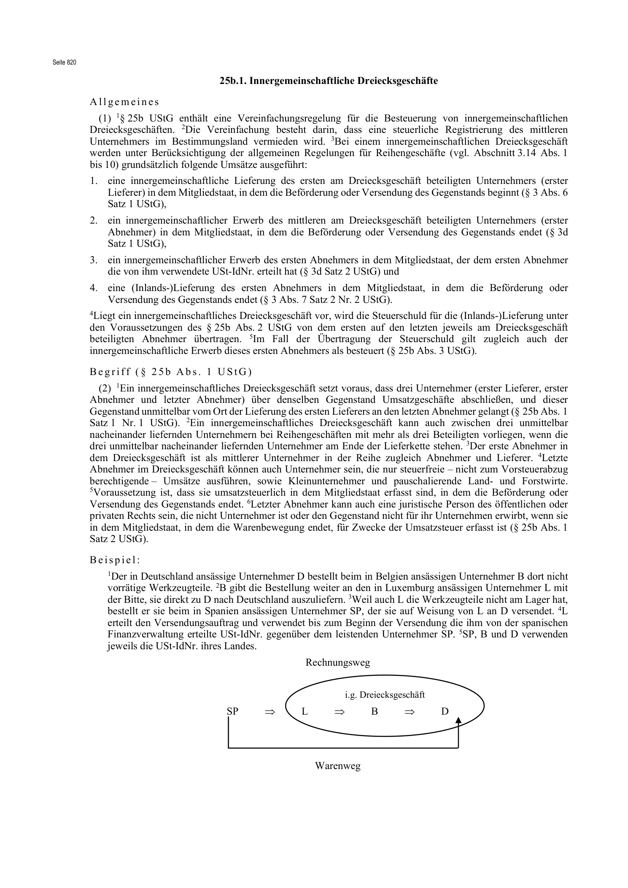

**Amtliche PDF, Seite 845:**

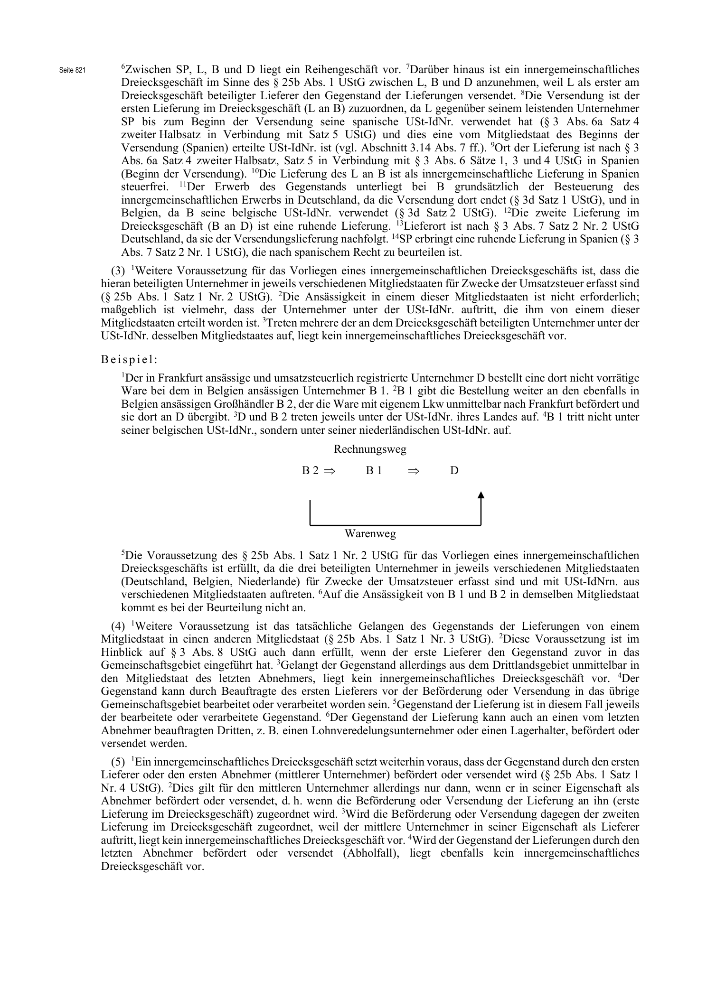

**Amtliche PDF, Seite 846:**

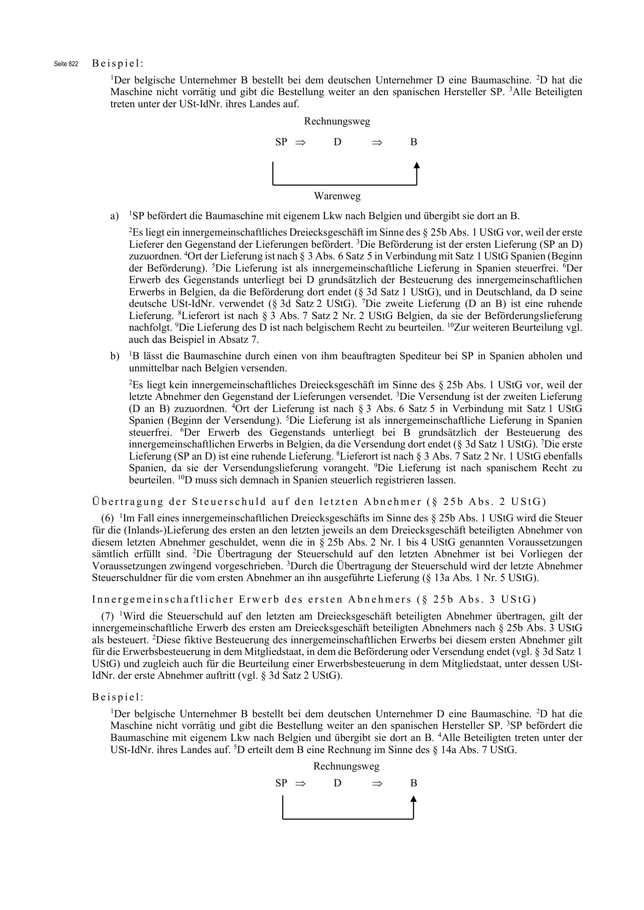

**Amtliche PDF, Seite 847:**

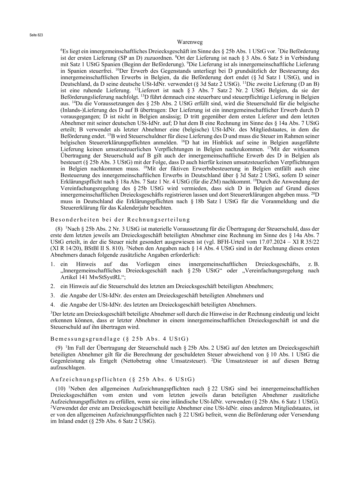

<!-- quelle:z21929-21929 -->
## Zu § 25c UStG
<!-- /quelle:z21929-21929 -->

<!-- quelle:z21930-21930 -->

### 25c.1 Besteuerung von Umsätzen mit Anlagegold
<!-- /quelle:z21930-21930 -->

<!-- quelle:z21931-21931 -->

(1) 1Steuerbefreit sind nach § 25c Abs. 1 Satz 1 UStG die Lieferungen, die Einfuhr sowie der innergemeinschaftliche Erwerb von Anlagegold. 2Als Lieferungen von Anlagegold gelten auch:

<!-- /quelle:z21931-21931 -->

<!-- quelle:z21933-21933 -->

a)die Veräußerung von ideellen Miteigentumsanteilen an einem Goldbarrenbestand oder einem Goldmünzenbestand;

<!-- /quelle:z21933-21933 -->

<!-- quelle:z21935-21935 -->

b)die Veräußerung von Gewichtsguthaben an einem Goldbarrenbestand, wenn die Gewichtskonten obligatorische Rechte ausweisen;

<!-- /quelle:z21935-21935 -->

<!-- quelle:z21937-21937 -->

c)die Veräußerung von Goldbarrenzertifikaten oder Goldmünzenzertifikaten;

<!-- /quelle:z21937-21937 -->

<!-- quelle:z21939-21939 -->

d)die Abtretung von Ansprüchen auf Lieferung von Goldbarren oder Goldmünzen;

<!-- /quelle:z21939-21939 -->

<!-- quelle:z21941-21941 -->

e)die Veräußerung von Golddarlehen und Goldswaps, durch die ein Eigentumsrecht an Anlagegold oder ein schuldrechtlicher Anspruch auf Anlagegold begründet wird;

<!-- /quelle:z21941-21941 -->

<!-- quelle:z21943-21943 -->

f)die Veräußerung von Terminkontrakten und im Freiverkehr getätigten Terminabschlüssen mit Anlagegold, die zur Übertragung eines Eigentumsrechts an Anlagegold oder eines schuldrechtlichen Anspruchs auf Anlagegold führen.

<!-- /quelle:z21943-21943 -->

<!-- quelle:z21945-21945 -->

3Steuerfrei ist auch die Vermittlung der Lieferung von Anlagegold. 4Optionsgeschäfte mit Anlagegold und die Vermittlung derartiger Dienstleistungen fallen unter die Steuerbefreiung nach § 4 Nr. 8 Buchstabe e UStG.

<!-- /quelle:z21945-21945 -->

<!-- quelle:z21947-21947 -->

(2)<a href="#fn-z21965">[1]</a> 1Unter die Steuerbefreiung fallen Goldbarren und -plättchen aus Feingold von mindestens 995 Tausendsteln mit eingestanzter oder geprägter Angabe des Herstellers, des Feingehalts und des Gewichts. 2Das Herstellungsverfahren, das Gewicht und die Form des Goldes, sofern es vom Goldmarkt akzeptiert wird, sind unerheblich, wenn der Wert der Goldbarren oder -plättchen in erster Linie auf dem Preis des in ihnen enthaltenen Goldes beruht. 3Die Barren und Plättchen können zum Beispiel mit bildlichen Darstellungen geprägt sein. 4Goldmünzen müssen einen Goldgehalt von mindestens 900 Tausendsteln aufweisen, nach dem Jahr 1800 geprägt sein, im Ursprungsland gesetzliches Zahlungsmittel sein bzw. gewesen sein und üblicherweise zu einem Preis verkauft werden, der 180 % des Goldgehalts nicht übersteigt. 5Eine Mindestauflagenhöhe ist nicht erforderlich.

<!-- /quelle:z21947-21947 -->

<!-- quelle:z21949-21949 -->

(3) 1Die Europäische Kommission veröffentlicht jährlich vor dem 1. Dezember in der Reihe C ABl. EU ein Verzeichnis der Goldmünzen, die die Kriterien für die Steuerbefreiung erfüllen.<a href="#fn-z21968">[2]</a> 2Für Umsätze von Goldmünzen mit einen Goldgehalt von mindestens 900 Tausendsteln, die in dem Verzeichnis enthalten sind, gilt die Sonderregelung nach § 25c UStG während des gesamten Jahres, das auf das Jahr der Veröffentlichung folgt. 3Bei Münzen, die nicht in dem Verzeichnis enthalten sind, hat der Unternehmer im Einzelfall zu prüfen, ob die genannten Voraussetzungen für die Behandlung als Anlagegold erfüllt sind. 4Der Metallwert von Goldmünzen ist dabei grundsätzlich anhand des aktuellen Tagespreises für Gold zu ermitteln. 5Maßgeblich ist der von der Londoner Börse festgestellte Tagespreis (Nachmittagsfixing) für die Feinunze Gold (1 Unze = 31,1035 Gramm). 6Dieser in US-Dollar festgestellte Wert muss anhand der aktuellen Umrechnungskurse in Euro umgerechnet werden.

<!-- /quelle:z21949-21949 -->

<!-- quelle:z21951-21951 -->

(4) Nicht zum Anlagegold gehört unverarbeitetes Gold (Industriegold), d.h. insbesondere Barren mit einem Feingehalt von weniger als 995 Tausendsteln, sowie Granalien und Feingoldband in handelsüblicher Form.

<!-- /quelle:z21951-21951 -->

<!-- quelle:z21953-21953 -->

(5) 1Zur Umsatzsteuerpflicht kann optieren:

<!-- /quelle:z21953-21953 -->

<!-- quelle:z21955-21955 -->

–ein Unternehmer, der Anlagegold herstellt oder Gold in Anlagegold umwandelt, bei der Lieferung von Anlagegold.

<!-- /quelle:z21955-21955 -->

<!-- quelle:z21957-21957 -->

–ein Unternehmer, der üblicherweise Gold zu gewerblichen Zwecken liefert, bei der Lieferung von Anlagegold in Barren- oder Plättchenform.

<!-- /quelle:z21957-21957 -->

<!-- quelle:z21959-21959 -->

2Voraussetzung für die Option ist, dass er diese Lieferung an einen anderen Unternehmer für dessen Unternehmen ausführt. 3Kreditinstitute sind grundsätzlich als Unternehmer anzusehen. 4Vermittelt ein Unternehmer eine Lieferung von Anlagegold, kann er nur dann für die Vermittlungsleistung zur Steuerpflicht optieren, wenn der vermittelte Umsatz zuvor vom liefernden Unternehmer als steuerpflichtig behandelt worden ist. 5Zum Vorsteuerabzug vgl. Abschnitt 15.13 Abs. 1.

<!-- /quelle:z21959-21959 -->

<!-- quelle:z21961-21961 -->

(6) Im Übrigen bleiben die Regelungen des § 18 Abs. 7 UStG, § 49 UStDV unberührt.

<!-- /quelle:z21961-21961 -->

<!-- quelle:z21963-21963 -->

(7) 1Liegen für Goldlieferungen nach § 4 Nr. 4 UStG auch die Voraussetzungen der Steuerbefreiung für Anlagegold (§ 25c Abs. 1 und 2 UStG) vor, geht die Steuerbefreiung des § 25c Abs. 1 und 2 UStG der Steuerbefreiung des § 4 Nr. 4 UStG vor. 2Liegen für die Lieferung von Anlagegold auch die Voraussetzungen einer Ausfuhrlieferung (§ 4 Nr. 1 Buchstabe a, § 6 UStG) bzw. einer innergemeinschaftlichen Lieferung (§ 4 Nr. 1 Buchstabe b, § 6a UStG) vor, geht die Steuerbefreiung des § 25c Abs. 1 und 2 UStG diesen Steuerbefreiungen vor.

<!-- /quelle:z21963-21963 -->

<!-- quelle:z21965-21966 -->

<strong>[1]</strong> 
Siehe auch BGH v. 17.10.2023 – 1 StR 151/23, NJW 2024, 519 zum „Anlagegold“ und zur Entstehung der Einfuhrumsatzsteuer.

<!-- /quelle:z21965-21966 -->

<!-- quelle:z21968-21969 -->

<strong>[2]</strong> 
Für 2025 siehe BMF v. 28.11.2024 III C 1 - S 7068/19/10002 :007 sowie ABl. EU C/2024/6669; für 2026 siehe BMF v. 2.12.2025 III C 2 - S 7068/19/10002 :006 sowie ABl. EU C/2023/854.

<!-- /quelle:z21968-21969 -->

## Zu § 25d UStG

### 25d.1. - gestrichen -

> Ergänzung aus der amtlichen BMF-PDF, Seite 849. Diese gestrichene Position ist im Inhaltsverzeichnis der Webkopie genannt, fehlt aber in ihrem Erlasstext. Es wird kein früherer Regelungstext eingefügt.

<!-- quelle:z21971-21971 -->
## Zu § 25e UStG<a href="#fn-z21972">[11]</a>
<!-- /quelle:z21971-21971 -->

<!-- quelle:z21972-21973 -->

<strong>[11]</strong> 
Zu Vordruckmustern in diesem Zusammenhang siehe zwei BMF-Schreiben v. 28.7.2021: USt 1 TK, BStBl. I 2021, 1081; USt 1 TL, BStBl. I 2021, 1084.

<!-- /quelle:z21972-21973 -->

<!-- quelle:z21975-21975 -->

### 25e.1 Voraussetzung für die Haftung
<!-- /quelle:z21975-21975 -->

<!-- quelle:z21976-21976 -->

1Betreiber einer elektronischen Schnittstelle im Sinne von § 25e Abs. 1 UStG (Betreiber) haften für die nicht entrichtete Steuer aus einer Lieferung von Gegenständen, die nicht unter § 3 Abs. 3a UStG fallen, wenn sie die Lieferung dieser Gegenstände mittels einer elektronischen Schnittstelle unterstützen. 2Darunter können insbesondere die folgenden Fallgestaltungen fallen:

<!-- /quelle:z21976-21976 -->

<!-- quelle:z21978-21978 -->

1.Lieferungen an einen Unternehmer, unabhängig von der Ansässigkeit des liefernden Unternehmers.

<!-- /quelle:z21978-21978 -->

<!-- quelle:z21980-21980 -->
#### Beispiel 1:
<!-- /quelle:z21980-21980 -->

<!-- quelle:z21982-21983 -->

1Ein in Deutschland ansässiger Händler H veräußert über eine elektronische Schnittstelle Handyhüllen an einen ebenfalls in Deutschland ansässigen Unternehmer U. 2Die Ware wird vom Sitz des H oder aus einem Lager in Deutschland an den Sitz des U in Deutschland befördert oder versendet. 
3§ 3 Abs. 3a Satz 1 UStG findet keine Anwendung, da der Empfänger der Lieferung ein Unternehmer und der Lieferer im Gemeinschaftsgebiet (hier: Deutschland) ansässig ist. 4§ 3 Abs. 3a Satz 2 UStG findet keine Anwendung, da die Ware nicht aus dem Drittlandsgebiet eingeführt wurde. 5Für die Lieferung des H an den U findet § 3 Abs. 6 Satz 1 UStG Anwendung. 6Die Lieferung gilt als dort ausgeführt, wo die Beförderung oder Versendung an den Abnehmer beginnt (hier: Deutschland).

<!-- /quelle:z21982-21983 -->

<!-- quelle:z21985-21985 -->
#### Beispiel 2:
<!-- /quelle:z21985-21985 -->

<!-- quelle:z21987-21988 -->

1Ein in der Schweiz ansässiger Händler H veräußert über eine elektronische Schnittstelle Schuhe an einen in Deutschland ansässigen Unternehmer U. 2Die Ware wird aus einem Lager des H in Deutschland an den Sitz des U in Deutschland befördert oder versendet. 
3§ 3 Abs. 3a Satz 1 UStG findet keine Anwendung, da der Empfänger der Lieferung ein Unternehmer ist. 4§ 3 Abs. 3a Satz 2 UStG findet keine Anwendung, da die Ware nicht aus dem Drittlandsgebiet eingeführt wurde. 5Für die Lieferung des H an den U findet § 3 Abs. 6 Satz 1 UStG Anwendung. 6Die Lieferung gilt als dort ausgeführt, wo die Beförderung oder Versendung an den Abnehmer beginnt (hier: Deutschland).

<!-- /quelle:z21987-21988 -->

<!-- quelle:z21990-21990 -->
#### Beispiel 3:
<!-- /quelle:z21990-21990 -->

<!-- quelle:z21992-21993 -->

1Ein in Deutschland ansässiger Händler H veräußert über eine elektronische Schnittstelle Schuhe (Sachwert: 100 €) an einen ebenfalls in Deutschland ansässigen Unternehmer U (kein Erwerber im Sinne des § 3 Abs. 3a Satz 5 UStG) zu der Lieferkondition „verzollt und versteuert“. 2Die Ware wird aus einem Lager des H in der Schweiz an den Sitz des U in Deutschland befördert oder versendet. 3Die Zollanmeldung in Deutschland erfolgt durch H. 
4§ 3 Abs. 3a Satz 2 UStG findet keine Anwendung, da der Empfänger der Lieferung ein Unternehmer und kein Erwerber im Sinne des § 3 Abs. 3a Satz 5 UStG ist. 5Für die Lieferung des H an den U gilt der Ort nach § 3 Abs. 8 UStG als im Inland gelegen (hier: Deutschland).

<!-- /quelle:z21992-21993 -->

<!-- quelle:z21995-21995 -->

2.Lieferungen, bei denen die Warenbewegung innerhalb des Gemeinschaftsgebietes erfolgt und der liefernde Unternehmer im Gemeinschaftsgebiet ansässig ist.

<!-- /quelle:z21995-21995 -->

<!-- quelle:z21997-21997 -->
#### Beispiel 1:
<!-- /quelle:z21997-21997 -->

<!-- quelle:z21999-22000 -->

1Ein in Deutschland ansässiger Händler H veräußert über eine elektronische Schnittstelle Handyhüllen an eine Privatperson in Deutschland. 2Die Ware wird aus einem Lager in Deutschland an den Wohnsitz der Privatperson in Deutschland versendet. 
3Nach § 3 Abs. 3a Satz 1 UStG wird keine Lieferung zwischen dem Betreiber der elektronischen Schnittstelle und der Privatperson fingiert, da H im Gemeinschaftsgebiet ansässig ist. 4§ 3 Abs. 3a Satz 2 UStG findet keine Anwendung, da die Ware nicht aus dem Drittlandsgebiet eingeführt wurde. 5Für die Lieferung des H an die Privatperson findet § 3 Abs. 6 Satz 1 UStG Anwendung. 6Die Lieferung gilt als dort ausgeführt, wo die Beförderung oder Versendung an den Abnehmer beginnt (hier: Deutschland).

<!-- /quelle:z21999-22000 -->

<!-- quelle:z22002-22002 -->
#### Beispiel 2:
<!-- /quelle:z22002-22002 -->

<!-- quelle:z22004-22005 -->

1Ein in Frankreich ansässiger Händler H veräußert über eine elektronische Schnittstelle Handyhüllen an eine Privatperson in Deutschland. 2Die Ware wird aus einem Lager in Frankreich an den Wohnsitz der Privatperson in Deutschland versendet. 3H überschreitet die Umsatzschwelle von 10.000 € (§ 3c Abs. 4 Satz 1 UStG) oder verzichtet auf die Anwendung des § 3c Abs. 4 Satz 1 UStG (§ 3c Abs. 4 Satz 2 UStG). 
4Nach § 3 Abs. 3a Satz 1 UStG wird keine Lieferung zwischen dem Betreiber der elektronischen Schnittstelle und der Privatperson fingiert, da H im Gemeinschaftsgebiet ansässig ist. 5§ 3 Abs. 3a Satz 2 UStG findet keine Anwendung, da die Ware nicht aus dem Drittlandsgebiet eingeführt wurde. 6Für die Lieferung des H an die Privatperson findet § 3c Abs. 1 UStG Anwendung. 7Der Ort der Lieferung ist der Ort, an dem sich der Gegenstand bei Beendigung der Versendung an die Privatperson befindet (hier: Deutschland). 8H kann das besondere Besteuerungsverfahren nach § 18j UStG (vgl. Abschnitt 18j.1) in Anspruch nehmen und den Umsatz darüber erklären. 9Andernfalls hat H den Umsatz im Bestimmungsland (hier: Deutschland) im allgemeinen Besteuerungsverfahren (§ 18 Abs. 1 bis 4 UStG) zu erklären.

<!-- /quelle:z22004-22005 -->

<!-- quelle:z22007-22007 -->

3.Lieferungen, bei denen die Ware vom Drittlandsgebiet in das Gemeinschaftsgebiet eingeführt wird, der Sachwert der Ware mehr als 150 € beträgt und sich der Ort der Lieferung nach § 3 Abs. 8 oder § 3c Abs. 2 UStG im Inland befindet, unabhängig von der Ansässigkeit des liefernden Unternehmers.

<!-- /quelle:z22007-22007 -->

<!-- quelle:z22009-22009 -->
#### Beispiel 1:
<!-- /quelle:z22009-22009 -->

<!-- quelle:z22011-22012 -->

1Ein in Frankreich ansässiger Händler H veräußert über eine elektronische Schnittstelle Schuhe (Sachwert: 250 €) an eine Privatperson in Deutschland (Lieferkondition „verzollt und versteuert“). 2Die Ware wird von H aus einem Lager in der Schweiz an den Wohnsitz der Privatperson in Deutschland versendet. 3Die Zollanmeldung in Deutschland erfolgt durch H. 
4§ 3 Abs. 3a Satz 2 UStG findet keine Anwendung, weil der Sachwert der Schuhe 150 € übersteigt. 5Für die Lieferung des H an die Privatperson gilt der Ort nach § 3 Abs. 8 UStG als im Inland gelegen (hier: Deutschland).

<!-- /quelle:z22011-22012 -->

<!-- quelle:z22014-22014 -->
#### Beispiel 2:
<!-- /quelle:z22014-22014 -->

<!-- quelle:z22016-22017 -->

1Sachverhalt wie Beispiel 1. 2Die Zollanmeldung erfolgt jedoch durch H in Frankreich. 
3§ 3 Abs. 3a Satz 2 UStG findet keine Anwendung, weil der Sachwert der Schuhe 150 € übersteigt. 4Der Ort der Lieferung des H an die Privatperson verlagert sich auf Grund des Fernverkaufs eines aus dem Drittlandsgebiet eingeführten Gegenstands nach § 3c Abs. 2 UStG in das Inland (hier: Deutschland), da der Gegenstand in Frankreich eingeführt wurde und die Versendung des Gegenstands an den Erwerber im Inland endet.

<!-- /quelle:z22016-22017 -->

<!-- quelle:z22019-22019 -->

3Gemäß § 25e Abs. 5 UStG ist eine elektronische Schnittstelle im Sinne dieser Vorschrift ein elektronischer Marktplatz, eine elektronische Plattform, ein elektronisches Portal oder jeder andere vergleichbare elektronische Handelsplatz. 4Voraussetzung für die Haftung ist, dass mittels der elektronischen Schnittstelle die Lieferung eines Gegenstandes unterstützt wird. 5Wann vom Unterstützen einer Lieferung auszugehen ist, ist in § 25e Abs. 6 UStG geregelt. 6§ 25e Abs. 1 UStG findet keine Anwendung auf elektronische Schnittstellen, die die Voraussetzungen nach § 25e Abs. 6 Satz 2 UStG kumulativ oder lediglich eine der in § 25e Abs. 6 Satz 3 UStG genannten Voraussetzungen erfüllen, wie z.B. sog. Vermittlungsmarktplätze/‑plattformen, die die Funktion eines „Schwarzen Brettes“ haben und über die sich Nutzer über bestehende Angebote Dritter informieren und Kontakt zu einem möglichen Vertragspartner aufnehmen können, sowie Plattformen/Portale, die ausschließlich der Abwicklung von Zahlungen dienen.

<!-- /quelle:z22019-22019 -->

<!-- quelle:z22021-22021 -->

### 25e.2 Tatbestandsmerkmale für einen Haftungsausschluss
<!-- /quelle:z22021-22021 -->

<!-- quelle:z22022-22022 -->

(1) Der Betreiber haftet nach § 25e Abs. 1 UStG für die nicht entrichtete Steuer aus Lieferungen, die mittels seiner elektronischen Schnittstelle unterstützt wurden; dies gilt nicht in Fällen des § 3 Abs. 3a UStG. 2Der Betreiber haftet nach § 25e Abs. 2 Satz 1 UStG insoweit nicht für die nicht entrichtete Steuer aus Lieferungen, die mittels seiner elektronischen Schnittstelle unterstützt wurden, wenn der liefernde Unternehmer im Zeitpunkt der Lieferung über eine nach § 27a UStG erteilte, gültige USt-IdNr. verfügt (vgl. § 22f Abs. 1 Satz 1 Nr. 3 UStG). 3Auch in den Fällen, in denen der liefernde Unternehmer gegenüber dem Betreiber erklärt, dass die Voraussetzungen für die Vergabe einer USt-IdNr. durch das BZSt nach § 27a UStG an ihn nicht vorliegen, weil er im Inland keine steuerbaren Umsätze im allgemeinen Besteuerungsverfahren (§ 18 Abs. 1 bis 4 UStG) zu erklären hat, gilt § 25e Abs. 2 Satz 1 UStG entsprechend. 4Dies trifft insbesondere auf folgende Fälle zu:

<!-- /quelle:z22022-22022 -->

<!-- quelle:z22024-22024 -->

1.1Im übrigen Gemeinschaftsgebiet ansässige Unternehmer, die im Gemeinschaftsgebiet ausschließlich innergemeinschaftliche Fernverkäufe im Sinne des § 3c Abs. 1 Sätze 2 und 3 UStG ausführen, die im Inland nicht steuerbar sind, weil die Umsatzschwelle im Sinne des § 3c Abs. 4 Satz 1 UStG nicht überschritten wird. 2In diesen Fällen kann der Betreiber zum Nachweis der steuerlichen Erfassung die dem liefernden Unternehmer erteilte und zum Zeitpunkt der Lieferung gültige USt-IdNr. eines anderen EU-Mitgliedstaats aufzeichnen. 3Soweit der liefernde Unternehmer nicht über eine USt-IdNr. verfügt, hat der Betreiber in geeigneter Weise nachzuweisen, dass die von dem Unternehmer ausgeführten Lieferungen im Inland nicht steuerbar sind, weil die Umsatzschwelle im Sinne des § 3c Abs. 4 Satz 1 UStG nicht überschritten ist (z.B. durch Abgabe einer entsprechenden Erklärung durch den betreffenden Unternehmer).

<!-- /quelle:z22024-22024 -->

<!-- quelle:z22026-22026 -->

2.1Im übrigen Gemeinschaftsgebiet ansässige Unternehmer, die im Inland ausschließlich steuerpflichtige innergemeinschaftliche Fernverkäufe nach § 3c Abs. 1 Sätze 2 und 3 UStG erbringen und diese im besonderen Besteuerungsverfahren nach § 18j UStG erklären. 2In diesen Fällen kann der Betreiber zum Nachweis der steuerlichen Erfassung die dem liefernden Unternehmer erteilte und zum Zeitpunkt der Lieferung gültige USt-IdNr. des EU-Mitgliedstaates, bei dem er die Teilnahme an dem besonderen Besteuerungsverfahren angezeigt hat, aufzeichnen.

<!-- /quelle:z22026-22026 -->

<!-- quelle:z22028-22028 -->

3.1Unternehmer, die ausschließlich Lieferungen an Abnehmer im Inland ausführen, bei denen die Beförderung oder Versendung nach Abschluss des Kaufvertrages im Drittlandsgebiet beginnt (sog. Direktverkäufe), der Sachwert der Ware mehr als 150 € beträgt und für die der Ort der Lieferungen nicht nach § 3 Abs. 8 UStG oder nach § 3c Abs. 2 UStG im Inland gelegen ist bzw. keine Pflicht zur steuerlichen Erfassung im Inland besteht. 2Auch in diesen Fällen muss der Betreiber einen entsprechenden Nachweis in geeigneter Weise vorhalten (z.B. durch Abgabe einer entsprechenden Erklärung durch den betreffenden Unternehmer).

<!-- /quelle:z22028-22028 -->

<!-- quelle:z22030-22030 -->

5Betreiber, die ausschließlich über eine von einem anderen EU-Mitgliedstaat erteilte USt-IdNr. verfügen, können für die Prüfung der Voraussetzungen nach § 25e Abs. 2 Satz 1 UStG die dort bereitgestellten Verfahren zur Bestätigung von USt-IdNrn. der auf ihrer elektronischen Schnittstelle liefernden Unternehmer nutzen.

<!-- /quelle:z22030-22030 -->

<!-- quelle:z22032-22032 -->

(2) 1Die Befreiung aus der Haftung nach Absatz 1 tritt nicht ein, wenn der Betreiber davon Kenntnis hatte oder nach der Sorgfalt eines ordentlichen Kaufmanns hätte haben müssen, dass der liefernde Unternehmer seinen umsatzsteuerlichen Pflichten nicht oder nicht im vollen Umfang nachkommt (vgl. § 25e Abs. 2 Satz 2 UStG). 2Unabhängig davon haftet der Betreiber in Fällen des Absatz 1 Satz 1 immer dann für die nicht entrichtete Steuer, wenn der liefernde Unternehmer im Zeitpunkt der Lieferung nicht über eine nach § 27a UStG erteilte, gültige USt-IdNr. oder der Betreiber nicht über einen Nachweis nach Absatz 1 Satz 4 verfügte. 3In diesen Fällen kommt es auf die Kenntnis des Betreibers, ob der liefernde Unternehmer seinen steuerlichen Pflichten nachkommt, nicht an.

<!-- /quelle:z22032-22032 -->

<!-- quelle:z22034-22034 -->

(3) 1Von einer Kenntnis oder einem Kennenmüssen ist insbesondere auszugehen, wenn der Betreiber ihm offensichtliche oder bekanntgewordene Tatsachen außer Acht lässt, die auf eine umsatzsteuerliche Pflichtverletzung des liefernden Unternehmers schließen lassen. 2Ein aktives Ausforschen ist dazu nicht erforderlich. 3Das Kennenmüssen bezieht sich hierbei lediglich auf Sachverhalte, die dem Betreiber im Rahmen seines eigenen Unternehmens bekannt werden und auf eine umsatzsteuerliche Pflichtverletzung schlussfolgern lassen. 4In diesen Fällen haftet der Betreiber nicht, wenn er den auf seiner elektronischen Schnittstelle tätigen Unternehmer auf die Pflichtverletzung hinweist und ihn auffordert, diese innerhalb einer Frist (längstens zwei Monate) abzustellen, und der Unternehmer dieser Aufforderung nachkommt. 5In den Fällen, in denen der Unternehmer der vorgenannten Aufforderung des Betreibers nicht nachkommt, scheidet eine Haftung nach § 25e Abs. 2 Satz 2 UStG nur aus, wenn der Betreiber den Unternehmer nach Ablauf der gesetzten Frist vom weiteren Handel auf seiner elektronischen Schnittstelle ausschließt (Sperrung aller bestehenden Accounts). 6Gleiches gilt insbesondere für die Frage der Überschreitung der Umsatzschwelle nach Absatz 1 Satz 4 Nr. 1 und die Frage, ob die Voraussetzungen nach Absatz 1 Satz 4 Nr. 2 und 3 vorliegen. 7In den Fällen, in denen der Unternehmer im Rahmen der vom Betreiber gesetzten Frist nicht der Aufforderung nachkommt, seine umsatzsteuerlichen Pflichten zu erfüllen, und der Betreiber den betreffenden Unternehmer vom weiteren Handel auf seiner elektronischen Schnittstelle ausschließt (Sperrung aller bestehenden Accounts), sollte der Betreiber die Finanzverwaltung informieren.

<!-- /quelle:z22034-22034 -->

<!-- quelle:z22036-22036 -->

(4) 1Nach § 25e Abs. 3 UStG haftet der Betreiber nicht für die entstandene und nicht entrichtete Umsatzsteuer aus Lieferungen, die mittels seiner elektronischen Schnittstelle unterstützt wurden, wenn die Registrierung des Lieferers auf der elektronischen Schnittstelle nicht als Unternehmer erfolgt ist und der Betreiber den hierfür geltenden Aufzeichnungs- und Aufbewahrungspflichten nach § 22f Abs. 2 in Verbindung mit Absatz 1 Satz 1 UStG nachgekommen ist. 2Dies gilt nach § 25e Abs. 3 Satz 2 UStG nicht in Fällen, in denen der Betreiber nachweislich nach Art, Menge oder Höhe der Umsätze Kenntnis hatte oder nach der Sorgfalt eines ordentlichen Kaufmanns hätte haben müssen, dass die Registrierung als Nichtunternehmer zu Unrecht erfolgt ist. 3§ 2 Abs. 1 UStG gilt entsprechend. 4Für die Abgrenzung, ob es sich um eine unternehmerische Tätigkeit handelt, ist grundsätzlich nur die Tätigkeit auf der eigenen elektronischen Schnittstelle maßgebend. 5Das Erreichen einer bestimmten Umsatzhöhe reicht für die Beurteilung der Frage, ob eine Tätigkeit unternehmerisch ausgeführt wird, allein nicht aus. 6Unabhängig davon ist ein deutliches Anzeichen dafür, dass die Registrierung auf einer elektronischen Schnittstelle als Nichtunternehmer zu Unrecht erfolgte, wenn der mittels der elektronischen Schnittstelle erzielte Umsatz eine Höhe von 22.000 € innerhalb eines Kalenderjahres erreicht. 7Absatz 3 Sätze 4, 5 und 7 gelten entsprechend.

<!-- /quelle:z22036-22036 -->

<!-- quelle:z22038-22038 -->

### 25e.3 Verfahren bei Vorliegen von Pflichtverletzungen
<!-- /quelle:z22038-22038 -->

<!-- quelle:z22039-22039 -->

(1) 1Liegen dem nach § 21 AO örtlich zuständigen Finanzamt Erkenntnisse vor, dass ein Unternehmer, der im Inland steuerbare Umsätze über eine elektronische Schnittstelle ausführt, seinen umsatzsteuerlichen Pflichten nicht nachkommt und andere von ihm zu veranlassende Maßnahmen keinen unmittelbaren Erfolg versprechen, ist es nach § 25e Abs. 4 Satz 1 UStG berechtigt, den betreffenden Betreiber hierüber zu informieren (Offenbarungsbefugnis). 2Mit dem Zugang dieser Mitteilung ist dem Betreiber die Möglichkeit einzuräumen, innerhalb der vom Finanzamt gesetzten Frist auf den betreffenden Unternehmer einzuwirken, damit dieser seinen umsatzsteuerlichen Pflichten nachkommt, oder sicherzustellen, dass der Unternehmer über seine elektronische Schnittstelle keine weiteren Umsätze ausführen kann (Sperrung aller bestehenden Accounts). 3Für die Frage, wann die Mitteilung zugegangen ist, gelten die Regelungen des § 122 AO entsprechend. 4Umsatzsteuerliche Pflichtverletzungen nach Satz 1 sind insbesondere:

<!-- /quelle:z22039-22039 -->

<!-- quelle:z22041-22041 -->

1.Abgabe unrichtiger Umsatzsteuer-Voranmeldungen/Umsatzsteuererklärungen für das Kalenderjahr,

<!-- /quelle:z22041-22041 -->

<!-- quelle:z22043-22043 -->

2.Nichtabgabe von Umsatzsteuer-Voranmeldungen/Umsatzsteuererklärungen für das Kalenderjahr,

<!-- /quelle:z22043-22043 -->

<!-- quelle:z22045-22045 -->

3.Nichtzahlung oder nicht vollständige Zahlung fälliger Umsatzsteuerbeträge oder

<!-- /quelle:z22045-22045 -->

<!-- quelle:z22047-22047 -->

4.Nichtbenennung eines Empfangsbevollmächtigten im Inland nach § 22f Abs. 1 Satz 2 UStG (vgl. Abschnitt 22f.2).

<!-- /quelle:z22047-22047 -->

<!-- quelle:z22049-22049 -->

(2) 1Weist der Betreiber innerhalb der gesetzten Frist nach, dass der betreffende Unternehmer über seine elektronische Schnittstelle keine Waren mehr anbieten kann (Sperrung aller bestehenden Accounts), wird eine Inanspruchnahme nach § 25e Abs. 4 Satz 2 UStG für die nicht entrichtete Umsatzsteuer hinfällig. 2Wird dieser Nachweis vom Betreiber in der gesetzten Frist nicht erbracht, haftet er nach § 25e Abs. 4 Satz 2 UStG für die entstandene und nicht entrichtete Umsatzsteuer aus Umsätzen, die mittels seiner elektronischen Schnittstelle unterstützt wurden und bei denen das Rechtsgeschäft nach Zustellung der Mitteilung vom Finanzamt abgeschlossen wurde. 3Gleiches gilt in Fällen, in denen die Registrierung beim Betreiber als Nichtunternehmer erfolgte und das nach § 21 AO örtlich zuständige Finanzamt dem Betreiber mitgeteilt hat, dass die Tätigkeit im Rahmen eines Unternehmens erfolgt.

<!-- /quelle:z22049-22049 -->

<!-- quelle:z22051-22051 -->

### 25e.4 Einleitung des Haftungsverfahrens
<!-- /quelle:z22051-22051 -->

<!-- quelle:z22052-22052 -->

1Liegen die Voraussetzungen für eine Haftung nach § 25e Abs. 1 UStG vor, ist der Betreiber zunächst anzuhören (§ 91 Abs. 1 Satz 1 AO). 2Die Darlegungs- und Feststellungslast der Kenntnis oder des Kennenmüssens liegt grundsätzlich bei dem für den Erlass des Haftungsbescheids zuständigen Finanzamt. 3Zuständig für die Durchführung des Haftungsverfahrens ist das für den liefernden Unternehmer örtlich zuständige Finanzamt (§ 25e Abs. 7 UStG und § 21 AO). 4Im Rahmen der Anhörung ist dem Betreiber Gelegenheit zu geben, die Kenntnis oder das Kennenmüssen zu widerlegen.

<!-- /quelle:z22052-22052 -->

<!-- quelle:z22054-22054 -->
## Zu § 25f UStG
<!-- /quelle:z22054-22054 -->

<!-- quelle:z22055-22055 -->

### 25f.1 Versagung des Vorsteuerabzugs und der Steuerbefreiung bei Beteiligung an einer Steuerhinterziehung
<!-- /quelle:z22055-22055 -->

<!-- quelle:z22056-22056 -->

(1)<a href="#fn-z22098">[1]</a> Der den Vorsteuerabzug nach § 15 Abs. 1 Satz 1 Nr. 1, 3 und 4 UStG beziehungsweise die Steuerbefreiung nach § 4 Nr. 1 Buchstabe b in Verbindung mit § 6a UStG begehrende Unternehmer trägt grundsätzlich die Feststellungslast für das Vorliegen der hierfür erforderlichen materiellen Voraussetzungen.

<!-- /quelle:z22056-22056 -->

<!-- quelle:z22058-22058 -->

(2) 1Weist das Finanzamt nach, dass der Unternehmer wusste oder hätte wissen müssen, dass er sich mit seinem Eingangs- oder Ausgangsumsatz an einem Umsatz beteiligt, bei dem der Leistende oder ein anderer Beteiligter auf einer vorhergehenden oder nachfolgenden Umsatzstufe in eine begangene Hinterziehung von Umsatzsteuer, an einer Erlangung eines nicht gerechtfertigten Vorsteuerabzugs im Sinne des § 370 AO oder in eine Schädigung des Umsatzsteueraufkommens im Sinne der §§ 26a und 26c UStG einbezogen war, sind der geltend gemachte Vorsteuerabzug und die in Anspruch genommene Steuerbefreiung für die entsprechende innergemeinschaftliche Lieferung zu versagen. 2Dabei ist dem Unternehmer auch das Wissen oder Wissen müssen seiner Angestellten in analoger Anwendung von § 166 BGB zuzurechnen, welches die Angestellten im Rahmen ihrer jeweiligen Zuständigkeit erlangt haben oder hätten erlangen müssen (BFH-Urteil vom 19.05.2010 – XI R 78/07). 3Die Feststellung einer Steuerhinterziehung kann sowohl den unmittelbaren Eingangs- oder Ausgangsumsatz des Unternehmers, als auch einen Umsatz auf allen vor- und nachgelagerten Umsatzstufen innerhalb der Leistungskette umfassen.

<!-- /quelle:z22058-22058 -->

<!-- quelle:z22060-22060 -->

(3) 1Voraussetzung für die Anwendung der Regelung des § 25f UStG ist, dass der objektive und subjektive Tatbestand des § 370 AO bzw. der §§ 26a oder 26c UStG auf mindestens einer Umsatzstufe innerhalb der Leistungskette erfüllt sind. 2Eine strafgerichtliche Verurteilung oder bußgeldrechtliche Ahndung ist nicht erforderlich. 3An Entscheidungen im straf- oder bußgeldrechtlichen Verfahren ist das Finanzamt bei Anwendung des § 25f UStG nicht gebunden.

<!-- /quelle:z22060-22060 -->

<!-- quelle:z22062-22062 -->

(4) 1Ein Unternehmer, der alle Maßnahmen getroffen hat, die vernünftigerweise von ihm verlangt werden können, um sicherzustellen, dass seine Umsätze nicht in eine Umsatzsteuerhinterziehung und nicht in eine Schädigung des Umsatzsteueraufkommens einbezogen sind, kann grundsätzlich auf die zutreffende steuerrechtliche Behandlung dieser Umsätze vertrauen, ohne Gefahr zu laufen, sein Recht auf Vorsteuerabzug oder auf Steuerbefreiung zu verlieren. 2Gleiches gilt für Umsätze innerhalb einer Leistungskette im Sinne von Absatz 2 Satz 3. 3Sofern Anhaltspunkte für Unregelmäßigkeiten, insbesondere eine Steuerhinterziehung, entweder bei der Aufnahme neuer oder bei bestehenden Geschäftsbeziehungen erkennbar sind, muss der Unternehmer weitergehende geeignete Maßnahmen ergreifen (z.B. Auskünfte einholen) und dies auch geeignet dokumentieren. 4Kommt der Unternehmer dem nicht nach oder kann vorliegende Zweifel durch die ergriffenen Maßnahmen nicht ausräumen und geht die Geschäftsbeziehung dennoch ein oder führt diese fort, ist von einem Wissen oder Wissen müssen des Unternehmers auszugehen.

<!-- /quelle:z22062-22062 -->

<!-- quelle:z22064-22064 -->

(5) Anhaltspunkte im Sinne von Absatz 4 Satz 3 liegen beispielsweise vor, wenn:

<!-- /quelle:z22064-22064 -->

<!-- quelle:z22066-22066 -->

–der Unternehmer durch einen Dritten aufgefordert/gebeten wird, sich an Umsätzen zu beteiligen, bei denen der Dritte die Rahmenbedingungen für das Umsatzgeschäft vorgibt (z.B. Vermittlung von Beteiligten, Vorgabe von Einkaufs-/Verkaufspreisen, Zahlungsmodalitäten oder Liefer- bzw. Leistungswegen);

<!-- /quelle:z22066-22066 -->

<!-- quelle:z22068-22068 -->

–die Finanzierung des Wareneinkaufs erst nach erfolgtem Warenverkauf möglich ist;

<!-- /quelle:z22068-22068 -->

<!-- quelle:z22070-22070 -->

–(angebotene) Mehrfachdurchläufe von Waren festgestellt werden;

<!-- /quelle:z22070-22070 -->

<!-- quelle:z22072-22072 -->

–dem Unternehmer Waren bzw. Leistungen angeboten werden, deren Preis unter dem Marktpreis liegt;

<!-- /quelle:z22072-22072 -->

<!-- quelle:z22074-22074 -->

–branchenunübliche Barzahlungen oder eine ungewöhnliche Zahlungsabwicklung erfolgen;

<!-- /quelle:z22074-22074 -->

<!-- quelle:z22076-22076 -->

–die Ansprechpartner in den Unternehmen oder die Ansprechpartner die Unternehmen häufig wechseln;

<!-- /quelle:z22076-22076 -->

<!-- quelle:z22078-22078 -->

–bei den Beteiligten berufliche Erfahrung und Branchenkenntnis fehlen;

<!-- /quelle:z22078-22078 -->

<!-- quelle:z22080-22080 -->

–die Beteiligten wiederholt ihren Unternehmenssitz verlegen;

<!-- /quelle:z22080-22080 -->

<!-- quelle:z22082-22082 -->

–Zweifel an der Richtigkeit der Angaben der Beteiligten bestehen (z.B. aufgrund von Abweichungen des Gesellschaftszwecks oder der Geschäftsadressen zu den Angaben laut Handelsregister);

<!-- /quelle:z22082-22082 -->

<!-- quelle:z22084-22084 -->

–der Gesellschaftszweck laut Handelsregister nicht dem tatsächlich ausgeübten Gesellschaftszweck entspricht;

<!-- /quelle:z22084-22084 -->

<!-- quelle:z22086-22086 -->

–dem Unternehmer eine Warenmenge oder ein Leistungsumfang angeboten wird, die für die Größe des Unternehmens in der Branche unüblich ist (z.B. ungewöhnlich hohe Stückzahlen trotz Neugründung);

<!-- /quelle:z22086-22086 -->

<!-- quelle:z22088-22088 -->

–die Beteiligten über keine ausreichenden Möglichkeiten zur Kontaktaufnahme verfügen (z.B. Website ohne Impressum, Rufnummer oder E-Mail-Adresse);

<!-- /quelle:z22088-22088 -->

<!-- quelle:z22090-22090 -->

–ungewöhnliche Leistungsbedingungen vorliegen (z.B. die Leistungen werden von einem oder an einen nicht an dem Umsatz beteiligten Unternehmen erbracht);

<!-- /quelle:z22090-22090 -->

<!-- quelle:z22092-22092 -->

–durch den Unternehmer über zugängliche Informationsquellen (z.B. Internetrecherche) festgestellt werden kann, dass die Anlieferung der Waren an die vom Abnehmer angegebene Lieferadresse nicht möglich erscheint.

<!-- /quelle:z22092-22092 -->

<!-- quelle:z22094-22094 -->

(6) 1Das Finanzamt muss nachweisen, dass der Unternehmer zum Zeitpunkt des Leistungsbezugs beziehungsweise der Leistungserbringung nach dem Gesamtbild der Verhältnisse wusste oder hätte wissen müssen, dass er sich an einem Umsatz beteiligt, der in eine Umsatzsteuerhinterziehung oder in eine Schädigung des Umsatzsteueraufkommens im Sinne des Absatzes 2 einbezogen ist. 2In diesen Fällen hat das Finanzamt den geltend gemachten Vorsteuerabzug für den betreffenden Leistungsbezug sowie eine etwaige Steuerbefreiung für die entsprechende innergemeinschaftliche Lieferung jeweils in voller Höhe zu versagen. 3Liegen die Voraussetzungen des § 25f UStG bei mehreren Beteiligten vor, ist die vorgenannte Versagung bei diesen Beteiligten vorzunehmen. 4§ 71 AO bleibt unberührt.

<!-- /quelle:z22094-22094 -->

<!-- quelle:z22096-22096 -->

(7) Liegen die Voraussetzungen des § 25f UStG vor, sind ein zunächst vorgenommener Vorsteuerabzug und eine gewährte Steuerbefreiung nach § 164 Abs. 2 Satz 1 oder § 173 Abs. 1 AO, ggf. auch nach § 172 Abs. 1 Satz 1 Nr. 2 Buchstabe c AO durch Änderung der ursprünglichen Steuerfestsetzung rückgängig zu machen.

<!-- /quelle:z22096-22096 -->

<!-- quelle:z22098-22099 -->

<strong>[1]</strong> 
Zur Versagung des Vorsteuerabzugs bei Einbeziehung in Mehrwertsteuerhinterziehung siehe EuGH v. 11.1.2024, C-537/22 Global Ink Trade, MwStR 2024, 261.

<!-- /quelle:z22098-22099 -->

<!-- quelle:z22101-22101 -->

### 25f.2 Auswirkungen im Rahmen innergemeinschaftlicher Dreiecksgeschäfte
<!-- /quelle:z22101-22101 -->

<!-- quelle:z22102-22102 -->

(1) Nach § 25f Abs. 2 UStG sind die Rechtsfolgen eines innergemeinschaftlichen Dreiecksgeschäfts gemäß § 25b Abs. 3 und 5 UStG in den Fällen des § 25f Abs. 1 UStG nicht anzuwenden.

<!-- /quelle:z22102-22102 -->

<!-- quelle:z22104-22104 -->

(2) 1Liegen die Voraussetzungen des § 25f Abs. 1 UStG vor, gilt in Fällen des innergemeinschaftlichen Dreiecksgeschäfts der innergemeinschaftliche Erwerb des ersten Abnehmers nicht als besteuert. 2Damit hat der erste Abnehmer den innergemeinschaftlichen Erwerb nach § 3d Satz 1 UStG im Bestimmungsmitgliedstaat und nach § 3d Satz 2 UStG in dem Mitgliedstaat zu versteuern, der die USt-IdNr. erteilt hat, bis der Erwerber nachweist, dass der Erwerb durch den in § 3d Satz 1 UStG bezeichneten Mitgliedstaat besteuert worden ist. 3Der Vorsteuerabzug im Sinne des § 15 Abs. 1 Satz 1 Nr. 3 UStG ist nach § 25f Abs. 2 UStG zu versagen. 4Dennoch wird die Steuerschuld für die vom ersten Abnehmer ausgeführte (Inlands-)Lieferung auf den letzten Abnehmer übertragen (§ 25b Abs. 2 UStG). 5Der letzte Abnehmer kann diese von ihm geschuldete Umsatzsteuer entgegen § 25b Abs. 5 UStG jedoch nicht als Vorsteuer abziehen.

<!-- /quelle:z22104-22104 -->

<!-- quelle:z22106-22106 -->
## Zu § 26 UStG
<!-- /quelle:z22106-22106 -->

<!-- quelle:z22107-22107 -->

### 26.1 Luftverkehrsunternehmer
<!-- /quelle:z22107-22107 -->

<!-- quelle:z22108-22108 -->

(1) 1Die niedrigere Festsetzung oder der Erlass von Umsatzsteuer nach § 26 Abs. 3 UStG für grenzüberschreitende Beförderungen im Luftverkehr setzt voraus, dass die Leistungen von einem Luftverkehrsunternehmer erbracht werden. 2Luftverkehrsunternehmer im Sinne dieser Vorschrift sind Unternehmer, die die Beförderung selbst durchführen oder die als Vertragspartei mit dem Reisenden einen Beförderungsvertrag abschließen und sich hierdurch in eigenem Namen zur Durchführung der Beförderung verpflichten. 3Der Verkauf von Einzeltickets für grenzüberschreitende Flüge vom Reisebüro oder vom Consolidator kann unter den Voraussetzungen des Abschnitts 4.5.3 Abs. 2 als steuerfreie Vermittlungsleistung behandelt werden. 4Das Reisebüro und der Consolidator können insoweit nicht als Luftverkehrsunternehmer angesehen werden.

<!-- /quelle:z22108-22108 -->

<!-- quelle:z22110-22110 -->

(2) 1Unter den in Absatz 1 bezeichneten Voraussetzungen können auch Veranstalter von Pauschalreisen als Luftverkehrsunternehmer angesehen werden. 2Die niedrigere Festsetzung oder der Erlass der Umsatzsteuer nach § 26 Abs. 3 UStG ist dann jedoch auf die Fälle beschränkt, in denen der Veranstalter die Reisenden mit seinen eigenen Mitteln befördert (vgl. Abschnitt 25.1 Abs. 8) oder Beförderungsleistungen an Unternehmer für ihr Unternehmen erbringt.

<!-- /quelle:z22110-22110 -->

<!-- quelle:z22112-22112 -->

### 26.2 Grenzüberschreitende Beförderungen im Luftverkehr
<!-- /quelle:z22112-22112 -->

<!-- quelle:z22113-22113 -->

(1) 1Eine grenzüberschreitende Beförderung liegt vor, wenn sich eine Beförderung sowohl auf das Inland als auch auf das Ausland erstreckt (§ 3b Abs. 1 Satz 4 UStG). 2Die niedrigere Festsetzung oder der Erlass der Umsatzsteuer nach § 26 Abs. 3 UStG kommt für folgende grenzüberschreitende Beförderungen im Luftverkehr in Betracht:

<!-- /quelle:z22113-22113 -->

<!-- quelle:z22115-22115 -->

1.von einem ausländischen Flughafen zu einem Flughafen im Inland;

<!-- /quelle:z22115-22115 -->

<!-- quelle:z22117-22117 -->

2.von einem Flughafen im Inland zu einem ausländischen Flughafen;

<!-- /quelle:z22117-22117 -->

<!-- quelle:z22119-22119 -->

3.von einem ausländischen Flughafen zu einem ausländischen Flughafen über das Inland.

<!-- /quelle:z22119-22119 -->

<!-- quelle:z22121-22121 -->

3Die niedrigere Festsetzung oder der Erlass der Umsatzsteuer kommt jedoch nicht in Betracht bei Beförderungen vom Inland in die nicht zum Inland gehörenden Gebiete der Bundesrepublik Deutschland (vgl. § 1 Abs. 2 UStG) und umgekehrt, z.B. Flüge zwischen Hamburg und Helgoland, sowie bei Beförderungen zwischen den nicht zum Inland gehörenden Gebieten der Bundesrepublik Deutschland über das Inland, z.B. Rundflüge von Helgoland über das Inland. 4Der Erlass der Umsatzsteuer ist nur bezüglich der Umsatzsteuer auf grenzüberschreitende Personenbeförderung im Luftverkehr möglich; werden im Rahmen einer solchen Beförderung andere eigenständige Leistungen erbracht (vgl. z.B. BFH-Urteil vom 27.02.2014 – V R 14/13, BStBl. II S. 869), die im Inland steuerbar sind, ist die Umsatzsteuer auf diese eigenständigen Leistungen nicht nach § 26 Abs. 3 UStG erlassfähig. 5Eine vom Passagier einheitlich mit der grenzüberschreitenden Beförderung im Sinne des Satzes 2 vereinbarte und vergütete Zugangsberechtigung zu Warteräumen in Flughäfen (siehe Abschnitt 3a.3 Abs. 9 Nr. 2c) ist unselbständige Nebenleistung zur grenzüberschreitenden Beförderung und wird somit von § 26 Abs. 3 UStG erfasst. 6Der Begriff der grenzüberschreitenden Personenbeförderung in § 26 Abs. 3 UStG ist mit Blick auf die Ausnahmeregelung eng auszulegen. 7Eine niedrigere Festsetzung oder der Erlass der Umsatzsteuer kommt daher für Helikopterflüge vom deutschen Festland auf Offshore-Windparks außerhalb der 12-Seemeilen-Zone nicht in Betracht.

<!-- /quelle:z22121-22121 -->

<!-- quelle:z22123-22123 -->

(2) 1Zwischenlandungen im Inland schließen die niedrigere Festsetzung oder den Erlass der Umsatzsteuer nicht aus, wenn der Fluggast mit demselben Flugzeug weiterfliegt oder wenn er deshalb in das nächste Anschlussflugzeug umsteigt, weil das erste Flugzeug seinen gebuchten Zielflughafen nicht anfliegt. 2Wenn der Fluggast dagegen in einem Flughafen (A) im Inland seinen Flug unterbricht, d.h. seinen Aufenthalt über den nächstmöglichen Anschluss hinaus ausdehnt, und sein Zielflughafen (B) oder der nächste Flughafen, in dem er seinen Flug wiederum unterbricht (C), im Inland liegt, entfällt die niedrigere Festsetzung oder der Erlass der Umsatzsteuer für die Teilstrecke A bis B (oder C).

<!-- /quelle:z22123-22123 -->

<!-- quelle:z22125-22125 -->

(3) 1Wird der Flug unterbrochen, kann bei der Berechnung des anteiligen Entgelts für die Beförderungsleistung im Inland von der Differenz der Flugpreise zwischen dem ausländischen Flughafen und den beiden im Inland liegenden Flughäfen ausgegangen werden, z.B. Tokio-Frankfurt mit Zwischenaufenthalt in Hamburg; steuerpflichtig ist die Differenz der Flugpreise Tokio-Frankfurt und Tokio-Hamburg. 2Dies kann in Einzelfällen dazu führen, dass für die im Inland erbrachte Beförderungsleistung ein Entgelt nicht anzusetzen ist.

<!-- /quelle:z22125-22125 -->

<!-- quelle:z22127-22127 -->

(4) 1Soweit die Luftverkehrsunternehmen die Flugunterbrechungen im Einzelnen nur mit erheblichem Verwaltungsaufwand ermitteln können, dürfen die anteiligen Entgelte für steuerpflichtige Beförderungsleistungen geschätzt werden. 2Dies gilt nur, soweit keine Rechnungen mit gesondertem Steuerausweis ausgestellt worden sind. 3Das Schätzungsverfahren ist vorab im Einvernehmen mit dem zuständigen Finanzamt festzulegen.

<!-- /quelle:z22127-22127 -->

<!-- quelle:z22129-22129 -->

(5) 1Nach § 22 Abs. 1 und Abs. 2 Nr. 1 UStG sind alle Unternehmer verpflichtet, zur Feststellung der Steuer und ihrer Berechnung Aufzeichnungen zu machen. 2Damit sind neben inländischen auch im Ausland ansässige Luftverkehrsunternehmer verpflichtet, die Entgelte für Beförderungen von Personen im grenzüberschreitenden Luftverkehr aufzuzeichnen, für die die Umsatzsteuer nach § 26 Abs. 3 UStG erlassen oder niedriger festgesetzt werden kann, und diese Umsätze in den Umsatzsteuer-Voranmeldungen und Umsatzsteuererklärungen für das Kalenderjahr zu erklären. 3Aus Vereinfachungsgründen wird es jedoch im Einzelfall nicht beanstandet, wenn diese Entgelte von im Ausland ansässigen Luftverkehrsunternehmern, die im Inland ausschließlich grenzüberschreitende Personenbeförderungen im Luftverkehr erbringen, nicht gesondert aufgezeichnet werden, wenn sichergestellt ist, dass die Finanzverwaltung die Höhe der auf die inländischen Streckenanteile der Beförderungsleistung entfallenden Entgelte – gegebenenfalls im Schätzungswege – ermitteln kann. 4Die zuständige Finanzbehörde kann aus Vereinfachungsgründen auf Antrag des Luftverkehrsunternehmens diesem gestatten, von einer Angabe dieser Entgelte in der Umsatzsteuer-Voranmeldung im Hinblick auf die zu erwartende niedrigere Festsetzung bzw. den zu erwartenden Erlass der Umsatzsteuer abzusehen. 5Erst die Angabe der auf den inländischen Streckenanteil entfallenden Umsätze grenzüberschreitender Personenbeförderungen im Luftverkehr in der dafür vorgesehenen Zeile der Umsatzsteuererklärung für das Kalenderjahr ist dann als Antrag des Unternehmers auf niedrigere Festsetzung oder auf Erlass (ganz oder teilweise) der Umsatzsteuer nach § 26 Abs. 3 UStG zu werten, soweit sich aus weiteren Angaben des Unternehmers nichts anderes ergibt. 6Die Zustimmung der zuständigen Finanzbehörde zu einer entsprechenden Umsatzsteuererklärung für das Kalenderjahr steht einer niedrigeren Steuerfestsetzung gleich.

<!-- /quelle:z22129-22129 -->

<!-- quelle:z22131-22131 -->

### 26.3 Beförderung über Teilstrecken durch verschiedene Luftverkehrsunternehmer
<!-- /quelle:z22131-22131 -->

<!-- quelle:z22132-22132 -->

1Wird eine grenzüberschreitende Beförderung von mehreren aufeinander folgenden Luftverkehrsunternehmern ausgeführt, gilt sie nach dem Luftverkehrsrecht als eine einzige Beförderung, sofern sie als einheitliche Leistung vereinbart worden ist (Artikel 1 Abs. 3 Satz 1 des Montrealer Übereinkommens vom 28.05.1999, BGBl. 2004 II S. 458 und BGBl. 2004 I S. 1027). 2Eine grenzüberschreitende Beförderung, die nach dem Luftverkehrsrecht als eine einzige Beförderung anzusehen ist, gilt auch im Sinne des § 26 Abs. 3 UStG als eine einzige Beförderung und damit insgesamt als eine grenzüberschreitende Beförderung im Luftverkehr. 3Den an dieser Leistung beteiligten Luftverkehrsunternehmern kann deshalb die Umsatzsteuer nach § 26 Abs. 3 UStG auch dann erlassen werden, wenn sich ihr Leistungsteil nur auf das Inland erstreckt. 4Eine niedrigere Festsetzung oder ein Erlass der Umsatzsteuer kommt jedoch nicht in Betracht, wenn der Fluggast im Inland den Flug unterbricht, d.h. seinen Aufenthalt über den nächstmöglichen Anschluss hinaus ausdehnt (vgl. Abschnitt 26.2 Abs. 2).

<!-- /quelle:z22132-22132 -->

<!-- quelle:z22134-22134 -->

### 26.4 Gegenseitigkeit
<!-- /quelle:z22134-22134 -->

<!-- quelle:z22135-22135 -->

1Haben Luftverkehrsunternehmer ihren Sitz nicht in der Bundesrepublik Deutschland, kann die Umsatzsteuer in der Regel nur im Falle der Gegenseitigkeit niedriger festgesetzt oder erlassen werden (§ 26 Abs. 3 Satz 2 UStG). 2Die Voraussetzung kann als erfüllt angesehen werden, wenn die Länder, in denen sie ihren Sitz haben, in dem im Bundessteuerblatt veröffentlichten „Verzeichnis der Länder, zu denen Gegenseitigkeit im Sinne des § 26 Abs. 3 UStG festgestellt ist“, aufgeführt sind (siehe BMF-Schreiben vom 18.04.2017, BStBl. I S. 713 (Stand 01.04.2017), und Abschnitt 26.5 Nr. 3). 3Es ist jedoch möglich, die Umsatzsteuer auch dann niedriger festzusetzen oder zu erlassen, wenn in den Ländern dieser Unternehmer die Gegenseitigkeit nicht voll gewährleistet ist. 4Hier kommen insbesondere die Fälle in Betracht, in denen die von deutschen Luftverkehrsunternehmern im Ausland für die einzelne Beförderungsleistung erhobene Umsatzsteuer unverhältnismäßig niedrig ist oder in denen die Voraussetzungen der Gegenseitigkeit nur in einem Teilbereich, z.B. Charterverkehr, erfüllt sind.

<!-- /quelle:z22135-22135 -->

<!-- quelle:z22137-22137 -->

### 26.5 Zuständigkeit
<!-- /quelle:z22137-22137 -->

<!-- quelle:z22138-22138 -->

Für die niedrigere Festsetzung oder den Erlass der Umsatzsteuer gilt folgende Regelung:

<!-- /quelle:z22138-22138 -->

<!-- quelle:z22140-22140 -->

1.Unter den Voraussetzungen des § 26 Abs. 3 UStG kann die Umsatzsteuer für grenzüberschreitende Beförderungen im Luftverkehr niedriger festgesetzt oder erlassen werden, wenn es sich um folgende Unternehmer handelt:

<!-- /quelle:z22140-22140 -->

<!-- quelle:z22142-22142 -->

a)Luftverkehrsunternehmer mit Sitz in der Bundesrepublik Deutschland und

<!-- /quelle:z22142-22142 -->

<!-- quelle:z22144-22144 -->

b)Luftverkehrsunternehmer mit Sitz außerhalb der Bundesrepublik Deutschland, wenn die Länder, in denen sie ihren Sitz haben, in dem vom BMF herausgegebenen Verzeichnis der Länder aufgeführt sind, zu denen die Gegenseitigkeit festgestellt ist (vgl. Abschnitt 26.4 Satz 2)

<!-- /quelle:z22144-22144 -->

<!-- quelle:z22146-22146 -->

2.1Über die Einzelfälle entscheiden bei den in Nr. 1 bezeichneten Luftverkehrsunternehmern die obersten Finanzbehörden der Länder oder die von ihnen beauftragten nachgeordneten Dienststellen. 2Unabhängig von der Höhe des Steuerbetrages ist das BMF nicht zu beteiligen. 3Die niedrigere Festsetzung der Steuer oder der Steuererlass kann nicht nur auf Antrag des Unternehmers, sondern auch von Amts wegen erfolgen. 4§ 26 Abs. 3 UStG soll grundsätzlich im Festsetzungsverfahren angewandt werden, kann aber auch noch im Erhebungsverfahren Anwendung finden. 5Die niedrigere Festsetzung der Steuer oder der Steuererlass kann nicht vor Entstehung der Steuer (§ 38 AO) ausgesprochen werden. 6Vor Entstehung der Steuer kann die zuständige Finanzbehörde lediglich eine verbindliche Zusage erteilen, nach der bei Erfüllung der entsprechenden Voraussetzungen nach Steuerentstehung eine niedrigere Festsetzung der Steuer oder der Steuererlass ausgesprochen werden kann. 7Die zuständige Finanzbehörde prüft in regelmäßigen Abständen von bis zu drei Jahren, ob der betreffende Unternehmer die Voraussetzungen der niedrigeren Steuerfestsetzung oder des Steuererlasses grundsätzlich noch erfüllt.

<!-- /quelle:z22146-22146 -->

<!-- quelle:z22148-22148 -->

3.1Bei Luftverkehrsunternehmern mit Sitz in Ländern, die in dem Verzeichnis der Länder, zu denen die Gegenseitigkeit festgestellt ist, nicht aufgeführt sind, ist das BMF zu beteiligen. 2Das gilt auch, wenn sich Zweifel ergeben, ob von dem Land, in dem das Luftverkehrsunternehmen seinen Sitz hat, die Voraussetzung der Gegenseitigkeit noch erfüllt wird.

<!-- /quelle:z22148-22148 -->

<!-- quelle:z22150-22150 -->
## Zu § 27 UStG
<!-- /quelle:z22150-22150 -->

<!-- quelle:z22151-22151 -->

### 27.1 Übergangsvorschriften
<!-- /quelle:z22151-22151 -->

<!-- quelle:z22152-22152 -->
#### Anwendung von § 15a UStG und § 44 UStDV
<!-- /quelle:z22152-22152 -->

<!-- quelle:z22153-22153 -->

(1) 1§ 15a UStG in der Fassung des Artikels 5 Nr. 12 des Gesetzes zur Umsetzung von EU-Richtlinien in nationales Steuerrecht und zur Änderung weiterer Vorschriften vom 09.12.2004 (Richtlinien-Umsetzungsgesetz)<a href="#fn-z22171">[1]</a> findet nur in den Fällen Anwendung, in denen das Wirtschaftsgut nach dem 31.12.2004 angeschafft oder hergestellt bzw. die sonstige Leistung nach diesem Zeitpunkt bezogen wurde (§ 27 Abs. 11 UStG); zur zeitlichen Anwendung des § 15a Abs. 2 UStG vgl. BFH-Urteil vom 12.02.2009 – V R 85/07, BStBl. II 2010 S. 76. 2Ebenso findet die Neuregelung nur auf nach dem 31.12.2004 getätigte nachträgliche Anschaffungs- oder Herstellungskosten Anwendung. 3Die Neuregelung des § 15a UStG gilt auch in den Fällen, in denen vor dem 01.01.2005 eine Voraus- oder Anzahlung für eine nach dem 31.12.2004 ausgeführte Leistung geleistet worden ist.

<!-- /quelle:z22153-22153 -->

<!-- quelle:z22155-22155 -->

(2) 1Die zum 01.01.2005 durch Artikel 6 Nr. 2 des Gesetzes zur Umsetzung von EU-Richtlinien in nationales Steuerrecht und zur Änderung weiterer Vorschriften vom 09.12.2004 (Richtlinien-Umsetzungsgesetz)<a href="#fn-z22174">[2]</a> erhöhten Beträge in § 44 UStDV finden nur in den Fällen Anwendung, in denen das Wirtschaftsgut nach dem 31.12.2004 angeschafft oder hergestellt bzw. die sonstige Leistung nach diesem Zeitpunkt bezogen wurde. 2Ebenso findet die Neuregelung nur auf nach dem 31.12.2004 getätigte nachträgliche Anschaffungs- oder Herstellungskosten Anwendung. 3Das Gleiche gilt in den Fällen, in denen vor dem 01.01.2005 eine Voraus- oder Anzahlung für eine nach dem 31.12.2004 ausgeführte Leistung geleistet worden ist.

<!-- /quelle:z22155-22155 -->

<!-- quelle:z22157-22157 -->

(3) § 15a Abs. 3 und 4 UStG in der Fassung von Artikel 8 Nr. 1 des Ersten Gesetzes zum Abbau bürokratischer Hemmnisse insbesondere in der mittelständischen Wirtschaft vom 22.08.2006<a href="#fn-z22177">[3]</a> findet nur in den Fällen Anwendung, in denen die Gegenstände, die in das Wirtschaftsgut eingegangen sind, nach dem 31.12.2006 angeschafft oder hergestellt wurden bzw. in denen die sonstigen Leistungen nach dem 31.12.2006 bezogen wurden (§ 27 Abs. 12 UStG).

<!-- /quelle:z22157-22157 -->

<!-- quelle:z22159-22159 -->
#### Anwendung von § 18 Abs. 3 UStG
<!-- /quelle:z22159-22159 -->

<!-- quelle:z22160-22160 -->

(4) Die Übermittlung der Umsatzsteuererklärung für das Kalenderjahr nach amtlich vorgeschriebenem Datensatz durch Datenfernübertragung entsprechend § 18 Abs. 3 UStG in der Fassung von Artikel 4 Nr. 11 Buchstabe a des Jahressteuergesetzes 2010 vom 08.12.2010 (JStG 2010) ist für Besteuerungszeiträume anzuwenden, die nach dem 31.12.2010 enden.

<!-- /quelle:z22160-22160 -->

<!-- quelle:z22162-22162 -->
#### Anwendung von § 27 Abs. 19 UStG
<!-- /quelle:z22162-22162 -->

<!-- quelle:z22163-22163 -->

(5) Zur Anwendung von § 27 Abs. 19 UStG vgl. BMF-Schreiben vom 26.07.2017, BStBl. I S. 1001.<a href="#fn-z22180">[4]</a>

<!-- /quelle:z22163-22163 -->

<!-- quelle:z22165-22165 -->
#### Anwendung von § 27 Abs. 22 UStG
<!-- /quelle:z22165-22165 -->

<!-- quelle:z22166-22166 -->

(6) Zur Anwendung von § 27 Abs. 22 UStG vgl. BMF-Schreiben vom 19.04.2016, BStBl. I S. 481.

<!-- /quelle:z22166-22166 -->

<!-- quelle:z22168-22168 -->
#### Anwendung von § 27 Abs. 40a UStG<a href="#fn-z22183">[5]</a>
<!-- /quelle:z22168-22168 -->

<!-- quelle:z22169-22169 -->

(7)<a href="#fn-z22186">[6]</a> Zur Anwendung von § 27 Abs. 40a UStG vgl. BMF-Schreiben vom 29.12.2025, BStBl. I S. 2106.

<!-- /quelle:z22169-22169 -->

<!-- quelle:z22171-22172 -->

<strong>[1]</strong> 
BGBl. I 2004, 3310.

<!-- /quelle:z22171-22172 -->

<!-- quelle:z22174-22175 -->

<strong>[2]</strong> 
BGBl. I 2004, 3310.

<!-- /quelle:z22174-22175 -->

<!-- quelle:z22177-22178 -->

<strong>[3]</strong> 
BGBl. I 2006, 1970.

<!-- /quelle:z22177-22178 -->

<!-- quelle:z22180-22181 -->

<strong>[4]</strong> 
Zu Mitwirkungspflichten des leistenden Unternehmers bei Abtretungen in Bauträgerfällen sieheBFH v. 17.4.2024 XI R 16/22, BStBl. II 2025, 986.

<!-- /quelle:z22180-22181 -->

<!-- quelle:z22183-22184 -->

<strong>[5]</strong> 
A 27.1 Zwischenüberschrift und Abs. 7 angef. durch BMF v. 29.12.2025, BStBl. I 2025, 2106, anzuwenden auf nach dem 31.12.2025 bewirkte Umsätze.

<!-- /quelle:z22183-22184 -->

<!-- quelle:z22186-22187 -->

<strong>[6]</strong> 
A 27.1 Zwischenüberschrift und Abs. 7 angef. durch BMF v. 29.12.2025, BStBl. I 2025, 2106, anzuwenden auf nach dem 31.12.2025 bewirkte Umsätze.

<!-- /quelle:z22186-22187 -->

<!-- quelle:z22189-22189 -->
## Zu § 27a UStG
<!-- /quelle:z22189-22189 -->

<!-- quelle:z22190-22190 -->

### 27a.1 Antrag auf Erteilung der Umsatzsteuer-Identifikationsnummer
<!-- /quelle:z22190-22190 -->

<!-- quelle:z22191-22191 -->

(1) 1Der Antrag ist schriftlich unter Angabe des Namens und der Anschrift des Antragstellers, des zuständigen Finanzamtes und der Steuernummer, unter der er umsatzsteuerlich geführt wird, an das Bundeszentralamt für Steuern – Dienstsitz Saarlouis –, 66740 Saarlouis, zu richten. 2Anträge können auch über das Internet (www.bzst.de) gestellt werden. 3Die USt-IdNr. wird dem Antragsteller schriftlich bekannt gegeben. 4Bei der steuerlichen Neuaufnahme kann der Unternehmer die Erteilung einer USt-IdNr. auch bei dem zuständigen Finanzamt beantragen. 5Dieser Antrag wird, zusammen mit den erforderlichen Angaben über die Erfassung für Zwecke der Umsatzsteuer, an das BZSt weitergeleitet. 6Jeder Unternehmer erhält nur eine USt-IdNr. 7Wegen der Besonderheiten bei Organgesellschaften und bei juristischen Personen des öffentlichen Rechts vgl. Absatz 3 und bei Fiskalvertretern vgl. Absatz 4. 8Den ständigen diplomatischen Missionen und berufskonsularischen Vertretungen, zwischenstaatlichen Einrichtungen und Streitkräften anderer Vertragsparteien des Nordatlantikvertrags wird grundsätzlich keine USt-IdNr. erteilt (vgl. auch Abschnitt 1c.1).

<!-- /quelle:z22191-22191 -->

<!-- quelle:z22193-22193 -->

(2) Der Unternehmer kann schriftlich unter Angabe der ggf. bereits erteilten USt-IdNr. beim Bundeszentralamt für Steuern – Dienstsitz Saarlouis –, 66740 Saarlouis, beantragen, dass die Anschrift gespeichert wird, unter der er im innergemeinschaftlichen Geschäftsverkehr auftritt (sog. Euro-Adresse).

<!-- /quelle:z22193-22193 -->

<!-- quelle:z22195-22195 -->

(3) 1Organkreise erhalten eine gesonderte USt-IdNr. für den Organträger und jede einzelne Organgesellschaft, die innergemeinschaftliche Warenlieferungen (§ 18a Abs. 6 UStG), steuerpflichtige sonstige Leistungen im übrigen Gemeinschaftsgebiet im Sinne von § 3a Abs. 2 UStG (vgl. Abschnitt 3a.2), für die der in einem anderen EU-Mitgliedstaat ansässige Leistungsempfänger die Steuer dort schuldet, oder Lieferungen im Sinne von § 25b Abs. 2 UStG im Rahmen innergemeinschaftlicher Dreiecksgeschäfte ausführt. 2Der Antrag ist vom Organträger zu stellen. 3Der Antrag muss folgende Angaben enthalten:

<!-- /quelle:z22195-22195 -->

<!-- quelle:z22197-22197 -->

–die Steuernummer, unter der der Organkreis für Zwecke der Umsatzsteuer geführt wird;

<!-- /quelle:z22197-22197 -->

<!-- quelle:z22199-22199 -->

–den Namen und die Anschrift des Organträgers;

<!-- /quelle:z22199-22199 -->

<!-- quelle:z22201-22201 -->

–die USt-IdNr. des Organträgers (soweit bereits erteilt);

<!-- /quelle:z22201-22201 -->

<!-- quelle:z22203-22203 -->

–die Bezeichnung des Finanzamts, bei dem der Organkreis für Zwecke der Umsatzsteuer geführt wird;

<!-- /quelle:z22203-22203 -->

<!-- quelle:z22205-22205 -->

–den Namen und die Anschriften der einzelnen Organgesellschaften, die am innergemeinschaftlichen Handelsverkehr teilnehmen;

<!-- /quelle:z22205-22205 -->

<!-- quelle:z22207-22207 -->

–die Steuernummern, unter denen die Organgesellschaften ertragsteuerlich geführt werden;

<!-- /quelle:z22207-22207 -->

<!-- quelle:z22209-22209 -->

–die Bezeichnung der zuständigen Finanzämter, bei denen die Organgesellschaften ertragsteuerlich geführt werden.

<!-- /quelle:z22209-22209 -->

<!-- quelle:z22211-22211 -->

4Die Gebietskörperschaften Bund und Länder erhalten auf Antrag für einzelne Organisationseinheiten (z.B. Ressorts, Behörden und Ämter) eine USt-IdNr. 5Sofern für Organisationseinheiten im Sinne des § 18 Abs. 4f UStG bereits vor Anwendung des § 2b UStG USt-IdNr. erteilt worden sind, bleiben diese nach dem 01.01.2025 nur gültig, wenn die jeweilige Organisationseinheit vor und nach dem 01.01.2025 identisch ist.

<!-- /quelle:z22211-22211 -->

<!-- quelle:z22213-22213 -->

(4) 1Ein Fiskalvertreter erhält auf Antrag eine USt-IdNr. für sein eigenes Unternehmen und zusätzlich eine USt-IdNr. für die Wahrnehmung der Fiskalvertretung, unter der er für alle von ihm Vertretenen auftritt (siehe Abschnitt 22d.1 Satz 2). 2Zur Antragstellung siehe Abschnitt 22d.1 Sätze 2 und 3.

<!-- /quelle:z22213-22213 -->

<!-- quelle:z22215-22215 -->
## Zu § 27b UStG
<!-- /quelle:z22215-22215 -->

<!-- quelle:z22216-22216 -->

### 27b.1 Umsatzsteuer-Nachschau
<!-- /quelle:z22216-22216 -->

<!-- quelle:z22217-22217 -->

(1) 1Die Umsatzsteuer-Nachschau ist keine Außenprüfung im Sinne des § 193 AO. 2Sie ist ein besonderes Verfahren zur zeitnahen Aufklärung möglicher steuererheblicher Sachverhalte. 3Deshalb gelten die Vorschriften für eine Außenprüfung (§§ 193 ff. AO) nicht. 4Die Umsatzsteuer-Nachschau wird nicht angekündigt.

<!-- /quelle:z22217-22217 -->

<!-- quelle:z22219-22219 -->

(2) 1Eine Umsatzsteuer-Nachschau kann insbesondere in folgenden Fällen angezeigt sein:

<!-- /quelle:z22219-22219 -->

<!-- quelle:z22221-22221 -->

–Existenzprüfungen bei neu gegründeten Unternehmen;

<!-- /quelle:z22221-22221 -->

<!-- quelle:z22223-22223 -->

–Entscheidungen im Zustimmungsverfahren nach § 168 Satz 2 AO;

<!-- /quelle:z22223-22223 -->

<!-- quelle:z22225-22225 -->

–Erledigung von Auskunftsersuchen zum Vorsteuerabzug anderer Finanzämter (USt 1 KM);

<!-- /quelle:z22225-22225 -->

<!-- quelle:z22227-22227 -->

–Erledigung von Amtshilfeersuchen anderer EU-Mitgliedstaaten.

<!-- /quelle:z22227-22227 -->

<!-- quelle:z22229-22229 -->

2Mit dem Instrument der Umsatzsteuer-Nachschau sollen umsatzsteuerrechtlich erhebliche Sachverhalte festgestellt werden. 3Solche Sachverhalte sind zum Beispiel:

<!-- /quelle:z22229-22229 -->

<!-- quelle:z22231-22231 -->

–Unternehmerexistenz;

<!-- /quelle:z22231-22231 -->

<!-- quelle:z22233-22233 -->

–Vorhandensein von Anlage- und Umlaufvermögen;

<!-- /quelle:z22233-22233 -->

<!-- quelle:z22235-22235 -->

–einzelne Eingangs- oder Ausgangsrechnungen;

<!-- /quelle:z22235-22235 -->

<!-- quelle:z22237-22237 -->

–einzelne Buchungsvorgänge;

<!-- /quelle:z22237-22237 -->

<!-- quelle:z22239-22239 -->

–Verwendungsverhältnisse.

<!-- /quelle:z22239-22239 -->

<!-- quelle:z22241-22241 -->

(3) Nach § 27b Abs. 1 Satz 1 UStG sind alle mit der Festsetzung und Erhebung der Umsatzsteuer betrauten Amtsträger befugt, Umsatzsteuer-Nachschauen durchzuführen.

<!-- /quelle:z22241-22241 -->

<!-- quelle:z22243-22243 -->

(4) Sobald der Amtsträger

<!-- /quelle:z22243-22243 -->

<!-- quelle:z22245-22245 -->

–der Öffentlichkeit nicht zugängliche Geschäftsräume betreten will,

<!-- /quelle:z22245-22245 -->

<!-- quelle:z22247-22247 -->

–den Steuerpflichtigen auffordert, Aufzeichnungen, Bücher, Geschäftspapiere und andere umsatzsteuerrelevante Urkunden vorzulegen oder – wenn die Unterlagen mit Hilfe eines Datenverarbeitungssystems erstellt wurden – die gespeicherten Daten einzusehen oder

<!-- /quelle:z22247-22247 -->

<!-- quelle:z22249-22249 -->

–den Steuerpflichtigen auffordert, Auskunft zu erteilen,

<!-- /quelle:z22249-22249 -->

<!-- quelle:z22251-22251 -->

hat er sich auszuweisen.

<!-- /quelle:z22251-22251 -->

<!-- quelle:z22253-22253 -->

(5) 1Im Rahmen der Umsatzsteuer-Nachschau dürfen grundsätzlich nur Grundstücke und Räume betreten werden, die gewerblich oder beruflich selbständig genutzt werden; unschädlich ist, wenn sie auch zu Wohnzwecken genutzt werden. 2Das Betreten muss dazu dienen, Sachverhalte festzustellen, die für die Umsatzbesteuerung erheblich sein können. 3Ein Durchsuchungsrecht gewährt die Umsatzsteuer-Nachschau nicht. 4Das bloße Betreten oder Besichtigen von Grundstücken und Räumen ist noch keine Durchsuchung. 5Ein Betreten der Grundstücke und Räume ist während der Geschäfts- und Arbeitszeiten zulässig. 6Die Umsatzsteuer-Nachschau kann auch außerhalb der Geschäftszeiten vorgenommen werden, wenn im Unternehmen schon oder noch gearbeitet wird. 7Der Unternehmer hat auf Verlangen dem Amtsträger Aufzeichnungen, Bücher, Geschäftspapiere und andere Urkunden vorzulegen und Auskünfte zu erteilen. 8Wurden die der Umsatzsteuer-Nachschau unterliegenden Sachverhalte betreffenden Unterlagen mit Hilfe eines Datenverarbeitungssystems erstellt, hat der Unternehmer dem Amtsträger auf Verlangen Einsicht in die gespeicherten Daten zu gewähren (§ 27b Abs. 2 Satz 2 UStG); es reicht nicht aus, wenn der Unternehmer nur entsprechende Papierausdrucke aus dem Datenverarbeitungssystem bereitstellt. 9Soweit erforderlich, ist der Amtsträger befugt, das Datenverarbeitungssystem des Unternehmers zu nutzen (§ 27b Abs. 2 Satz 2 UStG). 10Hierbei ist es dem Unternehmer freigestellt, ob er dem Amtsträger einen entsprechenden Lesezugriff einräumt oder ob er selbst bzw. eine von ihm beauftragte Person dafür sorgt, dass der Amtsträger unverzüglich Einsicht in die entsprechenden Daten erhält. 11Zur Kostentragung durch den Unternehmer gilt § 147 Abs. 6 Satz 4 AO sinngemäß. 12Kommt der Unternehmer seinen Mitwirkungspflichten im Rahmen der Umsatzsteuer-Nachschau nicht nach, liegt es im Ermessen des Amtsträgers, zu einer Außenprüfung nach § 193 AO überzugehen.

<!-- /quelle:z22253-22253 -->

<!-- quelle:z22255-22255 -->

(6) 1Da die Umsatzsteuer-Nachschau keine Außenprüfung im Sinne des § 193 ff. AO darstellt, finden insbesondere die §§ 147 Abs. 6 Satz 1 Nr. 2 und 3, 201 und 202 AO keine Anwendung. 2Ein Prüfungsbericht ist nicht zu fertigen. 3Sollen auf Grund der Umsatzsteuer-Nachschau Besteuerungsgrundlagen geändert werden, ist dem Steuerpflichtigen rechtliches Gehör zu gewähren (§ 91 AO).

<!-- /quelle:z22255-22255 -->

<!-- quelle:z22257-22257 -->

(7) 1Der Beginn der Umsatzsteuer-Nachschau hemmt den Ablauf der Festsetzungsfrist nach § 171 Abs. 4 AO nicht. 2Die Änderungssperre des § 173 Abs. 2 AO findet keine Anwendung. 3Soweit eine Steuer nach § 164 AO unter dem Vorbehalt der Nachprüfung festgesetzt worden ist, muss dieser nach Durchführung der Umsatzsteuer-Nachschau nicht aufgehoben werden. 4Im Anschluss an eine Umsatzsteuer-Nachschau ist ein Antrag auf verbindliche Zusage (§ 204 AO) nicht zulässig.

<!-- /quelle:z22257-22257 -->

<!-- quelle:z22259-22259 -->

(8) 1Ein Verwaltungsakt liegt dann vor, wenn der Amtsträger Maßnahmen ergreift, die den Steuerpflichtigen zu einem bestimmten Tun, Dulden oder Unterlassen verpflichten sollen. 2Ein Verwaltungsakt liegt insbesondere vor, wenn der Amtsträger den Steuerpflichtigen auffordert,

<!-- /quelle:z22259-22259 -->

<!-- quelle:z22261-22261 -->

–das Betreten der nicht öffentlich zugänglichen Geschäftsräume zu dulden,

<!-- /quelle:z22261-22261 -->

<!-- quelle:z22263-22263 -->

–Aufzeichnungen, Bücher, Geschäftspapiere und andere umsatzsteuerrelevante Urkunden vorzulegen oder – wenn die Unterlagen mit Hilfe eines Datenverarbeitungssystems erstellt wurden – die gespeicherten Daten einzusehen

<!-- /quelle:z22263-22263 -->

<!-- quelle:z22265-22265 -->

oder

<!-- /quelle:z22265-22265 -->

<!-- quelle:z22267-22267 -->

–Auskunft zu erteilen.

<!-- /quelle:z22267-22267 -->

<!-- quelle:z22269-22269 -->

3Ein derartiger Verwaltungsakt ist grundsätzlich mit Zwangsmitteln nach §§ 328 ff. AO (insbesondere durch unmittelbaren Zwang nach § 331 AO) durchsetzbar.

<!-- /quelle:z22269-22269 -->

<!-- quelle:z22271-22271 -->

(9) 1Nach § 27b Abs. 3 UStG kann ohne vorherige Prüfungsanordnung (§ 196 AO) zu einer Außenprüfung nach § 193 AO übergegangen werden, wenn die bei der Umsatzsteuer-Nachschau getroffenen Feststellungen hierzu Anlass geben. 2Da die Umsatzsteuer-Nachschau auf die Umsatzsteuer begrenzt ist, kann nach einem Übergang zu einer Außenprüfung nur die Umsatzsteuer geprüft werden. 3Somit kommt nur die Durchführung einer Umsatzsteuer-Sonderprüfung in Betracht. 4Die Anordnung einer darüber hinausgehenden Außenprüfung ohne Ankündigung bleibt nach § 197 Abs. 1 Satz 1 AO zulässig, wenn der Prüfungszweck durch eine vorherige Ankündigung gefährdet wird. 5Die Entscheidung zum Übergang zu einer Umsatzsteuer-Sonderprüfung ist eine Ermessensentscheidung. 6Der Übergang zu einer Umsatzsteuer-Sonderprüfung ist regelmäßig geboten, wenn die sofortige Sachverhaltsaufklärung (z.B. Feststellung der Besteuerungsgrundlagen, vollständige Erfassung von Umsätzen, rechtliche Beurteilung von steuerfreien Umsätzen) zweckmäßig erscheint und wenn anschließend auch die gesetzlichen Folgen einer Außenprüfung für die Steuerfestsetzung eintreten sollen. 7Der Übergang zu einer Umsatzsteuer-Sonderprüfung ist dem Unternehmer bekannt zu geben. 8Dies ist ein Verwaltungsakt, der an keine bestimmte Form gebunden ist. 9Nach § 27b Abs. 3 Satz 2 UStG ist der Unternehmer auf diesen Übergang jedoch schriftlich hinzuweisen. 10Die allgemeinen Grundsätze über den notwendigen Inhalt von Prüfungsanordnungen gelten entsprechend. 11Insbesondere ist der Prüfungszeitraum und der Prüfungsumfang festzulegen. 12Der Beginn einer Außenprüfung nach erfolgter Umsatzsteuer-Nachschau ist unter Angabe von Datum und Uhrzeit aktenkundig zu machen. 13Für die Durchführung der Umsatzsteuer-Sonderprüfung gelten die §§ 199 ff. AO.

<!-- /quelle:z22271-22271 -->

<!-- quelle:z22273-22273 -->

(10) 1Im Rahmen der Umsatzsteuer-Nachschau ergangene Verwaltungsakte können nach § 347 AO mit dem Einspruch angefochten werden. 2Der Amtsträger ist berechtigt und verpflichtet, den schriftlichen Einspruch entgegenzunehmen. 3Der Einspruch hat keine aufschiebende Wirkung und hindert daher nicht die Durchführung der Umsatzsteuer-Nachschau, es sei denn, die Vollziehung des angefochtenen Verwaltungsakts wurde ausgesetzt (§ 361 AO, § 69 FGO). 4Mit Beendigung der Umsatzsteuer-Nachschau sind oder werden Einspruch und Anfechtungsklage gegen die Anordnung der Umsatzsteuer-Nachschau unzulässig; insoweit kommt lediglich eine Fortsetzungs-Feststellungsklage (§ 100 Abs. 1 Satz 4 FGO) in Betracht. 5Wurden die Ergebnisse der Umsatzsteuer-Nachschau in einem Steuerbescheid berücksichtigt, muss auch dieser Bescheid angefochten werden, um ein steuerliches Verwertungsverbot zu erlangen. 6Für die Anfechtung der Mitteilung des Übergangs zur Außenprüfung (§ 27b Abs. 3 UStG) gelten die Grundsätze für die Anfechtung einer Außenprüfungsanordnung entsprechend (vgl. AEAO zu § 196).

<!-- /quelle:z22273-22273 -->

<!-- quelle:z22275-22275 -->
## Zu § 29 UStG
<!-- /quelle:z22275-22275 -->

<!-- quelle:z22276-22276 -->

### 29.1 Zivilrechtliche Ausgleichsansprüche für umsatzsteuerliche Mehr- und Minderbelastungen<a href="#fn-z22295">[1]</a>
<!-- /quelle:z22276-22276 -->

<!-- quelle:z22277-22277 -->

(1) 1Die Vorschrift des § 29 UStG sieht für Lieferungen und sonstige Leistungen einschließlich der Teilleistungen unter bestimmten Voraussetzungen den Ausgleich umsatzsteuerlicher Mehr- und Minderbelastungen vor, die sich durch Gesetzesänderungen ergeben. 2Den Vertragspartnern werden zivilrechtliche Ausgleichsansprüche in folgenden Fällen eingeräumt:

<!-- /quelle:z22277-22277 -->

<!-- quelle:z22279-22279 -->

1.bei einer Erhöhung der umsatzsteuerlichen Belastung dem leistenden Unternehmer gegen den Leistungsempfänger und

<!-- /quelle:z22279-22279 -->

<!-- quelle:z22281-22281 -->

2.bei einer Verringerung der umsatzsteuerlichen Belastung dem Leistungsempfänger gegen den leistenden Unternehmer.

<!-- /quelle:z22281-22281 -->

<!-- quelle:z22283-22283 -->

3Das Gleiche gilt, wenn der Umsatz steuerpflichtig, steuerfrei oder nicht steuerbar wird. 4Auf die Höhe der Belastungsänderung kommt es nicht an.

<!-- /quelle:z22283-22283 -->

<!-- quelle:z22285-22285 -->

(2) Über die Berechtigung und die Höhe von Ausgleichsansprüchen nach § 29 UStG entscheiden in Streitfällen die ordentlichen Gerichte.

<!-- /quelle:z22285-22285 -->

<!-- quelle:z22287-22287 -->

(3) 1Als angemessen im Sinne des § 29 Abs. 1 Satz 1 UStG ist grundsätzlich der volle Ausgleich der umsatzsteuerlichen Mehr- oder Minderbelastung anzusehen (vgl. BGH-Urteile vom 22.03.1972 – VIII ZR 119/70, BGHZ Bd. 58 S. 292, und vom 28.06.1973 – VII ZR 3/71, BGHZ Bd. 61 S. 1013). 2Ist die Höhe der umsatzsteuerlichen Mehr- oder Minderbelastung streitig, ist § 287 Abs. 1 ZPO entsprechend anzuwenden. 3Danach entscheidet das Gericht über die Höhe der Mehr- oder Minderbelastung unter Würdigung aller Umstände nach freier Überzeugung.

<!-- /quelle:z22287-22287 -->

<!-- quelle:z22289-22289 -->

(4) 1Ein Ausgleichsanspruch entsteht nach § 29 Abs. 1 Satz 2 UStG nicht, soweit die Vertragspartner etwas anderes vereinbart haben. 2Der Ausschluss eines Ausgleichsanspruchs kann ausdrücklich vereinbart werden. 3Er kann sich aber auch aus einer allgemeinen vertraglichen Vereinbarung, z.B. durch die Vereinbarung eines Festpreises, ergeben. 4Die Vertragspartner können einen Ausgleichsanspruch entweder ganz oder teilweise ausschließen.

<!-- /quelle:z22289-22289 -->

<!-- quelle:z22291-22291 -->

(5) 1Für bestimmte Leistungsbereiche sind Entgelte – Vergütungen, Gebühren, Honorare usw. – vorgeschrieben, in denen die Umsatzsteuer für die Leistung nicht enthalten ist, z.B. nach dem RVG, der StBGebV, der KostO<a href="#fn-z22307">[2]</a> und der HOAI. 2Soweit Unternehmer in diesen Fällen berechtigt sind, die für die jeweilige Leistung geschuldete Umsatzsteuer zusätzlich zu berechnen, können etwaige umsatzsteuerliche Mehr- oder Minderbelastungen von vornherein in voller Höhe ausgeglichen werden. 3Der Geltendmachung eines Ausgleichsanspruchs nach § 29 UStG bedarf es nicht.

<!-- /quelle:z22291-22291 -->

<!-- quelle:z22293-22293 -->

(6) 1Durch § 29 Abs. 1 UStG wird der Ausgleich einer umsatzsteuerlichen Mehr- oder Minderbelastung ausschließlich für Belastungsänderungen durch das UStG 1980 geregelt. 2Diese Ausgleichsregelung ist nach § 29 Abs. 2 UStG auf Belastungsänderungen entsprechend anzuwenden, die sich durch Änderungen des UStG ergeben. 3Ausgleichsansprüche kommen für Leistungen bzw. Teilleistungen in Betracht, die ab dem Inkrafttreten der jeweiligen Änderungsvorschrift bewirkt werden. 4Das gilt auch insoweit, als dafür bei der Istversteuerung Steuer vor dem Inkrafttreten der Änderungsvorschrift entstanden ist (§ 13 Abs. 1 Nr. 1 Buchstabe a Satz 4 oder Buchstabe b UStG). 5Voraussetzung für den Ausgleichsanspruch ist, dass der Vertrag, auf dem die Leistung beruht, nicht später als vier Kalendermonate vor dem Inkrafttreten der Gesetzesänderung abgeschlossen worden ist.

<!-- /quelle:z22293-22293 -->

<!-- quelle:z22295-22296 -->

<strong>[1]</strong> 
Zu den Auswirkungen der befristeten Absenkung

<!-- /quelle:z22295-22296 -->

<!-- quelle:z22298-22298 -->

–des allgemeinen Steuersatzes von 19% auf 16% (§ 28 Abs. 1 UStG),

<!-- /quelle:z22298-22298 -->

<!-- quelle:z22300-22300 -->

–des ermäßigten Steuersatzes von 7% auf 5% (§ 28 Abs. 2 UStG) sowie

<!-- /quelle:z22300-22300 -->

<!-- quelle:z22302-22302 -->

–des Steuersatzes für land- und forstwirtschaftliche Betriebe nach § 24 Abs. 1 Satz 1 Nr. 2 UStG von 19% auf 16% (§ 28 Abs. 3 UStG)

<!-- /quelle:z22302-22302 -->

<!-- quelle:z22304-22304 -->

vom 1.7.2020 bis zum 31.12.2020 auf Altverträge vgl. BMF v. 30.6.2020 Rz. 15, BStBl. I 2020, 584. Ergänzend siehe BMF v. 4.11.2020, BStBl. I 2020, 1129.

<!-- /quelle:z22304-22304 -->

<!-- quelle:z22307-22308 -->

<strong>[2]</strong> 
Jetzt: Steuerberatervergütungsverordnung (StBVV).

<!-- /quelle:z22307-22308 -->

<!-- quelle:z22310-22310 -->

### 29.2<a href="#fn-z22313">[1]</a> Anwendungszeitraum
<!-- /quelle:z22310-22310 -->

<!-- quelle:z22311-22311 -->

1Der UStAE gilt, soweit sich aus ihm nichts anderes ergibt, für Umsätze, die nach dem 31.10.2010 ausgeführt werden. 2Früher ergangene Anordnungen, die mit dem UStAE im Widerspruch stehen, sind nicht mehr anzuwenden.

<!-- /quelle:z22311-22311 -->

<!-- quelle:z22313-22314 -->

<strong>[1]</strong> 
Gilt für die Urfassung v. 1.10.2010. – Die Änderungen durch spätere BMF-Schreiben und ihre Anwendung sind (mit Ausnahmen) erst nach dem umfassenden Änderungsschreiben v. 20.12.2024, BStBl. I 2024, 1682, nachgewiesen.

<!-- /quelle:z22313-22314 -->

## Anlagen

<!-- quelle:z26286-26286 -->

## Anlage 1 Bestätigung über das Gelangen des Gegenstands einer innergemeinschaftlichen Lieferung in einen anderen EU-Mitgliedstaat (Gelangensbestätigung)
<!-- /quelle:z26286-26286 -->

<!-- quelle:z26287-26287 -->

Anlage 1 zu A 6a.4 UStAE: Muster einer Gelangensbestätigung im Sinne des § 17b Abs. 2 Nr. 2 UStDV

<!-- /quelle:z26287-26287 -->

#### Ergänzung aus der amtlichen BMF-Fassung

Die folgenden Seitendarstellungen sichern die in der Textkopie fehlenden Schaubilder, Formulare oder Tabellenbeziehungen. Sie stammen aus der amtlichen PDF mit demselben Stand 2. Juni 2026; gegebenenfalls wiederholter Begleittext gehört zur vollständigen Originalseite.

**Amtliche PDF, Seite 870:**

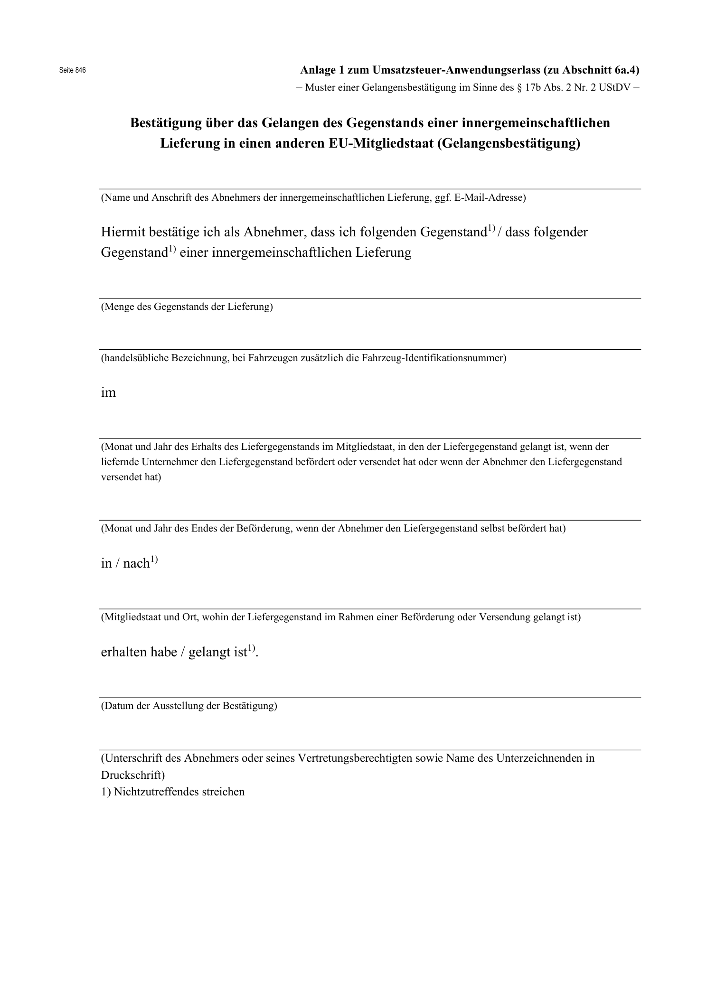

<!-- quelle:z26289-26289 -->

## Anlage 2 Certification of the entry of the object of an intra-Community supply into another EU Member State (Entry Certificate)
<!-- /quelle:z26289-26289 -->

<!-- quelle:z26290-26290 -->

Anlage 2 zu A 6a.4 UStAE: Model of an entry certificate within the meaning of section 17b subsection (2) number 2 of the Value Added Tax Implementing Ordinance (UStDV)

<!-- /quelle:z26290-26290 -->

#### Ergänzung aus der amtlichen BMF-Fassung

Die folgenden Seitendarstellungen sichern die in der Textkopie fehlenden Schaubilder, Formulare oder Tabellenbeziehungen. Sie stammen aus der amtlichen PDF mit demselben Stand 2. Juni 2026; gegebenenfalls wiederholter Begleittext gehört zur vollständigen Originalseite.

**Amtliche PDF, Seite 871:**

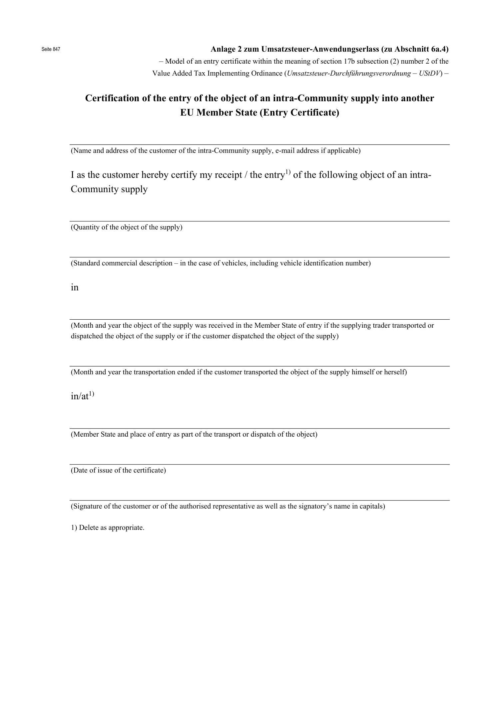

<!-- quelle:z26292-26292 -->

## Anlage 3 Attestation de la réception d’un bien ayant fait l’objet d’une livraison intracommunautaire dans un autre Etat membre de l’UE (attestation de réception)
<!-- /quelle:z26292-26292 -->

<!-- quelle:z26293-26293 -->

Anlage 3 zu A 6a.4 UStAE: Modèle dʼattestation de réception au sens des dispositions de l’article 17b paragraphe 2 n° 2 du règlement dʼapplication de la loi sur la TVA (UStDV)

<!-- /quelle:z26293-26293 -->

#### Ergänzung aus der amtlichen BMF-Fassung

Die folgenden Seitendarstellungen sichern die in der Textkopie fehlenden Schaubilder, Formulare oder Tabellenbeziehungen. Sie stammen aus der amtlichen PDF mit demselben Stand 2. Juni 2026; gegebenenfalls wiederholter Begleittext gehört zur vollständigen Originalseite.

**Amtliche PDF, Seite 872:**

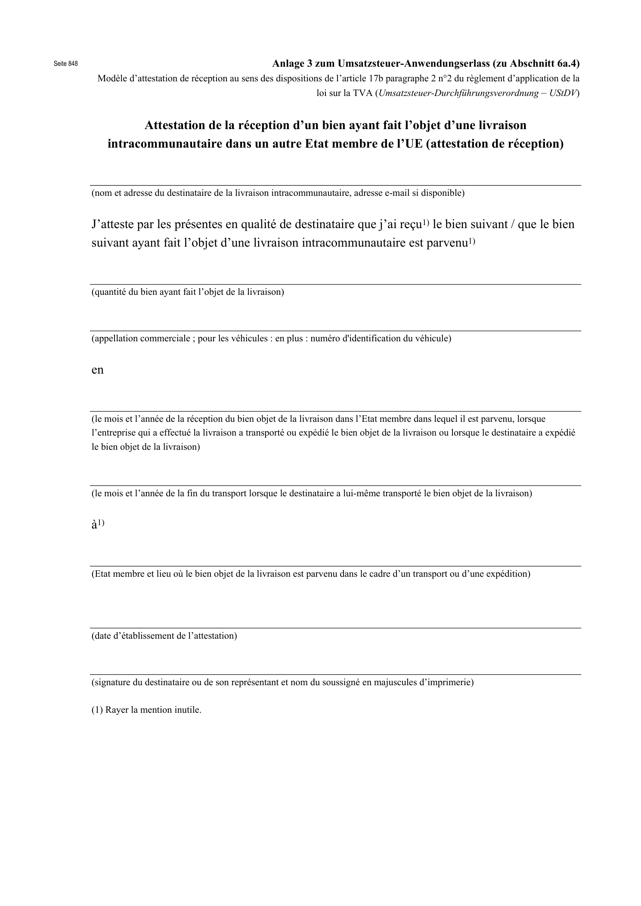

<!-- quelle:z26295-26295 -->

## Anlage 4 Spediteurbescheinigung
<!-- /quelle:z26295-26295 -->

<!-- quelle:z26296-26296 -->

Anlage 4 zu A 6a.5 UStAE: Spediteurbescheinigung

<!-- /quelle:z26296-26296 -->

#### Ergänzung aus der amtlichen BMF-Fassung

Die folgenden Seitendarstellungen sichern die in der Textkopie fehlenden Schaubilder, Formulare oder Tabellenbeziehungen. Sie stammen aus der amtlichen PDF mit demselben Stand 2. Juni 2026; gegebenenfalls wiederholter Begleittext gehört zur vollständigen Originalseite.

**Amtliche PDF, Seite 873:**

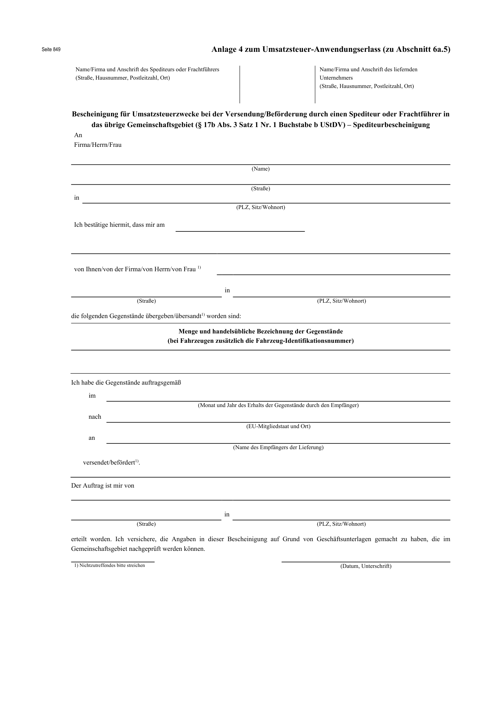

<!-- quelle:z26298-26298 -->

## Anlage 5 Spediteurversicherung
<!-- /quelle:z26298-26298 -->

<!-- quelle:z26299-26299 -->

Anlage 5 zu A 6a.5 UStAE: Spediteurversicherung

<!-- /quelle:z26299-26299 -->

#### Ergänzung aus der amtlichen BMF-Fassung

Die folgenden Seitendarstellungen sichern die in der Textkopie fehlenden Schaubilder, Formulare oder Tabellenbeziehungen. Sie stammen aus der amtlichen PDF mit demselben Stand 2. Juni 2026; gegebenenfalls wiederholter Begleittext gehört zur vollständigen Originalseite.

**Amtliche PDF, Seite 874:**

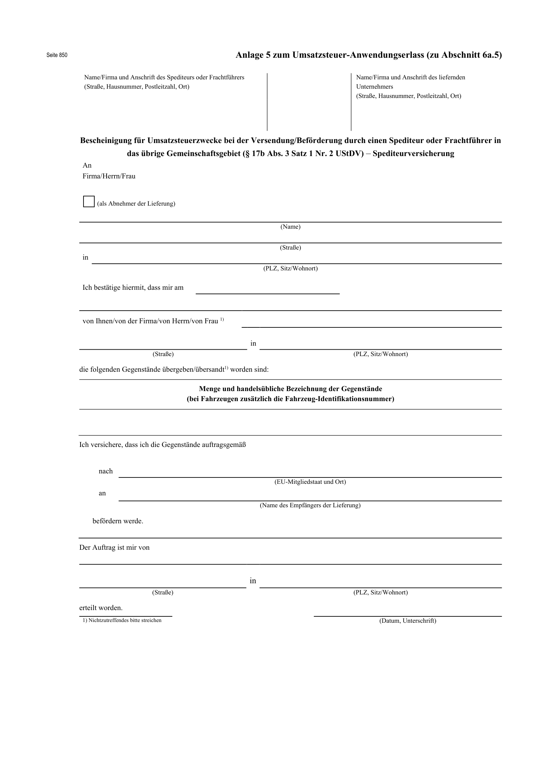

<!-- quelle:z26301-26301 -->

## Anlage 6 Anhang I, Tabelle 6 (nach Artikel 8 und Artikel 9 Absatz 3 der
<!-- /quelle:z26301-26301 -->

<!-- quelle:z26302-26302 -->

Delegierten Verordnung (EU) 2022/1636)

<!-- /quelle:z26302-26302 -->

<!-- quelle:z26305-26305 -->

(Anlage 6 zu A 6a.5 UStAE)

<!-- /quelle:z26305-26305 -->

<!-- quelle:z26309-26309 -->

A

<!-- /quelle:z26309-26309 -->

<!-- quelle:z26311-26311 -->

B

<!-- /quelle:z26311-26311 -->

<!-- quelle:z26313-26313 -->

C

<!-- /quelle:z26313-26313 -->

<!-- quelle:z26315-26315 -->

D

<!-- /quelle:z26315-26315 -->

<!-- quelle:z26317-26317 -->

E

<!-- /quelle:z26317-26317 -->

<!-- quelle:z26319-26319 -->

F

<!-- /quelle:z26319-26319 -->

<!-- quelle:z26321-26321 -->

G

<!-- /quelle:z26321-26321 -->

<!-- quelle:z26323-26323 -->

1

<!-- /quelle:z26323-26323 -->

<!-- quelle:z26325-26325 -->

ATTRIBUT

<!-- /quelle:z26325-26325 -->

<!-- quelle:z26327-26327 -->

R

<!-- /quelle:z26327-26327 -->

<!-- quelle:z26329-26329 -->

a

<!-- /quelle:z26329-26329 -->

<!-- quelle:z26331-26331 -->

Datum und Uhrzeit der Validierung der Eingangs- bzw. Ausfuhrmeldung

<!-- /quelle:z26331-26331 -->

<!-- quelle:z26333-26333 -->

C

<!-- /quelle:z26333-26333 -->

<!-- quelle:z26335-26335 -->

Von den zuständigen Behörden des Bestimmungs-/Ausfuhrmitgliedstaats bei Validierung der Eingangsmeldung bzw. Ausfuhrmeldung anzugeben

<!-- /quelle:z26335-26335 -->

<!-- quelle:z26337-26337 -->

Die Uhrzeit ist als Ortszeit anzugeben.

<!-- /quelle:z26337-26337 -->

<!-- quelle:z26339-26339 -->

Datum/Uhrzeit

<!-- /quelle:z26339-26339 -->

<!-- quelle:z26341-26341 -->

2

<!-- /quelle:z26341-26341 -->

<!-- quelle:z26343-26343 -->

BEFÖRDERUNG VERBRAUCHSTEUERPFLICHTIGER WAREN

<!-- /quelle:z26343-26343 -->

<!-- quelle:z26345-26345 -->

R

<!-- /quelle:z26345-26345 -->

<!-- quelle:z26347-26347 -->

a

<!-- /quelle:z26347-26347 -->

<!-- quelle:z26349-26349 -->

Referenzcode (ARC)

<!-- /quelle:z26349-26349 -->

<!-- quelle:z26351-26351 -->

R

<!-- /quelle:z26351-26351 -->

<!-- quelle:z26353-26353 -->

Anzugeben ist der ARC des e-VD/v-e-VD.

<!-- /quelle:z26353-26353 -->

<!-- quelle:z26355-26355 -->

Siehe Anhang II Codeliste 2.

<!-- /quelle:z26355-26355 -->

<!-- quelle:z26357-26357 -->

an21

<!-- /quelle:z26357-26357 -->

<!-- quelle:z26359-26359 -->

b

<!-- /quelle:z26359-26359 -->

<!-- quelle:z26361-26361 -->

Ordnungsnummer

<!-- /quelle:z26361-26361 -->

<!-- quelle:z26363-26363 -->

R

<!-- /quelle:z26363-26363 -->

<!-- quelle:z26365-26365 -->

Anzugeben ist der ARC des e-VD/v-e-VD.

<!-- /quelle:z26365-26365 -->

<!-- quelle:z26367-26367 -->

Die Ordnungsnummer wird bei der Erstvalidierung des e-VD/v-e-VD auf „1“ gesetzt und bei jeder Änderung des Bestimmungsorts um 1 erhöht.

<!-- /quelle:z26367-26367 -->

<!-- quelle:z26369-26369 -->

n..2

<!-- /quelle:z26369-26369 -->

<!-- quelle:z26371-26371 -->

3

<!-- /quelle:z26371-26371 -->

<!-- quelle:z26373-26373 -->

EMPFÄNGER

<!-- /quelle:z26373-26373 -->

<!-- quelle:z26375-26375 -->

C

<!-- /quelle:z26375-26375 -->

<!-- quelle:z26377-26377 -->

„R“, wenn das Datenelement „Meldungsart“ im entsprechenden elektronischen Verwaltungsdokument nicht auf „2 – Vorlage für die Ausfuhr mit Anschreibeverfahren“ gesetzt ist

<!-- /quelle:z26377-26377 -->

<!-- quelle:z26379-26379 -->

a

<!-- /quelle:z26379-26379 -->

<!-- quelle:z26381-26381 -->

Verbrauchsteuernummer/Umsatzsteuer-Identifikationsnummer

<!-- /quelle:z26381-26381 -->

<!-- quelle:z26383-26383 -->

C

<!-- /quelle:z26383-26383 -->

<!-- quelle:z26385-26385 -->

–„R“ bei Code Bestimmungsort 1, 2, 3, 4, 9, 10 und 11

<!-- /quelle:z26385-26385 -->

<!-- quelle:z26387-26387 -->

–„O“ bei Code Bestimmungsort 6

<!-- /quelle:z26387-26387 -->

<!-- quelle:z26389-26389 -->

–Dieses Datenelement entfällt bei Code Bestimmungsort 5

<!-- /quelle:z26389-26389 -->

<!-- quelle:z26391-26391 -->

(Siehe Code Bestimmungsort in Tabelle 1 Feld 1a)

<!-- /quelle:z26391-26391 -->

<!-- quelle:z26393-26393 -->

Angaben bei Code Bestimmungsort

<!-- /quelle:z26393-26393 -->

<!-- quelle:z26395-26395 -->

–1, 2, 3, 4, 9 und 10: Anzugeben ist eine gültige SEED-Registrierungsnummer des zugelassenen Lagerinhabers, des registrierten Empfängers, des registrierten Empfängers im Einzelfall, des zertifizierten Empfängers oder des zertifizierten Empfängers im Einzelfall.

<!-- /quelle:z26395-26395 -->

<!-- quelle:z26397-26397 -->

–6: Anzugeben ist die Umsatzsteuer-Identifikationsnummer des Vertreters des Versenders bei der Ausfuhrzollstelle.

<!-- /quelle:z26397-26397 -->

<!-- quelle:z26399-26399 -->

–„11“: Anzugeben ist eine gültige SEED-Registrierungsnummer des Empfängers, d.h. des ursprünglichen zertifizierten Versenders oder des zertifizierten Versenders im Einzelfall.

<!-- /quelle:z26399-26399 -->

<!-- quelle:z26401-26401 -->

an..16

<!-- /quelle:z26401-26401 -->

<!-- quelle:z26403-26403 -->

b

<!-- /quelle:z26403-26403 -->

<!-- quelle:z26405-26405 -->

Name

<!-- /quelle:z26405-26405 -->

<!-- quelle:z26407-26407 -->

R

<!-- /quelle:z26407-26407 -->

<!-- quelle:z26409-26409 -->

an..182

<!-- /quelle:z26409-26409 -->

<!-- quelle:z26411-26411 -->

c

<!-- /quelle:z26411-26411 -->

<!-- quelle:z26413-26413 -->

Straße

<!-- /quelle:z26413-26413 -->

<!-- quelle:z26415-26415 -->

R

<!-- /quelle:z26415-26415 -->

<!-- quelle:z26417-26417 -->

an..65

<!-- /quelle:z26417-26417 -->

<!-- quelle:z26419-26419 -->

d

<!-- /quelle:z26419-26419 -->

<!-- quelle:z26421-26421 -->

Hausnummer

<!-- /quelle:z26421-26421 -->

<!-- quelle:z26423-26423 -->

O

<!-- /quelle:z26423-26423 -->

<!-- quelle:z26425-26425 -->

an..11

<!-- /quelle:z26425-26425 -->

<!-- quelle:z26427-26427 -->

e

<!-- /quelle:z26427-26427 -->

<!-- quelle:z26429-26429 -->

Postleitzahl

<!-- /quelle:z26429-26429 -->

<!-- quelle:z26431-26431 -->

R

<!-- /quelle:z26431-26431 -->

<!-- quelle:z26433-26433 -->

an..10

<!-- /quelle:z26433-26433 -->

<!-- quelle:z26435-26435 -->

f

<!-- /quelle:z26435-26435 -->

<!-- quelle:z26437-26437 -->

Ort

<!-- /quelle:z26437-26437 -->

<!-- quelle:z26439-26439 -->

R

<!-- /quelle:z26439-26439 -->

<!-- quelle:z26441-26441 -->

an..50

<!-- /quelle:z26441-26441 -->

<!-- quelle:z26443-26443 -->

g

<!-- /quelle:z26443-26443 -->

<!-- quelle:z26445-26445 -->

NAD_LNG

<!-- /quelle:z26445-26445 -->

<!-- quelle:z26447-26447 -->

R

<!-- /quelle:z26447-26447 -->

<!-- quelle:z26449-26449 -->

Für die in dieser Datengruppe verwendete Sprache ist der Sprachencode gemäß Anhang II Codeliste 1 anzugeben.

<!-- /quelle:z26449-26449 -->

<!-- quelle:z26451-26451 -->

a2

<!-- /quelle:z26451-26451 -->

<!-- quelle:z26453-26453 -->

h

<!-- /quelle:z26453-26453 -->

<!-- quelle:z26455-26455 -->

EORI-Nummer

<!-- /quelle:z26455-26455 -->

<!-- quelle:z26457-26457 -->

C

<!-- /quelle:z26457-26457 -->

<!-- quelle:z26459-26459 -->

–„O“ bei Code Bestimmungsort 6

<!-- /quelle:z26459-26459 -->

<!-- quelle:z26461-26461 -->

–Dieses Datenelement entfällt bei Code Bestimmungsort 1, 2, 3, 4, 5, 8, 9 und 10

<!-- /quelle:z26461-26461 -->

<!-- quelle:z26463-26463 -->

(Siehe Code Bestimmungsort in Tabelle 1 Feld 1a)

<!-- /quelle:z26463-26463 -->

<!-- quelle:z26465-26465 -->

Anzugeben ist die EORI-Nummer der für die Abgabe der Ausfuhranmeldung zuständigen Person gemäß Artikel 21 Absatz 1 der Richtlinie (EU) 2020/262.

<!-- /quelle:z26465-26465 -->

<!-- quelle:z26467-26467 -->

an..17

<!-- /quelle:z26467-26467 -->

<!-- quelle:z26469-26469 -->

4

<!-- /quelle:z26469-26469 -->

<!-- quelle:z26471-26471 -->

ORT DER LIEFERUNG

<!-- /quelle:z26471-26471 -->

<!-- quelle:z26473-26473 -->

C

<!-- /quelle:z26473-26473 -->

<!-- quelle:z26475-26475 -->

–„R“ bei Code Bestimmungsort 1 und 4

<!-- /quelle:z26475-26475 -->

<!-- quelle:z26477-26477 -->

–„O“ bei Code Bestimmungsort 2, 3, 5, 9 und 10

<!-- /quelle:z26477-26477 -->

<!-- quelle:z26479-26479 -->

(Siehe Code Bestimmungsort in Tabelle I Feld 1a)

<!-- /quelle:z26479-26479 -->

<!-- quelle:z26481-26481 -->

Anzugeben ist der Ort der tatsächlichen Lieferung der verbrauchsteuerpflichtigen Waren.

<!-- /quelle:z26481-26481 -->

<!-- quelle:z26483-26483 -->

a

<!-- /quelle:z26483-26483 -->

<!-- quelle:z26485-26485 -->

Verbrauchsteuernummer/Umsatzsteuer-Identifikationsnummer

<!-- /quelle:z26485-26485 -->

<!-- quelle:z26487-26487 -->

C

<!-- /quelle:z26487-26487 -->

<!-- quelle:z26489-26489 -->

–„R“ bei Code Bestimmungsort 1

<!-- /quelle:z26489-26489 -->

<!-- quelle:z26491-26491 -->

–„O“ bei Code Bestimmungsort 2, 3 und 5

<!-- /quelle:z26491-26491 -->

<!-- quelle:z26493-26493 -->

(Siehe Code Bestimmungsort in Tabelle 1 Feld 1a)

<!-- /quelle:z26493-26493 -->

<!-- quelle:z26495-26495 -->

Angaben bei Code Bestimmungsort

<!-- /quelle:z26495-26495 -->

<!-- quelle:z26497-26497 -->

–1: Anzugeben ist eine gültige SEED-Registrierungsnummer des Bestimmungssteuerlagers.

<!-- /quelle:z26497-26497 -->

<!-- quelle:z26499-26499 -->

–2, 3, 5, 9 und 10: Anzugeben ist eine Umsatzsteuer-Identifikationsnummer oder sonstige Kennung.

<!-- /quelle:z26499-26499 -->

<!-- quelle:z26501-26501 -->

an..16

<!-- /quelle:z26501-26501 -->

<!-- quelle:z26503-26503 -->

b

<!-- /quelle:z26503-26503 -->

<!-- quelle:z26505-26505 -->

Name

<!-- /quelle:z26505-26505 -->

<!-- quelle:z26507-26507 -->

C

<!-- /quelle:z26507-26507 -->

<!-- quelle:z26509-26509 -->

–„R“ bei Code Bestimmungsort 1, 2, 3, 5, 9 und 10

<!-- /quelle:z26509-26509 -->

<!-- quelle:z26511-26511 -->

–„O“ bei Code Bestimmungsort 4

<!-- /quelle:z26511-26511 -->

<!-- quelle:z26513-26513 -->

(Siehe Code Bestimmungsort in Tabelle 1 Feld 1a)

<!-- /quelle:z26513-26513 -->

<!-- quelle:z26515-26515 -->

an..182

<!-- /quelle:z26515-26515 -->

<!-- quelle:z26517-26517 -->

c

<!-- /quelle:z26517-26517 -->

<!-- quelle:z26519-26519 -->

Straße

<!-- /quelle:z26519-26519 -->

<!-- quelle:z26521-26521 -->

C

<!-- /quelle:z26521-26521 -->

<!-- quelle:z26523-26523 -->

Für Feld 4c, 4e und 4f:

<!-- /quelle:z26523-26523 -->

<!-- quelle:z26525-26525 -->

–„R“ bei Code 2, 3, 4, 5, 9 und 10

<!-- /quelle:z26525-26525 -->

<!-- quelle:z26527-26527 -->

–„O“ bei Code Bestimmungsort 1

<!-- /quelle:z26527-26527 -->

<!-- quelle:z26529-26529 -->

(Siehe Code für den Bestimmungsort in Tabelle 1 Feld 1a)

<!-- /quelle:z26529-26529 -->

<!-- quelle:z26531-26531 -->

an..65

<!-- /quelle:z26531-26531 -->

<!-- quelle:z26533-26533 -->

d

<!-- /quelle:z26533-26533 -->

<!-- quelle:z26535-26535 -->

Hausnummer

<!-- /quelle:z26535-26535 -->

<!-- quelle:z26537-26537 -->

O

<!-- /quelle:z26537-26537 -->

<!-- quelle:z26539-26539 -->

an..11

<!-- /quelle:z26539-26539 -->

<!-- quelle:z26541-26541 -->

e

<!-- /quelle:z26541-26541 -->

<!-- quelle:z26543-26543 -->

Postleitzahl

<!-- /quelle:z26543-26543 -->

<!-- quelle:z26545-26545 -->

C

<!-- /quelle:z26545-26545 -->

<!-- quelle:z26547-26547 -->

an..10

<!-- /quelle:z26547-26547 -->

<!-- quelle:z26549-26549 -->

f

<!-- /quelle:z26549-26549 -->

<!-- quelle:z26551-26551 -->

Ort

<!-- /quelle:z26551-26551 -->

<!-- quelle:z26553-26553 -->

C

<!-- /quelle:z26553-26553 -->

<!-- quelle:z26555-26555 -->

an..50

<!-- /quelle:z26555-26555 -->

<!-- quelle:z26557-26557 -->

g

<!-- /quelle:z26557-26557 -->

<!-- quelle:z26559-26559 -->

NAD_LNG

<!-- /quelle:z26559-26559 -->

<!-- quelle:z26561-26561 -->

C

<!-- /quelle:z26561-26561 -->

<!-- quelle:z26563-26563 -->

„R“, wenn das betreffende Textfeld verwendet wird

<!-- /quelle:z26563-26563 -->

<!-- quelle:z26565-26565 -->

Für die in dieser Datengruppe verwendete Sprache ist der Sprachencode gemäß Anhang II Codeliste 1 anzugeben.

<!-- /quelle:z26565-26565 -->

<!-- quelle:z26567-26567 -->

a2

<!-- /quelle:z26567-26567 -->

<!-- quelle:z26569-26569 -->

5

<!-- /quelle:z26569-26569 -->

<!-- quelle:z26571-26571 -->

ZUSTÄNDIGE DIENSTSTELLE FÜR DEN EMPFÄNGER

<!-- /quelle:z26571-26571 -->

<!-- quelle:z26573-26573 -->

C

<!-- /quelle:z26573-26573 -->

<!-- quelle:z26575-26575 -->

„R“ bei Code Bestimmungsort 1, 2, 3, 4, 5, 9, 10 und 11

<!-- /quelle:z26575-26575 -->

<!-- quelle:z26577-26577 -->

(Siehe Code Bestimmungsort in Tabelle 1 Feld 1a)

<!-- /quelle:z26577-26577 -->

<!-- quelle:z26579-26579 -->

a

<!-- /quelle:z26579-26579 -->

<!-- quelle:z26581-26581 -->

Dienststellenschlüsselnummer

<!-- /quelle:z26581-26581 -->

<!-- quelle:z26583-26583 -->

R

<!-- /quelle:z26583-26583 -->

<!-- quelle:z26585-26585 -->

Anzugeben ist der Code der für die Verbrauchsteuerkontrolle am Bestimmungsort zuständigen Stelle der zuständigen Behörden im Bestimmungsmitgliedstaat. Siehe Anhang II Codeliste 4.

<!-- /quelle:z26585-26585 -->

<!-- quelle:z26587-26587 -->

an8

<!-- /quelle:z26587-26587 -->

<!-- quelle:z26589-26589 -->

6

<!-- /quelle:z26589-26589 -->

<!-- quelle:z26591-26591 -->

EINGANGS-/AUSFUHRMELDUNG

<!-- /quelle:z26591-26591 -->

<!-- quelle:z26593-26593 -->

R

<!-- /quelle:z26593-26593 -->

<!-- quelle:z26595-26595 -->

a

<!-- /quelle:z26595-26595 -->

<!-- quelle:z26597-26597 -->

Ankunftsdatum der verbrauchsteuerpflichtigen Waren

<!-- /quelle:z26597-26597 -->

<!-- quelle:z26599-26599 -->

R

<!-- /quelle:z26599-26599 -->

<!-- quelle:z26601-26601 -->

Datum des Endes der Beförderung gemäß Artikel 19 Absatz 2 und Artikel 33 Absatz 4 der Richtlinie (EU) 2020/262

<!-- /quelle:z26601-26601 -->

<!-- quelle:z26603-26603 -->

Datum

<!-- /quelle:z26603-26603 -->

<!-- quelle:z26605-26605 -->

b

<!-- /quelle:z26605-26605 -->

<!-- quelle:z26607-26607 -->

Empfangsergebnis

<!-- /quelle:z26607-26607 -->

<!-- quelle:z26609-26609 -->

R

<!-- /quelle:z26609-26609 -->

<!-- quelle:z26611-26611 -->

Mögliche Kennziffern:

<!-- /quelle:z26611-26611 -->

<!-- quelle:z26613-26613 -->

 1 =Empfang der Waren erfolgt, keine Beanstandung,

<!-- /quelle:z26613-26613 -->

<!-- quelle:z26615-26615 -->

 2 =Empfang der Waren erfolgt trotz Beanstandung,

<!-- /quelle:z26615-26615 -->

<!-- quelle:z26617-26617 -->

 3 =Empfang der Waren verweigert,

<!-- /quelle:z26617-26617 -->

<!-- quelle:z26619-26619 -->

 4 =Empfang der Waren teilweise verweigert,

<!-- /quelle:z26619-26619 -->

<!-- quelle:z26621-26621 -->

21 =Ausgang der Waren erfolgt, keine Beanstandung,

<!-- /quelle:z26621-26621 -->

<!-- quelle:z26623-26623 -->

22 =Ausgang der Waren erfolgt trotz Beanstandung,

<!-- /quelle:z26623-26623 -->

<!-- quelle:z26625-26625 -->

23 =Ausgang der Waren verweigert.

<!-- /quelle:z26625-26625 -->

<!-- quelle:z26627-26627 -->

n..2

<!-- /quelle:z26627-26627 -->

<!-- quelle:z26629-26629 -->

c

<!-- /quelle:z26629-26629 -->

<!-- quelle:z26631-26631 -->

Ergänzende Informationen

<!-- /quelle:z26631-26631 -->

<!-- quelle:z26633-26633 -->

O

<!-- /quelle:z26633-26633 -->

<!-- quelle:z26635-26635 -->

Anzugeben sind ergänzende Informationen zum Empfang der verbrauchsteuerpflichtigen Waren.

<!-- /quelle:z26635-26635 -->

<!-- quelle:z26637-26637 -->

an..350

<!-- /quelle:z26637-26637 -->

<!-- quelle:z26639-26639 -->

d

<!-- /quelle:z26639-26639 -->

<!-- quelle:z26641-26641 -->

Ergänzende Informationen_LNG

<!-- /quelle:z26641-26641 -->

<!-- quelle:z26643-26643 -->

C

<!-- /quelle:z26643-26643 -->

<!-- quelle:z26645-26645 -->

„R“, wenn das betreffende Textfeld verwendet wird

<!-- /quelle:z26645-26645 -->

<!-- quelle:z26647-26647 -->

Für die in dieser Datengruppe verwendete Sprache ist der Sprachencode gemäß Anhang II Codeliste 1 anzugeben.

<!-- /quelle:z26647-26647 -->

<!-- quelle:z26649-26649 -->

a2

<!-- /quelle:z26649-26649 -->

<!-- quelle:z26651-26651 -->

7

<!-- /quelle:z26651-26651 -->

<!-- quelle:z26653-26653 -->

POSITIONSDATEN DER EINGANGS-/ AUSFUHRMELDUNG

<!-- /quelle:z26653-26653 -->

<!-- quelle:z26655-26655 -->

C

<!-- /quelle:z26655-26655 -->

<!-- quelle:z26657-26657 -->

„R“, wenn die Kennziffer für das Empfangsergebnis weder „1“ noch „21“ lautet

<!-- /quelle:z26657-26657 -->

<!-- quelle:z26659-26659 -->

(siehe Feld 6b)

<!-- /quelle:z26659-26659 -->

<!-- quelle:z26661-26661 -->

999x

<!-- /quelle:z26661-26661 -->

<!-- quelle:z26663-26663 -->

a

<!-- /quelle:z26663-26663 -->

<!-- quelle:z26665-26665 -->

Positionsnummer

<!-- /quelle:z26665-26665 -->

<!-- quelle:z26667-26667 -->

R

<!-- /quelle:z26667-26667 -->

<!-- quelle:z26669-26669 -->

Bei verbrauchsteuerpflichtigen Waren, bei denen die Kennziffer für das Empfangsergebnis weder „1“ noch „21“ lautet, ist die Positionsnummer des zugehörigen e-VD/v-e-VD (Tabelle 1 Feld 17a) anzugeben.

<!-- /quelle:z26669-26669 -->

<!-- quelle:z26671-26671 -->

Der Wert dieses Datenelements muss größer als null sein.

<!-- /quelle:z26671-26671 -->

<!-- quelle:z26673-26673 -->

n..3

<!-- /quelle:z26673-26673 -->

<!-- quelle:z26675-26675 -->

b

<!-- /quelle:z26675-26675 -->

<!-- quelle:z26677-26677 -->

Kennzeichen

<!-- /quelle:z26677-26677 -->

<!-- quelle:z26679-26679 -->

Fehl-/Mehrmenge

<!-- /quelle:z26679-26679 -->

<!-- quelle:z26681-26681 -->

D

<!-- /quelle:z26681-26681 -->

<!-- quelle:z26683-26683 -->

„R“, wenn für den betreffenden Datensatz eine Fehlmenge oder eine Mehrmenge festgestellt wird

<!-- /quelle:z26683-26683 -->

<!-- quelle:z26685-26685 -->

Mögliche Kennziffern:

<!-- /quelle:z26685-26685 -->

<!-- quelle:z26687-26687 -->

S =Fehlmenge (Shortage),

<!-- /quelle:z26687-26687 -->

<!-- quelle:z26689-26689 -->

E =Mehrmenge (Excess),

<!-- /quelle:z26689-26689 -->

<!-- quelle:z26691-26691 -->

a1

<!-- /quelle:z26691-26691 -->

<!-- quelle:z26693-26693 -->

c

<!-- /quelle:z26693-26693 -->

<!-- quelle:z26695-26695 -->

Festgestellte Fehl-/Mehrmenge

<!-- /quelle:z26695-26695 -->

<!-- quelle:z26697-26697 -->

C

<!-- /quelle:z26697-26697 -->

<!-- quelle:z26699-26699 -->

„R“ bei Anzeige in Feld 7b

<!-- /quelle:z26699-26699 -->

<!-- quelle:z26701-26701 -->

Anzugeben ist die Menge (in der zum Produktcode gehörigen Maßeinheit – siehe Anhang II Codelisten 10 und 11).

<!-- /quelle:z26701-26701 -->

<!-- quelle:z26703-26703 -->

Der Wert dieses Datenelements muss größer als null sein.

<!-- /quelle:z26703-26703 -->

<!-- quelle:z26705-26705 -->

n..15,3

<!-- /quelle:z26705-26705 -->

<!-- quelle:z26707-26707 -->

d

<!-- /quelle:z26707-26707 -->

<!-- quelle:z26709-26709 -->

Verbrauchsteuer-Produktcode

<!-- /quelle:z26709-26709 -->

<!-- quelle:z26711-26711 -->

R

<!-- /quelle:z26711-26711 -->

<!-- quelle:z26713-26713 -->

Anzugeben ist der jeweilige Verbrauchsteuer-Produktcode, siehe Anhang II Codeliste 10.

<!-- /quelle:z26713-26713 -->

<!-- quelle:z26715-26715 -->

an4

<!-- /quelle:z26715-26715 -->

<!-- quelle:z26717-26717 -->

e

<!-- /quelle:z26717-26717 -->

<!-- quelle:z26719-26719 -->

Zurückgewiesene Menge

<!-- /quelle:z26719-26719 -->

<!-- quelle:z26721-26721 -->

C

<!-- /quelle:z26721-26721 -->

<!-- quelle:z26723-26723 -->

‚R‘, wenn die Kennziffer für das Gesamtergebnis des Warenempfangs ‚4&#x27; lautet

<!-- /quelle:z26723-26723 -->

<!-- quelle:z26725-26725 -->

(Siehe Feld 6b)

<!-- /quelle:z26725-26725 -->

<!-- quelle:z26727-26727 -->

Für jeden einzelnen Datensatz ist die Menge der abgelehnten verbrauchsteuerpflichtigen Waren (in der zum Produktcode gehörigen Maßeinheit – siehe Anhang II Codelisten 10 und 11) anzugeben.

<!-- /quelle:z26727-26727 -->

<!-- quelle:z26729-26729 -->

Der Wert dieses Datenelements muss größer als null sein.

<!-- /quelle:z26729-26729 -->

<!-- quelle:z26731-26731 -->

n..15,3

<!-- /quelle:z26731-26731 -->

<!-- quelle:z26733-26733 -->

7.1

<!-- /quelle:z26733-26733 -->

<!-- quelle:z26735-26735 -->

GRUND DER BEANSTANDUNG

<!-- /quelle:z26735-26735 -->

<!-- quelle:z26737-26737 -->

D

<!-- /quelle:z26737-26737 -->

<!-- quelle:z26739-26739 -->

„R“ für jeden einzelnen Datensatz, wenn die Kennziffer für das Gesamtergebnis des Warenempfangs „2“, „3“, „4“, „22“ oder „23“ lautet

<!-- /quelle:z26739-26739 -->

<!-- quelle:z26741-26741 -->

(Siehe Feld 6b)

<!-- /quelle:z26741-26741 -->

<!-- quelle:z26743-26743 -->

9X

<!-- /quelle:z26743-26743 -->

<!-- quelle:z26745-26745 -->

a

<!-- /quelle:z26745-26745 -->

<!-- quelle:z26747-26747 -->

Code für die Beanstandung

<!-- /quelle:z26747-26747 -->

<!-- quelle:z26749-26749 -->

R

<!-- /quelle:z26749-26749 -->

<!-- quelle:z26751-26751 -->

Mögliche Kennziffern:

<!-- /quelle:z26751-26751 -->

<!-- quelle:z26753-26753 -->

0 =Sonstiges,

<!-- /quelle:z26753-26753 -->

<!-- quelle:z26755-26755 -->

1 =Mehrmenge,

<!-- /quelle:z26755-26755 -->

<!-- quelle:z26757-26757 -->

2 =Fehlmenge,

<!-- /quelle:z26757-26757 -->

<!-- quelle:z26759-26759 -->

3 =Waren beschädigt,

<!-- /quelle:z26759-26759 -->

<!-- quelle:z26761-26761 -->

4 =Verschluss aufgebrochen,

<!-- /quelle:z26761-26761 -->

<!-- quelle:z26763-26763 -->

5 =Meldung durch ECS (Ausfuhrkontrollsystem),

<!-- /quelle:z26763-26763 -->

<!-- quelle:z26765-26765 -->

7 =Menge größer als in der Ermächtigung des registrierten bzw. zertifizierten Empfängers im Einzelfall genannt.

<!-- /quelle:z26765-26765 -->

<!-- quelle:z26767-26767 -->

n1

<!-- /quelle:z26767-26767 -->

<!-- quelle:z26769-26769 -->

b

<!-- /quelle:z26769-26769 -->

<!-- quelle:z26771-26771 -->

Ergänzende Informationen

<!-- /quelle:z26771-26771 -->

<!-- quelle:z26773-26773 -->

C

<!-- /quelle:z26773-26773 -->

<!-- quelle:z26775-26775 -->

–„R“, wenn die Kennziffer für den Grund der Beanstandung „0“ lautet

<!-- /quelle:z26775-26775 -->

<!-- quelle:z26777-26777 -->

–„O“, wenn die Kennziffer für den Grund der Beanstandung „1“, „2“, „3“, „4“, „5“ oder „7“ lautet

<!-- /quelle:z26777-26777 -->

<!-- quelle:z26779-26779 -->

(Siehe Feld 7.1a)

<!-- /quelle:z26779-26779 -->

<!-- quelle:z26781-26781 -->

Anzugeben sind ergänzende Informationen zum Empfang der verbrauchsteuerpflichtigen Waren.

<!-- /quelle:z26781-26781 -->

<!-- quelle:z26783-26783 -->

an..350

<!-- /quelle:z26783-26783 -->

<!-- quelle:z26785-26785 -->

c

<!-- /quelle:z26785-26785 -->

<!-- quelle:z26787-26787 -->

Ergänzende Informationen_LNG

<!-- /quelle:z26787-26787 -->

<!-- quelle:z26789-26789 -->

C

<!-- /quelle:z26789-26789 -->

<!-- quelle:z26791-26791 -->

„R“, wenn das betreffende Textfeld verwendet wird

<!-- /quelle:z26791-26791 -->

<!-- quelle:z26793-26793 -->

Für die in dieser Datengruppe verwendete Sprache ist der Sprachencode gemäß Anhang II Codeliste  anzugeben.

<!-- /quelle:z26793-26793 -->

<!-- quelle:z26795-26795 -->

a2.

<!-- /quelle:z26795-26795 -->

#### Ergänzung aus der amtlichen BMF-Fassung

Die folgenden Seitendarstellungen sichern die in der Textkopie fehlenden Schaubilder, Formulare oder Tabellenbeziehungen. Sie stammen aus der amtlichen PDF mit demselben Stand 2. Juni 2026; gegebenenfalls wiederholter Begleittext gehört zur vollständigen Originalseite.

**Amtliche PDF, Seite 875:**

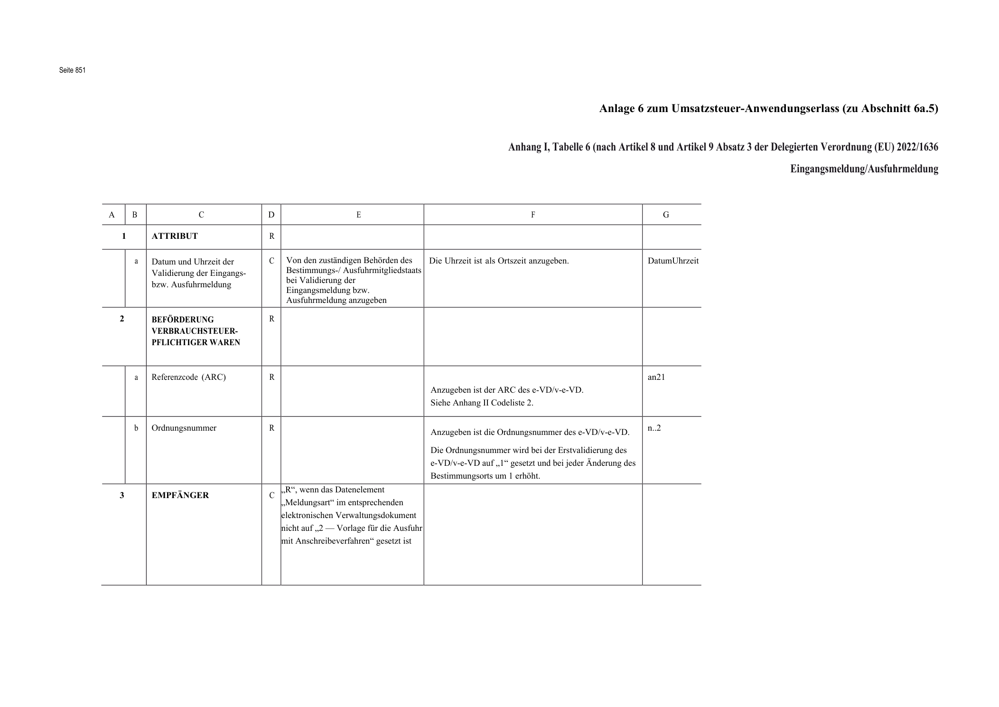

**Amtliche PDF, Seite 876:**

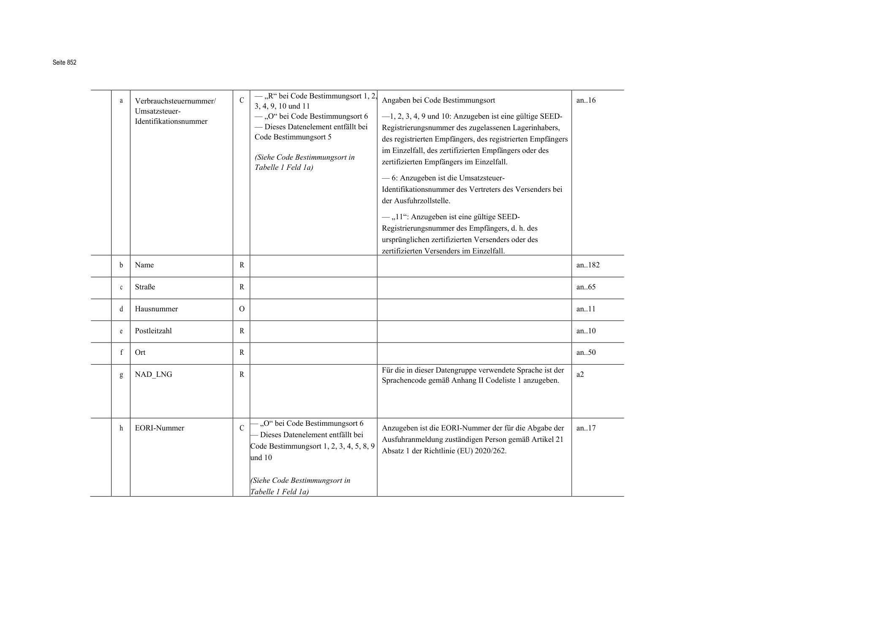

**Amtliche PDF, Seite 877:**

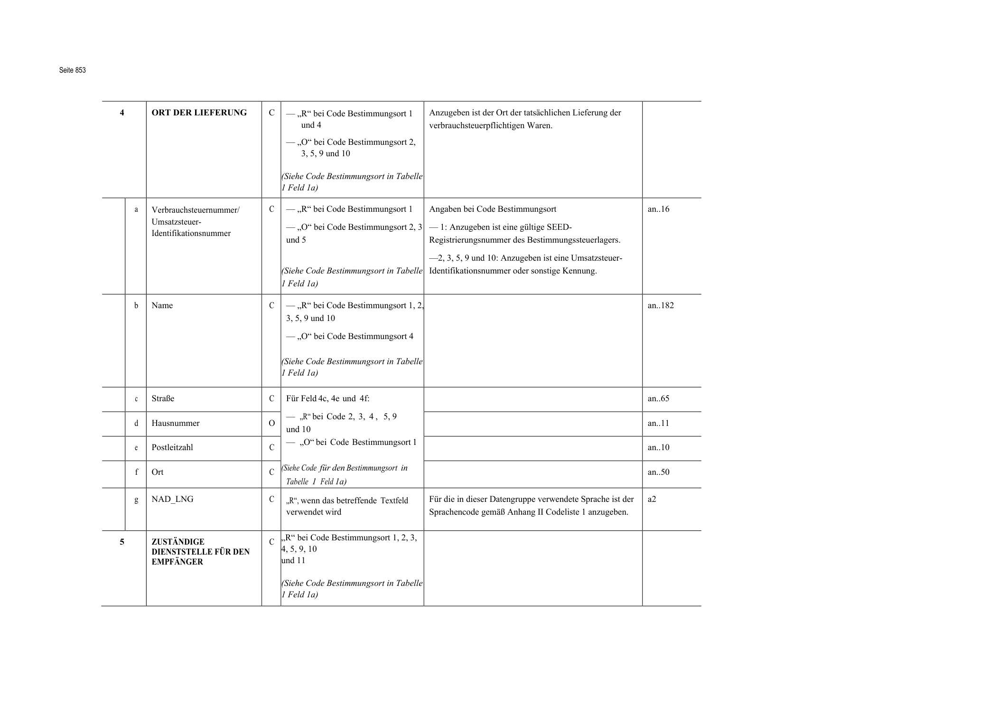

**Amtliche PDF, Seite 878:**

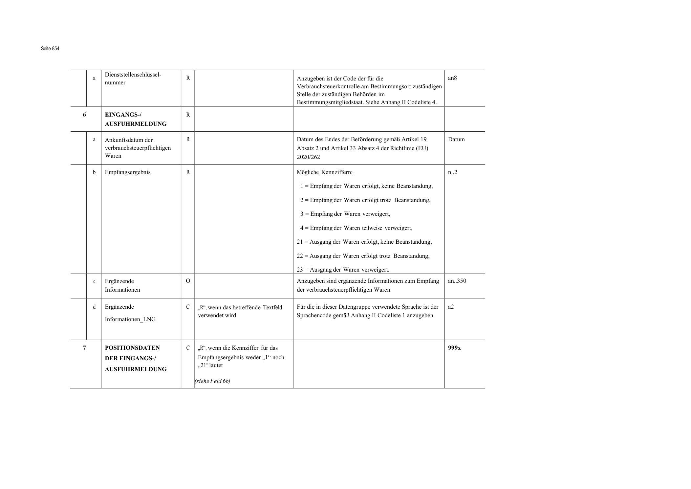

**Amtliche PDF, Seite 879:**

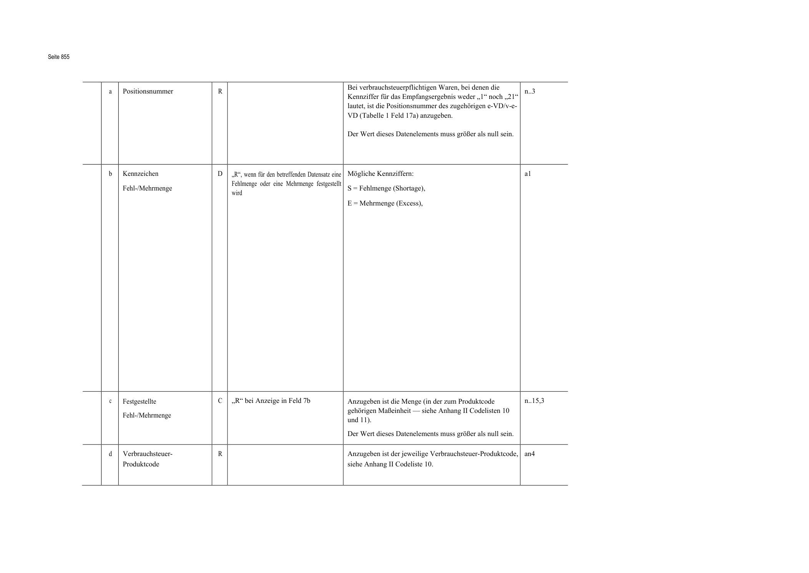

**Amtliche PDF, Seite 880:**

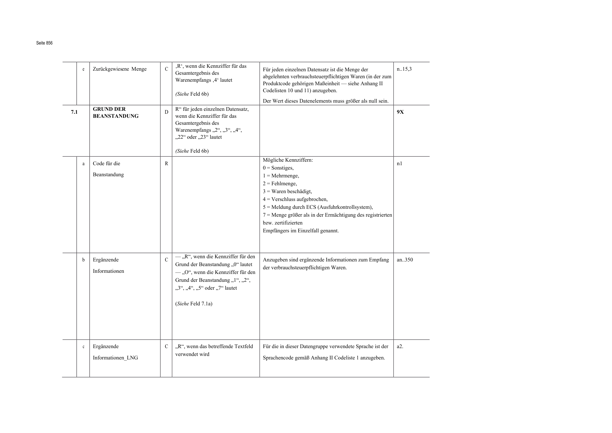

<!-- quelle:z26797-26797 -->

## Anlage 7 Vereinfachtes Begleitdokument
<!-- /quelle:z26797-26797 -->

<!-- quelle:z26798-26798 -->

(Anlage 7 zu A 6a.5 UStAE)

<!-- /quelle:z26798-26798 -->

<!-- quelle:z26800-26800 -->

Musterformuar zum Vereinfachten Begleitdokument zur innergemeinschaftlichen Beförderung von Waren des steuerrechtlich freien Verkehrs

<!-- /quelle:z26800-26800 -->

<!-- quelle:z26802-26802 -->

Musterformuar zum Vereinfachten Begleitdokument zur innergemeinschaftlichen Beförderung von Waren des steuerrechtlich freien Verkehrs

<!-- /quelle:z26802-26802 -->

#### Ergänzung aus der amtlichen BMF-Fassung

Die folgenden Seitendarstellungen sichern die in der Textkopie fehlenden Schaubilder, Formulare oder Tabellenbeziehungen. Sie stammen aus der amtlichen PDF mit demselben Stand 2. Juni 2026; gegebenenfalls wiederholter Begleittext gehört zur vollständigen Originalseite.

**Amtliche PDF, Seite 881:**

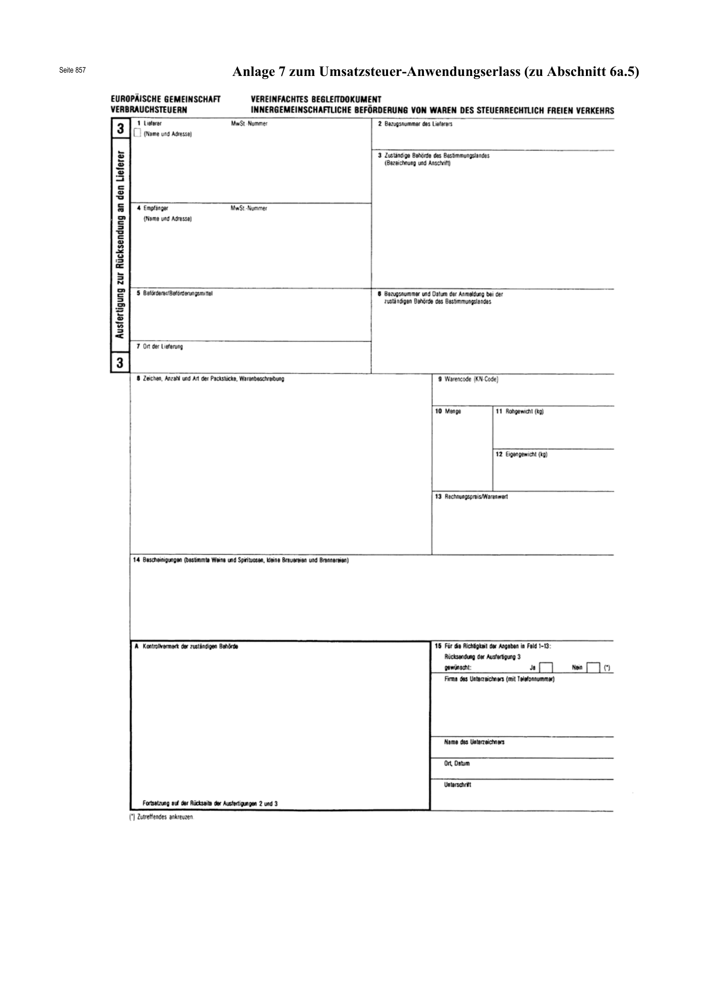

**Amtliche PDF, Seite 882:**

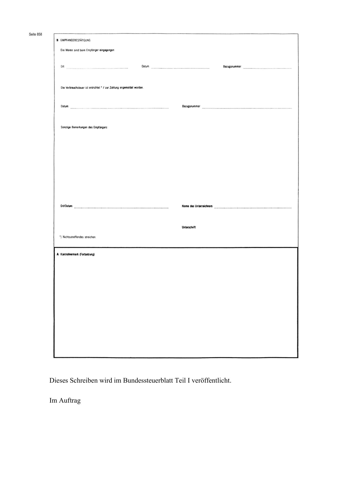

<!-- quelle:z26804-26804 -->

## Anlage 8<a href="#fn-z27135">[1]</a> Tabelle zu den in anderen Amtssprachen verwendeten Begriffen für Rechnungsangaben
<!-- /quelle:z26804-26804 -->

<!-- quelle:z26805-27133 -->
<table>
<thead><tr><th>Amtssprache</th><th>„Gutschrift“</th><th>„Steuerschuldnerschaft des Leistungsempfängers“</th><th>„Sonderregelung für Reisebüros“</th><th>„Gebrauchtgegenstände/Sonderregelung“</th><th>„Kunstgegenstände/Sonderregelung“</th><th>„Sammlungsstücke und Antiquitäten/Sonderregelung“</th></tr></thead>
<tbody>
<tr><td>Bulgarisch</td><td>самофактуриране</td><td>обратно начисляване</td><td>Режим на облагане на маржа – туристически агенти</td><td>Режим на облагане на маржа – стоки втора употреба</td><td>Режим на облагане на маржа – произведения на изкуството</td><td>Режим на облагане на маржа – колекционерски предмети и антикварни предмети</td></tr>
<tr><td>Dänisch</td><td>selvfakturering</td><td>omvendt betalingspligt</td><td>fortjenstmargenordning – rejsebureauer</td><td>fortjenstmargenordning – brugte genstande</td><td>fortjenstmargenordning – kunstgenstande</td><td>fortjenstmargenordning – samlerobjekter og antik</td></tr>
<tr><td>Englisch</td><td>Self-billing</td><td>Reverse charge</td><td>Margin scheme – Travel agents</td><td>Margin scheme – Secondhand goods</td><td>Margin scheme – Works of art</td><td>Margin scheme – Collector’s items and antiques</td></tr>
<tr><td>Estnisch</td><td>endale arve koostamine</td><td>pöördmaksustamine</td><td>kasuminormi maksustamise kord – reisibürood</td><td>kasuminormi maksustamise kord – kasutatud kaubad</td><td>kasuminormi maksustamise kord – kunstiteosed</td><td>kasuminormi maksustamise kord – kollektsiooni- ja antiik-esemed</td></tr>
<tr><td>Finnisch</td><td>itselaskutus</td><td>käännetty verovelvollisuus</td><td>voittomarginaalijärjestelmä – matkatoimistot</td><td>voittomarginaalijärjestelmä – käytetyt tavarat</td><td>voittomarginaalijärjestelmä – taide-esineet</td><td>voittomarginaalijärjestelmä – keräily- ja antiikkiesineet</td></tr>
<tr><td>Französisch</td><td>Autofacturation</td><td>Autoliquidation</td><td>Régime particulier – agences de voyage</td><td>Régime particulier – Biens d&#x27;occasion</td><td>Régime particulier – Objets d&#x27;art</td><td>Régime particulier – Objets de collection et d&#x27;antiquité</td></tr>
<tr><td>Gälisch<a href="#fn-z27138">[2]</a></td><td></td><td>aistriú táillí</td><td></td><td></td><td></td><td></td></tr>
<tr><td>Griechisch</td><td>Αυτοτιμολόγηση</td><td>Αντίστροφη επιβάρυνση</td><td>Καθεστώς περιθωρίου – Ταξιδιωτικά πρακτορεία</td><td>Καθεστώς περιθωρίου – Μεταχειρισμένα αγαθά</td><td>Καθεστώς περιθωρίου – Έργα τέχνης</td><td>Καθεστώς περιθωρίου – Αντικείμενα συλλεκτικής και αρχαιολογικής αξίας</td></tr>
<tr><td>Italienisch</td><td>autofatturazione</td><td>inversione contabile</td><td>regime del margine – agenzie di viaggio</td><td>regime del margine – beni di occasione</td><td>regime del margine – oggetti d&#x27;arte</td><td>regime del margine – oggetti da collezione e di antiquariato</td></tr>
<tr><td>Kroatisch</td><td>Izdavanje računa od strane kupca</td><td>Zamjena obveznika plaćanja poreza oder Prijenos porezne obveze</td><td>Posebni režim – putničke agencije</td><td>Posebni režim – Rabljena roba</td><td>Posebni režim – Umjetnička djela</td><td>Posebni režim – Kolekcionarski predmeti i antikviteti</td></tr>
<tr><td>Lettisch</td><td>pašaprēķins</td><td>nodokļa apgrieztā maksāšana</td><td>peļņas daļas režīms ceļojumu aģentūrām</td><td>peļņas daļas režīms lietotām precēm</td><td>peļņas daļas režīms mākslas darbiem</td><td>peļņas daļas režīms kolekciju priekšmetiem un senlietām</td></tr>
<tr><td>Litauisch</td><td>Sąskaitų faktūrų išsirašymas</td><td>Atvirkštinis apmokestinimas</td><td>Maržos apmokestinimo schema. Kelionių agentūros</td><td>Maržos apmokestinimo schema. Naudotos prekės</td><td>Maržos apmokestinimo schema. Meno kūriniai</td><td>Maržos apmokestinimo schema. Kolekcionavimo objektai ir antikvariniai daiktai</td></tr>
<tr><td>Maltesisch</td><td>Awtofatturazzjoni</td><td>Inverżjoni tal-ħlas</td><td>Skema ta’ marġni – Aġenti tal-ivvjaġġar</td><td>Skema ta’ marġini – Merkanzija użata</td><td>Skema ta’ marġini – xogħlijiet tal-arti</td><td>Skema ta’ marġini – oġġetti tal – kollezzjoni u antikitajiet</td></tr>
<tr><td>Niederländisch</td><td>factuur uitgereikt door afnemer</td><td>Btw verlegd</td><td>Bijzondere regeling – reisbureaus</td><td>Bijzondere regeling – gebruikte goederen</td><td>Bijzondere regeling – kunstvoorwerpen</td><td>Bijzondere regeling – voorwerpen voor verzamelingen of antiquiteiten</td></tr>
<tr><td>Polnisch</td><td>samofakturowanie</td><td>odwrotne obciążenie</td><td>procedura marży dla biur podróży</td><td>procedura marży – towary używane</td><td>procedura marży – dzieła sztuki</td><td>procedura marży – przedmioty kolekcjonerskie i antyki</td></tr>
<tr><td>Portugiesisch</td><td>Autofacturação</td><td>Autoliquidação</td><td>Regime da margem de lucro – Agências de viagens</td><td>Regime da margem de lucro – Bens em segunda mão</td><td>Regime da margem de lucro – Objectos de arte</td><td>Regime da margem de lucro – Objectos de colecção e antiguidades</td></tr>
<tr><td>Rumänisch</td><td>autofacturare</td><td>taxare inversă</td><td>regimul marjei – agenții de turism</td><td>regimul marjei – bunuri second-hand</td><td>regimul marjei – obiecte de artă</td><td>regimul marjei – obiecte de colecție și antichități</td></tr>
<tr><td>Schwedisch</td><td>självfakturering</td><td>omvänd betalningsskyldighet</td><td>vinstmarginalbeskattning för resebyråer</td><td>vinstmarginalbeskattning för begagnade varor</td><td>vinstmarginalbeskattning för konstverk</td><td>vinstmarginalbeskattning för samlarföremål och antikviteter</td></tr>
<tr><td>Slowakisch</td><td>vyhotovenie faktúry odberateľom</td><td>prenesenie daňovej povinnosti</td><td>úprava zdaňovania prirážky – cestovné kancelárie</td><td>úprava zdaňovania prirážky – použitý tovar</td><td>úprava zdaňovania prirážky – umelecké diela</td><td>úprava zdaňovania prirážky – zberateľské predmety a starožitnosti</td></tr>
<tr><td>Slowenisch</td><td>Self-billing</td><td>Reverse Charge</td><td>Margin scheme – Travel agents</td><td>Margin scheme – Second-hand goods</td><td>Margin scheme – works of art</td><td>Margin scheme – collector’s items and antiques</td></tr>
<tr><td>Spanisch</td><td>facturación por el destinatario</td><td>inversión del sujeto pasivo</td><td>Régimen especial – Agencias de viajes</td><td>Régimen especial – Bienes de ocasión</td><td>Régimen especial – Objetos de arte</td><td>Régimen especial – Objetos de arte</td></tr>
<tr><td>Tschechisch</td><td>vystaveno zákazníkem</td><td>daň odvede zákazník</td><td>zvláštní režim – cestovní kanceláře</td><td>zvláštní režim – použité zboží</td><td>zvláštní režim – umělecká díla</td><td>zvláštní režim – sběratelské předměty a starožitnosti</td></tr>
<tr><td>Ungarisch</td><td>önszámlázás</td><td>fordított adózás</td><td>Különbözet szerinti szabályozás – utazási irodák</td><td>Különbözet szerinti szabályozás – használt cikkek</td><td>Különbözet szerinti szabályozás – műalkotások</td><td>Különbözet szerinti szabályozás – gyűjteménydarabok és régiségek</td></tr>
</tbody>
</table>
<!-- /quelle:z26805-27133 -->

<!-- quelle:z27135-27136 -->

<strong>[1]</strong> 
Anl. 8 angef. durch BMF v. 17.9.2025, BStBl. I 2025, 1758; anzuwenden auf alle offenen Fälle.

<!-- /quelle:z27135-27136 -->

<!-- quelle:z27138-27139 -->

<strong>[2]</strong> 
[Amtl. Anm.:] Keine vollständige Sprachfassung für Gälisch vorhanden.

<!-- /quelle:z27138-27139 -->

#### Ergänzung aus der amtlichen BMF-Fassung

Die folgenden Seitendarstellungen sichern die in der Textkopie fehlenden Schaubilder, Formulare oder Tabellenbeziehungen. Sie stammen aus der amtlichen PDF mit demselben Stand 2. Juni 2026; gegebenenfalls wiederholter Begleittext gehört zur vollständigen Originalseite.

**Amtliche PDF, Seite 883:**

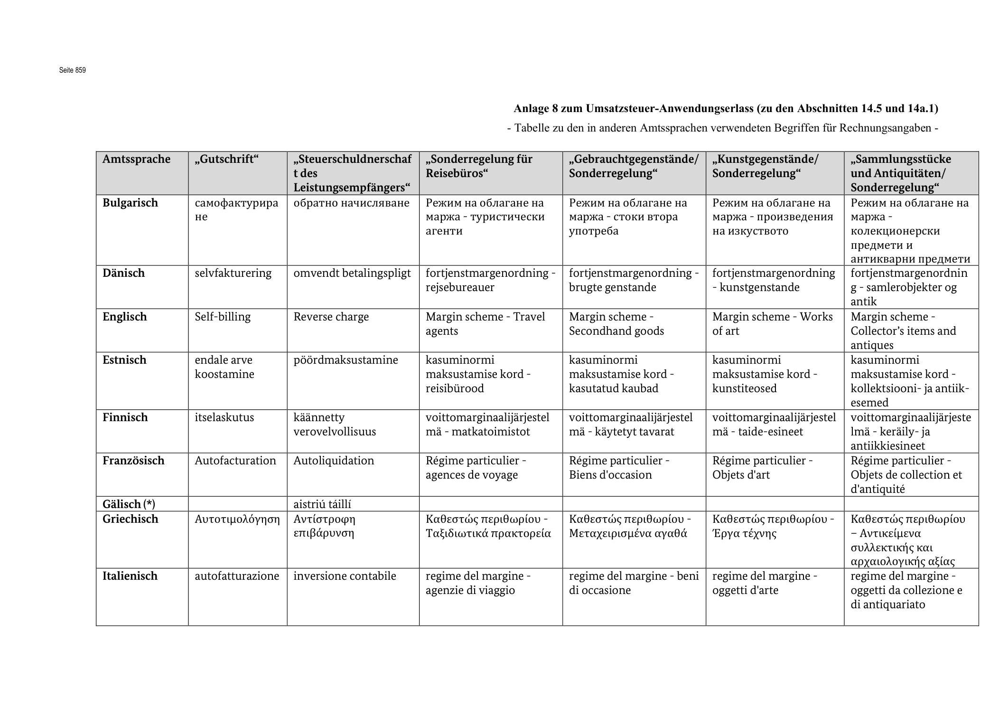

**Amtliche PDF, Seite 884:**

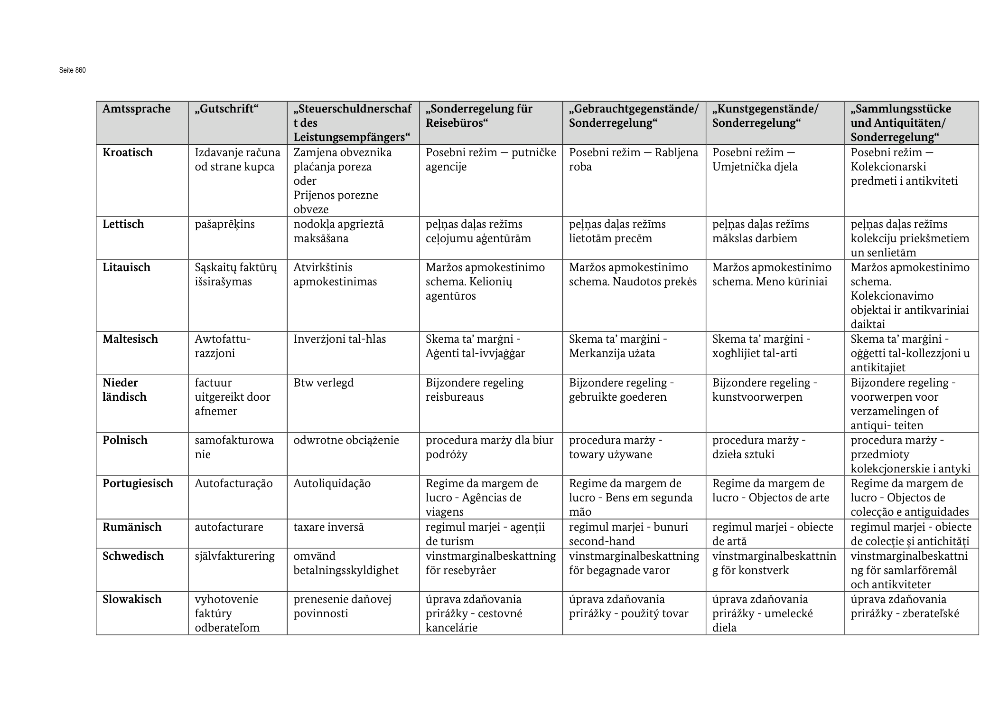

**Amtliche PDF, Seite 885:**

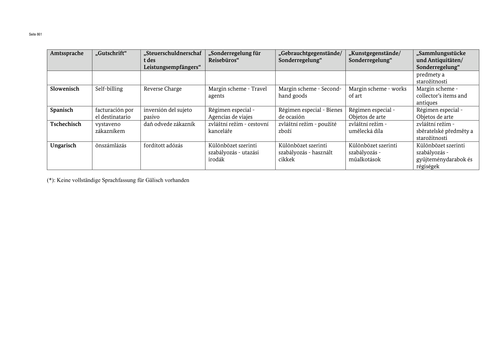
