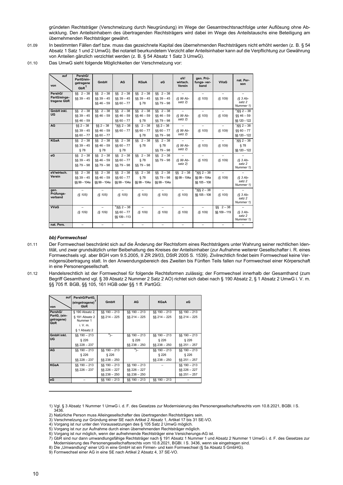
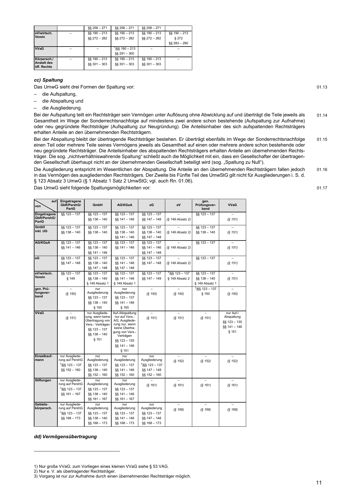
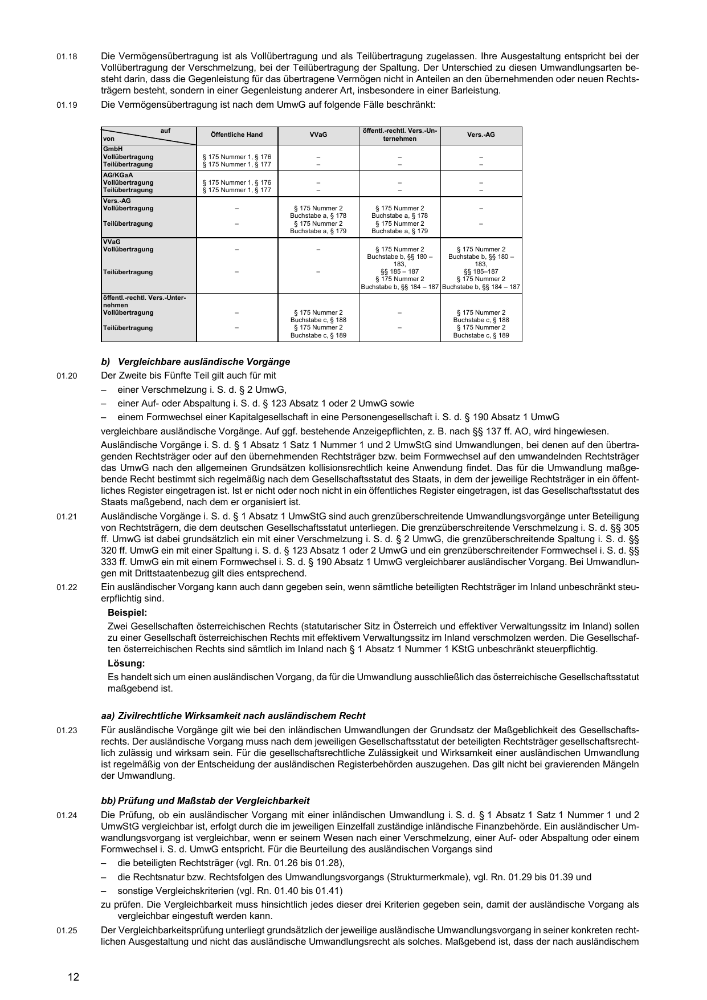

# Umwandlungssteuererlass 2025 (UmwStE 2025)

**Quellenstand: BMF-Schreiben vom 2. Januar 2025 (BStBl. I S. 92), geändert durch BMF-Schreiben vom 1. August 2025 (BStBl. I S. 1591) · Übernahme und Quellenabgleich: 9. September 2026.**

Verwaltungsanweisung des Bundesministeriums der Finanzen zur Anwendung des Umwandlungssteuergesetzes (IV C 2 - S 1978/00035/020/040). Grundlage ist die bereitgestellte Textkopie aus beck-online (BeckVerw 647650) in der Fassung des Bundessteuerblatts. Alle kopierten Sachtexte werden unverändert übernommen; die Metazeile der Kopie bleibt in der [Originalkopie](Quellen/UmwStE_2025_Webkopie.txt) erhalten. Die 94 Fußnoten der Webquelle stehen am Ende der Datei; ihre Verweisstellen sind in der Kopie nicht erhalten und wurden redaktionell erschlossen. Nur mit „[Amtl. Anm.:]“ gekennzeichnete Fußnoten sind amtliche Anmerkungen; die übrigen sind Hinweise des Anbieters (Dokumentverknüpfungen „BeckVerw“, redaktionelle Anmerkungen, Änderungsvermerke).

**Struktur:** Das Inhaltsverzeichnis der Kopie ist als verlinkte Tabelle übernommen (338 Einträge). 572 Randnummern („00.01“ bis „K.19“) tragen Sprungmarken `rn-…`; Kapitel, Teile und die Ebenen A., I., 1. sind Überschriften der Ebenen 2 bis 6, die Ebenen a), aa), (1) sowie Beispiel-, Lösungs- und Zwischenüberschriften sind hervorgehobene Absätze. In der Kopie abgeflachte Tabellen (Umwandlungsmatrizen, Bilanzen, Berechnungen) bleiben als 66 Blöcke kurzer Quellzeilen in Originalreihenfolge erhalten; für die vier Umwandlungsmatrizen (Rn. 01.10, 01.12, 01.17, 01.19) sichern 5 gekennzeichnete Seitendarstellungen der amtlichen PDF die Spaltenzuordnung. Aufzählungen behalten ihr Originalzeichen. Die Kopie enthält keine Satznummern. Schreibweisen und mögliche Kopierfehler sind nicht berichtigt. Alle Gliederungsentscheidungen stehen in [Gliederungsentscheidungen.json](Pruefung/Gliederungsentscheidungen.json).

[Prüfbericht](Pruefung/Pruefbericht.md) · [Amtlicher Abgleich](Quellen/Onlineabgleich/Abgleich.json) · [BMF-PDF vom 2.1.2025](Quellen/Onlineabgleich/2025-01-02-umwStE.pdf) · [Änderungsschreiben vom 1.8.2025](Quellen/Onlineabgleich/2025-08-01-aenderung-bmf-schreiben-umwste.pdf)

## Navigation

[Dokumentkopf](#dokumentkopf) · [Inhaltsverzeichnis](#inhaltsverzeichnis) · [Erlasstext](#erlasstext) · [Fußnoten](#fussnoten)

<!-- quelle:z3-3 -->
## Schreiben betr. Anwendung des Umwandlungssteuergesetzes – Umwandlungssteuererlass 2025 (UmwStE 2025) –
<!-- /quelle:z3-3 -->

<!-- quelle:z4-7 -->

Vom 2. Januar 2025 
BMF IV C 2 - S 1978/00035/020/040; DOK COO.7005.100.4.10951618 
(BStBl. I S. 92) 
Geänd. durch BMF v. 1.8.2025 (BStBl. I S. 1591)

<!-- /quelle:z4-7 -->

<!-- quelle:z9-9 -->

Unter Bezugnahme auf das Ergebnis der Erörterungen mit den obersten Finanzbehörden der Länder gilt zur Anwendung des Umwandlungssteuergesetzes i.d.F. des Gesetzes über steuerliche Begleitmaßnahmen zur Einführung der Europäischen Gesellschaft und zur Änderung weiterer steuerrechtlicher Vorschriften vom 7.12.2006 (BGBl. I S. 2782; 2007 I S. 68), zuletzt geändert durch das Jahressteuergesetz 2024 vom 2.12.2024, BGBl. I Nr. 387 (im Folgenden: UmwStG 2006 oder UmwStG), Folgendes:

<!-- /quelle:z9-9 -->

<!-- quelle:z11-11 -->
## Inhaltsverzeichnis
<!-- /quelle:z11-11 -->

<!-- quelle:z12-1352 -->
<table class="inhaltsverzeichnis">
<tr><th></th><th></th><th>Rn.</th></tr>
<tr><td><a href="#gliederung-z1354">Erstes Kapitel:</a></td><td colspan="2"><a href="#gliederung-z1354">Anwendungsregelungen</a></td></tr>
<tr><td><a href="#gliederung-z1355">A.</a></td><td><a href="#gliederung-z1355">Verhältnis des UmwStG 2006 zum UmwStG 1995</a></td><td><a href="#rn-00-01">00.01</a></td></tr>
<tr><td><a href="#gliederung-z1358">B.</a></td><td><a href="#gliederung-z1358">Ertragsteuerliche Beurteilung von Umwandlungen und Einbringungen</a></td><td><a href="#rn-00-02">00.02–00.04</a></td></tr>
<tr><td><a href="#gliederung-z1365">C.</a></td><td><a href="#gliederung-z1365">Zeitliche Anwendung</a></td><td><a href="#rn-00-04a">00.04a</a></td></tr>
<tr><td><a href="#gliederung-z1368">Zweites Kapitel:</a></td><td colspan="2"><a href="#gliederung-z1368">Steuerliche Folgen von Umwandlungen und Einbringungen nach dem UmwStG</a></td></tr>
<tr><td><a href="#gliederung-z1369">Erster Teil.</a></td><td colspan="2"><a href="#gliederung-z1369">Allgemeine Vorschriften</a></td></tr>
<tr><td><a href="#gliederung-z1370">A.</a></td><td><a href="#gliederung-z1370">Anwendungsbereich und Begriffsbestimmungen (§ 1 UmwStG)</a></td><td><a href="#rn-01-01">01.01–01.57</a></td></tr>
<tr><td><a href="#gliederung-z1377">I.</a></td><td><a href="#gliederung-z1377">Sachlicher Anwendungsbereich</a></td><td><a href="#rn-01-03">01.03–01.48a</a></td></tr>
<tr><td><a href="#gliederung-z1378">1.</a></td><td><a href="#gliederung-z1378">Zweiter bis Fünfter Teil (§ 1 Abs. 1 UmwStG)</a></td><td><a href="#rn-01-03">01.03–01.42</a></td></tr>
<tr><td><a href="#gliederung-z1379">a)</a></td><td><a href="#gliederung-z1379">Umwandlungen nach dem UmwG (inländische Umwandlungen)</a></td><td><a href="#rn-01-03">01.03–01.19</a></td></tr>
<tr><td><a href="#gliederung-z1420">aa)</a></td><td><a href="#gliederung-z1420">Verschmelzung</a></td><td><a href="#rn-01-08">01.08–01.10</a></td></tr>
<tr><td><a href="#gliederung-z1833">bb)</a></td><td><a href="#gliederung-z1833">Formwechsel</a></td><td><a href="#rn-01-11">01.11–01.12</a></td></tr>
<tr><td><a href="#gliederung-z2032">cc)</a></td><td><a href="#gliederung-z2032">Spaltung</a></td><td><a href="#rn-01-13">01.13–01.17</a></td></tr>
<tr><td><a href="#gliederung-z2443">dd)</a></td><td><a href="#gliederung-z2443">Vermögensübertragung</a></td><td><a href="#rn-01-18">01.18–01.19</a></td></tr>
<tr><td><a href="#gliederung-z2574">b)</a></td><td><a href="#gliederung-z2574">Vergleichbare ausländische Vorgänge</a></td><td><a href="#rn-01-20">01.20–01.41</a></td></tr>
<tr><td><a href="#gliederung-z2599">aa)</a></td><td><a href="#gliederung-z2599">Zivilrechtliche Wirksamkeit nach ausländischem Recht</a></td><td><a href="#rn-01-23">01.23</a></td></tr>
<tr><td><a href="#gliederung-z2602">bb)</a></td><td><a href="#gliederung-z2602">Prüfung und Maßstab der Vergleichbarkeit</a></td><td><a href="#rn-01-24">01.24–01.25</a></td></tr>
<tr><td><a href="#gliederung-z2625">cc)</a></td><td><a href="#gliederung-z2625">Umwandlungsfähigkeit der beteiligten Rechtsträger</a></td><td><a href="#rn-01-26">01.26–01.28</a></td></tr>
<tr><td><a href="#gliederung-z2634">dd)</a></td><td><a href="#gliederung-z2634">Strukturmerkmale des Umwandlungsvorgangs</a></td><td><a href="#rn-01-29">01.29–01.39</a></td></tr>
<tr><td><a href="#gliederung-z2637">(1)</a></td><td><a href="#gliederung-z2637">Verschmelzung</a></td><td><a href="#rn-01-30">01.30–01.32</a></td></tr>
<tr><td><a href="#gliederung-z2666">(2)</a></td><td><a href="#gliederung-z2666">Aufspaltung</a></td><td><a href="#rn-01-33">01.33–01.35</a></td></tr>
<tr><td><a href="#gliederung-z2685">(3)</a></td><td><a href="#gliederung-z2685">Abspaltung</a></td><td><a href="#rn-01-36">01.36–01.38</a></td></tr>
<tr><td><a href="#gliederung-z2702">(4)</a></td><td><a href="#gliederung-z2702">Formwechsel</a></td><td><a href="#rn-01-39">01.39</a></td></tr>
<tr><td><a href="#gliederung-z2723">ee)</a></td><td><a href="#gliederung-z2723">Sonstige Vergleichskriterien</a></td><td><a href="#rn-01-40">01.40–01.41</a></td></tr>
<tr><td><a href="#gliederung-z2728">c)</a></td><td><a href="#gliederung-z2728">Umwandlungen nach der SE-VO bzw. der SCE-VO</a></td><td><a href="#rn-01-42">01.42</a></td></tr>
<tr><td><a href="#gliederung-z2731">2.</a></td><td><a href="#gliederung-z2731">Sechster bis Achter Teil (§ 1 Abs. 3 UmwStG)</a></td><td><a href="#rn-01-43">01.43–01.48a</a></td></tr>
<tr><td><a href="#gliederung-z2746">a)</a></td><td><a href="#gliederung-z2746">Einbringung in eine Kapitalgesellschaft oder Genossenschaft gegen Gewährung von Gesellschaftsrechten (§ 20 UmwStG)</a></td><td><a href="#rn-01-44">01.44–01.45</a></td></tr>
<tr><td><a href="#gliederung-z2771">b)</a></td><td><a href="#gliederung-z2771">Austausch von Anteilen (§ 21 UmwStG)</a></td><td><a href="#rn-01-46">01.46</a></td></tr>
<tr><td><a href="#gliederung-z2786">c)</a></td><td><a href="#gliederung-z2786">Einbringung in eine Personengesellschaft (§ 24 UmwStG)</a></td><td><a href="#rn-01-47">01.47–01.48</a></td></tr>
<tr><td><a href="#gliederung-z2815">d)</a></td><td><a href="#gliederung-z2815">Sonstige Vergleichskriterien</a></td><td><a href="#rn-01-48a">01.48a</a></td></tr>
<tr><td><a href="#gliederung-z2818">II.</a></td><td><a href="#gliederung-z2818">Persönlicher Anwendungsbereich</a></td><td><a href="#rn-01-49">01.49–01.55</a></td></tr>
<tr><td><a href="#gliederung-z2819">1.</a></td><td><a href="#gliederung-z2819">Zweiter bis Fünfter Teil (§ 1 Abs. 2 UmwStG)</a></td><td><a href="#rn-01-49">01.49–01.52a</a></td></tr>
<tr><td><a href="#gliederung-z2820">a)</a></td><td><a href="#gliederung-z2820">Umwandlungen mit steuerlichem Übertragungsstichtag vor dem 1.1.2022</a></td><td><a href="#rn-01-49">01.49–01.52</a></td></tr>
<tr><td><a href="#gliederung-z2829">b)</a></td><td><a href="#gliederung-z2829">Umwandlungen mit steuerlichem Übertragungsstichtag nach dem 31.12.2021</a></td><td><a href="#rn-01-52a">01.52a</a></td></tr>
<tr><td><a href="#gliederung-z2832">2.</a></td><td><a href="#gliederung-z2832">Sechster bis Achter Teil (§ 1 Abs. 4 UmwStG)</a></td><td><a href="#rn-01-53">01.53–01.55</a></td></tr>
<tr><td><a href="#gliederung-z2851">III.</a></td><td><a href="#gliederung-z2851">Begriffsbestimmungen</a></td><td><a href="#rn-01-56">01.56–01.57</a></td></tr>
<tr><td><a href="#gliederung-z2852">1.</a></td><td><a href="#gliederung-z2852">Richtlinien und Verordnungen (§ 1 Abs. 5 Nr. 1 bis 3 UmwStG)</a></td><td><a href="#rn-01-56">01.56</a></td></tr>
<tr><td><a href="#gliederung-z2855">2.</a></td><td><a href="#gliederung-z2855">Buchwert (§ 1 Abs. 5 Nr. 4 UmwStG)</a></td><td><a href="#rn-01-57">01.57</a></td></tr>
<tr><td><a href="#gliederung-z2858">B.</a></td><td><a href="#gliederung-z2858">Steuerliche Rückwirkung (§ 2 UmwStG)</a></td><td><a href="#rn-02-01">02.01–02.40b</a></td></tr>
<tr><td><a href="#gliederung-z2859">I.</a></td><td><a href="#gliederung-z2859">Steuerlicher Übertragungsstichtag</a></td><td><a href="#rn-02-01">02.01–02.08</a></td></tr>
<tr><td><a href="#gliederung-z2862">1.</a></td><td><a href="#gliederung-z2862">Inländische Umwandlungen</a></td><td><a href="#rn-02-02">02.02.–02.06</a></td></tr>
<tr><td><a href="#gliederung-z2863">a)</a></td><td><a href="#gliederung-z2863">Verschmelzung, Auf-, Abspaltung und Vermögensübertragung</a></td><td><a href="#rn-02-02">02.02–02.04</a></td></tr>
<tr><td><a href="#gliederung-z2914">b)</a></td><td><a href="#gliederung-z2914">Formwechsel</a></td><td><a href="#rn-02-05">02.05–02.06</a></td></tr>
<tr><td><a href="#gliederung-z2919">2.</a></td><td><a href="#gliederung-z2919">Vergleichbare ausländische Vorgänge</a></td><td><a href="#rn-02-07">02.07–02.08</a></td></tr>
<tr><td><a href="#gliederung-z2924">II.</a></td><td><a href="#gliederung-z2924">Steuerliche Rückwirkung</a></td><td><a href="#rn-02-09">02.09–02.40b</a></td></tr>
<tr><td><a href="#gliederung-z2925">1.</a></td><td><a href="#gliederung-z2925">Rückwirkungsfiktion</a></td><td><a href="#rn-02-09">02.09–02.19</a></td></tr>
<tr><td><a href="#gliederung-z2926">a)</a></td><td><a href="#gliederung-z2926">Grundsatz</a></td><td><a href="#rn-02-09">02.09–02.16</a></td></tr>
<tr><td><a href="#gliederung-z2957">b)</a></td><td><a href="#gliederung-z2957">Keine Rückwirkungsfiktion für ausscheidende und abgefundene Anteilseigner</a></td><td><a href="#rn-02-17">02.17–02.19</a></td></tr>
<tr><td><a href="#gliederung-z2978">2.</a></td><td><a href="#gliederung-z2978">Steuerliche Behandlung von im Rückwirkungszeitraum ausscheidenden und neu eintretenden Anteilseignern</a></td><td><a href="#rn-02-20">02.20–02.24</a></td></tr>
<tr><td><a href="#gliederung-z2979">a)</a></td><td><a href="#gliederung-z2979">Vermögensübergang auf eine Personengesellschaft oder natürliche Person</a></td><td><a href="#rn-02-20">02.20–02.22</a></td></tr>
<tr><td><a href="#gliederung-z2998">b)</a></td><td><a href="#gliederung-z2998">Vermögensübergang auf eine Körperschaft</a></td><td><a href="#rn-02-23">02.23–02.24</a></td></tr>
<tr><td><a href="#gliederung-z3003">3.</a></td><td><a href="#gliederung-z3003">Steuerliche Behandlung von Gewinnausschüttungen</a></td><td><a href="#rn-02-25">02.25–02.35</a></td></tr>
<tr><td><a href="#gliederung-z3004">a)</a></td><td><a href="#gliederung-z3004">Vermögensübergang auf eine Personengesellschaft oder natürliche Person</a></td><td><a href="#rn-02-25">02.25–02.33</a></td></tr>
<tr><td><a href="#gliederung-z3005">aa)</a></td><td><a href="#gliederung-z3005">Ausschüttungen, die vor dem steuerlichen Übertragungsstichtag abgeflossen sind</a></td><td><a href="#rn-02-25">02.25–02.26</a></td></tr>
<tr><td><a href="#gliederung-z3014">bb)</a></td><td><a href="#gliederung-z3014">Ausschüttungen, die nach dem steuerlichen Übertragungsstichtag abgeflossen sind</a></td><td><a href="#rn-02-27">02.27–02.33</a></td></tr>
<tr><td><a href="#gliederung-z3015">(1)</a></td><td><a href="#gliederung-z3015">Vor dem steuerlichen Übertragungsstichtag begründete Ausschüttungsverbindlichkeiten</a></td><td><a href="#rn-02-27">02.27–02.30</a></td></tr>
<tr><td><a href="#gliederung-z3052">(2)</a></td><td><a href="#gliederung-z3052">Nach dem steuerlichen Übertragungsstichtag beschlossene Gewinnausschüttungen sowie verdeckte Gewinnausschüttungen und andere Ausschüttungen im Rückwirkungszeitraum sowie offene Rücklagen i.S.d. § 7 UmwStG</a></td><td><a href="#rn-02-31">02.31–02.33</a></td></tr>
<tr><td><a href="#gliederung-z3149">b)</a></td><td><a href="#gliederung-z3149">Vermögensübergang auf eine Körperschaft</a></td><td><a href="#rn-02-34">02.34–02.35</a></td></tr>
<tr><td><a href="#gliederung-z3158">4.</a></td><td><a href="#gliederung-z3158">Sondervergütungen bei Umwandlung in eine Personengesellschaft</a></td><td><a href="#rn-02-36">02.36</a></td></tr>
<tr><td><a href="#gliederung-z3161">5.</a></td><td><a href="#gliederung-z3161">Aufsichtsratsvergütungen und sonstige Fälle des Steuerabzugs nach § 50a EStG</a></td><td><a href="#rn-02-37">02.37</a></td></tr>
<tr><td><a href="#gliederung-z3168">6.</a></td><td><a href="#gliederung-z3168">Vermeidung der Nichtbesteuerung (§ 2 Abs. 3 UmwStG)</a></td><td><a href="#rn-02-38">02.38</a></td></tr>
<tr><td><a href="#gliederung-z3171">7.</a></td><td><a href="#gliederung-z3171">Beschränkung der Verlustnutzung (§ 2 Abs. 4 UmwStG)</a></td><td><a href="#rn-02-39">02.39–02.40b</a></td></tr>
<tr><td><a href="#gliederung-z3180">Zweiter Teil.</a></td><td colspan="2"><a href="#gliederung-z3180">Vermögensübergang bei Verschmelzung auf eine Personengesellschaft oder auf eine natürliche Person und Formwechsel einer Kapitalgesellschaft in eine Personengesellschaft</a></td></tr>
<tr><td><a href="#gliederung-z3181">A.</a></td><td><a href="#gliederung-z3181">Wertansätze in der steuerlichen Schlussbilanz der übertragenden Körperschaft (§ 3 UmwStG)</a></td><td><a href="#rn-03-01">03.01–03.32</a></td></tr>
<tr><td><a href="#gliederung-z3182">I.</a></td><td><a href="#gliederung-z3182">Pflicht zur Abgabe einer steuerlichen Schlussbilanz</a></td><td><a href="#rn-03-01">03.01–03.03</a></td></tr>
<tr><td><a href="#gliederung-z3193">II.</a></td><td><a href="#gliederung-z3193">Ansatz und Bewertung der übergehenden Wirtschaftsgüter</a></td><td><a href="#rn-03-04">03.04–03.32</a></td></tr>
<tr><td><a href="#gliederung-z3194">1.</a></td><td><a href="#gliederung-z3194">Ansatz der übergehenden Wirtschaftsgüter dem Grunde nach</a></td><td><a href="#rn-03-04">03.04–03.06</a></td></tr>
<tr><td><a href="#gliederung-z3221">2.</a></td><td><a href="#gliederung-z3221">Ansatz der übergehenden Wirtschaftsgüter der Höhe nach</a></td><td><a href="#rn-03-07">03.07–03.30</a></td></tr>
<tr><td><a href="#gliederung-z3222">a)</a></td><td><a href="#gliederung-z3222">Ansatz der übergehenden Wirtschaftsgüter mit dem gemeinen Wert bzw. dem Teilwert nach § 6a EStG</a></td><td><a href="#rn-03-07">03.07–03.09a</a></td></tr>
<tr><td><a href="#gliederung-z3307">b)</a></td><td><a href="#gliederung-z3307">Ansatz der übergehenden Wirtschaftsgüter mit dem Buchwert</a></td><td><a href="#rn-03-10">03.10–03.24</a></td></tr>
<tr><td><a href="#gliederung-z3326">aa)</a></td><td><a href="#gliederung-z3326">Übergang in Betriebsvermögen und Sicherstellung der Besteuerung mit Einkommen- oder Körperschaftsteuer (§ 3 Abs. 2 Satz 1 Nr. 1 UmwStG)</a></td><td><a href="#rn-03-14">03.14–03.17</a></td></tr>
<tr><td><a href="#gliederung-z3339">bb)</a></td><td><a href="#gliederung-z3339">Kein Ausschluss oder Beschränkung des deutschen Besteuerungsrechts (§ 3 Abs. 2 Satz 1 Nr. 2 UmwStG)</a></td><td><a href="#rn-03-18">03.18–03.20a</a></td></tr>
<tr><td><a href="#gliederung-z3362">cc)</a></td><td><a href="#gliederung-z3362">Keine Gegenleistung oder Gegenleistung in Form von Gesellschaftsrechten (§ 3 Abs. 2 Satz 1 Nr. 3 UmwStG)</a></td><td><a href="#rn-03-21">03.21–03.24</a></td></tr>
<tr><td><a href="#gliederung-z3729">c)</a></td><td><a href="#gliederung-z3729">Ansatz der übergehenden Wirtschaftsgüter mit einem Zwischenwert</a></td><td><a href="#rn-03-25">03.25–03.26</a></td></tr>
<tr><td><a href="#gliederung-z3734">d)</a></td><td><a href="#gliederung-z3734">Ausübung des Wahlrechts auf Ansatz zum Buch- oder Zwischenwert</a></td><td><a href="#rn-03-27">03.27–03.30</a></td></tr>
<tr><td><a href="#gliederung-z3749">3.</a></td><td><a href="#gliederung-z3749">Fiktive Körperschaftsteueranrechnung nach § 3 Abs. 3 UmwStG</a></td><td><a href="#rn-03-31">03.31–03.32</a></td></tr>
<tr><td><a href="#gliederung-z3760">B.</a></td><td><a href="#gliederung-z3760">Auswirkungen auf den Gewinn des übernehmenden Rechtsträgers (§ 4 UmwStG)</a></td><td><a href="#rn-04-01">04.01–04.45</a></td></tr>
<tr><td><a href="#gliederung-z3761">I.</a></td><td><a href="#gliederung-z3761">Wertverknüpfung</a></td><td><a href="#rn-04-01">04.01–04.04</a></td></tr>
<tr><td><a href="#gliederung-z3770">II.</a></td><td><a href="#gliederung-z3770">Erweiterte Wertaufholung – Beteiligungskorrekturgewinn</a></td><td><a href="#rn-04-05">04.05–04.08</a></td></tr>
<tr><td><a href="#gliederung-z3779">III.</a></td><td><a href="#gliederung-z3779">Eintritt in die steuerliche Rechtsstellung (§ 4 Abs. 2 und 3 UmwStG)</a></td><td><a href="#rn-04-09">04.09–04.17</a></td></tr>
<tr><td><a href="#gliederung-z3780">1.</a></td><td><a href="#gliederung-z3780">Absetzungen für Abnutzung</a></td><td><a href="#rn-04-09">04.09–04.11</a></td></tr>
<tr><td><a href="#gliederung-z3793">2.</a></td><td><a href="#gliederung-z3793">Verlustabzug bei Auslandsbetriebsstätten</a></td><td><a href="#rn-04-12">04.12</a></td></tr>
<tr><td><a href="#gliederung-z3796">3.</a></td><td><a href="#gliederung-z3796">Besonderheiten bei Unterstützungskassen (§ 4 Abs. 2 Satz 4 UmwStG)</a></td><td><a href="#rn-04-13">04.13</a></td></tr>
<tr><td><a href="#gliederung-z3799">4.</a></td><td><a href="#gliederung-z3799">Sonstige Folgen der Rechtsnachfolge</a></td><td><a href="#rn-04-14">04.14–04.17</a></td></tr>
<tr><td><a href="#gliederung-z3808">IV.</a></td><td><a href="#gliederung-z3808">Übernahmeergebnis</a></td><td><a href="#rn-04-18">04.18–04.35</a></td></tr>
<tr><td><a href="#gliederung-z3809">1.</a></td><td><a href="#gliederung-z3809">Zuordnung der Anteile zum Betriebsvermögen des übernehmenden Rechtsträgers</a></td><td><a href="#rn-04-18">04.18</a></td></tr>
<tr><td><a href="#gliederung-z3812">2.</a></td><td><a href="#gliederung-z3812">Personen- sowie ggf. anteilsbezogene Ermittlung</a></td><td><a href="#rn-04-19">04.19–04.22</a></td></tr>
<tr><td><a href="#gliederung-z3825">3.</a></td><td><a href="#gliederung-z3825">Ausländische Anteilseigner</a></td><td><a href="#rn-04-23">04.23–04.24</a></td></tr>
<tr><td><a href="#gliederung-z3842">4.</a></td><td><a href="#gliederung-z3842">Anteile, die nicht dem Betriebsvermögen des übernehmenden Rechtsträgers zuzurechnen sind</a></td><td><a href="#rn-04-25">04.25</a></td></tr>
<tr><td><a href="#gliederung-z3845">5.</a></td><td><a href="#gliederung-z3845">Entstehungszeitpunkt</a></td><td><a href="#rn-04-26">04.26</a></td></tr>
<tr><td><a href="#gliederung-z3848">6.</a></td><td><a href="#gliederung-z3848">Ermittlung des Übernahmeergebnisses</a></td><td><a href="#rn-04-27">04.27</a></td></tr>
<tr><td><a href="#gliederung-z4271">7.</a></td><td><a href="#gliederung-z4271">Wert, mit dem die übergegangenen Wirtschaftsgüter zu übernehmen sind</a></td><td><a href="#rn-04-28">04.28</a></td></tr>
<tr><td><a href="#gliederung-z4274">8.</a></td><td><a href="#gliederung-z4274">Zuschlag für neutrales Vermögen (Auslandsvermögen)</a></td><td><a href="#rn-04-29">04.29</a></td></tr>
<tr><td><a href="#gliederung-z4673">9.</a></td><td><a href="#gliederung-z4673">Anteile an der übertragenden Körperschaft</a></td><td><a href="#rn-04-30">04.30–04.33</a></td></tr>
<tr><td><a href="#gliederung-z4674">a)</a></td><td><a href="#gliederung-z4674">Zuordnung der Anteile</a></td><td><a href="#rn-04-30">04.30</a></td></tr>
<tr><td><a href="#gliederung-z4685">b)</a></td><td><a href="#gliederung-z4685">Folgen bei ausstehenden Einlagen</a></td><td><a href="#rn-04-31">04.31</a></td></tr>
<tr><td><a href="#gliederung-z4688">c)</a></td><td><a href="#gliederung-z4688">Steuerliche Behandlung eigener Anteile</a></td><td><a href="#rn-04-32">04.32–04.33</a></td></tr>
<tr><td><a href="#gliederung-z4693">10.</a></td><td><a href="#gliederung-z4693">Kosten für den Vermögensübergang</a></td><td><a href="#rn-04-34">04.34–04.35</a></td></tr>
<tr><td><a href="#gliederung-z4700">V.</a></td><td><a href="#gliederung-z4700">Fremdfinanzierte Anteile an der übertragenden Körperschaft</a></td><td><a href="#rn-04-36">04.36</a></td></tr>
<tr><td><a href="#gliederung-z4703">VI.</a></td><td><a href="#gliederung-z4703">Abzug der Bezüge i.S.d. § 7 UmwStG vom Übernahmeergebnis 1. Stufe (§ 4 Abs. 5 UmwStG)</a></td><td><a href="#rn-04-37">04.37–04.38</a></td></tr>
<tr><td><a href="#gliederung-z4708">VII.</a></td><td><a href="#gliederung-z4708">Ermittlung des Übernahmeergebnisses bei negativem Buchwert des Vermögens der übertragenden Körperschaft (überschuldete Gesellschaft)</a></td><td><a href="#rn-04-39">04.39</a></td></tr>
<tr><td><a href="#gliederung-z4711">VIII.</a></td><td><a href="#gliederung-z4711">Berücksichtigung eines Übernahmeverlusts (§ 4 Abs. 6 UmwStG)</a></td><td><a href="#rn-04-40">04.40–04.43</a></td></tr>
<tr><td><a href="#gliederung-z4722">IX.</a></td><td><a href="#gliederung-z4722">Besteuerung eines Übernahmegewinns (§ 4 Abs. 7 UmwStG)</a></td><td><a href="#rn-04-44">04.44–04.45</a></td></tr>
<tr><td><a href="#gliederung-z4727">C.</a></td><td><a href="#gliederung-z4727">Besteuerung der Anteilseigner der übertragenden Körperschaft (§ 5 UmwStG)</a></td><td><a href="#rn-05-01">05.01–05.12</a></td></tr>
<tr><td><a href="#gliederung-z4728">I.</a></td><td><a href="#gliederung-z4728">Anschaffung und Barabfindung nach dem steuerlichen Übertragungsstichtag (§ 5 Abs. 1 UmwStG)</a></td><td><a href="#rn-05-01">05.01–05.02</a></td></tr>
<tr><td><a href="#gliederung-z4733">II.</a></td><td><a href="#gliederung-z4733">Anteilseignerwechsel im Rückwirkungszeitraum</a></td><td><a href="#rn-05-03">05.03–05.04</a></td></tr>
<tr><td><a href="#gliederung-z4738">III.</a></td><td><a href="#gliederung-z4738">Einlage- und Überführungsfiktion (§ 5 Abs. 2 und 3 UmwStG)</a></td><td><a href="#rn-05-05">05.05–05.11</a></td></tr>
<tr><td><a href="#gliederung-z4739">1.</a></td><td><a href="#gliederung-z4739">Einlagefiktion nach § 5 Abs. 2 UmwStG</a></td><td><a href="#rn-05-05">05.05–05.07a</a></td></tr>
<tr><td><a href="#gliederung-z4762">2.</a></td><td><a href="#gliederung-z4762">Überführungsfiktion nach § 5 Abs. 3 UmwStG</a></td><td><a href="#rn-05-08">05.08–05.11</a></td></tr>
<tr><td><a href="#gliederung-z4771">IV.</a></td><td><a href="#gliederung-z4771">Übergangsregelung für einbringungsgeborene Anteile nach § 27 Abs. 3 Satz 1 Nr. 1 UmwStG</a></td><td><a href="#rn-05-12">05.12</a></td></tr>
<tr><td><a href="#gliederung-z4774">D.</a></td><td><a href="#gliederung-z4774">Gewinnerhöhung durch Vereinigung von Forderungen und Verbindlichkeiten (§ 6 UmwStG)</a></td><td><a href="#rn-06-01">06.01–06.12</a></td></tr>
<tr><td><a href="#gliederung-z4775">I.</a></td><td><a href="#gliederung-z4775">Entstehung des Übernahmefolgegewinns oder -verlusts aus dem Vermögensübergang</a></td><td><a href="#rn-06-01">06.01</a></td></tr>
<tr><td><a href="#gliederung-z4780">II.</a></td><td><a href="#gliederung-z4780">Besteuerung des Übernahmefolgegewinns oder -verlusts</a></td><td><a href="#rn-06-02">06.02</a></td></tr>
<tr><td><a href="#gliederung-z4783">III.</a></td><td><a href="#gliederung-z4783">Wertgeminderte Forderung</a></td><td><a href="#rn-06-03">06.03</a></td></tr>
<tr><td><a href="#gliederung-z4786">IV.</a></td><td><a href="#gliederung-z4786">Pensionsrückstellungen zugunsten eines Gesellschafters der übertragenden Kapitalgesellschaft</a></td><td><a href="#rn-06-04">06.04–06.08</a></td></tr>
<tr><td><a href="#gliederung-z4797">V.</a></td><td><a href="#gliederung-z4797">Missbrauchsklausel</a></td><td><a href="#rn-06-09">06.09–06.12</a></td></tr>
<tr><td><a href="#gliederung-z4812">E.</a></td><td><a href="#gliederung-z4812">Besteuerung offener Rücklagen (§ 7 UmwStG)</a></td><td><a href="#rn-07-01">07.01–07.09</a></td></tr>
<tr><td><a href="#gliederung-z4813">I.</a></td><td><a href="#gliederung-z4813">Sachlicher und persönlicher Anwendungsbereich</a></td><td><a href="#rn-07-01">07.01–07.02</a></td></tr>
<tr><td><a href="#gliederung-z4818">II.</a></td><td><a href="#gliederung-z4818">Anteiliges Eigenkapital</a></td><td><a href="#rn-07-03">07.03–07.04</a></td></tr>
<tr><td><a href="#gliederung-z4827">III.</a></td><td><a href="#gliederung-z4827">Zurechnung der Einkünfte</a></td><td><a href="#rn-07-05">07.05–07.06</a></td></tr>
<tr><td><a href="#gliederung-z4832">IV.</a></td><td><a href="#gliederung-z4832">Besteuerung und Zufluss der Einkünfte</a></td><td><a href="#rn-07-07">07.07</a></td></tr>
<tr><td><a href="#gliederung-z4839">V.</a></td><td><a href="#gliederung-z4839">Kapitalertragsteuerabzug</a></td><td><a href="#rn-07-08">07.08–07.09</a></td></tr>
<tr><td><a href="#gliederung-z4844">F.</a></td><td><a href="#gliederung-z4844">Vermögensübergang auf einen Rechtsträger ohne Betriebsvermögen (§ 8 UmwStG)</a></td><td><a href="#rn-08-01">08.01–08.04</a></td></tr>
<tr><td><a href="#gliederung-z4855">G.</a></td><td><a href="#gliederung-z4855">Formwechsel in eine Personengesellschaft (§ 9 UmwStG)</a></td><td><a href="#rn-09-01">09.01–09.02</a></td></tr>
<tr><td><a href="#gliederung-z4860">H.</a></td><td><a href="#gliederung-z4860">Körperschaftsteuererhöhung (§ 10 UmwStG)</a></td><td><a href="#rn-10-01">10.01</a></td></tr>
<tr><td><a href="#gliederung-z4863">Dritter Teil.</a></td><td colspan="2"><a href="#gliederung-z4863">Verschmelzung oder Vermögensübertragung (Vollübertragung) auf eine andere Körperschaft</a></td></tr>
<tr><td><a href="#gliederung-z4864">A.</a></td><td><a href="#gliederung-z4864">Wertansätze in der steuerlichen Schlussbilanz der übertragenden Körperschaft (§ 11 UmwStG)</a></td><td><a href="#rn-11-01">11.01–11.19</a></td></tr>
<tr><td><a href="#gliederung-z4865">I.</a></td><td><a href="#gliederung-z4865">Sachlicher Anwendungsbereich</a></td><td><a href="#rn-11-01">11.01</a></td></tr>
<tr><td><a href="#gliederung-z4868">II.</a></td><td><a href="#gliederung-z4868">Pflicht zur Abgabe einer steuerlichen Schlussbilanz</a></td><td><a href="#rn-11-02">11.02</a></td></tr>
<tr><td><a href="#gliederung-z4871">III.</a></td><td><a href="#gliederung-z4871">Ansatz und Bewertung der übergehenden Wirtschaftsgüter</a></td><td><a href="#rn-11-03">11.03–11.13</a></td></tr>
<tr><td><a href="#gliederung-z4872">1.</a></td><td><a href="#gliederung-z4872">Ansatz der übergehenden Wirtschaftsgüter dem Grunde nach</a></td><td><a href="#rn-11-03">11.03</a></td></tr>
<tr><td><a href="#gliederung-z4875">2.</a></td><td><a href="#gliederung-z4875">Ansatz der übergehenden Wirtschaftsgüter der Höhe nach</a></td><td><a href="#rn-11-04">11.04–11.12</a></td></tr>
<tr><td><a href="#gliederung-z4876">a)</a></td><td><a href="#gliederung-z4876">Ansatz der übergehenden Wirtschaftsgüter mit dem gemeinen Wert bzw. dem Teilwert nach § 6a EStG</a></td><td><a href="#rn-11-04">11.04</a></td></tr>
<tr><td><a href="#gliederung-z4879">b)</a></td><td><a href="#gliederung-z4879">Ansatz der übergehenden Wirtschaftsgüter mit dem Buchwert</a></td><td><a href="#rn-11-05">11.05–11.10</a></td></tr>
<tr><td><a href="#gliederung-z4896">aa)</a></td><td><a href="#gliederung-z4896">Sicherstellung der Besteuerung mit Körperschaftsteuer (§ 11 Abs. 2 Satz 1 Nr. 1 UmwStG)</a></td><td><a href="#rn-11-07">11.07–11.08</a></td></tr>
<tr><td><a href="#gliederung-z4901">bb)</a></td><td><a href="#gliederung-z4901">Kein Ausschluss und keine Einschränkung des deutschen Besteuerungsrechts (§ 11 Abs. 2 Satz 1 Nr. 2 UmwStG)</a></td><td><a href="#rn-11-09">11.09–11.09a</a></td></tr>
<tr><td><a href="#gliederung-z4906">cc)</a></td><td><a href="#gliederung-z4906">Keine Gegenleistung oder Gegenleistung in Form von Gesellschaftsrechten (§ 11 Abs. 2 Satz 1 Nr. 3 UmwStG)</a></td><td><a href="#rn-11-10">11.10</a></td></tr>
<tr><td><a href="#gliederung-z4909">c)</a></td><td><a href="#gliederung-z4909">Ansatz der übergehenden Wirtschaftsgüter mit dem Zwischenwert</a></td><td><a href="#rn-11-11">11.11</a></td></tr>
<tr><td><a href="#gliederung-z4912">d)</a></td><td><a href="#gliederung-z4912">Ausübung des Wahlrechts auf Ansatz zum Buch- oder Zwischenwert</a></td><td><a href="#rn-11-12">11.12</a></td></tr>
<tr><td><a href="#gliederung-z4915">3.</a></td><td><a href="#gliederung-z4915">Fiktive Körperschaftsteueranrechnung nach § 11 Abs. 3 i.V.m. § 3 Abs. 3 UmwStG</a></td><td><a href="#rn-11-13">11.13</a></td></tr>
<tr><td><a href="#gliederung-z4918">IV.</a></td><td><a href="#gliederung-z4918">Vermögensübertragung nach §§ 174 ff. UmwG gegen Gewährung einer Gegenleistung an die Anteilsinhaber des übertragenden Rechtsträgers</a></td><td><a href="#rn-11-14">11.14–11.15</a></td></tr>
<tr><td><a href="#gliederung-z4933">V.</a></td><td><a href="#gliederung-z4933">Landesrechtliche Vorschriften zur Vereinigung öffentlich-rechtlicher Kreditinstitute oder öffentlich-rechtlicher Versicherungsunternehmen sowie zur Umwandlung öffentlich-rechtlicher Körperschaften</a></td><td><a href="#rn-11-16">11.16–11.16b</a></td></tr>
<tr><td><a href="#gliederung-z4958">VI.</a></td><td><a href="#gliederung-z4958">Beteiligung der übertragenden Kapitalgesellschaft an der übernehmenden Kapitalgesellschaft (Abwärtsverschmelzung)</a></td><td><a href="#rn-11-17">11.17–11.19</a></td></tr>
<tr><td><a href="#gliederung-z4969">B.</a></td><td><a href="#gliederung-z4969">Auswirkungen auf den Gewinn der übernehmenden Körperschaft (§ 12 UmwStG)</a></td><td><a href="#rn-12-01">12.01–12.07</a></td></tr>
<tr><td><a href="#gliederung-z4970">I.</a></td><td><a href="#gliederung-z4970">Wertverknüpfung</a></td><td><a href="#rn-12-01">12.01–12.02</a></td></tr>
<tr><td><a href="#gliederung-z4975">II.</a></td><td><a href="#gliederung-z4975">Erweiterte Wertaufholung – Beteiligungskorrekturgewinn</a></td><td><a href="#rn-12-03">12.03</a></td></tr>
<tr><td><a href="#gliederung-z4978">III.</a></td><td><a href="#gliederung-z4978">Eintritt in die steuerliche Rechtsstellung (§ 12 Abs. 3 UmwStG)</a></td><td><a href="#rn-12-04">12.04</a></td></tr>
<tr><td><a href="#gliederung-z4981">IV.</a></td><td><a href="#gliederung-z4981">Übernahmeergebnis</a></td><td><a href="#rn-12-05">12.05–12.07</a></td></tr>
<tr><td><a href="#gliederung-z5000">C.</a></td><td><a href="#gliederung-z5000">Besteuerung der Anteilseigner der übertragenden Körperschaft (§ 13 UmwStG)</a></td><td><a href="#rn-13-01">13.01–13.12</a></td></tr>
<tr><td><a href="#gliederung-z5001">I.</a></td><td><a href="#gliederung-z5001">Anwendungsbereich</a></td><td><a href="#rn-13-01">13.01–13.04</a></td></tr>
<tr><td><a href="#gliederung-z5010">II.</a></td><td><a href="#gliederung-z5010">Veräußerungs- und Anschaffungsfiktion zum gemeinen Wert</a></td><td><a href="#rn-13-05">13.05–13.06</a></td></tr>
<tr><td><a href="#gliederung-z5015">III.</a></td><td><a href="#gliederung-z5015">Ansatz der Anteile mit dem Buchwert oder den Anschaffungskosten</a></td><td><a href="#rn-13-07">13.07–13.11</a></td></tr>
<tr><td><a href="#gliederung-z5054">IV.</a></td><td><a href="#gliederung-z5054">Gewährung von Mitgliedschaftsrechten</a></td><td><a href="#rn-13-12">13.12</a></td></tr>
<tr><td><a href="#gliederung-z5057">Vierter Teil.</a></td><td colspan="2"><a href="#gliederung-z5057">Auf-, Abspaltung und Vermögensübertragung (Teilübertragung)</a></td></tr>
<tr><td><a href="#gliederung-z5058">A.</a></td><td><a href="#gliederung-z5058">Auf-, Abspaltung und Teilübertragung auf andere Körperschaften (§ 15 UmwStG)</a></td><td><a href="#rn-15-01">15.01–15.44</a></td></tr>
<tr><td><a href="#gliederung-z5059">I.</a></td><td><a href="#gliederung-z5059">Teilbetriebsvoraussetzung des § 15 Abs. 1 UmwStG</a></td><td><a href="#rn-15-01">15.01–15.13</a></td></tr>
<tr><td><a href="#gliederung-z5062">1.</a></td><td><a href="#gliederung-z5062">Begriff des Teilbetriebs</a></td><td><a href="#rn-15-02">15.02–15.03</a></td></tr>
<tr><td><a href="#gliederung-z5075">2.</a></td><td><a href="#gliederung-z5075">Mitunternehmeranteil</a></td><td><a href="#rn-15-04">15.04</a></td></tr>
<tr><td><a href="#gliederung-z5078">3.</a></td><td><a href="#gliederung-z5078">100 % – Beteiligung an einer Kapitalgesellschaft</a></td><td><a href="#rn-15-05">15.05–15.06</a></td></tr>
<tr><td><a href="#gliederung-z5083">4.</a></td><td><a href="#gliederung-z5083">Übertragung eines Teilbetriebs</a></td><td><a href="#rn-15-07">15.07–15.11</a></td></tr>
<tr><td><a href="#gliederung-z5094">5.</a></td><td><a href="#gliederung-z5094">Fehlen der Teilbetriebsvoraussetzung</a></td><td><a href="#rn-15-12">15.12–15.13</a></td></tr>
<tr><td><a href="#gliederung-z5099">II.</a></td><td><a href="#gliederung-z5099">Steuerliche Schlussbilanz und Bewertungswahlrecht</a></td><td><a href="#rn-15-14">15.14</a></td></tr>
<tr><td><a href="#gliederung-z5104">IIa.</a></td><td><a href="#gliederung-z5104">Übernahmeergebnis</a></td><td><a href="#rn-15-14a">15.14a</a></td></tr>
<tr><td><a href="#gliederung-z5107">III.</a></td><td><a href="#gliederung-z5107">Zur Anwendung des § 15 Abs. 2 UmwStG</a></td><td><a href="#rn-15-15">15.15–15.40</a></td></tr>
<tr><td><a href="#gliederung-z5110">1.</a></td><td><a href="#gliederung-z5110">Erwerb und Aufstockung i.S.d. § 15 Abs. 2 Satz 1 UmwStG</a></td><td><a href="#rn-15-16">15.16–15.21</a></td></tr>
<tr><td><a href="#gliederung-z5139">2.</a></td><td><a href="#gliederung-z5139">Veräußerung und Vorbereitung der Veräußerung (§ 15 Abs. 2 Satz 2 bis 7 UmwStG)</a></td><td><a href="#rn-15-22">15.22–15.35a</a></td></tr>
<tr><td><a href="#gliederung-z5140">a)</a></td><td><a href="#gliederung-z5140">Veräußerung i.S.d. § 15 Abs. 2 Satz 2 bis 7 UmwStG</a></td><td><a href="#rn-15-22">15.22–15.26a</a></td></tr>
<tr><td><a href="#gliederung-z5155">b)</a></td><td><a href="#gliederung-z5155">Unwiderlegbare Vermutung der Vorbereitung einer Veräußerung (§ 15 Abs. 2 Satz 5 UmwStG)</a></td><td><a href="#rn-15-27">15.27–15.32</a></td></tr>
<tr><td><a href="#gliederung-z5282">c)</a></td><td><a href="#gliederung-z5282">Rechtsfolgen einer steuerschädlichen Anteilsveräußerung</a></td><td><a href="#rn-15-33">15.33–15.35</a></td></tr>
<tr><td><a href="#gliederung-z5289">d)</a></td><td><a href="#gliederung-z5289">Veräußerung an außenstehende Dritte nach Veräußerung an ein verbundenes Unternehmen</a></td><td><a href="#rn-15-35a">15.35a</a></td></tr>
<tr><td><a href="#gliederung-z5320">3.</a></td><td><a href="#gliederung-z5320">Trennung von Gesellschafterstämmen (§ 15 Abs. 2 Satz 8 UmwStG)</a></td><td><a href="#rn-15-36">15.36–15.40</a></td></tr>
<tr><td><a href="#gliederung-z5321">a)</a></td><td><a href="#gliederung-z5321">Begriff der Trennung von Gesellschafterstämmen</a></td><td><a href="#rn-15-36">15.36–15.37</a></td></tr>
<tr><td><a href="#gliederung-z5326">b)</a></td><td><a href="#gliederung-z5326">Vorbesitzzeit</a></td><td><a href="#rn-15-38">15.38–15.40</a></td></tr>
<tr><td><a href="#gliederung-z5333">IV.</a></td><td><a href="#gliederung-z5333">Kürzung verrechenbarer Verluste, verbleibender Verlustvorträge, nicht ausgeglichener negativer Einkünfte, eines Zinsvortrags und eines EBITDA-Vortrags (§ 15 Abs. 3 UmwStG)</a></td><td><a href="#rn-15-41">15.41</a></td></tr>
<tr><td><a href="#gliederung-z5338">V.</a></td><td><a href="#gliederung-z5338">Aufteilung der Buchwerte der Anteile gem. § 13 UmwStG in den Fällen der Spaltung</a></td><td><a href="#rn-15-42">15.42–15.43</a></td></tr>
<tr><td><a href="#gliederung-z5351">VI.</a></td><td><a href="#gliederung-z5351">Umwandlungen mit Wertverschiebungen zwischen den Anteilseignern</a></td><td><a href="#rn-15-44">15.44</a></td></tr>
<tr><td><a href="#gliederung-z5390">B.</a></td><td><a href="#gliederung-z5390">Auf- oder Abspaltung auf eine Personengesellschaft (§ 16 UmwStG)</a></td><td><a href="#rn-16-01">16.01–16.04</a></td></tr>
<tr><td><a href="#gliederung-z5391">I.</a></td><td><a href="#gliederung-z5391">Entsprechende Anwendung des § 15 UmwStG</a></td><td><a href="#rn-16-01">16.01</a></td></tr>
<tr><td><a href="#gliederung-z5394">II.</a></td><td><a href="#gliederung-z5394">Anwendbarkeit des § 3 Abs. 2 UmwStG</a></td><td><a href="#rn-16-02">16.02</a></td></tr>
<tr><td><a href="#gliederung-z5405">III.</a></td><td><a href="#gliederung-z5405">Verrechenbare Verluste, verbleibende Verlustvorträge, nicht ausgeglichene negative Einkünfte, Zinsvorträge und EBITDA-Vorträge</a></td><td><a href="#rn-16-03">16.03</a></td></tr>
<tr><td><a href="#gliederung-z5408">IV.</a></td><td><a href="#gliederung-z5408">Investitionsabzugsbetrag nach § 7g EStG</a></td><td><a href="#rn-16-04">16.04</a></td></tr>
<tr><td><a href="#gliederung-z5411">Fünfter Teil.</a></td><td colspan="2"><a href="#gliederung-z5411">Gewerbesteuer</a></td></tr>
<tr><td><a href="#gliederung-z5412">A.</a></td><td><a href="#gliederung-z5412">Gewerbesteuer bei Vermögensübergang auf eine Personengesellschaft oder auf eine natürliche Person sowie bei Formwechsel in eine Personengesellschaft (§ 18 UmwStG)</a></td><td><a href="#rn-18-01">18.01–18.12</a></td></tr>
<tr><td><a href="#gliederung-z5413">I.</a></td><td><a href="#gliederung-z5413">Geltung der §§ 3 bis 9 und 16 UmwStG für die Ermittlung des Gewerbeertrags (§ 18 Abs. 1 UmwStG)</a></td><td><a href="#rn-18-01">18.01–18.02</a></td></tr>
<tr><td><a href="#gliederung-z5418">II.</a></td><td><a href="#gliederung-z5418">Übernahmegewinn oder -verlust sowie Bezüge i.S.d. § 7 UmwStG (§ 18 Abs. 2 UmwStG)</a></td><td><a href="#rn-18-03">18.03–18.04</a></td></tr>
<tr><td><a href="#gliederung-z5423">III.</a></td><td><a href="#gliederung-z5423">Missbrauchstatbestand des § 18 Abs. 3 UmwStG</a></td><td><a href="#rn-18-05">18.05–18.12</a></td></tr>
<tr><td><a href="#gliederung-z5436">1.</a></td><td><a href="#gliederung-z5436">Begriff der Veräußerung und Aufgabe</a></td><td><a href="#rn-18-06">18.06–18.08a</a></td></tr>
<tr><td><a href="#gliederung-z5449">2.</a></td><td><a href="#gliederung-z5449">Aufgabe- oder Veräußerungsgewinn</a></td><td><a href="#rn-18-09">18.09–18.10</a></td></tr>
<tr><td><a href="#gliederung-z5454">3.</a></td><td><a href="#gliederung-z5454">Übergang auf Rechtsträger, der nicht gewerbesteuerpflichtig ist</a></td><td><a href="#rn-18-11">18.11–18.12</a></td></tr>
<tr><td><a href="#gliederung-z5459">B.</a></td><td><a href="#gliederung-z5459">Gewerbesteuer bei Vermögensübergang auf eine andere Körperschaft (§ 19 UmwStG)</a></td><td><a href="#rn-19-01">19.01</a></td></tr>
<tr><td><a href="#gliederung-z5462">Sechster Teil.</a></td><td colspan="2"><a href="#gliederung-z5462">Einbringung von Unternehmensteilen in eine Kapitalgesellschaft oder Genossenschaft und Anteilstausch</a></td></tr>
<tr><td><a href="#gliederung-z5463">A.</a></td><td><a href="#gliederung-z5463">Grundkonzeption der Einbringung nach §§ 20 ff. UmwStG</a></td><td><a href="#rn-e-20-01">E 20.01–E 20.11</a></td></tr>
<tr><td><a href="#gliederung-z5464">I.</a></td><td><a href="#gliederung-z5464">Allgemeines</a></td><td><a href="#rn-e-20-01">E 20.01</a></td></tr>
<tr><td><a href="#gliederung-z5467">II.</a></td><td><a href="#gliederung-z5467">Grundkonzept</a></td><td><a href="#rn-e-20-02">E 20.02–E 20.08</a></td></tr>
<tr><td><a href="#gliederung-z5470">1.</a></td><td><a href="#gliederung-z5470">Sacheinlage</a></td><td><a href="#rn-e-20-03">E 20.03–E 20.05</a></td></tr>
<tr><td><a href="#gliederung-z5487">2.</a></td><td><a href="#gliederung-z5487">Anteilstausch</a></td><td><a href="#rn-e-20-06">E 20.06–E 20.08</a></td></tr>
<tr><td><a href="#gliederung-z5506">III.</a></td><td><a href="#gliederung-z5506">Gewährung neuer Anteile, Gewährung sonstiger Gegenleistungen</a></td><td><a href="#rn-e-20-09">E 20.09–E 20.11</a></td></tr>
<tr><td><a href="#gliederung-z5527">B.</a></td><td><a href="#gliederung-z5527">Einbringung von Unternehmensteilen in eine Kapitalgesellschaft oder Genossenschaft (§ 20 UmwStG)</a></td><td><a href="#rn-20-01">20.01–20.37</a></td></tr>
<tr><td><a href="#gliederung-z5528">I.</a></td><td><a href="#gliederung-z5528">Anwendungsbereich (§ 20 Abs. 1, 5, 6 UmwStG)</a></td><td><a href="#rn-20-01">20.01–20.16</a></td></tr>
<tr><td><a href="#gliederung-z5531">1.</a></td><td><a href="#gliederung-z5531">Beteiligte der Einbringung</a></td><td><a href="#rn-20-02">20.02–20.04</a></td></tr>
<tr><td><a href="#gliederung-z5532">a)</a></td><td><a href="#gliederung-z5532">Einbringender</a></td><td><a href="#rn-20-02">20.02–20.03</a></td></tr>
<tr><td><a href="#gliederung-z5541">b)</a></td><td><a href="#gliederung-z5541">Übernehmende Gesellschaft</a></td><td><a href="#rn-20-04">20.04</a></td></tr>
<tr><td><a href="#gliederung-z5544">2.</a></td><td><a href="#gliederung-z5544">Gegenstand der Einbringung</a></td><td><a href="#rn-20-05">20.05–20.12</a></td></tr>
<tr><td><a href="#gliederung-z5547">a)</a></td><td><a href="#gliederung-z5547">Übertragung eines Betriebs oder Teilbetriebs</a></td><td><a href="#rn-20-06">20.06–20.09</a></td></tr>
<tr><td><a href="#gliederung-z5632">b)</a></td><td><a href="#gliederung-z5632">Mitunternehmeranteil</a></td><td><a href="#rn-20-10">20.10–20.12</a></td></tr>
<tr><td><a href="#gliederung-z5639">3.</a></td><td><a href="#gliederung-z5639">Zeitpunkt der Einbringung (§ 20 Abs. 5, 6 UmwStG)</a></td><td><a href="#rn-20-13">20.13–20.16</a></td></tr>
<tr><td><a href="#gliederung-z5652">II.</a></td><td><a href="#gliederung-z5652">Bewertung durch die übernehmende Gesellschaft (§ 20 Abs. 2 UmwStG)</a></td><td><a href="#rn-20-17">20.17–20.24</a></td></tr>
<tr><td><a href="#gliederung-z5653">1.</a></td><td><a href="#gliederung-z5653">Inhalt und Einschränkungen des Bewertungswahlrechts</a></td><td><a href="#rn-20-17">20.17–20.19a</a></td></tr>
<tr><td><a href="#gliederung-z5860">2.</a></td><td><a href="#gliederung-z5860">Verhältnis zum Handelsrecht (§ 20 Abs. 2 UmwStG, § 5 Abs. 1 EStG)</a></td><td><a href="#rn-20-20">20.20</a></td></tr>
<tr><td><a href="#gliederung-z5873">3.</a></td><td><a href="#gliederung-z5873">Ausübung des Wahlrechts, Bindung der übernehmenden Gesellschaft an ihren Antrag, Bilanzberichtigung</a></td><td><a href="#rn-20-21">20.21–20.24</a></td></tr>
<tr><td><a href="#gliederung-z5886">III.</a></td><td><a href="#gliederung-z5886">Besteuerung des Einbringungsgewinns (§ 20 Abs. 3 bis 5 UmwStG)</a></td><td><a href="#rn-20-25">20.25–20.27</a></td></tr>
<tr><td><a href="#gliederung-z5893">IV.</a></td><td><a href="#gliederung-z5893">Besonderheiten bei Pensionszusagen zugunsten von einbringenden Mitunternehmern</a></td><td><a href="#rn-20-28">20.28–20.33</a></td></tr>
<tr><td><a href="#gliederung-z5894">1.</a></td><td><a href="#gliederung-z5894">Behandlung bei der übertragenden Personengesellschaft</a></td><td><a href="#rn-20-28">20.28</a></td></tr>
<tr><td><a href="#gliederung-z5897">2.</a></td><td><a href="#gliederung-z5897">Behandlung bei der übernehmenden Kapitalgesellschaft</a></td><td><a href="#rn-20-29">20.29–20.31</a></td></tr>
<tr><td><a href="#gliederung-z5910">3.</a></td><td><a href="#gliederung-z5910">Behandlung beim begünstigten Gesellschafter bzw. den ehemaligen Mitunternehmern</a></td><td><a href="#rn-20-32">20.32–20.33</a></td></tr>
<tr><td><a href="#gliederung-z5939">V.</a></td><td><a href="#gliederung-z5939">Besonderheiten bei grenzüberschreitenden Einbringungen</a></td><td><a href="#rn-20-34">20.34–20.37</a></td></tr>
<tr><td><a href="#gliederung-z5940">1.</a></td><td><a href="#gliederung-z5940">Anschaffungskosten der erhaltenen Anteile</a></td><td><a href="#rn-20-34">20.34</a></td></tr>
<tr><td><a href="#gliederung-z5943">2.</a></td><td><a href="#gliederung-z5943">Anrechnung ausländischer Steuern</a></td><td><a href="#rn-20-35">20.35–20.37</a></td></tr>
<tr><td><a href="#gliederung-z5946">a)</a></td><td><a href="#gliederung-z5946">Sonderfall der Einbringung einer Betriebsstätte (§ 20 Abs. 7, § 3 Abs. 3 UmwStG)</a></td><td><a href="#rn-20-36">20.36</a></td></tr>
<tr><td><a href="#gliederung-z5957">b)</a></td><td><a href="#gliederung-z5957">Sonderfall steuerlich transparenter Gesellschaften (§ 20 Abs. 8 UmwStG)</a></td><td><a href="#rn-20-37">20.37</a></td></tr>
<tr><td><a href="#gliederung-z5970">C.</a></td><td><a href="#gliederung-z5970">Bewertung der Anteile beim Anteilstausch (§ 21 UmwStG)</a></td><td><a href="#rn-21-01">21.01–21.17</a></td></tr>
<tr><td><a href="#gliederung-z5971">I.</a></td><td><a href="#gliederung-z5971">Allgemeines</a></td><td><a href="#rn-21-01">21.01–21.02</a></td></tr>
<tr><td><a href="#gliederung-z5976">II.</a></td><td><a href="#gliederung-z5976">Persönlicher Anwendungsbereich</a></td><td><a href="#rn-21-03">21.03–21.06</a></td></tr>
<tr><td><a href="#gliederung-z5977">1.</a></td><td><a href="#gliederung-z5977">Einbringender</a></td><td><a href="#rn-21-03">21.03</a></td></tr>
<tr><td><a href="#gliederung-z5980">2.</a></td><td><a href="#gliederung-z5980">Übernehmende Gesellschaft (§ 21 Abs. 1 Satz 1 UmwStG)</a></td><td><a href="#rn-21-04">21.04</a></td></tr>
<tr><td><a href="#gliederung-z5983">3.</a></td><td><a href="#gliederung-z5983">Erworbene Gesellschaft (§ 21 Abs. 1 Satz 1 UmwStG)</a></td><td><a href="#rn-21-05">21.05–21.06</a></td></tr>
<tr><td><a href="#gliederung-z5988">III.</a></td><td><a href="#gliederung-z5988">Bewertung der eingebrachten Anteile bei der übernehmenden Gesellschaft</a></td><td><a href="#rn-21-07">21.07–21.12</a></td></tr>
<tr><td><a href="#gliederung-z5989">1.</a></td><td><a href="#gliederung-z5989">Ansatz des gemeinen Werts</a></td><td><a href="#rn-21-07">21.07–21.08</a></td></tr>
<tr><td><a href="#gliederung-z5994">2.</a></td><td><a href="#gliederung-z5994">Bewertungswahlrecht beim qualifizierten Anteilstausch (§ 21 Abs. 1 Satz 2 UmwStG)</a></td><td><a href="#rn-21-09">21.09–21.12</a></td></tr>
<tr><td><a href="#gliederung-z5995">a)</a></td><td><a href="#gliederung-z5995">Begriff des qualifizierten Anteilstauschs</a></td><td><a href="#rn-21-09">21.09</a></td></tr>
<tr><td><a href="#gliederung-z6008">b)</a></td><td><a href="#gliederung-z6008">Einschränkungen des Bewertungswahlrechts</a></td><td><a href="#rn-21-10">21.10</a></td></tr>
<tr><td><a href="#gliederung-z6013">c)</a></td><td><a href="#gliederung-z6013">Verhältnis zum Handelsrecht</a></td><td><a href="#rn-21-11">21.11</a></td></tr>
<tr><td><a href="#gliederung-z6016">d)</a></td><td><a href="#gliederung-z6016">Ausübung des Wahlrechts, Bindung der übernehmenden Gesellschaft an ihren Antrag, Bilanzberichtigung</a></td><td><a href="#rn-21-12">21.12</a></td></tr>
<tr><td><a href="#gliederung-z6019">IV.</a></td><td><a href="#gliederung-z6019">Ermittlung des Veräußerungspreises der eingebrachten Anteile und des Wertansatzes der erhaltenen Anteile beim Einbringenden</a></td><td><a href="#rn-21-13">21.13–21.15</a></td></tr>
<tr><td><a href="#gliederung-z6062">V.</a></td><td><a href="#gliederung-z6062">Besteuerung des aus dem Anteilstausch resultierenden Gewinns beim Einbringenden</a></td><td><a href="#rn-21-16">21.16</a></td></tr>
<tr><td><a href="#gliederung-z6065">VI.</a></td><td><a href="#gliederung-z6065">Steuerlicher Übertragungsstichtag (Einbringungszeitpunkt)</a></td><td><a href="#rn-21-17">21.17</a></td></tr>
<tr><td><a href="#gliederung-z6068">D.</a></td><td><a href="#gliederung-z6068">Besteuerung des Anteilseigners (§ 22 UmwStG)</a></td><td><a href="#rn-22-01">22.01–22.46</a></td></tr>
<tr><td><a href="#gliederung-z6069">I.</a></td><td><a href="#gliederung-z6069">Allgemeines</a></td><td><a href="#rn-22-01">22.01–22.06</a></td></tr>
<tr><td><a href="#gliederung-z6142">II.</a></td><td><a href="#gliederung-z6142">Rückwirkende Besteuerung des Einbringungsgewinns (§ 22 Abs. 1 und 2 UmwStG)</a></td><td><a href="#rn-22-07">22.07–22.17</a></td></tr>
<tr><td><a href="#gliederung-z6143">1.</a></td><td><a href="#gliederung-z6143">Sacheinlage (§ 22 Abs. 1 UmwStG)</a></td><td><a href="#rn-22-07">22.07–22.11</a></td></tr>
<tr><td><a href="#gliederung-z6180">2.</a></td><td><a href="#gliederung-z6180">Anteilstausch und Miteinbringung von Anteilen an Kapitalgesellschaften oder Genossenschaften bei Sacheinlage (§ 22 Abs. 2 UmwStG)</a></td><td><a href="#rn-22-12">22.12–22.17</a></td></tr>
<tr><td><a href="#gliederung-z6209">III.</a></td><td><a href="#gliederung-z6209">Die die rückwirkende Einbringungsgewinnbesteuerung auslösenden Ereignisse i.S.d. § 22 Abs. 1 Satz 6 i.V.m. Abs. 2 Satz 6 UmwStG</a></td><td><a href="#rn-22-18">22.18–22.27</a></td></tr>
<tr><td><a href="#gliederung-z6210">1.</a></td><td><a href="#gliederung-z6210">Allgemeines</a></td><td><a href="#rn-22-18">22.18–22.19</a></td></tr>
<tr><td><a href="#gliederung-z6215">2.</a></td><td><a href="#gliederung-z6215">Unentgeltliche Übertragungen</a></td><td><a href="#rn-22-20">22.20</a></td></tr>
<tr><td><a href="#gliederung-z6218">3.</a></td><td><a href="#gliederung-z6218">Entgeltliche Übertragungen</a></td><td><a href="#rn-22-21">22.21–22.26</a></td></tr>
<tr><td><a href="#gliederung-z6455">4.</a></td><td><a href="#gliederung-z6455">Wegfall der Voraussetzungen i.S.v. § 1 Abs. 4 UmwStG</a></td><td><a href="#rn-22-27">22.27</a></td></tr>
<tr><td><a href="#gliederung-z6458">IV.</a></td><td><a href="#gliederung-z6458">Nachweispflichten (§ 22 Abs. 3 UmwStG)</a></td><td><a href="#rn-22-28">22.28–22.33</a></td></tr>
<tr><td><a href="#gliederung-z6483">V.</a></td><td><a href="#gliederung-z6483">Juristische Personen des öffentlichen Rechts und von der Körperschaftsteuer befreite Körperschaften als Einbringende (§ 22 Abs. 4 UmwStG)</a></td><td><a href="#rn-22-34">22.34–22.37</a></td></tr>
<tr><td><a href="#gliederung-z6492">VI.</a></td><td><a href="#gliederung-z6492">Bescheinigung des Einbringungsgewinns und der darauf entfallenden Steuer (§ 22 Abs. 5 UmwStG)</a></td><td><a href="#rn-22-38">22.38–22.40</a></td></tr>
<tr><td><a href="#gliederung-z6501">VII.</a></td><td><a href="#gliederung-z6501">Unentgeltliche Rechtsnachfolge (§ 22 Abs. 6 UmwStG)</a></td><td><a href="#rn-22-41">22.41–22.42</a></td></tr>
<tr><td><a href="#gliederung-z6550">VIII.</a></td><td><a href="#gliederung-z6550">Verlagerung stiller Reserven auf andere Gesellschaftsanteile (§ 22 Abs. 7 UmwStG, Mitverstrickung von Anteilen)</a></td><td><a href="#rn-22-43">22.43–22.46</a></td></tr>
<tr><td><a href="#gliederung-z6571">E.</a></td><td><a href="#gliederung-z6571">Auswirkungen bei der übernehmenden Gesellschaft (§ 23 UmwStG)</a></td><td><a href="#rn-23-01">23.01–23.22</a></td></tr>
<tr><td><a href="#gliederung-z6572">I.</a></td><td><a href="#gliederung-z6572">Allgemeines</a></td><td><a href="#rn-23-01">23.01–23.04</a></td></tr>
<tr><td><a href="#gliederung-z6583">II.</a></td><td><a href="#gliederung-z6583">Buchwert- oder Zwischenwertansatz (§ 23 Abs. 1 UmwStG)</a></td><td><a href="#rn-23-05">23.05–23.06</a></td></tr>
<tr><td><a href="#gliederung-z6588">III.</a></td><td><a href="#gliederung-z6588">Besonderheiten in den Fällen der rückwirkenden Besteuerung des Einbringungsgewinns (§ 23 Abs. 2 UmwStG)</a></td><td><a href="#rn-23-07">23.07–23.13</a></td></tr>
<tr><td><a href="#gliederung-z6589">1.</a></td><td><a href="#gliederung-z6589">Sacheinlage ohne miteingebrachte Anteile</a></td><td><a href="#rn-23-07">23.07–23.10</a></td></tr>
<tr><td><a href="#gliederung-z6608">2.</a></td><td><a href="#gliederung-z6608">Anteilstausch und Miteinbringung von Anteilen im Rahmen einer Sacheinlage</a></td><td><a href="#rn-23-11">23.11</a></td></tr>
<tr><td><a href="#gliederung-z6621">3.</a></td><td><a href="#gliederung-z6621">Entrichtung der Steuer</a></td><td><a href="#rn-23-12">23.12–23.13</a></td></tr>
<tr><td><a href="#gliederung-z6626">IV.</a></td><td><a href="#gliederung-z6626">Besonderheiten beim Zwischenwertansatz (§ 23 Abs. 3 UmwStG)</a></td><td><a href="#rn-23-14">23.14–23.16</a></td></tr>
<tr><td><a href="#gliederung-z6657">V.</a></td><td><a href="#gliederung-z6657">Ansatz des gemeinen Werts (§ 23 Abs. 4 UmwStG)</a></td><td><a href="#rn-23-17">23.17–23.21</a></td></tr>
<tr><td><a href="#gliederung-z6672">VI.</a></td><td><a href="#gliederung-z6672">Verlustabzug bei Auslandsbetriebsstätten</a></td><td><a href="#rn-23-22">23.22</a></td></tr>
<tr><td><a href="#gliederung-z6675">Siebter Teil.</a></td><td colspan="2"><a href="#gliederung-z6675">Einbringung eines Betriebs, Teilbetriebs oder Mitunternehmeranteils in eine Personengesellschaft (§ 24 UmwStG)</a></td></tr>
<tr><td><a href="#gliederung-z6676">A.</a></td><td><a href="#gliederung-z6676">Allgemeines</a></td><td><a href="#rn-24-01">24.01–24.06</a></td></tr>
<tr><td><a href="#gliederung-z6677">I.</a></td><td><a href="#gliederung-z6677">Persönlicher und sachlicher Anwendungsbereich</a></td><td><a href="#rn-24-01">24.01–24.02</a></td></tr>
<tr><td><a href="#gliederung-z6682">II.</a></td><td><a href="#gliederung-z6682">Entsprechende Anwendung der Regelungen zu §§ 20, 22, 23 UmwStG</a></td><td><a href="#rn-24-03">24.03–24.05</a></td></tr>
<tr><td><a href="#gliederung-z6705">III.</a></td><td><a href="#gliederung-z6705">Rückbeziehung nach § 24 Abs. 4 UmwStG</a></td><td><a href="#rn-24-06">24.06</a></td></tr>
<tr><td><a href="#gliederung-z6708">B.</a></td><td><a href="#gliederung-z6708">Einbringung gegen Gewährung von Gesellschaftsrechten</a></td><td><a href="#rn-24-07">24.07–24.12</a></td></tr>
<tr><td><a href="#gliederung-z6709">I.</a></td><td><a href="#gliederung-z6709">Allgemeines</a></td><td><a href="#rn-24-07">24.07</a></td></tr>
<tr><td><a href="#gliederung-z6724">II.</a></td><td><a href="#gliederung-z6724">Einbringung mit Zuzahlung zu Buchwerten</a></td><td><a href="#rn-24-08">24.08–24.11</a></td></tr>
<tr><td><a href="#gliederung-z6747">III.</a></td><td><a href="#gliederung-z6747">Einbringung mit Zuzahlung zu gemeinen Werten</a></td><td><a href="#rn-24-12">24.12</a></td></tr>
<tr><td><a href="#gliederung-z6750">C.</a></td><td><a href="#gliederung-z6750">Ergänzungsbilanzen</a></td><td><a href="#rn-24-13">24.13–24.14</a></td></tr>
<tr><td><a href="#gliederung-z6873">D.</a></td><td><a href="#gliederung-z6873">Anwendung der §§ 16, 34 EStG bei Einbringung zum gemeinen Wert</a></td><td><a href="#rn-24-15">24.15–24.17</a></td></tr>
<tr><td><a href="#gliederung-z6890">E.</a></td><td><a href="#gliederung-z6890">Besonderheiten bei der Einbringung von Anteilen an Körperschaften, Personenvereinigungen und Vermögensmassen (§ 24 Abs. 5 UmwStG)</a></td><td><a href="#rn-24-18">24.18–24.33</a></td></tr>
<tr><td><a href="#gliederung-z6891">I.</a></td><td><a href="#gliederung-z6891">Allgemeines</a></td><td><a href="#rn-24-18">24.18–24.22</a></td></tr>
<tr><td><a href="#gliederung-z6904">II.</a></td><td><a href="#gliederung-z6904">Anteile an Körperschaften, Personenvereinigungen und Vermögensmassen</a></td><td><a href="#rn-24-23">24.23</a></td></tr>
<tr><td><a href="#gliederung-z6907">III.</a></td><td><a href="#gliederung-z6907">Einbringung durch nicht nach § 8b Abs. 2 KStG begünstigte Personen</a></td><td><a href="#rn-24-24">24.24</a></td></tr>
<tr><td><a href="#gliederung-z6912">IV.</a></td><td><a href="#gliederung-z6912">Veräußerung und gleichgestellte Ereignisse der Weiterübertragung</a></td><td><a href="#rn-24-25">24.25–24.27</a></td></tr>
<tr><td><a href="#gliederung-z6919">V.</a></td><td><a href="#gliederung-z6919">Ermittlung und ertragsteuerliche Behandlung des Einbringungsgewinns</a></td><td><a href="#rn-24-28">24.28</a></td></tr>
<tr><td><a href="#gliederung-z6940">VI.</a></td><td><a href="#gliederung-z6940">Nachweispflichten</a></td><td><a href="#rn-24-29">24.29</a></td></tr>
<tr><td><a href="#gliederung-z6945">VII.</a></td><td><a href="#gliederung-z6945">Bescheinigungsverfahren</a></td><td><a href="#rn-24-30">24.30</a></td></tr>
<tr><td><a href="#gliederung-z6948">VIII.</a></td><td><a href="#gliederung-z6948">Unentgeltliche Rechtsnachfolge</a></td><td><a href="#rn-24-31">24.31</a></td></tr>
<tr><td><a href="#gliederung-z6951">IX.</a></td><td><a href="#gliederung-z6951">Mitverstrickung von Anteilen</a></td><td><a href="#rn-24-32">24.32</a></td></tr>
<tr><td><a href="#gliederung-z6954">X.</a></td><td><a href="#gliederung-z6954">Auswirkungen bei der übernehmenden Gesellschaft</a></td><td><a href="#rn-24-33">24.33</a></td></tr>
<tr><td><a href="#gliederung-z6957">Achter Teil.</a></td><td><a href="#gliederung-z6957">Formwechsel einer Personengesellschaft in eine Kapitalgesellschaft oder Genossenschaft (§ 25 UmwStG)</a></td><td><a href="#rn-25-01">25.01</a></td></tr>
<tr><td><a href="#gliederung-z6962">Neunter Teil.</a></td><td><a href="#gliederung-z6962">Verhinderung von Missbräuchen (§ 26 UmwStG)</a></td><td><a href="#rn-26-01">26.01</a></td></tr>
<tr><td><a href="#gliederung-z6965">Zehnter Teil.</a></td><td colspan="2"><a href="#gliederung-z6965">Anwendungsvorschriften und Ermächtigung</a></td></tr>
<tr><td><a href="#gliederung-z6966">A.</a></td><td><a href="#gliederung-z6966">Allgemeines</a></td><td><a href="#rn-27-01">27.01–27.02</a></td></tr>
<tr><td><a href="#gliederung-z6971">B.</a></td><td><a href="#gliederung-z6971">Veräußerung der auf einer Sacheinlage beruhenden Anteile</a></td><td><a href="#rn-27-03">27.03–27.07</a></td></tr>
<tr><td><a href="#gliederung-z6972">I.</a></td><td><a href="#gliederung-z6972">Grundfall</a></td><td><a href="#rn-27-03">27.03</a></td></tr>
<tr><td><a href="#gliederung-z6975">II.</a></td><td><a href="#gliederung-z6975">Weitereinbringungsfall</a></td><td><a href="#rn-27-04">27.04–27.07</a></td></tr>
<tr><td><a href="#gliederung-z6984">C.</a></td><td><a href="#gliederung-z6984">Veräußerung der auf einem Anteilstausch beruhenden Anteile</a></td><td><a href="#rn-27-08">27.08–27.11</a></td></tr>
<tr><td><a href="#gliederung-z6989">D.</a></td><td><a href="#gliederung-z6989">[einstweilen frei]</a></td><td><a href="#rn-27-12">27.12</a></td></tr>
<tr><td><a href="#gliederung-z6992">E.</a></td><td><a href="#gliederung-z6992">Spezialregelung für die Veräußerung einbringungsgeborener Anteile gem. § 21 Abs. 2 Satz 1 Nr. 2 UmwStG 1995</a></td><td><a href="#rn-27-13">27.13</a></td></tr>
<tr><td><a href="#gliederung-z7003">F.</a></td><td><a href="#gliederung-z7003">Sonstige Anwendungsbestimmungen</a></td><td><a href="#rn-s-01">S.01</a></td></tr>
<tr><td colspan="3"><a href="#gliederung-z7008">Besonderer Teil zum UmwStG</a></td></tr>
<tr><td><a href="#gliederung-z7009">A.</a></td><td><a href="#gliederung-z7009">Auswirkungen der Umwandlung auf eine Organschaft</a></td><td><a href="#rn-org-01">Org.01–Org.35</a></td></tr>
<tr><td><a href="#gliederung-z7010">I.</a></td><td><a href="#gliederung-z7010">Organträger als übertragender bzw. umzuwandelnder Rechtsträger</a></td><td><a href="#rn-org-01">Org.01–Org.19</a></td></tr>
<tr><td><a href="#gliederung-z7011">1.</a></td><td><a href="#gliederung-z7011">Verschmelzung des Organträgers</a></td><td><a href="#rn-org-01">Org.01–Org.05</a></td></tr>
<tr><td><a href="#gliederung-z7014">a)</a></td><td><a href="#gliederung-z7014">Fortsetzung einer Organschaft im Verhältnis zum übernehmenden Rechtsträger</a></td><td><a href="#rn-org-02">Org.02</a></td></tr>
<tr><td><a href="#gliederung-z7017">b)</a></td><td><a href="#gliederung-z7017">Erstmalige Begründung einer Organschaft zum übernehmenden Rechtsträger</a></td><td><a href="#rn-org-03">Org.03</a></td></tr>
<tr><td><a href="#gliederung-z7020">c)</a></td><td><a href="#gliederung-z7020">Beendigung der Organschaft bei Abwärtsverschmelzung</a></td><td><a href="#rn-org-04">Org.04–Org.05</a></td></tr>
<tr><td><a href="#gliederung-z7025">2.</a></td><td><a href="#gliederung-z7025">Auf- und Abspaltung, Ausgliederung</a></td><td><a href="#rn-org-06">Org.06–Org.09</a></td></tr>
<tr><td><a href="#gliederung-z7034">3.</a></td><td><a href="#gliederung-z7034">Formwechsel des Organträgers</a></td><td><a href="#rn-org-10">Org.10</a></td></tr>
<tr><td><a href="#gliederung-z7037">4.</a></td><td><a href="#gliederung-z7037">Mindestlaufzeit und vorzeitige Beendigung des Gewinnabführungsvertrags</a></td><td><a href="#rn-org-11">Org.11–Org.12</a></td></tr>
<tr><td><a href="#gliederung-z7042">5.</a></td><td><a href="#gliederung-z7042">Begründung einer Organschaft nach Einbringung i.S.d. § 20 UmwStG</a></td><td><a href="#rn-org-13">Org.13–Org.14</a></td></tr>
<tr><td><a href="#gliederung-z7047">6.</a></td><td><a href="#gliederung-z7047">Begründung einer Organschaft nach Anteilstausch i.S.d. § 21 UmwStG</a></td><td><a href="#rn-org-15">Org.15–Org.17</a></td></tr>
<tr><td><a href="#gliederung-z7054">7.</a></td><td><a href="#gliederung-z7054">Anwachsung bei einer Organträger-Personengesellschaft</a></td><td><a href="#rn-org-18">Org.18</a></td></tr>
<tr><td><a href="#gliederung-z7061">8.</a></td><td><a href="#gliederung-z7061">Zurechnung des Organeinkommens bei Umwandlung des Organträgers</a></td><td><a href="#rn-org-19">Org.19</a></td></tr>
<tr><td><a href="#gliederung-z7064">II.</a></td><td><a href="#gliederung-z7064">Organträger als übernehmender Rechtsträger</a></td><td><a href="#rn-org-20">Org.20</a></td></tr>
<tr><td><a href="#gliederung-z7067">III.</a></td><td><a href="#gliederung-z7067">Organgesellschaft als übertragender bzw. umzuwandelnder Rechtsträger</a></td><td><a href="#rn-org-21">Org.21–Org.28</a></td></tr>
<tr><td><a href="#gliederung-z7068">1.</a></td><td><a href="#gliederung-z7068">Verschmelzung auf eine andere Gesellschaft</a></td><td><a href="#rn-org-21">Org.21</a></td></tr>
<tr><td><a href="#gliederung-z7071">2.</a></td><td><a href="#gliederung-z7071">Auf- und Abspaltung, Ausgliederung</a></td><td><a href="#rn-org-22">Org.22–Org.23</a></td></tr>
<tr><td><a href="#gliederung-z7078">3.</a></td><td><a href="#gliederung-z7078">Formwechsel</a></td><td><a href="#rn-org-24">Org.24–Org.25</a></td></tr>
<tr><td><a href="#gliederung-z7085">4.</a></td><td><a href="#gliederung-z7085">Vorzeitige Beendigung des Gewinnabführungsvertrags</a></td><td><a href="#rn-org-26">Org.26</a></td></tr>
<tr><td><a href="#gliederung-z7088">5.</a></td><td><a href="#gliederung-z7088">Zurechnung eines Übertragungsgewinns bzw. -verlusts</a></td><td><a href="#rn-org-27">Org.27</a></td></tr>
<tr><td><a href="#gliederung-z7091">6.</a></td><td><a href="#gliederung-z7091">Mehr- und Minderabführungen in den Fällen der Einbringung</a></td><td><a href="#rn-org-28">Org.28</a></td></tr>
<tr><td><a href="#gliederung-z7094">IV.</a></td><td><a href="#gliederung-z7094">Organgesellschaft als übernehmender Rechtsträger</a></td><td><a href="#rn-org-29">Org.29–Org.34</a></td></tr>
<tr><td><a href="#gliederung-z7095">1.</a></td><td><a href="#gliederung-z7095">Fortgeltung der Organschaft</a></td><td><a href="#rn-org-29">Org.29</a></td></tr>
<tr><td><a href="#gliederung-z7098">2.</a></td><td><a href="#gliederung-z7098">Übernahmegewinn bzw. -verlust und Gewinnabführung</a></td><td><a href="#rn-org-30">Org.30–Org.32</a></td></tr>
<tr><td><a href="#gliederung-z7109">3.</a></td><td><a href="#gliederung-z7109">Mehr- und Minderabführungen</a></td><td><a href="#rn-org-33">Org.33 –Org.34</a></td></tr>
<tr><td><a href="#gliederung-z7114">V.</a></td><td><a href="#gliederung-z7114">Organschaftliche Ausgleichsposten und Rücklage nach § 34 Abs. 6e Satz 15 KStG</a></td><td><a href="#rn-org-35">Org.35</a></td></tr>
<tr><td><a href="#gliederung-z7117">B.</a></td><td><a href="#gliederung-z7117">Auswirkungen auf das steuerliche Einlagekonto und den Sonderausweis</a></td><td><a href="#rn-k-01">K.01–K.19</a></td></tr>
<tr><td><a href="#gliederung-z7118">I.</a></td><td><a href="#gliederung-z7118">Übersicht</a></td><td><a href="#rn-k-01">K.01</a></td></tr>
<tr><td><a href="#gliederung-z7163">II.</a></td><td><a href="#gliederung-z7163">Anwendung des § 29 KStG</a></td><td><a href="#rn-k-02">K.02–K.19</a></td></tr>
<tr><td><a href="#gliederung-z7164">1.</a></td><td><a href="#gliederung-z7164">Sachlicher Anwendungsbereich</a></td><td><a href="#rn-k-02">K.02</a></td></tr>
<tr><td><a href="#gliederung-z7167">2.</a></td><td><a href="#gliederung-z7167">Behandlung bei der übertragenden Körperschaft</a></td><td><a href="#rn-k-03">K.03–K.08</a></td></tr>
<tr><td><a href="#gliederung-z7168">a)</a></td><td><a href="#gliederung-z7168">Fiktive Herabsetzung des Nennkapitals</a></td><td><a href="#rn-k-03">K.03</a></td></tr>
<tr><td><a href="#gliederung-z7173">b)</a></td><td><a href="#gliederung-z7173">Verringerung der Bestände beim steuerlichen Einlagekonto</a></td><td><a href="#rn-k-04">K.04–K.06</a></td></tr>
<tr><td><a href="#gliederung-z7180">c)</a></td><td><a href="#gliederung-z7180">Anpassung des Nennkapitals bei Abspaltung</a></td><td><a href="#rn-k-07">K.07</a></td></tr>
<tr><td><a href="#gliederung-z7183">d)</a></td><td><a href="#gliederung-z7183">Zusammenfassendes Beispiel</a></td><td><a href="#rn-k-08">K.08</a></td></tr>
<tr><td><a href="#gliederung-z7260">3.</a></td><td><a href="#gliederung-z7260">Behandlung bei der übernehmenden Körperschaft</a></td><td><a href="#rn-k-09">K.09–K.16</a></td></tr>
<tr><td><a href="#gliederung-z7261">a)</a></td><td><a href="#gliederung-z7261">Hinzurechnung des Bestands des steuerlichen Einlagekontos bei der übernehmenden Körperschaft</a></td><td><a href="#rn-k-09">K.09</a></td></tr>
<tr><td><a href="#gliederung-z7264">b)</a></td><td><a href="#gliederung-z7264">Beteiligung der übernehmenden Körperschaft an der übertragenden Körperschaft (Aufwärtsverschmelzung bzw. -spaltung)</a></td><td><a href="#rn-k-10">K.10–K.11</a></td></tr>
<tr><td><a href="#gliederung-z7295">c)</a></td><td><a href="#gliederung-z7295">Beteiligung der übertragenden Körperschaft an der übernehmenden Körperschaft (Abwärtsverschmelzung bzw. -spaltung)</a></td><td><a href="#rn-k-12">K.12–K.14</a></td></tr>
<tr><td><a href="#gliederung-z7406">d)</a></td><td><a href="#gliederung-z7406">Erhöhung des Nennkapitals</a></td><td><a href="#rn-k-15">K.15</a></td></tr>
<tr><td><a href="#gliederung-z7409">e)</a></td><td><a href="#gliederung-z7409">Zusammenfassendes Beispiel</a></td><td><a href="#rn-k-16">K.16</a></td></tr>
<tr><td><a href="#gliederung-z7482">4.</a></td><td><a href="#gliederung-z7482">Aufteilungsschlüssel bei Auf- und Abspaltung</a></td><td><a href="#rn-k-17">K.17</a></td></tr>
<tr><td><a href="#gliederung-z7485">5.</a></td><td><a href="#gliederung-z7485">§ 29 Abs. 5 und 6 KStG</a></td><td><a href="#rn-k-18">K.18–K.19</a></td></tr>
</table>
<!-- /quelle:z12-1352 -->

## Erlasstext

<!-- quelle:z1354-1354 -->
## Erstes Kapitel: Anwendungsregelungen
<!-- /quelle:z1354-1354 -->

<!-- quelle:z1355-1355 -->
#### A. Verhältnis des UmwStG 2006 zum UmwStG 1995
<!-- /quelle:z1355-1355 -->

<!-- quelle:z1356-1356 -->

<strong>00.01</strong>Das UmwStG 1995 i.d.F. der Bekanntmachung vom 15.10.2002 (BGBl. I S. 4133; 2003 I S. 738) ist durch das Gesetz über steuerliche Begleitmaßnahmen zur Einführung der Europäischen Gesellschaft und zur Änderung weiterer steuerrechtlicher Vorschriften (SEStEG) vom 7.12.2006 (BGBl. I S. 2782; 2007 I S. 68) nicht aufgehoben worden, sondern gilt fort. Hiervon sind insbesondere die Regelungen zum rückwirkenden Wegfall von Steuererleichterungen (§ 26 UmwStG 1995) betroffen. Insoweit finden auch das BMF-Schreiben vom 25.3.1998, BStBl. I S. 268, geändert durch das BMF-Schreiben vom 21.8.2001, BStBl. I S. 543, und das BMF-Schreiben vom 16.12.2003, BStBl. I S. 786, weiterhin Anwendung.

<!-- /quelle:z1356-1356 -->

<!-- quelle:z1358-1358 -->
#### B. Ertragsteuerliche Beurteilung von Umwandlungen und Einbringungen
<!-- /quelle:z1358-1358 -->

<!-- quelle:z1359-1359 -->

<strong>00.02</strong>Umwandlungen und Einbringungen stellen auf der Ebene des übertragenden Rechtsträgers sowie des übernehmenden Rechtsträgers Veräußerungs- und Anschaffungsvorgänge hinsichtlich des übertragenen Vermögens dar (BFH vom 15.10.1997 I R 22/96, BStBl. 1998 II S. 168, BFH vom 16.5.2002 III R 45/98, BStBl. 2003 II S. 10, und BFH vom 17.9.2003 I R 97/02, BStBl. 2004 II S. 686). Abweichend von den zivilrechtlichen Wertungen im UmwG gilt dies für ertragsteuerliche Zwecke auch für den Formwechsel einer Kapitalgesellschaft in eine Personengesellschaft und umgekehrt (BFH vom 19.10.2005 I R 38/04, BStBl. 2006 II S. 568 und vom 18.11.2020 I R 25/18, BStBl. 2021 II S. 732).

<!-- /quelle:z1359-1359 -->

<!-- quelle:z1361-1361 -->

<strong>00.03</strong>Auf der Ebene der Anteilseigner einer übertragenden Körperschaft ist die Umwandlung zwischen Körperschaften ebenfalls als Veräußerungs- und Anschaffungsvorgang der Anteile zum gemeinen Wert zu beurteilen (BFH vom 19.8.2008 IX R 71/07, BStBl. 2009 II S. 13). Dies gilt grundsätzlich auch bei einer Aufwärtsverschmelzung (BFH vom 24.1.2018 I R 48/15, BStBl. 2019 II S. 45), allerdings handelt es sich bei dem übernehmenden Rechtsträger um einen Anschaffungsvorgang hinsichtlich des übertragenen Vermögens (vgl. Rn. 00.02).

<!-- /quelle:z1361-1361 -->

<!-- quelle:z1363-1363 -->

<strong>00.04</strong>Die Umwandlung einer Körperschaft in bzw. auf eine Personengesellschaft ist ebenfalls eine Veräußerung der Anteile an dem übertragenden Rechtsträger (BFH vom 18.11.2020 I R 25/18, BStBl. 2021 II S. 732).

<!-- /quelle:z1363-1363 -->

<!-- quelle:z1365-1365 -->
#### C. Zeitliche Anwendung
<!-- /quelle:z1365-1365 -->

<!-- quelle:z1366-1366 -->

<strong>00.04a</strong>Dieses Schreiben findet auf alle offenen Fälle Anwendung und ersetzt insoweit das BMF-Schreiben vom 11.11.2011, BStBl. I S. 1314. Hat sich die Rechtslage zwischen Verwirklichung des Besteuerungstatbestands und dem 2.1.2025 maßgeblich geändert, gilt dies nur, soweit die Anwendung dieses Schreibens zu der im Einzelfall maßgeblichen Rechtslage nicht in Widerspruch steht.

<!-- /quelle:z1366-1366 -->

<!-- quelle:z1368-1368 -->
## Zweites Kapitel: Steuerliche Folgen von Umwandlungen und Einbringungen nach dem UmwStG
<!-- /quelle:z1368-1368 -->

<!-- quelle:z1369-1369 -->
### Erster Teil. Allgemeine Vorschriften
<!-- /quelle:z1369-1369 -->

<!-- quelle:z1370-1370 -->
#### A. Anwendungsbereich und Begriffsbestimmungen (§ 1 UmwStG)
<!-- /quelle:z1370-1370 -->

<!-- quelle:z1371-1371 -->

<strong>01.01</strong>Die Vorschriften des UmwStG regeln ausschließlich die steuerlichen Folgen von Umwandlungen (§§ 3 bis 19 UmwStG) und Einbringungen (§§ 20 bis 25 UmwStG) für die Körperschaft-, Einkommen- und Gewerbesteuer. Steuerliche Folgen für andere Steuerarten (z.B. die Umsatz-, die Grunderwerb- oder die Erbschaftsteuer) regelt das UmwStG nicht.

<!-- /quelle:z1371-1371 -->

<!-- quelle:z1373-1373 -->

<strong>01.02</strong>Voraussetzung für die Anwendung des UmwStG ist zunächst, dass der sachliche Anwendungsbereich (§ 1 Abs. 1, Abs. 3 UmwStG) und der persönliche Anwendungsbereich erfüllt sind. Mit dem Gesetz zur Modernisierung des Körperschaftsteuerrechts vom 25.6.2021, BGBl. I S. 2050 (KöMoG), ist § 1 Abs. 2 UmwStG mit den darin enthaltenen Beschränkungen auf EU-Mitgliedstaaten und EWR-Staaten für steuerliche Übertragungsstichtage nach dem 31.12.2021 aufgehoben worden. Für Einbringungen (§§ 20 bis 25 UmwStG) müssen die persönlichen Voraussetzungen des § 1 Abs. 4 UmwStG erfüllt sein. Der sachliche und der persönliche Anwendungsbereich des UmwStG werden durch die in den jeweiligen Einzelsteuergesetzen geregelten Steuerpflichten (§ 1 EStG, §§ 1 bis 4 KStG sowie § 2 GewStG) begrenzt. Umwandlungen und Einbringungen nach den Vorschriften des UmwG müssen zudem zivilrechtlich zulässig und wirksam sein (sog. Maßgeblichkeit des Gesellschaftsrechts).

<!-- /quelle:z1373-1373 -->

<!-- quelle:z1375-1375 -->

<strong>01.02a</strong>Zur Option zur Körperschaftsbesteuerung (§ 1a KStG) wird auf das BMF-Schreiben vom 10.11.2021, BStBl. I S. 2212, verwiesen.

<!-- /quelle:z1375-1375 -->

<!-- quelle:z1377-1377 -->
##### I. Sachlicher Anwendungsbereich
<!-- /quelle:z1377-1377 -->

<!-- quelle:z1378-1378 -->
###### 1. Zweiter bis Fünfter Teil (§ 1 Abs. 1 UmwStG)
<!-- /quelle:z1378-1378 -->

<!-- quelle:z1379-1379 -->

<strong>a) Umwandlungen nach § 1 UmwG (inländische Umwandlungen)</strong>

<!-- /quelle:z1379-1379 -->

<!-- quelle:z1380-1380 -->

<strong>01.03</strong>Eine inländische Umwandlung liegt vor, wenn es sich um eine Umwandlung i.S.d. § 1 UmwG handelt und der oder die übertragende(n) Rechtsträger und der oder die übernehmende(n) Rechtsträger den statutarischen Sitz im Inland hat oder haben. Bei einer Personengesellschaft als übernehmendem Rechtsträger ist deren Sitz der Hauptverwaltung und bei einer natürlichen Person als übernehmendem Rechtsträger ist deren Wohnsitz (§ 7 BGB) maßgebend.

<!-- /quelle:z1380-1380 -->

<!-- quelle:z1382-1382 -->

<strong>01.04</strong>Der sachliche Anwendungsbereich des UmwStG bestimmt sich bei Umwandlungen von inländischen Rechtsträgern nach den Umwandlungsmöglichkeiten des UmwG vom 28.10.1994 (BGBl. I S. 3210; 1995 I S. 428), zuletzt geändert durch Art. 17 des Gesetzes vom 23.10.2024, BGBl. I Nr. 323, in der jeweils geltenden Fassung. Für Rechtsträger mit Sitz im Inland sind in § 1 Abs. 1 UmwG die folgenden Umwandlungsarten vorgesehen:

<!-- /quelle:z1382-1382 -->

<!-- quelle:z1384-1390 -->
<ul class="original-aufzaehlung" style="list-style:none;padding-left:1.5em">
<li>– die Verschmelzung,</li>
<li>– die Spaltung (Aufspaltung, Abspaltung, Ausgliederung),</li>
<li>– die Vermögensübertragung und</li>
<li>– der Formwechsel.</li>
</ul>
<!-- /quelle:z1384-1390 -->

<!-- quelle:z1392-1392 -->

Diese Aufzählung ist abschließend. Eine Umwandlung außer in den im UmwG genannten Fällen ist nur möglich, wenn sie durch ein anderes Bundes- oder ein Landesgesetz ausdrücklich vorgesehen ist (§ 1 Abs. 2 UmwG; vgl. Rn. 01.07).

<!-- /quelle:z1392-1392 -->

<!-- quelle:z1394-1394 -->

<strong>01.05</strong>Die Möglichkeit zur Umwandlung nach dem UmwG ist auf die jeweils im UmwG abschließend bezeichneten Rechtsträger begrenzt. Die Umwandlungsfähigkeit supranationaler Rechtsformen des europäischen Rechts bestimmt sich nach den Vorgaben des sekundären Unionsrechts ggf. i.V.m. den nationalen Ausführungsgesetzen. Die Umwandlungsfähigkeit einer

<!-- /quelle:z1394-1394 -->

<!-- quelle:z1396-1400 -->
<ul class="original-aufzaehlung" style="list-style:none;padding-left:1.5em">
<li>– Europäischen Gesellschaft (SE) entspricht nach Art. 9 der Verordnung (EG) Nr. 2157/2001 (SE-VO), ABl. EG Nr. L 294 S. 1, der einer AG,</li>
<li>– Europäischen Genossenschaft (SCE) entspricht nach Art. 8 der Verordnung (EG) Nr. 1435/2003 (SCE-VO), ABl. EG Nr. L 207 S. 1, der einer eG und</li>
<li>– Europäischen wirtschaftlichen Interessenvereinigung (EWIV) entspricht nach Art. 2 der Verordnung (EWG) Nr. 2137/85 (EWIV-VO), ABl. EG Nr. L 199 S. 1, i.V.m. § 1 EWIV-Ausführungsgesetz, BGBl. 1988 I S. 514, der einer OHG.</li>
</ul>
<!-- /quelle:z1396-1400 -->

<!-- quelle:z1402-1402 -->

<strong>01.06</strong>Der sachliche Anwendungsbereich des Zweiten bis Fünften Teils gilt nur für

<!-- /quelle:z1402-1402 -->

<!-- quelle:z1404-1412 -->
<ul class="original-aufzaehlung" style="list-style:none;padding-left:1.5em">
<li>– die Verschmelzung (§ 2 UmwG) von Körperschaften auf Körperschaften, Personengesellschaften oder eine natürliche Person,</li>
<li>– die Auf- und Abspaltung (§ 123 Abs. 1 und 2 UmwG) von Körperschaften auf Körperschaften oder Personengesellschaften,</li>
<li>– den Formwechsel (§ 190 Abs. 1 UmwG) einer Kapitalgesellschaft in eine Personengesellschaft,</li>
<li>– die Vermögensübertragung (§ 174 UmwG) von Körperschaften auf Körperschaften sowie</li>
<li>– Umwandlungen i.S.d. § 1 Abs. 2 UmwG, soweit diese einer Umwandlung i.S.d. § 1 Abs. 1 UmwG entsprechen (vgl. Rn. 01.07 f.).</li>
</ul>
<!-- /quelle:z1404-1412 -->

<!-- quelle:z1414-1414 -->

Bei der Frage, ob eine zivilrechtlich wirksame Umwandlung i.S. dieser Bestimmungen vorliegt, ist regelmäßig von der registerrechtlichen Entscheidung auszugehen. Dies gilt jedoch nicht, wenn die registerrechtliche Entscheidung trotz rechtlich gravierender Mängel erfolgte.

<!-- /quelle:z1414-1414 -->

<!-- quelle:z1416-1416 -->

<strong>01.07</strong>Für Umwandlungen i.S.d. § 1 Abs. 2 UmwG setzt die Anwendung des Zweiten bis Fünften Teils eine durch eine bundes- oder landesgesetzliche Regelung ausdrücklich zugelassene Umwandlung (z.B. § 38a LwAnpG, § 6b VermG sowie einzelne Sparkassengesetze der Länder) voraus, die einer Umwandlung i.S.d. § 1 Abs. 1 UmwG entspricht. Die aktive und passive Umwandlungsfähigkeit (vgl. zum Begriff auch Rn. 01.26) ergibt sich aus dem jeweiligen Bundes- oder Landesgesetz.

<!-- /quelle:z1416-1416 -->

<!-- quelle:z1418-1418 -->

Eine Umwandlung aufgrund ausdrücklicher bundes- oder landesgesetzlicher Regelung entspricht einer Umwandlung i.S.d. § 1 Abs. 1 UmwG, wenn sie mit einer der in § 1 Abs. 1 UmwG abschließend aufgezählten Umwandlungsarten vergleichbar ist; zur Prüfung der Vergleichbarkeit vgl. Rn. 01.24 ff. Insoweit sind die für die jeweils vergleichbare Umwandlungsart einschlägigen Bestimmungen des UmwStG anzuwenden (z.B. § 9 UmwStG für den Formwechsel in eine rechtsfähige Personengesellschaft nach § 38a LwAnpG).

<!-- /quelle:z1418-1418 -->

<!-- quelle:z1420-1420 -->

<strong>aa) Verschmelzung</strong>

<!-- /quelle:z1420-1420 -->

<!-- quelle:z1421-1421 -->

<strong>01.08</strong>Bei der Verschmelzung handelt es sich um die Übertragung des gesamten Vermögens eines Rechtsträgers auf einen anderen schon bestehenden Rechtsträger (Verschmelzung durch Aufnahme) oder zweier oder mehrerer Rechtsträger auf einen neu gegründeten Rechtsträger (Verschmelzung durch Neugründung) im Wege der Gesamtrechtsnachfolge unter Auflösung ohne Abwicklung. Den Anteilsinhabern des übertragenden Rechtsträgers wird dabei im Wege des Anteilstauschs eine Beteiligung am übernehmenden Rechtsträger gewährt.

<!-- /quelle:z1421-1421 -->

<!-- quelle:z1423-1423 -->

<strong>01.09</strong>In bestimmten Fällen darf bzw. muss das gezeichnete Kapital des übernehmenden Rechtsträgers nicht erhöht werden (z.B. § 54 Abs. 1 Satz 1 und 2 UmwG). Bei notariell beurkundetem Verzicht aller Anteilsinhaber kann auf die Verpflichtung zur Gewährung von Anteilen gänzlich verzichtet werden (z.B. § 54 Abs. 1 Satz 3 UmwG).

<!-- /quelle:z1423-1423 -->

<!-- quelle:z1425-1425 -->

<strong>01.10</strong>Das UmwG sieht folgende Möglichkeiten der Verschmelzung vor:

<!-- /quelle:z1425-1425 -->

<!-- quelle:z1427-1831 -->

auf 
PershG/ PartG/ eingetragene GbR  
GmbH 
AG 
KGaA 
eG 
eV/wirtsch. Verein 
gen. Prüfungsverband 
VVaG 
nat. Person 
von 
PershG/PartG/eingetragene GbR 
§§ 2–38 
§§ 2–38 
§§ 2–38 
§§ 2–38 
§§ 2–38 
– 
– 
– 
– 
§§ 39–45 
§§ 39–45 
§§ 39–45 
§§ 39–45 
§§ 39–45 
(§ 99 Abs. 2) 
(§ 105) 
(§ 109) 
(§ 3 Abs. 2 Nr. 1) 
§§ 46–59 
§§ 60–77 
§ 78 
§§ 79–98 
GmbH inkl. UG 
§§ 2–38 
§§ 2–38 
§§ 2–38 
§§ 2–38 
§§ 2–38 
– 
– 
– 
 §§ 2–38 
§§ 39–45 
§§ 46–59 
§§ 46–59 
§§ 46–59 
§§ 46–59 
(§ 99 Abs. 2) 
(§ 105) 
(§ 109) 
§§ 46–59 
§§ 46–59 
§§ 60–77 
§ 78 
§§ 79–98 
§§ 120–122 
AG 
§§ 2–38 
§§ 2–38 
 §§ 2–38 
§§ 2–38 
§§ 2–38 
– 
– 
– 
 §§ 2–38 
§§ 39–45 
§§ 46–59 
§§ 60–77 
§§ 60–77 
§§ 60–77 
(§ 99 Abs. 2) 
(§ 105) 
(§ 109) 
§§ 60–77 
§§ 60–77 
§§ 60–77 
§ 78 
§§ 79–98 
§§ 120–122 
KGaA 
§§ 2–38 
§§ 2–38 
§§ 2–38 
§§ 2–38 
§§ 2–38 
– 
– 
– 
 §§ 2–38 
§§ 39–45 
§§ 46–59 
§§ 60–77 
§ 78 
§ 78 
(§ 99 Abs. 2) 
(§ 105) 
(§ 109) 
§ 78 
§ 78 
§ 78 
§ 78 
§§ 79–98 
§§ 120–122 
eG 
§§ 2–38 
§§ 2–38 
§§ 2–38 
§§ 2–38 
§§ 2–38 
– 
– 
– 
– 
§§ 39–45 
§§ 46–59 
§§ 60–77 
§ 78 
§§ 79–98 
(§ 99 Abs. 2) 
(§ 105) 
(§ 109) 
(§ 3 Abs. 2 Nr. 1) 
§§ 79–98 
§§ 79–98 
§§ 79–98 
§§ 79–98 
eV/wirtsch. Verein 
§§ 2–38 
§§ 2–38 
§§ 2–38 
§§ 2–38 
§§ 2–38 
§§ 2–38 
 §§ 2–38 
– 
– 
§§ 39–45 
§§ 46–59 
§§ 60–77 
§ 78 
§§ 79–98 
§§ 99–104a 
§§ 99–104a 
(§ 109) 
(§ 3 Abs. 2 Nr. 1) 
§§ 99–104a 
§§ 99–104a 
§§ 99–104a 
§§ 99–104a 
§§ 99–104a 
§§ 105–108 
gen. Prüfungsverband 
– 
– 
– 
– 
– 
– 
 §§ 2–38 
– 
– 
(§ 105) 
(§ 105) 
(§ 105) 
(§ 105) 
(§ 105) 
(§ 105) 
§§ 105–108 
(§ 105) 
(§ 3 Abs. 2 Nr. 1) 
VVaG 
– 
– 
 §§ 2–38 
– 
– 
– 
– 
§§ 2–38 
– 
(§ 109) 
(§ 109) 
§§ 60–77 
(§ 109) 
(§ 109) 
(§ 109) 
(§ 109) 
§§ 109–119 
(§ 3 Abs. 2 Nr. 1) 
§§ 109–113 
nat. Pers. 
– 
– 
– 
– 
– 
– 
– 
– 
–

<!-- /quelle:z1427-1831 -->

> **Ergänzung aus der amtlichen BMF-Fassung:** Die folgende Seitendarstellung sichert die Zeilen- und Spaltenzuordnung der in der Textkopie abgeflachten Tabelle zu Rn. 01.10. Sie stammt aus der amtlichen PDF vom 2.1.2025 (Ursprungsfassung; diese Tabelle ist vom Änderungsschreiben vom 1.8.2025 nicht betroffen). Der übrige Text der Seite gehört zur vollständigen Originalseite und ist kein zusätzlicher Quellblock.

**Amtliche PDF, Seite 11:**

<!-- quelle:z1833-1833 -->

<strong>bb) Formwechsel</strong>

<!-- /quelle:z1833-1833 -->

<!-- quelle:z1834-1834 -->

<strong>01.11</strong>Der Formwechsel beschränkt sich auf die Änderung der Rechtsform eines Rechtsträgers unter Wahrung seiner rechtlichen Identität, und zwar grundsätzlich unter Beibehaltung des Kreises der Anteilsinhaber (zur Aufnahme weiterer Gesellschafter im Rahmen eines Formwechsels vgl. aber BGH vom 9.5.2005 II ZR 29/03, DStR 2005 S. 1539). Zivilrechtlich findet beim Formwechsel keine Vermögensübertragung statt. In den Anwendungsbereich des Zweiten bis Fünften Teils fallen nur Formwechsel einer Körperschaft in eine Personengesellschaft.

<!-- /quelle:z1834-1834 -->

<!-- quelle:z1836-1836 -->

<strong>01.12</strong>Handelsrechtlich ist der Formwechsel für folgende Rechtsformen zulässig; der Formwechsel innerhalb der Gesamthand (zum Begriff Gesamthand vgl. § 39 Abs. 2 Nr. 2 Satz 2 AO) richtet sich dabei nach § 190 Abs. 2, § 1 Abs. 2 UmwG i.V.m. §§ 705 ff. BGB, §§ 105, 161 HGB oder §§ 1 ff. PartGG:

<!-- /quelle:z1836-1836 -->

<!-- quelle:z1838-2030 -->

auf 
PershG/PartG, (eingetragene)  GbR 
GmbH 
AG 
KGaA 
eG 
von 
PershG/PartG, (eingetragene) GbR 
§ 190 Abs. 2, 
§§ 190–213 
§§ 190–213 
§§ 190–213 
§§ 190–213 
§ 191 Abs. 2 Nr. 1 
i.V.m. 
§§ 214–225 
§§ 214–225 
§§ 214–225 
§§ 214–225 
§ 1 Abs. 2 
GmbH inkl. UG 
§§ 190–213 
– 
§§ 190–213 
§§ 190–213 
§§ 190–213 
§ 226 
§ 226 
§ 226 
§ 226 
§§ 228–237 
§§ 238–250 
§§ 238–250 
§§ 251–257 
AG 
§§ 190–213 
§§ 190–213 
– 
§§ 190–213 
§§ 190–213 
§ 226 
§ 226 
§ 226 
§ 226 
§§ 228–237 
§§ 238–250 
§§ 238–250 
§§ 251–257 
KGaA 
§§ 190–213 
§§ 190–213 
§§ 190–213 
– 
§§ 190–213 
§§ 226–237 
§§ 226–227 
§§ 226–227 
§§ 226–227 
§§ 238–250 
§§ 238–250 
§§ 251–257 
eG 
– 
§§ 190–213 
§§ 190–213 
§§ 190–213 
– 
§§ 258–271 
§§ 258–271 
§§ 258–271 
eV/wirtsch. Verein 
– 
§§ 190–213 
§§ 190–213 
§§ 190–213 
§§ 190–213 
§§ 272–282 
§§ 272–282 
§§ 272–282 
§ 272 
§§ 283–290 
VVaG 
– 
– 
 §§ 190–213 
– 
– 
§§ 291–300 
Körpersch./Anstalt des öff. Rechts 
– 
§§ 190–213 
§§ 190–213 
§§ 190–213 
– 
§§ 301–303 
§§ 301–303 
§§ 301–303

<!-- /quelle:z1838-2030 -->

> **Ergänzung aus der amtlichen BMF-Fassung:** Die folgende Seitendarstellung sichert die Zeilen- und Spaltenzuordnung der in der Textkopie abgeflachten Tabelle zu Rn. 01.12. Sie stammt aus der amtlichen PDF vom 2.1.2025 (Ursprungsfassung; diese Tabelle ist vom Änderungsschreiben vom 1.8.2025 nicht betroffen). Der übrige Text der Seite gehört zur vollständigen Originalseite und ist kein zusätzlicher Quellblock.

**Amtliche PDF, Seite 11:**

**Amtliche PDF, Seite 12:**

<!-- quelle:z2032-2032 -->

<strong>cc) Spaltung</strong>

<!-- /quelle:z2032-2032 -->

<!-- quelle:z2033-2033 -->

<strong>01.13</strong>Das UmwG sieht drei Formen der Spaltung vor:

<!-- /quelle:z2033-2033 -->

<!-- quelle:z2035-2039 -->
<ul class="original-aufzaehlung" style="list-style:none;padding-left:1.5em">
<li>– die Aufspaltung,</li>
<li>– die Abspaltung und</li>
<li>– die Ausgliederung.</li>
</ul>
<!-- /quelle:z2035-2039 -->

<!-- quelle:z2041-2041 -->

<strong>01.14</strong>Bei der Aufspaltung teilt ein Rechtsträger sein Vermögen unter Auflösung ohne Abwicklung auf und überträgt die Teile jeweils als Gesamtheit im Wege der Sonderrechtsnachfolge auf mindestens zwei andere schon bestehende (Aufspaltung zur Aufnahme) oder neu gegründete Rechtsträger (Aufspaltung zur Neugründung). Die Anteilsinhaber des sich aufspaltenden Rechtsträgers erhalten Anteile an den übernehmenden Rechtsträgern.

<!-- /quelle:z2041-2041 -->

<!-- quelle:z2043-2043 -->

<strong>01.15</strong>Bei der Abspaltung bleibt der übertragende Rechtsträger bestehen. Er überträgt ebenfalls im Wege der Sonderrechtsnachfolge einen Teil oder mehrere Teile seines Vermögens jeweils als Gesamtheit auf einen oder mehrere andere schon bestehende oder neu gegründete Rechtsträger. Die Anteilsinhaber des abspaltenden Rechtsträgers erhalten Anteile am übernehmenden Rechtsträger. Die sog. „nichtverhältniswahrende Spaltung“ schließt auch die Möglichkeit mit ein, dass ein Gesellschafter der übertragenden Gesellschaft überhaupt nicht an der übernehmenden Gesellschaft beteiligt wird (sog. „Spaltung zu Null“).

<!-- /quelle:z2043-2043 -->

<!-- quelle:z2045-2045 -->

<strong>01.16</strong>Die Ausgliederung entspricht im Wesentlichen der Abspaltung. Die Anteile an den übernehmenden Rechtsträgern fallen jedoch in das Vermögen des ausgliedernden Rechtsträgers. Der Zweite bis Fünfte Teil des UmwStG gilt nicht für Ausgliederungen i.S.d. § 123 Abs. 3 UmwG (§ 1 Abs. 1 Satz 2 UmwStG; vgl. auch Rn. 01.06).

<!-- /quelle:z2045-2045 -->

<!-- quelle:z2047-2047 -->

<strong>01.17</strong>Das UmwG sieht folgende Spaltungsmöglichkeiten vor:

<!-- /quelle:z2047-2047 -->

<!-- quelle:z2049-2441 -->

auf 
Eingetragene GbR/PershG/PartG 
GmbH 
AG/KGaA 
eG 
eV 
gen. Prüfungsverband 
VVaG 
von 
Eingetragene GbR/PershG/PartG 
§§ 123–137 
§§ 123–137 
§§ 123–137 
§§ 123–137 
– 
§§ 123–137 
– 
§§ 138–140 
§§ 141–146 
§§ 147–148 
(§ 149 Abs. 2) 
(§ 151) 
GmbH inkl. UG 
§§ 123–137 
§§ 123–137 
§§ 123–137 
§§ 123–137 
– 
§§ 123–137 
– 
§§ 138–140 
§§ 138–140 
§§ 138–140 
§§ 138–140 
(§ 149 Abs. 2) 
§§ 138–140 
(§ 151) 
§§ 141–146 
§§ 147–148 
AG/KGaA 
§§ 123–137 
§§ 123–137 
§§ 123–137 
§§ 123–137 
– 
§§ 123–137 
– 
§§ 141–146 
§§ 138–140 
§§ 141–146 
§§ 141–146 
(§ 149 Abs. 2) 
(§ 151) 
§§ 141–146 
§§ 147–148 
eG 
§§ 123–137 
§§ 123–137 
§§ 123–137 
§§ 123–137 
– 
§§ 123–137 
– 
§§ 147–148 
§§ 138–140 
§§ 141–146 
§§ 147–148 
(§ 149 Abs. 2) 
(§ 151) 
§§ 147–148 
§§ 147–148 
eV/wirtsch. Verein 
§§ 123–137 
§§ 123–137 
§§ 123–137 
§§ 123–137 
 §§ 123–137 
§§ 123–137 
§ 149 Abs. 2 
– 
§ 149 
§§ 138–140 
§§ 141–146 
§§ 147–149 
§§ 138–140 
(§ 151) 
§ 149 Abs. 1 
§ 149 Abs. 1 
§ 149 Abs. 1 
gen. Prüfungsverband 
– 
nur Ausgliederung 
§§ 123–137 
§§ 138–140 
§ 150 
nur Ausgliederung 
§§ 123–137 
§§ 141–146 
§ 150 
– 
– 
 §§ 123–137 
– 
(§ 150) 
(§ 150) 
(§ 150) 
(§ 150) 
(§ 150) 
VVaG 
– 
nur Ausgliederung, wenn keine Übertragung von Vers.-Verträgen 
§§ 123–137 
§§ 138–140 
§ 151 
Auf-/Abspaltung 
nur auf Vers.-AG; Ausgliederung nur, wenn keine Übertragung von Vers.-Verträgen 
§§ 123–135 
§§ 141–146 
§ 151 
– 
– 
– 
nur Auf-/Abspaltung 
§§ 123–135 
§§ 141–146 
§ 151 
(§ 151) 
(§ 151) 
(§ 151) 
(§ 151) 
Einzelkaufmann 
nur Ausgliederung auf PershG 
 §§ 123–137 
§§ 152–160 
nur 
Ausgliederung 
§§ 123–137 
§§ 138–140 
§§ 152–160 
nur 
Ausgliederung 
§§ 123–137 
§§ 141–146 
§§ 152–160 
nur 
Ausgliederung 
 §§ 123–137 
§§ 147–148 
§§ 152–160 
– 
– 
– 
(§ 152) 
(§ 152) 
(§ 152) 
Stiftungen 
nur Ausgliederung auf PershG 
 §§ 123–137 
§§ 161–167 
nur Ausgliederung 
§§ 123–137 
§§ 138–140 
§§ 161–167 
nur Ausgliederung 
§§ 123–137 
§§ 141–146 
§§ 161–167 
– 
– 
– 
– 
(§ 161) 
(§ 161) 
(§ 161) 
(§ 161) 
Gebietskörpersch. 
nur Ausgliederung auf PershG 
 §§ 123–137 
§§ 168–173 
nur Ausgliederung 
§§ 123–137 
§§ 138–140 
§§ 168–173 
nur Ausgliederung 
§§ 123–137 
§§ 141–146 
§§ 168–173 
nur Ausgliederung 
§§ 123–137 
§§ 147–148 
§§ 168–173 
– 
– 
– 
(§ 168) 
(§ 168) 
(§ 168)

<!-- /quelle:z2049-2441 -->

> **Ergänzung aus der amtlichen BMF-Fassung:** Die folgende Seitendarstellung sichert die Zeilen- und Spaltenzuordnung der in der Textkopie abgeflachten Tabelle zu Rn. 01.17. Sie stammt aus der amtlichen PDF vom 2.1.2025 (Ursprungsfassung; diese Tabelle ist vom Änderungsschreiben vom 1.8.2025 nicht betroffen). Der übrige Text der Seite gehört zur vollständigen Originalseite und ist kein zusätzlicher Quellblock.

**Amtliche PDF, Seite 12:**

<!-- quelle:z2443-2443 -->

<strong>dd) Vermögensübertragung</strong>

<!-- /quelle:z2443-2443 -->

<!-- quelle:z2444-2444 -->

<strong>01.18</strong>Die Vermögensübertragung ist als Vollübertragung und als Teilübertragung zugelassen. Ihre Ausgestaltung entspricht bei der Vollübertragung der Verschmelzung, bei der Teilübertragung der Spaltung. Der Unterschied zu diesen Umwandlungsarten besteht darin, dass die Gegenleistung für das übertragene Vermögen nicht in Anteilen an den übernehmenden oder neuen Rechtsträgern besteht, sondern in einer Gegenleistung anderer Art, insbesondere in einer Barleistung.

<!-- /quelle:z2444-2444 -->

<!-- quelle:z2446-2446 -->

<strong>01.19</strong>Die Vermögensübertragung ist nach dem UmwG auf folgende Fälle beschränkt:

<!-- /quelle:z2446-2446 -->

<!-- quelle:z2448-2572 -->

auf 
Öffentliche Hand 
VVaG 
öffentl.-rechtl. Vers.-Unternehmen 
Vers.-AG 
von 
GmbH 
Vollübertragung 
§ 175 Nr. 1, § 176 
– 
– 
– 
Teilübertragung 
§ 175 Nr. 1, § 177 
– 
– 
– 
AG/KGaA 
Vollübertragung 
§ 175 Nr. 1, § 176 
– 
– 
– 
Teilübertragung 
§ 175 Nr. 1, § 177 
– 
– 
– 
Vers.-AG 
Vollübertragung 
– 
§ 175 Nr. 2 Buchst. a, § 178 
§ 175 Nr. 2 Buchst. a, § 178 
– 
Teilübertragung 
– 
§ 175 Nr. 2 Buchst. a, § 179 
§ 175 Nr. 2 Buchst. a, § 179 
– 
VVaG 
Vollübertragung 
– 
– 
§ 175 Nr. 2 Buchst. b, §§ 180–183, 
§ 175 Nr. 2 Buchst. b, §§ 180–183, 
Teilübertragung 
– 
– 
§§ 185–187 
§ 175 Nr. 2 Buchst. b, §§ 184–187 
§§ 185–187 
§ 175 Nr. 2 Buchst. b, §§ 184–187 
öffentl.-rechtl. Vers.-Unternehmen 
Vollübertragung 
– 
§ 175 Nr. 2 Buchst. c, § 188 
– 
§ 175 Nr. 2 Buchst. c, § 188 
Teilübertragung 
– 
§ 175 Nr. 2 Buchst. c, § 189 
– 
§ 175 Nr. 2 Buchst. c, § 189

<!-- /quelle:z2448-2572 -->

> **Ergänzung aus der amtlichen BMF-Fassung:** Die folgende Seitendarstellung sichert die Zeilen- und Spaltenzuordnung der in der Textkopie abgeflachten Tabelle zu Rn. 01.19. Sie stammt aus der amtlichen PDF vom 2.1.2025 (Ursprungsfassung; diese Tabelle ist vom Änderungsschreiben vom 1.8.2025 nicht betroffen). Der übrige Text der Seite gehört zur vollständigen Originalseite und ist kein zusätzlicher Quellblock.

**Amtliche PDF, Seite 13:**

<!-- quelle:z2574-2574 -->

<strong>b) Vergleichbare ausländische Vorgänge</strong>

<!-- /quelle:z2574-2574 -->

<!-- quelle:z2575-2575 -->

<strong>01.20</strong>Der Zweite bis Fünfte Teil gilt auch für mit

<!-- /quelle:z2575-2575 -->

<!-- quelle:z2577-2581 -->
<ul class="original-aufzaehlung" style="list-style:none;padding-left:1.5em">
<li>– einer Verschmelzung i.S.d. § 2 UmwG,</li>
<li>– einer Auf- oder Abspaltung i.S.d. § 123 Abs. 1 oder 2 UmwG sowie</li>
<li>– einem Formwechsel einer Kapitalgesellschaft in eine Personengesellschaft i.S.d. § 190 Abs. 1 UmwG</li>
</ul>
<!-- /quelle:z2577-2581 -->

<!-- quelle:z2583-2583 -->

vergleichbare ausländische Vorgänge. Auf ggf. bestehende Anzeigepflichten, z.B. nach §§ 137 ff. AO, wird hingewiesen.

<!-- /quelle:z2583-2583 -->

<!-- quelle:z2585-2585 -->

Ausländische Vorgänge i.S.d. § 1 Abs. 1 Satz 1 Nr. 1 und 2 UmwStG sind Umwandlungen, bei denen auf den übertragenden Rechtsträger oder auf den übernehmenden Rechtsträger bzw. beim Formwechsel auf den umwandelnden Rechtsträger das UmwG nach den allgemeinen Grundsätzen kollisionsrechtlich keine Anwendung findet. Das für die Umwandlung maßgebende Recht bestimmt sich regelmäßig nach dem Gesellschaftsstatut des Staats, in dem der jeweilige Rechtsträger in ein öffentliches Register eingetragen ist. Ist er nicht oder noch nicht in ein öffentliches Register eingetragen, ist das Gesellschaftsstatut des Staats maßgebend, nach dem er organisiert ist.

<!-- /quelle:z2585-2585 -->

<!-- quelle:z2587-2587 -->

<strong>01.21</strong>Ausländische Vorgänge i.S.d. § 1 Abs. 1 UmwStG sind auch grenzüberschreitende Umwandlungsvorgänge unter Beteiligung von Rechtsträgern, die dem deutschen Gesellschaftsstatut unterliegen. Die grenzüberschreitende Verschmelzung i.S.d. §§ 305 ff. UmwG ist dabei grundsätzlich ein mit einer Verschmelzung i.S.d. § 2 UmwG, die grenzüberschreitende Spaltung i.S.d. §§ 320 ff. UmwG ein mit einer Spaltung i.S.d. § 123 Abs. 1 oder 2 UmwG und ein grenzüberschreitender Formwechsel i.S.d. §§ 333 ff. UmwG ein mit einem Formwechsel i.S.d. § 190 Abs. 1 UmwG vergleichbarer ausländischer Vorgang. Bei Umwandlungen mit Drittstaatenbezug gilt dies entsprechend.

<!-- /quelle:z2587-2587 -->

<!-- quelle:z2589-2589 -->

<strong>01.22</strong>Ein ausländischer Vorgang kann auch dann gegeben sein, wenn sämtliche beteiligten Rechtsträger im Inland unbeschränkt steuerpflichtig sind.

<!-- /quelle:z2589-2589 -->

<!-- quelle:z2591-2591 -->

<strong>Beispiel:</strong>

<!-- /quelle:z2591-2591 -->

<!-- quelle:z2593-2593 -->

Zwei Gesellschaften österreichischen Rechts (statutarischer Sitz in Österreich und effektiver Verwaltungssitz im Inland) sollen zu einer Gesellschaft österreichischen Rechts mit effektivem Verwaltungssitz im Inland verschmolzen werden. Die Gesellschaften österreichischen Rechts sind sämtlich im Inland nach § 1 Abs. 1 Nr. 1 KStG unbeschränkt steuerpflichtig.

<!-- /quelle:z2593-2593 -->

<!-- quelle:z2595-2595 -->

<strong>Lösung:</strong>

<!-- /quelle:z2595-2595 -->

<!-- quelle:z2597-2597 -->

Es handelt sich um einen ausländischen Vorgang, da für die Umwandlung ausschließlich das österreichische Gesellschaftsstatut maßgebend ist.

<!-- /quelle:z2597-2597 -->

<!-- quelle:z2599-2599 -->

<strong>aa) Zivilrechtliche Wirksamkeit nach ausländischem Recht</strong>

<!-- /quelle:z2599-2599 -->

<!-- quelle:z2600-2600 -->

<strong>01.23</strong>Für ausländische Vorgänge gilt wie bei den inländischen Umwandlungen der Grundsatz der Maßgeblichkeit des Gesellschaftsrechts. Der ausländische Vorgang muss nach dem jeweiligen Gesellschaftsstatut der beteiligten Rechtsträger gesellschaftsrechtlich zulässig und wirksam sein. Für die gesellschaftsrechtliche Zulässigkeit und Wirksamkeit einer ausländischen Umwandlung ist regelmäßig von der Entscheidung der ausländischen Registerbehörden auszugehen. Das gilt nicht bei gravierenden Mängeln der Umwandlung.

<!-- /quelle:z2600-2600 -->

<!-- quelle:z2602-2602 -->

<strong>bb) Prüfung und Maßstab der Vergleichbarkeit</strong>

<!-- /quelle:z2602-2602 -->

<!-- quelle:z2603-2603 -->

<strong>01.24</strong>Die Prüfung, ob ein ausländischer Vorgang mit einer inländischen Umwandlung i.S.d. § 1 Abs. 1 Satz 1 Nr. 1 und 2 UmwStG vergleichbar ist, erfolgt durch die im jeweiligen Einzelfall zuständige inländische Finanzbehörde. Ein ausländischer Umwandlungsvorgang ist vergleichbar, wenn er seinem Wesen nach einer Verschmelzung, einer Auf- oder Abspaltung oder einem Formwechsel i.S.d. UmwG entspricht. Für die Beurteilung des ausländischen Vorgangs sind

<!-- /quelle:z2603-2603 -->

<!-- quelle:z2605-2609 -->
<ul class="original-aufzaehlung" style="list-style:none;padding-left:1.5em">
<li>– die beteiligten Rechtsträger (vgl. Rn. 01.26 bis 01.28),</li>
<li>– die Rechtsnatur bzw. Rechtsfolgen des Umwandlungsvorgangs (Strukturmerkmale), vgl. Rn. 01.29 bis 01.39 und</li>
<li>– sonstige Vergleichskriterien (vgl. Rn. 01.40 bis 01.41)</li>
</ul>
<!-- /quelle:z2605-2609 -->

<!-- quelle:z2611-2611 -->

zu prüfen. Die Vergleichbarkeit muss hinsichtlich jedes dieser drei Kriterien gegeben sein, damit der ausländische Vorgang als vergleichbar eingestuft werden kann.

<!-- /quelle:z2611-2611 -->

<!-- quelle:z2613-2613 -->

<strong>01.25</strong>Der Vergleichbarkeitsprüfung unterliegt grundsätzlich der jeweilige ausländische Umwandlungsvorgang in seiner konkreten rechtlichen Ausgestaltung und nicht das ausländische Umwandlungsrecht als solches. Maßgebend ist, dass der nach ausländischem Umwandlungsrecht abgewickelte konkrete Vorgang ungeachtet des Sitzerfordernisses in § 1 Abs. 1 UmwG auch nach den Regelungen des UmwG wirksam abgewickelt werden könnte.

<!-- /quelle:z2613-2613 -->

<!-- quelle:z2615-2615 -->

<strong>Beispiel:</strong>

<!-- /quelle:z2615-2615 -->

<!-- quelle:z2617-2617 -->

Zwei Gesellschaften ausländischer Rechtsform sollen verschmolzen werden. Das ausländische Umwandlungsrecht sieht keine mit § 54 Abs. 4 UmwG vergleichbare Beschränkung barer Zuzahlungen vor. Im Verschmelzungsvertrag wird eine bare Zuzahlung i.H.v. 50 % des Gesamtnennbetrags der gewährten Anteile vereinbart.

<!-- /quelle:z2617-2617 -->

<!-- quelle:z2619-2619 -->

<strong>Lösung:</strong>

<!-- /quelle:z2619-2619 -->

<!-- quelle:z2621-2621 -->

Aufgrund der vertraglich vereinbarten baren Zuzahlung von nicht nur geringfügig mehr als 10 % des Gesamtnennbetrags der gewährten Anteile ist kein mit einer inländischen Umwandlung vergleichbarer Vorgang gegeben, da der Umwandlungsvorgang ungeachtet des Sitzerfordernisses in § 1 Abs. 1 UmwG nach den Vorschriften des UmwG nicht hätte abgewickelt werden können (vgl. Rn. 01.40).

<!-- /quelle:z2621-2621 -->

<!-- quelle:z2623-2623 -->

Wäre in dem Verschmelzungsvertrag eine bare Zuzahlung i.H.v. 10 % des Gesamtnennbetrags der gewährten Anteile vereinbart worden, stünde einer Vergleichbarkeit des ausländischen Umwandlungsvorgangs die fehlende gesetzliche Beschränkung barer Zuzahlungen im ausländischen Umwandlungsrecht nicht entgegen.

<!-- /quelle:z2623-2623 -->

<!-- quelle:z2625-2625 -->

<strong>cc) Umwandlungsfähigkeit der beteiligten Rechtsträger</strong>

<!-- /quelle:z2625-2625 -->

<!-- quelle:z2626-2626 -->

<strong>01.26</strong>Die Prüfung der Umwandlungsfähigkeit der beteiligten Rechtsträger hat bezogen auf die zu beurteilende Umwandlungsart und bezogen auf das jeweilige Gesellschaftsstatut der an dieser Umwandlung beteiligten Rechtsträger zu erfolgen.

<!-- /quelle:z2626-2626 -->

<!-- quelle:z2628-2628 -->

Die Voraussetzungen der Umwandlungsfähigkeit müssen – infolge des auch für ausländische Umwandlungen geltenden Grundsatzes der Maßgeblichkeit des Gesellschaftsrechts (vgl. Rn. 01.23) – für sämtliche betroffenen Gesellschaftsstatuten der beteiligten Rechtsträger geprüft und mit der Umwandlungsfähigkeit nach dem UmwG verglichen werden; der ausländische Umwandlungsvorgang ist nur dann mit einem inländischen vergleichbar, wenn die Vergleichbarkeit hinsichtlich aller dieser Aspekte für alle beteiligten Rechtsträger zu bejahen ist.

<!-- /quelle:z2628-2628 -->

<!-- quelle:z2630-2630 -->

<strong>01.27</strong>Der ausländische Rechtsträger muss im Rahmen eines grundsätzlich individuellen zweistufigen Rechtstypenvergleichs einem vergleichbaren umwandlungsfähigen Rechtsträger inländischen Rechts entsprechen. Allein die steuerliche Einordnung des jeweiligen Rechtsträgers als Körperschaft oder Personengesellschaft ist für die Beurteilung der Umwandlungsfähigkeit nicht ausreichend. Zur Durchführung eines zweistufigen Rechtstypenvergleichs können die Grundsätze des BMF-Schreibens zur steuerlichen Einordnung der nach dem Recht der Bundesstaaten der USA gegründeten Limited Liability Company (LLC) vom 19.3.2004, BStBl. I S. 411, herangezogen werden (vgl. BMF-Schreiben vom 26.9.2014, BStBl. I S. 1258, Tz. 1.2). Zum Ergebnis des Rechtstypenvergleichs ausgewählter ausländischer Rechtsformen bei nicht wesentlicher Abweichung vom jeweiligen gesetzlichen Leitbild vgl. Tabellen 1 und 2 des BMF-Schreibens vom 24.12.1999, BStBl. I S. 1076. Ist es aufgrund umfassender Dispositionsmöglichkeiten im ausländischen Zivilrecht nicht möglich, den jeweils beteiligten Rechtsträger anhand des gesetzlich vorgegebenen Leitbilds abzuleiten, hat der Rechtstypenvergleich anhand der rechtlichen Gegebenheiten des Einzelfalls zu erfolgen.

<!-- /quelle:z2630-2630 -->

<!-- quelle:z2632-2632 -->

<strong>01.28</strong>Aufgelöste Rechtsträger können sich an ausländischen Umwandlungsvorgängen entsprechend den in § 3 Abs. 3, § 124 Abs. 2 UmwG genannten Voraussetzungen beteiligen.

<!-- /quelle:z2632-2632 -->

<!-- quelle:z2634-2634 -->

<strong>dd) Strukturmerkmale des Umwandlungsvorgangs</strong>

<!-- /quelle:z2634-2634 -->

<!-- quelle:z2635-2635 -->

<strong>01.29</strong>Neben der Umwandlungsfähigkeit der beteiligten Rechtsträger müssen die Strukturmerkmale einer Verschmelzung, einer Auf- oder Abspaltung oder eines Formwechsels vorliegen.

<!-- /quelle:z2635-2635 -->

<!-- quelle:z2637-2637 -->

<strong>(1) Verschmelzung</strong>

<!-- /quelle:z2637-2637 -->

<!-- quelle:z2638-2638 -->

<strong>01.30</strong>Strukturmerkmale einer Verschmelzung i.S.d. § 2 UmwG sind:

<!-- /quelle:z2638-2638 -->

<!-- quelle:z2640-2648 -->
<ul class="original-aufzaehlung" style="list-style:none;padding-left:1.5em">
<li>– die Übertragung des gesamten Aktiv- und Passivvermögens eines übertragenden Rechtsträgers oder mehrerer übertragender Rechtsträger auf einen übernehmenden Rechtsträger,</li>
<li>– aufgrund eines Rechtsgeschäfts (vgl. Rn. 01.31 f.),</li>
<li>– kraft Gesetzes,</li>
<li>– gegen Gewährung von Anteilen am übernehmenden Rechtsträger an die Anteilsinhaber des übertragenden Rechtsträgers (siehe auch Rn. 01.32),</li>
<li>– unter Auflösung ohne Abwicklung des übertragenden Rechtsträgers oder der übertragenden Rechtsträger.</li>
</ul>
<!-- /quelle:z2640-2648 -->

<!-- quelle:z2650-2650 -->

<strong>01.31</strong>Rechtsgeschäft i.S.d. Rn. 01.30 ist der Abschluss eines Verschmelzungsvertrags bzw. die Erstellung eines Verschmelzungsplans. Der notwendige Inhalt des Verschmelzungsvertrags bzw. des Verschmelzungsplans muss bei ausländischen Vorgängen mindestens den Vorgaben der Richtlinie (EU) 2017/1132 vom 30.6.2017, ABl. L 169 S. 46, entsprechen.

<!-- /quelle:z2650-2650 -->

<!-- quelle:z2652-2652 -->

Dies gilt auch für die Rechtswirkungen der Verschmelzung. Diese ergeben sich aus Art. 105 der Richtlinie (EU) 2017/1132 vom 30.6.2017, ABl. L 169 S. 46. Dies gilt für Verschmelzungen mit Drittstaatenbezug entsprechend. Der Übergang des gesamten Vermögens, die Auflösung ohne Abwicklung des übertragenden Rechtsträgers sowie die Beteiligung der Anteilsinhaber des übertragenden Rechtsträgers an dem übernehmenden Rechtsträger müssen nach den ausländischen umwandlungsrechtlichen Bestimmungen kraft Gesetzes und nicht durch Einzelübertragungen erfolgen.

<!-- /quelle:z2652-2652 -->

<!-- quelle:z2654-2654 -->

<strong>01.32</strong>Bei der Prüfung des Erfordernisses zur Gewährung von Anteilen sind Kapitalerhöhungsverbote und -wahlrechte entsprechend den im UmwG (z.B. § 54 UmwG) enthaltenen vergleichbaren Regelungen zu berücksichtigen, vgl. Rn. 01.09.

<!-- /quelle:z2654-2654 -->

<!-- quelle:z2656-2656 -->

<strong>Beispiel:</strong>

<!-- /quelle:z2656-2656 -->

<!-- quelle:z2658-2658 -->

Eine ausländische Mutter-Kapitalgesellschaft ist alleinige Anteilseignerin zweier ausländischer Tochter-Kapitalgesellschaften. Die eine Tochter-Kapitalgesellschaft wird zur Aufnahme auf die andere Tochter-Kapitalgesellschaft verschmolzen. Auf eine Kapitalerhöhung wird auf Grundlage einer mit § 54 Abs. 1 Satz 3 UmwG vergleichbaren ausländischen Regelung verzichtet.

<!-- /quelle:z2658-2658 -->

<!-- quelle:z2660-2660 -->

<strong>Lösung:</strong>

<!-- /quelle:z2660-2660 -->

<!-- quelle:z2662-2662 -->

Bei der Prüfung der Strukturmerkmale des ausländischen Umwandlungsvorgangs ist die Möglichkeit zum Verzicht auf eine Kapitalerhöhung analog § 54 Abs. 1 Satz 3 UmwG zu berücksichtigen.

<!-- /quelle:z2662-2662 -->

<!-- quelle:z2664-2664 -->

Eine notarielle Beglaubigung oder vergleichbare Formerfordernisse sind nicht entscheidend für die Berücksichtigung ausländischer Kapitalerhöhungsverbote oder Wahlrechte, soweit diese der zivilrechtlichen Wirksamkeit des Vorgangs nach ausländischem Recht nicht entgegenstehen und kein gravierender Mangel vorliegt (vgl. Rn. 01.23).

<!-- /quelle:z2664-2664 -->

<!-- quelle:z2666-2666 -->

<strong>(2) Aufspaltung</strong>

<!-- /quelle:z2666-2666 -->

<!-- quelle:z2667-2667 -->

<strong>01.33</strong>Strukturmerkmale einer Aufspaltung i.S.d. § 123 Abs. 1 UmwG sind:

<!-- /quelle:z2667-2667 -->

<!-- quelle:z2669-2677 -->
<ul class="original-aufzaehlung" style="list-style:none;padding-left:1.5em">
<li>– die Übertragung des gesamten Aktiv- und Passivvermögens eines Rechtsträgers auf mindestens zwei übernehmende Rechtsträger,</li>
<li>– aufgrund eines Rechtsgeschäfts (vgl. Rn. 01.34 f.),</li>
<li>– kraft Gesetzes,</li>
<li>– gegen Gewährung von Anteilen an den übernehmenden Rechtsträgern an die Anteilsinhaber des übertragenden Rechtsträgers (siehe auch Rn. 01.35),</li>
<li>– unter Auflösung ohne Abwicklung des übertragenden Rechtsträgers.</li>
</ul>
<!-- /quelle:z2669-2677 -->

<!-- quelle:z2679-2679 -->

<strong>01.34</strong>Rechtsgeschäft i.S.d. Rn. 01.33 ist der Abschluss eines Spaltungs- und Übernahmevertrags bzw. die Erstellung eines Spaltungsplans. Der notwendige Inhalt des Spaltungs- und Übernahmevertrags bzw. des Spaltungsplans muss bei ausländischen Umwandlungsvorgängen den Vorgaben der Richtlinie (EU) 2017/1132 vom 30.6.2017, ABl. L 169 S. 46, entsprechen. Dies gilt für Spaltungen mit Drittstaatenbezug entsprechend.

<!-- /quelle:z2679-2679 -->

<!-- quelle:z2681-2681 -->

Dies gilt auch für die Rechtswirkungen der Aufspaltung. Diese ergeben sich aus Art. 151 der Richtlinie (EU) 2017/1132 vom 30.6.2017, ABl. L 169 S. 46 (bei der Aufspaltung zur Neugründung i.V.m. Art. 156 der Richtlinie). Der Übergang des gesamten Vermögens, die Auflösung ohne Abwicklung des übertragenden Rechtsträgers sowie die Beteiligung der Anteilsinhaber des übertragenden Rechtsträgers an den übernehmenden Rechtsträgern müssen nach den ausländischen umwandlungsrechtlichen Bestimmungen kraft Gesetzes und nicht durch Einzelübertragungen erfolgen.

<!-- /quelle:z2681-2681 -->

<!-- quelle:z2683-2683 -->

<strong>01.35</strong>Bei der Prüfung des Erfordernisses zur Gewährung von Anteilen sind Kapitalerhöhungsverbote und -wahlrechte entsprechend den im UmwG enthaltenen vergleichbaren Regelungen zu beachten, vgl. Rn. 01.32.

<!-- /quelle:z2683-2683 -->

<!-- quelle:z2685-2685 -->

<strong>(3) Abspaltung</strong>

<!-- /quelle:z2685-2685 -->

<!-- quelle:z2686-2686 -->

<strong>01.36</strong>Strukturmerkmale einer Abspaltung i.S.d. § 123 Abs. 2 UmwG sind:

<!-- /quelle:z2686-2686 -->

<!-- quelle:z2688-2696 -->
<ul class="original-aufzaehlung" style="list-style:none;padding-left:1.5em">
<li>– die Übertragung eines Teils oder mehrerer Teile eines Rechtsträgers auf einen oder mehrere übernehmende Rechtsträger,</li>
<li>– aufgrund eines Rechtsgeschäfts (vgl. Rn. 01.37),</li>
<li>– kraft Gesetzes,</li>
<li>– gegen Gewährung von Anteilen am übernehmenden Rechtsträger oder an den übernehmenden Rechtsträgern an die Anteilsinhaber des übertragenden Rechtsträgers (siehe auch Rn. 01.38),</li>
<li>– ohne Auflösung des übertragenden Rechtsträgers.</li>
</ul>
<!-- /quelle:z2688-2696 -->

<!-- quelle:z2698-2698 -->

<strong>01.37</strong>Der notwendige Inhalt des Spaltungs- und Übernahmevertrags bzw. des Spaltungsplans sowie die Rechtswirkungen der Abspaltung müssen bei ausländischen Umwandlungsvorgängen Art. 159 der Richtlinie (EU) 2017/1132 vom 30.6.2017, ABl. L 169 S. 46 entsprechen.

<!-- /quelle:z2698-2698 -->

<!-- quelle:z2700-2700 -->

<strong>01.38</strong>Das Strukturmerkmal „kraft Gesetzes“ ist bei Spaltungen, auf die das UmwG keine Anwendung findet, unbeachtlich, wenn der ausländische Staat keine partielle Gesamtrechtsnachfolge vorsieht und die Vermögensübertragung in einem einheitlichen zeitlichen und sachlichen Zusammenhang mit der und gegen die Übertragung von Anteilen an dem übernehmenden Rechtsträger an die Anteilseigner des übertragenden Rechtsträgers erfolgt.

<!-- /quelle:z2700-2700 -->

<!-- quelle:z2702-2702 -->

<strong>(4) Formwechsel</strong>

<!-- /quelle:z2702-2702 -->

<!-- quelle:z2703-2703 -->

<strong>01.38a</strong>In den Anwendungsbereich des Zweiten bis Fünften Teils können nur heterogene Formwechsel einer Kapitalgesellschaft in eine Personengesellschaft fallen. Bei einem homogenen Formwechsel einer Körperschaft in eine andere Körperschaft kommt es lediglich zu einem Wechsel des „Rechtskleids“, der für sich alleine grundsätzlich keine steuerlichen Folgen auslöst. Die Prüfung der strukturellen Vergleichbarkeit mit einem Formwechsel i.S.d. § 190 Abs. 1 UmwG erübrigt sich, da der Anwendungsbereich des Zweiten bis Fünften Teils für homogene Formwechsel nicht eröffnet ist (§ 1 Abs. 1 Satz 1 Nr. 2 UmwStG).

<!-- /quelle:z2703-2703 -->

<!-- quelle:z2705-2705 -->

<strong>–Homogener Hinaus-/Hereinformwechsel</strong>

<!-- /quelle:z2705-2705 -->

<!-- quelle:z2707-2707 -->

<strong>01.38b</strong>Mit Urteil vom 25.10.2017 hat der EuGH in der Rechtssache C-106/16 (Polbud) entschieden, dass die Mitgliedstaaten Gesellschaften, die ihren satzungsmäßigen Sitz in einen anderen Mitgliedstaat verlegen wollen, nicht zur Liquidation verpflichten können. Die Verlegung des satzungsmäßigen Sitzes einer solchen Gesellschaft fällt unter die durch das Unionsrecht geschützte Niederlassungsfreiheit. Soweit nach einem homogenen Hinausformwechsel (aus Deutschland hinaus) eine unbeschränkte oder beschränkte inländische Körperschaftsteuerpflicht der Kapitalgesellschaft fortbesteht, kommt es weder zu einer Anwendung des UmwStG noch zu einer Aufdeckung stiller Reserven. Eine Beschränkung der Verlustverrechnungsmöglichkeiten erfolgt durch den homogenen Hinausformwechsel nicht.

<!-- /quelle:z2707-2707 -->

<!-- quelle:z2709-2709 -->

Für den Fall eines homogenen grenzüberschreitenden Hereinformwechsels (z.B. eine luxemburgische S.à.r.l wechselt in die Rechtsform einer deutschen GmbH) wird gem. § 1 KStG im Inland eine unbeschränkte Steuerpflicht begründet. Mangels Beschränkung des deutschen Besteuerungsrechts führt weder die Verlegung des Orts der Geschäftsleitung noch die Verlegung des Satzungssitzes zu einer Aufdeckung der stillen Reserven. Zudem bleiben im Rahmen einer beschränkten Steuerpflicht entstandene Verluste bei Eintritt in die unbeschränkte Steuerpflicht erhalten.

<!-- /quelle:z2709-2709 -->

<!-- quelle:z2711-2711 -->

<strong>–Abgrenzung Formwechsel/Verschmelzung</strong>

<!-- /quelle:z2711-2711 -->

<!-- quelle:z2713-2713 -->

<strong>01.39</strong>Nach §§ 190 ff. UmwG ist der Formwechsel auf die Änderung der rechtlichen Organisation des Rechtsträgers beschränkt. Sieht das ausländische Recht keine rechtliche Kontinuität, sondern eine Auflösung ohne Abwicklung vor, ist daher dieser Vorgang nicht mehr mit einem Formwechsel vergleichbar. Es kann insoweit jedoch ein mit einer Verschmelzung i.S.d. § 2 UmwG vergleichbarer ausländischer Vorgang gegeben sein. Der Umstand, dass eine Verschmelzung zur Neugründung mindestens zwei übertragende Rechtsträger erfordert, stellt insoweit kein Strukturmerkmal (vgl. Rn. 01.30) dar.

<!-- /quelle:z2713-2713 -->

<!-- quelle:z2715-2715 -->

<strong>Beispiel:</strong>

<!-- /quelle:z2715-2715 -->

<!-- quelle:z2717-2717 -->

Eine österreichische GesmbH mit inländischen Anteilseignern wird im Wege einer errichtenden Umwandlung in eine österreichische KG umgewandelt.

<!-- /quelle:z2717-2717 -->

<!-- quelle:z2719-2719 -->

<strong>Lösung:</strong>

<!-- /quelle:z2719-2719 -->

<!-- quelle:z2721-2721 -->

Eine errichtende Umwandlung ist die ohne Abwicklung erfolgende Übertragung des Vermögens der GesmbH auf die gleichzeitig neu entstehende KG. Die GesmbH erlischt infolge der Umwandlung. Auch wenn es für eine Verschmelzung zur Neugründung i.S.d. § 2 Nr. 2 UmwG an dem Erfordernis mindestens zweier übertragender Rechtsträger fehlt, ist dennoch ein mit einer Verschmelzung i.S.d. § 1 Abs. 1 Satz 1 Nr. 1 UmwStG vergleichbarer ausländischer Vorgang gegeben, da die Strukturmerkmale einer Verschmelzung erfüllt sind. Infolge der Auflösung und der Vermögensübertragung liegt kein mit einem Formwechsel i.S.d. § 1 Abs. 1 Satz 1 Nr. 2 UmwStG vergleichbarer ausländischer Vorgang vor.

<!-- /quelle:z2721-2721 -->

<!-- quelle:z2723-2723 -->

<strong>ee) Sonstige Vergleichskriterien</strong>

<!-- /quelle:z2723-2723 -->

<!-- quelle:z2724-2724 -->

<strong>01.40</strong>Ein wesentliches sonstiges Vergleichskriterium ist insbesondere die Höhe der vertraglich vereinbarten Zuzahlungen. Diese müssen grundsätzlich mit den Vorgaben des UmwG (z.B. § 54 Abs. 4 UmwG) vergleichbar sein. Werden z.B. Zuzahlungen vereinbart, die den Rahmen des § 54 Abs. 4 UmwG nicht nur geringfügig überschreiten, fehlt es an der Vergleichbarkeit (vgl. das Beispiel in Rn. 01.25 und BFH vom 14.2.2022 VIII R 44/18, BStBl. 2022 II S. 636).

<!-- /quelle:z2724-2724 -->

<!-- quelle:z2726-2726 -->

<strong>01.41</strong>Die Dauer einer gesellschaftsrechtlichen Rückbeziehungsmöglichkeit des Umwandlungsvorgangs stellt kein für die Vergleichbarkeit entscheidendes Merkmal dar.

<!-- /quelle:z2726-2726 -->

<!-- quelle:z2728-2728 -->

<strong>c) Umwandlungen nach der SE-VO bzw. der SCE-VO</strong>

<!-- /quelle:z2728-2728 -->

<!-- quelle:z2729-2729 -->

<strong>01.42</strong>Verschmelzungen i.S.d. Art. 17 der Verordnung (EG) Nr. 2157/2001 (SE-VO), ABl. EG Nr. L 294 S. 1, zur Gründung einer Europäischen Gesellschaft und i.S.d. Art. 19 der Verordnung (EG) Nr. 1435/2003 (SCE-VO), ABl. EG Nr. L 207 S. 1, zur Gründung einer Europäischen Genossenschaft unterfallen dem sachlichen Anwendungsbereich des § 1 Abs. 1 Satz 1 Nr. 1 UmwStG. Diese Verordnungen gelten nicht nur in Bezug zu EU-Mitgliedstaaten, sondern auch in Bezug zu EWR-Staaten.

<!-- /quelle:z2729-2729 -->

<!-- quelle:z2731-2731 -->
###### 2. Sechster bis Achter Teil (§ 1 Abs. 3 UmwStG)
<!-- /quelle:z2731-2731 -->

<!-- quelle:z2732-2732 -->

<strong>01.43</strong>Der Sechste bis Achte Teil gilt grundsätzlich nur für die in § 1 Abs. 3 Nr. 1 bis 5 UmwStG abschließend aufgezählten Vorgänge; darüber hinaus enthalten § 20 Abs. 1, § 21 Abs. 1 und § 24 Abs. 1 UmwStG teilweise weitere Voraussetzungen bezüglich der Rechtsform des übernehmenden Rechtsträgers, die den Anwendungsbereich der Vorschriften des Sechsten bis Achten Teils zusätzlich begrenzen. Umfasst sind hiernach von den Vorschriften des Sechsten bis Achten Teils nur:

<!-- /quelle:z2732-2732 -->

<!-- quelle:z2734-2742 -->
<ul class="original-aufzaehlung" style="list-style:none;padding-left:1.5em">
<li>– Verschmelzungen i.S.d. § 2 UmwG und Auf- oder Abspaltungen i.S.d. § 123 Abs. 1 oder 2 UmwG von einer eingetragenen Gesellschaft bürgerlichen Rechts, Personenhandelsgesellschaft oder Partnerschaftsgesellschaft auf eine Kapitalgesellschaft oder Genossenschaft (§ 20 UmwStG) oder auf eine Personengesellschaft (§ 24 UmwStG) oder vergleichbare ausländische Vorgänge;</li>
<li>– Ausgliederungen von Vermögensteilen i.S.d. § 123 Abs. 3 UmwG auf eine Kapitalgesellschaft oder Genossenschaft (§ 20 UmwStG) oder auf eine Personengesellschaft (§ 24 UmwStG) oder vergleichbare ausländische Vorgänge;</li>
<li>– Formwechsel einer Personengesellschaft in eine Kapitalgesellschaft oder Genossenschaft i.S.d. § 190 Abs. 1 UmwG (§ 25 UmwStG) oder vergleichbare ausländische Vorgänge;</li>
<li>– Einbringungen von Betriebsvermögen durch Einzelrechtsnachfolge in eine Kapitalgesellschaft oder Genossenschaft (§ 20 UmwStG) oder in eine Personengesellschaft (§ 24 UmwStG);</li>
<li>– Einbringungen von Anteilen an einer Kapitalgesellschaft oder Genossenschaft in eine Kapitalgesellschaft oder Genossenschaft (§ 21 UmwStG, Anteilstausch).</li>
</ul>
<!-- /quelle:z2734-2742 -->

<!-- quelle:z2744-2744 -->

Die Übertragung des wirtschaftlichen Eigentums wird der Einzelrechtsnachfolge i.S.d. § 1 Abs. 3 Nr. 4 UmwStG gleichgestellt.

<!-- /quelle:z2744-2744 -->

<!-- quelle:z2746-2746 -->

<strong>a) Einbringung in eine Kapitalgesellschaft oder Genossenschaft gegen Gewährung von Gesellschaftsrechten (§ 20 UmwStG)</strong>

<!-- /quelle:z2746-2746 -->

<!-- quelle:z2747-2747 -->

<strong>01.44</strong>Die Vorschriften über die Einbringung von Betriebsvermögen in eine Kapitalgesellschaft oder Genossenschaft gegen Gewährung von Gesellschaftsrechten gelten insbesondere bei Übertragung:

<!-- /quelle:z2747-2747 -->

<!-- quelle:z2749-2765 -->
<ul class="original-aufzaehlung" style="list-style:none;padding-left:1.5em">
<li>aa) im Wege der Gesamtrechtsnachfolge</li>
<li>– durch Verschmelzung von eingetragenen Gesellschaften bürgerlichen Rechts, Personenhandelsgesellschaften oder Partnerschaftsgesellschaften auf eine bereits bestehende oder neu gegründete Kapitalgesellschaft (vgl. §§ 2 und 3 Abs. 1 Satz 1 UmwG);</li>
<li>– durch Auf- oder Abspaltung von Vermögensteilen einer eingetragenen Gesellschaft bürgerlichen Rechts, Personenhandelsgesellschaft oder Partnerschaftsgesellschaft auf eine bereits bestehende oder neu gegründete Kapitalgesellschaft (vgl. § 123 Abs. 1 und 2 UmwG);</li>
<li>– durch Ausgliederung von Vermögensteilen eines eingetragenen Einzelkaufmanns, einer eingetragenen Gesellschaft bürgerlichen Rechts, einer Personenhandelsgesellschaft, einer Partnerschaftsgesellschaft, einer Kapitalgesellschaft oder eines sonstigen sowohl in § 1 Abs. 1 KStG als auch in § 124 Abs. 1 zweite Alternative i.V.m. § 3 Abs. 1 UmwG genannten Rechtsträgers auf eine bereits bestehende oder neu gegründete Kapitalgesellschaft;</li>
<li>bb) im Wege des Formwechsels</li>
<li>– einer eingetragenen Gesellschaft bürgerlichen Rechts, Personenhandelsgesellschaft oder Partnerschaftsgesellschaft in eine Kapitalgesellschaft nach § 190 UmwG. Der Formwechsel wird ertragsteuerlich wie ein Rechtsträgerwechsel behandelt (vgl. § 25 UmwStG);</li>
<li>cc) im Wege der Einzelrechtsnachfolge</li>
<li>– durch Sacheinlage i.S.v. § 5 Abs. 4 GmbHG bzw. § 27 AktG bei der Gründung einer Kapitalgesellschaft oder</li>
<li>– durch Sachkapitalerhöhung aus Gesellschaftermitteln (vgl. § 56 GmbHG, §§ 183, 194, 205 AktG) bei einer bestehenden Kapitalgesellschaft.</li>
</ul>
<!-- /quelle:z2749-2765 -->

<!-- quelle:z2767-2767 -->

Folge einer Einbringung eines Mitunternehmeranteils, u.a. im Wege der Einzelrechtsnachfolge kann auch eine Anwachsung (§ 712 BGB) sein. Bei einer Bargründung oder -kapitalerhöhung kann auch dann eine Sacheinlage vorliegen, wenn der Gesellschafter zusätzlich zu der Bareinlage gleichzeitig eine Verpflichtung übernimmt, als Aufgeld einen Betrieb, Teilbetrieb oder Mitunternehmeranteil in die Kapitalgesellschaft einzubringen (BFH vom 7.4.2010 I R 55/09, BStBl. II S. 1094).

<!-- /quelle:z2767-2767 -->

<!-- quelle:z2769-2769 -->

<strong>01.45</strong>Eine Einbringung i.S.d. § 20 UmwStG liegt auch bei vergleichbaren ausländischen Vorgängen vor (vgl. Rn. 01.20 ff.); zum persönlichen Anwendungsbereich siehe Rn. 01.53.

<!-- /quelle:z2769-2769 -->

<!-- quelle:z2771-2771 -->

<strong>b) Austausch von Anteilen (§ 21 UmwStG)</strong>

<!-- /quelle:z2771-2771 -->

<!-- quelle:z2772-2772 -->

<strong>01.46</strong>Die Vorschriften über den Austausch von Anteilen an Kapitalgesellschaften oder Genossenschaften gegen Gewährung von Gesellschaftsrechten gelten insbesondere bei Übertragung:

<!-- /quelle:z2772-2772 -->

<!-- quelle:z2774-2774 -->
<ul class="original-aufzaehlung" style="list-style:none;padding-left:1.5em">
<li>aa) im Wege der Gesamtrechtsnachfolge</li>
</ul>
<!-- /quelle:z2774-2774 -->

<!-- quelle:z2776-2776 -->

durch Ausgliederung von Vermögensteilen eines eingetragenen Einzelkaufmanns, einer eingetragenen Gesellschaft bürgerlichen Rechts, einer Personenhandelsgesellschaft, einer Partnerschaftsgesellschaft, einer Kapitalgesellschaft oder eines sonstigen sowohl in § 1 Abs. 1 KStG als auch in § 124 Abs. 1 zweite Alternative i.V.m. § 3 Abs. 1 UmwG genannten Rechtsträgers auf eine bereits bestehende oder neu gegründete Kapitalgesellschaft;

<!-- /quelle:z2776-2776 -->

<!-- quelle:z2778-2782 -->
<ul class="original-aufzaehlung" style="list-style:none;padding-left:1.5em">
<li>bb) im Wege der Einzelrechtsnachfolge</li>
<li>– durch Sacheinlage i.S.v. § 5 Abs. 4 GmbHG bzw. § 27 AktG bei der Gründung einer Kapitalgesellschaft oder</li>
<li>– durch Sachkapitalerhöhung aus Gesellschaftermitteln (vgl. § 56 GmbHG, §§ 183, 194, 205 AktG) bei einer bestehenden Kapitalgesellschaft.</li>
</ul>
<!-- /quelle:z2778-2782 -->

<!-- quelle:z2784-2784 -->

Die Ausführungen zur Bargründung oder -kapitalerhöhung bei Einzelrechtsnachfolge gelten entsprechend (vgl. Rn. 01.44).

<!-- /quelle:z2784-2784 -->

<!-- quelle:z2786-2786 -->

<strong>c) Einbringung in eine Personengesellschaft (§ 24 UmwStG)</strong>

<!-- /quelle:z2786-2786 -->

<!-- quelle:z2787-2787 -->

<strong>01.47</strong>Die Einbringung eines Betriebs, Teilbetriebs oder Mitunternehmeranteils in eine Personengesellschaft nach § 24 UmwStG ist insbesondere möglich bei Übertragung:

<!-- /quelle:z2787-2787 -->

<!-- quelle:z2789-2807 -->
<ul class="original-aufzaehlung" style="list-style:none;padding-left:1.5em">
<li>aa) im Wege der Einzelrechtsnachfolge</li>
<li>– durch Aufnahme eines Gesellschafters in ein Einzelunternehmen gegen Geldeinlage oder Einlage anderer Wirtschaftsgüter. Aus Sicht des § 24 UmwStG bringt dabei der Einzelunternehmer seinen Betrieb in die neu entstehende Personengesellschaft ein;</li>
<li>– durch Einbringung eines Einzelunternehmens in eine bereits bestehende Personengesellschaft oder durch Zusammenschluss von mehreren Einzelunternehmen zu einer Personengesellschaft;</li>
<li>– durch Eintritt eines weiteren Gesellschafters in eine bestehende Personengesellschaft gegen Geldeinlage oder Einlage anderer Wirtschaftsgüter. Die bisherigen Gesellschafter der Personengesellschaft bringen in diesem Fall ihre Mitunternehmeranteile an der bisherigen Personengesellschaft in eine neue – durch den neu hinzutretenden Gesellschafter vergrößerte – Personengesellschaft ein. Der bloße Gesellschafterwechsel bei einer bestehenden Personengesellschaft – ein Gesellschafter scheidet aus, ein anderer erwirbt seine Anteile und tritt an seine Stelle – fällt nicht unter § 24 UmwStG;</li>
<li>– infolge Aufstockung eines bereits bestehenden Mitunternehmeranteils (Kapitalerhöhung) durch Geldeinlage oder Einlage anderer Wirtschaftsgüter. Die nicht an der Kapitalerhöhung teilnehmenden Gesellschafter der Personengesellschaft bringen in diesem Fall ihre Mitunternehmeranteile an der bisherigen Personengesellschaft in eine neue – durch die Kapitalerhöhung in den Beteiligungsverhältnissen veränderte – Personengesellschaft ein (BFH vom 25.4.2006 VIII R 52/04, BStBl. II S. 847);</li>
<li>– indem die Gesellschafter einer Personengesellschaft I ihre Gesellschaftsanteile (Mitunternehmeranteile) in die übernehmende Personengesellschaft II gegen Gewährung von Gesellschaftsanteilen an dieser Gesellschaft einbringen und das Gesellschaftsvermögen der Personengesellschaft I der übernehmenden Personengesellschaft II anwächst (§ 738 BGB);</li>
<li>bb) im Wege der Gesamtrechtsnachfolge</li>
<li>– durch Verschmelzung von eingetragenen Gesellschaften bürgerlichen Rechts, Personenhandels- oder Partnerschaftsgesellschaften nach §§ 2, 39 ff. UmwG auf eingetragene Gesellschaften bürgerlichen Rechts, Personenhandels- oder Partnerschaftsgesellschaften;</li>
<li>– durch Auf- oder Abspaltung von eingetragenen Gesellschaften bürgerlichen Rechts, Personenhandels- oder Partnerschaftsgesellschaften nach § 123 Abs. 1 und 2 UmwG auf eingetragene Gesellschaften bürgerlichen Rechts, Personenhandels- oder Partnerschaftsgesellschaften;</li>
<li>– durch Ausgliederung aus Körperschaften, eingetragenen Gesellschaften bürgerlichen Rechts, Personenhandelsgesellschaften, Partnerschaftsgesellschaften oder Einzelunternehmen auf eingetragene Gesellschaften bürgerlichen Rechts, Personenhandels- oder Partnerschaftsgesellschaften nach § 123 Abs. 3 UmwG.</li>
</ul>
<!-- /quelle:z2789-2807 -->

<!-- quelle:z2809-2809 -->

§ 24 UmwStG ist nicht anzuwenden auf die formwechselnde Umwandlung einer eingetragenen Gesellschaft bürgerlichen Rechts, Personenhandelsgesellschaft oder Partnerschaftsgesellschaft in eine Personengesellschaft sowie auf den Eintritt einer GmbH in eine bestehende Personengesellschaft ohne vermögensmäßige Beteiligung. In derartigen Fällen fehlt es an einem Übertragungsvorgang, so dass ein Gewinn i.S.d. § 16 EStG nicht entsteht und eine Wertaufstockung nicht möglich ist (BFH vom 21.6.1994 VIII R 5/92, BStBl. II S. 856 und BFH vom 20.9.2007 IV R 70/05, BStBl. 2008 II S. 265).

<!-- /quelle:z2809-2809 -->

<!-- quelle:z2811-2811 -->

Bringt der Steuerpflichtige einen Betrieb in eine Mitunternehmerschaft ein und wendet er zugleich Dritten unentgeltlich Mitunternehmeranteile zu, sind auf diesen Vorgang die Vorschriften der § 6 Abs. 3 EStG und § 24 UmwStG nebeneinander anwendbar (BFH vom 18.9.2013 X R 42/10, BStBl. 2016 II S. 639). Dies gilt entsprechend für die unentgeltliche Aufnahme einer natürlichen Person in ein Einzelunternehmen.

<!-- /quelle:z2811-2811 -->

<!-- quelle:z2813-2813 -->

<strong>01.48</strong>Eine Einbringung i.S.d. § 24 UmwStG liegt auch bei vergleichbaren ausländischen Vorgängen vor (vgl. Rn. 01.20 ff.).

<!-- /quelle:z2813-2813 -->

<!-- quelle:z2815-2815 -->

<strong>d) sonstige Vergleichskriterien</strong>

<!-- /quelle:z2815-2815 -->

<!-- quelle:z2816-2816 -->

<strong>01.48a</strong>Rn. 01.40 gilt entsprechend.

<!-- /quelle:z2816-2816 -->

<!-- quelle:z2818-2818 -->
##### II. Persönlicher Anwendungsbereich
<!-- /quelle:z2818-2818 -->

<!-- quelle:z2819-2819 -->
###### 1. Zweiter bis Fünfter Teil (§ 1 Abs. 2 UmwStG)
<!-- /quelle:z2819-2819 -->

<!-- quelle:z2820-2820 -->

<strong>a) Umwandlungen mit steuerlichem Übertragungsstichtag vor dem 1.1.2022</strong>

<!-- /quelle:z2820-2820 -->

<!-- quelle:z2821-2821 -->

<strong>01.49</strong>Für die Anwendung der §§ 3 bis 19 UmwStG müssen der übertragende Rechtsträger und der übernehmende Rechtsträger nach dem Recht eines EU-Mitgliedstaats oder eines EWR-Staats gegründet sein und ihren Sitz (§ 11 AO) sowie ihren Ort der Geschäftsleitung (§ 10 AO) in einem dieser Staaten haben (§ 1 Abs. 2 Satz 1 Nr. 1 UmwStG). Es ist nicht erforderlich, dass sich der Sitz (§ 11 AO) und der Ort der Geschäftsleitung (§ 10 AO) in ein und demselben EU-Mitgliedstaat oder EWR-Staat befinden. Beim Formwechsel i.S.d. § 1 Abs. 1 Satz 1 Nr. 2 UmwStG müssen die vorgenannten Voraussetzungen vom umwandelnden Rechtsträger erfüllt werden.

<!-- /quelle:z2821-2821 -->

<!-- quelle:z2823-2823 -->

<strong>01.50</strong>Der Begriff der Gesellschaft i.S.d. Art. 54 AEUV (zuvor Art. 48 EG) bzw. des Art. 34 des EWR-Abkommens ist ein Begriff des Unionsrechts; es kommt insoweit nicht auf das nationale Recht an. Gesellschaften i.S.d. Art. 54 AEUV (zuvor Art. 48 EG) bzw. des Art. 34 des EWR-Abkommens sind regelmäßig juristische Personen des privaten Rechts (z.B. AG und GmbH) und Personenvereinigungen (z.B. KG und OHG), ausgenommen diejenigen Gesellschaften, die keinen Erwerbszweck verfolgen (Art. 54 Abs. 2 AEUV (zuvor Art. 48 Abs. 2 EG), Art. 34 Abs. 2 EWR-Abkommen). Einen Erwerbszweck in dem vorgenannten Sinne erfüllen regelmäßig die juristischen Personen des öffentlichen Rechts mit ihren Betrieben gewerblicher Art; der jeweilige Betrieb gewerblicher Art ist insofern als Gesellschaft i.S.d. Art. 54 AEUV (zuvor Art. 48 EG) bzw. des Art. 34 des EWR-Abkommens anzusehen.

<!-- /quelle:z2823-2823 -->

<!-- quelle:z2825-2825 -->

<strong>01.51</strong>Ist übernehmender Rechtsträger eine natürliche Person, muss sich deren Wohnsitz (§ 8 AO) oder deren gewöhnlicher Aufenthalt (§ 9 AO) in einem EU-Mitgliedstaat oder EWR-Staat befinden und sie darf nicht aufgrund eines DBA mit einem dritten Staat als außerhalb des Hoheitsgebiets eines EU-Mitgliedstaats oder EWR-Staats ansässig gelten.

<!-- /quelle:z2825-2825 -->

<!-- quelle:z2827-2827 -->

<strong>01.52</strong>Die persönlichen Anwendungsvoraussetzungen müssen spätestens am steuerlichen Übertragungsstichtag vorliegen. Wurde ein an der Umwandlung beteiligter Rechtsträger im steuerlichen Rückwirkungszeitraum neu gegründet, ist für diesen Rechtsträger auf den Zeitpunkt der zivilrechtlichen Wirksamkeit der Gründung abzustellen. Bei einer Umwandlung zur Neugründung ist der Zeitpunkt der zivilrechtlichen Wirksamkeit der Umwandlung maßgebend. Zum Beginn der Steuerpflicht in diesen Fällen vgl. Rn. 02.11.

<!-- /quelle:z2827-2827 -->

<!-- quelle:z2829-2829 -->

<strong>b) Umwandlungen mit steuerlichem Übertragungsstichtag nach dem 31.12.2021</strong>

<!-- /quelle:z2829-2829 -->

<!-- quelle:z2830-2830 -->

<strong>01.52a</strong>Nach der Streichung von § 1 Abs. 2 UmwStG (durch das KöMoG) ist der Zweite bis Fünfte Teil des UmwStG auch anwendbar, wenn übertragender und/oder übernehmender Rechtsträger ihren Sitz (§ 11 AO) und/oder ihren Ort der Geschäftsleitung (§ 10 AO) nicht in einem EU-Mitgliedstaat oder EWR-Staat haben. Die Anwendbarkeit auf ausländische Umwandlungen erfordert, dass diese mit einer inländischen Umwandlung vergleichbar (vgl. Rn. 01.24 ff.) und nach dem jeweiligen ausländischen Gesellschaftsstatut der beteiligten Rechtsträger gesellschaftsrechtlich zulässig und wirksam sind.

<!-- /quelle:z2830-2830 -->

<!-- quelle:z2832-2832 -->
###### 2. Sechster bis Achter Teil (§ 1 Abs. 4 UmwStG)
<!-- /quelle:z2832-2832 -->

<!-- quelle:z2833-2833 -->

<strong>01.53</strong>Einbringender Rechtsträger bzw. übertragender Rechtsträger i.S.d. § 1 Abs. 4 UmwStG kann jede natürliche Person sein, die im Hoheitsgebiet eines EU-Mitgliedstaats oder EWR-Staats unbeschränkt steuerpflichtig und auch nach den mit Drittstaaten bestehenden DBA als innerhalb dieses Gebiets ansässig anzusehen ist. Darüber hinaus kann jede nach den Rechtsvorschriften eines EU-Mitgliedstaats oder EWR-Staats gegründete in- und ausländische Gesellschaft i.S.d. Art. 54 AEUV (zuvor Art. 48 EG) oder des Art. 34 des EWR-Abkommens einbringender, übertragender oder umwandelnder Rechtsträger sein, wenn sich deren Sitz und Ort der Geschäftsleitung innerhalb des Hoheitsgebiets eines dieser Staaten befindet (§ 1 Abs. 4 Satz 1 Nr. 2 UmwStG).

<!-- /quelle:z2833-2833 -->

<!-- quelle:z2835-2835 -->

Ist einbringender oder umwandelnder Rechtsträger eine Personengesellschaft, müssen die unmittelbaren bzw. mittelbaren Mitunternehmer die Voraussetzungen des § 1 Abs. 4 Satz 1 Nr. 1 und 2 Buchst. a Doppelbuchst. aa UmwStG erfüllen. Ungeachtet dessen kann auch jede andere natürliche Person oder Gesellschaft einbringender Rechtsträger, übertragender Rechtsträger oder (bei Gesellschaften auch) umwandelnder Rechtsträger sein, wenn das deutsche Besteuerungsrecht an den erhaltenen Anteilen nicht ausgeschlossen oder beschränkt ist (§ 1 Abs. 4 Satz 1 Nr. 2 Buchst. b UmwStG).

<!-- /quelle:z2835-2835 -->

<!-- quelle:z2837-2837 -->

<strong>Beispiel:</strong>

<!-- /quelle:z2837-2837 -->

<!-- quelle:z2839-2839 -->

X hat ausschließlich in einem Drittstaat seinen Wohnsitz (§ 8 AO) und gewöhnlichen Aufenthalt (§ 9 AO) und betreibt dort ein gewerbliches Unternehmen mit einer inländischen Betriebsstätte i.S.d. § 12 AO. Er bringt einen in dieser Betriebsstätte befindlichen Teilbetrieb in die inländische D-GmbH gegen Gewährung von Anteilen ein. Die erhaltenen Anteile an der D-GmbH werden Betriebsvermögen des Unternehmens des X und sind der verbleibenden inländischen Betriebsstätte zuzuordnen (vgl. insbesondere § 7 BsGaV). Die Anwendung eines ggf. mit dem Wohnsitzstaat des X bestehenden DBA führt zu einem entsprechenden Ergebnis; vgl. Art. 1, 3 Abs. 1 Buchst. a und Buchst. b, 4 Abs. 1, 5, 7, 10 Abs. 4, 13 Abs. 2 und 23 OECD-Musterabkommen 2017 (OECD-MA). Die Anteile werden Betriebsvermögen der Betriebsstätte, der sie abkommensrechtlich zuzuordnen sind (vgl. insbesondere BMF-Schreiben vom 22.12.2016, BStBl. 2017 I S. 182).

<!-- /quelle:z2839-2839 -->

<!-- quelle:z2841-2841 -->

<strong>Lösung:</strong>

<!-- /quelle:z2841-2841 -->

<!-- quelle:z2843-2843 -->

Der Einbringende X hat weder Wohnsitz noch gewöhnlichen Aufenthalt im EU-/EWR-Raum und erfüllt nicht die Voraussetzungen des § 1 Abs. 4 Satz 1 Nr. 2 Buchst. a Doppelbuchst. aa UmwStG. Da die erhaltenen Anteile aber einem inländischen Betriebsvermögen zugeordnet werden, sind sie im Inland steuerverstrickt (§ 1 Abs. 4 i.V.m. § 15 und § 49 Abs. 1 Nr. 2 Buchst. a EStG und vgl. insbesondere Art. 13 Abs. 2 OECD-MA). Damit ist der Anwendungsbereich des § 20 UmwStG eröffnet (§ 1 Abs. 4 Satz 1 Nr. 2 Buchst. b UmwStG).

<!-- /quelle:z2843-2843 -->

<!-- quelle:z2845-2845 -->

Bei der Einbringung eines Betriebs gewerblicher Art ist die juristische Person des öffentlichen Rechts Einbringender.

<!-- /quelle:z2845-2845 -->

<!-- quelle:z2847-2847 -->

<strong>01.54</strong>Übernehmender Rechtsträger i.S.v. §§ 20, 21 UmwStG kann jede Kapitalgesellschaft oder Genossenschaft i.S.d. § 1 Abs. 1 Nr. 1 und 2 KStG sein. Dies gilt unabhängig davon, ob der übernehmende Rechtsträger unbeschränkt körperschaftsteuerpflichtig i.S.v. § 1 KStG ist. Voraussetzung für die Anwendbarkeit der §§ 20, 21 UmwStG ist jedoch nach § 1 Abs. 4 Satz 1 Nr. 1 UmwStG, dass es sich um eine nach den Rechtsvorschriften eines EU-Mitgliedstaats oder eines EWR-Staats gegründete Gesellschaft i.S.d. Art. 54 AEUV (zuvor Art. 48 EG) oder des Art. 34 des EWR-Abkommens handelt, deren Sitz und Ort der Geschäftsleitung sich innerhalb des Hoheitsgebiets eines dieser Staaten befinden. Dies gilt nicht in den Fällen des § 24 UmwStG (§ 1 Abs. 4 Satz 2 UmwStG).

<!-- /quelle:z2847-2847 -->

<!-- quelle:z2849-2849 -->

<strong>01.55</strong>Die persönlichen Anwendungsvoraussetzungen müssen spätestens am steuerlichen Übertragungsstichtag vorliegen. Rn. 01.52a gilt entsprechend. Zum Wegfall der persönlichen Anwendungsvoraussetzungen i.S.v. § 1 Abs. 4 UmwStG vgl. Rn. 22.27.

<!-- /quelle:z2849-2849 -->

<!-- quelle:z2851-2851 -->
##### III. Begriffsbestimmungen
<!-- /quelle:z2851-2851 -->

<!-- quelle:z2852-2852 -->
###### 1. Richtlinien und Verordnungen (§ 1 Abs. 5 Nr. 1 bis 3 UmwStG)
<!-- /quelle:z2852-2852 -->

<!-- quelle:z2853-2853 -->

<strong>01.56</strong>Für die in § 1 Abs. 5 Nr. 1 bis 3 UmwStG genannten Vorschriften des sekundären Unionsrechts sind die jeweils zum Zeitpunkt des steuerlichen Übertragungsstichtags geltenden Fassungen maßgebend.

<!-- /quelle:z2853-2853 -->

<!-- quelle:z2855-2855 -->
###### 2. Buchwert (§ 1 Abs. 5 Nr. 4 UmwStG)
<!-- /quelle:z2855-2855 -->

<!-- quelle:z2856-2856 -->

<strong>01.57</strong>Der Buchwert ermittelt sich nach den am steuerlichen Übertragungsstichtag anwendbaren steuerrechtlichen Regelungen. Unmaßgeblich ist, ob der übernehmende oder übertragende Rechtsträger zu diesem Zeitpunkt eine Bilanz zu erstellen haben. Steuerliche Wahlrechte werden regelmäßig durch die umwandlungssteuergesetzlich vorgegebene Bewertungsobergrenze (gemeiner Wert) eingeschränkt. Der gemeine Wert kann unter dem Buchwert liegen.

<!-- /quelle:z2856-2856 -->

<!-- quelle:z2858-2858 -->
#### B. Steuerliche Rückwirkung (§ 2 UmwStG)
<!-- /quelle:z2858-2858 -->

<!-- quelle:z2859-2859 -->
##### I. Steuerlicher Übertragungsstichtag
<!-- /quelle:z2859-2859 -->

<!-- quelle:z2860-2860 -->

<strong>02.01</strong>Der steuerliche Übertragungsstichtag i.S.d. § 2 Abs. 1 UmwStG und der handelsrechtliche Umwandlungsstichtag sind nicht identisch.

<!-- /quelle:z2860-2860 -->

<!-- quelle:z2862-2862 -->
###### 1. Inländische Umwandlungen
<!-- /quelle:z2862-2862 -->

<!-- quelle:z2863-2863 -->

<strong>a) Verschmelzung, Auf-, Abspaltung und Vermögensübertragung</strong>

<!-- /quelle:z2863-2863 -->

<!-- quelle:z2864-2864 -->

<strong>02.02</strong>Der handelsrechtliche Umwandlungsstichtag ist der Zeitpunkt, von dem an die Handlungen des übertragenden Rechtsträgers als für Rechnung des übernehmenden Rechtsträgers vorgenommen gelten (vgl. z.B. bei Verschmelzung § 5 Abs. 1 Nr. 6 UmwG oder bei Auf- und Abspaltung § 126 Abs. 1 Nr. 6 UmwG). Der übertragende Rechtsträger hat auf den Schluss des Tages, der dem Umwandlungsstichtag vorangeht, eine handelsrechtliche Schlussbilanz aufzustellen (§ 17 Abs. 2 UmwG). Steuerlicher Übertragungsstichtag ist der Tag, auf den der übertragende Rechtsträger die handelsrechtliche Schlussbilanz aufzustellen hat.

<!-- /quelle:z2864-2864 -->

<!-- quelle:z2866-2866 -->

<strong>Beispiel:</strong>

<!-- /quelle:z2866-2866 -->

<!-- quelle:z2868-2878 -->

Stichtag der handelsrechtlichen Schlussbilanz 
31.12.01 
handelsrechtlicher Umwandlungsstichtag 
1.1.02 
steuerlicher Übertragungsstichtag 
31.12.01

<!-- /quelle:z2868-2878 -->

<!-- quelle:z2880-2880 -->

<strong>02.03</strong>Nach § 17 Abs. 2 UmwG darf das Registergericht die Verschmelzung nur eintragen, wenn die Bilanz auf einen höchstens acht Monate vor der Anmeldung liegenden Stichtag aufgestellt worden ist (für die Jahre 2020 und 2021: zwölf Monate). Die Vorschrift gilt für die Auf- und Abspaltung (§ 125 UmwG) sowie die Vermögensübertragung (§§ 176, 177 UmwG) entsprechend.

<!-- /quelle:z2880-2880 -->

<!-- quelle:z2882-2882 -->

Steuerlich sind das Einkommen und das Vermögen der übertragenden Körperschaft sowie des übernehmenden Rechtsträgers so zu ermitteln, als ob das Vermögen der übertragenden Körperschaft mit Ablauf des steuerlichen Übertragungsstichtags ganz oder teilweise auf den übernehmenden Rechtsträger übergegangen wäre (§ 2 Abs. 1 UmwStG). Weitergehende Wirkungen entfaltet die steuerliche Rückwirkungsfiktion nicht. Sie gilt insbesondere nicht für den Anteilseigner der übertragenden Körperschaft, sofern dieser nicht gleichzeitig übernehmender Rechtsträger ist (BFH vom 7.4.2010 I R 96/08, BStBl. 2011 II S. 467). Sie gilt auch nicht für die Rechtsbeziehungen gegenüber Rechtsträgern, an denen die übertragende Körperschaft beteiligt ist, oder gegenüber sonstigen Dritten (z.B. BFH vom 8.9.2020 X R 36/18, BStBl. 2021 II S. 359 und vom 17.1.2018 I R 27/16, BStBl. 2018 II S. 449).

<!-- /quelle:z2882-2882 -->

<!-- quelle:z2884-2884 -->

Anders als für den Rückbezug nach § 20 Abs. 6 UmwStG besteht für die Anwendung des § 2 UmwStG kein Wahlrecht (BFH vom 22.9.1999 II R 33/97, BStBl. 2000 II S. 2).

<!-- /quelle:z2884-2884 -->

<!-- quelle:z2886-2886 -->

Ist übernehmender Rechtsträger eine Personengesellschaft, gilt die steuerliche Rückwirkungsfiktion auch für das Einkommen und das Vermögen der Gesellschafter (§ 2 Abs. 2 UmwStG).

<!-- /quelle:z2886-2886 -->

<!-- quelle:z2888-2888 -->

<strong>02.04</strong>Der Übertragungsgewinn oder -verlust entsteht stets mit Ablauf des steuerlichen Übertragungsstichtags. Dies gilt nach § 2 Abs. 1 i.V.m. § 4 Abs. 1, § 5 Abs. 1 bis 3 UmwStG auch für das Übernahmeergebnis i.S.d. § 4 Abs. 4 bis 6 UmwStG sowie nach § 2 Abs. 2 UmwStG für die Einnahmen i.S.d. § 7 UmwStG i.V.m. § 20 Abs. 1 Nr. 1 EStG. Die Besteuerung des Übertragungsgewinns oder -verlusts, des Übernahmeergebnisses i.S.d. § 4 Abs. 4 bis 6 UmwStG sowie der Einnahmen i.S.d. § 20 Abs. 1 Nr. 1 EStG erfolgt in dem Veranlagungszeitraum, in dem das Wirtschaftsjahr endet, in das der steuerliche Übertragungsstichtag fällt.

<!-- /quelle:z2888-2888 -->

<!-- quelle:z2890-2890 -->

<strong>Beispiel:</strong>

<!-- /quelle:z2890-2890 -->

<!-- quelle:z2892-2892 -->

Die X-GmbH und die Y-GmbH werden handelsrechtlich zum 1.10.01 auf die bereits bestehende XY-OHG verschmolzen. Alle Gesellschaften haben ein vom Kalenderjahr abweichendes Wirtschaftsjahr (1.7. bis 30.6.). Anteilseigner der beiden Gesellschaften sind die jeweils i.S.d. § 17 EStG wesentlich beteiligten Gesellschafter-Geschäftsführer X und Y, die auch Mitunternehmer der XY-OHG sind. Während des gesamten Zeitraums erhalten X und Y Geschäftsführervergütungen von der X-GmbH bzw. Y-GmbH.

<!-- /quelle:z2892-2892 -->

<!-- quelle:z2894-2894 -->

<strong>Lösung:</strong>

<!-- /quelle:z2894-2894 -->

<!-- quelle:z2896-2896 -->

<strong>X-GmbH und Y-GmbH:</strong>

<!-- /quelle:z2896-2896 -->

<!-- quelle:z2898-2898 -->

Die X-GmbH und die Y-GmbH haben zum 30.9.01 jeweils eine steuerliche Schlussbilanz zu erstellen. Da der steuerliche Übertragungsstichtag nicht auf das Ende des Wirtschaftsjahrs fällt, entsteht jeweils ein zum 30.9.01 endendes Rumpfwirtschaftsjahr (vgl. Rn. 03.01). Das Vermögen gilt nach § 2 Abs. 1 UmwStG steuerlich als mit Ablauf des 30.9.01 übergegangen.

<!-- /quelle:z2898-2898 -->

<!-- quelle:z2900-2900 -->

Der Übertragungsgewinn/-verlust ist nach § 2 Abs. 1 UmwStG i.V.m. § 4a Abs. 2 Nr. 2 EStG dem Veranlagungszeitraum 01 zuzurechnen.

<!-- /quelle:z2900-2900 -->

<!-- quelle:z2902-2902 -->

<strong>XY-OHG:</strong>

<!-- /quelle:z2902-2902 -->

<!-- quelle:z2904-2904 -->

Die Ermittlung des Übernahmeergebnisses erfolgt nach § 5 Abs. 2 i.V.m. § 4 UmwStG auf der Ebene des übernehmenden Rechtsträgers und führt damit zu Einkünften i.S.d. § 15 Abs. 1 Satz 1 Nr. 2 EStG. Infolge der Einlagefiktion werden Einnahmen i.S.d. § 7 UmwStG i.V.m. § 20 Abs. 1 Nr. 1 EStG im Rahmen der gesonderten und einheitlichen Feststellung der XY-OHG erfasst.

<!-- /quelle:z2904-2904 -->

<!-- quelle:z2906-2906 -->

Da der steuerliche Übertragungsstichtag im Wirtschaftsjahr 1.7.01 bis 30.6.02 des übernehmenden Rechtsträgers liegt, sind das Übernahmeergebnis i.S.d. § 4 UmwStG sowie die Einnahmen i.S.d. § 7 UmwStG nach § 2 Abs. 1 UmwStG i.V.m. § 4a Abs. 2 Nr. 2 EStG dem Veranlagungszeitraum 02 zuzurechnen.

<!-- /quelle:z2906-2906 -->

<!-- quelle:z2908-2908 -->

Nach § 2 Abs. 1 UmwStG erhöhen die für den Zeitraum nach dem 30.9.01 geleisteten Geschäftsführervergütungen den Gewinn der XY-OHG nach § 15 Abs. 1 Satz 1 Nr. 2 EStG des Veranlagungszeitraums 02.

<!-- /quelle:z2908-2908 -->

<!-- quelle:z2910-2910 -->

<strong>X und Y:</strong>

<!-- /quelle:z2910-2910 -->

<!-- quelle:z2912-2912 -->

Infolge des § 2 Abs. 2 UmwStG gilt die Rückwirkungsfiktion auch für die bisher im Veranlagungszeitraum 01 von X und Y nach § 19 EStG für den Zeitraum 1.10.01 bis 31.12.01 erfassten Geschäftsführervergütungen. Diese sind als Einkünfte nach § 15 Abs. 1 Satz 1 Nr. 2 EStG im Veranlagungszeitraum 02 zu erfassen. Die infolge der Einlagefiktion im Rahmen der gesonderten und einheitlichen Feststellung der XY-OHG erfassten Einnahmen i.S.d. § 7 UmwStG i.V.m. § 20 Abs. 1 Nr. 1 EStG werden ebenfalls im Veranlagungszeitraum 02 erfasst.

<!-- /quelle:z2912-2912 -->

<!-- quelle:z2914-2914 -->

<strong>b) Formwechsel</strong>

<!-- /quelle:z2914-2914 -->

<!-- quelle:z2915-2915 -->

<strong>02.05</strong>Mangels eines handelsrechtlichen Übertragungsvorgangs enthält § 9 UmwStG für den Formwechsel eine eigenständige steuerliche Rückwirkungsregelung.

<!-- /quelle:z2915-2915 -->

<!-- quelle:z2917-2917 -->

<strong>02.06</strong>Nach § 9 Satz 3 UmwStG können die steuerliche Schlussbilanz sowie die steuerliche Eröffnungsbilanz für einen Stichtag aufgestellt werden, der höchstens acht Monate (für die Jahre 2020 und 2021: zwölf Monate) vor der Anmeldung des Formwechsels zur Eintragung in das zuständige Register liegt. Das Einkommen und das Vermögen der Kapital- bzw. der Personengesellschaft sowie der Gesellschafter der Personengesellschaft sind so zu ermitteln, als ob das Vermögen der Kapitalgesellschaft mit Ablauf dieses Stichtags auf die Personengesellschaft übergegangen wäre. Rn. 02.03 und 02.04 gelten entsprechend.

<!-- /quelle:z2917-2917 -->

<!-- quelle:z2919-2919 -->
###### 2. Vergleichbare ausländische Vorgänge
<!-- /quelle:z2919-2919 -->

<!-- quelle:z2920-2920 -->

<strong>02.07</strong>Bei ausländischen Umwandlungsvorgängen (vgl. Rn. 01.20 ff.) gelten Rn. 02.01–02.06 entsprechend. Der handelsrechtliche Umwandlungsstichtag kann z.B. bei einer Verschmelzung regelmäßig dem Verschmelzungsvertrag oder -plan (vgl. Rn. 01.31) entnommen werden.

<!-- /quelle:z2920-2920 -->

<!-- quelle:z2922-2922 -->

<strong>02.08</strong>Für den Formwechsel einer ausländischen Kapitalgesellschaft in eine ausländische Personengesellschaft gilt ebenfalls die steuerliche Rückwirkungsregelung des § 9 UmwStG. Der maßgebende Rückbeziehungszeitraum ergibt sich aus § 9 Satz 3 UmwStG (vgl. Rn. 09.02).

<!-- /quelle:z2922-2922 -->

<!-- quelle:z2924-2924 -->
##### II. Steuerliche Rückwirkung
<!-- /quelle:z2924-2924 -->

<!-- quelle:z2925-2925 -->
###### 1. Rückwirkungsfiktion
<!-- /quelle:z2925-2925 -->

<!-- quelle:z2926-2926 -->

<strong>a) Grundsatz</strong>

<!-- /quelle:z2926-2926 -->

<!-- quelle:z2927-2927 -->

<strong>02.09</strong>§ 2 UmwStG enthält eine Ausnahme von dem allgemeinen Grundsatz, dass Rechtsvorgänge mit steuerlicher Wirkung nicht zurückbezogen werden können.

<!-- /quelle:z2927-2927 -->

<!-- quelle:z2929-2929 -->

<strong>02.10</strong>Der übertragende Rechtsträger besteht zivilrechtlich in der Zeit zwischen dem steuerlichen Übertragungsstichtag und der Eintragung der Umwandlung in das Handelsregister oder das jeweils im Ausland zuständige öffentliche Register (Rückwirkungszeitraum, vgl. BFH vom 12.4.2023 I R 48/20, BStBl. II S. 888, Rn. 22) fort. Steuerlich werden dem übertragenden Rechtsträger jedoch – soweit die Rückwirkungsfiktion vorbehaltlich des § 2 Abs. 3 UmwStG greift – kein Einkommen und kein Vermögen mehr zugerechnet. Zur Behandlung von Gewinnausschüttungen im Rückwirkungszeitraum an Anteilseigner, für die die Rückwirkungsfiktion nicht gilt, vgl. z.B. Rn. 02.34.

<!-- /quelle:z2929-2929 -->

<!-- quelle:z2931-2931 -->

<strong>02.11</strong>Die steuerlichen Rückwirkungsfiktionen in § 2 Abs. 1 und § 9 Satz 3 UmwStG setzen nicht voraus, dass der übernehmende Rechtsträger zum steuerlichen Übertragungsstichtag bereits zivilrechtlich besteht. So ist z.B. eine rückwirkende Verschmelzung durch Aufnahme (§§ 4 ff., 39 ff. UmwG) möglich, auch wenn die übernehmende Gesellschaft am steuerlichen Übertragungsstichtag zivilrechtlich noch nicht besteht. Die Steuerpflicht eines neu gegründeten übernehmenden Rechtsträgers beginnt unabhängig von der zivilrechtlichen Entstehung mit Ablauf des steuerlichen Übertragungsstichtags.

<!-- /quelle:z2931-2931 -->

<!-- quelle:z2933-2933 -->

<strong>02.12</strong>Bei Übertragung des Vermögens auf eine Personengesellschaft gelten die Rückwirkungsfiktionen in § 2 Abs. 1 und § 9 Satz 3 UmwStG auch für deren Gesellschafter (§ 2 Abs. 2 UmwStG).

<!-- /quelle:z2933-2933 -->

<!-- quelle:z2935-2935 -->

<strong>Beispiel:</strong>

<!-- /quelle:z2935-2935 -->

<!-- quelle:z2937-2937 -->

An der XY-GmbH sind die im Ausland ansässigen Gesellschafter-Geschäftsführer A und B zu je 50 % beteiligt. Die XY-GmbH wird in die XY-OHG formwechselnd umgewandelt. Die XY-GmbH erstellt zum 31.12.01 eine Schlussbilanz und die XY-OHG eine Eröffnungsbilanz.

<!-- /quelle:z2937-2937 -->

<!-- quelle:z2939-2939 -->

<strong>Lösung:</strong>

<!-- /quelle:z2939-2939 -->

<!-- quelle:z2941-2941 -->

Der XY-GmbH werden mit Ablauf des 31.12.01 kein Einkommen und kein Vermögen mehr zugerechnet. Zum selben Zeitpunkt werden nach § 2 Abs. 1 UmwStG die Gewerbesteuerpflicht der XY-OHG sowie nach § 2 Abs. 2 UmwStG die beschränkte Einkommensteuerpflicht von A und B als Mitunternehmer der XY-OHG begründet.

<!-- /quelle:z2941-2941 -->

<!-- quelle:z2943-2943 -->

Ist der Gesellschafter wiederum eine Personengesellschaft, ist insoweit auf die dahinterstehenden Gesellschafter abzustellen.

<!-- /quelle:z2943-2943 -->

<!-- quelle:z2945-2945 -->

<strong>02.13</strong>Ab dem handelsrechtlichen Umwandlungsstichtag (vgl. Rn. 02.02) gelten die Handlungen des übertragenden Rechtsträgers als für Rechnung des übernehmenden Rechtsträgers vorgenommen. Die Geschäftsvorfälle im Rückwirkungszeitraum und das Einkommen werden steuerlich dem übernehmenden Rechtsträger zugerechnet. Die Rückwirkungsfiktion betrifft lediglich die Zuordnung des Einkommens und des Vermögens des übertragenden Rechtsträgers.

<!-- /quelle:z2945-2945 -->

<!-- quelle:z2947-2947 -->

In den Fällen der Verschmelzung werden Liefer- und Leistungsbeziehungen zwischen dem übertragenden und dem übernehmenden Rechtsträger im Rückwirkungszeitraum für ertragsteuerliche Zwecke nicht berücksichtigt. Soweit nicht ausdrücklich in § 2 Abs. 2 UmwStG etwas anderes bestimmt ist, bleibt die steuerrechtliche Behandlung Dritter, z.B. der Anteilseigner, mit ihren von der übertragenden Körperschaft bezogenen Einkünften von der Rückwirkungsfiktion unberührt (vgl. Rn. 02.03).

<!-- /quelle:z2947-2947 -->

<!-- quelle:z2949-2949 -->

In den Fällen der Auf-, Abspaltung und Ausgliederung hat die Zuordnung von Aufwendungen und Erträgen im Rückwirkungszeitraum zwischen dem übertragenden Rechtsträger und dem übernehmenden Rechtsträger oder den übernehmenden Rechtsträgern nach wirtschaftlichen Zusammenhängen zu erfolgen. Die Rückwirkungsfiktion führt hierbei jedoch nicht dazu, dass im Verhältnis zwischen dem übertragenden und dem übernehmenden Rechtsträger oder zwischen den übernehmenden Rechtsträgern Liefer- und Leistungsbeziehungen fingiert werden.

<!-- /quelle:z2949-2949 -->

<!-- quelle:z2951-2951 -->

<strong>02.14</strong>Für das Vorliegen eines Teilbetriebs kommt es auf die Verhältnisse zum steuerlichen Übertragungsstichtag an. Zu den Teilbetriebsvoraussetzungen im Einzelnen vgl. Rn. 15.02 ff.

<!-- /quelle:z2951-2951 -->

<!-- quelle:z2953-2953 -->

<strong>02.15</strong>Das Vorliegen eines Besteuerungsrechts kann nicht rückwirkend fingiert werden. Für die Prüfung des Ausschlusses oder der Beschränkung des deutschen Besteuerungsrechts ist auf die tatsächlichen Verhältnisse zum Zeitpunkt des steuerlichen Übertragungsstichtags abzustellen.

<!-- /quelle:z2953-2953 -->

<!-- quelle:z2955-2955 -->

<strong>02.16</strong>Der Eintritt der Wirksamkeit einer Umwandlung, deren steuerliche Wirkungen nach § 2 UmwStG zurückbezogen werden, stellt ein rückwirkendes Ereignis i.S.d. § 175 Abs. 1 Satz 1 Nr. 2 AO dar. Steuer- und Feststellungsbescheide der übertragenden Körperschaft sowie Feststellungsbescheide von Mitunternehmerschaften, an denen die übertragende Körperschaft unmittelbar oder mittelbar beteiligt ist, sind ggf. dementsprechend zu ändern.

<!-- /quelle:z2955-2955 -->

<!-- quelle:z2957-2957 -->

<strong>b) Keine Rückwirkungsfiktion für ausscheidende und abgefundene Anteilseigner</strong>

<!-- /quelle:z2957-2957 -->

<!-- quelle:z2958-2958 -->

<strong>02.17</strong>Die Rückwirkungsfiktion des § 2 Abs. 1 UmwStG betrifft grundsätzlich nur den übertragenden sowie den übernehmenden Rechtsträger und z.B. nicht den Anteilseigner der übertragenden Körperschaft, sofern er nicht auch der übernehmende Rechtsträger ist (vgl. Rn. 02.03). Bei einer Personengesellschaft als übernehmender Rechtsträger gilt darüber hinaus nach § 2 Abs. 2 UmwStG die Rückwirkungsfiktion auch für die Gesellschafter der übernehmenden Personengesellschaft. Maßgebend ist dabei der Umfang der Beteiligung des Anteilseigners zum Zeitpunkt der Wirksamkeit der Umwandlung (vgl. im Folgenden Rn. 02.21). Diese Grundsätze gelten für die Rückwirkungsfiktion nach § 9 Satz 3 UmwStG entsprechend (vgl. Rn. 02.06).

<!-- /quelle:z2958-2958 -->

<!-- quelle:z2960-2960 -->

<strong>02.18</strong>Von der Rückwirkung nach § 2 Abs. 2 UmwStG sind die Anteilseigner der übertragenden Körperschaft ausgenommen, sofern sie oder im Erbfall deren Gesamtrechtsnachfolger nicht Gesellschafter der übernehmenden Personengesellschaft werden.

<!-- /quelle:z2960-2960 -->

<!-- quelle:z2962-2962 -->

<strong>Beispiel:</strong>

<!-- /quelle:z2962-2962 -->

<!-- quelle:z2964-2964 -->

Die XY-GmbH soll zum 1.1.01 auf die XY-KG verschmolzen werden. Anteilseigner und Mitunternehmer sind A und B zu je 50 %. Der Umwandlungsbeschluss erfolgte im April 01. Die Anmeldung der Umwandlung zum Handelsregister erfolgte im Mai 01 und die Eintragung im Juli 01.

<!-- /quelle:z2964-2964 -->

<!-- quelle:z2966-2966 -->

A verstirbt am 30.6.01. Alleinerbin ist seine Ehefrau.

<!-- /quelle:z2966-2966 -->

<!-- quelle:z2968-2968 -->

<strong>Lösung:</strong>

<!-- /quelle:z2968-2968 -->

<!-- quelle:z2970-2970 -->

Das Vermögen des Erblassers geht auf die Ehefrau im Wege der Gesamtrechtsnachfolge über. Für ertragsteuerliche Zwecke gilt insoweit auch für die Ehefrau die Rückwirkungsfiktion nach § 2 Abs. 2 UmwStG, da die Ehefrau mit Eintragung der Umwandlung Gesellschafterin des übernehmenden Rechtsträgers, der XY-KG, wird.

<!-- /quelle:z2970-2970 -->

<!-- quelle:z2972-2972 -->

Für erbschaftsteuerliche Zwecke gilt die Rückwirkungsfiktion nicht (vgl. Rn. 01.01).

<!-- /quelle:z2972-2972 -->

<!-- quelle:z2974-2974 -->

Die Rückwirkungsfiktion des § 2 Abs. 2 UmwStG gilt nicht für diejenigen Anteilseigner, die in der Zeit zwischen dem steuerlichen Übertragungsstichtag und der Eintragung der Umwandlung in das zuständige Register (Rückwirkungszeitraum) ganz oder teilweise aus der übertragenden Körperschaft (z.B. durch entgeltliche oder unentgeltliche Übertragung) ausscheiden. Soweit sie ausscheiden, sind sie bis zu ihrem Ausscheiden für steuerliche Zwecke als Anteilseigner der übertragenden Körperschaft zu behandeln.

<!-- /quelle:z2974-2974 -->

<!-- quelle:z2976-2976 -->

<strong>02.19</strong>Die vorstehenden Ausführungen gelten auch für Anteilseigner, die aus dem umgewandelten Rechtsträger gegen Barabfindung ausscheiden. Bei Verschmelzung, Auf-, Abspaltung oder Formwechsel eines Rechtsträgers hat der übernehmende Rechtsträger bzw. umgewandelte Rechtsträger jedem Anteilseigner, der gegen den Umwandlungsbeschluss des übertragenden oder umgewandelten Rechtsträgers Widerspruch eingelegt hat, den Erwerb seiner Anteile gegen eine angemessene Barabfindung anzubieten (§§ 29, 125 und 207 UmwG). Der abgefundene Anteilseigner scheidet handelsrechtlich erst nach der Eintragung in das jeweils zuständige Register und damit aus dem zivilrechtlich bereits bestehenden übernehmenden bzw. umgewandelten Rechtsträger aus. Steuerlich ist er jedoch so zu behandeln, als ob er nicht Gesellschafter des übernehmenden bzw. umgewandelten Rechtsträgers geworden und damit aus dem übertragenden Rechtsträger ausgeschieden ist.

<!-- /quelle:z2976-2976 -->

<!-- quelle:z2978-2978 -->
###### 2. Steuerliche Behandlung von im Rückwirkungszeitraum ausscheidenden und neu eintretenden Anteilseignern
<!-- /quelle:z2978-2978 -->

<!-- quelle:z2979-2979 -->

<strong>a) Vermögensübergang auf eine Personengesellschaft oder natürliche Person</strong>

<!-- /quelle:z2979-2979 -->

<!-- quelle:z2980-2980 -->

<strong>02.20</strong>Veräußert ein Anteilseigner einen Teil seiner Beteiligung an der übertragenden Körperschaft, für den bei ihm die Rückwirkungsfiktion des § 2 Abs. 2 UmwStG insoweit nicht gilt (vgl. Rn. 02.17 ff.), überträgt er Anteile an einer Körperschaft und keinen Mitunternehmeranteil. Der Veräußerungsgewinn ist beim Anteilseigner nach den für die Veräußerung von Anteilen an Körperschaften geltenden steuerlichen Vorschriften (z.B. § 17 Abs. 1 oder § 20 Abs. 2 Satz 1 Nr. 1 EStG) zu beurteilen. Für die persönliche Zurechnung der Bezüge i.S.d. § 7 UmwStG kommt es auf die Verhältnisse im Zeitpunkt der Wirksamkeit der Umwandlung an, so dass bezogen auf diese Anteile dem Veräußerer keine Bezüge i.S.d. § 7 UmwStG zuzurechnen sind (vgl. Rn. 07.02).

<!-- /quelle:z2980-2980 -->

<!-- quelle:z2982-2982 -->

<strong>02.21</strong>Der Erwerber der Anteile wird mit Eintragung der Umwandlung Gesellschafter der übernehmenden Personengesellschaft, so dass für ihn die Rückwirkungsfiktion des § 2 Abs. 2 UmwStG insoweit zur Anwendung kommt. Für ihn ist das Übernahmeergebnis nach § 4 Abs. 4 bis 6 i.V.m. § 5 Abs. 2 und 3 UmwStG zu ermitteln, und ihm sind auch insoweit die Bezüge i.S.d. § 7 UmwStG zuzurechnen.

<!-- /quelle:z2982-2982 -->

<!-- quelle:z2984-2984 -->

<strong>Beispiel:</strong>

<!-- /quelle:z2984-2984 -->

<!-- quelle:z2986-2986 -->

A ist Alleingesellschafter der X-GmbH und hält seine Anteile im Privatvermögen. Die X-GmbH wird steuerlich rückwirkend zum 31.12.00 auf die bereits bestehende Y-OHG verschmolzen. Die Eintragung im Handelsregister erfolgt am 15.6.01. A veräußert am 1.3.01 die Hälfte seiner Beteiligung an der X-GmbH an B. Beim Erwerber gehört die Beteiligung zum Betriebsvermögen. A und B sind Geschäftsführer der X-GmbH und erzielen im Rückwirkungszeitraum hierfür bisher Einkünfte i.S.d. § 19 Abs. 1 Satz 1 Nr. 1 EStG.

<!-- /quelle:z2986-2986 -->

<!-- quelle:z2988-2988 -->

<strong>Lösung:</strong>

<!-- /quelle:z2988-2988 -->

<!-- quelle:z2990-2990 -->

Soweit A seinen Anteil an der X-GmbH veräußert, findet § 2 Abs. 2 UmwStG keine Anwendung. A veräußert insoweit eine Beteiligung an einer Kapitalgesellschaft.

<!-- /quelle:z2990-2990 -->

<!-- quelle:z2992-2992 -->

B erwirbt ungeachtet der Rückwirkungsfiktion einen Anteil an einer Kapitalgesellschaft. Gem. § 5 Abs. 3 UmwStG gilt dieser Anteil als mit den Anschaffungskosten am steuerlichen Übertragungsstichtag (hier: 31.12.00) in das Betriebsvermögen der Personengesellschaft überführt. Das Übernahmeergebnis sowie die Bezüge i.S.d. § 7 UmwStG sind insoweit dem Erwerber anteilig zum steuerlichen Übertragungsstichtag zuzurechnen.

<!-- /quelle:z2992-2992 -->

<!-- quelle:z2994-2994 -->

Hinsichtlich ihrer Beteiligungen gilt für A und B die Rückwirkungsfiktion nach § 2 Abs. 2 UmwStG mit der Folge, dass die im Rückwirkungszeitraum erzielten Geschäftsführergehälter als Einkünfte i.S.d. § 15 Abs. 1 Satz 1 Nr. 2 zweiter Halbsatz EStG zu erfassen sind.

<!-- /quelle:z2994-2994 -->

<!-- quelle:z2996-2996 -->

<strong>02.22</strong>Werden die Anteile von der übernehmenden Personengesellschaft oder natürlichen Person erworben, ist das Übernahmeergebnis nach § 4 Abs. 4 bis 6 UmwStG so zu ermitteln, als hätte die übernehmende Personengesellschaft bzw. die natürliche Person die Anteile bereits am steuerlichen Übertragungsstichtag angeschafft (vgl. § 5 Abs. 1 UmwStG). Diese Anteile gelten damit als innerhalb von fünf Jahren vor dem steuerlichen Übertragungsstichtag i.S.d. § 4 Abs. 6 Satz 6 UmwStG erworben.

<!-- /quelle:z2996-2996 -->

<!-- quelle:z2998-2998 -->

<strong>b) Vermögensübergang auf eine Körperschaft</strong>

<!-- /quelle:z2998-2998 -->

<!-- quelle:z2999-2999 -->

<strong>02.23</strong>Veräußert ein Anteilseigner, für den die Rückwirkungsfiktion des § 2 Abs. 1 UmwStG nicht gilt (vgl. Rn. 02.03), seine Beteiligung an der übertragenden Körperschaft, ist die Veräußerung steuerlich nach den allgemeinen Grundsätzen zu beurteilen (z.B. § 17 Abs. 1 oder § 20 Abs. 2 Satz 1 Nr. 1 EStG). Die Besteuerungsfolgen beim Veräußerer treten zum Zeitpunkt des Übergangs des wirtschaftlichen Eigentums i.S.d. § 39 AO ein. Für die Besteuerung des Erwerbers gilt grundsätzlich § 13 UmwStG, soweit es sich bei dem Erwerber nicht um den übernehmenden Rechtsträger handelt (vgl. Rn. 02.24).

<!-- /quelle:z2999-2999 -->

<!-- quelle:z3001-3001 -->

<strong>02.24</strong>Erwirbt die übernehmende Körperschaft im Rückwirkungszeitraum Anteile an der übertragenden Körperschaft, gelten diese von der übernehmenden Körperschaft als am steuerlichen Übertragungsstichtag erworben (§ 12 Abs. 2 Satz 3 i.V.m. § 5 Abs. 1 UmwStG). Die Besteuerungsfolgen beim Veräußerer treten, da für ihn § 12 Abs. 2 Satz 3 i.V.m. § 5 Abs. 1 UmwStG nicht gilt, zum Zeitpunkt des Übergangs des wirtschaftlichen Eigentums i.S.d. § 39 AO ein. Die Ermittlung und Besteuerung des Übernahmeergebnisses ergibt sich gem. § 12 Abs. 2 Satz 1 und 2 UmwStG mit Wirkung zum steuerlichen Übertragungsstichtag.

<!-- /quelle:z3001-3001 -->

<!-- quelle:z3003-3003 -->
###### 3. Steuerliche Behandlung von Gewinnausschüttungen
<!-- /quelle:z3003-3003 -->

<!-- quelle:z3004-3004 -->

<strong>a) Vermögensübergang auf eine Personengesellschaft oder natürliche Person</strong>

<!-- /quelle:z3004-3004 -->

<!-- quelle:z3005-3005 -->

<strong>aa) Ausschüttungen, die vor dem steuerlichen Übertragungsstichtag abgeflossen sind</strong>

<!-- /quelle:z3005-3005 -->

<!-- quelle:z3006-3006 -->

<strong>–Übertragende Körperschaft</strong>

<!-- /quelle:z3006-3006 -->

<!-- quelle:z3008-3008 -->

<strong>02.25</strong>Die im letzten Wirtschaftsjahr der übertragenden Körperschaft (= Wirtschaftsjahr der Umwandlung) vorgenommenen Ausschüttungen (u.a. abgeflossene Vorabausschüttungen, abgeflossene verdeckte Gewinnausschüttungen) haben das Betriebsvermögen der übertragenden Körperschaft zum steuerlichen Übertragungsstichtag und damit auch das übergehende Vermögen bereits verringert.

<!-- /quelle:z3008-3008 -->

<!-- quelle:z3010-3010 -->

<strong>–Zuflusszeitpunkt und Besteuerung beim Anteilseigner</strong>

<!-- /quelle:z3010-3010 -->

<!-- quelle:z3012-3012 -->

<strong>02.26</strong>Die Ausschüttungen sind beim Anteilseigner als Einnahmen i.S.d. § 20 Abs. 1 Nr. 1 EStG zu erfassen und unterliegen der Besteuerung nach den allgemeinen Grundsätzen (z.B. § 3 Nr. 40 oder § 32d EStG, § 8b KStG). Für den Zufluss beim Anteilseigner gelten die allgemeinen Grundsätze.

<!-- /quelle:z3012-3012 -->

<!-- quelle:z3014-3014 -->

<strong>bb) Ausschüttungen, die nach dem steuerlichen Übertragungsstichtag abgeflossen sind</strong>

<!-- /quelle:z3014-3014 -->

<!-- quelle:z3015-3015 -->

<strong>(1) Vor dem steuerlichen Übertragungsstichtag begründete Ausschüttungsverbindlichkeiten</strong>

<!-- /quelle:z3015-3015 -->

<!-- quelle:z3016-3016 -->

<strong>–Übertragende Körperschaft</strong>

<!-- /quelle:z3016-3016 -->

<!-- quelle:z3018-3018 -->

<strong>02.27</strong>Am steuerlichen Übertragungsstichtag bereits beschlossene, aber noch nicht vollzogene offene Gewinnausschüttungen sowie noch nicht abgeflossene verdeckte Gewinnausschüttungen sind in der steuerlichen Schlussbilanz als Schuldposten (z.B. als Ausschüttungsverbindlichkeit oder als passivierte Tantieme) zu berücksichtigen. Das gilt sowohl für offene Gewinnausschüttungen als auch für beschlossene Vorabausschüttungen für vorangegangene Wirtschaftsjahre der übertragenden Körperschaft und auch für verdeckte Gewinnausschüttungen, die erst im Rückwirkungszeitraum oder später abfließen.

<!-- /quelle:z3018-3018 -->

<!-- quelle:z3020-3020 -->

Ausschüttungen, für die ein Schuldposten gebildet worden ist, gelten unabhängig vom Zuflusszeitpunkt beim Anteilseigner (vgl. Rn. 02.28 f.) für Zwecke der Anwendung des § 27 KStG als am steuerlichen Übertragungsstichtag abgeflossen.

<!-- /quelle:z3020-3020 -->

<!-- quelle:z3022-3022 -->

Die Steuerbescheinigung i.S.d. § 27 Abs. 3 KStG ist von der übertragenden Körperschaft oder dem übernehmenden Rechtsträger als deren steuerlicher Rechtsnachfolger (§ 4 Abs. 2 Satz 1 UmwStG) auszustellen.

<!-- /quelle:z3022-3022 -->

<!-- quelle:z3024-3024 -->

<strong>–Zuflusszeitpunkt und Besteuerung beim Anteilseigner</strong>

<!-- /quelle:z3024-3024 -->

<!-- quelle:z3026-3026 -->

<strong>02.28</strong>Für die Besteuerung der Ausschüttungen beim Anteilseigner ist für den Besteuerungszeitpunkt der in der steuerlichen Schlussbilanz als Schuldposten passivierten Ausschüttungsverbindlichkeiten (vgl. Rn. 02.27) grundsätzlich zu unterscheiden, ob sie Anteilseigner betreffen, für die die Rückwirkungsfiktion gilt oder nicht gilt:

<!-- /quelle:z3026-3026 -->

<!-- quelle:z3028-3028 -->

<strong>–Anteilseigner, die unter die Rückwirkungsfiktion fallen:</strong>

<!-- /quelle:z3028-3028 -->

<!-- quelle:z3030-3030 -->

Bei Ausschüttungsverbindlichkeiten gegenüber Anteilseignern, für die die Rückwirkungsfiktion Anwendung findet (vgl. Rn. 02.03 und 02.17), gelten diese Ausschüttungen dem Anteilseigner nach § 2 Abs. 2 UmwStG bereits als am steuerlichen Übertragungsstichtag zugeflossen; der Ausweis einer Ausschüttungsverbindlichkeit in der steuerlichen Schlussbilanz bleibt hiervon unberührt. Für eine natürliche Person als übernehmender Rechtsträger gilt dies nach § 2 Abs. 1 UmwStG.

<!-- /quelle:z3030-3030 -->

<!-- quelle:z3032-3032 -->

Für Anteilseigner, für die ein Übernahmeergebnis nach § 4 UmwStG ermittelt wird (vgl. § 4 Abs. 4 Satz 3 UmwStG), sind die Ausschüttungen als Einkünfte nach § 15 Abs. 1 Satz 1 Nr. 2 EStG i.V.m. § 20 Abs. 1 Nr. 1, Abs. 8 EStG zu erfassen und nach den allgemeinen Grundsätzen zu besteuern (§ 3 Nr. 40 EStG oder § 8b KStG). Für Anteilseigner, für die kein Übernahmeergebnis zu ermitteln ist, sind die Ausschüttungen als Einkünfte nach § 20 Abs. 1 Nr. 1 EStG zu erfassen und nach den allgemeinen Grundsätzen zu versteuern (§ 32d, § 43 Abs. 5 EStG).

<!-- /quelle:z3032-3032 -->

<!-- quelle:z3034-3034 -->

<strong>–Anteilseigner, die nicht unter die Rückwirkungsfiktion fallen:</strong>

<!-- /quelle:z3034-3034 -->

<!-- quelle:z3036-3036 -->

Bei Ausschüttungsverbindlichkeiten gegenüber Anteilseignern, für die die Rückwirkungsfiktion nach § 2 Abs. 2 UmwStG nicht gilt (vgl. Rn. 02.03 und 02.17 ff.), sind die Ausschüttungen nach den allgemeinen Grundsätzen als Einnahmen i.S.d. § 20 Abs. 1 Nr. 1 EStG zu erfassen und zu besteuern (z.B. § 32d, § 43 Abs. 5 EStG).

<!-- /quelle:z3036-3036 -->

<!-- quelle:z3038-3038 -->

<strong>02.29</strong>Veräußert ein Anteilseigner nur einen Teil seiner Anteile, sind Gewinnausschüttungen bezogen auf die verbliebenen und veräußerten Anteile entsprechend dem gesamten Beteiligungsverhältnis dieses Anteilseigners aufzuteilen und entsprechend den vorstehenden Grundsätzen zu beurteilen.

<!-- /quelle:z3038-3038 -->

<!-- quelle:z3040-3040 -->

<strong>–Behandlung beim übernehmenden Rechtsträger</strong>

<!-- /quelle:z3040-3040 -->

<!-- quelle:z3042-3042 -->

<strong>02.30</strong>Beim übernehmenden Rechtsträger stellt der Abfluss der Gewinnausschüttung im Rückwirkungszeitraum grundsätzlich eine erfolgsneutrale Erfüllung einer Ausschüttungsverbindlichkeit dar. Die übernehmende Personengesellschaft oder natürliche Person ist als steuerlicher Rechtsnachfolger des übertragenden Rechtsträgers (§ 4 Abs. 2 Satz 1 UmwStG) zur Einbehaltung und Abführung der Kapitalertragsteuer nach den allgemeinen Grundsätzen verpflichtet (vgl. §§ 43 ff. EStG):

<!-- /quelle:z3042-3042 -->

<!-- quelle:z3044-3044 -->

<strong>–Anteilseigner, die unter die Rückwirkungsfiktion fallen:</strong>

<!-- /quelle:z3044-3044 -->

<!-- quelle:z3046-3046 -->

Bei Ausschüttungsverbindlichkeiten an Anteilseigner, die unter die steuerliche Rückwirkungsfiktion fallen (vgl. Rn. 02.03 und 02.17), gelten diese Ausschüttungen infolge der Wirksamkeit der Umwandlung als am steuerlichen Übertragungsstichtag zugeflossen. Für die Anwendung des § 44 Abs. 1 Satz 2 EStG gelten sie spätestens mit Eintritt der Wirksamkeit der Umwandlung als zugeflossen.

<!-- /quelle:z3046-3046 -->

<!-- quelle:z3048-3048 -->

<strong>–Anteilseigner, die nicht unter die Rückwirkungsfiktion fallen:</strong>

<!-- /quelle:z3048-3048 -->

<!-- quelle:z3050-3050 -->

Bei in der steuerlichen Schlussbilanz ausgewiesenen Ausschüttungsverbindlichkeiten für nicht an der Rückwirkungsfiktion teilnehmende Anteilseigner (vgl. Rn. 02.03 und 02.17 ff.) ist die Kapitalertragsteuer in dem Zeitpunkt, zu dem die Einnahmen i.S.d. § 20 Abs. 1 Nr. 1 EStG dem Gläubiger i.S.d. § 44 Abs. 1 Satz 2 EStG zufließen, von dem übernehmenden Rechtsträger als steuerlicher Rechtsnachfolger des übertragenden Rechtsträgers (§ 4 Abs. 2 Satz 1 UmwStG) einzubehalten und abzuführen, soweit dieser die Kapitalertragsteuer nicht bereits nach allgemeinen Grundsätzen einbehalten und abgeführt hat.

<!-- /quelle:z3050-3050 -->

<!-- quelle:z3052-3052 -->

<strong>(2) Nach dem steuerlichen Übertragungsstichtag beschlossene Gewinnausschüttungen sowie verdeckte Gewinnausschüttungen und andere Ausschüttungen im Rückwirkungszeitraum sowie offene Rücklagen i.S.d. § 7 UmwStG</strong>

<!-- /quelle:z3052-3052 -->

<!-- quelle:z3053-3053 -->

<strong>02.31</strong>Offene oder verdeckte Gewinnausschüttungen der zivilrechtlich noch bestehenden übertragenden Körperschaft im Rückwirkungszeitraum sind steuerlich – trotz der Rückwirkungsfiktion des § 2 Abs. 1 UmwStG – im Grundsatz weiterhin Ausschüttungen des übertragenden Rechtsträgers, da die Rückwirkungsfiktion des § 2 Abs. 1 UmwStG nicht den Anteilseigner und seine von der übertragenden Körperschaft bezogenen Ausschüttungen betrifft (vgl. Rn. 02.03). Insoweit ist für diese Ausschüttungen ein passiver Korrekturposten in die steuerliche Schlussbilanz einzustellen, der wie eine Ausschüttungsverbindlichkeit (vgl. Rn. 02.27) wirkt. Der steuerliche Gewinn der übertragenden Körperschaft mindert sich hierdurch nicht. Er ist ggf. außerhalb der steuerlichen Schlussbilanz entsprechend zu korrigieren. Das nach Vornahme dieser Korrektur in der steuerlichen Schlussbilanz verbliebene Eigenkapital stellt die Ausgangsgröße für die Ermittlung der offenen Rücklagen i.S.d. § 7 UmwStG dar (vgl. Rn. 07.04). Bei der Zurechnung der offenen Rücklagen i.S.d. § 7 UmwStG gegenüber einem im Rückwirkungszeitraum neu eintretenden Gesellschafter sind die Ausschüttungen an Anteilseigner, für die die Rückwirkungsfiktion gilt, vorweg zu berücksichtigen (zurückbezogene Ausschüttungen; vgl. Rn. 02.33 und 07.06).

<!-- /quelle:z3053-3053 -->

<!-- quelle:z3055-3055 -->

<strong>02.32</strong>Die Bildung eines passiven Korrekturpostens i.S.d. Rn. 02.31 kommt insoweit nicht für Ausschüttungen an Anteilseigner in Betracht, soweit für sie die Rückwirkungsfiktion gilt.

<!-- /quelle:z3055-3055 -->

<!-- quelle:z3057-3057 -->

Dies ist der Fall, wenn

<!-- /quelle:z3057-3057 -->

<!-- quelle:z3059-3061 -->
<ul class="original-aufzaehlung" style="list-style:none;padding-left:1.5em">
<li>– der Anteilseigner i.S.d. § 20 Abs. 5 EStG der übertragenden Körperschaft auch der übernehmende Rechtsträger ist (bei Verschmelzung auf eine natürliche Person) oder</li>
<li>– der Anteilseigner Gesellschafter der übernehmenden Personengesellschaft wird.</li>
</ul>
<!-- /quelle:z3059-3061 -->

<!-- quelle:z3063-3063 -->

Im ersten Fall gilt die steuerliche Rückwirkungsfiktion nach § 2 Abs. 1 UmwStG und im zweiten Fall nach § 2 Abs. 2 UmwStG auch für den Anteilseigner der übertragenden Körperschaft, so dass es sich insoweit steuerlich nicht um Einnahmen i.S.d. § 20 Abs. 1 Nr. 1 EStG, sondern um Entnahmen i.S.d. § 4 Abs. 1 Satz 2 EStG der übernehmenden natürlichen Person oder des jeweiligen Gesellschafters handelt. Davon unberührt bleibt eine Zurechnung von Bezügen i.S.d. § 7 UmwStG i.V.m. § 20 Abs. 1 Nr. 1 EStG.

<!-- /quelle:z3063-3063 -->

<!-- quelle:z3065-3065 -->

<strong>02.33</strong>Ausschüttungen an Anteilseigner, für die die Rückwirkungsfiktion nicht gilt (vgl. Rn. 02.03 und 02.17 ff.), sind als Einnahmen nach § 20 Abs. 1 Nr. 1 EStG zu behandeln und nach den allgemeinen Grundsätzen zu besteuern (z.B. § 3 Nr. 40 EStG oder § 8b KStG bzw. § 32d, § 43 Abs. 5 EStG). Zum Abfluss für Zwecke der Anwendung des § 27 KStG vgl. Rn. 02.27, zum Einbehalt und zur Abführung der Kapitalertragsteuer vgl. Rn. 02.30 und zum Zeitpunkt der Besteuerung vgl. Rn. 02.28.

<!-- /quelle:z3065-3065 -->

<!-- quelle:z3067-3067 -->

<strong>Beispiel:</strong>

<!-- /quelle:z3067-3067 -->

<!-- quelle:z3069-3069 -->

An der X-GmbH sind die Gesellschafter A (10 %), B (40 %) und C (50 %) beteiligt. Die X-GmbH wird zum 1.1.01 (steuerlicher Übertragungsstichtag 31.12.00) zusammen mit der Y-GmbH durch Neugründung auf die XY-OHG verschmolzen. Die Gesellschafterversammlung der X-GmbH beschließt am 30.4.01 eine Gewinnausschüttung für 01 i.H.v. 70 000 €. Die Ausschüttung wird am 31.5.01 ausgezahlt. Das steuerliche Eigenkapital i.S.d. § 7 UmwStG beträgt – vor Berücksichtigung eines Korrekturpostens – 100 000 €.

<!-- /quelle:z3069-3069 -->

<!-- quelle:z3071-3071 -->

A verkauft seine im Privatvermögen gehaltene Beteiligung an der X-GmbH zum 1.7.01 an D. Die Eintragung der Verschmelzung im Handelsregister erfolgt am 31.8.01.

<!-- /quelle:z3071-3071 -->

<!-- quelle:z3073-3073 -->

<strong>Lösung:</strong>

<!-- /quelle:z3073-3073 -->

<!-- quelle:z3075-3075 -->

Für die steuerliche Beurteilung der nach dem steuerlichen Übertragungsstichtag beschlossenen Gewinnausschüttung sowie der Bezüge i.S.d. § 7 UmwStG der Gesellschafter A, B, C und D ist danach zu unterscheiden, welcher Anteilseigner an der Rückwirkungsfiktion nach § 2 Abs. 2 UmwStG teilnimmt:

<!-- /quelle:z3075-3075 -->

<!-- quelle:z3077-3077 -->

Anteilseigner A

<!-- /quelle:z3077-3077 -->

<!-- quelle:z3079-3079 -->

Da A infolge der Anteilsveräußerung nicht Gesellschafter der übernehmenden Personengesellschaft wird, gilt für ihn zum einen nicht die Rückwirkungsfiktion nach § 2 Abs. 2 UmwStG und zum anderen sind ihm keine Bezüge i.S.d. § 7 UmwStG zuzurechnen (vgl. Rn. 02.20 und 07.02). In Höhe der dem A zuzurechnenden Gewinnausschüttung ist in der steuerlichen Schlussbilanz ein passiver Korrekturposten i.H.v. 7000 € steuerneutral zu bilden.

<!-- /quelle:z3079-3079 -->

<!-- quelle:z3081-3081 -->

Dem ausgeschiedenen Anteilseigner A fließt die Gewinnausschüttung der übertragenden Körperschaft am 31.5.01 zu. Er hat diese Ausschüttung im Veranlagungszeitraum 01 als Einkünfte aus Kapitalvermögen zu versteuern (§ 20 Abs. 1 Nr. 1, § 3 Nr. 40 EStG bzw. auch § 32d, § 43 Abs. 5 EStG).

<!-- /quelle:z3081-3081 -->

<!-- quelle:z3083-3083 -->

Anteilseigner B, C und D

<!-- /quelle:z3083-3083 -->

<!-- quelle:z3085-3085 -->

Da die Anteilseigner B, C und D der übertragenden X-GmbH Gesellschafter der übernehmenden XY-OHG werden, findet zum einen die Rückwirkungsfiktion nach § 2 Abs. 2 UmwStG Anwendung und zum anderen sind ihnen die Bezüge i.S.d. § 7 UmwStG zuzurechnen. Die Bildung eines passiven Korrekturpostens kommt insoweit nicht in Betracht. Hinsichtlich der am 31.5.01 erfolgten Gewinnausschüttungen handelt es sich um Entnahmen von B und C nach § 4 Abs. 1 Satz 2 EStG.

<!-- /quelle:z3085-3085 -->

<!-- quelle:z3087-3087 -->

Für die Zurechnung der Bezüge i.S.d. § 7 UmwStG ergibt sich Folgendes:

<!-- /quelle:z3087-3087 -->

<!-- quelle:z3089-3099 -->

Eigenkapital i.S.d. § 7 UmwStG (ohne Korrekturposten) 
100 000 € 
Passiver Korrekturposten (Ausschüttung an A) 
./. 7000 € 
Ausgangsgröße für die Bezüge i.S.d. § 7 UmwStG 
93 000 €

<!-- /quelle:z3089-3099 -->

<!-- quelle:z3101-3101 -->

Die Bezüge i.S.d. des § 7 UmwStG verteilen sich wie folgt:

<!-- /quelle:z3101-3101 -->

<!-- quelle:z3105-3147 -->

Vorspalte 
B 
C 
D 
Bezüge i.S.d. § 7 UmwStG 
93 000 € 
Zurückbezogene Ausschüttungen an B, C 
./. 63 000 € 
+ 28 000 € 
+ 35 000 € 
Zwischensumme 
30 000 € 
Verteilung nach Beteiligung am Nennkapital 
./. 30 000 € 
+ 12 000 € 
+ 15 000 € 
+ 3000 € 
Zu versteuernde Bezüge i.S.d. § 7 UmwStG 
40 000 € 
50 000 € 
3000 €

<!-- /quelle:z3105-3147 -->

<!-- quelle:z3149-3149 -->

<strong>b) Vermögensübergang auf eine Körperschaft</strong>

<!-- /quelle:z3149-3149 -->

<!-- quelle:z3150-3150 -->

<strong>02.34</strong>Bei Umwandlung auf eine Körperschaft gilt für den Anteilseigner die steuerliche Rückwirkungsfiktion nach § 2 Abs. 1 UmwStG nicht, sofern dieser nicht der übernehmende Rechtsträger ist (vgl. Rn. 02.03). Ausschüttungen an Anteilseigner, für die die Rückwirkungsfiktion nicht gilt, sind als Ausschüttungen der übertragenden Körperschaft und als Einnahmen nach § 20 Abs. 1 Nr. 1 EStG zu behandeln sowie nach den allgemeinen Grundsätzen zu besteuern (z.B. § 3 Nr. 40 EStG oder § 8b KStG bzw. § 32d, § 43 Abs. 5 EStG). Zum Einbehalt und zur Abführung der Kapitalertragsteuer vgl. Rn. 02.30 und zum Zeitpunkt der Besteuerung vgl. Rn. 02.28.

<!-- /quelle:z3150-3150 -->

<!-- quelle:z3152-3152 -->

Ausschüttungen der übertragenden Körperschaft, für die entsprechend Rn. 02.27 ein Schuldposten oder entsprechend Rn. 02.31 ein passiver Korrekturposten zu bilden ist, gelten für Zwecke der Anwendung des § 27 KStG spätestens im Zeitpunkt der zivilrechtlichen Wirksamkeit der Umwandlung als abgeflossen. Diese Ausschüttungen sind in der gesonderten Feststellung des steuerlichen Einlagekontos zum steuerlichen Übertragungsstichtag zu berücksichtigen.

<!-- /quelle:z3152-3152 -->

<!-- quelle:z3154-3154 -->

Aus Vereinfachungsgründen bestehen für im Rückwirkungszeitraum erfolgte Gewinnausschüttungen keine Bedenken, diese so zu behandeln, als hätte der übernehmende Rechtsträger sie vorgenommen, wenn die Verpflichtung zum Einbehalt und zur Abführung der Kapitalertragsteuer nach §§ 43 ff. EStG hierdurch nicht beeinträchtigt wird.

<!-- /quelle:z3154-3154 -->

<!-- quelle:z3156-3156 -->

<strong>02.35</strong>Bei Verschmelzung einer Tochtergesellschaft auf ihre Muttergesellschaft gilt für Gewinnausschüttungen der Tochtergesellschaft an die Muttergesellschaft im Rückwirkungszeitraum die Rückwirkungsfiktion nach § 2 Abs. 1 UmwStG mit der Folge, dass eine steuerlich unbeachtliche Vorwegübertragung von Vermögen an die Muttergesellschaft vorliegt. Die Kapitalertragsteueranmeldung kann insoweit berichtigt werden.

<!-- /quelle:z3156-3156 -->

<!-- quelle:z3158-3158 -->
###### 4. Sondervergütungen bei Umwandlung in eine Personengesellschaft
<!-- /quelle:z3158-3158 -->

<!-- quelle:z3159-3159 -->

<strong>02.36</strong>Im Rückwirkungszeitraum gezahlte Vergütungen für die Tätigkeit im Dienst der Gesellschaft, für die Hingabe von Darlehen oder für die Überlassung von Wirtschaftsgütern an Anteilseigner, die Mitunternehmer der übernehmenden Personengesellschaft werden, sind dem Gewinnanteil der jeweiligen Mitunternehmer der übernehmenden Personengesellschaft in voller Höhe hinzuzurechnen (§ 15 Abs. 1 Satz 1 Nr. 2 zweiter Halbsatz EStG). Eine Aufteilung der Vergütung entsprechend Rn. 02.29 findet nicht statt (vgl. hierzu auch das Beispiel in Rn. 02.21).

<!-- /quelle:z3159-3159 -->

<!-- quelle:z3161-3161 -->
###### 5. Aufsichtsratsvergütungen und sonstige Fälle des Steuerabzugs nach § 50a EStG
<!-- /quelle:z3161-3161 -->

<!-- quelle:z3162-3162 -->

<strong>02.37</strong>Aufsichtsratsvergütungen der übertragenden Körperschaft für den Rückwirkungszeitraum werden steuerlich weiterhin vom übertragenden Rechtsträger geleistet. An Dritte gezahlte Vergütungen stellen im Grundsatz Betriebsausgaben des übertragenden Rechtsträgers dar, die nach § 2 Abs. 1 UmwStG dem übernehmenden Rechtsträger rückwirkend zugerechnet werden. Eine Steuerabzugsverpflichtung nach § 50a EStG geht z.B. nach § 4 Abs. 2 Satz 1 UmwStG auf den übernehmenden Rechtsträger über. § 10 Nr. 4 KStG ist bei Umwandlung in eine Personengesellschaft nicht anzuwenden.

<!-- /quelle:z3162-3162 -->

<!-- quelle:z3164-3164 -->

Der Vergütungsgläubiger hat die Einnahmen als Einkünfte i.S.d. § 18 Abs. 1 Nr. 3 EStG zu versteuern. Dies gilt jedoch nicht bei Umwandlung in eine Personengesellschaft, wenn der Vergütungsgläubiger Anteilseigner der übertragenden Körperschaft ist und Gesellschafter der übernehmenden Personengesellschaft wird, insoweit gilt Rn. 02.36.

<!-- /quelle:z3164-3164 -->

<!-- quelle:z3166-3166 -->

Vorstehende Grundsätze gelten für andere steuerabzugspflichtige Vergütungen i.S.d. § 50a EStG entsprechend.

<!-- /quelle:z3166-3166 -->

<!-- quelle:z3168-3168 -->
###### 6. Vermeidung der Nichtbesteuerung (§ 2 Abs. 3 UmwStG)
<!-- /quelle:z3168-3168 -->

<!-- quelle:z3169-3169 -->

<strong>02.38</strong>§ 2 Abs. 3 UmwStG schließt die steuerliche Rückwirkung aus, soweit bei ausländischen Umwandlungen (vgl. Rn. 01.20 ff.) aufgrund abweichender Regelungen zur steuerlichen Rückbeziehung eines in § 1 Abs. 1 UmwStG bezeichneten Vorgangs Einkünfte der Besteuerung in einem anderen Staat entzogen werden. Die Vorschrift soll die Nichtbesteuerung von Einkünften aufgrund abweichender Rückwirkungsregelungen vermeiden. Abweichende Rückwirkungsregelungen liegen insbesondere bei unterschiedlichen Rückwirkungszeiträumen oder unterschiedlicher Ausgestaltung der Rückwirkungsregelungen vor.

<!-- /quelle:z3169-3169 -->

<!-- quelle:z3171-3171 -->
###### 7. Beschränkung der Verlustnutzung (§ 2 Abs. 4 UmwStG)
<!-- /quelle:z3171-3171 -->

<!-- quelle:z3172-3172 -->

<strong>02.39</strong>§ 2 Abs. 4 UmwStG enthält eine Verlustnutzungsbeschränkung. Mit dieser Regelung soll verhindert werden, dass aufgrund der steuerlichen Rückwirkungsfiktion in § 2 Abs. 1 und 2 UmwStG gestalterisch eine Verlustnutzung (einschließlich des Erhalts eines Zinsvortrags oder eines EBITDA-Vortrags) erreicht werden kann. Voraussetzung für die Verlustnutzung ist, dass diese auch ohne die steuerliche Rückwirkung nach § 2 Abs. 1 oder 2 UmwStG möglich gewesen wäre. Dabei kommt es nicht darauf an, ob z.B. im Fall des § 8c KStG ein schädlicher Beteiligungserwerb vor dem Umwandlungsbeschluss oder in dem Zeitraum nach dem Umwandlungsbeschluss bis zur Eintragung der Umwandlung erfolgt.

<!-- /quelle:z3172-3172 -->

<!-- quelle:z3174-3174 -->

<strong>02.40</strong>Nach § 2 Abs. 4 Satz 2 UmwStG gilt die Rechtsfolge in § 2 Abs. 4 Satz 1 UmwStG für Verluste des übertragenden Rechtsträgers im Rückwirkungszeitraum entsprechend. Danach kann z.B. auch ein laufender Verlust des übertragenden Rechtsträgers im Rückwirkungszeitraum insoweit nicht mit den positiven Einkünften des übernehmenden Rechtsträgers ausgeglichen werden.

<!-- /quelle:z3174-3174 -->

<!-- quelle:z3176-3176 -->

<strong>02.40a</strong>§ 2 Abs. 4 Satz 3 UmwStG schließt eine Verrechnung von verrechenbaren Verlusten, verbleibenden Verlustvorträgen, nicht ausgeglichenen negativen Einkünften und einem Zinsvortrag nach § 4h Abs. 1 Satz 5 EStG des übernehmenden Rechtsträgers mit positiven Einkünften des übertragenden Rechtsträgers im Rückwirkungszeitraum aus. Hinsichtlich der verrechenbaren Verluste, verbleibenden Verlustvorträge, nicht ausgeglichenen negativen Einkünfte und eines Zinsvortrags nach § 4h Abs. 1 Satz 5 EStG des übernehmenden Rechtsträgers besteht keine zeitliche Beschränkung auf den Rückwirkungszeitraum. Das Verlustverrechnungsverbot ist unabhängig vom Vorliegen einer steuergestalterischen Missbrauchsabsicht auch bei Einbringungen anzuwenden und gilt auch für die Ermittlung der Bemessungsgrundlage der Gewerbesteuer. Die negativen Einkünfte des übernehmenden Rechtsträgers sind unter Berücksichtigung eines in Anspruch genommenen Investitionsabzugsbetrages nach § 7g EStG zu bestimmen (vgl. BFH vom 12.4.2023 I R 48/20, BStBl. II S. 888).

<!-- /quelle:z3176-3176 -->

<!-- quelle:z3178-3178 -->

<strong>02.40b</strong>Nach § 2 Abs. 4 Satz 6 UmwStG gelten die Verlustverrechnungsbeschränkungen des § 2 Abs. 4 Satz 3 bis 5 UmwStG nicht, wenn übertragender und übernehmender Rechsträger vor Ablauf des steuerlichen Übertragungsstichtags verbundene Unternehmen i.S.d. § 271 Abs. 2 HGB sind. § 2 Abs. 4 Satz 6 UmwStG kann auch dann Anwendung finden, wenn die unmittelbare oder mittelbare Muttergesellschaft ihren Sitz zwar nicht im Inland hat, im Übrigen aber sämtliche Voraussetzungen des § 290 HGB erfüllt sind.

<!-- /quelle:z3178-3178 -->

<!-- quelle:z3180-3180 -->
### Zweiter Teil. Vermögensübergang bei Verschmelzung auf eine Personengesellschaft oder auf eine natürliche Person und Formwechsel einer Kapitalgesellschaft in eine Personengesellschaft
<!-- /quelle:z3180-3180 -->

<!-- quelle:z3181-3181 -->
#### A. Wertansätze in der steuerlichen Schlussbilanz der übertragenden Körperschaft (§ 3 UmwStG)
<!-- /quelle:z3181-3181 -->

<!-- quelle:z3182-3182 -->
##### I. Pflicht zur Abgabe einer steuerlichen Schlussbilanz
<!-- /quelle:z3182-3182 -->

<!-- quelle:z3183-3183 -->

<strong>03.01</strong>Jede übertragende Körperschaft ist nach § 3 Abs. 1 Satz 1 UmwStG zur Erstellung und Abgabe einer steuerlichen Schlussbilanz auf den steuerlichen Übertragungsstichtag verpflichtet. Dies gilt unabhängig davon, ob die übertragende Körperschaft im Inland einer Steuerpflicht unterliegt (§§ 1, 2 KStG), im Inland zur Führung von Büchern verpflichtet ist (§ 5 Abs. 1 EStG, §§ 141 ff. AO) oder überhaupt inländisches Betriebsvermögen besitzt. Für den Formwechsel ergibt sich eine entsprechende Verpflichtung aus § 9 Satz 2 UmwStG. Die steuerliche Schlussbilanz i.S.d. § 3 Abs. 1 Satz 1 UmwStG ist eine eigenständige Bilanz und von der Gewinnermittlung i.S.d. § 4 Abs. 1, § 5 Abs. 1 EStG zu unterscheiden. Die steuerliche Schlussbilanz ist dem zuständigen Finanzamt nach § 3 Abs. 2a UmwStG spätestens bis zum Ablauf der nach § 149 der Abgabenordnung maßgebenden Frist zur Abgabe der Körperschaftsteuererklärung für den Besteuerungszeitraum, in den der steuerliche Übertragungsstichtag fällt, elektronisch zu übermitteln; § 5b des Einkommensteuergesetzes gilt für die steuerliche Schlussbilanz entsprechend.

<!-- /quelle:z3183-3183 -->

<!-- quelle:z3185-3185 -->

Als Abgabe der steuerlichen Schlussbilanz gilt auch die ausdrückliche Erklärung, dass die Steuerbilanz i.S.d. § 4 Abs. 1, § 5 Abs. 1 EStG gleichzeitig die steuerliche Schlussbilanz sein soll, wenn diese Bilanz der steuerlichen Schlussbilanz entspricht; diese Erklärung ist unwiderruflich. In dieser Erklärung ist zugleich ein konkludent gestellter Antrag auf Ansatz des Buchwerts zu sehen (vgl. Rn. 03.29). Ein solcher Antrag kann auch durch die Übermittlung einer elektronischen Bilanz i.S.d. § 5b EStG als Bilanzart „Umwandlungsbilanz, zugleich Jahresabschluss“ gestellt werden.

<!-- /quelle:z3185-3185 -->

<!-- quelle:z3187-3187 -->

Fällt der steuerliche Übertragungsstichtag nicht auf das Ende des Wirtschaftsjahrs, entsteht insoweit ein Rumpfwirtschaftsjahr (§ 8b Satz 2 Nr. 1 EStDV).

<!-- /quelle:z3187-3187 -->

<!-- quelle:z3189-3189 -->

<strong>03.02</strong>Die Vorlage einer steuerlichen Schlussbilanz ist nur dann nicht erforderlich, wenn sie nicht für inländische Besteuerungszwecke benötigt wird. Bei Übergang des Vermögens auf eine Personengesellschaft oder natürliche Person ist die Erstellung einer steuerlichen Schlussbilanz für inländische Besteuerungszwecke insbesondere immer dann von Bedeutung, wenn die übertragende Körperschaft, ein Mitunternehmer der übernehmenden Personengesellschaft oder die übernehmende natürliche Person im Inland steuerpflichtig ist.

<!-- /quelle:z3189-3189 -->

<!-- quelle:z3191-3191 -->

<strong>03.03</strong>Der Eintritt der Wirksamkeit einer Umwandlung, deren steuerliche Wirkungen nach § 2 UmwStG zurückbezogen werden, stellt ein rückwirkendes Ereignis i.S.d. § 175 Abs. 1 Satz 1 Nr. 2 AO dar (vgl. Rn. 02.16).

<!-- /quelle:z3191-3191 -->

<!-- quelle:z3193-3193 -->
##### II. Ansatz und Bewertung der übergehenden Wirtschaftsgüter
<!-- /quelle:z3193-3193 -->

<!-- quelle:z3194-3194 -->
###### 1. Ansatz der übergehenden Wirtschaftsgüter dem Grunde nach
<!-- /quelle:z3194-3194 -->

<!-- quelle:z3195-3195 -->

<strong>03.04</strong>§ 3 UmwStG ist eine eigenständige steuerliche Ansatz- und Bewertungsvorschrift. In der steuerlichen Schlussbilanz sind sämtliche übergehenden aktiven und passiven Wirtschaftsgüter, einschließlich nicht entgeltlich erworbener und selbst geschaffener immaterieller Wirtschaftsgüter, anzusetzen. Steuerfreie Rücklagen (z.B. § 6b EStG) bzw. ein steuerlicher Ausgleichsposten nach § 4g EStG sind nach § 4 Abs. 2 Satz 1 UmwStG dem Grunde nach anzusetzen, soweit die Buchwerte fortgeführt bzw. die Zwischenwerte angesetzt werden. Die Rücklage nach § 6b EStG ist nicht übertragbar, wenn die Reinvestitionsfrist am steuerlichen Übertragungsstichtag endet (vgl. BFH vom 29.4.2020 XI R 39/18, BStBl. 2021 II S. 517).

<!-- /quelle:z3195-3195 -->

<!-- quelle:z3197-3197 -->

<strong>03.05</strong>Zu einzelnen Positionen der steuerlichen Schlussbilanz:

<!-- /quelle:z3197-3197 -->

<!-- quelle:z3199-3199 -->
<ul class="original-aufzaehlung" style="list-style:none;padding-left:1.5em">
<li>– Ausstehende Einlagen</li>
</ul>
<!-- /quelle:z3199-3199 -->

<!-- quelle:z3201-3201 -->

Das gezeichnete Kapital ist um eingeforderte sowie um nicht eingeforderte ausstehende Einlagen zu kürzen, soweit diese nicht vom gezeichneten Kapital entsprechend § 272 Abs. 1 Satz 3 HGB abgesetzt wurden. Zu den Folgen bei der Ermittlung des Übernahmegewinns siehe Rn. 04.31.

<!-- /quelle:z3201-3201 -->

<!-- quelle:z3203-3203 -->
<ul class="original-aufzaehlung" style="list-style:none;padding-left:1.5em">
<li>– Beteiligungen an Kapitalgesellschaften i.S.d. § 8b Abs. 2 KStG</li>
</ul>
<!-- /quelle:z3203-3203 -->

<!-- quelle:z3205-3205 -->

Auf den Teil des Übertragungsgewinns i.S.d. § 3 UmwStG, der auf (inländische und ausländische) Beteiligungen i.S.d. § 8b KStG entfällt, ist § 8b Abs. 2 KStG entsprechend anzuwenden.

<!-- /quelle:z3205-3205 -->

<!-- quelle:z3207-3207 -->
<ul class="original-aufzaehlung" style="list-style:none;padding-left:1.5em">
<li>– Geschäfts- oder Firmenwert</li>
</ul>
<!-- /quelle:z3207-3207 -->

<!-- quelle:z3209-3209 -->

Nach § 3 Abs. 1 Satz 1 UmwStG ist auch ein originärer Geschäfts- oder Firmenwert der übertragenden Körperschaft anzusetzen.

<!-- /quelle:z3209-3209 -->

<!-- quelle:z3211-3211 -->
<ul class="original-aufzaehlung" style="list-style:none;padding-left:1.5em">
<li>– Forderungen und Verbindlichkeiten</li>
</ul>
<!-- /quelle:z3211-3211 -->

<!-- quelle:z3213-3213 -->

Forderungen und Verbindlichkeiten gegen den übernehmenden Rechtsträger sind in der steuerlichen Schlussbilanz auch anzusetzen, wenn sie durch die Verschmelzung erlöschen. Bei im Zuge der Verschmelzung übertragenen Verpflichtungen ist eine Aufwandsverteilung entsprechend § 4f EStG vorzunehmen, soweit die übertragenen Verpflichtungen in der Steuerbilanz i.S.d. § 4 Abs. 1, § 5 Abs. 1 EStG des übertragenden Rechtsträgers Ansatzverboten, -beschränkungen oder Bewertungsvorbehalten unterlegen haben und die Verpflichtungen in der steuerlichen Schlussbilanz mit dem gemeinen Wert oder einem Zwischenwert anzusetzen sind. § 4f Abs. 1 Satz 3 EStG findet keine Anwendung. Zur Weiterführung dieser anlässlich der Verschmelzung begründeten Aufwandsverteilung siehe Rn. 04.16. Bestehende Rücklagen nach § 5 Abs. 7 Satz 5 EStG im Zusammenhang mit von der übertragenden Körperschaft übernommenen Verpflichtungen sind bei einem Ansatz mit dem gemeinen Wert oder einem Zwischenwert mit 0 Euro zu bewerten, da es sich lediglich um buchtechnische Passivposten handelt. Zur Weiterführung von vor der Verschmelzung begründeten Aufwandsverteilungen gem. § 4f EStG bei dem die entsprechenden Verpflichtungen übernehmenden Rechtsträger siehe Rn. 04.16. Zum Entstehen eines Übernahmefolgegewinns oder -verlusts bei Bewertungsunterschieden und dessen steuerlicher Behandlung siehe Rn. 06.01 ff.

<!-- /quelle:z3213-3213 -->

<!-- quelle:z3215-3215 -->
<ul class="original-aufzaehlung" style="list-style:none;padding-left:1.5em">
<li>– Rückstellung für Grunderwerbsteuer</li>
</ul>
<!-- /quelle:z3215-3215 -->

<!-- quelle:z3217-3217 -->

Für aufgrund einer Verschmelzung der übertragenden Körperschaft anfallende Grunderwerbsteuer kann keine Rückstellung gebildet werden, soweit sie vom übertragenden Rechtsträger zu tragen ist (BFH vom 15.10.1997 I R 22/96, BStBl. 1998 II S. 168, und BMF-Schreiben vom 18.1.2010, BStBl. I S. 70).

<!-- /quelle:z3217-3217 -->

<!-- quelle:z3219-3219 -->

<strong>03.06</strong>Die steuerlichen Ansatzverbote des § 5 EStG gelten nicht für die steuerliche Schlussbilanz (vgl. Rn. 03.04), es sei denn, die Buchwerte werden fortgeführt. Beim übernehmenden Rechtsträger gelten zu den folgenden Bilanzstichtagen die allgemeinen Grundsätze (vgl. Rn. 04.16).

<!-- /quelle:z3219-3219 -->

<!-- quelle:z3221-3221 -->
###### 2. Ansatz der übergehenden Wirtschaftsgüter der Höhe nach
<!-- /quelle:z3221-3221 -->

<!-- quelle:z3222-3222 -->

<strong>a) Ansatz der übergehenden Wirtschaftsgüter mit dem gemeinen Wert bzw. dem Teilwert nach § 6a EStG</strong>

<!-- /quelle:z3222-3222 -->

<!-- quelle:z3223-3223 -->

<strong>03.07</strong>Die übergehenden aktiven und passiven Wirtschaftsgüter sind in der steuerlichen Schlussbilanz auf den steuerlichen Übertragungsstichtag mit dem gemeinen Wert bzw. bei Pensionsrückstellungen mit dem Teilwert nach § 6a EStG anzusetzen. Die Bewertung nach § 3 Abs. 1 Satz 1 UmwStG zum gemeinen Wert hat dabei nicht bezogen auf jedes einzelne übergehende Wirtschaftsgut, sondern bezogen auf die Gesamtheit der übergehenden aktiven und passiven Wirtschaftsgüter zu erfolgen (Bewertung als Sachgesamtheit).

<!-- /quelle:z3223-3223 -->

<!-- quelle:z3225-3225 -->

Die Ermittlung des gemeinen Werts der Sachgesamtheit kann, sofern der gemeine Wert des übertragenden Rechtsträgers nicht aus Verkäufen abgeleitet werden kann, anhand eines allgemein anerkannten ertragswert- oder zahlungsstromorientierten Verfahrens erfolgen, welches ein gedachter Erwerber des Betriebs der übertragenden Körperschaft bei der Bemessung des Kaufpreises zu Grunde legen würde (vgl. § 109 Abs. 1 Satz 2 i.V.m. § 11 Abs. 2 BewG); der Bewertungsvorbehalt für Pensionsrückstellungen nach § 3 Abs. 1 Satz 2 UmwStG ist zu beachten. Zur Bewertung nach § 11 Abs. 2 BewG gelten die gleich lautenden Erlasse der obersten Finanzbehörden der Länder zur Anwendung der §§ 11, 95 bis 109 und 199 ff. BewG i.d.F. des ErbStRG vom 17.5.2011, BStBl. I S. 606, für ertragsteuerliche Zwecke entsprechend (vgl. BMF-Schreiben vom 22.9.2011, BStBl. I S. 859).

<!-- /quelle:z3225-3225 -->

<!-- quelle:z3227-3227 -->

<strong>03.08</strong>Aufgrund der Bewertung von Pensionsrückstellungen mit dem Teilwert i.S.d. § 6a EStG nach § 3 Abs. 1 Satz 2 UmwStG mindert ein tatsächlich höherer gemeiner Wert der Versorgungsverpflichtung steuerlich nicht den gemeinen Wert des Unternehmens i.S.d. § 3 Abs. 1 UmwStG.

<!-- /quelle:z3227-3227 -->

<!-- quelle:z3229-3229 -->

<strong>03.09</strong>Die Bewertung mit dem gemeinen Wert bzw. mit dem Teilwert i.S.d. § 6a EStG hat nach den Verhältnissen zum steuerlichen Übertragungsstichtag zu erfolgen. Der gemeine Wert der Sachgesamtheit ist analog zu § 6 Abs. 1 Nr. 7 EStG im Verhältnis der Teilwerte, maximal bis zur Höhe des gemeinen Wertes, auf die einzelnen übergehenden Wirtschaftsgüter zu verteilen.

<!-- /quelle:z3229-3229 -->

<!-- quelle:z3231-3231 -->

<strong>Beispiel:</strong>

<!-- /quelle:z3231-3231 -->

<!-- quelle:z3233-3233 -->

Die XY-GmbH soll zum 31.12.00 auf die XY-KG verschmolzen werden. Die Steuerbilanz i.S.d. § 5 Abs. 1 EStG sowie die Werte i.S.d. § 3 Abs. 1 UmwStG stellen sich vereinfacht wie folgt dar:

<!-- /quelle:z3233-3233 -->

<!-- quelle:z3237-3275 -->

gemeiner Wert 
Buchwert 
gemeiner Wert 
Buchwert 
Aktiva diverse 
2 000 000 € 
2 000 000 € 
Eigenkapital 
[2 000 000 €]  
1 000 000 € 
Firmenwert 
2 000 000 € 
Pensionsrückstellungen 
2 000 000 € 
1 000 000 € 
(4 000 000 €) 
2 000 000 € 
(4 000 000 €) 
2 000 000 €

<!-- /quelle:z3237-3275 -->

<!-- quelle:z3277-3277 -->

<strong>Lösung:</strong>

<!-- /quelle:z3277-3277 -->

<!-- quelle:z3279-3279 -->

Die steuerliche Schlussbilanz der XY-GmbH zum 31.12.00 ergibt sich danach wie folgt:

<!-- /quelle:z3279-3279 -->

<!-- quelle:z3281-3301 -->

Aktiva diverse 
2 000 000 € 
Eigenkapital 
3 000 000 € 
Firmenwert 
2 000 000 € 
Pensionsrückstellungen 
1 000 000 € 
4 000 000 € 
4 000 000 €

<!-- /quelle:z3281-3301 -->

<!-- quelle:z3303-3303 -->

Obwohl der gemeine Wert der Sachgesamtheit nur 2 000 000 € beträgt, erhöht sich das Eigenkapital auf 3 000 000 €, da eine Berücksichtigung der Differenz zwischen dem Wert der Pensionsrückstellung i.S.d. § 6a EStG und dem gemeinen Wert dieser Verpflichtung nicht zulässig ist; vgl. § 3 Abs. 1 Satz 2 UmwStG.

<!-- /quelle:z3303-3303 -->

<!-- quelle:z3305-3305 -->

<strong>03.09a</strong>Wird durch die Umwandlung ein Besteuerungsrecht der Bundesrepublik Deutschland hinsichtlich des Gewinns aus der Veräußerung einzelner Wirtschaftsgüter begründet, sind diese nur dann mit dem gemeinen Wert anzusetzen, sofern nicht aufgrund einer Besteuerung im anderen Staat nach § 6 Abs. 1 Nr. 5a EStG ein niedrigerer Wert anzusetzen ist.

<!-- /quelle:z3305-3305 -->

<!-- quelle:z3307-3307 -->

<strong>b) Ansatz der übergehenden Wirtschaftsgüter mit dem Buchwert</strong>

<!-- /quelle:z3307-3307 -->

<!-- quelle:z3308-3308 -->

<strong>03.10</strong>Auf Antrag können die übergehenden Wirtschaftsgüter einheitlich mit dem Buchwert angesetzt werden, soweit

<!-- /quelle:z3308-3308 -->

<!-- quelle:z3310-3314 -->
<ul class="original-aufzaehlung" style="list-style:none;padding-left:1.5em">
<li>– sie Betriebsvermögen der übernehmenden Personengesellschaft oder natürlichen Person werden und sichergestellt ist, dass sie später der Besteuerung mit Einkommen- oder Körperschaftsteuer unterliegen (§ 3 Abs. 2 Satz 1 Nr. 1 UmwStG),</li>
<li>– das Recht der Bundesrepublik Deutschland hinsichtlich der Besteuerung des Gewinns aus der Veräußerung der übertragenen Wirtschaftsgüter bei den Gesellschaftern der übernehmenden Personengesellschaft oder bei der übernehmenden natürlichen Person nicht ausgeschlossen oder beschränkt wird (§ 3 Abs. 2 Satz 1 Nr. 2 UmwStG) und</li>
<li>– eine Gegenleistung nicht gewährt wird oder in Gesellschaftsrechten besteht (§ 3 Abs. 2 Satz 1 Nr. 3 UmwStG).</li>
</ul>
<!-- /quelle:z3310-3314 -->

<!-- quelle:z3316-3316 -->

Für den Ansatz des Buchwerts sind die Ansätze in der Handelsbilanz nicht maßgeblich. Wegen des Begriffs Buchwert vgl. Rn. 01.57.

<!-- /quelle:z3316-3316 -->

<!-- quelle:z3318-3318 -->

Gehört zum übergehenden Vermögen der übertragenden Körperschaft ein Mitunternehmeranteil an der übernehmenden oder einer anderen Personengesellschaft, entspricht der Buchwertansatz dem auf die übertragende Körperschaft entfallenden anteiligen Kapitalkonto – unter Berücksichtigung etwaiger Ergänzungs- und Sonderbilanzen – bei der Mitunternehmerschaft.

<!-- /quelle:z3318-3318 -->

<!-- quelle:z3320-3320 -->

<strong>03.11</strong>Die Prüfung der in Rn. 03.10 genannten Voraussetzungen erfolgt bezogen auf jeden einzelnen an der steuerlichen Rückwirkungsfiktion beteiligten Anteilseigner der übertragenden Körperschaft – soweit nicht für die Betriebsvermögenseigenschaft i.S.d. § 3 Abs. 2 Satz 1 Nr. 1 UmwStG auf den übernehmenden Rechtsträger abgestellt wird – und bezogen auf die Verhältnisse zum steuerlichen Übertragungsstichtag (vgl. Rn. 02.15).

<!-- /quelle:z3320-3320 -->

<!-- quelle:z3322-3322 -->

<strong>03.12</strong>Ist der gemeine Wert der Sachgesamtheit geringer als die Summe der Buchwerte der übergehenden Wirtschaftsgüter, ist ein Ansatz zum Buchwert ausgeschlossen.

<!-- /quelle:z3322-3322 -->

<!-- quelle:z3324-3324 -->

<strong>03.13</strong>Der Antrag auf Fortführung der Buchwerte der übergehenden Wirtschaftsgüter kann nur einheitlich gestellt werden. Einem solchen Antrag steht nicht entgegen, dass zum Teil Wirtschaftsgüter mit dem gemeinen Wert in der steuerlichen Schlussbilanz anzusetzen sind, weil insoweit die Voraussetzungen des § 3 Abs. 2 Satz 1 Nr. 1 oder 2 UmwStG nicht gegeben sind. Bei Gewährung einer Gegenleistung i.S.d. § 3 Abs. 2 Satz 1 Nr. 3 UmwStG ist eine Fortführung der Buchwerte ausgeschlossen (vgl. Rn. 03.21 ff.). Wirtschaftsgüter, bei denen das Besteuerungsrecht der Bundesrepublik Deutschland durch die Umwandlung begründet wird, sind grundsätzlich mit dem gemeinen Wert anzusetzen. Soweit in einem anderen Staat aufgrund des Ausschlusses oder der Beschränkung des Besteuerungsrechts dieses Staates hinsichtlich des Gewinns aus der Veräußerung eines Wirtschaftsguts eine Besteuerung erfolgt, ist abweichend davon der in dem anderen Staat der Besteuerung zugrunde gelegte Wert in der steuerlichen Schlussbilanz anzusetzen (vgl. § 6 Abs. 1 Nr. 5a EStG).

<!-- /quelle:z3324-3324 -->

<!-- quelle:z3326-3326 -->

<strong>aa) Übergang in Betriebsvermögen und Sicherstellung der Besteuerung mit Einkommen- oder Körperschaftsteuer (§ 3 Abs. 2 Satz 1 Nr. 1 UmwStG)</strong>

<!-- /quelle:z3326-3326 -->

<!-- quelle:z3327-3327 -->

<strong>03.14</strong>Wird das Vermögen der übertragenden Körperschaft nicht Betriebsvermögen der übernehmenden Personengesellschaft oder natürlichen Person, sind die aktiven und passiven Wirtschaftsgüter in der steuerlichen Schlussbilanz mit dem gemeinen Wert bzw. bei Pensionsrückstellungen mit dem Teilwert i.S.d. § 6a EStG anzusetzen (vgl. Rn. 03.07). Der Ansatz eines Geschäfts- oder Firmenwerts erfolgt in diesen Fällen nach § 3 Abs. 1 Satz 1 UmwStG auch dann, wenn der Betrieb der übertragenden Körperschaft nicht fortgeführt wird.

<!-- /quelle:z3327-3327 -->

<!-- quelle:z3329-3329 -->

<strong>03.15</strong>Für die Zugehörigkeit der übergehenden Wirtschaftsgüter zu einem Betriebsvermögen des übernehmenden Rechtsträgers ist es unbeachtlich, ob das Betriebsvermögen im In- oder im Ausland belegen ist. Die Beurteilung, ob es sich beim übernehmenden Rechtsträger um Betriebsvermögen handelt, ergibt sich nach den allgemeinen steuerlichen Grundsätzen (§§ 13, 15 oder 18 EStG). Bei Vermögensübergang auf eine gewerblich geprägte Personengesellschaft i.S.d. § 15 Abs. 3 Nr. 2 EStG mit Sitz im In- oder Ausland werden die übertragenen Wirtschaftsgüter in der Regel Betriebsvermögen des übernehmenden Rechtsträgers; ausgenommen z.B. bei privater Nutzung.

<!-- /quelle:z3329-3329 -->

<!-- quelle:z3331-3331 -->

<strong>03.16</strong>Die übertragenen Wirtschaftsgüter müssen Betriebsvermögen der übernehmenden Personengesellschaft oder der natürlichen Person werden. Diese Voraussetzung liegt auch dann nicht vor, wenn die übernehmende Personengesellschaft keine Einkünfte i.S.d. § 15 EStG erzielt und die Beteiligung an dieser Personengesellschaft zu einem in- oder ausländischen Betriebsvermögen gehört (sog. Zebragesellschaft); vgl. auch Rn. 08.03. Diese Voraussetzung liegt ebenfalls nicht vor, wenn die übertragenen Wirtschaftsgüter ertragsteuerlich dem Betriebsvermögen des Gesellschafters der übernehmenden Personengesellschaft im Rahmen des sog. Treuhandmodells zuzurechnen sind (§ 39 Abs. 2 Nr. 1 Satz 2 AO).

<!-- /quelle:z3331-3331 -->

<!-- quelle:z3333-3333 -->

<strong>03.17</strong>Die Besteuerung des übertragenen Vermögens mit Einkommen- oder Körperschaftsteuer ist sichergestellt, wenn das übertragene Vermögen hinsichtlich der Wertsteigerungen bei den Mitunternehmern der übernehmenden Personengesellschaft oder der übernehmenden natürlichen Person weiterhin einer Besteuerung mit Einkommen- oder Körperschaftsteuer unterliegt. Eine Besteuerung mit Gewerbesteuer ist hingegen nicht erforderlich.

<!-- /quelle:z3333-3333 -->

<!-- quelle:z3335-3335 -->

Die Besteuerung ist z.B. nicht sichergestellt, soweit Mitunternehmer der übernehmenden Personengesellschaft eine von der Körperschaftsteuer befreite Körperschaft ist (z.B. nach § 5 KStG). Eine Sicherstellung der Besteuerung mit Körperschaftsteuer ist jedoch insoweit gegeben, als der Mitunernehmeranteil einem steuerpflichtigen wirtschaftlichen Geschäftsbetrieb zuzuordnen ist oder zu einem bereits vorher bestehenden steuerpflichtigen wirtschaftlichen Geschäftsbetrieb gehört.

<!-- /quelle:z3335-3335 -->

<!-- quelle:z3337-3337 -->

Eine Besteuerung i.S.d. § 3 Abs. 2 Satz 1 Nr. 1 UmwStG ist auch eine mit der inländischen Einkommen- oder Körperschaftsteuer vergleichbare ausländische Steuer.

<!-- /quelle:z3337-3337 -->

<!-- quelle:z3339-3339 -->

<strong>bb) Kein Ausschluss oder Beschränkung des deutschen Besteuerungsrechts (§ 3 Abs. 2 Satz 1 Nr. 2 UmwStG)</strong>

<!-- /quelle:z3339-3339 -->

<!-- quelle:z3340-3340 -->

<strong>03.18</strong>Ein Ansatz der übergehenden Wirtschaftsgüter in der steuerlichen Schlussbilanz mit dem Buchwert ist nicht zulässig, soweit das Recht der Bundesrepublik Deutschland hinsichtlich der Besteuerung des Gewinns aus der Veräußerung der übertragenen Wirtschaftsgüter bei den Gesellschaftern der übernehmenden Personengesellschaft oder bei der übernehmenden natürlichen Person ausgeschlossen oder beschränkt wird (sog. Entstrickung). Die Voraussetzungen des § 3 Abs. 2 Satz 1 Nr. 2 UmwStG sind bei den Gesellschaftern der übernehmenden Personengesellschaft bzw. bei der übernehmenden natürlichen Person subjekt- und objektbezogen zu prüfen und entsprechen insoweit den Entstrickungstatbeständen in § 4 Abs. 1 Satz 3 EStG und § 12 Abs. 1 KStG. Danach liegt ein Ausschluss oder eine Beschränkung des Besteuerungsrechts hinsichtlich des Gewinns aus der Veräußerung eines Wirtschaftsguts insbesondere vor, wenn ein bisher einer inländischen Betriebsstätte des Steuerpflichtigen zuzuordnendes Wirtschaftsgut einer ausländischen Betriebsstätte zuzuordnen ist (vgl. § 4 Abs. 1 Satz 4 EStG und § 12 Abs. 1 Satz 2 KStG – zu weiteren Beispielen vgl. Tz. 6.1.4.3 des BMF-Schreibens vom 22.12.2023, BStBl. I Sondernummer 1/2023 S. 2 [Grundsätze zur Anwendung des Außensteuergesetzes]).

<!-- /quelle:z3340-3340 -->

<!-- quelle:z3342-3342 -->

Allein der Ausschluss oder die Beschränkung des deutschen Besteuerungsrechts für Zwecke der Gewerbesteuer stellt keine Beschränkung i.S.d. § 3 Abs. 2 Satz 1 Nr. 2 UmwStG dar.

<!-- /quelle:z3342-3342 -->

<!-- quelle:z3344-3344 -->

<strong>03.19</strong>Ein Ausschluss des deutschen Besteuerungsrechts hinsichtlich des Gewinns aus der Veräußerung eines Wirtschaftsguts setzt voraus, dass ein – ggf. auch eingeschränktes – deutsches Besteuerungsrecht hinsichtlich des Gewinns aus der Veräußerung des übertragenen Wirtschaftsguts bestanden hat und dies in vollem Umfang entfällt.

<!-- /quelle:z3344-3344 -->

<!-- quelle:z3346-3346 -->

<strong>Beispiel:</strong>

<!-- /quelle:z3346-3346 -->

<!-- quelle:z3348-3348 -->

Die XY-GmbH soll in die XY-KG durch Formwechsel umgewandelt werden. Anteilseigner und Mitunternehmer sind A und B zu je 50 %. Die XY-GmbH hat u.a. eine Betriebsstätte in einem ausländischen Staat, mit dem kein DBA besteht. A und B haben ihren Wohnsitz und gewöhnlichen Aufenthalt im Ausland.

<!-- /quelle:z3348-3348 -->

<!-- quelle:z3350-3350 -->

<strong>Lösung:</strong>

<!-- /quelle:z3350-3350 -->

<!-- quelle:z3352-3352 -->

Aufgrund des Formwechsels der XY-GmbH in die XY-KG wird das deutsche Besteuerungsrecht hinsichtlich des Gewinns aus der Veräußerung der der ausländischen Betriebsstätte zuzurechnenden Wirtschaftsgüter zum steuerlichen Übertragungsstichtag ausgeschlossen, da die beiden Mitunternehmer mit den ausländischen Betriebsstätteneinkünften nicht der beschränkten Einkommen- oder Körperschaftsteuerpflicht i.S.d. § 49 EStG unterliegen.

<!-- /quelle:z3352-3352 -->

<!-- quelle:z3354-3354 -->

Zur Aufstellung einer Ergänzungsbilanz bei der übernehmenden Personengesellschaft vgl. Rn. 04.24.

<!-- /quelle:z3354-3354 -->

<!-- quelle:z3356-3356 -->

Sofern jedoch vor der Umwandlung z.B. ein uneingeschränktes Besteuerungsrecht bestand und nach der Umwandlung ein der Höhe oder dem Umfang nach begrenztes deutsches Besteuerungsrecht fortbesteht, ist eine Beschränkung des deutschen Besteuerungsrechts gegeben.

<!-- /quelle:z3356-3356 -->

<!-- quelle:z3358-3358 -->

<strong>03.20</strong>Eine grenzüberschreitende Umwandlung für sich ändert grundsätzlich nicht die abkommensrechtliche Zuordnung von Wirtschaftsgütern zu einer in- oder ausländischen Betriebsstätte (vgl. auch die Entstrickungsregelungen in § 4 Abs. 1 Satz 4 EStG, § 12 Abs. 1 Satz 2 KStG). Für die Beurteilung der Frage, ob eine Änderung der Zuordnung vorliegt, ist für Zwecke des innerstaatlichen Rechts (beschränkte Steuerpflicht) und Nicht-DBA-Fälle auf § 1 Abs. 5 AStG, die Grundsätze der Betriebsstättengewinnaufteilungsverordnung (BsGaV) und die Verwaltungsgrundsätze Betriebsstättengewinnaufteilung (VWG BsGa) abzustellen, im Übrigen insbesondere und vorrangig vor einer evtl. weitergehenden Anwendung von § 1 Abs. 5 AStG und der BsGaV auf die für das jeweilig maßgebliche DBA geltenden Auslegungsregelungen (vgl. diesbezüglich insbesondere die VWG BsGa in deren Funktion als DBA-Auslegungsschreiben; Rn. 11).

<!-- /quelle:z3358-3358 -->

<!-- quelle:z3360-3360 -->

<strong>03.20a</strong>Ist ein übertragenes Wirtschaftsgut aufgrund des Ausschlusses oder der Beschränkung des deutschen Besteuerungsrechtes i.S.d. § 3 Abs. 2 Satz 1 Nr. 2 UmwStG in der steuerlichen Schlussbilanz mit dem gemeinen Wert anzusetzen, kann auf Antrag ein Ausgleichsposten nach § 4g EStG gebildet werden (§ 4g Abs. 1 Satz 4 EStG).

<!-- /quelle:z3360-3360 -->

<!-- quelle:z3362-3362 -->

<strong>cc) Keine Gegenleistung oder Gegenleistung in Form von Gesellschaftsrechten (§ 3 Abs. 2 Satz 1 Nr. 3 UmwStG)</strong>

<!-- /quelle:z3362-3362 -->

<!-- quelle:z3363-3363 -->

<strong>03.21</strong>Ein Ansatz der übergehenden Wirtschaftsgüter in der steuerlichen Schlussbilanz mit dem Buchwert ist nicht zulässig, soweit den verbleibenden Anteilseignern der übertragenden Körperschaft oder diesen nahe stehenden Personen eine Gegenleistung gewährt wird, die nicht in Gesellschaftsrechten besteht. Eine solche Gegenleistung ist insbesondere bei Leistung barer Zuzahlungen (z.B. Spitzenausgleich nach § 54 Abs. 4 oder § 68 Abs. 3 UmwG) oder Gewährung anderer Vermögenswerte (z.B. Darlehensforderungen) durch den übernehmenden Rechtsträger oder eine diesem nahe stehende Person gegeben. Soweit die übergehenden Wirtschaftsgüter gegen ein steuerliches Kapitalkonto beim übernehmenden Rechtsträger gebucht werden, liegt keine Gegenleistung i.S.d. § 3 Abs. 2 Satz 1 Nr. 3 UmwStG vor; zur Abgrenzung zwischen Kapitalkonto und Darlehenskonto wird auf die Ausführungen in Rn. 24.07 verwiesen. Der Untergang der Beteiligung an der übertragenden Körperschaft (z.B. bei einer Aufwärtsverschmelzung) oder die Berücksichtigung der auf die Einnahmen i.S.d. § 7 UmwStG anfallenden Kapitalertragsteuer, die der übernehmende Rechtsträger als steuerlicher Rechtsnachfolger i.S.d. § 4 Abs. 2 Satz 1 UmwStG zu entrichten hat, als Entnahmen stellen keine Gegenleistung i.S.d. § 3 Abs. 2 Satz 1 Nr. 3 UmwStG dar.

<!-- /quelle:z3363-3363 -->

<!-- quelle:z3365-3365 -->

Für die Beurteilung als Gegenleistung i.S.d. § 3 Abs. 2 Satz 1 Nr. 3 UmwStG ist es nicht erforderlich, dass die Leistung aufgrund umwandlungsgesetzlicher Regelungen (z.B. §§ 15, 126 Abs. 1 Nr. 3 UmwG) erfolgt. Im Übrigen gilt Rn. 24.11 entsprechend.

<!-- /quelle:z3365-3365 -->

<!-- quelle:z3367-3367 -->

Nicht in Gesellschaftsrechten bestehende Gegenleistungen stellen beim Anteilseigner einen Veräußerungserlös für seine Anteile dar. Bei einer nur anteiligen Veräußerung (z.B. Spitzenausgleich) sind zur Ermittlung des Veräußerungsgewinns dem Veräußerungserlös nur die anteiligen Anschaffungskosten dieser Anteile an dem übertragenden Rechtsträger gegenüberzustellen (vgl. auch Rn. 13.02).

<!-- /quelle:z3367-3367 -->

<!-- quelle:z3369-3369 -->

<strong>03.22</strong>Zahlungen an ausscheidende Anteilseigner aufgrund Barabfindung nach §§ 29, 125 oder 207 UmwG stellen keine Gegenleistungen i.S.d. § 3 Abs. 2 Satz 1 Nr. 3 UmwStG dar. Beim Übergang des Vermögens des übertragenden Rechtsträgers i.S.d. § 20 Abs. 1 Nr. 1 UmwG auf einen Anteilseigner der übertragenden Körperschaft handelt es sich – hinsichtlich des übernommenen Vermögens – ebenfalls um keine Gegenleistung i.S.d. § 3 Abs. 2 Satz 1 Nr. 3 UmwStG.

<!-- /quelle:z3369-3369 -->

<!-- quelle:z3371-3371 -->

<strong>03.23</strong>Bei Gewährung einer Gegenleistung, die nicht in Gesellschaftsrechten besteht, sind die übergehenden Wirtschaftsgüter in der steuerlichen Schlussbilanz der übertragenden Körperschaft insoweit mindestens mit dem Wert der Gegenleistung anzusetzen.

<!-- /quelle:z3371-3371 -->

<!-- quelle:z3373-3373 -->

In Höhe der Differenz zwischen dem Wert der Gegenleistung und den auf die Gegenleistung entfallenden (anteiligen) Buchwerten der übergehenden Wirtschaftsgüter ergibt sich ein Übertragungsgewinn. Der Berechnung des anteiligen Buchwerts ist dabei das Verhältnis des Gesamtwerts der Gegenleistung zum Wert der Sachgesamtheit i.S.d. § 3 Abs. 1 UmwStG zu Grunde zu legen.

<!-- /quelle:z3373-3373 -->

<!-- quelle:z3375-3375 -->

In Höhe des Übertragungsgewinns sind die Wirtschaftsgüter in der steuerlichen Schlussbilanz aufzustocken. Der jeweilige Aufstockungsbetrag ermittelt sich aus dem Verhältnis des Übertragungsgewinns zu den gesamten stillen Reserven und stillen Lasten, mit Ausnahme der stillen Lasten in Pensionsrückstellungen. In Höhe dieses Prozentsatzes sind die in den jeweiligen Wirtschaftsgütern enthaltenen stillen Reserven aufzudecken.

<!-- /quelle:z3375-3375 -->

<!-- quelle:z3377-3377 -->

<strong>Beispiel:</strong>

<!-- /quelle:z3377-3377 -->

<!-- quelle:z3379-3379 -->

Die XY-GmbH soll auf die XY-KG verschmolzen werden. Die Steuerbilanz i.S.d. § 5 Abs. 1 EStG sowie die Werte i.S.d. § 3 Abs. 1 UmwStG stellen sich vereinfacht wie folgt dar:

<!-- /quelle:z3379-3379 -->

<!-- quelle:z3383-3447 -->

gemeiner Wert 
Buchwert 
gemeiner Wert 
Buchwert 
Anlagevermögen 
300 000 € 
200 000 € 
Eigenkapital 
[600 000 €]  
300 000 € 
Umlaufvermögen 
150 000 € 
100 000 € 
Drohverlustrückstellung 
20 000 € 
Know-how 
70 000 € 
Firmenwert 
100 000 € 
(620 000 €) 
300 000 € 
(620 000 €) 
300 000 €

<!-- /quelle:z3383-3447 -->

<!-- quelle:z3449-3449 -->

Die Gesellschafter der XY-GmbH erhalten bare Zuzahlungen i.H.v. insgesamt 60 000 €.

<!-- /quelle:z3449-3449 -->

<!-- quelle:z3451-3451 -->

<strong>Lösung:</strong>

<!-- /quelle:z3451-3451 -->

<!-- quelle:z3453-3453 -->

Die baren Zuzahlungen stellen nicht in Gesellschaftsrechten bestehende Gegenleistungen dar. Die Voraussetzungen des § 3 Abs. 2 Satz 1 Nr. 3 UmwStG sind insoweit nicht erfüllt. Der Wert i.S.d. § 3 Abs. 1 UmwStG beträgt 600 000 € (= 620 000 € ./. 20 000 €) und der Wert der sonstigen Gegenleistung beträgt insgesamt 60 000 €. Die Gegenleistungen betragen somit 10 % des Werts i.S.d. § 3 Abs. 1 UmwStG. Der Übertragungsgewinn beträgt 60 000 € ./. 30 000 € (entspricht 10 % der Buchwerte) = 30 000 €. In dieser Höhe entsteht ein Aufstockungsbetrag.

<!-- /quelle:z3453-3453 -->

<!-- quelle:z3455-3455 -->

Dieser Aufstockungsbetrag i.H.v. 30 000 € ist entsprechend dem Verhältnis des Übertragungsgewinns zu den gesamten stillen Reserven und stillen Lasten zu verteilen:

<!-- /quelle:z3455-3455 -->

<!-- quelle:z3457-3509 -->

Wert i.S.d. § 3 Abs. 1 UmwStG 
Buchwert 
stille Reserven und stille Lasten 
Anlagevermögen 
300 000 € 
200 000 € 
100 000 € 
Umlaufvermögen 
150 000 € 
100 000 € 
50 000 € 
Know-how (originär) 
70 000 € 
0 € 
70 000 € 
Firmenwert (originär) 
100 000 € 
0 € 
100 000 € 
Drohverlustrückstellung 
./. 20 000 € 
0 € 
./. 20 000 € 
Σ 
600 000 € 
300 000 € 
300 000 €

<!-- /quelle:z3457-3509 -->

<!-- quelle:z3511-3511 -->

Der Aufstockungsbetrag i.H.v. 30 000 € entspricht bezogen auf die gesamten stillen Reserven und stillen Lasten 10 % (entspricht dem Verhältnis 30 000 €/300 000 €). Die auf die jeweiligen Wirtschaftsgüter entfallenden Aufstockungsbeträge ermitteln sich damit wie folgt:

<!-- /quelle:z3511-3511 -->

<!-- quelle:z3513-3579 -->

Buchwert 
stille Reserven 
Aufstockung (10 %) 
Ansatz in der steuerlichen Schlussbilanz 
Anlagevermögen 
200 000 € 
100 000 € 
10 000 € 
210 000 € 
Umlaufvermögen 
100 000 € 
50 000 € 
5000 € 
105 000 € 
Know-how (originär) 
0 € 
70 000 € 
7000 € 
7000 € 
Firmenwert (originär) 
0 € 
100 000 € 
10 000 € 
10 000 € 
Drohverlustrückstellung 
0 € 
./. 20 000 € 
./. 2000 € 
./. 2000 € 
Σ 
300 000 € 
300 000 € 
30 000 € 
330 000 €

<!-- /quelle:z3513-3579 -->

<!-- quelle:z3581-3581 -->

<strong>03.24</strong>Aufgrund der Bewertung von Pensionsrückstellungen mit dem Teilwert i.S.d. § 6a EStG nach § 3 Abs. 1 Satz 2 UmwStG mindert ein tatsächlich höherer gemeiner Wert der Versorgungsverpflichtung steuerlich nicht den gemeinen Wert des Unternehmens i.S.d. § 3 Abs. 1 Satz 1 UmwStG (vgl. Rn. 03.08). Dies hat auch auf die Wertansätze in der steuerlichen Schlussbilanz bei Gewährung einer nicht in Gesellschaftsrechten bestehenden Gegenleistung Einfluss. Maßgebend für die Wertverhältnisse zur Ermittlung des Aufstockungsbetrags (vgl. Rn. 03.23) ist insoweit der Wert i.S.d. § 3 Abs. 1 UmwStG.

<!-- /quelle:z3581-3581 -->

<!-- quelle:z3583-3583 -->

<strong>Beispiel:</strong>

<!-- /quelle:z3583-3583 -->

<!-- quelle:z3585-3585 -->

Die XY-GmbH soll auf die XY-KG zur Aufnahme verschmolzen werden. Die Steuerbilanz i.S.d. § 5 Abs. 1 EStG sowie die Werte i.S.d. § 3 Abs. 1 UmwStG stellen sich vereinfacht wie folgt dar:

<!-- /quelle:z3585-3585 -->

<!-- quelle:z3587-3627 -->

gemeiner Wert 
Buchwert 
gemeiner Wert 
Buchwert 
Anlagevermögen 
500 000 € 
400 000 € 
Eigenkapital 
[500 000 €]  
300 000 € 
Firmenwert 
160 000 € 
Pensionsrückstellung 
160 000 € 
100 000 € 
(660 000 €) 
400 000 € 
(660 000 €) 
400 000 €

<!-- /quelle:z3587-3627 -->

<!-- quelle:z3629-3629 -->

Die Gesellschafter der XY-GmbH erhalten bare Zuzahlungen von der XY-KG i.H.v. insgesamt 28 000 €.

<!-- /quelle:z3629-3629 -->

<!-- quelle:z3631-3631 -->

<strong>Lösung:</strong>

<!-- /quelle:z3631-3631 -->

<!-- quelle:z3633-3633 -->

Die baren Zuzahlungen stellen nicht in Gesellschaftsrechten bestehende Gegenleistungen dar. Die Voraussetzungen des § 3 Abs. 2 Satz 1 Nr. 3 UmwStG sind insoweit nicht erfüllt. Der Unternehmenswert beträgt 500 000 € und der Wert der Sachgesamtheit i.S.d. § 3 Abs. 1 UmwStG beträgt 560 000 €. Für die Berechnung des Aufstockungsbetrags ist der Wert i.S.d. § 3 Abs. 1 UmwStG maßgebend. Die Gegenleistungen betragen somit 5 % des Werts i.S.d. § 3 Abs. 1 UmwStG. Der Übertragungsgewinn beträgt folglich 28 000 € ./. 15 000 € (entspricht 5 % der Buchwerte) = 13 000 €. In dieser Höhe entsteht ein Aufstockungsbetrag.

<!-- /quelle:z3633-3633 -->

<!-- quelle:z3635-3635 -->

Dieser Aufstockungsbetrag i.H.v. 13 000 € ist entsprechend dem Verhältnis des Übertragungsgewinns zu den gesamten stillen Reserven und stillen Lasten (ohne Berücksichtigung der stillen Lasten bei der Pensionsrückstellung) zu verteilen:

<!-- /quelle:z3635-3635 -->

<!-- quelle:z3639-3675 -->

Wert i.S.d. § 3 Abs. 1 UmwStG 
Buchwert 
stille Reserven und stille Lasten 
Anlagevermögen 
500 000 € 
400 000 € 
100 000 € 
Firmenwert (originär) 
160 000 € 
0 € 
160 000 € 
Pensionsrückstellung 
./. 100 000 € 
./. 100 000 € 
0 € 
Σ 
560 000 € 
300 000 € 
260 000 €

<!-- /quelle:z3639-3675 -->

<!-- quelle:z3677-3677 -->

Der Aufstockungsbetrag i.H.v. 13 000 € entspricht bezogen auf die gesamten stillen Reserven und stillen Lasten 5 % (entspricht dem Verhältnis 13 000 €/260 000 €). Die auf die jeweiligen Wirtschaftsgüter entfallenden Aufstockungsbeträge ermitteln sich damit wie folgt:

<!-- /quelle:z3677-3677 -->

<!-- quelle:z3681-3727 -->

Buchwert 
stille Reserven und stille Lasten 
Aufstockung (5 %) 
Ansatz in der steuerlichen Schlussbilanz 
Anlagevermögen 
400 000 € 
100 000 € 
5000 € 
405 000 € 
Firmenwert (originär) 
0 € 
160 000 € 
8000 € 
8000 € 
Pensionsrückstellung 
./. 100 000 € 
0 € 
0 € 
./. 100 000 € 
Σ 
300 000 € 
260 000 € 
13 000 € 
313 000 €

<!-- /quelle:z3681-3727 -->

<!-- quelle:z3729-3729 -->

<strong>c) Ansatz der übergehenden Wirtschaftsgüter mit einem Zwischenwert</strong>

<!-- /quelle:z3729-3729 -->

<!-- quelle:z3730-3730 -->

<strong>03.25</strong>Unter den in Rn. 03.10 genannten Voraussetzungen können die übergehenden aktiven und passiven Wirtschaftsgüter, einschließlich nicht entgeltlich erworbener und selbst geschaffener immaterieller Wirtschaftsgüter, auf Antrag einheitlich mit einem über dem Buchwert und unter dem gemeinen Wert liegenden Wert angesetzt werden (Zwischenwert). Die in den einzelnen Wirtschaftsgütern ruhenden stillen Reserven und Lasten sind um einen einheitlichen Prozentsatz aufzulösen; zur Bewertung von Pensionsrückstellungen vgl. § 3 Abs. 1 Satz 2 UmwStG. Für den Ansatz eines Zwischenwerts sind die Ansätze in der Handelsbilanz nicht maßgeblich.

<!-- /quelle:z3730-3730 -->

<!-- quelle:z3732-3732 -->

<strong>03.26</strong>Rn. 03.11–03.24 gelten entsprechend. Zu der für den Ansatz des Zwischenwerts notwendigen Ermittlung des gemeinen Werts der Sachgesamtheit vgl. Rn. 03.07–03.09.

<!-- /quelle:z3732-3732 -->

<!-- quelle:z3734-3734 -->

<strong>d) Ausübung des Wahlrechts auf Ansatz zum Buch- oder Zwischenwert</strong>

<!-- /quelle:z3734-3734 -->

<!-- quelle:z3735-3735 -->

<strong>03.27</strong>Der Antrag auf Ansatz der übergehenden Wirtschaftsgüter mit dem Buch- oder Zwischenwert ist nach § 3 Abs. 2 Satz 2 UmwStG bei dem für die Besteuerung nach §§ 20, 26 AO zuständigen Finanzamt der übertragenden Körperschaft zu stellen. Dies gilt auch, wenn zum übergehenden Vermögen der übertragenden Körperschaft Beteiligungen an in- oder ausländischen Mitunternehmerschaften gehören; zur verfahrensrechtlichen Änderungsmöglichkeit des Feststellungsbescheids der Mitunternehmerschaft vgl. Rn. 03.03.

<!-- /quelle:z3735-3735 -->

<!-- quelle:z3737-3737 -->

Ist bei einer ausländischen Umwandlung (Rn. 01.20 ff.) kein Finanzamt i.S.d. §§ 20, 26 AO für die Besteuerung der übertragenden Körperschaft zuständig, ist – vorbehaltlich einer anderweitigen Zuständigkeitsvereinbarung nach § 27 AO – bei einer Personengesellschaft als übernehmender Rechtsträger das für die gesonderte und einheitliche Feststellung der Einkünfte der übernehmenden Personengesellschaft zuständige Finanzamt maßgebend; zur örtlichen Zuständigkeit bei ausländischen Personengesellschaften mit inländischen Gesellschaftern siehe Nr. 6 des AEAO zu § 18. Sonderzuständigkeiten der jeweiligen Landesfinanzbehörden für Beteiligungen an ausländischen Personengesellschaften sind zu beachten. § 25 AO gilt entsprechend.

<!-- /quelle:z3737-3737 -->

<!-- quelle:z3739-3739 -->

Unterbleibt eine Feststellung der Einkünfte der übernehmenden Personengesellschaft, weil nur ein Gesellschafter im Inland ansässig ist, oder in den Fällen der Verschmelzung auf eine natürliche Person, ist das Finanzamt i.S.d. § 3 Abs. 2 Satz 2 UmwStG zuständig, das nach §§ 19 oder 20 AO für die Besteuerung dieses Gesellschafters oder dieser natürlichen Person zuständig ist.

<!-- /quelle:z3739-3739 -->

<!-- quelle:z3741-3741 -->

<strong>03.28</strong>Der Antrag auf Ansatz eines Buch- oder Zwischenwerts ist von der übertragenden Körperschaft bzw. von dem übernehmenden Rechtsträger als steuerlicher Rechtsnachfolger (§ 4 Abs. 2 Satz 1 UmwStG) spätestens bis zur erstmaligen Abgabe der steuerlichen Schlussbilanz (vgl. Rn. 03.01) zu stellen. Das Wahlrecht kann von der übertragenden Körperschaft bzw. von deren steuerlichem Rechtsnachfolger für alle übergehenden Wirtschaftsgüter nur einheitlich ausgeübt werden (vgl. Rn. 03.13).

<!-- /quelle:z3741-3741 -->

<!-- quelle:z3743-3743 -->

<strong>03.29</strong>Der Antrag bedarf keiner besonderen Form, ist bedingungsfeindlich und unwiderruflich. Aus dem Antrag muss sich ergeben, ob das übergehende Vermögen mit dem Buch- oder einem Zwischenwert anzusetzen ist. Für die Auslegung des Antrags gelten die allgemeinen zivilrechtlichen Auslegungsgrundsätze entsprechend (§§ 133, 157 BGB). Bei einem Zwischenwertansatz muss jedoch ausdrücklich angegeben werden, in welcher Höhe oder zu welchem Prozentsatz die stillen Reserven aufzudecken sind. Weichen die Ansätze in der steuerlichen Schlussbilanz von dem Antrag ab, hat der Wertansatz entsprechend dem Antrag zu erfolgen. Wenn die ausdrückliche Erklärung abgegeben wird, dass die Steuerbilanz i.S.d. § 4 Abs. 1, § 5 Abs. 1 EStG gleichzeitig die steuerliche Schlussbilanz sein soll (vgl. Rn. 03.01), ist in dieser Erklärung gleichzeitig ein konkludenter Antrag auf Ansatz der Buchwerte zu sehen, sofern kein ausdrücklicher gesonderter anderweitiger Antrag gestellt wurde.

<!-- /quelle:z3743-3743 -->

<!-- quelle:z3745-3745 -->

<strong>03.30</strong>Setzt die übertragende Körperschaft die übergehenden Wirtschaftsgüter in der steuerlichen Schlussbilanz mit dem gemeinen Wert oder dem Buchwert an und ergibt sich z.B. aufgrund einer späteren Betriebsprüfung, dass die gemeinen Werte oder die Buchwerte höher bzw. niedriger als die von der übertragenden Körperschaft angesetzten Werte sind, ist der Wertansatz in der steuerlichen Schlussbilanz dementsprechend zu berichtigen. Der Bilanzberichtigung steht die Unwiderruflichkeit des Antrags nach § 3 Abs. 2 Satz 2 UmwStG nicht entgegen. Liegt der gemeine Wert unter dem Buchwert, ist Rn. 03.12 zu beachten.

<!-- /quelle:z3745-3745 -->

<!-- quelle:z3747-3747 -->

Setzt die übertragende Körperschaft hingegen die übergehenden Wirtschaftsgüter in der steuerlichen Schlussbilanz einheitlich zum Zwischenwert an, bleiben vorrangig diese Wertansätze maßgebend, sofern dieser Wert oberhalb des Buchwerts und unterhalb des gemeinen Werts liegt.

<!-- /quelle:z3747-3747 -->

<!-- quelle:z3749-3749 -->
###### 3. Fiktive Körperschaftsteueranrechnung nach § 3 Abs. 3 UmwStG
<!-- /quelle:z3749-3749 -->

<!-- quelle:z3750-3750 -->

<strong>03.31</strong>§ 3 Abs. 3 UmwStG gilt insbesondere bei Verschmelzung einer Körperschaft mit Ort der Geschäftsleitung im Inland auf eine Personengesellschaft ausländischer Rechtsform, die die Voraussetzungen des Art. 3 der Richtlinie 2009/133/EG, ABl. EG Nr. L 310 S. 34 vom 25.11.2009 (Fusionsrichtlinie), erfüllt, soweit

<!-- /quelle:z3750-3750 -->

<!-- quelle:z3752-3756 -->
<ul class="original-aufzaehlung" style="list-style:none;padding-left:1.5em">
<li>– die übertragenen Wirtschaftsgüter einer Betriebsstätte der übertragenden Körperschaft in einem anderen EU-Mitgliedstaat zuzurechnen sind,</li>
<li>– die Bundesrepublik Deutschland die Doppelbesteuerung bei der übertragenden Körperschaft nicht durch Freistellung vermeidet (§ 3 Abs. 3 Satz 2 UmwStG) und</li>
<li>– das Recht der Bundesrepublik Deutschland hinsichtlich der Besteuerung des Gewinns aus der Veräußerung der übertragenen Wirtschaftsgüter bei den Gesellschaftern der übernehmenden Personengesellschaft ausgeschlossen oder beschränkt wird (§ 3 Abs. 2 Satz 1 Nr. 2 UmwStG).</li>
</ul>
<!-- /quelle:z3752-3756 -->

<!-- quelle:z3758-3758 -->

<strong>03.32</strong>Zur Ermittlung des Betrags der nach § 3 Abs. 3 UmwStG anrechenbaren ausländischen Körperschaftsteuer ist regelmäßig ein Auskunftsersuchen nach § 117 AO an den ausländischen Betriebsstättenstaat erforderlich.

<!-- /quelle:z3758-3758 -->

<!-- quelle:z3760-3760 -->
#### B. Auswirkungen auf den Gewinn des übernehmenden Rechtsträgers (§ 4 UmwStG)
<!-- /quelle:z3760-3760 -->

<!-- quelle:z3761-3761 -->
##### I. Wertverknüpfung
<!-- /quelle:z3761-3761 -->

<!-- quelle:z3762-3762 -->

<strong>04.01</strong>Der übernehmende Rechtsträger hat die auf ihn übergehenden Wirtschaftsgüter mit Wirkung zum steuerlichen Übertragungsstichtag (§ 2 UmwStG) mit den Wertansätzen zu übernehmen, die die übertragende Körperschaft in deren steuerlicher Schlussbilanz (§ 3 UmwStG) angesetzt hat. Das gilt auch, wenn übertragender Rechtsträger eine steuerbefreite oder eine ausländische Körperschaft ist. Auch für diejenigen Bilanzansätze, bei denen es an der Wirtschaftsguteigenschaft fehlt (z.B. Rechnungsabgrenzungsposten, Sammelposten nach § 6 Abs. 2a EStG), sind nach § 4 Abs. 2 Satz 1 UmwStG die Wertansätze aus der steuerlichen Schlussbilanz der übertragenden Körperschaft zu übernehmen (vgl. Rn. 03.04). Ist der übernehmende Rechtsträger eine Personengesellschaft, können die übergehenden Wirtschaftsgüter sowohl in der Gesamthandsbilanz als auch ggf. in der Ergänzungsbilanz ausgewiesen werden.

<!-- /quelle:z3762-3762 -->

<!-- quelle:z3764-3764 -->

<strong>04.02</strong>Ist die übertragende Körperschaft an der übernehmenden Personengesellschaft beteiligt, gehören zum übergehenden Vermögen auch die der übertragenden Körperschaft anteilig zuzurechnenden Wirtschaftsgüter der übernehmenden Personengesellschaft. Auf Rn. 03.10 wird hingewiesen.

<!-- /quelle:z3764-3764 -->

<!-- quelle:z3766-3766 -->

<strong>04.03</strong>Bei der Verschmelzung durch Aufnahme auf eine bereits bestehende Personengesellschaft stellt die Übernahme des Betriebsvermögens einen laufenden Geschäftsvorfall dar. Entspricht der steuerliche Übertragungsstichtag dem Schluss des Wirtschaftsjahres des übernehmenden Rechtsträgers, ist das übergehende Vermögen nach allgemeinen Bilanzierungsgrundsätzen in der regulären Bilanz des übernehmenden Rechtsträgers zu erfassen. Bei der Verschmelzung durch Neugründung ist auf den steuerlichen Übertragungsstichtag eine steuerliche Eröffnungsbilanz zu erstellen.

<!-- /quelle:z3766-3766 -->

<!-- quelle:z3768-3768 -->

<strong>04.04</strong>Gilt für einen übernommenen Wertansatz i.S.d. Rn. 04.01 zu den auf den steuerlichen Übertragungsstichtag folgenden Bilanzstichtagen ein steuerliches Wahlrecht (z.B. Rücklage nach § 6b EStG), kann dieses Wahlrecht auch an den nachfolgenden Bilanzstichtagen unabhängig von der handelsrechtlichen Jahresbilanz ausgeübt werden.

<!-- /quelle:z3768-3768 -->

<!-- quelle:z3770-3770 -->
##### II. Erweiterte Wertaufholung – Beteiligungskorrekturgewinn
<!-- /quelle:z3770-3770 -->

<!-- quelle:z3771-3771 -->

<strong>04.05</strong>Nach § 4 Abs. 1 Satz 2 UmwStG sind die Anteile des übernehmenden Rechtsträgers an der übertragenden Körperschaft zum steuerlichen Übertragungsstichtag mit dem Buchwert anzusetzen, allerdings erhöht um steuerwirksame Abschreibungen, die in früheren Jahren vorgenommen worden sind, sowie um Abzüge nach § 6b EStG und ähnliche Abzüge, höchstens jedoch bis zum gemeinen Wert. Ist der gemeine Wert der Anteile des übernehmenden Rechtsträgers an der übertragenden Körperschaft niedriger als deren Buchwert, ist nach § 4 Abs. 1 Satz 2 UmwStG zum steuerlichen Übertragungsstichtag eine Abstockung auf den gemeinen Wert vorzunehmen. Auf den sich daraus ergebenden Verlust ist ggf. § 8b Abs. 3 KStG bzw. § 3c Abs. 2 EStG anzuwenden (vgl. BFH-Urteil vom 30.7.2014 I R 58/12, BStBl. 2015 II S. 199).

<!-- /quelle:z3771-3771 -->

<!-- quelle:z3773-3773 -->

<strong>04.06</strong>Die Hinzurechnung gem. § 4 Abs. 1 Satz 2 UmwStG betrifft ausschließlich die am steuerlichen Übertragungsstichtag im Betriebsvermögen des übernehmenden Rechtsträgers gehaltenen Anteile, bei denen der Buchwert um entsprechende Abzüge steuerwirksam gemindert wurde und am steuerlichen Übertragungsstichtag unter dem gemeinen Wert liegt. Für Anteile, die am steuerlichen Übertragungsstichtag vor Anwendung des § 5 UmwStG zum Betriebsvermögen eines Anteilseigners gehören, enthält § 5 Abs. 3 UmwStG eine entsprechende Regelung (vgl. Rn. 05.10).

<!-- /quelle:z3773-3773 -->

<!-- quelle:z3775-3775 -->

<strong>04.07</strong>Abweichend vom allgemeinen Wertaufholungsgebot gem. § 6 Abs. 1 Nr. 1 Satz 4 und Nr. 2 Satz 3 EStG sind nach § 4 Abs. 1 Satz 2 UmwStG bzw. nach § 5 Abs. 3 UmwStG ausschließlich die dort aufgeführten Wertminderungen vor Ermittlung des Übernahmeergebnisses bis zum gemeinen Wert wieder hinzuzurechnen. Eine Wertaufholung ist jedoch nicht vorzunehmen, soweit bis zum Ablauf des steuerlichen Übertragungsstichtags eine steuerwirksame Wertaufholung (§ 6 Abs. 1 Nr. 2 Satz 3 i.V.m. § 6 Abs. 1 Nr. 1 Satz 4 EStG) stattgefunden hat oder die Rücklage nach § 6b Abs. 3 EStG gewinnerhöhend aufgelöst worden ist. Steuerwirksame Teilwertabschreibungen sind vor nicht voll steuerwirksamen Teilwertabschreibungen hinzuzurechnen.

<!-- /quelle:z3775-3775 -->

<!-- quelle:z3777-3777 -->

<strong>04.08</strong>Der Beteiligungskorrekturgewinn gehört nicht zum Übernahmegewinn und ist nach den allgemeinen Grundsätzen zu besteuern. Dies gilt nach § 4 Abs. 1 Satz 2 und 3 UmwStG auch insoweit, als die Anteile in früheren Jahren nur zum Teil steuerwirksam (z.B. anteilig nach § 3c Abs. 2 EStG) abgeschrieben worden sind. Durch die Erhöhung des Buchwerts mindert sich das Übernahmeergebnis (vgl. Rn. 04.27).

<!-- /quelle:z3777-3777 -->

<!-- quelle:z3779-3779 -->
##### III. Eintritt in die steuerliche Rechtsstellung (§ 4 Abs. 2 und 3 UmwStG)
<!-- /quelle:z3779-3779 -->

<!-- quelle:z3780-3780 -->
###### 1. Absetzungen für Abnutzung
<!-- /quelle:z3780-3780 -->

<!-- quelle:z3781-3781 -->

<strong>04.09</strong>Der übernehmende Rechtsträger tritt in die steuerliche Rechtsstellung der übertragenden Körperschaft auch hinsichtlich ihrer historischen Anschaffungs- oder Herstellungskosten ein.

<!-- /quelle:z3781-3781 -->

<!-- quelle:z3783-3783 -->

<strong>04.10</strong>Der Eintritt in die steuerliche Rechtsstellung der übertragenden Körperschaft erfolgt nach § 4 Abs. 3 UmwStG auch dann, wenn die übergegangenen Wirtschaftsgüter in der steuerlichen Schlussbilanz der übertragenden Körperschaft mit dem Zwischenwert oder mit dem gemeinen Wert angesetzt worden sind. Die Absetzungen für Abnutzung bemessen sich dann bei dem übernehmenden Rechtsträger:

<!-- /quelle:z3783-3783 -->

<!-- quelle:z3785-3789 -->
<ul class="original-aufzaehlung" style="list-style:none;padding-left:1.5em">
<li>– in den Fällen des § 7 Abs. 4 Satz 1 und Abs. 5 EStG nach der bisherigen Bemessungsgrundlage, vermehrt um den Aufstockungsbetrag (= Differenz zwischen dem Buchwert der Gebäude unmittelbar vor Aufstellung der steuerlichen Schlussbilanz und dem Wert, mit dem die Körperschaft die Gebäude in der steuerlichen Schlussbilanz angesetzt hat). Auf diese Bemessungsgrundlage ist der bisherige Prozentsatz weiterhin anzuwenden. Wird in den Fällen des § 7 Abs. 4 Satz 1 EStG die volle Absetzung innerhalb der tatsächlichen Nutzungsdauer nicht erreicht, können die Absetzungen für Abnutzung nach der Restnutzungsdauer des Gebäudes bemessen werden;</li>
<li>– in allen anderen Fällen nach dem Wert, mit dem die Körperschaft die Wirtschaftsgüter in der steuerlichen Schlussbilanz angesetzt hat, und der Restnutzungsdauer dieser Wirtschaftsgüter. Das gilt auch für übergehende entgeltlich erworbene immaterielle Wirtschaftsgüter mit Ausnahme eines Geschäfts- oder Firmenwerts. Die Restnutzungsdauer ist nach den Verhältnissen am steuerlichen Übertragungsstichtag neu zu schätzen (BFH vom 29.11.2007 IV R 73/02, BStBl. 2008 II S. 407);</li>
<li>– für die Absetzungen für Abnutzung eines Geschäfts- oder Firmenwerts gilt § 7 Abs. 1 Satz 3 EStG. Auch wenn zum steuerlichen Übertragungsstichtag bereits ein (derivativer) Geschäfts- oder Firmenwert vorhanden ist, bemessen sich die Absetzungen für Abnutzung wegen § 7 Abs. 1 Satz 3 EStG nicht nach der Restnutzungsdauer. In diesen Fällen ist der Geschäfts- oder Firmenwert nach der bisherigen Bemessungsgrundlage ggf. vermehrt um einen Aufstockungsbetrag einheitlich mit 1/15 abzuschreiben.</li>
</ul>
<!-- /quelle:z3785-3789 -->

<!-- quelle:z3791-3791 -->

<strong>04.11</strong>Zu späteren Bilanzstichtagen bilden die fortgeführten ursprünglichen Anschaffungs- oder Herstellungskosten (ggf. gemindert um Absetzungen für Abnutzung, Abzüge nach § 6b EStG usw. und erhöht um nachträgliche Anschaffungs- oder Herstellungskosten) oder bei einem am steuerlichen Übertragungsstichtag angesetzten höheren gemeinen Wert oder Zwischenwert dieser fortgeführte Wert die Bewertungsobergrenze i.S.d. § 6 Abs. 1 EStG sowie einer Wertaufholungspflicht i.S.d. § 6 Abs. 1 Nr. 1 Satz 4 oder Nr. 2 Satz 3 EStG.

<!-- /quelle:z3791-3791 -->

<!-- quelle:z3793-3793 -->
###### 2. Verlustabzug bei Auslandsbetriebsstätten
<!-- /quelle:z3793-3793 -->

<!-- quelle:z3794-3794 -->

<strong>04.12</strong>Die entgeltliche oder unentgeltliche Übertragung einer in einem ausländischen Staat belegenen Betriebsstätte führt zur Nachversteuerung von zuvor nach § 2a Abs. 3 EStG a.F. bzw. § 2 Abs. 1 AuslInvG abgezogenen Verlusten (vgl. § 2 Abs. 4 EStG a.F. i.V.m. § 52 Abs. 3 EStG bzw. § 2 Abs. 2 i.V.m. § 8 Abs. 5 Satz 2 AuslInvG) noch bei der übertragenden Körperschaft. Gleiches gilt nach den genannten Vorschriften im Fall der Umwandlung einer im ausländischen Staat belegenen Betriebsstätte in eine Kapitalgesellschaft.

<!-- /quelle:z3794-3794 -->

<!-- quelle:z3796-3796 -->
###### 3. Besonderheiten bei Unterstützungskassen (§ 4 Abs. 2 Satz 4 UmwStG)
<!-- /quelle:z3796-3796 -->

<!-- quelle:z3797-3797 -->

<strong>04.13</strong>Ist die übertragende Körperschaft eine Unterstützungskasse, erhöht sich der laufende Gewinn des übernehmenden Rechtsträgers in dem Wirtschaftsjahr, in das der Umwandlungsstichtag fällt, um die von ihm, seinen Gesellschaftern oder seinen Rechtsvorgängern an die Unterstützungskasse geleisteten Zuwendungen nach § 4d EStG; § 15 Abs. 1 Satz 1 Nr. 2 Satz 2 EStG gilt sinngemäß. Damit wird der Betriebsausgabenabzug der Zuwendungen an die Unterstützungskasse in der Rechtsform einer Körperschaft wieder rückgängig gemacht, soweit sie von der übernehmenden Personengesellschaft oder einem Mitunternehmer dieser Personengesellschaft getätigt wurden.

<!-- /quelle:z3797-3797 -->

<!-- quelle:z3799-3799 -->
###### 4. Sonstige Folgen der Rechtsnachfolge
<!-- /quelle:z3799-3799 -->

<!-- quelle:z3800-3800 -->

<strong>04.14</strong>Die Vermögensübernahme stellt für Zwecke des § 6b EStG und des § 7g EStG keine begünstigte Anschaffung dar.

<!-- /quelle:z3800-3800 -->

<!-- quelle:z3802-3802 -->

<strong>04.15</strong>Beim übernehmenden Rechtsträger werden Vorbesitzzeiten angerechnet, soweit die Dauer der Zugehörigkeit eines Wirtschaftsguts zum Betriebsvermögen für die Besteuerung bedeutsam ist (z.B. Vorbesitzzeiten im Rahmen des § 6b EStG; vgl. § 4 Abs. 2 Satz 3 UmwStG). Die Anwendung des § 4 Abs. 2 Satz 3 UmwStG ist in den Fällen des § 9 Nr. 2a und 7 GewStG ausgeschlossen, da diese Regelungen nicht auf einen Zeitraum, sondern auf die Verhältnisse zu einem Zeitpunkt abstellen. Die Gewährung des gewerbesteuerlichen Schachtelprivilegs nach § 9 Nr. 2a und 7 GewStG setzt daher eine Umwandlung rückwirkend auf den Beginn des Erhebungszeitraums voraus (vgl. BFH-Urteil vom 16.4.2014 I R 44/13, BStBl. 2015 II S. 303). Behaltefristen (z.B. nach § 7g EStG oder dem InvZulG) werden durch den Übergang des Vermögens nicht unterbrochen.

<!-- /quelle:z3802-3802 -->

<!-- quelle:z3804-3804 -->

<strong>04.16</strong>Ein in der steuerlichen Schlussbilanz des übertragenden Rechtsträgers entgegen § 5 EStG angesetztes Wirtschaftsgut (vgl. Rn. 03.06) ist in der Steuerbilanz des übernehmenden Rechtsträgers auszuweisen und in der Folgezeit unter Anwendung des § 5 EStG ertragswirksam aufzulösen. Die in der steuerlichen Schlussbilanz nach § 3 Abs. 1 Satz 1 UmwStG anzusetzenden, nicht entgeltlich erworbenen und selbst geschaffenen immateriellen Wirtschaftsgüter (z.B. originärer Geschäfts- oder Firmenwert, Kundenstamm) der übertragenden Körperschaft werden vom übernehmenden Rechtsträger aufgrund der Umwandlung angeschafft (vgl. Rn. 00.02). Der übernehmende Rechtsträger hat eine vor oder im Zuge der Umwandlung begründete Aufwandsverteilung gem. § 4f EStG als Rechtsnachfolger entsprechend § 4f Abs. 1 Satz 7 EStG fortzuführen.

<!-- /quelle:z3804-3804 -->

<!-- quelle:z3806-3806 -->

<strong>04.17</strong>Ist die übertragende Körperschaft an einer Mitunternehmerschaft beteiligt und wurden in der steuerlichen Schlussbilanz Wirtschaftsgüter mit einem über dem Buchwert liegenden Wert ausgewiesen, ist der Aufstockungsbetrag in einer Ergänzungsbilanz bei dieser Mitunternehmerschaft für den übernehmenden Rechtsträger auszuweisen.

<!-- /quelle:z3806-3806 -->

<!-- quelle:z3808-3808 -->
##### IV. Übernahmeergebnis
<!-- /quelle:z3808-3808 -->

<!-- quelle:z3809-3809 -->
###### 1. Zuordnung der Anteile zum Betriebsvermögen des übernehmenden Rechtsträgers
<!-- /quelle:z3809-3809 -->

<!-- quelle:z3810-3810 -->

<strong>04.18</strong>Ein Übernahmeergebnis ist nur für die Anteile zu ermitteln, die am steuerlichen Übertragungsstichtag zum Betriebsvermögen (einschließlich Sonderbetriebsvermögen) des übernehmenden Rechtsträgers gehören. Hierzu gehören auch die Anteile, die nach § 5 UmwStG dem Betriebsvermögen des übernehmenden Rechtsträgers zuzuordnen sind (vgl. Rn. 05.01 ff.).

<!-- /quelle:z3810-3810 -->

<!-- quelle:z3812-3812 -->
###### 2. Personen- sowie ggf. anteilsbezogene Ermittlung
<!-- /quelle:z3812-3812 -->

<!-- quelle:z3813-3813 -->

<strong>04.19</strong>Geht das Vermögen der Körperschaft auf eine Personengesellschaft über, ist das Übernahmeergebnis grundsätzlich unter Berücksichtigung der individuellen Anschaffungskosten bzw. Buchwerte der Beteiligungen zu ermitteln. Dadurch kann z.B. bei einem Gesellschafter ein Übernahmegewinn und bei einem anderen Gesellschafter ein Übernahmeverlust entstehen.

<!-- /quelle:z3813-3813 -->

<!-- quelle:z3815-3815 -->

<strong>04.20</strong>Bei der Ermittlung des Übernahmeergebnisses ist Folgendes zu beachten:

<!-- /quelle:z3815-3815 -->

<!-- quelle:z3817-3819 -->
<ul class="original-aufzaehlung" style="list-style:none;padding-left:1.5em">
<li>– Für Anteile, die bereits vor dem steuerlichen Übertragungsstichtag zum Gesamthandsvermögen der übernehmenden Personengesellschaft gehört haben oder nach § 5 Abs. 1 UmwStG als zum steuerlichen Übertragungsstichtag dem Gesamthandsvermögen der Personengesellschaft zugeordnet gelten, ist das auf diese Anteile entfallende Übernahmeergebnis gesondert zu ermitteln und auf die bisherigen Mitunternehmer im Rahmen der gesonderten und einheitlichen Feststellung der Einkünfte entsprechend ihrem Anteil am Gesamthandsvermögen unter Berücksichtigung der jeweiligen Ergänzungsbilanzen zu verteilen.</li>
<li>– Für Anteile, die bereits vor dem steuerlichen Übertragungsstichtag zu dem Sonderbetriebsvermögen des übernehmenden Rechtsträgers gehören oder nach § 5 Abs. 2 und 3 UmwStG dem Betriebsvermögen der Personengesellschaft zugeordnet werden, ist für jeden dieser Anteilseigner der übertragenden Körperschaft das Übernahmeergebnis gesondert zu ermitteln.</li>
</ul>
<!-- /quelle:z3817-3819 -->

<!-- quelle:z3821-3821 -->

<strong>04.21</strong>Für die Ermittlung des Übernahmeergebnisses ist grundsätzlich von einer einzigen Beteiligung auszugehen. Ausnahmsweise kann eine anteilsbezogene Betrachtung erforderlich sein, wenn die Anteile unterschiedlichen steuerlichen Bedingungen unterliegen (z.B. Anteile i.S.d. § 4 Abs. 6 Satz 6 UmwStG).

<!-- /quelle:z3821-3821 -->

<!-- quelle:z3823-3823 -->

<strong>04.22</strong>Über den Beteiligungskorrekturgewinn, die auf die Mitunternehmer der übernehmenden Personengesellschaft entfallenden Anteile am Übernahmegewinn oder -verlust, die anteiligen Erhöhungs- und Minderungsbeträge i.S.d. § 4 Abs. 5 UmwStG sowie die Anwendung des § 4 Abs. 6 und 7 UmwStG entscheidet das für die gesonderte und einheitliche Feststellung der Einkünfte der übernehmenden Personengesellschaft zuständige Finanzamt.

<!-- /quelle:z3823-3823 -->

<!-- quelle:z3825-3825 -->
###### 3. Ausländische Anteilseigner
<!-- /quelle:z3825-3825 -->

<!-- quelle:z3826-3826 -->

<strong>04.23</strong>Ausländische Anteilseigner von Körperschaften, die aufgrund der Umwandlung Mitunternehmer der Personengesellschaft werden, sind in die gesonderte und einheitliche Feststellung nach §§ 180 ff. AO (auch mit der Folge der Anrechnung der Kapitalertragsteuer auf die Bezüge nach § 7 UmwStG im Rahmen des Veranlagungsverfahrens) nur insoweit einzubeziehen, als für die Bundesrepublik Deutschland zum steuerlichen Übertragungsstichtag ein Besteuerungsrecht hinsichtlich des Gewinns aus der Veräußerung der Anteile an der Körperschaft oder der Einkünfte i.S.d. § 7 UmwStG bestanden hat (anders bei der Einlagefiktion nach § 5 Abs. 2 und 3 UmwStG: vgl. Rn. 05.07 und 05.09). Für Anteile i.S.d. § 5 Abs. 2 UmwStG ergibt sich z.B. das abkommensrechtliche Besteuerungsrecht für das Übernahmeergebnis in der Regel aus einer dem Art. 13 Abs. 5 OECD-MA vergleichbaren Vorschrift in einem DBA. Für die Bezüge i.S.d. § 7 UmwStG ergibt sich das deutsche Besteuerungsrecht regelmäßig aus einer dem Art. 10 OECD-MA vergleichbaren Vorschrift in einem DBA.

<!-- /quelle:z3826-3826 -->

<!-- quelle:z3828-3828 -->

<strong>04.24</strong>Ist an der übertragenden Körperschaft oder an der übernehmenden Personengesellschaft auch ein ausländischer Anteilseigner bzw. Mitunternehmer beteiligt und verfügt die übertragende Körperschaft über Betriebsvermögen in einem ausländischen Staat, mit dem z.B. kein DBA besteht, geht das Besteuerungsrecht der Bundesrepublik Deutschland an diesem Betriebsvermögen in dem Verhältnis verloren, wie der ausländische Anteilseigner bzw. Mitunternehmer am übernehmenden Rechtsträger beteiligt wird oder ist.

<!-- /quelle:z3828-3828 -->

<!-- quelle:z3830-3830 -->

In dem Umfang, in dem stille Reserven im Betriebsvermögen der Betriebsstätte in einem ausländischen Staat, mit dem z.B. kein DBA besteht, aufzudecken sind (vgl. Rn. 03.19), ist für die inländischen Beteiligten der Aufstockungsbetrag anteilig – entsprechend ihrer Beteiligung am übernehmenden Rechtsträger – in einer negativen Ergänzungsbilanz auszuweisen. Für die ausländischen Beteiligten ergibt sich korrespondierend ein anteiliger Ausweis des Aufstockungsbetrags in einer positiven Ergänzungsbilanz.

<!-- /quelle:z3830-3830 -->

<!-- quelle:z3832-3832 -->

<strong>Beispiel:</strong>

<!-- /quelle:z3832-3832 -->

<!-- quelle:z3834-3834 -->

Die X-GmbH soll auf die bestehende Y-OHG (bisherige Mitunternehmer sind C und D zu je 50 %) verschmolzen werden. A und B sind jeweils zu 50 % Anteilseigner der X-GmbH und werden nach der Verschmelzung zu jeweils 30 % Mitunternehmer der Y-OHG. Die X-GmbH hat auch eine Betriebsstätte in einem ausländischen Staat, mit dem kein DBA besteht. Der Buchwert der Wirtschaftsgüter der ausländischen Betriebsstätte beträgt 200 000 € und der gemeine Wert beträgt 700 000 €. A, C und D haben ihren Wohnsitz im Inland und B hat seinen Wohnsitz und gewöhnlichen Aufenthalt im Ausland. Die X-GmbH beantragt den Ansatz der Buchwerte nach § 3 Abs. 2 UmwStG.

<!-- /quelle:z3834-3834 -->

<!-- quelle:z3836-3836 -->

<strong>Lösung:</strong>

<!-- /quelle:z3836-3836 -->

<!-- quelle:z3838-3838 -->

Die Voraussetzungen für die Buchwertfortführung gem. § 3 Abs. 2 UmwStG liegen in Bezug auf die (künftigen) Betriebsstätteneinkünfte nur für die auf die Inländer A, C und D entfallenden Anteile (zusammen 70 %) vor. Denn insoweit wird das deutsche Besteuerungsrecht nicht ausgeschlossen oder beschränkt. Soweit die ausländischen Wirtschaftsgüter künftig dem B zuzurechnen sind (30 %), wird das deutsche Besteuerungsrecht hinsichtlich des Gewinns aus deren Veräußerung ausgeschlossen und eine Buchwertfortführung ist nach § 3 Abs. 2 Satz 1 Nr. 2 UmwStG nicht zulässig. In der steuerlichen Schlussbilanz der X-GmbH sind die der ausländischen Betriebsstätte zuzuordnenden Wirtschaftsgüter mit 350 000 € (= 200 000 € + 30 % von 500 000 €) anzusetzen. Dieser Aufstockungsbetrag ist anteilig – entsprechend der Beteiligung von A, C und D am übernehmenden Rechtsträger (z.B. A = 30 % von 150 000 € = 45 000 €; insgesamt für A, C und D also 105 000 €) – in negativen Ergänzungsbilanzen bei der übernehmenden Personengesellschaft auszuweisen. Für B ergibt sich ein korrespondierender Ansatz in einer positiven Ergänzungsbilanz i.H.v. 105 000 €.

<!-- /quelle:z3838-3838 -->

<!-- quelle:z3840-3840 -->

Wenn in dem Beispiel nicht B, sondern C im Ausland ansässig ist, gilt Entsprechendes.

<!-- /quelle:z3840-3840 -->

<!-- quelle:z3842-3842 -->
###### 4. Anteile, die nicht dem Betriebsvermögen des übernehmenden Rechtsträgers zuzurechnen sind
<!-- /quelle:z3842-3842 -->

<!-- quelle:z3843-3843 -->

<strong>04.25</strong>Für Anteilseigner, deren Anteile an der übertragenden Körperschaft zum steuerlichen Übertragungsstichtag nicht zum Betriebsvermögen des übernehmenden Rechtsträgers gehören und diesem Betriebsvermögen auch nicht nach § 5 UmwStG oder nach § 27 Abs. 3 Satz 1 Nr. 1 UmwStG fiktiv zugerechnet werden, wird ein Übernahmeergebnis nicht ermittelt (vgl. Rn. 04.18). Die Besteuerung der anteiligen offenen Rücklagen gem. § 7 UmwStG bleibt davon unberührt.

<!-- /quelle:z3843-3843 -->

<!-- quelle:z3845-3845 -->
###### 5. Entstehungszeitpunkt
<!-- /quelle:z3845-3845 -->

<!-- quelle:z3846-3846 -->

<strong>04.26</strong>Das Übernahmeergebnis entsteht mit Ablauf des steuerlichen Übertragungsstichtags (vgl. Rn. 02.04). Das gilt auch für einen Übernahmefolgegewinn i.S.d. § 6 UmwStG (vgl. Rn. 06.01 ff.).

<!-- /quelle:z3846-3846 -->

<!-- quelle:z3848-3848 -->
###### 6. Ermittlung des Übernahmeergebnisses
<!-- /quelle:z3848-3848 -->

<!-- quelle:z3849-3849 -->

<strong>04.27</strong>Das Übernahmeergebnis ist nach § 4 Abs. 4 und 5 UmwStG wie folgt zu ermitteln:

<!-- /quelle:z3849-3849 -->

<!-- quelle:z3853-3853 -->

(Anteiliger) Wert, mit dem die übergegangenen Wirtschaftsgüter i.S.d. § 4 Abs. 1 Satz 1 UmwStG zu übernehmen sind (vgl. Rn. 04.28)

<!-- /quelle:z3853-3853 -->

<!-- quelle:z3855-3855 -->

+

<!-- /quelle:z3855-3855 -->

<!-- quelle:z3857-3857 -->

Zuschlag für neutrales Vermögen (§ 4 Abs. 4 Satz 2 UmwStG; vgl. Rn. 04.29)

<!-- /quelle:z3857-3857 -->

<!-- quelle:z3859-3859 -->

./.

<!-- /quelle:z3859-3859 -->

<!-- quelle:z3861-3861 -->

Wert der Anteile an der übertragenden Körperschaft (ggf. nach Korrektur gem. § 4 Abs. 1 Satz 2 und Abs. 2 Satz 5 UmwStG; vgl. Rn. 04.30 und 04.05 ff.)

<!-- /quelle:z3861-3861 -->

<!-- quelle:z3863-3863 -->

./.

<!-- /quelle:z3863-3863 -->

<!-- quelle:z3865-3869 -->

Kosten für den Vermögensübergang (vgl. Rn. 04.34 f.) 
= 
Übernahmeergebnis 1. Stufe (§ 4 Abs. 4 Satz 1 und 2 UmwStG)

<!-- /quelle:z3865-3869 -->

<!-- quelle:z3871-3871 -->

./.

<!-- /quelle:z3871-3871 -->

<!-- quelle:z3873-3873 -->

Bezüge, die nach § 7 UmwStG zu den Einkünften aus Kapitalvermögen i.S.d. § 20 Abs. 1 Nr. 1 EStG gehören (§ 4 Abs. 5 Satz 2 UmwStG)

<!-- /quelle:z3873-3873 -->

<!-- quelle:z3875-3881 -->

= 
Übernahmeergebnis 2. Stufe (§ 4 Abs. 4 und 5 UmwStG) 
(Dieser Wert ist Gegenstand der gesonderten und einheitlichen Feststellung)

<!-- /quelle:z3875-3881 -->

<!-- quelle:z3883-3883 -->

<strong>Beispiel 1:</strong>

<!-- /quelle:z3883-3883 -->

<!-- quelle:z3885-3885 -->

An einer GmbH sind die natürlichen Personen A mit 50 %, B mit 30 % und C mit 20 % beteiligt. A und B sind im Inland unbeschränkt einkommensteuerpflichtig und abkommensrechtlich ansässig. A hält seinen Anteil (Anschaffungskosten = 400 000 €) an der GmbH im Privatvermögen, der Anteil des B (Buchwert = 100 000 €) wird in dessen Betriebsvermögen gehalten. C ist im Ausland ansässig und hält seinen Anteil (Anschaffungskosten = 100 000 €) im Privatvermögen. Nach dem mit dem Wohnsitzstaat des C abgeschlossenen DBA steht das Besteuerungsrecht für Gewinne aus der Veräußerung von Anteilen an Kapitalgesellschaften nur dem Wohnsitzstaat zu. Für Dividenden sieht das DBA ein Quellensteuerrecht entsprechend dem Art. 10 OECD-MA vor.

<!-- /quelle:z3885-3885 -->

<!-- quelle:z3887-3887 -->

Die GmbH wird durch Formwechsel in eine KG umgewandelt. In der steuerlichen Schlussbilanz der GmbH werden die übergehenden Wirtschaftsgüter auf Antrag zulässigerweise (einheitlich) mit dem Buchwert (Buchwerte insgesamt = 2 000 000 €; davon Nennkapital = 1 400 000 € und offene Rücklagen = 600 000 €) angesetzt und von der KG entsprechend übernommen. Von den Umwandlungskosten entfallen 20 000 € auf die KG. Der gemeine Wert des übertragenen Vermögens beträgt 4 000 000 €.

<!-- /quelle:z3887-3887 -->

<!-- quelle:z3889-3889 -->

Steuerlicher Übertragungsstichtag ist der 31.12.01. Das Wirtschaftsjahr der an der Umwandlung beteiligten Rechtsträger entspricht dem Kalenderjahr.

<!-- /quelle:z3889-3889 -->

<!-- quelle:z3891-3891 -->

<strong>Lösung:</strong>

<!-- /quelle:z3891-3891 -->

<!-- quelle:z3893-3893 -->

Die KG hat die steuerlichen Buchwerte zu übernehmen (§ 4 Abs. 1 Satz 1 UmwStG). Die bisherigen Anteile von A und C an der GmbH gelten nach § 5 Abs. 2 UmwStG als zu den Anschaffungskosten in das Betriebsvermögen der KG eingelegt. Der bisherige Anteil des B gilt nach § 5 Abs. 3 UmwStG als zum Buchwert in das Betriebsvermögen der Übernehmerin überführt.

<!-- /quelle:z3893-3893 -->

<!-- quelle:z3895-3895 -->

Für die Gesellschafter A, B und C erfolgt eine Ermittlung des Übernahmeergebnisses. Der auf den Gesellschafter C entfallende Anteil an einem Übernahmegewinn bleibt allerdings im Rahmen der gesonderten und einheitlichen Feststellung außer Ansatz, weil nur steuerpflichtige Einkünfte festzustellen sind. Für die Bundesrepublik Deutschland hat ein Besteuerungsrecht hinsichtlich des Gewinns aus der Veräußerung dieses Anteils an der GmbH nach dem DBA mit dem Wohnsitzstaat des C insoweit nicht bestanden; Gleiches würde auch für einen Übernahmeverlust gelten. Aufgrund des abkommensrechtlichen Quellensteuerrechts sind die Bezüge i.S.d. § 7 UmwStG jedoch in die Feststellung mit einzubeziehen (vgl. Rn. 07.02).

<!-- /quelle:z3895-3895 -->

<!-- quelle:z3897-3897 -->

Die auf die Gesellschafter entfallenden Anteile am Übernahmeergebnis i.S.d. § 4 UmwStG und den Bezügen i.S.d. § 7 UmwStG sind für den Veranlagungszeitraum 01 wie folgt zu ermitteln:

<!-- /quelle:z3897-3897 -->

<!-- quelle:z3901-4019 -->

A 
B 
C 
Summe 
a) 
Übernahmeergebnis 
Wert des übernommenen Vermögens 
1 000 000 € 
600 000 € 
400 000 € 
2 000 000 € 
+ 
Zuschlag für neutrales Vermögen 
0 € 
0 € 
0 € 
0 € 
./. 
Wert der Anteile an der GmbH 
400 000 € 
100 000 € 
100 000 € 
600 000 € 
./. 
Kosten für den Vermögensübergang 
10 000 € 
6000 € 
4000 € 
20 000 € 
= 
Übernahmeergebnis 1. Stufe 
590 000 € 
494 000 € 
296 000 € 
1 380 000 € 
./. 
Bezüge nach § 7 UmwStG 
300 000 € 
180 000 € 
120 000 € 
600 000 € 
= 
Übernahmeergebnis 2. Stufe 
290 000 € 
314 000 € 
176 000 € 
780 000 € 
davon stpfl. Übernahmeergebnis 
290 000 € 
314 000 € 
0 € 
604 000 € 
(= Gegenstand der gesonderten und einheitlichen Feststellung) 
b) 
Bezüge nach § 7 UmwStG 
300 000 € 
180 000 € 
120 000 € 
600 000 €

<!-- /quelle:z3901-4019 -->

<!-- quelle:z4021-4021 -->

davon einzubeziehen in das Feststellungsverfahren (vor Anwendung von § 3 Nr. 40 EStG)

<!-- /quelle:z4021-4021 -->

<!-- quelle:z4023-4037 -->

300 000 € 
180 000 € 
120 000 € 
600 000 € 
anzurechnende Kapitalertragsteuer (25 %) 
75 000 € 
45 000 € 
30 000 €

<!-- /quelle:z4023-4037 -->

<!-- quelle:z4039-4039 -->

<strong>Gesonderte und einheitliche Feststellung:</strong>

<!-- /quelle:z4039-4039 -->

<!-- quelle:z4043-4077 -->

a) 
Übernahmeergebnis gem. § 4 UmwStG 
290 000 € 
314 000 € 
0 € 
604 000 € 
b) 
Bezüge gem. § 7 UmwStG 
300 000 € 
180 000 € 
120 000 € 
600 000 € 
= 
Einkünfte aus Gewerbebetrieb 
590 000 € 
494 000 € 
120 000 € 
1 204 000 €

<!-- /quelle:z4043-4077 -->

<!-- quelle:z4079-4079 -->

<strong>Beispiel 2:</strong>

<!-- /quelle:z4079-4079 -->

<!-- quelle:z4081-4081 -->

Die im Ausland ansässige Kapitalgesellschaft (ohne inländische Betriebsstätte) wird auf eine gewerbliche Personengesellschaft mit Sitz und Geschäftsleitung im selben ausländischen Staat umgewandelt. Gesellschafter der Kapitalgesellschaft sind die natürlichen Personen A mit 50 %, B mit 30 % und C mit 20 %. A und B sind im Inland unbeschränkt einkommensteuerpflichtig und nach dem DBA mit dem ausländischen Staat abkommensrechtlich ansässig. A hält seinen Anteil (Anschaffungskosten = 400 000 €) an der Kapitalgesellschaft im Privatvermögen, der Anteil des B (Buchwert = 100 000 €) wird in dessen Betriebsvermögen gehalten. C ist im Ausland ansässig und hält seinen Anteil (Anschaffungskosten = 100 000 €) im Privatvermögen.

<!-- /quelle:z4081-4081 -->

<!-- quelle:z4083-4083 -->

Nach dem mit dem Sitzstaat und abkommensrechtlichen Ansässigkeitsstaat der Kapitalgesellschaft abgeschlossenen DBA steht das Besteuerungsrecht für Gewinne aus der Veräußerung von Anteilen an Kapitalgesellschaften nur dem Ansässigkeitsstaat des Anteilsinhabers zu. Für Dividenden steht das Besteuerungsrecht dem Ansässigkeitsstaat des Gesellschafters zu (vgl. Art. 10 Abs. 1 OECD-MA). Der Sitzstaat der Kapitalgesellschaft hat ein Quellenbesteuerungsrecht (vgl. Art. 10 Abs. 2 OECD-MA).

<!-- /quelle:z4083-4083 -->

<!-- quelle:z4085-4085 -->

In der steuerlichen Schlussbilanz der Kapitalgesellschaft werden die übergehenden Wirtschaftsgüter zulässigerweise einheitlich mit dem Buchwert (Buchwerte insgesamt = 2 000 000 €; davon Nennkapital = 1 400 000 € und offene Rücklagen = 600 000 €) angesetzt und von der Personengesellschaft entsprechend übernommen. Von den Umwandlungskosten entfallen 20 000 € auf die Personengesellschaft. Der gemeine Wert des übertragenen Vermögens beträgt 4 000 000 €.

<!-- /quelle:z4085-4085 -->

<!-- quelle:z4087-4087 -->

Kapitalertragsteuer wurde im Ausland weder angemeldet noch abgeführt. Steuerlicher Übertragungsstichtag ist der 31.12.01. Das Wirtschaftsjahr der an der Umwandlung beteiligten Rechtsträger entspricht dem Kalenderjahr.

<!-- /quelle:z4087-4087 -->

<!-- quelle:z4089-4089 -->

<strong>Lösung:</strong>

<!-- /quelle:z4089-4089 -->

<!-- quelle:z4091-4091 -->

Die Personengesellschaft hat die steuerlichen Schlussbilanzwerte der Kapitalgesellschaft zu übernehmen (§ 4 Abs. 1 Satz 1 UmwStG). Die bisherigen Anteile von A und C an der Kapitalgesellschaft gelten nach § 5 Abs. 2 UmwStG als zu den Anschaffungskosten in das Betriebsvermögen der Personengesellschaft eingelegt, der bisherige Anteil des B gilt nach § 5 Abs. 3 UmwStG als zum Buchwert in das Betriebsvermögen der Personengesellschaft überführt.

<!-- /quelle:z4091-4091 -->

<!-- quelle:z4093-4093 -->

Für die Gesellschafter A, B und C erfolgt eine Ermittlung des Übernahmeergebnisses. Der auf den Gesellschafter C entfallende Anteil am Übernahmegewinn i.S.d. § 4 UmwStG und den Bezügen i.S.d. § 7 UmwStG bleibt im Rahmen der gesonderten und einheitlichen Feststellung außer Ansatz, weil für C im Inland keine (beschränkte) Steuerpflicht besteht; Gleiches würde auch für einen Übernahmeverlust gelten. Für die Bezüge i.S.d. § 7 UmwStG von A und B ist Art. 10 OECD-MA maßgeblich.

<!-- /quelle:z4093-4093 -->

<!-- quelle:z4095-4095 -->

Die auf die Gesellschafter entfallenden Anteile am Übernahmeergebnis i.S.d. § 4 UmwStG und den Bezügen i.S.d. § 7 UmwStG sind für den Veranlagungszeitraum 01 wie folgt zu ermitteln:

<!-- /quelle:z4095-4095 -->

<!-- quelle:z4099-4219 -->

A 
B 
C 
Summe 
a) 
Übernahmeergebnis 
Wert des übernommenen Vermögens (Buchwert) 
1 000 000 € 
600 000 € 
400 000 € 
2 000 000 € 
+ 
Zuschlag für neutrales (Auslands-)Vermögen 
1 000 000 € 
600 000 € 
400 000 € 
2 000 000 € 
./. 
Wert der Anteile an der übertragenden Kapitalgesellschaft 
400 000 € 
100 000 € 
100 000 € 
600 000 € 
./. 
Kosten für den Vermögensübergang 
10 000 € 
6000 € 
4000 € 
20 000 € 
= 
Übernahmeergebnis 1. Stufe 
1 590 000 € 
1 094 000 € 
696 000 € 
3 380 000 € 
./. 
Bezüge nach § 7 UmwStG 
300 000 € 
180 000 € 
120 000 € 
600 000 € 
= 
Übernahmeergebnis 2. Stufe 
1 290 000 € 
914 000 € 
576 000 € 
2 780 000 € 
davon stpfl. Übernahmeergebnis 
1 290 000 € 
914 000 € 
0 € 
2 204 000 € 
(= Gegenstand der gesonderten und einheitlichen Feststellung) 
b) 
Bezüge nach § 7 UmwStG 
300 000 € 
180 000 € 
120 000 € 
600 000 €

<!-- /quelle:z4099-4219 -->

<!-- quelle:z4221-4221 -->

davon einzubeziehen in das Feststellungsverfahren (vor Anwendung von § 3 Nr. 40 EStG)

<!-- /quelle:z4221-4221 -->

<!-- quelle:z4223-4229 -->

300 000 € 
180 000 € 
0 € 
480 000 €

<!-- /quelle:z4223-4229 -->

<!-- quelle:z4231-4231 -->

<strong>Gesonderte und einheitliche Feststellung:</strong>

<!-- /quelle:z4231-4231 -->

<!-- quelle:z4235-4269 -->

a) 
Übernahmeergebnis gem. § 4 UmwStG 
1 290 000 € 
914 000 € 
0 € 
2 204 000 € 
b) 
Bezüge gem. § 7 UmwStG 
300 000 € 
180 000 € 
0 € 
480 000 € 
= 
Einkünfte aus Gewerbebetrieb 
1 590 000 € 
1 094 000 € 
0 € 
2 684 000 €

<!-- /quelle:z4235-4269 -->

<!-- quelle:z4271-4271 -->
###### 7. Wert, mit dem die übergegangenen Wirtschaftsgüter zu übernehmen sind
<!-- /quelle:z4271-4271 -->

<!-- quelle:z4272-4272 -->

<strong>04.28</strong>Die übergegangenen Wirtschaftsgüter sind mit den Werten in der steuerlichen Schlussbilanz der übertragenden Körperschaft anzusetzen (vgl. Rn. 04.01 ff.).

<!-- /quelle:z4272-4272 -->

<!-- quelle:z4274-4274 -->
###### 8. Zuschlag für neutrales Vermögen (Auslandsvermögen)
<!-- /quelle:z4274-4274 -->

<!-- quelle:z4275-4275 -->

<strong>04.29</strong>Gehört zum übernommenen Vermögen auch Betriebsvermögen, für das die Bundesrepublik Deutschland am steuerlichen Übertragungsstichtag kein Besteuerungsrecht hat (z.B. aufgrund eines DBA durch Anwendung der Freistellungsmethode oder weil die übertragende Körperschaft in Deutschland nur beschränkt oder gar nicht steuerpflichtig ist), ist insoweit ausschließlich für Zwecke der Ermittlung des Übernahmeergebnisses der gemeine Wert dieses Vermögens anzusetzen (§ 4 Abs. 4 Satz 2 UmwStG). Der Zuschlag für neutrales Vermögen ist in Höhe der Differenz zwischen dem gemeinen Wert des Auslandsvermögens und dessen Wert in der steuerlichen Schlussbilanz des übertragenden Rechtsträgers vorzunehmen.

<!-- /quelle:z4275-4275 -->

<!-- quelle:z4277-4277 -->

<strong>Beispiel 1:</strong>

<!-- /quelle:z4277-4277 -->

<!-- quelle:z4279-4279 -->

An der GmbH sind die natürlichen Personen A mit 50 %, B mit 30 % und C mit 20 % beteiligt. A und B sind im Inland unbeschränkt einkommensteuerpflichtig und abkommensrechtlich ansässig. A hält seinen Anteil (Anschaffungskosten = 400 000 €) an der GmbH im Privatvermögen, der Anteil des B (Buchwert = 100 000 €) wird in dessen Betriebsvermögen gehalten. C ist im Ausland wohnhaft und abkommensrechtlich ansässig und hält seinen Anteil (Anschaffungskosten = 100 000 €) im Privatvermögen. Nach dem mit dem Wohnsitzstaat des C abgeschlossenen DBA steht das Besteuerungsrecht für Gewinne aus der Veräußerung von Anteilen an Kapitalgesellschaften nur dem Ansässigkeitstaat des Anteilsinhabers zu. Die GmbH unterhält eine DBA-Freistellungsbetriebsstätte im Ausland. Für Dividenden sieht das DBA ein Quellensteuerrecht entsprechend dem Art. 10 OECD-MA vor.

<!-- /quelle:z4279-4279 -->

<!-- quelle:z4281-4281 -->

Die GmbH wird formwechselnd in eine KG umgewandelt. In der steuerlichen Schlussbilanz der GmbH werden die übergehenden Wirtschaftsgüter zulässigerweise einheitlich mit dem Buchwert (Buchwerte insgesamt = 2 000 000 €; davon Nennkapital = 1 400 000 € und offene Rücklagen = 600 000 €) angesetzt und von der KG entsprechend übernommen. Von den Umwandlungskosten entfallen 20 000 € auf die KG. Die Buchwerte des inländischen Vermögens betragen 1 500 000 € (gemeiner Wert = 2 800 000 €) und des ausländischen Vermögens 500 000 € (gemeiner Wert = 1 200 000 €).

<!-- /quelle:z4281-4281 -->

<!-- quelle:z4283-4283 -->

Steuerlicher Übertragungsstichtag ist der 31.12.01. Das Wirtschaftsjahr der an der Umwandlung beteiligten Rechtsträger entspricht dem Kalenderjahr.

<!-- /quelle:z4283-4283 -->

<!-- quelle:z4285-4285 -->

<strong>Lösung:</strong>

<!-- /quelle:z4285-4285 -->

<!-- quelle:z4287-4287 -->

Die KG hat die steuerlichen Buchwerte zu übernehmen (§ 4 Abs. 1 Satz 1 UmwStG). Die bisherigen Anteile von A und C an der GmbH gelten nach § 5 Abs. 2 UmwStG als zu den Anschaffungskosten in das Betriebsvermögen der KG eingelegt. Der bisherige Anteil des B gilt nach § 5 Abs. 3 UmwStG als zum Buchwert in das Betriebsvermögen der KG überführt.

<!-- /quelle:z4287-4287 -->

<!-- quelle:z4289-4289 -->

Für die Gesellschafter A, B und C erfolgt eine Ermittlung des Übernahmeergebnisses. Der auf den Gesellschafter C entfallende Anteil an einem Übernahmegewinn bleibt allerdings im Rahmen der gesonderten und einheitlichen Feststellung außer Ansatz, weil nur steuerpflichtige Einkünfte festzustellen sind. Für die Bundesrepublik Deutschland hat ein Besteuerungsrecht hinsichtlich des Gewinns aus der Veräußerung dieses Anteils an der GmbH nach dem DBA mit dem Wohnsitzstaat des C insoweit nicht bestanden; Gleiches würde auch für einen Übernahmeverlust gelten. Aufgrund des abkommensrechtlichen Quellensteuerrechts sind die Bezüge i.S.d. § 7 UmwStG jedoch in die Feststellung mit einzubeziehen (vgl. Rn. 07.02).

<!-- /quelle:z4289-4289 -->

<!-- quelle:z4291-4291 -->

Nach § 4 Abs. 4 Satz 2 UmwStG ist im Rahmen der Ermittlung des Übernahmeergebnisses für die Gesellschafter A, B und C ein Zuschlag für neutrales Vermögen (Auslandsvermögen) anzusetzen (1 200 000 € (= gemeiner Wert) ./. 500 000 € (= Buchwert) = 700 000 €; davon Anteil des A = 350 000 €, Anteil des B = 210 000 € und Anteil des C = 140 000 €).

<!-- /quelle:z4291-4291 -->

<!-- quelle:z4293-4293 -->

Die auf die Gesellschafter entfallenden Anteile am Übernahmeergebnis i.S.d. § 4 UmwStG und den Bezügen i.S.d. § 7 UmwStG sind für den Veranlagungszeitraum 01 wie folgt zu ermitteln:

<!-- /quelle:z4293-4293 -->

<!-- quelle:z4297-4415 -->

A 
B 
C 
Summe 
a) 
Übernahmeergebnis 
Wert des übernommenen Vermögens (Buchwert) 
1 000 000 € 
600 000 € 
400 000 € 
2 000 000 € 
+ 
Zuschlag für neutrales (Auslands-)Vermögen 
350 000 € 
210 000 € 
140 000 € 
700 000 € 
./. 
Wert der Anteile an der übertragenden GmbH 
400 000 € 
100 000 € 
100 000 € 
600 000 € 
./. 
Kosten für den Vermögensübergang 
10 000 € 
6000 € 
4000 € 
20 000 € 
= 
Übernahmeergebnis 1. Stufe 
940 000 € 
704 000 € 
436 000 € 
2 080 000 € 
./. 
Bezüge nach § 7 UmwStG 
300 000 € 
180 000 € 
120 000 € 
600 000 € 
= 
Übernahmeergebnis 2. Stufe 
640 000 € 
524 000 € 
316 000 € 
1 480 000 € 
davon stpfl. Übernahmeergebnis 
640 000 € 
524 000 € 
0 € 
1 060 000 € 
(= Gegenstand der gesonderten und einheitlichen Feststellung) 
b) 
Bezüge nach § 7 UmwStG 
300 000 € 
180 000 € 
120 000 € 
600 000 €

<!-- /quelle:z4297-4415 -->

<!-- quelle:z4417-4417 -->

davon einzubeziehen in das Feststellungsverfahren (vor Anwendung von § 3 Nr. 40 EStG)

<!-- /quelle:z4417-4417 -->

<!-- quelle:z4419-4433 -->

300 000 € 
180 000 € 
120 000 € 
600 000 € 
anzurechnende Kapitalertragsteuer (25 %) 
75 000 € 
45 000 € 
30 000 €

<!-- /quelle:z4419-4433 -->

<!-- quelle:z4435-4435 -->

<strong>Gesonderte und einheitliche Feststellung:</strong>

<!-- /quelle:z4435-4435 -->

<!-- quelle:z4439-4473 -->

a) 
Übernahmeergebnis gem. § 4 UmwStG 
640 000 € 
524 000 € 
0 € 
1 164 000 € 
b) 
Bezüge gem. § 7 UmwStG 
300 000 € 
180 000 € 
120 000 € 
600 000 € 
= 
Einkünfte aus Gewerbebetrieb 
940 000 € 
704 000 € 
120 000 € 
1 764 000 €

<!-- /quelle:z4439-4473 -->

<!-- quelle:z4475-4475 -->

<strong>Beispiel 2:</strong>

<!-- /quelle:z4475-4475 -->

<!-- quelle:z4477-4477 -->

Die im ausländischen Staat X ansässige Kapitalgesellschaft mit einer im Inland befindlichen gewerblichen Betriebsstätte wird auf eine gewerbliche Personengesellschaft mit Sitz und Geschäftsleitung in Staat X umgewandelt. Gesellschafter der Kapitalgesellschaft sind die natürlichen Personen A mit 50 %, B mit 30 % und C mit 20 %. A und B sind im Inland unbeschränkt einkommensteuerpflichtig und abkommensrechtlich ansässig. A hält seinen Anteil (Anschaffungskosten = 400 000 €) an der Kapitalgesellschaft im Privatvermögen, der Anteil des B (Buchwert = 100 000 €) wird in dessen Betriebsvermögen gehalten. C ist in Staat X wohnhaft und abkommensrechtlich ansässig und hält seinen Anteil (Anschaffungskosten = 100 000 €) im Privatvermögen.

<!-- /quelle:z4477-4477 -->

<!-- quelle:z4479-4479 -->

Nach dem mit Staat X abgeschlossenen DBA steht das Besteuerungsrecht für Gewinne aus der Veräußerung von Anteilen an Kapitalgesellschaften nur dem Ansässigkeitsstaat des Anteilsinhabers zu. Für Dividenden steht das Besteuerungsrecht dem Ansässigkeitsstaat des Gesellschafters zu (vgl. Art. 10 Abs. 1 OECD-MA).

<!-- /quelle:z4479-4479 -->

<!-- quelle:z4481-4481 -->

In der steuerlichen Schlussbilanz der Kapitalgesellschaft werden die übergehenden Wirtschaftsgüter auf Antrag zulässigerweise einheitlich mit dem Buchwert angesetzt und von der Personengesellschaft entsprechend übernommen.

<!-- /quelle:z4481-4481 -->

<!-- quelle:z4483-4483 -->

Kapitalertragsteuer wurde in Staat X weder angemeldet noch abgeführt. Von den Umwandlungskosten entfallen 20 000 € auf die Personengesellschaft. Die Buchwerte des inländischen Vermögens betragen 500 000 € (gemeiner Wert = 1 200 000 €) und des ausländischen Vermögens 1 500 000 € (gemeiner Wert = 2 800 000 €).

<!-- /quelle:z4483-4483 -->

<!-- quelle:z4485-4485 -->

Steuerlicher Übertragungsstichtag ist der 31.12.01. Das Wirtschaftsjahr der an der Umwandlung beteiligten Rechtsträger entspricht dem Kalenderjahr.

<!-- /quelle:z4485-4485 -->

<!-- quelle:z4487-4487 -->

<strong>Lösung:</strong>

<!-- /quelle:z4487-4487 -->

<!-- quelle:z4489-4489 -->

Die Personengesellschaft hat die steuerlichen Schlussbilanzwerte der Kapitalgesellschaft zu übernehmen (§ 4 Abs. 1 Satz 1 UmwStG). Die bisherigen Anteile von A und C an der Kapitalgesellschaft gelten nach § 5 Abs. 2 UmwStG als zu den Anschaffungskosten in das Betriebsvermögen der Personengesellschaft eingelegt. Der bisherige Anteil des B gilt nach § 5 Abs. 3 UmwStG als zum Buchwert in das Betriebsvermögen der Personengesellschaft überführt.

<!-- /quelle:z4489-4489 -->

<!-- quelle:z4491-4491 -->

Für die Gesellschafter A, B und C erfolgt eine Ermittlung des Übernahmeergebnisses. Nach § 4 Abs. 4 Satz 2 UmwStG ist im Rahmen der Ermittlung des Übernahmeergebnisses ein Zuschlag für neutrales Vermögen (Auslandsvermögen) anzusetzen (2 800 000 € (= gemeiner Wert) ./. 1 500 000 € (= Buchwert) = 1 300 000 €; davon Anteil des A = 650 000 €, Anteil des B = 390 000 € und Anteil des C = 260 000 €).

<!-- /quelle:z4491-4491 -->

<!-- quelle:z4493-4493 -->

Der auf C entfallende Anteil am Übernahmeergebnis i.S.d. § 4 UmwStG und den Bezügen i.S.d. § 7 UmwStG bleibt im Rahmen der gesonderten und einheitlichen Feststellung außer Ansatz, weil für C im Inland keine (beschränkte) Steuerpflicht besteht. Für die Bezüge i.S.d. § 7 UmwStG von A und B ist Art. 10 OECD-MA maßgeblich.

<!-- /quelle:z4493-4493 -->

<!-- quelle:z4495-4495 -->

Die auf die Gesellschafter entfallenden Anteile am Übernahmeergebnis i.S.d. § 4 UmwStG und den Bezügen i.S.d. § 7 UmwStG sind für den Veranlagungszeitraum 01 wie folgt zu ermitteln:

<!-- /quelle:z4495-4495 -->

<!-- quelle:z4499-4619 -->

A 
B 
C 
Summe 
a) 
Übernahmeergebnis 
Wert des übernommenen Vermögens (Buchwert) 
1 000 000 € 
600 000 € 
400 000 € 
2 000 000 € 
+ 
Zuschlag für neutrales (Auslands-)Vermögen 
650 000 € 
390 000 € 
260 000 € 
1 300 000 € 
./. 
Wert der Anteile an der übertragenden Kapitalgesellschaft 
400 000 € 
100 000 € 
100 000 € 
600 000 € 
./. 
Kosten für den Vermögensübergang 
10 000 € 
6000 € 
4000 € 
20 000 € 
= 
Übernahmeergebnis 1. Stufe 
1 240 000 € 
884 000 € 
556 000 € 
2 680 000 € 
./. 
Bezüge nach § 7 UmwStG 
300 000 € 
180 000 € 
120 000 € 
600 000 € 
= 
Übernahmeergebnis 2. Stufe 
940 000 € 
704 000 € 
436 000 € 
2 080 000 € 
davon stpfl. Übernahmeergebnis 
940 000 € 
704 000 € 
0 € 
1 644 000 € 
(= Gegenstand der gesonderten und einheitlichen Feststellung) 
b) 
Bezüge nach § 7 UmwStG 
300 000 € 
180 000 € 
120 000 € 
600 000 €

<!-- /quelle:z4499-4619 -->

<!-- quelle:z4621-4621 -->

davon einzubeziehen in das Feststellungsverfahren (vor Anwendung von § 3 Nr. 40 EStG)

<!-- /quelle:z4621-4621 -->

<!-- quelle:z4623-4629 -->

300 000 € 
180 000 € 
0 € 
480 000 €

<!-- /quelle:z4623-4629 -->

<!-- quelle:z4631-4631 -->

<strong>Gesonderte und einheitliche Feststellung:</strong>

<!-- /quelle:z4631-4631 -->

<!-- quelle:z4637-4671 -->

a) 
Übernahmeergebnis gem. § 4 UmwStG 
940 000 € 
704 000 € 
0 € 
1 644 000 € 
b) 
Bezüge gem. § 7 UmwStG 
300 000 € 
180 000 € 
0 € 
480 000 € 
= 
Einkünfte aus Gewerbebetrieb 
1 240 000 € 
884 000 € 
0 € 
2 124 000 €

<!-- /quelle:z4637-4671 -->

<!-- quelle:z4673-4673 -->
###### 9. Anteile an der übertragenden Körperschaft
<!-- /quelle:z4673-4673 -->

<!-- quelle:z4674-4674 -->

<strong>a) Zuordnung der Anteile</strong>

<!-- /quelle:z4674-4674 -->

<!-- quelle:z4675-4675 -->

<strong>04.30</strong>Gehören am steuerlichen Übertragungsstichtag unter Berücksichtigung des § 5 UmwStG nicht alle Anteile an der übertragenden Körperschaft zum Betriebsvermögen des übernehmenden Rechtsträgers, bleibt der auf diese Anteile entfallende Wert der übergegangenen Wirtschaftsgüter bei der Ermittlung des Übernahmeergebnisses insoweit außer Ansatz (§ 4 Abs. 4 Satz 3 UmwStG).

<!-- /quelle:z4675-4675 -->

<!-- quelle:z4677-4677 -->

<strong>Beispiel:</strong>

<!-- /quelle:z4677-4677 -->

<!-- quelle:z4679-4679 -->

80 % der Anteile an der übertragenden Kapitalgesellschaft gehören am steuerlichen Übertragungsstichtag – unter Berücksichtigung des § 5 UmwStG – zum Betriebsvermögen der übernehmenden Personengesellschaft. 20 % der Anteile gehören zum Privatvermögen von Anteilseignern (vor 2009 angeschafft), die jeweils zu weniger als 1 % an der übertragenden Kapitalgesellschaft beteiligt sind.

<!-- /quelle:z4679-4679 -->

<!-- quelle:z4681-4681 -->

<strong>Lösung:</strong>

<!-- /quelle:z4681-4681 -->

<!-- quelle:z4683-4683 -->

In Höhe von 20 % bleibt der Wert der übergegangenen Wirtschaftsgüter bei der Ermittlung des Übernahmegewinns oder -verlusts außer Ansatz. Für die 20 % der Anteile entfällt die Ermittlung eines Übernahmegewinns oder -verlusts.

<!-- /quelle:z4683-4683 -->

<!-- quelle:z4685-4685 -->

<strong>b) Folgen bei ausstehenden Einlagen</strong>

<!-- /quelle:z4685-4685 -->

<!-- quelle:z4686-4686 -->

<strong>04.31</strong>Ausstehende Einlagen haben die Anschaffungskosten der Beteiligung unabhängig davon, ob sie eingefordert oder nicht eingefordert sind, bereits erhöht. Die Anschaffungskosten sind daher für Zwecke der Ermittlung des Übernahmeergebnisses um diese Beträge zu mindern (vgl. auch Rn. 03.05).

<!-- /quelle:z4686-4686 -->

<!-- quelle:z4688-4688 -->

<strong>c) Steuerliche Behandlung eigener Anteile</strong>

<!-- /quelle:z4688-4688 -->

<!-- quelle:z4689-4689 -->

<strong>04.32</strong>Eigene Anteile der übertragenden Körperschaft gehen durch die Umwandlung unter und sind in der steuerlichen Schlussbilanz nicht zu erfassen.

<!-- /quelle:z4689-4689 -->

<!-- quelle:z4691-4691 -->

<strong>04.33</strong>Der Übernahmegewinn ergibt sich in diesem Fall aus dem Unterschiedsbetrag zwischen dem Wert, mit dem die übergegangenen Wirtschaftsgüter nach § 4 Abs. 1 Satz 1 UmwStG zu übernehmen sind, und dem Buchwert der restlichen Anteile an der übertragenden Körperschaft, wenn sie am steuerlichen Übertragungsstichtag zum Betriebsvermögen des übernehmenden Rechtsträgers gehören (§ 4 Abs. 4 Satz 3 UmwStG). Für den Fall, dass auch nach Berücksichtigung des § 5 UmwStG nicht alle übrigen Anteile zum Betriebsvermögen des übernehmenden Rechtsträgers gehören, wird auf Rn. 04.30 verwiesen.

<!-- /quelle:z4691-4691 -->

<!-- quelle:z4693-4693 -->
###### 10. Kosten für den Vermögensübergang
<!-- /quelle:z4693-4693 -->

<!-- quelle:z4694-4694 -->

<strong>04.34</strong>Die Zuordnung von Kosten zu den „Kosten für den Vermögensübergang“ folgt dem Veranlassungsprinzip. Abzustellen ist dabei auf das „auslösende Moment“ für die Entstehung der Aufwendungen und ihre größere Nähe zur Veräußerung oder zum laufenden Gewinn (BFH vom 23.11.2022 I R 25/20, BStBl. 2023 II S. 612).

<!-- /quelle:z4694-4694 -->

<!-- quelle:z4696-4696 -->

Als Kosten für den Vermögensübergang i.S.d. § 4 Abs. 4 Satz 1 UmwStG sind nur die nicht objektbezogenen Kosten des übernehmenden Rechtsträgers – unabhängig vom Zeitpunkt der Entstehung – sowie auch die nicht objektbezogenen Kosten, die dem übertragenden Rechtsträger zuzuordnen und nach dem steuerlichen Übertragungsstichtag entstanden sind, zu berücksichtigen. Sie bewirken eine Minderung des Übernahmegewinns bzw. eine Erhöhung des Übernahmeverlusts. Sofern sie als laufender Aufwand beim übernehmenden Rechtsträger berücksichtigt worden sind, hat eine entsprechende außerbilanzielle Korrektur zu erfolgen. Zur ertragsteuerlichen Behandlung der durch einen Umwandlungsvorgang entstandenen objektbezogenen Kosten für den Vermögensübergang vgl. BMF-Schreiben vom 18.1.2010, BStBl. I S. 70. Zur ertragsteuerlichen Behandlung von Grunderwerbsteuer bei Anteilsvereinigung (§ 1 Abs. 3 GrEStG) beachte aber auch BFH vom 20.4.2011 I R 2/10, BStBl. II S. 761.

<!-- /quelle:z4696-4696 -->

<!-- quelle:z4698-4698 -->

<strong>04.35</strong>Eine verhältnismäßige Zuordnung zum Übernahmeergebnis und zum Dividendenanteil gem. § 7 UmwStG ist nicht vorzunehmen. Ein Gesellschafter, der nicht der Übernahmegewinnbesteuerung, sondern nur der Besteuerung des Dividendenanteils gem. § 7 UmwStG unterliegt, kann seine Übernahmekosten steuerlich nicht geltend machen.

<!-- /quelle:z4698-4698 -->

<!-- quelle:z4700-4700 -->
##### V. Fremdfinanzierte Anteile an der übertragenden Körperschaft
<!-- /quelle:z4700-4700 -->

<!-- quelle:z4701-4701 -->

<strong>04.36</strong>Wird ein Anteilseigner, der seine Anteile an der übertragenden Körperschaft fremdfinanziert hat, Mitunternehmer der Personengesellschaft, führen Darlehenszinsen künftig zu Sonderbetriebsausgaben dieses Mitunternehmers bei der Personengesellschaft, die im Rahmen der gesonderten und einheitlichen Feststellung der Einkünfte nach allgemeinen Grundsätzen zu berücksichtigen sind. Die Verbindlichkeiten haben keinen Einfluss auf das Übernahmeergebnis.

<!-- /quelle:z4701-4701 -->

<!-- quelle:z4703-4703 -->
##### VI. Abzug der Bezüge i.S.d. § 7 UmwStG vom Übernahmeergebnis 1. Stufe (§ 4 Abs. 5 UmwStG)
<!-- /quelle:z4703-4703 -->

<!-- quelle:z4704-4704 -->

<strong>04.37</strong>[einstweilen frei]

<!-- /quelle:z4704-4704 -->

<!-- quelle:z4706-4706 -->

<strong>04.38</strong>Das Übernahmeergebnis 1. Stufe (vgl. Rn. 04.27) vermindert sich um die Bezüge, die nach § 7 UmwStG zu den Einkünften aus Kapitalvermögen i.S.d. § 20 Abs. 1 Nr. 1 EStG gehören. Der Abzug erfolgt wegen der personenbezogenen Ermittlung (vgl. Rn. 04.19 ff.) für jeden Anteilseigner gesondert.

<!-- /quelle:z4706-4706 -->

<!-- quelle:z4708-4708 -->
##### VII. Ermittlung des Übernahmeergebnisses bei negativem Buchwert des Vermögens der übertragenden Körperschaft (überschuldete Gesellschaft)
<!-- /quelle:z4708-4708 -->

<!-- quelle:z4709-4709 -->

<strong>04.39</strong>Bei der Ermittlung des Übernahmeergebnisses ist keine Begrenzung des übergehenden Vermögens auf 0 € vorgesehen. Ein Negativvermögen führt daher zu einem entsprechend höheren Übernahmeverlust.

<!-- /quelle:z4709-4709 -->

<!-- quelle:z4711-4711 -->
##### VIII. Berücksichtigung eines Übernahmeverlusts (§ 4 Abs. 6 UmwStG)
<!-- /quelle:z4711-4711 -->

<!-- quelle:z4712-4712 -->

<strong>04.40</strong>Entfällt der Übernahmeverlust auf eine Körperschaft, Personenvereinigung oder Vermögensmasse, bleibt der Übernahmeverlust außer Ansatz.

<!-- /quelle:z4712-4712 -->

<!-- quelle:z4714-4714 -->

<strong>04.41</strong>Das gilt nicht, soweit der Übernahmeverlust auf eine Körperschaft i.S.d. § 8b Abs. 7 oder Abs. 8 Satz 1 KStG entfällt. Dann ist der Übernahmeverlust bis zur Höhe der Bezüge i.S.d. § 20 Abs. 1 Nr. 1 EStG i.V.m. § 7 UmwStG zu berücksichtigen. Ein danach verbleibender Übernahmeverlust bleibt außer Ansatz.

<!-- /quelle:z4714-4714 -->

<!-- quelle:z4716-4716 -->

<strong>04.42</strong>Entfällt der Übernahmeverlust auf eine natürliche Person, ist er zu 60 %, höchstens i.H.v. 60 % der nach § 7 UmwStG anzusetzenden Bezüge i.S.d. § 20 Abs. 1 Nr. 1 EStG zu berücksichtigen. Ein darüber hinausgehender Übernahmeverlust bleibt außer Ansatz.

<!-- /quelle:z4716-4716 -->

<!-- quelle:z4718-4718 -->

<strong>04.43</strong>Ein Übernahmeverlust bleibt stets außer Ansatz, soweit bei Veräußerung der Anteile an der übertragenden Körperschaft ein Veräußerungsverlust nach § 17 Abs. 2 Satz 6 EStG nicht zu berücksichtigen wäre oder soweit die Anteile an der übertragenden Körperschaft innerhalb der letzten fünf Jahre vor dem steuerlichen Übertragungsstichtag entgeltlich erworben wurden.

<!-- /quelle:z4718-4718 -->

<!-- quelle:z4720-4720 -->

Werden Anteile an dem übertragenden Rechtsträger erst nach dem steuerlichen Übertragungsstichtag entgeltlich erworben, bleibt ein Übernahmeverlust nach § 4 Abs. 6 Satz 6 UmwStG auch insoweit außer Ansatz.

<!-- /quelle:z4720-4720 -->

<!-- quelle:z4722-4722 -->
##### IX. Besteuerung eines Übernahmegewinns (§ 4 Abs. 7 UmwStG)
<!-- /quelle:z4722-4722 -->

<!-- quelle:z4723-4723 -->

<strong>04.44</strong>Entfällt der Übernahmegewinn auf eine Körperschaft, ist darauf § 8b KStG in der jeweils am steuerlichen Übertragungsstichtag geltenden Fassung anzuwenden, also ggf. auch § 8b Abs. 7 und 8 KStG bzw. § 8b Abs. 4 KStG a.F.

<!-- /quelle:z4723-4723 -->

<!-- quelle:z4725-4725 -->

<strong>04.45</strong>Entfällt der Übernahmegewinn auf eine natürliche Person, sind § 3 Nr. 40 sowie § 3c EStG in der am steuerlichen Übertragungsstichtag geltenden Fassung anzuwenden.

<!-- /quelle:z4725-4725 -->

<!-- quelle:z4727-4727 -->
#### C. Besteuerung der Anteilseigner der übertragenden Körperschaft (§ 5 UmwStG)
<!-- /quelle:z4727-4727 -->

<!-- quelle:z4728-4728 -->
##### I. Anschaffung und Barabfindung nach dem steuerlichen Übertragungsstichtag (§ 5 Abs. 1 UmwStG)
<!-- /quelle:z4728-4728 -->

<!-- quelle:z4729-4729 -->

<strong>05.01</strong>Schafft der übernehmende Rechtsträger Anteile an der übertragenden Körperschaft nach dem steuerlichen Übertragungsstichtag an oder findet er einen Anteilseigner ab, ist das Übernahmeergebnis so zu ermitteln, als hätte er die Anteile an dem Übertragungsstichtag angeschafft. Der unentgeltliche Erwerb wird für Zwecke des § 5 Abs. 1 UmwStG der Anschaffung gleichgestellt.

<!-- /quelle:z4729-4729 -->

<!-- quelle:z4731-4731 -->

<strong>05.02</strong>§ 5 Abs. 1 UmwStG gilt für Anteile, die Betriebsvermögen des übernehmenden Rechtsträgers (einschließlich Sonderbetriebsvermögen) werden.

<!-- /quelle:z4731-4731 -->

<!-- quelle:z4733-4733 -->
##### II. Anteilseignerwechsel im Rückwirkungszeitraum
<!-- /quelle:z4733-4733 -->

<!-- quelle:z4734-4734 -->

<strong>05.03</strong>Die Rückwirkungsfiktion des § 2 UmwStG gilt nicht bzw. insoweit nicht für Anteilseigner, wenn diese Anteile im Rückwirkungszeitraum ganz bzw. teilweise veräußert haben (vgl. Rn. 02.17 ff.).

<!-- /quelle:z4734-4734 -->

<!-- quelle:z4736-4736 -->

<strong>05.04</strong>Veräußert der Anteilseigner Anteile an einen Dritten, erwirbt der Dritte zivilrechtlich Anteile an der übertragenden Körperschaft. Für die Anwendung der §§ 4 bis 10 und 18 UmwStG ist jedoch davon auszugehen, dass er die Anteile am steuerlichen Übertragungsstichtag angeschafft hat. Zur Anwendung des § 10 UmwStG vgl. § 27 Abs. 6 UmwStG i.d.F. des Gesetzes vom 22.12.2009, BGBl. I S. 3950, und Rn. 10.01 f. Die Anteile gelten unter den Voraussetzungen der Einlage- und Übertragungsfiktionen des § 5 Abs. 2 und 3 UmwStG als in das Betriebsvermögen der übernehmenden Personengesellschaft bzw. der übernehmenden natürlichen Person eingelegt oder überführt. Hat der übernehmende Rechtsträger die Anteile erworben, gilt § 5 Abs. 1 UmwStG.

<!-- /quelle:z4736-4736 -->

<!-- quelle:z4738-4738 -->
##### III. Einlage- und Überführungsfiktion (§ 5 Abs. 2 und 3 UmwStG)
<!-- /quelle:z4738-4738 -->

<!-- quelle:z4739-4739 -->
###### 1. Einlagefiktion nach § 5 Abs. 2 UmwStG
<!-- /quelle:z4739-4739 -->

<!-- quelle:z4740-4740 -->

<strong>05.05</strong>Nach § 5 Abs. 2 UmwStG gelten die Anteile an der übertragenden Körperschaft i.S.d. §§ 17 und 20 Abs. 2 Satz 1 Nr. 1 EStG für die Ermittlung des Übernahmeergebnisses als zum steuerlichen Übertragungsstichtag mit den Anschaffungskosten in das Betriebsvermögen des übernehmenden Rechtsträgers eingelegt. Die Einlagefiktion gem. § 5 Abs. 2 UmwStG erfasst auch Anteile an der übertragenden Körperschaft, für die ein Veräußerungsverlust nach § 17 Abs. 2 Satz 6 EStG nicht zu berücksichtigen ist. In diesen Fällen bleibt ein Übernahmeverlust außer Ansatz, siehe § 4 Abs. 6 Satz 6 UmwStG. Im Fall einer vorangegangenen Umwandlung (Verschmelzung, Auf- und Abspaltung) auf die übertragende Körperschaft (§§ 11 bis 13, 15 UmwStG) ist für die Anteile an der übertragenden Körperschaft § 13 Abs. 2 Satz 2 UmwStG zu beachten. § 5 Abs. 2 erfasst auch solche Anteile i.S.d. § 17 EStG, die erst nach dem steuerlichen Übertragungsstichtag entgeltlich oder unentgeltlich erworben werden.

<!-- /quelle:z4740-4740 -->

<!-- quelle:z4742-4742 -->

<strong>05.06</strong>Werden von der Körperschaft eigene Anteile gehalten, ist bei der Ermittlung der Beteiligungsquote auf das Verhältnis zu dem um die eigenen Anteile der Kapitalgesellschaft verminderten Nennkapital abzustellen (BFH vom 24.9.1970 IV R 138/69, BStBl. 1971 II S. 89).

<!-- /quelle:z4742-4742 -->

<!-- quelle:z4744-4744 -->

<strong>Beispiel:</strong>

<!-- /quelle:z4744-4744 -->

<!-- quelle:z4746-4746 -->

Die übertragende Körperschaft hält am steuerlichen Übertragungsstichtag eigene Anteile i.H.v. 20 %. A hält 40 % in seinem Betriebsvermögen, B hält 20 % in seinem Privatvermögen und 40 weitere Anteilseigner halten jeweils 0,5 % in ihrem Privatvermögen (vor 2009 angeschafft). Der Wert der auf die übernehmende Personengesellschaft übergegangenen Wirtschaftsgüter (ohne die eigenen Anteile) beträgt 800 000 €.

<!-- /quelle:z4746-4746 -->

<!-- quelle:z4748-4748 -->

<strong>Lösung:</strong>

<!-- /quelle:z4748-4748 -->

<!-- quelle:z4750-4750 -->

Bei Ermittlung des personenbezogenen Übernahmeergebnisses sind für A und B folgende Werte zugrunde zu legen:

<!-- /quelle:z4750-4750 -->

<!-- quelle:z4752-4752 -->

A: 40/80 von 800 000 € = 400 000 €,

<!-- /quelle:z4752-4752 -->

<!-- quelle:z4754-4754 -->

B: 20/80 von 800 000 € = 200 000 €.

<!-- /quelle:z4754-4754 -->

<!-- quelle:z4756-4756 -->

Für die 40 weiteren Anteilseigner ist gem. § 4 Abs. 4 Satz 3 UmwStG kein Übernahmeergebnis zu ermitteln.

<!-- /quelle:z4756-4756 -->

<!-- quelle:z4758-4758 -->

<strong>05.07</strong>Die Einlagefiktion gilt unabhängig davon, ob eine Veräußerung dieser Anteile bei dem Anteilseigner im Rahmen der unbeschränkten oder beschränkten Steuerpflicht zu erfassen bzw. ob ein Besteuerungsrecht der Bundesrepublik Deutschland aufgrund eines DBA ausgeschlossen ist. Die Zuordnung einer Beteiligung zum Betriebs- oder Privatvermögen bestimmt sich nach deutschem Steuerrecht. Die Feststellung, ob und in welchem Umfang sich für den Anteilseigner Auswirkungen auf den in der Bundesrepublik Deutschland zu versteuernden Übernahmegewinn oder den zu berücksichtigenden Übernahmeverlust und die Besteuerung offener Rücklagen ergeben, ist im Rahmen der Ermittlung der Besteuerungsgrundlagen nach den §§ 4 und 7 UmwStG zu treffen.

<!-- /quelle:z4758-4758 -->

<!-- quelle:z4760-4760 -->

<strong>05.07a</strong>Im Fall des Formwechsels von einer Kapital- in eine Personengesellschaft ist die Besteuerung der offenen Rücklagen der Kapitalgesellschaft nach § 7 Satz 1 UmwStG bei nach § 5 Abs. 2 UmwStG fiktiv als eingelegt behandelten Anteilen als Gewinn der Gesamthand und nicht als Sondergewinn des bisherigen Anteilseigners zu behandeln (vgl. BFH-Urteil vom 11.4.2019 IV R 1/17, BStBl. II S. 501).

<!-- /quelle:z4760-4760 -->

<!-- quelle:z4762-4762 -->
###### 2. Überführungsfiktion nach § 5 Abs. 3 UmwStG
<!-- /quelle:z4762-4762 -->

<!-- quelle:z4763-4763 -->

<strong>05.08</strong>Nach § 5 Abs. 3 UmwStG gelten die Anteile, die am steuerlichen Übertragungsstichtag zum Betriebsvermögen eines Anteilseigners gehören, für die Ermittlung des Übernahmeergebnisses als an diesem Stichtag in das Betriebsvermögen des übernehmenden Rechtsträgers überführt. Die Überführungsfiktion nach § 5 Abs. 3 UmwStG gilt auch, wenn die Anteile bei dem Anteilseigner am steuerlichen Übertragungsstichtag zu einem Betriebsvermögen gehören, das den Einkünften nach § 13 oder § 18 EStG zuzurechnen ist, oder in den Fällen, in denen der Anteilseigner der übertragenden Körperschaft, der seine Beteiligung zum steuerlichen Übertragungsstichtag in einem Betriebsvermögen hält, erst nach dem steuerlichen Übertragungsstichtag Gesellschafter wird.

<!-- /quelle:z4763-4763 -->

<!-- quelle:z4765-4765 -->

<strong>05.09</strong>Für die Überführungsfiktion gelten die Rn. 05.07 und 05.07a entsprechend.

<!-- /quelle:z4765-4765 -->

<!-- quelle:z4767-4767 -->

<strong>05.10</strong>Das Übernahmeergebnis ist so zu ermitteln, als seien die Anteile an dem steuerlichen Übertragungsstichtag zum Buchwert, erhöht um Abschreibungen sowie um Abzüge nach § 6b EStG und ähnliche Abzüge, die in früheren Jahren steuerwirksam vorgenommen worden sind, höchstens mit dem gemeinen Wert, in das Betriebsvermögen des übernehmenden Rechtsträgers überführt worden.

<!-- /quelle:z4767-4767 -->

<!-- quelle:z4769-4769 -->

<strong>05.11</strong>Die Rechtsfolgen einer steuerwirksamen erweiterten Wertaufholung entsprechend der Regelung in § 4 Abs. 1 Satz 2 und 3 UmwStG (vgl. Rn. 04.05 ff.) ergeben sich am steuerlichen Übertragungsstichtag noch im Betriebsvermögen des Anteilseigners, zu dem die Anteile an der übertragenden Körperschaft gehören.

<!-- /quelle:z4769-4769 -->

<!-- quelle:z4771-4771 -->
##### IV. Übergangsregelung für einbringungsgeborene Anteile nach § 27 Abs. 3 Satz 1 Nr. 1 UmwStG
<!-- /quelle:z4771-4771 -->

<!-- quelle:z4772-4772 -->

<strong>05.12</strong>Nach § 27 Abs. 3 Satz 1 Nr. 1 UmwStG ist § 5 Abs. 4 UmwStG 1995 für einbringungsgeborene Anteile i.S.d. § 21 Abs. 1 UmwStG 1995 mit der Maßgabe weiterhin anzuwenden, dass die Anteile zum Wert i.S.d. § 5 Abs. 2 oder 3 UmwStG als zum steuerlichen Übertragungsstichtag in das Betriebsvermögen des übernehmenden Rechtsträgers überführt gelten, sofern der steuerliche Übertragungsstichtag vor dem 1.1.2025 liegt.

<!-- /quelle:z4772-4772 -->

<!-- quelle:z4774-4774 -->
#### D. Gewinnerhöhung durch Vereinigung von Forderungen und Verbindlichkeiten (§ 6 UmwStG)
<!-- /quelle:z4774-4774 -->

<!-- quelle:z4775-4775 -->
##### I. Entstehung des Übernahmefolgegewinns oder -verlusts aus dem Vermögensübergang
<!-- /quelle:z4775-4775 -->

<!-- quelle:z4776-4776 -->

<strong>06.01</strong>Der Übernahmefolgegewinn oder -verlust aus dem Vermögensübergang entsteht bei dem übernehmenden Rechtsträger mit Ablauf des steuerlichen Übertragungsstichtags. Ein solcher entsteht auch, wenn infolge der Umwandlung Gesellschafter des übernehmenden Rechtsträgers einen Anspruch oder eine Verbindlichkeit gegenüber dem übernehmenden Rechtsträger haben (§ 6 Abs. 2 UmwStG). Ist ein in der steuerlichen Schlussbilanz ausgewiesener Schuldposten beim übernehmenden Rechtsträger infolge Konfusion gewinnerhöhend aufzulösen und ist die dem Schuldposten zugrunde liegende Vermögensminderung beim übertragenden Rechtsträger nach § 8 Abs. 3 Satz 2 KStG korrigiert worden, gelten die Grundsätze des BMF-Schreibens vom 28.5.2002, BStBl. I S. 603, entsprechend. Insoweit kommt es ggf. zu keinem Übernahmefolgegewinn, wenn eine Hinzurechnung der verdeckten Gewinnausschüttung nach § 8 Abs. 3 Satz 2 KStG erfolgt ist.

<!-- /quelle:z4776-4776 -->

<!-- quelle:z4778-4778 -->

§ 6 UmwStG findet keine Anwendung bei Vermögensübergang auf einen Rechtsträger ohne Betriebsvermögen (vgl. § 8 UmwStG).

<!-- /quelle:z4778-4778 -->

<!-- quelle:z4780-4780 -->
##### II. Besteuerung des Übernahmefolgegewinns oder -verlusts
<!-- /quelle:z4780-4780 -->

<!-- quelle:z4781-4781 -->

<strong>06.02</strong>Der Übernahmefolgegewinn oder -verlust ist ein laufender Gewinn oder Verlust des übernehmenden Rechtsträgers, der auch bei der Gewerbesteuer zu berücksichtigen ist (§ 18 Abs. 1 UmwStG). Er ist nicht Teil des Übernahmeergebnisses i.S.d. § 4 Abs. 4 bis 6 UmwStG. Er ist auch dann in voller Höhe anzusetzen, wenn am steuerlichen Übertragungsstichtag nicht alle Anteile an der übertragenden Körperschaft zum Betriebsvermögen des übernehmenden Rechtsträgers gehören. § 4 Abs. 4 Satz 3 UmwStG gilt für den Übernahmefolgegewinn oder -verlust nicht. Auf den Übernahmefolgegewinn ist § 35 EStG anzuwenden. Entsteht der Übernahmefolgegewinn durch eine Vereinigung von Forderungen und Verbindlichkeiten, ist er auch dann in voller Höhe steuerpflichtig, wenn sich die Forderungsabschreibung ganz oder zum Teil (z.B. wegen § 3c Abs. 2 EStG oder § 8b Abs. 3 Satz 4 ff. KStG) nicht ausgewirkt hat.

<!-- /quelle:z4781-4781 -->

<!-- quelle:z4783-4783 -->
##### III. Wertgeminderte Forderung
<!-- /quelle:z4783-4783 -->

<!-- quelle:z4784-4784 -->

<strong>06.03</strong>Wird eine Kapitalgesellschaft auf ihren Gesellschafter verschmolzen, gilt eine zum Privatvermögen des Gesellschafters gehörende Forderung gegen die übertragende Körperschaft als in das Betriebsvermögen des übernehmenden Rechtsträgers eingelegt. War die Forderung wertgemindert und hätte sich ihr Ausfall im Falle ihrer weiteren Zugehörigkeit zum Privatvermögen bei der Verwirklichung eines Realisationstatbestands nach § 17 EStG einkommensteuermindernd ausgewirkt, ist als Einlagewert nicht der (geminderte) Teilwert anzusetzen, sondern derjenige Wert, mit dem die Forderung im Falle der Verwirklichung eines Realisationstatbestands nach § 17 EStG als nachträgliche Anschaffungskosten zu berücksichtigen gewesen wäre (BFH-Urteil vom 9.4.2019 X R 23/16, BStBl. II S. 483, und BMF-Schreiben vom 5.4.2019, BStBl. I S. 257 sowie zur Höhe evtl. nachträglicher Anschaffungskosten im Rahmen des § 17 EStG BMF-Schreiben vom 7.6.2022, BStBl. I S. 897).

<!-- /quelle:z4784-4784 -->

<!-- quelle:z4786-4786 -->
##### IV. Pensionsrückstellungen zugunsten eines Gesellschafters der übertragenden Kapitalgesellschaft
<!-- /quelle:z4786-4786 -->

<!-- quelle:z4787-4787 -->

<strong>06.04</strong>Geht das Vermögen einer Kapitalgesellschaft durch Gesamtrechtsnachfolge auf eine Personengesellschaft über, ist die zugunsten des Gesellschafters durch die Kapitalgesellschaft zulässigerweise gebildete Pensionsrückstellung von der Personengesellschaft nicht aufzulösen (BFH vom 22.6.1977 I R 8/75, BStBl. II S. 798; Ausnahme: Anwartschaftsverzicht bis zum steuerlichen Übertragungsstichtag).

<!-- /quelle:z4787-4787 -->

<!-- quelle:z4789-4789 -->

<strong>06.05</strong>Die Personengesellschaft führt die zulässigerweise von der Kapitalgesellschaft gebildete Pensionsrückstellung in ihrer Gesamthandsbilanz fort und hat diese bei fortbestehendem Dienstverhältnis mit dem Teilwert nach § 6a Abs. 3 Satz 2 Nr. 1 EStG zu bewerten.

<!-- /quelle:z4789-4789 -->

<!-- quelle:z4791-4791 -->

<strong>06.06</strong>Zuführungen nach dem steuerlichen Übertragungsstichtag, soweit sie ihren Grund in einem fortbestehenden Dienstverhältnis haben, sind Sondervergütungen i.S.d. § 15 Abs. 1 Satz 1 Nr. 2 EStG. Sie mindern den steuerlichen Gewinn der Personengesellschaft nicht. Wegen der bilanzsteuerlichen Behandlung einer Pensionszusage einer Personengesellschaft an einen Gesellschafter vgl. im Übrigen das BMF-Schreiben vom 29.1.2008, BStBl. I S. 317. Die Pensionszusage ist daher beim begünstigten Mitunternehmer in einen Teil vor und in einen Teil nach der Umwandlung aufzuteilen. Im Versorgungsfall folgt hieraus eine Aufteilung in Einkünfte nach § 19 EStG und § 15 EStG jeweils i.V.m. § 24 Nr. 2 EStG.

<!-- /quelle:z4791-4791 -->

<!-- quelle:z4793-4793 -->

<strong>06.07</strong>Im Fall des Vermögensübergangs auf eine natürliche Person ist die Pensionsrückstellung von dieser ertragswirksam aufzulösen. Auf einen sich insgesamt ergebenden Auflösungsgewinn ist § 6 Abs. 1 UmwStG anzuwenden.

<!-- /quelle:z4793-4793 -->

<!-- quelle:z4795-4795 -->

<strong>06.08</strong>Wird im Fall einer Rückdeckungsversicherung die Versicherung von der übernehmenden natürlichen Person fortgeführt, geht der Versicherungsanspruch (Rückdeckungsanspruch) auf diese über und wird dadurch Privatvermögen. Die Entnahme ist mit dem Teilwert zu bewerten. Wird die Rückdeckungsversicherung von der übertragenden Kapitalgesellschaft gekündigt, ist der Rückkaufswert mit dem Rückdeckungsanspruch zu verrechnen. Ein eventueller Restbetrag ist ergebniswirksam aufzulösen. Auf das Urteil des BFH vom 25.2.2004 I R 54/02, BStBl. II S. 654 wird hingewiesen.

<!-- /quelle:z4795-4795 -->

<!-- quelle:z4797-4797 -->
##### V. Missbrauchsklausel
<!-- /quelle:z4797-4797 -->

<!-- quelle:z4798-4798 -->

<strong>06.09</strong>Betrieb i.S.d. § 6 Abs. 3 UmwStG sind die am steuerlichen Übertragungsstichtag vorhandenen funktional und quantitativ wesentlichen Betriebsgrundlagen des übergegangenen Betriebs. Die Veräußerung, Verschmelzung, Einbringung oder Aufgabe sämtlicher Anteile des übernehmenden Rechtsträgers führt ebenfalls zur Anwendung des § 6 Abs. 3 UmwStG.

<!-- /quelle:z4798-4798 -->

<!-- quelle:z4800-4800 -->

Unschädlich ist dagegen die Einbringung, Veräußerung oder Aufgabe nur eines Teilbetriebs des übergegangenen Betriebs. Dasselbe gilt für einen übergegangenen Mitunternehmeranteil, wenn daneben noch (weitere) wesentliche Betriebsgrundlagen zum übergegangenen Betrieb gehören, sowie für die Veräußerung einzelner Anteile des übernehmenden Rechtsträgers.

<!-- /quelle:z4800-4800 -->

<!-- quelle:z4802-4802 -->

<strong>06.10</strong>Die Fünfjahresfrist beginnt mit Ablauf des steuerlichen Übertragungsstichtags. Für die Fristberechnung ist im Fall der Veräußerung der Übergang des wirtschaftlichen Eigentums und in Einbringungsfällen der steuerliche Übertragungsstichtag i.S.d. § 20 Abs. 5 und 6 UmwStG als Veräußerungs- bzw. Einbringungszeitpunkt maßgebend. Bei einer Betriebsaufgabe ist der Zeitpunkt der ersten Handlung maßgebend, die nach dem Aufgabeentschluss objektiv auf die Auflösung des Betriebs gerichtet ist.

<!-- /quelle:z4802-4802 -->

<!-- quelle:z4804-4804 -->

<strong>06.11</strong>Die Einbringung in eine Kapitalgesellschaft innerhalb von fünf Jahren nach dem steuerlichen Übertragungsstichtag ist stets unabhängig vom Vorliegen triftiger Gründe sowie unabhängig vom Wertansatz (gemeiner Wert, Zwischen- oder Buchwert) schädlich.

<!-- /quelle:z4804-4804 -->

<!-- quelle:z4806-4806 -->

Eine Einbringung in eine andere Körperschaft (z.B. Genossenschaft) oder in eine Mitunternehmerschaft nach § 24 UmwStG ist eine Veräußerung i.S.d. § 6 Abs. 3 UmwStG.

<!-- /quelle:z4806-4806 -->

<!-- quelle:z4808-4808 -->

Die Aufgabe oder Veräußerung des übergegangenen Betriebs ist unschädlich, wenn triftige Gründe vorliegen. Dies hängt von den Umständen des Einzelfalls ab. Es muss vom Steuerpflichtigen nachgewiesen werden, dass die nachfolgende Aufgabe oder Veräußerung nicht durch Steuerumgehung (Steuerersparnis, Steuerstundung), sondern durch vernünftige wirtschaftliche Gründe – insbesondere der Umstrukturierung oder der Rationalisierung der beteiligten Gesellschaften – als hauptsächlichen Beweggrund motiviert war.

<!-- /quelle:z4808-4808 -->

<!-- quelle:z4810-4810 -->

<strong>06.12</strong>§ 6 Abs. 3 Satz 2 UmwStG enthält eine eigenständige Änderungsvorschrift. Eine Änderung der entsprechenden Steuer-, Steuermess-, Freistellungs- und Feststellungsbescheide ist auch bei bereits eingetretener Festsetzungs- oder Feststellungsverjährung möglich (§ 175 Abs. 1 Satz 2 AO).

<!-- /quelle:z4810-4810 -->

<!-- quelle:z4812-4812 -->
#### E. Besteuerung offener Rücklagen (§ 7 UmwStG)
<!-- /quelle:z4812-4812 -->

<!-- quelle:z4813-4813 -->
##### I. Sachlicher und persönlicher Anwendungsbereich
<!-- /quelle:z4813-4813 -->

<!-- quelle:z4814-4814 -->

<strong>07.01</strong>Der Anwendungsbereich des § 7 UmwStG erstreckt sich sachlich auf Umwandlungen und vergleichbare ausländische Vorgänge i.S.d. § 1 Abs. 1 UmwStG.

<!-- /quelle:z4814-4814 -->

<!-- quelle:z4816-4816 -->

<strong>07.02</strong>Persönlich werden von § 7 UmwStG alle Anteilseigner der übertragenden Körperschaft erfasst, die Gesellschafter der übernehmenden Personengesellschaft werden, und zwar unabhängig davon, ob für diese ein Übernahmeergebnis zu ermitteln ist oder nicht. Auf Bezüge i.S.d. § 7 UmwStG findet in grenzüberschreitenden Sachverhalten in der Regel eine dem Art. 10 OECD-MA entsprechende Vorschrift in einem DBA Anwendung.

<!-- /quelle:z4816-4816 -->

<!-- quelle:z4818-4818 -->
##### II. Anteiliges Eigenkapital
<!-- /quelle:z4818-4818 -->

<!-- quelle:z4819-4819 -->

<strong>07.03</strong>Nach § 7 Satz 1 UmwStG ist dem Anteilseigner der Teil des in der Steuerbilanz ausgewiesenen Eigenkapitals abzüglich des Bestands des steuerlichen Einlagekontos, der sich nach Anwendung des § 29 Abs. 1 KStG ergibt, als Einkünfte aus Kapitalvermögen (§ 20 Abs. 1 Nr. 1 EStG) zuzurechnen, der seiner Beteiligung am Nennkapital entspricht.

<!-- /quelle:z4819-4819 -->

<!-- quelle:z4821-4821 -->

<strong>07.04</strong>Maßgeblich ist das in der steuerlichen Schlussbilanz ausgewiesene, um Ausschüttungsverbindlichkeiten und passive Korrekturposten (vgl. Rn. 02.25 ff.) geminderte Eigenkapital. Ausstehende Einlagen auf das Nennkapital gehören, unabhängig davon, ob sie eingefordert sind oder nicht, ebenso wie Passivposten, die aufgrund steuerrechtlicher Vorschriften erst bei ihrer Auflösung zu versteuern sind, nicht zum Eigenkapital. Auch ein außerbilanziell abgezogener und dem Gewinn noch nicht nach § 7g Abs. 2 Satz 1 EStG hinzugerechneter Investitionsabzugsbetrag mindert das Eigenkapital (BFH vom 11.4.2019 IV R 1/17, BStBl. II S. 501). Rückstellungen und Verbindlichkeiten, auch für die nach § 8 Abs. 3 Satz 2 KStG eine außerbilanzielle Einkommenskorrektur erfolgte, bleiben Fremdkapital.

<!-- /quelle:z4821-4821 -->

<!-- quelle:z4823-4823 -->

Bei einer ausländischen Körperschaft i.S.d. § 27 Abs. 8 Satz 1 KStG ist der Bestand des steuerlichen Einlagekontos unter sinngemäßer Anwendung der Grundsätze des § 27 Abs. 8 KStG zu ermitteln.

<!-- /quelle:z4823-4823 -->

<!-- quelle:z4825-4825 -->

Von dem maßgebenden Eigenkapital laut steuerlicher Schlussbilanz ist der Bestand des steuerlichen Einlagekontos, der sich nach Anwendung des § 29 Abs. 1 und Abs. 6 KStG ergibt, abzuziehen.

<!-- /quelle:z4825-4825 -->

<!-- quelle:z4827-4827 -->
##### III. Zurechnung der Einkünfte
<!-- /quelle:z4827-4827 -->

<!-- quelle:z4828-4828 -->

<strong>07.05</strong>Ein verbleibender positiver Saldo des maßgebenden Eigenkapitals ist den Anteilseignern nach dem Verhältnis ihrer Anteile zum Nennkapital als Einkünfte i.S.d. § 20 Abs. 1 Nr. 1 EStG zuzurechnen. Hierbei ist auf die Höhe der Beteiligungen im Zeitpunkt des Wirksamwerdens der Umwandlung abzustellen. Eigene Anteile der übertragenden Körperschaft bleiben bei der Ermittlung der Beteiligungsverhältnisse unberücksichtigt.

<!-- /quelle:z4828-4828 -->

<!-- quelle:z4830-4830 -->

<strong>07.06</strong>Erfolgen im Rückwirkungszeitraum Ausschüttungen an Anteilseigner, für die die Rückwirkungsfiktion gilt, sind bei der Zurechnung der Einkünfte gegenüber neu eintretenden Gesellschaftern die Ausschüttungen an Anteilseigner, für die die Rückwirkungsfiktion gilt, diesen vorab zuzurechnen (vgl. Rn. 02.31 sowie das Beispiel in Rn. 02.33).

<!-- /quelle:z4830-4830 -->

<!-- quelle:z4832-4832 -->
##### IV. Besteuerung und Zufluss der Einkünfte
<!-- /quelle:z4832-4832 -->

<!-- quelle:z4833-4833 -->

<strong>07.07</strong>Die Bezüge i.S.d. § 7 UmwStG i.V.m. § 20 Abs. 1 Nr. 1 EStG gelten bereits mit Ablauf des steuerlichen Übertragungsstichtags als zugeflossen (§ 2 Abs. 2 UmwStG). Sie sind in dem Veranlagungszeitraum, in dem das Wirtschaftsjahr endet, in das der steuerliche Übertragungsstichtag fällt, zu besteuern (vgl. Rn. 02.04). Ist übernehmender Rechtsträger eine Personengesellschaft, sind die Bezüge im Rahmen der gesonderten und einheitlichen Feststellung der Einkünfte zu erfassen, wenn für den betreffenden Anteilseigner ein Übernahmeergebnis zu ermitteln ist.

<!-- /quelle:z4833-4833 -->

<!-- quelle:z4835-4835 -->

Die Einnahmen nach § 7 Satz 1 UmwStG unterliegen bei natürlichen Personen als Anteilseigner bei Anteilen im Privatvermögen grundsätzlich der Abgeltungsteuer (§§ 32d, 43 Abs. 5 EStG) und bei Anteilen im Betriebsvermögen (einschließlich der Anteile, die nach § 5 Abs. 2 oder § 27 Abs. 3 Satz 1 Nr. 1 UmwStG als in das Betriebsvermögen eingelegt gelten) dem Teileinkünfteverfahren (§ 3 Nr. 40 Satz 1 Buchst. d, § 3 Nr. 40 Satz 2, § 20 Abs. 8 EStG). Handelt es sich bei dem Anteilseigner um eine Körperschaft, gilt § 8b KStG. Handelt es sich bei dem Anteilseigner um eine Personengesellschaft, ist für die Frage, ob § 3 Nr. 40 Satz 1 Buchst. d EStG oder § 8b KStG anzuwenden ist, auf die Gesellschafter dieser Personengesellschaft abzustellen (vgl. Rn. 04.23).

<!-- /quelle:z4835-4835 -->

<!-- quelle:z4837-4837 -->

Zur gewerbesteuerlichen Behandlung der Ausschüttung nach § 7 UmwStG vgl. Rn. 18.04.

<!-- /quelle:z4837-4837 -->

<!-- quelle:z4839-4839 -->
##### V. Kapitalertragsteuerabzug
<!-- /quelle:z4839-4839 -->

<!-- quelle:z4840-4840 -->

<strong>07.08</strong>Die Bezüge i.S.d. § 7 UmwStG unterliegen nach § 43 Abs. 1 Satz 1 Nr. 1 und Nr. 6 EStG dem Kapitalertragsteuerabzug. Die Kapitalertragsteuer hierauf entsteht erst im Zeitpunkt der zivilrechtlichen Wirksamkeit der Umwandlung und ist von dem übernehmenden Rechtsträger bzw. der die Kapitalerträge auszahlenden Stelle bei dem jeweils zuständigen Finanzamt anzumelden und vom übernehmenden Rechtsträger als steuerlichem Rechtsnachfolger (§ 4 Abs. 2 Satz 1 UmwStG) abzuführen.

<!-- /quelle:z4840-4840 -->

<!-- quelle:z4842-4842 -->

<strong>07.09</strong>Ein Absehen von der Erhebung der Kapitalertragsteuer nach § 43b EStG kommt nicht in Betracht (§ 43b Abs. 1 Satz 4 EStG).

<!-- /quelle:z4842-4842 -->

<!-- quelle:z4844-4844 -->
#### F. Vermögensübergang auf einen Rechtsträger ohne Betriebsvermögen (§ 8 UmwStG)
<!-- /quelle:z4844-4844 -->

<!-- quelle:z4845-4845 -->

<strong>08.01</strong>Nach § 8 UmwStG sind Wirtschaftsgüter, die nicht Betriebsvermögen des übernehmenden Rechtsträgers werden, in der steuerlichen Schlussbilanz der übertragenden Körperschaft mit dem gemeinen Wert anzusetzen.

<!-- /quelle:z4845-4845 -->

<!-- quelle:z4847-4847 -->

<strong>08.02</strong>Ob das übertragene Vermögen Betriebsvermögen wird, beurteilt sich nach den Verhältnissen am steuerlichen Übertragungsstichtag. Die bloße Absicht des übernehmenden Rechtsträgers, sich in diesem Zeitpunkt gewerblich zu betätigen, ist nicht ausreichend.

<!-- /quelle:z4847-4847 -->

<!-- quelle:z4849-4849 -->

<strong>08.03</strong>Bei Vermögensübergang auf eine Zebragesellschaft sind die übergegangenen Wirtschaftsgüter in der steuerlichen Schlussbilanz des übertragenden Rechtsträgers mit dem gemeinen Wert anzusetzen (vgl. Rn. 03.16).

<!-- /quelle:z4849-4849 -->

<!-- quelle:z4851-4851 -->

Im Rahmen der gesonderten und einheitlichen Feststellung der Einkünfte werden Veräußerungsgewinne nach § 17 EStG und Bezüge i.S.d. § 7 UmwStG i.V.m. § 20 Abs. 1 Nr. 1 EStG festgestellt, dies jedoch ohne Bindungswirkung für die beteiligten Gesellschafter (vgl. GrS des BFH vom 11.4.2005 GrS 2/02, BStBl. II S. 679).

<!-- /quelle:z4851-4851 -->

<!-- quelle:z4853-4853 -->

<strong>08.04</strong>Ein Abzug nach § 7g Abs. 1 EStG ist beim übertragenden Rechtsträger rückgängig zu machen, wenn das übertragene Vermögen nicht Betriebsvermögen des übernehmenden Rechtsträgers wird.

<!-- /quelle:z4853-4853 -->

<!-- quelle:z4855-4855 -->
#### G. Formwechsel in eine Personengesellschaft (§ 9 UmwStG)
<!-- /quelle:z4855-4855 -->

<!-- quelle:z4856-4856 -->

<strong>09.01</strong>Mangels einer handelsrechtlichen Rückbeziehungsmöglichkeit enthält § 9 UmwStG eine eigenständige steuerliche Rückwirkungsregelung (vgl. Rn. 02.05); im Übrigen vgl. Rn. 02.09 ff. Die Übertragungs- bzw. die Eröffnungsbilanz i.S.d. § 9 Satz 2 UmwStG ist grundsätzlich auf den Zeitpunkt der Registereintragung des Formwechsels (§ 202 Abs. 1 Nr. 1 UmwG) aufzustellen.

<!-- /quelle:z4856-4856 -->

<!-- quelle:z4858-4858 -->

<strong>09.02</strong>Die Achtmonatsfrist nach § 9 Satz 3 UmwStG (für die Jahre 2020 und 2021: zwölf Monate) ist auch dann maßgebend, wenn nach ausländischem Recht eine davon abweichende Regelung besteht. Insoweit ist ggf. § 2 Abs. 3 UmwStG zu beachten. Im Übrigen vgl. auch Rn. 02.06.

<!-- /quelle:z4858-4858 -->

<!-- quelle:z4860-4860 -->
#### H. Körperschaftsteuererhöhung (§ 10 UmwStG)
<!-- /quelle:z4860-4860 -->

<!-- quelle:z4861-4861 -->

<strong>10.01</strong>[unbesetzt]

<!-- /quelle:z4861-4861 -->

<!-- quelle:z4863-4863 -->
### Dritter Teil. Verschmelzung oder Vermögensübertragung (Vollübertragung) auf eine andere Körperschaft
<!-- /quelle:z4863-4863 -->

<!-- quelle:z4864-4864 -->
#### A. Wertansätze in der steuerlichen Schlussbilanz der übertragenden Körperschaft (§ 11 UmwStG)
<!-- /quelle:z4864-4864 -->

<!-- quelle:z4865-4865 -->
##### I. Sachlicher Anwendungsbereich
<!-- /quelle:z4865-4865 -->

<!-- quelle:z4866-4866 -->

<strong>11.01</strong>Die §§ 11 bis 13 UmwStG sind sowohl auf Auf-, auf Ab- als auch auf Seitwärtsverschmelzungen anzuwenden. Bezüglich der Verschmelzung von Investmentfonds wird auf die §§ 23 und 54 InvStG und Tz. 23.10 des BMF-Schreibens vom 21.5.2019, BStBl. I S. 527, verwiesen.

<!-- /quelle:z4866-4866 -->

<!-- quelle:z4868-4868 -->
##### II. Pflicht zur Abgabe einer steuerlichen Schlussbilanz
<!-- /quelle:z4868-4868 -->

<!-- quelle:z4869-4869 -->

<strong>11.02</strong>Jede übertragende Körperschaft ist nach § 11 Abs. 1 Satz 1 UmwStG zur Erstellung und Abgabe einer steuerlichen Schlussbilanz auf den steuerlichen Übertragungsstichtag verpflichtet. Die steuerliche Schlussbilanz ist dem zuständigen Finanzamt nach § 11 Abs. 3 i.V.m. § 3 Abs. 2a UmwStG spätestens bis zum Ablauf der nach § 149 der Abgabenordnung maßgebenden Frist zur Abgabe der Körperschaftsteuererklärung für den Besteuerungszeitraum, in den der steuerliche Übertragungsstichtag fällt, elektronisch zu übermitteln; § 5b des Einkommensteuergesetzes gilt für die steuerliche Schlussbilanz entsprechend. Rn. 03.01–03.03 gelten entsprechend. Insbesondere bei einer grenzüberschreitenden Hereinverschmelzung muss eine ausländische übertragende Körperschaft eine unter Zugrundelegung des deutschen Steuerrechts aufgestellte steuerliche Schlussbilanz i.S.d. § 11 UmwStG auf den steuerlichen Übertragungsstichtag einreichen.

<!-- /quelle:z4869-4869 -->

<!-- quelle:z4871-4871 -->
##### III. Ansatz und Bewertung der übergehenden Wirtschaftsgüter
<!-- /quelle:z4871-4871 -->

<!-- quelle:z4872-4872 -->
###### 1. Ansatz der übergehenden Wirtschaftsgüter dem Grunde nach
<!-- /quelle:z4872-4872 -->

<!-- quelle:z4873-4873 -->

<strong>11.03</strong>Rn. 03.04–03.06 gelten entsprechend. Der Ansatz eines Geschäfts- oder Firmenwerts erfolgt nach § 11 Abs. 1 UmwStG auch dann, wenn der Betrieb der übertragenden Körperschaft nicht fortgeführt wird.

<!-- /quelle:z4873-4873 -->

<!-- quelle:z4875-4875 -->
###### 2. Ansatz der übergehenden Wirtschaftsgüter der Höhe nach
<!-- /quelle:z4875-4875 -->

<!-- quelle:z4876-4876 -->

<strong>a) Ansatz der übergehenden Wirtschaftsgüter mit dem gemeinen Wert bzw. dem Teilwert nach § 6a EStG</strong>

<!-- /quelle:z4876-4876 -->

<!-- quelle:z4877-4877 -->

<strong>11.04</strong>Rn. 03.07–03.09a gelten entsprechend.

<!-- /quelle:z4877-4877 -->

<!-- quelle:z4879-4879 -->

<strong>b) Ansatz der übergehenden Wirtschaftsgüter mit dem Buchwert</strong>

<!-- /quelle:z4879-4879 -->

<!-- quelle:z4880-4880 -->

<strong>11.05</strong>Auf Antrag können die übergehenden Wirtschaftsgüter einheitlich mit dem Buchwert angesetzt werden, soweit

<!-- /quelle:z4880-4880 -->

<!-- quelle:z4882-4886 -->
<ul class="original-aufzaehlung" style="list-style:none;padding-left:1.5em">
<li>– sichergestellt ist, dass sie später der Besteuerung mit Körperschaftsteuer unterliegen (§ 11 Abs. 2 Satz 1 Nr. 1 UmwStG),</li>
<li>– das Recht der Bundesrepublik Deutschland hinsichtlich der Besteuerung des Gewinns aus der Veräußerung der übertragenen Wirtschaftsgüter bei der übernehmenden Körperschaft nicht ausgeschlossen oder beschränkt wird (§ 11 Abs. 2 Satz 1 Nr. 2 UmwStG) und</li>
<li>– eine Gegenleistung nicht gewährt wird oder in Gesellschaftsrechten besteht (§ 11 Abs. 2 Satz 1 Nr. 3 UmwStG).</li>
</ul>
<!-- /quelle:z4882-4886 -->

<!-- quelle:z4888-4888 -->

Für den Ansatz des Buchwerts sind die Ansätze in der Handelsbilanz nicht maßgeblich. Wegen des Begriffs Buchwert vgl. Rn. 01.57. Die Prüfung der Voraussetzungen des § 11 Abs. 2 Satz 1 UmwStG erfolgt bezogen auf die Verhältnisse zum steuerlichen Übertragungsstichtag.

<!-- /quelle:z4888-4888 -->

<!-- quelle:z4890-4890 -->

Gehört zum übergehenden Vermögen der übertragenden Körperschaft ein Mitunternehmeranteil, entspricht der Buchwertansatz dem auf die übertragende Körperschaft entfallenden anteiligen Kapitalkonto – unter Berücksichtigung etwaiger Ergänzungs- und Sonderbilanzen – bei der Mitunternehmerschaft.

<!-- /quelle:z4890-4890 -->

<!-- quelle:z4892-4892 -->

Im Fall der Abwärtsverschmelzung gehört auch die unmittelbar auf den Gesellschafter der übertragenden Gesellschaft übergehende Beteiligung der übertragenden Gesellschaft an der übernehmenden Gesellschaft zu den übergehenden Wirtschaftsgütern i.S.d. § 11 Abs. 1 Satz 1 UmwStG (BFH vom 30.5.2018 I R 31/16, BStBl. 2019 II S. 136), vgl. Rn. 11.09a, 11.18 und 11.19.

<!-- /quelle:z4892-4892 -->

<!-- quelle:z4894-4894 -->

<strong>11.06</strong>Rn. 03.12 und 03.13 gelten entsprechend.

<!-- /quelle:z4894-4894 -->

<!-- quelle:z4896-4896 -->

<strong>aa) Sicherstellung der Besteuerung mit Körperschaftsteuer (§ 11 Abs. 2 Satz 1 Nr. 1 UmwStG)</strong>

<!-- /quelle:z4896-4896 -->

<!-- quelle:z4897-4897 -->

<strong>11.07</strong>Bei Verschmelzung auf eine unbeschränkt steuerpflichtige Körperschaft i.S.d. § 1 Abs. 1 KStG ist die Besteuerung mit Körperschaftsteuer grundsätzlich sichergestellt. Die Besteuerung mit Körperschaftsteuer ist z.B. nicht sichergestellt, wenn die übernehmende Körperschaft von der Körperschaftsteuer befreit ist (z.B. nach § 5 KStG) oder wenn das Vermögen in den nicht steuerpflichtigen Bereich einer juristischen Person des öffentlichen Rechts übergeht. Eine Sicherstellung der Besteuerung mit Körperschaftsteuer ist jedoch insoweit gegeben, als das übergehende Vermögen bei der übernehmenden Körperschaft einen steuerpflichtigen wirtschaftlichen Geschäftsbetrieb bildet oder zu einem bereits vorher bestehenden steuerpflichtigen wirtschaftlichen Geschäftsbetrieb gehört. Vgl. im Übrigen auch Rn. 03.17.

<!-- /quelle:z4897-4897 -->

<!-- quelle:z4899-4899 -->

<strong>11.08</strong>Wird eine Körperschaft auf eine Organgesellschaft i.S.d. §§ 14, 17 KStG verschmolzen, ist infolge der Zurechnung des Einkommens an den Organträger insoweit die Besteuerung mit Körperschaftsteuer bei der übernehmenden Körperschaft sichergestellt, soweit das so zugerechnete Einkommen der Besteuerung mit Körperschaftsteuer unterliegt. Entsprechendes gilt, wenn der Organträger selbst wiederum Organgesellschaft ist (Kettenorganschaft). Soweit das so zugerechnete Einkommen beim Organträger (oder im Fall von Personengesellschaften als Organträgern auf Ebene der Gesellschafter) der Besteuerung mit Einkommensteuer unterliegt, können die übergehenden Wirtschaftsgüter dennoch einheitlich mit dem Buchwert angesetzt werden.

<!-- /quelle:z4899-4899 -->

<!-- quelle:z4901-4901 -->

<strong>bb) Kein Ausschluss und keine Einschränkung des deutschen Besteuerungsrechts (§ 11 Abs. 2 Satz 1 Nr. 2 UmwStG)</strong>

<!-- /quelle:z4901-4901 -->

<!-- quelle:z4902-4902 -->

<strong>11.09</strong>Die übergehenden Wirtschaftsgüter dürfen gem. § 11 Abs. 2 Satz 1 Nr. 2 UmwStG nur insoweit mit dem Buchwert angesetzt werden, als das Recht der Bundesrepublik Deutschland hinsichtlich der Besteuerung des Gewinns aus der Veräußerung der übertragenen Wirtschaftsgüter bei der übernehmenden Körperschaft nicht ausgeschlossen oder beschränkt wird. Rn. 03.18–03.20a gelten entsprechend.

<!-- /quelle:z4902-4902 -->

<!-- quelle:z4904-4904 -->

<strong>11.09a</strong>Die Verschmelzung einer Mutterkapitalgesellschaft, deren Anteilseigner im Ausland ansässig ist, auf ihre Tochtergesellschaft (Abwärtsverschmelzung) kann nur dann zu Buchwerten vollzogen werden, wenn die Besteuerung der stillen Reserven der Muttergesellschaft sichergestellt ist. Da bei einer Abwärtsverschmelzung die zum Vermögen der Muttergesellschaft gehörende Beteiligung an der Tochtergesellschaft von der Muttergesellschaft auf deren Anteilseigner übergeht, kommt es für den Buchwertansatz in der steuerlichen Schlussbilanz der Muttergesellschaft darauf an, ob beim Anteilseigner die stillen Reserven des auf ihn übergegangenen Wirtschaftsguts „Beteiligung“ weiterhin dem deutschen Besteuerungsrecht unterliegen (BFH vom 30.5.2018 I R 31/16, BStBl. 2019 II S. 136).

<!-- /quelle:z4904-4904 -->

<!-- quelle:z4906-4906 -->

<strong>cc) Keine Gegenleistung oder Gegenleistung in Form von Gesellschaftsrechten (§ 11 Abs. 2 Satz 1 Nr. 3 UmwStG)</strong>

<!-- /quelle:z4906-4906 -->

<!-- quelle:z4907-4907 -->

<strong>11.10</strong>Rn. 03.21–03.24 gelten entsprechend. Zur steuerlichen Behandlung der Gegenleistung bei den Anteilseignern vgl. Rn. 13.02.

<!-- /quelle:z4907-4907 -->

<!-- quelle:z4909-4909 -->

<strong>c) Ansatz der übergehenden Wirtschaftsgüter mit dem Zwischenwert</strong>

<!-- /quelle:z4909-4909 -->

<!-- quelle:z4910-4910 -->

<strong>11.11</strong>Rn. 03.25 sowie Rn. 11.05–11.10 gelten entsprechend.

<!-- /quelle:z4910-4910 -->

<!-- quelle:z4912-4912 -->

<strong>d) Ausübung des Wahlrechts auf Ansatz zum Buch- oder Zwischenwert</strong>

<!-- /quelle:z4912-4912 -->

<!-- quelle:z4913-4913 -->

<strong>11.12</strong>Der Antrag auf Ansatz der übergehenden Wirtschaftsgüter mit dem Buch- oder Zwischenwert ist nach § 11 Abs. 3 i.V.m. § 3 Abs. 2 Satz 2 UmwStG bei dem für die Besteuerung nach §§ 20, 26 AO zuständigen Finanzamt der übertragenden Körperschaft spätestens bis zur erstmaligen Abgabe der steuerlichen Schlussbilanz zu stellen. Rn. 03.01 und 03.27–03.30 gelten entsprechend.

<!-- /quelle:z4913-4913 -->

<!-- quelle:z4915-4915 -->
###### 3. Fiktive Körperschaftsteueranrechnung nach § 11 Abs. 3 i.V.m. § 3 Abs. 3 UmwStG
<!-- /quelle:z4915-4915 -->

<!-- quelle:z4916-4916 -->

<strong>11.13</strong>Rn. 03.31 sowie 03.32 gelten entsprechend.

<!-- /quelle:z4916-4916 -->

<!-- quelle:z4918-4918 -->
##### IV. Vermögensübertragung nach §§ 174 ff. UmwG gegen Gewährung einer Gegenleistung an die Anteilsinhaber des übertragenden Rechtsträgers
<!-- /quelle:z4918-4918 -->

<!-- quelle:z4919-4919 -->

<strong>11.14</strong>Nach § 174 UmwG kann ein Rechtsträger unter Auflösung ohne Abwicklung sein Vermögen ganz oder teilweise auf einen anderen bestehenden Rechtsträger (übernehmender Rechtsträger) gegen Gewährung einer Gegenleistung an die Anteilsinhaber des übertragenden Rechtsträgers, die nicht in Anteilen oder Mitgliedschaften besteht, übertragen. Ein Vermögensübergang unter Ansatz der Buch- oder Zwischenwerte i.S.d. § 11 Abs. 2 UmwStG ist daher grundsätzlich nicht möglich bei:

<!-- /quelle:z4919-4919 -->

<!-- quelle:z4921-4927 -->
<ul class="original-aufzaehlung" style="list-style:none;padding-left:1.5em">
<li>– Vermögensübertragung einer Kapitalgesellschaft auf eine Gebietskörperschaft oder einen Zusammenschluss von Gebietskörperschaften (§ 175 Nr. 1, §§ 176, 177 UmwG),</li>
<li>– Vermögensübertragung einer Versicherungs-AG auf einen VVaG (§ 175 Nr. 2 Buchst. a, §§ 178, 179 UmwG),</li>
<li>– Vermögensübertragung eines VVaG auf eine Versicherungs-AG oder auf ein öffentlich-rechtliches Versicherungsunternehmen,</li>
<li>– Vermögensübertragung eines öffentlich-rechtlichen Versicherungsunternehmens auf eine Versicherungs-AG oder auf einen VVaG.</li>
</ul>
<!-- /quelle:z4921-4927 -->

<!-- quelle:z4929-4929 -->

Nach § 176 Abs. 2 UmwG tritt in diesen Fällen an die Stelle des Umtauschverhältnisses der Anteile die Art und Höhe der Gegenleistung. Die übergegangenen Wirtschaftsgüter sind daher nach § 11 Abs. 1 UmwStG mit dem gemeinen Wert anzusetzen.

<!-- /quelle:z4929-4929 -->

<!-- quelle:z4931-4931 -->

<strong>11.15</strong>Ein steuerneutraler Vermögensübergang ist allenfalls möglich, wenn das Vermögen auf den alleinigen Anteilseigner übertragen wird (z.B. von einer Kapitalgesellschaft auf eine Gemeinde, die zu 100 % an der übertragenden Kapitalgesellschaft beteiligt ist) und die übrigen Voraussetzungen des § 11 Abs. 2 UmwStG erfüllt sind, da der Untergang der Beteiligung an der übertragenden Kapitalgesellschaft keine Gegenleistung i.S.d. § 11 Abs. 2 Satz 1 Nr. 3 UmwStG darstellt (vgl. Rn. 11.10 i.V.m. Rn. 03.21).

<!-- /quelle:z4931-4931 -->

<!-- quelle:z4933-4933 -->
##### V. Landesrechtliche Vorschriften zur Vereinigung öffentlich-rechtlicher Kreditinstitute oder öffentlich-rechtlicher Versicherungsunternehmen sowie zur Umwandlung öffentlich-rechtlicher Körperschaften
<!-- /quelle:z4933-4933 -->

<!-- quelle:z4934-4934 -->

<strong>11.16</strong>Sehen landesrechtliche Vorschriften z.B. die Vereinigung öffentlich-rechtlicher Kreditinstitute oder öffentlich-rechtlicher Versicherungsunternehmen im Wege der Gesamtrechtsnachfolge vor, sind die §§ 11 bis 13 UmwStG bei dieser Vereinigung entsprechend anzuwenden, wenn diese Vereinigung mit einer Verschmelzung i.S.d. § 2 UmwG vergleichbar ist (vgl. Rn. 01.07).

<!-- /quelle:z4934-4934 -->

<!-- quelle:z4936-4936 -->

<strong>11.16a</strong>Dasselbe gilt auch für nach landesrechtlichen Vorschriften ausdrücklich zugelassene Umwandlungen anderer öffentlich-rechtlicher Körperschaften wie z.B. die Vereinigung bzw. die Eingliederung von Zweckverbänden sowie die Verschmelzung von Kommunalanstalten.

<!-- /quelle:z4936-4936 -->

<!-- quelle:z4938-4938 -->

Die in Rn. 01.30 aufgeführten Strukturmerkmale einer Verschmelzung i.S.d. § 2 UmwG sind bei der Prüfung der Vergleichbarkeit auch bei der Umwandlung von öffentlich-rechtlichen Körperschaften entsprechend zu beachten:

<!-- /quelle:z4938-4938 -->

<!-- quelle:z4940-4950 -->
<ul class="original-aufzaehlung" style="list-style:none;padding-left:1.5em">
<li>– Umwandlungsfähigkeit der beteiligten Rechtsträger;</li>
<li>– Übertragung des gesamten Aktiv- und Passivvermögens eines übertragenden Rechtsträgers oder mehrerer übertragender Rechtsträger auf einen übernehmenden Rechtsträger;</li>
<li>– aufgrund eines Rechtsgeschäfts (dies kann auch eine landes- oder kommunalrechtliche Vereinbarung sein);</li>
<li>– kraft Gesetzes;</li>
<li>– gegen Gewährung von Anteilen am übernehmenden Rechtsträger an die Anteilsinhaber des übertragenden Rechtsträgers. Bei öffentlich-rechtlichen Körperschaften bestehen in der Regel bereits am übertragenden Rechtsträger keine Anteile, sondern lediglich Mitgliedschaftsrechte oder eine Trägerschaft. Daher ist für dieses Strukturmerkmal darauf abzustellen, dass auch bei der übernehmenden öffentlich-rechtlichen Körperschaft ein Mitgliedschaftsrecht eingeräumt wird bzw. die Trägerschaft fortgesetzt wird;</li>
<li>– unter Auflösung ohne Abwicklung des übertragenden Rechtsträgers oder der übertragenden Rechtsträger.</li>
</ul>
<!-- /quelle:z4940-4950 -->

<!-- quelle:z4952-4952 -->

<strong>11.16b</strong>Die §§ 11 bis 13 UmwStG können ebenfalls entsprechende Anwendung bei der Auflösung einer Kommunalanstalt finden, wenn das Vermögen der aufgelösten Kommunalanstalt im Wege der Gesamtrechtsnachfolge auf die Gemeinde übergeht.

<!-- /quelle:z4952-4952 -->

<!-- quelle:z4954-4954 -->

Ein Formwechsel einer Kapitalgesellschaft in eine Kommunalanstalt ist keine Vermögensübertragung, sondern lediglich ein Wechsel des Rechtskleids. In solchen Fällen kommt es grundsätzlich nicht zur Aufdeckung von stillen Reserven und zu keiner Anwendung des UmwStG. Vielmehr erfolgt ein solcher Formwechsel steuerneutral zu Buchwerten. Vgl. zum homogenen Formwechsel auch Rn. 01.38a.

<!-- /quelle:z4954-4954 -->

<!-- quelle:z4956-4956 -->

Einzige Ausnahme hiervon ist der Fall des „Sphärenwechsels“, in dem eine bisher steuerverstrickte Tätigkeit der Kapitalgesellschaft nach dem Formwechsel in den nicht steuerpflichtigen Bereich der Kommunalanstalt übergeht; insoweit kommt es bereits bei der Kapitalgesellschaft zur Aufdeckung der stillen Reserven.

<!-- /quelle:z4956-4956 -->

<!-- quelle:z4958-4958 -->
##### VI. Beteiligung der übertragenden Kapitalgesellschaft an der übernehmenden Kapitalgesellschaft (Abwärtsverschmelzung)
<!-- /quelle:z4958-4958 -->

<!-- quelle:z4959-4959 -->

<strong>11.17</strong>Im Fall der Abwärtsverschmelzung einer Mutter- auf ihre Tochtergesellschaft sind gem. § 11 Abs. 2 Satz 2 UmwStG in der steuerlichen Schlussbilanz der übertragenden Muttergesellschaft die Anteile an der übernehmenden Tochtergesellschaft mindestens mit dem Buchwert, erhöht um in früheren Jahren steuerwirksam vorgenommene Abschreibungen auf die Beteiligung sowie erhöht um steuerwirksame Abzüge nach § 6b EStG und ähnliche Abzüge, höchstens jedoch mit dem gemeinen Wert, anzusetzen. Insoweit erhöht sich der laufende Gewinn der Muttergesellschaft. Steuerwirksame Teilwertabschreibungen sind vor nicht voll steuerwirksamen Teilwertabschreibungen hinzuzurechnen. Eine Wertaufholung ist nach § 11 Abs. 2 Satz 2 UmwStG jedoch nicht vorzunehmen, soweit bis zum Ablauf des steuerlichen Übertragungsstichtags eine steuerwirksame Wertaufholung (§ 6 Abs. 1 Nr. 2 Satz 3 i.V.m. § 6 Abs. 1 Nr. 1 Satz 4 EStG) stattgefunden hat oder die Rücklage nach § 6b Abs. 3 EStG gewinnerhöhend aufgelöst worden ist.

<!-- /quelle:z4959-4959 -->

<!-- quelle:z4961-4961 -->

Wegen der in § 12 Abs. 1 Satz 2 i.V.m. § 4 Abs. 1 Satz 2 und 3 UmwStG enthaltenen vergleichbaren Regelung für den Fall der Aufwärtsverschmelzung einer Tochter- auf ihre Muttergesellschaft vgl. Rn. 12.03.

<!-- /quelle:z4961-4961 -->

<!-- quelle:z4963-4963 -->

<strong>11.18</strong>Wird eine Mutter- auf ihre Tochtergesellschaft verschmolzen, führt dies auf der Ebene der Tochtergesellschaft nicht zu einem Durchgangserwerb eigener Anteile (BFH vom 28.10.2009 I R 4/09, BStBl. 2011 II S. 315). Die unmittelbar auf den Gesellschafter der übertragenden Gesellschaft übergehende Beteiligung der übertragenden Gesellschaft an der übernehmenden Gesellschaft gehört zu den übergehenden Wirtschaftsgütern i.S.d. § 11 Abs. 1 Satz 1 UmwStG (BFH vom 30.5.2018 I R 31/16, BStBl. 2019 II S. 136).

<!-- /quelle:z4963-4963 -->

<!-- quelle:z4965-4965 -->

<strong>11.19</strong>Die Anteile an der Tochtergesellschaft können nach § 11 Abs. 2 Satz 2 UmwStG in der steuerlichen Schlussbilanz der Muttergesellschaft nur dann mit einem Wert unterhalb des gemeinen Werts angesetzt werden, wenn die übrigen Voraussetzungen des § 11 Abs. 2 Satz 1 Nr. 2 und 3 UmwStG vorliegen (vgl. Rn. 11.09–11.10). Statt auf die übernehmende Körperschaft ist hierbei jedoch auf den die Anteile an der Tochtergesellschaft übernehmenden Anteilseigner der Muttergesellschaft abzustellen. Die Verschmelzung einer Mutterkapitalgesellschaft, deren Anteilseignerin im Ausland ansässig ist, auf ihre Tochtergesellschaft (Abwärtsverschmelzung) kann nur dann ohne Aufdeckung stiller Reserven vollzogen werden, wenn die Besteuerung der stillen Reserven der Muttergesellschaft sichergestellt ist (BFH vom 30.5.2018 I R 31/16, BStBl. 2019 II S. 136).

<!-- /quelle:z4965-4965 -->

<!-- quelle:z4967-4967 -->

Auf Ebene des Anteilseigners der Muttergesellschaft findet § 13 UmwStG Anwendung. Eine Verknüpfung mit dem Wert in der steuerlichen Schlussbilanz nach § 12 Abs. 1 UmwStG besteht hingegen nicht.

<!-- /quelle:z4967-4967 -->

<!-- quelle:z4969-4969 -->
#### B. Auswirkungen auf den Gewinn der übernehmenden Körperschaft (§ 12 UmwStG)
<!-- /quelle:z4969-4969 -->

<!-- quelle:z4970-4970 -->
##### I. Wertverknüpfung
<!-- /quelle:z4970-4970 -->

<!-- quelle:z4971-4971 -->

<strong>12.01</strong>Die übernehmende Körperschaft hat das auf sie übergegangene Vermögen in entsprechender Anwendung des § 4 Abs. 1 Satz 1 UmwStG mit dem in der steuerlichen Schlussbilanz der übertragenden Körperschaft enthaltenen Wert zu übernehmen (§ 12 Abs. 1 Satz 1 UmwStG).

<!-- /quelle:z4971-4971 -->

<!-- quelle:z4973-4973 -->

<strong>12.02</strong>Rn. 04.01, 04.03 und 04.04 gelten entsprechend.

<!-- /quelle:z4973-4973 -->

<!-- quelle:z4975-4975 -->
##### II. Erweiterte Wertaufholung – Beteiligungskorrekturgewinn
<!-- /quelle:z4975-4975 -->

<!-- quelle:z4976-4976 -->

<strong>12.03</strong>Im Fall der Aufwärtsverschmelzung einer Tochter- auf ihre Muttergesellschaft sind gem. § 12 Abs. 1 Satz 2 i.V.m. § 4 Abs. 1 Satz 2 UmwStG in der Bilanz der übernehmenden Muttergesellschaft zum steuerlichen Übertragungsstichtag die Anteile an der übertragenden Tochtergesellschaft mindestens mit dem Buchwert, erhöht um in früheren Jahren steuerwirksam vorgenommene Abschreibungen auf die Beteiligung sowie erhöht um steuerwirksame Abzüge nach § 6b EStG und ähnliche Abzüge, höchstens jedoch mit dem gemeinen Wert, anzusetzen. Insoweit erhöht sich der laufende Gewinn der Muttergesellschaft. Das gilt nicht, soweit bereits nach den allgemeinen Regeln bis zum Ablauf des steuerlichen Übertragungsstichtags eine Wertaufholung (§ 6 Abs. 1 Nr. 2 Satz 3 i.V.m. § 6 Abs. 1 Nr. 1 Satz 4 EStG) stattgefunden hat oder die Rücklage nach § 6b Abs. 3 EStG gewinnerhöhend aufgelöst worden ist. Rn. 04.06–04.08 gelten entsprechend.

<!-- /quelle:z4976-4976 -->

<!-- quelle:z4978-4978 -->
##### III. Eintritt in die steuerliche Rechtsstellung (§ 12 Abs. 3 UmwStG)
<!-- /quelle:z4978-4978 -->

<!-- quelle:z4979-4979 -->

<strong>12.04</strong>Hinsichtlich des Eintritts der übernehmenden Körperschaft in die Rechtsstellung der übertragenden Körperschaft gelten die Rn. 04.09–04.17 entsprechend.

<!-- /quelle:z4979-4979 -->

<!-- quelle:z4981-4981 -->
##### IV. Übernahmeergebnis
<!-- /quelle:z4981-4981 -->

<!-- quelle:z4982-4982 -->

<strong>12.05</strong>Nach § 12 Abs. 2 Satz 1 UmwStG bleibt bei der übernehmenden Körperschaft ein Gewinn oder Verlust in Höhe des Unterschieds zwischen dem Buchwert der Anteile an der übertragenden Körperschaft und dem Wert, mit dem die übergegangenen Wirtschaftsgüter zu übernehmen sind, abzüglich der Kosten für den Vermögensübergang (vgl. hierzu Rn. 04.34), außer Ansatz. So verhält es sich auch für Anteile, auf die bei einem Lebensversicherungsunternehmen § 8b Abs. 8 Satz 1 KStG anzuwenden ist (BFH-Urteil vom 30.7.2014 I R 58/12, BStBl. 2015 II S. 199. Der Gewinn oder Verlust ist außerbilanziell entsprechend zu korrigieren.

<!-- /quelle:z4982-4982 -->

<!-- quelle:z4984-4984 -->

Ein Übernahmeergebnis i.S.d. § 12 Abs. 2 Satz 1 UmwStG ist in allen Fällen der Auf-, Ab- und Seitwärtsverschmelzung – ungeachtet einer Beteiligung an der übertragenden Körperschaft – zu ermitteln (vgl. BFH vom 9.1.2013 I R 24/12, BStBl. 2018 II S. 509). Das Übernahmeergebnis entsteht mit Ablauf des steuerlichen Übertragungsstichtags.

<!-- /quelle:z4984-4984 -->

<!-- quelle:z4986-4986 -->

<strong>12.06</strong>Gem. § 12 Abs. 2 Satz 2 UmwStG ist bei einer Aufwärtsverschmelzung auf einen Übernahmegewinn i.S.d. § 12 Abs. 2 Satz 1 UmwStG in dem Umfang, in dem die übernehmende Muttergesellschaft unmittelbar an der übertragenden Tochtergesellschaft beteiligt ist, § 8b KStG anzuwenden. § 12 Abs. 2 Satz 2 UmwStG findet auf einen Übernahmeverlust keine Anwendung (BFH-Urteil vom 30.7.2014 I R 58/12, BStBl. 2015 II S. 199. Bei einer Aufwärtsverschmelzung entsprechen die anteiligen Kosten für den Vermögensübergang i.S.d. § 12 Abs. 2 Satz 2 UmwStG den von der übernehmenden Körperschaft getragenen Aufwendungen.

<!-- /quelle:z4986-4986 -->

<!-- quelle:z4988-4988 -->

<strong>Beispiel:</strong>

<!-- /quelle:z4988-4988 -->

<!-- quelle:z4990-4990 -->

Die übernehmende M-GmbH ist an der übertragenden T-GmbH zu 40 % beteiligt. Der Buchwert der Anteile beträgt 200 000 € und der Buchwert des übertragenen Vermögens beträgt 800 000 €. Die Kosten für den Vermögensübergang i.S.d. § 12 Abs. 2 Satz 2 UmwStG betragen 20 000 €.

<!-- /quelle:z4990-4990 -->

<!-- quelle:z4992-4992 -->

<strong>Lösung:</strong>

<!-- /quelle:z4992-4992 -->

<!-- quelle:z4994-4994 -->

Der Übernahmegewinn i.S.d. § 12 Abs. 2 Satz 1 UmwStG der M-GmbH beträgt (800 000 € ./. 200 000 € ./. 20 000 € =) 580 000 €.

<!-- /quelle:z4994-4994 -->

<!-- quelle:z4996-4996 -->

Der Gewinn i.S.d. § 12 Abs. 2 Satz 2 UmwStG beträgt (40 % von 580 000 € =) 232 000 €. Auf diesen Betrag ist § 8b KStG anzuwenden. Danach sind die 232 000 € nach § 8b Abs. 2 Satz 1 KStG steuerfrei, es gelten nach § 8b Abs. 3 Satz 1 KStG 5 % von 232 000 € (= 11 600 €) als nicht abziehbare Betriebsausgaben.

<!-- /quelle:z4996-4996 -->

<!-- quelle:z4998-4998 -->

<strong>12.07</strong>Wird eine Kapitalgesellschaft auf ihre Muttergesellschaft verschmolzen, die ihrerseits Organgesellschaft einer körperschaftsteuerrechtlichen Organschaft mit einer Kapitalgesellschaft als Organträgerin ist, ist § 15 Satz 1 Nr. 2 Satz 1 und 2 KStG i.d.F. des Gesetzes vom 12.12.2019 (BGBl. I S. 2451) zu beachten (§ 34 Abs. 6g KStG). Sofern die Anmeldung zur Eintragung der Umwandlung in das für die Wirksamkeit des jeweiligen Vorgangs maßgebende öffentliche Register vor dem 13.12.2019 erfolgt ist, ist hingegen auf den Verschmelzungsgewinn weder auf der Ebene der Muttergesellschaft noch auf der Ebene der Organträgerin § 8b Abs. 3 Satz 1 KStG anzuwenden (BFH vom 26.9.2018 I R 16/16, BStBl. 2020 II S. 206). Ist Organträger eine Personengesellschaft, an der natürliche Personen beteiligt sind, sind insoweit gem. § 15 Satz 1 Nr. 2 Satz 2 KStG die § 3 Nr. 40, § 3c Abs. 2 EStG an Stelle des § 8b KStG anzuwenden.

<!-- /quelle:z4998-4998 -->

<!-- quelle:z5000-5000 -->
#### C. Besteuerung der Anteilseigner der übertragenden Körperschaft (§ 13 UmwStG)
<!-- /quelle:z5000-5000 -->

<!-- quelle:z5001-5001 -->
##### I. Anwendungsbereich
<!-- /quelle:z5001-5001 -->

<!-- quelle:z5002-5002 -->

<strong>13.01</strong>§ 13 UmwStG ist nur auf Anteile im Betriebsvermögen und Anteile i.S.d. § 17 EStG anzuwenden. Für alle übrigen Anteile findet bei Verschmelzung oder Aufspaltung einer Körperschaft § 20 Abs. 4a Satz 1 und 2 EStG und bei Abspaltung § 20 Abs. 4a Satz 7 EStG Anwendung. In den Fällen der Aufwärtsverschmelzung ist § 13 UmwStG nicht anwendbar, soweit die übernehmende Körperschaft an der übertragenden Körperschaft beteiligt ist; zur Anwendung des § 13 UmwStG bei der Abwärtsverschmelzung vgl. Rn. 11.19.

<!-- /quelle:z5002-5002 -->

<!-- quelle:z5004-5004 -->

<strong>13.02</strong>Darüber hinaus findet § 13 UmwStG nur insoweit Anwendung, als dem Anteilseigner der übertragenden Körperschaft keine Gegenleistung oder eine in Gesellschaftsrechten bestehende Gegenleistung gewährt wird. Nicht in Gesellschaftsrechten bestehende Gegenleistungen (vgl. Rn. 11.10) stellen bei dem Anteilseigner einen Veräußerungserlös für seine Anteile dar. Bei einer nur anteiligen Veräußerung (z.B. Spitzenausgleich) sind dem Veräußerungserlös nur die anteiligen Anschaffungskosten dieser Anteile an dem übertragenden Rechtsträger gegenüberzustellen. Der Gewinn entsteht nicht zum steuerlichen Übertragungsstichtag, sondern zu dem Zeitpunkt, zu dem er nach allgemeinen Grundsätzen entsteht (BFH vom 17.1.2018 I R 27/16, BStBl. II S. 449). In diesen Fällen gilt § 13 UmwStG nur für den übrigen Teil der Anteile.

<!-- /quelle:z5004-5004 -->

<!-- quelle:z5006-5006 -->

<strong>13.03</strong>§ 13 UmwStG findet unabhängig davon Anwendung, ob es sich um eine verhältniswahrende oder nicht verhältniswahrende Umwandlung mit oder ohne Wertverschiebung zwischen den Anteilen der beteiligten Anteilseigner handelt. Zu einer verhältniswahrenden Umwandlung mit Wertverschiebung vgl. BFH vom 28.5.2020 IV R 17/17, BStBl. 2023 II S. 607. Im Fall einer Wertverschiebung handelt es sich um eine Vorteilszuwendung zwischen den Anteilseignern, für deren steuerliche Beurteilung die allgemeinen Grundsätze gelten. Erhält dabei eine an dem übertragenden Rechtsträger beteiligte Kapitalgesellschaft zugunsten eines ihrer Anteilseigner oder einer diesem nahe stehenden Person eine geringerwertige Beteiligung an dem übernehmenden Rechtsträger, kann die Vorteilsgewährung an den Anteilseigner als verdeckte Gewinnausschüttung zu beurteilen sein; im Umkehrfall kann eine verdeckte Einlage durch den Anteilseigner in die Kapitalgesellschaft anzunehmen sein (BFH vom 9.11.2010 IX R 24/09, BStBl. 2011 II S. 799). Gehören die Anteile am übertragenden Rechtsträger zu einem Betriebsvermögen, ist zu prüfen, ob durch die Wertverschiebung die Voraussetzungen für eine Entnahme erfüllt sind (vgl. BFH vom 28.5.2020 IV R 17/17, BStBl. 2023 II S. 607). Sowohl bei einer verhältniswahrenden als auch bei einer nichtverhältniswahrenden Umwandlung ist zu prüfen, ob die Wertverschiebung zwischen den Anteilseignern eine freigebige Zuwendung i.S.d. § 7 Abs. 1 Nr. 1 ErbStG darstellt oder einen der Tatbestände des § 7 Abs. 8 ErbStG erfüllt (vgl. auch R E 7.5 ErbStR 2019 und Rn. 15.44).

<!-- /quelle:z5006-5006 -->

<!-- quelle:z5008-5008 -->

<strong>13.04</strong>[einstweilen frei]

<!-- /quelle:z5008-5008 -->

<!-- quelle:z5010-5010 -->
##### II. Veräußerungs- und Anschaffungsfiktion zum gemeinen Wert
<!-- /quelle:z5010-5010 -->

<!-- quelle:z5011-5011 -->

<strong>13.05</strong>§ 13 Abs. 1 UmwStG enthält eine Veräußerungs- und Anschaffungsfiktion zum gemeinen Wert, die unabhängig davon gilt, ob im Rahmen der Umwandlung neue Anteile an der übernehmenden Körperschaft ausgegeben werden. Bei Anteilen an Genossenschaften richtet sich der gemeine Wert nach dem Entgelt, das bei der Übertragung des Geschäftsguthabens erzielt wird.

<!-- /quelle:z5011-5011 -->

<!-- quelle:z5013-5013 -->

<strong>13.06</strong>Ein Veräußerungsgewinn oder -verlust entsteht im Zeitpunkt der zivilrechtlichen Wirksamkeit der Umwandlung. § 2 Abs. 1 UmwStG gilt nicht für den Anteilseigner der übertragenden Körperschaft (vgl. Rn. 02.03).

<!-- /quelle:z5013-5013 -->

<!-- quelle:z5015-5015 -->
##### III. Ansatz der Anteile mit dem Buchwert oder den Anschaffungskosten
<!-- /quelle:z5015-5015 -->

<!-- quelle:z5016-5016 -->

<strong>13.07</strong>Abweichend von § 13 Abs. 1 UmwStG können auf Antrag die Anteile an der übertragenden Körperschaft mit dem Buchwert oder den Anschaffungskosten angesetzt werden (§ 13 Abs. 2 UmwStG), wenn

<!-- /quelle:z5016-5016 -->

<!-- quelle:z5018-5020 -->
<ul class="original-aufzaehlung" style="list-style:none;padding-left:1.5em">
<li>– das Recht der Bundesrepublik Deutschland hinsichtlich der Besteuerung des Gewinns aus der Veräußerung der Anteile an der übernehmenden Körperschaft nicht ausgeschlossen oder beschränkt wird oder</li>
<li>– die EU-Mitgliedstaaten Art. 8 der Richtlinie 2009/133/EG, ABl. EG Nr. L 310 S. 34 vom 25.11.2009 (Fusionsrichtlinie) anzuwenden haben.</li>
</ul>
<!-- /quelle:z5018-5020 -->

<!-- quelle:z5022-5022 -->

<strong>Beispiel:</strong>

<!-- /quelle:z5022-5022 -->

<!-- quelle:z5024-5024 -->

Die M-GmbH und deren Tochtergesellschaft T-GmbH sind beide in Deutschland ansässig. Die T-GmbH wird auf die abkommensrechtlich in der Tschechischen Republik ansässige X spol.s.r.o. verschmolzen. Eine Zuzahlung wird nicht geleistet.

<!-- /quelle:z5024-5024 -->

<!-- quelle:z5026-5026 -->

<strong>Lösung:</strong>

<!-- /quelle:z5026-5026 -->

<!-- quelle:z5028-5028 -->

Aus dem maßgeblichen DBA Tschechoslowakei (gilt im Verhältnis zur Tschechischen Republik fort) ergibt sich hinsichtlich des Gewinns der M-GmbH aus einer künftigen Veräußerung der erhaltenen Anteile eine Beschränkung, da das Besteuerungsrecht auch dem Ansässigkeitsstaat der X spol.s.r.o. – Tschechien – zusteht. Der Buchwertansatz wäre somit nach § 13 Abs. 2 Satz 1 Nr. 1 UmwStG ausgeschlossen. Allerdings sind die erhaltenen Anteile nach § 13 Abs. 2 Satz 1 Nr. 2 UmwStG auf Antrag mit dem Buchwert zu bewerten, da der Gewinn aufgrund von Art. 8 der Richtlinie 2009/133/EG, ABl. EG Nr. L 310 S. 34 vom 25.11.2009 (Fusionsrichtlinie) nicht besteuert werden darf. Dies ist der Fall, da sowohl die T-GmbH als auch die X spol.s.r.o. in einem Mitgliedstaat der EU/des EWR ansässig sind und keine Zuzahlung geleistet wurde, die 10 % des Nennwerts der ausgegebenen Anteile überschreitet.

<!-- /quelle:z5028-5028 -->

<!-- quelle:z5030-5030 -->

<strong>13.08</strong>§ 13 UmwStG ist unabhängig von der Ausübung des Bewertungswahlrechts bei der übertragenden Körperschaft in § 11 UmwStG anzuwenden. Unerheblich ist weiter, ob die übertragende Körperschaft im Inland der Besteuerung unterlegen hat.

<!-- /quelle:z5030-5030 -->

<!-- quelle:z5032-5032 -->

<strong>13.09</strong>Wird z.B. nach § 54 Abs. 1 Satz 3 UmwG im Rahmen der Umwandlung auf die Gewährung neuer Anteile verzichtet, weil der Anteilseigner bereits an der übernehmenden Körperschaft beteiligt ist, sind dem Buchwert bzw. den Anschaffungskosten der Anteile an der übernehmenden Körperschaft der Buchwert bzw. die Anschaffungskosten der Anteile an der übertragenden Körperschaft hinzuzurechnen. Zu Wertverschiebungen zwischen den Anteilen der beteiligten Anteilseigner im Rahmen einer Verschmelzung vgl. Rn. 13.03.

<!-- /quelle:z5032-5032 -->

<!-- quelle:z5034-5034 -->

<strong>13.10</strong>Bei Vorliegen der in § 13 Abs. 2 UmwStG genannten Voraussetzungen ist nur ein Ansatz mit dem Buchwert oder den Anschaffungskosten, nicht jedoch der Ansatz eines Zwischenwerts zulässig. Der Antrag auf Fortführung des Buchwerts oder der Anschaffungskosten bedarf keiner besonderen Form, ist bedingungsfeindlich und unwiderruflich. Der Antrag ist spätestens bis zur erstmaligen Abgabe der Steuererklärung bei dem für die Besteuerung des Anteilseigners zuständigen Finanzamt zu stellen.

<!-- /quelle:z5034-5034 -->

<!-- quelle:z5036-5036 -->

<strong>13.11</strong>Werden nach § 13 Abs. 2 Satz 1 UmwStG die Anteile an der übernehmenden Körperschaft mit dem Buchwert oder den Anschaffungskosten der Anteile an der übertragenden Körperschaft angesetzt, treten gem. § 13 Abs. 2 Satz 2 UmwStG die Anteile an der übernehmenden Körperschaft steuerlich an die Stelle der Anteile an der übertragenden Körperschaft. Daraus ergeben sich insbesondere folgende Rechtsfolgen:

<!-- /quelle:z5036-5036 -->

<!-- quelle:z5038-5050 -->
<ul class="original-aufzaehlung" style="list-style:none;padding-left:1.5em">
<li>– Zugehörigkeit zu einem (Sonder-)Betriebsvermögen BFH vom 28.5.2020 IV R 17/17, BStBl. 2023 II S. 607;</li>
<li>– Übergang einer Wertaufholungsverpflichtung nach § 6 Abs. 1 Nr. 2 Satz 3 EStG bei im Betriebsvermögen gehaltenen Anteilen;</li>
<li>– Übergang der Einschränkung nach § 8b Abs. 2 Satz 4 und 5 KStG bzw. § 3 Nr. 40 Satz 1 Buchst. a Satz 2 und 3 sowie Buchst. b Satz 3 EStG;</li>
<li>– wenn die Anteile an der übertragenden Körperschaft solche i.S.d. § 17 EStG waren, gelten auch die Anteile an der übernehmenden Körperschaft als Anteile i.S.d. § 17 EStG, selbst wenn die Beteiligungsgrenze nicht erreicht wird (für die Anwendung der 1 %-Grenze ist auf die Beteiligungsquote vor der Verschmelzung abzustellen);</li>
<li>– eine Steuerverhaftung nach § 21 UmwStG 1995 oder § 13 Abs. 2 Satz 2 UmwStG 1995 verlagert sich auf die Anteile an der übernehmenden Körperschaft;</li>
<li>– unter den Voraussetzungen der Rn. 22.23 ist die siebenjährige Sperrfrist nach § 22 UmwStG zu beachten;</li>
<li>– Anrechnung bzw. Berücksichtigung der Besitzzeit an den Anteilen an der übertragenden Körperschaft bei den Anteilen an der übernehmenden Körperschaft (insbesondere bei der Prüfung der gewerbesteuerlichen Kürzung nach § 9 Nr. 2a und 7 GewStG und hinsichtlich einer Rücklage nach § 6b Abs. 10 EStG).</li>
</ul>
<!-- /quelle:z5038-5050 -->

<!-- quelle:z5052-5052 -->

Für die Bemessung der Höhe der Beteiligung nach § 8b Abs. 4 KStG ist § 13 Abs. 2 Satz 2 UmwStG nicht anzuwenden (§ 8b Abs. 4 Satz 2 KStG).

<!-- /quelle:z5052-5052 -->

<!-- quelle:z5054-5054 -->
##### IV. Gewährung von Mitgliedschaftsrechten
<!-- /quelle:z5054-5054 -->

<!-- quelle:z5055-5055 -->

<strong>13.12</strong>§ 13 UmwStG ist entsprechend anzuwenden, wenn im Rahmen der Umwandlung an die Stelle der Anteile an der übertragenden Körperschaft Mitgliedschaftsrechte an der übernehmenden Körperschaft treten oder umgekehrt (z.B. Vermögensübertragung von einer Versicherungs-AG auf einen VVaG oder umgekehrt). Treten an die Stelle von Mitgliedschaftsrechten Anteile, betragen die Anschaffungskosten der Anteile 0 €.

<!-- /quelle:z5055-5055 -->

<!-- quelle:z5057-5057 -->
### Vierter Teil. Auf-, Abspaltung und Vermögensübertragung (Teilübertragung)
<!-- /quelle:z5057-5057 -->

<!-- quelle:z5058-5058 -->
#### A. Auf-, Abspaltung und Teilübertragung auf andere Körperschaften (§ 15 UmwStG)
<!-- /quelle:z5058-5058 -->

<!-- quelle:z5059-5059 -->
##### I. Teilbetriebsvoraussetzung des § 15 Abs. 1 UmwStG
<!-- /quelle:z5059-5059 -->

<!-- quelle:z5060-5060 -->

<strong>15.01</strong>§ 11 Abs. 2 und § 13 Abs. 2 UmwStG sind auf die Auf- und Abspaltung sowie die Teilübertragung nur entsprechend anzuwenden, wenn auf die Übernehmerinnen bzw. die Übernehmerin ein oder mehrere Teilbetriebe übertragen werden und im Fall der Abspaltung oder der Teilübertragung bei der übertragenden Körperschaft ein oder mehrere Teilbetriebe verbleiben. Das zurückbleibende Vermögen erfüllt nicht die Voraussetzungen des § 15 Abs. 1 Satz 2 UmwStG, wenn nicht alle Wirtschaftsgüter einem Teilbetrieb zugeordnet werden können. Für eine Auf- oder Abspaltung auf eine Personengesellschaft als übernehmender Rechtsträger ist § 16 UmwStG anwendbar.

<!-- /quelle:z5060-5060 -->

<!-- quelle:z5062-5062 -->
###### 1. Begriff des Teilbetriebs
<!-- /quelle:z5062-5062 -->

<!-- quelle:z5063-5063 -->

<strong>15.02</strong>Teilbetrieb i.S.d. § 15 UmwStG ist die Gesamtheit der in einem Unternehmensteil einer Gesellschaft vorhandenen aktiven und passiven Wirtschaftsgüter, die in organisatorischer Hinsicht einen selbstständigen Betrieb, d.h. eine aus eigenen Mitteln funktionsfähige Einheit, darstellen, vgl. Art. 2 Buchst. j der Richtlinie 2009/133/EG, ABl. EG Nr. L 310 S. 34 vom 25.11.2009 (Fusionsrichtlinie). Zu einem Teilbetrieb gehören alle funktional wesentlichen Betriebsgrundlagen sowie alle übrigen diesem Teilbetrieb nach wirtschaftlichen Zusammenhängen zuordenbaren Wirtschaftsgüter. Die Voraussetzungen eines Teilbetriebs sind nach Maßgabe der einschlägigen Rechtsprechung unter Zugrundelegung der funktionalen Betrachtungsweise aus der Perspektive des übertragenden Rechtsträgers zu beurteilen (EuGH vom 15.1.2002 C-43/00, EuGHE I S. 379; BFH vom 7.4.2010 I R 96/08, BStBl. 2011 II S. 467). Zu den funktional wesentlichen Betriebsgrundlagen sowie den nach wirtschaftlichen Zusammenhängen zuordenbaren Wirtschaftsgütern können auch Anteile an Kapitalgesellschaften gehören (vgl. auch Rn. 15.06). Darüber hinaus gilt für Zwecke des § 15 UmwStG als Teilbetrieb ein Mitunternehmeranteil (vgl. Rn. 15.04) sowie eine 100 %-Beteiligung an einer Kapitalgesellschaft (vgl. Rn. 15.05).

<!-- /quelle:z5063-5063 -->

<!-- quelle:z5065-5065 -->

<strong>Beispiel:</strong>

<!-- /quelle:z5065-5065 -->

<!-- quelle:z5067-5067 -->

Aus einem Produktionsbetrieb soll ein wertvolles, aber nicht zu den funktional wesentlichen Betriebsgrundlagen gehörendes Betriebsgrundstück „abgesondert“ werden. Um dies zu erreichen, wird der Produktionsbetrieb (ohne das Grundstück) auf eine neue Gesellschaft abgespalten. In der Ursprungsgesellschaft bleiben das Grundstück und eine 100 %-Beteiligung an einer GmbH oder ein geringfügiger Mitunternehmeranteil zurück.

<!-- /quelle:z5067-5067 -->

<!-- quelle:z5069-5069 -->

<strong>Lösung:</strong>

<!-- /quelle:z5069-5069 -->

<!-- quelle:z5071-5071 -->

Das zurückbleibende Vermögen erfüllt nicht die Voraussetzungen des § 15 Abs. 1 Satz 2 UmwStG, da das Grundstück weder der 100 %-Beteiligung an der GmbH noch dem Mitunternehmeranteil zugerechnet werden kann (vgl. auch Rn. 15.11). Eine steuerneutrale Abspaltung ist damit ausgeschlossen.

<!-- /quelle:z5071-5071 -->

<!-- quelle:z5073-5073 -->

<strong>15.03</strong>Die Teilbetriebsvoraussetzungen müssen zum steuerlichen Übertragungsstichtag vorliegen (vgl. Rn. 02.14). Ein sog. Teilbetrieb im Aufbau stellt keinen Teilbetrieb i.S.d. § 15 UmwStG dar (vgl. Art. 2 Buchst. j der Richtlinie 2009/133/EG, ABl. EG Nr. L 310 S. 34 vom 25.11.2009 – Fusionsrichtlinie).

<!-- /quelle:z5073-5073 -->

<!-- quelle:z5075-5075 -->
###### 2. Mitunternehmeranteil
<!-- /quelle:z5075-5075 -->

<!-- quelle:z5076-5076 -->

<strong>15.04</strong>Als Teilbetrieb gelten auch ein Mitunternehmeranteil (§ 15 Abs. 1 Satz 3 UmwStG) sowie der Teil eines Mitunternehmeranteils. Bei der Übertragung eines Teils eines Mitunternehmeranteils muss auch das zu diesem Teilbetrieb gehörende (funktional wesentliche) Sonderbetriebsvermögen anteilig im selben Verhältnis mit übertragen werden. Der Mitunternehmeranteil muss zum steuerlichen Übertragungsstichtag vorgelegen haben.

<!-- /quelle:z5076-5076 -->

<!-- quelle:z5078-5078 -->
###### 3. 100 %-Beteiligung an einer Kapitalgesellschaft
<!-- /quelle:z5078-5078 -->

<!-- quelle:z5079-5079 -->

<strong>15.05</strong>Als Teilbetrieb gilt nach § 15 Abs. 1 Satz 3 UmwStG auch die Beteiligung an einer Kapitalgesellschaft, die das gesamte Nennkapital umfasst (100 %-Beteiligung). Die 100 %-Beteiligung an der Kapitalgesellschaft muss zum steuerlichen Übertragungsstichtag vorgelegen haben.

<!-- /quelle:z5079-5079 -->

<!-- quelle:z5081-5081 -->

<strong>15.06</strong>Eine 100 %-Beteiligung stellt keinen eigenständigen Teilbetrieb i.S.d. § 15 Abs. 1 Satz 3 UmwStG dar, wenn sie einem Teilbetrieb als funktional wesentliche Betriebsgrundlage zuzurechnen ist. Wird in diesem Fall die 100 %-Beteiligung übertragen, stellt das zurückbleibende Vermögen keinen Teilbetrieb mehr dar.

<!-- /quelle:z5081-5081 -->

<!-- quelle:z5083-5083 -->
###### 4. Übertragung eines Teilbetriebs
<!-- /quelle:z5083-5083 -->

<!-- quelle:z5084-5084 -->

<strong>15.07</strong>Sämtliche funktional wesentlichen Betriebsgrundlagen sowie die nach wirtschaftlichen Zusammenhängen zuordenbaren Wirtschaftsgüter (vgl. Rn. 15.02) müssen im Rahmen der Auf- oder Abspaltung gem. § 131 Abs. 1 Nr. 1 UmwG übertragen werden. Ergänzend hierzu ist auch die Begründung des wirtschaftlichen Eigentums ausreichend. Die bloße Nutzungsüberlassung ist nicht ausreichend (BFH vom 7.4.2010 I R 96/08, BStBl. 2011 II S. 467).

<!-- /quelle:z5084-5084 -->

<!-- quelle:z5086-5086 -->

<strong>15.08</strong>Wird eine funktional wesentliche Betriebsgrundlage von mehreren Teilbetrieben eines Unternehmens genutzt, liegen die Voraussetzungen für die Steuerneutralität der Spaltung nicht vor (sog. Spaltungshindernis). Grundstücke müssen zivilrechtlich real bis zum Zeitpunkt des Spaltungsbeschlusses aufgeteilt werden. Ist eine reale Teilung des Grundstücks der übertragenden Körperschaft nicht zumutbar, bestehen im Einzelfall keine Bedenken, eine ideelle Teilung (Bruchteilseigentum) im Verhältnis der tatsächlichen Nutzung unmittelbar nach der Spaltung ausreichen zu lassen. Ein nach wirtschaftlichen Zusammenhängen zuordenbares Wirtschaftsgut, das von mehreren Teilbetrieben genutzt und nicht aufgeteilt wird, ist einheitlich dem Teilbetrieb zuzuordnen, in dem es überwiegend genutzt wird.

<!-- /quelle:z5086-5086 -->

<!-- quelle:z5088-5088 -->

<strong>15.09</strong>Betriebsvermögen der übertragenden Körperschaft, das weder zu den funktional wesentlichen Betriebsgrundlagen noch zu den nach wirtschaftlichen Zusammenhängen zuordenbaren Wirtschaftsgütern gehört, kann jedem der Teilbetriebe zugeordnet werden. Die Zuordnung dieser Wirtschaftsgüter kann bis zum Zeitpunkt des Spaltungsbeschlusses erfolgen. Ändert sich nach dem steuerlichen Übertragungsstichtag bei einem nach wirtschaftlichen Zusammenhängen zuordenbaren Wirtschaftsgut aufgrund dauerhafter Änderung des Nutzungszusammenhangs die Zuordnung zu einem der Teilbetriebe, wird es nicht beanstandet, wenn für die wirtschaftliche Zuordnung dieses Wirtschaftsguts zu einem Teilbetrieb auf die Verhältnisse zum Zeitpunkt des Spaltungsbeschlusses abgestellt wird.

<!-- /quelle:z5088-5088 -->

<!-- quelle:z5090-5090 -->

<strong>15.10</strong>Pensionsrückstellungen sind dem Teilbetrieb zuzuordnen, mit dem sie wirtschaftlich zusammenhängen. Bei noch bestehenden Arbeitsverhältnissen hat gem. § 249 Abs. 1 Satz 1 HGB i.V.m. § 131 Abs. 1 Nr. 1 Satz 1 UmwG derjenige Rechtsträger die Rückstellung zu bilden, der gem. § 613a Abs. 1 Satz 1 BGB in die Rechte und Pflichten aus den am Spaltungsstichtag bestehenden Arbeitsverhältnissen eintritt. In den übrigen Fällen hat gem. § 249 Abs. 1 Satz 1 HGB i.V.m. § 131 Abs. 1 Nr. 1 Satz 1 UmwG der Rechtsträger die Rückstellung zu bilden, der die aus den Pensionszusagen sich ergebenden Verpflichtungen übernimmt.

<!-- /quelle:z5090-5090 -->

<!-- quelle:z5092-5092 -->

<strong>15.11</strong>Einer 100 %-Beteiligung oder einem Mitunternehmeranteil können nur die Wirtschaftsgüter einschließlich der Schulden zugeordnet werden, die in unmittelbarem wirtschaftlichem Zusammenhang mit der Beteiligung oder dem Mitunternehmeranteil stehen. Dazu gehören bei einer 100 %-Beteiligung alle Wirtschaftsgüter, die für die Verwaltung der Beteiligung erforderlich sind.

<!-- /quelle:z5092-5092 -->

<!-- quelle:z5094-5094 -->
###### 5. Fehlen der Teilbetriebsvoraussetzung
<!-- /quelle:z5094-5094 -->

<!-- quelle:z5095-5095 -->

<strong>15.12</strong>Liegen die Voraussetzungen des § 15 Abs. 1 Satz 2 UmwStG nicht vor, sind die stillen Reserven des übergehenden Vermögens nach § 11 Abs. 1 UmwStG aufzudecken. Auf der Ebene des Anteilseigners gilt in diesen Fällen bei einer Aufspaltung gem. § 13 Abs. 1 UmwStG der gesamte Anteil an der übertragenden Körperschaft als zum gemeinen Wert veräußert. Bei einer Abspaltung gilt gem. § 13 Abs. 1 UmwStG die Beteiligung zu dem Teil als zum gemeinen Wert veräußert, der bei Zugrundelegung des gemeinen Werts dem übertragenen Teil des Betriebsvermögens entspricht. Etwas anderes gilt für den nicht i.S.d. § 17 EStG beteiligten Anteilseigner mit Anteilen i.S.d. § 20 Abs. 2 Satz 1 Nr. 1 EStG; hier ergeben sich die steuerlichen Rechtsfolgen bei einer Aufspaltung aus § 20 Abs. 4a Satz 1 und 2 EStG und bei einer Abspaltung aus § 20 Abs. 4a Satz 7 EStG. Zum Anwendungsbereich des § 13 UmwStG vgl. auch Rn. 13.01.

<!-- /quelle:z5095-5095 -->

<!-- quelle:z5097-5097 -->

<strong>15.13</strong>Die anderen Vorschriften des UmwStG (insbesondere §§ 2 und 12 UmwStG) bleiben hiervon unberührt.

<!-- /quelle:z5097-5097 -->

<!-- quelle:z5099-5099 -->
##### II. Steuerliche Schlussbilanz und Bewertungswahlrecht
<!-- /quelle:z5099-5099 -->

<!-- quelle:z5100-5100 -->

<strong>15.14</strong>Die Verpflichtung der übertragenden Körperschaft zur Erstellung und Abgabe einer steuerlichen Schlussbilanz bezieht sich auf das übertragene Vermögen; d.h., bei Abspaltung eines Teilbetriebs ist eine steuerliche Schlussbilanz auf den steuerlichen Übertragungsstichtag isoliert nur für den abgespaltenen Teilbetrieb zu erstellen. Rn. 11.02–11.04 gelten entsprechend.

<!-- /quelle:z5100-5100 -->

<!-- quelle:z5102-5102 -->

Für das Wahlrecht auf Ansatz der Buch- oder Zwischenwerte gelten Rn. 11.05–11.12 entsprechend.

<!-- /quelle:z5102-5102 -->

<!-- quelle:z5104-5104 -->
##### IIa. Übernahmeergebnis
<!-- /quelle:z5104-5104 -->

<!-- quelle:z5105-5105 -->

<strong>15.14a</strong>Ein Übernahmeergebnis i.S.d. § 12 Abs. 2 Satz 1 i.V.m. § 15 Abs. 1 Satz 1 UmwStG ist nicht nur im Fall der Aufwärtsabspaltung, sondern auch in den Fällen der Abwärts- und Seitwärtsspaltung zu ermitteln, in denen die übernehmende Körperschaft zuvor nicht an der übertragenden Körperschaft beteiligt war. Dementsprechend sind Kosten für den Vermögensübergang auch in jenen Fällen nicht als Betriebsausgaben abziehbar (vgl. BFH vom 9.1.2013 I R 24/12, BStBl. 2018 II S. 509).

<!-- /quelle:z5105-5105 -->

<!-- quelle:z5107-5107 -->
##### III. Zur Anwendung des § 15 Abs. 2 UmwStG
<!-- /quelle:z5107-5107 -->

<!-- quelle:z5108-5108 -->

<strong>15.15</strong>Zur Verhinderung von Missbräuchen enthalten die steuerlichen Spaltungsregelungen über die handelsrechtlichen Regelungen des UmwG hinaus weitere Voraussetzungen.

<!-- /quelle:z5108-5108 -->

<!-- quelle:z5110-5110 -->
###### 1. Erwerb und Aufstockung i.S.d. § 15 Abs. 2 Satz 1 UmwStG
<!-- /quelle:z5110-5110 -->

<!-- quelle:z5111-5111 -->

<strong>15.16</strong>Eine steuerneutrale Spaltung ist nach § 15 Abs. 2 Satz 1 UmwStG ausgeschlossen, wenn der als Teilbetrieb geltende Mitunternehmeranteil oder die 100 %-Beteiligung an einer Kapitalgesellschaft innerhalb von drei Jahren vor dem steuerlichen Übertragungsstichtag durch Übertragung von Wirtschaftsgütern, die kein Teilbetrieb sind, erworben oder aufgestockt worden sind. Hierdurch wird die Umgehung der Teilbetriebsvoraussetzung des § 15 Abs. 1 Satz 2 UmwStG verhindert. Eine Aufstockung in diesem Sinne liegt bei Wirtschaftsgütern, die stille Reserven enthalten, regelmäßig nur vor, wenn die in den übergegangenen Wirtschaftsgütern ruhenden stillen Reserven nicht oder nicht in vollem Umfang aufgedeckt wurden.

<!-- /quelle:z5111-5111 -->

<!-- quelle:z5113-5113 -->

<strong>15.17</strong>§ 15 Abs. 2 Satz 1 UmwStG gilt im Fall der Abspaltung sowohl für das abgespaltene Vermögen als auch für den zurückbleibenden Teil des Vermögens. Das bedeutet, dass § 11 Abs. 2 UmwStG auch nicht anzuwenden ist, wenn ein bei der übertragenden Körperschaft zurückbleibender Mitunternehmeranteil oder eine zurückbleibende 100 %-Beteiligung i.S.d. § 15 Abs. 2 Satz 1 UmwStG innerhalb eines Zeitraums von drei Jahren vor dem steuerlichen Übertragungsstichtag durch Übertragung von Wirtschaftsgütern, die kein Teilbetrieb sind, erworben oder aufgestockt worden ist.

<!-- /quelle:z5113-5113 -->

<!-- quelle:z5115-5115 -->

<strong>15.18</strong>Bei Mitunternehmeranteilen ist im Ergebnis jede Einlage und Überführung von Wirtschaftsgütern, die stille Reserven enthalten, in das Gesamthands- oder Sonderbetriebsvermögen innerhalb von drei Jahren vor dem steuerlichen Übertragungsstichtag schädlich, da sie zu einer Aufstockung der Beteiligung führt.

<!-- /quelle:z5115-5115 -->

<!-- quelle:z5117-5117 -->

<strong>15.19</strong>§ 15 Abs. 2 Satz 1 UmwStG ist nicht anzuwenden, wenn die Aufstockung der Beteiligung nicht durch die übertragende Kapitalgesellschaft erfolgt.

<!-- /quelle:z5117-5117 -->

<!-- quelle:z5119-5119 -->

<strong>Beispiel:</strong>

<!-- /quelle:z5119-5119 -->

<!-- quelle:z5121-5121 -->

Eine GmbH 1 ist zu 60 % an der GmbH 2 beteiligt. Weitere 40 % der Anteile an der GmbH 2 werden von einem Anteilseigner der GmbH 1 nach § 21 UmwStG zum Buchwert in die GmbH 1 eingebracht. Danach ist die GmbH 1 zu 100 % an der GmbH 2 beteiligt. Die 100 %-Beteiligung stellt einen Teilbetrieb i.S.d. § 15 Abs. 1 Satz 2 UmwStG dar.

<!-- /quelle:z5121-5121 -->

<!-- quelle:z5123-5123 -->

<strong>Lösung:</strong>

<!-- /quelle:z5123-5123 -->

<!-- quelle:z5125-5125 -->

Der Vorgang ist nicht schädlich i.S.d. § 15 Abs. 2 Satz 1 UmwStG, da die Aufstockung nicht auf einer Zuführung eines Wirtschaftsguts durch die GmbH 1 an die GmbH 2, sondern auf der Zuführung durch einen Dritten (dem Anteilseigner der GmbH 1) beruht.

<!-- /quelle:z5125-5125 -->

<!-- quelle:z5127-5127 -->

<strong>15.20</strong>Bei Mitunternehmeranteilen und bei Anteilen an Kapitalgesellschaften sind der unentgeltliche Erwerb (z.B. Erbfall) und der gewinnrealisierende entgeltliche Erwerb unschädlich. Gleiches gilt für den unentgeltlichen und den gewinnrealisierenden entgeltlichen Hinzuerwerb.

<!-- /quelle:z5127-5127 -->

<!-- quelle:z5129-5129 -->

<strong>Beispiel:</strong>

<!-- /quelle:z5129-5129 -->

<!-- quelle:z5131-5131 -->

Die GmbH 1 ist zu 90 % an der GmbH 2 beteiligt. Sie kauft von einem Dritten weitere 10 % der Anteile und ist damit zu 100 % an der GmbH 2 beteiligt.

<!-- /quelle:z5131-5131 -->

<!-- quelle:z5133-5133 -->

<strong>Lösung:</strong>

<!-- /quelle:z5133-5133 -->

<!-- quelle:z5135-5135 -->

Der Zukauf ist unschädlich.

<!-- /quelle:z5135-5135 -->

<!-- quelle:z5137-5137 -->

<strong>15.21</strong>§ 15 Abs. 2 UmwStG schließt bei Vorliegen der dort genannten Voraussetzungen eine steuerneutrale Spaltung nach § 11 Abs. 2 UmwStG aus. Diese Rechtsfolge trifft im Fall der Abspaltung nur den abgespaltenen Teil des Betriebsvermögens. Die stillen Reserven in dem bei der übertragenden Körperschaft verbleibenden Betriebsvermögen werden nicht aufgedeckt. Die Anwendung der übrigen Vorschriften des UmwStG (insbesondere der §§ 2, 12 und 13 UmwStG) bleibt hiervon unberührt.

<!-- /quelle:z5137-5137 -->

<!-- quelle:z5139-5139 -->
###### 2. Veräußerung und Vorbereitung der Veräußerung (§ 15 Abs. 2 Satz 2 bis 7 UmwStG)
<!-- /quelle:z5139-5139 -->

<!-- quelle:z5140-5140 -->

<strong>a) Veräußerung i.S.d. § 15 Abs. 2 Satz 2 bis 7 UmwStG</strong>

<!-- /quelle:z5140-5140 -->

<!-- quelle:z5141-5141 -->

<strong>15.22</strong>Die Spaltung eines Rechtsträgers soll die Fortsetzung des bisherigen unternehmerischen Engagements in anderer Rechtsform ermöglichen. Die Steuerneutralität wird nicht gewährt, wenn durch die Spaltung die Veräußerung an außenstehende Personen vollzogen oder vorbereitet wird (§ 15 Abs. 2 Satz 2 bis 7 UmwStG).

<!-- /quelle:z5141-5141 -->

<!-- quelle:z5143-5143 -->

<strong>15.23</strong>Eine unentgeltliche Anteilsübertragung (Erbfolge, Erbauseinandersetzung) ist keine schädliche Veräußerung i.S.d. § 15 Abs. 2 Satz 2 bis 7 UmwStG. Dies gilt nicht für Erbauseinandersetzungen mit Ausgleichszahlungen.

<!-- /quelle:z5143-5143 -->

<!-- quelle:z5145-5145 -->

<strong>15.24</strong>Eine schädliche Veräußerung i.S.d. § 15 Abs. 2 Satz 2 UmwStG ist jede Übertragung gegen Entgelt. Hierzu gehören insbesondere auch Umwandlungen und Einbringungen; z.B. Verschmelzung, Auf- oder Abspaltung, Formwechsel (vgl. Rn. 00.02). Dies betrifft sowohl die Umwandlung der unmittelbar an der Umwandlung beteiligten Rechtsträger (übertragender, übernehmender Rechtsträger) als auch die Umwandlung des Gesellschafters (Umwandlung der Muttergesellschaft nach Spaltung der Tochtergesellschaft). Die tatsächliche Veräußerung von Anteilen an der Muttergesellschaft ist dagegen grundsätzlich unschädlich (zu § 15 Abs. 2 Satz 7 UmwStG vgl. Rn. 15.35a).

<!-- /quelle:z5145-5145 -->

<!-- quelle:z5147-5147 -->

<strong>15.25</strong>Eine Kapitalerhöhung innerhalb von fünf Jahren nach der Spaltung ist schädlich, wenn der Vorgang wirtschaftlich als Veräußerung von Anteilen durch die Gesellschafter zu werten ist. Die Aufnahme neuer Gesellschafter gegen angemessenes Aufgeld ist wirtschaftlich nicht als Veräußerung von Anteilen durch die Anteilseigner anzusehen, wenn die der Kapitalgesellschaft zugeführten Mittel nicht innerhalb der Fünfjahresfrist an die bisherigen Anteilseigner ausgekehrt werden.

<!-- /quelle:z5147-5147 -->

<!-- quelle:z5149-5149 -->

<strong>15.25a</strong>Das Merkmal „Vorbereitung einer Veräußerung“ (§ 15 Abs. 2 Satz 2 UmwStG) ist erfüllt, wenn im Zeitpunkt der Spaltung bereits eine konkrete Veräußerungsabsicht besteht oder zumindest eine Veräußerung nicht nur hypothetisch in Betracht gezogen wird. Die Vorbereitung der Veräußerung ist schädlich, wenn es innerhalb von fünf Jahren nach dem steuerlichen Übertragungsstichtag zu einer Veräußerung von Anteilen an einer an der Spaltung beteiligten Körperschaft an außenstehende Personen kommt (§ 15 Abs. 2 Satz 4 UmwStG). In diesen Fällen ist es unerheblich, ob es daneben weitere, außersteuerliche Beweggründe für die Spaltung gibt. Allein die neben andere Beweggründe tretende Überlegung, dass ein abgespaltener Betriebsteil bei sich bietender Gelegenheit einfacher veräußert werden könnte, erfüllt dagegen noch nicht den Tatbestand der Vorbereitung einer Veräußerung. Handlungen zur Vorbereitung einer Veräußerung der Anteile (z.B. Letter of Intent, Memorandum of Understanding) implizieren das Vorliegen einer Veräußerungsabsicht, sind jedoch keine Bedingung für die Erfüllung des Merkmals „Vorbereitung einer Veräußerung“.

<!-- /quelle:z5149-5149 -->

<!-- quelle:z5151-5151 -->

<strong>15.26</strong>Die Umstrukturierung innerhalb verbundener Unternehmen i.S.d. § 271 Abs. 2 HGB ist grundsätzlich unschädlich (§ 15 Abs. 2 Satz 7 erster Halbsatz UmwStG). Auf juristische Personen des öffentlichen Rechts einschließlich ihrer Betriebe gewerblicher Art findet § 15 Abs. 2 Satz 7 UmwStG bei mit einem dem § 290 Abs. 1 Satz 1 und Abs. 2 bis 4 HGB vergleichbaren beherrschenden Einfluss sinngemäß Anwendung. In den Fällen des § 15 Abs. 2 Satz 7 erster Halbsatz UmwStG ist § 15 Abs. 2 Satz 7 zweiter Halbsatz UmwStG zu beachten (anschließende unmittelbare oder mittelbare Veräußerung der Beteiligung an eine außenstehende Person, vgl. Rn. 15.35a).

<!-- /quelle:z5151-5151 -->

<!-- quelle:z5153-5153 -->

<strong>15.26a</strong>Als außenstehende Personen gelten Personen, die nicht ununterbrochen fünf Jahre vor der zivilrechtlichen Wirksamkeit der Spaltung an der übertragenden Körperschaft beteiligt waren (§ 15 Abs. 2 Satz 3 UmwStG).

<!-- /quelle:z5153-5153 -->

<!-- quelle:z5155-5155 -->

<strong>b) Unwiderlegbare Vermutung der Vorbereitung einer Veräußerung (§ 15 Abs. 2 Satz 5 UmwStG)</strong>

<!-- /quelle:z5155-5155 -->

<!-- quelle:z5156-5156 -->

<strong>15.27</strong>§ 15 Abs. 2 Satz 5 UmwStG enthält eine unwiderlegbare Vermutung hinsichtlich des Merkmals „Vorbereitung einer Veräußerung“, aufgrund derer die Anwendung von § 11 Abs. 2 UmwStG ausgeschlossen ist. Dies ist der Fall, wenn innerhalb von fünf Jahren nach dem steuerlichen Übertragungsstichtag Anteile an einer an der Spaltung beteiligten Körperschaft, die mehr als 20 % des Wertes der Anteile an der übertragenden Körperschaft am steuerlichen Übertragungsstichtag ausmachen, an außenstehende Personen veräußert werden. § 15 Abs. 2 Satz 5 UmwStG erfasst im Fall der Abspaltung sowohl die Veräußerung der Anteile an der übertragenden als auch die an der übernehmenden Körperschaft (BFH vom 3.8.2005 I R 62/04, BStBl. 2006 II S. 391).

<!-- /quelle:z5156-5156 -->

<!-- quelle:z5158-5158 -->

<strong>15.28</strong>Die Rechtsfolgen des § 15 Abs. 2 Satz 2 bis 5 UmwStG knüpfen an die Veräußerung der Anteile durch die Gesellschafter und nicht an die Veräußerung von Betriebsvermögen durch eine der an der Spaltung beteiligten Körperschaften an.

<!-- /quelle:z5158-5158 -->

<!-- quelle:z5160-5160 -->

<strong>15.29</strong>Die Quote von 20 % bezieht sich auf den Wert der Anteile an der übertragenden Körperschaft am steuerlichen Übertragungsstichtag. Die Quote ist entsprechend dem Verhältnis der übergehenden Vermögensteile zu dem bei der übertragenden Körperschaft vor der Spaltung vorhandenen Vermögen aufzuteilen, wie es in der Regel im Umtauschverhältnis der Anteile im Spaltungs- und Übernahmevertrag oder im Spaltungsplan (§ 126 Abs. 1 Nr. 3, § 136 UmwG) zum Ausdruck kommt. Auf die absolute Höhe des Nennkapitals der an der Spaltung beteiligten alten und neuen Gesellschafter sowie auf die Wertentwicklung der Beteiligungen kommt es nicht an.

<!-- /quelle:z5160-5160 -->

<!-- quelle:z5162-5162 -->

<strong>15.30</strong>Die nachfolgende Tabelle zeigt für ausgewählte Aufteilungsverhältnisse bei Spaltungen zur Neugründung die Quote der Anteile an den aus der Spaltung hervorgegangenen GmbH A und GmbH B, die – alternativ – höchstens veräußert werden dürfen, ohne die Buchwertfortführung bzw. den Zwischenwertansatz bei der Spaltung zu gefährden:

<!-- /quelle:z5162-5162 -->

<!-- quelle:z5164-5248 -->

GmbH A 
Anteil des übergegangenen Vermögens in % 
1 
10 
20 
30 
40 
50 
zulässige Quote in % 
100 
100 
100 
66,6 
50 
40 
GmbH B 
Anteil des übergegangenen Vermögens in % 
99 
90 
80 
70 
60 
50 
zulässige Quote in % 
20,2 
22,2 
25 
28,6 
33,3 
40

<!-- /quelle:z5164-5248 -->

<!-- quelle:z5264-5264 -->

Bei Veräußerung von Anteilen an der Gesellschaft A in Höhe der zulässigen Quote verbleiben für die Gesellschafter der Gesellschaft B

<!-- /quelle:z5264-5264 -->

<!-- quelle:z5266-5276 -->

19,2 
11,1 
0 
0 
0 
0

<!-- /quelle:z5266-5276 -->

<!-- quelle:z5278-5278 -->

<strong>15.31</strong>Soweit durch einen oder mehrere Gesellschafter zusammen die 20 %-Quote ausgeschöpft wurde, sind weitere Anteilsveräußerungen durch andere Gesellschafter steuerschädlich. Die Rechtsfolgen einer schädlichen Veräußerung treffen steuerrechtlich immer die übertragende Körperschaft und damit mittelbar auch die übrigen Gesellschafter.

<!-- /quelle:z5278-5278 -->

<!-- quelle:z5280-5280 -->

<strong>15.32</strong>Nach Ablauf der fünfjährigen Veräußerungssperre können die Anteile an den an der Spaltung beteiligten Körperschaften veräußert werden, ohne die unwiderlegbare Vermutung nach § 15 Abs. 2 Satz 5 UmwStG auszulösen.

<!-- /quelle:z5280-5280 -->

<!-- quelle:z5282-5282 -->

<strong>c) Rechtsfolgen einer steuerschädlichen Anteilsveräußerung</strong>

<!-- /quelle:z5282-5282 -->

<!-- quelle:z5283-5283 -->

<strong>15.33</strong>Werden innerhalb von fünf Jahren nach dem steuerlichen Übertragungsstichtag Anteile an einer an der Spaltung beteiligten Körperschaft in steuerschädlichem Umfang veräußert, führt dies dazu, dass das gesamte auf den bzw. die übernehmenden Rechtsträger übergegangene Vermögen mit dem gemeinen Wert anzusetzen ist. Die Anwendung der übrigen Vorschriften des UmwStG (insbesondere der §§ 2, 12 und 13 UmwStG) bleibt hiervon unberührt.

<!-- /quelle:z5283-5283 -->

<!-- quelle:z5285-5285 -->

<strong>15.34</strong>Entfallen infolge der Anteilsveräußerung innerhalb von fünf Jahren nach dem steuerlichen Übertragungsstichtag die Voraussetzungen des § 15 UmwStG, sind die Körperschaftsteuerbescheide des Veranlagungszeitraums gem. § 175 Abs. 1 Satz 1 Nr. 2 AO zu ändern, in dem der Spaltungsvorgang steuerlich erfasst wurde (rückwirkendes Ereignis).

<!-- /quelle:z5285-5285 -->

<!-- quelle:z5287-5287 -->

<strong>15.35</strong>Die Festsetzungsverjährungsfrist beginnt gem. § 175 Abs. 1 Satz 2 AO mit dem Ablauf des Kalenderjahrs, in dem die schädliche Veräußerung erfolgt. Wird der Tatbestand des § 15 Abs. 2 Satz 5 UmwStG durch mehrere zeitlich hintereinander liegende Veräußerungen verwirklicht, beginnt die Verjährung mit dem Ende des Kalenderjahrs, in dem die Veräußerung erfolgt, die letztlich die Rechtsfolge des § 15 Abs. 2 Satz 2 UmwStG auslöst.

<!-- /quelle:z5287-5287 -->

<!-- quelle:z5289-5289 -->

<strong>d) Veräußerung an außenstehende Dritte nach Veräußerung an ein verbundenes Unternehmen</strong>

<!-- /quelle:z5289-5289 -->

<!-- quelle:z5290-5290 -->

<strong>15.35a</strong> Zur Verhinderung von Umgehungsgestaltungen sieht § 15 Abs. 2 Satz 7 zweiter Halbsatz UmwStG vor, dass auch eine mittelbare Veräußerung eines Anteils am übertragenden oder übernehmenden Rechtsträger durch ein verbundenes Unternehmen i.S.d. § 15 Abs. 2 Satz 7 erster Halbsatz UmwStG als Veräußerung eines Anteils an einer an der Spaltung beteiligten Körperschaft i.S.d. § 15 Abs. 2 Satz 4 UmwStG gilt. Daraus ergibt sich, dass in den Fällen der Vorbereitung einer Veräußerung nach § 15 Abs. 2 Satz 2 UmwStG, in denen zunächst eine (nach der Konzernausnahme i.S.d. § 15 Abs. 2 Satz 7 erster Halbsatz UmwStG unschädliche) Spaltung auf ein verbundenes Unternehmen erfolgt ist, nicht nur die anschließende unmittelbare Veräußerung von Anteilen an der an der Spaltung beteiligter Rechtsträger durch ein verbundenes Unternehmen, sondern auch deren mittelbare Veräußerung in Gestalt einer Veräußerung von Anteilen zwischengeschalteter Gesellschaften dazu führt, dass § 15 Abs. 2 Satz 2 UmwStG nach § 15 Abs. 2 Satz 7 zweiter Halbsatz i.V.m. § 15 Abs. 2 Satz 4 UmwStG anzuwenden ist.

<!-- /quelle:z5290-5290 -->

<!-- quelle:z5292-5292 -->

<strong>Beispiel:</strong>

<!-- /quelle:z5292-5292 -->

<!-- quelle:z5294-5294 -->

Die X-GmbH ist zu jeweils 100 % an der GmbH 1 und der GmbH 2 beteiligt. GmbH 1 ist zu jeweils 100 % an der GmbH 3 (übertragender Rechtsträger) und der GmbH 4 (übernehmender Rechtsträger) beteiligt. Die GmbH 3 spaltet im Jahr 01 einen Teilbetrieb zu Buchwerten (§ 15 Abs. 1 Satz 1 i.V.m. § 11 Abs. 2 UmwStG) auf die GmbH 4 ab. Der abgespaltene Teilbetrieb macht 25 % des Wertes der Anteile der GmbH 1 an der GmbH 3 am steuerlichen Übertragungsstichtag aus. Im Jahr 02 veräußert zunächst die GmbH 1 die Beteiligung an der GmbH 4 an die GmbH 2. Anschließend veräußert

<!-- /quelle:z5294-5294 -->

<!-- quelle:z5296-5300 -->
<ul class="original-aufzaehlung" style="list-style:none;padding-left:1.5em">
<li>a) die X-GmbH die Beteiligung an der GmbH 2 an eine außenstehende Person,</li>
<li>b) die GmbH 2 die Beteiligung an der GmbH 4 an eine außenstehende Person,</li>
<li>c) die GmbH 2 die Beteiligung an der GmbH 4 an die GmbH 5, an der die GmbH 2 zu 100 % beteiligt ist; anschließend veräußert die GmbH 2 die Beteiligung an der GmbH 5 an eine außenstehende Person.</li>
</ul>
<!-- /quelle:z5296-5300 -->

<!-- quelle:z5302-5302 -->

<strong>Lösung:</strong>

<!-- /quelle:z5302-5302 -->

<!-- quelle:z5304-5304 -->

Die unmittelbare Veräußerung der Beteiligung an der GmbH 4 durch die GmbH 1 an die GmbH 2 ist unschädlich, da die GmbH 2 ein verbundenes Unternehmen i.S.d. § 15 Abs. 2 Satz 7 erster Halbsatz UmwStG ist und damit nicht als außenstehende Person gilt. Wäre die GmbH 2 hingegen eine außenstehende Person, würde die Veräußerung der Beteiligung an der GmbH 4 nach § 15 Abs. 2 Satz 5 UmwStG zu der unwiderlegbaren Vermutung führen, dass durch die Spaltung eine Veräußerung im Sinne des § 15 Abs. 2 Satz 2 UmwStG vorbereitet wurde und die entsprechenden Rechtsfolgen einer steuerschädlichen Anteilsveräußerung i.S.d. Rn. 15.33 ff. zu ziehen wären. Die anschließende Veräußerung der Beteiligung an

<!-- /quelle:z5304-5304 -->

<!-- quelle:z5306-5310 -->
<ul class="original-aufzaehlung" style="list-style:none;padding-left:1.5em">
<li>a) der GmbH 2 durch die X-GmbH ist schädlich nach § 15 Abs. 2 Satz 7 zweiter Halbsatz UmwStG i.V.m. § 15 Abs. 2 Satz 2 und Satz 5 UmwStG. Die GmbH 2 hat die unmittelbare Beteiligung an der an der Spaltung beteiligten GmbH 4 („dieses Anteils“ i.S.d. § 15 Abs. 2 Satz 7 zweiter Halbsatz UmwStG) wegen § 15 Abs. 2 Satz 7 erster Halbsatz UmwStG unschädlich von der GmbH 1 erworben. Anschließend wird dieser Anteil durch Veräußerung der Beteiligung der X GmbH an der GmbH 2 mittelbar an eine außenstehende Person veräußert, sodass nach § 15 Abs. 2 Satz 7 zweiter Halbsatz UmwStG i.V.m. § 15 Abs. 2 Satz 5 i.V.m. Satz 2 UmwStG eine steuerschädliche Anteilsveräußerung vorliegt. Zu den Rechtsfolgen vgl. Rn. 15.33 ff.;</li>
<li>b) der GmbH 4 durch die GmbH 2 ist schädlich nach § 15 Abs. 2 Satz 2 i.V.m. Satz 5 UmwStG. Die Voraussetzungen des § 15 Abs. 2 Satz 5 UmwStG für die Anwendung des § 15 Abs. 2 Satz 2 UmwStG sind unmittelbar erfüllt;</li>
<li>c) der GmbH 4 durch die GmbH 2 an die GmbH 5 ist ebenfalls wegen § 15 Abs. 2 Satz 7 erster Halbsatz UmwStG als unmittelbare konzerninterne Veräußerung an ein verbundenes Unternehmen i.S.d. § 271 Abs. 2 HGB unschädlich (keine Veräußerung an eine außenstehende Person). Die anschließende Veräußerung der Beteiligung an der GmbH 5 durch die GmbH 2 an eine außenstehende Person ist eine mittelbare schädliche Veräußerung i.S.d. § 15 Abs. 2 Satz 7 zweiter Halbsatz i.V.m. § 15 Abs. 2 Satz 2 und Satz 5 UmwStG. Denn die GmbH 2 ist verbundenes Unternehmen i.S.d. § 15 Abs. 2 Satz 7 erster Halbsatz UmwStG, an die die Beteiligung an der GmbH 4 zuvor von der GmbH 1 unschädlich veräußert wurde. Daher ist auch die mittelbare Veräußerung der (durch die GmbH 5 vermittelten) Beteiligung an der GmbH 4, die mehr als 20 % des Werts der Anteile an der GmbH 3 am steuerlichen Übertragungsstichtag ausmachen, schädlich.</li>
</ul>
<!-- /quelle:z5306-5310 -->

<!-- quelle:z5312-5312 -->

<strong>Abwandlung:</strong>

<!-- /quelle:z5312-5312 -->

<!-- quelle:z5314-5314 -->

Wie Beispiel, allerdings soll der abgespaltene Teilbetrieb nur 15 % des Wertes der Anteile der GmbH 1 an der GmbH 3 am steuerlichen Übertragungsstichtag ausmachen. Eine Veräußerungsabsicht an außenstehende Personen liegt im Zeitpunkt der Spaltung vor.

<!-- /quelle:z5314-5314 -->

<!-- quelle:z5316-5316 -->

<strong>Lösung:</strong>

<!-- /quelle:z5316-5316 -->

<!-- quelle:z5318-5318 -->

Die Veräußerungen in den Varianten a) bis c) an außenstehende Personen sind wie im Ausgangsfall schädlich, da bereits die unmittelbare (b)) bzw. mittelbare (a) und c)) Veräußerung eines einzigen Anteils an einer an der Spaltung beteiligten Körperschaft nach Satz 4 (b)) bzw. Satz 7 zweiter Halbsatz i.V.m. Satz 4 ausreicht, damit Satz 2 (dessen Voraussetzungen aufgrund der Veräußerungsabsicht im Zeitpunkt der Spaltung erfüllt sind) zur Anwendung kommen kann.

<!-- /quelle:z5318-5318 -->

<!-- quelle:z5320-5320 -->
###### 3. Trennung von Gesellschafterstämmen (§ 15 Abs. 2 Satz 8 UmwStG)
<!-- /quelle:z5320-5320 -->

<!-- quelle:z5321-5321 -->

<strong>a) Begriff der Trennung von Gesellschafterstämmen</strong>

<!-- /quelle:z5321-5321 -->

<!-- quelle:z5322-5322 -->

<strong>15.36</strong>Bei der Trennung von Gesellschafterstämmen setzt die Anwendung des § 11 Abs. 2 UmwStG voraus, dass die Beteiligungen an der übertragenden Körperschaft mindestens fünf Jahre bestanden haben (§ 15 Abs. 2 Satz 8 UmwStG). Änderungen in der Beteiligungshöhe innerhalb der Fünfjahresfrist bei Fortdauer der Beteiligung dem Grunde nach sind unschädlich.

<!-- /quelle:z5322-5322 -->

<!-- quelle:z5324-5324 -->

<strong>15.37</strong>Eine Trennung von Gesellschafterstämmen liegt vor, wenn im Fall der Aufspaltung an den übernehmenden Körperschaften und im Fall der Abspaltung an der übernehmenden und an der übertragenden Körperschaft nicht mehr alle Anteilsinhaber der übertragenden Körperschaft beteiligt sind.

<!-- /quelle:z5324-5324 -->

<!-- quelle:z5326-5326 -->

<strong>b) Vorbesitzzeit</strong>

<!-- /quelle:z5326-5326 -->

<!-- quelle:z5327-5327 -->

<strong>15.38</strong>Hat die übertragende Körperschaft noch keine fünf Jahre bestanden, ist grundsätzlich eine steuerneutrale Trennung von Gesellschafterstämmen im Wege der Spaltung nicht möglich.

<!-- /quelle:z5327-5327 -->

<!-- quelle:z5329-5329 -->

<strong>15.39</strong>Auch innerhalb verbundener Unternehmen i.S.d. § 271 Abs. 2 HGB und juristischer Personen des öffentlichen Rechts einschließlich ihrer Betriebe gewerblicher Art findet eine Anrechnung eines Vorbesitzes eines anderen verbundenen Unternehmens auf die fünfjährige Vorbesitzzeit i.S.d. § 15 Abs. 2 Satz 8 UmwStG nicht statt.

<!-- /quelle:z5329-5329 -->

<!-- quelle:z5331-5331 -->

<strong>15.40</strong>Zeiten, in der eine aus einer Umwandlung hervorgegangene Kapitalgesellschaft als Personengesellschaft mit den gleichen Gesellschafterstämmen bestanden hat, werden auf die Vorbesitzzeit i.S.d. § 15 Abs. 2 Satz 8 UmwStG angerechnet.

<!-- /quelle:z5331-5331 -->

<!-- quelle:z5333-5333 -->
##### IV. Kürzung verrechenbarer Verluste, verbleibender Verlustvorträge, nicht ausgeglichener negativer Einkünfte, eines Zinsvortrags und eines EBITDA-Vortrags (§ 15 Abs. 3 UmwStG)
<!-- /quelle:z5333-5333 -->

<!-- quelle:z5334-5334 -->

<strong>15.41</strong>In Abspaltungsfällen verringern sich bei der übertragenden Körperschaft verrechenbare Verluste, ein verbleibender Verlustvortrag, nicht ausgeglichene negative Einkünfte, ein Zinsvortrag sowie ein EBITDA-Vortrag. Nach § 15 Abs. 3 UmwStG erfolgt die Kürzung in dem Verhältnis, in dem bei Zugrundelegung des gemeinen Werts das Vermögen auf eine andere Körperschaft übergeht. In der Regel entspricht das Verhältnis der gemeinen Werte dem Spaltungsschlüssel. Im Fall des Zins- und EBITDA-Vortrags ist die anteilige Kürzung auf Grundlage des verbleibenden Zinsvortrags und EBITDA-Vortrags zum steuerlichen Übertragungsstichtag der Abspaltung zu berechnen.

<!-- /quelle:z5334-5334 -->

<!-- quelle:z5336-5336 -->

Erfolgt die Abspaltung auf einen unterjährigen steuerlichen Übertragungsstichtag, gelten die Grundsätze in dem BMF-Schreiben vom 28.11.2017, BStBl. I S. 1645, Rn. 33 bis Rn. 38, entsprechend. Rn. 37 des BMF-Schreibens vom 28.11.2017, BStBl. I S. 1645, ist dabei mit der Maßgabe anzuwenden, dass im Fall einer Abspaltung auf einen unterjährigen steuerlichen Übertragungsstichtag bei einem Organträger das zu diesem Zeitpunkt noch nicht zugerechnete negative Organeinkommen einer Organgesellschaft nicht der Verlustabzugsbeschränkung des § 15 Abs. 3 UmwStG unterliegt. Zinsaufwendungen des laufenden Wirtschaftsjahres gehen für die Anwendung der Zinsschranke nicht unter.

<!-- /quelle:z5336-5336 -->

<!-- quelle:z5338-5338 -->
##### V. Aufteilung der Buchwerte der Anteile gem. § 13 UmwStG in den Fällen der Spaltung
<!-- /quelle:z5338-5338 -->

<!-- quelle:z5339-5339 -->

<strong>15.42</strong>Im Fall der Aufspaltung einer Körperschaft können die Anteilseigner der übertragenden Körperschaft Anteile an mehreren übernehmenden Körperschaften, im Fall der Abspaltung neben Anteilen an der übertragenden auch Anteile an der übernehmenden Körperschaft erhalten.

<!-- /quelle:z5339-5339 -->

<!-- quelle:z5341-5341 -->

<strong>15.43</strong>Die Anwendung des § 15 Abs. 1 i.V.m. § 13 Abs. 1 und 2 UmwStG erfordert eine Aufteilung der Anschaffungskosten bzw. des Buchwerts der Anteile an der übertragenden Körperschaft. Der Aufteilung kann grundsätzlich das Umtauschverhältnis der Anteile im Spaltungs- oder Übernahmevertrag oder im Spaltungsplan zugrunde gelegt werden. Ist dies nicht möglich, ist die Aufteilung nach dem Verhältnis der gemeinen Werte der übergehenden Vermögensteile zu dem vor der Spaltung vorhandenen Vermögen vorzunehmen. Auch nach der Abspaltung eines Teilbetriebs auf die Muttergesellschaft ist der bisherige Buchwert der Beteiligung an der Tochtergesellschaft im Verhältnis des gemeinen Werts des übergegangenen Vermögens zum gesamten Vermögen der Tochtergesellschaft aufzuteilen.

<!-- /quelle:z5341-5341 -->

<!-- quelle:z5343-5343 -->

<strong>Beispiel:</strong>

<!-- /quelle:z5343-5343 -->

<!-- quelle:z5345-5345 -->

Die AB-GmbH, an der A und B seit mehr als fünf Jahren als Gründungsgesellschafter zu je 50 % beteiligt sind (Anschaffungskosten der Beteiligung = jeweils 300 000 €), verfügt über zwei Teilbetriebe, wobei der gemeine Wert des Teilbetriebs I = 2 000 000 € und der gemeine Wert des Teilbetriebs II = 1 000 000 € beträgt. Es erfolgt eine Abspaltung in der Weise, dass der Teilbetrieb I bei der AB-GmbH zurückbleibt und der Teilbetrieb II auf die neu gegründete B-GmbH übergeht. B wird Alleingesellschafter der B-GmbH. An der AB-GmbH wird A mit 75 % und B mit 25 % beteiligt.

<!-- /quelle:z5345-5345 -->

<!-- quelle:z5347-5347 -->

<strong>Lösung:</strong>

<!-- /quelle:z5347-5347 -->

<!-- quelle:z5349-5349 -->

A hält nach der Spaltung unverändert AB-Anteile mit Anschaffungskosten von 300 000 € (Spaltung zu Null – zur Zulässigkeit vgl. Rn. 01.15). Bei B teilen sich die bisherigen Anschaffungskosten im Verhältnis der auf seine Beteiligung entfallenden gemeinen Werte mit 100 000 € auf die AB-Anteile und mit 200 000 € auf die B-Anteile auf.

<!-- /quelle:z5349-5349 -->

<!-- quelle:z5351-5351 -->
##### VI. Umwandlungen mit Wertverschiebungen zwischen den Anteilseignern
<!-- /quelle:z5351-5351 -->

<!-- quelle:z5352-5352 -->

<strong>15.44</strong>Werden bei einer Auf- oder Abspaltung den Anteilseignern des übertragenden Rechtsträgers oder diesen nahe stehenden Personen Anteile an dem übernehmenden Rechtsträger nicht mit dem ihrer Beteiligung an dem übertragenden Rechtsträger entsprechenden Wert zugeteilt, handelt es sich dabei grundsätzlich um eine Vorteilszuwendung zwischen den Anteilseignern. In dem einem Anteilseigner gewährten Mehrwert der Anteile ist keine Gegenleistung i.S.d. § 11 Abs. 2 Satz 1 Nr. 3 UmwStG zu sehen. Auch führt eine solche Quoten- und/oder Wertverschiebung nicht zur Anwendung des § 15 Abs. 2 Satz 2 bis 7 UmwStG, es sei denn, die Beteiligungsquoten verschieben sich zugunsten außenstehender Personen. Zu den steuerlichen Folgen einer Auf- oder Abspaltung mit Wertverschiebung vgl. auch Rn. 13.03.

<!-- /quelle:z5352-5352 -->

<!-- quelle:z5354-5354 -->

<strong>Beispiel:</strong>

<!-- /quelle:z5354-5354 -->

<!-- quelle:z5356-5356 -->

An der AB-GmbH (Teilbetrieb I: gemeiner Wert 100 000 €, Teilbetrieb II: gemeiner Wert: 300 000 €) sind A zu 40 % (AK: 40 000 €) und B zu 60 % (AK: 70 000 €) beteiligt. An der AC-GmbH (gemeiner Wert: 600 000 €) sind A zu 25 % (Nennwert = AK: 10 000 €) und C zu 75 % (Nennwert = AK: 30 000 €) beteiligt. Die Anteile befinden sich jeweils im Privatvermögen (§ 17 EStG). Die AB-GmbH spaltet den Teilbetrieb II auf die AC-GmbH ab. A und B erhalten dafür neue Anteile an der AC-GmbH im Nennwert von 8000 € (A) bzw. 12 000 € (B).

<!-- /quelle:z5356-5356 -->

<!-- quelle:z5358-5358 -->

<strong>Lösung:</strong>

<!-- /quelle:z5358-5358 -->

<!-- quelle:z5360-5360 -->

Es handelt sich um eine verhältniswahrende Abspaltung ohne Wertverschiebung, da A und B Anteile am übernehmenden Rechtsträger entsprechend ihrer Beteiligung am übertragenden Rechtsträger erhalten (vgl. BFH vom 28.5.2020 IV R 17/17, BStBl. 2023 II S. 607; hier: 40 %/60 %) und zudem der Wert der Beteiligungen nach der Abspaltung dem vor der Abspaltung entspricht (A: 310 000 €, B: 240 000 €, C: 450 000 €). § 13 UmwStG findet Anwendung.

<!-- /quelle:z5360-5360 -->

<!-- quelle:z5362-5362 -->

<strong>Abwandlung 1:</strong>

<!-- /quelle:z5362-5362 -->

<!-- quelle:z5364-5364 -->

Wie Beispiel, allerdings erhalten A und B (Eltern des C) lediglich neue Anteile an der AC-GmbH im Nennwert von 4000 € (A) bzw. 6000 € (B).

<!-- /quelle:z5364-5364 -->

<!-- quelle:z5366-5366 -->

<strong>Lösung:</strong>

<!-- /quelle:z5366-5366 -->

<!-- quelle:z5368-5368 -->

Es handelt sich um eine verhältniswahrende Abspaltung mit Wertverschiebung, da A und B zwar Anteile am übernehmenden Rechtsträger entsprechend ihrer Beteiligung am übertragenden Rechtsträger erhalten, jedoch der Wert der Beteiligungen nach der Abspaltung (A: 292 000 €, B: 168 000 €, C: 540 000 €) nicht dem vor der Abspaltung (A: 310 000 €, B: 240 000 €, C: 450 000 €) entspricht. Unter den weiteren Voraussetzungen des § 13 Abs. 2 UmwStG können die Buchwerte gleichwohl fortgeführt werden (zur Aufteilung vgl. Rn. 15.43). In diesem Fall ist die Abspaltung (auch) für A und B ertragsteuerneutral. Zu prüfen ist, ob die Wertverschiebung zwischen den Anteilseignern eine freigebige Zuwendung i.S.d. § 7 Abs. 1 Nr. 1 ErbStG darstellt oder einen der Tatbestände des § 7 Abs. 8 ErbStG erfüllt (vgl. auch R E 7.5 ErbStR 2019).

<!-- /quelle:z5368-5368 -->

<!-- quelle:z5370-5370 -->

<strong>Abwandlung 2:</strong>

<!-- /quelle:z5370-5370 -->

<!-- quelle:z5372-5372 -->

Wie Abwandlung 1, allerdings erhalten A und B neue Anteile an der AC-GmbH im Nennwert von jeweils 5000 €.

<!-- /quelle:z5372-5372 -->

<!-- quelle:z5374-5374 -->

<strong>Lösung:</strong>

<!-- /quelle:z5374-5374 -->

<!-- quelle:z5376-5376 -->

Es handelt sich um eine nichtverhältniswahrende Abspaltung mit Wertverschiebung, da A und B nicht Anteile am übernehmenden Rechtsträger entsprechend ihrer Beteiligung am übertragenden Rechtsträger erhalten (50 %/50 % statt 40 %/60 %) und zudem der Wert der Beteiligungen nach der Abspaltung (A: 310 000 €, B: 150 000 €, C: 540 000 €) bei B und C nicht dem vor der Abspaltung (A: 310 000 €, B: 240 000 €, C: 450 000 €) entspricht. § 13 UmwStG findet Anwendung.

<!-- /quelle:z5376-5376 -->

<!-- quelle:z5378-5378 -->

Zu prüfen ist, ob in Höhe der Wertverschiebung ein schenkungsteuerlich relevanter Vorgang i.S.d. § 7 Abs. 1 Nr. 1 bzw. § 7 Abs. 8 ErbStG vorliegt.

<!-- /quelle:z5378-5378 -->

<!-- quelle:z5380-5380 -->

Gehören die Anteile am übertragenden Rechtsträger zu einem Betriebsvermögen, ist im Fall einer Wertverschiebung (Abwandlung 1 und 2) zu prüfen, ob durch die Wertverschiebung die Voraussetzungen für eine Entnahme (oder, falls es sich beim Gesellschafter um eine Körperschaft handelt, für eine verdeckte Gewinnausschüttung) erfüllt sind (vgl. BFH vom 28.5.2020 IV R 17/17, BStBl. 2023 II S. 607).

<!-- /quelle:z5380-5380 -->

<!-- quelle:z5382-5382 -->

<strong>Abwandlung 3:</strong>

<!-- /quelle:z5382-5382 -->

<!-- quelle:z5384-5384 -->

An der AB-GmbH (Teilbetrieb I: gemeiner Wert 100 000 €, Teilbetrieb II: gemeiner Wert: 300 000 €) sind A zu 40 % (AK: 40 000 €) und B zu 60 % (AK: 60 000 €) beteiligt. Die AB-GmbH spaltet den Teilbetrieb II auf die A-GmbH ab (Anteilseigner A, AK = Nennwert 100 000 €, gemeiner Wert 200 000 €). A und B erhalten dafür neue Anteile an der A-GmbH im Nennwert von 28 000 € (A) bzw. 72 000 € (B).

<!-- /quelle:z5384-5384 -->

<!-- quelle:z5386-5386 -->

<strong>Lösung:</strong>

<!-- /quelle:z5386-5386 -->

<!-- quelle:z5388-5388 -->

Es handelt sich um eine nichtverhältniswahrende Abspaltung ohne Wertverschiebung, da A und B zwar nicht Anteile am übernehmenden Rechtsträger entsprechend ihrer Beteiligung am übertragenden Rechtsträger erhalten (28 %/72 % statt 40 %/60 %). Allerdings entspricht der Wert der Beteiligungen nach der Abspaltung (A: 360 000 € [40 % × 100 000 € + 64 % × 500 000 €], B: 240 000 € [60 % × 100 000 € + 36 % × 500 000 €]) dem vor der Abspaltung (A: 40 % × 400 000 € + 200 000 €; B: 60 % × 400 000 €). § 13 UmwStG findet Anwendung, ein schenkungsteuerlich relevanter Vorgang liegt nicht vor (vgl. hierzu auch Rn. 15.43).

<!-- /quelle:z5388-5388 -->

<!-- quelle:z5390-5390 -->
#### B. Auf- oder Abspaltung auf eine Personengesellschaft (§ 16 UmwStG)
<!-- /quelle:z5390-5390 -->

<!-- quelle:z5391-5391 -->
##### I. Entsprechende Anwendung des § 15 UmwStG
<!-- /quelle:z5391-5391 -->

<!-- quelle:z5392-5392 -->

<strong>16.01</strong>Für die Auf- und Abspaltung von Vermögen auf eine Personengesellschaft gilt § 15 UmwStG entsprechend. Die §§ 11 bis 13 UmwStG sind jedoch wegen des Vorrangs des Verweises auf die §§ 3 bis 8 und 10 UmwStG in § 16 Satz 1 UmwStG in diesen Fällen grundsätzlich nicht anzuwenden.

<!-- /quelle:z5392-5392 -->

<!-- quelle:z5394-5394 -->
##### II. Anwendbarkeit des § 3 Abs. 2 UmwStG
<!-- /quelle:z5394-5394 -->

<!-- quelle:z5395-5395 -->

<strong>16.02</strong>§ 3 Abs. 2 UmwStG ist bei der Übertragung auf eine Personengesellschaft entsprechend anzuwenden,

<!-- /quelle:z5395-5395 -->

<!-- quelle:z5397-5401 -->
<ul class="original-aufzaehlung" style="list-style:none;padding-left:1.5em">
<li>– wenn jeweils ein Teilbetrieb übergeht,</li>
<li>– wenn im Fall der Abspaltung das der übertragenden Körperschaft verbleibende Vermögen ebenfalls zu einem Teilbetrieb gehört (§ 15 Abs. 1 Satz 2 UmwStG) und</li>
<li>– soweit die Missbrauchsregeln des § 15 Abs. 2 UmwStG beachtet werden; dabei ist § 15 Abs. 2 Satz 2 bis 7 UmwStG auch auf die nach der Auf- bzw. Abspaltung entstehenden Anteile an der Personengesellschaft anzuwenden.</li>
</ul>
<!-- /quelle:z5397-5401 -->

<!-- quelle:z5403-5403 -->

Zum Begriff des Teilbetriebs vgl. Rn. 15.02 ff.

<!-- /quelle:z5403-5403 -->

<!-- quelle:z5405-5405 -->
##### III. Verrechenbare Verluste, verbleibende Verlustvorträge, nicht ausgeglichene negative Einkünfte, Zinsvorträge und EBITDA-Vorträge
<!-- /quelle:z5405-5405 -->

<!-- quelle:z5406-5406 -->

<strong>16.03</strong>Im Fall der Abspaltung vermindern sich die in § 15 Abs. 3 UmwStG genannten Beträge bei der übertragenden Körperschaft. Bei einer Aufspaltung gehen diese Beträge unter.

<!-- /quelle:z5406-5406 -->

<!-- quelle:z5408-5408 -->
##### IV. Investitionsabzugsbetrag nach § 7g EStG
<!-- /quelle:z5408-5408 -->

<!-- quelle:z5409-5409 -->

<strong>16.04</strong>Im Fall der Auf- bzw. Abspaltung wird ein Investitionsabzugsbetrag von dem übernehmenden Rechtsträger fortgeführt, soweit auf diesen ein Teilbetrieb übergeht und der Investitionsabzugsbetrag für Wirtschaftsgüter beansprucht wurde, die im Fall ihrer späteren Anschaffung oder Herstellung dem übergehenden Teilbetrieb zuzurechnen wären. Auf Rn. 30 und 31 des BMF-Schreibens vom 15.6.2022, BStBl. I S. 945 wird hingewiesen.

<!-- /quelle:z5409-5409 -->

<!-- quelle:z5411-5411 -->
### Fünfter Teil. Gewerbesteuer
<!-- /quelle:z5411-5411 -->

<!-- quelle:z5412-5412 -->
#### A. Gewerbesteuer bei Vermögensübergang auf eine Personengesellschaft oder auf eine natürliche Person sowie bei Formwechsel in eine Personengesellschaft (§ 18 UmwStG)
<!-- /quelle:z5412-5412 -->

<!-- quelle:z5413-5413 -->
##### I. Geltung der §§ 3 bis 9 und 16 UmwStG für die Ermittlung des Gewerbeertrags (§ 18 Abs. 1 UmwStG)
<!-- /quelle:z5413-5413 -->

<!-- quelle:z5414-5414 -->

<strong>18.01</strong>Die §§ 3 bis 9 und 16 UmwStG gelten auch für die Ermittlung des Gewerbeertrags und betreffen sowohl die Ermittlung des Gewerbeertrags des übertragenden als auch des übernehmenden Rechtsträgers. Die gewerbesteuerliche Erfassung der stillen Reserven (z.B. bei Vermögensübergang von einer GmbH in das Betriebsvermögen eines Freiberuflers i.S.d. § 18 EStG) ist für die Ausübung der Wahlrechte unbeachtlich (vgl. Rn. 03.17).

<!-- /quelle:z5414-5414 -->

<!-- quelle:z5416-5416 -->

<strong>18.02</strong>Der Übergang von Fehlbeträgen des laufenden Erhebungszeitraums sowie von vortragsfähigen Fehlbeträgen i.S.d. § 10a GewStG der übertragenden Körperschaft auf den übernehmenden Rechtsträger ist ausgeschlossen (§ 4 Abs. 2 Satz 1, § 18 Abs. 1 Satz 2 UmwStG). Die Beschränkung der Verlustnutzung nach § 2 Abs. 4 und 5 UmwStG ist zu beachten.

<!-- /quelle:z5416-5416 -->

<!-- quelle:z5418-5418 -->
##### II. Übernahmegewinn oder -verlust sowie Bezüge i.S.d. § 7 UmwStG (§ 18 Abs. 2 UmwStG)
<!-- /quelle:z5418-5418 -->

<!-- quelle:z5419-5419 -->

<strong>18.03</strong>Ein Übernahmegewinn oder -verlust ist bei der Gewerbesteuer nicht zu berücksichtigen (§ 18 Abs. 2 Satz 1 UmwStG). Dies gilt nicht für einen Beteiligungskorrekturgewinn sowie einen Übernahmefolgegewinn oder -verlust.

<!-- /quelle:z5419-5419 -->

<!-- quelle:z5421-5421 -->

<strong>18.04</strong>Bezüge i.S.d. § 7 UmwStG aus Anteilen i.S.d. § 5 Abs. 2 UmwStG sind bei der Gewerbesteuer nicht zu erfassen (§ 18 Abs. 2 Satz 2 UmwStG). Für die Prüfung der Voraussetzungen des § 9 Nr. 2a oder 7 GewStG sind die Verhältnisse zu Beginn des Erhebungszeitraums beim übernehmenden Rechtsträger maßgebend. Das gilt auch dann, wenn die Voraussetzungen beim Anteilseigner des übertragenden Rechtsträgers erfüllt worden sind.

<!-- /quelle:z5421-5421 -->

<!-- quelle:z5423-5423 -->
##### III. Missbrauchstatbestand des § 18 Abs. 3 UmwStG
<!-- /quelle:z5423-5423 -->

<!-- quelle:z5424-5424 -->

<strong>18.05</strong>Nach § 18 Abs. 3 UmwStG unterliegt ein Gewinn aus der Auflösung oder Veräußerung des Betriebs der Personengesellschaft der Gewerbesteuer, wenn innerhalb von fünf Jahren nach der Umwandlung eine Betriebsaufgabe oder Veräußerung erfolgt. Das gilt entsprechend, soweit ein Teilbetrieb oder ein Anteil an der Personengesellschaft aufgegeben oder veräußert wird (§ 18 Abs. 3 Satz 2 UmwStG). Ist eine natürliche Person über eine oder mehrere Personengesellschaften an der übernehmenden Personengesellschaft beteiligt (mittelbare Beteiligung) und veräußert die natürliche Person einen Anteil an der die Beteiligung vermittelnden Personengesellschaft oder gibt sie diesen auf, unterliegt ein Veräußerungs- oder Aufgabegewinn auf Ebene der vermittelnden Personengesellschaft der Gewerbesteuer, soweit dieser auf den Anteil an der übernehmenden Personengesellschaft entfällt (§ 18 Abs. 3 Satz 3 UmwStG).

<!-- /quelle:z5424-5424 -->

<!-- quelle:z5426-5426 -->

<strong>Beispiel:</strong>

<!-- /quelle:z5426-5426 -->

<!-- quelle:z5428-5428 -->

Die natürliche Person A ist an der Personengesellschaft 1 (PG 1) zu 100 % beteiligt. PG 1 ist an der PG 2, PG 2 ist an der PG 3 und PG 3 ist an der PG 4 zu jeweils 100 % beteiligt (mehrstöckige Personengesellschaft). Daneben ist eine Kapitalgesellschaft zu jeweils 0 % an PG 1 bis PG 4 beteiligt. Im Jahr 01 wird die A GmbH auf die PG 4 (übernehmende Personengesellschaft) unter Ansatz der Buchwerte nach § 3 Abs. 2 UmwStG verschmolzen. Im Jahr 03 veräußert A seine 100 %-Beteiligung an der PG 1 an einen Dritten und erzielt daraus einen Veräußerungsgewinn von 1000 Euro. In der Beteiligung der PG 3 an der PG 4 ruhen stille Reserven i.H.v. 400 Euro.

<!-- /quelle:z5428-5428 -->

<!-- quelle:z5430-5430 -->

<strong>Lösung:</strong>

<!-- /quelle:z5430-5430 -->

<!-- quelle:z5432-5432 -->

Der Gewinn aus der Veräußerung des Anteils an der die Beteiligung an der übernehmenden Personengesellschaft (PG 4) vermittelnden Personengesellschaft (PG 1) unterliegt nach § 18 Abs. 3 Satz 3 UmwStG der Gewerbesteuer. Dies gilt allerdings nur, soweit der Veräußerungsgewinn auf den Anteil an der übernehmenden Personengesellschaft entfällt (hier: 400 Euro).

<!-- /quelle:z5432-5432 -->

<!-- quelle:z5434-5434 -->

§ 18 Abs. 3 UmwStG gilt nicht für den Übergang des Betriebsvermögens auf einen Rechtsträger ohne Betriebsvermögen (vgl. § 8 UmwStG sowie Rn. 03.16). Die Fünfjahresfrist beginnt mit Ablauf des steuerlichen Übertragungsstichtags (vgl. BFH-Urteil vom 26.4.2012 IV R 24/09, BStBl. II S. 703).

<!-- /quelle:z5434-5434 -->

<!-- quelle:z5436-5436 -->
###### 1. Begriff der Veräußerung und Aufgabe
<!-- /quelle:z5436-5436 -->

<!-- quelle:z5437-5437 -->

<strong>18.06</strong>Das Vorliegen einer Aufgabe oder Veräußerung des Betriebs, Teilbetriebs oder Mitunternehmeranteils ist nach allgemeinen Grundsätzen zu beurteilen. Daher erfasst § 18 Abs. 3 UmwStG auch die Veräußerung gegen wiederkehrende Bezüge (BFH vom 17.7.2013 X R 40/10, BStBl. II S. 883). Das Wahlrecht nach R 16 Abs. 11 EStR besteht für Zwecke des § 18 UmwStG nicht. § 18 Abs. 3 Satz 2 und 3 UmwStG erfasst auch die Veräußerung des Teils eines Mitunternehmeranteils.

<!-- /quelle:z5437-5437 -->

<!-- quelle:z5439-5439 -->

<strong>18.07</strong>Eine Veräußerung des auf den übernehmenden Rechtsträger übergegangenen Betriebs, Teilbetriebs oder Mitunternehmeranteils liegt z.B. auch dann vor, wenn der übergegangene Betrieb in eine Kapital- oder Personengesellschaft gegen Gewährung von Gesellschaftsrechten eingebracht wird (vgl. Rn. 00.02).

<!-- /quelle:z5439-5439 -->

<!-- quelle:z5441-5441 -->

Wird der Betrieb, Teilbetrieb oder Mitunternehmeranteil nach §§ 20, 24 UmwStG zum Buch- oder Zwischenwert eingebracht, tritt die übernehmende Gesellschaft in die Rechtsstellung des übertragenden Rechtsträgers ein und ist daher für den Rest der Fünfjahresfrist der Vorschrift des § 18 Abs. 3 UmwStG unterworfen (vgl. § 23 Abs. 1, § 24 Abs. 4 UmwStG und BFH-Urteil vom 28.4.2016 IV R 6/13, BStBl. II S. 725). Kommt es bei Einbringung zum Zwischenwert zu einem Übertragungsgewinn, unterliegt dieser Gewinn ungeachtet des Eintritts in die steuerliche Rechtsstellung insoweit der Anwendung des § 18 Abs. 3 UmwStG.

<!-- /quelle:z5441-5441 -->

<!-- quelle:z5443-5443 -->

Wird der Betrieb, Teilbetrieb oder Mitunternehmeranteil nach §§ 20, 24 UmwStG zum gemeinen Wert eingebracht, findet § 18 Abs. 3 UmwStG auf einen Übertragungsgewinn Anwendung. Anders als in den Fällen der Einbringung im Wege der Einzelrechtsnachfolge (vgl. § 23 Abs. 4 erster Halbsatz UmwStG) wird die Fünfjahresfrist in den Fällen der Gesamtrechtsnachfolge auch bei Einbringung zum gemeinen Wert vom übernehmenden Rechtsträger fortgeführt (§ 23 Abs. 4 zweiter Halbsatz UmwStG).

<!-- /quelle:z5443-5443 -->

<!-- quelle:z5445-5445 -->

<strong>18.08</strong>Soweit der im Wege der Umwandlung übergegangene Betrieb, Teilbetrieb oder Mitunternehmeranteil innerhalb der Fünfjahresfrist unentgeltlich übertragen wird, ist der Rechtsnachfolger für den Rest der Fünfjahresfrist der Vorschrift des § 18 Abs. 3 UmwStG unterworfen; werden die stillen Reserven ganz oder teilweise aufgedeckt, ist § 18 Abs. 3 UmwStG anzuwenden. Die Fünfjahresfrist läuft beim Rechtsnachfolger weiter, soweit die stillen Reserven nicht oder nicht vollständig aufgedeckt wurden (vgl. BFH-Urteil vom 28.4.2016 IV R 6/13, BStBl. II S. 725). Findet auf die unentgeltliche Übertragung § 6 Abs. 3 EStG keine Anwendung (z.B. bei verdeckter Einlage in eine Kapitalgesellschaft), liegt eine Betriebsaufgabe vor.

<!-- /quelle:z5445-5445 -->

<!-- quelle:z5447-5447 -->

<strong>18.08a</strong>Eine Veräußerung innerhalb von fünf Jahren nach dem Vermögensübergang (oder der Umwandlung) i.S.d. § 18 Abs. 3 Satz 1 UmwStG liegt auch dann vor, wenn ein Verschmelzungsvertrag und ein Vertrag über die Veräußerung eines Anteils an der übernehmenden Personengesellschaft den Zeitpunkt des Vermögensübergangs (bzw. der Umwandlung) und der Veräußerung einheitlich bestimmen (BFH vom 26.4.2012 IV R 24/09, BStBl. II S. 703).

<!-- /quelle:z5447-5447 -->

<!-- quelle:z5449-5449 -->
###### 2. Aufgabe- oder Veräußerungsgewinn
<!-- /quelle:z5449-5449 -->

<!-- quelle:z5450-5450 -->

<strong>18.09</strong>§ 18 Abs. 3 UmwStG erfasst sämtliche stillen Reserven des im Zeitpunkt der Aufgabe oder Veräußerung vorhandenen Betriebsvermögens mit Ausnahme des Betriebsvermögens, das erst im Zuge der Umwandlung oder danach gebildet wurde. Der „Nachversteuerung“ unterliegen danach auch neu gebildete stille Reserven des erfassten Betriebsvermögens. Unterliegt ein Gewinn sowohl nach § 7 Satz 1 oder 2 GewStG als auch nach § 18 Abs. 3 UmwStG der Gewerbesteuer, ist § 18 Abs. 3 UmwStG vorrangig anzuwenden. Der nach Umwandlung einer Kapital- in eine Personengesellschaft gem. § 18 Abs. 3 Satz 2 UmwStG i.V.m. § 7 Satz 1 GewStG in den Gewerbeertrag einzubeziehende Gewinn aus der Veräußerung eines Anteils an der Personengesellschaft ist auch dann nicht um den Freibetrag nach § 16 Abs. 4 Satz 1 EStG zu kürzen, wenn in der Person des veräußernden Mitunternehmers die persönlichen Voraussetzungen des § 16 Abs. 4 EStG vorliegen (BFH vom 26.3.2015 IV R 3/12, BStBl. 2016 II S. 553). Entsprechendes gilt bei der Veräußerung eines Anteils an einer die Beteiligung an der übernehmenden Personengesellschaft vermittelnden Personengesellschaft (mittelbare Beteiligung i.S.d. § 18 Abs. 3 Satz 3 UmwStG).

<!-- /quelle:z5450-5450 -->

<!-- quelle:z5452-5452 -->

<strong>18.10</strong>Ein Aufgabe- oder Veräußerungsverlust ist gewerbesteuerlich nicht zu berücksichtigen.

<!-- /quelle:z5452-5452 -->

<!-- quelle:z5454-5454 -->
###### 3. Übergang auf Rechtsträger, der nicht gewerbesteuerpflichtig ist
<!-- /quelle:z5454-5454 -->

<!-- quelle:z5455-5455 -->

<strong>18.11</strong>§ 18 Abs. 3 UmwStG gilt bei der Umwandlung einer Körperschaft für die übernehmende Personengesellschaft oder die übernehmende natürliche Person. Die Gewerbesteuer ist auch festzusetzen, wenn der übernehmende Rechtsträger nicht gewerbesteuerpflichtig ist. § 18 Abs. 3 UmwStG ist ein Sondertatbestand der Gewerbesteuerpflicht.

<!-- /quelle:z5455-5455 -->

<!-- quelle:z5457-5457 -->

<strong>18.12</strong>Bei der Umwandlung einer Organgesellschaft in eine Personengesellschaft können Veräußerungs- und Aufgabegewinne der Steuerermäßigung nach § 35 EStG unterliegen, wenn ein von der Organgesellschaft erzielter und dem Organträger zuzurechnender Veräußerungsgewinn zu einer Anwendung von § 35 EStG geführt hätte (vgl. BFH-Urteil vom 28.5.2015 IV R 27/12, BStBl. II S. 837 und BMF-Schreiben vom 3.11.2016, BStBl. I S. 1187).

<!-- /quelle:z5457-5457 -->

<!-- quelle:z5459-5459 -->
#### B. Gewerbesteuer bei Vermögensübergang auf eine andere Körperschaft (§ 19 UmwStG)
<!-- /quelle:z5459-5459 -->

<!-- quelle:z5460-5460 -->

<strong>19.01</strong>Die §§ 11 bis 15 UmwStG gelten auch für die Ermittlung des Gewerbeertrags und betreffen sowohl die Ermittlung des Gewerbeertrags des übertragenden als auch des übernehmenden Rechtsträgers sowie der Anteilseigner des übertragenden Rechtsträgers. Die gewerbesteuerliche Erfassung der stillen Reserven (z.B. bei Vermögensübergang von einer unbeschränkt steuerpflichtigen Körperschaft in ein Betriebsvermögen einer beschränkt steuerpflichtigen Kapitalgesellschaft i.S.d. § 49 Abs. 1 Nr. 2 Buchst. f Satz 2 EStG) ist für die Ausübung der Wahlrechte unbeachtlich (vgl. Rn. 03.17). § 19 UmwStG und § 10a Satz 10 Halbsatz 1 GewStG gelten nicht für Fehlbeträge einer nachgeordneten Mitunternehmerschaft (BFH vom 12.11.2020 IV R 29/18, BStBl. 2021 II S. 722).

<!-- /quelle:z5460-5460 -->

<!-- quelle:z5462-5462 -->
### Sechster Teil. Einbringung von Unternehmensteilen in eine Kapitalgesellschaft oder Genossenschaft und Anteilstausch
<!-- /quelle:z5462-5462 -->

<!-- quelle:z5463-5463 -->
#### A. Grundkonzeption der Einbringung nach §§ 20 ff. UmwStG
<!-- /quelle:z5463-5463 -->

<!-- quelle:z5464-5464 -->
##### I. Allgemeines
<!-- /quelle:z5464-5464 -->

<!-- quelle:z5465-5465 -->

<strong>E 20.01</strong>Die Sonderregelungen für die Besteuerung einbringungsgeborener Anteile alten Rechts (§ 21 UmwStG 1995, § 8b Abs. 4 KStG a.F., § 3 Nr. 40 Satz 3 und 4 EStG a.F.) und die Missbrauchsklausel (§ 26 Abs. 2 Satz 1 und 2 UmwStG 1995) wurden durch das SEStEG abgelöst und durch eine rückwirkende Besteuerung des zugrundeliegenden Einbringungsvorgangs ersetzt. Die Regelungen des UmwStG 1995 sind jedoch für einbringungsgeborene Anteile i.S.d. § 21 UmwStG 1995 nach § 27 Abs. 3 UmwStG weiterhin anzuwenden, wenn das die Besteuerung auslösende Ereignis vor dem 1.1.2025 eingetreten ist.

<!-- /quelle:z5465-5465 -->

<!-- quelle:z5467-5467 -->
##### II. Grundkonzept
<!-- /quelle:z5467-5467 -->

<!-- quelle:z5468-5468 -->

<strong>E 20.02</strong>Die Regelungen für die Sacheinlage (§§ 20 und 22 Abs. 1 UmwStG) und den Anteilstausch (§§ 21 und 22 Abs. 2 UmwStG) sind systematisch getrennt. Für im Rahmen einer Sacheinlage (§ 20 UmwStG) miteingebrachte Anteile gelten die Rechtsfolgen des Anteilstauschs (§ 22 Abs. 2 UmwStG).

<!-- /quelle:z5468-5468 -->

<!-- quelle:z5470-5470 -->
###### 1. Sacheinlage
<!-- /quelle:z5470-5470 -->

<!-- quelle:z5471-5471 -->

<strong>E 20.03</strong>Veräußert der Einbringende in den Fällen einer Sacheinlage unter dem gemeinen Wert die erhaltenen Anteile innerhalb eines Zeitraums von sieben Jahren nach der Einbringung oder wird ein der Veräußerung gleichgestellter Ersatzrealisationstatbestand verwirklicht, wird der Einbringungsgewinn I rückwirkend auf den Zeitpunkt der Einbringung besteuert (§ 22 Abs. 1 UmwStG). Zu diesem Zweck ist der gemeine Wert des eingebrachten Betriebsvermögens auf den steuerlichen Übertragungsstichtag (Einbringungszeitpunkt) zu ermitteln. Der zu versteuernde Einbringungsgewinn I verringert sich innerhalb des Siebenjahreszeitraums jährlich um 1/7 (§ 22 Abs. 1 Satz 3 UmwStG).

<!-- /quelle:z5471-5471 -->

<!-- quelle:z5473-5473 -->

<strong>E 20.04</strong>Die schädliche Anteilsveräußerung oder die einer Veräußerung gleichgestellten Ersatzrealisationstatbestände (§ 22 Abs. 1 Satz 6 UmwStG) stellen in Bezug auf die Steuerfestsetzung beim Einbringenden im Einbringungsjahr ein rückwirkendes Ereignis i.S.v. § 175 Abs. 1 Satz 1 Nr. 2 AO dar.

<!-- /quelle:z5473-5473 -->

<!-- quelle:z5475-5475 -->

<strong>E 20.05</strong>Der zu versteuernde Einbringungsgewinn I erhöht die Anschaffungskosten der erhaltenen Anteile (§ 22 Abs. 1 Satz 4 UmwStG). Dadurch wird erreicht, dass die bis zum Einbringungszeitpunkt entstandenen stillen Reserven der vollen Besteuerung nach § 16 EStG und die nach der Einbringung entstandenen stillen Reserven der Veräußerungsgewinnbesteuerung von Anteilen und damit der vollen bzw. teilweisen Steuerfreistellung nach § 8b KStG oder § 3 Nr. 40 EStG unterliegen. Auf der Ebene der übernehmenden Gesellschaft kommt es auf Antrag zu einer Buchwertaufstockung in Höhe des versteuerten Einbringungsgewinns I (§ 23 Abs. 2 UmwStG).

<!-- /quelle:z5475-5475 -->

<!-- quelle:z5477-5477 -->

<strong>Beispiel:</strong>

<!-- /quelle:z5477-5477 -->

<!-- quelle:z5479-5479 -->

Die natürliche Person A bringt zum steuerlichen Übertragungsstichtag 31.12.01 ihr bisheriges Einzelunternehmen auf Antrag zu Buchwerten in die B-GmbH ausschließlich gegen Gewährung neuer Anteile an der B-GmbH ein. Der Buchwert des übertragenen Betriebsvermögens beträgt 2 000 000 €, der gemeine Wert 9 000 000 €. A hat entsprechende Anschaffungskosten für den Anteil an der B-GmbH i.H.v. 2 000 000 €. Der Anteil an der B-GmbH ist als sperrfristbehaftet i.S.d. § 22 Abs. 1 UmwStG anzusehen. Nunmehr veräußert A den erhaltenen GmbH-Anteil am 30.6.07 zum Kaufpreis von 10 000 000 €.

<!-- /quelle:z5479-5479 -->

<!-- quelle:z5481-5481 -->

<strong>Lösung:</strong>

<!-- /quelle:z5481-5481 -->

<!-- quelle:z5483-5483 -->

In einem ersten Schritt ist der zu versteuernde Einbringungsgewinn I zu ermitteln. Der Einbringungsgewinn I ergibt sich aus der Differenz zwischen dem gemeinen Wert des eingebrachten Betriebsvermögens zum Zeitpunkt der Einbringung (hier 9 000 000 €) und dem Buchwert des übertragenen Betriebsvermögens bei der B-GmbH (hier 2 000 000 €) und beträgt somit 7 000 000 €. Die schädliche Anteilsveräußerung stellt nach § 22 Abs. 1 Satz 2 UmwStG in Bezug auf die Steuerfestsetzung beim Einbringenden im Einbringungsjahr ein rückwirkendes Ereignis i.S.d. § 175 Abs. 1 Satz 1 Nr. 2 AO dar. Als Bewertungszeitpunkt ist der Einbringungszeitpunkt maßgebend. Dies gilt sowohl für die Bewertung des übertragenen Betriebsvermögens als auch für den Ansatz der Beteiligung an der B-GmbH. Der Betrag von 7 000 000 € ist für jedes seit dem Einbringungszeitpunkt abgelaufene Zeitjahr um 1/7 zu mindern. Vorliegend sind seit dem 31.12.01 bis 30.6.07 fünf volle Jahre abgelaufen (Jahre 31.12.01 bis 31.12.06). Daraus ergibt sich ein zu versteuernder Einbringungsgewinn I von 7 000 000 € ./. 5 000 000 € = 2 000 000 €. Der Einbringungsgewinn I gilt als Gewinn des Einbringenden i.S.d. § 16 EStG und unterliegt bei A unabhängig von der späteren Wertentwicklung der Beteiligung an der B-GmbH der Einkommensteuer; § 16 Abs. 4 und § 34 EStG sind nicht anzuwenden (§ 22 Abs. 1 Satz 1 UmwStG). Der Einbringungsgewinn I unterliegt bei A nicht der Gewerbesteuer.

<!-- /quelle:z5483-5483 -->

<!-- quelle:z5485-5485 -->

In einem zweiten Schritt erhöhen sich die Anschaffungskosten der Beteiligung an der B-GmbH um den steuerpflichtigen Einbringungsgewinn I. Es ergeben sich für A Anschaffungskosten i.H.v. 2 000 000 € aus der ursprünglichen Buchwerteinbringung + nachträgliche Anschaffungskosten aus dem zu versteuernden Einbringungsgewinn I von 2 000 000 € = 4 000 000 €. A erzielt ferner Einkünfte nach § 17 EStG i.H.v. 6 000 000 € (Veräußerungspreis in 07: 10 000 000 € ./. erhöhte Anschaffungskosten 4 000 000 €). Der Veräußerungsgewinn unterliegt im Veranlagungszeitraum 07 dem Teileinkünfteverfahren gem. § 3 Nr. 40 EStG. Nach § 23 Abs. 2 UmwStG kann außerdem eine Buchwertaufstockung der Wirtschaftsgüter bei der B-GmbH um 2 000 000 € im Veranlagungszeitraum 07 erfolgen, soweit der Einbringende die auf den Einbringungsgewinn I entfallende Steuer entrichtet hat und dies durch eine Bescheinigung des für A zuständigen Finanzamts nachgewiesen wird.

<!-- /quelle:z5485-5485 -->

<!-- quelle:z5487-5487 -->
###### 2. Anteilstausch
<!-- /quelle:z5487-5487 -->

<!-- quelle:z5488-5488 -->

<strong>E 20.06</strong>Veräußert die übernehmende Gesellschaft in den Fällen des Anteilstauschs, bei dem nach § 21 Abs. 1 Satz 2 UmwStG der Buch- oder Zwischenwert angesetzt worden ist, die eingebrachten Anteile innerhalb eines Zeitraums von sieben Jahren nach der Einbringung und wäre die unmittelbare Veräußerung der Anteile durch den Einbringenden nicht nach § 8b Abs. 2 KStG begünstigt gewesen, wird der Einbringungsgewinn II rückwirkend auf den Zeitpunkt der Einbringung versteuert (§ 22 Abs. 2 UmwStG). Zu diesem Zweck ist der gemeine Wert der eingebrachten Anteile auf den Einbringungszeitpunkt zu ermitteln. Der zu versteuernde Einbringungsgewinn II verringert sich innerhalb des Siebenjahreszeitraums jährlich um 1/7 (§ 22 Abs. 2 Satz 3 UmwStG).

<!-- /quelle:z5488-5488 -->

<!-- quelle:z5490-5490 -->

<strong>E 20.07</strong>Die Anteilsveräußerung innerhalb des Siebenjahreszeitraums oder die einer Veräußerung gleichgestellten Ersatzrealisationstatbestände (§ 22 Abs. 2 Satz 6 i.V.m. Abs. 1 Satz 6 Nr. 1 bis 5 UmwStG) stellen in Bezug auf die Steuerfestsetzung beim Einbringenden im Einbringungsjahr ein rückwirkendes Ereignis i.S.v. § 175 Abs. 1 Satz 1 Nr. 2 AO dar.

<!-- /quelle:z5490-5490 -->

<!-- quelle:z5492-5492 -->

<strong>E 20.08</strong>Der zu versteuernde Einbringungsgewinn II erhöht die Anschaffungskosten der erhaltenen Anteile (§ 22 Abs. 2 Satz 4 UmwStG). Gleichzeitig kommt es auf Ebene der übernehmenden Gesellschaft auf Antrag zu einer Buchwertaufstockung in Höhe des versteuerten Einbringungsgewinns II (§ 23 Abs. 2 Satz 3 UmwStG). Dadurch wird erreicht, dass die bis zum Einbringungszeitpunkt entstandenen stillen Reserven beim Einbringenden im Teileinkünfteverfahren oder in voller Höhe versteuert werden und die nach der Einbringung entstandenen stillen Reserven bei der übernehmenden Gesellschaft nach § 8b Abs. 2 KStG begünstigt sind.

<!-- /quelle:z5492-5492 -->

<!-- quelle:z5494-5494 -->

<strong>Beispiel:</strong>

<!-- /quelle:z5494-5494 -->

<!-- quelle:z5496-5496 -->

Die natürliche Person A hält 80 % der Anteile an der B-GmbH und bringt diese ausschließlich gegen Gewährung eines neuen Anteils an der C-GmbH zum Buchwert (3 000 000 €) in die C-GmbH ein. Die von A eingebrachten Anteile hatten zum Einbringungszeitpunkt einen gemeinen Wert von 10 000 000 €. Im sechsten Jahr nach der Einbringung veräußert die C-GmbH die von A eingebrachten Anteile an der B-GmbH.

<!-- /quelle:z5496-5496 -->

<!-- quelle:z5498-5498 -->

<strong>Lösung:</strong>

<!-- /quelle:z5498-5498 -->

<!-- quelle:z5500-5500 -->

Die Einbringung des Anteils an der B-GmbH zum Buchwert ist zulässig, da es sich um eine mehrheitsvermittelnde Beteiligung i.S.v. § 21 Abs. 1 Satz 2 Nr. 1 UmwStG handelt (qualifizierter Anteilstausch) und keine schädliche sonstige Gegenleistung i.S.v. § 21 Abs. 1 Satz 2 Nr. 2 und Satz 4 UmwStG gewährt wurde. Die von A eingebrachten Anteile an der B-GmbH unterliegen der siebenjährigen Sperrfrist, da die unmittelbare Veräußerung der Anteile durch A nicht von § 8b Abs. 2 KStG begünstigt gewesen wäre.

<!-- /quelle:z5500-5500 -->

<!-- quelle:z5502-5502 -->

Die Veräußerung der Anteile an der B-GmbH durch die C-GmbH innerhalb der siebenjährigen Sperrfrist führt somit zu einer nachträglichen Besteuerung des Einbringungsgewinns II bei A nach § 22 Abs. 2 UmwStG im Einbringungszeitpunkt (= Übergang des wirtschaftlichen Eigentums). Die schädliche Anteilsveräußerung durch die C-GmbH stellt nach § 22 Abs. 2 Satz 2 UmwStG in Bezug auf die Steuerfestsetzung beim Einbringenden für das Einbringungsjahr ein rückwirkendes Ereignis i.S.d. § 175 Abs. 1 Satz 1 Nr. 2 AO dar.

<!-- /quelle:z5502-5502 -->

<!-- quelle:z5504-5504 -->

Der von A zu versteuernde Einbringungsgewinn II errechnet sich aus dem gemeinen Wert der von A eingebrachten Anteile an der B-GmbH im Zeitpunkt der Einbringung von 10 000 000 € ./. dem Buchwert der Anteile von 3 000 000 € ./. der Minderung des Einbringungsgewinns II für fünf abgelaufene Zeitjahre von 5 000 000 € = 2 000 000 €. Der Einbringungsgewinn II gilt als Gewinn des Einbringenden aus der Veräußerung von Anteilen i.S.d. § 17 EStG. Bei der Versteuerung des Einbringungsgewinns II kommt das Teileinkünfteverfahren nach § 3 Nr. 40 EStG zur Anwendung. In Höhe des zu versteuernden Einbringungsgewinns II entstehen nachträgliche Anschaffungskosten des A auf die Beteiligung an der C-GmbH (§ 22 Abs. 2 Satz 4 UmwStG). Gleichzeitig kann auf Antrag der übernehmenden Gesellschaft der Buchwert der Anteile an der B-GmbH bei der C-GmbH um den versteuerten Einbringungsgewinn II aufgestockt werden (§ 23 Abs. 2 Satz 3 UmwStG).

<!-- /quelle:z5504-5504 -->

<!-- quelle:z5506-5506 -->
##### III. Gewährung neuer Anteile, Gewährung sonstiger Gegenleistungen
<!-- /quelle:z5506-5506 -->

<!-- quelle:z5507-5507 -->

<strong>E 20.09</strong>Voraussetzung für die Anwendung der §§ 20 bis 23, 25 UmwStG ist, dass die Gegenleistung der übernehmenden Gesellschaft für das eingebrachte Vermögen zumindest zum Teil in neuen Gesellschaftsanteilen besteht, wobei es ausreichend ist, dass die Sacheinlage als Aufgeld erbracht wird (vgl. Rn. 01.44).

<!-- /quelle:z5507-5507 -->

<!-- quelle:z5509-5509 -->

<strong>E 20.10</strong>Neue Anteile entstehen nur im Fall der Gesellschaftsgründung oder einer Kapitalerhöhung. Insbesondere folgende Vorgänge fallen mangels Gewährung neuer Anteile nicht in den Anwendungsbereich von § 20 UmwStG:

<!-- /quelle:z5509-5509 -->

<!-- quelle:z5511-5519 -->
<ul class="original-aufzaehlung" style="list-style:none;padding-left:1.5em">
<li>– die verdeckte Einlage,</li>
<li>– die Gewährung eigener Anteile,</li>
<li>– die verschleierte Sachgründung oder die verschleierte Sachkapitalerhöhung (vgl. BFH vom 1.7.1992 I R 5/92, BStBl. 1993 II S. 131),</li>
<li>– das Ausscheiden der Kommanditisten aus einer Kapitalgesellschaft &amp; Co. KG unter Anwachsung ihrer Anteile gem. § 738 BGB, ohne dass die Kommanditisten einen Ausgleich in Form neuer Gesellschaftsrechte an der Kapitalgesellschaft erhalten,</li>
<li>– die Fälle des § 54 Abs. 1 und § 68 Abs. 1 und 2 UmwG.</li>
</ul>
<!-- /quelle:z5511-5519 -->

<!-- quelle:z5521-5521 -->

<strong>E 20.11</strong>Neben den Gesellschaftsanteilen können in begrenztem Umfang auch andere Wirtschaftsgüter/sonstige Gegenleistungen gewährt werden (vgl. § 20 Abs. 2 Satz 2 Nr. 4 und Satz 4, Abs. 3 Satz 3, § 21 Abs. 1 Satz 2 Nr. 2 und Satz 4, Abs. 2 Satz 6 UmwStG). Die Möglichkeit, das eingebrachte Betriebsvermögen teilweise statt durch Ausgabe neuer Anteile durch Zuführung zu den offenen Rücklagen zu belegen, bleibt hiervon unberührt (vgl. § 272 Abs. 2 Nr. 4 HGB).

<!-- /quelle:z5521-5521 -->

<!-- quelle:z5523-5523 -->

<strong>Beispiel:</strong>

<!-- /quelle:z5523-5523 -->

<!-- quelle:z5525-5525 -->

Die GmbH bilanziert die Sacheinlage mit 20 000 €. Als Gegenleistung gewährt sie neue Gesellschaftsrechte im Nennwert von 15 000 € (vgl. § 5 Abs. 1 zweiter Halbsatz, § 56 GmbHG) und einen Spitzenausgleich in bar von 4000 €. Der Restbetrag von 1000 € wird den Kapitalrücklagen zugewiesen.

<!-- /quelle:z5525-5525 -->

<!-- quelle:z5527-5527 -->
#### B. Einbringung von Unternehmensteilen in eine Kapitalgesellschaft oder Genossenschaft (§ 20 UmwStG)
<!-- /quelle:z5527-5527 -->

<!-- quelle:z5528-5528 -->
##### I. Anwendungsbereich (§ 20 Abs. 1, 5, 6 UmwStG)
<!-- /quelle:z5528-5528 -->

<!-- quelle:z5529-5529 -->

<strong>20.01</strong>Die Einbringung von Betriebsvermögen in eine Kapitalgesellschaft oder Genossenschaft ist aus ertragsteuerlicher Sicht ein Veräußerungsvorgang, bei dem die übernehmende Gesellschaft als Gegenleistung für das eingebrachte Betriebsvermögen neue Gesellschaftsanteile gewährt (vgl. Rn. 00.02).

<!-- /quelle:z5529-5529 -->

<!-- quelle:z5531-5531 -->
###### 1. Beteiligte der Einbringung
<!-- /quelle:z5531-5531 -->

<!-- quelle:z5532-5532 -->

<strong>a) Einbringender</strong>

<!-- /quelle:z5532-5532 -->

<!-- quelle:z5533-5533 -->

<strong>20.02</strong>Einbringender Rechtsträger ist der Rechtsträger, dem die Gegenleistung zusteht. Zu den persönlichen Anwendungsvoraussetzungen beim einbringenden Rechtsträger vgl. Rn. 01.53 ff.

<!-- /quelle:z5533-5533 -->

<!-- quelle:z5535-5535 -->

<strong>20.03</strong>Wird Betriebsvermögen einer Personengesellschaft eingebracht, ist die Frage, wer Einbringender i.S.d. § 20 UmwStG ist, grundsätzlich danach zu entscheiden, ob die einbringende Personengesellschaft infolge der Einbringung fortbesteht. Wird die Personengesellschaft, deren Betriebsvermögen übertragen wird, infolge der Einbringung aufgelöst und stehen die Anteile am übernehmenden Rechtsträger daher zivilrechtlich den Mitunternehmern zu (z.B. bei einer Verschmelzung i.S.d. § 2 UmwG), sind diese als Einbringende anzusehen (vgl. auch BFH vom 16.2.1996 I R 183/94, BStBl. II S. 342).

<!-- /quelle:z5535-5535 -->

<!-- quelle:z5537-5537 -->

Handelt es sich in diesem Fall bei der Personengesellschaft, deren Betriebsvermögen übertragen wird, um die Untergesellschaft einer doppelstöckigen Personengesellschaft, sind deren unmittelbare Gesellschafter und nicht die nur mittelbar über die Obergesellschaft beteiligten natürlichen oder juristischen Personen Einbringende i.S.d. § 20 UmwStG. Dies gilt für mehrstöckige Personengesellschaften entsprechend. Besteht die übertragende Personengesellschaft dagegen auch nach der Einbringung als Mitunternehmerschaft fort und werden ihr die Anteile am übernehmenden Rechtsträger gewährt (z.B. bei einer Ausgliederung i.S.d. § 123 Abs. 3 UmwG), ist die übertragende Personengesellschaft selbst als Einbringende anzusehen. Demgegenüber stehen bei einer Abspaltung i.S.d. § 123 Abs. 2 UmwG die Anteile an der übernehmenden Gesellschaft zivilrechtlich den Mitunternehmern der bisherigen Gesellschaft zu, so dass diese selbst als Einbringende anzusehen sind.

<!-- /quelle:z5537-5537 -->

<!-- quelle:z5539-5539 -->

Der Einbringungsgegenstand bestimmt sich nach dem zugrunde liegenden Rechtsgeschäft (vgl. Rn. 20.05).

<!-- /quelle:z5539-5539 -->

<!-- quelle:z5541-5541 -->

<strong>b) Übernehmende Gesellschaft</strong>

<!-- /quelle:z5541-5541 -->

<!-- quelle:z5542-5542 -->

<strong>20.04</strong>Zu den persönlichen Anwendungsvoraussetzungen beim übernehmenden Rechtsträger vgl. Rn. 01.54 f.

<!-- /quelle:z5542-5542 -->

<!-- quelle:z5544-5544 -->
###### 2. Gegenstand der Einbringung
<!-- /quelle:z5544-5544 -->

<!-- quelle:z5545-5545 -->

<strong>20.05</strong>Der Gegenstand der Einbringung richtet sich nach dem zugrunde liegenden Rechtsgeschäft. Z.B. ist bei Verschmelzung einer Personengesellschaft Einbringungsgegenstand der Betrieb. Beim Formwechsel (§ 25 UmwStG) sind jeweils die Anteile der Mitunternehmer an der formwechselnden Personengesellschaft Einbringungsgegenstand. Erfolgt die Übertragung des Gesamthandsvermögens und des Sonderbetriebsvermögens im zeitlichen und wirtschaftlichen Zusammenhang, liegt ein einheitlicher Vorgang vor, der insgesamt unter § 20 UmwStG fallen kann. Ein Anwendungsfall des § 6 Abs. 5 Satz 3 EStG wird dadurch nicht begründet.

<!-- /quelle:z5545-5545 -->

<!-- quelle:z5547-5547 -->

<strong>a) Übertragung eines Betriebs oder Teilbetriebs</strong>

<!-- /quelle:z5547-5547 -->

<!-- quelle:z5548-5548 -->

<strong>20.06</strong>Zum Begriff des Teilbetriebs gelten mit Ausnahme der Teilbetriebsfiktion einer Beteiligung an einer Kapitalgesellschaft, die das gesamte Nennkapital umfasst (100 %-Beteiligung), die Rn. 15.02 f. und zur Übertragung dieses Teilbetriebs die Rn. 15.07–15.10 entsprechend. Die Einbringung eines Betriebs i.S.v. § 20 UmwStG liegt nur vor, wenn sämtliche Wirtschaftsgüter, die zu den funktional wesentlichen Betriebsgrundlagen des Betriebs gehören, auf die übernehmende Gesellschaft übertragen werden; zum Zeitpunkt des Vorliegens eines Betriebs gilt Rn. 15.03 und zur Übertragung des Betriebs gilt Rn. 15.07 entsprechend. Es genügt nicht, der Kapitalgesellschaft diese Wirtschaftsgüter nur zur Nutzung zu überlassen. Dies gilt auch für solche dem Betrieb oder Teilbetrieb dienenden Wirtschaftsgüter, die zum Sonderbetriebsvermögen eines Gesellschafters gehören. Bei der Einbringung eines Betriebs oder Teilbetriebs sind auch die dazugehörenden Anteile an Kapitalgesellschaften miteinzubringen, sofern diese funktional wesentliche Betriebsgrundlagen des Betriebs oder Teilbetriebs sind oder im Fall der Einbringung eines Teilbetriebs zu den nach wirtschaftlichen Zusammenhängen zuordenbaren Wirtschaftsgütern gehören.

<!-- /quelle:z5548-5548 -->

<!-- quelle:z5550-5550 -->

<strong>20.07</strong>Liegen die Voraussetzungen einer Betriebs- oder Teilbetriebsübertragung nicht vor, sind die im eingebrachten Vermögen ruhenden stillen Reserven aufzudecken und zu versteuern. Werden z.B. funktional wesentliche Betriebsgrundlagen oder nach wirtschaftlichen Zusammenhängen zuordenbare Wirtschaftsgüter im zeitlichen und wirtschaftlichen Zusammenhang mit der Einbringung eines Teilbetriebs in ein anderes Betriebsvermögen überführt oder übertragen, ist die Anwendung der Gesamtplanrechtsprechung zu prüfen (BFH vom 11.12.2001 VIII R 23/01, BStBl. 2004 II S. 474, und BFH vom 25.2.2010 IV R 49/08, BStBl. II S. 726).

<!-- /quelle:z5550-5550 -->

<!-- quelle:z5552-5552 -->

<strong>20.08</strong>Bei der Einbringung zurückbehaltene Wirtschaftsgüter sind grundsätzlich als entnommen zu behandeln mit der Folge der Versteuerung der in ihnen enthaltenen stillen Reserven, es sei denn, dass die Wirtschaftsgüter weiterhin Betriebsvermögen sind. Dies gilt z.B. auch für Wirtschaftsgüter, die keine funktional wesentlichen Betriebsgrundlagen des eingebrachten Betriebs oder Teilbetriebs bilden, und für Wirtschaftsgüter, die dem Sonderbetriebsvermögen eines Gesellschafters zuzurechnen sind. Der Entnahmezeitpunkt ist in diesen Fällen der steuerliche Übertragungsstichtag (BFH vom 28.4.1988 IV R 52/87, BStBl. II S. 829). Bei einer Einbringung als unwesentliche Betriebsgrundlagen zurückbehaltene Honorarforderungen verbleiben ohne ausdrückliche Entnahme im Restbetriebsvermögen des Einbringenden (BFH vom 4.12.2012 VIII R 41/09, BStBl. 2014 II S. 288).

<!-- /quelle:z5552-5552 -->

<!-- quelle:z5554-5554 -->

<strong>20.09</strong>Gehören zum Betriebsvermögen des eingebrachten Betriebs oder Teilbetriebs Anteile an der übernehmenden Gesellschaft, werden diese Anteile, wenn sie in die Kapitalgesellschaft miteingebracht werden, zu sog. eigenen Anteilen der Kapitalgesellschaft. Der Erwerb eigener Anteile durch eine Kapitalgesellschaft unterliegt handelsrechtlichen Beschränkungen. Soweit die Anteile an der Kapitalgesellschaft miteingebracht werden, würde der Einbringende dafür als Gegenleistung neue Anteile an der Kapitalgesellschaft erhalten.

<!-- /quelle:z5554-5554 -->

<!-- quelle:z5556-5556 -->

In diesem Fall ist es nicht zu beanstanden, wenn die Anteile an der Kapitalgesellschaft auf unwiderruflichen Antrag des Einbringenden nicht miteingebracht werden. Der Einbringende muss sich damit einverstanden erklären, dass die zurückbehaltenen Anteile an der übernehmenden Gesellschaft künftig in vollem Umfang als Anteile zu behandeln sind, die durch eine Sacheinlage erworben worden sind (erhaltene Anteile). Es ist dementsprechend auch für diese Anteile § 22 Abs. 1 UmwStG anzuwenden. Besteht in diesen Fällen hinsichtlich des Gewinns aus der Veräußerung der zurückbehaltenen Anteile durch den Einbringenden kein deutsches Besteuerungsrecht, ist § 22 Abs. 1 Satz 5 zweiter Halbsatz UmwStG anzuwenden. Voraussetzung für die Anwendung von § 20 UmwStG ist aber, dass der Einbringende neben den zurückbehaltenen Anteilen auch neue Anteile erhält. Der Antrag ist bei dem Finanzamt zu stellen, bei dem der Antrag nach § 20 Abs. 2 Satz 2 UmwStG zu stellen ist. Als Anschaffungskosten der erhaltenen Anteile (Neu- und Altanteile) gilt der Wertansatz des eingebrachten Vermögens zuzüglich des Buchwerts der zurückbehaltenen Anteile; § 17 Abs. 2a Satz 5 EStG findet keine Anwendung. § 20 Abs. 2 Satz 2 Nr. 2 UmwStG ist im Hinblick auf das eingebrachte (Rest-)Vermögen zu beachten.

<!-- /quelle:z5556-5556 -->

<!-- quelle:z5558-5558 -->

<strong>Beispiel:</strong>

<!-- /quelle:z5558-5558 -->

<!-- quelle:z5560-5560 -->

A ist zu 80 % an der X-GmbH (Stammkapital 25 000 €, Buchwert 50 000 €, gemeiner Wert 85 000 €) beteiligt und hält die Beteiligung im Betriebsvermögen seines Einzelunternehmens. Zum 1.1.01 bringt er das Einzelunternehmen zu Buchwerten (Buchwert 170 000 €, gemeiner Wert 345 000 €; jeweils einschließlich der Beteiligung) nach § 20 UmwStG in die X-GmbH gegen Gewährung von Anteilen (Kapitalerhöhung 20 000 €) ein. Die Beteiligung an der X-GmbH soll zurückbehalten werden, um das Entstehen eigener Anteile auf Ebene der X-GmbH zu vermeiden. Zum 1.3.03 werden sämtliche Anteile des A zum Preis von 400 000 € veräußert.

<!-- /quelle:z5560-5560 -->

<!-- quelle:z5562-5562 -->

<strong>Lösung:</strong>

<!-- /quelle:z5562-5562 -->

<!-- quelle:z5564-5564 -->

Stellt die Beteiligung eine funktional wesentliche Betriebsgrundlage des Einzelunternehmens dar, würde der Zurückbehalt der Beteiligung grundsätzlich die Anwendung von § 20 UmwStG ausschließen. Andernfalls kann sie zwar zurückbehalten werden, aber die Beteiligung würde als entnommen gelten. Auf unwiderruflichen Antrag des Einbringenden können diese Anteile zurückbehalten werden und stehen damit einer Einbringung zum Buchwert nicht entgegen mit der Folge, dass diese als Anteile i.S.d. § 22 Abs. 1 UmwStG zu behandeln sind. Die Veräußerung der Anteile im Jahr 03 löst die rückwirkende Besteuerung des Einbringungsgewinns I zum 1.1.01 aus:

<!-- /quelle:z5564-5564 -->

<!-- quelle:z5566-5584 -->

Gemeiner Wert des eingebrachten Betriebsvermögens (ohne Beteiligung) 
260 000 € 
./. Buchwert des eingebrachten Betriebsvermögens (ohne Beteiligung) 
120 000 € 
stille Reserven im Einbringungszeitpunkt 
140 000 € 
./. 2/7 Abschmelzungsbetrag 
40 000 € 
zu versteuernder Einbringungsgewinn I 
100 000 €

<!-- /quelle:z5566-5584 -->

<!-- quelle:z5586-5586 -->

Darüber hinaus erzielt A zum 1.3.03 einen Veräußerungsgewinn nach § 17 EStG:

<!-- /quelle:z5586-5586 -->

<!-- quelle:z5590-5590 -->

Veräußerungspreis der Anteile

<!-- /quelle:z5590-5590 -->

<!-- quelle:z5592-5592 -->

400 000 €

<!-- /quelle:z5592-5592 -->

<!-- quelle:z5594-5594 -->

./. Anschaffungskosten der Anteile (Buchwert eingebrachtes Betriebsvermögen zzgl. Buchwert der zurückbehaltenen Anteile)

<!-- /quelle:z5594-5594 -->

<!-- quelle:z5596-5604 -->

170 000 € 
./. Einbringungsgewinn I 
100 000 € 
Veräußerungsgewinn nach § 17 EStG 
130 000 €

<!-- /quelle:z5596-5604 -->

<!-- quelle:z5606-5606 -->

<strong>Abwandlung:</strong>

<!-- /quelle:z5606-5606 -->

<!-- quelle:z5608-5608 -->

Wäre der Einbringende A in Frankreich ansässig und damit beschränkt steuerpflichtig, ist der Einbringungsgewinn I unter Anwendung von § 22 Abs. 1 Satz 5 zweiter Halbsatz UmwStG wie folgt zu berechnen:

<!-- /quelle:z5608-5608 -->

<!-- quelle:z5610-5628 -->

Gemeiner Wert des eingebrachten BV (mit Beteiligung) 
345 000 € 
./. Buchwert des eingebrachten BV (mit Beteiligung) 
170 000 € 
stille Reserven im Einbringungszeitpunkt gesamt 
175 000 € 
./. 2/7 Abschmelzungsbetrag 
50 000 € 
zu versteuernder Einbringungsgewinn I 
125 000 €

<!-- /quelle:z5610-5628 -->

<!-- quelle:z5630-5630 -->

Ein Veräußerungsgewinn nach § 17 EStG kann nach dem DBA mit Frankreich nicht besteuert werden, da Deutschland insoweit kein Besteuerungsrecht hat. Soweit der Einbringungsgewinn I auf die Beteiligung entfällt (35 000 € ./. 2/7 Abschmelzungsbetrag = 25 000 €), findet § 3 Nr. 40 EStG Anwendung (vgl. Rn. 22.11).

<!-- /quelle:z5630-5630 -->

<!-- quelle:z5632-5632 -->

<strong>b) Mitunternehmeranteil</strong>

<!-- /quelle:z5632-5632 -->

<!-- quelle:z5633-5633 -->

<strong>20.10</strong>Die Grundsätze der vorstehenden Rn. 20.05–20.09 gelten sinngemäß auch für die Einbringung von Mitunternehmeranteilen.

<!-- /quelle:z5633-5633 -->

<!-- quelle:z5635-5635 -->

<strong>20.11</strong>Die Einbringung eines Mitunternehmeranteils i.S.v. § 20 Abs. 1 UmwStG ist auch dann anzunehmen, wenn ein Mitunternehmer einer Personengesellschaft nicht seinen gesamten Mitunternehmeranteil an der Personengesellschaft, sondern nur einen Teil dieses Anteils überträgt. Bei der Übertragung eines Teils eines Mitunternehmeranteils muss auch jedes zugehörige (funktional wesentliche) Wirtschaftsgut des Sonderbetriebsvermögens anteilig mindestens in demselben Verhältnis übergehen, in dem der übertragene Teil des Anteils am Gesamthandsvermögen zum gesamten Anteil am Gesamthandsvermögen steht.

<!-- /quelle:z5635-5635 -->

<!-- quelle:z5637-5637 -->

<strong>20.12</strong>§ 20 UmwStG gilt auch für die Einbringung von Mitunternehmeranteilen, die zum Betriebsvermögen eines Betriebs gehören. Werden mehrere zu einem Betriebsvermögen gehörende Mitunternehmeranteile eingebracht, liegt hinsichtlich eines jeden Mitunternehmeranteils ein gesonderter Einbringungsvorgang vor. Wird auch der Betrieb eingebracht, zu dessen Betriebsvermögen der oder die Mitunternehmeranteile gehören, sind die Einbringung des Betriebs und die Einbringung des bzw. der Mitunternehmeranteile jeweils als gesonderte Einbringungsvorgänge zu behandeln; Entsprechendes gilt bei Einbringung eines Teilbetriebs. Wird dagegen ein Anteil an einer Mitunternehmerschaft eingebracht, zu deren Betriebsvermögen die Beteiligung an einer anderen Mitunternehmerschaft gehört (mehrstöckige Personengesellschaft), liegt ein einheitlich zu beurteilender Einbringungsvorgang vor. Die nur mittelbare Übertragung des Anteils an der Untergesellschaft stellt in diesem Fall keinen gesonderten Einbringungsvorgang i.S.d. § 20 UmwStG dar.

<!-- /quelle:z5637-5637 -->

<!-- quelle:z5639-5639 -->
###### 3. Zeitpunkt der Einbringung (§ 20 Abs. 5, 6 UmwStG)
<!-- /quelle:z5639-5639 -->

<!-- quelle:z5640-5640 -->

<strong>20.13</strong>Die Einbringung i.S.v. § 20 UmwStG erfolgt steuerlich grundsätzlich zu dem Zeitpunkt, zu dem das wirtschaftliche Eigentum an dem eingebrachten Vermögen auf die übernehmende Gesellschaft übergeht (steuerlicher Übertragungsstichtag bzw. Einbringungszeitpunkt). Die Übertragung des wirtschaftlichen Eigentums erfolgt in den Fällen der Einzelrechtsnachfolge regelmäßig zu dem im Einbringungsvertrag vorgesehenen Zeitpunkt des Übergangs von Nutzen und Lasten. In Fällen der Gesamtrechtsnachfolge geht das wirtschaftliche Eigentum spätestens im Zeitpunkt der Eintragung in das Register über.

<!-- /quelle:z5640-5640 -->

<!-- quelle:z5642-5642 -->

<strong>20.14</strong>Abweichend von den vorstehenden Grundsätzen darf der steuerliche Übertragungsstichtag gem. § 20 Abs. 5 und 6 UmwStG auf unwiderruflichen Antrag der übernehmenden Gesellschaft um bis zu acht Monate (für die Jahre 2020 und 2021: zwölf Monate) zurückbezogen werden. Der Zeitpunkt des Übergangs des eingebrachten Betriebsvermögens i.S.v. § 20 Abs. 6 Satz 3 UmwStG ist der Zeitpunkt, zu dem das wirtschaftliche Eigentum übergeht (vgl. Rn. 20.13). Aus der Bilanz oder der Steuererklärung muss sich eindeutig ergeben, welchen Einbringungszeitpunkt die übernehmende Gesellschaft wählt.

<!-- /quelle:z5642-5642 -->

<!-- quelle:z5644-5644 -->

Die Betriebs- oder Teilbetriebsvoraussetzungen müssen bereits am steuerlichen Übertragungsstichtag vorgelegen haben; Rn. 15.03 gilt entsprechend. Ein Mitunternehmeranteil muss ebenfalls bereits zum steuerlichen Übertragungsstichtag vorgelegen haben; Rn. 15.04 gilt entsprechend. Die Rückbeziehung nach § 20 Abs. 5 und 6 UmwStG hat zur Folge, dass auch die als Gegenleistung für das eingebrachte Vermögen gewährten Anteile mit Ablauf des steuerlichen Übertragungsstichtags dem Einbringenden zuzurechnen sind. Zum Verlustverrechnungsverbot nach § 2 Abs. 4 UmwStG vgl. Rn. 02.39 ff.

<!-- /quelle:z5644-5644 -->

<!-- quelle:z5646-5646 -->

<strong>20.15</strong>Zum steuerlichen Übertragungsstichtag geht die Besteuerung des eingebrachten Betriebs usw. von dem Einbringenden auf die übernehmende Gesellschaft über. Rn. 02.11 gilt entsprechend.

<!-- /quelle:z5646-5646 -->

<!-- quelle:z5648-5648 -->

<strong>20.16</strong>Die Rückbeziehung hat nicht zur Folge, dass auch Verträge, die z.B. die übernehmende Gesellschaft mit einem Gesellschafter abschließt, insbesondere Dienst-, Miet-, Pacht- und Darlehensverträge, als bereits im Zeitpunkt der Einbringung abgeschlossen gelten. Ab wann derartige Verträge der Besteuerung zugrunde gelegt werden können, ist nach den allgemeinen Grundsätzen zu entscheiden. Werden die Anteile an einer Personengesellschaft eingebracht und sind Vergütungen der Gesellschaft an einen Mitunternehmer bislang gem. § 15 Abs. 1 Satz 1 Nr. 2 EStG dem Gewinnanteil des Gesellschafters hinzugerechnet worden, führt die steuerliche Rückbeziehung der Einbringung dazu, dass § 15 Abs. 1 Satz 1 Nr. 2 EStG bereits im Rückwirkungszeitraum auf die Vergütungen der Gesellschaft nicht mehr anwendbar ist. Die Vergütungen sind Betriebsausgaben der übernehmenden Gesellschaft, soweit sie als angemessenes Entgelt für die Leistungen des Gesellschafters anzusehen sind; Leistungen der Gesellschaft, die über ein angemessenes Entgelt hinausgehen, sind Entnahmen, für die § 20 Abs. 5 Satz 3 UmwStG gilt.

<!-- /quelle:z5648-5648 -->

<!-- quelle:z5650-5650 -->

Die steuerliche Rückwirkungsfiktion gilt nicht für einen Mitunternehmer, der im Rückwirkungszeitraum aus einer Personengesellschaft ausscheidet, da ihm keine Gegenleistung in Form von Anteilen an der übernehmenden Gesellschaft aufgrund der Einbringung zusteht und er somit nicht als Einbringender i.S.d. § 20 UmwStG anzusehen ist (vgl. Rn. 20.03).

<!-- /quelle:z5650-5650 -->

<!-- quelle:z5652-5652 -->
##### II. Bewertung durch die übernehmende Gesellschaft (§ 20 Abs. 2 UmwStG)
<!-- /quelle:z5652-5652 -->

<!-- quelle:z5653-5653 -->
###### 1. Inhalt und Einschränkungen des Bewertungswahlrechts
<!-- /quelle:z5653-5653 -->

<!-- quelle:z5654-5654 -->

<strong>20.17</strong>Gem. § 20 Abs. 2 Satz 1 UmwStG hat die übernehmende Gesellschaft das eingebrachte Betriebsvermögen mit dem gemeinen Wert anzusetzen. Für die Bewertung von Pensionsrückstellungen gilt § 6a EStG. Rn. 03.07–03.09a gelten entsprechend.

<!-- /quelle:z5654-5654 -->

<!-- quelle:z5656-5656 -->

<strong>20.18</strong>Auf Antrag kann die übernehmende Gesellschaft das eingebrachte Vermögen einheitlich mit dem Buchwert (vgl. Rn. 01.57) ansetzen. Rn. 03.12–03.13 gelten entsprechend. Zum Buchwertansatz bei Einbringung eines Mitunternehmeranteils gilt Rn. 03.10 entsprechend. Auf Antrag kann die übernehmende Gesellschaft das eingebrachte Vermögen auch einheitlich mit einem Zwischenwert ansetzen; Rn. 03.25 f. gelten entsprechend. Der Ansatz der Pensionsrückstellungen ist auf den Wert nach § 6a EStG begrenzt.

<!-- /quelle:z5656-5656 -->

<!-- quelle:z5658-5658 -->

<strong>20.19</strong>Der Buch- oder Zwischenwertansatz setzt voraus, dass bei der übernehmenden Gesellschaft das Recht der Bundesrepublik Deutschland hinsichtlich der Besteuerung des Gewinns aus der Veräußerung des eingebrachten Betriebsvermögens weder ausgeschlossen noch eingeschränkt wird (§ 20 Abs. 2 Satz 2 Nr. 3 UmwStG) und sichergestellt ist, dass es später bei der übernehmenden Körperschaft der Besteuerung mit Körperschaftsteuer unterliegt (§ 20 Abs. 2 Satz 2 Nr. 1 UmwStG). Rn. 03.18–03.20 gelten entsprechend.

<!-- /quelle:z5658-5658 -->

<!-- quelle:z5660-5660 -->

Hinsichtlich der Sicherstellung der Besteuerung mit Körperschaftsteuer bei der übernehmenden Gesellschaft gilt Rn. 03.17 entsprechend. Handelt es sich bei der übernehmenden Gesellschaft um eine Organgesellschaft i.S.d. §§ 14, 17 KStG, gilt Rn. 11.08 entsprechend.

<!-- /quelle:z5660-5660 -->

<!-- quelle:z5662-5662 -->

Ein Zwang zum Ansatz von Zwischenwerten kann sich nach § 20 Abs. 2 Satz 2 Nr. 2 (negatives Betriebsvermögen) oder Nr. 4 und Satz 4 (sonstige Gegenleistungen) UmwStG ergeben. Entnahmen und Einlagen i.S.d. § 20 Abs. 5 Satz 2 UmwStG sind für Zwecke von § 20 Abs. 2 Satz 2 Nr. 2 und 4 sowie Satz 4 UmwStG zu berücksichtigen. Der Ansatz von Zwischenwerten bedarf der einheitlichen Aufstockung der aktiven Wirtschaftsgüter, soweit rechnerisch Entnahmen und Einlagen (und ggf. unter Berücksichtigung sonstiger Gegenleistungen) zu einem negativen Betriebsvermögen und damit negativen Anschaffungskosten führen würden.

<!-- /quelle:z5662-5662 -->

<!-- quelle:z5664-5664 -->

<strong>20.19a</strong>Nach § 20 Abs. 2 Satz 2 Nr. 4 UmwStG können die Buchwerte des eingebrachten Betriebsvermögens bei Gewährung sonstiger Gegenleistungen an den Einbringenden nur fortgeführt werden, soweit der gemeine Wert der sonstigen Gegenleistungen nicht die Grenze von 25 % des Buchwertes des eingebrachten Betriebsvermögens oder 500 000 €, höchstens jedoch den Buchwert des eingebrachten Betriebsvermögens, übersteigt. Sonstige Gegenleistungen bleiben somit in Höhe des absoluten Freibetrags bzw. bis zu einem Viertel der Buchwerte ohne steuerliche Folgen. Die Zurückbehaltung bestehender Forderungen des einbringenden Mitunternehmers gegen die Mitunternehmerschaft stellt keine Gewährung sonstiger Gegenleistungen dar. Die Regelungen in § 20 Abs. 2 Satz 2 Nr. 4 UmwStG sind als Meistbegünstigungsklauseln zu verstehen. Es ist somit zu prüfen, nach welcher Vorschrift sich eine geringere Einschränkung des Wertansatzwahlrechts ergibt.

<!-- /quelle:z5664-5664 -->

<!-- quelle:z5666-5666 -->

§ 20 Abs. 2 Satz 4 UmwStG stellt sicher, dass sich infolge der Anwendung des § 20 Abs. 2 Satz 2 Nr. 4 UmwStG keine negativen Anschaffungskosten für den Einbringenden ergeben können (§ 20 Abs. 3 Satz 3 UmwStG).

<!-- /quelle:z5666-5666 -->

<!-- quelle:z5668-5668 -->

<strong>Beispiel zu sonstigen Gegenleistungen (§ 20 Abs. 2 Satz 2 Nr. 4 UmwStG):</strong>

<!-- /quelle:z5668-5668 -->

<!-- quelle:z5670-5670 -->

Das eingebrachte Betriebsvermögen hat einen Buchwert i.H.v. 3 000 000 € und einen gemeinen Wert i.H.v. 5 000 000 €. Der Einbringende erhält neue Anteile mit einem gemeinen Wert i.H.v. 4 000 000 € und eine Barzahlung i.H.v. 1 000 000 €. Es wird ein Antrag auf Fortführung der Buchwerte gestellt; die übrigen Voraussetzungen für einen Buchwertansatz in § 20 Abs. 2 Satz 2 Nr. 1 bis 3 und Abs. 2 Satz 3 UmwStG liegen vor.

<!-- /quelle:z5670-5670 -->

<!-- quelle:z5672-5672 -->

<strong>Lösung:</strong>

<!-- /quelle:z5672-5672 -->

<!-- quelle:z5674-5674 -->

Die Möglichkeit zur Buchwertfortführung besteht nur, soweit die Grenzen des § 20 Abs. 2 Satz 2 Nr. 4 UmwStG nicht überschritten sind:

<!-- /quelle:z5674-5674 -->

<!-- quelle:z5676-5676 -->

Wertansatz bei der Übernehmerin

<!-- /quelle:z5676-5676 -->

<!-- quelle:z5678-5678 -->

1. Schritt

<!-- /quelle:z5678-5678 -->

<!-- quelle:z5680-5680 -->

Prüfung der Grenze des § 20 Abs. 2 Satz 2 Nr. 4 UmwStG und Ermittlung des übersteigenden Betrags

<!-- /quelle:z5680-5680 -->

<!-- quelle:z5682-5682 -->

Gemeiner Wert der sonstigen Gegenleistung

<!-- /quelle:z5682-5682 -->

<!-- quelle:z5684-5684 -->

1 000 000 €

<!-- /quelle:z5684-5684 -->

<!-- quelle:z5686-5686 -->

Höchstens a) 25 % des Buchwerts des eingebrachten Betriebsvermögens (= 750 000 €) oder b) 500 000 €, höchstens jedoch der Buchwert

<!-- /quelle:z5686-5686 -->

<!-- quelle:z5688-5694 -->

750 000 € 
Übersteigender Betrag 
250 000 € 
2. Schritt

<!-- /quelle:z5688-5694 -->

<!-- quelle:z5696-5696 -->

Ermittlung des Verhältnisses des Werts des Betriebsvermögens, für das nach § 20 Abs. 2 Satz 2 UmwStG in Abweichung von § 20 Abs. 2 Satz 1 UmwStG die Buchwerte fortgeführt werden können:

<!-- /quelle:z5696-5696 -->

<!-- quelle:z5698-5708 -->

(Gesamtwert des eingebrachten Betriebsvermögens – übersteigender Betrag) 
Gesamtwert des eingebrachten Betriebsvermögens 
(5 000 000 € – 250 000 €) 
= 95 % 
5 000 000 € 
3. Schritt

<!-- /quelle:z5698-5708 -->

<!-- quelle:z5710-5710 -->

Ermittlung des Wertansatzes des eingebrachten Betriebsvermögens bei der Übernehmerin

<!-- /quelle:z5710-5710 -->

<!-- quelle:z5712-5722 -->

Buchwertfortführung: 95 % von 3 000 000 € 
2 850 000 € 
+ Sonstige Gegenleistung, soweit § 20 Abs. 2 Satz 2 Nr. 4 UmwStG überschritten 
250 000 € 
Ansatz des eingebrachten Betriebsvermögens bei der Übernehmerin 
3 100 000 €

<!-- /quelle:z5712-5722 -->

<!-- quelle:z5724-5724 -->

Damit kommt es bei der Übernehmerin insoweit zu einem zwingenden Zwischenwertansatz von 3 100 000 €. Die in den Wirtschaftsgütern enthaltenen stillen Reserven sind gleichmäßig und einheitlich aufzustocken.

<!-- /quelle:z5724-5724 -->

<!-- quelle:z5726-5758 -->

Folgen beim Einbringenden 
4. Schritt 
Ermittlung des Übertragungsgewinns beim Einbringenden 
Veräußerungspreis (§ 20 Abs. 3 Satz 1 UmwStG) 
3 100 000 € 
./. Buchwert des eingebrachten Betriebsvermögens 
3 000 000 € 
Einbringungsgewinn 
100 000 € 
5. Schritt 
Ermittlung der Anschaffungskosten der erhaltenen Anteile 
Anschaffungskosten der erhaltenen Anteile (§ 20 Abs. 3 Satz 1 UmwStG) 
3 100 000 € 
./. Wert der (gesamten) sonstigen Gegenleistungen (§ 20 Abs. 3 Satz 3 UmwStG) 
1 000 000 € 
Anschaffungskosten der erhaltenen Anteile 
2 100 000 €

<!-- /quelle:z5726-5758 -->

<!-- quelle:z5760-5760 -->

<strong>Abwandlung:</strong>

<!-- /quelle:z5760-5760 -->

<!-- quelle:z5762-5762 -->

Wie oben, das eingebrachte Betriebsvermögen hat jedoch lediglich einen Buchwert i.H.v. 100 000 €.

<!-- /quelle:z5762-5762 -->

<!-- quelle:z5764-5764 -->

<strong>Lösung:</strong>

<!-- /quelle:z5764-5764 -->

<!-- quelle:z5766-5766 -->

Wertansatz bei der Übernehmerin

<!-- /quelle:z5766-5766 -->

<!-- quelle:z5768-5768 -->

1. Schritt

<!-- /quelle:z5768-5768 -->

<!-- quelle:z5770-5770 -->

Prüfung der Grenze des § 20 Abs. 2 Satz 2 Nr. 4 UmwStG und Ermittlung des übersteigenden Betrags

<!-- /quelle:z5770-5770 -->

<!-- quelle:z5772-5772 -->

Gemeiner Wert der sonstigen Gegenleistung

<!-- /quelle:z5772-5772 -->

<!-- quelle:z5774-5774 -->

1 000 000 €

<!-- /quelle:z5774-5774 -->

<!-- quelle:z5776-5776 -->

Höchstens a) 25 % des Buchwerts des eingebrachten Betriebsvermögens (= 25 000 €) oder b) 500 000 €, höchstens jedoch der Buchwert

<!-- /quelle:z5776-5776 -->

<!-- quelle:z5778-5788 -->

100 000 € 
Übersteigender Betrag 
900 000 € 
2. Schritt

<!-- /quelle:z5778-5788 -->

<!-- quelle:z5790-5790 -->

Ermittlung des Verhältnisses des Werts des Betriebsvermögens, für das nach § 20 Abs. 2 Satz 2 UmwStG in Abweichung von § 20 Abs. 2 Satz 1 UmwStG die Buchwerte fortgeführt werden können:

<!-- /quelle:z5790-5790 -->

<!-- quelle:z5792-5802 -->

(Gesamtwert des eingebrachten Betriebsvermögens – übersteigender Betrag) 
Gesamtwert des eingebrachten Betriebsvermögens 
(5 000 000 € – 900 000 €) 
= 82 % 
5 000 000 € 
3. Schritt

<!-- /quelle:z5792-5802 -->

<!-- quelle:z5804-5804 -->

Ermittlung des Wertansatzes des eingebrachten Betriebsvermögens bei der Übernehmerin

<!-- /quelle:z5804-5804 -->

<!-- quelle:z5806-5816 -->

Buchwertfortführung: 82 % von 100 000 € 
82 000 € 
+ Sonstige Gegenleistung, soweit § 20 Abs. 2 Satz 2 Nr. 4 UmwStG überschritten 
900 000 € 
Ansatz des eingebrachten Betriebsvermögens bei der Übernehmerin 
982 000 €

<!-- /quelle:z5806-5816 -->

<!-- quelle:z5818-5818 -->

Nach § 20 Abs. 2 Satz 4 UmwStG ist jedoch mindestens der gemeine Wert der sonstigen Gegenleistungen anzusetzen, wenn dieser den nach Satz 2 ermittelten Wert übersteigt.

<!-- /quelle:z5818-5818 -->

<!-- quelle:z5820-5820 -->

Korrigierter Ansatz des eingebrachten Betriebsvermögens bei der Übernehmerin

<!-- /quelle:z5820-5820 -->

<!-- quelle:z5822-5822 -->

1 000 000 €

<!-- /quelle:z5822-5822 -->

<!-- quelle:z5824-5824 -->

Damit kommt es bei der Übernehmerin zu einem zwingenden Zwischenwertansatz von 1 000 000 €. Die in den Wirtschaftsgütern enthaltenen stillen Reserven sind gleichmäßig und einheitlich aufzustocken.

<!-- /quelle:z5824-5824 -->

<!-- quelle:z5826-5858 -->

Folgen beim Einbringenden 
4. Schritt 
Ermittlung des Übertragungsgewinns beim Einbringenden 
Veräußerungspreis (§ 20 Abs. 3 Satz 1 UmwStG) 
1 000 000 € 
./. Buchwert des eingebrachten Betriebsvermögens 
100 000 € 
Einbringungsgewinn 
900 000 € 
5. Schritt 
Ermittlung der Anschaffungskosten der erhaltenen Anteile 
Anschaffungskosten der erhaltenen Anteile (§ 20 Abs. 3 Satz 1 UmwStG) 
1 000 000 € 
./. Wert der (gesamten) sonstigen Gegenleistungen (§ 20 Abs. 3 Satz 3 UmwStG) 
1 000 000 € 
Anschaffungskosten der erhaltenen Anteile 
0 €

<!-- /quelle:z5826-5858 -->

<!-- quelle:z5860-5860 -->
###### 2. Verhältnis zum Handelsrecht (§ 20 Abs. 2 UmwStG, § 5 Abs. 1 EStG)
<!-- /quelle:z5860-5860 -->

<!-- quelle:z5861-5861 -->

<strong>20.20</strong>Das steuerliche Bewertungswahlrecht des § 20 Abs. 2 Satz 2 UmwStG kann unabhängig vom Wertansatz in der Handelsbilanz ausgeübt werden. Die steuerlichen Ansatzverbote des § 5 EStG gelten nicht für die übergehenden Wirtschaftsgüter im Einbringungszeitpunkt, es sei denn, die Buchwerte werden fortgeführt; Rn. 03.04 gilt entsprechend. Für den Ansatz dieser Wirtschaftsgüter in einer steuerlichen Schlussbilanz i.S.d. § 4 Abs. 1, § 5 Abs. 1 EStG zu den dem Einbringungszeitpunkt folgenden Bilanzstichtagen gilt Rn. 04.16 entsprechend.

<!-- /quelle:z5861-5861 -->

<!-- quelle:z5863-5863 -->

<strong>Beispiel:</strong>

<!-- /quelle:z5863-5863 -->

<!-- quelle:z5865-5865 -->

A möchte sein Einzelunternehmen (Buchwert 20 000 €, gemeiner Wert 600 000 €) in der Rechtsform einer GmbH fortführen.

<!-- /quelle:z5865-5865 -->

<!-- quelle:z5867-5867 -->

<strong>Lösung:</strong>

<!-- /quelle:z5867-5867 -->

<!-- quelle:z5869-5869 -->

Gem. § 5 Abs. 1 GmbHG muss die GmbH bei der Gründung ein Mindeststammkapital von 25 000 € ausweisen, was dazu führt, dass handelsrechtlich mindestens 5000 € stille Reserven der Sacheinlage aufgedeckt werden müssen. Ungeachtet des handelsrechtlichen Wertansatzes können hier gem. § 20 Abs. 2 Satz 2 UmwStG steuerlich die Buchwerte i.H.v. 20 000 € fortgeführt werden. In Höhe v. 5000 € ist in diesem Fall in der Steuerbilanz der GmbH ein Ausgleichsposten auszuweisen.

<!-- /quelle:z5869-5869 -->

<!-- quelle:z5871-5871 -->

Die Aktivierung eines Ausgleichspostens ist nur dann erforderlich, wenn der Buchwert des eingebrachten Betriebs, Teilbetriebs oder Mitunternehmeranteils niedriger ist als das in der Handelsbilanz ausgewiesene gezeichnete Kapital. Der Ausgleichsposten, der in den vorgenannten Fällen ausgewiesen werden muss, um den Ausgleich zu dem in der Handelsbilanz ausgewiesenen Eigenkapital herbeizuführen, ist kein Bestandteil des Betriebsvermögens i.S.v. § 4 Abs. 1 Satz 1 EStG; er nimmt am Betriebsvermögensvergleich nicht teil. Er hat infolgedessen auch auf die spätere Auflösung und Versteuerung der im eingebrachten Betriebsvermögen enthaltenen stillen Reserven keinen Einfluss und ist daher nicht aufzulösen oder abzuschreiben. Mindert sich die durch den Ausgleichsposten gedeckte Differenz zwischen der Aktiv- und der Passivseite der Bilanz, insbesondere durch Aufdeckung stiller Reserven, so fällt der Ausgleichsposten in entsprechender Höhe erfolgsneutral weg. Bei der Anwendung des § 20 Abs. 3 Satz 1 UmwStG sind Veräußerungspreis für den Einbringenden und Anschaffungskosten für die Kapitalgesellschaft der Betrag, mit dem das eingebrachte Betriebsvermögen in der Steuerbilanz angesetzt worden ist.

<!-- /quelle:z5871-5871 -->

<!-- quelle:z5873-5873 -->
###### 3. Ausübung des Wahlrechts, Bindung der übernehmenden Gesellschaft an ihren Antrag, Bilanzberichtigung
<!-- /quelle:z5873-5873 -->

<!-- quelle:z5874-5874 -->

<strong>20.21</strong>Der Antrag auf Buch- oder Zwischenwertansatz ist von der übernehmenden Gesellschaft spätestens bis zur erstmaligen Abgabe ihrer steuerlichen Schlussbilanz, in der das übernommene Betriebsvermögen erstmals anzusetzen ist, bei dem für sie für die Besteuerung örtlich zuständigen Finanzamt zu stellen (§ 20 Abs. 2 Satz 3 UmwStG). Das Betriebsvermögen ist bei der übernehmenden Gesellschaft erstmals zum steuerlichen Übertragungsstichtag anzusetzen. Nach diesem Zeitpunkt gestellte Anträge sind unbeachtlich. Rn. 03.29 f. gelten entsprechend.

<!-- /quelle:z5874-5874 -->

<!-- quelle:z5876-5876 -->

<strong>20.22</strong>Auch bei der Einbringung von Mitunternehmeranteilen ist der Antrag durch die übernehmende Gesellschaft bei dem für sie zuständigen Finanzamt zu stellen. Die Mitunternehmerschaft, deren Anteile eingebracht werden, hat bei einem Wertansatz zum gemeinen Wert oder zum Zwischenwert durch die übernehmende Gesellschaft diese Werte im Rahmen einer entsprechenden Ergänzungsbilanz für die übernehmende Gesellschaft zu berücksichtigen.

<!-- /quelle:z5876-5876 -->

<!-- quelle:z5878-5878 -->

<strong>20.23</strong>Für die Besteuerung der übernehmenden Gesellschaft und des Einbringenden ist ausschließlich der sich aus § 20 Abs. 2 UmwStG ergebende Wertansatz bei der übernehmenden Gesellschaft maßgebend. Bereits durchgeführte Veranlagungen des Einbringenden sind ggf. gem. § 175 Abs. 1 Satz 1 Nr. 2 AO zu ändern.

<!-- /quelle:z5878-5878 -->

<!-- quelle:z5880-5880 -->

<strong>20.24</strong>Eine Änderung oder der Widerruf eines einmal gestellten Antrags ist nicht möglich (vgl. auch Rn. 03.29 f.).

<!-- /quelle:z5880-5880 -->

<!-- quelle:z5882-5882 -->

Setzt die übernehmende Gesellschaft das eingebrachte Betriebsvermögen mit dem gemeinen Wert an und ergibt sich später, z.B. aufgrund einer Betriebsprüfung, dass die gemeinen Werte der eingebrachten Wirtschaftsgüter des Betriebsvermögens höher bzw. niedriger als die von der übernehmenden Gesellschaft angesetzten Werte sind, sind die Bilanzwerte der übernehmenden Gesellschaft dementsprechend im Rahmen der allgemeinen Vorschriften zu berichtigen. Der Bilanzberichtigung (§ 4 Abs. 2 Satz 1 EStG) steht das Verbot der anderweitigen Wahlrechtsausübung im Wege der Bilanzänderung nicht entgegen. Denn das Wahlrecht bezieht sich nur auf die Möglichkeit, für alle Wirtschaftsgüter entweder den gemeinen Wert, den Buch- oder einen Zwischenwert anzusetzen. Hat die übernehmende Gesellschaft sich für den Ansatz der gemeinen Werte entschieden, diese jedoch nicht richtig ermittelt, sind die gemeinen Werte im Rahmen der allgemeinen Vorschriften zu berichtigen. Veranlagungen des Einbringenden sind ggf. gem. § 175 Abs. 1 Satz 1 Nr. 2 AO zu korrigieren.

<!-- /quelle:z5882-5882 -->

<!-- quelle:z5884-5884 -->

Setzt die übernehmende Gesellschaft auf wirksamen Antrag die übergehenden Wirtschaftsgüter in der steuerlichen Schlussbilanz einheitlich zum Zwischenwert an, bleiben vorrangig die Wertansätze maßgebend, sofern diese oberhalb des Buchwerts und unterhalb des gemeinen Werts liegen.

<!-- /quelle:z5884-5884 -->

<!-- quelle:z5886-5886 -->
##### III. Besteuerung des Einbringungsgewinns (§ 20 Abs. 3 bis 5 UmwStG)
<!-- /quelle:z5886-5886 -->

<!-- quelle:z5887-5887 -->

<strong>20.25</strong>Setzt die übernehmende Gesellschaft die gemeinen Werte oder Zwischenwerte an, ist der beim Einbringenden entstehende Gewinn nach § 20 Abs. 3 bis 5 UmwStG i.V.m. den für die Veräußerung des Einbringungsgegenstandes geltenden allgemeinen Vorschriften (insbesondere §§ 15, 16 Abs. 1 EStG) zu versteuern. Werden im Rahmen einer Sacheinlage auch Beteiligungen an Kapitalgesellschaften und Genossenschaften miteingebracht, kommt insoweit § 8b KStG oder § 3 Nr. 40 EStG zur Anwendung. Der Einbringende kann sich im Rahmen seines eigenen Besteuerungsverfahrens nicht gegen den Wertansatz bei der übernehmenden Kapitalgesellschaft wenden. Er kann aber als Drittbetroffener die für die übernehmende Kapitalgesellschaft maßgebliche Steuerfestsetzung anfechten (Drittanfechtungsrecht – BFH vom 8.6.2011 I R 79/10, BStBl. 2012 II S. 421 und BFH vom 15.6.2016 I R 69/15, BStBl. 2017 II S. 75).

<!-- /quelle:z5887-5887 -->

<!-- quelle:z5889-5889 -->

<strong>20.26</strong>Auf einen sich hieraus ergebenden Einbringungsgewinn ist auch die Vorschrift des § 6b EStG anzuwenden, soweit der Gewinn auf begünstigte Wirtschaftsgüter i.S. dieser Vorschrift entfällt. Auf § 34 Abs. 1 Satz 4 EStG wird hingewiesen.

<!-- /quelle:z5889-5889 -->

<!-- quelle:z5891-5891 -->

<strong>20.27</strong>§ 34 EStG ist nur in den Fällen des § 20 Abs. 4 Satz 1 UmwStG anzuwenden. Auf einen Einbringungsgewinn sowie ggf. einen Gewinn aus der Entnahme z.B. funktional unwesentlicher Wirtschaftsgüter ist § 34 EStG somit grundsätzlich nicht anwendbar, wenn die Einbringung nicht einheitlich zum gemeinen Wert durch eine natürliche Person erfolgt. Zum nach § 34 EStG begünstigten Veräußerungsgewinn können auch Gewinne gehören, die sich bei der Veräußerung eines Betriebs aus der Auflösung von steuerfreien Rücklagen ergeben (BFH vom 17.10.1991 IV R 97/89, BStBl. 1992 II S. 392).

<!-- /quelle:z5891-5891 -->

<!-- quelle:z5893-5893 -->
##### IV. Besonderheiten bei Pensionszusagen zugunsten von einbringenden Mitunternehmern
<!-- /quelle:z5893-5893 -->

<!-- quelle:z5894-5894 -->
###### 1. Behandlung bei der übertragenden Personengesellschaft
<!-- /quelle:z5894-5894 -->

<!-- quelle:z5895-5895 -->

<strong>20.28</strong>Die Behandlung der Pensionszusage an den Mitunternehmer der übertragenden Mitunternehmerschaft richtet sich nach den Grundsätzen des BMF-Schreibens vom 29.1.2008, BStBl. I S. 317. Wird von der Übergangsregelung i.S.d. Rn. 20 des BMF-Schreibens vom 29.1.2008, BStBl. I S. 317, kein Gebrauch gemacht oder wird die Übergangsregelung angewendet und eine Aktivierung der Ansprüche in den Sonderbilanzen aller Gesellschafter vorgenommen, steht der in der steuerlichen Schlussbilanz der übertragenden Mitunternehmerschaft nach § 6a EStG gebildeten Pensionsrückstellung eine Forderung in der Sonderbilanz des übertragenden Mitunternehmers bzw. der übertragenden Mitunternehmer gegenüber. Im Zuge der Umwandlung der Personengesellschaft auf eine Kapitalgesellschaft gilt diese Forderung auf Antrag als nicht entnommen, sondern bleibt Restbetriebsvermögen des ehemaligen Mitunternehmers bzw. der ehemaligen Mitunternehmer i.S.v. § 15 EStG (BFH vom 10.2.1994 IV R 37/92, BStBl. II S. 564).

<!-- /quelle:z5895-5895 -->

<!-- quelle:z5897-5897 -->
###### 2. Behandlung bei der übernehmenden Kapitalgesellschaft
<!-- /quelle:z5897-5897 -->

<!-- quelle:z5898-5898 -->

<strong>20.29</strong>Die Übernahme der in der Gesamthandsbilanz der Mitunternehmerschaft ausgewiesenen Pensionsverpflichtung durch die übernehmende Kapitalgesellschaft stellt keine zusätzliche Gegenleistung i.S.d. § 20 Abs. 2 Satz 4 UmwStG dar.

<!-- /quelle:z5898-5898 -->

<!-- quelle:z5900-5900 -->

Nach dem BMF-Schreiben vom 29.1.2008, BStBl. I S. 317, ist die Pensionszusage der Personengesellschaft zugunsten des Mitunternehmers nicht als Gewinnverteilungsabrede anzusehen.

<!-- /quelle:z5900-5900 -->

<!-- quelle:z5902-5902 -->

Die Pensionsverpflichtung geht als unselbstständige Bilanzposition des eingebrachten Betriebs auf die übernehmende Kapitalgesellschaft über. Die übernehmende Körperschaft vollzieht mit der Übernahme der Verpflichtung keine Gewinnverteilungsentscheidung, sondern übernimmt im Zuge der Einbringung eine dem Betrieb der übertragenden Personengesellschaft zuzurechnende betriebliche Verbindlichkeit (sog. Einheitstheorie).

<!-- /quelle:z5902-5902 -->

<!-- quelle:z5904-5904 -->

Wenn die übertragende Personengesellschaft unter Berufung auf die Rn. 20 des BMF-Schreibens vom 29.1.2008, BStBl. I S. 317, die Weiteranwendung der alten Rechtsgrundsätze (Übergangsregelung) beantragt und die Pensionszusage als steuerlich unbeachtliche Gewinnverteilungsabrede behandelt hat, gelten die Rn. 20.41–20.47 des BMF-Schreibens vom 25.3.1998, BStBl. I S. 268, weiter fort (Annahme einer sonstigen Gegenleistung).

<!-- /quelle:z5904-5904 -->

<!-- quelle:z5906-5906 -->

<strong>20.30</strong>Die übernommene Pensionsverpflichtung ist in den Fällen des Formwechsels oder der Verschmelzung bei der Übernehmerin gem. § 6a Abs. 3 Satz 1 Nr. 1 EStG so zu bewerten, als wenn das Dienstverhältnis unverändert fortgeführt worden wäre (§ 20 Abs. 2 Satz 1 zweiter Halbsatz UmwStG). Dies gilt auch für die der Umwandlung nachfolgenden Bilanzstichtage.

<!-- /quelle:z5906-5906 -->

<!-- quelle:z5908-5908 -->

<strong>20.31</strong>Wird von der Übergangsregelung i.S.d. Rn. 20 des BMF-Schreibens vom 29.1.2008, BStBl. I S. 317, kein Gebrauch gemacht oder wird die Übergangsregelung angewendet und eine Aktivierung der Ansprüche in den Sonderbilanzen aller Gesellschafter vorgenommen, ist bei der übernehmenden Kapitalgesellschaft nicht von einer Neuzusage im Zeitpunkt der Einbringung auszugehen. Für Zwecke der Erdienensdauer können in diesem Fall die Dienstzeiten in der Mitunternehmerschaft mit berücksichtigt werden. Wird die Übergangsregelung beantragt und die Pensionszusage als steuerlich unbeachtliche Gewinnverteilungsabrede behandelt, gelten die Rn. 20.41–20.47 des BMF-Schreibens vom 25.3.1998, BStBl. I S. 268, weiter fort. In diesem Fall beginnt der Erdienenszeitraum am steuerlichen Übertragungsstichtag neu zu laufen.

<!-- /quelle:z5908-5908 -->

<!-- quelle:z5910-5910 -->
###### 3. Behandlung beim begünstigten Gesellschafter bzw. den ehemaligen Mitunternehmern
<!-- /quelle:z5910-5910 -->

<!-- quelle:z5911-5911 -->

<strong>20.32</strong>Unter der Voraussetzung, dass bei der übertragenden Mitunternehmerschaft die Anwendung der Übergangsregelung gem. Rn. 20 des BMF-Schreibens vom 29.1.2008, BStBl. I S. 317, nicht beantragt wird oder die Übergangsregelung angewendet wird und eine Aktivierung der Ansprüche in den Sonderbilanzen aller Gesellschafter erfolgt und ein Antrag i.S.d. Rn. 20.28 gestellt wird, gilt Folgendes:

<!-- /quelle:z5911-5911 -->

<!-- quelle:z5913-5913 -->

Wenn der frühere Mitunternehmer Arbeitnehmer der Kapitalgesellschaft wird und er die Pensionsanwartschaft nach der Umwandlung in die Kapitalgesellschaft weiter erdient, muss jede nach Eintritt des Versorgungsfalls an den Gesellschafter-Geschäftsführer geleistete laufende Ruhegehaltzahlung für steuerliche Zwecke aufgeteilt werden.

<!-- /quelle:z5913-5913 -->

<!-- quelle:z5915-5915 -->

Soweit die spätere Pensionsleistung rechnerisch auf in der Zeit nach der Umwandlung (Kapitalgesellschaft) erdiente Anwartschaftsteile entfällt, erzielt der pensionierte Gesellschafter-Geschäftsführer steuerpflichtige Versorgungsleistungen i.S.d. §§ 19, 24 Nr. 2 EStG.

<!-- /quelle:z5915-5915 -->

<!-- quelle:z5917-5917 -->

Soweit die Pensionsleistung rechnerisch auf in der Zeit vor der Umwandlung (Mitunternehmerschaft) erdiente Anwartschaftsteile entfällt, erzielt der pensionierte Gesellschafter-Geschäftsführer Einkünfte i.S.d. § 15 Abs. 1 Satz 2 i.V.m. Satz 1 Nr. 2 i.V.m. § 24 Nr. 2 EStG. Diese steuerlichen Auswirkungen treten allerdings erst ein, sobald die auf die Zeit vor der Umwandlung entfallenden Pensionszahlungen die als Restbetriebsvermögen zurückbehaltene Pensionsforderung (vgl. Rn. 20.28) des Gesellschafters übersteigen.

<!-- /quelle:z5917-5917 -->

<!-- quelle:z5919-5919 -->

Die Aufteilung der laufenden Pensionszahlungen in nachträgliche Einnahmen aus der ehemaligen Mitunternehmerstellung einerseits und Einnahmen i.S.d. §§ 19, 24 EStG andererseits hat grundsätzlich nach versicherungsmathematischen Grundsätzen zu erfolgen. Soweit die Pensionsanwartschaft nach der Umwandlung unverändert bleibt, ist es nicht zu beanstanden, wenn die Pensionsleistung nach dem Verhältnis der Erdienenszeiträume vor und nach der Umwandlung („pro-rata-temporis“) aufgeteilt wird.

<!-- /quelle:z5919-5919 -->

<!-- quelle:z5921-5921 -->

<strong>Beispiel:</strong>

<!-- /quelle:z5921-5921 -->

<!-- quelle:z5923-5923 -->

Die Personengesellschaft erteilt einem Mitunternehmer im Jahr 01 im Alter von 35 Jahren eine Pensionszusage (Diensteintritt im Alter von 30 Jahren), wonach ein Altersruhegeld von monatlich 10 000 € ab Vollendung des 65. Lebensjahres zu zahlen ist (Gesamtdienstzeit 35 Jahre). Die Personengesellschaft wird zum 31.12.06 in eine GmbH formwechselnd umgewandelt. Der Mitunternehmer ist zu diesem Zeitpunkt 40 Jahre alt (Restdienstzeit 25 Jahre). Die Personengesellschaft passiviert die Pensionsrückstellung in ihrer Steuerbilanz zum 31.12.06 mit 150 000 €. Der Mitunternehmer aktiviert einen entsprechenden Anspruch in seiner Sonderbilanz.

<!-- /quelle:z5923-5923 -->

<!-- quelle:z5925-5925 -->

<strong>Lösung:</strong>

<!-- /quelle:z5925-5925 -->

<!-- quelle:z5927-5927 -->

Die übernehmende GmbH passiviert die Pensionsrückstellung mit dem bei der Personengesellschaft zuletzt passivierten Betrag. Der Aktivposten in der Sonderbilanz wird entsprechend dem Antrag nicht entnommen, sondern mit dem Wert von 150 000 € „eingefroren“ und als Restbetriebsvermögen des ehemaligen Mitunternehmers behandelt. Die späteren Pensionszahlungen an den Gesellschafter-Geschäftsführer sind aufzuteilen. Aus Vereinfachungsgründen ist davon auszugehen, dass von der jeweiligen Jahrespensionsleistung i.H.v. 120 000 € 10/35 (also 34 285 € p.a.) auf die Zeit der Mitunternehmerschaft und 25/35 (also 85 715 € p.a.) auf die Zeit der GmbH entfallen.

<!-- /quelle:z5927-5927 -->

<!-- quelle:z5929-5929 -->

Da die als Restbetriebsvermögen zurückbehaltene Forderung des ehemaligen Mitunternehmers von 150 000 € nur den in der Personengesellschaft erdienten Anwartschaftsteil betrifft, muss sie mit den jährlich darauf entfallenden Leistungen i.H.v. 34 285 € verrechnet werden und ist damit erst im fünften Jahr „verbraucht“. Im ersten bis vierten Jahr nach der Pensionierung versteuert der ehemalige Mitunternehmer/Gesellschafter-Geschäftsführer also ausschließlich je 85 715 € nach §§ 19, 24 Nr. 4 EStG. Im fünften Pensionsjahr (nach Verbrauch der Forderung) erzielt er neben den Einkünften i.S.d. §§ 19, 24 EStG noch nachträgliche Einkünfte i.S.d. § 15 Abs. 1 Satz 2 i.V.m. Satz 1 Nr. 2 i.V.m. § 24 Nr. 2 EStG i.H.v. 34 285 € × 5 ./. 150 000 € = 21 425 €. Hierbei handelt es sich um den die nunmehr verbrauchte Forderung übersteigenden Betrag. Ab dem sechsten Jahr entstehen folglich nachträgliche Einkünfte i.S.d. § 15 EStG i.H.v. je 34 285 €.

<!-- /quelle:z5929-5929 -->

<!-- quelle:z5931-5931 -->

Falls bei der übertragenden Mitunternehmerschaft die Anwendung der Übergangsregelung gem. Rn. 20 des BMF-Schreibens vom 29.1.2008, BStBl. I S. 317, beantragt und die Pensionszusage als steuerlich unbeachtliche Gewinnverteilungsabrede behandelt wird, gelten dagegen die Rn. 20.46–20.47 des BMF-Schreibens vom 25.3.1998, BStBl. I S. 268, weiter fort.

<!-- /quelle:z5931-5931 -->

<!-- quelle:z5933-5933 -->

Falls bei der übertragenden Mitunternehmerschaft die Anwendung der Übergangsregelung gem. Rn. 20 des BMF-Schreibens vom 29.1.2008, BStBl. I S. 317, beantragt und eine Aktivierung der Ansprüche in den Sonderbilanzen aller Gesellschafter vorgenommen wird, gilt die obige Lösung mit der Maßgabe, dass eine anteilige Verrechnung mit den als Restbetriebsvermögen zurückbehaltenen Forderungen der ehemaligen Mitunternehmer vorzunehmen ist. Der begünstigte Gesellschafter erzielt dabei nachträgliche Einkünfte i.S.d. § 15 Abs. 1 Satz 2 i.V.m. Satz 1 Nr. 2 i.V.m. § 24 Nr. 2 EStG, soweit der auf die Zeit der Mitunternehmerschaft entfallende Teil der jährlichen Pensionszahlung die anteilige Auflösung seiner Restforderung übersteigt. Die übrigen ehemaligen Mitunternehmer erzielen in Höhe des jeweiligen anteiligen Auflösungsbetrages ihrer Restforderung bis zu deren vollständigen Auflösung nachträgliche Betriebsausgaben.

<!-- /quelle:z5933-5933 -->

<!-- quelle:z5935-5935 -->

<strong>20.33</strong>Wird kein Antrag i.S.d. Rn. 20.28 gestellt, ist die Pensionszahlung entsprechend Rn. 20.32 aufzuteilen und, soweit sie auf die Zeit der Mitunternehmerschaft entfällt, den Einkünften i.S.v. § 22 Satz 1 Nr. 1 EStG des begünstigten Gesellschafters zuzurechnen.

<!-- /quelle:z5935-5935 -->

<!-- quelle:z5937-5937 -->

Wird die Übergangsregelung i.S.d. Rn. 20 des BMF-Schreibens vom 29.1.2008, BStBl. I S. 317, angewendet und eine Aktivierung der Ansprüche in den Sonderbilanzen aller Gesellschafter vorgenommen, entsteht im Umwandlungszeitpunkt beim begünstigten Gesellschafter durch die Entnahme seines anteilig aktivierten Anspruchs ein Gewinn in Höhe der Summe des bei den übrigen Gesellschaftern aktivierten Anspruchs, da nur ihm die Pensionsleistung im Versorgungsfall zufließt und somit zuzurechnen ist. Entsprechend entsteht bei den übrigen Gesellschaftern ein Verlust, da ihnen die Pensionsleistung nicht zuzurechnen ist. Es wird nicht beanstandet, wenn der begünstigte Gesellschafter entsprechend Rn. 5 des BMF-Schreibens vom 29.1.2008, BStBl. I S. 317, seinen Entnahmegewinn auf 15 Wirtschaftsjahre verteilt.

<!-- /quelle:z5937-5937 -->

<!-- quelle:z5939-5939 -->
##### V. Besonderheiten bei grenzüberschreitenden Einbringungen
<!-- /quelle:z5939-5939 -->

<!-- quelle:z5940-5940 -->
###### 1. Anschaffungskosten der erhaltenen Anteile
<!-- /quelle:z5940-5940 -->

<!-- quelle:z5941-5941 -->

<strong>20.34</strong>Ist das Besteuerungsrecht der Bundesrepublik Deutschland hinsichtlich des Gewinns aus der Veräußerung des eingebrachten Betriebsvermögens sowohl vor als auch nach der Einbringung ausgeschlossen, gelten gem. § 20 Abs. 3 Satz 2 UmwStG die erhaltenen Anteile insoweit als mit dem gemeinen Wert des Betriebsvermögens im Einbringungszeitpunkt angeschafft (Verstrickung mit dem gemeinen Wert). Die Regelung hat nur in den Fällen Bedeutung, in denen die übernehmende Gesellschaft auf Antrag Buch- oder Zwischenwerte angesetzt hat.

<!-- /quelle:z5941-5941 -->

<!-- quelle:z5943-5943 -->
###### 2. Anrechnung ausländischer Steuern
<!-- /quelle:z5943-5943 -->

<!-- quelle:z5944-5944 -->

<strong>20.35</strong>Der Begriff der Betriebsstätte ist im abkommensrechtlichen Sinne zu verstehen. Auf die Mitteilungspflichten des Steuerpflichtigen nach § 138 Abs. 2 AO wird hingewiesen.

<!-- /quelle:z5944-5944 -->

<!-- quelle:z5946-5946 -->

<strong>a) Sonderfall der Einbringung einer Betriebsstätte (§ 20 Abs. 7, § 3 Abs. 3 UmwStG)</strong>

<!-- /quelle:z5946-5946 -->

<!-- quelle:z5947-5947 -->

<strong>20.36</strong>Wird im Rahmen einer grenzüberschreitenden Einbringung eine in einem anderen EU-Mitgliedstaat liegende Betriebsstätte eingebracht, verzichtet der Mitgliedstaat der einbringenden Gesellschaft endgültig auf seine Besteuerungsrechte aus dieser Betriebsstätte (Art. 10 Abs. 1 Satz 1 der Richtlinie 2009/133/EG, ABl. EG Nr. L 310 S. 34 vom 25.11.2009 – Fusionsrichtlinie). Wendet er ein System der Welteinkommensbesteuerung an, darf er den auf die Betriebsstätte entfallenden Veräußerungsgewinn besteuern, wenn er die fiktiv im Betriebsstättenstaat auf den Einbringungsgewinn entfallende Steuer anrechnet (Art. 10 Abs. 2 der Richtlinie 2009/133/EG, ABl. EG Nr. L 310 S. 34 vom 25.11.2009 – Fusionsrichtlinie). Wird einer Betriebsstätte in einem anderen EU-Mitgliedstaat zuzurechnendes Betriebsvermögen, für die die Bundesrepublik Deutschland die Doppelbesteuerung beim Einbringenden durch Anwendung der Anrechnungsmethode vermeidet, in eine in einem anderen EU-Mitgliedstaat ansässige Gesellschaft eingebracht, wird das Besteuerungsrecht der Bundesrepublik Deutschland im Hinblick auf diese Betriebsstätte ausgeschlossen. Das der ausländischen Betriebsstätte zuzurechnende Betriebsvermögen ist deshalb zwingend mit dem gemeinen Wert anzusetzen (§ 20 Abs. 2 Satz 2 Nr. 3 UmwStG). Es kommt folglich insoweit zu einer Besteuerung des Einbringungsgewinns. Darüber hinaus ist die Steuer, die im Betriebsstättenstaat im Veräußerungsfall anfallen würde, fiktiv auf die auf den Einbringungsgewinn entfallende Steuer anzurechnen (§ 20 Abs. 7, § 3 Abs. 3 UmwStG).

<!-- /quelle:z5947-5947 -->

<!-- quelle:z5949-5949 -->

<strong>Beispiel:</strong>

<!-- /quelle:z5949-5949 -->

<!-- quelle:z5951-5951 -->

Eine in Deutschland ansässige GmbH mit portugiesischer Betriebsstätte (keine aktiven Einkünfte) bringt diese in eine spanische SA gegen Gewährung von Anteilen ein.

<!-- /quelle:z5951-5951 -->

<!-- quelle:z5953-5953 -->

<strong>Lösung:</strong>

<!-- /quelle:z5953-5953 -->

<!-- quelle:z5955-5955 -->

Im Hinblick auf die portugiesische Betriebsstätte steht Deutschland nach dem DBA Portugal ein Besteuerungsrecht mit Anrechnungsverpflichtung (Aktivitätsklausel) zu. Durch die Einbringung der Betriebsstätte in die spanische SA wird das deutsche Besteuerungsrecht an der Betriebsstätte in Portugal ausgeschlossen. Der deutschen GmbH sind nunmehr stattdessen anteilig die im Rahmen der Einbringung gewährten Anteile an der spanischen SA zuzurechnen. Da das deutsche Besteuerungsrecht an der Betriebsstätte durch die Einbringung ausgeschlossen wird, kommt es insoweit zu einer Besteuerung des Einbringungsgewinns (§ 20 Abs. 2 Satz 2 Nr. 3 UmwStG). Dies ist nach Art. 10 Abs. 2 der Richtlinie 2009/133/EG, ABl. EG Nr. L 310 S. 34 vom 25.11.2009 (Fusionsrichtlinie) auch zulässig, da Deutschland ein System der Welteinkommensbesteuerung hat. Allerdings ist die fiktive Steuer, die im Fall der Veräußerung der Wirtschaftsgüter der Betriebsstätte in Portugal anfallen würde, auf die deutsche Steuer anzurechnen (§ 20 Abs. 7, § 3 Abs. 3 UmwStG).

<!-- /quelle:z5955-5955 -->

<!-- quelle:z5957-5957 -->

<strong>b) Sonderfall steuerlich transparenter Gesellschaften (§ 20 Abs. 8 UmwStG)</strong>

<!-- /quelle:z5957-5957 -->

<!-- quelle:z5958-5958 -->

<strong>20.37</strong>Wird in den Fällen einer grenzüberschreitenden Einbringung eine gebietsfremde einbringende Gesellschaft im Inland als steuerlich transparent angesehen, muss die Fusionsrichtlinie auf die Veräußerungsgewinne der Gesellschafter dieser Gesellschaft nicht angewendet werden (Art. 11 Abs. 1 der Richtlinie 2009/133/EG, ABl. EG Nr. L 310 S. 34 vom 25.11.2009 – Fusionsrichtlinie). Allerdings ist die Steuer, die auf die Veräußerungsgewinne der steuerlich transparenten Gesellschaft ohne Anwendung der Fusionsichtlinie erhoben worden wäre, fiktiv auf die auf den Einbringungsgewinn der Gesellschafter entfallende Steuer anzurechnen (Art. 11 Abs. 2 der Richtlinie 2009/133/EG, ABl. EG Nr. L 310 S. 34 vom 25.11.2009 – Fusionsrichtlinie). Der Vorgang ist nach deutschem Recht als Sacheinlage i.S.v. § 20 Abs. 1 UmwStG zu behandeln. Wird einer Betriebsstätte in einem anderen EU-Mitgliedstaat zuzurechnendes Betriebsvermögen, für die die Bundesrepublik Deutschland die Doppelbesteuerung beim Einbringenden durch Anwendung der Anrechnungsmethode vermeidet, in eine in einem anderen EU-Mitgliedstaat ansässige Gesellschaft eingebracht, wird das Besteuerungsrecht der Bundesrepublik Deutschland für im Inland ansässige Gesellschafter der transparenten Gesellschaft im Hinblick auf diese Betriebsstätte ausgeschlossen. Das der ausländischen Betriebsstätte zuzurechnende Betriebsvermögen ist deshalb zwingend mit dem gemeinen Wert anzusetzen (§ 20 Abs. 2 Satz 2 Nr. 3 UmwStG). Es kommt folglich insoweit zu einer Besteuerung des Einbringungsgewinns. Darüber hinaus ist die Steuer, die im Betriebsstättenstaat im Veräußerungsfall anfallen würde, beim Einbringenden fiktiv auf die auf den Einbringungsgewinn entfallende Steuer anzurechnen (§ 20 Abs. 8 UmwStG). Bei der anzurechnenden Steuer kann es sich sowohl um Einkommensteuer als auch um Körperschaftsteuer handeln.

<!-- /quelle:z5958-5958 -->

<!-- quelle:z5960-5960 -->

<strong>Beispiel:</strong>

<!-- /quelle:z5960-5960 -->

<!-- quelle:z5962-5962 -->

Eine in Deutschland ansässige natürliche Person X ist an einer in Frankreich ansässigen SC mit portugiesischer Betriebsstätte (keine aktiven Einkünfte) beteiligt. Die französische SC wird auf eine spanische SA verschmolzen.

<!-- /quelle:z5962-5962 -->

<!-- quelle:z5964-5964 -->

<strong>Lösung:</strong>

<!-- /quelle:z5964-5964 -->

<!-- quelle:z5966-5966 -->

Die französische SC ist eine von der Richtlinie 2009/133/EG, ABl. EG Nr. L 310 S. 34 vom 25.11.2009 (Fusionsrichtlinie) geschützte Gesellschaft (vgl. Anlage zur Fusionsrichtlinie), die in Frankreich als Kapitalgesellschaft behandelt wird. Nach deutschem Recht ist sie jedoch als transparent anzusehen. X gilt deshalb für deutsche Besteuerungszwecke als Mitunternehmer der französischen SC und damit auch der portugiesischen Betriebsstätte. Im Hinblick auf die Betriebsstätte kommt deshalb das DBA Portugal zur Anwendung, wonach Deutschland ein Besteuerungsrecht mit Anrechnungsverpflichtung (Aktivitätsklausel) zusteht.

<!-- /quelle:z5966-5966 -->

<!-- quelle:z5968-5968 -->

Durch die Verschmelzung der SC auf die spanische SA endet die Mitunternehmerstellung des X im Hinblick auf die Betriebsstätte in Portugal. Ihm sind nunmehr stattdessen anteilig die im Rahmen der Einbringung gewährten Anteile an der spanischen SA zuzurechnen. Da das deutsche Besteuerungsrecht an der Betriebsstätte in Portugal durch die Einbringung ausgeschlossen wird, kommt es insoweit zu einer Besteuerung des Einbringungsgewinns (§ 20 Abs. 2 Satz 2 Nr. 3 UmwStG). Dies ist nach Art. 11a Abs. 1 der Richtlinie 2009/133/EG, ABl. EG Nr. L 310 S. 34 vom 25.11.2009 (Fusionsrichtlinie) auch zulässig. Allerdings ist die fiktive Steuer, die im Fall der Veräußerung der Wirtschaftsgüter der portugiesischen Betriebsstätte anfallen würde, auf die deutsche Steuer anzurechnen (§ 20 Abs. 8 UmwStG).

<!-- /quelle:z5968-5968 -->

<!-- quelle:z5970-5970 -->
#### C. Bewertung der Anteile beim Anteilstausch (§ 21 UmwStG)
<!-- /quelle:z5970-5970 -->

<!-- quelle:z5971-5971 -->
##### I. Allgemeines
<!-- /quelle:z5971-5971 -->

<!-- quelle:z5972-5972 -->

<strong>21.01</strong>§ 21 UmwStG betrifft den Tausch von Anteilen an einer in- oder ausländischen Kapitalgesellschaft oder Genossenschaft (erworbene Gesellschaft) gegen Gewährung von neuen Anteilen der erwerbenden in- oder ausländischen Kapitalgesellschaft oder Genossenschaft (übernehmende Gesellschaft). Werden Anteile an einer Kapitalgesellschaft oder Genossenschaft, die zum Betriebsvermögen eines Betriebs, Teilbetriebs oder Mitunternehmeranteils gehören, mit den Wirtschaftsgütern dieses Unternehmensteils in eine Kapitalgesellschaft oder Genossenschaft eingebracht, geht die Regelung des § 20 UmwStG der des § 21 UmwStG vor. Zur Frage der rückwirkenden Einbringungsgewinnbesteuerung bei miteingebrachten Anteilen vgl. Rn. 22.02.

<!-- /quelle:z5972-5972 -->

<!-- quelle:z5974-5974 -->

<strong>21.02</strong>§ 21 UmwStG ist nur auf Anteile im Betriebsvermögen und Anteile im Privatvermögen i.S.d. § 17 EStG anzuwenden. Für alle übrigen Anteile gilt § 20 Abs. 4a Satz 1 und 2 EStG.

<!-- /quelle:z5974-5974 -->

<!-- quelle:z5976-5976 -->
##### II. Persönlicher Anwendungsbereich
<!-- /quelle:z5976-5976 -->

<!-- quelle:z5977-5977 -->
###### 1. Einbringender
<!-- /quelle:z5977-5977 -->

<!-- quelle:z5978-5978 -->

<strong>21.03</strong>Hinsichtlich der Person des Einbringenden vgl. Rn. 20.02, insoweit bestehen in Bezug auf die Ansässigkeit keine Beschränkungen (Umkehrschluss aus § 1 Abs. 4 Satz 1 Nr. 2 UmwStG).

<!-- /quelle:z5978-5978 -->

<!-- quelle:z5980-5980 -->
###### 2. Übernehmende Gesellschaft (§ 21 Abs. 1 Satz 1 UmwStG)
<!-- /quelle:z5980-5980 -->

<!-- quelle:z5981-5981 -->

<strong>21.04</strong>Zu den persönlichen Anwendungsvoraussetzungen beim übernehmenden Rechtsträger vgl. Rn. 01.54 f.

<!-- /quelle:z5981-5981 -->

<!-- quelle:z5983-5983 -->
###### 3. Erworbene Gesellschaft (§ 21 Abs. 1 Satz 1 UmwStG)
<!-- /quelle:z5983-5983 -->

<!-- quelle:z5984-5984 -->

<strong>21.05</strong>Erworbene Gesellschaft ist die Kapitalgesellschaft oder Genossenschaft, deren Anteile im Rahmen des Anteilstauschs in die übernehmende Gesellschaft eingebracht werden. Gesellschaft kann eine in § 1 Abs. 1 Nr. 1 und 2 KStG aufgezählte Kapitalgesellschaft oder Genossenschaft einschließlich der ausländischen Gesellschaften (EU-/EWR- oder Drittstaat) sein, soweit diese nach den Wertungen des deutschen Steuerrechts als Kapitalgesellschaften oder Genossenschaften anzusehen sind (vgl. Rn. 01.27).

<!-- /quelle:z5984-5984 -->

<!-- quelle:z5986-5986 -->

<strong>21.06</strong>Die Anteile müssen dem Einbringenden zum Zeitpunkt des Anteilstauschs steuerlich zuzurechnen sein. Maßgebend hierfür ist das wirtschaftliche Eigentum an den Anteilen (§ 39 Abs. 2 Nr. 1 AO).

<!-- /quelle:z5986-5986 -->

<!-- quelle:z5988-5988 -->
##### III. Bewertung der eingebrachten Anteile bei der übernehmenden Gesellschaft
<!-- /quelle:z5988-5988 -->

<!-- quelle:z5989-5989 -->
###### 1. Ansatz des gemeinen Werts
<!-- /quelle:z5989-5989 -->

<!-- quelle:z5990-5990 -->

<strong>21.07</strong>Die eingebrachten Anteile werden durch die übernehmende Gesellschaft im Rahmen eines Veräußerungs- und Anschaffungsvorgangs erworben. Daher hat – soweit kein Fall des sog. qualifizierten Anteilstauschs vorliegt (vgl. hierzu Rn. 21.09) – die übernehmende Gesellschaft nach § 21 Abs. 1 Satz 1 UmwStG die eingebrachten Anteile zwingend mit dem gemeinen Wert anzusetzen. Dabei ist der in der Handelsbilanz ausgewiesene Wert für die Steuerbilanz unbeachtlich.

<!-- /quelle:z5990-5990 -->

<!-- quelle:z5992-5992 -->

<strong>21.08</strong>Der gemeine Wert ist auf den Einbringungszeitpunkt zu ermitteln. Für die Ermittlung des gemeinen Werts gilt § 11 BewG. Zur Bewertung nach § 11 Abs. 2 BewG gelten die gleichlautenden Erlasse der obersten Finanzbehörden der Länder zur Anwendung der §§ 11, 95 bis 109 und 199 ff. BewG i.d.F. des ErbStRG vom 17.5.2011, BStBl. I S. 606, auch für ertragsteuerliche Zwecke entsprechend (vgl. BMF-Schreiben vom 22.9.2011, BStBl. I S. 859).

<!-- /quelle:z5992-5992 -->

<!-- quelle:z5994-5994 -->
###### 2. Bewertungswahlrecht beim qualifizierten Anteilstausch (§ 21 Abs. 1 Satz 2 UmwStG)
<!-- /quelle:z5994-5994 -->

<!-- quelle:z5995-5995 -->

<strong>a) Begriff des qualifizierten Anteilstauschs</strong>

<!-- /quelle:z5995-5995 -->

<!-- quelle:z5996-5996 -->

<strong>21.09</strong>Ein qualifizierter Anteilstausch liegt vor, wenn die übernehmende Gesellschaft nach der Einbringung nachweisbar unmittelbar die Mehrheit der Stimmrechte an der erworbenen Gesellschaft hält (mehrheitsvermittelnde Beteiligung). In diesem Fall kann die übernehmende Gesellschaft anstatt des gemeinen Werts auf Antrag die eingebrachten Anteile mit dem Buch- oder Zwischenwert ansetzen. Liegt der gemeine Wert unterhalb des Buchwerts der eingebrachten Anteile, ist der gemeine Wert anzusetzen. Gehören die Anteile zum Privatvermögen des Einbringenden, treten an die Stelle des Buchwerts die Anschaffungskosten (§ 21 Abs. 2 Satz 5 UmwStG).

<!-- /quelle:z5996-5996 -->

<!-- quelle:z5998-5998 -->

Begünstigt ist sowohl der Fall, dass eine mehrheitsvermittelnde Beteiligung erst durch den Einbringungsvorgang entsteht, als auch der Fall, dass eine zum Übertragungsstichtag bereits bestehende mehrheitsvermittelnde Beteiligung weiter aufgestockt wird. Es genügt, wenn mehrere Personen Anteile einbringen, die nicht einzeln, sondern nur insgesamt die Voraussetzungen des § 21 Abs. 1 Satz 2 UmwStG erfüllen, sofern die Einbringungen auf einem einheitlichen Vorgang beruhen.

<!-- /quelle:z5998-5998 -->

<!-- quelle:z6000-6000 -->

<strong>Beispiel:</strong>

<!-- /quelle:z6000-6000 -->

<!-- quelle:z6002-6006 -->
<ul class="original-aufzaehlung" style="list-style:none;padding-left:1.5em">
<li>a) A bringt in die Y-AG 51 % der Anteile an der X-GmbH ein, an der die Y-AG bislang noch nicht beteiligt war;</li>
<li>b) B bringt in die Y-AG 10 % der Anteile an der X-GmbH ein, an der die Y-AG bereits 51 % hält;</li>
<li>c) die Y-AG hält bereits 40 % der Anteile an der X-GmbH. Im Rahmen eines einheitlichen Kapitalerhöhungsvorgangs bringen C und D jeweils weitere 6 % der Anteile an der X-GmbH ein. Das Bewertungswahlrecht kann für jede Einbringung gesondert ausgeübt werden.</li>
</ul>
<!-- /quelle:z6002-6006 -->

<!-- quelle:z6008-6008 -->

<strong>b) Einschränkungen des Bewertungswahlrechts</strong>

<!-- /quelle:z6008-6008 -->

<!-- quelle:z6009-6009 -->

<strong>21.10</strong>Eine Einschränkung des Bewertungswahlrechtes sieht § 21 Abs. 1 Satz 2 Nr. 2 UmwStG vor, soweit die neben den neuen Anteilen gewährten sonstigen Gegenleistungen die gesetzlichen Grenzen überschreiten (vgl. Rn. 20.19a). In diesen Fällen kommt es zwingend zum Ansatz eines Zwischenwerts, da insoweit eine Buchwertfortführung ausgeschlossen ist.

<!-- /quelle:z6009-6009 -->

<!-- quelle:z6011-6011 -->

Ergänzend zu § 21 Abs. 1 Satz 2 UmwStG sieht § 21 Abs. 1 Satz 4 UmwStG für Fälle, in denen sonstige Gegenleistungen gewährt werden, vor, dass bei der übernehmenden Gesellschaft mindestens der gemeine Wert der sonstigen Gegenleistungen anzusetzen ist, wenn dieser den Wert nach Satz 2 übersteigt.

<!-- /quelle:z6011-6011 -->

<!-- quelle:z6013-6013 -->

<strong>c) Verhältnis zum Handelsrecht</strong>

<!-- /quelle:z6013-6013 -->

<!-- quelle:z6014-6014 -->

<strong>21.11</strong>Der Ansatz eines Buch- oder Zwischenwerts in der Steuerbilanz der übernehmenden Gesellschaft ist nicht davon abhängig, dass in der Handelsbilanz der übernehmenden Gesellschaft ein übereinstimmender Wertansatz ausgewiesen wird (kein Maßgeblichkeitsgrundsatz; Rn. 21.07 und 20.20 gelten entsprechend).

<!-- /quelle:z6014-6014 -->

<!-- quelle:z6016-6016 -->

<strong>d) Ausübung des Wahlrechts, Bindung der übernehmenden Gesellschaft an ihren Antrag, Bilanzberichtigung</strong>

<!-- /quelle:z6016-6016 -->

<!-- quelle:z6017-6017 -->

<strong>21.12</strong>Rn. 20.21, 20.23 und 20.24 gelten entsprechend.

<!-- /quelle:z6017-6017 -->

<!-- quelle:z6019-6019 -->
##### IV. Ermittlung des Veräußerungspreises der eingebrachten Anteile und des Wertansatzes der erhaltenen Anteile beim Einbringenden
<!-- /quelle:z6019-6019 -->

<!-- quelle:z6020-6020 -->

<strong>21.13</strong>Gem. § 21 Abs. 2 Satz 1 UmwStG gilt der Wert, mit dem die übernehmende Gesellschaft die Anteile ansetzt, beim Einbringenden als Veräußerungspreis der eingebrachten Anteile und gleichzeitig als Anschaffungskosten der im Gegenzug erhaltenen Anteile. Rn. 20.23 gilt entsprechend.

<!-- /quelle:z6020-6020 -->

<!-- quelle:z6022-6022 -->

<strong>21.14</strong>Ist hingegen das Besteuerungsrecht der Bundesrepublik Deutschland hinsichtlich des Gewinns aus der Veräußerung der eingebrachten Anteile ausgeschlossen oder beschränkt, erfolgt die Bewertung der eingebrachten Anteile beim Einbringenden nach § 21 Abs. 2 Satz 2 erster Halbsatz UmwStG mit dem gemeinen Wert. Die gleiche Rechtsfolge tritt im Fall des § 21 Abs. 2 Satz 2 zweiter Halbsatz UmwStG ein, wenn das Besteuerungsrecht der Bundesrepublik Deutschland hinsichtlich des Gewinns aus der Veräußerung der erhaltenen Anteile ausgeschlossen oder beschränkt ist.

<!-- /quelle:z6022-6022 -->

<!-- quelle:z6024-6024 -->

<strong>21.15</strong>Unter den Voraussetzungen des § 21 Abs. 2 Satz 3 UmwStG ist eine Rückausnahme von § 21 Abs. 2 Satz 2 UmwStG vorgesehen: Dem Einbringenden wird ein Wahlrecht eingeräumt, als Veräußerungspreis für die eingebrachten Anteile und als Anschaffungskosten der erhaltenen Anteile den Buch- oder Zwischenwert anzusetzen. Voraussetzung hierfür ist ein Antrag des Einbringenden nach § 21 Abs. 2 Satz 4 UmwStG. Zudem

<!-- /quelle:z6024-6024 -->

<!-- quelle:z6026-6026 -->
<ul class="original-aufzaehlung" style="list-style:none;padding-left:1.5em">
<li>– darf das Besteuerungsrecht der Bundesrepublik Deutschland hinsichtlich des Gewinns aus der Veräußerung der erhaltenen Anteile nicht ausgeschlossen oder beschränkt sein (vgl. Beispiel 1),</li>
</ul>
<!-- /quelle:z6026-6026 -->

<!-- quelle:z6028-6028 -->

oder

<!-- /quelle:z6028-6028 -->

<!-- quelle:z6030-6030 -->
<ul class="original-aufzaehlung" style="list-style:none;padding-left:1.5em">
<li>– die Besteuerung eines Einbringungsgewinns ist aufgrund von Art. 8 der Richtlinie 2009/133/EG, ABl. EG Nr. L 310 S. 34 vom 25.11.2009 (Fusionsrichtlinie) trotz Ausschlusses oder Beschränkung des Besteuerungsrechts nicht zulässig (vgl. Beispiel 2).</li>
</ul>
<!-- /quelle:z6030-6030 -->

<!-- quelle:z6032-6032 -->

Auf den Wertansatz bei der übernehmenden Gesellschaft kommt es in diesen Fällen nicht an (keine doppelte Buchwertverknüpfung).

<!-- /quelle:z6032-6032 -->

<!-- quelle:z6034-6034 -->

<strong>Beispiel 1:</strong>

<!-- /quelle:z6034-6034 -->

<!-- quelle:z6036-6036 -->

Kein Ausschluss oder keine Beschränkung des Besteuerungsrechts

<!-- /quelle:z6036-6036 -->

<!-- quelle:z6038-6038 -->

Der in Deutschland unbeschränkt steuerpflichtige und ansässige Gesellschafter A (natürliche Person) ist alleiniger Gesellschafter der inländischen A-GmbH (Ort der Geschäftsleitung in Deutschland). Er bringt seine Anteile an der A-GmbH in die in Frankreich ansässige X-SARL ausschließlich gegen Gewährung neuer Gesellschaftsrechte ein.

<!-- /quelle:z6038-6038 -->

<!-- quelle:z6040-6040 -->

<strong>Lösung:</strong>

<!-- /quelle:z6040-6040 -->

<!-- quelle:z6042-6042 -->

Die Einbringung fällt nach § 1 Abs. 4 Nr. 1 UmwStG in den Anwendungsbereich des UmwStG, weil die übernehmende X-SARL eine Gesellschaft i.S.d. Art. 54 des Vertrags über die Arbeitsweise der Europäischen Union ist. Auf die abkommensrechtliche Ansässigkeit des Einbringenden und der Gesellschaft, deren Anteile eingebracht werden, kommt es nicht an.

<!-- /quelle:z6042-6042 -->

<!-- quelle:z6044-6044 -->

Nach § 21 Abs. 1 Satz 1 UmwStG sind die im Rahmen eines Anteilstauschs eingebrachten Anteile, sofern keine schädliche Gegenleistung gewährt wird, bei der übernehmenden Gesellschaft grundsätzlich mit dem gemeinen Wert anzusetzen. Dies gilt nach § 21 Abs. 1 Satz 2 UmwStG allerdings dann nicht, wenn eine mehrheitsvermittelnde Beteiligung eingebracht wird. In diesem Fall können die eingebrachten Anteile auch mit dem Buch- oder Zwischenwert angesetzt werden. Nach § 21 Abs. 2 Satz 1 UmwStG gilt grundsätzlich der Wert, mit dem die übernehmende Gesellschaft die eingebrachten Anteile ansetzt, beim Einbringenden als Veräußerungspreis und als Anschaffungskosten der neuen Anteile.

<!-- /quelle:z6044-6044 -->

<!-- quelle:z6046-6046 -->

In Abweichung hiervon sieht § 21 Abs. 2 Satz 2 erster Halbsatz UmwStG zwingend den Ansatz der eingebrachten Anteile mit dem gemeinen Wert vor, wenn das deutsche Besteuerungsrecht hinsichtlich des Gewinns aus der Veräußerung der eingebrachten Anteile nach der Einbringung ausgeschlossen oder beschränkt ist; dies ist hier der Fall.

<!-- /quelle:z6046-6046 -->

<!-- quelle:z6048-6048 -->

Allerdings können nach § 21 Abs. 2 Satz 3 Nr. 1 UmwStG auf Antrag des Einbringenden die erhaltenen Anteile mit dem Buch- oder Zwischenwert bewertet werden, wenn das Recht Deutschlands hinsichtlich des Gewinns aus der Veräußerung der erhaltenen Anteile nicht ausgeschlossen oder beschränkt ist. Im Beispielsfall steht Deutschland nach dem DBA Frankreich das alleinige Besteuerungsrecht für Gewinne aus der Veräußerung der erhaltenen (neuen) Anteile an der X-SARL zu, welche auch eine EU-Kapitalgesellschaft ist. Überdies hält die X-SARL nach der Einbringung alle Anteile an der inländischen A-GmbH und hat hierfür als Gegenleistung dem A nur neue Anteile und keine (schädlichen) sonstigen Gegenleistungen gewährt. Der Einbringende A kann somit nach § 21 Abs. 2 Satz 3 Nr. 1 UmwStG die Buchwertfortführung oder den Zwischenwertansatz auch dann wählen, wenn bei der übernehmenden Gesellschaft (hier: der X-SARL in Frankreich) nicht der Buch- oder Zwischenwert angesetzt wird. Der Buch- oder Zwischenwert gilt dann als Anschaffungskosten der neuen Anteile.

<!-- /quelle:z6048-6048 -->

<!-- quelle:z6050-6050 -->

<strong>Beispiel 2:</strong>

<!-- /quelle:z6050-6050 -->

<!-- quelle:z6052-6052 -->

Ausschluss oder Beschränkung des Besteuerungsrechts

<!-- /quelle:z6052-6052 -->

<!-- quelle:z6054-6054 -->

Wie Beispiel 1; jedoch wird die Beteiligung an der in Deutschland ansässigen A-GmbH durch die in Deutschland ansässige B-GmbH in die nach dem DBA Tschechoslowakei in der Tschechischen Republik ansässige X s.r.o. eingebracht.

<!-- /quelle:z6054-6054 -->

<!-- quelle:z6056-6056 -->

<strong>Lösung:</strong>

<!-- /quelle:z6056-6056 -->

<!-- quelle:z6058-6058 -->

In diesem Fall wird zwar das Besteuerungsrecht an den eingebrachten Anteilen weder ausgeschlossen noch beschränkt, da nach dem DBA Tschechoslowakei weiterhin dem Ansässigkeitsstaat der A-GmbH – Deutschland – das Besteuerungsrecht hinsichtlich des Gewinns aus der Veräußerung der eingebrachten Anteile zusteht. Allerdings ergibt sich aus dem DBA Tschechoslowakei hinsichtlich des Gewinns aus der Veräußerung der erhaltenen Anteile eine Beschränkung, da das Besteuerungsrecht auch dem Sitzstaat der X s.r.o. – Tschechien – zusteht. Der Buchwertansatz ist somit grundsätzlich nach § 21 Abs. 2 Satz 2 zweiter Halbsatz UmwStG ausgeschlossen.

<!-- /quelle:z6058-6058 -->

<!-- quelle:z6060-6060 -->

Allerdings können nach § 21 Abs. 2 Satz 3 Nr. 2 UmwStG auf Antrag des Einbringenden die erhaltenen Anteile mit dem Buch- oder Zwischenwert bewertet werden, wenn der Gewinn aufgrund von Art. 8 der Richtlinie 2009/133/EG (Fusionsrichtlinie) nicht besteuert werden darf. Dies ist dann der Fall, wenn neben der übernehmenden Gesellschaft auch die eingebrachte Gesellschaft in einem Mitgliedstaat der EU/des EWR ansässig ist und die Zuzahlung 10 % des Nennwerts der ausgegebenen Anteile nicht überschreitet. Die Einbringung der Anteile an der A-GmbH durch die B-GmbH in die tschechische X s.r.o. im Wege des qualifizierten Anteilstauschs fällt in den Anwendungsbereich der Fusionsrichtlinie. Die einbringende B-GmbH kann folglich nach § 21 Abs. 2 Satz 3 Nr. 2 UmwStG den Buch- oder Zwischenwertansatz wählen.

<!-- /quelle:z6060-6060 -->

<!-- quelle:z6062-6062 -->
##### V. Besteuerung des aus dem Anteilstausch resultierenden Gewinns beim Einbringenden
<!-- /quelle:z6062-6062 -->

<!-- quelle:z6063-6063 -->

<strong>21.16</strong>Die steuerliche Behandlung des aus dem Anteilstausch entstehenden Gewinns beim Einbringenden erfolgt nach den allgemeinen Vorschriften über die Veräußerung von Kapitalanteilen (z.B. §§ 13, 15, 16, 17 und 18 i.V.m. § 3 Nr. 40 und §§ 20, 32d Abs. 1 EStG, § 8b KStG).

<!-- /quelle:z6063-6063 -->

<!-- quelle:z6065-6065 -->
##### VI. Steuerlicher Übertragungsstichtag (Einbringungszeitpunkt)
<!-- /quelle:z6065-6065 -->

<!-- quelle:z6066-6066 -->

<strong>21.17</strong>Für die Bestimmung des Zeitpunkts des Anteilstauschs ist auf den Zeitpunkt der Übertragung des wirtschaftlichen Eigentums der eingebrachten Anteile auf die übernehmende Gesellschaft abzustellen. §§ 2 und 20 Abs. 5 und 6 UmwStG sind nicht anzuwenden.

<!-- /quelle:z6066-6066 -->

<!-- quelle:z6068-6068 -->
#### D. Besteuerung des Anteilseigners (§ 22 UmwStG)
<!-- /quelle:z6068-6068 -->

<!-- quelle:z6069-6069 -->
##### I. Allgemeines
<!-- /quelle:z6069-6069 -->

<!-- quelle:z6070-6070 -->

<strong>22.01</strong>Erfolgt die Sacheinlage oder der Anteilstausch nicht zum gemeinen Wert, ist in den Fällen der Veräußerung der erhaltenen Anteile oder der eingebrachten Anteile innerhalb eines Zeitraums von sieben Jahren nach dem Einbringungszeitpunkt § 22 UmwStG anzuwenden.

<!-- /quelle:z6070-6070 -->

<!-- quelle:z6072-6072 -->

<strong>22.02</strong>Dabei führt in den Fällen der Sacheinlage die Veräußerung der erhaltenen Anteile zur Anwendung von § 22 Abs. 1 UmwStG (Besteuerung des Einbringungsgewinns I), soweit diese nicht auf miteingebrachte Anteile an Kapitalgesellschaften oder Genossenschaften entfallen (§ 22 Abs. 1 Satz 5 erster Halbsatz UmwStG).

<!-- /quelle:z6072-6072 -->

<!-- quelle:z6074-6074 -->

Ist Einbringender eine Personengesellschaft (vgl. Rn. 20.03), ist wegen des Transparenzprinzips sowohl eine Veräußerung der sperrfristbehafteten Anteile durch die Personengesellschaft selbst als auch die Veräußerung eines Mitunternehmeranteils, zu dessen Betriebsvermögen die sperrfristbehafteten Anteile gehören, durch den Mitunternehmer ein Veräußerungsvorgang i.S.v. § 22 Abs. 1 Satz 1 UmwStG. Dies gilt infolge des Transparenzprinzips auch, wenn bei doppel- oder mehrstöckigen Personengesellschaften eine mittelbare Veräußerung eines Mitunternehmeranteils erfolgt. Die Voraussetzungen des § 1 Abs. 4 und des § 22 UmwStG sind gesellschafterbezogen zu prüfen.

<!-- /quelle:z6074-6074 -->

<!-- quelle:z6076-6076 -->

In den Fällen des Anteilstauschs sowie in den Fällen der Sacheinlage unter Miteinbringung von Anteilen an Kapitalgesellschaften oder Genossenschaften führt die Veräußerung der eingebrachten Anteile durch die übernehmende Gesellschaft zur Anwendung von § 22 Abs. 2 UmwStG (Besteuerung des Einbringungsgewinns II), soweit die eingebrachten Anteile im Zeitpunkt der Einbringung nicht nach § 8b Abs. 2 KStG hätten steuerfrei veräußert werden können.

<!-- /quelle:z6076-6076 -->

<!-- quelle:z6078-6078 -->

In den Fällen der Sacheinlage gelten die erhaltenen Anteile als Anteile i.S.d. § 22 Abs. 1 UmwStG und in den Fällen des Anteilstauschs die eingebrachten Anteile als Anteile i.S.d. § 22 Abs. 2 UmwStG (sog. sperrfristbehaftete Anteile).

<!-- /quelle:z6078-6078 -->

<!-- quelle:z6080-6080 -->

<strong>22.03</strong>Die Veräußerung der sperrfristbehafteten Anteile sowie die nach § 22 Abs. 1 Satz 6 und Abs. 2 Satz 6 UmwStG der Veräußerung gleichgestellten Ersatzrealisationstatbestände lösen die rückwirkende Besteuerung des Einbringungsgewinns I oder II beim Einbringenden im Einbringungszeitpunkt aus (siehe Rn. 22.18 ff.). Dies gilt auch in den Fällen der unentgeltlichen Rechtsnachfolge (§ 22 Abs. 6 UmwStG; vgl. Rn. 22.41 f.) und in den Fällen der Mitverstrickung von Anteilen (§ 22 Abs. 7 UmwStG; vgl. Rn. 22.43–22.46). Die Veräußerung der Anteile und die gleichgestellten Tatbestände gelten dabei im Hinblick auf die Steuerbescheide des Einbringenden für das Einbringungsjahr als rückwirkendes Ereignis i.S.v. § 175 Abs. 1 Satz 1 Nr. 2 AO. Die Korrektur eines bereits bestandskräftig gewordenen Steuerbescheids zur Erfassung eines durch eine Veräußerung ausgelösten Einbringungsgewinns gem. § 175 Abs. 1 Satz 1 Nr. 2 AO setzt im Einzelfall des Weiteren voraus, dass das schädliche Ereignis erst nach Erlass des zu ändernden Bescheids verwirklicht worden ist. Die Anwendung von § 173 Abs. 1 Nr. 1 AO ist zu prüfen (vgl. BFH vom 18.11.2020 I R 25/18, BStBl. 2021 II S. 732).

<!-- /quelle:z6080-6080 -->

<!-- quelle:z6082-6082 -->

<strong>22.04</strong>Wird nur ein Teil der sperrfristbehafteten Anteile veräußert oder ist nur hinsichtlich eines Teils der sperrfristbehafteten Anteile ein der Veräußerung der Anteile gleichgestellter Tatbestand i.S.v. § 22 Abs. 1 Satz 6 und Abs. 2 Satz 6 UmwStG erfüllt, erfolgt auch die rückwirkende Einbringungsgewinnbesteuerung nur anteilig (§ 22 Abs. 1 Satz 1 und Abs. 2 Satz 1 UmwStG).

<!-- /quelle:z6082-6082 -->

<!-- quelle:z6084-6084 -->

<strong>Beispiel:</strong>

<!-- /quelle:z6084-6084 -->

<!-- quelle:z6086-6086 -->

X bringt sein Einzelunternehmen (gemeiner Wert 170 000 €) am 1.1.01 gegen Gewährung von Anteilen zum Buchwert 100 000 € in die neu gegründete A-GmbH (Stammkapital 50 000 €) ein. Am 1.7.02 veräußert X 10 % der Anteile an der A-GmbH für 20 000 €.

<!-- /quelle:z6086-6086 -->

<!-- quelle:z6088-6088 -->

<strong>Lösung:</strong>

<!-- /quelle:z6088-6088 -->

<!-- quelle:z6090-6090 -->

Die Veräußerung der sperrfristbehafteten Anteile in 02 führt anteilig (10 %) zu einer rückwirkenden Einbringungsgewinnbesteuerung zum 1.1.01 (§ 22 Abs. 1 Satz 1 UmwStG):

<!-- /quelle:z6090-6090 -->

<!-- quelle:z6092-6110 -->

Anteiliges eingebrachtes Betriebsvermögen: 10 % von 170 000 € = 
17 000 € 
./. anteiliger Buchwert der Anteile: 10 % von 100 000 € = 
10 000 € 
anteiliger Einbringungsgewinn I vor Siebtelregelung 
7000 € 
./. 1/7 (§ 22 Abs. 1 Satz 3 UmwStG) 
1000 € 
zu versteuernder Einbringungsgewinn I 
6000 €

<!-- /quelle:z6092-6110 -->

<!-- quelle:z6116-6116 -->

Ermittlung des Veräußerungsgewinns aus den Anteilen an der A-GmbH zum 1.7.02:

<!-- /quelle:z6116-6116 -->

<!-- quelle:z6118-6136 -->

Veräußerungspreis 
20 000 € 
./. ursprüngliche Anschaffungskosten 
10 000 € 
./. nachträgliche Anschaffungskosten aus Einbringungsgewinn I 
6000 € 
Veräußerungsgewinn nach § 17 EStG 
4000 € 
davon steuerpflichtig (Teileinkünfteverfahren) 60 % 
2400 €

<!-- /quelle:z6118-6136 -->

<!-- quelle:z6138-6138 -->

<strong>22.05</strong>Die steuerliche Behandlung der Veräußerung der sperrfristbehafteten Anteile erfolgt nach den allgemeinen Vorschriften über die Veräußerung von Kapitalanteilen (z.B. §§ 13, 15, 16, 17 und 18 i.V.m. § 3 Nr. 40 EStG, § 8b KStG).

<!-- /quelle:z6138-6138 -->

<!-- quelle:z6140-6140 -->

<strong>22.06</strong>Hält der Einbringende oder der unentgeltliche Rechtsnachfolger im Rahmen einer Sacheinlage oder eines Anteilstauschs unter dem gemeinen Wert erhaltene Anteile im Privatvermögen, erzielt er aus der Veräußerung der Anteile auch dann Einkünfte aus Gewerbebetrieb i.S.v. § 17 Abs. 1 EStG, wenn er innerhalb der letzten fünf Jahre am Kapital der Gesellschaft nicht unmittelbar oder mittelbar zu mindestens 1 % beteiligt war (§ 17 Abs. 6 EStG). In den Fällen des Anteilstauschs gilt dies nur, wenn der Einbringende zum Einbringungszeitpunkt innerhalb der letzten fünf Jahre am Kapital der eingebrachten Gesellschaft unmittelbar oder mittelbar zu mindestens 1 % beteiligt war (§ 17 Abs. 6 Nr. 2 erste Alternative EStG). § 17 Abs. 6 EStG ist unabhängig vom Ablauf des in § 22 Abs. 1 und 2 UmwStG geregelten Siebenjahreszeitraums anzuwenden.

<!-- /quelle:z6140-6140 -->

<!-- quelle:z6142-6142 -->
##### II. Rückwirkende Besteuerung des Einbringungsgewinns (§ 22 Abs. 1 und 2 UmwStG)
<!-- /quelle:z6142-6142 -->

<!-- quelle:z6143-6143 -->
###### 1. Sacheinlage (§ 22 Abs. 1 UmwStG)
<!-- /quelle:z6143-6143 -->

<!-- quelle:z6144-6144 -->

<strong>22.07</strong>Im Fall der Veräußerung erhaltener Anteile durch den Einbringenden oder der Verwirklichung eines nach § 22 Abs. 1 Satz 6 UmwStG der Veräußerung gleichgestellten Ersatzrealisationstatbestands innerhalb des Siebenjahreszeitraums ist rückwirkend auf den Einbringungszeitpunkt der Einbringungsgewinn I als Gewinn des Einbringenden i.S.v. § 16 EStG zu versteuern. Dabei sind § 16 Abs. 4 und § 34 EStG nicht anzuwenden. Dies gilt auch beim Eintritt eines schädlichen Ereignisses innerhalb des ersten Zeitjahres nach der Einbringung. Hinsichtlich der Zugehörigkeit des Einbringungsgewinns I zum Gewerbeertrag gelten die allgemeinen Grundsätze (vgl. § 7 Satz 2 GewStG). Ein Einbringungsgewinn I unterliegt nicht der Gewerbesteuer, wenn auch die Einbringung zum gemeinen Wert nicht gewerbesteuerpflichtig gewesen wäre. Dies gilt auch, wenn nicht sämtliche erhaltenen Anteile in einem Vorgang veräußert werden (BFH vom 11.7.2019 I R 26/18, BStBl. 2022 II S. 93). § 6b EStG findet auf den Einbringungsgewinn I keine Anwendung.

<!-- /quelle:z6144-6144 -->

<!-- quelle:z6146-6146 -->

Veräußerung ist jede Übertragung gegen Entgelt. Hierzu gehören insbesondere auch Umwandlungen und Einbringungen, z.B. Verschmelzung, Auf- oder Abspaltung, Formwechsel (vgl. Rn. 00.02).

<!-- /quelle:z6146-6146 -->

<!-- quelle:z6148-6148 -->

<strong>22.08</strong>Für Zwecke der Berechnung des Einbringungsgewinns I ist (ggf. nachträglich) der gemeine Wert des eingebrachten Betriebsvermögens (ohne miteingebrachte Anteile an Kapitalgesellschaften und Genossenschaften) auf den Einbringungszeitpunkt zu ermitteln. Der Einbringungsgewinn I vermindert sich für jedes seit dem Einbringungszeitpunkt abgelaufene Zeitjahr um 1/7.

<!-- /quelle:z6148-6148 -->

<!-- quelle:z6150-6150 -->

Der Einbringungsgewinn I berechnet sich demnach wie folgt (§ 22 Abs. 1 Satz 3 UmwStG):

<!-- /quelle:z6150-6150 -->

<!-- quelle:z6152-6164 -->

Gemeiner Wert des eingebrachten Betriebsvermögens 
(ohne miteingebrachte Anteile an Kapitalgesellschaften und Genossenschaften) 
./. Kosten für den Vermögensübergang (vgl. Rn. 22.09) 
./. Wertansatz bei der übernehmenden Gesellschaft 
= Einbringungsgewinn I vor Siebtelregelung 
./. Verringerung um je 1/7 pro abgelaufenes Zeitjahr seit Einbringung 
= zu versteuernder Einbringungsgewinn I

<!-- /quelle:z6152-6164 -->

<!-- quelle:z6166-6166 -->

<strong>22.09</strong>Im Jahr der Einbringung ist der laufende Gewinn um die bei der Ermittlung des rückwirkend zu versteuernden Einbringungsgewinns abgezogenen Kosten für den Vermögensübergang zu erhöhen, soweit diese (zutreffend) den laufenden Gewinn oder den Einbringungsgewinn (wenn die Einbringung z.B. zu Zwischenwerten erfolgte) gemindert haben.

<!-- /quelle:z6166-6166 -->

<!-- quelle:z6168-6168 -->

<strong>22.10</strong>Der Einbringungsgewinn I gilt nach § 22 Abs. 1 Satz 4 UmwStG als nachträgliche Anschaffungskosten der erhaltenen Anteile im Einbringungszeitpunkt. Wurden die erhaltenen Anteile durch einen Vorgang i.S.v. § 22 Abs. 1 Satz 6 UmwStG zum Buchwert weitereingebracht, erhöhen sich auch die Anschaffungskosten der auf den erhaltenen Anteilen beruhenden Anteile entsprechend (§ 22 Abs. 1 Satz 7 UmwStG). Damit vermindert sich der Gewinn aus der Veräußerung der erhaltenen Anteile ebenso wie der Gewinn aus der Veräußerung der auf den erhaltenen Anteilen beruhenden Anteile nach z.B. §§ 13, 15, 16, 17 und 18 EStG entsprechend.

<!-- /quelle:z6168-6168 -->

<!-- quelle:z6170-6170 -->

<strong>22.11</strong>Ist das Besteuerungsrecht der Bundesrepublik Deutschland hinsichtlich des Gewinns aus der Veräußerung der erhaltenen Anteile ausgeschlossen oder beschränkt, umfasst der Einbringungsgewinn I auch die stillen Reserven der im Rahmen der Sacheinlage miteingebrachten Anteile (§ 22 Abs. 1 Satz 5 zweiter Halbsatz UmwStG).

<!-- /quelle:z6170-6170 -->

<!-- quelle:z6172-6172 -->

<strong>Beispiel:</strong>

<!-- /quelle:z6172-6172 -->

<!-- quelle:z6174-6174 -->

Der in Frankreich ansässige X bringt seine inländische Betriebsstätte, zu der Anteile an der inländischen Y-GmbH gehören, in 01 in die Z-GmbH ein. In 02 veräußert er die im Privatvermögen gehaltenen Anteile an der Z-GmbH.

<!-- /quelle:z6174-6174 -->

<!-- quelle:z6176-6176 -->

<strong>Lösung:</strong>

<!-- /quelle:z6176-6176 -->

<!-- quelle:z6178-6178 -->

Durch die Anteilsveräußerung in 02 entsteht gem. § 22 Abs. 1 Satz 3 UmwStG ein Einbringungsgewinn I in Höhe der stillen Reserven des Betriebsvermögens der inländischen Betriebsstätte. Dabei ist gem. § 22 Abs. 1 erster Halbsatz UmwStG die Beteiligung an der Y-GmbH grundsätzlich auszunehmen. Da durch das DBA Frankreich jedoch das deutsche Besteuerungsrecht hinsichtlich des Gewinns aus der Veräußerung der erhaltenen Anteile ausgeschlossen ist, sind nach § 22 Abs. 1 Satz 5 zweiter Halbsatz UmwStG auch die auf die Anteile an der Y-GmbH entfallenden stillen Reserven in die Besteuerung des Einbringungsgewinns I einzubeziehen; insoweit ist § 3 Nr. 40 EStG anzuwenden.

<!-- /quelle:z6178-6178 -->

<!-- quelle:z6180-6180 -->
###### 2. Anteilstausch und Miteinbringung von Anteilen an Kapitalgesellschaften oder Genossenschaften bei Sacheinlage (§ 22 Abs. 2 UmwStG)
<!-- /quelle:z6180-6180 -->

<!-- quelle:z6181-6181 -->

<strong>22.12</strong>Im Fall der Veräußerung eingebrachter Anteile durch die übernehmende Gesellschaft oder der Verwirklichung eines nach § 22 Abs. 2 Satz 6 i.V.m. Abs. 1 Satz 6 UmwStG der Veräußerung gleichgestellten Ersatzrealisationstatbestands innerhalb des Siebenjahreszeitraums ist beim Einbringenden rückwirkend auf den Einbringungszeitpunkt der Einbringungsgewinn II als Gewinn des Einbringenden aus der Veräußerung von Anteilen (z.B. nach §§ 13, 15, 16, 17 und 18 i.V.m. § 3 Nr. 40 EStG, § 8b KStG) zu versteuern. Dies gilt nur insoweit, als beim Einbringenden der Gewinn aus der Veräußerung dieser Anteile im Einbringungszeitpunkt nicht nach § 8b Abs. 2 KStG steuerfrei gewesen wäre. Dies ist insbesondere dann der Fall, wenn der Einbringende eine natürliche Person oder ein Kreditinstitut oder ein Lebens- oder Krankenversicherungsunternehmen in der Rechtsform einer Körperschaft ist, bei der die Steuerbefreiung hinsichtlich der eingebrachten Anteile nach § 8b Abs. 7 oder 8 KStG ausgeschlossen ist (§ 22 Abs. 2 Satz 1 UmwStG).

<!-- /quelle:z6181-6181 -->

<!-- quelle:z6183-6183 -->

<strong>22.13</strong>Bei der rückwirkenden Einbringungsgewinnbesteuerung kommt der Freibetrag nach § 16 Abs. 4 EStG nicht zur Anwendung. Dies gilt auch beim Eintritt eines schädlichen Ereignisses innerhalb des ersten Zeitjahres nach der Einbringung. Der Einbringungsgewinn II gehört bei Anteilen im Betriebsvermögen zum Gewerbeertrag. Ein Einbringungsgewinn II unterliegt jedoch nicht der Gewerbesteuer, wenn auch die Einbringung zum gemeinen Wert nach § 7 Satz 2 GewStG nicht gewerbesteuerpflichtig gewesen wäre (BFH vom 11.7.2019 I R 13/18, BStBl. 2022 II S. 91). Dies gilt auch, wenn nicht sämtliche miteingebrachten Anteile in einem Vorgang veräußert werden. § 6b EStG findet auf den Einbringungsgewinn II keine Anwendung.

<!-- /quelle:z6183-6183 -->

<!-- quelle:z6185-6185 -->

<strong>22.14</strong>Für Zwecke der Berechnung des Einbringungsgewinns II ist (ggf. nachträglich) der gemeine Wert der eingebrachten Anteile auf den Einbringungszeitpunkt zu ermitteln. Der Einbringungsgewinn II vermindert sich für jedes seit dem Einbringungszeitpunkt abgelaufene Zeitjahr um 1/7.

<!-- /quelle:z6185-6185 -->

<!-- quelle:z6187-6187 -->

Der Einbringungsgewinn II berechnet sich demnach wie folgt (§ 22 Abs. 2 Satz 3 UmwStG):

<!-- /quelle:z6187-6187 -->

<!-- quelle:z6189-6199 -->

Gemeiner Wert der eingebrachten Anteile 
./. Kosten für den Vermögensübergang (vgl. Rn. 22.09) 
./. Wertansatz der erhaltenen Anteile beim Einbringenden 
= Einbringungsgewinn II vor Siebtelregelung 
./. Verringerung um je 1/7 pro abgelaufenes Zeitjahr seit Einbringung 
= zu versteuernder Einbringungsgewinn II

<!-- /quelle:z6189-6199 -->

<!-- quelle:z6203-6203 -->

<strong>22.15</strong>Bei der Berechnung des Einbringungsgewinns II ist der Wertansatz der erhaltenen Anteile um den gemeinen Wert der sonstigen Gegenleistung (§ 20 Abs. 3 Satz 3 i.V.m. § 21 Abs. 2 Satz 6 UmwStG) zu erhöhen.

<!-- /quelle:z6203-6203 -->

<!-- quelle:z6205-6205 -->

<strong>22.16</strong>Der Einbringungsgewinn II gilt nach § 22 Abs. 2 Satz 4 UmwStG als nachträgliche Anschaffungskosten der erhaltenen Anteile im Einbringungszeitpunkt. Wurden die erhaltenen Anteile durch einen Vorgang i.S.v. § 22 Abs. 1 Satz 6 Nr. 2 UmwStG zum Buchwert weitereingebracht, erhöhen sich auch die Anschaffungskosten der auf den erhaltenen Anteilen beruhenden Anteile beim Einbringenden und der übernehmenden Gesellschaft entsprechend (§ 22 Abs. 2 Satz 7 i.V.m. Abs. 1 Satz 7 UmwStG). Damit vermindert sich der Gewinn aus einer nachfolgenden Veräußerung der erhaltenen Anteile und der auf diesen Anteilen beruhenden Anteile entsprechend.

<!-- /quelle:z6205-6205 -->

<!-- quelle:z6207-6207 -->

<strong>22.17</strong>Hat der Einbringende die erhaltenen Anteile bereits ganz oder teilweise veräußert, kommt es insoweit nicht zur rückwirkenden Einbringungsgewinnbesteuerung (§ 22 Abs. 2 Satz 5 UmwStG). Hierzu kommt es nach dem Sinn und Zweck der Vorschrift nur, wenn die vorangehende Veräußerung der erhaltenen Anteile durch den Einbringenden die vollständige Aufdeckung der stillen Reserven zur Folge hatte. Die rückwirkende Besteuerung des Einbringungsgewinns II unterbleibt auch, soweit aufgrund eines Vorgangs i.S.v. § 6 AStG die erhaltenen Anteile der Wegzugsbesteuerung zu unterwerfen sind, wenn und soweit die Steuer nicht gestundet wird (§ 22 Abs. 2 Satz 5 zweiter Halbsatz UmwStG).

<!-- /quelle:z6207-6207 -->

<!-- quelle:z6209-6209 -->
##### III. Die die rückwirkende Einbringungsgewinnbesteuerung auslösenden Ereignisse i.S.d. § 22 Abs. 1 Satz 6 i.V.m. Abs. 2 Satz 6 UmwStG)
<!-- /quelle:z6209-6209 -->

<!-- quelle:z6210-6210 -->
###### 1. Allgemeines
<!-- /quelle:z6210-6210 -->

<!-- quelle:z6211-6211 -->

<strong>22.18</strong>Zu einer rückwirkenden Besteuerung des Einbringungsgewinns I kommt es auch, wenn durch den Einbringenden oder dessen Rechtsnachfolger innerhalb des Siebenjahreszeitraums ein Vorgang i.S.v. § 22 Abs. 1 Satz 6 Nr. 1 bis 5 UmwStG verwirklicht wird. Dies gilt auch, wenn beim Einbringenden, bei der übernehmenden Gesellschaft oder bei deren unentgeltlichen Rechtsnachfolgern die Voraussetzungen des § 1 Abs. 4 UmwStG nicht mehr erfüllt sind (§ 22 Abs. 1 Satz 6 Nr. 6 UmwStG). Allein der Austritt des Vereinigten Königreichs Großbritannien und Nordirland aus der EU (Brexit) löst die rückwirkende Einbringungsgewinnbesteuerung nicht aus, wenn in den Fällen der Gesamtrechtsnachfolge der Umwandlungsbeschluss vor dem 1.1.2021 erfolgt ist oder in anderen Fällen der Einbringungsvertrag vor dem 1.1.2021 geschlossen wurde (§ 22 Abs. 8 UmwStG).

<!-- /quelle:z6211-6211 -->

<!-- quelle:z6213-6213 -->

<strong>22.19</strong>In den Fällen des Anteilstauschs löst die Verwirklichung eines Vorgangs i.S.v. § 22 Abs. 1 Satz 6 Nr. 1 bis 5 UmwStG innerhalb des Siebenjahreszeitraums durch die übernehmende Gesellschaft oder deren unentgeltlichen Rechtsnachfolger die rückwirkende Besteuerung des Einbringungsgewinns II aus (§ 22 Abs. 2 Satz 6 UmwStG). Dies gilt auch, wenn bei der übernehmenden Gesellschaft oder bei deren unentgeltlichem Rechtsnachfolger die Voraussetzungen des § 1 Abs. 4 UmwStG nicht mehr erfüllt sind (§ 22 Abs. 2 Satz 6 zweiter Halbsatz UmwStG); zum Brexit vgl. Rn. 22.18.

<!-- /quelle:z6213-6213 -->

<!-- quelle:z6215-6215 -->
###### 2. Unentgeltliche Übertragungen
<!-- /quelle:z6215-6215 -->

<!-- quelle:z6216-6216 -->

<strong>22.20</strong>Die unmittelbare oder mittelbare unentgeltliche Übertragung der sperrfristbehafteten Anteile (z.B. im Wege der verdeckten Einlage, der verdeckten Gewinnausschüttung, der Realteilung oder die unentgeltliche Übertragung nach § 6 Abs. 3 und 5 EStG) auf eine Kapitalgesellschaft oder Genossenschaft stellt ein die rückwirkende Einbringungsgewinnbesteuerung auslösendes Ereignis dar (§ 22 Abs. 1 Satz 6 Nr. 1 UmwStG).

<!-- /quelle:z6216-6216 -->

<!-- quelle:z6218-6218 -->
###### 3. Entgeltliche Übertragungen
<!-- /quelle:z6218-6218 -->

<!-- quelle:z6219-6219 -->

<strong>22.21</strong>Die entgeltliche Übertragung der sperrfristbehafteten Anteile führt grundsätzlich zur rückwirkenden Einbringungsgewinnbesteuerung nach § 22 Abs. 1 Satz 1 oder Abs. 2 Satz 1 UmwStG beim Einbringenden.

<!-- /quelle:z6219-6219 -->

<!-- quelle:z6221-6221 -->

<strong>22.22</strong>Umwandlungen und Einbringungen stellen grundsätzlich Veräußerungen i.S.v. § 22 Abs. 1 Satz 1 UmwStG dar (vgl. Rn. 22.07 und Rn. 00.02), die die rückwirkende Einbringungsgewinnbesteuerung auslösen. Dies gilt jedoch dann nicht, wenn der Einbringende oder dessen unentgeltlicher Rechtsnachfolger nachweist, dass die sperrfristbehafteten Anteile im Wege der Sacheinlage (§ 20 Abs. 1 UmwStG) oder des Anteilstauschs (§ 21 Abs. 1 UmwStG) bzw. aufgrund mit diesen Vorgängen vergleichbaren ausländischen Vorgängen zum Buchwert übertragen wurden und keine die Grenzen des § 20 Abs. 2 Satz 2 Nr. 4 UmwStG übersteigende sonstige Gegenleistung gewährt wurde (§ 22 Abs. 1 Satz 6 Nr. 2 UmwStG). Eine Übertragung zum Buchwert liegt vor, wenn beim Einbringenden stille Reserven nicht aufzudecken sind.

<!-- /quelle:z6221-6221 -->

<!-- quelle:z6223-6223 -->

<strong>Beispiel:</strong>

<!-- /quelle:z6223-6223 -->

<!-- quelle:z6225-6225 -->

Der in Deutschland ansässige X bringt sein inländisches Einzelunternehmen in 01 zum Buchwert in die österreichische A-GmbH gegen Gewährung von Anteilen ein. In 03 bringt er die sperrfristbehafteten Anteile an der A-GmbH im Wege des Anteilstauschs gegen Gewährung von Anteilen auf Antrag zum Buchwert in die französische F-SA ein.

<!-- /quelle:z6225-6225 -->

<!-- quelle:z6227-6227 -->

<strong>Lösung:</strong>

<!-- /quelle:z6227-6227 -->

<!-- quelle:z6229-6229 -->

Die Einbringung des Einzelunternehmens zum Buchwert in die österreichische A-GmbH ist nach § 20 Abs. 2 Satz 2 UmwStG möglich, wenn das Besteuerungsrecht der Bundesrepublik Deutschland hinsichtlich des Gewinns aus der Veräußerung des eingebrachten Betriebsvermögens nicht ausgeschlossen oder beschränkt wird. Die Weitereinbringung der sperrfristbehafteten Anteile an der A-GmbH in 03 im Wege des Anteilstauschs (§ 21 Abs. 1 UmwStG) in die F-SA stellt grundsätzlich einen die rückwirkende Einbringungsgewinnbesteuerung auslösenden Veräußerungsvorgang dar (§ 22 Abs. 1 Satz 1 UmwStG). Da die Weitereinbringung auf Antrag nach § 21 Abs. 2 Satz 3 Nr. 1 UmwStG zum Buchwert erfolgt, ist diese jedoch nach § 22 Abs. 1 Satz 6 Nr. 2 unschädlich. Eine rückwirkende Einbringungsgewinnbesteuerung der Sacheinlage 01 wird somit durch die grenzüberschreitende Weitereinbringung der sperrfristbehafteten Anteile nicht ausgelöst.

<!-- /quelle:z6229-6229 -->

<!-- quelle:z6231-6231 -->

<strong>22.23</strong>Grundsätzlich führt jede der Einbringung in eine Kapitalgesellschaft nachfolgende Umwandlung oder Einbringung sowohl des Einbringenden als auch der übernehmenden Kapitalgesellschaft sowie die umwandlungsbedingte Übertragung der sperrfristbehafteten Anteile zu einer Veräußerung i.S.d. § 22 Abs. 1 Satz 1 oder Abs. 2 Satz 1 UmwStG (vgl. Rn. 22.07 und Rn. 00.02), die die Einbringungsgewinnbesteuerung nach § 22 Abs. 1 bzw. Abs. 2 UmwStG auslöst (zum Formwechsel der übernehmenden Kapitalgesellschaft als Veräußerung vgl. BFH vom 18.11.2020 I R 25/18, BStBl. 2021 II S. 732). Nach § 22 Abs. 1 Satz 6 Nr. 2, 4 und 5 jeweils zweiter Halbsatz UmwStG kann jedoch eine Ausnahme von diesem allgemeinen ertragsteuerlichen Grundsatz nur erfolgen, wenn eine nachfolgende Einbringung der sperrfristbehafteten Anteile nach § 20 Abs. 1, § 21 Abs. 1 UmwStG bzw. aufgrund eines mit diesen Vorgängen vergleichbaren ausländischen Vorgangs zum Buchwert erfolgt.

<!-- /quelle:z6231-6231 -->

<!-- quelle:z6233-6233 -->

Im Einzelfall ist es nicht zu beanstanden, wenn bei Umwandlungen zu Buchwerten auf übereinstimmenden Antrag aller Personen, bei denen ansonsten infolge des Umwandlungsvorgangs ein Einbringungsgewinn rückwirkend zu versteuern wäre, von einer rückwirkenden Einbringungsgewinnbesteuerung abgesehen wird. Dies setzt zumindest voraus, dass

<!-- /quelle:z6233-6233 -->

<!-- quelle:z6235-6243 -->
<ul class="original-aufzaehlung" style="list-style:none;padding-left:1.5em">
<li>– keine steuerliche Statusverbesserung eintritt (d.h. die Besteuerung eines Einbringungsgewinns I bzw. II nicht verhindert wird),</li>
<li>– sich keine stillen Reserven von den sperrfristbehafteten Anteilen auf Anteile eines Dritten verlagern,</li>
<li>– deutsche Besteuerungsrechte nicht ausgeschlossen oder eingeschränkt werden,</li>
<li>– die Antragsteller sich damit einverstanden erklären, dass auf alle unmittelbaren oder mittelbaren Anteile an einer an der Umwandlung beteiligten Gesellschaft § 22 Abs. 1 und 2 UmwStG entsprechend anzuwenden ist, wobei Anteile am Einbringenden regelmäßig nicht einzubeziehen sind (vgl. zu einer vergleichbaren Problematik die Rn. 22 des BMF-Schreibens vom 16.12.2003, BStBl. I S. 786) und</li>
<li>– der konkrete Einzelfall mit den in § 22 Abs. 1 Satz 6 Nr. 2, 4 und 5 UmwStG enthaltenen Ausnahmetatbeständen vergleichbar ist, wobei die gesetzgeberische Grundentscheidung zu berücksichtigen ist, dass § 22 UmwStG keine Generalklausel enthält, wonach unter bestimmten allgemeinen Voraussetzungen bei nachfolgenden Umwandlungen von der Einbringungsgewinnbesteuerung abgesehen werden kann.</li>
</ul>
<!-- /quelle:z6235-6243 -->

<!-- quelle:z6245-6245 -->

Von der Einbringungsgewinnbesteuerung kann nicht abgesehen werden, wenn in einer Gesamtschau die Umwandlung der Veräußerung des eingebrachten Vermögens dient. Hiervon ist auszugehen, wenn der Einbringende nach der Umwandlung an dem ursprünglich eingebrachten Betriebsvermögen nicht mehr unmittelbar oder mittelbar beteiligt ist (z.B. bei der Trennung von Gesellschafterstämmen, auch wenn diese nach § 15 UmwStG steuerneutral erfolgen kann).

<!-- /quelle:z6245-6245 -->

<!-- quelle:z6247-6247 -->

<strong>Beispiel 1 (Seitwärtsverschmelzung des Einbringenden):</strong>

<!-- /quelle:z6247-6247 -->

<!-- quelle:z6249-6249 -->

Die GmbH 1 bringt ihren Betrieb zu Buchwerten in die GmbH 2 ein. Anschließend wird die GmbH 1 auf die GmbH 3 innerhalb der Siebenjahresfrist zu Buchwerten verschmolzen.

<!-- /quelle:z6249-6249 -->

<!-- quelle:z6251-6251 -->

<strong>Lösung:</strong>

<!-- /quelle:z6251-6251 -->

<!-- quelle:z6253-6253 -->

Die Anteile an der GmbH 2 sind sperrfristbehaftet. Die Übertragung der Anteile an der GmbH 2 im Rahmen der Verschmelzung der GmbH 1 stellt einen Veräußerungsvorgang i.S.d. § 22 Abs. 1 Satz 1 UmwStG dar.

<!-- /quelle:z6253-6253 -->

<!-- quelle:z6255-6255 -->

Werden im Rahmen der Verschmelzung nach § 11 Abs. 2 UmwStG die Buchwerte angesetzt, kann je nach Lage des Einzelfalls und bei Vorliegen der obigen Voraussetzungen von der Anwendung des § 22 Abs. 1 Satz 1 UmwStG bei der GmbH 1 abgesehen werden. Ein zusätzlicher Buchwertantrag nach § 13 Abs. 2 UmwStG ist hierfür nicht erforderlich.

<!-- /quelle:z6255-6255 -->

<!-- quelle:z6257-6257 -->

<strong>Abwandlung:</strong>

<!-- /quelle:z6257-6257 -->

<!-- quelle:z6259-6259 -->

Sachverhalt wie Beispiel 1. Es erfolgt jedoch eine Verschmelzung der GmbH 1 auf eine Personengesellschaft.

<!-- /quelle:z6259-6259 -->

<!-- quelle:z6261-6261 -->

<strong>Lösung Abwandlung:</strong>

<!-- /quelle:z6261-6261 -->

<!-- quelle:z6263-6263 -->

Bei einer Seitwärtsverschmelzung der GmbH 1 nach §§ 3 ff. UmwStG ist die gesetzgeberische Grundentscheidung zu berücksichtigen, dass eine Weitereinbringung sperrfristbehafteter Anteile nach § 24 UmwStG nicht von den Ausnahmetatbeständen des § 22 Abs. 1 Satz 6 Nr. 2, 4 und 5 UmwStG erfasst wird. Für die Umwandlung des Einbringenden nach §§ 3 ff. UmwStG kommt ein Absehen von der Anwendung des § 22 Abs. 1 Satz 1 UmwStG deshalb nicht in Betracht.

<!-- /quelle:z6263-6263 -->

<!-- quelle:z6265-6265 -->

<strong>Beispiel 2 (Seitwärtsverschmelzung der übernehmenden Gesellschaft):</strong>

<!-- /quelle:z6265-6265 -->

<!-- quelle:z6267-6267 -->

Die GmbH 1 bringt ihren Betrieb zu Buchwerten in die GmbH 2 ein. Anschließend wird die GmbH 2 auf die GmbH 3 innerhalb der Siebenjahresfrist gegen Gewährung von Gesellschaftsrechten verschmolzen.

<!-- /quelle:z6267-6267 -->

<!-- quelle:z6269-6269 -->

<strong>Lösung:</strong>

<!-- /quelle:z6269-6269 -->

<!-- quelle:z6271-6271 -->

Die Anteile an der GmbH 2 sind sperrfristbehaftet. Die Verschmelzung der GmbH 2 stellt einen Veräußerungsvorgang i.S.d. § 22 Abs. 1 Satz 1 UmwStG dar. Wenn die aufgrund der Verschmelzung erhaltenen Anteile an der übernehmenden GmbH 3 nach § 13 Abs. 2 UmwStG mit dem Buchwert angesetzt werden, kann je nach Lage des Einzelfalls und bei Vorliegen der obigen Voraussetzungen von der Anwendung des § 22 Abs. 1 Satz 1 UmwStG bei der GmbH 1 abgesehen werden. Ein zusätzlicher Buchwertantrag nach § 11 Abs. 2 UmwStG auf Ebene der übertragenden Gesellschaft ist hierfür nicht erforderlich.

<!-- /quelle:z6271-6271 -->

<!-- quelle:z6273-6273 -->

Werden von der übernehmenden Gesellschaft im zeitlichen Zusammenhang mit der Umwandlung Gewinnausschüttungen getätigt, kann es jedoch z.B. zu einer Statusverbesserung kommen, wenn infolge der Umwandlung (z.B. aufgrund einer unterjährigen Zuführung eines Bestands des steuerlichen Einlagekontos beim übernehmenden Rechtsträger) das Auslösen eines Ersatzrealisationstatbestands nach § 22 Abs. 1 Satz 6 Nr. 3 UmwStG verhindert werden soll.

<!-- /quelle:z6273-6273 -->

<!-- quelle:z6275-6275 -->

<strong>Abwandlung:</strong>

<!-- /quelle:z6275-6275 -->

<!-- quelle:z6277-6277 -->

Sachverhalt wie Beispiel 2. Es erfolgt jedoch eine Verschmelzung der GmbH 2 auf eine Personengesellschaft.

<!-- /quelle:z6277-6277 -->

<!-- quelle:z6279-6279 -->

<strong>Lösung Abwandlung:</strong>

<!-- /quelle:z6279-6279 -->

<!-- quelle:z6281-6281 -->

Bei einer Seitwärtsverschmelzung der GmbH 2 nach §§ 3 ff. UmwStG liegt infolge des Untergangs der sperrfristbehafteten Anteile insoweit bereits kein mit einer Weitereinbringung i.S.d. § 22 Abs. 1 Satz 6 Nr. 2, 4 und 5 UmwStG vergleichbarer Vorgang vor. Ein Absehen von der Anwendung des § 22 Abs. 1 Satz 1 UmwStG kommt deshalb nicht in Betracht.

<!-- /quelle:z6281-6281 -->

<!-- quelle:z6283-6283 -->

<strong>Beispiel 3 („Rückumwandlung“):</strong>

<!-- /quelle:z6283-6283 -->

<!-- quelle:z6285-6285 -->

Die GmbH 1 bringt ihren Betrieb zu Buchwerten in die GmbH 2 ein. Anschließend wird die GmbH 2 auf die GmbH 1 innerhalb der Siebenjahresfrist zu Buchwerten verschmolzen, wodurch die sperrfristbehafteten Anteile untergehen.

<!-- /quelle:z6285-6285 -->

<!-- quelle:z6287-6287 -->

<strong>Lösung:</strong>

<!-- /quelle:z6287-6287 -->

<!-- quelle:z6289-6289 -->

Die Aufwärtsverschmelzung der übernehmenden Gesellschaft stellt einen Veräußerungsvorgang i.S.d. § 22 Abs. 1 Satz 1 UmwStG dar (BFH vom 24.1.2018 I R 48/15, BStBl. 2019 II S. 45) und löst damit die rückwirkende Einbringungsgewinnbesteuerung i.S.d. § 22 Abs. 1 Satz 1 UmwStG aus.

<!-- /quelle:z6289-6289 -->

<!-- quelle:z6291-6291 -->

Aufgrund des Untergangs der sperrfristbehafteten Anteile liegt kein mit einer Weitereinbringung vergleichbarer Vorgang vor. Im Übrigen widerspricht dies der Wertungsentscheidung des Gesetzgebers in § 22 Abs. 1 Satz 6 Nr. 3 UmwStG betreffend die Auflösung und Abwicklung der übernehmenden Gesellschaft. Ein Absehen von der Anwendung des § 22 Abs. 1 Satz 1 UmwStG kommt deshalb nicht in Betracht.

<!-- /quelle:z6291-6291 -->

<!-- quelle:z6293-6293 -->

<strong>Abwandlung:</strong>

<!-- /quelle:z6293-6293 -->

<!-- quelle:z6295-6295 -->

Sachverhalt wie Beispiel 3. Es erfolgt jedoch eine Verschmelzung der GmbH 1 auf deren alleinige Muttergesellschaft (M-GmbH).

<!-- /quelle:z6295-6295 -->

<!-- quelle:z6297-6297 -->

<strong>Lösung Abwandlung:</strong>

<!-- /quelle:z6297-6297 -->

<!-- quelle:z6299-6299 -->

Die Aufwärtsverschmelzung des Einbringenden stellt einen Veräußerungsvorgang i.S.d. § 22 Abs. 1 Satz 1 UmwStG dar (BFH vom 24.1.2018 I R 48/15, BStBl. 2019 II S. 45). Je nach Lage des Einzelfalls und bei Vorliegen der obigen Voraussetzungen kann von der Anwendung des § 22 Abs. 1 Satz 1 UmwStG bei der GmbH 1 abgesehen werden. Einer Vergleichbarkeit mit den Fällen des § 22 Abs. 1 Satz 6 Nr. 2, 4 und 5 UmwStG steht dabei nicht entgegen, dass es nach § 54 Abs. 1 Satz 1 UmwG nicht zu einer Kapitalerhöhung bei der M-GmbH kommt und damit auch nicht zur Gewährung von neuen Anteilen (vgl. Rn. 01.32).

<!-- /quelle:z6299-6299 -->

<!-- quelle:z6301-6301 -->

<strong>Beispiel 4 (Abspaltung der erhaltenen Anteile):</strong>

<!-- /quelle:z6301-6301 -->

<!-- quelle:z6303-6303 -->

Die GmbH 1 bringt einenTeilbetrieb zu Buchwerten in die GmbH 2 ein. Anschließend spaltet die GmbH 1 die 100 %-Beteiligung an der GmbH 2 zu Buchwerten auf die Schwestergesellschaft GmbH 3, an der die GmbH 1 selbst nicht beteiligt ist, innerhalb der Siebenjahresfrist ab.

<!-- /quelle:z6303-6303 -->

<!-- quelle:z6305-6305 -->

<strong>Lösung:</strong>

<!-- /quelle:z6305-6305 -->

<!-- quelle:z6307-6307 -->

Die Anteile an der GmbH 2 sind sperrfristbehaftet. Die Übertragung der Anteile an der GmbH 2 im Rahmen der Abspaltung stellt einen Veräußerungsvorgang i.S.d. § 22 Abs. 1 Satz 1 UmwStG dar. Da der Einbringende nach der Spaltung nicht mehr unmittelbar oder mittelbar am ursprünglich eingebrachten Betriebsvermögen beteiligt ist (vgl. Rn. 01.15), liegt insoweit bereits kein mit einer Weitereinbringung i.S.d. § 22 Abs. 1 Satz 6 Nr. 2, 4 und 5 UmwStG vergleichbarer Vorgang vor. Ein Absehen von der Anwendung des § 22 Abs. 1 Satz 1 UmwStG kommt deshalb nicht in Betracht, wenn der ursprünglich Einbringende auch der übertragende Rechtsträger der Abspaltung ist und die Einbringung der Abspaltung vorausgegangen ist.

<!-- /quelle:z6307-6307 -->

<!-- quelle:z6309-6309 -->

<strong>22.24</strong>Die Auflösung und Abwicklung einer Kapitalgesellschaft, an der die sperrfristbehafteten Anteile bestehen, löst in vollem Umfang die rückwirkende Einbringungsbesteuerung (§ 22 Abs. 1 Satz 6 Nr. 3 und Abs. 2 Satz 6 UmwStG) auf den Zeitpunkt der Schlussverteilung des Vermögens aus. Dies gilt unabhängig davon, wer in diesem Zeitpunkt Gesellschafter der Kapitalgesellschaft ist. Das Insolvenzverfahren löst mangels Abwicklung (§ 11 Abs. 7 KStG) den Ersatztatbestand nicht aus.

<!-- /quelle:z6309-6309 -->

<!-- quelle:z6311-6311 -->

In den Fällen der Kapitalherabsetzung und der Einlagenrückgewähr (§ 27 KStG) kommt es nur insoweit zu einer rückwirkenden Einbringungsgewinnbesteuerung, als der tatsächlich aus dem steuerlichen Einlagekonto i.S.v. § 27 KStG ausgekehrte Betrag den Buchwert bzw. die Anschaffungskosten der sperrfristbehafteten Anteile im Zeitpunkt der Einlagenrückgewähr übersteigt (schädliche Einlagenrückgewähr). Der übersteigende Betrag gilt dabei unter Anwendung der Siebtelregelung als Einbringungsgewinn, soweit dieser den tatsächlichen Einbringungsgewinn (§ 22 Abs. 1 Satz 3 und Abs. 2 Satz 3 UmwStG) nicht übersteigt. Dies gilt auch in den Fällen von Mehrabführungen i.S.d. § 14 Abs. 3 oder 4 KStG, soweit dafür das steuerliche Einlagekonto i.S.v. § 27 KStG als verwendet gilt. In den Fällen organschaftlicher Mehrabführungen, die vor dem 1.1.2022 erfolgt sind, ist dabei der Buchwert der sperrfristbehafteten Anteile im Zeitpunkt der Mehrabführung um aktive und passive Ausgleichsposten i.S.v. § 14 Abs. 4 KStG zu korrigieren.

<!-- /quelle:z6311-6311 -->

<!-- quelle:z6313-6313 -->

Beim Übergang zur Einlagelösung erhöhen nach § 34 Abs. 6e KStG i.d.F. des KöMoG vorhandene aktive Ausgleichsposten bzw. mindern vorhandene passive Ausgleichsposten den Buchwert der Beteiligung des Organträgers an der Organgesellschaft in der Steuerbilanz des Wirtschaftsjahres, das nach dem 31.12.2021 endet. Organschaftliche Minder- und Mehrabführungen, die nach dem 31.12.2021 erfolgt sind, erhöhen bzw. mindern nach § 14 Abs. 4 KStG i.d.F. des KöMoG unmittelbar den Beteiligungsbuchwert und werden wegen § 27 Abs. 6 KStG auch bei der Ermittlung einer schädlichen Einlagenrückgewähr berücksichtigt. Im Einzelnen wird zu Fragen in Bezug auf den Übergang zur Einlagelösung nach § 14 Abs. 4 KStG i.d.F. des KöMoG auf das BMF-Schreiben vom 29.9.2022, BStBl. I S. 1412, verwiesen.

<!-- /quelle:z6313-6313 -->

<!-- quelle:z6315-6315 -->

Die vorstehenden Grundsätze gelten auch in den Fällen der Ketteneinbringung.

<!-- /quelle:z6315-6315 -->

<!-- quelle:z6317-6317 -->

<strong>Beispiel:</strong>

<!-- /quelle:z6317-6317 -->

<!-- quelle:z6319-6319 -->

A ist seit der Gründung zu 100 % an der A-GmbH beteiligt (Nennkapital 50 000 €, Anschaffungskosten inkl. nachträglicher Anschaffungskosten 500 000 €, gemeiner Wert des Betriebsvermögens 240 000 €). Zum 31.12.01 bringt er sein Einzelunternehmen (Buchwert 100 000 €, gemeiner Wert 240 000 €) gegen Gewährung von Gesellschaftsrechten zum Nennwert von 50 000 € in die A-GmbH ein; der übersteigende Betrag wurde der Kapitalrücklage zugeführt. Die A-GmbH führt die Buchwerte fort. Im Juni 03 erhält A eine Ausschüttung der A-GmbH i.H.v. 700 000 €, für die i.H.v. 550 000 € das steuerliche Einlagekonto als verwendet gilt.

<!-- /quelle:z6319-6319 -->

<!-- quelle:z6321-6321 -->

<strong>Lösung:</strong>

<!-- /quelle:z6321-6321 -->

<!-- quelle:z6323-6323 -->

Nach § 22 Abs. 1 Satz 6 Nr. 3 UmwStG kommt es im Fall der Einlagenrückgewähr grundsätzlich zu einer rückwirkenden Besteuerung des Einbringungsgewinns I. Dabei entfällt die Ausschüttung aus dem steuerlichen Einlagekonto anteilig (zu 50 %) auf die sperrfristbehafteten Anteile. Zunächst mindern sich aufgrund der (anteiligen) Verwendung des steuerlichen Einlagekontos für die Ausschüttung an A (steuerneutral) die Anschaffungskosten der sperrfristbehafteten Anteile des A i.H.v. 100 000 € bis auf 0 €. Soweit die Hälfte der aus dem steuerlichen Einlagekonto an A ausgekehrten Beträge die Anschaffungskosten des A für die sperrfristbehafteten Anteile übersteigt, entsteht ein Einbringungsgewinn I, der rückwirkend in 01 als Gewinn nach § 16 EStG zu versteuern ist:

<!-- /quelle:z6323-6323 -->

<!-- quelle:z6325-6325 -->

Auf die sperrfristbehafteten Anteile entfallende Auskehrung aus dem steuerlichen Einlagekonto (50 % von 550 000 €)

<!-- /quelle:z6325-6325 -->

<!-- quelle:z6327-6339 -->

275 000 € 
./. Buchwert der sperrfristbehafteten Anteile 
100 000 € 
= Einbringungsgewinn I vor Siebtelung 
175 000 € 
davon 6/7 
150 000 €

<!-- /quelle:z6327-6339 -->

<!-- quelle:z6341-6341 -->

Der zu versteuernde Betrag darf aber den Einbringungsgewinn I i.S.v. § 22 Abs. 1 Satz 3 UmwStG nicht übersteigen (Deckelung):

<!-- /quelle:z6341-6341 -->

<!-- quelle:z6343-6343 -->

Gemeiner Wert des eingebrachten Betriebsvermögens im Zeitpunkt der Einbringung (31.12.07)

<!-- /quelle:z6343-6343 -->

<!-- quelle:z6345-6357 -->

240 000 € 
./. Buchwert der sperrfristbehafteten Anteile 
100 000 € 
= Einbringungsgewinn I vor Siebtelung 
140 000 € 
davon 6/7 = höchstens zu versteuernder Einbringungsgewinn I 
120 000 €

<!-- /quelle:z6345-6357 -->

<!-- quelle:z6363-6363 -->

Somit kommt es in 01 zu einer rückwirkenden Einbringungsgewinnbesteuerung i.H.v. 120 000 €. In derselben Höhe (120 000 €) entstehen nachträgliche Anschaffungskosten auf die sperrfristbehafteten Anteile des A. Damit ergibt sich in 03 im Hinblick auf die sperrfristbehafteten Anteile i.H.v. 55 000 € (Ausschüttung aus dem steuerlichen Einlagekonto 275 000 € ./. ursprüngliche Anschaffungskosten 100 000 € ./. nachträgliche Anschaffungskosten 120 000 €) ein Gewinn nach § 17 Abs. 4 EStG, auf den § 3 Nr. 40 EStG Anwendung findet.

<!-- /quelle:z6363-6363 -->

<!-- quelle:z6365-6365 -->

<strong>22.25</strong>Werden die sperrfristbehafteten Anteile mittels Sacheinlage oder Anteilstausch zum Buchwert nach § 22 Abs. 1 Satz 6 Nr. 2 UmwStG steuerunschädlich weiterübertragen (Ketteneinbringung), löst auch die unmittelbare oder mittelbare Veräußerung der sperrfristbehafteten Anteile durch die übernehmende Gesellschaft die rückwirkende Einbringungsgewinnbesteuerung beim Einbringenden aus (§ 22 Abs. 1 Satz 6 Nr. 4 und Abs. 2 Satz 6 und § 23 Abs. 1 UmwStG). Dies gilt nicht, wenn der Einbringende oder dessen unentgeltlicher Rechtsnachfolger nachweist, dass die sperrfristbehafteten Anteile im Wege der Sacheinlage (§ 20 Abs. 1 UmwStG) oder des Anteilstauschs (§ 21 Abs. 1 UmwStG) zum Buchwert oder durch einen vergleichbaren ausländischen Vorgang zum Buchwert übertragen wurden (§ 22 Abs. 1 Satz 6 Nr. 4 UmwStG). Rn. 22.22 Satz 3 gilt entsprechend.

<!-- /quelle:z6365-6365 -->

<!-- quelle:z6367-6367 -->

<strong>Beispiel:</strong>

<!-- /quelle:z6367-6367 -->

<!-- quelle:z6369-6369 -->

X bringt sein Einzelunternehmen (gemeiner Wert 170 000 €) am 1.1.01 gegen Gewährung von Anteilen zum Buchwert 100 000 € in die neu gegründete A-GmbH (Stammkapital 50 000 €) ein. Am 1.3.02 überträgt er die sperrfristbehafteten Anteile an der A-GmbH (gemeiner Wert 220 000 €) im Rahmen eines qualifizierten Anteilstauschs (§ 21 Abs. 1 UmwStG) gegen Gewährung neuer Anteile zum Buchwert und damit steuerunschädlich (§ 22 Abs. 1 Satz 6 Nr. 2 UmwStG) auf die B-GmbH. Die B-GmbH überträgt ihrerseits zum 1.10.02 die sperrfristbehafteten Anteile an der A-GmbH (gemeiner Wert 275 000 €) im Rahmen eines qualifizierten Anteilstauschs (§ 21 Abs. 1 UmwStG) gegen Gewährung neuer Anteile zum Buchwert und damit steuerunschädlich (§ 22 Abs. 1 Satz 6 Nr. 4 UmwStG) auf die C-GmbH. Die C-GmbH veräußert die sperrfristbehafteten Anteile an der A-GmbH am 1.7.03 zum Preis von 300 000 €.

<!-- /quelle:z6369-6369 -->

<!-- quelle:z6371-6371 -->

<strong>Lösung:</strong>

<!-- /quelle:z6371-6371 -->

<!-- quelle:z6373-6373 -->

Die Veräußerung der sperrfristbehafteten Anteile an der A-GmbH durch die übernehmende C-GmbH am 1.7.03 löst nach § 22 Abs. 1 Satz 1 i.V.m. Satz 6 Nr. 4 UmwStG zum einen die rückwirkende Besteuerung des Einbringungsgewinns I bei X zum 1.1.01 aus. Dabei wird der Einbringungsgewinn I i.H.v. 5/7 versteuert. Dieser gilt sowohl als nachträgliche Anschaffungskosten des X für die Anteile an der A-GmbH (§ 22 Abs. 1 Satz 4 UmwStG) als auch für die Anteile an der B-GmbH (§ 22 Abs. 1 Satz 7 i.V.m. Satz 4 UmwStG). Bei der B-GmbH und der C-GmbH liegen insoweit ebenfalls nachträgliche Anschaffungskosten auf die Anteile an der A-GmbH sowie bei der B-GmbH auf die Anteile an der C-GmbH vor. Die A-GmbH kann darüber hinaus nach § 23 Abs. 2 Satz 1 UmwStG auf Antrag beim übernommenen Betriebsvermögen einen Erhöhungsbetrag i.H. des versteuerten Einbringungsgewinns I ansetzen.

<!-- /quelle:z6373-6373 -->

<!-- quelle:z6375-6375 -->

Gemeiner Wert des eingebrachten Betriebsvermögens im Zeitpunkt der Einbringung (1.1.01)

<!-- /quelle:z6375-6375 -->

<!-- quelle:z6377-6389 -->

170 000 € 
./. Buchwert der sperrfristbehafteten Anteile 
100 000 € 
= Einbringungsgewinn I vor Siebtelung 
70 000 € 
davon 5/7 = von X zu versteuernder Einbringungsgewinn I 
50 000 €

<!-- /quelle:z6377-6389 -->

<!-- quelle:z6391-6391 -->

Zum anderen löst die Veräußerung der sperrfristbehafteten Anteile an der A-GmbH durch die C-GmbH im Hinblick auf den Anteilstausch des X i.H.v. 6/7 auch die Besteuerung des Einbringungsgewinns II (§ 22 Abs. 2 Satz 1 UmwStG) zum 1.3.02 aus. Die nachträglichen Anschaffungskosten aus der Besteuerung des Einbringungsgewinns I vermindern dabei den Einbringungsgewinn II. Dieser gilt sowohl als nachträgliche Anschaffungskosten des X für die Anteile an der B-GmbH (§ 22 Abs. 2 Satz 4 UmwStG) als auch als nachträgliche Anschaffungskosten der B-GmbH und der C-GmbH für die Anteile an der A-GmbH (§ 23 Abs. 2 Satz 3 UmwStG) sowie der Anschaffungskosten der B-GmbH für die Anteile an der C-GmbH (§ 23 Abs. 2 Satz 3 i.V.m. § 22 Abs. 1 Satz 7 UmwStG).

<!-- /quelle:z6391-6391 -->

<!-- quelle:z6393-6393 -->

Gemeiner Wert der eingebrachten Anteile an der A-GmbH im Zeitpunkt des Anteilstauschs (1.3.02)

<!-- /quelle:z6393-6393 -->

<!-- quelle:z6395-6411 -->

220 000 € 
./. ursprünglicher Buchwert der sperrfristbehafteten Anteile 
100 000 € 
./. nachträgliche Anschaffungskosten aus versteuertem Einbringungsgewinn I 
50 000 € 
= Einbringungsgewinn II vor Siebtelung 
70 000 € 
davon 6/7 = von X zu versteuernder Einbringungsgewinn II 
60 000 €

<!-- /quelle:z6395-6411 -->

<!-- quelle:z6413-6413 -->

Die rückwirkende Einbringungsbesteuerung bei X löst auf der Ebene der B-GmbH im Hinblick auf die steuerliche Behandlung der Einbringung der Anteile an der A-GmbH in die C-GmbH zum Buchwert keine Änderung aus, da sich sowohl die Anschaffungskosten der Anteile an der A-GmbH als auch der Veräußerungspreis der Anteile (§ 21 Abs. 2 Satz 1 UmwStG) um den von X zu versteuernden Einbringungsgewinn I und II erhöhen.

<!-- /quelle:z6413-6413 -->

<!-- quelle:z6415-6415 -->

Auf der Ebene der C-GmbH verringern die nachträglichen Anschaffungskosten den zu versteuernden Veräußerungsgewinn aus den Anteilen an der A-GmbH:

<!-- /quelle:z6415-6415 -->

<!-- quelle:z6417-6423 -->

Veräußerungspreis Anteile A-GmbH (1.7.03) 
300 000 € 
./. ursprünglicher Buchwert der sperrfristbehafteten Anteile 
100 000 €

<!-- /quelle:z6417-6423 -->

<!-- quelle:z6425-6425 -->

./. nachträgliche Anschaffungskosten aus versteuertem Einbringungsgewinn I und II

<!-- /quelle:z6425-6425 -->

<!-- quelle:z6427-6439 -->

110 000 € 
= Veräußerungsgewinn aus Beteiligung A-GmbH 
90 000 € 
steuerfrei gem. § 8b Abs. 2 KStG 
90 000 € 
nichtabziehbare Betriebsausgaben (§ 8b Abs. 3 Satz 1 KStG) 
4500 €

<!-- /quelle:z6427-6439 -->

<!-- quelle:z6441-6441 -->

<strong>22.26</strong>Werden die sperrfristbehafteten Anteile mittels Sacheinlage oder Anteilstausch zum Buchwert nach § 22 Abs. 1 Satz 6 Nr. 2 UmwStG steuerneutral weiter übertragen, löst auch die unmittelbare oder mittelbare Veräußerung der auf der Einbringung der sperrfristbehafteten Anteile beruhenden Anteile die rückwirkende Einbringungsgewinnbesteuerung beim Einbringenden aus (§ 22 Abs. 1 Satz 6 Nr. 5 und Abs. 2 Satz 6 UmwStG). Dies gilt bei einem Ereignis i.S.d. § 22 Abs. 1 Satz 6 Nr. 3 UmwStG entsprechend.

<!-- /quelle:z6441-6441 -->

<!-- quelle:z6443-6443 -->

<strong>Beispiel:</strong>

<!-- /quelle:z6443-6443 -->

<!-- quelle:z6445-6445 -->

X bringt sein Einzelunternehmen (gemeiner Wert 170 000 €) am 1.1.01 gegen Gewährung von Anteilen zum Buchwert 100 000 € in die neu gegründete A-GmbH (Stammkapital 50 000 €) ein. Am 1.3.02 überträgt er die sperrfristbehafteten Anteile an der A-GmbH im Rahmen eines qualifizierten Anteilstauschs gegen Gewährung neuer Anteile zum Buchwert auf die B-GmbH. X veräußert die sperrfristbehafteten Anteile an der B-GmbH am 1.7.03.

<!-- /quelle:z6445-6445 -->

<!-- quelle:z6447-6447 -->

<strong>Lösung:</strong>

<!-- /quelle:z6447-6447 -->

<!-- quelle:z6449-6449 -->

Die Einbringung der sperrfristbehafteten Anteile an der A-GmbH in die B-GmbH zum Buchwert nach § 21 Abs. 1 Satz 2 UmwStG löst nicht die rückwirkende Besteuerung des Einbringungsgewinns I aus (§ 22 Abs. 1 Satz 6 Nr. 2 UmwStG). Damit gelten auch die Anteile an der B-GmbH als sperrfristbehaftet und unterliegen der Nachweispflicht (§ 22 Abs. 3 Satz 1 Nr. 1 UmwStG).

<!-- /quelle:z6449-6449 -->

<!-- quelle:z6451-6451 -->

Die Veräußerung der sperrfristbehafteten Anteile an der B-GmbH durch X am 1.7.03 löst nach § 22 Abs. 1 Satz 6 Nr. 5 UmwStG die rückwirkende Einbringungsgewinnbesteuerung bei X zum 1.1.01 aus. Dabei wird der Einbringungsgewinn I i.H.v. 5/7 versteuert.

<!-- /quelle:z6451-6451 -->

<!-- quelle:z6453-6453 -->

Der zu versteuernde Einbringungsgewinn I gilt sowohl als nachträgliche Anschaffungskosten der B-GmbH für die Anteile an der A-GmbH (§ 22 Abs. 1 Satz 4 UmwStG) als auch als nachträgliche Anschaffungskosten des X für die Anteile an der B-GmbH (§ 22 Abs. 1 Satz 7 i.V.m. Satz 4 UmwStG). Die nachträglichen Anschaffungskosten aus der Besteuerung des Einbringungsgewinns I vermindern somit den Gewinn aus der Veräußerung der Anteile an der B-GmbH i.S.v. § 17 EStG zum 1.7.03 entsprechend. Die A-GmbH kann darüber hinaus nach § 23 Abs. 2 Satz 1 UmwStG auf Antrag beim übernommenen Betriebsvermögen einen Erhöhungsbetrag in Höhe des versteuerten Einbringungsgewinns I ansetzen.

<!-- /quelle:z6453-6453 -->

<!-- quelle:z6455-6455 -->
###### 4. Wegfall der Voraussetzungen i.S.v. § 1 Abs. 4 UmwStG
<!-- /quelle:z6455-6455 -->

<!-- quelle:z6456-6456 -->

<strong>22.27</strong>Erfüllt der Einbringende oder in den Fällen der Ketteneinbringung auch die übernehmende Gesellschaft oder der jeweilige unentgeltliche Rechtsnachfolger in den Fällen der Sacheinlage aufgrund Wegzugs, Sitzverlegung oder Änderung eines DBA die Voraussetzungen von § 1 Abs. 4 UmwStG innerhalb des Siebenjahreszeitraums nicht mehr, führt dies zur rückwirkenden Besteuerung des Einbringungsgewinns I (§ 22 Abs. 1 Satz 6 Nr. 6 UmwStG). Satz 1 gilt in den Fällen des Anteilstauschs im Hinblick auf die übernehmende Gesellschaft entsprechend (§ 22 Abs. 2 Satz 6 zweiter Halbsatz UmwStG). Allein der Austritt des Vereinigten Königreichs Großbritannien und Nordirland aus der EU (Brexit) löst jedoch die rückwirkende Einbringungsgewinnbesteuerung nicht aus, wenn in den Fällen der Gesamtrechtsnachfolge der Umwandlungsbeschluss vor dem 1.1.2021 erfolgt ist oder in anderen Fällen der Einbringungsvertrag vor dem 1.1.2021 geschlossen wurde (§ 22 Abs. 8 UmwStG).

<!-- /quelle:z6456-6456 -->

<!-- quelle:z6458-6458 -->
##### IV. Nachweispflichten (§ 22 Abs. 3 UmwStG)
<!-- /quelle:z6458-6458 -->

<!-- quelle:z6459-6459 -->

<strong>22.28</strong>Um die Besteuerung des Einbringungsgewinns in den Fällen eines schädlichen Ereignisses sicherzustellen, ist der Einbringende (vgl. Rn. 20.02 f. und 22.02) nach § 22 Abs. 3 Satz 1 UmwStG verpflichtet, jährlich bis zum 31.5. nachzuweisen, wem die sperrfristbehafteten Anteile und im Fall der Einbringung durch eine Personengesellschaft als Einbringende auch ihre Mitunternehmeranteile (vgl. Rn. 22.02) an dem Tag, der dem maßgebenden Einbringungszeitpunkt entspricht, zuzurechnen sind. Dies gilt auch für die auf einer Weitereinbringung der erhaltenen oder eingebrachten Anteile beruhenden Anteile. Im Fall der unentgeltlichen Rechtsnachfolge (§ 22 Abs. 6 UmwStG) ist der Nachweis vom Rechtsnachfolger und im Fall der Mitverstrickung von Anteilen (§ 22 Abs. 7 UmwStG) neben dem Einbringenden auch vom Anteilseigner der mitverstrickten Anteile zu erbringen. Wird der Nachweis nicht erbracht, gelten die Anteile als zu Beginn des jeweiligen jährlichen Überwachungszeitraums innerhalb der siebenjährigen Sperrfrist veräußert.

<!-- /quelle:z6459-6459 -->

<!-- quelle:z6461-6461 -->

<strong>Beispiel:</strong>

<!-- /quelle:z6461-6461 -->

<!-- quelle:z6463-6463 -->

A hat seinen Betrieb zum 1.3.01 (Einbringungszeitpunkt) zu Buchwerten gegen Gewährung von Anteilen in die X-GmbH eingebracht (§ 20 Abs. 2 UmwStG). Den Nachweis, wem die Anteile an der X-GmbH zum 1.3.02 zuzurechnen sind, hat er zum 31.5.02 erbracht. Ein Nachweis, wem die Anteile an der X-GmbH zum 1.3.03 zuzurechnen sind, wurde bis zum 31.5.03 nicht vorgelegt.

<!-- /quelle:z6463-6463 -->

<!-- quelle:z6465-6465 -->

<strong>Lösung:</strong>

<!-- /quelle:z6465-6465 -->

<!-- quelle:z6467-6467 -->

Nach § 22 Abs. 3 Satz 1 UmwStG hat A erstmals bis zum 31.5.02 nachzuweisen, wem die Anteile an der X-GmbH zum 1.3.02 zuzurechnen sind. Dieser Nachweis wurde erbracht (Überwachungszeitraum vom 2.3.01 bis zum 1.3.02). Da A jedoch den bis zum 31.5.03 vorzulegenden Nachweis, wem die Anteile an der X-GmbH zum 1.3.03 zuzurechnen sind (Überwachungszeitraum vom 2.3.02 bis 1.3.03), nicht erbracht hat, gelten die Anteile nach § 22 Abs. 3 Satz 2 UmwStG als am 2.3.02 veräußert. Als Folge hiervon ist zum einen eine rückwirkende Besteuerung des Einbringungsgewinns zum 1.3.01 (Einbringungszeitpunkt) und zum anderen eine Besteuerung des Gewinns aus der – fiktiven – Veräußerung der Anteile zum 2.3.02 durchzuführen (vgl. Rn. 22.32).

<!-- /quelle:z6467-6467 -->

<!-- quelle:z6469-6469 -->

<strong>22.29</strong>Im Fall eines schädlichen Ereignisses treten die Besteuerungsfolgen (rückwirkende Einbringungsgewinnbesteuerung nach § 22 Abs. 1 oder 2 UmwStG) sowohl in den Fällen der Sacheinlage als auch in den Fällen des Anteilstauschs beim Einbringenden ein. Der Einbringende hat deshalb in beiden Fällen den Nachweis (§ 22 Abs. 3 Satz 1 UmwStG) bei dem für ihn zuständigen Finanzamt zu erbringen. Scheidet der Einbringende nach der Einbringung aus der unbeschränkten Steuerpflicht aus, ist der Nachweis bei dem Finanzamt i.S.v. § 6 Abs. 5 Satz 1 AStG zu erbringen. War der Einbringende vor der Einbringung im Inland beschränkt steuerpflichtig, hat er den Nachweis bei dem für den Veranlagungszeitraum der Einbringung zuständigen Finanzamt zu erbringen.

<!-- /quelle:z6469-6469 -->

<!-- quelle:z6471-6471 -->

<strong>22.30</strong>In den Fällen der Sacheinlage hat der Einbringende eine schriftliche Erklärung darüber abzugeben, wem seit der Einbringung die erhaltenen Anteile als wirtschaftlichem Eigentümer zuzurechnen sind. Sind die Anteile zum maßgebenden Zeitpunkt dem Einbringenden zuzurechnen, hat er darüber hinaus eine Bestätigung der übernehmenden Gesellschaft über seine Gesellschafterstellung vorzulegen. In allen anderen Fällen hat er nachzuweisen, an wen und auf welche Weise die Anteile übertragen worden sind.

<!-- /quelle:z6471-6471 -->

<!-- quelle:z6473-6473 -->

In den Fällen des Anteilstauschs ist eine entsprechende Bestätigung der übernehmenden Gesellschaft über das wirtschaftliche Eigentum an den eingebrachten Anteilen und zur Gesellschafterstellung ausreichend; die Gesellschafterstellung kann auch durch Vorlage der Steuerbilanz der übernehmenden Gesellschaft nachgewiesen werden.

<!-- /quelle:z6473-6473 -->

<!-- quelle:z6475-6475 -->

Der Nachweis der Gesellschafterstellung kann auch anderweitig, z.B. durch Vorlage eines Auszugs aus dem Aktienregister (§ 67 AktG), einer Gesellschafterliste (§ 40 GmbHG) oder einer Mitgliederliste (§ 30 GenG), zum jeweiligen Stichtag erbracht werden.

<!-- /quelle:z6475-6475 -->

<!-- quelle:z6477-6477 -->

<strong>22.31</strong>Der Nachweis ist jährlich bis zum 31.5. zu erbringen. Er ist erstmals zu erbringen, wenn das erste auf den Einbringungszeitpunkt folgende Zeitjahr bereits vor dem 31.5. abgelaufen ist.

<!-- /quelle:z6477-6477 -->

<!-- quelle:z6479-6479 -->

<strong>22.32</strong>Erbringt der Einbringende den Nachweis nicht, gelten die sperrfristbehafteten Anteile als veräußert mit der Folge, dass beim Einbringenden auf den Einbringungszeitpunkt eine rückwirkende Einbringungsgewinnbesteuerung durchzuführen ist. Darüber hinaus ist auf den Zeitpunkt i.S.v. § 22 Abs. 3 Satz 2 UmwStG eine Besteuerung des Veräußerungsgewinns für die Anteile durchzuführen. Im Fall der Fristversäumnis ist deshalb der Einbringende aufzufordern, Angaben zum gemeinen Wert des eingebrachten Betriebsvermögens oder der eingebrachten Anteile zum Einbringungszeitpunkt und den Einbringungskosten zu machen. Dasselbe gilt für die als veräußert geltenden Anteile zum Zeitpunkt der Veräußerungsfiktion und die entsprechenden Veräußerungskosten. Macht er keine verwertbaren Angaben, sind der gemeine Wert des eingebrachten Betriebsvermögens oder der eingebrachten Anteile und der als veräußert geltenden Anteile sowie die jeweiligen Kosten zu schätzen (§ 162 AO).

<!-- /quelle:z6479-6479 -->

<!-- quelle:z6481-6481 -->

<strong>22.33</strong>Die Nachweisfrist kann nicht verlängert werden. Erbringt der Einbringende den Nachweis erst nach Ablauf der Frist, können allerdings die Angaben noch berücksichtigt werden, wenn eine Änderung der betroffenen Bescheide verfahrensrechtlich möglich ist. Dies bedeutet, dass im Fall eines Rechtsbehelfsverfahrens der Nachweis längstens noch bis zum Abschluss des Klageverfahrens erbracht werden kann.

<!-- /quelle:z6481-6481 -->

<!-- quelle:z6483-6483 -->
##### V. Juristische Personen des öffentlichen Rechts und von der Körperschaftsteuer befreite Körperschaften als Einbringende (§ 22 Abs. 4 UmwStG)
<!-- /quelle:z6483-6483 -->

<!-- quelle:z6484-6484 -->

<strong>22.34</strong>Ist der Einbringende eine juristische Person des öffentlichen Rechts, lösen die Veräußerung der erhaltenen Anteile oder die nach § 22 Abs. 1 Satz 6 UmwStG gleichgestellten Tatbestände die rückwirkende Besteuerung des Einbringungsgewinns I nach § 22 Abs. 1 UmwStG aus. Der Einbringungsgewinn I ist als Gewinn i.S.v. § 16 EStG beim einbringenden Betrieb gewerblicher Art nach den Grundsätzen des § 22 Abs. 1 UmwStG zu versteuern.

<!-- /quelle:z6484-6484 -->

<!-- quelle:z6486-6486 -->

<strong>22.35</strong>Daneben gilt nach § 22 Abs. 4 Nr. 1 UmwStG innerhalb des Siebenjahreszeitraums auch der Gewinn aus der Veräußerung der erhaltenen Anteile als in einem Betrieb gewerblicher Art der juristischen Person des öffentlichen Rechts entstanden. Dieser ist nach § 8b Abs. 2 und 3 KStG von der Körperschaftsteuer freigestellt, unterliegt jedoch unter den Voraussetzungen des § 20 Abs. 1 Nr. 10 Buchst. b EStG dem Kapitalertragsteuerabzug.

<!-- /quelle:z6486-6486 -->

<!-- quelle:z6488-6488 -->

<strong>22.36</strong>Ist der Einbringende eine von der Körperschaftsteuer befreite Körperschaft, ist Rn. 22.34 hinsichtlich des wirtschaftlichen Geschäftsbetriebs entsprechend anzuwenden.

<!-- /quelle:z6488-6488 -->

<!-- quelle:z6490-6490 -->

<strong>22.37</strong>Daneben gilt nach § 22 Abs. 4 Nr. 2 UmwStG auch der Gewinn aus der Veräußerung der erhaltenen Anteile innerhalb des Siebenjahreszeitraums als in einem wirtschaftlichen Geschäftsbetrieb entstanden. Dieser ist nach § 8b Abs. 2 und 3 KStG von der Körperschaftsteuer freigestellt, unterliegt jedoch unter den Voraussetzungen des § 20 Abs. 1 Nr. 10 Buchst. b EStG dem Kapitalertragsteuerabzug (§ 20 Abs. 1 Nr. 10 Buchst. b Satz 4 EStG).

<!-- /quelle:z6490-6490 -->

<!-- quelle:z6492-6492 -->
##### VI. Bescheinigung des Einbringungsgewinns und der darauf entfallenden Steuer (§ 22 Abs. 5 UmwStG)
<!-- /quelle:z6492-6492 -->

<!-- quelle:z6493-6493 -->

<strong>22.38</strong>Die übernehmende Gesellschaft kann in den Fällen der Sacheinlage nach § 23 Abs. 2 Satz 1 UmwStG auf Antrag den auf das eingebrachte Betriebsvermögen (ohne Anteile an Kapitalgesellschaften und Genossenschaften) entfallenden Einbringungsgewinn I als Erhöhungsbetrag ansetzen, wenn durch Vorlage einer Bescheinigung des für den Einbringenden zuständigen Finanzamts nachgewiesen ist, dass der Einbringende die auf den Einbringungsgewinn I entfallende Einkommen- oder Körperschaftsteuer auch entrichtet hat (vgl. Rn. 23.08–23.10). In den Fällen der Einbringung von Anteilen erhöhen sich nach § 23 Abs. 2 Satz 3 UmwStG bei der übernehmenden Gesellschaft auf Antrag die Anschaffungskosten der eingebrachten Anteile, wenn eine entsprechende Bescheinigung hinsichtlich der Versteuerung des Einbringungsgewinns II vorliegt (vgl. Rn. 23.11).

<!-- /quelle:z6493-6493 -->

<!-- quelle:z6495-6495 -->

<strong>22.39</strong>Das für den Einbringenden zuständige Finanzamt hat nach § 22 Abs. 5 erster Halbsatz UmwStG auf Antrag der übernehmenden Gesellschaft den zu versteuernden Einbringungsgewinn, die darauf entfallende festgesetzte Steuer und den darauf entrichteten Steuerbetrag zu bescheinigen. Zur Entrichtung der Steuer vgl. Rn. 23.12 f.

<!-- /quelle:z6495-6495 -->

<!-- quelle:z6497-6497 -->

Die Antragstellung kann aus Vereinfachungsgründen auch durch den Einbringenden erfolgen.

<!-- /quelle:z6497-6497 -->

<!-- quelle:z6499-6499 -->

<strong>22.40</strong>Mindern sich die bescheinigten Beträge – beispielsweise aufgrund eines Rechtsbehelfsverfahrens – nachträglich, hat das die Bescheinigung ausstellende Finanzamt dem für die übernehmende Gesellschaft zuständigen Finanzamt von Amts wegen die Minderungsbeträge mitzuteilen (§ 22 Abs. 5 zweiter Halbsatz UmwStG).

<!-- /quelle:z6499-6499 -->

<!-- quelle:z6501-6501 -->
##### VII. Unentgeltliche Rechtsnachfolge (§ 22 Abs. 6 UmwStG)
<!-- /quelle:z6501-6501 -->

<!-- quelle:z6502-6502 -->

<strong>22.41</strong>Werden sperrfristbehaftete Anteile beispielsweise durch Schenkung, Erbfall, unentgeltliche vorweggenommene Erbfolge, verdeckte Gewinnausschüttung, unentgeltliche Übertragung oder Überführung nach § 6 Abs. 3 oder § 6 Abs. 5 EStG oder Realteilung unmittelbar oder mittelbar unentgeltlich übertragen, gilt der Erwerber insoweit als unentgeltlicher Rechtsnachfolger i.S.v. § 22 Abs. 6 UmwStG. Dies gilt nicht in den Fällen der unentgeltlichen Übertragung auf eine Kapitalgesellschaft oder Genossenschaft nach § 22 Abs. 1 Satz 6 Nr. 1 UmwStG (vgl. auch Rn. 22.20).

<!-- /quelle:z6502-6502 -->

<!-- quelle:z6504-6504 -->

<strong>Beispiel:</strong>

<!-- /quelle:z6504-6504 -->

<!-- quelle:z6506-6506 -->

A ist zu 100 % an der M-GmbH beteiligt. Die M-GmbH bringt am 1.1.01 einen Teilbetrieb nach § 20 Abs. 2 Satz 2 UmwStG zu Buchwerten (Buchwert 100 000 €, gemeiner Wert 450 000 €) in die T-GmbH ein. In 02 überträgt die M-GmbH die Anteile an der T-GmbH (gemeiner Wert 520 000 €) unentgeltlich auf den Alleingesellschafter A. Dieser veräußert am 1.7.03 die sperrfristbehafteten Anteile an der T-GmbH für 550 000 €.

<!-- /quelle:z6506-6506 -->

<!-- quelle:z6508-6508 -->

<strong>Lösung:</strong>

<!-- /quelle:z6508-6508 -->

<!-- quelle:z6510-6510 -->

Die unentgeltliche Übertragung der sperrfristbehafteten Anteile an der T-GmbH auf den Alleingesellschafter A stellt eine verdeckte Gewinnausschüttung i.S.v. § 8 Abs. 3 Satz 2 KStG dar. Die Einkommenshinzurechnung aus der verdeckten Gewinnausschüttung (gemeiner Wert 520 000 € ./. Buchwert 100 000 € = 420 000 €) ist nach § 8b Abs. 2 KStG steuerfrei. Gleichzeitig sind nach § 8b Abs. 3 Satz 1 KStG 5 % des Veräußerungsgewinns als nichtabziehbare Betriebsausgabe außerhalb der Bilanz hinzuzurechnen. Die rückwirkende Besteuerung des Einbringungsgewinns I bei der M-GmbH wird durch die unentgeltliche Übertragung der Anteile auf die natürliche Person A nicht ausgelöst (§ 22 Abs. 1 Satz 6 Nr. 1 UmwStG). A gilt jedoch im Hinblick auf die sperrfristbehafteten Anteile an der T-GmbH als unentgeltlicher Rechtsnachfolger i.S.v. § 22 Abs. 6 UmwStG.

<!-- /quelle:z6510-6510 -->

<!-- quelle:z6512-6512 -->

Die Veräußerung der sperrfristbehafteten Anteile an der T-GmbH durch A in 03 löst die rückwirkende Besteuerung des Einbringungsgewinns I bei der M-GmbH in 01 aus (§ 22 Abs. 1 i.V.m. Abs. 6 UmwStG):

<!-- /quelle:z6512-6512 -->

<!-- quelle:z6514-6514 -->

Gemeiner Wert des eingebrachten Betriebsvermögens im Zeitpunkt der Einbringung (1.1.01)

<!-- /quelle:z6514-6514 -->

<!-- quelle:z6516-6528 -->

450 000 € 
./. Buchwert der sperrfristbehafteten Anteile 
100 000 € 
= Einbringungsgewinn I vor Siebtelung 
350 000 € 
davon 5/7 = von der M-GmbH zu versteuernder Einbringungsgewinn I 
250 000 €

<!-- /quelle:z6516-6528 -->

<!-- quelle:z6530-6530 -->

Der Einbringungsgewinn I gilt als nachträgliche Anschaffungskosten der sperrfristbehafteten Anteile an der T-GmbH (§ 22 Abs. 1 Satz 4 UmwStG). Die in 02 durch die unentgeltliche Übertragung der sperrfristbehafteten Anteile auf A bei der M-GmbH entstandene (steuerfreie) Einkommenszurechnung vermindert sich entsprechend von 420 000 € auf 170 000 €. Die nichtabziehbaren Betriebsausgaben nach § 8b Abs. 3 Satz 1 KStG vermindern sich auf 5 % von 170 000 €. Die Höhe der Bezüge i.S.v. § 20 Abs. 1 Nr. 1 Satz 2 EStG aus der verdeckten Gewinnausschüttung bei A ändert sich hierdurch nicht.

<!-- /quelle:z6530-6530 -->

<!-- quelle:z6532-6532 -->

Der Einbringungsgewinn I gilt grundsätzlich auch beim unentgeltlichen Rechtsnachfolger A als nachträgliche Anschaffungskosten der sperrfristbehafteten Anteile (§ 22 Abs. 6 i.V.m. Abs. 1 Satz 4 UmwStG). Diese wirken sich jedoch bei A nicht mehr aus, da wegen der Besteuerung der verdeckten Gewinnausschüttung als Beteiligungsertrag bei A die Anteile an der T-GmbH mit dem gemeinen Wert im Zeitpunkt der verdeckten Gewinnausschüttung (520 000 €) zum Ansatz kommen. Der Veräußerungsgewinn aus den Anteilen an der T-GmbH in 03 ermittelt sich bei A demnach wie folgt:

<!-- /quelle:z6532-6532 -->

<!-- quelle:z6534-6544 -->

Veräußerungspreis der sperrfristbehafteten Anteile am 1.7.03 
550 000 € 
./. Anschaffungskosten der sperrfristbehafteten Anteile 
520 000 € 
= Veräußerungsgewinn nach § 17 Abs. 2 EStG 
30 000 €

<!-- /quelle:z6534-6544 -->

<!-- quelle:z6546-6546 -->

Der Veräußerungsgewinn ist anteilig steuerfrei (§ 3 Nr. 40 Satz 1 Buchst. c i.V.m. § 3c Abs. 2 EStG).

<!-- /quelle:z6546-6546 -->

<!-- quelle:z6548-6548 -->

<strong>22.42</strong>Sind beim unentgeltlichen Rechtsnachfolger die Voraussetzungen des § 1 Abs. 4 UmwStG nicht erfüllt, löst die unentgeltliche Übertragung die Besteuerung des Einbringungsgewinns nach § 22 Abs. 1 Satz 6 Nr. 6 UmwStG aus (vgl. Rn. 22.27).

<!-- /quelle:z6548-6548 -->

<!-- quelle:z6550-6550 -->
##### VIII. Verlagerung stiller Reserven auf andere Gesellschaftsanteile (§ 22 Abs. 7 UmwStG, Mitverstrickung von Anteilen)
<!-- /quelle:z6550-6550 -->

<!-- quelle:z6551-6551 -->

<strong>22.43</strong>Gehen i.R.d. Gesellschaftsgründung oder einer Kapitalerhöhung aus Gesellschaftermitteln stille Reserven aus einer Sacheinlage (§ 20 Abs. 1 UmwStG) oder einem Anteilstausch auf andere Anteile desselben Gesellschafters oder unentgeltlich auf Anteile Dritter über, tritt insoweit zwar weder eine Einbringungsgewinnbesteuerung noch eine Gewinnverwirklichung ein; diese Anteile werden aber nach § 22 Abs. 7 UmwStG ebenfalls von der Steuerverstrickung nach § 22 Abs. 1 und 2 UmwStG erfasst. Erfolgt die Verlagerung stiller Reserven aufgrund der im Zuge der Einbringung durchgeführten Gesellschaftsgründung oder Kapitalerhöhung von den sperrfristbehafteten Anteilen auf andere Anteile i.S.d. § 22 Abs. 7 UmwStG, gilt § 20 Abs. 5 Satz 1 UmwStG auch für die anderen Anteile.

<!-- /quelle:z6551-6551 -->

<!-- quelle:z6553-6553 -->

<strong>Beispiel:</strong>

<!-- /quelle:z6553-6553 -->

<!-- quelle:z6555-6555 -->

Das Stammkapital der X-GmbH soll in 02 von 50 000 € auf 100 000 € erhöht werden. Der gemeine Wert der GmbH vor Kapitalerhöhung beläuft sich auf 400 000 €. Den neu gebildeten Geschäftsanteil von nominell 50 000 € übernimmt S gegen Bareinlage von 100 000 €. Die Altanteile von ebenfalls nominell 50 000 € werden von V, dem Vater des S, gehalten, der sie in 01 gegen Sacheinlage seines Einzelunternehmens (gemeiner Wert 400 000 €) zum Buchwert erworben hatte. Die Anschaffungskosten des V nach § 20 Abs. 3 UmwStG betragen 40 000 €.

<!-- /quelle:z6555-6555 -->

<!-- quelle:z6557-6557 -->

<strong>Lösung:</strong>

<!-- /quelle:z6557-6557 -->

<!-- quelle:z6559-6559 -->

Durch die Einlage steigt der gemeine Wert der GmbH auf 500 000 €. Davon entfallen 50 % = 250 000 € auf den jungen Geschäftsanteil des S, der jedoch nur 100 000 € für seinen Anteil aufgewendet hat. Die Wertverschiebung ist darauf zurückzuführen, dass von den Anteilen des V 150 000 € stille Reserven unentgeltlich auf den Geschäftsanteil des S übergegangen sind. Dementsprechend ist der Anteil des S zu 60 % (150 000 €/250 000 €) gem. § 22 Abs. 1 UmwStG steuerverstrickt. Da ein (teilweise) unentgeltlicher Vorgang vorliegt, sind S anteilig die Anschaffungskosten seines Rechtsvorgängers V zuzurechnen i.H.v. 15 000 € (40 000 € × 150 000 €/400 000 €), so dass sich die bei V zu berücksichtigenden Anschaffungskosten entsprechend auf 25 000 € mindern.

<!-- /quelle:z6559-6559 -->

<!-- quelle:z6561-6561 -->

Veräußern V und S ihre Anteile für jeweils 250 000 €, löst dies bei V in 01 eine rückwirkende Einbringungsgewinnbesteuerung nach § 22 Abs. 1 UmwStG i.H.v. 400 000 € ./. 40 000 € = 360 000 € aus. In Höhe des versteuerten Einbringungsgewinns erhöhen sich nachträglich die Anschaffungskosten der Anteile von S und V:

<!-- /quelle:z6561-6561 -->

<!-- quelle:z6563-6563 -->

Bei V erhöhen sich die Anschaffungskosten von 25 000 € um 360 000 € × 250 000 €/400 000 € = 225 000 € auf 250 000 € und bei S von 115 000 € um 360 000 € × 150 000 €/400 000 € = 135 000 € auf 250 000 €. Damit ergibt sich bei S und V in 02 ein Veräußerungsgewinn aus den Anteilen nach § 17 EStG von jeweils 0 €.

<!-- /quelle:z6563-6563 -->

<!-- quelle:z6565-6565 -->

<strong>22.44</strong>Rn. 22.42 gilt entsprechend.

<!-- /quelle:z6565-6565 -->

<!-- quelle:z6567-6567 -->

<strong>22.45</strong>Die entgeltliche Veräußerung von Bezugsrechten führt zu einer Anwendung von § 22 Abs. 1 Satz 1 und Abs. 2 Satz 1 UmwStG (BFH vom 8.4.1992 I R 128/88, BStBl. II S. 761, und BFH vom 13.10.1992 VIII R 3/89, BStBl. 1993 II S. 477).

<!-- /quelle:z6567-6567 -->

<!-- quelle:z6569-6569 -->

<strong>22.46</strong>Wird eine Kapitalerhöhung aus Gesellschaftsmitteln vorgenommen, gelten die jungen Anteile als sperrfristbehaftete Anteile, soweit sie ihrerseits auf sperrfristbehaftete Altanteile entfallen.

<!-- /quelle:z6569-6569 -->

<!-- quelle:z6571-6571 -->
#### E. Auswirkungen bei der übernehmenden Gesellschaft (§ 23 UmwStG)
<!-- /quelle:z6571-6571 -->

<!-- quelle:z6572-6572 -->
##### I. Allgemeines
<!-- /quelle:z6572-6572 -->

<!-- quelle:z6573-6573 -->

<strong>23.01</strong>Objektbezogene Kosten – hierzu gehört grundsätzlich auch eine bei der Einbringung anfallende Grunderwerbsteuer – können auch nicht aus Vereinfachungsgründen sofort als Betriebsausgaben abgezogen werden, sondern sind als zusätzliche Anschaffungskosten der Wirtschaftsgüter zu aktivieren, bei deren Erwerb (Einbringung) sie angefallen sind. Zur Behandlung von Grunderwerbsteuer bei Anteilsvereinigung (§ 1 Abs. 3 GrEStG) beachte BFH vom 20.4.2011 I R 2/10, BStBl. II S. 761.

<!-- /quelle:z6573-6573 -->

<!-- quelle:z6575-6575 -->

<strong>23.02</strong>Bei Einbringungsvorgängen geht ein verbleibender Verlustabzug i.S.d. § 10d Abs. 4 Satz 2 EStG nicht auf die übernehmende Gesellschaft über, sondern verbleibt beim Einbringenden. Der Verlustabzug bezieht sich auf den Einbringenden persönlich und kann deshalb nicht Bestandteil des Einbringungsgegenstands sein.

<!-- /quelle:z6575-6575 -->

<!-- quelle:z6577-6577 -->

Gem. § 23 Abs. 5 UmwStG geht ein vortragsfähiger Fehlbetrag nach § 10a GewStG nicht auf die übernehmende Gesellschaft über. Dies gilt entsprechend für den Zinsvortrag und einen EBITDA-Vortrag des eingebrachten Betriebs (§ 20 Abs. 9 UmwStG).

<!-- /quelle:z6577-6577 -->

<!-- quelle:z6579-6579 -->

<strong>23.03</strong>Wegen der Anwendung von § 8c KStG auf nicht genutzte Verluste und den Zinsvortrag der übernehmenden Gesellschaft vgl. BMF-Schreiben vom 28.11.2017, BStBl. I S. 1645, und vom 4.7.2008, BStBl. I S. 718. Zur Anwendung von § 8d EStG vgl. Rn. 43 des BMF-Schreibens vom 18.3.2021, BStBl. I S. 363.

<!-- /quelle:z6579-6579 -->

<!-- quelle:z6581-6581 -->

<strong>23.04</strong>Bei Begünstigung des Einbringungsfolgegewinns gem. § 23 Abs. 6 i.V.m. § 6 Abs. 1 UmwStG ist die fünfjährige Sperrfrist des § 6 Abs. 3 UmwStG zu beachten.

<!-- /quelle:z6581-6581 -->

<!-- quelle:z6583-6583 -->
##### II. Buchwert- oder Zwischenwertansatz (§ 23 Abs. 1 UmwStG)
<!-- /quelle:z6583-6583 -->

<!-- quelle:z6584-6584 -->

<strong>23.05</strong>Zum Begriff Buchwert vgl. Rn. 01.57. Bei der Einbringung von Anteilen an einer Kapitalgesellschaft oder einer Genossenschaft (Anteilstausch) aus einem Privatvermögen treten an die Stelle des Buchwerts die Anschaffungskosten der Anteile.

<!-- /quelle:z6584-6584 -->

<!-- quelle:z6586-6586 -->

<strong>23.06</strong>In den Fällen der Sacheinlage und des Anteilstauschs zu Buch- oder Zwischenwerten tritt die übernehmende Gesellschaft in die steuerliche Rechtsstellung des Einbringenden ein. In den Fällen der Gesamtrechtsnachfolge bei Einbringungen nach den Vorschriften des UmwG gilt dies auch bei Ansatz des gemeinen Werts (vgl. § 23 Abs. 4 zweiter Halbsatz UmwStG). In den Fällen der Sacheinlage ist die übernehmende Gesellschaft daher an die bisherige Abschreibungsbemessungsgrundlage der übertragenen Wirtschaftsgüter (bei Zwischenwertansatz vgl. jedoch § 23 Abs. 3 UmwStG), die bisherige Abschreibungsmethode und die vom Einbringenden angenommene Nutzungsdauer gebunden. Steuerfreie Rücklagen können bei Buchwertansatz von der übernehmenden Gesellschaft fortgeführt werden, wenn diese auch von einer Kapitalgesellschaft oder Genossenschaft gebildet werden können. Die Regelung des § 12 Abs. 3 erster Halbsatz UmwStG gilt auch für das Nachholverbot des § 6a Abs. 4 EStG. Zur Besitzzeitanrechnung nach § 23 Abs. 1 i.V.m. § 4 Abs. 2 Satz 3 UmwStG vgl. Rn. 04.15.

<!-- /quelle:z6586-6586 -->

<!-- quelle:z6588-6588 -->
##### III. Besonderheiten in den Fällen der rückwirkenden Besteuerung des Einbringungsgewinns (§ 23 Abs. 2 UmwStG)
<!-- /quelle:z6588-6588 -->

<!-- quelle:z6589-6589 -->
###### 1. Sacheinlage ohne miteingebrachte Anteile
<!-- /quelle:z6589-6589 -->

<!-- quelle:z6590-6590 -->

<strong>23.07</strong>Kommt es in den Fällen der Sacheinlage zu einer rückwirkenden Besteuerung des Einbringungsgewinns I (§ 22 Abs. 1 UmwStG), kann die übernehmende Gesellschaft auf Antrag in der Steuerbilanz des Wirtschaftsjahres, in das das schädliche Ereignis i.S.v. § 22 Abs. 1 UmwStG fällt, eine Buchwertaufstockung in Höhe des versteuerten Einbringungsgewinns vornehmen. Aus dem Antrag müssen die Höhe und die Zuordnung des Aufstockungsbetrags eindeutig erkennbar sein. Die Buchwertaufstockung ist zunächst mit dem Ausgleichsposten i.S.d. Rn. 20.20 zu verrechnen. Ein übersteigender Betrag führt zu einer Erhöhung des Steuerbilanzgewinns, der durch eine Kürzung außerhalb der Bilanz zu neutralisieren ist. Gleichzeitig ergibt sich ein Zugang beim steuerlichen Einlagekonto nach § 27 Abs. 1 KStG in Höhe des Aufstockungsbetrags, soweit dieser nicht Korrekturbetrag zum Stammkapital ist.

<!-- /quelle:z6590-6590 -->

<!-- quelle:z6592-6592 -->

<strong>Beispiel:</strong>

<!-- /quelle:z6592-6592 -->

<!-- quelle:z6594-6594 -->

In 01 erfolgte eine Sacheinlage i.S.d. § 20 Abs. 1 UmwStG zum Buchwert von 15 000 €. Handelsrechtlich wurde eine Stammkapitalerhöhung um 22 000 € vorgenommen. In Höhe der Differenz (7000 €) ist in der Steuerbilanz 01 ein aktiver Ausgleichsposten anzusetzen. In 03 wird eine rückwirkende Einbringungsgewinnbesteuerung i.H.v. 10 000 € ausgelöst.

<!-- /quelle:z6594-6594 -->

<!-- quelle:z6596-6596 -->

<strong>Lösung:</strong>

<!-- /quelle:z6596-6596 -->

<!-- quelle:z6598-6598 -->

Unter den Voraussetzungen des § 23 Abs. 2 UmwStG kann die übernehmende GmbH eine Aufstockung i.H.v. insgesamt 10 000 € vornehmen. In Höhe von 7000 € erfolgt eine Verrechnung mit dem steuerlichen Ausgleichsposten. Darüber hinaus kommt es zu einer Erhöhung des Steuerbilanzgewinns i.H.v. 3000 €, die durch eine Kürzung außerhalb der Bilanz zu neutralisieren ist. Das steuerliche Einlagekonto i.S.v. § 27 KStG erhöht sich um 3000 €.

<!-- /quelle:z6598-6598 -->

<!-- quelle:z6600-6600 -->

<strong>23.08</strong>Eine Buchwertaufstockung ist nur zulässig, soweit der Einbringende die auf den Einbringungsgewinn entfallende Steuer entrichtet hat und dies durch Vorlage einer Bescheinigung des zuständigen Finanzamts i.S.v. § 22 Abs. 5 UmwStG (vgl. Rn. 22.39) nachgewiesen wurde (§ 23 Abs. 2 Satz 1 UmwStG). Die Buchwertaufstockung ist einheitlich nach dem Verhältnis der stillen Reserven und stillen Lasten im Einbringungszeitpunkt bei den einzelnen Wirtschaftsgütern vorzunehmen.

<!-- /quelle:z6600-6600 -->

<!-- quelle:z6602-6602 -->

<strong>23.09</strong>Eine Buchwertaufstockung kommt nur in Betracht, wenn das jeweilige Wirtschaftsgut im Zeitpunkt des schädlichen Ereignisses noch zum Betriebsvermögen der übernehmenden Gesellschaft gehört. Etwas anderes gilt, wenn dieses zwischenzeitlich zum gemeinen Wert übertragen wurde (§ 23 Abs. 2 Satz 2 UmwStG) oder untergegangen ist. In diesen Fällen stellt der auf das zum gemeinen Wert übertragene Wirtschaftsgut entfallende Aufstockungsbetrag im Zeitpunkt des schädlichen Ereignisses eine sofort abziehbare Betriebsausgabe dar. Wurde das jeweilige Wirtschaftsgut nicht zum gemeinen Wert übertragen, ist ein Abzug des Aufstockungsbetrags als sofort abziehbarer Aufwand ausgeschlossen. Im Fall der unentgeltlichen Übertragung (z.B. im Wege einer verdeckten Gewinnausschüttung oder einer verdeckten Einlage) ist eine Aufstockung möglich, wenn für steuerliche Zwecke der gemeine Wert bzw. der Teilwert angesetzt wurde.

<!-- /quelle:z6602-6602 -->

<!-- quelle:z6604-6604 -->

Im Fall der Weitereinbringung der Wirtschaftsgüter zum Buch- oder Zwischenwert scheidet eine Buchwertaufstockung insgesamt aus.

<!-- /quelle:z6604-6604 -->

<!-- quelle:z6606-6606 -->

<strong>23.10</strong>Die Bescheinigung nach § 22 Abs. 5 UmwStG stellt einen Grundlagenbescheid i.S.d. § 175 Abs. 1 Satz 1 Nr. 1 AO dar.

<!-- /quelle:z6606-6606 -->

<!-- quelle:z6608-6608 -->
###### 2. Anteilstausch und Miteinbringung von Anteilen im Rahmen einer Sacheinlage
<!-- /quelle:z6608-6608 -->

<!-- quelle:z6609-6609 -->

<strong>23.11</strong>Kommt es in den Fällen einer (Mit-)Einbringung von Anteilen (§ 20 Abs. 1 oder § 21 Abs. 1 UmwStG) zu einer rückwirkenden Besteuerung des Einbringungsgewinns II (§ 22 Abs. 2 UmwStG), erhöhen sich auf Antrag der übernehmenden Gesellschaft bei dieser die Anschaffungskosten der eingebrachten Anteile (§ 23 Abs. 2 Satz 3 UmwStG). Dadurch verringert sich bei der übernehmenden Gesellschaft der Gewinn aus der Veräußerung der eingebrachten Anteile entsprechend. Dies gilt in den Fällen der Weitereinbringung der eingebrachten Anteile zum Buchwert auch im Hinblick auf die auf der Weitereinbringung beruhenden Anteile (§ 23 Abs. 2 Satz 3, § 22 Abs. 1 Satz 7 UmwStG). Die Ausführungen zu Rn. 23.07–23.10 gelten entsprechend.

<!-- /quelle:z6609-6609 -->

<!-- quelle:z6611-6611 -->

<strong>Beispiel:</strong>

<!-- /quelle:z6611-6611 -->

<!-- quelle:z6613-6613 -->

X bringt am 1.1.01 Anteile an der A-GmbH (Anschaffungskosten 55 000 €, gemeiner Wert 90 000 €) nach § 21 Abs. 1 Satz 2 UmwStG zum Buchwert gegen Gewährung von Anteilen in die B-GmbH ein. Diese wiederum bringt in 03 die sperrfristbehafteten Anteile an der A-GmbH nach § 21 Abs. 1 Satz 2 UmwStG zum Buchwert gegen Gewährung von Anteilen in die C-GmbH ein. Die C-GmbH veräußert die Anteile an der A-GmbH am 1.7.04 für 100 000 €.

<!-- /quelle:z6613-6613 -->

<!-- quelle:z6615-6615 -->

<strong>Lösung:</strong>

<!-- /quelle:z6615-6615 -->

<!-- quelle:z6617-6617 -->

Die Weitereinbringung der sperrfristbehafteten Anteile an der A-GmbH in 03 durch die B-GmbH zum Buchwert löst keine rückwirkende Einbringungsgewinnbesteuerung bei A in 01 aus, da sie zum Buchwert erfolgt ist (§ 22 Abs. 2 Satz 6 i.V.m. Abs. 1 Satz 6 Nr. 2 UmwStG). Die Veräußerung der sperrfristbehafteten Anteile an der A-GmbH in 04 führt nach § 22 Abs. 2 Satz 1 UmwStG zu einer rückwirkenden Besteuerung des Einbringungsgewinns II i.H.v. 20 000 € (4/7 × [gemeiner Wert 90 000 € ./. Anschaffungskosten 55 000 €]) zum 1.1.01. Der Einbringungsgewinn II gilt bei X nach § 22 Abs. 2 Satz 4 UmwStG als nachträgliche Anschaffungskosten der Anteile an der B-GmbH.

<!-- /quelle:z6617-6617 -->

<!-- quelle:z6619-6619 -->

Darüber hinaus erhöhen sich auf Antrag sowohl die Anschaffungskosten der C-GmbH für die Anteile an der A-GmbH (§ 23 Abs. 2 Satz 3 UmwStG) sowie die Anschaffungskosten der B-GmbH für die Anteile an der C-GmbH (§ 23 Abs. 2 Satz 3 i.V.m. § 22 Abs. 1 Satz 7 UmwStG). Bei der C-GmbH vermindert sich damit der nach § 8b Abs. 2 KStG begünstigte Veräußerungsgewinn aus den Anteilen an der A-GmbH entsprechend. Gleichzeitig sind nur noch 5 % des verminderten Veräußerungsgewinns nach § 8b Abs. 3 Satz 1 KStG als nichtabziehbare Betriebsausgabe außerhalb der Bilanz hinzuzurechnen. Bei der B-GmbH vermindert sich ein künftiger nach § 8b Abs. 2 KStG begünstigter Veräußerungsgewinn aus den Anteilen an der C-GmbH entsprechend.

<!-- /quelle:z6619-6619 -->

<!-- quelle:z6621-6621 -->
###### 3. Entrichtung der Steuer
<!-- /quelle:z6621-6621 -->

<!-- quelle:z6622-6622 -->

<strong>23.12</strong>Eine Buchwertaufstockung ist nur zulässig, soweit der Einbringende die auf den Einbringungsgewinn i.S.d. § 22 UmwStG entfallende Steuer entrichtet hat. Ergibt sich im Wirtschaftsjahr der Einbringung für den Einbringenden auch nach Einbeziehung des Einbringungsgewinns I oder II ein Verlust, gilt die Steuer grundsätzlich mit Bekanntgabe des (geänderten) Verlustfeststellungsbescheids als entrichtet. Ist das Einkommen in dem für die Einbringung maßgeblichen Veranlagungszeitraum zwar positiv, ergibt sich jedoch aufgrund eines Verlustvor- oder -rücktrags keine festzusetzende Steuer, gilt die Steuer ebenfalls mit Bekanntgabe des (geänderten) Verlustfeststellungsbescheids als entrichtet. Auf die Entrichtung der sich aufgrund der hierdurch entstehenden Verringerung des rück- oder vortragsfähigen Verlusts für ein anderes Jahr beim Einbringenden ergebenden Steuer kommt es nicht an. Entsprechendes gilt auch bei der Verrechnung des Einbringungsgewinns mit Verlusten aus anderen Einkunftsarten, soweit nicht ein Verlustverrechnungsverbot besteht.

<!-- /quelle:z6622-6622 -->

<!-- quelle:z6624-6624 -->

<strong>23.13</strong>Ist der Einbringende eine Organgesellschaft, ist für die Buchwertaufstockung die Entrichtung der Steuer durch den Organträger Voraussetzung; in Verlustfällen kommt es auf die Berücksichtigung des Einbringungsgewinns im jeweiligen Verlustfeststellungsbescheid des Organträgers an.

<!-- /quelle:z6624-6624 -->

<!-- quelle:z6626-6626 -->
##### IV. Besonderheiten beim Zwischenwertansatz (§ 23 Abs. 3 UmwStG)
<!-- /quelle:z6626-6626 -->

<!-- quelle:z6627-6627 -->

<strong>23.14</strong>Bei Ansatz von Zwischenwerten sind die in den Wirtschaftsgütern, Schulden und steuerfreien Rücklagen ruhenden stillen Reserven um einen einheitlichen Prozentsatz aufzulösen; vgl. Rn. 03.25 f.

<!-- /quelle:z6627-6627 -->

<!-- quelle:z6629-6629 -->

<strong>23.15</strong>Für die Absetzungen für Abnutzung (AfA) der zu einem Zwischenwert eingebrachten Wirtschaftsgüter gilt Folgendes:

<!-- /quelle:z6629-6629 -->

<!-- quelle:z6631-6631 -->
<ul class="original-aufzaehlung" style="list-style:none;padding-left:1.5em">
<li>a) In den Fällen des § 23 Abs. 3 Satz 1 Nr. 1 UmwStG erhöht sich die bisherige AfA-Bemessungsgrundlage um den Aufstockungsbetrag. Der bisher geltende Abschreibungssatz ist weiter anzuwenden. AfA können nur bis zur Höhe des Zwischenwerts abgezogen werden.</li>
</ul>
<!-- /quelle:z6631-6631 -->

<!-- quelle:z6633-6633 -->

<strong>Beispiel:</strong>

<!-- /quelle:z6633-6633 -->

<!-- quelle:z6635-6635 -->

Für eine Maschine mit Anschaffungskosten von 100 000 € und einer Nutzungsdauer von 10 Jahren wird AfA nach § 7 Abs. 1 EStG von jährlich 10 000 € vorgenommen. Bei der Einbringung nach drei Jahren beträgt der Restbuchwert 70 000 €, die Restnutzungsdauer sieben Jahre. Die übernehmende Gesellschaft setzt die Maschine mit einem Zwischenwert von 90 000 € an.

<!-- /quelle:z6635-6635 -->

<!-- quelle:z6637-6637 -->

<strong>Lösung:</strong>

<!-- /quelle:z6637-6637 -->

<!-- quelle:z6639-6639 -->

Ab dem Zeitpunkt der Einbringung ist für die Maschine jährlich AfA von 10 % von (100 000 € + 20 000 € =) 120 000 € = 12 000 € vorzunehmen (7 × 12 000 € = 84 000 €). Im letzten Jahr der Nutzungsdauer ist zusätzlich zu der linearen AfA i.H.v. 12 000 € auch der Restwert i.H.v. 6000 € (= 90 000 € ./. 84 000 €) abzuziehen.

<!-- /quelle:z6639-6639 -->

<!-- quelle:z6641-6641 -->

In den Fällen, in denen das AfA-Volumen vor dem Ablauf der Nutzungsdauer verbraucht ist, kann in dem verbleibenden Nutzungszeitraum keine AfA mehr abgezogen werden.

<!-- /quelle:z6641-6641 -->

<!-- quelle:z6643-6643 -->

Wird in den Fällen des § 7 Abs. 4 Satz 1 EStG auf diese Weise die volle Absetzung innerhalb der tatsächlichen Nutzungsdauer nicht erreicht, kann die AfA nach der Restnutzungsdauer des Gebäudes bemessen werden (BFH vom 7.6.1977 VIII R 105/73, BStBl. II S. 606).

<!-- /quelle:z6643-6643 -->

<!-- quelle:z6645-6645 -->
<ul class="original-aufzaehlung" style="list-style:none;padding-left:1.5em">
<li>b) In den Fällen des § 23 Abs. 3 Satz 1 Nr. 2 UmwStG ist der Zwischenwert die Bemessungsgrundlage der weiteren AfA. Der Abschreibungssatz richtet sich nach der neu zu schätzenden Restnutzungsdauer im Zeitpunkt der Einbringung.</li>
</ul>
<!-- /quelle:z6645-6645 -->

<!-- quelle:z6647-6647 -->

<strong>Beispiel:</strong>

<!-- /quelle:z6647-6647 -->

<!-- quelle:z6649-6649 -->

Für eine Maschine mit einer Nutzungsdauer von 12 Jahren wird AfA nach § 7 Abs. 2 EStG von jährlich 20,83 % (Höchstsatz nach § 7 Abs. 2 Satz 2 EStG: linearer AfA-Satz: 8,33 % × 2,5, max. 25 %) vorgenommen. Der Restbuchwert bei Einbringung beträgt 70 000 €. Die übernehmende Gesellschaft setzt die Maschine mit einem Zwischenwert von 90 000 € an und schätzt die Restnutzungsdauer auf acht Jahre.

<!-- /quelle:z6649-6649 -->

<!-- quelle:z6651-6651 -->

<strong>Lösung:</strong>

<!-- /quelle:z6651-6651 -->

<!-- quelle:z6653-6653 -->

Ab dem Zeitpunkt der Einbringung ist von der übernehmenden Gesellschaft als Gesamtrechtsnachfolgerin für die Maschine jährlich AfA von 25 % (Höchstsatz nach § 7 Abs. 2 Satz 2 EStG: linearer AfA-Satz: 12,5 % × 2,5, max. 25 %) vom jeweiligen Buchwert vorzunehmen.

<!-- /quelle:z6653-6653 -->

<!-- quelle:z6655-6655 -->

<strong>23.16</strong>Bei Erhöhung der Anschaffungs- oder Herstellungskosten aufgrund rückwirkender Besteuerung des Einbringungsgewinns (§ 23 Abs. 2 UmwStG) ist § 23 Abs. 3 Satz 1 UmwStG entsprechend anzuwenden. Die Buchwertaufstockung erfolgt in diesen Fällen zu Beginn des Wirtschaftsjahrs, in welches das die Besteuerung des Einbringungsgewinns auslösende Ereignis fällt (§ 23 Abs. 3 Satz 2 UmwStG).

<!-- /quelle:z6655-6655 -->

<!-- quelle:z6657-6657 -->
##### V. Ansatz des gemeinen Werts (§ 23 Abs. 4 UmwStG)
<!-- /quelle:z6657-6657 -->

<!-- quelle:z6658-6658 -->

<strong>23.17</strong>Gemeiner Wert des Betriebsvermögens ist der Saldo der gemeinen Werte der aktiven und passiven Wirtschaftsgüter. Beim Ansatz des gemeinen Werts sind alle stillen Reserven aufzudecken, insbesondere auch steuerfreie Rücklagen aufzulösen und selbst geschaffene immaterielle Wirtschaftsgüter, einschließlich des Firmen- oder Geschäftswerts, anzusetzen. Dies gilt auch für die Fälle der Einbringung im Wege der Gesamtrechtsnachfolge; § 23 Abs. 4 zweite Alternative UmwStG begründet insoweit keine Besonderheiten, sondern setzt den durch § 20 Abs. 2 Satz 1 UmwStG vorgegebenen Begriff des gemeinen Werts voraus. Vgl. hierzu Rn. 20.17 sowie Rn. 03.07 f.

<!-- /quelle:z6658-6658 -->

<!-- quelle:z6660-6660 -->

<strong>23.18</strong>Als Wert einer Pensionsverpflichtung ist anzusetzen (in den Fällen der Einzelrechtsnachfolge und der Gesamtrechtsnachfolge)

<!-- /quelle:z6660-6660 -->

<!-- quelle:z6662-6664 -->
<ul class="original-aufzaehlung" style="list-style:none;padding-left:1.5em">
<li>– bei Pensionsanwartschaften vor Beendigung des Dienstverhältnisses des Pensionsberechtigten der nach § 6a Abs. 3 Satz 2 Nr. 1 EStG zu berechnende Wert; dabei ist als Beginn des Dienstverhältnisses des Pensionsberechtigten der Eintritt in den Betrieb des Einbringenden maßgebend,</li>
<li>– bei aufrechterhaltenen Pensionsanwartschaften nach Beendigung des Dienstverhältnisses des Pensionsberechtigten oder bei bereits laufenden Pensionszahlungen der Barwert der künftigen Pensionsleistungen (§ 6a Abs. 3 Satz 2 Nr. 2 EStG).</li>
</ul>
<!-- /quelle:z6662-6664 -->

<!-- quelle:z6666-6666 -->

<strong>23.19</strong>Die Rechtsfolgen bei Ansatz des gemeinen Werts unterscheiden sich für die übernehmende Gesellschaft danach, ob die Einbringung im Wege der Einzelrechtsnachfolge (§ 23 Abs. 4 erste Alternative UmwStG) oder der Gesamtrechtsnachfolge (§ 23 Abs. 4 zweite Alternative UmwStG) erfolgt. Bei Gesamtrechtsnachfolge gilt § 23 Abs. 3 UmwStG entsprechend.

<!-- /quelle:z6666-6666 -->

<!-- quelle:z6668-6668 -->

<strong>23.20</strong>Erfolgt eine Einbringung sowohl im Wege der Gesamtrechtsnachfolge als auch im Wege der Einzelrechtsnachfolge (z.B. bei Verschmelzung einer KG auf eine GmbH mit gleichzeitigem Übergang des Sonderbetriebsvermögens im Wege der Einzelrechtsnachfolge), ist der Vorgang für Zwecke des § 23 Abs. 4 UmwStG einheitlich als Gesamtrechtsnachfolge zu beurteilen.

<!-- /quelle:z6668-6668 -->

<!-- quelle:z6670-6670 -->

<strong>23.21</strong>Im Fall der Einzelrechtsnachfolge wird der Einbringungsvorgang für die übernehmende Gesellschaft als Anschaffung zum gemeinen Wert behandelt. Dies hat u.a. zur Folge, dass für die Absetzungen für Abnutzung der eingebrachten Wirtschaftsgüter ausschließlich die Verhältnisse der übernehmenden Gesellschaft maßgebend sind.

<!-- /quelle:z6670-6670 -->

<!-- quelle:z6672-6672 -->
##### VI. Verlustabzug bei Auslandsbetriebsstätten
<!-- /quelle:z6672-6672 -->

<!-- quelle:z6673-6673 -->

<strong>23.22</strong>Für die Nachversteuerung von Verlusten gem. § 2a Abs. 4 EStG a.F. bzw. § 2 Abs. 2 AuslInvG gilt Rn. 04.12 entsprechend.

<!-- /quelle:z6673-6673 -->

<!-- quelle:z6675-6675 -->
### Siebter Teil. Einbringung eines Betriebs, Teilbetriebs oder Mitunternehmeranteils in eine Personengesellschaft (§ 24 UmwStG)
<!-- /quelle:z6675-6675 -->

<!-- quelle:z6676-6676 -->
#### A. Allgemeines
<!-- /quelle:z6676-6676 -->

<!-- quelle:z6677-6677 -->
##### I. Persönlicher und sachlicher Anwendungsbereich
<!-- /quelle:z6677-6677 -->

<!-- quelle:z6678-6678 -->

<strong>24.01</strong>Zu den zivilrechtlichen Formen der Einbringung eines Betriebs, Teilbetriebs oder Mitunternehmeranteils in eine Personengesellschaft siehe Rn. 01.47 f.

<!-- /quelle:z6678-6678 -->

<!-- quelle:z6680-6680 -->

<strong>24.02</strong>Für Zwecke des § 24 UmwStG gilt auch eine zu einem Betriebsvermögen gehörende, das gesamte Nennkapital umfassende Beteiligung an einer Kapitalgesellschaft als Teilbetrieb. Rn. 15.05 f. gelten entsprechend.

<!-- /quelle:z6680-6680 -->

<!-- quelle:z6682-6682 -->
##### II. Entsprechende Anwendung der Regelungen zu §§ 20, 22, 23 UmwStG
<!-- /quelle:z6682-6682 -->

<!-- quelle:z6683-6683 -->

<strong>24.03</strong>Die vorstehenden Ausführungen zu §§ 20, 22, 23 UmwStG gelten für Einbringungen in eine Personengesellschaft nach § 24 UmwStG, soweit im Folgenden nichts anderes bestimmt ist, entsprechend. Insbesondere gelten folgende Rn. entsprechend:

<!-- /quelle:z6683-6683 -->

<!-- quelle:z6685-6695 -->
<ul class="original-aufzaehlung" style="list-style:none;padding-left:1.5em">
<li>– Rn. 20.03 betreffend die Person des Einbringenden,</li>
<li>– Rn. 20.05–20.08 und Rn. 20.10 ff. betreffend die Einbringung von Betrieben, Teilbetrieben und Mitunternehmeranteilen,</li>
<li>– Rn. 20.17 ff. betreffend die Bewertung des eingebrachten Betriebsvermögens,</li>
<li>– Rn. 20.25 ff. betreffend die Besteuerung des Einbringungsgewinns,</li>
<li>– Rn. 23.01 ff., 23.05 f., 23.14 f., 23.17 ff. betreffend die Auswirkungen bei der übernehmenden Gesellschaft und</li>
<li>– Rn. 23.22 betreffend die Nachversteuerung von Verlusten.</li>
</ul>
<!-- /quelle:z6685-6695 -->

<!-- quelle:z6697-6697 -->

Hat die übernehmende Personengesellschaft für das Wirtschaftsjahr, in dem die Einbringung erfolgt ist, keine steuerliche Schlussbilanz zu erstellen, weil sie nach der Einbringung zulässigerweise zur Gewinnermittlung nach § 4 Abs. 3 EStG zurückkehrt, muss der Antrag i.S.d. § 24 Abs. 2 Satz 2 UmwStG in entsprechender Anwendung des § 20 Abs. 2 Satz 3 UmwStG spätestens bis zur erstmaligen Abgabe der entsprechend R 4.5 Abs. 6 EStR zu erstellenden Bilanz i.S.d. § 24 Abs. 2 UmwStG bei dem für die Besteuerung der übernehmenden Personengesellschaft zuständigen Finanzamt gestellt werden. Führt die übernehmende Personengesellschaft zulässigerweise nahtlos die Gewinnermittlung durch Einnahmeüberschussrechnung fort, liegt weder eine steuerliche Schlussbilanz noch eine Eröffnungsbilanz vor. Der Antrag ist dann bis zur erstmaligen Einreichung der Einnahmeüberschussrechnung beim FA für das Wirtschaftsjahr der Einbringung zu stellen.

<!-- /quelle:z6697-6697 -->

<!-- quelle:z6699-6699 -->

Ein Übergang zur Gewinnermittlung durch Betriebsvermögensvergleich nach § 4 Abs. 1 EStG ist im Zeitpunkt der Einbringung nicht erforderlich, sofern der Vermögensübergang zu Buchwerten erfolgt, für den eingebrachten Betrieb, Teilbetrieb oder Mitunternehmeranteil bisher eine Gewinnermittlung durch Einnahmenüberschussrechnung nach § 4 Abs. 3 EStG erfolgte und die übernehmende Personengesellschaft diese Gewinnermittlungsart nach der Einbringung beibehält. In diesen Fällen ist der Antrag bis zur erstmaligen Einreichung der Einnahmenüberschussrechnung bei dem für die Besteuerung der übernehmenden Personengesellschaft zuständigen Finanzamt für das Wirtschaftsjahr der Einbringung zu stellen.

<!-- /quelle:z6699-6699 -->

<!-- quelle:z6701-6701 -->

<strong>24.04</strong>Die Einbringung in eine Personengesellschaft nach § 24 UmwStG ist – im Gegensatz zur Einbringung in eine Kapitalgesellschaft nach § 20 UmwStG – auch dann zum Buchwert möglich, wenn das eingebrachte Betriebsvermögen negativ ist. Denn in § 24 UmwStG fehlt eine § 20 Abs. 2 Satz 2 Nr. 2 UmwStG entsprechende Regelung.

<!-- /quelle:z6701-6701 -->

<!-- quelle:z6703-6703 -->

<strong>24.05</strong>Im Rahmen des § 24 UmwStG ist es ausreichend, wenn das eingebrachte Betriebsvermögen teilweise Sonderbetriebsvermögen des Einbringenden bei der übernehmenden Mitunternehmerschaft wird.

<!-- /quelle:z6703-6703 -->

<!-- quelle:z6705-6705 -->
##### III. Rückbeziehung nach § 24 Abs. 4 UmwStG
<!-- /quelle:z6705-6705 -->

<!-- quelle:z6706-6706 -->

<strong>24.06</strong>§ 24 Abs. 4 zweiter Halbsatz UmwStG eröffnet die Möglichkeit einer Rückbeziehung der Einbringung für den Fall der Gesamtrechtsnachfolge nach den Vorschriften des UmwG oder vergleichbarer ausländischer Vorgänge, also nicht für den Fall der Anwachsung. Stellt sich die Einbringung als Kombination von Gesamtrechtsnachfolge und Einzelrechtsnachfolge dar, nimmt auch die Einzelrechtsnachfolge an der Rückbeziehung teil. Bei Vorgängen im Wege der Einzelrechtsnachfolge ist eine Rückbeziehung nicht möglich. Rn. 20.13–20.16 gelten entsprechend.

<!-- /quelle:z6706-6706 -->

<!-- quelle:z6708-6708 -->
#### B. Einbringung gegen Gewährung von Gesellschaftsrechten
<!-- /quelle:z6708-6708 -->

<!-- quelle:z6709-6709 -->
##### I. Allgemeines
<!-- /quelle:z6709-6709 -->

<!-- quelle:z6710-6710 -->

<strong>24.07</strong>§ 24 UmwStG ist nur anwendbar, wenn der Einbringende als Gegenleistung für die Einbringung auch Gesellschaftsrechte erwirbt. Das ist der Fall, wenn er durch die Einbringung die Rechtsstellung eines Mitunternehmers erlangt oder seine bisherige Mitunternehmerstellung erweitert (BFH vom 16.12.2004 III R 38/00, BStBl. 2005 II S. 554 und BFH vom 25.4.2006 VIII R 52/04, BStBl. II S. 847). Das erfordert als Gegenleistung die Erhöhung des die Beteiligung widerspiegelnden Kapitalkontos (regelmäßig das Kapitalkonto I) oder die Einräumung weiterer Gesellschaftsrechte (BFH vom 25.4.2006 VIII R 52/04, BStBl. II S. 847 und BFH vom 15.7.1976 I R 17/74, BStBl. II S. 748). Ist ein Mitunternehmer bereits zu 100 % an einer Personengesellschaft beteiligt (Ein-Personen-GmbH &amp; Co. KG), muss sein Kapitalkonto bei einer weiteren Einbringung eines Betriebs, Teilbetriebs oder Mitunternehmeranteils erhöht werden. Die Buchung auf einem variablen Kapitalkonto (z.B. Kapitalkonto II) oder auf einem gesamthänderisch gebundenen Rücklagenkonto oder auf einem bloßen Darlehenskonto führt nicht zu einer Gewährung von Gesellschaftsrechten und reicht nicht aus (vgl. hierzu im Einzelnen BMF-Schreiben vom 11.7.2011, BStBl. I S. 713, unter Berücksichtigung der Änderungen durch BMF-Schreiben vom 26.7.2016, BStBl. I S. 684, sowie BFH vom 23.3.2023 IV R 2/20, BStBl. II S. 999). Zur Abgrenzung zwischen Darlehens- und Kapitalkonto vgl. das BMF-Schreiben vom 30.5.1997, BStBl. I S. 627.

<!-- /quelle:z6710-6710 -->

<!-- quelle:z6712-6712 -->

Erfolgt die Einbringung gegen ein Mischentgelt, d.h. gegen Gewährung von Gesellschaftsrechten und von sonstigen Ausgleichsleistungen, kann die Einbringung nach § 24 Abs. 2 Satz 2 Nr. 2 UmwStG auf Antrag zum Buchwert oder einem Zwischenwert vorgenommen werden, soweit der gemeine Wert von sonstigen Gegenleistungen nicht mehr beträgt als 25 % des Buchwerts des eingebrachten Betriebsvermögens oder nicht mehr beträgt als 500 000 €, höchstens jedoch den Buchwert des eingebrachten Betriebsvermögens (vgl. Beispiel in Rn. 20.19a).

<!-- /quelle:z6712-6712 -->

<!-- quelle:z6714-6714 -->

Stellt sich der Einbringungsvorgang bei wirtschaftlicher Betrachtung als Veräußerung gegen ein nicht in Gesellschaftsrechten bestehendes Entgelt dar, ist § 24 UmwStG nicht anzuwenden.

<!-- /quelle:z6714-6714 -->

<!-- quelle:z6716-6716 -->

<strong>Beispiel:</strong>

<!-- /quelle:z6716-6716 -->

<!-- quelle:z6718-6718 -->

A betreibt (u.a.) den Teilbetrieb I, dessen Wirtschaftsgüter erhebliche stille Reserven aufweisen. Der Teilbetrieb I soll an B veräußert werden. Um die dabei eintretende Gewinnverwirklichung zu vermeiden, bringt A seinen gesamten Betrieb nach § 24 UmwStG zu Buchwerten in eine KG mit B ein, der eine Geldeinlage leistet. Kurze Zeit später kommt es zur Realteilung, bei der B den Teilbetrieb erhält, um ihn auf eigene Rechnung fortzuführen.

<!-- /quelle:z6718-6718 -->

<!-- quelle:z6720-6720 -->

<strong>Lösung:</strong>

<!-- /quelle:z6720-6720 -->

<!-- quelle:z6722-6722 -->

Der Vorgang ist nicht steuerneutral. Es handelt sich um die verdeckte Veräußerung des Teilbetriebs I nach § 16 Abs. 1 Satz 1 Nr. 1 i.V.m. § 34 EStG (vgl. auch BFH vom 11.12.2001 VIII R 23/01, BStBl. 2004 II S. 474).

<!-- /quelle:z6722-6722 -->

<!-- quelle:z6724-6724 -->
##### II. Einbringung mit Zuzahlung zu Buchwerten
<!-- /quelle:z6724-6724 -->

<!-- quelle:z6725-6725 -->

<strong>24.08</strong>Erhält der Einbringende neben dem Mitunternehmeranteil an der Personengesellschaft eine Zuzahlung von anderen (ggf. hinzutretenden) Mitunternehmern, die nicht Betriebsvermögen der Personengesellschaft wird, ist davon auszugehen, dass

<!-- /quelle:z6725-6725 -->

<!-- quelle:z6727-6729 -->
<ul class="original-aufzaehlung" style="list-style:none;padding-left:1.5em">
<li>– der Einbringende Eigentumsanteile an den Wirtschaftsgütern des Betriebs veräußert und</li>
<li>– die ihm verbliebenen Eigentumsanteile für eigene Rechnung sowie die veräußerten Eigentumsanteile für Rechnung des zuzahlenden Gesellschafters in das Betriebsvermögen der Personengesellschaft einlegt (vgl. BFH vom 18.10.1999 GrS 2/98, BStBl. 2000 II S. 123).</li>
</ul>
<!-- /quelle:z6727-6729 -->

<!-- quelle:z6731-6731 -->

<strong>24.09</strong>Der Gewinn, der durch eine Zuzahlung in das Privatvermögen des Einbringenden entsteht, kann nicht durch Erstellung einer negativen Ergänzungsbilanz vermieden werden (BFH vom 8.12.1994 IV R 82/92, BStBl. 1995 II S. 599 und BFH vom 16.12.2004 III R 38/00, BStBl. 2005 II S. 554). Eine Zuzahlung liegt auch vor, wenn mit ihr eine zugunsten des Einbringenden begründete Verbindlichkeit der Gesellschaft getilgt wird (BFH vom 8.12.1994 IV R 82/92, BStBl. 1995 II S. 599) oder durch die Einbringung private Verbindlichkeiten (z.B. Pflichtteilsansprüche) abgegolten werden (BFH vom 16.12.2004 III R 38/00, BStBl. 2005 II S. 554).

<!-- /quelle:z6731-6731 -->

<!-- quelle:z6733-6733 -->

<strong>24.10</strong>Die Veräußerung der Anteile an den Wirtschaftsgütern ist ein Geschäftsvorfall des einzubringenden Betriebs. Der hierbei erzielte Veräußerungserlös wird vor der Einbringung aus dem Betriebsvermögen entnommen. Anschließend wird der Betrieb so eingebracht, wie er sich nach der Entnahme des Veräußerungserlöses darstellt.

<!-- /quelle:z6733-6733 -->

<!-- quelle:z6735-6735 -->

<strong>Beispiel:</strong>

<!-- /quelle:z6735-6735 -->

<!-- quelle:z6737-6737 -->

A und B gründen eine OHG, die das Einzelunternehmen des A zu Buchwerten fortführen soll. Das Einzelunternehmen hat einen Buchwert von 100 000 € und einen gemeinen Wert von 300 000 €. A und B sollen an der OHG zu je 50 % beteiligt sein. A erhält von B eine Zuzahlung i.H.v. 150 000 €, die nicht Betriebsvermögen der OHG wird.

<!-- /quelle:z6737-6737 -->

<!-- quelle:z6739-6739 -->

<strong>Lösung:</strong>

<!-- /quelle:z6739-6739 -->

<!-- quelle:z6741-6741 -->

Die Zahlung der 150 000 € durch B an A ist die Gegenleistung für den Verkauf von je ½ Miteigentumsanteilen an den Wirtschaftsgütern des Einzelunternehmens. Infolge dieser Vereinbarungen bringt A sein Einzelunternehmen sowohl für eigene Rechnung als auch für Rechnung des B in die OHG ein.

<!-- /quelle:z6741-6741 -->

<!-- quelle:z6743-6743 -->

Der bei der Veräußerung der Anteile an den Wirtschaftsgütern erzielte Gewinn ist als laufender, nicht nach §§ 16, 34 EStG begünstigter Gewinn zu versteuern. Die Veräußerung eines Betriebs (§ 16 Abs. 1 Satz 1 Nr. 1 EStG) liegt nicht vor, weil nur Miteigentumsanteile an den Wirtschaftsgütern des Betriebs veräußert werden; die Veräußerung eines Mitunternehmeranteils (§ 16 Abs. 1 Satz 1 Nr. 2 EStG) liegt nicht vor, weil eine Mitunternehmerschaft im Zeitpunkt der Veräußerung der Miteigentumsanteile noch nicht bestand, sondern durch den Vorgang erst begründet wurde (BFH vom 18.10.1999 GrS 2/98, BStBl. 2000 II S. 123).

<!-- /quelle:z6743-6743 -->

<!-- quelle:z6745-6745 -->

<strong>24.11</strong>Unter Berücksichtigung der Umstände des Einzelfalls kann es geboten sein, nach den vorstehenden Grundsätzen auch dann zu verfahren, wenn die Zuzahlung zunächst Betriebsvermögen der Personengesellschaft wird und erst später entnommen wird. Bei wirtschaftlicher Betrachtungsweise kann die Zuführung der Zuzahlung zum Betriebsvermögen der Personengesellschaft und die Entnahme der Zuzahlung durch den Einbringenden nach den Vereinbarungen der Parteien den gleichen wirtschaftlichen Gehalt haben, wie eine Zuzahlung, die unmittelbar an den Einbringenden erfolgt (so auch BFH vom 8.12.1994 IV R 82/92, BStBl. 1995 II S. 599). Insbesondere wenn der Einbringende im Anschluss an die Einbringung größere Entnahmen tätigen darf und bei der Bemessung seines Gewinnanteils auf seinen ihm dann noch verbleibenden Kapitalanteil abgestellt wird, kann es erforderlich sein, den Zuzahlungsbetrag als unmittelbar in das Privatvermögen des Einbringenden geflossen anzusehen.

<!-- /quelle:z6745-6745 -->

<!-- quelle:z6747-6747 -->
##### III. Einbringung mit Zuzahlung zu gemeinen Werten
<!-- /quelle:z6747-6747 -->

<!-- quelle:z6748-6748 -->

<strong>24.12</strong>Für den Fall der Aufnahme eines Gesellschafters in ein bestehendes Einzelunternehmen sind bei einer Einbringung zu gemeinen Werten – vorbehaltlich der Regelung des § 24 Abs. 3 Satz 3 UmwStG – die Begünstigungen des § 24 Abs. 3 Satz 2 UmwStG i.V.m. § 16 Abs. 4, § 34 EStG auch insoweit anzuwenden, als eine Zuzahlung in das Privatvermögen des Einbringenden erfolgt (BFH vom 21.9.2000 IV R 54/99, BStBl. 2001 II S. 178). Entsprechendes gilt im Fall der Aufnahme eines weiteren Gesellschafters in eine bestehende Personengesellschaft.

<!-- /quelle:z6748-6748 -->

<!-- quelle:z6750-6750 -->
#### C. Ergänzungsbilanzen
<!-- /quelle:z6750-6750 -->

<!-- quelle:z6751-6751 -->

<strong>24.13</strong>Nach § 24 Abs. 2 Satz 2 UmwStG kann die Personengesellschaft das eingebrachte Betriebsvermögen in ihrer Bilanz einschließlich der Ergänzungsbilanzen für ihre Gesellschafter abweichend vom Grundsatz des § 24 Abs. 2 Satz 1 UmwStG auf Antrag mit seinem Buch- oder Zwischenwert ansetzen. Werden die Buchwerte des eingebrachten Betriebsvermögens aufgestockt, gilt Rn. 03.25 f. entsprechend. Der Wert, mit dem das eingebrachte Betriebsvermögen in der Bilanz der Personengesellschaft einschließlich der Ergänzungsbilanzen für ihre Gesellschafter angesetzt wird, gilt nach § 24 Abs. 3 Satz 1 UmwStG für den Einbringenden als Veräußerungspreis.

<!-- /quelle:z6751-6751 -->

<!-- quelle:z6753-6753 -->

<strong>24.14</strong>Bei der Einbringung eines Betriebs, Teilbetriebs oder Mitunternehmeranteils in eine Personengesellschaft werden in der Praxis die Buchwerte des eingebrachten Betriebsvermögens in der Bilanz der Personengesellschaft aufgestockt, um die Kapitalkonten der Gesellschafter im richtigen Verhältnis zueinander auszuweisen (Bruttomethode). Es kommt auch vor, dass ein Gesellschafter als Gesellschaftseinlage einen höheren Beitrag leisten muss, als ihm in der Bilanz der Personengesellschaft als Kapitalkonto gutgeschrieben wird (Nettomethode). In diesen Fällen haben die Gesellschafter der Personengesellschaft Ergänzungsbilanzen zu bilden, soweit ein Antrag nach § 24 Abs. 2 Satz 2 UmwStG gestellt wird und dadurch die sofortige Versteuerung eines Veräußerungsgewinns für den Einbringenden vermieden werden soll.

<!-- /quelle:z6753-6753 -->

<!-- quelle:z6755-6755 -->

<strong>Beispiel:</strong>

<!-- /quelle:z6755-6755 -->

<!-- quelle:z6757-6757 -->

A unterhält ein Einzelunternehmen mit einem buchmäßigen Eigenkapital von 100 000 €. In den Wirtschaftsgütern des Einzelunternehmens sind stille Reserven von 200 000 € enthalten. Der gemeine Wert des Unternehmens beträgt 300 000 €. Die Schlussbilanz des A im Zeitpunkt der Einbringung sieht wie folgt aus:

<!-- /quelle:z6757-6757 -->

<!-- quelle:z6759-6783 -->

Gemeiner Wert 
Buchwert 
Gemeiner Wert 
Buchwert 
Aktiva diverse 
300 000 € 
100 000 € 
Kapital 
100 000 € 
(300 000 €) 
100 000 € 
100 000 €

<!-- /quelle:z6759-6783 -->

<!-- quelle:z6785-6785 -->

In das Einzelunternehmen des A tritt B als Gesellschafter ein; A bringt also sein Einzelunternehmen in die neue von ihm und B gebildete Personengesellschaft ein. A und B sollen an der neuen Personengesellschaft zu je 50 % beteiligt sein. B leistet deshalb eine Bareinlage von 300 000 €. Die Kapitalkonten von A und B sollen in der Bilanz der Personengesellschaft gleich hoch sein. Die Personengesellschaft stellt den Antrag auf Ansatz der Buchwerte nach § 24 Abs. 2 Satz 2 UmwStG.

<!-- /quelle:z6785-6785 -->

<!-- quelle:z6787-6787 -->

Die Eröffnungsbilanz der Personengesellschaft lautet wie folgt:

<!-- /quelle:z6787-6787 -->

<!-- quelle:z6791-6815 -->

Buchwert 
Buchwert 
Aktiva diverse (A) 
100 000 € 
Kapital A 
200 000 € 
Bank (Bareinlage B) 
300 000 € 
Kapital B 
200 000 € 
400 000 € 
400 000 €

<!-- /quelle:z6791-6815 -->

<!-- quelle:z6817-6817 -->

<strong>Lösung:</strong>

<!-- /quelle:z6817-6817 -->

<!-- quelle:z6819-6819 -->

Da B eine Einlage von 300 000 € geleistet hat, hat er 100 000 € mehr gezahlt, als sein buchmäßiges Kapital in der Bilanz der neuen Personengesellschaft beträgt (B hat mit diesen 100 000 € praktisch dem A die Hälfte der stillen Reserven „abgekauft“). Er muss in diesem Fall sein in der Bilanz der Personengesellschaft nicht ausgewiesenes Mehrkapital von 100 000 € in einer Ergänzungsbilanz ausweisen. Auf diese Weise wird sichergestellt, dass die aktivierungspflichtigen Anschaffungskosten des B (300 000 € × ½ = 150 000 €) für die erlangten Anteile an den Wirtschaftsgütern des bisherigen Einzelunternehmens im Rahmen der Gewinnverteilung berücksichtigt werden (BFH vom 25.4.2006 VIII R 52/04, BStBl. II S. 847).

<!-- /quelle:z6819-6819 -->

<!-- quelle:z6821-6821 -->

Die positive Ergänzungsbilanz des B hat den folgenden Inhalt:

<!-- /quelle:z6821-6821 -->

<!-- quelle:z6823-6839 -->

Buchwert 
Buchwert 
Aktiva diverse 
100 000 € 
Mehrkapital B 
100 000 € 
100 000 € 
100 000 €

<!-- /quelle:z6823-6839 -->

<!-- quelle:z6841-6841 -->

Das von A in die Personengesellschaft eingebrachte Betriebsvermögen ist danach in der Bilanz der Personengesellschaft einschließlich der Ergänzungsbilanz des Gesellschafters B mit insgesamt 200 000 € ausgewiesen (mit 100 000 € in der Gesamthandsbilanz der Personengesellschaft und mit 100 000 € in der Ergänzungsbilanz des B). Es war bisher bei A nur mit 100 000 € angesetzt. Es würde sich danach für A ein Veräußerungsgewinn von 100 000 € ergeben.

<!-- /quelle:z6841-6841 -->

<!-- quelle:z6843-6843 -->

A muss diesen Veräußerungsgewinn dadurch neutralisieren, dass er seinerseits eine Ergänzungsbilanz aufstellt und in dieser dem in der Ergänzungsbilanz des B ausgewiesenen Mehrwert für die Aktiva von 100 000 € einen entsprechenden Minderwert gegenüberstellt, sog. negative Ergänzungsbilanz.

<!-- /quelle:z6843-6843 -->

<!-- quelle:z6845-6845 -->

Diese negative Ergänzungsbilanz des A sieht wie folgt aus:

<!-- /quelle:z6845-6845 -->

<!-- quelle:z6847-6863 -->

Buchwert 
Buchwert 
Minderkapital A 
100 000 € 
Aktiva diverse 
100 000 € 
100 000 € 
100 000 €

<!-- /quelle:z6847-6863 -->

<!-- quelle:z6865-6865 -->

Das eingebrachte Betriebsvermögen ist nunmehr in der Bilanz der Personengesellschaft und den Ergänzungsbilanzen ihrer Gesellschafter insgesamt wie folgt ausgewiesen: mit 100 000 € in der Bilanz der Personengesellschaft zuzüglich 100 000 € in der Ergänzungsbilanz des B abzüglich 100 000 € in der Ergänzungsbilanz des A, insgesamt also mit 100 000 €. Dieser Wert ist nach § 24 Abs. 3 UmwStG für die Ermittlung des Veräußerungsgewinns des A bei der Einbringung maßgebend.

<!-- /quelle:z6865-6865 -->

<!-- quelle:z6867-6867 -->

Da der Buchwert des eingebrachten Betriebsvermögens in der Schlussbilanz des A ebenfalls 100 000 € betragen hat, entsteht für A kein Veräußerungsgewinn.

<!-- /quelle:z6867-6867 -->

<!-- quelle:z6869-6869 -->

Die Ergänzungsbilanzen für A und B sind auch bei der künftigen Gewinnermittlung zu berücksichtigen und korrespondierend weiterzuentwickeln. Dabei ergibt sich z.B. gegenüber der Bilanz der Personengesellschaft für den Gesellschafter B aus seiner (positiven) Ergänzungsbilanz ein zusätzliches AfA-Volumen und für den Gesellschafter A aus seiner (negativen) Ergänzungsbilanz eine Minderung seines AfA-Volumens (vgl. hierzu auch BFH vom 28.9.1995 IV R 57/94, BStBl. 1996 II S. 68 und Tz. 2 des BMF-Schreibens vom 19.12.2016, BStBl. 2017 I S. 34). Die aus der korrespondierend zur positiven Ergänzungsbilanz des einbringenden Mitunternehmers spiegelbildlich fortlaufend jährlich vorzunehmende Auflösung der negativen Ergänzungsbilanz ist als laufender Gewinn zu erfassen (BFH vom 25.4.2006 VIII R 52/04, BStBl. II S. 847).

<!-- /quelle:z6869-6869 -->

<!-- quelle:z6871-6871 -->

Würde das von A eingebrachte Betriebsvermögen in der Eröffnungsbilanz der Personengesellschaft nicht mit seinem Buchwert von 100 000 €, sondern mit seinem wahren Wert von 300 000 € angesetzt werden und würden demgemäß die Kapitalkonten von A und B mit je 300 000 € ausgewiesen werden (Bruttomethode), müsste A bei Beantragung der Buchwertfortführung durch die übernehmende Personengesellschaft eine negative Ergänzungsbilanz mit einem Minderkapital von 200 000 € aufstellen; für B entfiele in diesem Fall eine Ergänzungsbilanz.

<!-- /quelle:z6871-6871 -->

<!-- quelle:z6873-6873 -->
#### D. Anwendung der §§ 16, 34 EStG bei Einbringung zum gemeinen Wert
<!-- /quelle:z6873-6873 -->

<!-- quelle:z6874-6874 -->

<strong>24.15</strong>Auf einen bei der Einbringung eines Betriebs, Teilbetriebs oder gesamten Mitunternehmeranteils in eine Personengesellschaft entstehenden Veräußerungsgewinn sind § 16 Abs. 4 und § 34 EStG nur anzuwenden, wenn das eingebrachte Betriebsvermögen in der Bilanz der Personengesellschaft einschließlich der Sonder- und Ergänzungsbilanzen der Gesellschafter mit dem gemeinen Wert angesetzt wird; dabei ist auch ein vorhandener Firmen- oder Geschäftswert mit auszuweisen (vgl. Rn. 23.17).

<!-- /quelle:z6874-6874 -->

<!-- quelle:z6876-6876 -->

<strong>24.16</strong>Durch die Verweisung auf § 16 Abs. 2 Satz 3 EStG in § 24 Abs. 3 Satz 3 UmwStG ist klargestellt, dass der Einbringungsgewinn stets als laufender, nicht nach §§ 16, 34 EStG begünstigter Gewinn anzusehen ist, soweit der Einbringende wirtschaftlich gesehen „an sich selbst“ veräußert.

<!-- /quelle:z6876-6876 -->

<!-- quelle:z6878-6878 -->

§ 24 Abs. 3 Satz 3 UmwStG stellt bei der Betrachtung, ob eine Veräußerung an sich selbst vorliegt, nicht auf den einzelnen Gesellschafter, sondern auf die einbringenden Gesellschafter in ihrer gesamthänderischen Verbundenheit ab.

<!-- /quelle:z6878-6878 -->

<!-- quelle:z6880-6880 -->

<strong>Beispiel:</strong>

<!-- /quelle:z6880-6880 -->

<!-- quelle:z6882-6882 -->

An einer OHG sind vier Gesellschafter zu je ¼ beteiligt. Es soll gegen Bareinlage in das Betriebsvermögen ein fünfter Gesellschafter so aufgenommen werden, dass alle Gesellschafter anschließend zu je ⅕ beteiligt sind.

<!-- /quelle:z6882-6882 -->

<!-- quelle:z6884-6884 -->

<strong>Lösung:</strong>

<!-- /quelle:z6884-6884 -->

<!-- quelle:z6886-6886 -->

Wirtschaftlich gesehen gibt jeder der Altgesellschafter ⅕ seines Anteils an den eintretenden Gesellschafter ab; er veräußert also zu ⅘ „an sich selbst“. Ein bei Ansatz der gemeinen Werte entstehender Gewinn ist nach der Regelung in § 24 Abs. 3 Satz 3 UmwStG i.V.m. § 16 Abs. 2 Satz 3 EStG daher zu ⅘ nicht begünstigt.

<!-- /quelle:z6886-6886 -->

<!-- quelle:z6888-6888 -->

<strong>24.17</strong>Gewinne, die i.R. einer Betriebsveräußerung oder Betriebseinbringung nach § 16 Abs. 2 Satz 3 EStG bzw. § 24 Abs. 3 Satz 3 UmwStG kraft gesetzlicher Anordnung als laufende Gewinne behandelt werden, sind gewerbesteuerpflichtig. Die gesetzliche Fiktion der Behandlung als laufender Gewinn erstreckt sich in diesen Fällen auch auf die Gewerbesteuer (BFH vom 15.6.2004 VIII R 7/01, BStBl. II S. 754).

<!-- /quelle:z6888-6888 -->

<!-- quelle:z6890-6890 -->
#### E. Besonderheiten bei der Einbringung von Anteilen an Körperschaften, Personenvereinigungen und Vermögensmassen (§ 24 Abs. 5 UmwStG)
<!-- /quelle:z6890-6890 -->

<!-- quelle:z6891-6891 -->
##### I. Allgemeines
<!-- /quelle:z6891-6891 -->

<!-- quelle:z6892-6892 -->

<strong>24.18</strong>Werden Anteile an Körperschaften, Personenvereinigungen oder Vermögensmassen von einem Einbringenden, bei dem der Gewinn aus der Veräußerung der Anteile im Einbringungszeitpunkt nicht nach § 8b Abs. 2 KStG steuerfrei gewesen wäre, gem. § 24 Abs. 1 UmwStG unter dem gemeinen Wert in eine Personengesellschaft eingebracht und werden die eingebrachten Anteile innerhalb eines Zeitraums von sieben Jahren nach dem Einbringungszeitpunkt veräußert, ist § 24 Abs. 5 UmwStG anzuwenden. Die eingebrachten Anteile gelten insoweit als sperrfristbehaftete Anteile. Der Veräußerung der sperrfristbehafteten Anteile ist deren Weiterübertragung durch die in § 22 Abs. 1 Satz 6 Nr. 1 bis 5 UmwStG genannten Vorgänge gleichgestellt.

<!-- /quelle:z6892-6892 -->

<!-- quelle:z6894-6894 -->

<strong>24.19</strong>Die Veräußerung der sperrfristbehafteten Anteile oder deren Weiterübertragung durch einen Vorgang i.S.d. § 22 Abs. 1 Satz 6 Nr. 1 bis 5 UmwStG lösen grundsätzlich die rückwirkende Besteuerung eines Einbringungsgewinns beim Einbringenden im Einbringungszeitpunkt durch Ansatz der eingebrachten Anteile mit dem gemeinen Wert aus. Die Veräußerung der Anteile und die gleichgestellten Vorgänge gelten dabei im Hinblick auf die Steuerfestsetzung des Einbringenden im Einbringungsjahr als rückwirkendes Ereignis i.S.d. § 175 Abs. 1 Satz 1 Nr. 2 AO.

<!-- /quelle:z6894-6894 -->

<!-- quelle:z6896-6896 -->

Die Korrektur eines bereits bestandskräftig gewordenen Steuerbescheids zur Erfassung eines Einbringungsgewinns II gem. § 175 Abs. 1 Satz 1 Nr. 2 AO setzt des Weiteren voraus, dass das den Sperrfristverstoß auslösende Ereignis nach Erlass des zu ändernden Bescheids verwirklicht worden ist. Die Anwendung von § 173 Abs. 1 Nr. 1 AO ist zu prüfen (vgl. BFH vom 18.11.2020 I R 25/18, BStBl. 2021 II S. 732).

<!-- /quelle:z6896-6896 -->

<!-- quelle:z6898-6898 -->

<strong>24.20</strong>Wird nur ein Teil der sperrfristbehafteten Anteile veräußert oder durch einen der Veräußerung gleichgestellten Vorgang weiterübertragen, erfolgt auch die rückwirkende Einbringungsgewinnbesteuerung nur anteilig.

<!-- /quelle:z6898-6898 -->

<!-- quelle:z6900-6900 -->

<strong>24.21</strong>Ein rückwirkender Einbringungsgewinn ist nur zu ermitteln, soweit beim Einbringenden der Gewinn aus der Veräußerung der sperrfristbehafteten Anteile im Einbringungszeitpunkt nicht nach § 8b Abs. 2 KStG steuerfrei gewesen wäre und die bis zum Einbringungszeitpunkt entstandenen stillen Reserven infolge der Veräußerung der Anteile oder der Weiterübertragung der Anteile durch einen gleichgestellten Vorgang i.S.d. § 22 Abs. 1 Satz 6 Nr. 1 bis 5 UmwStG der Steuerbefreiung nach § 8b Abs. 2 KStG unterliegen (= Statusverbesserung). Wird Betriebsvermögen einer Personengesellschaft eingebracht oder ist Mitunternehmer der übernehmenden Personengesellschaft eine Personengesellschaft, ist für die Anwendung des § 8b Abs. 2 KStG auf Ebene der Personengesellschaft und die Zurechnung der stillen Reserven auf die dahinterstehenden Steuersubjekte abzustellen (Transparenzprinzip).

<!-- /quelle:z6900-6900 -->

<!-- quelle:z6902-6902 -->

<strong>24.22</strong>Die steuerliche Behandlung der Veräußerung oder Weiterübertragung der sperrfristbehafteten Anteile bei der Personengesellschaft erfolgt nach den allgemeinen ertragsteuerlichen Vorschriften (insbesondere §§ 13, 15, 16, 18 i.V.m. § 3 Nr. 40 EStG oder § 8b Abs. 2 und 3 KStG).

<!-- /quelle:z6902-6902 -->

<!-- quelle:z6904-6904 -->
##### II. Anteile an Körperschaften, Personenvereinigungen und Vermögensmassen
<!-- /quelle:z6904-6904 -->

<!-- quelle:z6905-6905 -->

<strong>24.23</strong>Der Anwendungsbereich des § 24 Abs. 5 UmwStG umfasst Anteile an Körperschaften, Personenvereinigungen oder Vermögensmassen, deren Leistungen beim Empfänger zu Einnahmen i.S.d. § 20 Abs. 1 Nr. 1, 2, 9 oder 10 Buchst. a EStG führen.

<!-- /quelle:z6905-6905 -->

<!-- quelle:z6907-6907 -->
##### III. Einbringung durch nicht nach § 8b Abs. 2 KStG begünstigte Personen
<!-- /quelle:z6907-6907 -->

<!-- quelle:z6908-6908 -->

<strong>24.24</strong>Die rückwirkende Besteuerung eines Einbringungsgewinns setzt voraus, dass der Einbringende keine durch § 8b Abs. 2 KStG begünstigte Person ist (vgl. Rn. 22.12).

<!-- /quelle:z6908-6908 -->

<!-- quelle:z6910-6910 -->

Zum Umfang der Anwendung des § 8b Abs. 2 KStG bei der Miteinbringung von Anteilen durch eine Personengesellschaft vgl. Rn. 24.21.

<!-- /quelle:z6910-6910 -->

<!-- quelle:z6912-6912 -->
##### IV. Veräußerung und gleichgestellte Ereignisse der Weiterübertragung
<!-- /quelle:z6912-6912 -->

<!-- quelle:z6913-6913 -->

<strong>24.25</strong>Die übernehmende Personengesellschaft oder deren Rechtsnachfolger bzw. die Personen, bei denen sich die Zurechnung der stillen Reserven mittelbar auf den Gewinn auswirkt, können durch Veräußerung oder Weiterübertragung der eingebrachten Anteile innerhalb des Siebenjahreszeitraums die rückwirkende Besteuerung eines Einbringungsgewinns auslösen. Als Veräußerung gilt auch die Aufgabe des Betriebs der Personengesellschaft (§ 16 Abs. 3 Satz 1 EStG).

<!-- /quelle:z6913-6913 -->

<!-- quelle:z6915-6915 -->

<strong>24.26</strong>Im Hinblick auf die Frage der Auslösung der rückwirkenden Einbringungsgewinnbesteuerung durch der Veräußerung gleichgestellte Ersatzrealisationstatbestände gelten die vorstehenden Ausführungen zu § 22 UmwStG (vgl. insbesondere Rn. 22.20, 22.21 ff., 22.28 ff., 22.38 ff., 22.41 f. und 22.43 ff.) entsprechend.

<!-- /quelle:z6915-6915 -->

<!-- quelle:z6917-6917 -->

<strong>24.27</strong>Werden die im Zuge der (Mit-)Einbringung von Anteilen erhaltenen Mitunternehmeranteile nach § 24 Abs. 1 UmwStG mit einem Wert unterhalb des gemeinen Werts in eine Personengesellschaft eingebracht und wird die übernehmende Personengesellschaft dadurch Mitunternehmerin der Personengesellschaft, deren Anteile eingebracht worden sind, liegt eine Einbringung i.S.d. § 24 Abs. 5 UmwStG vor, die einen neuen Siebenjahreszeitraum auslöst. Auch die (mittelbare) Veräußerung oder Weiterübertragung der (mit-)eingebrachten Anteile durch eine Untergesellschaft löst innerhalb dieses Siebenjahreszeitraums die rückwirkende Einbringungsgewinnbesteuerung aus.

<!-- /quelle:z6917-6917 -->

<!-- quelle:z6919-6919 -->
##### V. Ermittlung und ertragsteuerliche Behandlung des Einbringungsgewinns
<!-- /quelle:z6919-6919 -->

<!-- quelle:z6920-6920 -->

<strong>24.28</strong>In entsprechender Anwendung des § 22 Abs. 2 Satz 3 UmwStG ist durch (anteiligen) Ansatz des gemeinen Werts abweichend von § 24 Abs. 2 Satz 2 UmwStG für die sperrfristbehafteten Anteile rückwirkend ein Einbringungsgewinn zu ermitteln, der vermindert um jeweils ein Siebtel für jedes seit dem Einbringungszeitpunkt abgelaufene Zeitjahr im Wirtschaftsjahr der Einbringung beim Einbringenden der Besteuerung zu Grunde zu legen ist. Die Steuerfestsetzung bzw. Feststellung des Gewinns ist insoweit gem. § 175 Abs. 1 Satz 1 Nr. 2 AO zu ändern (§ 22 Abs. 2 Satz 2 UmwStG). Der Einbringungsgewinn ermittelt sich nach § 24 Abs. 5 i.V.m. § 22 Abs. 2 Satz 3 UmwStG wie folgt:

<!-- /quelle:z6920-6920 -->

<!-- quelle:z6922-6932 -->

Anteiliger gemeiner Wert der Anteile 
./. anteilige Kosten für Vermögensübergang 
./. anteiliger Einbringungswert (§ 24 Abs. 2 Satz 2 UmwStG) 
= Einbringungsgewinn vor Siebtelregelung 
./. je 1/7 für seit dem Einbringungszeitpunkt abgelaufene Zeitjahre 
= Einbringungsgewinn

<!-- /quelle:z6922-6932 -->

<!-- quelle:z6936-6936 -->

Soweit der Einbringungsgewinn einer natürlichen Person zuzurechnen ist, führt er zu einem laufenden Gewinn i.S.d. § 3 Nr. 40 Satz 1 Buchst. b EStG. § 16 Abs. 4 EStG und § 34 EStG sind nicht anzuwenden (§ 22 Abs. 2 Satz 1 zweiter Halbsatz UmwStG). Hinsichtlich der Zugehörigkeit des Einbringungsgewinns zum Gewerbeertrag gelten die allgemeinen Grundsätze (vgl. § 7 Satz 2 GewStG; R 7.1 Abs. 3 GewStR). D.h., soweit er auf eine natürliche Person als Einzelunternehmer oder als unmittelbar beteiligter Mitunternehmer entfällt, gehört er nur anteilig zum Gewerbeertrag (§ 24 Abs. 3 Satz 3 UmwStG). Der Einbringungsgewinn erhöht unter den Voraussetzungen des § 23 Abs. 2 UmwStG die Anschaffungskosten der von § 8b Abs. 2 KStG begünstigten Person. Der Einbringungsgewinn erhöht das Kapitalkonto des Einbringenden i.S.d. § 16 EStG (§ 22 Abs. 2 Satz 4 UmwStG).

<!-- /quelle:z6936-6936 -->

<!-- quelle:z6938-6938 -->

Die Rn. 22.09 f. und 22.13 gelten entsprechend.

<!-- /quelle:z6938-6938 -->

<!-- quelle:z6940-6940 -->
##### VI. Nachweispflichten
<!-- /quelle:z6940-6940 -->

<!-- quelle:z6941-6941 -->

<strong>24.29</strong>In entsprechender Anwendung des § 22 Abs. 3 Satz 1 Nr. 2 UmwStG hat der Einbringende in den dem Einbringungszeitpunkt folgenden sieben Jahren jährlich spätestens bis zum 31.5. den Nachweis darüber zu erbringen, wem mit Ablauf des Tages, der dem maßgebenden Einbringungszeitpunkt entspricht, die eingebrachten Anteile und die auf diesen Anteilen beruhenden Anteile zuzurechnen sind.

<!-- /quelle:z6941-6941 -->

<!-- quelle:z6943-6943 -->

In den Fällen des Eintritts eines weiteren Gesellschafters in eine bestehende Personengesellschaft gegen Einlage in das Gesamthandsvermögen sowie der Kapitalerhöhung kann auch die Personengesellschaft den Nachweis gegenüber dem für sie zuständigen Finanzamt mit befreiender Wirkung für die Einbringenden erbringen. Im Übrigen gelten die Rn. 22.28 ff. entsprechend.

<!-- /quelle:z6943-6943 -->

<!-- quelle:z6945-6945 -->
##### VII. Bescheinigungsverfahren
<!-- /quelle:z6945-6945 -->

<!-- quelle:z6946-6946 -->

<strong>24.30</strong>Rn. 22.38 ff. gelten entsprechend.

<!-- /quelle:z6946-6946 -->

<!-- quelle:z6948-6948 -->
##### VIII. Unentgeltliche Rechtsnachfolge
<!-- /quelle:z6948-6948 -->

<!-- quelle:z6949-6949 -->

<strong>24.31</strong>Rn. 22.41 gilt entsprechend.

<!-- /quelle:z6949-6949 -->

<!-- quelle:z6951-6951 -->
##### IX. Mitverstrickung von Anteilen
<!-- /quelle:z6951-6951 -->

<!-- quelle:z6952-6952 -->

<strong>24.32</strong>Gehen im Rahmen einer Kapitalerhöhung aus Gesellschaftermitteln bei der Gesellschaft, deren Anteile eingebracht worden sind, stille Reserven auf andere (neue) Anteile der übernehmenden Personengesellschaft über, gelten insoweit auch diese anderen Anteile als sperrfristbehaftet (§ 22 Abs. 7 UmwStG). Rn. 22.46 gilt entsprechend.

<!-- /quelle:z6952-6952 -->

<!-- quelle:z6954-6954 -->
##### X. Auswirkungen bei der übernehmenden Gesellschaft
<!-- /quelle:z6954-6954 -->

<!-- quelle:z6955-6955 -->

<strong>24.33</strong>Rn. 23.12 f. gelten entsprechend.

<!-- /quelle:z6955-6955 -->

<!-- quelle:z6957-6957 -->
### Achter Teil. Formwechsel einer Personengesellschaft in eine Kapitalgesellschaft oder Genossenschaft (§ 25 UmwStG)
<!-- /quelle:z6957-6957 -->

<!-- quelle:z6958-6958 -->

<strong>25.01</strong>Im UmwStG wird der Formwechsel gem. § 25 UmwStG durch den Verweis auf §§ 20 bis 23 UmwStG wie eine übertragende Umwandlung behandelt.

<!-- /quelle:z6958-6958 -->

<!-- quelle:z6960-6960 -->

Die Ausführungen zu den Rn. 20.01–23.21 sind daher in den Fällen des Formwechsels gem. § 25 UmwStG entsprechend anzuwenden. Zu den Einzelheiten des fiktiven Formwechsels bei der Option zur Körperschaftsbesteuerung (§ 1a KStG) vgl. BMF-Schreiben vom 10.11.2021, BStBl. I S. 2212, Rn. 24 ff..

<!-- /quelle:z6960-6960 -->

<!-- quelle:z6962-6962 -->
### Neunter Teil. Verhinderung von Missbräuchen (§ 26 UmwStG)
<!-- /quelle:z6962-6962 -->

<!-- quelle:z6963-6963 -->

<strong>26.01</strong>[unbesetzt]

<!-- /quelle:z6963-6963 -->

<!-- quelle:z6965-6965 -->
### Zehnter Teil. Anwendungsvorschriften und Ermächtigung
<!-- /quelle:z6965-6965 -->

<!-- quelle:z6966-6966 -->
#### A. Allgemeines
<!-- /quelle:z6966-6966 -->

<!-- quelle:z6967-6967 -->

<strong>27.01</strong>Nach § 27 Abs. 3 UmwStG ist auf die einbringungsgeborenen Anteile i.S.d. § 21 UmwStG 1995 weiterhin das alte Recht anzuwenden, sofern der steuerliche Übertragungsstichtag vor dem 1.1.2025 liegt (§ 27 Abs. 3 Satz 1 Nr. 1 UmwStG), wenn das die Besteuerung auslösende Ereignis vor dem 1.1.2025 eingetreten ist (§ 27 Abs. 3 Satz 1 Nr. 2 UmwStG) oder die Sacheinlage oder der Anteilstausch vor dem 1.1.2025 erfolgt ist (§ 27 Abs. 3 Satz 2 UmwStG). Dies gilt sowohl in den Fällen der Sacheinlage als auch in den Fällen des Anteilstauschs. Bei einer Veräußerung von sperrfristbehafteten Anteilen ist deshalb auch zu prüfen, ob einbringungsgeborene Anteile i.S.d. § 21 UmwStG 1995 vorliegen. Ist dies der Fall, kommt es zu einem Nebeneinander der alten und der neuen Steuerverhaftungsvorschriften.

<!-- /quelle:z6967-6967 -->

<!-- quelle:z6969-6969 -->

<strong>27.02</strong>Zu Besonderheiten bei der Behandlung einbringungsgeborener Anteile i.S.d. § 21 UmwStG 1995 vor dem 1.1.2025 (§ 27 Abs. 3 UmwStG) siehe auch die Rn. 20.38 ff. des BMF-Schreibens vom 11.11.2011 BStBl. I S. 1314.

<!-- /quelle:z6969-6969 -->

<!-- quelle:z6971-6971 -->
#### B. Veräußerung der auf einer Sacheinlage beruhenden Anteile
<!-- /quelle:z6971-6971 -->

<!-- quelle:z6972-6972 -->
##### I. Grundfall
<!-- /quelle:z6972-6972 -->

<!-- quelle:z6973-6973 -->

<strong>27.03</strong>Veräußert eine natürliche Person einbringungsgeborene Anteile i.S.d. § 21 UmwStG 1995, die sie für die Einbringung eines Betriebs, Teilbetriebs oder Mitunternehmeranteils erhalten hat, dann richten sich die steuerlichen Folgen weiterhin nach dem alten Recht, wenn das die Besteuerung auslösende Ereignis vor dem 1.1.2025 eingetreten ist. Nach dem 31.12.2024 liegen keine einbringungsgeborenen Anteile mehr vor (§ 27 Abs. 3 UmwStG). Es handelt sich dann um Anteile i.S.d. § 17 Abs. 6 i.V.m. Abs. 1 EStG.

<!-- /quelle:z6973-6973 -->

<!-- quelle:z6975-6975 -->
##### II. Weitereinbringungsfall
<!-- /quelle:z6975-6975 -->

<!-- quelle:z6976-6976 -->

<strong>27.04</strong>Nach § 21 Abs. 2 Satz 6 i.V.m. § 20 Abs. 3 Satz 4 UmwStG gelten die als Gegenleistung für die Einbringung von einbringungsgeborenen Anteilen erhaltenen Anteile ebenfalls als einbringungsgeborene Anteile i.S.d. § 21 UmwStG 1995, sofern die Sacheinlage oder der Anteilstausch vor dem 1.1.2025 erfolgt ist. Infolgedessen sind sowohl die für die Weitereinbringung erhaltenen Anteile als auch die zuvor eingebrachten Anteile einbringungsgeborene Anteile i.S.d. § 21 UmwStG 1995.

<!-- /quelle:z6976-6976 -->

<!-- quelle:z6978-6978 -->

<strong>27.05</strong>Nach Ablauf der siebenjährigen Sperrfrist bezüglich der eingebrachten Anteile kommt für den Gewinn aus der Veräußerung der durch die Weitereinbringung erhaltenen Anteile bei natürlichen Personen die 40 %ige und bei Kapitalgesellschaften die volle Steuerbefreiung (§ 3 Nr. 40 Satz 1 EStG, § 8b Abs. 2 KStG) zur Anwendung. Die grundsätzliche Steuerverhaftung der als einbringungsgeboren geltenden Anteile bleibt unabhängig von der Höhe der Beteiligung zeitlich unbegrenzt bestehen.

<!-- /quelle:z6978-6978 -->

<!-- quelle:z6980-6980 -->

<strong>27.06</strong>Die Kapitalgesellschaft, in die die einbringungsgeborenen Anteile eingebracht wurden, tritt insoweit in die Rechtsstellung des Einbringenden ein. Nach Ablauf der siebenjährigen Sperrfrist ist der Gewinn aus der Veräußerung der eingebrachten (einbringungsgeborenen) Anteile nach § 8b Abs. 2, Abs. 3 Satz 1 KStG bei der Kapitalgesellschaft steuerfrei.

<!-- /quelle:z6980-6980 -->

<!-- quelle:z6982-6982 -->

<strong>27.07</strong>Nach dem 31.12.2024 liegen keine einbringungsgeborenen Anteile mehr vor (§ 27 Abs. 3 UmwStG). Es handelt sich dann um Anteile i.S.d. § 17 Abs. 6 i.V.m. Abs. 1 EStG.

<!-- /quelle:z6982-6982 -->

<!-- quelle:z6984-6984 -->
#### C. Veräußerung der auf einem Anteilstausch beruhenden Anteile
<!-- /quelle:z6984-6984 -->

<!-- quelle:z6985-6985 -->

<strong>27.08</strong>Veräußert eine natürliche Person oder eine Körperschaft Anteile, die sie im Rahmen eines Anteilstauschs (§ 21 UmwStG 1995) erhalten hat und die ebenfalls als einbringungsgeboren i.S.d. § 21 UmwStG 1995 gelten (siehe § 21 Abs. 2 Satz 6 i.V.m. § 20 Abs. 3 Satz 4 UmwStG), richtet sich die Behandlung dieses Vorgangs auch hier weiterhin nach altem Recht, wenn das die Besteuerung auslösende Ereignis vor dem 1.1.2025 eingetreten ist. Die grundsätzliche Steuerverhaftung der vormals als einbringungsgeboren geltenden Anteile bleibt abhängig von der Höhe der Beteiligung zeitlich unbegrenzt nach § 17 Abs. 6 i.V.m. Abs. 1 EStG bestehen.

<!-- /quelle:z6985-6985 -->

<!-- quelle:z6987-6987 -->

<strong>27.09 bis 27.11</strong>[einstweilen frei]

<!-- /quelle:z6987-6987 -->

<!-- quelle:z6989-6989 -->
#### D. [einstweilen frei]
<!-- /quelle:z6989-6989 -->

<!-- quelle:z6990-6990 -->

<strong>27.12</strong>[einstweilen frei]

<!-- /quelle:z6990-6990 -->

<!-- quelle:z6992-6992 -->
#### E. Spezialregelung für die Veräußerung einbringungsgeborener Anteile gem. § 21 Abs. 2 Satz 1 Nr. 2 UmwStG 1995
<!-- /quelle:z6992-6992 -->

<!-- quelle:z6993-6993 -->

<strong>27.13</strong>Nach § 27 Abs. 3 Satz 1 Nr. 2 Buchst. b UmwStG erfolgt bei Ausschluss des deutschen Besteuerungsrechts gem. § 21 Abs. 2 Satz 1 Nr. 2 UmwStG a.F. auf Antrag des Steuerpflichtigen eine Stundung oder ein Entfallen der Steuer gem. § 6 Abs. 3 und 4 AStG i.d.F. des Gesetzes vom 25.6.2021 (BGBl. I S. 2035), wenn das die Besteuerung auslösende Ereignis nach dem 31.12.2021 eintritt.

<!-- /quelle:z6993-6993 -->

<!-- quelle:z6995-6995 -->

<strong>Beispiel:</strong>

<!-- /quelle:z6995-6995 -->

<!-- quelle:z6997-6997 -->

Die natürliche Person A ist Inhaber einbringungsgeborener Anteile i.S.d. § 21 UmwStG 1995, die sie im Jahre 2005 durch eine Sacheinlage in eine inländische Kapitalgesellschaft erworben hatte. Am 30.9.2022 verlegt A seinen Wohnsitz nach Frankreich, ohne dass es bis zu diesem Zeitpunkt zu einer Veräußerung der einbringungsgeborenen Anteile gekommen ist.

<!-- /quelle:z6997-6997 -->

<!-- quelle:z6999-6999 -->

<strong>Lösung:</strong>

<!-- /quelle:z6999-6999 -->

<!-- quelle:z7001-7001 -->

Zwar richtet sich grundsätzlich die Veräußerung einbringungsgeborener Anteile i.S.d. § 21 UmwStG 1995 weiterhin nach dem alten Recht. Die auf den fiktiven Veräußerungsgewinn gem. § 21 Abs. 2 Satz 1 Nr. 2 UmwStG 1995 entfallende Einkommensteuer wird jedoch auf Antrag von dem zuständigen Finanzamt lediglich festgesetzt und gestundet (§ 27 Abs. 3 Satz 1 Nr. 2 Buchst. b UmwStG).

<!-- /quelle:z7001-7001 -->

<!-- quelle:z7003-7003 -->
#### F. Sonstige Anwendungsbestimmungen
<!-- /quelle:z7003-7003 -->

<!-- quelle:z7004-7004 -->

<strong>S.01</strong>Die Grundsätze dieses Schreibens gelten für alle noch nicht bestandskräftigen Fälle, auf die das Umwandlungssteuergesetz i.d.F. des Gesetzes über steuerliche Begleitmaßnahmen zur Einführung der Europäischen Gesellschaft und zur Änderung weiterer steuerlicher Vorschriften (SEStEG) vom 7.12.2006, BGBl. I S. 2782, mit seinen weiteren Änderungen anzuwenden ist.

<!-- /quelle:z7004-7004 -->

<!-- quelle:z7006-7006 -->

Die Rn. 21.01–21.11 sowie 21.14.–21.16 des BMF-Schreibens vom 25.3.1998, BStBl. I S. 268, sind für einbringungsgeborene Anteile i.S.v. § 21 Abs. 1 UmwStG 1995 und für Anteile, die aufgrund eines Einbringungsvorgangs nach dem 12.12.2006 nach § 20 Abs. 3 Satz 4, § 21 Abs. 2 Satz 6 UmwStG als einbringungsgeborene Anteile i.S.v. § 21 Abs. 1 UmwStG 1995 gelten, weiterhin anzuwenden, wenn das die Besteuerung auslösende Ereignis vor dem 1.1.2025 eingetreten ist. Rn. 21.13 des BMF-Schreibens vom 25.3.1998, a.a.O., ist dabei mit der Maßgabe weiter anzuwenden, dass die Entnahme einbringungsgeborener Anteile aus dem Betriebsvermögen wegen einer weiter bestehenden Steuerverstrickung nach § 21 Abs. 1 Satz 1 UmwStG 2002 nicht zu einer zwischenzeitlichen Aufdeckung der stillen Reserven gem. § 6 Abs. 1 Nr. 4 Satz 1 EStG führt (BFH vom 12.10.2011 I R 33/10, BStBl. 2012 II S. 445).

<!-- /quelle:z7006-7006 -->

<!-- quelle:z7008-7008 -->
### Besonderer Teil zum UmwStG
<!-- /quelle:z7008-7008 -->

<!-- quelle:z7009-7009 -->
#### A. Auswirkungen der Umwandlung auf eine Organschaft
<!-- /quelle:z7009-7009 -->

<!-- quelle:z7010-7010 -->
##### I. Organträger als übertragender bzw. umzuwandelnder Rechtsträger
<!-- /quelle:z7010-7010 -->

<!-- quelle:z7011-7011 -->
###### 1. Verschmelzung des Organträgers
<!-- /quelle:z7011-7011 -->

<!-- quelle:z7012-7012 -->

<strong>Org.01</strong>Geht das Vermögen des Organträgers und damit auch die Beteiligung an der Organgesellschaft durch Verschmelzung auf ein anderes gewerbliches Unternehmen i.S.d. § 14 Abs. 1 Satz 1 Nr. 2 KStG über, tritt der übernehmende Rechtsträger grundsätzlich in den Gewinnabführungsvertrag ein.

<!-- /quelle:z7012-7012 -->

<!-- quelle:z7014-7014 -->

<strong>a) Fortsetzung einer Organschaft im Verhältnis zum übernehmenden Rechtsträger</strong>

<!-- /quelle:z7014-7014 -->

<!-- quelle:z7015-7015 -->

<strong>Org.02</strong>Der übernehmende Rechtsträger tritt hinsichtlich des Merkmals der finanziellen Eingliederung (§ 14 Abs. 1 Satz 1 Nr. 1 KStG) auch dann nach § 12 Abs. 3 Satz 1 UmwStG i.V.m. § 4 Abs. 2 Satz 3 UmwStG in die Rechtsstellung des übertragenden Rechtsträgers ein, wenn der umwandlungssteuerliche Übertragungsstichtag nicht auf den Beginn des Wirtschaftsjahres der Organgesellschaft zurückbezogen wird. Dies gilt auch für das Merkmal der Zuordnung der Beteiligung an der Organgesellschaft zu einer inländischen Betriebsstätte des Organträgers nach § 14 Abs. 1 Satz 1 Nr. 2 Satz 4 KStG (BFH vom 11.7.2023 I R 36/20 und I R 45/20, BStBl. 2024 II S. 419 und 438).

<!-- /quelle:z7015-7015 -->

<!-- quelle:z7017-7017 -->

<strong>b) Erstmalige Begründung einer Organschaft zum übernehmenden Rechtsträger</strong>

<!-- /quelle:z7017-7017 -->

<!-- quelle:z7018-7018 -->

<strong>Org.03</strong> Eine Organschaft kann durch den übernehmenden Rechtsträger mit steuerlicher Rückwirkung begründet werden, wenn die Voraussetzungen der finanziellen Eingliederung (§ 14 Abs. 1 Satz 1 Nr. 1 KStG) bereits im Verhältnis zum übertragenden Rechtsträger erfüllt waren. Der übernehmende Rechtsträger tritt insoweit in die Rechtsstellung des übertragenden Rechtsträgers ein. Werden die Voraussetzungen der finanziellen Eingliederung erst infolge der Umwandlung geschaffen (z.B. übertragender Rechtsträger und übernehmender Rechtsträger besitzen vor der Umwandlung eine Beteiligung von nicht mehr als 50 %), ist die rückwirkende erstmalige Begründung einer Organschaft nur möglich, wenn der Beginn des Wirtschaftsjahres gem. § 14 Abs. 1 Satz 1 Nr. 1 KStG nicht vor dem steuerlichen Übertragungsstichtag liegt.

<!-- /quelle:z7018-7018 -->

<!-- quelle:z7020-7020 -->

<strong>c) Beendigung der Organschaft bei Abwärtsverschmelzung</strong>

<!-- /quelle:z7020-7020 -->

<!-- quelle:z7021-7021 -->

<strong>Org.04</strong>Wird der Organträger auf die Organgesellschaft verschmolzen, endet die Organschaft mit Wirkung zum steuerlichen Übertragungsstichtag.

<!-- /quelle:z7021-7021 -->

<!-- quelle:z7023-7023 -->

<strong>Org.05</strong>[einstweilen frei]

<!-- /quelle:z7023-7023 -->

<!-- quelle:z7025-7025 -->
###### 2. Auf- und Abspaltung, Ausgliederung
<!-- /quelle:z7025-7025 -->

<!-- quelle:z7026-7026 -->

<strong>Org.06</strong>Geht das Vermögen des Organträgers durch Aufspaltung auf ein anderes gewerbliches Unternehmen i.S.d. § 14 Abs. 1 Satz 1 Nr. 2 KStG über, tritt der übernehmende Rechtsträger nach Maßgabe des Spaltungsvertrags oder -plans (§ 131 Abs. 1 Nr. 1 UmwG) in den bestehenden Gewinnabführungsvertrag ein. Dem die Beteiligung an der Organgesellschaft übernehmenden Rechtsträger ist eine gegenüber dem übertragenden Rechtsträger zum steuerlichen Übertragungsstichtag bestehende finanzielle Eingliederung zuzurechnen; Rn. Org.02 f. gelten entsprechend.

<!-- /quelle:z7026-7026 -->

<!-- quelle:z7028-7028 -->

<strong>Org.07</strong>Geht die Beteiligung an der Organgesellschaft im Wege der Abspaltung auf ein anderes gewerbliches Unternehmen i.S.d. § 14 Abs. 1 Satz 1 Nr. 2 KStG über, wird dem übernehmenden Rechtsträger eine gegenüber dem übertragenden Rechtsträger zum steuerlichen Übertragungsstichtag bestehende finanzielle Eingliederung zugerechnet. Rn. Org.02 f. gelten entsprechend.

<!-- /quelle:z7028-7028 -->

<!-- quelle:z7030-7030 -->

<strong>Org.08</strong>Geht die Beteiligung an der Organgesellschaft im Wege der Ausgliederung auf ein anderes gewerbliches Unternehmen i.S.d. § 14 Abs. 1 Satz 1 Nr. 2 KStG über, wird dem übernehmenden Rechtsträger eine gegenüber dem übertragenden Rechtsträger zum steuerlichen Übertragungsstichtag bestehende finanzielle Eingliederung zugerechnet. Steuerlicher Übertragungsstichtag ist in den Fällen des Anteilstauschs i.S.d. § 21 UmwStG der Zeitpunkt, zu dem das wirtschaftliche Eigentum an den Anteilen an der Organgesellschaft übergeht (vgl. Rn. 21.17). In den Fällen der Einbringung von Anteilen i.S.d. § 21 UmwStG an der Organgesellschaft ist eine Fortsetzung der Organschaft auch dann möglich, wenn das betreffende Wirtschaftsjahr der Organgesellschaft vor dem steuerlichen Übertragungsstichtag beginnt (BFH vom 11.7.2023 I R 40/20, BStBl. 2024 II S. 434).

<!-- /quelle:z7030-7030 -->

<!-- quelle:z7032-7032 -->

<strong>Org.09</strong>Verbleibt bei einer Abspaltung oder Ausgliederung eine die Mehrheit der Stimmrechte vermittelnde Beteiligung an der Organgesellschaft beim bisherigen Organträger, wird das bestehende Organschaftsverhältnis durch die Umwandlung nicht berührt.

<!-- /quelle:z7032-7032 -->

<!-- quelle:z7034-7034 -->
###### 3. Formwechsel des Organträgers
<!-- /quelle:z7034-7034 -->

<!-- quelle:z7035-7035 -->

<strong>Org.10</strong>Der Formwechsel des Organträgers hat auf den Fortbestand eines Gewinnabführungsvertrags keinen Einfluss und berührt daher das Organschaftsverhältnis nicht, wenn beim Organträger neuer Rechtsform die Voraussetzungen des § 14 Abs. 1 Satz 1 Nr. 2 KStG vorliegen. Beim Formwechsel i.S.d. § 1 Abs. 1 Satz 1 Nr. 2 und Abs. 3 Nr. 3 UmwStG gilt Rn. Org.02 entsprechend.

<!-- /quelle:z7035-7035 -->

<!-- quelle:z7037-7037 -->
###### 4. Mindestlaufzeit und vorzeitige Beendigung des Gewinnabführungsvertrags
<!-- /quelle:z7037-7037 -->

<!-- quelle:z7038-7038 -->

<strong>Org.11</strong>Für die Prüfung der Mindestlaufzeit des Gewinnabführungsvertrags nach § 14 Abs. 1 Satz 1 Nr. 3 KStG ist die Laufzeit bei dem bisherigen und dem künftigen Organträger (übernehmender Rechtsträger bzw. Organträger neuer Rechtsform) zusammenzurechnen, wenn der übernehmende Rechtsträger aufgrund der Umwandlung in den bestehenden Gewinnabführungsvertrag eintritt.

<!-- /quelle:z7038-7038 -->

<!-- quelle:z7040-7040 -->

<strong>Org.12</strong>Die Umwandlung des Unternehmens des Organträgers kann ein wichtiger Grund sein, einen noch nicht fünf aufeinander folgende Jahre durchgeführten Gewinnabführungsvertrag zu kündigen oder im gegenseitigen Einvernehmen zu beenden (vgl. R 14.5 Abs. 6 Satz 2 KStR 2022). Das gilt nicht für den Formwechsel i.S.d. § 190 UmwG.

<!-- /quelle:z7040-7040 -->

<!-- quelle:z7042-7042 -->
###### 5. Begründung einer Organschaft nach Einbringung i.S.d. § 20 UmwStG
<!-- /quelle:z7042-7042 -->

<!-- quelle:z7043-7043 -->

<strong>Org.13</strong>Die im Zuge einer Einbringung i.S.d. § 20 UmwStG erhaltenen Anteile an einer Kapitalgesellschaft (übernehmender Rechtsträger) sind dem Einbringenden (übertragender Rechtsträger) steuerlich mit Ablauf des steuerlichen Übertragungsstichtags zuzurechnen (vgl. Rn. 20.14). Rn Org.02 gilt entsprechend. Eine Zurechnung ab dem steuerlichen Übertragungsstichtag scheidet aus, wenn die Anteile an der Organgesellschaft im Rückwirkungszeitraum (unterjährig) von einem Dritten auf den Organträger übergehen (BFH vom 10.5.2017 I R 19/15, BStBl. 2019 II S. 81).

<!-- /quelle:z7043-7043 -->

<!-- quelle:z7045-7045 -->

<strong>Org.14</strong>Wird mit steuerlicher Rückwirkung z.B. ein Teilbetrieb, zu dem eine Mehrheitsbeteiligung gehört, in eine Kapitalgesellschaft (übernehmender Rechtsträger) eingebracht, ist wegen des in § 23 Abs. 1 i.V.m. § 12 Abs. 3 erster Halbsatz UmwStG geregelten Eintritts in die steuerliche Rechtsstellung eine zum steuerlichen Übertragungsstichtag noch gegenüber dem übertragenden Rechtsträger bestehende finanzielle Eingliederung dem übernehmenden Rechtsträger zuzurechnen.

<!-- /quelle:z7045-7045 -->

<!-- quelle:z7047-7047 -->
###### 6. Begründung einer Organschaft nach Anteilstausch i.S.d. § 21 UmwStG
<!-- /quelle:z7047-7047 -->

<!-- quelle:z7048-7048 -->

<strong>Org.15</strong>Wird eine die Mehrheit der Stimmrechte vermittelnde Beteiligung an einer Kapitalgesellschaft (erworbene Gesellschaft) in eine andere Kapitalgesellschaft (übernehmende Gesellschaft) nach § 21 UmwStG eingebracht, gilt Rn. Org.02 f. entsprechend.

<!-- /quelle:z7048-7048 -->

<!-- quelle:z7050-7050 -->

<strong>Org.16</strong>Bestand bei einem Anteilstausch i.S.d. § 21 UmwStG bisher zwischen dem Einbringenden und der erworbenen Gesellschaft eine Organschaft, kann bei Vorliegen der in § 14 Abs. 1 Satz 1 Nr. 1 Satz 2 KStG genannten Voraussetzungen das bestehende Organschaftsverhältnis in Form einer mittelbaren Organschaft fortgeführt werden.

<!-- /quelle:z7050-7050 -->

<!-- quelle:z7052-7052 -->

<strong>Org.17</strong>Bringt bei einer Kettenorganschaft die Tochter-Kapitalgesellschaft ihre Beteiligung an der Enkel-Kapitalgesellschaft in die Muttergesellschaft ein, ist eine sich unmittelbar anschließende Begründung der Organschaft zwischen der Enkel-Kapitalgesellschaft und der Muttergesellschaft möglich, denn die Enkel-Kapitalgesellschaft war durchgängig in die Muttergesellschaft finanziell eingegliedert (zunächst mittelbar und anschließend unmittelbar).

<!-- /quelle:z7052-7052 -->

<!-- quelle:z7054-7054 -->
###### 7. Anwachsung bei einer Organträger-Personengesellschaft
<!-- /quelle:z7054-7054 -->

<!-- quelle:z7055-7055 -->

<strong>Org.18</strong>Erfolgt bei einer Organträger-Personengesellschaft wegen des Ausscheidens des vorletzten Gesellschafters eine Anwachsung des Vermögens auf den verbleibenden Gesellschafter, ist für die Beurteilung des Vorliegens der finanziellen Eingliederung – sofern die Organgesellschaft beim verbleibenden Gesellschafter nicht bereits mittelbar finanziell eingegliedert war – wie folgt zu unterscheiden:

<!-- /quelle:z7055-7055 -->

<!-- quelle:z7057-7059 -->
<ul class="original-aufzaehlung" style="list-style:none;padding-left:1.5em">
<li>– Ist die Anwachsung Folge einer übertragenden Umwandlung mit steuerlicher Rückwirkung, ist dem verbleibenden Gesellschafter die Beteiligung an der Organgesellschaft auch mit steuerlicher Rückwirkung zuzurechnen.</li>
<li>– Ist die Anwachsung Folge einer Übertragung, für die die steuerliche Rückwirkung nach dem UmwStG nicht gilt (z.B. Veräußerung der Mitunternehmerbeteiligung), ist die Beteiligung an der Organgesellschaft dem verbleibenden Gesellschafter erst mit Übergang des wirtschaftlichen Eigentums zuzurechnen.</li>
</ul>
<!-- /quelle:z7057-7059 -->

<!-- quelle:z7061-7061 -->
###### 8. Zurechnung des Organeinkommens bei Umwandlung des Organträgers
<!-- /quelle:z7061-7061 -->

<!-- quelle:z7062-7062 -->

<strong>Org.19</strong>Das Einkommen der Organgesellschaft ist dem Organträger für das Kalenderjahr (Veranlagungszeitraum) zuzurechnen, in dem die Organgesellschaft das Einkommen bezogen hat (BFH vom 29.10.1974 I R 240/72, BStBl. 1975 II S. 126). Bei Fortsetzung oder Begründung einer Organschaft (vgl. z.B. Rn. Org.02) ist das Organeinkommen in vollem Umfang demjenigen Rechtsträger zuzurechnen, der zum Schluss des Wirtschaftsjahrs der Organgesellschaft als deren Organträger anzusehen ist (vgl. BFH vom 11.7.2023 I R 36/20 und I R 45/20, BStBl. 2024 II S. 419 und 438).

<!-- /quelle:z7062-7062 -->

<!-- quelle:z7064-7064 -->
##### II. Organträger als übernehmender Rechtsträger
<!-- /quelle:z7064-7064 -->

<!-- quelle:z7065-7065 -->

<strong>Org.20</strong>Eine Umwandlung auf den Organträger als übernehmender Rechtsträger hat auf den Fortbestand eines Gewinnabführungsvertrags keinen Einfluss und berührt daher das Organschaftsverhältnis nicht.

<!-- /quelle:z7065-7065 -->

<!-- quelle:z7067-7067 -->
##### III. Organgesellschaft als übertragender bzw. umzuwandelnder Rechtsträger
<!-- /quelle:z7067-7067 -->

<!-- quelle:z7068-7068 -->
###### 1. Verschmelzung auf eine andere Gesellschaft
<!-- /quelle:z7068-7068 -->

<!-- quelle:z7069-7069 -->

<strong>Org.21</strong>Wird die Organgesellschaft auf einen anderen Rechtsträger verschmolzen, wird ein bestehender Gewinnabführungsvertrag beendet. Die Verschmelzung stellt auf der Ebene des Organträgers eine Veräußerung der Beteiligung an der Organgesellschaft (vgl. Rn. 00.03 f.) im Zeitpunkt der Wirksamkeit der Verschmelzung bzw. bei Aufwärtsverschmelzung mit Ablauf des steuerlichen Übertragungsstichtags dar. Eine finanzielle Eingliederung zwischen dem bisherigen Organträger und dem übernehmenden Rechtsträger kann frühestens ab dem Zeitpunkt der Wirksamkeit der Verschmelzung bestehen (vgl. Rn. 13.06).

<!-- /quelle:z7069-7069 -->

<!-- quelle:z7071-7071 -->
###### 2. Auf- und Abspaltung, Ausgliederung
<!-- /quelle:z7071-7071 -->

<!-- quelle:z7072-7072 -->

<strong>Org.22</strong>Die Organgesellschaft bleibt bei der Abspaltung und bei der Ausgliederung bestehen und die Organschaft kann unverändert fortgeführt werden. Der Gewinnabführungsvertrag wird dadurch nicht berührt.

<!-- /quelle:z7072-7072 -->

<!-- quelle:z7074-7074 -->

Die Abspaltung stellt auf der Ebene des Organträgers eine anteilige Veräußerung der Beteiligung an der Organgesellschaft (vgl. § 15 i.V.m. § 13 UmwStG) im Zeitpunkt der Wirksamkeit der Abspaltung dar.

<!-- /quelle:z7074-7074 -->

<!-- quelle:z7076-7076 -->

<strong>Org.23</strong>Wird die Organgesellschaft aufgespalten, endet der Gewinnabführungsvertrag. Rn. Org.21 gilt entsprechend.

<!-- /quelle:z7076-7076 -->

<!-- quelle:z7078-7078 -->
###### 3. Formwechsel
<!-- /quelle:z7078-7078 -->

<!-- quelle:z7079-7079 -->

<strong>Org.24</strong>Der Formwechsel einer Organgesellschaft in eine Kapitalgesellschaft anderer Rechtsform berührt die steuerliche Anerkennung der Organschaft nicht.

<!-- /quelle:z7079-7079 -->

<!-- quelle:z7081-7081 -->

Beim Formwechsel in eine Personengesellschaft endet das Organschaftsverhältnis.

<!-- /quelle:z7081-7081 -->

<!-- quelle:z7083-7083 -->

<strong>Org.25</strong>Wird eine Tochter-Personengesellschaft mit steuerlicher Rückwirkung formwechselnd in eine Tochter-Kapitalgesellschaft umgewandelt, ist dem Einbringenden die Beteiligung an der Tochter-Kapitalgesellschaft mit Ablauf des steuerlichen Übertragungsstichtags zuzurechnen; Rn. Org.13 gilt entsprechend. Zum rückwirkenden Formwechsel vgl. auch BFH vom 17.9.2003 I R 55/02, BStBl. 2004 II S. 534.

<!-- /quelle:z7083-7083 -->

<!-- quelle:z7085-7085 -->
###### 4. Vorzeitige Beendigung des Gewinnabführungsvertrags
<!-- /quelle:z7085-7085 -->

<!-- quelle:z7086-7086 -->

<strong>Org.26</strong>Die Beendigung eines Gewinnabführungsvertrags infolge der Umwandlung der Organgesellschaft kann ein wichtiger Grund i.S.d. § 14 Abs. 1 Satz 1 Nr. 3 Satz 2 KStG sein (vgl. R 14.5 Abs. 6 Satz 2 und 3 KStR 2022 und BFH vom 11.7.2023 I R 36/20, BStBl. 2024 II S. 419 zur Aufwärtsverschmelzung auf den Organträger). Bei einem Formwechsel einer Kapitalgesellschaft in eine Kapitalgesellschaft anderer Rechtsform liegt kein wichtiger Grund vor.

<!-- /quelle:z7086-7086 -->

<!-- quelle:z7088-7088 -->
###### 5. Zurechnung eines Übertragungsgewinns bzw. -verlusts
<!-- /quelle:z7088-7088 -->

<!-- quelle:z7089-7089 -->

<strong>Org.27</strong>Bei Verschmelzung oder Spaltung ist ein steuerlicher Übertragungsgewinn Teil des dem Organträger nach § 14 Abs. 1 Satz 1 KStG zuzurechnenden Einkommens (zur Aufspaltung vgl. BFH vom 11.8.2021 I R 27/18, BStBl. 2023 II S. 195). Eine Erfassung des Übertragungsgewinns und eine Verrechnung mit vororganschaftlichen Verlusten bei der Organgesellschaft setzt voraus, dass der Gewinnabführungsvertrag zuvor beendet wurde (BMF-Schreiben vom 10.2.2023, BStBl. I S. 250). Auf R 14.5 Abs. 6 und 7 KStR 2022 wird hingewiesen.

<!-- /quelle:z7089-7089 -->

<!-- quelle:z7091-7091 -->
###### 6. Mehr- und Minderabführungen in den Fällen der Einbringung
<!-- /quelle:z7091-7091 -->

<!-- quelle:z7092-7092 -->

<strong>Org.28</strong>Wenn bei einer Sach- oder Anteilseinbringung durch die Organgesellschaft in eine andere Kapitalgesellschaft oder Genossenschaft das eingebrachte Vermögen steuerlich mit einem von der Handelsbilanz abweichenden Wert angesetzt wird, ist auf die sich daraus ergebende Mehr- oder Minderabführung § 14 Abs. 4 KStG anzuwenden.

<!-- /quelle:z7092-7092 -->

<!-- quelle:z7094-7094 -->
##### IV. Organgesellschaft als übernehmender Rechtsträger
<!-- /quelle:z7094-7094 -->

<!-- quelle:z7095-7095 -->
###### 1. Fortgeltung der Organschaft
<!-- /quelle:z7095-7095 -->

<!-- quelle:z7096-7096 -->

<strong>Org.29</strong>Ein bestehendes Organschaftsverhältnis wird durch die Umwandlung einer anderen Gesellschaft auf die Organgesellschaft nicht berührt, wenn die finanzielle Eingliederung auch nach der Umwandlung fortbesteht.

<!-- /quelle:z7096-7096 -->

<!-- quelle:z7098-7098 -->
###### 2. Übernahmegewinn bzw. -verlust und Gewinnabführung
<!-- /quelle:z7098-7098 -->

<!-- quelle:z7099-7099 -->

<strong>Org.30</strong>Entsteht bei der Organgesellschaft im Rahmen der Umwandlung ein handelsrechtlicher Übernahmegewinn, ist hinsichtlich der handelsrechtlichen Abführungsverpflichtung wie folgt zu unterscheiden:

<!-- /quelle:z7099-7099 -->

<!-- quelle:z7101-7103 -->
<ul class="original-aufzaehlung" style="list-style:none;padding-left:1.5em">
<li>1. Bei der Aufwärtsverschmelzung einer der Organgesellschaft nachgeordneten Gesellschaft auf die Organgesellschaft erstreckt sich die Gewinnabführungsverpflichtung der Organgesellschaft auch auf einen handelsrechtlichen Übernahmegewinn.</li>
<li>2. Bei der Seitwärtsverschmelzung einer Schwestergesellschaft auf die Organgesellschaft unterliegt ein handelsrechtlicher Übernahmegewinn insoweit nicht der Pflicht zur Gewinnabführung, als er zur Aufstockung des Nennkapitals verwendet oder in die Kapitalrücklage eingestellt wird.</li>
</ul>
<!-- /quelle:z7101-7103 -->

<!-- quelle:z7105-7105 -->

<strong>Org.31</strong>Gewährt die übernehmende Organgesellschaft als Gegenleistung nach der Rechtslage in § 272 HGB i.d.F. nach Inkrafttreten des Bilanzrechtsmodernisierungsgesetzes (BilMoG) vom 25.5.2009, BGBl. I S. 1102, bilanzierte eigene Anteile, führt dies zu einer Kapitalerhöhung (BMF-Schreiben vom 27.11.2013, BStBl. I S. 1615). Der handelsrechtliche Übernahmegewinn erhöht sich insoweit nicht.

<!-- /quelle:z7105-7105 -->

<!-- quelle:z7107-7107 -->

<strong>Org.32</strong>Entsteht bei der Organgesellschaft ein handelsrechtlicher Übernahmeverlust, unterliegt dieser der Verlustübernahme nach § 302 AktG bzw. mindert den Betrag, der nach § 301 AktG an den Organträger abzuführen ist.

<!-- /quelle:z7107-7107 -->

<!-- quelle:z7109-7109 -->
###### 3. Mehr- und Minderabführungen
<!-- /quelle:z7109-7109 -->

<!-- quelle:z7110-7110 -->

<strong>Org.33</strong>Geht das Vermögen einer anderen Gesellschaft durch Umwandlung oder Einbringung auf eine Organgesellschaft über und setzt die übernehmende Organgesellschaft das auf sie übergehende Vermögen steuerlich mit einem von der Handelsbilanz abweichenden Wert an, ist auf die sich daraus ergebende Mehr- oder Minderabführung § 14 Abs. 4 KStG anzuwenden. Das Tatbestandsmerkmal „vororganschaftlich“ in § 14 Abs. 3 Satz 1 KStG ist nur in zeitlicher, nicht auch in sachlicher Hinsicht zu verstehen; außerorganschaftlich verursachte Mehrabführungen in organschaftlicher Zeit sind nicht erfasst (BFH vom 21.2.2022 I R 51/19, BStBl. 2023 II S. 725). Bei sich im Folgejahr wieder ausgleichenden Abweichungen des steuerlichen und handelsrechtlichen Übernahmeergebnisses infolge der Rückbeziehung des steuerlichen Übertragungsstichtags sind die Folgen einer Mehr-/Minderabführung nicht zu ziehen.

<!-- /quelle:z7110-7110 -->

<!-- quelle:z7112-7112 -->

<strong>Org.34</strong>Bestanden bereits bei dem übertragenden Rechtsträger Bewertungsunterschiede zwischen Handels- und Steuerbilanz, führen sowohl der Unterschiedsbetrag zwischen dem handelsrechtlichen und dem steuerlichen Übernahmegewinn als auch die spätere Auflösung der Bewertungsunterschiede bei der Organgesellschaft zu Mehr- bzw. Minderabführungen i.S.d. § 14 Abs. 3 KStG.

<!-- /quelle:z7112-7112 -->

<!-- quelle:z7114-7114 -->
##### V. Organschaftliche Ausgleichsposten und Rücklage nach § 34 Abs. 6e Satz 15 KStG
<!-- /quelle:z7114-7114 -->

<!-- quelle:z7115-7115 -->

<strong>Org.35</strong>Für organschaftliche Ausgleichsposten i.S.d. § 14 Abs. 4 KStG i.d.F. vor dem Jahressteuergesetz 2022 vom 16.12.2022, BGBl. I S. 2294, sind die diese betreffenden Rn. des BMF-Schreibens vom 11.11.2011, BStBl. I S. 1314, weiterhin anzuwenden. Zur Behandlung der Rücklage nach § 34 Abs. 6e Satz 15 KStG vgl. BMF-Schreiben vom 29.9.2022, BStBl. I S. 1412.

<!-- /quelle:z7115-7115 -->

<!-- quelle:z7117-7117 -->
#### B. Auswirkungen auf das steuerliche Einlagekonto und den Sonderausweis
<!-- /quelle:z7117-7117 -->

<!-- quelle:z7118-7118 -->
##### I. Übersicht
<!-- /quelle:z7118-7118 -->

<!-- quelle:z7119-7119 -->

<strong>K.01</strong>Eine Verschmelzung sowie eine Auf- und Abspaltung führt zu folgenden Kapitalveränderungen bei der übertragenden und bei der übernehmenden Körperschaft; dies gilt für die übertragende Körperschaft auch bei Umwandlung auf ein Personenunternehmen:

<!-- /quelle:z7119-7119 -->

<!-- quelle:z7123-7127 -->

Übertragende Körperschaft 
Übernehmende Körperschaft 
Verschmelzung und Aufspaltung

<!-- /quelle:z7123-7127 -->

<!-- quelle:z7129-7129 -->

Fiktive Herabsetzung des Nennkapitals und damit Auflösung eines eventuell bestehenden Sonderausweises i.S.d. § 28 Abs. 1 Satz 3 KStG (§ 29 Abs. 1, § 28 Abs. 2 KStG). Erhöhung des steuerlichen Einlagekontos um den Betrag des Nennkapitals abzüglich des Sonderausweises.

<!-- /quelle:z7129-7129 -->

<!-- quelle:z7131-7131 -->

Bei einer Abwärtsverschmelzung bzw. -spaltung gilt Nebenstehendes gem. § 29 Abs. 1 i.V.m. Abs. 2 Satz 3 bzw. Abs. 3 Satz 3 KStG auch für die übernehmende Körperschaft; zusätzlich anteilige Minderung des danach erhöhten Bestands des steuerlichen Einlagekontos im Verhältnis des Anteils des übertragenden Rechtsträgers am Übernehmer nach § 29 Abs. 2 Satz 3 bzw. Abs. 3 Satz 3 [i.V.m. Abs. 2 Satz 3] KStG.

<!-- /quelle:z7131-7131 -->

<!-- quelle:z7137-7137 -->

Zurechnung der – in den Fällen der Aufwärtsverschmelzung bzw. -spaltung nach § 29 Abs. 2 Satz 2 ggf. i.V.m. Abs. 3 Satz 3 KStG anteilig gekürzten – Bestände des steuerlichen Einlagekontos (§ 29 Abs. 2 bzw. 3 KStG).

<!-- /quelle:z7137-7137 -->

<!-- quelle:z7139-7139 -->

Anpassung des Nennkapitals und ggf. Neubildung oder Anpassung eines Sonderausweises (§ 29 Abs. 4, § 28 Abs. 1 und 3 KStG).

<!-- /quelle:z7139-7139 -->

<!-- quelle:z7141-7141 -->

Bei Abwärtsverschmelzung bzw. -spaltung: Erhöhung des fiktiv auf 0 € herabgesetzten Nennkapitals und ggf. Neubildung eines Sonderausweises (§ 29 Abs. 4, § 28 Abs. 1 KStG).

<!-- /quelle:z7141-7141 -->

<!-- quelle:z7143-7143 -->

Abspaltung

<!-- /quelle:z7143-7143 -->

<!-- quelle:z7145-7145 -->

Fiktive Herabsetzung des Nennkapitals und Auflösung eines eventuell bestehenden Sonderausweises i.S.d. § 28 Abs. 1 Satz 3 KStG (§ 29 Abs. 1, § 28 Abs. 2 KStG). Erhöhung des steuerlichen Einlagekontos um den Betrag des Nennkapitals abzüglich des Sonderausweises.

<!-- /quelle:z7145-7145 -->

<!-- quelle:z7147-7147 -->

Bei einer Abwärtsabspaltung gilt Nebenstehendes gem. § 29 Abs. 1 i.V.m. Abs. 2 Satz 3 i.V.m. Abs. 3 Satz 3 KStG auch für die übernehmende Körperschaft; zusätzlich anteilige Minderung des danach erhöhten Bestands des steuerlichen Einlagekontos im Verhältnis des Anteils des übertragenden Rechtsträgers am Übernehmer nach § 29 Abs. 3 Satz 3 i.V.m. Abs. 2 Satz 3 KStG.

<!-- /quelle:z7147-7147 -->

<!-- quelle:z7151-7151 -->

Anteilige Verringerung des steuerlichen Einlagekontos (§ 29 Abs. 3 KStG).

<!-- /quelle:z7151-7151 -->

<!-- quelle:z7153-7153 -->

Anteilige Hinzurechnung des – in den Fällen der Aufwärtsabspaltung nach § 29 Abs. 1 i.V.m. Abs. 2 Satz 2 i.V.m. Abs. 3 Satz 3 KStG anteilig gekürzten – steuerlichen Einlagekontos (§ 29 Abs. 3 KStG).

<!-- /quelle:z7153-7153 -->

<!-- quelle:z7157-7157 -->

Erhöhung des fiktiv auf 0 € herabgesetzten Nennkapitals und ggf. Neubildung eines Sonderausweises (§ 29 Abs. 4, § 28 Abs. 1 KStG).

<!-- /quelle:z7157-7157 -->

<!-- quelle:z7159-7159 -->

Anpassung des Nennkapitals und ggf. Neubildung bzw. Anpassung eines Sonderausweises (§ 29 Abs. 4, § 28 Abs. 1 und 3 KStG).

<!-- /quelle:z7159-7159 -->

<!-- quelle:z7161-7161 -->

Bei Abwärtsabspaltung: Erhöhung des fiktiv auf 0 € herabgesetzten Nennkapitals und ggf. Neubildung eines Sonderausweises (§ 29 Abs. 4, § 28 Abs. 1 KStG).

<!-- /quelle:z7161-7161 -->

<!-- quelle:z7163-7163 -->
##### II. Anwendung des § 29 KStG
<!-- /quelle:z7163-7163 -->

<!-- quelle:z7164-7164 -->
###### 1. Sachlicher Anwendungsbereich
<!-- /quelle:z7164-7164 -->

<!-- quelle:z7165-7165 -->

<strong>K.02</strong>§ 29 KStG gilt für inländische Umwandlungen i.S.d. § 1 UmwG von Kapitalgesellschaften (§ 29 Abs. 1 KStG), sonstige inländische und vergleichbare ausländische Umwandlungen von unbeschränkt steuerpflichtigen Körperschaften und Personenvereinigungen, die Leistungen i.S.d. § 20 Abs. 1 Nr. 1, 9 und 10 EStG gewähren können (§ 29 Abs. 5 KStG – vgl. Rn. K.18a) sowie für vergleichbare ausländische Umwandlungen von Körperschaften und Personenvereinigungen, für die ein Einlagekonto bisher nicht festzustellen war (§ 29 Abs. 6 KStG – vgl. Rn. K.19). Zur Abgrenzung von inländischen und vergleichbaren ausländischen Umwandlungen vgl. Rn. 01.03 und 01.20 bis 01.22. Wegen fehlender betragsmäßiger Auswirkung kommt § 29 KStG für Fälle der Ausgliederung i.S.d. § 123 Abs. 3 UmwG nicht zur Anwendung.

<!-- /quelle:z7165-7165 -->

<!-- quelle:z7167-7167 -->
###### 2. Behandlung bei der übertragenden Körperschaft
<!-- /quelle:z7167-7167 -->

<!-- quelle:z7168-7168 -->

<strong>a) Fiktive Herabsetzung des Nennkapitals</strong>

<!-- /quelle:z7168-7168 -->

<!-- quelle:z7169-7169 -->

<strong>K.03</strong>Bei der übertragenden Körperschaft gilt im ersten Schritt das Nennkapital zum steuerlichen Übertragungsstichtag als in vollem Umfang herabgesetzt. Auf die fiktive Kapitalherabsetzung ist § 28 Abs. 2 Satz 1 KStG entsprechend anzuwenden. Danach verringert sich zunächst ein bestehender Sonderausweis auf 0 €. Der den Sonderausweis übersteigende Betrag erhöht den Bestand des steuerlichen Einlagekontos. Maßgebend ist der Bestand des Sonderausweises, der sich am steuerlichen Übertragungsstichtag ergibt. Die fiktive Herabsetzung des Nennkapitals gilt auch für den Fall der Abspaltung i.S.d. § 123 Abs. 1 und 2 UmwG.

<!-- /quelle:z7169-7169 -->

<!-- quelle:z7171-7171 -->

Bei optierenden Gesellschaften i.S.d. § 1a KStG finden § 29 Abs. 1 und 4 KStG mangels Nennkapital keine Anwendung. Dementsprechend sind auch Rn. K.07 und K.15 (Anpassung des Nennkapitals nach der Umwandlung) nicht anzuwenden.

<!-- /quelle:z7171-7171 -->

<!-- quelle:z7173-7173 -->

<strong>b) Verringerung der Bestände beim steuerlichen Einlagekonto</strong>

<!-- /quelle:z7173-7173 -->

<!-- quelle:z7174-7174 -->

<strong>K.04</strong>Bei einer Verschmelzung nach § 2 UmwG sowie bei einer Aufspaltung nach § 123 Abs. 1 UmwG verringert sich das steuerliche Einlagekonto der übertragenden Körperschaft in vollem Umfang (§ 29 Abs. 2 Satz 1, Abs. 3 Satz 1 und 2 KStG). In der letzten gesonderten Feststellung auf den steuerlichen Übertragungsstichtag ist der Bestand nach Berücksichtigung von Zu- und Abgängen (z.B. bei Gewinnausschüttungen im Rückwirkungszeitraum, vgl. z.B. Rn. 02.34) und vor dem Vermögensübergang anzusetzen.

<!-- /quelle:z7174-7174 -->

<!-- quelle:z7176-7176 -->

<strong>K.05</strong>Bei einer Abspaltung nach § 123 Abs. 2 UmwG verringert sich der Bestand des steuerlichen Einlagekontos anteilig in dem in § 29 Abs. 3 Satz 1, 2 und 4 KStG genannten Umfang. Maßgebend für die Verringerung ist der nach Berücksichtigung von Zu- und Abgängen ermittelte (ggf. fiktive) Bestand des steuerlichen Einlagekontos zum steuerlichen Übertragungsstichtag; dies gilt auch dann, wenn der steuerliche Übertragungsstichtag nicht auf den Schluss des Wirtschaftsjahrs des übertragenden Rechtsträgers fällt. Für nach dem steuerlichen Übertragungsstichtag erfolgende Leistungen ist der um den Verringerungsbetrag geminderte (ggf. fiktive) Bestand des steuerlichen Einlagekontos zum steuerlichen Übertragungsstichtag maßgebend.

<!-- /quelle:z7176-7176 -->

<!-- quelle:z7178-7178 -->

<strong>K.06</strong>Die Verringerung des Bestands erfolgt unabhängig von der Rechtsform des übernehmenden Rechtsträgers. Sie ist auch vorzunehmen, soweit eine Hinzurechnung des steuerlichen Einlagekontos bei der übernehmenden Körperschaft nach § 29 Abs. 2 Satz 2 KStG unterbleibt.

<!-- /quelle:z7178-7178 -->

<!-- quelle:z7180-7180 -->

<strong>c) Anpassung des Nennkapitals bei Abspaltung</strong>

<!-- /quelle:z7180-7180 -->

<!-- quelle:z7181-7181 -->

<strong>K.07</strong>Bei einer Abspaltung gilt das nach § 29 Abs. 1 KStG als auf 0 € herabgesetzt geltende Nennkapital des übertragenden Rechtsträgers (vgl. Rn. K.03) als auf den Stand unmittelbar nach der Übertragung erhöht. Für die fiktive Kapitalerhöhung gilt § 28 Abs. 1 KStG entsprechend. Das Nennkapital verringert damit vorrangig das steuerliche Einlagekonto bis zu dessen Verbrauch, ein übersteigender Betrag ist als Sonderausweis zu erfassen. Maßgeblich ist dabei der Bestand des steuerlichen Einlagekontos, der sich nach Anwendung des § 29 Abs. 1 bis 3 KStG ergeben hat.

<!-- /quelle:z7181-7181 -->

<!-- quelle:z7183-7183 -->

<strong>d) Zusammenfassendes Beispiel</strong>

<!-- /quelle:z7183-7183 -->

<!-- quelle:z7184-7184 -->

<strong>K.08</strong>

<!-- /quelle:z7184-7184 -->

<!-- quelle:z7186-7186 -->

<strong>Beispiel:</strong>

<!-- /quelle:z7186-7186 -->

<!-- quelle:z7188-7188 -->

Die X-GmbH (voll eingezahltes Nennkapital 300 000 €, davon Sonderausweis 100 000 €) wird hälftig abgespalten. Das Nennkapital nach Abspaltung soll 50 000 € betragen. Das steuerliche Einlagekonto beträgt 0 €.

<!-- /quelle:z7188-7188 -->

<!-- quelle:z7190-7190 -->

<strong>Lösung:</strong>

<!-- /quelle:z7190-7190 -->

<!-- quelle:z7192-7258 -->

Vorspalte 
Einlagekonto 
Sonderausweis 
Anfangsbestand 
0 € 
100 000 € 
Betrag der fiktiven Kapitalherabsetzung 
300 000 € 
Verringerung des Sonderausweises 
./. 100 000 € 
./. 100 000 € 
Rest, Zugang beim steuerlichen Einlagekonto 
200 000 € 
+ 200 000 € 
_________ 
Zwischenergebnis 
200 000 € 
0 € 
Abgang vom steuerlichen Einlagekonto (= 50 %) 
./. 100 000 € 
_________ 
Zwischenergebnis 
100 000 € 
0 € 
Betrag der fiktiven Kapitalerhöhung 
50 000 € 
Verringerung des steuerlichen Einlagekontos 
./. 50 000 € 
./. 50 000 € 
_________ 
Schlussbestände 
50 000 € 
0 €

<!-- /quelle:z7192-7258 -->

<!-- quelle:z7260-7260 -->
###### 3. Behandlung bei der übernehmenden Körperschaft
<!-- /quelle:z7260-7260 -->

<!-- quelle:z7261-7261 -->

<strong>a) Hinzurechnung des Bestands des steuerlichen Einlagekontos bei der übernehmenden Körperschaft</strong>

<!-- /quelle:z7261-7261 -->

<!-- quelle:z7262-7262 -->

<strong>K.09</strong>Soweit das Vermögen einer Körperschaft auf eine andere unbeschränkt steuerpflichtige Körperschaft übergeht, erhöht sich der Bestand des steuerlichen Einlagekontos der übernehmenden Körperschaft nach Maßgabe des § 29 Abs. 2 bzw. 3 KStG zum Schluss des Wirtschaftsjahrs, in das der steuerliche Übertragungsstichtag fällt. Bei Verschmelzungen sowie bei Auf- und Abspaltungen kann sich das steuerliche Einlagekonto der übernehmenden Körperschaft nur in dem in § 29 Abs. 2 und 3 KStG geregelten Umfang erhöhen. § 29 KStG ist insoweit gegenüber § 27 KStG die speziellere Vorschrift.

<!-- /quelle:z7262-7262 -->

<!-- quelle:z7264-7264 -->

<strong>b) Beteiligung der übernehmenden Körperschaft an der übertragenden Körperschaft (Aufwärtsverschmelzung bzw. -spaltung)</strong>

<!-- /quelle:z7264-7264 -->

<!-- quelle:z7265-7265 -->

<strong>K.10</strong>Ist die übernehmende Körperschaft (Muttergesellschaft) an der übertragenden Körperschaft (Tochtergesellschaft) beteiligt, unterbleibt bei der übernehmenden Muttergesellschaft eine Hinzurechnung des Bestands des steuerlichen Einlagekontos der übertragenden Tochtergesellschaft in dem Verhältnis der Beteiligung der Muttergesellschaft an der Tochtergesellschaft (§ 29 Abs. 2 Satz 2 und Abs. 3 Satz 3 KStG).

<!-- /quelle:z7265-7265 -->

<!-- quelle:z7267-7267 -->

<strong>Beispiel:</strong>

<!-- /quelle:z7267-7267 -->

<!-- quelle:z7269-7269 -->

Die Muttergesellschaft hält 80 % der Anteile an einer Tochtergesellschaft. Die übrigen 20 % der Anteile an der Tochtergesellschaft hält die X-GmbH. Das steuerliche Einlagekonto der Tochtergesellschaft beträgt nach Anwendung des § 29 Abs. 1 KStG 100 000 €.

<!-- /quelle:z7269-7269 -->

<!-- quelle:z7271-7271 -->

Die Tochtergesellschaft wird auf die Muttergesellschaft verschmolzen.

<!-- /quelle:z7271-7271 -->

<!-- quelle:z7273-7273 -->

<strong>Lösung:</strong>

<!-- /quelle:z7273-7273 -->

<!-- quelle:z7275-7275 -->

Nach § 29 Abs. 2 Satz 2 KStG erhöht sich das steuerliche Einlagekonto der Muttergesellschaft nur um 20 000 € (= 20 % von 100 000 €).

<!-- /quelle:z7275-7275 -->

<!-- quelle:z7277-7277 -->

<strong>Abwandlung 1:</strong>

<!-- /quelle:z7277-7277 -->

<!-- quelle:z7279-7279 -->

Die Tochtergesellschaft wird hälftig auf die Muttergesellschaft abgespalten. Der gemeine Wert des abgespaltenen Teils entspricht dem des verbleibenden Teils (§ 29 Abs. 3 Satz 2 KStG).

<!-- /quelle:z7279-7279 -->

<!-- quelle:z7281-7281 -->

<strong>Lösung:</strong>

<!-- /quelle:z7281-7281 -->

<!-- quelle:z7283-7283 -->

Das steuerliche Einlagekonto der Tochtergesellschaft mindert sich um 50 000 € (§ 29 Abs. 3 Satz 1 KStG). Nach § 29 Abs. 3 Satz 3 i.V.m. Abs. 2 Satz 2 KStG erhöht sich das steuerliche Einlagekonto der Muttergesellschaft um 10 000 € (= 50 % × 20 % von 100 000 €).

<!-- /quelle:z7283-7283 -->

<!-- quelle:z7285-7285 -->

<strong>Abwandlung 2:</strong>

<!-- /quelle:z7285-7285 -->

<!-- quelle:z7287-7287 -->

Die Tochtergesellschaft wird im Verhältnis 80/20 auf die Muttergesellschaft und die X-GmbH aufgespalten.

<!-- /quelle:z7287-7287 -->

<!-- quelle:z7289-7289 -->

<strong>Lösung:</strong>

<!-- /quelle:z7289-7289 -->

<!-- quelle:z7291-7291 -->

Nach § 29 Abs. 3 Satz 3 i.V.m. Abs. 2 Satz 2 KStG erhöht sich das steuerliche Einlagekonto der Muttergesellschaft und der X-GmbH jeweils nicht.

<!-- /quelle:z7291-7291 -->

<!-- quelle:z7293-7293 -->

<strong>K.11</strong>Die Regelung gilt entsprechend, wenn die übernehmende Körperschaft (Muttergesellschaft), mittelbar z.B. über eine andere Körperschaft (Tochtergesellschaft), an der übertragenden Körperschaft (Enkelgesellschaft) beteiligt ist.

<!-- /quelle:z7293-7293 -->

<!-- quelle:z7295-7295 -->

<strong>c) Beteiligung der übertragenden Körperschaft an der übernehmenden Körperschaft (Abwärtsverschmelzung bzw. -spaltung)</strong>

<!-- /quelle:z7295-7295 -->

<!-- quelle:z7296-7296 -->

<strong>K.12</strong>Bei Beteiligung der übertragenden Körperschaft (Muttergesellschaft) an der übernehmenden Körperschaft (Tochtergesellschaft) verringert sich nach § 29 Abs. 2 Satz 3 bzw. Abs. 3 Satz 3 KStG das steuerliche Einlagekonto der Tochtergesellschaft in dem Verhältnis der Beteiligung der übertragenden Muttergesellschaft an der übernehmenden Tochtergesellschaft.

<!-- /quelle:z7296-7296 -->

<!-- quelle:z7298-7298 -->

<strong>K.13</strong>Bei einer Abwärtsverschmelzung finden die Regelungen des § 29 Abs. 1 und Abs. 2 Satz 1 KStG Anwendung. Bei der Ermittlung des steuerlichen Einlagekontos der übernehmenden Tochtergesellschaft auf den Schluss des Umwandlungsjahrs ist daher wie folgt vorzugehen:

<!-- /quelle:z7298-7298 -->

<!-- quelle:z7300-7308 -->
<ul class="original-aufzaehlung" style="list-style:none;padding-left:1.5em">
<li>1. fiktive Herabsetzung des Nennkapitals der Tochtergesellschaft auf 0 € (§ 29 Abs. 1 KStG),</li>
<li>2. Verringerung des nach 1. erhöhten steuerlichen Einlagekontos im Verhältnis der Beteiligung der Muttergesellschaft an der Tochtergesellschaft (§ 29 Abs. 2 Satz 3 KStG),</li>
<li>3. fiktive Herabsetzung des Nennkapitals der Muttergesellschaft auf 0 € (§ 29 Abs. 1 KStG),</li>
<li>4. Hinzurechnung des nach 3. erhöhten steuerlichen Einlagekontos der Muttergesellschaft (§ 29 Abs. 2 Satz 1 KStG) sowie</li>
<li>5. fiktive Erhöhung des nach 1. auf 0 € herabgesetzten Nennkapitals der Tochtergesellschaft auf den Stand unmittelbar nach der Übertragung (§ 29 Abs. 4 KStG; Rn. K.15).</li>
</ul>
<!-- /quelle:z7300-7308 -->

<!-- quelle:z7310-7310 -->

<strong>Beispiel:</strong>

<!-- /quelle:z7310-7310 -->

<!-- quelle:z7312-7312 -->

Die Muttergesellschaft M (Nennkapital 120 000 €, steuerliches Einlagekonto 80 000 € und Sonderausweis 0 €) wird auf ihre 100 %ige Tochtergesellschaft T (Nennkapital 120 000 €, steuerliches Einlagekonto 0 € und Sonderausweis 50 000 €) verschmolzen. Das Nennkapital der T nach Verschmelzung beträgt 240 000 €.

<!-- /quelle:z7312-7312 -->

<!-- quelle:z7314-7314 -->

<strong>Lösung:</strong>

<!-- /quelle:z7314-7314 -->

<!-- quelle:z7316-7316 -->

Für das steuerliche Einlagekonto und den Sonderausweis der T ergibt sich danach folgende Entwicklung:

<!-- /quelle:z7316-7316 -->

<!-- quelle:z7320-7366 -->

Vorspalte 
Einlagekonto 
Sonderausweis 
Bestand vor der Verschmelzung 
0 € 
50 000 € 
Fiktive Kapitalherabsetzung auf Null 
120 000 € 
Verringerung des Sonderausweises 
./. 50 000 € 
./. 50 000 € 
Rest, Zugang beim steuerlichen Einlagekonto 
70 000 € 
+ 70 000 € 
_________ 
Zwischenergebnis 
70 000 € 
0 € 
Verringerung in Höhe des prozentualen Umfangs der Beteiligung M an T 
./. 70 000 € 
_________ 
Zwischenergebnis 
0 € 
0 €

<!-- /quelle:z7320-7366 -->

<!-- quelle:z7368-7368 -->

Zugang des steuerlichen Einlagekontos der M (nach Anwendung des § 29 Abs. 1 KStG)

<!-- /quelle:z7368-7368 -->

<!-- quelle:z7370-7402 -->

+ 200 000 € 
_________ 
Zwischenergebnis 
200 000 € 
0 € 
Betrag der fiktiven Kapitalerhöhung 
240 000 € 
Verringerung des steuerlichen Einlagekontos 
./. 200 000 € 
./. 200 000 € 
Rest, Zugang beim Sonderausweis 
40 000 € 
0 € 
40 000 € 
Bestände nach der Verschmelzung 
0 € 
40 000 €

<!-- /quelle:z7370-7402 -->

<!-- quelle:z7404-7404 -->

<strong>K.14</strong>Die Regelung gilt entsprechend, wenn die übertragende Körperschaft (Muttergesellschaft) mittelbar, z.B. über eine andere Körperschaft (Tochtergesellschaft), an der übernehmenden Körperschaft (Enkelgesellschaft) beteiligt ist.

<!-- /quelle:z7404-7404 -->

<!-- quelle:z7406-7406 -->

<strong>d) Erhöhung des Nennkapitals</strong>

<!-- /quelle:z7406-7406 -->

<!-- quelle:z7407-7407 -->

<strong>K.15</strong>Erhöht die übernehmende Körperschaft im Rahmen der Umwandlung ihr Nennkapital, finden darauf die Regelungen des § 28 Abs. 1 KStG entsprechend Anwendung (§ 29 Abs. 4 KStG). Das gilt nicht, soweit die Kapitalerhöhung auf baren Zuzahlungen bzw. Sacheinlagen beruht.

<!-- /quelle:z7407-7407 -->

<!-- quelle:z7409-7409 -->

<strong>e) Zusammenfassendes Beispiel</strong>

<!-- /quelle:z7409-7409 -->

<!-- quelle:z7410-7410 -->

<strong>K.16</strong><strong>Beispiel:</strong>

<!-- /quelle:z7410-7410 -->

<!-- quelle:z7412-7412 -->

Auf die M-GmbH wird die T-GmbH, an der sie zu 50 % beteiligt ist, verschmolzen. Das nach § 29 Abs. 2 Satz 1 KStG zuzurechnende steuerliche Einlagekonto der T-GmbH beträgt 400 000 €. Der Sonderausweis der M-GmbH beträgt 100 000 €, der Bestand des steuerlichen Einlagekontos 0 €. Im Rahmen der Umwandlung wird das Nennkapital um 120 000 € erhöht, wovon 70 000 € auf bare Zuzahlungen entfallen. Nach der Verschmelzung wird das Nennkapital der M GmbH durch Umwandlung von Rücklagen um weitere 100 000 € erhöht.

<!-- /quelle:z7412-7412 -->

<!-- quelle:z7414-7414 -->

<strong>Lösung:</strong>

<!-- /quelle:z7414-7414 -->

<!-- quelle:z7418-7450 -->

Vorspalte 
Einlagekonto 
Sonderausweis 
Bestand vor Umwandlung 
0 € 
100 000 € 
Zugang steuerliches Einlagekonto der T-GmbH 
400 000 € 
Kürzung nach § 29 Abs. 2 Satz 2 KStG (= 50 %) 
./. 200 000 € 
Rest, Zugang steuerliches Einlagekonto 
200 000 € 
+ 200 000 € 
_________ 
Zwischenergebnis 
200 000 € 
100 000 €

<!-- /quelle:z7418-7450 -->

<!-- quelle:z7452-7452 -->

Anpassung des Nennkapitals (Erhöhung um insgesamt 220 000 € abzgl. bare Zuzahlungen i.H.v. 70 000 €)

<!-- /quelle:z7452-7452 -->

<!-- quelle:z7454-7468 -->

150 000 € 
_________ 
Vorrangige Verwendung des steuerlichen Einlagekontos 
./. 150 000 € 
./. 150 000 € 
Zwischenergebnis 
50 000 € 
100 000 €

<!-- /quelle:z7454-7468 -->

<!-- quelle:z7470-7470 -->

Verrechnung des Sonderausweises mit dem positiven steuerlichen Einlagekonto zum Schluss des Wirtschaftsjahrs (§ 28 Abs. 3 KStG)

<!-- /quelle:z7470-7470 -->

<!-- quelle:z7472-7480 -->

./. 50 000 € 
./. 50 000 € 
Schlussbestände 
0 € 
50 000 €

<!-- /quelle:z7472-7480 -->

<!-- quelle:z7482-7482 -->
###### 4. Aufteilungsschlüssel bei Auf- und Abspaltung
<!-- /quelle:z7482-7482 -->

<!-- quelle:z7483-7483 -->

<strong>K.17</strong>Das steuerliche Einlagekonto, das sich nach der Anwendung des § 29 Abs. 1 KStG ergibt, ist in dem Verhältnis der gemeinen Werte der übergehenden Vermögensteile zu dem vor der Auf- oder Abspaltung bestehenden Vermögen auf die übernehmenden Körperschaften, im Fall der Abspaltung auch auf die übertragende Körperschaft aufzuteilen. Dieses Verhältnis (Aufteilungsschlüssel) ergibt sich in der Regel aus den Angaben zum Umtauschverhältnis der Anteile im Spaltungs- und Übernahmevertrag oder im Spaltungsplan. Die Ermittlung der gemeinen Werte ist deshalb nur erforderlich, wenn der Spaltungs- und Übernahmevertrag oder der Spaltungsplan keine Angaben zum Umtauschverhältnis der Anteile enthält oder dieses nicht dem Verhältnis der übergehenden Vermögensteile zu dem vor der Spaltung bestehenden Vermögen entspricht.

<!-- /quelle:z7483-7483 -->

<!-- quelle:z7485-7485 -->
###### 5. § 29 Abs. 5 und 6 KStG
<!-- /quelle:z7485-7485 -->

<!-- quelle:z7486-7486 -->

<strong>K.18</strong>Die Rn. K.01 bis K.17 gelten in den Fällen des § 29 Abs. 5 und 6 KStG entsprechend.

<!-- /quelle:z7486-7486 -->

<!-- quelle:z7488-7488 -->

<strong>K.18a</strong>§ 29 Abs. 5 KStG erfasst zum einen mit § 29 Abs. 1 bis 3 KStG vergleichbare inländische Umwandlungen (vgl. hierzu Rn. 01.03) von unbeschränkt steuerpflichtigen Körperschaften und Personenvereinigungen, die keine Kapitalgesellschaften sind, Leistungen i.S.d. § 20 Abs. 1 Nr. 1, 9 und 10 EStG gewähren können und für die bislang ein Einlagekonto festzustellen war. Zum anderen erfasst § 29 Abs. 5 KStG mit inländischen Umwandlungen i.S.d. § 29 Abs. 1 bis 3 KStG vergleichbare ausländische Umwandlungen (vgl. hierzu Rn. 01.20 bis 01.22) von unbeschränkt steuerpflichtigen Körperschaften und Personenvereinigungen als übertragendem Rechtsträger (z.B. Verschmelzung einer inländischen Körperschaft auf eine ausländische Körperschaft oder Verschmelzung einer ausländischen Körperschaft mit inländischer Geschäftsleitung auf eine inländische Körperschaft oder auf eine ausländische Körperschaft mit inländischer Geschäftsleitung).

<!-- /quelle:z7488-7488 -->

<!-- quelle:z7490-7490 -->

<strong>K.19</strong>§ 29 Abs. 6 KStG erfasst mit inländischen Umwandlungen i.S.d. § 29 Abs. 1 bis 3 und 5 KStG vergleichbare ausländische Umwandlungen unter Beteiligung einer Körperschaft oder Personenvereinigung als übertragendem Rechtsträger, bei der ein Einlagekonto bisher nicht festzustellen war (z.B. Verschmelzung einer nicht unbeschränkt steuerpflichtigen auf eine unbeschränkt steuerpflichtige Körperschaft oder Verschmelzung zweier nicht unbeschränkt steuerpflichtiger Körperschaften). Der übergehende Bestand der nicht in das Nennkapital geleisteten Einlagen beim übertragenden Rechtsträger ist nach § 29 Abs. 6 KStG in entsprechender Anwendung des § 27 Abs. 1 bis 5 KStG sowie § 29 Abs. 1 i.V.m. § 28 Abs. 2 Satz 1 KStG zu ermitteln.

<!-- /quelle:z7490-7490 -->

<!-- quelle:z7492-7492 -->

Der Bestand des steuerlichen Einlagekontos der übernehmenden Körperschaft erhöht sich nach Maßgabe des § 29 Abs. 2 bzw. 3 KStG in Umwandlungsfällen zum Schluss des Wirtschaftsjahrs, in das der steuerliche Übertragungsstichtag fällt (vgl. Rn. K.09). Dies gilt auch für Umwandlungen zur Neugründung (vgl. Rn. 02.11 UmwStE). Das „erste Wirtschaftsjahr“, in dem der übergehende Einlagekontobestand noch nicht für eine Leistungsverrechnung nach § 27 Abs. 1 Satz 3 KStG zur Verfügung steht, ist das Wirtschaftsjahr, in das der steuerliche Übertragungsstichtag fällt.

<!-- /quelle:z7492-7492 -->

<!-- quelle:z7494-7494 -->

<strong>Beispiel:</strong>

<!-- /quelle:z7494-7494 -->

<!-- quelle:z7496-7496 -->

A verschmilzt Anfang 2025 (Anmeldung und Eintragung) auf B. Steuerlicher Übertragungsstichtag ist der 31.12.2024. Das Wirtschaftsjahr entspricht dem Kalenderjahr. Das steuerliche Einlagekonto wird zum 31.12.2024 festgestellt und dabei der übergehende Bestand als Zugang berücksichtigt. Das „erste Wirtschaftsjahr“, in dem die übertragenen Einlagen noch nicht zur Verwendung zur Verfügung stehen, ist damit 2024.

<!-- /quelle:z7496-7496 -->

## Fußnoten der Webkopie

Die Webkopie enthält am Dateiende 94 Fußnotendefinitionen, im Text aber keine Verweiszeichen: Die Fußnotenmarker sind beim Kopieren entfernt worden; nur in Tabellenzellen blieben Leerzeichenreste. Die folgende Zuordnung ist deshalb **redaktionell erschlossen** – aus der Reihenfolge der Fußnoten, den zitierten Verwaltungsanweisungen (jede BeckVerw-Dokumentnummer entspricht durchgehend genau einem zitierten Schreiben), den amtlichen Fußnoten der [BMF-PDF](Quellen/Onlineabgleich/2025-01-02-umwStE.pdf) und den Leerzeichenresten der Kopie (Einzelheiten in [Pruefung/fussnoten.py](Pruefung/fussnoten.py) und [Fussnotenzuordnung.json](Pruefung/Fussnotenzuordnung.json)). Sie ist kein Bestandteil der Kopie. 91 Fußnoten sind auf eine Zeile bezogen, 2 nur auf eine Randnummer, 1 bleibt offen. Nur die 34 mit „[Amtl. Anm.:]“ gekennzeichneten Fußnoten sind amtliche Anmerkungen; die übrigen sind Hinweise des Anbieters. Das an jede Fußnote angeklebte „zurück zum Text“ ist Website-Navigation der Kopie und bleibt als Textbestandteil erhalten.

| Fußnote | Art | Bezugsstelle (erschlossen) | Grundlage |
| --- | --- | --- | --- |
| [[1]](#fn-z7498) | Änderungsvermerk des Anbieters | [Dokumentkopf](#dokumentkopf), Zeile 7: Änderungsvermerk „Geänd. durch BMF v. 1.8.2025 (BStBl. I S. 1591)“ | BeckVerw 656140 bezeichnet in [54] und [90] das Änderungsschreiben vom 1.8.2025. |
| [[2]](#fn-z7501) | amtliche Anmerkung | [Einleitung](#einleitung), Zeile 9: SEStEG vom 7.12.2006 | Fundstelle BStBl. 2007 I S. 4 des SEStEG; Zusatz der BStBl-Fassung, in der BMF-PDF nicht enthalten. |
| [[3]](#fn-z7504) | amtliche Anmerkung | [Einleitung](#einleitung), Zeile 9: Jahressteuergesetz 2024 vom 2.12.2024 | Fundstelle BStBl. I S. 1484 des JStG 2024; Zusatz der BStBl-Fassung. |
| [[4]](#fn-z7507) | amtliche Anmerkung | [Rn. 00.01](#rn-00-01), Zeile 1356: UmwStG 1995 i.d.F. der Bekanntmachung vom 15.10.2002 | Fundstellen BStBl. I S. 1157 und BStBl. 2003 I S. 380; Zusatz der BStBl-Fassung. |
| [[5]](#fn-z7510) | amtliche Anmerkung | [Rn. 00.01](#rn-00-01), Zeile 1356: SEStEG vom 7.12.2006 | Fundstelle BStBl. 2007 I S. 4; Zusatz der BStBl-Fassung. |
| [[6]](#fn-z7513) | Dokumentverknüpfung des Anbieters (BeckVerw) | [Rn. 00.01](#rn-00-01), Zeile 1356: Zitat „BMF-Schreiben vom 25.3.1998“ | Reihenfolge der Zitate; BeckVerw 026939 = BMF-Schreiben vom 25.3.1998 (UmwStE 1998). |
| [[7]](#fn-z7516) | Dokumentverknüpfung des Anbieters (BeckVerw) | [Rn. 00.01](#rn-00-01), Zeile 1356: Zitat „BMF-Schreiben vom 21.8.2001“ | Reihenfolge der Zitate; BeckVerw 090216 = BMF-Schreiben vom 21.8.2001. |
| [[8]](#fn-z7519) | Dokumentverknüpfung des Anbieters (BeckVerw) | [Rn. 00.01](#rn-00-01), Zeile 1356: Zitat „BMF-Schreiben vom 16.12.2003“ | Reihenfolge der Zitate; BeckVerw 047231 = BMF-Schreiben vom 16.12.2003. |
| [[9]](#fn-z7522) | Dokumentverknüpfung des Anbieters (BeckVerw) | [Rn. 00.04a](#rn-00-04a), Zeile 1366: Zitat „BMF-Schreiben vom 11.11.2011“ | Reihenfolge der Zitate; BeckVerw 254520 = BMF-Schreiben vom 11.11.2011 (UmwStE 2011). |
| [[10]](#fn-z7525) | Dokumentverknüpfung des Anbieters (BeckVerw) | [Rn. 01.02a](#rn-01-02a), Zeile 1375: Zitat „BMF-Schreiben vom 10.11.2021“ | Reihenfolge der Zitate; BeckVerw 563450 = BMF-Schreiben vom 10.11.2021. |
| [[11]](#fn-z7528) | amtliche Anmerkung | [Rn. 01.10](#rn-01-10), Zeile 1429: Verschmelzungstabelle, Spaltenkopf „PershG/ PartG/ eingetragene GbR“ (Endleerzeichen) | PDF S. 11, Fußnote 1 am Spaltenkopf; Marker in der amtlichen PDF (Tabelle) und Leerzeichenrest in der Kopie |
| [[12]](#fn-z7531) | amtliche Anmerkung | [Rn. 01.10](#rn-01-10), Zeile 1513: Verschmelzungstabelle, Zelle „§§ 2–38“ (führendes Leerzeichen); nach PDF S. 11 Zeile „GmbH inkl. UG“, Spalte „nat. Person“ | Marker in der amtlichen PDF (Tabelle) und Leerzeichenrest in der Kopie |
| [[13]](#fn-z7534) | amtliche Anmerkung | [Rn. 01.10](#rn-01-10), Zeile 1549: Verschmelzungstabelle, Zelle „§§ 2–38“ (führendes Leerzeichen); nach PDF S. 11 Zeile „AG“, Spalte „AG“ | Marker in der amtlichen PDF (Tabelle) und Leerzeichenrest in der Kopie |
| [[14]](#fn-z7537) | amtliche Anmerkung | [Rn. 01.10](#rn-01-10), Zeile 1561: Verschmelzungstabelle, Zelle „§§ 2–38“ (führendes Leerzeichen); nach PDF S. 11 Zeile „AG“, Spalte „nat. Person“ | Marker in der amtlichen PDF (Tabelle) und Leerzeichenrest in der Kopie |
| [[15]](#fn-z7540) | amtliche Anmerkung | [Rn. 01.10](#rn-01-10), Zeile 1609: Verschmelzungstabelle, Zelle „§§ 2–38“ (führendes Leerzeichen); nach PDF S. 11 Zeile „KGaA“, Spalte „nat. Person“ | Marker in der amtlichen PDF (Tabelle) und Leerzeichenrest in der Kopie |
| [[16]](#fn-z7543) | amtliche Anmerkung | [Rn. 01.10](#rn-01-10), Zeile 1699: Verschmelzungstabelle, Zelle „§§ 2–38“ (führendes Leerzeichen); nach PDF S. 11 Zeile „eV/wirtsch. Verein“, Spalte „gen. Prüfungsverband“ | Marker in der amtlichen PDF (Tabelle) und Leerzeichenrest in der Kopie |
| [[17]](#fn-z7546) | amtliche Anmerkung | [Rn. 01.10](#rn-01-10), Zeile 1749: Verschmelzungstabelle, Zelle „§§ 2–38“ (führendes Leerzeichen); nach PDF S. 11 Zeile „gen. Prüfungsverband“, Spalte „gen. Prüfungsverband“ (siebte Zelle der Zeile in der Kopie) | Marker in der amtlichen PDF (Tabelle) und Leerzeichenrest in der Kopie |
| [[18]](#fn-z7549) | amtliche Anmerkung | [Rn. 01.10](#rn-01-10), Zeile 1779: Verschmelzungstabelle, Zelle „§§ 2–38“ (führendes Leerzeichen); nach PDF S. 11 Zeile „VVaG“, Spalte „AG“ | Marker in der amtlichen PDF (Tabelle) und Leerzeichenrest in der Kopie |
| [[19]](#fn-z7552) | amtliche Anmerkung | [Rn. 01.12](#rn-01-12), Zeile 1840: Formwechseltabelle, Spaltenkopf „PershG/PartG, (eingetragene) GbR“ (doppeltes Leerzeichen) | PDF S. 11, Fußnote 7 am Spaltenkopf; Marker in der amtlichen PDF (Tabelle) und Leerzeichenrest in der Kopie |
| [[20]](#fn-z7555) | amtliche Anmerkung | [Rn. 01.12](#rn-01-12), Zelle nicht identifizierbar: Formwechseltabelle, Strichzelle Zeile „GmbH inkl. UG“, Spalte „GmbH“ (PDF S. 11, Fußnote 8) | Marker in der amtlichen PDF; in der Kopie kein Leerzeichenrest, Zelle nicht identifizierbar. |
| [[21]](#fn-z7558) | amtliche Anmerkung | [Rn. 01.12](#rn-01-12), Zelle nicht identifizierbar: Formwechseltabelle, Strichzelle Zeile „AG“, Spalte „AG“ (PDF S. 11, Fußnote 9) | Marker in der amtlichen PDF; in der Kopie kein Leerzeichenrest, Zelle nicht identifizierbar. |
| [[22]](#fn-z7561) | amtliche Anmerkung | [Rn. 01.12](#rn-01-12), Zeile 2006: Formwechseltabelle, Zelle „§§ 190–213“ (führendes Leerzeichen); nach PDF S. 12 Zeile „VVaG“, Spalte „AG“ | Marker in der amtlichen PDF (Tabelle) und Leerzeichenrest in der Kopie |
| [[23]](#fn-z7564) | amtliche Anmerkung | [Rn. 01.17](#rn-01-17), Zeile 2201: Spaltungstabelle, Zelle „§§ 123–137“ (führendes Leerzeichen); nach PDF S. 12 Zeile „eV/wirtsch. Verein“, Spalte „eV“ | Marker in der amtlichen PDF (Tabelle) und Leerzeichenrest in der Kopie |
| [[24]](#fn-z7567) | amtliche Anmerkung | [Rn. 01.17](#rn-01-17), Zeile 2251: Spaltungstabelle, Zelle „§§ 123–137“ (führendes Leerzeichen); nach PDF S. 12 Zeile „gen. Prüfungsverband“, Spalte „gen. Prüfungsverband“ | Marker in der amtlichen PDF (Tabelle) und Leerzeichenrest in der Kopie |
| [[25]](#fn-z7570) | amtliche Anmerkung | [Rn. 01.17](#rn-01-17), Zeile 2313: Spaltungstabelle, Zelle „§§ 123–137“ (führendes Leerzeichen); nach PDF S. 12 Zeile „Einzelkaufmann“, Spalte „Eingetragene GbR/PershG/PartG“ | Marker in der amtlichen PDF (Tabelle) und Leerzeichenrest in der Kopie |
| [[26]](#fn-z7573) | amtliche Anmerkung | [Rn. 01.17](#rn-01-17), Zeile 2341: Spaltungstabelle, Zelle „§§ 123–137“ (führendes Leerzeichen); nach PDF S. 12 Zeile „Einzelkaufmann“, Spalte „eG“ | Marker in der amtlichen PDF (Tabelle) und Leerzeichenrest in der Kopie |
| [[27]](#fn-z7576) | amtliche Anmerkung | [Rn. 01.17](#rn-01-17), Zeile 2363: Spaltungstabelle, Zelle „§§ 123–137“ (führendes Leerzeichen); nach PDF S. 12 Zeile „Stiftungen“, Spalte „Eingetragene GbR/PershG/PartG“ | Marker in der amtlichen PDF (Tabelle) und Leerzeichenrest in der Kopie |
| [[28]](#fn-z7579) | amtliche Anmerkung | [Rn. 01.17](#rn-01-17), Zeile 2403: Spaltungstabelle, Zelle „§§ 123–137“ (führendes Leerzeichen); nach PDF S. 12 Zeile „Gebietskörpersch.“, Spalte „Eingetragene GbR/PershG/PartG“ | Marker in der amtlichen PDF (Tabelle) und Leerzeichenrest in der Kopie |
| [[29]](#fn-z7582) | Dokumentverknüpfung des Anbieters (BeckVerw) | [Rn. 01.27](#rn-01-27), Zeile 2630: Zitat „vom 19.3.2004“ | Reihenfolge der Zitate; BeckVerw 049718 = BMF-Schreiben vom 19.3.2004 (LLC). |
| [[30]](#fn-z7585) | Dokumentverknüpfung des Anbieters (BeckVerw) | [Rn. 01.27](#rn-01-27), Zeile 2630: Zitat „BMF-Schreiben vom 26.9.2014“ | Reihenfolge der Zitate; BeckVerw 289910 = BMF-Schreiben vom 26.9.2014. |
| [[31]](#fn-z7588) | Dokumentverknüpfung des Anbieters (BeckVerw) | [Rn. 01.27](#rn-01-27), Zeile 2630: Zitat „BMF-Schreibens vom 24.12.1999“ | Reihenfolge der Zitate; BeckVerw 027468 = BMF-Schreiben vom 24.12.1999. |
| [[32]](#fn-z7591) | Dokumentverknüpfung des Anbieters (BeckVerw) | [Rn. 01.53](#rn-01-53), Zeile 2839: Zitat „BMF-Schreiben vom 22.12.2016“ | Reihenfolge der Zitate; BeckVerw 336125 = BMF-Schreiben vom 22.12.2016. |
| [[33]](#fn-z7594) | amtliche Anmerkung | [Rn. 02.03](#rn-02-03), Zeile 2880: Fristangabe „(für die Jahre 2020 und 2021: zwölf Monate)“ | PDF S. 19, Fußnote 1 (COVID-19-Gesetz) an dieser Fristangabe. |
| [[34]](#fn-z7597) | amtliche Anmerkung | [Rn. 02.06](#rn-02-06), Zeile 2917: Fristangabe „(für die Jahre 2020 und 2021: zwölf Monate)“ | PDF S. 20, Fußnote 1 (COVID-19-Gesetz) an dieser Fristangabe. |
| [[35]](#fn-z7600) | Dokumentverknüpfung des Anbieters (BeckVerw) | [Rn. 03.05](#rn-03-05), Zeile 3217: Zitat „BMF-Schreiben vom 18.1.2010“ | Reihenfolge der Zitate; BeckVerw 234104 = BMF-Schreiben vom 18.1.2010. |
| [[36]](#fn-z7603) | Dokumentverknüpfung des Anbieters (BeckVerw) | [Rn. 03.07](#rn-03-07), Zeile 3225: Zitat „gleich lautenden Erlasse“ | Reihenfolge der Zitate; BeckVerw 250805 = gleich lautende Ländererlasse vom 17.5.2011. |
| [[37]](#fn-z7606) | Dokumentverknüpfung des Anbieters (BeckVerw) | [Rn. 03.07](#rn-03-07), Zeile 3225: Zitat „BMF-Schreiben vom 22.9.2011“ | Reihenfolge der Zitate; BeckVerw 253360 = BMF-Schreiben vom 22.9.2011. |
| [[38]](#fn-z7609) | amtliche Anmerkung | [Rn. 03.09](#rn-03-09), Zeile 3253: Bilanzzelle „[2 000 000 €]“ (Endleerzeichen) | PDF S. 26, Anmerkung „Residualgröße“ an dieser Zelle; Leerzeichenrest in der Kopie. |
| [[39]](#fn-z7612) | Dokumentverknüpfung des Anbieters (BeckVerw) | [Rn. 03.18](#rn-03-18), Zeile 3340: Zitat „BMF-Schreibens vom 22.12.2023“ | Reihenfolge der Zitate; BeckVerw 632010 = BMF-Schreiben vom 22.12.2023. |
| [[40]](#fn-z7615) | amtliche Anmerkung | [Rn. 03.20](#rn-03-20), Zeile 3358: Kürzel „(VWG BsGa)“ | PDF S. 28, Fußnote 1 am Kürzel VWG BsGa. |
| [[41]](#fn-z7618) | amtliche Anmerkung | [Rn. 03.23](#rn-03-23), Zeile 3399: Bilanzzelle „[600 000 €]“ (Endleerzeichen) | PDF S. 28, Anmerkung „Residualgröße“ an dieser Zelle; Leerzeichenrest in der Kopie. |
| [[42]](#fn-z7621) | amtliche Anmerkung | [Rn. 03.24](#rn-03-24), Zeile 3603: Bilanzzelle „[500 000 €]“ (Endleerzeichen) | PDF S. 29, Anmerkung „Residualgröße“ an dieser Zelle; Leerzeichenrest in der Kopie. |
| [[43]](#fn-z7624) | amtliche Anmerkung | [Rn. 04.27](#rn-04-27), Zeile 4037: Beispiel 1, Tabellenzelle „30 000 €“ (anzurechnende Kapitalertragsteuer, Spalte C) vor „Gesonderte und einheitliche Feststellung:“ | PDF S. 34, Zeichen ❶ an dieser Zelle; kein Leerzeichenrest in der Kopie. |
| [[44]](#fn-z7627) | amtliche Anmerkung | [Rn. 04.29](#rn-04-29), Zeile 4433: Beispiel, Tabellenzelle „30 000 €“ (anzurechnende Kapitalertragsteuer, Spalte C) vor „Gesonderte und einheitliche Feststellung:“ | PDF S. 36, Zeichen ❶ an dieser Zelle; kein Leerzeichenrest in der Kopie. |
| [[45]](#fn-z7630) | Dokumentverknüpfung des Anbieters (BeckVerw) | [Rn. 04.34](#rn-04-34), Zeile 4696: Zitat „BMF-Schreiben vom 18.1.2010“ | Reihenfolge der Zitate; BeckVerw 234104 = BMF-Schreiben vom 18.1.2010. |
| [[46]](#fn-z7633) | Dokumentverknüpfung des Anbieters (BeckVerw) | [Rn. 06.01](#rn-06-01), Zeile 4776: Zitat „BMF-Schreibens vom 28.5.2002“ | Reihenfolge der Zitate; BeckVerw 037552 = BMF-Schreiben vom 28.5.2002. |
| [[47]](#fn-z7636) | Dokumentverknüpfung des Anbieters (BeckVerw) | [Rn. 06.03](#rn-06-03), Zeile 4784: Zitat „BMF-Schreiben vom 5.4.2019“ | Reihenfolge der Zitate; BeckVerw 449914 = BMF-Schreiben vom 5.4.2019. |
| [[48]](#fn-z7639) | Dokumentverknüpfung des Anbieters (BeckVerw) | [Rn. 06.03](#rn-06-03), Zeile 4784: Zitat „BMF-Schreiben vom 7.6.2022“ | Reihenfolge der Zitate; BeckVerw 571335 = BMF-Schreiben vom 7.6.2022. |
| [[49]](#fn-z7642) | Dokumentverknüpfung des Anbieters (BeckVerw) | [Rn. 06.06](#rn-06-06), Zeile 4791: Zitat „BMF-Schreiben vom 29.1.2008“ | Reihenfolge der Zitate; BeckVerw 109656 = BMF-Schreiben vom 29.1.2008. |
| [[50]](#fn-z7645) | amtliche Anmerkung | [Rn. 09.02](#rn-09-02), Zeile 4858: Fristangabe „(für die Jahre 2020 und 2021: zwölf Monate)“ | PDF S. 42, Fußnote 1 (COVID-19-Gesetz) an dieser Fristangabe. |
| [[51]](#fn-z7648) | Dokumentverknüpfung des Anbieters (BeckVerw) | [Rn. 11.01](#rn-11-01), Zeile 4866: Zitat „BMF-Schreibens vom 21.5.2019“ | Reihenfolge der Zitate; BeckVerw 451400 = BMF-Schreiben vom 21.5.2019. |
| [[52]](#fn-z7651) | amtliche Anmerkung | [Rn. 12.05](#rn-12-05), Zeile 4982: Zitat „BFH-Urteil vom 30.7.2014 I R 58/12“ | PDF S. 45, Fußnote 1 an diesem Zitat. |
| [[53]](#fn-z7654) | amtliche Anmerkung | [Rn. 12.06](#rn-12-06), Zeile 4986: Zitat „BFH-Urteil vom 30.7.2014 I R 58/12“ | PDF S. 45, Fußnote 2 an diesem Zitat. |
| [[54]](#fn-z7657) | Änderungsvermerk des Anbieters | [Rn. 15.35a](#rn-15-35a), Zeile 5290: Randnummer 15.35a | Der Änderungsvermerk nennt die Randnummer selbst. |
| [[55]](#fn-z7660) | Dokumentverknüpfung des Anbieters (BeckVerw) | [Rn. 15.41](#rn-15-41), Zeile 5336: Zitat „BMF-Schreiben vom 28.11.2017“ | Reihenfolge der Zitate; BeckVerw 349265 = BMF-Schreiben vom 28.11.2017. |
| [[56]](#fn-z7663) | Dokumentverknüpfung des Anbieters (BeckVerw) | [Rn. 15.41](#rn-15-41), Zeile 5336: Zitat „BMF-Schreibens vom 28.11.2017“ | Reihenfolge der Zitate; BeckVerw 349265 = BMF-Schreiben vom 28.11.2017. |
| [[57]](#fn-z7666) | Dokumentverknüpfung des Anbieters (BeckVerw) | [Rn. 16.04](#rn-16-04), Zeile 5409: Zitat „BMF-Schreibens vom 15.6.2022“ | Reihenfolge der Zitate; BeckVerw 571340 = BMF-Schreiben vom 15.6.2022. |
| [[58]](#fn-z7669) | Dokumentverknüpfung des Anbieters (BeckVerw) | [Rn. 18.12](#rn-18-12), Zeile 5457: Zitat „BMF-Schreiben vom 3.11.2016“ | Reihenfolge der Zitate; BeckVerw 334030 = BMF-Schreiben vom 3.11.2016. |
| [[59]](#fn-z7672) | redaktionelle Anmerkung des Anbieters | offen: Berichtigte Fundstelle („Fälschlich im BStBl.: S. 22“); Bezugsstelle in der Kopie nicht bestimmbar | Nur das Intervall ist bekannt: zwischen [58] (Rn. 18.12, Zeile 5457) und [60] (Rn. 20.14, Zeile 5642). Die im BStBl fälschliche Angabe „S. 22“ kommt in der Kopie nicht vor. |
| [[60]](#fn-z7675) | amtliche Anmerkung | [Rn. 20.14](#rn-20-14), Zeile 5642: Fristangabe „(für die Jahre 2020 und 2021: zwölf Monate)“ | PDF S. 57, Fußnote 1 (COVID-19-Gesetz) an dieser Fristangabe. |
| [[61]](#fn-z7678) | Dokumentverknüpfung des Anbieters (BeckVerw) | [Rn. 20.28](#rn-20-28), Zeile 5895: Zitat „BMF-Schreibens vom 29.1.2008“ | Reihenfolge der Zitate; BeckVerw 109656 = BMF-Schreiben vom 29.1.2008. |
| [[62]](#fn-z7681) | Dokumentverknüpfung des Anbieters (BeckVerw) | [Rn. 20.28](#rn-20-28), Zeile 5895: Zitat „BMF-Schreibens vom 29.1.2008“ | Reihenfolge der Zitate; BeckVerw 109656 = BMF-Schreiben vom 29.1.2008. |
| [[63]](#fn-z7684) | Dokumentverknüpfung des Anbieters (BeckVerw) | [Rn. 20.29](#rn-20-29), Zeile 5900: Zitat „BMF-Schreiben vom 29.1.2008“ | Reihenfolge der Zitate; BeckVerw 109656 = BMF-Schreiben vom 29.1.2008. |
| [[64]](#fn-z7687) | Dokumentverknüpfung des Anbieters (BeckVerw) | [Rn. 20.29](#rn-20-29), Zeile 5904: Zitat „BMF-Schreibens vom 29.1.2008“ | Reihenfolge der Zitate; BeckVerw 109656 = BMF-Schreiben vom 29.1.2008. |
| [[65]](#fn-z7690) | Dokumentverknüpfung des Anbieters (BeckVerw) | [Rn. 20.29](#rn-20-29), Zeile 5904: Zitat „BMF-Schreibens vom 25.3.1998“ | Reihenfolge der Zitate; BeckVerw 026939 = BMF-Schreiben vom 25.3.1998 (UmwStE 1998). |
| [[66]](#fn-z7693) | Dokumentverknüpfung des Anbieters (BeckVerw) | [Rn. 20.31](#rn-20-31), Zeile 5908: Zitat „BMF-Schreibens vom 29.1.2008“ | Reihenfolge der Zitate; BeckVerw 109656 = BMF-Schreiben vom 29.1.2008. |
| [[67]](#fn-z7696) | Dokumentverknüpfung des Anbieters (BeckVerw) | [Rn. 20.31](#rn-20-31), Zeile 5908: Zitat „BMF-Schreibens vom 25.3.1998“ | Reihenfolge der Zitate; BeckVerw 026939 = BMF-Schreiben vom 25.3.1998 (UmwStE 1998). |
| [[68]](#fn-z7699) | Dokumentverknüpfung des Anbieters (BeckVerw) | [Rn. 20.32](#rn-20-32), Zeile 5911: Zitat „BMF-Schreibens vom 29.1.2008“ | Reihenfolge der Zitate; BeckVerw 109656 = BMF-Schreiben vom 29.1.2008. |
| [[69]](#fn-z7702) | Dokumentverknüpfung des Anbieters (BeckVerw) | [Rn. 20.32](#rn-20-32), Zeile 5931: Zitat „BMF-Schreibens vom 29.1.2008“ | Reihenfolge der Zitate; BeckVerw 109656 = BMF-Schreiben vom 29.1.2008. |
| [[70]](#fn-z7705) | Dokumentverknüpfung des Anbieters (BeckVerw) | [Rn. 20.32](#rn-20-32), Zeile 5931: Zitat „BMF-Schreibens vom 25.3.1998“ | Reihenfolge der Zitate; BeckVerw 026939 = BMF-Schreiben vom 25.3.1998 (UmwStE 1998). |
| [[71]](#fn-z7708) | Dokumentverknüpfung des Anbieters (BeckVerw) | [Rn. 20.32](#rn-20-32), Zeile 5933: Zitat „BMF-Schreibens vom 29.1.2008“ | Reihenfolge der Zitate; BeckVerw 109656 = BMF-Schreiben vom 29.1.2008. |
| [[72]](#fn-z7711) | Dokumentverknüpfung des Anbieters (BeckVerw) | [Rn. 20.33](#rn-20-33), Zeile 5937: Zitat „BMF-Schreibens vom 29.1.2008“ | Reihenfolge der Zitate; BeckVerw 109656 = BMF-Schreiben vom 29.1.2008. |
| [[73]](#fn-z7714) | Dokumentverknüpfung des Anbieters (BeckVerw) | [Rn. 20.33](#rn-20-33), Zeile 5937: Zitat „BMF-Schreibens vom 29.1.2008“ | Reihenfolge der Zitate; BeckVerw 109656 = BMF-Schreiben vom 29.1.2008. |
| [[74]](#fn-z7717) | Dokumentverknüpfung des Anbieters (BeckVerw) | [Rn. 21.08](#rn-21-08), Zeile 5992: Zitat „gleichlautenden Erlasse“ | Reihenfolge der Zitate; BeckVerw 250805 = gleich lautende Ländererlasse vom 17.5.2011. |
| [[75]](#fn-z7720) | Dokumentverknüpfung des Anbieters (BeckVerw) | [Rn. 21.08](#rn-21-08), Zeile 5992: Zitat „BMF-Schreiben vom 22.9.2011“ | Reihenfolge der Zitate; BeckVerw 253360 = BMF-Schreiben vom 22.9.2011. |
| [[76]](#fn-z7723) | Dokumentverknüpfung des Anbieters (BeckVerw) | [Rn. 22.23](#rn-22-23), Zeile 6241: Zitat „BMF-Schreibens vom 16.12.2003“ | Reihenfolge der Zitate; BeckVerw 047231 = BMF-Schreiben vom 16.12.2003. |
| [[77]](#fn-z7726) | Dokumentverknüpfung des Anbieters (BeckVerw) | [Rn. 22.24](#rn-22-24), Zeile 6313: Zitat „BMF-Schreiben vom 29.9.2022“ | Reihenfolge der Zitate; BeckVerw 574870 = BMF-Schreiben vom 29.9.2022. |
| [[78]](#fn-z7729) | Dokumentverknüpfung des Anbieters (BeckVerw) | [Rn. 23.03](#rn-23-03), Zeile 6579: Zitat „BMF-Schreiben vom 28.11.2017“ | Reihenfolge der Zitate; BeckVerw 349265 = BMF-Schreiben vom 28.11.2017. |
| [[79]](#fn-z7732) | Dokumentverknüpfung des Anbieters (BeckVerw) | [Rn. 23.03](#rn-23-03), Zeile 6579: Zitat „vom 4.7.2008“ | Reihenfolge der Zitate; BeckVerw 124054 = BMF-Schreiben vom 4.7.2008. |
| [[80]](#fn-z7735) | Dokumentverknüpfung des Anbieters (BeckVerw) | [Rn. 23.03](#rn-23-03), Zeile 6579: Zitat „BMF-Schreibens vom 18.3.2021“ | Reihenfolge der Zitate; BeckVerw 513780 = BMF-Schreiben vom 18.3.2021. |
| [[81]](#fn-z7738) | redaktionelle Anmerkung des Anbieters | [Rn. 24.07](#rn-24-07), Zeile 6710: Zitat „BFH vom 15.7.1976 I R 17/74“ (im BStBl fälschlich 15.6.1976) | Einzige Datumsangabe „15.7.1976“ zwischen [80] und [82]; die Anmerkung berichtigt das im BStBl gedruckte Datum. |
| [[82]](#fn-z7741) | Dokumentverknüpfung des Anbieters (BeckVerw) | [Rn. 24.07](#rn-24-07), Zeile 6710: Zitat „BMF-Schreiben vom 11.7.2011“ | Reihenfolge der Zitate; BeckVerw 251250 = BMF-Schreiben vom 11.7.2011. |
| [[83]](#fn-z7744) | Dokumentverknüpfung des Anbieters (BeckVerw) | [Rn. 24.07](#rn-24-07), Zeile 6710: Zitat „BMF-Schreiben vom 26.7.2016“ | Reihenfolge der Zitate; BeckVerw 330547 = BMF-Schreiben vom 26.7.2016. |
| [[84]](#fn-z7747) | Dokumentverknüpfung des Anbieters (BeckVerw) | [Rn. 24.07](#rn-24-07), Zeile 6710: Zitat „BMF-Schreiben vom 30.5.1997“ | Reihenfolge der Zitate; BeckVerw 032460 = BMF-Schreiben vom 30.5.1997. |
| [[85]](#fn-z7750) | Dokumentverknüpfung des Anbieters (BeckVerw) | [Rn. 24.14](#rn-24-14), Zeile 6869: Zitat „BMF-Schreibens vom 19.12.2016“ | Reihenfolge der Zitate; BeckVerw 336120 = BMF-Schreiben vom 19.12.2016. |
| [[86]](#fn-z7753) | Dokumentverknüpfung des Anbieters (BeckVerw) | [Rn. 25.01](#rn-25-01), Zeile 6960: Zitat „BMF-Schreiben vom 10.11.2021“ | Reihenfolge der Zitate; BeckVerw 563450 = BMF-Schreiben vom 10.11.2021. |
| [[87]](#fn-z7756) | Dokumentverknüpfung des Anbieters (BeckVerw) | [Rn. 27.02](#rn-27-02), Zeile 6969: Zitat „BMF-Schreibens vom 11.11.2011“ | Reihenfolge der Zitate; BeckVerw 254520 = BMF-Schreiben vom 11.11.2011 (UmwStE 2011). |
| [[88]](#fn-z7759) | Dokumentverknüpfung des Anbieters (BeckVerw) | [Rn. S.01](#rn-s-01), Zeile 7006: Zitat „BMF-Schreibens vom 25.3.1998“ | Reihenfolge der Zitate; BeckVerw 026939 = BMF-Schreiben vom 25.3.1998 (UmwStE 1998). |
| [[89]](#fn-z7762) | Dokumentverknüpfung des Anbieters (BeckVerw) | [Rn. S.01](#rn-s-01), Zeile 7006: Zitat „vom 25.3.1998, a.a.O.“ | Reihenfolge der Zitate; BeckVerw 026939 = BMF-Schreiben vom 25.3.1998 (UmwStE 1998). |
| [[90]](#fn-z7765) | Änderungsvermerk des Anbieters | [Rn. Org.03](#rn-org-03), Zeile 7018: Randnummer Org.03 | Der Änderungsvermerk nennt die Randnummer selbst. |
| [[91]](#fn-z7768) | Dokumentverknüpfung des Anbieters (BeckVerw) | [Rn. Org.27](#rn-org-27), Zeile 7089: Zitat „BMF-Schreiben vom 10.2.2023“ | Reihenfolge der Zitate; BeckVerw 618726 = BMF-Schreiben vom 10.2.2023. |
| [[92]](#fn-z7771) | Dokumentverknüpfung des Anbieters (BeckVerw) | [Rn. Org.31](#rn-org-31), Zeile 7105: Zitat „BMF-Schreiben vom 27.11.2013“ | Reihenfolge der Zitate; BeckVerw 279515 = BMF-Schreiben vom 27.11.2013. |
| [[93]](#fn-z7774) | Dokumentverknüpfung des Anbieters (BeckVerw) | [Rn. Org.35](#rn-org-35), Zeile 7115: Zitat „BMF-Schreibens vom 11.11.2011“ | Reihenfolge der Zitate; BeckVerw 254520 = BMF-Schreiben vom 11.11.2011 (UmwStE 2011). |
| [[94]](#fn-z7777) | Dokumentverknüpfung des Anbieters (BeckVerw) | [Rn. Org.35](#rn-org-35), Zeile 7115: Zitat „BMF-Schreiben vom 29.9.2022“ | Reihenfolge der Zitate; BeckVerw 574870 = BMF-Schreiben vom 29.9.2022. |

<!-- quelle:z7498-7499 -->

<strong>[1]</strong> 
BeckVerw 656140.zurück zum Text

<!-- /quelle:z7498-7499 -->

<!-- quelle:z7501-7502 -->

<strong>[2]</strong> 
[Amtl. Anm.:] BStBl. 2007 I S. 4.zurück zum Text

<!-- /quelle:z7501-7502 -->

<!-- quelle:z7504-7505 -->

<strong>[3]</strong> 
[Amtl. Anm.:] BStBl. I S. 1484.zurück zum Text

<!-- /quelle:z7504-7505 -->

<!-- quelle:z7507-7508 -->

<strong>[4]</strong> 
[Amtl. Anm.:] BStBl. I S. 1157, BStBl. 2003 I S. 380.zurück zum Text

<!-- /quelle:z7507-7508 -->

<!-- quelle:z7510-7511 -->

<strong>[5]</strong> 
[Amtl. Anm.:] BStBl. 2007 I S. 4.zurück zum Text

<!-- /quelle:z7510-7511 -->

<!-- quelle:z7513-7514 -->

<strong>[6]</strong> 
BeckVerw 026939.zurück zum Text

<!-- /quelle:z7513-7514 -->

<!-- quelle:z7516-7517 -->

<strong>[7]</strong> 
BeckVerw 090216.zurück zum Text

<!-- /quelle:z7516-7517 -->

<!-- quelle:z7519-7520 -->

<strong>[8]</strong> 
BeckVerw 047231.zurück zum Text

<!-- /quelle:z7519-7520 -->

<!-- quelle:z7522-7523 -->

<strong>[9]</strong> 
BeckVerw 254520.zurück zum Text

<!-- /quelle:z7522-7523 -->

<!-- quelle:z7525-7526 -->

<strong>[10]</strong> 
BeckVerw 563450.zurück zum Text

<!-- /quelle:z7525-7526 -->

<!-- quelle:z7528-7529 -->

<strong>[11]</strong> 
[Amtl. Anm.:] Vgl. § 3 Abs. 1 Nr. 1 UmwG i.d.F. des Gesetzes zur Modernisierung des Personengesellschaftsrechts vom 10.8.2021, BGBl. I S. 3436.zurück zum Text

<!-- /quelle:z7528-7529 -->

<!-- quelle:z7531-7532 -->

<strong>[12]</strong> 
[Amtl. Anm.:] Natürliche Person muss Alleingesellschafter des übertragenden Rechtsträgers sein.zurück zum Text

<!-- /quelle:z7531-7532 -->

<!-- quelle:z7534-7535 -->

<strong>[13]</strong> 
[Amtl. Anm.:] Verschmelzung zur Gründung einer SE nach Art. 2 Abs. 1, Art. 17 bis 31 SE-VO.zurück zum Text

<!-- /quelle:z7534-7535 -->

<!-- quelle:z7537-7538 -->

<strong>[14]</strong> 
[Amtl. Anm.:] Natürliche Person muss Alleingesellschafter des übertragenden Rechtsträgers sein.zurück zum Text

<!-- /quelle:z7537-7538 -->

<!-- quelle:z7540-7541 -->

<strong>[15]</strong> 
[Amtl. Anm.:] Natürliche Person muss Alleingesellschafter des übertragenden Rechtsträgers sein.zurück zum Text

<!-- /quelle:z7540-7541 -->

<!-- quelle:z7543-7544 -->

<strong>[16]</strong> 
[Amtl. Anm.:] Vorgang ist nur unter den Voraussetzungen des § 105 Satz 2 UmwG möglich.zurück zum Text

<!-- /quelle:z7543-7544 -->

<!-- quelle:z7546-7547 -->

<strong>[17]</strong> 
[Amtl. Anm.:] Vorgang ist nur zur Aufnahme durch einen übernehmenden Rechtsträger möglich.zurück zum Text

<!-- /quelle:z7546-7547 -->

<!-- quelle:z7549-7550 -->

<strong>[18]</strong> 
[Amtl. Anm.:] Vorgang ist nur möglich, wenn der aufnehmende Rechtsträger eine Versicherungs-AG ist.zurück zum Text

<!-- /quelle:z7549-7550 -->

<!-- quelle:z7552-7553 -->

<strong>[19]</strong> 
[Amtl. Anm.:] GbR sind nur dann umwandlungsfähige Rechtsträger nach § 191 Abs. 1 Nr. 1 und Abs. 2 Nr. 1 UmwG i.d.F. des Gesetzes zur Modernisierung des Personengesellschaftsrechts vom 10.8.2021, BGBl. I S. 3436, wenn sie eingetragen sind.zurück zum Text

<!-- /quelle:z7552-7553 -->

<!-- quelle:z7555-7556 -->

<strong>[20]</strong> 
[Amtl. Anm.:] Die „Umwandlung“ einer UG in eine GmbH ist ein Firmen- und kein Formwechsel (§ 5a Abs. 5 GmbHG).zurück zum Text

<!-- /quelle:z7555-7556 -->

<!-- quelle:z7558-7559 -->

<strong>[21]</strong> 
[Amtl. Anm.:] Formwechsel einer AG in eine SE nach Art. 2 Abs. 4, 37 SE-VO.zurück zum Text

<!-- /quelle:z7558-7559 -->

<!-- quelle:z7561-7562 -->

<strong>[22]</strong> 
[Amtl. Anm.:] Nur große VVaG; zum Vorliegen eines kleinen VVaG siehe § 53 VAG.zurück zum Text

<!-- /quelle:z7561-7562 -->

<!-- quelle:z7564-7565 -->

<strong>[23]</strong> 
[Amtl. Anm.:] Nur e.V. als übertragender Rechtsträger.zurück zum Text

<!-- /quelle:z7564-7565 -->

<!-- quelle:z7567-7568 -->

<strong>[24]</strong> 
[Amtl. Anm.:] Vorgang ist nur zur Aufnahme durch einen übernehmenden Rechtsträger möglich.zurück zum Text

<!-- /quelle:z7567-7568 -->

<!-- quelle:z7570-7571 -->

<strong>[25]</strong> 
[Amtl. Anm.:] Vorgang ist nur zur Aufnahme durch einen übernehmenden Rechtsträger möglich.zurück zum Text

<!-- /quelle:z7570-7571 -->

<!-- quelle:z7573-7574 -->

<strong>[26]</strong> 
[Amtl. Anm.:] Vorgang ist nur zur Aufnahme durch einen übernehmenden Rechtsträger möglich.zurück zum Text

<!-- /quelle:z7573-7574 -->

<!-- quelle:z7576-7577 -->

<strong>[27]</strong> 
[Amtl. Anm.:] Vorgang ist nur zur Aufnahme durch einen übernehmenden Rechtsträger möglich.zurück zum Text

<!-- /quelle:z7576-7577 -->

<!-- quelle:z7579-7580 -->

<strong>[28]</strong> 
[Amtl. Anm.:] Vorgang ist nur zur Aufnahme durch einen übernehmenden Rechtsträger möglich.zurück zum Text

<!-- /quelle:z7579-7580 -->

<!-- quelle:z7582-7583 -->

<strong>[29]</strong> 
BeckVerw 049718.zurück zum Text

<!-- /quelle:z7582-7583 -->

<!-- quelle:z7585-7586 -->

<strong>[30]</strong> 
BeckVerw 289910.zurück zum Text

<!-- /quelle:z7585-7586 -->

<!-- quelle:z7588-7589 -->

<strong>[31]</strong> 
BeckVerw 027468.zurück zum Text

<!-- /quelle:z7588-7589 -->

<!-- quelle:z7591-7592 -->

<strong>[32]</strong> 
BeckVerw 336125.zurück zum Text

<!-- /quelle:z7591-7592 -->

<!-- quelle:z7594-7595 -->

<strong>[33]</strong> 
[Amtl. Anm.:] § 4 des Gesetzes über Maßnahmen im Gesellschafts-, Genossenschafts-, Vereins-, Stiftungs- und Wohneigentumsrecht zur Bekämpfung der Auswirkungen der COVID-19-Pandemie vom 27.3.2020 (BGBl. I S. 569), Verordnung zur Verlängerung von Maßnahmen im Gesellschafts-, Genossenschafts-, Vereins- und Stiftungsrecht zur Bekämpfung der Auswirkungen der COVID-19-Pandemie vom 20.10.2020 (BGBl. I S. 2258).zurück zum Text

<!-- /quelle:z7594-7595 -->

<!-- quelle:z7597-7598 -->

<strong>[34]</strong> 
[Amtl. Anm.:] § 4 des Gesetzes über Maßnahmen im Gesellschafts-, Genossenschafts-, Vereins-, Stiftungs- und Wohneigentumsrecht zur Bekämpfung der Auswirkungen der COVID-19-Pandemie vom 27.3.2020 (BGBl. I S. 569), Verordnung zur Verlängerung von Maßnahmen im Gesellschafts-, Genossenschafts-, Vereins- und Stiftungsrecht zur Bekämpfung der Auswirkungen der COVID-19-Pandemie vom 20.10.2020 (BGBl. I S. 2258).zurück zum Text

<!-- /quelle:z7597-7598 -->

<!-- quelle:z7600-7601 -->

<strong>[35]</strong> 
BeckVerw 234104.zurück zum Text

<!-- /quelle:z7600-7601 -->

<!-- quelle:z7603-7604 -->

<strong>[36]</strong> 
BeckVerw 250805.zurück zum Text

<!-- /quelle:z7603-7604 -->

<!-- quelle:z7606-7607 -->

<strong>[37]</strong> 
BeckVerw 253360.zurück zum Text

<!-- /quelle:z7606-7607 -->

<!-- quelle:z7609-7610 -->

<strong>[38]</strong> 
[Amtl. Anm.:] Residualgröße.zurück zum Text

<!-- /quelle:z7609-7610 -->

<!-- quelle:z7612-7613 -->

<strong>[39]</strong> 
BeckVerw 632010.zurück zum Text

<!-- /quelle:z7612-7613 -->

<!-- quelle:z7615-7616 -->

<strong>[40]</strong> 
[Amtl. Anm.:] Grundsätze für die Anwendung des Fremdvergleichsgrundsatzes auf die Aufteilung der Einkünfte zwischen einem inländischen Unternehmen und seiner ausländischen Betriebsstätte und auf die Ermittlung der Einkünfte der inländischen Betriebsstätte eines ausländischen Unternehmens nach § 1 Abs. 5 des Außensteuergesetzes und der Betriebsstättengewinnaufteilungsverordnung (Verwaltungsgrundsätze Betriebsstättengewinnaufteilung).zurück zum Text

<!-- /quelle:z7615-7616 -->

<!-- quelle:z7618-7619 -->

<strong>[41]</strong> 
[Amtl. Anm.:] Residualgröße.zurück zum Text

<!-- /quelle:z7618-7619 -->

<!-- quelle:z7621-7622 -->

<strong>[42]</strong> 
[Amtl. Anm.:] Residualgröße.zurück zum Text

<!-- /quelle:z7621-7622 -->

<!-- quelle:z7624-7625 -->

<strong>[43]</strong> 
[Amtl. Anm.:] DBA-Quellensteuerrecht.zurück zum Text

<!-- /quelle:z7624-7625 -->

<!-- quelle:z7627-7628 -->

<strong>[44]</strong> 
[Amtl. Anm.:] DBA-Quellensteuerrecht.zurück zum Text

<!-- /quelle:z7627-7628 -->

<!-- quelle:z7630-7631 -->

<strong>[45]</strong> 
BeckVerw 234104.zurück zum Text

<!-- /quelle:z7630-7631 -->

<!-- quelle:z7633-7634 -->

<strong>[46]</strong> 
BeckVerw 037552.zurück zum Text

<!-- /quelle:z7633-7634 -->

<!-- quelle:z7636-7637 -->

<strong>[47]</strong> 
BeckVerw 449914.zurück zum Text

<!-- /quelle:z7636-7637 -->

<!-- quelle:z7639-7640 -->

<strong>[48]</strong> 
BeckVerw 571335.zurück zum Text

<!-- /quelle:z7639-7640 -->

<!-- quelle:z7642-7643 -->

<strong>[49]</strong> 
BeckVerw 109656.zurück zum Text

<!-- /quelle:z7642-7643 -->

<!-- quelle:z7645-7646 -->

<strong>[50]</strong> 
[Amtl. Anm.:] § 4 des Gesetzes über Maßnahmen im Gesellschafts-, Genossenschafts-, Vereins-, Stiftungs- und Wohneigentumsrecht zur Bekämpfung der Auswirkungen der COVID-19-Pandemie vom 27.3.2020 (BGBl. I S. 569), Verordnung zur Verlängerung von Maßnahmen im Gesellschafts-, Genossenschafts-, Vereins- und Stiftungsrecht zur Bekämpfung der Auswirkungen der COVID-19-Pandemie vom 20.10.2020 (BGBl. I S. 2258).zurück zum Text

<!-- /quelle:z7645-7646 -->

<!-- quelle:z7648-7649 -->

<strong>[51]</strong> 
BeckVerw 451400.zurück zum Text

<!-- /quelle:z7648-7649 -->

<!-- quelle:z7651-7652 -->

<strong>[52]</strong> 
[Amtl. Anm.:] Verfassungsbeschwerde anhängig 2 BvR 84/17.zurück zum Text

<!-- /quelle:z7651-7652 -->

<!-- quelle:z7654-7655 -->

<strong>[53]</strong> 
[Amtl. Anm.:] Verfassungsbeschwerde anhängig 2 BvR 84/17.zurück zum Text

<!-- /quelle:z7654-7655 -->

<!-- quelle:z7657-7658 -->

<strong>[54]</strong> 
Rn. 15.35a neu gef. durch BMF v. 1.8.2025, BStBl. I S. 1591 (BeckVerw 656140).zurück zum Text

<!-- /quelle:z7657-7658 -->

<!-- quelle:z7660-7661 -->

<strong>[55]</strong> 
BeckVerw 349265.zurück zum Text

<!-- /quelle:z7660-7661 -->

<!-- quelle:z7663-7664 -->

<strong>[56]</strong> 
BeckVerw 349265.zurück zum Text

<!-- /quelle:z7663-7664 -->

<!-- quelle:z7666-7667 -->

<strong>[57]</strong> 
BeckVerw 571340.zurück zum Text

<!-- /quelle:z7666-7667 -->

<!-- quelle:z7669-7670 -->

<strong>[58]</strong> 
BeckVerw 334030.zurück zum Text

<!-- /quelle:z7669-7670 -->

<!-- quelle:z7672-7673 -->

<strong>[59]</strong> 
Red. Anm.: Fälschlich im BStBl.: S. 22.zurück zum Text

<!-- /quelle:z7672-7673 -->

<!-- quelle:z7675-7676 -->

<strong>[60]</strong> 
[Amtl. Anm.:] § 4 des Gesetzes über Maßnahmen im Gesellschafts-, Genossenschafts-, Vereins-, Stiftungs- und Wohneigentumsrecht zur Bekämpfung der Auswirkungen der COVID-19-Pandemie vom 27.3.2020 (BGBl. I S. 569), Verordnung zur Verlängerung von Maßnahmen im Gesellschafts-, Genossenschafts-, Vereins- und Stiftungsrecht zur Bekämpfung der Auswirkungen der COVID-19-Pandemie vom 20.10.2020 (BGBl. I S. 2258).zurück zum Text

<!-- /quelle:z7675-7676 -->

<!-- quelle:z7678-7679 -->

<strong>[61]</strong> 
BeckVerw 109656.zurück zum Text

<!-- /quelle:z7678-7679 -->

<!-- quelle:z7681-7682 -->

<strong>[62]</strong> 
BeckVerw 109656.zurück zum Text

<!-- /quelle:z7681-7682 -->

<!-- quelle:z7684-7685 -->

<strong>[63]</strong> 
BeckVerw 109656.zurück zum Text

<!-- /quelle:z7684-7685 -->

<!-- quelle:z7687-7688 -->

<strong>[64]</strong> 
BeckVerw 109656.zurück zum Text

<!-- /quelle:z7687-7688 -->

<!-- quelle:z7690-7691 -->

<strong>[65]</strong> 
BeckVerw 026939.zurück zum Text

<!-- /quelle:z7690-7691 -->

<!-- quelle:z7693-7694 -->

<strong>[66]</strong> 
BeckVerw 109656.zurück zum Text

<!-- /quelle:z7693-7694 -->

<!-- quelle:z7696-7697 -->

<strong>[67]</strong> 
BeckVerw 026939.zurück zum Text

<!-- /quelle:z7696-7697 -->

<!-- quelle:z7699-7700 -->

<strong>[68]</strong> 
BeckVerw 109656.zurück zum Text

<!-- /quelle:z7699-7700 -->

<!-- quelle:z7702-7703 -->

<strong>[69]</strong> 
BeckVerw 109656.zurück zum Text

<!-- /quelle:z7702-7703 -->

<!-- quelle:z7705-7706 -->

<strong>[70]</strong> 
BeckVerw 026939.zurück zum Text

<!-- /quelle:z7705-7706 -->

<!-- quelle:z7708-7709 -->

<strong>[71]</strong> 
BeckVerw 109656.zurück zum Text

<!-- /quelle:z7708-7709 -->

<!-- quelle:z7711-7712 -->

<strong>[72]</strong> 
BeckVerw 109656.zurück zum Text

<!-- /quelle:z7711-7712 -->

<!-- quelle:z7714-7715 -->

<strong>[73]</strong> 
BeckVerw 109656.zurück zum Text

<!-- /quelle:z7714-7715 -->

<!-- quelle:z7717-7718 -->

<strong>[74]</strong> 
BeckVerw 250805.zurück zum Text

<!-- /quelle:z7717-7718 -->

<!-- quelle:z7720-7721 -->

<strong>[75]</strong> 
BeckVerw 253360.zurück zum Text

<!-- /quelle:z7720-7721 -->

<!-- quelle:z7723-7724 -->

<strong>[76]</strong> 
BeckVerw 047231.zurück zum Text

<!-- /quelle:z7723-7724 -->

<!-- quelle:z7726-7727 -->

<strong>[77]</strong> 
BeckVerw 574870.zurück zum Text

<!-- /quelle:z7726-7727 -->

<!-- quelle:z7729-7730 -->

<strong>[78]</strong> 
BeckVerw 349265.zurück zum Text

<!-- /quelle:z7729-7730 -->

<!-- quelle:z7732-7733 -->

<strong>[79]</strong> 
BeckVerw 124054.zurück zum Text

<!-- /quelle:z7732-7733 -->

<!-- quelle:z7735-7736 -->

<strong>[80]</strong> 
BeckVerw 513780.zurück zum Text

<!-- /quelle:z7735-7736 -->

<!-- quelle:z7738-7739 -->

<strong>[81]</strong> 
Red. Anm.: Fälschlich im BStBl.: 15.6.1976.zurück zum Text

<!-- /quelle:z7738-7739 -->

<!-- quelle:z7741-7742 -->

<strong>[82]</strong> 
BeckVerw 251250.zurück zum Text

<!-- /quelle:z7741-7742 -->

<!-- quelle:z7744-7745 -->

<strong>[83]</strong> 
BeckVerw 330547.zurück zum Text

<!-- /quelle:z7744-7745 -->

<!-- quelle:z7747-7748 -->

<strong>[84]</strong> 
BeckVerw 032460.zurück zum Text

<!-- /quelle:z7747-7748 -->

<!-- quelle:z7750-7751 -->

<strong>[85]</strong> 
BeckVerw 336120.zurück zum Text

<!-- /quelle:z7750-7751 -->

<!-- quelle:z7753-7754 -->

<strong>[86]</strong> 
BeckVerw 563450.zurück zum Text

<!-- /quelle:z7753-7754 -->

<!-- quelle:z7756-7757 -->

<strong>[87]</strong> 
BeckVerw 254520.zurück zum Text

<!-- /quelle:z7756-7757 -->

<!-- quelle:z7759-7760 -->

<strong>[88]</strong> 
BeckVerw 026939.zurück zum Text

<!-- /quelle:z7759-7760 -->

<!-- quelle:z7762-7763 -->

<strong>[89]</strong> 
BeckVerw 026939.zurück zum Text

<!-- /quelle:z7762-7763 -->

<!-- quelle:z7765-7766 -->

<strong>[90]</strong> 
Rn. Org.03 neu gef. durch BMF v. 1.8.2025, BStBl. I S. 1591 (BeckVerw 656140).zurück zum Text

<!-- /quelle:z7765-7766 -->

<!-- quelle:z7768-7769 -->

<strong>[91]</strong> 
BeckVerw 618726.zurück zum Text

<!-- /quelle:z7768-7769 -->

<!-- quelle:z7771-7772 -->

<strong>[92]</strong> 
BeckVerw 279515.zurück zum Text

<!-- /quelle:z7771-7772 -->

<!-- quelle:z7774-7775 -->

<strong>[93]</strong> 
BeckVerw 254520.zurück zum Text

<!-- /quelle:z7774-7775 -->

<!-- quelle:z7777-7778 -->

<strong>[94]</strong> 
BeckVerw 574870.zurück zum Text

<!-- /quelle:z7777-7778 -->
